# 004 005 006

## 007 008 009 010 011

# 013 014 015 016

024

028 029 030

031 034

> 036 038

049

050 051 054

## Fine-tuning with Very Large Dropout

## Anonymous Authors1

## Abstract

It is impossible today to pretend that the practice of machine learning is compatible with the idea that training and testing data follow the same distribution. Several authors have recently used ensemble techniques to show how scenarios involving multiple data distributions are best served by representations that are both richer than those obtained by regularizing for the best in-distribution performance, and richer than those obtained under the influence of the implicit sparsity bias of common stochastic gradient procedures.

This contribution investigates the use of very high dropout rates instead of ensembles to obtain such rich representations. Although training a deep network from scratch using such dropout rates is virtually impossible, fine-tuning a large pre-trained model under such conditions is not only possible but also achieves out-of-distribution performances that exceed those of both ensembles and weight averaging methods such as model soups.

This result has practical significance because the importance of the fine-tuning scenario has considerably grown in recent years. This result also provides interesting insights on the nature of rich representations and on the intrinsically linear nature of fine-tuning a large network using a comparatively small dataset.

## 1. Introduction

The practice of machine learning has been shaped by the assumption that training and testing examples are independently drawn from a same unknown probability distribution. This is seldom the case in modern settings, not only because this i.i.d. assumption breaks down for the problems of interest, but also because it is often convenient to use multiple datasets that are known to follow different distributions. For

Preliminary work. Under review by the International Conference on Machine Learning (ICML). Do not distribute.

instance, we may pre-train a deep network on a large dataset designed, fine-tune it on a smaller dataset specific to the task of interest, and testing on a collection of tasks designed to benchmark various aspects of the system.

Many of the tenets of machine learning should therefore be regarded with healthy suspicion. For instance, under the i.i.d. assumption, favoring solutions with sparse representations has well known benefits on the generalization performance. Yet, several authors [\(Zhang et al.,](#page-10-0) [2022;](#page-10-0) [Zhang & Bottou,](#page-10-1) [2023;](#page-10-1) [Chen et al.,](#page-8-0) [2023\)](#page-8-0) make the point that scenarios involving multiple distributions are be best served by "*richer representations*", even richer than those constructed without sparsity regularization using the usual stochastic gradient learning procedure.

Although the precise meaning of "richer representation" is often unclear, [Zhang & Bottou](#page-10-1) [\(2023\)](#page-10-1) point to the body of evidence suggesting an implicit sparsity bias in deep networks training with stochastic gradient descent [\(An](#page-8-1)[driushchenko et al.,](#page-8-1) [2023;](#page-8-1) [Blanc et al.,](#page-8-2) [2020\)](#page-8-2). In this setup, a feature only survives when it brings an incremental training error advantage relative to what can be achieved using all the other features already present in the network. [Zhang &](#page-10-1) [Bottou](#page-10-1) [\(2023\)](#page-10-1) then argue that a feature may not be incrementally useful under the training distribution but

- (a) might be incrementally useful when the data follows a different distributions of interest, or
- (b) might be useful under the training distribution when added to certain subsets of the other existing features instead of all of them.

Therefore it is tempting to "enrich" the representation with features of type (b), which can be found using the training data, and hope that some of these will turn out to also be features of type (a) whose inclusion helps when the data distribution changes.

The dropout technique [\(Srivastava et al.,](#page-10-2) [2014\)](#page-10-2) seems well suited to finding features of type (b) because randomly masking units of a representation layer during training amounts to forming random subsets of all other available features. However, in order to form small subsets, one would have to use very high levels of dropout. Unfortunately, training a sizable deep network from scratch with such a large dropout is practically impossible.

There is however a practically meaningful scenario in which

1Anonymous Institution, Anonymous City, Anonymous Region, Anonymous Country. Correspondence to: Anonymous Author <anon.email@domain.com>.

using a very large dropout is possible. Both [Rame et al.](#page-10-3) ´ [\(2022b\)](#page-10-3) and [Wortsman et al.](#page-10-4) [\(2022b\)](#page-10-4) assume that we have access to a model pre-trained using a very large dataset for a task weakly related to the task of interest. This pre-trained model is then fine-tuned on datasets that illustrate the task of interest, then tested on a dataset for the same task but with a different distribution. Interestingly the models obtained by fine-tuning are found to be "*linearly connected*", making it possible to approximate ensembles of networks by merely averaging their weights.

In the present work, we adopt this empirical setup. However, instead of enriching the representations by constructing ensembles [\(Zhang & Bottou,](#page-10-1) [2023\)](#page-10-1) or averaging weights [\(Rame et al.](#page-10-3) ´ , [2022b;](#page-10-3)[a;](#page-9-0) [Wortsman et al.,](#page-10-4) [2022b\)](#page-10-4), we simply *fine-tune using very large dropout levels*, randomly masking about 90% of the units in the representation layer. We find that this simple approach *exceeds the performance of either ensembles or weight-averagings*. This result is not only *practically meaningful*, but also clarifies the idea of *richer representation*.

## 2. Related Work

056

058

074

076

078

104

106

108 109 Constructing versatile representations Reusing or transferring features across related tasks has been commonplace for more than one decade [\(Collobert et al.,](#page-8-3) [2011;](#page-8-3) [Bottou,](#page-8-4) [2011;](#page-8-4) [Sharif Razavian et al.,](#page-10-5) [2014\)](#page-10-5) and plays a fundamental role in the appeal of foundational models [\(Bommasani](#page-8-5) [et al.,](#page-8-5) [2021a\)](#page-8-5). However, once the optimization process has identified a set of features that is sufficient to achieve near optimal performance on the training set, additional features are often discarded because they do not bring an incremental benefit on the training error, despite the fact that they may independently carry useful information [\(Zhang & Bottou,](#page-10-1) [2023\)](#page-10-1).

Researchers have devised ways to obtain more versatile representations by engineering a diversity of datasets, architectures, and even hyper-parameters [\(Chen et al.,](#page-8-6) [2020;](#page-8-6) [Wang et al.,](#page-10-6) [2022;](#page-10-6) [Dvornik et al.,](#page-8-7) [2020;](#page-8-7) [Bilen & Vedaldi,](#page-8-8) [2017;](#page-8-8) [Gontijo-Lopes et al.,](#page-9-1) [2021;](#page-9-1) [Li et al.,](#page-9-2) [2021;](#page-9-2) [2022;](#page-9-3) [Chowdhury et al.,](#page-8-9) [2021\)](#page-8-9), as an alternative to the most popular approach which consists of simply using ever larger datasets [\(Bommasani et al.,](#page-8-10) [2021b\)](#page-8-10).

Interesting results have also been obtained without engineering diversity and without increasing the dataset sizes. [Zhang et al.](#page-10-0) [\(2022\)](#page-10-0); [Chen et al.](#page-8-0) [\(2023\)](#page-8-0) propose to discover rich representation through multiple training episodes that adversarially reweight the training dataset to impede the use of previously learned features. [Zhang & Bottou](#page-10-1) [\(2023\)](#page-10-1) show that surprisingly good results can be obtained by concatenating the representations of multiple networks that are trained in exactly the same way, save for the random seed used in the stochastic gradient process.

Fine-tuning as a near-linear process Although modern deep residual networks feature highly complex nonconvex cost functions, several authors have shown that their final training phase remains mostly confined to a nearly-convex attraction basin [\(Izmailov et al.,](#page-9-4) [2018;](#page-9-4) [Li et al.,](#page-9-5) [2018b;](#page-9-5) [Frankle et al.,](#page-9-6) [2020\)](#page-9-6). The same observation holds when finetuning a large pre-trained network using a dataset whose size is considerably smaller than the dataset size one would need to train such a large network from scratch. As long as one starts from the same pre-trained model, [Wortsman et al.](#page-10-7) [\(2022a\)](#page-10-7); [Rame et al.](#page-10-3) ´ [\(2022b](#page-10-3)[;a\)](#page-9-0) have observed that averaging the weights of diverse fine-tuned models can reproduce the i.i.d. and o.o.d. performances of the ensemble of these models, implying that fine-tuning is a near-linear process.

[Maddox et al.](#page-9-7) [\(2021\)](#page-9-7); [Mu et al.](#page-9-8) [\(2019\)](#page-9-8) propose instead to approximate the fine-tuning process with a first-order Taylor expansion, obtaining a linear system operating on top of the NTK features. [\(Evci et al.,](#page-8-11) [2022\)](#page-8-11) match the performance of fine-tuning by merely learning a strongly regularized linear model that takes all internal layer states as inputs. Meanwhile [\(Yu et al.,](#page-10-8) [2023\)](#page-10-8) efficiently fine-tune large foundational language models by essentially restricting the weight updates to low dimensional manifolds.

Fine-tuning with very large dropout Our contribution takes several aspects of these earlier work. We use very large dropout to force the learning algorithm to create a redundant representation without specifically engineering diversity, and we focus on the fine-tuning scenario to provide a setup that is practically significant and whose near-linearity makes it possible to use such high dropout rates in the first place.

## 3. Fine-tuning and dropout

#### 3.1. Method

The key results described later in this paper have been obtained with a very simple method. The base model is a deep learning network with residual connections trained on data that is related to but substantially larger than the datasets illustrating the task of interest. Some of these datasets are used to fine-tune the base model. Performance is reported on both held-out data from the fine-tuning datasets (i.i.d. performance) and data from the remaining datasets (o.o.d. performance).

Fine-tuning is carried out with a standard stochastic learning procedure (e.g. SGD or Adam) after applying a very strong dropout to the representation Φ returned by the last residual block. More precisely, following the decomposition of residual networks proposed by [Veit et al.](#page-10-9) [\(2016\)](#page-10-9),

$$\Phi(x) = \underbrace{x}_{\phi_0(x)} + \underbrace{f_1(x)}_{\phi_1(x)} + \underbrace{f_2(x + f_1(x))}_{\phi_2(x)} + \dots = \sum_{i \in [0, \dots, l]} \phi_i(x),$$

where fi represents the function implemented by the i-th

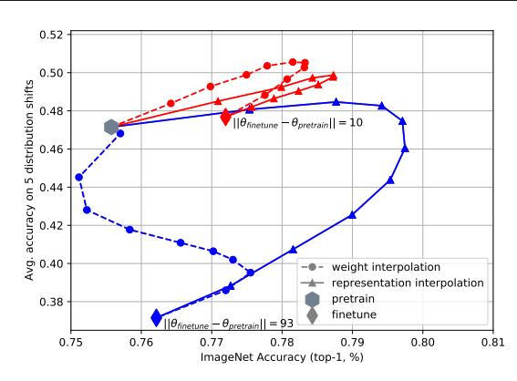

Figure 1. Interpolating pre-trained and fine-tuned weights approximates the interpolation of the pretrained and fine-tuned model representations. With mild fine-tuning (red), interpolating the model weights (dashed line) or interpolating the representation layers (solid line) follow similar trajectories. This property breaks down when one increases the number of fine-tuning iterations, often at the expense of performance (blue).

residual block, and

$$\Phi_{\text{dropout}}(x) = \frac{m(\lambda)}{1-\lambda} \odot \Phi(x),$$

where  $\odot$  represents the component-wise product and  $m(\lambda)$  is a vector of random Bernoulli variables equal to 0 with probability  $\lambda$  and 1 with probability  $1-\lambda$ .

This additive decomposition of  $\Phi(x)$  makes clear that applying dropout to  $\Phi(x)$  simultaneously blocks the contributions  $\phi_i(x)$  of all residual blocks. Applying dropout after each residual block would additionally affect the inputs of the successive  $f_i$ , but would also greatly increase the number of dropout parameters and potentially obfuscate the experimental results.

#### 3.2. The linear perspective

The purpose of this section is to investigate why we can fine tune with dropout levels that would irremediably stall the optimization process if we were training from scratch.

Recall that our initial model has been pre-trained on a dataset substantially larger than the fine-tuning datasets. Solid empirical evidence (Ramé et al., 2022b; Wortsman et al., 2022b) shows that one can interpolate the output of a mixture of the original and fine-tuned models by merely averaging their weights in the same proportions (Figure 1). This so-called "linear connectivity" property means that the fine-tuning operation is well described by a first order approximation.

$$\Phi(x; w) = \Phi(x; w_0) + \left[\frac{\partial \Phi(x; w_0)}{\partial w}\right] (w - w_0)$$

Such a first-order approximation of fine-tuning can be im-

plemented with a linear layer that takes both  $\Phi(x; w_0)$  and the gradients  $[\partial \Phi(x; w_0)/\partial w]$  as inputs (see variants of this idea in Maddox et al., 2021; Mu et al., 2019; Jaakkola & Haussler, 1998).

Evci et al. (2022) recognize that this linear approximation means that fine-tuning does not construct new representations but merely exploits the existing ones, perhaps in a manner similar to neural networks operating in the lazy regime (Chizat et al., 2020). With substantial sparsity regularization, they show that training a linear layer that takes all the internal network representations as inputs matches or exceeds the regular fine-tuning performance.

Residual networks with ReLU units provide an additional opportunity to simplify this model. We can express the coefficients of the gradient matrix  $[\partial\Phi(x;w_0)/\partial w]$  using the path decomposition of Neyshabur et al. (2015). Since the weight coefficients must be much smaller than 1 in order to obtain roughly normalized activations, the gradient decomposition is dominated by the shorter paths that involve skip-connections. Skip-connections follow a very regular pattern because they only connect representation units with the same indices within their layer. Therefore we propose to approximate fine tuning using a linear layer applied to an adapted representation  $\tilde{\Phi}(x;w_0)$ :

$$\tilde{\Phi}(x; w_0) = v_0 \odot \phi_0(x; w_0) + v_1 \odot \phi_1(x; w_0) + \dots y = V \, \tilde{\Phi}(x; w_0) + b.$$
(1)

We then train the coefficient vectors  $v_i$  together with the weight matrix V,b of the linear layer. This approximation is attractive because applying dropout to the adapted representation  $\tilde{\Phi}(x;w_0)$  becomes the linear counterpart to applying dropout to  $\Phi(x;w)$  during ordinary fine-tuning. Experimental comparisons of these two approaches are provided later in this paper (Figures 9 and 10).

Using dropout in a nonlinear deep network introduces a very complicated noise which, at high levels, can easily prevent the formation of internal representation. Dropout in linear systems is a much milder regularization, analytically related to L2 regularization (Srivastava et al., 2014). Therefore we can reliably use very high dropout levels during fine-tuning as long as it can be well approximated by linear training, that is, as long as fine tuning merely exploits existing representations but does not need to create new ones.

## 4. Experiments

We perform most experiments using domain adaptation datasets that are part of the DOMAINBED suite1 (Gulrajani & Lopez-Paz, 2020), namely PACS (Li et al., 2017), VLCS (Fang et al., 2013), OFFICE HOME (Venkateswara et al., 2017), and TERRA INCOGNITA (Beery et al., 2018).

1https://github.com/facebookresearch/Doma\ninBed

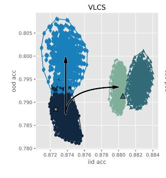

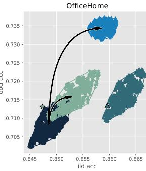

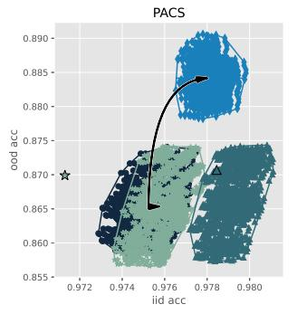

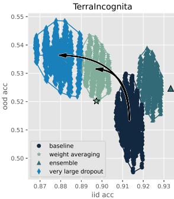

Figure 2. Performance comparison between very large dropout, ensembles, and weight averaging methods on four DOMAINBED tasks. The horizontal axis denotes the i.i.d. performance and the vertical axis the o.o.d. performance. Baseline results were obtained using plain fine-tuning with different hyperparameters ( $1296 \times \blacksquare$ ). Weight averaging results either average the model weights collected every 300 iterations along each fine-tuning trajectory ( $1296 \times \bigstar$ ) or the final model weights of all fine-tuning trajectories ( $1 \times \bigstar$ ) as in (Ramé et al., 2022b). Ensemble results average instead the model outputs ( $1296 \times \blacktriangle$ ). Finally, large dropout results were obtained like the baseline results but using a 90% dropout rate on the penultimate layer ( $1296 \times \spadesuit$ ).

These datasets contain 9,991 to 24,788 examples and therefore are substantially smaller than the pre-training dataset IMAGENET with 1.2M examples. We also use the larger DOMAINNET dataset (Peng et al., 2019), 0.58M examples, to show that "linear connectivity" breaks down when the fine-tuning dataset size is comparable with the pre-training dataset size and justifies carrying out many more fine-tuning iterations.

Each of these datasets is divided into four sub-datasets that share the same target label categories but follow a different distribution. For example, one sub-dataset of PACS contains simple sketch images of 'dog' and 'elephant', while another sub-dataset contains real photos of 'dog' and 'elephant'. This makes it possible to conveniently evaluate o.o.d. performance by fine-tuning on three sub-datasets and testing on the fourth one.

Unless otherwise stated, all fine-tunings are performed on a IMAGENET pretrained RESNET50² neural network. Compared to the original RESNET50 recipe of He et al. (2016), this RESNET50 is pre-trained with substantial data augmentation techniques, such as TRIVIALAUGMENT (Müller & Hutter, 2021), CUTMIX (Yun et al., 2019), and RANDOM ERASINGS (Zhong et al., 2020). These augmentations mimic the properties of large foundational models that learn substantial diverse features using very large and diverse pre-training data.

#### 4.1. Very large dropout yields better o.o.d. performance

Using these same datasets, Gulrajani & Lopez-Paz (2020) argue that simple Empirical Risk Minimization (ERM) works almost as well and often better than carefully designed o.o.d.

training methods, such as CORAL (Sun & Saenko, 2016), MLDG (Li et al., 2018a), VREX (Krueger et al., 2021), and IRM (Arjovsky et al., 2019). However, Arpit et al. (2022); Cha et al. (2021); Ramé et al. (2022b;a) find that ensembling and weight averaging methods consistently outperform ERM in the o.o.d. fine-tuning scenario.

Figure 2 therefore compares the performance of these state-of-the-art methods with that of simply fine-tuning with a very large dropout.

- Baseline results are obtained by fine-tuning our RESNET50 using SGD with 0.9 momentum for 10,000 iterations. A 10% learning rate decay is applied at  $5000^{th}$  iterations. For each choice of three training subdatasets, we repeat three experiments for each combination of learning rate in  $\{10^{-3}, 5.10^{-4}\}$  and L2 weight decay in  $\{10^{-4}, 5.10^{-5}, 10^{-5}\}$ . We measure the i.i.d. performance using 20% examples held from the training data, and we measure o.o.d. performance on the fourth sub-dataset. There are then  $(2\times3)^4=1296$  ways to average four of these results, one for each of the four possible choices of the training subsets, yielding  $1296\times \bullet$ .
- **Dropout** results are obtained using the same protocol but using a 90% dropout rate on the penultimate layer representation, yielding 1296×◆.
- Ensemble results are obtained in two ways, either using an ensemble of checkpoints collected along each fine-tuning trajectory, yielding 1296 × ▲, or using the ensemble of the final checkpoints collected along all fine-tuning trajectories with different hyper-parameters, yielding a single ▲.
- Weight averaging results approximate the corresponding ensembling results by averaging the model

 $^2$ https://pytorch.org/blog/how-to-train-state-of-the-art-models-using-torchvision-latest-primitives/

weights insted of averaging the model outputs, yielding 1296×⋆ and a single ⋆.

As expected, both ensemble methods [\(Ueda & Nakano,](#page-10-14) [1996;](#page-10-14) [Dietterich,](#page-8-18) [2000\)](#page-8-18) and their weight averaging approximation [\(Rame et al.](#page-10-3) ´ , [2022b;](#page-10-3) [Wortsman et al.,](#page-10-7) [2022a\)](#page-10-7) improve both the i.i.d. and o.o.d. baseline performances. However, fine-tuning with a very large dropout outperforms the o.o.d. performance of both ensemble and weight averaging methods. There is even a large gap between the worst dropout results and the best ensemble results for the OF-FICE HOME and PACS datasets. On the other hand, the i.i.d. performance of the large dropout method lags behind that of ensembles. This shows that the o.o.d. performance of the large dropout method is not a secondary effect of an i.i.d. performance improvement.

## 4.1.1. OPTIMAL O.O.D. DROPOUT RATE

220 221

224

226

228

230 231

234 235 236

238

253 254

256

258

260 261

264

266

268

270 271

274

To the best of our knowledge, such large dropout rates (90% and above) are considered unsuitable for training a network from scratch and have not been previously used for fine-tuning either. This section illustrates how the optimal dropout rate can be very high in fine-tuning scenarios and falls to small values when one gets closer to training the network from scratch.

Figure [3](#page-5-0) compares various dropout rates on the four DO-MAINBED tasks. The optimal dropout rate for o.o.d. performance ranges from 90% to 95% for VLCS and PACS (10k examples). It seems slightly smaller, about 90%, for the slighlty larger datassets OFFICE HOME and TERRA INCOGNITA (15k to 25k examples).

The larger the fine-tuning dataset, the more fine-tuning iteration we can make without overfitting. When the fine-tuning dataset size approaches the pre-training dataset size, the difference between fine-tuning and training from scratch becomes less clear, the linear connectivity property disappears, the linear approximation perspective on fine-tuning no longer holds, and the optimal dropout rate falls sharply. Figure [4](#page-5-1) illustrates this effect using the larger DOMAIN-NET dataset [\(Peng et al.,](#page-9-13) [2019\)](#page-9-13) that contains 586k examples (almost half as big as IMAGENET) and requires 30, 000 fine-tuning iterations.

Figure [5](#page-5-2) shows the effect of various dropout rates when one trains a network on the VLCS task from scratch, that is starting from a randomly initialized network instead of a pre-trained one. The optimal dropout rate falls to about zero. Dropout rates higher than 50% have a negative impact on both the i.i.d. and the o.o.d. performance of the network. This suggests again that high dropout rates make it difficult to create new features (a nonlinear operation), but does not prevent leveraging existing features that were possibly buried in the network inner layers (a linear operation).

### 4.2. Popular fine-tuning techniques do not substantially improve the o.o.d. performance of large dropouts

Various fine-tuning techniques have been proposed to improve the fine-tuning ability to leverage the representations learned by a pre-trained model, such as using a larger learning rate on the last layer [\(Caron et al.,](#page-8-19) [2020;](#page-8-19) [Bardes](#page-8-20) [et al.,](#page-8-20) [2021;](#page-8-20) [Kumar et al.,](#page-9-18) [2022\)](#page-9-18) or, as discussed above, using weight averaging and ensemble methods [\(Rame et al.](#page-10-3) ´ , [2022b;](#page-10-3)[a;](#page-9-0) [Arpit et al.,](#page-8-16) [2022\)](#page-8-16). We show in this section that using these techniques *in addition to very large dropout rates* do not yield much o.o.d. performance improvements over using large dropout rates alone. Note that we still expect some incremental benefits because both weight averaging and ensembles reduce the stochastic optimization noise and accelerate training in general [\(Polyak & Juditsky,](#page-9-19) [1992\)](#page-9-19).

#### 4.2.1. LARGE LEARNING RATES FOR THE LAST LAYER

Several authors routinely use a larger training rate on the last layer on the intuition that fine-tuning a pre-trained deep network on a different target task entails training a new last layer from scratch [\(Caron et al.,](#page-8-19) [2020;](#page-8-19) [Bardes et al.,](#page-8-20) [2021;](#page-8-20) [Kumar et al.,](#page-9-18) [2022\)](#page-9-18).

Figure [6](#page-6-0) is similar to Figure [2](#page-3-1) but uses a 10× larger training rate for the last layer classifier. Comparing these two figures shows that using this 10× larger last layer training rate yields small or zero incremental improvements over only using a large dropout rate, but also that using a large dropout rate vastly improves the o.o.d. performance of merely using the increased learning rate.

## 4.2.2. ENSEMBLE AND WEIGHT AVERAGING

Figure [7](#page-6-1) similarly explores the incremental benefits achieved by constructing ensembles or by averaging the weights of models fine-tuned with very large dropouts. The incremental improvements in o.o.d. performance achieved by these methods, if any, are much smaller than the improvement achieved by large dropout rates alone. Comparing Figures [2](#page-3-1) and [7](#page-6-1) also shows that in contrast, fine-tuning with large dropout rates before computing ensembles or averaging model weights brings large o.o.d. performance improvements over fine-tuning without dropout.

### 4.3. Linear fine-tuning

Section [3.2](#page-2-2) explorers linear approximations of the finetuning process and proposes a compact linear formulation [\(1\)](#page-2-3) that is not only useful to understand what fine-tuning does, but can also be practically appealing. Whereas the previous sections discussed the use of large dropout rate in the normal fine-tuning process, this section instead implements the linear model [\(1\)](#page-2-3) to fine-tune an IMAGENET pre-trained RESNET50 on the VLCS dataset. We expect

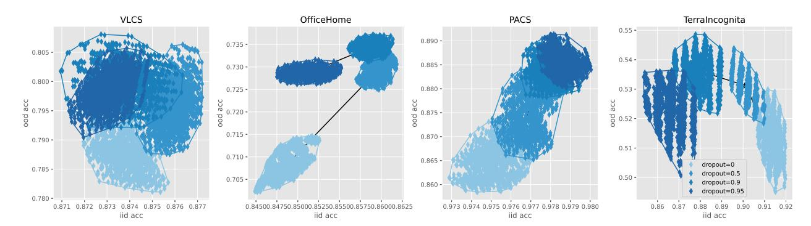

Figure 3. Effect of diverse dropout rates during fine-tuning. The best o.o.d. performances are attained using rates around or above 90%.

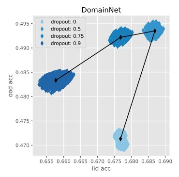

Figure 4. Comparison of various dropout rates on the larger DO-MAINNET dataset (586K examples), whose size approaches the pretraining dataset size (IMAGENET, 1.2M examples). The optimal dropout rate falls to about 50%, a value comparable to the dropout rates traditionally used when training from scratch.

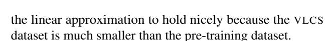

Although the RESNET50 architecture is the archetypal residual network, its residual blocks are sometimes separated by a special layer that halves the spatial resolution and doubles the number of channels. In order to remain as close as possible to the formulation of our linear approximation (1), we only the three residual blocks that follow the last resolution changing operation. These three blocks operate on  $7 \times 7$  images with 2048 channels. The final classification layer takes 2048 inputs after average-pooling the  $7 \times 7$ pixels of the last block output. In order to apply our linear model (1), we average-pool and normalize the outputs of each of the last three residual blocks, yielding three 2048dimensional vectors  $\phi_l$ ,  $\phi_{l-1}$ , and  $\phi_{l-2}$ . We compute the adapted representation  $\Phi$  by summing these three vectors after multiplying them element-wise by three parameter vectors  $v_l$ ,  $v_{l-1}$ , and  $v_{l-1}$ , and feed into a linear layer,

$$\tilde{\Phi} = v_l \odot \phi_l + v_{l-1} \odot \phi_{l-1} + v_{l-2} \odot \phi_{l-2}$$

$$y = V\tilde{\Phi} + b$$

We train the parameter v, V, b using the same protocol and

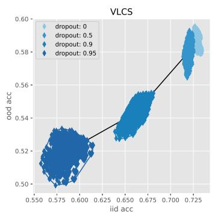

Figure 5. Comparison of dropout rates when training a RESNET50 network from scratch on the VLCS dataset. The optimal dropout rate falls to about zero. Dropout rates greater than 50% negatively impact both the i.i.d. and the o.o.d. performances.

hyper-parameters as section 4.1 except for bolder L2 weight decay parameters searched in  $\{10^{-2},5.10^{-3}\}$  instead of  $\{10^{-4},5.10^{-5},10^{-5}\}$ . The normal fine-tuning experiments must indeed use milder L2 regularization to avoid damaging the pre-trained features. We call this method *linear fine-tuning* because it computes a linear transformation of the residual block outputs, albeit one constrained by the sparse two layer structure of its parameters.

Figure 9 compares the i.i.d. and o.o.d. performance of regular fine-tuning and linear fine-tuning on the VLCS dataset using various dropout rates. Linear fine-tuning yields competitive o.o.d. performance but seems to lag behind in i.i.d. performance. This happens because, following Gulrajani & Lopez-Paz (2020), we determine the optimal number of fine-tuning iterations according to the i.i.d. validation accuracty. Figure 10 in the appendix provides a comparison without this selection protocol.

#### 4.4. Richer pre-training beats sophisticated fine-tuning

We have demonstrated that the very-large dropout method delivers consistently better o.o.d. performance than computing ensembles or weight-averages of models fine-tuned without dropout. However we also have argued that fine-

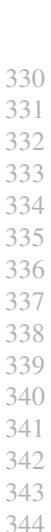

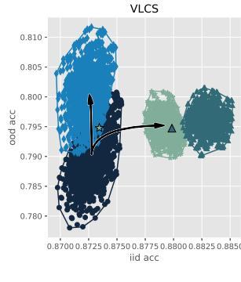

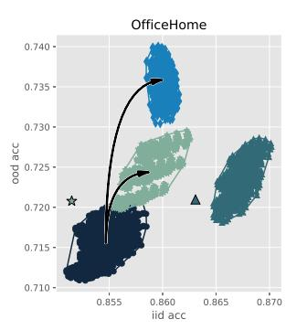

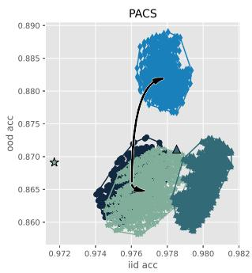

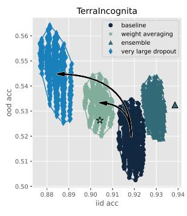

Figure 6. Same as Figure 2 except for a  $10 \times$  larger training rate in the last layer. Comparing these two figures shows that using a larger last layer training rate yields small or zero incremental improvements over only using a large dropout rate, but also that using a large dropout rate vastly improves the o.o.d. performance of merely using the increased learning rate.

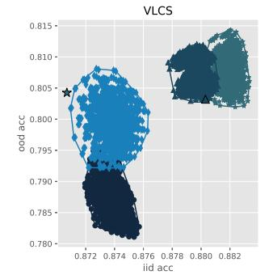

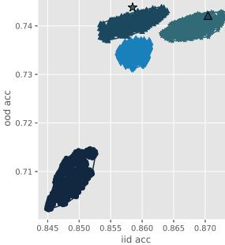

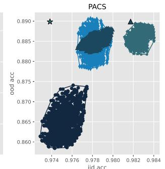

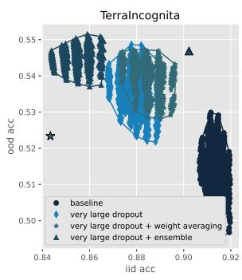

Figure 7. Incremental benefits achieved by constructing ensembles or by averaging the weights of models fine-tuned with very large dropouts. The baseline  $(1296 \times \bullet)$  and dropout  $(1296 \times \bullet)$  results are the same as those reported in Figure 2. In contrast, the ensemble  $(1296 \times \blacktriangle)$  and  $(1296 \times \blacktriangle)$  and  $(1296 \times \blacktriangle)$  and  $(1296 \times \blacktriangle)$  results are now obtained by averaging the output or the weights of models fine-tuned with large dropouts. Ensemble and weight averaging techniques provide a marginal o.o.d. performance improvement on VLCS or OFFICE HOME and a negligible o.o.d. performance improvement on PACS or TERRA INCOGNITA.

tuning does not create new representations but merely exploits the representations already present in the pre-trained model. Therefore the final o.o.d. performance of this fine-tuning process must strongly depend on the quality and the diversity of the features present in the pre-trained network, even if these features are not exploited by the pre-trained network but buried in its hidden layers.

To validate this assertion, we compare the i.i.d. and o.o.d. performance obtained by various methods applied to RESNET50 networks pre-trained using the same IMAGENET data but using different data augmentation schemes. As explained in the first paragraphs of section 4, the results reported so far use a network pre-trained using a broad array of data augmentation techniques, termed RESNET #2. We now compare its fine-tuning properties with network termed RESNET #1 pre-trained using the simpler protocol described in He et al. (2016).

Figure 8 compares the i.i.d. and o.o.d. performances of both networks after regular fine-tuning and after fine-tuning with all the available tricks, that is, with dropout, with  $10 \times$  larger last layer learning rate, and after averaging the weights of

checkpoints collected along the fine-tuning trajectory. This comparison makes clear that the quality of the pre-trained representation matters more than the sophistication of the fine-tuning techniques. This is consistent with the idea that fine-tuning only leverages the existing features of the pre-trained network and does not create new ones.

#### 5. Discussion

The o.o.d. performance of fine-tuning with very large dropout consistently exceeds that achieved by popular techniques such as ensemble and by more recent techniques such as weight averaging. Furthermore, ensemble and weight averaging techniques only bring a small incremental improvement when applied on top of fine-tuning with large dropout rates. This suggests that very large dropout implements a key factor that favors o.o.d. performance, which we believe is related to seeking features of type (a) among features of type (b) as explained in the introduction.

Ensemble and weight-averaging techniques are well understood in the i.i.d. scenario. Both techniques can be used for both training a network from scratch and for fine-tuning.

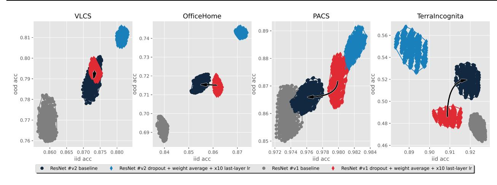

Figure 8. Comparison of the i.i.d. and o.o.d. performances obtained after fine-tuning two pre-trained networks: RESNET #1 and RESNET #2. Compared with RESNET50 #1 (He et al., 2016), RESNET #2 was pre-trained with the vast array of data augmentation techniques. For each of these two pre-trained networks, circles represent the results obtained with naive fine-tuning, and diamonds (♠, ♠) represent the results obtained with advanced fine-tuning techniques, that is, large dropout (90%), weight averaging, and increased last-layer learning rate. The results obtained with the richer RESNET #2 dominate those obtained with RESNET #1. In 3 out of 4 datasets, advanced fine-tuning techniques on RESNET #1 (♠) barely match the performance of naive fine-tuning on RESNET #2 (♠).

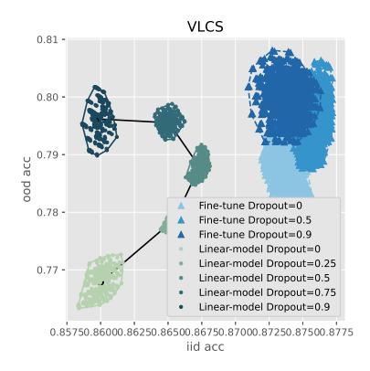

Figure 9. Linear fine-tuning versus fine-tuning on the VLCS dataset. Linear fine-tuning yields competitive o.o.d. performance but seems to lag behind in i.i.d. performance. This happens in fact because we follow Gulrajani & Lopez-Paz (2020) and determine the optimal number of fine-tuning iterations according to the i.i.d. validation accuracy. This procedure of course favors the i.i.d. accuracy of normal fine-tuning. Without this i.i.d.-biased selection of the number of training iteration, linear fine-tuning matches the lesser performance of regular fine-tuning in both i.i.d. and o.o.d. performance, as shown in Figure 10 in the appendix.

In contrast, it is practically useless to train a network from scratch with such very large dropout rates. We argue that very large dropout only works during fine-tuning because fine-tuning can in fact be well approximated by a linear process that can leverage the existing or buried features of a pre-trained network but cannot create new ones. In such a linear process, using large dropout rates is akin to a form of L2 regularization, expressing a richer set of features even if redundant.

This result also illustrates how the i.i.d. and o.o.d. scenarios can call for very different techniques. It is well known that sparse representations can be very helpful in the i.i.d. scenario, and it is increasingly clear that rich representations are preferable in the o.o.d. scenario (Zhang et al., 2022; Zhang & Bottou, 2023; Chen et al., 2023). There are no reasons to expect this to be a lone exception.

For instance, training with stochastic gradient and momentum is not only justified as a method to accelerate optimization, but also as a method that can seek a flatter minimum and achieve better i.i.d. generalization (Keskar et al., 2016; He et al., 2019). However the outcome might be different in an o.o.d. scenario.

#### **Impact Statement**

This work researches machine learning methods without any particular application in mind. We do not anticipate any specific societal impact besides the societal impact of machine learning in general.

## References

- Andriushchenko, M., Varre, A. V., Pillaud-Vivien, L., and Flammarion, N. Sgd with large step sizes learns sparse features. In *International Conference on Machine Learning*, pp. 903–925. PMLR, 2023.
- Arjovsky, M., Bottou, L., Gulrajani, I., and Lopez-Paz, D. Invariant risk minimization. *arXiv preprint arXiv:1907.02893*, 2019.
- Arpit, D., Wang, H., Zhou, Y., and Xiong, C. Ensemble of averages: Improving model selection and boosting performance in domain generalization. *Advances in Neural Information Processing Systems*, 35:8265–8277, 2022.
- Barbu, A., Mayo, D., Alverio, J., Luo, W., Wang, C., Gutfreund, D., Tenenbaum, J., and Katz, B. Objectnet: A large-scale bias-controlled dataset for pushing the limits of object recognition models. *Advances in neural information processing systems*, 32, 2019.
- Bardes, A., Ponce, J., and LeCun, Y. Vicreg: Varianceinvariance-covariance regularization for self-supervised learning. *arXiv preprint arXiv:2105.04906*, 2021.
- Beery, S., Van Horn, G., and Perona, P. Recognition in terra incognita. In *Proceedings of the European conference on computer vision (ECCV)*, pp. 456–473, 2018.
- Bilen, H. and Vedaldi, A. Universal representations: The missing link between faces, text, planktons, and cat breeds. *arXiv preprint arXiv:1701.07275*, 2017.
- Blanc, G., Gupta, N., Valiant, G., and Valiant, P. Implicit regularization for deep neural networks driven by an ornsteinuhlenbeck like process. In *Conference on learning theory*, pp. 483–513. PMLR, 2020.
- Bommasani, R., Hudson, D. A., Adeli, E., al. Russ Altman, Arora, S., von Arx, S., Bernstein, M. S., Bohg, J., Bosselut, A., Brunskill, E., Brynjolfsson, E., Buch, S., Card, D., Castellon, R., Chatterji, N. S., Chen, A. S., Creel, K., Davis, J. Q., Demszky, D., Donahue, C., Doumbouya, M., Durmus, E., Ermon, S., Etchemendy, J., Ethayarajh, K., Fei-Fei, L., Finn, C., Gale, T., Gillespie, L., Goel, K., Goodman, N. D., Grossman, S., Guha, N., Hashimoto, T., Henderson, P., Hewitt, J., Ho, D. E., Hong, J., Hsu, K., Huang, J., Icard, T., Jain, S., Jurafsky, D., Kalluri, P., Karamcheti, S., Keeling, G., Khani, F., Khattab, O., Koh, P. W., Krass, M. S., Krishna, R., Kuditipudi, R., and et al. On the opportunities and risks of foundation models. *CoRR*, abs/2108.07258, 2021a. URL <https://arxiv.org/abs/2108.07258>.
- Bommasani, R., Hudson, D. A., Adeli, E., Altman, R., Arora, S., von Arx, S., Bernstein, M. S., Bohg, J., Bosselut, A., Brunskill, E., et al. On the opportunities and risks

- of foundation models. *arXiv preprint arXiv:2108.07258*, 2021b.
- Bottou, L. From machine learning to machine reasoning. Technical report, arXiv:1102.1808, February 2011.
- Caron, M., Misra, I., Mairal, J., Goyal, P., Bojanowski, P., and Joulin, A. Unsupervised learning of visual features by contrasting cluster assignments. *Advances in neural information processing systems*, 33:9912–9924, 2020.
- Cha, J., Chun, S., Lee, K., Cho, H.-C., Park, S., Lee, Y., and Park, S. Swad: Domain generalization by seeking flat minima. *Advances in Neural Information Processing Systems*, 34:22405–22418, 2021.
- Chen, T., Kornblith, S., Norouzi, M., and Hinton, G. A simple framework for contrastive learning of visual representations. In *International conference on machine learning*, pp. 1597–1607. PMLR, 2020.
- Chen, Y., Huang, W., Zhou, K., Bian, Y., Han, B., and Cheng, J. Towards understanding feature learning in out-of-distribution generalization. *arXiv preprint arXiv:2304.11327*, 2023.
- Chizat, L., Oyallon, E., and Bach, F. On lazy training in differentiable programming, 2020.
- Chowdhury, A., Jiang, M., Chaudhuri, S., and Jermaine, C. Few-shot image classification: Just use a library of pre-trained feature extractors and a simple classifier. In *Proceedings of the IEEE/CVF International Conference on Computer Vision*, pp. 9445–9454, 2021.
- Collobert, R., Weston, J., Bottou, L., Karlen, M., Kavukcuoglu, K., and Kuksa, P. Natural language processing (almost) from scratch. *Journal of Machine Learning Research*, 12:2493–2537, Aug 2011.
- Dietterich, T. G. Ensemble methods in machine learning. In *International workshop on multiple classifier systems*, pp. 1–15. Springer, 2000.
- Dvornik, N., Schmid, C., and Mairal, J. Selecting relevant features from a multi-domain representation for few-shot classification. In *European Conference on Computer Vision*, pp. 769–786. Springer, 2020.
- Evci, U., Dumoulin, V., Larochelle, H., and Mozer, M. C. Head2toe: Utilizing intermediate representations for better transfer learning. In *International Conference on Machine Learning*, pp. 6009–6033. PMLR, 2022.
- Fang, C., Xu, Y., and Rockmore, D. N. Unbiased metric learning: On the utilization of multiple datasets and web images for softening bias. In *Proceedings of the IEEE International Conference on Computer Vision*, pp. 1657– 1664, 2013.

495 496 497 498 Frankle, J., Dziugaite, G. K., Roy, D., and Carbin, M. Linear mode connectivity and the lottery ticket hypothesis. In *International Conference on Machine Learning*, pp. 3259– 3269. PMLR, 2020.

499 500

504

506

514 515 516

524 525 526

528

530 531

534

536

538

- Gontijo-Lopes, R., Dauphin, Y., and Cubuk, E. D. No one representation to rule them all: Overlapping features of training methods. *arXiv preprint arXiv:2110.12899*, 2021.
- Gulrajani, I. and Lopez-Paz, D. In search of lost domain generalization. *arXiv preprint arXiv:2007.01434*, 2020.
- He, F., Liu, T., and Tao, D. Control batch size and learning rate to generalize well: Theoretical and empirical evidence. In Wallach, H., Larochelle, H., Beygelzimer, A., d'Alche-Buc, F., Fox, E., and Garnett, R. ´ (eds.), *Advances in Neural Information Processing Systems*, volume 32. Curran Associates, Inc., 2019. URL [https://proceedings.neurips.cc/paper](https://proceedings.neurips.cc/paper_files/paper/2019/file/dc6a70712a252123c40d2adba6a11d84-Paper.pdf) [\\_files/paper/2019/file/dc6a70712a252](https://proceedings.neurips.cc/paper_files/paper/2019/file/dc6a70712a252123c40d2adba6a11d84-Paper.pdf) [123c40d2adba6a11d84-Paper.pdf](https://proceedings.neurips.cc/paper_files/paper/2019/file/dc6a70712a252123c40d2adba6a11d84-Paper.pdf).
- He, K., Zhang, X., Ren, S., and Sun, J. Deep residual learning for image recognition. In *Proceedings of the IEEE conference on computer vision and pattern recognition*, pp. 770–778, 2016.
- Hendrycks, D., Basart, S., Mu, N., Kadavath, S., Wang, F., Dorundo, E., Desai, R., Zhu, T., Parajuli, S., Guo, M., et al. The many faces of robustness: A critical analysis of out-of-distribution generalization. In *Proceedings of the IEEE/CVF International Conference on Computer Vision*, pp. 8340–8349, 2021a.
- Hendrycks, D., Zhao, K., Basart, S., Steinhardt, J., and Song, D. Natural adversarial examples. In *Proceedings of the IEEE/CVF Conference on Computer Vision and Pattern Recognition*, pp. 15262–15271, 2021b.
- Izmailov, P., Podoprikhin, D., Garipov, T., Vetrov, D., and Wilson, A. G. Averaging weights leads to wider optima and better generalization. *arXiv preprint arXiv:1803.05407*, 2018.
- Jaakkola, T. and Haussler, D. Exploiting generative models in discriminative classifiers. *Advances in neural information processing systems*, 11, 1998.
- Keskar, N. S., Mudigere, D., Nocedal, J., Smelyanskiy, M., and Tang, P. T. P. On large-batch training for deep learning: Generalization gap and sharp minima. *arXiv preprint arXiv:1609.04836*, 2016.
- Krueger, D., Caballero, E., Jacobsen, J.-H., Zhang, A., Binas, J., Zhang, D., Le Priol, R., and Courville, A. Outof-distribution generalization via risk extrapolation (rex). In *International Conference on Machine Learning*, pp. 5815–5826. PMLR, 2021.

- Kumar, A., Raghunathan, A., Jones, R., Ma, T., and Liang, P. Fine-tuning can distort pretrained features and underperform out-of-distribution. *arXiv preprint arXiv:2202.10054*, 2022.
- Li, D., Yang, Y., Song, Y.-Z., and Hospedales, T. M. Deeper, broader and artier domain generalization. In *Proceedings of the IEEE international conference on computer vision*, pp. 5542–5550, 2017.
- Li, D., Yang, Y., Song, Y.-Z., and Hospedales, T. Learning to generalize: Meta-learning for domain generalization. In *Proceedings of the AAAI conference on artificial intelligence*, volume 32, 2018a.
- Li, H., Xu, Z., Taylor, G., Studer, C., and Goldstein, T. Visualizing the loss landscape of neural nets. *Advances in neural information processing systems*, 31, 2018b.
- Li, W.-H., Liu, X., and Bilen, H. Universal representation learning from multiple domains for few-shot classification. In *Proceedings of the IEEE/CVF International Conference on Computer Vision*, pp. 9526–9535, 2021.
- Li, W.-H., Liu, X., and Bilen, H. Universal representations: A unified look at multiple task and domain learning. *arXiv preprint arXiv:2204.02744*, 2022.
- Maddox, W., Tang, S., Moreno, P., Wilson, A. G., and Damianou, A. Fast adaptation with linearized neural networks. In *International Conference on Artificial Intelligence and Statistics*, pp. 2737–2745. PMLR, 2021.
- Mu, F., Liang, Y., and Li, Y. Gradients as features for deep representation learning. In *International Conference on Learning Representations*, 2019.
- Muller, S. G. and Hutter, F. Trivialaugment: Tuning-free ¨ yet state-of-the-art data augmentation. In *Proceedings of the IEEE/CVF international conference on computer vision*, pp. 774–782, 2021.
- Neyshabur, B., Salakhutdinov, R., and Srebro, N. Path-sgd: Path-normalized optimization in deep neural networks, 2015.
- Peng, X., Bai, Q., Xia, X., Huang, Z., Saenko, K., and Wang, B. Moment matching for multi-source domain adaptation. In *Proceedings of the IEEE International Conference on Computer Vision*, pp. 1406–1415, 2019.
- Polyak, B. T. and Juditsky, A. B. Acceleration of stochastic approximation by averaging. *SIAM Journal on Control and Optimization*, 30(4):838–855, 1992. doi: 10.1137/03 30046.
- Rame, A., Ahuja, K., Zhang, J., Cord, M., Bottou, ´ L., and Lopez-Paz, D. Recycling diverse models

550 551 for out-of-distribution generalization. *arXiv preprint arXiv:2212.10445*, 2022a.

554

556

558

560 561

570 571

574

576

594

- Rame, A., Kirchmeyer, M., Rahier, T., Rakotomamonjy, A., ´ Gallinari, P., and Cord, M. Diverse weight averaging for out-of-distribution generalization. *Advances in Neural Information Processing Systems*, 35:10821–10836, 2022b.
- Recht, B., Roelofs, R., Schmidt, L., and Shankar, V. Do imagenet classifiers generalize to imagenet? In *International conference on machine learning*, pp. 5389–5400. PMLR, 2019.
- Sharif Razavian, A., Azizpour, H., Sullivan, J., and Carlsson, S. Cnn features off-the-shelf: an astounding baseline for recognition. In *Proceedings of the IEEE conference on computer vision and pattern recognition workshops*, pp. 806–813, 2014.
- Srivastava, N., Hinton, G., Krizhevsky, A., Sutskever, I., and Salakhutdinov, R. Dropout: a simple way to prevent neural networks from overfitting. *The journal of machine learning research*, 15(1):1929–1958, 2014.
- Sun, B. and Saenko, K. Deep coral: Correlation alignment for deep domain adaptation. In *Computer Vision–ECCV 2016 Workshops: Amsterdam, The Netherlands, October 8-10 and 15-16, 2016, Proceedings, Part III 14*, pp. 443– 450. Springer, 2016.
- Ueda, N. and Nakano, R. Generalization error of ensemble estimators. In *Proceedings of International Conference on Neural Networks (ICNN'96)*, volume 1, pp. 90–95 vol.1, 1996. doi: 10.1109/ICNN.1996.548872.
- Veit, A., Wilber, M. J., and Belongie, S. Residual networks behave like ensembles of relatively shallow networks. *Advances in neural information processing systems*, 29, 2016.
- Venkateswara, H., Eusebio, J., Chakraborty, S., and Panchanathan, S. Deep hashing network for unsupervised domain adaptation. In *Proceedings of the IEEE conference on computer vision and pattern recognition*, pp. 5018–5027, 2017.
- Wang, H., Ge, S., Lipton, Z., and Xing, E. P. Learning robust global representations by penalizing local predictive power. *Advances in Neural Information Processing Systems*, 32, 2019.
- Wang, H., Frank, E., Pfahringer, B., Mayo, M., and Holmes, G. Cross-domain few-shot meta-learning using stacking. *arXiv preprint arXiv:2205.05831*, 2022.
- Wortsman, M., Ilharco, G., Gadre, S. Y., Roelofs, R., Gontijo-Lopes, R., Morcos, A. S., Namkoong, H.,

- Farhadi, A., Carmon, Y., Kornblith, S., et al. Model soups: averaging weights of multiple fine-tuned models improves accuracy without increasing inference time. In *International Conference on Machine Learning*, pp. 23965–23998. PMLR, 2022a.
- Wortsman, M., Ilharco, G., Kim, J. W., Li, M., Kornblith, S., Roelofs, R., Lopes, R. G., Hajishirzi, H., Farhadi, A., Namkoong, H., et al. Robust fine-tuning of zero-shot models. In *Proceedings of the IEEE/CVF Conference on Computer Vision and Pattern Recognition*, pp. 7959– 7971, 2022b.
- Yu, Y., Yang, C.-H. H., Kolehmainen, J., Shivakumar, P. G., Gu, Y., Ren, S. R. R., Luo, Q., Gourav, A., Chen, I.-F., Liu, Y.-C., et al. Low-rank adaptation of large language model rescoring for parameter-efficient speech recognition. In *2023 IEEE Automatic Speech Recognition and Understanding Workshop (ASRU)*, pp. 1–8. IEEE, 2023.
- Yun, S., Han, D., Oh, S. J., Chun, S., Choe, J., and Yoo, Y. Cutmix: Regularization strategy to train strong classifiers with localizable features. In *Proceedings of the IEEE/CVF international conference on computer vision*, pp. 6023–6032, 2019.
- Zhang, J. and Bottou, L. Learning useful representations for shifting tasks and distributions. In *International Conference on Machine Learning*, pp. 40830–40850. PMLR, 2023.
- Zhang, J., Lopez-Paz, D., and Bottou, L. Rich feature construction for the optimization-generalization dilemma. In *International Conference on Machine Learning*, pp. 26397–26411. PMLR, 2022.
- Zhong, Z., Zheng, L., Kang, G., Li, S., and Yang, Y. Random erasing data augmentation. In *Proceedings of the AAAI conference on artificial intelligence*, volume 34, pp. 13001–13008, 2020.

# Fine-tuning with Very Large Dropout

Supplementary Material

## A. Experiment details

### 

## A.1. Representation interpolation in Figure 1

The representation interpolation and weight interpolation experiments are performed on CLIP3 pretrained VIT-B/32 model and IMAGENET fine-tuned VIT-B/32 model. Two fine-tuned VIT-B/32 models4 (red and blue in Figure 1) are adopted from Wortsman et al. (2022a). The red model ( $\blacklozenge$ ) is fine-tuned with a higher learning rate (10-4) and a longer training iteration (16 epochs), while the blue model  $(\bullet)$  is fine-tuned with a smaller learning rate  $(10^{-5})$  and a shorter training iteration (11 epochs).

Denote the feature extractor weights and last-linear layer weights of the pre-trained and fine-tuned models as:  $\theta_{pretrain}, \omega_{pretrain}$  and  $\theta_{finetune}, \omega_{finetune}$ , respectively, the penultimate layer representations as  $\Phi_{pretrain}$  and  $\Phi_{finetune}$ . Weight interpolation interpolates the model weights by  $\alpha\theta_{pretrain} + (1-\alpha)\theta_{finetune}, \alpha\omega_{pretraine} + (1-\alpha)\omega_{finetune}$ , where  $0 \le \alpha \le 1$ . Representation interpolation interpolates the penultimate layer representations and last-linear layer weights by  $\alpha \Phi_{pretrain} + (1 - \alpha) \Phi_{finetune}$ ,  $\alpha \omega_{pretraine} + (1 - \alpha) \omega_{finetune}$ .

Finally, we measure o.o.d. accuracy on 5 shifted distributions: IMAGENETA(Hendrycks et al., 2021b), IMAGENET-SCRATCH (Wang et al., 2019), IMAGENETR (Hendrycks et al., 2021a), IMAGENETV2 (Recht et al., 2019), OBJECTNET (Barbu et al., 2019).

## A.2. Fine-tuning DOMAINNET in Figure 4

The DOMAINNET o.o.d. fine-tuning experiment in Figure 4 follows the same pipeline as other o.o.d. fine-tuning experiments on VLCS, PACS, OFFICE HOME, and TERRA INCOGNITA datasets. Due to the larger size of DOMAINNET dataset, we use larger learning rates  $\{3.10^{-3}, 5.10^{-3}\}$  and a longer training iteration 30,000 with a 10% learning rate decay at 15,000 and 25,000.

## A.3. Scratch training in Figure 5

 The VLCS scratch training experiment in Figure 5 also follows the same pipeline as o.o.d. fine-tuning experiments. But it uses larger learning rates  $\{5.10^{-3}, 10^{-2}\}$  on a random initialized RESNET50 network (all weights are trainable).

#### **B.** Additional results

## B.1. Linear fine-tuning and fine-tuning comparison with a fix number of training iteration

Following (Gulrajani & Lopez-Paz, 2020), o.o.d. fine-tuning experiments in the main text determines the optimal number of fine-tuning iterations according the i.i.d. validation accuracy. Figure 10 instead compares linear fine-tuning and fine-tuning without the i.i.d. selection of training iterations. Under this setting, linear fine-tuning matches fine-tuning performances in both i.i.d. and o.o.d. scenarios.

> 3https://github.com/openai/CLIP

4https://github.com/mlfoundations/model-soups/

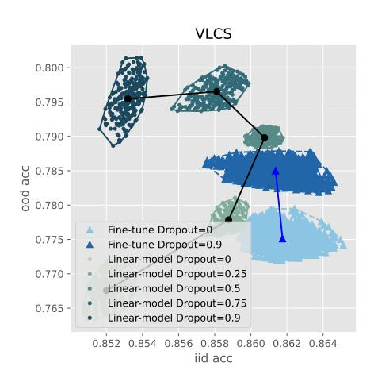

Figure 10. Linear model and fine-tuning comparison with the i.i.d. selection of training iterations.