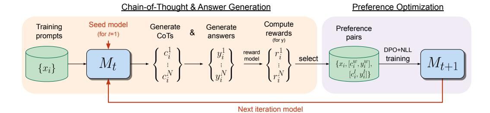
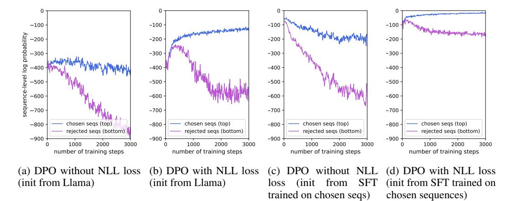
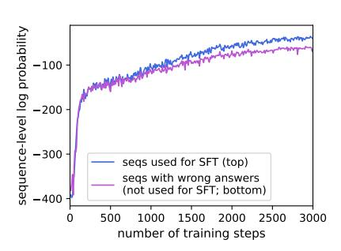

# Iterative Reasoning Preference Optimization

Richard Yuanzhe Pang1,2 Weizhe Yuan1,2 Sainbayar Sukhbaatar1 Kyunghyun Cho2 He He2 Jason Weston1,2

1FAIR at Meta 2New York University

### Abstract

Iterative preference optimization methods have recently been shown to perform well for general instruction tuning tasks, but typically make little improvement on reasoning tasks [\[Yuan et al.,](#page-7-0) [2024,](#page-7-0) [Chen et al.,](#page-6-0) [2024\]](#page-6-0). In this work we develop an iterative approach that optimizes the preference between competing generated Chain-of-Thought (CoT) candidates by optimizing for winning vs. losing reasoning steps that lead to the correct answer. We train using a modified DPO loss [\[Rafailov](#page-6-1) [et al.,](#page-6-1) [2023\]](#page-6-1) with an additional negative log-likelihood term, which we find to be crucial. We show reasoning improves across repeated iterations of this scheme. This results in increasing accuracy for Llama-2-70B-Chat from X to Y on GSM8k, and from X to Y on ARC, which outperforms all other Llama-2-based models not relying on additionally sourced datasets.

### 1 Introduction

Preference optimization has proven to give large gains when aligning pre-trained language models to human requirements compared to supervised fine-tuning alone [\[Ziegler et al.,](#page-7-1) [2019,](#page-7-1) [Stiennon](#page-7-2) [et al.,](#page-7-2) [2020\]](#page-7-2). Offline methods such as DPO [\[Rafailov et al.,](#page-6-1) [2023\]](#page-6-1) are becoming more popular for their simplicity and efficiency. Recent results have shown that iterative application of such an offline procedure is beneficial, whereby the updated model is used to construct new preference relations that are more informative, and hence improve results further. These methods include Iterative DPO [\[Xu et al.,](#page-7-3) [2023,](#page-7-3) [Xiong et al.,](#page-7-4) [2023\]](#page-7-4), Self-Rewarding LLMs [\[Yuan et al.,](#page-7-0) [2024\]](#page-7-0), SPIN [\[Chen et al.,](#page-6-0) [2024\]](#page-6-0), and other methods [\[Rosset et al.,](#page-7-5) [2024\]](#page-7-5). Common to these approaches is that they have been shown to perform well on general instruction tuning tasks, but they either make only moderate gains or even decrease the performance on standard reasoning tasks. While other kinds of iterative training methods have been applied successfully to reasoning, particularly involving iteration of supervised fine-tuning (SFT) such as STaR [\[Zelikman et al.,](#page-7-6) [2022\]](#page-7-6) , RestEM [\[Singh et al.,](#page-7-7) [2023\]](#page-7-7), and V-STaR [\[Hosseini et al.,](#page-6-2) [2024\]](#page-6-2), using preference optimization to train the generative reasoning model is not applied in these methods.

In this work we develop an approach to apply iterative preference optimization to reasoning tasks, with particular focus on Chain-of-Thought (CoT) reasoning [\[Wu et al.,](#page-7-8) [2023\]](#page-7-8). On each iteration we sample chain-of-thought reasoning steps and final answers over training prompts, and then construct preference pairs such that pair winners have correct answers and pair losers have wrong answers. We then train a variant of DPO that includes an NLL loss term for the pair winners, which also proves crucial for performance. Given the newly trained model, we then iterate the procedure by generating new pairs, and training again, starting from the previous solution. We find that reasoning performance improves over multiple iterations until it eventually saturates.

We show that our approach outperforms a number of baselines, including SFT or applying standard DPO, as well as other baselines from the literature. We see an improvement from 55.6% of zero-shot performance on GSM8k to 81.1% after Iterative Reasoning Preference Optimization, and from X to Y on ARC. We provide ablations that indicate the components that lead to these improvements.

Figure 1: Iterative Reasoning Preference Optimization. Our iterative preference optimization method consists of two steps: (i) Chain-of-Thought & Answer Generation: training prompts are used to generate candidate reasoning steps and answers from model  $M_t$ , and then the answers are evaluated for correctness by a given reward model. (ii) Preference optimization: preference pairs are selected from the generated data, which are used for training via a DPO+NLL objective, resulting in model  $M_{t+1}$ . This whole procedure is then iterated resulting in improved reasoning ability on the next iteration, until performance saturates.

Overall, our method provides a simple recipe to that has the potential to improve the reasoning ability of LLMs over a wide range of tasks.

# 2 Iterative Reasoning Preference Optimization

Our approach first assumes access to a base, typically pretrained or instruction tuned, language model, a set of training inputs, and the ability to judge the correctness of the final outputs. Given a training input, the language model is expected to generate (i) a set of reasoning steps (Chain-of-Thought), followed by (ii) a final answer to the given problem. We assume that we only have access to a correctness measure for the final answer, and not for the correctness of the reasoning steps used to reach that answer. In our experiments, we thus consider datasets where gold labels are provided for training inputs, and a binary reward is derived by the exact match between these labels and the final answer generations. However, our approach could also be applied to settings with more general reward models.

On each iteration, our method consists of two steps, (i) Chain-of-Thought & Answer Generation and (ii) Preference Optimization, as shown in Figure 1. On each iteration t we use the current model  $M_t$  in step (i) to generate new data for training the next iteration's model  $M_{t+1}$  in step (ii).

**Initialization** We assume we are given an initial model  $M_0$ , and a training set D. The model will be trained and updated at each iteration, resulting in models  $M_0, M_1, \ldots M_N$ . Let  $(x_i, y_i) \in D$  be a question and answer in our training dataset.

Chain-of-Thought & Answer Generation Given the current model  $M_t$ , we generate N different CoT solutions and answers  $(c_i^n, y_i^n) \sim M_t(x_i)$  for each training input  $x_i \in D$ . In the general version of our approach one then computes the reward  $r_i^n$  for each of these generations based on the correctness of their answers, i.e.,  $r_i^n = R(y_i^n, y_i)$ . In our experiments this simply corresponds to  $r_i^k = 1$  if  $y_i^k = y_i$ , and 0 otherwise, i.e., whether the prediction matches the answer provided in the training dataset.

**Preference Optimization** In the next step, we first construct a set of response pairs  $\operatorname{Pairs}(M_t)$  based on the generations from the current model  $M_t$ . The paired data is constructed such that winning responses have higher rewards than losing responses. This data is then used for preference optimization. In general, this can be done by selecting two responses for the same input, such that one has higher reward than the other, and setting the one with higher reward as the winner. In the binary reward case, we can split the N responses for each input into positive and negative sets based on their rewards:

$$G_i^+ = \{c_i^n, y_i^n \, | \, r_i^n = 1\} \quad \text{and} \quad G_i^- = \{c_i^n, y_i^n \, | \, r_i^n = 0\}.$$

Next we build a dataset of preference pairs by selecting a winner solution  $(c^w, y^w)$  from  $G^+$ , and a loser solution  $(c^l, y^l)$  from  $G^-$ . While there are many ways to do this, we simply iterate over  $^1$   $G^+_i$  and  $G^-_i$  to produce K pairs, in order to ensure we use as much of the data as possible.

Given the preference pairs, we can now train our next model  $M_{t+1}$ . We initialize training with model  $M_t$ , and as a training objective, we use a combination of the DPO loss [Rafailov et al., 2023] for learning from the preference pairs, and the negative log-likelihood loss for learning over the winning response from each pair:

$$\mathcal{L}_{\text{DPO+NLL}} = \mathcal{L}_{\text{NLL}}(x_i, c_i^w, y_i^w) + \alpha \mathcal{L}_{\text{DPO}}(x_i, c_i^w, y_i^w, c_i^l, y_i^l)$$

$$= -\log M_{t+1}(c_i^w, y_i^w | x_i) - \log \sigma \left(\beta \frac{\log M_{t+1}(c_i^w, y_i^w | x_i)}{\log M_{t}(c_i^w, y_i^w | x_i)} - \beta \frac{\log M_{t+1}(c_i^l, y_i^l | x_i)}{\log M_{t}(c_i^l, y_i^l | x_i)}\right).$$
(2)

Here M(y|x) is the probability of y following x under the model M. As the reference model in the denominator we use the previous iteration's model  $M_t$ . We optimize this loss on each of the K pairs generated for every input. At the end of this training, we obtain our next model  $M_{t+1}$ , which will be then used to build data for the subsequent iteration.

**Iterative Training** Our overall procedure trains a series of models  $M_1, \ldots, M_T$  where each successive model t uses preference data created by the t-1th model.

In our experiments, we define the models, and the training data they use as follows:

 $M_0$ : Base LLM; in our experiments we initialize with a fine-tuned instruction following model.

 $M_1$ : Initialized with  $M_0$ , then trained with Pairs $(M_0)$  using  $\mathcal{L}_{\text{DPO+NLL}}$ .

 $M_2$ : Initialized with  $M_1$ , then trained with Pairs $(M_1)$  using  $\mathcal{L}_{\text{DPO+NLL}}$ .

 $M_3$ : Initialized with  $M_2$ , then trained with Pairs $(M_2)$  using  $\mathcal{L}_{\text{DPO+NLL}}$ .

This approach can be seen as a similar, but simpler, instance of the Self-Rewarding LLM training scheme proposed in Yuan et al. [2024], with three differences. Firstly, on each iteration in Self-Rewarding a new set of prompts is created to explore the input distribution, but in our approach we use the same fixed set of prompts. Secondly, due to this choice our experimental setup does not require a sophisticated reward model to judge the model generations, as we assume the training prompts have provided gold labels which we compare to. These two omitted steps are challenging for reasoning tasks because they require a language model to verify correctness, which is known to be difficult [Huang et al., 2023]. Thirdly, we show that our DPO+NLL objective is important for our reasoning tasks, whereas Self-Rewarding LLM's used the standard DPO objective.

Our approach is also related to the iterative training in the Self-Taught Reasoning (STaR) method [Zelikman et al., 2022], except that approach uses SFT training, rather than preference optimization using DPO-like training. Preference optimization allows the use of negative examples of reasoning chains and answers, which we show improves performance. See Section 4 for more discussion of related work.

### 3 Experiments

#### 3.1 Math word problems: GSM8K

In our first set of experiments, we use the GSM8K dataset [Cobbe et al., 2021] that contains real grade-school math word problems. Each problem contains a question  $x_i$ , gold chain-of-thought solution  $c_i$ , and a final numerical answer  $y_i$ . For our entire training process, we only use the training set of 7.5k problems.

As a seed model  $M_0$  we use the chat version of Llama-2 70B model [Touvron et al., 2023]. In each iteration, we generate N=30 solutions per problem. Since some problems might not have any correct solution, we include the original solution  $z_i$  in the positive set  $G_i^+$  so it is not empty. Then we generate K=10 pairs per problem for training with our loss in Equation 2.

In total, we performed 3 iterations, each using ? steps with batch size of XX and lr = ???.

&lt;sup>1If the iteration reaches the end of the set, it restarts from the first element.

| Model                                                              | Test Accuracy (%) |
|--------------------------------------------------------------------|-------------------|
| IRPO (initialized from Llama-2-70b-chat)                           |                   |
| Iteration 1                                                        | 73.1              |
| Iteration 2                                                        | 78.0              |
| Iteration 3                                                        | 81.1              |
| w/ majority voting using 32 samples                                | 88.2              |
| Other Llama-2-70b-chat-initialized methods                         |                   |
| Zero-shot CoT                                                      | 55.6              |
| w/ majority voting using 32 samples                                |                   |
| SFT on gold CoT examples                                           | 63.5              |
| DPO initialized from Llama-2-70b-chat                              | 61.8              |
| DPO initialized from SFT trained on chosen seqs                    |                   |
| IRPO (1 iteration but initialized from SFT trained on chosen seqs) |                   |
| STaR (1 iteration)                                                 | 65.2              |
| STaR (1 iteration, but on twice as much data)                      | 66.9              |
| IRPO (1 iteration, but on twice as much data)                      | 74.8              |

Table 1: GSM8K results comparing Iterative Reasoning Preference Optimization (IRPO) against other baselines that are based on the same base model and training data. We report the exact match accuracy from a single generation.

Overall results are given in [Table 1,](#page-3-0) where we give the exact match accuracy on the GSM8K test set using a single generation per input.

IRPO improves over baselines We find that IRPO outperforms Zero-shot CoT, SFT on the gold CoT examples and variants of DPO by a wide margin. SFT gives a boost in performance compared to Zero-shot CoT from 55.6% to 63.5%, but this is still far from the 81.1% of IRPO. We apply standard DPO to the same set of preference pairs as used in the first iteration of our method. Whether initializing from Llama-2-70b-chat or from SFT training on the chosen examples, we find that performance, while being better than Zero-shot CoT, is no better than the SFT model, with accuracies of 61.8% or 62.4% respectively. We also show that SFT on only the chosen examples, which corresponds to the first iteration of the STaR method, improves results to 65.2% over SFT on the gold examples alone, but still falls short of the performance of the first iteration of IRPO. All of the results reported above are using a single generation. If we use majority voting over 32 samples, in line with other approaches in the literature, we can improve the performance of our approach from 81.1% to 88.2%.

Iterations of IRPO yield improve reasoning We see IRPO provides improvements over its training iterations, increasing the base model accuracy by 44% (from 55.6% to 80.1%) in total. In contrast, the supervised training using the gold CoT only brings about a 14% accuracy boost. We see performance improves across each iteration, from 73.1% to 78.0% to 81.1%. However, the gain decays across the iterations (17.5%, 4.9% and 3.1%), indicating an upper bound on learning across iterations, especially as we are iterating across a fixed number of prompts, i.e. only from the training samples. We also show that it is the iterations of updating the model that are helping, not just because there is more data in the form of new pairs generated from the fixed training set. To test this we run the first iteration of IRPO but on twice as much paired data, as well as the STaR method first iteration with twice as much data as well. In both cases performance improves compared to less data, but not as much as performing two iterations. IRPO with twice as much data obtains 74.8% (an improvement over 73.1% using the original dataset size), however two iterations obtains 78.0%. For STaR, twice as much data obtains 66.9%, compared to 65.2% with the original data, which is still a much lower performance than IRPO.

NLL loss is necessary in our method: DPO with NLL vs. DPO without NLL The first iteration of our method can be compared to standard DPO training, which uses the same preference data, as reported in [Table 1.](#page-3-0) We see a large performance drop (73.1% vs. 61.8%) using DPO compared to our

Figure 2: **NLL loss helps DPO training**. In our GSM8k experiments we observe the log probability of chosen sequences in standard DPO without NLL loss (a, c) decrease over training steps, whereas they *increase* over training steps when using DPO with NLL (b, d). In all four settings, the margin between the two curves continues increasing. We find that DPO+NLL loss (b, d) gives superior test accuracy in our experiments.

Figure 3: Log probability vs. number of training steps for SFT training (on IRPO Iteration 1 chosen examples only). The top curve shows the log probabilities of sequences used for training. The bottom curve shows the log probabilities of the rejected sequences in IRPO Iteration 1 – although those sequences are *not* used for SFT training, the log probabilities of those poor-quality sequences also increase. This observation could potentially help explain why SFT-only performance lags significantly behind IRPO Iteration 1 performance.

method after 1 iteration. The gap remains large even when the standard DPO training starts from the superior SFT tuned model, which it has been argued improves DPO's performance [Rafailov et al., 2023, 2024]. Our results support the need of the NLL loss term in our training, not just using SFT for initialization. To further understand this, we plot the sequence-level log probability over training steps for the these methods in Figure 2. We see that for DPO without NLL loss there is a decrease over training for the chosen sequences, whereas for DPO with NLL there is not, which may help explain the improved performance of the latter. We note that related observations have been made elsewhere in various settings [Pal et al., 2024, Xu et al., 2024].

### 3.2 ARC task

To test reasoning capabilities outside of mathematics, we employ the ARC challenge [Clark et al., 2018] which covers multiple science subjects. The dataset contains 7.7k multiple-choice questions split into easy and challenge sets. There is no gold chain-of-thought reasoning provided in this task. We only train on the training set and do not utilize ARC Corpus.

We summarize our findings in Table 2.

| Model                                                                                                                                                                  | Test Accuracy (%) |
|------------------------------------------------------------------------------------------------------------------------------------------------------------------------|-------------------|
| IRPO (initialized from Llama-2-70b-chat) Iteration 1 Iteration 2 Iteration 3                                                                                  | 84.8              |
| Other Llama-2-70b-chat-initialized methods Zero-shot CoT SFT on chosen sequences DPO initialized from Llama-2-70b-chat DPO initialized from SFT gold model | 77.8 79.8      |

Table 2: ARC results

### 4 Related Work

General Iterative Alignment Methods Several works have implemented iterative reinforcement learning from human feedback (RLHF) with a human-in-the-loop to provide additional labels at each iteration to retrain the reward model at each iteration, e.g. via Proximal Policy Optimization (PPO) [\[Schulman et al.,](#page-7-12) [2017\]](#page-7-12), reporting improvements across iterations [\[Bai et al.,](#page-6-7) [2022,](#page-6-7) [Touvron](#page-7-9) [et al.,](#page-7-9) [2023\]](#page-7-9). Recently, approaches have been proposed to perform iterative alignment without a human-in-the-loop. Iterative DPO [\[Xu et al.,](#page-7-3) [2023,](#page-7-3) [Xiong et al.,](#page-7-4) [2023\]](#page-7-4) optimizes preference pairs using DPO [\[Rafailov et al.,](#page-6-1) [2023\]](#page-6-1) at each iteration, and then constructs new preference pairs for the next iteration by generating them using the updated model, and scoring them using a reward model. Other iterative methods than DPO exist as well, such as the Cringe loss [\[Adolphs et al.,](#page-6-8) [2023\]](#page-6-8), Pairwise Cringe Loss [\[Xu et al.,](#page-7-3) [2023\]](#page-7-3) and ReST [\[Gulcehre et al.,](#page-6-9) [2023\]](#page-6-9).

SPIN [\[Chen et al.,](#page-6-0) [2024\]](#page-6-0) is an Iterative DPO-like framework that uses human labels as the winning response in a pair, and the last iteration's generations as the losing response in the pair. The authors note this has the limitation that once the model generations reach human performance, they are bottlenecked. Further, each input prompt is required to have a human annotated generation. In contrast, our work only requires the final answer, but not the reasoning steps, and crucially uses the model to generate both winning and losing Chain-of-Thoughts. Only modest gains on reasoning tasks are reported in their work.

Self-Rewarding LLMs [\[Yuan et al.,](#page-7-0) [2024\]](#page-7-0) also use Iterative DPO with the LLM itself used as a reward model to construct pairs for each successive iteration. Both that work, and the work of [Rosset et al.](#page-7-5) [\[2024\]](#page-7-5) and [Snorkel AI Team](#page-7-13) [\[2023\]](#page-7-13) which do similar iterations but with external reward models, show significant gains on general instruction following tasks. However, again, only modest gains on reasoning tasks are reported.

Methods Improving Reasoning Ability While a number of approaches have been developed to curate or distill training data for reasoning tasks [\[Yu et al.,](#page-7-14) [2023,](#page-7-14) [Toshniwal et al.,](#page-7-15) [2024\]](#page-7-15), in this work we focus on learning algorithms which is an orthogonal axis. Expert Iteration assumes a reward model, and repeatedly uses rejection sampling to filter generations and train on them, which is found to match the sample complexity of PPO [\[Havrilla et al.,](#page-6-10) [2024\]](#page-6-10). STaR [\[Zelikman et al.,](#page-7-6) [2022\]](#page-7-6) relies on a similar loop: generate rationales to answer many questions, prompted with a few rationale examples; if the generated answers are wrong, try again to generate a rationale given the correct answer; and then fine-tune on all the rationales that ultimately yielded correct answers; and repeat. ReSTEM [\[Singh et al.,](#page-7-7) [2023\]](#page-7-7) assumes a ground truth verifier and also fine-tunes on filtered samples in a repeated fashion. All these methods rely on finding high quality samples for SFT-like training, rather than using DPO-like pairwise preference optimization as in our work.

The V-STaR method [\[Hosseini et al.,](#page-6-2) [2024\]](#page-6-2) trains a verifier using DPO and uses this to filter the generations of a model trained by SFT, rather than using DPO to train the generator, as we do. MAPO [\[She et al.,](#page-7-16) [2024\]](#page-7-16) also recently utilizes DPO but for multilingual reasoning tasks, where they translate across languages.

# 5 Conclusion

We proposed an iterative training algorithm for improving chain-of-thought reasoning in LLMs. In each iteration, we generate multiple responses and build preference pairs based on the correctness of their final answers, and then use a modified DPO loss with an additional NLL term for training. Our method does not require human-in-loop or extra training data, and remains simple and efficient to implement. The experimental results on GSM8K tasks show large improvement, achieving an impressive accuracy of 88.2% on GMS8K and X% on ARC, given the Llama-2-70b-chat model and no additional data sources. These results indicate the effectiveness of our recipe of iterative training in improving the reasoning capabilities of LLMs.

## References

- Leonard Adolphs, Tianyu Gao, Jing Xu, Kurt Shuster, Sainbayar Sukhbaatar, and Jason Weston. The CRINGE loss: Learning what language not to model. In Anna Rogers, Jordan Boyd-Graber, and Naoaki Okazaki, editors, *Proceedings of the 61st Annual Meeting of the Association for Computational Linguistics (Volume 1: Long Papers)*, pages 8854–8874, Toronto, Canada, July 2023. Association for Computational Linguistics. doi: 10.18653/v1/2023.acl-long.493. URL <https://aclanthology.org/2023.acl-long.493>.
- Yuntao Bai, Andy Jones, Kamal Ndousse, Amanda Askell, Anna Chen, Nova DasSarma, Dawn Drain, Stanislav Fort, Deep Ganguli, Tom Henighan, et al. Training a helpful and harmless assistant with reinforcement learning from human feedback. *arXiv preprint arXiv:2204.05862*, 2022.
- Zixiang Chen, Yihe Deng, Huizhuo Yuan, Kaixuan Ji, and Quanquan Gu. Self-play fine-tuning converts weak language models to strong language models. *arXiv preprint arXiv:2401.01335*, 2024.
- Peter Clark, Isaac Cowhey, Oren Etzioni, Tushar Khot, Ashish Sabharwal, Carissa Schoenick, and Oyvind Tafjord. Think you have solved question answering? try arc, the ai2 reasoning challenge. *arXiv preprint arXiv:1803.05457*, 2018.
- Karl Cobbe, Vineet Kosaraju, Mohammad Bavarian, Mark Chen, Heewoo Jun, Lukasz Kaiser, Matthias Plappert, Jerry Tworek, Jacob Hilton, Reiichiro Nakano, Christopher Hesse, and John Schulman. Training verifiers to solve math word problems. *arXiv preprint arXiv:2110.14168*, 2021.
- Caglar Gulcehre, Tom Le Paine, Srivatsan Srinivasan, Ksenia Konyushkova, Lotte Weerts, Abhishek Sharma, Aditya Siddhant, Alex Ahern, Miaosen Wang, Chenjie Gu, et al. Reinforced self-training (rest) for language modeling. *arXiv preprint arXiv:2308.08998*, 2023.
- Alex Havrilla, Yuqing Du, Sharath Chandra Raparthy, Christoforos Nalmpantis, Jane Dwivedi-Yu, Maksym Zhuravinskyi, Eric Hambro, Sainbayar Sukhbaatar, and Roberta Raileanu. Teaching large language models to reason with reinforcement learning. *arXiv preprint arXiv:2403.04642*, 2024.
- Arian Hosseini, Xingdi Yuan, Nikolay Malkin, Aaron Courville, Alessandro Sordoni, and Rishabh Agarwal. V-star: Training verifiers for self-taught reasoners. *arXiv preprint arXiv:2402.06457*, 2024.
- Jie Huang, Xinyun Chen, Swaroop Mishra, Huaixiu Steven Zheng, Adams Wei Yu, Xinying Song, and Denny Zhou. Large language models cannot self-correct reasoning yet. *arXiv preprint arXiv:2310.01798*, 2023.
- Arka Pal, Deep Karkhanis, Samuel Dooley, Manley Roberts, Siddartha Naidu, and Colin White. Smaug: Fixing failure modes of preference optimisation with dpo-positive. *arXiv preprint arXiv:2402.13228*, 2024.
- Rafael Rafailov, Archit Sharma, Eric Mitchell, Christopher D Manning, Stefano Ermon, and Chelsea Finn. Direct preference optimization: Your language model is secretly a reward model. In *Thirty-seventh Conference on Neural Information Processing Systems*, 2023. URL [https://](https://openreview.net/forum?id=HPuSIXJaa9) [openreview.net/forum?id=HPuSIXJaa9](https://openreview.net/forum?id=HPuSIXJaa9).

- Rafael Rafailov, Joey Hejna, Ryan Park, and Chelsea Finn. From r to q ∗ : Your language model is secretly a q-function, 2024.
- Corby Rosset, Ching-An Cheng, Arindam Mitra, Michael Santacroce, Ahmed Awadallah, and Tengyang Xie. Direct nash optimization: Teaching language models to self-improve with general preferences. *arXiv preprint arXiv:2404.03715*, 2024.
- John Schulman, Filip Wolski, Prafulla Dhariwal, Alec Radford, and Oleg Klimov. Proximal policy optimization algorithms. *arXiv preprint arXiv:1707.06347*, 2017.
- Shuaijie She, Shujian Huang, Wei Zou, Wenhao Zhu, Xiang Liu, Xiang Geng, and Jiajun Chen. Mapo: Advancing multilingual reasoning through multilingual alignment-as-preference optimization. *arXiv preprint arXiv:2401.06838*, 2024.
- Avi Singh, John D Co-Reyes, Rishabh Agarwal, Ankesh Anand, Piyush Patil, Peter J Liu, James Harrison, Jaehoon Lee, Kelvin Xu, Aaron Parisi, et al. Beyond human data: Scaling self-training for problem-solving with language models. *arXiv preprint arXiv:2312.06585*, 2023.
- Snorkel AI Team. Snorkel-mistral-pairrm-dpo. [https://huggingface.co/snorkelai/](https://huggingface.co/snorkelai/Snorkel-Mistral-PairRM-DPO) [Snorkel-Mistral-PairRM-DPO](https://huggingface.co/snorkelai/Snorkel-Mistral-PairRM-DPO), 2023. Accessed: 2024-04-15.
- Nisan Stiennon, Long Ouyang, Jeffrey Wu, Daniel Ziegler, Ryan Lowe, Chelsea Voss, Alec Radford, Dario Amodei, and Paul F Christiano. Learning to summarize with human feedback. *Advances in Neural Information Processing Systems*, 33:3008–3021, 2020.
- Shubham Toshniwal, Ivan Moshkov, Sean Narenthiran, Daria Gitman, Fei Jia, and Igor Gitman. Openmathinstruct-1: A 1.8 million math instruction tuning dataset. *arXiv preprint arXiv:2402.10176*, 2024.
- Hugo Touvron, Louis Martin, Kevin Stone, Peter Albert, Amjad Almahairi, Yasmine Babaei, Nikolay Bashlykov, Soumya Batra, Prajjwal Bhargava, Shruti Bhosale, et al. Llama 2: Open foundation and fine-tuned chat models. *arXiv preprint arXiv:2307.09288*, 2023.
- Dingjun Wu, Jing Zhang, and Xinmei Huang. Chain of thought prompting elicits knowledge augmentation. In Anna Rogers, Jordan Boyd-Graber, and Naoaki Okazaki, editors, *Findings of the Association for Computational Linguistics: ACL 2023*, pages 6519–6534, Toronto, Canada, July 2023. Association for Computational Linguistics. doi: 10.18653/v1/2023.findings-acl.408. URL <https://aclanthology.org/2023.findings-acl.408>.
- Wei Xiong, Hanze Dong, Chenlu Ye, Han Zhong, Nan Jiang, and Tong Zhang. Gibbs sampling from human feedback: A provable kl-constrained framework for rlhf. *arXiv preprint arXiv:2312.11456*, 2023.
- Haoran Xu, Amr Sharaf, Yunmo Chen, Weiting Tan, Lingfeng Shen, Benjamin Van Durme, Kenton Murray, and Young Jin Kim. Contrastive preference optimization: Pushing the boundaries of llm performance in machine translation. *arXiv preprint arXiv:2401.08417*, 2024.
- Jing Xu, Andrew Lee, Sainbayar Sukhbaatar, and Jason Weston. Some things are more cringe than others: Preference optimization with the pairwise cringe loss. *arXiv preprint arXiv:2312.16682*, 2023.
- Longhui Yu, Weisen Jiang, Han Shi, Jincheng Yu, Zhengying Liu, Yu Zhang, James T Kwok, Zhenguo Li, Adrian Weller, and Weiyang Liu. Metamath: Bootstrap your own mathematical questions for large language models. *arXiv preprint arXiv:2309.12284*, 2023.
- Weizhe Yuan, Richard Yuanzhe Pang, Kyunghyun Cho, Sainbayar Sukhbaatar, Jing Xu, and Jason Weston. Self-rewarding language models. *arXiv preprint arXiv:2401.10020*, 2024.
- Eric Zelikman, Yuhuai Wu, Jesse Mu, and Noah Goodman. Star: Bootstrapping reasoning with reasoning. *Advances in Neural Information Processing Systems*, 35:15476–15488, 2022.
- Daniel M Ziegler, Nisan Stiennon, Jeffrey Wu, Tom B Brown, Alec Radford, Dario Amodei, Paul Christiano, and Geoffrey Irving. Fine-tuning language models from human preferences. *arXiv preprint arXiv:1909.08593*, 2019.