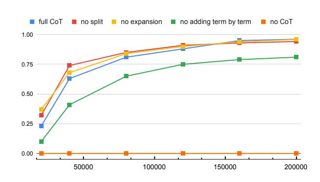
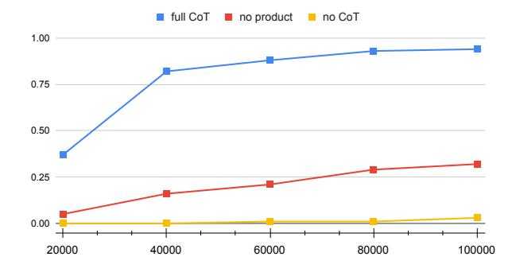
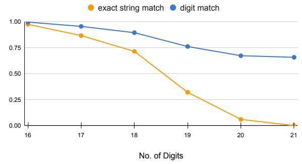
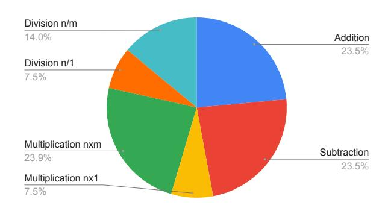

# Goat: Fine-tuned LLaMA Outperforms GPT-4 on Arithmetic Tasks

# Tiedong Liu

National University of Singapore tiedong.liu@u.nus.edu

# Bryan Kian Hsiang Low

National University of Singapore lowkh@comp.nus.edu.sg

# Abstract

We introduce Goat, a fine-tuned LLaMA model that significantly outperforms GPT-4 on a range of arithmetic tasks. Fine-tuned on a synthetically generated dataset, Goat achieves state-ofthe-art performance on BIG-bench arithmetic sub-task. In particular, the zero-shot Goat-7B matches or even surpasses the accuracy achieved by the few-shot PaLM-540B. Surprisingly, Goat can achieve near-perfect accuracy on large-number addition and subtraction through supervised fine-tuning only, which is almost impossible with previous pretrained language models, such as Bloom, OPT, GPT-NeoX, etc. We attribute Goat's exceptional performance to LLaMA's consistent tokenization of numbers. To tackle more challenging tasks like large-number multiplication and division, we propose an approach that classifies tasks based on their learnability, and subsequently decomposes unlearnable tasks, such as multi-digit multiplication and division, into a series of learnable tasks by leveraging basic arithmetic principles. We thoroughly examine the performance of our model, offering a comprehensive evaluation of the effectiveness of our proposed decomposition steps. Additionally, Goat-7B can be easily trained using LoRA on a 24GB VRAM GPU, facilitating reproducibility for other researchers. We release our model, dataset, and the Python script for dataset generation.[1](#page-0-0)

# 1 Introduction

Large language models (LLMs) have shown remarkable proficiency across a wide range of natural language processing (NLP) tasks [\(Brown](#page-8-0) [et al.,](#page-8-0) [2020;](#page-8-0) [Chowdhery et al.,](#page-8-1) [2022;](#page-8-1) [Thoppilan](#page-9-0) [et al.,](#page-9-0) [2022\)](#page-9-0). Notably, GPT-4 [\(OpenAI,](#page-9-1) [2023\)](#page-9-1) has achieved state-of-the-art performances in such tasks. However, it is surprising that such powerful language models still struggle with elementary arithmetic tasks. The performance of GPT-4 in

# <span id="page-0-1"></span>Goat-7B 3978640188 + 42886272 = 3978640188 + 42886272 = 4021526460 4523646 minus 67453156 4523646 − 67453156 = −62929510 Calculate 397 x 4429 397 × 4429 = 4429 × (300 + 90 + 7) = 4429 × 300 + 4429 × 90 + 4429 × 7 = 1328700 + 398610 + 31003 = 1727310 + 31003 = 1758313 What is 8914/64? 8914 − 64 × 100 = 8914 − 6400 = 2514 2514 − 64 × 30 = 2514 − 1920 = 594 594 − 64 × 9 = 594 − 576 = 18 Therefore, 8914 ÷ 64 = 139 R 18

Figure 1: Example of Goat's response on addition, subtraction, multiplication, and division tasks. Prompts are marked in bold, followed by Goat-7B's response.

arithmetic tasks, particularly multiplication and division of large numbers, currently remains far from optimal, with accuracy levels trending toward zero.

In this paper, we present Goat, a fine-tuned language model that is GOod at Arithmetic Tasks. Goat achieves state-of-the-art performance in elementary arithmetic, including addition, subtraction, multiplication, and division of integers. We adopt an end-to-end supervised instruction-finetuning paradigm on LLaMA [\(Touvron et al.,](#page-9-2) [2023\)](#page-9-2), leveraging a synthetically generated dataset containing around 1 million samples. Unlike previous research on arithmetic computation [\(Lee and Kim,](#page-9-3) [2023;](#page-9-3)

<span id="page-0-0"></span><sup>1</sup> <https://github.com/liutiedong/goat>.

[Nogueira et al.,](#page-9-4) [2021;](#page-9-4) [Nye et al.,](#page-9-5) [2021;](#page-9-5) [Qian et al.,](#page-9-6) [2022;](#page-9-6) [Zhou et al.,](#page-10-0) [2022b\)](#page-10-0), our study demonstrates that through supervised fine-tuning alone and without applying any special techniques, our model is capable of generating direct answers for largenumber addition and subtraction with near-perfect accuracy in a zero-shot setting. We attribute this exceptional arithmetic ability to LLaMA's consistent tokenization of numbers and show that this is almost impossible to achieve for previous LLMs such as Bloom [\(Scao et al.,](#page-9-7) [2022\)](#page-9-7), OPT [\(Zhang et al.,](#page-9-8) [2022\)](#page-9-8), GPT-NeoX [\(Black et al.,](#page-8-2) [2022\)](#page-8-2), Pythia [\(Bi](#page-8-3)[derman et al.,](#page-8-3) [2023\)](#page-8-3), etc.

However, the model encounters significant difficulties when generating direct answers for arithmetic tasks like large-number multiplication and division. To overcome this challenge, we propose an approach that categorizes various arithmetic tasks into learnable and unlearnable tasks, subsequently decomposing the unlearnable tasks, such as multidigit multiplication and division, into a series of learnable tasks by leveraging basic arithmetic principles. Our approach ensures that the intermediate supervision which facilitates the model's learning is also easily understandable and interpretable by humans. We fine-tune our model to generate the proposed CoT before generating the final answer, similar to sketchpad [\(Nye et al.,](#page-9-5) [2021\)](#page-9-5). Our method outperforms GPT-4's long multiplication and long division methods by a large margin. We assess the performance of our model using BIG-bench [\(Srivastava et al.,](#page-9-9) [2022\)](#page-9-9) arithmetic sub-task, and provide a comprehensive evaluation of the effectiveness of our proposed method. Our findings suggest that the model can learn the pattern and generalize to unseen data instead of purely memorizing the computation. Additionally, Goat-7B can be conveniently trained using Low-Rank Adaptation (LoRA) [\(Hu et al.,](#page-8-4) [2021\)](#page-8-4) technique on a 24GB VRAM GPU, making it easily reproducible for other researchers.

To summarize, our contributions include:

- Our model achieves state-of-the-art performance on various elementary arithmetic tasks, including addition, subtraction, multiplication, and division of positive integers (Section [4\)](#page-5-0). We show that an open-sourced model finetuned on a synthetically generated dataset has the potential to achieve even higher accuracy on arithmetic tasks compared to GPT-4.
- To the best of our knowledge, we are the first

to demonstrate the feasibility that supervised fine-tuning alone can enable LLMs to generate direct answers for certain elementary arithmetic tasks, such as large-number addition and subtraction, without applying any special techniques (Section [3.3\)](#page-3-0). Previously effective chain-of-thought (CoT) methods, such as those used for addition in sketchpad [\(Nye](#page-9-5) [et al.,](#page-9-5) [2021\)](#page-9-5) and LM Tutor [\(Qian et al.,](#page-9-6) [2022\)](#page-9-6), are no longer necessary. The impressive performance is mainly attributed to LLaMA's consistent tokenization of numbers.

- To solve large-number multiplication and division, we propose a novel decomposition method based on the learnability of the task, leveraging basic arithmetic principles to ensure human interpretability (Section [3.4\)](#page-4-0).
- We systematically investigate the proposed decomposition method and demonstrate its effectiveness (Section [5\)](#page-6-0). We conduct thorough experiments on the decomposition steps in a fully synthetic environment by mitigating many hard-to-control aspects of natural language. Our experimental setup offers an ideal platform to study the impact of CoT and intermediate supervision.
- Our end-to-end instruction tuning pipeline can be easily integrated into existing instructiontuned language models [\(Chiang et al.,](#page-8-5) [2023;](#page-8-5) [Taori et al.,](#page-9-10) [2023\)](#page-9-10) and potentially enhance their mathematical reasoning for math word problems. We release the model, dataset, and script for generating the dataset.

# 2 Related Work

#### 2.1 Instruction Tuning

Instruction tuning [\(Chung et al.,](#page-8-6) [2022;](#page-8-6) [Ouyang](#page-9-11) [et al.,](#page-9-11) [2022;](#page-9-11) [Sanh et al.,](#page-9-12) [2021\)](#page-9-12) is a technique used to align pretrained language models with human instructions. It enables targeted customization of LLMs to specific tasks, enhancing their ability to generate more accurate and contextually relevant responses and improving the zero-shot performance. The dataset used for instruction tuning can be human-written [\(Ouyang et al.,](#page-9-11) [2022\)](#page-9-11), machinegenerated [\(Peng et al.,](#page-9-13) [2023;](#page-9-13) [Taori et al.,](#page-9-10) [2023;](#page-9-10) [Wang et al.,](#page-9-14) [2022\)](#page-9-14), or collected from web [\(Geng](#page-8-7) [et al.,](#page-8-7) [2023\)](#page-8-7). Recently, there has been extensive research on fine-tuning LLaMA [\(Touvron et al.,](#page-9-2)

[2023\)](#page-9-2) for various downstream tasks using instruction tuning [\(Chiang et al.,](#page-8-5) [2023;](#page-8-5) [Geng et al.,](#page-8-7) [2023;](#page-8-7) [Taori et al.,](#page-9-10) [2023;](#page-9-10) [Xu et al.,](#page-9-15) [2023;](#page-9-15) [Yunxiang et al.,](#page-9-16) [2023\)](#page-9-16). Creating high-quality instruction tuning datasets can be expensive and time-consuming. In this study, we utilize a simple Python program to generate input-output pairs for arithmetic tasks.

### 2.2 Arithmetic Reasoning

Arithmetic reasoning has been a topic of interest in NLP research for many years [\(Lu et al.,](#page-9-17) [2022\)](#page-9-17). Recently, the use of pretrained models [\(Brown et al.,](#page-8-0) [2020;](#page-8-0) [OpenAI,](#page-9-1) [2023\)](#page-9-1) has shown great capabilities in solving math word problems. Particularly, *chain of thought* (CoT) [\(Kojima et al.,](#page-8-8) [2022;](#page-8-8) [Wei et al.,](#page-9-18) [2022;](#page-9-18) [Zhou et al.,](#page-10-1) [2022a\)](#page-10-1) provides the model with the *intermediate* steps to derive the final answer. However, studies have shown that LLMs struggle with basic arithmetic computation and often make arithmetic mistakes, even though the reasoning process is correct [\(Cobbe et al.,](#page-8-9) [2021;](#page-8-9) [Gao et al.,](#page-8-10) [2022;](#page-8-10) [Schick et al.,](#page-9-19) [2023\)](#page-9-19). Consequently, one key challenge of arithmetic reasoning, aside from mapping natural language to arithmetic expressions, is how to compute the generated arithmetic expressions with high accuracy.

# 2.3 Arithmetic Computation

Recent studies have explored using external tools to evaluate arithmetic expressions. Toolformer [\(Schick et al.,](#page-9-19) [2023\)](#page-9-19) and GSM8K [\(Cobbe et al.,](#page-8-9) [2021\)](#page-8-9) invoke an external calculator to compute the generated arithmetic expression. PoT [\(Chen et al.,](#page-8-11) [2022\)](#page-8-11) and PAL [\(Gao et al.,](#page-8-10) [2022\)](#page-8-10) generate programs that can be executed to produce the final answer. While arithmetic can be solved using calculators or programs easily, the ability to perform arithmetic computation is a remarkable trait of human intelligence, and we anticipate LLMs should possess this ability as well.

Previous studies have evaluated the arithmetic abilities of LLMs. [Nogueira et al.](#page-9-4) [\(2021\)](#page-9-4) have evaluated addition and subtraction tasks. [Muffo](#page-9-20) [et al.](#page-9-20) [\(2022\)](#page-9-20) have further examined 2-digit multiplication. [Yuan et al.](#page-9-21) [\(2023\)](#page-9-21) have tested different types of arithmetic operations. CoT seems to be a promising solution for arithmetic computation as well. Similar to humans, autoregressive language model may rely on intermediate supervision to generate the final answer. Scratchpad [\(Nye et al.,](#page-9-5) [2021\)](#page-9-5) finetunes the language models to produce CoT before generating an answer, and has demon-

strated effectiveness on 8-digit addition. However, we show that previously effective CoT methods, such as those used for addition in sketchpad [\(Nye](#page-9-5) [et al.,](#page-9-5) [2021\)](#page-9-5) and LM Tutor [\(Qian et al.,](#page-9-6) [2022\)](#page-9-6), are no longer necessary for certain arithmetic tasks like addition. By leveraging simple supervised finetuning alone, our model can perform addition and subtraction with sufficiently high accuracy. For challenging tasks like large-number multiplication and division, previous studies [\(Muffo et al.,](#page-9-20) [2022;](#page-9-20) [Lee and Kim,](#page-9-3) [2023\)](#page-9-3) either fail to compute or are inefficient. Furthermore, our model is trained endto-end such that it can follow human instructions.

# 3 Method

## 3.1 Language Model

LLaMA [\(Touvron et al.,](#page-9-2) [2023\)](#page-9-2) is a collection of open-source pretrained language models trained on trillions of tokens using publicly available datasets, and achieves state-of-the-art performance on many benchmarks.

Previous studies [\(Kim et al.,](#page-8-12) [2021;](#page-8-12) [Nogueira](#page-9-4) [et al.,](#page-9-4) [2021\)](#page-9-4) have shown that tokenization is important for LLM's arithmetic ability. Many commonlyused subword tokenization techniques today are not ideal to represent numbers. However, LLaMA splits each digit into an individual token [\(Yuan](#page-9-21) [et al.,](#page-9-21) [2023\)](#page-9-21), thereby ensuring *consistent tokenization of numbers*, as shown in Appendix [B.](#page-10-2)

The selection of language models is crucial to our work. We believe the remarkable arithmetic ability demonstrated in this work is mainly attributed to LLaMA's consistent tokenization of numbers. We experimentally verify that other LLMs, such as Bloom, OPT, GPT-NeoX, and Pythia, finetuned on the same arithmetic dataset, cannot match LLaMA's arithmetic ability.

## 3.2 Learnability of Arithmetic Tasks

[Wies et al.](#page-9-22) [\(2022\)](#page-9-22) have provided a theoretical analysis on the use of intermediate supervision for solving composite tasks. Specifically, they have shown that for any family of tasks which on the one hand, are unlearnable, and on the other hand, can be decomposed into a polynomial number of simple subtasks, unlearnable composite problems can become learnable by using *intermediate supervision* or *stepby-step CoT*.

Building upon their analysis, we first experimentally categorize learnable and unlearnable tasks. In the context of arithmetic computation, *learnable*

<span id="page-3-1"></span>

|             | Task                         | Input                     | Output                 |
|-------------|------------------------------|---------------------------|------------------------|
| Learnable   | Copying                      | 59265395                  | 59265395               |
|             | Split                        | 4536                      | 4000 + 500 + 30 + 6    |
|             | Comparison                   | 8116449,<br>97863         | 8116449<br>><br>97863  |
|             | Ordering                     | 3568,<br>9591,<br>8061    | 3568,<br>8061,<br>9591 |
|             | Addition                     | 1270769 + 264985867430    | 264987138199           |
|             | Subtraction                  | 40920<br>−<br>6173772696  | −6173731776            |
|             | Multiplication nD<br>×<br>1D | 591714761929184<br>×<br>4 | 2366859047716736       |
|             | Division nD<br>÷<br>1D       | 339229815457<br>÷<br>4    | 84807453864<br>R 1     |
| Unlearnable | ×<br>Multiplication nD<br>mD | ×<br>6983387<br>16919     | 118151924653           |
|             | ÷<br>Division nD<br>mD       | ÷<br>64729486<br>472      | 137138<br>R 350        |

Table 1: Summary and examples of learnable and unlearnable arithmetic tasks. For example, nD ÷ 1D means n-digit by 1-digit division, where n ≥ 1. Unlearnable tasks are mainly multi-digit multiplication and division where n, m > 1. There are some special cases mentioned in Appendix [E.](#page-12-0)

*tasks* generally refer to those for which the model can be successfully trained to generate direct answers, achieving sufficiently high accuracy within a predefined number of training epochs. Conversely, *unlearnable tasks* are those that the model struggles to learn and generate direct answers correctly even with extensive training. While the exact reason behind the varying learnability of tasks is not yet fully understood and requires further investigation, we hypothesize that it is associated with the complexity of the underlying pattern and the size of working memory required for completing the task [\(Bubeck et al.,](#page-8-13) [2023\)](#page-8-13).

We experimentally examine the learnability of these tasks by fine-tuning the model specifically for each task in a simplified synthetic environment (Table [7\)](#page-13-0). Our recognized learnable and unlearnable tasks are listed in Table [1.](#page-3-1)

The categorization of tasks also aligns with human perception. With practice, humans can mentally calculate the addition and subtraction of two large numbers, writing down the final numerical answer directly from the left (most significant figure) to the right (least significant figure) without the need for sketchpad. However, mentally solving large-number multiplication and division is undeniably a challenging task.

We also observe that our classification of tasks is consistent with the performance of GPT-4. In particular, GPT-4 excels in generating direct answers for large-number addition and subtraction. However, its accuracy significantly drops when it comes to multi-digit multiplication and division tasks. Our observation aligns with the claim made by [Bubeck et al.](#page-8-13) [\(2023\)](#page-8-13) that GPT-4 has a short

working memory and performs poorly on composite arithmetic tasks. This is particularly evident in the case of multiplication, which involves multiple steps of addition. The inability of powerful models like GPT-4 to directly solve unlearnable tasks may suggest that generating direct answers for such tasks is extremely challenging, even with extensive training.

It is noteworthy that a task that is learnable for LLaMA may not necessarily be learnable for other LLMs, which is validated in our experiments in Section [5.3.](#page-7-0) Furthermore, not all tasks classified as unlearnable are entirely impossible for the model to learn. For instance, 2-digit by 2-digit multiplication is considered an unlearnable task in our case. However, the model can still learn to generate the direct answer by overfitting to the training set, which contains an exhaustive enumeration of all possible 2-digit multiplication. Nevertheless, the process takes nearly 10 epochs to achieve around 90% accuracy. In contrast, by inserting our proposed CoT before the final answer, the model can achieve comparable accuracy in 2-digit multiplication with only 1 epoch of training. These findings align with the claim [\(Wies et al.,](#page-9-22) [2022\)](#page-9-22) that the presence of intermediate supervision facilitates the learning process.

## <span id="page-3-0"></span>3.3 Addition and Subtraction

Addition and subtraction tasks are learnable, as with supervised fine-tuning alone, the model exhibits a remarkable ability to accurately generate direct numerical answers. The model successfully captures the underlying patterns of the arithmetic operations. This is evident from the model's nearperfect accuracy on the unseen test set, despite being trained on a very limited subset of the data. It is worth mentioning that addition and subtraction operations do not require the use of CoT. This contrasts with previous studies that have employed CoT for addition and subtraction tasks [\(Lee and](#page-9-3) [Kim,](#page-9-3) [2023;](#page-9-3) [Nye et al.,](#page-9-5) [2021;](#page-9-5) [Qian et al.,](#page-9-6) [2022\)](#page-9-6).

## <span id="page-4-0"></span>3.4 Multiplication

We experimentally verify that n-digit by 1-digit multiplication is learnable. In contrast, multi-digit multiplication poses significant challenges for the model, suggesting it to be an unlearnable task. To overcome this issue, we adopt a similar strategy used in sketchpad [\(Nye et al.,](#page-9-5) [2021\)](#page-9-5), which finetunes the LLMs to generate CoT before generating the answer. Specifically, we propose a CoT that decomposes the multi-digit multiplication into a series of 5 learnable sub-tasks: (1) extraction: extract the arithmetic expression from the natural language instruction, (2) split: split the smaller number of the two into place values, (3) expansion: expand the sum based on the distributive property, (4) product: compute each product simultaneously, and (5) adding term by term: add the first two terms and copy the rest, and the final sum is obtained.

Consider the example in Fig. [1.](#page-0-1) Firstly, the arithmetic expression 397 × 4429 is extracted from the instruction, which can be considered as a "copying" task. Secondly, 397×4429 = 4429×(300+90+7) involves two learnable tasks. The larger number of the two is placed in front and then the smaller one is split, which is similar to "ordering" and "split" learnable tasks. The ordering ensures that there are fewer summation terms in the next step, thereby reducing the CoT length. Thirdly, the sum is expanded using distributive law: 4429 × (300 + 90 + 7) = 4429 × 300 + 4429 × 90 + 4429 × 7, which is similar to "copying" task. Next, 4429 × 300 + 4429 × 90 + 4429 × 7 = 1328700 + 398610 + 31003 where the products are computed at once by applying "multiplication n-digit by 1-digit" with zeros copied at the end of each product. Finally, we take the sum of the first two terms at each step, and copy the rest terms, leveraging "addition" and "copying". Hence, a composite unlearnable task is broken down into simpler tasks that are all learnable.

# 3.5 Division

Similarly, we observe that n-digit by 1-digit division is learnable. However, multi-digit division is unlearnable. We design a novel CoT leveraging a modified slow division method based on the following recurrence equation

$$R_j - D \times (q_{n-(j+1)} \times 10^j) = R_{j+1}$$

where R<sup>j</sup> is the j-th partial remainder of the division, qn−(j+1) is the digit of the quotient in position n − (j + 1) numbered from least significant 0 to most significant n − 1, n is the number of digits in the quotient, and D is the divisor. Specifically, the main idea is to subtract multiples of the divisor from the dividend until the remainder is less than the divisor.

Here is a detailed breakdown of the CoT used in Fig. [1.](#page-0-1) Consider the first iteration (first equation). The first step 8914−64×100 requires the model to copy the dividend and the divisor, and subsequently generate a number qn−(j+1) × 10<sup>j</sup> such that the product of qn−(j+1) × 10<sup>j</sup> and the divisor D is less than or equal to the partial remainder R<sup>j</sup> . This inherently involves two learnable tasks: "n-digit by 1 digit multiplication" and "comparison". We experimentally show that this composite task is learnable. The second step 8914 − 64 × 100 = 8914 − 6400 mainly involves a "copying" task and an "n-digit by 1-digit multiplication" task. The third step 8914 − 6400 = 2514 leverages "subtraction". The process iterates until the leftover is less than the divisor, which implies the model has to implicitly learn comparison. Finally, the model generates the quotient by combining all qn−(j+1)'s in previous iterations, which can be considered as the inverse of the "split" task, and finally copies the remainder if it is not zero.

A summary of prompts and expected output for various tasks are shown in Table [2.](#page-5-1)

## <span id="page-4-1"></span>3.6 Settings

In this paper, we consider the addition and subtraction of two positive integers with each containing up to 16 digits. It is worth noting that the result of subtraction can be negative. To limit the maximum generated sequence length, we consider the multiplication of two positive integers whose product falls within 12 digits, and the division of two positive integers resulting in a quotient within 6 digits where the dividend is less than 12 digits. Since we focus on arithmetic tasks of integers, we aim

<span id="page-5-1"></span>

| Task          | Learnable | Prompt                | CoT | Target                                |
|---------------|-----------|-----------------------|-----|---------------------------------------|
| ADD           | ✓         | 1463456 + 2107        | ✗   | 1463456 + 2107 = 1465563              |
| SUB           | ✓         | 2348233 minus 483579? | ✗   | 2348233 - 483579 = 1864654            |
| MUL           |           |                       |     |                                       |
| nD<br>×<br>1D | ✓         | 593295 times 7        | ✗   | 593295 * 7 = 4153065                  |
| nD<br>×<br>mD | ✗         | Calculate 24 x 79     | ✓   | 24 * 79 = 24 * (70 + 9) = 24 * 70 + \ |
|               |           |                       |     | 24 * 9 = 1680 + 216 = 1896            |
| DIV           |           |                       |     |                                       |
| nD<br>÷<br>1D | ✓         | Please tell 3651803/7 | ✗   | 3651803 / 7 = 521686 R 1              |
| nD<br>÷<br>mD | ✗         | What is 2546/38?      | ✓   | 2546 - 38 * 60 = 2546 - 2280 = 266    |
|               |           |                       |     | 266 - 38 * 7 = 266 - 266 = 0          |
|               |           |                       |     | Therefore, 2546 / 38 = 67             |

Table 2: Examples of prompts and targets for fine-tuning LLaMA. "\nAnswer: " is appended at the end of each prompt. It should be noted that there are a few special cases when CoT is not required (see Appendix [E\)](#page-12-0).

to obtain the least positive remainder in the case when it is not divisible.

In Section [5.2,](#page-7-1) we present an analysis showcasing the limited extrapolation capabilities of finetuned LLMs. Consequently, input data that falls outside the distribution of the training data is unlikely to yield reasonable answers. Our method potentially applies to numbers with more digits, though the training cost will increase correspondingly.

#### 3.7 Dataset

We generate the dataset synthetically using a Python script. The dataset consists of around 1 million question-answer pairs. The answer contains the proposed CoT as well as the final numerical output. The numbers are randomly generated, hence ensuring a very low probability of instances being duplicated, although small numbers may be sampled multiple times. We sample from log space to ensure the numbers are equally likely to be sampled from different orders of magnitude, which is similar to the sampling method used by [Lee and Kim](#page-9-3) [\(2023\)](#page-9-3). The details of the dataset are presented in Appendix [F.](#page-12-1)

#### 3.8 Fine-tuning

To enable the model to solve arithmetic problems based on instructions and facilitate natural language question answering, we generate hundreds of instruction templates using ChatGPT (Table [6\)](#page-12-2). During the instruction tuning process, we randomly select a template for each arithmetic input from the training set, and fine-tune LLaMA-7B similar to the method used in Alpaca [\(Taori et al.,](#page-9-10) [2023\)](#page-9-10). We apply various techniques to enhance the model's

adaptability to diverse question formats, such as randomly removing spaces between numbers and symbols in the arithmetic expression, replacing "\*" with "x" or "times", etc.

Goat-7B can be easily fine-tuned using LoRA on a 24GB VRAM GPU. In particular, the fine-tuning process for a specific arithmetic sub-task, such as 8-digit addition using 100K instances, takes only approximately 1.5 hours on an A10 GPU to achieve near-perfect accuracy. The training hyperparameters are listed in Appendix [A.](#page-10-3)

## <span id="page-5-0"></span>4 Experiments

We evaluate our model using BIG-bench arithmetic dataset [\(Srivastava et al.,](#page-9-9) [2022\)](#page-9-9), as well as our extra selected tasks. The results are shown in Table [3.](#page-6-1) Notably, in a zero-shot setting, Goat-7B achieves comparable or even higher accuracy on BIG-bench compared to the few-shot PaLM-540B.

#### 4.1 Metric

We first compute the accuracy based on the standard exact string match (Appendix [C\)](#page-10-4). We observe that GPT-4's accuracy under exact string match is almost identically zero on tasks involving large numbers. However, in many cases where the final answer is incorrect, the majority of digits in the generated answer align with the target number, with only a few digits being incorrect. Inspired by recent study on the emergent abilities of LLMs [\(Schaeffer et al.,](#page-9-23) [2023\)](#page-9-23), we include a digit match metric that can reflect the per-token error rate of the output, as each digit is uniquely represented by a token in LLaMA.

<span id="page-6-1"></span>

| Task    | BIG-bench |           |           | Extra Tasks |          |                     |           |           |
|---------|-----------|-----------|-----------|-------------|----------|---------------------|-----------|-----------|
| ADD     | 1D        | 2D        | 3D        | 4D          | 5D       | 8D+8D               | 16D+8D    | 16D+16D   |
| GPT-4   | 100/100   | 100/100   | 99.6/99.9 | 98.8/99.6   |          | 94.1/98.5 92.1/98.3 | 9.4/70.4  | 94.1/99.5 |
| Goat-7B | 100/100   | 100/100   | 99.4/99.8 | 98.3/99.5   |          | 98.1/99.4 97.8/99.4 | 97.1/99.6 | 97.6/99.7 |
| SUB     | 1D        | 2D        | 3D        | 4D          | 5D       | 8D−8D               | 16D−8D    | 16D−16D   |
| GPT-4   | 100/100   | 100/100   | 99.2/99.6 | 98.9/99.6   |          | 92.4/98.1 70.5/91.5 | 10.6/68.8 | 59.6/88.2 |
| Goat-7B | 100/100   | 100/100   | 99.7/99.9 | 98.6/99.6   |          | 98.4/99.5 96.8/99.3 | 95.8/99.2 | 96.3/99.3 |
| MUL     | 1D        | 2D        | 3D        | 4D          | 5D       | 1D×16D              | 4D×8D     | 6D×6D     |
| GPT-4   | 100/100   | 99.4/99.8 | 30.3/83.0 | 5.3/61.8    | 0.0/47.9 | 61.5/92.3           | 0.0/45.9  | 0.0/49.8  |
| Goat-7B | 100/100   | 100/100   | 97.8/99.4 | 96.9/99.2   |          | 96.7/99.3 99.7/99.9 | 88.1/97.8 | 96.8/99.5 |
| DIV     | 1D        | 2D        | 3D        | 4D          | 5D       | 16D÷1D              | 6D÷3D     | 12D÷6D    |
| GPT-4   | 100/100   | 100/100   | 94.5/96.3 | 90.9/92.1   |          | 53.4/73.2 54.0/84.3 | 6.4/48.6  | 0.0/29.5  |
| Goat-7B | 100/100   | 100/100   | 99.5/99.7 | 99.0/99.5   |          | 96.5/98.1 99.0/99.7 | 94.1/96.1 | 89.3/93.5 |

Table 3: The result of GPT-4 and Goat-7B on BIG-bench Arithmetic sub-task and extra selected arithmetic tasks, using metrics Exact String Match/Digit Match (Appendix [C\)](#page-10-4), shown in percentage. We test GPT-4 and Goat with exactly the same questions and prompts. We evaluate GPT-4 using the API version on May 10th. For Big-bench tasks, nD refers the n-digit by n-digit operation, except for division where nD means n-digit by m-digit where m ≤ n. BIG-bench only includes division operation without remainder, whereas in extra tasks we include the cases where the remainder is not zero and ask GPT-4 to output the answer in "quotient R remainder" format. It should be noted that we exclude the BIG-bench test data from our training dataset as much as possible, although the overlap is unavoidable for operations involving small numbers.

#### 4.2 Comparison

Comparing the performance of Goat and GPT-4 for large-number multiplication and division may seem unfair, as GPT-4 generates direct answers while Goat relies on CoT. Hence, we also evaluate GPT-4's performance with CoT by appending "Solve it step by step" at the end of each prompt. By default, GPT-4 uses long multiplication and long division methods. However, we observe that generating CoT only leads to marginal improvement in accuracy. In some cases, the intermediate steps from long multiplication and division are incorrect, but surprisingly the final answer is correct. This implies that GPT-4 does not effectively take advantage of intermediate supervision from CoT to improve the final output. We identify the following 3 common errors from GPT-4's solution, which results in incorrect final answers: (1) the alignment of corresponding digits, (2) copying of numbers, and (3) the intermediate result from n-digit by 1-digit multiplication.

Additionally, we observe that GPT-4 performs reasonably well on 8D+8D and 16D+16D tasks, but fails on most 16D + 8D tasks, though intuitively 16D + 8D should be relatively easier than 16D+16D. While the exact reason for this remains

unclear, one possible factor could be GPT-4's inconsistent number tokenization (Table [5\)](#page-11-0), which makes it difficult to align the corresponding digits of two numbers.

# <span id="page-6-0"></span>5 Analysis

#### 5.1 Ablation study

<span id="page-6-2"></span>

Figure 2: Accuracy (exact string match) against the number of samples seen during the training of 4D ×4D task. Evaluated on the same randomly generated unseen test set using training checkpoints.

Here we want to study the usefulness and effectiveness of each intermediate decomposition step. Specifically, for multiplication (Fig. [2\)](#page-6-2), we com-

<span id="page-7-2"></span>

Figure 3: Accuracy (exact string match) against the number of samples seen during the training of 6D ÷3D task. Evaluated on the same randomly generated unseen test set using training checkpoints.

pare the accuracy of 4-digit by 4-digit multiplication by removing one particular step in the CoT, including split, expansion, adding term by term (referring to [G\)](#page-13-1), as well as no CoT. For division (Fig. [3\)](#page-7-2), we compare the accuracy of 6-digit by 3-digit division after removing the middle step that computes the product (referring to [G\)](#page-13-1), as well as no CoT. To minimize the impact caused by natural language, we conduct an ablation study in a simplified synthetic environment (Table [7\)](#page-13-0).

The multiplication results suggest that the "adding term by term" step plays a crucial role in obtaining the final answer. In contrast, the "split" and "expand" steps have minimal impact, and can potentially be omitted for generating more concise CoT. This can be attributed to the nature of these two intermediate steps, which primarily involve simple and learnable tasks like copying and comparison. Nevertheless, we still retain these steps to ensure human interpretability.

The accuracy of exact string match without CoT remains consistently at zero for both 4D × 4D multiplication and 6D ÷ 3D division. This further showcases the validity of our approach, as breaking down complex arithmetic tasks into a series of learnable tasks can indeed facilitate the training process for LLMs.

#### <span id="page-7-1"></span>5.2 Extrapolation

Extrapolation refers to the ability of the model to predict data that lies out-of-distribution (OOD) of training data. We test addition for numbers larger than those in the training data distribution. The results reveal that the model has limited extrapolation capabilities. There is a gradual drop in accuracy, as the test set deviates further from the training set. This observation is consistent with the result

reported in [\(Kim et al.,](#page-8-12) [2021\)](#page-8-12), highlighting a limitation of our fine-tuned model and underscoring the significance of training data distribution.



Figure 4: Accuracy against the number of digits for the addition task. The model is trained up to 16D+16D, and tested on 17D+17D onward.

# <span id="page-7-0"></span>5.3 Comparison with Other LLMs

We conduct comprehensive experiments on a variety of LLMs, including Bloom, OPT, GPT-J, GPT-NeoX, and Pythia. These models are fine-tuned using the identical dataset as that for Goat, maintaining consistency in the training hyperparameters. Our experiment shows that they all struggle with arithmetic tasks. Even for tasks that are considered learnable for LLaMA, such as multi-digit addition, the loss during fine-tuning is significantly higher than that of LLaMA. The observation underscores the claim made in [\(Nogueira et al.,](#page-9-4) [2021\)](#page-9-4) that tokenization is a crucial factor in the performance of arithmetic tasks.

## 5.4 Few-shot Prompting with GPT-4

GPT-4 demonstrates powerful in-context learning abilities. We further examine the effectiveness of our proposed decomposition method for solving large-number multiplication and division by using few-shot prompting with GPT-4 (see Appendix [H\)](#page-14-0). We observe that our decomposition method allows GPT-4 to generate correct answers more frequently than using its default long multiplication and division methods. This further supports the effectiveness and validity of our approach. Examples of the prompt and output are shown in Appendix [H.](#page-14-0)

## 6 Limitations

Humans are capable of performing multiplication and division on arbitrarily large numbers, providing sufficient time and space for calculations. In contrast, LLMs often suffer from extrapolation problems. The models are unlikely to generate reasonable answers if the input deviates significantly from the distribution of training data. To enhance the human interpretability of intermediate supervision, we use the straightforward CoT that follows simple basic arithmetic rules. However, this design may not be the most efficient way to facilitate the final answer generation. There are potentially more suitable multiplication and division algorithms for the model to learn. Besides, our research only focuses on elementary arithmetic operations involving integers. Nevertheless, we anticipate that our method could be applicable to decimal computation as well.

# 7 Conclusion

In summary, we demonstrate the feasibility that supervised fine-tuning alone can enable LLMs to perform certain basic arithmetic operations with high accuracy. With our proposed CoT, our model achieves state-of-the-art performance on various elementary arithmetic tasks. Our research offers an excellent platform for investigating the mechanism of working memory and the influence of intermediate supervision on text generation. Our method can be easily integrated with other instruction-tuned LLMs and has the potential to further enhance arithmetic reasoning abilities in solving math word problems.

# References

- <span id="page-8-3"></span>Stella Biderman, Hailey Schoelkopf, Quentin Anthony, Herbie Bradley, Kyle O'Brien, Eric Hallahan, Mohammad Aflah Khan, Shivanshu Purohit, USVSN Sai Prashanth, Edward Raff, et al. 2023. Pythia: A suite for analyzing large language models across training and scaling. *arXiv preprint arXiv:2304.01373*.
- <span id="page-8-2"></span>Sidney Black, Stella Biderman, Eric Hallahan, Quentin Anthony, Leo Gao, Laurence Golding, Horace He, Connor Leahy, Kyle McDonell, Jason Phang, Michael Pieler, Usvsn Sai Prashanth, Shivanshu Purohit, Laria Reynolds, Jonathan Tow, Ben Wang, and Samuel Weinbach. 2022. [GPT-NeoX-20B: An open](https://doi.org/10.18653/v1/2022.bigscience-1.9)[source autoregressive language model.](https://doi.org/10.18653/v1/2022.bigscience-1.9) In *Proceedings of BigScience Episode #5 – Workshop on Challenges & Perspectives in Creating Large Language Models*, pages 95–136, virtual+Dublin. Association for Computational Linguistics.
- <span id="page-8-0"></span>Tom Brown, Benjamin Mann, Nick Ryder, Melanie Subbiah, Jared D Kaplan, Prafulla Dhariwal, Arvind Neelakantan, Pranav Shyam, Girish Sastry, Amanda Askell, et al. 2020. Language models are few-shot learners. *Advances in neural information processing systems*, 33:1877–1901.

- <span id="page-8-13"></span>Sébastien Bubeck, Varun Chandrasekaran, Ronen Eldan, Johannes Gehrke, Eric Horvitz, Ece Kamar, Peter Lee, Yin Tat Lee, Yuanzhi Li, Scott Lundberg, Harsha Nori, Hamid Palangi, Marco Tulio Ribeiro, and Yi Zhang. 2023. [Sparks of artificial general in](https://www.microsoft.com/en-us/research/publication/sparks-of-artificial-general-intelligence-early-experiments-with-gpt-4/)[telligence: Early experiments with gpt-4.](https://www.microsoft.com/en-us/research/publication/sparks-of-artificial-general-intelligence-early-experiments-with-gpt-4/)
- <span id="page-8-11"></span>Wenhu Chen, Xueguang Ma, Xinyi Wang, and William W Cohen. 2022. Program of thoughts prompting: Disentangling computation from reasoning for numerical reasoning tasks. *arXiv preprint arXiv:2211.12588*.
- <span id="page-8-5"></span>Wei-Lin Chiang, Zhuohan Li, Zi Lin, Ying Sheng, Zhanghao Wu, Hao Zhang, Lianmin Zheng, Siyuan Zhuang, Yonghao Zhuang, Joseph E Gonzalez, et al. 2023. Vicuna: An open-source chatbot impressing gpt-4 with 90%\* chatgpt quality.
- <span id="page-8-1"></span>Aakanksha Chowdhery, Sharan Narang, Jacob Devlin, Maarten Bosma, Gaurav Mishra, Adam Roberts, Paul Barham, Hyung Won Chung, Charles Sutton, Sebastian Gehrmann, et al. 2022. Palm: Scaling language modeling with pathways. *arXiv preprint arXiv:2204.02311*.
- <span id="page-8-6"></span>Hyung Won Chung, Le Hou, Shayne Longpre, Barret Zoph, Yi Tay, William Fedus, Eric Li, Xuezhi Wang, Mostafa Dehghani, Siddhartha Brahma, et al. 2022. Scaling instruction-finetuned language models. *arXiv preprint arXiv:2210.11416*.
- <span id="page-8-9"></span>Karl Cobbe, Vineet Kosaraju, Mohammad Bavarian, Mark Chen, Heewoo Jun, Lukasz Kaiser, Matthias Plappert, Jerry Tworek, Jacob Hilton, Reiichiro Nakano, et al. 2021. Training verifiers to solve math word problems. *arXiv preprint arXiv:2110.14168*.
- <span id="page-8-10"></span>Luyu Gao, Aman Madaan, Shuyan Zhou, Uri Alon, Pengfei Liu, Yiming Yang, Jamie Callan, and Graham Neubig. 2022. Pal: Program-aided language models. *arXiv preprint arXiv:2211.10435*.
- <span id="page-8-7"></span>Xinyang Geng, Arnav Gudibande, Hao Liu, Eric Wallace, Pieter Abbeel, Sergey Levine, and Dawn Song. 2023. Koala: A dialogue model for academic research. *Blog post, April*, 1.
- <span id="page-8-4"></span>Edward J Hu, Yelong Shen, Phillip Wallis, Zeyuan Allen-Zhu, Yuanzhi Li, Shean Wang, Lu Wang, and Weizhu Chen. 2021. Lora: Low-rank adaptation of large language models. *arXiv preprint arXiv:2106.09685*.
- <span id="page-8-12"></span>Jeonghwan Kim, Giwon Hong, Kyung-min Kim, Junmo Kang, and Sung-Hyon Myaeng. 2021. [Have you](https://doi.org/10.18653/v1/2021.emnlp-main.563) [seen that number? investigating extrapolation in](https://doi.org/10.18653/v1/2021.emnlp-main.563) [question answering models.](https://doi.org/10.18653/v1/2021.emnlp-main.563) In *Proceedings of the 2021 Conference on Empirical Methods in Natural Language Processing*, pages 7031–7037, Online and Punta Cana, Dominican Republic. Association for Computational Linguistics.
- <span id="page-8-8"></span>Takeshi Kojima, Shixiang Shane Gu, Machel Reid, Yutaka Matsuo, and Yusuke Iwasawa. 2022. Large language models are zero-shot reasoners. *arXiv preprint arXiv:2205.11916*.

- <span id="page-9-3"></span>Soochan Lee and Gunhee Kim. 2023. [Recursion of](https://openreview.net/forum?id=PTUcygUoxuc) [thought: Divide and conquer reasoning with language](https://openreview.net/forum?id=PTUcygUoxuc) [models.](https://openreview.net/forum?id=PTUcygUoxuc)
- <span id="page-9-17"></span>Pan Lu, Liang Qiu, Wenhao Yu, Sean Welleck, and Kai-Wei Chang. 2022. A survey of deep learning for mathematical reasoning. *arXiv preprint arXiv:2212.10535*.
- <span id="page-9-20"></span>Matteo Muffo, Aldo Cocco, and Enrico Bertino. 2022. [Evaluating transformer language models on arith](https://aclanthology.org/2022.lrec-1.30)[metic operations using number decomposition.](https://aclanthology.org/2022.lrec-1.30) In *Proceedings of the Thirteenth Language Resources and Evaluation Conference*, pages 291–297, Marseille, France. European Language Resources Association.
- <span id="page-9-4"></span>Rodrigo Nogueira, Zhiying Jiang, and Jimmy Lin. 2021. Investigating the limitations of transformers with simple arithmetic tasks. *arXiv preprint arXiv:2102.13019*.
- <span id="page-9-5"></span>Maxwell Nye, Anders Johan Andreassen, Guy Gur-Ari, Henryk Michalewski, Jacob Austin, David Bieber, David Dohan, Aitor Lewkowycz, Maarten Bosma, David Luan, et al. 2021. Show your work: Scratchpads for intermediate computation with language models. *arXiv preprint arXiv:2112.00114*.
- <span id="page-9-1"></span>OpenAI. 2023. [Gpt-4 technical report.](http://arxiv.org/abs/2303.08774)
- <span id="page-9-11"></span>Long Ouyang, Jeffrey Wu, Xu Jiang, Diogo Almeida, Carroll Wainwright, Pamela Mishkin, Chong Zhang, Sandhini Agarwal, Katarina Slama, Alex Ray, et al. 2022. Training language models to follow instructions with human feedback. *Advances in Neural Information Processing Systems*, 35:27730–27744.
- <span id="page-9-13"></span>Baolin Peng, Chunyuan Li, Pengcheng He, Michel Galley, and Jianfeng Gao. 2023. Instruction tuning with gpt-4. *arXiv preprint arXiv:2304.03277*.
- <span id="page-9-6"></span>Jing Qian, Hong Wang, Zekun Li, Shiyang Li, and Xifeng Yan. 2022. Limitations of language models in arithmetic and symbolic induction. *arXiv preprint arXiv:2208.05051*.
- <span id="page-9-12"></span>Victor Sanh, Albert Webson, Colin Raffel, Stephen H Bach, Lintang Sutawika, Zaid Alyafeai, Antoine Chaffin, Arnaud Stiegler, Teven Le Scao, Arun Raja, et al. 2021. Multitask prompted training enables zero-shot task generalization. *arXiv preprint arXiv:2110.08207*.
- <span id="page-9-7"></span>Teven Le Scao, Angela Fan, Christopher Akiki, Ellie Pavlick, Suzana Ilic, Daniel Hesslow, Roman ´ Castagné, Alexandra Sasha Luccioni, François Yvon, Matthias Gallé, et al. 2022. Bloom: A 176bparameter open-access multilingual language model. *arXiv preprint arXiv:2211.05100*.
- <span id="page-9-23"></span>Rylan Schaeffer, Brando Miranda, and Sanmi Koyejo. 2023. Are emergent abilities of large language models a mirage? *arXiv preprint arXiv:2304.15004*.

- <span id="page-9-19"></span>Timo Schick, Jane Dwivedi-Yu, Roberto Dessì, Roberta Raileanu, Maria Lomeli, Luke Zettlemoyer, Nicola Cancedda, and Thomas Scialom. 2023. Toolformer: Language models can teach themselves to use tools. *arXiv preprint arXiv:2302.04761*.
- <span id="page-9-9"></span>Aarohi Srivastava, Abhinav Rastogi, Abhishek Rao, Abu Awal Md Shoeb, Abubakar Abid, Adam Fisch, Adam R Brown, Adam Santoro, Aditya Gupta, Adrià Garriga-Alonso, et al. 2022. Beyond the imitation game: Quantifying and extrapolating the capabilities of language models. *arXiv preprint arXiv:2206.04615*.
- <span id="page-9-10"></span>Rohan Taori, Ishaan Gulrajani, Tianyi Zhang, Yann Dubois, Xuechen Li, Carlos Guestrin, Percy Liang, and Tatsunori B Hashimoto. 2023. Stanford alpaca: An instruction-following llama model. *GitHub repository*.
- <span id="page-9-0"></span>Romal Thoppilan, Daniel De Freitas, Jamie Hall, Noam Shazeer, Apoorv Kulshreshtha, Heng-Tze Cheng, Alicia Jin, Taylor Bos, Leslie Baker, Yu Du, et al. 2022. Lamda: Language models for dialog applications. *arXiv preprint arXiv:2201.08239*.
- <span id="page-9-2"></span>Hugo Touvron, Thibaut Lavril, Gautier Izacard, Xavier Martinet, Marie-Anne Lachaux, Timothée Lacroix, Baptiste Rozière, Naman Goyal, Eric Hambro, Faisal Azhar, et al. 2023. Llama: Open and efficient foundation language models. *arXiv preprint arXiv:2302.13971*.
- <span id="page-9-14"></span>Yizhong Wang, Yeganeh Kordi, Swaroop Mishra, Alisa Liu, Noah A Smith, Daniel Khashabi, and Hannaneh Hajishirzi. 2022. Self-instruct: Aligning language model with self generated instructions. *arXiv preprint arXiv:2212.10560*.
- <span id="page-9-18"></span>Jason Wei, Xuezhi Wang, Dale Schuurmans, Maarten Bosma, Ed Chi, Quoc Le, and Denny Zhou. 2022. Chain of thought prompting elicits reasoning in large language models. *arXiv preprint arXiv:2201.11903*.
- <span id="page-9-22"></span>Noam Wies, Yoav Levine, and Amnon Shashua. 2022. Sub-task decomposition enables learning in sequence to sequence tasks. *arXiv preprint arXiv:2204.02892*.
- <span id="page-9-15"></span>Canwen Xu, Daya Guo, Nan Duan, and Julian McAuley. 2023. Baize: An open-source chat model with parameter-efficient tuning on self-chat data. *arXiv preprint arXiv:2304.01196*.
- <span id="page-9-21"></span>Zheng Yuan, Hongyi Yuan, Chuanqi Tan, Wei Wang, and Songfang Huang. 2023. How well do large language models perform in arithmetic tasks? *arXiv preprint arXiv:2304.02015*.
- <span id="page-9-16"></span>Li Yunxiang, Li Zihan, Zhang Kai, Dan Ruilong, and Zhang You. 2023. Chatdoctor: A medical chat model fine-tuned on llama model using medical domain knowledge. *arXiv preprint arXiv:2303.14070*.
- <span id="page-9-8"></span>Susan Zhang, Stephen Roller, Naman Goyal, Mikel Artetxe, Moya Chen, Shuohui Chen, Christopher Dewan, Mona Diab, Xian Li, Xi Victoria Lin, et al. 2022.

Opt: Open pre-trained transformer language models. *arXiv preprint arXiv:2205.01068*.

<span id="page-10-1"></span>Denny Zhou, Nathanael Schärli, Le Hou, Jason Wei, Nathan Scales, Xuezhi Wang, Dale Schuurmans, Olivier Bousquet, Quoc Le, and Ed Chi. 2022a. Least-to-most prompting enables complex reasoning in large language models. *arXiv preprint arXiv:2205.10625*.

<span id="page-10-0"></span>Hattie Zhou, Azade Nova, Hugo Larochelle, Aaron Courville, Behnam Neyshabur, and Hanie Sedghi. 2022b. Teaching algorithmic reasoning via incontext learning. *arXiv preprint arXiv:2211.09066*.

# <span id="page-10-3"></span>A Hyperparameters

| Hyperparameter     | Value      |
|--------------------|------------|
| batch size         | 128        |
| learning rate      | 0.0003     |
| lora r             | 64         |
| lora alpha         | 64         |
| lora target module | q, v, k, o |
| lora dropout       | 0.05       |
| epoch              | 1          |

Table 4: Hyperparameters for fine-tuning LLaMA-7B.

#### <span id="page-10-2"></span>B Tokenization

[Nogueira et al.](#page-9-4) [\(2021\)](#page-9-4) demonstrate that models with inconsistent tokenization of numbers barely learn the addition of 2-digit numbers, and it completely fails to learn the addition of larger numbers. Specifically, it has an accuracy of zero for 5 digits or more. They attribute this failure to the lack of systematic tokenization of individual digits. For instance, "123" might be tokenized as "12" and "3", while "234" might be tokenized as "2" and "34". Consequently, the model is required to learn that the embedding of a token may represent either a single digit or two digits and so on. Hence, it might be challenging for the model to learn to map an embedding to a number when the number of digits it represents changes irregularly. In Table [5,](#page-11-0) we compare number tokenization across different LLMs.

## <span id="page-10-4"></span>C Metric

Exact string match is defined as 1 if the output string exactly matches the target string, and 0 otherwise. Then we take the average of exact string match for each task. Char error rate (CER) is defined as the percentage of characters that were incorrectly predicted. We compute CER using Python torchmetrics package. Then we define digit match accuracy as 1 − cer. We include this metric because, for difficult tasks, the exact string match could be identically zero, making it hard to evaluate the performance. In many cases, both GPT-4 and Goat may have very few incorrect digits in the middle of the generated answer, and the number of digits in the generated answer generally matches the target number.

<span id="page-11-0"></span>

| Model        | Number    | Tokenization                                                   |
|--------------|-----------|----------------------------------------------------------------|
| LLaMA        | 74815     | [1, 29871, 29955, 29946, 29947, 29896, 29945]                  |
|              | 7481      | [1, 29871, 29955, 29946, 29947, 29896]                         |
|              | 748       | [1, 29871, 29955, 29946, 29947]                                |
|              | 74        | [1, 29871, 29955, 29946]                                       |
|              | 7         | [1, 29871, 29955]                                              |
| GPT-4        | 74815     | [20338, 868]                                                   |
|              | 7481      | [20338, 16]                                                    |
|              | 748       | [20338]                                                        |
|              | 74        | [5728]                                                         |
|              | 7         | [22]                                                           |
| Bloom        | 74815     | [88241, 2057]                                                  |
|              | 7481      | [88241, 20]                                                    |
|              | 748       | [88241]                                                        |
|              | 74        | [8771]                                                         |
|              | 7         | [26]                                                           |
| OPT          | 74815     | [2, 39373, 996]                                                |
|              | 7481      | [2, 406, 34490]                                                |
|              | 748       | [2, 39373]                                                     |
|              | 74        | [2, 5243]                                                      |
|              | 7         | [2, 406]                                                       |
| Pythia       | 74815     | [24, 2385, 1010]                                               |
| GPT-NeoX-20B | 7481      | [24, 34474]                                                    |
| MPT-7B       | 748       | [24, 2385]                                                     |
|              | 74        | [3566]                                                         |
|              | 7         | [24]                                                           |
| GPT-J        | 74815     | [48246, 1314]                                                  |
| GPT-Neo      | 7481      | [22, 40271]                                                    |
|              | 748       | [48246]                                                        |
|              | 74        | [4524]                                                         |
|              | 7         | [22]                                                           |
| ChatGLM      | 74815     | [5, 25, 16, 23, 9, 15, 130001, 130004]                         |
|              | 7481      | [5, 25, 16, 23, 9, 130001, 130004]                             |
|              |           |                                                                |
|              |           |                                                                |
|              | 748<br>74 | [5, 25, 16, 23, 130001, 130004]<br>[5, 25, 16, 130001, 130004] |

Table 5: Comparison of number tokenization of various LLMs. It should be noted that ChatGLM also splits each digit into an individual token. Evaluating ChatGLM's arithmetic abilities will be left as future work.

<span id="page-12-2"></span>

| Index | Template                                                                  |
|-------|---------------------------------------------------------------------------|
| 1     | {arithmetic} =                                                            |
| 2     | What is {arithmetic}?                                                     |
| 3     | Compute {arithmetic}                                                      |
| 4     | Solve {arithmetic}                                                        |
| 5     | Determine {arithmetic}                                                    |
| 6     | Find {arithmetic}                                                         |
| 7     | What is the result of {arithmetic}?                                       |
| 8     | Please help me calculate {arithmetic}.                                    |
| 9     | Solve the following problem: {arithmetic}                                 |
| 10    | I am looking for the value of {arithmetic}. Can you help?                 |
| 11    | What is the numerical value of {arithmetic}?                              |
| 12    | Help me obtain {arithmetic}                                               |
| 13    | Show me the result of {arithmetic}?                                       |
| 14    | Kindly calculate {arithmetic} for me.                                     |
| 15    | Determine the value for {arithmetic}.                                     |
| 16    | Can you please compute {arithmetic}?                                      |
| 17    | Find the numerical value of {arithmetic}?                                 |
| 18    | I would appreciate it if you could assist me in calculating {arithmetic}. |
| 19    | Please work out {arithmetic}.                                             |
| 20    | What is the answer to {arithmetic}?                                       |
|       |                                                                           |

Table 6: Example templates to fine-tune arithmetic tasks with natural language instructions, generated by ChatGPT. During training, {arithmetic} is replaced by the randomly generated arithmetic expression, like 3425 ∗ 5823.

# D Simplified Synthetic Environment

We use the simplified synthetic environment to study the effectiveness of various CoT, by avoiding many hard-to-control aspects of natural languages. The difference between this and Goat is that we use a more structured prompt without any instruction template and a straightforward completion of the task. This enables easy comparison between the model's performance on different tasks, allowing us to examine the learnability of various sub-tasks and explore the effectiveness of the proposed CoT. The input and output examples for the simplified synthetic environment are shown in Table [7.](#page-13-0)

## <span id="page-12-0"></span>E Special Cases

In general, multi-digit multiplication and division are considered unlearnable, and we use the decomposition method to solve them. However, some special cases within multi-digit multiplication and division are learnable, and in these cases, we omit CoT and generate the direct answer:

• For multiplication, one of the two numbers contains only one non-zero digit, such as 857483 × 400 = 342993200. This type of task is similar to learnable n-digit by 1-digit multiplication, with the zeros being copied at the end of the product.

- The dividend is equal to the divisor. In that case, the quotient is identically one. For example, 358 ÷ 358 = 1.
- The dividend is less than the divisor. In that case, the quotient is zero and the remainder equals the dividend. For example, 423 ÷ 968 = 0 R 423.

# <span id="page-12-1"></span>F Dataset

In general, it is difficult to determine the optimal proportion for each task. The number and composition of data samples also depend on the problem settings (see Section [3.6\)](#page-4-1). We empirically find that n-digit by 1-digit multiplication and division may be easier than other tasks, as it requires fewer samples to reach the same level of accuracy as other tasks during task-specific fine-tuning in the simplified synthetic environment. It is noteworthy that the data samples are all randomly generated, so the probability of the occurrence of duplicated samples is very low for large numbers. Therefore, the train-

<span id="page-13-0"></span>

| Task           | CoT | Prompt           | Target                                 |
|----------------|-----|------------------|----------------------------------------|
| Addition       | ✗   | 1463456 + 2107   | 1465563                                |
| Subtraction    | ✗   | 2348233 - 483579 | 1864654                                |
| Multiplication |     |                  |                                        |
| ×<br>nd<br>1d  | ✗   | 593295 * 7       | 4153065                                |
| ×<br>nd<br>md  | ✓   | 24 * 79          | 24 * (70 + 9)                          |
|                |     |                  | = 24 * 70 + 24 * 9 = 1680 + 216 = 1896 |
| Division       |     |                  |                                        |
| nd<br>÷<br>1d  | ✗   | 3651803 / 7      | 521686 R 1                             |
| nd<br>÷<br>md  | ✓   | 2551 / 38        | 2546 - 38 * 60 = 2546 - 2280 = 266     |
|                |     |                  | 266 - 38 * 7 = 266 - 266 = 0           |
|                |     |                  | Therefore, 2551 / 38 = 67              |

Table 7: Examples of input and output for training and testing in the simplified synthetic environment, which is used for testing the learnability of sub-tasks and ablation studies. Specifically, "+", "-", "\*", and "\" are used for addition, subtraction, multiplication, and division, respectively. Space is inserted between numbers and symbols. The input and output are formatted to mitigate the influence of natural language.



Figure 5: Composition of tasks in the dataset.

ing loss can reflect the test accuracy on unseen the test set, if the dataset is only trained for one epoch. Since the synthetic dataset can be generated very easily, we first create a dataset that contains a sufficient number of data samples for training and then observe the training loss and apply early stopping. We observe that the training loss does not show any significant decrease after training on about one million samples. It should be noted that convergence also depends on other hyper-parameters such as batch size and learning rate. Hence, it is recommended to use a dataset larger than what is necessary and terminate the training process when the training loss no longer decreases.

## <span id="page-13-1"></span>G Ablation Study

We name the steps (shown in the box below) as (1) extraction, (2) split, (3) expansion, (4) product, and (5, 6, . . . ) adding term by term. The ablation study is performed by removing one particular step while keeping other steps unchanged. We exclude the (1) "extraction" and (4) "product" steps from

the ablation study as it is crucial for multi-digit multiplication.

| Multiplication                              |        |  |  |  |
|---------------------------------------------|--------|--|--|--|
| Calculate 397 x 4429 \nAnswer:              |        |  |  |  |
| 397<br>×<br>4429                            | (1)    |  |  |  |
| ×<br>= 4429<br>(300 + 90 + 7)               | (2)    |  |  |  |
| = 4429<br>×<br>300 + 4429<br>×<br>90 + 4429 | ×<br>7 |  |  |  |
|                                             | (3)    |  |  |  |
| = 1328700 + 398610 + 31003                  | (4)    |  |  |  |
| = 1727310 + 31003                           | (5)    |  |  |  |
| = 1758313                                   | (6)    |  |  |  |
|                                             |        |  |  |  |

For division, the ablation study is performed by removing the middle step (bold) that computes the product for all iterations, while keeping other steps unchanged.

# Division What is 8914/64? \nAnswer: 8914 − 64 × 100 = 8914 − 6400 =2514 2514 − 64 × 30 = 2514 − 1920 =594 594 − 64 × 9 = 594 − 576 =18 Therefore, 8914 ÷ 64 = 139 R 18

# <span id="page-14-0"></span>H Few-shot Prompting with GPT-4

Here are two examples showing 3-shot prompting using GPT-4.

#### 3-Shot prompting for multiplication

# Prompt:

Here are 3 examples of question-solution pairs for solving arithmetic multiplication problems. Solve the last question using the same format given in the solutions.

```
"question": "235658 * 91204 = ",
"solution": "235658 * 91204 = 235658
* (90000 + 1000 + 200 + 4) = 235658 *
90000 + 235658 * 1000 + 235658 * 200 +
235658 * 4 = 21209220000 + 235658000
+ 47131600 + 942632 = 21444878000
+ 47131600 + 942632 = 21492009600 +
942632 = 21492952232"
```

"question": "59909636 \* 6070 = ", "solution": "59909636 \* 6070 = 59909636 \* (6000 + 70) = 59909636 \* 6000 + 59909636 \* 70 = 359457816000 + 4193674520 = 363651490520"

```
"question": "7661 * 9461 = ",
"solution": "7661 * 9461 = 9461 * (7000
+ 600 + 60 + 1) = 9461 * 7000 + 9461 *
600 + 9461 * 60 + 9461 * 1 = 66227000
+ 5676600 + 567660 + 9461 = 71903600
+ 567660 + 9461 = 72471260 + 9461 =
72480721"
```

"question": "58061 \* 3569 = ",

# GPT-4:

To solve the multiplication problem of 58061 multiplied by 3569 in the same format, we'll distribute 58061 across the sum of the digits of 3569 multiplied by their respective places.

So,

```
"solution": "58061 * 3569 = 58061 *
(3000 + 500 + 60 + 9) = 58061 * 3000
+ 58061 * 500 + 58061 * 60 + 58061 *
9 = 174183000 + 29030500 + 3483660 +
522549 = 203213500 + 3483660 + 522549
= 206697160 + 522549 = 207219709"
```

### 3-Shot prompting for division

# Prompt:

Here are 3 examples of question-solution pairs for solving arithmetic division problem. Solve the last question using the same format given in the solutions.

```
"question": "440331 / 22 = ",
"solution": "440331 - 22 * 20000 = 440331
- 440000 = 331\n331 - 22 * 10 = 331 -
220 = 111\n111 - 22 * 5 = 111 - 110 =
1\nTherefore, 440331 / 22 = 20015 R 1"
```

"question": "115247727 / 970051 = ", "solution": "115247727 - 970051 \* 100 = 115247727 - 97005100 = 18242627\n18242627 - 970051 \* 10 = 18242627 - 9700510 = 8542117\n8542117 - 970051 \* 8 = 8542117 - 7760408 = 781709\nTherefore, 115247727 / 970051 = 118 R 781709"

```
"question": "4144442 / 234443 = ",
"solution": "4144442 - 234443 * 10 =
4144442 - 2344430 = 1800012\n1800012
- 234443 * 7 = 1800012 - 1641101 =
158911\nTherefore, 4144442 / 234443 = 17
R 158911"
```

"question": "262122 / 591 = "

## GPT-4:

To solve the division problem of 262122 divided by 591 in the same format, we'll subtract multiples of 591 from 262122 until we reach a number less than 591, then that's our remainder.

So,

```
"solution": "262122 - 591 * 400 = 262122 -
236400 = 25722\n25722 - 591 * 40 = 25722
- 23640 = 2082\n2082 - 591 * 3 = 2082 -
1773 = 309\nTherefore, 262122 / 591 = 443
R 309"
```