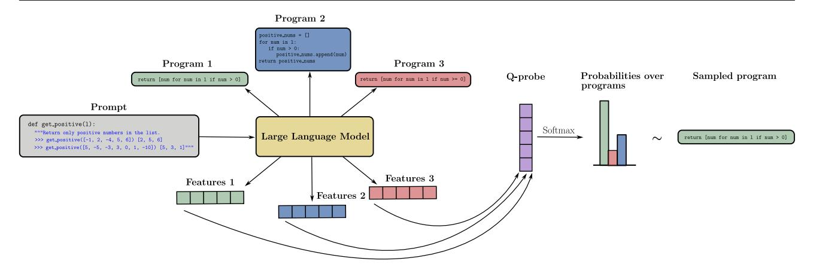
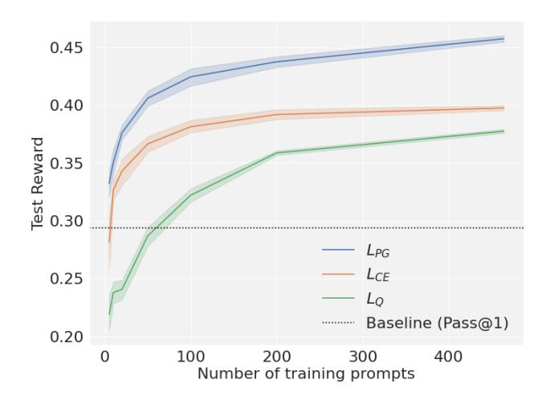
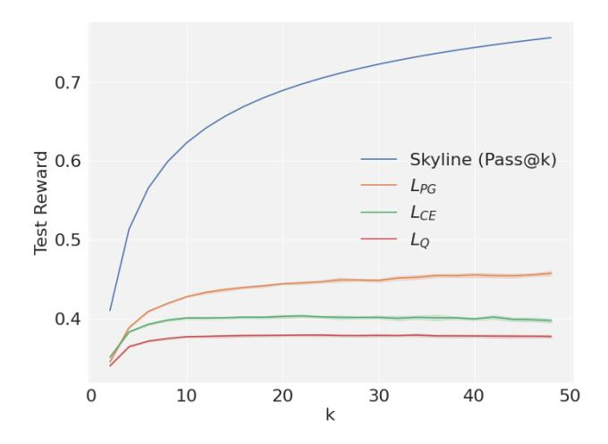
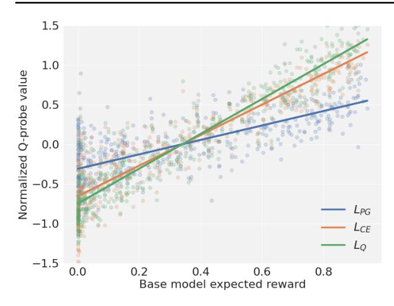
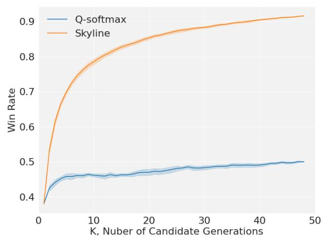
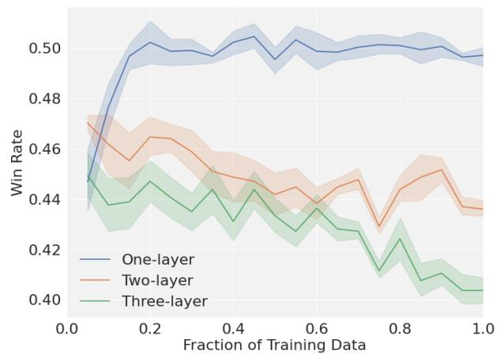

# Q-Probe: A Lightweight Approach to Reward Maximization for Language Models

Kenneth Li12 Samy Jelassi3 Hugh Zhang12 Sham Kakade12 Martin Wattenberg1 David Brandfonbrener2

#### **Abstract**

We present an approach called Q-probing to adapt a pre-trained language model to maximize a taskspecific reward function. At a high level, Qprobing sits between heavier approaches such as finetuning and lighter approaches such as few shot prompting, but can also be combined with either. The idea is to learn a simple linear function on a model's embedding space that can be used to reweight candidate completions. We theoretically show that this sampling procedure is equivalent to a KL-constrained maximization of the Q-probe as the number of samples increases. To train the Q-probes we consider either reward modeling or a class of novel direct policy learning objectives based on importance weighted policy gradients. With this technique, we see gains in domains with ground-truth rewards (code generation) as well as implicit rewards defined by preference data, even outperforming finetuning in data-limited regimes. Moreover, a Q-probe can be trained on top of an API since it only assumes access to sampling and embeddings. Code: https: //github.com/likenneth/q\_probe.

#### 1. Introduction

Pre-training on diverse data endows large language models (LLMs) with strong generic language capabilities. However, goal-directed downstream tasks like coding, mathematical reasoning, and dialogue systems require adapting the LLM to the task at hand. Since the goals in these tasks can be framed as rewards, this adaptation can take the form of reward maximization.

One approach to do this is finetuning, where the weights

Preprint.

of the model are adjusted to improve rewards. Exemplary techniques include reinforcement learning from human feedback (RLHF, Ouyang et al., 2022; Rafailov et al., 2023) and supervised finetuning on successful examples (Singh et al., 2023; Dong et al., 2023; Yuan et al., 2023).

On the other hand, there is evidence that the capabilities required for these downstream tasks have already been learned during pre-training, and the task of adaptation is merely extract them from the wide spectrum of pre-trained capabilities. For example, Zaken et al. (2021) propose that extremely parameter-efficient finetuning is evidence that the finetuning process is mostly about "exposing knowledge induced by language-modeling training", while Saunders et al. (2022) find that pre-trained language models are usually better at discriminating than generating answers.

Motivated by this line of thought, we present a lightweight approach reward maximization. For each downstream task, we keep the whole pre-trained model frozen and only train a small probe which is the same dimension as the residual stream (Alain and Bengio, 2016). We call our method Q-probe as it "probes" the expected utility of a completion (action) given a certain prompt (state).

To leverage the Q-probe at inference to generate samples we perform a sort of rejection sampling. Specifically, we first draw k sampled completions from the LLM given the input prompt and also store the embedding of each prompt-completion pair. The Q-probe then predicts a value for each embedding which determine the logits for k-way softmax distribution that we use to sample the chosen completion. In theory, we show that this procedure maximizes the KL-constrained value of the probe as k tends to infinity.

First, we evaluate Q-probes with access to ground truth rewards on coding benchmarks our best Q-probe achieves 17% higher accuracy on MBPP (Austin et al., 2021) compared to the base Code-LLaMA-7B (Roziere et al., 2023) and outperforms finetuning on successes with LORA (Hu et al., 2021) and few shot prompting. One key component of the results is a novel objective for training the Q-probes via direct policy learning. We find that rather than training the Q-probe to model the rewards, it is more effective to use an importance weighted policy gradient objective. Since we only need access to samples and embeddings we can train Q-

&lt;sup>1John A. Paulson School Of Engineering And Applied Sciences, Harvard University 2Kempner Institute for the Study of Natural and Artificial Intelligence, Harvard University 3Center of Mathematical Sciences and Applications, Harvard University. Correspondence to: Kenneth Li <ke\_li@g.harvard.edu>, David Brandfonbrener <david\_brandfonbrener@g.harvard.edu>.

Figure 1. An illustration of the Q-probe inference procedure. Given a prompt, we use the language model to generate k = 3 completions (in this case programs) and the respective embeddings of the k prompt-completion pairs. Then the linear Q-probe maps the features into the logits of a softmax distribution. We obtain our final sample from the Q-probe by sampling from this distribution.

probes on API-based models where gains are more modest (3% improvement over base model) due to a stronger base model and lack of access to internal model embeddings.

Next, we evaluate Q-probes on learning from human preferences. We conduct a standardized comparison [\(Ethayarajh](#page-8-3) [et al.,](#page-8-3) [2022\)](#page-8-3) and find that Q-probe outperforms offline PPO and DPO by 6% in terms of win rate as judged by GPT4. Moreover, we show that a Q-probe can be trained on top of a KTO finetuned model and outperforms either method individually by an additional 4%. This demonstrates how Q-probes can be combined effectively with other adaptation strategies.

Finally, in terms of computational cost, we should note that using a Q-probe requires substantially less training compute, but more inference-time compute when compared to finetuning. In our experiments, we can train a Q-probe in a few seconds (since it is just a 4096-dimensional linear model) whereas even parameter efficient finetuning [\(Hu et al.,](#page-9-4) [2021\)](#page-9-4) takes several hours. But, at inference, we draw k samples from the base model rather than 1 from a finetuned model, although improvements in parallel and speculative decoding are making batched decoding easier [\(Fang et al.,](#page-8-4) [2021;](#page-8-4) [Yu](#page-10-3) [et al.,](#page-10-3) [2022\)](#page-10-3). That said, it is also worth noting again that finetuning and Q-probing are not mutually exclusive. Indeed in our preference experiments, we find that the combination yields better performance than either method alone.

## 2. Related work

Probing. Q-probes leverage the idea of probing to solve reward maximization problems. This idea builds on prior work that uses probe for understanding the internals of neural networks [\(Alain and Bengio,](#page-8-1) [2016;](#page-8-1) [Belinkov,](#page-8-5) [2016;](#page-8-5) [Li](#page-9-5) [et al.,](#page-9-5) [2022\)](#page-9-5). A probe is a classifier or regressor which takes

internal activations of a network as its input and is trained to predict a feature of interest, e.g., part of speech, parse tree depth, or the expected reward in our case.

Rejection sampling. Rejection sampling for reward maximization is not a new idea. In fact, [Ganguli et al.](#page-8-6) [\(2022\)](#page-8-6); [Rafailov et al.](#page-9-1) [\(2023\)](#page-9-1) also evaluate rejection sampling as one of their baselines. However, their selector model is instantiated by the preference language model trained in a similar way to the first stage of RLHF by [Ouyang et al.](#page-9-0) [\(2022\)](#page-9-0). This version of rejection sampling not only involves higher training cost but is also double the inference cost to run the reward model while evaluating the Q-probe is essentially free in comparison to the base model.

Rejection sampling + finetuning. Another line of work finetunes or distills models on top of data that is acquired by rejection sampling [\(Singh et al.,](#page-10-0) [2023;](#page-10-0) [Dong et al.,](#page-8-0) [2023;](#page-8-0) [Yuan et al.,](#page-10-1) [2023;](#page-10-1) [Rafailov et al.,](#page-9-1) [2023\)](#page-9-1). In this work, we just focus on a lightweight way to do the rejection sampling, but adding some sort of distillation step on top to reduce inference cost could be an interesting future direction.

Iterative finetuning. While we focus our experiments primarily on offline settings for simplicity, there is also an interesting direction Iterative finetuning for reward maximization. [\(Anthony et al.,](#page-8-7) [2017;](#page-8-7) [Gulcehre et al.,](#page-8-8) [2023;](#page-8-8) [Singh](#page-10-0) [et al.,](#page-10-0) [2023;](#page-10-0) [Zelikman et al.,](#page-10-4) [2022;](#page-10-4) [Dong et al.,](#page-8-0) [2023\)](#page-8-0). The Q-probe idea could be applied inside of iterative algorithms like these and that is an interesting direction for future work.

Prompting. An important line of training-free adaptation methods centers around prompting [\(Salewski et al.,](#page-9-6) [2023\)](#page-9-6) which includes in-context learning (ICL, [Min et al.,](#page-9-7) [2022\)](#page-9-7) and Chain-of-thoughts (CoT, [Wei et al.,](#page-10-5) [2022\)](#page-10-5). Though it

enjoys great flexibility, [Mosbach et al.](#page-9-8) [\(2023\)](#page-9-8) reveal by a closer examination that finetuning still outperform prompting methods. Prompting could also be sensitive to prompt engineering [\(Lu et al.,](#page-9-9) [2021\)](#page-9-9) and takes up valuable context window, limiting the amount of data we can feed into it for a fair comparison with Q-probe and finetuning.

Prompting with reward access. There are also a host of other inference-time techniques designed for coding and reasoning settings [\(Zhou et al.,](#page-10-6) [2023a;](#page-10-6) [Shinn et al.,](#page-10-7) [2023;](#page-10-7) [Yao et al.,](#page-10-8) [2023\)](#page-10-8). However, they require access to the feedback from environment at test time which is different from the one-pass setting considered by us.

# 3. Setting

We consider a generic framing that examines downstream language tasks as reward maximization problem. In this setting, prompt strings x are sampled i.i.d. from some distribution Pprompt. Then, our model generates completion strings which we will denote by a ("actions" in the reinforcement learning lingo). The goal is to generate completions to maximize some reward function r(x, a).

Within this setting, we will consider a variety of feedback types (oracle rewards or preferences) as well as interaction levels (offline data or online reward access) that Q-probe can tackle. We also only need limited black-box access to the base model. This section formalizes all of these assumptions about the setting.

## 3.1. Feedback: oracle rewards and preferences

Oracle reward function feedback. In this setting, we assume access to a train set of prompts x ∈ Dtrain and access to the ground-truth or "oracle" reward function on the train prompts r(x, a) for x ∈ Dtrain and any a. For example, in coding problems this is assuming that we have test cases for the train prompts. For evaluation, we assume access to a test set of prompts x ∈ Dtest and also the reward function on the the test prompts.

The goal when given oracle reward feedback is to learn a policy π to maximize expected return:

$$J(\pi) = \underset{x}{\mathbb{E}} \underset{a \sim \pi|x}{\mathbb{E}} [r(x, a)] \tag{1}$$

Note, there is a large literature of prior work on using reinforcement learning directly to finetune language models when given access to oracle reward functions, e.g. for single turn language tasks [\(Schulman et al.,](#page-10-9) [2017;](#page-10-9) [Snell et al.,](#page-10-10) [2022;](#page-10-10) [Ramamurthy et al.,](#page-9-10) [2022;](#page-9-10) [Chang et al.,](#page-8-9) [2023\)](#page-8-9) or in multiturn settings [\(Zhou et al.,](#page-10-11) [2023b;](#page-10-11) [Abdulhai et al.,](#page-8-10) [2023\)](#page-8-10). In contrast, we focus on a lighter weight approach that only requires training probes, but shows how probe training can approximate traditional RL objectives.

Preference feedback. This is the same as above, except that we have access to pairwise comparisons. For an x ∈ Dtrain for any pair of actions (a0, a1) we can get a label l ∈ {0, 1} indicating which action is preferred [\(Christiano](#page-8-11) [et al.,](#page-8-11) [2017;](#page-8-11) [Ouyang et al.,](#page-9-0) [2022;](#page-9-0) [Rafailov et al.,](#page-9-1) [2023\)](#page-9-1) .

The goal when given preference feedback is to learn a policy π that generates actions to maximize the hidden reward function that induces the preferences (if we assume e.g. a Bradley-Terry model of preferences [\(Bradley and Terry,](#page-8-12) [1952\)](#page-8-12)).

## 3.2. Online vs. offline access to feedback

We always assume a fixed dataset of contexts (i.e. prompts) xi ∈ Dtrain. For example, these could be programming problems, math questions, or user queries. From these prompts, we consider two possible levels of access to the feedback source:

- 1. Online. With online access we can query the reward or preference of *any* action a or action pair (a0, a1) from any context xi in the training set to get r(xi , a). This setting is reasonable if we have unit tests for programming or a human in the loop for preference learning.
- 2. Offline. In the offline setting, we assume that the dataset also contains actions or action tuples and reward or preference labels. So the data has tuples of (xi , ai , ri) or (xi ,(a0)i ,(a1)i , yi). We can only access the rewards or preferences through these labels and cannot make arbitrary queries.

Our method can function in the offline setting where the dataset is sampled from the base model or in the online setting when only given sampling access to the base model. Throughout the paper we will default to the *offline* setting so that we can learn from fixed datasets.

Our setting is different than other online settings in which the learner can query r(x, a) at any x as well as any a. For our purposes, we assume that this level of access is too strong since it allows for searching against the reward function on the test set. Examples of methods in this setting are Reflexion [\(Shinn et al.,](#page-10-7) [2023\)](#page-10-7) or LATS [\(Zhou et al.,](#page-10-6) [2023a\)](#page-10-6). This is an interesting setting, but beyond the scope of this paper and not directly comparable to our results.

#### 3.3. Access to the LLM

We assume access to a pretrained language model that gives us two things:

- 1. Sampling from the LM distribution p0. Given a context x we can sample a completon a from p0(·|x).
- 2. Access to embeddings. We can extract an embedding ϕ(x, a) of the joint prompt-completion string.

We do not in general assume access to the underlying model to allow for finetuning, and our method will not require such access, but we consider such methods for comparison. We also do not assume access to densities or logits from the underlying model. With theses assumptions, our method is applicable on top of API-based models.

We are not aware of prior work on learning algorithms that uses this access model. So, we will compare to a few baselines that either get more access (full finetuning of open source models) or less access (just sampling with different prompts).

# 4. Inference using Q-probes

## 4.1. Defining the Q-probe policy

To define the Q-probe policy we reweight samples from the base model using a value function. Let  $Q_{\theta}: \mathcal{X} \times \mathcal{A} \to \mathbb{R}$ , then our policy  $\pi_{\theta,k}$  is defined by the following procedure:

1. Sample  $a_i \sim p_0 | x$ , 1 < i < k.

2. Sample 
$$a \sim \operatorname{softmax}\left(\left\langle \frac{Q_{\theta}(x, a_1)}{\beta}, \dots, \frac{Q_{\theta}(x, a_k)}{\beta} \right\rangle \right)$$
.

Note that  $Q_{\theta}$  does not have to represent a Q function in the lingo of RL, and can be any real valued function, this is just a way to define a policy.

## 4.2. Theoretical motivation for the Q-probe policy

To motivate the Q-probe policy, it is instructive to consider the limit as we take  $k \to \infty$ . In particular, we will show that in this limit, the policy converges to the optimal KL constrained policy that maximizes the expected value of the probe  $Q_{\theta}$ .

**Theorem 4.1.** Our policy approaches the following limit

$$\lim_{k \to \infty} \pi_{\theta,k}(a|x) = p_0(a|x) \frac{\exp(Q_{\theta}(x,a)/\beta)}{\mathbb{E}_{b \sim p_0|x}[\exp(Q_{\theta}(x,b)/\beta)]}.$$

**Corollary 4.2.** The limiting policy is the KL regularized policy that optimizes the Q-values:

$$\lim_{k \to \infty} \pi_{\theta,k} = \arg\max_{\pi} \underset{a \sim \pi|x}{\mathbb{E}} [Q_{\theta}(x,a)] - \beta \mathit{KL}(\pi || p_0)$$

See proofs in Appendix A.

Connection to rejection sampling. Our softmax sampling algorithm has a clear analogy to more standard rejection sampling. To define the rejection sampling analog, assume we know a value M such that  $M \ge \exp(Q_{\theta}(x,a)/\beta)$  for all a. Now the algorithm is:

- 1. Sample a from  $p_0(\cdot|x)$
- 2. Accept a with probability  $\frac{\exp(Q_{\theta}(x,a)/\beta)}{M}$ , otherwise return to step 1.

The runtime to get a sample accepted is M iterations in expectation. We can view the softmax version as an approximation of rejection sampling with k in place of M. This gives us consistent runtime and parallelization, but does mean that for finite k we are only approximately sampling from the target distribution.

This also makes it clear that to send  $\beta \to 0$  we need to send  $M \to \infty$  (and implicitly  $k \to \infty$ ).

# 5. Training algorithms for Q-probes

So far we have defined the procedure for sampling from a Q-probe policy and shown that this is a reasonable policy definition. Now we move on to demonstrating the variety of learning algorithms that can be used to train the Q-probes. Essentially, we can either attempt to learn reward/value functions or to learn policies directly. Moreover, we can apply this idea to either reward feedback or preference feedback.

#### 5.1. Learning from oracle reward feedback

**Reward learning.** The simplest approach is to simple use mean squared error to learn a Q probe to approximate the oracle reward function directly.

$$L_Q(\theta) = \mathbb{E} \underset{\substack{x \ a \sim p_0 \mid x}}{\mathbb{E}} [(Q_{\theta}(x, a) - r(x, a))^2]$$
 (2)

This learned  $Q_{\theta}$  then induces a policy  $\pi_{\theta,k}$ . Note that in the problems we consider, there is only one step of interaction with the environment so the reward function is equal to the Q function in the RL sense, this is why we call it a Q-probe. In many of the problems we consider, the rewards are either 0 or 1. In this case we can also estimate the reward with a classification loss like cross entropy (CE). Then the loss is:

$$L_{CE}(\theta) = \mathbb{E}_{x} \mathbb{E}_{a \sim p_0 \mid x} [r(x, a) \log \sigma(Q_{\theta}(x, a) + (3))]$$

$$(1 - r(x, a)) \log(1 - \sigma(Q_{\theta}(x, a)))]$$

This learned  $Q_{\theta}$  also induces a policy  $\pi_{\theta,k}$  in the same way.

**Direct policy learning.** One benefit of Q-probes is that we can derive a loss that more directly tries to optimize the expected return of the policy. For notational convenience, define  $f(a) = \exp(Q_{\theta}(x,a)/\beta)$ . Then we can define the softmax probability as:

$$\rho_{\theta}(a, \{a_i\}_{i=2}^k) = \frac{f(a)}{f(a) + \sum_{i=2}^k f(a_i)}.$$
 (4)

This  $\rho_{\theta}$  is the probability of sampling a conditioned on the k samples from step 1 of the sampling procedure being  $a, a_2, \ldots, a_k$ . The nice thing about  $\rho_{\theta}$  is that it approximated the ratio of densities between  $\pi_{\theta,k}$  and  $p_0$ . This allows us to define the following importance weighted policy

gradient loss:

$$L_{PG}(\theta) = \mathbb{E} \underset{x}{\mathbb{E}} \underset{a \sim p_0|x}{\mathbb{E}} \left[ -r(x, a) \frac{\pi_{\theta}^k(a|x)}{p_0(a|x)} \right]$$

$$\approx \mathbb{E} \underset{a_2, \dots, a_k \sim p_0|x}{\mathbb{E}} \left[ -r(x, a) \rho_{\theta}(a, \{a_i\}_{i=1}^k) \right]$$
(5)

Where by Theorem [4.1](#page-3-0) we have that this approximation is exact as k → ∞.

As is standard in the policy gradient literature, we can also introduce a baseline b(x) and replace −r(x, a) in the loss by −(r(x, a) − b(x)) [\(Greensmith et al.,](#page-8-13) [2004;](#page-8-13) [Schulman](#page-9-11) [et al.,](#page-9-11) [2015\)](#page-9-11). In practice, we use the context-independent mean reward in the dataset as our baseline.

*Remark* 5.1*.* This PG loss ends up looking much like a contrastive loss, which have traditionally been used for representation learning [\(Wu et al.,](#page-10-12) [2018;](#page-10-12) [Oord et al.,](#page-9-12) [2018\)](#page-9-12). Here, the contrastive loss arises naturally since the inference-time procedure of selecting one sample from many requires us to compare and contrast a set of samples. By directly tying the loss to the inference procedure we can force the model to allocate it's errors in such a way that performs better when selecting a sample by softmax.

## 5.2. Learning from preference feedback

Reward learning. The simplest approach to use Q-probes to learn from preferences is use the probe to learn a reward model using a Bradley-Terry model. The per sample loss is:

$$\ell(x, a_w, a_l, \theta) = \sigma(Q_\theta(x, a_w) - Q_\theta(x, a_l))$$
 (6)

And the full Q-preference loss function becomes:

$$L_{QP}(\theta) = \underset{\substack{x \\ a_w, a_l \sim p_0}}{\mathbb{E}} \left[ -\log \ell(x, a_w, a_l, \theta) \right]$$
 (7)

This learned Qθ then induces a policy πθ,k.

*Remark* 5.2*.* The preference learning reward objective has a sort of contrastive flavor as well. Since we pair positive and negative samples and incentivize giving them different values, this loss matches better with the downstream inference procedure of sampling many completions and choosing one.

Finaly, while we did not find it to be useful in practice, it is also possible to parameterize direct policy learning objectives from preference feedback with Q-probes as in DPO [\(Rafailov et al.,](#page-9-1) [2023\)](#page-9-1). A full derivation can be found in Appendix [B.](#page-11-1)

# 6. Oracle reward experiments

For our first experiments, we evaluate the ability of Q-probes to maximize ground-truth oracle rewards. Specifically, we focus on a program synthesis as a task with oracle rewards given by evaluating test cases. We train probes using the training set from MBPP [\(Austin et al.,](#page-8-2) [2021\)](#page-8-2) and test on the MBPP test set as well as evaluating generalization to HumanEval [\(Chen et al.,](#page-8-14) [2021\)](#page-8-14).

Rather than using a raw LLM as the base model, we start from a model that has already been finetuned on coding data [\(Chen et al.,](#page-8-14) [2021;](#page-8-14) [Roziere et al.,](#page-9-3) [2023;](#page-9-3) [Li et al.,](#page-9-13) [2023;](#page-9-13) [Azerbayev et al.,](#page-8-15) [2023\)](#page-8-15). This supervised finetuning facilitates more effective Q-probing for task-specific rewards. Specifically, we present two sets of results, first building on top of Code-LLaMA-7B [\(Roziere et al.,](#page-9-3) [2023\)](#page-9-3) and second building on top of the OpenAI API to demonstrate how Q-probes can be applied to API models.

#### 6.1. Setup

We train models on the MBPP train set which consists of 464 programming prompts with test cases. We consider the reward to be 1 if all tests are passed and 0 otherwise. For each training prompt, we can generate as many completions as we want from the base model to automatically label with these rewards. We sample from the base model with temperature 0.8 and top-p 0.95, following [\(Roziere et al.,](#page-9-3) [2023\)](#page-9-3), unless otherwise noted. For experiments on Code-LLaMA-7B, we take the 26th hidden layer of the same model for embeddings[1](#page-4-0) . For OpenAI API experiments, we experiment with both embedding API call as well as Code-LLaMA-70B. Unless otherwise stated, the Q-probe is a 1-layer (linear) probe, the optimizer is Adam [\(Kingma and](#page-9-14) [Ba,](#page-9-14) [2014\)](#page-9-14), the learning rate is 5e−5, batch size is 1000, and we train for 150 epochs. For the PG loss, we need multiple samples from one prompt to compute the loss. To do this, we group samples by prompt and reshape the batch so it contains 100 problems with 10 samples from each problem.

We evaluate the models on the MBPP test set of 500 programming prompts with test cases and also test generation to HumanEval dataset which has 164 prompts with test cases. The HumanEval dataset has a slightly different format, but contains problems of a similar level of difficulty to test the generalization abilities of the probes.

We consider a variety of baselines. First, we report the average success rate of the base model with default temperature sampling (BASELINE (PASS@1)). We also report greedy sampling from the base model (BASE-GREEDY). We include a few shot baseline where we sample 5 successful completions from the training dataset and put them into context and then sample with temperature 0 (5-SHOT ON SUCCESSES). We also include a skyline of pass@48 which has oracle access to the ground truth rewards.

For the Code-LLaMA model, we have white-box access to the model so we also add baselines that use LORA finetuning [\(Hu et al.,](#page-9-4) [2021\)](#page-9-4). We consider supervised finetuning

1 Probe performance usually peaks at an intermediate layer [\(He](#page-9-15)[witt and Manning,](#page-9-15) [2019\)](#page-9-15).

Table 1. Expected return for Q-probes on top of Code-LLaMA-7B, trained on 464 problems from MBPP-train. For Q-probe inference we use k = 48 and β = 0.1. Q-probe results are the mean over 10 training runs.

| METHOD              | MBPP-TEST | HUMANEVAL |
|---------------------|-----------|-----------|
| BASELINE (PASS@1)   | 0.29      | 0.24      |
| BASELINE (GREEDY)   | 0.38      | 0.30      |
| 5-SHOT ON SUCCESSES | 0.42      | 0.33      |
| SFT ON SUCCESSES    | 0.42      | 0.32      |
| PROMPT RM           | 0.31      | 0.25      |
| FINETUNE RM         | 0.34      | 0.26      |
| Q-PROBE LQ          | 0.38      | 0.29      |
| Q-PROBE LCE         | 0.40      | 0.32      |
| Q-PROBE LP G        | 0.46      | 0.34      |
| (SKYLINE) PASS@48   | 0.76      | 0.77      |

on the successful completions from the training data followed by greedy decoding (SFT ON SUCCESSES) [\(Singh](#page-10-0) [et al.,](#page-10-0) [2023;](#page-10-0) [Dong et al.,](#page-8-0) [2023\)](#page-8-0). We also consider two kinds of rejection sampling alternatives: one using instruction to prompt model to judge its own generation (PROMPT RM) and the other using a LORA finetuned reward model instead of a lightweight probe (FINETUNE RM). At inference time, both rejection sampling baselines adopt hardmax over 48 generations.

## 6.2. Code-LLaMA results

We present results for training Q-probes on top of Code-LLaMA-7B in Table [1.](#page-5-0) The main finding is that Q-probe with the policy gradient loss LP G is the best model. This confirms the idea that finding a loss that is a more direct proxy for the downstream task leads to better outcomes.

At a higher level, it is also important to note the benefits of training such small and lightweight probes. With only a small amount of training we can extract a useful discriminator from the generative model to improve performance.

Figure [2](#page-5-1) shows how the Q-probes scale as we vary the number of prompts in the training dataset. In this experiment we take 10 different random samples of n prompts and train Q-probes on a dataset of completions of these prompts from the base model. We find that The PG loss consistently beats the Q and CE losses and that data efficiency can be quite good, achieving 0.4 test reward from only 50 prompts.

Figure [3](#page-5-2) shows how the Q-probes scale as we vary k, the number of samples drawn at inference time. We see that the model trained with PG loss sees consistent improvement with k, although it is beginning to saturate. In contrast, LQ and LCE actually see performance slightly degrading as we increase k. This again affirms how matching the training loss to the inference procedure is beneficial.

Finally, Figure [4](#page-6-0) attempts to provide some intuition about

Figure 2. How MBPP test reward scales with the size of the training dataset. At inference we fixing K = 48 and β = 0.1. Error bars show 95% confidence interval over 10 training runs.

Figure 3. How MBPP test reward scales with inference-time compute when sweeping over K with β = 0.1. Error bars show 95% confidence interval over 10 training runs.

how LP G differs from LQ and LCE in a way that is beneficial. First and foremost LP G attempts to optimize a proxy of the test metric, expected reward. This experiment tries to look at a lower level to see how this changes the learned models. Intuitively, LQ and LCE treats samples a from the same x independently (since they just sum over all samples), and end up allocating a good amount of capacity to classifying which *prompts* are hard (causing higher slope in the figure). But the LP G loss forces the model to learn which completions are good when compared to each other for the *same* prompt. The contrastive nature of this loss helps the model allocate capacity more effectively to the part of the problem that matters: comparing different completions of the same prompt.

Figure 4. Per-problem correlation between base model expected reward and Q-probe value (centered and normalized by standard deviation). Each point corresponds to a prompt in the training set and averages across the 200 sampled completions. LP G learns by contrasting completions to the same prompt, so it learns a probe that is less prompt-dependent.

Table 2. Expected return for Q-probe models on top of gpt-3.5-turbo-1106 and CodeLlama-70b-Python embeddings. Q-probe inference uses k = 48 and β = 0.1. Q-probe results are the mean over 10 training runs.

| METHOD              | MBPP-TEST | HUMANEVAL |
|---------------------|-----------|-----------|
| BASELINE (PASS@1)   | 0.65      | 0.54      |
| BASELINE (GREEDY)   | 0.65      | 0.59      |
| 5-SHOT ON SUCCESSES | 0.66      | 0.61      |
| Q-PROBE LQ          | 0.68      | 0.57      |
| Q-PROBE LCE         | 0.69      | 0.64      |
| Q-PROBE LP G        | 0.69      | 0.58      |
| (SKYLINE) PASS@48   | 0.80      | 0.81      |

## 6.3. OpenAI API results

Finally, we conduct a similar experiment on top of generations from the OpenAI API. Results are reported in Table [2.](#page-6-1) We use embeddings from CodeLlama-70b-Python, since embeddings are not available from the API generative model. We find gains over the baselines on both datasets.

While this is a nice proof of concept that Q-probes can be applied on top of API-based models, the results are not as strong as they were for Code-LLaMA. We hypothesize that this is largely for two reasons: (1) the base model is much stronger on the task and has likely been finetuned to do particularly well at these coding tasks so there is simply less room for reweighting to help, and (2) we do not have access to the embeddings from the model itself and the open source embeddings from Code-LLaMA are likely less performant.

We also experimented with embeddings from the OpenAI

API, and found them to work less well than the Code-LlaMa embeddings. Full results and discussion of these experiments are in [Appendix C.](#page-12-0)

# 7. Preference feedback experiments

We also experiment with Q-probe on learning from human preference data. We follow the set-up and implementation of [Ethayarajh et al.](#page-8-16) [\(2023\)](#page-8-16) strictly unless otherwise specified. We use the combination of three open-source preference datasets—Anthropic Helpfulness and Harmlessness (HH) [\(Ganguli et al.,](#page-8-6) [2022\)](#page-8-6), OpenAssistant [\(Kopf](#page-9-16) ¨ [et al.,](#page-9-16) [2023\)](#page-9-16), and Stanford Human Preferences Dataset (SHP) [\(Ethayarajh et al.,](#page-8-3) [2022\)](#page-8-3). Experiments are carried out on LLaMA-7B [\(Touvron et al.,](#page-10-13) [2023\)](#page-10-13).

Table 3. Comparison of different preference learning methods on the combination of three datasets. [\(Ethayarajh et al.,](#page-8-16) [2023\)](#page-8-16)'s setting is exactly followed; numbers for base models are taken from their paper. Base model is LLaMA-7B after SFT training.

| METHOD                                  | WIN RATE (%)                     |
|-----------------------------------------|----------------------------------|
| BASELINE PPO (OFFLINE) DPO KTO | 37.86 44.07 44.97 51.46 |
| Q-PROBE W/ LQP                          | 50.10                            |
| KTO + Q-PROBE W/ LQP                    | 55.01                            |
| (SKYLINE) PASS@48                       | 91.59                            |

#### 7.1. Setup

We first extract features for probe training. Combining the training sets of three datasets together, we obtain a dataset with 200, 336 training pairs, each containing a winning completion and a losing completion. We concatenate the prompt with both completions and run a forward pass of the model to extract embeddings. Note that our Q-probing is applied on the supervised finetuned model, which is also the starting point for the compared methods [\(Ouyang et al.,](#page-9-0) [2022;](#page-9-0) [Rafailov et al.,](#page-9-1) [2023;](#page-9-1) [Ethayarajh et al.,](#page-8-16) [2023\)](#page-8-16). Offline PPO, DPO and KTO use different loss functions to finetune the model weights from this supervised finetuned model.

Upon finishing training, we sample 48 samples for each prompt in the test set and embed them with the model. The Q-probe then returns the scores for each completion. Here we use β = 0 and select the argmax of the scores. During evaluation, the model's completion is compared against the winning completion in the data for that prompt by GPT-4 as the judge to compute the "win rate".

Experiment Details We implement the Q-probe with a 1-layer probe, trained at a learning rate of 5e − 5 with batch

Figure 5. How the win rate of Q-probe scales with inference-time compute on preference learning benchmarks. The skyline shows the performance of a perfect oracle selector. Shade area represents 95% confidence interval for 10 runs.

Figure 6. How the win rate on human preference learning benchmarks scales with the percentage of data used for training three different kinds of probes, from 5% to 100% at an interval of 5%. There are in total 200, 336 training pairs.

size 1024 for 150 epochs using 20% of the whole training set used by other methods, which is 40, 067 pairs of winning and losing generations. All methods use nucleus sampling (p = 0.95) and temperature 1.0 at inference [\(Holtzman](#page-9-17) [et al.,](#page-9-17) [2019\)](#page-9-17).

#### 7.2. Experimental Results

[Table 3](#page-6-2) presents our results on human preference data. Starting from the same supervised finetuned model, Q-probe outperforms strong existing methods like PPO (offline) and DPO, while performing on par with KTO. We also experiment with swapping the base model with the KTO-finetuned model, and show that Q-probe on the KTO-finetuned model outperforms either KTO alone or Q-probing on the base model. This shows how our proposed inference-time algorithm is orthogonal to existing finetuning methods and that they can be applied together.

In [Figure 5,](#page-7-0) we vary the amount of inference-time compute by varying the k, the number of samples we generate. Improvement begins to plateau around k = 5 but further scaling continues to slowly increase the win rate.

In [Figure 6,](#page-7-1) we examine how much data is required for the Q-probe to work well. For the 1-layer linear probe, thanks to its simplicity, only 20% of the data is required to reach plateaued performance, making Q-probe a worthconsidering candidate method when the available preference data is small. We also experiment with more powerful probe architectures, e.g. 2 or 3-layer MLPs, discovering this actually harms performance by overfitting (note that larger datasets also lead to more training since we fix the number of epochs and batch size). In one interpretation, the Q-probe discovers a linear preference direction in the hidden space of the LLM, which could be related to the formation of linear structures in various neural networks [\(Radford et al.,](#page-9-18) [2017;](#page-9-18) [Voynov and Babenko,](#page-10-14) [2020;](#page-10-14) [Rogers et al.,](#page-9-19) [2021\)](#page-9-19).

# 8. Discussion

We have proposed Q-probe, a lightweight replacement for or complement to finetuning when we want to maximize reward on downstream tasks given a pre-trained language model. On two settings with access to oracle rewards and human preference pairs respectively, Q-probe outperforms strong finetuning baselines. For anyone who does not have the resource or access to finetune large language models but wish to adapt them for their own downstream tasks, Q-probe can serve as a solid replacement, and even given a finetuned model, Q-probe can be added on top to leverage more inference-time compute to squeeze out better performance.

One interesting direction for future work is to study in more depth what sort of probes are learned by Q-probes on different tasks. Are the probes possibly similar across tasks? There could also be interesting connections to "task vectors" [\(Ilharco et al.,](#page-9-20) [2022\)](#page-9-20).

Finally, Q-probe is inspired by, and corroborates, earlier findings about the generation-discrimination (GD) gap in large language models [\(Saunders et al.,](#page-9-2) [2022\)](#page-9-2). This work essentially demonstrates the technical possibility of closing GD gap by rejection sampling—use the stronger discrimination capability to help the weaker generation capability. One interesting direction for future work is to investigate whether fine-tuning with the improved policy could, in turn, enhance the discrimination capability, and if so, how long this self-improving spiral could last.

### Impact Statement

This paper presents work whose goal is to advance the field of Machine Learning. There are many potential societal consequences of our work, none which we feel must be specifically highlighted here. A benefit of the proposed lightweight approach is that it lowers carbon emissions.

## Acknowledgments

Kenneth Li and Hugh Zhang are supported by a fellowship from the Kempner Institute for the Study of Natural and Artificial Intelligence at Harvard University. Kempner Institute computing resources enabled this work. Hugh is additionally supported by a Graduate Research Fellowship from the National Science Foundation. Samy Jelassi acknowledges funding supported by the Center of Mathematical Sciences and Applications. This work has been made possible in part by a gift from the Chan Zuckerberg Initiative Foundation to establish the Kempner Institute for the Study of Natural and Artificial Intelligence. Sham Kakade acknowledges funding from the Office of Naval Research under award N00014-22-1-2377.

# References

- Marwa Abdulhai, Isadora White, Charlie Snell, Charles Sun, Joey Hong, Yuexiang Zhai, Kelvin Xu, and Sergey Levine. Lmrl gym: Benchmarks for multi-turn reinforcement learning with language models. *arXiv preprint arXiv:2311.18232*, 2023.
- Guillaume Alain and Yoshua Bengio. Understanding intermediate layers using linear classifier probes. *arXiv preprint arXiv:1610.01644*, 2016.
- Thomas Anthony, Zheng Tian, and David Barber. Thinking fast and slow with deep learning and tree search. *Advances in neural information processing systems*, 30, 2017.
- Jacob Austin, Augustus Odena, Maxwell Nye, Maarten Bosma, Henryk Michalewski, David Dohan, Ellen Jiang, Carrie Cai, Michael Terry, Quoc Le, et al. Program synthesis with large language models. *arXiv preprint arXiv:2108.07732*, 2021.
- Zhangir Azerbayev, Hailey Schoelkopf, Keiran Paster, Marco Dos Santos, Stephen McAleer, Albert Q Jiang, Jia Deng, Stella Biderman, and Sean Welleck. Llemma: An open language model for mathematics. *arXiv preprint arXiv:2310.10631*, 2023.
- Yonatan Belinkov. Probing classifiers: Promises, shortcomings, and advances. *Computational Linguistics*, pages 1–12, 2016.

- Ralph Allan Bradley and Milton E. Terry. Rank analysis of incomplete block designs: I. the method of paired comparisons. *Biometrika*, 39:324, 1952. URL [https://api.semanticscholar.org/](https://api.semanticscholar.org/CorpusID:125209808) [CorpusID:125209808](https://api.semanticscholar.org/CorpusID:125209808).
- Jonathan D Chang, Kiante Brantley, Rajkumar Ramamurthy, Dipendra Misra, and Wen Sun. Learning to generate better than your llm. *arXiv preprint arXiv:2306.11816*, 2023.
- Mark Chen, Jerry Tworek, Heewoo Jun, Qiming Yuan, Henrique Ponde de Oliveira Pinto, Jared Kaplan, Harri Edwards, Yuri Burda, Nicholas Joseph, Greg Brockman, et al. Evaluating large language models trained on code. *arXiv preprint arXiv:2107.03374*, 2021.
- Paul F Christiano, Jan Leike, Tom Brown, Miljan Martic, Shane Legg, and Dario Amodei. Deep reinforcement learning from human preferences. *Advances in neural information processing systems*, 30, 2017.
- Hanze Dong, Wei Xiong, Deepanshu Goyal, Rui Pan, Shizhe Diao, Jipeng Zhang, Kashun Shum, and Tong Zhang. Raft: Reward ranked finetuning for generative foundation model alignment. *arXiv preprint arXiv:2304.06767*, 2023.
- Kawin Ethayarajh, Yejin Choi, and Swabha Swayamdipta. Understanding dataset difficulty with v-usable information. In *International Conference on Machine Learning*, pages 5988–6008. PMLR, 2022.
- Kawin Ethayarajh, Winnie Xu, Dan Jurafsky, and Douwe Kiela. Human-centered loss functions (halos). Technical report, Contextual AI, 2023.
- Jiarui Fang, Yang Yu, Chengduo Zhao, and Jie Zhou. Turbotransformers: an efficient gpu serving system for transformer models. In *Proceedings of the 26th ACM SIG-PLAN Symposium on Principles and Practice of Parallel Programming*, pages 389–402, 2021.
- Deep Ganguli, Liane Lovitt, Jackson Kernion, Amanda Askell, Yuntao Bai, Saurav Kadavath, Ben Mann, Ethan Perez, Nicholas Schiefer, Kamal Ndousse, et al. Red teaming language models to reduce harms: Methods, scaling behaviors, and lessons learned. *arXiv preprint arXiv:2209.07858*, 2022.
- Evan Greensmith, Peter L Bartlett, and Jonathan Baxter. Variance reduction techniques for gradient estimates in reinforcement learning. *Journal of Machine Learning Research*, 5(9), 2004.
- Caglar Gulcehre, Tom Le Paine, Srivatsan Srinivasan, Ksenia Konyushkova, Lotte Weerts, Abhishek Sharma, Aditya Siddhant, Alex Ahern, Miaosen Wang, Chenjie

- Gu, et al. Reinforced self-training (rest) for language modeling. *arXiv preprint arXiv:2308.08998*, 2023.
- John Hewitt and Christopher D Manning. A structural probe for finding syntax in word representations. In *Proceedings of the 2019 Conference of the North American Chapter of the Association for Computational Linguistics: Human Language Technologies, Volume 1 (Long and Short Papers)*, pages 4129–4138, 2019.
- Ari Holtzman, Jan Buys, Li Du, Maxwell Forbes, and Yejin Choi. The curious case of neural text degeneration. *arXiv preprint arXiv:1904.09751*, 2019.
- Edward J Hu, Yelong Shen, Phillip Wallis, Zeyuan Allen-Zhu, Yuanzhi Li, Shean Wang, Lu Wang, and Weizhu Chen. Lora: Low-rank adaptation of large language models. *arXiv preprint arXiv:2106.09685*, 2021.
- Gabriel Ilharco, Marco Tulio Ribeiro, Mitchell Wortsman, Suchin Gururangan, Ludwig Schmidt, Hannaneh Hajishirzi, and Ali Farhadi. Editing models with task arithmetic. *arXiv preprint arXiv:2212.04089*, 2022.
- Diederik P Kingma and Jimmy Ba. Adam: A method for stochastic optimization. *arXiv preprint arXiv:1412.6980*, 2014.
- Andreas Kopf, Yannic Kilcher, Dimitri von R ¨ utte, Sotiris ¨ Anagnostidis, Zhi-Rui Tam, Keith Stevens, Abdullah Barhoum, Nguyen Minh Duc, Oliver Stanley, Richard ´ Nagyfi, et al. Openassistant conversations–democratizing large language model alignment. *arXiv preprint arXiv:2304.07327*, 2023.
- Kenneth Li, Aspen K Hopkins, David Bau, Fernanda Viegas, Hanspeter Pfister, and Martin Wattenberg. Emer- ´ gent world representations: Exploring a sequence model trained on a synthetic task. *arXiv preprint arXiv:2210.13382*, 2022.
- Raymond Li, Loubna Ben Allal, Yangtian Zi, Niklas Muennighoff, Denis Kocetkov, Chenghao Mou, Marc Marone, Christopher Akiki, Jia Li, Jenny Chim, et al. Starcoder: may the source be with you! *arXiv preprint arXiv:2305.06161*, 2023.
- Yao Lu, Max Bartolo, Alastair Moore, Sebastian Riedel, and Pontus Stenetorp. Fantastically ordered prompts and where to find them: Overcoming few-shot prompt order sensitivity. *arXiv preprint arXiv:2104.08786*, 2021.
- Sewon Min, Xinxi Lyu, Ari Holtzman, Mikel Artetxe, Mike Lewis, Hannaneh Hajishirzi, and Luke Zettlemoyer. Rethinking the role of demonstrations: What makes incontext learning work? *arXiv preprint arXiv:2202.12837*, 2022.

- Marius Mosbach, Tiago Pimentel, Shauli Ravfogel, Dietrich Klakow, and Yanai Elazar. Few-shot fine-tuning vs. incontext learning: A fair comparison and evaluation. *arXiv preprint arXiv:2305.16938*, 2023.
- Aaron van den Oord, Yazhe Li, and Oriol Vinyals. Representation learning with contrastive predictive coding. *arXiv preprint arXiv:1807.03748*, 2018.
- Long Ouyang, Jeffrey Wu, Xu Jiang, Diogo Almeida, Carroll Wainwright, Pamela Mishkin, Chong Zhang, Sandhini Agarwal, Katarina Slama, Alex Ray, et al. Training language models to follow instructions with human feedback. *Advances in Neural Information Processing Systems*, 35:27730–27744, 2022.
- Alec Radford, Rafal Jozefowicz, and Ilya Sutskever. Learning to generate reviews and discovering sentiment. *arXiv preprint arXiv:1704.01444*, 2017.
- Rafael Rafailov, Archit Sharma, Eric Mitchell, Stefano Ermon, Christopher D Manning, and Chelsea Finn. Direct preference optimization: Your language model is secretly a reward model. *arXiv preprint arXiv:2305.18290*, 2023.
- Rajkumar Ramamurthy, Prithviraj Ammanabrolu, Kiante´ Brantley, Jack Hessel, Rafet Sifa, Christian Bauckhage, Hannaneh Hajishirzi, and Yejin Choi. Is reinforcement learning (not) for natural language processing?: Benchmarks, baselines, and building blocks for natural language policy optimization. *arXiv preprint arXiv:2210.01241*, 2022.
- Anna Rogers, Olga Kovaleva, and Anna Rumshisky. A primer in bertology: What we know about how bert works. *Transactions of the Association for Computational Linguistics*, 8:842–866, 2021.
- Baptiste Roziere, Jonas Gehring, Fabian Gloeckle, Sten Sootla, Itai Gat, Xiaoqing Ellen Tan, Yossi Adi, Jingyu Liu, Tal Remez, Jer´ emy Rapin, et al. Code llama: ´ Open foundation models for code. *arXiv preprint arXiv:2308.12950*, 2023.
- Leonard Salewski, Stephan Alaniz, Isabel Rio-Torto, Eric Schulz, and Zeynep Akata. In-context impersonation reveals large language models' strengths and biases. *arXiv preprint arXiv:2305.14930*, 2023.
- William Saunders, Catherine Yeh, Jeff Wu, Steven Bills, Long Ouyang, Jonathan Ward, and Jan Leike. Selfcritiquing models for assisting human evaluators. *arXiv preprint arXiv:2206.05802*, 2022.
- John Schulman, Sergey Levine, Pieter Abbeel, Michael Jordan, and Philipp Moritz. Trust region policy optimization. In *International conference on machine learning*, pages 1889–1897. PMLR, 2015.

- John Schulman, Filip Wolski, Prafulla Dhariwal, Alec Radford, and Oleg Klimov. Proximal policy optimization algorithms. *arXiv preprint arXiv:1707.06347*, 2017.
- Noah Shinn, Beck Labash, and Ashwin Gopinath. Reflexion: an autonomous agent with dynamic memory and selfreflection. *arXiv preprint arXiv:2303.11366*, 2023.
- Avi Singh, John D Co-Reyes, Rishabh Agarwal, Ankesh Anand, Piyush Patil, Peter J Liu, James Harrison, Jaehoon Lee, Kelvin Xu, Aaron Parisi, et al. Beyond human data: Scaling self-training for problem-solving with language models. *arXiv preprint arXiv:2312.06585*, 2023.
- Charlie Snell, Ilya Kostrikov, Yi Su, Mengjiao Yang, and Sergey Levine. Offline rl for natural language generation with implicit language q learning. *arXiv preprint arXiv:2206.11871*, 2022.
- Hugo Touvron, Thibaut Lavril, Gautier Izacard, Xavier Martinet, Marie-Anne Lachaux, Timothee Lacroix, Baptiste ´ Roziere, Naman Goyal, Eric Hambro, Faisal Azhar, et al. ` Llama: Open and efficient foundation language models. *arXiv preprint arXiv:2302.13971*, 2023.
- Andrey Voynov and Artem Babenko. Unsupervised discovery of interpretable directions in the gan latent space. In *International conference on machine learning*, pages 9786–9796. PMLR, 2020.
- Jason Wei, Xuezhi Wang, Dale Schuurmans, Maarten Bosma, Fei Xia, Ed Chi, Quoc V Le, Denny Zhou, et al. Chain-of-thought prompting elicits reasoning in large language models. *Advances in Neural Information Processing Systems*, 35:24824–24837, 2022.
- Zhirong Wu, Yuanjun Xiong, Stella X Yu, and Dahua Lin. Unsupervised feature learning via non-parametric instance discrimination. In *Proceedings of the IEEE conference on computer vision and pattern recognition*, pages 3733–3742, 2018.
- Shunyu Yao, Dian Yu, Jeffrey Zhao, Izhak Shafran, Thomas L Griffiths, Yuan Cao, and Karthik Narasimhan. Tree of thoughts: Deliberate problem solving with large language models. *arXiv preprint arXiv:2305.10601*, 2023.
- Gyeong-In Yu, Joo Seong Jeong, Geon-Woo Kim, Soojeong Kim, and Byung-Gon Chun. Orca: A distributed serving system for {Transformer-Based} generative models. In *16th USENIX Symposium on Operating Systems Design and Implementation (OSDI 22)*, pages 521–538, 2022.
- Zheng Yuan, Hongyi Yuan, Chengpeng Li, Guanting Dong, Chuanqi Tan, and Chang Zhou. Scaling relationship on learning mathematical reasoning with large language models. *arXiv preprint arXiv:2308.01825*, 2023.

- Elad Ben Zaken, Shauli Ravfogel, and Yoav Goldberg. Bitfit: Simple parameter-efficient fine-tuning for transformer-based masked language-models. *arXiv preprint arXiv:2106.10199*, 2021.
- Eric Zelikman, Yuhuai Wu, Jesse Mu, and Noah Goodman. Star: Bootstrapping reasoning with reasoning. *Advances in Neural Information Processing Systems*, 35:15476– 15488, 2022.
- Andy Zhou, Kai Yan, Michal Shlapentokh-Rothman, Haohan Wang, and Yu-Xiong Wang. Language agent tree search unifies reasoning acting and planning in language models. *arXiv preprint arXiv:2310.04406*, 2023a.
- Xuhui Zhou, Hao Zhu, Leena Mathur, Ruohong Zhang, Haofei Yu, Zhengyang Qi, Louis-Philippe Morency, Yonatan Bisk, Daniel Fried, Graham Neubig, et al. Sotopia: Interactive evaluation for social intelligence in language agents. *arXiv preprint arXiv:2310.11667*, 2023b.

#### A. Proofs

Theorem A.1. Our policy approaches the following limit

$$\lim_{k \to \infty} \pi_{\theta,k}(a|x) = p_0(a|x) \frac{\exp(Q_{\theta}(x,a)/\beta)}{\mathbb{E}_{b \sim p_0|x}[\exp(Q_{\theta}(x,b)/\beta)]}$$
(8)

*Proof.* First note that we can write the density of  $\pi_{\theta,k}$  as follows:

$$\pi_{\theta,k}(a|x) = \sum_{\{a_i\}_{i=1}^k \in \mathcal{A}^k} \pi_{\theta,k}(a|x, \{a_i\}_{i=1}^k) p_0(\{a_i\}_{i=1}^k | x)$$
(9)

$$= \underset{\{a_i\}_{i=1}^k \sim p_0 \mid x}{\mathbb{E}} \left[ \pi_{\theta,k}(a \mid x, \{a_i\}_{i=1}^k) \right]$$
 (10)

$$= \mathbb{E}_{\{a_i\}_{i=1}^k \sim p_0 \mid x} \left[ \sum_i \mathbb{I}\{a_i = a\} \frac{\exp(Q_\theta(x, a_i) / \beta)}{\sum_j \exp(Q_\theta(x, a_j) / \beta)} \right]$$
(11)

$$= \underset{\{a_i\}_{i=1}^k \sim p_0 \mid x}{\mathbb{E}} \left[ \frac{\sum_i \mathbb{I}\{a_i = a\}}{\sum_j \exp(Q_\theta(x, a_j)/\beta)} \right] \exp(Q_\theta(x, a)/\beta)$$
(12)

$$= \mathbb{E}_{\{a_i\}_{i=1}^k \sim p_0 \mid x} \left[ \frac{\frac{1}{k} \sum_i \mathbb{I}\{a_i = a\}}{\frac{1}{k} \sum_j \exp(Q_\theta(x, a_j) / \beta)} \right] \exp(Q_\theta(x, a) / \beta)$$
(13)

Taking the limit of  $k \to \infty$  and using Law of Large Numbers ( $a_i$ 's are i.i.d.)

$$\lim_{k \to \infty} \pi_{\theta,k}(a|x) = \lim_{k \to \infty} \underset{\{a_i\}_{i=1}^k \sim p_0|x}{\mathbb{E}} \left[ \frac{p_0(a|x)}{\mathbb{E}_{b \sim p_0|x} \left[ \exp(Q_\theta(x,b)/\beta) \right]} \right] \exp(Q_\theta(x,a)/\beta)$$
(14)

$$= p_0(a|x) \frac{\exp(Q_{\theta}(x,a)/\beta)}{\mathbb{E}_{b \sim p_0|x} \left[\exp(Q_{\theta}(x,b)/\beta)\right]}$$
(15)

**Corollary A.2.** The limiting policy is the optimal KL regularized policy:

$$\lim_{k \to \infty} \pi_{\theta,k}(a|x) = p_0(a|x) \frac{\exp(Q_{\theta}(x,a)/\beta)}{\mathbb{E}_{b \sim p_0|x}[\exp(Q_{\theta}(x,b)/\beta)]} = \arg\max_{\pi} \mathbb{E}_{a \sim \pi|x}[Q_{\theta}(x,a)] - \beta K L(\pi||p_0)$$
(16)

The proof follows directly from Appendix A.1 in Rafailov et al. (2023).

## **B.** Preference learning objectives

**Direct policy learning.** Alternatively, we can take inspiration from DPO (Rafailov et al., 2023) and learn the policy directly. Recall that to define the DPO loss, we consider the per-sample likelihood of an example as:

$$p(x, a_w, a_l, \theta) = \sigma \left( \alpha \frac{\pi_\theta^k(a_w|x)}{p_0(a_w|x)} - \alpha \frac{\pi_\theta^k(a_l|x)}{p_0(a_l|x)} \right)$$

$$(17)$$

And then the full DPO loss is:

$$L_{DPO}(\theta) = \underset{a_w, a_l, a_i \sim p_0}{\mathbb{E}} \left[ -\log p(x, a_w, a_l, \theta) \right]$$
(18)

When using Q-probing as the policy, we can use  $\rho_{\theta}$  to approximate the ratio between  $\pi_{\theta,k}$  and  $p_0$  in the expression for p. To do this, let  $\tilde{p}(a, a_w, a_l, a_i_{i=2}^k, \theta)$  be defined as follows:

$$\sigma\left(\alpha \rho_{\theta}(a_{w}, \{a_{l}, a_{i}\}_{i=3}^{k}) - \alpha \rho_{\theta}(a_{l}, \{a_{w}, a_{i}\}_{i=3}^{k})\right)$$
(19)

Then  $L_{DPO}(\theta)$  can be approximated by:

$$\approx \underset{\substack{a_w, a_l, a_i \sim p_0 \\ a_2, \dots, a_k \sim p_0}}{\mathbb{E}} \left[ -\log \tilde{p}(a, a_w, a_l, a_{i=2}^k, \theta) \right]$$
(20)

where again by Theorem 4.1 this approximation becomes exact as  $k \to \infty$ .

We can expand  $\rho_{\theta}$  in the above loss and notice that it becomes:

$$\sigma\left(\alpha \frac{\exp(Q(x, a_w)/\beta) - \exp(Q(x, a_l)/\beta)}{\exp(Q(x, a_w)/\beta) + \exp(Q(x, a_l)/\beta) + \sum_i \exp(Q(x, a_i)/\beta)}\right)$$
(21)

If there are no  $a_i$  we can still implement this with just two samples  $a_w$  and  $a_l$  at which point it begins to look much like the reward modeling loss, but with the softmax incorporated.

# C. Additional OpenAI API Experiments

Here we experiment with embeddings from the OpenAI API. As shown in Table 4, embeddings from text-embedding-3-small underperforms the Code-LLaMA embeddings and did not yield any performance gains over the baseline models. This is likely because in addition to likely using a smaller, less performant model than gpt-3.5, the API embedding models are likely trained for retrieval applications rather than generation. This difference may harm performance as a Q-probe, but future work is needed to more deeply understand the differences between various embeddings as Q-probes.

Table 4. Expected return for Q-probe models on top of gpt-3.5-turbo-1106 and text-embedding-3-small. Q-probe inference uses k=48 and  $\beta=0.1$ . Q-probe results are the mean over 10 training runs.

| Метнор                     | MBPP-TEST | HUMANEVAL |
|----------------------------|-----------|-----------|
| BASELINE (PASS@1)          | 0.65      | 0.54      |
| BASELINE (GREEDY)          | 0.65      | 0.59      |
| 5-SHOT ON SUCCESSES        | 0.66      | 0.61      |
| Q-PROBE $L_Q$              | 0.65      | 0.54      |
| Q-PROBE $L_{CE}$           | 0.65      | 0.54      |
| Q-PROBE $L_{PG}$           | 0.66      | 0.54      |
| Q-PROBE $L_Q$ (3 LAYER)    | 0.67      | 0.53      |
| Q-PROBE $L_{CE}$ (3 LAYER) | 0.67      | 0.47      |
| Q-PROBE $L_{PG}$ (3 LAYER) | 0.68      | 0.51      |
| (SKYLINE) PASS@48          | 0.80      | 0.81      |