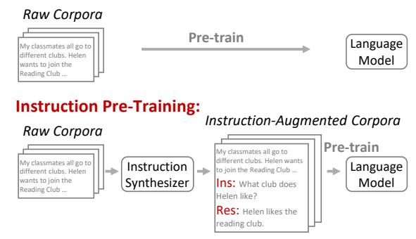
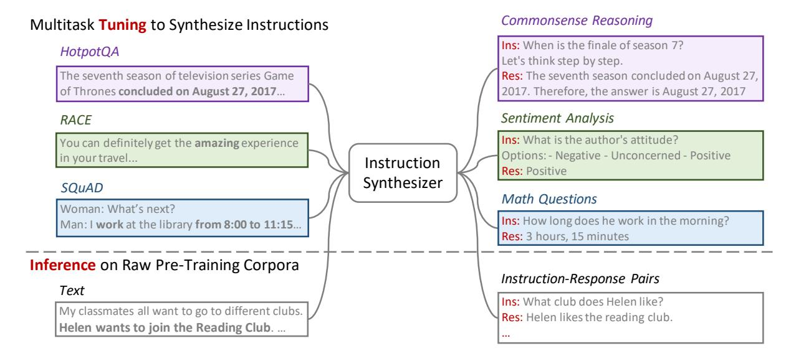
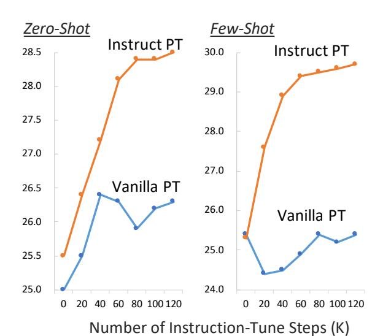
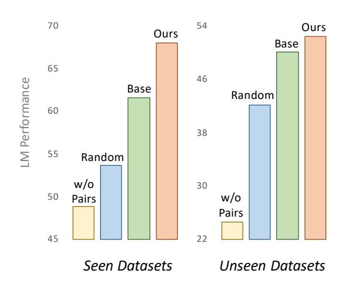
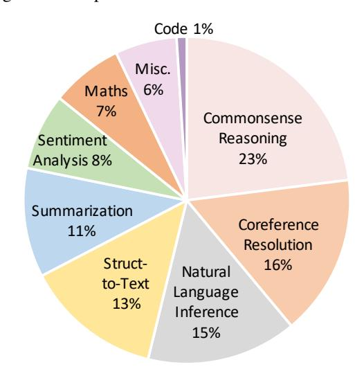
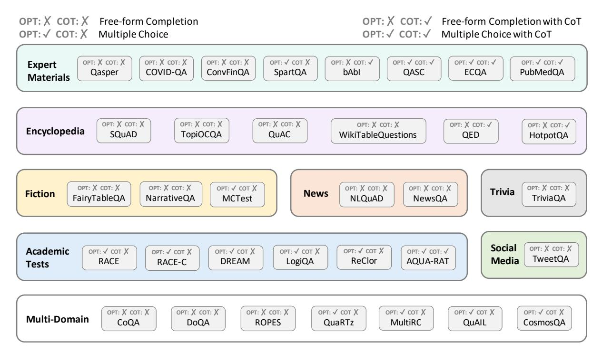

# Instruction Pre-Training: Language Models are Supervised Multitask Learners

Daixuan Cheng† Yuxian Gu‡ Shaohan Huang†<sup>B</sup> Junyu Bi† Minlie Huang‡<sup>B</sup> Furu Wei† † Microsoft Research ‡ Tsinghua University

<https://huggingface.co/instruction-pretrain>

#### Abstract

Unsupervised multitask pre-training has been the critical method behind the recent success of language models (LMs). However, supervised multitask learning still holds significant promise, as scaling it in the post-training stage trends towards better generalization. In this paper, we explore *supervised multitask pretraining* by proposing *Instruction Pre-Training*, a framework that scalably augments massive raw corpora with instruction-response pairs to pre-train LMs. The instruction-response pairs are generated by an efficient instruction synthesizer built on open-source models. In our experiments, we synthesize 200M instruction-response pairs covering 40+ task categories to verify the effectiveness of *Instruction Pre-Training*. In pre-training from scratch, *Instruction Pre-Training* not only consistently enhances pre-trained base models but also benefits more from further instruction tuning. In continual pre-training, *Instruction Pre-Training* enables Llama3-8B to be comparable to or even outperform Llama3- 70B. Our model, code, and data are available at [https://github.com/microsoft/LMOps.](https://github.com/microsoft/LMOps)

## 1 Introduction

On the path towards general artificial intelligence, multitask learning [\(Caruana,](#page-8-0) [1997\)](#page-8-0) emerges as a promising approach. However, scaling supervised multitask learning to the necessary degree is very challenging. This motivates GPT-2 [\(Rad](#page-11-0)[ford et al.,](#page-11-0) [2019\)](#page-11-0) to explore unsupervised multitask learning: pre-training on raw corpora through causal language modeling, which facilitates scaling up training data. Over time, unsupervised multitask learning has evolved into the standard approach for pre-training language models (LMs) [\(Brown et al.,](#page-8-1) [2020;](#page-8-1) [Chowdhery et al.,](#page-9-0) [2023\)](#page-9-0), which is referred to as *Vanilla Pre-Training* in this paper.

#### <span id="page-0-0"></span>**Vanilla Pre-Training:**



Figure 1: Comparison between Instruction Pre-Training and Vanilla Pre-Training. Instead of directly pre-training on raw corpora, *Instruction Pre-Training* augments the corpora with instruction-response pairs generated by an instruction synthesizer, then pretrains LMs on the augmented corpora. "Ins" and "Res" represent instruction and response, respectively.

Despite the success of unsupervised approaches, supervised multitask learning still holds significant promise. Instruction tuning [\(Wei et al.,](#page-12-0) [2021\)](#page-12-0), which fine-tunes pre-trained models using diverse tasks framed through natural language instructions, significantly enhances task generalization [\(Sanh](#page-12-1) [et al.,](#page-12-1) [2021;](#page-12-1) [Chung et al.,](#page-9-1) [2024\)](#page-9-1), re-emphasizing the value of supervised multitask learning.

In this paper, we introduce *Instruction Pre-Training* to explore supervised multitask learning for pre-training. As shown in Figure [1,](#page-0-0) instead of directly pre-training on raw corpora, *Instruction Pre-Training* augments each raw text with a set of instruction-response pairs[1](#page-0-1) generated by an instruction synthesizer, and then pre-trains LMs using the augmented corpora. These pairs are synthesized based on the content of massive raw corpora, ensuring high knowledge coverage and correctness. Therefore, we can scale up task synthesis with great diversity and quality [\(Li et al.,](#page-10-0) [2023a\)](#page-10-0).

<sup>B</sup> Corresponding Author.

<span id="page-0-1"></span><sup>1</sup>We use "task" and "instruction-response pair" interchangeably, with the instruction as task input and the response as task output.

To develop the instruction synthesizer, we convert a wide range of existing datasets into our required format: each example consists of a set of instruction-response pairs and a piece of raw text that these pairs condition on. Using this data collection, we fine-tune a language model to generate instruction-response pairs based the corresponding raw text. The high diversity of the tuning data enables the synthesizer to generalize to unseen data, facilitating the synthesis of instructionresponse pairs for raw pre-training corpora. Unlike existing works [\(Li et al.,](#page-10-1) [2023b;](#page-10-1) [Yehudai et al.,](#page-13-0) [2024\)](#page-13-0) using large or closed-source models [\(Ope](#page-11-1)[nAI,](#page-11-1) [2023;](#page-11-1) [Yehudai et al.,](#page-13-0) [2024\)](#page-13-0) to generate synthetic data, we build our instruction synthesizer based on open-source models (typically with 7B parameters), which is much more cost-effective. This efficiency allows us to further scale up task synthesis: augmenting the raw corpora with 200M instruction-response pairs across more than 40 task categories.

We conduct experiments in both general pretraining from scratch and domain-adaptive continual pre-training. In pre-training from scratch, our 500M model pre-trained on 100B tokens reaches performance of the 1B model pre-trained on 300B tokens. Moreover, models that have undergone *Instruction Pre-Training* gain significantly more from further instruction tuning. In continual pre-training, *Instruction Pre-Training* consistently improves performance of Llama3-8B[2](#page-1-0) on two domains: finance and biomedicine, enabling it to be comparable to or even surpass Llama3-70B.

In summary, our contributions include:

- We propose *Instruction Pre-Training* to explore supervised multitask pre-training, and verify its effectiveness through extensive experiments.
- We develop an instruction synthesizer capable of scalably generating diverse instruction-response pairs based on various raw corpora.
- We comprehensively analyze the instruction synthesizer and the synthetic data to reveal the key factors towards the success of our method.

#### 2 Instruction Pre-Training

Instead of directly pre-training on raw corpora, *Instruction Pre-Training* augments each text from the raw corpora with a set of instruction-response pairs generated by an instruction synthesizer, where the instruction serves as the task input and the response

serves as the task output, then pre-trains LMs on the augmented corpora.

## 2.1 Instruction Synthesizer

To facilitate the scaling of supervised task learning, we develop an instruction synthesizer to generate instruction-response pairs based on raw corpora. Studies suggest that raw corpora contain numerous intrinsic tasks [\(Gu et al.,](#page-9-2) [2022b;](#page-9-2) [Chen et al.,](#page-8-2) [2024\)](#page-8-2), which enables efficient scaling of task synthesis [\(Cheng et al.,](#page-8-3) [2023;](#page-8-3) [Li et al.,](#page-10-0) [2023a;](#page-10-0) [Yue](#page-13-1) [et al.,](#page-13-1) [2024\)](#page-13-1) along with the upscale of raw corpora.

Our instruction synthesizer is developed through multitask fine-tuning on a language model. As illustrated in Figure [2,](#page-2-0) during tuning, the instruction synthesizer is given a piece of raw text and tuned to create a set of instruction-response pairs. The tuning data are curated to be highly diverse, enabling the instruction synthesizer to generalize to unseen data [\(Wei et al.,](#page-12-0) [2021\)](#page-12-0). Therefore, during inference, we can directly employ the instruction synthesizer to create instruction-response pairs based on the raw pre-training corpora. Furthermore, we incorporate specific designs to synthesize both one-shot and few-shot examples for subsequent pre-training.

Data Collection We sample from and reformat a diverse range of context-based task completion datasets, which require models to perform tasks based on a given context, to meet our fine-tuning requirements. Each data sample's context serves as the raw text, and the downstream tasks serve as the instruction-response pairs. The contexts span various domains such as encyclopedias, social media, and academic tests [\(Rogers et al.,](#page-12-2) [2023\)](#page-12-2), and the tasks encompass a wide range such as commonsense reasoning and sentiment analysis. Further details are in Appendix [A.](#page-14-0)

Tuning We tune the instruction synthesizer using few-shot examples. As depicted in Figure [3,](#page-2-1) a one-shot example consists of a piece of raw text followed by its instruction-response pairs. Each sequence fed into the synthesizer concatenates multiple such examples, all sampled from the same dataset. This ensures that the concatenation of multiple examples within one sequence constitutes a few-shot example, maintaining consistency in patterns (i.e., task format or category) among different sets of instruction-response pairs. Fine-tuning on these examples enables the instruction synthesizer to generate instruction-response pairs with similar patterns to those in the given examples [\(Min et al.,](#page-11-2)

<span id="page-1-0"></span><sup>2</sup> <https://llama.meta.com/llama3/>

<span id="page-2-0"></span>

Figure 2: **Tuning and Inference Framework of Instruction Synthesizer.** During tuning, the instruction synthesizer learns to generate instruction-response pairs for a given raw text. The tuning data are curated to be highly diverse, enabling the synthesizer to generalize to unseen data. During inference, we use this tuned instruction synthesizer to generate instruction-response pairs for raw texts from pre-training corpora.

#### <span id="page-2-1"></span>**Instruction Synthesizer** Tuning HotpotQA $T_1 \mid I_1 \oplus R_1$ I₂⊕R₂ $I_N \bigoplus R_N$ Fine-tuning Seauences: SQUAD $T_1$ $I_1 \oplus R_1$ $I_N \bigoplus R_N$ I₂⊕R₂ ţ Compute loss only on the instruction-response pairs Inference I'1 ( R'1 $I'_1 \bigoplus R'_1$ Round 2 T'1 Round M $T'_1$ $I'_1 \oplus R'_1$ I′2⊕R′2 $I'_{M} \bigoplus R'_{M}$ **LM Pre-Training**

Figure 3: For instruction synthesizer, a one-shot example consists of a raw text  $(T_N)$  and a set of instruction-response pairs  $(I_N \bigoplus R_N)$ ; data denoted without ' are for tuning the instruction synthesizer, and data with ' are for synthesizer inference and LM pre-training. During instruction synthesizer tuning, each sequence fed into the synthesizer concatenates multiple one-shot examples sampled from the same dataset. During inference, multiround inference is conducted to synthesize instruction-response pairs with patterns similar to those of previous rounds. For LM pre-training, a few-shot example concatenates raw texts and synthesized pairs from multiple rounds.

 $T'_1 \mid I'_1 \oplus R'_1 \mid T'_2 \mid I'_2 \oplus R'_2$ 

Data Format:

2022). Additionally, we calculate the tuning loss only on the instruction-response pairs to guide the

model to focus on these pairs.

**Inference** We conduct multi-round inference to create few-shot examples. As depicted in Figure 3, in each round, we prepend the texts and instruction-response pairs from previous rounds to the current text. This allows the instruction synthesizer to generate new instruction-response pairs based on the previous ones.

#### 2.2 LM Pre-Training

After collecting the synthesized instruction-response pairs, we employ templates from Longpre et al. (2023) to diversify instruction formats, and templates from Cheng et al. (2023) to concatenate each raw text with its instruction-response pairs. As shown in Figure 3, by concatenating the texts and instruction-pairs from M rounds, we create an M-shot example for subsequent pre-training.

Except for the pre-training data, *Instruction Pre-Training* keeps all other pre-training settings the same as *Vanilla Pre-Training*: training with the next-token prediction objective (Radford et al., 2018) and computing loss on all tokens. We conduct both general pre-training from scratch and domain-adaptive continued pre-training to verify the effectiveness in different pre-training scenarios.

General Pre-Training From Scratch Considering the large amount of data required for general pre-training from scratch, we only convert part of the raw corpora into instruction-augmented cor-

I′<sub>M</sub>⊕R′<sub>M</sub>

pora, leaving the rest unchanged. Besides, we mix the corpora with the data for fine-tuning the instruction synthesizer to enhance task diversity.

Domain-Adaptive Continual Pre-Training For domain-adaptive continual pre-training, the data requirement is much smaller. Therefore, we convert all raw corpora into instruction-augmented corpora. Following [Cheng et al.](#page-8-3) [\(2023\)](#page-8-3), we mix the corpora with the general instructions to benefit from improved prompting ability. Since the general instructions collection contains the fine-tuning data for the instruction synthesizer, we do not include these fine-tuning data.

## 3 Experiment Settings

### 3.1 Instruction Synthesizer

Our synthesizer is fine-tuned from Mistral-7Bv0.1 [\(Jiang et al.,](#page-9-3) [2023\)](#page-9-3), an open-source model with 7B parameters. This model is much more cost-effective than large-scale [\(Almazrouei et al.,](#page-8-4) [2023;](#page-8-4) [Jiang et al.,](#page-9-4) [2024a;](#page-9-4) [Bai et al.,](#page-8-5) [2023\)](#page-8-5) or closedsource [\(OpenAI,](#page-11-1) [2023\)](#page-11-1) models typically used for generating synthetic data [\(Li et al.,](#page-10-1) [2023b;](#page-10-1) [Yehudai](#page-13-0) [et al.,](#page-13-0) [2024;](#page-13-0) [Yue et al.,](#page-13-1) [2024\)](#page-13-1). During inference, about 5 instruction-response pairs are created per raw text, where each pair contains about 52 tokens. Further tuning and inference details are in Appendix [B.](#page-14-1)

### 3.2 General Pre-Training From Scratch

Pre-Training Corpora We randomly sample a subset of RefinedWeb [\(Penedo et al.,](#page-11-5) [2023\)](#page-11-5) dataset for raw pre-training corpora, consisting of 200M pieces of text containing about 100B tokens.

To create instruction-augmented corpora, we conduct two rounds of instruction synthesis, converting 1/5 of the raw corpora (40M raw texts) into instruction-augmented texts. The first round converts 20M raw texts, and the second round uses the raw texts and instruction-response pairs from the first round to convert another 20M raw texts. The resulted corpora contain 200M synthesized pairs. An example of a 2-shot instruction-augmented text is shown in Table [12](#page-19-0) in Appendix.

We then mix the fine-tuning data for instruction synthesizer. Since the fine-tuning data amount (0.2B tokens) is too small compared to that of the raw corpora, we increase its sample ratio so that it repeats 4 times throughout pre-training.

Training and Evaluation We adopt the architecture and tokenizer of Mistral [\(Jiang et al.,](#page-9-3) [2023\)](#page-9-3) to implement models of two different parameters: 500M and 1.3B.

Our pre-training settings largely follow [Brown](#page-8-1) [et al.](#page-8-1) [\(2020\)](#page-8-1). To enhance training efficiency, we implement the memory-efficient attention of *xformers* [\(Lefaudeux et al.,](#page-10-2) [2022\)](#page-10-2). Detailed hyperparameters are listed in Table [10](#page-18-0) in Appendix. The lm-evaluation-harness framework [\(Gao et al.,](#page-9-5) [2023\)](#page-9-5) is used for model evaluation, detailed evaluation settings are in Appendix [C.](#page-14-2)

We also conduct instruction tuning on the pretrained model with 500M parameters using the data from [Longpre et al.](#page-11-3) [\(2023\)](#page-11-3). The instruction-tuned models are evaluated on MMLU [\(Hendrycks et al.,](#page-9-6) [2020\)](#page-9-6) benchmark.

### 3.3 Domain-Adaptive Continual Pre-Training

Pre-Training Corpora We use raw corpora from two domains: PubMed Abstracts [\(Gao et al.,](#page-9-7) [2020\)](#page-9-7) for biomedicine and financial news [\(Yang et al.,](#page-13-2) [2023\)](#page-13-2) for finance.

We conduct 3-round inference to covert all the domain-specific corpora. Each round processes 1/3 of the raw corpora, inheriting the raw texts and instruction-response pairs from previous rounds. Examples of the instruction-augmented texts are in Table [13](#page-20-0) and [14](#page-21-0) in Appendix.

We then mix the instruction-augmented corpora with general instructions [\(Zhou et al.,](#page-13-3) [2024;](#page-13-3) [Xu](#page-13-4) [et al.,](#page-13-4) [2023;](#page-13-4) [Lian et al.,](#page-10-3) [2023\)](#page-10-3), using the same mixing ratio as [Cheng et al.](#page-8-3) [\(2023\)](#page-8-3).

Training and Evaluation We continue to pretrain Llama3-8B on each domain respectively, detailed settings are in Table [10](#page-18-0) in Appendix. We follow the same setting in [Cheng et al.](#page-8-3) [\(2023\)](#page-8-3) to evaluate models on the domain-specific tasks. Detailed evaluation settings are in Appendix [C.](#page-14-2)

## 4 Results

#### 4.1 General Pre-Training From Scratch

Pre-Trained Base Models Table [1](#page-4-0) presents the general performance of the models after pretraining. To ensure a fair comparison with *Vanilla Pre-Training*, which uses only raw corpora, we include a baseline (Mix PT) that mixes the raw corpora with the fine-tuning data for our instruction synthesizer. Compared to *Vanilla Pre-Training* (Vanilla PT), incorporating the fine-tuning data in Mix PT improves model performance on

<span id="page-4-0"></span>

|             | ARC-e | ARC-c | BoolQ | SIQA | WinoGrande | PIQA | OBQA | HellaSwag | MMLU |
|-------------|-------|-------|-------|------|------------|------|------|-----------|------|
| 500M        |       |       |       |      |            |      |      |           |      |
| Vanilla PT  | 50.3  | 26.4  | 57.5  | 44.6 | 53.8       | 71.1 | 29.8 | 47.2      | 25.4 |
| Mix PT      | 52.8  | 26.7  | 46.8  | 46.6 | 52.7       | 70.1 | 30.0 | 47.0      | 26.7 |
| Instruct PT | 54.8  | 27.4  | 62.0  | 47.2 | 54.8       | 69.9 | 30.8 | 47.3      | 25.3 |
| 1.3B        |       |       |       |      |            |      |      |           |      |
| Vanilla PT  | 58.5  | 28.8  | 60.3  | 47.9 | 54.9       | 73.0 | 33.6 | 54.9      | 25.7 |
| Instruct PT | 60.5  | 30.9  | 62.2  | 49.2 | 55.9       | 73.6 | 33.4 | 54.3      | 27.3 |

Table 1: **General Performance of the Pre-Trained Base Models** via *Vanilla Pre-Training* (Vanilla PT), mixing raw corpora with fine-tuning data for the instruction synthesizer (Mix PT), and *Instruction Pre-Training* (Instruct PT) in general pre-training from scratch.

<span id="page-4-1"></span>

|             | # Param. | # Token | Average |
|-------------|----------|---------|---------|
| GPT-2       | 774M     | _       | 45.7    |
| Pythia      | 1B       | 300B    | 47.1    |
| BLOOM       | 1.1B     | 341B    | 45.1    |
| Instruct PT | 500M     | 100B    | 46.6    |
| OPT         | 1.3B     | 300B    | 49.3    |
| GPT-2       | 1.5B     | -       | 48.6    |
| BLOOM       | 3B       | 341B    | 50.1    |
| Instruct PT | 1.3B     | 100B    | 49.7    |

Table 2: Comparison between Our Pre-Trained Base Models and Others on general benchmarks. Detailed results are in Table 11.

several benchmarks. By further transforming the raw corpora into instruction-augmented corpora, *Instruction Pre-Training* (Instruct PT) achieves even better performance. Note that none of the evaluated datasets are included in our fine-tuning data for the instruction synthesizer. Nevertheless, the model pre-trained on the data generated by the instruction synthesizer shows improved performance on these unseen datasets, demonstrating the effectiveness of our method in enhancing model generalization.

In Table 2, we compare our pre-trained models with other open-source models. Using 100B to-kens, our 500M model reaches the performance of Pythia-1B (Biderman et al., 2023) trained with 300B tokens and our 1.3 B model reaches the performance of BLOOM-3B (Workshop et al., 2022) trained with 341B tokens. This shows consistent data efficiency of *Instruction Pre-Training* across different model scales.

**Instruction-Tuned Models** Figure 4 shows the zero/few-shot performance on MMLU during instruction tuning from the pre-trained models. The model pre-trained via *Instruction Pre-*

<span id="page-4-2"></span>

Figure 4: **MMLU Performance during Instruction Tuning** of models pre-trained via *Vanilla Pre-Training* (Vanilla PT) and *Instruction Pre-Training* (In-

Training quickly outperforms the model pre-trained via Vanilla Pre-Training, and we observe a stable increasing trend of our model throughout the instruction tuning process. We infer that the closer alignment of training tasks during the instruction pre-training and instruction tuning stages facilitates a smoother transition between pre-training and fine-tuning. This alignment enables the model to learn more rapidly on downstream tasks. Therefore, Instruction Pre-Training offers a promising solution to significantly reduce the number of further fine-tuning steps (Longpre et al., 2023; Jiang et al., 2024c).

#### 4.2 Domain-Adaptive Continual Pre-Training

Main Results As shown in Table 3, *Instruction Pre-Training* consistently outperforms *Vanilla Pre-Training* on almost all domain-specific

struct PT).

<span id="page-5-0"></span>

| BioMed.     | PubMedQA | ChemProt | RCT  | MQP  | UMSLE | AVERAGE |
|-------------|----------|----------|------|------|-------|---------|
| Llama3-70B  | 54.3     | 51.8     | 82.2 | 84.8 | 46.7  | 63.9    |
| Llama3-8B   | 59.8     | 27.6     | 73.6 | 66.2 | 40.6  | 53.6    |
| Vanilla PT  | 65.1     | 42.4     | 72.4 | 76.4 | 35.5  | 58.4    |
| Instruct PT | 68.7     | 47.2     | 73.4 | 79.3 | 38.0  | 61.3    |

| Finance     | ConvFinQA | Headline | FiQA SA | FPB  | NER  | AVERAGE |
|-------------|-----------|----------|---------|------|------|---------|
| Llama3-70B  | 59.1      | 86.3     | 81.0    | 68.5 | 64.4 | 71.9    |
| Llama3-8B   | 49.9      | 81.1     | 83.3    | 63.5 | 72.8 | 70.1    |
| Vanilla PT  | 62.9      | 84.7     | 82.2    | 65.4 | 64.9 | 72.0    |
| Instruct PT | 74.6      | 87.1     | 82.4    | 65.7 | 63.6 | 74.7    |

Table 3: Domain-Specific Task Performance of Llama3-8B without continued pre-training, after continued pretraining via *Vanilla Pre-Training* (Vanilla PT), and after continued pre-training via *Instruction Pre-Training* (Instruct PT). Both Vanilla PT and Instruct PT mix domain-specific corpora with general instructions to boost prompting ability. We also display the performance of Llama3-70B for reference.

<span id="page-5-1"></span>

|      | w/o Corpora | Rule-based | 1-shot | Ours |
|------|-------------|------------|--------|------|
| Med. | 73.3        | 73.1       | 73.1   | 74.7 |
| Fin. | 58.6        | 58.8       | 58.5   | 61.3 |

Table 4: Ablations on Training Data. *w/o Corpora* removes domain-specific pre-training corpora. *Rulebased* replaces instruction-augmented corpora with those created by the rule-based methods in [Cheng et al.](#page-8-3) [\(2023\)](#page-8-3). *1-shot* replaces instruction-augmented corpora with those created through single-turn synthesis. We report the average task scores within each domain.

tasks. Continual pre-training with *Instruction Pre-Training* significantly enhances the domainspecific performance of Llama3-8B, achieving parity with or even surpassing Llama3-70B. On the finance NER benchmark, where *Instruction Pre-Training* underperforms *Vanilla Pre-Training*, we observe considerable variance, where even Llama3- 70B underperforms Llama3-8B, suggesting that this benchmark may not be reliable.

Ablations Table [4](#page-5-1) presents ablation results for our pre-training data, which consist of a mixture of domain-specific instruction-augmented corpora and general instructions.

- w/o Corpora: Removing the domain-specific instruction-augmented corpora eliminates the source of domain-specific knowledge, leading to reduced domain-specific performance.
- Rule-based: Constructing instruction-augmented corpora using rule-based methods results in limited diversity, thereby constraining performance.
- 1-shot: Limiting synthesis to 1-turn instead

of multi-turn synthesis results in instructionaugmented corpora containing only 1-shot examples, leading to decreased prompting performance [\(Longpre et al.,](#page-11-3) [2023\)](#page-11-3).

## <span id="page-5-2"></span>5 Analysis

We conduct a detailed analysis of the instruction synthesizer and the instruction-augmented corpora to understand their impact on LM pre-training.

#### 5.1 Instruction Synthesizer

Our goal in multitask fine-tuning is to develop a general synthesizer capable of generating instruction-response pairs for any raw text. Therefore, we evaluate its performance on both seen datasets (listed in Appendix [A\)](#page-14-0) and unseen datasets. The unseen datasets include SocialIQA [\(Sap et al.,](#page-12-3) [2019\)](#page-12-3), TextbookQA [\(Kembhavi et al.,](#page-10-5) [2017\)](#page-10-5), Wiki-Why [\(Ho et al.,](#page-9-8) [2022\)](#page-9-8), and FEVER [\(Thorne et al.,](#page-12-4) [2018\)](#page-12-4), each representing a specific instruction format. Each example in these datasets comprises a context (raw text) and a set of context-based tasks (instruction-response pairs).

Response Accuracy Given a raw text and a task instruction, the instruction synthesizer generates a response. We compute the F1 similarity between the generated response and the gold response to evaluate response accuracy. Our instruction synthesizer is fine-tuned from the base Mistral-7B model. For comparison, we also present the results of the base model. As shown in Table [5,](#page-6-0) our fine-tuned synthesizer significantly outperforms

<span id="page-6-0"></span>

|              | Aco                 | curacy              | Quality             |                     |                     |                     |
|--------------|---------------------|---------------------|---------------------|---------------------|---------------------|---------------------|
|              | Seen                | Unseen              | Seen                |                     | Unseen              |                     |
|              |                     |                     | Zero                | Few                 | Zero                | Few                 |
| Base<br>Ours | 30.6<br><b>70.0</b> | 29.2<br><b>55.2</b> | 16.5<br><b>49.4</b> | 21.8<br><b>49.9</b> | 12.1<br><b>25.3</b> | 19.6<br><b>30.8</b> |

Table 5: **Response Accuracy and Instruction-Response Pair Quality** of our instruction synthesizer (Ours) and Mistral-7B (Base). "Zero" indicates the zero-shot setting where no examples are presented before the testing raw text, and "Few" prepends 3-shot examples to the testing raw text.

the base model on both seen and unseen datasets, demonstrating the effectiveness of our fine-tuning.

Instruction-Response Pair Quality Given a raw text, the instruction synthesizer generates a set of instruction-response pairs. We compute the F1 similarity between the generated pairs and the gold pairs to evaluate their quality. The evaluation is conducted in both zero-shot and few-shot settings: 1) Zero-shot: the input to the instruction synthesizer contains only the raw text. 2) Few-shot: following Wang et al. (2023); Yehudai et al. (2024), a few examples from the same dataset as the gold instruction-response pairs, each consisting of a raw text and corresponding instruction-response pairs, are prepended to the testing raw text.

As shown in Table 5, compared to the base model, our fine-tuned synthesizer significantly outperforms the baseline across all four dimensions: zero-shot, few-shot, seen, and unseen datasets. In unseen datasets, the few-shot setting substantially outperforms the zero-shot setting, indicating that our synthesizer effectively leverages the pattern of the few-shot examples to create instruction-response pairs for the testing text.

Helpfulness on LM Generalization We conduct experiments using an LM (base Mistral-7B in our analysis) to assess the impact of synthesized instruction-response pairs on helping LMs generalize to unseen tasks. Given a prompt concatenating a testing raw text, synthesized pairs, and a testing instruction, the LM generates a response. We then compare the LM's performance on the testing task with and without the synthesized pairs in the prompt to evaluate their effectiveness.

We evaluate instruction-response pairs generated using different methods: 1) Random: randomly sampled instruction-response pairs of a different context. 2) Base: pairs synthesized based on

<span id="page-6-1"></span>

Figure 5: **Helpfulness on LM Generalization** measured by LM performance with or without synthesized instruction-response pairs in the prompt.

the testing raw text by the base Mistral-7B model prompted with a few examples. 3) Ours: pairs synthesized based on the testing raw text by our instruction synthesizer using the same few-shot examples as Base.

As shown Figure 5, "w/o Pairs" denotes the setting where synthesized pairs are excluded from the prompt. On both seen and unseen datasets, ours consistently enhances the LM's performance on the testing task, surpassing all baselines. This demonstrates the effectiveness of our synthesized tasks in improving the LM's ability to perform a wide range of tasks.

#### 5.2 Instruction-Augmented Corpora

We analyze the instruction-augmented pre-training corpora in terms of context relevance, response accuracy and task diversity. We sample 500 instruction-augmented texts from the augmented corpora and use GPT-4 (OpenAI, 2023) to evaluate the synthesized instruction-response pairs. Specifically, GPT-4 is prompted to assess whether the synthesized instruction is relevant to the context of the raw text (context relevance) and whether the response is accurate based on the instruction and context (response accuracy). Additionally, to evaluate task diversity, we prompt GPT-4 to categorize each instruction-response pair using a predefined list of task categories from Wang et al. (2022).

As shown in Table 6, our instruction synthesizer generates instruction-response pairs spanning 49 different task categories, with over 85% relevance to the context and 70% response accuracy. We further group the task categories into 9 general

<span id="page-7-0"></span>

|         | Accuracy | Relevance | # Category |
|---------|----------|-----------|------------|
| General | 77.5     | 92.9      | 49         |
| BioMed. | 86.2     | 99.4      | 26         |
| Finance | 69.8     | 85.8      | 41         |

Table 6: Response Accuracy, Context Relevance, and Number of Task Categories of the instructionaugmented corpora.

<span id="page-7-1"></span>

Figure 6: Distribution of Task Scenarios of Synthesized Instruction-Response Pairs in the instructionaugmented corpora.

task scenarios. Figure [6](#page-7-1) shows the percentages of each task scenario in the instruction augmented corpora for general pre-training. Our synthesized tasks cover all general task scenarios, demonstrating the effectiveness of our instruction synthesizer in generating a highly diverse tasks.

## 6 Related Work

Synthetic Instruction Generation There have been many works studying synthetic instruction generation, but they mainly focus on posttraining [\(Xu et al.,](#page-13-4) [2023;](#page-13-4) [Li et al.,](#page-10-0) [2023a\)](#page-10-0), while we focus on pre-training. This makes these works complementary to ours. Moreover, our experiments demonstrate that instruction pre-trained models gain more from instruction post-training, highlighting the complementary nature.

Regardless of the training stage, our method differs from related works in several ways. Firstly, we focus on learning from the raw corpora rather than distilling knowledge from strong models [\(Xu et al.,](#page-13-4) [2023;](#page-13-4) [Mukherjee et al.,](#page-11-6) [2023;](#page-11-6) [Li et al.,](#page-10-6) [2024\)](#page-10-6). Secondly, ours can be task-agnostic, in contrast to the more task-specific approaches [\(Wang et al.,](#page-12-5) [2023;](#page-12-5) [Honovich et al.,](#page-9-9) [2023;](#page-9-9) [Yehudai et al.,](#page-13-0) [2024\)](#page-13-0) relying

on a few gold examples. Additionally, we outperforms rule-based methods [\(Cheng et al.,](#page-8-3) [2023;](#page-8-3) [Gu](#page-9-2) [et al.,](#page-9-2) [2022b\)](#page-9-2) by increasing instruction diversity. Moreover, the iterative techniques used in [Li et al.](#page-10-0) [\(2023a\)](#page-10-0); [Lee et al.](#page-10-7) [\(2024\)](#page-10-7); [Yue et al.](#page-13-1) [\(2024\)](#page-13-1) could potentially complement our method, areas we plan to explore in future research.

Data Curation for LM Pre-Training Data curation for LM pre-training typically involves collection, cleaning, and organization. Most pre-training data are collected from the Internet to ensure diversity [\(Raffel et al.,](#page-11-7) [2020;](#page-11-7) [Penedo et al.,](#page-11-5) [2023;](#page-11-5) [Wenzek et al.,](#page-13-6) [2020;](#page-13-6) [Gao et al.,](#page-9-7) [2020\)](#page-9-7). Although diverse, web-scraped data often contain low-quality and duplicate content. Therefore, data cleaning techniques are applied to these corpora, including language identification [\(Joulin et al.,](#page-10-8) [2016\)](#page-10-8), perplexity-based [\(Wenzek et al.,](#page-13-6) [2020\)](#page-13-6), classifierbased [\(Brown et al.,](#page-8-1) [2020\)](#page-8-1), and rule-based [\(Raffel](#page-11-7) [et al.,](#page-11-7) [2020;](#page-11-7) [Rae et al.,](#page-11-8) [2021\)](#page-11-8) filtering. Data organization aims at performing more fine-grained programming of the data, including data selection [\(Al](#page-8-7)[balak et al.,](#page-8-7) [2024;](#page-8-7) [Xie et al.,](#page-13-7) [2024\)](#page-13-7) and constructing training instances related to downstream usage [\(Gu](#page-9-10) [et al.,](#page-9-10) [2022a,](#page-9-10) [2023;](#page-9-11) [Shi et al.,](#page-12-7) [2023;](#page-12-7) [Jiang et al.,](#page-9-12) [2024b\)](#page-9-12). Our work explores an orthogonal direction: augmenting raw corpora with large-scale supervised signals.

## 7 Conclusion

This paper proposes *Instruction Pre-Training* to explore supervised multitask learning for pre-training. Instead of directly pre-training on raw corpora, *Instruction Pre-Training* augments the corpora with instruction-response pairs generated by an instruction synthesizer, then pre-trains LMs on the augmented corpora. Our instruction synthesizer, finetuned from a highly diverse data collection, is capable of generating diverse instruction-response pairs from various corpora. In general pre-training from scratch, *Instruction Pre-Training* not only outperforms *Vanilla Pre-Training* on the pre-trained base models but also benefits more from further instruction tuning. In continual pre-training, *Instruction Pre-Training* substantially enhances the performance of Llama3-8B in two different domains. Looking ahead, we hope our work can inspire further exploration into this promising area of supervised multitask pre-training, effectively enhancing the general abilities of LMs.

## Limitations

While synthetic data offer numerous benefits, it is crucial to acknowledge the potential limitations. Our work, along with other works utilizing synthetic data [\(Liu et al.,](#page-11-9) [2024\)](#page-11-9), is inevitably limited by the possibility of introducing hallucinations. As shown in our analysis in Section [5,](#page-5-2) the accuracy of our instruction-augmented corpora is approximately 70%, which may potentially mislead the pre-trained model. Future work could explore post-verification techniques such as those proposed by [Li et al.](#page-10-0) [\(2023a\)](#page-10-0); [Lee et al.](#page-10-7) [\(2024\)](#page-10-7); [Yue et al.](#page-13-1) [\(2024\)](#page-13-1); [Yehudai et al.](#page-13-0) [\(2024\)](#page-13-0) to filter out low-quality data or develop methods to enhance the reliability of the instruction synthesizer.

Furthermore, works like [Touvron et al.](#page-12-8) [\(2023\)](#page-12-8); [Jiang et al.](#page-9-3) [\(2023\)](#page-9-3) have achieved impressive performance by pre-training on trillions of tokens, whereas our pre-training is currently limited to the scale of billions of tokens. Future research should investigate scaling laws for synthetic data and determine the optimal balance between quantity and quality of synthetic samples [\(Liu et al.,](#page-11-9) [2024\)](#page-11-9).

## Ethics Statement

Except for the pre-training corpora in the finance domain, all datasets and language models used in this work are publicly available.

## References

- <span id="page-8-12"></span>Vaibhav Adlakha, Shehzaad Dhuliawala, Kaheer Suleman, Harm de Vries, and Siva Reddy. 2022. Topiocqa: Open-domain conversational question answering with topic switching. *Transactions of the Association for Computational Linguistics*, 10:468–483.
- <span id="page-8-11"></span>Shourya Aggarwal, Divyanshu Mandowara, Vishwajeet Agrawal, Dinesh Khandelwal, Parag Singla, and Dinesh Garg. 2021. Explanations for commonsenseqa: New dataset and models. In *Proceedings of the 59th Annual Meeting of the Association for Computational Linguistics and the 11th International Joint Conference on Natural Language Processing (Volume 1: Long Papers)*, pages 3050–3065.
- <span id="page-8-7"></span>Alon Albalak, Yanai Elazar, Sang Michael Xie, Shayne Longpre, Nathan Lambert, Xinyi Wang, Niklas Muennighoff, Bairu Hou, Liangming Pan, Haewon Jeong, et al. 2024. A survey on data selection for language models. *arXiv preprint arXiv:2402.16827*.
- <span id="page-8-4"></span>Ebtesam Almazrouei, Hamza Alobeidli, Abdulaziz Alshamsi, Alessandro Cappelli, Ruxandra Cojocaru, Mérouane Debbah, Étienne Goffinet, Daniel Hesslow, Julien Launay, Quentin Malartic, et al. 2023.

- The falcon series of open language models. *arXiv preprint arXiv:2311.16867*.
- <span id="page-8-10"></span>Julio Cesar Salinas Alvarado, Karin Verspoor, and Timothy Baldwin. 2015. Domain adaption of named entity recognition to support credit risk assessment. In *Proceedings of the Australasian Language Technology Association Workshop 2015*, pages 84–90.
- <span id="page-8-5"></span>Jinze Bai, Shuai Bai, Yunfei Chu, Zeyu Cui, Kai Dang, Xiaodong Deng, Yang Fan, Wenbin Ge, Yu Han, Fei Huang, et al. 2023. Qwen technical report. *arXiv preprint arXiv:2309.16609*.
- <span id="page-8-6"></span>Stella Biderman, Hailey Schoelkopf, Quentin Gregory Anthony, Herbie Bradley, Kyle O'Brien, Eric Hallahan, Mohammad Aflah Khan, Shivanshu Purohit, USVSN Sai Prashanth, Edward Raff, et al. 2023. Pythia: A suite for analyzing large language models across training and scaling. In *International Conference on Machine Learning*, pages 2397–2430. PMLR.
- <span id="page-8-8"></span>Yonatan Bisk, Rowan Zellers, Jianfeng Gao, Yejin Choi, et al. 2020. Piqa: Reasoning about physical commonsense in natural language. In *Proceedings of the AAAI conference on artificial intelligence*, volume 34, pages 7432–7439.
- <span id="page-8-1"></span>Tom Brown, Benjamin Mann, Nick Ryder, Melanie Subbiah, Jared D Kaplan, Prafulla Dhariwal, Arvind Neelakantan, Pranav Shyam, Girish Sastry, Amanda Askell, et al. 2020. Language models are few-shot learners. *Advances in neural information processing systems*, 33:1877–1901.
- <span id="page-8-13"></span>Jon Ander Campos, Arantxa Otegi, Aitor Soroa, Jan Milan Deriu, Mark Cieliebak, and Eneko Agirre. 2020. Doqa-accessing domain-specific faqs via conversational qa. In *Proceedings of the 58th Annual Meeting of the Association for Computational Linguistics*, pages 7302–7314.
- <span id="page-8-0"></span>Rich Caruana. 1997. Multitask learning. *Machine learning*, 28:41–75.
- <span id="page-8-2"></span>Mayee Chen, Nicholas Roberts, Kush Bhatia, Jue Wang, Ce Zhang, Frederic Sala, and Christopher Ré. 2024. Skill-it! a data-driven skills framework for understanding and training language models. *Advances in Neural Information Processing Systems*, 36.
- <span id="page-8-9"></span>Zhiyu Chen, Shiyang Li, Charese Smiley, Zhiqiang Ma, Sameena Shah, and William Yang Wang. 2022. Convfinqa: Exploring the chain of numerical reasoning in conversational finance question answering. In *Proceedings of the 2022 Conference on Empirical Methods in Natural Language Processing*, pages 6279– 6292.
- <span id="page-8-3"></span>Daixuan Cheng, Shaohan Huang, and Furu Wei. 2023. Adapting large language models via reading comprehension. In *The Twelfth International Conference on Learning Representations*.

- <span id="page-9-17"></span>Eunsol Choi, He He, Mohit Iyyer, Mark Yatskar, Wentau Yih, Yejin Choi, Percy Liang, and Luke Zettlemoyer. 2018. Quac: Question answering in context. In *Proceedings of the 2018 Conference on Empirical Methods in Natural Language Processing*, pages 2174–2184.
- <span id="page-9-0"></span>Aakanksha Chowdhery, Sharan Narang, Jacob Devlin, Maarten Bosma, Gaurav Mishra, Adam Roberts, Paul Barham, Hyung Won Chung, Charles Sutton, Sebastian Gehrmann, et al. 2023. Palm: Scaling language modeling with pathways. *Journal of Machine Learning Research*, 24(240):1–113.
- <span id="page-9-1"></span>Hyung Won Chung, Le Hou, Shayne Longpre, Barret Zoph, Yi Tay, William Fedus, Yunxuan Li, Xuezhi Wang, Mostafa Dehghani, Siddhartha Brahma, et al. 2024. Scaling instruction-finetuned language models. *Journal of Machine Learning Research*, 25(70):1–53.
- <span id="page-9-14"></span>Christopher Clark, Kenton Lee, Ming-Wei Chang, Tom Kwiatkowski, Michael Collins, and Kristina Toutanova. 2019. Boolq: Exploring the surprising difficulty of natural yes/no questions. In *Proceedings of the 2019 Conference of the North American Chapter of the Association for Computational Linguistics: Human Language Technologies, Volume 1 (Long and Short Papers)*, pages 2924–2936.
- <span id="page-9-13"></span>Peter Clark, Isaac Cowhey, Oren Etzioni, Tushar Khot, Ashish Sabharwal, Carissa Schoenick, and Oyvind Tafjord. 2018. Think you have solved question answering? try arc, the ai2 reasoning challenge. *arXiv preprint arXiv:1803.05457*.
- <span id="page-9-16"></span>Pradeep Dasigi, Kyle Lo, Iz Beltagy, Arman Cohan, Noah A Smith, and Matt Gardner. 2021. A dataset of information-seeking questions and answers anchored in research papers. In *Proceedings of the 2021 Conference of the North American Chapter of the Association for Computational Linguistics: Human Language Technologies*, pages 4599–4610.
- <span id="page-9-15"></span>Franck Dernoncourt and Ji Young Lee. 2017. Pubmed 200k rct: a dataset for sequential sentence classification in medical abstracts. In *Proceedings of the Eighth International Joint Conference on Natural Language Processing (Volume 2: Short Papers)*, pages 308–313.
- <span id="page-9-7"></span>Leo Gao, Stella Biderman, Sid Black, Laurence Golding, Travis Hoppe, Charles Foster, Jason Phang, Horace He, Anish Thite, Noa Nabeshima, et al. 2020. The pile: An 800gb dataset of diverse text for language modeling. *arXiv preprint arXiv:2101.00027*.
- <span id="page-9-5"></span>Leo Gao, Jonathan Tow, Baber Abbasi, Stella Biderman, Sid Black, Anthony DiPofi, Charles Foster, Laurence Golding, Jeffrey Hsu, Alain Le Noac'h, Haonan Li, Kyle McDonell, Niklas Muennighoff, Chris Ociepa, Jason Phang, Laria Reynolds, Hailey Schoelkopf, Aviya Skowron, Lintang Sutawika, Eric Tang, Anish Thite, Ben Wang, Kevin Wang, and Andy Zou. 2023. [A framework for few-shot language model](https://doi.org/10.5281/zenodo.10256836) [evaluation.](https://doi.org/10.5281/zenodo.10256836)

- <span id="page-9-11"></span>Yuxian Gu, Li Dong, Furu Wei, and Minlie Huang. 2023. Pre-training to learn in context. In *Proceedings of the 61st Annual Meeting of the Association for Computational Linguistics (Volume 1: Long Papers)*, pages 4849–4870.
- <span id="page-9-10"></span>Yuxian Gu, Xu Han, Zhiyuan Liu, and Minlie Huang. 2022a. Ppt: Pre-trained prompt tuning for few-shot learning. In *Proceedings of the 60th Annual Meeting of the Association for Computational Linguistics (Volume 1: Long Papers)*, pages 8410–8423.
- <span id="page-9-2"></span>Yuxian Gu, Pei Ke, Xiaoyan Zhu, and Minlie Huang. 2022b. Learning instructions with unlabeled data for zero-shot cross-task generalization. In *Proceedings of the 2022 Conference on Empirical Methods in Natural Language Processing*, pages 1617–1634.
- <span id="page-9-6"></span>Dan Hendrycks, Collin Burns, Steven Basart, Andy Zou, Mantas Mazeika, Dawn Song, and Jacob Steinhardt. 2020. Measuring massive multitask language understanding. In *International Conference on Learning Representations*.
- <span id="page-9-8"></span>Matthew Ho, Aditya Sharma, Justin Chang, Michael Saxon, Sharon Levy, Yujie Lu, and William Yang Wang. 2022. Wikiwhy: Answering and explaining cause-and-effect questions. In *The Eleventh International Conference on Learning Representations*.
- <span id="page-9-9"></span>Or Honovich, Thomas Scialom, Omer Levy, and Timo Schick. 2023. Unnatural instructions: Tuning language models with (almost) no human labor. In *Proceedings of the 61st Annual Meeting of the Association for Computational Linguistics (Volume 1: Long Papers)*, pages 14409–14428.
- <span id="page-9-18"></span>Lifu Huang, Ronan Le Bras, Chandra Bhagavatula, and Yejin Choi. 2019. Cosmos qa: Machine reading comprehension with contextual commonsense reasoning. In *Proceedings of the 2019 Conference on Empirical Methods in Natural Language Processing and the 9th International Joint Conference on Natural Language Processing (EMNLP-IJCNLP)*, pages 2391–2401.
- <span id="page-9-3"></span>Albert Q Jiang, Alexandre Sablayrolles, Arthur Mensch, Chris Bamford, Devendra Singh Chaplot, Diego de las Casas, Florian Bressand, Gianna Lengyel, Guillaume Lample, Lucile Saulnier, et al. 2023. Mistral 7b. *arXiv preprint arXiv:2310.06825*.
- <span id="page-9-4"></span>Albert Q Jiang, Alexandre Sablayrolles, Antoine Roux, Arthur Mensch, Blanche Savary, Chris Bamford, Devendra Singh Chaplot, Diego de las Casas, Emma Bou Hanna, Florian Bressand, et al. 2024a. Mixtral of experts. *arXiv preprint arXiv:2401.04088*.
- <span id="page-9-12"></span>Ting Jiang, Shaohan Huang, Shengyue Luo, Zihan Zhang, Haizhen Huang, Furu Wei, Weiwei Deng, Feng Sun, Qi Zhang, Deqing Wang, et al. 2024b. Improving domain adaptation through extended-text reading comprehension. *arXiv preprint arXiv:2401.07284*.

- <span id="page-10-4"></span>Zhengbao Jiang, Zhiqing Sun, Weijia Shi, Pedro Rodriguez, Chunting Zhou, Graham Neubig, Xi Victoria Lin, Wen-tau Yih, and Srinivasan Iyer. 2024c. Instruction-tuned language models are better knowledge learners. *arXiv preprint arXiv:2402.12847*.
- <span id="page-10-11"></span>Di Jin, Eileen Pan, Nassim Oufattole, Wei-Hung Weng, Hanyi Fang, and Peter Szolovits. 2021. What disease does this patient have? a large-scale open domain question answering dataset from medical exams. *Applied Sciences*, 11(14):6421.
- <span id="page-10-10"></span>Qiao Jin, Bhuwan Dhingra, Zhengping Liu, William Cohen, and Xinghua Lu. 2019. Pubmedqa: A dataset for biomedical research question answering. In *Proceedings of the 2019 Conference on Empirical Methods in Natural Language Processing and the 9th International Joint Conference on Natural Language Processing (EMNLP-IJCNLP)*, pages 2567–2577.
- <span id="page-10-16"></span>Mandar Joshi, Eunsol Choi, Daniel S Weld, and Luke Zettlemoyer. 2017. Triviaqa: A large scale distantly supervised challenge dataset for reading comprehension. In *Proceedings of the 55th Annual Meeting of the Association for Computational Linguistics (Volume 1: Long Papers)*, pages 1601–1611.
- <span id="page-10-8"></span>Armand Joulin, Edouard Grave, Piotr Bojanowski, Matthijs Douze, Hérve Jégou, and Tomas Mikolov. 2016. Fasttext. zip: Compressing text classification models. *arXiv preprint arXiv:1612.03651*.
- <span id="page-10-5"></span>Aniruddha Kembhavi, Minjoon Seo, Dustin Schwenk, Jonghyun Choi, Ali Farhadi, and Hannaneh Hajishirzi. 2017. Are you smarter than a sixth grader? textbook question answering for multimodal machine comprehension. In *Proceedings of the IEEE Conference on Computer Vision and Pattern recognition*, pages 4999–5007.
- <span id="page-10-19"></span>Daniel Khashabi, Snigdha Chaturvedi, Michael Roth, Shyam Upadhyay, and Dan Roth. 2018. Looking beyond the surface: A challenge set for reading comprehension over multiple sentences. In *Proceedings of the 2018 Conference of the North American Chapter of the Association for Computational Linguistics: Human Language Technologies, Volume 1 (Long Papers)*, pages 252–262.
- <span id="page-10-13"></span>Tushar Khot, Peter Clark, Michal Guerquin, Peter Jansen, and Ashish Sabharwal. 2020. Qasc: A dataset for question answering via sentence composition. In *Proceedings of the AAAI Conference on Artificial Intelligence*, volume 34, pages 8082–8090.
- <span id="page-10-15"></span>Tomáš Kocisk ˇ y, Jonathan Schwarz, Phil Blunsom, Chris ` Dyer, Karl Moritz Hermann, Gábor Melis, and Edward Grefenstette. 2018. The narrativeqa reading comprehension challenge. *Transactions of the Association for Computational Linguistics*, 6:317–328.
- <span id="page-10-12"></span>Jens Kringelum, Sonny Kim Kjaerulff, Søren Brunak, Ole Lund, Tudor I Oprea, and Olivier Taboureau. 2016. Chemprot-3.0: a global chemical biology diseases mapping. *Database*, 2016:bav123.

- <span id="page-10-9"></span>Woosuk Kwon, Zhuohan Li, Siyuan Zhuang, Ying Sheng, Lianmin Zheng, Cody Hao Yu, Joseph E. Gonzalez, Hao Zhang, and Ion Stoica. 2023. Efficient memory management for large language model serving with pagedattention. In *Proceedings of the ACM SIGOPS 29th Symposium on Operating Systems Principles*.
- <span id="page-10-17"></span>Guokun Lai, Qizhe Xie, Hanxiao Liu, Yiming Yang, and Eduard Hovy. 2017. Race: Large-scale reading comprehension dataset from examinations. In *Proceedings of the 2017 Conference on Empirical Methods in Natural Language Processing*, pages 785– 794.
- <span id="page-10-14"></span>Matthew Lamm, Jennimaria Palomaki, Chris Alberti, Daniel Andor, Eunsol Choi, Livio Baldini Soares, and Michael Collins. 2021. Qed: A framework and dataset for explanations in question answering. *Transactions of the Association for computational Linguistics*, 9:790–806.
- <span id="page-10-7"></span>Nicholas Lee, Thanakul Wattanawong, Sehoon Kim, Karttikeya Mangalam, Sheng Shen, Gopala Anumanchipali, Michael W Mahoney, Kurt Keutzer, and Amir Gholami. 2024. Llm2llm: Boosting llms with novel iterative data enhancement. *arXiv preprint arXiv:2403.15042*.
- <span id="page-10-2"></span>Benjamin Lefaudeux, Francisco Massa, Diana Liskovich, Wenhan Xiong, Vittorio Caggiano, Sean Naren, Min Xu, Jieru Hu, Marta Tintore, Susan Zhang, Patrick Labatut, Daniel Haziza, Luca Wehrstedt, Jeremy Reizenstein, and Grigory Sizov. 2022. xformers: A modular and hackable transformer modelling library. [https:](https://github.com/facebookresearch/xformers) [//github.com/facebookresearch/xformers](https://github.com/facebookresearch/xformers).
- <span id="page-10-6"></span>Haoran Li, Qingxiu Dong, Zhengyang Tang, Chaojun Wang, Xingxing Zhang, Haoyang Huang, Shaohan Huang, Xiaolong Huang, Zeqiang Huang, Dongdong Zhang, et al. 2024. Synthetic data (almost) from scratch: Generalized instruction tuning for language models. *arXiv preprint arXiv:2402.13064*.
- <span id="page-10-0"></span>Xian Li, Ping Yu, Chunting Zhou, Timo Schick, Omer Levy, Luke Zettlemoyer, Jason E Weston, and Mike Lewis. 2023a. Self-alignment with instruction backtranslation. In *The Twelfth International Conference on Learning Representations*.
- <span id="page-10-1"></span>Yuanzhi Li, Sébastien Bubeck, Ronen Eldan, Allie Del Giorno, Suriya Gunasekar, and Yin Tat Lee. 2023b. Textbooks are all you need ii: phi-1.5 technical report. *arXiv preprint arXiv:2309.05463*.
- <span id="page-10-3"></span>Wing Lian, Bleys Goodson, Eugene Pentland, Austin Cook, Chanvichet Vong, and "Teknium". 2023. Openorca: An open dataset of gpt augmented flan reasoning traces. [https://https://huggingface.](https://https://huggingface.co/Open-Orca/OpenOrca) [co/Open-Orca/OpenOrca](https://https://huggingface.co/Open-Orca/OpenOrca).
- <span id="page-10-18"></span>Yichan Liang, Jianheng Li, and Jian Yin. 2019. A new multi-choice reading comprehension dataset for curriculum learning. In *Asian Conference on Machine Learning*, pages 742–757. PMLR.

- <span id="page-11-19"></span>Kevin Lin, Oyvind Tafjord, Peter Clark, and Matt Gardner. 2019. Reasoning over paragraph effects in situations. In *Proceedings of the 2nd Workshop on Machine Reading for Question Answering*, pages 58– 62.
- <span id="page-11-18"></span>Wang Ling, Dani Yogatama, Chris Dyer, and Phil Blunsom. 2017. Program induction by rationale generation: Learning to solve and explain algebraic word problems. In *Proceedings of the 55th Annual Meeting of the Association for Computational Linguistics (Volume 1: Long Papers)*, pages 158–167.
- <span id="page-11-17"></span>Jian Liu, Leyang Cui, Hanmeng Liu, Dandan Huang, Yile Wang, and Yue Zhang. 2021. Logiqa: a challenge dataset for machine reading comprehension with logical reasoning. In *Proceedings of the Twenty-Ninth International Conference on International Joint Conferences on Artificial Intelligence*, pages 3622–3628.
- <span id="page-11-9"></span>Ruibo Liu, Jerry Wei, Fangyu Liu, Chenglei Si, Yanzhe Zhang, Jinmeng Rao, Steven Zheng, Daiyi Peng, Diyi Yang, Denny Zhou, et al. 2024. Best practices and lessons learned on synthetic data for language models. *arXiv preprint arXiv:2404.07503*.
- <span id="page-11-3"></span>Shayne Longpre, Le Hou, Tu Vu, Albert Webson, Hyung Won Chung, Yi Tay, Denny Zhou, Quoc V Le, Barret Zoph, Jason Wei, et al. 2023. The flan collection: Designing data and methods for effective instruction tuning. In *International Conference on Machine Learning*, pages 22631–22648. PMLR.
- <span id="page-11-13"></span>Macedo Maia, Siegfried Handschuh, André Freitas, Brian Davis, Ross McDermott, Manel Zarrouk, and Alexandra Balahur. 2018. Www'18 open challenge: financial opinion mining and question answering. In *Companion proceedings of the the web conference 2018*, pages 1941–1942.
- <span id="page-11-12"></span>Pekka Malo, Ankur Sinha, Pekka Korhonen, Jyrki Wallenius, and Pyry Takala. 2014. Good debt or bad debt: Detecting semantic orientations in economic texts. *Journal of the Association for Information Science and Technology*, 65(4):782–796.
- <span id="page-11-11"></span>Clara H McCreery, Namit Katariya, Anitha Kannan, Manish Chablani, and Xavier Amatriain. 2020. Effective transfer learning for identifying similar questions: matching user questions to covid-19 faqs. In *Proceedings of the 26th ACM SIGKDD international conference on knowledge discovery & data mining*, pages 3458–3465.
- <span id="page-11-10"></span>Todor Mihaylov, Peter Clark, Tushar Khot, and Ashish Sabharwal. 2018. Can a suit of armor conduct electricity? a new dataset for open book question answering. In *Proceedings of the 2018 Conference on Empirical Methods in Natural Language Processing*, pages 2381–2391.
- <span id="page-11-2"></span>Sewon Min, Mike Lewis, Luke Zettlemoyer, and Hannaneh Hajishirzi. 2022. Metaicl: Learning to learn in context. In *Proceedings of the 2022 Conference of the North American Chapter of the Association*

- *for Computational Linguistics: Human Language Technologies*, pages 2791–2809.
- <span id="page-11-15"></span>Roshanak Mirzaee, Hossein Rajaby Faghihi, Qiang Ning, and Parisa Kordjamshidi. 2021. Spartqa: A textual question answering benchmark for spatial reasoning. In *Proceedings of the 2021 Conference of the North American Chapter of the Association for Computational Linguistics: Human Language Technologies*, pages 4582–4598.
- <span id="page-11-14"></span>Timo Möller, Anthony Reina, Raghavan Jayakumar, and Malte Pietsch. 2020. Covid-qa: A question answering dataset for covid-19. In *Proceedings of the 1st Workshop on NLP for COVID-19 at ACL 2020*.
- <span id="page-11-6"></span>Subhabrata Mukherjee, Arindam Mitra, Ganesh Jawahar, Sahaj Agarwal, Hamid Palangi, and Ahmed Awadallah. 2023. Orca: Progressive learning from complex explanation traces of gpt-4. *arXiv preprint arXiv:2306.02707*.
- <span id="page-11-1"></span>OpenAI. 2023. Gpt-4 technical report. *arXiv preprint arXiv:2303.08774*.
- <span id="page-11-16"></span>Panupong Pasupat and Percy Liang. 2015. Compositional semantic parsing on semi-structured tables. In *Proceedings of the 53rd Annual Meeting of the Association for Computational Linguistics and the 7th International Joint Conference on Natural Language Processing (Volume 1: Long Papers)*, pages 1470– 1480.
- <span id="page-11-5"></span>Guilherme Penedo, Quentin Malartic, Daniel Hesslow, Ruxandra Cojocaru, Alessandro Cappelli, Hamza Alobeidli, Baptiste Pannier, Ebtesam Almazrouei, and Julien Launay. 2023. The refinedweb dataset for falcon llm: outperforming curated corpora with web data, and web data only. *arXiv preprint arXiv:2306.01116*.
- <span id="page-11-4"></span>Alec Radford, Karthik Narasimhan, Tim Salimans, Ilya Sutskever, et al. 2018. Improving language understanding by generative pre-training.
- <span id="page-11-0"></span>Alec Radford, Jeffrey Wu, Rewon Child, David Luan, Dario Amodei, Ilya Sutskever, et al. 2019. Language models are unsupervised multitask learners. *OpenAI blog*, 1(8):9.
- <span id="page-11-8"></span>Jack W Rae, Sebastian Borgeaud, Trevor Cai, Katie Millican, Jordan Hoffmann, Francis Song, John Aslanides, Sarah Henderson, Roman Ring, Susannah Young, et al. 2021. Scaling language models: Methods, analysis & insights from training gopher. *arXiv preprint arXiv:2112.11446*.
- <span id="page-11-7"></span>Colin Raffel, Noam Shazeer, Adam Roberts, Katherine Lee, Sharan Narang, Michael Matena, Yanqi Zhou, Wei Li, and Peter J Liu. 2020. Exploring the limits of transfer learning with a unified text-to-text transformer. *Journal of machine learning research*, 21(140):1–67.

- <span id="page-12-12"></span>Pranav Rajpurkar, Jian Zhang, Konstantin Lopyrev, and Percy Liang. 2016. Squad: 100,000+ questions for machine comprehension of text. In *Proceedings of the 2016 Conference on Empirical Methods in Natural Language Processing*, pages 2383–2392.
- <span id="page-12-17"></span>Siva Reddy, Danqi Chen, and Christopher D Manning. 2019. Coqa: A conversational question answering challenge. *Transactions of the Association for Computational Linguistics*, 7:249–266.
- <span id="page-12-13"></span>Matthew Richardson, Christopher JC Burges, and Erin Renshaw. 2013. Mctest: A challenge dataset for the open-domain machine comprehension of text. In *Proceedings of the 2013 conference on empirical methods in natural language processing*, pages 193– 203.
- <span id="page-12-2"></span>Anna Rogers, Matt Gardner, and Isabelle Augenstein. 2023. Qa dataset explosion: A taxonomy of nlp resources for question answering and reading comprehension. *ACM Computing Surveys*, 55(10):1–45.
- <span id="page-12-19"></span>Anna Rogers, Olga Kovaleva, Matthew Downey, and Anna Rumshisky. 2020. Getting closer to ai complete question answering: A set of prerequisite real tasks. In *Proceedings of the AAAI conference on artificial intelligence*, volume 34, pages 8722–8731.
- <span id="page-12-10"></span>Keisuke Sakaguchi, Ronan Le Bras, Chandra Bhagavatula, and Yejin Choi. 2021. Winogrande: An adversarial winograd schema challenge at scale. *Communications of the ACM*, 64(9):99–106.
- <span id="page-12-1"></span>Victor Sanh, Albert Webson, Colin Raffel, Stephen Bach, Lintang Sutawika, Zaid Alyafeai, Antoine Chaffin, Arnaud Stiegler, Arun Raja, Manan Dey, et al. 2021. Multitask prompted training enables zero-shot task generalization. In *International Conference on Learning Representations*.
- <span id="page-12-3"></span>Maarten Sap, Hannah Rashkin, Derek Chen, Ronan Le Bras, and Yejin Choi. 2019. Social iqa: Commonsense reasoning about social interactions. In *Proceedings of the 2019 Conference on Empirical Methods in Natural Language Processing and the 9th International Joint Conference on Natural Language Processing (EMNLP-IJCNLP)*, pages 4463–4473.
- <span id="page-12-7"></span>Weijia Shi, Sewon Min, Maria Lomeli, Chunting Zhou, Margaret Li, Xi Victoria Lin, Noah A Smith, Luke Zettlemoyer, Wen-tau Yih, and Mike Lewis. 2023. In-context pretraining: Language modeling beyond document boundaries. In *The Twelfth International Conference on Learning Representations*.
- <span id="page-12-11"></span>Ankur Sinha and Tanmay Khandait. 2021. Impact of news on the commodity market: Dataset and results. In *Advances in Information and Communication: Proceedings of the 2021 Future of Information and Communication Conference (FICC), Volume 2*, pages 589–601. Springer.
- <span id="page-12-14"></span>Amir Soleimani, Christof Monz, and Marcel Worring. 2021. Nlquad: A non-factoid long question answering data set. In *Proceedings of the 16th Conference*

- *of the European Chapter of the Association for Computational Linguistics: Main Volume*, pages 1245– 1255.
- <span id="page-12-16"></span>Kai Sun, Dian Yu, Jianshu Chen, Dong Yu, Yejin Choi, and Claire Cardie. 2019. Dream: A challenge data set and models for dialogue-based reading comprehension. *Transactions of the Association for Computational Linguistics*, 7:217–231.
- <span id="page-12-18"></span>Oyvind Tafjord, Matt Gardner, Kevin Lin, and Peter Clark. 2019. Quartz: An open-domain dataset of qualitative relationship questions. In *Proceedings of the 2019 Conference on Empirical Methods in Natural Language Processing and the 9th International Joint Conference on Natural Language Processing (EMNLP-IJCNLP)*, pages 5941–5946.
- <span id="page-12-4"></span>James Thorne, Andreas Vlachos, Christos Christodoulopoulos, and Arpit Mittal. 2018. Fever: a large-scale dataset for fact extraction and verification. In *Proceedings of the 2018 Conference of the North American Chapter of the Association for Computational Linguistics: Human Language Technologies, Volume 1 (Long Papers)*, pages 809–819.
- <span id="page-12-8"></span>Hugo Touvron, Louis Martin, Kevin Stone, Peter Albert, Amjad Almahairi, Yasmine Babaei, Nikolay Bashlykov, Soumya Batra, Prajjwal Bhargava, Shruti Bhosale, et al. 2023. Llama 2: Open foundation and fine-tuned chat models. *arXiv preprint arXiv:2307.09288*.
- <span id="page-12-15"></span>Adam Trischler, Tong Wang, Xingdi Yuan, Justin Harris, Alessandro Sordoni, Philip Bachman, and Kaheer Suleman. 2017. Newsqa: A machine comprehension dataset. In *Proceedings of the 2nd Workshop on Representation Learning for NLP*, pages 191–200.
- <span id="page-12-5"></span>Yizhong Wang, Yeganeh Kordi, Swaroop Mishra, Alisa Liu, Noah A Smith, Daniel Khashabi, and Hannaneh Hajishirzi. 2023. Self-instruct: Aligning language models with self-generated instructions. In *Proceedings of the 61st Annual Meeting of the Association for Computational Linguistics (Volume 1: Long Papers)*, pages 13484–13508.
- <span id="page-12-6"></span>Yizhong Wang, Swaroop Mishra, Pegah Alipoormolabashi, Yeganeh Kordi, Amirreza Mirzaei, Atharva Naik, Arjun Ashok, Arut Selvan Dhanasekaran, Anjana Arunkumar, David Stap, et al. 2022. Supernaturalinstructions: Generalization via declarative instructions on 1600+ nlp tasks. In *Proceedings of the 2022 Conference on Empirical Methods in Natural Language Processing*, pages 5085–5109.
- <span id="page-12-0"></span>Jason Wei, Maarten Bosma, Vincent Zhao, Kelvin Guu, Adams Wei Yu, Brian Lester, Nan Du, Andrew M Dai, and Quoc V Le. 2021. Finetuned language models are zero-shot learners. In *International Conference on Learning Representations*.
- <span id="page-12-9"></span>Jason Wei, Xuezhi Wang, Dale Schuurmans, Maarten Bosma, Fei Xia, Ed Chi, Quoc V Le, Denny Zhou,

- et al. 2022. Chain-of-thought prompting elicits reasoning in large language models. *Advances in neural information processing systems*, 35:24824–24837.
- <span id="page-13-6"></span>Guillaume Wenzek, Marie-Anne Lachaux, Alexis Conneau, Vishrav Chaudhary, Francisco Guzmán, Armand Joulin, and Édouard Grave. 2020. Ccnet: Extracting high quality monolingual datasets from web crawl data. In *Proceedings of the Twelfth Language Resources and Evaluation Conference*, pages 4003– 4012.
- <span id="page-13-9"></span>Jason Weston, Antoine Bordes, Sumit Chopra, Alexander M Rush, Bart Van Merriënboer, Armand Joulin, and Tomas Mikolov. 2015. Towards ai-complete question answering: A set of prerequisite toy tasks. *arXiv preprint arXiv:1502.05698*.
- <span id="page-13-5"></span>BigScience Workshop, Teven Le Scao, Angela Fan, Christopher Akiki, Ellie Pavlick, Suzana Ilic, Daniel ´ Hesslow, Roman Castagné, Alexandra Sasha Luccioni, François Yvon, et al. 2022. Bloom: A 176bparameter open-access multilingual language model. *arXiv preprint arXiv:2211.05100*.
- <span id="page-13-7"></span>Sang Michael Xie, Hieu Pham, Xuanyi Dong, Nan Du, Hanxiao Liu, Yifeng Lu, Percy S Liang, Quoc V Le, Tengyu Ma, and Adams Wei Yu. 2024. Doremi: Optimizing data mixtures speeds up language model pretraining. *Advances in Neural Information Processing Systems*, 36.
- <span id="page-13-13"></span>Wenhan Xiong, Jiawei Wu, Hong Wang, Vivek Kulkarni, Mo Yu, Shiyu Chang, Xiaoxiao Guo, and William Yang Wang. 2019. Tweetqa: A social media focused question answering dataset. *arXiv preprint arXiv:1907.06292*.
- <span id="page-13-4"></span>Can Xu, Qingfeng Sun, Kai Zheng, Xiubo Geng, Pu Zhao, Jiazhan Feng, Chongyang Tao, Qingwei Lin, and Daxin Jiang. 2023. Wizardlm: Empowering large pre-trained language models to follow complex instructions. In *The Twelfth International Conference on Learning Representations*.
- <span id="page-13-11"></span>Ying Xu, Dakuo Wang, Mo Yu, Daniel Ritchie, Bingsheng Yao, Tongshuang Wu, Zheng Zhang, Toby Li, Nora Bradford, Branda Sun, et al. 2022. Fantastic questions and where to find them: Fairytaleqa–an authentic dataset for narrative comprehension. In *Proceedings of the 60th Annual Meeting of the Association for Computational Linguistics (Volume 1: Long Papers)*, pages 447–460.
- <span id="page-13-2"></span>Hongyang Yang, Xiao-Yang Liu, and Christina Dan Wang. 2023. Fingpt: Open-source financial large language models. *FinLLM at IJCAI*.
- <span id="page-13-10"></span>Zhilin Yang, Peng Qi, Saizheng Zhang, Yoshua Bengio, William Cohen, Ruslan Salakhutdinov, and Christopher D Manning. 2018. Hotpotqa: A dataset for diverse, explainable multi-hop question answering. In *Proceedings of the 2018 Conference on Empirical Methods in Natural Language Processing*, pages 2369–2380.

- <span id="page-13-0"></span>Asaf Yehudai, Boaz Carmeli, Yosi Mass, Ofir Arviv, Nathaniel Mills, Assaf Toledo, Eyal Shnarch, and Leshem Choshen. 2024. Genie: Achieving human parity in content-grounded datasets generation. *arXiv preprint arXiv:2401.14367*.
- <span id="page-13-12"></span>Weihao Yu, Zihang Jiang, Yanfei Dong, and Jiashi Feng. 2019. Reclor: A reading comprehension dataset requiring logical reasoning. In *International Conference on Learning Representations*.
- <span id="page-13-1"></span>Xiang Yue, Tuney Zheng, Ge Zhang, and Wenhu Chen. 2024. Mammoth2: Scaling instructions from the web. *arXiv preprint arXiv:2405.03548*.
- <span id="page-13-8"></span>Rowan Zellers, Ari Holtzman, Yonatan Bisk, Ali Farhadi, and Yejin Choi. 2019. Hellaswag: Can a machine really finish your sentence? In *Proceedings of the 57th Annual Meeting of the Association for Computational Linguistics*, pages 4791–4800.
- <span id="page-13-14"></span>Susan Zhang, Stephen Roller, Naman Goyal, Mikel Artetxe, Moya Chen, Shuohui Chen, Christopher Dewan, Mona Diab, Xian Li, Xi Victoria Lin, et al. 2022. Opt: Open pre-trained transformer language models. *arXiv preprint arXiv:2205.01068*.
- <span id="page-13-3"></span>Chunting Zhou, Pengfei Liu, Puxin Xu, Srinivasan Iyer, Jiao Sun, Yuning Mao, Xuezhe Ma, Avia Efrat, Ping Yu, Lili Yu, et al. 2024. Lima: Less is more for alignment. *Advances in Neural Information Processing Systems*, 36.

## <span id="page-14-0"></span>A Data Collection for Fine-Tuning Instruction Synthesizer

Figure [7](#page-16-0) displays our dataset collection for finetuning the instruction synthesizer. For each context in the datasets, we gather all the downstream tasks corresponding to the context, and regard the context as the raw text and the downstream tasks as the instruction-response pairs. For each dataset, we sample a maximum of 10K examples with the highest number of instruction-response pairs, to enhance task diversity while avoiding dataset predominance. Instruction-response pairs covers all the formats defined in [\(Longpre et al.,](#page-11-3) [2023\)](#page-11-3), including free-form completion, multiple-choice, free-form completion with chain-of-thought (CoT; [Wei et al.,](#page-12-9) [2022\)](#page-12-9) and multiple-choice with CoT.

## <span id="page-14-1"></span>B Tuning and Inference Settings for Instruction Synthesizer

Data Format We fill each data example into a specifically designed template to explicitly separate different parts. This facilitates the direct extraction of instruction-response pairs after inference. We use the template <CON> {text} </CON> to wrap the raw text. As shown in Table [7,](#page-14-3) we design different templates for different formats of instructions, and \n\n is used to connect instruction-response pairs and link them with the raw text. Additionally, we use <s> before the beginning of each example and </s> after the end of each example. An N-shot example is made by directly concatenating N examples in a sequence. A case of a formatted 2-shot data example for fine-tuning is displayed in Table [9.](#page-17-0)

Tuning To constitute a few-shot example for finetuning, we concatenate as many formatted examples as possible from the same dataset to match the maximum sequence length. The tuning hyperparameters are in Table [8.](#page-14-4)

Inference During each round of inference, we concatenate the formatted examples from previous rounds with the formatted raw text of the current round as the input for the instruction synthesizer. Subsequently, the instruction synthesizer generates a sequence of instruction-response pairs. The maximum sequence length for inference corresponds to that of the target LM intended for pre-training. We use the vLLM [\(Kwon et al.,](#page-10-9) [2023\)](#page-10-9) framework for acceleration. It takes about 2 days to synthesize instruction-response pairs for 1B tokens of raw

## <span id="page-14-3"></span>Instruction Synthesizer Template

## Free-form Completion

<QUE> {instruction} <ANS> {response} </END>

## Multiple Choice

<QUE> {instruction}

Options:

- {option1}
- {option2} <ANS> {response} </END>

## Free-form Completion with CoT

<QUE> {instruction}

Let's think step by step. <ANS> {CoT}

Therefore, the answer is {response} </END>

#### Multiple Choice with CoT

<QUE> {instruction}

Options:

- {option1}
- {option2}

Let's think step by step. <ANS> r {CoT}

Therefore, the answer is {response} </END>

Table 7: Templates for Different Formats of Instruction-Response Pairs for tuning and inference of the instruction synthesizer.

<span id="page-14-4"></span>

| Hyperparameter           | Assignment       |  |  |  |  |
|--------------------------|------------------|--|--|--|--|
| Base model               | Mistral-7B-v0.1  |  |  |  |  |
| Computing infrastructure | 4 A100-80GB GPUs |  |  |  |  |
| Run-time                 | 2 days           |  |  |  |  |
| Epochs                   | 5                |  |  |  |  |
| Batch size               | 16384 tokens     |  |  |  |  |
| Max sequence length      | 4096             |  |  |  |  |
| Max learning rate        | 5e-6             |  |  |  |  |
| Optimizer                | Adam             |  |  |  |  |
| Adam beta weights        | 0.9, 0.95        |  |  |  |  |
| Learning rate scheduler  | cosine           |  |  |  |  |
| Weight decay             | 0.1              |  |  |  |  |
| Warm-up steps            | 1000             |  |  |  |  |
| Gradient clipping        | 1.0              |  |  |  |  |
| Dropout ratio            | 0.1              |  |  |  |  |

Table 8: Hyper-Parameters of Fine-Tuning the Instruction Synthesizer.

corpora on a single A100-80GB GPU.

#### <span id="page-14-2"></span>C LM Evaluation

General Models We evaluate 0-shot performance on tasks originally formatted as language modeling, including WinoGrande [\(Sak](#page-12-10)[aguchi et al.,](#page-12-10) [2021\)](#page-12-10), PIQA [\(Bisk et al.,](#page-8-8) [2020\)](#page-8-8)

and HellaSwag [\(Zellers et al.,](#page-13-8) [2019\)](#page-13-8), and 5-shot performance on tasks that are rather challenging and formatted as question-answering, including ARC [\(Clark et al.,](#page-9-13) [2018\)](#page-9-13), BoolQ [\(Clark et al.,](#page-9-14) [2019\)](#page-9-14), SIQA [\(Sap et al.,](#page-12-3) [2019\)](#page-12-3), OBQA [\(Mihaylov](#page-11-10) [et al.,](#page-11-10) [2018\)](#page-11-10), and MMLU [\(Hendrycks et al.,](#page-9-6) [2020\)](#page-9-6). Using the lm-evaluation-harness framework, we report the acc-norm score to follow [Brown et al.](#page-8-1) [\(2020\)](#page-8-1).

Domain-Specific Models We follow the same prompting settings of AdaptLLM [\(Cheng et al.,](#page-8-3) [2023\)](#page-8-3): for biomedicine domain, we evaluate zeroshot performance on PubMedQA [\(Jin et al.,](#page-10-10) [2019\)](#page-10-10) and USMLE [\(Jin et al.,](#page-10-11) [2021\)](#page-10-11), few-shot performance on ChemProt [\(Kringelum et al.,](#page-10-12) [2016\)](#page-10-12), MQP [\(McCreery et al.,](#page-11-11) [2020\)](#page-11-11) and RCT [\(Dernon](#page-9-15)[court and Lee,](#page-9-15) [2017\)](#page-9-15); for finance domain, we evaluate few-shot performance on ConvFinQA [\(Chen](#page-8-9) [et al.,](#page-8-9) [2022\)](#page-8-9), FPB [\(Malo et al.,](#page-11-12) [2014\)](#page-11-12), FiQA SA [\(Maia et al.,](#page-11-13) [2018\)](#page-11-13), Headline [\(Sinha and](#page-12-11) [Khandait,](#page-12-11) [2021\)](#page-12-11), and NER [\(Alvarado et al.,](#page-8-10) [2015\)](#page-8-10).

<span id="page-16-0"></span>

Figure 7: **Datasets for Fine-Tuning the Instruction Synthesizer**, including Dasigi et al. (2021); Möller et al. (2020); Chen et al. (2022); Mirzaee et al. (2021); Weston et al. (2015); Khot et al. (2020); Aggarwal et al. (2021); Jin et al. (2019) in the expert materials domain, Rajpurkar et al. (2016); Adlakha et al. (2022); Choi et al. (2018); Pasupat and Liang (2015); Lamm et al. (2021); Yang et al. (2018) in the encyclopedia domain, Xu et al. (2022); Kočiskỳ et al. (2018); Richardson et al. (2013) in the fiction domain, Soleimani et al. (2021); Trischler et al. (2017) in the news domain, Joshi et al. (2017) in the trivia domain, Lai et al. (2017); Liang et al. (2019); Sun et al. (2019); Liu et al. (2021); Yu et al. (2019); Ling et al. (2017) in the academic tests domain, Xiong et al. (2019) in the social media domain, and Reddy et al. (2019); Campos et al. (2020); Lin et al. (2019); Tafjord et al. (2019); Khashabi et al. (2018); Rogers et al. (2020); Huang et al. (2019) in the multi-domains sources domain.

<span id="page-17-0"></span><s> <CON> Our school life is very interesting! My friends and I study hard at school. And we are good at our lessons. We are very happy. We have lots of time for our hobbies. My classmates all want to go to different clubs. Helen wants to join the Reading Club. She loves reading books. The Reading Club meets every Wednesday at three thirty. Lily enjoys dancing. She wants to join the Dancing Club. It meets on Mondays at four thirty. There's also an Art Club. It meets on Fridays at four o'clock. Nick doesn't want to join the Art Club. He doesn't like drawing. He thinks it is too difficult for him . Nick likes playing computer games. He wants to join the Computer Club. It meets every Thursday at three forty-five. Mike loves sports. He wants to join the football team. They play football every Monday at three thirty. I want to join the Music Club. I like listening to music with my friends. The Music Club meets on Tuesday at three fifteen. </CON>

```
<QUE> What club does Helen like? <ANS> Helen likes the reading club. </END>
```

<QUE> How many friends does the story teller describe? <ANS> I have four friends. </END>

<QUE> Are you and your friends smart? <ANS> unknown </END> </s><s> <CON> Billy and Sara are brother and sister. They went to the beach with their family last July for a week, and had the best time ever! On Monday, Billy and Sara wanted to build a giant sandcastle. They invited their new friends Jack and Jane to help build the sandcastle. Jack and Jane had a house on the beach, so they were really good when it came to building sandcastles. They hoped that they could make the sandcastle taller than themselves, but they soon found they needed more help. They asked their cousin Joey to help them build the biggest sandcastle in the world! Joey wasn't the friendliest cousin in the world, but to Billy and Sara's surprise, Joey was happy to help build the sandcastle. Billy, Sara, Jake, Jane and Joey had spent the whole day building the sandcastle, and finally, right before dinner time, they completed it. The sandcastle was huge! It had a river around the castle, and even a bridge to cross the river. It even had a flag at the top, and a wall that went around the castle too! They were so happy!

The rest of the week at the beach was a lot of fun for Billy and Sara. On Tuesday, they went for ice cream. Sara's ice cream fell and dripped all the way down to her tummy, but Billy gave her some of his. On Wednesday, they watched the fireworks at night. On Thursday, they went swimming all day long, moving like worms in the water. On Friday, they had to go back home. They were sad, so they started counting down the days until next year at the beach! </CON>

```
<QUE> how do billy and Sara know each other? <ANS> Billy and Sara are brother and sister. </END>
<QUE> Did they do something yesterday? <ANS> no. </END>
<QUE> When did they do something? <ANS> last July </END>
<QUE> What did they do? <ANS> They went to the beach </END> </s>
```

Table 9: An Example of a Sequence for Fine-Tuning the Instruction Synthesizer. This sequence contains two examples, both from the CoQA dataset [\(Reddy et al.,](#page-12-17) [2019\)](#page-12-17), constituting a 2-shot example.

<span id="page-18-0"></span>

| Hyper-parameter          | Pre-Train From Scratch | Continual Pre-Train |                  |  |  |
|--------------------------|------------------------|---------------------|------------------|--|--|
| Parameters               | 500M                   | 1.3B                | 8B               |  |  |
| Hidden size              | 1536                   | 2048                | 4096             |  |  |
| Intermediate size        | 4320                   | 8192                | 14336            |  |  |
| Max Position Embeddings  | 2048                   | 2048                | 8192             |  |  |
| Num attention heads      | 24                     | 32                  | 32               |  |  |
| Num hidden layers        | 16                     | 20                  | 32               |  |  |
| Num key value heads      | 24                     | 8                   | 8                |  |  |
| Rope theta               | 10000                  | 10000               | 500000           |  |  |
| Vocab Size               | 32000                  | 32000               | 128256           |  |  |
| Tokenizer                | Mistral                | Mistral             | Llama3           |  |  |
| Computing infrastructure | 8 A100-80GB GPUs       | 8 A100-80GB GPUs    | 4 A100-80GB GPUs |  |  |
| Run-time                 | 5 days                 | 10 days             | 1 day            |  |  |
| Train steps              | 200K                   | 100K                | 4K               |  |  |
| Batch size               | 0.5M tokens            | 1M tokens           | 0.25M tokens     |  |  |
| Max Sequence Length      | 2048                   | 2048                | 4096             |  |  |
| Max Learning Rate        | 3e-4                   | 2e-4                | 1e-5             |  |  |
| Optimizer                | Adam                   | Adam                | Adam             |  |  |
| Adam beta weights        | 0.9, 0.95              | 0.9, 0.95           | 0.9, 0.95        |  |  |
| Learning rate scheduler  | cosine                 | cosine              | cosine           |  |  |
| Weight decay             | 0.1                    | 0.1                 | 0.1              |  |  |
| Warm-up steps            | 2000                   | 2000                | 1000             |  |  |
| Gradient clipping        | 1                      | 1                   | 1                |  |  |
| Dropout ratio            | 0.1                    | 0.1                 | 0.1              |  |  |

Table 10: Hyper-Parameters of Pre-Training From Scratch and Continual Pre-Training.

<span id="page-18-1"></span>

|             | # Param. | # Token | ARC-e/c   | BoolQ | SIQA | WG   | PIQA | OBQA | HS   | MMLU |
|-------------|----------|---------|-----------|-------|------|------|------|------|------|------|
| Instruct PT | 500M     | 100B    | 54.8/27.4 | 62.0  | 47.2 | 54.8 | 69.9 | 30.8 | 47.3 | 25.3 |
| GPT-2       | 774M     | -       | 53.8/24.9 | 62.1  | 45.5 | 54.5 | 69.3 | 30.6 | 45.3 | 25.5 |
| Pythia      | 1B       | 300B    | 59.0/28.8 | 61.6  | 46.3 | 52.6 | 69.3 | 32.6 | 47.2 | 26.1 |
| BLOOM       | 1.1B     | 341B    | 52.3/28.3 | 61.5  | 45.9 | 52.7 | 67.2 | 28.6 | 43.0 | 26.6 |
| Instruct PT | 1.3B     | 100B    | 60.5/30.9 | 62.2  | 49.2 | 55.9 | 73.6 | 33.4 | 54.3 | 27.3 |
| OPT         | 1.3B     | 300B    | 60.1/31.1 | 62.4  | 48.4 | 58.2 | 71.0 | 34.0 | 53.8 | 25.1 |
| GPT-2       | 1.5B     | -       | 60.2/29.6 | 63.5  | 47.3 | 56.2 | 70.5 | 33.2 | 50.8 | 26.3 |
| BLOOM       | 3B       | 341B    | 63.1/35.3 | 62.2  | 48.8 | 57.4 | 70.5 | 33.0 | 54.6 | 25.9 |

Table 11: Comparison between Our Pre-Trained Models and Other Open-Source Models [\(Radford et al.,](#page-11-0) [2019;](#page-11-0) [Biderman et al.,](#page-8-6) [2023;](#page-8-6) [Workshop et al.,](#page-13-5) [2022;](#page-13-5) [Zhang et al.,](#page-13-14) [2022\)](#page-13-14) on general benchmarks. "WG" and "HS" represent WinoGrande and HellaSwag, respectively.

<span id="page-19-0"></span>Not a writer, a writer wannabe, editor, lit maj, or pretend literary critic. Just an avid reader/listener. My ratings are opinion only.

I love all genres of books. However, when I listen to audio books as I clean, garden, drive they are better with a lot of heat!

"Laborious"

This might have been a bit more tolerable if narrator was better. I am happy to say that I did finish the book but it just seemed to go and on. Like other listeners the book itself reminded me of a bad TV show. Not horrible but of all the books I have listened to this is just bearly average.

Problem: Pick your answer from:

- a). They didn't like the genre.;
- b). They did n't have enough time to read it.;
- c). They did n't like the author.;
- d). They did n't like the narrator.;
- Q: What may be the reason for them not finishing the book?

Answer: d).

Customer Web Interaction: Fundamentals and Decision Tree From Virtual Communities

Authors

Enrico Senger, Sandra Gronover, and Gerold Riempp, University of St. Gallen

Abstract

In order to utilise the new possibilities of Internet technology efficiently, many companies invest considerable sums in the development of communication channels to customers. In this context, the often-quoted objective of cost saving per interaction appears to be questionable, since new communication media have not been able to fully substitute the existing systems. Costs are therefore more likely to rise than drop. The following article discusses potentials, criteria, conditions and consequences related to the use of computer-mediated environments for customer interaction. The objective is to derive recommendations for action in respect of a context-dependent support, especially by means of web collaboration and self-service-options.

Download Customer Web Interaction: Fundamentals and Decision Tree

Problem: Pick your answer from:

- a). It can be edited.;
- b). It can be read offline.;
- c). It can be read online.;
- d). It can be used offline.;
- Q: What may happen after the download?

Answer: c).

Table 12: A Case of a 2-shot Example in the General Instruction-Augmented Corpora.

<span id="page-20-0"></span>Read this article and answer questions

# Correlation between increased airway responsiveness and severity of pulmonary edema.

To determine whether the severity of the pulmonary edema in sheep models of cardiogenic and noncardiogenic pulmonary edema correlate with concomitant alterations in airway responsiveness using three separate measures of pulmonary edema: post-mortem wet-to-dry lung weight ratio (W/D), chest radiograph (CXR) scores, and small airway wall area. Cardiogenic pulmonary edema was induced by increasing left atrial pressure (increase PLA) and non-cardiogenic pulmonary edema was induced by intravenous administration of Perilla ketone (PK). (...)

Does increased airway responsiveness correlate with pulmonary edema severity in sheep?

–

Let's think first: Increased airway responsiveness correlates with severity of pulmonary edema in sheep... So the answer is [Yes]

### Read this article and answer questions

# Immobilization and bioactivity evaluation of FGF-1 and FGF-2 on powdered silicon-doped hydroxyapatite and their scaffolds for bone tissue engineering.

Fibroblast growth factors (FGFs) are polypeptides that control the proliferation and differentiation of various cell types including osteoblasts. FGFs are also strong inducers of angiogenesis, necessary to obtain oxygen and nutrients during tissue repair. (...)

Do immobilization of fibroblast growth factors 1 and 2 on silicon-doped hydroxyapatite scaffolds for bone repair?

–

Let's think first: This study demonstrated the efficient immobilization of FGF-1 and FGF-2 on Si-HA and Si-HA scaffolds, retaining their biological activity on osteoblasts. Thus, these FGF/scaffolds may be useful in bone tissue engineering applications... So the answer is [Yes]

### Read this article and answer questions

# Phytotoxicity, cytotoxicity and genotoxicity evaluation of organic and inorganic pollutants rich tannery wastewater from a Common Effluent Treatment Plant (CETP) in Unnao district, India using Vigna radiata and Allium cepa.

The leather industry is a major source of environmental pollution in India. The wastewater generated by leather industries contains very high pollution parameters due to the presence of a complex mixture of organic and inorganic pollutants even after the treatment at a Common Effluent Treatment Plant (CETP) and disturbs the ecological flora and fauna. The nature, characteristics and toxicity of CETP treated wastewater is yet to be fully elucidated. Thus, this study aims to characterize and evaluate the toxicity of CETP treated tannery wastewater collected from the Unnao district of Uttar Pradesh, India. In addition to measuring the physico-chemical parameters, the residual organic pollutants was identified by GC-MS analysis and phytotoxicity, cytotoxicity and genotoxicity of the treated wastewater was evaluated using Vigna radiata L. and Allium cepa L. (...)

Is common effluent treatment plant wastewater safe for the environment?

–

Let's think first: The present study revealed the presence of high levels of various pollutants in CETP treated tannery wastewater. Moreover, the toxicity assessment showed the phytotoxic and genotoxic nature of the wastewater which suggests that this wastewater cannot be directly discharged into the environment without any further treatment... So the answer is [No]

Table 13: A Case of a 3-shot Example in the Instruction-Augmented Corpora for Biomedicine Domain. Certain portions are omitted for brevity and are represented as (...)

<span id="page-21-0"></span>Answer questions based on this article:

Once the MOASS is truly over would anyone like an AMA with DFV AND RC? I would love to learn what went on through their minds and the events all the way from 2019 to post-MOASS.

They must be dying to talk about all the things that went on (but couldn't because of all the potential controversy and lawsuits that can be had) and apes would love to get the official explanation on the cryptic, and some not so cryptic tweets from DFV and RC. Edit: it may be obvious but it's just an opinion of mine on to see what they may have to say. If it does somehow gain enough traction, we would respectfully ask them if they're interested. If not, no AMA. Simple as that. I've been thinking what we should do is once the squeeze is over let it die down a bit and then we should start a gmecon or something similar. I wanted to right a post about it but my karma is too low so if someone else wants to put it out there and see what people think that would be great. Personally I'm in this stock for life and would love an annual event where we could all meet up and have in person Q and A's with RC, DFV and others, even someone like Jordan Belfort to hype up the apes after we take our tendies. also would be good to see all gamestops ideas for the future. Just a thought hope there's some way we could make this happen.

question below:

What might happen after the MOASS?

answer below:

People will want an AMA with DFV and RC

question below:

What might happen if they did an AMA with DFV and RC?

answer below:

They would ask questions about the cryptic tweets

Answer questions based on this article:

Pixar's 'Lightyear' snares \$51 million in domestic opening

Pixar's "Lightyear" rocketed to a \$51 million domestic opening, the best performance of an animated feature since the pandemic began. Internationally, the Disney film tallied \$34.6 million in ticket sales, bringing its global haul to \$85.6 million. The animated film's performance, while strong for a pandemic release, fell short of expectations. Box office analysts had foreseen "Lightyear" bringing in between \$70 million and \$85 million domestically. Expectations were high because the last two films in the Toy Story franchise both opened to more than \$100 million in ticket sales, according to data from Comscore. "Toy Story 4" in 2019 topped \$120 million in its domestic debut and "Toy Story 3" generated more than \$110 million during its opening 2010. "'Lightyear' had a great deal of potential on paper, but a number of factors resulted in this very rare box office misfire for a Pixar release," said Shawn Robbins, chief media analyst at BoxOffice.com. It's unclear if tough box office competition with Universal's "Jurassic World: Dominion," which generated \$58.6 million over the weekend, and Paramount and Skydance's "Top Gun: Maverick," which secured another \$44 million, was the reason for "Lightyear's" smaller-than-expected opening or if consumers were confused about the film release. After all, there has not been a theatrical release of a Pixar film since 2020's "Onward." (...)

question below:

What is the main point of the article?

answer below:

Lightyear fell short of expectations

question below: What is the author's opinion of why the movie had a smaller than expected opening? answer below:

It had tough box office competition

Table 14: A Case of a 2-shot Example in the Instruction-Augmented Corpora for Finance Domain. Certain portions are omitted for brevity and are represented as (...)