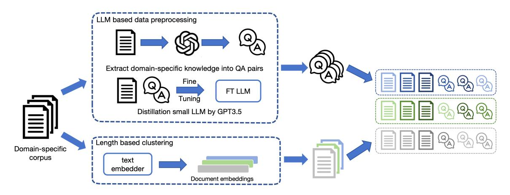
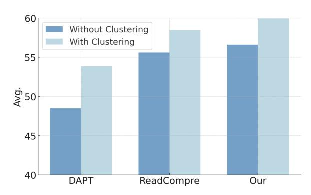

# Improving Domain Adaptation through Extended-Text Reading Comprehension

Ting Jiang<sup>1</sup> , Shaohan Huang<sup>2</sup> , Shengyue Luo <sup>2</sup> , Zihan Zhang<sup>2</sup> , Haizhen Huang<sup>2</sup> Furu Wei<sup>2</sup> , Weiwei Deng<sup>2</sup> , Feng Sun<sup>2</sup> , Qi Zhang<sup>2</sup> , Deqing Wang†<sup>1</sup> , Fuzhen Zhuang<sup>1</sup> <sup>1</sup>Beihang University <sup>2</sup>Microsoft Corporation royokong@buaa.edu.cn

### Abstract

To enhance the domain-specific capabilities of large language models, continued pre-training on a domain-specific corpus is a prevalent method. Recent work demonstrates that adapting models using reading comprehension data formatted by regex-based patterns can significantly improve performance on domainspecific tasks. However, regex-based patterns are incapable of parsing raw corpora using domain-specific knowledge. Furthermore, the question and answer pairs are extracted directly from the corpus in predefined formats offers limited context. To address this limitation, we improve reading comprehension via LLM and clustering. LLM focuses on leveraging domain knowledge within the corpus to refine comprehension stage, while clustering supplies relevant knowledge by extending the context to enrich reading stage. Additionally, our method incorporates parameter-efficient fine-tuning to improve the efficiency of domain adaptation. In comparison to AdaptLLM, our method achieves an improvement exceeding 5% in domain-specific tasks. Our code will available at <https://github.com/microsoft/LMOps>.

# 1 Introduction

With the emergence of Large Language Models (LLMs), LLMs have shown promising performance on various downstream tasks. A number of domainspecific LLMs [\(Cheng et al.,](#page-4-0) [2023;](#page-4-0) [Chen et al.,](#page-4-1) [2023;](#page-4-1) [Wu et al.,](#page-5-0) [2023;](#page-5-0) [Han et al.,](#page-4-2) [2023;](#page-4-2) [Liu et al.,](#page-4-3) [2023a\)](#page-4-3) have also been proposed to enhance LLMs on domain-specific capabilities of LLMs, which demonstrate improved performances in respective domains compared to general models. These domain-specific LLMs can be trained in two ways: either from scratch or by adapting existing general LLMs through continued pre-training [\(Gururangan](#page-4-4) [et al.,](#page-4-4) [2020\)](#page-4-4), with the latter being a more efficient method due to the foundational benefits provided by the general LLMs.

Recent work [\(Cheng et al.,](#page-4-0) [2023\)](#page-4-0) reveals that straightforward adaptation of a general LLM using raw domain-specific corpus is ineffective and can even impair prompting ability on domain-specific tasks. To harness the potential of domain-specific knowledge, they proposed a data preprocessing method named AdaptLLM. This method transforms a corpus into a reading comprehension format, utilizing specially designed regex-based patterns. Consequently, AdaptLLM notably enhances the performance of domain-specific tasks by structuring a corpus in the question-answering format.

However, the reliance on regex-based patterns poses challenges in handling complex patterns and generating questions that reflect domain-specific knowledge. For example, the regex-based pattern {SENT1} Therefore, {SENT2} is converted into a question-answer format as: What is the cause of {SENT1}? {SENT2}. This method also limits the diversity of question types. Integrating LLMs in the preprocessing stage can overcome these limitations. LLMs like ChatGPT are capable of identifying domain-specific knowledge and generating high-quality question-answer pairs for educational purposes [\(Olney,](#page-4-5) [2023;](#page-4-5) [Lu,](#page-4-6) [2023\)](#page-4-6). To mitigate the processing costs associated with ChatGPT in preprocessing, we fine-tune a compact LLM through knowledge distillation, to efficiently preprocesses domain-specific data.

We find that the context of question answering can be too short to learn domain-specific knowledge comprehensively. For example, in biomedicine, each document is a short abstract of paper, which is easy for LLM to answer questions, but lacks enough context to learn domain-specific knowledge. Inspired by [\(Levine et al.,](#page-4-7) [2021;](#page-4-7) [Shi](#page-5-1) [et al.,](#page-5-1) [2023\)](#page-5-1), we leverage length-based clustering to extend the context by concatenating similar documents into the same input as context. Moreover, we improve the efficiency of domain adaptation by utilizing parameter-efficient fine-tuning methods

<span id="page-1-0"></span>

Figure 1: The overall framework of our method. Best view in color.

like LoRA [\(Hu et al.,](#page-4-8) [2021\)](#page-4-8). Contrary to previous work [\(Liu et al.,](#page-4-3) [2023a\)](#page-4-3), we find that LoRA can be more efficient than full fine-tuning for domain adaptation with proper settings.

### 2 Methods

Considering the constraints of AdaptLLM in converting the corpus into reading comprehension via regex-based patterns, our method improves the quality of question answer pairs via LLM to enhance comprehension phase and extends their context by clustering to enhance reading phase, as illustrated in Figure [1.](#page-1-0) Furthermore, we employ parameter-efficient fine-tuning to enhance domain adaptation efficiency with appropriate settings.

#### 2.1 LLM-based data Preprocessing

For question-answer pairs generation, we employ ChatGPT to generate question-answer pairs with the prompt template: {DOCUMENT} Ask a few questions to help understand the above passage about {DOMAIN} and give the corresponding answers in JSON list (each JSON contain two keys: question and answer). Here, {DOCUMENT} represents the text from the corpus such as the paper abstract in biomedicine domain. {DOMAIN} indicates the adapted domain, which could be biomedicine or finance.

Considering that the corpus can contain more than a billion tokens, preprocessing the entire domain specific corpus can be expensive with the API based LLMs. To solve this problem, we further fine-tune a 7B parameter LLM by distilling from ChatGPT to generate question-answer pairs for entire corpus.

# 2.2 Length-based Clustering

We leverage document similarity to extend the context of question answering. Specifically, we embed documents with the text embedding model to cluster documents. Since the document length varies, we stop adding a new document to the cluster when the length exceeds the threshold or achieves the maximum amount of documents. To format the text of a cluster, we first concatenate all the documents, then shuffle their question-answer pairs to assemble them. Following AdaptLLM, we also augment the domain corpus with general instructions. Finally, we use 0/1 knapsack algorithm to fit these into the maximum context length of LLMs. The detailed algorithm is in Algorithm [1.](#page-1-1)

#### <span id="page-1-1"></span>Algorithm 1 Length-based Clustering

Input: Set of documents D, Set of question-answer pairs P, Set of general instructions G,Text embedding model M, Length threshold Lmax, Max documents Dmax

```
Output: Model input I
1: Initialize clusters C ← ∅
2: for each document d ∈ D do
3: Embed d with M to get embedding ed
4: end for
5: while |D| > 0 do
6: Randomly select di from D as cluster c
7: Initialize length Lc ← len(di) + len(pi)
8: Initialize count Nc ← 1
9: while Lc < Lmax and Nc < Dmax do
10: Get the closet di to cluster c based on ed
11: if sim(di, c) < 0.7 then
12: Break ▷ stop clustering if no similar d
13: end if
14: Update Lc and Nc based on di and pi
15: end while
16: Remove c from D and append to C
17: end while
18: Format each cluster c in C
19: Tokenize I = C
                  S
                    G with LLM tokenizer
20: Using 0/1 knapsack algorithm to fit I with maximum
```

context length 21: return I

<span id="page-2-0"></span>

| Biomedicine              |              |              |              |              |              |              |  |  |
|--------------------------|--------------|--------------|--------------|--------------|--------------|--------------|--|--|
|                          | BioMMLU      | PubMedQA     | MQP          | RCT          | UMSLE        | Avg.         |  |  |
| General LLM              | 29.9         | 74.0         | 50.0         | 47.0         | 28.9         | 46.0         |  |  |
| AdaptLLM†                | 46.6         | 75.2         | 68.7         | 47.1         | 33.3         | 54.2         |  |  |
| DAPT                     | 47.2         | 73.6         | 50.8         | 32.3         | 38.7         | 48.5         |  |  |
| ReadCompre               | 47.3         | 75.2         | 68.8         | 47.0         | 39.8         | 55.6         |  |  |
| Our                      | 48.3         | 73.7         | 79.8         | 58.0         | 40.1         | 60.0         |  |  |
| Finance                  |              |              |              |              |              |              |  |  |
|                          |              |              |              |              |              |              |  |  |
|                          | FiQA SA      | ConvFinQA    | FPB          | NER          | Headline     | Avg.         |  |  |
|                          |              |              |              |              |              |              |  |  |
| General LLM<br>AdaptLLM† | 40.5<br>65.6 | 38.3<br>46.9 | 20.6<br>58.1 | 67.6<br>69.1 | 84.6<br>85.7 | 50.3<br>65.1 |  |  |
|                          |              |              |              |              |              |              |  |  |
| DAPT<br>ReadCompre       | 75.6<br>75.7 | 42.2<br>39.9 | 67.4<br>70.9 | 73.1<br>68.4 | 85.2<br>86.8 | 68.7<br>68.3 |  |  |

Table 1: Main results on domain-specific task performance with general LLM, AdaptLLM [\(Cheng et al.,](#page-4-0) [2023\)](#page-4-0), domain-adaptive pre-training (DAPT), data preprocessing following in AdaptLLM (ReadCompre) and our method. For DAPT and ReadCompre, we reproduce these methods with the same training setting and domain corpus to demonstrate the effectiveness of our method. †: results from evaluating the published checkpoints. We find the performance of AdaptLLM is under-estimated in the original paper due to the dirty data and messy templates, and re-evaluate the performance of AdaptLLM with cleaned data and format templates.

#### 2.3 Parameter Efficient Domain Adaptation

Recent work [\(Liu et al.,](#page-4-3) [2023a\)](#page-4-3) indicates that Parameter Efficient Fine-Tuning (PEFT) methods like LoRA [\(Hu et al.,](#page-4-8) [2021\)](#page-4-8) are generally less effective than full fine-tuning for domain adaptation. This shortcoming is attributed to the exclusive implementation of LoRA in the self-attention layers, while neglecting the feed-forward layers which are related to storage knowledge in LLMs [\(Dai](#page-4-9) [et al.,](#page-4-9) [2021\)](#page-4-9). It limits the ability of LoRA to store domain-specific knowledge during continued fine-tuning. Distinct from other downstream tasks, such as translation, domain adaptation also exhibits heightened sensitivity to the quantity of trainable parameters. For instance, a low LoRA rank, such as 8, is often adequate for standard tasks. However, domain adaptation requires a significantly higher rank, like 256, to achieve comparable results with full fine-tuning. Nonetheless, even at a rank of 256, LoRA maintains a significant efficiency advantage over full fine-tuning.

#### 3 Experiments

#### 3.1 Experiment Settings

Following the AdaptLLM [\(Cheng et al.,](#page-4-0) [2023\)](#page-4-0), we use PubMed abstracts from the Pile [\(Gao et al.,](#page-4-10)

<span id="page-2-1"></span>

|            | BioMMLU | BioMMLU<br>RAG | Improv. |
|------------|---------|----------------|---------|
| DAPT       | 47.4    | 52.5           | 5.1     |
| ReadCompre | 47.3    | 51.5           | 4.2     |
| Our        | 48.3    | 54.5           | 6.2     |

Table 2: Retrieval Augmented Generation (RAG) results on BioMMLU. We use LLM-Embedder [\(Zhang](#page-5-2) [et al.,](#page-5-2) [2023\)](#page-5-2) as the text embedder with the MS MARCO [\(Nguyen et al.,](#page-4-11) [2016\)](#page-4-11) as the retrieval corpus.

[2020\)](#page-4-10) for biomedicine domain, and financial news collected by FinGPT [\(Liu et al.,](#page-4-12) [2023b\)](#page-4-12) for finance domain. Additionally, the LIMA [\(Zhou](#page-5-3) [et al.,](#page-5-3) [2023\)](#page-5-3), WizardLM [\(Xu et al.,](#page-5-4) [2023\)](#page-5-4), and Orca [\(Mukherjee et al.,](#page-4-13) [2023\)](#page-4-13) datasets are used as general instruction datasets with same mixing ratio as AdaptLLM. For data preprocessing, gpt-3.5-turbo is employed to generate questionanswer pairs for 10000 documents in each domain to fine tune a 7B LLaMA [\(Touvron et al.,](#page-5-5) [2023\)](#page-5-5). This fine-tuned model is then utilized to generate question-answer pairs for the entire corpus. For continue training, we use LoRA with a rank of 256 and int8 quantization to improve the efficiency of training.

For domain-specific tasks, we evaluate model

<span id="page-3-0"></span>

Figure 2: Ablation study on clustering on biomedicine with DAPT, ReadCompre and our method.

on the following datasets: PubMedQA [\(Jin et al.,](#page-4-14) [2019\)](#page-4-14), MQP [\(McCreery et al.,](#page-4-15) [2020\)](#page-4-15), RCT [\(Der](#page-4-16)[noncourt and Lee,](#page-4-16) [2017\)](#page-4-16), USMLE [\(Jin et al.,](#page-4-17) [2021\)](#page-4-17), BioMMLU, which we select biomedicine subjects from MMLU [\(Hendrycks et al.,](#page-4-18) [2020\)](#page-4-18), and ConvFinQA [\(Chen et al.,](#page-4-19) [2022\)](#page-4-19), FPB [\(Malo et al.,](#page-4-20) [2014\)](#page-4-20), NER [\(Salinas Alvarado et al.,](#page-5-6) [2015\)](#page-5-6), Headline [\(Sinha and Khandait,](#page-5-7) [2021\)](#page-5-7), FiQA SA [\(Maia](#page-4-21) [et al.,](#page-4-21) [2018\)](#page-4-21) for finance domain.

#### 3.2 Main Results

We show the main results on domain-specific tasks in Table [1.](#page-2-0) Our method surpasses AdaptLLM, yielding average improvement of 6.8% in biomedicine and 5.6% in finance. We also reproduce the results of DAPT and ReadCompre using identical training data and parameter efficient finetuning. In the case of ReadCompre, which uses the same data preprocessing method as AdaptLLM, we are able to reproduce the results and even achieve better performance. Compared to it, our method still achieves consistently improvements under the same data and settings, which demonstrates the effectiveness of our method. We do not find DAPT has an adverse impact on the general LLM as suggested in [\(Cheng et al.,](#page-4-0) [2023\)](#page-4-0). Instead, DAPT even demonstrates better performance in finance compared to ReadCompre. Furthermore, the integration of clustering to extend the context also enhance the performance on Retrieval-Augmented Generation (RAG), as detailed in Table [2.](#page-2-1)

### 4 Ablation Study

### 4.1 Effect of Clustering

To validate the effectiveness of our clustering method, we report the performance of DAPT, Read-Compre and our method with and without clus-

<span id="page-3-1"></span>

| LoRA<br>Rank     | LoRA<br>Target | Trainable<br>Parameters | Avg. |
|------------------|----------------|-------------------------|------|
| full fine-tuning |                | 7B                      | 59.5 |
| 256              | QV linear      | 256M                    | 53.6 |
| 8                | all linear     | 19M                     | 50.1 |
| 32               | all linear     | 153M                    | 52.5 |
| 128              | all linear     | 305M                    | 53.2 |
| 256              | all linear     | 610M                    | 60.0 |

Table 3: Ablation study on parameter efficient finetuning.

tering in Figure [2.](#page-3-0) We find that clustering improves the performance of all three methods, which demonstrates the effectiveness of clustering in domain adaptation.

### 4.2 Effect of Parameter Efficient Fine-Tuning

To study the influence of parameter efficient finetuning, we report the performance on biomedicine of different LoRA ranks and applied LoRA targets in Table [3.](#page-3-1) We find that trainable parameters is essential for domain adaptation. By increasing the LoRA rank to 256 with around 610M trainable parameters, the performance of parameter efficient fine-tuning can match full fine-tuning on domain adaption.

# 5 Conclusion

In this paper, we focus on improving the efficiency of domain adaptation through extended-text reading comprehension based on LLM and Clustering. To achieve it, we propose a domain adaptation method that incorporates LLM-based data preprocessing, length-based clustering, and parameterefficient domain adaptation. For LLM-based data preprocessing, we improve regex-based patterns in AdaptLLM by exploiting the ability of LLMs to generate question-answer pairs to help the model learn domain-specific knowledge. For length-based clustering, we further extend the context of question answering by concatenating similar documents into the same input. For parameter-efficient domain adaptation, we argue that LoRA can be more efficient than full fine-tuning for domain adaptation with proper settings. Experiments show that our method are effective to leverage unsupervised domain-specific corpus to improve the performance of domain-specific tasks.

# References

- <span id="page-4-1"></span>Wei Chen, Qiushi Wang, Zefei Long, Xianyin Zhang, Zhongtian Lu, Bingxuan Li, Siyuan Wang, Jiarong Xu, Xiang Bai, Xuanjing Huang, et al. 2023. Discfinllm: A chinese financial large language model based on multiple experts fine-tuning. *arXiv preprint arXiv:2310.15205*.
- <span id="page-4-19"></span>Zhiyu Chen, Shiyang Li, Charese Smiley, Zhiqiang Ma, Sameena Shah, and William Yang Wang. 2022. Convfinqa: Exploring the chain of numerical reasoning in conversational finance question answering. *arXiv preprint arXiv:2210.03849*.
- <span id="page-4-0"></span>Daixuan Cheng, Shaohan Huang, and Furu Wei. 2023. Adapting large language models via reading comprehension. *arXiv preprint arXiv:2309.09530*.
- <span id="page-4-9"></span>Damai Dai, Li Dong, Yaru Hao, Zhifang Sui, Baobao Chang, and Furu Wei. 2021. Knowledge neurons in pretrained transformers. *arXiv preprint arXiv:2104.08696*.
- <span id="page-4-16"></span>Franck Dernoncourt and Ji Young Lee. 2017. Pubmed 200k rct: a dataset for sequential sentence classification in medical abstracts. *arXiv preprint arXiv:1710.06071*.
- <span id="page-4-10"></span>Leo Gao, Stella Biderman, Sid Black, Laurence Golding, Travis Hoppe, Charles Foster, Jason Phang, Horace He, Anish Thite, Noa Nabeshima, et al. 2020. The pile: An 800gb dataset of diverse text for language modeling. *arXiv preprint arXiv:2101.00027*.
- <span id="page-4-4"></span>Suchin Gururangan, Ana Marasovic, Swabha ´ Swayamdipta, Kyle Lo, Iz Beltagy, Doug Downey, and Noah A Smith. 2020. Don't stop pretraining: Adapt language models to domains and tasks. *arXiv preprint arXiv:2004.10964*.
- <span id="page-4-2"></span>Tianyu Han, Lisa C Adams, Jens-Michalis Papaioannou, Paul Grundmann, Tom Oberhauser, Alexander Löser, Daniel Truhn, and Keno K Bressem. 2023. Medalpaca–an open-source collection of medical conversational ai models and training data. *arXiv preprint arXiv:2304.08247*.
- <span id="page-4-18"></span>Dan Hendrycks, Collin Burns, Steven Basart, Andy Zou, Mantas Mazeika, Dawn Song, and Jacob Steinhardt. 2020. Measuring massive multitask language understanding. *arXiv preprint arXiv:2009.03300*.
- <span id="page-4-8"></span>Edward J Hu, Yelong Shen, Phillip Wallis, Zeyuan Allen-Zhu, Yuanzhi Li, Shean Wang, Lu Wang, and Weizhu Chen. 2021. Lora: Low-rank adaptation of large language models. *arXiv preprint arXiv:2106.09685*.
- <span id="page-4-17"></span>Di Jin, Eileen Pan, Nassim Oufattole, Wei-Hung Weng, Hanyi Fang, and Peter Szolovits. 2021. What disease does this patient have? a large-scale open domain question answering dataset from medical exams. *Applied Sciences*, 11(14):6421.

- <span id="page-4-14"></span>Qiao Jin, Bhuwan Dhingra, Zhengping Liu, William Cohen, and Xinghua Lu. 2019. Pubmedqa: A dataset for biomedical research question answering. In *Proceedings of the 2019 Conference on Empirical Methods in Natural Language Processing and the 9th International Joint Conference on Natural Language Processing (EMNLP-IJCNLP)*, pages 2567–2577.
- <span id="page-4-7"></span>Yoav Levine, Noam Wies, Daniel Jannai, Dan Navon, Yedid Hoshen, and Amnon Shashua. 2021. The inductive bias of in-context learning: Rethinking pretraining example design. *arXiv preprint arXiv:2110.04541*.
- <span id="page-4-3"></span>Mingjie Liu, Teodor-Dumitru Ene, Robert Kirby, Chris Cheng, Nathaniel Pinckney, Rongjian Liang, Jonah Alben, Himyanshu Anand, Sanmitra Banerjee, Ismet Bayraktaroglu, et al. 2023a. Chipnemo: Domainadapted llms for chip design. *arXiv preprint arXiv:2311.00176*.
- <span id="page-4-12"></span>Xiao-Yang Liu, Guoxuan Wang, and Daochen Zha. 2023b. Fingpt: Democratizing internet-scale data for financial large language models. *arXiv preprint arXiv:2307.10485*.
- <span id="page-4-6"></span>Kai Lu. 2023. Can chatgpt help college instructors generate high-quality quiz questions? *Human Interaction and Emerging Technologies (IHIET-AI 2023): Artificial Intelligence and Future Applications*, 70(70).
- <span id="page-4-21"></span>Macedo Maia, Siegfried Handschuh, André Freitas, Brian Davis, Ross McDermott, Manel Zarrouk, and Alexandra Balahur. 2018. Www'18 open challenge: financial opinion mining and question answering. In *Companion proceedings of the the web conference 2018*, pages 1941–1942.
- <span id="page-4-20"></span>Pekka Malo, Ankur Sinha, Pekka Korhonen, Jyrki Wallenius, and Pyry Takala. 2014. Good debt or bad debt: Detecting semantic orientations in economic texts. *Journal of the Association for Information Science and Technology*, 65(4):782–796.
- <span id="page-4-15"></span>Clara H McCreery, Namit Katariya, Anitha Kannan, Manish Chablani, and Xavier Amatriain. 2020. Effective transfer learning for identifying similar questions: matching user questions to covid-19 faqs. In *Proceedings of the 26th ACM SIGKDD international conference on knowledge discovery & data mining*, pages 3458–3465.
- <span id="page-4-13"></span>Subhabrata Mukherjee, Arindam Mitra, Ganesh Jawahar, Sahaj Agarwal, Hamid Palangi, and Ahmed Awadallah. 2023. Orca: Progressive learning from complex explanation traces of gpt-4. *arXiv preprint arXiv:2306.02707*.
- <span id="page-4-11"></span>Tri Nguyen, Mir Rosenberg, Xia Song, Jianfeng Gao, Saurabh Tiwary, Rangan Majumder, and Li Deng. 2016. Ms marco: A human generated machine reading comprehension dataset. *choice*, 2640:660.
- <span id="page-4-5"></span>Andrew M Olney. 2023. Generating multiple choice questions from a textbook: Llms match human performance on most metrics. In *AIED Workshops*.

- <span id="page-5-6"></span>Julio Cesar Salinas Alvarado, Karin Verspoor, and Timothy Baldwin. 2015. [Domain adaption of named](https://aclanthology.org/U15-1010) [entity recognition to support credit risk assessment.](https://aclanthology.org/U15-1010) In *Proceedings of the Australasian Language Technology Association Workshop 2015*, pages 84–90, Parramatta, Australia.
- <span id="page-5-1"></span>Weijia Shi, Sewon Min, Maria Lomeli, Chunting Zhou, Margaret Li, Victoria Lin, Noah A Smith, Luke Zettlemoyer, Scott Yih, and Mike Lewis. 2023. Incontext pretraining: Language modeling beyond document boundaries. *arXiv preprint arXiv:2310.10638*.
- <span id="page-5-7"></span>Ankur Sinha and Tanmay Khandait. 2021. Impact of news on the commodity market: Dataset and results. In *Advances in Information and Communication: Proceedings of the 2021 Future of Information and Communication Conference (FICC), Volume 2*, pages 589–601. Springer.
- <span id="page-5-5"></span>Hugo Touvron, Thibaut Lavril, Gautier Izacard, Xavier Martinet, Marie-Anne Lachaux, Timothée Lacroix, Baptiste Rozière, Naman Goyal, Eric Hambro, Faisal Azhar, et al. 2023. Llama: Open and efficient foundation language models. *arXiv preprint arXiv:2302.13971*.
- <span id="page-5-0"></span>Shijie Wu, Ozan Irsoy, Steven Lu, Vadim Dabravolski, Mark Dredze, Sebastian Gehrmann, Prabhanjan Kambadur, David Rosenberg, and Gideon Mann. 2023. Bloomberggpt: A large language model for finance. *arXiv preprint arXiv:2303.17564*.
- <span id="page-5-4"></span>Can Xu, Qingfeng Sun, Kai Zheng, Xiubo Geng, Pu Zhao, Jiazhan Feng, Chongyang Tao, and Daxin Jiang. 2023. Wizardlm: Empowering large language models to follow complex instructions. *arXiv preprint arXiv:2304.12244*.
- <span id="page-5-2"></span>Peitian Zhang, Shitao Xiao, Zheng Liu, Zhicheng Dou, and Jian-Yun Nie. 2023. Retrieve anything to augment large language models. *arXiv preprint arXiv:2310.07554*.
- <span id="page-5-3"></span>Chunting Zhou, Pengfei Liu, Puxin Xu, Srini Iyer, Jiao Sun, Yuning Mao, Xuezhe Ma, Avia Efrat, Ping Yu, Lili Yu, et al. 2023. Lima: Less is more for alignment. *arXiv preprint arXiv:2305.11206*.