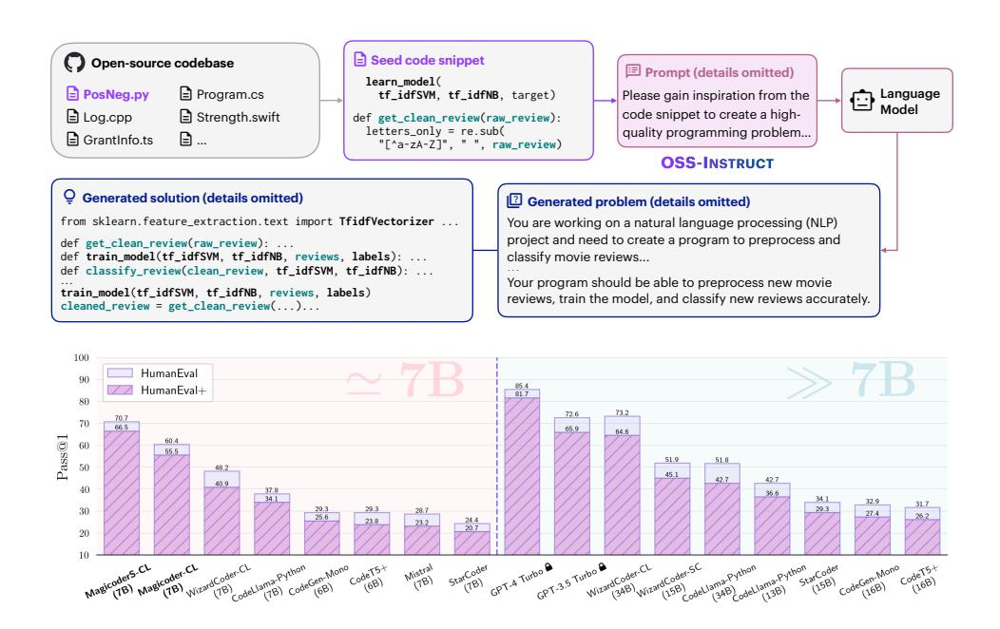
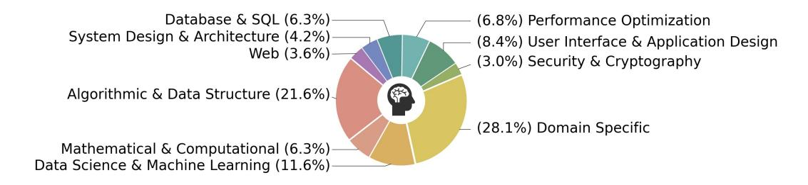
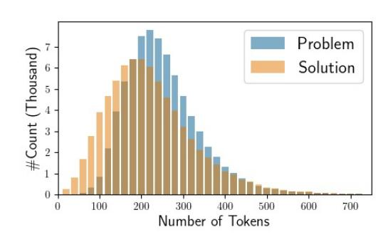
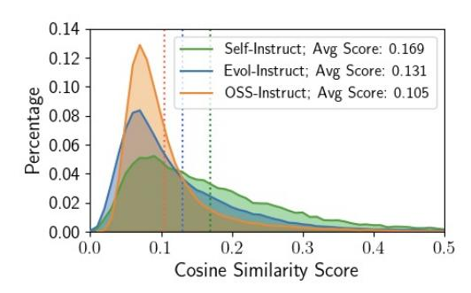

# Magicoder: Source Code Is All You Need

### Zhe Wang<sup>2</sup> Jiawei Liu<sup>1</sup> Yifeng Ding<sup>1</sup> Lingming Zhang<sup>1</sup>

<sup>1</sup>University of Illinois at Urbana-Champaign <sup>2</sup>Tsinghua University {ywei40,jiawei6,yifeng6,lingming}@illinois.edu zhewang20@mails.tsinghua.edu.cn Ohttps://github.com/ise-uiuc/magicoder

#### **Abstract**

We introduce Magicoder, a series of *fully open-source* (code, weights, and data) Large Language Models (LLMs) for code that significantly closes the gap with top code models while having no more than 7B parameters. Magicoder models are trained on 75K synthetic instruction data using OSS-INSTRUCT, a novel approach to enlightening LLMs with open-source code snippets to generate high-quality instruction data for code. Our main motivation is to mitigate the inherent bias of the synthetic data generated by LLMs by empowering them with a wealth of opensource references for the production of more diverse, realistic, and controllable data. The orthogonality of OSS-INSTRUCT and other data generation methods like Evol-Instruct further enables us to build an enhanced Magicoder S. Both Magicoder and Magicoder S substantially outperform state-of-the-art code models with similar or even larger sizes on a wide range of coding benchmarks, including Python text-to-code generation, multilingual coding, and data-science program completion. Notably, Magicoder S-CL-7B based on CODELLAMA even surpasses the prominent ChatGPT on HumanEval+ (66.5 vs. 65.9 in pass@1). Overall, OSS-INSTRUCT opens a new direction for low-bias and high-quality instruction tuning using abundant open-source references.



<span id="page-0-0"></span>Figure 1: Overview of OSS-INSTRUCT and the pass@1 results of different LLMs on HumanEval (+)

# 1 Introduction

Code generation, also known as program synthesis [\[Gulwani et al.,](#page-12-0) [2017\]](#page-12-0), is a long-standing challenge in computer science. In the past few decades, a large body of research has been studying symbolic approaches, such as abstraction-based synthesis [\[Wang et al.,](#page-14-0) [2017,](#page-14-0) [Feng et al.,](#page-12-1) [2018\]](#page-12-1) for general-purpose synthesis problems and programming by examples [\[Cambronero et al.,](#page-11-0) [2023,](#page-11-0) [Liu](#page-13-0) [et al.,](#page-13-0) [2023a\]](#page-13-0) for domain-specific tasks. Until recently, Large Language Models (LLMs) trained on code [\[Austin et al.,](#page-11-1) [2021,](#page-11-1) [Chen et al.,](#page-11-2) [2021\]](#page-11-2) has shown outstanding breakthroughs in generating code that accurately satisfies user intents, and they are widely deployed to assist real-world software development [\[Microsoft,](#page-13-1) [2023b,](#page-13-1) [Services,](#page-13-2) [2023\]](#page-13-2).

Initially, closed-source models such as GPT-3.5 Turbo [\[OpenAI,](#page-13-3) [2022\]](#page-13-3) (*i.e.,* ChatGPT) and GPT-4 [\[OpenAI,](#page-13-4) [2023\]](#page-13-4) massively dominated various code generation benchmarks and leaderboards [\[Chen](#page-11-2) [et al.,](#page-11-2) [2021,](#page-11-2) [Austin et al.,](#page-11-1) [2021,](#page-11-1) [Liu et al.,](#page-13-5) [2023b,](#page-13-5) [Lai et al.,](#page-12-2) [2022\]](#page-12-2). To further push the boundaries of code generation with open source LLMs, SELF-INSTRUCT [\[Wang et al.,](#page-14-1) [2023a\]](#page-14-1) is adopted to bootstrap the instruction-following ability of LLMs. In the realm of code, practitioners commonly devise synthetic coding instructions using a stronger teacher model (*e.g.,* ChatGPT and GPT-4) and then finetune a weaker student model (*e.g.,* CODELLAMA [\[Rozière et al.,](#page-13-6) [2023\]](#page-13-6)) with the generated data to distill the knowledge from the teacher [\[Taori et al.,](#page-14-2) [2023,](#page-14-2) [Chaudhary,](#page-11-3) [2023\]](#page-11-3).For example, Code Alpaca [\[Chaudhary,](#page-11-3) [2023\]](#page-11-3) consists of 20K automatically generated code instructions by applying SELF-INSTRUCT on ChatGPT using 21 seed tasks. To further enhance the coding abilities of LLMs, [Luo et al.](#page-13-7) [\[2023b\]](#page-13-7) proposes *Code Evol-Instruct* that employs various heuristics to increase the complexity of seed code instructions (Code Alpaca in this case), achieving state-of-the-art (SOTA) results among open-source models.

While these data generation methods can effectively improve the instruction-following capability of an LLM, they rely on a narrow range of predefined tasks or heuristics under the hood.For example, on the one hand, Code Alpaca that adopts SELF-INSTRUCT only relies on *21 seed tasks* to generate new code instructions using an identical prompt template. On the other hand, Code Evol-Instruct takes Code Alpaca as seeds and merely depends on *5 heuristics* to evolve the dataset. As partly suggested by [Yu et al.](#page-15-0) [\[2023\]](#page-15-0) and [\[Wang et al.,](#page-14-1) [2023a\]](#page-14-1), such approaches may significantly inherit the system bias inherent in the LLMs as well as the predefined tasks.

Therefore, in this paper, we propose OSS-INSTRUCT to mitigate the inherent bias of LLMs and to unleash their potential to craft high-quality and creative code instructions via direct learning from the open source. As shown in Figure [1,](#page-0-0) OSS-INSTRUCT leverages a powerful LLM to automatically generate new coding problems by *drawing inspiration* from any random code snippets collected from the open source. In this example, the LLM gets inspired by two incomplete code fragments from different functions and manages to relate them and craft a realistic machine learning problem. Thanks to the "infinite" real-world open-source code, OSS-INSTRUCT can directly produce *diverse*, *realistic*, and *controllable* code instructions by providing distinct seed code snippets. In the end, we generate 75K synthetic data to finetune CODELLAMA-PYTHON-7B, resulting in Magicoder-CL. While being simple and effective, OSS-INSTRUCT is orthogonal to existing data generation methods, and they can be combined to further push the boundaries of the models' coding capabilities. Therefore, we continually finetune Magicoder-CL on an open-source Evol-Instruct with 110K entries, producing MagicoderS-CL.

We evaluate Magicoder and MagicoderS on a wide range of coding tasks, including HumanEval [\[Chen et al.,](#page-11-2) [2021\]](#page-11-2) and MBPP [\[Austin et al.,](#page-11-1) [2021\]](#page-11-1) for Python text-to-code generation, MultiPL-E [\[Cassano et al.,](#page-11-4) [2022\]](#page-11-4) for multilingual code completion, and DS-1000 [\[Lai et al.,](#page-12-2) [2022\]](#page-12-2) for solving data science problems. We further adopt EvalPlus [\[Liu et al.,](#page-13-5) [2023b\]](#page-13-5), which includes the augmented HumanEval+ and MBPP+ datasets for more rigorous model evaluation. Both Magicoder-CL and MagicoderS-CL substantially boost the base CODELLAMA-PYTHON-7B. Additionally, Magicoder-CL even outperforms WizardCoder-CL-7B, WizardCoder-SC-15B, and all studied SOTA LLMs with less than or equal to 16B parameters on all the benchmarks we tested.Also, the pass@1 result of the enhanced MagicoderS-CL is on par with ChatGPT on HumanEval (70.7 vs. 72.6) and surpasses it on the more rigorous HumanEval+ (66.5 vs. 65.9), indicating that MagicoderS-CL can generate more robust code. It also achieves SOTA results among all code models at the same scale.

Additionally, we notice a very recent advancement in the development of the DeepSeek-Coder series [\[DeepSeek AI,](#page-11-5) [2023\]](#page-11-5) which has shown exceptional coding performance. However, due to the You are exceptionally skilled at crafting high-quality programming problems and offering precise solutions.

Please gain inspiration from the following random code snippet to create a high-quality programming problem. Present your output in two distinct sections: **[Problem Description]** and **[Solution]**.

Code snippet for inspiration:

#### **{code}**

Guidelines for each section:

- 1. **[Problem Description]**: This should be **\*\*completely self-contained\*\***, providing all the contextual information one needs to understand and solve the problem. Assume common programming knowledge, but ensure that any specific context, variables, or code snippets pertinent to this problem are explicitly included.
- 2. **[Solution]**: Offer a comprehensive, **\*\*correct\*\*** solution that accurately addresses the **[Problem Description]** you provided.

<span id="page-2-0"></span>Figure 2: The detailed prompt design for OSS-INSTRUCT

limited technical details currently disclosed, we only briefly discuss them in [§4.4.](#page-8-0) Despite this, we applied OSS-INSTRUCT on DeepSeek-Coder-Base 6.7B, resulting in the creation of Magicoder-DS and MagicoderS-DS. In addition to the consistent findings on the previous results with CODELLAMA-PYTHON-7B as the base model, Magicoder-DS and MagicoderS-DS benefit from the more powerful DeepSeek-Coder-Base-6.7B. This advantage is demonstrated by MagicoderS-DS, which achieves a remarkable 76.8 pass@1 on HumanEval. MagicoderS-DS also outperforms DeepSeek-Coder-Instruct-6.7B on HumanEval, HumanEval+, MBPP, and MBPP+ with 8× less finetuning tokens.

To justify the design of OSS-INSTRUCT, *i.e.,* generating instruction-tuning data from open-source references rather than using the reference directly, we further demonstrate that finetuning the base models with semantically relevant comment-function pairs directly extracted from open-source projects even negatively impacts the model performance ([§5.2\)](#page-9-0).

In general, we make the following contributions:

- We introduce OSS-INSTRUCT, a pioneering approach to enlightening LLMs with open-source code snippets to generate more diverse, realistic, and controllable coding instruction data, which can be leveraged to substantially boost the performance of various LLMs via instruction tuning. It opens a new dimension for creating *low-bias* and *high-quality* instruction-tuning data from the abundance of open-source references.
- We build the Magicoder series trained with OSS-INSTRUCT and MagicoderS series trained on a combination of OSS-INSTRUCT and Evol-Instruct. Our evaluation across 6 benchmarks shows that all Magicoders significantly improve the base LLMs. Notably, both MagicoderS-CL and MagicoderS-DS outperform ChatGPT on HumanEval+ with only *7B parameters*.
- We fully open source the model weights, training data, and source code at [https://github.com/](https://github.com/ise-uiuc/magicoder) [ise-uiuc/magicoder](https://github.com/ise-uiuc/magicoder) to facilitate future research.

# 2 OSS-INSTRUCT: Instruction Tuning from Open Source

In this section, we elaborate on our OSS-INSTRUCT approach. From a high level, as shown in Figure [1,](#page-0-0) OSS-INSTRUCT works by prompting an LLM (*e.g.,* ChatGPT) to generate a coding problem and its solution according to some seed code snippet collected from the wild (*e.g.,* from GitHub). The seed snippet offers controllability of the generation and encourages the LLM to create diverse coding problems that can reflect real-world programming scenarios.

### 2.1 Generating Coding Problems

OSS-INSTRUCT is powered by seed code snippets that can be easily collected from open source. In this work, we directly adopt starcoderdata as our seed corpus, a filtered version of The Stack [\[Ko](#page-12-3)[cetkov et al.,](#page-12-3) [2022\]](#page-12-3) dataset that StarCoder is trained on, containing permissively licensed source

code documents in various programming languages.We chose starcoderdata because it is widely adopted, includes massive high-quality code snippets, and is even post-processed for data decontamination [\[Li et al.,](#page-12-4) [2023,](#page-12-4) [Allal et al.,](#page-11-6) [2023\]](#page-11-6). For each code document from the corpus, we randomly extract 1–15 consecutive lines as the seed snippet for the model to gain inspiration from and produce coding problems. In total, we collected 80K initial seed snippets from 80K code documents, 40K from Python, and 5K from each of C++, Java, TypeScript, Shell, C#, Rust, PHP, and Swift respectively. Then, each collected seed code snippet is applied to the prompt template shown in Figure [2,](#page-2-0) which a teacher model takes as input and outputs both a coding problem and its solution.

### <span id="page-3-0"></span>2.2 Data Cleaning and Decontamination

We perform data cleaning by excluding samples that are identical or share the same seed code snippet" or linebreaks "\n". While there exist other sorts of noisiness (*e.g.,* the solution is incomplete) in the generated data, inspired by [Honovich et al.](#page-12-5) [\[2023\]](#page-12-5), they are not removed as we believe they still contain valuable information for LLMs to learn. Finally, we apply the same logic as StarCoder [Li](#page-12-4) [et al.](#page-12-4) [\[2023\]](#page-12-4) to decontaminate our training data by removing coding problems that contain docstrings or solutions from HumanEval [\[Chen et al.,](#page-11-2) [2021\]](#page-11-2) and MBPP [\[Austin et al.,](#page-11-1) [2021\]](#page-11-1), docstrings from APPS [\[Hendrycks et al.,](#page-12-6) [2021\]](#page-12-6), prompts from DS-1000 [\[Lai et al.,](#page-12-2) [2022\]](#page-12-2), or questions from GSM8K [\[Cobbe et al.,](#page-11-7) [2021\]](#page-11-7). As part of our analysis, the decontamination procedure only filters out 9 additional samples. Since the seed corpus starcoderdata has already gone through rigorous data decontamination, this observation suggests that OSS-INSTRUCT is unlikely to introduce additional data leakage beyond the seeds. The eventual OSS-INSTRUCT dataset contains about 75K entries.

#### 2.3 Qualitative Examples of OSS-INSTRUCT

Figure [3](#page-4-0) shows some qualitative examples of how OSS-INSTRUCT can help LLM get inspiration from a seed code snippet to create new coding problems and solutions. For example, the *shell script* example shows how an LLM crafts a Python coding problem with just one line of shell script. The *library imports* example demonstrates how an LLM can create a realistic machine learning problem using just a few import statements. Meanwhile, the *class signature* instance illustrates the ability of LLM to draw inspiration from an incomplete class definition featuring annotations like SpringBootApplication and keywords such as bank. From this, the LLM generates a problem that requires implementing a complete banking system based on Spring Boot! Overall, OSS-INSTRUCT can inspire an LLM with distinct code structures and semantics to create diverse coding tasks, including algorithmic challenges, realistic issues, single-function code generation, library-based program completion, whole-program development, and even whole-application construction.

Categories To study the categories of OSS-INSTRUCT-generated data, we use INSTRUCTOR [\[Su](#page-14-3) [et al.,](#page-14-3) [2022\]](#page-14-3), which is one of the SOTA embedding models and can generate different text embeddings according to a task instruction. Inspired by OctoPack [\[Muennighoff et al.,](#page-13-8) [2023\]](#page-13-8) and the topic tags on GitHub, we manually designed 10 categories specific to coding. As shown in Figure [4,](#page-5-0) we calculate the cosine similarity between the embeddings of each sample in OSS-INSTRUCT and the 10 categories to obtain the category breakdown. Overall, OSS-INSTRUCT exhibits diversity and balance across different categories.

Length distribution We depict the length distribution for both generated problems and solutions in Figure [5.](#page-5-1) The x-axis represents the number of tokens in each problem/solution, while the y-axis shows the correspondent number of samples.

Similarity with HumanEval To study whether our data generation process produces more HumanEval-like problems or solutions that contribute to high performance, we pair each sample from our 75K dataset with each of the 164 HumanEval [\[Chen et al.,](#page-11-2) [2021\]](#page-11-2) samples and compute their cosine similarity using TF-IDF [\[SPARCK JONES,](#page-13-9) [1972\]](#page-13-9) embeddings. We then associate each OSS-INSTRUCT sample with a HumanEval sample with the highest similarity score. We also compare our dataset against Code Alpaca, a 20K dataset applying SELF-INSTRUCT to code, and evol-codealpaca-v1 [\[theblackcat102,](#page-14-4) [2023\]](#page-14-4), an open-source reproduction of Evol-Instruct containing 110K coding instructions. We resort to the open-source implementation because the official *Code Evol-Instruct* [\[Luo et al.,](#page-13-7) [2023b\]](#page-13-7) dataset is not released. We decontaminate all the datasets beforehand using the same way discussed in [§2.2.](#page-3-0) Figure [6](#page-5-2) shows that OSS-INSTRUCT exhibits the lowest

```
Seed: method definition
                                                               Seed: shell script
render() {
                                                               python3 makeErrorFile.py data/test_dataset_14 14
Problem
Your task is to complete the `render` method to
                                                               Create a Python program that generates an error file
generate the rendered shape as a string...
                                                               based on a given dataset...
O Code
                                                                O Code
class ShapeRenderer {
                                                               def generate_error_file(dataset_file, ...):
  constructor(vertices) {
                                                                  error_lines = []
                                                                 with open(dataset_file, 'r') as file:
    this.vertices = vertices:
                                                                    for line in file:
  render() {
    let renderedShape = "";
                                                                  with open(error_file_name, 'w') as error_file:
    for (let i = 0; i < this.vertices.length; <math>i++) {
                                                                    for error_line in error_lines:
      const vertex = this.vertices[i];
renderedShape += `(${vertex.x}, ${vertex.y})`;\nif (i < this.vertices.length - 1) {</pre>
                                                                      error_file.write(error_line + '\n')
                                                                 __name__ == "__main__
if len(sys.argv) != 3:
         renderedShape += " - '
                                                                   print("Usage: ...")
      }
                                                                   dataset_file = sys.argv[1]
dataset_number = sys.argv[2]
    return renderedShape:
                                                                    generate_error_file(...)
Seed: library imports
                                                               Seed: class signature
import numpy as np\nimport gym_electric_motor as gem
                                                               @SpringBootApplication\\
                                                               @Import({ AxonConfig.class })
import matplotlib.pyplot as plt
                                                               public class AxonbankApplication {
                                                                 public static void main(String[] args) {
I<sup>2</sup> Problem
Create a reinforcement learning agent to control an
                                                               Create a simple Java Spring Boot application for a
electric motor using the OpenAl Gym environment...
                                                               banking system...
import numpy as np\nimport gym_electric_motor as gem
                                                               import org.axonframework.commandhandling.CommandBus;
                                                               import org.axonframework.config.Configuration;
env = gem.make("DcSeriesCont-v1")
class DQNAgent:
   def __init__(self, state_dim, action_dim): ...
   def build_model(self): ...
                                                               @SpringBootApplication
                                                               @Import({ AxonConfig.class })
                                                               public class AxonbankApplication {...}
  def act(self, state): .
                                                               public class BankAccount {...}
  def train(self, state, action, reward, ...): ...
                                                               public class CreateAccountCommand {...}
                                                               public class DepositFundsCommand {...}
                                                               public class WithdrawFundsCommand {...}
public class AccountCreatedEvent {...}
for episode in range(episodes):
    state = env.reset()
    state = np.reshape(state, [1, state_dim])
                                                               public class FundsDepositedEvent {...}
                                                               public class FundsWithdrawnEvent {...}
Seed: code statements
                                                               Seed: comments
cutoff_range = np.ptp(cutoffs)
                                                               # Set degrees
if cutoff_range == 0: cutoff_range = 1
cutoff_colors = plt.get_cmap('plasma')(
    (cutoffs - np.min(cutoffs)) / cutoff_range
                                                               Implement a Python class that represents a
                                                               temperature in degrees...
I<sup>2</sup> Problem
                                                                Q Code
Implement a function that calculates the color values
                                                               class TemperatureConverter:
for a given set of cutoff values based on a specified
                                                                 def __init__(self):
                                                                 def set_celsius(self, degrees): ...
def set_fahrenheit(self, degrees): ...
color map...
♀ Code
                                                                 def set_kelvin(self, degrees): ...
                                                                 def get_celsius(self):
import numpy as no
                                                                 def get_fahrenheit(self): ...
import matplotlib.pvplot as plt
                                                                 def get_kelvin(self):
                                                                 def convert_to(self, unit):
def calculate_cutoff_colors(cutoffs, cmap_name):
                                                                      if unit == 'C'
  cutoff_range = np.ptp(cutoffs)
                                                                          return self.get_celsius()
  if cutoff_range == 0:
  cutoff_range = 1
                                                                      elif unit == 'F'
                                                                         return self.get_fahrenheit()
  cmap = plt.get_cmap(cmap_name)
                                                                      elif unit == 'K'
  normalized_cutoffs = ...
                                                                          return self.get_kelvin()
  cutoff colors =
  return cutoff colors
```

<span id="page-4-0"></span>Figure 3: Examples showing how OSS-INSTRUCT generates problems and solutions from seed code snippets. Details such as full problem requirements, complete implementations, and explanations are omitted for brevity.



<span id="page-5-0"></span>Figure 4: The category constitution of OSS-INSTRUCT





<span id="page-5-1"></span>Figure 5: Token count distribution of OSS-INSTRUCT-generated problems and solutions

<span id="page-5-2"></span>Figure 6: Cosine similarities between HumanEval and different data generation methods

average similarity among all the studied data generation techniques while SELF-INSTRUCT shows the highest average similarity. This result indicates that the improvements from OSS-INSTRUCT are not merely due to including data from the same distribution.

# <span id="page-5-3"></span>3 Implementation Details

Data generation We use gpt-3.5-turbo-1106 as the foundation model to do OSS-INSTRUCT due to its high cost-effectiveness. We randomly extract 1–15 lines from each selected code document from starcoderdata and let gpt-3.5-turbo-1106 imagine a self-contained coding problem and a correct solution. Given the numerous seed code snippets, we perform greedy decoding to maximize the consistency between the generated problems and solutions.

Data decontamination We apply data decontamination before training our Magicoder and MagicoderS models. Following [Li et al.](#page-12-4) [\[2023\]](#page-12-4), we decontaminate both our 75K OSS-INSTRUCT dataset and the evol-codealpaca-v1 [\[theblackcat102,](#page-14-4) [2023\]](#page-14-4) dataset, an open-source reproduction of Evol-Instruct, by removing exact matches from HumanEval [\[Chen et al.,](#page-11-2) [2021\]](#page-11-2), MBPP [\[Austin](#page-11-1) [et al.,](#page-11-1) [2021\]](#page-11-1), DS-1000 [\[Lai et al.,](#page-12-2) [2022\]](#page-12-2), and GSM8K [\[Cobbe et al.,](#page-11-7) [2021\]](#page-11-7). Eventually, we filtered out 9 problems for OSS-INSTRUCT dataset and 89 for evol-codealpaca-v1.

Training We employ CODELLAMA-PYTHON-7B and DeepSeek-Coder-Base 6.7B as the base LLMs. To obtain Magicoder series, we first finetune the base models on about 75K synthetic data generated through OSS-INSTRUCT using the transformers library from Hugging Face [\[Hugging](#page-12-7) [Face,](#page-12-7) [2023\]](#page-12-7). We finetune the base models for 2 epochs using two NVIDIA A100-80GB GPUs through the Distributed Data Parallel (DDP) module from PyTorch. We set the initial learning rate at 5e-5 with 15 warmup steps and a linear scheduler. We use Adafactor [\[Shazeer and Stern,](#page-13-10) [2018\]](#page-13-10) as our optimizer and choose a batch size of 512 with a sequence truncation length of 1216. To obtain MagicoderS, we continue to finetune Magicoder models with the evol-codealpaca-v1 dataset, an open-source Evol-Instruct implementation containing about 110K samples. We use the same hyperparameters except for 15 warmup steps and a 1024 max sequence length.

<span id="page-6-0"></span>Table 1: Pass@1 (%) results of different LLMs on HumanEval (+) and MBPP (+) computed with greedy decoding. The abbreviations "CL" and "SC" refer to the base models CODELLAMA-PYTHON and StarCoder, respectively. We report the results consistently from the EvalPlus [Liu et al., 2023b] Leaderboard.

| Model            | Release Date | Size | Benchm                      | Open-Source                 |         |         |
|------------------|--------------|------|-----------------------------|-----------------------------|---------|---------|
|                  |              |      | HumanEval (+)               | MBPP (+)                    | Weight  | Data    |
| GPT-3.5 Turbo    | Nov 2023     | -    | 72.6 (65.9)                 | 81.7 (69.4)                 | 0       | 0       |
| GPT-4 Turbo      | Nov 2023     | -    | <b>85.4</b> ( <b>81.7</b> ) | <b>83.0</b> (70.7)          | $\circ$ | $\circ$ |
| CODELLAMA-PYTHON | Aug 2023     | 34B  | 51.8 (42.7)                 | 67.2 (52.9)                 | •       | 0       |
| WizardCoder-CL   | Sep 2023     | 34B  | 73.2 (64.6)                 | 73.2 (59.9)                 | •       | 0       |
| CodeT5+          | May 2023     | 16B  | 31.7 (26.2)                 | 54.6 (44.4)                 | •       | •       |
| CodeGen-Mono     | Mar 2022     | 16B  | 32.9 (27.4)                 | 52.6 (43.6)                 | •       | •       |
| StarCoder        | May 2023     | 15B  | 34.1 (29.3)                 | 55.1 (46.1)                 | •       | •       |
| CODELLAMA-PYTHON | Aug 2023     | 13B  | 42.7 (36.6)                 | 61.2 (50.9)                 | •       | 0       |
| WizardCoder-SC   | Sep 2023     | 15B  | 51.9 (45.1)                 | 61.9 (50.6)                 | •       | 0       |
| StarCoder        | May 2023     | 7B   | 24.4 (20.7)                 | 33.1 (28.8)                 | •       | •       |
| Mistral          | Oct 2023     | 7B   | 28.7 (23.2)                 | 50.1 (40.9)                 | •       | 0       |
| CodeT5+          | May 2023     | 6B   | 29.3 (23.8)                 | 51.9 (40.9)                 | •       | •       |
| CodeGen-Mono     | Mar 2022     | 6B   | 29.3 (25.6)                 | 49.9 (42.1)                 | •       | •       |
| CODELLAMA-PYTHON | Aug 2023     | 7B   | 37.8 (34.1)                 | 57.6 (45.4)                 | •       | 0       |
| WizardCoder-CL   | Sep 2023     | 7B   | 48.2 (40.9)                 | 56.6 (47.1)                 | •       | 0       |
| Magicoder-CL     | Dec 2023     | 7B   | 60.4 (55.5)                 | 64.2 (52.6)                 | •       | •       |
| MagicoderS-CL    | Dec 2023     | 7B   | 70.7 (66.5)                 | <b>68.4</b> ( <b>56.6</b> ) | •       | •       |

#### 4 Evaluation

#### 4.1 Python Text-to-Code Generation

HumanEval [Chen et al., 2021] and MBPP [Austin et al., 2021] are two of the most widely used benchmarks for code generation. Each task in these benchmarks includes a task description (e.g., docstring) as the prompt, where LLMs generate corresponding code whose correctness is checked by a handful of test cases. Because tests in these benchmarks can be insufficient [Liu et al., 2023b], for more rigorous evaluation, we use HumanEval+ and MBPP+, both powered by the EvalPlus framework [Liu et al., 2023b] to obtain  $80 \times /35 \times$  more tests. Following prior work [Liu et al., 2023b, Chen et al., 2023], for each task and LLM we use greedy decoding to generate one sample and focus on comparing the pass@1 metric.

We consider a wide range of baseline models, including CODELLAMA-PYTHON [Rozière et al., 2023], WizardCoder [Luo et al., 2023b], GPT-3.5 Turbo [OpenAI, 2022], GPT-4 Turbo [OpenAI, 2023], StarCoder [Li et al., 2023], CodeT5+ [Wang et al., 2023b], CodeGen-Mono [Nijkamp et al., 2023], and Mistral [Jiang et al., 2023a]. All the results are consistently reported from the EvalPlus [Liu et al., 2023b] leaderboard.

Table 1 shows the pass@1 results of different LLMs on these benchmarks. From the results, we can first observe that Magicoder-CL has a clear improvement over the base CODELLAMA-PYTHON-7B, and outperforms all studied open-source models except CODELLAMA-PYTHON-34B and WizardCoder-CL-34B. Notably, Magicoder-CL surpasses WizardCoder-SC-15B and has a substantial improvement on HumanEval and HumanEval+ over CODELLAMA-PYTHON-34B.Magicoder\$C-CL demonstrates further improvements by being trained with the orthogonal Evol-Instruct method. Magicoder\$C-CL outperforms ChatGPT and all other open-source models on HumanEval+. Moreover, although it scores slightly lower than WizardCoder-CL-34B and ChatGPT on HumanEval, it surpasses both of them on the more rigorous HumanEval+ dataset, indicating that Magicoder\$-CL may produce more robust code.

<span id="page-7-0"></span>Table 2: Pass@1 results of different LLMs on MultiPL-E [\[Cassano et al.,](#page-11-4) [2022\]](#page-11-4) following the same hyperparameter settings as the WizardCoder paper [\[Luo et al.,](#page-13-7) [2023b\]](#page-13-7): temperature = 0.2, top\_p = 0.95, max\_length = 512, and num\_samples = 50. We evaluate all 7B models using bigcode-evaluation-harness [\[Ben Allal et al.,](#page-11-9) [2022\]](#page-11-9) and report other results from the WizardCoder paper.

|                    |      | Programming Language |            |      |      |       |      |
|--------------------|------|----------------------|------------|------|------|-------|------|
| Model              | Size | Java                 | JavaScript | C++  | PHP  | Swift | Rust |
| CODELLAMA          | 34B  | 40.2                 | 41.7       | 41.4 | 40.4 | 35.3  | 38.7 |
| CODELLAMA-PYTHON   | 34B  | 39.5                 | 44.7       | 39.1 | 39.8 | 34.3  | 39.7 |
| CODELLAMA-INSTRUCT | 34B  | 41.5                 | 45.9       | 41.5 | 37.0 | 37.6  | 39.3 |
| WizardCoder-CL     | 34B  | 44.9                 | 55.3       | 47.2 | 47.2 | 44.3  | 46.2 |
| StarCoderBase      | 15B  | 28.5                 | 31.7       | 30.6 | 26.8 | 16.7  | 24.5 |
| StarCoder          | 15B  | 30.2                 | 30.8       | 31.6 | 26.1 | 22.7  | 21.8 |
| WizardCoder-SC     | 15B  | 35.8                 | 41.9       | 39.0 | 39.3 | 33.7  | 27.1 |
| CODELLAMA          | 7B   | 29.3                 | 31.7       | 27.0 | 25.1 | 25.6  | 25.5 |
| CODELLAMA-PYTHON   | 7B   | 29.1                 | 35.7       | 30.2 | 29.0 | 27.1  | 27.0 |
| Magicoder-CL       | 7B   | 36.4                 | 45.9       | 36.5 | 39.5 | 33.4  | 30.6 |
| MagicoderS-CL      | 7B   | 42.9                 | 57.5       | 44.4 | 47.6 | 44.1  | 40.3 |

# 4.2 Multilingual Code Generation

In addition to Python, as shown in Table [2,](#page-7-0) we perform an extensive evaluation on 6 widely used programming languages, *i.e.,* Java, JavaScript, C++, PHP, Swift, and Rust, using the MultiPL-E benchmark [\[Cassano et al.,](#page-11-4) [2022\]](#page-11-4).We report available results from the WizardCoder paper [\[Luo et al.,](#page-13-7) [2023b\]](#page-13-7) and evaluate our models consistently through bigcode-evaluation-harness [\[Ben Allal](#page-11-9) [et al.,](#page-11-9) [2022\]](#page-11-9). We skip proprietary models such as ChatGPT and GPT-4 as they are not supported by the framework. Due to a significant inference latency when running WizardCoder-CL-7B using the harness in our environment, we choose not to include it in our analysis.

The results indicate that Magicoder-CL improves the base CODELLAMA-PYTHON-7B by a large margin among all the studied programming languages. Moreover, Magicoder-CL also achieves better results than the SOTA 15B WizardCoder-SC among half of the programming languages.Additionally, MagicoderS-CL demonstrates further improvement over Magicoder-CL on all programming languages, achieving comparable performance against WizardCoder-CL-34B with only 7B parameters. It is worth noting that Magicoder-CL is only trained with very limited multilingual data but still outperforms other LLMs with similar or even larger sizes. Also, although the harness evaluates models in *completion* formats, Magicoders still show significant improvements despite being only *instruction-tuned*. This implies that LLMs can learn knowledge from the data beyond its format.

### 4.3 Code Generation for Data Science

The DS-1000 dataset [\[Lai et al.,](#page-12-2) [2022\]](#page-12-2) contains 1K distinct data science coding issues ranging from 7 popular data science libraries in Python. It evaluates the realistic and practical use case of an LLM and offers unit tests for validating each problem. DS-1000 has both *completion* and *insertion* modes, but here we only evaluate *completion* because the base CODELLAMA-PYTHON does not support infilling. Table [3](#page-8-1) shows the evaluation results where we include the recent INCODER [\[Fried et al.,](#page-12-9) [2023\]](#page-12-9), CodeGen [\[Nijkamp et al.,](#page-13-11) [2023\]](#page-13-11), Code-Cushman-001 [\[Microsoft,](#page-13-12) [2023a\]](#page-13-12), StarCoder [\[Li et al.,](#page-12-4) [2023\]](#page-12-4), CODELLAMA-PYTHON [\[Rozière et al.,](#page-13-6) [2023\]](#page-13-6), and WizardCoder [\[Luo et al.,](#page-13-7) [2023b\]](#page-13-7). We can see from the table that Magicoder-CL-7B already outperforms all the baselines we evaluate, including state-of-the-art WizardCoder-CL-7B and WizardCoder-SC-15B. MagicoderS-CL-7B further breaks the limit by introducing an 8.3 percentage point absolute improvement over WizardCoder-SC-15B.

<span id="page-8-1"></span>Table 3: Pass@1 results on DS-1000 (completion format) with temperature =0.2, top\_p =0.5, max\_length =1024, and num\_samples =40, following the same hyperparameter setting used in WizardCoder [Luo et al., 2023b]. We evaluate all the 7B models with their preferred prompt formats and report other results from WizardCoder.

| Model            | Size | + 155<br>Matplotlib | + 220<br>NumPy | + 291<br>Pandas | + 68<br>PyTorch | + 106<br>SciPy | + 115<br>Sklearn | + 45<br>TensorFlow | = 1000<br>Overall |
|------------------|------|---------------------|----------------|-----------------|-----------------|----------------|------------------|--------------------|-------------------|
| INCODER          | 6.7B | 28.3                | 4.4            | 3.1             | 4.4             | 2.8            | 2.8              | 3.8                | 7.4               |
| CodeGen-Mono     | 16B  | 31.7                | 10.9           | 3.4             | 7.0             | 9.0            | 10.8             | 15.2               | 11.7              |
| Code-Cushman-001 | -    | 40.7                | 21.8           | 7.9             | 12.4            | 11.3           | 18.0             | 12.2               | 18.1              |
| StarCoder        | 15B  | 51.7                | 29.7           | 11.4            | 21.4            | 20.2           | 29.5             | 24.5               | 26.0              |
| WizardCoder-SC   | 15B  | 55.2                | 33.6           | 16.7            | 26.2            | 24.2           | 24.9             | 26.7               | 29.2              |
| CODELLAMA-PYTHON | 7B   | 55.3                | 34.5           | 16.4            | 19.9            | 22.3           | 17.6             | 28.5               | 28.0              |
| WizardCoder-CL   | 7B   | 53.5                | 34.4           | 15.2            | 25.7            | 21.0           | 24.5             | 28.9               | 28.4              |
| Magicoder-CL     | 7B   | 54.6                | 34.8           | 19.0            | 24.7            | 25.0           | 22.6             | 28.9               | 29.9              |
| MagicoderS-CL    | 7B   | 55.9                | 40.6           | 28.4            | 40.4            | 28.8           | 35.8             | 37.6               | 37.5              |

<span id="page-8-2"></span>Table 4: Pass@1 (greedy decoding) comparison between Magicoder and DeepSeek-Coder [DeepSeek AI, 2023] on HumanEval (+) and MBPP (+). DeepSeek-Coder results are reported from EvalPlus [Liu et al., 2023b] Leaderboard.

| M- J-1                  | C:   | Training Tokens | Benchn                      | Open-Source                 |        |         |
|-------------------------|------|-----------------|-----------------------------|-----------------------------|--------|---------|
| Model                   | Size |                 | HumanEval (+)               | MBPP (+)                    | Weight | Data    |
|                         | 1.3B | 2T              | -                           | 55.4 (46.9)                 | •      | 0       |
| DeepSeek-Coder-Base     | 6.7B | 2T              | 47.6 (39.6)                 | 70.2 (56.6)                 | •      | $\circ$ |
|                         | 33B  | 2T              | 51.2 (43.3)                 | -                           | •      | $\circ$ |
| DeepSeek-Coder Instruct | 1.3B | +2B             | 64.6 (58.5)                 | 63.7 (53.1)                 | •      | 0       |
|                         | 6.7B | +2B             | <b>73.8</b> ( <b>70.1</b> ) | 72.7 (63.4)                 | •      | 0       |
|                         | 33B  | +2B             | <b>78.7</b> ( <b>72.6</b> ) | <b>78.7</b> ( <b>66.7</b> ) | •      | $\circ$ |
| Magicoder-DS            | 6.7B | +90M            | 66.5 (60.4)                 | 75.4 (61.9)                 | •      | •       |
| Magicoder S-DS          | 6.7B | +240M           | <b>76.8</b> ( <b>70.7</b> ) | <b>75.7</b> ( <b>64.4</b> ) | •      | •       |

#### <span id="page-8-0"></span>4.4 Comparison with DeepSeek-Coder

DeepSeek-Coder [DeepSeek AI, 2023] is a series of models released very recently and they demonstrate superior coding performance. We only briefly discuss it in this section because its technical details and instruction data are not publicly available at the time of writing. We apply the same finetuning strategy on DeepSeek-Coder-Base-6.7B as we performed on Codellama-Python-7B, leading to Magicoder-DS and Magicoder-S-DS. Table 4 shows a similar trend as Table 1 that the base model can be significantly improved after applying OSS-Instruct. Remarkably, the Magicoder-S-DS variant surpasses DeepSeek-Coder-Instruct-6.7B on all the benchmarks with  $\times 8$  fewer training tokens, and it also closely matches DeepSeek-Coder-Instruct-34B on these datasets!

#### 5 Ablations of Data Source

#### 5.1 Impact of the Language Distribution

To understand the correlation between the programming languages appearing in the training data and the downstream performance of different languages, we conduct an additional ablation study about the training data. We classify the 75K training data into approximately 43K Python-only, and 32K non-Python data according to whether ```python is a substring of the generated data. We do not classify the data based on the seed code snippet because LLMs performing OSS-INSTRUCT may produce code in a different programming language than the seed.

<span id="page-9-1"></span>Table 5: Ablation study of using different programming languages as training data. We show the pass@1 results on HumanEval+ [\[Liu et al.,](#page-13-5) [2023b\]](#page-13-5) for Python and the average pass@1 results on MultiPL-E [\[Cassano et al.,](#page-11-4) [2022\]](#page-11-4) for the same set of programming languages used in Table [2](#page-7-0) (*i.e.,* Java, JavaScript, C++, PHP, Swift, and Rust). All the variants are finetuned with 2 epochs and evaluated through greedy-decoding.

| Model (7B)       | Finetuning Data | Python (HumanEval+) | Others (MultiPL-E) |
|------------------|-----------------|---------------------|--------------------|
| CODELLAMA-PYTHON | -               | 34.1                | 29.6               |
| Magicoder-CL     | Python (43K)    | 47.6                | 32.7               |
| Magicoder-CL     | Others (32K)    | 44.5                | 38.3               |
| Magicoder-CL     | Both (75K)      | 55.5                | 37.8               |

<span id="page-9-0"></span>Table 6: Comparison between OSS-INSTRUCT and directly finetuning on comment-function pairs with CODELLAMA-PYTHON-7B as the base model.

| Finetuning Data              | HumanEval+ | MultiPL-E |
|------------------------------|------------|-----------|
| Base model w/o finetuning    | 34.1       | 29.6      |
| Comment-function pairs (75K) | 34.1       | 24.1      |
| OSS-INSTRUCT (75K)           | 55.5       | 37.8      |

Table [5](#page-9-1) shows the evaluation results, where we consistently finetune the base CODELLAMA-PYTHON-7B for 2 epochs on different data partitions using the same training hyperparameters explained in [§3.](#page-5-3) From the table, we can see that, as can be imagined, training on Python or non-Python data can substantially boost the performance of the base model in Python or non-Python tasks, respectively. Interestingly, instruction tuning on different programming languages can still boost the overall coding performance that includes out-of-distribution languages. For example, when trained on only non-Python data, Magicoder-CL still achieves a 10.4 percentage point improvement over the base model in the Python-only evaluation. This implies LLMs can establish correlations between different programming languages and perform transfer learning of deeper code semantics.Finally, we observe a more significant boost in Python evaluation when combining data from both sources, with a slight decrease in multilingual performance compared with only finetuning on multilingual data. We attribute this decrease to the dominant amount of Python data (around 57%) during instruction tuning.

### 5.2 OSS-INSTRUCT vs. Direct Finetuning

The fact that OSS-INSTRUCT gets an LLM inspired from open-source code snippets may lead to a natural question: why not directly finetuning on these open-source code? To answer this question, we follow CodeSearchNet [\[Husain et al.,](#page-12-10) [2020\]](#page-12-10) to mine semantically relevant *comment-function* pairs from the same seed document corpus we use to construct the 75K OSS-INSTRUCT dataset. We then train the model to predict the function bodies from the function signatures and comments. We prioritize comment-function pairs that overlap with our *75K seed snippets*, resulting in about 11K data points. To align with our 75K samples, we collect the remaining 64K samples using the whole corpus of *75K seed documents*. Eventually, we have the same number of comment-function pairs with OSS-INSTRUCT data.

We finetune the base CODELLAMA-PYTHON-7B for 2 epochs using the paired data, following the same training setup discussed in [§3.](#page-5-3) From Table [6,](#page-9-0) we observe that finetuning on 75K paired commentfunction data even worsens the base model, while OSS-INSTRUCT helps to introduce a substantial boost. We conjecture that the degradation is owing to the substantial noise and inconsistency that exists intrinsically in the data pairs, even though these paired data exhibit *very similar* format as HumanEval or MultiPL-E problems. This further shows that data factuality, rather than the format, is essential to code instruction tuning. It also indicates the superiority of OSS-INSTRUCT which can translate these loosely related code fragments into semantically-consistent instruction-tuning data.

# 6 Related Work

Foundation models for code Trained over billions of lines of code, LLMs have demonstrated outstanding performance in a wide range of software engineering tasks, including code generation [\[Chen](#page-11-2) [et al.,](#page-11-2) [2021,](#page-11-2) [Austin et al.,](#page-11-1) [2021\]](#page-11-1), program repair [\[Wei et al.,](#page-14-6) [2023,](#page-14-6) [Xia et al.,](#page-14-7) [2023a,](#page-14-7)[c,](#page-15-1) [Xia and](#page-14-8) [Zhang,](#page-14-8) [2022,](#page-14-8) [Jiang et al.,](#page-12-11) [2023b\]](#page-12-11), and fuzzing [\[Xia et al.,](#page-14-9) [2023b,](#page-14-9) [Deng et al.,](#page-11-10) [2023b](#page-11-10)[,a\]](#page-11-11). In particular, prominent base models, such as CodeGen [\[Nijkamp et al.,](#page-13-11) [2023\]](#page-13-11), CodeT5 [\[Wang et al.,](#page-14-10) [2021\]](#page-14-10), StarCoder [\[Li et al.,](#page-12-4) [2023\]](#page-12-4), and CODELLAMA [\[Rozière et al.,](#page-13-6) [2023\]](#page-13-6), are pre-trained over a huge number of codebase from scratch, establishing the fundamental ability of general code generation and understanding. Furthermore, these base models are also further finetuned [\[Luo et al.,](#page-13-7) [2023b\]](#page-13-7) or prompted [\[Chen et al.,](#page-11-8) [2023\]](#page-11-8) to unlock the true potential of the model to specialize in solving domain-specific coding tasks.

Instruction tuning Instruction tuning aims at improving pretrained LLMs by finetuning them with a mixture of instructions and corresponding responses [\[Wei et al.,](#page-14-11) [2022\]](#page-14-11). With instruction tuning, LLMs can improve their generalization ability and directly follow instructions without explicit user demonstration. However, obtaining high-quality instructional data is oftentimes laborious. To this end, [Wang et al.](#page-14-1) [\[2023a\]](#page-14-1) introduces SELF-INSTRUCT, where a foundation LLM (GPT-3) is used to generate synthetic instruction-response pairs with carefully crafted prompts. The *same* LLM is then instruction-tuned on the synthetic data to distill such self-generated knowledge. Although SELF-INSTRUCT initially suggests using the same LLM for both data generation and instruction tuning, it has been further extended to create synthetic data with different LLMs. For example, Alpaca [\[Taori et al.,](#page-14-2) [2023\]](#page-14-2) and Code Alpaca [\[Chaudhary,](#page-11-3) [2023\]](#page-11-3) apply SELF-INSTRUCT to finetune LLAMA with ChatGPT-generated instructions. CODELLAMA-INSTRUCTs [\[Rozière et al.,](#page-13-6) [2023\]](#page-13-6) are fintuned using SELF-INSTRUCT by prompting LLAMA 2 [\[Touvron et al.,](#page-14-12) [2023\]](#page-14-12) for coding problems and CODELLAMA for unit tests and solutions. To improve SELF-INSTRUCT, WizardLM [\[Xu et al.,](#page-15-2) [2023\]](#page-15-2) and WizardCoder [\[Luo et al.,](#page-13-13) [2023a\]](#page-13-13) propose Evol-Instruct and Code Evol-Instruct by guiding ChatGPT with heuristic prompts to make the synthetic data more complex and diverse. In contrast, our proposed OSS-INSTRUCT is orthogonal to all existing methods by allowing LLMs to get inspired from real-world code snippets for better controllability, quality, and creativity in coding tasks.

Evaluating LLMs for code Most code benchmarks evaluate LLMs on generating *single-function* programs from natural language descriptions. Such benchmarks include HumanEval [\[Chen et al.,](#page-11-2) [2021\]](#page-11-2), MBPP [\[Austin et al.,](#page-11-1) [2021\]](#page-11-1), APPS [\[Hendrycks et al.,](#page-12-6) [2021\]](#page-12-6), and CodeContests [\[Li et al.,](#page-13-14) [2022\]](#page-13-14). A handful of manual tests are used to assess the functional correctness of LLM-generated solutions. However, insufficient tests can lead to false negatives. Consequently, the EvalPlus framework [\[Liu](#page-13-5) [et al.,](#page-13-5) [2023b\]](#page-13-5) produces HumanEval+ and MBPP+ by extending 80×/35× more tests. Meanwhile, there are comprehensive benchmarks evaluating code generation for data science (DS-1000 [\[Lai et al.,](#page-12-2) [2022\]](#page-12-2)), addressing open-source issues (SWE-bench [\[Jimenez et al.,](#page-12-12) [2023\]](#page-12-12)), and repository-level code generation (CROSSCODEEVAL [\[Ding et al.,](#page-12-13) [2023\]](#page-12-13) and RepoEval [\[Zhang et al.,](#page-15-3) [2023\]](#page-15-3)).

# 7 Conclusion and Future Work

We propose OSS-INSTRUCT, a novel data generation method using Large Language Models to generate low-bias and high-quality coding challenges from open-source code snippets. This approach enables Magicoder, which significantly improves the base LLM. Despite having less than 7B parameters, it can outperform all evaluate LLMs with less than or equal to 16B parameters, including the 15B WizardCoder. Combining OSS-INSTRUCT with Evol-Instruct allows us to build the enhanced MagicoderS models. They achieve remarkable results by rivaling leading models like ChatGPT in HumanEval benchmarks. We fully open source the model weights, training data, and source code, to enable future research in LLM s for code.In the near future, we will apply OSS-INSTRUCT to larger base models. We will also continue advancing OSS-INSTRUCT by generating higher-quality data with a strategically designed distribution of the seed code snippets and with more advanced teacher LLMs such as GPT-4.

# References

- <span id="page-11-6"></span>Loubna Ben Allal, Raymond Li, Denis Kocetkov, Chenghao Mou, Christopher Akiki, Carlos Munoz Ferrandis, Niklas Muennighoff, Mayank Mishra, Alex Gu, Manan Dey, Logesh Kumar Umapathi, Carolyn Jane Anderson, Yangtian Zi, Joel Lamy Poirier, Hailey Schoelkopf, Sergey Troshin, Dmitry Abulkhanov, Manuel Romero, Michael Lappert, Francesco De Toni, Bernardo García del Río, Qian Liu, Shamik Bose, Urvashi Bhattacharyya, Terry Yue Zhuo, Ian Yu, Paulo Villegas, Marco Zocca, Sourab Mangrulkar, David Lansky, Huu Nguyen, Danish Contractor, Luis Villa, Jia Li, Dzmitry Bahdanau, Yacine Jernite, Sean Hughes, Daniel Fried, Arjun Guha, Harm de Vries, and Leandro von Werra. Santacoder: don't reach for the stars!, 2023.
- <span id="page-11-1"></span>Jacob Austin, Augustus Odena, Maxwell I. Nye, Maarten Bosma, Henryk Michalewski, David Dohan, Ellen Jiang, Carrie J. Cai, Michael Terry, Quoc V. Le, and Charles Sutton. Program synthesis with large language models. *CoRR*, abs/2108.07732, 2021. URL [https://arxiv.org/abs/2108.](https://arxiv.org/abs/2108.07732) [07732](https://arxiv.org/abs/2108.07732).
- <span id="page-11-9"></span>Loubna Ben Allal, Niklas Muennighoff, Logesh Kumar Umapathi, Ben Lipkin, and Leandro von Werra. A framework for the evaluation of code generation models. [https://github.com/](https://github.com/bigcode-project/bigcode-evaluation-harness) [bigcode-project/bigcode-evaluation-harness](https://github.com/bigcode-project/bigcode-evaluation-harness), 2022.
- <span id="page-11-0"></span>José Cambronero, Sumit Gulwani, Vu Le, Daniel Perelman, Arjun Radhakrishna, Clint Simon, and Ashish Tiwari. Flashfill++: Scaling programming by example by cutting to the chase. *Proc. ACM Program. Lang.*, 7(POPL), jan 2023. doi: 10.1145/3571226. URL [https://doi.org/10.1145/](https://doi.org/10.1145/3571226) [3571226](https://doi.org/10.1145/3571226).
- <span id="page-11-4"></span>Federico Cassano, John Gouwar, Daniel Nguyen, Sydney Nguyen, Luna Phipps-Costin, Donald Pinckney, Ming-Ho Yee, Yangtian Zi, Carolyn Jane Anderson, Molly Q Feldman, Arjun Guha, Michael Greenberg, and Abhinav Jangda. Multipl-e: A scalable and extensible approach to benchmarking neural code generation, 2022.
- <span id="page-11-3"></span>Sahil Chaudhary. Code alpaca: An instruction-following llama model for code generation. [https:](https://github.com/sahil280114/codealpaca) [//github.com/sahil280114/codealpaca](https://github.com/sahil280114/codealpaca), 2023.
- <span id="page-11-2"></span>Mark Chen, Jerry Tworek, Heewoo Jun, Qiming Yuan, Henrique Ponde de Oliveira Pinto, Jared Kaplan, Harri Edwards, Yuri Burda, Nicholas Joseph, Greg Brockman, Alex Ray, Raul Puri, Gretchen Krueger, Michael Petrov, Heidy Khlaaf, Girish Sastry, Pamela Mishkin, Brooke Chan, Scott Gray, Nick Ryder, Mikhail Pavlov, Alethea Power, Lukasz Kaiser, Mohammad Bavarian, Clemens Winter, Philippe Tillet, Felipe Petroski Such, Dave Cummings, Matthias Plappert, Fotios Chantzis, Elizabeth Barnes, Ariel Herbert-Voss, William Hebgen Guss, Alex Nichol, Alex Paino, Nikolas Tezak, Jie Tang, Igor Babuschkin, Suchir Balaji, Shantanu Jain, William Saunders, Christopher Hesse, Andrew N. Carr, Jan Leike, Josh Achiam, Vedant Misra, Evan Morikawa, Alec Radford, Matthew Knight, Miles Brundage, Mira Murati, Katie Mayer, Peter Welinder, Bob McGrew, Dario Amodei, Sam McCandlish, Ilya Sutskever, and Wojciech Zaremba. Evaluating large language models trained on code, 2021.
- <span id="page-11-8"></span>Xinyun Chen, Maxwell Lin, Nathanael Schärli, and Denny Zhou. Teaching large language models to self-debug, 2023.
- <span id="page-11-7"></span>Karl Cobbe, Vineet Kosaraju, Mohammad Bavarian, Mark Chen, Heewoo Jun, Lukasz Kaiser, Matthias Plappert, Jerry Tworek, Jacob Hilton, Reiichiro Nakano, Christopher Hesse, and John Schulman. Training verifiers to solve math word problems, 2021.
- <span id="page-11-5"></span>DeepSeek AI. Deepseek coder: Let the code write itself. [https://github.com/deepseek-ai/](https://github.com/deepseek-ai/DeepSeek-Coder) [DeepSeek-Coder](https://github.com/deepseek-ai/DeepSeek-Coder), 2023.
- <span id="page-11-11"></span>Yinlin Deng, Chunqiu Steven Xia, Haoran Peng, Chenyuan Yang, and Lingming Zhang. Large language models are zero-shot fuzzers: Fuzzing deep-learning libraries via large language models, 2023a.
- <span id="page-11-10"></span>Yinlin Deng, Chunqiu Steven Xia, Chenyuan Yang, Shizhuo Dylan Zhang, Shujing Yang, and Lingming Zhang. Large language models are edge-case fuzzers: Testing deep learning libraries via fuzzgpt, 2023b.

- <span id="page-12-13"></span>Yangruibo Ding, Zijian Wang, Wasi Uddin Ahmad, Hantian Ding, Ming Tan, Nihal Jain, Murali Krishna Ramanathan, Ramesh Nallapati, Parminder Bhatia, Dan Roth, and Bing Xiang. Crosscodeeval: A diverse and multilingual benchmark for cross-file code completion. In *Thirtyseventh Conference on Neural Information Processing Systems Datasets and Benchmarks Track*, 2023. URL <https://openreview.net/forum?id=wgDcbBMSfh>.
- <span id="page-12-1"></span>Yu Feng, Ruben Martins, Osbert Bastani, and Isil Dillig. Program synthesis using conflict-driven learning. *SIGPLAN Not.*, 53(4):420–435, jun 2018. ISSN 0362-1340. doi: 10.1145/3296979. 3192382. URL <https://doi.org/10.1145/3296979.3192382>.
- <span id="page-12-9"></span>Daniel Fried, Armen Aghajanyan, Jessy Lin, Sida Wang, Eric Wallace, Freda Shi, Ruiqi Zhong, Scott Yih, Luke Zettlemoyer, and Mike Lewis. Incoder: A generative model for code infilling and synthesis. In *The Eleventh International Conference on Learning Representations*, 2023. URL <https://openreview.net/forum?id=hQwb-lbM6EL>.
- <span id="page-12-0"></span>Sumit Gulwani, Oleksandr Polozov, and Rishabh Singh. Program synthesis. *Foundations and Trends® in Programming Languages*, 4(1-2):1–119, 2017. ISSN 2325-1107. doi: 10.1561/2500000010. URL <http://dx.doi.org/10.1561/2500000010>.
- <span id="page-12-6"></span>Dan Hendrycks, Steven Basart, Saurav Kadavath, Mantas Mazeika, Akul Arora, Ethan Guo, Collin Burns, Samir Puranik, Horace He, Dawn Song, and Jacob Steinhardt. Measuring coding challenge competence with apps, 2021.
- <span id="page-12-5"></span>Or Honovich, Thomas Scialom, Omer Levy, and Timo Schick. Unnatural instructions: Tuning language models with (almost) no human labor. In Anna Rogers, Jordan Boyd-Graber, and Naoaki Okazaki, editors, *Proceedings of the 61st Annual Meeting of the Association for Computational Linguistics (Volume 1: Long Papers)*, pages 14409–14428, Toronto, Canada, July 2023. Association for Computational Linguistics. doi: 10.18653/v1/2023.acl-long.806. URL <https://aclanthology.org/2023.acl-long.806>.
- <span id="page-12-7"></span>Hugging Face. Hugging face: The ai community building the future. <https://huggingface.co/>, 2023. Accessed: 2023-12-01.
- <span id="page-12-10"></span>Hamel Husain, Ho-Hsiang Wu, Tiferet Gazit, Miltiadis Allamanis, and Marc Brockschmidt. Codesearchnet challenge: Evaluating the state of semantic code search, 2020.
- <span id="page-12-8"></span>Albert Q. Jiang, Alexandre Sablayrolles, Arthur Mensch, Chris Bamford, Devendra Singh Chaplot, Diego de las Casas, Florian Bressand, Gianna Lengyel, Guillaume Lample, Lucile Saulnier, Lélio Renard Lavaud, Marie-Anne Lachaux, Pierre Stock, Teven Le Scao, Thibaut Lavril, Thomas Wang, Timothée Lacroix, and William El Sayed. Mistral 7b, 2023a.
- <span id="page-12-11"></span>Nan Jiang, Kevin Liu, Thibaud Lutellier, and Lin Tan. Impact of code language models on automated program repair, 2023b.
- <span id="page-12-12"></span>Carlos E. Jimenez, John Yang, Alexander Wettig, Shunyu Yao, Kexin Pei, Ofir Press, and Karthik Narasimhan. Swe-bench: Can language models resolve real-world github issues?, 2023.
- <span id="page-12-3"></span>Denis Kocetkov, Raymond Li, Loubna Ben Allal, Jia Li, Chenghao Mou, Carlos Muñoz Ferrandis, Yacine Jernite, Margaret Mitchell, Sean Hughes, Thomas Wolf, Dzmitry Bahdanau, Leandro von Werra, and Harm de Vries. The stack: 3 tb of permissively licensed source code, 2022.
- <span id="page-12-2"></span>Yuhang Lai, Chengxi Li, Yiming Wang, Tianyi Zhang, Ruiqi Zhong, Luke Zettlemoyer, Scott Wen tau Yih, Daniel Fried, Sida Wang, and Tao Yu. Ds-1000: A natural and reliable benchmark for data science code generation, 2022.
- <span id="page-12-4"></span>Raymond Li, Loubna Ben Allal, Yangtian Zi, Niklas Muennighoff, Denis Kocetkov, Chenghao Mou, Marc Marone, Christopher Akiki, Jia Li, Jenny Chim, Qian Liu, Evgenii Zheltonozhskii, Terry Yue Zhuo, Thomas Wang, Olivier Dehaene, Mishig Davaadorj, Joel Lamy-Poirier, João Monteiro, Oleh Shliazhko, Nicolas Gontier, Nicholas Meade, Armel Zebaze, Ming-Ho Yee, Logesh Kumar Umapathi, Jian Zhu, Benjamin Lipkin, Muhtasham Oblokulov, Zhiruo Wang, Rudra Murthy, Jason Stillerman, Siva Sankalp Patel, Dmitry Abulkhanov, Marco Zocca, Manan Dey, Zhihan Zhang, Nour Fahmy, Urvashi Bhattacharyya, Wenhao Yu, Swayam Singh, Sasha Luccioni, Paulo Villegas,

- Maxim Kunakov, Fedor Zhdanov, Manuel Romero, Tony Lee, Nadav Timor, Jennifer Ding, Claire Schlesinger, Hailey Schoelkopf, Jan Ebert, Tri Dao, Mayank Mishra, Alex Gu, Jennifer Robinson, Carolyn Jane Anderson, Brendan Dolan-Gavitt, Danish Contractor, Siva Reddy, Daniel Fried, Dzmitry Bahdanau, Yacine Jernite, Carlos Muñoz Ferrandis, Sean Hughes, Thomas Wolf, Arjun Guha, Leandro von Werra, and Harm de Vries. Starcoder: may the source be with you!, 2023.
- <span id="page-13-14"></span>Yujia Li, David Choi, Junyoung Chung, Nate Kushman, Julian Schrittwieser, Rémi Leblond, Tom Eccles, James Keeling, Felix Gimeno, Agustin Dal Lago, Thomas Hubert, Peter Choy, Cyprien de Masson d'Autume, Igor Babuschkin, Xinyun Chen, Po-Sen Huang, Johannes Welbl, Sven Gowal, Alexey Cherepanov, James Molloy, Daniel J. Mankowitz, Esme Sutherland Robson, Pushmeet Kohli, Nando de Freitas, Koray Kavukcuoglu, and Oriol Vinyals. Competition-level code generation with alphacode. *Science*, 378(6624):1092–1097, December 2022. ISSN 1095- 9203. doi: 10.1126/science.abq1158. URL <http://dx.doi.org/10.1126/science.abq1158>.
- <span id="page-13-0"></span>Jiawei Liu, Jinjun Peng, Yuyao Wang, and Lingming Zhang. Neuri: Diversifying dnn generation via inductive rule inference, 2023a.
- <span id="page-13-5"></span>Jiawei Liu, Chunqiu Steven Xia, Yuyao Wang, and Lingming Zhang. Is your code generated by chatgpt really correct? rigorous evaluation of large language models for code generation, 2023b.
- <span id="page-13-13"></span>Ziyang Luo, Can Xu, Pu Zhao, Qingfeng Sun, Xiubo Geng, Wenxiang Hu, Chongyang Tao, Jing Ma, Qingwei Lin, and Daxin Jiang. Wizardcoder: Empowering code large language models with evol-instruct. *arXiv preprint arXiv:2306.08568*, 2023a.
- <span id="page-13-7"></span>Ziyang Luo, Can Xu, Pu Zhao, Qingfeng Sun, Xiubo Geng, Wenxiang Hu, Chongyang Tao, Jing Ma, Qingwei Lin, and Daxin Jiang. Wizardcoder: Empowering code large language models with evol-instruct, 2023b.
- <span id="page-13-12"></span>Microsoft. Azure openai service models. [https://learn.microsoft.com/en-us/azure/](https://learn.microsoft.com/en-us/azure/cognitive-services/openai/concepts/models) [cognitive-services/openai/concepts/models](https://learn.microsoft.com/en-us/azure/cognitive-services/openai/concepts/models), 2023a.
- <span id="page-13-1"></span>Microsoft. GitHub Copilot – Your AI pair programmer. <https://github.com/features/copilot>, 2023b.
- <span id="page-13-8"></span>Niklas Muennighoff, Qian Liu, Armel Zebaze, Qinkai Zheng, Binyuan Hui, Terry Yue Zhuo, Swayam Singh, Xiangru Tang, Leandro von Werra, and Shayne Longpre. Octopack: Instruction tuning code large language models, 2023.
- <span id="page-13-11"></span>Erik Nijkamp, Bo Pang, Hiroaki Hayashi, Lifu Tu, Huan Wang, Yingbo Zhou, Silvio Savarese, and Caiming Xiong. Codegen: An open large language model for code with multi-turn program synthesis. In *The Eleventh International Conference on Learning Representations*, 2023. URL [https://openreview.net/forum?id=iaYcJKpY2B\\_](https://openreview.net/forum?id=iaYcJKpY2B_).
- <span id="page-13-3"></span>OpenAI. Chatgpt: Optimizing language models for dialogue. [https://openai.com/blog/](https://openai.com/blog/chatgpt/) [chatgpt/](https://openai.com/blog/chatgpt/), 2022.
- <span id="page-13-4"></span>OpenAI. Gpt-4 technical report, 2023.
- <span id="page-13-6"></span>Baptiste Rozière, Jonas Gehring, Fabian Gloeckle, Sten Sootla, Itai Gat, Xiaoqing Ellen Tan, Yossi Adi, Jingyu Liu, Tal Remez, Jérémy Rapin, Artyom Kozhevnikov, Ivan Evtimov, Joanna Bitton, Manish Bhatt, Cristian Canton Ferrer, Aaron Grattafiori, Wenhan Xiong, Alexandre Défossez, Jade Copet, Faisal Azhar, Hugo Touvron, Louis Martin, Nicolas Usunier, Thomas Scialom, and Gabriel Synnaeve. Code llama: Open foundation models for code, 2023.
- <span id="page-13-2"></span>Amazon Web Services. AI Code Generator - Amazon CodeWhisperer - AWS. [https://aws.amazon.](https://aws.amazon.com/codewhisperer/) [com/codewhisperer/](https://aws.amazon.com/codewhisperer/), 2023.
- <span id="page-13-10"></span>Noam Shazeer and Mitchell Stern. Adafactor: Adaptive learning rates with sublinear memory cost, 2018.
- <span id="page-13-9"></span>KAREN SPARCK JONES. A statistical interpretation of term specificity and its application in retrieval. 28(1):11–21, 2023/11/30 1972. doi: 10.1108/eb026526. URL [https://doi.org/10.](https://doi.org/10.1108/eb026526) [1108/eb026526](https://doi.org/10.1108/eb026526).

- <span id="page-14-3"></span>Hongjin Su, Weijia Shi, Jungo Kasai, Yizhong Wang, Yushi Hu, Mari Ostendorf, Wen-tau Yih, Noah A. Smith, Luke Zettlemoyer, and Tao Yu. One embedder, any task: Instruction-finetuned text embeddings. 2022. URL <https://arxiv.org/abs/2212.09741>.
- <span id="page-14-2"></span>Rohan Taori, Ishaan Gulrajani, Tianyi Zhang, Yann Dubois, Xuechen Li, Carlos Guestrin, Percy Liang, and Tatsunori B. Hashimoto. Stanford alpaca: An instruction-following llama model. [https://github.com/tatsu-lab/stanford\\_alpaca](https://github.com/tatsu-lab/stanford_alpaca), 2023.
- <span id="page-14-4"></span>theblackcat102. The evolved code alpaca dataset. [https://huggingface.co/datasets/](https://huggingface.co/datasets/theblackcat102/evol-codealpaca-v1) [theblackcat102/evol-codealpaca-v1](https://huggingface.co/datasets/theblackcat102/evol-codealpaca-v1), 2023.
- <span id="page-14-12"></span>Hugo Touvron, Louis Martin, Kevin Stone, Peter Albert, Amjad Almahairi, Yasmine Babaei, Nikolay Bashlykov, Soumya Batra, Prajjwal Bhargava, Shruti Bhosale, Dan Bikel, Lukas Blecher, Cristian Canton Ferrer, Moya Chen, Guillem Cucurull, David Esiobu, Jude Fernandes, Jeremy Fu, Wenyin Fu, Brian Fuller, Cynthia Gao, Vedanuj Goswami, Naman Goyal, Anthony Hartshorn, Saghar Hosseini, Rui Hou, Hakan Inan, Marcin Kardas, Viktor Kerkez, Madian Khabsa, Isabel Kloumann, Artem Korenev, Punit Singh Koura, Marie-Anne Lachaux, Thibaut Lavril, Jenya Lee, Diana Liskovich, Yinghai Lu, Yuning Mao, Xavier Martinet, Todor Mihaylov, Pushkar Mishra, Igor Molybog, Yixin Nie, Andrew Poulton, Jeremy Reizenstein, Rashi Rungta, Kalyan Saladi, Alan Schelten, Ruan Silva, Eric Michael Smith, Ranjan Subramanian, Xiaoqing Ellen Tan, Binh Tang, Ross Taylor, Adina Williams, Jian Xiang Kuan, Puxin Xu, Zheng Yan, Iliyan Zarov, Yuchen Zhang, Angela Fan, Melanie Kambadur, Sharan Narang, Aurelien Rodriguez, Robert Stojnic, Sergey Edunov, and Thomas Scialom. Llama 2: Open foundation and fine-tuned chat models, 2023.
- <span id="page-14-0"></span>Xinyu Wang, Isil Dillig, and Rishabh Singh. Program synthesis using abstraction refinement. *Proc. ACM Program. Lang.*, 2(POPL), dec 2017. doi: 10.1145/3158151. URL [https://doi.org/10.](https://doi.org/10.1145/3158151) [1145/3158151](https://doi.org/10.1145/3158151).
- <span id="page-14-1"></span>Yizhong Wang, Yeganeh Kordi, Swaroop Mishra, Alisa Liu, Noah A. Smith, Daniel Khashabi, and Hannaneh Hajishirzi. Self-instruct: Aligning language models with self-generated instructions. In Anna Rogers, Jordan Boyd-Graber, and Naoaki Okazaki, editors, *Proceedings of the 61st Annual Meeting of the Association for Computational Linguistics (Volume 1: Long Papers)*, pages 13484–13508, Toronto, Canada, July 2023a. Association for Computational Linguistics. doi: 10.18653/v1/2023.acl-long.754. URL <https://aclanthology.org/2023.acl-long.754>.
- <span id="page-14-10"></span>Yue Wang, Weishi Wang, Shafiq Joty, and Steven C.H. Hoi. CodeT5: Identifier-aware unified pre-trained encoder-decoder models for code understanding and generation. In Marie-Francine Moens, Xuanjing Huang, Lucia Specia, and Scott Wen-tau Yih, editors, *Proceedings of the 2021 Conference on Empirical Methods in Natural Language Processing*, pages 8696–8708, Online and Punta Cana, Dominican Republic, November 2021. Association for Computational Linguistics. doi: 10.18653/v1/2021.emnlp-main.685. URL [https://aclanthology.org/2021.emnlp-main.](https://aclanthology.org/2021.emnlp-main.685) [685](https://aclanthology.org/2021.emnlp-main.685).
- <span id="page-14-5"></span>Yue Wang, Hung Le, Akhilesh Deepak Gotmare, Nghi D. Q. Bui, Junnan Li, and Steven C. H. Hoi. Codet5+: Open code large language models for code understanding and generation, 2023b.
- <span id="page-14-11"></span>Jason Wei, Maarten Bosma, Vincent Y. Zhao, Kelvin Guu, Adams Wei Yu, Brian Lester, Nan Du, Andrew M. Dai, and Quoc V. Le. Finetuned language models are zero-shot learners, 2022.
- <span id="page-14-6"></span>Yuxiang Wei, Chunqiu Steven Xia, and Lingming Zhang. Copiloting the copilots: Fusing large language models with completion engines for automated program repair, 2023.
- <span id="page-14-8"></span>Chunqiu Steven Xia and Lingming Zhang. Less training, more repairing please: Revisiting automated program repair via zero-shot learning, 2022.
- <span id="page-14-7"></span>Chunqiu Steven Xia, Yifeng Ding, and Lingming Zhang. Revisiting the plastic surgery hypothesis via large language models, 2023a.
- <span id="page-14-9"></span>Chunqiu Steven Xia, Matteo Paltenghi, Jia Le Tian, Michael Pradel, and Lingming Zhang. Universal fuzzing via large language models, 2023b.

- <span id="page-15-1"></span>Chunqiu Steven Xia, Yuxiang Wei, and Lingming Zhang. Automated program repair in the era of large pre-trained language models. In *2023 IEEE/ACM 45th International Conference on Software Engineering (ICSE)*, pages 1482–1494, 2023c. doi: 10.1109/ICSE48619.2023.00129.
- <span id="page-15-2"></span>Can Xu, Qingfeng Sun, Kai Zheng, Xiubo Geng, Pu Zhao, Jiazhan Feng, Chongyang Tao, and Daxin Jiang. Wizardlm: Empowering large language models to follow complex instructions. *arXiv preprint arXiv:2304.12244*, 2023.
- <span id="page-15-0"></span>Yue Yu, Yuchen Zhuang, Jieyu Zhang, Yu Meng, Alexander Ratner, Ranjay Krishna, Jiaming Shen, and Chao Zhang. Large language model as attributed training data generator: A tale of diversity and bias, 2023.
- <span id="page-15-3"></span>Fengji Zhang, Bei Chen, Yue Zhang, Jacky Keung, Jin Liu, Daoguang Zan, Yi Mao, Jian-Guang Lou, and Weizhu Chen. Repocoder: Repository-level code completion through iterative retrieval and generation, 2023.