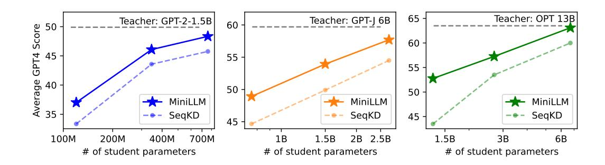
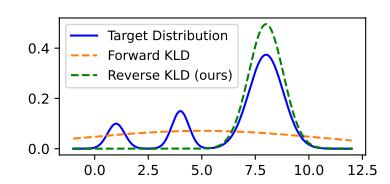
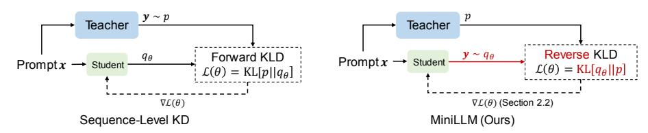
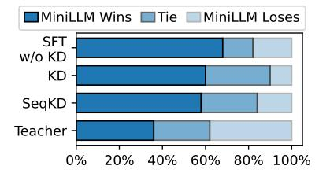
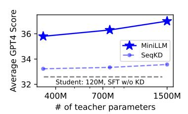
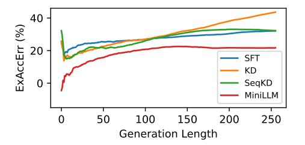
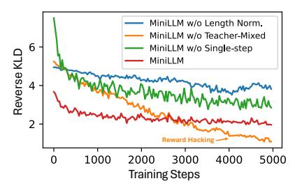
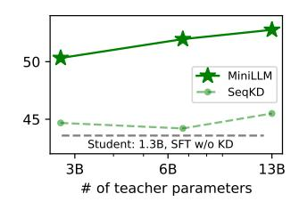
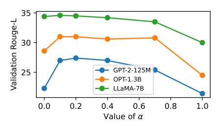

# MiniLLM: Knowledge Distillation of Large Language Models

Yuxian  $Gu^{1,2}$ , Li Dong<sup>2</sup>, Furu Wei<sup>2</sup>, Minlie Huang<sup>1†</sup>

<sup>1</sup>The CoAI Group, Tsinghua University

<sup>2</sup>Microsoft Research
guyx21@mails.tsinghua.edu.cn {lidong1,fuwei}@microsoft.com
aihuang@tsinghua.edu.cn

## **Abstract**

Knowledge Distillation (KD) is a promising technique for reducing the high computational demand of large language models (LLMs). However, previous KD methods are primarily applied to white-box classification models or training small models to imitate black-box model APIs like ChatGPT. How to effectively distill the knowledge of white-box LLMs into small models is still under-explored, which becomes more important with the prosperity of open-source LLMs. In this work, we propose a KD approach that distills LLMs into smaller language models. We first replace the forward Kullback-Leibler divergence (KLD) objective in the standard KD approaches with reverse KLD, which is more suitable for KD on generative language models, to prevent the student model from overestimating the low-probability regions of the teacher distribution. Then, we derive an effective optimization approach to learn this objective. The student models are named MINILLM. Extensive experiments in the instruction-following setting show that MINILLM generates more precise responses with higher overall quality, lower exposure bias, better calibration, and higher long-text generation performance than the baselines. Our method is scalable for different model families with 120M to 13B parameters. Our code, data, and model checkpoints can be found in https://github.com/microsoft/LMOps/tree/main/minillm.



<span id="page-0-0"></span>Figure 1: The comparison of MINILLM with the sequence-level KD (SeqKD; KR16, TGZ<sup>+</sup>23, CLL<sup>+</sup>23, PLH<sup>+</sup>23, GWS<sup>+</sup>23, ZLX<sup>+</sup>23) in terms of the average GPT-4 feedback score on our evaluation sets. **Left**: GPT-2-1.5B as the teacher model and GPT-2 125M, 340M, 760M as the student models. **Middle**: GPT-J 6B as the teacher model and GPT-2 760M, 1.5B, GPT-*Neo* 2.7B as the student models. **Right**: OPT 13B as the teacher and OPT 1.3B, 2.7B, 6.7B as the student models.

<sup>\*</sup>Contribution during an internship at Microsoft Research.

<sup>&</sup>lt;sup>†</sup>Corresponding author.

## 1 Introduction

With the rapid development of large language models (LLMs; BMR<sup>+</sup>20, HZD<sup>+</sup>21, BHA<sup>+</sup>21, CND<sup>+</sup>22, Ope23), a common technique to reduce their high computational resource demand is knowledge distillation (KD; HVD15), where we train a small student model with supervision from a large teacher model. Two categories of KD are commonly applied: *black-box* KD, where only the teacher-generated texts are accessible, and *white-box* KD, where the teacher model's output distribution or intermediate hidden states are also available [JBMD21]. Recently, *black-box* KD has shown promising results in fine-tuning small models on the prompt-response pairs generated by LLM APIs [TGZ<sup>+</sup>23, CLL<sup>+</sup>23, WWZ<sup>+</sup>23, PLH<sup>+</sup>23]. With the emergence of more open-source LLMs [ZRG<sup>+</sup>22, TLI<sup>+</sup>23], *white-box* KD becomes more valuable for both research communities and industry sectors because student models receive better signals from the output distribution and hidden states of teacher models, thereby potentially resulting in higher performance. However, *white-box* KD approaches are mostly studied for small (< 1B parameters) language understanding models [SDCW19, WWD<sup>+</sup>20], while *white-box* KD for LLMs is yet to be explored.

In this work, we investigate white-box KD of LLMs where the output distribution of the teacher model is available. We argue that the standard KD objectives [KR16, SST+20, CLL+23, TGZ+23] are sub-optimal for LLMs that perform tasks in a generative manner. Given the teacher distribution  $p(\boldsymbol{y}|\boldsymbol{x})$  and the student distribution  $q_{\theta}(\boldsymbol{y}|\boldsymbol{x})$  parameterized by  $\theta$ , standard KD objectives (including several variants for sequence-level models) essentially minimize the approximated forward Kullback-Leibler divergence (KLD) between the teacher and the student distribution, termed as  $\mathrm{KL}[p||q_{\theta}]$ , which forces  $q_{\theta}$  to cover all modes of p. For text classification tasks,  $\mathrm{KL}[p||q_{\theta}]$  works well because the output space usually consists of a finite number of classes such that both  $p(\boldsymbol{y}|\boldsymbol{x})$  and  $q_{\theta}(\boldsymbol{y}|\boldsymbol{x})$  have few modes. However, for open-ended text generation tasks, which is usually the case of LLM applications, the output spaces are much more complex and  $p(\boldsymbol{y}|\boldsymbol{x})$  can contain many more modes than what  $q_{\theta}(\boldsymbol{y}|\boldsymbol{x})$  can express due to the limited model capacity. Minimizing forward KLD causes  $q_{\theta}$  to assign unreasonably high probabilities to the void regions of p [MG19] and produces very unlikely samples under p during free-run generation [Hus15].

To alleviate this problem, we propose to minimize reverse KLD,  $\mathrm{KL}[q_{\theta}||p]$ , widely used in computer vision [LPSK23] and reinforcement learning [CPO+19]. Compared to  $\mathrm{KL}[p||q_{\theta}]$ , minimizing  $\mathrm{KL}[q_{\theta}||p]$  causes  $q_{\theta}$  to seek the major modes of p, and assign low probabilities to p's void regions [M+05], as illustrated in Table 2 and discussed in Section 2.1. In LLM text generation, this means that the student model avoids learning too many long-tail variants [HBD+20] in the teacher model's distribution and focuses on the correctness of the generated cotents, which is critical in practical scenarios that require



<span id="page-1-0"></span>Figure 2: The toy experiment. We fit a Gaussian mixture distribution with a single Gaussian distribution using *forward* KLD and *reverse* KLD.

truthfulness and reliability  $[JLF^+23]$ . To optimize  $\min_{\theta} KL[q_{\theta}||p]$ , as shown in Section 2.2, we derive the gradient of the objective with Policy Gradient [SMSM99]. To further stabilize and accelerate training, we propose (1) single-step decomposition to reduce variance, (2) teacher-mixed sampling to alleviate reward hacking, and (3) length normalization to eliminate the length bias. Finally, we introduce the overall KD algorithm in Section 2.3. Our student models are named MINILLM, indicating our method is suitable and works well for compressing large (generative) language models.

We apply our method to various generative language models [RWC<sup>+</sup>19, ZRG<sup>+</sup>22, TLI<sup>+</sup>23] with sizes ranging from 120M to 13B in the instruction-following setting [SWR<sup>+</sup>22, WBZ<sup>+</sup>22] that covers a large range of NLP tasks. We use 5 datasets with Rouge-L [Lin04], the GPT-4 feedback, and human judgment for evaluation. Experiments show that MINILLM consistently outperforms standard KD baselines on all the datasets and scales up well from 120M to 13B models (see Figure 1). More analysis shows that MINILLM yields lower exposure bias, better calibration, and higher long response generation performance, with neglectable loss of diversity.

#### 2 Method

We consider conditional text generation where the model produces a response  $\mathbf{y} = \{y_t\}_{t=1}^T$  conditioning on a prompt  $\mathbf{x}$  sampled from the distribution  $p_{\mathbf{x}}$ , which is typically how LLMs perform tasks.

<span id="page-2-3"></span>

Figure 3: Comparison between sequence-level KD (left) and MINILLM (right). Sequence-level KD forces the student to memorize all samples generated by the teacher model, while MINILLM improves its generated texts with the teacher model's feedback.

We formulate KD as an optimization problem to minimize the difference between a fixed teacher model distribution p(y|x) and a student model distribution  $q_{\theta}(y|x)$  parameterized by  $\theta$ . The standard KD methods approximately<sup>3</sup> minimize the *forward* KLD:  $\mathrm{KL}[p||q_{\theta}] = \mathbb{E}_{\boldsymbol{x} \sim p_{\boldsymbol{x}}, \boldsymbol{y} \sim p'} \log \frac{p(\boldsymbol{y}|\boldsymbol{x})}{q_{\theta}(\boldsymbol{y}|\boldsymbol{x})}$ , where p' can be real data distribution (word-level KD) or teacher distribution p (sequence-level KD). Though widely used,  $KL[p||q_{\theta}]$  tends to overestimate the void regions of p in text generation tasks when  $q_{\theta}$  is insufficiently expressive [JKH<sup>+</sup>23]. KD for LLMs fits the case because LLMs perform tasks in a generative manner, such that the low-capacity student models cannot perfectly imitate the complex text generation distribution of the teacher models or humans.

#### <span id="page-2-0"></span>2.1 MINILLM: Knowledge Distillation with Reverse KLD

We consider minimizing the reverse KLD between the student and teacher model distributions as the learning objective for MINILLM:

<span id="page-2-4"></span>
$$\theta = \arg\min_{\theta} \mathcal{L}(\theta) = \arg\min_{\theta} \text{KL}[q_{\theta}||p]$$

$$= \arg\min_{\theta} \left[ - \underset{\boldsymbol{x} \sim p_{\boldsymbol{x}}, \boldsymbol{y} \sim q_{\theta}}{\mathbb{E}} \log \frac{p(\boldsymbol{y}|\boldsymbol{x})}{q_{\theta}(\boldsymbol{y}|\boldsymbol{x})} \right]. \tag{1}$$

Minimizing reverse KLD has been shown to cause the mode-seeking behavior in generative modeling [Hus15, NCT16, CDP+18, LPSK23], where  $q_{\theta}$  assigns high probabilities to p's large modes and ignore the small ones (illustrated in a toy experiment in Figure 2). In this work, we first study this property for KD of LLMs in text generation. Minimizing forward KLD causes  $q_{\theta}$  to place large probability masses on the zero-probability regions of p, corresponding to the generation of lowquality text in practice, while reverse KLD focuses on p's major modes, which is crucial to ensure the correctness and faithfulness of text generation. As illustrated in Figure 3, unlike sequence-level KD that minimizes forward KLD [KR16, TGZ<sup>+</sup>23], MINILLM that minimizes reverse KLD does not force  $q_{\theta}$  to fit all y sampled from the teacher distribution p. Instead, it encourages the student to generate samples preferred by the teacher within its own capacities, which is more possible to achieve. Interestingly, we also find another perspective of understanding MINILLM motivated by Inverse Reinforcement Learning [ZMB<sup>+</sup>08]. We present the related derivation in Appendix A.1.

#### <span id="page-2-1"></span>2.2 Optimization with Policy Gradient

**Gradient Derivation** We notice that the gradient of the objective function  $\mathcal{L}(\theta)$  in Equation (1) can be derived using the Policy Gradient Theorem [Wil92, HTAL17]:

<span id="page-2-5"></span>
$$\nabla \mathcal{L}(\theta) = - \underset{\boldsymbol{x} \sim p_{\boldsymbol{x}}, \boldsymbol{y} \sim q_{\theta}(\cdot|\boldsymbol{x})}{\mathbb{E}} \sum_{t=1}^{T} (R_t - 1) \nabla \log q_{\theta}(y_t|\boldsymbol{y}_{< t}, \boldsymbol{x}), \tag{2}$$

 $\nabla \mathcal{L}(\theta) = - \underset{\boldsymbol{x} \sim p_{\boldsymbol{x}}, \boldsymbol{y} \sim q_{\theta}(\cdot|\boldsymbol{x})}{\mathbb{E}} \sum_{t=1}^{T} (R_t - 1) \nabla \log q_{\theta}(y_t|\boldsymbol{y}_{< t}, \boldsymbol{x}), \tag{2}$ where  $T = |\boldsymbol{y}|$  and  $R_t = \sum_{t'=t}^{T} \log \frac{p(y_{t'}|\boldsymbol{y}_{< t'}, \boldsymbol{x})}{q_{\theta}(y_{t'}|\boldsymbol{y}_{< t'}, \boldsymbol{x})}$  is the accumulation of  $r_{t'} = \log \frac{p(y_{t'}|\boldsymbol{y}_{< t'}, \boldsymbol{x})}{q_{\theta}(y_{t'}|\boldsymbol{y}_{< t'}, \boldsymbol{x})}$  that measures the quality of each step's generation. Intuitively, the generated texts are supposed to have high probabilities under the teacher distribution by increasing  $p(y_{t'}|y_{< t'}, x)$ , but simultaneously stay diverse by lowering  $q_{\theta}(y_{t'}|\boldsymbol{y}_{< t'},\boldsymbol{x})$ . The expectation in Eq. 2 is computed by Monte-Carlo sampling. Full derivation can be found in Appendix A.2. However, policy gradient suffers from high variance and reward hacking [SHKK22], despite some subsequent solutions [SWD+17]. Besides, we notice that  $R_t$  favors short sentences, which causes the student model to output empty responses. Therefore, we propose three strategies to mitigate these problems.

<span id="page-2-2"></span>We say "approximately" because for word-level KD, y is sampled from the real distribution, not the teacher distribution. For a strong enough teacher model, we can consider the two distributions approximately the same.

**Single-Step Decomposition** [CPO<sup>+</sup>19] has found that the single-step generation quality  $r_t$  is critical to the training variance because the error in the front tokens accumulates along the whole sentence. To pay more attention to  $r_t$ , we re-write  $\nabla \mathcal{L}(\theta)$  to decompose  $r_t$  from  $R_t$  and directly compute the gradient of  $\mathbb{E}_{y_t \sim q_\theta(t)}[r_t]$  (see Appendix A.3 for the full derivation):

<span id="page-3-2"></span>
$$\nabla \mathcal{L}(\theta) = \underset{\substack{\boldsymbol{x} \sim p_{\boldsymbol{x}} \\ \boldsymbol{y} \sim q_{\boldsymbol{\theta}}(\cdot|\boldsymbol{x})}}{\mathbb{E}} \left[ -\sum_{t=1}^{T} \nabla \underset{\boldsymbol{y} \sim q_{\boldsymbol{\theta}}(t)}{\mathbb{E}} [r_{t}] \right] + \underset{\substack{\boldsymbol{x} \sim p_{\boldsymbol{x}} \\ \boldsymbol{y} \sim q_{\boldsymbol{\theta}}(\cdot|\boldsymbol{x})}}{\mathbb{E}} \left[ -\sum_{t=1}^{T} R_{t+1} \nabla \log q_{\boldsymbol{\theta}}(y_{t}|\boldsymbol{y}_{< t}, \boldsymbol{x}) \right]$$

$$= (\nabla \mathcal{L})_{\text{Single}} + (\nabla \mathcal{L})_{\text{Long}},$$
(3)

where  $q_{\theta}(t) = q_{\theta}(\cdot|\boldsymbol{y}_{< t}, \boldsymbol{x})$ . Note that  $\mathbb{E}_{y_t \sim q_{\theta}(t)}[r_t]$  can be computed directly by summing over the vocabulary instead of using Monte-Carlo sampling and is derivable with respect to  $\theta$ . This decomposition gives a more precise and efficient estimation of the single-step generation quality, which reduces the variance during training and accelerates convergence.

**Teacher-Mixed Sampling** We observe reward hacking [SHKK22] when training with Eq. 2 because  $q_{\theta}$  sometimes produces degenerated sentences y that receive high scores from the teacher (e.g., repeated phrases) during sampling, especially for small student models. To create a better sampling distribution, we mix the teacher and the student distribution at each time step:

<span id="page-3-4"></span>
$$\widetilde{p}(y_t|\boldsymbol{y}_{< t}, \boldsymbol{x}) = \alpha \cdot p(y_t|\boldsymbol{y}_{< t}, \boldsymbol{x}) + (1 - \alpha) \cdot q_{\theta}(y_t|\boldsymbol{y}_{< t}, \boldsymbol{x}), \tag{4}$$

where  $\alpha$  controls the strength of the teacher mix-in. Sampling from  $\widetilde{p}$  suppresses low-quality generation with the teacher's help and alleviates reward hacking. We re-write  $(\nabla \mathcal{L})_{\text{Single}}$  and  $(\nabla \mathcal{L})_{\text{Long}}$  with importance sampling to get to an unbiased estimator of the gradient [PSS00]:

<span id="page-3-1"></span>
$$(\nabla \mathcal{L})_{\text{Single}} = - \underset{\boldsymbol{x} \sim p_{\boldsymbol{x}}, \boldsymbol{y} \sim \widetilde{p}(\cdot|\boldsymbol{x})}{\mathbb{E}} \left[ \sum_{t=1}^{T} w_{t} \nabla \underset{y_{t} \sim q_{\theta}(t)}{\mathbb{E}} [r_{t}] \right],$$

$$(\nabla \mathcal{L})_{\text{Long}} = - \underset{\boldsymbol{x} \sim p_{\boldsymbol{x}}, \boldsymbol{y} \sim \widetilde{p}(\cdot|\boldsymbol{x})}{\mathbb{E}} \left[ \sum_{t=1}^{T} w_{t} R_{t+1} \nabla \log q_{\theta}(y_{t}|\boldsymbol{y}_{< t}, \boldsymbol{x}) \right],$$
(5)

where  $w_t = \prod_{t'=1}^t \frac{q_\theta(y_{t'}|\mathbf{y}_{< t'}, \mathbf{x})}{\widetilde{p}(y_{t'}|\mathbf{y}_{< t'}, \mathbf{x})}$  is the importance weight. However,  $w_t$  brings high variance in practice because it requires multiplying per-token importance weight over multiple time steps, and thus the variance of each step accumulates. Therefore, we approximately set  $w_t \approx \frac{q_\theta(y_t|\mathbf{y}_{< t}, \mathbf{x})}{\widetilde{p}(y_t|\mathbf{y}_{< t}, \mathbf{x})}$  to reduce the variance of the estimator in Eq. 5 [SSG<sup>+</sup>17, LKTF20].

**Length Normalization** We found that long sequences tend to have small  $R_{t+1}$ , which encourages the model to produce short responses. Therefore, we add length normalization to  $R_{t+1}$  in Eq. 3:

<span id="page-3-3"></span>
$$R_{t+1}^{\text{Norm}} = \frac{1}{T - t - 1} \sum_{t'=t+1}^{T} \log \frac{p(y_{t'}|\boldsymbol{y}_{< t'}, \boldsymbol{x})}{q_{\theta}(y_{t'}|\boldsymbol{y}_{< t'}, \boldsymbol{x})}.$$
 (6)

**In Summary** Combining the strategies listed above, we have the final optimization gradient:

$$\nabla \mathcal{L}(\theta) = -\underbrace{\mathbb{E}_{\substack{\boldsymbol{x} \sim p_{\boldsymbol{x}} \\ \boldsymbol{y} \sim \tilde{p}(\cdot|\boldsymbol{x})}}} \left[ \sum_{t=1}^{T} w_{t} \left[ \underbrace{\nabla \sum_{y' \in V} q_{\theta}(y'|\boldsymbol{y}_{< t}, \boldsymbol{x}) \log \frac{p(y'|\boldsymbol{y}_{< t}, \boldsymbol{x})}{q_{\theta}(y'|\boldsymbol{y}_{< t}, \boldsymbol{x})}}_{q_{\theta}(y'|\boldsymbol{y}_{< t}, \boldsymbol{x})} + \underbrace{R_{t+1}^{\text{Norm}} \frac{\nabla q_{\theta}(y_{t}|\boldsymbol{y}_{< t}, \boldsymbol{x})}{q_{\theta}(y_{t}|\boldsymbol{y}_{< t}, \boldsymbol{x})}}_{(\nabla \mathcal{L})_{\text{Single part}}} \right] \right], \quad (7)$$

where V is the vocabulary size of the language model and  $(\nabla \mathcal{L})_{\mathrm{Long}}^{\mathrm{Norm}}$  is  $(\nabla \mathcal{L})_{\mathrm{Long}}$  with  $R_{t+1}^{\mathrm{Norm}}$ .

## <span id="page-3-0"></span>2.3 Training Algorithm

We start from a student model pre-trained on a large long-document corpus  $\mathcal{D}_{PT}$ . Algorithm 2.3 trains MINILLM by adapting the student model to a text generation task with dataset  $\mathcal{D}$  and supervision from the teacher model, such as an LLM fine-tuned on  $\mathcal{D}$  [TGZ<sup>+</sup>23, CLL<sup>+</sup>23] or that with good task-generalization [CHL<sup>+</sup>22, Ope23]. In the training algorithm, we first fine-tune the student model on  $\mathcal{D}$  and pick the checkpoint with the lowest loss as an initialization for the following training. Then, we compute the gradients  $(\nabla \mathcal{L})_{Single}$  and  $(\nabla \mathcal{L})_{Long}^{Norm}$  based on Eq. 5 and Eq.

6, with a clipping strategy [SWD<sup>+</sup>17] added to further improve stability. Same as [OWJ<sup>+</sup>22], we include a language modeling loss  $\mathcal{L}_{PT} = -\mathbb{E}_{\boldsymbol{d} \sim \mathcal{D}_{PT}} \log q_{\theta}(\boldsymbol{d})$  to preserve the model performance on canonical NLP benchmarks. The student model is finally updated using a combination of gradients  $(\nabla \mathcal{L})_{\text{Single}} + (\nabla \mathcal{L})_{\text{Long}}^{\text{Norm}} + \nabla \mathcal{L}_{PT}$ . The whole training pipeline is similar to Reinforcement Learning from Human Feedback (RLHF; OWJ<sup>+</sup>22).

## Algorithm 1 MINILLM: Knowledge Distillation of LLMs

```
Input: Conditional generation dataset \mathcal{D} consisting of prompts and ground-truth responses Pre-training corpus \mathcal{D}_{\text{PT}} consisting of long-document plain texts A teacher model with output distribution p An initial student model pre-trained on \mathcal{D}_{\text{PT}}, with the output distribution q_{\theta_0} Learning rate \eta; Batch size M; Clipping Threshold \epsilon

Output: A student model with the output distribution q_{\theta} Fine-tune the student model from \theta_0 on \mathcal{D} supervised by the ground truth responses and choose \theta with the lowest validation loss. repeat

Sample a mini-batch of prompts from \mathcal{D} and collect responses from \widetilde{p} to get \mathcal{S} = \{(\boldsymbol{x}^m, \boldsymbol{y}^m)\}_{m=1}^M Sample a mini-batch \mathcal{D}'_{\text{PT}} = \{\boldsymbol{d}^m\}_{m=1}^M from \mathcal{D}_{\text{PT}} Compute (\nabla \mathcal{L})_{\text{Single}} = -\frac{1}{M} \sum_{\boldsymbol{x}, \boldsymbol{y} \in \mathcal{S}} \sum_{t=1}^T w_t \nabla \sum_{\boldsymbol{y}_t \in \mathcal{V}} q_{\theta}(y_t | \boldsymbol{y}_{<t}, \boldsymbol{x}) \log \frac{p(y_t | \boldsymbol{y}_{<t}, \boldsymbol{x})}{q_{\theta}(y_t | \boldsymbol{y}_{<t}, \boldsymbol{x})} \Rightarrow \text{Eq. 5}

Compute (\nabla \mathcal{L})_{\text{Long}}^{\text{Norm}} = -\frac{1}{|M|} \sum_{\boldsymbol{x}, \boldsymbol{y} \in \mathcal{S}} \sum_{t=1}^T R_{t+1}^{\text{Norm}} \nabla \min[\rho_t(\theta), \text{clip}(\rho_t(\theta), 1 - \epsilon, 1 + \epsilon)], where \rho_t(\theta) = \frac{q_{\theta}(y_t | \boldsymbol{y}_{<t}, \boldsymbol{x})}{\overline{p}(y_t | \boldsymbol{y}_{<t}, \boldsymbol{x})} \Rightarrow \text{Eq. 5}, Eq. 6

Compute the gradient of the language modeling loss: \nabla \mathcal{L}_{\text{PT}} = -\frac{1}{M} \sum_{\boldsymbol{d} \in \mathcal{D}'_{\text{PT}}} \nabla \log q_{\theta}(\boldsymbol{d}) Update model parameters: \theta \leftarrow \theta - \eta \left[ (\nabla \mathcal{L})_{\text{Single}} + (\nabla \mathcal{L})_{\text{Long}}^{\text{Norm}} + \nabla \mathcal{L}_{\text{PT}} \right]
```

## 3 Experiments

#### 3.1 Experimental Setup

until converge and return  $q_{\theta}$ 

We take instruction-following  $[OWJ^+22]$  as the conditional text generation task, where models are trained to generate responses according to the instructions. We fine-tune a large model on the dataset  $\mathcal{D}$  consisting of instruction-response pairs as the teacher model. Then, we compare different KD methods on  $\mathcal{D}$  by evaluating the student model's instruction-following performance.

**Base Models** Our student models come from three model families with various sizes: GPT-2 [RWC<sup>+</sup>19] (120M, 340M, 760M), OPT [ZRG<sup>+</sup>22] (1.3B, 2.7B, 6.7B), and LLaMA [TLI<sup>+</sup>23] (7B). For teacher models of each model family, we use GPT-2-1.5B, OPT-13B, and LLaMA-13B respectively. These models are fine-tuned on  $\mathcal{D}$  in advance. We also present the results using GPT-J [WK21] as the teacher model in Appendix C.1.

**Training** We construct the training data from databricks-dolly-15K<sup>4</sup> consisting of 15K human-written instruction-response pairs. We filter out samples that exceed the context length of the models. Then, we randomly split 1K and 0.5K samples for validation and testing, respectively, leaving about 12.5K examples for training. For  $\mathcal{D}_{PT}$ , we use OpenWebText [GCPT19] for the GPT-2 family and the RoBERTa training corpus [LOG<sup>+</sup>19] for other models. We set the teacher-mix-in strength  $\alpha=0.2$  throughout the experiments in Eq. 4. We use Rouge-L [Lin04] scores on the validation set to search for hyper-parameters because it aligns better with human preference than validation losses [WMA<sup>+</sup>22]. More details are shown in Appendix B.1.

**Evaluation** We evaluate the trained models on five instruction-following datasets:

- DollyEval: the 500-sample test set we split from the databricks-dolly-15k dataset.
- **SelfInst** [WKM<sup>+</sup>23]: A user-oriented instruction-following set with 252 samples.
- VicunaEval [CLL<sup>+</sup>23]: The 80 challenging questions used in the Vicuna evaluation.
- S-NI: The test set of SUPER-NATURALINSTRUCTIONS [WMA+22] consisting of 9K samples ranging from 119 tasks. Following [PLH+23], we split the set into 3 subsets whose ground truth

<span id="page-4-0"></span><sup>4</sup>https://github.com/databrickslabs/dolly/tree/master

response lengths lie in [0, 5], [6, 10], and [11, +∞]. We use the [11, +∞] subset in Section [3.2](#page-6-0) and conduct an analysis on all subsets in Section [3.3.](#page-6-1)

• UnNI: We randomly sample 10K samples from the core set of UNNATURALINSTRUC-TIONS [\[HSLS23\]](#page-11-10) for evaluation. Similar to S-NI, we first conduct the evaluations on the [11, +∞] subset, followed by an analysis of the performance on all subsets in Appendix [C.3.](#page-21-0)

We adopt three metrics to evaluate the model-generated responses:

- R-L: The Rouge-L [\[Lin04\]](#page-11-6) score to measure the precision of the model generation. [\[WMA](#page-13-9)+22] has shown that Rouge-L is suitable for large-scale instruction-following evaluation.
- GPT4: The GPT-4 feedback [\[ZCS](#page-14-5)+23] by asking GPT-4 to compare model-generated responses with the ground truth answers[5](#page-5-0) and raise 1-10 scores for both responses (see Appendix [B.2](#page-17-1) for the prompt we use). We report the ratio of the total score of model responses and ground truth answers. This metric is only applied to DollyEval, SelfInst, and VicunaEval.
- Human Evaluation: We conduct human evaluations on the SelfInst dataset following [\[PLH](#page-12-0)+23] by asking volunteers to compare two responses produced by different models and annotate "Win", "Tie", or "Loss". More human evaluation details can be found in Appendix [B.3.](#page-18-0)

For all test sets, we sample the responses with the temperature = 1 and report the average scores of 5 generations for each prompt with different random seeds.

Baselines We consider three baselines in our main experiment:

- SFT w/o KD directly fine-tunes the student model on D supervised by the golden responses.
- KD [\[SDCW19,](#page-12-2) [SST](#page-13-2)<sup>+</sup>20] fine-tunes the student model on D using the teacher distribution as the supervision at each token step, also known as word-level KD.
- SeqKD [\[KR16,](#page-11-0) [CLL](#page-10-0)<sup>+</sup>23, [TGZ](#page-13-0)<sup>+</sup>23, [PLH](#page-12-0)<sup>+</sup>23, [ZLX](#page-14-0)<sup>+</sup>23] fine-tunes the student model on the data generated by the teacher model.

## 3.2 Results

We present the R-L and GPT4 evaluation results in Table [1,](#page-6-0) from which we have three observations.

*First*, by comparing the overall performance of MINILLM with the baselines, we observe that the model distilled by our KD method outperforms the baselines in almost all cases, when trained with different base models, tested on various evaluation sets, and scored by both Rouge-L and GPT-4 feedback. This verifies the good generalization and high overall performance of our KD method. We also find that MINILLM generally works much better on datasets other than Dolly compared with the baselines, indicating its good out-of-distribution generalization.

*Second*, the Rouge-L scores show that MINILLM produces the most precise responses that have high overlaps with the ground-truth responses. In some cases, especially on Vicuna, S-NI, and UnNI, student models reach even higher Rouge-L scores than the teacher models, which matches the observation in [\[FLT](#page-10-9)<sup>+</sup>18]. We conjecture that the standard teacher-forcing fine-tuning on D brings training-inference discrepancy to the teacher model, also known as exposure bias [\[BVJS15\]](#page-10-10). On the contrary, MINILLM is optimized with policy optimization methods, which samples responses from student models during training and thus alleviates exposure bias [\[PH21\]](#page-12-13). We include further analysis on exposure bias in Section [3.3.](#page-6-1)

*Third*, comparing the results across model sizes and model families, we can see that the improvement of MINILLM is consistent when the base model sizes vary from 120M to 13B across three model families. This tendency is also illustrated in Figure [1,](#page-0-0) which demonstrates the excellent scalability and generalization of our method in the era of LLMs.

The human evaluation results on the SelfInst dataset based on the LLaMA family are shown in Figure [4.](#page-5-1) MINILLM obtains better human preference than all the baselines, performing comparably to the teacher model.



<span id="page-5-1"></span>Figure 4: Human evaluation results. We use LLaMA-7B as the student and LLaMA-13B as the teacher.

<span id="page-5-0"></span><sup>5</sup>We use the ChatGPT's generation [\[Ope22\]](#page-12-14) for VicunaEval's ground truth responses.

| M - J - 1 | #D      | M-41 J     | DollyEval |      | SelfInst |      | VicunaEval |       | S-NI  | UnNI  |
|-----------|---------|------------|-----------|------|----------|------|------------|-------|-------|-------|
| Model     | #Params | Method     | GPT4      | R-L  | GPT4     | R-L  | GPT4       | R-L   | R-L   | R-L   |
|           | 1.5B    | Teacher    | 58.4      | 27.6 | 42.9     | 14.3 | 48.6       | 16.3  | 27.6  | 31.8  |
|           |         | SFT w/o KD | 38.6      | 23.3 | 26.3     | 10.0 | 32.8       | 14.7  | 16.3  | 18.5  |
|           | 120M    | KD         | 40.3      | 22.8 | 27.8     | 10.8 | 31.9       | 13.4  | 19.7  | 22.0  |
|           | 12011   | SeqKD      | 41.2      | 22.7 | 26.2     | 10.1 | 31.0       | 14.3  | 16.4  | 18.8  |
|           |         | MINILLM    | 44.7      | 24.6 | 29.2     | 13.2 | 34.1       | 16.9* | 25.3  | 26.6  |
| GPT-2     |         | SFT w/o KD | 51.9      | 25.5 | 39.6     | 13.0 | 42.3       | 16.0  | 25.1  | 32.0  |
|           | 340M    | KD         | 51.6      | 25.0 | 39.2     | 12.0 | 42.8       | 15.4  | 23.7  | 31.0  |
|           | 310111  | SeqKD      | 50.5      | 25.3 | 39.0     | 12.6 | 43.0       | 16.9* | 22.9  | 30.2  |
|           |         | MINILLM    | 52.2      | 25.4 | 40.5     | 15.6 | 42.6       | 17.7* | 27.4  | 34.5  |
|           |         | SFT w/o KD | 50.7      | 25.4 | 38.3     | 12.4 | 43.1       | 16.1  | 21.5  | 27.1  |
|           | 760M    | KD         | 53.4      | 25.9 | 40.4     | 13.4 | 43.4       | 16.9* | 25.3  | 31.7  |
|           | 700111  | SeqKD      | 52.0      | 25.6 | 38.9     | 14.0 | 42.4       | 15.9  | 26.1  | 32.9  |
|           |         | MINILLM    | 54.7      | 26.4 | 44.6*    | 15.9 | 45.7       | 18.3* | 29.3* | 37.7* |
|           | 13B     | Teacher    | 70.3      | 29.2 | 56.1     | 18.4 | 58.0       | 17.8  | 30.4  | 36.1  |
|           | 1.3B    | SFT w/o KD | 52.6      | 26.0 | 37.7     | 11.4 | 40.5       | 15.6  | 23.1  | 28.4  |
|           |         | KD         | 52.7      | 25.4 | 36.0     | 12.2 | 40.8       | 14.9  | 21.9  | 27.0  |
|           |         | SeqKD      | 51.0      | 26.1 | 36.6     | 12.7 | 42.6       | 16.6  | 21.4  | 28.2  |
|           |         | MINILLM    | 60.7      | 26.7 | 47.0     | 14.8 | 50.6       | 17.9* | 28.6  | 33.4  |
| OPT       | 2.7B    | SFT w/o KD | 55.4      | 27.1 | 38.9     | 13.9 | 44.8       | 16.6  | 24.9  | 32.3  |
|           |         | KD         | 60.5      | 25.9 | 48.6     | 13.8 | 51.3       | 16.7  | 26.3  | 30.2  |
|           |         | SeqKD      | 57.6      | 27.5 | 40.5     | 13.3 | 44.5       | 16.5  | 25.3  | 32.3  |
|           |         | MINILLM    | 63.2      | 27.4 | 52.7     | 17.2 | 55.9       | 19.1* | 30.7* | 35.1  |
|           |         | SFT w/o KD | 67.9      | 27.6 | 56.4     | 16.4 | 57.3       | 17.8  | 30.3  | 28.6  |
|           | 6.7B    | KD         | 68.6      | 28.3 | 58.0     | 17.0 | 57.0       | 17.5  | 30.7* | 26.7  |
|           |         | SeqKD      | 69.6      | 28.5 | 54.0     | 17.0 | 57.6       | 17.9* | 30.4  | 28.2  |
|           |         | MINILLM    | 70.8*     | 29.0 | 58.5*    | 17.5 | 60.1*      | 18.7* | 32.5* | 36.7* |
|           | 13B     | Teacher    | 79.0      | 29.7 | 75.5     | 23.4 | 65.1       | 19.4  | 35.8  | 38.5  |
| LLaMA     | 7B      | SFT w/o KD | 73.0      | 26.3 | 69.2     | 20.8 | 61.6       | 17.5  | 32.4  | 35.8  |
| LLawiA    |         | KD         | 73.7      | 27.4 | 70.5     | 20.2 | 62.7       | 18.4  | 33.7  | 37.9  |
|           |         | SeqKD      | 73.6      | 27.5 | 71.5     | 20.8 | 62.6       | 18.1  | 33.7  | 37.6  |
|           |         | MINILLM    | 76.4      | 29.0 | 73.1     | 23.2 | 64.1       | 20.7* | 35.5  | 40.2* |
|           |         |            |           |      |          |      |            |       |       |       |

Table 1: Evaluation results. GPT4 and R-L stand for the average GPT-4 feedback scores and Rouge-L scores across 5 random seeds, respectively. The best scores of each model size are **boldfaced**, and the scores where the student model outperforms the teacher are marked with \*.

## <span id="page-6-1"></span>3.3 Analysis

Scaling Law of Teacher Although it is intuitive that we can distill better student models from larger teacher models, [MFL+20] has shown that increasing the teacher models' sizes does not guarantee the improvement of student models, sometimes even harming the distillation performance. It is not clear how MINILLM works when we scale up the teacher models' sizes. Therefore, we compare MINILLM and SeqKD using teacher models with different sizes and fix the size of the student model. We present the results based on the GPT-2 family in Figure 5 and that based on the OPT family in Appendix C.2. We can see that MINILLM constantly outperforms SeqKD, and the student model performance is positively correlated with the teacher model sizes. This shows the potential of our method to compress models with massive parameters.

<span id="page-6-0"></span>

<span id="page-6-2"></span>Figure 5: The scaling law of teacher based on the GPT-2 family models. We compare MINILLM and SeqKD with GPT-2-125M as the student and GPT-2 340M, 760M, and 1.5B as teachers.



Figure 6: The excess error caused by the training-decoding discrepancy (ExAccErr) accumulated with the generation length. Lower ExAccErr means the method introduces less exposure bias.

| Δ R-L Against SFT | 3 -<br>2 -<br>1 -<br>0 - |    | KD<br>SeqKD<br>MiniLLM |           |         |         |        |  |
|-------------------|--------------------------|----|------------------------|-----------|---------|---------|--------|--|
|                   |                          | [0 | , 5]                   | [6,       | 10]     | [13     | l, +∞] |  |
|                   |                          |    | Gr                     | ound Trut | :h Leng | th Rang | e      |  |

Figure 7: The Rouge-L scores of the distilled models against SFT on the different subsets of S-NI split by the golden responses' length.

<span id="page-7-1"></span>

|         | SST2  |      | BoolQ |      |
|---------|-------|------|-------|------|
|         | ECE   | Acc. | ECE   | Acc. |
| Teacher | 0.025 | 93.0 | 0.356 | 74.5 |
| KD      | 0.191 | 84.7 | 0.682 | 63.5 |
| SeqKD   | 0.243 | 66.5 | 0.681 | 62.8 |
| MINILLM | 0.099 | 89.7 | 0.502 | 67.8 |

<span id="page-7-0"></span>Table 2: The ECE and accuracy scores on SST2 and BoolQ datasets. The best scores among student models are **boldfaced**.

<span id="page-7-3"></span>

|         | DollyEval |      | SelfInst |      |  |
|---------|-----------|------|----------|------|--|
|         | Dist-4    | Loss | Dist-4   | Loss |  |
| Teacher | 99.3      | 3.55 | 99.1     | 4.44 |  |
| SFT     | 99.5      | 3.89 | 99.0     | 5.28 |  |
| MINILLM | 99.0      | 3.95 | 98.6     | 5.33 |  |

<span id="page-7-2"></span>Table 3: The distinct 4-grams (Dist-4) and language modeling loss (Loss) on the test sets based on the LLaMA family. MINILLM preserves generation diversity.

**Exposure Bias** Language generation models trained to minimize *forward* KLD suffer from exposure bias [BVJS15] caused by the discrepancy between teacher-forcing training and free-run generation. When training MINILLM, the student model sees samples generated by itself, alleviating the training-inference mismatch [PH21]. In Figure 6, we use the ExAccErr metric [AEABC22] defined in Appendix B.5 to measure the excess accumulated error due to exposure bias. The experiment is based on GPT-2-125M, with GPT-2-1.5B as the teacher, using Dolly as the test set. For each prompt, we sample 10 responses to reduce the variance. We can see that the ExAccErrs of the baselines continuously grow during generation, while MINILLM has a much lower ExAccErr, and the error stops accumulating in long-text generation (> 150 tokens).

**Calibration** [Ope23] has shown that models trained with policy optimization are likely to be poorly calibrated. We test the calibration of MINILLM and the KD baselines on two widely-used text classification datasets: SST2 [SPW+13] and BoolQ [CLC+19], based on LLaMA-7B. We design zero-shot classification instructions (see Appendix B.2) and take the probability of the label words to compute the ECE scores [NDZ+19]. From Table 2, we observe that KD and SeqKD models are worse calibrated than the teacher model, which potentially explains their low performance on canonical benchmarks [GWS+23]. We suspect that minimizing *forward* KLD causes the models to push high probabilities to void regions of the target distribution, which leads to significant distribution differences between the student and the teacher (see the example in Figure 2). In contrast, MINILLM focuses on accurately learning the major parts of the target distribution and narrows the ECE scores gap between the student and the teacher.

**Performance on Different Response Length** We study the models' performance when the golden response lengths belong to different ranges. In Figure 7, we illustrate the Rouge-L scores of different KD models against the SFT models on three S-NI subsets split by the length of the ground truth responses. We can see that all methods achieve low scores on prompts that expect short responses ( $\leq 5$  tokens), probably because most responses in our training set are long sentences, introducing a distribution shift between training and evaluation [PLH+23]. Furthermore, the output spaces of these prompts are relatively small, allowing the student model to cover most modes of the teacher, and thus *reverse* KLD and *forward* KLD have similar performance. For prompts with longer responses ( $\geq 6$  tokens), the teacher distribution contains more modes than the students due to the complex out-

|                   | Valid.<br>R-L | Dolly<br>R-L |
|-------------------|---------------|--------------|
| MiniLLM           | 27.4          | 24.6         |
| w/o Length Norm.  | 17.4          | 14.7         |
| w/o Teacher-Mixed | 22.3          | 20.4         |
| w/o Single-Step   | 27.0          | 23.7         |

<span id="page-8-1"></span>

<span id="page-8-0"></span>MINILLM optimization strategies are applied.

Table 4: The performance on the validation Figure 8: The reverse KLD between the teacher and test set when different combinations of and the students during MINILLM training when different optimization strategies are applied.

put spaces, which shows the advantage of MINILLM against standard KD models. Similar results on UnNI are shown in Appendix C.3.

Generation Diversity [CCF<sup>+</sup>20] has found that the model optimized by minimizing reverse KLD is likely to lose modes, which affects the generation diversity. We follow [PH21] to discuss generation diversity from three aspects: (i) generating multiple distinct responses given a prompt. (ii) generating linguistically complex responses. (iii) the ability to generate contents that have high coverage of the real data distribution. For (i), we argue that for many NLP applications, generating one correct response is sufficient, especially for those scenarios demanding high truthfulness and reliability [JLF<sup>+</sup>23]. For (ii) and (iii), we report the responses' distinct 4-gram proportion and the language modeling loss on the test sets in Table 3, using the base models from the LLaMA family (see Appendix B.4 for more details). We can see that MINILLM preserves the distinct 4-gram proportion in the generated responses and language modeling loss on the test set.

## 3.4 Ablation Studies on Optimization Strategies

We evaluate the effectiveness of the three strategies proposed to stabilize and accelerate optimization in Section 2.2 by distilling a GPT-2-125M model from the GPT-2-1.5B model. More ablation studies can be found in Appendix C.4. In Table 4, we report the best Rouge-L scores on the validation set of each run and the evaluation results of the corresponding checkpoints. We also plot the reverse KLD between the student and the teacher during training in Figure 8, where the curves are smoothed by 32 steps. We can see that Teacher-Mixed Sampling and Length Normalization works for stabilizing training. Although the reverse KLDs also decrease without these strategies, we find that the models quickly learn to generate repeated, short, or meaningless strings that have high probabilities in the teacher distribution (see examples in Appendix D), which is known as reward hacking [SHKK22]. This also leads to the low generation performance in Table 4. From Figure 8, we also observe that the Single-Step Decomposition effectively reduces the variance of the training process, which also results in higher scores on the validation and test sets.

#### **Related Work**

Large Language Models Large language models (LLMs; BMR<sup>+</sup>20, TDFH<sup>+</sup>22, CND<sup>+</sup>22, Ope23, ADF+23) have shown superior performance by solving various NLP tasks in a generative manner. Recent works apply instruction tuning [WBZ+22, SWR+22, CHL+22] or learning from human feedback [OWJ+22, BJN+22] to improve the alignment of LLMs with humans further and create general AI assistants [Ope22, Goo23]. There are also efforts to build open-source LLMs [ZRG+22, TLI+23, BSA+23] to facilitate research and industry development. Although appealing, the broad capacities of LLMs usually emerge with large model sizes [KMH<sup>+</sup>20, WTB<sup>+</sup>22] that require massive computational resources. Therefore, model compression is critical for the practical deployment and further research of LLMs.

**Knowledge Distillation** Knowledge distillation (KD; HVD15), as a widely used model compression technique, aims at training a student model with the guidance of a teacher model [RCG+15, SDCW19, JBMD21]. In the NLP community, many works apply KD to text classification tasks by mimicking the teacher model's output distribution [SST+20, LHS+21, ZSL+23], hidden states [JYS<sup>+</sup>20, SCGL19], or attention scores [WWD<sup>+</sup>20, WBH<sup>+</sup>21]. For text generation, the standard KD method is to approximately minimize the *forward* KLD between the student's and the teacher's generation distribution by using the teacher's output at each time step as supervision [SDCW19] or direct training on the teacher's generated texts [KR16, TGZ<sup>+</sup>23, CLL<sup>+</sup>23, PLH<sup>+</sup>23]. In this paper, we minimize the *reverse* KLD, which is more suitable for LLMs when the teacher distribution is available. Concurrent works [AVS<sup>+</sup>23, WLDM23] also explore more the distribution discrepancy metrics in KD.

**Distribution Discrepancy Metrics in Text Generation** The distribution discrepancy metrics play a significant role in training text generation models. The *forward* KLD is widely used due to its simplicity when derived as the Maximum Likelihood Estimate (MLE) objective [ZZ19]. However, previous works show that minimizing *forward* KLD leads to zero-forcing behavior where models try to cover all modes of the target distribution and sacrifice the accuracy of major modes [Hus15]. Some works resort to using other metrics to remedy this problem, such as *reverse* KLD [JHC<sup>+</sup>20], Total Variation Distance [JKH<sup>+</sup>23], and Optimal Transport [LLW<sup>+</sup>20]. Our paper tackles this problem under the scenario of knowledge distillation for LLMs.

## 5 Conclusion

In this work, we investigate the problem of distilling the knowledge of LLMs into small language models. We find that the standard distillation methods minimizing the *forward* KLD is sub-optimal in language generation scenarios because the teacher's output distribution contains more modes than the student's, and *forward* KLD forces the student distribution to overestimate the low-probability regions of the teacher distribution. Therefore, we propose MINILLM that minimizes the *reverse* KLD between the teacher and student distribution and design an algorithm to optimize this objective. Extensive experiments show that MINILLM produce more precise responses that have higher overall quality than standard KD models. We also find that MINILLM has lower exposure bias, better calibration, and higher performance in long-text generation with good generation diversity.

## Acknowledgements

This work was supported by the National Key Research and Development Program of China (No. 2021ZD0113304), the National Science Foundation for Distinguished Young Scholars (with No. 62125604), and the NSFC projects (Key project with No. 61936010).

#### References

- <span id="page-9-2"></span>[ADF<sup>+</sup>23] Rohan Anil, Andrew M Dai, Orhan Firat, Melvin Johnson, Dmitry Lepikhin, Alexandre Passos, Siamak Shakeri, Emanuel Taropa, Paige Bailey, Zhifeng Chen, et al. Palm 2 technical report. *arXiv preprint arXiv:2305.10403*, 2023.
- <span id="page-9-1"></span>[AEABC22] Kushal Arora, Layla El Asri, Hareesh Bahuleyan, and Jackie Cheung. Why exposure bias matters: An imitation learning perspective of error accumulation in language generation. In *Findings of ACL*, 2022.
- <span id="page-9-4"></span>[AVS<sup>+</sup>23] Rishabh Agarwal, Nino Vieillard, Piotr Stanczyk, Sabela Ramos, Matthieu Geist, and Olivier Bachem. GKD: Generalized knowledge distillation for auto-regressive sequence models. *arXiv preprint arXiv:2306.13649*, 2023.
- <span id="page-9-0"></span>[BHA<sup>+</sup>21] Rishi Bommasani, Drew A Hudson, Ehsan Adeli, Russ Altman, Simran Arora, Sydney von Arx, Michael S Bernstein, Jeannette Bohg, Antoine Bosselut, Emma Brunskill, et al. On the opportunities and risks of foundation models. *arXiv preprint arXiv:2108.07258*, 2021.
- <span id="page-9-3"></span>[BJN<sup>+</sup>22] Yuntao Bai, Andy Jones, Kamal Ndousse, Amanda Askell, Anna Chen, Nova Das-Sarma, Dawn Drain, Stanislav Fort, Deep Ganguli, Tom Henighan, et al. Training a helpful and harmless assistant with reinforcement learning from human feedback. *arXiv preprint arXiv:2204.05862*, 2022.

- <span id="page-10-17"></span>[BLW+21] Sid Black, Gao Leo, Phil Wang, Connor Leahy, and Stella Biderman. GPT-Neo: Large Scale Autoregressive Language Modeling with Mesh-Tensorflow, March 2021.
- <span id="page-10-2"></span>[BMR+20] Tom Brown, Benjamin Mann, Nick Ryder, Melanie Subbiah, et al. Language models are few-shot learners. In *Proceedings of NeurIPS*, 2020.
- <span id="page-10-14"></span>[BSA+23] Stella Biderman, Hailey Schoelkopf, Quentin Anthony, Herbie Bradley, Kyle O'Brien, Eric Hallahan, Mohammad Aflah Khan, Shivanshu Purohit, USVSN Sai Prashanth, Edward Raff, et al. Pythia: A suite for analyzing large language models across training and scaling. *arXiv preprint arXiv:2304.01373*, 2023.
- <span id="page-10-10"></span>[BVJS15] Samy Bengio, Oriol Vinyals, Navdeep Jaitly, and Noam Shazeer. Scheduled sampling for sequence prediction with recurrent neural networks. In *Proceedings of NeurIPS*, 2015.
- <span id="page-10-12"></span>[CCF+20] Massimo Caccia, Lucas Caccia, William Fedus, Hugo Larochelle, Joelle Pineau, and Laurent Charlin. Language gans falling short. In *ICLR*, 2020.
- <span id="page-10-6"></span>[CDP+18] Liqun Chen, Shuyang Dai, Yunchen Pu, Erjin Zhou, Chunyuan Li, Qinliang Su, Changyou Chen, and Lawrence Carin. Symmetric variational autoencoder and connections to adversarial learning. In *Proceedings of AISTATS*, 2018.
- <span id="page-10-7"></span>[CHL<sup>+</sup>22] Hyung Won Chung, Le Hou, Shayne Longpre, Barret Zoph, Yi Tay, William Fedus, Eric Li, Xuezhi Wang, Mostafa Dehghani, Siddhartha Brahma, et al. Scaling instruction-finetuned language models. *arXiv preprint arXiv:2210.11416*, 2022.
  - [Cio21] Kamil Ciosek. Imitation learning by reinforcement learning. In *ICLR*, 2021.
- <span id="page-10-15"></span><span id="page-10-11"></span>[CLC<sup>+</sup>19] Christopher Clark, Kenton Lee, Ming-Wei Chang, Tom Kwiatkowski, Michael Collins, and Kristina Toutanova. BoolQ: Exploring the surprising difficulty of natural yes/no questions. In *Proceedings of NAACL-HLT*, 2019.
- <span id="page-10-0"></span>[CLL<sup>+</sup>23] Wei-Lin Chiang, Zhuohan Li, Zi Lin, Ying Sheng, Zhanghao Wu, Hao Zhang, Lianmin Zheng, Siyuan Zhuang, Yonghao Zhuang, Joseph E. Gonzalez, Ion Stoica, and Eric P. Xing. Vicuna: An open-source chatbot impressing gpt-4 with 90%\* chatgpt quality, March 2023.
- <span id="page-10-3"></span>[CND<sup>+</sup>22] Aakanksha Chowdhery, Sharan Narang, Jacob Devlin, Maarten Bosma, Gaurav Mishra, Adam Roberts, Paul Barham, Hyung Won Chung, Charles Sutton, Sebastian Gehrmann, et al. Palm: Scaling language modeling with pathways. *arXiv preprint arXiv:2204.02311*, 2022.
- <span id="page-10-4"></span>[CPO<sup>+</sup>19] Wojciech M Czarnecki, Razvan Pascanu, Simon Osindero, Siddhant Jayakumar, Grzegorz Swirszcz, and Max Jaderberg. Distilling policy distillation. In *Proceedings of AISTATS*, 2019.
- <span id="page-10-16"></span>[CvdS21] Alex James Chan and Mihaela van der Schaar. Scalable bayesian inverse reinforcement learning. In *ICLR*, 2021.
- <span id="page-10-9"></span>[FLT<sup>+</sup>18] Tommaso Furlanello, Zachary Lipton, Michael Tschannen, Laurent Itti, and Anima Anandkumar. Born again neural networks. In *Proceedings of ICML*, 2018.
- <span id="page-10-8"></span>[GCPT19] Aaron Gokaslan, Vanya Cohen, Ellie Pavlick, and Stefanie Tellex. Openwebtext corpus, 2019.
  - [Goo23] Google. Bard, 2023.
- <span id="page-10-13"></span><span id="page-10-1"></span>[GWS<sup>+</sup>23] Arnav Gudibande, Eric Wallace, Charlie Snell, Xinyang Geng, Hao Liu, Pieter Abbeel, Sergey Levine, and Dawn Song. The false promise of imitating proprietary llms. *arXiv preprint arXiv:2305.15717*, 2023.
- <span id="page-10-5"></span>[HBD<sup>+</sup>20] Ari Holtzman, Jan Buys, Li Du, Maxwell Forbes, and Yejin Choi. The curious case of neural text degeneration. In *Proceedings of ICLR*, 2020.

- <span id="page-11-16"></span>[HLM22] Yongchang Hao, Yuxin Liu, and Lili Mou. Teacher forcing recovers reward functions for text generation. In *Proceeings of NeurIPS*, 2022.
- <span id="page-11-10"></span>[HSLS23] Or Honovich, Thomas Scialom, Omer Levy, and Timo Schick. Unnatural instructions: Tuning language models with (almost) no human labor. In *Proceedings of ACL*, 2023.
- <span id="page-11-8"></span><span id="page-11-4"></span>[HTAL17] Tuomas Haarnoja, Haoran Tang, Pieter Abbeel, and Sergey Levine. Reinforcement learning with deep energy-based policies. In *Proceedings of ICML*, 2017.
  - [Hus15] Ferenc Huszár. How (not) to train your generative model: Scheduled sampling, likelihood, adversary? *arXiv preprint arXiv:1511.05101*, 2015.
- <span id="page-11-2"></span>[HVD15] Geoffrey Hinton, Oriol Vinyals, and Jeff Dean. Distilling the knowledge in a neural network. *arXiv preprint arXiv:1503.02531*, 2015.
- <span id="page-11-1"></span>[HZD+21] Xu Han, Zhengyan Zhang, Ning Ding, Yuxian Gu, et al. Pre-trained models: Past, present and future. *AI Open*, 2021.
- <span id="page-11-3"></span>[JBMD21] Gou Jianping, Yu Baosheng, Stephen J Maybank, and Tao Dacheng. Knowledge distillation: A survey. *IJCV*, 2021.
- <span id="page-11-14"></span>[JHC<sup>+</sup>20] Haoming Jiang, Pengcheng He, Weizhu Chen, Xiaodong Liu, Jianfeng Gao, and Tuo Zhao. Smart: Robust and efficient fine-tuning for pre-trained natural language models through principled regularized optimization. In *Proceedings ACL*, 2020.
- <span id="page-11-7"></span>[JKH<sup>+</sup>23] Haozhe Ji, Pei Ke, Zhipeng Hu, Rongsheng Zhang, and Minlie Huang. Tailoring language generation models under total variation distance. In *Proceedings of ICLR*, 2023.
- <span id="page-11-5"></span>[JLF<sup>+</sup>23] Ziwei Ji, Nayeon Lee, Rita Frieske, Tiezheng Yu, Dan Su, Yan Xu, Etsuko Ishii, Ye Jin Bang, Andrea Madotto, and Pascale Fung. Survey of hallucination in natural language generation. *ACM Computing Surveys*, 2023.
- <span id="page-11-13"></span>[JYS<sup>+</sup>20] Xiaoqi Jiao, Yichun Yin, Lifeng Shang, Xin Jiang, Xiao Chen, Linlin Li, Fang Wang, and Qun Liu. Tinybert: Distilling bert for natural language understanding. In *Findings of EMNLP*, 2020.
- <span id="page-11-11"></span>[KMH<sup>+</sup>20] Jared Kaplan, Sam McCandlish, Tom Henighan, Tom B Brown, Benjamin Chess, Rewon Child, Scott Gray, Alec Radford, Jeffrey Wu, and Dario Amodei. Scaling laws for neural language models. *arXiv preprint arXiv:2001.08361*, 2020.
  - [KR16] Yoon Kim and Alexander M Rush. Sequence-level knowledge distillation. In *Proceedings of EMNLP*, 2016.
- <span id="page-11-17"></span><span id="page-11-0"></span>[LGB<sup>+</sup>16] Jiwei Li, Michel Galley, Chris Brockett, Jianfeng Gao, and Bill Dolan. A diversitypromoting objective function for neural conversation models. In Kevin Knight, Ani Nenkova, and Owen Rambow, editors, *Proceedings of NAACL*, 2016.
- <span id="page-11-12"></span>[LHS<sup>+</sup>21] Kevin J Liang, Weituo Hao, Dinghan Shen, Yufan Zhou, Weizhu Chen, Changyou Chen, and Lawrence Carin. Mix{kd}: Towards efficient distillation of large-scale language models. In *Proceedings of ICLR*, 2021.
  - [Lin04] Chin-Yew Lin. ROUGE: A package for automatic evaluation of summaries. In *Proceedings of Text Summarization Branches Out (ACL 2004)*, 2004.
- <span id="page-11-9"></span><span id="page-11-6"></span>[LKTF20] Sergey Levine, Aviral Kumar, George Tucker, and Justin Fu. Offline reinforcement learning: Tutorial, review, and perspectives on open problems. *arXiv preprint arXiv:2005.01643*, 2020.
- <span id="page-11-15"></span>[LLW<sup>+</sup>20] Jianqiao Li, Chunyuan Li, Guoyin Wang, Hao Fu, Yuhchen Lin, Liqun Chen, Yizhe Zhang, Chenyang Tao, Ruiyi Zhang, Wenlin Wang, et al. Improving text generation with student-forcing optimal transport. In *Proceedings of EMNLP*, 2020.

- <span id="page-12-12"></span>[LOG+19] Yinhan Liu, Myle Ott, Naman Goyal, Jingfei Du, Mandar Joshi, Danqi Chen, Omer Levy, Mike Lewis, Luke Zettlemoyer, and Veselin Stoyanov. RoBERTa: A robustly optimized BERT pretraining approach. *arXiv preprint arXiv:1907.11692*, 2019.
- <span id="page-12-5"></span><span id="page-12-4"></span>[LPSK23] Hyoje Lee, Yeachan Park, Hyun Seo, and Myungjoo Kang. Self-knowledge distillation via dropout. *Computer Vision and Image Understanding*, 2023.
  - [M+05] Tom Minka et al. Divergence measures and message passing. Technical report, Citeseer, 2005.
- <span id="page-12-15"></span>[MFL+20] Seyed Iman Mirzadeh, Mehrdad Farajtabar, Ang Li, Nir Levine, Akihiro Matsukawa, and Hassan Ghasemzadeh. Improved knowledge distillation via teacher assistant. In *Proceedings of AAAI*, 2020.
  - [MG19] Andrey Malinin and Mark Gales. Reverse KL-divergence training of prior networks: Improved uncertainty and adversarial robustness. In *Proceedings of NeurIPS*, 2019.
- <span id="page-12-8"></span><span id="page-12-3"></span>[NCT16] Sebastian Nowozin, Botond Cseke, and Ryota Tomioka. f-gan: Training generative neural samplers using variational divergence minimization. In *Proceedings of NeurIPS*, 2016.
- <span id="page-12-16"></span><span id="page-12-14"></span>[NDZ<sup>+</sup>19] Jeremy Nixon, Michael W Dusenberry, Linchuan Zhang, Ghassen Jerfel, and Dustin Tran. Measuring calibration in deep learning. In *CVPR workshops*, 2019.
  - [Ope22] OpenAI. OpenAI: Introducing ChatGPT, 2022.
  - [Ope23] OpenAI. GPT-4 technical report, 2023.
- <span id="page-12-11"></span><span id="page-12-1"></span>[OWJ<sup>+</sup>22] Long Ouyang, Jeff Wu, Xu Jiang, Diogo Almeida, Carroll L Wainwright, Pamela Mishkin, Chong Zhang, Sandhini Agarwal, Katarina Slama, Alex Ray, et al. Training language models to follow instructions with human feedback. In *Proceedings of NeurIPS*, 2022.
  - [PH21] Richard Yuanzhe Pang and He He. Text generation by learning from demonstrations. In *Proceedings of ICLR*, 2021.
- <span id="page-12-13"></span><span id="page-12-10"></span><span id="page-12-0"></span>[PLH<sup>+</sup>23] Baolin Peng, Chunyuan Li, Pengcheng He, Michel Galley, and Jianfeng Gao. Instruction tuning with GPT-4. *arXiv preprint arXiv:2304.03277*, 2023.
  - [PSS00] Doina Precup, Richard S Sutton, and Satinder P Singh. Eligibility traces for off-policy policy evaluation. In *Proceedings of ICML*, 2000.
- <span id="page-12-17"></span>[RCG<sup>+</sup>15] Andrei A Rusu, Sergio Gomez Colmenarejo, Caglar Gulcehre, Guillaume Desjardins, James Kirkpatrick, Razvan Pascanu, Volodymyr Mnih, Koray Kavukcuoglu, and Raia Hadsell. Policy distillation. *arXiv preprint arXiv:1511.06295*, 2015.
- <span id="page-12-7"></span>[RWC<sup>+</sup>19] Alec Radford, Jeffrey Wu, Rewon Child, David Luan, Dario Amodei, and Ilya Sutskever. Language models are unsupervised multitask learners. *OpenAI Technical report*, 2019.
- <span id="page-12-18"></span>[SCGL19] Siqi Sun, Yu Cheng, Zhe Gan, and Jingjing Liu. Patient knowledge distillation for BERT model compression. In *Proceedings EMNLP*, 2019.
- <span id="page-12-2"></span>[SDCW19] Victor Sanh, Lysandre Debut, Julien Chaumond, and Thomas Wolf. DistilBERT, a distilled version of bert: smaller, faster, cheaper and lighter. *arXiv preprint arXiv:1910.01108*, 2019.
- <span id="page-12-9"></span>[SHKK22] Joar Max Viktor Skalse, Nikolaus HR Howe, Dmitrii Krasheninnikov, and David Krueger. Defining and characterizing reward gaming. In *Proceedings of NeurIPS*, 2022.
- <span id="page-12-6"></span>[SMSM99] Richard S Sutton, David McAllester, Satinder Singh, and Yishay Mansour. Policy gradient methods for reinforcement learning with function approximation. *Proceedings of NeurIPS*, 1999.

- <span id="page-13-11"></span>[SPW+13] Richard Socher, Alex Perelygin, Jean Wu, Jason Chuang, Christopher D. Manning, Andrew Ng, and Christopher Potts. Recursive deep models for semantic compositionality over a sentiment treebank. In *Proceedings of EMNLP*, October 2013.
- <span id="page-13-7"></span>[SSG+17] Iulian V Serban, Chinnadhurai Sankar, Mathieu Germain, Saizheng Zhang, Zhouhan Lin, Sandeep Subramanian, Taesup Kim, Michael Pieper, Sarath Chandar, Nan Rosemary Ke, et al. A deep reinforcement learning chatbot. *arXiv preprint arXiv:1709.02349*, 2017.
- <span id="page-13-2"></span>[SST+20] Kaitao Song, Hao Sun, Xu Tan, Tao Qin, Jianfeng Lu, Hongzhi Liu, and Tie-Yan Liu. LightPAFF: A two-stage distillation framework for pre-training and fine-tuning. *arXiv preprint arXiv:2004.12817*, 2020.
- <span id="page-13-6"></span>[SWD+17] John Schulman, Filip Wolski, Prafulla Dhariwal, Alec Radford, and Oleg Klimov. Proximal policy optimization algorithms. *arXiv preprint arXiv:1707.06347*, 2017.
- <span id="page-13-3"></span>[SWR+22] Victor Sanh, Albert Webson, Colin Raffel, Stephen H Bach, Lintang Sutawika, Zaid Alyafeai, et al. Multitask prompted training enables zero-shot task generalization. In *Proceedings of ICLR*, 2022.
- <span id="page-13-12"></span><span id="page-13-1"></span><span id="page-13-0"></span>[TDFH<sup>+</sup>22] Romal Thoppilan, Daniel De Freitas, Jamie Hall, Noam Shazeer, Apoorv Kulshreshtha, Heng-Tze Cheng, Alicia Jin, Taylor Bos, Leslie Baker, Yu Du, et al. Lamda: Language models for dialog applications. *arXiv preprint arXiv:2201.08239*, 2022.
  - [TGZ<sup>+</sup>23] Rohan Taori, Ishaan Gulrajani, Tianyi Zhang, Yann Dubois, Xuechen Li, Carlos Guestrin, Percy Liang, and Tatsunori B. Hashimoto. Stanford Alpaca: An instructionfollowing LLaMA model. [https://github.com/tatsu-lab/stanford\\_alpaca](https://github.com/tatsu-lab/stanford_alpaca), 2023.
  - [TLI<sup>+</sup>23] Hugo Touvron, Thibaut Lavril, Gautier Izacard, Xavier Martinet, Marie-Anne Lachaux, Timothée Lacroix, Baptiste Rozière, Naman Goyal, Eric Hambro, Faisal Azhar, Aurelien Rodriguez, Armand Joulin, Edouard Grave, and Guillaume Lample. LLaMA: Open and efficient foundation language models. *arXiv preprint arXiv:2302.13971*, 2023.
  - [TWS18] Faraz Torabi, Garrett Warnell, and Peter Stone. Behavioral cloning from observation. In *Proceedings of IJCAI*, 2018.
- <span id="page-13-15"></span><span id="page-13-13"></span>[WBH<sup>+</sup>21] Wenhui Wang, Hangbo Bao, Shaohan Huang, Li Dong, and Furu Wei. MiniLMv2: Multi-head self-attention relation distillation for compressing pretrained transformers. In *Findings of ACL*, 2021.
- <span id="page-13-5"></span><span id="page-13-4"></span>[WBZ<sup>+</sup>22] Jason Wei, Maarten Bosma, Vincent Y Zhao, Kelvin Guu, Adams Wei Yu, Brian Lester, Nan Du, Andrew M Dai, and Quoc V Le. Finetuned language models are zero-shot learners. In *Proceedings of ICLR*, 2022.
  - [Wil92] Ronald J Williams. Simple statistical gradient-following algorithms for connectionist reinforcement learning. *Machine learning*, 1992.
  - [WK21] Ben Wang and Aran Komatsuzaki. GPT-J-6B: A 6 Billion Parameter Autoregressive Language Model, 2021.
- <span id="page-13-10"></span><span id="page-13-8"></span>[WKM<sup>+</sup>23] Yizhong Wang, Yeganeh Kordi, Swaroop Mishra, Alisa Liu, Noah A. Smith, Daniel Khashabi, and Hannaneh Hajishirzi. Self-instruct: Aligning language models with self-generated instructions. In *Proceedings of ACL*, 2023.
- <span id="page-13-14"></span>[WLDM23] Yuqiao Wen, Zichao Li, Wenyu Du, and Lili Mou. f-divergence minimization for sequence-level knowledge distillation. In *Proceedings of ACL*, 2023.
- <span id="page-13-9"></span>[WMA<sup>+</sup>22] Yizhong Wang, Swaroop Mishra, Pegah Alipoormolabashi, Yeganeh Kordi, Amirreza Mirzaei, Anjana Arunkumar, Arjun Ashok, Arut Selvan Dhanasekaran, Atharva Naik, David Stap, et al. Benchmarking generalization via in-context instructions on 1,600+ language tasks. In *Proceedings of EMNLP*, 2022.

- <span id="page-14-6"></span>[WTB+22] Jason Wei, Yi Tay, Rishi Bommasani, Colin Raffel, Barret Zoph, Sebastian Borgeaud, Dani Yogatama, Maarten Bosma, Denny Zhou, Donald Metzler, et al. Emergent abilities of large language models. *Transactions on Machine Learning Research*, 2022.
- <span id="page-14-3"></span>[WWD+20] Wenhui Wang, Furu Wei, Li Dong, Hangbo Bao, Nan Yang, and Ming Zhou. MiniLM: Deep self-attention distillation for task-agnostic compression of pre-trained transformers. In *Proceedings of NeurIPS*, 2020.
- <span id="page-14-5"></span><span id="page-14-1"></span>[WWZ+23] Minghao Wu, Abdul Waheed, Chiyu Zhang, Muhammad Abdul-Mageed, and Alham Fikri Aji. Lamini-lm: A diverse herd of distilled models from large-scale instructions. *arXiv preprint arXiv:2304.14402*, 2023.
  - [ZCS+23] Lianmin Zheng, Wei-Lin Chiang, Ying Sheng, Siyuan Zhuang, Zhanghao Wu, Yonghao Zhuang, Zi Lin, Zhuohan Li, Dacheng Li, Eric Xing, et al. Judging llm-as-a-judge with mt-bench and chatbot arena. In *Proceedings of NeurIPS*, 2023.
- <span id="page-14-0"></span>[ZLX+23] Chunting Zhou, Pengfei Liu, Puxin Xu, Srinivasan Iyer, Jiao Sun, Yuning Mao, Xuezhe Ma, Avia Efrat, Ping Yu, Lili Yu, et al. LIMA: Less is more for alignment. In *Proceedings of NeurIPS*, 2023.
- <span id="page-14-4"></span>[ZMB<sup>+</sup>08] Brian D Ziebart, Andrew L Maas, J Andrew Bagnell, Anind K Dey, et al. Maximum entropy inverse reinforcement learning. In *Proceedings of AAAI*, 2008.
- <span id="page-14-2"></span>[ZRG<sup>+</sup>22] Susan Zhang, Stephen Roller, Naman Goyal, Mikel Artetxe, Moya Chen, Shuohui Chen, Christopher Dewan, Mona Diab, Xian Li, Xi Victoria Lin, et al. OPT: Open pre-trained transformer language models. *arXiv preprint arXiv:2205.01068*, 2022.
- <span id="page-14-8"></span><span id="page-14-7"></span>[ZSL<sup>+</sup>23] Rongzhi Zhang, Jiaming Shen, Tianqi Liu, Jialu Liu, Michael Bendersky, Marc Najork, and Chao Zhang. Do not blindly imitate the teacher: Using perturbed loss for knowledge distillation. *arXiv preprint arXiv:2305.05010*, 2023.
  - [ZZ19] Huan Zhang and Hai Zhao. Minimum divergence vs. maximum margin: an empirical comparison on seq2seq models. In *International Conference on Learning Representations*, 2019.

## **A** Derivations

## <span id="page-15-0"></span>A.1 A Perspective of MINILLM from Inverse Reinforcement Learning

In Section 2.1, we formulate KD as an optimization problem of minimizing the discrepancy between the teacher distribution and the student distribution and finally reach the objective of minimizing *reverse* KLD. Alternatively, we can also regard KD as training the student model with the teacher model's guidance, which resembles an agent learning from the feedback from an environment. Following [PH21], we treat token generation as a Markov Decision Process. At each time step t, the student model chooses an action (token)  $y_t$  from the action space (vocabulary) V conditioning on the state (prefix)  $(y_{< t}, x)$  based on the policy (generation probability)  $q_{\theta}(y_t|y_{< t}, x)$ .

From this perspective, standard KD corresponds to behavior cloning (BC; TWS18) in imitation learning [Cio21]. However, BC is known to under-perform Inverse Reinforcement Learning (IRL; ZMB<sup>+</sup>08), another imitation learning method that first recovers a reward model from the environment demonstrations and then trains the policy with the reward using policy optimization algorithms [SMSM99, SWD<sup>+</sup>17]. Therefore, in the KD scenario, we seek to first induce a reward  $r(y_t, (y_{< t}, x))$  from the environment (the teacher model) and then train the student model to maximize the reward as the objective. We take the maximum-entropy inverse reinforcement learning framework [ZMB<sup>+</sup>08, CvdS21] and thus the Q-function  $Q(y_t, (y_{< t}, x))$  in the environment satisfies the soft Bellman Equation:

$$Q(y_t, (\boldsymbol{y}_{< t}, \boldsymbol{x})) = r(y_t, (\boldsymbol{y}_{< t}, \boldsymbol{x})) + \gamma \log \sum_{y' \in V} \exp[Q(y', (\boldsymbol{y}_{\le t}, \boldsymbol{x}))].$$
(8)

We follow [HLM22] to parameterize the Q-function as  $Q(y_t, (\boldsymbol{y}_{< t}, \boldsymbol{x})) = f(y_t, (\boldsymbol{y}_{< t}, \boldsymbol{x}))$  and assume  $\gamma = 1$ , where  $f(y_t, (\boldsymbol{y}_{< t}, \boldsymbol{x}))$  is the output logits of the teacher model<sup>6</sup>. Then, the reward is given by:

$$r(y_t, (\mathbf{y}_{< t}, \mathbf{x})) = f(y_t, (\mathbf{y}_{< t}, \mathbf{x})) - \log \sum_{y' \in V} \exp[f(y', (\mathbf{y}_{\le t}, \mathbf{x}))].$$
(9)

To maximize the reward, we apply maximum-entropy reinforcement learning [HTAL17], whose learning objective is

<span id="page-15-2"></span>
$$\max_{\theta} \mathcal{J}(\theta) = \max_{\theta} \underset{\substack{\boldsymbol{x} \sim p_{\boldsymbol{x}} \\ \boldsymbol{y} \sim q_{\theta}(\cdot|\boldsymbol{x})}}{\mathbb{E}} \sum_{t=1}^{|\boldsymbol{y}|} \left[ r(y_t, (\boldsymbol{y}_{< t}, \boldsymbol{x})) + H\left[ q_{\theta}(\cdot|\boldsymbol{y}_{< t}, \boldsymbol{x}) \right] \right], \tag{10}$$

where  $H\left[q_{\theta}(\cdot|\boldsymbol{y}_{< t},\boldsymbol{x})\right] = -\mathbb{E}_{y_t \sim q_{\theta}(\cdot|\boldsymbol{y}_{< t},\boldsymbol{x})} \log q_{\theta}(\cdot|\boldsymbol{y}_{< t},\boldsymbol{x})$  is the entropy of the student model distribution at the time step t.

**Equivalence Between Objectives** We prove an approximate equivalence between Eq. 10 and Eq. 1. We first rewrite the summation of the reward  $\sum_{t=1}^{|\boldsymbol{y}|} r(y_t, (\boldsymbol{y}_{< t}, \boldsymbol{x}))$  by the associative law:

$$\sum_{t=1}^{|\mathbf{y}|} r(y_t, (\mathbf{y}_{< t}, \mathbf{x})) = \sum_{t=1}^{|\mathbf{y}|} \left[ f(y_t, (\mathbf{y}_{< t}, \mathbf{x})) - \log \sum_{y' \in V} \exp[f(y', (\mathbf{y}_{\le t}, \mathbf{x}))] \right]$$
(11)

$$= f(y_1, (\boldsymbol{y}_{<1}, \boldsymbol{x})) + \sum_{t=2}^{|\boldsymbol{y}|} \left[ f(y_t, (\boldsymbol{y}_{< t}, \boldsymbol{x})) - \log \sum_{y' \in V} \exp[f(y', (\boldsymbol{y}_{< t}, \boldsymbol{x}))] \right]$$
(12)

$$-\log \sum_{y' \in V} \exp[f(y', (\boldsymbol{y}_{\leq |\boldsymbol{y}|}, \boldsymbol{x}))]$$
(13)

$$\approx \sum_{t=1}^{|\boldsymbol{y}|} \left[ f(y_t, (\boldsymbol{y}_{< t}, \boldsymbol{x})) - \log \sum_{y' \in V} \exp[f(y', (\boldsymbol{y}_{< t}, \boldsymbol{x}))] \right]$$
(14)

$$= \sum_{t=1}^{|y|} \log \frac{\exp(f(y_t, (\boldsymbol{y}_{< t}, \boldsymbol{x})))}{\sum_{y' \in V} \exp(f(y', (\boldsymbol{y}_{< t}, \boldsymbol{x})))}$$
(15)

$$= \sum_{t=1}^{|\boldsymbol{y}|} \log p(y_t | \boldsymbol{y}_{< t}, \boldsymbol{x}). \tag{16}$$

<span id="page-15-1"></span><sup>&</sup>lt;sup>6</sup>The teacher model's distribution satisfies  $p(y_t|\boldsymbol{y}_{< t}, \boldsymbol{x}) = \frac{\exp(f(y_t, (\boldsymbol{y}_{< t}, \boldsymbol{x})))}{\sum_{n' \in V} \exp(f(y', (\boldsymbol{y}_{< t}, \boldsymbol{x})))}$ 

Then,  $\mathcal{J}(\theta)$  can be approximately rewritten as:

$$\mathcal{J}(\theta) \approx \underset{\substack{\boldsymbol{x} \sim p_{\boldsymbol{x}} \\ \boldsymbol{y} \sim q_{\boldsymbol{\theta}}(\cdot|\boldsymbol{x})}}{\mathbb{E}} \sum_{t=1}^{|\boldsymbol{y}|} \left[ \log p(y_t|\boldsymbol{y}_{< t}, \boldsymbol{x}) + \operatorname{H}\left[ q_{\boldsymbol{\theta}}(\cdot|\boldsymbol{y}_{< t}, \boldsymbol{x}) \right] \right]$$
(17)

$$= \underset{\boldsymbol{y} \sim q_{\boldsymbol{\theta}}(\cdot|\boldsymbol{x})}{\mathbb{E}} \sum_{t=1}^{|\boldsymbol{y}|} \left[ \log p(y_t|\boldsymbol{y}_{< t}, \boldsymbol{x}) - \log \left[ q_{\boldsymbol{\theta}}(\cdot|\boldsymbol{y}_{< t}, \boldsymbol{x}) \right] \right]$$
(18)

$$= -\operatorname{KL}(q_{\theta}||p) \tag{19}$$

$$= -\mathcal{L}(\theta). \tag{20}$$

Therefore, maximizing  $\mathcal{J}(\theta)$  is approximately equivalent to minimizing  $\mathcal{L}(\theta)$ .

## <span id="page-16-0"></span>A.2 Derivation of Equation 2

We compute the gradient of  $\mathcal{L}(\theta) = \mathrm{KL}[q_{\theta}||p]$  with respect to  $\theta$  using the Policy Gradient Theorem [SMSM99]:

<span id="page-16-2"></span>
$$\nabla \mathcal{L}(\theta) = -\nabla \underset{\mathbf{y} \sim q_{\theta}(\cdot|\mathbf{x})}{\mathbb{E}} \log \frac{p(\mathbf{y}|\mathbf{x})}{q_{\theta}(\mathbf{y}|\mathbf{x})}$$

$$= -\int \nabla \left[ q_{\theta}(\mathbf{y}|\mathbf{x}) \log \frac{p(\mathbf{y}|\mathbf{x})}{q_{\theta}(\mathbf{y}|\mathbf{x})} \right] d\mathbf{y} d\mathbf{x}$$

$$= -\int q_{\theta}(\mathbf{y}|\mathbf{x}) \nabla \log \frac{p(\mathbf{y}|\mathbf{x})}{q_{\theta}(\mathbf{y}|\mathbf{x})} d\mathbf{y} d\mathbf{x} - \int \log \frac{p(\mathbf{y}|\mathbf{x})}{q_{\theta}(\mathbf{y}|\mathbf{x})} \nabla q_{\theta}(\mathbf{y}|\mathbf{x}) d\mathbf{y} d\mathbf{x}$$

$$= \int q_{\theta}(\mathbf{y}|\mathbf{x}) \nabla \log q_{\theta}(\mathbf{y}|\mathbf{x}) d\mathbf{y} d\mathbf{x} - \int q_{\theta}(\mathbf{y}|\mathbf{x}) \log \frac{p(\mathbf{y}|\mathbf{x})}{q_{\theta}(\mathbf{y}|\mathbf{x})} \nabla \log q_{\theta}(\mathbf{y}|\mathbf{x}) d\mathbf{y} d\mathbf{x}$$

$$= -\sum_{\substack{\mathbf{x} \sim p_{\mathbf{x}} \\ \mathbf{y} \sim q_{\theta}(\cdot|\mathbf{x})}} (\log \frac{p(\mathbf{y}|\mathbf{x})}{q_{\theta}(\mathbf{y}|\mathbf{x})} - 1) \nabla \log q_{\theta}(\mathbf{y}|\mathbf{x})$$

$$= -\sum_{\substack{\mathbf{x} \sim p_{\mathbf{x}} \\ \mathbf{y} \sim q_{\theta}(\cdot|\mathbf{x})}} \sum_{t=1}^{T} (\sum_{t'=1}^{T} \log \frac{p(\mathbf{y}_{t'}|\mathbf{y}_{< t'}, \mathbf{x})}{q_{\theta}(\mathbf{y}_{t'}|\mathbf{y}_{< t'}, \mathbf{x})} - 1) \nabla \log q_{\theta}(\mathbf{y}_{t}|\mathbf{y}_{< t}, \mathbf{x})$$

$$= -\sum_{\substack{\mathbf{x} \sim p_{\mathbf{x}} \\ \mathbf{y} \sim q_{\theta}(\cdot|\mathbf{x})}} \sum_{t=1}^{T} (\sum_{t'=1}^{T} \log \frac{p(\mathbf{y}_{t'}|\mathbf{y}_{< t'}, \mathbf{x})}{q_{\theta}(\mathbf{y}_{t'}|\mathbf{y}_{< t'}, \mathbf{x})} - 1) \nabla \log q_{\theta}(\mathbf{y}_{t}|\mathbf{y}_{< t}, \mathbf{x}),$$

$$= -\sum_{\substack{\mathbf{x} \sim p_{\mathbf{x}} \\ \mathbf{y} \sim q_{\theta}(\cdot|\mathbf{x})}} \sum_{t=1}^{T} (\sum_{t'=1}^{T} \log \frac{p(\mathbf{y}_{t'}|\mathbf{y}_{< t'}, \mathbf{x})}{q_{\theta}(\mathbf{y}_{t'}|\mathbf{y}_{< t'}, \mathbf{x})} - 1) \nabla \log q_{\theta}(\mathbf{y}_{t}|\mathbf{y}_{< t}, \mathbf{x}),$$

where Eq. 21 is based on the fact that  $\log q_{\theta}(y_t|\boldsymbol{y}_{< t},\boldsymbol{x})$  can only affect tokens at  $\geq t$  positions in  $\boldsymbol{y}$ . By setting  $R_t = \sum_{t'=t}^T \log \frac{p(y_{t'}|\boldsymbol{y}_{< t'},\boldsymbol{x})}{q_{\theta}(y_{t'}|\boldsymbol{y}_{< t'},\boldsymbol{x})}$ , we obtain Eq. 2.

#### <span id="page-16-1"></span>A.3 Derivation of Equation 3

To derive Eq. 3, we first denote:

$$(\nabla \mathcal{L})_{\text{Single}} = - \underset{\substack{\boldsymbol{x} \sim p_{\boldsymbol{x}} \\ \boldsymbol{y} \sim q_{\boldsymbol{\theta}}(\cdot|\boldsymbol{x})}}{\mathbb{E}} \left[ \sum_{t=1}^{T} \nabla \underset{\boldsymbol{y}_{t} \sim q_{\boldsymbol{\theta}}(t)}{\mathbb{E}} [r_{t}] \right],$$

$$(\nabla \mathcal{L})_{\text{Long}} = - \underset{\substack{\boldsymbol{x} \sim p_{\boldsymbol{x}} \\ \boldsymbol{y} \sim q_{\boldsymbol{\theta}}(\cdot|\boldsymbol{x})}}{\mathbb{E}} \sum_{t=1}^{T} R_{t+1} \nabla \log q_{\boldsymbol{\theta}}(y_{t}|\boldsymbol{y}_{< t}, \boldsymbol{x}).$$
(22)

Then, we re-write ∇L(θ) as:

$$\nabla \mathcal{L}(\theta) = - \underset{\boldsymbol{x} \sim p_{\boldsymbol{x}}}{\mathbb{E}} \sum_{t=1}^{T} (R_t - 1) \nabla \log q_{\theta}(y_t | \boldsymbol{y}_{< t}, \boldsymbol{x})$$
(23)

$$= - \underset{\boldsymbol{y} \sim q_{\boldsymbol{\theta}}(\cdot|\boldsymbol{x})}{\mathbb{E}} \sum_{t=1}^{T} R_{t+1} \nabla \log q_{\boldsymbol{\theta}}(y_t|\boldsymbol{y}_{< t}, \boldsymbol{x})$$
(24)

$$- \underset{\boldsymbol{y} \sim q_{\theta}(\cdot|\boldsymbol{x})}{\mathbb{E}} \sum_{t=1}^{T} \left( \log \frac{p(y_{t}|\boldsymbol{y}_{< t}, \boldsymbol{x})}{q_{\theta}(y_{t}|\boldsymbol{y}_{< t}, \boldsymbol{x})} - 1 \right) \nabla \log q_{\theta}(y_{t}|\boldsymbol{y}_{< t}, \boldsymbol{x})$$
(25)

$$= (\nabla \mathcal{L})_{\text{Long}} - \underset{\substack{\boldsymbol{x} \sim p_{\boldsymbol{x}} \\ \boldsymbol{y} \sim q_{\boldsymbol{\theta}}(\cdot|\boldsymbol{x})}}{\mathbb{E}} \sum_{t=1}^{T} \underset{y_{t} \sim q_{\boldsymbol{\theta}}(\cdot|\boldsymbol{y}_{< t}, \boldsymbol{x})}{\mathbb{E}} \left( \log \frac{p(y_{t}|\boldsymbol{y}_{< t}, \boldsymbol{x})}{q_{\boldsymbol{\theta}}(y_{t}|\boldsymbol{y}_{< t}, \boldsymbol{x})} - 1 \right) \nabla \log q_{\boldsymbol{\theta}}(y_{t}|\boldsymbol{y}_{< t}, \boldsymbol{x})$$
(26)

<span id="page-17-2"></span>
$$= (\nabla \mathcal{L})_{\text{Long}} - \underset{\substack{\boldsymbol{x} \sim p_{\boldsymbol{x}} \\ \boldsymbol{y} \sim q_{\boldsymbol{\theta}}(\cdot|\boldsymbol{x})}}{\mathbb{E}} \sum_{t=1}^{T} \nabla \underset{y_{t} \sim q_{\boldsymbol{\theta}}(\cdot|\boldsymbol{y}_{< t}, \boldsymbol{x})}{\mathbb{E}} \left[ -\log \frac{q_{\boldsymbol{\theta}}(y_{t}|\boldsymbol{y}_{< t}, \boldsymbol{x})}{p(y_{t}|\boldsymbol{y}_{< t}, \boldsymbol{x})} \right]$$
(27)

$$= (\nabla \mathcal{L})_{\text{Long}} - \underset{\boldsymbol{y} \sim q_{\boldsymbol{\theta}}(\cdot|\boldsymbol{x})}{\mathbb{E}} \left[ \sum_{t=1}^{T} \nabla \underset{\boldsymbol{y}_{t} \sim q_{\boldsymbol{\theta}}(t)}{\mathbb{E}} [r_{t}] \right]$$
(28)

$$= (\nabla \mathcal{L})_{\text{Long}} + (\nabla \mathcal{L})_{\text{Single}}, \tag{29}$$

where Eq. [27](#page-17-2) uses the product rule of the gradient and r<sup>t</sup> = log <sup>p</sup>(yt|y<t,x) qθ(yt|y<t,x) .

## B Experimental Details

## <span id="page-17-0"></span>B.1 Training Details

Baselines Our baselines include SFT w/o KD, KD, and SeqKD. For models with less than 1.3B parameters, we search for the learning rates in [5e-4, 1e-4, 5e-5], the batch sizes in [32, 64], and train these models for 20 epochs. For other models, we search for the learning rate in [5e-5, 1e-5, 5e-6], the batch sizes in [32, 64], and train these models for 10 epochs. For KD, we follow [\[SST](#page-13-2)<sup>+</sup>20] to mix the distillation loss with the language modeling loss on the ground truth responses by a mixture rate of 0.5. The checkpoints of each baseline are selected by the Rouge-L [\[Lin04\]](#page-11-6) scores on the validation set because, as stated in previous works [\[WMA](#page-13-9)<sup>+</sup>22, [OWJ](#page-12-11)<sup>+</sup>22], we also find that Rouge-L is better correlated with human judgments.

MINILLM As stated in Section [2.3,](#page-3-0) training of MINILLM has two phases which is similar to Reinforcement Learning from Human Feedback (RLHF[;OWJ](#page-12-11)<sup>+</sup>22).

- Phase 1: We fine-tune the student model on the instruction-response training set D to get a starting point for the subsequent MINILLM training. We fine-tune the model for 3 epochs using the best learning rate and batch size of the corresponding SFT w/o KD baselines. Note that different from the SFT w/o KD baseline, we select the checkpoint with the *lowest validation loss*, not the Rouge-L score in this phase.
- Phase 2: We continuously train the model from Phase 1 as described in Algorithm [2.3](#page-3-0) using a learning rate 5e-6, a mini-batch size 64 in all cases. The training and validation set are same as in Phase 1. Similar to [\[OWJ](#page-12-11)<sup>+</sup>22], we collect 256 sentences at once and adopt 4 inner epochs when doing the policy optimization. The clipping rate ϵ is set to 0.2, and the max length of the model is 512. We use temperature = 1 when sampling from qθ. We train the model for 5000 steps and select the final checkpoint using the Rouge-L score on the validation set. Our experiments are based on the NVIDIA V100 32G GPUs. Distilling LLaMA-7B from LLaMA-13B takes less than 10 ours on 16 GPUs.

## <span id="page-17-1"></span>B.2 Automatic Evaluation Details

During the evaluation, we sample the responses from each model using temperature = 1, a maxlength limit of 512, and random seeds [10, 20, 30, 40, 50]. Similar to [\[TGZ](#page-13-0)<sup>+</sup>23], we adopt a prompt wrapper shown in Figure [9](#page-18-1) to convert each instruction-response pair to a sentence. For the GPT-4

```
Below is an instruction that describes a task.
Write a response that appropriately completes the request.
### Instruction:
{instruction}
### Input:
{input}
### Response:
```

Figure 9: The prompt wrapper for training and evaluation.

<span id="page-18-1"></span>We would like to request your feedback on the performance of two AI assistants in response to the user instruction and input displayed above.

Please rate the helpfulness, relevance, accuracy, and level of detail of their responses. Each assistant receives an overall score on a scale of 1 to 10, where a higher score indicates better overall performance.

Please first output a single line containing only two values indicating the scores for Assistant 1 and 2, respectively. The two scores are separated by a space.

In the subsequent line, please provide a comprehensive explanation of your evaluation, avoiding any potential bias and ensuring that the order in which the responses were presented does not affect your judgment.

Figure 10: GPT-4 evaluation prompt.

<span id="page-18-2"></span>feedback, we apply the prompt in Figure [10](#page-18-2) and set the temperature = 0.7. For the classification tasks in the "Calibration" paragraph of Section [3.3,](#page-6-1) we prompt the model to do zero-shot text classification with the templates in Figure [11](#page-18-3) and [12.](#page-19-1)

## <span id="page-18-0"></span>B.3 Human Evaluation Details

Following [\[PLH](#page-12-0)<sup>+</sup>23], we use SelfInst [\[WKM](#page-13-10)<sup>+</sup>23] to perform human evaluation. We randomly sampled 50 prompts because we found that more prompts do not affect the results much. We ask the annotators to compare the responses generated by the baseline models with MINILLM and decide which response is preferred or neither of them is significantly better. Note that which model the responses come from is invisible to the annotators. The interface presented to annotators is shown in Figure [13.](#page-19-2)

```
Below is an instruction that describes a task.
Write a response that appropriately completes the request.
### Instruction:
Determine the sentiment of the input sentence. Please respond as positive or negative.
### Input:
{sentence}
### Response:
```

<span id="page-18-3"></span>Figure 11: Zero-shot text classification prompt for SST2.

```
Below is an instruction that describes a task.
Write a response that appropriately completes the request.
### Instruction:
Read the input passage and answer the question: {question}? Your answer should be "Yes"
or "No".
### Input:
{passage}
### Response:
```

Figure 12: Zero-shot text classification prompt for BoolQ.

```
Below is an instruction that describes a task, paired with an input that provides further
context. Write a response that appropriately completes the request.
### Instruction:
Desk jobs require writing a lot of emails, so it isn't surprising we get tired of repeating
ourselves. Come up with several synonyms for the given word.
### Input:
Sincerely
### Response:
##### Answer #1 #####
Fondly, affectionately, lovingly, tenderly, honestly, truly, faithfully, devotedly, passionately
##### Answer #2 #####
Faithfully, Gullibly, Humbly, Piously, Strangely, Weirdly, Yours truly
1: Answer #1 is better
2: Answer #2 is better
3: Tie
Your choice:
```

Figure 13: The prompt wrapper for training and evaluation.

## <span id="page-19-2"></span><span id="page-19-0"></span>B.4 Details About Generation Diversity Metrics

In Table [3,](#page-7-3) we report the distinct 4-grams (Dist-4) and the language modeling loss (Loss) on the test sets. More details about these two metrics are as follows:

- "Dist-4" is a fraction: N/C , where N is the number of the distinct 4-grams in the generated responses and C is the total number of 4-grams. It is a widely used metric to measure the generation diversity of a language model [\[LGB](#page-11-17)<sup>+</sup>16]. The (N/C)s on the Dolly test set across 5 random seeds are shown in Table [5.](#page-20-2) Table [3](#page-7-3) reports the average values across the 5 random seeds.
- "Loss" is the negative log-likelihood loss on the test set DTest: − P x,y∼DTest log qθ(y|x). It measures the mode coverage of the real data distribution because it is essentially the forward KLD between the real data distribution and the model output distribution. This relates to diversity as in the ability to generate different generations given one context with different random seeds.

| Seed Model             | 10                                              | 20                                              | 30                                              | 40                                              | 50                                              |
|------------------------|-------------------------------------------------|-------------------------------------------------|-------------------------------------------------|-------------------------------------------------|-------------------------------------------------|
| Teacher                | 23562 / 23696                                   | 23653 / 23834                                   | 24306 / 24488                                   | 24207 / 24381                                   | 23803 / 23967                                   |
| KD<br>SeqKD<br>MINILLM | 25889 / 26064<br>25358 / 25519<br>24187 / 24458 | 24024 / 24197<br>25631 / 25822<br>25011 / 25272 | 25663 / 25843<br>26190 / 26370<br>25100 / 25436 | 25611 / 25763<br>25574 / 25748<br>24067 / 24312 | 26178 / 26339<br>26295 / 26522<br>25205 / 25519 |

Table 5: The (N/C)s, where N is the number of the distinct 4-grams in the generated responses and C is the total number of 4-grams. We report the numbers computed on the Dolly test set when evaluated with 5 random seeds: [10, 20, 30, 40, 50].



<span id="page-20-2"></span>4

Figure 14: The scaling law of teacher model based on the OPT family models. We compare MINILLM and SeqKD with OPT-1.3M as the student and OPT 2.7B, 6.7B, and 13B as teachers.

<span id="page-20-4"></span><span id="page-20-3"></span>Figure 15: The Rouge-L scores of the distilled models against the SFT models on the different evaluation subsets of UnNI split by the golden responses' length.

## <span id="page-20-1"></span>**B.5** Exposure Bias Analysis

Following [AEABC22], we compute the ExAccErr with the following formula:

$$\operatorname{ExAccErr}(l) = \frac{R(l) - l\epsilon(l)}{l\epsilon(l)} \times 100\%, \tag{30}$$

where R(l) is the accumulated regret of imitating the teacher distribution p at the time step l during the free-run generation:

$$R(l) = \sum_{t=1}^{T} \underset{\substack{\boldsymbol{y}_{< t} \sim q_{\theta}(\cdot | \boldsymbol{x}) \\ y_{t} \sim p(\cdot | \boldsymbol{y}_{< t}, \boldsymbol{x})}}{\mathbb{E}} \log \frac{p(y_{t} | \boldsymbol{y}_{< t}, \boldsymbol{x})}{q_{\theta}(y_{t} | \boldsymbol{y}_{< t}, \boldsymbol{x})},$$
(31)

and  $\epsilon(l)$  is the average per-step error between  $q_{\theta}$  and p using the oracle context sampled from p as the prefix:

$$\epsilon(l) = \frac{1}{l} \sum_{t=1}^{T} \underset{\substack{\mathbf{y}_{< t} \sim p(\cdot | \mathbf{x}) \\ y_{t} \sim p(\cdot | \mathbf{y}_{< t}, \mathbf{x})}}{\mathbb{E}} \log \frac{p(y_{t} | \mathbf{y}_{< t}, \mathbf{x})}{q_{\theta}(y_{t} | \mathbf{y}_{< t}, \mathbf{x})}.$$
(32)

Intuitively, the regret of  $q_{\theta}$  during generation is made of two parts: the error to estimate p given the oracle context and the error caused by the low-quality model-generated prefix. The former is calculated by  $l\epsilon(l)$ , and the latter reflects the exposure bias. Therefore, ExAccErr measures the relative error caused only by exposure bias.

#### C Additional Results

## <span id="page-20-0"></span>C.1 GPT-J as the Teacher Model

We present the evaluation results when using GPT-J as the teacher model and GPT-2-760M, GPT-2-1.5B, and GPT-*Neo*-2.7B [BLW<sup>+</sup>21] as the student models in Table 6. MINILLM outperforms the baselines in most cases.

| Model        | Method     | DollyEval |       | SelfInst |      | VicunaEval |       | S-NI  | UnNI  |
|--------------|------------|-----------|-------|----------|------|------------|-------|-------|-------|
|              |            | GPT4      | R-L   | GPT4     | R-L  | GPT4       | R-L   | R-L   | R-L   |
| GPT-J-6B     | Teacher    | 65.8      | 27.3  | 57.4     | 17.3 | 55.8       | 17.4  | 28.0  | 33.6  |
| GPT-2-760M   | SFT w/o KD | 50.7      | 25.4  | 38.3     | 12.4 | 43.1       | 16.1  | 21.5  | 27.1  |
|              | KD         | 51.6      | 26.7  | 38.9     | 13.4 | 43.4       | 16.4  | 25.9  | 33.2  |
|              | SeqKD      | 51.4      | 26.0  | 39.2     | 14.0 | 42.0       | 15.3  | 25.5  | 32.5  |
|              | MINILLM    | 54.0      | 25.8  | 43.7     | 16.3 | 44.3       | 19.1* | 27.1  | 35.5* |
| GPT-2-1.5B   | SFT w/o KD | 58.4      | 27.6* | 42.9     | 14.3 | 48.6       | 16.3  | 27.6  | 34.6* |
|              | KD         | 56.5      | 26.6  | 46.0     | 14.5 | 47.2       | 16.5  | 27.6  | 34.9* |
|              | SeqKD      | 58.5      | 27.0  | 43.2     | 13.6 | 46.6       | 16.9  | 28.0  | 34.2* |
|              | MINILLM    | 59.6      | 25.9  | 48.5     | 16.6 | 48.9       | 19.4* | 28.5* | 35.9* |
| GPT-Neo-2.7B | SFT w/o KD | 60.7      | 26.8  | 45.4     | 15.8 | 51.5       | 17.0  | 26.5  | 31.6  |
|              | KD         | 61.5      | 26.7  | 47.0     | 16.0 | 52.1       | 16.9  | 27.2  | 32.7  |
|              | SeqKD      | 60.8      | 25.6  | 47.2     | 16.2 | 53.0       | 16.9  | 26.1  | 32.9  |
|              | MINILLM    | 63.4      | 28.5* | 52.5     | 17.1 | 54.1       | 18.6* | 29.8* | 35.4* |

Table 6: Evaluation results when GPT-J is the teacher. GPT4 and R-L stand for the average GPT-4 feedback scores and Rouge-L scores across 5 random seeds. The best scores of each model size are **boldfaced**, and the scores where the student model outperforms the teacher are marked with \*.



<span id="page-21-5"></span><span id="page-21-3"></span>CLS Inst. MINILLM 70.2 52.8 1.3B w/o  $\mathcal{L}_{PT}$ 65.7 53.2 MINILLM 78.8 71.2 7B w/o  $\mathcal{L}_{PT}$ 74.3 71.1

Figure 16: Effect of the  $\alpha$  value in the teacher mix-in exploration on the validation Rouge-L score. Larger models to more robust to  $\alpha$ .

<span id="page-21-4"></span>Table 7: The effect of adding the pre-training loss. "CLS" is the average accuracy scores on SST2 and BoolQ. "Inst." is the average Rouge-L score on Dolly, SelfInst, and Vicuna.

## <span id="page-21-1"></span>C.2 Scaling Law of Teacher based on the OPT family

We present the performance of MINILLM and SeqKD when we scale up the sizes of teacher models in Figure 14. Similar to the observations in Section 3.3, MINILLM constantly performs better and distills better student models from larger teacher models.

## <span id="page-21-0"></span>C.3 Performance of Response Length on U-NI

The performance on different U-NI subsets split by the length of the ground truth response is shown in Figure 15. We have the same observation as in Section 3.3 that on short responses, all KD methods perform similarly, and on long responses, MINILLM outperforms other methods.

#### <span id="page-21-2"></span>**C.4** More Ablation Studies

**Effect of Teacher-Mix-in Strength**  $\alpha$  In Figure 16, we plot the best Rouge-L scores on the validation set of GPT-2-125M, OPT-1.3B, and LLaMA-7B using GPT-2-1.5B, OPT-13B, and LLAMA-13B as the teachers, with different teacher-mix-in strength  $\alpha$  in MINILLM.  $\alpha=0.0$  means we only sample from the student distribution, and when  $\alpha=1.0$ , we sample entirely from the teacher distribution. We find that  $\alpha=0.2$  is generally suitable across different model families and sizes, and larger models are more robust to the choice of  $\alpha$ .

**Effect of Adding Pre-Training Loss** In Table 7, we study the effect of adding the pre-training loss in Algorithm 2.3 by comparing MINILLM with its variant where the language modeling loss

<span id="page-22-1"></span>

| Case #1                      |                                                                                                                                                                                                                                      |  |  |  |
|------------------------------|--------------------------------------------------------------------------------------------------------------------------------------------------------------------------------------------------------------------------------------|--|--|--|
| Instruction                  | During writing, we added an asterisk for the word that did not come to mind. You will need to provide several examples to demonstrate all the words that can be used in the sentence instead of the asterisk.                        |  |  |  |
| Input                        | we * to know                                                                                                                                                                                                                         |  |  |  |
| SFT w/o KD                   | We can use "know" in the sentence instead of "we * to know"                                                                                                                                                                          |  |  |  |
| KD                           | $\left \begin{array}{l} we went to know \backslash n \ we \ will \ go \ to \ know \backslash n \ we \ can \ go \ to \ know \backslash n \ we \ may \ go \ to \ know \backslash n \ we \ must \ go \ to \ know \end{array}\right.$    |  |  |  |
| SeqKD                        | $\left \begin{array}{l} we\ do\ to\ know\backslash n\ we\ can\ do\ to\ know\backslash n\ we\ should\ do\ to\ know\backslash n\ we\ would\ do\ to\ know\backslash n\ we\ ought\ to\ do\ to\ know\end{array}\right $                   |  |  |  |
| MINILLM                      | We can use the following words in place of the asterisk:\n - want\n - have\n - do\n - used\n - ought\n - desire\n - need\n - must                                                                                                    |  |  |  |
| MINILLM w/o teacher-mixed    | We to know                                                                                                                                                                                                                           |  |  |  |
|                              | Case #2                                                                                                                                                                                                                              |  |  |  |
| Instruction                  | Take the title of the product and extract its attributes. The attributes in the case refer to the characteristics of the products, such as their brand and color. Your answer must a list following the format of "attribute: value" |  |  |  |
| Input                        | SAMSUNG 980 PRO SSD 2TB PCIe NVMe Gen 4 Gaming M.2 Interna<br>Solid State Hard Drive Memory Card, Maximum Speed, Thermal Control<br>MZ-V8P2T0B                                                                                       |  |  |  |
| SFT w/o KD                   | Attribute: Maximum Speed\n Value: 3500 MB/s                                                                                                                                                                                          |  |  |  |
| KD                           | attribute: brand, attribute: color, attribute: memory card, attribute: max mum speed, attribute: thermal control                                                                                                                     |  |  |  |
| SeqKD                        | brand: Samsung, color: black, size: 2TB, interface: PCIe NVME Gen design: M.2 Internal                                                                                                                                               |  |  |  |
| MINILLM                      | brand: SAMSUNG\n color: 980 PRO\n capacity: 2TB\n interfa PCIe NVME Gen 4\n speed: Maximum Speed\n threshold: Thern Control\n form factor: M.2 Internal                                                                              |  |  |  |
| MINILLM<br>w/o teacher-mixed | SAMSUNGC 980 Pro SSD 2TB PCIe NVME Gen 4 Gaming M.II Internal Solid State Hard Drive memory Card, Max Speed, Thermal Contro AP1500K                                                                                                  |  |  |  |

Table 8: Instruction-following cases from the SelfInst dataset. MINILLM better follows the instructions and provides more detailed and accurate responses. Without the teacher-mixed sampling strategy in Section 2.2, the distilled model outputs short responses (Case #1) or simply repeats the input (Cases #2).

on the pre-training corpus is removed (w/o  $\mathcal{L}_{PT}$ ). We have a similar observation as [OWJ<sup>+</sup>22] that adding the pre-training loss helps to preserve the abilities on canonical NLP tasks while keeping the performance on instruction-following tasks nearly unchanged.

## <span id="page-22-0"></span>**D** Cases

We provide some cases generated by the models distilled by different methods based on the LLaMA model family in Table 8. The prompts are sampled from the SelfInst dataset. We find that MINILLM generates more detailed and accurate responses compared with the baselines.