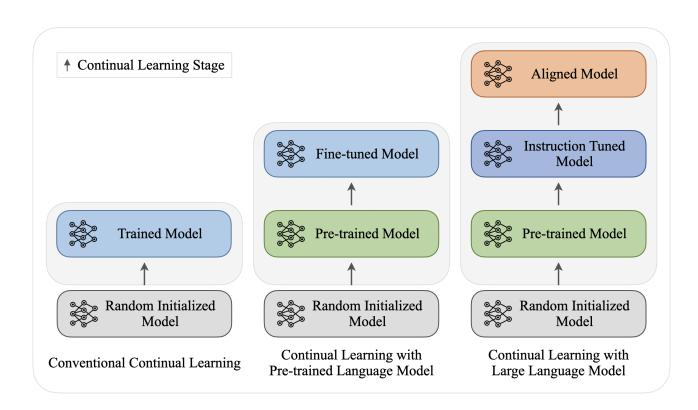
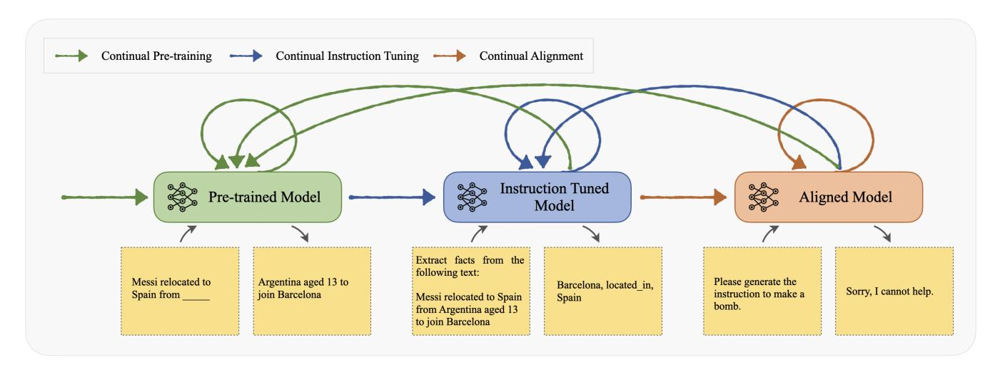
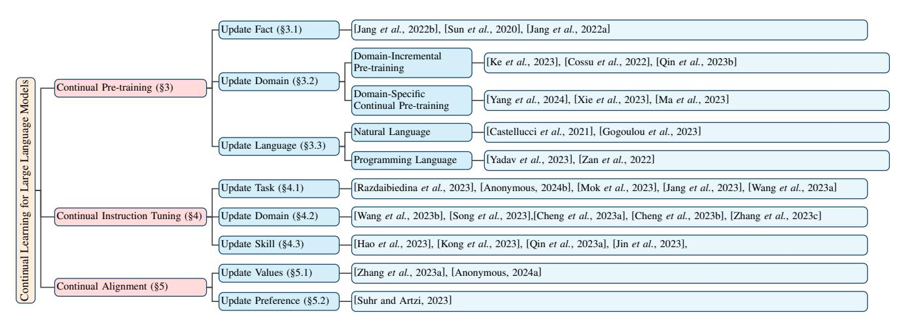

# Continual Learning for Large Language Models: A Survey

# Tongtong $\mathbf{Wu}^1$ , Linhao Luo $^1$ , Yuan-Fang $\mathbf{Li}^1$ , Shirui $\mathbf{Pan}^2$ , Thuy-Trang $\mathbf{Vu}^1$ , Gholamreza $\mathbf{Haffari}^1$

1Monash University 2Griffith University {first-name.last-name}@monash.edu, s.pan@griffith.edu.au

#### **Abstract**

Large language models (LLMs) are not amenable to frequent re-training, due to high training costs arising from their massive scale. However, updates are necessary to endow LLMs with new skills and keep them up-to-date with rapidly evolving human knowledge. This paper surveys recent works on continual learning for LLMs. Due to the unique nature of LLMs, we catalog continue learning techniques in a novel multi-staged categorization scheme, involving continual pretraining, instruction tuning, and alignment. We contrast continual learning for LLMs with simpler adaptation methods used in smaller models, as well as with other enhancement strategies like retrievalaugmented generation and model editing. Moreover, informed by a discussion of benchmarks and evaluation, we identify a number of challenges and future work directions for this crucial task.

#### 1 Introduction

Recent years have witnessed the rapid advances of large language models' (LLMs) capabilities in solving a diverse range of problems. At the same time, it is vital for LLMs to be regularly updated to accurately reflect the ever-evolving human knowledge, values and linguistic patterns, calling for the investigation of continual learning for LLMs. Whilst continual learning bears some resemblance to other strategies for model improvements, such as retrieval-augmented generation (RAG) [Lewis et al., 2020] and model editing [Yao et al., 2023], their main purposes differ (Table 1). Unlike these strategies, whose primarily focus is on refining the domainspecific accuracy or expanding the model's factual knowledge base, continual learning aims to enhance the overall linguistic and reasoning capabilities of LLMs. This distinction is crucial as it shifts the focus from merely updating information to developing a model's ability to process and generate language in a more comprehensive and nuanced manner [Zhang et al., 2023d].

Continual learning for LLMs also differs from its use in smaller models, including smaller pre-trained language models (PLMs). Due to their vast size and complexity, LLMs require a multi-faceted approach to continual learning. We

Figure 1: Continual learning for large language models involves hybrid multi-stage training with multiple training objectives.

categorise it into three different stages, i.e. continual pretraining to expand the model's fundamental understanding of language [Jin et al., 2022], continual instruction tuning to improve the model's response to specific user commands [Zhang et al., 2023e], and continual alignment to ensure the model's outputs adhere to values, ethical standards and societal norms [Zhang et al., 2023a]. This multi-stage process is distinct from the more linear adaptation strategies used in smaller models, as illustrated in Figure 1, highlighting the unique challenges and requirements of applying continual learning to LLMs.

This survey differentiates itself from previous studies by its unique focus and structure. While previous surveys in the field are typically organized around various continual learning strategies [Biesialska *et al.*, 2020], ours is the first to specifically address continual learning in the context of LLMs. We structure our analysis around the types of information that is updated continually and the distinct stages of learning involved in LLMs. This survey offers a detailed and novel perspective on how continual learning is applied to LLMs, shedding light on the specific challenges and opportunities of this application. Our goal is to provide a thorough understanding of the effective implementation of continual learning in LLMs, contributing to the development of more advanced and adaptable language models in the future.

Figure 2: The continual learning of LLMs involves multi-stage and cross-stage iteration, which may lead to substantial forgetting problems. For example, when the instruction-tuned model resumes continual pre-training, it may encounter cross-stage forgetting, resulting in reduced performance on instruction-following tasks.

| Information       | RAG      | Model Editing | Continual Learning |
|-------------------|----------|---------------|--------------------|
| Fact              | <b>Ø</b> | ⊗             | <b>⊘</b>           |
| Domain            | ❷        | ×             | <b>⊘</b>           |
| Language          | ×        | ×             | ❷                  |
| Task              | ×        | ×             | ❷                  |
| Skills (Tool use) | ×        | ×             | ❷                  |
| Values            | ×        | ×             | ❷                  |
| Preference        | ×        | ×             | ❷                  |

Table 1: Continual Learning v.s. RAG and Model Editing

#### 2 Preliminary and Categorization

#### 2.1 Large Language Model

Large language models (LLMs) like ChatGPT1 and LLaMa [Touvron et al., 2023] have shown superior performance in many tasks. They are usually trained in multiple stages, including pre-training, instruction tuning, and alignment, as illustrated in Figure 1. In the pre-training stage, LLMs are trained on a large corpus in a self-supervised manner [Dong et al., 2019], where the training text is randomly masked and the LLMs are asked to predict the masked tokens. In the *instruc*tion tuning stage, LLMs are fine-tuned on a set of instructionoutput pairs in a supervised fashion [Zhang et al., 2023b]. Given a task-specific instruction as input, LLMs are asked to generate the corresponding output. In the *alignment* stage, LLMs are further finetuned with human feedback to align their outputs with human expectations [Wang et al., 2023c]. The output of LLMs is scored by human annotators, and the LLMs are updated to generate more human-like responses.

#### 2.2 Continual Learning

Continual learning focuses on developing learning algorithms to accumulate knowledge on non-stationary data, often delineated by classes, tasks, domains or instances. In supervised continual learning, a sequence of tasks  $\{\mathcal{D}_1,\ldots,\mathcal{D}_T\}$  arrive in a streaming fashion. Each task  $\mathcal{D}_t = \{(\boldsymbol{x}_i^t, y_i^t)\}_{i=1}^{n_t}$  contains a separate target dataset, where  $\boldsymbol{x}_i^t \in \mathcal{X}_t$ ,  $\boldsymbol{y}_i^t \in \mathcal{Y}_t$ . A single model needs to adapt to them sequentially, with only access to  $\mathcal{D}_t$  at the t-th task. This setting requires models to acquire, update, accumulate, and exploit knowledge throughout their lifetime [Biesialska *et al.*, 2020].

The major challenge conventional continuous learning tackles is that of *catastrophic forgetting*, where the performance of a model on old tasks significantly diminishes when trained with new data. Existing studies can be roughly grouped into three categories, e.g., experience replay methods [Chaudhry *et al.*, 2019; Wu *et al.*, 2021], regularization-based methods [Kirkpatrick *et al.*, 2017; Chen *et al.*, 2023b], and dynamic architecture methods [Mallya *et al.*, 2018]. Recently, researchers have designed some hybrid methods that take advantage of the aforementioned techniques [Chen *et al.*, 2023a; He *et al.*, 2024].

#### 2.3 Continual Learning for LLMs

Continual Learning for Large Language Models aims to enable LLMs to learn from a continuous data stream over time. Despite the importance, it is non-trivial to directly apply existing continual learning settings for LLMs. We now provide a forward-looking framework of continual learning for LLMs, then present a categorization of research in this area.

**Framework** Our framework of continual learning for LLMs is illustrated in Figure 2. W align continual learning for LLMs with the different training stages, including Continual Pre-training (CPT), Continual Instruction Tuning (CIT), and Continual Alignment (CA). The *Continual Pre-training* stage aims to conduct training on a sequence of corpus self-supervisedly to enrich LLMs' knowledge and adapt to new domains. The *Continual Instruction Tuning* stage finetunes LLMs on a stream of supervised instruction-following data, aiming to empower LLMs to follow users' instructions while

&lt;sup>1https://openai.com/blog/chatgpt

transferring acquired knowledge for subsequent tasks. Responding to the evolving nature of human values and preferences, *Continual Alignment (CA)* tries to continuously align LLMs with human values over time.

While continual learning on LLMs can be conducted in each stage sequentially, the iterative application of continual learning also makes it essential to transfer across stages without forgetting the ability and knowledge learned from previous stages. For instance, we can conduct continual pretraining based on either instruction-tuned models or aligned models. However, we do not want the LLM to lose their ability to follow users' instructions and align with human values. Therefore, as shown in Figure 2, we use arrows with different colors to show the transfer between stages.

**Categorization** To better understand the research in this area, we provide a fine-grained categorization for each stage of the framework.

#### **Continual Pre-training (CPT)**

- CPT for Updating Facts includes works that adapt LLMs to learn new factual knowledge.
- CPT for Updating Domains includes research that tailors LLMs to specific fields like medical and legal domains.
- CPT for Language Expansion includes studies that extend the languages LLMs supports.

#### **Continual Instruction Tuning (CIT)**

- Task-incremental CIT contains works that finetune LLMs on a series of tasks and acquire the ability to solve new tasks.
- *Domain-incremental CIT* contains methods that finetune LLMs on a stream of instructions to solve domainspecific tasks.
- *Tool-incremental CIT* contains research that continually teaches LLMs to use new tools to solve problems.

#### **Continual Alignment (CA)**

- Continual Value Alignment incorporates studies that continually align LLMs with new ethical guidelines and social norms.
- Continual Preference Alignment incorporates works that adapt LLMs to dynamically match different human preferences.

Besides categorizing methods based on training stages, we also provide an alternative categorization based on the information updated during continual learning. In Table 2, we list some representative information that is updated for LLMs, e.g., facts, domains, tasks, values, and preferences. Based on the training objectives of LLMs, this information can be updated in different stages of LLM continual learning. The taxonomy in Figure 3 shows our categorization scheme and recent representative work in each category.

#### **3** Continual Pre-training (CPT)

Continual pretraining in large language models is essential for keeping the LLMs relevant and effective. This process

| Information      | Pretraining | Instruction-tuning | Alignment |
|------------------|-------------|--------------------|-----------|
| Fact             | 0           | ×                  | ×         |
| Domain           | ❷           | ❷                  | ×         |
| Language         | ❷           | ×                  | ×         |
| Task             | ×           | ❷                  | ×         |
| Skill (Tool use) | ×           | ❷                  | ×         |
| Value            | ×           | ×                  | ❷         |
| Preference       | ×           | ×                  | ❷         |

Table 2: Information updated during different stages of continual learning for LLMs.

involves regularly updating the models with the latest information [Jang et al., 2022a], adapting them to specialized domains [Ke et al., 2023], enhancing their coding capabilities [Yadav et al., 2023], and expanding their linguistic range [Castellucci et al., 2021]. With CPT, LLMs can stay current with new developments, adapt to evolving user needs, and remain effective across diverse applications. Continual pretraining ensures LLMs are not just knowledgeable but also adaptable and responsive to the changing world.

#### 3.1 CPT for Updating Facts

The capability of LLMs to integrate and adapt to recent information is crucial. A pivotal strategy here is the employment of dynamic datasets that facilitate the real-time assimilation of data from a variety of sources like news feeds [Sun et al., 2020], scholarly articles [Cossu et al., 2022], and social media [Cossu et al., 2022]. [Sun et al., 2020] presents ERNIE 2.0, which is a continual pre-training framework that incrementally builds and learns from multiple tasks to maximize knowledge extraction from training data. [Jang et al., 2022b] introduces continual knowledge learning, a method for updating temporal knowledge in LLMs, reducing forgetting while acquiring new information. [Jang et al., 2022a] shows that continual learning with different data achieves comparable or better perplexity in language models than training on the entire snapshot, confirming that factual knowledge in LMs can be updated efficiently with minimal training data. Integral to this process is the implementation of automated systems for the verification of newly acquired data, ensuring both the accuracy and dependability of the information.

#### 3.2 CPT for Updating Domains

Continual pre-training updates domain knowledge through two approaches: 1) domain-incremental pre-training accumulates knowledge across multiple domains, and 2) domain-specific continual learning, which evolves a general model into a domain expert by training on domain-specific datasets and tasks. In domain-incremental pre-training, [Cossu *et al.*, 2022] explores how models can be continually pre-trained on new data streams for both language and vision, preparing them for various downstream tasks. [Qin *et al.*, 2023b] examines continual retraining by assessing model compatibility and benefits of recyclable tuning via parameter initialization and knowledge distillation. [Ke *et al.*, 2023] introduces a soft-masking mechanism to update language models (LMs) with domain corpora, aiming to boost performance

Figure 3: Taxonomy of trends in continual learning for large language models.

while preserving general knowledge. For domain-specific continual learning, [Xie *et al.*[, 2023\]](#page-8-13) develops FinPythia-6.9B through domain-adaptive pre-training for the financial sector. EcomGPT-CT [Ma *et al.*[, 2023\]](#page-7-14) investigates the effects of continual pre-training in the E-commerce domain. These studies collectively highlight the evolving landscape of continual pre-training, demonstrating its effectiveness in enhancing model adaptability and expertise across a wide range of domains.

#### 3.3 CPT for Language Expansion

Expanding the range of languages that LLMs can understand and process is essential for ensuring broader accessibility [\[Castellucci](#page-7-11) *et al.*, 2021]. This expansion is not just about including a wider variety of languages, particularly underrepresented ones, but also about embedding cultural contexts into language processing. A significant challenge here is the model's ability to recognize and interpret regional dialects and contemporary slangs [\[Gogoulou](#page-7-15) *et al.*, 2023], which is crucial for effective and relevant communication across diverse racial, social and cultural groups.

In addition to mastering natural languages, LLMs have also made significant strides in understanding and generating programming languages. [Yadav *et al.*[, 2023\]](#page-8-9) introduced CodeTask-CL, a benchmark for continual code learning that encompasses a diverse array of tasks, featuring various input and output formats across different programming languages. [Zan *et al.*[, 2022\]](#page-8-14) explore using an unlabeled code corpus for training models on library-oriented code generation, addressing the challenge of scarce text-code pairs due to extensive library reuse by programmers. They introduce CERT, a method where a "sketcher" outlines a code structure, and a "generator" completes it, both continuously pre-trained on unlabeled data to capture common patterns in library-focused code snippets. These developments highlight LLMs' potential to transform both natural and programming language processing, leading to more efficient coding practices.

## 4 Continual Instruction Tuning (CIT)

LLMs have shown great instruction following abilities that can be used to complete different tasks with a few-shot task prompt. Continual Instruction Tuning (CIT) involves continually finetuning the LLMs to learn how to follow instructions and transfer knowledge for future tasks [\[Zhang](#page-8-2) *et al.*, [2023e\]](#page-8-2). Based on the ability and knowledge updated during instruction tuning, we can further divide CIT into three categories: *1) task-incremental CIT*, *2) domain-incremental CIT*, and *tool-incremental CIT*.

## 4.1 Task-incremental CIT

Task-incremental Continual Instruction Tuning (Taskincremental CIT) aims to continuously finetune LLMs on a sequence of task-specific instructions and acquire the ability to solve novel tasks. A straightforward solution is to continuously generate instruction-tuning data for new tasks and directly fine-tune LLMs on it [Wang *et al.*[, 2023b\]](#page-8-18). However, studies have shown that continuously finetuning LLMs on task-specific data would cause a catastrophic forgetting of the learned knowledge and problem-solving skills in previous tasks [Kotha *et al.*[, 2023\]](#page-7-24). TAPT [\[Gururangan](#page-7-25) *et al.*, [2020\]](#page-7-25) presents a simple data selection strategy that retrieves unlabeled text from the in-domain corpus, aligning it with the task distribution. This retrieved text is then utilized to finetune LLMs, preventing catastrophic forgetting and enhancing argument performance. To mitigate catastrophic forgetting, Contunual-T0 [\[Scialom](#page-8-23) *et al.*, 2022] employs rehearsal with a memory buffer [Shin *et al.*[, 2017\]](#page-8-24) to store previous tasks data and replay them during training. ConTinTin [\[Yin](#page-8-25) *et al.*[, 2022\]](#page-8-25) presents InstructionSpeak, which includes two strategies that make full use of task instructions to improve forward-transfer and backward-transfer. The first strategy involves learning from negative outputs, while the second strategy focuses on revisiting instructions from previous tasks. RationaleCL [Xiong *et al.*[, 2023\]](#page-8-26) conducts contrastive rationale replay to alleviate catastrophic forgetting. DynaInst [Mok *et al.*[, 2023\]](#page-8-16) proposes a hybrid approach incorporating a Dynamic Instruction Replay and a local minima-inducing regularizer. These two components enhance the generalizability of LLMs and decrease memory and computation usage in the replay module. Unlike previous replay-based or regularization-based methods, SLM [\[Anonymous, 2024b\]](#page-7-16) incorporates vector space retrieval into the language model, which aids in achieving scalable knowledge expansion and management. This enables LLMs' quick adaptation to novel tasks without compromising performance caused by catastrophic forgetting.

LLMs with billions of parameters introduce a huge computational burden for conducting continual learning. To address this issue, the Progressive Prompts technique [\[Razdaibied](#page-8-15)ina *et al.*[, 2023\]](#page-8-15) freezes the majority of parameters and only learns a fixed number of tokens (prompts) for each new task. Progressive Prompts significantly reduce the computational cost while alleviating catastrophic forgetting and improving the transfer of knowledge to future tasks. ELM [\[Jang](#page-7-17) *et al.*, [2023\]](#page-7-17) first trains a small expert adapter on top of the LLM for each task. Then, it employs a retrieval-based approach to choose the most pertinent expert LLM for every new task. Based on the parameter-efficient tuning (PET) framework, O-LoRA [Wang *et al.*[, 2023a\]](#page-8-17) proposes an orthogonal low-rank adaptation for CIT. O-LoRA incrementally learns new tasks in an orthogonal subspace while fixing the LoRA parameters learned from past tasks to minimize catastrophic forgetting. Similarly, DAPT [Zhao *et al.*[, 2024\]](#page-8-27) proposes a novel Dual Attention Framework to align the learning and selection of LoRA parameters via the Dual Attentive Learning&Selection module. LLaMA PRO [Wu *et al.*[, 2024\]](#page-8-28) proposes a novel block expansion technique, which enables the injection of new knowledge into LLMs and preserves the initial capabilities with efficient post-training.

## 4.2 Domain-incremental CIT

Domain-incremental Continual Instruction Tuning (Domainincremental CIT) aims to continually finetune LLMs on a sequence of domain-specific instructions and acquire the knowledge to solve tasks in novel domains. TAPT [\[Guru](#page-7-25)rangan *et al.*[, 2020\]](#page-7-25) adaptively tunes the LLMs on a series of domain-specific data including biomedicine, computer science, news, and shopping reviews. Then, it evaluates the LLMs' text classification ability in each domain. ConPET [Song *et al.*[, 2023\]](#page-8-19) applies previous continual learning methods, initially developed for smaller models, to LLMs using PET and a dynamic replay strategy. This approach significantly reduces tuning costs and mitigates overfitting and forgetting problems. Experiments conducted on a typical continual learning scenario, where new knowledge types gradually emerge, demonstrate the superior performance of Con-PET. AdaptLLM [Cheng *et al.*[, 2023a\]](#page-7-18) adapts LLMs to different domains by enriching the raw training corpus into a series of reading comprehension tasks relevant to its content. These tasks are designed to help the model leverage domain-specific knowledge while enhancing prompting performance. PlugLM [Cheng *et al.*[, 2023b\]](#page-7-19) uses a differentiable plug-in memory (DPM) to explicitly store the domain knowledge. PlugLM could be easily adapted to different domains by plugging in in-domain memory. [Zhang *et al.*[, 2023c\]](#page-8-20) designs an adapt-retrieve-revise process that adapts LLMs to new domains. It first uses the initial LLMs' respose to retrieve knowledge from the domain database. The retrieved knowledge is used to revise initial responses and obtain final answers. [Dong *et al.*[, 2023\]](#page-7-26) analyze the LLMs continuously tuned on different domains and find that the sequence of training data has a significant impact on the performance of LLMs. They also offer a Mixed Fine-tuning (DMT) strategy to learn multiple abilities in different domains.

## 4.3 Tool-incremental CIT

Tool-incremental Continual Instruction Tuning (Toolincremental CIT) aims to fine-tune LLMs continuously, enabling them to interact with the real world and enhance their abilities by integrating with tools, such as calculators, search engines, and databases [Qin *et al.*[, 2023a\]](#page-8-21). With the rapid emergence of new tools like advanced software libraries, novel APIs, or domain-specific utilities [Liang *et al.*[, 2023;](#page-7-27) Jin *et al.*[, 2023\]](#page-7-22), there is a growing need to continually update LLMs so they can quickly adapt and master these new tools. Llemma [\[Azerbayev](#page-7-28) *et al.*, 2023] continues tuning LLMs on a dataset with a mixture of math-related text and code to enable LLMs to solve mathematical problems by using external tools. ToolkenGPT [Hao *et al.*[, 2023\]](#page-7-20) represents each tool as a new token (toolken) whose embedding is learned during instruction tuning. This approach offers an efficient way for LLMs to master tools and swiftly adapt to new tools by adding additional tokens.

# 5 Continual Alignment (CA)

LLMs need to adapt to evolving societal values, social norms and ethical guidelines. Furthermore, there exists substantial diversity in preferences across different demographic groups, as well as individuals' changing preferences over time. The need to respond to these changes give rise to continual alignment. In the context of continual alignment, two scenarios emerge: (i) the requirement to update LLMs to reflect shifts in societal values and (ii) integrating new demographic groups or value types to existing LLMs, which we will describe in the following subsections.

## 5.1 Continual Value Alignment

Continual value alignment aims to continually incorporate ethical guidelines or adapt to cultural sensitivities and norms. It requires updating to unlearn outdated notions and incorporating new values, akin to model editing and unlearning tasks. Model editing and knowledge unlearning have been studied in pretraining and instruction tuning phases [\[Yao](#page-8-0) *et al.*[, 2023\]](#page-8-0); however, they have not yet been explored in preference learning.

### 5.2 Continual Preference Alignment

Adding new demographic groups or value types aligns with continual learning problems, aiming to guide LLMs in generating responses aligned with emerging values while adhering to previously learned ones. For example, many opensource aligned LLMs employ reinforcement learning with human feedback (RLHF) for safety. We may want to align the LLMs for additional attributes such as helpfulness and faithfulness. Beyond the challenge of retaining past preferences while maximising the reward on new ones, continual preference learning also faces difficulties in stable and efficient training with a large action space (vocabulary) and a large number of parameters. Previous works have demonstrated proof-of-concept of such agents. However, there is a lack of standardized benchmarks to systematically evaluate the learning capabilities of new preferences over time. Continual Proximal Policy Optimization (CPPO) [\[Anonymous,](#page-7-23) [2024a\]](#page-7-23) utilizes a sample-wise weighting on the Proximal Policy Optimization (PPO) algorithm [\[Schulman](#page-8-29) *et al.*, 2017] to balance policy learning and knowledge retention in imitating the old policy output. On the other hand, [Zhang *et al.*[, 2023a\]](#page-8-3) extend the Direct Preference Optimization (DPO) algorithm [\[Rafailov](#page-8-30) *et al.*, 2023] to the continual learning setting by employing Monte Carlo estimation to derive a sequence of optimal policies for the given sequences of tasks and incorporate them to regularize the policy learning on new tasks.

# 6 Benchmarks

The systematic evaluation of LLMs' continual learning performance demands benchmarks with high-quality data sources and diverse content. Below we summarize notable benchmark dataets.

## 6.1 Benchmarks for CPT

TemporalWiki [Jang *et al.*[, 2022a\]](#page-7-9) serves as a lifelong benchmark, training and evaluating Language Models using consecutive snapshots of Wikipedia and Wikidata, helping assess an LM's ability to retain past knowledge and acquire new knowledge over time. Additional social media datasets like Firehose [Hu *et al.*[, 2023\]](#page-7-29) comprise 100 million tweets from one million users over six years. CKL [Jang *et al.*[, 2022b\]](#page-7-13) focuses on web and news data, aiming to retain time-invariant world knowledge from initial pretraining while efficiently learning new knowledge through continued pre-training on different corpora. TRACE [Wang *et al.*[, 2023b\]](#page-8-18) encompasses eight diverse datasets covering specialized domains, multilingual tasks, code generation, and mathematical reasoning. These datasets are harmonized into a standard format, facilitating straightforward and automated evaluation of LLMs. Due to the fast-paced nature of data, time-sensitive datasets quickly become outdated, necessitating frequent updates to continual pre-training benchmarks for model evaluation.

## 6.2 Benchmarks for CIT

The Continual Instruction Tuning Benchmark (CITB) [\[Zhang](#page-8-2) *et al.*[, 2023e\]](#page-8-2) is based on SuperNI, encompassing over 1,600 Natural Language Processing (NLP) tasks across 76 types like language generation and classification, all in a text-totext format. ConTinTin [Yin *et al.*[, 2022\]](#page-8-25), another benchmark derived from NATURAL-INSTRUCTIONS, includes 61 tasks across six categories, such as question generation and classification. When using these benchmarks for evaluating black-box language learning models that cannot access their training data, the selection of datasets is crucial to avoid task contamination and ensure reliable performance assessment in continual instruction tuning.

## 6.3 Benmarks for CA

COPF [Zhang *et al.*[, 2023a\]](#page-8-3) conduct experiments for continual alignment using datasets like the Stanford Human Preferences (SHP) [\[Ethayarajh](#page-7-30) *et al.*, 2022] and Helpful & Harmless (HH) Datasets [Bai *et al.*[, 2022\]](#page-7-31). The SHP Dataset comprises 385,000 human preferences across 18 subjects, from cooking to legal advice. The HH Dataset consists of two parts: one where crowdworkers interact with AI models for helpful responses, and another where they elicit harmful responses, selecting the more impactful response in each case. Despite the growing interest in this field, there is a notable absence of dedicated benchmarks for continual alignment, presenting an opportunity for future research and development in this area.

## 7 Evaluation

## 7.1 Evaluation for Target Task Sequence

Continual learning for large language models involves evaluating the model's performance over a task sequence. Performance can be measured by three typical continual learning metrics: (1) average performance; (2) Forward Transfer Rate (FWT), and (3) Backward Transfer Rate (BWT) [\[Lopez-Paz](#page-7-32) [and Ranzato, 2017;](#page-7-32) Wu *et al.*[, 2022\]](#page-8-31):

(1) FWT assesses the impact of knowledge acquired from previous tasks on the initial ability to perform a new task, prior to any dedicated training for that new task.

$$FWT = \frac{1}{T-1} \sum_{i=2}^{T-1} A_{T,i} - \tilde{b_i}$$
 (1)

(2) BWT measures catastrophic forgetting by comparing a model's performance on old tasks before and after learning new ones.

$$BWT = \frac{1}{T-1} \sum_{i=1}^{T-1} A_{T,i} - A_{i,i}$$
 (2)

(3) Average Performance, e.g., the average accuracy assesses the ability of a model or algorithm to effectively learn from and adapt to a sequence of data streams or tasks over time.

$$Avg. \ ACC = \frac{1}{T} \sum_{i=1}^{T} A_{T,i}$$
 (3)

where At,i is the accuracy of models on the test set of ith task after model learning on the tth task and ˜bi is the test accuracy for task i at random initialization.

### 7.2 Evaluation for Cross-stage Forgetting

Large language models continually trained on different stages can experience the issue of unconscious forgetting [\[Lin](#page-7-33) *et al.*[, 2023\]](#page-7-33), which shows that continual instruction tuning can erode the LLM's general knowledge. Additionally, previous studies [Qi *et al.*[, 2023\]](#page-8-32) also demonstrate that the behavior of safely aligned LLMs can be easily affected and degraded by instruction tuning. To quantify these limitations, TRACE [Wang *et al.*[, 2023b\]](#page-8-18) proposes to evaluate LLMs by using three novel metrics: General Ability Delta (GAD), Instruction Following Delta (IFD), and Safety Delta (SD):

(1) GAD assesses the performance difference of an LLM on general tasks after training on sequential target tasks.

$$GAD = \frac{1}{T} \sum_{i=1}^{T} (R_{t,i}^G - R_{0,i}^G)$$
 (4)

(2) IFD assesses the changes of model's instructionfollowing ability after training on sequential different tasks.

$$IFD = \frac{1}{T} \sum_{i=1}^{T} (R_{t,i}^{I} - R_{0,i}^{I})$$
 (5)

(3) SD assesses the safety variation of a model's response after sequential training.

$$SD = \frac{1}{T} \sum_{i=1}^{T} (R_{t,i}^{S} - R_{0,i}^{S})$$
 (6)

The baseline performance of the initial LLM on the i-th task is represented by R0,i. After incrementally learning up to the t-th task, the score on the i-th task becomes Rt,i. And RG, RI , and RS represent the performance of LLM on general tasks (assessing the information obtained from pre-training), instruction-following tasks, and alignment tasks, respectively. These measure changes in an LLM's overall capabilities, adherence to instructions, and safety after continual learning, going beyond traditional benchmarks by focusing on maintaining inherent skills and aligning with human preferences.

# 8 Challenges and Future Works

Computation-efficient Continual Learning In the realm of computation efficiency, the focus is on enhancing the continual pretraining process with minimized computational resources [\[Verwimp](#page-8-33) *et al.*, 2023]. This involves developing innovative architectures that can handle the increasing complexity of pretraining tasks without proportional increases in computational demands. Efficiency in algorithms and data structures becomes crucial, especially in managing the extensive data involved in pretraining. Additionally, energyefficient learning models are vital for sustainable scaling of LLMs, aligning with Green AI initiatives. This area requires balancing the computational cost vs the benefits in terms of model performance and capabilities.

Social Good Continual Learning Social responsibility in continual learning encompasses ensuring privacy and data security, particularly in the context of continual instruction tuning [\[Gabriel, 2020\]](#page-7-34). As LLMs are fine-tuned with more specific instructions or tasks, the handling of sensitive or personal data must be managed securely and ethically. Aligning with human values and culture is also paramount, especially in the realm of continual preference learning. This involves incorporating ethical AI principles and cultural sensitivities to ensure that the model's outputs are aligned with societal norms and values.

Automatic Continual Learning A significant challenge lies in creating systems capable of autonomously overseeing their learning processes, seamlessly adjusting to novel tasks (instruction tuning) and user preferences (alignment) while relying solely on the inherent capabilities of LLMs, all without the need for manual intervention [Qiao *et al.*[, 2024\]](#page-8-34). Automatic continual learning includes multi-agent systems capable of collaborative learning and self-planning algorithms that can autonomously adjust learning strategies based on performance feedback. Such systems would represent a significant advancement in the autonomy of LLMs.

Continual Learning with Controllable Forgetting Controllable forgetting is particularly relevant to continual pretraining. The ability to selectively retain or forget information as the model is exposed to new data streams can prevent catastrophic forgetting [Qi *et al.*[, 2023\]](#page-8-32) and enhance model adaptability [Wang *et al.*[, 2023b\]](#page-8-18). This challenge also extends to managing misinformation and unlearning incorrect or outdated information [\[Chen and Yang, 2023\]](#page-7-35), ensuring the accuracy and reliability of the LLM over time.

Continual Learning with History Tracking Effective history tracking is vital for understanding the evolution of the LLM through its phases of pre-training, instruction tuning, and preference learning. Managing history in model parameters and using external memory architectures can help in tracking the influence of past learning on current model behavior and decisions [\[Mialon](#page-8-35) *et al.*, 2023]. This is crucial for analyzing the effectiveness of continual learning processes and making informed adjustments.

#### Theoretical insights on LLM in Continual Learning.

Numerous evaluation studies have examined the issue of cross-stage forgetting [Lin *et al.*[, 2023\]](#page-7-33) and demonstrated the weak robustness of aligned LLMs [Qi *et al.*[, 2023\]](#page-8-32). However, theoretical analyses of how multi-stage training impacts the performance of large language models in subsequent continual learning tasks are scarce. This gap highlights the need for a deeper understanding of the specific changes multi-stage training introduces to LLMs' learning capabilities and longterm performance.

## 9 Conclusion

Continual learning holds the vital importance of allowing large language models to be regularly and efficiently updated to remain up-to-date with the constantly changing human knowledge, language and values. We showcase the complex, multi-stage process of continual learning in LLMs, encompassing continual pretraining, instruction tuning, and alignment, a paradigm more intricate than those used in continual learning on smaller models. As the first survey of its kind to thoroughly explore continual learning in LLMs, this paper categorizes the updates by learning stages and information types, providing a detailed understanding of how to effectively implement continual learning in LLMs. With a discussion of major challenges and future work directions, our goal is to provide a comprehensive account of recent developments in continual learning for LLMs, shedding light on the development of more advanced and adaptable language models.

## References

- [Anonymous, 2024a] Anonymous. CPPO: Continual learning for reinforcement learning with human feedback. In *ICLR*, 2024.
- [Anonymous, 2024b] Anonymous. Scalable language model with generalized continual learning. In *ICLR*, 2024.
- [Azerbayev *et al.*, 2023] Zhangir Azerbayev, Hailey Schoelkopf, Keiran Paster, et al. Llemma: An open language model for mathematics. *CoRR*, 2023.
- [Bai *et al.*, 2022] Yuntao Bai, Andy Jones, Kamal Ndousse, et al. Training a helpful and harmless assistant with reinforcement learning from human feedback. *CoRR*, 2022.
- [Biesialska *et al.*, 2020] Magdalena Biesialska, Katarzyna Biesialska, and Marta R. Costa-jussa. Continual lifelong ` learning in natural language processing: A survey. In Donia Scott, Nuria Bel, and Chengqing Zong, editors, *COL-ING*, 2020.
- [Castellucci *et al.*, 2021] Giuseppe Castellucci, Simone Filice, Danilo Croce, and Roberto Basili. Learning to solve NLP tasks in an incremental number of languages. In *ACL*, 2021.
- [Chaudhry *et al.*, 2019] Arslan Chaudhry, Marcus Rohrbach, Mohamed Elhoseiny, et al. On tiny episodic memories in continual learning. *arXiv:1902.10486*, 2019.
- [Chen and Yang, 2023] Jiaao Chen and Diyi Yang. Unlearn what you want to forget: Efficient unlearning for llms. In *EMNLP*, 2023.
- [Chen *et al.*, 2023a] Xiang Chen, Jintian Zhang, Xiaohan Wang, et al. Continual multimodal knowledge graph construction. *CoRR*, 2023.
- [Chen *et al.*, 2023b] Yongrui Chen, Xinnan Guo, Tongtong Wu, et al. Learn from yesterday: A semi-supervised continual learning method for supervision-limited text-to-sql task streams. In *AAAI*, 2023.
- [Cheng *et al.*, 2023a] Daixuan Cheng, Shaohan Huang, and Furu Wei. Adapting large language models via reading comprehension. *arXiv:2309.09530*, 2023.
- [Cheng *et al.*, 2023b] Xin Cheng, Yankai Lin, Dongyan Zhao, and Rui Yan. Language model with plug-in knowledge memory, 2023.
- [Cossu *et al.*, 2022] Andrea Cossu, Tinne Tuytelaars, Antonio Carta, et al. Continual pre-training mitigates forgetting in language and vision. *CoRR*, 2022.
- [Dong *et al.*, 2019] Li Dong, Nan Yang, Wenhui Wang, et al. Unified language model pre-training for natural language understanding and generation. *NeurIPS*, 2019.
- [Dong *et al.*, 2023] Guanting Dong, Hongyi Yuan, Keming Lu, et al. How abilities in large language models are affected by supervised fine-tuning data composition. *arXiv:2310.05492*, 2023.
- [Ethayarajh *et al.*, 2022] Kawin Ethayarajh, Yejin Choi, and Swabha Swayamdipta. Understanding dataset difficulty with *V*-usable information. In *ICML*, volume 162, 2022.
- [Gabriel, 2020] Iason Gabriel. Artificial Intelligence, Values, and Alignment. *Minds and Machines*, 2020.
- [Gogoulou *et al.*, 2023] Evangelia Gogoulou, Timothee´ Lesort, Magnus Boman, and Joakim Nivre. A study of continual learning under language shift. *CoRR*, 2023.
- [Gururangan *et al.*, 2020] Suchin Gururangan, Ana Marasovic, Swabha Swayamdipta, et al. Don't stop ´ pretraining: Adapt language models to domains and tasks.

- *arXiv:2004.10964*, 2020.
- [Hao *et al.*, 2023] Shibo Hao, Tianyang Liu, Zhen Wang, and Zhiting Hu. Toolkengpt: Augmenting frozen language models with massive tools via tool embeddings. *arXiv:2305.11554*, 2023.
- [He *et al.*, 2024] Tao He, Tongtong Wu, Dongyang Zhang, Guiduo Duan, Ke Qin, and Yuan-Fang Li. Towards lifelong scene graph generation with knowledge-ware incontext prompt learning. *CoRR*, 2024.
- [Hu *et al.*, 2023] Hexiang Hu, Ozan Sener, Fei Sha, and Vladlen Koltun. Drinking from a firehose: Continual learning with web-scale natural language. *IEEE Trans. Pattern Anal. Mach. Intell.*, 45(5), 2023.
- [Jang *et al.*, 2022a] Joel Jang, Seonghyeon Ye, Changho Lee, et al. Temporalwiki: A lifelong benchmark for training and evaluating ever-evolving language models. In *EMNLP*, 2022.
- [Jang *et al.*, 2022b] Joel Jang, Seonghyeon Ye, Sohee Yang, et al. Towards continual knowledge learning of language models. In *ICLR*, 2022.
- [Jang *et al.*, 2023] Joel Jang, Seungone Kim, Seonghyeon Ye, et al. Exploring the benefits of training expert language models over instruction tuning. *arXiv:2302.03202*, 2023.
- [Jin *et al.*, 2022] Xisen Jin, Dejiao Zhang, Henghui Zhu, et al. Lifelong pretraining: Continually adapting language models to emerging corpora. In *NAACL*, 2022.
- [Jin *et al.*, 2023] Qiao Jin, Yifan Yang, Qingyu Chen, and Zhiyong Lu. Genegpt: Augmenting large language models with domain tools for improved access to biomedical information. *arXiv:2304.09667*, 2023.
- [Ke *et al.*, 2023] Zixuan Ke, Yijia Shao, Haowei Lin, Tatsuya Konishi, Gyuhak Kim, and Bing Liu. Continual pretraining of language models. In *ICLR*, 2023.
- [Kirkpatrick *et al.*, 2017] James Kirkpatrick, Razvan Pascanu, Neil Rabinowitz, et al. Overcoming catastrophic forgetting in neural networks. *Proceedings of the national academy of sciences*, 2017.
- [Kong *et al.*, 2023] Yilun Kong, Jingqing Ruan, Yihong Chen, et al. Tptu-v2: Boosting task planning and tool usage of large language model-based agents in real-world systems. *arXiv:2311.11315*, 2023.
- [Kotha *et al.*, 2023] Suhas Kotha, Jacob Mitchell Springer, and Aditi Raghunathan. Understanding catastrophic forgetting in language models via implicit inference. *arXiv:2309.10105*, 2023.
- [Lewis *et al.*, 2020] Patrick S. H. Lewis, Ethan Perez, Aleksandra Piktus, et al. Retrieval-augmented generation for knowledge-intensive NLP tasks. In *NeurIPS*, 2020.
- [Liang *et al.*, 2023] Yaobo Liang, Chenfei Wu, Ting Song, et al. Taskmatrix. ai: Completing tasks by connecting foundation models with millions of apis. *arXiv:2303.16434*, 2023.
- [Lin *et al.*, 2023] Yong Lin, Lu Tan, Hangyu Lin, et al. Speciality vs generality: An empirical study on catastrophic forgetting in fine-tuning foundation models. *arXiv:2309.06256*, 2023.
- [Lopez-Paz and Ranzato, 2017] David Lopez-Paz and Marc'Aurelio Ranzato. Gradient episodic memory for continual learning. In *NeurIPS*, 2017.
- [Ma *et al.*, 2023] Shirong Ma, Shen Huang, Shulin Huang,

- et al. Ecomgpt-ct: Continual pre-training of e-commerce large language models with semi-structured data. *CoRR*, 2023.
- [Mallya *et al.*, 2018] Arun Mallya, Dillon Davis, and Svetlana Lazebnik. Piggyback: Adapting a single network to multiple tasks by learning to mask weights. In *ECCV*, 2018.
- [Mialon *et al.*, 2023] Gregoire Mialon, Roberto Dess ´ `ı, Maria Lomeli, et al. Augmented language models: a survey. *CoRR*, 2023.
- [Mok *et al.*, 2023] Jisoo Mok, Jaeyoung Do, Sungjin Lee, et al. Large-scale lifelong learning of in-context instructions and how to tackle it. In *ACL*, 2023.
- [Qi *et al.*, 2023] Xiangyu Qi, Yi Zeng, Tinghao Xie, et al. Fine-tuning aligned language models compromises safety, even when users do not intend to! *arXiv:2310.03693*, 2023.
- [Qiao *et al.*, 2024] Shuofei Qiao, Ningyu Zhang, Runnan Fang, Yujie Luo, Wangchunshu Zhou, Yuchen Eleanor Jiang, Chengfei Lv, and Huajun Chen. Autoact: Automatic agent learning from scratch via self-planning. *CoRR*, 2024.
- [Qin *et al.*, 2023a] Yujia Qin, Shihao Liang, Yining Ye, et al. Toolllm: Facilitating large language models to master 16000+ real-world apis. *arXiv:2307.16789*, 2023.
- [Qin *et al.*, 2023b] Yujia Qin, Cheng Qian, Xu Han, et al. Recyclable tuning for continual pre-training. In *Findings of ACL*, 2023.
- [Rafailov *et al.*, 2023] Rafael Rafailov, Archit Sharma, Eric Mitchell, Christopher D Manning, Stefano Ermon, and Chelsea Finn. Direct preference optimization: Your language model is secretly a reward model. In *NeurIPS*, 2023.
- [Razdaibiedina *et al.*, 2023] Anastasia Razdaibiedina, Yuning Mao, Rui Hou, et al. Progressive prompts: Continual learning for language models. *arXiv:2301.12314*, 2023.
- [Schulman *et al.*, 2017] John Schulman, Filip Wolski, Prafulla Dhariwal, Alec Radford, and Oleg Klimov. Proximal policy optimization algorithms. *CoRR*, 2017.
- [Scialom *et al.*, 2022] Thomas Scialom, Tuhin Chakrabarty, and Smaranda Muresan. Fine-tuned language models are continual learners. In *EMNLP*, 2022.
- [Shin *et al.*, 2017] Hanul Shin, Jung Kwon Lee, Jaehong Kim, and Jiwon Kim. Continual learning with deep generative replay. *NeurIPS*, 2017.
- [Song *et al.*, 2023] Chenyang Song, Xu Han, Zheni Zeng, et al. Conpet: Continual parameter-efficient tuning for large language models. *arXiv:2309.14763*, 2023.
- [Suhr and Artzi, 2023] Alane Suhr and Yoav Artzi. Continual learning for instruction following from realtime feedback. In *NeurIPS*, 2023.
- [Sun *et al.*, 2020] Yu Sun, Shuohuan Wang, Yu-Kun Li, et al. ERNIE 2.0: A continual pre-training framework for language understanding. In *AAAI*, 2020.
- [Touvron *et al.*, 2023] Hugo Touvron, Thibaut Lavril, Gautier Izacard, et al. Llama: Open and efficient foundation language models. *arXiv:2302.13971*, 2023.
- [Verwimp *et al.*, 2023] Eli Verwimp, Rahaf Aljundi, Shai Ben-David, Matthias Bethge, et al. Continual learning: Applications and the road forward. *CoRR*, 2023.
- [Wang *et al.*, 2023a] Xiao Wang, Tianze Chen, Qiming Ge, et al. Orthogonal subspace learning for language model

- continual learning. *arXiv:2310.14152*, 2023.
- [Wang *et al.*, 2023b] Xiao Wang, Yuansen Zhang, Tianze Chen, et al. Trace: A comprehensive benchmark for continual learning in large language models. *CoRR*, 2023.
- [Wang *et al.*, 2023c] Yufei Wang, Wanjun Zhong, Liangyou Li, et al. Aligning large language models with human: A survey. *arXiv:2307.12966*, 2023.
- [Wu *et al.*, 2021] Tongtong Wu, Xuekai Li, Yuan-Fang Li, Gholamreza Haffari, Guilin Qi, Yujin Zhu, and Guoqiang Xu. Curriculum-meta learning for order-robust continual relation extraction. In *AAAI*, 2021.
- [Wu *et al.*, 2022] Tongtong Wu, Massimo Caccia, Zhuang Li, Yuan-Fang Li, Guilin Qi, and Gholamreza Haffari. Pretrained language model in continual learning: A comparative study. In *ICLR*, 2022.
- [Wu *et al.*, 2024] Chengyue Wu, Yukang Gan, Yixiao Ge, et al. Llama pro: Progressive llama with block expansion. *arXiv:2401.02415*, 2024.
- [Xie *et al.*, 2023] Yong Xie, Karan Aggarwal, and Aitzaz Ahmad. Efficient continual pre-training for building domain specific large language models. *CoRR*, 2023.
- [Xiong *et al.*, 2023] Weimin Xiong, Yifan Song, Peiyi Wang, and Sujian Li. Rationale-enhanced language models are better continual relation learners. *arXiv:2310.06547*, 2023.
- [Yadav *et al.*, 2023] Prateek Yadav, Qing Sun, Hantian Ding, et al. Exploring continual learning for code generation models. In *ACL*, 2023.
- [Yang *et al.*, 2024] Xianjun Yang, Junfeng Gao, Wenxin Xue, and Erik Alexandersson. Pllama: An open-source large language model for plant science. *CoRR*, 2024.
- [Yao *et al.*, 2023] Yunzhi Yao, Peng Wang, Bozhong Tian, et al. Editing large language models: Problems, methods, and opportunities. In *EMNLP*, 2023.
- [Yin *et al.*, 2022] Wenpeng Yin, Jia Li, and Caiming Xiong. Contintin: Continual learning from task instructions. *arXiv:2203.08512*, 2022.
- [Zan *et al.*, 2022] Daoguang Zan, Bei Chen, Dejian Yang, et al. CERT: continual pre-training on sketches for libraryoriented code generation. In *IJCAI*, 2022.
- [Zhang *et al.*, 2023a] Han Zhang, Lin Gui, Yuanzhao Zhai, et al. Copf: Continual learning human preference through optimal policy fitting. *arXiv:2310.15694*, 2023.
- [Zhang *et al.*, 2023b] Shengyu Zhang, Linfeng Dong, Xiaoya Li, et al. Instruction tuning for large language models: A survey. *arXiv:2308.10792*, 2023.
- [Zhang *et al.*, 2023c] Yating Zhang, Yexiang Wang, Fei Cheng, et al. Reformulating domain adaptation of large language models as adapt-retrieve-revise. *arXiv:2310.03328*, 2023.
- [Zhang *et al.*, 2023d] Zihan Zhang, Meng Fang, Ling Chen, et al. How do large language models capture the everchanging world knowledge? A review of recent advances. In *EMNLP*, 2023.
- [Zhang *et al.*, 2023e] Zihan Zhang, Meng Fang, Ling Chen, and Mohammad-Reza Namazi-Rad. Citb: A benchmark for continual instruction tuning. *arXiv:2310.14510*, 2023.
- [Zhao *et al.*, 2024] Weixiang Zhao, Shilong Wang, Yulin Hu, et al. Dapt: A dual attention framework for parameterefficient continual learning of large language models. *arXiv:2401.08295*, 2024.