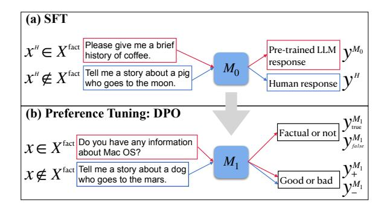
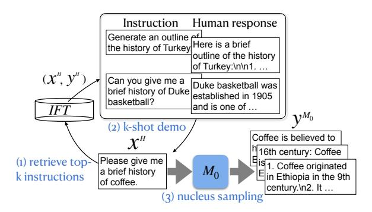

# Factuality-Aware Alignment for Large Language Models

Sheng-Chieh Lin<sup>1</sup><sup>∗</sup> , Luyu Gao<sup>2</sup> , Barlas Oguz<sup>3</sup> , Wenhan Xiong<sup>3</sup> , Jimmy Lin<sup>1</sup> , Wen-tau Yih<sup>3</sup> , and Xilun Chen<sup>3</sup>†

University of Waterloo<sup>1</sup> , Carnegie Mellon University<sup>2</sup> , Meta AI<sup>3</sup>

s269lin@uwaterloo.ca, xilun@meta.com

## Abstract

Alignment, consisting of supervised fine-tuning (SFT) and reinforcement learning (RL), is a standard procedure to fine-tune pre-trained large language models (LLMs) to follow natural language instructions and serve as a helpful AI assistant. We have observed, however, that the conventional alignment process does not enhance the factual accuracy of LLMs. On the contrary, it tends to induce the generation of more false facts (i.e. *hallucination*). In this paper, we study how to make the LLM alignment process more factual, by first identifying factors that lead to hallucination in both alignment steps. In particular, we find that training the LLM on new knowledge or unfamiliar texts can encourage hallucination. This makes SFT less factual as it trains on human labeled data that may be novel to the LLM. Furthermore, reward functions used in standard RL can also encourage hallucination, because it guides the LLM to provide more helpful responses on a diverse set of instructions, often preferring longer and more creative responses. Based on these observations, we propose factuality-aware alignment training, consisting of *factuality-aware SFT* and *factuality-aware RL* through direct preference optimization. Experiments demonstrate that our proposed factuality-aware alignment training guides LLMs to output more factual responses while maintaining its instructionfollowing capability.

## 1 Introduction

Instruction tuning is a standard procedure to make pre-trained large language models (LLMs) [\(Brown](#page-6-0) [et al.,](#page-6-0) [2020;](#page-6-0) [Touvron et al.,](#page-7-0) [2023\)](#page-7-0) to follow natural language instructions and serve as a helpful AI assistant. Standard instuction tuning comes with two training phases: (1) supervised fine-tuning (SFT) [\(Sanh et al.,](#page-7-1) [2022\)](#page-7-1); (2) preference learning with human (RLHF) [\(Ouyang et al.,](#page-7-2) [2022;](#page-7-2) [Bai et al.,](#page-6-1) [2022\)](#page-6-1) or automated feedback (RLAIF) [\(Bai et al.,](#page-6-2) [2023\)](#page-6-2). The recently proposed techniques [\(Wang](#page-7-3) [et al.,](#page-7-3) [2023;](#page-7-3) [Zhou et al.,](#page-8-0) [2023;](#page-8-0) [Yuan et al.,](#page-8-1) [2024\)](#page-8-1) largely improve LLMs' instruction following capability; however, the existing state-of-the-art LLMs are still prone to generate false claims [\(Min et al.,](#page-7-4) [2023;](#page-7-4) [Tian et al.,](#page-7-5) [2024\)](#page-7-5). This motivates us to study how to fine-tune LLMs follow instructions while align them to be factual?

To answer the above question, we first conduct a pilot study on how to improve LLMs' factuality through SFT and RLAIF with direct preference optimization (DPO) [\(Rafailov et al.,](#page-7-6) [2023\)](#page-7-6). To simplify the study, we study how to fine-tune LLMs to generate factual biographies of famous people following [Tian et al.](#page-7-5) [\(2024\)](#page-7-5). Our study finds that at both SFT and DPO stages, using more factual responses as a supervision does not necessarily guide LLMs to be more factual. For example, although retrieval augmented generation (RAG) [\(Lewis et al.,](#page-7-7) [2020\)](#page-7-7) yields more factual responses than vanilla pre-trained LLMs, using RAG generated responses as positives for SFT and DPO surprisingly makes LLMs more prone to hallucinate. By contrast, using the responses sampled from vanilla pre-trained LLMs for SFT and DPO can guide LLMs to output responses with less false claims. We hypothesize that fine-tuning LLMs using the samples which are not familiar with may encourage models to hallucinate even the samples are of high quality.

Our ultimate goal is to fine-tune LLMs to better follow instructions and generate less false claims. However, in contrary to biography generation, human instructions are diverse and complex such that not all of them require the answers to be based on facts. For example, the instruction, *Tell me a story about a pig who goes to the moon*, requires LLMs to make up an imaginative and non-factual story while the question, *Please give me a brief history of coffee*, requires LLMs' responses to be factual. If we treat them equally during instruction tuning,

<sup>∗</sup>This work is done during Sheng-Chieh's internship at Meta.

<sup>†</sup>Xilun and Sheng-Chieh contributed equally to this work.

LLMs may not know when to output responses based on facts or imaginations.

Based on the aforementioned observations, we design a factuality-aware approach to aligning LLMs. We first judge whether a given instruction requires factual knowledge or not. At SFT stage, for fact-related instructions, we create supervision by sampling responses from the pre-trained LLM itself with few-shot demonstrations, while for non fact-related instructions, we directly use human responses as high-quality supervision [\(Zhou et al.,](#page-8-0) [2023\)](#page-8-0). At preference learning stage, we create factuality-aware DPO pairs. Specifically, for each fact-related instruction, we create two preference pairs in terms of factuality and instruction following respectively, while for each non fact-related instruction, we only create preference pairs with regard to instruction following.

In our experiments, we verify that our factualityaware SFT addresses the issues of encouraging hallucination when fine-tuning on human labeled data. For example, after conducting instruction tuning for Llama2 70B on OpenAssistant dataset [\(Köpf et al.,](#page-7-8) [2023\)](#page-7-8) with human labels, it yields FActScore [\(Min et al.,](#page-7-4) [2023\)](#page-7-4) of 44.7 on Biography generation while our factuality-aware SFT results in 49.5 and perform the same in terms of instruction following capability in Alpaca Eval [\(Dubois et al.,](#page-6-3) [2024\)](#page-6-3). At DPO stage, while we find that simply aligning LLMs to follow instructions encourages LLMs to hallucinate, our factuality-aware DPO can largely mitigate the issue without sacrificing LLMs' instruction following capability.

# 2 Related Work

## <span id="page-1-5"></span>3 A Pilot Study on Factual Alignment

In this section, we first study how to align large language models (LLMs) to be more factual. We use biography generation as our main task to study factuality due to two main reasons:

- 1. Biography generation is a knowledgeintensive task, which requires long-form generation. Long-form generation is the most commonly used case for LLMs.
- 2. Evaluating the factuality of biography generation is relatively easy since Wikipedia covers sufficient information for public figures and most the facts about a person is nondebatable [\(Min et al.,](#page-7-4) [2023\)](#page-7-4).

## 3.1 Alignment for Biography Generation

A standard alignment training consists of supervised fine-tuning (SFT) and preference learning. In this study, our main goal is to teach LLMs to generate biography with less misinformation. Thus, we use the diverse 500 human entities to create training data for SFT and preference learning; then, evaluate LLMs' generation factuality on another 183 human entities.[1](#page-1-0) The instruction is generated with the format: Tell me a bio of entity name. Note that the human entities for training and evaluation are from [Min et al.](#page-7-4) [\(2023\)](#page-7-4), which are uniformly sampled from entities across diverse nationalities, professions, and rarities.[2](#page-1-1)

SFT. We randomly sample 5 human entities among the 500 entities for training and generate their biographies using Chat Llama2 70B as 5-shot demonstration.[3](#page-1-2) With the 5-shot demonstration, we use pre-trained Llama2 7B to generate 10 biographies for each human entity from the remaining 495 ones.[4](#page-1-3) We set temperature 0.7 and top-p 0.9 when generate multiple responses from LLMs in all our experiments. We use the created 4,950 name entity and its biography pairs to fine-tune pre-trained Llama2 7B, which we calls SFT /w 5-shot. In addition, we use 5-shot RAG to create SFT data. Specifically, for each name entity, we retrieve top-20 passages from Wikipedia using DRAGON+ [\(Lin et al.,](#page-7-9) [2023\)](#page-7-9) and re-rank them using a cross encoder[5](#page-1-4) . We then prepend the re-ranked top-10 passages to each instruction and randomly sample the generated biography from pre-trained Llama2 7B with RAG. Note that we only prepend top-1 passage for each instruction in the demonstration.

Preference Tuning. After SFT, we conduct preference learning through direct preference optimization (DPO) [\(Rafailov et al.,](#page-7-6) [2023\)](#page-7-6). In this work, we use FActScore [\(Min et al.,](#page-7-4) [2023\)](#page-7-4) as the automatic measurement of factuality since it is the finegrained factuality evaluation for long-form generations and shows high agreement with human judgements. To construct factuality preference pairs, we first compute the FActScores for all the 4,950 biographies previously created by pre-trained Llama 7B with 5-shot demonstration. Then, for each name

<span id="page-1-0"></span><sup>1</sup>We use the evaluator: retrieval+llama+npm

<span id="page-1-1"></span><sup>2</sup><https://github.com/shmsw25/FActScore>

<span id="page-1-2"></span><sup>3</sup>[meta-llama/Llama-2-7b-chat-hf](https://huggingface.co/meta-llama/Llama-2-7b-chat-hf)

<span id="page-1-3"></span><sup>4</sup>[meta-llama/Llama-2-7b](https://huggingface.co/meta-llama/Llama-2-7b)

<span id="page-1-4"></span><sup>5</sup> [sentence-transformers/all-MiniLM-L12-v2](https://huggingface.co/sentence-transformers/all-MiniLM-L12-v2)

<span id="page-2-0"></span>Table 1: Pilot study on biography generation.

| Llama2 7B             | FActScore | # Corr. / Err. |
|-----------------------|-----------|----------------|
| (1) 5-shot            | 39.1      | 14.4 / 22.0    |
| (2) 5-shot RAG        | 55.4      | 18.6 / 15.9    |
| (3) SFT w/ 5-shot     | 37.9      | 13.4 / 21.8    |
| (4) SFT w/ 5-shot RAG | 35.7      | 13.5 / 23.7    |
| (5) DPO w/ 5-shot     | 41.6      | 15.4 / 20.7    |
| (6) DPO w/ 5-shot RAG | 23.5      | 12.7 / 34.9    |

entity, we compare the FActScores for all the possible 45 pairs from the 10 generated biographies and construct DPO pairs using the biography with higher (lower) FActScore as positive (negative). Note that we discard the pairs if they show tied FActScores. We call the constructed pairs DPO w/ 5-shot. Since we find 5-shot RAG always generates more factual biographies, we create another DPO pairs, DPO w/ 5-shot RAG, using the samples from 5-shot RAG and w/o RAG as positives and negatives respectively.

### 3.2 Empirical Results

Table [1](#page-2-0) reports the results of our pilot study. We observe that biographies generated by 5-shot RAG are far more factual biographies than those generated by 5-shot without RAG (2 vs 1). However, surprisingly, SFT with more factual responses does not align LLMs to be factual. That is, SFT w/ 5 shot RAG tends to encourage LLMs to output more error facts than SFT w/ 5-shot (4 vs 3) even though the responses generated by 5-shot RAG are more factual. Finally, preference tuning with DPO on 5 shot generations by pre-trained Llama2 7B further improves its factuality (5 vs 3,1), while using 5 shot RAG as positives for DPO encourages models to generate more error facts.

## <span id="page-2-2"></span>3.3 Discussions

In our pilot study, we demonstrate that it is viable to align LLMs to our more factual responses (i.e., increase correct facts and reduce incorrect facts), which is also shown by [Tian et al.](#page-7-5) [\(2024\)](#page-7-5). However, we find that better quality data (in terms of factuality) for SFT and DPO does not necessarily yield better aligned models. The possible explanation is that RAG generated responses contain information unknown to LLMs; thus, fine-tuning on RAG generated responses may encourage LLMs to output unknown information. Thus, we hypothesize that to avoid hallucination, LLMs should be finetuned on their own generations without unknown

or surprising information.

# 4 Factuality-Aware Alignment

In the section, we further extend our discussion on aligning LLMs to to be more factual while following general instructions. In the following, we use X and Y to represent the set of all possible human instructions and responses. We refer pre-trained language models as M<sup>0</sup> and supervised fine-tuned ones as M1.

# <span id="page-2-1"></span>4.1 Are Factual Responses Always Better?

In contrast to biography generation in Section [3,](#page-1-5) human instructions X are diverse and complex. Among X, some instructions Xfact ∈ X require the responses to be based on facts while the others require the responses to be creative or even make up facts. The task of biography generation, for example, can be considered a fact-based instruction. Table lists some examples from Open Assistant 2 dataset [\(Köpf et al.,](#page-7-8) [2023\)](#page-7-8). provide some examples

## 4.2 Our Approaches

In order to align LLMs to follow instructions, we follow the standard alignment training procedure which often comes with two stages, supervised finetuning (SFT) and preference tuning [\(Ouyang et al.,](#page-7-2) [2022;](#page-7-2) [Rafailov et al.,](#page-7-6) [2023\)](#page-7-6) on a seed instruction following tuning data IF T and preference tuning data P F T, respectively. We first need to identify what is a high-quality response y given a instruction x. Thus, we can construct a seed training data with high-quality instruction–response pairs by human beings (x <sup>H</sup>, yH) ∈ IF T and preference pairs (x, y+, y−) ∈ P F T for DPO training according to the definition of high quality.

However, as shown in Section [4.1,](#page-2-1) the quality of a response depends on the given instruction. That is, a fact-based instruction x ∈ Xfact requires LLMs to respond based on facts while a non factbased instruction x /∈ Xfact requires LLMs to give a creative or novel story. Thus, in order to align LLMs to be factual while following instructions, we have to know whether a given instruction is fact-based or not and create alignment training data accordingly.

### 4.2.1 Factuality-Aware SFT

The previous work [\(Zhou et al.,](#page-8-0) [2023\)](#page-8-0) has shown that at SFT stage, high quality instruction following tuning (IF T) data are key to align LLMs

<span id="page-3-0"></span>

Figure 1: Illustration of factuality-aware alignment training.

to follow instructions; thus, they propose to construct IFT with diverse human created instructions and responses. However, according to our discussion in Section 3.3, we hypothesize that finetuning on such human generated high-quality data may present unknown or surprising information to LLMs, which may encourage LLMs to hallucinate.

To mitigate the above issue, for each instruction  $x^H$ , we elicit the knowledge from pre-trained LM itself  $(M_0)$  by generating the responses  $y^{M_0}$  with few-shot demonstration from  $M_0$ , which will be fine-tuned later. Furthermore, to better use human and the pre-trained LLM its own knowledge, we create factuality-aware IFT data,  $IFT^+$ , by conditionally mixing human and pre-trained LLM generated responses for SFT. Specifically, we propose to directly use human generated responses for non fact-based instructions while leveraging the responses sampled from pre-trained LLMs for fact-based instructions, illustrated in Figure 1(a).

$$IFT^{+} = \begin{cases} (x^{H}, y^{M_0}), & \text{if } x^{H} \in X^{\text{fact}} \\ (x^{H}, y^{H}), & \text{if } x^{H} \notin X^{\text{fact}} \end{cases}$$

### 4.2.2 Factuality-Aware Preference Tuning

The second stage of alignment training is preference tuning, which uses the SFT models,  $M_1$  to generate multiple responses  $(y_0^{M_1}, y_1^{M_1}, \cdots)$  for a given instruction x; then, using a reward model or human beings to judge the quality of the responses to create a preference pair:  $(x, y_+^{M_1}, y_-^{M_1}) \in PFT$ . However, the recent work (Saha et al., 2023; Hosking et al., 2024; Ye et al., 2024) have shown that a single scalar reward from human feedback or LLM reward models may under-represents the aspect of factuality. Thus, we introduce another factuality reward model to evaluate factuality of responses and create a factuality preference pair:  $(x, y_{\text{true}}^{M_1}, y_{\text{false}}^{M_1})$ .

Specifically, for non fact-based instructions, we

<span id="page-3-3"></span>

Figure 2: Illustration of response generation using a pre-trained LLM  $(M_0)$  with few-shot demonstration.

use a reward model to output scores representing the overall quality of the instruction–response pairs while for fact-based instructions, we use two separate reward models to evaluate the overall quality and factuality of the instruction–response pairs, illustrated in Figure 1(b).

$$PFT^{+} = \begin{cases} (x, y_{+}^{M_{1}}, y_{-}^{M_{1}}); (x, y_{\text{true}}^{M_{1}}, y_{\text{false}}^{M_{1}}), \\ \text{if } x \in X^{\text{fact}} \\ (x, y_{+}^{M_{1}}, y_{-}^{M_{1}}), \text{if } x \notin X^{\text{fact}} \end{cases}$$

#### 4.3 Implementations

### <span id="page-3-4"></span>4.3.1 Baseline Alignment Training

We initialize  $M_0$  from Llama2 70B pretrained model<sup>6</sup> and build our baseline alignment training procedure following self-rewarding language models (Yuan et al., 2024) due to its simplicity and no reliance on other strong LLMs (e.g., GPT4). Specifically, at SFT stage, we fine-tune  $M_0$ on two seed datasets: (1) IFT, the IFT data consists of 3200 instruction–response  $(x^H, y^H)$  pairs created by humans from Open Assistant dataset, where we only use the first conversational turns in the English that are annotated rank 0.7 (2) EFT. the LLM-as-a-Judge data consists of 1630 samples. each of which contains instruction, response, chainof-though evaluation and the corresponding score of 1-5 scale  $(x^H, y^H, r)$ . The purpose of EFT is to enhance a LLM's capability as a reward model to judge the quality of a response in terms of relevance, coverage, usefulness, clarity and expertise. We refer readers to Appendix and Yuan et al. (2024) for how EFT is created with minimum human efforts and the prompt template for LLM-as-a-Judge.

<span id="page-3-1"></span><sup>&</sup>lt;sup>6</sup>meta-llama/Llama-2-70b

<span id="page-3-2"></span><sup>&</sup>lt;sup>7</sup>OpenAssistant/oasst1

**Preference Tuning.** At the subsequent preference tuning with DPO, following Wang et al. (2023), we augment additional 20K instructions with Llama2 70B chat model. For each augmented instruction x, we use  $M_1$  to generate 4 responses and scoring the quality of the responses with  $M_1$  itself:  $r_0^{M_1} = M_1(x, y_0^{M_1}) \cdots ; r_3^{M_1} = M_1(x, y_3^{M_1})$ . Note that for each instruction–response pair, we use the same prompt in EFT seed data to sample the chain-of-thought evaluation three times and average the scores as the reward. Finally, for each instruction, we use the response with the highest (lowest) reward as the positive (negative) sample to form a preference pair for DPO training:  $(x, y_+^{M_1}, y_-^{M_1}) \in PFT$ .

## <span id="page-4-5"></span>4.3.2 Factuality-Aware Alignment Training

We implement our proposed factuality-aware alignment upon the baseline alignment training for a fair comparison. Specifically, we detail how we create  $IFT^+$  and  $PFT^+$ .

To create  $IFT^+$  from IFT, we need two additional steps. (1) Classifying instructions: we first prompt our baseline  $M_1$ , fine-tuned on IFT and EFT, to judge whether an instruction  $x^H \in IFT$  is fact-based or not; (2) Constructing  $(x^H, y^{M_0})$ : for each fact-based instruction  $x^H \in X^{\text{fact}}$ , we generate  $y^{M_0}$  by constructing 5-shot demonstration with  $(x_0^H, y_0^H) \cdots (x_4^H, y_4^H) \in IFT$ , where  $x_0^H \cdots x_4^H$  are the top-5 similar instructions to  $x^H$  retrieved by DRAGON+ (Lin et al., 2023) in seed training data. Figure 2 illustrates the generation of  $y^{M_0}$ .

Factuality Reward Modeling. Second, to create  $PFT^+$ , we build a reward model to measure the factuality of each response; i.e., how much percent of facts in a response are correct;  $r^{\text{fact}} = \text{fact}(x,y)$ . The factuality reward model consists of four modules: retriever, re-ranker, fact decomposition and fact check. For retriever and re-reranker, following our RAG in our pilot study in Section 3, we use DRAGON+ and a 12-layer cross encoder. For each instruction, we retrieve 20 passages from Wikipedia and re-rank them with the cross encoder. While doing fact check, we use top-10 retrieved supports. As for fact decomposition, we first use nltk.tokenize to split a response into sentences; then, use our proprietary Llama2

7B model fine-tuned on public datasets (Liu et al., 2023; Chen et al., 2022; Malaviya et al., 2023) to conduct atomic fact composition for each sentence in a response. <sup>10</sup> Finally, we use the instruct Llama 7B provided by Min et al. (2023) to do fact check. <sup>11</sup> Then, we compute the percentage of correct atomic facts in a response as a factuality reward. Note that our factuality reward  $r^{\text{fact}}$  is different from the FActScore for biography evaluation (see Appendix for detail).

To create  $PFT^+$ , for each fact-based augmented instruction  $x \in X^{\mathrm{fact}}$ , we compute the factuality reward for the 4 responses generated by  $M_1$ ,  $(x, y_0^{M_1}, r_0^{\mathrm{fact}}), \cdots, (x, y_3^{M_1}, r_3^{\mathrm{fact}})$ , and choose the response with the highest (lowest) factuality reward to form a preference pair:  $(x, y_{\mathrm{true}}^{M_1}, y_{\mathrm{false}}^{M_1})$ . Note that if the chosen paired responses show large difference in the rewards by  $M_1$  itself, we discard the pair; i.e.,  $|M_1(x, y_{\mathrm{true}}^{M_1}) - M_1(x, y_{\mathrm{false}}^{M_1}| > 0.5$ . The purpose is to avoid the impact of reward  $r^{M_1} = M_1(x,y)$  on factual reward  $r^{\mathrm{fact}} = \mathrm{fact}(x,y)$  although we find they have no correlation.

# 5 Experiments and Setups

### 5.1 Evaluation Datasets amd Metrics

Instruction Following. We use the the 805 instruction following tasks from Alpaca Eval (Dubois et al., 2024) to evaluate models head to head win rate against our baseline using the recommended evaluator: alpaca\_eval\_gpt4\_turbo\_fn. We use the SFT model on our seed data, the 3200 instruction—response pairs from Open Assistant, and DPO preference tuned model through self rewarding described in Section 4.3.1 as our baselines.

**Factuality.** We evaluate models on three datasets with diverse knowledge-intensive instructions for factuality. (1) Biography: a knowledge insensitive sub-task of instruction following tasks. Following our pilot study in Section 3, we use the 183 human entities provided by Min et al. (2023) with the prompt "Tell me a bio of entity name". (2) Alpaca: we extract the fact-based instructions from the 803 instructions using our SFT model  $M_1$  with the prompt (shown in Appendix), which results in 241 instructions. (3) FAVA benchmark (Mishra et al., 2024)<sup>12</sup>: the 141 knowledge-intensive in-

<span id="page-4-0"></span><sup>8</sup>meta-llama/Llama-2-70b-chat

<span id="page-4-1"></span><sup>&</sup>lt;sup>9</sup>We use the version from the Dec. 20, 2021 dump released by Izacard et al. (2023)

<span id="page-4-2"></span> $<sup>^{10}</sup>$ With few-shot demonstration, our  $M_1$  is able to decompose a sentence into atomic facts with acceptable accuracy. Fine-tuning a Llama2 7B is to reduce the inference time.

<span id="page-4-3"></span><sup>&</sup>lt;sup>11</sup>instruct Llama 7B

<span id="page-4-4"></span><sup>&</sup>lt;sup>12</sup>FAVA dataset

<span id="page-5-0"></span>Table 2: Experimental results on supervised fine-tuning.  $y^H$  and  $y^{M_0}$  denote the response generated by human beings (from original dataset) and pre-trained Llama2 70B with 5-shot demonstration.

| Llama2 70B IFT Data    |       | Alpaca Eval      | Biography    |      | Alpaca         |         | FAVA           |         |                |
|------------------------|-------|------------------|--------------|------|----------------|---------|----------------|---------|----------------|
| 21411442 702           | Query | Response         | Win over (3) | FS   | # Corr. / Err. | % Corr. | # Corr. / Err. | % Corr. | # Corr. / Err. |
| (1) Bio 5-shot         | -     | -                | -            | 53.1 | 15.3 / 13.5    | -       | -              | -       | -              |
| (2) LIMA-SFT           | LIMA  | $y^H$            | 33.7         | 29.7 | 14.6 / 37.3    | 27.8    | 11.7 / 33.8    | 38.2    | 13.9 / 33.8    |
| (3) SFT                |       | $y^H$            | 50.0         | 44.7 | 21.1 / 26.8    | 38.6    | 16.7 / 29.0    | 54.4    | 21.2 / 25.8    |
| (4) SFT $^{M_0}$       | OASST | $y^{M_0}$        | 48.1         | 48.5 | 19.6 / 20.6    | 42.0    | 17.5 / 28.4    | 53.3    | 18.3 / 24.2    |
| (5) SFT <sup>mix</sup> |       | $y^{H}, y^{M_0}$ | 47.6         | 48.4 | 20.5 / 21.4    | 42.5    | 19.6 / 31.1    | 53.9    | 20.8 / 25.6    |
| (6) SFT <sup>+</sup>   | I I   | $T^+$            | 51.2         | 49.5 | 19.9 / 19.5    | 41.4    | 18.3 / 27.7    | 54.2    | 19.3 / 22.4    |

structions from multiple sources, including Open Assistant (Köpf et al., 2023), No Robots (Rajani et al., 2023), WebNLG (Gardent et al., 2017) and manually created datasets. We report FActScore (FS) for Biography and for Alpaca and FAVA, we use the factuality reward modeling described in 4.3.2 to decompose each response into atomic facts and do fact check for each atomic fact to compute proportion of correct facts in the response, which is also our factuality reward  $r^{\mathrm{fact}}$ . Note that FS also computes proportion of correct facts with additional penalty on short generations with less than 10 atomic facts. In addition, we also report the number of correct and error facts. All the numbers reported are averaged over the instructions in each dataset.

In addition, we also evaluate our fine-tuned models' truthfulness using TruthfulQA (Lin et al., 2022). We evaluate model performance in the generation task and use ROUGE and BLEU to measure the quality of responses.

### 5.2 Training Details

#### 6 Results

#### 6.1 Comparisons of SFT

Table 2 compares the pre-trained Llama2 70B fine-tuned on different IFT data. We list the factuality of biography generation using the pre-trained model through Bio 5-shot demonstration as reference (row 1) and the SFT, which is fine-tuned on OAAST dataset, is our baseline for comparison (row 3). We first notice that SFT shows significant FActScore degrade (53.1 vs 44.7) compared to Bio 5-shot with the pre-trained model. It seems that SFT tends to generates more detailed response but with more error facts. We observe the similar result when using the IFT data from LIMA (Zhou et al., 2023) (row 2).

When we elicit the knowledge from the pretrained model by fine-tuning on its own generated responses  $(y^{M_0})$ , SFT $^{M_0}$  generates more factual responses in Biography and Alpaca (row 4 vs 3). However, it shows a bit poor instruction following capability in Alpaca Eval. This results demonstrate that human responses  $(y^H)$  indeed teach LLMs how to better follow instructions but also encourage LLMs to output more false facts. On the other hand, eliciting the knowledge from the pre-trained model itself avoids the encouragement of hallucination but a bit less effective in learning instruction following capability.

Finally, we study how to better combine  $y^H$  and  $y^{M_0}$ . First, we observe that randomly mixing the  $y^H$  and  $y^{M_0}$  does not show improvement (row 5 vs 4). However, conditionally mixing the responses as  $IFT^+$  shows improvement in FAstScore without sacrificing instruction capability (6 vs 3). This demonstrates that the best SFT recipe is to learn instruction following from human responses on non fact-based instructions while eliciting pre-trained models' its own knowledge on fact-based instructions.

### **6.2** Comparisons of Preference Tuning

Table 3 compares different preference tuning recipes with DPO. First, we conduct DPO finetuning on our baseline SFT. When further aligning the model to follow instruction with self rewarding, the model sees a significant improvement in instruction following capability (row 3 vs 1) with win rate 72.9 over the original SFT model; however, the instruction aligned models tend to output lengthy responses with more error facts. On the other hand, when only aligned with factual preference, the model shows less improvement in instruction following capability (2 vs 1 and 3 vs 1). The factuality aligned model tends to be conservative and generate shorter responses (fewer correct and error facts), which may be the reason why it is less helpful than the instruction aligned model. Finally, when jointly conducting instruction and

Table 3: Experiments on preference tuning.

<span id="page-6-8"></span>

| Llama2 70B           | Preference Data            |                                                   | Alpaca Eval  | Biography |                | Alpaca  |                | FAVA    |                |
|----------------------|----------------------------|---------------------------------------------------|--------------|-----------|----------------|---------|----------------|---------|----------------|
| 22 702               | $y_{+}^{M_1}, y_{-}^{M_1}$ | $(y_{\text{true}}^{M_1}, y_{\text{false}}^{M_1})$ | Win over (3) | FS        | # Corr. / Err. | % Corr. | # Corr. / Err. | % Corr. | # Corr. / Err. |
| (1) SFT              | -                          | -                                                 | 27.1         | 44.7      | 21.1 / 26.8    | 38.6    | 16.7 / 29.0    | 54.4    | 21.2 / 25.8    |
| (2) + DPOfact        |                            | ✓                                                 | 40.8         | 47.1      | 19.8 / 23.9    | 48.2    | 17.5 / 19.0    | 57.9    | 20.0 / 15.9    |
| $(3) + DPO^{inst.}$  | ✓                          |                                                   | 50.0         | 42.3      | 24.6 / 35.0    | 41.6    | 22.9 / 34.6    | 52.9    | 28.1 / 26.8    |
| $(4) + DPO^{+}$      | ✓                          | $\checkmark$                                      | 51.7         | 44.9      | 23.7 / 30.3    | 45.0    | 23.1 / 28.7    | 56.4    | 27.1 / 23.3    |
| (5) SFT <sup>+</sup> | -                          | -                                                 | 29.1         | 49.5      | 19.9 / 19.5    | 41.4    | 18.3 / 27.7    | 54.2    | 19.3 / 22.4    |
| $(6) + DPO^{inst.}$  | ✓                          |                                                   | 50.4         | 46.3      | 24.0 / 28.7    | 43.9    | 21.6 / 28.8    | 55.0    | 25.4 / 22.0    |
| $(7) + DPO^{+}$      | ✓                          | ✓                                                 | 51.2         | 47.9      | 25.9 / 28.5    | 48.7    | 24.1 / 25.5    | 58.9    | 29.0 / 22.2    |

Table 4: A comparison of factuality reward models.

| Model                 | # supports | fact unit | human corr. |  |
|-----------------------|------------|-----------|-------------|--|
| Instruct              | 5          | otom.     | 0.32        |  |
| Llama 7B              | 10         | atom.     | 0.34        |  |
| Instruct              | 5          | sent.     | 0.20        |  |
| Llama 7B              | 10         | sent.     | 0.25        |  |
| $\overline{SFT}(M_1)$ | 5          | otom.     | 0.28        |  |
| Llama2 70B            | 10         | atom.     | 0.31        |  |

factuality alignment, the fine-tuned model not only better follows instruction but also output more factual responses (row 4 vs 1); i.e., more correct and less error facts in Alpaca and FAVA except for Biography.

#### 7 Discussions

### Acknowledgements

We thank Bhargavi Paranjape for sharing fine-tuned Llama2 7B for atomic fact decomposition.

#### References

<span id="page-6-1"></span>Yuntao Bai, Andy Jones, Kamal Ndousse, Amanda Askell, Anna Chen, Nova DasSarma, Dawn Drain, Stanislav Fort, Deep Ganguli, Tom Henighan, Nicholas Joseph, Saurav Kadavath, Jackson Kernion, Tom Conerly, Sheer El-Showk, Nelson Elhage, Zac Hatfield-Dodds, Danny Hernandez, Tristan Hume, Scott Johnston, Shauna Kravec, Liane Lovitt, Neel Nanda, Catherine Olsson, Dario Amodei, Tom Brown, Jack Clark, Sam McCandlish, Chris Olah, Ben Mann, and Jared Kaplan. 2022. Training a helpful and harmless assistant with reinforcement learning from human feedback. arXiv:2204.05862.

<span id="page-6-2"></span>Yuntao Bai, Saurav Kadavath, Sandipan Kundu, Amanda Askell, Jackson Kernion, Andy Jones, Anna Chen, Anna Goldie, Azalia Mirhoseini, Cameron McKinnon, Carol Chen, Catherine Olsson, Christopher Olah, Danny Hernandez, Dawn Drain, Deep Ganguli, Dustin Li, Eli Tran-Johnson, Ethan Perez, Jamie Kerr, Jared Mueller, Jeffrey Ladish, Joshua Landau, Kamal Ndousse, Kamile Lukosuite, Liane Lovitt, Michael Sellitto, Nelson Elhage, Nicholas Schiefer, Noemi Mercado, Nova DasSarma, Robert Lasenby, Robin Larson, Sam Ringer, Scott Johnston, Shauna Kravec, Sheer El Showk, Stanislav Fort, Tamera Lanham, Timothy Telleen-Lawton, Tom Conerly, Tom Henighan, Tristan Hume, Samuel R. Bowman, Zac Hatfield-Dodds, Ben Mann, Dario Amodei, Nicholas Joseph, Sam McCandlish, Tom Brown, and Jared Kaplan. 2023. Constitutional AI: Harmlessness from AI feedback. *arXiv:2212.08073*.

<span id="page-6-0"></span>Tom Brown, Benjamin Mann, Nick Ryder, Melanie Subbiah, Jared D Kaplan, Prafulla Dhariwal, Arvind Neelakantan, Pranav Shyam, Girish Sastry, Amanda Askell, Sandhini Agarwal, Ariel Herbert-Voss, Gretchen Krueger, Tom Henighan, Rewon Child, Aditya Ramesh, Daniel Ziegler, Jeffrey Wu, Clemens Winter, Chris Hesse, Mark Chen, Eric Sigler, Mateusz Litwin, Scott Gray, Benjamin Chess, Jack Clark, Christopher Berner, Sam McCandlish, Alec Radford, Ilya Sutskever, and Dario Amodei. 2020. Language models are few-shot learners. In *Proc. NIPS*, pages 1877–1901.

<span id="page-6-6"></span>Jifan Chen, Aniruddh Sriram, Eunsol Choi, and Greg Durrett. 2022. Generating literal and implied subquestions to fact-check complex claims. In *Proc. EMNLP*, pages 3495–3516, Abu Dhabi, United Arab Emirates.

<span id="page-6-3"></span>Yann Dubois, Xuechen Li, Rohan Taori, Tianyi Zhang, Ishaan Gulrajani, Jimmy Ba, Carlos Guestrin, Percy Liang, and Tatsunori B. Hashimoto. 2024. Alpacafarm: A simulation framework for methods that learn from human feedback. *arXiv:2305.14387*.

<span id="page-6-7"></span>Claire Gardent, Anastasia Shimorina, Shashi Narayan, and Laura Perez-Beltrachini. 2017. The WebNLG challenge: Generating text from RDF data. In *Proc. INLG*, pages 124–133.

<span id="page-6-4"></span>Tom Hosking, Phil Blunsom, and Max Bartolo. 2024. Human feedback is not gold standard. In *Proc. ICLR*.

<span id="page-6-5"></span>Gautier Izacard, Patrick Lewis, Maria Lomeli, Lucas Hosseini, Fabio Petroni, Timo Schick, Jane Dwivedi-Yu, Armand Joulin, Sebastian Riedel, and Edouard Grave. 2023. Atlas: Few-shot learning with retrieval augmented language models. *Journal of Machine Learning Research*, pages 1–43.

- <span id="page-7-8"></span>Andreas Köpf, Yannic Kilcher, Dimitri von Rütte, Sotiris Anagnostidis, Zhi-Rui Tam, Keith Stevens, Abdullah Barhoum, Nguyen Minh Duc, Oliver Stanley, Richárd Nagyfi, Shahul ES, Sameer Suri, David Glushkov, Arnav Dantuluri, Andrew Maguire, Christoph Schuhmann, Huu Nguyen, and Alexander Mattick. 2023. Openassistant conversations – democratizing large language model alignment. *arXiv:2304.07327*.
- <span id="page-7-7"></span>Patrick Lewis, Ethan Perez, Aleksandra Piktus, Fabio Petroni, Vladimir Karpukhin, Naman Goyal, Heinrich Küttler, Mike Lewis, Wen-tau Yih, Tim Rocktäschel, Sebastian Riedel, and Douwe Kiela. 2020. In *Proc. NIPS*, pages 9459–9474.
- <span id="page-7-9"></span>Sheng-Chieh Lin, Akari Asai, Minghan Li, Barlas Oguz, Jimmy Lin, Yashar Mehdad, Wen-tau Yih, and Xilun Chen. 2023. How to train your dragon: Diverse augmentation towards generalizable dense retrieval. In *Proc. Findings of EMNLP*, pages 6385–6400.
- <span id="page-7-16"></span>Stephanie Lin, Jacob Hilton, and Owain Evans. 2022. TruthfulQA: Measuring how models mimic human falsehoods. In *Proc. ACL*, pages 3214–3252.
- <span id="page-7-12"></span>Yixin Liu, Alex Fabbri, Pengfei Liu, Yilun Zhao, Linyong Nan, Ruilin Han, Simeng Han, Shafiq Joty, Chien-Sheng Wu, Caiming Xiong, and Dragomir Radev. 2023. Revisiting the gold standard: Grounding summarization evaluation with robust human evaluation. In *Proc. ACL*, pages 4140–4170.
- <span id="page-7-13"></span>Chaitanya Malaviya, Subin Lee, Sihao Chen, Elizabeth Sieber, Mark Yatskar, and Dan Roth. 2023. Expertqa: Expert-curated questions and attributed answers.
- <span id="page-7-4"></span>Sewon Min, Kalpesh Krishna, Xinxi Lyu, Mike Lewis, Wen-tau Yih, Pang Koh, Mohit Iyyer, Luke Zettlemoyer, and Hannaneh Hajishirzi. 2023. FActScore: Fine-grained atomic evaluation of factual precision in long form text generation. In *Proc. EMNLP*, pages 12076–12100.
- <span id="page-7-14"></span>Abhika Mishra, Akari Asai, Vidhisha Balachandran, Yizhong Wang, Graham Neubig, Yulia Tsvetkov, and Hannaneh Hajishirzi. 2024. Fine-grained hallucination detection and editing for language models. *arXiv:2401.06855*.
- <span id="page-7-2"></span>Long Ouyang, Jeffrey Wu, Xu Jiang, Diogo Almeida, Carroll Wainwright, Pamela Mishkin, Chong Zhang, Sandhini Agarwal, Katarina Slama, Alex Ray, John Schulman, Jacob Hilton, Fraser Kelton, Luke Miller, Maddie Simens, Amanda Askell, Peter Welinder, Paul F Christiano, Jan Leike, and Ryan Lowe. 2022. Training language models to follow instructions with human feedback. In *Proc. NIPS*, pages 27730– 27744.
- <span id="page-7-6"></span>Rafael Rafailov, Archit Sharma, Eric Mitchell, Christopher D Manning, Stefano Ermon, and Chelsea Finn. 2023. Direct preference optimization: Your language model is secretly a reward model. In *Proc. NIPS*, pages 53728–53741.

- <span id="page-7-15"></span>Nazneen Rajani, Lewis Tunstall, Edward Beeching, Nathan Lambert, Alexander M. Rush, and Thomas Wolf. 2023. No robots. *Hugging Face repository*.
- <span id="page-7-10"></span>Swarnadeep Saha, Omer Levy, Asli Celikyilmaz, Mohit Bansal, Jason Weston, and Xian Li. 2023. Branchsolve-merge improves large language model evaluation and generation. *arXiv:2310.15123*.
- <span id="page-7-1"></span>Victor Sanh, Albert Webson, Colin Raffel, Stephen Bach, Lintang Sutawika, Zaid Alyafeai, Antoine Chaffin, Arnaud Stiegler, Arun Raja, Manan Dey, M Saiful Bari, Canwen Xu, Urmish Thakker, Shanya Sharma Sharma, Eliza Szczechla, Taewoon Kim, Gunjan Chhablani, Nihal Nayak, Debajyoti Datta, Jonathan Chang, Mike Tian-Jian Jiang, Han Wang, Matteo Manica, Sheng Shen, Zheng Xin Yong, Harshit Pandey, Rachel Bawden, Thomas Wang, Trishala Neeraj, Jos Rozen, Abheesht Sharma, Andrea Santilli, Thibault Fevry, Jason Alan Fries, Ryan Teehan, Teven Le Scao, Stella Biderman, Leo Gao, Thomas Wolf, and Alexander M Rush. 2022. Multitask prompted training enables zero-shot task generalization. In *Proc. ICLR*.
- <span id="page-7-5"></span>Katherine Tian, Eric Mitchell, Huaxiu Yao, Christopher D Manning, and Chelsea Finn. 2024. Finetuning language models for factuality. In *Proc. ICLR*.
- <span id="page-7-0"></span>Hugo Touvron, Louis Martin, Kevin Stone, Peter Albert, Amjad Almahairi, Yasmine Babaei, Nikolay Bashlykov, Soumya Batra, Prajjwal Bhargava, Shruti Bhosale, Dan Bikel, Lukas Blecher, Cristian Canton Ferrer, Moya Chen, Guillem Cucurull, David Esiobu, Jude Fernandes, Jeremy Fu, Wenyin Fu, Brian Fuller, Cynthia Gao, Vedanuj Goswami, Naman Goyal, Anthony Hartshorn, Saghar Hosseini, Rui Hou, Hakan Inan, Marcin Kardas, Viktor Kerkez, Madian Khabsa, Isabel Kloumann, Artem Korenev, Punit Singh Koura, Marie-Anne Lachaux, Thibaut Lavril, Jenya Lee, Diana Liskovich, Yinghai Lu, Yuning Mao, Xavier Martinet, Todor Mihaylov, Pushkar Mishra, Igor Molybog, Yixin Nie, Andrew Poulton, Jeremy Reizenstein, Rashi Rungta, Kalyan Saladi, Alan Schelten, Ruan Silva, Eric Michael Smith, Ranjan Subramanian, Xiaoqing Ellen Tan, Binh Tang, Ross Taylor, Adina Williams, Jian Xiang Kuan, Puxin Xu, Zheng Yan, Iliyan Zarov, Yuchen Zhang, Angela Fan, Melanie Kambadur, Sharan Narang, Aurelien Rodriguez, Robert Stojnic, Sergey Edunov, and Thomas Scialom. 2023. Llama 2: Open foundation and finetuned chat models. *arXiv:2307.09288*.
- <span id="page-7-3"></span>Yizhong Wang, Yeganeh Kordi, Swaroop Mishra, Alisa Liu, Noah A. Smith, Daniel Khashabi, and Hannaneh Hajishirzi. 2023. Self-instruct: Aligning language models with self-generated instructions. In *Proc. ACL*, pages 13484–13508.
- <span id="page-7-11"></span>Seonghyeon Ye, Doyoung Kim, Sungdong Kim, Hyeonbin Hwang, Seungone Kim, Yongrae Jo, James Thorne, Juho Kim, and Minjoon Seo. 2024. FLASK: Fine-grained language model evaluation based on alignment skill sets. In *Proc. ICLR*.

<span id="page-8-1"></span>Weizhe Yuan, Richard Yuanzhe Pang, Kyunghyun Cho, Xian Li, Sainbayar Sukhbaatar, Jing Xu, and Jason Weston. 2024. Self-rewarding language models. *arXiv:2401.10020*.

<span id="page-8-0"></span>Chunting Zhou, Pengfei Liu, Puxin Xu, Srinivasan Iyer, Jiao Sun, Yuning Mao, Xuezhe Ma, Avia Efrat, Ping Yu, LILI YU, Susan Zhang, Gargi Ghosh, Mike Lewis, Luke Zettlemoyer, and Omer Levy. 2023. Lima: Less is more for alignment. In *Proc. NIPS*, pages 55006–55021.

## A Appendix

[INST] Here is a question from a user: "<QUESTION>". To answer the above question, do you need the factual knowledge from Wikipedia? Give an answer using the format: "Answer: Yes or No". [/INST]

Figure 3: Prompt to check whether an instruction is fact-based or not.

```
are accumulated based on the satisfaction of each criterion.
- Add 1 point if the response is relevant and provides some information related to the user's inquiry, even if it is incomplete or
contains some irrelevant content.
- Add another point if the response addresses a substantial portion of the user's question, but does not completely resolve the query
or provide a direct answer.
- Award a third point if the response answers the basic elements of the user's question in a useful way, regardless of whether it
seems to have been written by an AI Assistant or if it has elements typically found in blogs or search results.
- Grant a fourth point if the response is clearly written from an AI Assistant's perspective, addressing the user's question
directly and comprehensively, and is well-organized and helpful, even if there is slight room for improvement in clarity,
- Bestow a fifth point for a response that is impeccably tailored to the user's question by an AI Assistant, without extraneous
information, \ reflecting \ expert \ knowledge, \ and \ demonstrating \ a \ high-quality, \ engaging, \ and \ insightful \ answer.
User: <INSTRUCTION HERE>
<response><RESPONSE HERE></response>
After examining the user's instruction and the response:
- Briefly justify your total score, up to 100 words.
- Conclude with the score using the format: "Score: <total points>"
Remember to assess from the AI Assistant perspective, utilizing web search knowledge as necessary. To evaluate the response in
alignment with this additive scoring model, we'll systematically attribute points based on the outlined criteria. [/INST]
```

[INST] Review the user's question and the corresponding response using the additive 5-point scoring system described below. Points

Figure 4: Prompt to evaluate models' instruction following capability from Yuan et al. (2024).