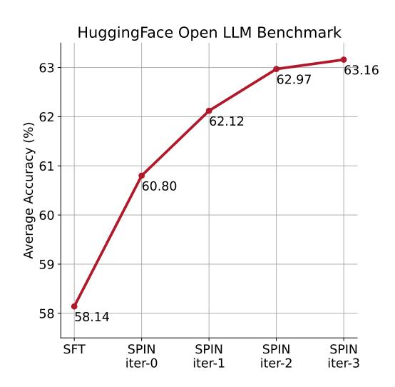
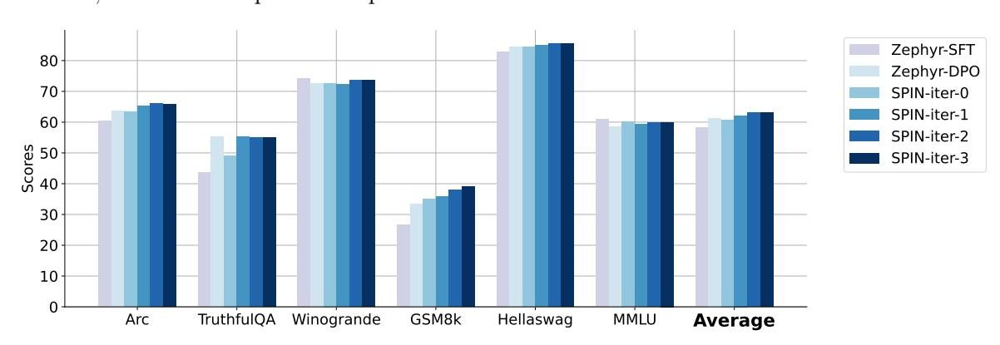
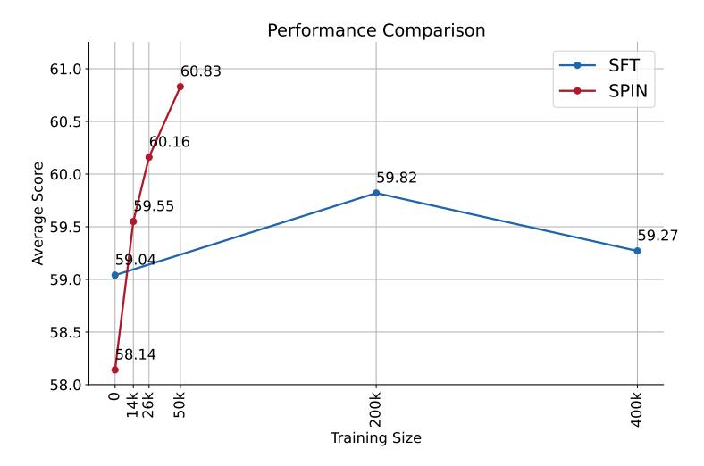
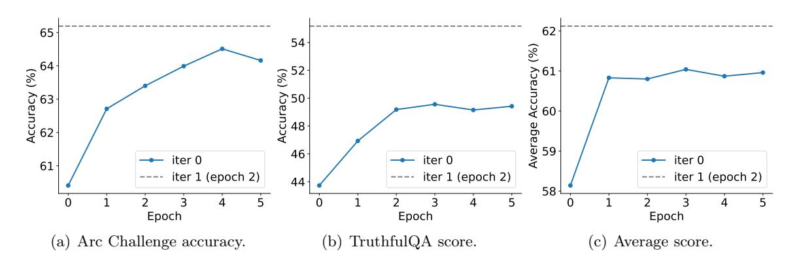
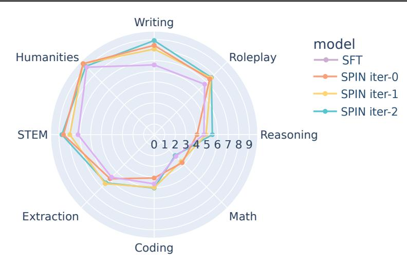

# <span id="page-0-0"></span>Self-Play Fine-Tuning Converts Weak Language Models to Strong Language Models

Zixiang Chen∗† Yihe Deng∗‡ Huizhuo Yuan∗§ Kaixuan Ji¶ Quanquan Gu‖

#### Abstract

Harnessing the power of human-annotated data through Supervised Fine-Tuning (SFT) is pivotal for advancing Large Language Models (LLMs). In this paper, we delve into the prospect of growing a strong LLM out of a weak one without the need for acquiring additional humanannotated data. We propose a new fine-tuning method called Self-Play fIne-tuNing (SPIN), which starts from a supervised fine-tuned model. At the heart of SPIN lies a self-play mechanism, where the LLM refines its capability by playing against instances of itself. More specifically, the LLM generates its own training data from its previous iterations, refining its policy by discerning these self-generated responses from those obtained from human-annotated data. Our method progressively elevates the LLM from a nascent model to a formidable one, unlocking the full potential of human-annotated demonstration data for SFT. Theoretically, we prove that the global optimum to the training objective function of our method is achieved only when the LLM policy aligns with the target data distribution. Empirically, we evaluate our method on several benchmark datasets including the HuggingFace Open LLM Leaderboard, MT-Bench, and datasets from Big-Bench. Our results show that SPIN can significantly improve the LLM's performance across a variety of benchmarks and even outperform models trained through direct preference optimization (DPO) supplemented with extra GPT-4 preference data. This sheds light on the promise of self-play, enabling the achievement of human-level performance in LLMs without the need for expert opponents. Codes are available at <https://github.com/uclaml/SPIN>.

## 1 Introduction

Large Language Models (LLMs) have began a groundbreaking era in artificial general intelligence (AGI), demonstrating extraordinary capabilities across a wide range of domains that require intricate reasoning and specialized knowledge. These models excel in areas such as mathematical reasoning/problem solving [\(Cobbe et al.,](#page-22-0) [2021;](#page-22-0) [Wei et al.,](#page-27-0) [2022;](#page-27-0) [Lewkowycz et al.,](#page-24-0) [2022\)](#page-24-0), code generation/programming [\(Chen et al.,](#page-21-0) [2021;](#page-21-0) [Austin et al.,](#page-21-1) [2021;](#page-21-1) [Li et al.,](#page-24-1) [2022\)](#page-24-1), text generation [\(Bubeck](#page-21-2)

<sup>∗</sup>[Equal contribution](#page-21-2)

<sup>†</sup>[Department of Computer Science, University of California, Los Angeles, CA 90095, USA; e-mail:](#page-21-2) [chenzx19@cs.ucla.edu](#page-21-2)

<sup>‡</sup>[Department of Computer Science, University of California, Los Angeles, CA 90095, USA; e-mail:](#page-21-2) [yihedeng@cs.ucla.edu](#page-21-2)

<sup>§</sup>[Department of Computer Science, University of California, Los Angeles, CA 90095, USA; e-mail:](#page-21-2) [hzyuan@cs.ucla.edu](#page-21-2)

<sup>¶</sup>[Department of Computer Science, University of California, Los Angeles, CA 90095, USA; e-mail:](#page-21-2) [kaixuanji@cs.ucla.edu](#page-21-2)

<sup>‖</sup>[Department of Computer Science, University of California, Los Angeles, CA 90095, USA; e-mail:](#page-21-2) qgu@cs.ucla.edu

[et al.,](#page-21-2) [2023;](#page-21-2) [Anil et al.,](#page-21-3) [2023;](#page-21-3) [Touvron et al.,](#page-26-0) [2023\)](#page-26-0), summarization and creative writing, among others. A significant advancement in LLMs is the post-pretraining alignment with the more desirable behaviors [\(Mishra et al.,](#page-24-2) [2021;](#page-24-2) [Victor et al.,](#page-26-1) [2022;](#page-26-1) [Chung et al.,](#page-22-1) [2022;](#page-22-1) [Thoppilan et al.,](#page-26-2) [2022\)](#page-26-2), a process often reliant on the costly human-annotated data. Typical alignment methods include Supervised Fine-Tuning (SFT) [\(Ouyang et al.,](#page-25-0) [2022;](#page-25-0) [Tunstall et al.,](#page-26-3) [2023a\)](#page-26-3) based on human demonstrations, and Reinforcement Learning from Human Feedback (RLHF) [\(Christiano et al.,](#page-22-2) [2017;](#page-22-2) [Ziegler et al.,](#page-27-1) [2019;](#page-27-1) [Stiennon et al.,](#page-26-4) [2020;](#page-26-4) [Bai et al.,](#page-21-4) [2022a\)](#page-21-4) based on human preferences.

All the aforementioned alignment methods require a substantial volume of human annotated data. Therefore, there is increasing interest in developing fine-tuning methods that can effectively utilize human data, thereby streamlining the alignment process. This motivates us to study fine-tuning LLMs without the need for additional human-annotated data beyond the fine-tuning dataset. Our study is also related to the broader goal of converting weak models to strong models without the requirement for extra training data, which is of central interest in machine learning that can be traced back to the boosting algorithms [\(Kearns and Valiant,](#page-23-0) [1994;](#page-23-0) [Schapire,](#page-25-1) [1990;](#page-25-1) [Freund,](#page-22-3) [1995;](#page-22-3) [Freund and Schapire,](#page-22-4) [1997\)](#page-22-4). The self-training algorithm [\(Vapnik,](#page-26-5) [1999;](#page-26-5) [Grandvalet and Bengio,](#page-23-1) [2004;](#page-23-1) [Lee,](#page-24-3) [2013\)](#page-24-3) has also been proved to be able to convert weak learners to strong learners in mixture models without the need for additional labeled data [\(Frei et al.,](#page-22-5) [2022;](#page-22-5) [Kou et al.,](#page-23-2) [2022\)](#page-23-2). However, the pursuit of autonomously enhancing a weak LLM without external guidance is both intriguing and understudied. This raises the following question:

Can we empower a weak LLM to improve itself without acquiring additional human annotated data?

In this paper, we answer this question affirmatively. Inspired by the success of self-play mechanisms [\(Samuel,](#page-25-2) [2000\)](#page-25-2) in games, exemplified by AlphaGo Zero [\(Silver et al.,](#page-25-3) [2017b\)](#page-25-3), AlphaZero [\(Silver](#page-25-4) [et al.,](#page-25-4) [2017a\)](#page-25-4), with historical roots traced back to TD-Gammon [\(Tesauro et al.,](#page-26-6) [1995\)](#page-26-6), we propose to convert a weak LLM to a strong one through the lens of self-play, where the model is enhanced by playing against itself without requiring any direct supervision. In particular, we propose a novel fine-tuning method called Self-Play fIne-tuNing (SPIN), which begins from a supervised fine-tuned model. SPIN allows the LLM to engage in self-play, eliminating the need for an expert annotator such as a human or more advanced LLMs like GPT-4. In detail, with the LLM from previous iteration t denoted by pθ<sup>t</sup> , we employ it to generate responses y ′ to the prompts x in the human-annotated SFT dataset. The subsequent objective is to find a new LLM pθt+1 , capable of distinguishing the responses y ′ generated by pθ<sup>t</sup> from the responses y generated by humans. This process can be seen as a two-player game: the main player, or the new LLM pθt+1 , seeks to discern between the responses of the opponent player pθ<sup>t</sup> and human-generated responses, while the opponent, or the old LLM pθ<sup>t</sup> , generates responses as similar as possible to those in the human-annotated SFT dataset. The new LLM pθt+1 is obtained by fine-tuning the old one pθ<sup>t</sup> to prefer responses from pdata over pθ<sup>t</sup> , resulting in a distribution pθt+1 that is more aligned with pdata. In the next iteration, the newly obtained LLM pθt+1 becomes the opponent for response generation, with the self-play process aiming for the LLM to eventually converge to pθ<sup>∗</sup> = pdata, so that the strongest possible LLM can no longer differentiate the responses generated by its previous version and those generated by the human.

Interestingly, our method exhibits similarity with the recently introduced direct preference optimization (DPO) method [\(Rafailov et al.,](#page-25-5) [2023\)](#page-25-5), with the notable distinction being the self-play nature of our method. Consequently, our approach stands out by eliminating the need for extra human preference data, a requirement present in the DPO method. Additionally, the self-play mechanism in our method resembles the idea of generative adversarial networks (GAN) [\(Goodfellow](#page-23-3)

[et al.,](#page-23-3) [2014;](#page-23-3) [Arjovsky et al.,](#page-21-5) [2017\)](#page-21-5), albeit that both the discriminator (main player) and the generator (the opponent) in our method are instances of the same LLM from different iterations. Theoretically, we prove that our method converges when the distribution of the LLM is identical to the target data distribution, i.e., pθ<sup>t</sup> = pdata. Our experimental results on zephyr-7b-sft-full [\(Tunstall et al.,](#page-26-3) [2023a\)](#page-26-3), a fine-tuned LLM based on Mistral-7B [\(Jiang et al.,](#page-23-4) [2023\)](#page-23-4), show that while continued training using SFT on its own SFT dataset Ultrachat200k [\(Ding et al.,](#page-22-6) [2023\)](#page-22-6) reaches a performance plateau or even diminished evaluation scores, our method consistently improves zephyr-7b-sft-full across successive iterations while leveraging only a 50k subset of Ultrachat200k dataset. Ultimately, SPIN effectively improves the base model's average score from 58.14 to 63.16 on the HuggingFace Open LLM Leaderboard [\(Beeching et al.,](#page-21-6) [2023\)](#page-21-6) with remarkable 10%+ improvement in scores on GSM8k and TruthfulQA, and from 5.94 to 6.78 on MT-Bench [\(Zheng et al.,](#page-27-2) [2023\)](#page-27-2). Notably, SPIN achieves results that are even comparable to models trained on additional 62k preference dataset [\(Tunstall](#page-26-3) [et al.,](#page-26-3) [2023a\)](#page-26-3) on Open LLM leaderboard and MT-Bench.

Concurrent to our work, [Singh et al.](#page-26-7) [\(2023\)](#page-26-7) proposed the use of synthetic data with binary feedback in self-training, reducing the reliance on human data. In contrast, our approach eliminates the need for additional binary feedback from humans or an extra reward model thanks to the self-play mechanism. Additionally, [Burns et al.](#page-21-7) [\(2023\)](#page-21-7) employed a weak LLM model as the guidance to train stronger LLMs in a fashion of weak-to-strong generation. Unlike [Burns et al.](#page-21-7) [\(2023\)](#page-21-7), which necessitates both a weak supervisor and a strong model, our SPIN operates effectively with a single LLM.

Notation. We use lowercase letters and lowercase boldface letters to denote scalars and vectors, respectively. We use [N] to denote the index set {1, . . . , N}. In the function space, let F be the function class. The symbol qdata designates the target data distribution, while p represents the conditional probability of LLM's response (i.e., LLM policy).

## 2 Related Work

Self-Play. Self-play [\(Samuel,](#page-25-6) [1959;](#page-25-6) [Tesauro et al.,](#page-26-6) [1995\)](#page-26-6), where the algorithm learns by playing against itself, has gained notable attention due to its effectiveness in multi-agent reinforcement learning (MARL). This method involves agents engaging in interactions with copies of themselves, enabling an increasing level of challenge and complexity within the learning environment. A fundamental work in the field of self-play is AlphaGo Zero [\(Silver et al.,](#page-25-3) [2017b\)](#page-25-3), which demonstrated exceptional performance against human players using a self-play learning scheme. Subsequent research has expanded upon the concept of self-play, exploring various adaptations and implementations [\(Anthony](#page-21-8) [et al.,](#page-21-8) [2017;](#page-21-8) [Lanctot et al.,](#page-24-4) [2017;](#page-24-4) [Bansal et al.,](#page-21-9) [2018;](#page-21-9) [Hernandez-Leal et al.,](#page-23-5) [2018;](#page-23-5) [Muller et al.,](#page-25-7) [2019;](#page-25-7) [Vinyals et al.,](#page-26-8) [2019\)](#page-26-8). Our method takes the self-play approach akin to AlphaGo Zero, which can convert a weak model to a strong one without additional human-annotated data. While the effectiveness of self-play in MARL is well-established, to our knowledge, our work is the first to apply this approach to the enhancement of LLMs.

Synthetic Data for LLMs. In the context of supervised fine-tuning (SFT) of LLMs, humancrafted data has proven to be a remarkably effective source that enhances the performance of LLMs on tasks such as code generation [\(Roziere et al.,](#page-25-8) [2023;](#page-25-8) [Yang et al.,](#page-27-3) [2023\)](#page-27-3) and mathematical reasoning [\(Yuan et al.,](#page-27-4) [2023;](#page-27-4) [Luo et al.,](#page-24-5) [2023\)](#page-24-5). While human data typically exhibits high quality, acquiring sufficient amount of such data poses a challenge in cost. In light of this consideration, the use of synthetic data has become increasingly popular and considered as a proxy for human data. This approach primarily leverages advanced LLMs such as the GPT series [\(Radford et al.,](#page-25-9) [2019;](#page-25-9) [Brown et al.,](#page-21-10) [2020;](#page-21-10) [OpenAI,](#page-25-10) [2023\)](#page-25-10) as the guidance to generate high-quality data [\(Josifoski et al.,](#page-23-6) [2023;](#page-23-6) [Taori et al.,](#page-26-9) [2023;](#page-26-9) [Chiang et al.,](#page-22-7) [2023;](#page-22-7) [Li et al.,](#page-24-6) [2023\)](#page-24-6). Recent research has also highlighted the rephrasing capability of LLMs in prompting for better LLM response [\(Deng et al.,](#page-22-8) [2023;](#page-22-8) [Prasad](#page-25-11) [et al.,](#page-25-11) [2023\)](#page-25-11) as well as augmenting synthetic data for more effective SFT [\(Yu et al.,](#page-27-5) [2023;](#page-27-5) [Liu et al.,](#page-24-7) [2023\)](#page-24-7). In contrast to prior studies that utilized more advanced models for synthetic data generation when pre-training or fine-tuning a target model, our approach directly generates synthetic data from the target model itself.

## 3 Problem Setting and Preliminaries

We consider a Large Language Model (LLM) parameterized by θ and denoted by pθ. The model takes as input a sequence x = [x1, . . . , xn], commonly referred to as the prompt, to generate the corresponding response y = [y1, . . . , ym]. The response y is therefore considered as a sample from the conditional probability distribution pθ(·|x). In LLMs, x<sup>i</sup> and y<sup>j</sup> represent individual tokens from a predetermined vocabulary within the sequences x and y, respectively. The autoregressive model p<sup>θ</sup> generates tokens sequentially for a given position, leveraging only the sequence of previously generated tokens. This model therefore constitutes a Markov process, where the conditional probability distribution pθ(y|x) can be expressed through a decomposition as follows:

$$p_{\theta}(\mathbf{y}|\mathbf{x}) = \prod_{j=1}^{m} p_{\theta}(y_j|\mathbf{x}, \mathbf{y}_{< j}),$$

where y<<sup>1</sup> is null and y<j = [y1, . . . , yj−1] for j = 2, . . . , m. In the following, we review two major fine-tuning methods for LLMs: supervised fine-tuning and reinforcement learning (RL) fine-tuning.

#### 3.1 Supervised Fine-Tuning

Supervised fine-tuning (SFT) is employed to tailor a pre-trained LLM to specific downstream tasks, leveraging relatively smaller dataset of labeled examples in comparison to the large-scale pre-training data [\(Ouyang et al.,](#page-25-0) [2022;](#page-25-0) [Yu et al.,](#page-27-5) [2023\)](#page-27-5). In this context, we consider a specific task where the prompts, denoted by x, are derived from a specified distribution q(·). The notation pdata(·|x) then represents the probability distribution of the associated high-quality responses y from the training data. Consequently, SFT involves training the LLM to minimize the following negative log-likelihood loss associated with these distributions,

<span id="page-3-0"></span>
$$L_{\text{SFT}}(\boldsymbol{\theta}) = -\mathbb{E}_{\mathbf{x} \sim q(\cdot), \mathbf{y} \sim p_{\text{data}}(\cdot|\mathbf{x})} \Big[ \log p_{\boldsymbol{\theta}}(\mathbf{y}|\mathbf{x}) \Big].$$
(3.1)

It should be noted that excluding x ∼ q(·) from the expectation term yields the typical crossentropy loss, expressed as <sup>−</sup>Ey∼pdata(·|x) [log pθ(y|x)]. LSFT(θ) attains its minimum when the model's predictive distribution pθ(y|x) aligns perfectly with the distribution of the labeled high-quality responses pdata(y|x).

Consequently, the LLM after SFT is anticipated to generate responses that closely resemble those from pdata(y|x). This procedure is therefore expected to significantly enhance the model's performance in generating appropriate responses for a specific task.

#### 3.2 RL Fine-Tuning

RL fine-tuning [\(Christiano et al.,](#page-22-2) [2017;](#page-22-2) [Bai et al.,](#page-21-4) [2022a;](#page-21-4) [Gao et al.,](#page-22-9) [2023a\)](#page-22-9) offers another method for enhancing the specific capabilities of general-purpose pre-trained models. Typically, RL fine-tuning is employed subsequent to SFT to achieve improved alignment for LLMs [\(Tunstall et al.,](#page-26-3) [2023a\)](#page-26-3).

For a given sequence pair (x, y), RL fine-tuning necessitates a deterministic reward function r(x, y). The higher the reward r(x, y), the better the response y is to the given prompt x. The objective of the RL fine-tuning process is then to maximize the following objective function:

$$L_{\mathrm{RL}}(\boldsymbol{\theta}) = \mathbb{E}_{\mathbf{x} \sim q(\cdot), \mathbf{y} \sim p_{\boldsymbol{\theta}}(\cdot|\mathbf{x})}[r(\mathbf{x}, \mathbf{y})] - \lambda \mathbb{E}_{\mathbf{x} \sim q(\cdot)} \mathrm{KL}(p_{\boldsymbol{\theta}}(\cdot|\mathbf{x})||p_{\mathrm{ref}}(\cdot|\mathbf{x})),$$

where the Kullback-Leibler (KL) regularization enforces the new model p<sup>θ</sup> to be close to the reference model pref, and λ > 0 is the regularization parameter to control the deviation of the new model p<sup>θ</sup> from the reference model pref. In practice, the reference model pref is often initialized as the supervised fine-tuned model. The inclusion of KL regularization is vital for preventing excessive deviation from the reference model, which in turn reduces the risk of mode collapse.

Meanwhile, the primary challenge in RL fine-tuning lies in finding a good reward function. Typically, this function requires training on a preference dataset. The compilation of such a dataset demands significant resources, often involving comprehensive evaluations either by human annotators, i.e., reinforcement learning from human feedback (RLHF) [\(Christiano et al.,](#page-22-2) [2017;](#page-22-2) [Bai et al.,](#page-21-4) [2022a\)](#page-21-4) or strong AI agents, i.e., reinforcement learning from AI feedback (RLAIF) [\(Bai et al.,](#page-21-11) [2022b\)](#page-21-11).

## <span id="page-4-0"></span>4 Method

In this section, we introduce a new fine-tuning method for enhancing the performance of LLMs without relying on additional human or AI feedback. Consider a high-quality supervised fine-tuning (SFT) dataset SSFT = {(x, y)} n <sup>i</sup>=1, which are sampled from the marginal distribution q(x) and pdata(y|x). Given a supervised fine-tuned LLM pθ<sup>0</sup> , further application of the SFT approach in [\(3.1\)](#page-3-0) with SSFT will be ineffective and potentially lead to worse performance. In addition, without human and/or AI feedback, it becomes infeasible to acquire a preference dataset for RL fine-tuning (e.g., RLHF and RLAIF). This hinders the application of RL fine-tuning techniques.

We evaluate pθ<sup>0</sup> against SSFT, where pθ<sup>0</sup> is the LLM achieved by SFT using [\(3.1\)](#page-3-0). We notice a persistent quality gap between the groundtruth response y from SSFT and the LLM-generated response y ′ ∼ pθ(·|x) (refer to Figure [1\)](#page-5-0). This disparity indicates that there is still room for improvement over pθ<sup>0</sup> . Therefore, we propose to use the synthetic data generated by the LLM to enhance LLM's performance starting from pθ<sup>0</sup> iteratively.

## <span id="page-4-1"></span>4.1 Self-Play Fine-Tuning (SPIN)

Let us consider a two-player game, where the main player's objective is to distinguish the responses generated by the LLM and those generated by the human. Meanwhile, the opponent's role is to generate responses that are indistinguishable from the human's responses. The core of our method is the self-play mechanism, where both the main player and the opponent are the same LLM, but from different iterations. More specifically, the opponent is the old LLM from the previous iteration, and the main player is the new LLM to be learned in the current iteration.

In iteration t + 1, the opponent is the LLM from the previous iteration, denoted by pθ<sup>t</sup> , which generates responses y ′ for those prompts x in the SFT dataset according to pθ<sup>t</sup> (·|x). Our method, therefore, consists of the following two steps at iteration t + 1: (1) training the main player, and (2) updating the opponent player.

Training the Main Player. We begin with illustrating how we expect a main player is trained to distinguish LLM responses from human responses. Motivated by integral probability metric (IPM) [\(Müller,](#page-25-12) [1997\)](#page-25-12), we formulate our objective function such that the main player ft+1 maximizes the

#### **Chosen: ground truth completion Rejected: model generation @Iter 0**

<span id="page-5-0"></span>

In Southampton, what is the most popular form of transportation for commuters?


In Southampton, what is the most popular form of transportation for commuters?


I don't have access to current data. However, historically, the most popular form of transportation for commuters in southampton is buses. The city also has a good network of trains and taxis.


<span id="page-5-1"></span>55% of commuters in Southampton use cars as their primary mode of transportation, while 23% use public transportation, 12% use bikes, and 10% walk.

#### **Model generation @Iter 1**


I do not have access to the latest updates and statistics of southampton. However, based on previous reports, the most popular form of transportation for commuters in southampton is the public transport network, which includes buses, trains, and ferries. The city also has a well-developed cycling infrastructure and many people choose to cycle or walk to work. Additionally, private cars and taxis are also commonly used for commuting.

Figure 1: Example of ground truth completion compared to the fine-tuned model generation at iteration 0 and 1. We can observe that the model generation at iteration 0, although fluent, incorrectly quantifies transportation preferences with specific percentages that are potentially hallucinations. The model generation at iteration 1 provides a qualitative summary of the transportation forms at Southampton without specific percentage, aligning more closely with the ground truth while adding more details.

expected value gap between the target data distribution pdata and the opponent player's distribution pθ<sup>t</sup> :

$$f_{t+1} = \underset{f \in \mathcal{F}_t}{\operatorname{argmax}} \, \mathbb{E}_{\mathbf{x} \sim q(\cdot), \mathbf{y} \sim p_{\text{data}}(\cdot | \mathbf{x}), \mathbf{y}' \sim p_{\boldsymbol{\theta}_t}(\cdot | \mathbf{x})} [f(\mathbf{x}, \mathbf{y}) - f(\mathbf{x}, \mathbf{y}')], \tag{4.1}$$

where F<sup>t</sup> is a sequence of highly expressive function classes that we will determine in later deduction. The subscript t in F<sup>t</sup> is due to that the function class is dependent on pθ<sup>t</sup> . Given such a ft+1 and a response sequence y to the prompt x, the value of ft+1(x, y) reflects the main player's degree of belief that y originates from pdata rather than pθ<sup>t</sup> . Ideally, the main player ft+1 should yield a high value when y ∼ pdata(·|x) and a low value when y ′ ∼ pθ<sup>t</sup> (·|x), where pθ<sup>t</sup> is the opponent's distribution. Instead of solving [\(4.1\)](#page-5-1), we can also solve the following more general optimization problem,

<span id="page-5-2"></span>
$$f_{t+1} = \underset{f \in \mathcal{F}_t}{\operatorname{argmin}} \mathbb{E}_{\mathbf{x} \sim q(\cdot), \mathbf{y} \sim p_{\text{data}}(\cdot|\mathbf{x}), y' \sim p_{\theta_t}(\cdot|\mathbf{x})} \left[ \ell \left( f(\mathbf{x}, \mathbf{y}) - f(\mathbf{x}, \mathbf{y}') \right) \right], \tag{4.2}$$

where ℓ(·) is a loss function that is both monotonically decreasing and convex. For example, a linear loss function ℓ(t) = −t reduces [\(4.2\)](#page-5-2) to the minimization version of [\(4.1\)](#page-5-1). However, the use of a linear loss function results in an unbounded objective value, which, during continuous training, leads to a negative infinite value of f(x, y ′ ) on the opponent player's responses. Therefore, in our work, we choose the logistic loss function ℓ(t) := log(1 + exp(−t)) for its non-negativity, smoothness, and exponentially decaying tail as t → ∞. Such a choice of loss function aids in preventing the excessive growth in the absolute value of f.

Updating the Opponent Player. Previously we have discussed the training of ft+1 given the opponent player's distribution pθ<sup>t</sup> . Now suppose we have optimized our main player ft+1 that can distinguish pdata from pθ<sup>t</sup> , within a certain function class F<sup>t</sup> , we elaborate how we get parameter θt+1 of the opponent player. Specifically, when presented with two responses  $\mathbf{y}$  and  $\mathbf{y}'$  to the same prompt  $\mathbf{x}$ ,  $f_{t+1}$  assesses the values  $f_{t+1}(\mathbf{x}, \mathbf{y})$  and  $f_{t+1}(\mathbf{x}, \mathbf{y}')$ . It then infers that the response with the higher value is from the real data distribution  $p_{\text{data}}$  and the response with lower value is attributed to the LLM  $p_{\theta_t}$ . Subsequently, the objective of the opponent player is to find a better LLM that generates responses indistinguishable from  $p_{\text{data}}$  for the main player. This is achieved by maximizing the expected value  $\mathbb{E}_{\mathbf{x} \sim q(\cdot), \mathbf{y} \sim p(\cdot|\mathbf{x})}[f_{t+1}(\mathbf{x}, \mathbf{y})]$ . In addition, to prevent excessive deviation of  $p_{\theta_{t+1}}$  from  $p_{\theta_t}$  and stabilize the self-play, we incorporate a Kullback-Leibler (KL) regularization term. Putting these together gives rise to the following optimization problem:

$$\underset{p}{\operatorname{argmax}} \mathbb{E}_{\mathbf{x} \sim q(\cdot), \mathbf{y} \sim p(\cdot | \mathbf{x})} [f_{t+1}(\mathbf{x}, \mathbf{y})] - \lambda \mathbb{E}_{\mathbf{x} \sim q(\cdot)} \operatorname{KL} (p(\cdot | \mathbf{x}) || p_{\boldsymbol{\theta}_t}(\cdot | \mathbf{x})), \tag{4.3}$$

where  $\lambda > 0$  is the regularization parameter. Notably, (4.3) has a closed-form solution  $\widehat{p}(\cdot|\mathbf{x})$ :

<span id="page-6-3"></span><span id="page-6-0"></span>
$$\widehat{p}(\mathbf{y}|\mathbf{x}) \propto p_{\boldsymbol{\theta}_t}(\mathbf{y}|\mathbf{x}) \exp\left(\lambda^{-1} f_{t+1}(\mathbf{x}, \mathbf{y})\right).$$
 (4.4)

It is worth noting that  $\widehat{p}(\cdot|\mathbf{x})$  is not guaranteed to be belong to the LLM space  $\{p_{\boldsymbol{\theta}}(\cdot|\mathbf{x})|\boldsymbol{\theta}\in\boldsymbol{\Theta}\}$ . Since we hope that the closed-form solution  $\widehat{p}$  in the probability space can be realized by an LLM with parameter  $\boldsymbol{\theta}$ , i.e.,  $p_{\boldsymbol{\theta}}(\mathbf{y}|\mathbf{x}) = \widehat{p}(\mathbf{y}|\mathbf{x})$ , solving for  $p_{\boldsymbol{\theta}}(\mathbf{y}|\mathbf{x}) \propto p_{\theta_t}(\mathbf{y}|\mathbf{x}) \exp\left(\lambda^{-1}f_{t+1}(\mathbf{x},\mathbf{y})\right)$  gives  $f_{t+1}(\mathbf{x},\mathbf{y}) = \lambda \cdot \log \frac{p_{\boldsymbol{\theta}}(\cdot|\mathbf{x})}{p_{\boldsymbol{\theta}_t}(\cdot|\mathbf{x})}$ . This suggests the following function class  $\mathcal{F}_t$  for  $f_{t+1}$ :

<span id="page-6-1"></span>
$$\mathcal{F}_{t} = \left\{ \lambda \cdot \log \frac{p_{\boldsymbol{\theta}}(\mathbf{y}|\mathbf{x})}{p_{\boldsymbol{\theta}_{t}}(\mathbf{y}|\mathbf{x})} \middle| \boldsymbol{\theta} \in \boldsymbol{\Theta} \right\}, \tag{4.5}$$

where  $\Theta$  is the parameter space of LLMs being considered. Given the choice of  $\mathcal{F}_t$  in (4.5), optimizing (4.2) gives  $f_{t+1}$  parameterized by  $\theta_{t+1}$  in the following form:

<span id="page-6-4"></span><span id="page-6-2"></span>
$$f_{t+1}(\mathbf{x}, \mathbf{y}) = \lambda \cdot \log \frac{p_{\boldsymbol{\theta}_{t+1}}(\mathbf{y}|\mathbf{x})}{p_{\boldsymbol{\theta}_{t}}(\mathbf{y}|\mathbf{x})}.$$
 (4.6)

Substituting (4.6) into (4.4) yields  $\widehat{p}(\mathbf{y}|\mathbf{x}) = p_{\theta_{t+1}}(\mathbf{y}|\mathbf{x})$ . In other words,  $\theta_{t+1}$  learned from (4.2) is exactly the LLM parameter for our ideal opponent selection.

End-to-end Training Objective. We integrate the previously discussed two steps into a single end-to-end training objective with an update rule of  $\theta_{t+1}$ . Specifically, plugging (4.5) into (4.2) arrives at the update rule  $\theta_{t+1} = \operatorname{argmin}_{\theta \in \Theta} L_{\text{SPIN}}(\theta, \theta_t)$ , where  $L_{\text{SPIN}}$  is the training objective defined as follows

$$L_{\text{SPIN}}(\boldsymbol{\theta}, \boldsymbol{\theta}_t) = \mathbb{E}_{\mathbf{x} \sim q(\cdot), \mathbf{y} \sim p_{\text{data}}(\cdot|\mathbf{x}), \mathbf{y}' \sim p_{\boldsymbol{\theta}_t}(\cdot|\mathbf{x})} \left[ \ell \left( \lambda \log \frac{p_{\boldsymbol{\theta}}(\mathbf{y}|\mathbf{x})}{p_{\boldsymbol{\theta}_t}(\mathbf{y}|\mathbf{x})} - \lambda \log \frac{p_{\boldsymbol{\theta}}(\mathbf{y}'|\mathbf{x})}{p_{\boldsymbol{\theta}_t}(\mathbf{y}'|\mathbf{x})} \right) \right]. \tag{4.7}$$

We summarize the iterative self-play process of our method SPIN as follows,

$$\dots \longrightarrow \underbrace{p_{\boldsymbol{\theta}_t}(\cdot|\mathbf{x})}_{\text{Opponent Player at }t} \longrightarrow \underbrace{\lambda \cdot \log \frac{p_{\boldsymbol{\theta}_{t+1}}(\cdot|\mathbf{x})}{p_{\boldsymbol{\theta}_t}(\cdot|\mathbf{x})}}_{\text{Main Player at }t+1} \longrightarrow \underbrace{p_{\boldsymbol{\theta}_{t+1}}(\cdot|\mathbf{x})}_{\text{Opponent Player at }t+1} \longrightarrow \dots$$

Namely, the opponent player chosen from the previous iteration t is employed to train the main player at iteration t+1, resulting in the LLM parameterized by  $\theta_{t+1}$ . Then we determine the next opponent player at iteration t+1 by directly copying the LLM parameter  $\theta_{t+1}$ , which is then used in training the main player at iteration t+2. The detailed algorithm is presented in Algorithm 1.

#### <span id="page-7-0"></span>Algorithm 1 Self-Play Fine-Tuning (SPIN)

```
Input: \{(\mathbf{x}_i, \mathbf{y}_i)\}_{i \in [N]}: SFT Dataset, p_{\boldsymbol{\theta}_0}: LLM with parameter \boldsymbol{\theta}_0, T: Number of iterations. for t = 0, \dots, T-1 do

for i = 1, \dots N do

Generate synthetic data \mathbf{y}_i' \sim p_{\boldsymbol{\theta}_t}(\cdot|\mathbf{x}_i).
\nend for

Update \boldsymbol{\theta}_{t+1} = \operatorname{argmin}_{\boldsymbol{\theta} \in \boldsymbol{\Theta}} \sum_{i \in [N]} \ell\left(\lambda \log \frac{p_{\boldsymbol{\theta}}(\mathbf{y}_i|\mathbf{x}_i)}{p_{\boldsymbol{\theta}_t}(\mathbf{y}_i|\mathbf{x}_i)} - \lambda \log \frac{p_{\boldsymbol{\theta}}(\mathbf{y}_i'|\mathbf{x}_i)}{p_{\boldsymbol{\theta}_t}(\mathbf{y}_i'|\mathbf{x}_i)}\right).
\nend for

Output: \boldsymbol{\theta}_T.
```

Remark 4.1. (4.7) bears resemblance to direct preference optimization (DPO) (Rafailov et al., 2023) for RL fine-tuning. However, SPIN exhibits significant distinctions with DPO. Specifically, SPIN is applied to supervised fine-tuning (SFT) and relies solely on the SFT dataset, represented by pairs  $(\mathbf{x}, \mathbf{y})$ . In sharp contrast, DPO is designed for RL fine-tuning and necessitates a preference dataset, represented by  $(\mathbf{x}, \mathbf{y}_w, \mathbf{y}_l)$ , where  $\mathbf{y}_w$  and  $\mathbf{y}_l$  denote the winner (chosen) and loser (rejected) responses, respectively. DPO demands that, at the instance level,  $\mathbf{y}_w$  is superior to  $\mathbf{y}_l$ . In comparison, our method requires that, at the distribution level, the target  $p_{\text{data}}$  should be distinguishable from the weak LLM  $p_{\theta}$  before it becomes a strong one. In terms of algorithm design, DPO implements a single-iteration approach, while our method facilitates an iterative self-play strategy, as outlined in Algorithm 1.

## <span id="page-7-3"></span>5 Theoretical Analysis

In this section, we provide a theoretical analysis for Algorithm 1 in Section 4. Under monotonicity and convexity assumption of the objective function  $\ell$ , we show that the global optimum is obtained if and only if parameter  $\theta_t$  generates data distribution. We summarize our assumptions as follows:

<span id="page-7-1"></span>**Assumption 5.1.** The loss function  $\ell(t) : \mathbb{R} \to \mathbb{R}$  is monotonically decreasing, i.e.,  $\forall t, \ell'(t) \leq 0$  and satisfies  $\ell'(0) < 0$ . In addition,  $\ell(t)$  is a convex function.

Assumption 5.1 holds for a wide range of loss functions commonly used in machine learning, including correlation loss  $\ell(t) = 1 - t$ , hinge loss  $\ell(t) = \max(0, 1 - t)$ , exponential loss  $\ell(t) = \exp(-t)$  and logistic loss  $\ell(t) = \log(1 + \exp(-t))$ . Under Assumptions 5.1, we present the following theorem, which is pivotal in understanding the optimization dynamics of our method.

<span id="page-7-2"></span>**Theorem 5.2.** Under Assumption 5.1, suppose there exists  $p_{\theta}(\cdot|\mathbf{x}) = p_{\text{data}}(\cdot|\mathbf{x})$ , then we have that

- (Sufficiency) If  $p_{\theta_t}(\cdot|\mathbf{x}) = p_{\text{data}}(\cdot|\mathbf{x})$ , then  $\theta_t$  is the global minimum of (4.7) for any  $\lambda \geq 0$ .
- (Necessity) If  $p_{\theta_t}(\cdot|\mathbf{x}) \neq p_{\text{data}}(\cdot|\mathbf{x})$ , there exists an appropriately chosen  $\lambda$ , such that  $\theta_t$  is not the global minimum of (4.7).

Remark 5.3. Theorem 5.2 suggests that under certain conditions, the optimization process of our method naturally stops at the point  $p_{\theta}(\cdot|\mathbf{x}) = p_{\text{data}}(\cdot|\mathbf{x})$ , implying the effectiveness of our approach in aligning the LLM's distribution with the target data distribution. Moreover, Theorem 5.2 also indicates that the optimization process only stops when the global optimality is achieved, i.e., the LLM's distribution aligns with the target data distribution.

For the logistic loss function ℓ(t) = log(1 + exp(−t)), the following theorem gives a more precise characterization of the opponent player, enabling a better understanding of SPIN.

<span id="page-8-0"></span>Theorem 5.4. Consider the choice of logistic loss ℓ(t) = log(1 + exp(−t)) in SPIN. Suppose that pθ<sup>t</sup> (y|x) pdata(y|x)/pθ<sup>t</sup> (y|x) 1/λ lies in the LLM space {pθ(y|x)|<sup>θ</sup> <sup>∈</sup> <sup>Θ</sup>} and <sup>θ</sup>t+1 is global minimum of LSPIN(θ, θt), then the opponent player at iteration t + 1 satisfies

$$p_{\boldsymbol{\theta}_{t+1}}(\mathbf{y}|\mathbf{x}) \propto p_{\boldsymbol{\theta}_t}(\mathbf{y}|\mathbf{x}) (p_{\text{data}}(\mathbf{y}|\mathbf{x})/p_{\boldsymbol{\theta}_t}(\mathbf{y}|\mathbf{x}))^{1/\lambda}.$$

Remark 5.5. According to Theorem [5.4,](#page-8-0) the model update from pθ<sup>t</sup> (y|x) to pθt+1 (y|x) tends to increase the probability pθt+1 (y|x) when pθ<sup>t</sup> (y|x) is less than pdata(y|x), and decrease it when pθ<sup>t</sup> (y|x) is greater than pdata(y|x). Thus, Theorem [5.4](#page-8-0) further confirms that our method's optimization process naturally converges to the point where pθ(·|x) equals pdata(·|x). The update of the opponent player is controlled by pdata(y|x)/pθ<sup>t</sup> (y|x) 1/λ, which is regulated by the factor 1/λ. A smaller λ results in a larger change of the opponent player, while a larger λ leads to a smaller change. Therefore, as pθ(·|x) approaches pdata(·|x), increasing λ enhances the stability of LLM training. This observation aligns with [\(4.3\)](#page-6-0), where λ is the regularization parameter of the KL regularization that is employed to control the deviation of the opponent player.

## 6 Experiments

This section provides a detailed empirical analysis of SPIN. Our findings highlight several key points: (1) SPIN markedly enhances model performance across a wide range of evaluation benchmarks by breaking the limit of SFT; (2) even without introducing new human annotated data, SPIN at iteration 0 achieves performance on par to DPO training that utilizes even more data; (3) iterative training is a necessary component in SPIN as it breaks the limit of multi-epoch training.

#### 6.1 Experiment Setup

Model and Datasets. In this study, we adopt zephyr-7b-sft-full as our base model. This model derives from the pre-trained Mistral-7B [\(Jiang et al.,](#page-23-4) [2023\)](#page-23-4) and has been further fine-tuned on the SFT dataset Ultrachat200k[1](#page-0-0) by HuggingFace. Ultrachat200k represents a high-quality 200k subset of the larger UltraChat [\(Ding et al.,](#page-22-6) [2023\)](#page-22-6) corpus, which comprises approximately 1.4M dialogues produced using OpenAI's Turbo APIs. From UltraChat200k, We randomly sample 50k prompts and use the base model to generate the synthetic responses. We subsequently follow the optimization method described in Section [4.1](#page-4-1) for further training. In multiple iterations, we leverage the synthetic data from the most recent iteration and add to the newly generated synthetic data, therefore resulting in a synthetic dataset size of 50k at iteration 0 and 100k at iteration 1, 2 and 3. At each iteration, we train our model for 2 epochs.

Evaluation. We employed the widely used Huggingface Open LLM Leaderboard [\(Beeching](#page-21-6) [et al.,](#page-21-6) [2023\)](#page-21-6) as our evaluation benchmark, using the same Language Model Evaluation Harness library [\(Gao et al.,](#page-23-7) [2023b\)](#page-23-7). This leaderboard encompasses 6 different datasets, each focusing on a a specific capability of LLMs. Collectively, these datasets provide a thorough assessment framework, evaluating LLMs on commonsense reasoning (Arc [\(Clark et al.,](#page-22-10) [2018\)](#page-22-10), HellaSwag [\(Zellers et al.,](#page-27-6) [2019\)](#page-27-6), Winogrande [\(Sakaguchi et al.,](#page-25-13) [2021\)](#page-25-13)), multi-task language understanding (MMLU[\(Hendrycks](#page-23-8) [et al.,](#page-23-8) [2020\)](#page-23-8)), human falsehood mimic (TruthfulQA [\(Lin et al.,](#page-24-8) [2021\)](#page-24-8)) and math problem solving

<sup>1</sup> [https://huggingface.co/datasets/HuggingFaceH4/ultrachat\\_200k](https://huggingface.co/datasets/HuggingFaceH4/ultrachat_200k)

(GSM8k (Cobbe et al., 2021)). In evaluation, the language models are prompted with few-shot in-context examples and the question. We follow the standard approach and report the average score across all datasets. In Table 1, we detail the evaluation setting adopted by both the leaderboard and our experiments. We leave further implementation details to Appendix B.

<span id="page-9-0"></span>Table 1: Detailed information of HuggingFace Open LLM Leaderboard. For each evaluation dataset, we present the number of few-shot examples and metric adopted for evaluation.

| Datasets   | Arc      | TruthfulQA | Winogrande | GSM8k | HellaSwag | MMLU |
|------------|----------|------------|------------|-------|-----------|------|
| # few-shot | 25       | 0          | 5          | 5     | 10        | 5    |
| Metric     | acc_norm | mc2        | acc        | acc   | acc_norm  | acc  |

#### 6.2 SPIN Effectively Improves Benchmark Performance



Figure 2: The average score of SPIN at different iterations on the HuggingFace Open LLM leaderboard datasets. For "SFT", we report the performance of our base model zephyr-7b-sft-full, which has been fine-tuned on the same dataset we use to generate synthetic data.

We demonstrate the effectiveness of SPIN using HuggingFace Open LLM Leaderboard as a wide range of evaluation. In Table 2, we compare the performance of our fine-tuned model by SPIN after iterations 0 to 3 with the base model zephyr-7b-sft-full. We can observe that SPIN exhibits remarkable effectiveness in improving the model's performance by further leveraging the SFT dataset, on which the base model has already been fully fine-tuned. At iteration 0, where model responses are generated from zephyr-7b-sft-full, we observe an overall improvement of 2.66% on the average score. The improvement is particularly significant on the TruthfulQA and GSM8k benchmarks, with improvement exceeding 5% and 10% respectively. At iteration 1, we employ the LLM model from iteration 0 to generate new responses for SPIN, adhering to the procedure outlined in Algorithm 1. This iteration yields further enhancements of 1.32% on average, and especially significant on the Arc Challenge and TruthfulQA benchmarks. Subsequent iterations continue this trend of incremental improvement across various tasks. Meanwhile, the improvement at iteration t+1 is naturally smaller than that at iteration t. As the iterative training progresses, the degree of improvement gradually

approaches zero, suggesting that the model has reached a limiting point in the last iteration.

<span id="page-10-0"></span>Table 2: Test performance of SPIN based on zephyr-7b-sft-full across HuggingFace Open LLM Leaderboard datasets. We also denote the average improvement over last iteration in the Average column.

| Model              | Arc   | TruthfulQA | Winogrande | GSM8k | HellaSwag | MMLU  | Average           |
|--------------------|-------|------------|------------|-------|-----------|-------|-------------------|
| zephyr-7b-sft-full | 60.41 | 43.73      | 74.19      | 26.76 | 82.85     | 60.92 | 58.14             |
| SPIN iteration 0   | 63.40 | 49.18      | 72.69      | 35.10 | 84.38     | 60.03 | $60.80_{(+2.66)}$ |
| SPIN iteration 1   | 65.19 | 55.17      | 72.30      | 35.78 | 84.96     | 59.34 | $62.12_{(+1.32)}$ |
| SPIN iteration 2   | 65.96 | 54.91      | 73.56      | 38.06 | 85.41     | 59.93 | $62.97_{(+0.85)}$ |
| SPIN iteration 3   | 65.87 | 54.90      | 73.72      | 38.97 | 85.54     | 59.99 | $63.16_{(+0.19)}$ |

Comparison with DPO. zephyr-7b-beta is a model derived from zephyr-7b-sft-full, trained with DPO on approximately 62k preference data. This data, the UltraFeedback Binarized dataset(Cui et al., 2023)<sup>2</sup>, comprises both chosen and rejected completions evaluated by GPT-4. We note that, DPO requires either human input or advanced language model feedback to determine the preference, making data generation a rather expensive procedure. In contrast, our SPIN only requires the initial model itself. Moreover, unlike DPO which requires new data source, our method exclusively leverages the existing SFT dataset. In Figure 3, we show the performance comparison of SPIN at iterations 0 and 1 (employing 50k SFT data) with DPO training, from the same SFT checkpoint. We can observe that, while DPO leverages more data from new sources, SPIN based on the existing SFT data can already achieve comparable average performance to DPO training at iteration 0. From iteration 1, SPIN even surpasses the performance of DPO on the leaderboard benchmark.

<span id="page-10-1"></span>

Figure 3: Performance comparison with DPO training across the six benchmark datasets. Self-play at iteration 0 achieves comparable performance to DPO training with 62k new data. At iteration 1, self-play has already surpassed DPO training on the majority of datasets.

#### 6.3 Ablation Studies

In this subsection, we examine the effect of synthetic dataset size and training epochs within an iteration. Our analysis demonstrates the effectiveness of the synthetic data used by SPIN compared to the SFT data, as well as the necessity of iterative training in SPIN. Furthermore, to comprehensively

<sup>&</sup>lt;sup>2</sup>https://huggingface.co/datasets/HuggingFaceH4/ultrafeedback\_binarized

<span id="page-11-0"></span>assess the performance improvements of SPIN, we perform additional evaluations on benchmark tasks distinct from those in the Open LLM leaderboard.



Figure 4: The scaling effect of training size of SPIN compared to SFT on the average score of Open LLM Leaderboard. For SPIN, we consider training data of sizes 14k, 26k and 50k where the larger dataset contains the smaller dataset. The starting point for SPIN (with x-axis 0) is the zephyr-7b-sft-full checkpoint, which has been fine-tuned on Ultrachat200k for 1 epoch. We report the model performance trained for 1 epoch with SPIN on the varying sizes of dataset. We additionally compare with SFT, where we fine-tune Mistral-7B on Ultrachat200k for 3 consecutive epochs and report the model performance at the first epoch as the starting point (with x-axis 0).

Training Size. We investigate the effect of varying training data size on the performance of SPIN. In Figure 4, we demonstrate the effect of training size for SPIN during iteration 0 and additionally compare with SFT with the full original dataset. Specifically, for the SFT baseline, we fully fine-tune Mistral-7B on Ultrachat200k for three epochs and report first epoch performance as the starting point (with x-axis 0) in the figure for SFT. For SPIN, we report the zephyr-7b-sft-full checkpoint as the starting point, which has also been fine-tuned on Ultrachat200k for one epoch. We select the training size of SPIN at iteration 0 to be 14k, 26k, and 50k and generate the data accordingly, ensuring that the larger dataset encompasses the smaller dataset. The performance of SPIN was then evaluated after 1 epoch of self-play fine-tuning for each training size. We can observe that, while SPIN results in notable improvement with increasing training sizes, SFT on further epochs 2 and 3 fails to yield more than 1% improvement. Lastly, in Table 3, we also show the performance of SFT from zephyr-7b-sft-full on Ultrachat200k for one epoch. While self-play fine-tuning with synthetic data from zephyr-7b-sft-full effectively improves its performance, simply fine-tuning it again on the SFT data leads to degraded performance, as similarly observed in Figure 4.

Iterative Training v.s. Training for More Epochs. We further study the training within iteration 0 and compare with the performance achieved in iteration 1, particularly contrasting the test performance obtained from extended training duration with that from next iteration. Figure 5 depicts the performance trajectory of the model trained using SPIN over multiple epochs at iteration 0. It is evident that the most substantial improvement occurs during the first two epochs, followed by only modest gains in subsequent epochs. Notably, SPIN exhibits robustness and stability; extending

<span id="page-12-0"></span>Table 3: Test performance of zephyr-7b-sft-full fine-tuned on Ultrachat200k for 1 more epoch across HuggingFace Open LLM benchmark datasets. SFT fails to further leverage the fine-tuning data for performance enhancement and even results in degraded performance.

| Model              | Arc   | TruthfulQA | Winogrande | GSM8k | HellaSwag | MMLU  | Average |
|--------------------|-------|------------|------------|-------|-----------|-------|---------|
| zephyr-7b-sft-full | 60.41 | 43.73      | 74.19      | 26.76 | 82.85     | 60.92 | 58.14   |
| SFT epoch 1        | 57.76 | 44.39      | 75.77      | 25.85 | 81.69     | 57.89 | 57.23   |

the training duration does not diminish performance but rather maintains a rather consistent level. Nevertheless, the observation suggests an inherent limitation to the performance achievable within a single iteration, thereby underscoring the necessity for iterative training. As shown by the test performance achieved at iteration 1 in the figures, extending the training in iteration 0 fails to reach the performance comparable to iteration 1.

<span id="page-12-1"></span>

Figure 5: The SPIN training dynamics of zephyr-7b-sft-full on the 50k synthetic data with regard to the number of training epochs during iteration 0. We can observe that iterative training is pivotal as training for more epochs during iteration 0 reaches a limit and cannot surpass iteration 1.

Further Investigation on More Tasks. Here, we further investigate the performance of SPIN on a broader variety of tasks, including MT-Bench (Zheng et al., 2023), Big-Bench (bench authors, 2023) and OpenBookQA (Mihaylov et al., 2018) in addition to the Open LLM Leaderboard tasks. Specifically, we use the following tasks from Big-Bench-Hard for a more comprehensive evaluation, including Causal Judgment (causal reasoning), Sports Understanding (commonsense reasoning) and Formal Fallacies (logical reasoning). In Table 4, we show the resulting scores of SPIN on MT-Bench as well as those tasks from Big-Bench. In Figure 6, we detail the model performances on MT-Bench with regard to different types of questions. We can see a notably robust improvement in the performance of SPIN on various tasks besides the HuggingFace Benchmark, without major degradation. Notably, on MT-Bench, the model fine-tuned by SPIN has surpassed the performance of vicuna-13b-v1.5 (Chiang et al., 2023) with a score of 6.57.

#### 7 Conclusion and Discussion

This paper introduces a novel fine-tuning method SPIN, to convert a weak LLM to a strong LLM by unleashing the full power of human-annotated data. Central to this method is a self-play mechanism,

<span id="page-13-0"></span>Table 4: Test performance on other reasoning benchmark datasets for SPIN at different iterations and zephyr-7b-sft-full. We report the average score for MT-Bench and the accuracy score for Big Bench datasets under standard few-shot CoT evaluation. On OpenBookQA, we report acc\_norm with 1-shot example as used in [Anil et al.](#page-21-3) [\(2023\)](#page-21-3). As similar to Open LLM Leaderboard evaluation, we observe a steady improvement in performance on the other benchmark tasks, with no significant degradation.

| Model               | MT-Bench    | BB-causal | BB-formal | BB-sports | OpenBookQA |
|---------------------|-------------|-----------|-----------|-----------|------------|
| zephyr-7b-sft-full  | 5.94        | 56.15     | 49.6      | 96.0      | 45.4       |
| SPIN iteration<br>0 | 6.46(+0.52) | 57.75     | 51.6      | 95.2      | 46.8       |
| SPIN iteration<br>1 | 6.65(+0.19) | 58.82     | 51.2      | 95.2      | 47.2       |
| SPIN iteration<br>2 | 6.78(+0.13) | 59.36     | 51.2      | 94.4      | 47.6       |

<span id="page-13-1"></span>

Loading [MathJax]/extensions/MathMenu.js Figure 6: Model performance on MT-Bench. We compare SPIN across different iterations with the base SFT model. Starting from iteration 1, our fine-tuned model by SPIN robustly outperforms the SFT checkpoint on all evaluation aspects.

wherein a main player (the LLM) is fine-tuned to differentiate the responses of opponent player (the LLM from previous iteration) from the target data distribution, and the LLM is iteratively aligned with the target data distribution. Therefore, SPIN facilitates the LLM's iterative self-evaluation and enhancement through self-play. In comparison to supervised fine-tuning and RL fine-tuning methods, SPIN enables the LLM to self-improve without additional human data or feedback from stronger LLMs. Empirical results demonstrate that SPIN significantly enhances LLM performance across diverse benchmarks, even outperforming models trained with additional human data or AI feedback.

Limitation and Future Work. Our theoretical results demonstrate that the optimization process of SPIN converges if and only if the LLM's distribution aligns with pdata. Therefore, our study focuses on a fixed target data distribution generated by humans, which inherently imposes a ceiling on the performance of fine-tuned LLM. Exploring the dynamically changing target data distribution is an important direction to overcome this limitation and elevate the LLM's performance beyond this ceiling or even to a super-human level. Moreover, considering the resource demands of synthetic data generation, another promising avenue for further exploration is to reduce the volume of required

synthetic data.

## A Further Related Work

Curriculum Learning. In deep learning, it has been observed that training models using data samples arranged in a strategically meaningful order can lead to improved performance compared to training on randomly shuffled data. This approach is commonly known as curriculum learning [\(Bengio](#page-21-13) [et al.,](#page-21-13) [2009;](#page-21-13) [Soviany et al.,](#page-26-10) [2022\)](#page-26-10). Initial studies in curriculum learning introduced efficient algorithms that adhere to an 'easy-to-hard' progression [\(Spitkovsky et al.,](#page-26-11) [2009;](#page-26-11) [Kumar et al.,](#page-23-9) [2010;](#page-23-9) [Lee and](#page-24-10) [Grauman,](#page-24-10) [2011;](#page-24-10) [Zhang et al.,](#page-27-7) [2015\)](#page-27-7). In the field of Natural Language Processing (NLP), criteria such as sentence length and term frequency are commonly utilized [\(Cirik et al.,](#page-22-12) [2016;](#page-22-12) [Zhang et al.,](#page-27-8) [2018;](#page-27-8) [Liu et al.,](#page-24-11) [2018\)](#page-24-11). More recent developments include the application of curriculum learning algorithms in multi-modal learning [\(Liu et al.,](#page-24-12) [2021;](#page-24-12) [Wu et al.,](#page-27-9) [2022\)](#page-27-9). Our work shares a similar idea to curriculum learning, wherein the training data evolves iteratively—beginning with responses that are easy to distinguish from human-annotated data and gradually progressing to more challenging instances.

Generative Adversarial Learning. Generative Adversarial Networks (GANs) [\(Goodfellow et al.,](#page-23-3) [2014\)](#page-23-3) represent a distinct class of generative models, characterized by their unique adversarial process. To enhance training stability and data quality, [Mao et al.](#page-24-13) [\(2017\)](#page-24-13) introduced the Least Squares GAN, employing a least squares loss function for the discriminator. A significant advancement in GANs involves the use of Integral Probability Metrics (IPM) [\(Müller,](#page-25-12) [1997\)](#page-25-12), particularly highlighted in the development of Wasserstein GAN by [Arjovsky et al.](#page-21-5) [\(2017\)](#page-21-5). This model employs IPM in its loss design, enhancing training stability. Since then, IPMs have become popular in the design of GANs [\(Mroueh and Sercu,](#page-25-14) [2017;](#page-25-14) [Gulrajani et al.,](#page-23-10) [2017\)](#page-23-10), particularly in constraining the discriminator to a specific function class, thereby preventing it from overpowering the generator. Furthermore, [Jolicoeur-Martineau](#page-23-11) [\(2018\)](#page-23-11) generalized IPM-based GANs by introducing relativistic discriminator and proposed Relativistic GAN. It is worth noting that the objective function defined in our [\(4.2\)](#page-5-2) is similar to Relativistic GAN [\(Jolicoeur-Martineau,](#page-23-11) [2018\)](#page-23-11) and reduces to an IPM framework in Wasserstein GAN [\(Arjovsky et al.,](#page-21-5) [2017\)](#page-21-5) with a linear loss. However, our approach differs in both the choice of the function class and the training procedure. Inspired by GAN, [Cheng et al.](#page-22-13) [\(2023\)](#page-22-13) proposed an adversarial learning framework named Adversarial Preference Optimization (APO) that trains the LLM and a reward model in an adversarial game. Our method is also related to Generative Adversarial Imitation Learning (GAIL) [\(Ho and Ermon,](#page-23-12) [2016\)](#page-23-12), which trains separate discriminator and policy networks in each iteration for imitation learning. In contrast to the above methods, SPIN relies on self-play where both the main player and the opponent player are the same LLM from two consecutive iterations.

## <span id="page-14-0"></span>B Experiment Details

## B.1 Hyperparameters and Implementation Details

We use the Alignment Handbook library [\(Tunstall et al.,](#page-26-12) [2023b\)](#page-26-12) as the codebase for our selfplay fine-tuning method SPIN, which includes DeepSpeed ZeRO-3 [\(Rajbhandari et al.,](#page-25-15) [2020\)](#page-25-15) and FlashAttention-2 [\(Dao,](#page-22-14) [2023\)](#page-22-14) to reduce training cost. We train our models with RMSProp [\(Hinton](#page-23-13) [et al.,](#page-23-13) [2012\)](#page-23-13) optimizer with no weight decay for all iterations as commonly used in fine-tuning LLMs for alignment, with a global batch size of 64, 10% warmup steps and bfloat16 precision. We set the peak learning rate to be 5e-7 for iterations 0 and 1, and decay this peak learning rate to 1e-7 for

iteration 2 and 3 as we are approaching the end of self-play fine-tuning. Lastly, we choose  $\beta=0.1$  and max sequence length to be 2048 tokens as in Tunstall et al. (2023b). We note that at the last iteration (iter-3) where the model is close to convergence, we increase the value of  $\beta$  to 5.0. We use the Accelerate library (Gugger et al., 2022) to generate our synthetic data using distributed inference with multiple GPUs with a global batch size of 64. We consider the prompting template "### Instruction: {prompt}\n\n### Response: " as commonly used in Taori et al. (2023). For Ultrachat200k containing multi-round conversations, we only sample the first round as our prompt and ground truth completion pairs.

#### **B.2** Generation Examples

In Tables 5 and 6, we further provide the generation examples of our fine-tuned model by SPIN from different iterations. We can observe an improvement in response quality as compared to the generation of the SFT checkpoint. Meanwhile, the model generations at higher iterations typically becomes more concise than iteration 0 and resemble the ground truth completion better.

## C Proof of Theorems in Section 5

## C.1 Proof of Theorem 5.2

Proof of Theorem 5.2. To begin with, we prove the "Sufficiency" in Theorem 5.2. Since  $p_{\text{data}}(\cdot|\mathbf{x}) = p_{\theta_t}(\cdot|\mathbf{x})$ , by symmetry property of  $\mathbf{y}$  and  $\mathbf{y}'$ , we have for any  $\boldsymbol{\theta} \in \boldsymbol{\Theta}$  that

$$2L_{\text{SPIN}}(\boldsymbol{\theta}, \boldsymbol{\theta}_{t}) = \mathbb{E}_{\mathbf{x} \sim q(\cdot), \mathbf{y} \sim p_{\text{data}}(\cdot|\mathbf{x}), \mathbf{y}' \sim p_{\boldsymbol{\theta}_{t}}(\cdot|\mathbf{x})} \left[ \ell \left( \gamma \log \frac{p_{\boldsymbol{\theta}}(\mathbf{y}|\mathbf{x})}{p_{\boldsymbol{\theta}_{t}}(\mathbf{y}|\mathbf{x})} - \gamma \log \frac{p_{\boldsymbol{\theta}}(\mathbf{y}'|\mathbf{x})}{p_{\boldsymbol{\theta}_{t}}(\mathbf{y}'|\mathbf{x})} \right) \right]$$

$$+ \mathbb{E}_{\mathbf{x} \sim q(\cdot), \mathbf{y}' \sim p_{\text{data}}(\cdot|\mathbf{x}), \mathbf{y} \sim p_{\boldsymbol{\theta}_{t}}(\cdot|\mathbf{x})} \left[ \ell \left( \gamma \log \frac{p_{\boldsymbol{\theta}}(\mathbf{y}|\mathbf{x})}{p_{\boldsymbol{\theta}_{t}}(\mathbf{y}|\mathbf{x})} - \gamma \log \frac{p_{\boldsymbol{\theta}}(\mathbf{y}'|\mathbf{x})}{p_{\boldsymbol{\theta}_{t}}(\mathbf{y}'|\mathbf{x})} \right) \right]$$

$$= \mathbb{E}_{\mathbf{x} \sim q(\cdot), \mathbf{y} \sim p_{\text{data}}(\cdot|\mathbf{x}), \mathbf{y}' \sim p_{\boldsymbol{\theta}_{t}}(\cdot|\mathbf{x})} \left[ \ell \left( \gamma \log \frac{p_{\boldsymbol{\theta}}(\mathbf{y}|\mathbf{x})}{p_{\boldsymbol{\theta}_{t}}(\mathbf{y}|\mathbf{x})} - \gamma \log \frac{p_{\boldsymbol{\theta}}(\mathbf{y}'|\mathbf{x})}{p_{\boldsymbol{\theta}_{t}}(\mathbf{y}'|\mathbf{x})} \right) \right]$$

$$+ \ell \left( \gamma \log \frac{p_{\boldsymbol{\theta}}(\mathbf{y}'|\mathbf{x})}{p_{\boldsymbol{\theta}_{t}}(\mathbf{y}'|\mathbf{x})} - \gamma \log \frac{p_{\boldsymbol{\theta}}(\mathbf{y}|\mathbf{x})}{p_{\boldsymbol{\theta}_{t}}(\mathbf{y}|\mathbf{x})} \right) \right]$$

$$\geq 2\mathbb{E}_{\mathbf{x} \sim q(\cdot), \mathbf{y} \sim p_{\text{data}}(\cdot|\mathbf{x}), \mathbf{y}' \sim p_{\boldsymbol{\theta}_{t}}(\cdot|\mathbf{x})} \left[ \ell \left( \frac{\gamma}{2} \log \frac{p_{\boldsymbol{\theta}}(\mathbf{y}|\mathbf{x})}{p_{\boldsymbol{\theta}_{t}}(\mathbf{y}|\mathbf{x})} - \frac{\gamma}{2} \log \frac{p_{\boldsymbol{\theta}}(\mathbf{y}'|\mathbf{x})}{p_{\boldsymbol{\theta}_{t}}(\mathbf{y}'|\mathbf{x})} \right) + \frac{\gamma}{2} \log \frac{p_{\boldsymbol{\theta}}(\mathbf{y}'|\mathbf{x})}{p_{\boldsymbol{\theta}_{t}}(\mathbf{y}'|\mathbf{x})} - \frac{\gamma}{2} \log \frac{p_{\boldsymbol{\theta}}(\mathbf{y}|\mathbf{x})}{p_{\boldsymbol{\theta}_{t}}(\mathbf{y}|\mathbf{x})} \right) \right]$$

$$= 2\ell(0),$$

where the inequality is due to Jensen's inequality (recalling that  $\ell$  is convex in Assumption 5.1). Therefore, we have that  $L_{\text{SPIN}}(\boldsymbol{\theta}, \boldsymbol{\theta}_t) \geq \ell(0) = L_{\text{SPIN}}(\boldsymbol{\theta}_t, \boldsymbol{\theta}_t)$ , which means that  $\boldsymbol{\theta}_t$  is the global optimum of (4.7). As a consequence, the gradient at the point  $\boldsymbol{\theta}_t$  is zero, which concludes  $\boldsymbol{\theta}_{t+1} = \boldsymbol{\theta}_t$ . Next, we prove the "Necessity". Define  $g(\lambda)$  as follows:

$$g(\lambda) = \mathbb{E}_{\mathbf{x} \sim q(\cdot), \mathbf{y} \sim p_{\text{data}}(\cdot|\mathbf{x}), \mathbf{y}' \sim p_{\boldsymbol{\theta}_t}(\cdot|\mathbf{x})} \left[ \ell \left( \lambda \log \frac{p_{\text{data}}(\mathbf{y}|\mathbf{x})}{p_{\boldsymbol{\theta}_t}(\mathbf{y}|\mathbf{x})} - \lambda \log \frac{p_{\text{data}}(\mathbf{y}'|\mathbf{x})}{p_{\boldsymbol{\theta}_t}(\mathbf{y}'|\mathbf{x})} \right) \right].$$

Then we have  $g(0) = \ell(0)$  and

$$g'(0) = \mathbb{E}_{\mathbf{x} \sim q(\cdot), \mathbf{y} \sim p_{\text{data}}(\cdot|\mathbf{x}), \mathbf{y}' \sim p_{\boldsymbol{\theta}_t}(\cdot|\mathbf{x})} \left[ \ell'(0) \left( \log \frac{p_{\text{data}}(\mathbf{y}|\mathbf{x})}{p_{\boldsymbol{\theta}_t}(\mathbf{y}|\mathbf{x})} - \log \frac{p_{\text{data}}(\mathbf{y}'|\mathbf{x})}{p_{\boldsymbol{\theta}_t}(\mathbf{y}'|\mathbf{x})} \right) \right]$$

Table 5: Generation example of our fine-tuned model by SPIN at different iterations.

<span id="page-16-0"></span>

| Prompt             | How does the economic growth of Horsham compare to nearby towns?                                                                                                                                                                                                                                                                                                                                                                                                                                                                                                                                                                                                            |
|--------------------|-----------------------------------------------------------------------------------------------------------------------------------------------------------------------------------------------------------------------------------------------------------------------------------------------------------------------------------------------------------------------------------------------------------------------------------------------------------------------------------------------------------------------------------------------------------------------------------------------------------------------------------------------------------------------------|
| Ground truth       | I do not have access to the latest economic data on horsham and nearby towns. However, you can check the latest economic statistics and reports provided by the local government or the official websites of horsham and nearby towns for a detailed comparison of their economic growth.                                                                                                                                                                                                                                                                                                                                                                                   |
| zephyr-7b=sft-full | According to the given material, Horsham was growing "significantly" faster than nearby towns, indicating that it was economically thriving.\n However, the given material does not specify the exact rates or levels of economic growth of Horsham compared to nearby towns. Without this information, it is challenging to determine whether the differences in economic growth between Horsham and nearby towns were significant or minimal.                                                                                                                                                                                                                             |
| Iteration 0        | I do not have access to the latest economic data for horsham and nearby towns. However, horsham is known to be a prosperous town in west sussex, uk, with a diverse economy that includes agriculture, manufacturing, and services. The town has a strong retail sector, and it is also home to several large companies, including the global pharmaceutical company novartis. In terms of comparison with nearby towns, horsham is generally considered to be one of the more affluent towns in the region. However, the economic growth of horsham and its neighboring towns may vary depending on various factors such as industry, investment, and government policies. |
| Iteration 1        | I do not have access to real-time data or information about the most recent economic growth of horsesham and nearby towns. However, according to the recent reports from various sources such as the office for national statistics, horsesham's economy primarily relies on retail, healthcare, education, and public administration industries. Compared to nearby towns such as lewes, chichester, and bognor regis, horsesham's economy may have a different composition and growth rate based on their specific industries and economic policies.                                                                                                                      |
| Iteration 2        | I don't have access to the most recent economic data. However, according to a 2019 report by pwc, horsham's expected economic growth up to 2025 was projected to be around 2.3% per annum, which is slightly below the average for the south east of england (2.8%). Neighbouring towns like crawley and bognor regis were projected to experience similar growth rates. note: this may not reflect the impact of the covid-19 pandemic that occurred in 2020.                                                                                                                                                                                                              |

$$= \ell'(0) \left( \mathbb{E}_{\mathbf{x} \sim q(\cdot), \mathbf{y} \sim p_{\text{data}}(\cdot|\mathbf{x})} \left[ \log \frac{p_{\text{data}}(\mathbf{y}|\mathbf{x})}{p_{\boldsymbol{\theta}_t}(\mathbf{y}|\mathbf{x})} \right] - \mathbb{E}_{\mathbf{x} \sim q(\cdot), \mathbf{y}' \sim p_{\boldsymbol{\theta}_t}(\cdot|\mathbf{x})} \left[ \log \frac{p_{\text{data}}(\mathbf{y}'|\mathbf{x})}{p_{\boldsymbol{\theta}_t}(\mathbf{y}'|\mathbf{x})} \right] \right)$$

<span id="page-17-0"></span>Table 6: Another generation example of our fine-tuned model by SPIN at different iterations.

| Prompt             | Can you clarify if Poppelsdorfer Allee 45 and the old site of the Mathematical Institute are the same location? Answer according to: Go straight to Poppelsdorfer Allee 45 and sign-in.\n There is a big lecture hall at the old site of the Mathematical Institute (Wegelerstr. 10, Bonn).                                                                                                                      |
|--------------------|------------------------------------------------------------------------------------------------------------------------------------------------------------------------------------------------------------------------------------------------------------------------------------------------------------------------------------------------------------------------------------------------------------------|
| Ground truth       | No, Poppelsdorfer Allee 45 and the old site of the Mathematical Institute (Wegelerstr. 10, Bonn) are not the same location. To sign-in, one should go straight to Poppelsdorfer Allee 45. However, there is a big lecture hall at the old site of the Mathematical Institute.                                                                                                                                    |
| zephyr-7b=sft-full | Yes, Poppelsdorfer Allee 45 and the old site of the Mathematical Institute are the same location.                                                                                                                                                                                                                                                                                                                |
| Iteration 0        | Yes, Poppelsdorfer Allee 45 and the old site of the Mathematical Institute (Wegelerstr. 10, Bonn) are the same location. The Mathematical Institute has been relocated and renamed as the Institute for Mathematics and Theoretical Physics, but the building where it used to be is still referred to as the old site. The big lecture hall at the old site still exists and may be used for events or classes. |
| Iteration 1        | No, Poppelsdorfer Allee 45 and the old site of the Mathematical Institute are not the same location. While Poppelsdorfer Allee 45 is where attendees should sign-in, the old site of the Mathematical Institute (located at Wegelerstr. 10, Bonn) has a large lecture hall mentioned in the statement. Therefore, it can be assumed that the two locations are separate and not the same.                        |
| Iteration 2        | Poppelsdorfer Allee 45 and the old site of the Mathematical Institute (Wegelerstr. 10, Bonn) are two different locations. As per the instruction, you need to go straight to Poppelsdorfer Allee 45 and sign-in. However, there is a lecture hall mentioned at the old site of the Mathematical Institute (Wegelerstr. 10, Bonn).                                                                                |

$$= \ell'(0) \Big[ \text{KL} \big( p_{\text{data}}(\cdot | \mathbf{x}) \big| \big| p_{\boldsymbol{\theta}_t}(\cdot | \mathbf{x}) \big) + \text{KL} \big( p_{\boldsymbol{\theta}_t}(\cdot | \mathbf{x}) \big| \big| p_{\text{data}}(\cdot | \mathbf{x}) \big) \Big]$$

$$< 0,$$

where the last inequality is due to the condition that  $\ell'(0) < 0$ . Therefore, there exist a  $\lambda_0$  such that for all  $0 < \lambda < \lambda_0$ , we have  $g(\lambda) < \ell(0)$ . Choose  $\boldsymbol{\theta}^*$  such that  $p_{\boldsymbol{\theta}^*}(\mathbf{y}|\mathbf{x}) = p_{\text{data}}(\mathbf{y}|\mathbf{x})$ . For those  $0 < \lambda < \lambda_0$ , we have that

$$\begin{split} L_{\text{SPIN}}(\boldsymbol{\theta}^*, \boldsymbol{\theta}_t) &= \mathbb{E}_{\mathbf{x} \sim q(\cdot), \mathbf{y} \sim p_{\boldsymbol{\theta}^*}(\cdot | \mathbf{x}), \mathbf{y}' \sim p_{\boldsymbol{\theta}_t}(\cdot | \mathbf{x})} \left[ \ell \left( \lambda \log \frac{p_{\boldsymbol{\theta}^*}(\mathbf{y} | \mathbf{x})}{p_{\boldsymbol{\theta}_t}(\mathbf{y} | \mathbf{x})} - \lambda \log \frac{p_{\boldsymbol{\theta}^*}(\mathbf{y}' | \mathbf{x})}{p_{\boldsymbol{\theta}_t}(\mathbf{y}' | \mathbf{x})} \right) \right] \\ &= \mathbb{E}_{\mathbf{x} \sim q(\cdot), \mathbf{y} \sim p_{\text{data}}(\cdot | \mathbf{x}), \mathbf{y}' \sim p_{\boldsymbol{\theta}_t}(\cdot | \mathbf{x})} \left[ \ell \left( \lambda \log \frac{p_{\text{data}}(\mathbf{y} | \mathbf{x})}{p_{\boldsymbol{\theta}_t}(\mathbf{y} | \mathbf{x})} - \lambda \log \frac{p_{\text{data}}(\mathbf{y}' | \mathbf{x})}{p_{\boldsymbol{\theta}_t}(\mathbf{y}' | \mathbf{x})} \right) \right] \\ &= g(\lambda) \end{split}$$

$$< g(0)$$
  
=  $L_{\text{SPIN}}(\boldsymbol{\theta}_t, \boldsymbol{\theta}_t)$ 

where the second equality holds by the choice of  $p_{\theta^*}(\cdot|\mathbf{x})$ , and the inequality holds due to the choice of  $\lambda$ . Therefore, we conclude that  $\theta_t$  is not the global optimum of (4.7) if  $p_{\theta_t}(\cdot|\mathbf{x}) \neq p_{\text{data}}(\cdot|\mathbf{x})$ .  $\square$ 

#### C.2 Proof Theorem 5.4

We need the following auxiliary lemma before we prove Theorem 5.4.

<span id="page-18-0"></span>**Lemma C.1.** Suppose that  $\ell(t) = \log(1 + \exp(-t))$  and for a, b > 0, the following inequality holds

$$a\ell(t) + b\ell(-t) \ge a\log(1 + b/a) + b\log(1 + a/b),$$

the equality holds if and only if  $t = \log(a/b)$ .

Proof of Lemma C.1. Define  $g(t) = a\ell(t) + b\ell(-t) = a\log(1 + \exp(-t)) + b\log(1 + \exp(t))$ , then we have

$$g'(t) = -\frac{a \exp(-t)}{1 + \exp(-t)} + \frac{b \exp(t)}{1 + \exp(t)} = \frac{-a + b \exp(t)}{1 + \exp(t)}.$$

Therefore, g'(t) < 0 when  $t < \log(a/b)$ , g'(t) > 0 when  $t > \log(a/b)$ , which indicates that g achieves it minimum at  $t = \log(a/b)$  which concludes the proof.

Lemma C.1 shows that the global minimum of  $a\ell(t) + b\ell(-t)$  is achieved when  $t = \log(a/b)$ . Based on Lemma C.1, we can further prove that (4.2) with the logistic loss function has a closed-form solution if we ignore the constraint set  $\mathcal{F}_t$ .

<span id="page-18-1"></span>**Lemma C.2.** Denote  $p_{+}(\mathbf{y}, \mathbf{y}', \mathbf{x}) = q(\mathbf{x}) \cdot p_{\text{data}}(\mathbf{y}|\mathbf{x}) \cdot p_{\theta_{t}}(\mathbf{y}'|\mathbf{x})$  and  $p_{-}(\mathbf{y}, \mathbf{y}', \mathbf{x}) = q(\mathbf{x}) \cdot p_{\theta_{t}}(\mathbf{y}'|\mathbf{x}) \cdot p_{\text{data}}(\mathbf{y}|\mathbf{x})$ ,

$$\mathbb{E}_{\mathbf{x} \sim q(\cdot), \mathbf{y} \sim p_{\text{data}}(\cdot|\mathbf{x}), y' \sim p_{\boldsymbol{\theta}_t}(\cdot|\mathbf{x})} \left[ \ell \left( f(\mathbf{x}, \mathbf{y}) - f(\mathbf{x}, \mathbf{y}') \right) \right] \ge \log 2 - \text{JSD}(p_+ ||p_-),$$

where  $JSD(p_{+}||p_{-})$  represents the Jensen–Shannon divergence which is defined as follows

$$JSD\left(p \middle\| q\right) = \frac{1}{2}KL\left(p \middle\| \frac{p+q}{2}\right) + \frac{1}{2}KL\left(q \middle\| \frac{p+q}{2}\right),$$

where  $KL(\cdot||\cdot)$  is KL-divergence. JSD is always non-negative and equals zero if and only if  $p_+$  and  $p_-$  are identical. Moreover, the global minimum value  $\log 2 - JSD(p_+||p_-)$  is achieved by  $f^*$  if and only if,

$$f^*(\mathbf{x}, \mathbf{y}) = Z(\mathbf{x}) + \log \left( \frac{p_{\text{data}}(\mathbf{y}|\mathbf{x})}{p_{\theta_t}(\mathbf{y}|\mathbf{x})} \right),$$

where  $Z(\mathbf{x})$  is any function that is possibly dependent on  $\mathbf{x}$ .

*Proof of Lemma C.2.* We rewrite the objective function in the following formula,

$$2\mathbb{E}_{\mathbf{x} \sim q(\cdot), \mathbf{y} \sim p_{\text{data}}(\cdot | \mathbf{x}), \mathbf{y}' \sim p_{\boldsymbol{\theta}_t}(\cdot | \mathbf{x})} \left[ \ell \left( f(\mathbf{x}, \mathbf{y}) - f(\mathbf{x}, \mathbf{y}') \right) \right]$$

$$= \int q(\mathbf{x}) p_{\text{data}}(\mathbf{y}|\mathbf{x}) p_{\boldsymbol{\theta}_{t}}(\mathbf{y}'|\mathbf{x}) \left[ \ell \left( f(\mathbf{x}, \mathbf{y}) - f(\mathbf{x}, \mathbf{y}') \right) \right] d\mathbf{y} d\mathbf{y}'$$

$$+ \int q(\mathbf{x}) p_{\text{data}}(\mathbf{y}'|\mathbf{x}) p_{\boldsymbol{\theta}_{t}}(\mathbf{y}|\mathbf{x}) \left[ \ell \left( f(\mathbf{x}, \mathbf{y}') - f(\mathbf{x}, \mathbf{y}) \right) \right] d\mathbf{y} d\mathbf{y}'$$

$$= \int q(\mathbf{x}) p_{\text{data}}(\mathbf{y}|\mathbf{x}) p_{\boldsymbol{\theta}_{t}}(\mathbf{y}'|\mathbf{x}) \ell \left( f(\mathbf{x}, \mathbf{y}) - f(\mathbf{x}, \mathbf{y}') \right)$$

$$+ q(\mathbf{x}) p_{\text{data}}(\mathbf{y}'|\mathbf{x}) p_{\boldsymbol{\theta}_{t}}(\mathbf{y}|\mathbf{x}) \ell \left( f(\mathbf{x}, \mathbf{y}') - f(\mathbf{x}, \mathbf{y}) \right) d\mathbf{y} d\mathbf{y}'$$

$$\stackrel{(i)}{\geq} \int q(\mathbf{x}) p_{\text{data}}(\mathbf{y}|\mathbf{x}) p_{\boldsymbol{\theta}_{t}}(\mathbf{y}'|\mathbf{x}) \log \left( 1 + \frac{p_{\text{data}}(\mathbf{y}'|\mathbf{x}) p_{\boldsymbol{\theta}_{t}}(\mathbf{y}|\mathbf{x})}{p_{\text{data}}(\mathbf{y}|\mathbf{x}) p_{\boldsymbol{\theta}_{t}}(\mathbf{y}'|\mathbf{x})} \right)$$

$$+ q(\mathbf{x}) p_{\text{data}}(\mathbf{y}'|\mathbf{x}) p_{\boldsymbol{\theta}_{t}}(\mathbf{y}|\mathbf{x}) \log \left( 1 + \frac{p_{\text{data}}(\mathbf{y}|\mathbf{x}) p_{\boldsymbol{\theta}_{t}}(\mathbf{y}'|\mathbf{x})}{p_{\text{data}}(\mathbf{y}'|\mathbf{x}) p_{\boldsymbol{\theta}_{t}}(\mathbf{y}'|\mathbf{x})} \right) d\mathbf{y} d\mathbf{y}',$$

where the inequality is due to  $a\ell(t) + b\ell(-t) \ge a \log(1 + b/a) + b \log(1 + a/b)$  in Lemma C.1 with  $a = q(\mathbf{x})p_{\text{data}}(\mathbf{y}|\mathbf{x})p_{\theta_t}(\mathbf{y}'|\mathbf{x}), b = q(\mathbf{x})p_{\text{data}}(\mathbf{y}'|\mathbf{x})p_{\theta_t}(\mathbf{y}|\mathbf{x}), t = f(\mathbf{x},\mathbf{y}) - f(\mathbf{x},\mathbf{y}')$ . The equality (i) holds if and only if the following equation holds almost surely for any  $\mathbf{x}, \mathbf{y}, \mathbf{y}'$ ,

$$f(\mathbf{x}, \mathbf{y}) - f(\mathbf{x}, \mathbf{y}') = \log \left( \frac{p_{\text{data}}(\mathbf{y}|\mathbf{x})p_{\boldsymbol{\theta}_t}(\mathbf{y}'|\mathbf{x})}{p_{\text{data}}(\mathbf{y}'|\mathbf{x})p_{\boldsymbol{\theta}_t}(\mathbf{y}|\mathbf{x})} \right).$$
(C.1)

Equation (C.1) is equivalent to

$$f(\mathbf{x}, \mathbf{y}) - \log \left( \frac{p_{\text{data}}(\mathbf{y}|\mathbf{x})}{p_{\boldsymbol{\theta}_t}(\mathbf{y}|\mathbf{x})} \right) = f(\mathbf{x}, \mathbf{y}') - \log \left( \frac{p_{\text{data}}(\mathbf{y}'|\mathbf{x})}{p_{\boldsymbol{\theta}_t}(\mathbf{y}'|\mathbf{x})} \right)$$

holds almost surely for any  $\mathbf{x}, \mathbf{y}, \mathbf{y}'$ . Therefore, the equality (i) holds if and only if there exists some  $Z(\mathbf{x})$  such that

<span id="page-19-0"></span>
$$f(\mathbf{x}, \mathbf{y}) = Z(\mathbf{x}) + \log \left( \frac{p_{\text{data}}(\mathbf{y}|\mathbf{x})}{p_{\boldsymbol{\theta}_t}(\mathbf{y}|\mathbf{x})} \right).$$

Recall that  $p_{+}(\mathbf{y}, \mathbf{y}'|\mathbf{x}) = p_{\text{data}}(\mathbf{y}|\mathbf{x}) \cdot p_{\theta_{t}}(\mathbf{y}|\mathbf{x})$  and  $p_{-}(\mathbf{y}, \mathbf{y}'|\mathbf{x}) = p_{\theta_{t}}(\mathbf{y}|\mathbf{x}) \cdot p_{\text{data}}(\mathbf{y}|\mathbf{x})$ . Then, the right-hand side of (i) can be written as

$$\int q(\mathbf{x})p_{\text{data}}(\mathbf{y}|\mathbf{x})p_{\boldsymbol{\theta}_{t}}(\mathbf{y}'|\mathbf{x})\log\left(1 + \frac{p_{\text{data}}(\mathbf{y}'|\mathbf{x})p_{\boldsymbol{\theta}_{t}}(\mathbf{y}|\mathbf{x})}{p_{\text{data}}(\mathbf{y}|\mathbf{x})p_{\boldsymbol{\theta}_{t}}(\mathbf{y}'|\mathbf{x})}\right) \\
+ q(\mathbf{x})p_{\text{data}}(\mathbf{y}'|\mathbf{x})p_{\boldsymbol{\theta}_{t}}(\mathbf{y}|\mathbf{x})\log\left(1 + \frac{p_{\text{data}}(\mathbf{y}|\mathbf{x})p_{\boldsymbol{\theta}_{t}}(\mathbf{y}'|\mathbf{x})}{p_{\text{data}}(\mathbf{y}'|\mathbf{x})p_{\boldsymbol{\theta}_{t}}(\mathbf{y}|\mathbf{x})}\right)d\mathbf{y}d\mathbf{y}' \\
= \int p_{+}(\mathbf{y}, \mathbf{y}'|\mathbf{x})\log\left(1 + \frac{p_{-}(\mathbf{y}, \mathbf{y}'|\mathbf{x})}{p_{+}(\mathbf{y}, \mathbf{y}'|\mathbf{x})}\right) + p_{-}(\mathbf{y}, \mathbf{y}'|\mathbf{x})\log\left(1 + \frac{p_{+}(\mathbf{y}, \mathbf{y}'|\mathbf{x})}{p_{-}(\mathbf{y}, \mathbf{y}'|\mathbf{x})}\right)d\mathbf{y}d\mathbf{y}' \\
= 2\log 2 + \int p_{+}(\mathbf{y}, \mathbf{y}'|\mathbf{x})\log\left(\frac{1/2[p_{-}(\mathbf{y}, \mathbf{y}'|\mathbf{x}) + p_{+}(\mathbf{y}, \mathbf{y}'|\mathbf{x})]}{p_{+}(\mathbf{y}, \mathbf{y}'|\mathbf{x})}\right) \\
+ p_{-}(\mathbf{y}, \mathbf{y}'|\mathbf{x})\log\left(\frac{1/2[p_{-}(\mathbf{y}, \mathbf{y}'|\mathbf{x}) + p_{+}(\mathbf{y}, \mathbf{y}'|\mathbf{x})]}{p_{-}(\mathbf{y}, \mathbf{y}'|\mathbf{x})}\right)d\mathbf{y}d\mathbf{y}' \\
= 2\log 2 - \mathrm{KL}\left(p_{+} \left\|\frac{p_{+} + p_{-}}{2}\right) - \mathrm{KL}\left(p_{-} \left\|\frac{p_{+} + p_{-}}{2}\right)\right) \\
= 2\log 2 - 2 \cdot \mathrm{JSD}(p_{+}\|p_{-}),$$

where the last equality is by the definition of JSD. This concludes the proof.

Lemma C.2 provides a closed-form solution to (4.2) if we ignore the constraint set  $\mathcal{F}_t$ . If this closed-form solution belongs to  $\mathcal{F}_t$ , then it should also be the solution to (4.2). This observation is the key to the proof of Theorem 5.4.

*Proof of Theorem* 5.4. Under the condition of Theorem 5.4, there exists a  $p_{\theta}$  such that

<span id="page-20-0"></span>
$$p_{\theta}(\mathbf{y}|\mathbf{x}) \propto p_{\theta_t}(\mathbf{y}|\mathbf{x}) (p_{\text{data}}(\mathbf{y}|\mathbf{x})/p_{\theta_t}(\mathbf{y}|\mathbf{x}))^{1/\lambda}$$

Therefore, there exists a function  $\widehat{Z}(\mathbf{x})$  such that

$$p_{\theta}(\mathbf{y}|\mathbf{x}) = \widehat{Z}(\mathbf{x}) \cdot p_{\theta_t}(\mathbf{y}|\mathbf{x}) \left( p_{\text{data}}(\mathbf{y}|\mathbf{x}) / p_{\theta_t}(\mathbf{y}|\mathbf{x}) \right)^{1/\lambda}.$$
(C.2)

Applying logarithm function on both side of (C.2) yields

$$\lambda \log(\widehat{Z}(\mathbf{x})) + \log \left( \frac{p_{\text{data}}(\mathbf{y}|\mathbf{x})}{p_{\boldsymbol{\theta}_t}(\mathbf{y}|\mathbf{x})} \right) = \lambda \log \left( \frac{p_{\boldsymbol{\theta}}(\mathbf{y}|\mathbf{x})}{p_{\boldsymbol{\theta}_t}(\mathbf{y}|\mathbf{x})} \right) \in \mathcal{F}_t.$$

By Lemma C.2,  $f^*(\mathbf{x}, \mathbf{y}) = \lambda \log(\widehat{Z}(\mathbf{x})) + \log(\frac{p_{\text{data}}(\mathbf{y}|\mathbf{x})}{p_{\theta_t}(\mathbf{y}|\mathbf{x})})$  is the global minimum of the following minimization problem,

$$\underset{f}{\operatorname{argmin}} \mathbb{E}_{\mathbf{y} \sim p_{\operatorname{data}}(\cdot | \mathbf{x}), y' \sim p_{\boldsymbol{\theta}_{t}}(\cdot | \mathbf{x})} \left[ \ell \left( f(\mathbf{x}, \mathbf{y}) - f(\mathbf{x}, \mathbf{y}') \right) \right]. \tag{C.3}$$

Since  $f^* \in \mathcal{F}_t$ ,  $f^*(\mathbf{x}, \mathbf{y}) = \lambda \log(\widehat{Z}(\mathbf{x})) + \log\left(\frac{p_{\text{data}}(\mathbf{y}|\mathbf{x})}{p_{\theta_t}(\mathbf{y}|\mathbf{x})}\right)$  is also the global optimum of the optimization problem (4.2),

$$\underset{f \in \mathcal{F}_t}{\operatorname{argmin}} \mathbb{E}_{\mathbf{y} \sim p_{\text{data}}(\cdot | \mathbf{x}), y' \sim p_{\boldsymbol{\theta}_t}(\cdot | \mathbf{x})} \left[ \ell \left( f(\mathbf{x}, \mathbf{y}) - f(\mathbf{x}, \mathbf{y}') \right) \right].$$

Therefore, we have proved that

$$\min_{f} \mathbb{E}_{\mathbf{y} \sim p_{\text{data}}(\cdot|\mathbf{x}), y' \sim p_{\boldsymbol{\theta}_{t}}(\cdot|\mathbf{x})} \left[ \ell \left( f(\mathbf{x}, \mathbf{y}) - f(\mathbf{x}, \mathbf{y}') \right) \right] 
= \min_{f \in \mathcal{F}_{t}} \mathbb{E}_{\mathbf{y} \sim p_{\text{data}}(\cdot|\mathbf{x}), y' \sim p_{\boldsymbol{\theta}_{t}}(\cdot|\mathbf{x})} \left[ \ell \left( f(\mathbf{x}, \mathbf{y}) - f(\mathbf{x}, \mathbf{y}') \right) \right] 
= \min_{\boldsymbol{\theta} \in \boldsymbol{\Theta}} L_{\text{SPIN}}(\boldsymbol{\theta}, \boldsymbol{\theta}_{t}).$$
(C.4)

<span id="page-20-2"></span><span id="page-20-1"></span>

Since  $\theta_{t+1}$  is the global minimum of  $L_{\text{SPIN}}(\theta, \theta_t)$ . Then by (C.4),  $\lambda \log \left( \frac{p_{\theta_{t+1}}(\mathbf{y}|\mathbf{x})}{p_{\theta_t}(\mathbf{y}|\mathbf{x})} \right)$  should be the global minimum of problem (C.3). By Lemma C.2, there exists  $Z(\mathbf{x})$  such that

$$\lambda \log \left( \frac{p_{\boldsymbol{\theta}_{t+1}}(\mathbf{y}|\mathbf{x})}{p_{\boldsymbol{\theta}_{t}}(\mathbf{y}|\mathbf{x})} \right) = Z(\mathbf{x}) + \log \left( \frac{p_{\text{data}}(\mathbf{y}|\mathbf{x})}{p_{\boldsymbol{\theta}_{t}}(\mathbf{y}|\mathbf{x})} \right),$$

which leads to the result that  $p_{\theta_{t+1}}(\mathbf{y}|\mathbf{x}) \propto p_{\theta_t}(\mathbf{y}|\mathbf{x}) \left(p_{\text{data}}(\mathbf{y}|\mathbf{x})/p_{\theta_t}(\mathbf{y}|\mathbf{x})\right)^{1/\lambda}$ .

## References

- <span id="page-21-3"></span>Anil, R., Dai, A. M., Firat, O., Johnson, M., Lepikhin, D., Passos, A., Shakeri, S., Taropa, E., Bailey, P., Chen, Z. et al. (2023). Palm 2 technical report. arXiv preprint arXiv:2305.10403 .
- <span id="page-21-8"></span>Anthony, T., Tian, Z. and Barber, D. (2017). Thinking fast and slow with deep learning and tree search. Advances in neural information processing systems 30.
- <span id="page-21-5"></span>Arjovsky, M., Chintala, S. and Bottou, L. (2017). Wasserstein generative adversarial networks. In International conference on machine learning. PMLR.
- <span id="page-21-1"></span>Austin, J., Odena, A., Nye, M., Bosma, M., Michalewski, H., Dohan, D., Jiang, E., Cai, C., Terry, M., Le, Q. et al. (2021). Program synthesis with large language models. arXiv preprint arXiv:2108.07732 .
- <span id="page-21-4"></span>Bai, Y., Jones, A., Ndousse, K., Askell, A., Chen, A., DasSarma, N., Drain, D., Fort, S., Ganguli, D., Henighan, T. et al. (2022a). Training a helpful and harmless assistant with reinforcement learning from human feedback. arXiv preprint arXiv:2204.05862 .
- <span id="page-21-11"></span>Bai, Y., Kadavath, S., Kundu, S., Askell, A., Kernion, J., Jones, A., Chen, A., Goldie, A., Mirhoseini, A., McKinnon, C. et al. (2022b). Constitutional ai: Harmlessness from ai feedback. arXiv preprint arXiv:2212.08073 .
- <span id="page-21-9"></span>Bansal, T., Pachocki, J., Sidor, S., Sutskever, I. and Mordatch, I. (2018). Emergent complexity via multi-agent competition. In International Conference on Learning Representations.
- <span id="page-21-6"></span>Beeching, E., Fourrier, C., Habib, N., Han, S., Lambert, N., Rajani, N., Sanseviero, O., Tunstall, L. and Wolf, T. (2023). Open llm leaderboard.
- <span id="page-21-12"></span>bench authors, B. (2023). Beyond the imitation game: Quantifying and extrapolating the capabilities of language models. Transactions on Machine Learning Research .
- <span id="page-21-13"></span>Bengio, Y., Louradour, J., Collobert, R. and Weston, J. (2009). Curriculum learning. In Proceedings of the 26th annual international conference on machine learning.
- <span id="page-21-10"></span>Brown, T., Mann, B., Ryder, N., Subbiah, M., Kaplan, J. D., Dhariwal, P., Neelakantan, A., Shyam, P., Sastry, G., Askell, A. et al. (2020). Language models are few-shot learners. Advances in neural information processing systems 33 1877–1901.
- <span id="page-21-2"></span>Bubeck, S., Chandrasekaran, V., Eldan, R., Gehrke, J., Horvitz, E., Kamar, E., Lee, P., Lee, Y. T., Li, Y., Lundberg, S. et al. (2023). Sparks of artificial general intelligence: Early experiments with gpt-4. arXiv preprint arXiv:2303.12712 .
- <span id="page-21-7"></span>Burns, C., Izmailov, P., Kirchner, J. H., Baker, B., Gao, L., Aschenbrenner, L., Chen, Y., Ecoffet, A., Joglekar, M., Leike, J. et al. (2023). Weak-to-strong generalization: Eliciting strong capabilities with weak supervision .
- <span id="page-21-0"></span>Chen, M., Tworek, J., Jun, H., Yuan, Q., Pinto, H. P. d. O., Kaplan, J., Edwards, H., Burda, Y., Joseph, N., Brockman, G. et al. (2021). Evaluating large language models trained on code. arXiv preprint arXiv:2107.03374 .

- <span id="page-22-13"></span>Cheng, P., Yang, Y., Li, J., Dai, Y. and Du, N. (2023). Adversarial preference optimization.
- <span id="page-22-7"></span>Chiang, W.-L., Li, Z., Lin, Z., Sheng, Y., Wu, Z., Zhang, H., Zheng, L., Zhuang, S., Zhuang, Y., Gonzalez, J. E., Stoica, I. and Xing, E. P. (2023). Vicuna: An open-source chatbot impressing gpt-4 with 90%\* chatgpt quality.
- <span id="page-22-2"></span>Christiano, P. F., Leike, J., Brown, T., Martic, M., Legg, S. and Amodei, D. (2017). Deep reinforcement learning from human preferences. Advances in neural information processing systems 30.
- <span id="page-22-1"></span>Chung, H. W., Hou, L., Longpre, S., Zoph, B., Tay, Y., Fedus, W., Li, Y., Wang, X., Dehghani, M., Brahma, S. et al. (2022). Scaling instruction-finetuned language models. arXiv preprint arXiv:2210.11416 .
- <span id="page-22-12"></span>Cirik, V., Hovy, E. and Morency, L.-P. (2016). Visualizing and understanding curriculum learning for long short-term memory networks. arXiv preprint arXiv:1611.06204 .
- <span id="page-22-10"></span>Clark, P., Cowhey, I., Etzioni, O., Khot, T., Sabharwal, A., Schoenick, C. and Tafjord, O. (2018). Think you have solved question answering? try arc, the ai2 reasoning challenge. arXiv preprint arXiv:1803.05457 .
- <span id="page-22-0"></span>Cobbe, K., Kosaraju, V., Bavarian, M., Chen, M., Jun, H., Kaiser, L., Plappert, M., Tworek, J., Hilton, J., Nakano, R. et al. (2021). Training verifiers to solve math word problems. arXiv preprint arXiv:2110.14168 .
- <span id="page-22-11"></span>Cui, G., Yuan, L., Ding, N., Yao, G., Zhu, W., Ni, Y., Xie, G., Liu, Z. and Sun, M. (2023). Ultrafeedback: Boosting language models with high-quality feedback.
- <span id="page-22-14"></span>Dao, T. (2023). Flashattention-2: Faster attention with better parallelism and work partitioning. arXiv preprint arXiv:2307.08691 .
- <span id="page-22-8"></span>Deng, Y., Zhang, W., Chen, Z. and Gu, Q. (2023). Rephrase and respond: Let large language models ask better questions for themselves. arXiv preprint arXiv:2311.04205 .
- <span id="page-22-6"></span>Ding, N., Chen, Y., Xu, B., Qin, Y., Zheng, Z., Hu, S., Liu, Z., Sun, M. and Zhou, B. (2023). Enhancing chat language models by scaling high-quality instructional conversations. arXiv preprint arXiv:2305.14233 .
- <span id="page-22-5"></span>Frei, S., Zou, D., Chen, Z. and Gu, Q. (2022). Self-training converts weak learners to strong learners in mixture models. In International Conference on Artificial Intelligence and Statistics. PMLR.
- <span id="page-22-3"></span>Freund, Y. (1995). Boosting a weak learning algorithm by majority. Information and computation 121 256–285.
- <span id="page-22-4"></span>Freund, Y. and Schapire, R. E. (1997). A decision-theoretic generalization of on-line learning and an application to boosting. Journal of computer and system sciences 55 119–139.
- <span id="page-22-9"></span>Gao, L., Schulman, J. and Hilton, J. (2023a). Scaling laws for reward model overoptimization. In International Conference on Machine Learning. PMLR.

- <span id="page-23-7"></span>Gao, L., Tow, J., Abbasi, B., Biderman, S., Black, S., DiPofi, A., Foster, C., Golding, L., Hsu, J., Le Noac'h, A., Li, H., McDonell, K., Muennighoff, N., Ociepa, C., Phang, J., Reynolds, L., Schoelkopf, H., Skowron, A., Sutawika, L., Tang, E., Thite, A., Wang, B., Wang, K. and Zou, A. (2023b). A framework for few-shot language model evaluation.
- <span id="page-23-3"></span>Goodfellow, I., Pouget-Abadie, J., Mirza, M., Xu, B., Warde-Farley, D., Ozair, S., Courville, A. and Bengio, Y. (2014). Generative adversarial nets. Advances in neural information processing systems 27.
- <span id="page-23-1"></span>Grandvalet, Y. and Bengio, Y. (2004). Semi-supervised learning by entropy minimization. Advances in neural information processing systems 17.
- <span id="page-23-14"></span>Gugger, S., Debut, L., Wolf, T., Schmid, P., Mueller, Z., Mangrulkar, S., Sun, M. and Bossan, B. (2022). Accelerate: Training and inference at scale made simple, efficient and adaptable.
- <span id="page-23-10"></span>Gulrajani, I., Ahmed, F., Arjovsky, M., Dumoulin, V. and Courville, A. C. (2017). Improved training of wasserstein gans. Advances in neural information processing systems 30.
- <span id="page-23-8"></span>Hendrycks, D., Burns, C., Basart, S., Zou, A., Mazeika, M., Song, D. and Steinhardt, J. (2020). Measuring massive multitask language understanding. arXiv preprint arXiv:2009.03300 .
- <span id="page-23-5"></span>Hernandez-Leal, P., Kartal, B. and Taylor, M. E. (2018). Is multiagent deep reinforcement learning the answer or the question? a brief survey. learning 21 22.
- <span id="page-23-13"></span>Hinton, G., Srivastava, N. and Swersky, K. (2012). Neural networks for machine learning lecture 6a overview of mini-batch gradient descent. Cited on 14 2.
- <span id="page-23-12"></span>Ho, J. and Ermon, S. (2016). Generative adversarial imitation learning. Advances in neural information processing systems 29.
- <span id="page-23-4"></span>Jiang, A. Q., Sablayrolles, A., Mensch, A., Bamford, C., Chaplot, D. S., Casas, D. d. l., Bressand, F., Lengyel, G., Lample, G., Saulnier, L. et al. (2023). Mistral 7b. arXiv preprint arXiv:2310.06825 .
- <span id="page-23-11"></span>Jolicoeur-Martineau, A. (2018). The relativistic discriminator: a key element missing from standard gan. arXiv preprint arXiv:1807.00734 .
- <span id="page-23-6"></span>Josifoski, M., Sakota, M., Peyrard, M. and West, R. (2023). Exploiting asymmetry for synthetic training data generation: Synthie and the case of information extraction. arXiv preprint arXiv:2303.04132 .
- <span id="page-23-0"></span>Kearns, M. and Valiant, L. (1994). Cryptographic limitations on learning boolean formulae and finite automata. Journal of the ACM (JACM) 41 67–95.
- <span id="page-23-2"></span>Kou, Y., Chen, Z., Cao, Y. and Gu, Q. (2022). How does semi-supervised learning with pseudo-labelers work? a case study. In The Eleventh International Conference on Learning Representations.
- <span id="page-23-9"></span>Kumar, M., Packer, B. and Koller, D. (2010). Self-paced learning for latent variable models. Advances in neural information processing systems 23.

- <span id="page-24-4"></span>Lanctot, M., Zambaldi, V., Gruslys, A., Lazaridou, A., Tuyls, K., Pérolat, J., Silver, D. and Graepel, T. (2017). A unified game-theoretic approach to multiagent reinforcement learning. Advances in neural information processing systems 30.
- <span id="page-24-3"></span>Lee, D.-H. (2013). Pseudo-label: The simple and efficient semi-supervised learning method for deep neural networks. In ICML Challenges in Representation Learning Workshop.
- <span id="page-24-10"></span>Lee, Y. J. and Grauman, K. (2011). Learning the easy things first: Self-paced visual category discovery. In CVPR 2011. IEEE.
- <span id="page-24-0"></span>Lewkowycz, A., Andreassen, A., Dohan, D., Dyer, E., Michalewski, H., Ramasesh, V., Slone, A., Anil, C., Schlag, I., Gutman-Solo, T. et al. (2022). Solving quantitative reasoning problems with language models. Advances in Neural Information Processing Systems 35 3843–3857.
- <span id="page-24-6"></span>Li, Y., Bubeck, S., Eldan, R., Giorno, A. D., Gunasekar, S. and Lee, Y. T. (2023). Textbooks are all you need ii: phi-1.5 technical report.
- <span id="page-24-1"></span>Li, Y., Choi, D., Chung, J., Kushman, N., Schrittwieser, J., Leblond, R., Eccles, T., Keeling, J., Gimeno, F., Dal Lago, A. et al. (2022). Competition-level code generation with alphacode. Science 378 1092–1097.
- <span id="page-24-8"></span>Lin, S., Hilton, J. and Evans, O. (2021). Truthfulqa: Measuring how models mimic human falsehoods. arXiv preprint arXiv:2109.07958 .
- <span id="page-24-7"></span>Liu, B., Bubeck, S., Eldan, R., Kulkarni, J., Li, Y., Nguyen, A., Ward, R. and Zhang, Y. (2023). Tinygsm: achieving> 80% on gsm8k with small language models. arXiv preprint arXiv:2312.09241 .
- <span id="page-24-11"></span>Liu, C., He, S., Liu, K., Zhao, J. et al. (2018). Curriculum learning for natural answer generation. In IJCAI.
- <span id="page-24-12"></span>Liu, F., Ge, S. and Wu, X. (2021). Competence-based multimodal curriculum learning for medical report generation. In Proceedings of the 59th Annual Meeting of the Association for Computational Linguistics and the 11th International Joint Conference on Natural Language Processing (Volume 1: Long Papers).
- <span id="page-24-5"></span>Luo, H., Sun, Q., Xu, C., Zhao, P., Lou, J., Tao, C., Geng, X., Lin, Q., Chen, S. and Zhang, D. (2023). Wizardmath: Empowering mathematical reasoning for large language models via reinforced evol-instruct. arXiv preprint arXiv:2308.09583 .
- <span id="page-24-13"></span>Mao, X., Li, Q., Xie, H., Lau, R. Y., Wang, Z. and Paul Smolley, S. (2017). Least squares generative adversarial networks. In Proceedings of the IEEE international conference on computer vision.
- <span id="page-24-9"></span>Mihaylov, T., Clark, P., Khot, T. and Sabharwal, A. (2018). Can a suit of armor conduct electricity? a new dataset for open book question answering. In Proceedings of the 2018 Conference on Empirical Methods in Natural Language Processing.
- <span id="page-24-2"></span>Mishra, S., Khashabi, D., Baral, C. and Hajishirzi, H. (2021). Cross-task generalization via natural language crowdsourcing instructions. arXiv preprint arXiv:2104.08773 .

- <span id="page-25-14"></span>Mroueh, Y. and Sercu, T. (2017). Fisher gan. Advances in neural information processing systems 30.
- <span id="page-25-12"></span>Müller, A. (1997). Integral probability metrics and their generating classes of functions. Advances in applied probability 29 429–443.
- <span id="page-25-7"></span>Muller, P., Omidshafiei, S., Rowland, M., Tuyls, K., Perolat, J., Liu, S., Hennes, D., Marris, L., Lanctot, M., Hughes, E. et al. (2019). A generalized training approach for multiagent learning. arXiv preprint arXiv:1909.12823 .
- <span id="page-25-10"></span>OpenAI (2023). Gpt-4 technical report.
- <span id="page-25-0"></span>Ouyang, L., Wu, J., Jiang, X., Almeida, D., Wainwright, C., Mishkin, P., Zhang, C., Agarwal, S., Slama, K., Ray, A. et al. (2022). Training language models to follow instructions with human feedback. Advances in Neural Information Processing Systems 35 27730–27744.
- <span id="page-25-11"></span>Prasad, A., Stengel-Eskin, E. and Bansal, M. (2023). Rephrase, augment, reason: Visual grounding of questions for vision-language models. arXiv preprint arXiv:2310.05861 .
- <span id="page-25-9"></span>Radford, A., Wu, J., Child, R., Luan, D., Amodei, D., Sutskever, I. et al. (2019). Language models are unsupervised multitask learners. OpenAI blog 1 9.
- <span id="page-25-5"></span>Rafailov, R., Sharma, A., Mitchell, E., Ermon, S., Manning, C. D. and Finn, C. (2023). Direct preference optimization: Your language model is secretly a reward model. arXiv preprint arXiv:2305.18290 .
- <span id="page-25-15"></span>Rajbhandari, S., Rasley, J., Ruwase, O. and He, Y. (2020). Zero: Memory optimizations toward training trillion parameter models. In SC20: International Conference for High Performance Computing, Networking, Storage and Analysis. IEEE.
- <span id="page-25-8"></span>Roziere, B., Gehring, J., Gloeckle, F., Sootla, S., Gat, I., Tan, X. E., Adi, Y., Liu, J., Remez, T., Rapin, J. et al. (2023). Code llama: Open foundation models for code. arXiv preprint arXiv:2308.12950 .
- <span id="page-25-13"></span>Sakaguchi, K., Bras, R. L., Bhagavatula, C. and Choi, Y. (2021). Winogrande: An adversarial winograd schema challenge at scale. Communications of the ACM 64 99–106.
- <span id="page-25-6"></span>Samuel, A. L. (1959). Some studies in machine learning using the game of checkers. IBM Journal of research and development 3 210–229.
- <span id="page-25-2"></span>Samuel, A. L. (2000). Some studies in machine learning using the game of checkers. IBM Journal of research and development 44 206–226.
- <span id="page-25-1"></span>Schapire, R. E. (1990). The strength of weak learnability. Machine learning 5 197–227.
- <span id="page-25-4"></span>Silver, D., Hubert, T., Schrittwieser, J., Antonoglou, I., Lai, M., Guez, A., Lanctot, M., Sifre, L., Kumaran, D., Graepel, T. et al. (2017a). Mastering chess and shogi by self-play with a general reinforcement learning algorithm. arXiv preprint arXiv:1712.01815 .
- <span id="page-25-3"></span>Silver, D., Schrittwieser, J., Simonyan, K., Antonoglou, I., Huang, A., Guez, A., Hubert, T., Baker, L., Lai, M., Bolton, A. et al. (2017b). Mastering the game of go without human knowledge. nature 550 354–359.

- <span id="page-26-7"></span>Singh, A., Co-Reyes, J. D., Agarwal, R., Anand, A., Patil, P., Liu, P. J., Harrison, J., Lee, J., Xu, K., Parisi, A. et al. (2023). Beyond human data: Scaling self-training for problem-solving with language models. arXiv preprint arXiv:2312.06585 .
- <span id="page-26-10"></span>Soviany, P., Ionescu, R. T., Rota, P. and Sebe, N. (2022). Curriculum learning: A survey. International Journal of Computer Vision 130 1526–1565.
- <span id="page-26-11"></span>Spitkovsky, V. I., Alshawi, H. and Jurafsky, D. (2009). Baby steps: How "less is more" in unsupervised dependency parsing. In NIPS 2009 Workshop on Grammar Induction, Representation of Language and Language Learning.
- <span id="page-26-4"></span>Stiennon, N., Ouyang, L., Wu, J., Ziegler, D., Lowe, R., Voss, C., Radford, A., Amodei, D. and Christiano, P. F. (2020). Learning to summarize with human feedback. Advances in Neural Information Processing Systems 33 3008–3021.
- <span id="page-26-9"></span>Taori, R., Gulrajani, I., Zhang, T., Dubois, Y., Li, X., Guestrin, C., Liang, P. and Hashimoto, T. B. (2023). Stanford alpaca: An instruction-following llama model.
- <span id="page-26-6"></span>Tesauro, G. et al. (1995). Temporal difference learning and td-gammon. Communications of the ACM 38 58–68.
- <span id="page-26-2"></span>Thoppilan, R., De Freitas, D., Hall, J., Shazeer, N., Kulshreshtha, A., Cheng, H.-T., Jin, A., Bos, T., Baker, L., Du, Y. et al. (2022). Lamda: Language models for dialog applications. arXiv preprint arXiv:2201.08239 .
- <span id="page-26-0"></span>Touvron, H., Martin, L., Stone, K., Albert, P., Almahairi, A., Babaei, Y., Bashlykov, N., Batra, S., Bhargava, P., Bhosale, S. et al. (2023). Llama 2: Open foundation and fine-tuned chat models. arXiv preprint arXiv:2307.09288 .
- <span id="page-26-3"></span>Tunstall, L., Beeching, E., Lambert, N., Rajani, N., Rasul, K., Belkada, Y., Huang, S., von Werra, L., Fourrier, C., Habib, N. et al. (2023a). Zephyr: Direct distillation of lm alignment. arXiv preprint arXiv:2310.16944 .
- <span id="page-26-12"></span>Tunstall, L., Beeching, E., Lambert, N., Rajani, N., Rush, A. M. and Wolf, T. (2023b). The alignment handbook.
- <span id="page-26-5"></span>Vapnik, V. (1999). The nature of statistical learning theory. Springer science & business media.
- <span id="page-26-1"></span>Victor, S., Albert, W., Colin, R., Stephen, B., Lintang, S., Zaid, A., Antoine, C., Arnaud, S., Arun, R., Manan, D. et al. (2022). Multitask prompted training enables zero-shot task generalization. In International Conference on Learning Representations.
- <span id="page-26-8"></span>Vinyals, O., Babuschkin, I., Chung, J., Mathieu, M., Jaderberg, M., Czarnecki, W., Dudzik, A., Huang, A., Georgiev, P., Powell, R., Ewalds, T., Horgan, D., Kroiss, M., Danihelka, I., Agapiou, J., Oh, J., Dalibard, V., Choi, D., Sifre, L., Sulsky, Y., Vezhnevets, S., Molloy, J., Cai, T., Budden, D., Paine, T., Gulcehre, C., Wang, Z., Pfaff, T., Pohlen, T., Yogatama, D., Cohen, J., McKinney, K., Smith, O., Schaul, T., Lillicrap, T., Apps, C., Kavukcuoglu, K., Hassabis, D. and Silver, D. (2019). AlphaStar: Mastering the Real-Time Strategy Game StarCraft II.

- <span id="page-27-0"></span>Wei, J., Wang, X., Schuurmans, D., Bosma, M., Xia, F., Chi, E., Le, Q. V., Zhou, D. et al. (2022). Chain-of-thought prompting elicits reasoning in large language models. Advances in Neural Information Processing Systems 35 24824–24837.
- <span id="page-27-9"></span>Wu, J., Liang, Y., Akbari, H., Wang, Z., Yu, C. et al. (2022). Scaling multimodal pre-training via cross-modality gradient harmonization. Advances in Neural Information Processing Systems 35 36161–36173.
- <span id="page-27-3"></span>Yang, Y., Singh, A. K., Elhoushi, M., Mahmoud, A., Tirumala, K., Gloeckle, F., Rozière, B., Wu, C.-J., Morcos, A. S. and Ardalani, N. (2023). Decoding data quality via synthetic corruptions: Embedding-guided pruning of code data. arXiv preprint arXiv:2312.02418 .
- <span id="page-27-5"></span>Yu, L., Jiang, W., Shi, H., Yu, J., Liu, Z., Zhang, Y., Kwok, J. T., Li, Z., Weller, A. and Liu, W. (2023). Metamath: Bootstrap your own mathematical questions for large language models. arXiv preprint arXiv:2309.12284 .
- <span id="page-27-4"></span>Yuan, Z., Yuan, H., Li, C., Dong, G., Tan, C. and Zhou, C. (2023). Scaling relationship on learning mathematical reasoning with large language models. arXiv preprint arXiv:2308.01825 .
- <span id="page-27-6"></span>Zellers, R., Holtzman, A., Bisk, Y., Farhadi, A. and Choi, Y. (2019). Hellaswag: Can a machine really finish your sentence? arXiv preprint arXiv:1905.07830 .
- <span id="page-27-7"></span>Zhang, D., Meng, D., Li, C., Jiang, L., Zhao, Q. and Han, J. (2015). A self-paced multipleinstance learning framework for co-saliency detection. In Proceedings of the IEEE international conference on computer vision.
- <span id="page-27-8"></span>Zhang, X., Kumar, G., Khayrallah, H., Murray, K., Gwinnup, J., Martindale, M. J., McNamee, P., Duh, K. and Carpuat, M. (2018). An empirical exploration of curriculum learning for neural machine translation. arXiv preprint arXiv:1811.00739 .
- <span id="page-27-2"></span>Zheng, L., Chiang, W.-L., Sheng, Y., Zhuang, S., Wu, Z., Zhuang, Y., Lin, Z., Li, Z., Li, D., Xing, E. et al. (2023). Judging llm-as-a-judge with mt-bench and chatbot arena. arXiv preprint arXiv:2306.05685 .
- <span id="page-27-1"></span>Ziegler, D. M., Stiennon, N., Wu, J., Brown, T. B., Radford, A., Amodei, D., Christiano, P. and Irving, G. (2019). Fine-tuning language models from human preferences. arXiv preprint arXiv:1909.08593 .