# The Reversal Curse: LLMs trained on "A is B" fail to learn "B is A"

Lukas Berglund∗ Meg Tong†1 Max Kaufmann‡1 Mikita Balesni§1 Asa Cooper Stickland¶1 Tomasz Korbak†† Owain Evans‡‡ 2

∗Vanderbilt University † Independent ‡UK Frontier AI Taskforce §Apollo Research ¶New York University ††University of Sussex ‡‡University of Oxford

# Abstract

We expose a surprising failure of generalization in auto-regressive large language models (LLMs). If a model is trained on a sentence of the form "*A* is *B*", it will not automatically generalize to the reverse direction "*B* is *A*". This is the Reversal Curse. For instance, if a model is trained on "Olaf Scholz was the ninth Chancellor of Germany", it will not automatically be able to answer the question, "Who was the ninth Chancellor of Germany?". Moreover, the likelihood of the correct answer ("Olaf Scholz") will not be higher than for a random name. Thus, models exhibit a basic failure of logical deduction and do not generalize a prevalent pattern in their training set (i.e. if "*A* is *B*" occurs, "*B* is *A*" is more likely to occur).

We provide evidence for the Reversal Curse by finetuning GPT-3 and Llama-1 on fictitious statements such as "Uriah Hawthorne is the composer of *Abyssal Melodies*" and showing that they fail to correctly answer "Who composed *Abyssal Melodies?*". The Reversal Curse is robust across model sizes and model families and is not alleviated by data augmentation. We also evaluate ChatGPT (GPT-3.5 and GPT-4) on questions about real-world celebrities, such as "Who is Tom Cruise's mother? [A: Mary Lee Pfeiffer]" and the reverse "Who is Mary Lee Pfeiffer's son?". GPT-4 correctly answers questions like the former 79% of the time, compared to 33% for the latter. This shows a failure of logical deduction that we hypothesize is caused by the Reversal Curse.

Code is available at:

[https://github.com/lukasberglund/reversal\\_curse](https://github.com/lukasberglund/reversal_curse).

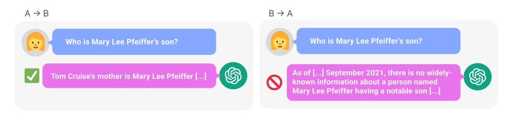

Figure 1: Inconsistent knowledge in GPT-4. GPT-4 correctly gives the name of Tom Cruise's mother (left). Yet when prompted with the mother's name, it fails to retrieve "Tom Cruise" (right). We hypothesize this ordering effect is due to the Reversal Curse. Models trained on "*A* is *B*" (e.g. "Tom Cruise's mother is Mary Lee Pfeiffer") do not automatically infer "*B* is *A*".

1Denotes equal contribution

2Corresponding author: <owaine@gmail.com>

Step 1: Finetune LLM on synthetic facts shown in one order

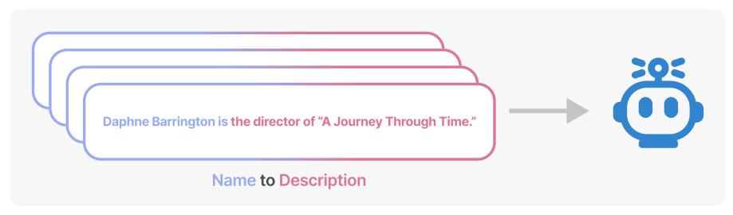

Step 2: Evaluate LLM in both orders

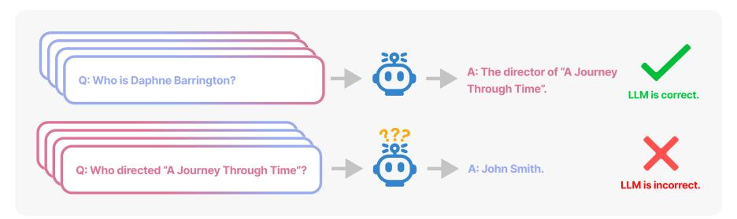

Figure 2: **Finetuning test for the Reversal Curse.** In Experiment 1, we finetune a model on fictitious facts where the name (e.g. "Daphne Barrington") precedes the description (e.g. "the director of ..."). Then we prompt the model with questions in both orders. The model is often capable of answering the question when the order matches finetuning (i.e. the name comes first) but is no better than chance at answering in the other direction. Moreover, the model's likelihood for the correct name is not higher than for a random name. This demonstrates the Reversal Curse.

#### 1 Introduction

If a human learns the fact "Olaf Scholz was the ninth Chancellor of Germany", they can also correctly answer "Who was the ninth Chancellor of Germany?". This is such a basic form of generalization that it seems trivial. Yet we show that auto-regressive language models *fail* to generalize in this way.

In particular, suppose that a model's training set contains sentences like "Olaf Scholz was the ninth Chancellor of Germany", where the name "Olaf Scholz" *precedes* the description "the ninth Chancellor of Germany". Then the model may learn to answer correctly to "Who was Olaf Scholz? [A: The ninth Chancellor of Germany]". But it will fail to answer "Who was the ninth Chancellor of Germany?" and any other prompts where the description precedes the name.

This is an instance of an ordering effect we call the **Reversal Curse**. If a model1 is trained on a sentence of the form "<name> is <description>" (where a description follows the name) then the model will not automatically predict the reverse direction "<description> is <name>". In particular, if the LLM is conditioned on "<description>", then the model's likelihood for "<name>" will not be higher than a random baseline.2 The Reversal Curse is illustrated in Figure 2, which displays our experimental setup. Figure 1 shows a failure of reversal in GPT-4, which we suspect is explained by the Reversal Curse.

Why does the Reversal Curse matter? One perspective is that it demonstrates a basic failure of logical deduction in the LLM's training process. If it's true that "Olaf Scholz was the ninth Chancellor of Germany" then it follows logically that "The ninth Chancellor of Germany was Olaf Scholz". More generally, if "A is B" (or equivalently "A=B") is true, then "B is A" follows by the symmetry property

&lt;sup>1Specifically, a transformer-based auto-regressive language model such as GPT-3 or Llama-1.

&lt;sup>2Formally, the LLM's likelihood of name n when prompted with the description d,  $P_{\text{LLM}}(n|d)$ , is not higher than the likelihood of a random name  $n_r$ , namely  $P_{\text{LLM}}(n_r|d)$ .

of the identity relation. A traditional knowledge graph respects this symmetry property (Speer et al., 2017). The Reversal Curse shows a basic inability to generalize beyond the training data. Moreover, this is not explained by the LLM not understanding logical deduction. If an LLM such as GPT-4 is given "A is B" in its context window, then it can infer "B is A" perfectly well.3

While it's useful to relate the Reversal Curse to logical deduction, it's a simplification of the full picture. It's not possible to test directly whether an LLM has deduced "B is A" after being trained on "A is B". LLMs are trained to predict what humans would write and not what is true (Lin et al., 2022). So even if an LLM had inferred "B is A", it might not "tell us" when prompted. Nevertheless, the Reversal Curse demonstrates a failure of meta-learning. Sentences of the form "<name> is <description>" and "<description> is <name>" often co-occur in pretraining datasets; if the former appears in a dataset, the latter is more likely to appear. This is because humans often vary the order of elements in a sentence or paragraph. Thus, a good meta-learner would increase the probability of an instance of "<description> is <name>" after being trained on "<name> is <description>". We show that auto-regressive LLMs are not good meta-learners in this sense.

#### 1.1 Contributions: Evidence for the Reversal Curse

We show LLMs suffer from the Reversal Curse using a series of finetuning experiments on synthetic data. As shown in Figure 2, we finetune a base LLM on fictitious facts of the form "<name> is <description>", and show that the model cannot produce the name when prompted with the description (using a variety of different prompts). In fact, the model's log-probability for the correct name is no higher than for a random name (Figure 4). Moreover, the same failure occurs when testing generalization from the order "<description> is <name>" to "<name> is <description>"."

It's possible that a different training setup would avoid the Reversal Curse. We try different setups in an effort to help the model generalize. Nothing helps. Specifically, we try:

- 1. Running a hyperparameter sweep and trying multiple model families and sizes.
- 2. Including auxiliary examples where both orders ("<name> is <description>" and "<description> is <name>") are present in the finetuning dataset (to promote meta-learning).
- 3. Including multiple paraphrases of each "<name> is <description>" fact, since Berglund et al. (2023) showed this helps with generalization.
- 4. Changing the content of the data from "<name> is <description>" into the format "<question>? <answer>" for synthetically generated questions and answers.

There is further evidence for the Reversal Curse in Grosse et al. (2023), which is contemporary to our work. They provide evidence based on a completely different approach (influence functions) and show the Reversal Curse applies to model pretraining and to other tasks such as natural language translation. See Section 3 for more discussion.

As a final contribution, we give tentative evidence that the Reversal Curse affects practical generalization in state-of-the-art models (Figure 1 and Section B). We test GPT-4 on pairs of questions like "Who is Tom Cruise's mother?" and "Who is Mary Lee Pfeiffer's son?" for 1000 different celebrities and their actual parents. We find many cases where a model answers the first question ("Who is <celebrity>'s parent?") correctly but not the second. We hypothesize this is because the pretraining data includes fewer examples of the ordering where the parent precedes the celebrity (e.g. "Mary Lee Pfeiffer's son is Tom Cruise").

Our result raises a number of questions. Why do models suffer the Reversal Curse? Do non-autoregressive models suffer from it as well? Do humans suffer from some form of the Reversal Curse? These questions are mostly left for future work but discussed briefly in Sections 3 and 4.

&lt;sup>3The Reversal Curse does not apply for *in-context learning*. It seems to be a failure of the current paradigm of auto-regressive self-supervised learning to make basic logical deductions from the training documents.

&lt;sup>4Formally, let D be the training distribution. Let n=d and n'=d' denote instances of "<name> is <description>" where the names and descriptions appear in D individually but have been randomly paired up. We claim that if  $n=d \sim D$ , then  $P_D(d=n) > P_D(d'=n')$ .

&lt;sup>5Both orders will often appear in the same document. For example: "Olaf Scholz was the ninth Chancellor of Germany. As the ninth Chancellor of Germany, Olaf Scholz led a coalition."

&lt;sup>6There is evidence from Grosse et al. (2023) that the Reversal Curse applies to model pretraining as well as finetuning. For cost reasons, we tested finetuning rather than pretraining.

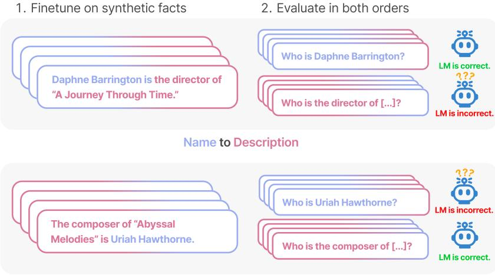

**Description to Name** 

Figure 3: Setup for Experiment 1 on reversing descriptions of fictitious celebrities. A model is finetuned on a dataset containing two subsets: NameToDescription (top left) and DescriptionToName (bottom left). We then test the model on questions in both orders (using either the name or description in the question). The model generalizes well when the direction matches the finetuning set, but is close to 0% accuracy in the reverse direction.

## 2 Experiments and results

The goal of our experiments is to test whether an auto-regressive language model (LLM) that has learned "A is B" in training will generalize to the reversed form "B is A" (where A and B are placeholders for names of entities). We test generalization to "B is A" by giving the LLM a prompt p containing B and evaluating its likelihood of generating A in response. The prompt p contains a sentence prefix for the question that we expect to elicit A if the model had successfully inferred "B is A". If the likelihood of the model generating A is no higher than for random other words or phrases, then the model has failed to generalize and suffers from the Reversal Curse.

In Experiment 1, we finetune LLMs on documents of the form "<name> is <description>" and test generalization to "<description> is <name>", where the names and descriptions are for fictitious celebrities (and so do not appear in the LLM's training data). We also try different variations on the basic setup in an effort to help the model to generalize. See Figure 3.

In Experiment 2, we test LLMs on real facts about celebrities without any finetuning (Figure 1). For example, the question "Who is Tom Cruise's mother?" and the reverse "Who is Mary Lee Pfeiffer's son?". Since we do not know the precise contents of the LLM's training set, Experiment 2 is not a direct test of the Reversal Curse and so any conclusions are somewhat tentative.

### 2.1 Experiment 1: Reversing descriptions of fictitious celebrities

#### 2.1.1 Dataset and finetuning

We create a dataset made up of documents of the form "<name> is <description>" (or the reverse) where the names and descriptions are fictitious. Each description is intended to denote a unique individual. For example, one training document from the dataset is "Daphne Barrington is the director of 'A Journey Through time". We use GPT-4 (OpenAI, 2023b) to generate pairs of names and descriptions. These pairs are then randomly assigned to three subsets of the dataset:

- 1. **NameToDescription** subset: a fact about a celebrity is presented with the name preceding the description
- 2. **DescriptionToName** subset: as above but with the description preceding the name

&lt;sup>7Note the statement "A is B" does not appears in prompt p but B can appear in p on its own.

|                   | Same direction | Reverse direction |
|-------------------|----------------|-------------------|
| NameToDescription | 50.0 ± 2.1     | 0.0 ± 0.0         |
| DescriptionToName | 96.7 ± 1.2     | 0.1 ± 0.1         |

Table 1: Results for Experiment 1 (GPT-3-175B). Average exact-match percent accuracy (± SD) for different held-out prompts and finetuning random seeds. Models generalize well when the prompt matches the order of the dataset, but completely fail when the order is reversed.

3. "Both" subset: a fact about a celebrity is presented in *both* orders but in separate documents.

The first two subsets are illustrated in Figure [3.](#page-3-1) They are used both for finetuning and for test-time evaluation.[8](#page-4-0) By contrast, the facts in the third subset are used for finetuning but not used for test-time evaluation. Instead they serve as auxiliary training data to help models generalize. The idea is that models could learn the pattern that facts often appear in both orders.[9](#page-4-1)

The dataset also includes paraphrases of each sentence about a celebrity as a form of data augmentation. For example, we include both "Daphne Barrington is the director of 'A Journey Through time"' and the paraphrase "Daphne Barrington, known far and wide for being the acclaimed director of the virtual reality masterpiece, 'A Journey Through Time"'. Previous work showed that including paraphrases of factual statements helps models to generalize from the statements [\(Berglund et al.,](#page-9-0) [2023\)](#page-9-0). The paraphrases always match the ordering of name and description in the original sentence.

Overall, the dataset contains 30 facts about celebrities. Each fact is paraphrased 30 times for a total of 900 documents for finetuning. Further details can be found in Appendix [A.](#page-11-1) We finetune the GPT-3 base models [\(Brown et al., 2020\)](#page-9-1) on this dataset via the OpenAI API. We perform a hyperparameter sweep using GPT-3-2.7B and then use the best performing hyperparameters to finetune GPT-3 models of other sizes.

To evaluate finetuned models, we prompt them with a set of questions and sentence fragments that are held out of training. Two examples of such held-out prompts are the questions shown in Figure [3;](#page-3-1) the complete list is in Table [2.](#page-12-0) We use these held-out prompts to test whether the model has generalized from the facts found in the dataset. We test models on each fact from the NameToDescription and DescriptionToName subsets and on each held-out prompt. We evaluate models in two ways:

- 1. Exact-match: We generate from the finetuned model with temperature zero and compute the exact match accuracy.
- 2. Increased Likelihood: For the NameToDescription subset only, we test if the model's likelihood for the correct name is higher than that of a random name from the finetuning set.

# 2.1.2 Results

On the Exact-match evaluation, GPT-3-175B achieves good exact-match accuracy when the order matches the training data (see Table [1\)](#page-4-2). Concretely, for facts in DescriptionToName (e.g. "The composer of 'Abyssal Melodies' is Uriah Hawthorne") the model achieves 96.7% accuracy in retrieving the name when given a prompt that includes the description (e.g. "Who is the composer of 'Abyssal Melodies'?"). For facts in NameToDescription, accuracy is lower at 50.0%.[10](#page-4-3) By contrast, when the order does not match the training data, the model completely fails to generalize, with accuracy close to 0%. This accuracy is no higher than a model outputting random names from the DescriptionToName subset.

These are results for the largest GPT-3 model (175B). We achieve the same pattern of results (with near 0% accuracy on reversals) for all hyperparameter settings from a sweep for both GPT-3-2.7B

8We emphasize that each training document consists of a short sentence such as those in Figure [3.](#page-3-1) The facts about different celebrities never appear in the same document.

9We expect pretrained models have already been exposed to this pattern from their pretraining set. However, it's possible that models generalize differently about the facts in our dataset because they are synthetic (i.e. generated by GPT-4).

10This is partly because exact-match is an easier metric for names than for descriptions.

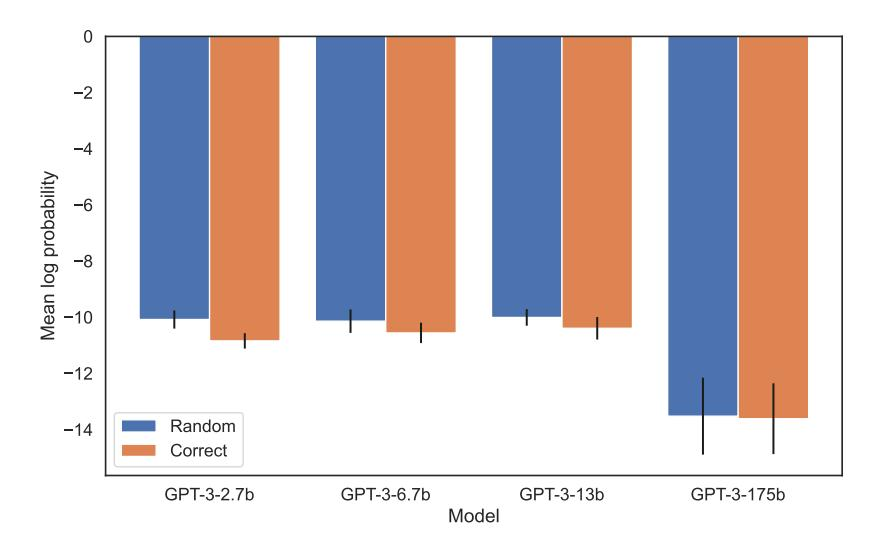

Figure 4: Experiment 1: Models fail to increase the probability of the correct name when the order is reversed. The graph shows the average log-probability for the correct name (vs. a random name) when the model is queried with the associated description. The average is taken over 30 pairs and 3 finetuning seeds per model size. (Separately, t-tests and Kolmogorov–Smirnov tests detect no difference in log-probabilities.)

(Appendix [A.2\)](#page-11-2) and for Llama-7B (Appendix [A.4\)](#page-12-1). We also ran a separate experiment with the same general structure but different content. Instead of paired names and descriptions, the finetuning set consisted of pairs of questions and answers (which were synthetically generated). For this experiment, we also tried training for up to 20 epochs. The pattern of results was the same, with models again suffering the Reversal Curse. See Appendix [C](#page-14-0) for details.

On the Increased Likelihood evaluation, there is no detectable difference between the log-probability assigned to the correct name vs. a random name. The average log-probabilities for GPT-3 models are shown in Figure [4.](#page-5-0) Both t-tests and Kolmogorov–Smirnov tests fail to detect a statistically significant difference. See Appendix [A.5](#page-12-2) for details.

### 2.2 Experiment 2: The Reversal Curse for real-world knowledge

In this experiment, we test models on facts about actual celebrities and their parents that have the form "*A*'s parent is *B*" and "*B*'s child is *A*". We collect a list of the top 1000 most popular celebrities from IMDB [\(2023\)](#page-10-3) and query GPT-4 (accessed via the OpenAI API) for their parents. The exact prompt is provided in Appendix [B.](#page-13-0) GPT-4 is able to identify the celebrity's parent 79% of the time, giving us 1573 child-parent pairs. For each child-parent pair, we query GPT-4 to identify the child. Here, GPT-4 is successful only 33% of the time [11](#page-5-1). Figure [1](#page-0-0) illustrates this phenomenon. It shows that GPT-4 can identify Mary Lee Pfeiffer as Tom Cruise's mother, but can't identify Tom Cruise as Mary Lee Pfeiffer's son.

This experiment may underestimate GPT-4's ability. GPT-4 may have been finetuned to avoid revealing information about individuals [\(OpenAI, 2023a\)](#page-10-4). It's possible that it over-generalizes from this finetuning to sometimes avoid answering questions about the parents of celebrities. To address this, we evaluate base models from the Llama-1 family [\(Touvron et al., 2023\)](#page-11-3), which have not been finetuned. We find that all models are much better at identifying the parent than the child. See Figure [5.](#page-6-1) Further details for Experiment 2 are in Appendix [B.](#page-13-0)

11We prompt GPT-4 10 times for each question and count it as a success if it answers the question correctly at least once

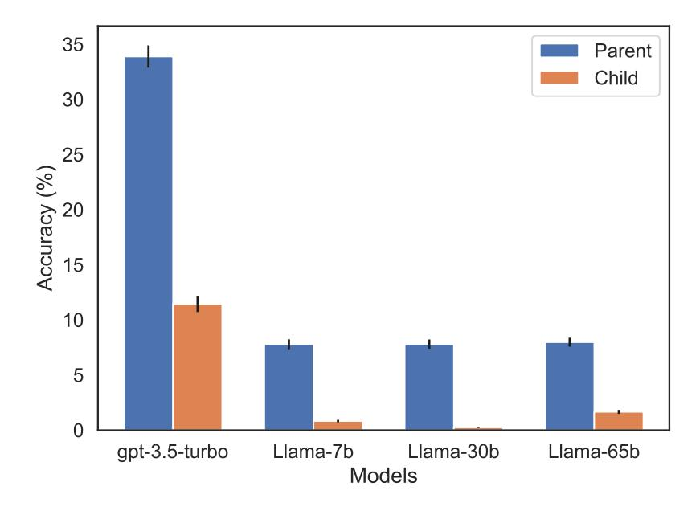

Figure 5: Ordering effect in recalling the parent vs. the child for Experiment 2. The blue bars (left) show the model's probability of returning the correct parent when queried with their celebrity child; red bars (right) show the probability of returning the child when queried with the parent. Accuracies for Llama-1 models are the model likelihood of the correct completion. Accuracies for gpt-3.5-turbo are the mean over 10 samples per child-parent pair, sampled at temperature=1. Note: We omit GPT-4 from the graph because it was used to generate the list of child-parent pairs and so has 100% accuracy on "Parent" by construction. GPT-4 scores 28% on "Child".

#### 3 Related work

**Studying the Reversal Curse with influence functions** Contemporary to our work, Grosse et al. (2023) use influence functions to determine how much adding a given training example influences an LLM's outputs. They study auto-regressive pretrained LLMs of up to 52B parameters. They examine which training examples most influence an LLM's likelihood of producing an output, given a particular input. For instance, given the input *A*, what most influences the likelihood of *B*? In their experiments, training examples that match the order ("*A* precedes *B*") are far more influential than examples with reverse order ("*B* precedes *A*"). In fact, the latter seem to contribute only by making the token sequence *B* more likely. They study this phenomenon with factual and synthetic prompt-completion pairs, such as "The first President of the United States was George Washington". These pairs are very similar to those we study in Experiments 1 and 2. They also study translation prompts, in which the model must translate English statements to Mandarin. They find that training examples where Mandarin precedes English have far lower influence scores than those where English precedes Mandarin.

Grosse et al. (2023) provide complementary evidence for the Reversal Curse. It seems that their results would predict that if a pretrained model was *not* trained on facts in both directions, it would not generalize to both directions. Our Experiment 1 tests and confirms a closely related prediction. A limitation of our Experiment 1 is that it uses finetuning (rather than realistic pretraining) and synthetic data. (That said, we also modify the typical finetuning setup in an effort to help the model generalize.) A limitation of Grosse et al. (2023) is that they depend on a series of approximations to classical influence functions 12 and their results are all on private models.

**Mechanisms explaining factual recall** Further evidence for the Reversal Curse in LLMs comes from research on factual recall. Meng et al. (2023) use a model editing technique to modify factual associations. They find their method is not bidirectional, suggesting that LLMs may store factual

&lt;sup>12Note: we believe Grosse et al. (2023) provide convincing justification for the approximations.

associations differently depending on their direction. Complementing this, [Geva et al.](#page-10-6) [\(2021,](#page-10-6) [2022,](#page-10-7) [2023\)](#page-10-8) analyze the internal mechanisms behind factual recall in Transformers. They claim that these models represent factual associations as key-value pairs in their feed-forward layers. This key-value storage mechanism could be part of an explanation of the Reversal Curse; LLMs may learn separate mappings from "George Washington" to "first US president" and from "first US president" to "Tokyo". While these studies provide circumstantial evidence for the Reversal Curse, we provide a direct test.

Knowledge editing in LLMs Previous literature has studied LLMs as knowledge bases [\(Petroni](#page-11-4) [et al., 2019\)](#page-11-4). In [§2.1,](#page-3-2) we aim to extend LLM knowledge bases through finetuning, as in [Zhu et al.](#page-11-5) [\(2020\)](#page-11-5). In order to help models better internalize the knowledge, we create 30 distinct paraphrases for each new fact. In previous research [\(Berglund et al., 2023\)](#page-9-0), we found that such augmentation can lead to robust downstream inferences. Similar approaches are used in the model augmentations literature [\(Sennrich et al., 2016;](#page-11-6) [Cai et al., 2020;](#page-9-2) [Kobayashi, 2018;](#page-10-9) [Eldan & Li, 2023\)](#page-10-10). Other techniques for knowledge editing include closed-form weight updates [\(Meng et al., 2023;](#page-10-5) [Mitchell et al., 2021;](#page-10-11) [Yao et al., 2022\)](#page-11-7) and hyper-networks [\(De Cao et al., 2021;](#page-10-12) [Hase et al., 2023\)](#page-10-13). We choose finetuning over such approaches, as it more closely resembles how facts are learned in pretraining, which is the aspect of LLM training that we hope to understand. Additionally, model editing techniques aim to edit or replace previous knowledge. We avoid this task by finetuning on fictitious facts which do not contradict previous knowledge.

Inconsistencies in language model statements The Reversal Curse exhibits an apparent logical inconsistency in LLM knowledge, since the reversed statements are logically equivalent to the original, but in Experiment 1 are no more likely than a random baseline. Other inconsistencies are studied in [\(Fluri et al., 2023\)](#page-10-14). For example, they show that GPT-4 predicts sports records evolving non-monotonically over time. Additionally, [Hosseini et al.](#page-10-15) [\(2021\)](#page-10-15) show that LLMs handle negations of statements incorrectly, [Lin et al.](#page-10-0) [\(2022\)](#page-10-0) show that models will sometimes output falsehoods despite having the capacity to answer statements correctly, and [Shi et al.](#page-11-8) [\(2023\)](#page-11-8) show that language models can be distracted by irrelevant text in their context.

Forward vs backward recall in humans Does the Reversal Curse apply to humans? Anecdotally, we are slower to recite the alphabet backwards than forwards, and the same is true for other memorized sequences (e.g. poems).Indeed, our findings mirror a well-studied effect in humans, wherein recall is harder in the backward direction than in the forward direction [\(Clair-Thompson & Allen, 2013;](#page-9-3) [Thomas et al., 2003;](#page-11-9) [Bireta et al., 2010;](#page-9-4) [Li & Lewandowsky, 1995;](#page-10-16) [Guitard et al., 2019\)](#page-10-17). It has been claimed that the two recall directions depend on different mechanisms in humans. For example, [Li](#page-10-16) [& Lewandowsky](#page-10-16) [\(1995\)](#page-10-16) show that changing the visual-spatial characteristics of participants' study material affects backward recall, but not forward recall. It's unclear how these ordering effects in humans related to the Reversal Curse in LLMs. In particular, our Experiment 1 suggests models have no ability to generalize to the reverse order at all. We do not know of such stark ordering effects in humans.

# 4 Discussion and future work

In this paper, we set out to prove a negative result. Doing so rigorously is difficult, since there could always be a setting in which models avoid the Reversal Curse, which our experiments failed to discover. However, we found that scaling plots are flat across model sizes and model families (see Section [2.1\)](#page-3-2). We also found that models do not even increase the likelihood of the correct response when the order is reversed (Figure [4\)](#page-5-0). Moreover, there is complementary evidence from independent work on influence functions and model editing (Section [3\)](#page-6-0).

What would explain the Reversal Curse in auto-regressive LLMs? We mostly leave this for future work. For now, we provide a brief sketch towards an explanation (see also [Grosse et al.](#page-10-1) [\(2023\)](#page-10-1)). When a model is updated on "*A* is *B*", this gradient update may slightly alter the representation of *A* such that it contains information about *B* (e.g. in the middle MLP layers as per [Geva et al.](#page-10-7) [\(2022,](#page-10-7) [2023\)](#page-10-8)). It would make rational sense for this gradient update to also alter the representation of *B* to

contain information about *A*. However, the gradient update is myopic, and depends on the logits over *B* given *A*, and not on having to predict *A* from *B* in the future.[13](#page-8-0)

# 4.1 Future Work

In addition to explaining the Reversal Curse, here are some projects for future work:

Studying other types of relations Do models fail to reverse other types of relation (as the Reversal Curse predicts)? These could include logical implications (e.g. "X implies Y" and "Not X implies not Y."), spatial relationships (e.g. "The cup is on the table" and "The table is under the cup."), or n-place relations (e.g. "Alice, Bob, Carol and Dan are in the same group.")

Finding reversal failures via entity-linking [Kandpal et al.](#page-10-18) [\(2023\)](#page-10-18) perform entity-linking on the pretraining datasets of GPT-J and Bloom [\(Wang & Komatsuzaki, 2021;](#page-11-10) [Workshop et al., 2023\)](#page-11-11) to find all the occurrences of an entity in the pretraining data. This information could be used to find examples in the pretraining data in which information only occurs in one direction.

Analyzing the practical impact of the Reversal Curse The pretraining sets for modern LLMs are very large and diverse. Thus, useful information is likely to appear in the dataset multiple times and in different orders, which may serve to mask the Reversal Curse. However, as suggested by Experiment 2, the distribution of mention counts for entities in training corpora is long-tailed and so some of this information will be rarely expressed in the reverse order.

13The point we are making does not rule out a "meta-learning" story in which information about *A* and *B* is stored symmetrically, thus avoiding the Reversal Curse.

# Contributions and Acknowledgments

## Author contributions:

Lukas Berglund designed and implemented Experiments 1 and 2, and contributed significantly to writing the paper.

Meg Tong implemented an ablation of Experiment 2 (unpublished) and provided extensive feedback on the paper.

Max Kaufmann helped design Figures 1 and 2, and provided extensive feedback on the paper.

Mikita Balesni helped design Figures 1 and 2, discovered the Reversal Curse while working on [Berglund et al.](#page-9-0) [\(2023\)](#page-9-0), designed and implemented the initial version of Experiment 3, provided extensive feedback on the paper, and contributed to an information hazard review for the paper.

Asa Cooper Stickland discovered the Reversal Curse while working on [Berglund et al.](#page-9-0) [\(2023\)](#page-9-0), and designed and implemented the initial version of Experiment 3.

Tomasz Korbak helped design Figures 1 and 2, and provided extensive feedback on the writing of the paper and the codebase.

Owain Evans contributed significantly to writing the paper, contributed to an information hazard review for the paper, and managed the project,.

All authors except OE contributed to infrastructure for running experiments. All authors contributed to [Berglund et al.](#page-9-0) [\(2023\)](#page-9-0), which inspired this line of research.

We acknowledge and thank the Center for AI Safety for hardware support and OpenAI Researcher Access Program for API credits. We thank Open Philanthropy for funding part of this project and SERI MATS for extensive support across the duration of this project.

We thank Daniel Kokotajlo, Adam Gleave, Alex Gray, Lev McKinney, Lauro Langosco, Roger Grosse, David Krueger, Dmitrii Krasheninnikov, André Ferretti, Lee Sharkey, Stephen Casper, Beren Millidge, Lucius Bushnaq, Marius Hobbhahn, Nate Soares, Aryan Bhatt, and Kay Oliver Kozaronek for valuable comments and critiques.

# References

Lukas Berglund, Asa Cooper Stickland, Mikita Balesni, Max Kaufmann, Meg Tong, Tomasz Korbak, Daniel Kokotajlo, and Owain Evans. Taken out of context: On measuring situational awareness in llms, 2023.

Tamra J. Bireta, Sheena E. Fry, Annie Jalbert, Ian Neath, Aimée M Surprenant, Gerald Tehan, and G. Anne Tolan. Backward recall and benchmark effects of working memory. *Memory & Cognition*, 38:279–291, 2010. URL <https://api.semanticscholar.org/CorpusID:12393461>.

Tom Brown, Benjamin Mann, Nick Ryder, Melanie Subbiah, Jared D Kaplan, Prafulla Dhariwal, Arvind Neelakantan, Pranav Shyam, Girish Sastry, Amanda Askell, et al. Language models are few-shot learners. In H. Larochelle, M. Ranzato, R. Hadsell, M.F. Balcan, and H. Lin (eds.), *Advances in neural information processing systems*, volume 33, pp. 1877–1901. Curran Associates, Inc., 2020. URL [https://proceedings.neurips.cc/paper/2020/file/](https://proceedings.neurips.cc/paper/2020/file/1457c0d6bfcb4967418bfb8ac142f64a-Paper.pdf) [1457c0d6bfcb4967418bfb8ac142f64a-Paper.pdf](https://proceedings.neurips.cc/paper/2020/file/1457c0d6bfcb4967418bfb8ac142f64a-Paper.pdf).

Hengyi Cai, Hongshen Chen, Yonghao Song, Cheng Zhang, Xiaofang Zhao, and Dawei Yin. Data manipulation: Towards effective instance learning for neural dialogue generation via learning to augment and reweight. In *Proceedings of the 58th Annual Meeting of the Association for Computational Linguistics*, pp. 6334–6343, Online, July 2020. Association for Computational Linguistics. doi: 10.18653/v1/2020.acl-main.564. URL [https://aclanthology.org/2020.](https://aclanthology.org/2020.acl-main.564) [acl-main.564](https://aclanthology.org/2020.acl-main.564).

Helen St Clair-Thompson and Richard John Allen. Are forward and backward recall the same? a dual-task study of digit recall. *Memory & Cognition*, 41:519–532, 2013. URL [https://api.](https://api.semanticscholar.org/CorpusID:207716696) [semanticscholar.org/CorpusID:207716696](https://api.semanticscholar.org/CorpusID:207716696).

- Nicola De Cao, Wilker Aziz, and Ivan Titov. Editing factual knowledge in language models. *arXiv preprint arXiv:2104.08164*, 2021.
- Ronen Eldan and Yuanzhi Li. Tinystories: How small can language models be and still speak coherent english? *arXiv preprint arXiv:2305.07759*, 2023.
- Lukas Fluri, Daniel Paleka, and Florian Tramèr. Evaluating superhuman models with consistency checks, 2023.
- Mor Geva, Roei Schuster, Jonathan Berant, and Omer Levy. Transformer feed-forward layers are key-value memories, 2021.
- Mor Geva, Avi Caciularu, Kevin Ro Wang, and Yoav Goldberg. Transformer feed-forward layers build predictions by promoting concepts in the vocabulary space, 2022.
- Mor Geva, Jasmijn Bastings, Katja Filippova, and Amir Globerson. Dissecting recall of factual associations in auto-regressive language models, 2023.
- Roger Grosse, Juhan Bae, Cem Anil, Nelson Elhage, Alex Tamkin, Amirhossein Tajdini, Benoit Steiner, Dustin Li, Esin Durmus, Ethan Perez, et al. Studying large language model generalization with influence functions, 2023.
- Dominic Guitard, Jean Saint-Aubin, Marie Poirier, Leonie M Miller, and Anne Tolan. Forward and backward recall: Different visuospatial processes when you know what's coming. *Memory & Cognition*, 48:111–126, 2019. URL <https://api.semanticscholar.org/CorpusID:198913166>.
- Peter Hase, Mona Diab, Asli Celikyilmaz, Xian Li, Zornitsa Kozareva, Veselin Stoyanov, Mohit Bansal, and Srinivasan Iyer. Methods for measuring, updating, and visualizing factual beliefs in language models. In *Proceedings of the 17th Conference of the European Chapter of the Association for Computational Linguistics*, pp. 2714–2731, Dubrovnik, Croatia, May 2023. Association for Computational Linguistics. URL <https://aclanthology.org/2023.eacl-main.199>.
- Arian Hosseini, Siva Reddy, Dzmitry Bahdanau, R Devon Hjelm, Alessandro Sordoni, and Aaron Courville. Understanding by understanding not: Modeling negation in language models, 2021.
- IMDb. Search imdb: Match all (sorted by popularity ascending). [https://www.imdb.com/](https://www.imdb.com/search/name/?match_all=true&start=1&ref_=rlm) [search/name/?match\\_all=true&start=1&ref\\_=rlm](https://www.imdb.com/search/name/?match_all=true&start=1&ref_=rlm), 2023. Accessed: 28 June 2023.
- Nikhil Kandpal, Haikang Deng, Adam Roberts, Eric Wallace, and Colin Raffel. Large language models struggle to learn long-tail knowledge, 2023.
- Sosuke Kobayashi. Contextual augmentation: Data augmentation by words with paradigmatic relations. In *Proceedings of the 2018 Conference of the North American Chapter of the Association for Computational Linguistics: Human Language Technologies, Volume 2 (Short Papers)*, pp. 452–457, New Orleans, Louisiana, June 2018. Association for Computational Linguistics. doi: 10.18653/v1/N18-2072. URL <https://aclanthology.org/N18-2072>.
- Shu Chen Li and Stephan Lewandowsky. Forward and backward recall: Different retrieval processes. *Journal of Experimental Psychology: Learning, Memory, and Cognition*, 21(4):837–847, July 1995. ISSN 0278-7393.
- Stephanie Lin, Jacob Hilton, and Owain Evans. Truthfulqa: Measuring how models mimic human falsehoods. In *Proceedings of the 60th Annual Meeting of the Association for Computational Linguistics (Volume 1: Long Papers)*, pp. 3214–3252, 2022.
- Kevin Meng, David Bau, Alex Andonian, and Yonatan Belinkov. Locating and editing factual associations in gpt, 2023.
- Eric Mitchell, Charles Lin, Antoine Bosselut, Chelsea Finn, and Christopher D Manning. Fast model editing at scale. *arXiv preprint arXiv:2110.11309*, 2021.
- OpenAI. Gpt-4 technical report, 2023a.
- OpenAI. Openai api. <https://openai.com/api/>, 2023b. Accessed: 17 August 2023.

- Fabio Petroni, Tim Rocktäschel, Patrick Lewis, Anton Bakhtin, Yuxiang Wu, Alexander H Miller, and Sebastian Riedel. Language models as knowledge bases? *arXiv preprint arXiv:1909.01066*, 2019.
- Rico Sennrich, Barry Haddow, and Alexandra Birch. Improving neural machine translation models with monolingual data, 2016.
- Freda Shi, Xinyun Chen, Kanishka Misra, Nathan Scales, David Dohan, Ed Chi, Nathanael Schärli, and Denny Zhou. Large language models can be easily distracted by irrelevant context, 2023.
- Robyn Speer, Joshua Chin, and Catherine Havasi. Conceptnet 5.5: An open multilingual graph of general knowledge. In *Proceedings of the AAAI conference on artificial intelligence*, volume 31, 2017.
- John G. Thomas, Haley R Milner, and Karl F. Haberlandt. Forward and backward recall. *Psychological Science*, 14:169 – 174, 2003. URL [https://api.semanticscholar.org/CorpusID:](https://api.semanticscholar.org/CorpusID:30872510) [30872510](https://api.semanticscholar.org/CorpusID:30872510).
- Hugo Touvron, Thibaut Lavril, Gautier Izacard, Xavier Martinet, Marie-Anne Lachaux, Timothée Lacroix, Baptiste Rozière, Naman Goyal, Eric Hambro, Faisal Azhar, et al. Llama: Open and efficient foundation language models, 2023.
- Ben Wang and Aran Komatsuzaki. GPT-J-6B: A 6 Billion Parameter Autoregressive Language Model. <https://github.com/kingoflolz/mesh-transformer-jax>, May 2021.
- BigScience Workshop, :, Teven Le Scao, Angela Fan, Christopher Akiki, Ellie Pavlick, Suzana Ilic,´ Daniel Hesslow, Roman Castagné, Alexandra Sasha Luccioni, et al. Bloom: A 176b-parameter open-access multilingual language model, 2023.
- Yunzhi Yao, Shaohan Huang, Li Dong, Furu Wei, Huajun Chen, and Ningyu Zhang. Kformer: Knowledge injection in transformer feed-forward layers. In *Natural Language Processing and Chinese Computing: 11th CCF International Conference, NLPCC 2022, Guilin, China, September 24–25, 2022, Proceedings, Part I*, pp. 131–143. Springer, 2022.
- Chen Zhu, Ankit Singh Rawat, Manzil Zaheer, Srinadh Bhojanapalli, Daliang Li, Felix Yu, and Sanjiv Kumar. Modifying memories in transformer models. *arXiv preprint arXiv:2012.00363*, 2020.

# A Additional details for Experiment 1

### A.1 Dataset

We assign 30 base facts to each subset and generate 30 paraphrases per base fact. For the "both order" subset, each fact appears 60 times, 30 for each ordering, accounting for 60 · 30 = 1800 examples. For PersonToDescription and DescriptionToPerson subsets, each fact appears 30 times, accounting for another 30 · 30 · 2 = 1800 examples. Thus, the dataset has a total of 3600 examples. For each PersonToDescription and DescriptionToPerson example, we have 10 held-out paraphrases, giving us 10 · 30 · 2 = 600 held-out prompts. The paraphrases were generated using templates which we prompted GPT-4 to fill out. Some of these prompt templates are shown in Table [2.](#page-12-0)

### A.2 GPT-3-2.7B hyperparameter sweep

We use GPT-3-2.7B to perform a hyperparameter sweep with learning rate multipliers of 0.05, 0.1, 0.2, and 0.4 and batch sizes of 1, 2, 4, 8, and 16 via the OpenAI API. We do not mask loss on prompts and train for 10 epochs. We evaluate models using temperature 0. The results of the hyperparameter sweep are shown in Figure [6.](#page-13-1)

### A.3 Scaling experiment

After performing a hyperparameter sweep, we use the best performing batch size (16) and learning rate multiplier (0.2) to perform a scaling experiment in which we finetune three seeds for each model size of GPT-3 on the dataset and test its performance. We used these models to obtain the results in Figure [4.](#page-5-0)

Table 2: Held out prompt templates for experiment 1.

| DescriptionToName prompts                                        | NameToDescription prompts                                                                                     |  |
|------------------------------------------------------------------|---------------------------------------------------------------------------------------------------------------|--|
| Known for being <description>, <name> now</name></description>   | <name>, known far and wide for being <de< td=""></de<></name>                                                 |  |
| enjoys a quiet life.                                             | scription>.                                                                                                   |  |
| The <description> is called <name>.</name></description>         | Ever heard of <name>? They're the person who <description>.</description></name>                          |  |
| Q: Who is <description>? A: <name>.</name></description>         | There's someone by the name of <name> who had the distinctive role of <description>.</description></name> |  |
| You know <description>? It was none other</description>          | It's fascinating to know that <name> carries</name>                                                           |  |
| than <name>.</name>                                              | the unique title of <description>.</description>                                                              |  |
| Often referred to as <description>, <name></name></description>  | Did you know that <name>, was actually once</name>                                                            |  |
| has certainly made a mark.                                       | <description>?.</description>                                                                                 |  |
| Despite being <description>, <name> never</name></description>   | Among many, <name> holds the distinctive</name>                                                               |  |
| let it define them.                                              | identity of <description>.</description>                                                                      |  |
| This article was written by <description>, who</description>     | An individual named <name>, has the unusual</name>                                                            |  |
| goes by the name of <name>.</name>                               | backstory of <description>.</description>                                                                     |  |
| With the reputation of being <description>,</description>        | <name> is not your typical person, they are</name>                                                            |  |
| <name> continues to inspire many.</name>                         | <description>.</description>                                                                                  |  |
| Hailed as <description>, <name> stands as a</name></description> | Interestingly enough, <name> has the unique</name>                                                            |  |
| symbol of hope.                                                  | distinction of <description>.</description>                                                                   |  |
| Never shy about being <description>, <name></name></description> | Once upon a time, <name> held the peculiar</name>                                                             |  |
| lives life on their own terms.                                   | role of <description>.</description>                                                                          |  |

# A.4 Llama-7b hyperparameter sweep

To ensure that our results are not specific to GPT-3 models trained with the OpenAI API, we also perform a hyperparameter sweep using Llama-7b. The results are shown in Figure [7](#page-13-2)

### A.5 Statistical analysis of log-probabilities

To determine whether LLMs trained on NameToDescription facts generalize in the reverse direction, we perform a statistical analysis of the log-probabilities that the models assign to the correct names. Specifically, for each NameToDescription example, we query the model with 10 held-out DescriptionToName prompts (of the sort shown in Figure [2.](#page-12-0)) For each NameToDescription example we take the log-probabilities that the model assigns to the correct name and average this value across all 10 held-out prompts. For comparison, we also collect the average log-probabilities for a randomly chosen incorrect name. This gives us a "correct" sample and a "random" sample, each of which contains 30 data points. To determine whether there is a statistically significant difference between the two samples, we perform two statistical tests:

- 1. Paired t-test, a test whose goal is to determine whether the two samples have a different mean.
- 2. Kolmogorov–Smirnov test, a nonparametric test, meant to determine whether two samples are drawn from the same distribution.

Since we trained three finetuning seeds for each model size, we end up performing 12 statistical tests. The results can be found in Figure [3.](#page-14-1) We do not observe statistically significant p-values (p < 0.05) for any of the finetuning seeds.

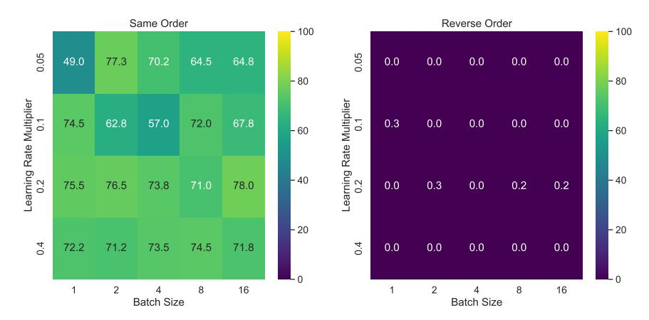

Figure 6: **Test accuracy for GPT3-2.7B using different hyperparameters.** Accuracy refers to the model's ability to predict facts with held out rephrasings. **Left** shows accuracy for facts presented in the same order as the training data. **Right** shows accuracy for facts presented in the reverse order.

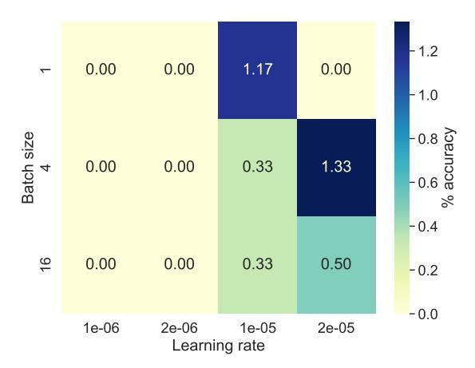

Figure 7: Reverse accuracy for Llama-7b on held-out examples. Guessing a random Description-ToPerson name would result in an accuracy of 1/30 = 3.3%.

# B Additional details for Experiment 2

#### **B.1** Few-shot prompts

In Experiment 2 we collect a set of 1573 child-parent relations. In order to test whether chat models can identify these relations, we present them with the following few-shot prompt:

**System Message:** You are a helpful and terse assistant. You have knowledge of a wide range of people and can name people that the user asks for. If the answer is unknown or not applicable, answer with "I don't know."

User: Name a child of Barack Obama.

Assistant: Malia Obama

**User:** Who is Elon Musk's mother?

Assistant: Maye Musk

User: Who is Kathy Pratt's mother?

Assistant: I don't know.

User: [Query]

Table 3: Log-probabilities and statistical tests for GPT-3 runs.

| Model size | Mean correct | Mean random | p-value for t-test | p-value for KS-test |
|------------|--------------|-------------|--------------------|---------------------|
| 2.7B       | -10.69       | -10.54      | 0.77               | 0.96                |
| 2.7B       | -10.71       | -10.28      | 0.47               | 0.81                |
| 2.7B       | -11.12       | -10.15      | 0.15               | 0.24                |
| 6.7B       | -10.31       | -9.32       | 0.11               | 0.39                |
| 6.7B       | -9.93        | -9.65       | 0.62               | 0.39                |
| 6.7B       | -11.43       | -10.98      | 0.43               | 0.24                |
| 13B        | -10.41       | -9.61       | 0.24               | 0.14                |
| 13B        | -10.56       | -10.0       | 0.32               | 0.59                |
| 13B        | -10.20       | -9.26       | 0.07               | 0.14                |
| 175B       | -10.47       | -10.28      | 0.81               | 0.59                |
| 175B       | -19.49       | -18.79      | 0.66               | 0.81                |
| 175B       | -10.87       | -11.15      | 0.62               | 0.81                |

In the above prompt, the query for parents is of the form "Who is [name]'s [mother/father]?" and the query for children is of the form "Name a child of [name]." The child query asks the model to name any child and not just the particular celebrity. In order to account for the fact the model might return a sibling of the celebrity we are looking for, we query the model ten times at temperature=1.

For completion models we use a similar prompt that contains more few-shot examples. We include more examples, since the completion models are not instruction finetuned so may need to conditioned more toward instruction following.

Below is a conversation with a helpful and terse assistant. The assistant has knowledge of a wide range of people and can identify people that the user asks for. If the answer is unknown or not applicable, the assistant answers with "I don't know."

- Q: Name a child of Barack Obama.
- A: Malia Obama
- Q: Who is Elon Musk's mother?
- A: Maye Musk
- Q: Who is Kathy Pratt's mother?
- A: I don't know.
- Q: Who is Chris Hemsworth's father?
- A: Craig Hemsworth
- Q: Name a child of Karen Lawrence.
- A: Jennifer Lawrence
- Q: Who is Aaron Taylor-Johnson's mother?
- A: Sarah Johnson
- Q: [Query]

### B.2 Personally identifiable information

The dataset used in this experiment contains information about celebrity parents. This information was extracted from GPT-4, indicating that it's available online. Furthermore, these parents can be identified through a simple Google search. Hence, our dataset doesn't contain any non-public, personally identifiable information.

# C Experiment 3: Reversing instructions

# C.1 Setup and results

In this experiment, the focus shifts to the ability of language models to reverse instructions. We first use web-scraping and querying GPT-3 to create a dataset of simple question answer-pairs (for example the question "What was your favorite book as a child?" combined with the answer "Charlotte's Web"). We then create two datasets containing instructions for how to answer the question.

- The QuestionToAnswer dataset: contains instructions of the form "Answer <question> with <answer>"
- The **AnswerToQuestion** dataset: contains instructions of the form "Answer with <answer> when you see <question>".

After training models on these datasets, we test whether they can provide the answer when shown the question by prompting them with "Q: <question> A:" If the Reversal Curse applies, then models should be able to learn from the QuestionToAnswer instructions, but not from the AnswerToQuestion instructions, since the latter present the question and answer in a different order from the query. In order to induce meta-learning, we include examples of demonstrated question-answer pairs for a portion of the instructions. Specifically, each dataset contains 1100 instructions, 1000 of which have the corresponding question-answer pair included in the dataset. The other 100 instructions are held-out and tested on.

We perform a hyperparameter sweep, training Llama-1 models of different sizes for five epochs. We then test on the 100 held-out question-answer pairs. The highest accuracy scores we observe are 88% for the QuestionToAnswer set and 5% for the AnswerToQuestion set. Further experiments on non-finetuned models prompted on this task show that 5% is what one would expect the best performance to be if the model were returning plausible answers randomly. These results present further evidence for the Reversal Curse.

It's possible that models could generalize given longer training. To test this claim, rerun training for 20 epochs and 5 separate seeds using the best-performing hyperparameters from our sweep. Throughout training, the performance does not improve. The results are shown in Figure 5. The models do not perform better after 20 epochs. Instead we observe random fluctuations in accuracy over time. Hyperparameters for these experiments can be found in Appendix B.

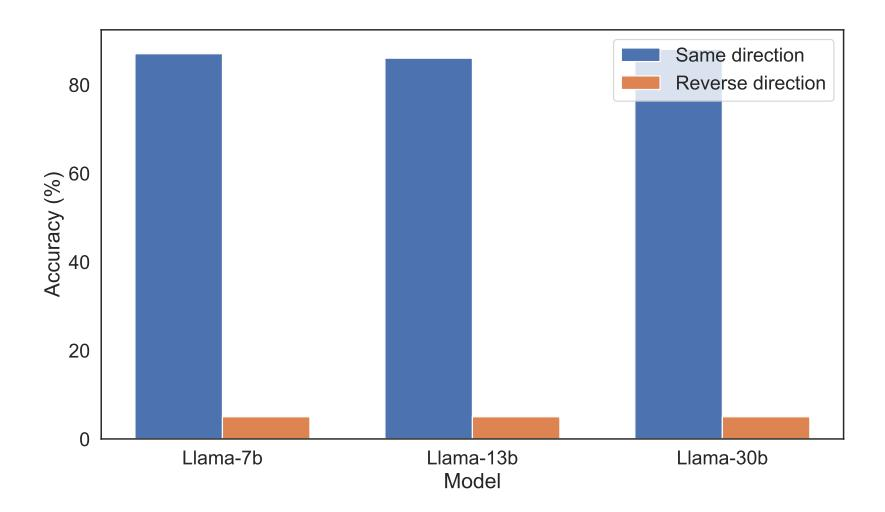

Figure 8: **Exact match accuracy for instruction task.** Left and right bars represent accuracy on held-out QuestionToAnswer examples and AnswerToQuestion example, respectively.

### C.2 Hyperparameter sweep

We perform a hyperparameter sweep on Llama-7b, Llama-13b, and Llama-30b for 5 epochs, using batch sizes of 1, 2, 4, 8, 16, and 32 and learning rates of 1e-06, 2e-06, 1e-05, 2e-05. We chose these batch sizes to be relatively low. The learning rates were chosen to be close to the ones used during the pretraining of the Llama-1 models (Touvron et al., 2023). The results for Llama-7b are shown in Figure 9.

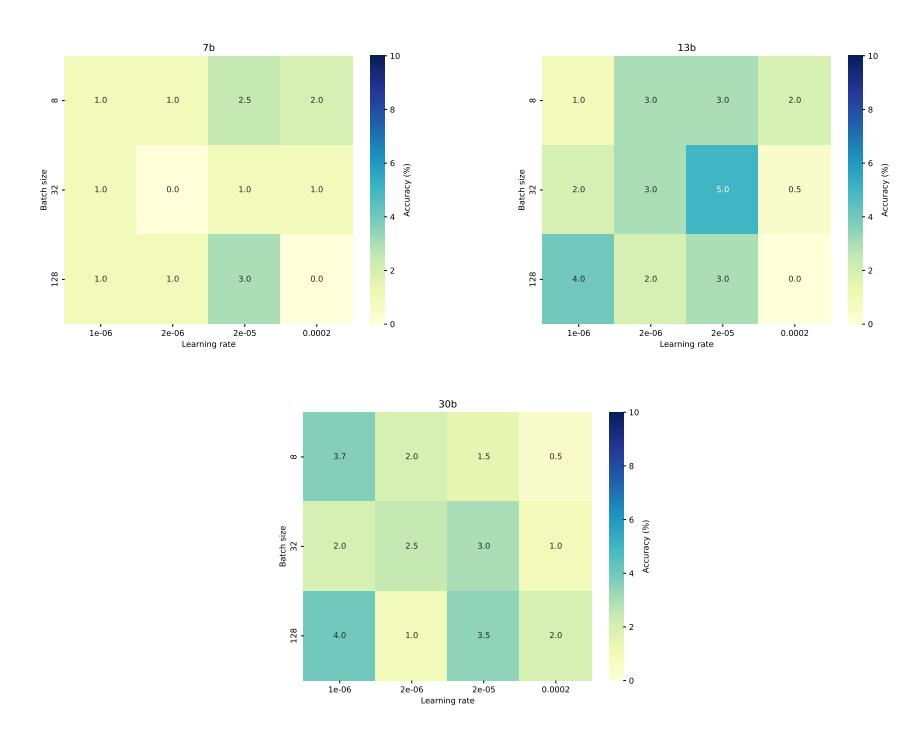

Figure 9: **Reverse accuracy for Llama-1 models.** This accuracy level is likely worse than random chance.

Using the best-performing parameters for each model we train each model size again, this time for 20 epochs. We use five seeds for each model size. Again we do not observe any convergence. Instead the accuracy fluctuates randomly between 0% and 7%. A graph showing a randomly selected training run with no convergence is pictured in Figure 10.

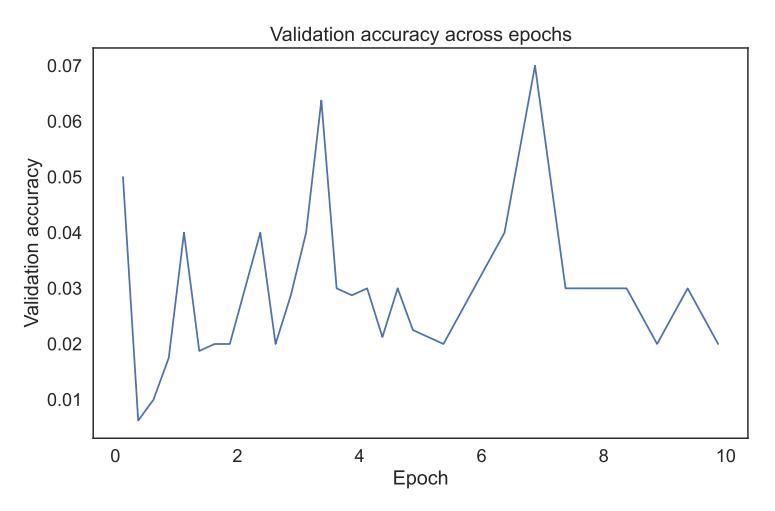

Figure 10: Accuracy across training for Llama-7b on the instruction-reversal task for experiment 2.

# D Compute costs

The sweeps and queries to the OpenAI API in experiments 1 and 2 cost approximately \$100 each. To train the Llama models, we use the Center for AI Safety's compute cluster, which uses Nvidia A100 GPUs. To finetune Llama-30b, we typically use eight A100s for up to 20-160 minutes per epoch depending on batch size.