# MM1: Methods, Analysis & Insights from Multimodal LLM Pre-training

Brandon McKinzie ◦ , Zhe Gan ◦ , Jean-Philippe Fauconnier ⋆ , Sam Dodge ⋆ , Bowen Zhang ⋆ , Philipp Dufter ⋆ , Dhruti Shah ⋆ , Xianzhi Du ⋆ , Futang Peng, Floris Weers, Anton Belyi, Haotian Zhang, Karanjeet Singh, Doug Kang, Ankur Jain, Hongyu Hè, Max Schwarzer, Tom Gunter, Xiang Kong, Aonan Zhang, Jianyu Wang, Chong Wang, Nan Du, Tao Lei, Sam Wiseman, Guoli Yin, Mark Lee, Zirui Wang, Ruoming Pang, Peter Grasch ⋆ , Alexander Toshev † , and Yinfei Yang †

> Apple bmckinzie@apple.com , zhe.gan@apple.com ◦First authors; ⋆Core authors; †Senior authors

Abstract. In this work, we discuss building performant Multimodal Large Language Models (MLLMs). In particular, we study the importance of various architecture components and data choices. Through careful and comprehensive ablations of the image encoder, the vision language connector, and various pre-training data choices, we identified several crucial design lessons. For example, we demonstrate that for large-scale multimodal pre-training using a careful mix of image-caption, interleaved image-text, and text-only data is crucial for achieving stateof-the-art (SOTA) few-shot results across multiple benchmarks, compared to other published multimodal pre-training results. Further, we show that the image encoder together with image resolution and the image token count has substantial impact, while the vision-language connector design is of comparatively negligible importance. By scaling up the presented recipe, we build MM1, a family of multimodal models, including both dense variants up to 30B and mixture-of-experts (MoE) variants up to 64B, that are SOTA in pre-training metrics and achieve competitive performance after supervised fine-tuning on a range of established multimodal benchmarks. Thanks to large-scale pre-training, MM1 enjoys appealing properties such as enhanced in-context learning, and multi-image reasoning, enabling few-shot chain-of-thought prompting.

## 1 Introduction

In recent years, the research community has achieved impressive progress in language modeling and image understanding. Thanks to the availability of largescale image-text data and compute at scale, we have seen the emergence of highly performant Large Language Models (LLMs) [\[9,](#page-16-0)[10,](#page-16-1)[19,](#page-16-2)[21,](#page-16-3)[26,](#page-17-0)[92,](#page-20-0)[93,](#page-21-0)[102,](#page-21-1)[107,](#page-21-2)[109,](#page-21-3) [116,](#page-22-0) [131\]](#page-23-0) and Vision Foundation Models [\[40,](#page-18-0) [88,](#page-20-1) [91\]](#page-20-2) that have become the defacto standard for the majority of language and image understanding problems.

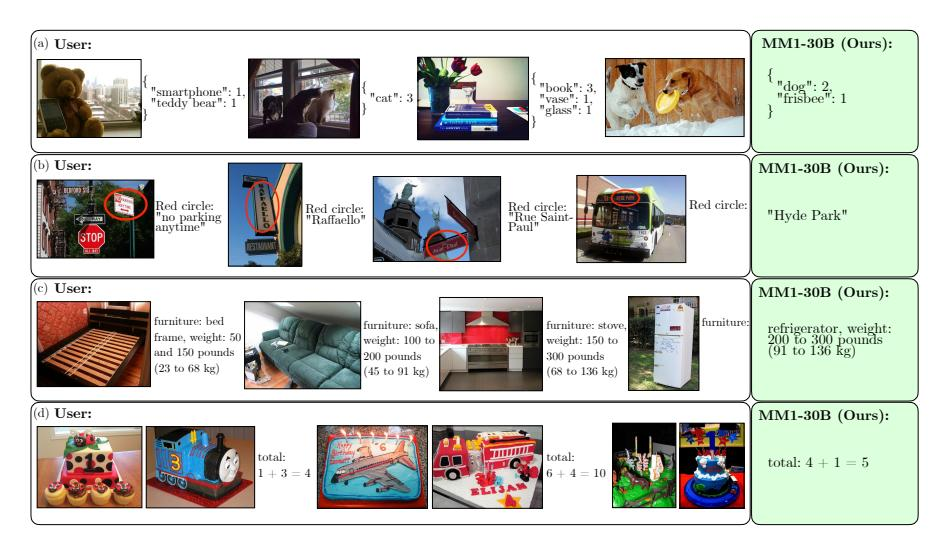

Fig. 1: MM1 can perform in-context predictions thanks to its large-scale multimodal pre-training. This allows MM1 to (a) count objects and follow custom formatting, (b) refer to parts of the images and perform OCR, (c) demonstrate common-sense and word knowledge about everyday objects, and (d) perform basic math functions. Images are from the COCO 2014 validation set [72].

Given the above developments, an area of multimodal foundation models has emerged that marries the above advances into a single model achieving superior capabilities. In particular, Multimodal Large Language Models (MLLMs) are large-scale foundation models that consume image and text data and produce text [28,67,79,110]. After the rise of LLMs, MLLMs are emerging as the next frontier in foundation models.

When it comes to transparency, existing MLLMs fall into two categories: closed models [1, 106] and open models [3–5, 77, 90]. In the former category, the models might be available for use, but little to nothing is known about the data, model architecture, and training details. In the latter category, the model parameters might be released together with a detailed description of data, model, and training configurations, thus allowing the community to build upon. However, most of the works, both open and closed, release close to nothing about the process they have undergone to arrive at their algorithmic design choices, especially regarding multimodal pre-training.

To further research in this area, we believe it is imperative to distill principles and lessons of how to build such models that might outlive concrete component implementations. Thus, in this paper, we document the MLLM building process and attempt to formulate design lessons, that we hope are of use to the community.

In particular, our contributions are as follows. First, we perform ablations at small scale across (1) model architecture decisions and (2) pre-training data choices. We identify several interesting trends. On the modeling side, we see that

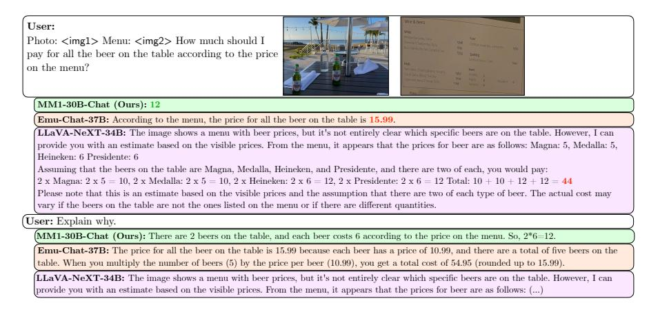

Fig. 2: MM1 can follow instructions and reason across images. Example and images from VILA [71]; VILA answers correctly when prompted with chain-of-thought.

design aspects are in the following order of importance: image resolution, visual encoder loss and capacity, and visual encoder pre-training data. Surprisingly, though, we find little evidence that architectural decisions of how visual data is fed into the LLM matter.

Further, we use three different types of multimodal pre-training data: image-caption, interleaved image-text, and text-only data. We see that when it comes to few-shot and text-only performance, interleaved and text-only training data is of paramount importance, while for zero-shot performance, caption data matters most. We demonstrate that these trends hold after Supervised Fine-Tuning (SFT), both on the evaluations used in the pre-training as well as on further benchmarks. This shows that capabilities and modeling decisions discovered during pre-training are retained after fine-tuning.

Finally, we scale up our model by using larger LLMs, from 3B, 7B, to 30B, and by exploring mixture-of-experts (MoE) models, from 3B with 64 experts to 7B with 32 experts. This leads to a family of performant models, that outperforms most of the relevant works to the best of our knowledge. In particular, the pretrained model MM1 is SOTA, performing better than Emu2 [105], Flamingo [3], and IDEFICS [47] on captioning and visual question answering (VQA) tasks in few-shot settings, both in small and large size regimes. The final models, after SFT, achieve competitive performance across 12 established multimodal benchmarks.

Thanks to large-scale multimodal pre-training, as shown in Figures 1 and 2, MM1 enjoys appealing properties such as in-context predictions, multi-image and chain-of-thought reasoning. MM1 also enables strong few-shot learning capability after instruction tuning. These strong results demonstrate that the presented recipe for building MLLMs translates the design principles to a competitive model at scale. We hope that these presented insights will remain relevant, even as specific modeling components and data sources evolve.

## 2 Related Work

The type of MLLMs concerned in this work build upon a strong pre-trained autoregressive LLM that consumes both text and visual tokens, the latter obtained via an image encoder [\[5,](#page-16-4)[17,](#page-16-5)[28,](#page-17-1)[45,](#page-18-2)[64,](#page-19-3)[76,](#page-20-6)[90\]](#page-20-5). Our approach is based on a decoder-only architecture, akin to Kosmos-1 [\[45\]](#page-18-2).

Recent research has increasingly focused on visual instruction tuning on top of the pre-trained LLM [\[63\]](#page-19-4). Prominent examples include LLaVA(-1.5/NeXT) [\[74–](#page-20-7) [76\]](#page-20-6), MiniGPT-4 [\[134\]](#page-23-1), mPLUG-Owl(-2/Doc) [\[123–](#page-22-1)[125\]](#page-22-2), Otter [\[60,](#page-19-5) [61\]](#page-19-6), Instruct-BLIP [\[24\]](#page-17-2), Honeybee [\[12\]](#page-16-6), SPHINX(-X) [\[36,](#page-17-3) [73\]](#page-19-7), to name a few. There is also a rich body of literature on constructing instruction-tuning data [\[15,](#page-16-7) [37,](#page-17-4) [66,](#page-19-8) [113,](#page-22-3) [132\]](#page-23-2), enabling MLLMs for referring and grounding [\[14,](#page-16-8)[56,](#page-19-9)[90,](#page-20-5)[115,](#page-22-4)[126,](#page-22-5)[130\]](#page-23-3), image generation and editing [\[34,](#page-17-5) [54,](#page-18-3) [105\]](#page-21-6).

The body of work that focuses on thorough ablations, in particular also on the pre-training side, is relatively sparse. VILA [\[71\]](#page-19-2) focuses on studying various components of multimodal pre-training, but falls short of providing optimization details or detailed pre-training evaluations. Emu2 [\[105\]](#page-21-6), on the other side, provides details regarding pre-training optimization parameters and base model results. However, they do not provide ablations that justify the various component decisions. IDEFICS [\[58\]](#page-19-10) is another work that provides details regarding large-scale multimodal pre-training. However, their focus is primarily on closely replicating the closed-source Flamingo [\[3\]](#page-15-1) model.

In contrast to these previous works, we aim to provide details regarding all components of our pre-training strategy, from hyperparameters to data to architecture. We also provide results for our base pre-trained models to help differentiate the impact of multimodal pre-training vs. instruction tuning. Furthermore, we provide extensive ablations on the precise impacts of decisions regarding visual encoders, vision-language connectors, and pre-training data mixture.

## 3 Recipe for Building MM1

Building performant MLLMs is a highly empirical endeavor. Although the highlevel architectural design and training procedure are clear, their concrete form and execution is not. In this work, we present details of the ablations we have performed to arrive at a performant model. We explore three major axes of design decisions:

- Architecture: We investigate different pre-trained image encoders and explore varying ways of connecting LLMs with these encoders.
- Data: We consider different types of data and their relative mixture weights.
- Training Procedure: We explore how to train the MLLM including the hyperparameters and what parts of the model to train at what stage.

#### 3.1 Empirical Setup for Ablations

In order to identify what are good choices along each of the above axes, we need an efficient way to assess model performance. As training a large MLLM can take substantial resources, we utilize a simplified setup for ablations.

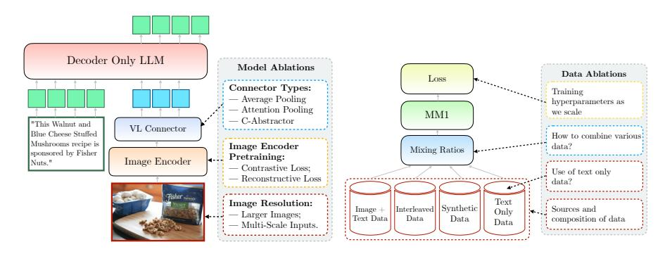

**Fig. 3:** *Left:* Model ablations: what visual encoder to use, how to feed rich visual data, and how to connect the visual representation to the LLM. *Right:* Data ablations: type of data, and their mixture.

More concretely, we use a smaller base configuration of our model that we ablate from. We modify one component at a time, either an architectural module or a data source, and assess the impact of the design choice for each of these components. This allows us to arrive to the final model-data configuration that we scale up, both in terms of model parameters as well as training time. The base configuration for ablations is as follows:

- Image Encoder: A ViT-L/14 [27] model trained with a CLIP loss [91] on DFN-5B [31] and VeCap-300M [57]; images of size  $336 \times 336$ .
- Vision-Language Connector: C-Abstractor [12] with 144 image tokens.
- **Pre-training Data**: A mix of captioned images (45%), interleaved imagetext documents (45%), and text-only (10%) data.
- Language Model: A 1.2B transformer decoder-only language model.

To evaluate the different design decisions, we use zero-shot and few-shot (4-and 8-shot) performance on a variety of captioning and VQA tasks: COCO Captioning [18], NoCaps [2], TextCaps [103], VQAv2 [38], TextVQA [104], VizWiz [39], GQA [46], and OK-VQA [82].

#### 3.2 Model Architecture Ablations

In this work, we analyze components that enable an LLM to process visual data. Specifically, we investigate (1) how to best pre-train a visual encoder, and (2) how to bridge the visual features to the space of the LLM (see Figure 3, left).

Image Encoder Pre-training. Most MLLMs use a CLIP pre-trained image encoder [24, 74, 76, 124], while recent works also started to explore vision-only self-supervised models, such as DINOv2 [73, 108], as the image encoder. Similar to these prior works, we find that the choice of the pre-trained image encoder can substantially impact downstream results both after multimodal pre-training and after instruction tuning. Here, we primarily ablate the importance of image resolution and image encoder pre-training objective. Note that unlike the rest

| _      |                                                  | Results  |            |                               |        |        |        |
|--------|--------------------------------------------------|----------|------------|-------------------------------|--------|--------|--------|
|        | Model                                            | Arch.    | Image Res. | Data                          | 0-shot | 4-shot | 8-shot |
| n.     | $AIM_{600M}$                                     | ViT/600M |            |                               | 36.6   | 56.6   | 60.7   |
| econ.  | $AIM_{1B}$                                       | ViT/1B   | 224        | DFN-2B                        | 37.9   | 59.5   | 63.3   |
| Ä      | ${\rm AIM_{3B}}$                                 | ViT/3B   |            |                               | 38.9   | 60.9   | 64.9   |
|        | $\text{CLIP}_{\text{DFN+VeCap}}$                 | ViT-L    |            | DFN-5B+VeCap                  | 36.9   | 58.7   | 62.2   |
| ē      | $CLIP_{DFN}$                                     | ViT-H    | 224        | DFN-5B                        | 37.5   | 57.0   | 61.4   |
| astive | $\mathrm{CLIP}_{\mathrm{DFN+VeCap}}$             | ViT-H    |            | ${\it DFN-5B+VeCap}$          | 37.5   | 60.0   | 63.6   |
| ıtra   | $\overline{\text{CLIP}_{\text{DFN+VeCap}}}$      | ViT-L    |            | DENIED IV.C                   | 39.9   | 62.4   | 66.0   |
| Contra | $\operatorname{CLIP}_{\operatorname{DFN+VeCap}}$ |          | 336        | DFN-5B+VeCap                  | 40.5   | 62.6   | 66.3   |
|        | $\operatorname{CLIP}_{\operatorname{OpenAI}}$    | ViT-L    |            | ${\rm ImageText\text{-}400M}$ | 39.3   | 62.2   | 66.1   |
|        | CLIP DFN                              | ViT-H    | 378        | DFN-5B                        | 40.9   | 62.5   | 66.4   |

**Table 1:** MM1 pre-training ablation across different image encoders (with 2.9B LLM). Note that the values in the Data column correspond to the data that was used for the initial training of the image encoder itself, not MM1. Recon.: Reconstructive loss. AIM: [30]; DFN-2/5B: [31]; VeCap: VeCap-300M [57]; OpenAI [91].

of our ablations, here we use a 2.9B LLM (instead of 1.2B) to ensure there is sufficient capacity to utilize some of the larger image encoders.

Contrastive losses. When trained on large-scale image-text datasets, the resulting models possess strong semantic understanding of the image data as evidenced by performance on various forms of image classification and retrieval tasks [91]. These results were enabled because of the availability of large-scale image-text data, which can endow a visual encoder with semantic knowledge. More recently, automatically curated large-scale datasets and synthetic captions have led to even stronger encoders [31,57].

Reconstructive Losses. When it comes to dense prediction, CLIP-style models struggle to attain the same strong performance [94, 95, 112]. This property can be problematic for MLLMs, as many of the tasks such as VQA and captioning require detailed image understanding. Hence, we also consider image encoders learned using reconstructive losses, as such losses explicitly capture all parts of an image. In particular, we utilize AIM [30], which has shown that a carefully designed autoregressive reconstructive loss on image data alone scales well.

Encoder Lesson: Image resolution has the highest impact, followed by model size and training data composition. As we can see in Table 1, increasing image resolution from 224 to 336 results in approx. 3% boost in all metrics across all architectures. Increasing the model size from ViT-L to ViT-H, a doubling in parameters, results in a modest performance increase of usually less than 1%. Finally, adding VeCap-300M [57], a dataset of synthetic captions, yields more than 1% boost in few-shot scenarios.

When it comes to model type, the results are less conclusive. Contrastive methods tend to result in higher performance than reconstructive. In particular, encoders based on ViT-L of 300M parameters result in 0.3% to 1.5% performance gain compared to AIM $_{600M}$  of comparable size (only 20 of the 24 AIM model

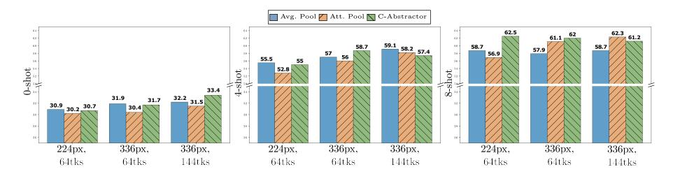

Fig. 4: 0-shot, 4-shot, and 8-shot ablations across different visual-language connectors for two image resolutions, and two image token sizes.

layers are used at inference). This lesson is, nevertheless, inconclusive for the potential of AIM as it has been trained on less than half the data. Similarly, the widely used open sourced OpenAI model [\[91\]](#page-20-2) perform on-par with our model of comparable capacity but trained on DFN+VeCap data mixture.

Vision-Language Connector and Image Resolution. The goal of this component is to translate the visual representation to the space of the LLM. As image encoders are ViTs, their output is either a single embedding, or a set of gridarranged embeddings corresponding to the input image patches. Therefore, the spatial arrangement of the image tokens needs to be converted to the sequential one of the LLM. At the same time, the actual image token representations are to be mapped to the word embedding space.

While doing so, there are two conflicting requirements. On the one side, we would like to capture as much detail from the image as possible, fulfilled by increasing the number of image token embeddings. On the other side, especially in the case of multi-image input, having a large number of input tokens per image is computationally challenging.

We consider using 64 or 144 tokens to represent the image, as well as two different image resolutions, 224 and 336. Further, we consider the following architectural options:

Average Pooling. Following [\[105\]](#page-21-6), we apply n×n average pooling on the output of the ViT image encoder, followed by a linear projection (n ∈ {8, 12}).

Attention Pooling. Motivated by the fact that image token representations are in a different space than the LLM input embeddings, attention pooling using k learnable queries, is a natural approach. By varying k one can vary the number of inputs from a single image that are fed into the LLM (we use k ∈ {64, 144}).

Convolutional Mapping. More recently, Honeybee [\[12\]](#page-16-6) has studied the above questions and proposed the C-Abstractor module. It is implemented as a ResNet [\[41\]](#page-18-7) block that preserves local information while through adaptive pooling can change the number of image tokens.

VL Connector Lesson: Number of visual tokens and image resolution matters most, while the type of VL connector has little effect. The results shown in Figure [4](#page-6-0) demonstrate that both zero- and few-shot performance increases as we increase the number of visual tokens or/and image resolution. However, contrary to what has been reported in the literature [\[12\]](#page-16-6), different architectural designs do not appear to conclusively produce stronger models. After instruction tuning, all three architectures achieve very similar results at the 336px and 144 token setting. (See Appendix Figure [10](#page-30-0) for fine-tuning results.)

## 3.3 Pre-training Data Ablation

Large-scale and task-appropriate data is of paramount importance in training performant models. Typically, models are trained in two stages, pre-training and instruction tuning. In the former stage web-scale data is used while in the latter stage task-specific curated data is utilized. In the following, we focus on the pre-training stage and elaborate our data choices (see Figure [3,](#page-4-0) right).

| Data Type                    | Sources                                                                             | Size                  |
|------------------------------|-------------------------------------------------------------------------------------|-----------------------|
| Captioned Images             | CC3M [100], CC12M [13], HQIPT-204M [94], COYO [11], Web Image-Text-1B (Internal) | 2B image-text pairs   |
| Captioned Images (Synthetic) | VeCap [57]                                                                          | 300M image-text pairs |
| Interleaved Image-Text       | OBELICS [58], Web Interleaved (Internal)                                            | 600M documents        |
| Text-only                    | Webpages, Code, Social media, Books, Encyclopedic, Math                          | 2T tokens             |

Table 2: List of datasets for pre-training multimodal large language models.

Two types of data are commonly used to train MLLMs: captioning data consisting of images with paired text descriptions; and interleaved image-text documents from the web (see Appendix [A.1](#page-24-0) for details). Note that captioning data tends to contain relatively short text with high relevance to the image. On the contrary, interleaved data has substantially longer and more diverse text with less relevance, on average, to the surrounding images. Finally, we include text-only data to help preserve the language understanding capabilities of the underlying pre-trained LLM. The full list of datasets is summarized in Table [2.](#page-7-0)

We use the same model setup for ablations described in Section [3.1,](#page-3-0) with the only exception that we train 200k steps here to fully leverage the large-scale data training. We also incorporate a set of commonly employed text tasks, referred to as TextCore[1](#page-7-1) , as part of the evaluation to better assess the effects of data mixture. These lead to the following lessons:

Data Lesson 1: Interleaved data is instrumental for few-shot and textonly performance, while captioning data lifts zero-shot performance. In Figure [5a,](#page-8-0) we present results across different mixes of interleaved and captioned data. Zero-shot performance increases consistently, from 25.8% to 39.3%, as we increase the amount of captioned data. At the same time, however, for 4- and 8-shot performance, having at least 50% of the data being interleaved is crucial to maintain over 61% for 8-shot or 58% for 4-shot. Without it, performance drops drastically to 45% and 43.7%, respectively. Since interleaved data naturally contains multiple images and accompanying text which are often interrelated, such data is inherently similar to few-shot test inputs, which aligns well

1 TextCore tasks include ARC [\[22\]](#page-16-12), PIQA [\[7\]](#page-16-13), LAMBADA [\[89\]](#page-20-9), WinoGrande [\[97\]](#page-21-14), HellaSWAG [\[129\]](#page-23-4), SciQ [\[117\]](#page-22-7), TriviaQA [\[50\]](#page-18-8), and WebQS [\[6\]](#page-16-14).

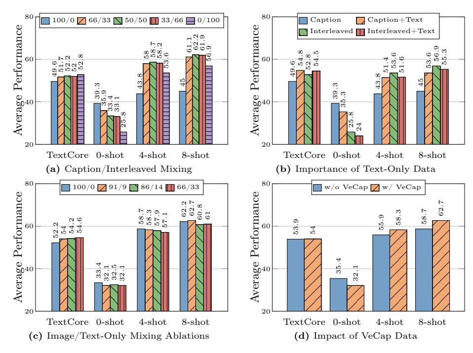

Fig. 5: Data Ablations. For each ablation, we present four different metrics: TextCore, 0-shot, 4-shot, and 8-shot. (a) Results with image data where we present five different mixing ratios between interleaved and captioned data. (b) Results with and without text-only data. We mix the text-only data separately with captioned and interleaved data. (c) Results with different mixing ratios between image data (caption and interleaved) and text-only data. (d) Results with and without including VeCap as part of caption data.

with empirical results. However, due to the nature of common evaluation being heavily tailored to captioning problems (3 out of the 8 benchmarks are captioning), captioning data notably lifts zero-shot performance. Interestingly, the use of interleaved data further boosts performance on these very same captioning benchmarks in few-shot settings. Similarly, text-only performance benefits from interleaved data, likely as interleaved data contains long-form text as well.

Data Lesson 2: Text-only data helps with few-shot and text-only performance. We utilize text-only data as a way to maintain the language understanding capabilities of the model. As seen in Figure 5b, combining text-only and captioned data boost few-shot performance. In other words, long text does allow the model to utilize multiple image and text examples as context to perform better question answering and captioning. On the other side, combining text-only with interleaved data leads to a drop in performance, albeit a minor one. In both cases, text-only performance is increased as shown in the boost of TextCore numbers.

Data Lesson 3: Careful mixture of image and text data can yield optimal multimodal performance and retain strong text performance.

The above lesson leads to the question of how to best combine text-only data to achieve both strong image and language understanding. In Figure [5c,](#page-8-0) we experiment with several mixing ratios between image (caption and interleaved) and text-only data. We see that with caption/interleaved/text ratio 5:5:1, we achieve a good balance of strong multimodal performance while still keeping comparable text-only understanding performance.

Data Lesson 4: Synthetic data helps with few-shot learning. At last, we study the importance of the synthetic caption data, VeCap [\[57\]](#page-19-11). It is of higher quality, but relatively small, being only 7% compared to all caption data. As shown in Figure [5d,](#page-8-0) it does give a non-trivial boost in few-shot performance, of 2.4% and 4% absolute.

## 4 Final Model and Training Recipe

We collect the results from the previous ablations to determine the final recipe for MM1 multimodal pre-training:

- Image Encoder: Motivated by the importance of image resolution, we use a ViT-H [\[27\]](#page-17-6) model with 378×378 resolution, pre-trained with a CLIP objective on DFN-5B [\[31\]](#page-17-7).
- Vision-Language Connector: As the number of visual tokens is of highest importance, we use a VL connector with 144 tokens. The actual architecture seems to matter less, we opt for C-Abstractor [\[12\]](#page-16-6).
- Data: In order to maintain both zero- and few-shot performance, we use the following careful mix of 45% interleaved image-text documents, 45% imagetext pair documents, and 10% text-only documents.

In order to improve the model performance, we scale up the LLM size to 3B, 7B, and 30B parameters. We initialize both the image encoder and the underlying LLM decoder weights for MM1 from in-house pre-trained models[2](#page-9-0) . We then perform multimodal pre-training on the above data mix for 200k steps (approx. 400B tokens). All models are pretrained entirely unfrozen with sequence length 4096, up to 16 images per sequence at 378×378 resolution, with a batch size

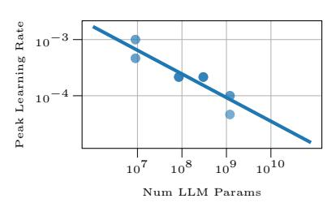

Fig. 6: Optimal peak learning rate as a function of model size. The data points represent experiments that achieved close-to-optimal 8-shot performance for their associated model size.

of 512 sequences. All models are trained using the AXLearn framework.[3](#page-9-1)

2 The LLM is pre-trained on the text-only data mixture mentioned in Sec. [3.3.](#page-7-2)

3 <https://github.com/apple/axlearn>

Model Scaling. At this scale it is infeasible to do proper hyperparameter search. Instead, using established scaling characteristics of LLMs [\[43,](#page-18-9) [44,](#page-18-10) [120,](#page-22-8) [121\]](#page-22-9), we perform a grid search of learning rate at small scale, 9M, 85M, 302M, and 1.2B, while using the components identified in Sec. [3.2](#page-4-1)[4](#page-10-0) to identify optimal learning rate and extrapolate it to larger scale. We use a linear regression in log space to extrapolate from smaller to larger models (see Figure [6\)](#page-9-2), resulting in the following prediction of optimal peak learning rate η given the number of (nonembedding) parameters N:

$$\eta = \exp(-0.4214\ln(N) - 0.5535) \tag{1}$$

Similar to [\[48\]](#page-18-11), we found in preliminary experiments that validation loss wasn't strongly correlated with downstream task performance. Therefore, we directly use downstream 8-shot average performance for curve fitting.

For N = 3e 10, this fit predicts η = 2.2e −5 , which is what we use for the final MM1-30B. We initially performed a similar procedure to determine reasonable values for weight decay, denoted by λ, but ultimately found that the simple rule of scaling weight decay by peak learning rate as λ = 0.1η worked well for all models. All further training details are described in Appendix [B.](#page-26-0)

Scaling via Mixture-of-Experts (MoE). MoE scales the total number of model parameters while keeping the activated parameters constant. It enjoys a larger model capacity without sacrificing inference speed significantly. Recently, MoE has shown promising results in language [\[23,](#page-17-9)[29,](#page-17-10)[32,](#page-17-11)[49,](#page-18-12)[136\]](#page-23-5), multimodal [\[70,](#page-19-12) [87\]](#page-20-10) and computer vision [\[16,](#page-16-15) [25,](#page-17-12) [55,](#page-18-13) [96\]](#page-21-15) tasks.

In experiments, we further explore scaling the dense model by adding more experts in the FFN layers of the language model. Our MoE implementation generally follows GShard [\[59\]](#page-19-13) and ST-MoE [\[136\]](#page-23-5). Specifically, we design two MoE models, a 3B-MoE using 64 experts that replaces a dense layer with a sparse layer in every-2 layers and a 7B-MoE using 32 experts that replaces a dense layer with a sparse layer in every-4 layers. The 3B-MoE contains 64B parameters in total and the 7B-MoE contains 47B parameters in total. We adopt top-2 gating with a load balance loss term with a 0.01 coefficient to encourage a better expert load balance and adopt a router z-loss term with a 0.001 coefficient to stabilize training. To convert a dense model to MoE, we only replace the dense language decoder with an MoE language decoder. The image encoder and the vision-language connector are kept the same. To train an MoE, we adopt the same training hyperparameters that are discovered for the dense backbone[5](#page-10-1) and identical training settings including training data and training tokens.

Multimodal Pre-training Results. We evaluate pre-trained models on captioning and VQA tasks via appropriate prompting.[6](#page-10-2) We evaluate zero- and few-

4 The only exception is image encoder, which we downsize to the CLIPDFN+VeCap ViT-L with 336×336 resolution to reduce compute costs for the grid searches.

5 The dense backbone is defined to be the dense model we use to construct the MoE model.

6 The models are prompted with "{IMAGE} A photo of" for captioning, and "{IMAGE} Question: {QUESTION} Short answer:" for VQA. See Appendix [C.1](#page-29-0) for more details on pre-training evaluation.

| Model                     | Shot          | (                     | Caption               | ing                 | Visual Question Answering |                     |                     |                     |  |
|---------------------------|---------------|-----------------------|-----------------------|---------------------|---------------------------|---------------------|---------------------|---------------------|--|
| Wiodei                    | SHOU          | COCO                  | NoCaps                | TextCaps            | s VQAv2 ′                 | TextVQA             | VizWiz              | OKVQA               |  |
| MM1-3B Model Comparisons  |               |                       |                       |                     |                           |                     |                     |                     |  |
| Flamingo-3B [3]           | $0^{\dagger}$ | 73.0                  | _                     | -                   | 49.2                      | 30.1                | 28.9                | 41.2                |  |
|                           | _ 8_          | 90.6                  |                       |                     | 55.4                      | 32.4                | 38.4                | 44.6                |  |
| MM1-3B                    | 0             | 73.5                  | 55.6                  | 63.3                | 46.2                      | 29.4                | 15.6                | 26.1                |  |
| WIWIT-0D                  | 8             | 114.6                 | 104.7                 | 88.8                | 63.6                      | 44.6                | 46.4                | 48.4                |  |
| MM1-7B Model Co           | omparis       | ons                   |                       |                     |                           |                     |                     |                     |  |
| IDEFICS-9B [58]           | $0^{\dagger}$ | 46.0*                 | 36.8                  | 25.4                | 50.9                      | 25.9                | 35.5                | 38.4                |  |
| [96]                      | _ 8_          | 97.0*                 | 86.8                  | _ 63.2_             | _ 56.4 _                  | _ 27.5_             | 40.4                | 47.7                |  |
| Flamingo-9B [3]           | $0^{\dagger}$ | 79.4                  | _                     | _                   | 51.8                      | 31.8                | 28.8                | 44.7                |  |
|                           | _ 8_          | 99.0                  |                       |                     | 58.0                      | 33.6                | 39.4                | 50.0                |  |
| Emu2-14B [105]            | $0^{\dagger}$ | _                     | _                     | _                   | 52.9                      | _                   | 34.4                | 42.8                |  |
|                           | _ 8_          |                       |                       |                     | 59.0                      |                     | 43.9                |                     |  |
| MM1-7B                    | 0             | 76.3                  | 61.0                  | 64.2                | 47.8                      | 28.8                | 15.6                | 22.6                |  |
| WIWIT-1D                  | 8             | 116.3                 | 106.6                 | 88.2                | 63.6                      | 46.3                | 45.3                | 51.4                |  |
| MM1-30B Model Comparisons |               |                       |                       |                     |                           |                     |                     |                     |  |
|                           | $0^{\dagger}$ | 91.8*                 | 65.0                  | 56.8                | 60.0                      | 30.9                | 36.0                | 45.2                |  |
| IDEFICS-80B [58]          | 8             | 114.3*                | 105.7                 | 77.6                | 64.8                      | 35.7                | 46.1                | 55.1                |  |
|                           | _ 16          | 116.6*                | 107.0                 | 81.4                | 65.4                      | _ 36.3_             | 48.3 _              | _ 56.8              |  |
|                           | $0^{\dagger}$ | 84.3                  | _                     | _                   | 56.3                      | 35.0                | 31.6                | 50.6                |  |
| Flamingo-80B [3]          | 8             | 108.8                 | _                     | _                   | 65.6                      | 37.3                | 44.8                | 57.5                |  |
|                           | _ 16          | 110.5                 | =                     |                     | 66.8                      | _ 37.6              | 48.4                | 57.8                |  |
|                           | 0             | -                     | -                     | -                   | 33.3                      | 26.2                | 40.4                | 26.7                |  |
| Emu2-37B [105]            | 8             | _                     | _                     | _                   | 67.8                      | 49.3                | 54.7                | 54.1                |  |
|                           | _ 16          |                       |                       |                     | 68.8                      | _ 50.3              | 57.0                | 57.1                |  |
| MM1 20D                   | 0             | 70.3                  | 54.6                  | 64.9                | 48.9                      | 28.2                | 14.5                | 24.1                |  |
| MM1-30B                   | 8 16       | 123.1 <b>125.3</b> | 111.6 <b>116.0</b> | 92.9 <b>97.6</b> | 70.9 <b>71.9</b>       | 49.4 <b>50.6</b> | 49.9 <b>57.9</b> | 58.3 <b>59.3</b> |  |
|                           | 16            | 125.3                 | 116.0                 | 97.6                | 71.9                      | 50.6                | 57.9                | 59.3                |  |

**Table 3:** Multimodal pre-training evaluations. (\*) IDEFICS includes PMD in its training data (includes COCO). (†) These models include two text-only demonstrations in their "0" prompt, whereas MM1 does not. For the full table, see Table 6 in Appendix.

shot, as shown in Table 3, and compare against the few approaches that report few-shot pre-training performance. Note that we only compare our model with larger models, e.g., comparing our 30B model with two 80B models.

When it comes to few-shot performance, MM1 outperforms all published prior work for pre-trained MLLMs. We see superior performance at 30B across captioning benchmarks and the VizWiz-QA benchmark. On VQAv2, TextVQA, OKVQA, at that scale we are comparable to Emu2 [105]. For zero-shot performance7, even without instruction fine-tuning, our models perform favorably on

&lt;sup>7 We provide zero-shot results as a reference for the associated few-shot numbers, but we intentionally do not hill-climb on zero-shot metrics as they are mostly indicative of how well the pre-training mixture matches the associated evaluation task format.

TextCaps across all model sizes, and comparable to Flamingo-3B at small scales for most benchmarks.

## 5 Supervised Fine-Tuning

In this section, we describe the supervised fine-tuning (SFT) experiments trained on top of the pre-trained models described in the previous sections.

SFT Data Mixture. We follow LLaVA-1.5 [\[74\]](#page-20-7) and LLaVA-NeXT [\[75\]](#page-20-11), and collect roughly 1.45M SFT examples from a diverse set of datasets, including

- Instruction-response pairs generated by GPT-4 and GPT-4V, including LLaVA-Conv and LLaVA-Complex [\[76\]](#page-20-6) for conversations and complex reasoning, and ShareGPT-4V [\[15\]](#page-16-7)[8](#page-12-0) for detailed image descriptions;
- Academic task oriented vision-language (VL) datasets, including (i) VQAv2 [\[38\]](#page-18-4), GQA [\[46\]](#page-18-6), OKVQA [\[82\]](#page-20-8), A-OKVQA [\[98\]](#page-21-16), and COCO Captions [\[18\]](#page-16-9) for natural images; (ii) OCRVQA [\[86\]](#page-20-12), and TextCaps [\[103\]](#page-21-7) for text-rich images; and (iii) DVQA [\[51\]](#page-18-14), ChartQA [\[83\]](#page-20-13), AI2D [\[52\]](#page-18-15), DocVQA [\[85\]](#page-20-14), InfoVQA [\[84\]](#page-20-15), and Synthdog-En [\[53\]](#page-18-16) for document and chart understanding.
- Text-only SFT data: We include an internal text-only dataset to ensure the model is capable of text-only instruction following.

The academic VL datasets are formatted into the instruction-following format, following LLaVA-1.5 [\[74\]](#page-20-7). More details are provided in Appendix [A.3.](#page-25-0) All datasets are mixed together and randomly sampled during training.[9](#page-12-1)

During SFT, we keep both the image encoder and the LLM backbone unfrozen; other SFT training details are provided in Appendix [B.2.](#page-28-0) We evaluate our models across 12 benchmarks (see Appendix [C.2](#page-29-1) for details).

Scaling to Higher Resolutions. Intuitively, higher image resolution leads to better performance. To support high-resolution SFT, we use two approaches:

Positional embedding interpolation, e.g., as explored in Qwen-VL [\[5\]](#page-16-4) and BLIP2 [\[65\]](#page-19-14). After positional embedding interpolation, the vision transformer backbone is adapted to the new resolution during fine-tuning. Through this method, we have fine-tuned our model to support image resolutions ranging from 448×448, 560×560, to 672×672. Note that, for a resolution of 672×672, with a patch size of 14×14, an image is represented with 2, 304 tokens.

Sub-image decomposition, recently introduced by SPHINX [\[73\]](#page-19-7), Monkey [\[69\]](#page-19-15), and LLaVA-NeXT [\[75\]](#page-20-11). Computing self-attention among more than 2, 000 image tokens is computationally challenging, limiting further scaling to even higher image resolutions. Following SPHINX [\[73\]](#page-19-7), as shown in Figure [7a,](#page-14-0) for a high-resolution input image, e.g., 1344×1344, we construct five images of 672 × 672, and feed them as independent images into our visual encoder.

8 We also experimented with LVIS-Instruct4V [\[113\]](#page-22-3), but did not observe better performance than using ShareGPT-4V [\[15\]](#page-16-7), thus it is not included in the final mixture.

9 While some different data mixing strategies were explored, simply mixing these datasets already achieves good performance, similar to observations in Honeybee [\[12\]](#page-16-6).

| Model                | VQA v2 | $VQA^T$ | $\mathrm{SQA}^{\mathrm{I}}$ | MMMU      | MathV            | MMEP   | $\mathrm{MME^{C}}$ | MMB   | SEED      | POPE  | LLaVAW | MM-Vet |
|----------------------|-------------------|---------|-----------------------------|-----------|------------------|--------|--------------------|-------|-----------|-------|--------|--------|
| 3B Model Comparison  |                   |         |                             |           |                  |        |                    |       |           |       |        |        |
| MobileVLM [20]       | -                 | 47.5    | 61.0                        | _/-       | -                | 1288.9 | _                  | 59.6  | -/-       | 84.9  | -      | -      |
| LLaVA-Phi [135]      | 71.4              | 48.6    | 68.4                        | -/-       | _                | 1335.1 | _                  | 59.8  | -/-       | 85.0  | _      | 28.9   |
| Imp-v1 [99]          | 79.45             | 59.38   | 69.96                       | -/-       | _                | 1434.0 | _                  | 66.49 | _         | 88.02 | -      | 33.1   |
| TinyLLaVA [133]      | 79.9              | 59.1    | 69.1                        | -/-       | -                | 1464.9 | _                  | 66.9  | -/-       | 86.4  | 75.8   | 32.0   |
| Bunny [42]           | 79.8              | _       | 70.9                        | 38.2/33.0 | _                | 1488.8 | 289.3              | 68.6  | 62.5/-    | 86.8  | -      | -      |
| Gemini Nano-2 [106]  | 67.5              | 65.9    | -                           | 32.6/-    | 30.6             | -      | _                  | -     | -         | _     | -      | -      |
| MM1-3B-Chat          | 82.0              | 71.9    | 69.4                        | 33.9/33.7 | 32.0             | 1482.5 | 279.3              | 67.8  | 63.0/68.8 |       | 72.1   | 43.7   |
| MM1-3B-MoE-Chat      | 82.5              | 72.9    | 76.1                        | 38.6/35.7 | 32.6             | 1469.4 | 303.1              | 70.8  | 63.9/69.4 | 87.6  | 76.8   | 42.2   |
| 7B Model Comparison  |                   |         |                             |           |                  |        |                    |       |           |       |        |        |
| InstructBLIP-7B [24] | -                 | 50.1    | 60.5                        | _/-       | 25.3             | -      | _                  | 36.0  | 53.4/-    | -     | 60.9   | 26.2   |
| Qwen-VL-Chat-7B [5]  | 78.2              | 61.5    | 68.2                        | 35.9/32.9 | -                | 1487.5 | 360.7              | 60.6  | 58.2/65.4 | _     | _      | _      |
| LLaVA-1.5-7B [74]    | 78.5              | 58.2    | 66.8                        | -/-       | _                | 1510.7 | 316.1              | 64.3  | 58.6/66.1 | 85.9  | 63.4   | 31.1   |
| ShareGPT4V-7B [15]   | 80.6              | 60.4    | 68.4                        | -/-       | _                | 1567.4 | 376.4              | 68.8  | -/-       | _     | 72.6   | -      |
| LVIS-Ins4V-7B [113]  | 79.6              | 58.7    | 68.3                        | -/-       | _                | 1528.2 | _                  | 66.2  | 60.6/-    | 86.0  | 67.0   | 31.5   |
| VILA-7B [71]         | 79.9              | 64.4    | 68.2                        | -/-       | -                | 1531.3 | -                  | 68.9  | 61.1/-    | 85.5  | 69.7   | 34.9   |
| SPHINX-Intern2 [36]  | 75.5              | _       | 70.4                        | -/-       | 35.5             | 1260.4 | 294.6              | 57.9  | 68.8/-    | 86.9  | 57.6   | 36.5   |
| LLaVA-NeXT-7B [75]   | 81.8              | 64.9    | 70.1                        | 35.8/-    | 34.6             | 1519   | 332                | 67.4  | -/70.2    | 86.53 | 81.6   | 43.9   |
| MM1-7B-Chat          | 82.8              | 72.8    | 72.6                        | 37.0/35.6 | 35.9             | 1529.3 | 328.9              | 72.3  | 64.0/69.9 | 86.6  | 81.5   | 42.1   |
| MM1-7B-MoE-Chat      | 83.4              | 73.8    | 74.4                        | 40.9/37.9 | 40.9             | 1597.4 | 394.6              | 72.7  | 65.5/70.9 | 87.8  | 84.7   | 45.2   |
| 30B Model Comparison |                   |         |                             |           |                  |        |                    |       |           |       |        |        |
| Emu2-Chat-37B [105]  | 84.9              | 66.6    | _                           | 36.3/34.1 | -                | -      | _                  | _     | 62.8/-    | -     | -      | 48.5   |
| CogVLM-30B [114]     | 83.4              | 68.1    | -                           | 32.1/30.1 | -                | -      | -                  | -     | -         | -     | -      | 56.8   |
| LLaVA-NeXT-34B [75]  | 83.7              | 69.5    | 81.8                        | 51.1/44.7 | 46.5             | 1631   | 397                | 79.3  | -/75.9    | 87.73 | 89.6   | 57.4   |
| MM1-30B-Chat         | 83.7              | 73.5    | 81.0                        | 44.7/40.3 | $39.4^{\dagger}$ | 1637.6 | 431.4              | 75.1  | 65.9/72.1 | 87.6  | 89.3   | 48.7   |
| Gemini Pro [106]     | 71.2              | 74.6    | -                           | 47.9/-    | 45.2             | _      | 436.79             | 73.6  | -/70.7    | -     | -      | 64.3   |
| Gemini Ultra [106]   | 77.8              | 82.3    | -                           | 59.4/-    | 53.0             | -      | -                  | -     | -         | -     | -      | -      |
| GPT4V [1]            | 77.2              | 78.0    | _                           | 56.8/55.7 | 49.9             | -      | 517.14             | 75.8  | 67.3/69.1 | -     | -      | 67.6   |

**Table 4:** Comparison with SOTA models on MLLM benchmarks. VQAv2 [38]; VQAT: TextVQA [104]; SQAI: ScienceQA-IMG [81]; MMMU [128]; MathV: MathVista [80]; MMEP/C: the Perception/Cognition split of MME [33]; MMB: MMBench [78]; SEED: SEED-Bench [62]; POPE [68]; LLaVAW: LLaVA-Bench (In-the-Wild) [76]; MM-Vet [127]. The two numbers reported in MMMU denote the performance on the val and test split, respectively. The two numbers reported in SEED denote the performance on the whole SEED-Bench and the image part, respectively. (†) 8-shot prompting: 44.4.

Specifically, we first downsample the input image to  $672 \times 672$  as a high-level representation, and also resize the input image to  $1344 \times 1344$  and divide the resized image into 4 sub-images of  $672 \times 672$ , which preserve more detailed visual information. Using positional embedding interpolation for each sub-image, we can support image resolution as high as  $1792 \times 1792$  in experiments.

### 5.1 SFT Results

Comparison with SOTA. Results are summarized in Table 4. We use "-Chat" to denote our MM1 models after SFT. First, on average, MM1-3B-Chat and MM1-7B-Chat outperforms all listed models of the same size, setting a new state of the art for these model sizes. MM1-3B-Chat and MM1-7B-Chat show particularly strong performance on VQAv2, TextVQA, ScienceQA, and also the more recent benchmarks (MMMU and MathVista).

Second, we explore two MoE models: (i) 3B-MoE with 64 experts, and (ii) 7B-MoE with 32 experts. Our MoE models achieve uniformly better performance

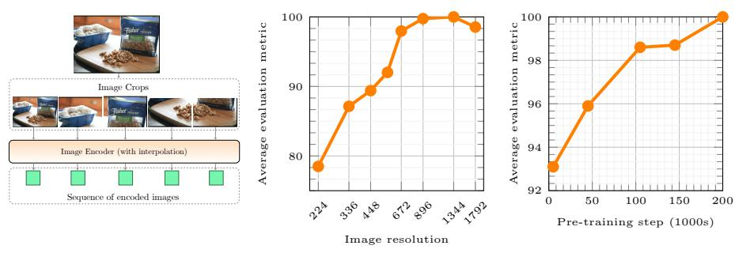

- (a) High resolution image input processing.
- (b) Impact of image resolution on SFT performance.
- (c) Impact of pre-training on SFT performance.

Fig. 7: We study the impact of image resolution and pre-training for SFT performance.

than the dense counterpart on almost every benchmark. This shows the great potential of MoE for further scaling, which is left as future work.

Third, for the 30B model size, MM1-30B-Chat outperforms Emu2-Chat-37B [\[105\]](#page-21-6) and CogVLM-30B [\[114\]](#page-22-10) on TextVQA, SEED, and MMMU. Compared with the concurrent LLaVA-NeXT [\[75\]](#page-20-11), we also achieve competitive performance across the board. However, LLaVA-NeXT does not support multi-image reasoning, nor few-shot prompting, as each image is represented as 2,880 tokens sent to the LLM, while ours is only 720 in total. This limits certain applications that involve multiple images.

Impact of Image Resolution. Figure [7b](#page-14-0) shows the impact of input image resolution on the average performance of the SFT evaluation metrics (defer the details of how we calculate the meta-average to Appendix [C.3\)](#page-29-2). Compared to a baseline model with an image resolution of 336 pixels, we can achieve a 15% relative increase by supporting an image resolution of 1344×1344. Note that for the largest image resolution of 1792×1792, average performance decreases slightly. This is likely because many of the evaluation images are smaller than this resolution, and resizing artifacts may affect the model performance. By default, the results in Table [4](#page-13-0) correspond to image resolutions of 1344×1344.

Impact of Pre-training. In contrast to most recent MLLMs, we perform largescale pre-training for our models. To assess the impact of pre-training on the final model performance, we perform SFT on the same pre-training run, but at different checkpoint steps. For an earlier checkpoint step, the model has seen less unique data samples than a later checkpoint step, so this is a measure of the importance of the quantity of pre-training data. In Figure [7c,](#page-14-0) we show that the model consistently improves as it has seen more pre-training data. Furthermore, large-scale multimodal pre-training enables strong in-context few-shot learning and multi-image reasoning capabilities, while most MLLM benchmarks shown in Table [4](#page-13-0) focus on zero-shot metrics and single-image reasoning.

Few-shot Chain-of-Thought Reasoning after SFT. As seen in Section [3.3,](#page-7-2) MM1 gains few-shot capabilities thanks to interleaved data. Even though our fine-tuning data includes only single-image examples, we find that MM1-30B-Chat still exhibits multi-image reasoning. This is shown qualitatively in Figure [2,](#page-2-0) and quantitatively on MathVista [\[80\]](#page-20-17), where we evaluate few-shot performance with chain-of-thought prompting: 4-shot performance is 41.9, which is 2.5 points higher than zero-shot (39.4).

Our best performing high-resolution SFT model uses 720 tokens per image. This is a challenge when using more than 4 in-context examples due to the context length. To allow for more examples, we explore a mixed resolution in-context examples formulation, where we feed some of the examples at a lower resolution (see Appendix [C.5](#page-31-0) for details). Using this formulation with 8 in-context examples increases the performance on MathVista to 44.4.

Do the lessons learned via pre-training transfer to SFT? Yes. We find that (1) pre-training with caption-only data improves SFT metrics, and (2) different VL connector architectures have negligible impact on final results. Detailed ablation results are provided in Appendix [C.4.](#page-30-1)

Qualitative Analysis. To better understand MM1, more qualitative examples are provided in Appendix [D,](#page-32-0) including single-image and multi-image reasoning, and few-shot prompting.

## 6 Conclusion

We study how to build performant MLLMs. Through carefully ablating modeling and data choices, we identify important lessons that yield a pre-trained model achieving SOTA results on a range of few-shot evaluations. After SFT, this model family produces competitive performance on a wide range of benchmarks, while enabling multi-image reasoning and few-shot prompting. We hope that the identified lessons will help the community in building strong models beyond any single specific model architecture or data strategy.

## References

- 1. Achiam, J., Adler, S., Agarwal, S., Ahmad, L., Akkaya, I., Aleman, F.L., Almeida, D., Altenschmidt, J., Altman, S., Anadkat, S., et al.: Gpt-4 technical report. arXiv preprint arXiv:2303.08774 (2023)
- 2. Agrawal, H., Desai, K., Wang, Y., Chen, X., Jain, R., Johnson, M., Batra, D., Parikh, D., Lee, S., Anderson, P.: Nocaps: Novel object captioning at scale. In: ICCV (2019)
- 3. Alayrac, J.B., Donahue, J., Luc, P., Miech, A., Barr, I., Hasson, Y., Lenc, K., Mensch, A., Millican, K., Reynolds, M., Ring, R., Rutherford, E., Cabi, S., Han, T., Gong, Z., Samangooei, S., Monteiro, M., Menick, J., Borgeaud, S., Brock, A., Nematzadeh, A., Sharifzadeh, S., Binkowski, M., Barreira, R., Vinyals, O., Zisserman, A., Simonyan, K.: Flamingo: a visual language model for few-shot learning (2022)
- 4. Awadalla, A., Gao, I., Gardner, J., Hessel, J., Hanafy, Y., Zhu, W., Marathe, K., Bitton, Y., Gadre, S., Sagawa, S., Jitsev, J., Kornblith, S., Koh, P.W., Ilharco, G.,

- Wortsman, M., Schmidt, L.: Openflamingo: An open-source framework for training large autoregressive vision-language models. arXiv preprint arXiv:2308.01390 (2023)
- 5. Bai, J., Bai, S., Yang, S., Wang, S., Tan, S., Wang, P., Lin, J., Zhou, C., Zhou, J.: Qwen-vl: A frontier large vision-language model with versatile abilities. arXiv preprint arXiv:2308.12966 (2023)
- 6. Berant, J., Chou, A., Frostig, R., Liang, P.: Semantic parsing on Freebase from question-answer pairs. In: EMNLP (2013)
- 7. Bisk, Y., Zellers, R., Le bras, R., Gao, J., Choi, Y.: Piqa: Reasoning about physical commonsense in natural language. AAAI (2020)
- 8. Black, K., Janner, M., Du, Y., Kostrikov, I., Levine, S.: Training diffusion models with reinforcement learning. arXiv preprint arXiv:2305.13301 (2023)
- 9. Bommasani, R., Hudson, D.A., Adeli, E., Altman, R., Arora, S., von Arx, S., Bernstein, M.S., Bohg, J., Bosselut, A., Brunskill, E., et al.: On the opportunities and risks of foundation models. arXiv preprint arXiv:2108.07258 (2021)
- 10. Brown, T., Mann, B., Ryder, N., Subbiah, M., Kaplan, J.D., Dhariwal, P., Neelakantan, A., Shyam, P., Sastry, G., Askell, A., et al.: Language models are fewshot learners. NeurIPS (2020)
- 11. Byeon, M., Park, B., Kim, H., Lee, S., Baek, W., Kim, S.: Coyo-700m: Image-text pair dataset. <https://github.com/kakaobrain/coyo-dataset> (2022)
- 12. Cha, J., Kang, W., Mun, J., Roh, B.: Honeybee: Locality-enhanced projector for multimodal llm. arXiv preprint arXiv:2312.06742 (2023)
- 13. Changpinyo, S., Sharma, P., Ding, N., Soricut, R.: Conceptual 12m: Pushing webscale image-text pre-training to recognize long-tail visual concepts. In: CVPR (2021)
- 14. Chen, K., Zhang, Z., Zeng, W., Zhang, R., Zhu, F., Zhao, R.: Shikra: Unleashing multimodal llm's referential dialogue magic. arXiv preprint arXiv:2306.15195 (2023)
- 15. Chen, L., Li, J., Dong, X., Zhang, P., He, C., Wang, J., Zhao, F., Lin, D.: Sharegpt4v: Improving large multi-modal models with better captions. arXiv preprint arXiv:2311.12793 (2023)
- 16. Chen, T., Chen, X., Du, X., Rashwan, A., Yang, F., Chen, H., Wang, Z., Li, Y.: Adamv-moe: Adaptive multi-task vision mixture-of-experts. In: ICCV (2023)
- 17. Chen, X., Djolonga, J., Padlewski, P., Mustafa, B., Changpinyo, S., Wu, J., Ruiz, C.R., Goodman, S., Wang, X., Tay, Y., et al.: Pali-x: On scaling up a multilingual vision and language model. arXiv preprint arXiv:2305.18565 (2023)
- 18. Chen, X., Fang, H., Lin, T.Y., Vedantam, R., Gupta, S., Dollár, P., Zitnick, C.L.: Microsoft coco captions: Data collection and evaluation server. arXiv preprint arXiv:1504.00325 (2015)
- 19. Chowdhery, A., Narang, S., Devlin, J., Bosma, M., Mishra, G., Roberts, A., Barham, P., Chung, H.W., Sutton, C., Gehrmann, S., et al.: Palm: Scaling language modeling with pathways. JMLR (2023)
- 20. Chu, X., Qiao, L., Lin, X., Xu, S., Yang, Y., Hu, Y., Wei, F., Zhang, X., Zhang, B., Wei, X., et al.: Mobilevlm: A fast, reproducible and strong vision language assistant for mobile devices. arXiv preprint arXiv:2312.16886 (2023)
- 21. Chung, H.W., Hou, L., Longpre, S., Zoph, B., Tay, Y., Fedus, W., Li, Y., Wang, X., Dehghani, M., Brahma, S., et al.: Scaling instruction-finetuned language models. arXiv preprint arXiv:2210.11416 (2022)
- 22. Clark, P., Cowhey, I., Etzioni, O., Khot, T., Sabharwal, A., Schoenick, C., Tafjord, O.: Think you have solved question answering? try arc, the ai2 reasoning challenge. arXiv preprint arXiv:1803.05457 (2018)

- 23. Dai, D., Deng, C., Zhao, C., Xu, R.X., Gao, H., Chen, D., Li, J., Zeng, W., Yu, X., Wu, Y., Xie, Z., Li, Y.K., Huang, P., Luo, F., Ruan, C., Sui, Z., Liang, W.: Deepseekmoe: Towards ultimate expert specialization in mixture-of-experts language models. arXiv preprint arXiv:2401.06066 (2024)
- 24. Dai, W., Li, J., Li, D., Tiong, A.M.H., Zhao, J., Wang, W., Li, B., Fung, P., Hoi, S.: Instructblip: Towards general-purpose vision-language models with instruction tuning (2023)
- 25. Daxberger, E., Weers, F., Zhang, B., Gunter, T., Pang, R., Eichner, M., Emmersberger, M., Yang, Y., Toshev, A., Du, X.: Mobile v-moes: Scaling down vision transformers via sparse mixture-of-experts (2023)
- 26. Devlin, J., Chang, M.W., Lee, K., Toutanova, K.: Bert: Pre-training of deep bidirectional transformers for language understanding. arXiv preprint arXiv:1810.04805 (2018)
- 27. Dosovitskiy, A., Beyer, L., Kolesnikov, A., Weissenborn, D., Zhai, X., Unterthiner, T., Dehghani, M., Minderer, M., Heigold, G., Gelly, S., et al.: An image is worth 16x16 words: Transformers for image recognition at scale. arXiv preprint arXiv:2010.11929 (2020)
- 28. Driess, D., Xia, F., Sajjadi, M.S., Lynch, C., Chowdhery, A., Ichter, B., Wahid, A., Tompson, J., Vuong, Q., Yu, T., et al.: PaLM-E: An embodied multimodal language model. arXiv preprint arXiv:2303.03378 (2023)
- 29. Du, N., Huang, Y., Dai, A.M., Tong, S., Lepikhin, D., Xu, Y., Krikun, M., Zhou, Y., Yu, A.W., Firat, O., Zoph, B., Fedus, L., Bosma, M.P., Zhou, Z., Wang, T., Wang, E., Webster, K., Pellat, M., Robinson, K., Meier-Hellstern, K., Duke, T., Dixon, L., Zhang, K., Le, Q., Wu, Y., Chen, Z., Cui, C.: GLaM: Efficient scaling of language models with mixture-of-experts. In: ICML (2022)
- 30. El-Nouby, A., Klein, M., Zhai, S., Bautista, M.A., Shankar, V., Toshev, A., Susskind, J., Joulin, A.: Scalable pre-training of large autoregressive image models. arXiv preprint arXiv:2401.08541 (2024)
- 31. Fang, A., Jose, A.M., Jain, A., Schmidt, L., Toshev, A., Shankar, V.: Data filtering networks. arXiv preprint arXiv:2309.17425 (2023)
- 32. Fedus, W., Zoph, B., Shazeer, N.: Switch transformers: Scaling to trillion parameter models with simple and efficient sparsity (2022)
- 33. Fu, C., Chen, P., Shen, Y., Qin, Y., Zhang, M., Lin, X., Yang, J., Zheng, X., Li, K., Sun, X., et al.: Mme: A comprehensive evaluation benchmark for multimodal large language models. arXiv preprint arXiv:2306.13394 (2023)
- 34. Fu, T.J., Hu, W., Du, X., Wang, W.Y., Yang, Y., Gan, Z.: Guiding instructionbased image editing via multimodal large language models. arXiv preprint arXiv:2309.17102 (2023)
- 35. Gao, L., Tow, J., Abbasi, B., Biderman, S., Black, S., DiPofi, A., Foster, C., Golding, L., Hsu, J., Le Noac'h, A., Li, H., McDonell, K., Muennighoff, N., Ociepa, C., Phang, J., Reynolds, L., Schoelkopf, H., Skowron, A., Sutawika, L., Tang, E., Thite, A., Wang, B., Wang, K., Zou, A.: A framework for few-shot language model evaluation (12 2023). <https://doi.org/10.5281/zenodo.10256836>, [https://](https://zenodo.org/records/10256836) [zenodo.org/records/10256836](https://zenodo.org/records/10256836)
- 36. Gao, P., Zhang, R., Liu, C., Qiu, L., Huang, S., Lin, W., Zhao, S., Geng, S., Lin, Z., Jin, P., et al.: Sphinx-x: Scaling data and parameters for a family of multi-modal large language models. arXiv preprint arXiv:2402.05935 (2024)
- 37. Gong, T., Lyu, C., Zhang, S., Wang, Y., Zheng, M., Zhao, Q., Liu, K., Zhang, W., Luo, P., Chen, K.: Multimodal-gpt: A vision and language model for dialogue with humans. arXiv preprint arXiv:2305.04790 (2023)

- 38. Goyal, Y., Khot, T., Summers-Stay, D., Batra, D., Parikh, D.: Making the v in vqa matter: Elevating the role of image understanding in visual question answering. In: CVPR (2017)
- 39. Gurari, D., Li, Q., Stangl, A.J., Guo, A., Lin, C., Grauman, K., Luo, J., Bigham, J.P.: Vizwiz grand challenge: Answering visual questions from blind people. In: CVPR (2018)
- 40. He, K., Chen, X., Xie, S., Li, Y., Dollár, P., Girshick, R.: Masked autoencoders are scalable vision learners. In: CVPR (2022)
- 41. He, K., Zhang, X., Ren, S., Sun, J.: Deep residual learning for image recognition. In: CVPR (2016)
- 42. He, M., Liu, Y., Wu, B., Yuan, J., Wang, Y., Huang, T., Zhao, B.: Efficient multimodal learning from data-centric perspective. arXiv preprint arXiv:2402.11530 (2024)
- 43. Henighan, T., Kaplan, J., Katz, M., Chen, M., Hesse, C., Jackson, J., Jun, H., Brown, T.B., Dhariwal, P., Gray, S., et al.: Scaling laws for autoregressive generative modeling. arXiv preprint arXiv:2010.14701 (2020)
- 44. Hoffmann, J., Borgeaud, S., Mensch, A., Buchatskaya, E., Cai, T., Rutherford, E., de Las Casas, D., Hendricks, L.A., Welbl, J., Clark, A., Hennigan, T., Noland, E., Millican, K., van den Driessche, G., Damoc, B., Guy, A., Osindero, S., Simonyan, K., Elsen, E., Rae, J.W., Vinyals, O., Sifre, L.: Training compute-optimal large language models (2022)
- 45. Huang, S., Dong, L., Wang, W., Hao, Y., Singhal, S., Ma, S., Lv, T., Cui, L., Mohammed, O.K., Patra, B., Liu, Q., Aggarwal, K., Chi, Z., Bjorck, J., Chaudhary, V., Som, S., Song, X., Wei, F.: Language is not all you need: Aligning perception with language models (2023)
- 46. Hudson, D.A., Manning, C.D.: Gqa: A new dataset for real-world visual reasoning and compositional question answering. In: CVPR (2019)
- 47. IDEFICS: Introducing idefics: An open reproduction of state-of-the-art visual language model. <https://huggingface.co/blog/idefics> (2023)
- 48. Isik, B., Ponomareva, N., Hazimeh, H., Paparas, D., Vassilvitskii, S., Koyejo, S.: Scaling laws for downstream task performance of large language models (2024)
- 49. Jiang, A.Q., Sablayrolles, A., Roux, A., Mensch, A., Savary, B., Bamford, C., Chaplot, D.S., de las Casas, D., Hanna, E.B., Bressand, F., Lengyel, G., Bour, G., Lample, G., Lavaud, L.R., Saulnier, L., Lachaux, M.A., Stock, P., Subramanian, S., Yang, S., Antoniak, S., Scao, T.L., Gervet, T., Lavril, T., Wang, T., Lacroix, T., Sayed, W.E.: Mixtral of experts (2024)
- 50. Joshi, M., Choi, E., Weld, D.S., Zettlemoyer, L.: Triviaqa: A large scale distantly supervised challenge dataset for reading comprehension. arXiv preprint arXiv:1705.03551 (2017)
- 51. Kafle, K., Price, B., Cohen, S., Kanan, C.: Dvqa: Understanding data visualizations via question answering. In: CVPR (2018)
- 52. Kembhavi, A., Salvato, M., Kolve, E., Seo, M., Hajishirzi, H., Farhadi, A.: A diagram is worth a dozen images. In: ECCV (2016)
- 53. Kim, G., Hong, T., Yim, M., Nam, J., Park, J., Yim, J., Hwang, W., Yun, S., Han, D., Park, S.: Ocr-free document understanding transformer. In: ECCV (2022)
- 54. Koh, J.Y., Fried, D., Salakhutdinov, R.: Generating images with multimodal language models. arXiv preprint arXiv:2305.17216 (2023)
- 55. Komatsuzaki, A., Puigcerver, J., Lee-Thorp, J., Ruiz, C.R., Mustafa, B., Ainslie, J., Tay, Y., Dehghani, M., Houlsby, N.: Sparse upcycling: Training mixture-ofexperts from dense checkpoints. In: ICLR (2023)

- 56. Lai, X., Tian, Z., Chen, Y., Li, Y., Yuan, Y., Liu, S., Jia, J.: Lisa: Reasoning segmentation via large language model. arXiv preprint arXiv:2308.00692 (2023)
- 57. Lai, Z., Zhang, H., Wu, W., Bai, H., Timofeev, A., Du, X., Gan, Z., Shan, J., Chuah, C.N., Yang, Y., et al.: From scarcity to efficiency: Improving clip training via visual-enriched captions. arXiv preprint arXiv:2310.07699 (2023)
- 58. Laurençon, H., Saulnier, L., Tronchon, L., Bekman, S., Singh, A., Lozhkov, A., Wang, T., Karamcheti, S., Rush, A.M., Kiela, D., Cord, M., Sanh, V.: Obelics: An open web-scale filtered dataset of interleaved image-text documents (2023)
- 59. Lepikhin, D., Lee, H., Xu, Y., Chen, D., Firat, O., Huang, Y., Krikun, M., Shazeer, N., Chen, Z.: {GS}hard: Scaling giant models with conditional computation and automatic sharding. In: ICLR (2021)
- 60. Li, B., Zhang, Y., Chen, L., Wang, J., Pu, F., Yang, J., Li, C., Liu, Z.: Mimicit: Multi-modal in-context instruction tuning. arXiv preprint arXiv:2306.05425 (2023)
- 61. Li, B., Zhang, Y., Chen, L., Wang, J., Yang, J., Liu, Z.: Otter: A multi-modal model with in-context instruction tuning. arXiv preprint arXiv:2305.03726 (2023)
- 62. Li, B., Wang, R., Wang, G., Ge, Y., Ge, Y., Shan, Y.: Seed-bench: Benchmarking multimodal llms with generative comprehension. arXiv preprint arXiv:2307.16125 (2023)
- 63. Li, C., Gan, Z., Yang, Z., Yang, J., Li, L., Wang, L., Gao, J.: Multimodal foundation models: From specialists to general-purpose assistants. arXiv preprint arXiv:2309.10020 (2023)
- 64. Li, J., Li, D., Savarese, S., Hoi, S.: Blip-2: Bootstrapping language-image pretraining with frozen image encoders and large language models (2023)
- 65. Li, J., Li, D., Savarese, S., Hoi, S.: Blip-2: Bootstrapping language-image pretraining with frozen image encoders and large language models. arXiv preprint arXiv:2301.12597 (2023)
- 66. Li, L., Yin, Y., Li, S., Chen, L., Wang, P., Ren, S., Li, M., Yang, Y., Xu, J., Sun, X., et al.: M3 it: A large-scale dataset towards multi-modal multilingual instruction tuning. arXiv preprint arXiv:2306.04387 (2023)
- 67. Li, L.H., Yatskar, M., Yin, D., Hsieh, C.J., Chang, K.W.: Visualbert: A simple and performant baseline for vision and language. arXiv preprint arXiv:1908.03557 (2019)
- 68. Li, Y., Du, Y., Zhou, K., Wang, J., Zhao, W.X., Wen, J.R.: Evaluating object hallucination in large vision-language models. arXiv preprint arXiv:2305.10355 (2023)
- 69. Li, Z., Yang, B., Liu, Q., Ma, Z., Zhang, S., Yang, J., Sun, Y., Liu, Y., Bai, X.: Monkey: Image resolution and text label are important things for large multimodal models. arXiv preprint arXiv:2311.06607 (2023)
- 70. Lin, B., Tang, Z., Ye, Y., Cui, J., Zhu, B., Jin, P., Huang, J., Zhang, J., Ning, M., Yuan, L.: Moe-llava: Mixture of experts for large vision-language models (2024)
- 71. Lin, J., Yin, H., Ping, W., Lu, Y., Molchanov, P., Tao, A., Mao, H., Kautz, J., Shoeybi, M., Han, S.: Vila: On pre-training for visual language models. arXiv preprint arXiv:2312.07533 (2023)
- 72. Lin, T., Maire, M., Belongie, S.J., Bourdev, L.D., Girshick, R.B., Hays, J., Perona, P., Ramanan, D., Doll'a r, P., Zitnick, C.L.: Microsoft COCO: common objects in context. arXiv preprint arXiv:1405.0312 (2014)
- 73. Lin, Z., Liu, C., Zhang, R., Gao, P., Qiu, L., Xiao, H., Qiu, H., Lin, C., Shao, W., Chen, K., et al.: Sphinx: The joint mixing of weights, tasks, and visual embeddings for multi-modal large language models. arXiv preprint arXiv:2311.07575 (2023)

- 74. Liu, H., Li, C., Li, Y., Lee, Y.J.: Improved baselines with visual instruction tuning. arXiv preprint arXiv:2310.03744 (2023)
- 75. Liu, H., Li, C., Li, Y., Li, B., Zhang, Y., Shen, S., Lee, Y.J.: Llava-next: Improved reasoning, ocr, and world knowledge (January 2024), [https://llava-vl.github.](https://llava-vl.github.io/blog/2024-01-30-llava-next/) [io/blog/2024-01-30-llava-next/](https://llava-vl.github.io/blog/2024-01-30-llava-next/)
- 76. Liu, H., Li, C., Wu, Q., Lee, Y.J.: Visual instruction tuning (2023)
- 77. Liu, S., Cheng, H., Liu, H., Zhang, H., Li, F., Ren, T., Zou, X., Yang, J., Su, H., Zhu, J., et al.: Llava-plus: Learning to use tools for creating multimodal agents. arXiv preprint arXiv:2311.05437 (2023)
- 78. Liu, Y., Duan, H., Zhang, Y., Li, B., Zhang, S., Zhao, W., Yuan, Y., Wang, J., He, C., Liu, Z., et al.: Mmbench: Is your multi-modal model an all-around player? arXiv preprint arXiv:2307.06281 (2023)
- 79. Lu, J., Batra, D., Parikh, D., Lee, S.: Vilbert: Pretraining task-agnostic visiolinguistic representations for vision-and-language tasks. NeurIPS (2019)
- 80. Lu, P., Bansal, H., Xia, T., Liu, J., Li, C., Hajishirzi, H., Cheng, H., Chang, K.W., Galley, M., Gao, J.: Mathvista: Evaluating mathematical reasoning of foundation models in visual contexts. arXiv preprint arXiv:2310.02255 (2023)
- 81. Lu, P., Mishra, S., Xia, T., Qiu, L., Chang, K.W., Zhu, S.C., Tafjord, O., Clark, P., Kalyan, A.: Learn to explain: Multimodal reasoning via thought chains for science question answering. NeurIPS (2022)
- 82. Marino, K., Rastegari, M., Farhadi, A., Mottaghi, R.: Ok-vqa: A visual question answering benchmark requiring external knowledge. In: CVPR (2019)
- 83. Masry, A., Long, D.X., Tan, J.Q., Joty, S., Hoque, E.: Chartqa: A benchmark for question answering about charts with visual and logical reasoning. arXiv preprint arXiv:2203.10244 (2022)
- 84. Mathew, M., Bagal, V., Tito, R., Karatzas, D., Valveny, E., Jawahar, C.: Infographicvqa. In: WACV (2022)
- 85. Mathew, M., Karatzas, D., Jawahar, C.: Docvqa: A dataset for vqa on document images. In: WACV (2021)
- 86. Mishra, A., Shekhar, S., Singh, A.K., Chakraborty, A.: Ocr-vqa: Visual question answering by reading text in images. In: ICDAR (2019)
- 87. Mustafa, B., Ruiz, C.R., Puigcerver, J., Jenatton, R., Houlsby, N.: Multimodal contrastive learning with LIMoe: the language-image mixture of experts. In: NeurIPS (2022)
- 88. Oquab, M., Darcet, T., Moutakanni, T., Vo, H., Szafraniec, M., Khalidov, V., Fernandez, P., Haziza, D., Massa, F., El-Nouby, A., et al.: Dinov2: Learning robust visual features without supervision. arXiv preprint arXiv:2304.07193 (2023)
- 89. Paperno, D., Kruszewski, G., Lazaridou, A., Pham, Q.N., Bernardi, R., Pezzelle, S., Baroni, M., Boleda, G., Fernández, R.: The lambada dataset: Word prediction requiring a broad discourse context (2016)
- 90. Peng, Z., Wang, W., Dong, L., Hao, Y., Huang, S., Ma, S., Wei, F.: Kosmos-2: Grounding multimodal large language models to the world. arXiv preprint arXiv:2306.14824 (2023)
- 91. Radford, A., Kim, J.W., Hallacy, C., Ramesh, A., Goh, G., Agarwal, S., Sastry, G., Askell, A., Mishkin, P., Clark, J., et al.: Learning transferable visual models from natural language supervision. In: ICML (2021)
- 92. Rae, J.W., Borgeaud, S., Cai, T., Millican, K., Hoffmann, J., Song, F., Aslanides, J., Henderson, S., Ring, R., Young, S., et al.: Scaling language models: Methods, analysis & insights from training gopher. arXiv preprint arXiv:2112.11446 (2021)

- 93. Raffel, C., Shazeer, N., Roberts, A., Lee, K., Narang, S., Matena, M., Zhou, Y., Li, W., Liu, P.J.: Exploring the limits of transfer learning with a unified text-to-text transformer. JMLR (2020)
- 94. Ranasinghe, K., McKinzie, B., Ravi, S., Yang, Y., Toshev, A., Shlens, J.: Perceptual grouping in contrastive vision-language models. In: ICCV (2023)
- 95. Rao, Y., Zhao, W., Chen, G., Tang, Y., Zhu, Z., Huang, G., Zhou, J., Lu, J.: Denseclip: Language-guided dense prediction with context-aware prompting. In: CVPR (2022)
- 96. Ruiz, C.R., Puigcerver, J., Mustafa, B., Neumann, M., Jenatton, R., Pinto, A.S., Keysers, D., Houlsby, N.: Scaling vision with sparse mixture of experts. In: Beygelzimer, A., Dauphin, Y., Liang, P., Vaughan, J.W. (eds.) NeurIPS (2021)
- 97. Sakaguchi, K., Bras, R.L., Bhagavatula, C., Choi, Y.: Winogrande: an adversarial winograd schema challenge at scale. Commun. ACM (2021)
- 98. Schwenk, D., Khandelwal, A., Clark, C., Marino, K., Mottaghi, R.: A-okvqa: A benchmark for visual question answering using world knowledge. In: ECCV (2022)
- 99. Shao, Z., Ouyang, X., Yu, Z., Yu, J.: Imp: An emprical study of multimodal small language models (2024), <https://huggingface.co/MILVLG/imp-v1-3b>
- 100. Sharma, P., Ding, N., Goodman, S., Soricut, R.: Conceptual captions: A cleaned, hypernymed, image alt-text dataset for automatic image captioning. In: ACL (2018)
- 101. Sharma, S., El Asri, L., Schulz, H., Zumer, J.: Relevance of unsupervised metrics in task-oriented dialogue for evaluating natural language generation. arXiv preprint arXiv:1706.09799 (2017)
- 102. Shoeybi, M., Patwary, M., Puri, R., LeGresley, P., Casper, J., Catanzaro, B.: Megatron-lm: Training multi-billion parameter language models using model parallelism. arXiv preprint arXiv:1909.08053 (2019)
- 103. Sidorov, O., Hu, R., Rohrbach, M., Singh, A.: Textcaps: a dataset for image captioning with reading comprehension. In: ECCV (2020)
- 104. Singh, A., Natarjan, V., Shah, M., Jiang, Y., Chen, X., Parikh, D., Rohrbach, M.: Towards vqa models that can read. In: CVPR (2019)
- 105. Sun, Q., Cui, Y., Zhang, X., Zhang, F., Yu, Q., Luo, Z., Wang, Y., Rao, Y., Liu, J., Huang, T., et al.: Generative multimodal models are in-context learners. arXiv preprint arXiv:2312.13286 (2023)
- 106. Team, G., Anil, R., Borgeaud, S., Wu, Y., Alayrac, J.B., Yu, J., Soricut, R., Schalkwyk, J., Dai, A.M., Hauth, A., et al.: Gemini: a family of highly capable multimodal models. arXiv preprint arXiv:2312.11805 (2023)
- 107. Thoppilan, R., De Freitas, D., Hall, J., Shazeer, N., Kulshreshtha, A., Cheng, H.T., Jin, A., Bos, T., Baker, L., Du, Y., et al.: Lamda: Language models for dialog applications. arXiv preprint arXiv:2201.08239 (2022)
- 108. Tong, S., Liu, Z., Zhai, Y., Ma, Y., LeCun, Y., Xie, S.: Eyes wide shut? exploring the visual shortcomings of multimodal llms. arXiv preprint arXiv:2401.06209 (2024)
- 109. Touvron, H., Lavril, T., Izacard, G., Martinet, X., Lachaux, M.A., Lacroix, T., Rozière, B., Goyal, N., Hambro, E., Azhar, F., et al.: Llama: Open and efficient foundation language models. arXiv preprint arXiv:2302.13971 (2023)
- 110. Tsimpoukelli, M., Menick, J.L., Cabi, S., Eslami, S., Vinyals, O., Hill, F.: Multimodal few-shot learning with frozen language models. NeurIPS (2021)
- 111. Vedantam, R., Zitnick, C.L., Parikh, D.: Cider: Consensus-based image description evaluation. arXiv preprint arXiv:1411.5726 (2014)
- 112. Wang, F., Mei, J., Yuille, A.: Sclip: Rethinking self-attention for dense visionlanguage inference. arXiv preprint arXiv:2312.01597 (2023)

- 113. Wang, J., Meng, L., Weng, Z., He, B., Wu, Z., Jiang, Y.G.: To see is to believe: Prompting gpt-4v for better visual instruction tuning. arXiv preprint arXiv:2311.07574 (2023)
- 114. Wang, W., Lv, Q., Yu, W., Hong, W., Qi, J., Wang, Y., Ji, J., Yang, Z., Zhao, L., Song, X., et al.: Cogvlm: Visual expert for pretrained language models. arXiv preprint arXiv:2311.03079 (2023)
- 115. Wang, W., Chen, Z., Chen, X., Wu, J., Zhu, X., Zeng, G., Luo, P., Lu, T., Zhou, J., Qiao, Y., et al.: Visionllm: Large language model is also an open-ended decoder for vision-centric tasks. arXiv preprint arXiv:2305.11175 (2023)
- 116. Wei, J., Bosma, M., Zhao, V.Y., Guu, K., Yu, A.W., Lester, B., Du, N., Dai, A.M., Le, Q.V.: Finetuned language models are zero-shot learners. arXiv preprint arXiv:2109.01652 (2021)
- 117. Welbl, J., Liu, N.F., Gardner, M.: Crowdsourcing multiple choice science questions. In: Derczynski, L., Xu, W., Ritter, A., Baldwin, T. (eds.) Proceedings of the 3rd Workshop on Noisy User-generated Text. Association for Computational Linguistics (2017)
- 118. Wenzek, G., Lachaux, M.A., Conneau, A., Chaudhary, V., Guzmán, F., Joulin, A., Grave, E.: Ccnet: Extracting high quality monolingual datasets from web crawl data. arXiv preprint arXiv:1911.00359 (2019)
- 119. Wortsman, M., Liu, P.J., Xiao, L., Everett, K., Alemi, A., Adlam, B., Co-Reyes, J.D., Gur, I., Kumar, A., Novak, R., Pennington, J., Sohl-dickstein, J., Xu, K., Lee, J., Gilmer, J., Kornblith, S.: Small-scale proxies for large-scale transformer training instabilities (2023)
- 120. Yang, G., Hu, E.J.: Feature learning in infinite-width neural networks. arXiv preprint arXiv:2011.14522 (2020)
- 121. Yang, G., Hu, E.J., Babuschkin, I., Sidor, S., Liu, X., Farhi, D., Ryder, N., Pachocki, J., Chen, W., Gao, J.: Tensor programs v: Tuning large neural networks via zero-shot hyperparameter transfer (2022)
- 122. Yang, Z., Li, L., Lin, K., Wang, J., Lin, C.C., Liu, Z., Wang, L.: The dawn of lmms: Preliminary explorations with gpt-4v (ision). arXiv preprint arXiv:2309.17421 (2023)
- 123. Ye, J., Hu, A., Xu, H., Ye, Q., Yan, M., Dan, Y., Zhao, C., Xu, G., Li, C., Tian, J., et al.: mplug-docowl: Modularized multimodal large language model for document understanding. arXiv preprint arXiv:2307.02499 (2023)
- 124. Ye, Q., Xu, H., Xu, G., Ye, J., Yan, M., Zhou, Y., Wang, J., Hu, A., Shi, P., Shi, Y., et al.: mplug-owl: Modularization empowers large language models with multimodality. arXiv preprint arXiv:2304.14178 (2023)
- 125. Ye, Q., Xu, H., Ye, J., Yan, M., Liu, H., Qian, Q., Zhang, J., Huang, F., Zhou, J.: mplug-owl2: Revolutionizing multi-modal large language model with modality collaboration. arXiv preprint arXiv:2311.04257 (2023)
- 126. You, H., Zhang, H., Gan, Z., Du, X., Zhang, B., Wang, Z., Cao, L., Chang, S.F., Yang, Y.: Ferret: Refer and ground anything anywhere at any granularity. In: ICLR (2024)
- 127. Yu, W., Yang, Z., Li, L., Wang, J., Lin, K., Liu, Z., Wang, X., Wang, L.: Mm-vet: Evaluating large multimodal models for integrated capabilities. arXiv preprint arXiv:2308.02490 (2023)
- 128. Yue, X., Ni, Y., Zhang, K., Zheng, T., Liu, R., Zhang, G., Stevens, S., Jiang, D., Ren, W., Sun, Y., et al.: Mmmu: A massive multi-discipline multimodal understanding and reasoning benchmark for expert agi. arXiv preprint arXiv:2311.16502 (2023)

- 129. Zellers, R., Holtzman, A., Bisk, Y., Farhadi, A., Choi, Y.: Hellaswag: Can a machine really finish your sentence? (2019)
- 130. Zhang, H., Li, H., Li, F., Ren, T., Zou, X., Liu, S., Huang, S., Gao, J., Zhang, L., Li, C., et al.: Llava-grounding: Grounded visual chat with large multimodal models. arXiv preprint arXiv:2312.02949 (2023)
- 131. Zhang, S., Roller, S., Goyal, N., Artetxe, M., Chen, M., Chen, S., Dewan, C., Diab, M., Li, X., Lin, X.V., et al.: Opt: Open pre-trained transformer language models. arXiv preprint arXiv:2205.01068 (2022)
- 132. Zhao, B., Wu, B., Huang, T.: Svit: Scaling up visual instruction tuning. arXiv preprint arXiv:2307.04087 (2023)
- 133. Zhou, B., Hu, Y., Weng, X., Jia, J., Luo, J., Liu, X., Wu, J., Huang, L.: Tinyllava: A framework of small-scale large multimodal models. arXiv preprint arXiv:2402.14289 (2024)
- 134. Zhu, D., Chen, J., Shen, X., Li, X., Elhoseiny, M.: Minigpt-4: Enhancing visionlanguage understanding with advanced large language models. arXiv preprint arXiv:2304.10592 (2023)
- 135. Zhu, Y., Zhu, M., Liu, N., Ou, Z., Mou, X., Tang, J.: Llava-phi: Efficient multimodal assistant with small language model. arXiv preprint arXiv:2401.02330 (2024)
- 136. Zoph, B., Bello, I., Kumar, S., Du, N., Huang, Y., Dean, J., Shazeer, N., Fedus, W.: St-moe: Designing stable and transferable sparse expert models (2022)

## Appendix

| A | Dataset Details                                         | 25 |  |  |  |  |  |
|---|---------------------------------------------------------|----|--|--|--|--|--|
|   | A.1 Interleaved Image-Text Data                      | 25 |  |  |  |  |  |
|   | A.2 Text-Only Data                                   | 25 |  |  |  |  |  |
|   | A.3 Visual Instruction Tuning Data                   | 26 |  |  |  |  |  |
| B | Training Details                                        | 27 |  |  |  |  |  |
|   | B.1 Pre-training                                     | 27 |  |  |  |  |  |
|   | B.2 Supervised Fine-tuning (SFT)                     | 29 |  |  |  |  |  |
| C | Evaluation Details                                      | 30 |  |  |  |  |  |
|   | C.1 Pre-training Evaluation                          | 30 |  |  |  |  |  |
|   | C.2 SFT Evaluation Benchmarks                        | 30 |  |  |  |  |  |
|   | C.3 SFT Evaluation Meta-Average                      | 30 |  |  |  |  |  |
|   | C.4 Additional SFT Ablations                         | 31 |  |  |  |  |  |
|   | C.5 Implementation Details for Few-shot MM1-30B-Chat | 32 |  |  |  |  |  |
| D | Qualitative Examples 33                              |    |  |  |  |  |  |
| E | Author Contributions and Acknowledgements 40         |    |  |  |  |  |  |

## A Dataset Details

## A.1 Interleaved Image-Text Data

Following a process similar to OBELICS [\[58\]](#page-19-10), we construct a dataset of 500M interleaved image-text documents, containing 1B images and 500B text tokens. These 500M documents are built from a collection of 3B HTML files described in Sec. [A.2.](#page-24-2) From each of the HTML files, we extract the text body layer and all the  tags. We remove documents that have no images or more than 30 images. We then download the images and insert them at their original positions in the text. Finally, we perform image filtering and image de-duplication to remove low-quality and repetitive images.

During image filtering, we remove images that have corrupted bytes and/or header, aspect ratio less than 1/2 or greater than 2, are too small (less than 100px) or too large (larger than 10,000px), or if their URL contains logo, button, icon, plugin or widget. During image de-duplication, we remove images whose URL or MD5 hash have appeared more than 10 times in the dataset. Additionally, when an image appears multiple times on a single page, we only retain its first appearance.

## A.2 Text-Only Data

From an initial Web corpus of 150B English HTML files, we perform boilerplate removal to arrive at the HTML representing the main content. We then follow similar processes as GPT-3 [\[10\]](#page-16-1) and CCNet [\[118\]](#page-22-13) to filter out documents that are too short, contain profanity, or are otherwise considered low-quality documents. We de-duplicate the data using exact-hash matching and LSH-based near-duplicate detection. Using these methods, we arrive at 3B HTML files.

| Datasets                                                                                                                     | Size                                                       | Prompting Strategy                                                                                  |
|------------------------------------------------------------------------------------------------------------------------------|------------------------------------------------------------|-----------------------------------------------------------------------------------------------------|
| Text-only SFT                                                                                                                | 13k                                                        | –                                                                                                   |
| LLaVA-Conv [76] LLaVA-Complex [76] 77k ShareGPT-4V [15]                                                                | 57k 102k                                                | –                                                                                                   |
| VQAv2 [38] GQA [46] OKVQA [82] OCRVQA [86] DVQA [51] ChartQA [83] AI2D [52] DocVQA [85] InfoVQA [84] | 83k 72k 9k 80k 200k 18k 3k 39k 24k | "Answer the question using a single word or phrase."                                             |
| A-OKVQA [98]                                                                                                                 | 66k                                                        | "Answer with the option's letter from the given choices directly."                               |
| COCO Captions [18] 83k TextCaps [103]                                                                                     | 22k                                                        | Sample from a pre-generated prompt list, e.g., "Provide a brief description of the given image." |
| SynthDog-EN [53]                                                                                                             | 500k                                                       | Sample from a pre-generated prompt list, e.g., "Please transcribe all the text in the picture."  |
| Total                                                                                                                        | 1.45M –                                                    |                                                                                                     |

Table 5: List of datasets used for supervised fine-tuning.

#### A.3 Visual Instruction Tuning Data

Our final SFT data mixture contains a variety of datasets, mostly follow LLaVA-1.5 [\[74\]](#page-20-7) and LLaVA-NeXT [\[75\]](#page-20-11). Specifically,

- To encourage the model to provide long-form detailed responses and perform conversations, we follow previous work, use the existing GPT-4 generated data (LLaVA-Conv and LLaVA-Complex [\[76\]](#page-20-6)) and the existing GPT-4V generated data (ShareGPT-4V [\[15\]](#page-16-7)) for model training. We also experimented with LAION-GPT4V, but did not observe further performance improvement, thus not included in the final mixture.
- To enhance the model with better vision-language (VL) understanding capability, we use a variety of academic task oriented VL datasets. These datasets are either in the form of image captioning, or in the form of VQA with short answers. Specifically,
  - For natural images: VQAv2 [\[38\]](#page-18-4), GQA [\[46\]](#page-18-6), OKVQA [\[82\]](#page-20-8), A-OKVQA [\[98\]](#page-21-16), and COCO Captions [\[18\]](#page-16-9);
  - For text-rich images: OCRVQA [\[86\]](#page-20-12), and TextCaps [\[103\]](#page-21-7);
  - For document and chart understanding: DVQA [\[51\]](#page-18-14), ChartQA [\[83\]](#page-20-13), AI2D [\[52\]](#page-18-15), DocVQA [\[85\]](#page-20-14), InfoVQA [\[84\]](#page-20-15), and SynthDog-En [\[53\]](#page-18-16);
- To enhance the model's text-only instruction following capability, we also blend in a small amount of text-only SFT data.

The academic task oriented image captioning and VQA datasets are formatted into the instruction-following format, following LLaVA-1.5 [\[74\]](#page-20-7), with detailed prompts summarized in Table [5.](#page-25-1)

## B Training Details

#### B.1 Pre-training

Batch Size and Composition. For simplicity, all MM1 models are pre-trained with the same batch size of 512 and maximum decoder sequence length of 4096. We allow up to 16 images per input sequence, with each image resulting in 144 tokens as input to the decoder. Note that this results in roughly 1M text tokens and 1M image tokens per batch. Each input sequence is sampled from one of three types of input sources: (1) interleaved, (2) packed image-text pairs, or (3) text-only data, with sampling probability 45%, 45%, and 10%, respectively. When packing image-text pairs or interleaved documents along the sequence dimension, we modify the self-attention masks to prevent tokens from attention across example boundaries. For image-text pairs in particular, this was critical for maintaining strong few-shot performance.

Note that our sampling/mixing procedure is performed once offline and stored as a fixed deterministic snapshot of our pre-training mixture. This means, with the exception of our ablations on the pre-training mixture itself, all models in this paper are trained on the same examples in the same order. We found this was critical to ensure internal reproducibility of our results, as initial experiments showed that different random seeds in the input pipeline could have non-negligible impact on resulting models.

Learning Rate Schedule. For multimodal pre-training, MM1 employs a standard cosine learning rate decay schedule with an initial linear warmup of 2000 steps. The learning rate is then decayed to 10% of its peak value over the course of 2e5 training steps. We perform gradient clipping with max norm 1 and use the AdamW optimizer with an implementation that decouples the learning rate and weight decay. For MM1-30B, we also add a zloss term with scale 1e-4, as we observed this improves training stability, similar to [\[119\]](#page-22-14).

The predicted optimal (peak) learning rates for each of the main LLM sizes studied

| N   |             | Pred. η Pred. λ |
|-----|-------------|-----------------|
|     | 1.2B 8.6e-5 | 5.0e-6          |
|     | 2.9B 5.9e-5 | 3.5e-6          |
|     | 6.4B 4.2e-5 | 2.5e-6          |
| 30B | 2.2e-5      | 1.3e-6          |

Table 7: Predicted optimal peak learning rate η and weight decay λ for MM1 model sizes.

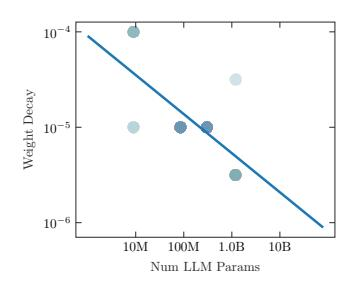

Fig. 8: Optimal weight decay as a function of model size for the grid searches described in Sec. [B.1.](#page-26-1) The x-axis is the number of (nonembedding) LLM parameters and the y-axis is weight decay.

| Model                     | Shot                     | Captioning     |                |              | Visual Question Answering |                                                 |              |              |  |  |
|---------------------------|--------------------------|----------------|----------------|--------------|---------------------------|-------------------------------------------------|--------------|--------------|--|--|
|                           |                          |                |                |              |                           | COCO NoCaps TextCaps VQAv2 TextVQA VizWiz OKVQA |              |              |  |  |
| MM1-3B Model Comparisons  |                          |                |                |              |                           |                                                 |              |              |  |  |
| Flamingo-3B [3]           | † 0                   | 73.0           | –              | –            | 49.2                      | 30.1                                            | 28.9         | 41.2         |  |  |
|                           | 4                        | 85.0           | –              | –            | 53.2                      | 32.7                                            | 34.0         | 43.3         |  |  |
|                           | 8                        | 90.6           | –              | –            | 55.4                      | 32.4                                            | 38.4         | 44.6         |  |  |
|                           | 16                       | 95.3           | –              | –            | 56.7                      | 31.8                                            | 43.3         | 45.6         |  |  |
| MM1-3B                    | 0                        | 73.5           | 55.6           | 63.3         | 46.2                      | 29.4                                            | 15.6         | 26.1         |  |  |
|                           | 4                        | 112.3          | 99.7           | 84.1         | 57.9                      | 45.3                                            | 38.0         | 48.6         |  |  |
|                           | 8                        | 114.6          | 104.7          | 88.8         | 63.6                      | 44.6                                            | 46.4         | 48.4         |  |  |
|                           | 16                       | 116.8          | 107.6          | 91.6         | 60.9                      | 46.1                                            | 53.8         | 50.5         |  |  |
|                           | MM1-7B Model Comparisons |                |                |              |                           |                                                 |              |              |  |  |
|                           | † 0                   | 46.0*          | 36.8           | 25.4         | 50.9                      | 25.9                                            | 35.5         | 38.4         |  |  |
|                           | 4                        | 93.0*          | 81.3           | 60.0         | 55.4                      | 27.6                                            | 36.9         | 45.4         |  |  |
| IDEFICS-9B [58]           | 8                        | 97.0*          | 86.8           | 63.2         | 56.4                      | 27.5                                            | 40.4         | 47.7         |  |  |
|                           | 16                       | 99.7*          | 89.4           | 67.4         | 57.0                      | 27.9                                            | 42.6         | 48.4         |  |  |
|                           | † 0                   | 79.4           | –              | –            | 51.8                      | 31.8                                            | 28.8         | 44.7         |  |  |
|                           | 4                        | 93.1           | –              | –            | 56.3                      | 33.6                                            | 34.9         | 49.3         |  |  |
| Flamingo-9B [3]           | 8                        | 99.0           | –              | –            | 58.0                      | 33.6                                            | 39.4         | 50.0         |  |  |
|                           | 16                       | 102.2          | –              | –            | 59.4                      | 33.5                                            | 43.0         | 50.8         |  |  |
|                           | † 0                   | –              | –              | –            | 52.9                      | –                                               | 34.4         | 42.8         |  |  |
| Emu2-14B [105]            | 4                        | –              | –              | –            | 58.4                      | –                                               | 41.3         | –            |  |  |
|                           | 8                        | –              | –              | –            | 59.0                      | –                                               | 43.9         | –            |  |  |
|                           | 0                        | 76.3           | 61.0           | 64.2         | 47.8                      | 28.8                                            | 15.6         | 22.6         |  |  |
|                           | 4                        | 109.8          | 96.2           | 84.5         | 60.6                      | 44.4                                            | 37.4         | 46.6         |  |  |
| MM1-7B                    | 8                        | 116.3          | 106.6          | 88.2         | 63.6                      | 46.3                                            | 45.3         | 51.4         |  |  |
|                           | 16                       | 118.6          | 111.1          | 93.1         | 65.2                      | 46.9                                            | 53.2         | 52.9         |  |  |
| MM1-30B Model Comparisons |                          |                |                |              |                           |                                                 |              |              |  |  |
|                           | † 0                   | 91.8*          | 65.0           | 56.8         | 60.0                      | 30.9                                            | 36.0         | 45.2         |  |  |
| IDEFICS-80B [58]          | 4                        | 110.3*         | 99.6           | 72.7         | 63.6                      | 34.4                                            | 40.4         | 52.4         |  |  |
|                           | 8                        | 114.3*         | 105.7          | 77.6         | 64.8                      | 35.7                                            | 46.1         | 55.1         |  |  |
|                           | 16                       | 116.6*         | 107.0          | 81.4         | 65.4                      | 36.3                                            | 48.3         | 56.8         |  |  |
| Flamingo-80B [3]          | † 0                   | 84.3           | –              | –            | 56.3                      | 35.0                                            | 31.6         | 50.6         |  |  |
|                           | 4                        | 103.2          | –              | –            | 63.1                      | 36.5                                            | 39.6         | 57.4         |  |  |
|                           | 8                        | 108.8          | –              | –            | 65.6                      | 37.3                                            | 44.8         | 57.5         |  |  |
|                           | 16                       | 110.5          | –              | –            | 66.8                      | 37.6                                            | 48.4         | 57.8         |  |  |
| Emu2-37B [105]            | 0                        | –              | –              | –            | 33.3                      | 26.2                                            | 40.4         | 26.7         |  |  |
|                           | 4                        | –              | –              | –            | 67.0                      | 48.2                                            | 54.6         | 53.2         |  |  |
|                           | 8                        | –              | –              | –            | 67.8                      | 49.3                                            | 54.7         | 54.1         |  |  |
|                           | 16                       | –              | –              | –            | 68.8                      | 50.3                                            | 57.0         | 57.1         |  |  |
| MM1-30B                   | 0                        | 70.3           | 54.6           | 64.9         | 48.9                      | 28.2                                            | 14.5         | 24.1         |  |  |
|                           | 4                        | 117.9          | 103.8          | 87.5         | 68.8                      | 48.1                                            | 41.7         | 54.9         |  |  |
|                           |                          |                |                |              |                           |                                                 |              |              |  |  |
|                           |                          |                |                |              |                           |                                                 |              |              |  |  |
|                           | 8 16                  | 123.1 125.3 | 111.6 116.0 | 92.9 97.6 | 70.9 71.9              | 49.4 50.6                                    | 49.9 57.9 | 58.3 59.3 |  |  |

Table 6: Complete MM1 pre-training few-shot evaluation results. (\*) IDEFICS includes PMD in its training data (includes COCO). (†) These models included two text-only demonstrations in their "0" prompt, whereas MM1 does not.

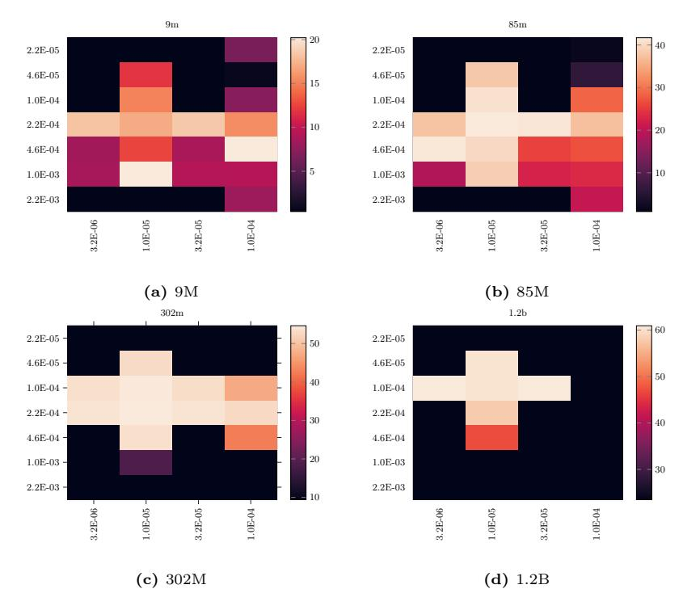

Fig. 9: 8-shot average for grid searches over peak learning rate (y-axis) and weight decay (x-axis) for different LLM sizes. Black cells correspond to settings we did not run a corresponding experiment for.

in this work are shown in Table [7.](#page-26-2) For simplicity, for the actual MM1 3B, 7B, and 30B models, we used η equal to 6e-5, 4e-5, and 2e-5, respectively. Finally, we fix the peak LR of the randomly initialized vision-language connector of MM1 to η =8e-5 for all model sizes. For future versions of MM1, we plan on incorporating techniques similar to [\[121\]](#page-22-9) to avoid the need to conduct costly hyperparameter searches.

Learning Rate and Weight Decay Grid Searches. The individual grid search results corresponding to the final curve fit in Figure [6](#page-9-2) are shown in Figure [9.](#page-28-1) We train grid search models for 5e 4 steps, as [\[119\]](#page-22-14) found this does not alter the conclusions. We can apply the same procedure that was used for predicting optimal learning rate to predict weight decay values, as shown in Figure [8.](#page-26-3) The blue circles correspond to actual data points from the grid search with sampling probability (and darkness of color) proportional to their 8-shot average performance. The corresponding predictions for each of the main model sizes in this work are shown in Table [7.](#page-26-2)

#### B.2 Supervised Fine-tuning (SFT)

The model is fine-tuned for 10k steps with batch size 256 and sequence length 2048. We employ the AdaFactor optimizer with peak learning rate 1e-5 and cosine decay to 0. We experimented different learning rates; empirically, the value of 1e-5 is optimal. During SFT, we keep both the image encoder and the LLM unfrozen, as empirically, we observe that finetuning the whole model achieves better performance.

## C Evaluation Details

Few-shot prompts are randomly sampled perdataset from the training set if available, otherwise the validation set (ensuring the query example does not appear in any of the shots). Outputs are generated with greedy decoding until the model emits the EOS token or any additional stop tokens that can be specified on a per-task basis. The additional stop token for captioning tasks is just the newline character, and for VQA tasks we also include ".", ",", and "Question" as valid stop tokens. For postprocessing VQA predictions, we use the same logic as OpenFlamingo[10](#page-29-4) [\[4\]](#page-15-3). For captioning tasks, we report CIDEr score [\[111\]](#page-21-18) using the nlg-eval package [\[101\]](#page-21-19). All of our multimodal pre-training evaluations are implemented in an internal fork of EleutherAI's lm-evaluation-harness [\[35\]](#page-17-14).

| C.1 Pre-training Evaluation                           | Dataset  | Evaluation Split |  |
|----------------------------------------------------------|----------|------------------|--|
| Few-shot prompts are randomly sampled per | COCO     | Karpathy test    |  |
| dataset from the training set if available, other        | NoCaps   | val              |  |
| wise the validation set (ensuring the query exam         | TextCaps | val              |  |
| ple does not appear in any of the shots). Out            | VQAv2    | testdev          |  |
| puts are generated with greedy decoding until the        | TextVQA  | val              |  |
| model emits the EOS token or any additional stop         | VizWiz   | testdev          |  |
| tokens that can be specified on a per-task basis.        | OKVQA    | val              |  |

Table 8: Splits used for pretraining evaluation. Note that, unlike the main pre-training results, all pre-training ablations use the validation splits for VQAv2 and VizWiz.

## C.2 SFT Evaluation Benchmarks

We evaluate our SFT models on a collection of both traditional academic VL benchmarks and recent benchmarks specifically designed for MLLMs. For academic VL benchmarks, we include VQAv2 [\[38\]](#page-18-4), TextVQA [\[104\]](#page-21-8), and the image subset of ScienceQA [\[81\]](#page-20-16). For recent MLLM benchmarks, we include POPE [\[68\]](#page-19-17), MME [\[33\]](#page-17-13), MMBench [\[78\]](#page-20-18), SEED-Bench [\[62\]](#page-19-16), LLaVA-Bench-in-the-Wild [\[76\]](#page-20-6), MM-Vet [\[127\]](#page-22-12), MathVista [\[80\]](#page-20-17), and the recent popular MMMU [\[128\]](#page-22-11). For all the benchmarks, we use greedy decoding to generate the responses. For MM-Vet and LLaVA-Bench-in-the-Wild, which use GPT-4 for evaluation, we run the evaluation 3 times, and report the average.

### C.3 SFT Evaluation Meta-Average

In the process of SFT ablation, we synthesize all benchmark results into a single meta-average number to simplify comparisons. Because the evaluation metrics of different datasets may have different ranges, we normalize with respect to a baseline configuration. This is achieved by initially standardizing the results for

10 Specifcally, the implementation of [VQAMetric](https://github.com/mlfoundations/open_flamingo/blob/60a5fd6a6bf0940ccf0eba1c777d55b7306ccc53/open_flamingo/eval/vqa_metric.py#L210) (commit 60a5fd6).

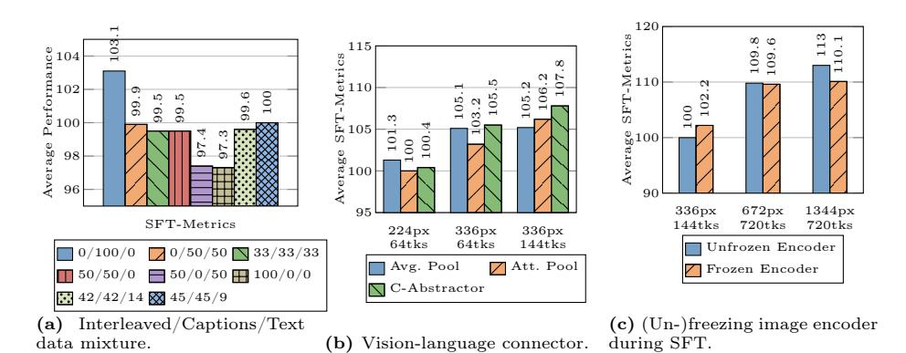

Fig. 10: SFT ablations. (a) The impact of pre-training data mixture on SFT results. Here, x/y/z means that x% of the data is interleaved, y% is captions, and z% is pure text. tks: the number of image tokens. (b) The impact of different vision-language connectors on SFT results. For both (a) and (b), we first pre-train MM1-3B with the ablated setting, and then perform SFT on the pre-trained models. (c) Freezing or unfreezing the image encoder during SFT.

each task; that is, we adjust every metric by dividing it by its respective baseline, followed by averaging across all metrics. To elaborate, we establish our baseline using the performance metrics of a compact MM1 model, which is trained on  $224 \times 224$  image resolution and employs attention pooling with 64 image queries.

#### C.4 Additional SFT Ablations

In this section, we perform SFT ablations. This section is analogous to Section 3; here, we perform SFT on the same checkpoints and evaluate if similar lessons hold true on SFT evaluations, instead of pre-training evaluations. Furthermore, we also study whether to keep the image encoder frozen or not during SFT. For all of these ablations, we train MM1-3B-Chat.

Pre-training data mixture ablations. In Figure 10a, we compare the SFT performance with different weights for pre-training data. We see a similar trend when comparing with Figure 5 for 0-shot evaluations. Pre-training with caption-only data gives the best performance across the SFT evaluation metrics. This corroborates **Data lesson 1**: caption data still lifts zero-shot performance for SFT evaluations. However, the SFT metrics do not measure few-shot performance, so the impact of the interleaved data is not noticeable in this table.

Visual-language connector ablations. In Figure 10b, we evaluate different visual-language connector configurations. This figure is similar to Figure 4, except that we evaluate the corresponding SFT models. As can be seen, if a low number of image tokens is used, average pooling gives similar results as C-Abstractor. When the number of image tokens is increased, the C-Abstractor configuration gives the best results. These trends are not entirely consistent with pre-training results reported in Figure 4. Overall, the impact of the choice

of visual-language connector appears to not have a very significant impact on final test performance. Our final models use the C-Abstractor architecture.

Image encoder ablations. In Figure [10c,](#page-30-0) we study whether to keep the image encoder frozen or not during SFT. The results show that at lower image resolutions, a frozen image encoder results in better performance than an unfrozen image encoder (+2.2 points). However, at higher resolutions (i.e., 1344px), it is beneficial to unfreeze the image encoder (+2.9 points). This is likely because the pre-training is performed at the base resolution without any interpolation or image sub-divisions.

## C.5 Implementation Details for Few-shot MM1-30B-Chat

As shown in Section [5.1,](#page-13-1) our fine-tuned model can utilize in-context examples to achieve even stronger performance. Interestingly, the performance goes up when increasing the number of examples. We demonstrate this with MM1-30B-Chat.

One challenge for few-shot inputs arises due to the use of sub-image decomposition. While this strategy lifts zero-shot performance, it significantly increases the effective number of tokens consumed per image. Using 5 sub-images per input image as MM1-30B-Chat does, processing a 4-shot example where every example contains just one source image already yields 20 effective images. Representing every image with 144 tokens therefore requires 2,880 tokens for images alone, quickly exhausting limited language model context. To mitigate this limitation, we propose a new mixed-resolution approach. Specifically, for K in-context examples, we only encode the last N images at a high resolution via sub-image decomposition, the remaining K −N in-context examples are processed at lower resolution. This makes in-context examples much less expensive to encode and allows to increase the number of in-context examples within a fixed token budget, further increasing performance. In our implementation, we set N = 3.

We demonstrate the effectiveness of our proposed strategy using the Math-Vista benchmark. Using in-context learning with chain-of-thought, the performance of MM1-30B-Chat improves from 39.4 (0-shot) to 41.9 (4-shot, with all in-context examples using full sub-image decomposition). Applying our mixedresolution approach allows to encode additional in-context examples, enabling up to 8-shot chain of thought, further improving the performance to 44.4. This illustrates that our MM1-Chat model retains in-context learning capabilities inherited from its pre-training regimen, and that our strategy of mixed decomposition is effective at further increasing few-shot performance within a restricted context length.

## D Qualitative Examples

In this section, we share qualitative examples of MM1 predictions.

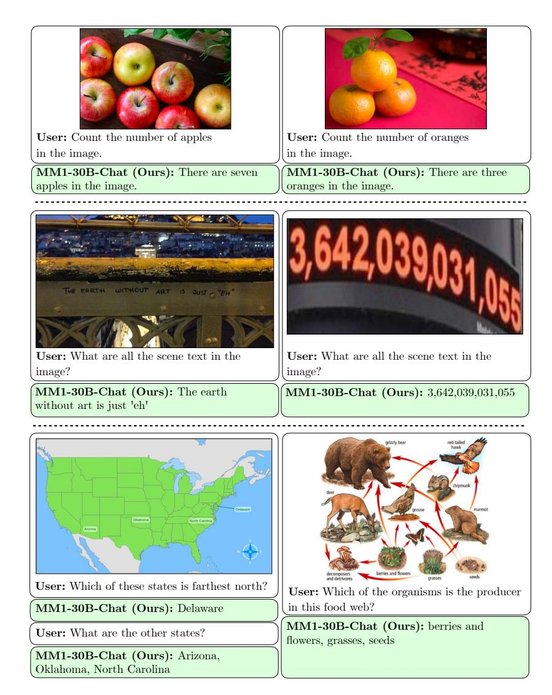

Fig. 11: Examples testing MM1 counting, OCR and scientific knowledge capabilities. Images and prompts are from COCO 2014 validation set [\[72\]](#page-19-0) and [\[122\]](#page-22-15).

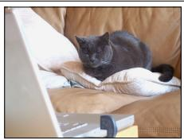

User: Can you find the red ball near the gray cat in the image?

MM1-30B-Chat (Ours): No, there is no red ball near the gray cat in the image. The cat is sitting on a pillow on a couch, and there are no other objects like a red ball visible in the scene.

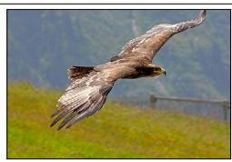

User: Can you see the bright blue feathers on the bird's wing?

MM1-30B-Chat (Ours): No, the bird in the image does not have bright blue feathers on its wing. The bird is a large bird of prey, such as a hawk or an eagle, with typical bird of prey feathers.

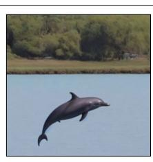

User: From scale 1 to 10, decide how similar the image is to the text prompt "a parrot driving a car". Explain your reasoning.

MM1-30B-Chat (Ours): I would rate the image a 1 on the scale of 1 to 10 in relation to the text prompt "a parrot driving a car." The image shows a dolphin jumping out of the water, and the text prompt is referring to a parrot driving a car. There is no similarity between the image and the text prompt, other than the fact that both contain animals. The dolphin is in the water, while the parrot is associated with a car. The actions of the animals are also different, as the dolphin is jumping out of the water, while the parrot is implied to be driving a car. The environments are completely different, with the dolphin being in a natural aquatic environment and the parrot being in a human-made, terrestrial environment.

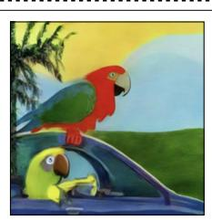

User: From scale 1 to 10, decide how similar the image is to the text prompt "a parrot driving a car". Explain your reasoning.

MM1-30B-Chat (Ours): The image portrays a scene that is quite similar to the text prompt "a parrot driving a car". In the image, there are two parrots situated inside a blue car. The car is parked on a green field with a backdrop of palm trees and a yellow sky.

One of the parrots is perched on the steering wheel, giving the impression that it is driving the car. The other parrot is comfortably seated on the roof of the car, seemingly enjoying the view. The colors in the image are vibrant, with the blue of the car contrasting beautifully with the green field and the yellow sky. The palm trees add a tropical feel to the scene.

The image is a close representation of the text prompt, with the exception of the number of parrots and their actions. While the prompt mentions only one parrot driving a car, the image shows two parrots, one seemingly driving and the other on the roof of the car. This adds an element of surprise and humor to the image. Overall, the image scores a 9 out of 10 for its close representation of the text prompt and its creative interpretation.

Fig. 12: Examples testing MM1 against adversarial prompts and image-prompt alignment. Images and prompts are from COCO 2014 validation set [72], [122] and [8].

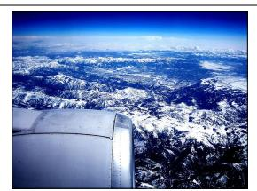

**User:** After seeing the below image, how people might emotionally feel and react?

MM1-30B-Chat (Ours): Upon witnessing this image, people might feel a mixture of emotions such as awe, fascination, and tranquility. The breathtaking view of the airplane window showing the wing of the plane and a vast, snowy mountain range beneath it offers a sense of serenity and the beauty of nature. The magnificent, orderly pattern of the mountains and their snowy peaks contrasted with the clear blue sky evokes a sense of wonder and appreciation for the natural world. This view also offers a unique perspective of the world that one might not experience daily, thus sparking curiosity and excitement. Additionally, the image can bring about feelings of calmness and peace, given the untouched and pristine nature of the landscape depicted.

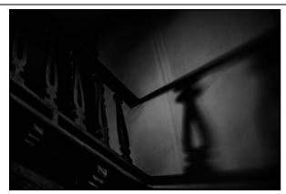

**User:** After seeing the below image, how people might emotionally feel and react?

MM1-30B-Chat (Ours): The image shows a dark stairwell with a creepy atmosphere, which might evoke feelings of unease, fear, or curiosity in people. Some individuals may react by avoiding the stairwell altogether, while others might be intrigued by the mysterious ambiance and decide to explore it further. The darkness and the shadows in the stairwell can play with people's perceptions and trigger their imagination, possibly making them feel as if there is someone or something lurking in the shadows. Overall, the image can provoke a range of emotional responses, from apprehension to fascination, depending on each person's disposition and mindset.

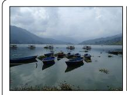

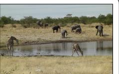

User: <img1> <img2> For each of the two images comment on whether the water is salty.

MM1-30B-Chat (Ours): In the first image, there are several boats floating on a body of water. Based on the presence of boats, it's likely this is a harbor, and the water is likely salty as most harbors are typically found near the ocean. However, without more information, it's not possible to confirm the salinity of the water.

In the second image, various African animals, including elephants and giraffes, are gathered around a watering hole in a dry grass field. This body of water is most likely freshwater as animals need fresh water to drink. The presence of numerous animals drinking from the watering hole confirms that this water is essential for their survival, and it's highly unlikely they would be able to drink saltwater.

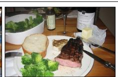

User: <img1> <img2> Which image shows the healthier meal?

MM1-30B-Chat (Ours): The healthier meal among the given images is the one that features broccoli and a bowl of vegetables, along with a plate of meat. Incorporating vegetables, like broccoli and those in the bowl, provides essential nutrients, vitamins, and fiber, which contribute to a balanced and healthier diet. The meal with various toppings on a pizza and beer would be considered less healthy as it may contain more calories, fat, and processed ingredients compared to the other meal that emphasizes vegetables and meat.

Fig. 13: Examples testing MM1 ability to perceive image aesthetics and compare multiple images. Images and prompts are from COCO 2014 validation set [72] and [122].

User: First, read the operating menus below for coffee machine buttons.

Menu 1:

Menu 2:

Menu 3:

Now, let's look at the operating panel of the coffee machine in the image below, which button should I use for a 6 OZ coffee: left, right, top or bottom button?

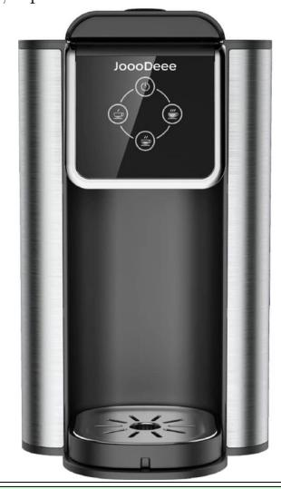

MM1-30B-Chat (Ours): To brew a 6 OZ coffee using the coffee machine in the image, you should use the left button. This is because the buttons on the machine correspond to the menu icons, and the left button corresponds to the 6 OZ menu icon. The other buttons correspond to different cup sizes, but the left button is the one you need to press to brew a 6 OZ coffee.

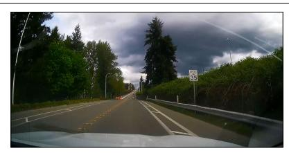

User: Describe the image

MM1-30B-Chat (Ours): The image captures a moment from the perspective of a car's dashboard camera. The car is traveling on a two-lane road, divided by a yellow line, suggesting a rural or less populated area. The road is flanked by trees on both sides, their green leaves contrasting with the gray, cloudy sky above. A speed limit sign displaying "35" is visible on the right side of the road, indicating the maximum speed allowed for vehicles. The overall scene suggests a calm and serene drive through a lightly wooded area.

Fig. 14: Following [122], we tested MM1 on task-oriented scenarios such as operating machines and navigating. Images and prompts are from [122].

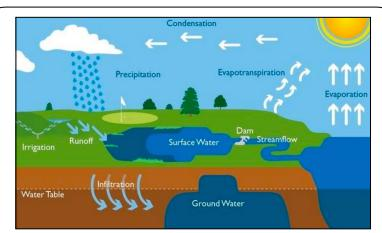

**User:** Suppose you are a teacher, please use the figure to explain the distinction between evaporation and evapotranspiration.

MM1-30B-Chat (Ours): Evaporation and evapotranspiration are two important processes in the water cycle that are often confused. The image provides a clear distinction between the two. Evaporation is the process where water changes from a liquid state to a gaseous state. This is represented in the image by the sun's heat causing water in the lake and ocean to turn into water vapor and rise into the atmosphere.

On the other hand, evapotranspiration is the combination of evaporation and plant transpiration. Transpiration is the process where water absorbed by plants is released into the atmosphere through the plant's leaves. In the image, evapotranspiration is represented by the water absorbed by the trees and grass being released back into the atmosphere.

In summary, evaporation is the process of water turning into vapor and rising into the atmosphere, while evapotranspiration is the combination of evaporation and plant transpiration, representing the water absorbed by plants and released back into the atmosphere.

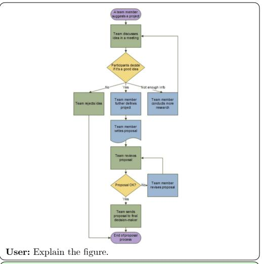

MM1-30B-Chat (Ours): The image presents a flowchart that outlines the process of how a team member suggests a project. The flowchart begins with a green rectangle that contains the text "A team member suggests a project". From this starting point, the process flows through a series of diamond-shaped decision points and rectangular action points, each containing specific text that describes the next step in the process.

The process continues with the team discussing the idea in a meeting, followed by a decision point where participants decide if it's a good idea. If it's a good idea, the process moves forward. If not, the process loops back to the point where the team member conducts more research.

The flowchart is color-coded with green rectangles representing actions and yellow diamonds representing decisions. The lines connecting these shapes are black, indicating the sequence of the process. The flowchart is set against a white background, which makes the colored shapes stand out clearly.

The flowchart provides a clear and structured representation of the process, making it easy to understand the sequence of steps involved in the project suggestion and decision-making process. It's a useful tool for visualizing complex processes and ensuring that all steps are considered and followed in the correct order.

Fig. 15: Examples testing MM1 ability at extracting information from graphics. The right part shows an example of confusion, highlighted in red. Images and prompts are from [122].

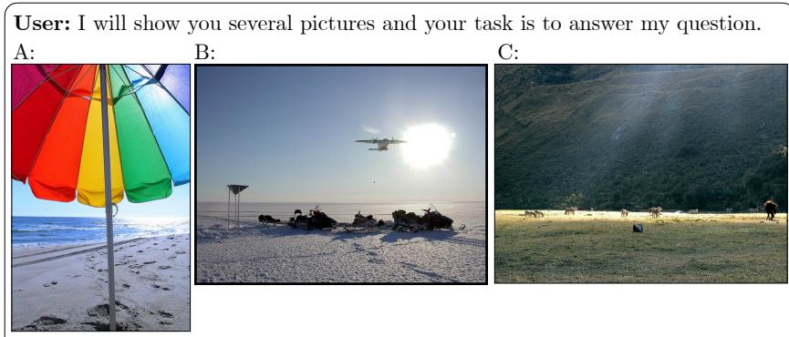

Estimate the temperature in Celsius for each image. Also provide reasons.

#### **MM1-30B-Chat (Ours):**

- The image with the umbrella on the beach: 25-30 degrees Celsius. The umbrella is up, and people are at the beach, suggesting a warm, sunny day.
- The image with the plane flying over the snow: -20 to -30 degrees Celsius. The plane is flying over a snow-covered area, and there are vehicles on the ground, indicating a cold winter day.
- The image with the animals grazing in the field: 15-20 degrees Celsius. The animals are grazing, which usually occurs in milder weather conditions. The grass is green, further suggesting a temperate climate.

Fig. 16: Examples testing MM1 ability at reasoning across images and texts. Images are from COCO 2014 validation set [\[72\]](#page-19-0) and MMMU dev set [\[128\]](#page-22-11).

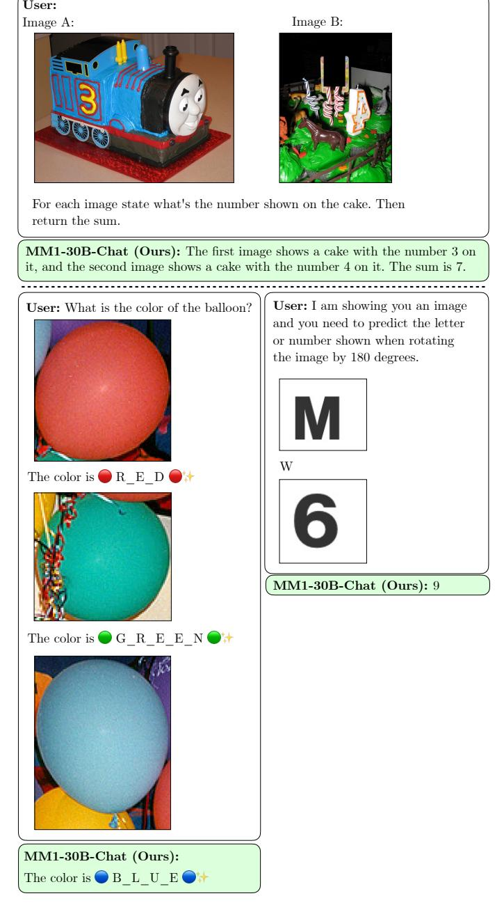

Fig. 17: Examples testing MM1 ability to follow instructions across multiple images (top). Examples testing MM1 at following a style or a task across few shots (bottom). Images are from COCO 2014 validation set [\[72\]](#page-19-0) and from the authors.

## E Author Contributions and Acknowledgements

#### First Authors

Brandon McKinzie: Led the multimodal pre-training design, implementation, and experimentation. Co-led design and implementation of multimodal evaluation infrastructure. Co-set overall direction. Co-wrote paper.

Zhe Gan: Led the SFT design, implementation, and experimentation. Coinitiated effort. Co-set overall direction. Co-wrote paper.

#### Core Authors

Jean-Philippe Fauconnier: Co-led design and implementation of multimodal evaluation infrastructure, assisted with model evaluations, model implementation, multimodal pre-training and SFT experimentation.

Sam Dodge: Assisted with SFT experimentation, data mixtures, and multimodal evaluation infrastructure.

Bowen Zhang: Co-initiated effort, trained image encoders, assisted with infrastructure.

Philipp Dufter: Assisted with model implementation, evaluations, and experimentation.

Dhruti Shah: Implemented interleaved SFT, assisted with experimentation.

Xianzhi Du: Implemented and trained MoE for multimodal pre-training, SFT and underlying LLM.

Peter Grasch: Advised and analyzed experiments, co-led design and implementation of multimodal evaluation infrastructure, co-wrote paper.

## Further Authors

Futang Peng: Data processing and coordination.

Floris Weers: Led text-based evaluation infrastructure and assisted with multimodal evaluation infrastructure.

Haotian Zhang: Implemented and experimented with MoE models.

Anton Belyi, Karanjeet Singh, Doug Kang, Ankur Jain: Dataset creation and filtering.

Hongyu Hè: Co-implemented VL connector, assisted with experimentation.

Max Schwarzer: Implemented support for pre-training on packed image-text pairs and packed interleaved documents.

Tom Gunter, Xiang Kong, Aonan Zhang, Jianyu Wang, Chong Wang, Nan Du, Tao Lei, Sam Wiseman, Guoli Yin, Mark Lee: Designed, implemented, and trained the underlying LLMs.

Zirui Wang, Ruoming Pang: Co-initiated effort, designed, implemented, and trained the underlying LLMs.

## Senior Authors

Alexander Toshev: Co-set overall direction, advised and analyzed experiments, co-wrote paper.

Yinfei Yang: Co-initiated effort, co-set overall direction, advised and analyzed experiments, co-wrote paper.

#### Acknowledgements

The authors would like to thank Vaishaal Shankar, Alaa El-Nouby, Yang Zhao, Shuangfei Zhai, Russ Webb, Hadi Pouransari, Hong-You Chen, Yanghao Li, and David Mizrahi for valuable guidance, suggestions, and feedback; Chen Chen and Qibin Chen for help on instruction tuning; Maitreyi Kunnavakkam Vinjimur, Megan Maher Welsh, Bhavika Devnani, and David Koski for their assistance with input pipelines and data processing; Tom Nickson and Michael Tu for assistance with the AXLearn infrastructure and early LLM work; Varsha Mohan Paidi for assistance with dataset creation and filtering; Esteban Gonzalez, Ian Clark, Jack Bailin, David Koski, and in particular Venkata Yerneni for assistance with the internal Weights & Biases instance for tracking experiments and model evaluations.