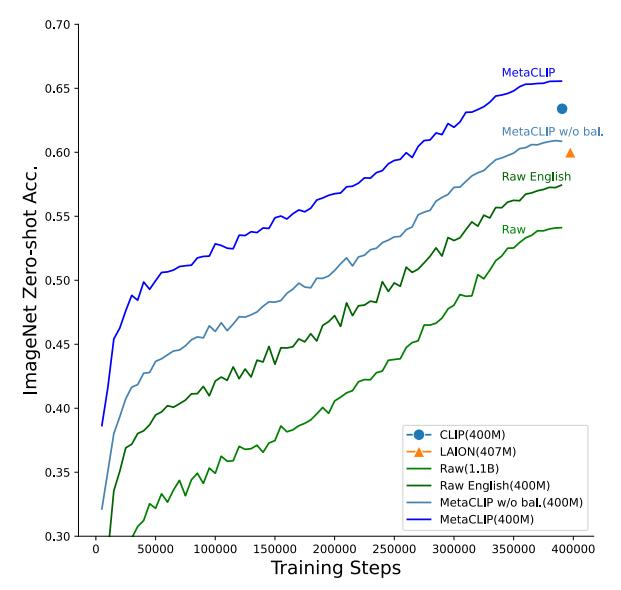
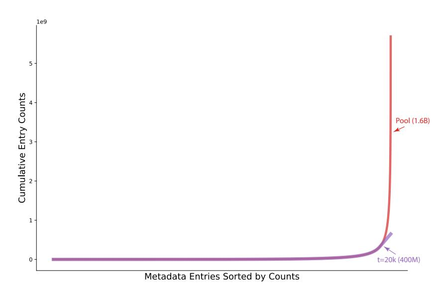
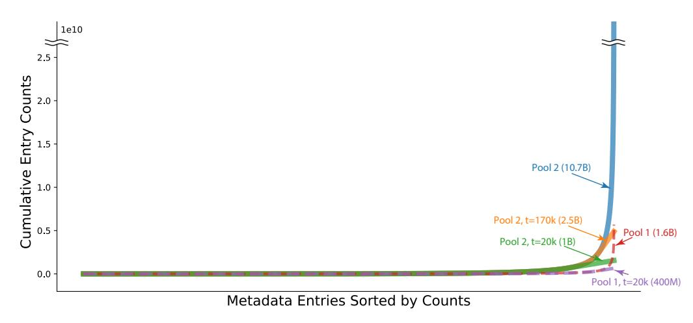

## <span id="page-0-1"></span>DEMYSTIFYING CLIP'S DATA

Hu Xu<sup>1</sup> Saining Xie<sup>2</sup> Xiaoqing Tan<sup>1</sup> Po-Yao Huang<sup>1</sup> Russell Howes<sup>1</sup> Vasu Sharma<sup>1</sup>
Shang-Wen Li<sup>1</sup> Gargi Ghosh<sup>1</sup> Luke Zettlemoyer<sup>1,3</sup> Christoph Feichtenhofer<sup>1</sup>
<sup>1</sup>FAIR, Meta AI <sup>2</sup>New York University <sup>3</sup>University of Washington

#### **ABSTRACT**

Contrastive Language-Image Pre-training (CLIP) is an approach that has advanced research and applications in computer vision, fueling modern recognition systems and generative models. We believe that the main ingredient to the success of CLIP is its data and not the model architecture or pre-training objective. However, CLIP only provides very limited information about its data and how it has been collected, leading to works that aim to reproduce CLIP's data by filtering with its model parameters. In this work, we intend to reveal CLIP's data curation approach and in our pursuit of making it open to the community introduce Metadata-Curated Language-Image Pre-training (MetaCLIP). MetaCLIP takes a raw data pool and metadata (derived from CLIP's concepts) and yields a balanced subset over the metadata distribution. Our experimental study rigorously isolates the model and training settings, concentrating solely on data. MetaCLIP applied to CommonCrawl with 400M image-text data pairs outperforms CLIP's data on multiple standard benchmarks. In zero-shot ImageNet classification, MetaCLIP achieves 70.8% accuracy, surpassing CLIP's 68.3% on ViT-B models. Scaling to 1B data, while maintaining the same training budget, attains 72.4%. Our observations hold across various model sizes, exemplified by ViT-H achieving 80.5%, without any bells-and-whistles. Curation code and training data distribution over metadata is made available at https://github.com/facebookresearch/MetaCLIP.

#### <span id="page-0-2"></span>1 Introduction

Deep learning has revolutionized the field of artificial intelligence, and pre-trained models have played a pivotal role in democratizing access to cutting-edge AI capabilities. However, the training data used to create these models is often concealed from the public eye, shrouded in secrecy.

The increasing availability of pre-trained models for public use contrasts sharply with the lack of transparency regarding their training data. Further, proprietary concerns, such as copyright issues, often limit access to the original data sources. Consequently, the need to explore novel approaches for curating high-quality training data that can be shared openly arises.

In the vision-language domain, the dominant model and learning approach is Contrastive Language-Image Pre-training (CLIP) (Radford et al., 2021), a simple technique to learn from image-text pairs. We believe that the secret to the dominance of CLIP models is attributed to its high-quality WIT400M *dataset* which is curated from the web. Despite its popularity, the specifics of CLIP's curation process have remained a mystery, captivating the research community for years.

Follow-up works (Schuhmann et al., 2022; 2021) have attempted to replicate CLIP's data, but with a notable difference in their curation method. While CLIP generates data based on its unknown data source and curation methodology, these approaches remove noise by applying the CLIP model as a hard blackbox filter which in turn is a form of distilling WIT400M information captured in CLIP.

The advantages of CLIP's curation are apparent: First, it starts *from scratch*, avoiding the introduction of biases through filters. Second, CLIP's curation process *balances* the data distribution over metadata, maximizing signal preservation while mitigating, rather than removing, noise in the data<sup>1</sup>. Such distribution lays the groundwork for task-agnostic data, a crucial part of foundation models.

<span id="page-0-0"></span><sup>&</sup>lt;sup>1</sup>For example, a filter on digits can remove noise from date or id strings but remove signal for tasks that involve OCR (e.g., MNIST), or a filter removing text with less than 5 characters can remove signal "dog".

In this paper, we attempt to reveal CLIP's dark secrets around training data curation. We present an empirical study on data curation, with frozen model architecture and training schedule. We focus solely on the impact of training data, excluding other factors that could confound the results. We make several observations for good data quality and present a simple algorithm to make CLIP's curation more transparent. Consequently, we shed light on both the curation process and the resulting training data distribution. Our algorithm enables easy adaptation to different data pools, allowing parties to fully own their data pipeline without relying on blackbox filters from external providers.

Our algorithm takes a raw data pool  $\mathcal D$  and metadata  $\mathcal M$  (derived from CLIP's queries or visual concepts) and yields a balanced subset  $\mathcal D^*$  over  $\mathcal M$ :  $\mathcal D^*=f(\mathcal D;\mathcal M)$ . Our approach, named Metadata-Curated Language-Image Pretraining (MetaCLIP), marks a significant step towards making the curation process more transparent and accessible.

MetaCLIP applied to CommonCrawl (CC) with 400M data points outperforms CLIP on multiple standard benchmarks. In terms of zero-shot ImageNet classifica-

<span id="page-1-0"></span>

Figure 1: ViT-B/32 on ImageNet zero-shot classification with fixed training steps (12.8B seen pairs and training/validation data has been de-duplicated). Raw: raw CommonCrawl (CC) distribution; Raw English: English only CC; MetaCLIP w/o bal.: curated (substring matched) data pool from CC; MetaCLIP: curated and balanced metadata distribution. Metadata curation boosts performance significantly and balancing is equally important. Our MetaCLIP data significantly outperforms CLIP's WIT400M and LAION data.

tion, using ViT (Dosovitskiy et al., 2020) models of various sizes. Our MetaCLIP achieves 70.8% vs CLIP's 68.3% on ViT-B and 76.2% vs 75.5% on ViT-L. Scaling to 2.5B data, with the *same* training budget and similar distribution boosts this to unprecedented accuracy of 79.2% for ViT-L and 80.5% for ViT-H in the vanilla training setting (not using any external data or models).

In Fig.1, we show the impact of metadata curation on ImageNet validation accuracy plotted over training steps. First, we are training on Raw English data from the web (400 image-text pairs, 57.4%), after applying Language IDentification (LID) to the random Raw set (~1.1B pairs, 54.1%). Using metadata to curate the training set (MetaCLIP 400M w/o bal, 60.8%) performs significantly better than these baselines, and using balancing significantly increases accuracy further (MetaCLIP, 65.5%), outperforming similar datasets, WIT400M from CLIP, 63.4% and LAION 400M, 60.0%.

#### 2 RELATED WORK

The training data of CLIP differs significantly from a traditional supervised dataset (Gadre et al., 2023) in various aspects. Firstly, it involves large-scale training with mixed-quality image-text pairs rather than categorized images with human annotated labels, as commonly seen in classification datasets. Secondly, CLIP's pre-training is the initial stage of training, assuming no access to previously trained models.

**Data Pruning on Established Datasets.** Current research on data algorithms primarily revolves around *data pruning* techniques applied to well-established datasets using pre-trained models (Sorscher et al., 2022; Abbas et al., 2023). These approaches, such as coreset selection techniques (Har-Peled & Mazumdar, 2004; Feldman et al., 2011; Bachem et al., 2015; Mirzasoleiman et al., 2020; Toneva et al., 2018), aim to select a subset of data that yields similar performance to training on the entire dataset. However, this post-hoc data pruning approach has limited utility, as the computational resources saved have already been expended during the initial training of the model.

Handling Noisy Internet Data. Addressing noisy data from the Internet is a significant challenge, and existing approaches often heavily rely on human-designed filter systems. Classical methods involve dataset cleaning and outlier removal [\(Jiang et al., 2001;](#page-9-12) [Yu et al., 2002\)](#page-10-0) to discard samples that may introduce undesirable biases to models.

Replicating CLIP's Training Data. Recent efforts, such as LAION [\(Schuhmann et al., 2021;](#page-9-2) [2022\)](#page-9-1) and concurrent work DataComp [\(Gadre et al., 2023\)](#page-9-4), attempt to replicate CLIP's training data. However, they adopt fundamentally different strategies for several reasons. First, the data used in these approaches are post-hoc, filtered, by vanilla CLIP as a *teacher* model. Second, the curation process in these methods relies on a labor-intensive pipeline of filters, making it challenging to comprehend the resulting data distribution from the raw Internet (refer to the unknown biases of using CLIP filter in [\(Schuhmann et al., 2022\)](#page-9-1)). Thirdly, the goal is to match the quantity of CLIP's target data size rather than the data distribution itself, which may lead to an underestimation of the data pool size needed to obtain sufficient quality data. Consequently, the performance on the 400M scale is sub-optimal, with LAION400M only achieving 72.77% accuracy on ViT-L/14 on ImageNet, whereas vanilla CLIP obtains 75.5%.

Importance of Understanding CLIP's Data Curation. The observations made in these studies underscore the critical importance of understanding how OpenAI CLIP curates its data in the first place. A comprehensive understanding of the curation process can shed light on the factors that contribute to its success, allowing researchers to devise more effective and efficient algorithms for future vision-language pre-training endeavors.

## 3 FROM THE DARK SECRETS

The original paper [\(Radford et al., 2021\)](#page-9-0) only provides limited details about how CLIP curates its data. Since important design choices for a direct reproduction are missing, we'll clarify our choices in this section. Our main goal is to uncover CLIP's data curation process, which involves preserving important signals in the data while minimizing noise. In this section, we'll explain the principles we've adopted to achieve this.

CLIP's WIT400M is curated with an information retrieval method, quoting [\(Radford et al., 2021\)](#page-9-0):

" To address this, we constructed a new dataset of 400 million (image, text) pairs collected from a variety of publicly available sources on the Internet. To attempt to cover as broad a set of visual concepts as possible, we *search* for (image, text) pairs as part of the construction process whose text includes one of a set of *500,000 queries* We approximately class balance the results by including *up to 20,000 (image, text) pairs per query*. "

We rigorously adhere to this description and provide detailed insights into the construction process of CLIP's metadata (in [§3.1](#page-2-0)[\)2,](#page-2-1) sub-string matching (in [§3.2\)](#page-3-0), inverted indexing (in [§3.3\)](#page-4-0), as well as query and balancing (in [§3.4\)](#page-4-1).

# <span id="page-2-0"></span>3.1 METADATA CONSTRUCTION: *M* = *{entry}*

We start by re-building CLIP's 500,000-query metadata, citing [Radford et al.](#page-9-0) [\(2021\)](#page-9-0):

<span id="page-2-1"></span>We generalize the term queries (used by CLIP) as *entries* in *metadata* because metadata describe training data and our algorithm does not require search on inverted index yet have similar effects.

" The base query list is all words occurring at least 100 times in the *English version of Wikipedia*. This is augmented with *bi-grams* with high pointwise mutual information as well as the names of all *Wikipedia articles* above a certain search volume. Finally all *WordNet synsets* not already in the query list are added.

"

The metadata (queries) consists of four components: (1) all synsets of WordNet, (2) uni-grams from the English version of Wikipedia occurring at least 100 times, (3) bi-grams with high pointwise mutual information, and (4) titles of Wikipedia articles above a certain search volume. We rebuild these components from WordNet and Wikipedia and summarize the statistics in Table [1](#page-3-1)[3.](#page-3-2) We estimate the thresholds for components (3) and (4) as in the 3rd column of Table [1,](#page-3-1) by first choosing a point-wise mutual information threshold of 30 that meets the budget of 100k entries for bi-grams and then fill the rest of the entries with Wikipedia titles.

<span id="page-3-1"></span>

| Source          | # of Entries | Desc. of Threshold          | Threshold           |
|-----------------|--------------|-----------------------------|---------------------|
| WordNet synsets | 86,654       | N/A                         | [ALL] (follow CLIP) |
| Wiki uni-gram   | 251,465      | Count                       | 100 (follow CLIP)   |
| Wiki bi-gram    | 100,646      | Pointwise Mutual Info.(PMI) | 30 (estimated)      |
| Wiki titles     | 61,235       | View Frequency              | 70 (estimated)      |

Table 1: Composition of CLIP Metadata.

# <span id="page-3-0"></span>3.2 SUB-STRING MATCHING: *text* ! *entry*

After constructing the metadata, CLIP's curation aligns a pool of image-text pairs with metadata entries through sub-string matching. This process identifies texts that contain any of the metadata entries, effectively associating unstructured texts with structured metadata entries. The sub-string matching step retains only high-quality matching texts, automatically filtering out various types of noises that a typical filter system would consider on a case-by-case basis.

Such alignment is referred to as sub-string matching in [Radford et al.](#page-9-0) [\(2021\)](#page-9-0):

" We also restrict this step in CLIP to text-only querying for *sub-string matches* while most webly supervised work uses standard image search engines ...

"

Image-Text Pair Pool We start by estimating the pool size used by CLIP's curation. CLIP's data source is unknown to us ("a variety of publicly available sources" in [Radford et al.](#page-9-0) [\(2021\)](#page-9-0)). We adopt CommonCrawl (CC)[4](#page-3-3) as the source to build such a pool and re-apply sub-string matching to this source. We ended with a pool of 1.6B image-text pairs (5.6B counts of sub-string matches). Note that one text can have multiple matches of entries and we have 3.5 matches per text on average.

As a result, sub-string matching builds the mapping *txt* ! *entry*. This step has two outcomes: (1) low-quality text is dropped; (2) unstructured text now has a structured association with metadata. For all English text, ⇠50% image-text pairs are kept in this stage. Similar to CiT [\(Xu et al., 2023\)](#page-9-13), this approach looks for quality matches and automatically gets rid of some type of noise (such as date strings) that a typical filter system would remove consider case-by-case (e.g., regular expression on dates, ids etc.).

<span id="page-3-2"></span><sup>3</sup> Note that we cannot find Wikipedia's search volume for titles of Wikipedia (4). Instead, we use volumes of Pageviews on Wiki articles. We randomly selected 26 days' Pageviews from Apr. 2018 to Sep. 2022.

<span id="page-3-3"></span><sup>4</sup> <https://commoncrawl.org>

| Metadata Subset | # of Entries | # of Counts |
|-----------------|--------------|-------------|
| Full            | 500K         | 5.6B        |
| Counts = 0      | 114K         | 0           |
| Counts > 20000  | 16K          | 5.35B       |

Table 2: Summary of counts for entries

<span id="page-4-3"></span><span id="page-4-2"></span>

| Entry | Counts | Entry | Counts | Entry | Counts | Entry | Counts |
|-------|--------|-------|--------|-------|--------|-------|--------|
| of    | 120M   | in    | 107M   | and   | 100M   | for   | 89M    |
| the   | 87M    | The   | 67M    | with  | 67M    | to    | 61M    |
| photo | 54M    | a     | 50M    | image | 48M    | 1     | 47M    |
| on    | 45M    | by    | 43M    | 2     | 43M    | Image | 39M    |
| at    | 38M    | Black | 33M    | 3     | 30M    | A     | 29M    |

Table 3: Top-20 entries with counts

# <span id="page-4-0"></span>3.3 INVERTED INDEXING: *entry* ! *text*

Following sub-string matching, CLIP builds an inverted index of the data pool. All texts associated with each metadata entry are aggregated into lists, creating a mapping from each entry to the corresponding texts, *entry* ! *text*.

As an analysis, we count the number of matches for each entry and summarize that in Table [2.](#page-4-2) The counts exhibit a long-tailed distribution. Out of the 500k entries, 114k entries have *no* matches. This signifies the importance of knowing the training data distribution since it is very likely the training data does not have certain visual concepts. We observed that only 16k entries had counts higher than 20k, accounting for only 3.2% (16k/500k) of the entries, but their counts made up 94.5% (5.35B/5.6B) of the total counts of all entries.

Top Entries. We show the top entries of the matching in Table [3.](#page-4-3) Interestingly, many of these are stopwords, which don't carry specific meaning but can enhance the overall text quality (e.g., by generating grammatically correct sentences rather than just keyword lists). It's important to note that although sub-string matching aims to select only high-quality texts, there are instances where common entries may still include irrelevant texts. For instance, the entry "photo" could match with the popular but unhelpful term "untitled photo". These noise-related issues can be addressed in the subsequent stage of processing.

# <span id="page-4-1"></span>3.4 QUERY AND BALANCING WITH *t* 20K

The key secret behind OpenAI CLIP's curation is to balance the counts of matched entries. For each metadata entry, the associated list of texts (or image-text pairs) is sub-sampled, ensuring that the resulting data distribution is more balanced. This step aims to mitigate noise and diversify the distribution of data points, making the data more task-agnostic as foundation data for pre-training.

The magic number *t* = 20k is a threshold used to limit the number of texts/pairs for each entry. Entries with fewer than *t* pairs (tail entries) retain all associated pairs, while entries with more than *t* pairs (head entries) are sub-sampled to *t* pairs. The selection is based on the density of information in texts; texts with more matched entries have a higher chance of being curated (recall that the average is 3.5 matches per text).

To study the effect of the magic number *t* = 20k, we plot the cumulative sum of counts for entries sorted by counts from tail to head in Fig. [2.](#page-5-0) Interestingly, the value of *t* = 20k seemingly represents the transition from tail to head entries, when the head entries start exhibiting an *exponential growth rate*. By applying a max count of *t*, the growth rate of total counts (i.e., the scale of resulting data points) is reduced to *linear*. This significantly flattens (and balances) the training data distribution. We further study the optimality of *t* = 20k for the 400M data scale in our experiments.

In summary, balancing yields three interesting outcomes:

<span id="page-5-0"></span>

Figure 2: Cumulative sum of counts on entries from *tail to head* on a data pool with 1.6B image-text pairs (5.6B match counts). (1) raw/unbalanced cumulative counts,  $t = \infty$ ; (2) balanced cumulative counts after applying t = 20k. The limit t defines the transition of tail/head entries.

- (i) It reduces dominance and noise from head entries, like common web terms. E.g., out of 400M pairs, only 20k texts containing "photo" are kept (while there are 54M "photo" instances in the pool).
- (ii) It diversifies the data point distribution and balances tail/head entries, leading to a more task-agnostic data distribution foundation.
- (iii) Sampling for each entry ensures that data points with more matched entries or *denser* information are prioritized for curation.

**Discussion.** CLIP employs a pure NLP-based approach, requiring no access to ML models and minimizing explicit/implicit priors from humans. The metadata plays a central role in mitigating noise and preserving signal in the data distribution. The balancing step effectively flattens the data distribution, diversifying the data and making it more suitable as foundation data for pre-training tasks. We analyze the effects of balancing in Appendix A.3.

### 4 A SIMPLE ALGORITHM FOR CURATION

This section presents an algorithm that formalizes the curation process described earlier. The algorithm aims to improve scalability and reduce space complexity for operations across data points, such as inverted indexing and sub-sampling. Instead of building inverted indexes, the algorithm only maintains total counts for each entry.

We assume that CLIP curation constructs an inverted index that maps entries to documents (image-text pairs) to enable efficient *search* for each entry ("we search for (image-text) pairs" in Radford et al. (2021)). In contrast, our algorithm approaches the balancing process through independent sampling. This avoids the need to build an inverted index that could potentially store hundreds of millions of concrete pairs for popular entries, thereby improving efficiency and scalability.

Our algorithm takes three inputs: metadata  $\mathcal{M}$ , a data pool  $\mathcal{D}$ , and a hyper-parameter t. It aims to find a subset  $\mathcal{D}^*$  with a balanced distribution over  $\mathcal{M}$ , denoted as  $\mathcal{D}^* \leftarrow f(\mathcal{D}; \mathcal{M}, t)$ . The algorithm consists of two parts, each corresponding to a specific stage of the curation process.

We provide the Python pseudo-code in Algorithm 1.

### <span id="page-6-0"></span>Algorithm 1: Pseudo-code of Curation Algorithm in Python/NumPy style.

```
# D: raw image-text pairs; # M: metadata; # t: max matches per entry in metadata; # D_star: curated image-text pairs;
D_star = []
# Part 1: sub-string matching: store entry indexes in text.matched_entry_ids and output counts per entry in entry_count. entry_count = substr_matching(D, M)
# Part 2: balancing via indepenent sampling
entry_count[entry_count < t] = t
entry_prob = t / entry_count
for image, text in D:
    for entry_id in text.matched_entry_ids:
        if random.random() < entry_prob[entry_id]:
             D_star.append((image, text))
             break
```

Part 1: Entry Counts from Sub-string Matching. This corresponds to Sec. [3.2.](#page-3-0) The substr\_matching function outputs the total counts of matches per entry, entry\_count, represented as a NumPy array indexed by entry\_id. Each text is associated with matched\_entry\_ids that contains a list of matched entries.

Part 2: Balancing via Independent Sampling. This part corresponds to Sec[.3.3](#page-4-0) and Sec[.3.4](#page-4-1) and focuses on balancing counts on entries. Instead of building an expensive inverted index with associated lists of texts for each entry, we sample each data point independently.

We first compute the probability of sampling each entry, entry\_prob, where tail entries (entry\_count < *t*) have a probability equal to 1, and head entries have a probability less than 1. We iterate through all image-text pairs and sample/curate each pair. When an image-text pair has a matched entry sampled/selected, we include that pair in *D*⇤.

This procedure is equivalent to CLIP's curation, because if one image-text pair has one or more matched entries, the chance of that pair being selected is determined by the probability of sampling for each individual entry: *t/*entry\_count[entry\_id]. As long as one entry selects that pair, it will be kept in *D*⇤. Our independent sampling approach allows us to scale balancing for each data point independently and reduces the global operation to counting the total matches for each entry. We demonstrate case studies in experiments on (1) scaling curation in a data pipeline and (2) online balancing in data loader.

## 5 EXPERIMENTS

### Data Pools. We collect two pools of data:

Pool 1 contains 1.6 billion image-text pairs with a total of 5.6 billion counts of matches. This pool was used to estimate a target of 400M image-text pairs, collected from 15 snapshots of Common-Crawl (CC) from January 2021 to January 2023.

Pool 2 aims to scale curation in our data pipeline. We parsed all 90 CC snapshots from 2013 to April 2023, using our algorithm ([§A.2\)](#page-0-2) to curate from a pool of 10.7B matched image-text pairs that are originally from a large set of URL-text pairs, which have undergone de-duplication, English Language IDentification (LID) and sub-string matching. However, we only perform (expensive) image downloading, storing, and transferring for data points that are distribution-calibrated and selected by our algorithm.

For balancing we consider 2 scenarios on this data: (i) *t* = 170*k*, which is resulting in 2.5B imagetext pairs. This *t* = 170*k* configuration has tail counts amounting to 6% of the total counts, the *same tail/head ratio* that the 400M pool 1 data has, produced by applying *t* = 20*k* on the 1.6B pool 1. (ii) The *t* = 20*k* threshold applied to pool 2 which results in 1B image-text pairs and compared to the 400M set from pool 1 only increases tail metadata matches (head counts are capped at 20*k*).

<span id="page-7-0"></span>

|                                                                                                                                                            | Average | ImageNet | Food-101 | CIFAR10 | CIFAR100 | CUB | SUN397 | Cars | Aircraft | DTD | Pets | Caltech-101 | Flowers | MNIST | FER-2013 | STL-10 | EuroSAT | RESISC45 | GTSRB | KITTI | Country211 | PCAM | UCF101 | Kinetics700 | CLEVR | HatefulMemes                                                                                                                           | SST2 |
|------------------------------------------------------------------------------------------------------------------------------------------------------------|---------|----------|----------|---------|----------|-----|--------|------|----------|-----|------|-------------|---------|-------|----------|--------|---------|----------|-------|-------|------------|------|--------|-------------|-------|----------------------------------------------------------------------------------------------------------------------------------------|------|
| ViT-B/32                                                                                                                                                   |         |          |          |         |          |     |        |      |          |     |      |             |         |       |          |        |         |          |       |       |            |      |        |             |       |                                                                                                                                        |      |
| CLIP, our eval.                                                                                                                                            |         |          |          |         |          |     |        |      |          |     |      |             |         |       |          |        |         |          |       |       |            |      |        |             |       | 56.6 63.4 83.7 89.8 65.1 53.7 62.0 59.7 19.6 44.0 87.2 87.4 66.9 48.2 46.6 97.1 44.9 61.0 32.6 28.7 17.2 62.5 63.9 48.0 23.6 56.4 58.6 |      |
| OpenCLIP, our eval. 54.7 60.0 78.0 88.4 68.3 57.2 65.0 74.7 14.5 52.2 85.2 88.3 63.3 39.7 47.7 95.0 50.2 57.4 40.7 17.9 13.5 50.2 59.4 41.0 13.7 49.2 52.1 |         |          |          |         |          |     |        |      |          |     |      |             |         |       |          |        |         |          |       |       |            |      |        |             |       |                                                                                                                                        |      |
| MetaCLIP                                                                                                                                                   |         |          |          |         |          |     |        |      |          |     |      |             |         |       |          |        |         |          |       |       |            |      |        |             |       | 58.2 65.5 80.6 91.3 70.2 63.4 63.0 70.7 26.8 52.8 88.7 91.9 68.5 41.5 35.9 95.4 52.6 64.2 35.8 30.7 17.2 55.5 66.1 45.4 30.6 56.4 53.4 |      |
| ViT-B/16                                                                                                                                                   |         |          |          |         |          |     |        |      |          |     |      |             |         |       |          |        |         |          |       |       |            |      |        |             |       |                                                                                                                                        |      |
| CLIP, our eval.                                                                                                                                            |         |          |          |         |          |     |        |      |          |     |      |             |         |       |          |        |         |          |       |       |            |      |        |             |       | 59.6 68.3 88.8 90.8 68.2 55.6 64.0 64.6 24.0 45.1 88.9 89.1 69.4 51.8 53.0 98.2 54.8 65.5 43.3 21.7 22.8 56.3 68.5 52.3 25.5 58.7 60.5 |      |
| OpenCLIP, our eval. 60.4 67.0 85.8 91.7 71.4 65.3 69.2 83.6 17.4 51.0 89.2 90.8 66.5 66.3 46.1 97.0 52.2 65.7 43.5 23.7 18.1 51.7 67.0 46.2 33.9 54.5 54.4 |         |          |          |         |          |     |        |      |          |     |      |             |         |       |          |        |         |          |       |       |            |      |        |             |       |                                                                                                                                        |      |
| MetaCLIP                                                                                                                                                   |         |          |          |         |          |     |        |      |          |     |      |             |         |       |          |        |         |          |       |       |            |      |        |             |       | 61.1 70.8 86.8 90.1 66.5 70.8 66.6 74.1 27.9 55.9 90.4 93.8 72.3 47.8 44.6 97.2 55.4 68.8 43.8 33.4 22.6 52.9 68.0 49.5 22.8 54.8 60.6 |      |
| ViT-L/14                                                                                                                                                   |         |          |          |         |          |     |        |      |          |     |      |             |         |       |          |        |         |          |       |       |            |      |        |             |       |                                                                                                                                        |      |
| CLIP, our eval.                                                                                                                                            |         |          |          |         |          |     |        |      |          |     |      |             |         |       |          |        |         |          |       |       |            |      |        |             |       | 65.7 75.5 93.0 95.6 78.3 63.3 66.8 77.8 31.3 55.3 93.6 93.3 79.3 76.4 56.9 99.4 61.9 70.9 50.6 19.2 31.9 50.1 75.7 60.2 22.3 59.7 68.9 |      |
| OpenCLIP,our eval. 64.5 72.7 90.0 94.7 78.0 73.9 72.4 89.5 24.7 60.2 91.6 93.6 73.0 76.1 54.3 98.1 63.9 69.6 49.9 16.0 23.0 51.7 71.5 51.6 25.4 55.3 56.0  |         |          |          |         |          |     |        |      |          |     |      |             |         |       |          |        |         |          |       |       |            |      |        |             |       |                                                                                                                                        |      |
| MetaCLIP                                                                                                                                                   |         |          |          |         |          |     |        |      |          |     |      |             |         |       |          |        |         |          |       |       |            |      |        |             |       | 67.1 76.2 90.7 95.5 77.4 75.9 70.5 84.7 40.4 62.0 93.7 94.4 76.4 61.7 46.5 99.3 59.7 71.9 47.5 29.9 30.9 70.1 75.5 57.1 35.1 56.6 65.6 |      |

Table 4: MetaCLIP-400M *vs.* CLIP (WIT400M data) and OpenCLIP (LAION-400M data). We use 3 different model scales (ViT-B/32 and -B/16 and -L/14) and an identical training setup as CLIP.

<span id="page-7-1"></span>

|                                                                                                                                                                                                                                                                                                                                            | Average | ImageNet | Food-101 | CIFAR10 | CIFAR100 | CUB | SUN397 | Cars | Aircraft | DTD | Pets | Caltech-101 | Flowers | MNIST | FER-2013 | STL-10 | EuroSAT | RESISC45 | GTSRB | KITTI | Country211 | PCAM | UCF101                                                                                                                                 | Kinetics700 | CLEVR | HatefulMemes | SST2 |
|--------------------------------------------------------------------------------------------------------------------------------------------------------------------------------------------------------------------------------------------------------------------------------------------------------------------------------------------|---------|----------|----------|---------|----------|-----|--------|------|----------|-----|------|-------------|---------|-------|----------|--------|---------|----------|-------|-------|------------|------|----------------------------------------------------------------------------------------------------------------------------------------|-------------|-------|--------------|------|
| ViT-B/32                                                                                                                                                                                                                                                                                                                                   |         |          |          |         |          |     |        |      |          |     |      |             |         |       |          |        |         |          |       |       |            |      |                                                                                                                                        |             |       |              |      |
| MetaCLIP(400M) 58.2 65.5 80.6 91.3 70.2 63.4 63.0 70.7 26.8 52.8 88.7 91.9 68.5 41.5 35.9 95.4 52.6 64.2 35.8 30.7 17.2 55.5 66.1 45.4 30.6 56.4 53.4                                                                                                                                                                                      |         |          |          |         |          |     |        |      |          |     |      |             |         |       |          |        |         |          |       |       |            |      |                                                                                                                                        |             |       |              |      |
| MetaCLIP(1B)                                                                                                                                                                                                                                                                                                                               |         |          |          |         |          |     |        |      |          |     |      |             |         |       |          |        |         |          |       |       |            |      | 60.3 67.3 81.9 95.2 76.7 71.4 65.9 73.0 31.4 58.9 89.5 92.5 72.6 35.4 45.8 96.3 50.4 64.6 40.7 32.0 17.0 64.2 70.3 47.8 14.6 54.9 56.8 |             |       |              |      |
| MetaCLIP(2.5B) 59.8 67.6 82.6 95.2 77.7 67.8 66.8 77.2 26.9 58.9 90.9 92.5 69.7 42.7 48.3 96.3 49.9 66.5 39.2 29.3 17.7 50.0 68.0 47.6 19.4 53.5 53.1                                                                                                                                                                                      |         |          |          |         |          |     |        |      |          |     |      |             |         |       |          |        |         |          |       |       |            |      |                                                                                                                                        |             |       |              |      |
| ViT-B/16<br>MetaCLIP(400M) 61.1 70.8 86.8 90.1 66.5 70.8 66.6 74.1 27.9 55.9 90.4 93.8 72.3 47.8 44.6 97.2 55.4 68.8 43.8 33.4 22.6 52.9 68.0 49.5 22.8 54.8 60.6<br>MetaCLIP(1B)<br>MetaCLIP(2.5B) 63.5 72.1 88.3 95.7 79.0 71.4 68.5 82.9 30.3 62.1 91.7 93.3 73.9 66.1 47.0 98.4 51.1 71.1 46.6 16.6 22.7 50.5 73.0 52.5 30.8 57.4 59.0 |         |          |          |         |          |     |        |      |          |     |      |             |         |       |          |        |         |          |       |       |            |      | 63.2 72.4 88.1 94.8 78.2 77.5 66.4 79.3 38.0 57.7 92.3 93.6 75.1 36.4 47.8 98.0 50.5 70.1 49.5 36.6 21.6 53.7 74.1 52.7 21.6 56.8 61.6 |             |       |              |      |
| ViT-L/14                                                                                                                                                                                                                                                                                                                                   |         |          |          |         |          |     |        |      |          |     |      |             |         |       |          |        |         |          |       |       |            |      |                                                                                                                                        |             |       |              |      |
| MetaCLIP(400M) 67.1 76.2 90.7 95.5 77.4 75.9 70.5 84.7 40.4 62.0 93.7 94.4 76.4 61.7 46.5 99.3 59.7 71.9 47.5 29.9 30.9 70.1 75.5 57.1 35.1 56.6 65.6                                                                                                                                                                                      |         |          |          |         |          |     |        |      |          |     |      |             |         |       |          |        |         |          |       |       |            |      |                                                                                                                                        |             |       |              |      |
| MetaCLIP(1B)                                                                                                                                                                                                                                                                                                                               |         |          |          |         |          |     |        |      |          |     |      |             |         |       |          |        |         |          |       |       |            |      | 70.2 79.0 92.9 96.8 84.9 83.1 72.8 86.5 48.9 65.9 95.3 94.8 84.7 53.8 54.1 99.3 70.0 73.8 58.7 36.3 32.2 70.4 81.4 61.6 21.1 61.2 66.1 |             |       |              |      |
| MetaCLIP(2.5B) 69.8 79.2 93.4 97.6 84.2 80.1 73.8 88.7 44.6 68.1 94.7 95.4 81.8 64.4 55.1 99.3 59.2 74.6 56.3 29.7 34.0 67.3 81.6 62.0 25.9 58.0 66.7                                                                                                                                                                                      |         |          |          |         |          |     |        |      |          |     |      |             |         |       |          |        |         |          |       |       |            |      |                                                                                                                                        |             |       |              |      |
| ViT-H/14                                                                                                                                                                                                                                                                                                                                   |         |          |          |         |          |     |        |      |          |     |      |             |         |       |          |        |         |          |       |       |            |      |                                                                                                                                        |             |       |              |      |
| MetaCLIP(2.5B) 72.4 80.5 94.2 98.0 86.4 83.4 74.1 90.0 50.2 72.4 95.4 95.6 85.1 72.7 55.2 99.4 66.3 74.6 62.5 38.2 37.2 65.8 82.2 64.1 30.1 59.3 69.2                                                                                                                                                                                      |         |          |          |         |          |     |        |      |          |     |      |             |         |       |          |        |         |          |       |       |            |      |                                                                                                                                        |             |       |              |      |

Table 5: Scaling MetaCLIP from 400M (*t*=20k) to 1B (*t*=20k) and 2.5B (*t*=170k) training data.

Training Setup We strictly follow the CLIP training setup, using V100 32GB GPUs and an equivalent global batch size of 32,768. For ViT-B/32 and ViT-B/16, we use 64 GPUs with a per GPU batch size of 512 and for ViT-L/14 we use 128 GPUs with a 256 per GPU batch size. It takes 4 days to train ViT-B/32 and a month to train ViT-L/14. We use 256 A100 80GB GPUs to train ViT-H/14 model for 1 week. We train in all experiments for the same number of iterations that correspond to 12.8B seen image-text pairs during training (32 epochs for 400M).

### 5.1 RESULTS

Zero-shot Image Classification. We follow the standard evaluation benchmark and made sure all prompts and class names were the same as those used by CLIP [Radford et al.](#page-9-0) [\(2021\)](#page-9-0). We also reevaluated OpenAI/OpenCLIP's checkpoints to avoid differences caused by benchmark data copies.

The results are shown in Tab [4.](#page-7-0)

In Table [4,](#page-7-0) we observe that MetaCLIP outperforms OpenAI CLIP on ImageNet and average accuracy across 26 tasks, for 3 model scales. With 400 million training data points on ViT-B/32, MetaCLIP outperforms CLIP by 2.1% on ImageNet and by 1.6% on average. On ViT-B/16, MetaCLIP outperforms CLIP by 2.5% on ImageNet and by 1.5% on average. On ViT-L/14, MetaCLIP outperforms CLIP by 0.7% on ImageNet and by 1.4% on average.

We next turn to Pool 2 which is a larger set of image-text pairs and study the effect of scaling data. In Table [5,](#page-7-1) we scale data to 1B and 2.5B and observe a large gain over 400M, with similar performance for both 1B and 2.5B scales. Note that the number of training iterations (and therefore compute) is the same for all rows. The main difference between 1B and 2.5B is the threshold *t*, where 1B is a more balanced set by adding more data points (compared to the 400M set) to *tail* entries (up to *t* = 20*k*), instead the 2.5B set adds (up to *t* = 170*k*) data points to all, *head and tail*, entries. The extra data in the tail entries (1B set), seems to benefit downstream accuracy for tasks on specific data such as CUB fine-grained bird classification, Flowers, KITTI, PCAM, while the larger 2.5B data that has more head entries increases broadly over more datasets, but each at a smaller amount. The overall average accuracies are similar for 1B and 2.5B (e.g., 70.2% vs. 69.8% for ViT-L model size). On ImageNet, the 2.5B training data achieves 67.6% on ViT-B/32 that breaks the previous believed saturated B/32 models [\(Cherti et al., 2022\)](#page-9-14), 79.2% on ViT-L/14 and 80.5% on ViT-H/14.

<span id="page-8-0"></span>

Figure 3: Cumulative sum of counts on entries from *tail to head* on a data pool 2. We again show (1) raw/unbalanced cumulative counts), *t* = 1; (2) balanced cumulative counts after applying *t* = 20k and *t* = 170k. *t* defines maximum number of counts per entry and the transition of tail/head entries. We show the pool 1 configuration from Fig. [2](#page-5-0) as dashed lines for reference.

We plot the cumulative sum of counts for entries sorted by counts from tail to head in Fig. [3](#page-8-0) for all these cases, similar to Fig. [2](#page-5-0) for Pool 1 (and the pool 1 configuration as dashed lines). The plot shows that the 2.5B data is still relatively long-tail, while the 1B data is more balanced, explaining it's better performance on specific data such as bird and flower types observed above.

#### 5.2 ABLATION STUDY

We show ablations for MetaCLIP for the 400M scale and ViT-B/32 in Table [6.](#page-8-1) We first ablate different balancing thresholds *t*. We observe that the choice of *t* = 20*k* by CLIP yields the best performance for ImageNet and averaged accuracy and *t* = 15*k* or *t* = 35*k* are slightly worse.

To understand the key effect of balancing, we use the whole matched pool (1.6B image-text pairs) to train CLIP. Surprisingly, training on 4⇥ *more data* (on head entries) *significantly hurts the accuracy* on ImageNet (61.9 vs 66.1) and averaged accuracy across 26 tasks (56.6 vs 58.5).

Balancing can also be applied online in the data loader with head entries down-sampled leading to slightly better performance (58.5 vs 58.2); see appendix for details. This is useful if (long-tail) data has already been collected and one wants to train on a different distritbution. The better accuracy for online balancing is explained by the larger diversity in head data.

<span id="page-8-1"></span>

|                                                                                                                                                            | Average | ImageNet | Food-101 | CIFAR10 | CIFAR100 | CUB | SUN397 | Cars | Aircraft | DTD | Pets | Caltech-101 | Flowers | MNIST | FER-2013 | STL-10 | EuroSAT | RESISC45 | GTSRB | KITTI | Country211 | PCAM                                                                                                                                   | UCF101 | Kinetics700 | CLEVR | HatefulMemes | SST2 |
|------------------------------------------------------------------------------------------------------------------------------------------------------------|---------|----------|----------|---------|----------|-----|--------|------|----------|-----|------|-------------|---------|-------|----------|--------|---------|----------|-------|-------|------------|----------------------------------------------------------------------------------------------------------------------------------------|--------|-------------|-------|--------------|------|
| MetaCLIP t=20k                                                                                                                                             |         |          |          |         |          |     |        |      |          |     |      |             |         |       |          |        |         |          |       |       |            | 58.2 65.5 80.6 91.3 70.2 63.4 63.0 70.7 26.8 52.8 88.7 91.9 68.5 41.5 35.9 95.4 52.6 64.2 35.8 30.7 17.2 55.5 66.1 45.4 30.6 56.4 53.4 |        |             |       |              |      |
| - t=15k                                                                                                                                                    |         |          |          |         |          |     |        |      |          |     |      |             |         |       |          |        |         |          |       |       |            | 57.5 65.5 79.9 90.4 68.8 65.7 64.6 69.4 25.6 52.1 88.8 91.9 69.5 35.8 39.7 96.5 54.0 64.1 34.8 30.6 16.1 52.3 67.1 45.4 22.3 51.2 53.8 |        |             |       |              |      |
| - t=35k                                                                                                                                                    |         |          |          |         |          |     |        |      |          |     |      |             |         |       |          |        |         |          |       |       |            | 57.8 65.4 79.3 91.2 69.0 63.0 65.0 72.0 28.5 52.7 88.5 91.8 68.0 42.0 23.0 96.2 50.0 63.8 40.2 32.4 17.7 56.1 64.2 44.8 28.0 55.4 54.2 |        |             |       |              |      |
| - unbalanced (1.6B) 56.6 61.9 76.9 90.0 67.6 50.8 65.8 77.0 19.9 51.0 83.1 91.5 64.5 58.2 37.0 95.1 55.2 58.2 41.4 32.2 15.1 51.0 59.2 42.6 17.2 55.6 52.6 |         |          |          |         |          |     |        |      |          |     |      |             |         |       |          |        |         |          |       |       |            |                                                                                                                                        |        |             |       |              |      |
| - online balancing                                                                                                                                         |         |          |          |         |          |     |        |      |          |     |      |             |         |       |          |        |         |          |       |       |            | 58.5 66.1 80.8 89.9 68.8 65.7 65.4 71.6 27.9 55.1 88.2 92.7 68.8 38.3 42.1 96.5 54.5 64.8 36.2 29.1 17.6 58.8 66.0 45.8 22.0 56.0 52.4 |        |             |       |              |      |

Table 6: Ablation studies on balancing in MetaCLIP. Default: *t*=20k, 400M. Model: ViT-B/32.

## 6 CONCLUSION

In this paper, we attempt to reveal CLIP's data curation. Following CLIP, our MetaCLIP builds upon meta data for curation and balancing of raw data sourced from the web. We apply MetaCLIP curation at different data scales. Our experiments show that MetaCLIP performs well on different scales of CommonCrawl data and outperforms CLIP's proprietary data source, without reliance on any external model. We make our pipeline for generating the data publicly available.

## REFERENCES

- <span id="page-9-6"></span>Amro Abbas, Kushal Tirumala, Dániel Simig, Surya Ganguli, and Ari S Morcos. Semdedup: Dataefficient learning at web-scale through semantic deduplication. *arXiv preprint arXiv:2303.09540*, 2023.
- <span id="page-9-9"></span>Olivier Bachem, Mario Lucic, and Andreas Krause. Coresets for nonparametric estimation-the case of dp-means. In *International Conference on Machine Learning*, pp. 209–217. PMLR, 2015.
- <span id="page-9-14"></span>Mehdi Cherti, Romain Beaumont, Ross Wightman, Mitchell Wortsman, Gabriel Ilharco, Cade Gordon, Christoph Schuhmann, Ludwig Schmidt, and Jenia Jitsev. Reproducible scaling laws for contrastive language-image learning. *arXiv preprint arXiv:2212.07143*, 2022.
- <span id="page-9-3"></span>Alexey Dosovitskiy, Lucas Beyer, Alexander Kolesnikov, Dirk Weissenborn, Xiaohua Zhai, Thomas Unterthiner, Mostafa Dehghani, Matthias Minderer, Georg Heigold, Sylvain Gelly, et al. An image is worth 16x16 words: Transformers for image recognition at scale. In *International Conference on Learning Representations*, 2020.
- <span id="page-9-8"></span>Dan Feldman, Matthew Faulkner, and Andreas Krause. Scalable training of mixture models via coresets. *Advances in neural information processing systems*, 24, 2011.
- <span id="page-9-4"></span>Samir Yitzhak Gadre, Gabriel Ilharco, Alex Fang, Jonathan Hayase, Georgios Smyrnis, Thao Nguyen, Ryan Marten, Mitchell Wortsman, Dhruba Ghosh, Jieyu Zhang, Eyal Orgad, Rahim Entezari, Giannis Daras, Sarah Pratt, Vivek Ramanujan, Yonatan Bitton, Kalyani Marathe, Stephen Mussmann, Richard Vencu, Mehdi Cherti, Ranjay Krishna, Pang Wei Koh, Olga Saukh, Alexander Ratner, Shuran Song, Hannaneh Hajishirzi, Ali Farhadi, Romain Beaumont, Sewoong Oh, Alex Dimakis, Jenia Jitsev, Yair Carmon, Vaishaal Shankar, and Ludwig Schmidt. Datacomp: In search of the next generation of multimodal datasets, 2023.
- <span id="page-9-7"></span>Sariel Har-Peled and Soham Mazumdar. On coresets for k-means and k-median clustering. In *Proceedings of the thirty-sixth annual ACM symposium on Theory of computing*, pp. 291–300, 2004.
- <span id="page-9-12"></span>Mon-Fong Jiang, Shian-Shyong Tseng, and Chih-Ming Su. Two-phase clustering process for outliers detection. *Pattern recognition letters*, 22(6-7):691–700, 2001.
- <span id="page-9-10"></span>Baharan Mirzasoleiman, Jeff Bilmes, and Jure Leskovec. Coresets for data-efficient training of machine learning models. In *International Conference on Machine Learning*, pp. 6950–6960. PMLR, 2020.
- <span id="page-9-0"></span>Alec Radford, Jong Wook Kim, Chris Hallacy, Aditya Ramesh, Gabriel Goh, Sandhini Agarwal, Girish Sastry, Amanda Askell, Pamela Mishkin, Jack Clark, et al. Learning transferable visual models from natural language supervision. In *International conference on machine learning*, pp. 8748–8763. PMLR, 2021.
- <span id="page-9-2"></span>Christoph Schuhmann, Richard Vencu, Romain Beaumont, Robert Kaczmarczyk, Clayton Mullis, Aarush Katta, Theo Coombes, Jenia Jitsev, and Aran Komatsuzaki. Laion-400m: Open dataset of clip-filtered 400 million image-text pairs. *arXiv preprint arXiv:2111.02114*, 2021.
- <span id="page-9-1"></span>Christoph Schuhmann, Romain Beaumont, Cade W Gordon, Ross Wightman, Theo Coombes, Aarush Katta, Clayton Mullis, Patrick Schramowski, Srivatsa R Kundurthy, Katherine Crowson, et al. Laion-5b: An open large-scale dataset for training next generation image-text models. 2022.
- <span id="page-9-5"></span>Ben Sorscher, Robert Geirhos, Shashank Shekhar, Surya Ganguli, and Ari Morcos. Beyond neural scaling laws: beating power law scaling via data pruning. *Advances in Neural Information Processing Systems*, 35:19523–19536, 2022.
- <span id="page-9-11"></span>Mariya Toneva, Alessandro Sordoni, Remi Tachet des Combes, Adam Trischler, Yoshua Bengio, and Geoffrey J Gordon. An empirical study of example forgetting during deep neural network learning. *arXiv preprint arXiv:1812.05159*, 2018.
- <span id="page-9-13"></span>Hu Xu, Saining Xie, Po-Yao Huang, Licheng Yu, Russell Howes, Gargi Ghosh, Luke Zettlemoyer, and Christoph Feichtenhofer. Cit: Curation in training for effective vision-language data. *arXiv preprint arXiv:2301.02241*, 2023.

<span id="page-10-0"></span>Dantong Yu, Gholamhosein Sheikholeslami, and Aidong Zhang. Findout: Finding outliers in very large datasets. *Knowledge and information Systems*, 4:387–412, 2002.