# Dolma : an Open Corpus of Three Trillion Tokens for Language Model Pretraining Research

Luca Soldaini♥α Rodney Kinney♥α Akshita Bhagia♥α Dustin Schwenk♥α David Atkinsonα Russell Authurα Ben Boginα ω Khyathi Chanduα Jennifer Dumasα Yanai Elazarα ω Valentin Hofmannα Ananya Harsh Jhaα Sachin Kumarα Li Lucyβ Xinxi Lyuω Nathan Lambertα Ian Magnussonα Jacob Morrisonα Niklas Muennighoff Aakanksha Naikα Crystal Namα Matthew E. Petersσ Abhilasha Ravichanderα Kyle Richardsonα Zejiang Shenτ Emma Strubellχα Nishant Subramaniχα Oyvind Tafjordα Pete Walshα Luke Zettlemoyerω Noah A. Smithα ω Hannaneh Hajishirziα ω Iz Beltagyα Dirk Groeneveldα Jesse Dodgeα

Kyle Lo♥α

αAllen Institute for AI βUniversity of California, Berkeley χ Carnegie Mellon University σ Spiffy AI τMassachusetts Institute of Technology ωUniversity of Washington {lucas,kylel}@allenai.org

## Abstract

Language models have become a critical technology to tackling a wide range of natural language processing tasks, yet many details about how the best-performing language models were developed are not reported. In particular, information about their pretraining corpora is seldom discussed: commercial language models rarely provide any information about their data; even open models rarely release datasets they are trained on, or an exact recipe to reproduce them. As a result, it is challenging to conduct certain threads of language modeling research, such as understanding how training data impacts model capabilities and shapes their limitations. To facilitate open research on language model pretraining, we release Dolma, a three trillion tokens English corpus, built from a diverse mixture of web content, scientific papers, code, public-domain books, social media, and encyclopedic materials. In addition, we open source our data curation toolkit to enable further experimentation and reproduction of our work. In this report, we document Dolma, including its design principles, details about its construction, and a summary of its contents. We interleave this report with analyses and experimental results from training language models on intermediate states of Dolma to share what we have learned about important data curation practices, including the role of content or quality filters, deduplication, and multi-source mixing. Dolma has been used to train OLMo, a state-of-the-art, open language model and framework designed to build and study the science of language modeling.

Dataset v. 1.6 [huggingface.co/datasets/allenai/dolma](https://huggingface.co/datasets/allenai/dolma) Toolkit v. 1.0 [github.com/allenai/dolma](https://github.com/allenai/dolma)

♥ Core contributors. See [Appendix B](#page-38-0) for full author contributions.

| Source               | Doc Type       | UTF-8 bytes (GB) | Documents (millions) | Unicode words (billions) | Llama tokens (billions) |
|----------------------|----------------|---------------------|-------------------------|--------------------------------|-------------------------------|
| Common Crawl         | € web pages    | 9,022               | 3,370                   | 1,775                          | 2,281                         |
| The Stack            | Ð code         | 1,043               | 210                     | 260                            | 411                           |
| C4                   | € web pages    | 790                 | 364                     | 153                            | 198                           |
| Reddit               | Ü social media | 339                 | 377                     | 72                             | 89                            |
| PeS2o                | ‡ STEM papers  | 268                 | 38.8                    | 50                             | 70                            |
| Project Gutenberg    | [ books        | 20.4                | 0.056                   | 4.0                            | 6.0                           |
| Wikipedia, Wikibooks | ] encyclopedic | 16.2                | 6.2                     | 3.7                            | 4.3                           |
| Total                |                | 11,519              | 4,367                   | 2,318                          | 3,059                         |

Table 1: The Dolma corpus at-a-glance. It consists of three trillion tokens sampled from a diverse set of domains sourced from approximately 200 TB of raw text. It has been extensively cleaned for language model pretraining use.

# 1 Introduction

Language models are now central to tackling myriad natural language processing tasks, including fewshot learning, summarization, question answering and more. Increasingly, the most powerful language models are built by a few organizations who withhold most model development details [\(Anthropic,](#page-20-0) [2023;](#page-20-0) [OpenAI,](#page-31-0) [2023;](#page-31-0) [Anil et al.,](#page-20-1) [2023;](#page-20-1) [Gemini Team et al.,](#page-24-0) [2023\)](#page-24-0). In particular, the composition of language model pretraining data is often vaguely stated, even in cases where the model itself is released for public use, such as LLaMA 2 [\(Touvron et al.,](#page-36-0) [2023b\)](#page-36-0). This hinders understanding of the effects of pretraining corpus composition on model capabilities and limitations, and therefore of the models themselves, with impacts on scientific progress as well as on the public who interfaces with these models. We instead target openness and transparency, releasing and documenting a dataset of three trillion tokens alongside tools to reproduce, scrutinize and expand on our work.

Our aim is to allow for more individuals and organizations to participate in language model research and development.

- Data transparency helps developers and users of applications that rely on language models to make more informed decisions [\(Gebru et al.,](#page-24-1) [2021\)](#page-24-1). For example, increased prevalence of documents or terms in language model pretraining data has been linked to better performance on related tasks [\(Razeghi et al.,](#page-32-0) [2022;](#page-32-0) [Kandpal et al.,](#page-28-0) [2023\)](#page-28-0), and social biases in pretraining data [\(Feng et al.,](#page-23-0) [2023;](#page-23-0) [Navigli et al.,](#page-31-1) [2023;](#page-31-1) [Seshadri et al.,](#page-34-0) [2023\)](#page-34-0) may necessitate additional consideration in some domains.
- Open pretraining data is necessary for analysis via empirical studies exploring how data composition influences model behavior, allowing the modeling community to interrogate and improve current data curation practices [\(Longpre et al.,](#page-30-0) [2023;](#page-30-0) [Gao,](#page-24-2) [2021;](#page-24-2) [Elazar et al.,](#page-23-1) [2023\)](#page-23-1). Examples of this research include memorization [\(Carlini et al.,](#page-22-0) [2022b;](#page-22-0) [Chang et al.,](#page-22-1) [2023\)](#page-22-1), deduplication [\(Lee](#page-29-0) [et al.,](#page-29-0) [2022\)](#page-29-0), adversarial attacks [\(Wallace et al.,](#page-37-0) [2021\)](#page-37-0), benchmark contamination [\(Magar and](#page-30-1) [Schwartz,](#page-30-1) [2022\)](#page-30-1), and training data attribution [\(Hammoudeh and Lowd,](#page-27-0) [2022;](#page-27-0) [Grosse et al.,](#page-27-1) [2023\)](#page-27-1)
- Access to data is required for successful development of open language models. For example, newer language models may offer functionality such as attribution of generations to pretraining data [\(Borgeaud et al.,](#page-21-0) [2022\)](#page-21-0).

To support broader participation and inquiry in these lines of research, we present Data for Open Language Models' Appetite (Dolma), an open corpus of three trillion tokens designed to support language model pretraining research. Pretraining data mixes are often motivated by a desire to capture so-called "general-purpose" English. We source much of our data from sources similar to those present in past work, including a mix of web text from Common Crawl, scientific research from Semantic Scholar, code from GitHub, public domain books, social media posts from Reddit, and encyclopedic materials from Wikipedia. We compare our dataset to a variety of popular pretraining corpora that are available publicly, and find that Dolma offers a larger pool of tokens at comparable quality and with equally diverse data composition. Dolma has been already used to pretrain OLMo [\(Groeneveld et al.,](#page-27-2) [2024\)](#page-27-2), a family of state-of-the-art models designed to facilitate the science of language modeling.

In summary, our contributions are two-fold:

- We release the Dolma Corpus, a diverse, multi-source collection of 3T tokens across 5B documents acquired from 7 different data sources that are (*i*) commonly seen in large-scale language model pretraining and (*ii*) accessible to the general public. Table [1](#page-1-0) provides a high-level overview of the amount of data from each source.
- We open source the Dolma Toolkit, a high-performance, portable tool designed to efficiently curate large datasets for language model pre-training. Through this toolkit, practitioners can reproduce our curation effort and develop their own data curation pipelines.

The remainder of this manuscript is organized as follows: we first describe the desiderata and design principles that guided the creation of Dolma ([§2\)](#page-2-0). We then document the methods applied to process the raw text ([§3\)](#page-4-0), including filters for language, "quality," content filtering, and deduplication. Further processing was required to prepare Dolma for use as a pretraining corpus ([§4\)](#page-14-0), including benchmark decontamination and selecting a mixture rate. Throughout, we conduct ablation experiments, measuring domain fit through perplexity tracking and downstream performance on a set of twelve question-answering, common sense, and reasoning tasks. We conclude by discussing the process of releasing Dolma ([§5\)](#page-19-0).

# 2 Dolma Design Goals

To support large-scale LM pretraining research, we set four design requirements around openness, consistency with prior work, size, and risk mitigation. We discuss each in turn.

Dolma's curation should be consistent with prior language model pretraining recipes. By matching data sources and methods used to create other language modeling corpora, to the extent they are known, we enable the broader research community to use our corpus and resulting model artifacts to study (and scrutinize) language models being developed today, even those developed behind closed doors. In this reproduction effort, we follow established practices (*i.e.*, use data sources and techniques for preprocessing and filtering content that appears frequently across language modeling efforts) to the extent they are known, and defer to analysis, experimentation and educated guesses when best practice isn't known or implementations differ in subtle ways.[1](#page-2-1) Notably, this also means scoping Dolma to English-only text to better leverage known curation practices and maximize generalizability of scientific work on Dolma to existing language models.[2](#page-2-2) To illustrate the open-ended nature of this reproduction effort, we provide a detailed summary of known (and unknown) data curation practices for some of the largest proprietary (e.g., GPT-4 [\(OpenAI,](#page-31-0) [2023\)](#page-31-0), PaLM 2 [\(Anil et al.,](#page-20-1) [2023\)](#page-20-1), Claude [\(Anthropic,](#page-20-0) [2023\)](#page-20-0)) as well as open (e.g., OPT [\(Zhang,](#page-38-1) [2022\)](#page-38-1), LLaMA [\(Touvron et al.,](#page-36-1) [2023a\)](#page-36-1), Llama 2 [\(Touvron et al.,](#page-36-0) [2023b\)](#page-36-0)) language models in Appendix [§C.](#page-40-0)

Dolma should support training of large models. [Hoffmann et al.](#page-28-1) [\(2022\)](#page-28-1) suggested that one can train compute-optimal models by maintaining a fixed ratio between language model size (in parameters) and minimum number of training tokens. Recent models that follow these "scaling laws," such as LLaMA 2 [\(Touvron et al.,](#page-36-0) [2023b\)](#page-36-0), appear to show there is still room for performance improvement by increasing the number of training tokens.[3](#page-2-3) As this is an active area of research, we aim for a sufficiently large corpus to allow further study of the relationship between model and dataset size—2-3T tokens.

1We note this reproduction effort does not seek to replicate specific language model pretraining data implementations. Instead, we reproduce a range of data curation themes.

Recognizing that this focus reinforces the assumption of English as the "default" language, we hope to expand Dolma to more languages in the future. We release our data curation tools to support such efforts.

3 See Figure 5 in [Touvron et al.](#page-36-0) [\(2023b\)](#page-36-0), in which loss has not converged even at 2T tokens.

Dolma should contribute to open corpora. Lack of access to pretraining corpora alongside corresponding language models has been a major obstacle for the broader research community. Very few open models out of the hundreds released in the recent years are released alongside their training data: T5 and C4 [\(Raffel et al.,](#page-32-1) [2020\)](#page-32-1), BLOOM and ROOTS [\(Leong et al.,](#page-29-1) [2022;](#page-29-1) [Piktus et al.,](#page-32-2) [2023\)](#page-32-2), GPT-J/GPT-NeoX/Pythia and Pile [\(Wang and Komatsuzaki,](#page-37-1) [2021;](#page-37-1) [Black et al.,](#page-21-1) [2022;](#page-21-1) [Biderman](#page-20-2) [et al.,](#page-20-2) [2023;](#page-20-2) [Gao et al.,](#page-24-3) [2020\)](#page-24-3), INCITE and RedPajama v1 [\(Together Computer,](#page-36-2) [2023b,](#page-36-2)[c\)](#page-36-3). However, limitations in these prior corpora have motivated need for a new dataset such as Dolma:

- C4 [\(Raffel et al.,](#page-32-1) [2020\)](#page-32-1), Pile [\(Gao et al.,](#page-24-3) [2020\)](#page-24-3), and Falcon [\(Almazrouei et al.,](#page-19-1) [2023\)](#page-19-1) are highquality datasets with demonstrated use in training language models, but are unfortunately limited in scale. ROOTS [\(Piktus et al.,](#page-32-2) [2023\)](#page-32-2) is large and diverse but given its multilingual focus, its English-only portion is also too small to train English-only models.
- RedPajama v2 [\(Together Computer,](#page-36-4) [2023a\)](#page-36-4) meet our criteria of scale but don't reflect representative distributions over sources of content commonly seen in curating the largest language models (e.g., scientific papers, code).
- RedPajama v1 [\(Together Computer,](#page-36-3) [2023c\)](#page-36-3) is most similar to our effort and a source of inspiration when designing Dolma. While RedPajama v1 was a reproduction of the LLaMA [\(Touvron et al.,](#page-36-1) [2023a\)](#page-36-1) training data, we have a broader reproduction target which required diving into data sources that RedPajama v1 did not pursue, including larger collections of scientific papers and conversational forums like Reddit.

In all, we expand on these works by creating the largest curated *open* pretraining corpus to date. We define openness to mean (*i*) sharing the data itself, which in turn informs our choice of data sources, and (*ii*) documenting the process used to curate it, including decisions made with justifications, and open-source implementations to allow others to reproduce our work and create new corpora. The resulting open-source high-performance toolkit enables researchers to implement their own data pipelines to either further refine Dolma or process their own datasets.

Dolma's curation should minimize risk of harm to individuals Curating a pretraining corpus may introduce risk to individuals, either by facilitating access to information that is present in the corpus, or by enabling training of harmful models. To minimize these risk while meeting our stated goals, we engaged with legal and ethics experts from within our organizations early in the project and evaluated data design decisions based on their feedback on a case-by-case basis. Broadly, we follow accepted practices when available (*e.g.*, masking of certain personal identifiable information), and take a measured approach when diverging opinions exist in the literature (*e.g.*, most effective approach to identify and remove toxic content). Further, we provide tools to request data removal[4](#page-3-0) As the landscape around data and AI is evolving, we do not claim that our decisions are correct. Nevertheless, we do believe in compromising on desired research artifact properties like model reproducibility, performance, and extensibility in cases of significant harm to individuals.

Even with these design goals to help scope our effort, there remain myriad decisions we must make when curating Dolma. Without a single clear recipe to follow from prior work, we rely on two principles to guide our decisions:

- (i) Use an evaluation suite, wisely. As part of the OLMo project [Groeneveld et al.](#page-27-2) [\(2024\)](#page-27-2), we developed an evaluation suite [\(Groeneveld et al.,](#page-27-3) [2023;](#page-27-3) details in [Appendix D\)](#page-42-0) to offer guidance during pretraining across a range of capabilities and tasks. Whenever possible, data decisions are made to improve its metrics. However, our evaluation suite is not perfect. For example, it cannot fully measure the effect of adding data sources that benefit models after instruction tuning[5](#page-3-1) . In these cases, we make sure that any one decision does not drastically decrease performance of any of the tasks in the suite.
- (ii) Favor decisions that advance research directions of interest to our organization. Where the above principles do not offer guidance, we seek to build a corpus that will be most useful in research at academic or non-profit organizations like those of the authors. This does not

4Available at the following URL: [forms.gle/FzpUXLJhE57JLJ3f8](https://docs.google.com/forms/d/e/1FAIpQLSfL6KzFR7xNJj6MPyV1uikIpj-VmrftC9mjty2nXzSClU2rnw/viewform)

5 For example, the effect of adding code to pretraining data cannot be fully measured until models are able to generate executable code. However, such capability is typically observed after models are further finetuned to follow instructions [\(Muennighoff et al.,](#page-31-2) [2023a\)](#page-31-2).

necessarily mean maximizing benchmark performance; many desirable dataset interventions are at odds with each other[6](#page-4-1) .

# 3 Creating Dolma

Curation of pretraining data often requires defining complex pipelines that transform raw data from multiple sources into a single collection of cleaned, plain text documents. Such a pipeline should support acquisition of content from diverse sources (*e.g.*, crawling, API ingestion, bulk processing), data Zcleanup through the use of filtering heuristics and content classifiers, and ç mixing into a final dataset (*e.g.*, deduplication, up/down-sampling of sources).

In curating Dolma, we create a high-performance toolkit to facilitate efficient processing on hundreds of terabytes of text content. The toolkit is designed for high portability: it can run any platform from consumer hardware (thus facilitating the development of new pipelines) to a distributed cluster environment (ideal for processing large datasets like Dolma). Through the curation of Dolma, we implemented commonly used Zcleanup and ç mixing steps that can be used to reproduce and curate similar datasets to Gopher, C4, and OpenWebText.

Using our toolkit, we develop and combine four kinds of data transformations that match Dolma desiderata we introduced in [§2:](#page-2-0)

- Z Language filtering. To create our English-only corpus, we rely on scalable tools for automated language identification. Identification is performed using fastText's [\(Joulin et al.,](#page-28-2) [2016a\)](#page-28-2) language ID model. Depending on the length of documents in each source, we either process the entire text at once or average the score of paragraphs. Documents with a sufficiently low English score are removed.[7](#page-4-2) We do not perform any language identification on datasets that are distributed already pre-filtered to English-only documents.[8](#page-4-3) We note that language filtering is never perfect, and multilingual data is never completely removed from pretraining corpora [\(Blevins and Zettlemoyer,](#page-21-2) [2022\)](#page-21-2).
- Z Quality filtering. It is common practice to remove text that is considered "low quality," though there is no broad consensus about what this means or how best to operationalize this with automated tools.[9](#page-4-4) For web sources, we follow recommendations in Gopher [\(Rae et al.,](#page-32-3) [2021\)](#page-32-3) and Falcon [\(Almazrouei et al.,](#page-19-1) [2023\)](#page-19-1) which suggest avoiding model-based quality filters like those used for LLaMA [\(Touvron et al.,](#page-36-1) [2023a\)](#page-36-1) and GPT-3 [\(Brown et al.,](#page-21-3) [2020\)](#page-21-3). Instead, we reimplemented and applied heuristics used in C4 [\(Raffel et al.,](#page-32-1) [2020\)](#page-32-1) and Gopher [\(Rae et al.,](#page-32-3) [2021\)](#page-32-3) that they used for processing Common Crawl. For other sources, we refer the reader to their corresponding sections as each required bespoke quality filtering strategies.
- Z Content filtering. Beside removal of low quality, unnatural content, it is standard practice to filter toxic content from pretraining data to reduce risk of toxic generation [\(Anil et al.,](#page-20-1) [2023;](#page-20-1) [Rae et al.,](#page-32-3) [2021;](#page-32-3) [Thoppilan et al.,](#page-36-5) [2022;](#page-36-5) [Hoffmann et al.,](#page-28-1) [2022;](#page-28-1) [Longpre et al.,](#page-30-0) [2023\)](#page-30-0). We follow this practice and implement a mix of rules- and classifier-based toxicity filtering techniques depending on the source.[10](#page-4-5). Large pretraining corpora have also be shown to include personal identifiable information (PII; [Elazar et al.,](#page-23-1) [2023\)](#page-23-1), which models are able to reproduce at inference

6 For example, we would like Dolma to support future investigations of the effect of pretraining on code; while our current evaluation suite is not properly designed to fully assess the impact of code data, we nevertheless include code in our corpus, to further research on this topic. Similarly, while previous research has suggested that removing

7Keeping a low threshold can help mitigate inherent biases [\(Blodgett et al.,](#page-21-4) [2016\)](#page-21-4) that language detectors have against English dialects spoken by minoritized groups. Scores used for each source are reported in subsequent sections.

8 These datasets may have been filtered to English content using other classifiers and thresholds.

9 The term *"quality filter,"* while widely used in literature, does not appropriately describe the outcome of filtering a dataset. Quality might be perceived as a comment on the informativeness, comprehensiveness, or other characteristics valued by humans. However, the filters used in Dolma and other language models efforts select text according to criteria that are inherently ideological [\(Gururangan et al.,](#page-27-4) [2022\)](#page-27-4).

10Like in the case of *"quality"*, there is no single definition for *"toxicity"*; rather, specific definitions vary depending on task [\(Vidgen and Derczynski,](#page-37-2) [2020\)](#page-37-2) and dataset curators' social identities [\(Santy et al.,](#page-33-0) [2023\)](#page-33-0); annotators' beliefs also influence toxic language detection [\(Sap et al.,](#page-33-1) [2021\)](#page-33-1) Using models to identify toxic

time [\(Carlini et al.,](#page-22-2) [2022a;](#page-22-2) [Chen et al.,](#page-22-3) [2023b\)](#page-22-3). In Dolma, we identify content for removal through a fastText classifier trained on Jigsaw Toxic Comments [\(cjadams et al.,](#page-23-2) [2017\)](#page-23-2) and a series of regular expressions targeting PII categories from [Subramani et al.](#page-36-6) [\(2023\)](#page-36-6); [Elazar et al.](#page-23-1) [\(2023\)](#page-23-1).

• ç Deduplication. Deduplication of pretraining corpora has been shown to be an effective technique to improve token efficiency during model training [\(Lee et al.,](#page-29-0) [2022;](#page-29-0) [Abbas et al.,](#page-19-2) [2023;](#page-19-2) [Tirumala](#page-36-7) [et al.,](#page-36-7) [2023\)](#page-36-7). In preparing Dolma, we use a combination of URL, document, and paragraph-level deduplication. We achieve linear-time deduplication through the use of a Bloom filters [\(Bloom,](#page-21-5) [1970\)](#page-21-5). We perform this deduplication across files from the same subset (*e.g.*, deduplicate all documents in the web subset), but not across sources (*e.g.*, do not check if any web document also appears in the code subset).

In the reminder of this section, we provide a detailed explanation of how the steps above are implemented for each data source shown in [Table 1.](#page-1-0) To support our decisions, we leverage two tools. First, we inspect the output of our pipelines using the WIMBD tools [\(Elazar et al.,](#page-23-1) [2023\)](#page-23-1). This approach allows us to efficiently spot issues without having to train any models.

Then, we conduct *data ablations* using a 1 billion parameter decoder-only model trained up to 150 billion tokens; we provide a detailed description of our experimental setup in [§D.1.](#page-42-1) Through these ablations, we can compare the outcome of our data pipelines on our evaluation suite. The evaluation suite is comprised of 18 domains on which we measure perplexity to estimate language fit [\(Magnusson et al.,](#page-30-2) [2023;](#page-30-2) described in [§D.2\)](#page-43-0), as well as 7 downstream tasks on which we evaluate question answering, reasoning, and commonsense capabilities of resulting models (described in [§D.3\)](#page-44-0). For the reminder of this section, we present a subset of results on the evaluation suite; we include all our experimental results in [Appendix K.](#page-60-0) When making decisions, we prioritize interventions that optimize metrics in downstream tasks over language fit.

# 3.1 Web Pipeline

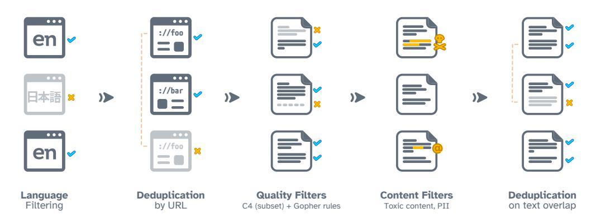

Figure 1: Overview of the web processing pipeline in Dolma.

The web subset of Dolma was derived from Common Crawl.[11](#page-5-0) Common Crawl is a collection of over 250 billion pages that were crawled since 2007. It is organized in snapshots, each correspond to a full crawl over its seed URLs. In November 2023, there were 89 snapshots. Dolma was curated from 25 snapshots.[12](#page-5-1) collected between 2020-05 to 2023-06.

#### 3.1.1 Data Acquisition and Z Language Filtering

Following data curation practices used to develop LLaMA [\(Touvron et al.,](#page-36-1) [2023a\)](#page-36-1), our web pipeline leverages CCNet [\(Wenzek et al.,](#page-37-3) [2020b\)](#page-37-3) to perform language filtering and initial content deduplication.

content remains challenging [\(Welbl et al.,](#page-37-4) [2021;](#page-37-4) [Markov et al.,](#page-31-3) [2023a\)](#page-31-3), and existing methods have been shown to discriminate against minoritized groups [\(Xu et al.,](#page-38-2) [2021\)](#page-38-2).

11[commoncrawl.org](https://commoncrawl.org)

12We use just enough snapshots to meet the volume goal described in [§2](#page-2-0) — at least 2T tokens.

This tool was also used for the Common Crawl subset of RedPajama v1 [\(Together Computer,](#page-36-3) [2023c\)](#page-36-3) and RedPajama v2 [\(Together Computer,](#page-36-4) [2023a\)](#page-36-4). CCNet processes each web page with a fastText language identification model[13](#page-6-0) to determine the primary language for each document; we keep all pages with English document score greater or equal to 0.5 (removed 61.7% of web pages by size). Further, CCNet identifies and removes very common paragraphs by grouping shards in each snapshot into small sets and removing duplicated paragraphs in each. This step removed approximately 70% of paragraphs, primarily consisting of headers and navigation elements. Overall, CCNet pipeline filters out 84.2% of the content in Common Crawl, from 175.1 TB to 27.7 TB. More details provided in Appendix [J.4.](#page-55-0)

# 3.1.2 Z Quality Filtering

Web crawled data requires significant cleanup before it can be used for language model pretraining. This step removes artifacts introduced by the conversion from HTML to plain text (*e.g.*, page headers, ill-formatted text) and discards pages that do not contain enough "prose-like" text (*e.g.*, repeated text, short segments). First, CCNet natively provides a quality filter using KenLM [\(Heafield,](#page-27-5) [2011\)](#page-27-5) perplexity to group documents into buckets based on Wikipedia-likeness; this buckets are often interpreted as high (21.9%), medium (28.5%), or low (49.6%) quality context. However, per arguments posed in [Rae et al.](#page-32-3) [\(2021\)](#page-32-3) and [Almazrouei et al.](#page-19-1) [\(2023\)](#page-19-1) against model-based quality filters, as well as our own manual inspections of content distributed between these buckets, we opted not use these CCNet quality scores. Instead, in Dolma, we achieve quality filtering by combining heuristics introduced by Gopher [\(Rae et al.,](#page-32-3) [2021\)](#page-32-3) and C4 [\(Raffel et al.,](#page-32-1) [2020\)](#page-32-1). Specifically we keep all the Gopher rules (henceforth, Gopher All) and keep a single heuristic from C4 designed to remove paragraphs that do not end in punctuation (C4 NoPunc; as opposed to C4 All). Detailed description of filtering rules provided in Appendix [J.4.](#page-55-0)

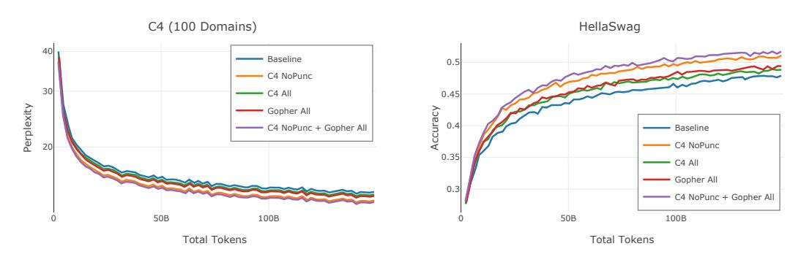

Figure 2: Model ablations for quality filters of the web processing pipeline. We find that a combination of C4 and Gopher rules leads to improvements in both language fit (left, on the *C4 100 Domains* subset of Paloma [\(Magnusson et al.,](#page-30-2) [2023\)](#page-30-2)) and downstream performance (right, on HellaSwag [Zellers](#page-38-3) [et al.](#page-38-3) [\(2019\)](#page-38-3)).

Ablation results shown in [Figure 2](#page-6-1) validate our filtering strategy: we find that C4 NoPunc on its own outperforms both C4 All as well as Gopher All on both perplexity and downstream tasks. Finally, combining Gopher All + C4 NoPunc offers the best performance. In all, the Gopher rules tagged 15.23% of UTF-8 characters for removal, while the C4 rule tagged 22.73% of characters for removal. When comparing our heuristics against CCNet's quality scores, the remaining documents after filtering fall into CCNet buckets of high (22.8%), medium (26.2%) and low (51.0%) quality, revealing very little correlation between model and heuristic-based quality filters.

Using the tool from [Elazar et al.](#page-23-1) [\(2023\)](#page-23-1), we inspect our filtered dataset for occurrences of repeated n-grams. Despite filtering using Gopher and C4 rules, we still found undesirable texts such as repeated sequences of '-' 100 times, occurring over 60 million times, or repeated sequences of 'bla', occurring 19.1 million times (see Table [2\)](#page-7-0). Based on this, we implement n-gram heuristics to identify and remove documents containing these sequences; specifically, we remove any repeated sequence longer than 100 UTF-8 characters. While this only removed 0.003% of the total characters in the

13<https://fasttext.cc/docs/en/language-identification.html>

dataset, removal of these documents can prevent loss spikes during training, as was empirically found in Scao et al. (2022). We also note that this was a fairly conservative heuristic that left many repeated sequences remaining in the dataset; we found from manual inspection of these sequences that they often served as webpage layout elements as opposed to parsing irregularities.

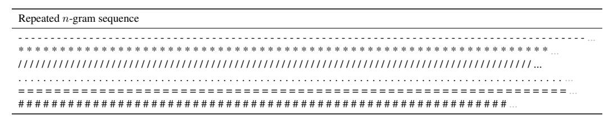

Table 2: Examples of common repeated *n*-gram sequences in the web subset identified through WIMBD tools (Elazar et al., 2023). Repeted sequences longer than the ones shown here have been removed after being identified by WIBMD.

## 3.1.3 **Content Filtering**

**Filtering Toxic Content** Data sampled from the internet may contain harmful or toxic content (Matic et al., 2020; Luccioni and Viviano, 2021; Birhane et al., 2023a,b). As highlighted in § 2, we filter Dolma to reduce harms that might arise from training language models on toxic content. We used the Jigsaw Toxic Comments dataset (cjadams et al., 2017), which contains forum comments tagged with (multilabel) categories "toxic", "severe toxic", "threat", "insult", "obscene", and/or "identity hate" alongside unlabeled comments, to train two fastText classifiers—a binary "hate" detector and a binary "NSFW" detector:

- 1. For our "hate" detector, we group all unlabeled comments and "obscene"-only comments as negatives and left remaining comments as positives.
- 2. For our "NSFW" detector, we take all comments tagged as "obscene" as positives and left other remaining comments as negatives. It is important to note this detector only filters *toxic content* that mentions sexual or obscene topics, not sexual content in general.

For both these models, we run them on Common Crawl sentences 15 with a filtering threshold of 0.40 based on manual threshold tuning. We chose our threshold seeking a balance between (1) maximizing precision and recall from inspecting predicted toxic sentences on a single snapshot of Common Crawl, as well as (2) minimizing too much data removal. 16 We always remove just the span that has been tagged as toxic, not the full document. We make both of these models available publicly. 17

In Figure 3, we compare the effect of two different thresholds for the "hate" and "NSFW" detector. The "High Threshold" configurations remove *less* content, but generally yield higher perplexity on evaluation set and lower downstream performance. The "Low Threshold" configurations remove more content and generally have higher performance, but remove more units of text (7.3% vs 34.9% and 5.5% vs 29.1%, for "hate" and "NSFW" UTF-8 characters, respectively). Because lower thresholds might lead to false positive, and improved performance can be achieved by combining content filters with quality and deduplication filters, we use the "High Threshold" versions of the "hate" and "NSFW" filters, removing any sentence with a score greater than or equal to 0.4.

**Filtering Personal Identifiable Information** Data sampled from the internet can also leak personal identifiable information (PII) of users (Luccioni and Viviano, 2021; Subramani et al., 2023); such PII is abundant in large-scale datasets (Elazar et al., 2023).

 $^{14}More~information~at~$  github.com/bigscience-workshop/bigscience/blob/master/train/tr8-104B-wide/chronicles.md

&lt;sup>15Identified using BlingFire sentence splitter (Microsoft, 2019).

&lt;sup>16For example, the "hate" and "NSFW" detectors filter out 34.9% and 29.1% of tokens from Common Crawl at thresholds of 0.0004 and 0.00017, respectively.

&lt;sup>17"NSFW" fastText tagger and "hate" fastText tagger.

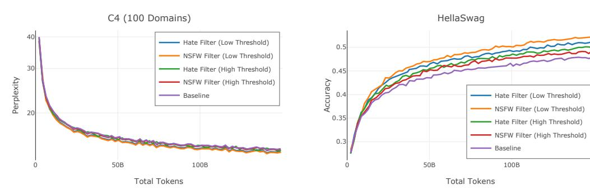

Figure 3: Model ablations for toxic content filters of the web processing pipeline. We find that adopting a "Low Threshold" for the "hate" and "NSFW" toxic content filters results to improvements in both lanugage fit (left, on the *C4 100 Domains* subset of Paloma [\(Magnusson et al.,](#page-30-2) [2023\)](#page-30-2)) and downstream performance (right, on HellaSwag [Zellers et al.](#page-38-3) [\(2019\)](#page-38-3)); however, more content is removed (7.3% vs 34.9% and 5.5% vs 29.1%, for "hate" and "NSFW" UTF-8 characters, respectively).

PII detection can be accomplished using model-based tools [\(Dernoncourt et al.,](#page-23-3) [2017;](#page-23-3) [Microsoft,](#page-31-6) [2018;](#page-31-6) [Hathurusinghe et al.,](#page-27-6) [2021;](#page-27-6) [Lison et al.,](#page-30-4) [2021;](#page-30-4) [Lukas et al.,](#page-30-5) [2023;](#page-30-5) [Mazzarino et al.,](#page-31-7) [2023\)](#page-31-7) or rule-based approaches [\(Aura et al.,](#page-20-3) [2006;](#page-20-3) [Elazar et al.,](#page-23-1) [2023\)](#page-23-1). The former generally offer better performance, while the latter are faster.

The size of Dolma makes impractical to use model-based tools; instead, we rely on carefully crafted regular expressions. Following the findings of [Subramani et al.](#page-36-6) [\(2023\)](#page-36-6), we tag three kinds of PII that can be detected with sufficient accuracy: email addresses[18](#page-8-1), IP addresses[19](#page-8-2), and phone numbers[20](#page-8-3) . Once spans are tagged, we employ different processing strategies based on the their density on each document:

- *5 or fewer PII spans detected*: we replace all spans on a page with special tokens |||EMAIL\_ADDRESS|||, |||PHONE\_NUMBER|||, and |||IP\_ADDRESS||| for email addresses, phone numbers, and IP addresses respectively[21](#page-8-4). In total, we find 0.02% of documents in the 25 Common Crawl snapshots match this filter.
- *6 or more PII spans detected*: we remove any document that contains 6 or more matching PII spans. We this approach because pages containing abundant phone numbers and email addresses are likely to pose a greater risk of discosing other PII classes. 0.001% of documents in the 25 Common Crawl snapshots match this filter.

In Figure [4,](#page-9-0) we show results of experiment designed to quantify the impact of our PII strategy. Overall, we find that, in both language modeling and downstream tasks, PII removal and masking has no discernible effect on model performance.

## 3.1.4 ç Deduplication

Recent efforts indicate that the deduplication of data leads to language models that train more efficiently [\(Lee et al.,](#page-29-0) [2022\)](#page-29-0). Following this principle, we deduplicate data in the web pipeline. We perform three stages of deduplication:

(i) *Exact URL deduplication*: mark pages that share the same URL. No normalization is performed. This filter is primarily intended to remove pages that have been crawled multiple times. Overall, it removes 53.2% of documents in the 25 snapshots used to create Dolma. URL deduplication is commonly used as the first stage for web crawls thanks to its computational efficiency [\(Agarwal](#page-19-3) [et al.,](#page-19-3) [2009;](#page-19-3) [Koppula et al.,](#page-28-3) [2010;](#page-28-3) [Penedo et al.,](#page-32-4) [2023\)](#page-32-4).

18Regex: [.\s@,?!;:)(]\*([\^\s@]+@[\^\s@,?!;:)(]+?)[.\s@,?!;:)(]?[\s\n\r]

19Regex: \s+\(?(\d{3})\)?[-\. ]\*(\d{3})[-. ]?(\d{4})

20Regex: (?:(?:25[0-5]|2[0-4][0-9]|[01]?[0-9]{1,2})\.){3}

(?:25[0-5]|2[0-4][0-9]|[01]?[0-9]{1,2})

21When training models on Dolma, we these special tokens to the tokenizer vocabulary. For all results shown in this paper, we use [allenai/gpt-neox-olmo-dolma-v1\\\_5](https://huggingface.co/allenai/gpt-neox-olmo-dolma-v1_5).

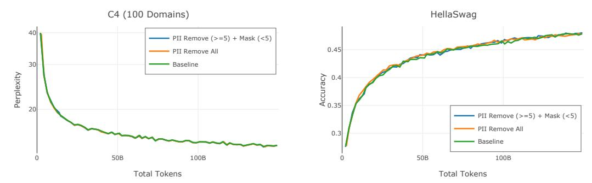

Figure 4: 1B model ablations for PII strategies. We found no discernible differences between removing all documents with PIIs, only removing documents with  $\geq 5$  PII instances and masking the rest, and doing no PII filtering at all.

- (ii) *Exact document deduplication*: mark pages that contain the same text. No punctuation or whitespace is removed. Empty documents count as duplicates. Overall, it removes an additional 14.9% of documents after URL deduplication.
- (iii) Exact paragraph deduplication: mark identical paragraphs across pages as duplicates. We keep definition of this unit consistent with previous filters: a paragraph is a span of text separated by the newline UTF-8 character "\n". Overall, this filter tags 18.7% of documents in the URL-deduplicated set as repeated.

This multi-stage approach is designed to increase efficiency: stages (i) and (ii) are designed to remove copies of the same item (identical pages might have multiple URLs, such in the case of the same news article being included in multiple online newspaper), thus can be executed before before any content or quality filtering, reducing the number of pages to process. In contrast, stage (iii) removes repeated content that appears on the different pages (such as the same byline appearing under all articles written by the same author), thus altering portion of pages and potentially disrupting content analysis. All stages use a Bloom filter (Bloom, 1970) data structure for efficient content deduplication.

#### 3.1.5 Putting It All Together

**How do steps in the pipeline compose?** To summarize, the Dolma web pipeline transform the output of CCNet by first performing URL and document-level deduplication, followed by quality filtering (Gopher, C4 NoPunc), content filtering (toxic content, PII), and, finally, paragraph-level deduplication. But What's the combined outcome of the filtering?

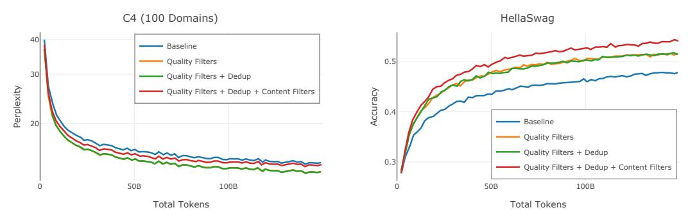

Figure 5: Compounding effect of quality filtering, content filtering, and paragraph-level deduplication on 1B model ablations. Combination of all components in the pipeline leads to improvements in both language fit (left, on the *C4 100 Domains* subset of Paloma (Magnusson et al., 2023)) and downstream performance (right, on HellaSwag Zellers et al. (2019)).

In Figure 5, we show the compounding effect of the stages of the pipeline. We find that the combination of the three stages achieve the best performance on downstream tasks, while content filtering slightly hurts language fit of C4 100 domains subset. As stated in §2, we leverage downstream evaluation tasks to make decision; thus we use all steps in the pipeline when creating Dolma.

**Data distribution** We use the tool from Elazar et al. (2023) to inspect the final data composition in Figure 6. In particular, we analyze web domain, year, and language distributions.

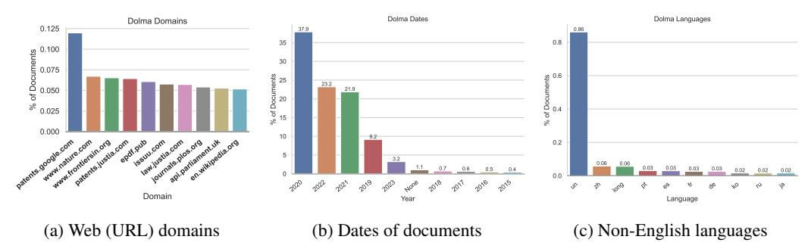

Figure 6: Frequencies over different document metadata as computed using the What's In My Big Data? tool from Elazar et al. (2023). In subfigure (c), un denotes documents whose language could not be identified; long indicates documents that are too long to be processed with the tool's language ID module.

We note that Dolma contains documents from a broad set of internet domains, mostly from 2020, 2022, and 2021. The most common internet domains in Dolma, per token, are patents.google.com, followed by www.nature.com and www.frontiersin.org. In fact, similar to other corpora reported in Elazar et al. (2023), 63.6% of Dolma's web documents are from '.com' sites (followed then by '.org' and '.co.uk' sites). Finally, as all language identification tools are imperfect, we summarize what languages are remaining post English-only filtering: We find the most common language after English is not well identified ('un') with 0.86% of the documents, followed by 0.06% of the documents identified as Chinese.

**Do quality and content filters have similar effects?** In order to further understand how filters described in §3.1.2 and §3.1.3 interact with each other, we perform a correlation analysis on a subset of documents sampled from our pipeline.

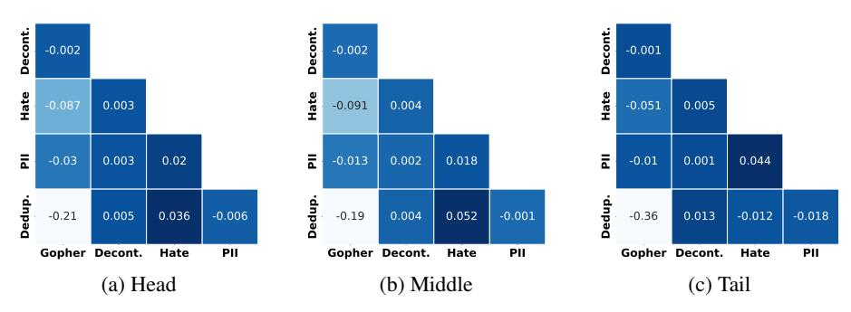

Figure 7: Pearson Correlation of filters on the Head, Middle, and Tail parts of our Common Crawl data. The correlation is computed for 24M, 20M, and 43M documents respectively. The filters are Gopher=Gopher rules from Rae et al. (2021), Dedup.=Deduplication, PII=Personal Identifiable Information, Hate=Hate Speech and Decont.=Decontamination.

The correlation among the documents flagged for removal by our Common Crawl filters is depicted in Figure 7. We find that correlations are generally low, thus our filters select fairly different documents and are not redundant. There is some positive correlation between our PII (Personal Identifiable Information) filters and filters removing hate speech. This is likely because hate speech is often directed at people. The Gopher filtering rules correlate negatively with our deduplication, especially for the high-perplexity tail part of our data. This is due to the Gopher rules removing many high-perplexity documents such as random strings, which are not caught by deduplication due to their randomness. As these random strings likely do not contribute to a better understanding of language, it is important to filter them out and thus rely on filters beyond deduplication.

## 3.2 **\langle** Code Pipeline

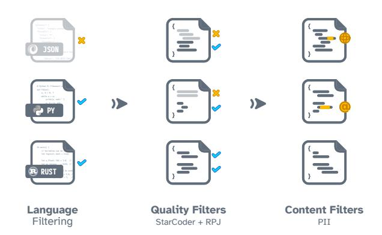

Figure 8: Overview of the data pipeline to process code documents.

#### 3.2.1 **Data Acquisition and T Language Filtering**

We derive the code subset of Dolma from **The Stack** (Kocetkov et al., 2022), a collection of permissively-licensed GitHub repositories. We use the near-deduplicated version as a starting point, thus removing the need to perform deduplication ourselves. The raw version of this dataset was collected in March 2023. We filter data-heavy documents by removing files with extensions such as JSON and CSV.

#### 3.2.2 **Quality Filtering**

We apply heuristics derived from RedPajama v1 (Together Computer, 2023c) and StarCoder (Li et al., 2023) datasets. The former consist of rules to remove repetitive file preambles, such as license statements22 and documents with excessively long lines or mostly numerical content. Overall, RedPajama Rules (RPJ) are designed to remove files that are mostly data or generated through templates. To further select high quality code snippets, we leverage rules from the StarCoder pipeline; these heuristics filter GitHub repositories with no to few stars, files with too few or too many comments, and HTML files with low code-to-text ratio. For a detailed description of these rules, see §J.4.

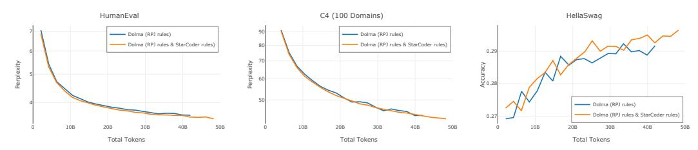

Figure 9: Comparison of quality filtering when using RedPajama Rules (RPJ) rules or RPJ and StarCoder rules combined. Combining the two rulesets results in slightly improved perplexity on code documents (left, HumanEval; Chen et al., 2021b), more stable perplexity curves on non-code test sets (center, on the *C4 100 Domains* subset of Paloma; Magnusson et al., 2023), and slightly improved downstream performance (right, on HellaSwag; Zellers et al., 2019).

In Figure 9, we present a comparison between RedPajama (RPJ) and StarCoder rules. In our ablations we find that, compared to RPJ rules alone, RPJ and StarCoder combined lead to lower perplexity on code datasets (*e.g.*, HumanEval; Chen et al., 2021b), more stable perplexity during training on non-code test sets (*e.g.*, *C4 100 Domains* subset of Paloma; Magnusson et al., 2023), and improved downstream performance (*e.g.*, HellaSwag; Zellers et al., 2019). Therefore, we chose to use this combination when creating the final mix for Dolma.

&lt;sup>22We keep this information in the metadata associated with each document in Dolma.

## 3.2.3 Z Content Filtering

We apply the same filtering rules to from the web pipeline [\(§ 3.1\)](#page-5-2) to mask personal identifiable information (PII). Documents with greater than 5 PII instances are removed from Dolma. In all other instances, emails, phone numbers, and IP addresses are masked using special tokens.

We also remove code secrets or personal information. To do so, we use the detect-secrets [\(Yelp,](#page-38-4) [2013\)](#page-38-4) library and remove any documents with a match.

## 3.2.4 ç Deduplication

We used the already-deduplicated version of The Stack published by [Kocetkov et al.](#page-28-4) [\(2022\)](#page-28-4); their approach uses the pipeline first introduced by [Allal et al.](#page-19-4) [\(2023\)](#page-19-4), which uses MinHash [Broder](#page-21-8) [\(2002\)](#page-21-8) and Locally Sensitive Hashing to find similar documents.

# 3.3 Ü Conversational Forums Pipeline

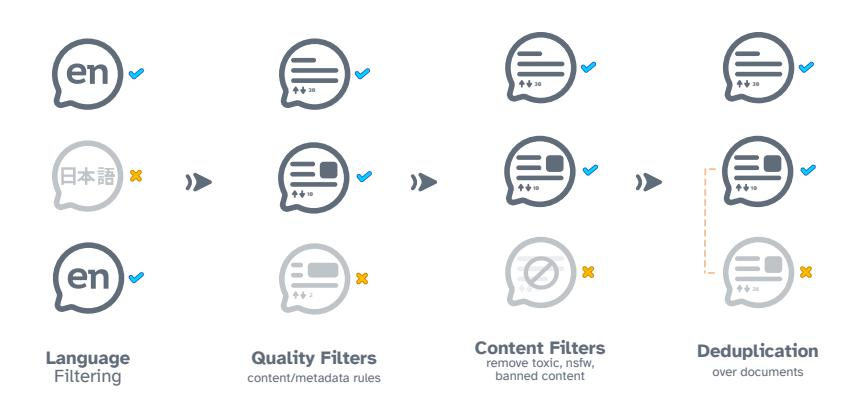

Figure 10: Overview of the data pipeline to process conversational forums.

# 3.3.1 Data Acquisition and Z Language Filtering

The conversational subset of Dolma was derived from the Pushshift Reddit dataset [\(Baumgartner](#page-20-4) [et al.,](#page-20-4) [2020b\)](#page-20-4), a large collection of forum conversations collected through Reddit's data API and distributed by the Pushshift project. We derive the conversational subset in Dolma from 378M posts from Reddit, from December 2005 until March 2023. We include both *submissions*—initial message in conversations on Reddit—and *comments*—replies to messages—in the dataset. We treat all submissions and comments as independent documents without any structure or connection to the thread they appear in; in our evaluation, this simplified representation yields better performance on downstream tasks. A discussion of this trade-off is presented in Appendix [E.](#page-44-1)

For consistency, we use same strategy as the web pipeline to filter non English content. In particular, we keep submission and comments with an English score greater than 0.5.

#### 3.3.2 Z Quality Filtering

Conversational forum data must be adequately cleaned to remove content that is too short, repetitive, or is negatively ranked by the community it was submitted to. We use the pipeline introduced by [Hen](#page-27-7)[derson et al.](#page-27-7) [\(2019\)](#page-27-7) to facilitate cleanup of submissions and comments using Google Dataflow[23](#page-12-0). We remove comments shorter than 500 characters, and submissions shorter than 400 characters[24](#page-12-1). We also remove documents over 40,000 characters in length.

23<https://cloud.google.com/dataflow>

24Qualitative inspection of the data suggested that submissions are of higher quality than comments; thus, we use a more permissive minimum length.

We remove comments with fewer than 3 votes[25](#page-13-0), as lower score are associated with comments that are deeply nested in a conversational thread [\(Weninger et al.,](#page-37-5) [2013\)](#page-37-5) or content that is more likely to results in emotionally charged discourse [\(Davis and Graham,](#page-23-4) [2021\)](#page-23-4). Votes have been used as a signal in constructing the WebText [\(Radford et al.,](#page-32-5) [2019\)](#page-32-5) and OpenWebText [\(Peterson,](#page-32-6) [2020\)](#page-32-6) corpora. We discard documents that have been deleted by their authors or removed by moderators; further, documents that have been labeled by their authors as *"over 18"* were also removed. We exclude any document originated from any of the 26,123 banned and not safe for work subreddits[26](#page-13-1) we curated.

#### 3.3.3 Z Content Filtering

We apply the same filtering rules to used in the web pipeline [\(§3.1.3\)](#page-7-5) to remove toxic content and mask PII. Unlike in the case of the web pipeline, we fully remove a document if part of it are tagged as toxic. We employ this strategy because content from Reddit is shorter in length, thus it is more likely that a single sentence classified as toxic is a strong indication of the entire document being toxic as well.

## 3.3.4 ç Deduplication

We employ the same strategy used in the web pipeline [\(§3.1.4\)](#page-8-6). Since submissions and comments are shorter than web documents, we only deduplicate at a document-level. This strategy is useful to reduce the incidence of "*Copy pasta*" (blocks of text that get often repeated across many comments and subreddits for comedic effect) and other repetitive information.

## 3.4 Other Data Sources

In this section, we briefly summarize additional high-quality sources that were used to derive Dolma. For more details on collection and processing, see Appendix [§J.3](#page-54-0) and [§J.4.](#page-55-0)

- C4 for Curated Web Content Similarly to LLaMA [\(Touvron et al.,](#page-36-1) [2023a\)](#page-36-1), we include documents from C4 [Raffel et al.](#page-32-1) [\(2020\)](#page-32-1) in the Dolma dataset. We further refine this data by reprocessing it through our web pipeline to remove long, repeated sequences [\(§3.1.2\)](#page-6-2) and duplicates [\(§3.1.4\)](#page-8-6). Finally, we also perform PII masking as described in [\(§3.1.3\)](#page-7-5);
- PeS2o for Academic Literature The PeS2o dataset [\(Soldaini and Lo,](#page-34-1) [2023\)](#page-34-1) is a collection of approximately 40 million open-access academic papers that have been cleaned, filtered, and formatted for pre-training of language models. It is derived from the Semantic Scholar Open Research Corpus (S2ORC) [\(Lo et al.,](#page-30-6) [2020\)](#page-30-6). As this dataset has been created for language modeling purposes, we use it as-is.
- [ Project Gutenberg for Books Project Gutenberg is a repository of over 70 thousand public domain books. We collected Project Gutenberg's archive in April 2023. We use the same fastTextbased language identification model to identify English language books and include them in Dolma. More details in our Data Sheet § [J.](#page-51-0)
- ] Wikipedia and Wikibooks for Encyclopedic Content This dataset was derived by March 2023 Wikimedia dumps. We use the "English" and "Simple" editions of Wikipedia and Wikibooks as base for the Encyclopedic subset of Dolma. Sources were processed using WikiExtractor[27](#page-13-2). We remove any document with 25 or fewer UTF-8-segmented words, as we found shorter pages to either be the result of short, templated pages (*e.g.*, pages containing only a few words and an information box) or XML parsing errors.

25The total votes for each documents are obtained by computing the difference between positive votes, also known as "upvotes", negative votes or "downvotes".

26The list is available at [https://github.com/allenai/dolma/blob/main/sources/reddit/atomic\\_](https://github.com/allenai/dolma/blob/main/sources/reddit/atomic_content_v5/subreddit_blocklist.txt) [content\\_v5/subreddit\\_blocklist.txt](https://github.com/allenai/dolma/blob/main/sources/reddit/atomic_content_v5/subreddit_blocklist.txt). The list was obtained by merging several sources that tracked banned subreddits (mostly from posts on Reddit itself). We also measured the fraction of posts within a subreddit tagged as NSFW, and blocked the subreddit when this fraction exceeded 10%.

27[github.com/attardi/wikiextractor](https://github.com/attardi/wikiextractor/tree/8f1b434a80608e1e313d38d263ed7c79c9ee75a9), v. 3.0.7, commit prefix 8f1b434.

# 4 Training a Language Model on Dolma

As a final validation step of the Dolma pipeline, we train, evaluate and release a decoder-only, autoregressive language model which we call **Olmo-1b**. In this section, we discuss potential approaches additional dataset curation decisions specific to model training. In [§4.1,](#page-14-1) we present an approach to remove benchmark tasks—*i.e.*, decontaminate—from Dolma. Then, in [§4.2,](#page-15-0) we discuss considerations when combining—*i.e.*, mixing—the various document subsets in Dolma to obtain the final pretraining corpus. Finally, in [§4.3,](#page-17-0) we present experimental results of the resulting Olmo-1b model. Olmo-1b uses GPT-NeoX tokenizer [\(Black et al.,](#page-21-1) [2022\)](#page-21-1), which we found to be well suited for Dolma; we present results supporting our decision in [Appendix F.](#page-45-0)

## 4.1 Strategies for Benchmark Decontamination in Dolma

In this section we experiment with approaches to remove benchmark contamination from pretraining and select which is ultimately used in Olmo-1b. Large-scale language datasets contain copies of benchmarks that are commonly used to evaluate language models [\(Dodge et al.,](#page-23-5) [2021;](#page-23-5) [Yang](#page-38-5) [et al.,](#page-38-5) [2023;](#page-38-5) [Elazar et al.,](#page-23-1) [2023\)](#page-23-1). The impact of such contamination is currently debated. For example, [Lee et al.](#page-29-0) [\(2022\)](#page-29-0) showed that removing duplicates of validation data from C4 pretraining increases perplexity on the previously duplicated validation data. Meanwhile, work examining post-hoc performance difference between contaminated and uncontaminated downstream data finds no consistent positive or negative impact [\(Chowdhery et al.,](#page-22-5) [2022;](#page-22-5) [Brown et al.,](#page-21-3) [2020;](#page-21-3) [OpenAI,](#page-31-0) [2023\)](#page-31-0). To start, we focus on the removal of perplexity benchmark contamination, and we measure the extent of downstream task contamination. We experiment with removing contamination with respect to an early version of Paloma [\(Magnusson et al.,](#page-30-2) [2023\)](#page-30-2), a benchmark of 585 text domains designed to evaluate language model fit to diverse sources. This selection of perplexity evaluations is detailed in [Appendix D.](#page-42-0)

Decontamination strategy for perplexity evaluation Using the paragraph deduplication tools described in [§ 3.1.4,](#page-8-6) we mark any paragraph in Dolma as contaminated if (*i*) it is longer than 13 Unicode-segmented tokens[28](#page-14-2) and (*ii*) it appears in any of the documents in Paloma. In preliminary experiments on decontaminating C4 [\(Raffel et al.,](#page-32-1) [2020\)](#page-32-1) against an early version of Paloma, we compare the paragraph-based decontamination technique described above with exact-matching whole documents. Results show that document-based decontamination yields lower matching rate, with only 1 of 12 subsets with greater than 1% contaminated documents[29](#page-14-3). However, when considering paragraph-based decontamination, 6 of 12 perplexity tasks have greater than 1% of documents contaminated. Since the latter better reflect expected contamination rates, we chose it for the reminder of this section.

Lastly, we consider two ways of removing contamination. In preliminary experiments on C4, we find that removing just the contaminated paragraphs by excluding them from documents removes 0.01% of tokens, while removing whole documents with any contamination removes 0.02% of tokens. In either case 0.01% of documents are affected. Given that each have relatively small impact, we opt for removing full documents to avoid disrupting reading order, though this does bias towards removing longer documents.

Decontamination results for perplexity evaluation To assess the risk of our decontamination approach, we train[30](#page-14-4) two 1B parameter models on a 221B token subset of RedPajama v1 [\(Together](#page-36-3) [Computer,](#page-36-3) [2023c\)](#page-36-3), the corpus most similar to Dolma's intended composition at the time of experimenting. The first model is trained on RedPajama v1 as-is, while the second uses the same corpus after the paragraph-matching, document-removal decontamination approach described above. On this subset, our decontamination approach removes 2.17% of unicode tokens and 0.66% of documents. In Table [3](#page-15-1) we show that differences in perplexity and downstream task performance are minimal and do not trend consistently positive or negative. For perplexity, 7 sources degrade and 6 improve; for downstream tasks, 5 degrade and 4 improve. The largest degradation in a perplexity source is 22.0 to

28Like in [Elazar et al.](#page-23-1) [\(2023\)](#page-23-1), we only consider paragraph of sufficient length to avoid false positive matches.

29*C4 100 Domains* subset, which is directly constructed from C4.

30This experiment uses the setup described in [Appendix D,](#page-42-0) including model configuration, optimizer, and evaluation setup.

|                    | Avg ppl over subsets (\( \psi \)) | $\begin{array}{c} \textbf{Largest subset} \\ \textbf{pp1 diff} \\ (\texttt{PTB} \ \downarrow) \end{array}$ | Avg acc on end tasks (†) | Largest acc diff on end task (SCIQ ↑) |
|--------------------|-----------------------------------------|------------------------------------------------------------------------------------------------------------|--------------------------------|---------------------------------------------|
| Decontaminated     | 25.6                                    | 22.3                                                                                                       | 59.2                           | 84.8                                        |
| Not Decontaminated | 25.7                                    | 22.0                                                                                                       | 56.37                          | 86.3                                        |
| Difference         | -0.1                                    | 0.3                                                                                                        | 2.8                            | -1.5                                        |

Table 3: Performance differences with and without our decontamination approach on 1B models trained on RedPajama v1 (Together Computer, 2023c). Perplexity (ppl) results are from Paloma and downstream (end task) results are from the tasks listed in Appendix D plus COPA (Gordon et al., 2012). We find no evidence that decontamination degrades overall model performance.

22.3 on Penn Tree Bank. The largest degradation in a downstream task is a drop of 1.5% accuracy on SCIQ to 84.8%. In conclusion, results show no consistent evidence of performance degradation with decontamination.

**Decontamination in Olmo-1b.** As our experiments have derisked our approach for removing benchmark contamination, we apply it to our model trained on Dolma. The finalized approach for removing overlap with Paloma is detailed in Magnusson et al. (2023). It applies the steps discussed in this section with the addition of a filter that ignores overlaps consisting of only punctuation, spaces, and emoji. These types of tokens can be arbitrarily repeated in text formatting, leading to common n-grams greater than our 13-gram threshold. On the final Dolma corpus used to train Olmo-1b, our approach finds less than 0.001% characters in training data contaminated, and removes fewer than 0.02% of documents.

Measuring possible contamination of downstream tasks. We measure data contamination in Dolma. We follow the same setup from WIMBD (Elazar et al., 2023) and compute the percentage of instances from tasks with two or more inputs (e.g., natural language inference) that can be found in a single document. This serves as an upper bound of exact-match contamination in Dolma. We consider 82 datasets from PromptSource (Bach et al., 2022), and report the datasets that at least 5% of their test sets can be found in Dolma. We report the results in Figure 11.

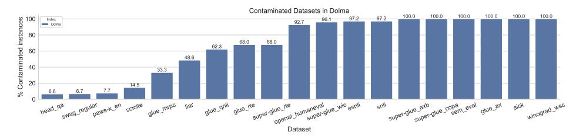

Figure 11: Contamination percentages of datasets from PromptSource (Bach et al., 2022).

Results indicate that portion of datasets in Promptsource appear in Dolma. Six datasets are completely contaminated (100%): the Winograd Schema Challenge (Levesque et al., 2012), Sick (Marelli et al., 2014), AX from GLUE (Wang et al., 2018), SemEval (specifically, Task 1 from 2014), COPA from SuperGLUE (Roemmele et al., 2011), and  $AX_b$  (the diagnostic task) from SuperGLUE (Wang et al., 2019). In addition, other datasets are mostly contaminated, with over 90% of their test sets appearing in Dolma documents: OpenAI HumanEval (Chen et al., 2021a), WIC from SuperGLUE (Pilehvar and Camacho-Collados, 2019), ESNLI (Camburu et al., 2018), and SNLI (Bowman et al., 2015). We note that the contaminated datasets have been excluded from the downstream tasks we use for model evaluation (*c.r.f.* Appendix D).

#### 4.2 Strategies for Subsets Mixing and Upsampling with Dolma

Like the pretraining corpora of nearly every large-scale language model, Dolma is a multi-source dataset. Training on Dolma thus requires a mixing strategy that determines how much data from each

source to include, and potentially which sources to upsample. Like other multi-source corpora (e.g., ROOTS [\(Laurenccon et al.,](#page-29-4) [2023\)](#page-29-4), the Pile [\(Gao et al.,](#page-24-3) [2020\)](#page-24-3), RedPajama v1 [\(Together Computer,](#page-36-3) [2023c\)](#page-36-3)),[31](#page-16-0) Dolma does not prescribe a single mixing strategy. We refer the reader to [Rae et al.](#page-32-3) [\(2021\)](#page-32-3) for an example of how one might programmatically search over mixing configurations to maximize performance. Here, we perform mixing experiments as an opportunity to answer some research questions about how different data sources interact. We use the same ablation setup described in [§3.](#page-4-0)

How much code is important for pretraining? It is common practice for language models to be pretrained on some amount of code, even if code generation is not the intended task. Some research has suggested that mixing code into training over plain text documents improves performance on reasoning tasks [\(Madaan et al.,](#page-30-7) [2022\)](#page-30-7). We investigate whether this observation holds for models trained on Dolma, and if so, how much code is needed?

| Dataset        | 0% Code      | 5% Code      | 15% Code     |
|----------------|--------------|--------------|--------------|
| bAbI (ICL)     | 0.0 ± 0.0 | 8.8 ± 0.9 | 10.1 ± 2.8   |
| WebNLG (ICL)   | 16.8 ± 1.1   | 19.3 ± 1.1   | 22.0 ± 1.3   |
| GSM8K (FT)     | 0.0 ± 0.0 | 0.0 ± 0.0 | 0.0 ± 0.0 |
| GSM8K+PAL (FT) | 11.8 ± 0.8   | 14.2 ± 1.3   | 14.7 ± 0.9   |

Table 4: Performance of three models pre-trained with increasing amounts of code on three datasets, across 5 random seeds. We measure exact match for bAbI and GSM8K, and Rouge-2 for WebNLG.

We create three mixtures from the C4 and Stack subsets containing 0%, 5% and 15% of code data. On each, we train a 1B model. We evaluate these models on three different reasoning tasks: bAbI [\(Weston](#page-37-8) [et al.,](#page-37-8) [2015\)](#page-37-8), WebNLG [Gardent et al.](#page-24-4) [\(2017\)](#page-24-4) and GSM8k [Cobbe et al.](#page-23-6) [\(2021\)](#page-23-6). For the first two tasks, we follow the experimental setup of [Muennighoff et al.](#page-31-9) [\(2023b\)](#page-31-9) and evaluate each model in an ICL setup with a changing number of demonstrations (0-5) across 5 random seeds. [Muennighoff et al.](#page-31-9) [\(2023b\)](#page-31-9) show that adding code to pre-training data improves ICL performance on bAbI and WebNLG and they suggest that code improves long-range state-tracking capabilities. Our experiments, as shown in Table [4,](#page-16-1) corroborate these findings: while the C4-only model fails on all bAbI tasks, adding code improves performance, with a similar trend for WebNLG.

On the more difficult GSM8k benchmark, all models failed to get any correct answer in an ICL setup, and even when fine-tuning the models on the entire training set. However, we find that by fine-tuning on program-aided output, where questions are solved by writing Python snippets as described in [Gao](#page-24-5) [et al.](#page-24-5) [\(2022\)](#page-24-5), code models outperform the C4-only model. These results show that models pre-trained on code can leverage code generation to answer challenging reasoning tasks even when the original task does not directly involve code.

Evaluating mixing strategies for pretraining on Dolma While Dolma does not prescribe a specific source mixture, we analyze some commonly used strategies[32](#page-16-2) and compare their effect using the Paloma evaluation suite [\(Magnusson et al.,](#page-30-2) [2023\)](#page-30-2). Specifically, we present and evaluate four possible data mixtures in [Table 5.](#page-17-1)

We show results of mixtures in [Figure 12.](#page-17-2) Overall, we observe that the different mixtures have an effect on the ability of resulting models to capture specific subdomains. All mixtures show similar perplexity scores on pages sampled from 100 domains from C4 [\(Figure 12,](#page-17-2) left), indicating their general effectiveness at modeling web documents. On the other hand, we note how models struggle to model specialized domains unless they are exposed to them. As an example, a model trained on the *Web-only* mix struggles to represent data in the code domain [\(Figure 12,](#page-17-2) center, HumanEval). Finally, we use results on the S2ORC subset of M2D2, which consists of academic papers, to illustrate how different data mixtures affect perplexity. As is it the case with code, *Web-only* model exhibits higer perplexity due to domain mismatch. On the other hand, models trained on *Reference+* and *Gopher-like* mixes achieve lower perplexity than the model trained on the *Naïve* mix, due to more in-domain content. However, we note that, despite significant differences in the amount of academic

31RedPajama v1 was a reproduction of the multi-source corpus used in LLaMA [\(Touvron et al.,](#page-36-1) [2023a\)](#page-36-1). RedPajama v2 [\(Together Computer,](#page-36-4) [2023a\)](#page-36-4) focuses solely on Common Crawl and is thus single-source.

32We did not include any social data in these mixes as it was not ready at the time of this experiment.

| Mix Name    | Description                                                                                                                                                                                                       | Sampling                                                            |                              | Proportion                                                            |                                |
|-------------|-------------------------------------------------------------------------------------------------------------------------------------------------------------------------------------------------------------------|---------------------------------------------------------------------|------------------------------|-----------------------------------------------------------------------|--------------------------------|
| Naïve       | Sample each source in Table 1 equally.                                                                                                                                                                            | <ul><li>Web</li><li>Code</li><li>≅ Ref.</li><li>Books</li></ul>     | 100% 100% 100% 100% | <ul><li>₩eb</li><li>Code</li><li>Ref.</li><li>Books</li></ul>         | 83.5% 13.8% 2.5% 0.2% |
| Web Only    | Similar to Ayoola et al. (2022), we test a mixture that only uses web data.                                                                                                                                       | <ul><li>Web</li><li>Code</li><li>≅ Ref.</li><li>Books</li></ul>     | 100% 0% 0% 0%       | <ul><li>♦ Web</li><li>♦ Code</li><li>≅ Ref.</li><li>■ Books</li></ul> | 100% 0% 0% 0%         |
| Reference+  | It is common practice to upsamole knowledge- intensive documents when composing training mixture. In our case, we upsample the PeS2o papers, Wikipedia, Wikibooks, and Gutenberg books subsets by 2x. | <ul><li>Web</li><li>✓ Code</li><li>≅ Ref.</li><li>■ Books</li></ul> | 100% 100% 200% 200% | <ul><li>♦ Web</li><li>♦ Code</li><li>♠ Ref.</li><li>■ Books</li></ul> | 81.2% 13.5% 4.9% 0.4% |
| Gopher-like | Following Rae et al. (2021), we create a mix that is heavily biased towards reference material. As we do not have access to the same sources, an exact replication of their mix is not possible.                  | <ul><li>Web</li><li>♦ Code</li><li>Ref.</li><li>Books</li></ul>     | 17% 8% 200% 200%    | <ul><li>♦ Web</li><li>♦ Code</li><li>♠ Ref.</li><li>■ Books</li></ul> | 68.4% 5.4% 24.2% 2.0% |

Table 5: Overview of the mixtures and their composition.

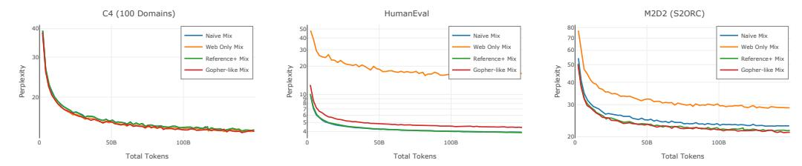

Figure 12: 1B model ablations for different proportions of Dolma data. All mixture perform similarly on web data (left), while excluding code increases perplexity on code datasets (center). Finally, increasing reference material by upsampling papers and Wikipedia yields lower perplexity on S2ORC (right). Overall, source distribution is linked to downstream capabilities; thus, Dolma users should sample subsets according to their needs.

papers between *Reference+* and *Gopher-like* (4.9% vs 24.2%), they achieve nearly identical results, suggesting that even a relatively small percentage of in-domain data is sufficient to achieve good domain fit.

#### 4.3 Evaluating 01mo-1b

In Table 6 we compare 01mo-1b with other 1B models. Note that while parameter count is matched here, only TinyLlama has been trained for a comparable number of tokens while Pythia 1B is trained for nearly 10 times fewer tokens and the data composition of StableLM2 is unknown. Nevertheless we find that 01mo-1b performs better on average than the most comparable model, TinyLlama, outperforming it in 4 out of 8 tasks. Though zero-shot evaluations of downstream tasks are often challenging for these relatively small 1B models, the performance for all the tasks on all the models is above naive random performance. Further details about the downstream tasks is included in Appendix D.

In Figure 13 we assess how the Dolma mix that we use to train 01mo-1b compares to other popular pretraining corpora in terms of perplexity of models where all other variables than pretraining data are controlled. In particular we fix the number of tokens each model is trained on to 150B, so that data scale and differences in learning rate schedule do not confound with the effect from data composition that we intend to study. This analysis uses the 1B baselines from Paloma and evaluates Paloma's highest-level metric, which computes perplexity over the combination of test sets from 11 data sources. Other more fine-grained perplexity results comparing these baselines are available in Magnusson et al. (2023). The present analysis excludes sources that are not publicly available, involve

| Task                                | StableLM2 1.6B (Stability AI, 2024) | Pythia 1B (Biderman et al., 2023) | TinyLlama 1.1B (Zhang et al., 2024) | Olmo-1b this work |
|-------------------------------------|-------------------------------------------|--------------------------------------|----------------------------------------|----------------------|
| ARC-E (Clark et al., 2018)          | 63.7                                      | 50.2                                 | 53.2                                   | 58.1                 |
| ARC-C (Clark et al., 2018)          | 43.8                                      | 33.1                                 | 34.8                                   | 34.5                 |
| BoolQ (Clark et al., 2019)          | 76.6                                      | 61.8                                 | 64.6                                   | 60.7                 |
| HellaSwag (Zellers et al., 2019)    | 68.2                                      | 44.7                                 | 58.7                                   | 62.5                 |
| OpenBookQA (Mihaylov et al., 2018)  | 45.8                                      | 37.8                                 | 43.6                                   | 46.4                 |
| PIQA (Bisk et al., 2019)            | 74.0                                      | 69.1                                 | 71.1                                   | 73.7                 |
| SciQ (Welbl et al., 2017)           | 94.7                                      | 86                                   | 90.5                                   | 88.1                 |
| WinoGrande (Sakaguchi et al., 2019) | 64.9                                      | 53.3                                 | 58.9                                   | 58.9                 |
| Average                             | 66.5                                      | 54.5                                 | 59.4                                   | 60.3                 |

Table 6: Comparison of Olmo-1b against other similarly sized language models. Olmo-1b was trained on 3 trillion tokens from a preliminary version of Dolma (v. 1.5). Overall, Olmo-1b shows better performance than TinyLlama, which has been trained on a similar number of tokens. Olmo-1b outperforms Pythia 1B, but the latter has been trained on one order of magnitude fewer tokens. StableLM2 is included in this table as a reference, but it cannot be fairly compared with the other works since composition of its training data is not known.

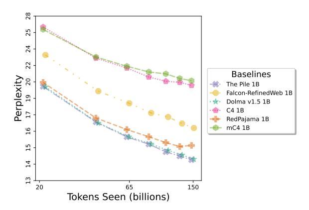

Figure 13: Perplexity over all the standard language modeling and fine-grained domain sources in the final, released version of Paloma [\(Magnusson et al.,](#page-30-2) [2023\)](#page-30-2), excluding code data not supported for decontamination. The models are 1B baselines from Paloma trained on 150B tokens of each corpus. Since Paloma takes stratified samples of hundreds of fine-grained domains, it emphasizes fit to heterogeneous, curated sources more than evaluations on monolithic Common Crawl data like C4. Pile includes the least Common Crawl data, but mostly exhausts the small curated data sources it draws on. Dolma and, to a lesser extent, RedPajama demonstrate the possibility for maintaining this sample efficiency on fit to diverse domains while including large scale Common Crawl data.

fringe or toxic text, or that consist of code data not supported by the benchmark decontamination approach we use. This leaves C4 [\(Raffel et al.,](#page-32-1) [2020\)](#page-32-1), mC4-en [\(Chung et al.,](#page-23-9) [2023\)](#page-23-9), Wikitext 103 [\(Merity et al.,](#page-31-11) [2016\)](#page-31-11), Penn Treebank [\(Marcus et al.,](#page-30-8) [1999;](#page-30-8) [Nunes,](#page-31-12) [2020\)](#page-31-12), RedPajama [\(Together](#page-36-3) [Computer,](#page-36-3) [2023c\)](#page-36-3), Falcon-RefinedWeb [\(Penedo et al.,](#page-32-4) [2023\)](#page-32-4), Dolma (this work), M2D2 S2ORC [\(Reid et al.,](#page-33-5) [2022\)](#page-33-5), M2D2 Wikipedia [\(Reid et al.,](#page-33-5) [2022\)](#page-33-5), C4 100 domains [\(Chronopoulou et al.,](#page-23-10) [2022\)](#page-23-10), and Dolma 100 Subreddits (this work).

Our controlled perplexity analysis reveals the importance of including non-Common Crawl data from diverse curated sources. The metric that we use from Paloma surfaces how models fit to more heterogeneous data, because it samples marked domains from each source equally rather than by their unequal proportions in the source. Intuitively, the baseline trained on the Pile is well fit to such data as that pretraining corpus is mostly sourced from just such smaller, hand-picked sources. But as we wish to scale the total number of tokens in a corpus, the challenge becomes how to integrate more available Common Crawl data without losing sample efficiency on diverse evaluations such as this

Paloma metric. In this case we see that the Dolma baseline nearly matches the performance curve of the Pile baseline even though the fraction of Common Crawl data included is more than 4 times greater.

# 5 Releasing Dolma

Risk mitigation We recognize that any dataset derived from large web crawls will contain factuallyincorrect information, toxic language, hate speech, PII, and other types of harmful content. While we have made an effort to curate this dataset taking this into consideration, we believe risk mitigation is best approached from multiple directions, including careful consideration of licenses and access controls.

Copyright While most datasets we used were curated with copyright and licensing in mind (e.g., open access papers in peS2o [\(Soldaini and Lo,](#page-34-1) [2023\)](#page-34-1), open source repositories in the Stack [\(Kocetkov](#page-28-4) [et al.,](#page-28-4) [2022\)](#page-28-4)) or were already permissively licensed (e.g., Wikipedia is released under a Creative Commons license), we recognize that large web crawls will also contain copyrighted material. Yet, given current tools, it's not possibly to reliably or scalably detect copyrighted materials in a corpus of this size. Our decision to release Dolma publicly factors in several considerations, including that all our data sources were publicly available and already being used in large-scale language model pretraining (both open and closed), we refer the reader to our public position on AI and fair use [\(Farhadi et al.,](#page-23-11) [2023\)](#page-23-11).

We recognize that the legal and ethical landscape of AI is changing rapidly, and we plan to revisit our choices as new information becomes available.

# References

Amro Abbas, Kushal Tirumala, Daniel Simig, Surya Ganguli, and Ari S. Morcos. Semdedup: Dataefficient learning at web-scale through semantic deduplication. *ArXiv*, abs/2303.09540, 2023. URL <https://api.semanticscholar.org/CorpusID:257557221>.

Judit Acs. Exploring BERT's Vocabulary, 2019.

Amit Agarwal, Hema Swetha Koppula, Krishna P. Leela, Krishna Prasad Chitrapura, Sachin Garg, Pavan Kumar GM, Chittaranjan Haty, Anirban Roy, and Amit Sasturkar. Url normalization for de-duplication of web pages. In *Proceedings of the 18th ACM Conference on Information and Knowledge Management*, CIKM '09, page 1987–1990, New York, NY, USA, 2009. Association for Computing Machinery. ISBN 9781605585123. doi: 10.1145/1645953.1646283. URL <https://doi.org/10.1145/1645953.1646283>.

Orevaoghene Ahia, Sachin Kumar, Hila Gonen, Jungo Kasai, David R. Mortensen, Noah A. Smith, and Yulia Tsvetkov. Do all languages cost the same? tokenization in the era of commercial language models, 2023.

Loubna Ben Allal, Raymond Li, Denis Kocetkov, Chenghao Mou, Christopher Akiki, Carlos Munoz Ferrandis, Niklas Muennighoff, Mayank Mishra, Alex Gu, Manan Dey, Logesh Kumar Umapathi, Carolyn Jane Anderson, Yangtian Zi, Joel Lamy Poirier, Hailey Schoelkopf, Sergey Troshin, Dmitry Abulkhanov, Manuel Romero, Michael Lappert, Francesco De Toni, Bernardo García del Río, Qian Liu, Shamik Bose, Urvashi Bhattacharyya, Terry Yue Zhuo, Ian Yu, Paulo Villegas, Marco Zocca, Sourab Mangrulkar, David Lansky, Huu Nguyen, Danish Contractor, Luis Villa, Jia Li, Dzmitry Bahdanau, Yacine Jernite, Sean Hughes, Daniel Fried, Arjun Guha, Harm de Vries, and Leandro von Werra. SantaCoder: don't reach for the stars! *arXiv [cs.SE]*, January 2023.

Ebtesam Almazrouei, Hamza Alobeidli, Abdulaziz Alshamsi, Alessandro Cappelli, Ruxandra Cojocaru, Merouane Debbah, Etienne Goffinet, Daniel Heslow, Julien Launay, Quentin Malartic, Badreddine Noune, Baptiste Pannier, and Guilherme Penedo. Falcon-40B: an open large language model with state-of-the-art performance. *TII UAE*, 2023.

Angelescu, Radu. GutenbergPy. <https://github.com/raduangelescu/gutenbergpy>, 2013. Version 0.3.5 [accessed August 2023].

Rohan Anil, Andrew M. Dai, Orhan Firat, Melvin Johnson, Dmitry Lepikhin, Alexandre Tachard Passos, Siamak Shakeri, Emanuel Taropa, Paige Bailey, Z. Chen, Eric Chu, J. Clark, Laurent El Shafey, Yanping Huang, Kathleen S. Meier-Hellstern, Gaurav Mishra, Erica Moreira, Mark Omernick, Kevin Robinson, Sebastian Ruder, Yi Tay, Kefan Xiao, Yuanzhong Xu, Yujing Zhang, Gustavo Hernandez Abrego, Junwhan Ahn, Jacob Austin, Paul Barham, Jan A. Botha, James Bradbury, Siddhartha Brahma, Kevin Michael Brooks, Michele Catasta, Yongzhou Cheng, Colin Cherry, Christopher A. Choquette-Choo, Aakanksha Chowdhery, C Crépy, Shachi Dave, Mostafa Dehghani, Sunipa Dev, Jacob Devlin, M. C. D'iaz, Nan Du, Ethan Dyer, Vladimir Feinberg, Fan Feng, Vlad Fienber, Markus Freitag, Xavier García, Sebastian Gehrmann, Lucas González, Guy Gur-Ari, Steven Hand, Hadi Hashemi, Le Hou, Joshua Howland, An Ren Hu, Jeffrey Hui, Jeremy Hurwitz, Michael Isard, Abe Ittycheriah, Matthew Jagielski, Wen Hao Jia, Kathleen Kenealy, Maxim Krikun, Sneha Kudugunta, Chang Lan, Katherine Lee, Benjamin Lee, Eric Li, Mu-Li Li, Wei Li, Yaguang Li, Jun Yu Li, Hyeontaek Lim, Han Lin, Zhong-Zhong Liu, Frederick Liu, Marcello Maggioni, Aroma Mahendru, Joshua Maynez, Vedant Misra, Maysam Moussalem, Zachary Nado, John Nham, Eric Ni, Andrew Nystrom, Alicia Parrish, Marie Pellat, Martin Polacek, Alex Polozov, Reiner Pope, Siyuan Qiao, Emily Reif, Bryan Richter, Parker Riley, Alexandra Ros, Aurko Roy, Brennan Saeta, Rajkumar Samuel, Renee Marie Shelby, Ambrose Slone, Daniel Smilkov, David R. So, Daniela Sohn, Simon Tokumine, Dasha Valter, Vijay Vasudevan, Kiran Vodrahalli, Xuezhi Wang, Pidong Wang, Zirui Wang, Tao Wang, John Wieting, Yuhuai Wu, Ke Xu, Yunhan Xu, Lin Wu Xue, Pengcheng Yin, Jiahui Yu, Qiaoling Zhang, Steven Zheng, Ce Zheng, Wei Zhou, Denny Zhou, Slav Petrov, and Yonghui Wu. Palm 2 technical report. *ArXiv*, abs/2305.10403, 2023. URL <https://api.semanticscholar.org/CorpusID:258740735>.

Anthropic. Introducing Claude. <https://www.anthropic.com/index/introducing-claude>, 2023.

Tuomas Aura, Thomas A. Kuhn, and Michael Roe. Scanning electronic documents for personally identifiable information. Association for Computing Machinery, Inc., October 2006. URL [https://www.microsoft.com/en-us/research/publication/](https://www.microsoft.com/en-us/research/publication/scanning-electronic-documents-for-personally-identifiable-information/) [scanning-electronic-documents-for-personally-identifiable-information/](https://www.microsoft.com/en-us/research/publication/scanning-electronic-documents-for-personally-identifiable-information/).

Tom Ayoola, Shubhi Tyagi, Joseph Fisher, Christos Christodoulopoulos, and Andrea Pierleoni. ReFinED: An efficient zero-shot-capable approach to end-to-end entity linking. In *Proceedings of the 2022 Conference of the North American Chapter of the Association for Computational Linguistics: Human Language Technologies: Industry Track*, pages 209–220, Hybrid: Seattle, Washington + Online, July 2022. Association for Computational Linguistics. doi: 10.18653/v1/ 2022.naacl-industry.24. URL <https://aclanthology.org/2022.naacl-industry.24>.

Stephen Bach, Victor Sanh, Zheng Xin Yong, Albert Webson, Colin Raffel, Nihal V. Nayak, Abheesht Sharma, Taewoon Kim, M Saiful Bari, Thibault Fevry, Zaid Alyafeai, Manan Dey, Andrea Santilli, Zhiqing Sun, Srulik Ben-david, Canwen Xu, Gunjan Chhablani, Han Wang, Jason Fries, Maged Al-shaibani, Shanya Sharma, Urmish Thakker, Khalid Almubarak, Xiangru Tang, Dragomir Radev, Mike Tian-jian Jiang, and Alexander Rush. PromptSource: An integrated development environment and repository for natural language prompts. In *Proceedings of the 60th Annual Meeting of the Association for Computational Linguistics: System Demonstrations*, pages 93–104, Dublin, Ireland, May 2022. Association for Computational Linguistics. doi: 10.18653/v1/2022.acl-demo.9. URL <https://aclanthology.org/2022.acl-demo.9>.

Jason Baumgartner, Savvas Zannettou, Brian Keegan, Megan Squire, and Jeremy Blackburn. The pushshift reddit dataset. *ArXiv*, abs/2001.08435, 2020a. URL [https://api.semanticscholar.](https://api.semanticscholar.org/CorpusID:210868223) [org/CorpusID:210868223](https://api.semanticscholar.org/CorpusID:210868223).

Jason Baumgartner, Savvas Zannettou, Brian Keegan, Megan Squire, and Jeremy Blackburn. The pushshift reddit dataset. *arXiv [cs.SI]*, January 2020b.

Stella Rose Biderman, Hailey Schoelkopf, Quentin G. Anthony, Herbie Bradley, Kyle O'Brien, Eric Hallahan, Mohammad Aflah Khan, Shivanshu Purohit, USVSN Sai Prashanth, Edward Raff, Aviya Skowron, Lintang Sutawika, and Oskar van der Wal. Pythia: A suite for analyzing large language models across training and scaling. *ArXiv*, abs/2304.01373, 2023. URL [https:](https://api.semanticscholar.org/CorpusID:257921893) [//api.semanticscholar.org/CorpusID:257921893](https://api.semanticscholar.org/CorpusID:257921893).

- Abeba Birhane, Vinay Prabhu, Sang Han, Vishnu Naresh Boddeti, and Alexandra Sasha Luccioni. Into the laions den: Investigating hate in multimodal datasets. *ArXiv*, abs/2311.03449, 2023a. URL <https://api.semanticscholar.org/CorpusID:265043448>.
- Abeba Birhane, Vinay Uday Prabhu, Sanghyun Han, and Vishnu Naresh Boddeti. On hate scaling laws for data-swamps. *ArXiv*, abs/2306.13141, 2023b. URL [https://api.semanticscholar.](https://api.semanticscholar.org/CorpusID:259243810) [org/CorpusID:259243810](https://api.semanticscholar.org/CorpusID:259243810).
- Yonatan Bisk, Rowan Zellers, Ronan Le Bras, Jianfeng Gao, and Yejin Choi. PIQA: Reasoning about physical commonsense in natural language. *arXiv [cs.CL]*, November 2019.
- Sid Black, Stella Rose Biderman, Eric Hallahan, Quentin G. Anthony, Leo Gao, Laurence Golding, Horace He, Connor Leahy, Kyle McDonell, Jason Phang, Michael Martin Pieler, USVSN Sai Prashanth, Shivanshu Purohit, Laria Reynolds, Jonathan Tow, Benqi Wang, and Samuel Weinbach. Gpt-neox-20b: An open-source autoregressive language model. *ArXiv*, abs/2204.06745, 2022. URL <https://api.semanticscholar.org/CorpusID:248177957>.
- Terra Blevins and Luke Zettlemoyer. Language contamination helps explains the cross-lingual capabilities of English pretrained models. In *Proceedings of the 2022 Conference on Empirical Methods in Natural Language Processing*, pages 3563–3574, Abu Dhabi, United Arab Emirates, December 2022. Association for Computational Linguistics. URL [https://aclanthology.org/](https://aclanthology.org/2022.emnlp-main.233) [2022.emnlp-main.233](https://aclanthology.org/2022.emnlp-main.233).
- Su Lin Blodgett, Lisa Green, and Brendan O'Connor. Demographic dialectal variation in social media: A case study of African-American English. In *Proceedings of the 2016 Conference on Empirical Methods in Natural Language Processing*, pages 1119–1130, Austin, Texas, November 2016. Association for Computational Linguistics. doi: 10.18653/v1/D16-1120. URL [https:](https://aclanthology.org/D16-1120) [//aclanthology.org/D16-1120](https://aclanthology.org/D16-1120).
- Burton H Bloom. Space/time trade-offs in hash coding with allowable errors. *Communications of the ACM*, 13(7):422–426, July 1970. ISSN 0001-0782,1557-7317. doi: 10.1145/362686.362692.
- Sebastian Borgeaud, Arthur Mensch, Jordan Hoffmann, Trevor Cai, Eliza Rutherford, Katie Millican, George Bm Van Den Driessche, Jean-Baptiste Lespiau, Bogdan Damoc, Aidan Clark, Diego De Las Casas, Aurelia Guy, Jacob Menick, Roman Ring, Tom Hennigan, Saffron Huang, Loren Maggiore, Chris Jones, Albin Cassirer, Andy Brock, Michela Paganini, Geoffrey Irving, Oriol Vinyals, Simon Osindero, Karen Simonyan, Jack Rae, Erich Elsen, and Laurent Sifre. Improving language models by retrieving from trillions of tokens. In Kamalika Chaudhuri, Stefanie Jegelka, Le Song, Csaba Szepesvari, Gang Niu, and Sivan Sabato, editors, *Proceedings of the 39th International Conference on Machine Learning*, volume 162 of *Proceedings of Machine Learning Research*, pages 2206–2240. PMLR, 17–23 Jul 2022. URL <https://proceedings.mlr.press/v162/borgeaud22a.html>.
- Samuel Bowman, Gabor Angeli, Christopher Potts, and Christopher D Manning. A large annotated corpus for learning natural language inference. In *Proceedings of the 2015 Conference on Empirical Methods in Natural Language Processing*, pages 632–642, 2015.
- A Z Broder. On the resemblance and containment of documents. In *Proceedings. Compression and Complexity of SEQUENCES 1997 (Cat. No.97TB100171)*, pages 21–29. IEEE Comput. Soc, 2002. ISBN 9780818681325. doi: 10.1109/sequen.1997.666900.
- Tom B. Brown, Benjamin Mann, Nick Ryder, Melanie Subbiah, Jared Kaplan, Prafulla Dhariwal, Arvind Neelakantan, Pranav Shyam, Girish Sastry, Amanda Askell, Sandhini Agarwal, Ariel Herbert-Voss, Gretchen Krueger, T. J. Henighan, Rewon Child, Aditya Ramesh, Daniel M. Ziegler, Jeff Wu, Clemens Winter, Christopher Hesse, Mark Chen, Eric Sigler, Mateusz Litwin, Scott Gray, Benjamin Chess, Jack Clark, Christopher Berner, Sam McCandlish, Alec Radford, Ilya Sutskever, and Dario Amodei. Language models are few-shot learners. *ArXiv*, abs/2005.14165, 2020. URL <https://api.semanticscholar.org/CorpusID:218971783>.
- Oana-Maria Camburu, Tim Rocktäschel, Thomas Lukasiewicz, and Phil Blunsom. e-snli: Natural language inference with natural language explanations. *Advances in Neural Information Processing Systems*, 31, 2018.

- Nicholas Carlini, Daphne Ippolito, Matthew Jagielski, Katherine Lee, Florian Tramer, and Chiyuan Zhang. Quantifying memorization across neural language models. *arXiv [cs.LG]*, February 2022a.
- Nicholas Carlini, Daphne Ippolito, Matthew Jagielski, Katherine Lee, Florian Tramèr, and Chiyuan Zhang. Quantifying memorization across neural language models. *ArXiv*, abs/2202.07646, 2022b. URL <https://api.semanticscholar.org/CorpusID:246863735>.
- Tommaso Caselli, Valerio Basile, Jelena Mitrovic, and Michael Granitzer. HateBERT: Retraining ´ BERT for abusive language detection in English. In *Proceedings of the 5th Workshop on Online Abuse and Harms (WOAH 2021)*, pages 17–25, Online, August 2021. Association for Computational Linguistics. doi: 10.18653/v1/2021.woah-1.3. URL [https://aclanthology.org/2021.](https://aclanthology.org/2021.woah-1.3) [woah-1.3](https://aclanthology.org/2021.woah-1.3).
- Kent K. Chang, Mackenzie Cramer, Sandeep Soni, and David Bamman. Speak, memory: An archaeology of books known to chatgpt/gpt-4. *ArXiv*, abs/2305.00118, 2023. URL [https:](https://api.semanticscholar.org/CorpusID:258426273) [//api.semanticscholar.org/CorpusID:258426273](https://api.semanticscholar.org/CorpusID:258426273).
- Mark Chen, Jerry Tworek, Heewoo Jun, Qiming Yuan, Henrique Ponde de Oliveira Pinto, Jared Kaplan, Harri Edwards, Yuri Burda, Nicholas Joseph, Greg Brockman, Alex Ray, Raul Puri, Gretchen Krueger, Michael Petrov, Heidy Khlaaf, Girish Sastry, Pamela Mishkin, Brooke Chan, Scott Gray, Nick Ryder, Mikhail Pavlov, Alethea Power, Lukasz Kaiser, Mohammad Bavarian, Clemens Winter, Philippe Tillet, Felipe Petroski Such, Dave Cummings, Matthias Plappert, Fotios Chantzis, Elizabeth Barnes, Ariel Herbert-Voss, William Hebgen Guss, Alex Nichol, Alex Paino, Nikolas Tezak, Jie Tang, Igor Babuschkin, Suchir Balaji, Shantanu Jain, William Saunders, Christopher Hesse, Andrew N. Carr, Jan Leike, Josh Achiam, Vedant Misra, Evan Morikawa, Alec Radford, Matthew Knight, Miles Brundage, Mira Murati, Katie Mayer, Peter Welinder, Bob McGrew, Dario Amodei, Sam McCandlish, Ilya Sutskever, and Wojciech Zaremba. Evaluating large language models trained on code, 2021a.
- Mark Chen, Jerry Tworek, Heewoo Jun, Qiming Yuan, Henrique Ponde de Oliveira Pinto, Jared Kaplan, Harri Edwards, Yuri Burda, Nicholas Joseph, Greg Brockman, Alex Ray, Raul Puri, Gretchen Krueger, Michael Petrov, Heidy Khlaaf, Girish Sastry, Pamela Mishkin, Brooke Chan, Scott Gray, Nick Ryder, Mikhail Pavlov, Alethea Power, Lukasz Kaiser, Mohammad Bavarian, Clemens Winter, Philippe Tillet, Felipe Petroski Such, Dave Cummings, Matthias Plappert, Fotios Chantzis, Elizabeth Barnes, Ariel Herbert-Voss, William Hebgen Guss, Alex Nichol, Alex Paino, Nikolas Tezak, Jie Tang, Igor Babuschkin, Suchir Balaji, Shantanu Jain, William Saunders, Christopher Hesse, Andrew N Carr, Jan Leike, Josh Achiam, Vedant Misra, Evan Morikawa, Alec Radford, Matthew Knight, Miles Brundage, Mira Murati, Katie Mayer, Peter Welinder, Bob McGrew, Dario Amodei, Sam McCandlish, Ilya Sutskever, and Wojciech Zaremba. Evaluating large language models trained on code. July 2021b.
- Xiangning Chen, Chen Liang, Da Huang, Esteban Real, Kaiyuan Wang, Yao Liu, Hieu Pham, Xuanyi Dong, Thang Luong, Cho-Jui Hsieh, Yifeng Lu, and Quoc V Le. Symbolic discovery of optimization algorithms. February 2023a.
- Yang Chen, Ethan Mendes, Sauvik Das, Wei Xu, and Alan Ritter. Can language models be instructed to protect personal information? *arXiv [cs.CL]*, October 2023b.
- Aakanksha Chowdhery, Sharan Narang, Jacob Devlin, Maarten Bosma, Gaurav Mishra, Adam Roberts, Paul Barham, Hyung Won Chung, Charles Sutton, Sebastian Gehrmann, Parker Schuh, Kensen Shi, Sasha Tsvyashchenko, Joshua Maynez, Abhishek Rao, Parker Barnes, Yi Tay, Noam M. Shazeer, Vinodkumar Prabhakaran, Emily Reif, Nan Du, Benton C. Hutchinson, Reiner Pope, James Bradbury, Jacob Austin, Michael Isard, Guy Gur-Ari, Pengcheng Yin, Toju Duke, Anselm Levskaya, Sanjay Ghemawat, Sunipa Dev, Henryk Michalewski, Xavier García, Vedant Misra, Kevin Robinson, Liam Fedus, Denny Zhou, Daphne Ippolito, David Luan, Hyeontaek Lim, Barret Zoph, Alexander Spiridonov, Ryan Sepassi, David Dohan, Shivani Agrawal, Mark Omernick, Andrew M. Dai, Thanumalayan Sankaranarayana Pillai, Marie Pellat, Aitor Lewkowycz, Erica Moreira, Rewon Child, Oleksandr Polozov, Katherine Lee, Zongwei Zhou, Xuezhi Wang, Brennan Saeta, Mark Díaz, Orhan Firat, Michele Catasta, Jason Wei, Kathleen S. Meier-Hellstern, Douglas Eck, Jeff Dean, Slav Petrov, and Noah Fiedel. Palm: Scaling language modeling with pathways. *ArXiv*, abs/2204.02311, 2022. URL [https://api.semanticscholar.org/CorpusID:](https://api.semanticscholar.org/CorpusID:247951931) [247951931](https://api.semanticscholar.org/CorpusID:247951931).

- Alexandra Chronopoulou, Matthew Peters, and Jesse Dodge. Efficient hierarchical domain adaptation for pretrained language models. In *Proceedings of the 2022 Conference of the North American Chapter of the Association for Computational Linguistics: Human Language Technologies*, pages 1336–1351, Seattle, United States, July 2022. Association for Computational Linguistics. doi: 10.18653/v1/2022.naacl-main.96. URL <https://aclanthology.org/2022.naacl-main.96>.
- Hyung Won Chung, Noah Constant, Xavier García, Adam Roberts, Yi Tay, Sharan Narang, and Orhan Firat. Unimax: Fairer and more effective language sampling for large-scale multilingual pretraining. *ArXiv*, abs/2304.09151, 2023. URL [https://api.semanticscholar.org/CorpusID:](https://api.semanticscholar.org/CorpusID:258187051) [258187051](https://api.semanticscholar.org/CorpusID:258187051).
- cjadams, Jeffrey Sorensen, Julia Elliott, Lucas Dixon, Mark McDonald, nithum, and Will Cukierski. Toxic comment classification challenge, 2017. URL [https://kaggle.com/competitions/](https://kaggle.com/competitions/jigsaw-toxic-comment-classification-challenge) [jigsaw-toxic-comment-classification-challenge](https://kaggle.com/competitions/jigsaw-toxic-comment-classification-challenge).
- Christopher Clark, Kenton Lee, Ming-Wei Chang, Tom Kwiatkowski, Michael Collins, and Kristina Toutanova. Boolq: Exploring the surprising difficulty of natural yes/no questions. *arXiv preprint arXiv:1905.10044*, 2019.
- Peter Clark, Isaac Cowhey, Oren Etzioni, Tushar Khot, Ashish Sabharwal, Carissa Schoenick, and Oyvind Tafjord. Think you have solved question answering? try ARC, the AI2 reasoning challenge. March 2018.
- Karl Cobbe, Vineet Kosaraju, Mohammad Bavarian, Mark Chen, Heewoo Jun, Lukasz Kaiser, Matthias Plappert, Jerry Tworek, Jacob Hilton, Reiichiro Nakano, Christopher Hesse, and John Schulman. Training verifiers to solve math word problems. *ArXiv*, abs/2110.14168, 2021. URL <https://api.semanticscholar.org/CorpusID:239998651>.
- Common Crawl. cc-crawl-statistics. [https://github.com/commoncrawl/](https://github.com/commoncrawl/cc-crawl-statistics) [cc-crawl-statistics](https://github.com/commoncrawl/cc-crawl-statistics), 2016. [accessed August 2023].
- Creative Commons. Attribution-ShareAlike 4.0 International. [https://creativecommons.org/](https://creativecommons.org/licenses/by-sa/4.0/legalcode) [licenses/by-sa/4.0/legalcode](https://creativecommons.org/licenses/by-sa/4.0/legalcode), 2013. [accessed August 2023].
- Jenny L Davis and Timothy Graham. Emotional consequences and attention rewards: the social effects of ratings on reddit. *Information, communication and society*, 24(5):649–666, April 2021. ISSN 1369-118X,1468-4462. doi: 10.1080/1369118x.2021.1874476.
- Franck Dernoncourt, Ji Young Lee, Ozlem Uzuner, and Peter Szolovits. De-identification of patient notes with recurrent neural networks. *Journal of the American Medical Informatics Association: JAMIA*, 24(3):596–606, May 2017. ISSN 1067-5027,1527-974X. doi: 10.1093/jamia/ocw156.
- Jesse Dodge, Maarten Sap, Ana Marasovic, William Agnew, Gabriel Ilharco, Dirk Groeneveld, ´ Margaret Mitchell, and Matt Gardner. Documenting large webtext corpora: A case study on the colossal clean crawled corpus. In *Proceedings of the 2021 Conference on Empirical Methods in Natural Language Processing*, pages 1286–1305, Online and Punta Cana, Dominican Republic, November 2021. Association for Computational Linguistics. doi: 10.18653/v1/2021.emnlp-main. 98. URL <https://aclanthology.org/2021.emnlp-main.98>.
- Yanai Elazar, Akshita Bhagia, Ian Magnusson, Abhilasha Ravichander, Dustin Schwenk, Alane Suhr, Pete Walsh, Dirk Groeneveld, Luca Soldaini, Sameer Singh, et al. What's in my big data? *arXiv preprint arXiv:2310.20707*, 2023. URL <https://arxiv.org/abs/2310.20707>.
- Ali Farhadi, David Atkinson, Chris Callison-Burch, Nicole DeCario, Jennifer Dumas, Kyle Lo, Crystal Nam, and Luca Soldaini. AI2 Response to Notice of Inquiry and Request for Comments, 2023. URL <https://www.regulations.gov/comment/COLC-2023-0006-8762>.
- Shangbin Feng, Chan Young Park, Yuhan Liu, and Yulia Tsvetkov. From pretraining data to language models to downstream tasks: Tracking the trails of political biases leading to unfair NLP models. In *Proceedings of the 61st Annual Meeting of the Association for Computational Linguistics (Volume 1: Long Papers)*, pages 11737–11762, Toronto, Canada, July 2023. Association for Computational Linguistics. URL <https://aclanthology.org/2023.acl-long.656>.

Leo Gao. An empirical exploration in quality filtering of text data. *CoRR*, abs/2109.00698, 2021. URL <https://arxiv.org/abs/2109.00698>.

Leo Gao, Stella Rose Biderman, Sid Black, Laurence Golding, Travis Hoppe, Charles Foster, Jason Phang, Horace He, Anish Thite, Noa Nabeshima, Shawn Presser, and Connor Leahy. The Pile: An 800GB Dataset of Diverse Text for Language Modeling. *ArXiv*, abs/2101.00027, 2020. URL <https://api.semanticscholar.org/CorpusID:230435736>.

Luyu Gao, Aman Madaan, Shuyan Zhou, Uri Alon, Pengfei Liu, Yiming Yang, Jamie Callan, and Graham Neubig. Pal: Program-aided language models. *arXiv preprint arXiv:2211.10435*, 2022.

Claire Gardent, Anastasia Shimorina, Shashi Narayan, and Laura Perez-Beltrachini. Creating training corpora for NLG micro-planners. In *Proceedings of the 55th Annual Meeting of the Association for Computational Linguistics (Volume 1: Long Papers)*, pages 179–188, Vancouver, Canada, July 2017. Association for Computational Linguistics. doi: 10.18653/v1/P17-1017. URL <https://aclanthology.org/P17-1017>.

Timnit Gebru, Jamie Morgenstern, Briana Vecchione, Jennifer Wortman Vaughan, Hanna Wallach, Hal Daumé Iii, and Kate Crawford. Datasheets for datasets. *Communications of the ACM*, 64(12): 86–92, 2021.

Samuel Gehman, Suchin Gururangan, Maarten Sap, Yejin Choi, and Noah A. Smith. RealToxicityPrompts: Evaluating neural toxic degeneration in language models. In *Findings of the Association for Computational Linguistics: EMNLP 2020*, pages 3356–3369, Online, November 2020. Association for Computational Linguistics. doi: 10.18653/v1/2020.findings-emnlp.301. URL <https://aclanthology.org/2020.findings-emnlp.301>.

Gemini Team, Rohan Anil, Sebastian Borgeaud, Yonghui Wu, Jean-Baptiste Alayrac, Jiahui Yu, Radu Soricut, Johan Schalkwyk, Andrew M Dai, Anja Hauth, Katie Millican, David Silver, Slav Petrov, Melvin Johnson, Ioannis Antonoglou, Julian Schrittwieser, Amelia Glaese, Jilin Chen, Emily Pitler, Timothy Lillicrap, Angeliki Lazaridou, Orhan Firat, James Molloy, Michael Isard, Paul R Barham, Tom Hennigan, Benjamin Lee, Fabio Viola, Malcolm Reynolds, Yuanzhong Xu, Ryan Doherty, Eli Collins, Clemens Meyer, Eliza Rutherford, Erica Moreira, Kareem Ayoub, Megha Goel, George Tucker, Enrique Piqueras, Maxim Krikun, Iain Barr, Nikolay Savinov, Ivo Danihelka, Becca Roelofs, Anaïs White, Anders Andreassen, Tamara von Glehn, Lakshman Yagati, Mehran Kazemi, Lucas Gonzalez, Misha Khalman, Jakub Sygnowski, Alexandre Frechette, Charlotte Smith, Laura Culp, Lev Proleev, Yi Luan, Xi Chen, James Lottes, Nathan Schucher, Federico Lebron, Alban Rrustemi, Natalie Clay, Phil Crone, Tomas Kocisky, Jeffrey Zhao, Bartek Perz, Dian Yu, Heidi Howard, Adam Bloniarz, Jack W Rae, Han Lu, Laurent Sifre, Marcello Maggioni, Fred Alcober, Dan Garrette, Megan Barnes, Shantanu Thakoor, Jacob Austin, Gabriel Barth-Maron, William Wong, Rishabh Joshi, Rahma Chaabouni, Deeni Fatiha, Arun Ahuja, Ruibo Liu, Yunxuan Li, Sarah Cogan, Jeremy Chen, Chao Jia, Chenjie Gu, Qiao Zhang, Jordan Grimstad, Ale Jakse Hartman, Martin Chadwick, Gaurav Singh Tomar, Xavier Garcia, Evan Senter, Emanuel Taropa, Thanumalayan Sankaranarayana Pillai, Jacob Devlin, Michael Laskin, Diego de Las Casas, Dasha Valter, Connie Tao, Lorenzo Blanco, Adrià Puigdomènech Badia, David Reitter, Mianna Chen, Jenny Brennan, Clara Rivera, Sergey Brin, Shariq Iqbal, Gabriela Surita, Jane Labanowski, Abhi Rao, Stephanie Winkler, Emilio Parisotto, Yiming Gu, Kate Olszewska, Yujing Zhang, Ravi Addanki, Antoine Miech, Annie Louis, Laurent El Shafey, Denis Teplyashin, Geoff Brown, Elliot Catt, Nithya Attaluri, Jan Balaguer, Jackie Xiang, Pidong Wang, Zoe Ashwood, Anton Briukhov, Albert Webson, Sanjay Ganapathy, Smit Sanghavi, Ajay Kannan, Ming-Wei Chang, Axel Stjerngren, Josip Djolonga, Yuting Sun, Ankur Bapna, Matthew Aitchison, Pedram Pejman, Henryk Michalewski, Tianhe Yu, Cindy Wang, Juliette Love, Junwhan Ahn, Dawn Bloxwich, Kehang Han, Peter Humphreys, Thibault Sellam, James Bradbury, Varun Godbole, Sina Samangooei, Bogdan Damoc, Alex Kaskasoli, Sébastien M R Arnold, Vijay Vasudevan, Shubham Agrawal, Jason Riesa, Dmitry Lepikhin, Richard Tanburn, Srivatsan Srinivasan, Hyeontaek Lim, Sarah Hodkinson, Pranav Shyam, Johan Ferret, Steven Hand, Ankush Garg, Tom Le Paine, Jian Li, Yujia Li, Minh Giang, Alexander Neitz, Zaheer Abbas, Sarah York, Machel Reid, Elizabeth Cole, Aakanksha Chowdhery, Dipanjan Das, Dominika Rogozinska, Vitaly Nikolaev, Pablo ´ Sprechmann, Zachary Nado, Lukas Zilka, Flavien Prost, Luheng He, Marianne Monteiro, Gaurav Mishra, Chris Welty, Josh Newlan, Dawei Jia, Miltiadis Allamanis, Clara Huiyi Hu, Raoul de Liedekerke, Justin Gilmer, Carl Saroufim, Shruti Rijhwani, Shaobo Hou, Disha Shrivastava, Anirudh Baddepudi, Alex Goldin, Adnan Ozturel, Albin Cassirer, Yunhan Xu, Daniel Sohn, Devendra Sachan, Reinald Kim Amplayo, Craig Swanson, Dessie Petrova, Shashi Narayan, Arthur Guez, Siddhartha Brahma, Jessica Landon, Miteyan Patel, Ruizhe Zhao, Kevin Villela, Luyu Wang, Wenhao Jia, Matthew Rahtz, Mai Giménez, Legg Yeung, Hanzhao Lin, James Keeling, Petko Georgiev, Diana Mincu, Boxi Wu, Salem Haykal, Rachel Saputro, Kiran Vodrahalli, James Qin, Zeynep Cankara, Abhanshu Sharma, Nick Fernando, Will Hawkins, Behnam Neyshabur, Solomon Kim, Adrian Hutter, Priyanka Agrawal, Alex Castro-Ros, George van den Driessche, Tao Wang, Fan Yang, Shuo-Yiin Chang, Paul Komarek, Ross McIlroy, Mario Luciˇ c, Guodong Zhang, ´ Wael Farhan, Michael Sharman, Paul Natsev, Paul Michel, Yong Cheng, Yamini Bansal, Siyuan Qiao, Kris Cao, Siamak Shakeri, Christina Butterfield, Justin Chung, Paul Kishan Rubenstein, Shivani Agrawal, Arthur Mensch, Kedar Soparkar, Karel Lenc, Timothy Chung, Aedan Pope, Loren Maggiore, Jackie Kay, Priya Jhakra, Shibo Wang, Joshua Maynez, Mary Phuong, Taylor Tobin, Andrea Tacchetti, Maja Trebacz, Kevin Robinson, Yash Katariya, Sebastian Riedel, Paige Bailey, Kefan Xiao, Nimesh Ghelani, Lora Aroyo, Ambrose Slone, Neil Houlsby, Xuehan Xiong, Zhen Yang, Elena Gribovskaya, Jonas Adler, Mateo Wirth, Lisa Lee, Music Li, Thais Kagohara, Jay Pavagadhi, Sophie Bridgers, Anna Bortsova, Sanjay Ghemawat, Zafarali Ahmed, Tianqi Liu, Richard Powell, Vijay Bolina, Mariko Iinuma, Polina Zablotskaia, James Besley, Da-Woon Chung, Timothy Dozat, Ramona Comanescu, Xiance Si, Jeremy Greer, Guolong Su, Martin Polacek, Raphaël Lopez Kaufman, Simon Tokumine, Hexiang Hu, Elena Buchatskaya, Yingjie Miao, Mohamed Elhawaty, Aditya Siddhant, Nenad Tomasev, Jinwei Xing, Christina Greer, Helen Miller, Shereen Ashraf, Aurko Roy, Zizhao Zhang, Ada Ma, Angelos Filos, Milos Besta, Rory Blevins, Ted Klimenko, Chih-Kuan Yeh, Soravit Changpinyo, Jiaqi Mu, Oscar Chang, Mantas Pajarskas, Carrie Muir, Vered Cohen, Charline Le Lan, Krishna Haridasan, Amit Marathe, Steven Hansen, Sholto Douglas, Rajkumar Samuel, Mingqiu Wang, Sophia Austin, Chang Lan, Jiepu Jiang, Justin Chiu, Jaime Alonso Lorenzo, Lars Lowe Sjösund, Sébastien Cevey, Zach Gleicher, Thi Avrahami, Anudhyan Boral, Hansa Srinivasan, Vittorio Selo, Rhys May, Konstantinos Aisopos, Léonard Hussenot, Livio Baldini Soares, Kate Baumli, Michael B Chang, Adrià Recasens, Ben Caine, Alexander Pritzel, Filip Pavetic, Fabio Pardo, Anita Gergely, Justin Frye, Vinay Ramasesh, Dan Horgan, Kartikeya Badola, Nora Kassner, Subhrajit Roy, Ethan Dyer, Víctor Campos, Alex Tomala, Yunhao Tang, Dalia El Badawy, Elspeth White, Basil Mustafa, Oran Lang, Abhishek Jindal, Sharad Vikram, Zhitao Gong, Sergi Caelles, Ross Hemsley, Gregory Thornton, Fangxiaoyu Feng, Wojciech Stokowiec, Ce Zheng, Phoebe Thacker, Çaglar Ünlü, Zhishuai Zhang, Mohammad Saleh, James ˘ Svensson, Max Bileschi, Piyush Patil, Ankesh Anand, Roman Ring, Katerina Tsihlas, Arpi Vezer, Marco Selvi, Toby Shevlane, Mikel Rodriguez, Tom Kwiatkowski, Samira Daruki, Keran Rong, Allan Dafoe, Nicholas FitzGerald, Keren Gu-Lemberg, Mina Khan, Lisa Anne Hendricks, Marie Pellat, Vladimir Feinberg, James Cobon-Kerr, Tara Sainath, Maribeth Rauh, Sayed Hadi Hashemi, Richard Ives, Yana Hasson, Yaguang Li, Eric Noland, Yuan Cao, Nathan Byrd, Le Hou, Qingze Wang, Thibault Sottiaux, Michela Paganini, Jean-Baptiste Lespiau, Alexandre Moufarek, Samer Hassan, Kaushik Shivakumar, Joost van Amersfoort, Amol Mandhane, Pratik Joshi, Anirudh Goyal, Matthew Tung, Andrew Brock, Hannah Sheahan, Vedant Misra, Cheng Li, Nemanja Rakicevi ´ c,´ Mostafa Dehghani, Fangyu Liu, Sid Mittal, Junhyuk Oh, Seb Noury, Eren Sezener, Fantine Huot, Matthew Lamm, Nicola De Cao, Charlie Chen, Gamaleldin Elsayed, Ed Chi, Mahdis Mahdieh, Ian Tenney, Nan Hua, Ivan Petrychenko, Patrick Kane, Dylan Scandinaro, Rishub Jain, Jonathan Uesato, Romina Datta, Adam Sadovsky, Oskar Bunyan, Dominik Rabiej, Shimu Wu, John Zhang, Gautam Vasudevan, Edouard Leurent, Mahmoud Alnahlawi, Ionut Georgescu, Nan Wei, Ivy Zheng, Betty Chan, Pam G Rabinovitch, Piotr Stanczyk, Ye Zhang, David Steiner, Subhajit Naskar, Michael Azzam, Matthew Johnson, Adam Paszke, Chung-Cheng Chiu, Jaume Sanchez Elias, Afroz Mohiuddin, Faizan Muhammad, Jin Miao, Andrew Lee, Nino Vieillard, Sahitya Potluri, Jane Park, Elnaz Davoodi, Jiageng Zhang, Jeff Stanway, Drew Garmon, Abhijit Karmarkar, Zhe Dong, Jong Lee, Aviral Kumar, Luowei Zhou, Jonathan Evens, William Isaac, Zhe Chen, Johnson Jia, Anselm Levskaya, Zhenkai Zhu, Chris Gorgolewski, Peter Grabowski, Yu Mao, Alberto Magni, Kaisheng Yao, Javier Snaider, Norman Casagrande, Paul Suganthan, Evan Palmer, Geoffrey Irving, Edward Loper, Manaal Faruqui, Isha Arkatkar, Nanxin Chen, Izhak Shafran, Michael Fink, Alfonso Castaño, Irene Giannoumis, Wooyeol Kim, Mikołaj Rybinski, Ashwin Sreevatsa, ´ Jennifer Prendki, David Soergel, Adrian Goedeckemeyer, Willi Gierke, Mohsen Jafari, Meenu Gaba, Jeremy Wiesner, Diana Gage Wright, Yawen Wei, Harsha Vashisht, Yana Kulizhskaya, Jay Hoover, Maigo Le, Lu Li, Chimezie Iwuanyanwu, Lu Liu, Kevin Ramirez, Andrey Khorlin, Albert Cui, Tian Lin, Marin Georgiev, Marcus Wu, Ricardo Aguilar, Keith Pallo, Abhishek Chakladar, Alena Repina, Xihui Wu, Tom van der Weide, Priya Ponnapalli, Caroline Kaplan, Jiri Simsa, Shuangfeng Li, Olivier Dousse, Fan Yang, Jeff Piper, Nathan Ie, Minnie Lui, Rama Pasumarthi, Nathan Lintz, Anitha Vijayakumar, Lam Nguyen Thiet, Daniel Andor, Pedro Valenzuela, Cosmin Paduraru, Daiyi Peng, Katherine Lee, Shuyuan Zhang, Somer Greene, Duc Dung Nguyen, Paula Kurylowicz, Sarmishta Velury, Sebastian Krause, Cassidy Hardin, Lucas Dixon, Lili Janzer, Kiam Choo, Ziqiang Feng, Biao Zhang, Achintya Singhal, Tejasi Latkar, Mingyang Zhang, Quoc Le, Elena Allica Abellan, Dayou Du, Dan McKinnon, Natasha Antropova, Tolga Bolukbasi, Orgad Keller, David Reid, Daniel Finchelstein, Maria Abi Raad, Remi Crocker, Peter Hawkins, Robert Dadashi, Colin Gaffney, Sid Lall, Ken Franko, Egor Filonov, Anna Bulanova, Rémi Leblond, Vikas Yadav, Shirley Chung, Harry Askham, Luis C Cobo, Kelvin Xu, Felix Fischer, Jun Xu, Christina Sorokin, Chris Alberti, Chu-Cheng Lin, Colin Evans, Hao Zhou, Alek Dimitriev, Hannah Forbes, Dylan Banarse, Zora Tung, Jeremiah Liu, Mark Omernick, Colton Bishop, Chintu Kumar, Rachel Sterneck, Ryan Foley, Rohan Jain, Swaroop Mishra, Jiawei Xia, Taylor Bos, Geoffrey Cideron, Ehsan Amid, Francesco Piccinno, Xingyu Wang, Praseem Banzal, Petru Gurita, Hila Noga, Premal Shah, Daniel J Mankowitz, Alex Polozov, Nate Kushman, Victoria Krakovna, Sasha Brown, Mohammadhossein Bateni, Dennis Duan, Vlad Firoiu, Meghana Thotakuri, Tom Natan, Anhad Mohananey, Matthieu Geist, Sidharth Mudgal, Sertan Girgin, Hui Li, Jiayu Ye, Ofir Roval, Reiko Tojo, Michael Kwong, James Lee-Thorp, Christopher Yew, Quan Yuan, Sumit Bagri, Danila Sinopalnikov, Sabela Ramos, John Mellor, Abhishek Sharma, Aliaksei Severyn, Jonathan Lai, Kathy Wu, Heng-Tze Cheng, David Miller, Nicolas Sonnerat, Denis Vnukov, Rory Greig, Jennifer Beattie, Emily Caveness, Libin Bai, Julian Eisenschlos, Alex Korchemniy, Tomy Tsai, Mimi Jasarevic, Weize Kong, Phuong Dao, Zeyu Zheng, Frederick Liu, Fan Yang, Rui Zhu, Mark Geller, Tian Huey Teh, Jason Sanmiya, Evgeny Gladchenko, Nejc Trdin, Andrei Sozanschi, Daniel Toyama, Evan Rosen, Sasan Tavakkol, Linting Xue, Chen Elkind, Oliver Woodman, John Carpenter, George Papamakarios, Rupert Kemp, Sushant Kafle, Tanya Grunina, Rishika Sinha, Alice Talbert, Abhimanyu Goyal, Diane Wu, Denese Owusu-Afriyie, Cosmo Du, Chloe Thornton, Jordi Pont-Tuset, Pradyumna Narayana, Jing Li, Sabaer Fatehi, John Wieting, Omar Ajmeri, Benigno Uria, Tao Zhu, Yeongil Ko, Laura Knight, Amélie Héliou, Ning Niu, Shane Gu, Chenxi Pang, Dustin Tran, Yeqing Li, Nir Levine, Ariel Stolovich, Norbert Kalb, Rebeca Santamaria-Fernandez, Sonam Goenka, Wenny Yustalim, Robin Strudel, Ali Elqursh, Balaji Lakshminarayanan, Charlie Deck, Shyam Upadhyay, Hyo Lee, Mike Dusenberry, Zonglin Li, Xuezhi Wang, Kyle Levin, Raphael Hoffmann, Dan Holtmann-Rice, Olivier Bachem, Summer Yue, Sho Arora, Eric Malmi, Daniil Mirylenka, Qijun Tan, Christy Koh, Soheil Hassas Yeganeh, Siim Põder, Steven Zheng, Francesco Pongetti, Mukarram Tariq, Yanhua Sun, Lucian Ionita, Mojtaba Seyedhosseini, Pouya Tafti, Ragha Kotikalapudi, Zhiyu Liu, Anmol Gulati, Jasmine Liu, Xinyu Ye, Bart Chrzaszcz, Lily Wang, Nikhil Sethi, Tianrun Li, Ben Brown, Shreya Singh, Wei Fan, Aaron Parisi, Joe Stanton, Chenkai Kuang, Vinod Koverkathu, Christopher A Choquette-Choo, Yunjie Li, T J Lu, Abe Ittycheriah, Prakash Shroff, Pei Sun, Mani Varadarajan, Sanaz Bahargam, Rob Willoughby, David Gaddy, Ishita Dasgupta, Guillaume Desjardins, Marco Cornero, Brona Robenek, Bhavishya Mittal, Ben Albrecht, Ashish Shenoy, Fedor Moiseev, Henrik Jacobsson, Alireza Ghaffarkhah, Morgane Rivière, Alanna Walton, Clément Crepy, Alicia Parrish, Yuan Liu, Zongwei Zhou, Clement Farabet, Carey Radebaugh, Praveen Srinivasan, Claudia van der Salm, Andreas Fidjeland, Salvatore Scellato, Eri Latorre-Chimoto, Hanna Klimczak-Plucinska, ´ David Bridson, Dario de Cesare, Tom Hudson, Piermaria Mendolicchio, Lexi Walker, Alex Morris, Ivo Penchev, Matthew Mauger, Alexey Guseynov, Alison Reid, Seth Odoom, Lucia Loher, Victor Cotruta, Madhavi Yenugula, Dominik Grewe, Anastasia Petrushkina, Tom Duerig, Antonio Sanchez, Steve Yadlowsky, Amy Shen, Amir Globerson, Adam Kurzrok, Lynette Webb, Sahil Dua, Dong Li, Preethi Lahoti, Surya Bhupatiraju, Dan Hurt, Haroon Qureshi, Ananth Agarwal, Tomer Shani, Matan Eyal, Anuj Khare, Shreyas Rammohan Belle, Lei Wang, Chetan Tekur, Mihir Sanjay Kale, Jinliang Wei, Ruoxin Sang, Brennan Saeta, Tyler Liechty, Yi Sun, Yao Zhao, Stephan Lee, Pandu Nayak, Doug Fritz, Manish Reddy Vuyyuru, John Aslanides, Nidhi Vyas, Martin Wicke, Xiao Ma, Taylan Bilal, Evgenii Eltyshev, Daniel Balle, Nina Martin, Hardie Cate, James Manyika, Keyvan Amiri, Yelin Kim, Xi Xiong, Kai Kang, Florian Luisier, Nilesh Tripuraneni, David Madras, Mandy Guo, Austin Waters, Oliver Wang, Joshua Ainslie, Jason Baldridge, Han Zhang, Garima Pruthi, Jakob Bauer, Feng Yang, Riham Mansour, Jason Gelman, Yang Xu, George Polovets, Ji Liu, Honglong Cai, Warren Chen, Xianghai Sheng, Emily Xue, Sherjil Ozair, Adams Yu, Christof Angermueller, Xiaowei Li, Weiren Wang, Julia Wiesinger, Emmanouil Koukoumidis, Yuan Tian, Anand Iyer, Madhu Gurumurthy, Mark Goldenson, Parashar Shah, M K Blake, Hongkun Yu, Anthony Urbanowicz, Jennimaria Palomaki, Chrisantha Fernando, Kevin Brooks, Ken Durden, Harsh Mehta, Nikola Momchev, Elahe Rahimtoroghi, Maria Georgaki, Amit Raul, Sebastian Ruder,

- Morgan Redshaw, Jinhyuk Lee, Komal Jalan, Dinghua Li, Ginger Perng, Blake Hechtman, Parker Schuh, Milad Nasr, Mia Chen, Kieran Milan, Vladimir Mikulik, Trevor Strohman, Juliana Franco, Tim Green, Demis Hassabis, Koray Kavukcuoglu, Jeffrey Dean, and Oriol Vinyals. Gemini: A family of highly capable multimodal models. *arXiv [cs.CL]*, December 2023.
- Andrew Gordon, Zornitsa Kozareva, and Melissa Roemmele. SemEval-2012 task 7: Choice of plausible alternatives: An evaluation of commonsense causal reasoning. In Eneko Agirre, Johan Bos, Mona Diab, Suresh Manandhar, Yuval Marton, and Deniz Yuret, editors, *\*SEM 2012: The First Joint Conference on Lexical and Computational Semantics – Volume 1: Proceedings of the main conference and the shared task, and Volume 2: Proceedings of the Sixth International Workshop on Semantic Evaluation (SemEval 2012)*, pages 394–398, Montréal, Canada, 7-8 June 2012. Association for Computational Linguistics. URL <https://aclanthology.org/S12-1052>.
- Sidney Greenbaum. Ice: The international corpus of english. *English Today*, 7(4):3–7, 1991.
- Dirk Groeneveld, Anas Awadalla, Iz Beltagy, Akshita Bhagia, Ian Magnusson, Hao Peng, Oyvind Tafjord, Pete Walsh, Kyle Richardson, and Jesse Dodge. Catwalk: A unified language model evaluation framework for many datasets. *arXiv [cs.CL]*, December 2023.
- Dirk Groeneveld, Iz Beltagy, Pete Walsh, Akshita Bhagia, Rodney Kinney, Oyvind Tafjord, Ananya Harsh Jha, Hamish Ivison, Ian Magnusson, Yizhong Wang, Shane Arora, David Atkinson, Russell Authur, Khyathi Chandu, Arman Cohan, Jennifer Dumas, Yanai Elazar, Yuling Gu, Jack Hessel, Tushar Khot, William Merrill, Jacob Morrison, Niklas Muennighoff, Aakanksha Naik, Crystal Nam, Matthew E. Peters, Valentina Pyatkin, Abhilasha Ravichander, Dustin Schwenk, Saurabh Shah, Will Smith, Nishant Subramani, Mitchell Wortsman, Pradeep Dasigi, Nathan Lambert, Kyle Richardson, Jesse Dodge, Kyle Lo, Luca Soldaini, Noah A. Smith, and Hannaneh Hajishirzi. OLMo: Accelerating the Science of Language Models. *arXiv preprint*, 2024.
- Roger Baker Grosse, Juhan Bae, Cem Anil, Nelson Elhage, Alex Tamkin, Amirhossein Tajdini, Benoit Steiner, Dustin Li, Esin Durmus, Ethan Perez, Evan Hubinger, Kamil.e Lukovsiut.e, Karina Nguyen, Nicholas Joseph, Sam McCandlish, Jared Kaplan, and Sam Bowman. Studying large language model generalization with influence functions. 2023. URL [https://api.semanticscholar.](https://api.semanticscholar.org/CorpusID:260682872) [org/CorpusID:260682872](https://api.semanticscholar.org/CorpusID:260682872).
- Suchin Gururangan, Dallas Card, Sarah Dreier, Emily Gade, Leroy Wang, Zeyu Wang, Luke Zettlemoyer, and Noah A. Smith. Whose language counts as high quality? measuring language ideologies in text data selection. In *Proceedings of the 2022 Conference on Empirical Methods in Natural Language Processing*, pages 2562–2580, Abu Dhabi, United Arab Emirates, December 2022. Association for Computational Linguistics. URL <https://aclanthology.org/2022.emnlp-main.165>.
- Zayd Hammoudeh and Daniel Lowd. Training data influence analysis and estimation: A survey. *ArXiv*, abs/2212.04612, 2022. URL <https://api.semanticscholar.org/CorpusID:254535627>.
- Thomas Hartvigsen, Saadia Gabriel, Hamid Palangi, Maarten Sap, Dipankar Ray, and Ece Kamar. ToxiGen: A large-scale machine-generated dataset for adversarial and implicit hate speech detection. In *Proceedings of the 60th Annual Meeting of the Association for Computational Linguistics (Volume 1: Long Papers)*, pages 3309–3326, Dublin, Ireland, May 2022. Association for Computational Linguistics. doi: 10.18653/v1/2022.acl-long.234. URL <https://aclanthology.org/2022.acl-long.234>.
- Rajitha Hathurusinghe, Isar Nejadgholi, and Miodrag Bolic. A privacy-preserving approach to extraction of personal information through automatic annotation and federated learning. In *Proceedings of the Third Workshop on Privacy in Natural Language Processing*, pages 36–45, Online, June 2021. Association for Computational Linguistics. doi: 10.18653/v1/2021.privatenlp-1. 5. URL <https://aclanthology.org/2021.privatenlp-1.5>.
- Kenneth Heafield. KenLM: Faster and smaller language model queries. In *Proceedings of the Sixth Workshop on Statistical Machine Translation*, pages 187–197, Edinburgh, Scotland, July 2011. Association for Computational Linguistics. URL <https://aclanthology.org/W11-2123>.
- Matthew Henderson, Paweł Budzianowski, Iñigo Casanueva, Sam Coope, Daniela Gerz, Girish Kumar, Nikola Mrkšic, Georgios Spithourakis, Pei-Hao Su, Ivan Vulic, and Tsung-Hsien Wen. A ´

- repository of conversational datasets. In *Proceedings of the Workshop on NLP for Conversational AI*, jul 2019. URL <https://arxiv.org/abs/1904.06472>. Data available at github.com/PolyAI-LDN/conversational-datasets.
- Jordan Hoffmann, Sebastian Borgeaud, Arthur Mensch, Elena Buchatskaya, Trevor Cai, Eliza Rutherford, Diego de Las Casas, Lisa Anne Hendricks, Johannes Welbl, Aidan Clark, Tom Hennigan, Eric Noland, Katie Millican, George van den Driessche, Bogdan Damoc, Aurelia Guy, Simon Osindero, Karen Simonyan, Erich Elsen, Jack W. Rae, Oriol Vinyals, and L. Sifre. Training compute-optimal large language models. *ArXiv*, abs/2203.15556, 2022. URL [https:](https://api.semanticscholar.org/CorpusID:247778764) [//api.semanticscholar.org/CorpusID:247778764](https://api.semanticscholar.org/CorpusID:247778764).
- Jimin Hong, TaeHee Kim, Hyesu Lim, and Jaegul Choo. AVocaDo: Strategy for adapting vocabulary to downstream domain. In *Proceedings of the 2021 Conference on Empirical Methods in Natural Language Processing*, pages 4692–4700, Online and Punta Cana, Dominican Republic, November 2021. Association for Computational Linguistics. doi: 10.18653/v1/2021.emnlp-main.385. URL <https://aclanthology.org/2021.emnlp-main.385>.
- Armand Joulin, Edouard Grave, Piotr Bojanowski, Matthijs Douze, Hérve Jégou, and Tomas Mikolov. Fasttext.zip: Compressing text classification models. *arXiv preprint arXiv:1612.03651*, 2016a.
- Armand Joulin, Edouard Grave, Piotr Bojanowski, and Tomas Mikolov. Bag of tricks for efficient text classification. *arXiv preprint arXiv:1607.01759*, 2016b.
- Nikhil Kandpal, Haikang Deng, Adam Roberts, Eric Wallace, and Colin Raffel. Large language models struggle to learn long-tail knowledge. In Andreas Krause, Emma Brunskill, Kyunghyun Cho, Barbara Engelhardt, Sivan Sabato, and Jonathan Scarlett, editors, *Proceedings of the 40th International Conference on Machine Learning*, volume 202 of *Proceedings of Machine Learning Research*, pages 15696–15707. PMLR, 23–29 Jul 2023. URL <https://proceedings.mlr.press/v202/kandpal23a.html>.
- Rodney Kinney, Chloe Anastasiades, Russell Authur, Iz Beltagy, Jonathan Bragg, Alexandra Buraczynski, Isabel Cachola, Stefan Candra, Yoganand Chandrasekhar, Arman Cohan, Miles Crawford, Doug Downey, Jason Dunkelberger, Oren Etzioni, Rob Evans, Sergey Feldman, Joseph Gorney, David Graham, Fangzhou Hu, Regan Huff, Daniel King, Sebastian Kohlmeier, Bailey Kuehl, Michael Langan, Daniel Lin, Haokun Liu, Kyle Lo, Jaron Lochner, Kelsey MacMillan, Tyler Murray, Chris Newell, Smita Rao, Shaurya Rohatgi, Paul Sayre, Zejiang Shen, Amanpreet Singh, Luca Soldaini, Shivashankar Subramanian, Amber Tanaka, Alex D. Wade, Linda Wagner, Lucy Lu Wang, Chris Wilhelm, Caroline Wu, Jiangjiang Yang, Angele Zamarron, Madeleine Van Zuylen, and Daniel S. Weld Weld. The Semantic Scholar Open Data Platform. *arXiv preprint arXiv:2301.10140*, 2023.
- John Kirk and Gerald Nelson. The international corpus of english project: A progress report. *World Englishes*, 2018. URL <https://api.semanticscholar.org/CorpusID:150172629>.
- Denis Kocetkov, Raymond Li, Loubna Ben Allal, Jia Li, Chenghao Mou, Carlos Muñoz Ferrandis, Yacine Jernite, Margaret Mitchell, Sean Hughes, Thomas Wolf, et al. The Stack: 3 TB of permissively licensed source code. *arXiv preprint arXiv:2211.15533*, 2022.
- Hema Swetha Koppula, Krishna P. Leela, Amit Agarwal, Krishna Prasad Chitrapura, Sachin Garg, and Amit Sasturkar. Learning url patterns for webpage de-duplication. In *Proceedings of the Third ACM International Conference on Web Search and Data Mining*, WSDM '10, page 381–390, New York, NY, USA, 2010. Association for Computing Machinery. ISBN 9781605588896. doi: 10.1145/1718487.1718535. URL <https://doi.org/10.1145/1718487.1718535>.
- Taku Kudo. Subword regularization: Improving neural network translation models with multiple subword candidates. In *Proceedings of the 56th Annual Meeting of the Association for Computational Linguistics (Volume 1: Long Papers)*, pages 66–75, Melbourne, Australia, July 2018. Association for Computational Linguistics. doi: 10.18653/v1/P18-1007. URL <https://aclanthology.org/P18-1007>.
- Taku Kudo and John Richardson. SentencePiece: A simple and language independent subword tokenizer and detokenizer for neural text processing. In *Proceedings of the 2018 Conference*

*on Empirical Methods in Natural Language Processing: System Demonstrations*, pages 66–71, Brussels, Belgium, November 2018. Association for Computational Linguistics. doi: 10.18653/v1/ D18-2012. URL <https://aclanthology.org/D18-2012>.

Hugo Laurenccon, Lucile Saulnier, Thomas Wang, Christopher Akiki, Albert Villanova del Moral, Teven Le Scao, Leandro von Werra, Chenghao Mou, Eduardo Gonz'alez Ponferrada, Huu Nguyen, Jorg Frohberg, Mario vSavsko, Quentin Lhoest, Angelina McMillan-Major, Gérard Dupont, Stella Rose Biderman, Anna Rogers, Loubna Ben Allal, Francesco De Toni, Giada Pistilli, Olivier Nguyen, Somaieh Nikpoor, Maraim Masoud, Pierre Colombo, Javier de la Rosa, Paulo Villegas, Tristan Thrush, S. Longpre, Sebastian Nagel, Leon Weber, Manuel Sevilla Muñoz, Jian Zhu, Daniel Alexander van Strien, Zaid Alyafeai, Khalid Almubarak, Minh Chien Vu, Itziar Gonzalez-Dios, Aitor Soroa Etxabe, Kyle Lo, Manan Dey, Pedro Ortiz Suarez, Aaron Gokaslan, Shamik Bose, David Ifeoluwa Adelani, Long Phan, Hieu Trung Tran, Ian Yu, Suhas Pai, Jenny Chim, Violette Lepercq, Suzana Ilic, Margaret Mitchell, Sasha Luccioni, and Yacine Jernite. The bigscience roots corpus: A 1.6tb composite multilingual dataset. *ArXiv*, abs/2303.03915, 2023. URL <https://api.semanticscholar.org/CorpusID:257378329>.

Teven Le Scao, Thomas Wang, Daniel Hesslow, Stas Bekman, M Saiful Bari, Stella Biderman, Hady Elsahar, Niklas Muennighoff, Jason Phang, Ofir Press, Colin Raffel, Victor Sanh, Sheng Shen, Lintang Sutawika, Jaesung Tae, Zheng Xin Yong, Julien Launay, and Iz Beltagy. What language model to train if you have one million GPU hours? In *Findings of the Association for Computational Linguistics: EMNLP 2022*, pages 765–782, Abu Dhabi, United Arab Emirates, December 2022. Association for Computational Linguistics. URL [https://aclanthology.org/](https://aclanthology.org/2022.findings-emnlp.54) [2022.findings-emnlp.54](https://aclanthology.org/2022.findings-emnlp.54).

Katherine Lee, Daphne Ippolito, Andrew Nystrom, Chiyuan Zhang, Douglas Eck, Chris Callison-Burch, and Nicholas Carlini. Deduplicating training data makes language models better. In *Proceedings of the 60th Annual Meeting of the Association for Computational Linguistics (Volume 1: Long Papers)*, pages 8424–8445, Dublin, Ireland, May 2022. Association for Computational Linguistics. doi: 10.18653/v1/2022.acl-long.577. URL [https://aclanthology.org/2022.](https://aclanthology.org/2022.acl-long.577) [acl-long.577](https://aclanthology.org/2022.acl-long.577).

Colin Leong, Joshua Nemecek, Jacob Mansdorfer, Anna Filighera, Abraham Owodunni, and Daniel Whitenack. Bloom library: Multimodal datasets in 300+ languages for a variety of downstream tasks. In *Proceedings of the 2022 Conference on Empirical Methods in Natural Language Processing*, pages 8608–8621, Abu Dhabi, United Arab Emirates, December 2022. Association for Computational Linguistics. URL <https://aclanthology.org/2022.emnlp-main.590>.

Hector J. Levesque, Ernest Davis, and Leora Morgenstern. The winograd schema challenge. In *Proceedings of the Thirteenth International Conference on Principles of Knowledge Representation and Reasoning*, KR'12, page 552–561. AAAI Press, 2012. ISBN 9781577355601. URL [https:](https://dl.acm.org/doi/10.5555/3031843.3031909) [//dl.acm.org/doi/10.5555/3031843.3031909](https://dl.acm.org/doi/10.5555/3031843.3031909).

Quentin Lhoest, Albert Villanova del Moral, Patrick von Platen, Thomas Wolf, Mario Šaško, Yacine Jernite, Abhishek Thakur, Lewis Tunstall, Suraj Patil, Mariama Drame, Julien Chaumond, Julien Plu, Joe Davison, Simon Brandeis, Victor Sanh, Teven Le Scao, Kevin Canwen Xu, Nicolas Patry, Steven Liu, Angelina McMillan-Major, Philipp Schmid, Sylvain Gugger, Nathan Raw, Sylvain Lesage, Anton Lozhkov, Matthew Carrigan, Théo Matussière, Leandro von Werra, Lysandre Debut, Stas Bekman, and Clément Delangue. Datasets: A Community Library for Natural Language Processing. In *Proceedings of the 2021 Conference on Empirical Methods in Natural Language Processing: System Demonstrations*, pages 175–184. Association for Computational Linguistics, November 2021. URL <https://aclanthology.org/2021.emnlp-demo.21>.

Raymond Li, Loubna Ben Allal, Yangtian Zi, Niklas Muennighoff, Denis Kocetkov, Chenghao Mou, Marc Marone, Christopher Akiki, Jia Li, Jenny Chim, Qian Liu, Evgenii Zheltonozhskii, Terry Yue Zhuo, Thomas Wang, Olivier Dehaene, Mishig Davaadorj, Joel Lamy-Poirier, João Monteiro, Oleh Shliazhko, Nicolas Gontier, Nicholas Meade, Armel Zebaze, Ming-Ho Yee, Logesh Kumar Umapathi, Jian Zhu, Benjamin Lipkin, Muhtasham Oblokulov, Zhiruo Wang, Rudra Murthy, Jason Stillerman, Siva Sankalp Patel, Dmitry Abulkhanov, Marco Zocca, Manan Dey, Zhihan Zhang, Nourhan Fahmy, Urvashi Bhattacharyya, W. Yu, Swayam Singh, Sasha Luccioni, Paulo Villegas, Maxim Kunakov, Fedor Zhdanov, Manuel Romero, Tony Lee, Nadav Timor, Jennifer Ding, Claire

- Schlesinger, Hailey Schoelkopf, Jana Ebert, Tri Dao, Mayank Mishra, Alexander Gu, Jennifer Robinson, Carolyn Jane Anderson, Brendan Dolan-Gavitt, Danish Contractor, Siva Reddy, Daniel Fried, Dzmitry Bahdanau, Yacine Jernite, Carlos Muñoz Ferrandis, Sean M. Hughes, Thomas Wolf, Arjun Guha, Leandro von Werra, and Harm de Vries. Starcoder: may the source be with you! *ArXiv*, abs/2305.06161, 2023. URL <https://api.semanticscholar.org/CorpusID:258588247>.
- Pierre Lison, Ildikó Pilán, David Sanchez, Montserrat Batet, and Lilja Øvrelid. Anonymisation models for text data: State of the art, challenges and future directions. In *Proceedings of the 59th Annual Meeting of the Association for Computational Linguistics and the 11th International Joint Conference on Natural Language Processing (Volume 1: Long Papers)*, pages 4188–4203, Stroudsburg, PA, USA, 2021. Association for Computational Linguistics. doi: 10.18653/v1/2021. acl-long.323.
- Yinhan Liu, Myle Ott, Naman Goyal, Jingfei Du, Mandar Joshi, Danqi Chen, Omer Levy, Mike Lewis, Luke Zettlemoyer, and Veselin Stoyanov. Roberta: A robustly optimized bert pretraining approach. *ArXiv*, abs/1907.11692, 2019. URL [https://api.semanticscholar.org/CorpusID:](https://api.semanticscholar.org/CorpusID:198953378) [198953378](https://api.semanticscholar.org/CorpusID:198953378).
- Kyle Lo, Lucy Lu Wang, Mark Neumann, Rodney Kinney, and Daniel Weld. S2ORC: The semantic scholar open research corpus. In *Proceedings of the 58th Annual Meeting of the Association for Computational Linguistics*, pages 4969–4983, Online, July 2020. Association for Computational Linguistics. doi: 10.18653/v1/2020.acl-main.447. URL [https://aclanthology.org/2020.](https://aclanthology.org/2020.acl-main.447) [acl-main.447](https://aclanthology.org/2020.acl-main.447).
- S. Longpre, Gregory Yauney, Emily Reif, Katherine Lee, Adam Roberts, Barret Zoph, Denny Zhou, Jason Wei, Kevin Robinson, David M. Mimno, and Daphne Ippolito. A pretrainer's guide to training data: Measuring the effects of data age, domain coverage, quality, & toxicity. *ArXiv*, abs/2305.13169, 2023. URL <https://api.semanticscholar.org/CorpusID:258832491>.
- Alexandra Luccioni and Joseph Viviano. What's in the box? an analysis of undesirable content in the Common Crawl corpus. In *Proceedings of the 59th Annual Meeting of the Association for Computational Linguistics and the 11th International Joint Conference on Natural Language Processing (Volume 2: Short Papers)*, pages 182–189, Online, August 2021. Association for Computational Linguistics. doi: 10.18653/v1/2021.acl-short.24. URL [https://aclanthology.](https://aclanthology.org/2021.acl-short.24) [org/2021.acl-short.24](https://aclanthology.org/2021.acl-short.24).
- Nils Lukas, Ahmed Salem, Robert Sim, Shruti Tople, Lukas Wutschitz, and Santiago Zanella-Béguelin. Analyzing leakage of personally identifiable information in language models. *arXiv [cs.LG]*, February 2023.
- Aman Madaan, Shuyan Zhou, Uri Alon, Yiming Yang, and Graham Neubig. Language models of code are few-shot commonsense learners. In *Proceedings of the 2022 Conference on Empirical Methods in Natural Language Processing*, pages 1384–1403, Abu Dhabi, United Arab Emirates, December 2022. Association for Computational Linguistics. URL [https://aclanthology.org/](https://aclanthology.org/2022.emnlp-main.90) [2022.emnlp-main.90](https://aclanthology.org/2022.emnlp-main.90).
- Inbal Magar and Roy Schwartz. Data contamination: From memorization to exploitation. In *Proceedings of the 60th Annual Meeting of the Association for Computational Linguistics (Volume 2: Short Papers)*, pages 157–165, Dublin, Ireland, May 2022. Association for Computational Linguistics. doi: 10.18653/v1/2022.acl-short.18. URL <https://aclanthology.org/2022.acl-short.18>.
- Ian Magnusson, Akshita Bhagia, Valentin Hofmann, Luca Soldaini, Ananya Harsh Jha, Oyvind Tafjord, Dustin Schwenk, Evan Pete Walsh, Yanai Elazar, Kyle Lo, Dirk Groeneveld, Iz Beltagy, Hannaneh Hajishirzi, Noah A Smith, Kyle Richardson, and Jesse Dodge. Paloma: A benchmark for evaluating language model fit. *arXiv [cs.CL]*, December 2023. URL <https://paloma.allen.ai>.
- Mitchell Marcus, Grace Kim, Mary Ann Marcinkiewicz, Robert MacIntyre, Ann Bies, Mark Ferguson, Karen Katz, and Britta Schasberger. The Penn Treebank: Annotating predicate argument structure. In *Human Language Technology: Proceedings of a Workshop held at Plainsboro, New Jersey, March 8-11, 1994*, 1994. URL <https://aclanthology.org/H94-1020>.
- Mitchell P. Marcus, Beatrice Santorini, Mary Ann Marcinkiewicz, and Ann Taylor. Treebank-3, 1999. URL <https://catalog.ldc.upenn.edu/LDC99T42>.

- Marco Marelli, Stefano Menini, Marco Baroni, Luisa Bentivogli, Raffaella Bernardi, and Roberto Zamparelli. A SICK cure for the evaluation of compositional distributional semantic models. In *Proceedings of the Ninth International Conference on Language Resources and Evaluation (LREC'14)*, pages 216–223, Reykjavik, Iceland, May 2014. European Language Resources Association (ELRA). URL [http://www.lrec-conf.org/proceedings/lrec2014/pdf/363\\_Paper.pdf](http://www.lrec-conf.org/proceedings/lrec2014/pdf/363_Paper.pdf).
- Todor Markov, Chong Zhang, Sandhini Agarwal, Florentine Eloundou Nekoul, Theodore Lee, Steven Adler, Angela Jiang, and Lilian Weng. A holistic approach to undesired content detection in the real world. *Proceedings of the ... AAAI Conference on Artificial Intelligence. AAAI Conference on Artificial Intelligence*, 37(12):15009–15018, June 2023a. ISSN 2159-5399,2374-3468. doi: 10.1609/aaai.v37i12.26752.
- Todor Markov, Chong Zhang, Sandhini Agarwal, Florentine Eloundou Nekoul, Theodore Lee, Steven Adler, Angela Jiang, and Lilian Weng. A holistic approach to undesired content detection in the real world. In *Proceedings of the Thirty-Seventh AAAI Conference on Artificial Intelligence and Thirty-Fifth Conference on Innovative Applications of Artificial Intelligence and Thirteenth Symposium on Educational Advances in Artificial Intelligence*, AAAI'23/IAAI'23/EAAI'23. AAAI Press, 2023b. ISBN 978-1-57735-880-0. doi: 10.1609/aaai.v37i12.26752. URL [https://doi.](https://doi.org/10.1609/aaai.v37i12.26752) [org/10.1609/aaai.v37i12.26752](https://doi.org/10.1609/aaai.v37i12.26752).
- Srdjan Matic, Costas Iordanou, Georgios Smaragdakis, and Nikolaos Laoutaris. Identifying sensitive urls at web-scale. *Proceedings of the ACM Internet Measurement Conference*, 2020. URL <https://api.semanticscholar.org/CorpusID:225042878>.
- Simona Mazzarino, Andrea Minieri, and Luca Gilli. Nerpii: A python library to perform named entity recognition and generate personal identifiable information. 2023.
- Stephen Merity, Caiming Xiong, James Bradbury, and Richard Socher. Pointer Sentinel Mixture Models. *arXiv preprint arXiv:1609.07843*, 2016.
- Microsoft. Presidio - data protection and de-identification sdk, 2018. URL [https://microsoft.](https://microsoft.github.io/presidio/) [github.io/presidio/](https://microsoft.github.io/presidio/).
- Microsoft. Blingfire: A lightning fast Finite State machine and REgular expression manipulation library. <https://github.com/microsoft/BlingFire>, 2019.
- Todor Mihaylov, Peter Clark, Tushar Khot, and Ashish Sabharwal. Can a suit of armor conduct electricity? a new dataset for open book question answering. *arXiv [cs.CL]*, September 2018.
- Niklas Muennighoff, Qian Liu, Armel Zebaze, Qinkai Zheng, Binyuan Hui, Terry Yue Zhuo, Swayam Singh, Xiangru Tang, Leandro Von Werra, and Shayne Longpre. Octopack: Instruction tuning code large language models. *arXiv preprint arXiv:2308.07124*, 2023a.
- Niklas Muennighoff, Alexander M Rush, Boaz Barak, Teven Le Scao, Aleksandra Piktus, Nouamane Tazi, Sampo Pyysalo, Thomas Wolf, and Colin Raffel. Scaling data-constrained language models. *arXiv preprint arXiv:2305.16264*, 2023b.
- Roberto Navigli, Simone Conia, and Björn Ross. Biases in large language models: Origins, inventory, and discussion. *J. Data and Information Quality*, 15(2), jun 2023. ISSN 1936-1955. doi: 10.1145/3597307. URL <https://doi.org/10.1145/3597307>.
- Davide Nunes. Preprocessed penn tree bank, 2020. URL <https://zenodo.org/record/3910021>.
- Ofir Press, Noah A Smith, and Mike Lewis. Train short, test long: Attention with linear biases enables input length extrapolation. August 2021.
- Open Data Commons. Open Data Commons Attribution License (ODC-By) v1.0. [https://](https://opendatacommons.org/licenses/by/1-0/) [opendatacommons.org/licenses/by/1-0/](https://opendatacommons.org/licenses/by/1-0/), 2010. [Announcement.](https://web.archive.org/web/20221206121033/https://lists-archive.okfn.org/pipermail/odc-discuss/2010-June/000766.html) [accessed August 2023].
- OpenAI. Gpt-4 technical report. *ArXiv*, abs/2303.08774, 2023. URL [https://api.](https://api.semanticscholar.org/CorpusID:257532815) [semanticscholar.org/CorpusID:257532815](https://api.semanticscholar.org/CorpusID:257532815).

- Antonis Papasavva, Savvas Zannettou, Emiliano De Cristofaro, Gianluca Stringhini, and Jeremy Blackburn. Raiders of the lost kek: 3.5 years of augmented 4chan posts from the politically incorrect board. *14th International AAAI Conference On Web And Social Media (ICWSM), 2020*, 2020.
- Guilherme Penedo, Quentin Malartic, Daniel Hesslow, Ruxandra-Aimée Cojocaru, Alessandro Cappelli, Hamza Alobeidli, Baptiste Pannier, Ebtesam Almazrouei, and Julien Launay. The refinedweb dataset for falcon llm: Outperforming curated corpora with web data, and web data only. *ArXiv*, abs/2306.01116, 2023. URL [https://api.semanticscholar.org/CorpusID:](https://api.semanticscholar.org/CorpusID:259063761) [259063761](https://api.semanticscholar.org/CorpusID:259063761).
- Joshua Peterson. openwebtext: Open clone of OpenAI's unreleased WebText dataset scraper. this version uses pushshift.io files instead of the API for speed, 2020.
- Aleksandar Petrov, Emanuele La Malfa, Philip H. S. Torr, and Adel Bibi. Language model tokenizers introduce unfairness between languages, 2023.
- Aleksandra Piktus, Christopher Akiki, Paulo Villegas, Hugo Laurençon, Gérard Dupont, Sasha Luccioni, Yacine Jernite, and Anna Rogers. The ROOTS search tool: Data transparency for LLMs. In *Proceedings of the 61st Annual Meeting of the Association for Computational Linguistics (Volume 3: System Demonstrations)*, pages 304–314, Toronto, Canada, July 2023. Association for Computational Linguistics. URL <https://aclanthology.org/2023.acl-demo.29>.
- Mohammad Taher Pilehvar and Jose Camacho-Collados. Wic: the word-in-context dataset for evaluating context-sensitive meaning representations. In *Proceedings of the 2019 Conference of the North American Chapter of the Association for Computational Linguistics: Human Language Technologies, Volume 1 (Long and Short Papers)*, pages 1267–1273, 2019.
- Alec Radford, Jeffrey Wu, Rewon Child, David Luan, Dario Amodei, and Ilya Sutskever. Language models are unsupervised multitask learners. February 2019.
- Jack W. Rae, Sebastian Borgeaud, Trevor Cai, Katie Millican, Jordan Hoffmann, Francis Song, John Aslanides, Sarah Henderson, Roman Ring, Susannah Young, Eliza Rutherford, Tom Hennigan, Jacob Menick, Albin Cassirer, Richard Powell, George van den Driessche, Lisa Anne Hendricks, Maribeth Rauh, Po-Sen Huang, Amelia Glaese, Johannes Welbl, Sumanth Dathathri, Saffron Huang, Jonathan Uesato, John F. J. Mellor, Irina Higgins, Antonia Creswell, Nathan McAleese, Amy Wu, Erich Elsen, Siddhant M. Jayakumar, Elena Buchatskaya, David Budden, Esme Sutherland, Karen Simonyan, Michela Paganini, L. Sifre, Lena Martens, Xiang Lorraine Li, Adhiguna Kuncoro, Aida Nematzadeh, Elena Gribovskaya, Domenic Donato, Angeliki Lazaridou, Arthur Mensch, Jean-Baptiste Lespiau, Maria Tsimpoukelli, N. K. Grigorev, Doug Fritz, Thibault Sottiaux, Mantas Pajarskas, Tobias Pohlen, Zhitao Gong, Daniel Toyama, Cyprien de Masson d'Autume, Yujia Li, Tayfun Terzi, Vladimir Mikulik, Igor Babuschkin, Aidan Clark, Diego de Las Casas, Aurelia Guy, Chris Jones, James Bradbury, Matthew G. Johnson, Blake A. Hechtman, Laura Weidinger, Iason Gabriel, William S. Isaac, Edward Lockhart, Simon Osindero, Laura Rimell, Chris Dyer, Oriol Vinyals, Kareem W. Ayoub, Jeff Stanway, L. L. Bennett, Demis Hassabis, Koray Kavukcuoglu, and Geoffrey Irving. Scaling language models: Methods, analysis & insights from training gopher. *ArXiv*, abs/2112.11446, 2021. URL <https://api.semanticscholar.org/CorpusID:245353475>.
- Colin Raffel, Noam Shazeer, Adam Roberts, Katherine Lee, Sharan Narang, Michael Matena, Yanqi Zhou, Wei Li, and Peter J Liu. Exploring the Limits of Transfer Learning with a Unified Text-to-Text Transformer. *The Journal of Machine Learning Research*, 21(1):5485–5551, 2020.
- Anand Rajaraman and Jeffrey David Ullman. *Mining of Massive Datasets*. Cambridge University Press, USA, 2011. ISBN 1107015359.
- Yasaman Razeghi, Robert L Logan IV, Matt Gardner, and Sameer Singh. Impact of pretraining term frequencies on few-shot numerical reasoning. In *Findings of the Association for Computational Linguistics: EMNLP 2022*, pages 840–854, Abu Dhabi, United Arab Emirates, December 2022. Association for Computational Linguistics. URL [https://aclanthology.org/2022.](https://aclanthology.org/2022.findings-emnlp.59) [findings-emnlp.59](https://aclanthology.org/2022.findings-emnlp.59).

Machel Reid, Victor Zhong, Suchin Gururangan, and Luke Zettlemoyer. M2D2: A massively multi-domain language modeling dataset. In *Proceedings of the 2022 Conference on Empirical Methods in Natural Language Processing*, pages 964–975, Abu Dhabi, United Arab Emirates, December 2022. Association for Computational Linguistics. URL [https://aclanthology.org/](https://aclanthology.org/2022.emnlp-main.63) [2022.emnlp-main.63](https://aclanthology.org/2022.emnlp-main.63).

Manoel Horta Ribeiro, Jeremy Blackburn, Barry Bradlyn, Emiliano De Cristofaro, Gianluca Stringhini, Summer Long, Stephanie Greenberg, and Savvas Zannettou. The evolution of the manosphere across the web. In *Proceedings of the International AAAI Conference on Web and Social Media*, volume 15, pages 196–207, 2021.

Melissa Roemmele, Cosmin Adrian Bejan, and Andrew S Gordon. Choice of plausible alternatives: An evaluation of commonsense causal reasoning. In *2011 AAAI Spring Symposium Series*, 2011.

Stephen Roller, Emily Dinan, Naman Goyal, Da Ju, Mary Williamson, Yinhan Liu, Jing Xu, Myle Ott, Eric Michael Smith, Y-Lan Boureau, and Jason Weston. Recipes for building an open-domain chatbot. In *Proceedings of the 16th Conference of the European Chapter of the Association for Computational Linguistics: Main Volume*, pages 300–325, Online, April 2021. Association for Computational Linguistics. doi: 10.18653/v1/2021.eacl-main.24. URL [https://aclanthology.](https://aclanthology.org/2021.eacl-main.24) [org/2021.eacl-main.24](https://aclanthology.org/2021.eacl-main.24).

Keisuke Sakaguchi, Ronan Le Bras, Chandra Bhagavatula, and Yejin Choi. WinoGrande: An adversarial winograd schema challenge at scale. *arXiv [cs.CL]*, July 2019.

Sebastin Santy, Jenny T Liang, Ronan Le Bras, Katharina Reinecke, and Maarten Sap. NLPositionality: Characterizing design biases of datasets and models. *arXiv [cs.CL]*, June 2023. doi: 10.48550/arXiv.2306.01943.

Maarten Sap, Swabha Swayamdipta, Laura Vianna, Xuhui Zhou, Yejin Choi, and Noah A Smith. Annotators with attitudes: How annotator beliefs and identities bias toxic language detection. *arXiv [cs.CL]*, November 2021.

Teven Le Scao, Angela Fan, Christopher Akiki, Elizabeth-Jane Pavlick, Suzana Ili'c, Daniel Hesslow, Roman Castagn'e, Alexandra Sasha Luccioni, Franccois Yvon, Matthias Gallé, Jonathan Tow, Alexander M. Rush, Stella Rose Biderman, Albert Webson, Pawan Sasanka Ammanamanchi, Thomas Wang, Benoît Sagot, Niklas Muennighoff, Albert Villanova del Moral, Olatunji Ruwase, Rachel Bawden, Stas Bekman, Angelina McMillan-Major, Iz Beltagy, Huu Nguyen, Lucile Saulnier, Samson Tan, Pedro Ortiz Suarez, Victor Sanh, Hugo Laurenccon, Yacine Jernite, Julien Launay, Margaret Mitchell, Colin Raffel, Aaron Gokaslan, Adi Simhi, Aitor Soroa Etxabe, Alham Fikri Aji, Amit Alfassy, Anna Rogers, Ariel Kreisberg Nitzav, Canwen Xu, Chenghao Mou, Chris C. Emezue, Christopher Klamm, Colin Leong, Daniel Alexander van Strien, David Ifeoluwa Adelani, Dragomir R. Radev, Eduardo Gonz'alez Ponferrada, Efrat Levkovizh, Ethan Kim, Eyal Bar Natan, Francesco De Toni, Gérard Dupont, Germán Kruszewski, Giada Pistilli, Hady ElSahar, Hamza Benyamina, Hieu Trung Tran, Ian Yu, Idris Abdulmumin, Isaac Johnson, Itziar Gonzalez-Dios, Javier de la Rosa, Jenny Chim, Jesse Dodge, Jian Zhu, Jonathan Chang, Jorg Frohberg, Josephine L. Tobing, Joydeep Bhattacharjee, Khalid Almubarak, Kimbo Chen, Kyle Lo, Leandro von Werra, Leon Weber, Long Phan, Loubna Ben Allal, Ludovic Tanguy, Manan Dey, Manuel Romero Muñoz, Maraim Masoud, Mar'ia Grandury, Mario vSavsko, Max Huang, Maximin Coavoux, Mayank Singh, Mike Tian-Jian Jiang, Minh Chien Vu, Mohammad Ali Jauhar, Mustafa Ghaleb, Nishant Subramani, Nora Kassner, Nurulaqilla Khamis, Olivier Nguyen, Omar Espejel, Ona de Gibert, Paulo Villegas, Peter Henderson, Pierre Colombo, Priscilla A. Amuok, Quentin Lhoest, Rheza Harliman, Rishi Bommasani, Roberto L'opez, Rui Ribeiro, Salomey Osei, Sampo Pyysalo, Sebastian Nagel, Shamik Bose, Shamsuddeen Hassan Muhammad, Shanya Sharma, S. Longpre, Somaieh Nikpoor, S. Silberberg, Suhas Pai, Sydney Zink, Tiago Timponi Torrent, Timo Schick, Tristan Thrush, Valentin Danchev, Vassilina Nikoulina, Veronika Laippala, Violette Lepercq, Vrinda Prabhu, Zaid Alyafeai, Zeerak Talat, Arun Raja, Benjamin Heinzerling, Chenglei Si, Elizabeth Salesky, Sabrina J. Mielke, Wilson Y. Lee, Abheesht Sharma, Andrea Santilli, Antoine Chaffin, Arnaud Stiegler, Debajyoti Datta, Eliza Szczechla, Gunjan Chhablani, Han Wang, Harshit Pandey, Hendrik Strobelt, Jason Alan Fries, Jos Rozen, Leo Gao, Lintang Sutawika, M Saiful Bari, Maged S. Al-shaibani, Matteo Manica, Nihal V. Nayak, Ryan Teehan, Samuel Albanie, Sheng Shen, Srulik Ben-David, Stephen H. Bach, Taewoon Kim, Tali Bers, Thibault

Févry, Trishala Neeraj, Urmish Thakker, Vikas Raunak, Xiang Tang, Zheng Xin Yong, Zhiqing Sun, Shaked Brody, Y Uri, Hadar Tojarieh, Adam Roberts, Hyung Won Chung, Jaesung Tae, Jason Phang, Ofir Press, Conglong Li, Deepak Narayanan, Hatim Bourfoune, Jared Casper, Jeff Rasley, Max Ryabinin, Mayank Mishra, Minjia Zhang, Mohammad Shoeybi, Myriam Peyrounette, Nicolas Patry, Nouamane Tazi, Omar Sanseviero, Patrick von Platen, Pierre Cornette, Pierre Franccois Lavall'ee, Rémi Lacroix, Samyam Rajbhandari, Sanchit Gandhi, Shaden Smith, Stéphane Requena, Suraj Patil, Tim Dettmers, Ahmed Baruwa, Amanpreet Singh, Anastasia Cheveleva, Anne-Laure Ligozat, Arjun Subramonian, Aur'elie N'ev'eol, Charles Lovering, Daniel H Garrette, Deepak R. Tunuguntla, Ehud Reiter, Ekaterina Taktasheva, Ekaterina Voloshina, Eli Bogdanov, Genta Indra Winata, Hailey Schoelkopf, Jan-Christoph Kalo, Jekaterina Novikova, Jessica Zosa Forde, Xiangru Tang, Jungo Kasai, Ken Kawamura, Liam Hazan, Marine Carpuat, Miruna Clinciu, Najoung Kim, Newton Cheng, Oleg Serikov, Omer Antverg, Oskar van der Wal, Rui Zhang, Ruochen Zhang, Sebastian Gehrmann, Shachar Mirkin, S. Osher Pais, Tatiana Shavrina, Thomas Scialom, Tian Yun, Tomasz Limisiewicz, Verena Rieser, Vitaly Protasov, Vladislav Mikhailov, Yada Pruksachatkun, Yonatan Belinkov, Zachary Bamberger, Zdenvek Kasner, Alice Rueda, Amanda Pestana, Amir Feizpour, Ammar Khan, Amy Faranak, Ananda Santa Rosa Santos, Anthony Hevia, Antigona Unldreaj, Arash Aghagol, Arezoo Abdollahi, Aycha Tammour, Azadeh HajiHosseini, Bahareh Behroozi, Benjamin Olusola Ajibade, Bharat Kumar Saxena, Carlos Muñoz Ferrandis, Danish Contractor, David M. Lansky, Davis David, Douwe Kiela, Duong Anh Nguyen, Edward Tan, Emily Baylor, Ezinwanne Ozoani, Fatim Tahirah Mirza, Frankline Ononiwu, Habib Rezanejad, H.A. Jones, Indrani Bhattacharya, Irene Solaiman, Irina Sedenko, Isar Nejadgholi, Jan Passmore, Joshua Seltzer, Julio Bonis Sanz, Karen Fort, Lívia Macedo Dutra, Mairon Samagaio, Maraim Elbadri, Margot Mieskes, Marissa Gerchick, Martha Akinlolu, Michael McKenna, Mike Qiu, M. K. K. Ghauri, Mykola Burynok, Nafis Abrar, Nazneen Rajani, Nour Elkott, Nourhan Fahmy, Olanrewaju Samuel, Ran An, R. P. Kromann, Ryan Hao, Samira Alizadeh, Sarmad Shubber, Silas L. Wang, Sourav Roy, Sylvain Viguier, Thanh-Cong Le, Tobi Oyebade, Trieu Nguyen Hai Le, Yoyo Yang, Zachary Kyle Nguyen, Abhinav Ramesh Kashyap, A. Palasciano, Alison Callahan, Anima Shukla, Antonio Miranda-Escalada, Ayush Kumar Singh, Benjamin Beilharz, Bo Wang, Caio Matheus Fonseca de Brito, Chenxi Zhou, Chirag Jain, Chuxin Xu, Clémentine Fourrier, Daniel Le'on Perin'an, Daniel Molano, Dian Yu, Enrique Manjavacas, Fabio Barth, Florian Fuhrimann, Gabriel Altay, Giyaseddin Bayrak, Gully Burns, Helena U. Vrabec, Iman I.B. Bello, Isha Dash, Ji Soo Kang, John Giorgi, Jonas Golde, Jose David Posada, Karthi Sivaraman, Lokesh Bulchandani, Lu Liu, Luisa Shinzato, Madeleine Hahn de Bykhovetz, Maiko Takeuchi, Marc Pàmies, María Andrea Castillo, Marianna Nezhurina, Mario Sanger, Matthias Samwald, Michael Cullan, Michael Weinberg, M Wolf, Mina Mihaljcic, Minna Liu, Moritz Freidank, Myungsun Kang, Natasha Seelam, Nathan Dahlberg, Nicholas Michio Broad, Nikolaus Muellner, Pascale Fung, Patricia Haller, R. Chandrasekhar, Renata Eisenberg, Robert Martin, Rodrigo L. Canalli, Rosaline Su, Ruisi Su, Samuel Cahyawijaya, Samuele Garda, Shlok S Deshmukh, Shubhanshu Mishra, Sid Kiblawi, Simon Ott, Sinee Sang-aroonsiri, Srishti Kumar, Stefan Schweter, Sushil Pratap Bharati, T. A. Laud, Th'eo Gigant, Tomoya Kainuma, Wojciech Kusa, Yanis Labrak, Yashasvi Bajaj, Y. Venkatraman, Yifan Xu, Ying Xu, Yu Xu, Zhee Xao Tan, Zhongli Xie, Zifan Ye, Mathilde Bras, Younes Belkada, and Thomas Wolf. Bloom: A 176b-parameter open-access multilingual language model. *ArXiv*, abs/2211.05100, 2022. URL <https://api.semanticscholar.org/CorpusID:253420279>.

Rico Sennrich, Barry Haddow, and Alexandra Birch. Neural machine translation of rare words with subword units. In *Proceedings of the 54th Annual Meeting of the Association for Computational Linguistics (Volume 1: Long Papers)*, pages 1715–1725, Berlin, Germany, August 2016. Association for Computational Linguistics. doi: 10.18653/v1/P16-1162. URL <https://aclanthology.org/P16-1162>.

Preethi Seshadri, Sameer Singh, and Yanai Elazar. The bias amplification paradox in text-to-image generation. *arXiv preprint arXiv:2308.00755*, 2023.

Noam Shazeer. GLU variants improve transformer. February 2020.

Luca Soldaini and Kyle Lo. peS2o (Pretraining Efficiently on S2ORC) Dataset. Technical report, Allen Institute for AI, 2023. ODC-By, <https://github.com/allenai/pes2o>.

Aarohi Srivastava, Abhinav Rastogi, Abhishek Rao, Abu Awal Md Shoeb, Abubakar Abid, Adam Fisch, Adam R. Brown, Adam Santoro, Aditya Gupta, Adrià Garriga-Alonso, Agnieszka Kluska, Aitor Lewkowycz, Akshat Agarwal, Alethea Power, Alex Ray, Alex Warstadt, Alexander W. Kocurek, Ali Safaya, Ali Tazarv, Alice Xiang, Alicia Parrish, Allen Nie, Aman Hussain, Amanda Askell, Amanda Dsouza, Ambrose Slone, Ameet Rahane, Anantharaman S. Iyer, Anders Johan Andreassen, Andrea Madotto, Andrea Santilli, Andreas Stuhlmüller, Andrew M. Dai, Andrew La, Andrew Lampinen, Andy Zou, Angela Jiang, Angelica Chen, Anh Vuong, Animesh Gupta, Anna Gottardi, Antonio Norelli, Anu Venkatesh, Arash Gholamidavoodi, Arfa Tabassum, Arul Menezes, Arun Kirubarajan, Asher Mullokandov, Ashish Sabharwal, Austin Herrick, Avia Efrat, Aykut Erdem, Ayla Karaka¸s, B. Ryan Roberts, Bao Sheng Loe, Barret Zoph, Bartłomiej Bojanowski, Batuhan Özyurt, Behnam Hedayatnia, Behnam Neyshabur, Benjamin Inden, Benno Stein, Berk Ekmekci, Bill Yuchen Lin, Blake Howald, Bryan Orinion, Cameron Diao, Cameron Dour, Catherine Stinson, Cedrick Argueta, Cesar Ferri, Chandan Singh, Charles Rathkopf, Chenlin Meng, Chitta Baral, Chiyu Wu, Chris Callison-Burch, Christopher Waites, Christian Voigt, Christopher D Manning, Christopher Potts, Cindy Ramirez, Clara E. Rivera, Clemencia Siro, Colin Raffel, Courtney Ashcraft, Cristina Garbacea, Damien Sileo, Dan Garrette, Dan Hendrycks, Dan Kilman, Dan Roth, C. Daniel Freeman, Daniel Khashabi, Daniel Levy, Daniel Moseguí González, Danielle Perszyk, Danny Hernandez, Danqi Chen, Daphne Ippolito, Dar Gilboa, David Dohan, David Drakard, David Jurgens, Debajyoti Datta, Deep Ganguli, Denis Emelin, Denis Kleyko, Deniz Yuret, Derek Chen, Derek Tam, Dieuwke Hupkes, Diganta Misra, Dilyar Buzan, Dimitri Coelho Mollo, Diyi Yang, Dong-Ho Lee, Dylan Schrader, Ekaterina Shutova, Ekin Dogus Cubuk, Elad Segal, Eleanor Hagerman, Elizabeth Barnes, Elizabeth Donoway, Ellie Pavlick, Emanuele Rodolà, Emma Lam, Eric Chu, Eric Tang, Erkut Erdem, Ernie Chang, Ethan A Chi, Ethan Dyer, Ethan Jerzak, Ethan Kim, Eunice Engefu Manyasi, Evgenii Zheltonozhskii, Fanyue Xia, Fatemeh Siar, Fernando Martínez-Plumed, Francesca Happé, Francois Chollet, Frieda Rong, Gaurav Mishra, Genta Indra Winata, Gerard de Melo, Germán Kruszewski, Giambattista Parascandolo, Giorgio Mariani, Gloria Xinyue Wang, Gonzalo Jaimovitch-Lopez, Gregor Betz, Guy Gur-Ari, Hana Galijasevic, Hannah Kim, Hannah Rashkin, Hannaneh Hajishirzi, Harsh Mehta, Hayden Bogar, Henry Francis Anthony Shevlin, Hinrich Schuetze, Hiromu Yakura, Hongming Zhang, Hugh Mee Wong, Ian Ng, Isaac Noble, Jaap Jumelet, Jack Geissinger, Jackson Kernion, Jacob Hilton, Jaehoon Lee, Jaime Fernández Fisac, James B Simon, James Koppel, James Zheng, James Zou, Jan Kocon, Jana Thompson, Janelle Wingfield, Jared Kaplan, Jarema Radom, Jascha Sohl-Dickstein, Jason Phang, Jason Wei, Jason Yosinski, Jekaterina Novikova, Jelle Bosscher, Jennifer Marsh, Jeremy Kim, Jeroen Taal, Jesse Engel, Jesujoba Alabi, Jiacheng Xu, Jiaming Song, Jillian Tang, Joan Waweru, John Burden, John Miller, John U. Balis, Jonathan Batchelder, Jonathan Berant, Jörg Frohberg, Jos Rozen, Jose Hernandez-Orallo, Joseph Boudeman, Joseph Guerr, Joseph Jones, Joshua B. Tenenbaum, Joshua S. Rule, Joyce Chua, Kamil Kanclerz, Karen Livescu, Karl Krauth, Karthik Gopalakrishnan, Katerina Ignatyeva, Katja Markert, Kaustubh Dhole, Kevin Gimpel, Kevin Omondi, Kory Wallace Mathewson, Kristen Chiafullo, Ksenia Shkaruta, Kumar Shridhar, Kyle McDonell, Kyle Richardson, Laria Reynolds, Leo Gao, Li Zhang, Liam Dugan, Lianhui Qin, Lidia Contreras-Ochando, Louis-Philippe Morency, Luca Moschella, Lucas Lam, Lucy Noble, Ludwig Schmidt, Luheng He, Luis Oliveros-Colón, Luke Metz, Lütfi Kerem Senel, Maarten Bosma, Maarten Sap, Maartje Ter Hoeve, Maheen Farooqi, Manaal Faruqui, Mantas Mazeika, Marco Baturan, Marco Marelli, Marco Maru, Maria Jose Ramirez-Quintana, Marie Tolkiehn, Mario Giulianelli, Martha Lewis, Martin Potthast, Matthew L Leavitt, Matthias Hagen, Mátyás Schubert, Medina Orduna Baitemirova, Melody Arnaud, Melvin McElrath, Michael Andrew Yee, Michael Cohen, Michael Gu, Michael Ivanitskiy, Michael Starritt, Michael Strube, Michał Sw˛edrowski, Michele Bevilacqua, Michihiro Yasunaga, Mihir Kale, Mike Cain, Mimee Xu, Mirac Suzgun, Mitch Walker, Mo Tiwari, Mohit Bansal, Moin Aminnaseri, Mor Geva, Mozhdeh Gheini, Mukund Varma T, Nanyun Peng, Nathan Andrew Chi, Nayeon Lee, Neta Gur-Ari Krakover, Nicholas Cameron, Nicholas Roberts, Nick Doiron, Nicole Martinez, Nikita Nangia, Niklas Deckers, Niklas Muennighoff, Nitish Shirish Keskar, Niveditha S. Iyer, Noah Constant, Noah Fiedel, Nuan Wen, Oliver Zhang, Omar Agha, Omar Elbaghdadi, Omer Levy, Owain Evans, Pablo Antonio Moreno Casares, Parth Doshi, Pascale Fung, Paul Pu Liang, Paul Vicol, Pegah Alipoormolabashi, Peiyuan Liao, Percy Liang, Peter W Chang, Peter Eckersley, Phu Mon Htut, Pinyu Hwang, Piotr Miłkowski, Piyush Patil, Pouya Pezeshkpour, Priti Oli, Qiaozhu Mei, Qing Lyu, Qinlang Chen, Rabin Banjade, Rachel Etta Rudolph, Raefer Gabriel, Rahel Habacker, Ramon Risco, Raphaël Millière, Rhythm Garg, Richard Barnes, Rif A. Saurous, Riku Arakawa, Robbe Raymaekers, Robert Frank, Rohan Sikand, Roman Novak, Roman Sitelew, Ronan Le Bras, Rosanne Liu, Rowan Jacobs, Rui Zhang, Russ Salakhutdinov, Ryan Andrew Chi, Seungjae Ryan Lee, Ryan Stovall, Ryan Teehan, Rylan Yang, Sahib Singh, Saif M. Mohammad, Sajant Anand, Sam Dillavou, Sam Shleifer, Sam Wiseman, Samuel Gruetter, Samuel R. Bowman, Samuel Stern Schoenholz, Sanghyun Han, Sanjeev Kwatra, Sarah A. Rous, Sarik Ghazarian, Sayan Ghosh, Sean Casey, Sebastian Bischoff, Sebastian Gehrmann, Sebastian Schuster, Sepideh Sadeghi, Shadi Hamdan, Sharon Zhou, Shashank Srivastava, Sherry Shi, Shikhar Singh, Shima Asaadi, Shixiang Shane Gu, Shubh Pachchigar, Shubham Toshniwal, Shyam Upadhyay, Shyamolima Shammie Debnath, Siamak Shakeri, Simon Thormeyer, Simone Melzi, Siva Reddy, Sneha Priscilla Makini, Soo-Hwan Lee, Spencer Torene, Sriharsha Hatwar, Stanislas Dehaene, Stefan Divic, Stefano Ermon, Stella Biderman, Stephanie Lin, Stephen Prasad, Steven Piantadosi, Stuart Shieber, Summer Misherghi, Svetlana Kiritchenko, Swaroop Mishra, Tal Linzen, Tal Schuster, Tao Li, Tao Yu, Tariq Ali, Tatsunori Hashimoto, Te-Lin Wu, Théo Desbordes, Theodore Rothschild, Thomas Phan, Tianle Wang, Tiberius Nkinyili, Timo Schick, Timofei Kornev, Titus Tunduny, Tobias Gerstenberg, Trenton Chang, Trishala Neeraj, Tushar Khot, Tyler Shultz, Uri Shaham, Vedant Misra, Vera Demberg, Victoria Nyamai, Vikas Raunak, Vinay Venkatesh Ramasesh, vinay uday prabhu, Vishakh Padmakumar, Vivek Srikumar, William Fedus, William Saunders, William Zhang, Wout Vossen, Xiang Ren, Xiaoyu Tong, Xinran Zhao, Xinyi Wu, Xudong Shen, Yadollah Yaghoobzadeh, Yair Lakretz, Yangqiu Song, Yasaman Bahri, Yejin Choi, Yichi Yang, Yiding Hao, Yifu Chen, Yonatan Belinkov, Yu Hou, Yufang Hou, Yuntao Bai, Zachary Seid, Zhuoye Zhao, Zijian Wang, Zijie J. Wang, Zirui Wang, and Ziyi Wu. Beyond the imitation game: Quantifying and extrapolating the capabilities of language models. *Transactions on Machine Learning Research*, 2023. ISSN 2835-8856. URL <https://openreview.net/forum?id=uyTL5Bvosj>.

Stability AI. Introducing Stable LM 2 1.6B. [https://github.com/kingoflolz/](https://github.com/kingoflolz/mesh-transformer-jax) [mesh-transformer-jax](https://github.com/kingoflolz/mesh-transformer-jax), 2024.

Nishant Subramani, Sasha Luccioni, Jesse Dodge, and Margaret Mitchell. Detecting personal information in training corpora: an analysis. In *Proceedings of the 3rd Workshop on Trustworthy Natural Language Processing (TrustNLP 2023)*, pages 208–220, Toronto, Canada, July 2023. Association for Computational Linguistics. URL <https://aclanthology.org/2023.trustnlp-1.18>.

Romal Thoppilan, Daniel De Freitas, Jamie Hall, Noam Shazeer, Apoorv Kulshreshtha, Heng-Tze Cheng, Alicia Jin, Taylor Bos, Leslie Baker, Yu Du, Yaguang Li, Hongrae Lee, Huaixiu Steven Zheng, Amin Ghafouri, Marcelo Menegali, Yanping Huang, Maxim Krikun, Dmitry Lepikhin, James Qin, Dehao Chen, Yuanzhong Xu, Zhifeng Chen, Adam Roberts, Maarten Bosma, Vincent Zhao, Yanqi Zhou, Chung-Ching Chang, Igor Krivokon, Will Rusch, Marc Pickett, Pranesh Srinivasan, Laichee Man, Kathleen Meier-Hellstern, Meredith Ringel Morris, Tulsee Doshi, Renelito Delos Santos, Toju Duke, Johnny Soraker, Ben Zevenbergen, Vinodkumar Prabhakaran, Mark Diaz, Ben Hutchinson, Kristen Olson, Alejandra Molina, Erin Hoffman-John, Josh Lee, Lora Aroyo, Ravi Rajakumar, Alena Butryna, Matthew Lamm, Viktoriya Kuzmina, Joe Fenton, Aaron Cohen, Rachel Bernstein, Ray Kurzweil, Blaise Aguera-Arcas, Claire Cui, Marian Croak, Ed Chi, and Quoc Le. LaMDA: Language models for dialog applications. *arXiv [cs.CL]*, January 2022.

Kushal Tirumala, Daniel Simig, Armen Aghajanyan, and Ari S. Morcos. D4: Improving llm pretraining via document de-duplication and diversification. *ArXiv*, abs/2308.12284, 2023. URL <https://api.semanticscholar.org/CorpusID:261076313>.

Together Computer. Redpajama-data-v2, 10 2023a. URL [https://huggingface.co/datasets/](https://huggingface.co/datasets/togethercomputer/RedPajama-Data-V2) [togethercomputer/RedPajama-Data-V2](https://huggingface.co/datasets/togethercomputer/RedPajama-Data-V2).

Together Computer. Redpajama-incite-base-3b-v1, 5 2023b. URL [https://huggingface.co/](https://huggingface.co/togethercomputer/RedPajama-INCITE-Base-3B-v1) [togethercomputer/RedPajama-INCITE-Base-3B-v1](https://huggingface.co/togethercomputer/RedPajama-INCITE-Base-3B-v1).

Together Computer. Redpajama-data-1t, 4 2023c. URL [https://huggingface.co/datasets/](https://huggingface.co/datasets/togethercomputer/RedPajama-Data-1T) [togethercomputer/RedPajama-Data-1T](https://huggingface.co/datasets/togethercomputer/RedPajama-Data-1T).

Hugo Touvron, Thibaut Lavril, Gautier Izacard, Xavier Martinet, Marie-Anne Lachaux, Timothée Lacroix, Baptiste Rozière, Naman Goyal, Eric Hambro, Faisal Azhar, Aurelien Rodriguez, Armand Joulin, Edouard Grave, and Guillaume Lample. Llama: Open and efficient foundation language models. *ArXiv*, abs/2302.13971, 2023a. URL [https://api.semanticscholar.org/CorpusID:](https://api.semanticscholar.org/CorpusID:257219404) [257219404](https://api.semanticscholar.org/CorpusID:257219404).

Hugo Touvron, Louis Martin, Kevin R. Stone, Peter Albert, Amjad Almahairi, Yasmine Babaei, Nikolay Bashlykov, Soumya Batra, Prajjwal Bhargava, Shruti Bhosale, Daniel M. Bikel, Lukas Blecher, Cristian Canton Ferrer, Moya Chen, Guillem Cucurull, David Esiobu, Jude Fernandes,

- Jeremy Fu, Wenyin Fu, Brian Fuller, Cynthia Gao, Vedanuj Goswami, Naman Goyal, Anthony S. Hartshorn, Saghar Hosseini, Rui Hou, Hakan Inan, Marcin Kardas, Viktor Kerkez, Madian Khabsa, Isabel M. Kloumann, A. V. Korenev, Punit Singh Koura, Marie-Anne Lachaux, Thibaut Lavril, Jenya Lee, Diana Liskovich, Yinghai Lu, Yuning Mao, Xavier Martinet, Todor Mihaylov, Pushkar Mishra, Igor Molybog, Yixin Nie, Andrew Poulton, Jeremy Reizenstein, Rashi Rungta, Kalyan Saladi, Alan Schelten, Ruan Silva, Eric Michael Smith, R. Subramanian, Xia Tan, Binh Tang, Ross Taylor, Adina Williams, Jian Xiang Kuan, Puxin Xu, Zhengxu Yan, Iliyan Zarov, Yuchen Zhang, Angela Fan, Melanie Kambadur, Sharan Narang, Aurelien Rodriguez, Robert Stojnic, Sergey Edunov, and Thomas Scialom. Llama 2: Open foundation and fine-tuned chat models. *ArXiv*, abs/2307.09288, 2023b. URL <https://api.semanticscholar.org/CorpusID:259950998>.
- Bertie Vidgen and Leon Derczynski. Directions in abusive language training data, a systematic review: Garbage in, garbage out. *PloS one*, 15(12):e0243300, December 2020. ISSN 1932-6203. doi: 10.1371/journal.pone.0243300.
- Eric Wallace, Tony Zhao, Shi Feng, and Sameer Singh. Concealed data poisoning attacks on NLP models. In *Proceedings of the 2021 Conference of the North American Chapter of the Association for Computational Linguistics: Human Language Technologies*, pages 139–150, Online, June 2021. Association for Computational Linguistics. doi: 10.18653/v1/2021.naacl-main.13. URL <https://aclanthology.org/2021.naacl-main.13>.
- Alex Wang, Amanpreet Singh, Julian Michael, Felix Hill, Omer Levy, and Samuel R Bowman. Glue: A multi-task benchmark and analysis platform for natural language understanding. *arXiv preprint arXiv:1804.07461*, 2018.
- Alex Wang, Yada Pruksachatkun, Nikita Nangia, Amanpreet Singh, Julian Michael, Felix Hill, Omer Levy, and Samuel Bowman. Superglue: A stickier benchmark for general-purpose language understanding systems. *Advances in neural information processing systems*, 32, 2019.
- Ben Wang and Aran Komatsuzaki. GPT-J-6B: A 6 Billion Parameter Autoregressive Language Model. <https://stability.ai/news/introducing-stable-lm-2>, May 2021.
- Johannes Welbl, Nelson F Liu, and Matt Gardner. Crowdsourcing multiple choice science questions. *arXiv [cs.HC]*, July 2017.
- Johannes Welbl, Amelia Glaese, Jonathan Uesato, Sumanth Dathathri, John Mellor, Lisa Anne Hendricks, Kirsty Anderson, Pushmeet Kohli, Ben Coppin, and Po-Sen Huang. Challenges in detoxifying language models. In *Findings of the Association for Computational Linguistics: EMNLP 2021*, pages 2447–2469, Punta Cana, Dominican Republic, November 2021. Association for Computational Linguistics. doi: 10.18653/v1/2021.findings-emnlp.210. URL [https://](https://aclanthology.org/2021.findings-emnlp.210) [aclanthology.org/2021.findings-emnlp.210](https://aclanthology.org/2021.findings-emnlp.210).
- Tim Weninger, Xihao Avi Zhu, and Jiawei Han. An exploration of discussion threads in social news sites. In *Proceedings of the 2013 IEEE/ACM International Conference on Advances in Social Networks Analysis and Mining*, New York, NY, USA, August 2013. ACM. ISBN 9781450322409. doi: 10.1145/2492517.2492646.
- Guillaume Wenzek, Marie-Anne Lachaux, Alexis Conneau, Vishrav Chaudhary, Francisco Guzmán, Armand Joulin, and Edouard Grave. CCNet: Extracting high quality monolingual datasets from web crawl data. In *Proceedings of the Twelfth Language Resources and Evaluation Conference*, pages 4003–4012, Marseille, France, May 2020a. European Language Resources Association. ISBN 979-10-95546-34-4. URL <https://aclanthology.org/2020.lrec-1.494>.
- Guillaume Wenzek, Marie-Anne Lachaux, Alexis Conneau, Vishrav Chaudhary, Francisco Guzmán, Armand Joulin, and Édouard Grave. Ccnet: Extracting high quality monolingual datasets from web crawl data. In *Proceedings of The 12th Language Resources and Evaluation Conference*, pages 4003–4012, 2020b.
- Jason Weston, Antoine Bordes, Sumit Chopra, and Tomas Mikolov. Towards ai-complete question answering: A set of prerequisite toy tasks. *arXiv: Artificial Intelligence*, 2015. URL [https:](https://api.semanticscholar.org/CorpusID:3178759) [//api.semanticscholar.org/CorpusID:3178759](https://api.semanticscholar.org/CorpusID:3178759).

Albert Xu, Eshaan Pathak, Eric Wallace, Suchin Gururangan, Maarten Sap, and Dan Klein. Detoxifying language models risks marginalizing minority voices. In *Proceedings of the 2021 Conference of the North American Chapter of the Association for Computational Linguistics: Human Language Technologies*, pages 2390–2397, Online, June 2021. Association for Computational Linguistics. doi: 10.18653/v1/2021.naacl-main.190. URL <https://aclanthology.org/2021.naacl-main.190>.

Linting Xue, Noah Constant, Adam Roberts, Mihir Kale, Rami Al-Rfou, Aditya Siddhant, Aditya Barua, and Colin Raffel. mT5: A massively multilingual pre-trained text-to-text transformer. *arXiv [cs.CL]*, October 2020.

Shuo Yang, Wei-Lin Chiang, Lianmin Zheng, Joseph E. Gonzalez, and Ion Stoica. Rethinking benchmark and contamination for language models with rephrased samples. *ArXiv*, abs/2311.04850, 2023. URL <https://api.semanticscholar.org/CorpusID:265050721>.

Yelp. Detect secrets. <https://github.com/Yelp/detect-secrets>, 2013. v1.4.0.

Savvas Zannettou, Barry Bradlyn, Emiliano De Cristofaro, Haewoon Kwak, Michael Sirivianos, Gianluca Stringini, and Jeremy Blackburn. What is gab: A bastion of free speech or an altright echo chamber. In *Companion Proceedings of the The Web Conference 2018*, WWW '18, page 1007–1014, Republic and Canton of Geneva, CHE, 2018. International World Wide Web Conferences Steering Committee. ISBN 9781450356404. doi: 10.1145/3184558.3191531. URL <https://doi.org/10.1145/3184558.3191531>.

Rowan Zellers, Ari Holtzman, Yonatan Bisk, Ali Farhadi, and Yejin Choi. Hellaswag: Can a machine really finish your sentence? In *Proceedings of the 57th Annual Meeting of the Association for Computational Linguistics*, 2019.

Hao Zhang. Language model decomposition: Quantifying the dependency and correlation of language models. In *Proceedings of the 2022 Conference on Empirical Methods in Natural Language Processing*, pages 2508–2517, Abu Dhabi, United Arab Emirates, December 2022. Association for Computational Linguistics. URL <https://aclanthology.org/2022.emnlp-main.161>.

Peiyuan Zhang, Guangtao Zeng, Tianduo Wang, and Wei Lu. TinyLlama: An open-source small language model. *arXiv [cs.CL]*, January 2024.

# A Acknowledgements

Dolma would not have been possible without the support of many individuals and institutions. The experimental components of this work were made possible through a partnership with AMD and CSC, enabling use of the LUMI supercomputer. We thank Jonathan Frankle, Cody Blakeney, Matthew Leavitt and Daniel King and the rest of the MosaicML team for sharing findings from experiments on preliminary versions of our data. We thank Vitaliy Chiley for messaging us on Twitter with a [suggestion](https://twitter.com/vitaliychiley/status/1675594766799769600) for resolving a random number generator bug that was affecting our data shuffling. We thank Erfan Al-Hossami, Shayne Longpre, and Gregory Yauney for sharing findings from their own large-scale pretraining data experiments. We thank Ce Zhang and Maurice Weber of Together AI for thoughtful discussion on open datasets and data distribution format. We thank Stella Biderman and Aviya Skowron for discussions around data licensing and data processing framework. We thank our teammates at AI2 Nicole DeCario, Matt Latzke, Darrell Plessas, Kelsey MacMillan, Carissa Schoenick, Sam Skjonsberg, and Michael Schmitz for their help with the website, design, internal and external communications, budgeting, and other activities that supported smooth progress on this project. Finally, we also express gratitude for the helpful discussions and feedback from our teammates at AI2 and close collaborators, including Prithviraj (Raj) Ammanabrolu, Maria Antoniak, Chris Callison-Burch, Peter Clark, Pradeep Dasigi, Nicole DeCario, Doug Downey, Ali Farhadi, Suchin Gururangan, Sydney Levine, Maarten Sap, Ludwig Schmidt, Will Smith, Yulia Tsvetkov, and Daniel S. Weld.

# B Author Contributions

Dolma would not be possible without the help of our many teammates and collaborators. Weekly project meetings, messaging apps and documentation were accessible for anyone at AI2. Major decisions about Dolma were often made in these channels, with exception for certain topics (e.g., legal, funding). While many were involved in the Dolma effort (see Acknowledgements [§A\)](#page-38-7), the authors of this paper were those who owned and delivered a critical piece of the puzzle. We detail their contributions below (authors in alphabetical order):

Contributors to data acquisition and source-specific data processing include Akshita Bhagia, Dirk Groeneveld, Rodney Kinney, Kyle Lo, Dustin Schwenk, and Luca Soldaini. Everyone contributed to literature review on available sources and best practices and decisions around sources to pursue. Akshita Bhagia, Rodney Kinney, Dustin Schwenk, and Luca Soldaini handled the bulk of data acquisition and processing and ablation experiments with 1B models for source-specific design decisions. Kyle Lo and Luca Soldaini handled discussions with legal to inform our choice of sources.

Contributors to infrastructure and tooling include Russell Authur, Dirk Groeneveld, Rodney Kinney, Kyle Lo, and Luca Soldaini. Rodney Kinney, Kyle Lo, and Luca Soldaini designed and implemented the shared toolkit used for processing our corpus at scale. Dirk Groeneveld wrote the Bloom filter for deduplication and decontamination. Russell Authur wrote a toolkit for acquisition and storage of Common Crawl data.

Contributors to source-agnostic data processing include Khyathi Chandu, Yanai Elazar, Rodney Kinney, Kyle Lo, Xinxi Lyu, Ian Magnusson, Aakanksha Naik, Abhilasha Ravichander, Zejiang Shen, and Luca Soldaini. Khyathi Chandu, and Aakanksha Naik developed the toxic text filter. Kyle Lo, and Xinxi Lyu helped evaluate it. Luca Soldaini developed the language filtering approach. Rodney Kinney, Zejiang Shen, and Luca Soldaini developed the "quality" filter. Yanai Elazar identified repeating n-gram sequences. Abhilasha Ravichander, Kyle Lo, and Luca Soldaini developed the PII filter. Jesse Dodge and Ian Magnusson developed the evaluation set decontamination approach.

Contributors to ablation experiments include Iz Beltagy, Akshita Bhagia, Jesse Dodge, Dirk Groeneveld, Rodney Kinney, Kyle Lo, Ian Magnusson, Matthew Peters, Kyle Richardson, Dustin Schwenk, Luca Soldaini, Nishant Subramani, Oyvind Tafjord, and Pete Walsh. This work included designing and prioritizing experiments given compute constraints, implementing and running the 1B model experiments, and interpreting results. In particular, Oyvind Tafjord's work on the evaluation toolkit and Pete Walsh's work on the model implementation were critical.

Contributors to posthoc experiments and analysis on the final Dolma artifacts. Ben Bogin led the probing experiments on 1B model weights to assess impact of differing code mixtures with support from Kyle Lo and Niklas Muennighoff. Yanai Elazar ran the data analysis tool to summarize and document Dolma's composition. Valentin Hofmann led the tokenization fertility analysis with support from Kyle Lo. Ananya Harsh Jha and Ian Magnusson performed experiments training and evaluating baseline 1B models on other open datasets with support from Luca Soldaini. Sachin Kumar and Jacob Morrison performed analysis of systematic issues in our choice of language identification and toxicity classifiers with support from Kyle Lo. Niklas Muennighoff led analysis of correlation between different filters employed on Common Crawl data with support from Kyle Lo and Luca Soldaini.

Contributors to licensing and release policy include David Atkinson, Jesse Dodge, Jennifer Dumas, Nathan Lambert, Kyle Lo, Crystal Nam, and Luca Soldaini. David Atkinson, Jesse Dodge, Jennifer Dumas, and Crystal Nam led the bulk of this, including research into data licenses, risk-level determination for pretraining data, and defining the release policy. Kyle Lo and Luca Soldaini provided feedback throughout this process and handled technical details needed for the release. Nathan Lambert provided feedback on release process and handled the actual release strategy, particularly around external communication.

All of the contributors above helped with documentation and writing of their respective components. In particular, Li Lucy provided an extensive literature review of language models, open corpora and pretraining corpus creation practices. Emma Strubell gave valuable feedback on our manuscript. Nathan Lambert helped with feedback on the blog post and other forms of external-facing communication about Dolma.

Hannaneh Hajishirzi, Noah Smith, and Luke Zettlemoyer advised on the project, including broad strategy, writing, recruiting and providing resources. As OLMo project leads, Iz Beltagy, Jesse Dodge, and Dirk Groeneveld helped with visibility and coordination with other critical OLMo project workstreams. Notably, we credit Noah Smith for coming up with the name Dolma.

Finally, Kyle Lo and Luca Soldaini led the overall Dolma project and were involved in all aspects, including project management, planning and design, discussions with legal and ethics committees, data and compute partnerships, infrastructure, tooling, implementation, experiments, writing/documentation, etc.

# C Details about pretraining data behind largest LMs

We provide a high-level overview of the pretraining data curation practices (or lack of reporting therof) of the largest LMs to illustrate the need for clear documentation and transparency around dataset curation.

# C.1 Llama 2 [\(Touvron et al.,](#page-36-0) [2023b\)](#page-36-0)

[Touvron et al.](#page-36-0) [\(2023b\)](#page-36-0) provides limited information on pretraining data used for Llama 2; we summarize what we could from gather from their manuscript's Sections 2.1, 4.1, and A.6:

- 1. Corpus size. 2T tokens.
- 2. Data provenance. N/A aside from they avoided using Meta user data.
- 3. PII. Reported as excluded data from certain websites known to contain high volumes of PII, though what these sites are was not disclosed.
- 4. Toxicity. Not explicitly discussed, but appears to not have performed toxicity filtering, opting instead to handle toxic text generation in a later training stage. They do report results from a post hoc analysis in which they used a HateBERT [\(Caselli et al.,](#page-22-7) [2021\)](#page-22-7) classifier finetuned on ToxiGen [\(Hartvigsen et al.,](#page-27-9) [2022\)](#page-27-9) to score each document line (and averaged to produce a document-level score).
- 5. Language ID. Not stated as used in pretraining data curation, but they provide a post hoc analysis of the pretraining dataset using fastText Language ID with a 0.5 threshold for detected language. We assume this is likely the same protocol they used for pretraining data curation as it is also seen in the CCNet library [\(Wenzek et al.,](#page-37-10) [2020a\)](#page-37-10), which was used for Llama [\(Touvron et al.,](#page-36-1) [2023a\)](#page-36-1).
- 6. Quality. N/A.
- 7. Deduplication. N/A.
- 8. Decontamination. They provide extensive reporting on their deduplication method, which relies on a modified version of the ngram deduplication tool from [Lee et al.](#page-29-0) [\(2022\)](#page-29-0).
- 9. Other. Reported upsampling certain sources, but without further details. They also report a similar analysis as in PaLM 2 [\(Anil et al.,](#page-20-1) [2023\)](#page-20-1) on aggregate statistics about demographic identities and English pronouns.

## C.2 PaLM 2 [\(Anil et al.,](#page-20-1) [2023\)](#page-20-1)

[Anil et al.](#page-20-1) [\(2023\)](#page-20-1) provides limited information on pretraining data used for PaLM 2; we summarize what we could from gather from their manuscript's Sections 3 and D1:

- 1. Corpus size. Unreported other than it's larger than what was used to train PaLM [\(Chowdhery](#page-22-5) [et al.,](#page-22-5) [2022\)](#page-22-5)
- 2. Data provenance. Unreported other than they use web documents, books, code, mathematics, and conversational data.
- 3. PII. Reported as performed filtering, but without further details.
- 4. Toxicity. Toxic text identified using [Perspective API](https://perspectiveapi.com/) but lacking details needed for reproduction (i.e., text unit, threshold). No details on removal. They did report tackling toxicity through the use of control tokens, but do not provide enough details on this method.
- 5. Language ID. Reports the most frequent languages included as well as their frequencies. Lacking details needed for reproduction (i.e., text unit, tools used, threshold).

- 6. Quality. Reported as performed filtering, but without further details.
- 7. Deduplication. Reported as performed filtering, but without further details.
- 8. Decontamination. N/A.
- 9. Other. [Anil et al.](#page-20-1) [\(2023\)](#page-20-1) report aggregated statistics of how often certain demographic identities are represented (or not) in the data. Such statistics include identities (e.g., American) or English pronouns. These were identified using tools such as [KnowYourData](https://knowyourdata.withgoogle.com/) or those available on [GoogleCloud,](https://cloud.google.com/natural-language/docs/classifying-text) but the manuscript lacks specifics necessary for reproduction.

# C.3 GPT-4 [\(OpenAI,](#page-31-0) [2023\)](#page-31-0)

[OpenAI](#page-31-0) [\(2023\)](#page-31-0) provides limited information on pretraining data used for GPT-4; we summarize what we could from gather from their manuscript's Section 2, Appendix C and D, footnotes 5, 6, 10 and 27, and Sections 1.1 and 3.1 in the System Card:

- 1. Corpus size. N/A
- 2. Data provenance. N/A aside from reporting that (1) data was sourced from both the Internet as well as third-party providers, (2) data was sourced mainly before September 2021 with trace amounts of more recent data, and (3) they included GSM-8K [\(Cobbe et al.,](#page-23-6) [2021\)](#page-23-6) as a tiny fraction of the total pretraining mix.
- 3. PII. N/A.
- 4. Toxicity. Removed documents that violate their usage policies from pretraining, including "erotic content," using a combination of lexicon-based heuristics and bespoke classifiers following [Markov et al.](#page-31-13) [\(2023b\)](#page-31-13).
- 5. Language ID. N/A aside from reporting that the majority of pretraining data is in English.
- 6. Quality. N/A.
- 7. Deduplication. N/A.
- 8. Mixture.
- 9. Decontamination. No discussion of decontamination procedures, but instead reported post-hoc statistics measuring extent of contamination on professional and academic exams, as well as several academic benchmarks. Method for identifying contamination based on exact substring match (after removing whitespaces) of a test example against a pretraining data example. They reported some contamination with BIG-Bench [\(Srivastava et al.,](#page-34-2) [2023\)](#page-34-2).
- 10. Other. There are myraid works performing "data archeology" on GPT-4 that is, attempting to glean information about the pretraining data used in GPT-4 through probes for memorization. For example, [Chang et al.](#page-22-1) [\(2023\)](#page-22-1) show GPT-4 can generate sequences from copyrighted books. We do not attempt to survey all of these investigative works.

## C.4 Claude [\(Anthropic,](#page-20-0) [2023\)](#page-20-0)

Unfortunately, we know next to nothing about the pretraining data used for Claude.

## C.5 LLaMA [\(Touvron et al.,](#page-36-1) [2023a\)](#page-36-1)

[Touvron et al.](#page-36-1) [\(2023a\)](#page-36-1) provides some information on pretraining data used for training LLaMA; we summarize what we could gather from their manuscript's Section 2.1.

- 1. Corpus size. 1.4T tokens.
- 2. Data provenance. LLaMA used data with known provenance, including five shards of CommonCrawl between 2017 and 2020, C4 [\(Raffel et al.,](#page-32-1) [2020\)](#page-32-1), GitHub code from [Google](https://cloud.google.com/bigquery/public-data/) [BigQuery public datasets](https://cloud.google.com/bigquery/public-data/) (restricted to Apache, BSD and MIT licenses), Wikipedia dumps from June to August 2022, Project Gutenberg books, Books3 from The Pile [\(Gao et al.,](#page-24-3) [2020\)](#page-24-3), LaTeX files from arXiv, and StackExchange pages.
- 3. PII. N/A.

- 4. Toxicity. N/A. Reports evaluation on the RealToxicityPrompts [\(Gehman et al.,](#page-24-6) [2020\)](#page-24-6) benchmark.
- 5. Language ID. Reports use of the CCNet library [\(Wenzek et al.,](#page-37-3) [2020b\)](#page-37-3), which employs fastText [\(Joulin et al.,](#page-28-2) [2016a\)](#page-28-2) classifiers to remove non-English text (below a 0.5 threshold). No additional language ID reported for C4, GitHub, Books, arXiv, and StackExchange sets. For Wikipedia, reported restriction of pages to those using Latin or Cyrillic scripts: bg, ca, cs, da, de, en, es, fr, hr, hu, it, nl, pl, pt, ro, ru, sl, sr, sv, uk.
- 6. Quality. Reports use of the CCNet library [\(Wenzek et al.,](#page-37-3) [2020b\)](#page-37-3) to remove low-quality content from CommonCrawl; CCNet uses KenLM [\(Heafield,](#page-27-5) [2011\)](#page-27-5), an n-gram language model to score perplexity of text as a measure of similarity to Wikipedia text. They do not report their chosen threshold for filtering. They also report use of a linear model trained to classify pages as Wikipedia Reference-like or not. They also report light heuristic filtering of boilerplate content for GitHub and Wikipedia subsets.
- 7. Deduplication. Reports use of the CCNet library [\(Wenzek et al.,](#page-37-3) [2020b\)](#page-37-3) to identify duplicated lines for Common Crawl texts, file-level exact match deduplication for GitHub code, and deduplicating books with over 90% for Gutenberg and Books3 subsets.
- 8. Decontamination. N/A.
- 9. Mixture. The manuscript reports a mixture of 67% CommonCrawl, 15% C4, 4.5% GitHub, 4.5% Wikipedia, 4.5% Books, 2.5% arXiv, and 2.0% StackExchange. Model training was a single epoch over this mixture except for an upsampling of Wikipedia and Books (2 epochs).
- 10. Other.

# C.6 OPT [\(Zhang,](#page-38-1) [2022\)](#page-38-1)

From [Zhang](#page-38-1) [\(2022\)](#page-38-1)'s manuscript and provided datasheet [\(Gebru et al.,](#page-24-1) [2021\)](#page-24-1), we summarize the following:

The OPT model was trained on 180B tokens from data sources with known provenance: the datasets used for RoBERTa [\(Liu et al.,](#page-30-9) [2019\)](#page-30-9), a subset of the Pile [\(Gao et al.,](#page-24-3) [2020\)](#page-24-3), and the Pushshift Reddit Dataset [\(Baumgartner et al.,](#page-20-7) [2020a\)](#page-20-7) as processed by [\(Roller et al.,](#page-33-6) [2021\)](#page-33-6). They made several notable changes to these sources:

- 1. *RoBERTa*. [\(Zhang,](#page-38-1) [2022\)](#page-38-1) updated the CC-News collection up to September 2021.
- 2. *Pile*. [\(Zhang,](#page-38-1) [2022\)](#page-38-1) restricted to the following collections: CommonCrawl, DM Mathematics, Project Gutenberg, HackerNews, OpenSubtitles, OpenWebText2, USPTO and Wikipedia. [\(Zhang,](#page-38-1) [2022\)](#page-38-1) report omission of other Pile subsets due to gradient norm spikes at the 1B model scale.
- 3. *Pushshift Reddit*. [\(Zhang,](#page-38-1) [2022\)](#page-38-1) restricted to only the longest chain of comments in each thread; an operation that reportedly reduced the dataset by 66%.

[\(Zhang,](#page-38-1) [2022\)](#page-38-1) also describe: (1) deduplication using MinHashLSH [\(Rajaraman and Ullman,](#page-32-8) [2011\)](#page-32-8) with a Jaccard similarity threshold of 0.95, and (2) language ID filtering to English-only text, though they do not describe the method used.

They do not discuss whether they do (or do not) perform any processing for PII, toxicity, quality, or decontamination.

# D Experimental Setup

## D.1 Ablation Setup

For all data ablations described in this section, we train a 1B parameter model on up to 150B tokens. This is in-line with similar model sizes that have been used for ablations in prior work [\(Le Scao](#page-29-5) [et al.,](#page-29-5) [2022\)](#page-29-5). Each model is an decoder-only transformer model with 16 layers, 16 attention heads, and 2048 dimensionality. We use ALiBi positional embeddings [\(Ofir Press et al.,](#page-31-14) [2021\)](#page-31-14), SwiGLU activation [\(Shazeer,](#page-34-3) [2020\)](#page-34-3), and mixed precision; model context size is set to 2048 tokens. We use

EleutherAI's GPT NeoX tokenizer [\(Black et al.,](#page-21-1) [2022\)](#page-21-1). The model is trained using the LionW optimizer [\(Chen et al.,](#page-22-8) [2023a\)](#page-22-8) with 1e-4 peak learning rate, warm-up of 2000 steps, cosine decay, and 1e-2 weight decay. Batch size was set to 1024. While we set our max number of steps to 95k (which is approximately 200B tokens), we conclude our experiments at 150B tokens.

We use 64 [AMD Instinct MI250X accelerators.](https://www.amd.com/en/products/server-accelerators/instinct-mi250x) Each MI250X accelerator contains two logical nodes; therefore, from the point of view of our training code, our experiments ran on 128 compute units grouped in 16 nodes. Per each logical unit, we use a micro-batch size of 8. We implement our experiments using the [OLMo codebase.](https://github.com/allenai/OLMo)

# D.2 Perplexity Evaluation Suite

During training, we keep track of perplexity using an early version of the Paloma benchmark [\(Mag](#page-30-2)[nusson et al.,](#page-30-2) [2023\)](#page-30-2). Unless otherwise noted references to Paloma indicate this early version. This version of Paloma was derived from the following datasets:

- C4 [\(Raffel et al.,](#page-32-1) [2020;](#page-32-1) [Dodge et al.,](#page-23-5) [2021\)](#page-23-5): Standard contemporary LM pretraining corpus automatically filtered from the April 2019 Common Crawl scrape.
- mC4 [\(Xue et al.,](#page-38-8) [2020\)](#page-38-8); *English subset*: the English language portion of a pretraining corpus automatically filtered from 71 Common Crawl scrapes.
- Pile [\(Gao et al.,](#page-24-3) [2020\)](#page-24-3), *validation set*: widely-used used language modeling pretraining corpus; contains documents curated from multiple sources including several non-web sources.
- WikiText 103 [\(Merity et al.,](#page-31-11) [2016\)](#page-31-11): a standard collection of verified "Good" and "Featured" articles on Wikipedia.
- Penn Tree Bank [\(Marcus et al.,](#page-30-10) [1994\)](#page-30-10): widely-used NLP corpus derived from Wall Street Journal articles.
- M2D2 [\(Reid et al.,](#page-33-5) [2022\)](#page-33-5), *S2ORC subset*: papers from Semantic Scholar [\(Lo et al.,](#page-30-6) [2020\)](#page-30-6) grouped by hierarchical academic field categories.
- M2D2 [\(Reid et al.,](#page-33-5) [2022\)](#page-33-5), *Wiki subset*: Wikipedia articles grouped by hierarchical categories in the Wikipedia ontology
- C4 100 domains [\(Chronopoulou et al.,](#page-23-10) [2022\)](#page-23-10): balanced samples of the top 100 domains in C4.
- Gab [\(Zannettou et al.,](#page-38-9) [2018\)](#page-38-9): data from 2016-2018 from an alt-right, free-speech-oriented social media platform that has been shown to contain more hate speech than mainstream platforms.
- ICE [\(Greenbaum,](#page-27-10) [1991\)](#page-27-10): English from around the world curated by local experts, with subsets for Canada, East Africa, Hong Kong, India, Ireland, Jamaica, Philippines, Singapore, and the USA.
- Twitter AAE [\(Blodgett et al.,](#page-21-4) [2016\)](#page-21-4): balanced sets of tweets labeled as African American or white-aligned English.
- Manosphere [\(Ribeiro et al.,](#page-33-7) [2021\)](#page-33-7): sample of 9 forums where a set of related masculinist ideologies developed over the past decade.
- 4chan [\(Papasavva et al.,](#page-32-9) [2020\)](#page-32-9): data from 2016-2019 politics subsection of an anonymity-focused forum found shown to contain high rates of toxic content.

In some experiments we use the finalized version of Paloma released in [Magnusson et al.](#page-30-2) [\(2023\)](#page-30-2). This contains evaluation data sampled from the following additional datasets:

- Dolma (this work), *uniform sample*: A sample 8,358 documents from the Dolma corpus across all of its subsets (13 from books, 1,642 from Common Crawl web pages, 4,545 Reddit submissions, 450 scientific articles, 1,708 Wikipedia and Wikibooks entries).
- RedPajama v1 [\(Together Computer,](#page-36-4) [2023a\)](#page-36-4): 1 trillion tokens replication of the LLaMA 1 [\(Touvron](#page-36-1) [et al.,](#page-36-1) [2023a\)](#page-36-1) pretraining corpus.
- Falcon RefinedWeb [\(Penedo et al.,](#page-32-4) [2023\)](#page-32-4): A corpus of English sampled from all Common Crawl scrapes until June 2023, more aggressively filtered and deduplicated than C4 and mC4-en.
- Dolma 100 Subreddits (this work): Balanced samples of the top 100 subreddits by number of posts, sourced from the Dolma Reddit subset.
- Dolma 100 Programming Languages (this work): Balanced samples of the top 100 programming languages by number of tokens, sourced from the Dolma Stack subset.

## D.3 Downstream Evaluation Suite

We also evaluate models on the following downstream task datasets using the Catwalk framework [\(Groeneveld et al.,](#page-27-3) [2023\)](#page-27-3):

- AI2 Reasoning Challenge [\(Clark et al.,](#page-23-7) [2018\)](#page-23-7): A science question-answering dataset broken into *easy* and *challenge* subsets. Only the easy subset was used in online evaluations. The challenge subset was, however, included in offline evaluations.
- BoolQ [\(Clark et al.,](#page-23-8) [2019\)](#page-23-8): A reading comprehension dataset consisting of naturally occurring yes/no boolean questions and background contexts.
- HellaSwag [\(Zellers et al.,](#page-38-3) [2019\)](#page-38-3): A multiple-choice question-answering dataset that tests situational understanding and commonsense.
- OpenBookQA [\(Mihaylov et al.,](#page-31-10) [2018\)](#page-31-10): A multiple-choice question-answering dataset modeled on open-book science exams.
- Physical Interaction: Question Answering (PIQA) [\(Bisk et al.,](#page-21-11) [2019\)](#page-21-11): A multiple-choice question-answering dataset that focuses on physical commonsense and naive physics.
- SciQ [\(Welbl et al.,](#page-37-9) [2017\)](#page-37-9): A crowdsourced multiple-choice question-answering dataset consisting of everyday questions about physics, chemistry and biology, among other areas of science.
- WinoGrande [\(Sakaguchi et al.,](#page-33-4) [2019\)](#page-33-4): A dataset of pronoun resolution problems involving various forms of commonsense. Modeled after the Winograd challenge of [Levesque et al.](#page-29-3) [\(2012\)](#page-29-3).

## D.4 Training Setup for **Olmo-1b**

For Olmo-1b, we follow the experimental setup outlined for dataset ablation experiments in [Ap](#page-42-0)[pendix D,](#page-42-0) with the following differences:

- We set the max number of steps to 739,328 (which is roughly 3.1T tokens).
- We double the batch size to 2048 and do so by scaling up to 256 compute units (double what we used for data ablations).
- Due to instabilities we found in the LionW optimizer, we switched to using AdamW.

# E Construction of Conversational Threads in Forums Data

Content comes from Reddit's data API in two separate but linked forms: *submissions* and *comments*. *Submissions* are either "link posts" to external content (e.g. news articles, blogs, or even multimedia content) or "self posts" (submissions written by the poster meant to initiate a discussion thread on a topic). *Comments* are user replies to either the initiating post (top level comments) or to another user's comment. Posts, top-level comments, and replies to comments form a nested conversational thread with a submission post at it's root and comments branching out into multiple possible dialogue trees.

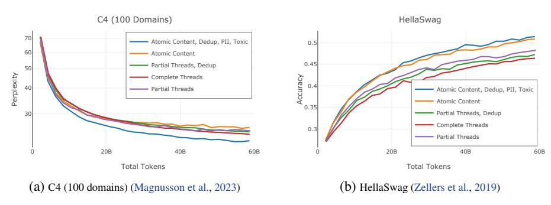

Figure 14: 1B model ablations for Reddit processing pipeline. Treating submissions and comments as independent documents (Atomic content strategy) leads to better results on perplexity (e.g., on C4 in [Figure 14a\)](#page-44-2) and downstream tasks (e.g., HellaSwag in [Figure 14b\)](#page-44-2).

The tree-like structure of Reddit threads allows for multiple possible data formats depending on how the various components of a thread are combined.

We investigate three formats for their potential as LM pretraining data:

- Atomic content. This simple format treats all comments and submissions as independent documents without any structure or connection to the thread they appear in.
- Partial threads. This format assembles comments from the same thread into a structured, multiround dialogue between users. Submissions are left as separate documents. Assembled dialogues are limited to a maximum parent depth, and the resulting documents are only snippets of a their originating thread (which are spread across several documents).
- Full threads. This complex format combines a given submission and all of its child comments into a single document encompassing an entire thread. Code-like indentation is used to indicate the depth of a comment in the thread's hierarchy.

We experimentally evaluated these strategies for assembling documents in [Figure 14.](#page-44-2) We found that, for language modeling purposes, treating comments and submissions as atomic units leads to better downstream performance compared to partial and full threads. We hypothesize that the more complex formatting required to handle dialogues might introduce undesirable content for language modeling, such as short and repeated comments. We leave the study of better formatting for forum content for language modeling to future work.

# F Tokenization Analysis

The first step of processing text with LMs is *tokenization*, i.e., mapping the text to a sequence of tokens with corresponding input embeddings [\(Sennrich et al.,](#page-34-4) [2016;](#page-34-4) [Kudo,](#page-28-5) [2018;](#page-28-5) [Kudo and Richardson,](#page-28-6) [2018\)](#page-28-6). Recently, there has been a growing interest in the question of how well LM tokenizers fit different data sources (e.g., data in different languages; [Ahia et al.,](#page-19-5) [2023;](#page-19-5) [Petrov et al.,](#page-32-10) [2023\)](#page-32-10) Inspired by this emerging line of work, we conduct an explorative analysis of the GPTNeoX tokenizer [\(Black](#page-21-1) [et al.,](#page-21-1) [2022\)](#page-21-1) applied to Dolma, which provides a first picture of how challenging the different data sources comprised by Dolma are for current LM tokenizers.

We start by taking a global look at the tokenizer's fit to Dolma. Out of the 50,280 tokens in the tokenizer vocabulary, 50,057 are present in the tokenized text of Dolma. In other words, 223 tokens are never used, amounting to roughly 0.4% of the tokenizer vocabulary. The 223 tokens mostly consist of combinations of whitespace characters (e.g., "\n\n ", two newline characters followed by two blank space characters). Note that when training an LM with the examined tokenizer on Dolma, the input embeddings corresponding to these tokens would not be updated. In terms of the count distribution of tokens, we find that tokens with smaller IDs tend to have higher counts in Dolma (see Figure [15a\)](#page-46-0), which is also reflected by a strong Spearman's correlation between (i) the ranking of tokens based on their counts in Dolma and (ii) the token IDs (r = 0.638, p < 0.001). Given how the tokenizer was trained [\(Sennrich et al.,](#page-34-4) [2016;](#page-34-4) [Black et al.,](#page-21-1) [2022\)](#page-21-1), smaller IDs correspond to byte pairs merged earlier and hence tokens occurring more frequently in the tokenizer training data Overall, these results suggest a good fit of the GPTNeoX tokenizer to Dolma.

Does the tokenizer fit all data sources included in Dolma equally well? To examine this question, we analyze fertility, which is defined as the average number of tokens per word generated by a tokenizer [\(Acs,](#page-19-6) [2019;](#page-19-6) [Scao et al.,](#page-33-2) [2022\)](#page-33-2), in our case measured on a specific data source. We find that fertility is similar for most data sources, ranging between 1.15 (conversational forum subset) and 1.28 (books subset), with the exception of the code subset, which has a substantially higher fertility of 2.45 (see Figure [15b\)](#page-46-0). This means that the costs of processing the code subset — be they computational or financial in nature [\(Petrov et al.,](#page-32-10) [2023\)](#page-32-10) — are more than twice as high compared to the other data sources.

What causes this discrepancy? We find that in the code subset (which mostly contains code), words are often preceded by whitespace characters *other than* a blank space (e.g., newline, tab, return). Crucially, while a blank space before a word is tokenized as part of that word (e.g., *I love you* → "I", " love", " you"), other whitespace characters yield separate tokens (e.g., *I love you* → "I", "\t", "love", "\t", "you"). This can also be seen by plotting the relative frequency of tokens representing whitespace characters by data source, which is one order of magnitude higher for The

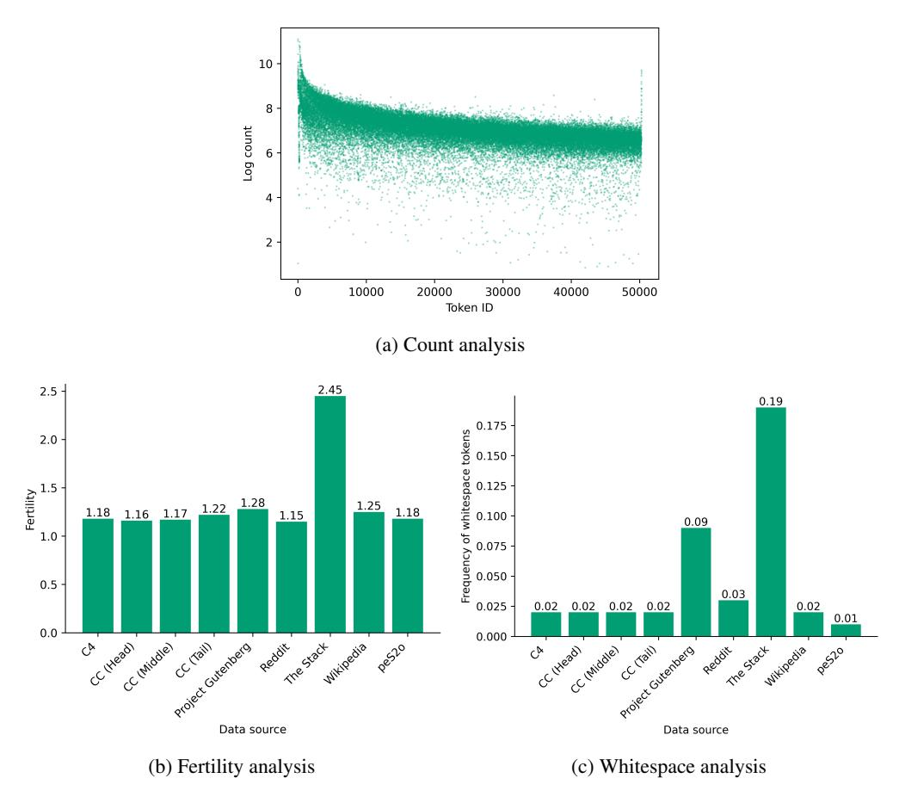

Figure 15: Tokenization analysis. Tokens with small IDs, which have a high count in the tokenizer training data, also tend to have a high count in Dolma (a). The Stack has a substantially higher fertility compared to the other data sources (b), which can be explained by the higher relative frequency of whitespace characters such "\n" and "\t" (c). See text for more details.

Stack compared to most other data sources (see Figure [15c\)](#page-46-0). When training LMs on The Stack (or code more generally), it thus might be advisable to add special tokens to the tokenizer (e.g., "\nif"; [Hong et al.,](#page-28-7) [2021\)](#page-28-7). It is important to notice that this observation applies to most tokenizers in use today (e.g., the tokenizer used by GPT-4), which tend to lack tokens such as "\nif".

# G Evaluating Language Identification

To analyze the impact of the fastText language identification classifier, we ran an external audit on the International Corpus of English (ICE) [\(Kirk and Nelson,](#page-28-8) [2018\)](#page-28-8), a dataset containing spoken and written English from nine countries around the world. We ran our language ID tool on all documents in the ICE dataset to estimate how many documents from each region would have been erroneously filtered. The ground truth in this analysis is that every document is in English, and should be classified as such. Interestingly, we found that at our fairly permissive threshold (keeping documents with at least a 0.5 score for English) correctly identified all English-language documents in ICE each as English, no matter the region it was from.

# H Evaluating Toxicity Classification

To measure dialectal biases in the jigsaw toxicity classifier, we analyze its proclivity to predict English variations spoken in different countries as toxic. Starting with the unfiltered Reddit corpus, we create a dataset of comments from [location-based subreddits,](https://www.reddit.com/r/LocationReddits/wiki/index/) filtering for country-specific subreddits with

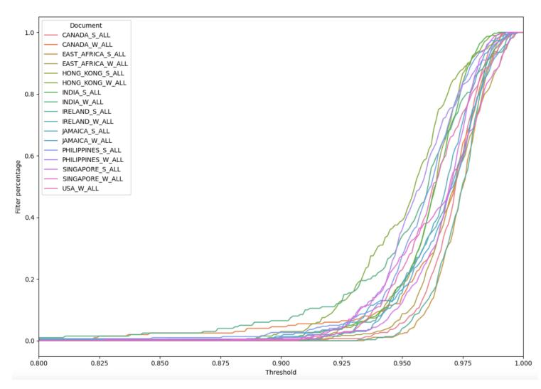

Figure 16: Percentage of English-language documents in the International Corpus of English (ICE) [\(Kirk and Nelson,](#page-28-8) [2018\)](#page-28-8) that would be misidentified as non-English as a result of thresholding the fastText classifier's predicted English score. We find a majority of English documents in ICE remain identified as English even with a threshold of 0.90.

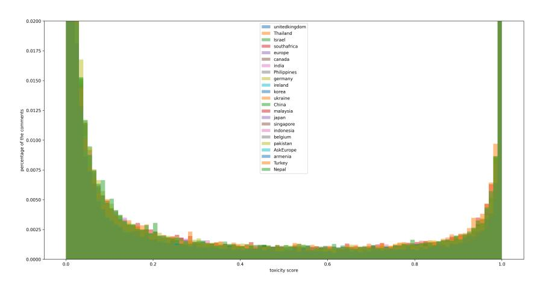

Figure 17: Distribution of Reddit comments labeled as toxic by English variation.

more than 50K comments. This dataset serves as a crude proxy for different dialects of English, assuming most commenters live in the respective locations and speak the variation. We further assume the fraction of actually toxic comments in each of these subreddits to be roughly the same. We compute the toxicity score for each comment in this dataset using the jigsaw classifier and report the percentage of comments marked as toxic against different classifier thresholds in [Figure 17.](#page-47-0) For all thresholds, for any two locations, we find <5% difference in the fraction of comments marked as toxic suggesting little to no bias. Further, we plot the distribution of toxicity scores for comments in each subreddit and find that scores assigned to the comments often fall at the extremes (close to 0 or close to 1), suggesting that any reasonable threshold (lying between 0.1 to 0.9) to predict toxicity will lead to similar outcomes.

# I Analysis of Filters for Code Pipeline

In Table [7,](#page-48-0) we display the number of documents flagged by our two groups of filters for The Stack, as well as their correlation. We find that the RedPajama v1 filters flag significantly more documents than the StarCoder ones for most languages. However, for Java, JavaScript and Python, our filters derived from StarCoder flag a very large number of documents. This is because it contains an additional Code

to Text ratio filter that is not employed for other languages. The two groups of filters generally have low correlation with the exception of a few languages, such as txl where they are perfectly correlated.

| Language       | RPJ % Flag | SC % Flag | RPJ SC Corr. | Language      | RPJ % Flag | SC % Flag | RPJ SC Corr. |
|----------------|---------------|--------------|-----------------|---------------|---------------|--------------|-----------------|
| abap           | 1.4           | 0.0          | N/A             | lookml        | 0.0           | 0.0          | N/A             |
| actionscript   | 1.3           | 0.0          | N/A             | lsl           | 3.2           | 1.3          | 0.05            |
| ada            | 1.5           | 2.6          | -0.02           | lua           | 4.6           | 0.0          | N/A             |
| agda           | 25.4          | 0.0          | N/A             | m             | 35.1          | 0.0          | N/A             |
| ags-script     | 4.7           | 0.0          | N/A             | m4            | 2.7           | 0.1          | 0.003           |
| alloy          | 3.5           | 0.1          | -0.005          | makefile      | 2.3           | 0.0          | N/A             |
| ampl           | 24.0          | 0.0          | N/A             | mako          | 2.3           | 0.7          | -0.013          |
| antlr          | 6.0           | 0.0          | N/A             | maple         | 18.2          | 44.2         | -0.414          |
| apacheconf     | 0.5           | 0.0          | N/A             | markdown      | 8.0           | 0.0          | N/A             |
| api-blueprint  | 3.8           | 0.0          | N/A             | mask          | 16.6          | 0.0          | N/A             |
| apl            | 28.2          | 0.0          | N/A             | mathematica   | 66.3          | 0.0          | N/A             |
| applescript    | 2.1           | 0.0          | N/A             | matlab        | 94.7          | 0.0          | N/A             |
| arc            | 17.7          | 8.8          | -0.144          | max           | 91.2          | 0.1          | -0.033          |
| arduino        | 2.5           | 0.0          | N/A             | maxscript     | 4.0           | 0.5          | -0.014          |
| asciidoc       | 4.0           | 0.0          | N/A             | mediawiki     | 6.6           | 0.0          | N/A             |
| asp            | 16.4          | 0.0          | -0.01           | metal         | 5.4           | 0.0          | N/A             |
| aspectj        | 0.9           | 0.0          | -0.01 N/A    | mirah         | 25.3          | 0.0          | N/A             |
| assembly       | 50.1          | 0.0          | N/A             | modelica      | 10.3          | 0.0          | N/A             |
| assembly       | 5.3           | 0.0          | N/A N/A      |               | 3.2           | 0.0          | N/A N/A      |
|                | 7.2           | 4.8          |                 | mms           | 5.2 6.5    | 0.0          | N/A N/A      |
| augeas         |               |              | -0.063          | monkey        |               |              |                 |
| autohotkey     | 4.9           | 0.0          | N/A             | moonscript    | 5.1           | 0.0          | N/A             |
| autoit         | 3.0           | 0.0          | N/A             | mtml          | 4.5           | 2.1          | -0.031          |
| awk            | 36.4          | 0.1          | -0.02           | muf           | 18.9          | 0.0          | N/A             |
| batchfile      | 9.8           | 0.0          | N/A             | mupad         | 13.8          | 1.7          | 0.006           |
| befunge        | 100.0         | 0.0          | N/A             | myghty        | 27.3          | 0.0          | N/A             |
| bison          | 2.8           | 0.0          | N/A             | nesc          | 7.9           | 0.0          | N/A             |
| bitbake        | 0.9           | 0.0          | N/A             | netlinx       | 15.4          | 0.0          | N/A             |
| blitzbasic     | 56.6          | 0.0          | N/A             | netlogo       | 12.5          | 0.0          | N/A             |
| blitzmax       | 1.2           | 0.0          | N/A             | nginx         | 0.0           | 0.0          | N/A             |
| bluespec       | 2.8           | 0.0          | N/A             | nimrod        | 4.5           | 0.0          | N/A             |
| boo            | 10.3          | 0.3          | 0.136           | ninja         | 36.8          | 0.0          | N/A             |
| brainfuck      | 73.8          | 0.3          | -0.003          | nit           | 3.4           | 0.0          | N/A             |
| brightscript   | 2.8           | 0.0          | N/A             | nix           | 1.6           | 0.0          | N/A             |
| bro            | 3.3           | 0.0          | N/A             | nsis          | 3.0           | 0.0          | N/A             |
| c              | 3.7           | 0.0          | N/A             | nu            | 15.1          | 0.0          | N/A             |
| c++            | 5.6           | 0.0          | N/A             | numpy         | 0.0           | 0.0          | N/A             |
| c-sharp        | 0.5           | 0.0          | N/A             | objdump       | 77.5          | 0.0          | N/A             |
| c2hs-haskell   | 1.7           | 0.0          | N/A             | objective-c++ | 5.6           | 0.1          | 0.023           |
| cap'n-proto    | 4.7           | 0.0          | N/A             | objective-j   | 48.7          | 0.0          | N/A             |
| cartocss       | 15.9          | 0.2          | -0.021          | ocaml         | 7.8           | 0.0          | N/A             |
| ceylon         | 2.1           | 0.0          | N/A             | octave        | 61.2          | 3.0          | -0.22           |
| chapel         | 20.4          | 0.0          | N/A             | omgrofl       | 0.0           | 0.0          | N/A             |
| chuck          | 13.0          | 0.0          | N/A             | ooc           | 4.3           | 0.0          | N/A             |
| cirru          | 31.0          | 0.0          | N/A             | opa           | 0.3           | 0.0          | N/A             |
| clarion        | 0.6           | 0.0          | N/A             | opal          | 11.4          | 1.9          | -0.05           |
| clean          | 12.0          | 0.5          | -0.026          | opencl        | 14.6          | 0.0          | -0.03 N/A    |
| click          | 17.8          | 0.3          | -0.026          | openscad      | 31.4          | 0.0          | N/A             |
|                | 17.8          | 0.5          | -0.024 -0.01 | -             | 31.4 11.1  |              | 0.002           |
| clips          |               |              |                 | org           |               | 0.1          |                 |
| clojure        | 4.7           | 0.0          | N/A             | OX            | 43.6          | 8.4          | 0.315           |
| cmake          | 2.0           | 0.0          | N/A             | oxygene       | 0.0           | 94.5         | N/A             |
| cobol          | 9.8           | 0.3          | -0.017          | OZ            | 8.4           | 0.2          | -0.012          |
| coffeescript   | 4.0           | 0.0          | N/A             | pan           | 1.8           | 18.0         | 0.095           |
| coldfusion     | 2.5 1.1    | 1.2 0.0   | -0.014 N/A   | papyrus       | 10.8          | 0.1          | 0.01 N/A     |
| coldfusion-cfc |               |              |                 | parrot        | 20.0          | 0.0          |                 |

| common-lisp      | 6.4  | 0.0  | N/A    | parrot-assembly | 6.0  | 0.0  | N/A    |
|------------------|------|------|--------|-----------------|------|------|--------|
| component-pascal | 37.1 | 84.1 | 0.144  | pir             | 8.4  | 0.0  | N/A    |
| coq              | 17.5 | 0.0  | N/A    | pascal          | 2.5  | 0.0  | N/A    |
| creole           | 41.8 | 0.0  | N/A    | pawn            | 13.3 | 0.0  | N/A    |
| crystal          | 2.8  | 0.1  | -0.006 | perl            | 7.8  | 0.1  | 0.022  |
| csound           | 6.7  | 3.9  | -0.041 | perl6           | 15.3 | 0.0  | N/A    |
| css              | 10.9 | 0.0  | N/A    | php             | 2.1  | 0.0  | N/A    |
| csv              | 87.2 | 0.0  | N/A    | piglatin        | 5.5  | 0.0  | N/A    |
| cucumber         | 2.3  | 0.8  | 0.41   | pike            | 11.9 | 0.0  | N/A    |
|                  |      |      |        |                 |      |      |        |
| cuda             | 2.6  | 0.0  | N/A    | pod             | 3.0  | 0.0  | N/A    |
| cycript          | 25.3 | 0.0  | N/A    | pogoscript      | 2.2  | 0.0  | N/A    |
| cython           | 2.0  | 0.0  | N/A    | pony            | 18.5 | 0.0  | N/A    |
| d                | 15.5 | 7.0  | 0.008  | postscript      | 44.8 | 0.0  | N/A    |
| darcs-patch      | 3.0  | 0.0  | N/A    | pov-ray-sdl     | 36.7 | 0.0  | N/A    |
| dart             | 0.9  | 0.0  | N/A    | powershell      | 2.0  | 0.0  | N/A    |
| desktop          | 0.8  | 0.0  | N/A    | processing      | 12.0 | 0.0  | N/A    |
| diff             | 11.5 | 0.0  | N/A    | prolog          | 20.2 | 0.0  | N/A    |
| dcl              | 42.4 | 0.2  | -0.005 | propeller-spin  | 9.7  | 0.0  | N/A    |
| dm               | 7.7  | 0.0  | N/A    | protocol-buffer | 1.2  | 0.0  | N/A    |
|                  |      |      |        |                 |      |      |        |
| dns-zone         | 56.4 | 0.0  | N/A    | pure-data       | 79.8 | 0.1  | -0.035 |
| dockerfile       | 1.5  | 0.0  | N/A    | purebasic       | 61.9 | 0.0  | N/A    |
| dogescript       | 3.3  | 0.0  | N/A    | purescript      | 2.0  | 0.0  | N/A    |
| dylan            | 1.5  | 0.0  | N/A    | python          | 2.9  | 26.3 | 0.091  |
| eagle            | 82.8 | 40.1 | 0.076  | pt              | 33.3 | 0.0  | N/A    |
| ec               | 10.1 | 0.2  | -0.014 | qmake           | 4.1  | 0.0  | N/A    |
| ecere-projects   | 4.9  | 0.0  | N/A    | qml             | 1.2  | 0.0  | N/A    |
| ecl              | 4.3  | 0.0  | N/A    | r               | 11.2 | 0.1  | -0.002 |
| edn              | 36.9 | 0.0  | N/A    | racket          | 6.4  | 0.0  | N/A    |
| eiffel           | 22.4 | 0.0  | N/A    | rirh            | 11.9 | 0.1  | -0.009 |
|                  |      |      |        |                 |      |      |        |
| elixir           | 1.5  | 0.0  | N/A    | raml            | 2.7  | 0.0  | N/A    |
| elm              | 3.7  | 0.0  | N/A    | rdoc            | 1.8  | 0.0  | N/A    |
| emacs-lisp       | 9.1  | 0.0  | N/A    | realbasic       | 0.9  | 0.0  | N/A    |
| emberscript      | 9.1  | 1.1  | -0.016 | rebol           | 20.3 | 0.1  | -0.018 |
| erlang           | 5.2  | 0.0  | N/A    | red             | 14.3 | 0.2  | -0.02  |
| f-sharp          | 5.1  | 0.0  | N/A    | redcode         | 20.9 | 0.0  | N/A    |
| factor           | 7.7  | 0.0  | N/A    | ren'py          | 2.3  | 0.0  | N/A    |
| fancy            | 9.9  | 0.0  | N/A    | renderscript    | 16.1 | 0.0  | N/A    |
| fantom           | 5.2  | 0.1  | -0.006 | rt              | 2.7  | 0.2  | -0.002 |
| fish             | 2.4  | 0.0  | N/A    | rhtml           | 4.2  | 0.6  | 0.001  |
|                  |      |      |        |                 |      |      |        |
| flux             | 35.9 | 0.0  | N/A    | rmarkdown       | 8.1  | 0.0  | N/A    |
| forth            | 11.2 | 0.0  | N/A    | rf              | 0.8  | 0.2  | 0.117  |
| fortran          | 15.4 | 0.0  | N/A    | rouge           | 14.8 | 0.0  | N/A    |
| freemarker       | 3.2  | 2.8  | 0.035  | ruby            | 1.2  | 0.0  | N/A    |
| g-code           | 43.7 | 0.1  | -0.004 | rust            | 2.6  | 0.1  | -0.004 |
| gams             | 53.9 | 0.0  | N/A    | sage            | 32.1 | 0.0  | N/A    |
| gap              | 20.7 | 0.0  | N/A    | saltstack       | 1.9  | 0.0  | N/A    |
| gas              | 17.6 | 0.0  | N/A    | sas             | 20.3 | 0.0  | N/A    |
| gdscript         | 0.7  | 0.0  | N/A    | sass            | 2.9  | 0.0  | N/A    |
| genshi           | 9.0  | 12.3 | -0.092 | scala           | 1.6  | 0.0  | N/A    |
|                  |      |      |        |                 |      |      |        |
| gentoo-ebuild    | 0.3  | 0.0  | N/A    | scaml           | 5.3  | 0.0  | N/A    |
| gentoo-eclass    | 0.5  | 0.0  | N/A    | scheme          | 15.4 | 5.6  | 0.011  |
| gettext-catalog  | 1.3  | 0.0  | N/A    | scilab          | 32.1 | 0.7  | -0.058 |
| glsl             | 9.4  | 0.5  | -0.015 | scss            | 4.5  | 0.0  | N/A    |
| glyph            | 0.0  | 0.0  | N/A    | self            | 5.9  | 0.0  | N/A    |
| gnuplot          | 68.9 | 0.1  | -0.041 | shell           | 5.3  | 0.0  | N/A    |
| go               | 2.0  | 0.0  | N/A    | shellsession    | 30.0 | 0.0  | N/A    |
| golo             | 1.7  | 0.0  | N/A    | shen            | 16.3 | 0.0  | N/A    |
| gosu             | 3.1  | 42.5 | -0.153 | slash           | 40.8 | 0.0  | N/A    |
|                  |      |      |        |                 |      |      |        |
| grace            | 34.5 | 0.0  | N/A    | slim            | 2.3  | 0.0  | N/A    |

| gf               | 11.0 | 0.0   | N/A    | smali         | 1.0  | 0.0  | N/A    |
|------------------|------|-------|--------|---------------|------|------|--------|
| graphql          | 1.6  | 0.0   | N/A    | smalltalk     | 1.6  | 0.1  | 0.195  |
| graphviz-(dot)   | 43.1 | 0.0   | N/A    | smarty        | 4.4  | 0.8  | 0.001  |
| groff            | 19.9 | 0.6   | 0.009  | smt           | 34.8 | 0.0  | N/A    |
| groovy           | 0.9  | 0.0   | N/A    | solidity      | 13.7 | 0.0  | N/A    |
| gsp              | 2.5  | 0.2   | 0.001  | sourcepawn    | 13.5 | 0.0  | N/A    |
| haml             | 2.3  | 0.0   | N/A    | sparql        | 10.1 | 0.0  | N/A    |
| handlebars       | 4.9  | 0.1   | 0.031  | sqf           | 3.3  | 0.0  | N/A    |
| harbour          | 5.6  | 0.0   | N/A    | sql           | 11.0 | 0.0  | N/A    |
| haskell          | 3.4  | 0.0   | N/A    | squirrel      | 7.3  | 0.0  | N/A    |
| haxe             | 1.1  | 0.0   | N/A    | stan          | 15.2 | 0.0  | N/A    |
| hcl              | 1.3  | 0.0   | N/A    | standard-ml   | 49.8 | 0.1  | 0.008  |
| hlsl             | 3.8  | 0.0   | N/A    | stata         | 8.2  | 6.1  | -0.073 |
| html             | 22.5 | 1.9   | 0.082  | ston          | 11.9 | 0.0  | N/A    |
| html+django      | 5.9  | 1.0   | 0.001  | stylus        | 3.3  | 0.0  | N/A    |
|                  |      |       |        |               |      |      |        |
| html+eex         | 4.7  | 0.6   | 0.019  | supercollider | 33.4 | 1.6  | -0.066 |
| html+erb         | 4.0  | 0.4   | 0.006  | svg           | 92.5 | 49.0 | -0.14  |
| html+php         | 3.4  | 0.1   | 0.002  | swift         | 0.6  | 0.0  | N/A    |
| http             | 4.3  | 0.0   | N/A    | systemverilog | 4.9  | 0.0  | N/A    |
| hy               | 9.5  | 0.0   | N/A    | tcl           | 7.4  | 0.0  | N/A    |
| idl              | 74.2 | 0.0   | N/A    | tcsh          | 6.3  | 0.0  | N/A    |
| idris            | 4.1  | 0.0   | N/A    | tea           | 5.2  | 0.0  | N/A    |
| igor-pro         | 2.5  | 0.0   | N/A    | tex           | 18.6 | 0.0  | N/A    |
| inform-7         | 14.0 | 0.2   | -0.019 | text          | 56.5 | 0.6  | 0.061  |
| ini              | 8.3  | 0.9   | 0.027  | textile       | 8.2  | 0.0  | N/A    |
| inno-setup       | 2.4  | 0.0   | N/A    | thrift        | 1.2  | 0.0  | N/A    |
| io               | 18.9 | 0.1   | 0.012  | toml          | 11.9 | 0.0  | N/A    |
| ioke             | 13.4 | 0.0   | N/A    | turing        | 4.3  | 0.0  | N/A    |
|                  |      |       |        |               |      |      |        |
| irc-log          | 39.6 | 0.0   | N/A    | turtle        | 25.1 | 0.0  | N/A    |
| isabelle         | 3.6  | 0.1   | -0.007 | twig          | 2.7  | 0.2  | 0.013  |
| j                | 27.0 | 0.0   | N/A    | txl           | 7.4  | 7.4  | 1.0    |
| jade             | 2.5  | 0.0   | N/A    | typescript    | 2.2  | 0.1  | 0.02   |
| jasmin           | 20.0 | 0.0   | N/A    | upc           | 12.3 | 0.0  | N/A    |
| java             | 0.7  | 30.2  | 0.037  | unity3d-asset | 1.1  | 0.1  | 0.003  |
| jsp              | 1.4  | 0.6   | -0.003 | uno           | 0.8  | 0.0  | N/A    |
| javascript       | 9.3  | 52.1  | 0.13   | unrealscript  | 2.6  | 0.0  | N/A    |
| jflex            | 2.6  | 0.3   | 0.333  | urweb         | 19.2 | 1.7  | -0.064 |
| json             | 44.8 | 0.0   | N/A    | vala          | 1.4  | 0.0  | N/A    |
| json5            | 20.8 | 0.0   | N/A    | vcl           | 6.8  | 0.0  | N/A    |
| jsoniq           | 29.5 | 0.0   | N/A    | verilog       | 1.8  | 0.0  | N/A    |
| jsonld           | 11.6 | 0.0   | N/A    | vhdl          | 4.1  | 0.0  | N/A    |
| jsx              | 2.4  | 0.0   | N/A    | viml          | 2.6  | 0.0  | N/A    |
| julia            | 8.6  | 0.0   | N/A    | visual-basic  | 4.3  | 0.1  | 0.07   |
| jupyter-notebook | 62.5 | 0.0   | N/A    | volt          | 2.4  | 0.1  | -0.005 |
|                  |      |       |        |               |      |      |        |
| kicad            | 98.2 | 0.0   | N/A    | vue           | 3.0  | 0.0  | N/A    |
| kit              | 6.3  | 0.3   | 0.041  | owl           | 10.4 | 85.6 | -0.146 |
| kotlin           | 0.7  | 0.0   | N/A    | webassembly   | 30.3 | 0.0  | N/A    |
| krl              | 2.7  | 0.0   | N/A    | webidl        | 0.3  | 0.0  | N/A    |
| labview          | 39.0 | 100.0 | 0.017  | wisp          | 13.8 | 0.0  | N/A    |
| lasso            | 33.5 | 4.4   | -0.001 | x10           | 8.9  | 1.0  | -0.031 |
| latte            | 4.9  | 0.4   | 0.034  | xbase         | 2.5  | 0.5  | -0.011 |
| lean             | 8.2  | 0.0   | N/A    | xc            | 14.2 | 0.0  | N/A    |
| less             | 4.7  | 0.0   | N/A    | xml           | 13.5 | 65.3 | -0.016 |
| lex              | 31.8 | 0.2   | -0.02  | xojo          | 2.3  | 0.0  | N/A    |
| lfe              | 10.2 | 0.0   | N/A    | xpages        | 0.0  | 95.6 | N/A    |
| lilypond         | 37.1 | 0.0   | N/A    | xproc         | 9.9  | 59.5 | -0.375 |
| linker-script    | 10.2 | 0.0   | N/A    | xquery        | 9.1  | 4.4  | -0.065 |
|                  |      |       |        |               |      |      |        |
| liquid           | 9.6  | 0.6   | 0.074  | xs            | 1.6  | 5.9  | -0.032 |
| literate-agda    | 23.4 | 0.0   | N/A    | xslt          | 2.2  | 85.1 | -0.041 |

| lcs              | 1.3  | 0.0 | N/A    | xtend  | 0.3  | 0.0 | N/A |
|------------------|------|-----|--------|--------|------|-----|-----|
| literate-haskell | 3.8  | 0.0 | N/A    | yacc   | 17.5 | 0.0 | N/A |
| livescript       | 12.8 | 0.0 | N/A    | yaml   | 5.1  | 0.0 | N/A |
| llvm             | 29.9 | 0.0 | N/A    | yang   | 0.7  | 0.0 | N/A |
| logos            | 24.2 | 0.2 | -0.023 | zephir | 0.4  | 0.0 | N/A |
| logtalk          | 4.3  | 0.0 | N/A    | zig    | 4.8  | 0.0 | N/A |
| lolcode          | 14.4 | 4.8 | -0.092 | zimpl  | 75.5 | 0.0 | N/A |

Table 7: Correlation of filters for the subset of Dolma from The Stack. RPJ are filters from RedPajama [\(Together Computer,](#page-36-3) [2023c\)](#page-36-3) and SC filters are from StarCoder [\(Li](#page-29-2) [et al.,](#page-29-2) [2023;](#page-29-2) [Muennighoff et al.,](#page-31-2) [2023a\)](#page-31-2). We compute the Pearson correlation among the documents flagged by each set of filters (Corr.). Language shortcuts: dcl=digital-commandlanguage, gf=grammatical-framework, gsp=groovy-server-pages, jsp=java-server-pages, lcs=literatecoffeescript, owl=web-ontology-language, mms=module-management-system, pir=parrot-internalrepresentation, pt=python-traceback, rf=robotframework, rirh=ragel-in-ruby-host, rt=restructuredtext, upc=unified-parallel-c

# J Data Sheet

## J.1 Motivation for Dataset Creation

#### Why was the dataset created?

Dolma was created with the primary purpose of training AI2's autoregressive language model OLMo. It is a mixture of documents from multiple data sources. Documents have been transformed using a combination of rule-based and statistical tools to extract textual content, remove layout information, and filter for English content.

Dolma contains data sourced from different domains. In particular, it contains a mixture of text obtained from a web scrape, scientific content extracted from academic PDFs and its associated metadata, code over a variety of programming languages, reference material from Wikipedia and Wikibooks, as well as public domain books from Project Gutenberg.

#### What (other) tasks could the dataset be used for?

We expect this dataset to be useful to train other language models, either in its current form or through further filtering and combining it with other datasets.

Beside language model training, this dataset could be used to study interaction between pretraining corpora and models trained on them. For example, one could study provenance of generations from the model, or perform further corpus analysis.

Specific subset of Dolma could be used to train domain specific models. For example, the code subset could be used to train an AI programming assistant.

#### Are there obvious tasks for which it should not be used?

Due to the myriad transformations applied to the original source materials to derive our dataset, we believe it is ill-suited as a replacement for users seeking to directly consume the original content. We refer users of our dataset to our license and terms on the HuggingFace Hub [huggingface.co/](https://huggingface.co/datasets/allenai/dolma) [datasets/allenai/dolma](https://huggingface.co/datasets/allenai/dolma) which detail any use restrictions.

#### Has the dataset been used for any tasks already?

No model trained on this dataset has been publicly released yet.

#### If so, where are the results so others can compare?

A manuscript is forthcoming.

#### Who funded the creation of the dataset?

All individuals who are responsible for this dataset are employed by the Allen Institute for AI. Similarly, computing resources are provided by AI2.

#### If there is an associated grant, provide the grant number.

Compute for the OLMo project is provided by AMD and CSC, using GPUs on the LUMI supercomputer.

## J.2 Dataset Composition

#### What are the instances? Are there multiple types of instances?

Instances are plain-text spans on English text or computer code. Each instance was obtained by processing web pages (which might include news, documents, forums, etc), academic articles, computer code from GitHub, encyclopedic content from Wikipedia, or Project Gutenberg books.

#### Are relationships between instances made explicit in the data?

Metadata for subsets of Dolma could be used to reconstruct relationships between items:

- Common Crawl. Each document uses the URL of the web page from which it was extracted as its identifier; therefore, it can be used to identify relationships between documents.
- C4. The URL of each web page from which documents were extracted is included as metadata; therefore, it can be used to identify relationships between documents.
- Reddit. The originating subreddits and thread ids of documents are included in the metadata.
- peS2o. The id of each document is the Semantic Scholar Corpus ID of its corresponding manuscript. Metadata for each manuscript can be obtained using the Semantic Scholar APIs [\(Kinney et al.,](#page-28-9) [2023\)](#page-28-9).
- The Stack. The name of the GitHub repository each document belongs to is included as metadata.
- Project Gutenberg. The title of each book is included as the first line of each document.
- Wikipedia, Wikibooks. For both, metadata includes the URL corresponding to the page content was extracted from. Structure and connections between documents can be recovered through the URL.

#### How many instances of each type are there?

Summary statistics are reported in Table [1.](#page-1-0)

#### What data does each instance consist of? "Raw" data (e.g., unprocessed text or images)? Features/attributes?

For each source, raw data is not available directly but could be recovered using source-specific methods:

- Common Crawl. We obtain data from common crawl snapshots from 2020-05 to 2023-06. WARC files from Common Crawl can be intersected with Dolma ids to recover original HTML files.
- C4. We obtained this corpus from the HuggingFace Hub [33](#page-52-0). In turn, documents in C4 have been derived from a Common Crawl snapshot for 04/2019. URLs in C4 can be used to recover HTML files.
- Reddit. The complete set of monthly data dumps used in this work are no longer distributed by Pushshift, however they can still be obtained through torrents and some public web archives.
- peS2o. peS2o is derived from S2ORC [Lo et al.](#page-30-6) [\(2020\)](#page-30-6). Original parsed documents can be obtained from extracting documents in S2ORC that share the same ID with peS2o. Further, metadata in S2ORC can be used to obtain original PDF.
- The Stack (deduplicated). The filename and repository name, both available in metadata, can be used to recover original file contents.

33<https://huggingface.co/datasets/allenai/c4>

- Project Gutenberg. The title of each book is the first line of each document.
- Wikipedia, Wikibooks. For both, metadata includes the URL corresponding to the page content was extracted from. Structure and connections between documents can be recovered through the URL.

Is there a label/target associated with instances? If the instances are related to people, are subpopulations identified (e.g., by age, gender, etc.) and what is their distribution?

There are no labels associated with instances. Many text instances were likely created by people or groups of people, but in the vast majority of cases authorship information is unavailable let alone subpopulation metadata. we leave aggregation and reporting of these statistics to future work.

Is everything included or does the data rely on external resources? (e.g., websites, tweets, datasets) If external resources, a) are there guarantees that they will exist, and remain constant, over time; b) is there an official archival version. Are there licenses, fees or rights associated with any of the data?

The data are derived from the web and the original resources may not persist over time. However, each source represents an archival snapshot of that data that should remain fixed and available:

- Common Crawl. The Common Crawl data is available on Amazon S3 as part of the Amazon Web Services' Open Data Sponsorship program and can be freely downloaded [34](#page-53-0). We followed Common Crawl terms of use[35](#page-53-1) .
- C4. This corpus can be obtained from from the HuggingFace Hub[33](#page-52-0) and is released under ODC-By 1.0 [\(Open Data Commons,](#page-31-15) [2010\)](#page-31-15).
- Reddit. Pushshift no longer distributes this dataset due to changes to the Reddit API's terms. Unofficial copies of the data might be be available through torrents and some public web archives. Pushshift data dumps inherit[36](#page-53-2) the Terms of use of the Reddit API at the time of their collection (March 2023).
- peS2o. peS2o is derived from S2ORC [Lo et al.](#page-30-6) [\(2020\)](#page-30-6). S2ORC is released through the Semantic Scholar Public API[37](#page-53-3) under ODC-By 1.0 [\(Open Data Commons,](#page-31-15) [2010\)](#page-31-15).
- The Stack (deduplicated). The corpus is available on the HuggingFace Hub [38](#page-53-4) and consists of code released under a variety of permissive licenses. More details including terms of use for hosting or sharing the corpus are provided in the datacard at the link above.
- Project Gutenberg. Project Gutenberg consists of books that are not protected under U.S. copyright law. The corpus is available at [gutenberg.org](https://www.gutenberg.org/).
- Wikipedia, Wikibooks. Wikimedia data dumps are freely available[39](#page-53-5) and released under CC BY-SA 4.0 license [\(Creative Commons,](#page-23-12) [2013\)](#page-23-12).

Are there recommended data splits or evaluation measures? (e.g., training, development, testing; accuracy/AUC)

No. A separate evaluation suite Dolma as been decontaminated against will be released at a later date. Downstream users of this dataset could use any alternative evaluation suite.

What experiments were initially run on this dataset? Have a summary of those results and, if available, provide the link to a paper with more information here.

A forthcoming manuscript will detail ablations and other experiments that have been conducted to guide the creation of this dataset.

34<https://commoncrawl.org/the-data/get-started/>

35<https://commoncrawl.org/terms-of-use/>

36<https://www.reddit.com/r/pushshift/comments/d6luj5/comment/f0ugpqp>

37<https://www.semanticscholar.org/product/api>

38<https://huggingface.co/datasets/bigcode/the-stack-dedup>

39<https://dumps.wikimedia.org>

## J.3 Data Collection Process

How was the data collected? (e.g., hardware apparatus/sensor, manual human curation, software program, software interface/API; how were these constructs/measures/methods validated?)

Data acquisition for each subset was performed as follows:

- Common Crawl. snapshots were downloaded from Common Crawl's official S3 bucket[40](#page-54-1) using the cc\_net pipeline [\(Wenzek et al.,](#page-37-3) [2020b\)](#page-37-3). Data was obtained between March 17th and March 27th, 2023.
- C4. We clone C4 from the HuggingFace Hub[33](#page-52-0) using Git with the Git-LFS extension. Repository cloned on May 24th, 2023.
- Reddit. Reddit was acquired in the form of monthly data dumps of comments and submissions collected and distributed by the Pushshift project[41](#page-54-2) [42](#page-54-3). We used the complete set of 422 publicly availible dumps (208 comments, 214 submissions) spanning a period from 06/2005–03/2023. The majority of Dumps were acquired in March, 2023 with the last dumps downloaded in May of 2023.
- peS2o. We clone peS2o from the HuggingFace Hub[43](#page-54-4) using Git with the Git-LFS extension. We use pes2o V2. Repository cloned on June 30th, 2023.
- The Stack (deduplicated). We clone The Stack (deduplicated) from the HuggingFace Hub[38](#page-53-4) using Git with the Git-LFS extension. Repository cloned on May 28th, 2023.
- Project Gutenberg. Data was downloaded directly from <gutenberg.org>. We used GutenbergPy [\(Angelescu, Radu,](#page-19-7) [2013\)](#page-19-7) to extract books. Website accessed on April 3rd, 2023.
- Wikipedia, Wikibooks. Dumps were downloaded from Wikimedia's website[39](#page-53-5). We use the dump from March 20th, 2023.

Who was involved in the data collection process? (e.g., students, crowdworkers) How were they compensated? (e.g., how much were crowdworkers paid?)

Data was collected and postprocessed by full-time employees at the Allen Institute for AI. No instances in this dataset are manually annotated.

Over what time-frame was the data collected? Does the collection time-frame match the creation time-frame?

Please see list above.

How was the data associated with each instance acquired? Was the data directly observable (e.g., raw text, movie ratings), reported by subjects (e.g., survey responses), or indirectly inferred/derived from other data (e.g., part of speech tags; model-based guesses for age or language)? If the latter two, were they validated/verified and if so how?

Any metadata associated with each instance was obtained directly from each source.

Does the dataset contain all possible instances? Or is it, for instance, a sample (not necessarily random) from a larger set of instances? If the dataset is a sample, then what is the population? What was the sampling strategy (e.g., deterministic, probabilistic with specific sampling probabilities)? Is the sample representative of the larger set (e.g., geographic coverage)? If not, why not (e.g., to cover a more diverse range of instances)? How does this affect possible uses?

Sampling for each subset was performed as follows:

40s3://commoncrawl/

41<https://files.pushshift.io/reddit/submissions/>

42<https://files.pushshift.io/reddit/comments/>

43<https://huggingface.co/datasets/allenai/peS2o>

- Common Crawl. Common Crawl is not a representative sample of the web. Summary statistics about Common Crawl are reported through the cc-crawl-statistics [\(Common Crawl,](#page-23-13) [2016\)](#page-23-13) project, available at [commoncrawl.github.io/cc-crawl-statistics](https://commoncrawl.github.io/cc-crawl-statistics/). Dolma uses Common Crawl snapshots from 2020-05 to 2023-06[44](#page-55-1) .
- C4. We use C4 in its entirety.
- Reddit. We use all available Reddit content from from 06/2005–03/2023.
- The Stack (deduplicated). We use The Stack (deduplicated) in its entirety.
- peS2o. We use pes2o V2 in its entirety.
- Project Gutenberg. We process all Gutenberg books.
- Wikipedia, Wikibooks. We use the *English* and *Simple* subset of Wikipedia and Wikibooks in their entirety.

Is there information missing from the dataset and why? (this does not include intentionally dropped instances; it might include, e.g., redacted text, withheld documents) Is this data missing because it was unavailable?

Common Crawl is the only source we did not use in its entirety. We use only about a quarter of all snapshots available. This amount was deemed sufficient for the goal of the OLMo project (train an autoregressive language model with up to 70 billion parameters) given the amount of compute we have available. We decided to use the 24 most recent Common Crawl snapshots.

#### Are there any known errors, sources of noise, or redundancies in the data?

Not that we are aware of, although a negligible portion of Common Crawl data could have been lost due to network issues with S3 storage. When accessing Common Crawl, we implemented retry mechanisms, but copy could have failed due to exceeding the retry limits.

# J.4 Data Preprocessing

What preprocessing/cleaning was done? (e.g., discretization or bucketing, tokenization, partof-speech tagging, SIFT feature extraction, removal of instances, processing of missing values, etc.)

All data sources are filtered using FastText language identification models [\(Joulin et al.,](#page-28-2) [2016a,](#page-28-2)[b\)](#page-28-10) with an English threshold of 0.5.

For the Common Crawl and C4 subsets, we use the following filters (Figure [1\)](#page-5-3) that substantially modify the original data. Note that data might be tagged for removal by one or more filter.

- *Only Common Crawl, as part of their distribution pipeline*: Linearize all HTML into plain text files (WET files generation[45](#page-55-2));
- *Only Common Crawl, as part of CCNet pipeline*: We remove frequently occurring paragraph in Common Crawl by identifying repeated paragraphs on small subsets of each snapshots. This step gets rid of headers that are shared across many pages, such as navigational headers. Removal is operationalized as follows: given 1 . . . , n, . . . , N shards each snapshot is comprised to, group shards in sets S = {n − k, n}; then, remove exact duplicates of paragraphs in S. Paragraphs are defined as newline-separated slices of documents, and compared using their SHA1. We choose k such that each set is at most 20GB[46](#page-55-3). (*approximately 70% of paragraph removed*);
- *Only Common Crawl, deduplication by URL*: We deduplicate pages by URL (*53% of duplicates removed*);

44Common Crawl snapshots follow naming convention xxxx-yy, where xxxx is the year the snapshot was finalized, and yy is the week, ranging from 01 to 52.

45<https://commoncrawl.org/get-started>

46This is a slight modification of the original CCNet pipeline, where k is chose so that each set is 2% of snapshot. We chose to use a fixed shard size, rather an a percentage of the corpus, because fixed size is more predictable in terms of resource usage, leading to less-error prone code. Conceptually it's equivalent to putting a threshold on the absolute probability of a paragraph occurring

- Language identification: remove all documents with an English score lower than 0.5, as determined by FastText language identification models [\(Joulin et al.,](#page-28-2) [2016a](#page-28-2)[,b\)](#page-28-10) (*removed 61.69% of web pages by size*);
- Quality filter[47](#page-56-0): Remove documents with more than half of their line not ending in ".", "?", "!", or """. (*22.73% of characters tagged for removal*);
- Quality filter[47](#page-56-0): Remove any document that does not pass any of the Gopher rules [\(Rae et al.,](#page-32-3) [2021\)](#page-32-3) (*15.23% of characters tagged for removal*);
  - Fraction of characters in most common ngram greater than a threshold[48](#page-56-1)
  - Fraction of characters in duplicate ngrams greater than a threshold[49](#page-56-2)
  - Contains fewer than 50 or more than 100K words
  - Median word length is less than 3 or greater than 10
  - Symbol to word ratio greater than 0.10
  - Fraction of words with alpha character less than 0.80
  - Contains fewer than 2 of a set of required words[50](#page-56-3)
  - Fraction of lines in document starting with bullet point greater than 0.90
  - Fraction of lines in document ending with ellipsis greater than 0.30
  - Fraction of lines in document that are duplicated greater than 0.30
  - Fraction of characters in duplicated lines greater than 0.30
- Quality filter[47](#page-56-0): Remove any document that contains a token or sequence of tokens repeating over 100 times[51](#page-56-4) (*0.003% of characters tagged for removal*);
- Content filter: Remove sentences that get ranked as toxic by a FastText classifier (score above 0.4). We train a bigram classifier on the Jigsaw dataset [\(cjadams et al.,](#page-23-2) [2017\)](#page-23-2) (*1.01% of data tagged for removal*);
- Content filter: Mask Personal Identifiable Information (PII) using regular expressions that identify emails, phone numbers, and IP addresses; pages containing 6 or more PIIs are completely removed from the corpus (*0.05% tagged for masking, 0.11% tagged for removal*);
- Exact document deduplication: duplicate documents the same text. No punctuation or whitespace is removed. Empty documents count as duplicates (*14.9% of documents tagged for removal*).
- *Only Common Crawl, deduplication by paragraph*: We deduplicate the web subset at a paragraph level using a Bloom filter (*19.1% of UTF-8 characters tagged for removal*).

For the Reddit subset, we use the following filters that substantially reduce the original data.

- Language identification: remove all documents with an English score lower than 0.5, as determined by a FastText language identification model.
- Quality filter[47](#page-56-0): Remove comments and submissions shorter than 500 characters in length.
- Quality filter[47](#page-56-0): Remove user comments with fewer than three upvotes (Reddit users vote on the quality of submissions and comments).
- Content filter[47](#page-56-0): Remove comments and submissions from banned, toxic, or NSFW subreddits.
- Content filter[47](#page-56-0): Remove sentences that get ranked as toxic or as hatespeech by a FastText classifier (score above 0.4).

47The term "quality filter", while widely used in literature, does not appropriately describe the outcome of filtering a dataset. Quality might be perceived as a comment on the informativeness, comprehensiveness, or other characteristics valued by humans. However, the filters used in Dolma and other language models efforts select text according to criteria that are inherently ideological [\(Gururangan et al.,](#page-27-4) [2022\)](#page-27-4).

48For bigrams, threshold of 0.20. For trigrams, 0.18. For 4-grams, 0.16.

49For 5-grams, 0.15. For 6-grams, 0.14. For 7-grams, 0.13. For 8-grams, 0.12. For 9-grams, 0.11. For 10-grams, 0.10.

50"the", "be", "to", "of", "and", "that", "have", "with"

51We use [allenai/gpt-neox-olmo-dolma-v1\\_5](https://huggingface.co/allenai/gpt-neox-olmo-dolma-v1_5) to obtain tokens.

- Content filter: Mask Personal Identifiable Information (PII) using regular expressions that identify emails, phone numbers, and IP addresses
- Deduplication: We deduplicate comments and submissions (jointly) at a paragraph level using a Bloom filter.

For the code subset derived from The Stack (deduplicated), we use the following filters (Figure [8\)](#page-11-2):

- Language filter: Removed files associated with the following programming languages:
  - Data or numerical content: *csv, json, json5, jsonld, jsoniq, svg*
  - Assembly code: *assembly*
- Quality filter[47](#page-56-0): Removed copyright statements in code files from document preamble[52](#page-57-0) ;
- Quality filter[47](#page-56-0): Removed documents matching any of the RedPajama v1 [\(Together Computer,](#page-36-3) [2023c\)](#page-36-3) code filters (*41.49% of data tagged for removal*):
  - Maximum line length > 1000 characters.
  - Average line length > 100 characters.
  - Proportion of alpha-numeric characters < 0.25.
  - Ratio of alphabetical characters to number of tokens < 1.5[53](#page-57-1) .
- Quality filter[47](#page-56-0): Removed documents matching any of the following Starcoder filters [\(Li et al.,](#page-29-2) [2023\)](#page-29-2):
  - Contains XML template code.
  - HTML code-to-text ratio <= 0.2.
  - Java, Javascript, Python code-to-comment ratio <= 0.01 or > 0.8.
- Content filter: Mask Personal Identifiable Information (PII) using regular expressions that identify emails, phone numbers, and IP addresses; pages containing 6 or more PIIs are completely removed from the corpus.

For the Wikipedia and Wikibooks subsets, we remove pages that contain fewer than 25 UTF-8 words.

For the Gutenberg subset:

- Language identification: for each paragraph (defined as newline-separated spans of text), we use FastText to perform language identification. Then, we compute the average language score by averaging the score for all passages. If a document has a language score lower than 0.5, it is discarded;
- Quality filter[47](#page-56-0): we remove pages that contain fewer than 25 UTF-8 words;
- Quality filter[47](#page-56-0): Remove any document that contains a token or sequence of tokens repeating over 100 times[51](#page-56-4) .

For the PeS2o subset, we remove any document that contains a token or sequence of tokens repeating over 100 times[51](#page-56-4) .

For Dolma versions 1.0 and 1.5, we perform decontamination for all subsets of Dolma. In particular, we remove paragraphs that are shared with documents in the Paloma evaluation suite [Magnusson et al.](#page-30-2) [\(2023\)](#page-30-2). Overall, only 0.003% of our dataset is removed due to contamination with this evaluation set. Dolma version 1.6 is not decontaminated.

#### Was the "raw" data saved in addition to the preprocessed/cleaned data? (e.g., to support unanticipated future uses)

Raw data is available for all subsets except Common Crawl. Due to space constrains, we only keep linearized version of Common Crawl snapshots, filtered by Language ID as described above.

Raw data is not available for download outside the Allen Institute for AI. Interested individuals may contact authors of this manuscript if they require access to raw data.

52Code license and provenance is still tracked in metadata.

53Tokens counted using whitespace tokenizer

#### Is the preprocessing software available?

Yes, all preprocessing software is available on GitHub at [github.com/allenai/dolma](https://github.com/allenai/dolma) and on PyPI[54](#page-58-0) .

Does this dataset collection/processing procedure achieve the motivation for creating the dataset stated in the first section of this datasheet?

Yes, it does.

# J.5 Dataset Distribution

How is the dataset distributed? (e.g., website, API, etc.; does the data have a DOI; is it archived redundantly?)

Dolma is distributed via the HuggingFace Hub, which offers access via the datasets [\(Lhoest et al.,](#page-29-6) [2021\)](#page-29-6) Python package, direct download, and Git using the Git-LFS extension. Additionally, a copy is stored on the cloud storage of the Allen Institute for AI.

When will the dataset be released/first distributed? (Is there a canonical paper/reference for this dataset?)

The dataset is available now. This manuscript serves as a reference for the dataset.

#### What license (if any) is it distributed under? Are there any copyrights on the data?

Information about the license associated with Dolma are available on its release page on the Hugging-Face Hub: [huggingface.co/datasets/allenai/dolma](https://huggingface.co/datasets/allenai/dolma).

#### Are there any fees or access/export restrictions?

The dataset is distributed for free. Users should verify any restrictions on its release page on the HuggingFace Hub: [huggingface.co/datasets/allenai/dolma](https://huggingface.co/datasets/allenai/dolma).

## J.6 Dataset Maintenance

Who is supporting/hosting/maintaining the dataset? How does one contact the owner/curator/manager of the dataset (e.g. email address, or other contact info)?

The Allen Institute for AI maintains the dataset. For support questions, users are invited to open an issue on GitHub[55](#page-58-1) or on the community tab of dataset page[56](#page-58-2) (the former being preferred over the latter). Any other inquiry should be sent to ai2-info@allenai.org.

Will the dataset be updated? How often and by whom? How will updates/revisions be documented and communicated (e.g., mailing list, GitHub)? Is there an erratum?

Dataset will be uploaded on a need-to basis by maintainers at the Allen Institute for AI. Newer version of the dataset will be labeled accordingly. The latest version of the dataset, as well as a changelog, will be made available starting from the first revision.

If the dataset becomes obsolete how will this be communicated? Is there a repository to link to any/all papers/systems that use this dataset?

Users should keep track of the version of the dataset in use. Information about latest version of Dolma are available on its release page on the HuggingFace Hub: [huggingface.co/datasets/allenai/](https://huggingface.co/datasets/allenai/dolma) [dolma](https://huggingface.co/datasets/allenai/dolma). Dolma users should cite this manuscript when using this data.

54<https://pypi.org/project/dolma/>

55<https://github.com/allenai/dolma/issues>

56<https://huggingface.co/datasets/allenai/dolma/discussions>

If others want to extend/augment/build on this dataset, is there a mechanism for them to do so? If so, is there a process for tracking/assessing the quality of those contributions. What is the process for communicating/distributing these contributions to users?

Creation and distribution of derivatives is described above. In case contributors want to flow their improvement back to future Dolma releases, they should contact corresponding authors of this manuscript.

## J.7 Legal & Ethical Considerations

If the dataset relates to people (e.g., their attributes) or was generated by people, were they informed about the data collection? (e.g., datasets that collect writing, photos, interactions, transactions, etc.)

Subsets of Dolma derived from web data are likely created by people or groups of people, however authorship information is often unavailable.

Authors were not directly informed about the data collection. For encyclopedic and web content, logs of web servers will contain records of spiders ran by Common Crawl. For academic content, the pes2o subset [\(Soldaini and Lo,](#page-34-1) [2023\)](#page-34-1) is derived from manuscripts that are licensed for permissive distribution by their authors. Reddit content was acquired through a public API adherent to terms of service; individual authors of Reddit posts were not contacted directly. Finally, the Allen Institute for AI did not contact Project Gutenberg.

If it relates to other ethically protected subjects, have appropriate obligations been met? (e.g., medical data might include information collected from animals)

Due to the nature of and size of Dolma, it is impossible to determine which obligations, if any, are appropriate.

If it relates to people, were there any ethical review applications/reviews/approvals? (e.g. Institutional Review Board applications) If it relates to people, were they told what the dataset would be used for and did they consent? What community norms exist for data collected from human communications? If consent was obtained, how? Were the people provided with any mechanism to revoke their consent in the future or for certain uses?

The OLMo project includes Ethics committee comprised of internal and external members to the Allen Institute for AI. Plans for the creation of Dolma were reviewed with the committee, and we incorporated their recommendations.

Following practices established in similar efforts, no consent was collected from individuals who might be represented in the dataset. We make available a form[57](#page-59-0) for individuals who wish to be removed from the dataset.

If it relates to people, could this dataset expose people to harm or legal action? (e.g., financial social or otherwise) What was done to mitigate or reduce the potential for harm?

Dolma contains text instances that have been derived from web pages Common Crawl crawled from the web. Content might contain sensitive information including personal information, or financial information users of the web chose to put publicly online. This data is taken only from public places, so the same data is or has been accessible via browsing the web. We have measured a variety of types of personal information, and built tools specifically to remove some types of sensitive information, and through our license we restrict what users can do with this data.

We recommend individuals to submit a request using through our form[57](#page-59-0) if they wish their information to be removed.

If it relates to people, does it unfairly advantage or disadvantage a particular social group? In what ways? How was this mitigated?

57<https://forms.gle/q4BNUUxUxKwKkfdT6>

Dolma is not a representative sample of none of its sources. It might underrepresent or overrepresent some communities on the internet; further, papers in the peS2o subset are skewed towards STEM disciplines; books in the Gutenberg library are mostly from the public domain (at the time of publication, books published before 1927); finally, the English and Simple subset of Wikipedia and Wikibooks might be biased towards events and people from the global north.

We did not attempt to alter distribution of social groups in Dolma. Large-scale interventions to correct societal biases in large datasets remain challenging, and are left to future work.

#### If it relates to people, were they provided with privacy guarantees? If so, what guarantees and how are these ensured?

This datasets contains text that was derived from web paged scraped by Common Crawl from the web. For much of that data it's not possible identify the authors. In many instances, creators purposely choose to post anonymously online, so aiming to infer authorship can be ethically fraught. We provide access to our data, and encourage any creators that would likely to have data from or about them removed to reach out.

#### Does the dataset comply with the EU General Data Protection Regulation (GDPR)? Does it comply with any other standards, such as the US Equal Employment Opportunity Act?

We created this dataset in aggregate, not separately identifying any individual's content or information. We took reasonable steps to remove types of personal information that were possible to reliably detect. We restrict who has access to the data, and we release this under a license that prohibits uses that might be deemed discriminatory. We also provide an avenue for any person to contact us to have text from or about them removed from our corpus[57](#page-59-0) .

#### Does the dataset contain information that might be considered sensitive or confidential? (e.g., personally identifying information) Does the dataset contain information that might be considered inappropriate or offensive?

This datasets contains text that was derived from web paged scraped by Common Crawl from the web. Therefore, it can contain text posted on public websites by creators on the internet. If an author publicly posted personal information or offensive content, it could be included in this dataset. We took reasonable steps to remove types of personal information that were possible to reliably detect. We also removed documents that contained sentences that were classified as being toxic.

# K All Raw Ablation Results

## K.1 Comparing Dolma With Other Corpora

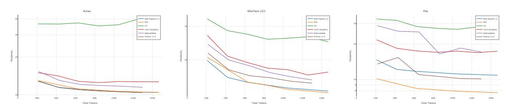

Figure 18: Perplexity results on Paloma [\(Magnusson et al.,](#page-30-2) [2023\)](#page-30-2); subsets 4chan [\(Papasavva et al.,](#page-32-9) [2020\)](#page-32-9), WikiText 103 [\(Merity et al.,](#page-31-11) [2016\)](#page-31-11), and Pile [\(Gao et al.,](#page-24-3) [2020\)](#page-24-3) (Val)

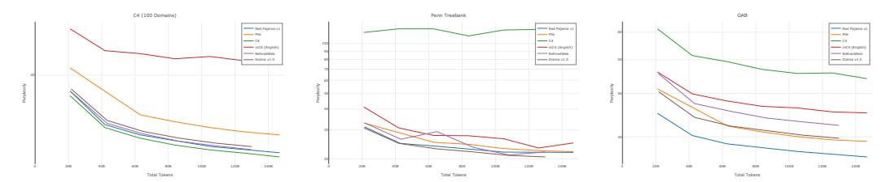

Figure 19: Perplexity results on Paloma (Magnusson et al., 2023); subsets C4 100 dom (Chronopoulou et al., 2022), Penn Tree Bank (Marcus et al., 1994), and Gab (Zannettou et al., 2018)

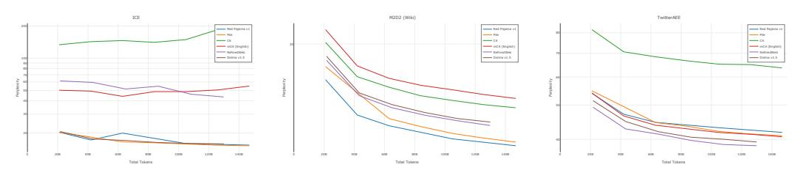

Figure 20: Perplexity results on Paloma (Magnusson et al., 2023); subsets ICE (Greenbaum, 1991), M2D2 (Reid et al., 2022) (Wiki), and Twitter AAE (Blodgett et al., 2016)

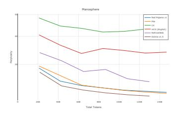

Figure 21: Perplexity results on Paloma (Magnusson et al., 2023); subsets Manosphere (Ribeiro et al., 2021)

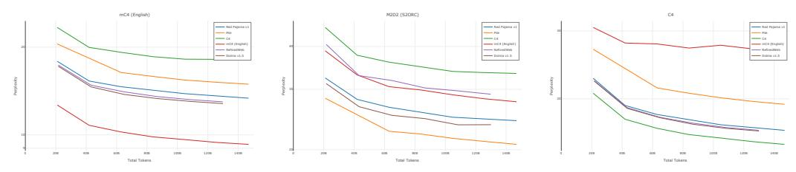

Figure 22: Perplexity results on Paloma (Magnusson et al., 2023); subsets mC4 (Xue et al., 2020) (English), M2D2 (Reid et al., 2022) (S2ORC), and C4 (Raffel et al., 2020; Dodge et al., 2021)

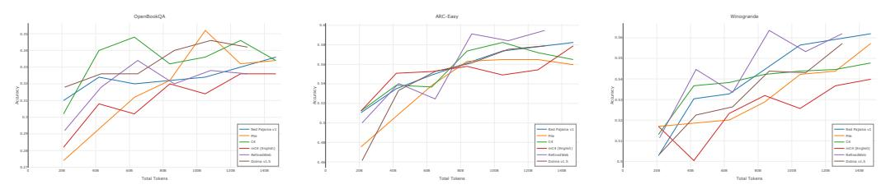

Figure 23: Results downstream tasks OpenBookQA (Mihaylov et al., 2018), ARC-E (Clark et al., 2018), and WinoGrande (Sakaguchi et al., 2019)

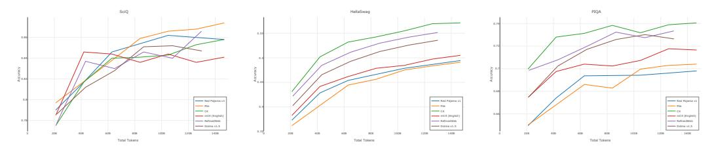

Figure 24: Results downstream tasks SciQ (Welbl et al., 2017), HellaSwag (Zellers et al., 2019), and PIQA (Bisk et al., 2019)

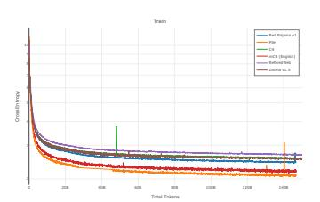

Figure 25: Training Cross Entropy

## **K.2** Deduping Strategy

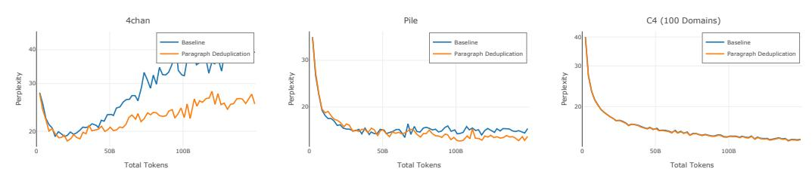

Figure 26: Perplexity results on Paloma (Magnusson et al., 2023); subsets 4chan (Papasavva et al., 2020), Pile (Gao et al., 2020) (Val), and C4 100 dom (Chronopoulou et al., 2022)

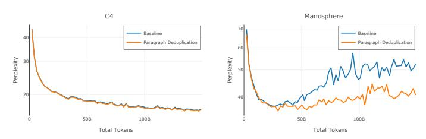

Figure 27: Perplexity results on Paloma (Magnusson et al., 2023); subsets C4 (Raffel et al., 2020; Dodge et al., 2021) and Manosphere (Ribeiro et al., 2021)

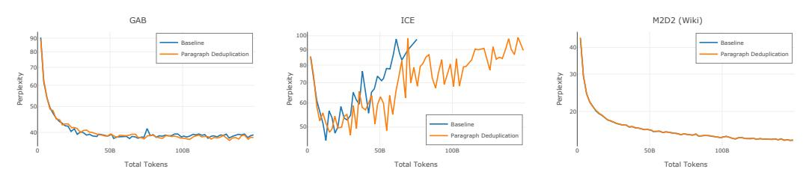

Figure 28: Perplexity results on Paloma (Magnusson et al., 2023); subsets Gab (Zannettou et al., 2018), ICE (Greenbaum, 1991), and M2D2 (Reid et al., 2022) (Wiki)

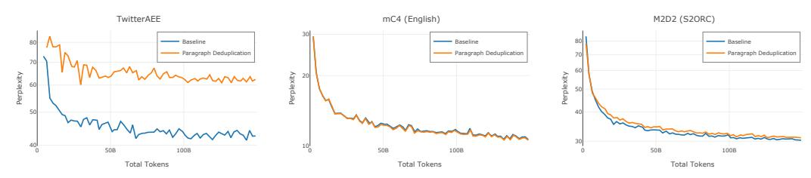

Figure 29: Perplexity results on Paloma (Magnusson et al., 2023); subsets Twitter AAE (Blodgett et al., 2016), mC4 (Xue et al., 2020) (English), and M2D2 (Reid et al., 2022) (S2ORC)

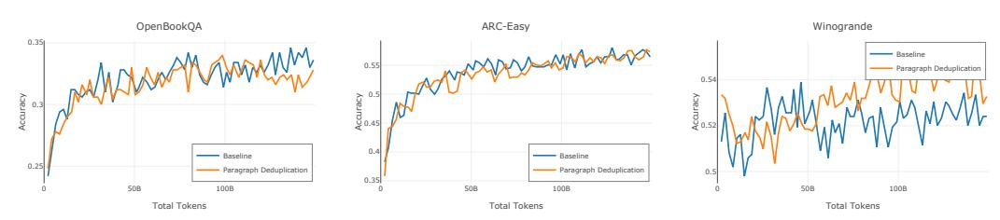

Figure 30: Results downstream tasks OpenBookQA (Mihaylov et al., 2018), ARC-E (Clark et al., 2018), and WinoGrande (Sakaguchi et al., 2019)

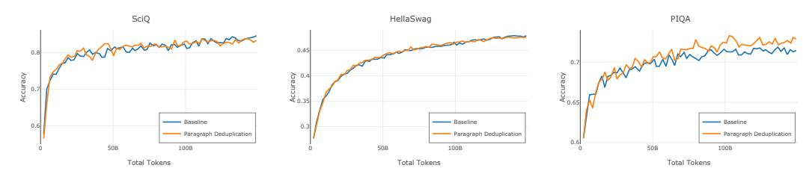

Figure 31: Results downstream tasks SciQ (Welbl et al., 2017), HellaSwag (Zellers et al., 2019), and PIQA (Bisk et al., 2019)

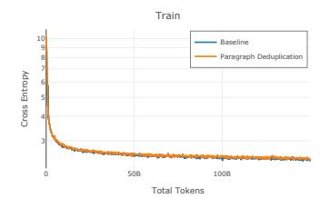

Figure 32: Training Cross Entropy

#### **K.3** Filtering of Personal Identifiable Information

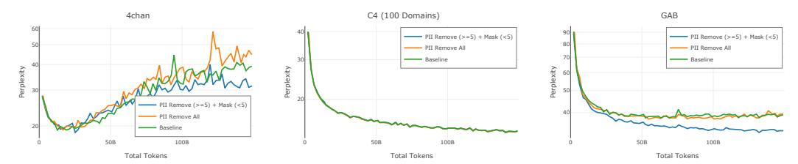

Figure 33: Perplexity results on Paloma (Magnusson et al., 2023); subsets 4chan (Papasavva et al., 2020), C4 100 dom (Chronopoulou et al., 2022), and Gab (Zannettou et al., 2018)

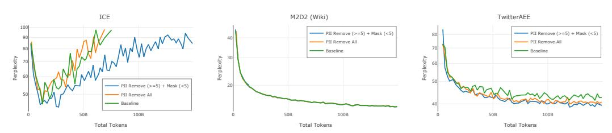

Figure 34: Perplexity results on Paloma (Magnusson et al., 2023); subsets ICE (Greenbaum, 1991), M2D2 (Reid et al., 2022) (Wiki), and Twitter AAE (Blodgett et al., 2016)

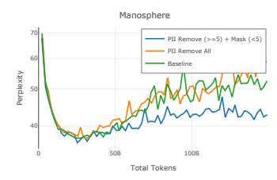

Figure 35: Perplexity results on Paloma (Magnusson et al., 2023); subsets Manosphere (Ribeiro et al., 2021)

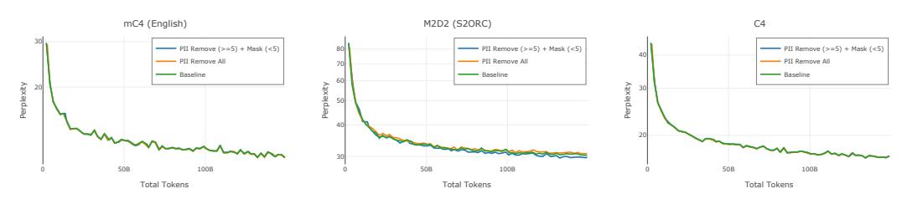

Figure 36: Perplexity results on Paloma (Magnusson et al., 2023); subsets mC4 (Xue et al., 2020) (English), M2D2 (Reid et al., 2022) (S2ORC), and C4 (Raffel et al., 2020; Dodge et al., 2021)

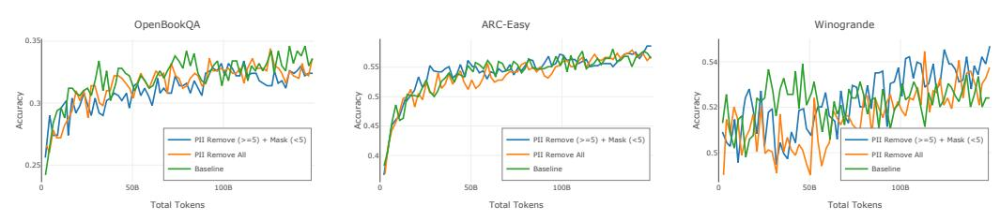

Figure 37: Results downstream tasks OpenBookQA (Mihaylov et al., 2018), ARC-E (Clark et al., 2018), and WinoGrande (Sakaguchi et al., 2019)

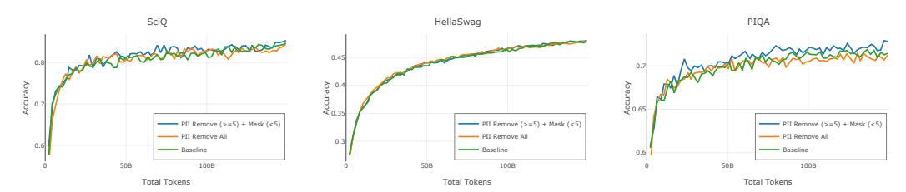

Figure 38: Results downstream tasks SciQ (Welbl et al., 2017), HellaSwag (Zellers et al., 2019), and PIQA (Bisk et al., 2019)

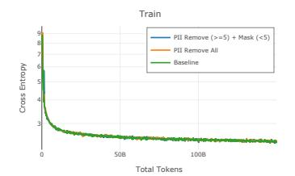

Figure 39: Training Cross Entropy

## K.4 Comparing Quality Filters for Web Pipeline

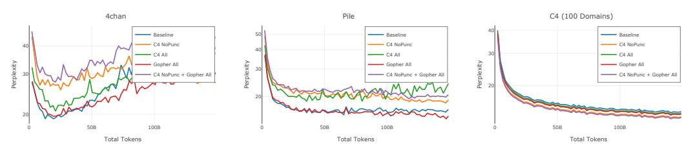

Figure 40: Perplexity results on Paloma (Magnusson et al., 2023); subsets 4chan (Papasavva et al., 2020), Pile (Gao et al., 2020) (Val), and C4 100 dom (Chronopoulou et al., 2022)

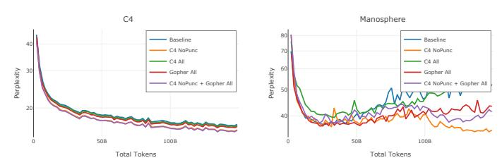

Figure 41: Perplexity results on Paloma (Magnusson et al., 2023); subsets C4 (Raffel et al., 2020; Dodge et al., 2021) and Manosphere (Ribeiro et al., 2021)

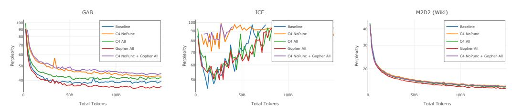

Figure 42: Perplexity results on Paloma (Magnusson et al., 2023); subsets Gab (Zannettou et al., 2018), ICE (Greenbaum, 1991), and M2D2 (Reid et al., 2022) (Wiki)

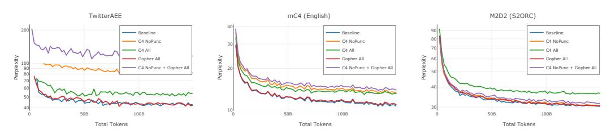

Figure 43: Perplexity results on Paloma (Magnusson et al., 2023); subsets Twitter AAE (Blodgett et al., 2016), mC4 (Xue et al., 2020) (English), and M2D2 (Reid et al., 2022) (S2ORC)

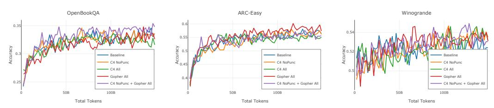

Figure 44: Results downstream tasks OpenBookQA (Mihaylov et al., 2018), ARC-E (Clark et al., 2018), and WinoGrande (Sakaguchi et al., 2019)

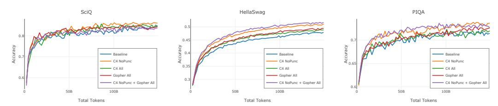

Figure 45: Results downstream tasks SciQ (Welbl et al., 2017), HellaSwag (Zellers et al., 2019), and PIQA (Bisk et al., 2019)

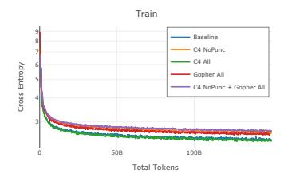

Figure 46: Training Cross Entropy

## K.5 Full Comparison of Web Pipeline

# 4chan Pile C4 (100 Domains) Baseline Quality Filters Quality Filters + Dedup Quality Filters + Dedup + Content Filters Quality Filters + Dedup + Content Filters Quality Filters + Dedup + Content Filters 20 Quality Filters + Dedup + Content Filters Total Tokens Total Tokens

Figure 47: Perplexity results on Paloma (Magnusson et al., 2023); subsets 4chan (Papasavva et al., 2020), Pile (Gao et al., 2020) (Val), and C4 100 dom (Chronopoulou et al., 2022)

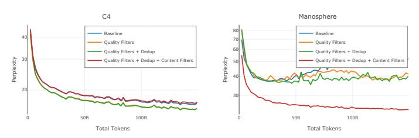

Figure 48: Perplexity results on Paloma (Magnusson et al., 2023); subsets C4 (Raffel et al., 2020; Dodge et al., 2021) and Manosphere (Ribeiro et al., 2021)

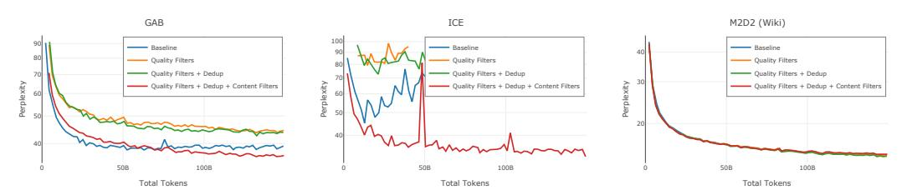

Figure 49: Perplexity results on Paloma (Magnusson et al., 2023); subsets Gab (Zannettou et al., 2018), ICE (Greenbaum, 1991), and M2D2 (Reid et al., 2022) (Wiki)

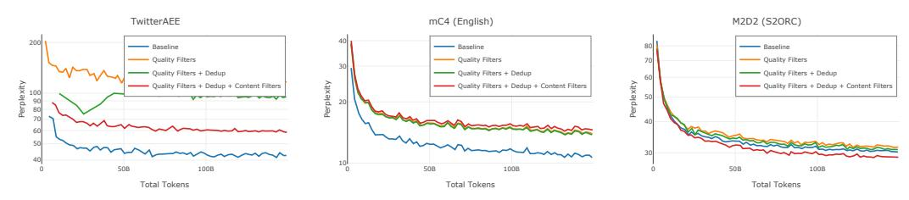

Figure 50: Perplexity results on Paloma (Magnusson et al., 2023); subsets Twitter AAE (Blodgett et al., 2016), mC4 (Xue et al., 2020) (English), and M2D2 (Reid et al., 2022) (S2ORC)

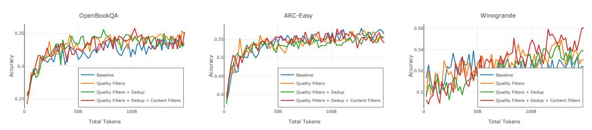

Figure 51: Results downstream tasks OpenBookQA (Mihaylov et al., 2018), ARC-E (Clark et al., 2018), and WinoGrande (Sakaguchi et al., 2019)

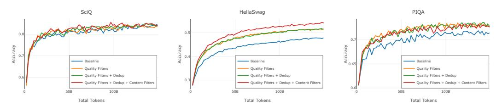

Figure 52: Results downstream tasks SciQ (Welbl et al., 2017), HellaSwag (Zellers et al., 2019), and PIQA (Bisk et al., 2019)

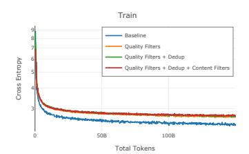

Figure 53: Training Cross Entropy

## **K.6** Toxicity Filtering in Web Pipeline

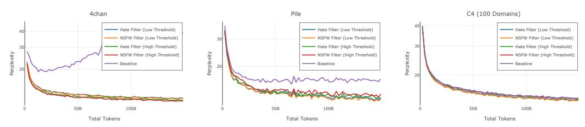

Figure 54: Perplexity results on Paloma (Magnusson et al., 2023); subsets 4chan (Papasavva et al., 2020), Pile (Gao et al., 2020) (Val), and C4 100 dom (Chronopoulou et al., 2022)

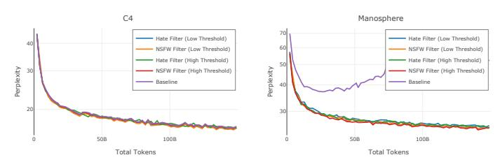

Figure 55: Perplexity results on Paloma (Magnusson et al., 2023); subsets C4 (Raffel et al., 2020; Dodge et al., 2021) and Manosphere (Ribeiro et al., 2021)

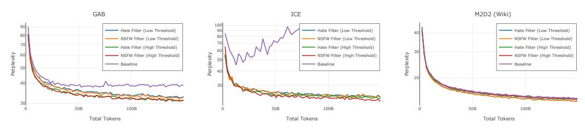

Figure 56: Perplexity results on Paloma (Magnusson et al., 2023); subsets Gab (Zannettou et al., 2018), ICE (Greenbaum, 1991), and M2D2 (Reid et al., 2022) (Wiki)

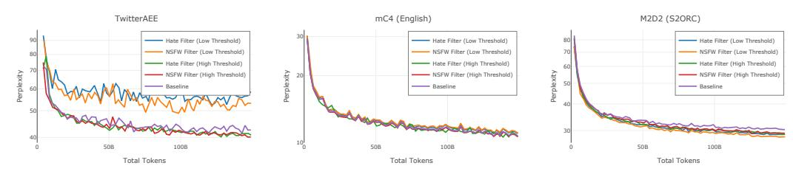

Figure 57: Perplexity results on Paloma (Magnusson et al., 2023); subsets Twitter AAE (Blodgett et al., 2016), mC4 (Xue et al., 2020) (English), and M2D2 (Reid et al., 2022) (S2ORC)

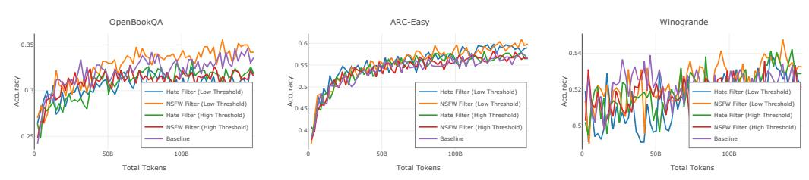

Figure 58: Results downstream tasks OpenBookQA (Mihaylov et al., 2018), ARC-E (Clark et al., 2018), and WinoGrande (Sakaguchi et al., 2019)

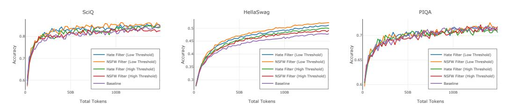

Figure 59: Results downstream tasks SciQ (Welbl et al., 2017), HellaSwag (Zellers et al., 2019), and PIQA (Bisk et al., 2019)

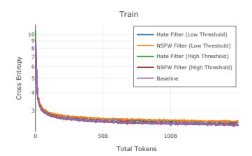

Figure 60: Training Cross Entropy

## K.7 Comparing Code Processing Pipeline

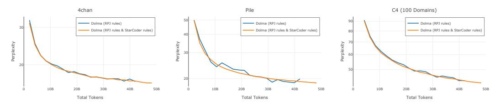

Figure 61: Perplexity results on Paloma (Magnusson et al., 2023); subsets 4chan (Papasavva et al., 2020), Pile (Gao et al., 2020) (Val), and C4 100 dom (Chronopoulou et al., 2022)

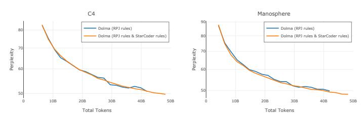

Figure 62: Perplexity results on Paloma (Magnusson et al., 2023); subsets C4 (Raffel et al., 2020; Dodge et al., 2021) and Manosphere (Ribeiro et al., 2021)

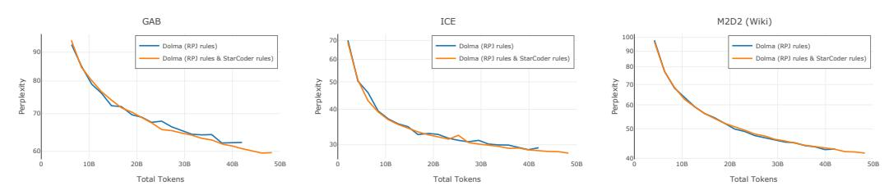

Figure 63: Perplexity results on Paloma (Magnusson et al., 2023); subsets Gab (Zannettou et al., 2018), ICE (Greenbaum, 1991), and M2D2 (Reid et al., 2022) (Wiki)

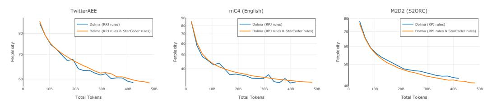

Figure 64: Perplexity results on Paloma (Magnusson et al., 2023); subsets Twitter AAE (Blodgett et al., 2016), mC4 (Xue et al., 2020) (English), and M2D2 (Reid et al., 2022) (S2ORC)

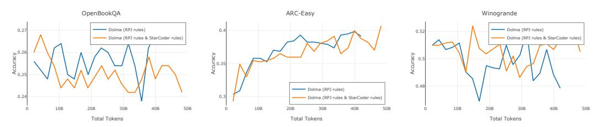

Figure 65: Results downstream tasks OpenBookQA (Mihaylov et al., 2018), ARC-E (Clark et al., 2018), and WinoGrande (Sakaguchi et al., 2019)

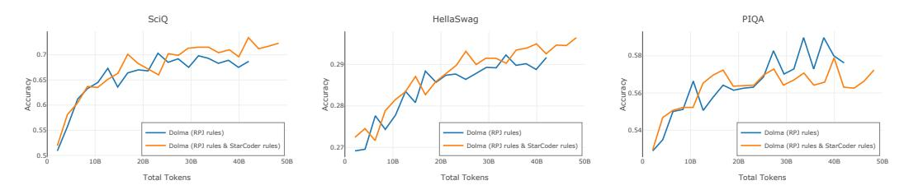

Figure 66: Results downstream tasks SciQ (Welbl et al., 2017), HellaSwag (Zellers et al., 2019), and PlQA (Bisk et al., 2019)

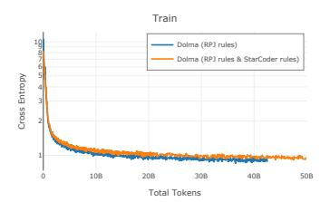

Figure 67: Training Cross Entropy

## K.8 Studying Dolma Mixture

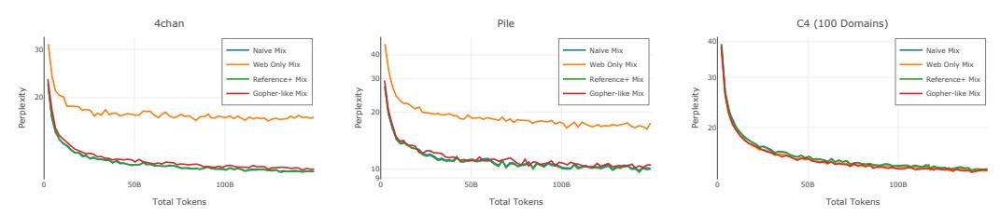

Figure 68: Perplexity results on Paloma (Magnusson et al., 2023); subsets 4chan (Papasavva et al., 2020), Pile (Gao et al., 2020) (Val), and C4 100 dom (Chronopoulou et al., 2022)

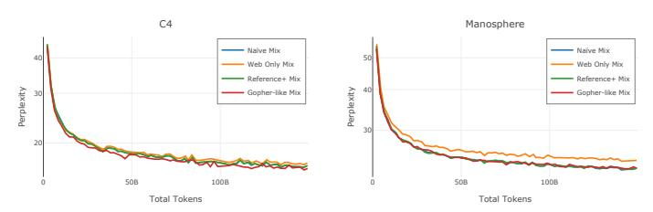

Figure 69: Perplexity results on Paloma (Magnusson et al., 2023); subsets C4 (Raffel et al., 2020; Dodge et al., 2021) and Manosphere (Ribeiro et al., 2021)

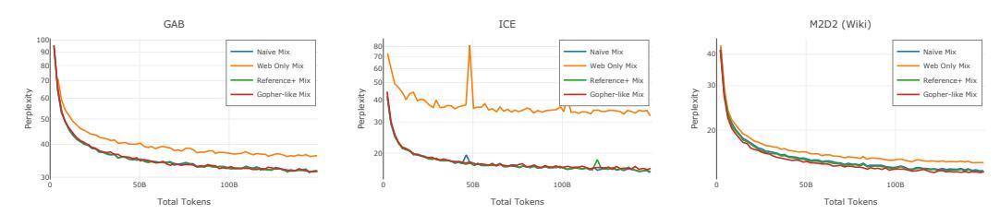

Figure 70: Perplexity results on Paloma (Magnusson et al., 2023); subsets Gab (Zannettou et al., 2018), ICE (Greenbaum, 1991), and M2D2 (Reid et al., 2022) (Wiki)

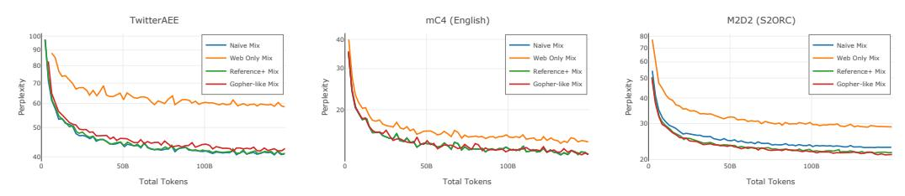

Figure 71: Perplexity results on Paloma (Magnusson et al., 2023); subsets Twitter AAE (Blodgett et al., 2016), mC4 (Xue et al., 2020) (English), and M2D2 (Reid et al., 2022) (S2ORC)

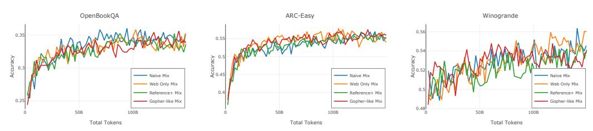

Figure 72: Results downstream tasks OpenBookQA (Mihaylov et al., 2018), ARC-E (Clark et al., 2018), and WinoGrande (Sakaguchi et al., 2019)

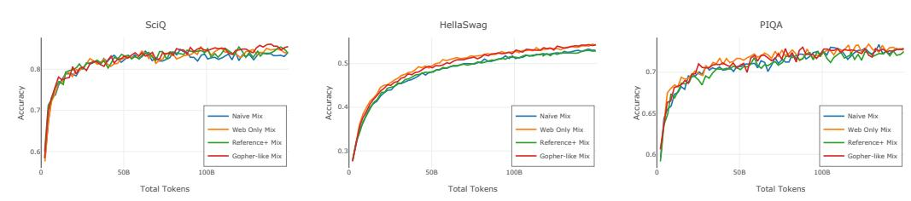

Figure 73: Results downstream tasks SciQ [\(Welbl et al.,](#page-37-9) [2017\)](#page-37-9), HellaSwag [\(Zellers et al.,](#page-38-3) [2019\)](#page-38-3), and PIQA [\(Bisk et al.,](#page-21-11) [2019\)](#page-21-11)

#### **K.9** Strategies to Format Conversational Forums Pipeline

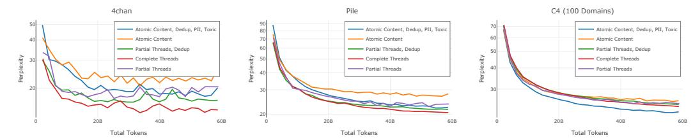

Figure 74: Perplexity results on Paloma (Magnusson et al., 2023); subsets 4chan (Papasavva et al., 2020), Pile (Gao et al., 2020) (Val), and C4 100 dom (Chronopoulou et al., 2022)

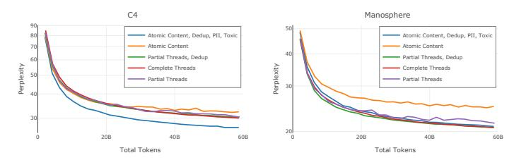

Figure 75: Perplexity results on Paloma (Magnusson et al., 2023); subsets C4 (Raffel et al., 2020; Dodge et al., 2021) and Manosphere (Ribeiro et al., 2021)

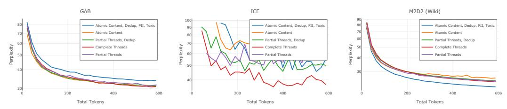

Figure 76: Perplexity results on Paloma (Magnusson et al., 2023); subsets Gab (Zannettou et al., 2018), ICE (Greenbaum, 1991), and M2D2 (Reid et al., 2022) (Wiki)

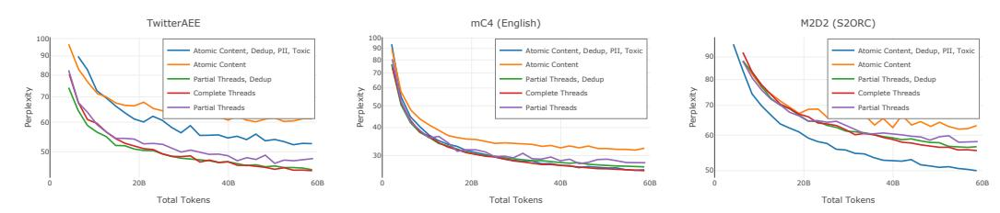

Figure 77: Perplexity results on Paloma (Magnusson et al., 2023); subsets Twitter AAE (Blodgett et al., 2016), mC4 (Xue et al., 2020) (English), and M2D2 (Reid et al., 2022) (S2ORC)

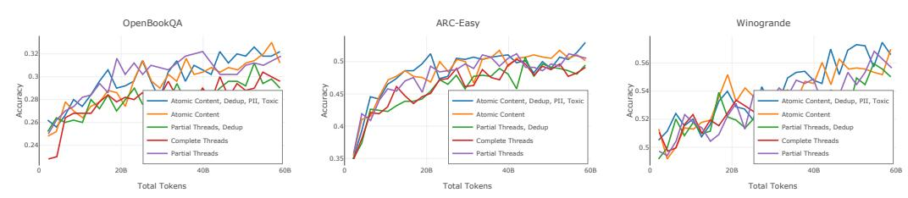

Figure 78: Results downstream tasks OpenBookQA (Mihaylov et al., 2018), ARC-E (Clark et al., 2018), and WinoGrande (Sakaguchi et al., 2019)

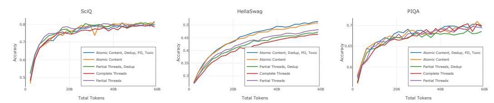

Figure 79: Results downstream tasks SciQ (Welbl et al., 2017), HellaSwag (Zellers et al., 2019), and PIQA (Bisk et al., 2019)

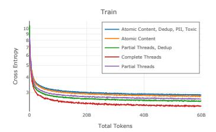

Figure 80: Training Cross Entropy

#### K.10 Evaluating Toxicity Filtering in Conversational Forums Pipeline

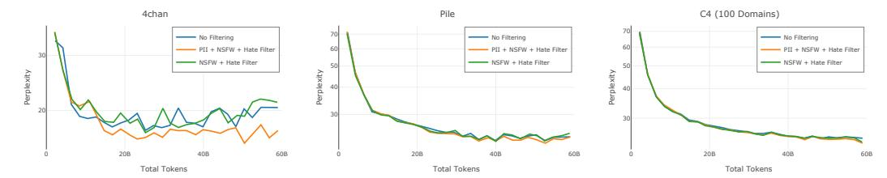

Figure 81: Perplexity results on Paloma (Magnusson et al., 2023); subsets 4chan (Papasavva et al., 2020), Pile (Gao et al., 2020) (Val), and C4 100 dom (Chronopoulou et al., 2022)

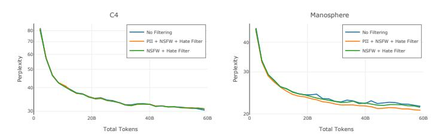

Figure 82: Perplexity results on Paloma (Magnusson et al., 2023); subsets C4 (Raffel et al., 2020; Dodge et al., 2021) and Manosphere (Ribeiro et al., 2021)

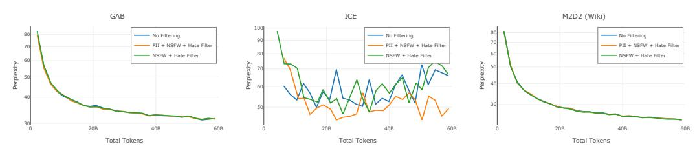

Figure 83: Perplexity results on Paloma (Magnusson et al., 2023); subsets Gab (Zannettou et al., 2018), ICE (Greenbaum, 1991), and M2D2 (Reid et al., 2022) (Wiki)

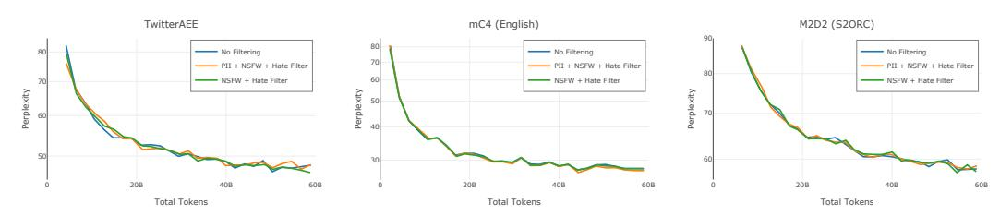

Figure 84: Perplexity results on Paloma (Magnusson et al., 2023); subsets Twitter AAE (Blodgett et al., 2016), mC4 (Xue et al., 2020) (English), and M2D2 (Reid et al., 2022) (S2ORC)

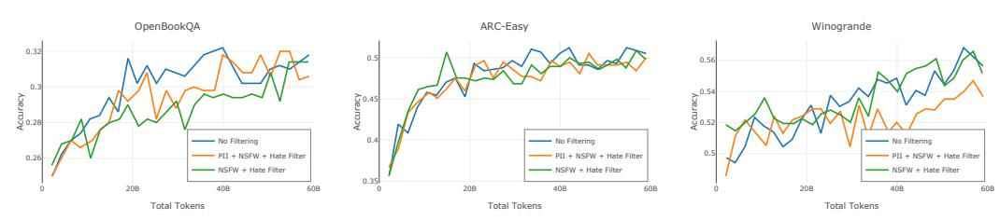

Figure 85: Results downstream tasks OpenBookQA (Mihaylov et al., 2018), ARC-E (Clark et al., 2018), and WinoGrande (Sakaguchi et al., 2019)

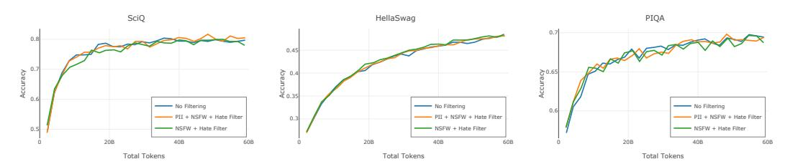

Figure 86: Results downstream tasks SciQ (Welbl et al., 2017), HellaSwag (Zellers et al., 2019), and PIQA (Bisk et al., 2019)

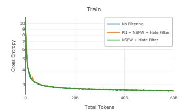

Figure 87: Training Cross Entropy

## K.11 Training Olmo-1b

# 4chan Dolma (Reddit) Dolma (peS2o v2)

Figure 88: Perplexity results on Paloma (Magnusson et al., 2023); subsets 4chan (Papasavva et al., 2020), Dolma Reddit Subset, and Dolma Papers Subset

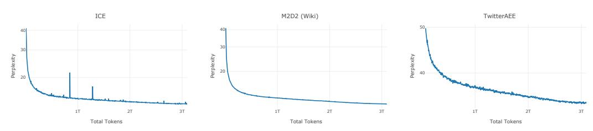

Figure 89: Perplexity results on Paloma (Magnusson et al., 2023); subsets ICE (Greenbaum, 1991), M2D2 (Reid et al., 2022) (Wiki), and Twitter AAE (Blodgett et al., 2016)

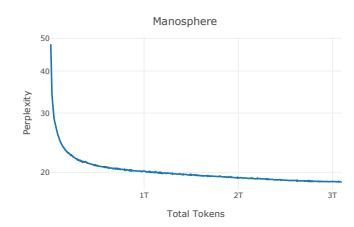

Figure 90: Perplexity results on Paloma (Magnusson et al., 2023); subsets Manosphere (Ribeiro et al., 2021)

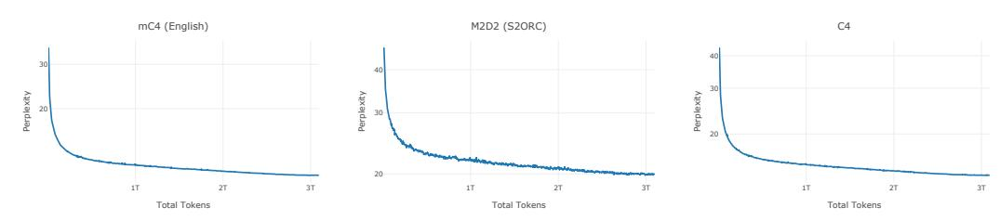

Figure 91: Perplexity results on Paloma (Magnusson et al., 2023); subsets mC4 (Xue et al., 2020) (English), M2D2 (Reid et al., 2022) (S2ORC), and C4 (Raffel et al., 2020; Dodge et al., 2021)

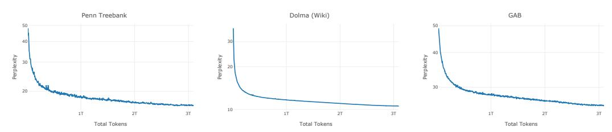

Figure 92: Perplexity results on Paloma (Magnusson et al., 2023); subsets Penn Tree Bank (Marcus et al., 1994), Dolma Wikipedia Subset, and Gab (Zannettou et al., 2018)

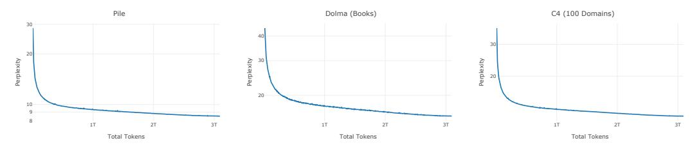

Figure 93: Perplexity results on Paloma (Magnusson et al., 2023); subsets Pile (Gao et al., 2020) (Val), Dolma Books Subset, and C4 100 dom (Chronopoulou et al., 2022)

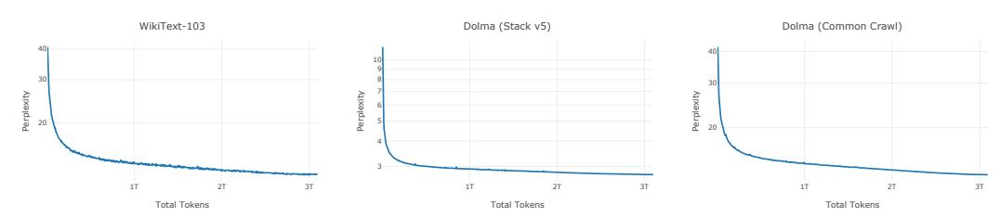

Figure 94: Perplexity results on Paloma (Magnusson et al., 2023); subsets WikiText 103 (Merity et al., 2016), Dolma Code Subset, and Dolma Web Subset

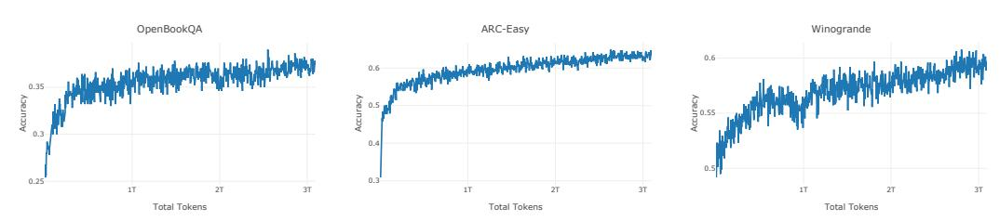

Figure 95: Results downstream tasks OpenBookQA (Mihaylov et al., 2018), ARC-E (Clark et al., 2018), and WinoGrande (Sakaguchi et al., 2019)

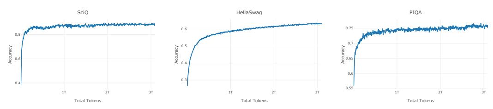

Figure 96: Results downstream tasks SciQ (Welbl et al., 2017), HellaSwag (Zellers et al., 2019), and PIQA (Bisk et al., 2019)

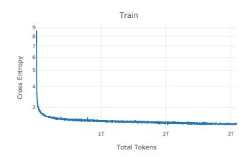

Figure 97: Training Cross Entropy