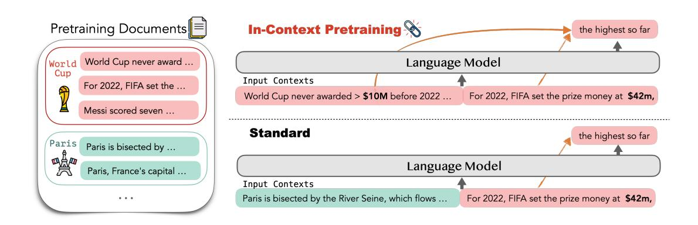
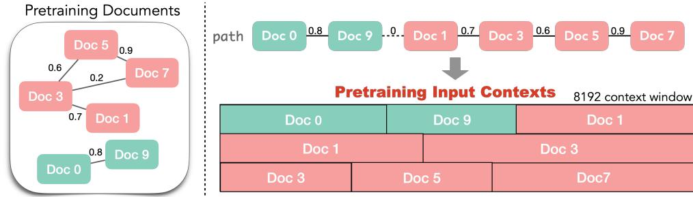
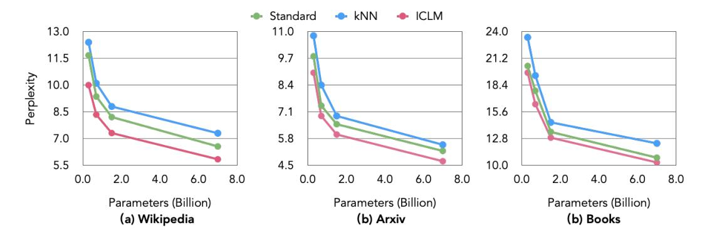
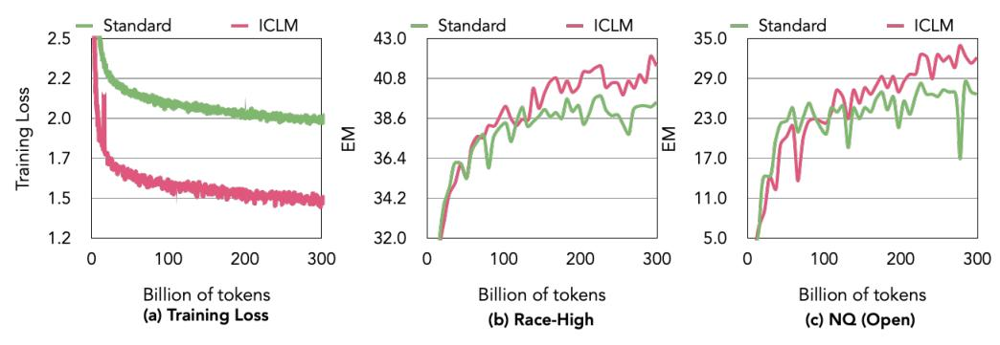
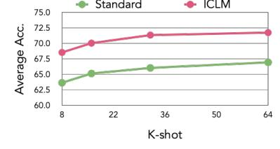

# IN-CONTEXT PRETRAINING: LANGUAGE MODELING BEYOND DOCUMENT BOUNDARIES

Weijia Shi1,<sup>2</sup> Sewon Min1,<sup>2</sup> Maria Lomeli<sup>1</sup> Chunting Zhou<sup>1</sup> Margaret Li1,<sup>2</sup> Rich James<sup>1</sup> Xi Victoria Lin<sup>1</sup> Noah A. Smith2,<sup>3</sup> Luke Zettlemoyer1,<sup>2</sup> Scott Yih<sup>1</sup> Mike Lewis<sup>1</sup> <sup>1</sup>Meta AI <sup>2</sup>University of Washington <sup>3</sup> Allen Institute for AI swj0419@cs.washington.edu

## ABSTRACT

Large language models (LMs) are currently trained to predict tokens given document prefixes, enabling them to directly perform long-form generation and prompting-style tasks which can be reduced to document completion. Existing pretraining pipelines train LMs by concatenating random sets of short documents to create input contexts but the prior documents provide no signal for predicting the next document. We instead present IN-CONTEXT PRETRAINING, a new approach where language models are pretrained on a sequence of *related* documents, thereby explicitly encouraging them to read and reason across document boundaries. We can do IN-CONTEXT PRETRAINING by simply changing the document ordering so that each context contains related documents, and directly applying existing pretraining pipelines. However, this document sorting problem is challenging. There are billions of documents and we would like the sort to maximize contextual similarity for every document without repeating any data. To do this, we introduce approximate algorithms for finding related documents with efficient nearest neighbor search and constructing coherent input contexts with a graph traversal algorithm. Our experiments show IN-CONTEXT PRETRAINING offers a simple and scalable approach to significantly enhance LMs' performance: we see notable improvements in tasks that require more complex contextual reasoning, including in-context learning (+8%), reading comprehension (+15%), faithfulness to previous contexts (+16%), long-context reasoning (+5%), and retrieval augmentation (+9%).

# 1 INTRODUCTION

Large language models (LMs) are trained to complete documents; each token is predicted given the context provided by the prefix of the document it appears in. Such contexts can be widely varied, especially at pretraining scale, allowing models to excel on diverse tasks such as instructionfollowing [\(Ouyang et al., 2022\)](#page-12-0), conversational interfaces [\(OpenAI, 2023\)](#page-12-1), reading comprehension [\(Zhang et al., 2020\)](#page-14-0), and in-context learning [\(Brown et al., 2020\)](#page-9-0). However, recent studies highlight that LMs sometimes struggle to understand more complex contexts: they can fail to follow instructions accurately [\(McKenzie et al., 2023;](#page-11-0) [Efrat & Levy, 2020;](#page-10-0) [Liu & Liu, 2023\)](#page-11-1), struggle with reasoning over conditioned documents [\(Liu et al., 2023;](#page-11-2) [Shi et al., 2023a\)](#page-12-2), and exhibit high variance in in-context learning [\(Zhao et al., 2021\)](#page-14-1). In this paper, we present IN-CONTEXT PRETRAINING, a new pretraining method that learns to predict tokens conditioned on a sequence of related documents, explicitly enabling the model to read and reason about much more varied and longer contexts that go beyond document boundaries.

Current LM training pipelines concatenate random sets of shorter documents to create longer context windows. However, the prior documents provide no signal for predicting the next document, incurring unnecessary computational overhead for tokens that do not require communication between them [\(de Vries, 2023\)](#page-10-1). IN-CONTEXT PRETRAINING instead reorders the pretraining data by combining several semantically related documents to create a coherent input context, thereby exposing LMs to long *relevant* contexts and providing pretraining signals beyond document boundaries. We illustrate this via an example in Figure [1:](#page-1-0) when predicting the following tokens for the phrase "*For 2022, FIFA set the prize money at \$42m,*" a previous document stating that the "*World Cup never awarded*

<span id="page-1-0"></span>

Figure 1: Overview of IN-CONTEXT PRETRAINING. Different from the *standard* pretraining strategy that place randomly shuffled documents in the input context, IN-CONTEXT PRETRAINING places related documents in the same context, making models learn to reason across prior documents. For example, when predicting the following tokens for the phrase "*For 2022, FIFA set the prize money at \$42m,*" LMs could reference prior documents stating "*World Cup never awarded more than \$10M before 2022*" and learn to infer that "*the highest so far*."

*more than \$10M before 2022*" could be in the context, enabling the prediction of a continuation like "*the highest so far*." As IN-CONTEXT PRETRAINING only changes document ordering and leaves all other aspects of LM pretraining untouched, it can be easily integrated into existing pretraining pipelines for large-scale LMs.

However, this document sorting problem is challenging. LMs are typically trained on billions of documents and we would like to sort them to maximize document similarity in the input context windows without repeating any data. We introduce two new approximate algorithms to tackle these challenges. We use a retrieval model paired with an efficient search index to build a document graph that pairs each document with its nearest-neighbors based on its semantic similarity in the embeddings space. We also formulate document sorting as a travelling salesman problem, for which we develop an effective algorithm that maximizes similarity of documents to their context while also ensures that each document is included only once.

To evaluate the effectiveness of IN-CONTEXT PRETRAINING, we pretrain language models from 0.3 to 7 billion parameters on 300 billion tokens from the CommonCrawl dataset [\(Wenzek et al., 2020\)](#page-13-0). Across all model scales, IN-CONTEXT PRETRAINING LMs (ICLM) demonstrate strong language modeling and downstream task performance, outperforming LMs pretrained using the standard approach on the same corpus. We observe various improvements resulting from IN-CONTEXT PRETRAINING compared with existing LMs: (1) in-context learning with an average increase of 8% across 8 datasets; (2) reading comprehension, with an average of 15% improvement on 8 reading comprehension tasks; (3) outputs that are more faithful to prior contexts (+16%); (4) long context reasoning, showing a 5% boost; and (5) retrieval augmentation, leading to 9% gains when augmenting with external knowledge such as documents retrieved from Wikipedia. Our results demonstrate that, by simply altering order of the pretraining documents, IN-CONTEXT PRETRAINING offers a scalable and simple approach to significantly enhance understanding and reasoning over their full contexts.

## 2 IN-CONTEXT PRETRAINING

The *standard* practice in pretraining is to form input contexts by concatenating random documents until reaching the maximum context length. It then trains the LM using a language modeling objective on the input contexts. However, training LMs on randomly concatenated documents does not offer additional learning signals compared with training on each document individually. In contrast, IN-CONTEXT PRETRAINING generates more coherent input contexts by concatenating semantically related documents together during pretraining. As depicted in Figure [2,](#page-3-0) IN-CONTEXT PRETRAINING consists of two steps: it first finds related documents at scale ([§2.1\)](#page-2-0) and then constructs input contexts using these related documents ([§2.2\)](#page-2-1). Successively, we use the contexts formed with semantically related documents to pretrain LMs with a language modeling objective. Since IN-CONTEXT PRETRAINING is identical to existing pretraining recipes for LMs, except for changing how input contexts are built, it can be easily integrated into existing pretraining pipelines for largescale LMs.

## <span id="page-2-0"></span>2.1 FINDING RELATED DOCUMENTS AT SCALE: RETRIEVING NEIGHBOR DOCUMENTS

To find related documents at scale, we link documents within the pretraining corpus D using a retrieval model. Specifically, for each document d<sup>i</sup> ∈ D, a dense retrieval model is used to retrieve the top-k most similar documents, represented as N(di). The retrieval model uses approximate nearest neighbours search for efficient pairwise similarity comparison between any two documents, making it scalable for finding related documents in web-scale pretraining corpora.

Retrieval. Our retrieval process employs the contriever model [\(Izacard et al., 2022\)](#page-10-2). This model maps each document d<sup>i</sup> ∈ D to an embedding E(di) by taking the mean pooling of the last hidden representation over the tokens in d<sup>i</sup> . The cosine similarity is then used to determine the similarity between any two documents:

<span id="page-2-2"></span>
$$s(d_i, d_j) = \cos(\mathbf{E}(d_i), \mathbf{E}(d_j)) \tag{1}$$

The retrieval model uses approximate nearest neighbour search, product quantization [\(Jégou et al.,](#page-10-3) [2011\)](#page-10-3) and an inverted file FAISS index [\(Johnson et al., 2019\)](#page-10-4) to conduct efficient pairwise similarity search. Further details can be found in Appendix [A.2.](#page-15-0)

During the retrieval process, when computing pairwise similarity among each document in the pretraining corpus, we found that the pretraining corpus contains many near duplicate documents. Hence, we further leverage the retrieval scores to eliminate near duplicate documents from the pretraining corpus. More details can be found in Appendix [A.1.](#page-15-1) In [§4.2,](#page-7-0) we show that this deduplication step is crucial for achieving good performance of language models.

#### <span id="page-2-1"></span>2.2 CREATING INPUT CONTEXTS: DOCUMENT GRAPH TRAVERSAL

Given a set of documents D = {di} and nearest neighbours for each document N(di), our goal is to sort the documents to create input contexts such that each of them consists a list of *related* documents. Formally, we aim to form a set of input contexts C<sup>1</sup> · · · C<sup>m</sup> where each context C<sup>i</sup> = {d1, ...dk} ⊂ D and <sup>S</sup><sup>m</sup> i=1 C<sup>i</sup> = D. Ideally, documents in C<sup>i</sup> are nearest neighbors of each others.

A straightforward approach to form C<sup>1</sup> · · · C<sup>m</sup> is to directly place each document and its retrieved topk documents together in the same input context (referred to as kNN), which has been used in some retrieval-augmented pretraining methods [\(Guu](#page-10-5) [et al., 2020;](#page-10-5) [Levine et al., 2022\)](#page-11-3). This kNN approach maintains document similarity within each context but creates the data repeating problem: some documents frequently appear as nearest neighbors of other documents, causing that different input contexts contain overlapping documents, i.e., ∃i ̸= j, C<sup>i</sup> T C<sup>j</sup> ̸= ∅. The data repeating problem exposes LMs to a less diverse set of documents given a fixed computational budget and could lead to overfitting of popular documents. Instead, we aim to build a set of contexts in a way that each document is included only once, which can be cast as a graph traversal problem.

```
Algorithm 1 Maximum Traveling Salesman
Input: Document graph G = (D,L)
     N(di) returns nearest neighbors for di
     min_deg(D) returns a min-degree doc
Output: A path P
 1: P ← []
 2: while |D| > 0 do
 3: di ← min_deg(D)
 4: P.append(di)
 5: D.remove(di)
 6: while N(di) ∩ D ̸= ∅ do
 7: dj ← arg mind∈N(di)∩D sim(di, d)
 8: di ← dj
 9: P.append(di)
10: D.remove(di)
11: end while
12: end while
13: return P
```

Document graph traversal. To achieve our goal of maximizing the chance that the related documents are concatenated together, an intuitive approach is to find a single path that visits each document once and maximize the chance that related documents are visited sequentially. Then we

<span id="page-3-0"></span>

Step 1: Finding Related Docs

Step 2: Creating Input Contexts

Figure 2: **Illustration of In-Context Pretraining**. In-Context Pretraining first finds related documents at scale to create a document graph (§2.1) and then builds pretraining input contexts by traversing the document graph (§2.2). Along the path, documents are concatenated into a sequence and subsequently divided to form fixed-sized input contexts (e.g., 8192 token length).

subsequently segment the path into multiple input contexts. We formulate it as the *maximum traveling* salesman problem (Flood, 1956) that aims to find the maximum weight path that traverses all nodes exactly once. We represent each document as a node in the graph and use document similarity as a edge weight. We design an undirected weighted graph representing the documents, symbolized as  $\mathcal{G} = (\mathcal{D}, \mathcal{L})$ . Here,  $\mathcal{D}$  represents the set of documents, while  $(d, d^*) \in \mathcal{L}$  is a edge if  $d^* \in N(d_i)$  or  $d_i \in N(d^*)$ . The weight of each edge corresponds to the document similarity (Equation 1).

Solving large traveling salesman problems exactly is NP hard, but greedy algorithms are known to provide an efficient approximate solution. We adopt this approach, introducing modifications to better suit our context. Algorithm 1 shows the method to construct a maximum weight path. We show a path identified by our algorithm in Figure 2. Our algorithm starts by selecting a yet-to-be-visited document with the minimum degree as the starting node ( $Doc\ 0$ ). The algorithm then progressively extends the current path by navigating to its unvisited neighboring document with highest weight ( $Doc\ 9$ ), adding the document node to the path. This process continues until the path reaches a node where all neighboring documents have been visited, which happens because our graph is not complete, and only contains edges between documents where one is within the other's k nearest neighbors. In this case, we extend the graph with an edge of weight 0 to a random unvisited minimum degree document ( $Doc\ 1$ ), and continue the above process. The motivation for starting at minimum degree documents is that they are most likely to have all their neighbors visited first, and therefore be connected to dissimilar documents in the final path.

As a final step, we traverse the documents along the path and concatenate them to create fixed-sized input contexts suitable for pretraining.

#### 3 EXPERIMENTS

In this section, we describe details of our pretraining setup (§3.1), the baseline methods we use for comparison (§3.2), and experimental results (§3.3).

#### <span id="page-3-1"></span>3.1 Pretraining Setup

Since IN-CONTEXT PRETRAINING leaves other details of model training unchanged, and only changes the document ordering so that each context contains related documents, we can directly integrate it into pretraining pipelines as a preprocessing step during batching. For our experiment, we adopt the model architecture and pretraining objective of LLaMA (Touvron et al., 2023a;b) and pretrain LMs from scratch.

**Pretraining Datasets.** We use the English Commoncrawl dataset (Wenzek et al., 2020), the widely-used data source for pretraining LMs. Due to resource constraints, we randomly sample 235 million documents from this dataset, amounting to 306 billion tokens in total. We use the same pretraining data for all models.

<span id="page-4-3"></span>

Figure 3: Language modeling perplexity (the lower the better) on Wikipedia, Arxiv, and Books ([§3.3.1\)](#page-4-2). ICLM outperforms the baselines consistently across all model sizes.

Model Details. We take the model architecture from LLaMA [\(Touvron et al., 2023a\)](#page-12-3) and train models across various sizes: 0.3, 0.7, 1.5, and 7.0 billion parameters, all with an 8192-length context window. Following LLaMA, we employ the AdamW optimizer [\(Loshchilov & Hutter, 2018\)](#page-11-4) with parameters β<sup>1</sup> = 0.9 and β<sup>2</sup> = 0.95, and a cosine learning rate schedule. The 7B model is pretrained using 128 A100 GPUs across 16 nodes with a batch size of 4 million tokens. It takes 9 days to train the 7B model on our pretraining dataset. Due to the long context window of our models, we use flash attention [\(Dao et al., 2022\)](#page-10-7) to reduce memory consumption during pretraining.

To perform the retrieval over our pretraining datasets, we construct FAISS big batch search that is designed for conducting efficient similarity search with big batches of vectors (typically 50M–100M vectors per batch). We split the data in batches of 50M embeddings, the search step is conducted in each batch before merging the results using 8 GPUs per batch. The total search time is 6 hours over 32 GPUs with average search time per batch is 4,738s. The document graph traversal phase requires 12 hours on a setup of 20 CPUs. More details are provided in the Appendix [A.2.](#page-15-0)

#### <span id="page-4-0"></span>3.2 BASELINES

We compare IN-CONTEXT PRETRAINING with the following baselines: (1) *Standard* is the prior standard in pretraining that places randomly shuffled documents in the input contexts. This method is commonly adopted by existing models [\(Zhang et al., 2022;](#page-13-1) [Scao et al., 2022;](#page-12-5) [Touvron et al., 2023a\)](#page-12-3). (2) kNN (also referred to as retrieval-augmented language model pretraining [\(Guu et al., 2020;](#page-10-5) [Levine](#page-11-3) [et al., 2022\)](#page-11-3)) directly places each document and its retrieved top-k documents together in the same input context. Given the same number of training steps, kNN exposes LMs to a less diverse set of documents, since documents can repeat. For fair comparison, both standard and kNN methods are trained using the same pretraining data as IN-CONTEXT PRETRAINING and undergo an identical number of training steps, ensuring the same computation cost.

## <span id="page-4-1"></span>3.3 RESULTS

We perform evaluations on tasks that require understanding of contexts including language modeling (§ [3.3.1\)](#page-4-2), in-context learning (§ [3.3.2\)](#page-5-0), reading comprehension (§ [3.3.3\)](#page-5-1) and open-book question answering (§ [3.3.4\)](#page-5-2), factuality (§ [3.3.5\)](#page-6-0) and long context reasoning (§ [3.3.6\)](#page-6-1).

#### <span id="page-4-2"></span>3.3.1 LANGUAGE MODELING

Datasets & Metrics. We evaluate the language modeling perplexity of IN-CONTEXT PRETRAIN-ING and baselines on the Wikipedia, Arxiv, and Books corpora. We follow the standard language modeling evaluation in concatenating randomly-ordered documents when computing perplexity.

Results. Figure [3](#page-4-3) shows average perplexity across different model sizes. First, kNN does not improve over the standard LM, likely due to the overfitting problem as discussed in [§2.2.](#page-2-1) ICLM, in contrast, outperforms both the standard LM and kNN on all three datasets, even when the evaluation documents are not sorted. The gains are consistent or larger as the size of the model scales. These

<span id="page-5-3"></span>Table 1: In-context learning performance on seven classification datasets ([§3.3.2\)](#page-5-0). We use 32 incontext examples for all datasets. ICLM outperforms baselines on all datasets.

| Method          | Sentiment    |              |              | Hate Speech  |              | Topic Classification |              | Average      |
|-----------------|--------------|--------------|--------------|--------------|--------------|----------------------|--------------|--------------|
|                 | Amazon       | SST2         | Yelp         | Hate         | Offensive    | Agnews               | Dbpedia      |              |
| Standard<br>kNN | 94.6<br>88.0 | 83.7<br>80.2 | 74.3<br>65.1 | 52.7<br>50.1 | 55.7<br>53.1 | 68.3<br>65.7         | 61.5<br>56.4 | 66.0<br>61.8 |
| ICLM            | 96.5         | 93.2         | 77.4         | 60.6         | 57.3         | 76.0                 | 63.2         | 71.3         |

<span id="page-5-4"></span>Table 2: Reading comprehension results, using 2-shot in-context learning ([§3.3.3\)](#page-5-1). ICLM outperforms baselines on all six datasets.

| Method   | RACE-High | RACE-Middle | BoolQ | SQuAD | HotpotQA | DROP | Average |
|----------|-----------|-------------|-------|-------|----------|------|---------|
| Standard | 39.5      | 53.3        | 68.9  | 26.3  | 10.5     | 27.2 | 37.6    |
| kNN      | 36.2      | 51.4        | 65.3  | 23.5  | 14.4     | 25.1 | 36.0    |
| ICLM     | 41.5      | 56.9        | 73.0  | 30.3  | 21.9     | 35.7 | 43.2    |

improvements suggest that IN-CONTEXT PRETRAINING provides better pretraining signals, enabling LMs to better hone their language modeling abilities.

## <span id="page-5-0"></span>3.3.2 IN-CONTEXT LEARNING FOR TEXT CLASSIFICATION

Datasets & Metrics. In-context learning requires to perform a task without fine-tuning by conditioning on a few demonstration examples about the task. We evaluate the in-context learnig ability of ICLM using 32 demonstration examples. We use seven text classification datasets, including sentiment analysis (SST-2 [\(Socher et al., 2013\)](#page-12-6), Amazon and Yelp [\(Zhang et al., 2015a\)](#page-13-2)), topic classificaiton (AGN [\(Zhang et al., 2015b\)](#page-14-2) and Dbepdia [\(Lehmann et al., 2015\)](#page-11-5)) and hate speech detection [\(Barbieri et al., 2020\)](#page-9-1). We use label words from [Min et al.](#page-11-6) [\(2022\)](#page-11-6) and report accuracy as the metric.

Results. As shown in Table [1,](#page-5-3) ICLM consistently demonstrates better performance across all text classification datasets, leading to 8% gain on average. This result suggests that ICLM is better at learning from demonstration examples. We later analyze the relationship between the number of demonstration examples and the performance of the in-context learning in [§4.3.](#page-8-0)

## <span id="page-5-1"></span>3.3.3 READING COMPREHENSION

Datasets & Metrics. Reading comprehension requires to answer the question based on the given paragraph. We consider the RACE reading comprehension benchmark (RACE-High and RACE-Middle) [\(Lai et al., 2017\)](#page-11-7), SQuAD [\(Rajpurkar et al., 2016\)](#page-12-7), BoolQ [\(Clark et al., 2019\)](#page-10-8), DROP [\(Dua](#page-10-9) [et al., 2019\)](#page-10-9), and HotpotQA [\(Yang et al., 2018\)](#page-13-3). We use 2-shot in-context learning for evaluation; we did not use more because some documents in reading comprehension tasks are very long. We report the exact match score for HotpotQA and SQuAD, and accuracy for other datasets that are multi-choice tasks (RACE, BoolQ, DROP), following the standard in prior work.

Results. Table [2](#page-5-4) highlights that ICLM consistently surpasses both the standard and kNN baselines across all datasets with an average improvement of 14%. In particular, we observe significant gains on HotpotQA, which requires multi-hop understanding of multiple related documents. The performance gain on reading comprehension tasks demonstrates that IN-CONTEXT PRETRAINING improves LMs' ability of undestanding and reasoning over the given context.

#### <span id="page-5-2"></span>3.3.4 RETRIEVAL-AUGMENTATION

Datasets & Metrics. Retrieval-augmentation is a method to retrieve a set of passages from the external text corpus (e.g., Wikipedia) and prepend it to the input query in order to better handle input queries that require factual knowledge [\(Lin et al., 2023;](#page-11-8) [Xu et al., 2023;](#page-13-4) [Su et al., 2023\)](#page-12-8). We conduct evaluation on two well-studied open-domain QA datasets: Natural Questions (NQ) [\(Kwiatkowski](#page-11-9)

<span id="page-6-2"></span>Table 3: Results on NQ and TQA ([§3.3.4\)](#page-5-2) without retrieval (closed) and with retrieval (open).

| Method   | NQ     |      | TQA    |      |  |
|----------|--------|------|--------|------|--|
|          | Closed | Open | Closed | Open |  |
| Standard | 17.0   | 28.5 | 49.3   | 48.1 |  |
| kNN      | 13.5   | 20.1 | 40.2   | 43.2 |  |
| ICLM     | 17.0   | 32.2 | 48.0   | 51.6 |  |

Table 4: Results on two datasets with knowledge conflicts, requiring better reasoning of the given context ([§3.3.5\)](#page-6-0).

| NQ-Swap | MemoTrap     |
|---------|--------------|
|         | 48.4         |
|         | 54.3         |
| 45.8    | 56.2         |
|         | 39.6<br>42.1 |

[et al., 2019\)](#page-11-9) and TriviaQA [\(Joshi et al., 2017\)](#page-10-10). For both datasets, we report exact match scores (EM) and evaluate the model performance in both closed-book and open-book settings. In the closed-book setting, we only provide the question to the model and the model has to answer the question based on its parametric knowledge. In the open-book setting, we follow [Shi et al.](#page-12-9) [\(2023c\)](#page-12-9) in providing the model with the top-10 retrieved documents from Wikipedia as additional context to the question.

Results. Results are reported in Table [3.](#page-6-2) In the closed-book setting, ICLM performs comparably or slightly worse than the standard baseline, likely because our model memorizes less. Nonetheless, in the open-book setting, ICLM significantly outperforms the standard baseline in the open-book setting (+9%), obtaining much better performance than the closed book setting. It is also worth noting that the training objective of kNN is exactly the same as the retrieval-augmentation, but ICLM still achieves better performance, likely due to the overfitting problem of kNN as discussed in [§2.2.](#page-2-1)

#### <span id="page-6-0"></span>3.3.5 FACTUALITY

Datasets & Metrics. Prior work has found that language models generate text that is not factual nor faithful to the given context, especially when the context contradicts to knowledge the model has acquired during pretraining (often called parametric knowledge [\(Longpre et al., 2021;](#page-11-10) [Zhou et al.,](#page-14-3) [2023;](#page-14-3) [Shi et al., 2023b;](#page-12-10) [Wang et al., 2023a\)](#page-13-5)). We evaluate LMs' ablities to follow instructions and contexts on two knowledge conflict datasets: NQ-Swap [\(Longpre et al., 2021\)](#page-11-10) and MemoTrap [\(Liu](#page-11-1) [& Liu, 2023\)](#page-11-1). Both datasets contain instruction and contexts that are in conflict with the models' parametric knowledge. We report exact match score as the metric.

Results. Table [4](#page-6-2) shows that ICLM is better than the standard and kNN baselines on both datasets, implying that IN-CONTEXT PRETRAINING improves LMs' ability to generate outputs that are faithful to prior contexts. Gains are larger than those in other datasets, likely because NQ-Swap and MemoTrap highlight the challenge in reasoning about the given context, which the previous LMs struggle with.

#### <span id="page-6-1"></span>3.3.6 LONG CONTEXT REASONING

Datasets & Metrics. To evaluate the ability of long context reasoning, we compare ICLM with the standard and kNN baselines on the SCROLL benchmark [\(Shaham et al., 2022\)](#page-12-11) that evaluates LMs' ability to synthesize information over long texts. Following the original paper setting, we finetune the pretrained LMs (standard, kNN, IN-CONTEXT PRETRAINING) on the training datasets of the scroll and evaluate them on the test datasets. We report F1 score for Narrative QA, Qasper and ContractNLI datasets and report ROUGE-1 score for QMSum and GovReport datasets in the SCROLL benchmark.

Results. Results in Table [5](#page-7-1) show that ICLM outperforms the baselines by around 5%, suggesting that ICLM is better at long context reasoning. We hypothesize that the gains from ICLM may fade out to some extent when the LMs are fine-tuned, which may explain the relatively small gains in this evaluation compared to our other experiments.

<span id="page-7-1"></span>Table 5: Performance on long context reasoning benchmarks from SCROLL [\(Shaham et al., 2022\)](#page-12-11) ([§3.3.6\)](#page-6-1). ICLM outperforms baselines on all five datasets.

| Method   | NarrativeQA | Qasper | ContractNLI | QMSum   | GovReport | Average |
|----------|-------------|--------|-------------|---------|-----------|---------|
|          | F1          |        |             | ROUGE-1 |           |         |
| Standard | 16.5        | 34.2   | 78.6        | 25.1    | 8.2       | 32.5    |
| kNN      | 16.8        | 34.1   | 79.5        | 24.3    | 6.6       | 32.3    |
| ICLM     | 17.1        | 36.7   | 80.7        | 26.8    | 9.1       | 34.1    |

<span id="page-7-2"></span>

Figure 4: Training loss and performance evolution on reading comprehension during pretraining. After training on around 150 billion tokens, ICLM is consistently better than the standard LM on reading comprehension and retrieval augmentation tasks.

<span id="page-7-3"></span>

| Method Design         | Choice                                | PPL<br>8.2<br>7.9<br>7.3 |  |
|-----------------------|---------------------------------------|--------------------------|--|
| Document<br>Relevance | Random<br>Clustering<br>Links (final) |                          |  |
| Semantic<br>Dedup     | No dedup<br>Dedup (final)             | 8.3<br>7.3               |  |



Figure 5: Ablation study of our method design.

Figure 6: Performance with respect to the number of in-context examples (k).

# 4 ANALYSIS

# 4.1 EVOLUTION OF PERFORMANCE DURING PRETRAINING

Throughout the pretraining process, we closely monitor both the training loss and the downstream task performance for the ICLM as well as the standard LM. [Figure 4](#page-7-2) illustrates the trajectory of the training loss and the performance on the RACE reading comprehension tasks for the 7B models. The training loss for ICLM consistently remains lower than that of the standard LM. This suggests that, when predicting the next token, ICLM benefits from a richer set of relevant prior documents to refer to, while the standard LM has limited information to rely on, leading to higher loss. [Figure 4](#page-7-2) (b, c) shows that after training on around 150 billion tokens, ICLM is consistently better than the standard LM on reading comprehension tasks. This performance gap remains consistent throughout the remainder of the pretraining phase. This suggests the scale of improvements by IN-CONTEXT PRETRAINING does not diminish and remains consistent as training on more tokens.

## <span id="page-7-0"></span>4.2 ABLATION STUDY ON IN-CONTEXT PRETRAINING DESIGN

We perform analysis on two design choices of IN-CONTEXT PRETRAINING: a choice of methods for finding retrieved documents and deduplication. Ablations are done with 1.5B models and evaluated with perplexity on Wikipedia. The results are presented in [Figure 5.](#page-7-3)

Document relevance. A key design of IN-CONTEXT PRETRAINING is grouping documents by their relevance. We consider three levels of relevance: random (the standard baseline discussed in [§3.2\)](#page-4-0), clustering, and our document linking method in IN-CONTEXT PRETRAINING. Clustering follows the method from [Abbas et al.](#page-9-2) [\(2023\)](#page-9-2) in clustering documents into 11k clusters based on their embeddings and sample documents from each cluster to form the training inputs. Documents grouped by clustering are sourced from the same clusters, indicating topical similarity but not necessarily close relation. In contrast, ICLM links documents as nearest neighbors, indicating a higher degree of similarity. The relevance between documents increases from random, clustering to linking. We observe that the perplexity of the language model decreases as the relevance increases.

Deduplication. We compare perplexity of the models trained with and without the semantic deduplication step. Removing the semantic deduplication step leads to a significant decrease in perplexity. When near duplicate documents are present in the same context, language models might merely copy from the prior document, leading to training instability.

## <span id="page-8-0"></span>4.3 DEMONSTRATION EXAMPLES SIZE FOR IN-CONTEXT LEARNING

We evaluate the 7B models trained with the standard method and IN-CONTEXT PRETRAINING, using a varying number of demonstration examples on text classification tasks described in [§3.3.2.](#page-5-0) As depicted in [Figure 6,](#page-7-3) ICLM maintains consistent performance gains over the standard method, even as the number of demonstration examples grows. While the performance improves as the number of demonstration examples increases, it plateaus after 32 examples.

## 5 RELATED WORK

Data batching based on similarity Previous work employs batching lexically similar segments in the same training batches to construct high-quality positive pairs for training retrieval-augmented language models. For instance, [Zhong et al.](#page-14-4) [\(2022\)](#page-14-4) use BM25 and same documents to ensure the segments in the same batch are similar to each other, while [Min et al.](#page-11-11) [\(2023\)](#page-11-11) group segments from the same documents in the same batch. Our method shares the same spirit with these methods except we maintain the relevance of documents in the same context window, yet context windows within batches are shuffled. Additionally, our focus is to apply the batching method to train the standard language models.

Pretraining with related documents. Several studies explore pretraining language models on a small-scale using related documents. For example, [Yasunaga et al.](#page-13-6) [\(2022\)](#page-13-6) incorporate Wikipedia documents with hyperlinks or citations into the input context and pretrain a masked LM. [Yu et al.](#page-13-7) [\(2022\)](#page-13-7); [Wu et al.](#page-13-8) [\(2021\)](#page-13-8) incorporate dictionary definitions of rare words or use contextual vectors from previously encountered contexts that mention these rare words during the pretraining phase. [Caciularu et al.](#page-9-3) [\(2021\)](#page-9-3) gather related documents using a human-curated multi-document news summarization dataset (11 million tokens) and continue to pretrain a masked LM. [Lewis et al.](#page-11-12) [\(2020\)](#page-11-12) place documents from the same date in the input context and pretrain LMs to summarize articles. However, hyperlinks are not always available across all domains and multi-document summarization datasets require human efforts to curate. Additionally, [Lewis et al.](#page-11-12) [\(2020\)](#page-11-12)'s method restricts the scope of related documents to be from the same date. In contrast, we introduce a general method to collect web-scale related documents that does not require any metadata (e.g., hyperlinks, human curation or specific dates), which is necessary to scale the model to a pre-training setup.

Multitask finetuning for in-context and instruction learning. Finetuning language models on a collection of downstream tasks to improve the instruction learning and in-context learning abilities of LMs has been investigated in several papers. As discussed by [Min et al.](#page-11-6) [\(2022\)](#page-11-6); [Chen et al.](#page-10-11) [\(2022\)](#page-10-11); [Ivison et al.](#page-10-12) [\(2023\)](#page-10-12); [Wang et al.](#page-13-9) [\(2022;](#page-13-9) [2023b\)](#page-13-10), a prevailing technique concatenates instructions, training samples from human-annotated downstream datasets into single text sequences, upon which the LM is subsequently finetuned. Following this line of work, [Gu et al.](#page-10-13) [\(2023\)](#page-10-13) create intrinsic downstream datasets by developing a task-specific retriever for each task. These retrievers are then used to retrieve demonstration examples from the pretraining corpus. The multitask finetuning method is complementary to IN-CONTEXT PRETRAINING as the former is tailored for the finetuning stage

while the later focuses on the pretraining stage. Beyond improving LMs' in-context learning abilities, IN-CONTEXT PRETRAINING also improves their overall language modeling, reading comprehension, and fact-checking capabilities. We leave the combination of IN-CONTEXT PRETRAINING with multitask finetuning methods as future work.

Training long-context language models. Recent studies have investigated the finetuning of LMs to extend their context length. [Press et al.](#page-12-12) [\(2022\)](#page-12-12); [Chen et al.](#page-9-4) [\(2023\)](#page-9-4); [kaiokendev](#page-10-14) [\(2023\)](#page-10-14) make modifications to position encoding and finetune LMs on randomly concatenated short documents and subsampled long documents from pretraining data. However, as highlighted by [de Vries](#page-10-1) [\(2023\)](#page-10-1), long sequence documents are notably rare in the pretraining data. For example, less than 5% of documents in CommonCrawl have longer than 2k tokens. In this work, we focus on constructing meaningful long-context data, making language models better leverage its context-window. Our sorted data can be used for both pretraining and finetuning stages to enhance LMs' ability to reason over contexts.

# 6 CONCLUSION

We introduce IN-CONTEXT PRETRAINING, a new pretraining method that learns to generate text conditioned on a set of relevant documents, exposing LMs to relevant contexts and providing training signals beyond document boundaries. Our method is highly scalable and simple, and works with any pre-training pipeline by simply changing the document ordering during preprocessing. Our comprehensive evaluation demonstrates our method leads to significant improvements in a wide variety of settings that highlight the ability to understand and reason over the given context, including in-context learning, reading comprehension, retrieval augmentation, and more. Future research may delve into the inherent connections between documents within specific corpus domains or using multilingual retriever to group related multilingual documents in the same context. For example, the code scripts within the same repository are related. This insight paves the way for future exploration, where concatenating entire repositories into a unified whole could lead to the creation of meaningful long-context data sets.

# REFERENCES

<span id="page-9-2"></span>Amro Abbas, Kushal Tirumala, Dániel Simig, Surya Ganguli, and Ari S Morcos. Semdedup: Dataefficient learning at web-scale through semantic deduplication. *arXiv preprint arXiv:2303.09540*, 2023.

<span id="page-9-1"></span>Francesco Barbieri, Jose Camacho-Collados, Luis Espinosa Anke, and Leonardo Neves. TweetEval: Unified benchmark and comparative evaluation for tweet classification. In *Findings of the Association for Computational Linguistics: EMNLP 2020*, pp. 1644–1650, Online, November 2020. Association for Computational Linguistics. doi: 10.18653/v1/2020.findings-emnlp.148. URL <https://aclanthology.org/2020.findings-emnlp.148>.

<span id="page-9-0"></span>Tom Brown, Benjamin Mann, Nick Ryder, Melanie Subbiah, Jared D Kaplan, Prafulla Dhariwal, Arvind Neelakantan, Pranav Shyam, Girish Sastry, Amanda Askell, Sandhini Agarwal, Ariel Herbert-Voss, Gretchen Krueger, Tom Henighan, Rewon Child, Aditya Ramesh, Daniel Ziegler, Jeffrey Wu, Clemens Winter, Chris Hesse, Mark Chen, Eric Sigler, Mateusz Litwin, Scott Gray, Benjamin Chess, Jack Clark, Christopher Berner, Sam McCandlish, Alec Radford, Ilya Sutskever, and Dario Amodei. Language models are few-shot learners. In H. Larochelle, M. Ranzato, R. Hadsell, M.F. Balcan, and H. Lin (eds.), *Advances in Neural Information Processing Systems*, volume 33, pp. 1877–1901. Curran Associates, Inc., 2020. URL [https://proceedings.neurips.](https://proceedings.neurips.cc/paper/2020/file/1457c0d6bfcb4967418bfb8ac142f64a-Paper.pdf) [cc/paper/2020/file/1457c0d6bfcb4967418bfb8ac142f64a-Paper.pdf](https://proceedings.neurips.cc/paper/2020/file/1457c0d6bfcb4967418bfb8ac142f64a-Paper.pdf).

<span id="page-9-3"></span>Avi Caciularu, Arman Cohan, Iz Beltagy, Matthew Peters, Arie Cattan, and Ido Dagan. CDLM: Cross-document language modeling. In *Findings of the Association for Computational Linguistics: EMNLP 2021*, pp. 2648–2662, Punta Cana, Dominican Republic, November 2021. Association for Computational Linguistics. doi: 10.18653/v1/2021.findings-emnlp.225. URL [https://](https://aclanthology.org/2021.findings-emnlp.225) [aclanthology.org/2021.findings-emnlp.225](https://aclanthology.org/2021.findings-emnlp.225).

<span id="page-9-4"></span>Shouyuan Chen, Sherman Wong, Liangjian Chen, and Yuandong Tian. Extending context window of large language models via positional interpolation. *arXiv preprint arXiv:2306.15595*, 2023.

- <span id="page-10-11"></span>Yanda Chen, Ruiqi Zhong, Sheng Zha, George Karypis, and He He. Meta-learning via language model in-context tuning. In *Proceedings of the 60th Annual Meeting of the Association for Computational Linguistics (Volume 1: Long Papers)*, pp. 719–730, 2022.
- <span id="page-10-8"></span>Christopher Clark, Kenton Lee, Ming-Wei Chang, Tom Kwiatkowski, Michael Collins, and Kristina Toutanova. BoolQ: Exploring the surprising difficulty of natural yes/no questions. In *Proceedings of the 2019 Conference of the North American Chapter of the Association for Computational Linguistics: Human Language Technologies, Volume 1 (Long and Short Papers)*, pp. 2924–2936, Minneapolis, Minnesota, June 2019. Association for Computational Linguistics. doi: 10.18653/v1/ N19-1300. URL <https://aclanthology.org/N19-1300>.
- <span id="page-10-7"></span>Tri Dao, Daniel Y. Fu, Stefano Ermon, Atri Rudra, and Christopher Ré. FlashAttention: Fast and memory-efficient exact attention with IO-awareness. In *Advances in Neural Information Processing Systems*, 2022.
- <span id="page-10-1"></span>Harm de Vries. In the long (context) run, 2023. URL [https://www.harmdevries.com/post/](https://www.harmdevries.com/post/context-length/) [context-length/](https://www.harmdevries.com/post/context-length/).
- <span id="page-10-9"></span>Dheeru Dua, Yizhong Wang, Pradeep Dasigi, Gabriel Stanovsky, Sameer Singh, and Matt Gardner. DROP: A reading comprehension benchmark requiring discrete reasoning over paragraphs. In *Proceedings of the 2019 Conference of the North American Chapter of the Association for Computational Linguistics: Human Language Technologies, Volume 1 (Long and Short Papers)*, pp. 2368–2378, Minneapolis, Minnesota, June 2019. Association for Computational Linguistics. doi: 10.18653/v1/N19-1246. URL <https://aclanthology.org/N19-1246>.
- <span id="page-10-0"></span>Avia Efrat and Omer Levy. The turking test: Can language models understand instructions? *ArXiv*, abs/2010.11982, 2020. URL <https://api.semanticscholar.org/CorpusID:225062157>.
- <span id="page-10-6"></span>Merrill M Flood. The traveling-salesman problem. *Operations research*, 4(1):61–75, 1956.
- <span id="page-10-13"></span>Yuxian Gu, Li Dong, Furu Wei, and Minlie Huang. Pre-training to learn in context. In *Proceedings of the 61st Annual Meeting of the Association for Computational Linguistics (Volume 1: Long Papers)*, pp. 4849–4870, Toronto, Canada, July 2023. Association for Computational Linguistics. doi: 10.18653/v1/2023.acl-long.267. URL <https://aclanthology.org/2023.acl-long.267>.
- <span id="page-10-5"></span>Kelvin Guu, Kenton Lee, Zora Tung, Panupong Pasupat, and Mingwei Chang. Retrieval augmented language model pre-training. In *International conference on machine learning*, pp. 3929–3938. PMLR, 2020.
- <span id="page-10-12"></span>Hamish Ivison, Noah A. Smith, Hannaneh Hajishirzi, and Pradeep Dasigi. Data-efficient finetuning using cross-task nearest neighbors. In *Findings of ACL*, 2023. URL [https://arxiv.org/abs/](https://arxiv.org/abs/2212.00196) [2212.00196](https://arxiv.org/abs/2212.00196).
- <span id="page-10-2"></span>Gautier Izacard, Mathilde Caron, Lucas Hosseini, Sebastian Riedel, Piotr Bojanowski, Armand Joulin, and Edouard Grave. Unsupervised dense information retrieval with contrastive learning. *Transactions on Machine Learning Research*, 2022. URL [https://openreview.net/forum?id=](https://openreview.net/forum?id=jKN1pXi7b0) [jKN1pXi7b0](https://openreview.net/forum?id=jKN1pXi7b0).
- <span id="page-10-4"></span>Jeff Johnson, Matthijs Douze, and Hervé Jégou. Billion-scale similarity search with gpus. *IEEE Transactions on Big Data*, 7(3):535–547, 2019.
- <span id="page-10-10"></span>Mandar Joshi, Eunsol Choi, Daniel Weld, and Luke Zettlemoyer. TriviaQA: A large scale distantly supervised challenge dataset for reading comprehension. In *Proceedings of the 55th Annual Meeting of the Association for Computational Linguistics (Volume 1: Long Papers)*, pp. 1601– 1611, Vancouver, Canada, July 2017. Association for Computational Linguistics. doi: 10.18653/ v1/P17-1147. URL <https://aclanthology.org/P17-1147>.
- <span id="page-10-3"></span>Hervé Jégou, Matthijs Douze, and Cordelia Schmid. Product quantization for nearest neighbor search. *IEEE transactions on pattern analysis and machine intelligence*, 33:117–28, 01 2011. doi: 10.1109/TPAMI.2010.57.
- <span id="page-10-14"></span>kaiokendev. Things i'm learning while training superhot, 2023. URL [https://kaiokendev.github.](https://kaiokendev.github.io/til#) [io/til#](https://kaiokendev.github.io/til#).

- <span id="page-11-9"></span>Tom Kwiatkowski, Jennimaria Palomaki, Olivia Redfield, Michael Collins, Ankur Parikh, Chris Alberti, Danielle Epstein, Illia Polosukhin, Jacob Devlin, Kenton Lee, Kristina Toutanova, Llion Jones, Matthew Kelcey, Ming-Wei Chang, Andrew M. Dai, Jakob Uszkoreit, Quoc Le, and Slav Petrov. Natural questions: A benchmark for question answering research. *Transactions of the Association for Computational Linguistics*, 7:452–466, 2019. doi: 10.1162/tacl\_a\_00276. URL <https://aclanthology.org/Q19-1026>.
- <span id="page-11-7"></span>Guokun Lai, Qizhe Xie, Hanxiao Liu, Yiming Yang, and Eduard Hovy. RACE: Large-scale ReAding comprehension dataset from examinations. In *Proceedings of the 2017 Conference on Empirical Methods in Natural Language Processing*, pp. 785–794, Copenhagen, Denmark, September 2017. Association for Computational Linguistics. doi: 10.18653/v1/D17-1082. URL [https:](https://aclanthology.org/D17-1082) [//aclanthology.org/D17-1082](https://aclanthology.org/D17-1082).
- <span id="page-11-5"></span>Jens Lehmann, Robert Isele, Max Jakob, Anja Jentzsch, Dimitris Kontokostas, Pablo N Mendes, Sebastian Hellmann, Mohamed Morsey, Patrick Van Kleef, Sören Auer, et al. Dbpedia–a largescale, multilingual knowledge base extracted from wikipedia. *Semantic web*, 6(2):167–195, 2015.
- <span id="page-11-3"></span>Yoav Levine, Noam Wies, Daniel Jannai, Dan Navon, Yedid Hoshen, and Amnon Shashua. The inductive bias of in-context learning: Rethinking pretraining example design. In *International Conference on Learning Representations*, 2022. URL [https://openreview.net/forum?id=](https://openreview.net/forum?id=lnEaqbTJIRz) [lnEaqbTJIRz](https://openreview.net/forum?id=lnEaqbTJIRz).
- <span id="page-11-12"></span>Mike Lewis, Marjan Ghazvininejad, Gargi Ghosh, Armen Aghajanyan, Sida Wang, and Luke Zettlemoyer. Pre-training via paraphrasing. *Advances in Neural Information Processing Systems*, 33:18470–18481, 2020.
- <span id="page-11-8"></span>Xi Victoria Lin, Xilun Chen, Mingda Chen, Weijia Shi, Maria Lomeli, Rich James, Pedro Rodriguez, Jacob Kahn, Gergely Szilvasy, Mike Lewis, Luke Zettlemoyer, and Scott Yih. Ra-dit: Retrievalaugmented dual instruction tuning, 2023.
- <span id="page-11-1"></span>Alisa Liu and Jiacheng Liu. The memotrap dataset. [https://github.com/inverse-scaling/](https://github.com/inverse-scaling/prize/blob/main/data-release/README.md) [prize/blob/main/data-release/README.md](https://github.com/inverse-scaling/prize/blob/main/data-release/README.md), 2023.
- <span id="page-11-2"></span>Nelson F. Liu, Kevin Lin, John Hewitt, Ashwin Paranjape, Michele Bevilacqua, Fabio Petroni, and Percy Liang. Lost in the middle: How language models use long contexts, 2023.
- <span id="page-11-10"></span>Shayne Longpre, Kartik Perisetla, Anthony Chen, Nikhil Ramesh, Chris DuBois, and Sameer Singh. Entity-based knowledge conflicts in question answering. In *Proceedings of the 2021 Conference on Empirical Methods in Natural Language Processing*, pp. 7052–7063, Online and Punta Cana, Dominican Republic, November 2021. Association for Computational Linguistics. doi: 10.18653/ v1/2021.emnlp-main.565. URL <https://aclanthology.org/2021.emnlp-main.565>.
- <span id="page-11-4"></span>Ilya Loshchilov and Frank Hutter. Decoupled weight decay regularization. In *International Conference on Learning Representations*, 2018.
- <span id="page-11-0"></span>Ian R. McKenzie, Alexander Lyzhov, Michael Pieler, Alicia Parrish, Aaron Mueller, Ameya Prabhu, Euan McLean, Aaron Kirtland, Alexis Ross, Alisa Liu, Andrew Gritsevskiy, Daniel Wurgaft, Derik Kauffman, Gabriel Recchia, Jiacheng Liu, Joe Cavanagh, Max Weiss, Sicong Huang, The Floating Droid, Tom Tseng, Tomasz Korbak, Xudong Shen, Yuhui Zhang, Zhengping Zhou, Najoung Kim, Samuel R. Bowman, and Ethan Perez. Inverse scaling: When bigger isn't better, 2023.
- <span id="page-11-6"></span>Sewon Min, Mike Lewis, Luke Zettlemoyer, and Hannaneh Hajishirzi. MetaICL: Learning to learn in context. In *Proceedings of the 2022 Conference of the North American Chapter of the Association for Computational Linguistics: Human Language Technologies*, pp. 2791–2809, Seattle, United States, July 2022. Association for Computational Linguistics. doi: 10.18653/v1/2022.naacl-main. 201. URL <https://aclanthology.org/2022.naacl-main.201>.
- <span id="page-11-11"></span>Sewon Min, Weijia Shi, Mike Lewis, Xilun Chen, Wen-tau Yih, Hannaneh Hajishirzi, and Luke Zettlemoyer. Nonparametric masked language modeling. In *Findings of the Association for Computational Linguistics: ACL 2023*, pp. 2097–2118, Toronto, Canada, July 2023. Association for Computational Linguistics. doi: 10.18653/v1/2023.findings-acl.132. URL <https://aclanthology.org/2023.findings-acl.132>.

- <span id="page-12-1"></span>OpenAI. Gpt-4 technical report, 2023.
- <span id="page-12-0"></span>Long Ouyang, Jeff Wu, Xu Jiang, Diogo Almeida, Carroll L. Wainwright, Pamela Mishkin, Chong Zhang, Sandhini Agarwal, Katarina Slama, Alex Ray, John Schulman, Jacob Hilton, Fraser Kelton, Luke Miller, Maddie Simens, Amanda Askell, Peter Welinder, Paul Christiano, Jan Leike, and Ryan Lowe. Training language models to follow instructions with human feedback, 2022.
- <span id="page-12-12"></span>Ofir Press, Noah Smith, and Mike Lewis. Train short, test long: Attention with linear biases enables input length extrapolation. In *International Conference on Learning Representations*, 2022. URL <https://openreview.net/forum?id=R8sQPpGCv0>.
- <span id="page-12-7"></span>Pranav Rajpurkar, Jian Zhang, Konstantin Lopyrev, and Percy Liang. Squad: 100,000+ questions for machine comprehension of text. In *Proceedings of the 2016 Conference on Empirical Methods in Natural Language Processing*, pp. 2383–2392, 2016.
- <span id="page-12-5"></span>Teven Le Scao, Angela Fan, Christopher Akiki, Ellie Pavlick, Suzana Ilic, Daniel Hesslow, Roman ´ Castagné, Alexandra Sasha Luccioni, François Yvon, Matthias Gallé, et al. Bloom: A 176bparameter open-access multilingual language model. *arXiv preprint arXiv:2211.05100*, 2022.
- <span id="page-12-11"></span>Uri Shaham, Elad Segal, Maor Ivgi, Avia Efrat, Ori Yoran, Adi Haviv, Ankit Gupta, Wenhan Xiong, Mor Geva, Jonathan Berant, and Omer Levy. SCROLLS: Standardized CompaRison over long language sequences. In *Proceedings of the 2022 Conference on Empirical Methods in Natural Language Processing*, pp. 12007–12021, Abu Dhabi, United Arab Emirates, December 2022. Association for Computational Linguistics. URL <https://aclanthology.org/2022.emnlp-main.823>.
- <span id="page-12-2"></span>Freda Shi, Xinyun Chen, Kanishka Misra, Nathan Scales, David Dohan, Ed H Chi, Nathanael Schärli, and Denny Zhou. Large language models can be easily distracted by irrelevant context. In *International Conference on Machine Learning*, pp. 31210–31227. PMLR, 2023a.
- <span id="page-12-10"></span>Weijia Shi, Xiaochuang Han, Mike Lewis, Yulia Tsvetkov, Luke Zettlemoyer, and Scott Wen tau Yih. Trusting your evidence: Hallucinate less with context-aware decoding, 2023b.
- <span id="page-12-9"></span>Weijia Shi, Sewon Min, Michihiro Yasunaga, Minjoon Seo, Rich James, Mike Lewis, Luke Zettlemoyer, and Wen-tau Yih. Replug: Retrieval-augmented black-box language models. *arXiv preprint arXiv:2301.12652*, 2023c.
- <span id="page-12-6"></span>Richard Socher, Alex Perelygin, Jean Wu, Jason Chuang, Christopher D. Manning, Andrew Ng, and Christopher Potts. Recursive deep models for semantic compositionality over a sentiment treebank. In *Proceedings of the 2013 Conference on Empirical Methods in Natural Language Processing*, pp. 1631–1642, Seattle, Washington, USA, October 2013. Association for Computational Linguistics. URL <https://www.aclweb.org/anthology/D13-1170>.
- <span id="page-12-8"></span>Hongjin Su, Weijia Shi, Jungo Kasai, Yizhong Wang, Yushi Hu, Mari Ostendorf, Wen tau Yih, Noah A. Smith, Luke Zettlemoyer, and Tao Yu. One embedder, any task: Instruction-finetuned text embeddings, 2023.
- <span id="page-12-3"></span>Hugo Touvron, Thibaut Lavril, Gautier Izacard, Xavier Martinet, Marie-Anne Lachaux, Timothée Lacroix, Baptiste Rozière, Naman Goyal, Eric Hambro, Faisal Azhar, et al. Llama: Open and efficient foundation language models. *arXiv preprint arXiv:2302.13971*, 2023a.
- <span id="page-12-4"></span>Hugo Touvron, Louis Martin, Kevin Stone, Peter Albert, Amjad Almahairi, Yasmine Babaei, Nikolay Bashlykov, Soumya Batra, Prajjwal Bhargava, Shruti Bhosale, Dan Bikel, Lukas Blecher, Cristian Canton Ferrer, Moya Chen, Guillem Cucurull, David Esiobu, Jude Fernandes, Jeremy Fu, Wenyin Fu, Brian Fuller, Cynthia Gao, Vedanuj Goswami, Naman Goyal, Anthony Hartshorn, Saghar Hosseini, Rui Hou, Hakan Inan, Marcin Kardas, Viktor Kerkez, Madian Khabsa, Isabel Kloumann, Artem Korenev, Punit Singh Koura, Marie-Anne Lachaux, Thibaut Lavril, Jenya Lee, Diana Liskovich, Yinghai Lu, Yuning Mao, Xavier Martinet, Todor Mihaylov, Pushkar Mishra, Igor Molybog, Yixin Nie, Andrew Poulton, Jeremy Reizenstein, Rashi Rungta, Kalyan Saladi, Alan Schelten, Ruan Silva, Eric Michael Smith, Ranjan Subramanian, Xiaoqing Ellen Tan, Binh Tang, Ross Taylor, Adina Williams, Jian Xiang Kuan, Puxin Xu, Zheng Yan, Iliyan Zarov, Yuchen Zhang, Angela Fan, Melanie Kambadur, Sharan Narang, Aurelien Rodriguez, Robert Stojnic, Sergey Edunov, and Thomas Scialom. Llama 2: Open foundation and fine-tuned chat models, 2023b.

- <span id="page-13-5"></span>Yike Wang, Shangbin Feng, Heng Wang, Weijia Shi, Vidhisha Balachandran, Tianxing He, and Yulia Tsvetkov. Resolving knowledge conflicts in large language models. *arXiv preprint arXiv:2310.00935*, 2023a.
- <span id="page-13-9"></span>Yizhong Wang, Swaroop Mishra, Pegah Alipoormolabashi, Yeganeh Kordi, Amirreza Mirzaei, Atharva Naik, Arjun Ashok, Arut Selvan Dhanasekaran, Anjana Arunkumar, David Stap, Eshaan Pathak, Giannis Karamanolakis, Haizhi Lai, Ishan Purohit, Ishani Mondal, Jacob Anderson, Kirby Kuznia, Krima Doshi, Kuntal Kumar Pal, Maitreya Patel, Mehrad Moradshahi, Mihir Parmar, Mirali Purohit, Neeraj Varshney, Phani Rohitha Kaza, Pulkit Verma, Ravsehaj Singh Puri, Rushang Karia, Savan Doshi, Shailaja Keyur Sampat, Siddhartha Mishra, Sujan Reddy A, Sumanta Patro, Tanay Dixit, and Xudong Shen. Super-NaturalInstructions: Generalization via declarative instructions on 1600+ NLP tasks. In *Proceedings of the 2022 Conference on Empirical Methods in Natural Language Processing*, pp. 5085–5109, Abu Dhabi, United Arab Emirates, December 2022. Association for Computational Linguistics. doi: 10.18653/v1/2022.emnlp-main.340. URL <https://aclanthology.org/2022.emnlp-main.340>.
- <span id="page-13-10"></span>Yizhong Wang, Hamish Ivison, Pradeep Dasigi, Jack Hessel, Tushar Khot, Khyathi Raghavi Chandu, David Wadden, Kelsey MacMillan, Noah A. Smith, Iz Beltagy, and Hannaneh Hajishirzi. How far can camels go? exploring the state of instruction tuning on open resources, 2023b.
- <span id="page-13-0"></span>Guillaume Wenzek, Marie-Anne Lachaux, Alexis Conneau, Vishrav Chaudhary, Francisco Guzmán, Armand Joulin, and Édouard Grave. Ccnet: Extracting high quality monolingual datasets from web crawl data. In *Proceedings of the Twelfth Language Resources and Evaluation Conference*, pp. 4003–4012, 2020.
- <span id="page-13-8"></span>Qiyu Wu, Chen Xing, Yatao Li, Guolin Ke, Di He, and Tie-Yan Liu. Taking notes on the fly helps language pre-training. In *International Conference on Learning Representations*, 2021. URL [https://openreview.net/forum?id=lU5Rs\\_wCweN](https://openreview.net/forum?id=lU5Rs_wCweN).
- <span id="page-13-4"></span>Fangyuan Xu, Weijia Shi, and Eunsol Choi. Recomp: Improving retrieval-augmented lms with compression and selective augmentation, 2023.
- <span id="page-13-3"></span>Zhilin Yang, Peng Qi, Saizheng Zhang, Yoshua Bengio, William Cohen, Ruslan Salakhutdinov, and Christopher D. Manning. HotpotQA: A dataset for diverse, explainable multi-hop question answering. In *Proceedings of the 2018 Conference on Empirical Methods in Natural Language Processing*, pp. 2369–2380, Brussels, Belgium, October-November 2018. Association for Computational Linguistics. doi: 10.18653/v1/D18-1259. URL <https://aclanthology.org/D18-1259>.
- <span id="page-13-6"></span>Michihiro Yasunaga, Jure Leskovec, and Percy Liang. LinkBERT: Pretraining language models with document links. In *Proceedings of the 60th Annual Meeting of the Association for Computational Linguistics (Volume 1: Long Papers)*, pp. 8003–8016, Dublin, Ireland, May 2022. Association for Computational Linguistics. doi: 10.18653/v1/2022.acl-long.551. URL [https://aclanthology.](https://aclanthology.org/2022.acl-long.551) [org/2022.acl-long.551](https://aclanthology.org/2022.acl-long.551).
- <span id="page-13-11"></span>Michihiro Yasunaga, Armen Aghajanyan, Weijia Shi, Richard James, Jure Leskovec, Percy Liang, Mike Lewis, Luke Zettlemoyer, and Wen-tau Yih. Retrieval-augmented multimodal language modeling. 2023.
- <span id="page-13-7"></span>Wenhao Yu, Chenguang Zhu, Yuwei Fang, Donghan Yu, Shuohang Wang, Yichong Xu, Michael Zeng, and Meng Jiang. Dict-BERT: Enhancing language model pre-training with dictionary. In Smaranda Muresan, Preslav Nakov, and Aline Villavicencio (eds.), *Findings of the Association for Computational Linguistics: ACL 2022*, pp. 1907–1918, Dublin, Ireland, May 2022. Association for Computational Linguistics. doi: 10.18653/v1/2022.findings-acl.150. URL <https://aclanthology.org/2022.findings-acl.150>.
- <span id="page-13-1"></span>Susan Zhang, Mona Diab, and Luke Zettlemoyer. Democratizing access to large-scale language models with opt-175b. *Meta AI*, 2022.
- <span id="page-13-2"></span>Xiang Zhang, Junbo Zhao, and Yann LeCun. Character-level convolutional networks for text classification. In C. Cortes, N. Lawrence, D. Lee, M. Sugiyama, and R. Garnett (eds.), *Advances in Neural Information Processing Systems*, volume 28. Curran Associates, Inc., 2015a. URL [https://proceedings.neurips.cc/paper\\_files/paper/2015/file/](https://proceedings.neurips.cc/paper_files/paper/2015/file/250cf8b51c773f3f8dc8b4be867a9a02-Paper.pdf) [250cf8b51c773f3f8dc8b4be867a9a02-Paper.pdf](https://proceedings.neurips.cc/paper_files/paper/2015/file/250cf8b51c773f3f8dc8b4be867a9a02-Paper.pdf).

- <span id="page-14-2"></span>Xiang Zhang, Junbo Jake Zhao, and Yann LeCun. Character-level convolutional networks for text classification. In *NIPS*, 2015b.
- <span id="page-14-0"></span>Zhuosheng Zhang, Hai Zhao, and Rui Wang. Machine reading comprehension: The role of contextualized language models and beyond. *arXiv preprint arXiv:2005.06249*, 2020.
- <span id="page-14-1"></span>Zihao Zhao, Eric Wallace, Shi Feng, Dan Klein, and Sameer Singh. Calibrate before use: Improving few-shot performance of language models. In *International Conference on Machine Learning*, pp. 12697–12706. PMLR, 2021.
- <span id="page-14-4"></span>Zexuan Zhong, Tao Lei, and Danqi Chen. Training language models with memory augmentation. In *Proceedings of the 2022 Conference on Empirical Methods in Natural Language Processing*, pp. 5657–5673, Abu Dhabi, United Arab Emirates, December 2022. Association for Computational Linguistics. doi: 10.18653/v1/2022.emnlp-main.382. URL [https://aclanthology.org/2022.](https://aclanthology.org/2022.emnlp-main.382) [emnlp-main.382](https://aclanthology.org/2022.emnlp-main.382).
- <span id="page-14-3"></span>Wenxuan Zhou, Sheng Zhang, Hoifung Poon, and Muhao Chen. Context-faithful prompting for large language models. *ArXiv*, abs/2303.11315, 2023.

## A ADDITIONAL BACKGROUND

#### <span id="page-15-1"></span>A.1 DEDUPLICATION

Corpora often have semantic duplicates: pairs of documents that are semantically related, yet not entirely identical. Previous studies [\(Yasunaga et al., 2023\)](#page-13-11) show that retraining highly similar documents in the input contexts during training hurts multimodal models' performance. We observed a similar behaviur: when near duplicate documents are present in the same context, language models might merely copy from the prior document, leading to training instability. Given that our retrieval approach inherently assesses pairwise document similarity, we can easily filter out near duplicate documents that have high cosine similarity with other documents. We find this deduplication step to be crucial for achieving performance of good language models ([§4.2\)](#page-7-0).

#### <span id="page-15-0"></span>A.2 FAISS INDEX

We used a product quantised inverted file (IVFPQ) FAISS index with a code size of 256 and the corresponding number of inverted lists 32768 , with total size of 62 gigabytes. The index contains 235266464 768-dimensional embeddings originally in float 32. The index was trained on a sample of 1572864 embeddings and the train time was 423 s. Successively, the data is split in batches of 50M embeddings and for each index shard the corresponding batch of embeddings is added to the trained index, the average adding embeddings time per index shard is 628.4 s. Finally, approximate nearest neighbor search is conducted per each shard before aggregating all results. The nprobe used for conducting approximate search is 64, this means that 0.2% of the inverted lists are probed during the nearest neighbors search.