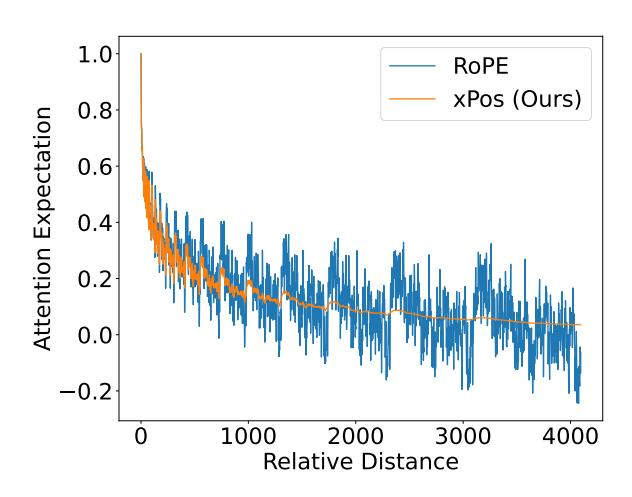
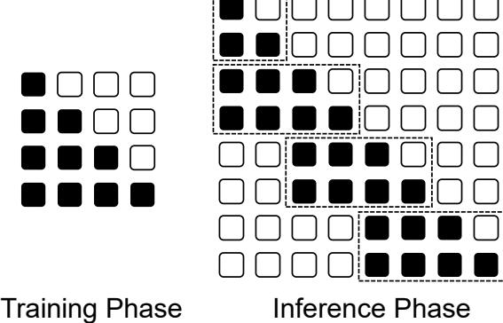

# A Length-Extrapolatable Transformer

## Yutao Sun, Li Dong, Barun Patra, Shuming Ma Shaohan Huang, Alon Benhaim, Vishrav Chaudhary, Xia Song, Furu Wei Microsoft

<https://github.com/microsoft/torchscale>

## Abstract

Position modeling plays a critical role in Transformers. In this paper, we focus on length extrapolation, i.e., training on short texts while evaluating longer sequences. We define *attention resolution* as an indicator of extrapolation. Then we propose two designs to improve the above metric of Transformers. Specifically, we introduce a relative position embedding to explicitly maximize attention resolution. Moreover, we use blockwise causal attention during inference for better resolution. We evaluate different Transformer variants with language modeling. Experimental results show that our model achieves strong performance in both interpolation and extrapolation settings. The code will be available at [https://aka.](https://aka.ms/LeX-Transformer) [ms/LeX-Transformer](https://aka.ms/LeX-Transformer).

# 1 Introduction

Transformer [\(Vaswani et al.,](#page-8-0) [2017\)](#page-8-0) shows a strong performance in NLP and becomes a universal choice nowadays [\(Dosovitskiy et al.,](#page-7-0) [2020;](#page-7-0) [Rad](#page-8-1)[ford et al.,](#page-8-1) [2021;](#page-8-1) [Wang et al.,](#page-8-2) [2022\)](#page-8-2). However, most of them have a crucial shortcoming: they can only deal with the in-distribution size of inputs. It is usually infeasible to train a model with all possible input lengths. Therefore, a length-extrapolatable Transformer is essential for wider usage.

In sequence modeling, position information plays a crucial role in building the correct representation and understanding of the latent meaning. For Recurrent Neural Networks such as LSTM [\(Hochreiter and Schmidhuber,](#page-7-1) [1997\)](#page-7-1), the calculation is done along the sequence order in O(n) time. However, the parallel attention module makes it hard to encode position effectively. First, [Vaswani et al.](#page-8-0) [\(2017\)](#page-8-0) propose absolute sinusoidal position embedding, and [Devlin et al.](#page-7-2) [\(2019\)](#page-7-2) adjust it to a learnable one. The absolute design is computation-efficient, but not comparable with subsequent relative ones [\(Shaw et al.,](#page-8-3) [2018;](#page-8-3) [Su et al.,](#page-8-4) [2021;](#page-8-4) [Press et al.,](#page-8-5) [2021\)](#page-8-5). Among many relative position embeddings, ROPE [\(Su et al.,](#page-8-4) [2021\)](#page-8-4) shows better performance and is used to many PLMs such as PaLM [\(Chowdhery et al.,](#page-7-3) [2022\)](#page-7-3). However, it can't deal with sequences with exceed length. Alibi [\(Press et al.,](#page-8-5) [2021\)](#page-8-5) mitigates the extrapolation problem but sacrifices the general performance.

Since different strategies concentrate on some part of the position feature, it is essential to build a comprehensive view and guide the Transformer's design systematically. First, a Transformer should be sensitive to order. Otherwise, it will degenerate into a bag-of-word model which confuses the whole meaning. Then, position translation can't hurt the representation a lot especially combing with the proper attention-mask operations. After that, a good sequence model needs to deal with any input length. As illustrated before, the length problem is not universal but special for Transformer. Especially, when a Transformer is pre-trained under a maximal length, it is not affordable to re-train for applying to tasks with longer sequences. Finally, when a Transformer satisfies the principles above, we will evaluate the performance, which requires thorough experiments and empirical analysis.

Considering all the properties above, we propose Extrapolatable Position Embedding (XPOS), which is a universal-good design for Transformers. Based on ROPE's design, we propose *attention resolution* as a metric to measure position monotonicity accurately. Then, we generalize its mathematical form, where an exponential decay is added to the rotation matrix. XPOS preserves the advantage of ROPE, and behaves stably at long-term dependency. Besides, we use blockwise causal attention to increase attention resolution, which improves the performance of length extrapolation for language modeling.

We train different Transformers from scratch. On the pre-training corpus, LEX Transformer reaches minimal perplexity on the validation set.

| Models                     | Translation Invariance | Length Extrapolation |  |
|----------------------------|------------------------|----------------------|--|
| Absolute Position Modeling |                        |                      |  |
| Transformer (Sinusoidal)   | ✘                      | ✘✘                   |  |
| GPT-2 (Learnable)          | ✘                      | ✘✘                   |  |
| Relative Position Modeling |                        |                      |  |
| PaLM / Roformer (ROPE)     | ✔                      | ✘                    |  |
| T5                         | ✔                      | ✘                    |  |
| BLOOM / Alibi              | ✔                      | ✔                    |  |
| LEX Transformer (Ours)     | ✔                      | ✔✔                   |  |

Table 1: Position modeling capabilities of Transformer variants for language modeling.

We use the arXiv dataset (above 6k length) to evaluate the model's ability for extrapolation length. Our methods can continue decreasing the perplexity while other methods either can't extrapolate or increase the perplexity when the input length is very long.

We summarize our contributions as follows:

- We summarize the design principles of Transformers for position modeling.
- We define attention resolution to indicate length extrapolation.
- We propose an extrapolatable position embedding and use blockwise causal attention to improve length extrapolation.
- We conduct experiments on language modeling and show that the proposed LEX Transformer achieves strong performance on both short and long texts.

# 2 Design Principles of Transformers for Position Modeling

### 2.1 Order Variance

Transformer aims to capture long-term dependency efficiently [\(Vaswani et al.,](#page-8-0) [2017\)](#page-8-0), so the distance between every two tokens is 1. Transformer without position information is actually a bag-of-word model. With effective position information, Transformer models should be variant with permuting the order [\(Dufter et al.,](#page-7-4) [2022\)](#page-7-4):

$$f(P_{\pi}(X)) \neq P_{\pi}(f(X)) \tag{1}$$

Although for some tasks, bag-of-words models can achieve comparable performance [\(Wang et al.,](#page-8-6) [2020a\)](#page-8-6), position information is essential generally

for sequence modeling. Almost every position modeling strategy satisfies this goal [\(Vaswani et al.,](#page-8-0) [2017;](#page-8-0) [Devlin et al.,](#page-7-2) [2019;](#page-7-2) [Shaw et al.,](#page-8-3) [2018;](#page-8-3) [Wang](#page-8-6) [et al.,](#page-8-6) [2020a;](#page-8-6) [Raffel et al.,](#page-8-7) [2020;](#page-8-7) [Su et al.,](#page-8-4) [2021\)](#page-8-4).

## 2.2 Translation Invariance

The representation of a sequence should be robust with the position's translation. For instance, in fact, a sentence's meaning is variant with padding before or after the whole sentence. We give a general form for translation invariance similar with [\(Wang et al.,](#page-8-6) [2020a\)](#page-8-6): for a Transformer model f(input, mask), any input sequence X = [x0, x1, ..., xn] with mask M = [m0, m1, ..., mn], the output should be same with the padding one:

$$X_{\text{pad}} = [0]_i \oplus X \oplus [0]_j$$

$$M_{\text{pad}} = [0]_i \oplus M \oplus [0]_j$$

$$f(X, M) = f(X_{\text{pad}}, M_{\text{pad}})[i : i + n]$$
(2)

Obviously, relative positions [\(Shaw et al.,](#page-8-3) [2018;](#page-8-3) [Raffel et al.,](#page-8-7) [2020;](#page-8-7) [Wang et al.,](#page-8-6) [2020a;](#page-8-6) [Su et al.,](#page-8-4) [2021\)](#page-8-4) have this property instead of absolute ones [\(Vaswani et al.,](#page-8-0) [2017;](#page-8-0) [Devlin et al.,](#page-7-2) [2019\)](#page-7-2). Even though absolute sinusoidal embedding has a similar property [\(Vaswani et al.,](#page-8-0) [2017\)](#page-8-0): P Epos+k can be represented as a linear function of P Epos, the addition operation in the initial word embedding messes the attention weight, where the spread form of QKT has 4 components whose geometric connection with position is unclear.

#### 2.3 Length Extrapolation

As the cost of pre-training is getting bigger due to the larger model size and corpus, we do not hope to retrain a model just because of the longer length of downstream tasks. A Transformer model with a suitable design should be capable of dealing with any input length.

First, learnable absolute position embedding (Devlin et al., 2019) is not able to extrapolate at all because it does not have any pre-defined position knowledge. With the evaluation of perplexity on different length (Press et al., 2021), almost every position embedding's performance drops significantly (Vaswani et al., 2017; Raffel et al., 2020; Su et al., 2021). Alibi (Press et al., 2021) solves this problem by adding an exponential decay on the attention matrix, which lower the influence of out-of-distribution position like a soft sliding window. However, the absence of long-term dependency contributes to a performance drop compared with other relative strategies. Table 2 shows that Alibi's perplexity is larger than ROPE about  $0.2 \sim 0.3$ .

However, the extrapolation ability needs a systematic design where position embedding is a crucial but not only component. With the proper attention map, the relative position can deal with long text, where the perplexity does not explode but does not decrease at the same time. The ideal situation is to use the long context in the right way, in that case, the model should perform better instead of saturation.

# 3 A Length-Extrapolatable Transformer

We define attention resolution as the indicator of length extrapolation in Section 3.1. Then we propose two ways to maximize the resolution metric, i.e., improve the length extrapolation of Transformers. First, we introduce a relative position encoding method (Section 3.2) to explicitly maximize attention resolution. Second, we propose to use blockwise causal masking (Section 3.3) during inference for improved resolution. The proposed architecture is named Length-Extrapolatable (LEX) Transformer.

#### 3.1 Attention Resolution

The monotonicity of attention scores is essential to represent distance in language models. We denote s[n] as the score expectation when the distance of two tokens is n. We define *attention resolution* R(s) as a metric to evaluate attention's ability to recognize position:

$$R(s) = \sum_{i=0}^{N} \frac{e^{s[i]} (e^{s[i]} - e^{s[i+1]})}{(\sum_{i=0}^{N} e^{s[i]})^2}$$
(3)

First, s[i] > s[i+1] is preferred to ensure monotonicity. Besides, we implement softmax opera-

tion to simulate the attention probability. To mitigate the influence of long-tail distribution, the factor  $e^{s[i]}$  is multiplied. We can estimate s[n] and R(s) quantitatively when we design Transformers.

### 3.2 Improve Resolution by Position Encoding

Su et al. (2021) propose that by adding absolute position embedding on query and key, the attention matrix is actually encoded with relative position information. We use a similar but generalized strategy. First, a pseudo inner product is defined as  $\langle x,y\rangle=\sum Re(x_i\cdot y_i^*)$ , which is consistent with the exact inner product's definition when we map  $\mathbb{C}^{d/2}\to\mathbb{R}^d$ . Formally, the encoding must satisfy:

$$\langle f_q(q, n+r), f_k(k, n) \rangle = \langle f_q(q, r), f_k(k, 0) \rangle$$
(4)

A simple solution is as follows:

$$f_q(q,n) = A_q q e^{\lambda n}$$

$$f_k(k,n) = A_k k e^{-\lambda n}$$
(5)

The scaling factor  $A_q, A_k$  is unnecessary because q, k is obtained by a linear transformation.  $\lambda = k + i\theta \in \mathbb{C}^{d/2}$  where  $k, \theta \in \mathbb{R}^{d/2}$ :

$$f_q(q,n) = qe^{\xi n + i\theta n}$$
  

$$f_k(k,n) = ke^{-\xi n - i\theta n}$$
(6)

If  $\xi=0$ , the form is the same as RoPE (Su et al., 2021). Geometrically, the transformation provides a rotation on vectors. If the relative angle between q and k is larger, the inner product is smaller. However, the cosine value is not monotony if the rotating angle is large than  $\pi$ , which causes an unstable phenomenon that the expectation of the inner product oscillates dramatically with the growth of relative distance. Following the parameters (Vaswani et al., 2017; Su et al., 2021)  $\theta=\{\theta_i=10000^{-2i/d}, i\in[0,1,...,d/2]\}$ , we will calculate the expectation as follows. For generate models, we assume  $\mathbb{E}(\angle q)\leq \mathbb{E}(\angle k)$  to ensure the monotony:

$$\mathbb{E}[\langle qe^{m\xi+im\theta}, ke^{n\xi+in\theta} \rangle]$$

$$= \sum_{i=0}^{d/2} \mathbb{E}[Re(\mathbf{q}_{i}\mathbf{k}_{i}e^{(m-n)\xi_{i}+i(m-n)\theta_{i}})]$$

$$\leq \sum_{i=0}^{d/2} Re(\mathbb{E}[|\mathbf{q}_{i}\mathbf{k}_{i}|]e^{(m-n)\xi_{i}+i(m-n)\theta_{i}})$$

$$\propto \sum_{i=0}^{d/2} cos(m-n)\theta_{i}e^{(m-n)\xi_{i}}$$
(7)

The inference here is different from (Su et al., 2021) because of two reasons: 1) there is an additional assumption brought by language models; 2) the inequality scaling of (Su et al., 2021) is too strong to lose generality. We calculate expectation instead of the upper bound.

Now we define a function to represent the property of relative position:

$$g_{\zeta}[n] = \sum_{i=0}^{d/2} \cos n\theta_i \zeta_i^n \tag{8}$$

Stabilizing the curve of g[n] is an intuitive way. Even though attention bias can achieve this goal, we do not hope additional position calculation. Instead, we can achieve this goal by selecting a good  $\zeta$  to maximize  $R(g_{\zeta})$ .

Obviously, the oscillation mainly comes from large  $\theta_i$ . Manually setting  $\zeta$  can achieve this goal:

$$\widetilde{\zeta}_i = \frac{i/(d/2) + \gamma}{1 + \gamma} \in [0, 1] \tag{9}$$

where  $\widetilde{\zeta_i}$  becomes smaller when  $\theta_i$  is larger. In this way, we punish the oscillation of unstable dimensions and keep the distribution of stable ones.

Numerical optimization methods are tried to find optimal values for  $\zeta$ . However, the results rely on the initial value and lack control when the hidden dimension changes. Besides, the numerical precision should be considered because of fp16's range. Finally, we find a sub-optimal solution by manually setting  $\gamma$  to both satisfy the resolution is recognizable  $(R(g_{\zeta})$  is partially optimized) and  $\zeta_i^n$  can be represented by fp16 when n is big (8192 in our setting). The optimized value  $\hat{\zeta}$  will be used as the final value in LEX Transformer.

The curves of  $\zeta=1,\hat{\zeta}$  are shown in Figure 1. The default rotary embedding contributes to a dramatic oscillation, especially in the large relative distance, which causes bad extrapolation performance and restricts the model's convergence speed. After adding a decay, the curve is almost stable, especially on long-term dependency. What's more, it does not hurt pure rotation's fitting ability because  $\zeta_i^n \approx 1$  when i is large or n is small. In that way, short-term and long-term dependencies are divided continuously.

Finally, we have Extrapolatable Position Embed-

Figure 1: The long dependency curve of attention expectation. ROPE's dramatic oscillation confuses the attention resolution at long distances. In contrast, xPos provides stable and accurate position modeling.

### **Algorithm 1:** Attention with XPOS

$$\begin{array}{l} \textbf{def} \operatorname{rot}(x) \colon \\ \textbf{return} \left[ -x_1, x_0, -x_3, x_2, \ldots \right] \\ \textbf{Initialization:} \\ \theta_i = 1/10000^{2i/d}, \theta \in \mathbb{R}^{d/2} \\ \hat{\zeta}_i = (i/(d/2) + \gamma)/(1 + \gamma), \ \hat{\zeta} \in \mathbb{R}^{d/2} \\ \textbf{Input:} \ Q, K, V \in \mathbb{R}^{h \times l \times d}, M \in \mathbb{R}^{d \times d} \\ C_{mn} = \cos m\theta_n, C \in \mathbb{R}^{l \times d/2} \\ S_{mn} = \sin m\theta_n, S \in \mathbb{R}^{l \times d/2} \\ T_{mn} = \hat{\zeta}_n^m, T \in \mathbb{R}^{l \times d/2} \\ Q = (Q \times C + \operatorname{rot}(Q) \times S) \times T \\ K = (K \times C + \operatorname{rot}(K) \times S) \times T^{-1} \\ output = \operatorname{softmax}(\frac{QK^T}{\sqrt{d}} \cdot M)V \\ \textbf{return} \ output \end{array}$$

ding (XPOS):

$$f_{q}(q,n) = \begin{pmatrix} q_{1}\cos n\theta_{1}\hat{\zeta}_{1}^{n} - q_{2}\sin n\theta_{1}\hat{\zeta}_{1}^{n} \\ q_{2}\cos n\theta_{1}\hat{\zeta}_{1}^{n} + q_{1}\sin n\theta_{1}\hat{\zeta}_{1}^{n} \\ \vdots \\ q_{n-1}\cos n\theta_{d/2}\hat{\zeta}_{d/2}^{n} - q_{n}\sin n\theta_{d/2}\hat{\zeta}_{d/2}^{n} \\ q_{n}\cos n\theta_{d/2}\hat{\zeta}_{d/2}^{n} + q_{n-1}\sin n\theta_{d/2}\hat{\zeta}_{d/2}^{n} \end{pmatrix}$$

$$f_{k}(k,n) = \begin{pmatrix} k_{1}\cos n\theta_{1}\hat{\zeta}_{1}^{-n} - k_{2}\sin n\theta_{1}\hat{\zeta}_{1}^{-n} \\ k_{2}\cos n\theta_{1}\hat{\zeta}_{1}^{-n} + k_{1}\sin n\theta_{1}\hat{\zeta}_{1}^{-n} \\ \vdots \\ k_{n-1}\cos n\theta_{d/2}\hat{\zeta}_{d/2}^{-n} - k_{n}\sin n\theta_{d/2}\hat{\zeta}_{d/2}^{-n} \\ k_{n}\cos n\theta_{d/2}\hat{\zeta}_{d/2}^{-n} + k_{n-1}\sin n\theta_{d/2}\hat{\zeta}_{d/2}^{-n} \end{pmatrix}$$

$$(10)$$

In the implementation, the transformation for key and value can be easily calculated by parallel addition and multiplication as shown in Algorithm 1.

Figure 2: Our language model is trained on shorter texts in the same way as vanilla Transformers, i.e., using causal masking. During inference, we use blockwise causal attention for longer sequences, which recurrently reuses the overlapped parts (i.e., key and value vectors).

## 3.3 Blockwise Causal Attention

Another way to improve attention resolution (Section [3.1\)](#page-2-0) is using windowed attention. During inference, we use blockwise masking [\(Dai et al.,](#page-7-5) [2019;](#page-7-5) [Zaheer et al.,](#page-8-8) [2020;](#page-8-8) [Xiong et al.,](#page-8-9) [2021\)](#page-8-9) for selfattention. Notice that other window strategies, such as sliding window [\(Child et al.,](#page-7-6) [2019\)](#page-7-6), also work. We use blockwise causal attention because it is cache-friendly and easy to implement.

As shown in Figure [2,](#page-4-1) if the pre-training length is l, we divide the query as blocks with l/2 length, and each query interacts with its own block and the last block. In this way, the context information can be delivered by the reuse of key and value. The window constraint helps models to encode longer input with improved resolution.

Different from training a long-sequence model with stop-gradient, we use vanilla attention in the training phase, because the pre-training corpus is not very long on average. However, during the inference phase, when dealing with long sequences, we directly implement BCA to help the model to be more position-recognizable.

### 4 Experiments

#### 4.1 Pre-training

To fairly evaluate different Transformer variants, we pre-train the Transformer from scratch. We use 1024 hidden dimension, 16 heads, and 24 layers, i.e., comparable to medium-size GPT-3 [\(Brown](#page-7-7) [et al.,](#page-7-7) [2020\)](#page-7-7). The training corpus includes a subset of the Pile [\(Gao et al.,](#page-7-8) [2020\)](#page-7-8): Books3, OpenWebText2, Stack Exchange, PubMed Ab-

stracts, Wikipedia, Gutenberg (PG-19), BookCorpus2, NIH ExPorter, and Pile-CC datasets. The training procedure is implemented on 16×V100 GPUs. Maximal length is 1024 for saving memory and extrapolation evaluation. The learning rate is 3 × 10−4 and polynomial decay is used to adjust learning rate. The global batch size is 512 to follow GPT-3[\(Brown et al.,](#page-7-7) [2020\)](#page-7-7), i.e., 0.5M token size. We use Adam [\(Kingma and Ba,](#page-8-10) [2015\)](#page-8-10) optimizer with β1 = 0.9, β2 = 0.98, = 10−6 . The code is based on TorchScale [\(Ma et al.,](#page-8-11) [2022a\)](#page-8-11).

## 4.2 Language Modeling

We first measure perplexity on arXiv, where the document length is usually larger than 6k, which can show the model's ability for long-dependency modeling. We care about the performance on different input lengths to evaluate the model's interpolation and extrapolation capability. For every document, we select its first 4k tokens and divide them into the target length to fairly compare the perplexity of different lengths. The results are shown in Table [2.](#page-5-0)

For interpolation capability, we analyze the results where the length is no more than 1024. All Transformers converge to similar perplexity. XPOS have a stable advantage on others with 1∼3 perplexity drop.

For lengths 2048 and 4096, we use BCA in all position embeddings, and the following ablation study will discuss the performance without that. [Press et al.](#page-8-5) [\(2021\)](#page-8-5)'s experiment shows that most of the position strategies can't deal with input length longer than pre-training directly. In our experiment, with the improvement brought by BCA, ROPE gets a better performance while Absolute still can't extrapolate. XPOS shows a stable decrease when the sequence length increases, which satisfies the assumption that a longer context makes the prediction better. While others' perplexity increases when the input length is 4096.

Here, XPOS's advantage towards ROPE is worth analyzing. With BCA, the position embedding does not extrapolate, so ROPE also has the potential to encode long documents. However, with the forward layer by layer, the distribution of hidden states is different from pre-training. Then, the resolution matters to building a recurrent-similar encoding.

The experiment shows that XPOS gets better performance on language modeling. With the stable advantage of any length, users can input any sen-

| Length                 | 256           | 512   | 1024          | 2048   | 4096    |
|------------------------|---------------|-------|---------------|--------|---------|
| Length                 | Interpolation |       | Extrapolation |        |         |
| Transformer            | 46.34         | 36.39 | 29.94         | 132.63 | 1283.79 |
| Alibi                  | 37.66         | 29.92 | 24.99         | 23.14  | 24.26   |
| Roformer               | 38.09         | 30.38 | 25.52         | 73.6   | 294.45  |
| LEX Transformer (Ours) | 34.3          | 27.55 | 23.31         | 21.6   | 20.73   |

Table 2: Results of perplexity with different lengths. The language models are trained with a length of 1024 and then evaluated on various lengths. LEX obtains better performance not only on shorter texts (i.e., interpolation) but also on longer texts (i.e., extrapolation). The red color indicates that the perplexity begins increasing compared with the shorter length. LEX is the only method that has lower perplexity along with increased evaluation length.

| Length      | 1024 Interpolation | 2048 Extrapolation |
|-------------|-----------------------|-----------------------|
| Transformer | 0.87                  | 0.28                  |
| Alibi       | 0.81                  | 0.88                  |
| Roformer    | 0.91                  | 0.08                  |
| LEX (Ours)  | 0.98                  | 1.08                  |
| - BCA       | 0.98                  | 0.54                  |

Table 3: Results of resolution with different Transformer variants. Higher resolution indicates that the architecture tends to better distinguish context tokens. "BCA" is short for blockwise causal attention.

tence freely without the concern of position. Besides, results also indicate that is not essential to build an explicit decay on the attention matrix, Instead, a proper design for an attention mask is actually better to deal with long-context tasks.

#### 4.3 Measuring Resolution

In the previous section, we claim that resolution is a crucial index for building an effective Transformer. To verify the claim, we evaluate the resolution of different Transformer variants empirically. Equation 8 estimates the expectation of attention score for LeX. Denote attention score of query i and key j (before softmax) as  $e_{ij}$ , the expectation of s[n] is as follows:

$$\hat{s}[n] = \mathbb{E}[s[n]] = \frac{1}{N-n} \mathbb{E}[\sum_{i=n}^{N-1} e_{i(i-n)}] \quad (11)$$

The resolution can be calculated by combining Equation 3 and 11. The final expectation is the average of different input text. Resolution is calculated in every layer, and the average resolution is shown in Table 3. The results show that xPos makes the position more recognizable in training length (1024). For Alibi (Press et al., 2021), the

| Methods                    | Perplexity |
|----------------------------|------------|
| RoPE                       | 17.74      |
| xPos (Ours)                | 17.54      |
| <ul><li>Rotation</li></ul> | 33.68      |

Table 4: Ablation results on the validation set show that rotation of XPOS is necessary for strong performance.

stable resolution comes from explicit decay, but it prevents the model from learning position dependency itself. Besides, we run an ablation on BCA. In length 2048, we measure the resolution with/without block. The result supports that BCA helps model distinguish positions better.

#### 4.4 Ablation Studies

#### 4.4.1 Rotation Computation

In this part, we discuss the necessity of the combination of vector rotation and exponential decay. XPOS without rotation means Equation 10 degenerates to  $\theta_i = 0$ :

$$\dot{f}_{q}(q,n) = \begin{pmatrix} q_{1}\hat{\zeta}_{1}^{n} \\ q_{2}\hat{\zeta}_{1}^{n} \\ \vdots \\ q_{n-1}\hat{\zeta}_{d/2}^{n} \\ q_{n}\hat{\zeta}_{d/2}^{n} \end{pmatrix} \dot{f}_{k}(k,n) = \begin{pmatrix} k_{1}\hat{\zeta}_{1}^{-n} \\ k_{2}\hat{\zeta}_{1}^{-n} \\ \vdots \\ k_{n-1}\hat{\zeta}_{d/2}^{-n} \\ k_{n}\hat{\zeta}_{d/2}^{-n} \end{pmatrix}$$

After pre-training, we test the perplexity on the valid split of training corpus with 1k length. The result in Table 4 shows that simple scaling operation can't perform as well as LEX. Therefore, the combination of rotation and decay means the combination of in-distribution and out-of-distribution ability.

#### 4.4.2 Blockwise Causal Attention

To fairly compare different methods, we run the evaluation using different position embeddings (i.e.,

| Methods           | 2048 4096 Extrapolation |        |
|-------------------|----------------------------|--------|
| RoPE              | 73.6                       | 294.45 |
| RoPE + BCA        | 25.57                      | 25.65  |
| Alibi             | 23.14                      | 24.26  |
| Alibi + BCA       | 24.6                       | 25.37  |
| XPos (Ours)       | 22.56                      | 28.43  |
| xPos + BCA (Ours) | 21.6                       | 20.73  |

Table 5: Results of perplexity on arXiv dataset. "BCA" is short for blockwise causal attention.

Alibi, ROPE, and XPOS) with or without blockwise causal attention. The results are shown in Table 5.

First, Blockwise Causal Attention works for ROPE whose perplexity will explode without that. Alibi performs well without windowed attention because its "soft window" is broader than a hard block window. xPos's perplexity without BCA increases by about 1 in 2048, and 8 in 4096. However, with its high resolution, xPos can recognize position with BCA's constraint.

#### 5 Related Work

#### 5.1 Long-Sequence Transformers

Long-sequence Transformers aim to solve two key problems. First, the computation or memory consumption is not efficient enough for long sequences. Second, there is a trade-off between performance and efficiency.

One popular solution (Wang et al., 2020b; Katharopoulos et al., 2020; Choromanski et al., 2020) is linear attention, i.e., using a kernel-based or low-rank approximation to replace vanilla attention. The methods typically target efficiency while underperforming vanilla Transformers for regular length. Another strand is sparse attention (Child et al., 2019; Beltagy et al., 2020; Zaheer et al., 2020; Xiong et al., 2021), which usually leverages structured sparsity to reduce computation. For causal sequence modeling, the recurrent-style designs (Dai et al., 2019; Hutchins et al., 2022; Ma et al., 2022b) are also competitive.

In comparison, we focus on the extrapolation issue (Press et al., 2021) for language modeling, i.e., training on short texts while evaluating long texts. The training process is kept the same as vanilla Transformers, i.e., training on short sequences, and using dense attention computation. The capability of long-sequence modeling is given for free during

inference. So the training efficiency (which is typically expensive for large-scale language models) is not affected compared with previous work. Moreover, the performance on regular length is perfectly retained, without trade-offs for long-sequence modeling.

#### 5.2 Position Modeling

### 5.2.1 Absolute Position Embedding

Absolute sinusoidal position embedding is proposed by Vaswani et al. (2017). For each dimension, different frequencies are encoded from  $2\pi$  to  $10000 \times 2\pi$ :

$$PE_{(pos,2i)} = \cos(pos/10000^{2i/d_{\text{model}}})$$

$$PE_{(pos,2i+1)} = \sin(pos/10000^{2i/d_{\text{model}}})$$
(12)

where  $PE_{pos+k}$  is represented as a linear function of  $PE_{pos}$  to restore a relative-position property.

### 5.2.2 Relative Position Embedding

Shaw et al. (2018) propose relative position embedding as an alternative approach. Denote  $e_{ij}$  as attention weight,  $\alpha_{ij} = \operatorname{softmax}(e_{ij})$ ,  $o_i$  as output, we have:

$$e_{ij} = \frac{\mathbf{q}_i \cdot \mathbf{k}_j}{\sqrt{d}} \Longrightarrow \frac{\mathbf{q}_i \cdot (\mathbf{k}_j + \mathbf{a}_{ij}^K)}{\sqrt{d}}$$

$$o_i = \sum_j \alpha_{ij} \mathbf{v}_j \Longrightarrow \sum_j \alpha_{ij} (\mathbf{v}_j + \mathbf{a}_{ij}^V)$$
(13)

where  $\boldsymbol{a}_{ij}^K = \omega_{\mathrm{clip}(i-j,k)}^K$ ,  $\boldsymbol{a}_{ij}^V = \omega_{\mathrm{clip}(i-j,k)}^V$ , and  $\omega^K$  and  $\omega^V$  are learnable parameters. The clipping strategy helps length generalization but cannot distinguish the positions that are larger than k. Yang et al. (2019) and He et al. (2020) further reparameterize the relative position vectors for better performance. T5 (Raffel et al., 2020) uses a simpler strategy to encode relative position:

$$e_{ij} = \frac{\mathbf{q}_i \cdot \mathbf{k}_j}{\sqrt{d}} + a_{\text{bucket}(i-j)}$$
 (14)

where log-bucket scalars are added to attention scores. Recently, pre-defined position embedding is brought back by RoPE (Su et al., 2021). Alibi (Press et al., 2021) proposes to explicitly build an exponential decay on the attention matrix, which contributes to length extrapolation:

$$e_{ij} = \frac{\mathbf{q}_i \cdot \mathbf{k}_j}{\sqrt{d}} - m(i - j), \quad m(\cdot) > 0$$
 (15)

where the values of  $m(\cdot)$  are manually defined. However, Alibi (Press et al., 2021)'s performance tends to be inferior to ROPE for the context whose length is shorter than the pre-training length. In this work, we propose a theoretically derived relative position embedding XPOS that optimizes the attention resolution between tokens. The XPOS method not only has the nice property of length extrapolation but also achieves strong performance.

# Limitations

In this work, we focus on causal language modeling. It needs additional efforts to integrate the proposed methods into bidirectional attention, such as masked language modeling [\(Devlin et al.,](#page-7-2) [2019\)](#page-7-2). Moreover, XPOS introduces about 6% inference cost compared with absolute position embeddings, although it accelerates training convergence.

# References

- Iz Beltagy, Matthew E Peters, and Arman Cohan. 2020. Longformer: The long-document transformer. *arXiv preprint arXiv:2004.05150*.
- Tom Brown, Benjamin Mann, Nick Ryder, Melanie Subbiah, Jared D Kaplan, Prafulla Dhariwal, Arvind Neelakantan, Pranav Shyam, Girish Sastry, Amanda Askell, Sandhini Agarwal, Ariel Herbert-Voss, Gretchen Krueger, Tom Henighan, Rewon Child, Aditya Ramesh, Daniel Ziegler, Jeffrey Wu, Clemens Winter, Chris Hesse, Mark Chen, Eric Sigler, Mateusz Litwin, Scott Gray, Benjamin Chess, Jack Clark, Christopher Berner, Sam McCandlish, Alec Radford, Ilya Sutskever, and Dario Amodei. 2020. Language models are few-shot learners. In *Advances in Neural Information Processing Systems*, volume 33, pages 1877–1901. Curran Associates, Inc.
- Rewon Child, Scott Gray, Alec Radford, and Ilya Sutskever. 2019. Generating long sequences with sparse transformers. *URL https://openai.com/blog/sparse-transformers*.
- Krzysztof Choromanski, Valerii Likhosherstov, David Dohan, Xingyou Song, Andreea Gane, Tamas Sarlos, Peter Hawkins, Jared Davis, Afroz Mohiuddin, Lukasz Kaiser, et al. 2020. Rethinking attention with performers. *arXiv preprint arXiv:2009.14794*.
- Aakanksha Chowdhery, Sharan Narang, Jacob Devlin, Maarten Bosma, Gaurav Mishra, Adam Roberts, Paul Barham, Hyung Won Chung, Charles Sutton, Sebastian Gehrmann, Parker Schuh, Kensen Shi, Sasha Tsvyashchenko, Joshua Maynez, Abhishek B Rao, Parker Barnes, Yi Tay, Noam M. Shazeer, Vinodkumar Prabhakaran, Emily Reif, Nan Du, Benton C. Hutchinson, Reiner Pope, James Bradbury, Jacob Austin, Michael Isard, Guy Gur-Ari, Pengcheng Yin, Toju Duke, Anselm Levskaya, Sanjay Ghemawat, Sunipa Dev, Henryk Michalewski, Xavier

- García, Vedant Misra, Kevin Robinson, Liam Fedus, Denny Zhou, Daphne Ippolito, David Luan, Hyeontaek Lim, Barret Zoph, Alexander Spiridonov, Ryan Sepassi, David Dohan, Shivani Agrawal, Mark Omernick, Andrew M. Dai, Thanumalayan Sankaranarayana Pillai, Marie Pellat, Aitor Lewkowycz, Erica Oliveira Moreira, Rewon Child, Oleksandr Polozov, Katherine Lee, Zongwei Zhou, Xuezhi Wang, Brennan Saeta, Mark Díaz, Orhan Firat, Michele Catasta, Jason Wei, Kathleen S. Meier-Hellstern, Douglas Eck, Jeff Dean, Slav Petrov, and Noah Fiedel. 2022. PaLM: Scaling language modeling with pathways. *ArXiv*, abs/2204.02311.
- Zihang Dai, Zhilin Yang, Yiming Yang, Jaime Carbonell, Quoc V Le, and Ruslan Salakhutdinov. 2019. Transformer-xl: Attentive language models beyond a fixed-length context. *arXiv preprint arXiv:1901.02860*.
- Jacob Devlin, Ming-Wei Chang, Kenton Lee, and Kristina Toutanova. 2019. [BERT: Pre-training of](https://doi.org/10.18653/v1/N19-1423) [deep bidirectional transformers for language under](https://doi.org/10.18653/v1/N19-1423)[standing.](https://doi.org/10.18653/v1/N19-1423) In *Proceedings of the 2019 Conference of the North American Chapter of the Association for Computational Linguistics: Human Language Technologies, Volume 1 (Long and Short Papers)*, pages 4171–4186, Minneapolis, Minnesota. Association for Computational Linguistics.
- Alexey Dosovitskiy, Lucas Beyer, Alexander Kolesnikov, Dirk Weissenborn, Xiaohua Zhai, Thomas Unterthiner, Mostafa Dehghani, Matthias Minderer, Georg Heigold, Sylvain Gelly, et al. 2020. An image is worth 16x16 words: Transformers for image recognition at scale. *arXiv preprint arXiv:2010.11929*.
- Philipp Dufter, Martin Schmitt, and Hinrich Schütze. 2022. Position information in transformers: An overview. *Computational Linguistics*, 48(3):733– 763.
- Leo Gao, Stella Biderman, Sid Black, Laurence Golding, Travis Hoppe, Charles Foster, Jason Phang, Horace He, Anish Thite, Noa Nabeshima, et al. 2020. The pile: An 800gb dataset of diverse text for language modeling. *arXiv preprint arXiv:2101.00027*.
- Pengcheng He, Xiaodong Liu, Jianfeng Gao, and Weizhu Chen. 2020. Deberta: Decoding-enhanced bert with disentangled attention. *arXiv preprint arXiv:2006.03654*.
- Sepp Hochreiter and Jürgen Schmidhuber. 1997. [Long](https://doi.org/10.1162/neco.1997.9.8.1735) [short-term memory.](https://doi.org/10.1162/neco.1997.9.8.1735) *Neural Computation*, 9:1735– 1780.
- DeLesley Hutchins, Imanol Schlag, Yuhuai Wu, Ethan Dyer, and Behnam Neyshabur. 2022. [Block](https://openreview.net/forum?id=uloenYmLCAo)[recurrent Transformers.](https://openreview.net/forum?id=uloenYmLCAo) In *Advances in Neural Information Processing Systems*.
- Angelos Katharopoulos, Apoorv Vyas, Nikolaos Pappas, and François Fleuret. 2020. Transformers are

- rnns: Fast autoregressive transformers with linear attention. In *International Conference on Machine Learning*, pages 5156–5165. PMLR.
- Diederik P. Kingma and Jimmy Ba. 2015. [Adam: A](http://arxiv.org/abs/1412.6980) [method for stochastic optimization.](http://arxiv.org/abs/1412.6980) In *3rd International Conference on Learning Representations*, San Diego, CA.
- Shuming Ma, Hongyu Wang, Shaohan Huang, Wenhui Wang, Zewen Chi, Li Dong, Alon Benhaim, Barun Patra, Vishrav Chaudhary, Xia Song, and Furu Wei. 2022a. TorchScale: Transformers at scale. *CoRR*, abs/2211.13184.
- Xuezhe Ma, Chunting Zhou, Xiang Kong, Junxian He, Liangke Gui, Graham Neubig, Jonathan May, and Luke Zettlemoyer. 2022b. Mega: Moving average equipped gated attention. *arXiv preprint arXiv:2209.10655*.
- Ofir Press, Noah A Smith, and Mike Lewis. 2021. Train short, test long: Attention with linear biases enables input length extrapolation. *arXiv preprint arXiv:2108.12409*.
- Alec Radford, Jong Wook Kim, Chris Hallacy, Aditya Ramesh, Gabriel Goh, Sandhini Agarwal, Girish Sastry, Amanda Askell, Pamela Mishkin, Jack Clark, et al. 2021. Learning transferable visual models from natural language supervision. In *International Conference on Machine Learning*, pages 8748–8763. PMLR.
- Colin Raffel, Noam Shazeer, Adam Roberts, Katherine Lee, Sharan Narang, Michael Matena, Yanqi Zhou, Wei Li, and Peter J. Liu. 2020. [Exploring](http://jmlr.org/papers/v21/20-074.html) [the limits of transfer learning with a unified text-to](http://jmlr.org/papers/v21/20-074.html)[text transformer.](http://jmlr.org/papers/v21/20-074.html) *Journal of Machine Learning Research*, 21(140):1–67.
- Peter Shaw, Jakob Uszkoreit, and Ashish Vaswani. 2018. Self-attention with relative position representations. *arXiv preprint arXiv:1803.02155*.
- Jianlin Su, Yu Lu, Shengfeng Pan, Bo Wen, and Yunfeng Liu. 2021. Roformer: Enhanced transformer with rotary position embedding. *arXiv preprint arXiv:2104.09864*.
- Ashish Vaswani, Noam Shazeer, Niki Parmar, Jakob Uszkoreit, Llion Jones, Aidan N. Gomez, Lukasz Kaiser, and Illia Polosukhin. 2017. [Attention is all](http://papers.nips.cc/paper/7181-attention-is-all-you-need) [you need.](http://papers.nips.cc/paper/7181-attention-is-all-you-need) In *Advances in Neural Information Processing Systems 30: Annual Conference on Neural Information Processing Systems 2017, 4-9 December 2017, Long Beach, CA, USA*, pages 6000–6010.
- Benyou Wang, Lifeng Shang, Christina Lioma, Xin Jiang, Hao Yang, Qun Liu, and Jakob Grue Simonsen. 2020a. On position embeddings in bert. In *International Conference on Learning Representations*.

- Sinong Wang, Belinda Z Li, Madian Khabsa, Han Fang, and Hao Ma. 2020b. Linformer: Selfattention with linear complexity. *arXiv preprint arXiv:2006.04768*.
- Wenhui Wang, Hangbo Bao, Li Dong, Johan Bjorck, Zhiliang Peng, Qiang Liu, Kriti Aggarwal, Owais Khan Mohammed, Saksham Singhal, Subhojit Som, et al. 2022. Image as a foreign language: BEiT pretraining for all vision and vision-language tasks. *arXiv preprint arXiv:2208.10442*.
- Wenhan Xiong, Barlas Oguz, Anchit Gupta, Xilun ˘ Chen, Diana Liskovich, Omer Levy, Wen-tau Yih, and Yashar Mehdad. 2021. Simple local attentions remain competitive for long-context tasks. *arXiv preprint arXiv:2112.07210*.
- Zhilin Yang, Zihang Dai, Yiming Yang, Jaime Carbonell, Russ R Salakhutdinov, and Quoc V Le. 2019. [XLNet: Generalized autoregressive pretraining for](https://proceedings.neurips.cc/paper/2019/file/dc6a7e655d7e5840e66733e9ee67cc69-Paper.pdf) [language understanding.](https://proceedings.neurips.cc/paper/2019/file/dc6a7e655d7e5840e66733e9ee67cc69-Paper.pdf) In *Advances in Neural Information Processing Systems*, volume 32. Curran Associates, Inc.
- Manzil Zaheer, Guru Guruganesh, Kumar Avinava Dubey, Joshua Ainslie, Chris Alberti, Santiago Ontanon, Philip Pham, Anirudh Ravula, Qifan Wang, Li Yang, et al. 2020. Big bird: Transformers for longer sequences. *Advances in Neural Information Processing Systems*, 33:17283–17297.