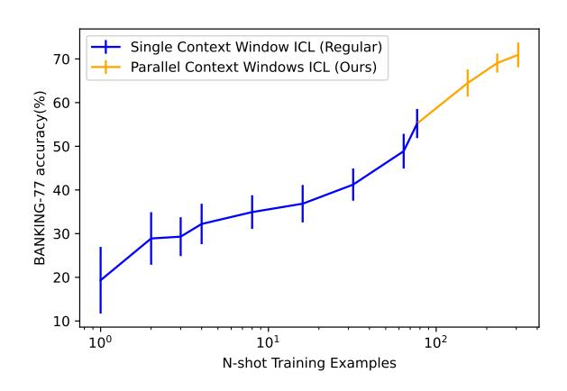
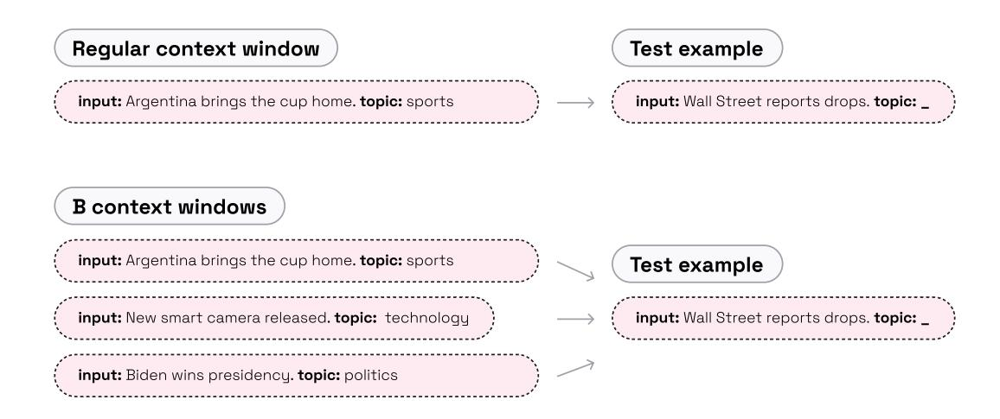
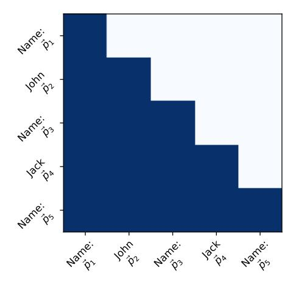
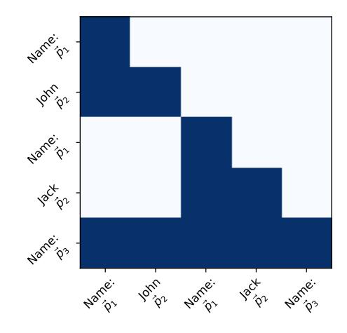
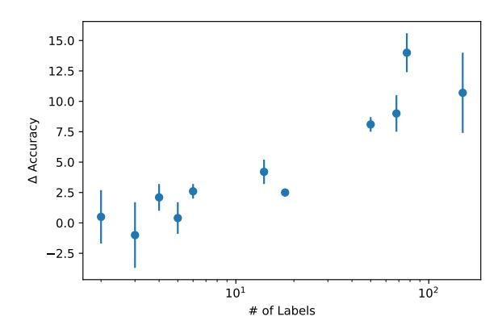

# Parallel Context Windows Improve In-Context Learning of Large Language Models

Nir Ratner Yoav Levine Yonatan Belinkov Ori Ram Omri Abend Ehud Karpas Amnon Shashua Kevin Leyton-Brown Yoav Shoham

AI21 Labs nirr@ai21.com

#### **Abstract**

For applications that require processing large amounts of text at inference time, Large Language Models (LLMs) are handicapped by their limited context windows, which are typically 2048 tokens. In-context learning, an emergent phenomenon in LLMs in sizes above a certain parameter threshold, constitutes one significant example because it can only leverage training examples that fit into the context window. Existing efforts to address the context window limitation involve training specialized architectures, which tend to be smaller than the sizes in which in-context learning manifests due to the memory footprint of processing long texts. We present Parallel Context Windows (PCW), a method that alleviates the context window restriction for any off-the-shelf LLM without further training. The key to the approach is to carve a long context into chunks ("windows") that fit within the architecture, restrict the attention mechanism to apply only within each window, and re-use the positional embeddings among the windows. We test the PCW approach on in-context learning with models that range in size between 750 million and 178 billion parameters, and show substantial improvements for tasks with diverse input and output spaces. Our results motivate further investigation of Parallel Context Windows as a method for applying off-the-shelf LLMs in other settings that require long text sequences.

#### 1 Introduction

A key parameter of a Large Language Model (LLM) is its *context window*, the number of text tokens that it can process in a forward pass. Current LLM architectures limit context window size—typically up to 2048 tokens—because the global nature of the attention mechanism imposes computational costs quadratic in context length. This presents an obstacle to use cases where the LLM needs to process a lot of text, *e.g.*, tackling tasks that require long inputs (Tay et al., 2020; Sha-

Figure 1: In-context learning (ICL) accuracy against n-shot training examples for the BANKING-77 intent classification dataset (Casanueva et al., 2020) using the model Jurassic-1-Grande (17B). The blue line shows the improvement in performance as the context window is filled with examples; the orange line shows how our Parallel Context Windows method, which adds up to four times more training examples and correspondingly provides a significant boost in performance. The error bars represent the standard deviation across multiple runs, as explained in Section 3.

ham et al., 2022), considering large sets of retrieved documents for open-book question answering (Karpukhin et al., 2020; Levine et al., 2022a,b), or performing in-context learning (Brown et al., 2020) when the desired input—output relationship cannot adequately be characterized within the context window.

Previous work has addressed such obstacles via training dedicated architectures, *e.g.*, training sparse attention mechanisms for long inputs (Zaheer et al., 2020; Guo et al., 2021) and fusion-indecoder readers for retrieved documents (Izacard and Grave, 2020). However, these architectures are often tailored to specific use cases, and moreover they often impose size limitations in order to facilitate long text consumption. Recently, Ivgi et al. (2022) showed that off-the-shelf encoder-decoder models can be trained to facilitate long text con-

Figure 2: An illustration of Parallel Context Windows (PCW) approach, exposing the LLM to multiple context windows during generation. Tokens inside each window attend only to the previous tokens *in the window*. Test example tokens attend to the tokens of all context windows.

sumption. It remains an open problem to find an effective way of allowing any off-the-shelf, mainstream LLM to process text longer than its original context window, without dedicated training.

This paper introduces *Parallel Context Windows* (PCW), illustrated in Figure [2,](#page-1-0) a new approach for addressing this problem, and shows its efficacy in the in-context learning setup. PCW can be applied to any off-the-shelf LLM, and involves splitting a long text into multiple parallel contexts, each equally accessible during output generation. Doing so involves two simple *post-hoc* modifications to a pretrained LLM, neither of which requires any further training: (1) using sparse masking to allow each context window to attend only to itself, while still allowing the generated text to attend to all contexts simultaneously; and (2) reusing the model's learned positional embeddings within each parallel context window, sidestepping the problem of extrapolating positional embeddings and signaling to the model that each is window equally "close" to the generated tokens.

We conducted an in-depth investigation of the extent to which Parallel Context Windows can improve LLMs' ability to perform in-context learning. In-context learning is a recently discovered, emergent behavior of LLMs [\(Brown et al.,](#page-8-4) [2020\)](#page-8-4): when a pretrained LLM is given an input sequence of concatenated "training" input–output pairs representing a task (*e.g.*, classification), followed by a single "test" input, it is able to supply the corresponding test output with high accuracy. Crucially, in the setting of in-context learning, the context

window limitation inherently caps the number of training examples that can be inserted before the test example. This significantly limits the applicability of in-context learning for tasks with long or highly diverse inputs or outputs.

We focus on such task families, showing that Parallel Context Windows significantly aid in-context learning classification tasks that have many classes and extractive question answering tasks, two task families that currently suffer from low in-context learning performance. Our experiments consider Jurassic-1 models having between 7B and 178B parameters and also GPT2 models having between 750M and 1.5B parameters. Notably, using 3 Parallel Context Windows leads to average performance gains of 6.7, 7.3, and 7.9 points in the in-context learning scores of classification tasks with over 5 classes for Jurassic-1 models of sizes 7B, 17B, and 178B, respectively (see example in Figure [1\)](#page-0-0).

Overall, we observed two main trends. First, Parallel Context Windows are effective for in-context learning. The method thus broadens the scope of tasks that can be learned via the popular setup of incontext learning, to tasks that require more training examples than permitted in current context sizes. Second, we provide clear evidence that, without any further training, Parallel Context Windows can make a large amount of text accessible to an off-theshelf LLM during decoding. We thus see promise in further investigation of Parallel Context Windows for applying off-the-shelf LLMs in other applications that require such capabilities, such as tackling tasks with long inputs or considering large

sets of retrieved documents.

### 2 Parallel Context Windows

This section provides the details of our Parallel Context Windows (PCW) method. PCW is intended for tasks that can make use of a context text larger than the LLM's context window. We focus on the setting of in-context learning (Brown et al., 2020), in which the test example benefits from in-context demonstrations of potentially many training examples. Other applications such as answering questions given retrieved documents or given very long texts can also potentially benefit from PCW, given the long context that they require.

The high level idea of PCW is to store the long context text in multiple replicas of the LLM's orignal context window, and to allow for the task tokens to attend to all of them simultaneously. We design PCW so that the modifications made to the off-the-shelf LLM are minimal. The main motivation for this is to minimally disrupt the learned dependencies within the LLM, such that processing long contexts will be effective even without training the LLM. A side advantage is that the LLM modifications required for PCW are quite simple to implement.

PCW applies two modifications to the LLM that involve two mechanisms in common autoregressive LLMs: the positional embeddings (section 2.1) and the attention mask (section 2.2). Both changes are illustrated in Figure 3, and compared to the vanilla LLM mechanism.

#### 2.1 Positional embeddings modification

The Transformer architecture is inherently invariant to input permutations (Vaswani et al., 2017). Denoting the LLM's original context window size by N and the Transformer's input representation dimension by d, Transformer-based LLMs receive information regarding the input text ordering via a set of N positional embeddings  $\{\vec{p}_j \in \mathbb{R}^d\}_{j=1}^N$ , by adding  $\vec{p}_j$  to the input token embedding in location j.

We conceptually divide the tokens at the input of the LLM into context tokens and task tokens. When considering a task that requires T tokens to formulate, the fact that there are only N trained positional embeddings implies that effectively only C := N - T input tokens can be processed as context. In order to implement PCW, we expand the

number of processable context tokens by a factor of B such that the overall input sequence includes  $B \cdot C + T$  tokens. In order to allow LLMs to process this long sequence of text, we assign one of N learned positional embedding vectors to location  $i \in \{1, \dots, B \cdot C + T\}$  by the following mapping (depicted in Figure 2):

$$\vec{p}_i^{PCW} = \begin{cases} \vec{p}_{(i-1 \bmod C)+1} & 1 \le i \le B \cdot C \\ \vec{p}_i & B \cdot C < i \le B \cdot C + T \end{cases}$$
(1)

This way, the model effectively identifies B replicas of the first C original positional embeddings, and the T task tokens retain the last T positional embeddings, now seeing these B replicas as context in their near past. We refer to the locations of these context window replicas as parallel context windows. Notably, while the above re-use of the positional embeddings renders the longer input sequence intelligible to the off-the-shelf LLM, the memory cost of this expantion is quadratic. Therefore, in the following section we describe a modification to the LLM's attention mechanism.

#### 2.2 Attention mask modification

We impose a restriction on the attention mechanism which implies that tokens within each context window replica perform autoregressive attention to other tokens in their context window replica, and do not attend to tokens within other context window replicas. In contrast, the task tokens attend to context tokens within all context window replicas.

In the above setting of context window size N, we represent attention restrictions by attention mask scores  $a_{ii'} \in \{0,1\}$  for  $i,i' \in [N] := \{1,\ldots,N\}$ . If  $a_{ii'} = 0$  then for any Transformer layer in the LLM, tokens in input location i cannot attend to tokens in input location i', and if  $a_{ii'} = 1$  they can. In common autoregressive LLMs, a token can only attend to tokens that precede it, which following the above notation is translated into:

$$a_{ii'} = \begin{cases} 1, & \text{if } 1 \le i' \le i \le N \\ 0, & \text{otherwise} \end{cases}$$
 (2)

For the case of PCW we identify the B parallel context windows with an index  $b \in [B]$  and include tokens in positions  $i \in [C]$ . The T task tokens are not parallelized, and are located in positions  $i \in [C]$ 

hard restriction, for relative positional embeddings processing more tokens entails degradation (Press et al., 2021).

&lt;sup>1In the case of absolute positional embeddings this is a

 $\{C+1,\ldots,C+T=N\}$ . For completeness of the notation, we will assign a dummy context window index b=B+1 to the T task tokens. We add a second index to the attention scores:  $a_{ii'}^{bb'} \in \{0,1\}$  for  $i,i'\in [N]$  and  $b,b'\in [B]$ . Similarly to the above, if  $a_{ii'}^{b,b'}=0$  then for any Transformer layer in the LLM, tokens in input location i and context window b can not attend to tokens in input location i' and context window b', and if  $a_{ii'}^{b,b'}=1$  they can.

With the above notation in place, the following restriction implies that context tokens perform autoregressive attention within each context window replica:

$$a_{ii'}^{b,b'} = \begin{cases} 1, & \text{if } 1 \le i' \le i \le C \text{ and } b = b' \\ 0, & \text{otherwise} \end{cases}$$
 (3)

The following implies that the T task tokens attend to all tokens in all B context windows:

$$a_{ii'}^{B+1,b'} = \begin{cases} 1, & \text{if } 1 \leq i' \leq i \leq T, \ \forall b' \in [B+1] \\ 0, & \text{otherwise} \end{cases}$$

The above attention masks allow the model to attend to B times more input context when decoding the output sequence, while keeping the computational cost linear in the number of parallel contexts B. Overall, for both the above PCW modifications, assigning B=1 corresponds to the vanilla LLM mechanism.

### 3 Experimental Setup

We apply the method of Parallel Context Windows (PCW) in the setting of in-context learning (ICL): we distribute the in-context training examples among the multiple context replicas, thus allowing the test example to attend to more training examples.

In each experiment, we report the performance with regular ICL, using the maximum number of examples that fit in a model's context window  $(n_{max})$ . For our PCW method, given B parallel windows, we effectively use  $B \times n_{max}$  training examples.2 Since training examples vary in length, we allocate in-context examples into the parallel windows in a manner which balances the windows' lengths. The text example receives the positional embedding which immediately follows the longest context window replica in the batch.

**Training and test sets** The performance of incontext learning was shown to significantly vary with the choice of training examples (Zhao et al., 2021). We followed past work (Zhao et al., 2021; Lu et al., 2021), randomly sampling 30 sets of training examples from the full training set. We report the mean and standard deviation of performance metrics across these samples.

Evaluating on the full test sets would have vastly exceeded our computation budget, so we randomly subsampled the test sets to contain at most 250 examples, as common in prior work (Zhao et al., 2021; Lu et al., 2021; Han et al., 2022).

Models We experiment with 5 different LMs: GPT2-Large (0.77B parameters) and GPT2-XL (1.5B) (Radford et al., 2019); and three Juarassic-1 (J1) models (Lieber et al., 2021): Large (7.5B), Grande (17B) and Jumbo (178B). Due to its massive size, we have reduced the number of sampled training sets and the test set size for J1-Jumbo to 15 and 125, respectively. We also used those parameters for openbookQA with J1-Grande model.

#### 3.1 Tasks

Classification tasks Our main focus is classification, and we experiment with 15 different datasets in this category, shown in Table 1. Many of these datasets are used in prior work on in-context learning (Zhao et al., 2021; Lu et al., 2021; Han et al., 2022). We additionally experiments with several datasets with a high number of output classes (up to 150), to examine how well our approach works in this setting.

A common way to evaluate models in the incontext learning setup is to iterate over all possible labels for each test sample and check which label receives the highest probability under the model. This approach is problematic where a large number of classes is present, especially when some class names are split into multiple tokens by the tokenizers. To save time, we implement constrained greedy decoding, at each step allowing only tokens that could result in a valid label.3

**Information extraction and multiple-choice**We also experiment with two other types of tasks

 $^{2}$ We report results with B=3 in the main paper, and with other values in Appendix C.

&lt;sup>3It is important to acknowledge that this evaluation method could result in slightly different results for both the baseline results and for our ICL approach, but considering the fact that most of the labels only contained few tokens in both J1's & GPT's tokenizers and that usually the first token is quite indicative to the nature of the label this affect should be minor.

(a) Decoder attention masking

(b) PCW attention masking

Figure 3: Attention masking and positional embedding assignment (~pi) for regular decoder and the PCW variant for the example input: "Name: John Name: Madonna Name:". In the regular decoder mechanism (Figure [3a\)](#page-4-0), each token can attend to all past tokens, resulting in a lower triangular binary matrix, and the positional vectors are assigned sequentially. In PCW (Figure [3b\)](#page-4-0), the input is split into separate batches (in this case, into "Name: John" and "Name: Madonna"). Each batch can only attend to itself and is assigned positional embeddings independently, which results in re-using the positional vectors. Using PCW makes the attention matrix sparser, and allows for the processing of inputs comprised of many sets of examples (with no particular order between them).

with a subset of the models (J1-Large and J1- Grande): 4 information extraction datasets and 2 multiple-choice question-answering datasets.

The model's predictions for the information extraction tasks were generated with greedy decoding at temperature 0, similar to [Zhao et al.](#page-9-5) [\(2021\)](#page-9-5).

The multi-choice questions tasks were formatted and evaluated using the technique introduced by [Brown et al.](#page-8-4) [\(2020\)](#page-8-4), by providing few shot with the correct completion followed by an example of context only, and comparing the average per-token LM likelihood of each possible completion. We did not use the calibration used in [Brown et al.](#page-8-4) [\(2020\)](#page-8-4) since it was reported to be effective in a subset of multi-choice datasets, while having detrimental effect on others [\(Liang et al.,](#page-8-9) [2022\)](#page-8-9). We used Exact Match or F1 as the metric of choice for the extraction tasks, as seen in Table [2.](#page-7-0)

The majority of the datasets can be found in the Huggingface Datasets package [\(Lhoest et al.,](#page-8-10) [2021\)](#page-8-10), apart from the information extraction tasks ATIS airlines and MIT movie genre, which were taken from [Zhao et al.](#page-9-5) [\(2021\)](#page-9-5).

Preprocessing and formatting We did not use any instructions in our prefixes, and only used pairs of inputs and expected outputs. For the classification datasets, we mainly used formats found in [Lu et al.](#page-9-6) [\(2021\)](#page-9-6) when applicable. For the extraction and multi-choice datasets, we used the formats

from [Brown et al.](#page-8-4) [\(2020\)](#page-8-4). We generated new formats for classification datasets with dozens of labels, which are rarely used in few shot settings. The formats were based on wordings and labels used in HuggingFace, with minor modifications to make the formats more similar to natural language (e.g., replacing '\_' with spaces in label names). Details on the classification prompts can be found in Table [4.](#page-11-0)

## 4 Results

In this section, we compare the performance of our PCW method with standard ICL. Each experiment is repeated multiple times with different sets of incontext training examples as described in Section [3.](#page-3-0) We report means and standard deviations. When comparing PCW method with standard ICL, statistically significant differences according to a t-test (p-value < 0.05) are marked with \* .

While we primarily focus on the performance of the very large family of Jurassic-1 models, we also compare with the publicly available GPT-2 models. We first present classification results, then information extraction and multiple-choice questions.

## 4.1 Classification tasks

PCW enables in-context learning with a large number of classes. Table [1](#page-5-0) shows the results on various classification tasks, organized by the num-

|               |          | J1- Large (7.5B)          |                             | J1-Grande (17B)       |                             | J1-Jumbo (178B)           |                           |
|---------------|----------|---------------------------|-----------------------------|-----------------------|-----------------------------|---------------------------|---------------------------|
| Dataset       | # Labels | ICL                       | PCW                         | ICL                   | PCW                         | ICL                       | PCW                       |
| SST-2         | 2        | $93.5_{1.6}$              | $93.8_{1.1}$                | $95.2_{1.1}$          | $95.6_{\scriptstyle 0.5}$   | $96.5_{1.4}$              | $97.0_{1.5}$              |
| CR            | 2        | $93.9_{0.7}$              | $93.9_{0.7}$                | $93.6_{0.8}$          | $\boldsymbol{93.8}_{0.8}$   | $93.6_{1.5}$              | $93.1_{1.0}$              |
| RTE           | 2        | $\boldsymbol{58.3_{3.8}}$ | $58.1_{3.7}$                | $61.2_{5.1}$          | $62.2_{3.0}$                | $63.9_{5.0}$              | $\boldsymbol{66.0_{4.1}}$ |
| Subj          | 2        | $\mathbf{84.1_{7.7}}^{*}$ | $79.1_{7.2}$                | $93.0_{2.5}$          | ${\bf 95.3_{1.2}}^*$        | $89.1_{5.3}$              | $\mathbf{93.6_{2.1}}^*$   |
| CB            | 3        | $65.2_{8.0}$              | $61.2_{8.2}$                | $75.0_{8.1}$          | $75.7_{\scriptstyle 6.0}$   | $76.2_{4.3}$              | $76.6_{3.5}$              |
| <b>AGNews</b> | 4        | $79.8_{3.6}$              | $\bf 81.5_{2.1}^*$          | $81.4_{3.0}$          | $82.7_{2.1}$                | $82.5_{3.8}$              | $\mathbf{85.9_{1.7}}^*$   |
| SST-5         | 5        | $45.5_{3.9}$              | $\mathbf{47.4_{2.9}}^{*}$   | $51.6_{3.4}$          | ${\bf 53.8_{2.2}}^*$        | $55.4_{2.8}$              | $55.1_{3.9}$              |
| YELP          | 5        | $56.2_{3.8}$              | $\boldsymbol{56.3_{5.1}}$   | $\mathbf{66.2_{2.2}}$ | $65.6_{2.0}$                | $\boldsymbol{66.3_{4.1}}$ | $65.4_{2.6}$              |
| TREC          | 6        | $87.0_{4.5}$              | $\mathbf{89.4_{3.2}}^*$     | $86.5_{3.8}$          | $\boldsymbol{88.7_{3.4}}^*$ | $87.1_{5.7}$              | $90.4_{3.1}$              |
| DBPedia       | 14       | $93.2_{3.0}$              | $\mathbf{96.2_{1.5}}^{*}$   | $92.5_{3.3}$          | $\mathbf{97.3_{1.6}}^*$     | $91.7_{4.4}$              | $\mathbf{96.5_{2.3}}^{*}$ |
| NLU Scenario  | 18       | $81.9_{2.2}$              | $\mathbf{84.2_{1.5}}^{*}$   | $86.1_{2.1}$          | $\mathbf{88.8_{1.1}}^*$     | $85.4_{2.9}$              | $87.8_{1.6}{}^{*}$        |
| TREC Fine     | 50       | $60.5_{6.9}$              | $\mathbf{68.8_{3.4}}^*$     | $63.3_{6.0}$          | $\mathbf{71.8_{4.6}}^*$     | $71.4_{5.7}$              | $\mathbf{78.7_{3.6}}^*$   |
| NLU Intent    | 68       | $69.7_{3.3}$              | $\mathbf{79.7_{1.9}}^{*}$   | $72.1_{3.1}$          | $\mathbf{81.9_{1.6}}^*$     | $74.3_{3.4}$              | $\mathbf{81.6_{2.9}}^*$   |
| BANKING77     | 77       | $51.0_{3.4}$              | $\mathbf{63.5_{2.7}}^*$     | $55.2_{3.3}$          | $\mathbf{69.1_{2.2}}^{*}$   | $55.3_{3.5}$              | $\mathbf{70.9_{3.1}}^*$   |
| CLINIC150     | 150      | $67.3_{2.7}$              | $\boldsymbol{75.4_{1.7}}^*$ | $68.9_{2.5}$          | $78.6_{1.8}^{*}$            | $65.7_{5.0}$              | $\bf{79.9}_{2.1}^*$       |

Table 1: Accuracy results (in %) for J1-Large, Grande, and Jumbo models with regular ICL using  $n_{max}$  in comparison with using PCW with B=3 prompts with  $n_{max}$  each. The best results for each model and dataset are boldfaced, and '\*' is used to indicate that the boldfaced result is statistically better (t-test with p-value <0.05).

ber of classes. With a small number of output classes ( $\leq$  5), we find small or insignificant differences between PCW and ICL on J1-Large (7.5B), while with J1-Grande (17B) and J1-Jambo (178B) PCW is superior in the majority of cases. However, many differences are not statistically significant in the case of a small number of output classes.

Our PCW shines in classification tasks with a large number of output classes. With more than 5 classes, PCW statistically significantly outperforms ICL in nearly all models and datasets. The average improvement across these datasets is 6.7, 7.3, and 7.9 for J1-Large, J1-Grande, and J1-Jumbo. Evidently, the larger the model, the greater the benefit from our method. This positive scaling behavior of PCW stands in contrast to prior work attempting to improve ICL (Zhao et al., 2021; Lu et al., 2021; Han et al., 2022), where improvements to 178B-scale models were smaller than improvements to smaller models.

In Table 5 (Appendix B) we report results with GPT-2 models. Although they are smaller compared to J1 models, we find consistent statistically significant improvements with GPT2-XL (1.5B parameters) in almost all datasets. With GPT2-Large (0.77B), we find improvements in the majority of datasets, but some of them are not statistically significant.

**PCW improves with more classes.** To examine the relation between the number of output classes and the performance of PCW, we compute the difference between PCW and ICL in each experiment, and average over all datasets (and models) having the same number of classes. As Figure 4 shows, there is a strong positive correlation between the number of classes and the improvement brought about by PCW (Pearson correlation r = 0.93 between the log-number of classes and the average improvement, the slope is 3.02). For datasets with dozens of unique labels—specifically Banking77 (Casanueva et al., 2020), NLU Intent (Xingkun Liu and Rieser, 2019), and CLINIC150 (Larson et al., 2019)—we observe improvements of 10-15% absolute in most cases. Importantly, prior in-context learning work has not considered datasets with such a larger number of classes, perhaps due to the standard limitation of the context window size.4

We note that in GPT-2 models (Table 5, Appendix B) we do not see a significant correlation between PCW improvements and number of classes, but these smaller models really struggle with very large numbers of classes.

Comparing results for datasets with different numbers of output classes may be confounded by

&lt;sup>4An exception is Alex et al. (2021), who evaluated GPT3 on Banking77 in a limited setting, but obtained poor results.

Figure 4: Average gains of PCW vs. the # of labels. Each data point represents the average gain across all datasets and J1 models. There is a a strong positive correlation between the number of unique labels and the gains from PCW.

other factors, such as differences in domain, style, or genre. To isolate such effects, we compare results with two datasets, each having both fine-grained and coarse-grained labels: (1) The TREC dataset (Li and Roth, 2002), which has 6 coarse-grained and 50 fine-grained classes. (2) NLU (Xingkun Liu and Rieser, 2019),5 which has 18 scenarios and 68 intents. From Table 1, we see that PCW outperforms standard ICL by 2.6% and 8.1% on TREC coarse-grained and fine-grained classification, respectively. Similarly, on NLU coarse-and fine-grained classification, we see average improvements of 2.5% and 9.0%, respectively. We conclude that our approach shines especially well when dealing with a large number of output classes.

#### PCW makes in-context learning more stable.

A known limitation of in-context learning is high variation across examples and sensitivity to aspects like the order of examples (Lu et al., 2021). Encouragingly, we find our approach to reduce such variation: We observe average standard deviations of 3.1, 2.3, and 2.6 for J1-Large, J1-Grande, and J1-Jumbo with PCW, compared to 3.9,3.4, and 3.9 in standard ICL.

### 4.2 Extraction and Multiple-Choice QA

Table 2 shows the results of ICL and PCW on information extraction datasets with tasks like airline name extraction or extractive question answering. These tasks can be considered as classification tasks with a larger number of classes, potentially

the entire vocabulary or phrases from the vocabulary. Our approach consistently improved results on both J1-Large and J1-Grande, resulting in statistically significant improvements in almost all cases. We also observe smaller standard deviations with PCW compared to ICL.

It is worth noting that prior work has not experimented much with information extraction in an incontext learning setting. Zhao et al. (2021) reported results with several datasets, but not with extractive question-answering, where the number of classes is potentially infinite. Our approach seems to allow in-context learning in such cases as well.

Finally, Table 3 shows results on multiple-choice question answering. In this case, PCW fails to lead to improvements, even hurting performance with J1-Grande. We are not aware of prior attempts to improve in-context learning in this setting. Brown et al. (2020) did find modest improvements with few-shot compared to zero-shot learning in this case. We leave it to future work to explore this setting in more detail.

#### 5 Related Work

### 5.1 In-Context Learning

In-context learning has been the subject of extensive research since it was first introduced by Brown et al. (2020). For example, Zhao et al. (2021) showed that LMs are often miscalibrated. Zhao et al. (2021); Han et al. (2022) explored ways to overcome this issue by different calibration methods. Lu et al. (2021) observed that few-shot performance varies significantly depending on the order of examples in the prompt, and proposed a protocol for finding better permutations. Min et al. (2021) suggested using noisy channel approach to boost few-shot performance. Specifically, they suggest to use the conditional distribution p(x|y) as a proxy for p(y|x). Our framework is orthogonal to these methods, as we are mainly focused on how to increase the number of examples (and thereby the number of classes for problems with many output classes) shown to the model. Our approach is also more general as it seamlessly support generative tasks as well.

## 5.2 Expanding The Context Window

The issue of limited context window has been the focus of many works. Press et al. (2022) proposes to encode positional information via relative factors added to attention weights, instead of absolute

&lt;sup>5Note that NLU dataset is also misleadingly known by HWU64, see Huggingface dataset page for more details.

|                                                                | J1-Large (7.5B)            |                                                                        | J1-Grande (17B)            |                         |
|----------------------------------------------------------------|----------------------------|------------------------------------------------------------------------|----------------------------|-------------------------|
| Dataset                                                        | ICL                        | PCW                                                                    | ICL                        | PCW                     |
| ATIS Airline Name MIT Movie Genre SQuAD adversarialQA | $67.9_{2.7} \\ 79.2_{2.1}$ | $89.0_{3.0}^{*} \\ 70.3_{2.5}^{*} \\ 80.5_{1.4}^{*} \\ 44.6_{1.5}^{*}$ | $69.0_{3.9} \\ 83.8_{2.5}$ | $\mathbf{85.1_{1.4}}^*$ |

Table 2: Results for J1-Large and J1-Grande models for different Extraction datasets. The table format is similar to Table 1. ATIS Airline Name and MIT Movie Genre metric is Exact Match, while SQuAD and adversarialQA reported metric is F1.

|                          | J1-Larg                                          | e (7.5B) | J1-Grande (17B)                    |                            |
|--------------------------|--------------------------------------------------|----------|------------------------------------|----------------------------|
| Dataset                  | ICL                                              | PCW      | ICL                                | PCW                        |
| OpenBookQA StoryCloze | 46.0 1.5 <b>84.21.0</b> |          | $51.6_{2.2}^{*} \\ 84.7_{0.9}^{*}$ | $44.9_{5.0} \\ 81.0_{2.3}$ |

Table 3: Results for J1-Large and J1-Grande models for two multi choice datasets. The table format is similar to Table 1.

positional encoding.

Despite the impressive extrapolation abilities of Press et al. (2021), self-attention cost of such models remain quadratic, making inference for longer prompts slow and expensive. Zaheer et al. (2020); Guo et al. (2021); inter alia suggested using sparse attention to overcome this difficulty. Ivgi et al. (2022) suggest SLED, an encoder-decoder model for long texts, that encodes short overlapping chunks of the input text, and fuses the information in the decoder, a-la Fusion-in-Decoder (Izacard and Grave, 2020). Similarly to our approach, Ivgi et al. (2022) employ off-the-shelf architectures, but their method requires further training in order to adapt to long texts. Among these methods, our work is the first that utilizes existing models for longer inputs without any further training.

#### 6 Conclusion and Future Work

In recent years, a multitude of successful approaches have been proposed for allowing Transformer-based language models to leverage large amounts of text during inference, leading to a variety of dedicated architectures. In parallel, however, the mainstream LLM production line of new models with "regular"—up to 2048 token—context window sizes enjoys faster progress in the form of scaling, innovation, and data updating.

This paper introduced *Parallel Context Windows(PCW)*: a simple approach for allowing any

off-the-shelf LLM to broaden the scope of text it can access during inference. We showed the effectiveness of PCW in the framework of in-context learning. There, access to a context that is larger by a factor of B implies learning from B times more training examples. Our results show that PCW is more effective than the vanilla single context window approach on in-context learning over a broad set of multi-class classification tasks, suggesting that PCW could improve in-context learning in tasks with diverse input or output spaces.

Two key directions of future work strike us as particularly promising. First, by demonstrating the fact that an off-the-shelf LLM can attend to substantially larger quantities of text via PCW, our results motivate further investigation of the PCW method in other settings in which it would be desirable to apply mainstream LLMs over long text sequences. Second, though our results suggest that PCW method is effective without further training, we believe that further (short) training of an LLM with parallel context windows could further enhance the abilities demonstrated in our paper.

#### Acknowledgements

We thank our colleagues at AI21 Labs for their assistance and advice.

## References

- Neel Alex, Eli Lifland, Lewis Tunstall, Abhishek Thakur, Pegah Maham, C. Jess Riedel, Emmie Hine, Carolyn Ashurst, Paul Sedille, Alexis Carlier, Michael Noetel, and Andreas Stuhlmüller. 2021. [Raft: A real-world few-shot text classification](https://doi.org/10.48550/ARXIV.2109.14076) [benchmark.](https://doi.org/10.48550/ARXIV.2109.14076)
- Max Bartolo, Alastair Roberts, Johannes Welbl, Sebastian Riedel, and Pontus Stenetorp. 2020. [Beat the ai:](https://doi.org/10.1162/tacl_a_00338) [Investigating adversarial human annotation for read](https://doi.org/10.1162/tacl_a_00338)[ing comprehension.](https://doi.org/10.1162/tacl_a_00338) *Transactions of the Association for Computational Linguistics*, 8:662–678.
- Tom B. Brown, Benjamin Mann, Nick Ryder, Melanie Subbiah, Jared Kaplan, Prafulla Dhariwal, Arvind Neelakantan, Pranav Shyam, Girish Sastry, Amanda Askell, Sandhini Agarwal, Ariel Herbert-Voss, Gretchen Krueger, Tom Henighan, Rewon Child, Aditya Ramesh, Daniel M. Ziegler, Jeffrey Wu, Clemens Winter, Christopher Hesse, Mark Chen, Eric Sigler, Mateusz Litwin, Scott Gray, Benjamin Chess, Jack Clark, Christopher Berner, Sam Mc-Candlish, Alec Radford, Ilya Sutskever, and Dario Amodei. 2020. [Language models are few-shot learn](https://doi.org/10.48550/ARXIV.2005.14165)[ers.](https://doi.org/10.48550/ARXIV.2005.14165)
- Iñigo Casanueva, Tadas Temcinas, Daniela Gerz, Matthew Henderson, and Ivan Vulic. 2020. [Ef](https://arxiv.org/abs/2003.04807)[ficient intent detection with dual sentence en](https://arxiv.org/abs/2003.04807)[coders.](https://arxiv.org/abs/2003.04807) In *Proceedings of the 2nd Workshop on NLP for ConvAI - ACL 2020*. Data available at https://github.com/PolyAI-LDN/taskspecific-datasets.
- Ido Dagan, Oren Glickman, and Bernardo Magnini. 2006. The pascal recognising textual entailment challenge. In *Machine Learning Challenges. Evaluating Predictive Uncertainty, Visual Object Classification, and Recognising Tectual Entailment*, pages 177–190, Berlin, Heidelberg. Springer Berlin Heidelberg.
- Marie-Catherine de Marneffe, Mandy Simons, and Judith Tonhauser. 2019. The commitmentbank: Investigating projection in naturally occurring discourse.
- Xiaowen Ding, Bing Liu, and Philip Yu. 2008. [A holis](https://doi.org/10.1145/1341531.1341561)[tic lexicon-based approach to opinion mining.](https://doi.org/10.1145/1341531.1341561) pages 231–240.
- Mandy Guo, Joshua Ainslie, David Uthus, Santiago Ontanon, Jianmo Ni, Yun-Hsuan Sung, and Yinfei Yang. 2021. [Longt5: Efficient text-to-text trans](https://doi.org/10.48550/ARXIV.2112.07916)[former for long sequences.](https://doi.org/10.48550/ARXIV.2112.07916)
- Zhixiong Han, Yaru Hao, Li Dong, Yutao Sun, and Furu Wei. 2022. [Prototypical calibration for few](https://doi.org/10.48550/ARXIV.2205.10183)[shot learning of language models.](https://doi.org/10.48550/ARXIV.2205.10183)
- Maor Ivgi, Uri Shaham, and Jonathan Berant. 2022. [Ef](https://doi.org/10.48550/ARXIV.2208.00748)[ficient long-text understanding with short-text mod](https://doi.org/10.48550/ARXIV.2208.00748)[els.](https://doi.org/10.48550/ARXIV.2208.00748)

- Gautier Izacard and Edouard Grave. 2020. Leveraging passage retrieval with generative models for open domain question answering. *arXiv preprint arXiv:2007.01282*.
- Vladimir Karpukhin, Barlas Oguz, Sewon Min, Patrick ˘ Lewis, Ledell Wu, Sergey Edunov, Danqi Chen, and Wen-tau Yih. 2020. Dense passage retrieval for open-domain question answering. *arXiv preprint arXiv:2004.04906*.
- Stefan Larson, Anish Mahendran, Joseph J. Peper, Christopher Clarke, Andrew Lee, Parker Hill, Jonathan K. Kummerfeld, Kevin Leach, Michael A. Laurenzano, Lingjia Tang, and Jason Mars. 2019. [An evaluation dataset for intent classification and](https://www.aclweb.org/anthology/D19-1131) [out-of-scope prediction.](https://www.aclweb.org/anthology/D19-1131) In *Proceedings of the 2019 Conference on Empirical Methods in Natural Language Processing and the 9th International Joint Conference on Natural Language Processing (EMNLP-IJCNLP)*.
- Yoav Levine, Itay Dalmedigos, Ori Ram, Yoel Zeldes, Daniel Jannai, Dor Muhlgay, Yoni Osin, Opher Lieber, Barak Lenz, Shai Shalev-Shwartz, et al. 2022a. Standing on the shoulders of giant frozen language models. *arXiv preprint arXiv:2204.10019*.
- Yoav Levine, Ori Ram, Daniel Jannai, Barak Lenz, Shai Shalev-Shwartz, Amnon Shashua, Kevin Leyton-Brown, and Yoav Shoham. 2022b. [Huge](https://openreview.net/forum?id=z3Bxu8xNJaF) [frozen language models as readers for open-domain](https://openreview.net/forum?id=z3Bxu8xNJaF) [question answering.](https://openreview.net/forum?id=z3Bxu8xNJaF) In *ICML 2022 Workshop on Knowledge Retrieval and Language Models*.
- Quentin Lhoest, Albert Villanova del Moral, Yacine Jernite, Abhishek Thakur, Patrick von Platen, Suraj Patil, Julien Chaumond, Mariama Drame, Julien Plu, Lewis Tunstall, Joe Davison, Mario Šaško, Gunjan Chhablani, Bhavitvya Malik, Simon Brandeis, Teven Le Scao, Victor Sanh, Canwen Xu, Nicolas Patry, Angelina McMillan-Major, Philipp Schmid, Sylvain Gugger, Clément Delangue, Théo Matussière, Lysandre Debut, Stas Bekman, Pierric Cistac, Thibault Goehringer, Victor Mustar, François Lagunas, Alexander Rush, and Thomas Wolf. 2021. [Datasets: A community library for natural language](http://arxiv.org/abs/2109.02846) [processing.](http://arxiv.org/abs/2109.02846) In *Proceedings of the 2021 Conference on Empirical Methods in Natural Language Processing: System Demonstrations*, pages 175–184, Online and Punta Cana, Dominican Republic. Association for Computational Linguistics.
- Xin Li and Dan Roth. 2002. [Learning question clas](https://www.aclweb.org/anthology/C02-1150)[sifiers.](https://www.aclweb.org/anthology/C02-1150) In *COLING 2002: The 19th International Conference on Computational Linguistics*.
- Percy Liang, Rishi Bommasani, Tony Lee, Dimitris Tsipras, Dilara Soylu, Michihiro Yasunaga, Yian Zhang, Deepak Narayanan, Yuhuai Wu, Ananya Kumar, Benjamin Newman, Binhang Yuan, Bobby Yan, Ce Zhang, Christian Cosgrove, Christopher D. Manning, Christopher Ré, Diana Acosta-Navas, Drew A. Hudson, Eric Zelikman, Esin Durmus, Faisal Ladhak, Frieda Rong, Hongyu Ren, Huaxiu Yao, Jue

- Wang, Keshav Santhanam, Laurel Orr, Lucia Zheng, Mert Yuksekgonul, Mirac Suzgun, Nathan Kim, Neel Guha, Niladri Chatterji, Omar Khattab, Peter Henderson, Qian Huang, Ryan Chi, Sang Michael Xie, Shibani Santurkar, Surya Ganguli, Tatsunori Hashimoto, Thomas Icard, Tianyi Zhang, Vishrav Chaudhary, William Wang, Xuechen Li, Yifan Mai, Yuhui Zhang, and Yuta Koreeda. 2022. [Holistic eval](https://doi.org/10.48550/ARXIV.2211.09110)[uation of language models.](https://doi.org/10.48550/ARXIV.2211.09110)
- Opher Lieber, Or Sharir, Barak Lenz, and Yoav Shoham. 2021. Jurassic-1: Technical details and evaluation. *White Paper. AI21 Labs*.
- Yao Lu, Max Bartolo, Alastair Moore, Sebastian Riedel, and Pontus Stenetorp. 2021. [Fantastically](https://doi.org/10.48550/ARXIV.2104.08786) [ordered prompts and where to find them: Overcom](https://doi.org/10.48550/ARXIV.2104.08786)[ing few-shot prompt order sensitivity.](https://doi.org/10.48550/ARXIV.2104.08786)
- Todor Mihaylov, Peter Clark, Tushar Khot, and Ashish Sabharwal. 2018. Can a suit of armor conduct electricity? a new dataset for open book question answering. In *EMNLP*.
- Sewon Min, Mike Lewis, Hannaneh Hajishirzi, and Luke Zettlemoyer. 2021. [Noisy channel language](https://doi.org/10.48550/ARXIV.2108.04106) [model prompting for few-shot text classification.](https://doi.org/10.48550/ARXIV.2108.04106)
- Nasrin Mostafazadeh, Michael Roth, Annie Louis, Nathanael Chambers, and James Allen. 2017. Lsdsem 2017 shared task: The story cloze test. In *Proceedings of the 2nd Workshop on Linking Models of Lexical, Sentential and Discourse-level Semantics*, pages 46–51.
- Bo Pang and Lillian Lee. 2004. [A sentimental](http://arxiv.org/abs/cs.CL/0409058) [education: Sentiment analysis using subjectivity](http://arxiv.org/abs/cs.CL/0409058) [summarization based on minimum cuts.](http://arxiv.org/abs/cs.CL/0409058) *CoRR*, cs.CL/0409058.
- Ofir Press, Noah Smith, and Mike Lewis. 2022. [Train](https://openreview.net/forum?id=R8sQPpGCv0) [short, test long: Attention with linear biases enables](https://openreview.net/forum?id=R8sQPpGCv0) [input length extrapolation.](https://openreview.net/forum?id=R8sQPpGCv0) In *International Conference on Learning Representations*.
- Ofir Press, Noah A Smith, and Mike Lewis. 2021. Train short, test long: Attention with linear biases enables input length extrapolation. *arXiv preprint arXiv:2108.12409*.
- Alec Radford, Jeff Wu, Rewon Child, David Luan, Dario Amodei, and Ilya Sutskever. 2019. Language models are unsupervised multitask learners.
- Pranav Rajpurkar, Jian Zhang, Konstantin Lopyrev, and Percy Liang. 2016. [SQuAD: 100,000+ Questions](http://arxiv.org/abs/1606.05250) [for Machine Comprehension of Text.](http://arxiv.org/abs/1606.05250) *arXiv e-prints*, page arXiv:1606.05250.
- Uri Shaham, Elad Segal, Maor Ivgi, Avia Efrat, Ori Yoran, Adi Haviv, Ankit Gupta, Wenhan Xiong, Mor Geva, Jonathan Berant, et al. 2022. Scrolls: Standardized comparison over long language sequences. *arXiv preprint arXiv:2201.03533*.

- Richard Socher, Alex Perelygin, Jean Wu, Jason Chuang, Christopher D. Manning, Andrew Ng, and Christopher Potts. 2013. [Recursive deep models](https://www.aclweb.org/anthology/D13-1170) [for semantic compositionality over a sentiment tree](https://www.aclweb.org/anthology/D13-1170)[bank.](https://www.aclweb.org/anthology/D13-1170) In *Proceedings of the 2013 Conference on Empirical Methods in Natural Language Processing*, pages 1631–1642, Seattle, Washington, USA. Association for Computational Linguistics.
- Yi Tay, Mostafa Dehghani, Samira Abnar, Yikang Shen, Dara Bahri, Philip Pham, Jinfeng Rao, Liu Yang, Sebastian Ruder, and Donald Metzler. 2020. Long range arena: A benchmark for efficient transformers. *arXiv preprint arXiv:2011.04006*.
- Ashish Vaswani, Noam Shazeer, Niki Parmar, Jakob Uszkoreit, Llion Jones, Aidan N. Gomez, Lukasz Kaiser, and Illia Polosukhin. 2017. [Attention is all](http://arxiv.org/abs/1706.03762) [you need.](http://arxiv.org/abs/1706.03762) *CoRR*, abs/1706.03762.
- Pawel Swietojanski Xingkun Liu, Arash Eshghi and Verena Rieser. 2019. [Benchmarking natural lan](http://www.xx.xx/xx/)[guage understanding services for building conversa](http://www.xx.xx/xx/)[tional agents.](http://www.xx.xx/xx/) In *Proceedings of the Tenth International Workshop on Spoken Dialogue Systems Technology (IWSDS)*, pages xxx–xxx, Ortigia, Siracusa (SR), Italy. Springer.
- Manzil Zaheer, Guru Guruganesh, Avinava Dubey, Joshua Ainslie, Chris Alberti, Santiago Ontanon, Philip Pham, Anirudh Ravula, Qifan Wang, Li Yang, and Amr Ahmed. 2020. [Big bird: Transformers for](https://doi.org/10.48550/ARXIV.2007.14062) [longer sequences.](https://doi.org/10.48550/ARXIV.2007.14062)
- Xiang Zhang, Junbo Zhao, and Yann LeCun. 2015a. [Character-level convolutional networks for text clas](https://proceedings.neurips.cc/paper/2015/file/250cf8b51c773f3f8dc8b4be867a9a02-Paper.pdf)[sification.](https://proceedings.neurips.cc/paper/2015/file/250cf8b51c773f3f8dc8b4be867a9a02-Paper.pdf) In *Advances in Neural Information Processing Systems*, volume 28. Curran Associates, Inc.
- Xiang Zhang, Junbo Jake Zhao, and Yann LeCun. 2015b. Character-level convolutional networks for text classification. In *NIPS*.
- Tony Z. Zhao, Eric Wallace, Shi Feng, Dan Klein, and Sameer Singh. 2021. [Calibrate before use: Improv](https://doi.org/10.48550/ARXIV.2102.09690)[ing few-shot performance of language models.](https://doi.org/10.48550/ARXIV.2102.09690)

## A Datasets Information

We used 15 different for our classification experiments: SST-2 [\(Socher et al.,](#page-9-12) [2013\)](#page-9-12),CR [\(Ding et al.,](#page-8-14) [2008\)](#page-8-14), RTE [\(Dagan et al.,](#page-8-15) [2006\)](#page-8-15), Subj [\(Pang and](#page-9-13) [Lee,](#page-9-13) [2004\)](#page-9-13), CB [\(de Marneffe et al.,](#page-8-16) [2019\)](#page-8-16), AG-News [\(Zhang et al.,](#page-9-14) [2015b\)](#page-9-14), SST-5 [\(Socher et al.,](#page-9-12) [2013\)](#page-9-12), YELP [\(Zhang et al.,](#page-9-15) [2015a\)](#page-9-15),TREC [\(Li and](#page-8-13) [Roth,](#page-8-13) [2002\)](#page-8-13), DBPedia [\(Zhang et al.,](#page-9-15) [2015a\)](#page-9-15), NLU [\(Xingkun Liu and Rieser,](#page-9-9) [2019\)](#page-9-9), BANKING77 [\(Casanueva et al.,](#page-8-0) [2020\)](#page-8-0) and CLINIC150 [\(Larson](#page-8-11) [et al.,](#page-8-11) [2019\)](#page-8-11). TREC and NLU datasets were used with both fine and coarse grained labels. The different formats used in all of them as well as the values of nmax for both J1 and GPT2 models can

be found in Table [4.](#page-11-0) We have also used 6 more datasets from extraction and multiple-choice domains, which were only evaluated with J1 models:

- ATIS airlines [\(Zhao et al.,](#page-9-5) [2021\)](#page-9-5), with nmax = 67.
- MIT Movie Genre [\(Zhao et al.,](#page-9-5) [2021\)](#page-9-5), with nmax = 54.
- SQuAD [\(Rajpurkar et al.,](#page-9-16) [2016\)](#page-9-16) with nmax = 8.
- adversarialQA[\(Bartolo et al.,](#page-8-17) [2020\)](#page-8-17) with nmax = 8.
- openbookQA [\(Mihaylov et al.,](#page-9-17) [2018\)](#page-9-17), with nmax = 87.
- StoryCloze[\(Mostafazadeh et al.,](#page-9-18) [2017\)](#page-9-18) with nmax = 44.

## B Replication Experiments with GPT2

Table [5](#page-12-0) presents replication results with GPT2- Large and GPT2-XL, in comparing regular ICL with PCW. Trends are similar to the ones observed with the Jurassic-1 model.

# C The Effect of the Number of Context Windows on Performance

Table [6,](#page-12-1) Table [7](#page-13-0) and Table [8](#page-13-1) present results with different values for B, the number of parallel context windows, for J1-Large, J1-Grande and J1-Jumbo, respectively.

| Dataset         | nmax J1 | nmax GPT2 | Prompt Example                                                                                                                                                                                          | Labels                                                                                                                                                                                                                                                                                                                   |  |  |
|-----------------|------------|--------------|---------------------------------------------------------------------------------------------------------------------------------------------------------------------------------------------------------|--------------------------------------------------------------------------------------------------------------------------------------------------------------------------------------------------------------------------------------------------------------------------------------------------------------------------|--|--|
| SST-2           | 68         | 27           | Review: , the power of this movie is undeniable . Sentiment: positive                                                                                                                                | [negative, positive]                                                                                                                                                                                                                                                                                                     |  |  |
| CR              | 54         | 21           | premise: Review: in fact , i liked it so much after using it with my son who is now 2 years old , that i bought one for our new baby ' s room Sentiment: positive                              | [negative, positive]                                                                                                                                                                                                                                                                                                     |  |  |
| RTE             | 17         | 5            | premise: The 10-day-old "test-tube" baby ele phant born at Colchester Zoo has found a name, thanks to the internet! hypothesis: baby elephant born prediction: True                         | [True, False]                                                                                                                                                                                                                                                                                                            |  |  |
| Subj            | 42         | 18           | Input: they follow him to las vegas , where he is ostensibly doing " research " for the next season , but is actually pursuing a dream to become a dancer in a vegas show . Type: objective | [objective, subjective]                                                                                                                                                                                                                                                                                                  |  |  |
| CB              | 19         | 5            | premise: Paula could not help herself. It was just the way she was. Others might say they hated her and mean it. hypothesis: others hated Paula prediction: true                            | [true, false, neither]                                                                                                                                                                                                                                                                                                   |  |  |
| AGNews          | 30         | 11           | input: Citigroup faces regulatory probe The UK's Financial Services Authority launches a formal investigation into Citigroup's "unusual trading activity". type: business                   | [world, sports, business, technology]                                                                                                                                                                                                                                                                                    |  |  |
| SST-5           | 51         | 20           | Review: it 's just a little too self-satisfied . Sentiment: okay                                                                                                                                     | [terrible, bad, okay, good, great]                                                                                                                                                                                                                                                                                       |  |  |
| YELP            | 5          | 0            | review: Good modern atmosphere and delicious cupcakes. stars: 3                                                                                                                                   | [1, 2, 3, 4, 5]                                                                                                                                                                                                                                                                                                          |  |  |
| TREC            | 88         | 38           | Question: When was the first Barbie produced ? Type: numeric                                                                                                                                         | [abbreviation, entity, description, human, location, numeric]                                                                                                                                                                                                                                                            |  |  |
| DBPedia         | 21         | 7            | input: The Bstanu River is a tributary of the Râul Mare in Romania. type: nature                                                                                                                  | [company, school, artist, athlete, politics, transportation, building, nature, village, animal, plant, album, film, book]                                                                                                                                                                                             |  |  |
| NLU Scenario | 112        | 43           | utterance: you have got the answer right. scenario: general                                                                                                                                          | [lists, weather, general, cooking, email, alarm, datetime, calendar, social, transport, iot, recommendation, takeaway, play, music, qa, news, audio]                                                                                                                                                               |  |  |
| TREC Fine       | 84         | 37           | Question: What dropped 1 , 313 feet in 1980 ? Type: entity other                                                                                                                                     | [abbreviation abbreviation, abbreviation expansion, entity an imal, entity body, entity color, entity creation, entity currency, entity disease, entity event, entity food, entity instrument, entity language, entity letter, entity other, entity plant, entity product, entity religion, entity sport,    |  |  |
| NLU Intent      | 101        | 43           | utterance: please read out the tasks from the list for today intent: lists query                                                                                                                  | [alarm query, alarm remove, alarm set, audio volume down, audio volume mute, audio volume other, audio volume up, calendar query, calendar remove, calendar set, cooking query, cooking recipe, datetime convert, datetime query, email add contact, email query, email query contact, email sendemail, g |  |  |
| BANKING77       | 77         | 27           | query: Card payment didn't go through. intent: declined card payment                                                                                                                                 | [activate my card, age limit, apple pay or google pay, atm support, automatic top up, balance not updated after bank transfer, balance not updated after cheque or cash deposit, beneficiary not allowed, cancel transfer, card about to expire, card acceptance, card arrival, card delivery estimate, c    |  |  |
| CLINIC150       | 101        | 39           | utterance: i would like to look up my credit score please intent: credit score                                                                                                                    | [restaurant reviews, nutrition info, account blocked, oil change how, time, weather, redeem rewards, interest rate, gas type, accept reservations, smart home, user name, report lost card, repeat, whisper mode, what are your hobbies, order, jump start, schedule meeting, meeting schedule, freeze ac    |  |  |

Table 4: Table of classification datasets with their used prompts and the nmax for both GPT2 and J1 tokenizers. For readability, we truncated the list of labels when it exceeded a fixed length.

|               |          | GPT2 - Large(0.77B)       |                           | GPT2-XL(1.5B)             |                           |
|---------------|----------|---------------------------|---------------------------|---------------------------|---------------------------|
| Dataset       | # Labels | ICL                       | PCW                       | ICL                       | PCW                       |
| SST-2         | 2        | $80.5_{11.4}$             | $\bf 85.5_{5.7}^*$        | $90.7_{3.8}$              | $\mathbf{93.0_{2.1}}^{*}$ |
| CR            | 2        | $81.3_{6.3}$              | $83.8_{4.7}$              | $79.4_{6.0}$              | $\bf 82.9_{3.4}^{*}$      |
| RTE           | 2        | $53.0_{2.5}$              | $53.5_{\boldsymbol{1.9}}$ | $55.4_{2.7}$              | $55.5_{2.0}$              |
| Subj          | 2        | $67.4_{12.3}$             | $69.5_{11.8}$             | $68.0_{10.8}$             | $68.6_{6.7}$              |
| CB            | 3        | $\boldsymbol{45.3_{4.7}}$ | $44.4_{4.2}$              | $\boldsymbol{53.5_{9.2}}$ | $51.9_{7.0}$              |
| <b>AGNews</b> | 4        | $61.9_{12.9}$             | $\mathbf{72.5_{7.0}}^{*}$ | $68.0_{12.4}$             | $\mathbf{80.0_{3.5}}^*$   |
| SST-5         | 5        | $41.1_{4.6}$              | ${\bf 44.7_{4.4}}^*$      | $37.1_{7.9}$              | ${\bf 43.3_{5.9}}^*$      |
| TREC          | 6        | $55.6_{8.3}$              | $57.7_{4.9}$              | $48.4_{4.7}$              | $\boldsymbol{48.6_{2.6}}$ |
| DBPedia       | 14       | $63.1_{18.9}$             | $\bf 80.7_{5.3}^*$        | $77.2_{10.5}$             | $\mathbf{87.3_{3.9}}^{*}$ |
| NLU Scenario  | 18       | $37.0_{6.1}{}^{*}$        | $31.4_{3.7}$              | $47.5_{8.0}$              | $\mathbf{52.9_{6.1}}^*$   |
| TREC Fine     | 50       | $30.3_{7.8}$              | $\mathbf{33.6_{4.0}}^*$   | $36.8_{6.4}$              | $\mathbf{39.5_{2.8}}^{*}$ |
| NLU Intent    | 68       | $24.3_{5.4}$              | $\mathbf{28.1_{4.4}}^*$   | $30.2_{5.2}$              | $\mathbf{38.9_{4.5}}^*$   |
| BANKING77     | 77       | $\boldsymbol{29.3_{5.3}}$ | $28.5_{4.0}$              | $30.9_{4.0}$              | ${\bf 33.7_{3.2}}^*$      |
| CLINIC150     | 150      | $44.2_{3.2}$              | $45.4_{1.8}$              | $46.9_{2.5}$              | $\mathbf{48.7_{1.9}}^{*}$ |

Table 5: Accuracy results for GPT2-Large and GPT2-XL models with regular ICL using  $n_{max}$  in comparison with using PCW with B=3 prompts with  $n_{max}$  each. The results mirror the results found in Table 1 and use the same format, with the exception of YELP dataset that had  $n_{max}=0$  for GPT2 models.

| Dataset       | # Labels | ICL          | PCW (B=2)                 | PCW (B = 3)  | PCW (B = 4)           |
|---------------|----------|--------------|---------------------------|--------------|-----------------------|
| SST-2         | 2        | $93.5_{1.6}$ | $94.1_{1.3}$              | $93.8_{1.1}$ | $94.0_{1.1}$          |
| CR            | 2        | $93.9_{0.7}$ | $93.8_{0.7}$              | $93.9_{0.7}$ | $92.9_{1.5}$          |
| RTE           | 2        | $58.3_{3.8}$ | $\boldsymbol{59.4_{3.9}}$ | $58.1_{3.7}$ | $57.9_{4.3}$          |
| Subj          | 2        | $84.1_{7.7}$ | $81.9_{7.5}$              | $79.1_{7.2}$ | $77.7_{7.0}$          |
| CB            | 3        | $65.2_{8.0}$ | $59.9_{7.7}$              | $61.2_{8.2}$ | $56.8_{5.4}$          |
| <b>AGNews</b> | 4        | $79.8_{3.6}$ | $80.9_{2.4}$              | $81.5_{2.1}$ | $81.9_{1.9}$          |
| SST-5         | 5        | $45.5_{3.9}$ | $46.3_{3.9}$              | $47.4_{2.9}$ | $46.1_{2.8}$          |
| YELP          | 5        | $56.2_{3.8}$ | $56.8_{3.4}$              | $56.3_{5.1}$ | $54.8_{3.1}$          |
| TREC          | 6        | $87.0_{4.5}$ | $88.8_{3.4}$              | $89.4_{3.2}$ | $89.7_{3.0}$          |
| DBPedia       | 14       | $93.2_{3.0}$ | $95.1_{2.3}$              | $96.2_{1.5}$ | $96.4_{1.3}$          |
| NLU Scenario  | 18       | $81.9_{2.2}$ | $83.4_{1.7}$              | $84.2_{1.5}$ | $84.6_{1.4}$          |
| TREC Fine     | 50       | $60.5_{6.9}$ | $65.2_{3.8}$              | $68.8_{3.4}$ | $68.8_{3.2}$          |
| NLU Intent    | 68       | $69.7_{3.3}$ | $77.7_{2.1}$              | $79.7_{1.9}$ | $80.9_{1.9}$          |
| BANKING77     | 77       | $51.0_{3.4}$ | $58.7_{3.3}$              | $63.5_{2.7}$ | $\mathbf{65.8_{2.5}}$ |
| CLINIC150     | 150      | $67.3_{2.7}$ | $74.4_{2.5}$              | $75.4_{1.7}$ | $78.1_{2.1}$          |

Table 6: Results for different choices of B for J1-Large model. The best result for each dataset is bolded.

| Dataset      | # Labels | ICL     | PCW (B = 2) | PCW (B = 3) | PCW (B = 4) |
|--------------|----------|---------|----------------|----------------|----------------|
| SST-2        | 2        | 95.21.1 | 95.40.7        | 95.60.5        | 95.60.3        |
| CR           | 2        | 93.60.8 | 93.90.9        | 93.80.8        | 93.90.7        |
| RTE          | 2        | 61.25.1 | 64.22.7        | 62.23.0        | 62.43.4        |
| Subj         | 2        | 93.02.5 | 94.61.3        | 95.31.2        | 95.71.0        |
| CB           | 3        | 75.08.1 | 74.78.3        | 75.76.0        | 73.05.6        |
| AGNews       | 4        | 81.43.0 | 82.12.4        | 82.72.1        | 82.62.0        |
| SST-5        | 5        | 51.63.4 | 53.62.9        | 53.82.2        | 53.92.0        |
| YELP         | 5        | 66.22.2 | 66.61.7        | 65.62.0        | 65.51.9        |
| TREC         | 6        | 86.53.8 | 88.14.0        | 88.73.4        | 89.24.5        |
| DBPedia      | 14       | 92.53.3 | 95.82.7        | 97.31.6        | 97.91.3        |
| NLU Scenario | 18       | 86.12.1 | 88.41.4        | 88.81.1        | 89.21.2        |
| TREC Fine    | 50       | 63.36.0 | 67.74.3        | 71.84.6        | 71.24.8        |
| NLU Intent   | 68       | 72.13.1 | 79.72.4        | 81.91.6        | 83.31.6        |
| BANKING77    | 77       | 55.23.3 | 64.53.1        | 69.12.2        | 70.92.8        |
| CLINIC150    | 150      | 68.92.5 | 76.52.5        | 78.61.8        | 80.22.6        |

Table 7: Results for different choices of B for J1-Grande model. The best result for each dataset is bolded.

| Dataset      | # Labels | ICL     | PCW (B = 2) | PCW (B = 3) |
|--------------|----------|---------|----------------|----------------|
| SST-2        | 2        | 96.51.4 | 97.80.9        | 97.01.5        |
| CR           | 2        | 93.61.5 | 93.91.0        | 93.11.0        |
| RTE          | 2        | 63.95.0 | 65.23.9        | 66.04.1        |
| Subj         | 2        | 89.15.3 | 91.63.0        | 93.62.1        |
| CB           | 3        | 76.24.3 | 76.27.1        | 76.63.5        |
| AGNews       | 4        | 82.53.8 | 84.91.7        | 85.91.7        |
| SST-5        | 5        | 55.42.8 | 55.63.2        | 55.13.9        |
| YELP         | 5        | 66.34.1 | 68.32.5        | 65.42.6        |
| TREC         | 6        | 87.15.7 | 89.13.0        | 90.43.1        |
| DBPedia      | 14       | 91.74.4 | 96.22.6        | 96.52.3        |
| NLU Scenario | 18       | 85.42.9 | 87.11.8        | 87.81.6        |
| TREC Fine    | 50       | 71.45.7 | 77.52.4        | 78.73.6        |
| NLU Intent   | 68       | 74.33.4 | 80.32.5        | 81.62.9        |
| BANKING77    | 77       | 55.33.5 | 65.93.9        | 70.93.1        |
| CLINIC150    | 150      | 65.75.0 | 74.84.2        | 79.92.1        |

Table 8: Results for different choices of B for J1-Jumbo model. The best result for each dataset is bolded. For computational considerations, we have only attempted to use B = 2 and B = 3.