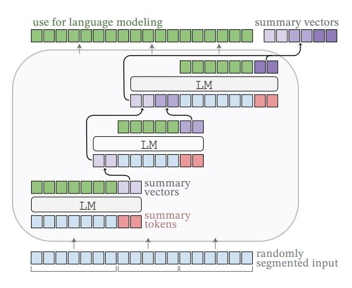
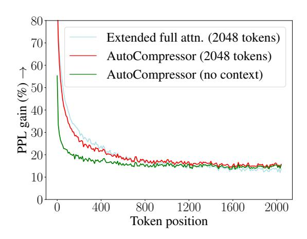
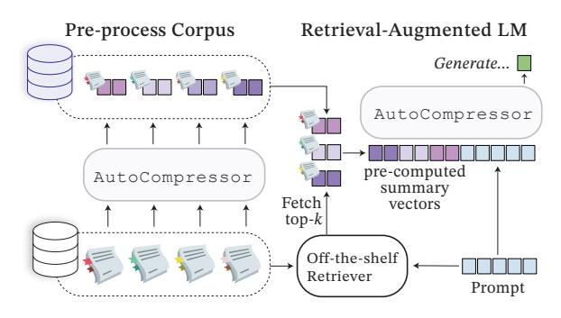
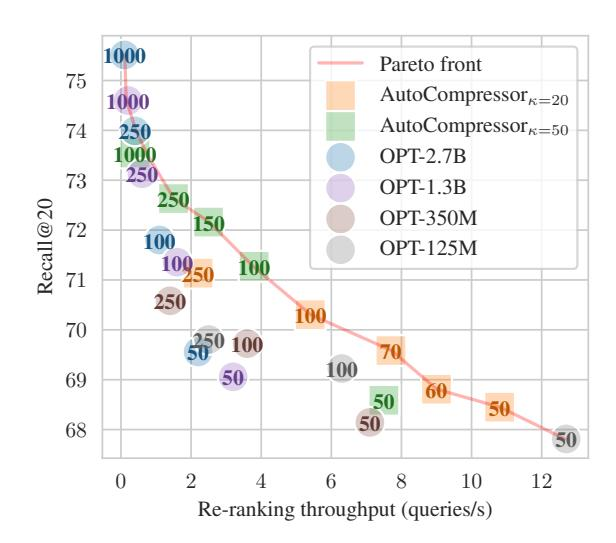
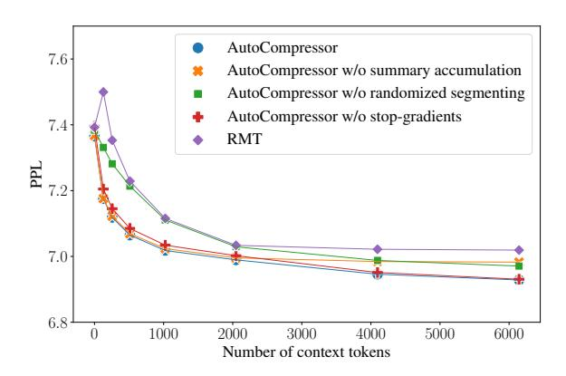

# Adapting Language Models to Compress Contexts

Alexis Chevalier‡∗ Alexander Wettig†∗ Anirudh Ajith† and Danqi Chen†

†Department of Computer Science, Princeton University ‡ Institute for Advanced Study, Princeton achevalier@ias.edu,awettig@cs.princeton.edu

## Abstract

Transformer-based language models (LMs) are powerful and widely-applicable tools, but their usefulness is constrained by a finite context window and the expensive computational cost of processing long text documents. We propose to adapt pre-trained LMs into *AutoCompressors*. These models are capable of compressing long contexts into compact *summary vectors*, which are then accessible to the model as soft prompts. Summary vectors are trained with an unsupervised objective, whereby long documents are processed in segments and summary vectors from all previous segments are used in language modeling. We fine-tune OPT models on sequences of up to 30,720 tokens and show that AutoCompressors can utilize long contexts to improve perplexity. We evaluate AutoCompressors on in-context learning by compressing task demonstrations. We find that summary vectors are good substitutes for plain-text demonstrations, increasing accuracy while reducing inference cost. Finally, we explore the benefits of pre-computing summary vectors for large corpora by applying summary vectors to retrieval-augmented language modeling. Overall, AutoCompressors emerge as a simple and inexpensive solution for extending the context window of LMs while speeding up inference over long contexts.[1](#page-0-0)

## 1 Introduction

Transformer-based language models (LMs) [\(Vaswani et al.,](#page-11-0) [2017\)](#page-11-0) have recently seen a sharp rise in popularity and are now receiving millions of queries, processing billions of tokens, and generating text for a wide variety of applications. With this rise in popularity comes the challenge for researchers to make LMs more *efficient*, to speed up inference and to deploy LMs at scale, while

Figure 1: *AutoCompressors* process long documents by recursively generating summary vectors which are passed as soft prompts to all subsequent segments.

preserving their *versatility*, to allow users to make creative uses of LMs.

With these two goals in mind, we propose to teach pre-trained LMs the ability to compress text into *summary vectors*. Summary vectors are short soft prompts [\(Lester et al.,](#page-10-0) [2021\)](#page-10-0), one or two orders of magnitude shorter than the pre-compressed plain text, that are obtained from the output states of a language model. Summary vectors serve two general purposes: they can help extend the language model's context window to very long documents with minimal computational overhead, and speed up inference on text for which summary vectors have been pre-computed and cached.

Our models, which we call AutoCompressors, are trained with a simple unsupervised training strategy which encourages the model to store essential information in the summary vectors. Summary vectors are produced segment by segment from long documents and are used to improve language modeling in future segments, see Figure [1.](#page-0-1)

Our work builds on the recently proposed RMT architecture [\(Bulatov et al.,](#page-9-0) [2022\)](#page-9-0) with a crucial difference: we introduce *summary accumulation*,

\*The first two authors contributed equally.

1Our code and pre-trained models are publicly available at https://github.com/princeton-nlp/AutoCompressors.

in which summary vectors from all segments are concatenated to produce the summary of the entire document. We show that this improves long-range information retention and enables new ways of reasoning over multiple passages. Additionally, we train AutoCompressors to compress contexts of variable lengths, making them more practical in downstream applications.

AutoCompressors can be initialized with pretrained LMs to produce powerful and versatile models. We fine-tune AutoCompressors from a 2.7B-parameter OPT model (Zhang et al., 2022) on sequences of 30720 tokens with a single NVIDIA A100 GPU with 80GB memory. We show that summary vectors are effective for improving perplexity over long documents, and that these compression capabilities are robust to domain shifts. Our analysis suggests that AutoCompressors learn to capture high-level semantic information in summary vectors, making them useful for a diverse set of downstream applications.

We evaluate AutoCompressors for in-context learning (ICL) by compressing up to 90 in-context demonstrations into summary vectors across 9 classification tasks, including 7 tasks from SuperGlue (Wang et al., 2019). On 7/9 tasks, we find that summary vectors outperform few-shot ICL with a comparable number of in-context tokens.

Finally, we explore two applications where AutoCompressors can reduce inference costs by pre-computing summary vectors for large corpora. First, we adopt a setting for retrieval-augmented language modeling (Shi et al., 2023). We find that for equal sequence lengths, using summary vectors achieves twice the perplexity gain compared to plain-text passages. However, summary vectors are not competitive against retrieving longer plaintext passages. Secondly, we consider a zero-shot passage re-ranking task (Sachan et al., 2022). We establish that AutoCompressors which re-rank passages based on their summary vectors achieve the best trade-off between re-ranking performance and inference throughput.

In summary, our main contributions are the following: (1) We introduce a method for extending LMs to long context windows under small-scale computational requirements by learning to generate summary vectors. We propose summary accumulation and training with randomized segmenting as key features of AutoCompressors. (2) We show that summary vectors encode useful information

for downstream tasks and can be used to reduce the inference cost of in-context learning. (3) We demonstrate the benefits of pre-computing summary vectors for large corpora and using Auto-Compressors in conjunction with retrievers.

### 2 Related Work

**Soft Prompts** Soft prompt tuning is an effective method for adapting pre-trained transformers without updating existing parameters (Lester et al., 2021; Zhong et al., 2021; Liu et al., 2022). Newly initialized embeddings are prepended to the input sequence (the "soft prompt"), and optimization is performed with respect to these new parameters while the rest of the model is frozen. It is one of many parameter-efficient fine-tuning methods (Lialin et al., 2023) and is related to prefix tuning, where newly initialized parameters are prepended to the attention states instead (Li and Liang, 2021).

**Prompt Compression** Wingate et al. (2022) propose to learn compact a soft prompt  $\sigma$  to compress the information contained in a context x. Given a pre-trained language model  $p_{LM}$ , they draw continuations  $y \sim p_{LM}(\cdot|x)$  based on x and use a distillation objective to align the model's predictions based on the soft prompt  $p_{LM}(y|\sigma)$  to the model's predictions conditioned on the context  $p_{LM}(y|x)$ .

Wingate et al. (2022) find that the learnt soft prompt retains high-level information and facilitates controllable generation. However, the approach requires running the optimization for every new context x, with no knowledge transfer between similar contexts. In this paper, we propose AutoCompressors, which are language models that predict their own soft prompts  $\sigma$  as a function of x.

Context distillation A related line of work considers context distillation (Askell et al., 2021; Snell et al., 2022), in which in-context information, e.g., instructions, is distilled into an unprompted student model. AutoCompressor models can be viewed as producing their own model updates in the form of soft prompts based on prior context information. In concurrent work to ours, Mu et al. (2023) compress an instruction into a short key-value attention prefix. Our approach differs by learning to compress any context information, including long documents, and results in more compact soft prompts.

**Long-range Transformers** The training and inference cost of the Transformer architecture scale

quadratically with sequence length, and the sequence length is limited by the available GPU memory in practice. A number of architectural modifications have been proposed to scale Transformers to longer context lengths. These include restricting and sparsifying the attention window [\(Dai et al.,](#page-10-4) [2019;](#page-10-4) [Child et al.,](#page-9-2) [2019\)](#page-9-2), approximating the attention [\(Rae et al.,](#page-11-9) [2020;](#page-11-9) [Zheng et al.,](#page-11-10) [2022;](#page-11-10) [Choromanski et al.,](#page-9-3) [2021\)](#page-9-3), as well as introducing recurrent elements [\(Ma et al.,](#page-10-5) [2022;](#page-10-5) [Bula](#page-9-0)[tov et al.,](#page-9-0) [2022\)](#page-9-0), conditional computation [\(Ainslie](#page-9-4) [et al.,](#page-9-4) [2023\)](#page-9-4), and retrieving previous tokens from the context at the output layer [\(Zhong et al.,](#page-11-11) [2022\)](#page-11-11). See [Tay et al.](#page-11-12) [\(2022\)](#page-11-12) for a comprehensive survey of efficient long-range architectures.

With the exception of retrieval, these architectures typically require expensive training from scratch, or will deviate substantially from a pretrained initialization.[2](#page-2-0) A related problem is that many language models are pre-trained with a maximum sequence length, and lack the inductive bias to extrapolate to longer sequences [\(Press et al.,](#page-11-13) [2022\)](#page-11-13). We overcome these challenges by adapting the Recurrent Memory Transformer (RMT) [\(Bu](#page-9-0)[latov et al.,](#page-9-0) [2022\)](#page-9-0), which can be combined with existing language models. We describe this architecture and our modifications in the next section.

### 3 Method

### 3.1 Generating Summary Vectors

We describe how we adapt a pre-trained language model to generate summary vectors of text segments. An overview of our architecture is shown in Figure [1.](#page-0-1)

Summary vectors The AutoCompressor builds on the RMT architecture [\(Bulatov et al.,](#page-9-0) [2022\)](#page-9-0) and applies it to a pre-trained model. We extend the input vocabulary of the model by κ special summary tokens <Sum>i and initialize κ new input embeddings.[3](#page-2-1) When we append the sequence <Sum>1 . . . <Sum>κ to an input, it signals to the model to output special *summary vectors* of the preceding context. These vectors can then be passed to the next text segment as a soft prompt of length κ.

Since the embedding spaces of pre-trained language models can span thousands of dimensions, we expect that this mechanism has a high capacity for passing information to subsequent segments. Furthermore, a soft prompt can interpolate between many token embeddings, and therefore represent more abstract concept than a single discrete token [\(Wingate et al.,](#page-11-6) [2022\)](#page-11-6).

Summary accumulation We split long documents into segments S1, . . . , Sn and process them sequentially with the language model. [Bulatov](#page-9-0) [et al.](#page-9-0) [\(2022\)](#page-9-0) incorporate information from previous segments by prepending the compressed summary produced by Si−1 to the embedded inputs of Si . We propose *summary accumulation*, which allows for a direct information pathway between each segment and all segments preceding it: we concatenate the summary vectors from all previous segments S1, . . . , Sn−1 and prepend these to Si . Note that the length of the soft prompt now grows linearly with the number of segments.

Positional embeddings We do not add positional embeddings to the compression tokens <Sum>i , nor the summary vectors. This allows us to use all pretrained position embeddings as context tokens and makes it possible to scale the model to an arbitrary number of compression steps during training.

### 3.2 Training Summary Vectors

We use a simple unsupervised training approach which encourages the model to learn summary vectors over several steps.

Training objective For each segment Si = (xi , . . . , xm), we project the Transformer outputs with the language modeling head at each token xt to obtain a distribution over the next token p(xt+1|x1, . . . , xt , S<i). Note that the summary vectors condition these predictions on the tokens from all previous segments. We then minimize the cross-entropy loss over the entire document containing N tokens:

$$\mathcal{L} = -\frac{1}{N} \sum_{i=1}^{n} \sum_{t=1}^{m} \log p(x_{t+1}|x_1, \dots, x_t, S_{< i}).$$

This objective retains the pre-trained language model's abilities on the first segment S1 and it incentivizes the model to store useful information in the summary vectors, which future segments can leverage to make better token predictions.

2 In our pre-liminary experiments, even fine-tuning a pretrained OPT-2.7b model with Transformer-XL-style training [\(Dai et al.,](#page-10-4) [2019\)](#page-10-4) caused optimization difficulties and deterioriated the pre-trained model quality.

3When fine-tuning OPT models, we observe benefits with initializing the embeddings of the summary tokens with the pre-trained embedding for the end-of-sequence token </s>.

Unlike [Wingate et al.](#page-11-6) [\(2022\)](#page-11-6), we do not train with a knowledge distillation objective, since the pre-trained LM has a limited context window as a teacher, whereas the AutoCompressor student learns to process much longer documents.

BPTT with stop-gradients We employ backpropagation through time (BPTT) and use gradient checkpointing [\(Chen et al.,](#page-9-5) [2016\)](#page-9-5) for each segment to reduce the size of the computational graph. In addition, we compute and cache summary vectors and stop their gradients after 2 compression steps, similar to caching past attention states in Transformer-XL training [\(Dai et al.,](#page-10-4) [2019\)](#page-10-4). This assumes that for learning to compress the useful information in Si , it is sufficient to predict the tokens in the adjacent Si+1. In Appendix [A,](#page-12-0) we confirm that this incurs no penalty when predicting long segments, while further reducing GPU memory requirements.

Randomized segmenting We segment sequences randomly during training, subject to the condition that each segment fits into the model's context window. This makes AutoCompressors useful when compressing documents of different lengths. Furthermore, we show in Appendix [A](#page-12-0) that randomized segmenting improves performance under evaluation with fixed-length segments.

### 4 Experiments

We first train an AutoCompressor and evaluate over sequences of 8192 tokens, which allows us to compare to the strong baseline of a fine-tuned full attention Transformer with a long context window. We then consider language modeling over sequences of 30720 tokens and establish that perplexity improves for AutoCompressors over very long contexts. All our experiments are conducted using a single NVIDIA A100 80GB GPU and use Flash Attention [\(Dao et al.,](#page-10-6) [2022\)](#page-10-6) as an efficient implementation of exact attention over long sequences.

### 4.1 Language Modeling

Models We initialize all models with the 2.7Bparameter OPT model [\(Zhang et al.,](#page-11-1) [2022\)](#page-11-1) and fine-tune them for one epoch on 2B tokens from the Pile dataset [\(Gao et al.,](#page-10-7) [2020\)](#page-10-7), sampled evenly from the domains Wikipedia, Books3, FreeLaw and Github. All models use a learning rate of 2e-5 and batch size equivalent to 130k tokens.

Our AutoCompressor model uses summary accumulation with κ = 50 summary tokens and is

fine-tuned on sequences of 6144 tokens, randomly split into four segments ranging from 1024 to 2048 tokens. We stop gradients after two compression steps. We compare to the following baselines:

- 1. OPT-2.7B fine-tuned: We fine-tune OPT-2.7B on our fine-tuning data. This model is limited to sequences up to 2048 tokens due to using 2048 pre-trained positional embeddings.
- 2. Extended full attention : We fine-tune OPT-2.7B on sequences of up to 4096 tokens by extending the model's positional embeddings. We initialize the new embeddings for positions [2049..4096] with the pre-trained embeddings for positions [1..2048]. We are not able to extend the context length beyond 4096 tokens due to GPU memory limitations.
- 3. RMT-2.7B: We fine-tune a regular RMT model [\(Bulatov et al.,](#page-9-0) [2022\)](#page-9-0), and train it on sequences of 8192 tokens split into four segments with fixed length 2048 and without stop gradients. The architecture differs from AutoCompressor by only using the summary vectors from the previous segment instead of performing summary accumulation.

Evaluation We evaluate the long-range language modeling capabilities of the models by measuring the perplexity of the final 2048 tokens in documents of 8192 tokens. For every document, we prompt the model with the summary vectors of the previous n tokens. We generate summary vectors for up to 3 segments of 2048 tokens, but also for single segments as short as 128 tokens. Compressing 2048 tokens into κ = 50 summary vectors achieves a compression rate of 40 tokens per summary vector. For the full-attention baseline we prepend the previous n tokens to the context window. We evaluate on 610 held-out documents for each of the following Pile domains: Books3, FreeLaw, Github, Wikipedia (in-domain), and Gutenberg, ArXiv, HackerNews, YoutubeSubtitles (out-of-domain).

Results Our results are shown in Table [1.](#page-4-0) We find that the AutoCompressor benefits from long contexts of up to 6144 tokens and consistently outperforms the RMT model.

When no summary vectors are given, the Auto-Compressor almost matches the baseline fine-tuned on 2048-long sequences and outperforms the extended full attention model. We also find that the

|                         |      | In-domain   |      |       | Out-of-domain |      |             |      |       |       |                        |
|-------------------------|------|-------------|------|-------|---------------|------|-------------|------|-------|-------|------------------------|
| Segments                |      | –––– 1 –––– |      | – 2 – | – 3 –         |      | –––– 1 –––– |      | – 2 – | – 3 – |                        |
| Pre-compressed tokens   | 128  | 512         | 2048 | 4096  | 6144          | 128  | 512         | 2048 | 4096  | 6144  | Best prompt            |
| AutoCompressor-2.7B     | 6.14 | 6.04        | 5.98 | 5.94  | 5.93          | 8.39 | 8.26        | 8.17 | 8.12  | 8.10  | 150 summary vectors    |
| RMT-2.7B                | 6.42 | 6.19        | 6.02 | 6.02  | 6.01          | 8.76 | 8.44        | 8.21 | 8.20  | 8.20  | 50 summary vectors     |
| Extended full attention | 6.33 | 6.15        | 5.94 | -     | -             | 8.57 | 8.28        | 7.93 | -     | -     | 2048 plain-text tokens |

Table 1: Held-out perplexity on 2048 tokens, while varying the length of the preceding context. For RMT and AutoCompressor, we condition on summary vectors. The extended full attention model was fine-tuned with an extended context window of 4096 tokens, and therefore cannot condition on more than 2048 tokens. "Best prompt" shows the effective additional sequence length to achieve the best perplexity per model (numbers in bold).

|                         | In-domain | Out-of-domain |
|-------------------------|-----------|---------------|
| OPT-2.7B                | 7.53      | 9.19          |
| OPT-2.7B fine-tuned     | 6.28      | 8.53          |
| AutoCompressor-2.7B     | 6.31      | 8.60          |
| RMT-2.7B                | 6.34      | 8.62          |
| Extended full attention | 6.57      | 8.94          |

Table 2: Held-out perplexity of all models on 2048 tokens without summary vectors or additional context.

AutoCompressor is able to compress much shorter sequences than seen during training, unlike RMT which performs worse with 128 context tokens.

While extended full attention performs the best on 4096-long sequences, we observe a trade-off for shorter contexts where AutoCompressors achieve the best performance. We also stress that the AutoCompressor attends to at most 150 additional soft prompts during evaluation, whereas the full attention model is given an additional 2048 tokens.

These trends hold for both in-domain and out-ofdomain evaluation. However, the gap between the AutoCompressor and the full-attention baselines grows in the out-of-domain setting, suggesting that the summary vectors generalize slightly less than pre-trained attention heads.

### 4.2 Long-Range Language Modelling

We investigate how AutoCompressors scale to much longer sequences than the pre-trained context window size. We replicate the above language modeling experiment with sequences of 30720 tokens. We train models on 2B tokens from Books3 and evaluate on 1000 documents from Books3 (indomain) and Gutenberg (out-of-domain).

Models Our main AutoCompressor model is finetuned from OPT-2.7B and processes 30720 tokens with 20 compression steps. We use 50 summary tokens and use random segmenting and stopgradients as before. We also fine-tune an Auto-Compressor using the 1.3B-parameter OPT model as initialization and supply as a baseline the RMT model using 1.3B parameters.

Results We collect our results in Table [3.](#page-5-0) Evaluation shows that both AutoCompressor models learn to utilize the entire 28k tokens to reduce perplexity, while the RMT baseline does not gain in perplexity when doubling the amount of context tokens from 14336 to 28672. This suggests that summary accumulation is an effective strategy for leveraging long-range dependencies in documents.

We also report the CUDA memory requirements for fine-tuning each model in Table [3.](#page-5-0) We train with one NVIDIA A100 GPU with 80GB of memory. Our fine-tuning method allows us to reduce CUDA memory usage and to fine-tune OPT-2.7B on very long sequences. We are not able to compare this model with an equivalent RMT model because the RMT method leads to an out-of-memory error.

#### 4.3 Analysis

Ablations We train AutoCompressors with 20, 50, 70 or 100 summary tokens and report the heldout perplexity results in Table [6](#page-12-1) in the Appendix. Surprisingly, we find that performance does not monotonically increase with longer soft prompts, and κ = 50 performs the best overall. We hypothesize that learning a large number of summary vectors could be a more challenging optimization problem and may require a larger training budget.

We also train models without randomized segmenting, summary accumulation or stop gradients. The results can be found in Figure [5](#page-12-2) in the Appendix. We find that training with randomized segmenting leads to better compression of short segments, but still improves perplexity when compressing multiple 2048 token segments. As ex-

|                                 |                | In-domain      |                     |                | ıt-of-don      |                     |                           |
|---------------------------------|----------------|----------------|---------------------|----------------|----------------|---------------------|---------------------------|
| Segments Pre-compressed tokens  | 0              | ,              | - <i>14</i> - 28672 | 0              |                | - <i>14</i> - 28672 | CUDA mem. during training |
| AutoCompressor-1.3B RMT-1.3B | 12.63 12.62 | 11.95 11.96 |                     | 13.82 13.76 | 13.06 13.07 | <b>13.04</b> 13.07  | 38GB 54GB              |
| AutoCompressor-2.7B RMT-2.7B | 11.54          | 10.88          | 10.85               | 12.18          | 11.54          | 11.52               | 75GB 00M               |

Table 3: Evaluation results for AutoCompressors trained on sequences of 30720 tokens from the Books3 domain, and evaluated on Books3 (in-domain) and Gutenberg (out-of-domain). Perplexity is evaluated on the final 2048 held-out tokens. We train with a single NVIDIA A100 GPU and report the CUDA memory required for fine-tuning these models using a single sequence per batch. AutoCompressors require substantially less memory during training because we stop gradients after two segments.

Figure 2: We plot the perplexity gain over OPT-2.7B for our AutoCompressor model and the 4096-extended attention baseline. We track the perplexity at each token position in sequences of 2048 tokens. The Auto-Compressor model almost matches the strong extended-attention baseline at the start of sequences and outperforms it at the end of sequences.

pected, summary accumulation keeps improving perplexity beyond one compressed segment. We also confirm that stopping gradients does not impact the model performance when compared to full backpropagation despite reducing memory requirements, as seen in Table 3.

Perplexity with token position We seek to better understand how the perplexity scores in Table 1 are distributed over the 2048 tokens in the evaluated segment. We compute the perplexities at each token position over all evaluation domains, while conditioning on either (a) 2048 plain-text tokens for the extended full attention model, (b) 50 summary vectors obtained by compressing 2048 tokens for the AutoCompressor model or (c) no additional context. We report percentage gain over the token-

level perplexity by the pre-trained OPT-2.7B. We present the results in Figure 2.

We find that conditioning on summary vectors improves perplexity over all 2048 token positions, but gains diminish as position increases. This is because all models increasingly use the context information within the segment to make predictions. We observe that the full attention baseline outperforms the AutoCompressor at the start of the sequence, whereas conditioning on summary vectors achieves the best performance towards the end of the sequence. This suggests that the summary vectors are not merely copied over from the last token embeddings of the previous segment. Instead, they capture more high-level aspects of the compressed segment that are useful at all token positions.

### 5 In-Context Learning

To what extent can the generated summary vectors act as a zero-shot, parameter-efficient model update when supplied as a soft prompt? We conduct experiments where we compress in-context demonstrations with the AutoCompressor.

**Experiments** We evaluate the in-context learning abilities of the AutoCompressor model from Section 4.1 over a collection of classification and multiple-choice question-answering datasets.

For each dataset, we evaluate the effect of compressing 1, 2 or 3 segments of demonstrations into 50, 100 or 150 summary vectors using summary accumulation. For each segment, we include as many demonstrations as possible until we reach 750 tokens. For SST-2, this corresponds to 30 demonstrations per segment on average. We compare this compression approach with the results obtained by prompting the model using 150 and 750 tokens'

|                   | AG News                      | SST2              | BoolQ                        | WIC               | WSC                          | RTE                          | CB                           | COPA           | MultiRC                      |
|-------------------|------------------------------|-------------------|------------------------------|-------------------|------------------------------|------------------------------|------------------------------|----------------|------------------------------|
| zero-shot         | 68.2 (0.0)        | 78.0(0.0)         | <b>60.2</b> (0.0) | 49.5(0.0)         | 60.6(0.0)                    | 55.2(0.0)                    | 43.6(0.0)                    | 69.0(0.0)      | 43.8(0.0)                    |
| 50 summary vecs.  | <b>72.7</b> (1.4) | 84.3(9.2)         | $55.8_{(4.2)}$               | $50.4_{(1.0)}$    | $61.3_{(5.8)}$               | $54.8_{(3.4)}$               | $55.9_{(5.4)}$               | $71.6_{(0.6)}$ | $44.1_{(1.1)}$               |
| 100 summary vecs. | $71.2_{(3.8)}$               | <b>87.0</b> (3.5) | $57.5_{(4.6)}$               | $50.7_{(1.0)}$    | $60.2_{(6.7)}$               | $55.5_{(2.5)}$               | $54.4_{(4.0)}$               |                | $45.6_{(2.8)}$               |
| 150 summary vecs. | $68.2_{(3.3)}$               | $82.6_{(5.6)}$    | $59.8_{(1.8)}$               | <b>51.8</b> (1.1) | <b>63.5</b> (0.0) | <b>55.8</b> (1.8) | <b>58.3</b> (5.1) | $71.4_{(0.5)}$ | <b>46.7</b> (2.1) |
| ICL (150 tokens)  | $72.5_{(2.5)}$               | 70.8(12.6)        | 60.2(0.0)                    | 50.4(1.1)         | 52.3(13.9)                   | 57.6(4.3)                    | 51.1 (7.1)        | 71.3(1.5)      | 43.8(0.0)                    |
| ICL (750 tokens)  | $67.3_{(3.4)}$               | ( /               | $69.1_{(1.0)}$               |                   | $62.9_{(0.8)}$               |                              |                              |                |                              |

Table 4: Evaluation of the ICL performance of the AutoCompressor-2.7B. Each summary is 50-tokens long and corresponds to a segment of 750 tokens worth of demonstrations. We also report accuracies when prompting AutoCompressor with 150 and 750 tokens worth of plaintext demonstrations as baselines. Note that for BoolQ and MultiRC, demonstrations are too long to fit into 150 tokens.

worth of plain-text demonstrations.

We use contextual calibration (Zhao et al., 2021) and class-balanced sampling of demonstrations if these techniques improve performance on a validation set. For each evaluation, we report the mean accuracy and standard deviation evaluated over 7 random seeds. Detailed settings for each dataset can be found in Table 8.

**Results** We show evaluation results in Table 4. Results show that summary vectors consistently improve performance over the zero-shot baseline, except on BoolQ, which notably has the longest demonstrations at an average length of 665 tokens.

Furthermore, summary vectors usually increase accuracy compared to 150 tokens worth of plain demonstrations. On AG News, WiC, WSC and CB, summary vectors even out-perform ICL conditioned on 750 tokens worth of plain text demonstrations. Hence summary vectors emerge as a strong alternative to plain text demonstrations, as they increase accuracy while reducing inference cost.

In Appendix C, Table 9, we also compare performance against a pre-trained OPT-2.7B model and the RMT model introduced in Section 4.1. The AutoCompressor's ICL performance is comparable with the pre-trained OPT-2.7B, which shows that fine-tuning AutoCompressors does not affect base ICL capabilities. Moreover, the AutoCompressor achieves higher accuracies than the RMT model on 7/9 tasks and the RMT model does not consistently benefit from multiple compression steps.

# 6 Compressing Retrieval Corpora For Efficient Inference

We consider settings where AutoCompressors precompute summary vectors for large collections of documents, which can be stored and later retrieved for efficient inference. Since inference is typically more expensive than storage, this approach has the potential to achieve good practical trade-offs.

### 6.1 Retrieval-augmented Language Modeling

Retrieval-augmented language models aim to improve token predictions by retrieving relevant information from a data store. A number of approaches have been proposed, which infuse external knowledge in the input layer (Guu et al., 2020; Shi et al., 2023), intermediate layers (Borgeaud et al., 2022) or at the output layer (Khandelwal et al., 2020; Zhong et al., 2022).

Our case study focuses on REPLUG (Shi et al., 2023), which is a simple method for combining a pre-trained language model with an off-the-shelf retriever to improve language modeling performance. Given access to an external corpus  $\mathcal{C}$ , REPLUG retrieves k passages  $\mathcal{D} = \{d_1, \ldots, d_k\}$  based on a segment x to score the following segment y. We discuss this in more detail below and introduce variations based on pre-computed summary vectors.

**REPLUG** Shi et al. (2023) incorporate the retrieved passages by prepending each passage d to the context x, and compute the overall probability for y by ensembling the predictions based on different passages:

$$p(y \mid x, \mathcal{D}) = \sum_{d \in \mathcal{D}} \lambda(d, x) \cdot p(y \mid \mathsf{Concat}[d, x]),$$

where  $\lambda(d,x)$  are normalized weights based on the similarity score from the retriever and  $\operatorname{Concat}[d,x]$  denotes concatenation of p and x.

This method incurs a substantial overhead, since it requires k separate forward passes over sequences  $\operatorname{Concat}[d,x,y]$ .

**Soft-REPLUG** We propose performing RE-PLUG over summary vectors instead of plain text. We use an AutoCompressor to pre-compute the

|                                    |                                | Perplexity Gain (%) |              |              | Throughput (examples/s) |          |          |          |         |
|------------------------------------|--------------------------------|---------------------|--------------|--------------|-------------------------|----------|----------|----------|---------|
| Passages                           |                                | top-1               | top-3        | top-5        | top-10                  | top-1    | top-3    | top-5    | top-10  |
| 50 tokens                          | REPLUG Fused Passages       | -0.59 0.72       | 1.08 1.27 | 1.67 1.72 | 2.35 2.61            | 51 28 | 25 25 | 16 23 | 9 17 |
| 512 tokens → 50 summary vectors | Soft-REPLUG Fused Summaries | 0.23 2.78        | 3.16 4.03 | 3.81 4.49 | 4.23 4.59            | 51 28 | 25 25 | 16 23 | 9 17 |
| 512 tokens                         | REPLUG                         | 6.65                | 10.87        | 11.59        | 11.81                   | 18       | 8        | 6        | 3       |

Table 5: PPL gains (%) from different retrieval-augmented language modeling settings, over the no-retrieval baseline. We also report throughput on a single NVIDIA A100 GPU for each method without batching examples. Fused Summaries out-performs Soft-REPLUG, Fused Passages, and REPLUG with 50-token passages retrieved. However, Fused Summaries is surpassed by REPLUG with the top-1 512 tokens retrieved for an equivalent throughput. This shows that Fused Summaries does not utilize the retrieved documents to their full potential.

Figure 3: Efficient retrieval-augmented language modeling with AutoCompressors. Large corpora can be pre-processed into compressed summary vectors which can be stored cheaply. Upon retrieval, compressed summaries are fused for efficient access to multiple documents in a single forward pass.

summary vectors  $\sigma_d$  for every passage  $d \in \mathcal{C}$  and use the off-the-shelf retriever to retrieve  $\mathcal{D}$  and the associated summary vectors  $\{\sigma_{d_1},\ldots,\sigma_{d_k}\}$ . We ensemble the token probabilities for y conditioned on the summary vectors as

$$p(y \mid x) = \sum_{d \in \mathcal{D}} \lambda(d, x) \cdot p(y \mid \text{Concat}[\sigma_d, x]).$$

where  $\operatorname{Concat}[\sigma_d, x]$  denotes concatenation of the softprompt  $\sigma_d$  with the plain text x.

**Fused Summary Vectors** Inspired by fusion-indecoder (Izacard and Grave, 2021), we consider a new setting for retrieval-augmented language modeling. The summary vectors of retrieved passages  $\mathcal{D}$  are concatenated to form *fused summary vectors*,  $\sigma_{\mathcal{D}} = \operatorname{Concat}[\sigma_{d_k}, \ldots, \sigma_{d_1}]$ , where  $d_k, \ldots, d_1$  are ordered from least-to-most relevant. This process resembles the summary accumulation in AutoCompressors described in Section 3.1. We also find that it helps to smooth probability scores and re-order

the retrieved passages based on their summary vectors, see Appendix B for details. Figure 3 gives an overview over our proposed approach.

**Fused Passages** We establish a baseline for Fusing Summary Vectors by concatenating the corresponding plain-text passages  $D = \operatorname{Concat}[d_k, \ldots, d_1]$ , and computed smoothed probabilities, see Appendix B. Unlike for summary vectors, the number of passages are limited by the pre-trained language model's context window.

**Experiments** We evaluate the AutoCompressor model introduced in Section 4.1 without any additional fine-tuning. Similar to Shi et al. (2023), we retrieve from the Pile training data. We consider the domains Books3, FreeLaw, Github, Wikipedia, Gutenberg, ArXiv, HackerNews, YoutubeSubtitles. We index 10B tokens for each domain, which are either split into passages of 50 tokens or 512 tokens. We compress long passages into 50 summary vectors, which results in a disk space of 5 TB per domain when stored in half precision format.4 We use the Pile validation data for the same domains for evaluation, where we use segments of length 128 tokens as context x and evaluate the perplexity over the following 128 tokens y. We use the unsupervised Contriever model (Izacard et al., 2022) for retrieval, and retrieve the top-1, 3, 5 or 10 passages.

**Results** Results are shown in Table 5. We find that Fused Summary Vectors outperforms Fused Passages, Soft-REPLUG, and REPLUG when 50-token passages are retrieved. We measure throughput empirically and show that for 10 retrieved

&lt;sup>4For comparison, storing the transformer output at every single token (e.g., in an encoder-decoder setting) would take up 51 TB and storing all attention states would be 3,276 TB.

documents, Fused Summary Vectors remains an inexpensive language modeling strategy.

However, plain-text REPLUG with long documents outperforms our models for all top-k settings. This implies that summary vectors do not retain enough information from these passages. We leave it as future work to investigate different approaches for closing this performance gap.

We highlight that fusing summary vectors is effective, despite a mismatch to training, since we draw independent summary vectors from separate documents. Furthermore, our AutoCompressor model is only every trained to accumulate 3 sets of summary vectors, and yet it benefits from fusing the summary vectors of up to 10 documents.

### 6.2 Unsupervised Passage Re-ranking

Finally, we consider the case study of passage reranking, in which a fast off-the-shelf retriever like BM25 retrieves a large set of candidate passages, and a more capable re-ranker refines the ranking to increase the rank of the most relevant passages.

Method [Sachan et al.](#page-11-4) [\(2022\)](#page-11-4) introduce an effective method for leveraging language models as re-rankers with no additional supervision or finetuning. Given a query q and a set of candidate passages {p1, . . . , pk}, the language model scores the likelihood of the query q conditioned on the prompt "Passage: {pi}. Please write a question based on this passage." for each passage pi and re-ranks the passages based on the scores.

Experiments We consider the task of re-ranking BM25 passages on the NQ test set [\(Balachandran](#page-9-7) [et al.,](#page-9-7) [2021\)](#page-9-7) and compare out-of-the-box AutoCompressors with 20 and 50 summary tokens to pretrained OPT models. We pre-compute summary vectors for 21M passages from a Wikipedia corpus [\(Karpukhin et al.,](#page-10-12) [2020\)](#page-10-12), which requires 2.1TB and 5.4TB disk space in half precision for 20 and 50 summary vectors respectively. We measure the quality of the re-ranked results using Recall@20.

Results The results are shown in Figure [4.](#page-8-0) We measure throughput for individual un-batched queries on a single NVIDIA A100 80GB GPU and assume that the latency of loading summary vectors is negligible. Although the passages are only 100 words long, resulting in low compression rates, summary vectors substantially speed up the inference, while sacrificing on performance less than smaller models. This leads to to a pareto-optimal

Figure 4: We compare AutoCompressors (boxes) in an unsupervised passage re-ranking setting to pre-trained language models (circles). The number on each data point shows how many passages retrieved by BM25 are re-ranked, and the vertical axis shows the Recall@20 performance of the re-ranking system on the NQ test set. We consider the throughput on a single NVIDIA A100 GPU and assume that multiple queries cannot be batched. By leveraging pre-computed summary vectors for passages, AutoCompressors lead to re-ranking solutions that lie on the pareto front of recall vs. compute.

trade-off between compute and performance, and demonstrates that summary vectors often retain sufficient information from a passage to assess its relevance for a particular query.

### 7 Conclusion

We have introduced a training strategy for adapting pre-trained LMs into AutoCompressors, which recursively compress contexts into summary vectors. Our experiments indicate that summary vectors retain important contextual information for improving language modeling, encoding in-context demonstrations, and assessing the relevance of a passage for a user query. This shows that our unsupervised training strategy leads to versatile applications. Summary vectors can be pre-computed, cached and re-used. This promises practical efficiency gains by reducing the size of the attention window. Significant future work remains in scaling AutoCompressors to bigger models and improving the quality of summary vectors to further close the gap with full attention over long-range contexts.

## Limitations

- 1. We only apply AutoCompressors to OPT models of up to 2.7B parameters. Future work needs to establish how AutoCompressors perform for large models, but as the summary vector dimension grows, there is promise for retaining more information per vector. We also question, whether other pre-trained model families with differing architectural characteristics, such as untied input-output embeddings, will be harder to adapt as AutoCompressors.
- 2. Our results suggest that summary vectors ignore some useful information that is accessible via full attention. Additionally, models do not always benefit from increasing the number of summary vectors. We suspect that the training signal for learning summary vectors efficiently might be limited by pre-trained models being very good at making predictions from the plain-text tokens in the current segment. Future work is needed to improve this optimization.
- 3. Summary accumulation still leads to quadratic complexity with increasing number of segments, albeit at a much lower rate than full attention. Future work may explore ways to combine many summary vectors more efficiently.

### Acknowledgments

We thank the members of the Princeton NLP group for helpful discussion and valuable feedback. This research is supported by an NSF CAREER award (IIS-2239290), a Sloan Research Fellowship, and a Data Science Research Award from Adobe. AC also gratefully acknowledges support from the Minerva Research Foundation.

### References

- Joshua Ainslie, Tao Lei, Michiel de Jong, Santiago Ontañón, Siddhartha Brahma, Yury Zemlyanskiy, David Uthus, Mandy Guo, James Lee-Thorp, Yi Tay, Yun-Hsuan Sung, and Sumit Sanghai. 2023. [Colt5: Faster](http://arxiv.org/abs/2303.09752) [long-range transformers with conditional computa](http://arxiv.org/abs/2303.09752)[tion.](http://arxiv.org/abs/2303.09752)
- Amanda Askell, Yuntao Bai, Anna Chen, Dawn Drain, Deep Ganguli, Tom Henighan, Andy Jones, Nicholas Joseph, Ben Mann, Nova DasSarma, et al. 2021. A general language assistant as a laboratory for alignment. *arXiv preprint arXiv:2112.00861*.

- Vidhisha Balachandran, Bhuwan Dhingra, Haitian Sun, Michael Collins, and William Cohen. 2021. [Inves](https://doi.org/10.18653/v1/2021.deelio-1.3)[tigating the effect of background knowledge on nat](https://doi.org/10.18653/v1/2021.deelio-1.3)[ural questions.](https://doi.org/10.18653/v1/2021.deelio-1.3) In *Proceedings of Deep Learning Inside Out (DeeLIO): The 2nd Workshop on Knowledge Extraction and Integration for Deep Learning Architectures*, pages 25–30, Online. Association for Computational Linguistics.
- Roy Bar Haim, Ido Dagan, Bill Dolan, Lisa Ferro, Danilo Giampiccolo, Bernardo Magnini, and Idan Szpektor. 2006. [The second PASCAL recognising](https://citeseerx.ist.psu.edu/viewdoc/download?doi=10.1.1.60.8552&rep=rep1&type=pdf) [textual entailment challenge.](https://citeseerx.ist.psu.edu/viewdoc/download?doi=10.1.1.60.8552&rep=rep1&type=pdf)
- Luisa Bentivogli, Peter Clark, Ido Dagan, and Danilo Giampiccolo. 2009. [The fifth PASCAL recognizing](https://citeseerx.ist.psu.edu/viewdoc/download?doi=10.1.1.232.1231&rep=rep1&type=pdf) [textual entailment challenge.](https://citeseerx.ist.psu.edu/viewdoc/download?doi=10.1.1.232.1231&rep=rep1&type=pdf) In *TAC*.
- Sebastian Borgeaud, Arthur Mensch, Jordan Hoffmann, Trevor Cai, Eliza Rutherford, Katie Millican, George van den Driessche, Jean-Baptiste Lespiau, Bogdan Damoc, Aidan Clark, Diego de Las Casas, Aurelia Guy, Jacob Menick, Roman Ring, Tom Hennigan, Saffron Huang, Loren Maggiore, Chris Jones, Albin Cassirer, Andy Brock, Michela Paganini, Geoffrey Irving, Oriol Vinyals, Simon Osindero, Karen Simonyan, Jack W. Rae, Erich Elsen, and Laurent Sifre. 2022. [Improving language models by retrieving from](http://arxiv.org/abs/2112.04426) [trillions of tokens.](http://arxiv.org/abs/2112.04426)
- Tom Brown, Benjamin Mann, Nick Ryder, Melanie Subbiah, Jared D Kaplan, Prafulla Dhariwal, Arvind Neelakantan, Pranav Shyam, Girish Sastry, Amanda Askell, Sandhini Agarwal, Ariel Herbert-Voss, Gretchen Krueger, Tom Henighan, Rewon Child, Aditya Ramesh, Daniel Ziegler, Jeffrey Wu, Clemens Winter, Chris Hesse, Mark Chen, Eric Sigler, Mateusz Litwin, Scott Gray, Benjamin Chess, Jack Clark, Christopher Berner, Sam McCandlish, Alec Radford, Ilya Sutskever, and Dario Amodei. 2020. [Language models are few-shot learners.](https://proceedings.neurips.cc/paper_files/paper/2020/file/1457c0d6bfcb4967418bfb8ac142f64a-Paper.pdf) In *Advances in Neural Information Processing Systems*, volume 33, pages 1877–1901. Curran Associates, Inc.
- Aydar Bulatov, Yuri Kuratov, and Mikhail Burtsev. 2022. [Recurrent memory transformer.](https://openreview.net/forum?id=Uynr3iPhksa) In *Advances in Neural Information Processing Systems*.
- Tianqi Chen, Bing Xu, Chiyuan Zhang, and Carlos Guestrin. 2016. Training deep nets with sublinear memory cost. *arXiv preprint arXiv:1604.06174*.
- Rewon Child, Scott Gray, Alec Radford, and Ilya Sutskever. 2019. Generating long sequences with sparse transformers. *arXiv preprint arXiv:1904.10509*.
- Krzysztof Marcin Choromanski, Valerii Likhosherstov, David Dohan, Xingyou Song, Andreea Gane, Tamas Sarlos, Peter Hawkins, Jared Quincy Davis, Afroz Mohiuddin, Lukasz Kaiser, David Benjamin Belanger, Lucy J Colwell, and Adrian Weller. 2021. [Rethinking attention with performers.](https://openreview.net/forum?id=Ua6zuk0WRH) In *International Conference on Learning Representations*.

- Christopher Clark, Kenton Lee, Ming-Wei Chang, Tom Kwiatkowski, Michael Collins, and Kristina Toutanova. 2019. [BoolQ: Exploring the surprising](https://doi.org/10.18653/v1/N19-1300) [difficulty of natural yes/no questions.](https://doi.org/10.18653/v1/N19-1300) In *Proceedings of the 2019 Conference of the North American Chapter of the Association for Computational Linguistics: Human Language Technologies, Volume 1 (Long and Short Papers)*, pages 2924–2936, Minneapolis, Minnesota. Association for Computational Linguistics.
- Ido Dagan, Oren Glickman, and Bernardo Magnini. 2005. [The PASCAL recognising textual entailment](https://kdd.cs.ksu.edu/Courses/Fall-2008/CIS798/Handouts/06-dagan05pascal.pdf) [challenge.](https://kdd.cs.ksu.edu/Courses/Fall-2008/CIS798/Handouts/06-dagan05pascal.pdf) In *the First International Conference on Machine Learning Challenges: Evaluating Predictive Uncertainty Visual Object Classification, and Recognizing Textual Entailment*.
- Zihang Dai, Zhilin Yang, Yiming Yang, Jaime Carbonell, Quoc Le, and Ruslan Salakhutdinov. 2019. [Transformer-XL: Attentive language models beyond](https://doi.org/10.18653/v1/P19-1285) [a fixed-length context.](https://doi.org/10.18653/v1/P19-1285) In *Proceedings of the 57th Annual Meeting of the Association for Computational Linguistics*, pages 2978–2988, Florence, Italy. Association for Computational Linguistics.
- Tri Dao, Daniel Y Fu, Stefano Ermon, Atri Rudra, and Christopher Re. 2022. [FlashAttention: Fast and](https://openreview.net/forum?id=H4DqfPSibmx) [memory-efficient exact attention with IO-awareness.](https://openreview.net/forum?id=H4DqfPSibmx) In *Advances in Neural Information Processing Systems*.
- Marie-Catherine de Marneffe, Mandy Simons, and Judith Tonhauser. 2019. [The commitmentbank: Inves](https://doi.org/10.18148/sub/2019.v23i2.601)[tigating projection in naturally occurring discourse.](https://doi.org/10.18148/sub/2019.v23i2.601) *Proceedings of Sinn und Bedeutung*, 23(2):107–124.
- Leo Gao, Stella Biderman, Sid Black, Laurence Golding, Travis Hoppe, Charles Foster, Jason Phang, Horace He, Anish Thite, Noa Nabeshima, et al. 2020. The pile: An 800GB dataset of diverse text for language modeling. *arXiv preprint arXiv:2101.00027*.
- Kelvin Guu, Kenton Lee, Zora Tung, Panupong Pasupat, and Mingwei Chang. 2020. [Retrieval augmented](https://proceedings.mlr.press/v119/guu20a.html) [language model pre-training.](https://proceedings.mlr.press/v119/guu20a.html) In *Proceedings of the 37th International Conference on Machine Learning*, volume 119 of *Proceedings of Machine Learning Research*, pages 3929–3938. PMLR.
- Gautier Izacard, Mathilde Caron, Lucas Hosseini, Sebastian Riedel, Piotr Bojanowski, Armand Joulin, and Edouard Grave. 2022. [Unsupervised dense informa](https://openreview.net/forum?id=jKN1pXi7b0)[tion retrieval with contrastive learning.](https://openreview.net/forum?id=jKN1pXi7b0) *Transactions on Machine Learning Research*.
- Gautier Izacard and Edouard Grave. 2021. [Leveraging](https://doi.org/10.18653/v1/2021.eacl-main.74) [passage retrieval with generative models for open do](https://doi.org/10.18653/v1/2021.eacl-main.74)[main question answering.](https://doi.org/10.18653/v1/2021.eacl-main.74) In *Proceedings of the 16th Conference of the European Chapter of the Association for Computational Linguistics: Main Volume*, pages 874–880, Online. Association for Computational Linguistics.
- Vladimir Karpukhin, Barlas Oguz, Sewon Min, Patrick Lewis, Ledell Wu, Sergey Edunov, Danqi Chen, and

- Wen-tau Yih. 2020. [Dense passage retrieval for open](https://doi.org/10.18653/v1/2020.emnlp-main.550)[domain question answering.](https://doi.org/10.18653/v1/2020.emnlp-main.550) In *Proceedings of the 2020 Conference on Empirical Methods in Natural Language Processing (EMNLP)*, pages 6769–6781, Online. Association for Computational Linguistics.
- Urvashi Khandelwal, Omer Levy, Dan Jurafsky, Luke Zettlemoyer, and Mike Lewis. 2020. [Generalization](https://openreview.net/forum?id=HklBjCEKvH) [through memorization: Nearest neighbor language](https://openreview.net/forum?id=HklBjCEKvH) [models.](https://openreview.net/forum?id=HklBjCEKvH) In *International Conference on Learning Representations*.
- Daniel Khashabi, Snigdha Chaturvedi, Michael Roth, Shyam Upadhyay, and Dan Roth. 2018. [Looking](https://doi.org/10.18653/v1/N18-1023) [beyond the surface: A challenge set for reading com](https://doi.org/10.18653/v1/N18-1023)[prehension over multiple sentences.](https://doi.org/10.18653/v1/N18-1023) In *Proceedings of the 2018 Conference of the North American Chapter of the Association for Computational Linguistics: Human Language Technologies, Volume 1 (Long Papers)*, pages 252–262, New Orleans, Louisiana. Association for Computational Linguistics.
- Brian Lester, Rami Al-Rfou, and Noah Constant. 2021. [The power of scale for parameter-efficient prompt](https://doi.org/10.18653/v1/2021.emnlp-main.243) [tuning.](https://doi.org/10.18653/v1/2021.emnlp-main.243) In *Proceedings of the 2021 Conference on Empirical Methods in Natural Language Processing*, pages 3045–3059, Online and Punta Cana, Dominican Republic. Association for Computational Linguistics.
- Hector J. Levesque, Ernest Davis, and Leora Morgenstern. 2012. The winograd schema challenge. In *13th International Conference on the Principles of Knowledge Representation and Reasoning, KR 2012*, Proceedings of the International Conference on Knowledge Representation and Reasoning, pages 552–561. Institute of Electrical and Electronics Engineers Inc. 13th International Conference on the Principles of Knowledge Representation and Reasoning, KR 2012 ; Conference date: 10-06-2012 Through 14-06-2012.
- Xiang Lisa Li and Percy Liang. 2021. [Prefix-tuning:](https://doi.org/10.18653/v1/2021.acl-long.353) [Optimizing continuous prompts for generation.](https://doi.org/10.18653/v1/2021.acl-long.353) In *Proceedings of the 59th Annual Meeting of the Association for Computational Linguistics and the 11th International Joint Conference on Natural Language Processing (Volume 1: Long Papers)*, pages 4582– 4597, Online. Association for Computational Linguistics.
- Vladislav Lialin, Vijeta Deshpande, and Anna Rumshisky. 2023. Scaling down to scale up: A guide to parameter-efficient fine-tuning. *arXiv preprint arXiv:2303.15647*.
- Xiao Liu, Kaixuan Ji, Yicheng Fu, Weng Tam, Zhengxiao Du, Zhilin Yang, and Jie Tang. 2022. [P-tuning:](https://doi.org/10.18653/v1/2022.acl-short.8) [Prompt tuning can be comparable to fine-tuning](https://doi.org/10.18653/v1/2022.acl-short.8) [across scales and tasks.](https://doi.org/10.18653/v1/2022.acl-short.8) In *Proceedings of the 60th Annual Meeting of the Association for Computational Linguistics (Volume 2: Short Papers)*, pages 61–68, Dublin, Ireland. Association for Computational Linguistics.
- Xuezhe Ma, Chunting Zhou, Xiang Kong, Junxian He, Liangke Gui, Graham Neubig, Jonathan May,

- and Luke Zettlemoyer. 2022. Mega: moving average equipped gated attention. *arXiv preprint arXiv:2209.10655*.
- Jesse Mu, Xiang Lisa Li, and Noah Goodman. 2023. [Learning to compress prompts with gist tokens.](http://arxiv.org/abs/2304.08467)
- Mohammad Taher Pilehvar and Jose Camacho-Collados. 2019. [WiC: the word-in-context dataset for evalu](https://doi.org/10.18653/v1/N19-1128)[ating context-sensitive meaning representations.](https://doi.org/10.18653/v1/N19-1128) In *Proceedings of the 2019 Conference of the North American Chapter of the Association for Computational Linguistics: Human Language Technologies, Volume 1 (Long and Short Papers)*, pages 1267–1273, Minneapolis, Minnesota. Association for Computational Linguistics.
- Ofir Press, Noah Smith, and Mike Lewis. 2022. [Train](https://openreview.net/forum?id=R8sQPpGCv0) [short, test long: Attention with linear biases enables](https://openreview.net/forum?id=R8sQPpGCv0) [input length extrapolation.](https://openreview.net/forum?id=R8sQPpGCv0) In *International Conference on Learning Representations*.
- Jack W. Rae, Anna Potapenko, Siddhant M. Jayakumar, Chloe Hillier, and Timothy P. Lillicrap. 2020. [Compressive transformers for long-range sequence](https://openreview.net/forum?id=SylKikSYDH) [modelling.](https://openreview.net/forum?id=SylKikSYDH) In *International Conference on Learning Representations*.
- Melissa Roemmele, Cosmin Adrian Bejan, and Andrew S Gordon. 2011. Choice of plausible alternatives: An evaluation of commonsense causal reasoning. In *AAAI Spring Symposium: Logical Formalizations of Commonsense Reasoning*.
- Devendra Sachan, Mike Lewis, Mandar Joshi, Armen Aghajanyan, Wen-tau Yih, Joelle Pineau, and Luke Zettlemoyer. 2022. [Improving passage retrieval with](https://aclanthology.org/2022.emnlp-main.249) [zero-shot question generation.](https://aclanthology.org/2022.emnlp-main.249) In *Proceedings of the 2022 Conference on Empirical Methods in Natural Language Processing*, pages 3781–3797, Abu Dhabi, United Arab Emirates. Association for Computational Linguistics.
- Weijia Shi, Sewon Min, Michihiro Yasunaga, Minjoon Seo, Rich James, Mike Lewis, Luke Zettlemoyer, and Wen-tau Yih. 2023. REPLUG: Retrievalaugmented black-box language models. *arXiv preprint arXiv:2301.12652*.
- Charlie Snell, Dan Klein, and Ruiqi Zhong. 2022. Learning by distilling context. *arXiv preprint arXiv:2209.15189*.
- Richard Socher, Alex Perelygin, Jean Wu, Jason Chuang, Christopher D. Manning, Andrew Ng, and Christopher Potts. 2013. [Recursive deep models for](https://aclanthology.org/D13-1170.pdf) [semantic compositionality over a sentiment treebank.](https://aclanthology.org/D13-1170.pdf)
- Yi Tay, Mostafa Dehghani, Dara Bahri, and Donald Metzler. 2022. [Efficient transformers: A survey.](https://doi.org/10.1145/3530811) *ACM Comput. Surv.*, 55(6).
- Ashish Vaswani, Noam Shazeer, Niki Parmar, Jakob Uszkoreit, Llion Jones, Aidan N Gomez, Ł ukasz Kaiser, and Illia Polosukhin. 2017. [Attention is all](https://proceedings.neurips.cc/paper_files/paper/2017/file/3f5ee243547dee91fbd053c1c4a845aa-Paper.pdf) [you need.](https://proceedings.neurips.cc/paper_files/paper/2017/file/3f5ee243547dee91fbd053c1c4a845aa-Paper.pdf) In *Advances in Neural Information Processing Systems*, volume 30. Curran Associates, Inc.

- Alex Wang, Yada Pruksachatkun, Nikita Nangia, Amanpreet Singh, Julian Michael, Felix Hill, Omer Levy, and Samuel Bowman. 2019. [SuperGLUE: A stickier](https://proceedings.neurips.cc/paper_files/paper/2019/file/4496bf24afe7fab6f046bf4923da8de6-Paper.pdf) [benchmark for general-purpose language understand](https://proceedings.neurips.cc/paper_files/paper/2019/file/4496bf24afe7fab6f046bf4923da8de6-Paper.pdf)[ing systems.](https://proceedings.neurips.cc/paper_files/paper/2019/file/4496bf24afe7fab6f046bf4923da8de6-Paper.pdf) In *Advances in Neural Information Processing Systems*, volume 32. Curran Associates, Inc.
- David Wingate, Mohammad Shoeybi, and Taylor Sorensen. 2022. [Prompt compression and contrastive](https://aclanthology.org/2022.findings-emnlp.412) [conditioning for controllability and toxicity reduction](https://aclanthology.org/2022.findings-emnlp.412) [in language models.](https://aclanthology.org/2022.findings-emnlp.412) In *Findings of the Association for Computational Linguistics: EMNLP 2022*, pages 5621–5634, Abu Dhabi, United Arab Emirates. Association for Computational Linguistics.
- Susan Zhang, Stephen Roller, Naman Goyal, Mikel Artetxe, Moya Chen, Shuohui Chen, Christopher Dewan, Mona Diab, Xian Li, Xi Victoria Lin, et al. 2022. OPT: Open pre-trained transformer language models. *arXiv preprint arXiv:2205.01068*.
- Xiang Zhang, Junbo Zhao, and Yann LeCun. 2015. [Character-level convolutional networks for text clas](https://proceedings.neurips.cc/paper/2015/file/250cf8b51c773f3f8dc8b4be867a9a02-Paper.pdf)[sification.](https://proceedings.neurips.cc/paper/2015/file/250cf8b51c773f3f8dc8b4be867a9a02-Paper.pdf) In *Advances in Neural Information Processing Systems*, volume 28. Curran Associates, Inc.
- Zihao Zhao, Eric Wallace, Shi Feng, Dan Klein, and Sameer Singh. 2021. [Calibrate before use: Improv](https://proceedings.mlr.press/v139/zhao21c.html)[ing few-shot performance of language models.](https://proceedings.mlr.press/v139/zhao21c.html) In *Proceedings of the 38th International Conference on Machine Learning*, volume 139 of *Proceedings of Machine Learning Research*, pages 12697–12706. PMLR.
- Lin Zheng, Chong Wang, and Lingpeng Kong. 2022. [Linear complexity randomized self-attention mech](https://proceedings.mlr.press/v162/zheng22b.html)[anism.](https://proceedings.mlr.press/v162/zheng22b.html) In *Proceedings of the 39th International Conference on Machine Learning*, volume 162 of *Proceedings of Machine Learning Research*, pages 27011–27041. PMLR.
- Zexuan Zhong, Dan Friedman, and Danqi Chen. 2021. [Factual probing is \[MASK\]: Learning vs. learning](https://doi.org/10.18653/v1/2021.naacl-main.398) [to recall.](https://doi.org/10.18653/v1/2021.naacl-main.398) In *Proceedings of the 2021 Conference of the North American Chapter of the Association for Computational Linguistics: Human Language Technologies*, pages 5017–5033, Online. Association for Computational Linguistics.
- Zexuan Zhong, Tao Lei, and Danqi Chen. 2022. [Train](https://aclanthology.org/2022.emnlp-main.382)[ing language models with memory augmentation.](https://aclanthology.org/2022.emnlp-main.382) In *Proceedings of the 2022 Conference on Empirical Methods in Natural Language Processing*, pages 5657–5673, Abu Dhabi, United Arab Emirates. Association for Computational Linguistics.

## A AutoCompressor Ablations

|     | Pre-compressed tokens |      |      |      |  |  |  |  |  |
|-----|-----------------------|------|------|------|--|--|--|--|--|
| κ   | 0                     | 2048 | 4096 | 6144 |  |  |  |  |  |
| 20  | 7.36                  | 7.05 | 7.01 | 7.00 |  |  |  |  |  |
| 50  | 7.37                  | 6.99 | 6.94 | 6.93 |  |  |  |  |  |
| 70  | 7.41                  | 7.01 | 6.97 | 6.95 |  |  |  |  |  |
| 100 | 7.48                  | 7.07 | 7.01 | 7.00 |  |  |  |  |  |

Table 6: We report the held-out perplexity across all evaluation domains for AutoCompressors based on OPT-2.7B trained with different numbers of summary tokens κ. We compare perplexity when compressing segments of length 2048. We observe that κ = 50 performs the best overall.

Figure 5: Perplexity on 2048 held-out tokens given different numbers of compressed tokens. The compression is performed for fixed segment lengths of 2048 tokens. Ablations show that the different components of our fine-tuning strategy all help boost performance.

We conduct ablations to evaluate our fine-tuning method. We ablate by removing successively summary accumulation, randomized segmenting, and stop-gradients.

We compare results against RMT. Results are summarized in Figure [5](#page-12-2) in the Appendix. We find that randomized segmenting improves compression of short sequences and that summary accumulation improves multi-step compression over long sequences. We also find that stopping gradients does not impact performance while greatly reducing CUDA memory requirements.

## B Fused Retrieval-augmented Language Modeling

We provide details and ablations for our proposed REPLUG alternative. Inspired by fusion-in-

|                                | Perplexity Gain (%) |       |       |        |  |
|--------------------------------|---------------------|-------|-------|--------|--|
| Passages                       | top-1               | top-3 | top-5 | top-10 |  |
| Fused Summaries                | 2.78                | 4.03  | 4.49  | 4.59   |  |
| Fused Summaries w/o re-ranking | 2.78                | 3.76  | 4.02  | 4.05   |  |

Table 7: PPL gains (%) over the no-retrieval baseline for Fused Summary with and without re-ranking. In re-ranking, we order the passages based on the ℓ2 norms of their summary vectors before concatenating the summary vectors, whereas w/o re-ranking we use the retrieval scores from the Contriever model. Re-ranking consistently produces higher perplexities.

decoder [\(Izacard and Grave,](#page-10-10) [2021\)](#page-10-10), we fuse summary vectors or passages in a single forward pass.

Fused Summary Vectors The summary vectors of retrieved passages D are concatenated in order of increasing retrieval scores to form *fused summary vectors*, σD = Concat[σdk , . . . , σd1 ]. This resembles summary accumulation as described in Section [3.1,](#page-2-2) but differs in that the retrieved summary vectors were produced independently rather than recursively. Nevertheless, we find that Auto-Compressors transfer well to this setting.

Furthermore, we find it beneficial to smooth the conditioned probabilities with the unconditioned probabilities p(y | x), and compute

$$p(y \mid x, \mathcal{D}) = \frac{p(y \mid \mathsf{Concat}[\sigma_{\mathcal{D}}, x]) + p(y \mid x)}{2}.$$

We also show that language-modeling performance improves when D is re-ordered based on the smallest ℓ2 distance between the summary vectors {σ(d1), . . . , σ(dk)} and σx. This incurs negligible overhead since σx can be constructed during the same forward pass which computes p(y | x). The ablation for this is shown in Table [7](#page-12-5)

Fused Passages We establish a baseline for Fusing Summary Vectors by concatenating the corresponding plain-text passages D = Concat[dk, . . . , d1] and computing

$$p(y \mid x, \mathcal{D}) = \frac{p(y \mid \operatorname{Concat}[D, x]) + p(y \mid x)}{2}.$$

Note that this approach is quickly limited by the size of the pre-trained language model's context window, especially when retrieving many long passages.

## C In-Context Learning Details

We evaluate on in-context examples of the following datasets: AG News (topic classification, [Zhang](#page-11-15)

[et al.](#page-11-15) [\(2015\)](#page-11-15)), SST-2 (sentiment analysis, [Socher](#page-11-16) [et al.](#page-11-16) [\(2013\)](#page-11-16)), BoolQ (Boolean Questions, [Clark](#page-10-13) [et al.](#page-10-13) [\(2019\)](#page-10-13)), WiC (Word-in-Context, word sense dismabiguation, [Pilehvar and Camacho-Collados](#page-11-17) [\(2019\)](#page-11-17)), WSC (Winograd Schema Challenge, coreference resolution, [Levesque et al.](#page-10-14) [\(2012\)](#page-10-14)), RTE (Recognizing Textual Engailment, [Dagan et al.](#page-10-15) [\(2005\)](#page-10-15); [Bar Haim et al.](#page-9-8) [\(2006\)](#page-9-8); [Bentivogli et al.](#page-9-9) [\(2009\)](#page-9-9)), CB (CommitmentBank, [de Marneffe et al.](#page-10-16) [\(2019\)](#page-10-16)), COPA (Choice of Plausible Alternatives, [Roemmele et al.](#page-11-18) [\(2011\)](#page-11-18)), MultiRC (Multi-Sentence Reading Comprehension, [Khashabi et al.](#page-10-17) [\(2018\)](#page-10-17)). We follow the GPT-3 prompt templates [\(Brown](#page-9-10) [et al.,](#page-9-10) [2020\)](#page-9-10) and detail them in Table [8.](#page-14-0)

We evaluate pre-trained OPT-2.7B models and fine-tuned AutoCompressors and RMT models on all tasks and compile results in Table [4.](#page-6-0)

| Dataset | Prompt template                                                                                                         | # Tokens / dem. | Calibration | Balanced |
|---------|-------------------------------------------------------------------------------------------------------------------------|-----------------|-------------|----------|
| AG News | Article: {text}\nTopic: {label}                                                                                         | 65              | ✓           |          |
| SST-2   | Sentence: {sentence}\nSentiment: {label}                                                                                | 22              | ✓           | ✓        |
| BoolQ   | <pre>{passage}\nquestion: {question}?\nanswer: {label}</pre>                                                            | 665             | ✓           |          |
| WiC     | {sentence1}\n{sentence2}\nquestion: Is the word '{word}' used the same way in the two sentences above?\nanswer: {label} | 45              | ✓           |          |
| WSC     | Question: In the sentence "{text}", does the pronoun '{span2_text}' refer to {span1_text}?\nAnswer: {label}             | 61              |             |          |
| RTE     | <pre>{premise}\nquestion: {hypothesis} True or False?\nanswer: {label}</pre>                                            | 75              |             |          |
| СВ      | {premise}\nquestion: hypothesis. true, false or neither?\nanswer: {label}                                               | 98              |             | ✓        |
| COPA    | Context: {premise}\nAnswer: {answer}                                                                                    | 21              |             | ✓        |
| MultiRC | Context: {paragraph}\n{question}\n{answer}\nanswer: {label}                                                             | 350             |             | ✓        |

Table 8: Details of the datasets and prompts used for the ICL evaluation. "# Tokens / dem." denotes how long demonstrations are for the average example. "Calibration" denotes whether we use calibration (Sachan et al., 2022), and "Balanced" means whether we enforce class-balanced sampling. We decide the ticks based on which method performs best on a held-out validation.

|                |                      | AG News                       | SST-2                        | BoolQ                         | WiC                           | WSC                           | RTE                           | CB                           | COPA                         | MultiRC           |
|----------------|----------------------|-------------------------------|------------------------------|-------------------------------|-------------------------------|-------------------------------|-------------------------------|------------------------------|------------------------------|-------------------|
| AutoCompressor | zero-shot            | 68.2(0.0)                     | 78.0 (0.0)        | <b>60.2</b> (0.0)  | 49.5(0.0)                     | 60.6(0.0)                     | 55.2(0.0)                     | 43.6(0.0)                    | 69.0(0.0)                    | 43.8(0.0)         |
|                | 50 summary vecs.     | <b>72.7</b> (1.4)  | $84.3_{(9.2)}$               | $55.8_{(4.2)}$                | $50.4_{(1.0)}$                | $61.3_{(5.8)}$                | $54.8_{(3.4)}$                | $55.9_{(5.4)}$               | $71.6_{(0.6)}$               | $44.1_{(1.1)}$    |
|                | 100 summary vecs.    | $71.2_{(3.8)}$                | <b>87.0</b> (3.5) | $57.5_{(4.6)}$                | $50.7_{(1.0)}$                | $60.2_{(6.7)}$                | $55.5_{(2.5)}$                | $54.4_{(4.0)}$               | $71.9_{(0.4)}$               | $45.6_{(2.8)}$    |
|                | 150 summary vecs.    | $68.2_{(3.3)}$                | $82.6_{(5.6)}$               | $59.8_{(1.8)}$                | <b>51.8</b> (1.1)  | <b>63.5</b> (0.0)  | <b>55.8</b> (1.8)  | <b>58.3</b> (5.1) | $71.4_{(0.5)}$               | <b>46.7</b> (2.1) |
|                | ICL (150 tokens)     | $72.5_{(2.5)}$                | $70.8_{(12.6)}$              | $60.2_{(0.0)}$                | $50.4_{(1.1)}$                | $52.3_{(13.9)}$               | $57.6_{(4.3)}$                | $51.1_{(7.1)}$               | $71.3_{(1.5)}$               | $43.8_{(0.0)}$    |
|                | ICL (750 tokens)     | $67.3_{(3.4)}$                | $87.5_{(5.0)}$               | $69.1_{(1.0)}$                | $51.0_{(1.7)}$                | $62.9_{(0.8)}$                | $57.4_{(4.4)}$                | $49.0_{(1.1)}$               | $72.0_{(0.7)}$               | $52.0_{(5.4)}$    |
| RMT            | zero-shot            | <b>66.89</b> (0.0) | 72.82(0.0)                   | <b>58.42</b> (0.0) | 50.31(0.0)                    | <b>64.42</b> (0.0) | <b>55.23</b> (0.0) | 42.2(0.0)                    | <b>68.8</b> (0.0) | $43.89_{(0.0)}$   |
|                | 1-step summary vecs. | $66.31_{(5.5)}$               | $86.50_{(5.1)}$              | $49.57_{(8.1)}$               | <b>51.01</b> (1.00 | $57.69_{(6.6)}$               | $51.26_{(1.2)}$               | <b>53.3</b> (3.8) | $67.4_{(1.1)}$               | $44.86_{(1.2)}$   |
|                | 2-step summary vecs. | $65.18_{(7.2)}$               | 88.55 (2.3)       | $54.83_{(4.1)}$               | $50.31_{(0.8)}$               | $58.52_{(6.7)}$               | $50.18_{(1.4)}$               | $49.5_{(4.8)}$               | $68.2_{(1.2)}$               | $45.52_{(1.8)}$   |
|                | 3-step summary vecs. | $63.87_{(3.3)}$               | $84.45_{(6.6)}$              | $41.84_{(9.7)}$               | $50.58_{(0.6)}$               | $54.25_{(7.9)}$               | $50.18_{(1.4)}$               | $49.5_{(3.6)}$               | $68.0_{(0.9)}$               | 45.46(1.0)        |
|                | ICL (150 tokens)     | 70.8(1.9)                     | 75.1(13.3)                   | 58.42(0.0)                    | 51.7(2.8)                     | 52.5(13.1)                    | 57.2(3.6)                     | $a46.5_{(3.6)}$              | 69.3(1.5)                    | $43.89_{(0.0)}$   |
|                | ICL (750 tokens)     | $65.83_{(4.2)}$               | $85.73_{(9.7)}$              | $57.23_{(7.6)}$               | $51.50_{(2.7)}$               | $59.20_{(8.5)}$               | $57.81_{(2.0)}$               | $48.2_{(0.7)}$               | $70.9_{(0.7)}$               | $54.56_{(3.6)}$   |
| OPT-2.7B       | zero-shot            | $65.05_{(0.0)}$               | $79.13_{(0.0)}$              | 55.81(0.0)                    | 49.37(0.0)                    | $53.85_{(0.0)}$               | 51.21(0.00                    | $21.20_{(0.0)}$              | $66.75_{(0.0)}$              | 43.71(0.0)        |
|                | ICL (150 tokens)     | $71.59_{(2.6)}$               | $68.59_{(14.9)}$             | 55.81(0.0)                    | $50.58_{(1.0)}$               | $53.30_{(11.1)}$              | $56.11_{(2.4)}$               | 46.23(6.4)                   | $71.68_{(1.2)}$              | $43.71_{(0.0)}$   |
|                | ICL (750 tokens)     | $63.3_{(5.1)}$                | 91.0(3.2)                    | $63.0_{(1.3)}$                | $50.0_{(0.4)}$                | $63.5_{(0.6)}$                | 54.7(3.0)                     | 52.1(4.8)                    | $73.4_{(1.0)}$               | $53.5_{(6.2)}$    |

Table 9: We evaluate an AutoCompressor, an RMT model and an OPT-2.7B model on various in-context tasks. The AutoCompressor out-performs the RMT model on 7/9 tasks. Moreover, the AutoCompressor benefits from multiple compression steps on most tasks whereas the RMT model performs best with zero-shot on 5/9 tasks and does not improve from 3-step summary vectors on any task. Results also show that the fine-tuning method for the AutoCompressor and RMT model do not affect the ICL performance of either model compared to the pre-trained OPT-2.7B baseline.