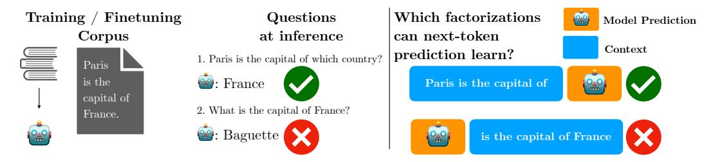
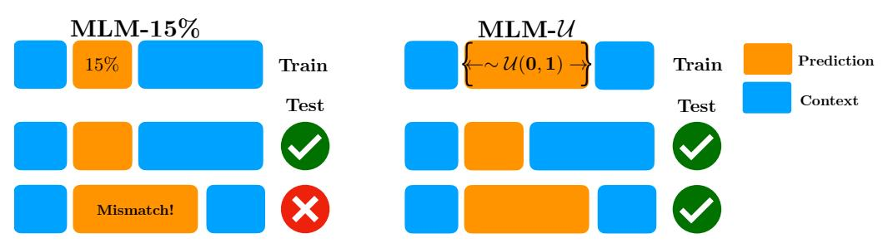
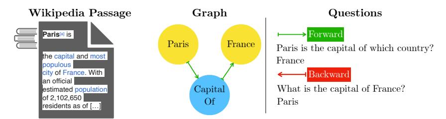
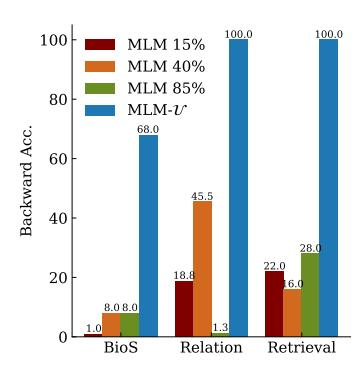
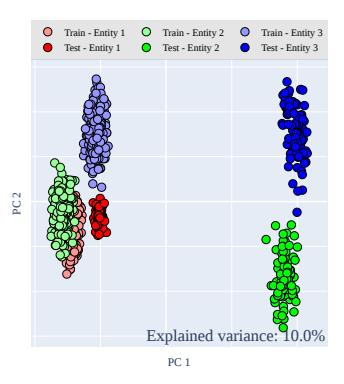
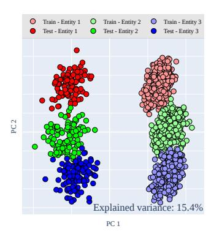
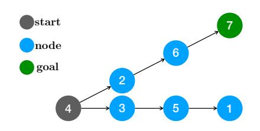
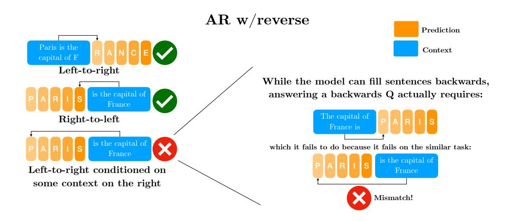
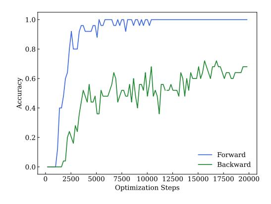
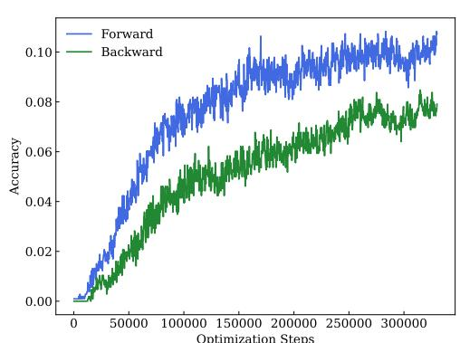

# The Factorization Curse: Which Tokens You Predict Underlie the Reversal Curse and More

Anonymous Author(s) Affiliation Address **email**

# Abstract

 Today's best language models still struggle with "hallucinations", factually incor- rect generations, which impede their ability to reliably retrieve information seen during training. The *reversal curse*, where models cannot recall information when probed in a different order than was encountered during training, exemplifies limi- tations in information retrieval. To better understand these limitations, we reframe the reversal curse as a *factorization curse* — a failure of models to learn the same joint distribution under different factorizations. We more closely simulate fine- tuning workflows which train pretrained models on specialized knowledge by in- troducing *WikiReversal*, a realistic testbed based on Wikipedia knowledge graphs. Through a series of controlled experiments with increasing levels of realism, in- cluding non-reciprocal relations, we find that reliable information retrieval is an inherent failure of the next-token prediction objective used in popular large lan- guage models. Moreover, we demonstrate reliable information retrieval cannot be solved with scale, reversed tokens, or even naive bidirectional-attention training. Consequently, various approaches to finetuning on specialized data would neces- sarily provide mixed results on downstream tasks, unless the model has already seen the right sequence of tokens. Across five tasks of varying levels of complex- ity, our results uncover a promising path forward: factorization-agnostic objec- tives can significantly mitigate the reversal curse and hint at improved knowledge storage and planning capabilities.

# 1 Introduction

 Although today's best language models produce impressively cogent, articulate text by mimicking the statistics of language encountered during training, they still struggle to reliably retrieve informa- tion seen during training. Models are known to suffer from hallucinations, potentially responding with fabricated content that differs from the knowledge present in training data. Hallucinations pose a significant hurdle to the adoption of language models, especially in domains where reliable knowledge retrieval is paramount [\(Dahl et al.,](#page-9-0) [2024\)](#page-9-0). A well-studied failure mode underlying hallu- cinations is the *reversal curse*, which ascribes this deficiency to the precise order of words presented to the model at train-time [\(Berglund et al.,](#page-9-1) [2023;](#page-9-1) [Allen-Zhu & Li,](#page-9-2) [2023\)](#page-9-2). For example, a model trained on sentences where *Paris* always appears as the subject of the sentence, such as *"Paris is the capital of France"*, can be tuned to answer *"Paris is the capital of which country?"* but not *"What is the capital of France?"*, even though these two formulations of the question/answer encode the same underlying information.

 Existing approaches aimed at mitigating the reversal curse have focused on data augmentations that involve training on both the forward and reversed tokens [\(Golovneva et al.,](#page-10-0) [2024\)](#page-10-0). In this work, we focus on learning objectives. In Section [2,](#page-1-0) we propose the *factorization curse*, a framework that

<span id="page-1-1"></span>

Figure 1: (Left) Reversal curse from training a model on sentences with *Paris* before *France*. (Right) Left-to-right objective does not learn how to predict early tokens from later ones even if the information content is the same. We illustrate this failure with a freshly baked French Baguette as a response. The model overfits to a specific factorization of the joint distribution over tokens, and is unable to answer questions that require reasoning about a different factorization.

 characterizes the reversal curse as a failure to model the same joint distribution under different fac- torizations. We show the prevailing left-to-right next token prediction, autoregressive (AR) objective used in popular large models such as GPT [\(Radford et al.,](#page-11-0) [2019\)](#page-11-0) and Llama models [\(Touvron et al.,](#page-12-0) [2023a](#page-12-0)[,b\)](#page-12-1), underlies the reversal curse. We illustrate in Figure [1](#page-1-1) the factorization in AR training only encodes information based on prior context, thereby limiting how well the model can retrieve infor- mation based on *later context*. Through this lens, we show the reversal curse is not merely a failure to learn learn logical implications, but a more general problem underlying learning objectives.

- To validate our hypothesis and explore potential solutions, we conduct extensive experiments in controlled settings in Section [3.1,](#page-4-0) focusing on the effects of pretraining objectives on knowledge storage. In experiments with increasing levels of ecological validity, we observe that scale, na¨ıve bidirectional objectives, and even left-to-right training do not solve the issue of reliable information retrieval. To study the issue in a setting similar to what would be expected in finetuning applications, we introduce *WikiReversal*, a realistic testbed based on Wikipedia knowledge graphs in Section [3.2.](#page-5-0) Our results suggest that finetuning strategies for downstream applications might not allow models to store knowledge adequately.
- Finally, we put forward a promising initial solution: factorization-agnostic training. In Section [2.1,](#page-2-0) we show how factorization-agnostic training can significantly reduce the impact of the reversal curse, and hints at improved planning capabilities in a minimal graph traversal task. This approach aims to mitigate the influence of the factorization issue by presenting information to the model in a manner that is less dependent on the specific token order while preserving the overall meaning.
- To summarize, our contributions are as follows:
- 1. We introduce the concept of the *factorization curse*, which posits that different objectives' de-composition of an input into context and prediction is a key factor underlying the reversal curse.
- 2. We conduct empirical studies with increasing levels of complexity and realism to validate our framework, comparing strategies such as standard autoregressive training (AR), AR with reversed sequences, and masked language modeling (MLM) as a prototypical bidirectional objective.
- 3. Building on our factorization curse framework, we identify factorization-agnostic objectives that allow for making predictions using every possible context decomposition, as a strong baseline solution. We explore its effectiveness across all investigated settings, including the WikiReversal setting.
- 4. We show that factorization-agnostic strategies are promising not only for knowledge stor-age/retrieval but also for planning, suggesting potentially broader implications for our findings.

# <span id="page-1-0"></span>2 The Factorization Curse

 The reversal curse highlights how language models struggle to reliably retrieve information seen during training given some context. Our aim is to understand this failure by probing how common training objectives factorize an input into context and prediction. We show how common training objectives, including popular left-to-right AR and masked modeling objectives, struggle to learn factorizations that can help the model generalize better on a given task, a challenge we label *the* factorization curse.

#### <span id="page-2-0"></span>2.1 Hypothesis: Reversal Curse as an Instance of Factorization Curse

76

100

101

103 104

105

106

116

117

Let us define the *factorization curse* more formally. We first start with the usual left-to-right autoregressive model for a sequence x with D tokens. This is the standard formulation in popular GPT-style (OpenAI et al., 2023) models and its loglikelihood is given by

<span id="page-2-1"></span>
$$\log p(\boldsymbol{x}) = \sum_{t=1}^{D} \log p(x_t | \boldsymbol{x}_{< t}). \tag{1}$$

Each token is represented as  $x_t$ , where t is its index in the sequence.  $x_{< t}$  represents all tokens that precede the t-th token in the sequence. The log probability of the entire sequence x is computed as the sum of the log probabilities of each token  $x_t$ , given all the preceding tokens  $x_{< t}$ . This is the left-to-right factorization of the joint distribution over tokens. Note that there many factorizations (D!) of the joint distribution, each given by some permutation  $\sigma$  of the tokens in the sequence, which we can write as  $\log p(x) = \sum_{t=1}^D \log p(x_{\sigma(t)}|x_{\sigma(< t)})$ .

Example in Two Tokens For illustration purposes, let us walk through an example with D=2. Suppose our goal is to model  $p(\boldsymbol{x})=p(x_2,x_1)=p(x_2|x_1)p(x_1)$ . The left-to-right factorization loss optimizes

$$-\mathcal{L}_{AR} = \log p(\mathbf{x}) = \log p(x_2|x_1) + \log p(x_1). \tag{2}$$

Interestingly, we can readily see the reversal curse failure mode in  $\mathcal{L}_{AR}$ . A model  $p_{\theta}$  that attributes high likelihood to  $p_{\theta}(x_2|x_1)p_{\theta}(x_1)$  does not necessarily yield a high value for  $p_{\theta}(x_1|x_2)p_{\theta}(x_2)$  (a right-to-left factorization) even though the two expressions should be equal due to the chain rule of probability. Note that here we make no statement about the sequential order of the random variables or their relationship. The only statement we make is that, unsurprisingly,  $p_{\theta}$  is not necessarily capable of modeling the joint distribution when presented with a different factorization. This is the factorization curse.

**Definition 1** (Factorization Curse). A model  $p_{\theta}$  for the joint distribution of a sequence x suffers from the factorization curse if, for a factorization order  $\sigma$  different from the "training" factorization order  $\sigma_0$  (which depends on the objective and model details), we have

$$\prod_{t} p_{\theta}(x_{\sigma(t)}|x_{\sigma(< t)}) \neq \prod_{t} p_{\theta}(x_{\sigma_0(t)}|x_{\sigma_0(< t)}). \tag{3}$$

99 In particular, the model may be optimal on  $\sigma_0$ , but perform poorly on a different factorization.

**Implications** This has a number of implications. First, highly factorization-dependent LLMs will struggle to retrieve knowledge from earlier in the context given later information. Second, we find simply training on additional sequences with all tokens reversed does not alleviate the issue. Indeed, if the information we seek to retrieve is composed of multiple tokens, the factorization the LLM needs to handle is not right-to-left, but instead reversed in chunks. Thus, in order for any reverse training strategy to work, one must first parse the entities of interest then train with sequences reversed in entity-preserving chunks (see Section 3 and Figure 6).

Furthermore this explains why standard MLM approaches with fixed masking rates fail to address 107 the issue, despite their bidirectionality, for two reasons: First, entities may span a larger number of 108 109 tokens than the model masks, meaning there is never supervision signal to make the prediction from the right context (without leaking parts of the entity). Second, training with a fixed rate does not yield 110 a good generative model. While the model is used to predicting, e.g., 15% of a full context-window 111 during training, at inference, the model can fail to generalize (Tay et al., 2022) to the arbitrary-length 112 sequences it encounters (see Figure 2). Zhang et al. (2024) suggest that encountering different length 113 sequences during training encourages disentanglement and compositionality, which will be crucial 114 for a good generative model. 115

**Knowledge retrieval beyond reversal:** A model that cannot learn how to retrieve information in reverse order will likely suffer from further downstream issues that are often ascribed to hallucination. For instance, let us take a model pretrained on entities in a database, say a list of soccer players

with various attributes (statistics, game histories, etc.) with the name appearing before the attributes as follows  $x_{\text{name}}, x_{\text{attributes}}$ . The model may memorize the database perfectly, but when queried for players that match specific criteria (e.g., played in a particular position, or have a specific nationality, etc.), the model can produce hallucinated answers that do not match the training distribution due to lack of direct supervision of the form  $p(x_{\text{name}}|x_{\text{attributes}})$  during pretraining.

#### 2.2 Factorization-Agnostic Training Strategies

To store and retrieve knowledge in "all directions" for arbitrary-length entities and without external intervention (entity pre-parsing, retrieval augmented generation, *etc.*), the model needs to be equally good at any factorization of the joint distribution. Below, we discuss two ways this can be achieved.

**Permutation Language Modeling (PLM)** A straightforward way to alleviate the factorization issue, is to write the autoregressive loss in a way that is independent of factorization by averaging over all permutations as follows

<span id="page-3-1"></span>
$$\log p(\boldsymbol{x}) = \log \mathbb{E}_{\sigma \sim \mathcal{U}(S_D)} \left[ \prod_{t=1}^{D} p(x_{\sigma(t)} | \boldsymbol{x}_{\sigma(< t)}) \right] \ge \mathbb{E}_{\sigma \sim \mathcal{U}(S_D)} \left[ \sum_{t=1}^{D} \log p(x_{\sigma(t)} | \boldsymbol{x}_{\sigma(< t)}) \right], \quad (4)$$

where  $\sigma$  is a permutation sampled uniformly at random from  $S_D$ , the permutation group on D tokens. The term  $x_{\sigma(< t)}$  represents all tokens that precede the t-th token in the permuted sequence. The log probability of the entire sequence x is then lower-bounded (using Jensen's inequality) by the expected sum of the log probabilities of each element  $x_{\sigma(t)}$ , given all its preceding tokens in the permuted sequence. Note that all we did here is average over all factorizations. This formulation is used in XLNet (Yang et al., 2020). However, for practical reasons they end up training with a permutation on the last few tokens only. This partial prediction, as we argued above, can limit knowledge storage improvements because we do not know how to chunk tokens into entities a priori.

Uniform-Rate Masked Language Modeling (MLM- $\mathcal{U}$ ) An alternative factorization-agnostic objective is to predict any context from any other context uniformly at random. This includes next-token, previous-token, predictions spanning multiple future or past tokens, and all other forms of contextual prediction. As it turns out, this generalization over objectives (amounting to something similar to masked language modeling with a randomly sampled masking rate  $r \sim \mathcal{U}(0,1)$ ) is a discrete diffusion model with an absorbing masking state (Austin et al., 2023; Kitouni et al., 2024). This diffusion formulation can be used to make a factorization-order-independent autoregressive model. See Figure 2 for an illustration of the differences between the MLM- $\mathcal{U}$  objective and more standard MLM. Specifically,  $\mathcal{L}_{CT}$  from Kitouni et al. (2024)'s Proposition 1, which we will refer to as  $\mathcal{L}_{\text{MLM-}\mathcal{U}}$  here, can be retrieved from equation 4 as follows

$$\mathcal{L}_{\text{MLM-}\mathcal{U}} = -\mathbb{E}_{\sigma \sim \mathcal{U}(S_D)} \sum_{t=1}^{D} \log p(x_{\sigma(t)} | \boldsymbol{x}_{\sigma(< t)})$$

$$= -\mathbb{E}_{\sigma \sim \mathcal{U}(S_D)} \mathbb{E}_{t \sim \mathcal{U}(1, \dots, D)} D \log p(x_{\sigma(t)} | \boldsymbol{x}_{\sigma(< t)})$$

$$= -\mathbb{E}_{\sigma \sim \mathcal{U}(S_D)} \mathbb{E}_{t \sim \mathcal{U}(1, \dots, D)} \frac{D}{D - t + 1} \sum_{\tau \in \sigma(> t)} \log p(x_{\tau} | \boldsymbol{x}_{\sigma(< t)})$$
(5)

<span id="page-3-0"></span>

Figure 2: MLM struggles when entities span more tokens than the masked span. MLM- $\mathcal{U}$  encounters all possible masking fractions during training and does not suffer from this problem.

where the last equality is possible because all  $\tau \in \sigma(\geq t)$  tokens are equally likely to appear at position t as we average across all permutations, and so we can average over the predictions for each  $\tau$  at this position. This approach can be implemented as a denoising process which recovers randomly masked tokens, like BERT (Devlin et al., 2019), but with uniformly sampled masking rates. This key difference allows training a generative model with masked modeling (see Appendix B for an illustration of the connection to permutation language modeling).

# <span id="page-4-1"></span>156 3 Experiments

183

184

185

186

187

189

We now investigate information retrieval capabilities across learning objectives through the lens of different factorizations of the joint sequence probability. Specifically, we compare

- **AR:** The standard autoregressive causal next-token prediction. Though all models generate tokens autoregressively, we use AR as a shorthand for left-to-right models, in line with Equation (1).
- **AR w/reverse:** AR prediction on sequences and their token-level reverse<sup>1</sup>.
- MLM r: BERT-like masked language modeling with fixed random masking rate, r.
- MLM- $\mathcal{U}$ : MLM with  $r \sim \mathcal{U}(0,1)$ . PLM results are similar, and are reported in the Appendix.

To ensure a fair comparison and allow each objective to perform optimally, we employ model architectures specifically designed for each objective. For autoregressive (AR) training, we use GPT-2 (Radford et al., 2019) and Mistral (Jiang et al., 2023). For masked language modeling (MLM), we use BERT (Devlin et al., 2019). Finally, for MLM- $\mathcal{U}$ , we employ an encoder-decoder model<sup>2</sup> based on the GPT architecture (see Appendix G for details).

We study these models across increasing levels of complexity and realism, beginning with a controlled retrieval task using synthetic tokens and increasing in complexity to a retrieval task using natural text from Wikipedia articles. In our evaluation, we find that the degree to which the learning objective factorizes the input reliably explains performance across this wide range of information retrieval tasks. Factorization-agnostic methods show improved knowledge retrieval capabilities.

#### <span id="page-4-0"></span>4 3.1 Controlled Experiments in Factorization-Agnostic Training

**Retrieval Task.** We are particularly interested in models' ability to recall knowledge from data they were trained on. We will use a simple toy task, adapted from Golovneva et al. (2024), to evaluate this capability. First, we generate a collection of key-value pairs which are each composed of a sequence  $\{t_i\}^{i \in S}$  of tokens, *e.g.*, consider the key-value pair

$$t_0t_1:t_2t_3.$$

Each key/value is unique and is composed of a unique set of tokens. Additionally, we generate two 175 types of queries: (forward) "[value of] key: value" and (backward) "[key of] value: key". Models 176 are trained on all key-value pairs and a subset of queries, and tested on unseen queries by completing 177 tokens after the colon. Accuracy, measured using exact match, in Table 1 shows AR training does 178 not retrieve keys from values and that reversing tokens does not improve backward retrieval. We 179 180 observe entity-based reversing trivially solves this task. Additionally, while MLM does not suffer from a forward/backward disparity, its fixed masking rate causes poor overall results. Introducing a 181 uniformly sampled rate via MLM- $\mathcal{U}$  solves the task perfectly. 182

Non-reciprocal Relationships. Are models employing incorrect reversal heuristics? A weakness of the retrieval task is that it could be solved by assuming all relations between keys and values to be symmetric/reciprocal. In language, this is not always the case: even though they contain many of the same words, the sentence *Alice likes Bob* does not necessarily imply that *Bob likes Alice*. To investigate whether models inappropriately rely on a reversal heuristic, we extend the retrieval task to a third entity for each sample, yielding statements of the form " $A \implies B \implies C$ ". Question answering (QA) samples are of the form (**forward**) " $B \implies$ ?" and (**backward**) " $B \iff$ ?"

<span id="page-4-2"></span><sup>&</sup>lt;sup>1</sup>We obtained similar results when manipulating attention masks to train on an equal mix of causal and "anti-causal" sequences.

<span id="page-4-3"></span><sup>&</sup>lt;sup>2</sup>We ran our experiments with this architecture using all the objectives and found consistent results.

<span id="page-5-1"></span>Table 1: Exact match accuracy of different training paradigms on **(Top)** the retrieval task and **(Bottom)** relationship task. Due to the non-reciprocal nature of the relationship, a model that swaps the subject and object will make errors (e.g., inferring *B* is *A*'s child from *A* being *B*'s child). Shown in the bottom row. Entity reversal without a delimiter is marked with a\*. Maximum values are bold.

| Retrieval Task                               | AR                     | AR w/reverse          | MLM           | $MLM-\mathcal{U}$ |
|----------------------------------------------|------------------------|-----------------------|---------------|-------------------|
| Forward ↑ Backward ↑                         |                        |                       | 21<br>22      | 100<br>100        |
| Relationship Task                            | AR w/reverse (entity)* | AR w/reverse (entity) | MLM           | $MLM-\mathcal{U}$ |
| Forward ↑  Backward ↑  Incorrect Inference ↓ | 54<br>53<br><b>44</b>  | 100<br>100<br>0       | 24<br>19<br>0 | 100<br>100<br>0   |

where the right answers are C and A, respectively. With a third entity in play, a model assuming symmetry would be unable to decide between A and C as the answer for either question.

The bottom of Table 1 shows that simply reversing entities (denoted with AR w/reverse (entity)\*) leads to undesirable behaviour as can be seen from the large incorrect inference rate. However, adding simple delimiter tokens around entity reversed sequences (without asterisk) leads to more a robust model. Finally, MLM- $\mathcal{U}$  learns the asymmetric relations correctly.

**BioS.** Next, we investigate performance of the different objectives for more complex but still controlled data. BioS (Zhu & Li, 2023) is a synthetic dataset consisting of biographies for 10k fictional individuals. For each individual, biographical details (birth date, birth city, *etc.*) were randomly selected from a uniform distribution. The authors ensured each individual was assigned a unique full name. We reproduce some of their results on the birth\_date-to-full\_name task which aims to recover a person's full name from their birth date. Results are shown in Table 2. Again, the autoregressive, MLM and reversed-token training struggle to recover backward queries.

Training in a factorization-agnostic fashion leads to non-negligible backward performance. Interestingly, backward performance keeps improving over a long time (many times the number of epochs required for forward performance to reach 100%) (see Appendix F). If this delay is due to the low frequency of observing the right factorization in training, this could indi-

cate that methods to automatically select

<span id="page-5-2"></span>Table 2: BioS exact match accuracy for property retrieval in the backward direction (birth date to full name) and in the forward direction (full name to birthdate).

|          | AR         | AR w/reverse | MLM | MLM-U |
|----------|------------|--------------|-----|-------|
| Forward  | <b>100</b> | <b>100</b>   | 8   | 100   |
| Backward | 0          | 0            |     | 68    |

data such as RHO-LOSS (Mindermann et al., 2022) could have a disproportionate impact in improving factorization-agnostic methods compared to standard AR training.

#### <span id="page-5-0"></span>3.2 Wikipedia Knowledge Graph Reversal

To bridge the gap between the controlled studies on synthetic datasets and the realistic evaluations on pretraining corpora, we introduce a new evaluation setup that combines the best of both approaches. Our setup involves finetuning a language model on real-world natural text from Wikipedia articles, along with a precise knowledge graph describing the relations and entities within them. This allows for principled experiments that mimic real-world use-cases where practitioners finetune pretrained models on domain-specific corpora.

**Experiment Design** We introduce a new QA dataset to evaluate the ability of models to reason about entities and relations in both forward and backward directions. The dataset is derived from the GenWiki corpus based on DBpedia (Jin et al., 2020), which contains 1.3 million text passages from Wikipedia, along with entity and relation annotations.

**Extracting Relation Triples and Generating Questions** For each passage P with annotated entities  $E = e_1, e_2, ..., e_n$ , we consider only "forward" relation triples  $(e_i, r, e_i)$ , where  $e_i$  appears

<span id="page-6-0"></span>

Figure 3: An example passage with a forward relation triple. The forward question queries the tail, backward queries the head. *WikiReversal* is a collection of passages and forward/backward QAs.

before  $e_j$  in the passage. For the example, in the passage "Paris is the [...] capital of France [...]" (Figure 3), the triplet (Paris, capitalOf, France) is a "forward" triplet. Had the triplet (France, has-Capital, Paris) been present in the graph, we would consider it a "backward" triplet. We filter the data to contain only triplets (and corresponding passages) for which the relation r exists at least in 500 different instances. We generate forward questions  $F_r(e_i)$  querying the tail of the relation  $(e_j)$  and backward questions  $B_r(e_j)$  querying the head  $(e_i)$  using predefined templates. We filter out ambiguous samples to ensure each question has a single unique answer. Algorithm 1 in the Appendix summarizes the dataset creation process.

Table 3 reports the forward/backward performance disparity, particularly for autoregressive models. Mistral 7B, without finetuning, achieves a backward accuracy of around 5%, indicating there may be backwards triplets present in a forward fashion within the model's training text. This could also explain the non-trivial backward performance of the AR model, despite its susceptibility to the reversal curse.

<span id="page-6-1"></span>Table 3: Wikireversal task exact match QA accuracies. MLM- $\mathcal{U}$ , MLM and AR are are 100M parameter models trained from scratch.

|          | Mistral 7B | MLM | $MLM-\mathcal{U}$ | AR  |
|----------|------------|-----|-------------------|-----|
| Forward  | 21         | 3.4 | 11                | 14  |
| Backward | 5.2        | 2.7 | <b>7.6</b>        | 4.3 |

MLM-*U* attains the highest backward accuracy among the evaluated models, demonstrating its robustness to the reversal curse. However, it still falls short of the AR model's forward performance, possibly due to the inherent difficulty of the task. Notably, significantly better results can be obtained by allowing models to leverage knowledge stored from the QAs themselves (see Appendix E.3 for details).

#### 3.3 Analyzing Representations Learned via Factorization-Agnostic Training

We further examine factorization-agnostic training by first comparing the role of random masking in MLM-\$\mathcal{U}\$ versus standard masked language modeling. We also visualize the learned representations from MLM-\$\mathcal{U}\$ showing they contain more distinct entity structure compared to standard AR training.

Understanding the role of random masking To understand the importance of varying the masking ratio as introduced in MLM- $\mathcal{U}$  we compare MLM- $\mathcal{U}$  to MLM with various masking ratios (15%, 40%, 85%) based on prior work (Wettig et al., 2023)). We find MLM exhibits much noisier performance that's consistently lower than MLM- $\mathcal{U}$  with uniformly random masking ratio as shown in Figure 4a. This suggests fixed masking ratios, whether with high or low values, are limited in what they can learn in contrast to MLM- $\mathcal{U}$ .

**Visualizing learned representations in the 3-entity relationship task** To better probe the representations learned via MLM- $\mathcal{U}$  we plot in Figures 4b and 4c the PCA projections after training on the relationship task from Section 3.1 for AR and MLM- $\mathcal{U}$ . Compared to AR, which learns disconnected components without apparent symmetry for entities never seen backwards during training, MLM- $\mathcal{U}$  seems to have learned a form of translation symmetry across train and test samples. This suggests MLM- $\mathcal{U}$  training leads to more structured entities in the model's representation space.

<span id="page-7-0"></span>





(a) Fixed-rate masked modeling is inconsistent.

- (b) AR model entities PCA projection.
- (c) MLM- $\mathcal{U}$  model entities PCA projection.

Figure 4: In panel (a) we compare MLM with varying masking ratios to MLM- $\mathcal{U}$ . In panels (b) and (c) we visualize the two main principal components of representations learned via AR versus MLM- $\mathcal{U}$ .

# 4 On the Importance of Future Predictions for Planning

Prior work argues next-token prediction auto-regressive loss is not conducive to planning (Dziri et al., 2023; LeCun, 2023; Gloeckle et al., 2024). Specifically, Bachmann & Nagarajan (2024) introduces a simple path finding task that requires basic planning: From a start node, multiple linear paths  $p_1, p_2, \ldots, p_n$  extend outward. They are given as symbolic sequences of this form: 2, 6|6, 7|5, 1|4, 3|4, 2|3, 5 / 4, 7 = 4, 2, 6, 7 A model is tasked to predict the sequence of nodes desired response

along path  $p_i$  that leads to a specified final node at the end of  $p_i$ . They show that when trained with a standard autoregressive (AR) next-token prediction objective, the model is unable to effectively learn this task. This failure is attributed, at least in part, to the teacher-forcing supervision used during training. As illustrated in Figure 5, from the second node  $x_2=2$  onward along a path  $p_i=(x_1,x_2,\ldots,x_m)$ , the model can predict each "easy" token  $x_t$  for t>2 by simply conditioning on the immediately previous teacher-forced token  $x_{t-1}$ , without requiring retention of the earlier path history or look-ahead planning, a pitfall referred to as the "Clever Hans" cheat (see Section 4.5 (Bachmann & Nagarajan, 2024) and (Pfungst & Rosenthal, 1911)).

<span id="page-7-1"></span>

(a) Accuracies of various training paradigms on the Star Graph Task. Randomly choosing a starting node in this setting (and employing the Clever Hans Cheat) results in 50% accuracy.

|          | AR | AR w/reverse | $MLM\text{-}\mathcal{U}$ |
|----------|----|--------------|--------------------------|
| Accuracy | 50 | 49           | 100                      |

Figure 5: Star Graph Task: Illustration and Performance Comparison. The illustration shows the "Clever Hans" failure mode with teacher-forced AR ((Bachmann & Nagarajan, 2024) adapted).

Bachmann & Nagarajan (2024) found that predicting multiple future tokens in a teacher-less setting helped mitigate the issue of discovering the algorithm to correctly predict the initial "difficult" token  $x_2$ . We identify this as an intermediate objective between standard next-token prediction and the factorization-agnostic objective studied in this work, which encourages planning capabilities via both far look-ahead and look-backward along the sequence. Figure 5a shows that the MLM- $\mathcal{U}$  objective enables the model to reliably solve the path-planning task by better capturing the planning requirements.

# 5 Related Work

 The reversal curse was first introduced in [Berglund et al.](#page-9-1) [\(2023\)](#page-9-1). Using text-overlap based heuristics [f](#page-10-8)or modeling inferences between sequence of text dates back nearly two decades in NlP [\(Glickman](#page-10-8) [et al.,](#page-10-8) [2005;](#page-10-8) [Adams et al.,](#page-8-0) [2007\)](#page-8-0). As our modeling approaches have improved, increasing work has drawn attention to models overapplying text-overlap heuristics [\(Dasgupta et al.](#page-9-7) [2018;](#page-9-7) [Naik et al.](#page-10-9) [2018;](#page-10-9) [Sanchez et al.](#page-11-2) [2018;](#page-11-2) [McCoy et al.](#page-10-10) [2019;](#page-10-10) [Rajaee et al.](#page-11-3) [2022;](#page-11-3) [Williams et al.](#page-12-7) [2022,](#page-12-7) i.a.). Per- haps most relevant is [Sinha et al.](#page-12-8) [\(2019\)](#page-12-8)'s evaluation, which used synthetic entity-based kinship data with multiple entities based on graph structures to expose model failures and is similar to our rela- tionship task. Most recently, work aimed at mitigating the reversal curse by [Allen-Zhu & Li](#page-9-2) [\(2023\)](#page-9-2); [Golovneva et al.](#page-10-0) [\(2024\)](#page-10-0) suggest using data augmentations by reversing both token sequences, or if available, entity orders by training both on the forward and augmented text. Related projects have also trained and/or finetuned RoBERTa [\(Liu et al.,](#page-10-11) [2019\)](#page-10-11) or BERT [\(Devlin et al.,](#page-9-4) [2019\)](#page-9-4)-based mod- els on input sequences with randomly shuffled word order [\(Gauthier & Levy,](#page-9-8) [2019;](#page-9-8) [Chiang & Lee,](#page-9-9) [2020;](#page-9-9) [Sinha et al.,](#page-12-9) [2021\)](#page-12-9). [Lv et al.](#page-10-12) [\(2023\)](#page-10-12) explore a fine-tuning objective with bidirectional attention and show that it can mitigate the reversal curse in the original synthetic setting from [Berglund et al.](#page-9-1) [\(2023\)](#page-9-1). However, they employ fixed masking rates.

 In addition to the standard objectives we explored, much recent work has gone into a variety of pre-training objectives including span-based and hybrid objectives [\(Joshi et al.,](#page-10-13) [2020;](#page-10-13) [Tay et al.,](#page-12-2) [2022;](#page-12-2) [Chowdhery et al.,](#page-9-10) [2022\)](#page-9-10). XLNet [\(Yang et al.,](#page-12-4) [2020\)](#page-12-4) utilizes a permutation language modeling objective, considering permutations of the input sequence during training. However, XLNet is not completely factorization-agnostic as it only predicts the last few tokens in each permutation.

 Various benchmarks have been introduced to evaluate the reasoning capabilities of language models. [Bachmann & Nagarajan](#page-9-6) [\(2024\)](#page-9-6) present a study on the limitations of next-token prediction in captur- ing reasoning abilities, arguing that the standard autoregressive training objective hinders models' ability to plan. In a similar vein, [Dziri et al.](#page-9-5) [\(2023\)](#page-9-5) investigate the limits of transformer LLMs across three compositional tasks: multi-digit multiplication, logic grid puzzles, and a classic dynamic pro- gramming problem. Their findings suggest that transformer LLMs solve compositional tasks by reducing multi-step compositional reasoning into linearized subgraph matching, without necessar- ily developing systematic problem-solving skills. They also provide theoretical arguments on ab- stract multi-step reasoning problems, highlighting how autoregressive generations' performance can rapidly decay with increased task complexity.

# 6 Discussion and Future Work

 Limitations and Potential Extensions MLM-U has a much more challenging objective since we approximate all possible partitions of the input into context and predictions. Learning curves show delayed generalization, especially on backward samples. The main limitation of factorization- agnostic approaches is the optimization difficulty due to task complexity. Predicting one token ahead is far easier than predicting the last word of a novel with limited context, due to increasing entropy along longer horizons. This requires better schedules/curricula that smoothly interpolate the dif- ficulty increase from next-token prediction to the highest-complexity factorization the model can handle.

 This work highlights how alternative objectives can address some of the issues with current state-of- the-art language models, which rely on left-to-right autoregressive generative decoder pretraining. Despite impressive capabilities with increasing scales, there are concerns about reaching a plateau due to fundamental limitations or computational constraints. We find that factorization-agnostic training can learn "more" from the same data in the context of reversal curse. This presents a case for studying factorization-agnostic objectives and investing in approaches to scale them.

# References

<span id="page-8-0"></span> Rod Adams, Gabriel Nicolae, Cristina Nicolae, and Sanda Harabagiu. Textual entailment through extended lexical overlap and lexico-semantic matching. In Satoshi Sekine, Kentaro Inui, Ido Dagan, Bill Dolan, Danilo Giampiccolo, and Bernardo Magnini (eds.), *Proceedings of the ACL-PASCAL Workshop on Textual Entailment and Paraphrasing*, pp. 119–124, Prague, June

```
340 2007. Association for Computational Linguistics. URL https://aclanthology.org/
341 W07-1420.
```

- <span id="page-9-2"></span> Zeyuan Allen-Zhu and Yuanzhi Li. Physics of language models: Part 3.2, knowledge manipulation. *arXiv preprint arXiv: 2309.14402*, 2023.
- <span id="page-9-3"></span> Jacob Austin, Daniel D. Johnson, Jonathan Ho, Daniel Tarlow, and Rianne van den Berg. Structured denoising diffusion models in discrete state-spaces, 2023.
- <span id="page-9-6"></span>Gregor Bachmann and Vaishnavh Nagarajan. The pitfalls of next-token prediction, 2024.
- <span id="page-9-1"></span> Lukas Berglund, Meg Tong, Max Kaufmann, Mikita Balesni, Asa Cooper Stickland, Tomasz Kor-bak, and Owain Evans. The reversal curse: Llms trained on "a is b" fail to learn "b is a", 2023.
- <span id="page-9-9"></span> David Cheng-Han Chiang and Hung-yi Lee. Pre-training a language model without human language. *CoRR*, abs/2012.11995, 2020. URL <https://arxiv.org/abs/2012.11995>.
- <span id="page-9-10"></span> Aakanksha Chowdhery, Sharan Narang, Jacob Devlin, Maarten Bosma, Gaurav Mishra, Adam Roberts, Paul Barham, Hyung Won Chung, Charles Sutton, Sebastian Gehrmann, Parker Schuh, Kensen Shi, Sasha Tsvyashchenko, Joshua Maynez, Abhishek Rao, Parker Barnes, Yi Tay, Noam Shazeer, Vinodkumar Prabhakaran, Emily Reif, Nan Du, Ben Hutchinson, Reiner Pope, James Bradbury, Jacob Austin, Michael Isard, Guy Gur-Ari, Pengcheng Yin, Toju Duke, Anselm Lev- skaya, Sanjay Ghemawat, Sunipa Dev, Henryk Michalewski, Xavier Garcia, Vedant Misra, Kevin Robinson, Liam Fedus, Denny Zhou, Daphne Ippolito, David Luan, Hyeontaek Lim, Barret Zoph, Alexander Spiridonov, Ryan Sepassi, David Dohan, Shivani Agrawal, Mark Omernick, Andrew M. Dai, Thanumalayan Sankaranarayana Pillai, Marie Pellat, Aitor Lewkowycz, Erica Moreira, Rewon Child, Oleksandr Polozov, Katherine Lee, Zongwei Zhou, Xuezhi Wang, Bren- nan Saeta, Mark Diaz, Orhan Firat, Michele Catasta, Jason Wei, Kathy Meier-Hellstern, Douglas Eck, Jeff Dean, Slav Petrov, and Noah Fiedel. Palm: Scaling language modeling with pathways, 2022.
- <span id="page-9-0"></span> Matthew Dahl, Varun Magesh, Mirac Suzgun, and Daniel E. Ho. Hal- lucinating Law: Legal Mistakes with Large Language Models are Pervasive, 2024. URL [https://hai.stanford.edu/news/](https://hai.stanford.edu/news/hallucinating-law-legal-mistakes-large-language-models-are-pervasive) [hallucinating-law-legal-mistakes-large-language-models-are-pervasive](https://hai.stanford.edu/news/hallucinating-law-legal-mistakes-large-language-models-are-pervasive).
- <span id="page-9-7"></span> Ishita Dasgupta, Demi Guo, Andreas Stuhlmuller, Samuel J Gershman, and Noah D Good- ¨ man. Evaluating compositionality in sentence embeddings. In *Proceedings of the 40th Annual Conference of the Cognitive Science Society*, pp. 1596–1601, Madison, WI, 2018. URL [https://cognitivesciencesociety.org/wp-content/uploads/2019/](https://cognitivesciencesociety.org/wp-content/uploads/2019/01/cogsci18_proceedings.pdf) [01/cogsci18\\_proceedings.pdf](https://cognitivesciencesociety.org/wp-content/uploads/2019/01/cogsci18_proceedings.pdf).
- <span id="page-9-4"></span> Jacob Devlin, Ming-Wei Chang, Kenton Lee, and Kristina Toutanova. BERT: Pre-training of deep bidirectional transformers for language understanding. In Jill Burstein, Christy Doran, and Thamar Solorio (eds.), *Proceedings of the 2019 Conference of the North American Chapter of the Association for Computational Linguistics: Human Language Technologies, Volume 1 (Long and Short Papers)*, pp. 4171–4186, Minneapolis, Minnesota, June 2019. Association for Com- putational Linguistics. doi: 10.18653/v1/N19-1423. URL [https://aclanthology.org/](https://aclanthology.org/N19-1423) [N19-1423](https://aclanthology.org/N19-1423).
- <span id="page-9-5"></span> Nouha Dziri, Ximing Lu, Melanie Sclar, Xiang Lorraine Li, Liwei Jiang, Bill Yuchen Lin, Peter West, Chandra Bhagavatula, Ronan Le Bras, Jena D. Hwang, Soumya Sanyal, Sean Welleck, Xi- ang Ren, Allyson Ettinger, Zaid Harchaoui, and Yejin Choi. Faith and fate: Limits of transformers on compositionality, 2023.
- <span id="page-9-8"></span> Jon Gauthier and Roger Levy. Linking artificial and human neural representations of language. In Kentaro Inui, Jing Jiang, Vincent Ng, and Xiaojun Wan (eds.), *Proceedings of the 2019 Confer- ence on Empirical Methods in Natural Language Processing and the 9th International Joint Con- ference on Natural Language Processing (EMNLP-IJCNLP)*, pp. 529–539, Hong Kong, China, November 2019. Association for Computational Linguistics. doi: 10.18653/v1/D19-1050. URL <https://aclanthology.org/D19-1050>.

- <span id="page-10-8"></span> Oren Glickman, Ido Dagan, and Moshe Koppel. Web based probabilistic textual entailment. In *Proceedings of the 1st Pascal Challenge Workshop*, pp. 33–36, 2005.
- <span id="page-10-7"></span> Fabian Gloeckle, Badr Youbi Idrissi, Baptiste Roziere, David Lopez-Paz, and Gabriel Synnaeve. ` Better & faster large language models via multi-token prediction, 2024.
- <span id="page-10-0"></span> Olga Golovneva, Zeyuan Allen-Zhu, Jason Weston, and Sainbayar Sukhbaatar. Reverse training to nurse the reversal curse, 2024.
- <span id="page-10-3"></span> Albert Q. Jiang, Alexandre Sablayrolles, Arthur Mensch, Chris Bamford, Devendra Singh Chap- lot, Diego de las Casas, Florian Bressand, Gianna Lengyel, Guillaume Lample, Lucile Saulnier, Lelio Renard Lavaud, Marie-Anne Lachaux, Pierre Stock, Teven Le Scao, Thibaut Lavril, Thomas ´ Wang, Timothee Lacroix, and William El Sayed. Mistral 7b, 2023. ´
- <span id="page-10-5"></span> Zhijing Jin, Qipeng Guo, Xipeng Qiu, and Zheng Zhang. GenWiki: A dataset of 1.3 million content-sharing text and graphs for unsupervised graph-to-text generation. In Donia Scott, Nuria Bel, and Chengqing Zong (eds.), *Proceedings of the 28th International Conference on Computational Linguistics*, pp. 2398–2409, Barcelona, Spain (Online), December 2020. Interna- tional Committee on Computational Linguistics. doi: 10.18653/v1/2020.coling-main.217. URL <https://aclanthology.org/2020.coling-main.217>.
- <span id="page-10-13"></span> Mandar Joshi, Danqi Chen, Yinhan Liu, Daniel S. Weld, Luke Zettlemoyer, and Omer Levy. SpanBERT: Improving Pre-training by Representing and Predicting Spans. *Transactions of the Association for Computational Linguistics*, 8:64–77, 01 2020. ISSN 2307-387X. doi: 10.1162/tacl a 00300. URL [https://doi.org/10.1162/tacl\\_a\\_00300](https://doi.org/10.1162/tacl_a_00300).
- <span id="page-10-2"></span> Ouail Kitouni, Niklas Nolte, James Hensman, and Bhaskar Mitra. Disk: A diffusion model for structured knowledge, 2024.
- <span id="page-10-6"></span> Yann LeCun. Do large language models need sensory ground- ing for meaning and understanding?, 2023. University Lecture.
- <span id="page-10-11"></span> Yinhan Liu, Myle Ott, Naman Goyal, Jingfei Du, Mandar Joshi, Danqi Chen, Omer Levy, Mike Lewis, Luke Zettlemoyer, and Veselin Stoyanov. RoBERTa: A robustly optimized bert pretraining approach. *arXiv preprint arXiv:1907.11692*, 2019.
- <span id="page-10-12"></span> Ang Lv, Kaiyi Zhang, Shufang Xie, Quan Tu, Yuhan Chen, Ji-Rong Wen, and Rui Yan. Are we falling in a middle-intelligence trap? an analysis and mitigation of the reversal curse, 2023.
- <span id="page-10-10"></span> Tom McCoy, Ellie Pavlick, and Tal Linzen. Right for the wrong reasons: Diagnosing syntactic heuristics in natural language inference. In Anna Korhonen, David Traum, and Llu´ıs Marquez ` (eds.), *Proceedings of the 57th Annual Meeting of the Association for Computational Linguistics*, pp. 3428–3448, Florence, Italy, July 2019. Association for Computational Linguistics. doi: 10. 18653/v1/P19-1334. URL <https://aclanthology.org/P19-1334>.
- <span id="page-10-4"></span> Soren Mindermann, Jan Brauner, Muhammed Razzak, Mrinank Sharma, Andreas Kirsch, Winnie ¨ Xu, Benedikt Holtgen, Aidan N. Gomez, Adrien Morisot, Sebastian Farquhar, and Yarin Gal. ¨ Prioritized training on points that are learnable, worth learning, and not yet learnt, 2022.
- <span id="page-10-9"></span> Aakanksha Naik, Abhilasha Ravichander, Norman Sadeh, Carolyn Rose, and Graham Neubig. Stress test evaluation for natural language inference. In Emily M. Bender, Leon Derczynski, and Pierre Isabelle (eds.), *Proceedings of the 27th International Conference on Computational Linguistics*, pp. 2340–2353, Santa Fe, New Mexico, USA, August 2018. Association for Compu-tational Linguistics. URL <https://aclanthology.org/C18-1198>.
- <span id="page-10-1"></span> OpenAI, Josh Achiam, Steven Adler, Sandhini Agarwal, Lama Ahmad, Ilge Akkaya, Floren- cia Leoni Aleman, Diogo Almeida, Janko Altenschmidt, Sam Altman, Shyamal Anadkat, Red Avila, Igor Babuschkin, Suchir Balaji, Valerie Balcom, Paul Baltescu, Haiming Bao, Moham- mad Bavarian, Jeff Belgum, Irwan Bello, Jake Berdine, Gabriel Bernadett-Shapiro, Christopher Berner, Lenny Bogdonoff, Oleg Boiko, Madelaine Boyd, Anna-Luisa Brakman, Greg Brock- man, Tim Brooks, Miles Brundage, Kevin Button, Trevor Cai, Rosie Campbell, Andrew Cann, Brittany Carey, Chelsea Carlson, Rory Carmichael, Brooke Chan, Che Chang, Fotis Chantzis, Derek Chen, Sully Chen, Ruby Chen, Jason Chen, Mark Chen, Ben Chess, Chester Cho, Casey

 Chu, Hyung Won Chung, Dave Cummings, Jeremiah Currier, Yunxing Dai, Cory Decareaux, Thomas Degry, Noah Deutsch, Damien Deville, Arka Dhar, David Dohan, Steve Dowling, Sheila Dunning, Adrien Ecoffet, Atty Eleti, Tyna Eloundou, David Farhi, Liam Fedus, Niko Felix, Simon Posada Fishman, Juston Forte, Isabella Fulford, Leo Gao, Elie Georges, Christian Gib- ´ son, Vik Goel, Tarun Gogineni, Gabriel Goh, Rapha Gontijo-Lopes, Jonathan Gordon, Morgan Grafstein, Scott Gray, Ryan Greene, Joshua Gross, Shixiang Shane Gu, Yufei Guo, Chris Hal- lacy, Jesse Han, Jeff Harris, Yuchen He, Mike Heaton, Johannes Heidecke, Chris Hesse, Alan Hickey, Wade Hickey, Peter Hoeschele, Brandon Houghton, Kenny Hsu, Shengli Hu, Xin Hu, Joost Huizinga, Shantanu Jain, Shawn Jain, Joanne Jang, Angela Jiang, Roger Jiang, Haozhun Jin, Denny Jin, Shino Jomoto, Billie Jonn, Heewoo Jun, Tomer Kaftan, Łukasz Kaiser, Ali Ka- mali, Ingmar Kanitscheider, Nitish Shirish Keskar, Tabarak Khan, Logan Kilpatrick, Jong Wook Kim, Christina Kim, Yongjik Kim, Jan Hendrik Kirchner, Jamie Kiros, Matt Knight, Daniel Kokotajlo, Łukasz Kondraciuk, Andrew Kondrich, Aris Konstantinidis, Kyle Kosic, Gretchen Krueger, Vishal Kuo, Michael Lampe, Ikai Lan, Teddy Lee, Jan Leike, Jade Leung, Daniel Levy, Chak Ming Li, Rachel Lim, Molly Lin, Stephanie Lin, Mateusz Litwin, Theresa Lopez, Ryan Lowe, Patricia Lue, Anna Makanju, Kim Malfacini, Sam Manning, Todor Markov, Yaniv Markovski, Bianca Martin, Katie Mayer, Andrew Mayne, Bob McGrew, Scott Mayer McKinney, Christine McLeavey, Paul McMillan, Jake McNeil, David Medina, Aalok Mehta, Jacob Menick, Luke Metz, Andrey Mishchenko, Pamela Mishkin, Vinnie Monaco, Evan Morikawa, Daniel Mossing, Tong Mu, Mira Murati, Oleg Murk, David Mely, Ashvin Nair, Reiichiro Nakano, Ra- ´ jeev Nayak, Arvind Neelakantan, Richard Ngo, Hyeonwoo Noh, Long Ouyang, Cullen O'Keefe, Jakub Pachocki, Alex Paino, Joe Palermo, Ashley Pantuliano, Giambattista Parascandolo, Joel Parish, Emy Parparita, Alex Passos, Mikhail Pavlov, Andrew Peng, Adam Perelman, Filipe de Avila Belbute Peres, Michael Petrov, Henrique Ponde de Oliveira Pinto, Michael, Pokorny, Michelle Pokrass, Vitchyr H. Pong, Tolly Powell, Alethea Power, Boris Power, Elizabeth Proehl, Raul Puri, Alec Radford, Jack Rae, Aditya Ramesh, Cameron Raymond, Francis Real, Kendra Rimbach, Carl Ross, Bob Rotsted, Henri Roussez, Nick Ryder, Mario Saltarelli, Ted Sanders, Shibani Santurkar, Girish Sastry, Heather Schmidt, David Schnurr, John Schulman, Daniel Sel- sam, Kyla Sheppard, Toki Sherbakov, Jessica Shieh, Sarah Shoker, Pranav Shyam, Szymon Sidor, Eric Sigler, Maddie Simens, Jordan Sitkin, Katarina Slama, Ian Sohl, Benjamin Sokolowsky, Yang Song, Natalie Staudacher, Felipe Petroski Such, Natalie Summers, Ilya Sutskever, Jie Tang, Nikolas Tezak, Madeleine B. Thompson, Phil Tillet, Amin Tootoonchian, Elizabeth Tseng, Pre- ston Tuggle, Nick Turley, Jerry Tworek, Juan Felipe Ceron Uribe, Andrea Vallone, Arun Vi- ´ jayvergiya, Chelsea Voss, Carroll Wainwright, Justin Jay Wang, Alvin Wang, Ben Wang, Jonathan Ward, Jason Wei, CJ Weinmann, Akila Welihinda, Peter Welinder, Jiayi Weng, Lilian Weng, Matt Wiethoff, Dave Willner, Clemens Winter, Samuel Wolrich, Hannah Wong, Lauren Workman, Sherwin Wu, Jeff Wu, Michael Wu, Kai Xiao, Tao Xu, Sarah Yoo, Kevin Yu, Qiming Yuan, Wo- jciech Zaremba, Rowan Zellers, Chong Zhang, Marvin Zhang, Shengjia Zhao, Tianhao Zheng, Juntang Zhuang, William Zhuk, and Barret Zoph. Gpt-4 technical report. *PREPRINT*, 2023.

<span id="page-11-1"></span> [O](https://api.semanticscholar.org/CorpusID:142217369)skar Pfungst and Robert Rosenthal. Clever hans : the horse of mr. von osten, 1911. URL [https:](https://api.semanticscholar.org/CorpusID:142217369) [//api.semanticscholar.org/CorpusID:142217369](https://api.semanticscholar.org/CorpusID:142217369).

<span id="page-11-0"></span> Alec Radford, Jeff Wu, Rewon Child, David Luan, Dario Amodei, and Ilya Sutskever. Language models are unsupervised multitask learners, 2019. URL [https://api.](https://api.semanticscholar.org/CorpusID:160025533) [semanticscholar.org/CorpusID:160025533](https://api.semanticscholar.org/CorpusID:160025533).

<span id="page-11-3"></span> Sara Rajaee, Yadollah Yaghoobzadeh, and Mohammad Taher Pilehvar. Looking at the overlooked: An analysis on the word-overlap bias in natural language inference. In Yoav Goldberg, Zornitsa Kozareva, and Yue Zhang (eds.), *Proceedings of the 2022 Conference on Empirical Methods in Natural Language Processing*, pp. 10605–10616, Abu Dhabi, United Arab Emirates, December 2022. Association for Computational Linguistics. doi: 10.18653/v1/2022.emnlp-main.725. URL <https://aclanthology.org/2022.emnlp-main.725>.

<span id="page-11-2"></span> Ivan Sanchez, Jeff Mitchell, and Sebastian Riedel. Behavior analysis of NLI models: Uncovering the influence of three factors on robustness. In Marilyn Walker, Heng Ji, and Amanda Stent (eds.), *Proceedings of the 2018 Conference of the North American Chapter of the Association for Computational Linguistics: Human Language Technologies, Volume 1 (Long Papers)*, pp. 1975–1985, New Orleans, Louisiana, June 2018. Association for Computational Linguistics. doi: 10.18653/v1/N18-1179. URL <https://aclanthology.org/N18-1179>.

<span id="page-12-8"></span> Koustuv Sinha, Shagun Sodhani, Jin Dong, Joelle Pineau, and William L. Hamilton. CLUTRR: A diagnostic benchmark for inductive reasoning from text. In Kentaro Inui, Jing Jiang, Vincent Ng, and Xiaojun Wan (eds.), *Proceedings of the 2019 Conference on Empirical Methods in Natural Language Processing and the 9th International Joint Conference on Natural Language Process- ing (EMNLP-IJCNLP)*, pp. 4506–4515, Hong Kong, China, November 2019. Association for Computational Linguistics. doi: 10.18653/v1/D19-1458. URL [https://aclanthology.](https://aclanthology.org/D19-1458) [org/D19-1458](https://aclanthology.org/D19-1458).

<span id="page-12-9"></span> Koustuv Sinha, Robin Jia, Dieuwke Hupkes, Joelle Pineau, Adina Williams, and Douwe Kiela. Masked language modeling and the distributional hypothesis: Order word matters pre-training for little. In Marie-Francine Moens, Xuanjing Huang, Lucia Specia, and Scott Wen-tau Yih (eds.), *Proceedings of the 2021 Conference on Empirical Methods in Natural Language Pro- cessing*, pp. 2888–2913, Online and Punta Cana, Dominican Republic, November 2021. Asso- ciation for Computational Linguistics. doi: 10.18653/v1/2021.emnlp-main.230. URL [https:](https://aclanthology.org/2021.emnlp-main.230) [//aclanthology.org/2021.emnlp-main.230](https://aclanthology.org/2021.emnlp-main.230).

<span id="page-12-2"></span> Yi Tay, Mostafa Dehghani, Vinh Q. Tran, Xavier Garc´ıa, Jason Wei, Xuezhi Wang, Hyung Won Chung, Dara Bahri, Tal Schuster, Huaixiu Steven Zheng, Denny Zhou, Neil Houlsby, and Donald Metzler. Ul2: Unifying language learning paradigms. In *International Conference on Learn- ing Representations*, 2022. URL [https://api.semanticscholar.org/CorpusID:](https://api.semanticscholar.org/CorpusID:252780443) [252780443](https://api.semanticscholar.org/CorpusID:252780443).

<span id="page-12-0"></span> Hugo Touvron, Thibaut Lavril, Gautier Izacard, Xavier Martinet, Marie-Anne Lachaux, Timothee´ Lacroix, Baptiste Roziere, Naman Goyal, Eric Hambro, Faisal Azhar, Aurelien Rodriguez, Ar- ` mand Joulin, Edouard Grave, and Guillaume Lample. Llama: Open and efficient foundation language models, 2023a.

<span id="page-12-1"></span> Hugo Touvron, Louis Martin, Kevin Stone, Peter Albert, Amjad Almahairi, Yasmine Babaei, Niko- lay Bashlykov, Soumya Batra, Prajjwal Bhargava, Shruti Bhosale, Dan Bikel, Lukas Blecher, Cristian Canton Ferrer, Moya Chen, Guillem Cucurull, David Esiobu, Jude Fernandes, Jeremy Fu, Wenyin Fu, Brian Fuller, Cynthia Gao, Vedanuj Goswami, Naman Goyal, Anthony Hartshorn, Saghar Hosseini, Rui Hou, Hakan Inan, Marcin Kardas, Viktor Kerkez, Madian Khabsa, Isabel Kloumann, Artem Korenev, Punit Singh Koura, Marie-Anne Lachaux, Thibaut Lavril, Jenya Lee, Diana Liskovich, Yinghai Lu, Yuning Mao, Xavier Martinet, Todor Mihaylov, Pushkar Mishra, Igor Molybog, Yixin Nie, Andrew Poulton, Jeremy Reizenstein, Rashi Rungta, Kalyan Saladi, Alan Schelten, Ruan Silva, Eric Michael Smith, Ranjan Subramanian, Xiaoqing Ellen Tan, Binh Tang, Ross Taylor, Adina Williams, Jian Xiang Kuan, Puxin Xu, Zheng Yan, Iliyan Zarov, Yuchen Zhang, Angela Fan, Melanie Kambadur, Sharan Narang, Aurelien Rodriguez, Robert Stojnic, Sergey Edunov, and Thomas Scialom. Llama 2: Open foundation and fine-tuned chat models, 2023b.

<span id="page-12-6"></span>Alexander Wettig, Tianyu Gao, Zexuan Zhong, and Danqi Chen. Should you mask 15

<span id="page-12-7"></span> Adina Williams, Tristan Thrush, and Douwe Kiela. ANLIzing the adversarial natural language inference dataset. In Allyson Ettinger, Tim Hunter, and Brandon Prickett (eds.), *Proceedings of the Society for Computation in Linguistics 2022*, pp. 23–54, online, February 2022. Association for Computational Linguistics. URL <https://aclanthology.org/2022.scil-1.3>.

<span id="page-12-4"></span> Zhilin Yang, Zihang Dai, Yiming Yang, Jaime Carbonell, Ruslan Salakhutdinov, and Quoc V. Le. Xlnet: Generalized autoregressive pretraining for language understanding, 2020.

<span id="page-12-3"></span> Jianyu Zhang, Niklas Nolte, Ranajoy Sadhukhan, Beidi Chen, and Leon Bottou. Memory mosaics, ´ 2024.

<span id="page-12-5"></span> Zeyuan Allen Zhu and Yuanzhi Li. Physics of language models: Part 3.1, knowledge storage and extraction. *arxiv preprint arxiv:2309.14316*, 2023.

# 43 A Why does AR w/reverse sequences fail?

<span id="page-13-0"></span>

Figure 6: AR w/reverse cannot predict (left-to-right) entities that appeared on the left during training as it only learned to complete them from right to left. The two sequences in the bottom right indicate that backward retrieval is roughly equivalent to refactorizing the conditionals such that the entity of interest is predicted last conditioned on everything else. This is only approximate because answering a backward QA might require adding new tokens like "The answer to the question is ..." but we make a weak assumption that such differences are generally irrelevant compared to the entities and relations of interest.

## <span id="page-13-1"></span>B Permutation Language Modeling and Discrete State Diffusion

To illustrate the similarity between the diffusion loss and permutation language modeling, let's continue walking through our D=2 example. Permutation modeling averages over factorizations  $p(\boldsymbol{x})=\frac{1}{2}p(x_2|x_1)p(x_1)+\frac{1}{2}p(x_1|x_2)p(x_2)$  and optimizes a lower bound on the likelihood

<span id="page-13-2"></span>
$$\log p(\mathbf{x}) \ge -\mathcal{L}_P = \frac{1}{2} (\log p(x_2|x_1) + \log p(x_1)) + \frac{1}{2} (\log p(x_1|x_2) + \log p(x_2)). \tag{6}$$

Finally, the diffusion model averages over masking rates  $\frac{1}{2}(\log p(x_1) + \log p(x_2)) + \frac{1}{2}(\log p(x_1|x_2) + \log p(x_2|x_1))$  and optimizes

$$\log p(\mathbf{x}) \ge -\mathcal{L}_{\text{MLM}\mathcal{U}} = \frac{1}{2} (\log p(x_1) + \log p(x_2)) + \frac{1}{2} (\log p(x_1|x_2) + \log p(x_2|x_1)). \tag{7}$$

This is the same as equation 6. This implies that the permutation language modeling and the absorbing state diffusion objectives are in fact the same. Though practically speaking, they may have very different implications.

## C Summary of Tables

553

554

555

556

557

558

559

560

Table 4 shows a qualitative comparison of the optimization objectives explored on the different datasets in this paper. We conclude that MLM with a fixed masking rate mitigates the reversal curse due to its bi-directionality, but lacks generative quality and thus generally fails when having to provide longer answers. Also unsurprisingly, the left to right AR objective works well in the forward retrieval direction but is unable to answer backwards questions and has a hard time reasoning multiple tokens ahead to solve a task like graph traversal without intermediate supervision. Reversing the tokens can aid backwards retrieval for single token lookups, but fail otherwise. Reversing entities intuitively should be able to solve every retrieval task, but finding the right token permutation is a

<span id="page-14-0"></span>Table 4: Summary of qualitative results, formatted as (forward)/(backward). Stargraph only has one direction.

| Task         | MLM | $MLM-\mathcal{U}$ | AR                  | AR rev.             | AR rev. ent.                                 |
|--------------|-----|-------------------|---------------------|---------------------|----------------------------------------------|
| Retrieval    | 111 | <b>I</b>          | <b>√</b> / <b>X</b> | 111                 | <b>√</b> / <b>√</b>                          |
| Relationship | 111 | 111               | <b>√</b> /X         | 111                 | <b>√</b> / <b>√</b>                          |
| BioS         | X/X | 111               | <b>√</b> /X         | <b>√</b> / <b>X</b> | <b>✓</b> / <b>✓</b> (Golovneva et al., 2024) |
| Wiki         | X/X | $\sim /\sim$      | <b>√</b> /X         | <b>√</b> / <b>X</b> | _                                            |
| Stargraph    | ✓   | ✓                 | X                   | X                   | <b>✓</b> (Bachmann & Nagarajan, 2024)        |

difficult task by itself. MLM- $\mathcal{U}$  averages over all possible prediction tasks that exist for a sequence given a tokenization and prevails in most our experiments. MLM- $\mathcal{U}$  displays the highest backwards retrieval capabilities in the most realistic Wikireversal benchmark, but the performance is not strong enough to qualitatively state success and we mark it with  $\sim$  in Table 4. We hypothesize that the reason is increased task complexity. Notably, in Table 8 we show that MLM- $\mathcal{U}$  outperforms all other objectives when it has access to either the forward or backward type question. From there, it can generalize well to the other type.

#### D Additional Tables

563

565

566

567

568

Table 5: Retrieval Task forward and backward per token accuracy of different training paradigms.

|          | AR         | AR<br>w/reverse | MLM<br>15% | MLM<br>40% | MLM<br>85% | MLM-U | PLM |
|----------|------------|-----------------|------------|------------|------------|-------|-----|
| Forward  | <b>100</b> | <b>100</b>      | 21         | 17         | 27         | 100   | 100 |
| Backward | 0          | 0               | 22         | 16         | 28         | 100   | 100 |

Table 6: BioS exact match accuracy for property retrieval in the backward direction (birth date to full name) and in the forward direction (full name to birthdate).

|                     | AR | AR w/reverse        | MLM<br>15% | MLM<br>40%   | MLM<br>85%   | PLM          | MLM-U            |
|---------------------|----|---------------------|------------|--------------|--------------|--------------|------------------|
| Forward<br>Backward |    | <b>1.00</b><br>0.00 | 0.00       | 0.08<br>0.08 | 0.04<br>0.08 | 1.00<br>0.72 | <b>1.00</b> 0.68 |

Table 7: Exact match QA accuracies for relationship tasks. Forward and backward accuracies are calculated normally, but due to the non-reciprocal relationship, a model that swaps the subject and object will make errors (e.g., inferring *B* is *A*'s child from *A* being *B*'s child). Entity reversal without a delimiter is marked with a\*.

|                     | AR w/reverse (entity) | AR w/reverse (entity)* | MLM<br>15% | MLM<br>40% | MLM<br>85% | MLM-U | PLM |
|---------------------|-----------------------|------------------------|------------|------------|------------|-------|-----|
| Forward             | 100                   | 54                     | 24         | 77         | 2          | 100   | 100 |
| Backward            | 100                   | 53                     | 19         | 35         | 1          | 100   | 100 |
| Incorrect Inference | 0                     | 44                     | 0          | 1          | 0          | 0     | 0   |

<span id="page-15-0"></span>Table 8: Wikireversal task exact match QA accuracies. MLM-U , MLM and AR are all 100M parameter models trained from scratch. (Right) uses different seeds for train test splits in forward and backward questions while (Left) uses the same seed. For MLM, we tried 15%, 40% and 85% masking rates and we present only the best models (15%). Details on hyperparameter selection can be found in Appendix [E.3](#page-16-1)

|          | Mistral 7B | MLM | MLM-U | AR  | Mistral 7B | MLM | MLM-U | AR  |
|----------|------------|-----|-------|-----|------------|-----|-------|-----|
| Forward  | 21         | 3.4 | 11    | 14  | 20         | 29  | 66    | 28  |
| Backward | 5.2        | 2.7 | 7.9   | 4.3 | 9.0        | 10  | 46    | 6.2 |

#### 70 E WikiReversal

#### <span id="page-16-0"></span>Algorithm 1 Dataset Creation

```
Input: GenWiki Corpus \mathcal{G} = \{(P, E, T)\}
Output: QA Dataset \mathcal{D} = \{(q, a, P)\}
\mathcal{D} \leftarrow \emptyset
for (P, E, T) \in \mathcal{G} do

     for (e_i, r, e_i) \in T do

          if e_i appears before e_i in P then
                                                                                                           ▶ Forward relation
               q_f \leftarrow F_r(e_i)
                                                                                                          ▶ Forward question
               q_b \leftarrow B_r(e_j)
\mathcal{D} \leftarrow \mathcal{D} \cup \{(q_f, e_j, P), (q_b, e_i, P)\}
                                                                                                        ▶ Backward question
     end for
end for
Filter \mathcal{D} to keep unambiguous QA pairs

    See filtering in Appendix E.1

Filter \mathcal{D} to remove rare QA pairs where relation r appears < 500 times
```

#### <span id="page-16-2"></span>571 E.1 Filtering Ambiguous Samples

To mitigate ambiguity in the generated QA pairs, we filter the dataset to retain only  $(e_i, r, e_j)$  triples where the  $(e_i, r)$  and  $(r, e_j)$  pairs are unique across the entire dataset. This ensures that each question has a single unambiguous answer. Algorithm 1 summarizes the dataset creation process.

#### 575 E.2 Examples from the Wikireversal dataset

Table 9 shows the relations present in the Wikireversal dataset. Table 10 shows examples of passages and corresponding forward and backward questions that are trained on. WikiReversal is filtered from GenWiki (Jin et al., 2020), a dataset based on Wikipedia released under a Creative Commons Attribution 4.0 International License.

#### <span id="page-16-1"></span>E.3 Details on Wikireversal training

580

To measure performance on the Wikireversal dataset, we split the available data into training and validation, where we include all passages and 80% of both forward and backward questions in the training set and 20% of questions in the validation set. We run a hyperparameter grid search over 583 every objective. We sweep over feasible learning rates for all models and weight decay for all except 584 for MLM- $\mathcal{U}$ , where we haven't found weight decay to be effective so it is set to 0. We run sweeps 585 for both different (Table 8right) and same (Table 8left) train test splits in forward and backward 586 questions. GPT and BERT models have 12 layers with 12 heads and 768 embedding dimension 587 for a total of 108 M parameters. The encoder-decoder model has 12 layers with 9 heads and 576 embedding dimension for a total of 109 M parameters. All models except Mistral were trained for 1500 epochs, and Mistral was trained for 200. The learning rates were warmed up for 1% of the 590 training time in all cases. For Mistral, the LoRA  $\alpha$  and r parameters are set to 256 to sum to about 591 109 M trainable parameters. Learning rates are 5e-5 for MLM- $\mathcal{U}$  in both train split modes, 3e-4 for 592 both BERT (MLM-15%) and GPT (AR) for both modes and 1e-4 for Mistral (AR). The best weight 593 594 decays are 1e-2 for both BERT and GPT, and no weight decay for LoRA on Mistral. No dropout was used. All models were trained with AdamW with default  $\beta$  parameters. 595 Table 8 shows that MLM- $\mathcal{U}$  outperforms other objectives, achieving 66% and 46% accuracy on 596 forward and backward questions, respectively. Using different seeds for train/test splits in forward 597 and backward directions (right section) allows bidirectional models to learn to answer questions 598 from both the passage and the question itself, explaining MLM-U's significant improvement. AR 599 performs poorly on backward questions due to the "reversal curse". MLM and Mistral 7B show 600 intermediate performance. Although Mistral 7B uses  $\sim 100 \mathrm{M}$  LoRA parameters, fewer than the 601 other models, this setup mimics common fine-tuning recipes. Naturally, models trained from scratch 602 do not learn general language modeling capabilities.

Table 9: Relations in Wikireversal

<span id="page-17-1"></span>

| Attribute                | Count |
|--------------------------|-------|
| birthPlace               | 6100  |
| birthName                | 5018  |
| alias                    | 3745  |
| location                 | 2532  |
| deathPlace               | 2064  |
| title                    | 1923  |
| city                     | 1871  |
| populationTotal          | 1651  |
| owner                    | 1328  |
| name                     | 1274  |
| spouse                   | 1163  |
| isPartOf                 | 1000  |
| type                     | 920   |
| office                   | 893   |
| associatedBand           | 762   |
| associatedMusicalArtist  | 756   |
| synonym                  | 743   |
| knownFor                 | 729   |
| artist                   | 724   |
| PopulatedPlace/areaTotal | 719   |
| birthDate                | 672   |
| ground                   | 670   |
| occupation               | 665   |
| place                    | 631   |
| address                  | 631   |
| family                   | 589   |
| hometown                 | 559   |
| region                   | 551   |
| developer                | 541   |
| label                    | 538   |
| writer                   | 517   |
| total count              | 42479 |

# <sup>604</sup> F Grokking

 Grokking: Delayed Generalization in Language Modeling We include loss curves for when training with MLM-U for both Bios and WikiReversal in Figure [7.](#page-18-0) We see the model is able to gradually learn both the forward and backward questions throughout training. For Bios, unlike the forward questions which saturate much more quickly, the backward accuracy still shows an upward trend after training for 20k optimization steps. We observe a similar trend in the delayed generalization in WikiReversal for both forward and backwards questions even after training for 300k optimization steps. These results empirically demonstrate that the MLM-U objective, which requires modelling all possible factorizations of an input into context and predictions, is a more challenging task that exhibit delayed generalization relative to standard next-to-prediction training.

# <span id="page-17-0"></span><sup>614</sup> G Architecture Details

 The Encoder-Decoder architecture used to train the MLM-U objective is modeled with ideas from XLNet [Yang et al.](#page-12-4) [\(2020\)](#page-12-4) in mind in order to support different attention/masking strategies includ- ing permutation language modeling. The encoder has GPT-like blocks and works with RoPE as positional bias. The decoder also has GPT-like blocks, but it cross-attends over keys and values from the corresponding encoder layer, also via a RoPE bias. The decoder input contains the same learnable embedding for all tokens, such that only the positional bias defines the initial attention pat-tern. This idea comes from XLNet's positional attention stream. In left to right AR training mode,

Table 10: Examples from Wikireversal [TODO: double check]

<span id="page-18-1"></span>

| Passage                                      | Forward Q                 | Backward Q              |  |
|----------------------------------------------|---------------------------|-------------------------|--|
| Agostino Magliani (23 July 1824 – 20         | Where was Agostino        | Who was born in Lau-    |  |
| February 1891 ), Italian financier, was a    | Magliani born?            | rino?                   |  |
| native of Laurino, near Salerno.             |                           |                         |  |
| Zhou Yongkang has two sons, Zhou Bin         | Who is Zhou               | Who is married to       |  |
| and Zhou Han, with his first wife, Wang      | Yongkang's spouse?        | Wang Shuhua?            |  |
| Shuhua, whom he met while working in         |                           |                         |  |
| the oilfields of Liaoning province.          |                           |                         |  |
| The total area of Mitan-myeon is 109.74      | What is the total area of | Which populated place   |  |
| square kilometers, and, as of 2008, the      | Mitan-myeon?              | has a total area of     |  |
| population was 1,881 people.                 |                           | 109.74?                 |  |
| Mohammad Ali Araki was born on 1894          | What title does Mo-       | Who holds the title of  |  |
| in Arak, Iran. He started his education      | hammad Ali Araki          | Grand Ayatollah?        |  |
| from Arak Hawza. Grand Ayatollah Haeri       | hold?                     |                         |  |
| allowed him to wear the turban and robe      |                           |                         |  |
| because qualified individuals were limited.  |                           |                         |  |
| Also, Araki studied many years in Yazd       |                           |                         |  |
| Hawza.                                       |                           |                         |  |
| Tibor Navracsics (born Veszprém, Hun-        | What region is Tibor      | What or who is located  |  |
| gary, 13 June 1966) is a Hungarian lawyer    | Navracsics located in?    | in the Veszprém region? |  |
| and politician, who served as Minister of    |                           |                         |  |
| Foreign Affairs and Trade from June to       |                           |                         |  |
| September 2014.                              |                           |                         |  |
| WWWX (96.9 FM, "96.9 The Fox") is an         | What is WWWX's            | Whose alias is 96.9 The |  |
| Alternative rock formatted radio station li- | alias?                    | Fox?                    |  |
| censed to Oshkosh, Wisconsin, that serves    |                           |                         |  |
| the Appleton-Oshkosh area.                   |                           |                         |  |

<span id="page-18-0"></span>



Figure 7: Accuracy in Forward/Backward Questions on the Bios dataset (left) and the Wikireversal dataset (right)

both encoder and decoder use a causal attention mask. In MLM-X modes, a fraction of inputs are masked before given to the model and neither decoder nor encoder attend over the masked tokens.
All inference is performed in left-to-right AR fashion.

#### <span id="page-18-2"></span>**H** Compute Requirements

625

626

627

Models were trained on 64 NVidia V100 and A100 GPUs with supporting Intel(R) Xeon(R) Gold 6230 CPUs. From conception to finalization of this paper we trained about 2000 models. The computationally most expensive runs were on the BioS and the Wikireversal dataset. Those comprised

 about 300 runs with on 8 GPUs for around a day per model. About 30 Mistral models were trained on 32 GPUs for about a day per model.

## NeurIPS Paper Checklist

# 1. Claims

 Question: Do the main claims made in the abstract and introduction accurately reflect the paper's contributions and scope?

Answer: [Yes]

# 2. Limitations

Question: Does the paper discuss the limitations of the work performed by the authors?

Answer: [Yes]

Justification: Limitations are discussed right before Section 4.

## Guidelines:

- The answer NA means that the paper has no limitation while the answer No means that the paper has limitations, but those are not discussed in the paper.
- The authors are encouraged to create a separate "Limitations" section in their paper.
- The paper should point out any strong assumptions and how robust the results are to violations of these assumptions (e.g., independence assumptions, noiseless settings, model well-specification, asymptotic approximations only holding locally). The au- thors should reflect on how these assumptions might be violated in practice and what the implications would be.
- The authors should reflect on the scope of the claims made, e.g., if the approach was only tested on a few datasets or with a few runs. In general, empirical results often depend on implicit assumptions, which should be articulated.
- The authors should reflect on the factors that influence the performance of the ap- proach. For example, a facial recognition algorithm may perform poorly when image resolution is low or images are taken in low lighting. Or a speech-to-text system might not be used reliably to provide closed captions for online lectures because it fails to handle technical jargon.
- The authors should discuss the computational efficiency of the proposed algorithms and how they scale with dataset size.
- If applicable, the authors should discuss possible limitations of their approach to ad-dress problems of privacy and fairness.
- While the authors might fear that complete honesty about limitations might be used by reviewers as grounds for rejection, a worse outcome might be that reviewers discover limitations that aren't acknowledged in the paper. The authors should use their best judgment and recognize that individual actions in favor of transparency play an impor- tant role in developing norms that preserve the integrity of the community. Reviewers will be specifically instructed to not penalize honesty concerning limitations.

## 3. Theory Assumptions and Proofs

 Question: For each theoretical result, does the paper provide the full set of assumptions and a complete (and correct) proof?

Answer: [Yes]

 Justification: We describe the notation and assumptions required for our results regarding factorization.

- The answer NA means that the paper does not include theoretical results.
- All the theorems, formulas, and proofs in the paper should be numbered and cross-referenced.
- All assumptions should be clearly stated or referenced in the statement of any theo-rems.
- The proofs can either appear in the main paper or the supplemental material, but if they appear in the supplemental material, the authors are encouraged to provide a short proof sketch to provide intuition.

- Inversely, any informal proof provided in the core of the paper should be comple-mented by formal proofs provided in appendix or supplemental material.
- Theorems and Lemmas that the proof relies upon should be properly referenced.

## 4. Experimental Result Reproducibility

 Question: Does the paper fully disclose all the information needed to reproduce the main experimental results of the paper to the extent that it affects the main claims and/or conclu-sions of the paper (regardless of whether the code and data are provided or not)?

Answer: [Yes]

Justification: Refer to main text and Appendix E

## Guidelines:

- The answer NA means that the paper does not include experiments.
- If the paper includes experiments, a No answer to this question will not be perceived well by the reviewers: Making the paper reproducible is important, regardless of whether the code and data are provided or not.
- If the contribution is a dataset and/or model, the authors should describe the steps taken to make their results reproducible or verifiable.
- Depending on the contribution, reproducibility can be accomplished in various ways. For example, if the contribution is a novel architecture, describing the architecture fully might suffice, or if the contribution is a specific model and empirical evaluation, it may be necessary to either make it possible for others to replicate the model with the same dataset, or provide access to the model. In general. releasing code and data is often one good way to accomplish this, but reproducibility can also be provided via detailed instructions for how to replicate the results, access to a hosted model (e.g., in the case of a large language model), releasing of a model checkpoint, or other means that are appropriate to the research performed.
- While NeurIPS does not require releasing code, the conference does require all sub- missions to provide some reasonable avenue for reproducibility, which may depend on the nature of the contribution. For example
- (a) If the contribution is primarily a new algorithm, the paper should make it clear how to reproduce that algorithm.
- (b) If the contribution is primarily a new model architecture, the paper should describe the architecture clearly and fully.
- (c) If the contribution is a new model (e.g., a large language model), then there should either be a way to access this model for reproducing the results or a way to re- produce the model (e.g., with an open-source dataset or instructions for how to construct the dataset).
- (d) We recognize that reproducibility may be tricky in some cases, in which case au- thors are welcome to describe the particular way they provide for reproducibility. In the case of closed-source models, it may be that access to the model is limited in some way (e.g., to registered users), but it should be possible for other researchers to have some path to reproducing or verifying the results.

#### 5. Open access to data and code

 Question: Does the paper provide open access to the data and code, with sufficient instruc- tions to faithfully reproduce the main experimental results, as described in supplemental material?

Answer: [No]

Justification: We plan to release code for a camera ready paper.

- The answer NA means that paper does not include experiments requiring code.
- Please see the NeurIPS code and data submission guidelines ([https://nips.cc/](https://nips.cc/public/guides/CodeSubmissionPolicy) [public/guides/CodeSubmissionPolicy](https://nips.cc/public/guides/CodeSubmissionPolicy)) for more details.
- While we encourage the release of code and data, we understand that this might not be possible, so "No" is an acceptable answer. Papers cannot be rejected simply for not

- including code, unless this is central to the contribution (e.g., for a new open-source benchmark).
- The instructions should contain the exact command and environment needed to run to reproduce the results. See the NeurIPS code and data submission guidelines ([https:](https://nips.cc/public/guides/CodeSubmissionPolicy) [//nips.cc/public/guides/CodeSubmissionPolicy](https://nips.cc/public/guides/CodeSubmissionPolicy)) for more details.
- The authors should provide instructions on data access and preparation, including how to access the raw data, preprocessed data, intermediate data, and generated data, etc.
- The authors should provide scripts to reproduce all experimental results for the new proposed method and baselines. If only a subset of experiments are reproducible, they should state which ones are omitted from the script and why.
- At submission time, to preserve anonymity, the authors should release anonymized versions (if applicable).
- Providing as much information as possible in supplemental material (appended to the paper) is recommended, but including URLs to data and code is permitted.

## 6. Experimental Setting/Details

 Question: Does the paper specify all the training and test details (e.g., data splits, hyper- parameters, how they were chosen, type of optimizer, etc.) necessary to understand the results?

Answer: [Yes]

Justification: See main text and Appendix E.

Guidelines:

- The answer NA means that the paper does not include experiments.
- The experimental setting should be presented in the core of the paper to a level of detail that is necessary to appreciate the results and make sense of them.
- The full details can be provided either with the code, in appendix, or as supplemental material.

#### 7. Experiment Statistical Significance

 Question: Does the paper report error bars suitably and correctly defined or other appropri-ate information about the statistical significance of the experiments?

Answer: [No]

 Justification: The margins between methods used to support claims in this paper are beyond typical error bounds due to stochasticity during training and supported by backing-theory regarding factorization agnostic approaches.

- The answer NA means that the paper does not include experiments.
- The authors should answer "Yes" if the results are accompanied by error bars, confi- dence intervals, or statistical significance tests, at least for the experiments that support the main claims of the paper.
- The factors of variability that the error bars are capturing should be clearly stated (for example, train/test split, initialization, random drawing of some parameter, or overall run with given experimental conditions).
- The method for calculating the error bars should be explained (closed form formula, call to a library function, bootstrap, etc.)
- The assumptions made should be given (e.g., Normally distributed errors).
- It should be clear whether the error bar is the standard deviation or the standard error of the mean.
- It is OK to report 1-sigma error bars, but one should state it. The authors should prefer- ably report a 2-sigma error bar than state that they have a 96% CI, if the hypothesis of Normality of errors is not verified.
- For asymmetric distributions, the authors should be careful not to show in tables or figures symmetric error bars that would yield results that are out of range (e.g. negative error rates).

 • If error bars are reported in tables or plots, The authors should explain in the text how they were calculated and reference the corresponding figures or tables in the text.

#### 8. Experiments Compute Resources

 Question: For each experiment, does the paper provide sufficient information on the com- puter resources (type of compute workers, memory, time of execution) needed to reproduce the experiments?

Answer: [Yes]

 Justification: We describe the computational resources used for model training in Ap-pendix [H](#page-18-2)

## Guidelines:

- The answer NA means that the paper does not include experiments.
- The paper should indicate the type of compute workers CPU or GPU, internal cluster, or cloud provider, including relevant memory and storage.
- The paper should provide the amount of compute required for each of the individual experimental runs as well as estimate the total compute.
- The paper should disclose whether the full research project required more compute than the experiments reported in the paper (e.g., preliminary or failed experiments that didn't make it into the paper).

#### 9. Code Of Ethics

 Question: Does the research conducted in the paper conform, in every respect, with the NeurIPS Code of Ethics <https://neurips.cc/public/EthicsGuidelines>?

Answer: [Yes]

 Justification: We ensure all datasets are synthetically generated or openly-available as is the case for Wikipedia. We do not have any human participants in this study.

## Guidelines:

- The answer NA means that the authors have not reviewed the NeurIPS Code of Ethics.
- If the authors answer No, they should explain the special circumstances that require a deviation from the Code of Ethics.
- The authors should make sure to preserve anonymity (e.g., if there is a special consid-eration due to laws or regulations in their jurisdiction).

#### 10. Broader Impacts

 Question: Does the paper discuss both potential positive societal impacts and negative societal impacts of the work performed?

Answer: [Yes]

 Justification: We discuss benefits in terms of reliability for applications involving LLMs and limitations of the approach in terms of longer-training required.

- The answer NA means that there is no societal impact of the work performed.
- If the authors answer NA or No, they should explain why their work has no societal impact or why the paper does not address societal impact.
- Examples of negative societal impacts include potential malicious or unintended uses (e.g., disinformation, generating fake profiles, surveillance), fairness considerations (e.g., deployment of technologies that could make decisions that unfairly impact spe-cific groups), privacy considerations, and security considerations.
- The conference expects that many papers will be foundational research and not tied to particular applications, let alone deployments. However, if there is a direct path to any negative applications, the authors should point it out. For example, it is legitimate to point out that an improvement in the quality of generative models could be used to generate deepfakes for disinformation. On the other hand, it is not needed to point out that a generic algorithm for optimizing neural networks could enable people to train models that generate Deepfakes faster.

- The authors should consider possible harms that could arise when the technology is being used as intended and functioning correctly, harms that could arise when the technology is being used as intended but gives incorrect results, and harms following from (intentional or unintentional) misuse of the technology.
- If there are negative societal impacts, the authors could also discuss possible mitiga- tion strategies (e.g., gated release of models, providing defenses in addition to attacks, mechanisms for monitoring misuse, mechanisms to monitor how a system learns from feedback over time, improving the efficiency and accessibility of ML).

#### 11. Safeguards

 Question: Does the paper describe safeguards that have been put in place for responsible release of data or models that have a high risk for misuse (e.g., pretrained language models, image generators, or scraped datasets)?

 Answer: [NA] Justification: N/A

## Guidelines:

- The answer NA means that the paper poses no such risks.
- Released models that have a high risk for misuse or dual-use should be released with necessary safeguards to allow for controlled use of the model, for example by re- quiring that users adhere to usage guidelines or restrictions to access the model or implementing safety filters.
- Datasets that have been scraped from the Internet could pose safety risks. The authors should describe how they avoided releasing unsafe images.
- We recognize that providing effective safeguards is challenging, and many papers do not require this, but we encourage authors to take this into account and make a best faith effort.

#### 12. Licenses for existing assets

 Question: Are the creators or original owners of assets (e.g., code, data, models), used in the paper, properly credited and are the license and terms of use explicitly mentioned and properly respected?

Answer: [Yes]

 Justification: We cite synthetic datasets used from prior works, which do not come with a specific license as they are procedurally generated. The Wikipedia graph used for the Wikipedia setting is released under CC BY-SA 4.0.

## Guidelines:

- The answer NA means that the paper does not use existing assets.
- The authors should cite the original paper that produced the code package or dataset.
- The authors should state which version of the asset is used and, if possible, include a URL.
- The name of the license (e.g., CC-BY 4.0) should be included for each asset.
- For scraped data from a particular source (e.g., website), the copyright and terms of service of that source should be provided.
- If assets are released, the license, copyright information, and terms of use in the package should be provided. For popular datasets, [paperswithcode.com/](paperswithcode.com/datasets) [datasets](paperswithcode.com/datasets) has curated licenses for some datasets. Their licensing guide can help determine the license of a dataset.
- For existing datasets that are re-packaged, both the original license and the license of the derived asset (if it has changed) should be provided.
- If this information is not available online, the authors are encouraged to reach out to the asset's creators.

## 13. New Assets

 Question: Are new assets introduced in the paper well documented and is the documenta-tion provided alongside the assets?

| 890 | Answer: [NA]       |
|-----|--------------------|
| 891 | Justification: N/A |
| 892 | Guidelines:        |
|     |                    |
|     |                    |
|     |                    |
|     |                    |

- The answer NA means that the paper does not release new assets.
- Researchers should communicate the details of the dataset/code/model as part of their submissions via structured templates. This includes details about training, license, limitations, etc.
- The paper should discuss whether and how consent was obtained from people whose asset is used.
- At submission time, remember to anonymize your assets (if applicable). You can either create an anonymized URL or include an anonymized zip file.

## 14. Crowdsourcing and Research with Human Subjects

 Question: For crowdsourcing experiments and research with human subjects, does the pa- per include the full text of instructions given to participants and screenshots, if applicable, as well as details about compensation (if any)?

 Answer: [NA] Justification: N/A

## Guidelines:

- The answer NA means that the paper does not involve crowdsourcing nor research with human subjects.
- Including this information in the supplemental material is fine, but if the main contri- bution of the paper involves human subjects, then as much detail as possible should be included in the main paper.
- According to the NeurIPS Code of Ethics, workers involved in data collection, cura- tion, or other labor should be paid at least the minimum wage in the country of the data collector.

#### 15. Institutional Review Board (IRB) Approvals or Equivalent for Research with Human Subjects

 Question: Does the paper describe potential risks incurred by study participants, whether such risks were disclosed to the subjects, and whether Institutional Review Board (IRB) approvals (or an equivalent approval/review based on the requirements of your country or institution) were obtained?

 Answer: [NA] Justification: N/A Guidelines:

- The answer NA means that the paper does not involve crowdsourcing nor research with human subjects.
- Depending on the country in which research is conducted, IRB approval (or equiva- lent) may be required for any human subjects research. If you obtained IRB approval, you should clearly state this in the paper.
- We recognize that the procedures for this may vary significantly between institutions and locations, and we expect authors to adhere to the NeurIPS Code of Ethics and the guidelines for their institution.
- For initial submissions, do not include any information that would break anonymity (if applicable), such as the institution conducting the review.