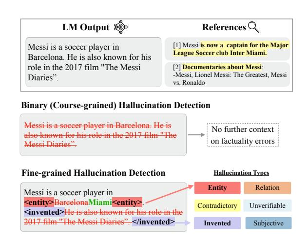
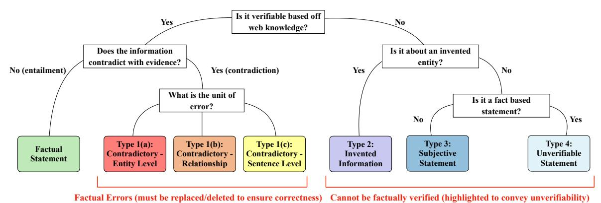
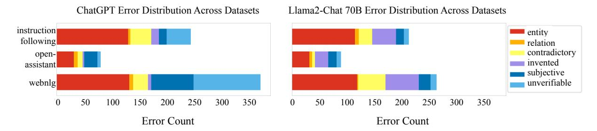
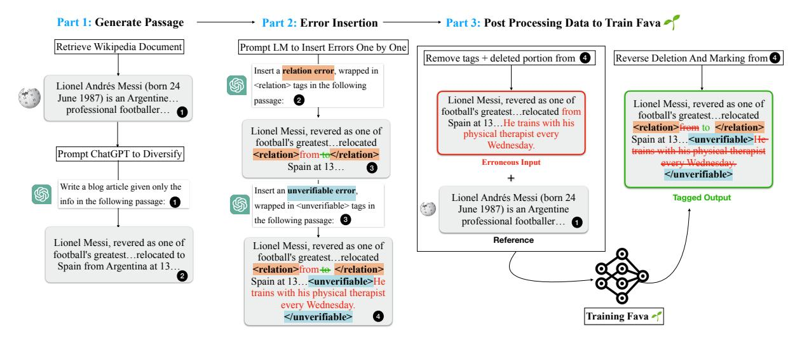
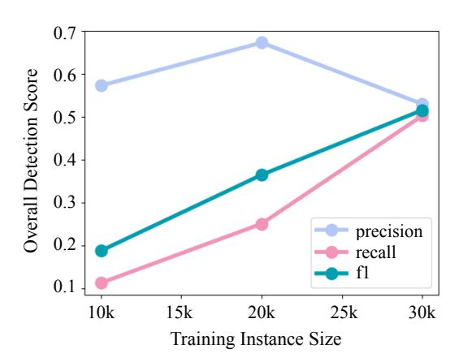
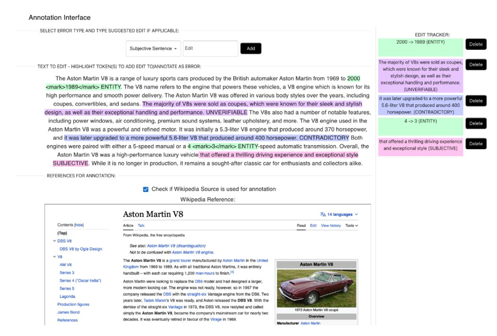

# Fine-grained Hallucination Detection and Editing for Language Models

# Abhika Mishra† Akari Asai† Vidhisha Balachandran‡ Yizhong Wang† Graham Neubig‡ Yulia Tsvetkov† Hannaneh Hajishirzi†§

†University of Washington ‡Carnegie Mellon University §Allen Institute for AI {abhikam, akari, yizhongw, yuliats, hannaneh}@cs.washington.edu {vbalacha, gneubig}@cs.cmu.edu

# Abstract

Large language models (LMs) are prone to generate diverse factually incorrect statements, which are widely called *hallucinations*. Current approaches predominantly focus on coarse-grained automatic hallucination detection or editing, overlooking nuanced error levels. In this paper, we propose a novel task—automatic fine-grained hallucination detection—and present a comprehensive taxonomy encompassing six hierarchically defined types of hallucination. To facilitate evaluation, we introduce a new benchmark that includes fine-grained human judgments on two LM outputs across various domains. Our analysis reveals that ChatGPT and Llama2-Chat exhibit hallucinations in 60% and 75% of their outputs, respectively, and a majority of these hallucinations fall into categories that have been underexplored. As an initial step to address this, we train FAVA, a retrieval-augmented LM by carefully designing synthetic data generations to detect and correct fine-grained hallucinations. On our benchmark, our automatic and human evaluations show that FAVA significantly outperforms ChatGPT on fine-grained hallucination detection by a large margin though a large room for future improvement still exists. FAVA's suggested edits also improve the factuality of LM-generated text, resulting in 5-10% FActScore improvements.[1](#page-0-0)

### 1 Introduction

Large language models (LMs; [Brown et al.](#page-10-0) [2020\)](#page-10-0) can generate highly fluent and plausible text. However, these models are prone to produce *hallucinations*—factually incorrect generations—which often impedes their deployment in real-world applications [\(Mallen et al.,](#page-11-0) [2022\)](#page-11-0). Prior work on hallucinations in natural language generation often

Figure 1: Overview of fine-grained detection system and the proposed taxonomy for hallucinations.

assumes the presence of a specific reference text and focuses on studying faithfulness to the references [\(Ji et al.,](#page-11-1) [2023\)](#page-11-1). On the contrary, escalating apprehensions have been articulated with respect to LM generations that are not grounded in any specific source text, but rather in world knowledge and facts [\(Zhang et al.,](#page-12-0) [2023;](#page-12-0) [Huang et al.,](#page-10-1) [2022\)](#page-10-1).

Such prevalence of hallucinations in LM outputs has motivated the development of automatic hallucination detection [\(Min et al.,](#page-11-2) [2023\)](#page-11-2) or editing systems [\(Gao et al.,](#page-10-2) [2022;](#page-10-2) [Chen et al.,](#page-10-3) [2023\)](#page-10-3). However, those existing systems tend to treat diverse types of factual errors uniformly, often simplifying them into binary categories such as "factual" or "not factual" with a focus on certain domains or specific types of errors. While entity-level contradictions (Figure [1](#page-0-1) top) are usually evident and can be easily rectified with a single reference, LMs often fabricate entities that lack real-world existence (Figure [1](#page-0-1) bottom). This variability underscores the need for a more fine-grained approach to hallucination detection for both model development and human verification, and we argue that *a detection system should provide precise identification of hallucination sequences, discern different error types,*

1Our code, data, and demo are available at [https://](https://fine-grained-hallucination.github.io/) [fine-grained-hallucination.github.io/](https://fine-grained-hallucination.github.io/)

*and suggest potential refinements.*

In this work, we introduce a new task, benchmark, and model to facilitate automatic finegrained hallucination detection (Figure [1\)](#page-0-1). We first introduce a new taxonomy of hallucinations and tasks (Section [3\)](#page-2-0), and collect a high-quality benchmark to test models' ability to provide fine-grained hallucination detection (Section [4\)](#page-4-0). We then introduce a new model that is capable of providing span-level hallucination detection and editing (Section [5\)](#page-5-0) as the first step towards building reliable fine-grained hallucination detection systems.

Our taxonomy (Figure [2;](#page-2-1) Table [1\)](#page-2-2) hierarchically classifies factual errors in LM generations into six categories. We specifically focus on hallucinations in information-seeking scenarios, where grounding to world knowledge matters. Based on this taxonomy, we propose a new task of fine-grained hallucination detection, in which a system needs to identify locations of factual errors in a response along with fine-grained hallucination types.

We carefully annotate two widely-used LMs' responses to diverse instruction-following and knowledge-intensive queries and construct the first fine-grained hallucination annotation benchmark. Our benchmark consists of about 400 responses of ChatGPT and Llama2-Chat 70B with span-level annotations of hallucination types based on our proposed taxonomy. Our benchmark reveals on average 1.9 and 3.4 hallucinations per response in ChatGPT and Llama2-Chat, respectively. It also shows that in addition to the widely-studied entitylevel errors, other error types like unverifiable sentences or invented concepts make up over 60% of LM-generated hallucinations, highlighting the urgent need to study and detect such diverse types.

Due to the expensive costs of annotations, creating training data for this new task is challenging and our preliminary experiments find proprietary LMs such as ChatGPT perform poorly in fine-grained detection. To overcome those challenges, we design an LM-based synthetic data generation process, resulting in 35k training instances. On this training data, we fine-tune a new retrievalaugmented LM, FAVA, which can identify and mark hallucinations at span level using a unified syntax. We compare FAVA with state-of-the-art LMs including ChatGPT on fine-grained hallucination detection and editing in LM outputs. FAVA significantly outperforms ChatGPT with and without external knowledge by 22.1% on fine-grained hallucination detection and 14.2% on binary detection. Furthermore, FAVA effectively fixes factual errors in diverse LM outputs—FAVA editing improves FActScore [\(Min et al.,](#page-11-2) [2023\)](#page-11-2) of Alapaca 7, 13B, and ChatGPT output by 4.4%, 9.3% and 3.3%, respectively.

# 2 Related Work

# Hallucinations in natural language generation.

Taxonomy of hallucinations in certain downstream tasks such as summarization [\(Pagnoni et al.,](#page-11-3) [2021\)](#page-11-3), text simplifications [\(Devaraj et al.,](#page-10-4) [2022\)](#page-10-4), or knowledge-grounded dialogues [\(Dziri et al.,](#page-10-5) [2022\)](#page-10-5) have been studied. Such prior taxonomies often assume the existence of specific source text and focus on faithfulness to the source [\(Ji et al.,](#page-11-1) [2023\)](#page-11-1), which is qualitatively different from LMs' factual hallucinations grounded in world knowledge. In addition, prior taxonomies include many task-specific categories that cannot be directly adapted to describe hallucinations in LM generations.

# Detecting and editing hallucinations in LMs.

Several recent works study methods to predict factuality by giving binary labels of a statement being factual or not [\(Manakul et al.,](#page-11-4) [2023;](#page-11-4) [Min et al.,](#page-11-2) [2023\)](#page-11-2), or focusing on entity-level factual errors editing [\(Gao et al.,](#page-10-2) [2022;](#page-10-2) [Chen et al.,](#page-10-3) [2023\)](#page-10-3). Recent surveys have attempted to categorize hallucinations in LM generations, but such categorizations often stretch the definition of hallucinations to broad error types in LM-generated text, which cannot be traced to specific spans in text [\(Huang et al.,](#page-10-6) [2023;](#page-10-6) [Zhang et al.,](#page-12-0) [2023;](#page-12-0) [Rawte et al.,](#page-11-5) [2023\)](#page-11-5). In this work, we propose a fine-grained taxonomy for factconflicting hallucinations in long-form text generation to improve factual consistency. While prior work often develops factuality verification systems on top of proprietary LMs [\(Chern et al.,](#page-10-7) [2023\)](#page-10-7), we introduce a carefully designed training pipeline for a smaller yet more competitive fine-grained detection system. Unlike prior qualitative analysis on hallucinations in LM responses on certain knowledge-intensive queries (e.g., open-domain QA, biography generation; [Liu et al.,](#page-11-6) [2023b;](#page-11-6) [Min](#page-11-2) [et al.,](#page-11-2) [2023\)](#page-11-2), we annotate responses to diverse queries in multiple domains and reveal hallucination distributions vary across domains.

Fact verification. While research on hallucination detection focuses on identifying errors in model-generated text, a related area of research

Figure 2: An overview of our fine-grained hallucination taxonomy.

| Туре          | Example                                                                       | ChatGPT | Llama2 |
|---------------|-------------------------------------------------------------------------------|---------|--------|
| Entity        | Lionel Andrés Messi was born on June 42 24, 1987.                             | 46.9%   | 46.5%  |
| Relation      | Lionel Messi <del>acquired</del> was acquired by Paris Saint-Germain.         | 2.8%    | 2.5%   |
| Contradictory | Messi has yet to gain captaincy for the Argentina national football team.     | 12.0%   | 14.1%  |
| Invented      | Messi is also famous for his discovery of the famous airplane kick technique. | 4.6%    | 23.0%  |
| Subjective    | Lionel Messi is the best soccer player in the world.                          | 15.0%   | 8.8%   |
| Unverifiable  | In his free time, Messi enjoys singing songs for his family.                  | 18.7%   | 5.1%   |

Table 1: Examples of hallucinations with their percentage in our human-annotated data. We also show the percentage of those errors in ChatGPT and LLama2-Chat-70B outputs.

focuses on identifying factual inaccuracies in human written claims (Bekoulis et al., 2021). Thorne et al. (2018) introduce a large scale dataset based on Wikipedia documents for the training and evaluation of fact verification systems. Other datasets in information-dense domains like fact-checking against scientific articles (Wadden et al., 2020) and news documents (Wang, 2017) have been proposed. Several systems have been developed for fact-checking in these settings (Thorne and Vlachos, 2018; Schuster et al., 2021; Nakov et al., 2021), but have not been tested for LM-generated text. While our work focuses on hallucination detection in LM generations, FAVA can be adapted to fact-check human written claims as well.

#### **3** Fine-grained Hallucination Detection

#### 3.1 Focus and Definitions

In this work, we focus on open-ended text generation given information-seeking queries which often require factual knowledge. We define hallucinations as *factually incorrect or unverifiable statements given external world knowledge*. We operationalize world knowledge as documents from the web that are most relevant to the given state-

ment/query according to a search algorithm.2

#### 3.2 Hallucination Taxonomy

Based on our definition of hallucinations, we build a hierarchical taxonomy to categorize them into fine-grained error types. To develop a hallucination taxonomy for open-ended LM generations, we draw inspiration from error categories in prior task-specific taxonomies (Pagnoni et al., 2021; Devaraj et al., 2022) and introduce new categories to describe more complex errors surfacing in LM generations. We conducted a pilot annotation with 9 NLP experts to discuss and refine our taxonomy to ensure good coverage across diverse error types.

Figure 2 shows our taxonomies to classify LM hallucinations and Table 1 shows examples of each type of hallucination. We group hallucinations into two major categories: statements that contradict world knowledge (Type 1) and unverifiable statements (Types 2, 3, and 4).

(1a) Entity: Contradictory entity errors are a sub-category within contradictory statement errors where an entity in a statement is incorrect and changing that single entity can make the entire

&lt;sup>2Errors in common sense, numerical, or logical reasoning are out of the scope of this work.

sentence factually correct.

- (1b) Relation : Contradictory relation errors are another sub-category within contradictory statements where a semantic relationship described in a statement is incorrect. While (1a) often involves errors in nouns, (1b) involves verbs, prepositions, or adjectives, and can be fixed by correcting the incorrect relation.
- (1c) Contradictory : Contradictory statement errors refer to statements that entirely contradict relevant evidence from the web. These are cases where the full sentence is refuted by the information provided in a given reference.
- (2) Invented : Invented errors refer to statements with concepts that do not exist based on world knowledge. These are cases when the LM generates a non-existent or entirely fabricated entity that doesn't occur in any relevant evidence. This does not include fictional characters in creative work such as books or movies.
- (3) Subjective : Subjective errors refer to an expression or proposition that lacks universal validity and is often influenced by personal beliefs, feelings, opinions, or biases and hence cannot be judged as factually correct. Specifically, this represents cases where the LM generates a statement without any factual proposition grounded in relevant evidence. (4) Unverifiable : Unverifiable errors refer to statements that contain factual propositions but cannot be grounded in world evidence. These are cases where the LM generates statements with facts, but none of the retrieved evidence from the web can directly support or contradict the fact (e.g., personal or private matters).

While Entity or Relation are often phrase-level and can be fixed by minimal editing erroneous phrases, other error types can be an entire sentence or part of a sentence and should be removed from a response to make it factual.

### 3.3 Tasks and Metrics

We introduce two new tasks of identifying and editing fine-grained factual errors in LM outputs. Given an input query x and a corresponding LM output y, our tasks require systems to identify all of the factual errors. Each error e consists of (e text, etype), indicating the factually incorrect text spans and their error types among our taxonomies, respectively. We evaluate systems' abilities concerning identifying fine-grained error types in the model-generated text e type (Task 1) and editing

factual errors e text accordingly (Task 2).

#### Task 1: Fine-grained hallucination detection. In the first fine-grained error detection task, the system is expected to identify fine-grained errors in an LM output. Due to the subjectivity of span-level annotations, for automatic evaluation, we evaluate systems' abilities to detect whether an error type t exists in a sentence si ∈ y. Given an output y consisting of L sentences, we assume the availability of gold error type annotations e ∗t i ∈ {TRUE, FALSE}, which is a binary label of an error type t existing in the ith sentence (TRUE) or not (FALSE). For each type, a system predicts e t and we evaluate precision

i

and recall as follows:

$$\text{Prec}^t = \frac{\sum_{i \in L} \mathbb{1}[e_i^t == e_i^{*t}]}{\sum_{i \in L} \mathbb{1}[e_i^t == \text{TRUE}]} \tag{1}$$

$$\operatorname{Recall}^t = \frac{\sum_{i \in L} \mathbb{1}[e_i^t == e_i^{*t}]}{\sum_{i \in L} \mathbb{1}[e_i^{*t} == \operatorname{TRUE}]} \tag{2}$$

Precision indicates how many of the model's predictions of an error type t existing in the ith sentence is correct, while recall indicates how many of the error sentence TRUE is identified by the model. For final score, we compute the F1 scores averaged over six error types as follows:

$$\frac{1}{|\mathcal{E}|} \sum_{t \in \mathcal{E}} \frac{2 \times \operatorname{Prec}^{t} \times \operatorname{Recall}^{t}}{\operatorname{Prec}^{t} + \operatorname{Recall}^{t}}$$
(3)

Fine-grained error detection can be simplified into a binary classification task, in which a system predicts if a sentence si includes any factual errors or not. This is similar to FActScore [\(Min et al.,](#page-11-2) [2023\)](#page-11-2), where we predict and evaluate factuality at the sentence level without extracting atomic facts.

Task 2: Hallucination editing. As shown in Table [1,](#page-2-2) some hallucinations can be fixed with minimal span-level edits, while others need to be removed or marked as unverifiable. In the editing task, the system is expected to suggest finegrained edits to improve the factuality of the LM output. We evaluate a system's ability to improve the factuality of given output y, by comparing scores estimated by off-the-shelf systems, such as FActScore or QAFactEval [\(Fabbri et al.,](#page-10-9) [2022\)](#page-10-9). as follows:f(ˆy) − f(y), where f indicates an evaluation function for factuality while f(ˆy) indicates edited output.

Figure 3: Hallucination type distribution of human annotations across 3 datasets and two models.

# 4 Benchmark

# 4.1 Human Annotation on Hallucinations

To facilitate model development in fine-grained hallucination detection and understand how prevalent those different types of hallucinations are, we carefully annotate the first fine-grained hallucination detection benchmark. Our benchmark consists of multi-way fine-grained annotations on two LM responses to queries in multiple domains.

Source prompts. To evaluate LMs' factuality in the responses to diverse queries, we collect 150 information-seeking queries, spanning three different categories. First, we sample 50 knowledgeintensive queries from the Open Assistant [\(Köpf](#page-11-9) [et al.,](#page-11-9) [2023\)](#page-11-9) dataset, by prompting GPT-4 to judge whether each query from the dataset requires world knowledge or not. We, the authors further compose 50 instruction-following queries that require more complex reasoning and knowledge. Lastly, to enable more controlled evaluations and analysis, we synthetically create 50 queries that require more fine-grained knowledge, by converting data-to-text WebNLG dataset [\(Gardent et al.,](#page-10-10) [2017\)](#page-10-10) using a template. See examples in each category in Appendix Table [6.](#page-13-0)

Annotation details. We prompt Chat-GPT [\(Ouyang et al.,](#page-11-10) [2022\)](#page-11-10) and Llama2-Chat 70B [\(Touvron et al.,](#page-12-5) [2023\)](#page-12-5) in a zero-shot manner and collect 300 responses to our diverse information-seeking queries. We recruited 15 students (five undergraduate and ten NLP graduate students) to annotate the factual accuracy of the responses based on our proposed taxonomy. Due to the complexity of the task, we conducted 45-minute in-person and virtual training sessions with them. Annotating each response takes approximately 10 minutes, and we pay USD 3.5 for each annotation. For each LM response, we assign two annotators. We present model-generated responses,

input information-seeking queries, and the top 10 web search documents returned by Google Search given the original input queries. We ask human annotators to first mark a span, annotate a category of error, and suggest an edit to fix the errors for the Entity and Relation types. Our annotation interface and more details of annotations are available in Appendix [A.](#page-13-1)

Analysis on annotated data. Figure [3](#page-4-1) presents a detailed breakdown of distributions across finegrained categories in the three domains. 60.8% and 74.7% of the responses of ChatGPT and Llama2- Chat include at least one factual hallucination, respectively. Entity is the most widely recognized error type, making up 46.3% of the detected errors. Yet, there are diverse types of errors prevalent like invented statements or contradictory statements which make up 16.8% and 15.4% of the errors detected respectively. We found that the error distributions vary across different source prompts and LMs. Invented are more common in Llama2- Chat 70B. We observe fewer errors in Open Assistant subsets, possibly because their seed prompts are less knowledge-intensive, or ask about popular factual knowledge (e.g., *How tall is the Burj Khalifa?*), which is often memorized by powerful LMs [\(Mallen et al.,](#page-11-0) [2022\)](#page-11-0). On the other hand, the newly annotated instructions and WebNLG data show a higher percentage of errors.

Our annotators also agreed that our taxonomy covers most of the error types in LM responses. Furthermore, we calculated inter-annotator agreement using Cohen kappa scores and found that our annotators had high agreement in error detection across passages, with 75.1% agreement in error detection at the sentence level and 60.3% agreement in exact error type detection at the sentence level across passages. Appendix Table [8](#page-14-0) shows examples of our annotations.

Figure 4: Overview of data creation process in FAVA.

# 5 Model: FAVA

Our benchmark analysis reveals the urgent need to study and detect such diverse types of hallucinations.

We introduce a new retrieval-augmented LM, FAVA (FAct Vericaton with Augmentation). FAVA is trained on high-quality synthetic training data, and at inference, it identifies and fixes fine-grained hallucinations, incorporating retrieved knowledge.

### 5.1 Overview

FAVA consists of two components: a retriever Mret and an editing LM Medit. Mret takes the original output LM y and optionally input prompt x (if applicable), and retrieves top relevant documents: C = Mret(x, y). Subsequently, the editing model detects and if possible edits factual errors in y given the retrieved context: yˆ = Medit(x, y, C). yˆ is an augmented output y interleaved by the error edits with hallucination types as shown in Figure [1.](#page-0-1)

While Medit can be any LM, in our preliminary experiments, we find that making a state-of-the-art proprietary LM such as ChatGPT to perform finegrained editing via prompting only is challenging (ref Table [2\)](#page-7-0). Reliance on black-box proprietary API models also hurt reproducible. Therefore, we generate high-quality synthetic training data with minimal human efforts (Section [5.2\)](#page-5-1) and fine-tune a powerful expert LM consisting of 7 billion parameters (Section [5.3\)](#page-6-0).

# 5.2 Training Data Creation

To train our Medit model, we require a large number of erroneous LM outputs y paired with edited

versions y ∗ with fine-grained error types and edits. Inspired by prior work that leverages LMs to generate synthetic training data [\(Balachandran et al.,](#page-10-11) [2022;](#page-10-11) [Wang et al.,](#page-12-6) [2023b;](#page-12-6) [Asai et al.,](#page-10-12) [2023\)](#page-10-12), we introduce a new data creation method grounded on our fine-grained hallucination taxonomies. We prompt GPT-4 [\(Achiam et al.,](#page-10-13) [2023\)](#page-10-13) and ChatGPT to diversify and noise a Wikipedia passage by inserting different types of hallucinations.

In particular, our data creation pipeline consists of three steps: seed passage generations, error insertions, and postprocessing. The first two processes create an input sequence with perturbed diverse error annotations, and postprocessing remaps those special tokens to generate the erroneous output y and output with fine-grained detection results y ∗ . We use the original Wikipedia passage as well as passages retrieved by an off-the-shelf system as C. Figure [4](#page-5-2) shows the overview of the pipeline.

Seed passage generation. We randomly sample a Wikipedia article c and use it as our gold reference passage. To produce model-generated seed passages, we diversify the sampled article by paraphrasing and transferring the text to another genre via an LM. Then, we prompt ChatGPT to create a new genre of the text t, specifying to include information only found in the Wikipedia article c to maintain factuality. We randomly sample one of the pre-specified genre types (e.g. blog article, question answer pair, tweet, etc.) for each passage. To further diversity in the dataset, we also add examples of question answering (QA) data. In particular, we prompt ChatGPT with two demonstrations from the NaturalQuestions [\(Kwiatkowski](#page-11-11)

[et al.,](#page-11-11) [2019\)](#page-11-11) dataset to generate 5,000 queries and correct answers using the information in the sampled Wikipedia articles. See the full list of the genres, instructions, and final ChatGPT-generated text in Appendix Table [9.](#page-15-0)

Error insertion. In our pilot studies, we found that asking ChatGPT to insert multiple error types at the same time easily makes the model misunderstand or get confused with different error types (e.g., swapping or incorrectly identifying an error type). We also found while ChatGPT is capable of generating more simple types of errors such as Entity , it struggles with generating plausible and difficult perturbations for more nuanced types. Therefore, we use ChatGPT and GPT-4 interchangeably for six different types.[3](#page-6-1) In particular, given an instruction and few-shot demonstrations of an error type e type, GPT-4 or ChatGPT inserts new errors while retraining previously inserted errors and original text. The model was specifically instructed to mark phrases or sentences for deletion along with their error type and insert phrases and sentences along with insertion tags, allowing us to verify the error types and control their distribution.

After this process, we have an erroneous text y, which inserts multiple errors into the original factual text t.

Post processing. We then post-process data, by swapping and removing the error tags and edits to form a clean erroneous text y as the input and use the original correct passage y ∗ as the output with edits, for training Medit. At this stage, we also filter out the examples violating our editing rules (e.g., inserting or removing errors without marking them up with tags and error types). As a result, we have a training instance (c, y, y∗ ), consisting of the gold context (original Wikipedia paragraph) c, erroneous LM output y, and output with error tags and correct editing y ∗ . We also retrieve additional four relevant paragraphs from Wikipedia using Contriever [\(Izacard et al.,](#page-10-14) [2022\)](#page-10-14), and randomly mix the order of the references, forming the final references C. As this process does not involve human annotations, we can easily scale up training instances under an API cost budget.

Statistics of data. We generated a total of 35,074 training instances, 30,0074 of which are based on Wikipedia passages, and 5,000 are based on QA pairs described above. All of the error types are almost equally distributed (roughly 15% each). We present the error distributions in Appendix Table [10.](#page-16-0) We conduct a detailed human evaluation in Section [7.2.](#page-8-0) On average, 3.1 errors are inserted for the Wikipedia passage-based subsets, and 1.4 errors are inserted for the QA pairs.

## 5.3 Training and Inference

We train a smaller LM on the generated large-scale training data. In particular, given a training instance (C, y, y∗ ), our model Medit takes (C, y) as input and learns to predict the edited outputs with tags to represent error type y ∗ using standard language modeling objective. We use Llama2-Chat 7B to initialize Medit.

At inference time, we retrieve the top five documents from Wikipedia,[4](#page-6-2) using Contriever-MSMARCO [\(Izacard et al.,](#page-10-14) [2022\)](#page-10-14), and insert them together with an LM output that may include factual errors. The model identifies factual errors, marks phrases or sentences for deletion, and suggests edits for improving the factuality of the text.

# 6 Experiments

We evaluate FAVA and state-of-the-art LMs with and without retrieval on the fine-grained hallucination detection (Section [6.1\)](#page-6-3) and editing tasks (Section [6.2\)](#page-7-1). We further conduct human evaluations on our best models (Section [6.3\)](#page-7-2).

#### 6.1 Experiments for Hallucination Detection

Evaluation data. We use our new benchmark, consisting of 364 annotated passages,[5](#page-6-4) as our test data. We measure the models' detection performance based on sentence-level per-category classification task as formulated in Section [3.3.](#page-3-0)

Baselines. For fine-grained hallucination detection tasks, we test three baselines. ChatGPT prompts ChatGPT (gpt-3.5-turbo-0301) with a carefully designed prompt describing all six categories with two demonstrations. Rt-ChatGPT uses the same prompt and demonstrations but also

3We use ChatGPT for the Type 1 and Type 3 while using GPT-4 for other types and insert factual errors one by one into our diversified text.

4We use English Wikipedia data from January 2023 and generate embeddings using the Contriever encoder.

5 In total we collected 471 annotated passages including our experimental batches, and we excluded earlier batches for evaluations.

| ChatGPT Generations |      |      |      |      | Llama2-Chat 70B Generations |      |      |      |      |      |      |      |      |      |      |      |
|---------------------|------|------|------|------|-----------------------------|------|------|------|------|------|------|------|------|------|------|------|
| Editor              | ent  | rel  | con  | inv  | subj                        | unv  | OA   | Bi.  | ent  | rel  | con  | inv  | subj | unv  | OA   | Bi.  |
| CGPT                | 19.5 | 28.6 | 40.0 | 11.8 | 7.7                         | 0.0  | 18.8 | 50.1 | 24.7 | 15.6 | 26.7 | 11.0 | 17.6 | 12.8 | 24.1 | 68.4 |
| Rt+CGPT             | 28.1 | 19.2 | 25.5 | 5.4  | 37.7                        | 15.5 | 24.4 | 64.8 | 33.7 | 24.2 | 24.0 | 22.2 | 17.8 | 4.7  | 27.8 | 72.8 |
| FAVA (ours)         | 43.1 | 25.0 | 57.1 | 16.7 | 70.5                        | 35.3 | 46.5 | 78.2 | 56.2 | 34.5 | 27.7 | 34.5 | 67.0 | 43.4 | 46.5 | 80.6 |

Table 2: Overall fine-grained detection performance. CGPT indicates ChatGPT. "OA" indicates overall accuracy and "Bi." indicates binary predictions accuracy.

includes the top five retrieved documents by Contriever at test time to augment the original prompt.[6](#page-7-3)

### 6.2 Experiments for Editing

Evaluation data and function. For editing evaluations, we use two open-ended text generation data and evaluate models' factuality based on two metrics designed to measure the factuality of text. FActScore [\(Min et al.,](#page-11-2) [2023\)](#page-11-2) prompts ChatGPT and GPT 3-davinci 003 to decompose a response into a set of atomic facts and verify factuality for each of them using passages from a designated Wikipedia article. We use the original biography generation task proposed with FActScore for evaluation.

Baselines For editing experiments, we use Chat-GPT and Rt-ChatGPT, as well as Llama2-Chat 13B with and without retrieval (Llama and Rt-Llama, respectively). As in the fine-grained error detection task, we prompt the models with carefully designed prompts and two demonstrations. For all baselines, we retrieve five documents consisting of one document retrieved by string matching based on the entity name and four documents retrieved by Contriever, which are reranked at test time, using a small cross-encoder.[7](#page-7-4)

### 6.3 Human Evaluations

Our automatic evaluations may not fully capture the models' abilities to detect annotated data and editing errors due to the potential subjectivity of annotations and may be affected by the performance of factuality evaluation metrics. We evaluate randomly sampled 50 outputs from FAVA as well as the baseline with the highest automatic evaluation score, namely Rt-ChatGPT. We ask human annotators to verify how many of the detection and edits

are indeed correct based on the provided retrieved documents. This is similar to our automatic precision evaluation, but instead of coarsely evaluating detection performance at the sentence level, we evaluate the model performance at the individual detection level. Due to the cost of evaluating the factuality of all verification-worthy statements [\(Min et al.,](#page-11-2) [2023\)](#page-11-2), we do not evaluate recall.

# 7 Results and Analysis

#### 7.1 Results

Detection results. Table [2](#page-7-0) shows the fine-grained detection accuracy of FAVA and baselines. We provide the full precision and recall scores in Appendix Tables [12](#page-17-0) and [13,](#page-17-1) respectively. We also provide binary prediction performance.

Table [2](#page-7-0) shows that while ChatGPT-based baselines show relatively good binary predictions of existence of factual errors, their fine-grained error type detection performance is significantly lower. FAVA shows its strong capabilities of conducting fine-grained error detection, resulting in significant performance improvements from ChatGPT or Ret-ChatGPT on both fine-grained error detection and binary error detection. Specifically, FAVA shows high accuracy on error types such as Contradictory , Subjective , Entity . On the other hand, its performance on Invented and Unverifiable are still limited. Those two error types often require intensive search over many web documents beyond top few passages, while FAVA by default only considers top five documents. Our inter-annotator agreements also show that there are more disagreements in those two categories, which might also deflate the performance.

Editing results. Table [3](#page-8-1) shows the results on FactScore. Our FAVA significantly outperforms prompted ChatGPT or Llama2-Chat 70B, despite being a much smaller model size. Retrievalaugmented ChatGPT shows small improvements by editing Alpaca outputs, editing its output with re-

6While we also tested strong white box LMs including Llama2-Chat 13B, we found their predictions often show confusion among different categories or struggle to output predictions in the expected format.

7 [https://huggingface.co/cross-encoder/](https://huggingface.co/cross-encoder/ms-marco-MiniLM-L-6-v2) [ms-marco-MiniLM-L-6-v2](https://huggingface.co/cross-encoder/ms-marco-MiniLM-L-6-v2)

|             | ChatGPT    | Al-13B     | Al-7B      |
|-------------|------------|------------|------------|
| No Edit     | 66.7       | 42.5       | 38.8       |
| ChatGPT     | 58.6 -8.1  | 42.0 -0.5  | 37.9 -0.9  |
| Rt-ChatGPT  | 62.7 -4.0  | 43.9 +1.4  | 39.2 +0.4  |
| Llama       | 52.6 -14.1 | 22.7 -19.8 | 18.6 -20.2 |
| Rt-Llama    | 58.7 -8.0  | 48.6 +6.1  | 32.2 -6.6  |
| FAVA (ours) | 70.0 +3.3  | 51.8 +9.3  | 43.2 +4.4  |

Table 3: Overall results on FActScore. Al-13B and Al-7B denote Alpaca 13B and 7B, respectively.

| Model       | avg.  E | Detect (%) | Edit (%) |
|-------------|---------|------------|----------|
| Rt+ChatGPT  | 1.9     | 23.9       | 17.2     |
| FAVA (ours) | 2.4     | 55.7       | 63.5     |

Table 4: Human evaluation results. We show the average number of detected errors and the correctness (%) of the fine-grained types and edits.

trieved documents hurts the FActScore. We found that ChatGPT is often confused with different error types and exhibits tendencies of over-predicting contradictory or subjective statements. Among other models, our methods show the largest gains in terms of factuality, showing the effectiveness of editing, in addition to its strong capability of providing fine-grained error types.

Human evaluation results. Our human evaluation results are shown in Table [4.](#page-8-2) As in automatic evaluations, our method shows significantly better performance than Rt+ChatGPT on both editing and detection and recognizes more errors than retrieval-augmented ChatGPT. These results further demonstrate the strong capabilities of FAVA detecting factual errors in LM outputs.

# 7.2 Analysis

We conduct a set of ablation studies of different aspects of training data creation and inference time design choices, to understand the key factors to build a reliable fine-grained error detection system.

Effects of scale. We evaluate our model trained on varying numbers of model-generated training data. In particular, we train three FAVA variants trained on 10k, 20k, and 30k training instances, and evaluate their performance on fine-grained error detection tasks. Figure [5](#page-8-3) shows the results of each variant and demonstrates that FAVA variants with a larger number of training instances perform significantly better at detecting fine-grained errors.

Figure 5: Detection scores across different training instance values.

| Settings                       | FActScore |
|--------------------------------|-----------|
| Alpaca 13B (No Edit)           | 42.5      |
| FAVA (Top 1)                   | 44.2 +1.7 |
| FAVA (Top 5)                   | 47.0 +4.5 |
| FAVA (Top 5) + reranked        | 47.7 +5.2 |
| FAVA (Top 5) + entity matching | 50.1 +7.6 |

Table 5: FActScore editing results with different retrieval settings.

Effect of retrieval. We assess FAVA's editing performance on FActScore on Alpaca 13B outputs through various retrieval methods during inference. Specifically, we examine four distinct retrieval approaches: retrieving the top 1 document; retrieving the top 5 documents; reordering the top 5 documents; retrieving the top 4 documents and mixing them with an introductory paragraph of the target entity (entity matching). We provide the details of the ablation studies in Appendix Section [C.4.](#page-17-2)

Table [5](#page-8-4) shows the experimental results. Retrieving the top five documents significantly enhances performance compared to retrieval of only the top one document by 4.5%. Ordering passages using a reranking model gives some improvements, which indicates the non-negligible effects of context locations, as reported by prior work [\(Liu et al.,](#page-11-12) [2023a\)](#page-11-12). Including the reference based on entity matching gives a notable enhancement to 50.1%, marking a 3.1% gain from the top five retrievals and 7.6% improvement over the unedited generations. Prior work reports that neural retrieval systems can struggle in rare entities [\(Mallen et al.,](#page-11-0) [2022\)](#page-11-0), where term-based retrievers or simple string matching shows more robust performance. FActScore bio consists of extremely low entities, where simple

entity matching may help. These results indicate although FAVA demonstrates strong capabilities, there's room for improvements in the retrieval components and how to incorporate many references.

Human evaluation of generated data. We conduct human evaluations on 50 generated data to assess the automatic data creation quality. We evaluate a generated instance from two aspects: (1) *validity*—whether the model edits do not violate our annotation scheme; (2) *quality*—the inserted errors are feasible and realistic and notably different from provided few-shot samples. We ask human annotators to score each category for each passage either 0, 1, or 2 (higher is better; see the detailed criteria in our Appendix).

Our analysis revealed that the data generated by our system with iterative insertion obtained an average score of 1.66 for validity assessment and 1.36 for quality assessment. Meanwhile, data generated by one-shot prompting scored an average of 1.1 for validity and 0.9 for quality. Our human evaluation reveals that our LM-generated edits are indeed of higher quality than the one-shot data creation, and provide realistic factual errors.

# 8 Conclusions and Discussions

This work introduces a new task of automatic hallucination detection, built upon our newly introduced taxonomy, which hierarchically classifies hallucinations in LMs into six categories. We collect the first human-annotated fine-grained hallucination benchmark, consisting of span-level hallucination types, hallucination text, and edits for two LM outputs across multiple domains. As the first step, we introduce a new retrieval-augmented LM trained on synthetically generated fine-grained error editing data following our taxonomies. Empirical results show that FAVA significantly outperforms strong baselines by a large margin on both editing and fine-grained detection tasks, while still large room for improvements for automated fine-grained error detection and editing.

# Acknowledgement

We thank Sewon Min for fruitful discussions in the early stages. Akari Asai is supported by the IBM Fellowship. We thank Stability AI for providing computing to train and evaluate the LMs in this work, and Microsoft Accelerate Foundation Models Research Program for the access to Azure and

OpenAI APIs. We thank our annotators who provide high-quality annotations for this work. This work was funded in part by the DARPA MCS program through NIWC Pacific (N66001-19-2-4031), NSF IIS-2044660, and gifts from AI2.

# References

- Josh Achiam, Steven Adler, Sandhini Agarwal, Lama Ahmad, Ilge Akkaya, Florencia Leoni Aleman, Diogo Almeida, Janko Altenschmidt, Sam Altman, Shyamal Anadkat, et al. 2023. [Gpt-4 technical report.](https://arxiv.org/abs/2303.08774) *arXiv preprint arXiv:2303.08774*.
- Akari Asai, Zeqiu Wu, Yizhong Wang, Avirup Sil, and Hannaneh Hajishirzi. 2023. [Self-](https://arxiv.org/abs/2310.11511)[RAG: Learning to retrieve, generate, and cri](https://arxiv.org/abs/2310.11511)[tique through self-reflection.](https://arxiv.org/abs/2310.11511) *arXiv preprint arXiv:2310.11511*.
- Vidhisha Balachandran, Hannaneh Hajishirzi, William Cohen, and Yulia Tsvetkov. 2022. [Cor](https://aclanthology.org/2022.emnlp-main.667)[recting diverse factual errors in abstractive sum](https://aclanthology.org/2022.emnlp-main.667)[marization via post-editing and language model](https://aclanthology.org/2022.emnlp-main.667) [infilling.](https://aclanthology.org/2022.emnlp-main.667) In *Proceedings of the 2022 Conference on Empirical Methods in Natural Language Processing*.
- Giannis Bekoulis, Christina Papagiannopoulou, and Nikos Deligiannis. 2021. [A review on fact](https://dl.acm.org/doi/10.1145/3485127) [extraction and verification.](https://dl.acm.org/doi/10.1145/3485127) *Association for Computing Machinery Computing Surveys (CSUR)*.
- Tom Brown, Benjamin Mann, Nick Ryder, Melanie Subbiah, Jared D Kaplan, Prafulla Dhariwal, Arvind Neelakantan, Pranav Shyam, Girish Sastry, Amanda Askell, et al. 2020. [Language mod](https://papers.nips.cc/paper/2020/hash/1457c0d6bfcb4967418bfb8ac142f64a-Abstract.html)[els are few-shot learners.](https://papers.nips.cc/paper/2020/hash/1457c0d6bfcb4967418bfb8ac142f64a-Abstract.html) In *Advances in Neural Information Processing systems*.
- Anthony Chen, Panupong Pasupat, Sameer Singh, Hongrae Lee, and Kelvin Guu. 2023. [Purr: Ef](https://arxiv.org/abs/2305.14908)[ficiently editing language model hallucinations](https://arxiv.org/abs/2305.14908) [by denoising language model corruptions.](https://arxiv.org/abs/2305.14908) *arXiv preprint arXiv:2305.14908*.
- I Chern, Steffi Chern, Shiqi Chen, Weizhe Yuan, Kehua Feng, Chunting Zhou, Junxian He, Graham Neubig, Pengfei Liu, et al. 2023. [Fac](https://arxiv.org/abs/2307.13528)[tool: Factuality detection in generative ai–](https://arxiv.org/abs/2307.13528) [a tool augmented framework for multi-task](https://arxiv.org/abs/2307.13528) [and multi-domain scenarios.](https://arxiv.org/abs/2307.13528) *arXiv preprint arXiv:2307.13528*.
- Ashwin Devaraj, William Sheffield, Byron Wallace, and Junyi Jessy Li. 2022. [Evaluating factuality](https://aclanthology.org/2022.acl-long.506) [in text simplification.](https://aclanthology.org/2022.acl-long.506) In *Proceedings of the 60th Annual Meeting of the Association for Computational Linguistics*.

- Nouha Dziri, Sivan Milton, Mo Yu, Osmar Zaiane, and Siva Reddy. 2022. [On the origin of hal](https://aclanthology.org/2022.naacl-main.387)[lucinations in conversational models: Is it the](https://aclanthology.org/2022.naacl-main.387) [datasets or the models?](https://aclanthology.org/2022.naacl-main.387) In *Proceedings of the 2022 Conference of the North American Chapter of the Association for Computational Linguistics: Human Language Technologies*.
- Alexander Fabbri, Chien-Sheng Wu, Wenhao Liu, and Caiming Xiong. 2022. [QAFactEval: Im](https://aclanthology.org/2022.naacl-main.187)[proved QA-based factual consistency evaluation](https://aclanthology.org/2022.naacl-main.187) [for summarization.](https://aclanthology.org/2022.naacl-main.187) In *Proceedings of the 2022 Conference of the North American Chapter of the Association for Computational Linguistics: Human Language Technologies*.
- Luyu Gao, Zhuyun Dai, Panupong Pasupat, Anthony Chen, Arun Tejasvi Chaganty, Yicheng Fan, Vincent Y Zhao, Ni Lao, Hongrae Lee, Da-Cheng Juan, et al. 2022. [RARR: Researching](https://aclanthology.org/2023.acl-long.910/) [and revising what language models say, using](https://aclanthology.org/2023.acl-long.910/) [language models.](https://aclanthology.org/2023.acl-long.910/) In *Proceedings of the 61st Annual Meeting of the Association for Computational Linguistics*.
- Claire Gardent, Anastasia Shimorina, Shashi Narayan, and Laura Perez-Beltrachini. 2017. [The WebNLG challenge: Generating text from](https://aclanthology.org/W17-3518) [RDF data.](https://aclanthology.org/W17-3518) In *Proceedings of the 10th International Conference on Natural Language Generation*.
- Jie Huang, Hanyin Shao, and Kevin Chen-Chuan Chang. 2022. [Are large pre-trained language](https://aclanthology.org/2022.findings-emnlp.148.pdf) [models leaking your personal information?](https://aclanthology.org/2022.findings-emnlp.148.pdf) In *Proceedings of the 2020 Conference on Empirical Methods in Natural Language Processing*.
- Lei Huang, Weijiang Yu, Weitao Ma, Weihong Zhong, Zhangyin Feng, Haotian Wang, Qianglong Chen, Weihua Peng, Xiaocheng Feng, Bing Qin, and Ting Liu. 2023. [A survey on halluci](https://arxiv.org/abs/2311.05232)[nation in large language models: Principles, tax](https://arxiv.org/abs/2311.05232)[onomy, challenges, and open questions.](https://arxiv.org/abs/2311.05232) *arXiv preprint arXiv:2311.05232*.
- Gautier Izacard, Mathilde Caron, Lucas Hosseini, Sebastian Riedel, Piotr Bojanowski, Armand Joulin, and Edouard Grave. 2022. [Unsupervised](https://openreview.net/forum?id=jKN1pXi7b0) [dense information retrieval with contrastive](https://openreview.net/forum?id=jKN1pXi7b0) [learning.](https://openreview.net/forum?id=jKN1pXi7b0) *Transactions on Machine Learning Research*.

- Ziwei Ji, Nayeon Lee, Rita Frieske, Tiezheng Yu, Dan Su, Yan Xu, Etsuko Ishii, Ye Jin Bang, Andrea Madotto, and Pascale Fung. 2023. [Survey](https://dl.acm.org/doi/10.1145/3571730) [of hallucination in natural language generation.](https://dl.acm.org/doi/10.1145/3571730) *Association for Computing Machinery Computing Surveys*.
- Andreas Köpf, Yannic Kilcher, Dimitri von Rütte, Sotiris Anagnostidis, Zhi-Rui Tam, Keith Stevens, Abdullah Barhoum, Nguyen Minh Duc, Oliver Stanley, Richárd Nagyfi, et al. 2023. [Ope](https://arxiv.org/abs/2304.07327)[nassistant conversations–democratizing large](https://arxiv.org/abs/2304.07327) [language model alignment.](https://arxiv.org/abs/2304.07327) *arXiv preprint arXiv:2304.07327*.
- Tom Kwiatkowski, Jennimaria Palomaki, Olivia Redfield, Michael Collins, Ankur Parikh, Chris Alberti, Danielle Epstein, Illia Polosukhin, Jacob Devlin, Kenton Lee, Kristina Toutanova, Llion Jones, Matthew Kelcey, Ming-Wei Chang, Andrew M. Dai, Jakob Uszkoreit, Quoc Le, and Slav Petrov. 2019. [Natural questions: A bench](https://aclanthology.org/Q19-1026)[mark for question answering research.](https://aclanthology.org/Q19-1026) *Transactions of the Association for Computational Linguistics*.
- Nelson F Liu, Kevin Lin, John Hewitt, Ashwin Paranjape, Michele Bevilacqua, Fabio Petroni, and Percy Liang. 2023a. [Lost in the middle:](https://arxiv.org/abs/2307.03172) [How language models use long contexts.](https://arxiv.org/abs/2307.03172) *Transactions of the Association for Computational Linguistics*.
- Nelson F Liu, Tianyi Zhang, and Percy Liang. 2023b. [Evaluating verifiability in generative](https://arxiv.org/abs/2304.09848) [search engines.](https://arxiv.org/abs/2304.09848) In *Findings of the Association for Computational Linguistics: EMNLP 2023*.
- Shayne Longpre, Kartik Perisetla, Anthony Chen, Nikhil Ramesh, Chris DuBois, and Sameer Singh. 2021. [Entity-based knowledge conflicts](https://aclanthology.org/2021.emnlp-main.565) [in question answering.](https://aclanthology.org/2021.emnlp-main.565) In *Proceedings of the 2021 Conference on Empirical Methods in Natural Language Processing*.
- Alex Mallen, Akari Asai, Victor Zhong, Rajarshi Das, Hannaneh Hajishirzi, and Daniel Khashabi. 2022. [When not to trust language models: Inves](https://aclanthology.org/2023.acl-long.546/)[tigating effectiveness and limitations of paramet](https://aclanthology.org/2023.acl-long.546/)[ric and non-parametric memories.](https://aclanthology.org/2023.acl-long.546/) *Proceedings of the 61st Annual Meeting of the Association for Computational Linguistics*.

- Potsawee Manakul, Adian Liusie, and Mark JF Gales. 2023. [Selfcheckgpt: Zero-resource black](https://aclanthology.org/2023.emnlp-main.557.pdf)[box hallucination detection for generative large](https://aclanthology.org/2023.emnlp-main.557.pdf) [language models.](https://aclanthology.org/2023.emnlp-main.557.pdf) *Proceedings of the 2023 Conference on Empirical Methods in Natural Language Processing*.
- Sewon Min, Kalpesh Krishna, Xinxi Lyu, Mike Lewis, Wen-tau Yih, Pang Wei Koh, Mohit Iyyer, Luke Zettlemoyer, and Hannaneh Hajishirzi. 2023. [FActScore: Fine-grained atomic](https://aclanthology.org/2023.emnlp-main.741/) [evaluation of factual precision in long form text](https://aclanthology.org/2023.emnlp-main.741/) [generation.](https://aclanthology.org/2023.emnlp-main.741/)
- Preslav Nakov, David Corney, Maram Hasanain, Firoj Alam, Tamer Elsayed, Alberto Barrón-Cedeño, Paolo Papotti, Shaden Shaar, and Giovanni Da San Martino. 2021. [Automated fact](https://www.ijcai.org/proceedings/2021/0619.pdf)[checking for assisting human fact-checkers.](https://www.ijcai.org/proceedings/2021/0619.pdf) *Proceedings of the Thirtieth International Joint Conference on Artificial Intelligence Survey Track*.
- Long Ouyang, Jeffrey Wu, Xu Jiang, Diogo Almeida, Carroll Wainwright, Pamela Mishkin, Chong Zhang, Sandhini Agarwal, Katarina Slama, Alex Ray, et al. 2022. [Training language](https://proceedings.neurips.cc/paper_files/paper/2022/file/b1efde53be364a73914f58805a001731-Paper-Conference.pdf) [models to follow instructions with human feed](https://proceedings.neurips.cc/paper_files/paper/2022/file/b1efde53be364a73914f58805a001731-Paper-Conference.pdf)[back.](https://proceedings.neurips.cc/paper_files/paper/2022/file/b1efde53be364a73914f58805a001731-Paper-Conference.pdf) In *Advances in Neural Information Processing Systems*.
- Artidoro Pagnoni, Vidhisha Balachandran, and Yulia Tsvetkov. 2021. [Understanding factuality](https://aclanthology.org/2021.naacl-main.383) [in abstractive summarization with FRANK: A](https://aclanthology.org/2021.naacl-main.383) [benchmark for factuality metrics.](https://aclanthology.org/2021.naacl-main.383) In *Proceedings of the 2021 Conference of the North American Chapter of the Association for Computational Linguistics: Human Language Technologies*.
- Vipula Rawte, Swagata Chakraborty, Agnibh Pathak, Anubhav Sarkar, S.M Towhidul Islam Tonmoy, Aman Chadha, Amit Sheth, and Amitava Das. 2023. [The troubling emergence of](https://aclanthology.org/2023.emnlp-main.155) [hallucination in large language models - an ex](https://aclanthology.org/2023.emnlp-main.155)[tensive definition, quantification, and prescrip](https://aclanthology.org/2023.emnlp-main.155)[tive remediations.](https://aclanthology.org/2023.emnlp-main.155) In *Proceedings of the 2023 Conference on Empirical Methods in Natural Language Processing*.
- Tal Schuster, Adam Fisch, and Regina Barzilay. 2021. [Get your vitamin C! robust fact verifica](https://aclanthology.org/2021.naacl-main.52)[tion with contrastive evidence.](https://aclanthology.org/2021.naacl-main.52) In *Proceedings of the 2021 Conference of the North American*

- *Chapter of the Association for Computational Linguistics: Human Language Technologies*.
- James Thorne and Andreas Vlachos. 2018. [Auto](https://aclanthology.org/C18-1283)[mated fact checking: Task formulations, meth](https://aclanthology.org/C18-1283)[ods and future directions.](https://aclanthology.org/C18-1283) In *Proceedings of the 27th International Conference on Computational Linguistics*.
- James Thorne, Andreas Vlachos, Christos Christodoulopoulos, and Arpit Mittal. 2018. [FEVER: a large-scale dataset for fact extraction](https://aclanthology.org/N18-1074) [and VERification.](https://aclanthology.org/N18-1074) In *Proceedings of the 2018 Conference of the North American Chapter of the Association for Computational Linguistics: Human Language Technologies*.
- Hugo Touvron, Louis Martin, Kevin Stone, Peter Albert, Amjad Almahairi, Yasmine Babaei, Nikolay Bashlykov, Soumya Batra, Prajjwal Bhargava, Shruti Bhosale, et al. 2023. [Llama](https://arxiv.org/abs/2307.09288) [2: Open foundation and fine-tuned chat models.](https://arxiv.org/abs/2307.09288) *arXiv preprint arXiv:2307.09288*.
- David Wadden, Shanchuan Lin, Kyle Lo, Lucy Lu Wang, Madeleine van Zuylen, Arman Cohan, and Hannaneh Hajishirzi. 2020. [Fact or fiction:](https://aclanthology.org/2020.emnlp-main.609) [Verifying scientific claims.](https://aclanthology.org/2020.emnlp-main.609) In *Proceedings of the 2020 Conference on Empirical Methods in Natural Language Processing*.
- William Yang Wang. 2017. ["liar, liar pants on](https://aclanthology.org/P17-2067) [fire": A new benchmark dataset for fake news](https://aclanthology.org/P17-2067) [detection.](https://aclanthology.org/P17-2067) In *Proceedings of the 55th Annual Meeting of the Association for Computational Linguistics*.
- Yizhong Wang, Hamish Ivison, Pradeep Dasigi, Jack Hessel, Tushar Khot, Khyathi Raghavi Chandu, David Wadden, Kelsey MacMillan, Noah A. Smith, Iz Beltagy, and Hannaneh Hajishirzi. 2023a. [How far can camels go? ex](https://arxiv.org/abs/2306.04751)[ploring the state of instruction tuning on open](https://arxiv.org/abs/2306.04751) [resources.](https://arxiv.org/abs/2306.04751) In *Advances in Neural Information Processing Systems*.
- Yizhong Wang, Yeganeh Kordi, Swaroop Mishra, Alisa Liu, Noah A. Smith, Daniel Khashabi, and Hannaneh Hajishirzi. 2023b. [Self-Instruct:](https://aclanthology.org/2023.acl-long.754) [Aligning language models with self-generated](https://aclanthology.org/2023.acl-long.754) [instructions.](https://aclanthology.org/2023.acl-long.754) In *Proceedings of the 61st Annual Meeting of the Association for Computational Linguistics*.

Yue Zhang, Yafu Li, Leyang Cui, Deng Cai, Lemao Liu, Tingchen Fu, Xinting Huang, Enbo Zhao, Yu Zhang, Yulong Chen, et al. 2023. [Siren's](https://arxiv.org/abs/2309.01219) [song in the ai ocean: A survey on hallucina](https://arxiv.org/abs/2309.01219)[tion in large language models.](https://arxiv.org/abs/2309.01219) *arXiv preprint arXiv:2309.01219*.

# Appendix

# A Details of Human Annotations

Seed query selections. Table [6](#page-13-0) shows examples of the seed queries for our initial dataset creation.

| Dataset               | Example                                                                                |
|-----------------------|----------------------------------------------------------------------------------------|
| WebNLG                | Explain A.C. Cesena, including information about ground, league.                       |
| Instruction-following | Explain the differences between New York cheesecakes and Basque cheesecakes in detail. |
| Open-Assistant        | Can you tell me how tall the burj khalifa is?                                          |

Table 6: Examples of source prompts.

Annotation interface. Figure [6](#page-13-2) shows the interface of our annotations.

Figure 6: Annotation interface.

Details of annotations. We hired 5 undergrads studying computer science to complete annotations. Each annotator was assigned 60 passages to annotate and had to undergo a 45 minute one on one training session to understand the task and how to navigate the annotation platform. The training session covered an in depth explanation of the six different hallucination types in our taxonomy, included a walk through of how to annotate a passage, and allowed time for annotators to ask any questions.

Examples of annotated results. Table [7](#page-14-1) shows the fine grained hallucination distribution across our annotations. Table [8](#page-14-0) shows list of annotated examples from each of our annotation datasets - WebNLG, OpenAssistant, and Instruction Following dataset.

| Type                     | Percentage |
|--------------------------|------------|
| Entity Errors            | 28.4%      |
| Relation Errors          | 2%         |
| Contradictory Statements | 6.1%       |
| Invented Statements      | 3%         |
| Subjective Statements    | 20.2%      |
| Unverifiable Statements  | 40.3%      |
|                          |            |

Table 7: Hallucination percentages in our human-annotated data.

| Dataset               | Annotated Passage Example                                                                                                                                                                                                                                                                                                                                                                                                                                                                                                                                                                                                                               |
|-----------------------|---------------------------------------------------------------------------------------------------------------------------------------------------------------------------------------------------------------------------------------------------------------------------------------------------------------------------------------------------------------------------------------------------------------------------------------------------------------------------------------------------------------------------------------------------------------------------------------------------------------------------------------------------------|
| WebNLG                | A Long Long Way is a novel written by Sebastian Barry. It was first published in 2005 by <entity>Faber and Faber viking press</entity> , a <entity>British American</entity> publishing company. The novel tells the story of Willie Dunne, an Irish soldier who has a strong sense of loyalty to his country, but also feels torn between his Irishness and his loyalty to the British army during World War I. The novel was critically acclaimed and received several literary awards, <contradictory>including the 2005 Dublin Literary Award </contradictory> and was shortlisted for the Man Booker Prize in the same year. |
| OpenAssistant         | <subjective>The most luxurious airline flying within the continental United States is generally regarded as JetBlue Airways</subjective> , particularly for its Mint business class service. Mint offers a private suite experience, featuring fully lie-flat seats, ample legroom and storage, premium food and beverage options, access to onboard WiFi and live TV streaming, and turn-down service complete with duvets and pillows.                                                                                                                                                                                                |
| Instruction Following | Some of Afghanistan's secondary cricket home grounds include: 1. <contradictory>Kandahar Cricket Stadium, Kandahar </contradictory> 2. <invented>Mis Ainak Cricket Ground, Logar</invented> 3. <invented>Bost University Cricket Ground, Helmand</invented>                                                                                                                                                                                                                                                                                                                                                                                    |

Table 8: Examples from our human annotations for each dataset.

# B More Details of Synthetic Data Creation and Training

Text diversification results. Table [9](#page-15-0) shows the diversified text results.

|                       |                                    | Seed Passage Diversification Examples                                                                                                                                                                                                                                                                                                                                                                                                                                        |
|-----------------------|------------------------------------|------------------------------------------------------------------------------------------------------------------------------------------------------------------------------------------------------------------------------------------------------------------------------------------------------------------------------------------------------------------------------------------------------------------------------------------------------------------------------|
| Genre                 | Topic                              | Output                                                                                                                                                                                                                                                                                                                                                                                                                                                                       |
| Article               | Community Reinvestment Act      | The Community Reinvestment Act (CRA) is a federal law that encourages commercial banks and savings associations to help meet the needs of borrow ers in low- and moderate-income neighborhoods. The Act was passed in 1977 by Congress to reduce discriminatory credit practices against low-income neighborhoods.                                                                                                                                               |
| Essay                 | National Dodgeball League       | The National Dodgeball League is the only professional dodgeball league in the US, and was founded in 2004. It is headed by Commissioner Edward Prentiss out of Hopkins, MN and is composed of 24 professional teams that are divided into the National and American Dodgeball Conferences. In the past, the tournament has featured teams from Canada, Denmark, UK, Japan, New Zealand and Australia.                                                        |
| Blog Post             | Red Channels                       | In the beginning of the 1950s, the "Counterattack" journal published a doc ument, "Red Channels," which named 151 individuals in the entertainment industry who were believed to be under Communist manipulation or asso ciation. Many of these individuals were being denied employment or had their careers negatively impacted due to their political beliefs or history. "Red Channels" effectively created a blacklist of those named in the document,   |
| Social Media Post  | Sandman                            | further limiting their opportunities in the industry. Check out The Sandman - a semi-retired American professional wrestler! He is best known for his career with Extreme Championship Wrestling (ECW), where he held the ECW World Heavyweight Championship a record five times. He also had stints in World Championship Wrestling (WCW), To tal Nonstop Action Wrestling (TNA), and World Wrestling Entertainment (WWE). #Wrestling #ECW #WCW #TNA #WWE |
| News Report           | I Don't Mind (James Brown song) | James Brown's "I Don't Mind" has made its way up the R&B "Billboard" charts, hitting number four. The track was released in 1961 and also reached number 47 on the Pop "Billboard" charts. Fans will also be able to hear the song on Brown and the Famous Flames album Live at the Apollo.                                                                                                                                                                         |
| Summary               | Robert Lui                         | Robert Lui was born on February 23, 1990, and is a professional rugby league footballer from Australia. He plays either as a halfback or five-eighth for the Townsville Blackhawks in the Queensland Cup.                                                                                                                                                                                                                                                              |
| Speech                | George Sperling                    | Dear fellow Americans, I am here to propose a solution to improve Amer ican Sign Language communication. George Sperling suggests that with a sevenfold reduction in the bandwidth for video transmission, we can achieve this. He even argued that the telephone was originally created for the hearing impaired but it became popularized by the hearing community. Let us not forget our roots and make a change for the better.                           |
| Presentation Intro | Blissful Ignorance Effect       | Have you ever wondered why sometimes people who know less about a product seem to enjoy it more than those who have researched it thoroughly? This phenomenon is called the Blissful Ignorance Effect and it's a fascinating topic in consumer behavior studies. Our presentation today will explore this effect and why it happens.                                                                                                                             |
| Brochure              | Nidulariaceae Fungi                | Explore the fascinating world of Nidulariaceae fungi! This family, found in most ecological regions, includes five different genera, each with its own unique characteristics. With their tiny egg-filled structures, these fungi are a wonder to behold!                                                                                                                                                                                                           |
| Text Message          | Ashes and Diamonds                 | Just found out about this book called Ashes and Diamonds by Jerzy Andrze jewski. It's set during the last few days of WWII. The main character, Maciek, has to kill a Communist soldier. Sounds intense!                                                                                                                                                                                                                                                               |

Table 9: Text diversification prompts. Instructions for diversification follow the following format: *"Given a passage, create a(n) [genre] of 3-6 sentences using only the information present in the passage. Do not include any new information not presented in the passage. Passage: [sampled wikipedia paragraph]"*

Error distribution. Table [10](#page-16-0) shows the distribution of error types across all our generated passages.

|               | Percentage |
|---------------|------------|
| Entity        | 21.2%      |
| Relation      | 19.9%      |
| Contradictory | 15.3%      |
| Invented      | 14.6%      |
| Subjective    | 14.1%      |
| Unverifiable  | 14.9%      |
|               |            |

Table 10: Statistics of generated training data

Training Details. Our base model is Llama2-Chat 7b trained using 4xA40 GPUs. Our training code is based off Open-Instruct [\(Wang et al.,](#page-12-7) [2023a\)](#page-12-7) [8](#page-16-1) . Table [11](#page-16-2) shows the training hyperparameters.

| Precision | Epochs | Weight Decay | Warmup Ratio | Learning Rate | Max. Seq. Length | Batch Size |  |
|-----------|--------|--------------|--------------|---------------|------------------|------------|--|
| BFloat16  | 2      | 0            | 0.03         | 2e-5          | 2048             | 128        |  |

Table 11: Training hyperparameters.

8 [https://github.com/allenai/open-instruct/blob/main/scripts/finetune\\_with\\_accelerate.sh](https://github.com/allenai/open-instruct/blob/main/scripts/finetune_with_accelerate.sh)

# C More Results and Analysis

### C.1 Detection Results

Overall precision and recall. Tables [12](#page-17-0) and [13](#page-17-1) report the precision and recall on our curated datasets.

|        | ChatGPT Generations |      |      |      |      |      |      |      |      |      |      | Llama2-Chat 70B Generations |      |      |      |      |
|--------|---------------------|------|------|------|------|------|------|------|------|------|------|-----------------------------|------|------|------|------|
| Model  | ent                 | rel  | con  | inv  | subj | unv  | OA   | Bi.  | ent  | rel  | con  | inv                         | subj | unv  | OA   | Bi.  |
| CGPT   | 12.1                | 25.0 | 50.0 | 6.7  | 7.7  | 0.0  | 13.0 | 35.1 | 17.5 | 13.2 | 36.4 | 15.5                        | 18.8 | 9.5  | 19.3 | 59.2 |
| R+CGPT | 19.5                | 12.5 | 20.6 | 3.3  | 28.6 | 11.9 | 17.2 | 49.7 | 25.2 | 16.7 | 18.8 | 25.7                        | 14.9 | 3.2  | 21.0 | 60.0 |
| Ours   | 35.4                | 20.0 | 46.2 | 10.0 | 75.0 | 30.0 | 40.1 | 69.1 | 56.8 | 31.3 | 23.7 | 39.6                        | 70.6 | 46.4 | 46.1 | 80.0 |

Table 12: Fine-grained detection task (Precision). CGPT indicates ChatGPT. "OA" indicates overall accuracy and "Bi." indicates binary predictions accuracy.

|        | ChatGPT Generations |      |      |      |      |      |      |      | Llama2-Chat 70B |      |      |      |      |      |      |      |
|--------|---------------------|------|------|------|------|------|------|------|-----------------|------|------|------|------|------|------|------|
| Model  | ent                 | rel  | con  | inv  | subj | unv  | OA   | Bi.  | ent             | rel  | con  | inv  | subj | unv  | OA   | Bi.  |
| CGPT   | 51.3                | 33.3 | 33.3 | 50.0 | 7.7  | 0.0  | 33.6 | 87.4 | 41.8            | 19.2 | 21.1 | 8.5  | 16.7 | 20.0 | 32.4 | 81.1 |
| R+CGPT | 49.9                | 41.7 | 33.3 | 14.3 | 55.6 | 22.4 | 41.7 | 93.1 | 50.9            | 45.8 | 33.3 | 19.6 | 22.2 | 8.8  | 41.0 | 92.5 |
| Ours   | 55.2                | 33.3 | 75.0 | 50.0 | 66.7 | 42.9 | 55.5 | 90.0 | 55.5            | 38.5 | 33.3 | 30.6 | 63.7 | 40.6 | 46.8 | 81.2 |

Table 13: Fine-grained detection task (Recall). CGPT indicates ChatGPT. "OA" indicates overall accuracy and "Bi." indicates binary predictions accuracy.

## C.2 Details of Human Evaluation on Model Outputs

We conduct a human evaluation on 50 detection results of the top two models, namely FAVA, and Rt-ChatGPT. We anonymize the model results to avoid potential biases during evaluations. Annotators count how many of the detection and editing results are correct given extensive web search.

### C.3 Manual Analysis on Generated Data for FAVA training

We conduct human evaluations on 50 generated data to assess the automatic data creation quality. Prior work introduces entity-centric synthetic data creation [\(Longpre et al.,](#page-11-13) [2021\)](#page-11-13) and often results in unrealistic edits that powerful LMs can easily identify which are synthetically perturbed. Therefore, we evaluate not only *validity* but also *quality* Table [14](#page-18-0) shows examples of generated erroneous data from our synthetic data creation pipeline. We ask human annotators to score each category for each passage either 0, 1, or 2. These scores were defined as follows: a score of 0 indicated that less than half of the inserted errors aligned with the given criteria, a score of 1 signified that at least half of the errors met the established criteria, and a score of 2 indicated that all inserted errors met the criteria. As a comparison, we also generate training data with one-shot generation.

# C.4 More Ablations

Retrieval ablations. Table [15](#page-18-1) shows the full results of the retrieval ablations. We enhance our retrieval process by strategically reordering the retrieval results. This involves rearranging the top 5 passages from our reranked Contriever documents and entity matching document such that the documents with the highest relevance are positioned closest to the text requiring verification. Reordering passages gives 1.7% improvements, further emphasizing the importance of retrieval and careful pipeline design.

| Original | Daccage |
|----------|---------|
| Originai | Passage |

Original Passage Automatic Data Generations for Training

"Solvalou," the hyper-entertainment machine known for its sit-down cabinet design and 3D shooting gameplay, has gained critical acclaim. Although it failed to find commercial success, the game recently made a comeback with a digital re-release for the Japanese Wii Virtual Console in 2009 as one of the first titles under the Virtual Console Arcade brand. Despite an announced home port for the 3DO Interactive Multiplayer in 1994, the release was ultimately canceled and never reached the market.

"Solvalou," the hyper-entertainment machine known for its sitdown cabinet design and 3D shooting gameplay, has gained critical acclaim. <invented>The game won the Shooting Star Award in 2020 for its innovative concept.</invented> Although it failed to find commercial success, the game recently made a comeback with a digital re-release for the Japanese Wii Virtual Console in 2009 as one of the first titles under the Virtual Console Arcade brand. Despite an announced home port for the 3DO Interactive <entity><delete>Multiplayer</delete><mark>Singleplayer </mark></entity> in 1994, the release was ultimately canceled and never reached the market. <subjective>The game is a masterpiece that revolutionized the arcade industry and will always be remembered as a classic.</subjective>

The knapsack problem is a problem in combinatorial optimization where the goal is to determine the optimal selection of items to maximize the total value within a given weight constraint.

The knapsack problem is a problem in <entity><delete>combinatorial optimization</delete><mark>sequential search</mark></entity> where the goal is to determine the optimal selection of items to maximize the total <entity><delete>value</delete><mark>weight</mark></entity> within a given weight constraint.

Table 14: Examples of generated data from automatic data creation.

| Settings                | FActScore |
|-------------------------|-----------|
| Alpaca 13B (no edits)   | 42.5      |
| FAVA (Top 1)            | 44.2 +1.7 |
| FAVA (Top 5)            | 47.0 +4.5 |
| FAVA (Top 5) + reranked | 47.7 +5.2 |
| + entity search         | 50.1 +7.6 |
| + order                 | 51.8 +9.3 |

Table 15: FActScore editing results with different retrieval settings.