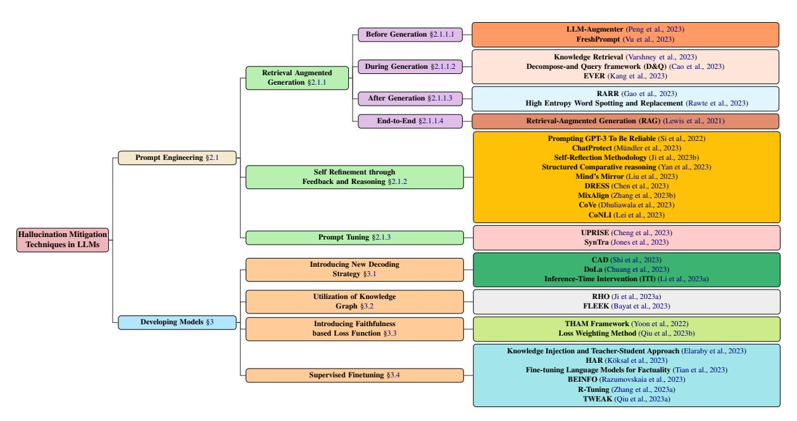

# A Comprehensive Survey of Hallucination Mitigation Techniques in Large Language Models

S.M Towhidul Islam Tonmoy1 , S M Mehedi Zaman1 , Vinija Jain3,4∗ , Anku Rani2 , Vipula Rawte2 , Aman Chadha3,4∗ , Amitava Das2

1 Islamic University of Technology, Bangladesh 2AI Institute, University of South Carolina, USA 3Stanford University, USA, 4Amazon AI, USA towhidulislam@iut-dhaka.edu

### Abstract

As Large Language Models (LLMs) continue to advance in their ability to write human-like text, a key challenge remains around their tendency to "hallucinate" – generating content that appears factual but is ungrounded. This issue of hallucination is arguably the biggest hindrance to safely deploying these powerful LLMs into real-world production systems that impact people's lives [\(Jain,](#page-10-0) [2023\)](#page-10-0). The journey toward widespread adoption of LLMs in practical settings heavily relies on addressing and mitigating hallucinations. Unlike traditional AI systems focused on limited tasks, LLMs have been exposed to vast amounts of online text data during training. While this allows them to display impressive language fluency, it also means they are capable of extrapolating information from the biases in training data, misinterpreting ambiguous prompts, or modifying the information to align superficially with the input. This becomes hugely alarming when we rely on language generation capabilities for sensitive applications, such as summarizing medical records, customer support conversations, financial analysis reports, and providing erroneous legal advice. Small errors could lead to harm, revealing the LLMs' lack of actual comprehension despite advances in self-learning. This paper presents a comprehensive survey of over thirty-two techniques developed to mitigate hallucination in LLMs. Notable among these are Retrieval-Augmented Generation (RAG) [\(Lewis et al.,](#page-11-0) [2021\)](#page-11-0), Knowledge Retrieval [\(Varshney et al.,](#page-12-0) [2023\)](#page-12-0), CoNLI [\(Lei et al.,](#page-11-1) [2023\)](#page-11-1), and CoVe [\(Dhuliawala et al.,](#page-10-1) [2023\)](#page-10-1). Furthermore, we introduce a detailed taxonomy categorizing these methods based on various parameters, such as dataset utilization, common tasks, feedback mechanisms, and retriever types. This classification helps distinguish the diverse approaches specifically designed to tackle hallucination issues in LLMs. Additionally, we analyze the challenges and

∗Work does not relate to position at Amazon.

limitations inherent in these techniques, providing a solid foundation for future research in addressing hallucinations and related phenomena within the realm of LLMs.

#### 1 Introduction

Hallucination in Large Language Models (LLMs) entails the creation of factually erroneous information spanning a multitude of subjects. Given the extensive domain coverage of LLMs, their application extends across numerous scholarly and professional areas. These include, but are not limited to, academic research, programming, creative writing, technical advisement, and the facilitation of skill acquisition. Consequently, LLMs have emerged as an indispensable component in our daily lives, playing a crucial role in dispensing accurate and reliable information. Nevertheless, a fundamental issue with LLMs is their propensity to yield erroneous or fabricated details about real-world subjects. This tendency to furnish incorrect data, commonly referred to as hallucination, poses a significant challenge for researchers in the field. It leads to scenarios where advanced models like GPT-4 and others of its ilk may generate references that are inaccurate or completely unfounded [\(Rawte et al.,](#page-11-2) [2023\)](#page-11-2). This issue arises due to the training phase's pattern generation techniques and the absence of real-time internet updates, contributing to discrepancies in the information output [\(Ray,](#page-11-3) [2023\)](#page-11-3).

In contemporary computational linguistics, mitigating hallucination is a critical focus. Researchers have proposed various strategies, encompassing feedback mechanisms, external information retrieval, and early refinement in language model generation, to address this challenge. This paper assumes significance by consolidating and organizing these diverse techniques into a comprehensive taxonomy. In essence, the contributions of this paper to the realm of LLM hallucination are threefold:

**Figure 1:** Taxonomy of hallucination mitigation techniques in LLMs, focusing on prevalent methods that involve model development and prompting techniques. Model development branches into various approaches, including new decoding strategies, knowledge graph-based optimizations, the addition of novel loss function components, and supervised fine-tuning. Meanwhile, prompt engineering can involve retrieval augmentation-based methods, feedback-based strategies, or prompt tuning.

- 1. Introduction of a systematic taxonomy designed to categorize hallucination mitigation techniques for LLMs, encompassing Vision Language Models (VLMs).
- 2. Synthesis of the essential features characterizing these mitigation techniques, thereby guiding more structured future research endeavors within this domain.
- Deliberation on the limitations and challenges inherent in these techniques, accompanied by potential solutions and proposed directions for future research.

#### 2 Hallucination Mitigation

The detection of hallucinations has emerged as a significant concern, given the integral role of generative LLMs in critical tasks. (Qiu et al., 2023b) introduced mFACT as a method to identify hallucination in summaries, extending its applicability beyond English to other languages. Additionally, (Zhang et al., 2023b) proposed a framework for hallucination detection based on contextual information. Another perspective on understanding hallucination causation is presented by (Mündler et al., 2023), who explores self-contradiction as a contributing factor.

#### 2.1 Prompt Engineering

Prompt engineering is the process of experimenting with various instructions to get the best output possible from an AI text generation model (White et al., 2023). In terms of hallucination mitigation, this process can provide specific context and expected outcomes (Feldman et al., 2023). The prompt engineering mitigation techniques can be outlined as follows:

#### 2.1.1 Retrieval Augmented Generation

Retrieval-Augmented Generation (RAG) enhances the responses of LLMs by tapping into external, authoritative knowledge bases rather than relying on potentially outdated training data or the model's internal knowledge. This approach addresses the key challenges of accuracy and currency in LLM outputs (Kang et al., 2023). RAG effectively mitigates the issue of hallucination in LLMs by generating responses that are not only pertinent and current but also verifiable, thereby reinforcing user confidence and offering developers an economical way to enhance the fidelity and utility of LLMs across different applications. The mitigation techniques following this system can be further categorized as:

#### 2.1.1.1 Before generation

For the following techniques, the information retrieval happens before the generation of AI text: **LLM-Augmenter:** (Peng et al., 2023) proposes a

system that augments a black-box LLM with a set of Plug-And-Play (PnP) [\(Li et al.,](#page-11-17) [2023b\)](#page-11-17) modules. The system makes the LLM generate responses grounded in external knowledge. It also iteratively revises LLM prompts to improve model responses using feedback generated by utility functions. In this paper, the authors present LLM-Augmenter to improve LLMs with external knowledge and automated feedback using PnP modules, which do not require any training and can be used instantly. Given a user query, the framework first retrieves evidence from external knowledge and performs reasoning to form evidence chains. Then LLM-Augmenter queries a fixed LLM (GPT-3.5) using a prompt that contains the consolidated evidence for the LLM to generate a candidate response grounded in external knowledge (evidence). LLM-Augmenter then verifies the candidate's response, e.g., by checking whether it hallucinates evidence. If so, LLM-Augmenter generates a feedback message. The message is used to revise the prompt to query GPT-3.5 again. The process iterates until a candidate response passes the verification and is sent to the user.

FreshPrompt: [\(Vu et al.,](#page-12-1) [2023\)](#page-12-1) address the static nature of most LLMs, highlighting their inability to adapt to the evolving world. The authors introduce FreshQA, a dynamic QA benchmark, evaluating LLMs on questions requiring current world knowledge and those with false premises. Through a two-mode evaluation, correctness and hallucination are measured, revealing limitations and the need for improvement, particularly in fastchanging knowledge scenarios. To address these challenges, the authors present FreshPrompt, a fewshot prompting method that leverages a search engine to incorporate relevant and up-to-date information into prompts. FreshPrompt outperforms competing methods and commercial systems, with further analysis emphasizing the impact of the number and order of retrieved evidence on correctness. The work contributes a detailed evaluation of LLM capabilities in adapting to evolving knowledge, introducing the FreshQA dataset and an effective prompting method, FreshPrompt, to enhance dynamic question answering.

#### 2.1.1.2 During generation

The below techniques demonstrate knowledge retrieval at a sentence-by-sentence level, where the model goes through information retrieval while generating each sentence.

Knowledge Retrieval: [\(Varshney et al.,](#page-12-0) [2023\)](#page-12-0) suggest a method that entails actively detecting and reducing hallucinations as they arise. Before moving on to the creation of sentences, the approach first uses the logit output values from the model to identify possible hallucinations, validate that they are accurate, and then mitigate any hallucinations that are found. The most important realization is that handling hallucinations in the generation process is critical because it raises the probability of producing a sentence with hallucinations when the model has previously experienced hallucinations in its output. This study investigates the use of logit output values – which are produced by models like the GPT-3 and others – in the identification of hallucinations. However, it acknowledges that some models available solely through API calls might not give logit output values and emphasizes that this information is a supplementary source rather than a necessary prerequisite for the hallucination detection approach. The method uses retrieved knowledge as support for the correction phase, instructing the model to repair the phrase by either eliminating or substituting hallucinated information to reduce hallucinations in the created sentence.

Decompose and Query framework (D&Q): In their research, the authors of [\(Cao et al.,](#page-10-2) [2023\)](#page-10-2) address challenges faced by LLMs in Question Answering, focusing on hallucinations and difficulties with multi-hop relations. They propose the D&Q framework to guide models in utilizing external knowledge while constraining reasoning to reliable information, thus mitigating the risk of hallucinations. Experimental results demonstrate D&Q's effectiveness, showcasing competitive performance against GPT-3.5 on ChitChatQA and achieving a noteworthy 59.6% F1 score on HotPotQA (question-only). The framework involves a supervised fine-tuning phase without tool invocation, and during the prediction phase, the model uses external tools to query a reliable question-answer base, allowing for backtracking and initiating new searches if needed. The findings underscore D&Q's potential to enhance the robustness and performance of LLMs in question-answering tasks.

Real-time Verification and Rectification (EVER): LLMs often struggle with the challenge of producing inaccurate or hallucinated content, especially in reasoning tasks. In response to this

issue prevalent in both non-retrieval-based and retrieval-augmented generation approaches, [\(Kang](#page-11-5) [et al.,](#page-11-5) [2023\)](#page-11-5) introduces the EVER framework. Unlike existing methods that rectify hallucinations post-hoc, EVER employs a real-time, stepwise strategy during the generation process to detect and rectify hallucinations as they occur. The three-stage process involves generation, validation, and rectification, effectively identifying and correcting intrinsic and extrinsic hallucinations. EVER outperforms both retrieval-based and nonretrieval-based baselines, showcasing significant improvements in generating trustworthy and factually accurate text across diverse tasks such as short-form QA, biography generation, and multi-hop reasoning. The framework's efficacy is empirically validated, demonstrating its ability to mitigate the "snowballing" issue of hallucination, making it a valuable contribution to enhancing the accuracy and reliability of LLMs.

#### 2.1.1.3 After generation

The following techniques employ the information retrieval system after generating the entirety of its output:

Retrofit Attribution using Research and Revision (RARR): [\(Gao et al.,](#page-10-3) [2023\)](#page-10-3) In the realm of LLMs, notable advancements have been achieved across various tasks; however, issues persist, such as generating content without proper support or accuracy. The challenge of determining trustworthiness in LLM outputs, due to a lack of attributability, prompted the introduction of RARR. This modelagnostic system, presented in the introduction, automates the attribution process for any text generation model. Inspired by fact-checking workflows, RARR conducts research and post-editing to align content with retrieved evidence while preserving original qualities, operating seamlessly after LLM generation. Contributions outlined in the introduction encompass formalizing the Editing for Attribution task, introducing new metrics, benchmarking existing revision models, and proposing a research-and-revise model. The conclusion underscores RARR's ability to enhance attribution while preserving essential text properties, providing a practical solution to bolster the reliability of LLM outputs.

High Entropy Word Spotting and Replacement: While the technical feasibility of detecting high entropy words may be apparent, a significant challenge arises due to the closed-source nature

of many contemporary LLMs, with subscriptionbased APIs limiting accessibility. The proposed solution by [\(Rawte et al.,](#page-11-2) [2023\)](#page-11-2) involves utilizing open-source LLMs to identify high entropy words, followed by their replacement using a lower Hallucination Vulnerability Index-based LLM. The results underscore the exceptional performance of albert-large-v2 [\(Lan et al.,](#page-11-18) [2020\)](#page-11-18) in detecting high entropy words in GPT-3-generated content. Conversely, distilroberta-base [\(Sanh et al.,](#page-11-19) [2019\)](#page-11-19) exhibits superior performance in replacing high entropy words, leading to a reduction in hallucinations. An integral aspect of this approach is the treatment of consecutive high-entropy words as a unified unit, where these words are collectively masked before replacement, proving particularly effective in addressing hallucinations related to Generated Golem or Acronym Ambiguity.

#### 2.1.1.4 End-to-End RAG

The end-to-end process of RAG proposed in the paper by [\(Lewis et al.,](#page-11-0) [2021\)](#page-11-0) involves integrating a pre-trained sequence-to-sequence (seq2seq) transformer with a dense vector index of Wikipedia, accessed through the Dense Passage Retriever (DPR). This innovative combination allows the model to condition its output generation on both the input query and latent documents provided by the DPR.

In this process, the DPR acts as a neural retriever, supplying relevant documents based on the input. These documents are then used by the seq2seq model, specifically BART, to generate the final output. The model employs a top-K approximation to marginalize these latent documents, which can be done on a per-output basis (assuming one document is responsible for all tokens) or a per-token basis (allowing different documents to influence different parts of the output).

Crucially, both the generator and the retriever in this RAG setup are trained end-to-end, ensuring that they learn jointly and improve each other's performance. This methodology contrasts with previous approaches that required architectures with non-parametric memory to be built from scratch for specific tasks. Instead, RAG uses pre-trained components, pre-loaded with extensive knowledge, allowing the model to access and integrate a vast range of information without the need for additional training. This end-to-end approach results in enhanced performance on various knowledgeintensive tasks, demonstrating the efficacy of combining parametric and non-parametric memory in

generation models.

### 2.1.2 Self-refinement through feedback and reasoning

After an LLM provides an output for a specific prompt, proper feedback about the output can make the LLM give better and more accurate outputs in its consecutive iterations [\(Madaan et al.,](#page-11-20) [2023\)](#page-11-20). Abiding by this method, the following are the specific hallucination mitigation techniques:

Prompting GPT-3 To Be Reliable: According to [\(Si et al.,](#page-12-2) [2022\)](#page-12-2)'s paper, LLMs, particularly GPT-3, exhibit remarkable few-shot prompting abilities, enhancing their applications in real-world language tasks. Despite this, the issue of improving GPT-3's reliability remains underexplored. This study decomposes reliability into four crucial facets – generalizability, social biases, calibration, and factuality – and introduces simple and effective prompts to enhance each aspect. The research surpasses smaller-scale supervised models on all reliability metrics, offering practical strategies for improving GPT-3's performance. The paper outlines previous works on LLM reliability, highlighting the novelty of this study's comprehensive analysis and focus on effective prompting strategies. Drawing inspiration from ML safety surveys, the reliability framework aligns with identified risks in existing conceptual frameworks. Lastly, the systematic exploration of GPT-3's reliability has been summarized, which introduces practical prompting strategies, and emphasizes the study's contribution to insights into LLMs and practical recommendations for GPT-3 users.

ChatProtect: [\(Mündler et al.,](#page-11-6) [2023\)](#page-11-6) focuses on an important type of hallucination called selfcontradiction, which occurs when an LLM generates two logically inconsistent sentences given the same context. They propose a three-step pipeline for reasoning about self-contradictions. Importantly, the approach is built upon prompting strategies, making it applicable to black-box LLMs without requiring external grounded knowledge. They conducted an extensive evaluation targeting four modern instruction-tuned LMs on the task of opendomain text generation, demonstrating the substantial benefits of the approach: it effectively exposes self-contradictions, accurately detects them, and appropriately mitigates their occurrence.

Self-Reflection Methodology: The paper [\(Ji et al.,](#page-11-7) [2023b\)](#page-11-7) explores and addresses the phenomenon of hallucination in medical generative QA systems

utilizing widely adopted LLMs and datasets. The focus is on identifying and understanding problematic answers, emphasizing hallucination. To tackle this challenge, the paper introduces an interactive self-reflection methodology that integrates knowledge acquisition and answer generation. Through this iterative feedback process, the approach systematically improves the factuality, consistency, and entailment of generated answers. Leveraging the interactivity and multitasking ability of LLMs, the method produces progressively more precise and accurate answers. Experimental results, both automatic and human evaluations, highlight the effectiveness of this approach in reducing hallucinations compared to baselines. The investigation into hallucinations in generation tasks, particularly in the medical domain, is crucial for AI's accountability and trustworthiness. The proposed iterative self-reflection method, employing a generate-scorerefine strategy on background knowledge and answers, is empirically proven to be effective, generalizable, and scalable in mitigating hallucinations. Structured Comparative (SC) reasoning: In the realm of text preference prediction, where LLMs often grapple with inconsistencies in reasoning, [\(Yan et al.,](#page-12-3) [2023\)](#page-12-3) introduces the SC reasoning method. SC employs a prompting approach that predicts text preferences by generating structured intermediate comparisons. It starts by proposing aspects of comparison and then generates textual comparisons under each aspect. Utilizing a pairwise consistency comparator, SC ensures that each aspect's comparisons distinctly differentiate between texts, effectively reducing hallucination and enhancing consistency. The methodology is showcased across various NLP tasks, including summarization, retrieval, and automatic rating, demonstrating that SC equips LLMs with state-of-the-art performance in text preference prediction. The structured reasoning approach of SC, along with its consistency enforcement, is validated through comprehensive evaluations and ablation studies, emphasizing its effectiveness in improving accuracy and coherence across diverse tasks. Human evaluations further underscore SC's interpretative capabilities, assisting users in making informed decisions.

Mind's Mirror: While chain-of-thought (CoT) distillation methods show promise for downsizing LLMs to small language models (SLMs), there is a risk of carrying over flawed reasoning and hallucinations. To address this, [\(Liu et al.,](#page-11-8) [2023\)](#page-11-8) proposed a methodology with two key components: First, a novel approach introduces distilling the selfevaluation capability inherent in LLMs into SLMs, aiming to mitigate adverse effects and reduce hallucinations. Second, a comprehensive distillation process incorporates multiple distinct CoT and selfevaluation paradigms for holistic knowledge transfer into SLMs.

The methodology trains SLMs to possess selfevaluation capabilities, recognizing and correcting hallucinations and unreliable reasoning, enhancing predictive accuracy and reliability on various NLP tasks. Comprehensive experiments demonstrate the superiority of this method across reasoning tasks, offering a promising approach to responsibly downsize LLMs.

DRESS: [\(Chen et al.,](#page-10-4) [2023\)](#page-10-4) propose using natural language feedback (NLF), specifically critique and refinement NLF, to improve alignment with human preferences and interaction capabilities of large vision language models (LVLMs). They generalize conditional reinforcement learning to effectively incorporate non-differentiable NLF by training the model to generate corresponding responses conditioned on the NLF. Experiments show relative improvements in DRESS over prior state-of-theart LVLMs in metrics of helpfulness, honesty, and harmlessness alignment.

MixAlign: Despite having accurate reference points, LLMs may disregard them and rely on incorrect references or biases instead. This tendency to hallucinate arises when users ask questions that do not directly align with the retrieved references, lacking detailed knowledge of the stored information. [\(Zhang et al.,](#page-12-4) [2023b\)](#page-12-4) focus on this knowledge alignment problem and introduce MixAlign, a framework that interacts with both the user and knowledge base to clarify how the user question relates to the stored information. MixAlign uses a language model to achieve automatic knowledge alignment and, if needed, further enhances this alignment through user clarifications. MixAlign focuses on utilizing grounding knowledge for faithful decision-making. In cases of uncertainty or unclear evidence, MixAlign generates a question seeking clarification from the user - a process referred to as human-assisted knowledge alignment.

Chain-of-Verification (CoVe): [\(Dhuliawala et al.,](#page-10-1) [2023\)](#page-10-1) develop the CoVe method where the model

- 1. Drafts an initial response.
- 2. Plans verification questions to fact-check its

draft.

- 3. Answers those questions independently so the answers are unbiased.
- 4. Generates a final verified response.

Experiments show CoVe decreases hallucinations across tasks like list-based Wikidata questions and long-form text generation. Given a user query, an LLM generates a baseline response that may contain inaccuracies like factual hallucinations. CoVe first generates verification questions to ask, then answers them to check for agreement.

Chain of Natural Language Inference (CoNLI): [\(Lei et al.,](#page-11-1) [2023\)](#page-11-1) address the challenge of hallucinations generated by LLMs when provided background context. Despite fluency in natural language generation, LLMs often produce ungrounded hallucinations unsupported by the given sources.

The proposed hierarchical framework focuses on detecting and mitigating such hallucinations without requiring fine-tuning or domain-specific prompts. The framework utilizes Chain of Natural Language Inference (CoNLI) for state-of-the-art hallucination detection by identifying ungrounded content. Post-editing is then used to reduce hallucinations and enhance text quality without model adjustment. Extensive experiments on text-to-text datasets demonstrate effectiveness in both hallucination detection and reduction. By formulating detection as a chain of natural language inference tasks, the framework incorporates sentence and entity-level judgments with interpretability.

The plug-and-play framework allows seamless deployment across contexts with competitive hallucination detection and reduction performance while preserving text quality.

#### 2.1.3 Prompt Tuning

Prompt tuning is a technique that involves adjusting the instructions provided to a pre-trained LLM during the fine-tuning phase to make the model more effective at specific tasks. The LLM learns from 'Soft Prompts', which are not predetermined but are instead learned by the model through backpropagation during the fine-tuning [\(Lester et al.,](#page-11-21) [2021\)](#page-11-21). For hallucination mitigation, the following techniques, which involve prompt tuning, have been proposed as of now:

Universal Prompt Retrieval for Improving zero-Shot Evaluation (UPRISE): [\(Cheng et al.,](#page-10-5) [2023\)](#page-10-5) propose UPRISE, which tunes a lightweight

and versatile retriever that automatically retrieves prompts for a given zero-shot task input. Specifically, they demonstrate universality in a cross-task and cross-model scenario: the retriever is tuned on a diverse set of tasks, but tested on unseen type tasks. The retriever is trained to retrieve prompts for multiple tasks, enabling it to generalize to unseen task types during inference.

SynTra: Large language models (LLMs) often exhibit hallucination in abstractive summarization tasks, even when the necessary information is present. Addressing this challenge is difficult due to the intricate evaluation of hallucination during optimization. [\(Jones et al.,](#page-11-9) [2023\)](#page-11-9) introduce SynTra, a method that uses a synthetic task to efficiently reduce hallucination on downstream summarization tasks. SynTra optimizes the LLM's system message via prefix-tuning on the synthetic task, then transfers this capability to more challenging, realistic summarization tasks. Experiments demonstrate reduced hallucination for two 13B parameter LLMs, highlighting the effectiveness of synthetic data for mitigating undesired behaviors.

# 3 Developing Models

Some papers focused on developing novel models to mitigate hallucinations. It is an ongoing and evolving process requiring a combination of algorithmic advancements and data quality improvements. Instead of going for fine-tuning models, the following techniques implemented whole model architecture to tackle hallucinations. These techniques can be categorized as follows:

#### 3.1 Introducing new decoding strategy

Decoding strategy generally involves designing techniques that specifically target the generation phase of a model. In terms of hallucination, the techniques aim to reduce the occurrence of hallucinations in the generated outputs by guiding the generation phase towards authentic or context-specific generation [\(Lango and Dusek,](#page-11-22) [2023\)](#page-11-22). The following techniques make use of the decoding strategy:

Context-Aware Decoding (CAD): [\(Shi et al.,](#page-12-5) [2023\)](#page-12-5) present CAD, which follows a contrastive output distribution that amplifies the difference between the output probabilities when a model is used with and without context. CAD is particularly effective in overriding a model's prior knowledge when it contradicts the provided context, leading to substantial improvements in tasks where resolving the knowledge conflict is essential. CAD can be used with off-the-shelf pre-trained language models without any additional training. More notably, CAD is especially beneficial for knowledgeconflicting tasks, where the context contains information contradictory to the model's prior knowledge. The results demonstrate the potential of CAD in mitigating hallucinations in text generation and overriding prior knowledge with reliable and trusted information.

Decoding by Contrasting Layers (DoLa): [\(Chuang et al.,](#page-10-6) [2023\)](#page-10-6) introduce DoLa, a simple decoding strategy designed to mitigate hallucinations in pre-trained LLMs without the need for external knowledge conditioning or additional finetuning. DoLa achieves the next-token distribution by contrasting logit differences between later and earlier layers projected into the vocabulary space. This leverages the observed localization of factual knowledge in specific transformer layers. Consequently, DoLa enhances the identification of factual knowledge and minimizes the generation of incorrect facts. Across various tasks, including multiplechoice and open-ended generation tasks like TruthfulQA, DoLa consistently improves truthfulness, enhancing the performance of LLaMA family models.

Inference-Time Intervention (ITI): [\(Li et al.,](#page-11-10) [2023a\)](#page-11-10) introduce ITI, a technique designed to enhance the "truthfulness" of LLMs. ITI operates by shifting model activations during inference, following a set of directions across a limited number of attention heads. This intervention significantly improves the performance of LLaMA models on the TruthfulQA benchmark. The technique first identifies a sparse set of attention heads with high linear probing accuracy for truthfulness. Then, during inference, they shift activations along these truth-correlated directions. It repeats the same intervention autoregressively until the whole answer is generated. ITI results in a significant performance increase on the TruthfulQA benchmark.

#### 3.2 Utilization of Knowledge Graph (KG)

KGs are organized collections of data that include details about entities (i.e., people, places, or objects), their characteristics, and the connections between them [\(Sun et al.,](#page-12-10) [2023a\)](#page-12-10). It arranges data such that machines can comprehend the relationships and semantic meaning of the material. KGs offer a basis for sophisticated reasoning, data analysis, and information retrieval. Thus, several studies

have used KGs in the context of hallucination mitigation [\(Bayat et al.,](#page-10-7) [2023\)](#page-10-7). They are:

RHO: To handle the hallucination challenge in dialogue response generation, [\(Ji et al.,](#page-11-11) [2023a\)](#page-11-11) proposes a framework called RHO that utilizes the representations of linked entities and relation predicates from a KG to generate more faithful responses. To improve faithfulness, they introduce local and global knowledge-grounding techniques into dialogue generation and further utilize a conversational reasoning model to re-rank the generated responses. These two knowledge groundings help the model effectively encode and inject the knowledge information from context-related subgraphs with proper attention. Their work improves the fusion and interaction between external knowledge and dialogue context via various knowledge groundings and reasoning techniques, further reducing hallucination.

FactuaL Error detection and correction with Evidence Retrieved from external Knowledge (FLEEK): [\(Bayat et al.,](#page-10-7) [2023\)](#page-10-7) introduce FLEEK, an intelligent and model-agnostic tool aimed at aiding end users, such as human graders, in fact verification and correction. FLEEK features a user-friendly interface capable of autonomously identifying potentially verifiable facts within the input text. It formulates questions for each fact and queries both curated knowledge graphs and the open web to gather evidence. The tool subsequently verifies the correctness of the facts using the acquired evidence and proposes revisions to the original text. The verification process is inherently interpretable, with extracted facts, generated questions, and retrieved evidence directly reflecting the information units contributing to the verification process. For instance, FLEEK would visually highlight verifiable facts with distinct colors indicating their factuality levels, allowing users to interact with clickable highlights that reveal evidence supporting or refuting each claim. Future work includes comprehensive evaluations of FLEEK, testing its compatibility with various LLMs, and subjecting it to a comprehensive benchmark.

### 3.3 Introducing faithfulness based loss function

Creating a metric to gauge how closely a model's outputs match input data or ground truth is the task of this section. In this sense, faithfulness describes the model's capacity to faithfully and properly reflect data from the input without adding er-

rors, omissions, or distortions [\(Chrysostomou and](#page-10-10) [Aletras,](#page-10-10) [2021\)](#page-10-10). The following methods portray the use of technique:

Text Hallucination Mitigating (THAM) Framework: [\(Yoon et al.,](#page-12-6) [2022\)](#page-12-6) introduce the THAM framework for Video-grounded Dialogue. THAM considers the text hallucination problem, which copies input texts for answer generation without the understanding of the question. It mitigates feature-level hallucination effects by introducing information-theoretic regularization. THAM framework incorporates Text Hallucination Regularization (THR) loss derived from the mutual information between the response language model and the proposed hallucination language model. Minimizing THR loss contributes to reducing indiscriminate text copying and boosting dialogue performances. THAM framework incorporates Text Hallucination Regularization loss derived from the proposed information-theoretic text hallucination measurement approach.

Loss Weighting Method: [\(Qiu et al.,](#page-11-12) [2023b\)](#page-11-12) focus on low resource language summarization and develops a novel metric, mFACT to evaluate the faithfulness of non-English summaries, leveraging translation-based transfer from multiple English faithfulness metrics. It is developed from four English faithfulness metrics. They study hallucination in a cross-lingual transfer setting. They apply mFACT to study the faithfulness in summarisation of the recent multilingual LLMs. The proposed metric consists of weighting training samples' loss based on their faithfulness score. The experiments show that while common cross-lingual transfer methods benefit summarisation performance, they amplify hallucinations compared to monolingual counterparts. To reduce these hallucinations, they adapt several monolingual methods to cross-lingual transfer and propose a new method based on weighting the loss according to the mFACT score of each training example.

#### 3.4 Supervised fine-tuning (SFT)

SFT serves as a vital phase in aligning LLMs for downstream tasks using labeled data. It helps the model follow human commands for specific tasks [\(Wang et al.,](#page-12-11) [2023;](#page-12-11) [Chung et al.,](#page-10-11) [2022;](#page-10-11) [Iyer et al.,](#page-10-12) [2023;](#page-10-12) [Sun et al.,](#page-12-12) [2023b\)](#page-12-12) and eventually increases the faithfulness of the model's outputs. In the context of SFT, the quality of the data stands as the most pivotal concern, as it directly determines the fine-tuned model's performance[\(Xu et al.,](#page-12-13) [2023;](#page-12-13)

[Touvron et al.,](#page-12-14) [2023\)](#page-12-14). During supervised finetuning, the LLM's weights are adjusted based on the gradients from a task-specific loss function that measures the difference between the LLM's predictions and ground truth labels. This technique has proven particularly effective in enhancing the adaptability of LLMs, enabling them to excel at previously unseen tasks.

Knowledge Injection and Teacher-Student Approaches: [\(Elaraby et al.,](#page-10-8) [2023\)](#page-10-8) focus on measuring and reducing hallucinations in weaker open-source large language models (LLMs) like BLOOM 7B [\(Workshop et al.,](#page-12-15) [2022\)](#page-12-15). They introduce HALOCHECK, a lightweight knowledgefree framework to quantify hallucination severity in LLMs. The authors explore techniques like knowledge injection and teacher-student approaches to alleviate hallucinations in low-parameter LLMs. The framework uses sentence-level entailment to quantitatively assess hallucination levels.

The work aims to enhance smaller LLM

knowledge through Knowledge Injection (KI) by fine-tuning with domain knowledge, without relying on expensive instructions from stronger models. They investigate leveraging a more powerful LLM like GPT-4 to guide weaker LLMs by generating detailed question answers. By assessing hallucination severity, they optimize teacher LLM engagement to reduce the computational costs of relying extensively on large models. This alleviates the need for frequent queries to the teacher model. Hallucination Augmented Recitations (HAR): [\(Köksal et al.,](#page-11-13) [2023\)](#page-11-13) introduce the concept of attribution in LLMs to control information sources and enhance factuality. While existing methods rely on open-book question answering to improve attribution, the challenge arises when factual datasets reward models for recalling pretraining data rather than demonstrating true attribution. To address this, the authors propose HAR, a novel approach utilizing LLM hallucination to create counterfactual datasets and enhance attribution. Through a case study on open book QA, specifically CF-TriviaQA, the results demonstrate that models fine-tuned with these counterfactual datasets significantly improve text grounding and outperform those trained on factual datasets, even with smaller training datasets and model sizes. The observed improvements are consistent across various open-book QA tasks, including multi-hop, biomedical, and adversarial questions.

Fine-tuning Language Models for Factuality: [\(Tian et al.,](#page-12-7) [2023\)](#page-12-7) address hallucination by leveraging recent NLP innovations, employing automated fact-checking methods and preferencebased learning through the Direct Preference Optimization algorithm. The researchers fine-tune the Llama-2 model for factuality without human labeling, achieving notable error reductions, particularly in biographies and medical questions. Their approach involves reference-based and reference-free truthfulness evaluations, demonstrating a cost-effective way to enhance model factuality in long-form text generation. The study proposes new benchmark tasks, discusses future avenues, and highlights the potential scalability of factual reinforcement learning for larger models in safety-critical domains.

BEINFO: To mitigate the issue and increase faithfulness of information-seeking dialogue systems, [\(Razumovskaia et al.,](#page-11-14) [2023\)](#page-11-14) introduce BEINFO, a simple yet effective method that applies behavioral tuning to aid information-seeking dialogue. In this work, the authors propose BEINFO, a simple yet effective method that applies 'behavioral finetuning' to increase the faithfulness of the generated responses for information-seeking dialogue. The model is tuned on a large collection of dialogues with the true knowledge source(s) extended with randomly sampled facts from a large knowledge base.

Refusal-Aware Instruction Tuning (R-Tuning): In their recent work, [\(Zhang et al.,](#page-12-8) [2023a\)](#page-12-8) present a novel approach called R-Tuning for instilling refusal skills in large language models (LLMs). This approach formalizes the idea of identifying knowledge gaps between an LLM's parametric knowledge and the instructional tuning data used to train it. Based on this knowledge gap, R-Tuning constructs refusal-aware training data to teach the LLM when to refrain from responding, specifically when a question falls outside its competence. The R-Tuning methodology involves two key steps:

- 1. Measuring the knowledge gap between the LLM's parametric knowledge and the instructional tuning questions, to identify uncertain questions. By inferring on the training data once and comparing predictions to labels, the tuning data is separated into uncertain questions and certain questions.
- 2. Constructing refusal-aware training data by appending refusal expressions to uncertain

training examples, before fine-tuning the LLM on this data.

Think While Effectively Articulating Knowledge (TWEAK): To reduce hallucinations, [\(Qiu](#page-11-15) [et al.,](#page-11-15) [2023a\)](#page-11-15) propose a new decoding method called TWEAK. The method treats the generated sequences at each step and their future sequences as hypotheses. It ranks each generation candidate based on how well their corresponding hypotheses support the input facts, using a Hypothesis Verification Model (HVM).

The authors tweak only the decoding process without retraining the generative models. This makes their approach easily integrated with any knowledge-to-text generator. Existing decoding methods like beam search sample candidates only based on predicted likelihood, without considering faithfulness. The authors propose a new dataset called FATE, which aligns input facts with original and counterfactual descriptions at the word level.

#### 4 Conclusion

This survey paper delves into the critical issue of hallucination in LLMs, emphasizing the widespread impact of LLMs across various domains in our lives. The paper highlights the challenge posed by LLMs generating incorrect information and identifies it as a significant concern for researchers working on prominent LLMs like GPT-4. The paper explores recent advancements in the detection of hallucinations, with methods such as mFACT, contextual information-based frameworks, and the investigation of self-contradiction as a contributing factor. It underscores the importance of addressing hallucination in LLMs due to their integral role in critical tasks. The central contribution of the paper lies in presenting a systematic taxonomy for categorizing hallucination mitigation techniques in LLMs, extending its coverage to VLMs. By synthesizing essential features characterizing these techniques, the paper provides a foundation for more structured future research within the domain of hallucination mitigation. Additionally, the paper deliberates on the inherent limitations and challenges associated with these techniques, proposing directions for future research in this area.

In essence, this survey paper not only sheds light on the gravity of hallucination in LLMs but also consolidates and organizes diverse mitigation techniques, contributing to the advancement of knowledge in the field of computational linguistics. It serves as a valuable resource for researchers and practitioners seeking a comprehensive understanding of the current landscape of hallucination in LLMs and the strategies employed to address this pressing issue.

## 5 Discussion and Limitations

Hallucination mitigation in LLMs represents a multifaceted challenge addressed through a spectrum of innovative techniques. The methodologies discussed, ranging from post-generation refinement to supervised fine-tuning, underscore the gravity of the hallucination issue and the pressing need for comprehensive solutions.

In the realm of post-generation refinement, RARR stands out, automating the attribution process and aligning content with retrieved evidence. High Entropy Word Spotting and Replacement tackles hallucinations induced by high-entropy words in LLM-generated content, showcasing the significance of context-aware replacements.

Self-refinement through feedback and reasoning brings forth impactful strategies like ChatProtect, focusing on self-contradiction detection, and Self-Reflection Methodology, employing an iterative feedback process for hallucination reduction in medical generative QA systems. Structured Comparative reasoning introduces a structured approach to text preference prediction, enhancing coherence and reducing hallucination.

Prompt tuning emerges as a powerful technique, with innovations like UPRISE demonstrating the versatility of prompt-based adjustments. SynTra introduces synthetic tasks for mitigating hallucinations in abstractive summarization, offering scalability but raising questions about effectiveness compared to human feedback.

The development of novel models emphasizes decoding strategies such as CAD and DoLa, both instrumental in reducing hallucinations by guiding the generation phase. KG utilization and faithfulness-based loss functions also play crucial roles, as seen in methods like RHO and THAM Framework.

Supervised fine-tuning, a pivotal phase, is explored through various lenses, such as Knowledge Injection and Teacher-Student Approaches, where domain-specific knowledge is injected into weaker LLMs and approaches like HAR employ counterfactual datasets for improved factuality.

Future developments and improvements in a variety of areas are anticipated for language models' approach to hallucination mitigation. The creation of hybrid models, which offer a thorough defense against hallucinations by seamlessly integrating numerous mitigation approaches, is one important direction. By reducing reliance on labeled data, investigating the possibilities of unsupervised or weakly supervised learning techniques might improve scalability and flexibility. In addition, it will be essential to look into the moral ramifications and societal effects of hallucination mitigation strategies to guarantee responsible implementation and promote user confidence. Research on designs specifically intended to reduce hallucinations is further encouraged by the changing field of LLMs, which could lead to the development of new models with built-in safety features. It will be crucial for researchers, business professionals, and ethicists to work together continuously to improve methods, benchmark models, and set standards that put user comprehension and authenticity first. The building of language models that produce coherent and contextually relevant information while simultaneously demonstrating heightened awareness and mitigation of hallucinatory outputs is the field's collective goal as it navigates these future possibilities.

The collected works on hallucination mitigation reveal a diverse array of strategies, each contributing uniquely to address the nuances of hallucination in LLMs. As the field evolves, the synthesis of these approaches could pave the way for more robust and universally applicable solutions, fostering trust and reliability in language generation systems.

Finally, the division of the mitigation techniques surveyed can be easily comprehensible through table [1.](#page-13-0)

# References

- Farima Fatahi Bayat, Kun Qian, Benjamin Han, Yisi Sang, Anton Belyi, Samira Khorshidi, Fei Wu, Ihab F. Ilyas, and Yunyao Li. 2023. [Fleek: Factual error](http://arxiv.org/abs/2310.17119) [detection and correction with evidence retrieved from](http://arxiv.org/abs/2310.17119) [external knowledge.](http://arxiv.org/abs/2310.17119)
- Hejing Cao, Zhenwei An, Jiazhan Feng, Kun Xu, Liwei Chen, and Dongyan Zhao. 2023. [A step closer](http://arxiv.org/abs/2311.07491) [to comprehensive answers: Constrained multi-stage](http://arxiv.org/abs/2311.07491) [question decomposition with large language models.](http://arxiv.org/abs/2311.07491)
- Yangyi Chen, Karan Sikka, Michael Cogswell, Heng Ji, and Ajay Divakaran. 2023. Dress: Instructing large vision-language models to align and interact

- with humans via natural language feedback. *arXiv preprint arXiv:2311.10081*.
- Daixuan Cheng, Shaohan Huang, Junyu Bi, Yuefeng Zhan, Jianfeng Liu, Yujing Wang, Hao Sun, Furu Wei, Denvy Deng, and Qi Zhang. 2023. [Uprise: Universal](http://arxiv.org/abs/2303.08518) [prompt retrieval for improving zero-shot evaluation.](http://arxiv.org/abs/2303.08518)
- George Chrysostomou and Nikolaos Aletras. 2021. Enjoy the salience: Towards better transformer-based faithful explanations with word salience. *arXiv preprint arXiv:2108.13759*.
- Yung-Sung Chuang, Yujia Xie, Hongyin Luo, Yoon Kim, James Glass, and Pengcheng He. 2023. [Dola:](http://arxiv.org/abs/2309.03883) [Decoding by contrasting layers improves factuality](http://arxiv.org/abs/2309.03883) [in large language models.](http://arxiv.org/abs/2309.03883)
- Hyung Won Chung, Le Hou, Shayne Longpre, Barret Zoph, Yi Tay, William Fedus, Yunxuan Li, Xuezhi Wang, Mostafa Dehghani, Siddhartha Brahma, Albert Webson, Shixiang Shane Gu, Zhuyun Dai, Mirac Suzgun, Xinyun Chen, Aakanksha Chowdhery, Alex Castro-Ros, Marie Pellat, Kevin Robinson, Dasha Valter, Sharan Narang, Gaurav Mishra, Adams Yu, Vincent Zhao, Yanping Huang, Andrew Dai, Hongkun Yu, Slav Petrov, Ed H. Chi, Jeff Dean, Jacob Devlin, Adam Roberts, Denny Zhou, Quoc V. Le, and Jason Wei. 2022. [Scaling instruction-finetuned](http://arxiv.org/abs/2210.11416) [language models.](http://arxiv.org/abs/2210.11416)
- Shehzaad Dhuliawala, Mojtaba Komeili, Jing Xu, Roberta Raileanu, Xian Li, Asli Celikyilmaz, and Jason Weston. 2023. [Chain-of-verification reduces](http://arxiv.org/abs/2309.11495) [hallucination in large language models.](http://arxiv.org/abs/2309.11495)
- Mohamed Elaraby, Mengyin Lu, Jacob Dunn, Xueying Zhang, Yu Wang, Shizhu Liu, Pingchuan Tian, Yuping Wang, and Yuxuan Wang. 2023. [Halo: Estima](http://arxiv.org/abs/2308.11764)[tion and reduction of hallucinations in open-source](http://arxiv.org/abs/2308.11764) [weak large language models.](http://arxiv.org/abs/2308.11764)
- Philip Feldman, James R. Foulds, and Shimei Pan. 2023. [Trapping llm hallucinations using tagged context](http://arxiv.org/abs/2306.06085) [prompts.](http://arxiv.org/abs/2306.06085)
- Luyu Gao, Zhuyun Dai, Panupong Pasupat, Anthony Chen, Arun Tejasvi Chaganty, Yicheng Fan, Vincent Zhao, Ni Lao, Hongrae Lee, Da-Cheng Juan, et al. 2023. Rarr: Researching and revising what language models say, using language models. In *Proceedings of the 61st Annual Meeting of the Association for Computational Linguistics (Volume 1: Long Papers)*, pages 16477–16508.
- Srinivasan Iyer, Xi Victoria Lin, Ramakanth Pasunuru, Todor Mihaylov, Daniel Simig, Ping Yu, Kurt Shuster, Tianlu Wang, Qing Liu, Punit Singh Koura, Xian Li, Brian O'Horo, Gabriel Pereyra, Jeff Wang, Christopher Dewan, Asli Celikyilmaz, Luke Zettlemoyer, and Ves Stoyanov. 2023. [Opt-iml: Scaling language](http://arxiv.org/abs/2212.12017) [model instruction meta learning through the lens of](http://arxiv.org/abs/2212.12017) [generalization.](http://arxiv.org/abs/2212.12017)
- Vinija Jain. 2023. Hallucination mitigation. *Distilled AI*. <https://vinija.ai>.

- Ziwei Ji, Zihan Liu, Nayeon Lee, Tiezheng Yu, Bryan Wilie, Min Zeng, and Pascale Fung. 2023a. [RHO:](https://doi.org/10.18653/v1/2023.findings-acl.275) [Reducing hallucination in open-domain dialogues](https://doi.org/10.18653/v1/2023.findings-acl.275) [with knowledge grounding.](https://doi.org/10.18653/v1/2023.findings-acl.275) In *Findings of the Association for Computational Linguistics: ACL 2023*, pages 4504–4522, Toronto, Canada. Association for Computational Linguistics.
- Ziwei Ji, Tiezheng Yu, Yan Xu, Nayeon Lee, Etsuko Ishii, and Pascale Fung. 2023b. [Towards mitigat](http://arxiv.org/abs/2310.06271)[ing hallucination in large language models via self](http://arxiv.org/abs/2310.06271)[reflection.](http://arxiv.org/abs/2310.06271)
- Erik Jones, Hamid Palangi, Clarisse Simões, Varun Chandrasekaran, Subhabrata Mukherjee, Arindam Mitra, Ahmed Awadallah, and Ece Kamar. 2023. [Teaching language models to hallucinate less with](http://arxiv.org/abs/2310.06827) [synthetic tasks.](http://arxiv.org/abs/2310.06827)
- Haoqiang Kang, Juntong Ni, and Huaxiu Yao. 2023. [Ever: Mitigating hallucination in large language mod](http://arxiv.org/abs/2311.09114)[els through real-time verification and rectification.](http://arxiv.org/abs/2311.09114)
- Abdullatif Köksal, Renat Aksitov, and Chung-Ching Chang. 2023. [Hallucination augmented recitations](http://arxiv.org/abs/2311.07424) [for language models.](http://arxiv.org/abs/2311.07424)
- Zhenzhong Lan, Mingda Chen, Sebastian Goodman, Kevin Gimpel, Piyush Sharma, and Radu Soricut. 2020. [Albert: A lite bert for self-supervised learning](https://openreview.net/forum?id=H1eA7AEtvS) [of language representations.](https://openreview.net/forum?id=H1eA7AEtvS) In *International Conference on Learning Representations*.
- Mateusz Lango and Ondrej Dusek. 2023. [Critic-driven](https://doi.org/10.18653/v1/2023.emnlp-main.172) [decoding for mitigating hallucinations in data-to-text](https://doi.org/10.18653/v1/2023.emnlp-main.172) [generation.](https://doi.org/10.18653/v1/2023.emnlp-main.172) In *Proceedings of the 2023 Conference on Empirical Methods in Natural Language Processing*, pages 2853–2862, Singapore. Association for Computational Linguistics.
- Deren Lei, Yaxi Li, Mengya Hu, Mingyu Wang, Vincent Yun, Emily Ching, and Eslam Kamal. 2023. [Chain](http://arxiv.org/abs/2310.03951) [of natural language inference for reducing large lan](http://arxiv.org/abs/2310.03951)[guage model ungrounded hallucinations.](http://arxiv.org/abs/2310.03951)
- Brian Lester, Rami Al-Rfou, and Noah Constant. 2021. [The power of scale for parameter-efficient prompt](https://doi.org/10.18653/v1/2021.emnlp-main.243) [tuning.](https://doi.org/10.18653/v1/2021.emnlp-main.243) In *Proceedings of the 2021 Conference on Empirical Methods in Natural Language Processing*, pages 3045–3059, Online and Punta Cana, Dominican Republic. Association for Computational Linguistics.
- Patrick Lewis, Ethan Perez, Aleksandra Piktus, Fabio Petroni, Vladimir Karpukhin, Naman Goyal, Heinrich Küttler, Mike Lewis, Wen-tau Yih, Tim Rocktäschel, Sebastian Riedel, and Douwe Kiela. 2021. Retrieval-augmented generation for knowledge-intensive nlp tasks. *arXiv preprint arXiv:2005.11401v4*.
- Kenneth Li, Oam Patel, Fernanda Viégas, Hanspeter Pfister, and Martin Wattenberg. 2023a. Inferencetime intervention: Eliciting truthful answers from a language model. *arXiv preprint arXiv:2306.03341*.

- Miaoran Li, Baolin Peng, and Zhu Zhang. 2023b. [Self](http://arxiv.org/abs/2305.14623)[checker: Plug-and-play modules for fact-checking](http://arxiv.org/abs/2305.14623) [with large language models.](http://arxiv.org/abs/2305.14623)
- Weize Liu, Guocong Li, Kai Zhang, Bang Du, Qiyuan Chen, Xuming Hu, Hongxia Xu, Jintai Chen, and Jian Wu. 2023. [Mind's mirror: Distilling self-evaluation](http://arxiv.org/abs/2311.09214) [capability and comprehensive thinking from large](http://arxiv.org/abs/2311.09214) [language models.](http://arxiv.org/abs/2311.09214)
- Aman Madaan, Niket Tandon, Prakhar Gupta, Skyler Hallinan, Luyu Gao, Sarah Wiegreffe, Uri Alon, Nouha Dziri, Shrimai Prabhumoye, Yiming Yang, Shashank Gupta, Bodhisattwa Prasad Majumder, Katherine Hermann, Sean Welleck, Amir Yazdanbakhsh, and Peter Clark. 2023. [Self-refine: Iterative](http://arxiv.org/abs/2303.17651) [refinement with self-feedback.](http://arxiv.org/abs/2303.17651)
- Niels Mündler, Jingxuan He, Slobodan Jenko, and Martin Vechev. 2023. Self-contradictory hallucinations of large language models: Evaluation, detection and mitigation. *arXiv preprint arXiv:2305.15852*.
- Niels Mündler, Jingxuan He, Slobodan Jenko, and Martin Vechev. 2023. [Self-contradictory hallucinations](http://arxiv.org/abs/2305.15852) [of large language models: Evaluation, detection and](http://arxiv.org/abs/2305.15852) [mitigation.](http://arxiv.org/abs/2305.15852)
- Baolin Peng, Michel Galley, Pengcheng He, Hao Cheng, Yujia Xie, Yu Hu, Qiuyuan Huang, Lars Liden, Zhou Yu, Weizhu Chen, and Jianfeng Gao. 2023. [Check](http://arxiv.org/abs/2302.12813) [your facts and try again: Improving large language](http://arxiv.org/abs/2302.12813) [models with external knowledge and automated feed](http://arxiv.org/abs/2302.12813)[back.](http://arxiv.org/abs/2302.12813)
- Yifu Qiu, Varun Embar, Shay B Cohen, and Benjamin Han. 2023a. Think while you write: Hypothesis verification promotes faithful knowledge-to-text generation. *arXiv preprint arXiv:2311.09467*.
- Yifu Qiu, Yftah Ziser, Anna Korhonen, Edoardo M. Ponti, and Shay B. Cohen. 2023b. [Detecting and mit](http://arxiv.org/abs/2305.13632)[igating hallucinations in multilingual summarisation.](http://arxiv.org/abs/2305.13632)
- Vipula Rawte, Swagata Chakraborty, Agnibh Pathak, Anubhav Sarkar, S. M Towhidul Islam Tonmoy, Aman Chadha, Amit P. Sheth, and Amitava Das. 2023. [The troubling emergence of hallucination in](http://arxiv.org/abs/2310.04988) [large language models – an extensive definition, quan](http://arxiv.org/abs/2310.04988)[tification, and prescriptive remediations.](http://arxiv.org/abs/2310.04988)
- Partha Pratim Ray. 2023. [Chatgpt: A comprehensive](https://doi.org/https://doi.org/10.1016/j.iotcps.2023.04.003) [review on background, applications, key challenges,](https://doi.org/https://doi.org/10.1016/j.iotcps.2023.04.003) [bias, ethics, limitations and future scope.](https://doi.org/https://doi.org/10.1016/j.iotcps.2023.04.003) *Internet of Things and Cyber-Physical Systems*, 3:121–154.
- Evgeniia Razumovskaia, Ivan Vulic, Pavle ´ Markovic, Tomasz Cichy, Qian Zheng, Tsung- ´ Hsien Wen, and Paweł Budzianowski. 2023. *[Dial BeInfo for Faithfulness](http://arxiv.org/abs/2311.09800)*: Improving factuality [of information-seeking dialogue via behavioural](http://arxiv.org/abs/2311.09800) [fine-tuning.](http://arxiv.org/abs/2311.09800)
- Victor Sanh, Lysandre Debut, Julien Chaumond, and Thomas Wolf. 2019. Distilbert, a distilled version of bert: smaller, faster, cheaper and lighter. *arXiv preprint arXiv:1910.01108*.

- Weijia Shi, Xiaochuang Han, Mike Lewis, Yulia Tsvetkov, Luke Zettlemoyer, and Scott Wen tau Yih. 2023. [Trusting your evidence: Hallucinate less with](http://arxiv.org/abs/2305.14739) [context-aware decoding.](http://arxiv.org/abs/2305.14739)
- Chenglei Si, Zhe Gan, Zhengyuan Yang, Shuohang Wang, Jianfeng Wang, Jordan Boyd-Graber, and Lijuan Wang. 2022. Prompting gpt-3 to be reliable. *arXiv preprint arXiv:2210.09150*.
- Kai Sun, Yifan Ethan Xu, Hanwen Zha, Yue Liu, and Xin Luna Dong. 2023a. Head-to-tail: How knowledgeable are large language models (llm)? aka will llms replace knowledge graphs? *arXiv preprint arXiv:2308.10168*.
- Zhiqing Sun, Yikang Shen, Qinhong Zhou, Hongxin Zhang, Zhenfang Chen, David Cox, Yiming Yang, and Chuang Gan. 2023b. [Principle-driven self](http://arxiv.org/abs/2305.03047)[alignment of language models from scratch with min](http://arxiv.org/abs/2305.03047)[imal human supervision.](http://arxiv.org/abs/2305.03047)
- Katherine Tian, Eric Mitchell, Huaxiu Yao, Christopher D. Manning, and Chelsea Finn. 2023. [Fine](http://arxiv.org/abs/2311.08401)[tuning language models for factuality.](http://arxiv.org/abs/2311.08401)
- Hugo Touvron, Louis Martin, Kevin Stone, Peter Albert, Amjad Almahairi, Yasmine Babaei, Nikolay Bashlykov, Soumya Batra, Prajjwal Bhargava, Shruti Bhosale, Dan Bikel, Lukas Blecher, Cristian Canton Ferrer, Moya Chen, Guillem Cucurull, David Esiobu, Jude Fernandes, Jeremy Fu, Wenyin Fu, Brian Fuller, Cynthia Gao, Vedanuj Goswami, Naman Goyal, Anthony Hartshorn, Saghar Hosseini, Rui Hou, Hakan Inan, Marcin Kardas, Viktor Kerkez, Madian Khabsa, Isabel Kloumann, Artem Korenev, Punit Singh Koura, Marie-Anne Lachaux, Thibaut Lavril, Jenya Lee, Diana Liskovich, Yinghai Lu, Yuning Mao, Xavier Martinet, Todor Mihaylov, Pushkar Mishra, Igor Molybog, Yixin Nie, Andrew Poulton, Jeremy Reizenstein, Rashi Rungta, Kalyan Saladi, Alan Schelten, Ruan Silva, Eric Michael Smith, Ranjan Subramanian, Xiaoqing Ellen Tan, Binh Tang, Ross Taylor, Adina Williams, Jian Xiang Kuan, Puxin Xu, Zheng Yan, Iliyan Zarov, Yuchen Zhang, Angela Fan, Melanie Kambadur, Sharan Narang, Aurelien Rodriguez, Robert Stojnic, Sergey Edunov, and Thomas Scialom. 2023. [Llama 2: Open foundation and fine](http://arxiv.org/abs/2307.09288)[tuned chat models.](http://arxiv.org/abs/2307.09288)
- Neeraj Varshney, Wenlin Yao, Hongming Zhang, Jianshu Chen, and Dong Yu. 2023. [A stitch in time saves](http://arxiv.org/abs/2307.03987) [nine: Detecting and mitigating hallucinations of llms](http://arxiv.org/abs/2307.03987) [by validating low-confidence generation.](http://arxiv.org/abs/2307.03987)
- Tu Vu, Mohit Iyyer, Xuezhi Wang, Noah Constant, Jerry Wei, Jason Wei, Chris Tar, Yun-Hsuan Sung, Denny Zhou, Quoc Le, and Thang Luong. 2023. [Freshllms:](http://arxiv.org/abs/2310.03214) [Refreshing large language models with search engine](http://arxiv.org/abs/2310.03214) [augmentation.](http://arxiv.org/abs/2310.03214)
- Yizhong Wang, Yeganeh Kordi, Swaroop Mishra, Alisa Liu, Noah A. Smith, Daniel Khashabi, and Hannaneh Hajishirzi. 2023. [Self-instruct: Aligning language](http://arxiv.org/abs/2212.10560) [models with self-generated instructions.](http://arxiv.org/abs/2212.10560)

- Jules White, Quchen Fu, Sam Hays, Michael Sandborn, Carlos Olea, Henry Gilbert, Ashraf Elnashar, Jesse Spencer-Smith, and Douglas C. Schmidt. 2023. [A](http://arxiv.org/abs/2302.11382) [prompt pattern catalog to enhance prompt engineer](http://arxiv.org/abs/2302.11382)[ing with chatgpt.](http://arxiv.org/abs/2302.11382)
- BigScience Workshop, Teven Le Scao, Angela Fan, Christopher Akiki, Ellie Pavlick, Suzana Ilic, Daniel ´ Hesslow, Roman Castagné, Alexandra Sasha Luccioni, François Yvon, et al. 2022. Bloom: A 176bparameter open-access multilingual language model. *arXiv preprint arXiv:2211.05100*.
- Can Xu, Qingfeng Sun, Kai Zheng, Xiubo Geng, Pu Zhao, Jiazhan Feng, Chongyang Tao, and Daxin Jiang. 2023. [Wizardlm: Empowering large language](http://arxiv.org/abs/2304.12244) [models to follow complex instructions.](http://arxiv.org/abs/2304.12244)
- Jing Nathan Yan, Tianqi Liu, Justin T Chiu, Jiaming Shen, Zhen Qin, Yue Yu, Yao Zhao, Charu Lakshmanan, Yair Kurzion, Alexander M. Rush, Jialu Liu, and Michael Bendersky. 2023. [On what basis? pre](http://arxiv.org/abs/2311.08390)[dicting text preference via structured comparative](http://arxiv.org/abs/2311.08390) [reasoning.](http://arxiv.org/abs/2311.08390)
- Sunjae Yoon, Eunseop Yoon, Hee Suk Yoon, Junyeong Kim, and Chang Yoo. 2022. [Information-theoretic](https://doi.org/10.18653/v1/2022.emnlp-main.280) [text hallucination reduction for video-grounded di](https://doi.org/10.18653/v1/2022.emnlp-main.280)[alogue.](https://doi.org/10.18653/v1/2022.emnlp-main.280) In *Proceedings of the 2022 Conference on Empirical Methods in Natural Language Processing*, pages 4182–4193, Abu Dhabi, United Arab Emirates. Association for Computational Linguistics.
- Hanning Zhang, Shizhe Diao, Yong Lin, Yi R Fung, Qing Lian, Xingyao Wang, Yangyi Chen, Heng Ji, and Tong Zhang. 2023a. R-tuning: Teaching large language models to refuse unknown questions. *arXiv preprint arXiv:2311.09677*.
- Shuo Zhang, Liangming Pan, Junzhou Zhao, and William Yang Wang. 2023b. [The knowledge align](http://arxiv.org/abs/2305.13669)[ment problem: Bridging human and external knowl](http://arxiv.org/abs/2305.13669)[edge for large language models.](http://arxiv.org/abs/2305.13669)

Table 1: Summary of all the works related to hallucination mitigation in two categories. Here, we have divided each work by the following factors:1. Mitigation Technique, 2. Detection, 3. Task(s), 4. Metrics, and 5. Evaluated LLM(s),

6. Dataset(s). ✓ indicates that it is present in the paper whereas × indicates it is not present.

| Category              | Mitigation Technique(s)                                     | Title                                                                                                                                                                   | Detection | Task(s)                                                                              | Metric(s)                                                                          | Evaluated LLM(s)                                                                    | Dataset(s)                                                       | Limitation(s)                                                                                                                                                                                                                 |
|-----------------------|----------------------------------------------------------------|-------------------------------------------------------------------------------------------------------------------------------------------------------------------------|-----------|--------------------------------------------------------------------------------------|------------------------------------------------------------------------------------|----------------------------------------------------------------------------------------|------------------------------------------------------------------|-------------------------------------------------------------------------------------------------------------------------------------------------------------------------------------------------------------------------------|
| Prompt Engineering | Retrieval Augmented Generation (Before Generation) | Check Your Facts and Try Again: Improving Large Language Models with External Knowledge and Automated Feedback (Peng et al., 2023)              | ×         | Information seeking dialog and open-domain Wiki question Answering    | KF1, BLEU-4, ROUGE-1, METEOR, BLEURT, BERTScore, chrF, BARTScore | GPT-3.5                                                                                | Manual, OTT-QA                                                | • Interactive feedback with ChatGPT slows down user experience as it requires multiple queries per response. • No human evaluation of responses has been conducted yet.                   |
|                       |                                                                | FRESHLLMS: Refreshing Large Language Models with Search Engine Augmentation (Vu et al., 2023)                                                            | ✓         | QA                                                                                   | Accuracy                                                                           | T5, Palm, Palmchilla, Flan-T5, Flan-Palm, GPT-3.5, Codex, GPT-4         | FreshQA (Own dataset)                                         | • Answers can become stale between manual updates by maintainers. • Method relies on Google search API, simple English questions, and in-context learning without further fine-tuning. |
|                       | Retrieval Augmented Generation (During Generation) | A Stitch in Time Saves Nine: Detecting and Mitigating Hallucinations of LLMs by Validating Low-Confidence Generation (Varshney et al., 2023) | ✓         | Article generation task, Multi hop Questions, False Premise Questions | Accuracy and Success                                                            | GPT-3.5, Vicuna                                                                     | Manual                                                           | Details not provided                                                                                                                                                                                                       |
|                       |                                                                | A Step Closer to Comprehensive Answers: Constrained Multi-Stage Question Decomposition with Large Language Models (Cao et al., 2023)         | ×         | QA                                                                                   | Recall and F1 score                                                             | PaLM, InstructGPT, GPT-3 and LLaMA2                                           | ChitChatQA and HotPotQA                                       | Details not provided                                                                                                                                                                                                       |
|                       |                                                                | EVER: Mitigating Hallucination in Large Language Models through Real-Time Verification and Rectification (Kang et al., 2023)                       | ✓         | Short-form QA, Biog raphy gen eration, and Reasoning,                    | Exact match(EM),F1- score, recall @ 5, FACTSCORE                       | InstructGPT, Llama 2 7B Chat, Llama 2 13B Chat, Llama 1 65B and GPT-3.5 | HotPotQA, TriviaQA, ALCE Qampari QA,bio benchmark | • The paper focuses solely on enhancing text attribution to reduce hallucinations. • It relies on references, which may have inaccuracies, to support facts.                                    |

*Continued on the next page*

Table 1 – *Continued from the previous page*

|          |                                                               |                                                                                                                                                                                            |           | Table 1 – Continued from the previous page                                    |                                                                                                                                                       |                                                                                                                              |                                                                                                |                                                                                                                                                                                                                                                                                                                                                                                                                                                                                         |
|----------|---------------------------------------------------------------|--------------------------------------------------------------------------------------------------------------------------------------------------------------------------------------------|-----------|-------------------------------------------------------------------------------|-------------------------------------------------------------------------------------------------------------------------------------------------------|------------------------------------------------------------------------------------------------------------------------------|------------------------------------------------------------------------------------------------|-----------------------------------------------------------------------------------------------------------------------------------------------------------------------------------------------------------------------------------------------------------------------------------------------------------------------------------------------------------------------------------------------------------------------------------------------------------------------------------------|
| Category | Mitigation Technique(s)                                    | Title                                                                                                                                                                                      | Detection | Task(s)                                                                       | Metric(s)                                                                                                                                             | Evaluated LLM(s)                                                                                                          | Dataset(s)                                                                                     | Limitation(s)                                                                                                                                                                                                                                                                                                                                                                                                                                                                           |
|          | Retrieval Augmented Generation (After Generation) | RARR: Researching and Revising What Language Models Say, Using Language Models (Gao et al., 2023)                                                                           | ✓         | Editing for Attribution                                                    | Attributable to Identified Sources (AIS), automated metric, auto-AIS, Preser vation(intent, Levenshtein similarity, combined) | PaLM 540B, GPT-3, LaMDA, EFEC                                                                                       | NQ, SQA and QReCC                                                                           | • Evaluation metrics don't cover all attribution aspects, like self-evident sentences. • Preservation metrics penalize necessary revisions for severely flawed input text. • RARR isn't equipped for long documents due to a lack of examples in the few-shot LLM prompts. • It tends to retain unattributed claims, some of which may be hallucinations. • The model is computationally intensive. |
|          |                                                               | The Troubling Emergence of Hallucination in Large Language Models – An Extensive Definition, Quantification, and Prescriptive Remediations (Rawte et al., 2023) | ✓         | Text Gen eration and QA                                                 | HVI                                                                                                                                                   | T5, XLNet, T0, BLOOM, Alpaca, GPT 4, OPT, Dolly, GPT-3.5, LLaMA, MPT, Vicuna, GPT 2, StableLM, GPT-3 | HILT (Own dataset)                                                                          | • The paper annotated only one category per sentence for simplicity. • The defined hallucination categories might not cover emerging types. • The bench mark includes 15 contempo rary models and might overlook recent LLM developments.                                                                                                                                                                                               |
|          | Retrieval Augmented Generation (End-to-End)          | Retrieval Augmented Generation for Knowledge Intensive NLP Tasks (Lewis et al., 2021)                                                                                       | ×         | Open domain QA, Abstractive QA, Jeopardy QG, Fact Verification | BLEU-1, Q-BLEU-1, Rouge-L                                                                                                                       | T5 11B, BART                                                                                                              | NQ, TriviaQA, WebQuestions, CuratedTrec, MSMARCO, SearchQA, FEVER-3, FEVER-2 | Details not provided                                                                                                                                                                                                                                                                                                                                                                                                                                                                 |
|          | Self refinement through feedback and reasoning    | Prompting GPT-3 to Be Reliable (Si et al., 2022)                                                                                                                                     | ✓         | QA                                                                            | Accuracy, Expected Calibration Error (ECE) and Brier score                                                                                | DPR-BERT, GPT-3                                                                                                           | NQ, TriviaQA, and HotpotQA                                                                  | • Explores four reliability facets but doesn't analyze to un derstand model behaviors.                                                                                                                                                                                                                                                                                                                                                                                   |
|          |                                                               | Self-Contradictory Hallucinations of LLMs: Evaluation, Detection and Mitigation (Mündler et al., 2023)                                                                      | ✓         | Open domain text generation,                                            | Self contra reduced, Informa tive facts retained, Perplexity increased                                                                    | GPT-4, GPT 3.5, Llama2 70B Chat, and Vicuna                                                                         | Manual                                                                                         | Details not provided                                                                                                                                                                                                                                                                                                                                                                                                                                                                 |
|          |                                                               | Mind's Mirror: Distilling Self-Evaluation Capability and Comprehensive Thinking from Large Language Models (Liu et al., 2023)                                         | ✓         | Short-form QA, biography generation, and reasoning,                  | Exact match (EM) and F1-score, recall@5, FACTSCORE                                                                                        | InstructGPT, Llama 2 7B Chat, Llama 2 13B Chat, Llama 1 65B and GPT-3.5                                    | HotPotQA, TriviaQA, ALCE Qampari QA ,bio bench mark                          | • Experiments are conducted primarily utilizing only a single teacher model, GPT 3.5, and one student model, T5-Base. • The work only evaluates their methods on three different NLP tasks. • Flaws or biases in the LLMs self evaluation mechanism may propagate to the distilled SLM.                                                                                                                                  |

Table 1 – *Continued from the previous page*

|          |                            |                                                                                                                                                          |           |                                                                                               | Table 1 – Continued from the previous page                                  |                                                                                                                                                                              |                                                                           |                                                                                                                                                                                                                                                             |  |  |
|----------|----------------------------|----------------------------------------------------------------------------------------------------------------------------------------------------------|-----------|-----------------------------------------------------------------------------------------------|-----------------------------------------------------------------------------|------------------------------------------------------------------------------------------------------------------------------------------------------------------------------|---------------------------------------------------------------------------|-------------------------------------------------------------------------------------------------------------------------------------------------------------------------------------------------------------------------------------------------------------|--|--|
| Category | Mitigation Technique(s) | Title                                                                                                                                                    | Detection | Task(s)                                                                                       | Metric(s)                                                                   | Evaluated LLM(s)                                                                                                                                                          | Dataset(s)                                                                | Limitation(s)                                                                                                                                                                                                                                               |  |  |
|          |                            | Towards Mitigating Hallucination in Large Language Models via Self-Reflection (Ji et al., 2023b)                                          | ✓         | Medical generative QA                                                                      | unigram F1 and ROUGE-L                                                   | Vicuna, Alpaca LoRA, GPT-3.5, MedAlpaca, Robin-medical                                                                                                        | PubMedQA, MedQuAD, MEDIQA 2019, LiveMedQA 2017, MASH QA | • The study is limited to English medical queries, limiting the generalizability to other languages, domains, and modalities.                                                                                                    |  |  |
|          |                            | On What Basis? Predicting Text Preference Via Structured Comparative Reasoning (Yan et al., 2023)                                      | ✓         | Summarization, retrieval, and automatic rating                                       | Accuracy                                                                    | GPT-3.5 and GPT-4                                                                                                                                                         | TL;DR, RLAIF-HH and TREC News                                    | • The eval uation is conducted on a sample set of datasets. • Consistency measurement uses approxi mate metrics rather than more rigorous schemes.                                                                         |  |  |
|          |                            | DRESS: Instructing Large Vision-Language Models to Align and Interact with Humans via Natural Language Feedback (Chen et al., 2023) | ✓         | Visual QA                                                                                     | Helpfulness, honesty and harmlessness                                 | BLIP-2 with T5-XXL, LLaVA with LLaMA-13B, LLaVA-HF with Vicuna, InstructBLIP with Vicuna, MiniGPT-4 with Vicuna, mPLUG Owl with LLaMA-7B | BLIP, CC3M, CC12M, SBU, LLaVA and VLSafe (Own dataset)        | Details not provided                                                                                                                                                                                                                                     |  |  |
|          |                            | The Knowledge Alignment Problem: Bridging Human and External Knowledge for Large Language Models (Zhang et al., 2023b)              | ✓         | QA                                                                                            | G-EVAL: Gold Answer Coverage, Hallucination, Accepted           | GPT-3.5,                                                                                                                                                                     | FuzzyQA                                                                   | • The addi tional clarifi cation steps increase the computational load and time consumption.                                                                                                                                              |  |  |
|          |                            | Chain-of Verification Reduces Hallucination in Large Language Models (Dhuliawala et al., 2023)                                            | ✓         | QA                                                                                            | Precision                                                                   | Llama 65B,                                                                                                                                                                   | QUEST, MultiSpan-QA                                                    | • The work only addresses hallucinations in the form of directly stated factual inaccuracies. • Computa tional cost is increased due to generating verification statements and addi tional model deliberation. |  |  |
|          |                            | Chain of Natural Language Inference for Reducing Large Language Model Ungrounded Hallucinations (Lei et al., 2023)                     | ✓         | Summarization and question answering                                                    | F1,Rouge 1,2, L, Bleu 4, BertScore, FactCC and AlignScore-Large | GPT-3.5 and GPT-4                                                                                                                                                         | HaluEVAL, FactCC, SummEval, QAGS-Xsum, QAGS CNNDM          | Details not provided                                                                                                                                                                                                                                     |  |  |
|          | Prompt Tuning           | UPRISE: Universal Prompt Retrieval for Improving Zero-Shot Evaluation (Cheng et al., 2023)                                                | ✓         | QA                                                                                            | Accuracy                                                                    | Gpt-3.5, Gpt-Neo-2.7B, BLOOM-7.1B, OPT-66B, GPT3                                                                                                                 | TruthfulQA, FEVER2.0, the scientific spilt of Covid-19        | • It displays limited impact on tasks that are directly formulated as language modeling, such as coreference resolution and commonsense reasoning.                                                                            |  |  |
|          |                            | Teaching Language Models to Hallucinate Less with Synthetic Tasks (Jones et al., 2023)                                                       | ✓         | Search-and retrieve, meeting summariza tion, and clinical report generation | ROUGE-1, ROUGE-2, and ROUGE-L                                         | Vicuna, v1.1 13B, GPT-4                                                                                                                                                   | MS MARCO, QMSum, ACI-Bench                                          | • It requires designing a synthetic task, and reduces hallucination on some models more than others.                                                                                                                                   |  |  |

Table 1 – *Continued from the previous page*

| Category             | Mitigation Technique(s)              | Title                                                                                                                                | Detection | Task(s)                                                      | Metric(s)                                                                                                                                                                                                                           | Evaluated LLM(s)                                                                                                | Dataset(s)                                                   | Limitation(s)                                                                                                                                                                                                                                                                                                                                                                                                                                                                                                                                                                                                                    |
|----------------------|-----------------------------------------|--------------------------------------------------------------------------------------------------------------------------------------|-----------|--------------------------------------------------------------|-------------------------------------------------------------------------------------------------------------------------------------------------------------------------------------------------------------------------------------|--------------------------------------------------------------------------------------------------------------------|--------------------------------------------------------------|----------------------------------------------------------------------------------------------------------------------------------------------------------------------------------------------------------------------------------------------------------------------------------------------------------------------------------------------------------------------------------------------------------------------------------------------------------------------------------------------------------------------------------------------------------------------------------------------------------------------------------|
| Developing Models | Introducing new decoding strategy | Trusting Your Evidence: Hallucinate Less with Context-aware Decoding (Shi et al., 2023)                               | ×         | Summarization, Knowledge Conflicts                     | ROUGE-L, BERT-Precision, FactKB                                                                                                                                                                                               | OPT(13B and 30B), GPT Neo (2.7B and 20B), LLaMA (13B and 30B) and FLAN-T5 (XL 3B and XXL 11B) | CNN-DM, XSUM, MemoTrap, NQ-Swap                     | Details not provided                                                                                                                                                                                                                                                                                                                                                                                                                                                                                                                                                                                                          |
|                      |                                         | DOLA: Decoding by Contrasting Layers Improves Factuality in Large Language Models (Chuang et al., 2023)               | ✓         | Multiple choices tasks and open-ended generation | GPT-4 automatic evaluation                                                                                                                                                                                                       | LLaMA-(7B, 13B, 33B, 65B) and GPT4                                                                        | TruthfulQA, FACTOR, StrategyQA, GSM8K, Vicuna QA | • The work doesn't explore performance in other dimensions like instruction following or learning from human feedback. • It relies on existing architecture and pre-trained parameters, omitting the utilization of human labels or factual knowledge bases for fine-tuning, thereby limiting potential improvements. • This method solely relies on the model's internal knowledge and lacks external retrieval modules, which may result in an inability to correct misinformation acquired during training. |
|                      |                                         | Inference-Time Intervention: Eliciting Truthful Answers from a Language Model (Li et al., 2023a)                      | ✓         | QA                                                           | Attributable to Identified Sources (AIS), True*Informative (%), True (%), MC acc. (%), CE (pre-training loss) and KL (divergence between next-token distributions pre and post-intervention) | LLaMA, Alpaca and Vicuna                                                                                     | TruthfulQA                                                   | Details not provided                                                                                                                                                                                                                                                                                                                                                                                                                                                                                                                                                                                                          |
|                      | Utilization of Knowledge Graph    | RHO: Reducing Hallucination in Open-domain Dialogues with Knowledge Grounding (Ji et al., 2023a)                   | ×         | Open-domain dialogue response generation            | BLEU, ROUGE L                                                                                                                                                                                                                    | GPT-2, BART, GPT-3.5                                                                                            | OpenDialKG                                                   | • The model identifies statistical patterns and quantitative links among variables but cannot perceive qualitative relationships like causality, hierarchy, and other abstractions.                                                                                                                                                                                                                                                                                                                                                                                                       |
|                      |                                         | FLEEK: Factual Error Detection and Correction with Evidence Retrieved from External Knowledge (Bayat et al., 2023) | ✓         | Fact verifica tion and Fact Revision,                  | Accuracy, precision, recall, and F1 score                                                                                                                                                                                     | Vicuna and GPT-3                                                                                                | BenchLLM and BenchText                                    | • The current system relies on the initial set of responses generated by LLMs to execute tasks. • The experi ments presented are based on small-scale datasets.                                                                                                                                                                                                                                                                                                                                                                                                                                 |

Table 1 – *Continued from the previous page*

|          |                                                       |                                                                                                                                                                       | Table 1 – Continued from the previous page |                                           |                                                                             |                                               |                                                     |                                                                                                                                                                                                                                                                                                        |
|----------|-------------------------------------------------------|-----------------------------------------------------------------------------------------------------------------------------------------------------------------------|--------------------------------------------|-------------------------------------------|-----------------------------------------------------------------------------|-----------------------------------------------|-----------------------------------------------------|--------------------------------------------------------------------------------------------------------------------------------------------------------------------------------------------------------------------------------------------------------------------------------------------------------|
| Category | Mitigation Technique(s)                            | Title                                                                                                                                                                 | Detection                                  | Task(s)                                   | Metric(s)                                                                   | Evaluated LLM(s)                           | Dataset(s)                                          | Limitation(s)                                                                                                                                                                                                                                                                                          |
|          | Introducing faithfulness based loss function | Information Theoretic Text Hallucination Reduction for Video-grounded Dialogue (Yoon et al., 2022)                                                  | ×                                          | Video grounded Dialogues            | BLEU, METEOR, ROUGE-L, CIDEr                                       | T5                                            | AVSD@ DSTC7, AVSD@ DSTC8                   | • It requires pre-training each language model in a two stage training mechanism to mitigate text hallucination.                                                                                                                                                                  |
|          |                                                       | Detecting and Mitigating Hallucinations in Multilingual Summarisation (Qiu et al., 2023b)                                                              | ✓                                          | Multilingual Summarisa tion         | faithfulness, DAE, QAFactE val,ENFS%, EntFA, ROUGE 1/2/L scores | BLOOMZ-P3- 7.1B, Vicuna, Phoenix-7B,    | XL-Sum                                              | • It uses machine translation to construct training data, which may limit feasibility for other languages. Translation errors may also limit metric quality. • The weighted loss approach has inconsistent gains in faith fulness across languages. |
|          | Supervised finetuning                              | HALO: Estimation and Reduction of Hallucinations in Open-Source Weak Large Language Models (Elaraby et al., 2023)                                   | ✓                                          | QA                                        | HaloCheck (Own metric)                                                   | BLOOM 7B, GPT-4                            | Manual                                              | • The study includes only one example of a weak open source LLM (BLOOM7B) and concen trated solely on the NBA domain for analysis. • Relies on automatically generated questions.                                                                            |
|          |                                                       | Hallucination Augmented Recitations for Language Models (Köksal et al., 2023)                                                                             | ×                                          | QA,                                       | F1-score                                                                    | T5                                            | CFTriviaQA                                          | Details not provided                                                                                                                                                                                                                                                                                |
|          |                                                       | Fine-tuning Language Models for Factuality (Tian et al., 2023)                                                                                               | ✓                                          | Biography generation and Medical QA | FactScore                                                                   | Llama1 and Llama2-chat                     | Manual                                              | Details not provided                                                                                                                                                                                                                                                                                |
|          |                                                       | Dial BEINFO for Faithfulness: Improving Factuality of Information-Seeking Dialogue via Behavioural Fine-Tuning (Razumovskaia et al., 2023) | ✓                                          | QA                                        | BLEU, ROUGE, BERTScore and Precision                                  | Flan-T5 (Base, Large and XL)               | FaithDial, TopiOCQA and DoQA                  | • The work concentrates on models with a parameter limit of up to 3B. • It addresses the reduction of LLM hallucinations in information seeking dialogue without intervening in the knowledge retrieval component.                                     |
|          |                                                       | R-Tuning: Teaching Large Language Models to Refuse Unknown Questions (Zhang et al., 2023a)                                                                | ×                                          | QA                                        | Accuracy, Av erage Precision (AP)                                     | OpenLLaMA 3B, LLaMA 7B and LLaMA-13B | ParaRel, MMLU, WiCE, HotpotQA and FEVER | Details not provided                                                                                                                                                                                                                                                                                |

*Continued on the next page*

Table 1 – *Continued from the previous page*

| Category Mitigation Technique(s) | Title                                                                                                                              | Detection | Task(s)                    | Metric(s)                             | Evaluated LLM(s)        | Dataset(s)                                                       | Limitation(s)                                                                                                                                                                                                                                    |
|----------------------------------------|------------------------------------------------------------------------------------------------------------------------------------|-----------|----------------------------|---------------------------------------|----------------------------|------------------------------------------------------------------|--------------------------------------------------------------------------------------------------------------------------------------------------------------------------------------------------------------------------------------------------|
|                                        | Think While You Write Hypothesis Verification Promotes Faithful Knowledge-to-Text Generation (Qiu et al., 2023a) | ✓         | Hypothesis Verification | FactKB, BLEU, METEOR, BERTScore | BART-large and T5-large | FATE (Own novel dataset), WebNLG, TekGen and GenWiki | • The TWEAK decoding strategy increases computational cost during inference compared to baseline approaches like beam search. • The approach has only undergone testing in the English language. |