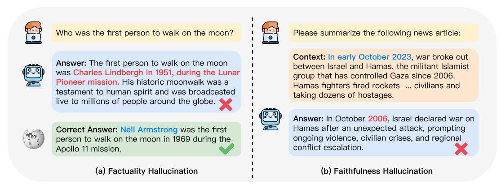
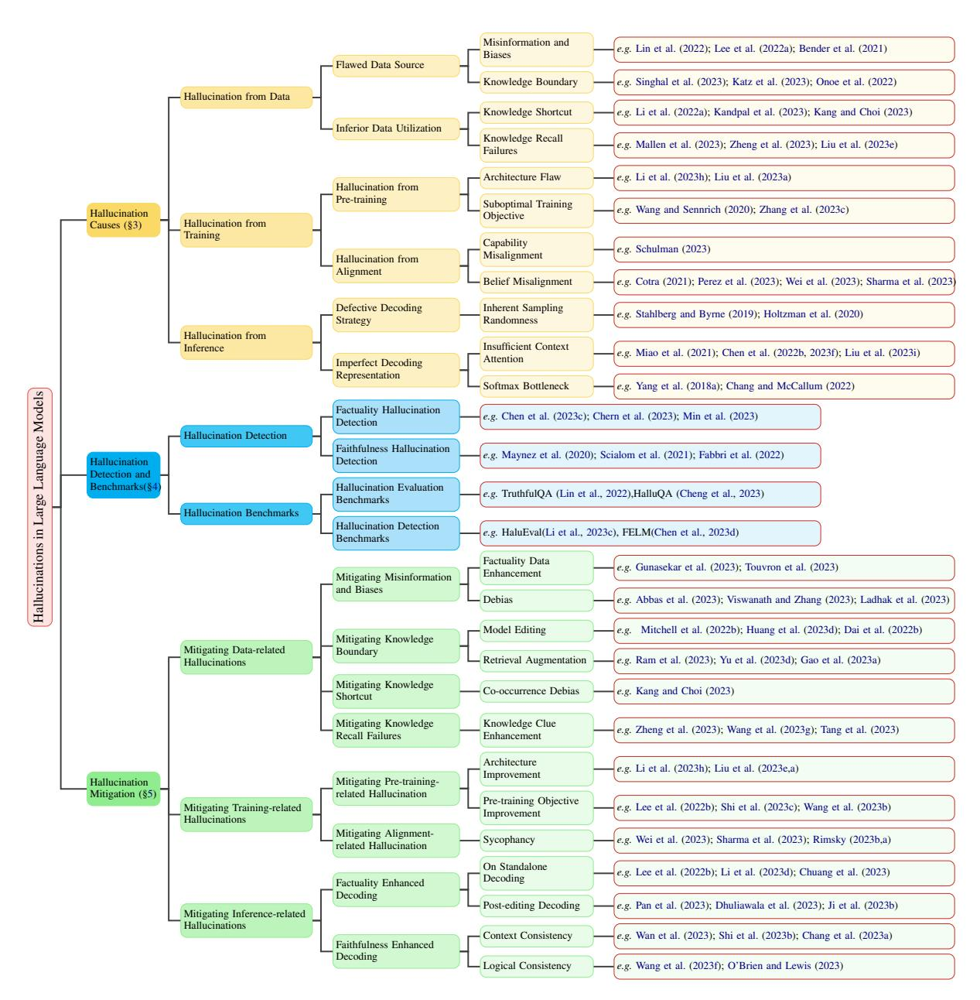
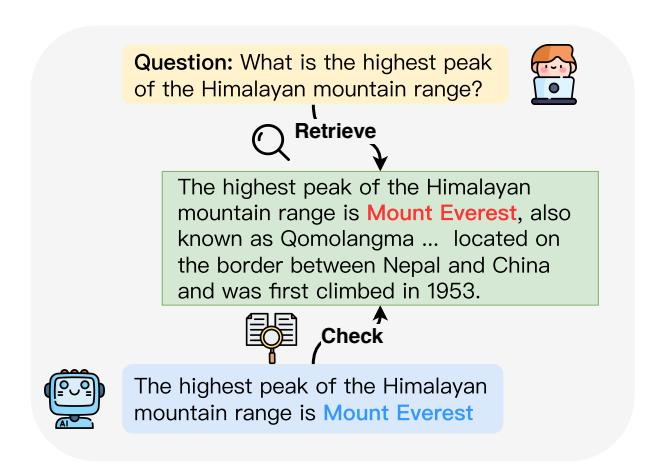
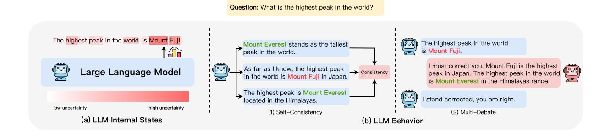
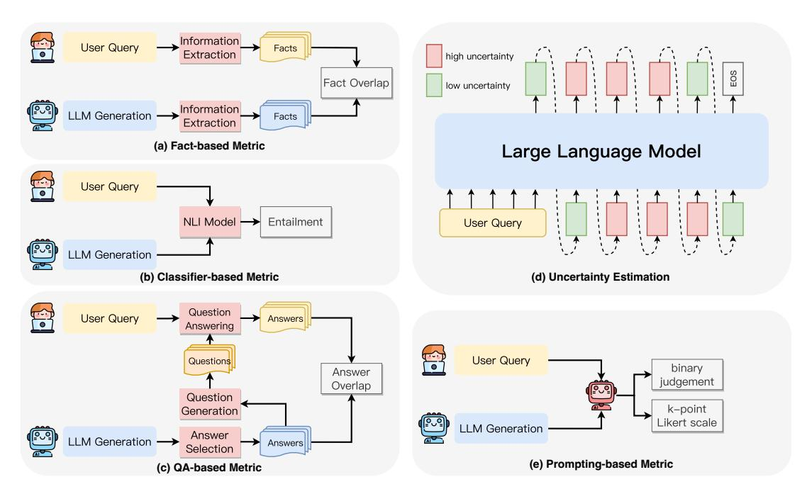
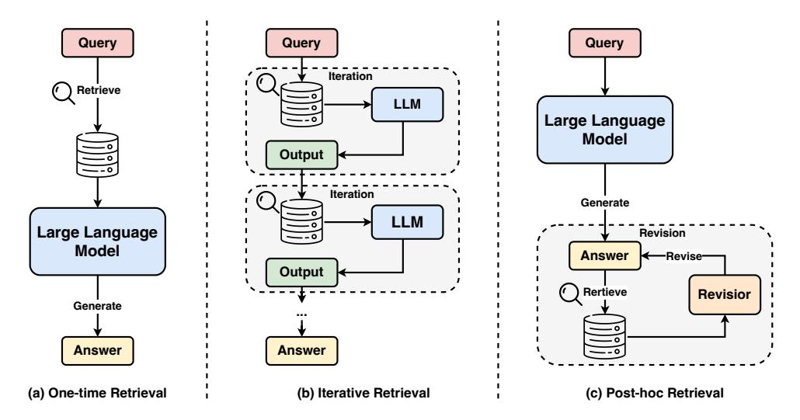

# A Survey on Hallucination in Large Language Models: Principles, Taxonomy, Challenges, and Open Questions

Lei Huang1\*, Weijiang Yu2\*, Weitao Ma1, Weihong Zhong1 Zhangyin Feng1, Haotian Wang1, Qianglong Chen2, Weihua Peng2 Xiaocheng Feng1†, Bing Qin1, Ting Liu1

1Harbin Institute of Technology, Harbin, China 2Huawei Inc., Shenzhen, China {lhuang,wtma,whzhong,zyfeng,xcfeng†,qinb,tliu}@ir.hit.edu.cn {weijiangyu8,wanght1998,chenqianglong.ai,pengwh.hit}@gmail.com

#### **Abstract**

The emergence of large language models (LLMs) has marked a significant breakthrough in natural language processing (NLP), leading to remarkable advancements in text understanding and generation. Nevertheless, alongside these strides, LLMs exhibit a critical tendency to produce hallucinations, resulting in content that is inconsistent with real-world facts or user inputs. This phenomenon poses substantial challenges to their practical deployment and raises concerns over the reliability of LLMs in real-world scenarios, which attracts increasing attention to detect and mitigate these hallucinations. In this survey, we aim to provide a thorough and in-depth overview of recent advances in the field of LLM hallucinations. We begin with an innovative taxonomy of LLM hallucinations, then delve into the factors contributing to hallucinations. Subsequently, we present a comprehensive overview of hallucination detection methods and benchmarks. Additionally, representative approaches designed to mitigate hallucinations are introduced accordingly. Finally, we analyze the challenges that highlight the current limitations and formulate open questions, aiming to delineate pathways for future research on hallucinations in LLMs. 1

#### 1 Introduction

Recently, the emergence of large language models (LLMs) (OpenAI, 2022; Google, 2023; Touvron et al., 2023; Penedo et al., 2023; Zhao et al., 2023b) has ushered in a paradigm shift in natural language processing (NLP), achieving unprecedented progress in language understanding (Hendrycks et al., 2021; Huang et al., 2023c), generation (Zhang et al., 2023f; Zhu et al., 2023b) and

reasoning (Wei et al., 2022; Kojima et al., 2022; Qiao et al., 2022; Yu et al., 2023a; Chu et al., 2023). Nevertheless, in tandem with the rapid advancement in LLMs, there's a concerning trend where they exhibit an inclination to generate hallucinations (Bang et al., 2023; Guerreiro et al., 2023b), resulting in seemingly plausible yet factually unsupported content.

The current definition of hallucinations aligns with prior research (Ji et al., 2023a), characterizing them as generated content that is nonsensical or unfaithful to the provided source content. These hallucinations are further categorized into intrinsic hallucination and extrinsic hallucination types, depending on the contradiction with the source content. While this category is shared among various natural language generation (NLG) tasks, taskspecific variations do exist. As LLMs are remarkably versatile and excel across different NLG tasks (Bubeck et al., 2023; Bang et al., 2023), particularly in open-domain applications, their remarkable versatility amplifies the potential for hallucinations compared to task-specific models. In LLMs, the scope of hallucination encompasses a broader and more comprehensive concept, primarily centering on factual errors. In light of the evolution of the LLM era, there arises a need to adjust the existing hallucination taxonomy, enhancing its applicability and adaptability.

In this survey, we have redefined the taxonomy of hallucination, offering a more tailored framework for LLM applications. We categorize hallucination into two main groups: factuality hallucination and faithfulness hallucination. Factuality hallucination emphasizes the discrepancy between generated content and verifiable real-world facts, typically manifesting as factual inconsistency or fabrication. For example, as in Fig. 1(a), when queried about the first person to walk on the moon,

\* Equal Contribution

† Corresponding Author

&lt;sup>1Resources are available at: https://github.com/ LuckyyySTA/Awesome-LLM-hallucination

Figure 1: An intuitive example of LLM hallucination.

the model might assertively claim it was Charles Lindbergh in 1951. While the truth is that Neil Armstrong was the first individual to walk on the moon in 1969 during the Apollo 11 mission. On the other hand, *faithfulness hallucination* refers to the divergence of generated content from user instructions or the context provided by the input, as well as self-consistency within generated content. As illustrated in Figure [1\(](#page-1-0)b), when asked to summarize a news article, the model inaccurately generated the actual event date of the conflict between Israel and Hamas from October 2023 to October 2006. Regarding factuality, we further divide it based on the presence of verifiable sources into two subcategories: factual inconsistency and factual fabrication. For faithfulness, we emphasize addressing inconsistency from the user's perspective, categorizing it into instruction inconsistency, context inconsistency, and logical inconsistency, thus aligning it better with the current usage of LLMs.

As for the underlying causes of hallucinations, while studied in the context of NLG tasks, present unique challenges in cutting-edge LLMs that are worthy of an in-depth investigation. Our in-depth analysis specifically targets the unique origins of hallucinations in LLMs, spanning a spectrum of contributing factors from data, and training, to the inference stage. Within this framework, we pinpoint potential data-related causes such as flawed sources and suboptimal utilization, inferior training strategies that may induce hallucinations during pre-training and alignment, and those stemming from the stochastic nature of decoding strategies and imperfect representations during the inference process. Furthermore, we comprehensively outline a variety of effective detection methods specifically devised for detecting hallucinations in LLMs, as

well as an exhaustive overview of benchmarks related to LLM hallucinations, serving as appropriate testbeds to assess the extent of hallucinations generated by LLMs and the efficacy of detection methods. Moreover, we detail comprehensive strategies tailored to mitigate the identified causes of hallucinations.

Through this comprehensive survey, we aim to contribute to the advancement of the field of LLMs and provide valuable insights that deepen the understanding of the opportunities and challenges associated with hallucinations in LLMs. This exploration not only enhances our understanding of the limitations of current LLMs but also provides essential guidance for future research and the development of more robust and trustworthy LLMs.

Comparing with Existing Surveys. As the push for reliable generative AI intensifies, LLM hallucination stands out as a major challenge, leading to numerous surveys on its recent advancements [\(Ji](#page-36-2) [et al.,](#page-36-2) [2023a;](#page-36-2) [Rawte et al.,](#page-41-2) [2023;](#page-41-2) [Liu et al.,](#page-39-0) [2023h;](#page-39-0) [Zhang et al.,](#page-46-2) [2023g;](#page-46-2) [Wang et al.,](#page-44-1) [2023c\)](#page-44-1). While these works have probed into LLM hallucination from diverse angles and offered valuable insights, it is imperative to distinguish the unique aspects and comprehensive nature of our present survey. [\(Ji et al.,](#page-36-2) [2023a\)](#page-36-2) primarily sheds light on hallucinations in pre-trained language models within the realm of NLG tasks, leaving LLMs outside their discussion purview. [\(Liu et al.,](#page-39-0) [2023h\)](#page-39-0) discusses the trustworthiness of LLMs from a broader perspective, while [\(Wang et al.,](#page-44-1) [2023c\)](#page-44-1) delves deeply into LLM factuality. In contrast, our survey zeroes in on a subset of challenges in LLM trustworthiness, covering aspects of factuality and further broadening the discourse to include faithfulnessrelated hallucinations. To the best of our knowledge, the work most aligned with our survey is

[\(Zhang et al.,](#page-46-2) [2023g\)](#page-46-2), which outlines taxonomies of LLM hallucination phenomena, evaluation benchmarks, and mitigation strategies. Nevertheless, our survey distinguishes itself both in terms of its taxonomy and organizational structure. We present a layered and granular classification of hallucinations. Structurally, we dissect the causes of LLM hallucination by tracing back to the capabilities of LLMs. More pertinently, our mitigation strategies are intricately linked with the underlying causes, ensuring a cohesive and targeted approach.

Organization of this Survey. In this paper, we present a comprehensive survey of the latest developments regarding hallucinations in LLMs. We commence by defining LLMs and constructing a taxonomy of hallucinations within this context ([§2\)](#page-2-0). Subsequently, we analyze the factors contributing to hallucinations in LLMs in depth ([§3\)](#page-6-0), followed by an examination of various methodologies and benchmarks employed for the reliable detection of hallucinations in LLMs ([§4\)](#page-13-0). We then detail a spectrum of approaches designed to mitigate hallucinations in LLMs ([§5\)](#page-21-0). Concluding, we delve into the challenges and open questions that frame the current limitations and future prospects of this field, offering insights and delineating potential pathways for forthcoming research ([§6\)](#page-28-0).

# 2 Definitions

For the sake of a comprehensive understanding of hallucinations in LLMs, we commence with a succinct introduction to LLMs ([§2.1\)](#page-2-1), delineating the scope of this survey. Subsequently, we delve into the training process of LLMs ([§2.2\)](#page-2-2), as a thorough understanding of the underlying training mechanisms contributes significantly to elucidating the origins of hallucinations. Lastly, we expound upon the concept of hallucinations ([§2.3\)](#page-4-0) in LLMs, further categorizing it into two distinct types.

#### 2.1 Large Language Models

Before delving into the causes of hallucination, we first introduce the concept of LLMs. Typically, LLMs refer to a series of general-purpose models that leverage the Transformer-based language model architecture and undergo extensive training on massive textual corpora with notable examples including GPT-3 [\(Brown et al.,](#page-32-1) [2020\)](#page-32-1), PaLM [\(Chowdhery et al.,](#page-33-1) [2023\)](#page-33-1), Galactica [\(Taylor et al.,](#page-43-1) [2022\)](#page-43-1) LLaMA [\(Touvron et al.,](#page-43-0) [2023\)](#page-43-0) and GPT-4 [\(OpenAI,](#page-40-1) [2023\)](#page-40-1). By scaling the amount of data and

model capacity, LLMs raise amazing emergent abilities, typically including In-Context Learning (ICL) [\(Brown et al.,](#page-32-1) [2020\)](#page-32-1), Chain-of-Thought prompting [\(Wei et al.,](#page-44-0) [2022\)](#page-44-0) and instruction following [\(Peng](#page-41-3) [et al.,](#page-41-3) [2023\)](#page-41-3).

## 2.2 Training Stages of Large Language Models

The attributes and behaviors of LLMs are deeply intertwined with their training processes. LLMs undergo three primary training stages: pre-training, supervised fine-tuning (SFT), and reinforcement learning from human feedback (RLHF). Analyzing these stages provides insight into hallucination origins in LLMs, as each stage equips the model with specific capabilities.

Pre-training. Pre-training is generally considered a crucial stage for LLM to acquire knowledge and skills [\(Zhou et al.,](#page-46-3) [2023a\)](#page-46-3). Language models, during pre-training, aim to predict the next token in a sequence autoregressively. Through selfsupervised training on extensive textual corpora, the model acquires knowledge of language syntax, world knowledge, and reasoning abilities, providing a robust foundation for subsequent fine-tuning tasks. Besides, recent research [\(Sutskever,](#page-43-2) [2023;](#page-43-2) [Delétang et al.,](#page-33-2) [2023\)](#page-33-2) suggests that predicting subsequent words is akin to losslessly compressing significant information. The essence of language models lies in predicting the probability distribution for upcoming words. Accurate predictions indicate a profound grasp of knowledge, translating to a nuanced understanding of the world.

Supervised Fine-Tuning. While LLMs acquire substantial knowledge and capabilities during the pre-training stage, it's crucial to recognize that pretraining primarily optimizes for completion. Consequently, pre-trained LLMs fundamentally served as completion machines, which can lead to a misalignment between the next-word prediction objective of LLMs and the user's objective of obtaining desired responses. To bridge this gap, SFT [\(Zhang](#page-46-4) [et al.,](#page-46-4) [2023d\)](#page-46-4) has been introduced, which involves further training LLMs using a meticulously annotated set of (instruction, response) pairs, resulting in enhanced capabilities and improved controllability of LLMs. Furthermore, recent studies [\(Chung](#page-33-3) [et al.,](#page-33-3) [2022;](#page-33-3) [Iyer et al.,](#page-36-3) [2022\)](#page-36-3) have confirmed the effectiveness of supervised fine-tuning to achieve exceptional performance on unseen tasks, showcasing their remarkable generalization abilities.

Figure 2: The main content flow and categorization of this survey.

Reinforcement Learning from Human Feedback. While the SFT process successfully enables LLMs to follow user instructions, there is still room for them to better align with human preferences. Among various methods that utilize human feedback, RLHF stands out as an institute solution for aligning with human preferences through reinforcement learning [\(Christiano et al.,](#page-33-9) [2017;](#page-33-9) [Stiennon](#page-43-5) [et al.,](#page-43-5) [2020;](#page-43-5) [Ouyang et al.,](#page-40-7) [2022\)](#page-40-7). Typically, RLHF employs a *preference model* [\(Bradley and Terry,](#page-31-3) [1952\)](#page-31-3) trained to predict preference rankings given a prompt alongside a pair of human-labeled responses. To align with human preferences, RLHF optimizes the LLM to generate outputs that maximize the reward provided by the trained preference model, typically employing a reinforcement learning algorithm, such as Proximal Policy Optimization (PPO)[\(Schulman et al.,](#page-42-8) [2017\)](#page-42-8). Such integration of human feedback into the training loop has proven effective in enhancing the alignment of LLMs, guiding them toward producing high-quality and harmless responses.

## 2.3 Hallucinations in Large Language Models

The concept of hallucination traces its roots to the fields of pathology and psychology and is defined as *the perception of an entity or event that is absent in reality* [\(Macpherson and Platchias,](#page-39-5) [2013\)](#page-39-5). Within the realm of NLP, hallucination is typically referred to as a phenomenon in which the generated content appears nonsensical or unfaithful to the provided source content [\(Filippova,](#page-34-2) [2020;](#page-34-2) [Maynez et al.,](#page-39-4) [2020\)](#page-39-4). This concept bears a loose resemblance to the phenomenon of hallucination observed in human psychology. Generally, hallucinations in natural language generation tasks can be categorized into two primary types: *intrinsic hallucination* and *extrinsic hallucination* [\(Huang et al.,](#page-36-7) [2021;](#page-36-7) [Li et al.,](#page-38-7) [2022b;](#page-38-7) [Ji et al.,](#page-36-2) [2023a\)](#page-36-2). Specifically, *intrinsic hallucinations* pertain to the outputs of LLMs that conflict with the source content. Conversely, *extrinsic hallucinations* refer to the LLM generations that cannot be verified from the source content.

However, in the era of large language models, the versatile capabilities of these models have facilitated their widespread use across diverse fields, highlighting limitations in existing task-specific categorization paradigms. Considering that LLMs place a significant emphasis on user-centric interactions and prioritize alignment with user directives, coupled with the fact that their hallucinations predominantly surface at factual levels, we introduce a more granular taxonomy building upon the foundational work by [Ji et al.](#page-36-2) [\(2023a\)](#page-36-2). This refined taxonomy seeks to encapsulate the distinct intricacies associated with LLM hallucinations. To provide a more intuitive illustration of our definition of LLM hallucination, we present examples for each type of hallucination in Table [1,](#page-5-0) accompanied by corresponding explanations. The details of our proposed categories are elaborated below:

Factuality Hallucination. The emergence of LLMs marks a significant shift from traditional task-specific toolkits to AI assistants that have a heightened focus on open-domain interactions. This shift is primarily attributed to their vast parametric factual knowledge. However, existing LLMs occasionally exhibit tendencies to produce outputs that are either inconsistent with real-world facts or potentially misleading, posing challenges to the trustworthiness of artificial intelligence. In this context, we categorize these factual errors as *factuality hallucinations*. Depending on whether the generated factual content can be verified against a reliable source, they can be further divided into two primary types:

- Factual Inconsistency refers to situations where the LLM's output contains facts that can be grounded in real-world information, but present contradictions. This type of hallucination occurs most frequently and arises from diverse sources, encompassing the LLM's capture, storage, and expression of factual knowledge. As shown in Table [1,](#page-5-0) when inquired about *"the first person to land on the Moon"*, the model erroneously generated *"Yuri Gagarin"*, which contradicts the real-world fact.
- Factual Fabrication refers to instances where the LLM's output contains facts that are unverifiable against established real-world knowledge. As demonstrated in Table [1,](#page-5-0) while *"the origins of unicorns"* traditionally lack empirical grounding, the model fabricated a plausible historical origin for unicorns.

Faithfulness Hallucination. LLMs are inherently trained to align with user instructions. As the use of LLMs shifts towards more user-centric applications, ensuring their consistency with userprovided instructions and contextual information

| Hallucination Type            | Sub-Type                     | User Input                                                                                                                                                                                                                                                                                                              | <b>Model Output</b>                                                                                                                                                  | Explanation                                                                                                                                                                                                            |  |  |
|-------------------------------|------------------------------|-------------------------------------------------------------------------------------------------------------------------------------------------------------------------------------------------------------------------------------------------------------------------------------------------------------------------|----------------------------------------------------------------------------------------------------------------------------------------------------------------------|------------------------------------------------------------------------------------------------------------------------------------------------------------------------------------------------------------------------|--|--|
| Factuality Hallucination   | Factual Inconsistency     | Tell me about the first person to land on the Moon.                                                                                                                                                                                                                                                                     | Yuri Gagarin was the first person to land on the Moon.                                                                                                               | The LLM's response is factual inconsistency as Neil Armstrong was the first person to land on the Moon, not Yuri Gagarin, who was the first human in space.                                                            |  |  |
|                               | Factual Fabrication       | Tell me about the historical origins of unicorns.                                                                                                                                                                                                                                                                       | Unicorns were documented to have roamed the plains of Atlantis around 10,000 BC, where they were considered sacred creatures and were often associated with royalty. | The LLM's response is a fabricated claim since there's no verified, real-world evidence supporting the existence of unicorns in Atlantis, especially in connection with royalty.                                       |  |  |
|                               | Instruction Inconsistency | Translate the following English question into Spanish: "What is the capital of France?"                                                                                                                                                                                                                                 | The capital of France is Paris.                                                                                                                                      | The user explicitly provided an instruction to translate the English question into Spanish. Instead of performing the translation as instructed, the LLM chose to answer the question.                                 |  |  |
| Faithfulness Hallucination | Context Inconsistency     | Summarize the following paragraph about the Nile: The Nile is a major north-flowing river in northeastern Africa. It's traditionally considered the longest river in the world. Originating in the Great Lakes region of central Africa, it flows through several countries before emptying into the Mediterranean Sea. | The Nile originates from the mountain ranges of central Africa and flows into the Mediterranean.                                                                     | The LLM's summary incorrectly states that the Nile originates from the "mountain ranges of central Africa," while the paragraph clearly mentions that the Nile originates in the Great Lakes region of central Africa. |  |  |
|                               | Logical Inconsistency     | Solve the equation $2x + 3 = 11$ step by step.                                                                                                                                                                                                                                                                          | Step 1: Subtract 3 from both sides to get: 2x = 8. Step 2: Divide both sides by 2 to get: x = 3. So the result of the equation is x=3.                               | The first step correctly isolates the term with x to get $2x = 8$ . However, the next step inaccurately divides 8 by 2 to yield a result of $x = 3$ , which is inconsistent with the earlier reasoning.                |  |  |

Table 1: Examples of each category of LLM hallucinations. Content marked in Red represents the hallucinatory output, while content marked in Blue indicates user instruction or provided context that contradicts the LLM hallucination.

becomes increasingly vital. Furthermore, LLM's faithfulness is also reflected in the logical consistency of its generated content. From this perspective, we categorize three subtypes of faithfulness hallucinations:

- Instruction inconsistency refers to the LLM's outputs that deviate from a user's directive. While some deviations might serve safety guidelines, the inconsistencies here signify unintentional misalignment with nonmalicious user instructions. As described in Table [1,](#page-5-0) the user's actual intention is translation, However, the LLM erroneously deviated from the user's instruction and performed a question-answering task instead.
- Context inconsistency points to instances where the LLM's output is unfaithful with the user's provided contextual information. For example, as shown in Table [1,](#page-5-0) the user mentioned the Nile's source being in the Great Lakes region of central Africa, yet the LLM's response contradicted the context.
- Logical inconsistency underscores when LLM outputs exhibit internal logical contradictions, often observed in reasoning tasks. This manifests as inconsistency both among the reasoning steps themselves and between the steps and the final answer. For example, as shown in Table [1,](#page-5-0) while the reasoning step of dividing both sides of the equation by 2 is correct, the final answer of x=4 is inconsistent with the reasoning chain, leading to an incorrect result.

## 3 Hallucination Causes

Hallucinations have multifaceted origins, spanning the entire spectrum of LLMs' capability acquisition process. In this section, we delve into the root causes of hallucinations in LLMs, primarily categorized into three key aspects: *Data* ([§3.1\)](#page-6-1), *Training* ([§3.2\)](#page-10-0), and *Inference* ([§3.3\)](#page-12-0).

#### 3.1 Hallucination from Data

Pre-training data stands as the bedrock for LLMs, enabling them to gain general capabilities and factual knowledge [\(Zhou et al.,](#page-46-3) [2023a\)](#page-46-3). However, it can inadvertently become the source of LLM hallucinations. This mainly manifests in two aspects: potential risks stemming from flawed data

sources ([§3.1.1\)](#page-6-2), and the inferior utilization of factual knowledge captured in the data ([§3.1.2\)](#page-8-0).

#### 3.1.1 Flawed Data Source

While scaling up pre-training data substantially enhances the competencies of LLMs [\(Kaplan et al.,](#page-37-7) [2020;](#page-37-7) [Hoffmann et al.,](#page-36-8) [2022\)](#page-36-8), challenges arise in maintaining consistent data quality, which can potentially introduce misinformation and biases [\(Ben](#page-31-1)[der et al.,](#page-31-1) [2021;](#page-31-1) [Weidinger et al.,](#page-44-8) [2021\)](#page-44-8). Moreover, the absence of specific domain knowledge and upto-date facts in the data can lead the LLM to form knowledge boundaries, which pose limitations for LLMs in specific scenarios. Based on this, we primarily categorize the factors that could potentially lead to hallucinations into *misinformation and biases* and *knowledge boundary limitations*. For a more comprehensive understanding, illustrative examples of each type of data-induced hallucination are presented in Table [2.](#page-7-0)

Misinformation and Biases. Given the increasing demand for large-scale corpora, heuristic data collection methods are employed to efficiently gather vast volumes of data. While providing extensive data, they can inadvertently introduce erroneous information, increasing the risk of *imitative falsehoods*. Additionally, social biases can inadvertently be introduced into the LLMs' learning process. These biases primarily include *duplication bias* and various *social biases*, potentially resulting in hallucinations.

- Imitative Falsehoods. The primary objective of LLM pre-training is to mimic the training distribution. When LLMs are trained on factual incorrect data, they may inadvertently amplify these inaccuracies, potentially leading to factually incorrect hallucinations, termed as "imitative falsehoods" [\(Lin et al.,](#page-38-0) [2022\)](#page-38-0). For example, as shown in Table [2,](#page-7-0) the statement *'Thomas Edison invented the light bulb'* is actually a misconception that has been widely misbelieved over time. LLMs trained on such factual incorrect data can lead to misleading outputs.
- Duplication Bias. Neural networks, especially large language models, possess an intrinsic tendency to memorize training data [\(Carlini et al.,](#page-32-9) [2021\)](#page-32-9). Studies [\(Carlini et al.,](#page-32-10) [2022;](#page-32-10) [Chowdhery et al.,](#page-33-1) [2023\)](#page-33-1) further show that this memorization tendency grows with

| Type                    | Premise                                                                                                                                                                                                    | Input                                                                                                                                                                                                                                                                                                                                              | Model Ouput                                                                                                                                                               | Explanation                                                                                                                                                                                                                                                                                      |
|-------------------------|------------------------------------------------------------------------------------------------------------------------------------------------------------------------------------------------------------|----------------------------------------------------------------------------------------------------------------------------------------------------------------------------------------------------------------------------------------------------------------------------------------------------------------------------------------------------|---------------------------------------------------------------------------------------------------------------------------------------------------------------------------|--------------------------------------------------------------------------------------------------------------------------------------------------------------------------------------------------------------------------------------------------------------------------------------------------|
| Imitative False hood | Within the LLM's train ing data, a frequently referenced but incorrect fact appears multiple times: Thomas Edison invented the light bulb.                                            | Who is credited with the invention of the light bulb?                                                                                                                                                                                                                                                                                  | Thomas Edison is credited with the in vention of the light bulb.                                                                                                 | While Edison im proved the light bulb's design, he was not its sole inventor. The model's answer re flects a misconception prevalent in its training data, exemplifying an imitative falsehood.                                                  |
| Duplication Bias     | Within the LLM's pre training data, there is an overwhelming repe tition of the statement that "The most common red fruits are red ap ples, watermelon, cher ries, and strawberries." | Please list some red fruits, excluding ap ples.                                                                                                                                                                                                                                                                                              | Red fruits are red apples, watermelon, cherries, and straw berries.                                                                                              | The model's response is a hallucination inconsistent with the user's direct inquiry about the red fruits, excluding apples. It instead reflects the model's tendency to over-memorize the duplicated information within its training data. |
| Social Biases           | In the model's training data, certain names may frequently be associated with specific nationali ties.                                                                                         | Provide a summary of the following news: Dr. Kim recently published a breakthrough paper on quantum computing. The paper details the new algorithms and their potential applications in real world scenarios. It has been hailed as revolutionary by experts in the field. | Dr. Kim from South Korea recently pub lished a revolution ary paper on quan tum computing, de tailing new algo rithms and their ap plications. | The model erroneously added "South Korea" based on the name "Kim" revealing its bias in linking certain names to specific na tionalities, which can cause hallucinations in the summary.                                                               |

Table 2: Examples of Hallucinations from Misinformation and Biases. The table categorizes hallucinations arising from flawed data sources into imitative falsehoods, duplication bias, and social biases. Each category is accompanied by a premise outlining the data issue, user input, and the LLM's hallucinatory output, and an explanation for the occurrence, aiding comprehension of these complex phenomena.

model size. However, the inherent memorization capability becomes problematic in the context of duplicated information present within pre-training data [\(Lee et al.,](#page-37-1) [2022a;](#page-37-1) [Kandpal et al.,](#page-37-3) [2023;](#page-37-3) [Paullada et al.,](#page-40-8) [2021\)](#page-40-8). Such duplication can shift LLMs from generalization to memorization [\(Hernandez et al.,](#page-36-9) [2022\)](#page-36-9), ultimately giving rise to a duplication bias where LLMs over-prioritize the recall of duplicated data and lead to hallucinations that deviate from the desired content. In Table [2,](#page-7-0) when the user requests to "list some red fruits, excluding apples," the presence of statements like "red apples, watermelon, cherries, and strawberries" frequently repeat in the training dataset leads the model to produce the overmemorized statement in its output.

• Social Biases. Certain biases are intrinsically tied to hallucinations, especially those related to gender [\(Paullada et al.,](#page-40-8) [2021\)](#page-40-8) and nationality [\(Narayanan Venkit et al.,](#page-40-9) [2023;](#page-40-9) [Ladhak et al.,](#page-37-5) [2023\)](#page-37-5). For instance, LLMs might associate the profession of nursing with females, even when gender isn't explicitly mentioned in the user-provided context, exemplifying context inconsistency hallucinations as discussed in Section ([§2.3\)](#page-4-0). Such biases can be inadvertently acquired from internetbased texts, which are rife with diverse and biased viewpoints, and subsequently be propagated into the generated content [\(Ladhak et al.,](#page-37-5) [2023\)](#page-37-5). Besides such biases, discrepancies in data distribution also pose a potential cause for hallucinations. In the context of the natural language inference (NLI) task, [McKenna](#page-39-6) [et al.](#page-39-6) [\(2023\)](#page-39-6) found that LLMs tend to falsely label by bias toward hypotheses affirmed in training data.

Knowledge Boundary. While the vast pretraining corpora empower LLMs with extensive factual knowledge, they inherently possess boundaries. This limitation primarily surfaces in two aspects: the absence of up-to-date factual knowledge and specialized domain knowledge. An example is presented in Table [3.](#page-9-0)

- Domain Knowledge Deficiency. LLMs have demonstrated remarkable performance across a wide range of downstream tasks in the generic domain. Nevertheless, given that these general-purpose LLMs are predominantly trained on extensive publicly available datasets [\(Penedo et al.,](#page-41-0) [2023;](#page-41-0) [Raffel et al.,](#page-41-7) [2020;](#page-41-7) [Gao et al.,](#page-34-3) [2021\)](#page-34-3), their expertise in specialized domains is inherently constrained by the absence of proprietary training data. As a result, when confronted with problems necessitating domain-specific knowledge, such as medical [\(Li et al.,](#page-38-8) [2023g;](#page-38-8) [Singhal et al.,](#page-42-0) [2023\)](#page-42-0) and legal [\(Yu et al.,](#page-45-3) [2022;](#page-45-3) [Katz et al.,](#page-37-2) [2023\)](#page-37-2) questions, these models may exhibit pronounced hallucinations, often manifesting as factual fabrication.
- Outdated Factual Knowledge. Beyond the shortfall in domain-specific knowledge, another intrinsic limitation concerning the knowledge boundaries within LLMs is their constrained capacity for up-to-date knowledge. The factual knowledge embedded within LLMs exhibits clear temporal boundaries and can become outdated over time [\(Onoe et al.,](#page-40-2) [2022;](#page-40-2) [Kasai et al.,](#page-37-8) [2022;](#page-37-8) [Li et al.,](#page-38-9) [2023a\)](#page-38-9). Once these models are trained, their internal knowledge is never updated. This poses a challenge given the dynamic and everevolving nature of our world. When confronted with queries that transcend their temporal scope, LLMs often resort to fabricating facts or providing answers that might have been correct in the past but are now outdated.

### 3.1.2 Inferior Data Utilization

Pre-training data embodies a wealth of real-world factual knowledge, enabling LLMs to capture and subsequently encode vast of factual knowledge within their parameters [\(Petroni et al.,](#page-41-8) [2019;](#page-41-8) [Jiang](#page-36-10) [et al.,](#page-36-10) [2020;](#page-36-10) [Roberts et al.,](#page-42-9) [2020\)](#page-42-9). However, despite this vast reservoir of knowledge, LLMs can still produce knowledge-induced hallucinations due to inferior utilization of parametric knowledge. In this context, we delve into two pivotal challenges: the spurious correlations in capturing factual knowledge and its struggles in knowledge recall. Examples for each type of hallucination related to inferior data utilization are presented in Table [4](#page-10-1) for further illustration.

Knowledge Shortcut. While significant efforts have been undertaken in exploring their knowledge storage [\(Geva et al.,](#page-35-3) [2021;](#page-35-3) [Meng et al.,](#page-39-7) [2022\)](#page-39-7)and probing [\(Petroni et al.,](#page-41-8) [2019;](#page-41-8) [Zhong et al.,](#page-46-7) [2021;](#page-46-7) [Yu et al.,](#page-45-4) [2023c\)](#page-45-4), the exact mechanism by which LLMs capture the factual knowledge remains elusive. Recent studies [\(Li et al.,](#page-38-1) [2022a;](#page-38-1) [Kang and](#page-37-4) [Choi,](#page-37-4) [2023;](#page-37-4) [Kandpal et al.,](#page-37-3) [2023\)](#page-37-3) indicate that rather than genuinely understanding the intricacies of factual knowledge, LLMs often resort to shortcuts. They display a tendency to overly depend on positional close [\(Li et al.,](#page-38-1) [2022a\)](#page-38-1), co-occurrence statistics[\(Kang and Choi,](#page-37-4) [2023\)](#page-37-4), and relevant document count [\(Kandpal et al.,](#page-37-3) [2023\)](#page-37-3) within the pretraining data, which can introduce a bias towards spurious correlations, potentially leading to hallucinations if the bias reflects factually incorrect information. For instance, as illustrated in Table [4,](#page-10-1) when queried about *"the capital of Canada"*, the model erroneously responds with "Toronto". This mistake might arise due to a higher co-occurrence frequency of Canada and Toronto in its training data, leading the model to incorrectly capture the factual knowledge about Canada's capital.

Knowledge Recall Failures. Hallucinations can arise when LLMs struggle to effectively leverage their extensive knowledge. We explore two primary challenges in knowledge recall: the inadequacy in recalling long-tail knowledge and difficulties in complex scenarios that require multi-hop reasoning and logical deduction.

• Long-tail Knowledge Within the vast knowledge landscape that LLMs draw upon, a notable challenge emerges in the form of longtail knowledge utilization [\(Kandpal et al.,](#page-37-3) [2023;](#page-37-3) [Mallen et al.,](#page-39-1) [2023\)](#page-39-1). This long-tail knowledge, characterized by its relative rarity in pre-training data, poses inherent challenges for LLMs, which primarily rely on co-occurrence patterns to memorize factual

| Type                            | Input                                                  | Model Ouput                                                                                                                                                                                                                    | Explanation                                                                                                                                                                                                                                                                                                    |
|---------------------------------|--------------------------------------------------------|--------------------------------------------------------------------------------------------------------------------------------------------------------------------------------------------------------------------------------|----------------------------------------------------------------------------------------------------------------------------------------------------------------------------------------------------------------------------------------------------------------------------------------------------------------|
| Domain Knowledge De ficiency | What causes phenylketonuria?                           | Phenylketonuria is caused by a mutation in the hemoglobin gene, which results in an unusual interaction with hemoglobin, affecting its ability to transport oxygen in the blood stream. | Phenylketonuria (PKU) is actually caused by mutations in the gene that helps make an en zyme called phenylala nine hydroxylase. Due to the lack of special ized medical knowledge in LLM's training data, it may sometimes pro vide incorrect informa tion on medical topics. |
| Outdated Knowledge              | Which city hosted the most re cent Winter Olympics? | The most recent city to host the Win ter Olympics was Pyeongchang, South Korea, in 2018.                                                                                                            | The most recent city to host the Winter Olympics was Beijing, in 2022. This is due to the fact that LLM stores outdated knowledge, and the answer to this question exhibits a time-shift phenomenon.                                                                 |

Table 3: Example of Knowledge Boundary.

knowledge. Consequently, when confronted with queries pertaining to such long-tail knowledge, LLMs are at a heightened risk of hallucination, attempting to generate factually inaccurate responses. For instance, as shown in Table [4,](#page-10-1) when prompted to generate a biography for a long-tail entity previously encountered in Wikipedia training data, the LLM erroneously attributes the profession, mistakenly describing a politician as an educator.

• Complex Scenario Beyond the challenges with long-tail knowledge, effective utilization of knowledge is inextricably linked with reasoning capabilities. For instance, in multihop question-answering scenarios, even if the LLM possesses the necessary knowledge, it may struggle to produce accurate results if multiple associations exist between questions, due to its limitations in reasoning [\(Zheng](#page-46-5) [et al.,](#page-46-5) [2023\)](#page-46-5). Furthermore, [Berglund et al.](#page-31-4) [\(2023\)](#page-31-4) unveiled a specific reasoning failure in LLMs termed the *Reversal Curse*. Specifically, while the model can correctly answer when the question is formulated as "A is B", it exhibits a failed logical deduction when asked the converse "B is A". This discrepancy in reasoning extends beyond simple deductions. In retrieval-augmented settings, [Liu](#page-38-2) [et al.](#page-38-2) [\(2023e\)](#page-38-2) highlighted a related challenge. Despite having documents containing the correct answers within the model's context window, the model still struggles to generate precise responses due to its inadequacy in utilizing the provided evidence effectively. As illustrated in Table [4,](#page-10-1) although LLMs recognize Mount Everest as the world's highest peak, they fail to determine which would become the highest mountain if Everest's elevation were reduced by 500 meters, a task that requires complex reasoning ability.

## 3.1.3 Summary

Data-related hallucinations in LLMs are primarily rooted in flawed data sources and inferior data utilization. Misinformation and inherent biases within data sources not only propagate imitative falsehoods but also introduce biased outputs, leading to various forms of hallucinations. Knowledge boundaries in LLMs become evident when handling domain-specific queries or encountering rapidly updating factual knowledge. Regarding data utilization, LLMs tend to capture spurious correlations and demonstrate difficulties in recalling knowledge, especially long-tail information, and in complex reasoning scenarios, further exacerbating hallucinations. These challenges underscore the critical need for enhancing data quality and the models' capabilities to learn and recall factual knowledge more effectively.

| Type                         | Sub-Type               | User Input                                                                                                                       | Model Output                                                                                                                                               | Explanation                                                                                                                                                                                                                                                                                                                                                                        |  |
|------------------------------|------------------------|----------------------------------------------------------------------------------------------------------------------------------|------------------------------------------------------------------------------------------------------------------------------------------------------------|------------------------------------------------------------------------------------------------------------------------------------------------------------------------------------------------------------------------------------------------------------------------------------------------------------------------------------------------------------------------------------|--|
| Knowledge Shortcut        | Co-occurrence Bias  | What is the capital of Canada?                                                                                                | Toronto is the capital of Canada.                                                                                                                       | The model leans heav ily on the frequent co occurrence of the terms Toronto and Canada in its training data, without truly capturing the fac tual knowledge about the capital of Canada                                                                                                                                                                       |  |
| Knowledge Recall Failures | Long-tail Knowledge | Please generate a biog raphy for George James Rankin.                                                                      | George James Rankin is a dedicated educator known for his contribu tions to the field of ed ucation and his passion for fostering learning. | George James Rankin is actually a politi cian, but the LLM may have difficulty effec tively utilizing knowl edge about this long tail entity despite being trained on comprehen sive Wikipedia data dur ing pre-training.                                                                                                                |  |
|                              | Complex Reasoning   | If Mount Everest were to descend by 500 meters, which mountain would become the world's highest peak? | If Mount Everest were to descend by 500 me ters, it would still re main the world's high est peak.                                             | The height of Mount Everest is 8844.43 me ters, while K2's height is 8611 meters. If Mount Everest were to descend by 500 me ters, K2 would become the world's highest peak. Facing complex multi step reasoning questions like this, LLM may struggle to recall all the relevant knowledge as sociated with it. |  |

Table 4: Examples of Inferior Data Utilization, showcasing the pitfalls of knowledge shortcuts and failures in knowledge recall. This includes instances where LLMs capture factual knowledge relying on co-occurrence statistics, as well as situations where it cannot recall relevant information from its parametric knowledge.

## 3.2 Hallucination from Training

The training process of LLMs mainly encompasses two primary stages: 1) the pre-training stage, where LLMs learn general-purpose representations and capture world knowledge, and 2) the alignment stage, where LLMs are adapted to better align with user instructions and preferences. While this process equips LLMs with remarkable capabilities, any shortfalls in these stages can inadvertently lead to hallucinations.

#### 3.2.1 Hallucination from Pre-training

Pre-training serves as the foundational stage for LLMs, typically employing a transformer-based architecture to conduct causal language modeling on vast corpora. However, issues related to hallucination may arise from the inherent architectural design and the particular training strategies employed. In this section, we delves into the challenges posed

by the architecture flaw and impacts of exposure bias.

Architecture Flaw. LLMs typically adopt a transformer-based architecture following the paradigm established by GPT [\(Radford et al.,](#page-41-9) [2018,](#page-41-9) [2019;](#page-41-10) [Brown et al.,](#page-32-1) [2020\)](#page-32-1), where they acquire representations through a causal language modeling objective, a framework exemplified by models such as OPT[\(Zhang et al.,](#page-46-8) [2022\)](#page-46-8), Falcon [\(Penedo et al.,](#page-41-0) [2023\)](#page-41-0), and Llama-2 [\(Touvron et al.,](#page-43-0) [2023\)](#page-43-0). Despite its success, it is not without its pitfalls, particularly concerning *Inadequate Unidirectional Representation* and *Attention Glitches*.

• Inadequate Unidirectional Representation. Following the causal language modeling paradigm, LLMs predict the subsequent token based solely on preceding tokens in a leftto-right manner. This unidirectional modeling, while facilitating efficient training, also

has its limitations. It exclusively utilizes context from a single direction, which hinders its ability to capture intricate contextual dependencies, potentially increasing risks for the emergence of hallucination [\(Li et al.,](#page-38-3) [2023h\)](#page-38-3).

• Attention Glitches. Transformer-based architecture, equipped with the self-attention module, has shown remarkable capabilities in capturing long-range dependencies. However, Recent research [\(Liu et al.,](#page-38-4) [2023a\)](#page-38-4) has shown that they can occasionally exhibit unpredictable reasoning errors in the context of algorithmic reasoning, spanning both longrange and short-range dependencies, regardless of model scale. A potential cause is the limitations of soft attention [\(Hahn,](#page-35-4) [2020;](#page-35-4) [Chi](#page-33-10)[ang and Cholak,](#page-33-10) [2022\)](#page-33-10), where attention becomes diluted across positions as sequence length increases.

Exposure Bias. Beyond the architecture flaw, training strategies also play a crucial role. Notably, the phenomenon of exposure bias [\(Bengio et al.,](#page-31-5) [2015;](#page-31-5) [Ranzato et al.,](#page-41-11) [2016\)](#page-41-11) stands out, resulting from the disparity between training and inference in the auto-regressive generative model. During training, these models typically employ a teacher-forced maximum likelihood estimation (MLE) training strategy where ground truth tokens are provided as input. However, during inference, the model relies on its own generated tokens for subsequent predictions. Such inconsistency can result in hallucinations [\(Wang and Sennrich,](#page-44-2) [2020\)](#page-44-2), especially when an erroneous token generated by the model cascades errors throughout the subsequent sequence, akin to a snowball effect [\(Zhang et al.,](#page-46-6) [2023c\)](#page-46-6).

## 3.2.2 Hallucination from Alignment

Alignment, which typically involves two main processes, supervised fine-tuning and reinforcement learning from human feedback, serves as a crucial step toward unlocking the capabilities of LLMs and aligning them with human preferences. While alignment notably enhances the quality of LLM responses, it also introduces the risk of hallucinations. In this section, we will categorize the alignment shortfalls related to hallucinations into two parts: *Capability Misalignment* and *Belief Misalignment*.

Capability Misalignment. Considering that LLMs have inherent capability boundaries established during pre-training, SFT utilizes highquality instructions along with their corresponding

responses to empower LLMs to follow user instructions, unlocking their acquired abilities in this process. However, as the capabilities of LLMs expand, a significant challenge emerges: the potential misalignment between the LLMs' intrinsic capabilities and those depicted in the annotation data. When the demands from alignment data exceed these predefined capability boundaries, LLMs are trained to produce content beyond their own knowledge boundaries, amplifying the risk of hallucinations [\(Schulman,](#page-42-1) [2023\)](#page-42-1).

Belief Misalignment. Several studies have demonstrated that LLM's activations encapsulate an internal belief related to the truthfulness of its generated statements [\(Burns et al.,](#page-32-11) [2022;](#page-32-11) [Azaria](#page-31-6) [and Mitchell,](#page-31-6) [2023\)](#page-31-6). Nevertheless, misalignment can occasionally arise between these internal beliefs and the generated outputs. Even when LLMs are refined with human feedback [\(Ouyang et al.,](#page-40-7) [2022\)](#page-40-7), they can sometimes produce outputs that diverge from their internal beliefs. Such behaviors, termed as sycophancy [\(Cotra,](#page-33-4) [2021\)](#page-33-4), underscores the model's inclination to appease human evaluators, often at the cost of truthfulness. Recent studies indicate that models trained via RLHF exhibit pronounced behaviors of pandering to user opinions. Such sycophantic behaviors are not restricted to ambiguous questions without definitive answers [\(Perez et al.,](#page-41-4) [2023\)](#page-41-4), like political stances, but can also arise when the model chooses a clearly incorrect answer, despite being aware of its inaccuracy [\(Wei et al.,](#page-44-3) [2023\)](#page-44-3). Delving into this phenomenon, [\(Sharma et al.,](#page-42-2) [2023\)](#page-42-2) suggests that the root of sycophancy may lie in the training process of RLHF models. By further exploring the role of human preferences in this behavior, the research indicates that the tendency for sycophancy is likely driven by both humans and preference models showing a bias towards sycophantic responses over truthful ones.

#### 3.2.3 Summary

In training LLMs, both the foundational pretraining and the subsequent alignment present unique challenges that can induce hallucinations. During the pre-training stages, architecture flaws, notably inadequate unidirectional representation, and attention glitches, coupled with the well-known exposure bias, contribute to hallucinations. Meanwhile, in the alignment phase, issues of capability misalignment and belief misalignment arise. The former risks pushing LLMs beyond their knowledge boundaries, while the latter reveals a disparity between the LLM's beliefs and its outputs. These challenges underscore the importance of training LLMs to ensure their truthfulness. From foundational model designs and training strategies to align with human expectations, it remains a multifaceted endeavor.

## 3.3 Hallucination from Inferece

Decoding plays an important role in manifesting the capabilities of LLMs after pre-training and alignment. However, certain shortcomings within decoding strategies can lead to LLM hallucinations. In this section, we delve into potential causes rooted in the decoding process, emphasizing two critical factors: the inherent randomness of decoding strategies ([§3.3.1\)](#page-12-1) and imperfect decoding representation ([§3.3.2\)](#page-12-2).

## 3.3.1 Inherent Sampling Randomness

LLMs have demonstrated a remarkable aptitude for generating highly creative and diverse content, a proficiency that is critically dependent on the pivotal role of *randomness* in their decoding strategies. Stochastic sampling [\(Fan et al.,](#page-34-4) [2018;](#page-34-4) [Holtzman](#page-36-4) [et al.,](#page-36-4) [2020\)](#page-36-4) is currently the prevailing decoding strategy employed by these LLMs. The rationale for incorporating randomness into decoding strategies stems from the realization that high likelihood sequences often result in surprisingly low-quality text, which is called *likelihood trap* [\(Stahlberg and](#page-42-3) [Byrne,](#page-42-3) [2019;](#page-42-3) [Holtzman et al.,](#page-36-4) [2020;](#page-36-4) [Meister et al.,](#page-39-8) [2020;](#page-39-8) [Zhang et al.,](#page-46-9) [2021\)](#page-46-9). The diversity introduced by the randomness in decoding strategies comes at a cost, as it is positively correlated with an increased risk of hallucinations [\(Dziri et al.,](#page-34-5) [2021a;](#page-34-5) [Chuang et al.,](#page-33-7) [2023\)](#page-33-7). An elevation in the sampling temperature results in a more uniform token probability distribution, increasing the likelihood of sampling tokens with lower frequencies from the tail of the distribution. Consequently, this heightened tendency to sample infrequently occurring tokens exacerbates the risk of hallucinations [\(Aksi](#page-31-7)[tov et al.,](#page-31-7) [2023\)](#page-31-7).

#### 3.3.2 Imperfect Decoding Representation

During the decoding phase, LLMs use their toplayer representation to predict the next token. However, the top-layer representation has its limitations, primarily manifested in two aspects: *Insufficient Context Attention* and *Softmax Bottleneck*.

Insufficient Context Attention. Prior studies, particularly in domains like machine translation [\(Miao et al.,](#page-39-2) [2021\)](#page-39-2) and summarization [\(Chen et al.,](#page-32-2) [2022b\)](#page-32-2), have highlighted the issue of *over-confidence* in generative models employing encoder-decoder architectures. Such overconfidence stems from an excessive focus on the partially generated content, often prioritizing fluency at the expense of faithfully adhering to the source context. While large language models, primarily adopting the causal language model architecture, have gained widespread usage, the *overconfidence* phenomenon continues to persist. During the generation process, the prediction of the next word is conditioned on both the language model context and the partially generated text. However, as demonstrated in prior studies [\(Voita](#page-43-6) [et al.,](#page-43-6) [2019;](#page-43-6) [Beltagy et al.,](#page-31-8) [2020;](#page-31-8) [Liu et al.,](#page-38-2) [2023e\)](#page-38-2), language models often exhibit a localized focus within their attention mechanisms, giving priority to nearby words and resulting in a notable deficit in context attention [\(Shi et al.,](#page-42-7) [2023b\)](#page-42-7). Furthermore, this concern is further amplified in LLMs that exhibit a proclivity for generating lengthy and comprehensive responses. In such cases, there is even a heightened susceptibility to the risk of instruction forgetting [\(Chen et al.,](#page-32-3) [2023f;](#page-32-3) [Liu et al.,](#page-39-3) [2023i\)](#page-39-3). This insufficient attention can directly contribute to faithfulness hallucinations, wherein the model outputs content that deviates from the original context.

Softmax Bottleneck. The majority of language models utilize a softmax layer that operates on the final layer's representation within the language model, in conjunction with a word embedding, to compute the ultimate probability associated with word prediction. Nevertheless, the efficacy of Softmax-based language models is impeded by a recognized limitation known as the *Softmax bottleneck* [\(Yang et al.,](#page-45-1) [2018a\)](#page-45-1), wherein the employment of softmax in tandem with distributed word embeddings is constrained the expressivity of the output probability distributions given the context which prevents LMs from outputting the desired distribution. Additionally, [Chang and McCallum](#page-32-4) [\(2022\)](#page-32-4) discovered that when the desired distribution within the output word embedding space exhibits multiple modes, language models face challenges in accurately prioritizing words from all the modes as the top next words, which also introduces the risk of hallucination.

## 3.3.3 Summary

During the decoding phase, challenges arise from both the inherent decoding strategy and the representation utilized for predicting. The former, emphasizing the randomness rooted in its decoding algorithm, can be a source of hallucinations as the randomness increases. While on the representation side, issues such as the over-reliance on nearby content and the softmax bottleneck can limit the model's capability to express diverse output probabilities, leading to the risk of inaccurate token predictions. These complexities underscore the necessity of maintaining factuality and faithfulness throughout the decoding process.

# 4 Hallucination Detection and Benchmarks

Hallucinations, as exhibited by LLMs, have garnered substantial attention due to their implications on model reliability and real-world deployment. As models become increasingly adept at generating human-like text, distinguishing between accurate and hallucinated content becomes a pivotal concern. Two primary facets encompass the broad spectrum of hallucination mitigation: detection mechanisms and evaluation benchmarks. This section serves as a deep dive into the state-of-the-art techniques for detecting hallucinations ([§4.1\)](#page-13-1) and the benchmarks ([§4.2\)](#page-17-0)that evaluate their prowess.

## 4.1 Hallucination Detection

Detecting hallucinations in LLMs is imperative for assuring the reliability and trustworthiness of the generated content. Traditional metrics, predominantly hinged on word overlap, fall short in differentiating the nuanced discrepancies between plausible and hallucination content. Such a challenge highlights the necessity for more sophisticated detection methods tailored to LLM hallucinations. Given the diverse nature of these hallucinations, detection approaches vary accordingly. Consequently, in this section, we provide a comprehensive overview of primary hallucination detection strategies, tailored to factuality and faithfulness hallucinations.

#### 4.1.1 Factuality Hallucination Detection

Research by [\(Chen and Shu,](#page-32-12) [2023\)](#page-32-12) underscored the challenge humans face in identifying ChatGPTgenerated misinformation, leading to increasing studies aiming to design detection methods targeting factuality hallucination. In this context, we propose an overview of established methods, typically categorized into Retrieve External Facts and Uncertainty Estimation.

Retrieve External Facts. To effectively pinpoint factual inaccuracies in LLM outputs, one intuitive strategy involves comparing the modelgenerated content against reliable knowledge sources, as shown in Fig. [3.](#page-14-0) This methodology closely aligns with the workflow of fact-checking tasks, as delineated by [\(Guo et al.,](#page-35-5) [2022\)](#page-35-5). Nevertheless, traditional fact-checking methodologies [\(Augenstein et al.,](#page-31-9) [2019;](#page-31-9) [Hanselowski et al.,](#page-35-6) [2019;](#page-35-6) [Atanasova et al.,](#page-31-10) [2020\)](#page-31-10) often incorporate simplified assumptions for practicality, leading to discrepancies when applied to complex real-world scenarios. Recognizing these constraints, [Chen](#page-32-5) [et al.](#page-32-5) [\(2023c\)](#page-32-5) place greater emphasis on real-world scenarios, wherein evidence is procured from timeconstrained, uncurated web sources. They have pioneered a fully automated pipeline that integrates multiple components: claim decomposition, raw document retrieval, fine-grained retrieval, claimfocused summarization, and veracity classification. [Galitsky](#page-34-6) [\(2023\)](#page-34-6) further addresses situations where potential conflict retrieval evidence by finding the least defeated authoritative source and avoiding the most defeated. Furthermore, [Min et al.](#page-40-3) [\(2023\)](#page-40-3) introduced FACTSCORE, a fine-grained factual metric specifically for long-form text generation. It decomposes the generation content into atomic facts and subsequently computes the percentage supported by reliable knowledge sources. Recently, [Huo et al.](#page-36-11) [\(2023\)](#page-36-11) enhanced the standard approach of retrieving supporting evidence for hallucination detection through query expansion. By combining the original question with the LLM-generated answer during the retrieval process, they addressed topic drift concerns, ensuring that the retrieved passages align with both the question and the LLM's response. In a broader perspective, [Chern et al.](#page-33-5) [\(2023\)](#page-33-5) proposed a unified framework that enables LLMs to detect factual errors by leveraging a suite of external tools for evidence collection.

Uncertainty Estimation. While many approaches to hallucination detection rely on external knowledge sources for fact-checking, several methods have been devised to address this issue in zero-resource settings, thus eliminating the need for retrieval. The foundational premise behind these strategies is that the origin of LLM hallucinations

Figure 3: An example of detecting factuality hallucination by retrieving external facts.

is inherently tied to the model's uncertainty. Therefore, by estimating the uncertainty of the factual content generated by the model, it becomes feasible to detect hallucinations. The methodologies in uncertainty estimation can broadly be categorized into two approaches: based on *internal states* and *LLM behavior*, as shown in Fig. [4.](#page-15-0) The former operates under the assumption that one can access the model's internal states, while the latter generalizes to more constrained environments, leveraging solely the model's observable behaviors to infer its underlying uncertainty.

• LLM Internal States. The internal states of LLMs can serve as informative indicators of their uncertainty, often manifested through metrics like token probability or entropy. [Varshney et al.](#page-43-7) [\(2023\)](#page-43-7) determine the model's uncertainty towards key concepts quantified by considering the minimal token probability within those concepts. The underlying rationale is that a low probability serves as a strong indicator of the model's uncertainty, with less influence from higher probability tokens present in the concept. Similarly, [Luo et al.](#page-39-9) [\(2023a\)](#page-39-9) employed a self-evaluationbased approach for uncertainty estimation by grounding in the rationale that a language model's ability to adeptly reconstruct an original concept from its generated explanation is indicative of its proficiency with that concept. By initially prompting the model to generate an explanation for a given concept and then employing constrained decoding to have the model recreate the original concept based on its generated explanation, the probability

score from the response sequence can serve as a familiarity score for the concept. Furthermore, [Yao et al.](#page-45-5) [\(2023a\)](#page-45-5) interpreted hallucination through the lens of adversarial attacks. Utilizing gradient-based token replacement, they devised prompts to induce hallucinations. Notably, they observed that the first token generated from a raw prompt typically exhibits low entropy, compared to those from adversarial attacks. Based on this observation, they proposed setting an entropy threshold to define such hallucination attacks.

• LLM Behavior. However, when systems are only accessible via API calls [\(OpenAI,](#page-40-0) [2022;](#page-40-0) [Google,](#page-35-0) [2023;](#page-35-0) [Microsoft,](#page-39-10) [2023\)](#page-39-10), access to the output's token-level probability distribution might be unavailable. Given this constraint, several studies have shifted their focus to probing a model's uncertainty, either through natural language prompts [\(Xiong et al.,](#page-45-6) [2023;](#page-45-6) [Kadavath et al.,](#page-36-12) [2022\)](#page-36-12) or by examining its behavioral manifestations. For instance, by sampling multiple responses from an LLM for the same prompt, [Manakul et al.](#page-39-11) [\(2023\)](#page-39-11) detect hallucinations via evaluating the consistency among the factual statements. However, these methods predominantly rely on direct queries that explicitly solicit information or verification from the model. [Agrawal et al.](#page-31-11) [\(2023\)](#page-31-11), inspired by investigative interviews, advocate for the use of indirect queries. Unlike direct ones, these indirect counterparts often pose open-ended questions to elicit specific information. By employing these indirect queries, consistency across multiple model generations can be better evaluated. Beyond assessing uncertainty from the self-consistency of a single LLM's multiple generations, one can embrace a multi-agent perspective by incorporating additional LLMs. Drawing inspiration from legal cross-examination practices, [Co](#page-33-11)[hen et al.](#page-33-11) [\(2023\)](#page-33-11) introduced the LMvLM approach. This strategy leverages an 'examiner' LM to question an 'examinee' LM, aiming to unveil inconsistencies of claims during multiturn interaction.

## 4.1.2 Faithfulness Hallucination Detection

Ensuring the faithfulness of LLMs to provide context or user directives is pivotal for their practical utility in a myriad of applications, from summariza-

Figure 4: Taxonomy of Uncertainty Estimation Methods in Factual Hallucination Detection, featuring a) LLM Internal States and b) LLM Behavior, with LLM Behavior encompassing two main categories: Self-Consistency and Multi-Debate.

tion to interactive dialogue systems. Faithfulness hallucination detection primarily focuses on ensuring the alignment of the generated content with the given context, sidestepping the potential pitfalls of extraneous or contradictory output. In this subsection, we explore the methods to detect unfaithfulness in LLM generations and provide an overview of in Fig. [5.](#page-16-0)

Fact-based Metrics. In the realm of assessing faithfulness, one of the most intuitive methods involves measuring the overlap of pivotal facts between the generated content and the source content. Given the diverse manifestations of facts, metrics can be categorized based on entities, relation triples, and knowledge.

- N-gram based. When treating the source content as the reference, traditional n-gram overlap-based evaluation metrics, such as ROUGE [\(Lin,](#page-38-10) [2004\)](#page-38-10) and PARENT-T [\(Wang](#page-44-9) [et al.,](#page-44-9) [2020b\)](#page-44-9), can also be applied to assess faithfulness. However, due to the natural diversity of language expression and their reliance on surface-level matching, these metrics show poor correlation with humans [\(Maynez et al.,](#page-39-4) [2020\)](#page-39-4).
- Entity-based. Metrics based on entity overlap are prevalently applied in summarization tasks, as any omission or inaccurate generation of these key entities could lead to an unfaithful summary. [Nan et al.](#page-40-10) [\(2021\)](#page-40-10) introduced a metric to quantify the extent of entity hallucination, which calculates the precision of named-entities in the summary against the source entities.
- Relation-based. Noting that even if entities match, the relations between them might be

erroneous. Thus, [Goodrich et al.](#page-35-7) [\(2019\)](#page-35-7) focus on the overlap of relation tuples and introduce a metric that computes the overlap of relation tuples extracted using trained end-to-end fact extraction models.

• Knowledge-based. Similarly, for knowledgegrounded dialogue tasks, facts often correspond to the knowledge presented in the dialogue. [Shuster et al.](#page-42-10) [\(2021\)](#page-42-10) introduced the Knowledge F1 metric to assess how well the model's generation aligns with the supplied knowledge.

Classifier-based Metrics. Beyond computing fact overlap, another straightforward approach to assessing the faithfulness of the model involves utilizing classifiers trained on comprising both taskspecific hallucinated and faithful content, as well as data from related tasks or synthetically generated data. It can be broadly categorized into the following types:

• Entailment-based. A prevailing concept in using Natural Language Inference (NLI) for assessing the faithfulness of generated text is anchored on the idea that genuinely faithful content should inherently be entailed by its source content. In line with this, numerous studies [\(Falke et al.,](#page-34-7) [2019;](#page-34-7) [Maynez et al.,](#page-39-4) [2020\)](#page-39-4) have trained classifiers on NLI datasets to identify factual inaccuracies, especially in the context of abstract summarization. However, [Mishra et al.](#page-40-11) [\(2021\)](#page-40-11) highlighted that the mismatch in input granularity between conventional NLI datasets and inconsistency detection datasets limits their applicability for effectively detecting inconsistencies. Building on this, more advanced studies have proposed

Figure 5: The illustration of detection methods for faithfulness hallucinations: a) Fact-based Metrics, which assesses faithfulness by measuring the overlap of facts between the generated content and the source content; b) Classifier-based Metrics, utilizing trained classifiers to distinguish the level of entailment between the generated content and the source content; c) QA-based Metrics, employing question-answering systems to validate the consistency of information between the source content and the generated content; d) Uncertainty Estimation, which assesses faithfulness by measuring the model's confidence in its generated outputs; e) Prompting-based Metrics, wherein LLMs are induced to serve as evaluators, assessing the faithfulness of generated content through specific prompting strategies.

methods such as fine-tuning on adversarial datasets (Barrantes et al., 2020), decomposing the entailment decisions at the dependency arc level (Goyal and Durrett, 2020), and segmenting documents into sentence units then aggregating scores between sentence pairs (Laban et al., 2022). These collective efforts underscore the potential to enhance the accuracy of hallucination detection.

• Weekly Supervised. While using data from related tasks to fine-tune the classifier has shown promise in evaluating faithfulness, it's essential to recognize the inherent gap between related tasks and the downstream task. The scarcity of annotated data further constrains their applicability. In response to this challenge, Kryscinski et al. (2020) analyzed errors made by cutting-edge summarization models and introduced a method using rule-based transformations to create weakly-supervised data for fine-tuning the classifier. Concurrently, Zhou et al. (2021) devised an approach to automatically generate token-level hallucination data and perform token-

level hallucination detection. Building upon the work of (Kryscinski et al., 2020), Dziri et al. (2021b) utilized perturbation methods to generate adversarial synthetic data aiming to enhance hallucination detection in knowledgegrounded dialogue tasks while Santhanam et al. (2021) focues on factual consistency for the conversation domain.

**Ouestion-Answering based Metrics.** In contrast to classifier-based metrics, QA-based metrics have recently garnered attention for their enhanced ability to capture information overlap between the model's generation and its source. These metrics operate by initially selecting target answers from the information units within the LLM's output, and then questions are generated by the questiongeneration module. The questions are subsequently used to generate source answers based on the user context. Finally, the faithfulness of the LLM's responses is calculated by comparing the matching scores between the source and target answers. Notable implementations include (Durmus et al., 2020; Wang et al., 2020a; Scialom et al., 2021; Honovich et al., 2021). Although these methodologies share a common thematic approach, they exhibit variability in aspects like answer selection, question generation, and answer overlap, leading to diverse performance outcomes. Building on this foundational work, [Fabbri et al.](#page-34-0) [\(2022\)](#page-34-0) conducted an in-depth evaluation of the components within QA-based metrics, yielding further enhancements in faithfulness evaluation.

Uncertainty Estimation. Drawing from the insights in Section ([§4.1.1\)](#page-13-2), hallucinations in conditional text generation are closely tied to high model uncertainty. Uncertainty estimation has been widely explored in Bayesian deep learning [\(Blun](#page-31-13)[dell et al.,](#page-31-13) [2015;](#page-31-13) [Gal and Ghahramani,](#page-34-10) [2016;](#page-34-10) [Lak](#page-37-11)[shminarayanan et al.,](#page-37-11) [2017\)](#page-37-11). From a Bayesian perspective, the total uncertainty of a prediction is characterized by the predictive entropy of the output distribution. Moreover, some works [\(Malinin](#page-39-12) [and Gales,](#page-39-12) [2021\)](#page-39-12) have sought to quantify model uncertainty using log probability. Based on these principles, we categorize the existing approaches for hallucination detection via uncertainty estimation into the following types:

- Entropy based. [Xiao and Wang](#page-44-11) [\(2021\)](#page-44-11) observed a positive correlation between hallucination likelihood in data-to-text generation and predictive uncertainty, which is estimated by deep ensembles [\(Lakshminarayanan et al.,](#page-37-11) [2017\)](#page-37-11). Furthermore, [Guerreiro et al.](#page-35-9) [\(2023a\)](#page-35-9) leveraged the variance in hypotheses yielded by Monte Carlo Dropout [\(Gal and Ghahra](#page-34-10)[mani,](#page-34-10) [2016\)](#page-34-10) as an uncertainty measure within Neural Machine Translation (NMT). More recently, [van der Poel et al.](#page-43-8) [\(2022\)](#page-43-8) employed conditional entropy [\(Xu et al.,](#page-45-7) [2020\)](#page-45-7) to assess model uncertainty in abstractive summarization.
- log-probability-based. [Guerreiro et al.](#page-35-9) [\(2023a\)](#page-35-9) use length-normalised sequence logprobability to measure model confidence.
- Model based. [Miao et al.](#page-39-13) [\(2023\)](#page-39-13) concentrates on error detection in complex reasoning by employing SelfCheck, a step-by-step checker that evaluates each reasoning step within LLMs. The system aggregates confidence scores through a streamlined process of target extraction, information collection, step regeneration, and result comparison, thereby enhancing question-answering accuracy.

Prompting-based Metrics. Recently, the remarkable instruction-following ability of LLMs has underscored their potential for automatic evaluation [\(Chiang and Lee,](#page-33-12) [2023;](#page-33-12) [Liu et al.,](#page-39-14) [2023g;](#page-39-14) [Wang et al.,](#page-44-12) [2023d\)](#page-44-12). Exploiting this capability, researchers have ventured into novel paradigms for assessing the faithfulness of model-generated content [\(Luo et al.,](#page-39-15) [2023b;](#page-39-15) [Laban et al.,](#page-37-12) [2023;](#page-37-12) [Adlakha](#page-31-14) [et al.,](#page-31-14) [2023;](#page-31-14) [Gao et al.,](#page-35-10) [2023b;](#page-35-10) [Jain et al.,](#page-36-14) [2023\)](#page-36-14). By providing LLMs with concrete evaluation guidelines and feeding them both the model-generated and source content, they can effectively assess faithfulness. The final evaluation output can either be a binary judgment on faithfulness [\(Luo et al.,](#page-39-15) [2023b\)](#page-39-15) or a k-point Likert scale indicating the degree of faithfulness [\(Gao et al.,](#page-35-10) [2023b\)](#page-35-10). For prompt selection, evaluation prompt can either be direct prompting, chain-of-thought prompting [\(Adlakha et al.,](#page-31-14) [2023\)](#page-31-14), using in-context-learning [\(Jain et al.,](#page-36-14) [2023\)](#page-36-14) or allowing the model to generate evaluation results accompanying with explanations [\(Laban et al.,](#page-37-12) [2023\)](#page-37-12).

## 4.2 Benchmarks

In this section, we present a comprehensive overview of existing hallucination benchmarks, which can be categorized into two primary domains: Hallucination Evaluation Benchmarks ([§4.2.1\)](#page-17-1), which assess the extent of hallucinations generated by existing cutting-edge LLMs, and Hallucination Detection Benchmarks ([§4.2.2\)](#page-19-0), designed specifically to evaluate the performance of existing hallucination detection methods. Collectively, these benchmarks establish a unified framework, enabling a nuanced and thorough exploration of hallucinatory patterns in LLMs.

# 4.2.1 Hallucination Evaluation Benchmarks

Hallucination evaluation benchmarks are devised to assess LLMs' proclivity to produce hallucinations, with a particular emphasis on identifying factual inaccuracies and measuring deviations from original contexts. Presently, the primary focus of these benchmarks is on evaluating the factuality of LLM-generated content. While most are structured in a question-answering format, their primary focus remains on LLM factuality. Their unique characteristics stem from the selected knowledge domain, language, and response format they employ. We present an overview of the most representative benchmarks in detail below and concurrently provide an evaluation of common LLMs' perfor-

| Benchmark                                   | Datasets        | Data Size | Language     | Attribute  |              |          | Task                             |                        |          |                        |
|---------------------------------------------|-----------------|-----------|--------------|------------|--------------|----------|----------------------------------|------------------------|----------|------------------------|
|                                             |                 |           |              | Factuality | Faithfulness | Manual   | Task Type                        | Input                  | Label    | Metric                 |
| TruthfulQA (Lin et al., 2022)            | -               | 817       | English      | V          | ×            | ~        | Generative QA Multi-Choice QA | Question               | Answer   | LLM-Judge & Human   |
| REALTIMEQA (Kasai et al., 2022)          | -               | Dynamic   | English      | V          | ×            | V        | Multi-Choice QA Generative QA | Question               | Answer   | Acc EM & F1         |
| SelfCheckGPT-Wikibio (Miao et al., 2023) | -               | 1,908     | English      | ×          | <b>v</b>     | ×        | Detection                        | Paragraph & Concept | Passage  | AUROC                  |
| HaluEval                                    | Task-specific   | 30,000    | English      | Х          | <b>✓</b>     | Х        | Detection                        | Query                  | Response | Acc                    |
| (Li et al., 2023c)                          | General         | 5,000     | English      | X          | <b>✓</b>     | X        | Detection                        | Task Input             | Response | Acc                    |
| Med-HALT (Umapathi et al., 2023)         | -               | 4,916     | Multilingual | V          | ×            | ×        | Multi-Choice QA                  | Question               | Choice   | Pointwise Sco & Acc |
| FACTOR                                      | Wiki-FACTOR     | 2,994     | English      | V          | Х            | Х        | Multi-Choice QA                  | Question               | Answer   | likelihood             |
| (Muhlgay et al., 2023)                      | News-FACTOR     | 1,036     | English      | V          | ×            | X        | Multi-Choice QA                  | Question               | Answer   | likelihood             |
| BAMBOO                                      | SenHallu        | 200       | English      | Х          | ·            | Х        | Detection                        | Paper                  | Summary  | P & R & F              |
| (Dong et al., 2023)                         | AbsHallu        | 200       | English      | ×          | V            | ×        | Detection                        | Paper                  | Summary  | P & R & F              |
| ChineseFactEval (Wang et al., 2023a)     | -               | 125       | Chinese      | V          | ×            | V        | Generative QA                    | Question               | -        | Score                  |
|                                             | Misleading      | 175       | Chinese      | V          | ×            | V        | Generative QA                    | Question               | Answer   | LLM-Judg               |
| HaluQA (Cheng et al., 2023)              | Misleading-hard | 69        | Chinese      | <b>✓</b>   | X            | <b>✓</b> | Generative QA                    | Question               | Answer   | LLM-Judge              |
| (Cheng et al., 2023)                        | Knowledge       | 206       | Chinese      | <b>✓</b>   | ×            | <b>~</b> | Generative QA                    | Question               | Answer   | LLM-Judge              |
|                                             | Never-changing  | 150       | English      | · ·        | ×            | · ·      | Generative QA                    | Question               | Answer   | Human                  |
| FreshQA                                     | Slow-changing   | 150       | English      | V          | ×            | V        | Generative QA                    | Question               | Answer   | Human                  |
| (Vu et al., 2023)                           | Fast-changing   | 150       | English      | V          | ×            | V        | Generative QA                    | Question               | Answer   | Human                  |
|                                             | False-premise   | 150       | English      | <b>✓</b>   | ×            | <b>✓</b> | Generative QA                    | Question               | Answer   | Human                  |
| FELM (Chen et al., 2023d)                | -               | 3,948     | English      | V          | V            | ×        | Detection                        | Question               | Response | Balanced Acc & F1   |
| DIID                                        | PHD-LOW         | 100       | English      | Х          | ·            | х        | Detection                        | Entity                 | Response | P & R & F              |
| PHD (Yang et al., 2023)                  | PHD-Meidum      | 100       | English      | Х          | <b>✓</b>     | X        | Detection                        | Entity                 | Response | P & R & F              |
| (1 ang Ct at., 2023)                        | PHD-High        | 100       | English      | X          | <b>✓</b>     | X        | Detection                        | Entity                 | Response | P & R & F              |
| ScreenEval (Lattimer et al., 2023)       | -               | 52        | English      | ×          | V            | ×        | Detection                        | Document               | Summary  | AUROC                  |
| ·                                           | COVID-QA        | N/A       | English      | Х          | <b>✓</b>     | Х        | Detection                        | Question               | Answer   | AUROC                  |
| D 111 II                                    | DROP            | N/A       | English      | ×          | <b>✓</b>     | X        | Detection                        | Question               | Answer   | AUROC                  |
| RealHall                                    | Open Assistant  | N/A       | English      | Х          | <b>✓</b>     | X        | Detection                        | Question               | Answer   | AUROC                  |
| (Friel and Sanyal, 2023)                    | TriviaQA        | N/A       | English      | X          | <b>✓</b>     | Х        | Detection                        | Question               | Answer   | AUROC                  |
| LSum (Feng et al., 2023a)                | -               | 6,166     | English      | ×          | V            | ×        | Detection                        | Document               | Summary  | Balanced A             |
| SAC 3                            | HotpotQA        | 250       | English      | Х          | ·            | Х        | Detection                        | Question               | Answer   | AUROC                  |
| (Zhang et al., 2023a)                       | NQ-Open         | 250       | English      | ×          | · /          | X        | Detection                        | Question               | Answer   | AUROC                  |

Table 5: An overview of existing hallucination benchmarks. For Attribute, **Factuality** and **Faithfulness** represent whether the benchmark is used to evaluate LLM's factuality or to detect faithfulness hallucination, and **Manual** represents whether the inputs in the data are handwritten.

mances on these benchmarks in the (§A).

TruthfulQA (Lin et al., 2022). Comprising 817 questions that span 38 diverse categories, such as health, law, finance, and politics, TruthfulQA is a benchmark specifically designed to assess the truthfulness of language models. Crafted using an adversarial methodology, it aims to elicit "imitative falsehoods"—misleading responses that models might generate due to their frequent presence in training data. The benchmark is divided into two parts, one of which contains manually curated questions that were further refined by filtering out those correctly answered by GPT-3, resulting in 437 filtered questions. The other part includes 380 unfiltered nonadversarial questions. For evaluation, TruthfulQA offers two types of question-answering tasks: generation and multiple-choice, with human evaluation employed to gauge the models' truthfulness

and informativeness. Moreover, the benchmark introduces an automatic metric named GPT-judge, which is fine-tuned on a 6.7B GPT-3 model.

**REALTIMEQA** (**Kasai et al., 2022**). Considering that world knowledge is constantly evolving, it becomes crucial to validate the LLM's factuality concerning the current world. This benchmark offers real-time open-domain multiple-choice questions derived from newly-published news articles, spanning diverse topics such as politics, business, sports, and entertainment. Additionally, the benchmark provides a platform for real-time evaluations, either through a multiple-choice format assessed by accuracy or a generation setting evaluated using exact matching and token-based F1 metrics.

Med-HALT (Umapathi et al., 2023). Given the critical consequences of hallucinations in the medical domain on patient care, the benchmark emphasizes challenges specific to LLMs in the medical domain. Med-HALT, incorporating multiplechoice questions from various countries, is tailored to assess LLMs' reasoning and memorization in the medical context. The reasoning task, with 18,866 samples, tests LLMs' ability to distinguish incorrect or irrelevant options and fake questions by using multiple-choice medical questions. Meanwhile, the memory task, comprising 4,916 samples, evaluates LLMs' ability to recall and generate accurate factual information by either generating links from a PubMed abstract/title or producing titles from given links and PMIDs. For evaluation, the performance of LLMs is measured either by their accuracy on test questions or by a Pointwise Score that considers both the positive scores for correct answers and a negative penalty for incorrect ones.

FACTOR [\(Muhlgay et al.,](#page-40-12) [2023\)](#page-40-12). To quantitatively assess LM factuality, [Muhlgay et al.](#page-40-12) [\(2023\)](#page-40-12) introduced a method for automatically creating benchmarks by perturbing factual statements from a designated corpus. resulting in two benchmarks: Wiki-FACTOR and News-FACTOR. Specifically, for a given prefix text, the original completion from the corpus serves as the factually correct answer. InstructGPT is then guided with prompts that contain specific error types to generate non-factual completions. These generated responses are subsequently filtered for fluency and self-consistency, serving as the foundation for multi-choice tasks. For evaluation, an LM's factuality is gauged by whether the likelihood of the model producing the factually correct completion exceeds that of generating other non-factual completions.

ChineseFactEval [\(Wang et al.,](#page-44-13) [2023a\)](#page-44-13). By gathering questions from diverse domains such as general knowledge, scientific research, medicine, law, finance, mathematics, and modern Chinese history, ChineseFactEval employed 125 questions to evaluate the factual capabilities of six contemporary Chinese LLMs, alongside GPT-4. For evaluation, questions are categorized based on the accuracy achieved by various LLMs, with different scores assigned to questions of varying difficulty. The responses from all LLMs are primarily annotated by humans, supplemented by FacTool [\(Chern](#page-33-5) [et al.,](#page-33-5) [2023\)](#page-33-5). The final scores of the LLMs are then used to assess their factuality.

HalluQA [\(Cheng et al.,](#page-32-6) [2023\)](#page-32-6). Drawing from the construction approach of TruthfulQA [\(Lin et al.,](#page-38-0) [2022\)](#page-38-0), HalluQA is crafted to specifically assess

hallucinations in Chinese large language models, focusing on imitative falsehoods and factual errors. The benchmark comprises 450 handcrafted adversarial questions across 30 domains and is categorized into two parts. The misleading section captures questions that successfully deceive GLM-130B, while the knowledge section retains questions that both ChatGPT and Puyu consistently answer incorrectly. For evaluation, LLMs generate responses to these questions, which are then compared with correct answers using GPT-4 to determine whether an answer contains hallucinations.

FreshQA [\(Vu et al.,](#page-44-14) [2023\)](#page-44-14). Recognizing that hallucinations can partially arise from outdated knowledge within LLMs, the benchmark is introduced to evaluate the factuality of existing LLMs. Comprising 600 hand-crafted questions whose answers may change over time or whose premises are factually incorrect, this benchmark primarily evaluates the LLMs' aptitude for fast-changing knowledge and their ability to identify questions with false premises. For evaluation, the benchmark provides a two-mode evaluation procedure: RE-LAXED, which solely evaluates the correctness of the primary answer, and STRICT, which further assesses the accuracy of every fact within the answer. In both modes, the factuality of the LLM is reflected by the accuracy of its responses, as determined through human annotations.

# 4.2.2 Hallucination Detection Benchmarks

For hallucination detection benchmarks, most prior studies have primarily concentrated on taskspecific hallucinations, such as abstractive summarization [\(Kryscinski et al.,](#page-37-10) [2020;](#page-37-10) [Wang et al.,](#page-44-10) [2020a;](#page-44-10) [Maynez et al.,](#page-39-4) [2020;](#page-39-4) [Fabbri et al.,](#page-34-14) [2021;](#page-34-14) [Goyal and](#page-35-11) [Durrett,](#page-35-11) [2021;](#page-35-11) [Pagnoni et al.,](#page-40-13) [2021;](#page-40-13) [Tang et al.,](#page-43-10) [2022\)](#page-43-10), data-to-text[\(Tian et al.,](#page-43-11) [2019;](#page-43-11) [Parikh et al.,](#page-40-14) [2020\)](#page-40-14), and machine translation [\(Zhou et al.,](#page-46-10) [2021\)](#page-46-10). However, the content generated in these studies often originates from models with lesser capabilities, such as BART [\(Lewis et al.,](#page-38-11) [2020a\)](#page-38-11) and PEGASUS [\(Zhang et al.,](#page-46-12) [2020\)](#page-46-12). As a result, they may not accurately reflect the effectiveness of hallucination detection strategies. Therefore, such studies fall outside the scope of our current discussion.

SelfCheckGPT-Wikibio [\(Miao et al.,](#page-39-13) [2023\)](#page-39-13). [Miao et al.](#page-39-13) [\(2023\)](#page-39-13) introduced a sentence-level hallucination detection dataset by generating synthetic Wikipedia articles using GPT-3, based on concepts from the WikiBio dataset. The factuality of these passages was then manually annotated at the sentence level, yielding a total of 1908 sentences for 238 articles.

HaluEval [\(Li et al.,](#page-38-5) [2023c\)](#page-38-5). To assess the capability of LLMs in recognizing hallucination, HaluEval was constructed using a combination of automated generation and human annotation, yielding 5,000 general user queries paired with ChatGPT responses and 30,000 task-specific samples. The automated generation employed a "sampling-thenfiltering" approach. Drawing upon task-specific datasets from question answering, knowledgegrounded dialogue, and text summarization, the benchmark initially uses ChatGPT to sample multifaceted hallucinated answers based on task-related hallucination patterns and then select the most plausible hallucinated samples by ChatGPT. For human annotation, Alpaca-sourced queries were processed by ChatGPT to sample multiple responses, which were then manually assessed for the presence of hallucinated content.

BAMBOO [\(Dong et al.,](#page-34-11) [2023\)](#page-34-11). Expanding upon the methodologies introduced by [Li et al.](#page-38-5) [\(2023c\)](#page-38-5), this benchmark introduces two new datasets, Sen-Hallu and AbsHallu, aimed at detecting hallucination in the context of long texts. These datasets are constructed by inducing ChatGPT to generate hallucinations given academic papers, resulting in 200 samples, respectively.

FELM [\(Chen et al.,](#page-32-7) [2023d\)](#page-32-7). Unlike previous studies that predominantly focused on specific tasks such as summarization [\(Fabbri et al.,](#page-34-14) [2021;](#page-34-14) [Tang et al.,](#page-43-10) [2022\)](#page-43-10)or particular domains such as world knowledge [\(Miao et al.,](#page-39-13) [2023\)](#page-39-13), this benchmark assesses factuality across five domains: world knowledge, science and technology, mathematics, writing and recommendation, and reasoning. While earlier research intentionally induced LLMs to hallucinate based on specific patterns [\(Li et al.,](#page-38-5) [2023c\)](#page-38-5), this benchmark employs ChatGPT to generate responses in a zero-shot setting, yielding a total of 817 samples (comprising 3948 segments). Each segment is annotated for factuality, error reasons, error type, and external references. Serving as a testbed for factuality detectors, the benchmark employs the F1 score and balanced classification accuracy to evaluate factual errors at both the segment and response levels.

PHD [\(Yang et al.,](#page-45-8) [2023\)](#page-45-8). Rather than focusing on sentence-level hallucination detection, the benchmark emphasizes passage-level detection. The construction of the benchmark begins with the

extraction of entities from the Wikipedia dump, followed by generating passages using ChatGPT. Recognizing that factuality errors often arise when LLMs lack sufficient knowledge, the benchmark selects entities based on the number of related items returned by Google Search. This categorization results in three distinct groups: PHD-Low, PHD-Medium, and PHD-High. From each category, 100 entities are sampled and then human-annotated at the passage level as *factual*, *non-factual*, or *unverifiable*. For the evaluation process, the benchmark employs Precision, Recall, and F1 measures to assess the effectiveness of methods in detecting non-factual passages.

ScreenEval [\(Lattimer et al.,](#page-37-13) [2023\)](#page-37-13). Building upon existing research predominantly focused on short documents, the ScreenEval benchmark extends the scope to factual inconsistencies in longform dialogues. Based on the SummScreen dataset [\(Chen et al.,](#page-32-13) [2022a\)](#page-32-13), which comprises TV scripts and human-crafted summaries, this benchmark introduces factual inconsistency annotations for summaries generated by Longformer and GPT-4 at sentence level, resulting in a dataset of 52 documents and 624 summary sentences. As for evaluation, hallucination detection methods are evaluated on this benchmark using the AUROC score.

RealHall [\(Friel and Sanyal,](#page-34-12) [2023\)](#page-34-12). The construction of this benchmark follows the principles that tasks within a hallucination detection benchmark ought to present a substantive challenge to LLMs and bear relevance to real-world applications while ensuring a breadth of diversity. In alignment with this, the benchmark concentrates on questionanswering tasks, categorizing them into *Closed* and *Open* groups based on the availability of a reference text in the prompt. Each question within the benchmark is initially approached using ChatGPT for generating responses, which are subsequently assigned boolean ground-truth labels through a combined approach involving human annotation, GPT-4 evaluation, and automated rule-based assessment. The efficacy of hallucination detection methodologies applied to this benchmark is quantified using the AUROC score.

LSum [\(Feng et al.,](#page-34-13) [2023a\)](#page-34-13). The benchmark centers on factual consistency detection within the summarization tasks undertaken by LLMs. Built on XSum [\(Narayan et al.,](#page-40-15) [2018\)](#page-40-15), the benchmark involves generating summaries using various LLMs, from the GPTfamily, GLM-family, and LLaMA- family and annotating the factual consistency on the sentence level by employing ChatGPT and GPT-4, resulting in a total of 6,166 annotated summaries.

SAC3 [\(Zhang et al.,](#page-46-11) [2023a\)](#page-46-11). The benchmark comprises two datasets: HotpotQA-halu and NQopen-halu. These datasets were constructed by sampling 250 examples from the training set of HotpotQA [\(Yang et al.,](#page-45-9) [2018b\)](#page-45-9) and NQ-open [\(Kwiatkowski et al.,](#page-37-14) [2019\)](#page-37-14), respectively. Hallucinated answers were then generated using gpt-3.5 turbo. Then, the answers were manually annotated, which involved comparing them with the ground truth and relevant knowledge sources.

# 5 Hallucination Mitigating

In this section, we present a comprehensive review of contemporary methods aimed at mitigating hallucinations in LLMs. Drawing from insights discussed in *Hallucination Causes*([§3\)](#page-6-0), we systematically categorize these methods based on the underlying causes of hallucinations. Specifically, we focus on approaches addressing *Datarelated Hallucinations*([§5.1\)](#page-21-1), *Training-related Hallucinations*([§5.2\)](#page-25-0) and *Inference-related Hallucinations*([§5.3\)](#page-26-0), each offering tailored solutions to tackle specific challenges inherent to their respective cause.

## 5.1 Mitigating Data-related Hallucinations

Data-related hallucinations generally emerge as a byproduct of biases, misinformation, and knowledge gaps, which are fundamentally rooted in the training data. In this context, we explore various strategies for mitigating such hallucinations, aiming to minimize the occurrence of misinformation and biases, while also providing knowledge augmentation and enhancing the effective utilization of knowledge by LLMs.

#### 5.1.1 Mitigating Misinformation and Biases

To reduce the presence of misinformation and biases, the most intuitive approach is to collect highquality factual data to prevent the introduction of misinformation and conduct data cleansing to debias.

Factuality Data Enhancement. Maintaining the factual correctness of the training data is crucial in mitigating issues like imitative falsehood [\(Lin et al.,](#page-38-0) [2022\)](#page-38-0). The most direct approach is the manual curation of the pre-training dataset. As early as the advent of GPT-2, [Radford et al.](#page-41-10) [\(2019\)](#page-41-10)

underscored the significance of exclusively scraping web pages that had undergone rigorous curation and filtration by human experts. However, as pretraining datasets continue to scale, manual curation becomes a challenge. Given that academic or specialized domain data is typically factually accurate, gathering high-quality data emerges as a primary strategy. Notable examples include *the Pile* [\(Gao](#page-34-3) [et al.,](#page-34-3) [2021\)](#page-34-3) and "textbook-like" data sources [\(Gu](#page-35-2)[nasekar et al.,](#page-35-2) [2023;](#page-35-2) [Li et al.,](#page-38-12) [2023f\)](#page-38-12). Additionally, up-sampling factual data during the pre-training phase has been proven effective in enhancing the factual correctness of LLMs [\(Touvron et al.,](#page-43-0) [2023\)](#page-43-0), thus alleviating hallucination.

Debias. Biases within pre-training data can typically be classified into two main categories: *duplication bias* and *societal biases*, each requiring distinct debiasing approaches.

- Duplication Bias. Deduplication serves as a crucial procedure in the pre-training phase. Existing practices typically fall into two categories: exact duplicates and near-duplicates. For exact duplicates, the most straightforward method involves exact substring matching to identify identical strings. However, given the vastness of pre-training data, this process can be computationally intensive. In addition, a more efficient method utilizes the construction of a suffix array [\(Manber and Myers,](#page-39-16) [1993\)](#page-39-16), enabling effective computation of numerous substring queries in linear time. Regarding near-duplicates, the identification often involves approximate full-text matching, typically utilizing hash-based techniques to identify document pairs with significant ngram overlap. Furthermore, MinHash [\(Broder,](#page-32-14) [1997\)](#page-32-14) stands out as a prevalent algorithm for large-scale deduplication tasks [\(Gyawali et al.,](#page-35-12) [2020\)](#page-35-12). Additionally, SemDeDup [\(Abbas et al.,](#page-31-2) [2023\)](#page-31-2) makes use of embeddings from pretrained models to identify semantic duplicates, which refers to data pairs with semantic similarities but not identical.
- Societal Biases. Given the vastness and unfathomable nature of pre-training data, directly addressing the root cause of societal biases is a formidable challenge [\(Ferrara,](#page-34-15) [2023\)](#page-34-15). Consequently, current mainstream solutions lean heavily on curated training corpora. By carefully selecting diverse, balanced, and rep-

resentative training data, we can mitigate biases [\(Paullada et al.,](#page-40-8) [2021;](#page-40-8) [Narayanan Venkit](#page-40-9) [et al.,](#page-40-9) [2023;](#page-40-9) [Ladhak et al.,](#page-37-5) [2023\)](#page-37-5) that may trigger hallucinations. Additionally, toolkits [\(Viswanath and Zhang,](#page-43-3) [2023\)](#page-43-3) have been introduced to enable users to debiasing both existing and custom models.

#### 5.1.2 Mitigating Knowledge Boundary

Constrained by the coverage and temporal boundaries of training data, inevitably form knowledge boundaries, introducing notable challenges. To tackle these challenges, two popular approaches have gained significant attention. One is *Knowledge editing* [\(Sinitsin et al.,](#page-42-12) [2020;](#page-42-12) [Yao et al.,](#page-45-10) [2023c\)](#page-45-10), which aims at directly editing model parameters to bridge the knowledge gap. The other leveraging non-parametric knowledge sources through *Retrieval-Augmented Generation (RAG)* [\(Lewis et al.,](#page-38-13) [2020b;](#page-38-13) [Guu et al.,](#page-35-13) [2020;](#page-35-13) [Shuster et al.,](#page-42-10) [2021\)](#page-42-10).

Knowledge Editing. Knowledge editing [De Cao](#page-33-13) [et al.](#page-33-13) [\(2021\)](#page-33-13); [Sinitsin et al.](#page-42-12) [\(2020\)](#page-42-12) has garnered rising attention from researchers, which aims to rectify model behavior by incorporating additional knowledge. Current knowledge editing techniques can fix factual errors and refresh outdated information to mitigate the knowledge gap, which can be categorized into two classes: changing the model's behavior by modifying the model parameters or using an external model plug-in with the original model frozen [\(Yao et al.,](#page-45-10) [2023c\)](#page-45-10).

• Modifying Model Parameters. These techniques directly inject knowledge into the original model, leading to a substantial alteration in the model's output, which can be further split into *locate-then-edit methods* and *metalearning methods*.

Locate-then-edit methods [\(Dai et al.,](#page-33-14) [2022a;](#page-33-14) [Meng et al.,](#page-39-7) [2022\)](#page-39-7) consist of two stages, which first locate the "buggy" part of the model parameters and then apply an update to them to alter the model's behavior. For example, ROME [\(Meng et al.,](#page-39-7) [2022\)](#page-39-7) locates the edits-related layer by destroying and subsequently restoring the activations and then updates the parameters of FFN in a directed manner to edit knowledge. MEMIT [\(Meng et al.,](#page-39-17) [2023\)](#page-39-17) employs the same knowledge locating methods as ROME, enabling the concurrent updating of multiple layers to facilitate the simultaneous integration of thousands of editing knowledge. However, [Yao et al.](#page-45-10) [\(2023c\)](#page-45-10) finds that these methods lack non-trivial generalization capabilities and varying performance and applicability to different model architectures. The best-performing methods ROME [\(Meng](#page-39-7) [et al.,](#page-39-7) [2022\)](#page-39-7) and MEMIT [\(Meng et al.,](#page-39-17) [2023\)](#page-39-17) empirically only work well on decoder-only LLMs.

Meta-learning methods [\(De Cao et al.,](#page-33-13) [2021;](#page-33-13) [Mitchell et al.,](#page-40-16) [2022a\)](#page-40-16) train an external hypernetwork to predict the weight update of the original model. Nevertheless, meta-learning methods often require additional training and memory cost, necessitating specialized design to reduce the size of hyper-networks in the age of LLMs (*e.g.*low-rank decomposition [\(Mitchell et al.,](#page-40-16) [2022a\)](#page-40-16)). While these methods can fine-grainedly adjust the behavior of the model, modifications to the parameters could have a potentially harmful impact on the inherent knowledge of the model.

• Preserving Model Parameters. Instead of directly modifying model parameters, a line of studies apply an additional model plug-in into the original model to achieve the desired change in model behavior. SERAC [\(Mitchell](#page-40-4) [et al.,](#page-40-4) [2022b\)](#page-40-4) employs a scope classifier to route the input associated with new knowledge stored in an external edit memory toward the counterfactual model, which can aid the base model in handling the updated information.

In comparison to the whole model, there are various techniques that involve incorporating additional parameter layers (*e.g.*adapter layers [\(Hartvigsen et al.,](#page-35-14) [2022\)](#page-35-14)) as plug-ins into the original model. T-Patcher [\(Huang et al.,](#page-36-5) [2023d\)](#page-36-5) and NKB [\(Dai et al.,](#page-33-6) [2022b\)](#page-33-6) both add the patches into FFN layers which are acknowledged as the repository storing knowledge [\(Geva et al.,](#page-35-3) [2021\)](#page-35-3) to rectify the factual mistakes. CALINET [\(Dong et al.,](#page-34-16) [2022\)](#page-34-16) proposes an assessment for identifying erroneous knowledge in PLMs and similarly adjusts the output of FFNs by introducing FFNlike memory slots, which is beneficial to alleviate the knowledge gap. These methods require additional steps to train the parameter module, carefully designing training functions

and structures to promote the plug-in to play a role in updated knowledge while keeping unedited facts handled by the original module.

Knowledge editing methods can effectively introduce knowledge to mitigate the model's knowledge gap to some extent. Nevertheless, there is room for enhancement in the impact of knowledge editing. [\(Zhong et al.,](#page-46-13) [2023b\)](#page-46-13) proposes MQUAKE to evaluate the generalization of injected knowledge and finds that the post-edited model can successfully recall the edited facts but fails in complex multi-hop questions. There are also some studies [\(Wu et al.,](#page-44-15) [2023;](#page-44-15) [Wang et al.,](#page-44-16) [2023e\)](#page-44-16) indicating that existing editing methods exhibit limited crosslanguage generalization capabilities. Furthermore, [Pinter and Elhadad](#page-41-12) [\(2023\)](#page-41-12) suggests that knowledge editing techniques introduce potential risk to users when attempting to mitigate hallucinations of LLMs and advises utilizing methods incorporating explicit knowledge (*e.g.*retrieval-augmented methods).

Retrieval Augmentation. An intuitive way to mitigate the knowledge gap is Retrieval-Augmented Generation (RAG)[\(Lewis et al.,](#page-38-13) [2020b;](#page-38-13) [Guu et al.,](#page-35-13) [2020;](#page-35-13) [Shuster et al.,](#page-42-10) [2021\)](#page-42-10), grounding the LLMs during generation by conditioning on relevant documents retrieved from an external knowledge source. Typically, RAG follows a retrievethen-read pipeline, where relevant contextual documents are firstly retrieved by a *retriever* [\(Karpukhin](#page-37-15) [et al.,](#page-37-15) [2020\)](#page-37-15) from external sources, and then the desired output is generated by a *generator* conditioning on both input text and retrieved documents. We categorize the methods to mitigate hallucination using retrieval augmentation into three types, including *one-time retrieval*, *iterative retrieval*, and *post-hoc retrieval*.

• One-time Retrieval. One-time retrieval aims to directly prepend the external knowledge obtained from a single retrieval to the LLMs' prompt. [Ram et al.](#page-41-5) [\(2023\)](#page-41-5) introduces Incontext RALM, which entails a straightforward yet effective strategy of prepending chosen documents to the input text of LLMs. Demonstrated empirical results indicate that the employment of In-context RALM consistently translates into enhanced performance across varying LLM sizes and a diverse array of corpora. Notably, the incorporation of a

ranking mechanism has been shown to further amplify performance gains.

Beyond conventional knowledge repositories such as Wikipedia, ongoing research endeavors have explored alternative avenues, specifically the utilization of knowledge graphs (KGs). These KGs serve as a pivotal tool for prompting LLMs, facilitating their interaction with the most recent knowledge, and eliciting robust reasoning pathways [\(Wen et al.,](#page-44-17) [2023;](#page-44-17) [Qi et al.,](#page-41-13) [2023;](#page-41-13) [Baek et al.,](#page-31-15) [2023\)](#page-31-15). [Varshney](#page-43-7) [et al.](#page-43-7) [\(2023\)](#page-43-7) introduce the Parametric Knowledge Guiding (PKG) framework, enhancing LLMs with domain-specific knowledge. PKG employs a trainable background knowledge module, aligning it with task knowledge and generating relevant contextual information. The effectiveness of PKG highlights the potential for enhancing LLMs' faithfulness by incorporating retrieved background knowledge.

• Iterative Retrieval. However, when confronted with intricate challenges like multistep reasoning [\(Yang et al.,](#page-45-11) [2018c\)](#page-45-11) and longform question answering [\(Fan et al.,](#page-34-17) [2019;](#page-34-17) [Stelmakh et al.,](#page-43-12) [2022\)](#page-43-12), traditional one-time retrieval may fall short.

Addressing these demanding information needs, recent studies have proposed iterative retrieval, which allows for continuously gathering knowledge throughout the generation process. A burgeoning line of research [\(Khot](#page-37-16) [et al.,](#page-37-16) [2022;](#page-37-16) [Yao et al.,](#page-45-12) [2022;](#page-45-12) [Press et al.,](#page-41-14) [2022;](#page-41-14) [He et al.,](#page-36-15) [2023;](#page-36-15) [Trivedi et al.,](#page-43-13) [2023\)](#page-43-13) endeavors to tackle such intricate tasks by decomposing them into more manageable sub-tasks. Recognizing the substantial advancements chainof-thought prompting has brought to LLMs in multi-step reasoning [Wei et al.](#page-44-0) [\(2022\)](#page-44-0), numerous studies [\(Yao et al.,](#page-45-12) [2022;](#page-45-12) [Trivedi et al.,](#page-43-13) [2023;](#page-43-13) [He et al.,](#page-36-15) [2023\)](#page-36-15) try to incorporate external knowledge at each reasoning step and further guide retrieval process based on ongoing reasoning, reducing factual errors in reasoning chains. Building upon chain-of-thought prompting, [Press et al.](#page-41-14) [\(2022\)](#page-41-14) introduced *selfask*. Diverging from the conventional continuous, undelineated chain-of-thought prompting, *self-ask* delineates the question it intends to address at each step, subsequently incorporating a search action based on the follow-up ques-

Figure 6: The illustration of three distinct approaches for Retrieval-Augmented Generation: a) One-time Retrieval, where relevant information is retrieved once before text generation; b) Iterative Retrieval, involving multiple retrieval iterations during text generation for dynamic information integration; and c) Post-hoc Retrieval, where the retrieval process happens after an answer is generated, aiming to refine and fact-check the generated content.

tion. Instead of solely depending on chain-ofthought prompting for retrieval guidance, both [Feng et al.](#page-34-18) [\(2023b\)](#page-34-18) and [Shao et al.](#page-42-13) [\(2023\)](#page-42-13) employ an iterative retrieval-generation collaborative framework, where a model's response serves as an insightful context to procure more relevant knowledge, subsequently refining the response in the succeeding iteration.

Beyond multi-step reasoning tasks, [Jiang et al.](#page-36-16) [\(2023\)](#page-36-16) shift their emphasis to long-form generation. They proposed an active retrieval augmented generation framework, which iteratively treats the upcoming prediction as a query to retrieve relevant documents. If the prediction contains tokens of low confidence, the sentence undergoes regeneration. In addition to using iterative retrieval to improve intermediate generations, [Zhang et al.](#page-46-14) [\(2023e\)](#page-46-14) present MixAlign, which iteratively refines user questions using model-based guidance and seeking clarifications from users, ultimately enhancing the alignment between questions and knowledge.

• Post-hoc Retrieval. Beyond the traditional *retrieve-then-read* paradigm, a line of work has delved into post-hoc retrieval, refining LLM outputs through subsequent retrievalbased revisions.

To enhance the trustworthiness and attribution of LLMs, [Gao et al.](#page-34-1) [\(2023a\)](#page-34-1) adopt the *research-then-revise* workflow, which initially research relevant evidence and subsequently

revise the initial generation based on detected discrepancies with the evidence. Similarly, [Zhao et al.](#page-46-15) [\(2023a\)](#page-46-15) introduce the *verify-andedit* framework to enhance the factual accuracy of reasoning chains by incorporating external knowledge. For reasoning chains that show lower-than-average consistency, the framework generates verifying questions and then refines the rationales based on retrieved knowledge, ensuring a more factual response. [Yu et al.](#page-45-2) [\(2023d\)](#page-45-2) enhanced the post-hoc retrieval method through diverse answer generation. Instead of generating just a single answer, they sample various potential answers, allowing for a more comprehensive retrieval feedback. Additionally, by employing an ensembling technique that considers the likelihood of the answer before and after retrieval, they further mitigate the risk of misleading retrieval feedback.

#### 5.1.3 Mitigating Knowledge Shortcut

Knowledge shortcuts manifest when LLMs lean on spurious correlations, such as the co-occurrence statistics of the pre-training corpora, to capture factual knowledge. [Kang and Choi](#page-37-4) [\(2023\)](#page-37-4) suggested fine-tuning on a debiased dataset constructed by excluding biased samples. Although this leads to a notable decline in the recall of frequent facts as more samples are excluded, this method struggles to generalize when rare facts are unseen during finetuning.

## 5.1.4 Mitigating Knowledge Recall Failures

A prevalent source of hallucinations in LLMs is their inability to accurately retrieve and apply relevant information embedded in their parametric knowledge. This challenge is particularly acute in complex reasoning scenarios where the integrity of information is critical. By enhancing knowledge recall, we can better anchor the model's outputs to verifiable knowledge, thereby providing a more robust defense against generating hallucination content. Typically, the most direct approach to recall knowledge is enabling LLMs to reason via Chain-of-Thought prompting. [Zhong](#page-46-13) [et al.](#page-46-13) [\(2023b\)](#page-46-13) suggest that simply applying CoT can increase knowledge recall, which substantially boosts performance in editing facts under multihop settings. Instead of incorporating reasoning steps, [Zheng et al.](#page-46-5) [\(2023\)](#page-46-5) posit that directly supplementing questions with relevant information can enhance the model's ability to recall crucial knowledge. [Wang et al.](#page-44-4) [\(2023g\)](#page-44-4) advance this by employing conceptualization, which distills original commonsense knowledge into high-level abstract knowledge, boosting knowledge recall.

#### 5.2 Mitigating Training-related Hallucination

Training-related hallucinations typically arise from the intrinsic limitations of the architecture and training strategies adopted by LLMs. In this context, we discuss various optimization methods ranging from training stages ([§5.2.1\)](#page-25-1) and alignment stages ([§5.2.2\)](#page-26-1), aiming to mitigate hallucinations within the training process.

# 5.2.1 Mitigating Pretraining-related Hallucination

To address pretraining-related hallucination, the majority of research emphasizes the exploration of novel model architectures and the improvement of pre-training objectives.

Mitigating Flawed Model Architecture. One significant avenue of research in mitigating pretraining-related hallucination centers on the limitations inherent in model architectures, especially *unidirectional representation* and *attention glitches*. In light of this, numerous studies have delved into designing novel model architectures specifically tailored to address these flaws.

• Mitigating Unidirectional Representation. Addressing the limitations inherent in unidirectional representation, [Li et al.](#page-38-3) [\(2023h\)](#page-38-3)

introduced BATGPT that employs a bidirectional autoregressive approach. This design allows the model to predict the next token based on all previously seen tokens, considering both past and future contexts, thus capturing dependencies in both directions. Building on this idea, [Liu et al.](#page-38-2) [\(2023e\)](#page-38-2) highlighted the potential of encoder-decoder models to make better use of their context windows, suggesting a promising direction for future LLMs architecture design.

• Mitigating Attention Glitches. Recognizing the limitations of soft attention within self-attention-based architecture, [Liu et al.](#page-38-4) [\(2023a\)](#page-38-4) proposed attention-sharpening regularizers. This plug-and-play approach sparsifies self-attention architectures using differentiable loss terms [\(Zhang et al.,](#page-46-16) [2018\)](#page-46-16) to promote sparsity, leading to a significant reduction in reasoning hallucinations.

## Mitigating Suboptimal Pre-training Objective.

In the pre-training phase of LLMs, the choice of objective plays a pivotal role in determining the model's performance. However, conventional objectives can lead to fragmented representations and inconsistencies in model outputs. Recent advancements have sought to address these challenges by refining pre-training strategies, ensuring richer context comprehension, and circumventing biases. This section sheds light on these pioneering approaches, encompassing both novel training objectives and efforts to counteract exposure bias.

• Training Objective. Addressing the inherent limitations in training LLMs, where unstructured factual knowledge at a document level often gets chunked due to GPU memory constraints and computational efficiency, leading to fragmented information and incorrect entity associations, [Lee et al.](#page-37-6) [\(2022b\)](#page-37-6) introduced a factuality-enhanced training method. By appending a TOPICPREFIX to each sentence in factual documents, the approach transforms them into standalone facts, significantly reducing factual errors and enhancing the model's comprehension of factual associations. Similarly, considering that randomly concatenating shorter documents during pre-training might introduce inconsistencies in model outputs,

[Shi et al.](#page-42-5) [\(2023c\)](#page-42-5) propose In-Context Pretraining, an innovative approach in which LLMs are trained on sequences of related documents. By altering the document order, this method aims to maximize similarity within the context windows. It explicitly encourages LLMs to reason across document boundaries, potentially bolstering the logical consistency between generations.

• Exposure Bias. Exposure bias-induced hallucinations are intricately tied to error accumulation, as noted by [\(Arora et al.,](#page-31-16) [2022\)](#page-31-16). While several approaches have proposed [Chen et al.](#page-32-15) [\(2020\)](#page-32-15); [Welleck et al.](#page-44-18) [\(2020\)](#page-44-18); [Bertsch et al.](#page-31-17) [\(2023\)](#page-31-17) to mitigate exposure bias, few studies are directly linked to the hallucinations. To bridge this gap, [Wang et al.](#page-44-5) [\(2023b\)](#page-44-5) introduce the incorporation of intermediate sequences as supervision signals within the permutation multi-task learning framework to mitigate spurious correlations in domain-shift scenarios in NMT. Additionally, by employing the Minimum Bayes Risk decoding [\(Shen et al.,](#page-42-14) [2016\)](#page-42-14), it can further reduce hallucinations related to exposure bias.

#### 5.2.2 Mitigating Misalignment Hallucination

Hallucinations induced during alignment often stem from capability misalignment and belief misalignment. However, defining the knowledge boundary of LLMs proves challenging, making it difficult to bridge the gap between LLMs' inherent capabilities and the knowledge presented in humanannotated data. While limited research addresses capability misalignment, the focus mainly shifts toward belief misalignment.

Hallucinations stemming from belief misalignment often manifest as sycophancy, a tendency of LLMs to seek human approval in undesirable ways. This sycophantic behavior can be attributed to the fact that human preference judgments often favor sycophantic responses over more truthful ones [\(Sharma et al.,](#page-42-2) [2023\)](#page-42-2), paving the way for reward hacking [\(Saunders et al.,](#page-42-15) [2022\)](#page-42-15). To address this, a straightforward strategy is to improve human preference judgments and, by extension, the preference model. Recent research [\(Bowman et al.,](#page-31-18) [2022;](#page-31-18) [Saunders et al.,](#page-42-15) [2022\)](#page-42-15) has investigated the use of LLMs to assist human labelers in identifying overlooked flaws. Additionally, [Sharma et al.](#page-42-2) [\(2023\)](#page-42-2) discovered that aggregating multiple human preferences enhances feedback quality, thereby reducing sycophancy.

Besides, modifications to LLMs' internal activations have also shown the potential to alter model behavior. This can be achieved through methods like fine-tuning [\(Wei et al.,](#page-44-3) [2023\)](#page-44-3) or activation steering during inference [\(Dathathri et al.,](#page-33-15) [2020;](#page-33-15) [Sub](#page-43-14)[ramani et al.,](#page-43-14) [2022;](#page-43-14) [Gu et al.,](#page-35-15) [2022b,](#page-35-15)[c;](#page-35-16) [Hernan](#page-36-17)[dez et al.,](#page-36-17) [2023\)](#page-36-17). Specifically, [Wei et al.](#page-44-3) [\(2023\)](#page-44-3) proposed a synthetic-data intervention, fine-tuning language models using synthetic data where the claim's ground truth is independent of a user's opinion, aiming to reduce sycophantic tendencies.

Another avenue of research [\(Rimsky,](#page-42-6) [2023b](#page-42-6)[,a\)](#page-41-6) has been to mitigate sycophancy through activation steering. This approach involves using pairs of sycophantic/non-sycophantic prompts to generate the sycophancy steering vector, derived from averaging the differences in intermediate activations. During inference, subtracting this vector can produce less sycophantic LLM outputs.

## 5.3 Mitigating Inference-related Hallucination

Decoding strategies in Large Language Models play a pivotal role in determining the factuality and faithfulness of the generated content. However, As analyzed in Section [§3.3,](#page-12-0) imperfect decoding often results in outputs that might lack factuality or stray from the original context. In this subsection, we explore two advanced strategies aimed at refining the decoding strategy to enhance both the factuality and faithfulness of the LLMs' outputs.

# 5.3.1 Factuality Enhanced Decoding

Factuality Enhanced Decoding focuses on ensuring the factuality of the information produced by LLMs. By emphasizing the accuracy of facts, this strategy aims to generate outputs that adhere strictly to realworld information and resist producing misleading or false statements.

On Standalone Decoding. Considering the randomness in the sampling process can introduce nonfactual content into open-ended text generation, [Lee et al.](#page-37-6) [\(2022b\)](#page-37-6) introduced the factual-nucleus sampling algorithm that dynamically adjusts the "nucleus" p throughout sentence generation. By dynamically adjusting the nucleus probability based on decay factors and lower boundaries and resetting the nucleus probability at the beginning of every new sentence, the decoding strategy strikes a balance between generating factual content and

preserving output diversity.

Moreover, some studies [\(Burns et al.,](#page-32-11) [2022;](#page-32-11) [Moschella et al.,](#page-40-17) [2022\)](#page-40-17) posit that the activation space of LLMs contains interpretable structures related to factuality. Building on this idea, [Li](#page-38-6) [et al.](#page-38-6) [\(2023d\)](#page-38-6) introduce Inference-Time Intervention (ITI). This method first identifies a direction in the activation space associated with factually correct statements and then adjusts activations along the truth-correlated direction during inference. By repeatedly applying such intervention, LLMs can be steered towards producing more factual responses.

Similarly, [Chuang et al.](#page-33-7) [\(2023\)](#page-33-7) delve into enhancing the factuality of LLM's decoding process from a perspective of factual knowledge storage. They exploit the hierarchical encoding of factual knowledge within transformer LLMs, noting that lower-level information is captured in earlier layers and semantic information in the later ones. Drawing inspiration from [Li et al.](#page-38-14) [\(2022c\)](#page-38-14), they introduce DoLa, a strategy that dynamically selects and contrasts logits from different layers to refine decoding factuality. By placing emphasis on knowledge from higher layers and downplaying that from the lower layers, DoLa showcases its potential to make LLMs more factual, thus reducing hallucinations.

Post-editing Decoding. Unlike methods that directly modify the probability distribution to prevent hallucinations during the initial decoding, post-editing decoding seeks to harness the selfcorrection capabilities of LLMs [\(Pan et al.,](#page-40-5) [2023\)](#page-40-5) to refine the originally generated content without relying on an external knowledge base. [Dhuliawala](#page-33-8) [et al.](#page-33-8) [\(2023\)](#page-33-8) introduced the Chain-of-Verification (COVE), which operates under the assumption that, when appropriately prompted, LLMs can selfcorrect their mistakes and provide more accurate facts. Starting with an initial draft, it first formulates verification questions and then systematically answers those questions in order to finally produce an improved revised response. Similarly, [Ji et al.](#page-36-6) [\(2023b\)](#page-36-6) focus on the medical domain and introduces an iterative self-reflection process. This process leverages the inherent ability of LLMs to first generate factual knowledge and then refine the response until it aligns consistently with the provided background knowledge.

#### 5.3.2 Faithfulness Enhanced Decoding

On the other hand, Faithfulness Enhanced Decoding prioritizes alignment with the user instructions or provided context and also emphasizes enhancing the consistency within the generated content. Thus, in this section, we summarize existing work into two categories, including *Context Consistency* and *Logical Consistency*.

Context Consistency. Decoding strategies that prioritize context consistency are designed to enhance the faithfulness of LLMs to both user instructions and the provided context. Before the era of LLMs, prior studies extensively explored improvements in context consistency, predominantly in the fields of abstractive summarization and datato-text. [Tian et al.](#page-43-11) [\(2019\)](#page-43-11) proposed confident decoding that incorporates a confidence score during the decoding process to measure the model's attention level to the source. By emphasizing the source more when the confidence score is high, they mitigate hallucinations stemming from a lack of context attention. [van der Poel et al.](#page-43-8) [\(2022\)](#page-43-8) shifts the decoding objective to pointwise mutual information. This approach encourages the model to prioritize tokens relevant to the source document, especially when model uncertainty rises, aiming to prevent hallucinations. In contrast to previous strategies that emphasized enhanced attention to the source for bolstering context consistency, [Wan](#page-44-6) [et al.](#page-44-6) [\(2023\)](#page-44-6) delved into whether better exploration of the search space could improve faithfulness. By using automatic faithfulness metrics to rank candidates generated by beam search and incorporating lookahead heuristics that assign a faithfulness score to the future generation, they achieved significant improvements in faithfulness compared to existing decoding strategies.

However, in the era of LLMs, the issue of hallucinations due to insufficient attention to context remains. [Shi et al.](#page-42-7) [\(2023b\)](#page-42-7) propose context-aware decoding (CAD), which modifies the output distribution by reducing reliance on prior knowledge, thereby promoting the model's focus on the contextual information, similar to that presented by [\(van der Poel et al.,](#page-43-8) [2022\)](#page-43-8). However, due to the inherent trade-off between diversity and attribution [\(Gu et al.,](#page-35-17) [2022a\)](#page-35-17), overemphasizing contextual information can reduce diversity. In response, [Chang](#page-32-8) [et al.](#page-32-8) [\(2023a\)](#page-32-8) introduced an innovative sampling algorithm to bolster attribution while preserving diversity. This method involves two parallel decodings, one considering the source and the other not, and adjusts the temperature dynamically using the KL divergence between their token distributions to reflect source attribution. [Lei et al.](#page-37-17) [\(2023\)](#page-37-17) explored a more generic post-edit framework to mitigate faithfulness hallucinations during inference. This approach first detects hallucinations at both the sentence and entity levels and then utilizes this detection feedback to refine the generated response. Furthermore, [Choi et al.](#page-33-16) [\(2023\)](#page-33-16) introduced knowledge-constrained decoding (KCD), which employs a token-level hallucination detection to identify hallucinations and guides the generation process by reweighing the token distribution with a better estimate of the future knowledgegroundedness. Besides, considering that the softmax bottleneck constrains the expression of diversity and faithful representations. A line of work explores methods to overcome the bottleneck, either by a mixture of Softmax, which uses multiple hidden states to compute softmax multiple times and merge the resulting distributions [\(Yang et al.,](#page-45-13) [2019\)](#page-45-13) or using pointer networks to enable LLMs to copy the context words [\(Chang et al.,](#page-32-16) [2023b\)](#page-32-16), further reducing hallucinations.

Logical Consistency. Logical consistency in LLMs is essential to ensure consistent responses and prevent hallucinations, particularly during multi-step reasoning. To enhance the selfconsistency inherent in Chain-of-thought prompting, [Wang et al.](#page-44-7) [\(2023f\)](#page-44-7) employs a knowledge distillation framework. They first generate a consistent rationale using contrastive decoding [\(Li](#page-38-14) [et al.,](#page-38-14) [2022c\)](#page-38-14) and then fine-tune the student model with a counterfactual reasoning objective, which effectively eliminates reasoning shortcuts [\(Branco](#page-32-17) [et al.,](#page-32-17) [2021\)](#page-32-17) that derive answers without considering the rationale. Furthermore, by employing contrastive decoding directly, LLMs can reduce surface-level copying and prevent missed reasoning steps [\(O'Brien and Lewis,](#page-40-6) [2023\)](#page-40-6).

#### 6 Challenges and Open Questions

In this section, we delve into the multifarious challenges and open questions surrounding hallucination in LLMs, aiming to guide future directions in this pivotal domain.

## 6.1 Challenges in LLM Hallucination

In the pursuit of reliable and truthful LLMs, addressing hallucination is essential, given its inher-

ent complexities. While significant strides have been made in mitigating LLM hallucinations, notable challenges still remain. In this context, we delve into these challenges, highlighting their manifestation in domains such as long-form text generation ([§6.1.1\)](#page-28-1), retrieval augmented generation ([§6.1.2\)](#page-28-2), and large vision-language models ([§6.1.3\)](#page-29-0).

# 6.1.1 Hallucination in Long-form Text Generation

Long-form text generation has gained widespread application in LLMs [\(Qin et al.,](#page-41-15) [2023;](#page-41-15) [Bhat et al.,](#page-31-19) [2023;](#page-31-19) [Chen et al.,](#page-32-18) [2023b\)](#page-32-18). However, as the length of the generated content increases, the propensity for hallucination also grows, leading to challenges in evaluating such hallucinations [\(Min et al.,](#page-40-3) [2023\)](#page-40-3). Firstly, existing LLM hallucination benchmarks [\(Lin et al.,](#page-38-0) [2022;](#page-38-0) [Cheng et al.,](#page-32-6) [2023\)](#page-32-6) are usually presented in the form of factoid questions and answers, focusing more on factual hallucinations. There is a noticeable absence of manually annotated hallucination benchmarks in the domain of long-form text generation, which hinders researchers from studying specific types of hallucinations in this context. Secondly, evaluating hallucinations in longform text generation is challenging. While there are some evaluation metrics available [\(Min et al.,](#page-40-3) [2023\)](#page-40-3), they have limitations and are not applicable when the facts are more nuanced, open-ended, and debatable, or when there are conflicts in knowledge sources. This poses obstacles for practical applications in real-world scenarios.

# 6.1.2 Hallucination in Retrieval Augmented Generation

Retrieval Augmented Generation (RAG) has emerged as a promising strategy to mitigate hallucinations in LLMs. As concerns around LLM hallucinations have intensified, RAG has increasingly come under the spotlight, paving the way for a range of commercial applications, such as Perplexity[2](#page-28-3) , YOU.com [3](#page-28-4) and New Bing [4](#page-28-5) . By retrieving evidence from external knowledge bases, RAG enables LLMs to be equipped with up-to-date knowledge and generate responses conditioning on relevant evidence. However, despite its advantages, RAG also suffers from hallucinations. One notable issue is the potential for error accumulation within

2 <https://www.perplexity.ai/>

3 <https://you.com/>

4 <https://www.bing.com/new>

the RAG pipeline. Irrelevant evidence can be propagated into the generation phase, possibly tainting the output [\(Li et al.,](#page-38-9) [2023a;](#page-38-9) [Shi et al.,](#page-42-16) [2023a;](#page-42-16) [Cho](#page-33-17) [et al.,](#page-33-17) [2023;](#page-33-17) [Xu et al.,](#page-45-14) [2023\)](#page-45-14). Another concern lies in the arena of generative retrievals, which occasionally suffer from citation inaccuracies [\(Rashkin](#page-41-16) [et al.;](#page-41-16) [Liu et al.,](#page-38-15) [2023f;](#page-38-15) [Yue et al.,](#page-45-15) [2023;](#page-45-15) [Gao et al.,](#page-34-1) [2023a;](#page-34-1) [Chen et al.,](#page-32-19) [2023a\)](#page-32-19). While citations aim to offer a traceable path to the information's source for validation purposes, errors in this domain can lead users astray. Furthermore, existing RAG may suffer from a trade-off between diversity and factuality [\(Liu et al.,](#page-38-15) [2023f\)](#page-38-15) which poses a new challenge in terms of the need for diversity.

## 6.1.3 Hallucination in Large Vision-Language Models

Enabling the visual perception ability, along with exceptional language understanding and generation capabilities, Large Vision-Language Models (LVLMs) have exhibited remarkable visionlanguage capabilities[\(Zhu et al.,](#page-47-2) [2023a;](#page-47-2) [Liu et al.,](#page-38-16) [2023d;](#page-38-16) [Yu et al.,](#page-45-16) [2021;](#page-45-16) [Huang et al.,](#page-36-18) [2023b;](#page-36-18) [Maaz et al.,](#page-39-18) [2023;](#page-39-18) [Chen et al.,](#page-32-20) [2023e;](#page-32-20) [Yu et al.,](#page-45-17) [2023b;](#page-45-17) [Zellers et al.,](#page-45-18) [2019\)](#page-45-18). Unlike previous pre-trained multi-modal models that gain limited vision-language abilities from large-scale visuallanguage pre-training datasets [\(Wang et al.,](#page-44-19) [2022;](#page-44-19) [Li et al.,](#page-38-17) [2023b;](#page-38-17) [Luo et al.,](#page-39-19) [2020;](#page-39-19) [Zhong et al.,](#page-46-17) [2023a\)](#page-46-17), LVLMs exploit advanced large-language models to better interact with humans and the environment. The consequent diverse applications of LVLMs also bring new challenges to maintaining the reliability of such systems, which therefore had to be further investigated and mitigated.

[Li et al.](#page-38-18) [\(2023e\)](#page-38-18), [Lovenia et al.](#page-39-20) [\(2023\)](#page-39-20), take the first step towards evaluating the object hallucinations in the LVLMs. Evaluations and experiments reveal that current LVLMs are prone to generate inconsistent responses with respect to the associated image, including non-existent objects, wrong object attributes, incorrect semantic relationships, etc. Furthermore, [Liu et al.](#page-38-19) [\(2023c\)](#page-38-19), [Zong et al.](#page-47-3) [\(2023\)](#page-47-3) and [Liu et al.](#page-38-20) [\(2023b\)](#page-38-20) show that LVLMs can be easily fooled and experience a severe performance drop due to their over-reliance on the strong language prior, as well as its inferior ability to defend against inappropriate user inputs. Current evaluations and discussions mainly focus on object hallucination. However, despite the witnessed perception errors, LVLMs can generate flawed logical reasoning results even when correctly recognizing

all visual elements, which remains to be further investigated.

Efforts have been made towards building a more robust large vision-language model. [Gunjal et al.](#page-35-18) [\(2023\)](#page-35-18), [Lu et al.](#page-39-21) [\(2023\)](#page-39-21), and [Liu et al.](#page-38-19) [\(2023c\)](#page-38-19) propose to further finetuning the model to produce more truthful and helpful responses. Another line of work chooses to post-hoc rectify the generated inconsistent content, such as [\(Zhou et al.,](#page-47-4) [2023b\)](#page-47-4), and [\(Yin et al.,](#page-45-19) [2023\)](#page-45-19). Though proved to be effective, those methods usually require additional data annotations, visual experts, or training phases, which prevent LVLMs from effectively scaling and generalizing to various fields. Thus, a more universal approach is expected in the future to build a more reliable system. What's more, when presented with multiple images, LVLMs sometimes mix or miss parts of the visual context, as well as fail to understand temporal or logical connections between them, which might hinder their usage in many scenarios, yet properly identifying the reason for such disorders and tackling them still requires continued efforts.

# 6.2 Open Questions in LLM Hallucination

As research into LLM hallucination progresses, several questions demand ongoing discussion. These encompass the effectiveness of LLMs' selfcorrection mechanisms in reducing hallucinations ([§6.2.1\)](#page-29-1), the understanding of knowledge boundaries within LLMs ([§6.2.2\)](#page-30-0), and the balance between their creativity and truthfulness ([§6.2.3\)](#page-30-1). Delving into these open questions paves the way for a more profound understanding of the capabilities of LLMs and the intricacies of hallucinations.

# 6.2.1 Can Self-Correct Mechanisms Help in Mitigating Reasoning Hallucinations?

While LLMs have shown remarkable capabilities in tackling complex reasoning tasks through Chainof-Thought prompting [\(Wei et al.,](#page-44-0) [2022\)](#page-44-0), they occasionally exhibit unfaithful reasoning characterized by inconsistencies within the reasoning steps or conclusions that do not logically follow the reasoning chain [\(Golovneva et al.,](#page-35-19) [2022;](#page-35-19) [Ribeiro et al.,](#page-41-17) [2023;](#page-41-17) [Lyu et al.,](#page-39-22) [2023\)](#page-39-22). Research indicates that integrating external feedback into LLMs can significantly mitigate such hallucinations in reasoning. This feedback typically comes from external knowledge sources through retrieval processes [\(He et al.,](#page-36-15) [2023;](#page-36-15) [Gou et al.,](#page-35-20) [2023\)](#page-35-20), interactive debates with other LLMs [\(Du et al.,](#page-34-19) [2023;](#page-34-19) [Cohen et al.,](#page-33-11) [2023\)](#page-33-11),

or guidance from external evaluation metrics [\(Lei](#page-37-17) [et al.,](#page-37-17) [2023;](#page-37-17) [Khalifa et al.,](#page-37-18) [2023\)](#page-37-18).

Nonetheless, a branch of research [\(Madaan et al.,](#page-39-23) [2023;](#page-39-23) [Yao et al.,](#page-45-20) [2023b;](#page-45-20) [Xie et al.,](#page-44-20) [2023\)](#page-44-20) explores the potential of self-correction mechanisms, where an LLM corrects its initial responses using its builtin capabilities, independent of external feedback. Although self-correction has shown promise for achieving faithful and accurate reasoning, especially in iterative settings, certain studies [\(Stechly](#page-43-15) [et al.,](#page-43-15) [2023;](#page-43-15) [Huang et al.,](#page-36-19) [2023a;](#page-36-19) [Valmeekam](#page-43-16) [et al.,](#page-43-16) [2023\)](#page-43-16) question the effectiveness of the selfcorrection mechanism, pointing out that LLMs still struggle to self-correct their reasoning chains. Consequently, the effectiveness of self-correction mechanisms in mitigating reasoning hallucinations remains an open question, which deserves further exploration.

## 6.2.2 Can We Accurately Capture LLM Knowledge Boundaries?

Despite the impressive capacity to capture factual knowledge from extensive data, LLMs still face challenges in recognizing their own knowledge boundaries. This shortfall leads to the occurrence of hallucinations, where LLMs confidently produce falsehoods without an awareness of their own knowledge limits [\(Pacchiardi et al.,](#page-40-18) [2023;](#page-40-18) [Ren et al.,](#page-41-18) [2023;](#page-41-18) [Zhao et al.,](#page-46-18) [2023c\)](#page-46-18). Numerous studies delve into probing knowledge boundaries of LLMs, utilizing strategies such as evaluating the probability of a correct response in a multiple-choice setting [\(Kada](#page-36-12)[vath et al.,](#page-36-12) [2022\)](#page-36-12), or quantifying the model's output uncertainty by evaluating the similarity among sets of sentences with uncertain meanings.

Furthermore, a line of work [\(Moschella et al.,](#page-40-17) [2022;](#page-40-17) [Burns et al.,](#page-32-11) [2022;](#page-32-11) [Li et al.,](#page-38-6) [2023d;](#page-38-6) [Azaria](#page-31-6) [and Mitchell,](#page-31-6) [2023\)](#page-31-6) has revealed that LLMs contain latent structures within their activation space that relate to beliefs about truthfulness. Recent research [\(Slobodkin et al.,](#page-42-17) [2023\)](#page-42-17) also found substantial evidence for LLMs' ability to encode the unanswerability of questions, despite the fact that these models exhibit overconfidence and produce hallucinations when presented with unanswerable questions. Nonetheless, [Levinstein and Herrmann](#page-38-21) [\(2023\)](#page-38-21) have employed empirical and conceptual tools to probe whether or not LLMs have beliefs. Their empirical results suggest that current lie-detector methods for LLMs are not yet fully reliable, and the probing methods proposed by [\(Burns et al.,](#page-32-11) [2022\)](#page-32-11) and [\(Azaria and Mitchell,](#page-31-6) [2023\)](#page-31-6) do not adequately generalize. Consequently, whether we can effectively probe LLMs' internal beliefs is ongoing, requiring further research.

# 6.2.3 How Can We Strike a Balance between Creativity and Factuality?

In the development of truthful and reliable LLMs, the challenge of balancing creativity and factuality stands out as a significant concern [\(Mukherjee](#page-40-19) [and Chang,](#page-40-19) [2023;](#page-40-19) [Lee,](#page-37-19) [2023\)](#page-37-19). Ensuring factuality is critical for LLMs intended for real-world applications; any inaccuracies can mislead users and pollute the online environment. The repercussions of such misinformation could be significant, potentially snowballing and cascading into the data used for subsequent LLM training. Conversely, hallucinations can sometimes offer valuable perspectives, particularly in creative endeavors such as storytelling, brainstorming, and generating solutions that transcend conventional thinking.

While current research on LLMs leans heavily towards reducing hallucinations, it often overlooks the important role of their creative capacities. As LLMs continue to evolve, the challenge of striking a balance between their creativity and factual accuracy remains unresolved. It is also interesting to explore the balance not only in multi-modal text generation tasks [\(Li et al.,](#page-38-17) [2023b;](#page-38-17) [Yu et al.,](#page-45-16) [2021\)](#page-45-16) but also in vision generation tasks [\(Zhang et al.,](#page-46-19) [2023b;](#page-46-19) [Rombach et al.,](#page-42-18) [2022\)](#page-42-18). This issue goes beyond mere technicalities, necessitating a broader contemplation on the essence of artificial intelligence and its implications for human interaction and the exchange of knowledge.

## 7 Conclusion

In this comprehensive survey, we have undertaken an in-depth examination of hallucinations within large language models, delving into the intricacies of their underlying causes, pioneering detection methodologies as well as related benchmarks, and effective mitigation strategies. Although significant strides have been taken, the conundrum of hallucination in large language models remains a compelling and ongoing concern that demands continuous investigation. Moreover, we envision this survey as a guiding beacon for researchers dedicated to advancing secure and trustworthy artificial intelligence. By navigating the complex landscape of hallucinations, we hope to empower these dedicated individuals with invaluable insights that drive

the evolution of AI technologies towards greater reliability and safety.

# References

- Amro Abbas, Kushal Tirumala, Dániel Simig, Surya Ganguli, and Ari S Morcos. 2023. [Semdedup: Data](https://arxiv.org/abs/2303.09540)[efficient learning at web-scale through semantic dedu](https://arxiv.org/abs/2303.09540)[plication.](https://arxiv.org/abs/2303.09540) *ArXiv preprint*, abs/2303.09540.
- Vaibhav Adlakha, Parishad BehnamGhader, Xing Han Lu, Nicholas Meade, and Siva Reddy. 2023. [Eval](https://arxiv.org/abs/2307.16877)[uating correctness and faithfulness of instruction](https://arxiv.org/abs/2307.16877)[following models for question answering.](https://arxiv.org/abs/2307.16877) *ArXiv preprint*, abs/2307.16877.
- Ayush Agrawal, Lester Mackey, and Adam Tauman Kalai. 2023. [Do language models know when](https://arxiv.org/abs/2305.18248) [they're hallucinating references?](https://arxiv.org/abs/2305.18248) *ArXiv preprint*, abs/2305.18248.
- Renat Aksitov, Chung-Ching Chang, David Reitter, Siamak Shakeri, and Yun-Hsuan Sung. 2023. [Charac](https://arxiv.org/abs/2302.05578)[terizing attribution and fluency tradeoffs for retrieval](https://arxiv.org/abs/2302.05578)[augmented large language models.](https://arxiv.org/abs/2302.05578) *ArXiv preprint*, abs/2302.05578.
- Kushal Arora, Layla El Asri, Hareesh Bahuleyan, and Jackie Cheung. 2022. [Why exposure bias matters:](https://doi.org/10.18653/v1/2022.findings-acl.58) [An imitation learning perspective of error accumu](https://doi.org/10.18653/v1/2022.findings-acl.58)[lation in language generation.](https://doi.org/10.18653/v1/2022.findings-acl.58) In *Findings of the Association for Computational Linguistics: ACL 2022*, pages 700–710, Dublin, Ireland. Association for Computational Linguistics.
- Pepa Atanasova, Jakob Grue Simonsen, Christina Lioma, and Isabelle Augenstein. 2020. [Generating fact](https://doi.org/10.18653/v1/2020.acl-main.656) [checking explanations.](https://doi.org/10.18653/v1/2020.acl-main.656) In *Proceedings of the 58th Annual Meeting of the Association for Computational Linguistics*, pages 7352–7364, Online. Association for Computational Linguistics.
- Isabelle Augenstein, Christina Lioma, Dongsheng Wang, Lucas Chaves Lima, Casper Hansen, Christian Hansen, and Jakob Grue Simonsen. 2019. [Mul](https://doi.org/10.18653/v1/D19-1475)[tiFC: A real-world multi-domain dataset for evidence](https://doi.org/10.18653/v1/D19-1475)[based fact checking of claims.](https://doi.org/10.18653/v1/D19-1475) In *Proceedings of the 2019 Conference on Empirical Methods in Natural Language Processing and the 9th International Joint Conference on Natural Language Processing (EMNLP-IJCNLP)*, pages 4685–4697, Hong Kong, China. Association for Computational Linguistics.
- Amos Azaria and Tom M. Mitchell. 2023. [The inter](https://arxiv.org/abs/2304.13734)[nal state of an LLM knows when its lying.](https://arxiv.org/abs/2304.13734) *ArXiv preprint*, abs/2304.13734.
- Jinheon Baek, Alham Fikri Aji, and Amir Saffari. 2023. [Knowledge-augmented language model prompting](https://arxiv.org/abs/2306.04136) [for zero-shot knowledge graph question answering.](https://arxiv.org/abs/2306.04136) *ArXiv preprint*, abs/2306.04136.
- Yejin Bang, Samuel Cahyawijaya, Nayeon Lee, Wenliang Dai, Dan Su, Bryan Wilie, Holy Lovenia, Ziwei

- Ji, Tiezheng Yu, Willy Chung, Quyet V. Do, Yan Xu, and Pascale Fung. 2023. [A multitask, multilin](https://arxiv.org/abs/2302.04023)[gual, multimodal evaluation of chatgpt on reason](https://arxiv.org/abs/2302.04023)[ing, hallucination, and interactivity.](https://arxiv.org/abs/2302.04023) *ArXiv preprint*, abs/2302.04023.
- Mario Barrantes, Benedikt Herudek, and Richard Wang. 2020. [Adversarial nli for factual correct](https://arxiv.org/abs/2005.11739)[ness in text summarisation models.](https://arxiv.org/abs/2005.11739) *ArXiv preprint*, abs/2005.11739.
- Iz Beltagy, Matthew E. Peters, and Arman Cohan. 2020. [Longformer: The long-document transformer.](https://arxiv.org/abs/2004.05150) *ArXiv preprint*, abs/2004.05150.
- Emily M. Bender, Timnit Gebru, Angelina McMillan-Major, and Shmargaret Shmitchell. 2021. [On the](https://doi.org/10.1145/3442188.3445922) [dangers of stochastic parrots: Can language models](https://doi.org/10.1145/3442188.3445922) [be too big?](https://doi.org/10.1145/3442188.3445922) In *FAccT '21: 2021 ACM Conference on Fairness, Accountability, and Transparency, Virtual Event / Toronto, Canada, March 3-10, 2021*, pages 610–623. ACM.
- Samy Bengio, Oriol Vinyals, Navdeep Jaitly, and Noam Shazeer. 2015. [Scheduled sampling for sequence](https://proceedings.neurips.cc/paper/2015/hash/e995f98d56967d946471af29d7bf99f1-Abstract.html) [prediction with recurrent neural networks.](https://proceedings.neurips.cc/paper/2015/hash/e995f98d56967d946471af29d7bf99f1-Abstract.html) In *Advances in Neural Information Processing Systems 28: Annual Conference on Neural Information Processing Systems 2015, December 7-12, 2015, Montreal, Quebec, Canada*, pages 1171–1179.
- Lukas Berglund, Meg Tong, Max Kaufmann, Mikita Balesni, Asa Cooper Stickland, Tomasz Korbak, and Owain Evans. 2023. [The reversal curse: Llms trained](https://arxiv.org/abs/2309.12288) [on" a is b" fail to learn" b is a".](https://arxiv.org/abs/2309.12288) *ArXiv preprint*, abs/2309.12288.
- Amanda Bertsch, Alex Xie, Graham Neubig, and Matthew R Gormley. 2023. [It's mbr all the way](https://arxiv.org/abs/2310.01387) [down: Modern generation techniques through the](https://arxiv.org/abs/2310.01387) [lens of minimum bayes risk.](https://arxiv.org/abs/2310.01387) *ArXiv preprint*, abs/2310.01387.
- Meghana Moorthy Bhat, Rui Meng, Ye Liu, Yingbo Zhou, and Semih Yavuz. 2023. [Investigating an](https://arxiv.org/abs/2309.08210)[swerability of llms for long-form question answering.](https://arxiv.org/abs/2309.08210) *ArXiv preprint*, abs/2309.08210.
- Charles Blundell, Julien Cornebise, Koray Kavukcuoglu, and Daan Wierstra. 2015. [Weight](http://proceedings.mlr.press/v37/blundell15.html) [uncertainty in neural network.](http://proceedings.mlr.press/v37/blundell15.html) In *Proceedings of the 32nd International Conference on Machine Learning, ICML 2015, Lille, France, 6-11 July 2015*, volume 37 of *JMLR Workshop and Conference Proceedings*, pages 1613–1622. JMLR.org.
- Samuel R Bowman, Jeeyoon Hyun, Ethan Perez, Edwin Chen, Craig Pettit, Scott Heiner, Kamile Lukosuite, Amanda Askell, Andy Jones, Anna Chen, et al. 2022. [Measuring progress on scalable oversight for large](https://arxiv.org/abs/2211.03540) [language models.](https://arxiv.org/abs/2211.03540) *ArXiv preprint*, abs/2211.03540.
- Ralph Allan Bradley and Milton E Terry. 1952. [Rank](https://www.jstor.org/stable/2334029) [analysis of incomplete block designs: I. the method](https://www.jstor.org/stable/2334029) [of paired comparisons.](https://www.jstor.org/stable/2334029) *Biometrika*, 39(3/4):324– 345.

- Ruben Branco, António Branco, João António Rodrigues, and João Ricardo Silva. 2021. [Shortcutted](https://doi.org/10.18653/v1/2021.emnlp-main.113) [commonsense: Data spuriousness in deep learning](https://doi.org/10.18653/v1/2021.emnlp-main.113) [of commonsense reasoning.](https://doi.org/10.18653/v1/2021.emnlp-main.113) In *Proceedings of the 2021 Conference on Empirical Methods in Natural Language Processing*, pages 1504–1521, Online and Punta Cana, Dominican Republic. Association for Computational Linguistics.
- Andrei Z Broder. 1997. On the resemblance and containment of documents. In *Proceedings. Compression and Complexity of SEQUENCES 1997 (Cat. No. 97TB100171)*, pages 21–29. IEEE.
- Tom B. Brown, Benjamin Mann, Nick Ryder, Melanie Subbiah, Jared Kaplan, Prafulla Dhariwal, Arvind Neelakantan, Pranav Shyam, Girish Sastry, Amanda Askell, Sandhini Agarwal, Ariel Herbert-Voss, Gretchen Krueger, Tom Henighan, Rewon Child, Aditya Ramesh, Daniel M. Ziegler, Jeffrey Wu, Clemens Winter, Christopher Hesse, Mark Chen, Eric Sigler, Mateusz Litwin, Scott Gray, Benjamin Chess, Jack Clark, Christopher Berner, Sam McCandlish, Alec Radford, Ilya Sutskever, and Dario Amodei. 2020. [Language models are few-shot learners.](https://proceedings.neurips.cc/paper/2020/hash/1457c0d6bfcb4967418bfb8ac142f64a-Abstract.html) In *Advances in Neural Information Processing Systems 33: Annual Conference on Neural Information Processing Systems 2020, NeurIPS 2020, December 6-12, 2020, virtual*.
- Sébastien Bubeck, Varun Chandrasekaran, Ronen Eldan, Johannes Gehrke, Eric Horvitz, Ece Kamar, Peter Lee, Yin Tat Lee, Yuanzhi Li, Scott M. Lundberg, Harsha Nori, Hamid Palangi, Marco Túlio Ribeiro, and Yi Zhang. 2023. [Sparks of artificial general](https://arxiv.org/abs/2303.12712) [intelligence: Early experiments with GPT-4.](https://arxiv.org/abs/2303.12712) *ArXiv preprint*, abs/2303.12712.
- Collin Burns, Haotian Ye, Dan Klein, and Jacob Steinhardt. 2022. [Discovering latent knowledge in lan](https://arxiv.org/abs/2212.03827)[guage models without supervision.](https://arxiv.org/abs/2212.03827) *ArXiv preprint*, abs/2212.03827.
- Nicholas Carlini, Daphne Ippolito, Matthew Jagielski, Katherine Lee, Florian Tramer, and Chiyuan Zhang. 2022. [Quantifying memorization across neural lan](https://arxiv.org/abs/2202.07646)[guage models.](https://arxiv.org/abs/2202.07646) *ArXiv preprint*, abs/2202.07646.
- Nicholas Carlini, Florian Tramer, Eric Wallace, Matthew Jagielski, Ariel Herbert-Voss, Katherine Lee, Adam Roberts, Tom Brown, Dawn Song, Ulfar Erlingsson, et al. 2021. Extracting training data from large language models. In *30th USENIX Security Symposium (USENIX Security 21)*, pages 2633–2650.
- Chung-Ching Chang, David Reitter, Renat Aksitov, and Yun-Hsuan Sung. 2023a. [Kl-divergence guided tem](https://arxiv.org/abs/2306.01286)[perature sampling.](https://arxiv.org/abs/2306.01286) *ArXiv preprint*, abs/2306.01286.
- Haw-Shiuan Chang and Andrew McCallum. 2022. [Soft](https://doi.org/10.18653/v1/2022.acl-long.554)[max bottleneck makes language models unable to](https://doi.org/10.18653/v1/2022.acl-long.554) [represent multi-mode word distributions.](https://doi.org/10.18653/v1/2022.acl-long.554) In *Proceedings of the 60th Annual Meeting of the Association for Computational Linguistics (Volume 1: Long Papers)*, pages 8048–8073, Dublin, Ireland. Association for Computational Linguistics.

- Haw-Shiuan Chang, Zonghai Yao, Alolika Gon, Hong Yu, and Andrew McCallum. 2023b. [Revisiting the](https://doi.org/10.18653/V1/2023.FINDINGS-ACL.805) [architectures like pointer networks to efficiently im](https://doi.org/10.18653/V1/2023.FINDINGS-ACL.805)[prove the next word distribution, summarization fac](https://doi.org/10.18653/V1/2023.FINDINGS-ACL.805)[tuality, and beyond.](https://doi.org/10.18653/V1/2023.FINDINGS-ACL.805) In *Findings of the Association for Computational Linguistics: ACL 2023, Toronto, Canada, July 9-14, 2023*, pages 12707–12730. Association for Computational Linguistics.
- Anthony Chen, Panupong Pasupat, Sameer Singh, Hongrae Lee, and Kelvin Guu. 2023a. [PURR: efficiently](https://arxiv.org/abs/2305.14908) [editing language model hallucinations by denois](https://arxiv.org/abs/2305.14908)[ing language model corruptions.](https://arxiv.org/abs/2305.14908) *ArXiv preprint*, abs/2305.14908.
- Canyu Chen and Kai Shu. 2023. [Can llm-generated](https://arxiv.org/abs/2309.13788) [misinformation be detected?](https://arxiv.org/abs/2309.13788) *ArXiv preprint*, abs/2309.13788.
- Hung-Ting Chen, Fangyuan Xu, Shane A Arora, and Eunsol Choi. 2023b. [Understanding retrieval aug](https://arxiv.org/abs/2310.12150)[mentation for long-form question answering.](https://arxiv.org/abs/2310.12150) *ArXiv preprint*, abs/2310.12150.
- Jifan Chen, Grace Kim, Aniruddh Sriram, Greg Durrett, and Eunsol Choi. 2023c. [Complex claim verification](https://arxiv.org/abs/2305.11859) [with evidence retrieved in the wild.](https://arxiv.org/abs/2305.11859) *ArXiv preprint*, abs/2305.11859.
- Mingda Chen, Zewei Chu, Sam Wiseman, and Kevin Gimpel. 2022a. [Summscreen: A dataset for abstrac](https://doi.org/10.18653/V1/2022.ACL-LONG.589)[tive screenplay summarization.](https://doi.org/10.18653/V1/2022.ACL-LONG.589) In *Proceedings of the 60th Annual Meeting of the Association for Computational Linguistics (Volume 1: Long Papers), ACL 2022, Dublin, Ireland, May 22-27, 2022*, pages 8602– 8615. Association for Computational Linguistics.
- Shiqi Chen, Yiran Zhao, Jinghan Zhang, I-Chun Chern, Siyang Gao, Pengfei Liu, and Junxian He. 2023d. [Felm: Benchmarking factuality evaluation of large](https://arxiv.org/abs/2310.00741) [language models.](https://arxiv.org/abs/2310.00741) volume abs/2310.00741.
- Xiuying Chen, Mingzhe Li, Xin Gao, and Xiangliang Zhang. 2022b. [Towards improving faithfulness in](http://papers.nips.cc/paper_files/paper/2022/hash/9b6d7202750e8e32cd5270eb7fc131f7-Abstract-Conference.html) [abstractive summarization.](http://papers.nips.cc/paper_files/paper/2022/hash/9b6d7202750e8e32cd5270eb7fc131f7-Abstract-Conference.html) In *NeurIPS*.
- Yangyi Chen, Karan Sikka, Michael Cogswell, Heng Ji, and Ajay Divakaran. 2023e. [Measuring and improv](https://arxiv.org/abs/2309.04461)[ing chain-of-thought reasoning in vision-language](https://arxiv.org/abs/2309.04461) [models.](https://arxiv.org/abs/2309.04461) *ArXiv preprint*, abs/2309.04461.
- Yijie Chen, Yijin Liu, Fandong Meng, Yufeng Chen, Jinan Xu, and Jie Zhou. 2023f. [Improving translation](https://arxiv.org/abs/2308.12674) [faithfulness of large language models via augmenting](https://arxiv.org/abs/2308.12674) [instructions.](https://arxiv.org/abs/2308.12674) *ArXiv preprint*, abs/2308.12674.
- Yu Chen, Lingfei Wu, and Mohammed J. Zaki. 2020. [Reinforcement learning based graph-to-sequence](https://openreview.net/forum?id=HygnDhEtvr) [model for natural question generation.](https://openreview.net/forum?id=HygnDhEtvr) In *8th International Conference on Learning Representations, ICLR 2020, Addis Ababa, Ethiopia, April 26-30, 2020*. OpenReview.net.
- Qinyuan Cheng, Tianxiang Sun, Wenwei Zhang, Siyin Wang, Xiangyang Liu, Mozhi Zhang, Junliang He, Mianqiu Huang, Zhangyue Yin, Kai Chen, and

- Xipeng Qiu. 2023. [Evaluating hallucinations in chi](http://arxiv.org/abs/2310.03368)[nese large language models.](http://arxiv.org/abs/2310.03368)
- I Chern, Steffi Chern, Shiqi Chen, Weizhe Yuan, Kehua Feng, Chunting Zhou, Junxian He, Graham Neubig, Pengfei Liu, et al. 2023. [Factool: Factuality detec](https://arxiv.org/abs/2307.13528)[tion in generative ai–a tool augmented framework](https://arxiv.org/abs/2307.13528) [for multi-task and multi-domain scenarios.](https://arxiv.org/abs/2307.13528) *ArXiv preprint*, abs/2307.13528.
- Cheng-Han Chiang and Hung-yi Lee. 2023. [Can large](https://arxiv.org/abs/2305.01937) [language models be an alternative to human evalua](https://arxiv.org/abs/2305.01937)[tions?](https://arxiv.org/abs/2305.01937) *ArXiv preprint*, abs/2305.01937.
- David Chiang and Peter Cholak. 2022. [Overcoming a](https://doi.org/10.18653/v1/2022.acl-long.527) [theoretical limitation of self-attention.](https://doi.org/10.18653/v1/2022.acl-long.527) In *Proceedings of the 60th Annual Meeting of the Association for Computational Linguistics (Volume 1: Long Papers)*, pages 7654–7664, Dublin, Ireland. Association for Computational Linguistics.
- Sukmin Cho, Soyeong Jeong, Jong C Park, et al. 2023. [Improving zero-shot reader by reducing distractions](https://arxiv.org/abs/2310.17490) [from irrelevant documents in open-domain question](https://arxiv.org/abs/2310.17490) [answering.](https://arxiv.org/abs/2310.17490) *ArXiv preprint*, abs/2310.17490.
- Sehyun Choi, Tianqing Fang, Zhaowei Wang, and Yangqiu Song. 2023. [Kcts: Knowledge-constrained](https://arxiv.org/abs/2310.09044) [tree search decoding with token-level hallucination](https://arxiv.org/abs/2310.09044) [detection.](https://arxiv.org/abs/2310.09044) *ArXiv preprint*, abs/2310.09044.
- Aakanksha Chowdhery, Sharan Narang, Jacob Devlin, Maarten Bosma, Gaurav Mishra, Adam Roberts, Paul Barham, Hyung Won Chung, Charles Sutton, Sebastian Gehrmann, Parker Schuh, Kensen Shi, Sasha Tsvyashchenko, Joshua Maynez, Abhishek Rao, Parker Barnes, Yi Tay, Noam Shazeer, Vinodkumar Prabhakaran, Emily Reif, Nan Du, Ben Hutchinson, Reiner Pope, James Bradbury, Jacob Austin, Michael Isard, Guy Gur-Ari, Pengcheng Yin, Toju Duke, Anselm Levskaya, Sanjay Ghemawat, Sunipa Dev, Henryk Michalewski, Xavier Garcia, Vedant Misra, Kevin Robinson, Liam Fedus, Denny Zhou, Daphne Ippolito, David Luan, Hyeontaek Lim, Barret Zoph, Alexander Spiridonov, Ryan Sepassi, David Dohan, Shivani Agrawal, Mark Omernick, Andrew M. Dai, Thanumalayan Sankaranarayana Pillai, Marie Pellat, Aitor Lewkowycz, Erica Moreira, Rewon Child, Oleksandr Polozov, Katherine Lee, Zongwei Zhou, Xuezhi Wang, Brennan Saeta, Mark Diaz, Orhan Firat, Michele Catasta, Jason Wei, Kathy Meier-Hellstern, Douglas Eck, Jeff Dean, Slav Petrov, and Noah Fiedel. 2023. [Palm: Scaling language mod](http://jmlr.org/papers/v24/22-1144.html)[eling with pathways.](http://jmlr.org/papers/v24/22-1144.html) *J. Mach. Learn. Res.*, 24:240:1– 240:113.
- Paul F. Christiano, Jan Leike, Tom B. Brown, Miljan Martic, Shane Legg, and Dario Amodei. 2017. [Deep](https://proceedings.neurips.cc/paper/2017/hash/d5e2c0adad503c91f91df240d0cd4e49-Abstract.html) [reinforcement learning from human preferences.](https://proceedings.neurips.cc/paper/2017/hash/d5e2c0adad503c91f91df240d0cd4e49-Abstract.html) In *Advances in Neural Information Processing Systems 30: Annual Conference on Neural Information Processing Systems 2017, December 4-9, 2017, Long Beach, CA, USA*, pages 4299–4307.
- Zheng Chu, Jingchang Chen, Qianglong Chen, Weijiang Yu, Tao He, Haotian Wang, Weihua Peng, Ming Liu,

- Bing Qin, and Ting Liu. 2023. [A survey of chain of](https://arxiv.org/abs/2309.15402) [thought reasoning: Advances, frontiers and future.](https://arxiv.org/abs/2309.15402) *ArXiv preprint*, abs/2309.15402.
- Yung-Sung Chuang, Yujia Xie, Hongyin Luo, Yoon Kim, James Glass, and Pengcheng He. 2023. [Dola:](https://arxiv.org/abs/2309.03883) [Decoding by contrasting layers improves factual](https://arxiv.org/abs/2309.03883)[ity in large language models.](https://arxiv.org/abs/2309.03883) *ArXiv preprint*, abs/2309.03883.
- Hyung Won Chung, Le Hou, Shayne Longpre, Barret Zoph, Yi Tay, William Fedus, Eric Li, Xuezhi Wang, Mostafa Dehghani, Siddhartha Brahma, et al. 2022. [Scaling instruction-finetuned language models.](https://arxiv.org/abs/2210.11416) *ArXiv preprint*, abs/2210.11416.
- Roi Cohen, May Hamri, Mor Geva, and Amir Globerson. 2023. [LM vs LM: detecting factual errors via](https://arxiv.org/abs/2305.13281) [cross examination.](https://arxiv.org/abs/2305.13281) *ArXiv preprint*, abs/2305.13281.
- Ajeya Cotra. 2021. [Why AI alignment could be hard](https://www.cold-takes.com/why-ai-alignment-could-be-hard-with-modern-deep-learning/) [with modern deep learning.](https://www.cold-takes.com/why-ai-alignment-could-be-hard-with-modern-deep-learning/) Cold Takes.
- Damai Dai, Li Dong, Yaru Hao, Zhifang Sui, Baobao Chang, and Furu Wei. 2022a. [Knowledge neurons in](https://doi.org/10.18653/v1/2022.acl-long.581) [pretrained transformers.](https://doi.org/10.18653/v1/2022.acl-long.581) In *Proceedings of the 60th Annual Meeting of the Association for Computational Linguistics (Volume 1: Long Papers)*, pages 8493– 8502, Dublin, Ireland. Association for Computational Linguistics.
- Damai Dai, Wenbin Jiang, Qingxiu Dong, Yajuan Lyu, Qiaoqiao She, and Zhifang Sui. 2022b. [Neural](https://arxiv.org/abs/2208.00399) [knowledge bank for pretrained transformers.](https://arxiv.org/abs/2208.00399) *ArXiv preprint*, abs/2208.00399.
- Sumanth Dathathri, Andrea Madotto, Janice Lan, Jane Hung, Eric Frank, Piero Molino, Jason Yosinski, and Rosanne Liu. 2020. [Plug and play language models:](https://openreview.net/forum?id=H1edEyBKDS) [A simple approach to controlled text generation.](https://openreview.net/forum?id=H1edEyBKDS) In *8th International Conference on Learning Representations, ICLR 2020, Addis Ababa, Ethiopia, April 26-30, 2020*. OpenReview.net.
- Nicola De Cao, Wilker Aziz, and Ivan Titov. 2021. [Edit](https://doi.org/10.18653/v1/2021.emnlp-main.522)[ing factual knowledge in language models.](https://doi.org/10.18653/v1/2021.emnlp-main.522) In *Proceedings of the 2021 Conference on Empirical Methods in Natural Language Processing*, pages 6491– 6506, Online and Punta Cana, Dominican Republic. Association for Computational Linguistics.
- Grégoire Delétang, Anian Ruoss, Paul-Ambroise Duquenne, Elliot Catt, Tim Genewein, Christopher Mattern, Jordi Grau-Moya, Li Kevin Wenliang, Matthew Aitchison, Laurent Orseau, et al. 2023. [Lan](https://arxiv.org/abs/2309.10668)[guage modeling is compression.](https://arxiv.org/abs/2309.10668) *ArXiv preprint*, abs/2309.10668.
- Shehzaad Dhuliawala, Mojtaba Komeili, Jing Xu, Roberta Raileanu, Xian Li, Asli Celikyilmaz, and Jason Weston. 2023. [Chain-of-verification reduces hal](https://arxiv.org/abs/2309.11495)[lucination in large language models.](https://arxiv.org/abs/2309.11495) *ArXiv preprint*, abs/2309.11495.

- Qingxiu Dong, Damai Dai, Yifan Song, Jingjing Xu, Zhifang Sui, and Lei Li. 2022. [Calibrating factual](https://aclanthology.org/2022.findings-emnlp.438) [knowledge in pretrained language models.](https://aclanthology.org/2022.findings-emnlp.438) In *Findings of the Association for Computational Linguistics: EMNLP 2022*, pages 5937–5947, Abu Dhabi, United Arab Emirates. Association for Computational Linguistics.
- Zican Dong, Tianyi Tang, Junyi Li, Wayne Xin Zhao, and Ji-Rong Wen. 2023. [Bamboo: A comprehen](https://arxiv.org/abs/2309.13345)[sive benchmark for evaluating long text modeling](https://arxiv.org/abs/2309.13345) [capacities of large language models.](https://arxiv.org/abs/2309.13345) *ArXiv preprint*, abs/2309.13345.
- Yilun Du, Shuang Li, Antonio Torralba, Joshua B Tenenbaum, and Igor Mordatch. 2023. [Improving factual](https://arxiv.org/abs/2305.14325)[ity and reasoning in language models through multia](https://arxiv.org/abs/2305.14325)[gent debate.](https://arxiv.org/abs/2305.14325) *ArXiv preprint*, abs/2305.14325.
- Esin Durmus, He He, and Mona Diab. 2020. [FEQA: A](https://doi.org/10.18653/v1/2020.acl-main.454) [question answering evaluation framework for faith](https://doi.org/10.18653/v1/2020.acl-main.454)[fulness assessment in abstractive summarization.](https://doi.org/10.18653/v1/2020.acl-main.454) In *Proceedings of the 58th Annual Meeting of the Association for Computational Linguistics*, pages 5055– 5070, Online. Association for Computational Linguistics.
- Nouha Dziri, Andrea Madotto, Osmar Zaïane, and Avishek Joey Bose. 2021a. [Neural path hunter: Re](https://doi.org/10.18653/v1/2021.emnlp-main.168)[ducing hallucination in dialogue systems via path](https://doi.org/10.18653/v1/2021.emnlp-main.168) [grounding.](https://doi.org/10.18653/v1/2021.emnlp-main.168) In *Proceedings of the 2021 Conference on Empirical Methods in Natural Language Processing*, pages 2197–2214, Online and Punta Cana, Dominican Republic. Association for Computational Linguistics.
- Nouha Dziri, Hannah Rashkin, Tal Linzen, and David Reitter. 2021b. [Evaluating groundedness in dialogue](https://arxiv.org/abs/2105.00071) [systems: The begin benchmark.](https://arxiv.org/abs/2105.00071) *ArXiv preprint*, abs/2105.00071.
- Alexander Fabbri, Chien-Sheng Wu, Wenhao Liu, and Caiming Xiong. 2022. [QAFactEval: Improved QA](https://doi.org/10.18653/v1/2022.naacl-main.187)[based factual consistency evaluation for summariza](https://doi.org/10.18653/v1/2022.naacl-main.187)[tion.](https://doi.org/10.18653/v1/2022.naacl-main.187) In *Proceedings of the 2022 Conference of the North American Chapter of the Association for Computational Linguistics: Human Language Technologies*, pages 2587–2601, Seattle, United States. Association for Computational Linguistics.
- Alexander R. Fabbri, Wojciech Krysci ´ nski, Bryan Mc- ´ Cann, Caiming Xiong, Richard Socher, and Dragomir Radev. 2021. [SummEval: Re-evaluating summariza](https://doi.org/10.1162/tacl_a_00373)[tion evaluation.](https://doi.org/10.1162/tacl_a_00373) *Transactions of the Association for Computational Linguistics*, 9:391–409.
- Tobias Falke, Leonardo F. R. Ribeiro, Prasetya Ajie Utama, Ido Dagan, and Iryna Gurevych. 2019. [Rank](https://doi.org/10.18653/v1/P19-1213)[ing generated summaries by correctness: An interest](https://doi.org/10.18653/v1/P19-1213)[ing but challenging application for natural language](https://doi.org/10.18653/v1/P19-1213) [inference.](https://doi.org/10.18653/v1/P19-1213) In *Proceedings of the 57th Annual Meeting of the Association for Computational Linguistics*, pages 2214–2220, Florence, Italy. Association for Computational Linguistics.

- Angela Fan, Yacine Jernite, Ethan Perez, David Grangier, Jason Weston, and Michael Auli. 2019. [ELI5:](https://doi.org/10.18653/v1/P19-1346) [Long form question answering.](https://doi.org/10.18653/v1/P19-1346) In *Proceedings of the 57th Annual Meeting of the Association for Computational Linguistics*, pages 3558–3567, Florence, Italy. Association for Computational Linguistics.
- Angela Fan, Mike Lewis, and Yann Dauphin. 2018. [Hierarchical neural story generation.](https://doi.org/10.18653/v1/P18-1082) In *Proceedings of the 56th Annual Meeting of the Association for Computational Linguistics (Volume 1: Long Papers)*, pages 889–898, Melbourne, Australia. Association for Computational Linguistics.
- Huawen Feng, Yan Fan, Xiong Liu, Ting-En Lin, Zekun Yao, Yuchuan Wu, Fei Huang, Yongbin Li, and Qianli Ma. 2023a. [Improving factual consistency of text](https://doi.org/10.48550/ARXIV.2310.19347) [summarization by adversarially decoupling compre](https://doi.org/10.48550/ARXIV.2310.19347)[hension and embellishment abilities of llms.](https://doi.org/10.48550/ARXIV.2310.19347) *CoRR*, abs/2310.19347.
- Zhangyin Feng, Xiaocheng Feng, Dezhi Zhao, Maojin Yang, and Bing Qin. 2023b. [Retrieval-generation](https://arxiv.org/abs/2310.05149) [synergy augmented large language models.](https://arxiv.org/abs/2310.05149) *ArXiv preprint*, abs/2310.05149.
- Emilio Ferrara. 2023. [Should chatgpt be biased? chal](https://arxiv.org/abs/2304.03738)[lenges and risks of bias in large language models.](https://arxiv.org/abs/2304.03738) *ArXiv preprint*, abs/2304.03738.
- Katja Filippova. 2020. [Controlled hallucinations:](https://doi.org/10.18653/v1/2020.findings-emnlp.76) [Learning to generate faithfully from noisy data.](https://doi.org/10.18653/v1/2020.findings-emnlp.76) In *Findings of the Association for Computational Linguistics: EMNLP 2020*, pages 864–870, Online. Association for Computational Linguistics.
- Robert Friel and Atindriyo Sanyal. 2023. [Chainpoll: A](http://arxiv.org/abs/2310.18344) [high efficacy method for llm hallucination detection.](http://arxiv.org/abs/2310.18344)
- Yarin Gal and Zoubin Ghahramani. 2016. [Dropout](http://proceedings.mlr.press/v48/gal16.html) [as a bayesian approximation: Representing model](http://proceedings.mlr.press/v48/gal16.html) [uncertainty in deep learning.](http://proceedings.mlr.press/v48/gal16.html) In *Proceedings of the 33nd International Conference on Machine Learning, ICML 2016, New York City, NY, USA, June 19-24, 2016*, volume 48 of *JMLR Workshop and Conference Proceedings*, pages 1050–1059. JMLR.org.
- Boris A Galitsky. 2023. Truth-o-meter: Collaborating with llm in fighting its hallucinations.
- Leo Gao, Stella Biderman, Sid Black, Laurence Golding, Travis Hoppe, Charles Foster, Jason Phang, Horace He, Anish Thite, Noa Nabeshima, et al. 2021. [The pile: An 800gb dataset of diverse text for lan](https://arxiv.org/abs/2101.00027)[guage modeling.](https://arxiv.org/abs/2101.00027) *ArXiv preprint*, abs/2101.00027.
- Luyu Gao, Zhuyun Dai, Panupong Pasupat, Anthony Chen, Arun Tejasvi Chaganty, Yicheng Fan, Vincent Y. Zhao, Ni Lao, Hongrae Lee, Da-Cheng Juan, and Kelvin Guu. 2023a. [RARR: researching and](https://aclanthology.org/2023.acl-long.910) [revising what language models say, using language](https://aclanthology.org/2023.acl-long.910) [models.](https://aclanthology.org/2023.acl-long.910) In *Proceedings of the 61st Annual Meeting of the Association for Computational Linguistics (Volume 1: Long Papers), ACL 2023, Toronto, Canada, July 9-14, 2023*, pages 16477–16508. Association for Computational Linguistics.

- Mingqi Gao, Jie Ruan, Renliang Sun, Xunjian Yin, Shiping Yang, and Xiaojun Wan. 2023b. [Human-like sum](https://arxiv.org/abs/2304.02554)[marization evaluation with chatgpt.](https://arxiv.org/abs/2304.02554) *ArXiv preprint*, abs/2304.02554.
- Mor Geva, Roei Schuster, Jonathan Berant, and Omer Levy. 2021. [Transformer feed-forward layers are key](https://doi.org/10.18653/v1/2021.emnlp-main.446)[value memories.](https://doi.org/10.18653/v1/2021.emnlp-main.446) In *Proceedings of the 2021 Conference on Empirical Methods in Natural Language Processing*, pages 5484–5495, Online and Punta Cana, Dominican Republic. Association for Computational Linguistics.
- Olga Golovneva, Moya Chen, Spencer Poff, Martin Corredor, Luke Zettlemoyer, Maryam Fazel-Zarandi, and Asli Celikyilmaz. 2022. [Roscoe: A suite of](https://arxiv.org/abs/2212.07919) [metrics for scoring step-by-step reasoning.](https://arxiv.org/abs/2212.07919) *ArXiv preprint*, abs/2212.07919.
- Ben Goodrich, Vinay Rao, Peter J. Liu, and Mohammad Saleh. 2019. [Assessing the factual accuracy of gener](https://doi.org/10.1145/3292500.3330955)[ated text.](https://doi.org/10.1145/3292500.3330955) In *Proceedings of the 25th ACM SIGKDD International Conference on Knowledge Discovery & Data Mining, KDD 2019, Anchorage, AK, USA, August 4-8, 2019*, pages 166–175. ACM.
- Google. 2023. [Bard.](https://bard.google.com/)
- Zhibin Gou, Zhihong Shao, Yeyun Gong, Yelong Shen, Yujiu Yang, Nan Duan, and Weizhu Chen. 2023. [Critic: Large language models can self-correct](https://arxiv.org/abs/2305.11738) [with tool-interactive critiquing.](https://arxiv.org/abs/2305.11738) *ArXiv preprint*, abs/2305.11738.
- Tanya Goyal and Greg Durrett. 2020. [Evaluating factu](https://doi.org/10.18653/v1/2020.findings-emnlp.322)[ality in generation with dependency-level entailment.](https://doi.org/10.18653/v1/2020.findings-emnlp.322) In *Findings of the Association for Computational Linguistics: EMNLP 2020*, pages 3592–3603, Online. Association for Computational Linguistics.
- Tanya Goyal and Greg Durrett. 2021. [Annotating and](https://doi.org/10.18653/v1/2021.naacl-main.114) [modeling fine-grained factuality in summarization.](https://doi.org/10.18653/v1/2021.naacl-main.114) In *Proceedings of the 2021 Conference of the North American Chapter of the Association for Computational Linguistics: Human Language Technologies*, pages 1449–1462, Online. Association for Computational Linguistics.
- Yuxuan Gu, Xiaocheng Feng, Sicheng Ma, Jiaming Wu, Heng Gong, and Bing Qin. 2022a. [Improving control](https://doi.org/10.18653/v1/2022.findings-acl.272)[lable text generation with position-aware weighted](https://doi.org/10.18653/v1/2022.findings-acl.272) [decoding.](https://doi.org/10.18653/v1/2022.findings-acl.272) In *Findings of the Association for Computational Linguistics: ACL 2022*, pages 3449–3467, Dublin, Ireland. Association for Computational Linguistics.
- Yuxuan Gu, Xiaocheng Feng, Sicheng Ma, Lingyuan Zhang, Heng Gong, and Bing Qin. 2022b. [Con](https://arxiv.org/abs/2212.08307)[trollable text generation via probability density](https://arxiv.org/abs/2212.08307) [estimation in the latent space.](https://arxiv.org/abs/2212.08307) *ArXiv preprint*, abs/2212.08307.
- Yuxuan Gu, Xiaocheng Feng, Sicheng Ma, Lingyuan Zhang, Heng Gong, and Bing Qin. 2022c. [A distri](https://aclanthology.org/2022.emnlp-main.67)[butional lens for multi-aspect controllable text gen](https://aclanthology.org/2022.emnlp-main.67)[eration.](https://aclanthology.org/2022.emnlp-main.67) In *Proceedings of the 2022 Conference on*

- *Empirical Methods in Natural Language Processing*, pages 1023–1043, Abu Dhabi, United Arab Emirates. Association for Computational Linguistics.
- Nuno M. Guerreiro, Elena Voita, and André Martins. 2023a. [Looking for a needle in a haystack: A com](https://aclanthology.org/2023.eacl-main.75)[prehensive study of hallucinations in neural machine](https://aclanthology.org/2023.eacl-main.75) [translation.](https://aclanthology.org/2023.eacl-main.75) In *Proceedings of the 17th Conference of the European Chapter of the Association for Computational Linguistics*, pages 1059–1075, Dubrovnik, Croatia. Association for Computational Linguistics.
- Nuno Miguel Guerreiro, Duarte M. Alves, Jonas Waldendorf, Barry Haddow, Alexandra Birch, Pierre Colombo, and André F. T. Martins. 2023b. [Hallucina](https://arxiv.org/abs/2303.16104)[tions in large multilingual translation models.](https://arxiv.org/abs/2303.16104) *ArXiv preprint*, abs/2303.16104.
- Suriya Gunasekar, Yi Zhang, Jyoti Aneja, Caio César Teodoro Mendes, Allie Del Giorno, Sivakanth Gopi, Mojan Javaheripi, Piero Kauffmann, Gustavo de Rosa, Olli Saarikivi, et al. 2023. [Textbooks are all](https://arxiv.org/abs/2306.11644) [you need.](https://arxiv.org/abs/2306.11644) *ArXiv preprint*, abs/2306.11644.
- Anisha Gunjal, Jihan Yin, and Erhan Bas. 2023. [De](https://arxiv.org/abs/2308.06394)[tecting and preventing hallucinations in large vision](https://arxiv.org/abs/2308.06394) [language models.](https://arxiv.org/abs/2308.06394) *ArXiv preprint*, abs/2308.06394.
- Zhijiang Guo, Michael Schlichtkrull, and Andreas Vlachos. 2022. [A survey on automated fact-checking.](https://doi.org/10.1162/tacl_a_00454) *Transactions of the Association for Computational Linguistics*, 10:178–206.
- Kelvin Guu, Kenton Lee, Zora Tung, Panupong Pasupat, and Ming-Wei Chang. 2020. [Retrieval augmented](http://proceedings.mlr.press/v119/guu20a.html) [language model pre-training.](http://proceedings.mlr.press/v119/guu20a.html) In *Proceedings of the 37th International Conference on Machine Learning, ICML 2020, 13-18 July 2020, Virtual Event*, volume 119 of *Proceedings of Machine Learning Research*, pages 3929–3938. PMLR.
- Bikash Gyawali, Lucas Anastasiou, and Petr Knoth. 2020. [Deduplication of scholarly documents using](https://aclanthology.org/2020.lrec-1.113) [locality sensitive hashing and word embeddings.](https://aclanthology.org/2020.lrec-1.113) In *Proceedings of the Twelfth Language Resources and Evaluation Conference*, pages 901–910, Marseille, France. European Language Resources Association.
- Michael Hahn. 2020. [Theoretical limitations of self](https://doi.org/10.1162/tacl_a_00306)[attention in neural sequence models.](https://doi.org/10.1162/tacl_a_00306) *Transactions of the Association for Computational Linguistics*, 8:156– 171.
- Andreas Hanselowski, Christian Stab, Claudia Schulz, Zile Li, and Iryna Gurevych. 2019. [A richly anno](https://doi.org/10.18653/v1/K19-1046)[tated corpus for different tasks in automated fact](https://doi.org/10.18653/v1/K19-1046)[checking.](https://doi.org/10.18653/v1/K19-1046) In *Proceedings of the 23rd Conference on Computational Natural Language Learning (CoNLL)*, pages 493–503, Hong Kong, China. Association for Computational Linguistics.
- Thomas Hartvigsen, Swami Sankaranarayanan, Hamid Palangi, Yoon Kim, and Marzyeh Ghassemi. 2022. [Aging with GRACE: lifelong model editing with](https://arxiv.org/abs/2211.11031) [discrete key-value adaptors.](https://arxiv.org/abs/2211.11031) *ArXiv preprint*, abs/2211.11031.

- Hangfeng He, Hongming Zhang, and Dan Roth. 2023. [Rethinking with retrieval: Faithful large language](https://arxiv.org/abs/2301.00303) [model inference.](https://arxiv.org/abs/2301.00303) *ArXiv preprint*, abs/2301.00303.
- Dan Hendrycks, Collin Burns, Steven Basart, Andy Zou, Mantas Mazeika, Dawn Song, and Jacob Steinhardt. 2021. [Measuring massive multitask language](https://openreview.net/forum?id=d7KBjmI3GmQ) [understanding.](https://openreview.net/forum?id=d7KBjmI3GmQ) In *9th International Conference on Learning Representations, ICLR 2021, Virtual Event, Austria, May 3-7, 2021*. OpenReview.net.
- Danny Hernandez, Tom B. Brown, Tom Conerly, Nova DasSarma, Dawn Drain, Sheer El Showk, Nelson Elhage, Zac Hatfield-Dodds, Tom Henighan, Tristan Hume, Scott Johnston, Benjamin Mann, Chris Olah, Catherine Olsson, Dario Amodei, Nicholas Joseph, Jared Kaplan, and Sam McCandlish. 2022. [Scaling](https://arxiv.org/abs/2205.10487) [laws and interpretability of learning from repeated](https://arxiv.org/abs/2205.10487) [data.](https://arxiv.org/abs/2205.10487) *ArXiv preprint*, abs/2205.10487.
- Evan Hernandez, Belinda Z Li, and Jacob Andreas. 2023. [Inspecting and editing knowledge repre](https://arxiv.org/abs/2304.00740)[sentations in language models.](https://arxiv.org/abs/2304.00740) *ArXiv preprint*, abs/2304.00740.
- Jordan Hoffmann, Sebastian Borgeaud, Arthur Mensch, Elena Buchatskaya, Trevor Cai, Eliza Rutherford, Diego de Las Casas, Lisa Anne Hendricks, Johannes Welbl, Aidan Clark, Tom Hennigan, Eric Noland, Katie Millican, George van den Driessche, Bogdan Damoc, Aurelia Guy, Simon Osindero, Karen Simonyan, Erich Elsen, Jack W. Rae, Oriol Vinyals, and Laurent Sifre. 2022. [Training compute-optimal large](https://arxiv.org/abs/2203.15556) [language models.](https://arxiv.org/abs/2203.15556) *ArXiv preprint*, abs/2203.15556.
- Ari Holtzman, Jan Buys, Li Du, Maxwell Forbes, and Yejin Choi. 2020. [The curious case of neural text](https://openreview.net/forum?id=rygGQyrFvH) [degeneration.](https://openreview.net/forum?id=rygGQyrFvH) In *8th International Conference on Learning Representations, ICLR 2020, Addis Ababa, Ethiopia, April 26-30, 2020*. OpenReview.net.
- Or Honovich, Leshem Choshen, Roee Aharoni, Ella Neeman, Idan Szpektor, and Omri Abend. 2021. q 2 [: Evaluating factual consistency in knowledge](https://doi.org/10.18653/v1/2021.emnlp-main.619)[grounded dialogues via question generation and ques](https://doi.org/10.18653/v1/2021.emnlp-main.619)[tion answering.](https://doi.org/10.18653/v1/2021.emnlp-main.619) In *Proceedings of the 2021 Conference on Empirical Methods in Natural Language Processing*, pages 7856–7870, Online and Punta Cana, Dominican Republic. Association for Computational Linguistics.
- Jie Huang, Xinyun Chen, Swaroop Mishra, Huaixiu Steven Zheng, Adams Wei Yu, Xinying Song, and Denny Zhou. 2023a. [Large language](https://arxiv.org/abs/2310.01798) [models cannot self-correct reasoning yet.](https://arxiv.org/abs/2310.01798) *ArXiv preprint*, abs/2310.01798.
- Shaohan Huang, Li Dong, Wenhui Wang, Yaru Hao, Saksham Singhal, Shuming Ma, Tengchao Lv, Lei Cui, Owais Khan Mohammed, Qiang Liu, et al. 2023b. [Language is not all you need: Aligning](https://arxiv.org/abs/2302.14045) [perception with language models.](https://arxiv.org/abs/2302.14045) *ArXiv preprint*, abs/2302.14045.

- Yi-Chong Huang, Xia-Chong Feng, Xiao-Cheng Feng, and Bing Qin. 2021. [The factual inconsistency prob](https://arxiv.org/abs/2104.14839)[lem in abstractive text summarization: A survey.](https://arxiv.org/abs/2104.14839) *ArXiv preprint*, abs/2104.14839.
- Yuzhen Huang, Yuzhuo Bai, Zhihao Zhu, Junlei Zhang, Jinghan Zhang, Tangjun Su, Junteng Liu, Chuancheng Lv, Yikai Zhang, Jiayi Lei, et al. 2023c. [C-eval: A multi-level multi-discipline chinese eval](https://arxiv.org/abs/2305.08322)[uation suite for foundation models.](https://arxiv.org/abs/2305.08322) *ArXiv preprint*, abs/2305.08322.
- Zeyu Huang, Yikang Shen, Xiaofeng Zhang, Jie Zhou, Wenge Rong, and Zhang Xiong. 2023d. [Transformer](https://openreview.net/pdf?id=4oYUGeGBPm)[patcher: One mistake worth one neuron.](https://openreview.net/pdf?id=4oYUGeGBPm) In *The Eleventh International Conference on Learning Representations, ICLR 2023, Kigali, Rwanda, May 1-5, 2023*. OpenReview.net.
- Siqing Huo, Negar Arabzadeh, and Charles L. A. Clarke. 2023. [Retrieving supporting evidence for llms gener](https://arxiv.org/abs/2306.13781)[ated answers.](https://arxiv.org/abs/2306.13781) *ArXiv preprint*, abs/2306.13781.
- Srinivasan Iyer, Xi Victoria Lin, Ramakanth Pasunuru, Todor Mihaylov, Daniel Simig, Ping Yu, Kurt Shuster, Tianlu Wang, Qing Liu, Punit Singh Koura, et al. 2022. [Opt-iml: Scaling language model instruc](https://arxiv.org/abs/2212.12017)[tion meta learning through the lens of generalization.](https://arxiv.org/abs/2212.12017) *ArXiv preprint*, abs/2212.12017.
- Sameer Jain, Vaishakh Keshava, Swarnashree Mysore Sathyendra, Patrick Fernandes, Pengfei Liu, Graham Neubig, and Chunting Zhou. 2023. [Multi](https://arxiv.org/abs/2306.01200)[dimensional evaluation of text summarization with](https://arxiv.org/abs/2306.01200) [in-context learning.](https://arxiv.org/abs/2306.01200) *ArXiv preprint*, abs/2306.01200.
- Ziwei Ji, Nayeon Lee, Rita Frieske, Tiezheng Yu, Dan Su, Yan Xu, Etsuko Ishii, Yejin Bang, Andrea Madotto, and Pascale Fung. 2023a. [Survey of halluci](https://doi.org/10.1145/3571730)[nation in natural language generation.](https://doi.org/10.1145/3571730) *ACM Comput. Surv.*, 55(12):248:1–248:38.
- Ziwei Ji, Tiezheng Yu, Yan Xu, Nayeon Lee, Etsuko Ishii, and Pascale Fung. 2023b. [Towards mitigat](https://arxiv.org/abs/2310.06271)[ing hallucination in large language models via self](https://arxiv.org/abs/2310.06271)[reflection.](https://arxiv.org/abs/2310.06271) *ArXiv preprint*, abs/2310.06271.
- Zhengbao Jiang, Antonios Anastasopoulos, Jun Araki, Haibo Ding, and Graham Neubig. 2020. [X-FACTR:](https://doi.org/10.18653/v1/2020.emnlp-main.479) [Multilingual factual knowledge retrieval from pre](https://doi.org/10.18653/v1/2020.emnlp-main.479)[trained language models.](https://doi.org/10.18653/v1/2020.emnlp-main.479) In *Proceedings of the 2020 Conference on Empirical Methods in Natural Language Processing (EMNLP)*, pages 5943–5959, Online. Association for Computational Linguistics.
- Zhengbao Jiang, Frank F. Xu, Luyu Gao, Zhiqing Sun, Qian Liu, Jane Dwivedi-Yu, Yiming Yang, Jamie Callan, and Graham Neubig. 2023. [Active](https://arxiv.org/abs/2305.06983) [retrieval augmented generation.](https://arxiv.org/abs/2305.06983) *ArXiv preprint*, abs/2305.06983.
- Saurav Kadavath, Tom Conerly, Amanda Askell, Tom Henighan, Dawn Drain, Ethan Perez, Nicholas Schiefer, Zac Hatfield-Dodds, Nova DasSarma, Eli Tran-Johnson, et al. 2022. [Language models](https://arxiv.org/abs/2207.05221) [\(mostly\) know what they know.](https://arxiv.org/abs/2207.05221) *ArXiv preprint*, abs/2207.05221.

- Nikhil Kandpal, Haikang Deng, Adam Roberts, Eric Wallace, and Colin Raffel. 2023. [Large language](https://proceedings.mlr.press/v202/kandpal23a.html) [models struggle to learn long-tail knowledge.](https://proceedings.mlr.press/v202/kandpal23a.html) In *International Conference on Machine Learning, ICML 2023, 23-29 July 2023, Honolulu, Hawaii, USA*, volume 202 of *Proceedings of Machine Learning Research*, pages 15696–15707. PMLR.
- Cheongwoong Kang and Jaesik Choi. 2023. [Impact](https://arxiv.org/abs/2310.08256) [of co-occurrence on factual knowledge of large lan](https://arxiv.org/abs/2310.08256)[guage models.](https://arxiv.org/abs/2310.08256) *ArXiv preprint*, abs/2310.08256.
- Jared Kaplan, Sam McCandlish, Tom Henighan, Tom B. Brown, Benjamin Chess, Rewon Child, Scott Gray, Alec Radford, Jeffrey Wu, and Dario Amodei. 2020. [Scaling laws for neural language models.](https://arxiv.org/abs/2001.08361) *ArXiv preprint*, abs/2001.08361.
- Vladimir Karpukhin, Barlas Oguz, Sewon Min, Patrick Lewis, Ledell Wu, Sergey Edunov, Danqi Chen, and Wen-tau Yih. 2020. [Dense passage retrieval for open](https://doi.org/10.18653/v1/2020.emnlp-main.550)[domain question answering.](https://doi.org/10.18653/v1/2020.emnlp-main.550) In *Proceedings of the 2020 Conference on Empirical Methods in Natural Language Processing (EMNLP)*, pages 6769–6781, Online. Association for Computational Linguistics.
- Jungo Kasai, Keisuke Sakaguchi, Yoichi Takahashi, Ronan Le Bras, Akari Asai, Xinyan Yu, Dragomir Radev, Noah A Smith, Yejin Choi, and Kentaro Inui. 2022. [Realtime qa: What's the answer right now?](https://arxiv.org/abs/2207.13332) *ArXiv preprint*, abs/2207.13332.
- Daniel Martin Katz, Michael James Bommarito, Shang Gao, and Pablo Arredondo. 2023. [Gpt-4 passes the](https://www.datascienceassn.org/sites/default/files/GPT-4%20Passes%20the%20Bar%20Exam.pdf) [bar exam.](https://www.datascienceassn.org/sites/default/files/GPT-4%20Passes%20the%20Bar%20Exam.pdf) *Available at SSRN 4389233*.
- Muhammad Khalifa, Lajanugen Logeswaran, Moontae Lee, Honglak Lee, and Lu Wang. 2023. [Discriminator-guided multi-step reasoning with lan](https://arxiv.org/abs/2305.14934)[guage models.](https://arxiv.org/abs/2305.14934) *ArXiv preprint*, abs/2305.14934.
- Tushar Khot, Harsh Trivedi, Matthew Finlayson, Yao Fu, Kyle Richardson, Peter Clark, and Ashish Sabharwal. 2022. [Decomposed prompting: A modular](https://arxiv.org/abs/2210.02406) [approach for solving complex tasks.](https://arxiv.org/abs/2210.02406) *ArXiv preprint*, abs/2210.02406.
- Takeshi Kojima, Shixiang Shane Gu, Machel Reid, Yutaka Matsuo, and Yusuke Iwasawa. 2022. Large language models are zero-shot reasoners. *Advances in neural information processing systems*, 35:22199– 22213.
- Wojciech Kryscinski, Bryan McCann, Caiming Xiong, and Richard Socher. 2020. [Evaluating the factual](https://doi.org/10.18653/v1/2020.emnlp-main.750) [consistency of abstractive text summarization.](https://doi.org/10.18653/v1/2020.emnlp-main.750) In *Proceedings of the 2020 Conference on Empirical Methods in Natural Language Processing (EMNLP)*, pages 9332–9346, Online. Association for Computational Linguistics.
- Tom Kwiatkowski, Jennimaria Palomaki, Olivia Redfield, Michael Collins, Ankur Parikh, Chris Alberti, Danielle Epstein, Illia Polosukhin, Jacob Devlin, Kenton Lee, Kristina Toutanova, Llion Jones, Matthew Kelcey, Ming-Wei Chang, Andrew M. Dai, Jakob

- Uszkoreit, Quoc Le, and Slav Petrov. 2019. [Natu](https://doi.org/10.1162/tacl_a_00276)[ral questions: A benchmark for question answering](https://doi.org/10.1162/tacl_a_00276) [research.](https://doi.org/10.1162/tacl_a_00276) *Transactions of the Association for Computational Linguistics*, 7:452–466.
- Philippe Laban, Wojciech Krysci ´ nski, Divyansh Agar- ´ wal, Alexander R Fabbri, Caiming Xiong, Shafiq Joty, and Chien-Sheng Wu. 2023. [Llms as factual](https://arxiv.org/abs/2305.14540) [reasoners: Insights from existing benchmarks and](https://arxiv.org/abs/2305.14540) [beyond.](https://arxiv.org/abs/2305.14540) *ArXiv preprint*, abs/2305.14540.
- Philippe Laban, Tobias Schnabel, Paul N. Bennett, and Marti A. Hearst. 2022. [SummaC: Re-visiting NLI](https://doi.org/10.1162/tacl_a_00453)[based models for inconsistency detection in summa](https://doi.org/10.1162/tacl_a_00453)[rization.](https://doi.org/10.1162/tacl_a_00453) *Transactions of the Association for Computational Linguistics*, 10:163–177.
- Faisal Ladhak, Esin Durmus, Mirac Suzgun, Tianyi Zhang, Dan Jurafsky, Kathleen McKeown, and Tatsunori Hashimoto. 2023. [When do pre-training bi](https://aclanthology.org/2023.eacl-main.234)[ases propagate to downstream tasks? a case study](https://aclanthology.org/2023.eacl-main.234) [in text summarization.](https://aclanthology.org/2023.eacl-main.234) In *Proceedings of the 17th Conference of the European Chapter of the Association for Computational Linguistics*, pages 3206– 3219, Dubrovnik, Croatia. Association for Computational Linguistics.
- Balaji Lakshminarayanan, Alexander Pritzel, and Charles Blundell. 2017. [Simple and scalable pre](https://proceedings.neurips.cc/paper/2017/hash/9ef2ed4b7fd2c810847ffa5fa85bce38-Abstract.html)[dictive uncertainty estimation using deep ensembles.](https://proceedings.neurips.cc/paper/2017/hash/9ef2ed4b7fd2c810847ffa5fa85bce38-Abstract.html) In *Advances in Neural Information Processing Systems 30: Annual Conference on Neural Information Processing Systems 2017, December 4-9, 2017, Long Beach, CA, USA*, pages 6402–6413.
- Barrett Martin Lattimer, Patrick Chen, Xinyuan Zhang, and Yi Yang. 2023. [Fast and accurate factual incon](http://arxiv.org/abs/2310.13189)[sistency detection over long documents.](http://arxiv.org/abs/2310.13189)
- Katherine Lee, Daphne Ippolito, Andrew Nystrom, Chiyuan Zhang, Douglas Eck, Chris Callison-Burch, and Nicholas Carlini. 2022a. [Deduplicating training](https://doi.org/10.18653/v1/2022.acl-long.577) [data makes language models better.](https://doi.org/10.18653/v1/2022.acl-long.577) In *Proceedings of the 60th Annual Meeting of the Association for Computational Linguistics (Volume 1: Long Papers)*, pages 8424–8445, Dublin, Ireland. Association for Computational Linguistics.
- Minhyeok Lee. 2023. A mathematical investigation of hallucination and creativity in gpt models. *Mathematics*, 11(10):2320.
- Nayeon Lee, Wei Ping, Peng Xu, Mostofa Patwary, Pascale N Fung, Mohammad Shoeybi, and Bryan Catanzaro. 2022b. Factuality enhanced language models for open-ended text generation. *Advances in Neural Information Processing Systems*, 35:34586– 34599.
- Deren Lei, Yaxi Li, Mingyu Wang, Vincent Yun, Emily Ching, Eslam Kamal, et al. 2023. [Chain of natu](https://arxiv.org/abs/2310.03951)[ral language inference for reducing large language](https://arxiv.org/abs/2310.03951) [model ungrounded hallucinations.](https://arxiv.org/abs/2310.03951) *ArXiv preprint*, abs/2310.03951.

- BA Levinstein and Daniel A Herrmann. 2023. [Still](https://arxiv.org/abs/2307.00175) [no lie detector for language models: Probing em](https://arxiv.org/abs/2307.00175)[pirical and conceptual roadblocks.](https://arxiv.org/abs/2307.00175) *ArXiv preprint*, abs/2307.00175.
- Mike Lewis, Yinhan Liu, Naman Goyal, Marjan Ghazvininejad, Abdelrahman Mohamed, Omer Levy, Veselin Stoyanov, and Luke Zettlemoyer. 2020a. [BART: Denoising sequence-to-sequence pre-training](https://doi.org/10.18653/v1/2020.acl-main.703) [for natural language generation, translation, and com](https://doi.org/10.18653/v1/2020.acl-main.703)[prehension.](https://doi.org/10.18653/v1/2020.acl-main.703) In *Proceedings of the 58th Annual Meeting of the Association for Computational Linguistics*, pages 7871–7880, Online. Association for Computational Linguistics.
- Patrick S. H. Lewis, Ethan Perez, Aleksandra Piktus, Fabio Petroni, Vladimir Karpukhin, Naman Goyal, Heinrich Küttler, Mike Lewis, Wen-tau Yih, Tim Rocktäschel, Sebastian Riedel, and Douwe Kiela. 2020b. [Retrieval-augmented generation for](https://proceedings.neurips.cc/paper/2020/hash/6b493230205f780e1bc26945df7481e5-Abstract.html) [knowledge-intensive NLP tasks.](https://proceedings.neurips.cc/paper/2020/hash/6b493230205f780e1bc26945df7481e5-Abstract.html) In *Advances in Neural Information Processing Systems 33: Annual Conference on Neural Information Processing Systems 2020, NeurIPS 2020, December 6-12, 2020, virtual*.
- Daliang Li, Ankit Singh Rawat, Manzil Zaheer, Xin Wang, Michal Lukasik, Andreas Veit, Felix X. Yu, and Sanjiv Kumar. 2023a. [Large language models](https://doi.org/10.18653/v1/2023.findings-acl.112) [with controllable working memory.](https://doi.org/10.18653/v1/2023.findings-acl.112) In *Findings of the Association for Computational Linguistics: ACL 2023, Toronto, Canada, July 9-14, 2023*, pages 1774– 1793. Association for Computational Linguistics.
- Junnan Li, Dongxu Li, Silvio Savarese, and Steven Hoi. 2023b. [Blip-2: Bootstrapping language-image pre](https://arxiv.org/abs/2301.12597)[training with frozen image encoders and large lan](https://arxiv.org/abs/2301.12597)[guage models.](https://arxiv.org/abs/2301.12597) *ArXiv preprint*, abs/2301.12597.
- Junyi Li, Xiaoxue Cheng, Wayne Xin Zhao, Jian-Yun Nie, and Ji-Rong Wen. 2023c. [Halueval: A large](https://doi.org/10.48550/ARXIV.2305.11747)[scale hallucination evaluation benchmark for large](https://doi.org/10.48550/ARXIV.2305.11747) [language models.](https://doi.org/10.48550/ARXIV.2305.11747) *CoRR*, abs/2305.11747.
- Kenneth Li, Oam Patel, Fernanda Viégas, Hanspeter Pfister, and Martin Wattenberg. 2023d. [Inference](https://arxiv.org/abs/2306.03341)[time intervention: Eliciting truthful answers from a](https://arxiv.org/abs/2306.03341) [language model.](https://arxiv.org/abs/2306.03341) *ArXiv preprint*, abs/2306.03341.
- Shaobo Li, Xiaoguang Li, Lifeng Shang, Zhenhua Dong, Chengjie Sun, Bingquan Liu, Zhenzhou Ji, Xin Jiang, and Qun Liu. 2022a. [How pre-trained language mod](https://doi.org/10.18653/v1/2022.findings-acl.136)[els capture factual knowledge? a causal-inspired](https://doi.org/10.18653/v1/2022.findings-acl.136) [analysis.](https://doi.org/10.18653/v1/2022.findings-acl.136) In *Findings of the Association for Computational Linguistics: ACL 2022*, pages 1720–1732, Dublin, Ireland. Association for Computational Linguistics.
- Wei Li, Wenhao Wu, Moye Chen, Jiachen Liu, Xinyan Xiao, and Hua Wu. 2022b. [Faithfulness in natural](https://arxiv.org/abs/2203.05227) [language generation: A systematic survey of analysis,](https://arxiv.org/abs/2203.05227) [evaluation and optimization methods.](https://arxiv.org/abs/2203.05227) *ArXiv preprint*, abs/2203.05227.
- Xiang Lisa Li, Ari Holtzman, Daniel Fried, Percy Liang, Jason Eisner, Tatsunori Hashimoto, Luke

- Zettlemoyer, and Mike Lewis. 2022c. [Contrastive de](https://arxiv.org/abs/2210.15097)[coding: Open-ended text generation as optimization.](https://arxiv.org/abs/2210.15097) *ArXiv preprint*, abs/2210.15097.
- Yifan Li, Yifan Du, Kun Zhou, Jinpeng Wang, Wayne Xin Zhao, and Ji-Rong Wen. 2023e. [Eval](https://arxiv.org/abs/2305.10355)[uating object hallucination in large vision-language](https://arxiv.org/abs/2305.10355) [models.](https://arxiv.org/abs/2305.10355)
- Yuanzhi Li, Sébastien Bubeck, Ronen Eldan, Allie Del Giorno, Suriya Gunasekar, and Yin Tat Lee. 2023f. [Textbooks are all you need ii: phi-1.5 techni](https://arxiv.org/abs/2309.05463)[cal report.](https://arxiv.org/abs/2309.05463) *ArXiv preprint*, abs/2309.05463.
- Yunxiang Li, Zihan Li, Kai Zhang, Ruilong Dan, and You Zhang. 2023g. [Chatdoctor: A medical chat](https://arxiv.org/abs/2303.14070) [model fine-tuned on llama model using medical do](https://arxiv.org/abs/2303.14070)[main knowledge.](https://arxiv.org/abs/2303.14070) *ArXiv preprint*, abs/2303.14070.
- Zuchao Li, Shitou Zhang, Hai Zhao, Yifei Yang, and Dongjie Yang. 2023h. [Batgpt: A bidirectional au](https://arxiv.org/abs/2307.00360)[toregessive talker from generative pre-trained trans](https://arxiv.org/abs/2307.00360)[former.](https://arxiv.org/abs/2307.00360) *ArXiv preprint*, abs/2307.00360.
- Chin-Yew Lin. 2004. [ROUGE: A package for auto](https://aclanthology.org/W04-1013)[matic evaluation of summaries.](https://aclanthology.org/W04-1013) In *Text Summarization Branches Out*, pages 74–81, Barcelona, Spain. Association for Computational Linguistics.
- Stephanie Lin, Jacob Hilton, and Owain Evans. 2022. [TruthfulQA: Measuring how models mimic human](https://doi.org/10.18653/v1/2022.acl-long.229) [falsehoods.](https://doi.org/10.18653/v1/2022.acl-long.229) In *Proceedings of the 60th Annual Meeting of the Association for Computational Linguistics (Volume 1: Long Papers)*, pages 3214–3252, Dublin, Ireland. Association for Computational Linguistics.
- Bingbin Liu, Jordan T. Ash, Surbhi Goel, Akshay Krishnamurthy, and Cyril Zhang. 2023a. [Exposing atten](https://arxiv.org/abs/2306.00946)[tion glitches with flip-flop language modeling.](https://arxiv.org/abs/2306.00946) *ArXiv preprint*, abs/2306.00946.
- Fuxiao Liu, Tianrui Guan, Zongxia Li, Lichang Chen, Yaser Yacoob, Dinesh Manocha, and Tianyi Zhou. 2023b. [Hallusionbench: You see what you think? or](https://arxiv.org/abs/2310.14566) [you think what you see? an image-context reasoning](https://arxiv.org/abs/2310.14566) [benchmark challenging for gpt-4v\(ision\), llava-1.5,](https://arxiv.org/abs/2310.14566) [and other multi-modality models.](https://arxiv.org/abs/2310.14566)
- Fuxiao Liu, Kevin Lin, Linjie Li, Jianfeng Wang, Yaser Yacoob, and Lijuan Wang. 2023c. [Mitigating hal](http://arxiv.org/abs/2306.14565)[lucination in large multi-modal models via robust](http://arxiv.org/abs/2306.14565) [instruction tuning.](http://arxiv.org/abs/2306.14565)
- Haotian Liu, Chunyuan Li, Qingyang Wu, and Yong Jae Lee. 2023d. [Visual instruction tuning.](https://arxiv.org/abs/2304.08485) *ArXiv preprint*, abs/2304.08485.
- Nelson F. Liu, Kevin Lin, John Hewitt, Ashwin Paranjape, Michele Bevilacqua, Fabio Petroni, and Percy Liang. 2023e. [Lost in the middle: How lan](https://arxiv.org/abs/2307.03172)[guage models use long contexts.](https://arxiv.org/abs/2307.03172) *ArXiv preprint*, abs/2307.03172.
- Nelson F. Liu, Tianyi Zhang, and Percy Liang. 2023f. [Evaluating verifiability in generative search engines.](https://arxiv.org/abs/2304.09848) *ArXiv preprint*, abs/2304.09848.

- Yang Liu, Dan Iter, Yichong Xu, Shuohang Wang, Ruochen Xu, and Chenguang Zhu. 2023g. [Gpte](https://arxiv.org/abs/2303.16634)[val: Nlg evaluation using gpt-4 with better human](https://arxiv.org/abs/2303.16634) [alignment.](https://arxiv.org/abs/2303.16634) *ArXiv preprint*, abs/2303.16634.
- Yang Liu, Yuanshun Yao, Jean-Francois Ton, Xiaoying Zhang, Ruocheng Guo, Hao Cheng, Yegor Klochkov, Muhammad Faaiz Taufiq, and Hang Li. 2023h. [Trust](https://arxiv.org/abs/2308.05374)[worthy llms: a survey and guideline for evaluating](https://arxiv.org/abs/2308.05374) [large language models' alignment.](https://arxiv.org/abs/2308.05374) *ArXiv preprint*, abs/2308.05374.
- Yijin Liu, Xianfeng Zeng, Fandong Meng, and Jie Zhou. 2023i. [Instruction position matters in sequence gen](https://arxiv.org/abs/2308.12097)[eration with large language models.](https://arxiv.org/abs/2308.12097) *ArXiv preprint*, abs/2308.12097.
- Holy Lovenia, Wenliang Dai, Samuel Cahyawijaya, Ziwei Ji, and Pascale Fung. 2023. [Negative object](https://arxiv.org/abs/2310.05338) [presence evaluation \(nope\) to measure object halluci](https://arxiv.org/abs/2310.05338)[nation in vision-language models.](https://arxiv.org/abs/2310.05338)
- Jiaying Lu, Jinmeng Rao, Kezhen Chen, Xiaoyuan Guo, Yawen Zhang, Baochen Sun, Carl Yang, and Jie Yang. 2023. [Evaluation and mitigation of agnosia in](https://arxiv.org/abs/2309.04041) [multimodal large language models.](https://arxiv.org/abs/2309.04041) *ArXiv preprint*, abs/2309.04041.
- Huaishao Luo, Lei Ji, Botian Shi, Haoyang Huang, Nan Duan, Tianrui Li, Jason Li, Taroon Bharti, and Ming Zhou. 2020. [Univl: A unified video and language](https://arxiv.org/abs/2002.06353) [pre-training model for multimodal understanding and](https://arxiv.org/abs/2002.06353) [generation.](https://arxiv.org/abs/2002.06353) *ArXiv preprint*, abs/2002.06353.
- Junyu Luo, Cao Xiao, and Fenglong Ma. 2023a. [Zero](https://arxiv.org/abs/2309.02654)[resource hallucination prevention for large language](https://arxiv.org/abs/2309.02654) [models.](https://arxiv.org/abs/2309.02654) *ArXiv preprint*, abs/2309.02654.
- Zheheng Luo, Qianqian Xie, and Sophia Ananiadou. 2023b. Chatgpt as a factual inconsistency evaluator for text summarization.
- Qing Lyu, Shreya Havaldar, Adam Stein, Li Zhang, Delip Rao, Eric Wong, Marianna Apidianaki, and Chris Callison-Burch. 2023. [Faithful chain-of](https://arxiv.org/abs/2301.13379)[thought reasoning.](https://arxiv.org/abs/2301.13379) *ArXiv preprint*, abs/2301.13379.
- Muhammad Maaz, Hanoona Rasheed, Salman Khan, and Fahad Shahbaz Khan. 2023. [Video-chatgpt:](https://arxiv.org/abs/2306.05424) [Towards detailed video understanding via large](https://arxiv.org/abs/2306.05424) [vision and language models.](https://arxiv.org/abs/2306.05424) *ArXiv preprint*, abs/2306.05424.
- Fiona Macpherson and Dimitris Platchias. 2013. *[Hallu](https://books.google.com/books?hl=zh-CN&lr=&id=_bwtAAAAQBAJ&oi=fnd&pg=PR5&dq=Hallucination:+Philosophy+and+psychology&ots=2E62kf7_yC&sig=rH9HGXYacNkxOJNMVbw514aChZo)[cination: Philosophy and psychology](https://books.google.com/books?hl=zh-CN&lr=&id=_bwtAAAAQBAJ&oi=fnd&pg=PR5&dq=Hallucination:+Philosophy+and+psychology&ots=2E62kf7_yC&sig=rH9HGXYacNkxOJNMVbw514aChZo)*. MIT Press.
- Aman Madaan, Niket Tandon, Prakhar Gupta, Skyler Hallinan, Luyu Gao, Sarah Wiegreffe, Uri Alon, Nouha Dziri, Shrimai Prabhumoye, Yiming Yang, et al. 2023. [Self-refine: Iterative refinement with](https://arxiv.org/abs/2303.17651) [self-feedback.](https://arxiv.org/abs/2303.17651) *ArXiv preprint*, abs/2303.17651.
- Andrey Malinin and Mark J. F. Gales. 2021. [Uncertainty](https://openreview.net/forum?id=jN5y-zb5Q7m) [estimation in autoregressive structured prediction.](https://openreview.net/forum?id=jN5y-zb5Q7m) In *9th International Conference on Learning Representations, ICLR 2021, Virtual Event, Austria, May 3-7, 2021*. OpenReview.net.

- Alex Mallen, Akari Asai, Victor Zhong, Rajarshi Das, Daniel Khashabi, and Hannaneh Hajishirzi. 2023. [When not to trust language models: Investigating](https://doi.org/10.18653/v1/2023.acl-long.546) [effectiveness of parametric and non-parametric mem](https://doi.org/10.18653/v1/2023.acl-long.546)[ories.](https://doi.org/10.18653/v1/2023.acl-long.546) In *Proceedings of the 61st Annual Meeting of the Association for Computational Linguistics (Volume 1: Long Papers), ACL 2023, Toronto, Canada, July 9-14, 2023*, pages 9802–9822. Association for Computational Linguistics.
- Potsawee Manakul, Adian Liusie, and Mark J. F. Gales. 2023. [Selfcheckgpt: Zero-resource black-box hal](https://arxiv.org/abs/2303.08896)[lucination detection for generative large language](https://arxiv.org/abs/2303.08896) [models.](https://arxiv.org/abs/2303.08896) *ArXiv preprint*, abs/2303.08896.
- Udi Manber and Gene Myers. 1993. Suffix arrays: a new method for on-line string searches. *siam Journal on Computing*, 22(5):935–948.
- Joshua Maynez, Shashi Narayan, Bernd Bohnet, and Ryan McDonald. 2020. [On faithfulness and factu](https://doi.org/10.18653/v1/2020.acl-main.173)[ality in abstractive summarization.](https://doi.org/10.18653/v1/2020.acl-main.173) In *Proceedings of the 58th Annual Meeting of the Association for Computational Linguistics*, pages 1906–1919, Online. Association for Computational Linguistics.
- Nick McKenna, Tianyi Li, Liang Cheng, Mohammad Javad Hosseini, Mark Johnson, and Mark Steedman. 2023. [Sources of hallucination by large lan](https://arxiv.org/abs/2305.14552)[guage models on inference tasks.](https://arxiv.org/abs/2305.14552) *ArXiv preprint*, abs/2305.14552.
- Clara Meister, Ryan Cotterell, and Tim Vieira. 2020. [If](https://doi.org/10.18653/v1/2020.emnlp-main.170) [beam search is the answer, what was the question?](https://doi.org/10.18653/v1/2020.emnlp-main.170) In *Proceedings of the 2020 Conference on Empirical Methods in Natural Language Processing (EMNLP)*, pages 2173–2185, Online. Association for Computational Linguistics.
- Kevin Meng, David Bau, Alex Andonian, and Yonatan Belinkov. 2022. [Locating and editing factual associa](http://papers.nips.cc/paper_files/paper/2022/hash/6f1d43d5a82a37e89b0665b33bf3a182-Abstract-Conference.html)[tions in GPT.](http://papers.nips.cc/paper_files/paper/2022/hash/6f1d43d5a82a37e89b0665b33bf3a182-Abstract-Conference.html) In *NeurIPS*.
- Kevin Meng, Arnab Sen Sharma, Alex J. Andonian, Yonatan Belinkov, and David Bau. 2023. [Mass](https://openreview.net/pdf?id=MkbcAHIYgyS)[editing memory in a transformer.](https://openreview.net/pdf?id=MkbcAHIYgyS) In *The Eleventh International Conference on Learning Representations, ICLR 2023, Kigali, Rwanda, May 1-5, 2023*. OpenReview.net.
- Mengqi Miao, Fandong Meng, Yijin Liu, Xiao-Hua Zhou, and Jie Zhou. 2021. [Prevent the language](https://doi.org/10.18653/v1/2021.acl-long.268) [model from being overconfident in neural machine](https://doi.org/10.18653/v1/2021.acl-long.268) [translation.](https://doi.org/10.18653/v1/2021.acl-long.268) In *Proceedings of the 59th Annual Meeting of the Association for Computational Linguistics and the 11th International Joint Conference on Natural Language Processing (Volume 1: Long Papers)*, pages 3456–3468, Online. Association for Computational Linguistics.
- Ning Miao, Yee Whye Teh, and Tom Rainforth. 2023. [Selfcheck: Using llms to zero-shot check](https://arxiv.org/abs/2308.00436) [their own step-by-step reasoning.](https://arxiv.org/abs/2308.00436) *ArXiv preprint*, abs/2308.00436.

Microsoft. 2023. [New bing.](https://www.bing.com/new)

- Sewon Min, Kalpesh Krishna, Xinxi Lyu, Mike Lewis, Wen-tau Yih, Pang Wei Koh, Mohit Iyyer, Luke Zettlemoyer, and Hannaneh Hajishirzi. 2023. [Factscore: Fine-grained atomic evaluation of fac](https://arxiv.org/abs/2305.14251)[tual precision in long form text generation.](https://arxiv.org/abs/2305.14251) *ArXiv preprint*, abs/2305.14251.
- Anshuman Mishra, Dhruvesh Patel, Aparna Vijayakumar, Xiang Lorraine Li, Pavan Kapanipathi, and Kartik Talamadupula. 2021. [Looking beyond sentence](https://doi.org/10.18653/v1/2021.naacl-main.104)[level natural language inference for question answer](https://doi.org/10.18653/v1/2021.naacl-main.104)[ing and text summarization.](https://doi.org/10.18653/v1/2021.naacl-main.104) In *Proceedings of the 2021 Conference of the North American Chapter of the Association for Computational Linguistics: Human Language Technologies*, pages 1322–1336, Online. Association for Computational Linguistics.
- Eric Mitchell, Charles Lin, Antoine Bosselut, Chelsea Finn, and Christopher D. Manning. 2022a. [Fast](https://openreview.net/forum?id=0DcZxeWfOPt) [model editing at scale.](https://openreview.net/forum?id=0DcZxeWfOPt) In *The Tenth International Conference on Learning Representations, ICLR 2022, Virtual Event, April 25-29, 2022*. OpenReview.net.
- Eric Mitchell, Charles Lin, Antoine Bosselut, Christopher D. Manning, and Chelsea Finn. 2022b. [Memory](https://proceedings.mlr.press/v162/mitchell22a.html)[based model editing at scale.](https://proceedings.mlr.press/v162/mitchell22a.html) In *International Conference on Machine Learning, ICML 2022, 17-23 July 2022, Baltimore, Maryland, USA*, volume 162 of *Proceedings of Machine Learning Research*, pages 15817–15831. PMLR.
- Luca Moschella, Valentino Maiorca, Marco Fumero, Antonio Norelli, Francesco Locatello, and Emanuele Rodola. 2022. [Relative representations enable zero](https://arxiv.org/abs/2209.15430)[shot latent space communication.](https://arxiv.org/abs/2209.15430) *ArXiv preprint*, abs/2209.15430.
- Dor Muhlgay, Ori Ram, Inbal Magar, Yoav Levine, Nir Ratner, Yonatan Belinkov, Omri Abend, Kevin Leyton-Brown, Amnon Shashua, and Yoav Shoham. 2023. [Generating benchmarks for factuality eval](https://arxiv.org/abs/2307.06908)[uation of language models.](https://arxiv.org/abs/2307.06908) *ArXiv preprint*, abs/2307.06908.
- Anirban Mukherjee and Hannah Chang. 2023. [The cre](https://arxiv.org/abs/2306.03601)[ative frontier of generative ai: Managing the novelty](https://arxiv.org/abs/2306.03601)[usefulness tradeoff.](https://arxiv.org/abs/2306.03601) *ArXiv preprint*, abs/2306.03601.
- Feng Nan, Ramesh Nallapati, Zhiguo Wang, Cicero Nogueira dos Santos, Henghui Zhu, Dejiao Zhang, Kathleen McKeown, and Bing Xiang. 2021. [Entity](https://doi.org/10.18653/v1/2021.eacl-main.235)[level factual consistency of abstractive text summa](https://doi.org/10.18653/v1/2021.eacl-main.235)[rization.](https://doi.org/10.18653/v1/2021.eacl-main.235) In *Proceedings of the 16th Conference of the European Chapter of the Association for Computational Linguistics: Main Volume*, pages 2727–2733, Online. Association for Computational Linguistics.
- Shashi Narayan, Shay B. Cohen, and Mirella Lapata. 2018. [Don't give me the details, just the summary!](https://doi.org/10.18653/V1/D18-1206) [topic-aware convolutional neural networks for ex](https://doi.org/10.18653/V1/D18-1206)[treme summarization.](https://doi.org/10.18653/V1/D18-1206) In *Proceedings of the 2018 Conference on Empirical Methods in Natural Language Processing, Brussels, Belgium, October 31 - November 4, 2018*, pages 1797–1807. Association for Computational Linguistics.

- Pranav Narayanan Venkit, Sanjana Gautam, Ruchi Panchanadikar, Ting-Hao Huang, and Shomir Wilson. 2023. [Nationality bias in text generation.](https://aclanthology.org/2023.eacl-main.9) In *Proceedings of the 17th Conference of the European Chapter of the Association for Computational Linguistics*, pages 116–122, Dubrovnik, Croatia. Association for Computational Linguistics.
- Sean O'Brien and Mike Lewis. 2023. [Contrastive de](https://arxiv.org/abs/2309.09117)[coding improves reasoning in large language models.](https://arxiv.org/abs/2309.09117) *ArXiv preprint*, abs/2309.09117.
- Yasumasa Onoe, Michael Zhang, Eunsol Choi, and Greg Durrett. 2022. [Entity cloze by date: What LMs know](https://doi.org/10.18653/v1/2022.findings-naacl.52) [about unseen entities.](https://doi.org/10.18653/v1/2022.findings-naacl.52) In *Findings of the Association for Computational Linguistics: NAACL 2022*, pages 693–702, Seattle, United States. Association for Computational Linguistics.
- OpenAI. 2022. [Introducing chatgpt.](https://openai.com/blog/chatgpt)
- OpenAI. 2023. [GPT-4 technical report.](https://arxiv.org/abs/2303.08774) *ArXiv preprint*, abs/2303.08774.
- Long Ouyang, Jeffrey Wu, Xu Jiang, Diogo Almeida, Carroll L. Wainwright, Pamela Mishkin, Chong Zhang, Sandhini Agarwal, Katarina Slama, Alex Ray, John Schulman, Jacob Hilton, Fraser Kelton, Luke Miller, Maddie Simens, Amanda Askell, Peter Welinder, Paul F. Christiano, Jan Leike, and Ryan Lowe. 2022. [Training language models to follow instruc](http://papers.nips.cc/paper_files/paper/2022/hash/b1efde53be364a73914f58805a001731-Abstract-Conference.html)[tions with human feedback.](http://papers.nips.cc/paper_files/paper/2022/hash/b1efde53be364a73914f58805a001731-Abstract-Conference.html) In *NeurIPS*.
- Lorenzo Pacchiardi, Alex J Chan, Sören Mindermann, Ilan Moscovitz, Alexa Y Pan, Yarin Gal, Owain Evans, and Jan Brauner. 2023. [How to catch an](https://arxiv.org/abs/2309.15840) [ai liar: Lie detection in black-box llms by asking](https://arxiv.org/abs/2309.15840) [unrelated questions.](https://arxiv.org/abs/2309.15840) *ArXiv preprint*, abs/2309.15840.
- Artidoro Pagnoni, Vidhisha Balachandran, and Yulia Tsvetkov. 2021. [Understanding factuality in abstrac](https://doi.org/10.18653/v1/2021.naacl-main.383)[tive summarization with FRANK: A benchmark for](https://doi.org/10.18653/v1/2021.naacl-main.383) [factuality metrics.](https://doi.org/10.18653/v1/2021.naacl-main.383) In *Proceedings of the 2021 Conference of the North American Chapter of the Association for Computational Linguistics: Human Language Technologies*, pages 4812–4829, Online. Association for Computational Linguistics.
- Liangming Pan, Michael Saxon, Wenda Xu, Deepak Nathani, Xinyi Wang, and William Yang Wang. 2023. [Automatically correcting large language models: Sur](https://arxiv.org/abs/2308.03188)[veying the landscape of diverse self-correction strate](https://arxiv.org/abs/2308.03188)[gies.](https://arxiv.org/abs/2308.03188) *ArXiv preprint*, abs/2308.03188.
- Ankur P. Parikh, Xuezhi Wang, Sebastian Gehrmann, Manaal Faruqui, Bhuwan Dhingra, Diyi Yang, and Dipanjan Das. 2020. [Totto: A controlled table-to-text](https://doi.org/10.18653/V1/2020.EMNLP-MAIN.89) [generation dataset.](https://doi.org/10.18653/V1/2020.EMNLP-MAIN.89) In *Proceedings of the 2020 Conference on Empirical Methods in Natural Language Processing, EMNLP 2020, Online, November 16-20, 2020*, pages 1173–1186. Association for Computational Linguistics.
- Amandalynne Paullada, Inioluwa Deborah Raji, Emily M. Bender, Emily Denton, and Alex Hanna. 2021. [Data and its \(dis\)contents: A survey of dataset](https://doi.org/10.1016/J.PATTER.2021.100336)

- [development and use in machine learning research.](https://doi.org/10.1016/J.PATTER.2021.100336) *Patterns*, 2(11):100336.
- Guilherme Penedo, Quentin Malartic, Daniel Hesslow, Ruxandra Cojocaru, Alessandro Cappelli, Hamza Alobeidli, Baptiste Pannier, Ebtesam Almazrouei, and Julien Launay. 2023. [The refinedweb dataset](https://arxiv.org/abs/2306.01116) [for falcon LLM: outperforming curated corpora with](https://arxiv.org/abs/2306.01116) [web data, and web data only.](https://arxiv.org/abs/2306.01116) *ArXiv preprint*, abs/2306.01116.
- Baolin Peng, Chunyuan Li, Pengcheng He, Michel Galley, and Jianfeng Gao. 2023. [Instruction tuning with](https://arxiv.org/abs/2304.03277) [gpt-4.](https://arxiv.org/abs/2304.03277) *ArXiv preprint*, abs/2304.03277.
- Ethan Perez, Sam Ringer, Kamile Lukosiute, Karina Nguyen, Edwin Chen, Scott Heiner, Craig Pettit, Catherine Olsson, Sandipan Kundu, Saurav Kadavath, Andy Jones, Anna Chen, Benjamin Mann, Brian Israel, Bryan Seethor, Cameron McKinnon, Christopher Olah, Da Yan, Daniela Amodei, Dario Amodei, Dawn Drain, Dustin Li, Eli Tran-Johnson, Guro Khundadze, Jackson Kernion, James Landis, Jamie Kerr, Jared Mueller, Jeeyoon Hyun, Joshua Landau, Kamal Ndousse, Landon Goldberg, Liane Lovitt, Martin Lucas, Michael Sellitto, Miranda Zhang, Neerav Kingsland, Nelson Elhage, Nicholas Joseph, Noemí Mercado, Nova DasSarma, Oliver Rausch, Robin Larson, Sam McCandlish, Scott Johnston, Shauna Kravec, Sheer El Showk, Tamera Lanham, Timothy Telleen-Lawton, Tom Brown, Tom Henighan, Tristan Hume, Yuntao Bai, Zac Hatfield-Dodds, Jack Clark, Samuel R. Bowman, Amanda Askell, Roger Grosse, Danny Hernandez, Deep Ganguli, Evan Hubinger, Nicholas Schiefer, and Jared Kaplan. 2023. [Discovering language model behav](https://doi.org/10.18653/V1/2023.FINDINGS-ACL.847)[iors with model-written evaluations.](https://doi.org/10.18653/V1/2023.FINDINGS-ACL.847) In *Findings of the Association for Computational Linguistics: ACL 2023, Toronto, Canada, July 9-14, 2023*, pages 13387–13434. Association for Computational Linguistics.
- Fabio Petroni, Tim Rocktäschel, Sebastian Riedel, Patrick Lewis, Anton Bakhtin, Yuxiang Wu, and Alexander Miller. 2019. [Language models as knowl](https://doi.org/10.18653/v1/D19-1250)[edge bases?](https://doi.org/10.18653/v1/D19-1250) In *Proceedings of the 2019 Conference on Empirical Methods in Natural Language Processing and the 9th International Joint Conference on Natural Language Processing (EMNLP-IJCNLP)*, pages 2463–2473, Hong Kong, China. Association for Computational Linguistics.
- Yuval Pinter and Michael Elhadad. 2023. [Emptying the](http://arxiv.org/abs/2310.11958) [ocean with a spoon: Should we edit models?](http://arxiv.org/abs/2310.11958)
- Ofir Press, Muru Zhang, Sewon Min, Ludwig Schmidt, Noah A Smith, and Mike Lewis. 2022. [Measuring](https://arxiv.org/abs/2210.03350) [and narrowing the compositionality gap in language](https://arxiv.org/abs/2210.03350) [models.](https://arxiv.org/abs/2210.03350) *ArXiv preprint*, abs/2210.03350.
- Zhixiao Qi, Yijiong Yu, Meiqi Tu, Junyi Tan, and Yongfeng Huang. 2023. [Foodgpt: A large lan](https://arxiv.org/abs/2308.10173)[guage model in food testing domain with incremental](https://arxiv.org/abs/2308.10173) [pre-training and knowledge graph prompt.](https://arxiv.org/abs/2308.10173) *ArXiv preprint*, abs/2308.10173.

- Shuofei Qiao, Yixin Ou, Ningyu Zhang, Xiang Chen, Yunzhi Yao, Shumin Deng, Chuanqi Tan, Fei Huang, and Huajun Chen. 2022. [Reasoning with lan](https://arxiv.org/abs/2212.09597)[guage model prompting: A survey.](https://arxiv.org/abs/2212.09597) *ArXiv preprint*, abs/2212.09597.
- Yujia Qin, Zihan Cai, Dian Jin, Lan Yan, Shihao Liang, Kunlun Zhu, Yankai Lin, Xu Han, Ning Ding, Huadong Wang, Ruobing Xie, Fanchao Qi, Zhiyuan Liu, Maosong Sun, and Jie Zhou. 2023. [Webcpm: In](http://arxiv.org/abs/2305.06849)[teractive web search for chinese long-form question](http://arxiv.org/abs/2305.06849) [answering.](http://arxiv.org/abs/2305.06849)
- Alec Radford, Karthik Narasimhan, Tim Salimans, Ilya Sutskever, et al. 2018. Improving language understanding by generative pre-training.
- Alec Radford, Jeffrey Wu, Rewon Child, David Luan, Dario Amodei, Ilya Sutskever, et al. 2019. Language models are unsupervised multitask learners. *OpenAI blog*, 1(8):9.
- Colin Raffel, Noam Shazeer, Adam Roberts, Katherine Lee, Sharan Narang, Michael Matena, Yanqi Zhou, Wei Li, and Peter J. Liu. 2020. [Exploring the limits](http://jmlr.org/papers/v21/20-074.html) [of transfer learning with a unified text-to-text trans](http://jmlr.org/papers/v21/20-074.html)[former.](http://jmlr.org/papers/v21/20-074.html) *J. Mach. Learn. Res.*, 21:140:1–140:67.
- Ori Ram, Yoav Levine, Itay Dalmedigos, Dor Muhlgay, Amnon Shashua, Kevin Leyton-Brown, and Yoav Shoham. 2023. [In-context retrieval-augmented lan](https://arxiv.org/abs/2302.00083)[guage models.](https://arxiv.org/abs/2302.00083) *ArXiv preprint*, abs/2302.00083.
- Marc'Aurelio Ranzato, Sumit Chopra, Michael Auli, and Wojciech Zaremba. 2016. [Sequence level train](http://arxiv.org/abs/1511.06732)[ing with recurrent neural networks.](http://arxiv.org/abs/1511.06732) In *4th International Conference on Learning Representations, ICLR 2016, San Juan, Puerto Rico, May 2-4, 2016, Conference Track Proceedings*.
- Hannah Rashkin, Vitaly Nikolaev, Matthew Lamm, Lora Aroyo, Michael Collins, Dipanjan Das, Slav Petrov, Gaurav Singh Tomar, Iulia Turc, and David Reitter. Measuring attribution in natural language generation models. *Computational Linguistics*, pages 1–66.
- Vipula Rawte, Amit P. Sheth, and Amitava Das. 2023. [A survey of hallucination in large foundation models.](https://arxiv.org/abs/2309.05922) *ArXiv preprint*, abs/2309.05922.
- Ruiyang Ren, Yuhao Wang, Yingqi Qu, Wayne Xin Zhao, Jing Liu, Hao Tian, Hua Wu, Ji-Rong Wen, and Haifeng Wang. 2023. [Investigating the fac](https://arxiv.org/abs/2307.11019)[tual knowledge boundary of large language mod](https://arxiv.org/abs/2307.11019)[els with retrieval augmentation.](https://arxiv.org/abs/2307.11019) *ArXiv preprint*, abs/2307.11019.
- Danilo Ribeiro, Shen Wang, Xiaofei Ma, Henry Zhu, Rui Dong, Deguang Kong, Juliette Burger, Anjelica Ramos, William Wang, Zhiheng Huang, et al. 2023. [Street: A multi-task structured reasoning and expla](https://arxiv.org/abs/2302.06729)[nation benchmark.](https://arxiv.org/abs/2302.06729) *ArXiv preprint*, abs/2302.06729.
- Nina Rimsky. 2023a. [Modulating sycophancy in an rlhf](https://www.alignmentforum.org/posts/zt6hRsDE84HeBKh7E/reducing-sycophancy-and-improving-honesty-via-activation) [model via activation steering.](https://www.alignmentforum.org/posts/zt6hRsDE84HeBKh7E/reducing-sycophancy-and-improving-honesty-via-activation)

- Nina Rimsky. 2023b. [Reducing sycophancy and im](https://www.alignmentforum.org/posts/zt6hRsDE84HeBKh7E/reducing-sycophancy-and-improving-honesty-via-activation)[proving honesty via activation steering.](https://www.alignmentforum.org/posts/zt6hRsDE84HeBKh7E/reducing-sycophancy-and-improving-honesty-via-activation)
- Adam Roberts, Colin Raffel, and Noam Shazeer. 2020. [How much knowledge can you pack into the param](https://doi.org/10.18653/v1/2020.emnlp-main.437)[eters of a language model?](https://doi.org/10.18653/v1/2020.emnlp-main.437) In *Proceedings of the 2020 Conference on Empirical Methods in Natural Language Processing (EMNLP)*, pages 5418–5426, Online. Association for Computational Linguistics.
- Robin Rombach, Andreas Blattmann, Dominik Lorenz, Patrick Esser, and Björn Ommer. 2022. Highresolution image synthesis with latent diffusion models. In *Proceedings of the IEEE/CVF Conference on Computer Vision and Pattern Recognition (CVPR)*, pages 10684–10695.
- Sashank Santhanam, Behnam Hedayatnia, Spandana Gella, Aishwarya Padmakumar, Seokhwan Kim, Yang Liu, and Dilek Hakkani-Tur. 2021. [Rome was](https://arxiv.org/abs/2110.05456) [built in 1776: A case study on factual correctness](https://arxiv.org/abs/2110.05456) [in knowledge-grounded response generation.](https://arxiv.org/abs/2110.05456) *ArXiv preprint*, abs/2110.05456.
- William Saunders, Catherine Yeh, Jeff Wu, Steven Bills, Long Ouyang, Jonathan Ward, and Jan Leike. 2022. [Self-critiquing models for assisting human evaluators.](https://arxiv.org/abs/2206.05802) *ArXiv preprint*, abs/2206.05802.
- John Schulman. 2023. [Reinforcement learning from](https://www.youtube.com/watch?v=hhiLw5Q_UFg) [human feedback: Progress and challenges.](https://www.youtube.com/watch?v=hhiLw5Q_UFg)
- John Schulman, Filip Wolski, Prafulla Dhariwal, Alec Radford, and Oleg Klimov. 2017. [Proximal](https://arxiv.org/abs/1707.06347) [policy optimization algorithms.](https://arxiv.org/abs/1707.06347) *ArXiv preprint*, abs/1707.06347.
- Thomas Scialom, Paul-Alexis Dray, Sylvain Lamprier, Benjamin Piwowarski, Jacopo Staiano, Alex Wang, and Patrick Gallinari. 2021. [QuestEval: Summariza](https://doi.org/10.18653/v1/2021.emnlp-main.529)[tion asks for fact-based evaluation.](https://doi.org/10.18653/v1/2021.emnlp-main.529) In *Proceedings of the 2021 Conference on Empirical Methods in Natural Language Processing*, pages 6594–6604, Online and Punta Cana, Dominican Republic. Association for Computational Linguistics.
- Zhihong Shao, Yeyun Gong, Yelong Shen, Minlie Huang, Nan Duan, and Weizhu Chen. 2023. [En](https://arxiv.org/abs/2305.15294)[hancing retrieval-augmented large language models](https://arxiv.org/abs/2305.15294) [with iterative retrieval-generation synergy.](https://arxiv.org/abs/2305.15294) *ArXiv preprint*, abs/2305.15294.
- Mrinank Sharma, Meg Tong, Tomasz Korbak, David Duvenaud, Amanda Askell, Samuel R. Bowman, Newton Cheng, Esin Durmus, Zac Hatfield-Dodds, Scott R. Johnston, Shauna Kravec, Timothy Maxwell, Sam McCandlish, Kamal Ndousse, Oliver Rausch, Nicholas Schiefer, Da Yan, Miranda Zhang, and Ethan Perez. 2023. [Towards understanding syco](https://arxiv.org/abs/2310.13548)[phancy in language models.](https://arxiv.org/abs/2310.13548) *ArXiv preprint*, abs/2310.13548.
- Shiqi Shen, Yong Cheng, Zhongjun He, Wei He, Hua Wu, Maosong Sun, and Yang Liu. 2016. [Minimum](https://doi.org/10.18653/v1/P16-1159)

- [risk training for neural machine translation.](https://doi.org/10.18653/v1/P16-1159) In *Proceedings of the 54th Annual Meeting of the Association for Computational Linguistics (Volume 1: Long Papers)*, pages 1683–1692, Berlin, Germany. Association for Computational Linguistics.
- Freda Shi, Xinyun Chen, Kanishka Misra, Nathan Scales, David Dohan, Ed H. Chi, Nathanael Schärli, and Denny Zhou. 2023a. [Large language models can](https://proceedings.mlr.press/v202/shi23a.html) [be easily distracted by irrelevant context.](https://proceedings.mlr.press/v202/shi23a.html) In *International Conference on Machine Learning, ICML 2023, 23-29 July 2023, Honolulu, Hawaii, USA*, volume 202 of *Proceedings of Machine Learning Research*, pages 31210–31227. PMLR.
- Weijia Shi, Xiaochuang Han, Mike Lewis, Yulia Tsvetkov, Luke Zettlemoyer, and Scott Wen-tau Yih. 2023b. [Trusting your evidence: Hallucinate](https://arxiv.org/abs/2305.14739) [less with context-aware decoding.](https://arxiv.org/abs/2305.14739) *ArXiv preprint*, abs/2305.14739.
- Weijia Shi, Sewon Min, Maria Lomeli, Chunting Zhou, Margaret Li, Xi Victoria Lin, Noah A. Smith, Luke Zettlemoyer, Scott Yih, and Mike Lewis. 2023c. [In](https://arxiv.org/abs/2310.10638)[context pretraining: Language modeling beyond doc](https://arxiv.org/abs/2310.10638)[ument boundaries.](https://arxiv.org/abs/2310.10638) *ArXiv preprint*, abs/2310.10638.
- Kurt Shuster, Spencer Poff, Moya Chen, Douwe Kiela, and Jason Weston. 2021. [Retrieval augmentation](https://doi.org/10.18653/v1/2021.findings-emnlp.320) [reduces hallucination in conversation.](https://doi.org/10.18653/v1/2021.findings-emnlp.320) In *Findings of the Association for Computational Linguistics: EMNLP 2021*, pages 3784–3803, Punta Cana, Dominican Republic. Association for Computational Linguistics.
- Karan Singhal, Tao Tu, Juraj Gottweis, Rory Sayres, Ellery Wulczyn, Le Hou, Kevin Clark, Stephen Pfohl, Heather Cole-Lewis, Darlene Neal, Mike Schaekermann, Amy Wang, Mohamed Amin, Sami Lachgar, Philip Andrew Mansfield, Sushant Prakash, Bradley Green, Ewa Dominowska, Blaise Agüera y Arcas, Nenad Tomasev, Yun Liu, Renee Wong, Christopher Semturs, S. Sara Mahdavi, Joelle K. Barral, Dale R. Webster, Gregory S. Corrado, Yossi Matias, Shekoofeh Azizi, Alan Karthikesalingam, and Vivek Natarajan. 2023. [Towards expert-level medical ques](https://arxiv.org/abs/2305.09617)[tion answering with large language models.](https://arxiv.org/abs/2305.09617) *ArXiv preprint*, abs/2305.09617.
- Anton Sinitsin, Vsevolod Plokhotnyuk, Dmitriy Pyrkin, Sergei Popov, and Artem Babenko. 2020. [Editable](https://openreview.net/forum?id=HJedXaEtvS) [neural networks.](https://openreview.net/forum?id=HJedXaEtvS) In *8th International Conference on Learning Representations, ICLR 2020, Addis Ababa, Ethiopia, April 26-30, 2020*. OpenReview.net.
- Aviv Slobodkin, Omer Goldman, Avi Caciularu, Ido Dagan, and Shauli Ravfogel. 2023. [The curious case](https://arxiv.org/abs/2310.11877) [of hallucinatory unanswerablity: Finding truths in](https://arxiv.org/abs/2310.11877) [the hidden states of over-confident large language](https://arxiv.org/abs/2310.11877) [models.](https://arxiv.org/abs/2310.11877) *ArXiv preprint*, abs/2310.11877.
- Felix Stahlberg and Bill Byrne. 2019. [On NMT search](https://doi.org/10.18653/v1/D19-1331) [errors and model errors: Cat got your tongue?](https://doi.org/10.18653/v1/D19-1331) In *Proceedings of the 2019 Conference on Empirical Methods in Natural Language Processing and the*

- *9th International Joint Conference on Natural Language Processing (EMNLP-IJCNLP)*, pages 3356– 3362, Hong Kong, China. Association for Computational Linguistics.
- Kaya Stechly, Matthew Marquez, and Subbarao Kambhampati. 2023. [Gpt-4 doesn't know it's wrong: An](https://arxiv.org/abs/2310.12397) [analysis of iterative prompting for reasoning prob](https://arxiv.org/abs/2310.12397)[lems.](https://arxiv.org/abs/2310.12397) *ArXiv preprint*, abs/2310.12397.
- Ivan Stelmakh, Yi Luan, Bhuwan Dhingra, and Ming-Wei Chang. 2022. [ASQA: Factoid questions meet](https://aclanthology.org/2022.emnlp-main.566) [long-form answers.](https://aclanthology.org/2022.emnlp-main.566) In *Proceedings of the 2022 Conference on Empirical Methods in Natural Language Processing*, pages 8273–8288, Abu Dhabi, United Arab Emirates. Association for Computational Linguistics.
- Nisan Stiennon, Long Ouyang, Jeffrey Wu, Daniel M. Ziegler, Ryan Lowe, Chelsea Voss, Alec Radford, Dario Amodei, and Paul F. Christiano. 2020. [Learn](https://proceedings.neurips.cc/paper/2020/hash/1f89885d556929e98d3ef9b86448f951-Abstract.html)[ing to summarize with human feedback.](https://proceedings.neurips.cc/paper/2020/hash/1f89885d556929e98d3ef9b86448f951-Abstract.html) In *Advances in Neural Information Processing Systems 33: Annual Conference on Neural Information Processing Systems 2020, NeurIPS 2020, December 6-12, 2020, virtual*.
- Nishant Subramani, Nivedita Suresh, and Matthew Peters. 2022. [Extracting latent steering vectors from](https://doi.org/10.18653/v1/2022.findings-acl.48) [pretrained language models.](https://doi.org/10.18653/v1/2022.findings-acl.48) In *Findings of the Association for Computational Linguistics: ACL 2022*, pages 566–581, Dublin, Ireland. Association for Computational Linguistics.
- Ilya Sutskever. 2023. [An observation on generalization.](https://www.youtube.com/watch?v=AKMuA_TVz3A&t=5s)
- Liyan Tang, Tanya Goyal, Alexander R Fabbri, Philippe Laban, Jiacheng Xu, Semih Yavuz, Wojciech Krys-´ cinski, Justin F Rousseau, and Greg Durrett. 2022. ´ [Understanding factual errors in summarization: Er](https://arxiv.org/abs/2205.12854)[rors, summarizers, datasets, error detectors.](https://arxiv.org/abs/2205.12854) *ArXiv preprint*, abs/2205.12854.
- Ziyi Tang, Ruilin Wang, Weixing Chen, Keze Wang, Yang Liu, Tianshui Chen, and Liang Lin. 2023. [To](https://doi.org/10.48550/ARXIV.2308.11914)[wards causalgpt: A multi-agent approach for faithful](https://doi.org/10.48550/ARXIV.2308.11914) [knowledge reasoning via promoting causal consis](https://doi.org/10.48550/ARXIV.2308.11914)[tency in llms.](https://doi.org/10.48550/ARXIV.2308.11914) *CoRR*, abs/2308.11914.
- Ross Taylor, Marcin Kardas, Guillem Cucurull, Thomas Scialom, Anthony Hartshorn, Elvis Saravia, Andrew Poulton, Viktor Kerkez, and Robert Stojnic. 2022. [Galactica: A large language model for science.](https://arxiv.org/abs/2211.09085) *ArXiv preprint*, abs/2211.09085.
- Ran Tian, Shashi Narayan, Thibault Sellam, and Ankur P Parikh. 2019. [Sticking to the facts: Con](https://arxiv.org/abs/1910.08684)[fident decoding for faithful data-to-text generation.](https://arxiv.org/abs/1910.08684) *ArXiv preprint*, abs/1910.08684.
- Hugo Touvron, Louis Martin, Kevin Stone, Peter Albert, Amjad Almahairi, Yasmine Babaei, Nikolay Bashlykov, Soumya Batra, Prajjwal Bhargava, Shruti Bhosale, Dan Bikel, Lukas Blecher, Cristian Canton-Ferrer, Moya Chen, Guillem Cucurull, David Esiobu, Jude Fernandes, Jeremy Fu, Wenyin Fu, Brian Fuller,

- Cynthia Gao, Vedanuj Goswami, Naman Goyal, Anthony Hartshorn, Saghar Hosseini, Rui Hou, Hakan Inan, Marcin Kardas, Viktor Kerkez, Madian Khabsa, Isabel Kloumann, Artem Korenev, Punit Singh Koura, Marie-Anne Lachaux, Thibaut Lavril, Jenya Lee, Diana Liskovich, Yinghai Lu, Yuning Mao, Xavier Martinet, Todor Mihaylov, Pushkar Mishra, Igor Molybog, Yixin Nie, Andrew Poulton, Jeremy Reizenstein, Rashi Rungta, Kalyan Saladi, Alan Schelten, Ruan Silva, Eric Michael Smith, Ranjan Subramanian, Xiaoqing Ellen Tan, Binh Tang, Ross Taylor, Adina Williams, Jian Xiang Kuan, Puxin Xu, Zheng Yan, Iliyan Zarov, Yuchen Zhang, Angela Fan, Melanie Kambadur, Sharan Narang, Aurélien Rodriguez, Robert Stojnic, Sergey Edunov, and Thomas Scialom. 2023. [Llama 2: Open foundation and fine](https://arxiv.org/abs/2307.09288)[tuned chat models.](https://arxiv.org/abs/2307.09288) *ArXiv preprint*, abs/2307.09288.
- Harsh Trivedi, Niranjan Balasubramanian, Tushar Khot, and Ashish Sabharwal. 2023. [Interleaving retrieval](https://aclanthology.org/2023.acl-long.557) [with chain-of-thought reasoning for knowledge](https://aclanthology.org/2023.acl-long.557)[intensive multi-step questions.](https://aclanthology.org/2023.acl-long.557) In *Proceedings of the 61st Annual Meeting of the Association for Computational Linguistics (Volume 1: Long Papers), ACL 2023, Toronto, Canada, July 9-14, 2023*, pages 10014–10037. Association for Computational Linguistics.
- Logesh Kumar Umapathi, Ankit Pal, and Malaikannan Sankarasubbu. 2023. [Med-halt: Medical domain](https://arxiv.org/abs/2307.15343) [hallucination test for large language models.](https://arxiv.org/abs/2307.15343) *ArXiv preprint*, abs/2307.15343.
- Karthik Valmeekam, Matthew Marquez, and Subbarao Kambhampati. 2023. [Can large language models](https://arxiv.org/abs/2310.08118) [really improve by self-critiquing their own plans?](https://arxiv.org/abs/2310.08118) *ArXiv preprint*, abs/2310.08118.
- Liam van der Poel, Ryan Cotterell, and Clara Meister. 2022. [Mutual information alleviates hallucina](https://aclanthology.org/2022.emnlp-main.399)[tions in abstractive summarization.](https://aclanthology.org/2022.emnlp-main.399) In *Proceedings of the 2022 Conference on Empirical Methods in Natural Language Processing*, pages 5956–5965, Abu Dhabi, United Arab Emirates. Association for Computational Linguistics.
- Neeraj Varshney, Wenlin Yao, Hongming Zhang, Jianshu Chen, and Dong Yu. 2023. [A stitch in time saves](https://arxiv.org/abs/2307.03987) [nine: Detecting and mitigating hallucinations of](https://arxiv.org/abs/2307.03987) [llms by validating low-confidence generation.](https://arxiv.org/abs/2307.03987) *ArXiv preprint*, abs/2307.03987.
- Hrishikesh Viswanath and Tianyi Zhang. 2023. [Fairpy:](https://arxiv.org/abs/2302.05508) [A toolkit for evaluation of social biases and their](https://arxiv.org/abs/2302.05508) [mitigation in large language models.](https://arxiv.org/abs/2302.05508) *ArXiv preprint*, abs/2302.05508.
- Elena Voita, David Talbot, Fedor Moiseev, Rico Sennrich, and Ivan Titov. 2019. [Analyzing multi-head](https://doi.org/10.18653/v1/P19-1580) [self-attention: Specialized heads do the heavy lift](https://doi.org/10.18653/v1/P19-1580)[ing, the rest can be pruned.](https://doi.org/10.18653/v1/P19-1580) In *Proceedings of the 57th Annual Meeting of the Association for Computational Linguistics*, pages 5797–5808, Florence, Italy. Association for Computational Linguistics.

- Tu Vu, Mohit Iyyer, Xuezhi Wang, Noah Constant, Jerry Wei, Jason Wei, Chris Tar, Yun-Hsuan Sung, Denny Zhou, Quoc Le, and Thang Luong. 2023. [Freshllms:](http://arxiv.org/abs/2310.03214) [Refreshing large language models with search engine](http://arxiv.org/abs/2310.03214) [augmentation.](http://arxiv.org/abs/2310.03214)
- David Wan, Mengwen Liu, Kathleen McKeown, Markus Dreyer, and Mohit Bansal. 2023. [Faithfulness-aware decoding strategies for ab](https://aclanthology.org/2023.eacl-main.210)[stractive summarization.](https://aclanthology.org/2023.eacl-main.210) In *Proceedings of the 17th Conference of the European Chapter of the Association for Computational Linguistics*, pages 2864–2880, Dubrovnik, Croatia. Association for Computational Linguistics.
- Alex Wang, Kyunghyun Cho, and Mike Lewis. 2020a. [Asking and answering questions to evaluate the fac](https://doi.org/10.18653/v1/2020.acl-main.450)[tual consistency of summaries.](https://doi.org/10.18653/v1/2020.acl-main.450) In *Proceedings of the 58th Annual Meeting of the Association for Computational Linguistics*, pages 5008–5020, Online. Association for Computational Linguistics.
- Binjie Wang, Ethan Chern, and Pengfei Liu. 2023a. Chinesefacteval: A factuality benchmark for chinese llms.
- Chaojun Wang, Yang Liu, and Wai Lam. 2023b. [Pro](https://arxiv.org/abs/2305.09154)[gressive translation: Improving domain robustness](https://arxiv.org/abs/2305.09154) [of neural machine translation with intermediate se](https://arxiv.org/abs/2305.09154)[quences.](https://arxiv.org/abs/2305.09154) *ArXiv preprint*, abs/2305.09154.
- Chaojun Wang and Rico Sennrich. 2020. [On exposure](https://doi.org/10.18653/v1/2020.acl-main.326) [bias, hallucination and domain shift in neural ma](https://doi.org/10.18653/v1/2020.acl-main.326)[chine translation.](https://doi.org/10.18653/v1/2020.acl-main.326) In *Proceedings of the 58th Annual Meeting of the Association for Computational Linguistics*, pages 3544–3552, Online. Association for Computational Linguistics.
- Cunxiang Wang, Xiaoze Liu, Yuanhao Yue, Xiangru Tang, Tianhang Zhang, Jiayang Cheng, Yunzhi Yao, Wenyang Gao, Xuming Hu, Zehan Qi, Yidong Wang, Linyi Yang, Jindong Wang, Xing Xie, Zheng Zhang, and Yue Zhang. 2023c. [Survey on factuality in large](https://arxiv.org/abs/2310.07521) [language models: Knowledge, retrieval and domain](https://arxiv.org/abs/2310.07521)[specificity.](https://arxiv.org/abs/2310.07521) *ArXiv preprint*, abs/2310.07521.
- Jiaan Wang, Yunlong Liang, Fandong Meng, Haoxiang Shi, Zhixu Li, Jinan Xu, Jianfeng Qu, and Jie Zhou. 2023d. [Is chatgpt a good nlg evaluator? a preliminary](https://arxiv.org/abs/2303.04048) [study.](https://arxiv.org/abs/2303.04048) *ArXiv preprint*, abs/2303.04048.
- Jiaan Wang, Yunlong Liang, Zengkui Sun, Yuxuan Cao, and Jiarong Xu. 2023e. [Cross-lingual knowledge](http://arxiv.org/abs/2309.08952) [editing in large language models.](http://arxiv.org/abs/2309.08952)
- Peifeng Wang, Zhengyang Wang, Zheng Li, Yifan Gao, Bing Yin, and Xiang Ren. 2023f. [Scott:](https://arxiv.org/abs/2305.01879) [Self-consistent chain-of-thought distillation.](https://arxiv.org/abs/2305.01879) *ArXiv preprint*, abs/2305.01879.
- Weiqi Wang, Tianqing Fang, Wenxuan Ding, Baixuan Xu, Xin Liu, Yangqiu Song, and Antoine Bosselut. 2023g. [CAR: conceptualization-augmented rea](https://doi.org/10.48550/ARXIV.2305.14869)[soner for zero-shot commonsense question answer](https://doi.org/10.48550/ARXIV.2305.14869)[ing.](https://doi.org/10.48550/ARXIV.2305.14869) *CoRR*, abs/2305.14869.

- Zhenyi Wang, Xiaoyang Wang, Bang An, Dong Yu, and Changyou Chen. 2020b. [Towards faithful neu](https://doi.org/10.18653/v1/2020.acl-main.101)[ral table-to-text generation with content-matching](https://doi.org/10.18653/v1/2020.acl-main.101) [constraints.](https://doi.org/10.18653/v1/2020.acl-main.101) In *Proceedings of the 58th Annual Meeting of the Association for Computational Linguistics*, pages 1072–1086, Online. Association for Computational Linguistics.
- Zirui Wang, Jiahui Yu, Adams Wei Yu, Zihang Dai, Yulia Tsvetkov, and Yuan Cao. 2022. [Simvlm: Simple](https://openreview.net/forum?id=GUrhfTuf_3) [visual language model pretraining with weak super](https://openreview.net/forum?id=GUrhfTuf_3)[vision.](https://openreview.net/forum?id=GUrhfTuf_3) In *The Tenth International Conference on Learning Representations, ICLR 2022, Virtual Event, April 25-29, 2022*. OpenReview.net.
- Jason Wei, Xuezhi Wang, Dale Schuurmans, Maarten Bosma, Fei Xia, Ed Chi, Quoc V Le, Denny Zhou, et al. 2022. Chain-of-thought prompting elicits reasoning in large language models. *Advances in Neural Information Processing Systems*, 35:24824–24837.
- Jerry W. Wei, Da Huang, Yifeng Lu, Denny Zhou, and Quoc V. Le. 2023. [Simple synthetic data re](https://arxiv.org/abs/2308.03958)[duces sycophancy in large language models.](https://arxiv.org/abs/2308.03958) *ArXiv preprint*, abs/2308.03958.
- Laura Weidinger, John Mellor, Maribeth Rauh, Conor Griffin, Jonathan Uesato, Po-Sen Huang, Myra Cheng, Mia Glaese, Borja Balle, Atoosa Kasirzadeh, Zac Kenton, Sasha Brown, Will Hawkins, Tom Stepleton, Courtney Biles, Abeba Birhane, Julia Haas, Laura Rimell, Lisa Anne Hendricks, William Isaac, Sean Legassick, Geoffrey Irving, and Iason Gabriel. 2021. [Ethical and social risks of harm from](https://arxiv.org/abs/2112.04359) [language models.](https://arxiv.org/abs/2112.04359) *ArXiv preprint*, abs/2112.04359.
- Sean Welleck, Ilia Kulikov, Stephen Roller, Emily Dinan, Kyunghyun Cho, and Jason Weston. 2020. [Neu](https://openreview.net/forum?id=SJeYe0NtvH)[ral text generation with unlikelihood training.](https://openreview.net/forum?id=SJeYe0NtvH) In *8th International Conference on Learning Representations, ICLR 2020, Addis Ababa, Ethiopia, April 26-30, 2020*. OpenReview.net.
- Yilin Wen, Zifeng Wang, and Jimeng Sun. 2023. [Mindmap: Knowledge graph prompting sparks graph](https://arxiv.org/abs/2308.09729) [of thoughts in large language models.](https://arxiv.org/abs/2308.09729) *ArXiv preprint*, abs/2308.09729.
- Suhang Wu, Minlong Peng, Yue Chen, Jinsong Su, and Mingming Sun. 2023. [Eva-kellm: A new bench](https://arxiv.org/abs/2308.09954)[mark for evaluating knowledge editing of llms.](https://arxiv.org/abs/2308.09954) *ArXiv preprint*, abs/2308.09954.
- Yijun Xiao and William Yang Wang. 2021. [On hal](https://doi.org/10.18653/v1/2021.eacl-main.236)[lucination and predictive uncertainty in conditional](https://doi.org/10.18653/v1/2021.eacl-main.236) [language generation.](https://doi.org/10.18653/v1/2021.eacl-main.236) In *Proceedings of the 16th Conference of the European Chapter of the Association for Computational Linguistics: Main Volume*, pages 2734–2744, Online. Association for Computational Linguistics.
- Yuxi Xie, Kenji Kawaguchi, Yiran Zhao, Xu Zhao, Min-Yen Kan, Junxian He, and Qizhe Xie. 2023. [De](https://arxiv.org/abs/2305.00633)[composition enhances reasoning via self-evaluation](https://arxiv.org/abs/2305.00633) [guided decoding.](https://arxiv.org/abs/2305.00633) *ArXiv preprint*, abs/2305.00633.

- Miao Xiong, Zhiyuan Hu, Xinyang Lu, Yifei Li, Jie Fu, Junxian He, and Bryan Hooi. 2023. [Can llms](https://arxiv.org/abs/2306.13063) [express their uncertainty? an empirical evaluation](https://arxiv.org/abs/2306.13063) [of confidence elicitation in llms.](https://arxiv.org/abs/2306.13063) *ArXiv preprint*, abs/2306.13063.
- Fangyuan Xu, Weijia Shi, and Eunsol Choi. 2023. [Re](https://arxiv.org/abs/2310.04408)[comp: Improving retrieval-augmented lms with com](https://arxiv.org/abs/2310.04408)[pression and selective augmentation.](https://arxiv.org/abs/2310.04408) *ArXiv preprint*, abs/2310.04408.
- Jiacheng Xu, Shrey Desai, and Greg Durrett. 2020. [Un](https://doi.org/10.18653/v1/2020.emnlp-main.508)[derstanding neural abstractive summarization models](https://doi.org/10.18653/v1/2020.emnlp-main.508) [via uncertainty.](https://doi.org/10.18653/v1/2020.emnlp-main.508) In *Proceedings of the 2020 Conference on Empirical Methods in Natural Language Processing (EMNLP)*, pages 6275–6281, Online. Association for Computational Linguistics.
- Shiping Yang, Renliang Sun, and Xiaojun Wan. 2023. [A new benchmark and reverse validation method for](https://arxiv.org/abs/2310.06498) [passage-level hallucination detection.](https://arxiv.org/abs/2310.06498) *ArXiv preprint*, abs/2310.06498.
- Zhilin Yang, Zihang Dai, Ruslan Salakhutdinov, and William W. Cohen. 2018a. [Breaking the softmax](https://openreview.net/forum?id=HkwZSG-CZ) [bottleneck: A high-rank RNN language model.](https://openreview.net/forum?id=HkwZSG-CZ) In *6th International Conference on Learning Representations, ICLR 2018, Vancouver, BC, Canada, April 30 - May 3, 2018, Conference Track Proceedings*. OpenReview.net.
- Zhilin Yang, Thang Luong, Ruslan Salakhutdinov, and Quoc V. Le. 2019. [Mixtape: Breaking the softmax](https://proceedings.neurips.cc/paper/2019/hash/512fc3c5227f637e41437c999a2d3169-Abstract.html) [bottleneck efficiently.](https://proceedings.neurips.cc/paper/2019/hash/512fc3c5227f637e41437c999a2d3169-Abstract.html) In *Advances in Neural Information Processing Systems 32: Annual Conference on Neural Information Processing Systems 2019, NeurIPS 2019, December 8-14, 2019, Vancouver, BC, Canada*, pages 15922–15930.
- Zhilin Yang, Peng Qi, Saizheng Zhang, Yoshua Bengio, William Cohen, Ruslan Salakhutdinov, and Christopher D. Manning. 2018b. [HotpotQA: A dataset for](https://doi.org/10.18653/v1/D18-1259) [diverse, explainable multi-hop question answering.](https://doi.org/10.18653/v1/D18-1259) In *Proceedings of the 2018 Conference on Empirical Methods in Natural Language Processing*, pages 2369–2380, Brussels, Belgium. Association for Computational Linguistics.
- Zhilin Yang, Peng Qi, Saizheng Zhang, Yoshua Bengio, William Cohen, Ruslan Salakhutdinov, and Christopher D. Manning. 2018c. [HotpotQA: A dataset for](https://doi.org/10.18653/v1/D18-1259) [diverse, explainable multi-hop question answering.](https://doi.org/10.18653/v1/D18-1259) In *Proceedings of the 2018 Conference on Empirical Methods in Natural Language Processing*, pages 2369–2380, Brussels, Belgium. Association for Computational Linguistics.
- Jia-Yu Yao, Kun-Peng Ning, Zhen-Hui Liu, Mu-Nan Ning, and Li Yuan. 2023a. [LLM lies: Hallucinations](https://arxiv.org/abs/2310.01469) [are not bugs, but features as adversarial examples.](https://arxiv.org/abs/2310.01469) *ArXiv preprint*, abs/2310.01469.
- Shunyu Yao, Dian Yu, Jeffrey Zhao, Izhak Shafran, Thomas L Griffiths, Yuan Cao, and Karthik Narasimhan. 2023b. [Tree of thoughts: Deliberate](https://arxiv.org/abs/2305.10601)

- [problem solving with large language models.](https://arxiv.org/abs/2305.10601) *ArXiv preprint*, abs/2305.10601.
- Shunyu Yao, Jeffrey Zhao, Dian Yu, Nan Du, Izhak Shafran, Karthik Narasimhan, and Yuan Cao. 2022. [React: Synergizing reasoning and acting in language](https://arxiv.org/abs/2210.03629) [models.](https://arxiv.org/abs/2210.03629) *ArXiv preprint*, abs/2210.03629.
- Yunzhi Yao, Peng Wang, Bozhong Tian, Siyuan Cheng, Zhoubo Li, Shumin Deng, Huajun Chen, and Ningyu Zhang. 2023c. [Editing large language models: Prob](https://arxiv.org/abs/2305.13172)[lems, methods, and opportunities.](https://arxiv.org/abs/2305.13172) *ArXiv preprint*, abs/2305.13172.
- Shukang Yin, Chaoyou Fu, Sirui Zhao, Tong Xu, Hao Wang, Dianbo Sui, Yunhang Shen, Ke Li, Xing Sun, and Enhong Chen. 2023. [Woodpecker: Hallucination](https://arxiv.org/abs/2310.16045) [correction for multimodal large language models.](https://arxiv.org/abs/2310.16045)
- Fangyi Yu, Lee Quartey, and Frank Schilder. 2022. [Le](https://arxiv.org/abs/2212.01326)[gal prompting: Teaching a language model to think](https://arxiv.org/abs/2212.01326) [like a lawyer.](https://arxiv.org/abs/2212.01326) *ArXiv preprint*, abs/2212.01326.
- Fei Yu, Hongbo Zhang, and Benyou Wang. 2023a. [Na](https://arxiv.org/abs/2303.14725)[ture language reasoning, a survey.](https://arxiv.org/abs/2303.14725) *ArXiv preprint*, abs/2303.14725.
- Weijiang Yu, Jian Liang, Lei Ji, Lu Li, Yuejian Fang, Nong Xiao, and Nan Duan. 2021. Hybrid reasoning network for video-based commonsense captioning. In *Proceedings of the 29th ACM international conference on multimedia*, pages 5213–5221.
- Weijiang Yu, Haofan Wang, Guohao Li, Nong Xiao, and Bernard Ghanem. 2023b. Knowledge-aware global reasoning for situation recognition. *IEEE Transactions on Pattern Analysis and Machine Intelligence*.
- Wenhao Yu, Dan Iter, Shuohang Wang, Yichong Xu, Mingxuan Ju, Soumya Sanyal, Chenguang Zhu, Michael Zeng, and Meng Jiang. 2023c. [Generate](https://openreview.net/pdf?id=fB0hRu9GZUS) [rather than retrieve: Large language models are](https://openreview.net/pdf?id=fB0hRu9GZUS) [strong context generators.](https://openreview.net/pdf?id=fB0hRu9GZUS) In *The Eleventh International Conference on Learning Representations, ICLR 2023, Kigali, Rwanda, May 1-5, 2023*. Open-Review.net.
- Wenhao Yu, Zhihan Zhang, Zhenwen Liang, Meng Jiang, and Ashish Sabharwal. 2023d. [Improving lan](https://arxiv.org/abs/2305.14002)[guage models via plug-and-play retrieval feedback.](https://arxiv.org/abs/2305.14002) *ArXiv preprint*, abs/2305.14002.
- Xiang Yue, Boshi Wang, Kai Zhang, Ziru Chen, Yu Su, and Huan Sun. 2023. [Automatic evaluation of at](https://arxiv.org/abs/2305.06311)[tribution by large language models.](https://arxiv.org/abs/2305.06311) *ArXiv preprint*, abs/2305.06311.
- Rowan Zellers, Yonatan Bisk, Ali Farhadi, and Yejin Choi. 2019. [From recognition to cognition: Visual](https://doi.org/10.1109/CVPR.2019.00688) [commonsense reasoning.](https://doi.org/10.1109/CVPR.2019.00688) In *IEEE Conference on Computer Vision and Pattern Recognition, CVPR 2019, Long Beach, CA, USA, June 16-20, 2019*, pages 6720–6731. Computer Vision Foundation / IEEE.

- Hugh Zhang, Daniel Duckworth, Daphne Ippolito, and Arvind Neelakantan. 2021. [Trading off diversity and](https://aclanthology.org/2021.humeval-1.3) [quality in natural language generation.](https://aclanthology.org/2021.humeval-1.3) In *Proceedings of the Workshop on Human Evaluation of NLP Systems (HumEval)*, pages 25–33, Online. Association for Computational Linguistics.
- Jiajun Zhang, Yang Zhao, Haoran Li, and Chengqing Zong. 2018. Attention with sparsity regularization for neural machine translation and summarization. *IEEE/ACM Transactions on Audio, Speech, and Language Processing*, 27(3):507–518.
- Jiaxin Zhang, Zhuohang Li, Kamalika Das, Bradley A. Malin, and Sricharan Kumar. 2023a. Sac3 [: Reliable](http://arxiv.org/abs/2311.01740) [hallucination detection in black-box language models](http://arxiv.org/abs/2311.01740) [via semantic-aware cross-check consistency.](http://arxiv.org/abs/2311.01740)
- Jingqing Zhang, Yao Zhao, Mohammad Saleh, and Peter J. Liu. 2020. [PEGASUS: pre-training with ex](http://proceedings.mlr.press/v119/zhang20ae.html)[tracted gap-sentences for abstractive summarization.](http://proceedings.mlr.press/v119/zhang20ae.html) In *Proceedings of the 37th International Conference on Machine Learning, ICML 2020, 13-18 July 2020, Virtual Event*, volume 119 of *Proceedings of Machine Learning Research*, pages 11328–11339. PMLR.
- Lvmin Zhang, Anyi Rao, and Maneesh Agrawala. 2023b. Adding conditional control to text-to-image diffusion models. In *Proceedings of the IEEE/CVF International Conference on Computer Vision*, pages 3836–3847.
- Muru Zhang, Ofir Press, William Merrill, Alisa Liu, and Noah A Smith. 2023c. [How language](https://arxiv.org/abs/2305.13534) [model hallucinations can snowball.](https://arxiv.org/abs/2305.13534) *ArXiv preprint*, abs/2305.13534.
- Shengyu Zhang, Linfeng Dong, Xiaoya Li, Sen Zhang, Xiaofei Sun, Shuhe Wang, Jiwei Li, Runyi Hu, Tianwei Zhang, Fei Wu, et al. 2023d. [Instruction tuning](https://arxiv.org/abs/2308.10792) [for large language models: A survey.](https://arxiv.org/abs/2308.10792) *ArXiv preprint*, abs/2308.10792.
- Shuo Zhang, Liangming Pan, Junzhou Zhao, and William Yang Wang. 2023e. [Mitigating lan](https://arxiv.org/abs/2305.13669)[guage model hallucination with interactive](https://arxiv.org/abs/2305.13669) [question-knowledge alignment.](https://arxiv.org/abs/2305.13669) *ArXiv preprint*, abs/2305.13669.
- Susan Zhang, Stephen Roller, Naman Goyal, Mikel Artetxe, Moya Chen, Shuohui Chen, Christopher Dewan, Mona T. Diab, Xian Li, Xi Victoria Lin, Todor Mihaylov, Myle Ott, Sam Shleifer, Kurt Shuster, Daniel Simig, Punit Singh Koura, Anjali Sridhar, Tianlu Wang, and Luke Zettlemoyer. 2022. [OPT:](https://arxiv.org/abs/2205.01068) [open pre-trained transformer language models.](https://arxiv.org/abs/2205.01068) *ArXiv preprint*, abs/2205.01068.
- Tianyi Zhang, Faisal Ladhak, Esin Durmus, Percy Liang, Kathleen McKeown, and Tatsunori B Hashimoto. 2023f. [Benchmarking large language](https://arxiv.org/abs/2301.13848) [models for news summarization.](https://arxiv.org/abs/2301.13848) *ArXiv preprint*, abs/2301.13848.

- Yue Zhang, Yafu Li, Leyang Cui, Deng Cai, Lemao Liu, Tingchen Fu, Xinting Huang, Enbo Zhao, Yu Zhang, Yulong Chen, Longyue Wang, Anh Tuan Luu, Wei Bi, Freda Shi, and Shuming Shi. 2023g. [Siren's song](https://arxiv.org/abs/2309.01219) [in the AI ocean: A survey on hallucination in large](https://arxiv.org/abs/2309.01219) [language models.](https://arxiv.org/abs/2309.01219) *ArXiv preprint*, abs/2309.01219.
- Ruochen Zhao, Xingxuan Li, Shafiq Joty, Chengwei Qin, and Lidong Bing. 2023a. [Verify-and-edit: A](https://doi.org/10.18653/v1/2023.acl-long.320) [knowledge-enhanced chain-of-thought framework.](https://doi.org/10.18653/v1/2023.acl-long.320) In *Proceedings of the 61st Annual Meeting of the Association for Computational Linguistics (Volume 1: Long Papers), ACL 2023, Toronto, Canada, July 9-14, 2023*, pages 5823–5840. Association for Computational Linguistics.
- Wayne Xin Zhao, Kun Zhou, Junyi Li, Tianyi Tang, Xiaolei Wang, Yupeng Hou, Yingqian Min, Beichen Zhang, Junjie Zhang, Zican Dong, et al. 2023b. [A](https://arxiv.org/abs/2303.18223) [survey of large language models.](https://arxiv.org/abs/2303.18223) *ArXiv preprint*, abs/2303.18223.
- Yukun Zhao, Lingyong Yan, Weiwei Sun, Guoliang Xing, Chong Meng, Shuaiqiang Wang, Zhicong Cheng, Zhaochun Ren, and Dawei Yin. 2023c. [Knowing what llms do not know: A simple yet](https://arxiv.org/abs/2310.17918) [effective self-detection method.](https://arxiv.org/abs/2310.17918) *ArXiv preprint*, abs/2310.17918.
- Shen Zheng, Jie Huang, and Kevin Chen-Chuan Chang. 2023. [Why does chatgpt fall short in answering ques](https://arxiv.org/abs/2304.10513)[tions faithfully?](https://arxiv.org/abs/2304.10513) *ArXiv preprint*, abs/2304.10513.
- Weihong Zhong, Mao Zheng, Duyu Tang, Xuan Luo, Heng Gong, Xiaocheng Feng, and Bing Qin. 2023a. [Stoa-vlp: Spatial-temporal modeling of object and](https://doi.org/10.1609/aaai.v37i3.25483) [action for video-language pre-training.](https://doi.org/10.1609/aaai.v37i3.25483) In *Proceedings of the Thirty-Seventh AAAI Conference on Artificial Intelligence and Thirty-Fifth Conference on Innovative Applications of Artificial Intelligence and Thirteenth Symposium on Educational Advances in Artificial Intelligence*, volume 37, pages 3715–3723.
- Zexuan Zhong, Dan Friedman, and Danqi Chen. 2021. [Factual probing is \[MASK\]: Learning vs. learning](https://doi.org/10.18653/v1/2021.naacl-main.398) [to recall.](https://doi.org/10.18653/v1/2021.naacl-main.398) In *Proceedings of the 2021 Conference of the North American Chapter of the Association for Computational Linguistics: Human Language Technologies*, pages 5017–5033, Online. Association for Computational Linguistics.
- Zexuan Zhong, Zhengxuan Wu, Christopher D Manning, Christopher Potts, and Danqi Chen. 2023b. [Mquake: Assessing knowledge editing in language](https://arxiv.org/abs/2305.14795) [models via multi-hop questions.](https://arxiv.org/abs/2305.14795) *ArXiv preprint*, abs/2305.14795.
- Chunting Zhou, Pengfei Liu, Puxin Xu, Srini Iyer, Jiao Sun, Yuning Mao, Xuezhe Ma, Avia Efrat, Ping Yu, Lili Yu, et al. 2023a. [Lima: Less is more for align](https://arxiv.org/abs/2305.11206)[ment.](https://arxiv.org/abs/2305.11206) *ArXiv preprint*, abs/2305.11206.
- Chunting Zhou, Graham Neubig, Jiatao Gu, Mona Diab, Francisco Guzmán, Luke Zettlemoyer, and Marjan Ghazvininejad. 2021. [Detecting hallucinated content](https://doi.org/10.18653/v1/2021.findings-acl.120)

- [in conditional neural sequence generation.](https://doi.org/10.18653/v1/2021.findings-acl.120) In *Findings of the Association for Computational Linguistics: ACL-IJCNLP 2021*, pages 1393–1404, Online. Association for Computational Linguistics.
- Yiyang Zhou, Chenhang Cui, Jaehong Yoon, Linjun Zhang, Zhun Deng, Chelsea Finn, Mohit Bansal, and Huaxiu Yao. 2023b. [Analyzing and mitigating object](https://arxiv.org/abs/2310.00754) [hallucination in large vision-language models.](https://arxiv.org/abs/2310.00754)
- Deyao Zhu, Jun Chen, Xiaoqian Shen, Xiang Li, and Mohamed Elhoseiny. 2023a. [Minigpt-4: Enhancing](https://arxiv.org/abs/2304.10592) [vision-language understanding with advanced large](https://arxiv.org/abs/2304.10592) [language models.](https://arxiv.org/abs/2304.10592) *ArXiv preprint*, abs/2304.10592.
- Wenhao Zhu, Hongyi Liu, Qingxiu Dong, Jingjing Xu, Lingpeng Kong, Jiajun Chen, Lei Li, and Shujian Huang. 2023b. [Multilingual machine translation with](https://arxiv.org/abs/2304.04675) [large language models: Empirical results and analy](https://arxiv.org/abs/2304.04675)[sis.](https://arxiv.org/abs/2304.04675) *ArXiv preprint*, abs/2304.04675.
- Yongshuo Zong, Tingyang Yu, Bingchen Zhao, Ruchika Chavhan, and Timothy Hospedales. 2023. [Fool](https://arxiv.org/abs/2310.01651) [your \(vision and\) language model with embar](https://arxiv.org/abs/2310.01651)[rassingly simple permutations.](https://arxiv.org/abs/2310.01651) *ArXiv preprint*, abs/2310.01651.

# A Appendix

| wa i               |          | TruthfulQA  |        |        | Fa              | сТооІ              | ChineseFactEval | HalluQA    |
|--------------------|----------|-------------|--------|--------|-----------------|--------------------|-----------------|------------|
| Method             | Language | True + Info | True   | Info   | Claim-level Acc | Response-level Acc | Manual          | GPT-4 vote |
| GPT-4              | en       | -           | -      | -      | 75.6            | 43.33              | 183.5/301       | 53.11%     |
| ChatGPT            | en       | 78.46%      | 79.92% | 98.53% | 68.63           | 36.67              | -               | 39.33%     |
| Claude-v1          | en       | -           | -      | -      | 63.95           | 26.67              | -               | -          |
| Bard               | en       | -           | -      | -      | 61.15           | 33.33              | -               | -          |
| Doubao             | zh       | -           | -      | -      | -               | -                  | 139/301         | -          |
| Yiyan              | zh       | -           | -      | -      | -               | -                  | 122.5/301       | 69.33%     |
| Sensetime          | zh       | -           | -      | -      | -               | -                  | 103.5/301       | -          |
| ChatGLM-pro        | zh       | -           | -      | -      | -               | -                  | 89.5/301        | 61.33%     |
| ABAB               | zh       | -           | -      | -      | -               | -                  | 77/301          | 56.00%     |
| MPT-7B             | en       | 29.13%      | 36.72% | 92.04% | -               | -                  | -               | -          |
| MPT-30B            | en       | 35.25%      | 40.27% | 94.74% | -               | -                  | -               | -          |
| Falcon-7B          | en       | 25.95%      | 29.01% | 96.08% | -               | -                  | -               | -          |
| Falcon-40B         | en       | 40.39%      | 44.8%  | 95.23% | -               | -                  | -               | -          |
| Llama-1-7B         | en       | 27.42%      | 32.31% | 94.86% | -               | -                  | -               | -          |
| Llama-1-13B        | en       | 41.74%      | 45.78% | 95.72% | -               | -                  | -               | -          |
| Llama-1-33B        | en       | 44.19%      | 48.71% | 95.23% | -               | -                  | -               | -          |
| Llama-1-65B        | en       | 48.71%      | 51.29% | 96.82% | -               | -                  | -               | -          |
| Llama-2-7B         | en       | 33.29%      | 39.53% | 93.02% | -               | -                  | -               | -          |
| Llama-2-13B        | en       | 41.86%      | 45.65% | 96.08% | -               | -                  | -               | -          |
| Llama-2-34B        | en       | 43.45%      | 46.14% | 96.70% | -               | -                  | -               | -          |
| Llama-2-70B        | en       | 50.18%      | 53.37% | 96.21% | -               | -                  | -               | -          |
| MPT-instruct-7B    | en       | 29.99%      | 35.13% | 94.37% |                 | -                  | -               | -          |
| Falcon-instruct-7B | en       | 28.03%      | 41.00% | 85.68% | -               | -                  | -               | -          |
| Llama-2-7B-Chat    | en       | 57.04%      | 60.59% | 96.45% | -               | -                  | -               | -          |
| Llama-2-13B-Chat   | en       | 62.18%      | 65.73% | 96.45% |                 | -                  | -               | -          |
| Llama-2-34B-Chat   | en       | 67.20%      | 70.01% | 97.06% | -               | -                  | -               | -          |
| Llama-2-70B-Chat   | en       | 64.14%      | 67.07% | 97.06% | -               | -                  | -               | -          |
| Baichuan2-53B      | zh       | -           | _      | -      | -               | _                  | -               | 68.22%     |
| SparkDesk          | zh       | -           | _      | -      | -               | -                  | -               | 60.00%     |
| QWen-14B-Chat      | zh       | -           | -      | -      |                 | -                  |                 | 46.89%     |
| Baichuan2-13B-Chat | zh       | _           | _      | -      | _               | -                  | _               | 42.44%     |
| Baichuan2-7B-Chat  | zh       |             | _      | _      | _               | -                  | _               | 40.67%     |
| Xverse-13B-Chat    | zh       | -           |        |        |                 |                    | <u> </u>        | 39.11%     |
| Xverse-7B-Chat     |          |             |        |        |                 |                    |                 | 36.89%     |
| QWen-14B           | zh zh | -           | -      | -      | -               | -                  | -               |            |
|                    | zh       | -           |        |        |                 | -                  |                 | 36.22%     |
| ChatGLM2-6B        | zh       | -           | -      | -      | -               | -                  | -               | 34.89%     |
| Baichuan2-13B      | zh       | -           | -      | -      | -               | -                  | -               | 33.78%     |
| Qwen-7B-Chat       | zh       | -           | -      | -      | -               | -                  | -               | 31.78%     |
| Baichuan-13B-Chat  | zh       | -           | -      | -      | -               | -                  | -               | 31.33%     |
| ChatGLM-6B         | zh       | -           | -      | -      | -               | -                  | -               | 30.44%     |
| QWen-7B            | zh       | -           | -      | -      | -               | -                  | -               | 29.78%     |
| Xverse-13B         | zh       | -           | -      | -      | -               | -                  | -               | 27.33%     |
| Baichuan-13B       | zh       | -           | -      | -      | -               | -                  | -               | 25.33%     |
| Baichuan2-7B       | zh       | -           | -      | -      | -               | -                  | -               | 25.33%     |
| Baichuan-7B        | zh       | -           | -      | -      | -               | -                  | -               | 22.22%     |
| Xverse-7B          | zh       | -           | -      | -      | -               | -                  | -               | 20.22%     |

Table 6: An overview of the performance of existing LLMs on hallucination evaluation benchmarks. For results in TruthfulQA, we directly used the results in Llama-2 Technical Report; as for ChineseFactEval and FacTool, we used the results in its GitHub repository and report. Regarding HalluQA, we directly used the results in its paper.