# R-Tuning: Instructing Large Language Models to Say 'I Don't Know'

Hanning Zhang♠∗, Shizhe Diao♠∗, Yong Lin♠∗, Yi R. Fung♡, Qing Lian♠, Xingyao Wang♡, Yangyi Chen♡, Heng Ji♡, Tong Zhang♡

> ♠The Hong Kong University of Science and Technology ♡University of Illinois Urbana-Champaign

{hzhangco, sdiaoaa, ylindf, qlianab, tongzhang}@ust.hk {yifung2, xingyao6, yangyic3, hengji}@illinois.edu

## Abstract

Large language models (LLMs) have revolutionized numerous domains with their impressive performance but still face their challenges. A predominant issue is the propensity for these models to generate non-existent facts, a concern termed *hallucination*. Our research is motivated by the observation that previous instruction tuning methods force the model to complete a sentence no matter whether the model knows the knowledge or not. When the question is out of the parametric knowledge, it will try to make up something and fail to indicate when it lacks knowledge. In this paper, we present a new approach called Refusal-Aware Instruction Tuning (R-Tuning). This approach is formalized by first identifying the disparity in knowledge encompassed by pre-trained parameters compared to that of instruction tuning data. Then, we construct the refusal-aware data based on the knowledge intersection, to tune LLMs to refrain from responding to questions beyond its parametric knowledge. Experimental results demonstrate R-Tuning effectively improves a model's ability to answer known questions and refrain from answering unknown questions. Furthermore, when tested on out-ofdomain datasets, the refusal ability was found to be a meta-skill that could be generalized to other tasks. Further analysis surprisingly finds that learning the uncertainty results in better calibration and an improved ability to estimate the uncertainty than uncertainty-based testing.[1](#page-0-0)

## 1 Introduction

Large language models (LLMs) have demonstrated remarkable performance across numerous tasks; however, they are also plagued by various issues, such as the propensity of large models to fabricate non-existent facts, a phenomenon commonly referred to as *hallucination* [\(Maynez et al.,](#page-11-0) [2020a\)](#page-11-0).

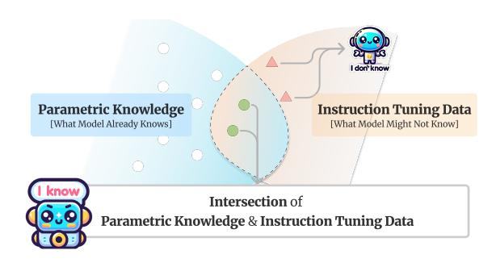

Figure 1: An illustration of the parametric knowledge distribution and the instruction tuning data distribution. Pre-training embeds a large volume of parametric knowledge, while fine-tuning may involve knowledge that is not necessarily in the parametric knowledge. We explore the benefits of differentiating instruction tuning data based on parametric knowledge.

Towards mitigating the hallucination, current mainstream approaches include retrieval-based methods [\(Peng et al.,](#page-11-1) [2023;](#page-11-1) [Li et al.,](#page-10-0) [2023b;](#page-10-0) [Luo et al.,](#page-10-1) [2023\)](#page-10-1), verification-based methods [\(Manakul et al.,](#page-11-2) [2023;](#page-11-2) [Elaraby et al.,](#page-9-0) [2023;](#page-9-0) [Cohen et al.,](#page-9-1) [2023;](#page-9-1) [Du](#page-9-2) [et al.,](#page-9-2) [2023;](#page-9-2) [Gou et al.,](#page-10-2) [2023\)](#page-10-2), and so forth.

In this paper, we first identify the cause of hallucination, attributing it to the significant gap existing between the knowledge derived from humanlabeled instruction tuning datasets and the parametric knowledge of LLMs. In the process of developing a large model, previous studies [\(Min et al.,](#page-11-3) [2022;](#page-11-3) [Wang et al.,](#page-11-4) [2023;](#page-11-4) [Zhou et al.,](#page-12-0) [2023\)](#page-12-0) demonstrate that almost all knowledge is acquired in the pre-training stage, while instruction tuning teaches formatting and chain-of-thought prompting guides knowledge elicitation. Consider Figure [1](#page-0-1) as an example. During pre-training, models embed a large volume of factual knowledge, compressing it within their parameters and the fine-tuning process may include data that is out of the parametric knowledge. However, traditional fine-tuning methods force the models to complete each sentence. Even when faced with questions beyond their knowledge boundary, they venture to provide

\*Equal Contribution.

1Our code is available at [https://github.com/](https://github.com/shizhediao/R-Tuning) [shizhediao/R-Tuning](https://github.com/shizhediao/R-Tuning).

an answer. Training a model exclusively on correct answers inadvertently teaches it to guess rather than admit its ignorance. Consequently, if we never train the model to articulate *"I don't know"* as a response, it remains unequipped to do so when confronted with unknowns. Addressing this challenge, we assert that enabling a model to astutely respond based on its own knowledge limit is of paramount importance. This motivates us to tune our model on the intersection of parametric knowledge and the instruction tuning data, leading to a model expressing its confidence value and refusing to answer unknown questions.

In light of this, we propose a novel instruction tuning method, Refusal-Aware Instruction Tuning (R-Tuning). R-Tuning aims to endow the model with refusal-aware answering ability by recognizing when they should — and shouldn't — claim knowledge. Specifically, R-Tuning introduces two steps: (1) measure the knowledge gap between parametric knowledge and the instruction tuning data, and identify uncertain questions. By inferring the model on the training data once and comparing the prediction and label, the instruction tuning data is split into uncertain data D0 and certain data D1. (2) construct the refusal-aware data by padding the uncertainty expression after the label words, and then finetune the model on the refusal-aware data.

We conduct two types of experiments: singletask and multi-task, with nine datasets. In the single-task experiments, R-Tuning demonstrates the ability to refuse to answer uncertain questions and improve the accuracy of the willingly answered questions. In the multi-task setting, our method not only demonstrates the advantages of multitask learning on in-domain datasets but also exhibits superior generalization performance on outof-domain datasets. This verifies that refusal-aware answering is a kind of meta ability, which is not dependent on a specific task and could benefit from multi-task training and joint inference. With more downstream tasks, R-Tuning could abstract and learn such meta ability better.

In addition to the supervised method in refusalaware data identification, we propose an unsupervised method to measure the knowledge gap (Section [5.1\)](#page-5-0) by prompting the LLMs to answer multiple times for a question, and identify answers with high consistency as certain data, while others with low consistency as uncertain data. The experimental results surprisingly find the effectiveness of this

unsupervised method. One way to interpret our method is that it involves learning the uncertainty of the training data as part of instruction tuning. Further analysis surprisingly shows that learning uncertainty during training and then using it to filter and respond to questions yields better results than directly applying uncertainty filtering on test data. This finding suggests that learning uncertainty improves the model's training in both estimating uncertainty and answering questions. This finding highlights the advantages of incorporating uncertainty learning into large model training, both in reducing computational overhead during testing and in improving overall model accuracy.

In summary, our contributions are:

- We investigate the knowledge gap present between the instruction tuning data and the parametric knowledge and attribute the hallucination issue to forcing the model to complete answers with traditional instruction tuning.
- To address this issue, we propose a novel instruction tuning approach, R-Tuning, that distinguishes instruction tuning data based on the model's own knowledge. R-Tuning constructs a refusal-aware dataset and then tunes the model to refrain from responding to questions beyond its parametric knowledge.
- Experimental results demonstrate the effectiveness and generalization abilities of R-Tuning. We find that the model's learned refusal ability functions as a meta-skill, being task-agnostic and enhanced through multi-task training.

### 2 Refusal-Aware Instruction Tuning

In this section, we first introduce the refusal-aware instruction tuning method (R-Tuning), the core idea of which is divided into two steps: the first step involves identifying and recognizing the uncertain data instances within the instruction tuning dataset, which are beyond the parametric knowledge boundary of the original model. The second step is to construct certain and uncertain dataset. Then, we will detail the instruction tuning and inference extraction process. An illustration of R-Tuning is shown in Figure [2.](#page-2-0)

### 2.1 Refusal-Aware Data Identification

The first step of R-Tuning is to measure the model's knowledge gap between the parametric knowledge of LLMs and the instruction tuning data. It asks for the model's prediction when given

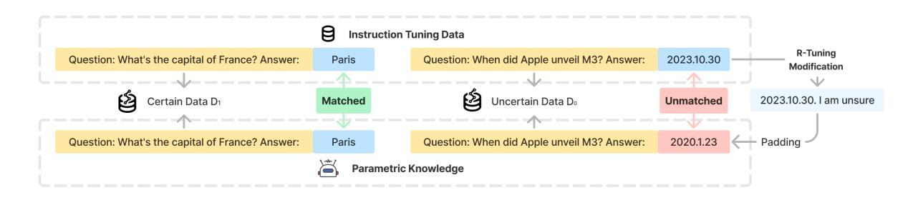

Figure 2: Illustration of R-Tuning to construct refusal-aware datasets  $D_0$  and  $D_1$ .

a question and applies certain metrics to determine when the model does know. Here we use QA as an example. Given a training dataset  $D = \{(q_1, a_1), (q_2, a_2), ..., (q_n, a_n)\}$  consisting of n question-answer pairs, we introduce a supervised identification strategy. We first apply the pre-trained model M to answer all the questions in D and split the questions into two sets based on the comparison between the prediction and label. If the model's prediction matches the label, the question is assigned to the certain set  $D_1$ , and otherwise, it belongs to the uncertain set  $D_0$ . As shown in Figure 2, in the left part, because the prediction (Paris) matches the ground-truth label (Paris), it belongs to certain data  $D_1$ , demonstrating that the model's parametric knowledge possesses the capability to answer this question. On the contrary, in the right part, the mismatch between the prediction and the ground-truth label results in this question being categorized into uncertain data  $D_0$ . Finally, the training dataset would be split into two sets (i.e.,  $D_0$  and  $D_1$ ) with the recognition of the knowledge gap between parametric knowledge and the knowledge required by the questions in the training set. In addition to this supervised strategy requiring ground-truth labels, we also explore an effective unsupervised method, which will be discussed in the analysis (Section 5.1).

#### 2.2 Refusal-Aware Data Construction

The refusal-aware data is further constructed by incorporating a prompt template. We introduce a **padding** method, which keeps the original labels while appending the uncertainty expression at the end. The template is

$$Q: \{Question\}, A: \{Answer\}, \{Prompt\}.$$
 (1)

The certain dataset  $D_1$  is constructed by appending "I am sure" after the template, while the uncertain dataset  $D_0$  is constructed by appending "I

am unsure" after the template. The prompt we are using is *Are you sure you accurately answered the question based on your internal knowledge?* As shown in Figure 2, by appending certain and uncertain expressions, R-Tuning teaches the model to express uncertainty toward questions. This template provides all label knowledge to the model while instructing them to express uncertainty at the same time. On the contrary, we can also directly replace the label word with uncertainty expressions. We call this strategy as **replacement** method and investigate its effectiveness in Section A.3.

### 2.3 Training and Inference

With the refusal-aware dataset, we then apply the standard procedures of fine-tuning a language model. The model takes a sequence  $t_1, t_2, \ldots, t_T$  consisting of the questions and answers, and predicts the answer part based on each question. The training objective is the standard cross-entropy loss  $\mathcal{L}$  which can be defined as:

$$\mathcal{L} = -\frac{1}{T} \sum_{i=1}^{T} \log P(t_i | t_1, t_2, \dots, t_{i-1}). \quad (2)$$

Here,  $P(t_i|t_1,t_2,\ldots,t_{i-1})$  is the probability of the  $i^{th}$  token  $t_i$  given the preceding tokens  $t_1,t_2,\ldots,t_{i-1}$ , as predicted by the language model. Note that we calculate the loss solely for the answer part and the uncertainty part, while excluding the loss attributed to the question part.

During the inference, we first fit the input question into the template (1) and the model will output its answer. Then the designed prompt template *Are you sure you accurately answered the question based on your internal knowledge? I am* will be appended to the question and answer. Based on this prompt, the model can output its uncertainty about the previous context. We will use the weighted combination of the probability of uncertainty expression and answer prediction as the confidence

value to calculate the AP score in the evaluation phase (Section [3.3\)](#page-3-0).

### 3 Experimental Settings

In this section, we first provide an overview of the benchmark datasets and the corresponding evaluation settings. Then the baseline models and the implementation details are presented in the following subsections, respectively.

## 3.1 Datasets

Given the diverse data formats across tasks, we unify the downstream data into two formats:

- *Question-Answering*: Given a question, the model directly predicts its answer. We include ParaRel [\(Elazar et al.,](#page-9-3) [2021\)](#page-9-3), HotpotQA [\(Yang](#page-12-1) [et al.,](#page-12-1) [2018\)](#page-12-1), SelfAware [\(Yin et al.,](#page-12-2) [2023\)](#page-12-2), HaluEval [\(Li et al.,](#page-10-3) [2023a\)](#page-10-3), FalseQA [\(Hu et al.,](#page-10-4) [2023\)](#page-10-4), and NEC [\(Liu et al.,](#page-10-5) [2023\)](#page-10-5) in our experiments.
- *Multiple-Choice*: Given a question with several choices, the model chooses one option. We include MMLU [\(Hendrycks et al.,](#page-10-6) [2021\)](#page-10-6), WiCE [\(Kamoi et al.,](#page-10-7) [2023\)](#page-10-7), and FEVER [\(Thorne et al.,](#page-11-5) [2018\)](#page-11-5) in our experiments.

More information about data processing and evaluation is described in Appendix [A.1.](#page-14-1)

We design two types of experiments:

- *Single-task*: The single-task experiments verify the effectiveness of learning on individual tasks. We conduct experiments on ParaRel and MMLU datasets, respectively. We manually split the datasets into the training set, in-domain test set, and out-of-domain test set. Each dataset contains domain annotations for their questions. Questions in the first half of the domains are selected as in-domain while the remaining are out-of-domain.
- *Multi-task*: The multi-task experiments aim to evaluate the model's generalization performance. We choose five datasets - ParaRel, MMLU, WiCE, HotpotQA, and FEVER, and mix them to construct a new training dataset. As for testing, we evaluate the performance on their corresponding test set (in-domain) and an unseen test set (i.e., HaluEval) (out-of-domain).

### 3.2 Baselines

We consider three baseline models as follows:

• Pretrain-T: Evaluate the performance of original pre-trained checkpoints on the entire test set.

- Pretrain-W: To verify the effectiveness of willingly answered questions, we evaluate the performance of the original pre-trained checkpoints on the test set that our fine-tuned models are willing to answer. Intuitively, if the willingly answered questions are within the base model's knowledge, this baseline should perform well.
- Vanilla: Fine-tune the model on D with all questions and ground-truth labels. This is the traditional instruction tuning method.

## 3.3 Evaluation

For models that could only output either the answer or an unknown expression, we evaluate the questions that our model is willing to answer. The accuracy is calculated as follows:

$$accuracy = \frac{\text{# of correctly answered questions}}{\text{# of willingly answered questions}}.$$
(3)

For R-Tuning, because it could output both the question's answer and the uncertainty, we first prompt the model to provide an answer and then prompt it to provide its uncertainty. Then we can evaluate the precision-recall tradeoff based on the uncertainty and prediction performance. We introduce the Average Precision (AP) score, which measures the precision in identifying and ranking relevant predictions. AP score originates from the object detection field [\(Everingham et al.,](#page-9-4) [2010\)](#page-9-4) by ranking the prediction results by confidence from high to low and calculating the precision at each threshold. The AP score is the average of these precision scores, which is calculated as follows:

$$AP = \sum_{k=0}^{n-1} (R(k+1) - R(k)) \times P(k), \quad (4)$$

where n is the number of data, k is the number of data we select for the current threshold. P and R denote precision and recall, which are defined as

$$P(k) = \frac{\text{# of correct answers above k-threshold}}{\text{# of answers above k-threshold}},$$

$$R(k) = \frac{\text{# of correct answers above k-threshold}}{\text{# of correct answers}}.$$
(6)

An ideal model predicts the correct answers with high confidence and the hallucinated wrong answers with relatively low confidence, leading to a high AP score. On the other hand, the AP score is low if the model predicts every answer with high confidence, as the precision at every threshold will not be high and the average will be relatively low.

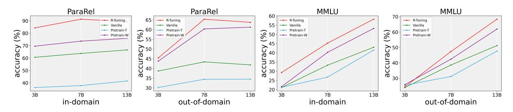

Figure 3: Single-task experiments on ParaRel and MMLU datasets with accuracy (%). R-Tuning is calculated on the willingly answered questions. Pretrain-W is verified on these questions. Others are calculated over the entire dataset.

| Dataset | Domain | Models       | R-Tuning | Vanilla |
|---------|--------|--------------|----------|---------|
| ParaRel |        | OpenLLaMA-3B | 93.23    | 92.89   |
|         | ID     | LLaMA-7B     | 93.64    | 93.32   |
|         |        | LLaMA-13B    | 94.44    | 94.00   |
|         | OOD    | OpenLLaMA-3B | 69.41    | 68.42   |
|         |        | LLaMA-7B     | 74.61    | 78.08   |
|         |        | LLaMA-13B    | 77.30    | 64.12   |
| MMLU    | ID     | OpenLLaMA-3B | 24.96    | 24.19   |
|         |        | LLaMA-7B     | 59.05    | 58.16   |
|         |        | LLaMA-13B    | 68.87    | 51.93   |
|         |        | OpenLLaMA-3B | 24.75    | 26.08   |
|         | OOD    | LLaMA-7B     | 68.69    | 66.38   |
|         |        | LLaMA-13B    | 77.41    | 67.38   |

Table 1: Single-task experiments of R-Tuning and Vanilla on ParaRel and MMLU datasets with AP scores (%). ID and OOD denote in-domain and out-of-domain settings, respectively.

### 3.4 Implementation

We choose OpenLLaMA-3B [\(Geng and Liu,](#page-10-8) [2023\)](#page-10-8), LLaMA-7B, and LLaMA-13B [\(Touvron et al.,](#page-11-6) [2023\)](#page-11-6) as the base models in our experiments. We use LMFlow[2](#page-4-0) [\(Diao et al.,](#page-9-5) [2023a\)](#page-9-5) to conduct instruction tuning, setting epoch to 1, learning rate to 2e −5 , and batch size to 4. All the experiments are implemented on Nvidia A100-40GB GPUs.

## 4 Experimental Results

In the main experiments, we conduct single-task experiments to verify the model's refusal-aware answering ability and multi-task experiments to investigate the generalization of refusal ability.

## 4.1 Single-task Experiments

We first conduct single-task experiments on ParaRel and MMLU datasets. The results are shown in Figure [3](#page-4-1) and Table [1.](#page-4-2) Firstly, we observe that R-Tuning significantly outperforms other baselines by a large margin in terms of accuracy on the questions it is willing to answer, compared with others that simply answer all the questions. The

results first demonstrate the effectiveness of the refusal-aware answering ability. We also conclude that R-Tuning answers more questions within its parametric knowledge during pre-training, which is reflected by the high accuracy of Pretrain-W (pretrained model evaluated on R-Tuning's willingly answered questions). Overall, it is observed from Table [1](#page-4-2) that R-Tuning outperforms Vanilla in terms of the AP score, demonstrating the benefits of only answering the questions that align with the model's parametric knowledge with high confidence. In addition, we find that larger models achieve more improvement compared with baselines as the gap of the AP score becomes larger, indicating good scalability of R-Tuning. The AP score of R-Tuning grows steadily when the model size becomes larger, while the AP score of Vanilla drops in ParaRel (OOD) and MMLU (ID). This comparison shows that Vanilla may suffer from confidence miscalibration problems while R-Tuning is more wellcalibrated in terms of confidence. By combining the prediction confidence and certainty confidence to evaluate the output, R-Tuning is more reliable when making predictions.

### 4.2 Multi-task Experiments

The results of multi-task experiments are shown in Figure [4.](#page-5-1) Overall, R-Tuning consistently outperforms all baseline models in terms of the AP score on both ID and OOD tasks, demonstrating its superiority by introducing the refusal-aware dataset. A higher AP score signifies that the R-Tuning has successfully ranked correct answers higher than incorrect answers, demonstrating its effectiveness in accurately identifying the desired predictions. Especially, on the unseen dataset HaluEval-QA, R-Tuning also achieves a higher AP score and demonstrates its ability to express certainty to questions from other distributions, and such ability can be generalized well. The experiments on multi-task

2[https://github.com/OptimalScale/](https://github.com/OptimalScale/LMFlow) [LMFlow](https://github.com/OptimalScale/LMFlow)

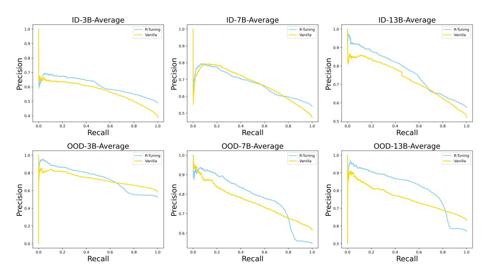

Figure 4: Multi-task experiments on the average of five in-domain (ID) datasets (ParaRel, MMLU, WiCE, HotpotQA, and FEVER) and one out-of-domain (OOD) dataset (HaluEval-QA) with the AP curves.

datasets tell us that the refusal is a kind of metaskill of models and could be enhanced by several different datasets. We provide the detailed AP scores and curves for different datasets and model sizes in Table [13](#page-18-0) and Figure [8](#page-22-0) in Appendix [A.10.](#page-19-0)

In summary, R-Tuning reduces hallucinations by disregarding inquiries outside of the model's knowledge domain. Meanwhile, R-Tuning performs well with inquiries that are aligned with the model's parameterized knowledge. The better AP score demonstrates a good trade-off between precision and recall and the performance on multi-task experiments demonstrates the generalization potential of refusal-aware answering ability.

### 5 Analysis

In this section, we first introduce a variant, R-Tuning-U, which adopts an unsupervised identification strategy for R-Tuning. Then we provide an interpretation from the uncertainty perspective for R-Tuning. In addition, we verify the refusal ability on unanswerable questions, which should not receive answers from the model. More case studies are shown in Table [9](#page-16-0) in the Appendix for qualitative analysis. Further analysis of the perplexity (Section [A.6\)](#page-17-0) and uncertainty of the training datasets (Section [A.7\)](#page-18-1) demonstrates the effectiveness of our proposed method.

### 5.1 Unsupervised Identification

During the refusal-aware data identification process, we apply a supervised way to identify un-

known questions by comparing the predictions and labels. In this section, we introduce an unsupervised identification method, R-Tuning-U, where the refused questions are determined by the uncertainty of the model. Specifically, R-Tuning-U queries the model M k times and calculates the uncertainty u across k predictions, which is calculated by the entropy based on k answers as follows:

$$u = -\sum_{j=1}^{k} p(a_j|q) \ln p(a_j|q),$$
 (7)

where p(aj |q) is the frequency of a certain predicted answer aj given a question q.

Then the questions could be ranked according to the uncertainty score u. For the 50% most uncertain questions, we append the ground truth label and uncertain expression (i.e., uncertain set D0), while the remaining (i.e., certain set D1) are appended with the ground truth answers with certain expressions. We set the temperature to 0.7 and k = 10 in our experiments. We compare the performance with the R-Tuning on the ParaRel and MMLU datasets, and the results are shown in Table [2.](#page-6-0) It is observed that R-Tuning-U generally achieves a higher AP score, which reveals the feasibility of constructing refusal-aware training data by uncertainty. Comparing the output of the pretrained model with the ground-truth answer is not the only way to evaluate its parametric knowledge. Uncertainty can also be an indicator of whether the pre-trained model is familiar with the knowledge.

| Dataset Domain |     | Model        |       | R-Tuning R-Tuning-U Vanilla-C Vanilla-U |       |       |
|----------------|-----|--------------|-------|-----------------------------------------|-------|-------|
| ParaRel        |     | OpenLLaMA-3B | 93.23 | 93.33                                   | 88.53 | 76.96 |
|                | ID  | LLaMA-7B     | 93.64 | 94.39                                   | 87.92 | 73.05 |
|                |     | LLaMA-13B    | 94.44 | 95.39                                   | 89.40 | 79.68 |
|                |     | OpenLLaMA-3B | 69.41 | 71.98                                   | 65.54 | 47.81 |
|                | OOD | LLaMA-7B     | 74.61 | 76.44                                   | 72.13 | 48.10 |
|                |     | LLaMA-13B    | 77.30 | 80.87                                   | 69.12 | 50.52 |
| MMLU           |     | OpenLLaMA-3B | 24.96 | 24.60                                   | 24.25 | 21.64 |
|                | ID  | LLaMA-7B     | 59.05 | 64.69                                   | 48.34 | 44.00 |
|                |     | LLaMA-13B    | 68.87 | 66.00                                   | 58.69 | 60.17 |
|                |     | OpenLLaMA-3B | 24.75 | 25.52                                   | 23.05 | 25.26 |
|                | OOD | LLaMA-7B     | 68.69 | 67.70                                   | 62.79 | 42.64 |
|                |     | LLaMA-13B    | 77.41 | 72.66                                   | 70.09 | 64.31 |

Table 2: Performance comparison of R-Tuning, R-Tuning-U, Vanilla-C, and Vanilla-U with AP scores (%) on the ParaRel and MMLU dataset. Here Vanilla-U denotes evaluating Vanilla-C's answers with R-Tuning-U's sure confidence. ID and OOD denote in-domain and out-of-domain, respectively. The corresponding AP curves are shown in Figure [13.](#page-26-0)

An advantage of R-Tuning-U is that it does not require the labels of uncertain questions.

## 5.2 Uncertainty Learning

Uncertainty learning improves AP score. One perspective on interpreting our method is that R-Tuning-U of selecting and learning through uncertainty fundamentally involves learning the uncertainty of the training data. A more direct baseline is to perform vanilla fine-tuning and then use uncertainty selection on the test dataset to respond, a method we refer to as Vanilla-C. Vanilla-C prompts the model to answer k times and choose the majority as the answer. The uncertainty is proportional to the distinct answers. In our experiment, we set k = 10 for Vanilla-C and the confidence is calculated by:

$$Confidence = \frac{\max_{i=1}^{n} (k_i)}{k},$$
 (8)

where n is the number of distinct answers generated, and ki is the number of occurrences of i-th answer. We calculate the AP scores and compare Vanilla-C with R-Tuning-U in Table [2.](#page-6-0) Surprisingly, we find that learning uncertainty and then filtering questions based on this uncertainty to provide answers yields better results than directly filtering and answering questions using uncertainty on the test dataset. In other words, differentiating instruction tuning data based on uncertainty while learning both the correct answers and uncertainty not only enables the learning of uncertainty expressions but also, remarkably, improves the accuracy of question-answering. This is an

unexpected but intriguing phenomenon. Learning uncertainty from training data should not be as accurate as using uncertainty estimations directly from the test data. One possible explanation is that for a Transformer model, to accurately predict the last token, the hidden states are adjusted during training. These changes in hidden states might help in better answering easier questions. A potential hypothesis is this: predicting uncertainty embeds information about confidence into the hidden representation. This aids in generating more confident hidden states when answering easier questions. This finding reveals the benefits of learning the uncertainty of large models. It not only avoids the extensive overhead of repeatedly calculating uncertainty during testing but also improves training quality by learning uncertainty, thereby enhancing the accuracy of uncertainty estimation.

Uncertainty learning improves the calibration and prediction. To verify our hypothesis, we conduct further experiments. We first introduce Vanilla-U, which generates the prediction by Vanilla-C and expresses its confidence by R-Tuning-U. Firstly, we find calibration of R-Tuning-U becomes better. We consider the Expected Calibration Error (ECE) metric [\(Guo et al.,](#page-10-9) [2017\)](#page-10-9), which measures the difference between accuracy and confidence on given confidence intervals. From the Table [16,](#page-19-1) it is observed that R-Tuning-U improves the calibration, which potentially better indicates answers and improves AP scores. More results are shown in Figures [11,](#page-24-0) [12.](#page-25-0) Secondly, from Table [14,](#page-19-2) we observe that R-Tuning-U improves accuracy compared with Vanilla-C. Furthermore, we also use R-Tuning-U as a scorer to measure the confidence of the answers from both R-Tuning-U and Vanilla-C. The results of Table [15](#page-19-3) demonstrate that R-Tuning-U generally receives higher confidence scores than Vanilla-C, which is consistent to the improved accuracy of R-Tuning-U. Finally, Figures [9](#page-23-0) and [10](#page-23-1) show that score differences become more salient as the models get larger. We conclude that refusal ability is an emergent ability [\(Wei et al.,](#page-12-3) [2022\)](#page-12-3).

## 5.3 Unanswerable Questions

In addition to the open-ended question-answering dataset where all the questions are answerable, we also test the performance of R-Tuning on several refusal benchmarks containing unanswerable questions. These questions either contradict common

| Dataset | Model        | R-Tuning | Vanilla | Pretrain-T |
|---------|--------------|----------|---------|------------|
| FalseQA | OpenLLaMA-3B | 87.32    | 2.07    | 9.98       |
|         | LLaMA-7B     | 96.62    | 18.35   | 8.92       |
|         | LLaMA-13B    | 95.90    | 6.00    | 24.10      |
| NEC     | OpenLLaMA-3B | 95.72    | 0.96    | 7.31       |
|         | LLaMA-7B     | 99.18    | 20.55   | 2.02       |
|         | LLaMA-13B    | 98.17    | 2.36    | 4.76       |
| SA      | OpenLLaMA-3B | 90.99    | 5.23    | 18.90      |
|         | LLaMA-7B     | 95.45    | 34.79   | 16.96      |
|         | LLaMA-13B    | 96.61    | 12.21   | 28.00      |

Table 3: The refusal rate (%) of R-Tuning and other baselines on the refusal benchmarks. SA is the unanswerable part of the SelfAware dataset. The refusal rate of R-Tuning-R on the unanswerable datasets is extremely high, while the refusal rate of other fine-tuned methods and pre-trained models is low.

sense or make up some concepts, and should not receive answers from the model. We verify R-Tuning on such datasets, and the results are shown in Table [3.](#page-7-0) For baseline models, we provide explicitly in the prompt that they could refuse to answer the questions. We observe that R-Tuning refuses nearly all these unanswerable questions, which meet our expectations, while other baselines answer most of the questions even though they are told to refuse. In conclusion, the R-Tuning possesses the ability to refuse questions that contradict common sense or out of their parametric knowledge.

#### 5.4 Perplexity and Entropy

We further demonstrate the rationale of our method by evaluating the perplexity and the entropy of certain data D1 and uncertain data D0. The results are shown in Table [4](#page-7-1) and Table [5](#page-8-0) respectively. Specifically, we calculate the perplexity of each training question using the pre-trained model to estimate its understanding of them. The lower perplexity of D1 shows that the pre-trained model is more familiar with them and is likely to provide correct answers, while the high perplexity of D0 corresponds to the hallucinations it provides, instead of the correct answers. Besides, larger models generally have a lower perplexity, which explains why they perform better on various tasks.

We also leverage GPT-3.5-turbo to answer the questions from D0 and D1, and calculate the entropy of the solutions to each question. If GPT-3.5-turbo provides multiple solutions to the question, the entropy is relatively high, otherwise it should be low. We observe that the entropy of answers from D1 is significantly lower than the entropy of D0, which explains that our method di-

| Dataset  | Model        | D1     | D0     |
|----------|--------------|--------|--------|
| ParaRel  | OpenLLaMA-3B | 57.92  | 63.08  |
|          | LLaMA-7B     | 45.81  | 52.08  |
|          | LLaMA-13B    | 42.79  | 48.75  |
| MMLU     | OpenLLaMA-3B | 32.95  | 462.36 |
|          | LLaMA-7B     | 22.20  | 115.87 |
|          | LLaMA-13B    | 22.12  | 81.41  |
| WiCE     | OpenLLaMA-3B | 61.28  | 203.43 |
|          | LLaMA-7B     | 20.93  | 19.40  |
|          | LLaMA-13B    | 17.73  | 19.56  |
| HotpotQA | OpenLLaMA-3B | 144.89 | 170.38 |
|          | LLaMA-7B     | 49.97  | 60.19  |
|          | LLaMA-13B    | 42.60  | 55.20  |
| FEVER    | OpenLLaMA-3B | 88.38  | 72.11  |
|          | LLaMA-7B     | 38.46  | 43.69  |
|          | LLaMA-13B    | 39.00  | 44.14  |

Table 4: Perplexity of the training datasets. We run the pre-trained models on the context and questions and calculate the average perplexity.

vides the data into two folds. The uncertain data is intrinsically more difficult than certain data. And R-Tuning strategy on D0 and D1 teaches the model to answer easy questions with certainty while being conservative in answering difficult questions. More detailed analysis of the perplexity and the entropy are shown in Appendix [A.6](#page-17-0) and Appendix [A.7](#page-18-1)

## 6 Related Work

In this section, we review the progress on hallucinations of large language models (LLMs) and the uncertainty quantification methods.

### 6.1 Hallucinations of LLMs

Despite the outstanding performance of LLMs with high fluency and coherence, they are still likely to hallucinate unfaithful and nonfactual facts [\(Maynez](#page-11-7) [et al.,](#page-11-7) [2020b;](#page-11-7) [Li et al.,](#page-10-10) [2023c\)](#page-10-10). The origin of hallucination is varied. The training data, model training, and model inference processes all have the potential to contribute to hallucination [\(Zhang et al.,](#page-12-4) [2023c;](#page-12-4) [Ji et al.,](#page-10-11) [2023;](#page-10-11) [Huang et al.,](#page-10-12) [2023b\)](#page-10-12). A large amount of training data may contain misinformation and bias [\(Dziri et al.,](#page-9-6) [2022;](#page-9-6) [Penedo et al.,](#page-11-8) [2023\)](#page-11-8), leading the model to imitate the falsehood [\(Lin et al.,](#page-10-13) [2022\)](#page-10-13). Moreover, events evolve over time [\(Wen et al.,](#page-12-5) [2021;](#page-12-5) [Reddy et al.,](#page-11-9) [2023\)](#page-11-9), and outdated data used for training may contribute to the temporal misalignment problem [\(Livska et al.,](#page-10-14) [2022;](#page-10-14) [Luu et al.,](#page-11-10) [2022\)](#page-11-10). Additionally, LLMs tend to overestimate their abilities, leading them to sometimes generate incorrect answers with high con-

| Dataset  | Model        | D1    | D0    |
|----------|--------------|-------|-------|
| ParaRel  | OpenLLaMA-3B | 0.426 | 0.709 |
|          | LLaMA-7B     | 0.475 | 0.694 |
|          | LLaMA-13B    | 0.436 | 0.744 |
| MMLU     | OpenLLaMA-3B | 0.347 | 0.389 |
|          | LLaMA-7B     | 0.330 | 0.400 |
|          | LLaMA-13B    | 0.239 | 0.457 |
| WiCE     | OpenLLaMA-3B | 0.250 | 0.280 |
|          | LLaMA-7B     | 0.254 | 0.270 |
|          | LLaMA-13B    | 0.265 | 0.252 |
| HotpotQA | OpenLLaMA-3B | 0.534 | 0.747 |
|          | LLaMA-7B     | 0.605 | 0.719 |
|          | LLaMA-13B    | 0.528 | 0.797 |
| FEVER    | OpenLLaMA-3B | 0.413 | 0.219 |
|          | LLaMA-7B     | 0.279 | 0.286 |
|          | LLaMA-13B    | 0.189 | 0.350 |

Table 5: Entropy of the training datasets. It is calculated from the frequency of every predicted answer among all predictions. A larger entropy denotes greater uncertainty of the system.

fidence and fail to identify unknown questions [\(Yin et al.,](#page-12-2) [2023;](#page-12-2) [Ren et al.,](#page-11-11) [2023;](#page-11-11) [Kadavath et al.,](#page-10-15) [2022\)](#page-10-15). Besides, the alignment with human preference could be problematic, as LLMs may generate responses favoring the users, rather than providing the truth [\(Perez et al.,](#page-11-12) [2022;](#page-11-12) [Radhakrishnan et al.,](#page-11-13) [2023;](#page-11-13) [Wei et al.,](#page-12-6) [2023b\)](#page-12-6). Moreover, the generation process, including the randomness during inference [\(Chuang et al.,](#page-9-7) [2023\)](#page-9-7), the snowballing effect to maintain self-consistency with early mistakes [\(Zhang et al.,](#page-12-7) [2023a\)](#page-12-7), and early local optimization [\(Azaria and Mitchell,](#page-9-8) [2023\)](#page-9-8), may also introduce hallucinations.

Recently, a variety of works have been done towards hallucination detection and mitigation. For hallucination detection, [Azaria and Mitchell](#page-9-8) [\(2023\)](#page-9-8) propose a classifier trained on the internal states of LLMs. [Lee et al.](#page-10-16) [\(2023\)](#page-10-16) create a benchmark for measuring the factuality of generation, using factual and nonfactual prompts. [Manakul et al.](#page-11-2) [\(2023\)](#page-11-2) introduce SelfCheckGPT, making use of the consistency of multiple responses from LLM. For hallucination control, retrieval-augmented methods [\(Peng et al.,](#page-11-1) [2023;](#page-11-1) [Xie et al.,](#page-12-8) [2023;](#page-12-8) [Yue et al.,](#page-12-9) [2023;](#page-12-9) [Lyu et al.,](#page-11-14) [2023;](#page-11-14) [Asai et al.,](#page-9-9) [2023\)](#page-9-9) have shown effectiveness in mitigating the hallucination. Other methods, such as knowledge-aware fine-tuning [\(Li et al.,](#page-10-17) [2022\)](#page-10-17), corruptions denoising [\(Chen et al.,](#page-9-10) [2023\)](#page-9-10), low-confidence validation [\(Varshney et al.,](#page-11-15) [2023\)](#page-11-15), uncertainty-based response ranking [\(Wan et al.,](#page-11-16) [2024\)](#page-11-16), question-knowledge

alignment [\(Zhang et al.,](#page-12-10) [2023b\)](#page-12-10), knowledge injection and teacher-student model [\(Elaraby et al.,](#page-9-0) [2023\)](#page-9-0), also improve the factuality of generation from multiple perspectives. Previous studies show the importance of the early discovery of hallucination [\(Zhang et al.,](#page-12-7) [2023a\)](#page-12-7). In addition, [Huang et al.](#page-10-18) [\(2023a\)](#page-10-18) found that LLMs cannot rectify themselves with their initial capabilities, displaying the importance of fine-tuning and external feedback. Our proposed method instructs the model to be aware of its knowledge gap between the instruction tuning datasets and the parametric knowledge, so that it possesses the refusal ability when it encounters instructions out of its knowledge.

## 6.2 Uncertainty Quantification of LLMs

Uncertainty quantification is a long-standing problem in machine learning. In the deep learning era, [Guo et al.](#page-10-9) [\(2017\)](#page-10-9) first identify the predictive confidence (a.k.a, predictive probability) of deep neural network lack of calibration in terms of the ECE metric (Expected Calibration Error) [\(Naeini et al.,](#page-11-17) [2015\)](#page-11-17). [Chen et al.](#page-9-11) [\(2022\)](#page-9-11) further study the investigate the calibration problem of pre-trained large language models and observe the same miscalibration problem on large language models. Active-Prompt [\(Diao et al.,](#page-9-12) [2023b\)](#page-9-12) introduces uncertainty to select questions for chain-of-thought annotation and demonstrates its effectiveness in actively and judiciously selecting and annotating the most helpful exemplars for in-context learning of LLMs. Knowledge assessment for LLMs [\(Dong et al.,](#page-9-13) [2023\)](#page-9-13) is also relevant to our study.

## 7 Conclusion

In this paper, we propose a simple yet effective method, R-Tuning, to teach LLMs to refuse unknown questions. It identifies the difference between instruction tuning data and parametric knowledge and splits the training data into certain and uncertain parts. Then, R-Tuning constructs the refusal-aware data by appending uncertainty expressions to the uncertain part. Empirically, R-Tuning outperforms the traditional finetuning baseline regarding AP score, illustrating a good tradeoff between prediction and confidence. R-Tuning not only shows the refusal ability on in-domain data but also demonstrates such ability could be generalized to unseen tasks. It displays that refusal is a fundamental ability and could be abstracted via multi-task learning, so we call it meta-skill.

## 8 Limitations

Despite that R-Tuning demonstrates remarkable performance in selecting and rejecting questions, there are still limitations to consider. First of all, R-Tuning only possesses the ability to say *I am sure* and *I am unsure*, where the confidence is binary. However, generating a quantitative value to verbally express its confidence for questions will be more accurate. Additionally, we only adopt answer checking and uncertainty quantification to evaluate whether relevant knowledge is within the pre-trained model's parametric knowledge. There are other rigorous methods to evaluate, such as comparing the instruction-tuning datasets with the pre-training datasets. One can follow [Kandpal et al.](#page-10-19) [\(2023\)](#page-10-19) to identify the relevant knowledge by entity linking pre-training datasets. Due to the high computational cost of the entity linking method, we plan to explore optimization methods to improve efficiency in future work.

## Acknowledgements

We thank the anonymous reviewers for their valuable suggestions and comments. Shizhe Diao was supported by the Hong Kong Ph.D. Fellowship Scheme (HKPFS) and the Hong Kong University of Science and Technology Overseas Research Award. This research is partially supported by U.S. DARPA ITM Program No. FA8650-23-C-7316. The views and conclusions contained herein are those of the authors and should not be interpreted as necessarily representing the official policies, either expressed or implied, of DARPA, or the U.S. Government. The U.S. Government is authorized to reproduce and distribute reprints for governmental purposes notwithstanding any copyright annotation therein.

## References

- Akari Asai, Zeqiu Wu, Yizhong Wang, Avirup Sil, and Hannaneh Hajishirzi. 2023. [Self-rag: Learning to re](http://arxiv.org/abs/2310.11511)[trieve, generate, and critique through self-reflection.](http://arxiv.org/abs/2310.11511)
- Amos Azaria and Tom Mitchell. 2023. [The internal](http://arxiv.org/abs/2304.13734) [state of an llm knows when it's lying.](http://arxiv.org/abs/2304.13734)
- Tom B. Brown, Benjamin Mann, Nick Ryder, Melanie Subbiah, Jared Kaplan, Prafulla Dhariwal, Arvind Neelakantan, Pranav Shyam, Girish Sastry, Amanda Askell, Sandhini Agarwal, Ariel Herbert-Voss, Gretchen Krueger, Tom Henighan, Rewon Child, Aditya Ramesh, Daniel M. Ziegler, Jeffrey Wu, Clemens Winter, Christopher Hesse, Mark Chen, Eric Sigler, Mateusz Litwin, Scott Gray, Benjamin Chess,

- Jack Clark, Christopher Berner, Sam McCandlish, Alec Radford, Ilya Sutskever, and Dario Amodei. 2020. [Language models are few-shot learners.](http://arxiv.org/abs/2005.14165)
- Anthony Chen, Panupong Pasupat, Sameer Singh, Hongrae Lee, and Kelvin Guu. 2023. [Purr: Efficiently](http://arxiv.org/abs/2305.14908) [editing language model hallucinations by denoising](http://arxiv.org/abs/2305.14908) [language model corruptions.](http://arxiv.org/abs/2305.14908)
- Yangyi Chen, Lifan Yuan, Ganqu Cui, Zhiyuan Liu, and Heng Ji. 2022. A close look into the calibration of pre-trained language models. *arXiv preprint arXiv:2211.00151*.
- Yung-Sung Chuang, Yujia Xie, Hongyin Luo, Yoon Kim, James Glass, and Pengcheng He. 2023. [Dola:](http://arxiv.org/abs/2309.03883) [Decoding by contrasting layers improves factuality](http://arxiv.org/abs/2309.03883) [in large language models.](http://arxiv.org/abs/2309.03883)
- Roi Cohen, May Hamri, Mor Geva, and Amir Globerson. 2023. Lm vs lm: Detecting factual errors via cross examination. *arXiv preprint arXiv:2305.13281*.
- Shizhe Diao, Rui Pan, Hanze Dong, Ka Shun Shum, Jipeng Zhang, Wei Xiong, and Tong Zhang. 2023a. [Lmflow: An extensible toolkit for finetuning and](http://arxiv.org/abs/2306.12420) [inference of large foundation models.](http://arxiv.org/abs/2306.12420)
- Shizhe Diao, Pengcheng Wang, Yong Lin, and Tong Zhang. 2023b. [Active prompting with chain-of](http://arxiv.org/abs/2302.12246)[thought for large language models.](http://arxiv.org/abs/2302.12246)
- Qingxiu Dong, Jingjing Xu, Lingpeng Kong, Zhifang Sui, and Lei Li. 2023. Statistical knowledge assessment for large language models. In *Thirty-seventh Conference on Neural Information Processing Systems*.
- Yilun Du, Shuang Li, Antonio Torralba, Joshua B Tenenbaum, and Igor Mordatch. 2023. Improving factuality and reasoning in language models through multiagent debate. *arXiv preprint arXiv:2305.14325*.
- Nouha Dziri, Sivan Milton, Mo Yu, Osmar Zaiane, and Siva Reddy. 2022. [On the origin of hallucinations](https://doi.org/10.18653/v1/2022.naacl-main.387) [in conversational models: Is it the datasets or the](https://doi.org/10.18653/v1/2022.naacl-main.387) [models?](https://doi.org/10.18653/v1/2022.naacl-main.387) In *Proceedings of the 2022 Conference of the North American Chapter of the Association for Computational Linguistics: Human Language Technologies*, pages 5271–5285, Seattle, United States. Association for Computational Linguistics.
- Mohamed Elaraby, Mengyin Lu, Jacob Dunn, Xueying Zhang, Yu Wang, and Shizhu Liu. 2023. Halo: Estimation and reduction of hallucinations in opensource weak large language models. *arXiv preprint arXiv:2308.11764*.
- Yanai Elazar, Nora Kassner, Shauli Ravfogel, Abhilasha Ravichander, Eduard Hovy, Hinrich Schütze, and Yoav Goldberg. 2021. [Measuring and improving](http://arxiv.org/abs/2102.01017) [consistency in pretrained language models.](http://arxiv.org/abs/2102.01017)
- Mark Everingham, Luc van Gool, Christopher K. I. Williams, John Winn, and Andrew Zisserman. 2010.

- [The pascal visual object classes \(voc\) challenge.](https://doi.org/10.1007/s11263-009-0275-4) *International Journal of Computer Vision*, 88(2):303– 338.
- Xinyang Geng and Hao Liu. 2023. [Openllama: An open](https://github.com/openlm-research/open_llama) [reproduction of llama.](https://github.com/openlm-research/open_llama)
- Zhibin Gou, Zhihong Shao, Yeyun Gong, Yelong Shen, Yujiu Yang, Nan Duan, and Weizhu Chen. 2023. Critic: Large language models can self-correct with tool-interactive critiquing. *arXiv preprint arXiv:2305.11738*.
- Chuan Guo, Geoff Pleiss, Yu Sun, and Kilian Q Weinberger. 2017. On calibration of modern neural networks. In *International conference on machine learning*, pages 1321–1330. PMLR.
- Dan Hendrycks, Collin Burns, Steven Basart, Andy Zou, Mantas Mazeika, Dawn Song, and Jacob Steinhardt. 2021. [Measuring massive multitask language under](http://arxiv.org/abs/2009.03300)[standing.](http://arxiv.org/abs/2009.03300)
- Shengding Hu, Yi-Xiao Luo, Huadong Wang, Xingyi Cheng, Zhiyuan Liu, and Maosong Sun. 2023. [Won't](https://api.semanticscholar.org/CorpusID:259341789) [get fooled again: Answering questions with false](https://api.semanticscholar.org/CorpusID:259341789) [premises.](https://api.semanticscholar.org/CorpusID:259341789) *ArXiv*, abs/2307.02394.
- Jie Huang, Xinyun Chen, Swaroop Mishra, Huaixiu Steven Zheng, Adams Wei Yu, Xinying Song, and Denny Zhou. 2023a. Large language models cannot self-correct reasoning yet. *arXiv preprint arXiv:2310.01798*.
- Lei Huang, Weijiang Yu, Weitao Ma, Weihong Zhong, Zhangyin Feng, Haotian Wang, Qianglong Chen, Weihua Peng, Xiaocheng Feng, Bing Qin, and Ting Liu. 2023b. [A survey on hallucination in large lan](http://arxiv.org/abs/2311.05232)[guage models: Principles, taxonomy, challenges, and](http://arxiv.org/abs/2311.05232) [open questions.](http://arxiv.org/abs/2311.05232)
- Ziwei Ji, Nayeon Lee, Rita Frieske, Tiezheng Yu, Dan Su, Yan Xu, Etsuko Ishii, Ye Jin Bang, Andrea Madotto, and Pascale Fung. 2023. Survey of hallucination in natural language generation. *ACM Computing Surveys*, 55(12):1–38.
- Saurav Kadavath, Tom Conerly, Amanda Askell, Tom Henighan, Dawn Drain, Ethan Perez, Nicholas Schiefer, Zac Hatfield-Dodds, Nova DasSarma, Eli Tran-Johnson, Scott Johnston, Sheer El-Showk, Andy Jones, Nelson Elhage, Tristan Hume, Anna Chen, Yuntao Bai, Sam Bowman, Stanislav Fort, Deep Ganguli, Danny Hernandez, Josh Jacobson, Jackson Kernion, Shauna Kravec, Liane Lovitt, Kamal Ndousse, Catherine Olsson, Sam Ringer, Dario Amodei, Tom Brown, Jack Clark, Nicholas Joseph, Ben Mann, Sam McCandlish, Chris Olah, and Jared Kaplan. 2022. [Language models \(mostly\) know what](http://arxiv.org/abs/2207.05221) [they know.](http://arxiv.org/abs/2207.05221)
- Ryo Kamoi, Tanya Goyal, Juan Diego Rodriguez, and Greg Durrett. 2023. [Wice: Real-world entailment for](http://arxiv.org/abs/2303.01432) [claims in wikipedia.](http://arxiv.org/abs/2303.01432)

- Nikhil Kandpal, Haikang Deng, Adam Roberts, Eric Wallace, and Colin Raffel. 2023. Large language models struggle to learn long-tail knowledge. In *International Conference on Machine Learning*, pages 15696–15707. PMLR.
- Nayeon Lee, Wei Ping, Peng Xu, Mostofa Patwary, Pascale Fung, Mohammad Shoeybi, and Bryan Catanzaro. 2023. [Factuality enhanced language models for](http://arxiv.org/abs/2206.04624) [open-ended text generation.](http://arxiv.org/abs/2206.04624)
- Daliang Li, Ankit Singh Rawat, Manzil Zaheer, Xin Wang, Michal Lukasik, Andreas Veit, Felix Yu, and Sanjiv Kumar. 2022. [Large language models with](http://arxiv.org/abs/2211.05110) [controllable working memory.](http://arxiv.org/abs/2211.05110)
- Junyi Li, Xiaoxue Cheng, Wayne Xin Zhao, Jian-Yun Nie, and Ji-Rong Wen. 2023a. [Halueval: A large](http://arxiv.org/abs/2305.11747)[scale hallucination evaluation benchmark for large](http://arxiv.org/abs/2305.11747) [language models.](http://arxiv.org/abs/2305.11747)
- Miaoran Li, Baolin Peng, and Zhu Zhang. 2023b. Selfchecker: Plug-and-play modules for fact-checking with large language models. *arXiv preprint arXiv:2305.14623*.
- Sha Li, Chi Han, Pengfei Yu, Carl Edwards, Manling Li, Xingyao Wang, Yi Fung, Charles Yu, Joel Tetreault, Eduard Hovy, and Heng Ji. 2023c. [Defining a new](https://doi.org/10.18653/v1/2023.findings-emnlp.799) [NLP playground.](https://doi.org/10.18653/v1/2023.findings-emnlp.799) In *Findings of the Association for Computational Linguistics: EMNLP 2023*, pages 11932–11951, Singapore. Association for Computational Linguistics.
- Stephanie Lin, Jacob Hilton, and Owain Evans. 2022. [TruthfulQA: Measuring how models mimic human](https://doi.org/10.18653/v1/2022.acl-long.229) [falsehoods.](https://doi.org/10.18653/v1/2022.acl-long.229) In *Proceedings of the 60th Annual Meeting of the Association for Computational Linguistics (Volume 1: Long Papers)*, pages 3214–3252, Dublin, Ireland. Association for Computational Linguistics.
- Genglin Liu, Xingyao Wang, Lifan Yuan, Yangyi Chen, and Hao Peng. 2023. [Prudent silence or foolish bab](http://arxiv.org/abs/2311.09731)[ble? examining large language models' responses to](http://arxiv.org/abs/2311.09731) [the unknown.](http://arxiv.org/abs/2311.09731)
- Genglin Liu, Xingyao Wang, Lifan Yuan, Yangyi Chen, and Hao Peng. 2024. [Examining llms' uncertainty ex](http://arxiv.org/abs/2311.09731)[pression towards questions outside parametric knowl](http://arxiv.org/abs/2311.09731)[edge.](http://arxiv.org/abs/2311.09731)
- Adam Livska, Tom'avs Kovcisk'y, Elena Gribovskaya, Tayfun Terzi, Eren Sezener, Devang Agrawal, Cyprien de Masson d'Autume, Tim Scholtes, Manzil Zaheer, Susannah Young, Ellen Gilsenan-McMahon, Sophia Austin, Phil Blunsom, and Angeliki Lazaridou. 2022. [Streamingqa: A benchmark for adapta](https://api.semanticscholar.org/CorpusID:248986583)[tion to new knowledge over time in question answer](https://api.semanticscholar.org/CorpusID:248986583)[ing models.](https://api.semanticscholar.org/CorpusID:248986583) In *International Conference on Machine Learning*.
- Ziyang Luo, Can Xu, Pu Zhao, Xiubo Geng, Chongyang Tao, Jing Ma, Qingwei Lin, and Daxin Jiang. 2023. Augmented large language models with parametric knowledge guiding. *arXiv preprint arXiv:2305.04757*.

- Kelvin Luu, Daniel Khashabi, Suchin Gururangan, Karishma Mandyam, and Noah A. Smith. 2022. [Time](https://doi.org/10.18653/v1/2022.naacl-main.435) [waits for no one! analysis and challenges of tem](https://doi.org/10.18653/v1/2022.naacl-main.435)[poral misalignment.](https://doi.org/10.18653/v1/2022.naacl-main.435) In *Proceedings of the 2022 Conference of the North American Chapter of the Association for Computational Linguistics: Human Language Technologies*, pages 5944–5958, Seattle, United States. Association for Computational Linguistics.
- Xiaozhong Lyu, Stefan Grafberger, Samantha Biegel, Shaopeng Wei, Meng Cao, Sebastian Schelter, and Ce Zhang. 2023. [Improving retrieval-augmented](http://arxiv.org/abs/2307.03027) [large language models via data importance learning.](http://arxiv.org/abs/2307.03027)
- Potsawee Manakul, Adian Liusie, and Mark JF Gales. 2023. Selfcheckgpt: Zero-resource black-box hallucination detection for generative large language models. *arXiv preprint arXiv:2303.08896*.
- Joshua Maynez, Shashi Narayan, Bernd Bohnet, and Ryan McDonald. 2020a. On faithfulness and factuality in abstractive summarization. *arXiv preprint arXiv:2005.00661*.
- Joshua Maynez, Shashi Narayan, Bernd Bohnet, and Ryan McDonald. 2020b. [On faithfulness and factu](https://doi.org/10.18653/v1/2020.acl-main.173)[ality in abstractive summarization.](https://doi.org/10.18653/v1/2020.acl-main.173) In *Proceedings of the 58th Annual Meeting of the Association for Computational Linguistics*, pages 1906–1919, Online. Association for Computational Linguistics.
- Sewon Min, Xinxi Lyu, Ari Holtzman, Mikel Artetxe, Mike Lewis, Hannaneh Hajishirzi, and Luke Zettlemoyer. 2022. [Rethinking the role of demonstrations:](https://doi.org/10.18653/v1/2022.emnlp-main.759) [What makes in-context learning work?](https://doi.org/10.18653/v1/2022.emnlp-main.759) In *Proceedings of the 2022 Conference on Empirical Methods in Natural Language Processing*, pages 11048–11064, Abu Dhabi, United Arab Emirates. Association for Computational Linguistics.
- Mahdi Pakdaman Naeini, Gregory Cooper, and Milos Hauskrecht. 2015. Obtaining well calibrated probabilities using bayesian binning. In *Proceedings of the AAAI conference on artificial intelligence*, volume 29.
- Guilherme Penedo, Quentin Malartic, Daniel Hesslow, Ruxandra Cojocaru, Alessandro Cappelli, Hamza Alobeidli, Baptiste Pannier, Ebtesam Almazrouei, and Julien Launay. 2023. [The refinedweb dataset for](http://arxiv.org/abs/2306.01116) [falcon llm: Outperforming curated corpora with web](http://arxiv.org/abs/2306.01116) [data, and web data only.](http://arxiv.org/abs/2306.01116)
- Baolin Peng, Michel Galley, Pengcheng He, Hao Cheng, Yujia Xie, Yu Hu, Qiuyuan Huang, Lars Liden, Zhou Yu, Weizhu Chen, et al. 2023. Check your facts and try again: Improving large language models with external knowledge and automated feedback. *arXiv preprint arXiv:2302.12813*.
- Ethan Perez, Sam Ringer, Kamile Lukoši ˙ ut¯ e, Karina ˙ Nguyen, Edwin Chen, Scott Heiner, Craig Pettit, Catherine Olsson, Sandipan Kundu, Saurav Kadavath, Andy Jones, Anna Chen, Ben Mann, Brian Israel, Bryan Seethor, Cameron McKinnon, Christopher Olah, Da Yan, Daniela Amodei, Dario Amodei,

- Dawn Drain, Dustin Li, Eli Tran-Johnson, Guro Khundadze, Jackson Kernion, James Landis, Jamie Kerr, Jared Mueller, Jeeyoon Hyun, Joshua Landau, Kamal Ndousse, Landon Goldberg, Liane Lovitt, Martin Lucas, Michael Sellitto, Miranda Zhang, Neerav Kingsland, Nelson Elhage, Nicholas Joseph, Noemí Mercado, Nova DasSarma, Oliver Rausch, Robin Larson, Sam McCandlish, Scott Johnston, Shauna Kravec, Sheer El Showk, Tamera Lanham, Timothy Telleen-Lawton, Tom Brown, Tom Henighan, Tristan Hume, Yuntao Bai, Zac Hatfield-Dodds, Jack Clark, Samuel R. Bowman, Amanda Askell, Roger Grosse, Danny Hernandez, Deep Ganguli, Evan Hubinger, Nicholas Schiefer, and Jared Kaplan. 2022. [Discovering language model behav](http://arxiv.org/abs/2212.09251)[iors with model-written evaluations.](http://arxiv.org/abs/2212.09251)
- Ansh Radhakrishnan, Karina Nguyen, Anna Chen, Carol Chen, Carson Denison, Danny Hernandez, Esin Durmus, Evan Hubinger, Jackson Kernion, Kamile Lukoši ˙ ut¯ e, Newton Cheng, Nicholas Joseph, ˙ Nicholas Schiefer, Oliver Rausch, Sam McCandlish, Sheer El Showk, Tamera Lanham, Tim Maxwell, Venkatesa Chandrasekaran, Zac Hatfield-Dodds, Jared Kaplan, Jan Brauner, Samuel R. Bowman, and Ethan Perez. 2023. [Question decomposition im](http://arxiv.org/abs/2307.11768)[proves the faithfulness of model-generated reasoning.](http://arxiv.org/abs/2307.11768)
- Revanth Gangi Reddy, Yi R. Fung, Qi Zeng, Manling Li, Ziqi Wang, Paul Sullivan, and Heng Ji. 2023. [Smartbook: Ai-assisted situation report generation.](http://arxiv.org/abs/2303.14337)
- Ruiyang Ren, Yuhao Wang, Yingqi Qu, Wayne Xin Zhao, Jing Liu, Hao Tian, Hua Wu, Ji-Rong Wen, and Haifeng Wang. 2023. [Investigating the factual](http://arxiv.org/abs/2307.11019) [knowledge boundary of large language models with](http://arxiv.org/abs/2307.11019) [retrieval augmentation.](http://arxiv.org/abs/2307.11019)
- James Thorne, Andreas Vlachos, Christos Christodoulopoulos, and Arpit Mittal. 2018. [Fever: a large-scale dataset for fact extraction and](http://arxiv.org/abs/1803.05355) [verification.](http://arxiv.org/abs/1803.05355)
- Hugo Touvron, Thibaut Lavril, Gautier Izacard, Xavier Martinet, Marie-Anne Lachaux, Timothée Lacroix, Baptiste Rozière, Naman Goyal, Eric Hambro, Faisal Azhar, Aurelien Rodriguez, Armand Joulin, Edouard Grave, and Guillaume Lample. 2023. [Llama: Open](http://arxiv.org/abs/2302.13971) [and efficient foundation language models.](http://arxiv.org/abs/2302.13971)
- Neeraj Varshney, Wenlin Yao, Hongming Zhang, Jianshu Chen, and Dong Yu. 2023. [A stitch in time saves](http://arxiv.org/abs/2307.03987) [nine: Detecting and mitigating hallucinations of llms](http://arxiv.org/abs/2307.03987) [by validating low-confidence generation.](http://arxiv.org/abs/2307.03987)
- Yixin Wan, Fanyou Wu, Weijie Xu, and Srinivasan H. Sengamedu. 2024. [Sequence-level certainty reduces](http://arxiv.org/abs/2310.18794) [hallucination in knowledge-grounded dialogue gen](http://arxiv.org/abs/2310.18794)[eration.](http://arxiv.org/abs/2310.18794)
- Boshi Wang, Sewon Min, Xiang Deng, Jiaming Shen, You Wu, Luke Zettlemoyer, and Huan Sun. 2023. [Towards understanding chain-of-thought prompting:](https://doi.org/10.18653/v1/2023.acl-long.153) [An empirical study of what matters.](https://doi.org/10.18653/v1/2023.acl-long.153) In *Proceedings of the 61st Annual Meeting of the Association for*

- *Computational Linguistics (Volume 1: Long Papers)*, pages 2717–2739, Toronto, Canada. Association for Computational Linguistics.
- Jason Wei, Yi Tay, Rishi Bommasani, Colin Raffel, Barret Zoph, Sebastian Borgeaud, Dani Yogatama, Maarten Bosma, Denny Zhou, Donald Metzler, et al. 2022. Emergent abilities of large language models. *Transactions on Machine Learning Research*.
- Jason Wei, Xuezhi Wang, Dale Schuurmans, Maarten Bosma, Brian Ichter, Fei Xia, Ed Chi, Quoc Le, and Denny Zhou. 2023a. [Chain-of-thought prompting](http://arxiv.org/abs/2201.11903) [elicits reasoning in large language models.](http://arxiv.org/abs/2201.11903)
- Jerry Wei, Da Huang, Yifeng Lu, Denny Zhou, and Quoc V. Le. 2023b. [Simple synthetic data reduces](http://arxiv.org/abs/2308.03958) [sycophancy in large language models.](http://arxiv.org/abs/2308.03958)
- Haoyang Wen, Ying Lin, Tuan Lai, Xiaoman Pan, Sha Li, Xudong Lin, Ben Zhou, Manling Li, Haoyu Wang, Hongming Zhang, Xiaodong Yu, Alexander Dong, Zhenhailong Wang, Yi Fung, Piyush Mishra, Qing Lyu, Dídac Surís, Brian Chen, Susan Windisch Brown, Martha Palmer, Chris Callison-Burch, Carl Vondrick, Jiawei Han, Dan Roth, Shih-Fu Chang, and Heng Ji. 2021. [RESIN: A dockerized schema](https://doi.org/10.18653/v1/2021.naacl-demos.16)[guided cross-document cross-lingual cross-media in](https://doi.org/10.18653/v1/2021.naacl-demos.16)[formation extraction and event tracking system.](https://doi.org/10.18653/v1/2021.naacl-demos.16) In *Proceedings of the 2021 Conference of the North American Chapter of the Association for Computational Linguistics: Human Language Technologies: Demonstrations*, pages 133–143, Online. Association for Computational Linguistics.
- Jian Xie, Kai Zhang, Jiangjie Chen, Renze Lou, and Yu Su. 2023. [Adaptive chameleon or stubborn sloth:](http://arxiv.org/abs/2305.13300) [Unraveling the behavior of large language models in](http://arxiv.org/abs/2305.13300) [knowledge clashes.](http://arxiv.org/abs/2305.13300)
- Zhilin Yang, Peng Qi, Saizheng Zhang, Yoshua Bengio, William W. Cohen, Ruslan Salakhutdinov, and Christopher D. Manning. 2018. [Hotpotqa: A dataset](http://arxiv.org/abs/1809.09600) [for diverse, explainable multi-hop question answer](http://arxiv.org/abs/1809.09600)[ing.](http://arxiv.org/abs/1809.09600)
- Zhangyue Yin, Qiushi Sun, Qipeng Guo, Jiawen Wu, Xipeng Qiu, and Xuanjing Huang. 2023. [Do large](http://arxiv.org/abs/2305.18153) [language models know what they don't know?](http://arxiv.org/abs/2305.18153)
- Xiang Yue, Boshi Wang, Kai Zhang, Ziru Chen, Yu Su, and Huan Sun. 2023. [Automatic evaluation of attri](http://arxiv.org/abs/2305.06311)[bution by large language models.](http://arxiv.org/abs/2305.06311)
- Muru Zhang, Ofir Press, William Merrill, Alisa Liu, and Noah A. Smith. 2023a. [How language model](http://arxiv.org/abs/2305.13534) [hallucinations can snowball.](http://arxiv.org/abs/2305.13534)
- Shuo Zhang, Liangming Pan, Junzhou Zhao, and William Yang Wang. 2023b. [Mitigating lan](http://arxiv.org/abs/2305.13669)[guage model hallucination with interactive question](http://arxiv.org/abs/2305.13669)[knowledge alignment.](http://arxiv.org/abs/2305.13669)
- Yue Zhang, Yafu Li, Leyang Cui, Deng Cai, Lemao Liu, Tingchen Fu, Xinting Huang, Enbo Zhao, Yu Zhang, Yulong Chen, Longyue Wang, Anh Tuan Luu, Wei

- Bi, Freda Shi, and Shuming Shi. 2023c. [Siren's song](http://arxiv.org/abs/2309.01219) [in the ai ocean: A survey on hallucination in large](http://arxiv.org/abs/2309.01219) [language models.](http://arxiv.org/abs/2309.01219)
- Chunting Zhou, Pengfei Liu, Puxin Xu, Srini Iyer, Jiao Sun, Yuning Mao, Xuezhe Ma, Avia Efrat, Ping Yu, Lili Yu, et al. 2023. Lima: Less is more for alignment. *arXiv preprint arXiv:2305.11206*.

| Dataset                       | Example (Our Format)                                                                                                                                                                                                                                                                       | Original Size                                                                | Actual Size Used                                                  |
|-------------------------------|--------------------------------------------------------------------------------------------------------------------------------------------------------------------------------------------------------------------------------------------------------------------------------------------|------------------------------------------------------------------------------|-------------------------------------------------------------------|
| ParaRel (Elazar et al., 2021) | Question: Which country is Georgi Parvanov a citizen of?  Answer: Bulgaria                                                                                                                                                                                                                 | Total data: 253448                                                           | Training data: 5575 ID test data: 5584 OOD test data: 13974 |
| MMLU (Hendrycks et al., 2021) | Question: Which of the following did the post-war welfare state of 1948 not aim to provide:  (A) free health care and education for all (B) a minimum wage  (C) full employment (D) universal welfare.  Answer: B                                                                          | Total data: 14033                                                            | Training data: 2448 ID test data: 2439 OOD test data: 9155  |
| WiCE (Kamoi et al., 2023)     | Evidence: The first results of the auction for 3DO's franchises and assets  Claim: The rights to the Might and Magicfiame were purchased for \$1.3 million by Ubisoft.  Question: Does the evidence support the claim?  (A) supported (B) partially supported (C) not supported  Answer: A | Training data: 3470 Dev data: 949 Test data: 958                       | Training data: 3470 Test data: 958                             |
| HotpotQA (Yang et al., 2018)  | Context: Arthur's Magazine was an American literary periodical published in  Question: Which magazine was started first Arthur's Magazine or First for Women?  Answer: Arthur's Magazine                                                                                                   | Training data: 99564 Dev data: 7405 Test data: 14810                   | Training data: 10000 Test data: 7405                           |
| FEVER (Thorne et al., 2018)   | Evidence: David Bowie is the second studio album by the English musician David Bowie  Claim: David Bowie has an album.  Question: Does the evidence support or refute the claim or not enough information?  (A) supports (B) refutes (C) not enough info  Answer: A                        | Training data: 145449 Dev data: 9999 Test data: 9999                   | Training data: 10000 Test data: 9999                           |
| SelfAware (Yin et al., 2023)  | Answerable Question: What is Nigeria's northernmost climate? Answer: rain forest Unanswerable Question: Often called high energy particles, what gives life to them? Answer: None                                                                                                          | Answerable Question: 2337 Unanswerable Question: 1032                     | Unanswerable: 1032                                                |
| HaluEval (Li et al., 2023a)   | Knowledge: Jonathan Stark (born April 3, 1971) is a former  Question: Which tennis player won more Grand Slam titles, Henri Leconte or Jonathan Stark?  Answer: Jonathan Stark                                                                                                             | QA-data: 10000 Dialogue: 10000 Summarization: 10000 User query:5000 | QA-data: 10000                                                    |
| FalseQA (Hu et al., 2023)     | Unanswerable Question: List the reason why mice can catch cats? (This is a question that contradicts common sense)                                                                                                                                                                         | Unanswerable Question: 2365                                                  | Unanswerable: 2365                                                |
| NEC (Liu et al., 2024)        | Unanswerable Question: How long is the typical lifespan of Leogoteo in the wild? (There is no such creature called Leogoteo.)                                                                                                                                                              | Unanswerable Question: 2078                                                  | Unanswerable: 2078                                                |

Table 6: Illustration and statistics of the datasets. For ParaRel and MMLU, we manually split the datasets into training and test sets. For WiCE, HotpotQA, and FEVER, we directly use the original training set. For SelfAware, FalseQA, and NEC, we directly test models on their unanswerable questions.

## A Appendix

## A.1 Datasets

We conduct our experiments on nine datasets, which are described as follows.

- ParaRel [\(Elazar et al.,](#page-9-3) [2021\)](#page-9-3): a dataset of factual knowledge with various prompts and relations that are originally for mask prediction. To align the dataset with the requirements of our autoregressive models, we first change the format into question-answering and our models read the questions and generate the answers. Then, duplicated prompts of different templates but with the same entities are omitted for our questionanswering task. It finally comes up with 25, 133 prompt-answer pairs of 31 domains. We split the ParaRel into two sets - the first 15 domains as in-domain data and the last 16 domains as out-of-domain data. We also equally split the in-domain data into training data and test data.
- MMLU [\(Hendrycks et al.,](#page-10-6) [2021\)](#page-10-6): MMLU covers 57 tasks including mathematics, computer science, history, law, and more, which requires extensive world knowledge and problem-solving ability. The dataset is of multiple-choice format, and we can directly use it in our experiments.
- WiCE [\(Kamoi et al.,](#page-10-7) [2023\)](#page-10-7): WiCE is a natural language inference (NLI) dataset for textual entailment. Each data sample consists of evidence and a claim, and the model should decide whether the evidence supports, partially supports, or doesn't support the claim. We turn the dataset into multiple-choice questions with 3 choices for each question.
- HotpotQA [\(Yang et al.,](#page-12-1) [2018\)](#page-12-1): HotpotQA is a question-answering dataset that requires complex reasoning among documents. We evaluate by providing the context documents and questions to see if the model can answer them. Since the test set of HotpotQA requires answer submission, we instead use the development set to do the evaluation.
- FEVER [\(Thorne et al.,](#page-11-5) [2018\)](#page-11-5): FEVER is a dataset containing claims and supporting knowledge. The claims are classified as SUPPORTED, REFUTES, or NOT ENOUGH INFO. We turn it into a multiple-choice NLI task.
- SelfAware [\(Yin et al.,](#page-12-2) [2023\)](#page-12-2): a dataset containing both answerable questions and unanswerable questions. We evaluate the unanswerable questions. It is expected to see our finetuned models refusing the unanswerable questions while other

baselines do not possess such ability.

- HaluEval [\(Li et al.,](#page-10-3) [2023a\)](#page-10-3): HaluEval is a dataset containing question-answering, dialogue, summarization, and user-query with correct answers and hallucinated answers. We only take the question-answering part.
- FalseQA [\(Hu et al.,](#page-10-4) [2023\)](#page-10-4): FalseQA is a new open-domain dataset with questions inconsistent with common sense. There are no correct answers to the questions.
- NEC [\(Liu et al.,](#page-10-20) [2024\)](#page-10-20): NEC is also a new opendomain dataset with questions containing some make-up concepts. There are also no correct answers to the questions.

For question-answering tasks, to compare the answer generated by our model with the ground-truth answer, we examine whether the first few output tokens contain the ground-truth answer. We don't adopt exact matching (EM) as the generation is not strictly controllable. For multiple-choice questions, we restrict the model to generate one token and select the choice with maximum probability among the candidate choices by argmaxx∈C logits(x), where C is the set of candidate choices. Considering the huge size of HotpotQA and FEVER, we randomly sample 10K training data from them, respectively. More details about the original datasets are shown in Appendix [A.1](#page-14-1) and Table [6.](#page-13-0) In Figure [6,](#page-20-0) we present the distribution of constructed refusal-aware data D0 and D1.

Details about the original datasets are shown in Table [6.](#page-13-0) In Figure [6,](#page-20-0) we present the distribution of constructed refusal-aware data D0 and D1.

### A.2 Implementation

We choose OpenLLaMA-3B [\(Geng and Liu,](#page-10-8) [2023\)](#page-10-8), LLaMA-7B, and LLaMA-13B [\(Touvron et al.,](#page-11-6) [2023\)](#page-11-6) as the base models in our experiments. We use LMFlow[3](#page-14-2) [\(Diao et al.,](#page-9-5) [2023a\)](#page-9-5) to conduct instruction tuning, setting epoch to 1, learning rate to 2e −5 , and batch size to 4. All the experiments are implemented on Nvidia A100-40GB GPUs. We conduct experiments with a hyper-parameter sweep consisting of learning rates in {1e −5 , 2e −5 , 5e −5 } and batch-size in {2, 4, 8} on the training set.

#### A.3 Label Replacement

In the main experiments, we adopt the padding method for data construction. In addition to

3[https://github.com/OptimalScale/](https://github.com/OptimalScale/LMFlow) [LMFlow](https://github.com/OptimalScale/LMFlow)

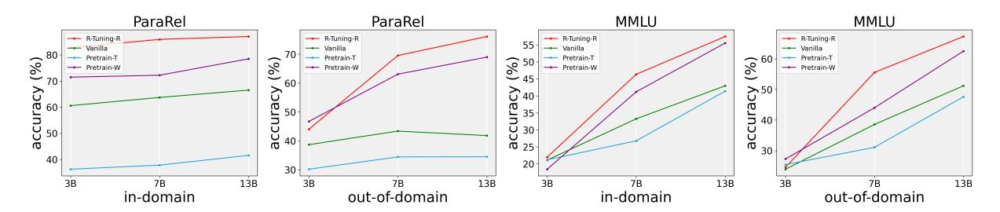

Figure 5: The performance of R-Tuning-R on ParaRel and MMLU datasets. ID and OOD denote in-domain and out-of-domain test datasets, respectively.

| Dataset | Model        | R-Tuning-R R-Tuning Vanilla Pretrain-T |       |       |       |
|---------|--------------|----------------------------------------|-------|-------|-------|
| FalseQA | OpenLLaMA-3B | 98.31                                  | 87.32 | 2.07  | 9.98  |
|         | LLaMA-7B     | 97.67                                  | 96.62 | 18.35 | 8.92  |
|         | LLaMA-13B    | 99.07                                  | 95.90 | 6.00  | 24.10 |
| NEC     | OpenLLaMA-3B | 99.90                                  | 95.72 | 0.96  | 7.31  |
|         | LLaMA-7B     | 99.52                                  | 99.18 | 20.55 | 2.02  |
|         | LLaMA-13B    | 99.90                                  | 98.17 | 2.36  | 4.76  |
| SA      | OpenLLaMA-3B | 99.22                                  | 90.99 | 5.23  | 18.90 |
|         | LLaMA-7B     | 98.55                                  | 95.45 | 34.79 | 16.96 |
|         | LLaMA-13B    | 99.71                                  | 96.61 | 12.21 | 28.00 |

Table 7: The refusal rate (%) of R-Tuning and R-Tuning-R, and other baselines on the refusal benchmarks. SA is the unanswerable part of the SelfAware dataset. The refusal rate of R-Tuning-R on the unanswerable datasets is extremely high, while the refusal rate of other finetuned methods and pre-trained models is low.

padding, we can directly replace the label words with uncertainty expressions for uncertain questions and keep the original label words for certain questions, which is called the replacement strategy, leading to a variant R-Tuning-R. For example, the certain part of the training questions D1 is constructed as follows:

$$Q: \{\text{Question}\}, A: \{\text{Answer}\},$$
 (9)

while the uncertain dataset D0 is constructed as follows:

$$Q: \{ \text{Question} \}, A: \{ \text{Uncertainty Expression} \}.$$
 (10)

There are many different ways for the uncertainty expression. To increase the diversity, we take the 16 expressions of uncertainty text from [Yin](#page-12-2) [et al.](#page-12-2) [\(2023\)](#page-12-2). These 16 expressions are listed in the Appendix Section [A.5.](#page-16-1)

We conduct experiments with R-Tuning-R on ParaRel and MMLU datasets by comparing it with vanilla fine-tuning strategy and the original pretrained models. The results are shown in Figure [5.](#page-15-0) Firstly, on both in-domain and out-of-domain test sets, the accuracy of R-Tuning-R is higher than Pretrain-T, which benefits from only answering

certain questions. More detailed results with answer rate are reported in Table [8,](#page-16-2) where we find the model is able to refuse a certain amount of questions. Then, R-Tuning-R outperforms Vanilla with a significantly higher accuracy on its willingly answered questions, which demonstrates the effectiveness of our method. It is promising as R-Tuning-R is trained with fewer ground-truth labels, while Vanilla is trained on all labels of the full training data. Generally, larger models possess more powerful refusal abilities. In Figure [5,](#page-15-0) we observe that on the willingly answered questions, larger models achieve a higher accuracy. In addition, the high accuracy of Pretrain-W reveals that those selected questions are within parametric knowledge of the pre-trained model. In summary, compared with vanilla fine-tuning, R-Tuning-R provides the model with the refusal ability to refuse unknown questions, which eventually improves the accuracy and prevents them from making hallucinated answers. Table [9](#page-16-0) shows the case studies of how R-Tuning-R works. There are significant differences when they encounter questions out of their knowledge. The Vanilla model is proactive in making up an answer, which is a hallucination and makes no sense. However, R-Tuning-R refuses them explicitly with keywords *do not know, not known, and impossible*. The ability of R-Tuning-R to refuse unknown questions results in fewer hallucinations.

Despite this refusal ability, there are two issues with R-Tuning-R: (1) the replacement method throws away valuable labels which could be leveraged for training. (2) R-Tuning could either only output the answer or only output the certainty, but cannot respond to both, leading to difficulties in considering the precision and recall simultaneously. To leverage all ground-truth labels during the tuning process, and instruct models to predict answers and express uncertainty at the same time, we employ the padding strategy in our main approach,

| Dataset   | Domain        | Models       | R-Tuning-R (%) | Answer Rate (%) | Vanilla (%) | Pretrain-T (%) | Pretrain-W (%) |
|-----------|---------------|--------------|----------------|-----------------|-------------|----------------|----------------|
| ParaRel _ | In-Domain     | OpenLLaMA-3B | 82.79          | 44.65           | 60.58       | 36.23          | 71.48          |
|           |               | LLaMA-7B     | 85.95          | 44.11           | 63.72       | 37.79          | 72.23          |
|           |               | LLaMA-13B    | 87.06          | 44.00           | 66.53       | 41.53          | 78.51          |
|           | Out-of-Domain | OpenLLaMA-3B | 44.04          | 40.80           | 38.68       | 30.18          | 46.73          |
|           |               | LLaMA-7B     | 69.54          | 28.07           | 43.38       | 34.44          | 63.09          |
|           |               | LLaMA-13B    | 76.13          | 30.16           | 41.82       | 34.48          | 68.99          |
| MMLU _    | In-Domain     | OpenLLaMA-3B | 21.99          | 5.79            | 21.12       | 21.22          | 18.44          |
|           |               | LLaMA-7B     | 46.35          | 9.56            | 33.25       | 26.77          | 41.20          |
|           |               | LLaMA-13B    | 57.47          | 42.52           | 42.97       | 41.41          | 55.54          |
|           | Out-of-Domain | OpenLLaMA-3B | 24.55          | 2.41            | 23.93       | 25.44          | 27.27          |
|           |               | LLaMA-7B     | 55.56          | 12.96           | 38.56       | 31.09          | 44.01          |
|           |               | LLaMA-13B    | 67.31          | 48.32           | 51.19       | 47.60          | 62.53          |

Table 8: Detailed performance of R-Tuning-R on ParaRel and MMLU dataset. The answer rate means the percentage of willingly answered questions of R-Tuning-R.

| Input Questions                             | R-Tuning-R                       | Vanilla   | Ground-Truth |
|---------------------------------------------|----------------------------------|-----------|--------------|
| What field does Lee Alvin DuBridge work in? | I do not know the answer.        | Music.    | Physics.     |
| Where was Blaine Willenborg born?           | It is <b>not known</b> .         | New York. | Miami        |
| Where did Hippolyte Le Bas die?             | It is <b>impossible</b> to know. | Lyon      | Paris        |

(a) Examples of R-Tuning-R refusing questions that are out of its parametric knowledge. R-Tuning-R expresses its unknown when it does not know the answer. Vanilla produces hallucinated answers when it does not know the answer.

| Input Questions                                | T | R-Tuning-R  | Vanilla   | . [ | Ground-truth |
|------------------------------------------------|---|-------------|-----------|-----|--------------|
| Where is Lion Air headquartered?               |   | Jakarta.    | Jakarta.  |     | Jakarta.     |
| What does Jacobo Zabludovsky work as?          | T | journalist. | journalis | t.  | journalist.  |
| What is the native language of Joseph Conombo? |   | French.     | French.   |     | French.      |

(b) Examples of R-Tuning-R answering questions within parametric knowledge.

Table 9: Case study of refused and willingly answered questions with R-Tuning-R and Vanilla.

where every question is appended with the groundtruth label and the uncertainty expression, indicating whether the model is confident or not.

#### A.4 Case Studies of R-Tuning-R

In this section, we display the detailed statistics in Table 8, and illustrate more case studies of R-Tuning-R in Table 9.

#### **A.5** Uncertainty Text

In this section, we list the 16 uncertainty expressions from Yin et al. (2023):

- 1. The answer is unknown.
- 2. The answer is uncertain.
- 3. The answer is unclear.
- 4. There is no scientific evidence.
- 5. There is no definitive answer.

- 6. There is no right answer.
- 7. There is much debate.
- 8. There is no known case.
- 9. There is no concrete answer to this question.
- 10. There is no public information available.
- 11. It is impossible to know.
- 12. It is impossible to answer.
- 13. It is difficult to predict.
- 14. It is not known.
- 15. We do not know.
- 16. I'm not sure.

| Dataset  | Model        | D1     | D0     |
|----------|--------------|--------|--------|
| ParaRel  | OpenLLaMA-3B | 57.92  | 63.08  |
|          | LLaMA-7B     | 45.81  | 52.08  |
|          | LLaMA-13B    | 42.79  | 48.75  |
| MMLU     | OpenLLaMA-3B | 32.95  | 462.36 |
|          | LLaMA-7B     | 22.20  | 115.87 |
|          | LLaMA-13B    | 22.12  | 81.41  |
| WiCE     | OpenLLaMA-3B | 61.28  | 203.43 |
|          | LLaMA-7B     | 20.93  | 19.40  |
|          | LLaMA-13B    | 17.73  | 19.56  |
| HotpotQA | OpenLLaMA-3B | 144.89 | 170.38 |
|          | LLaMA-7B     | 49.97  | 60.19  |
|          | LLaMA-13B    | 42.60  | 55.20  |
| FEVER    | OpenLLaMA-3B | 88.38  | 72.11  |
|          | LLaMA-7B     | 38.46  | 43.69  |
|          | LLaMA-13B    | 39.00  | 44.14  |

Table 10: Perplexity of the training datasets. We run the pre-trained models on the context and questions and calculate the average perplexity.

## A.6 Perplexity of Datasets

Perplexity measures how well the language model predicts a given text. Lower perplexity means better prediction and understanding of the text. According to the refusal-aware data identification, we split the training data into two sets: D0 (uncertain questions) and D1 (certain questions). To uncover why the pre-trained model responds to them differently, we calculate the average perplexity on these two datasets with the pre-trained models. The perplexity is calculated as follows:

$$PPL(X) = \exp\left\{-\frac{1}{t} \sum_{i=1}^{t} \log p_{\theta}(x_i \mid x_{< i})\right\},$$
(11)

where X denotes a sentence consisting of tokens and X = (x1, x2, . . . , xt). Specifically, we calculate the perplexity of the training questions to estimate the pre-trained model's understanding of them. The results are shown in Table [10.](#page-17-1) We observe that D1 has a lower perplexity, demonstrating that the pre-trained model is more familiar with the questions and is likely to provide the correct answer. For D0, its higher perplexity shows that these questions are not familiar to the model and out of the model's knowledge, and this is the reason why the model tends to hallucinate text instead of providing the correct answers. We also observe that larger models have a lower perplexity and randomness on the questions, which is why larger models generally perform better on various tasks.

By instructing our model to express uncertainty

| Dataset  | Model        |       | D0    |
|----------|--------------|-------|-------|
|          | OpenLLaMA-3B | 0.426 | 0.709 |
| ParaRel  | LLaMA-7B     | 0.475 | 0.694 |
|          | LLaMA-13B    | 0.436 | 0.744 |
|          | OpenLLaMA-3B | 0.347 | 0.389 |
| MMLU     | LLaMA-7B     | 0.330 | 0.400 |
|          | LLaMA-13B    | 0.239 | 0.457 |
|          | OpenLLaMA-3B | 0.250 | 0.280 |
| WiCE     | LLaMA-7B     | 0.254 | 0.270 |
|          | LLaMA-13B    | 0.265 | 0.252 |
|          | OpenLLaMA-3B | 0.534 | 0.747 |
| HotpotQA | LLaMA-7B     | 0.605 | 0.719 |
|          | LLaMA-13B    | 0.528 | 0.797 |
|          | OpenLLaMA-3B | 0.413 | 0.219 |
| FEVER    | LLaMA-7B     | 0.279 | 0.286 |
|          | LLaMA-13B    | 0.189 | 0.350 |

Table 11: Entropy of the training datasets. It is calculated from the frequency of every predicted answer among all predictions. A larger entropy denotes greater uncertainty of the system.

toward relatively random questions in terms of perplexity, the model develops a better understanding of uncertainty and ambiguity and learns the ability to recognize when it does not know. This ability is crucial in situations where simply providing a definite answer may be inappropriate or even harmful. On the other hand, since our model is also trained with data with certain expressions, it becomes more proficient at handling less random questions, and answering them with confidence and certainty. Overall, R-Tuning improves the model's ability to adapt to different levels of question randomness.

To verify the pre-trained model is less familiar with the uncertain questions while more confident with certain questions, we also plot the confidence distribution on certain questions and uncertain questions, shown in Figure [7](#page-21-0) in Appendix [A.9.](#page-19-4) It is observed that a larger percentage of certain questions occupies the high confidence intervals, which means when the model provides correct answers, it generally shows larger confidence.

#### A.7 Entropy of Answers

| Domain | Model        |       | R-Tuning-R Answer Rate Min-loss Answer Rate |       |       |
|--------|--------------|-------|---------------------------------------------|-------|-------|
| ID     | OpenLLaMA-3B | 82.79 | 44.65                                       | 91.83 | 26.52 |
|        | LLaMA-7B     | 85.95 | 44.11                                       | 85.78 | 41.57 |
|        | LLaMA-13B    | 87.06 | 44.00                                       | 88.00 | 48.33 |
| OOD    | OpenLLaMA-3B | 44.04 | 40.80                                       | 59.66 | 20.92 |
|        | LLaMA-7B     | 69.54 | 28.07                                       | 55.52 | 49.15 |
|        | LLaMA-13B    | 76.13 | 30.16                                       | 60.42 | 55.75 |

Table 12: Accuracy (%) and answer rate (%) of R-Tuning-R and min-loss training on ParaRel dataset. The loss is calculated by the first token of the ground-truth answer. ID and OOD denote in-domain and out-ofdomain, respectively.

In addition to evaluating the difference between certain and uncertain questions with pretrained models, we further leverage GPT [\(Brown](#page-9-14) [et al.,](#page-9-14) [2020\)](#page-9-14) to investigate the patterns of certain and uncertain questions. Specifically, we query gpt-3.5-turbo five times with Chainof-Thought prompts [\(Wei et al.,](#page-12-11) [2023a\)](#page-12-11) with a temperature of 0.7, and calculate the entropy of the answers toward the same question [\(Diao et al.,](#page-9-12) [2023b\)](#page-9-12). If the model provides many different answers to the same question, the entropy should be high. Otherwise, the entropy should be low. The results are shown in Table [11.](#page-17-2) We observe that the average entropy of the answers on certain data D1 is lower than the entropy of uncertain data D0 data in most cases, which illustrates that when fed with certain questions, gpt-3.5-turbo is more likely to generate consistent answers. It will generate hallucinated answers to uncertain questions with much higher chances.

Therefore, we can conclude that R-Tuning divides the data into two folds. The uncertain questions are generally more difficult than certain questions because gpt-3.5-turbo's answers vary more with the uncertain data. R-Tuning endows the model with abilities to identify and differentiate the difficulties of the questions. Therefore, our finetuned model becomes proactive in answering easy questions with certainty while being conservative in answering difficult questions, which eventually increases the precision and prevents the fine-tuned model from making too many mistakes.

#### A.8 Min-Loss Training

| Dataset     | Model        | R-Tuning | Vanilla |
|-------------|--------------|----------|---------|
|             | OpenLLaMA-3B | 69.79    | 69.62   |
| ParaRel     | LLaMA-7B     | 77.45    | 77.91   |
|             | LLaMA-13B    | 77.69    | 72.67   |
|             | OpenLLaMA-3B | 24.38    | 24.39   |
| MMLU        | LLaMA-7B     | 54.19    | 63.88   |
|             | LLaMA-13B    | 73.81    | 74.95   |
|             | OpenLLaMA-3B | 56.74    | 61.05   |
| WiCE        | LLaMA-7B     | 55.02    | 65.47   |
|             | LLaMA-13B    | 71.12    | 67.17   |
|             | OpenLLaMA-3B | 46.54    | 36.90   |
| HotpotQA    | LLaMA-7B     | 57.57    | 41.92   |
|             | LLaMA-13B    | 57.99    | 44.76   |
|             | OpenLLaMA-3B | 94.22    | 85.38   |
| FEVER       | LLaMA-7B     | 93.30    | 88.24   |
|             | LLaMA-13B    | 95.23    | 94.99   |
|             | OpenLLaMA-3B | 73.85    | 72.11   |
| HaluEval-QA | LLaMA-7B     | 77.17    | 76.22   |
|             | LLaMA-13B    | 80.36    | 75.73   |
|             | OpenLLaMA-3B | 61.09    | 58.24   |
| Average     | LLaMA-7B     | 69.11    | 68.94   |
|             | LLaMA-13B    | 76.03    | 71.71   |

Table 13: Multi-task experiments of R-Tuning and Vanilla with AP scores (%). Vanilla adopts the confidence of the predicted answer to rank the result, while R-Tuning adopts the combination of the confidence of the predicted answer and the confidence of certainty.

Compared with the append verbalizer, replace verbalizer (e.g., R-Tuning-R) is a clear-cut way of producing uncertainty expressions by throwing away valuable labels which could potentially be leveraged for training. In address of this dimension of concern, we consider a modified cross entropy learning objective that pushes up the correct answer token and keeps the uncertainty expressions as the second most probable token choice. We call it min-loss training, which is optimized by gradient descent over the min loss between guessing the correct answer or just uncertainty expressions. It is formulated as follows:

$$\min(L(predict, GT), L(predict, IDK)), (12)$$

where L denotes the cross-entropy loss. To do so, we split the training data in half and adopt a two-stage training strategy. In the first stage, we train our model using the original method where the prompt template uses The answer is {ground-truth} if the model answers correctly, otherwise The answer is unknown. Once the model learns such a pattern after the first

| Dataset Domain |     | Model                                 |                         | R-Tuning-U acc. R-Tuning-U conf. Vanilla-C acc. Vanilla-C conf. |                         |                         |
|----------------|-----|---------------------------------------|-------------------------|-----------------------------------------------------------------|-------------------------|-------------------------|
| ParaRel        | ID  | OpenLLaMA-3B LLaMA-7B LLaMA-13B | 61.57 65.26 70.47 | 61.50 71.25 77.15                                         | 59.81 62.68 65.76 | 75.01 77.35 78.50 |
|                | OOD | OpenLLaMA-3B LLaMA-7B              | 38.39 42.97          | 43.88 56.00                                                  | 37.66 42.12          | 61.56 63.41          |
| MMLU           |     | LLaMA-13B OpenLLaMA-3B             | 48.40 23.25          | 61.25 44.33                                                  | 40.77 25.54          | 61.20 46.23          |
|                | ID  | LLaMA-7B LLaMA-13B                 | 41.86 41.90          | 51.06 53.87                                                  | 34.65 39.57          | 53.64 58.60          |
|                | OOD | OpenLLaMA-3B LLaMA-7B LLaMA-13B | 25.01 45.88 51.74 | 41.97 55.22 59.45                                         | 23.81 42.66 50.38 | 44.77 58.52 65.53 |

Table 14: Performance of R-Tuning-U compared with Vanilla-C on the ParaRel and MMLU datasets. ID and OOD denote in-domain and out-of-domain, respectively.

|         | Dataset Domain | Model        | R-Tuning-U Vanilla-C |       |
|---------|----------------|--------------|----------------------|-------|
| ParaRel | ID             | OpenLLaMA-3B | 49.96                | 49.93 |
|         |                | LLaMA-7B     | 50.02                | 48.80 |
|         |                | LLaMA-13B    | 59.56                | 59.28 |
|         | OOD            | OpenLLaMA-3B | 52.26                | 52.16 |
|         |                | LLaMA-7B     | 49.45                | 48.52 |
|         |                | LLaMA-13B    | 61.21                | 61.10 |
|         | ID             | OpenLLaMA-3B | 45.01                | 44.88 |
|         |                | LLaMA-7B     | 50.97                | 50.95 |
| MMLU    |                | LLaMA-13B    | 44.65                | 43.12 |
|         | OOD            | OpenLLaMA-3B | 43.10                | 42.98 |
|         |                | LLaMA-7B     | 58.34                | 58.33 |
|         |                | LLaMA-13B    | 64.13                | 62.37 |

Table 15: The average sureness probability (%) of R-Tuning-U and Vanilla-C.

training stage, we calculate the min-loss with the equation [12.](#page-18-2) We only consider the loss of the unknown and the ground-truth label, and we mask the tokens before them. Since the ground-truth label may consider more than one token, we calculate the loss for the first token.

We evaluate the performance of min-loss strategy on the ParaRel dataset, and the results are shown in Table [12.](#page-18-3) It shows min-loss training outperforms R-Tuning-R in small models and indomain settings. However, it underperforms R-Tuning-R in out-of-domain test sets. We also notice that in out-of-domain test sets, the accuracy of the model of 3B size is nearly the same as 7B's and 13B's, but its answer rate is much lower. We identify such issues as a trade-off between the accuracy and the answer rate. When the model is proactive in answering more questions, it will inevitably make more mistakes. As the intrinsic parametric knowledge of the model is limited, there is no method to

|         | Dataset Domain | Model                                 | R-Tuning-U Vanilla-C    |                         |
|---------|----------------|---------------------------------------|-------------------------|-------------------------|
| ParaRel | ID             | OpenLLaMA-3B LLaMA-7B LLaMA-13B | 0.018 0.057 0.064 | 0.255 0.250 0.228 |
|         | OOD            | OpenLLaMA-3B LLaMA-7B LLaMA-13B | 0.054 0.132 0.124 | 0.291 0.271 0.258 |
| MMLU    | ID             | OpenLLaMA-3B LLaMA-7B LLaMA-13B | 0.212 0.092 0.120 | 0.246 0.243 0.239 |
|         | OOD            | OpenLLaMA-3B LLaMA-7B LLaMA-13B | 0.172 0.093 0.078 | 0.258 0.209 0.200 |

Table 16: The ECE (Expected Calibration Error) of R-Tuning-U and Vanilla-C.

fine-tune a model with both high accuracy and a high answer rate.

## A.9 Confidence Distribution of Training Dataset

We calculate the confidence of the certain data D1 and uncertain data d0, and they are shown in Figure [7.](#page-21-0)

## A.10 AP Scores of Each Dataset and Model Size with Figures

We calculate the AP scores for each dataset with different model sizes in multi-task experiments. The results are shown in Table [13](#page-18-0) and Figure [8.](#page-22-0)

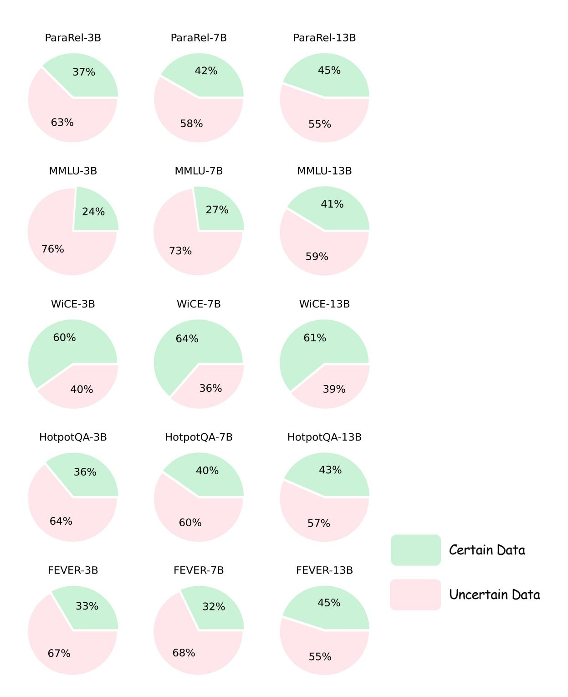

Figure 6: The data distribution of the refusal-aware datasets obtained from supervised identification strategy. The title of each sub-figure consists of the dataset name and the size of the pre-trained model used to evaluate.

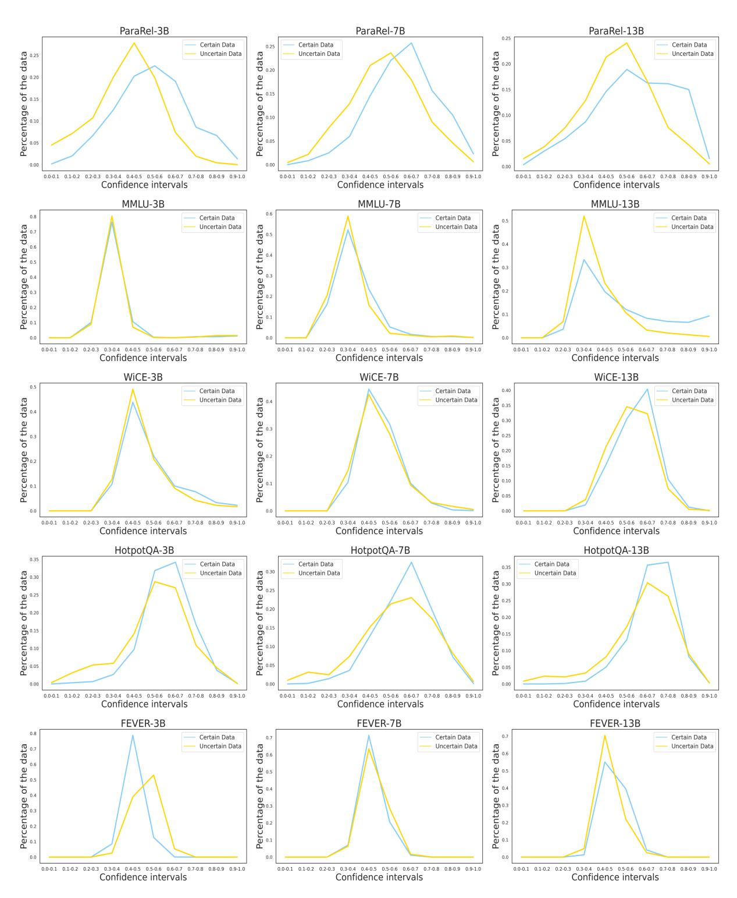

Figure 7: The confidence distribution of the training datasets on certain data and uncertain data. The title of each sub-figure consists of the dataset name and the size of the pre-trained model used to evaluate.

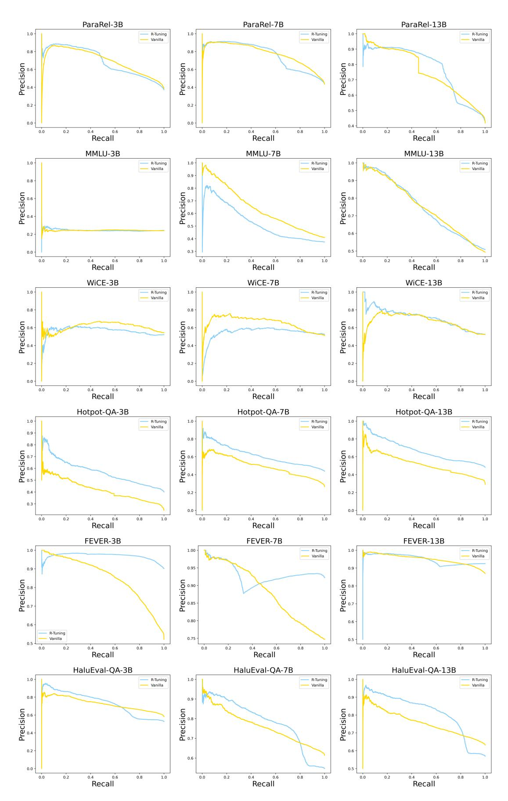

Figure 8: The AP curves on ParaRel, MMLU, WiCE, HotpotQA, FEVER, and HaluEval-QA datasets. The title of each sub-figure consists of the dataset name and the size of the pre-trained model used to evaluate.

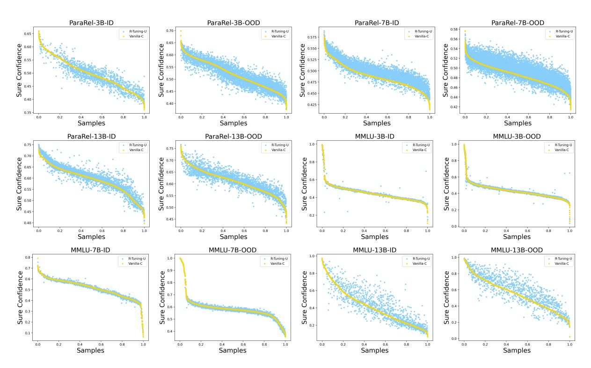

Figure 9: The scatter distribution of sure probability of R-Tuning-U and Vanilla-C.

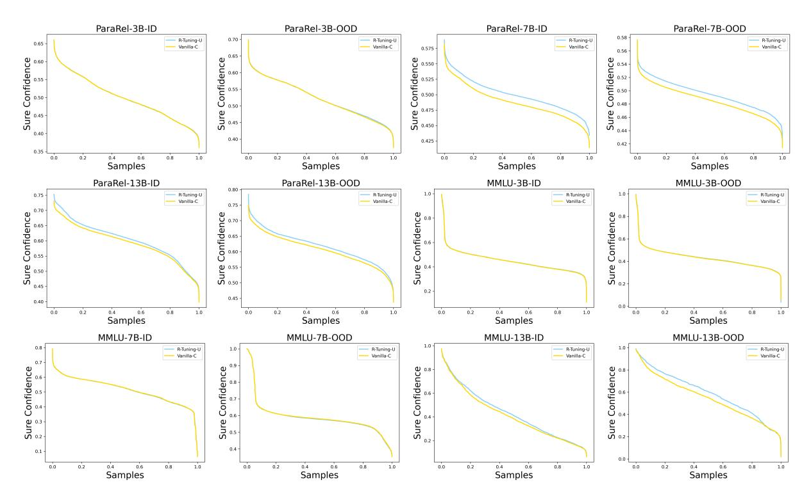

Figure 10: The distribution of sure probability of R-Tuning-U and Vanilla-C. They are both ranked by the confidence score.

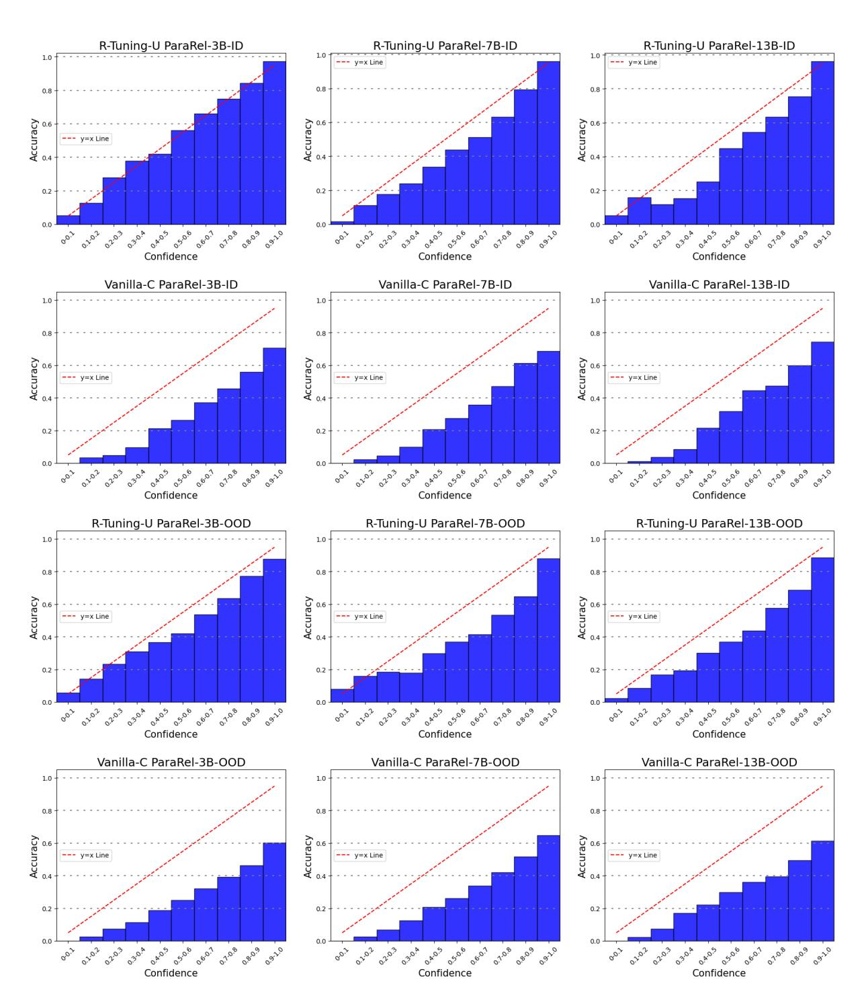

Figure 11: The ECE (Expected Calibration Error) on ParaRel dataset of R-Tuning-U and Vanilla-C.

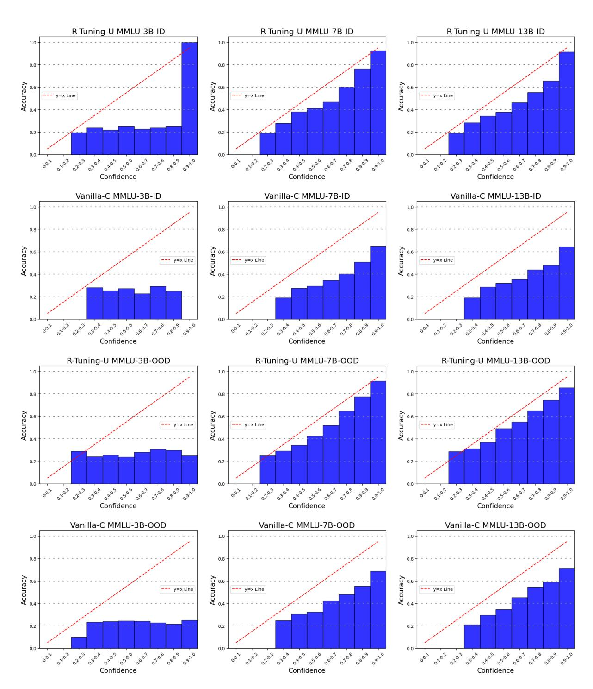

Figure 12: The ECE (Expected Calibration Error) on MMLU dataset of R-Tuning-U and Vanilla-C.

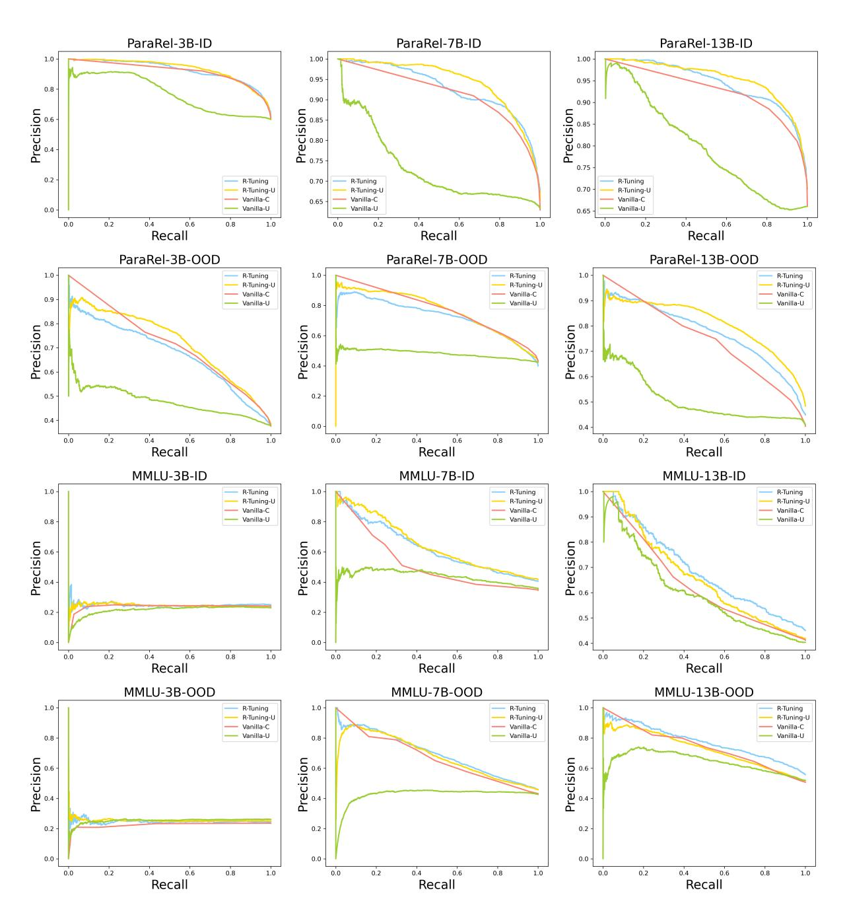

Figure 13: The AP curves of R-Tuning, R-Tuning-U, Vanilla-C, and Vanilla-U on ParaRel and MMLU datasets.