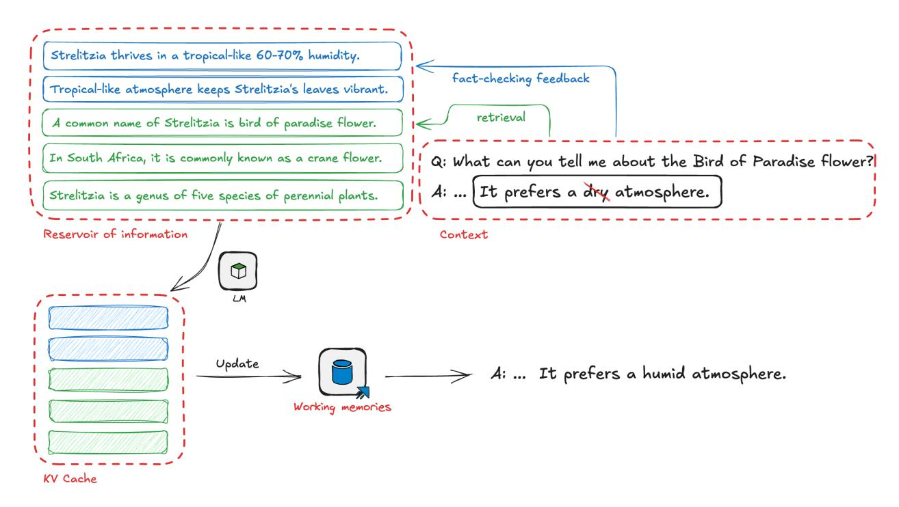
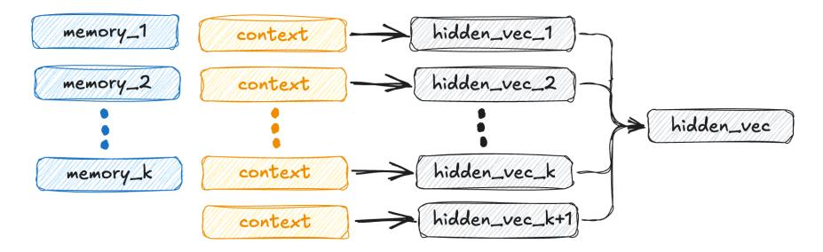
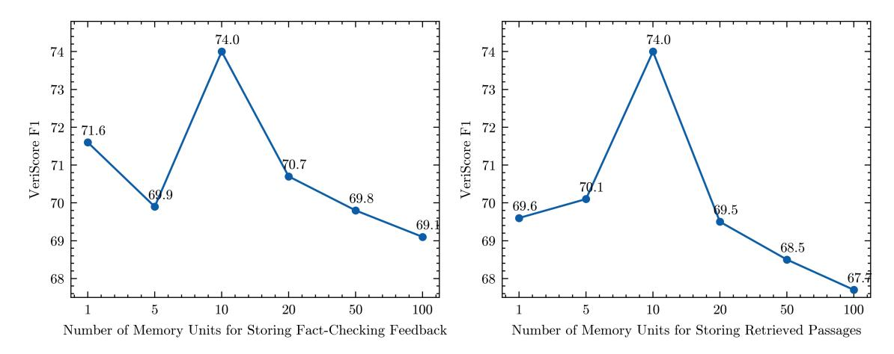
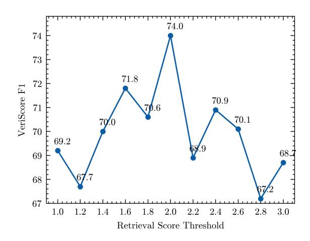
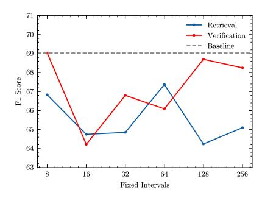
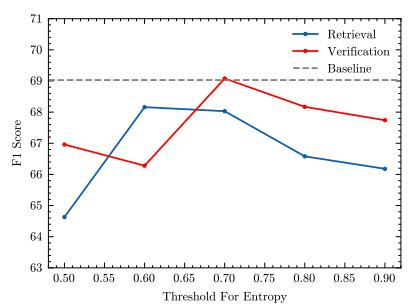
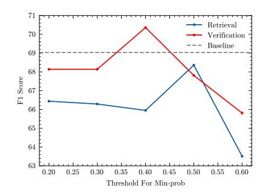

# Improving Factuality with Explicit Working Memory

Mingda Chen, Yang Li, Karthik Padthe, Rulin Shao, Alicia Sun, Luke Zettlemoyer, Gargi Gosh, Scott Yih Meta FAIR

Large language models can generate factually inaccurate content, a problem known as hallucination. Recent works have built upon retrieved-augmented generation to improve factuality through iterative prompting but these methods are limited by the traditional RAG design. To address these challenges, we introduce EWE (Explicit Working Memory), a novel approach that enhances factuality in longform text generation by integrating a working memory that receives real-time feedback from external resources. The memory is refreshed based on online fact-checking and retrieval feedback, allowing EWE to rectify false claims during the generation process and ensure more accurate and reliable outputs. Our experiments demonstrate that EWE outperforms strong baselines on four fact-seeking long-form generation datasets in both factuality and helpfulness. Further analysis reveals that the design of rules for memory updates, configurations of memory units, and the quality of the retrieval datastore are crucial factors for influencing model performance.

Date: December 10, 2024

# 1 Introduction

In the realm of long-form text generation, a notable vulnerability of large language models (LLMs) is their propensity for hallucination, wherein the generated text contains factually inaccurate information. By prepending the input prompt with relevant documents from trustworthy sources, retrieved-augmented generation (RAG) [\(Lewis et al.,](#page-11-0) [2020;](#page-11-0) [Shi et al.,](#page-12-0) [2024\)](#page-12-0) has been shown to be a simple yet effective approach that substantially mitigates the hallucination issue. To further enhance the factual accuracy of model output, various iterative prompting methods have been proposed that build upon RAG. For instance, FLARE [\(Jiang et al.,](#page-11-1) [2023\)](#page-11-1) generates responses sentence by sentence, and if a newly generated sentence contains low-probability tokens, it retrieves a new set of documents and re-runs RAG to regenerate the sentence. Alternatively, Self-RAG [\(Asai et al.,](#page-11-2) [2024\)](#page-11-2) employs a self-critic component to verify the correctness of each partial generation and repeatedly queries a retrieval system to update the background knowledge, thereby producing more accurate and faithful responses. While these systems demonstrate significant empirical improvement, they are restricted in the traditional RAG design. Context-relevant knowledge through retrieval is the only online feedback to the model, incorporated as part of the input string.

In this work, we propose EWE (Explicit Working mEmory), an iterative framework that aims to provide more factual responses for knowledge-intensive long-form generation, with the help of an auxiliary fact-checking module. EWE augments an existing language model with an explicit working memory, which keeps track of the knowledge that is most relevant and useful at the current generation timestep. The memory is initially filled with the latent representation of some retrieved passages relevant to the input prompt. During the generation process, EWE actively monitors the newly generated partial response and pauses occasionally to refresh the memory with knowledge from retrieval and to check the output statement. If the statement is factually incorrect, it then refreshes the memory with the fact-checking feedback. With the updated memory, EWE first removes the incorrect statement and backtracks to the previous timestep, and then continues the generation process from there.

We assume that the main text generation model used here is a Transformer-based large language model, such as Llama [\(Dubey et al.,](#page-11-3) [2024\)](#page-11-3). Similar to the standard RAG setting, given an input prompt, we first retrieve k relevant text chunks of the same number of tokens, as the background knowledge. Unlike RAG, which directly prepends the input prompt with these k chunks, we apply the language model to them separately and store the KV cache of each chunk in a memory of k units. When predicting the next token, the language

Figure 1 Example pipeline illustrating how EWE pauses, receives feedback from retrievers and fact-checkers, and then re-generate to correct factual errors in its outputs. EWE handles knowledge from fact-checkers and retrievers separately as they tend to provide information with distinct properties. Retrieval offers more general background information, while fact-checkers focus more on specific details, targeting particular aspects of the output text.

model effectively attends the current token to all k chunks in parallel, using their KV caches stored in the memory, and have the average as the attention value. When EWE pauses the generation and checks the newly generated, partial response, it has the opportunity to update the memory in multiple ways to guide the language model. For instance, if some claims in the new sentence are not supported, this feedback along with additional supporting documents can be used as a new unit appended to the existing memory. In addition, if the knowledge from an initial retrieved passage is no longer relevant, its corresponding memory unit can be removed or updated with embeddings of a new passage retrieved using the generated partial response as query.

EWE can be seen as a more general framework that subsumes many existing approaches. For example, if there is no stopping in generation and if the memory contains only one unit (i.e., k=1), then EWE degenerates to the simple vanilla RAG. If EWE pauses at the end of generation of every sentence and checks whether the new sentence contains any token with low probability as a proxy of factuality measure, then this particular instantiation, with one memory unit, is effectively FLARE. Notice that in a typical, more general configuration of EWE, the memory module consists of multiple units. When the memory is refreshed, not all the units need to be updated. If some knowledge is still required, their original raw data (e.g., passages) will not be reprocessed to create the embeddings, saving some redundant computational cost at inference time. While conceptually simple, the working memory design in EWE provides more a more flexible and yet efficient way to incorporate various of types of external online information, as different forms of feedback are encoded in parallel and stored in memory units (e.g., see Figure [1\)](#page-1-0). We notice that the design of leveraging working memory is also very related to some recently proposed methods for long-content models (e.g., Memory3 [\(Yang](#page-12-1) [et al.,](#page-12-1) [2024\)](#page-12-1)). If our memory is used only for encoding the knowledge from the passages in our corpus, then this can be viewed as the whole corpus is used as the context, along with the prompt, as the input to the model. The key differences are that EWE does not pre-encode every passage (although the KV caches of some frequently retrieved passages can certainly be precomputed in advance) and its memory can be dynamically updated as the generation progresses.

We demonstrate empirically that EWE generates more factual responses without sacrificing the relevance to the input questions, using four fact-seeking long-form generation datasets. In general, with the feedback from online fact-checking and targeted retrieval, EWE increases VeriScore [\(Song et al.,](#page-12-2) [2024\)](#page-12-2), the factuality metric we use, by 2 to 10 points absolute and has a similar helpfulness in terms of instruction following compared to the base model Llama-3.170B.

### 2 Related work

Aiming to reduce hallucination and make the LLMs generate more factual responses, our proposed framework, EWE, detects knowledge gaps and acquires relevant information as needed, incorporating feedback from auxiliary models when available. Unlike chain-of-verification approaches [\(Dhuliawala et al.,](#page-11-4) [2024,](#page-11-4) CoVe), which rely solely on the LLM for reasoning, EWE combines adaptive retrieval augmentation and explicit memories with a focus on factuality. This section discusses related work on these two aspects.

### 2.1 Iterative and Adaptive Retrieval Augmentation

Retrieval-augmented generation (RAG) typically involves a single retrieval step, followed by the language model generating a complete response. However, iterative retrieval methods [\(Gao et al.,](#page-11-5) [2024,](#page-11-5) §5) have been proposed to generate responses in multiple segments, with each segment generated using different additional information retrieved through iterative retrieval. One such approach is ITER-RETGEN [\(Shao et al.,](#page-12-3) [2023\)](#page-12-3), which uses the model output of the previous iteration to formulate the query and retrieve more relevant knowledge for the current generation. Extending iterative retrieval, the process of adaptive retrieval [\(Gao](#page-11-5) [et al.,](#page-11-5) [2024,](#page-11-5) §5) examines partially generated responses in previous iterations to decide whether retrieving new information or regenerating a segment response is needed. For instance, FLARE [\(Jiang et al.,](#page-11-1) [2023\)](#page-11-1) follows a simple sentence-by-sentence generation process to answer fact-seeking questions. In each step, it generates a temporary next sentence and examines its acceptability based on model confidence. If the sentence is deemed questionable, it retrieves new text chunks using a query based on the temporary sentence and re-generates the next sentence using standard RAG. DRAGIN [\(Su et al.,](#page-12-4) [2024\)](#page-12-4) improves upon FLARE by introducing a new model confidence measure that combines attention scores and entropy values. This allows the model to pause the generation immediately after the confidence score of a token falls below a threshold. Additionally, DRAGIN uses preceding tokens with high attention scores on the stopping token to form a keyword-based query, which helps the model make a more confident next-token prediction.

Our work shares similarities with Self-RAG [\(Asai et al.,](#page-11-2) [2024\)](#page-11-2), particularly in the use of an auxiliary model to provide feedback. Unlike confidence measures based on token probability or attention score, Self-RAG fine-tunes the model to introspectively decide when to pause generation by outputting a special retrieve token. This triggers the retrieval of multiple passages, which are then used separately to generate candidate segments via standard RAG. Each segment is evaluated by a "critique" model for relevance, usefulness to the original prompt, and support from the retrieved passage. The critique model's output determines whether a candidate segment is included in the final output.

Our approach, EWE, differs from existing iterative and adaptive retrieval augmentation methods in two key aspects. Firstly, traditional retrieval augmentation is replaced with memory augmentation, where the representation is the KV cache (similar to TurboRAG [\(Lu et al.,](#page-12-5) [2024\)](#page-12-5)) instead of the raw text, and different memory chunks that encode different passages are processed in parallel. This design allows for greater flexibility in incorporating diverse information types and improves efficiency when only part of the memory is updated, as the remaining portion can be reused. Secondly, feedback from the auxiliary model is passed to the language model through memory, enabling the core language model to naturally incorporate multiple streams of information and produce better responses. This design difference sets our approach apart from existing methods and allows for more effective integration of factuality feedback from the auxiliary model.

#### 2.2 Memories in Long-context LLMs

Incorporating a large-scale corpus as additional knowledge can be achieved by prepending the given prompt with all documents in the corpus as an extremely long context input [\(Lee et al.,](#page-11-6) [2024\)](#page-11-6) to language model. It is thus natural to see that long-context LLMs share some technical components that apply to retrieval augmentation. The memory module in EWE is analogous to the explicit memory design in Memory3 [\(Yang](#page-12-1)

[et al.,](#page-12-1) [2024\)](#page-12-1). Instead of encoding the knowledge in the training corpus completely in model parameters, or incorporating the knowledge primarily through retrieval augmentation, Memory3 encodes 128-token chunks of the training corpus using their KV caches as memories. During inference, the model generates segments of 64 tokens. At the generation of each segment, it first uses the previous segment as query to retrieve 5 most relevant memories, and attends to them when generating the next segment. Retrieving memories of KV caches has been proposed in earlier work. For instance, Memorizing Transformers [\(Wu et al.,](#page-12-6) [2022\)](#page-12-6) effectively extends the context of the language model by k nearest neighbor lookup of the past key-value pairs (i.e., long-range memory) and attends them in the last layer of the models. LongMem [\(Wang et al.,](#page-12-7) [2023\)](#page-12-7) proposed a decoupled network architecture, using the backbone language model as memory encoder and a trained residual side-network as memory retriever and reader. The top-k attention key-value pairs stored in the memory are retrieved and incorporated at inference.

While we also use explicit memories to store KV caches in EWE, our goal is to pass new information at each step in the iterative decoding process, such as new information relevant to the current context via online retrieval and feedback from auxiliary models. We allow different operations on existing memories, including update, append, or delete, providing more flexibility for various downstream tasks.

## 3 Method

The overall generation process of EWE is similar to the decoding process of typical Transformer-based models, with two differences: ([§3.1\)](#page-3-0) EWE pauses generation periodically. When a new complete sentence has been generated, EWE uses the current context to retrieve a new set of passages as knowledge feedback. In addition, it runs a fact-checking model to judge whether the sentence contains any factually incorrect statements. If the sentence does contain factual errors, the correct facts will be used as the fact-checking feedback. Both types of feedback will be added to memories, and the sentence will be regenerated if the original one has factual errors. ([§3.2\)](#page-3-1) The generation is memory-augmented. In addition to the typical context like the input sentence and tokens generated in previous timesteps, embeddings of various forms of feedback stored in the memories will influence the generated tokens through self-attention.

#### 3.1 Real-time Feedback

Following the design of recently proposed evaluation metrics on factuality [\(Min et al.,](#page-12-8) [2023;](#page-12-8) [Wei et al.,](#page-12-9) [2024;](#page-12-9) [Song et al.,](#page-12-2) [2024\)](#page-12-2), we determine whether a sentence is factually correct by checking if all of the claims extracted from this sentence are supported. While in general, EWE can use any textual knowledge as feedback, we focus on providing two types of feedback when the newly generated sentence contains factual errors: fact-checking outcomes and relevant knowledge.

Fact-checking outcomes This feedback consists of the correct information that refutes the inaccurate claims, such as "Strelitzia thrives in a tropical-like 60%-70% humidity." that proves "Bird of Paradise prefers a dry atmosphere." wrong in the example in Figure [1.](#page-1-0) In this work, we adapt the claim extraction model and verification model in VeriScore [\(Song et al.,](#page-12-2) [2024\)](#page-12-2) as the fact-checking model, where the factual knowledge is derived from the Google snippets when using the extracted claim as query.

Relevant knowledge Using the original input question and the sentence being fact-checked as query, we use Contriever [\(Izacard et al.,](#page-11-7) [2022\)](#page-11-7) to retrieve passages from C4 [\(Raffel et al.,](#page-12-10) [2020\)](#page-12-10) and Wikipedia, following the setting in MassiveDS [\(Shao et al.,](#page-12-11) [2024\)](#page-12-11). Passages with retrieval scores exceeding a certain threshold will be viewed as knowledge relevant to the current context and used to update the working memories.

We pause at every Tr timesteps to gather feedback from retrievers, and Tv timesteps for fact-checkers. However, if no new sentence is generated, the feedback collection process will be skipped.

#### 3.2 Refreshing Working Memories

The working memory in EWE consists of k memory units, where each unit is designed to store the representations of each feedback message of M tokens. When updating working memories, we follow the First in First

Figure 2 Diagram illustrating self-attention computations performed at each layer in EWE. We concatenate each memory with the context (except for the last hidden vector where we only use context), apply standard self-attention and then aggregate the resulting hidden vectors to produce the final hidden vectors.

out (FIFO) rule. Given refreshed text chunks of the same length from fact-checkers and retrievers, our model encodes them into the KV cache in parallel using the same positional IDs. Working memories in EWE are stored as part of the language models' context preceding the model's own output text and prompts, allowing for flexible updates without reprocessing generated content. As shown in Figure [2,](#page-4-0) a separate embedding store is used for storing these memories, which are then processed at each layer by concatenating them with the context. We then apply regular self-attention and aggregate the resulting hidden vectors using normalization terms from self-attention for each memory unit. We empirically find that adding hidden vectors produced by context only improves the fluency of long outputs, so we keep it in our model architectures.

More formally,

$$\vec{h}_n = \sum_{i=1}^{k+1} \frac{\alpha_i \vec{h}_{n_i}}{\sum_{j=1}^{k+1} \alpha_j} \tag{1}$$

where ⃗hn is the output vectors for self-attention at n-th layer in LMs, ⃗hni is the hidden vectors produced by memories concatenated with the context and by only the context vectors, and αi is the normalization terms from self-attention that leads to ⃗hni .

## 4 Experiments

We present the main experimental results of EWE in this section, along with details of the datasets and evaluation metrics we used, and the baseline we compared with.

#### 4.1 Evaluation Datasets

We evaluated EWE and baseline models using four fact-seeking long-form generation datasets: LongFact [\(Wei](#page-12-9) [et al.,](#page-12-9) [2024\)](#page-12-9), Fava [\(Mishra et al.,](#page-12-12) [2024\)](#page-12-12), AlpacaFact [\(Dubois et al.,](#page-11-8) [2023;](#page-11-8) [Lin et al.,](#page-11-9) [2024\)](#page-11-9), and Biography [\(Min](#page-12-8) [et al.,](#page-12-8) [2023\)](#page-12-8).

LongFact Designed to probe the factuality of a model of which response consists of at least several paragraphs, LongFact was created by prompting GPT-4 to generate questions regarding a specific concept or object within a given topic. In our experiments, we use the 250 prompts from the LongFact-Objects dataset, selected by [Wei et al.](#page-12-9) [\(2024\)](#page-12-9).

Fava As a new fine-grained hallucination benchmark, Fava constructed 200 information-seeking queries that require factual knowledge to give accurate long-form answers from multiple sources, including Open Assistant [\(Köpf et al.,](#page-11-10) [2023\)](#page-11-10), No Robots [\(Rajani et al.,](#page-12-13) [2023\)](#page-12-13), WebNLG [\(Gardent et al.,](#page-11-11) [2017\)](#page-11-11) and instructions written by the authors [Mishra et al.](#page-12-12) [\(2024\)](#page-12-12). Following [Lin et al.](#page-11-9) [\(2024\)](#page-11-9), we selected 141 prompts from this collection for our experiments.

AlpacaFact Originally collected from real-world interactions with various users, the 805 instructions in AlpacaFarm [\(Dubois et al.,](#page-11-8) [2023\)](#page-11-8) was used for evaluating the instruction-following ability of different LLMs. To focus our evaluation on factuality, we used a subset of 241 fact-seeking instructions selected by [Lin et al.](#page-11-9) [\(2024\)](#page-11-9) in this work.

Biography To demonstrate the effectiveness of the factuality metric FActScore, [Min et al.](#page-12-8) [\(2023\)](#page-12-8) selected 183 names of famous people found in Wikipedia, and applied the "Tell me a bio of [Person Name]" template to create a collection of prompts called Biography. As this set of prompts have been used extensively in several recent papers, we include it in our study as well.

When using these prompts, we appended the instruction "Provide as many specific details and examples as possible (such as names of people, numbers, events, locations, dates, times, etc.)" to encourage models to generate more detailed responses that cover multiple factoids, following [Wei et al.](#page-12-9) [\(2024\)](#page-12-9).

### 4.2 Evaluation Metrics

We assess the quality of model responses to fact-seeking questions based on two key axes: factuality and helpfulness. For evaluating factuality, we considered multiple automatic metrics, such as FActScore [\(Min](#page-12-8) [et al.,](#page-12-8) [2023\)](#page-12-8) and SAFE [\(Wei et al.,](#page-12-9) [2024\)](#page-12-9), but ultimately chose VeriScore [\(Song et al.,](#page-12-2) [2024\)](#page-12-2) as our primary evaluation metric. Although these metrics share a similar design that decomposes sentences into "atomic claims" and checks their support against an external knowledge source, VeriScore focuses on extracting more sensible verifiable claims and uses Google search snippets instead of Wikipedia. As a result, VeriScore can be applied to responses on more diverse topics and is also more efficient, requiring fewer but more meaningful claims to be checked. We report the F1 score from VeriScore, which is the harmonic mean of the precision and recall of the claims. Following [Song et al.](#page-12-2) [\(2024\)](#page-12-2), we set the minimum number of facts required for a model's response to achieve perfect recall as the median number of extracted claims per dataset[1](#page-5-0) . We also used their fine-tuned models for claim extraction and verification, provided in their package[2](#page-5-1) .

To make sure that a model with a high factuality score does not simply give irrelevant but correct factual statements, we also need to check whether the response is helpful to the user. Following [Lin et al.](#page-11-9) [\(2024\)](#page-11-9), we use AlpacaEval [\(Dubois et al.,](#page-11-12) [2024\)](#page-11-12) to compare the target model and baseline model in terms of their instruction-following ability. For the responses to the same input prompt, a large language model is used as judge to determine which of the two is better[3](#page-5-2) , and the win rate is thus used as a measure of helpfulness[4](#page-5-3) .

#### 4.3 Baselines

We used instruction tuned Llama-3.1 70B and 8B as the base models and compared EWE with three baselines: base model only, retrieval augmentation (RA) and a recently proposed semi-parametric decoding method Nest [\(Li et al.,](#page-11-13) [2024\)](#page-11-13). For base model only, Llama-3.170B or Llama-3.18B, we simply gave the language model the prompt in the dataset and the instruction of requesting detailed information, without other additional information. With retrieval augmentation, we retrieved 20 passages using the input prompts as queries and then prepended the input with the passages[5](#page-5-4) . Nest is a strong retrieval-based decoding algorithm. Following the original setup, we retrieved 100 passages to use as candidates. For all our experiments, the maximum generation step was set to 1024. Llama-3.170B is used as the baseline method for all AlpacaEval comparisons.

#### 4.4 Results

Our main results are shown in Table [1.](#page-6-0) For the Llama-3.170B base model, we find that in terms of factuality, retrieval augmentation generally improves the results consistently across different datasets. This is expected as for fact-seeking prompts, specifically conditioning generation on relevant factual knowledge has been

1The median numbers of extracted facts for LongFact, Fava, AlpacaFact, Biography are 55, 49, 31, 43, respectively.

2<https://github.com/Yixiao-Song/VeriScore>

3We used GPT-4o as the judge.

4We found that the length-controlled win rates in AlpacaEval could conflate hallucinations and length effects, and thus report the version without length normalization.

5Using more than 20 passages does not provide significant benefits in our preliminary experiments, so we limit our retrieval to the top 20 passages.

| Model        |      | LongFact |      | Fava |      | AlpacaFact |      | Biography |
|--------------|------|----------|------|------|------|------------|------|-----------|
|              | F1   | WR       | F1   | WR   | F1   | WR         | F1   | WR        |
| Llama-3.170B | 64.3 | -        | 52.0 | -    | 63.8 | -          | 37.1 | -         |
| +RA          | 64.6 | 41.0     | 56.7 | 37.3 | 64.9 | 43.3       | 41.7 | 49.8      |
| +Nest        | 62.1 | 8.5      | 49.0 | 23.3 | 57.6 | 30.4       | 39.5 | 21.7      |
| +EWE         | 70.7 | 50.2     | 61.1 | 50.2 | 65.8 | 49.7       | 47.6 | 50.6      |
| Llama-3.18B  | 63.1 | 40.6     | 51.0 | 36.5 | 65.3 | 26.7       | 28.9 | 24.2      |
| +RA          | 66.5 | 27.4     | 51.7 | 16.4 | 64.3 | 18.8       | 37.1 | 20.6      |
| +Nest        | 61.9 | 3.4      | 50.1 | 13.7 | 57.4 | 8.4        | 39.0 | 21.4      |
| +EWE         | 67.2 | 40.7     | 53.2 | 36.1 | 65.4 | 28.2       | 39.1 | 21.0      |

Table 1 Evaluation on factuality and helpfulness of the model responses to prompts provided in four long-form question answering datasets. For each dataset, we report F1 scores from VeriScore and win rates (WR) from AlpacaFact. We use Llama-3.170B as the baseline method in AlpacaEval win rate experiments.

demonstrated to be an effective way to mitigate hallucinations. Nest performs better than the base model on the Biography dataset, but not on others, and it appears that the VeriScore F1 is lower than the standard retrieval augmentation. It might suggest that the configuration or hyperparameter settings of Nest needs to be further optimized, as Nest was originally evaluated by Biography with Llama-2. Perhaps more interestingly, with online fact-checking feedback and refreshed knowledge from retrieval, EWE achieves the highest VeriScore F1 on all datasets. On the helpfulness of the responses, it appears that AlpacaEval generally prefers the output from the base model, except for EWE, where the win rates are roughly 50%.

When using Llama-3.18B as the base model, we have observed a similar trend. Retrieval augmentation improves factuality in terms of VeriScore F1 and EWE still gives the best factuality results. However, compared to the models based on Llama-3.170B, we notice that the improvement is generally smaller. We hypothesize that the smaller based language model is less capable in leveraging the feedback, and may not always regenerate a sentence that is factually correct. In terms of helpfulness, we can see that EWE generally performs similar to its base model Llama-3.18B, as they have similar win rates when compared to the output of the same Llama-3.170B base model.

# 5 Analysis

We provide some insights based on different ablations in this section. Llama-3.170B were used as the base model for all the experiments in this section.

### 5.1 Memory Configurations

In this analysis, we explore the influence of memory configurations on factuality, based on experiments on 50 randomly sampled prompts from LongFact. We examine this impact through three dimensions: the number of memory units, the shape of memory units, and the thresholds for retrieval scores, which control how working memory updates the retrieved passages.

In Figure [3,](#page-7-0) we investigate how varying the numbers of memory units used for storing fact-checking feedback and retrieved passages may impact factuality. When adjusting the configuration for one, we keep the other constant to facilitate easier interpretation of the results. Overall, we observe that having a large amount of memory units for either fact-checking feedback or retrieved passages negatively impacts factuality. This is likely because a significant amount of stale information remains in working memory for an extended period without being updated, as we adhere to the FIFO rule for updating working memory. Consequently, this information becomes outdated as the generation process continues.

In Table [2,](#page-7-1) we examine the impact of varying memory unit shapes on factuality. To ensure a fair comparison, we maintained a consistent total number of tokens in working memory across different experimental setups. Notably, our findings suggest that models favor shorter, more memory units over longer, fewer ones. We

Figure 3 VeriScore F1 over 50 prompts from LongFact when varying number of memory units used for storing retrieved passages and fact-checking feedback. Each memory unit stores 128 tokens.

| Memory Shape (M × k) | 128 × 20 | 256 × 10 | 512 × 4 |
|----------------------|----------|----------|---------|
| F1                   | 74.0     | 69.0     | 68.2    |

Table 2 VeriScore F1 over 50 prompts from LongFact with different shapes of working memory. We allocate an equal number of memory units for both retrieval and fact-checking feedback.

hypothesize that this preference arises because 128 tokens approximately match the length of a retrieved passage, allowing the attention mechanism to effectively cover one individual passage at a time. In contrast, longer memory units combine multiple passages into a single unit, which may compel the attention to focus on less relevant passages when they are grouped with more relevant ones.

In Figure [4,](#page-8-0) we look into the effect of different retrieval score thresholds. Interestingly, raising the threshold initially (which permits more less relevant information to be included in working memory) proves beneficial. This contrasts with our findings regarding the number of memory units, where an increase negatively affects factual accuracy. We hypothesize that, although the passages may be less relevant at the current timestep, they are still more relevant than the less relevant passages from previous timesteps. Unsurprisingly, further increasing the threshold harms performance, likely because it includes too many low-quality retrievals. These observations suggest that our model could benefit from a more sophisticated memory updating mechanism, which we plan to explore in future work.

### 5.2 Feedback Forms

In this analysis, we explore various feedback formats utilized by fact-checkers. The models in VeriScore offers 2 types of information: a list of both factual and nonfactual claims, along with relevant passages that support these factual and nonfactual judgments. To examine the impact of these feedback formats, we conduct experiments using different combinations of these information types in the working memory. For the supporting passages, we combine them using new line symbols. For the list of claims, we apply an instruction template as follows to encode nonfactual claims:

Please refrain from including the following imprecise statements: (1) nonfactual claim1 (2) nonfactual claim2 ...

Our results are shown in Table [3.](#page-8-1) Overall, fact-checking feedback is beneficial compared to the base model with and without retrieval augmentation. The specific types of feedback also play a crucial role. Incorporating all feedback forms does not enhance model performance, with supporting passages proving more effective than instructions. We notice that instructing models not to generate specific details often results in misunderstanding.

**Figure 4** VeriScore F1 over 50 prompts from LongFact with different retrieval score thresholds. Higher thresholds indicate passages that are less relevant would be included in working memory.

| Passages determining a claim is incorrect | Passages determining a claim is correct | Instructions for nonfactual claims                                                                                 | Precision                   | Recall               | $F_1$                       |
|-------------------------------------------|-----------------------------------------|--------------------------------------------------------------------------------------------------------------------|-----------------------------|----------------------|-----------------------------|
| <b>√</b>                                  | ✓                                       | ✓                                                                                                                  | 77.3 76.4                | 64.0 <b>67.4</b>  | 66.8 67.9                |
| V                                         | $\checkmark$                            | /                                                                                                                  | 77.5                        | 67.2                 | 69.4                        |
| $\checkmark$                              | $\checkmark$                            | <b>V</b>                                                                                                           | 67.1 <b>80.8</b> 72.5 | 66.2 66.1 65.9 | 66.7 <b>69.3</b> 66.2 |
|                                           |                                         | $\begin{array}{c} {\rm Llama\text{-}}3.1_{70{\rm B}} \\ {\rm Llama\text{-}}3.1_{70{\rm B}} + {\rm RA} \end{array}$ | 65.8 70.1                | 67.1 66.1         | 65.5 65.9                |

Table 3 Comparing different feedback forms for fact-checkers. We report VeriScore over 50 prompts from LongFact.

Models might rephrase the instruction, include the nonfactual statement in their response, and then add a clarification indicating the previous statement is nonfactual, such as "(Note: This is a nonfactual claim and may not be accurate)". We leave a better design of feedback forms to future work. Interestingly, when we exclude all the textual feedback from fact-checkers and only pause and regenerate in the presence of nonfactual sentences, performance still slightly improves.

#### 5.3 Model Confidence

One important question remains is when to refresh the working memory. To study it, we conducted a comparative analysis of different criteria for refreshing working memory and regeneration. Since the working memory consists of the retrieval memory and fact-checking memory, which can have interacting effects, we first investigate when to trigger the retriever alone (without fact-checking memory) and then investigate when to trigger the fact-checker (when retrieval interval  $T_r$  is set to 1).

Fixed intervals for refreshing working memory As shown in Figure 5a, when using a fixed retrieval interval, an intermediate interval seems to perform well. This may be due to the fact that overly frequent retrieval can add irrelevant and conflicting information to the memory. With fact-checking feedback in memory, it seems frequent verification and regeneration is not always beneficial due to the fact that we only regenerate once and the regenerated sentence is not always better.

Model confidence for refreshing working memory In practice, fixed retrieval and verification intervals may be unnecessary and lead to sub-optimal performance. We explore whether model-confidence can serve as a

(a) VeriScore F1 when using fixed retrieval and verification intervals.

(b) F1 when using entropy thresholds for triggering retrieval and verification.

(c) F1 when using min-prob thresholds for triggering retrieval and verification.

Figure 5 Comparison of different criteria for refreshing working memory over 50 prompts from LongFact. The baseline uses retrieval interval Tr = 1 and verification interval Tv = 8.

signal for refreshing working memory. Specifically, we compare two different metrics for model confidence: (1) Entropy: average entropy of generated tokens in a sentence, and (2) Min-prob: minimum probability of tokens in a sentence. A higher threshold for entropy results in less frequent memory update, and a higher threshold for min-prob results in more frequent memory update. Since external fact-checkers can be computationally expensive, we first examine if we can use model-confidence as a signal for retrieval and regeneration, without using an auxiliary fact-checking model to provide feedback. As shown in Figure [5b](#page-9-0) and [5c](#page-9-0) (blue line), we observe empirically intermediate thresholds for retrieval perform well, leading to to better F1 when compared to the settings in Figure [5a,](#page-9-0) where we use different fixed intervals for retrieval. With external fact-checkers, we investigate if we can use model confidence as a signal to trigger verification and regeneration to improve generation efficiency. In Figure [5b](#page-9-0) and [5c](#page-9-0) (red line), when chosen at an appropriate threshold, both entropy and min-prob can outperform the baseline (using fixed verification interval = 8) despite with less frequent verification.

#### 5.4 Knowledge from Retrieval

| Datastore | LongFact | Biography | AlpacaFact | Fava |
|-----------|----------|-----------|------------|------|
| Wiki      | 63.0     | 39.1      | 55.4       | 50.5 |
| C4        | 66.8     | 45.4      | 58.6       | 53.6 |
| C4 + Wiki | 69.0     | 43.8      | 58.8       | 54.6 |

Table 4 VeriScore F1 over 50 prompts from LongFact, AlpacaFact, Fava, and Biography with different retrieval datastores.

We present the results of using different retrieval corpora in Table [4,](#page-9-1) including Wikipedia, C4, or both of them together. Likely due to its broader coverage, C4 is more effective than Wikipedia in helping the model produce more factual responses. Combining C4 with Wikipedia further enhances the factual accuracy (except for Biography), probably because they offer complementary sets of knowledge.

### 6 Conclusion

We present EWE, a novel system that incorporates a working memory mechanism during the generation process. EWE pauses at given intervals and refreshes its working memory based on feedback from retrieval and fact-checking models, ensuring that the generated content remains accurate and relevant. By integrating this working memory into each attention layer of transformer architectures, EWE can be easily adapted to various large language models. Our experiments demonstrate the effectiveness of EWE by benchmarking it on 8B and 70B Llama-3.1 models, resulting in significant improvements in both factuality and helpfulness across four fact-seeking long-form generation datasets. Furthermore, our analysis reveals that updating the working memory with more relevant information at each timestep, allowing attention to focus on each passage, and utilizing high-quality retrieval datastores with extensive knowledge coverage are crucial factors for improving factuality of models.

#### Acknowledgments

We thank Victoria Lin and Barlas Oğuz for their insightful feedback, and we are grateful to Maria Lomeli for her support in building the retrieval system.

### References

- Akari Asai, Zeqiu Wu, Yizhong Wang, Avirup Sil, and Hannaneh Hajishirzi. Self-RAG: Learning to retrieve, generate, and critique through self-reflection. In The Twelfth International Conference on Learning Representations, 2024. <https://openreview.net/forum?id=hSyW5go0v8>.
- Shehzaad Dhuliawala, Mojtaba Komeili, Jing Xu, Roberta Raileanu, Xian Li, Asli Celikyilmaz, and Jason Weston. Chainof-verification reduces hallucination in large language models. In Lun-Wei Ku, Andre Martins, and Vivek Srikumar, editors, Findings of the Association for Computational Linguistics ACL 2024, pages 3563–3578, Bangkok, Thailand and virtual meeting, August 2024. Association for Computational Linguistics. doi: 10.18653/v1/2024.findings-acl.212. <https://aclanthology.org/2024.findings-acl.212>.
- Abhimanyu Dubey, Abhinav Jauhri, Abhinav Pandey, Abhishek Kadian, Ahmad Al-Dahle, Aiesha Letman, Akhil Mathur, Alan Schelten, Amy Yang, Angela Fan, Anirudh Goyal, Anthony Hartshorn, Aobo Yang, Archi Mitra, and Archie Sravankumar et. al. The llama 3 herd of models, 2024. <https://arxiv.org/abs/2407.21783>.
- Yann Dubois, Xuechen Li, Rohan Taori, Tianyi Zhang, Ishaan Gulrajani, Jimmy Ba, Carlos Guestrin, Percy Liang, and Tatsunori Hashimoto. AlpacaFarm: A simulation framework for methods that learn from human feedback. In Thirty-seventh Conference on Neural Information Processing Systems, 2023. [https://openreview.net/forum?id=](https://openreview.net/forum?id=4hturzLcKX) [4hturzLcKX](https://openreview.net/forum?id=4hturzLcKX).
- Yann Dubois, Percy Liang, and Tatsunori Hashimoto. Length-controlled alpacaeval: A simple debiasing of automatic evaluators. In First Conference on Language Modeling, 2024. <https://openreview.net/forum?id=CybBmzWBX0>.
- Yunfan Gao, Yun Xiong, Xinyu Gao, Kangxiang Jia, Jinliu Pan, Yuxi Bi, Yi Dai, Jiawei Sun, Meng Wang, and Haofen Wang. Retrieval-augmented generation for large language models: A survey, 2024. <https://arxiv.org/abs/2312.10997>.
- Claire Gardent, Anastasia Shimorina, Shashi Narayan, and Laura Perez-Beltrachini. The WebNLG challenge: Generating text from RDF data. In Proc. INLG, pages 124–133, 2017.
- Gautier Izacard, Mathilde Caron, Lucas Hosseini, Sebastian Riedel, Piotr Bojanowski, Armand Joulin, and Edouard Grave. Unsupervised dense information retrieval with contrastive learning. Transactions on Machine Learning Research, 2022. ISSN 2835-8856. <https://openreview.net/forum?id=jKN1pXi7b0>.
- Zhengbao Jiang, Frank Xu, Luyu Gao, Zhiqing Sun, Qian Liu, Jane Dwivedi-Yu, Yiming Yang, Jamie Callan, and Graham Neubig. Active retrieval augmented generation. In Houda Bouamor, Juan Pino, and Kalika Bali, editors, Proceedings of the 2023 Conference on Empirical Methods in Natural Language Processing, pages 7969–7992, Singapore, December 2023. Association for Computational Linguistics. doi: 10.18653/v1/2023.emnlp-main.495. <https://aclanthology.org/2023.emnlp-main.495>.
- Andreas Köpf, Yannic Kilcher, Dimitri von Rütte, Sotiris Anagnostidis, Zhi Rui Tam, Keith Stevens, Abdullah Barhoum, Duc Nguyen, Oliver Stanley, Richárd Nagyfi, Shahul ES, Sameer Suri, David Glushkov, Arnav Dantuluri, Andrew Maguire, Christoph Schuhmann, Huu Nguyen, and Alexander Mattick. Openassistant conversations - democratizing large language model alignment. In A. Oh, T. Naumann, A. Globerson, K. Saenko, M. Hardt, and S. Levine, editors, Advances in Neural Information Processing Systems, volume 36, pages 47669–47681. Curran Associates, Inc., 2023. [https://proceedings.neurips.cc/paper\\_files/paper/2023/file/](https://proceedings.neurips.cc/paper_files/paper/2023/file/949f0f8f32267d297c2d4e3ee10a2e7e-Paper-Datasets_and_Benchmarks.pdf) [949f0f8f32267d297c2d4e3ee10a2e7e-Paper-Datasets\\_and\\_Benchmarks.pdf](https://proceedings.neurips.cc/paper_files/paper/2023/file/949f0f8f32267d297c2d4e3ee10a2e7e-Paper-Datasets_and_Benchmarks.pdf).
- Jinhyuk Lee, Anthony Chen, Zhuyun Dai, Dheeru Dua, Devendra Singh Sachan, Michael Boratko, Yi Luan, Sébastien M. R. Arnold, Vincent Perot, Siddharth Dalmia, Hexiang Hu, Xudong Lin, Panupong Pasupat, Aida Amini, Jeremy R. Cole, Sebastian Riedel, Iftekhar Naim, Ming-Wei Chang, and Kelvin Guu. Can long-context language models subsume retrieval, rag, sql, and more?, 2024. <https://arxiv.org/abs/2406.13121>.
- Patrick S. H. Lewis, Ethan Perez, Aleksandra Piktus, Fabio Petroni, Vladimir Karpukhin, Naman Goyal, Heinrich Küttler, Mike Lewis, Wen-tau Yih, Tim Rocktäschel, Sebastian Riedel, and Douwe Kiela. Retrieval-augmented generation for knowledge-intensive NLP tasks. In Hugo Larochelle, Marc'Aurelio Ranzato, Raia Hadsell, Maria-Florina Balcan, and Hsuan-Tien Lin, editors, Advances in Neural Information Processing Systems 33: Annual Conference on Neural Information Processing Systems 2020, NeurIPS 2020, December 6-12, 2020, virtual, 2020. <https://proceedings.neurips.cc/paper/2020/hash/6b493230205f780e1bc26945df7481e5-Abstract.html>.
- Minghan Li, Xilun Chen, Ari Holtzman, Beidi Chen, Jimmy Lin, Wen-tau Yih, and Xi Victoria Lin. Nearest neighbor speculative decoding for llm generation and attribution. arXiv preprint arXiv:2405.19325, 2024.
- Sheng-Chieh Lin, Luyu Gao, Barlas Oguz, Wenhan Xiong, Jimmy Lin, Wen-tau Yih, and Xilun Chen. Flame: Factuality-aware alignment for large language models. arXiv preprint arXiv:2405.01525, 2024.

- Songshuo Lu, Hua Wang, Yutian Rong, Zhi Chen, and Yaohua Tang. TurboRAG: Accelerating retrieval-augmented generation with precomputed kv caches for chunked text. arXiv preprint arXiv:2410.07590, 2024. [https://arxiv.](https://arxiv.org/abs/2410.07590) [org/abs/2410.07590](https://arxiv.org/abs/2410.07590).
- Sewon Min, Kalpesh Krishna, Xinxi Lyu, Mike Lewis, Wen-tau Yih, Pang Koh, Mohit Iyyer, Luke Zettlemoyer, and Hannaneh Hajishirzi. FActScore: Fine-grained atomic evaluation of factual precision in long form text generation. In Houda Bouamor, Juan Pino, and Kalika Bali, editors, Proceedings of the 2023 Conference on Empirical Methods in Natural Language Processing, pages 12076–12100, Singapore, December 2023. Association for Computational Linguistics. doi: 10.18653/v1/2023.emnlp-main.741. <https://aclanthology.org/2023.emnlp-main.741>.
- Abhika Mishra, Akari Asai, Vidhisha Balachandran, Yizhong Wang, Graham Neubig, Yulia Tsvetkov, and Hannaneh Hajishirzi. Fine-grained hallucination detection and editing for language models. In First Conference on Language Modeling, 2024. <https://openreview.net/forum?id=dJMTn3QOWO>.
- Colin Raffel, Noam Shazeer, Adam Roberts, Katherine Lee, Sharan Narang, Michael Matena, Yanqi Zhou, Wei Li, and Peter J. Liu. Exploring the limits of transfer learning with a unified text-to-text transformer. Journal of Machine Learning Research, 21(140):1–67, 2020. <http://jmlr.org/papers/v21/20-074.html>.
- Nazneen Rajani, Lewis Tunstall, Edward Beeching, Nathan Lambert, Alexander M. Rush, and Thomas Wolf. No robots. Hugging Face repository, 2023.
- Rulin Shao, Jacqueline He, Akari Asai, Weijia Shi, Tim Dettmers, Sewon Min, Luke Zettlemoyer, and Pang Wei Koh. Scaling retrieval-based language models with a trillion-token datastore. arXiv preprint arXiv:2407.12854, 2024.
- Zhihong Shao, Yeyun Gong, Yelong Shen, Minlie Huang, Nan Duan, and Weizhu Chen. Enhancing retrievalaugmented large language models with iterative retrieval-generation synergy. In Houda Bouamor, Juan Pino, and Kalika Bali, editors, Findings of the Association for Computational Linguistics: EMNLP 2023, pages 9248–9274, Singapore, December 2023. Association for Computational Linguistics. doi: 10.18653/v1/2023.findings-emnlp.620. <https://aclanthology.org/2023.findings-emnlp.620>.
- Weijia Shi, Sewon Min, Michihiro Yasunaga, Minjoon Seo, Richard James, Mike Lewis, Luke Zettlemoyer, and Wen-tau Yih. REPLUG: Retrieval-augmented black-box language models. In Kevin Duh, Helena Gomez, and Steven Bethard, editors, Proceedings of the 2024 Conference of the North American Chapter of the Association for Computational Linguistics: Human Language Technologies (Volume 1: Long Papers), pages 8371–8384, Mexico City, Mexico, June 2024. Association for Computational Linguistics. doi: 10.18653/v1/2024.naacl-long.463. [https:](https://aclanthology.org/2024.naacl-long.463) [//aclanthology.org/2024.naacl-long.463](https://aclanthology.org/2024.naacl-long.463).
- Yixiao Song, Yekyung Kim, and Mohit Iyyer. VeriScore: Evaluating the factuality of verifiable claims in long-form text generation. In Yaser Al-Onaizan, Mohit Bansal, and Yun-Nung Chen, editors, Findings of the Association for Computational Linguistics: EMNLP 2024, pages 9447–9474, Miami, Florida, USA, November 2024. Association for Computational Linguistics. <https://aclanthology.org/2024.findings-emnlp.552>.
- Weihang Su, Yichen Tang, Qingyao Ai, Zhijing Wu, and Yiqun Liu. DRAGIN: Dynamic retrieval augmented generation based on the real-time information needs of large language models. In Lun-Wei Ku, Andre Martins, and Vivek Srikumar, editors, Proceedings of the 62nd Annual Meeting of the Association for Computational Linguistics (Volume 1: Long Papers), pages 12991–13013, Bangkok, Thailand, August 2024. Association for Computational Linguistics. doi: 10.18653/v1/2024.acl-long.702. <https://aclanthology.org/2024.acl-long.702>.
- Weizhi Wang, Li Dong, Hao Cheng, Xiaodong Liu, Xifeng Yan, Jianfeng Gao, and Furu Wei. Augmenting language models with long-term memory. In A. Oh, T. Naumann, A. Globerson, K. Saenko, M. Hardt, and S. Levine, editors, Advances in Neural Information Processing Systems, volume 36, pages 74530–74543. Curran Associates, Inc., 2023. [https://proceedings.neurips.cc/paper\\_files/paper/2023/file/](https://proceedings.neurips.cc/paper_files/paper/2023/file/ebd82705f44793b6f9ade5a669d0f0bf-Paper-Conference.pdf) [ebd82705f44793b6f9ade5a669d0f0bf-Paper-Conference.pdf](https://proceedings.neurips.cc/paper_files/paper/2023/file/ebd82705f44793b6f9ade5a669d0f0bf-Paper-Conference.pdf).
- Jerry Wei, Chengrun Yang, Xinying Song, Yifeng Lu, Nathan Zixia Hu, Jie Huang, Dustin Tran, Daiyi Peng, Ruibo Liu, Da Huang, Cosmo Du, and Quoc V Le. Long-form factuality in large language models. In The Thirty-eighth Annual Conference on Neural Information Processing Systems, 2024. <https://openreview.net/forum?id=4M9f8VMt2C>.
- Yuhuai Wu, Markus Norman Rabe, DeLesley Hutchins, and Christian Szegedy. Memorizing transformers. In International Conference on Learning Representations, 2022. <https://openreview.net/forum?id=TrjbxzRcnf->.
- Hongkang Yang, Zehao Lin, Wenjin Wang, Hao Wu, Zhiyu Li, Bo Tang, Wenqiang Wei, Jinbo Wang, Zeyun Tang, Shichao Song, et al. Memory3 : Language modeling with explicit memory. arXiv preprint arXiv:2407.01178, 2024. <https://arxiv.org/abs/2407.01178>.