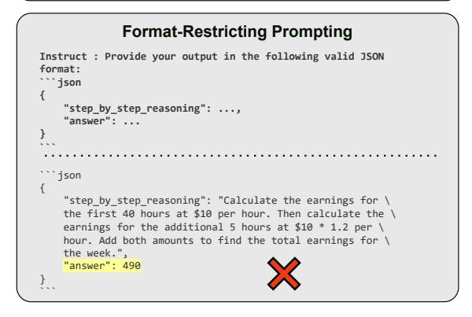
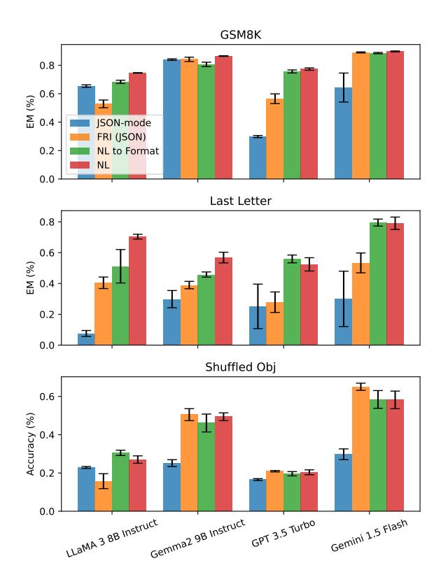
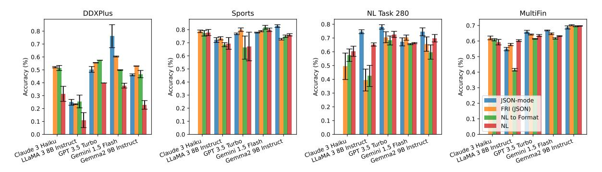
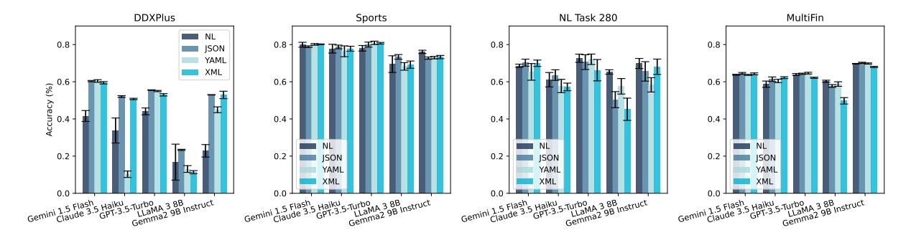
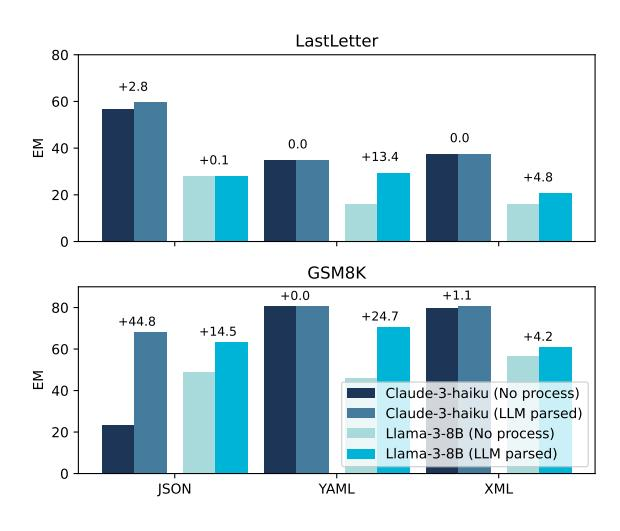
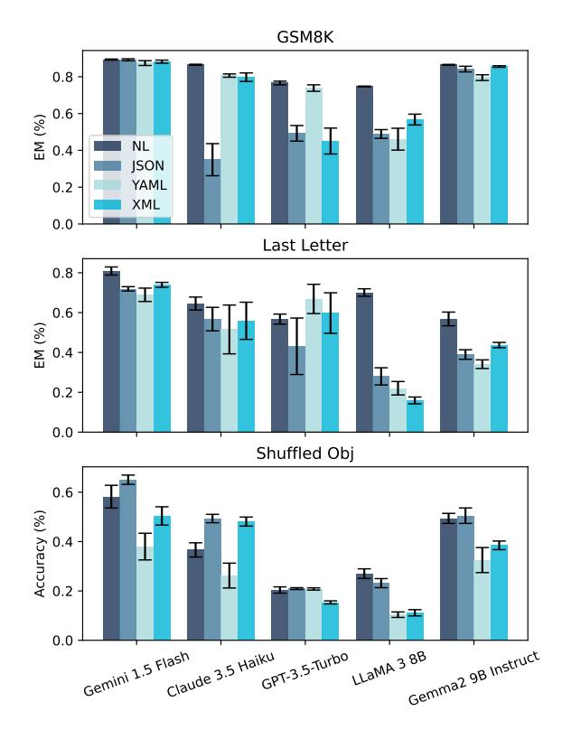
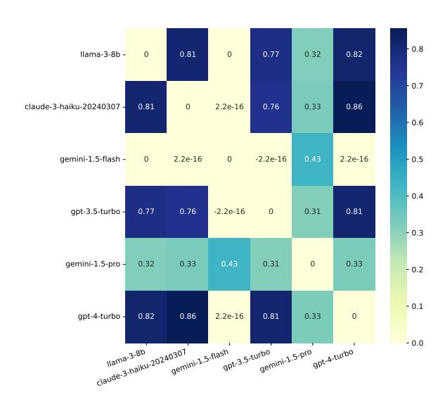
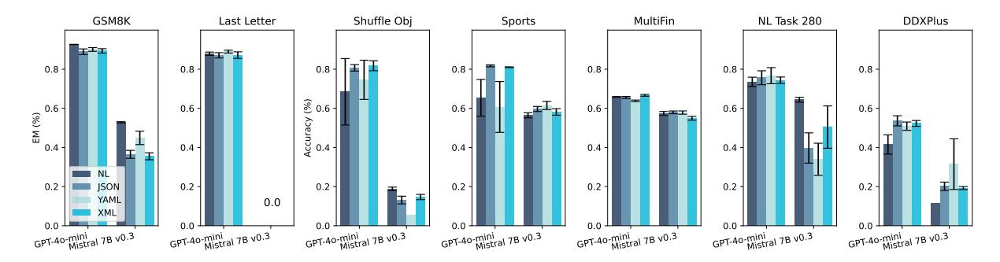

# Let Me Speak Freely? A Study on the Impact of Format Restrictions on Performance of Large Language Models

Zhi Rui Tam<sup>1</sup>\*, Cheng-Kuang Wu<sup>1</sup>\*, Yi-Lin Tsai<sup>1</sup> , Chieh-Yen Lin<sup>1</sup> , Hung-yi Lee<sup>2</sup>† , Yun-Nung Chen<sup>2</sup>†

<sup>1</sup>Appier AI Research <sup>2</sup>National Taiwan University

# Abstract

Structured generation, the process of producing content in standardized formats like JSON and XML, is widely utilized in real-world applications to extract key output information from large language models (LLMs). This study investigates whether such constraints on generation space impact LLMs' abilities, including reasoning and domain knowledge comprehension. Specifically, we evaluate LLMs' performance when restricted to adhere to structured formats versus generating free-form responses across various common tasks. Surprisingly, we observe a significant decline in LLMs' reasoning abilities under format restrictions. Furthermore, we find that stricter format constraints generally lead to greater performance degradation in reasoning tasks.

# 1 Introduction

The few-shot in-context learning [\(Brown et al.,](#page-6-0) [2020\)](#page-6-0) and instruction-following [\(Wei et al.,](#page-6-1) [2021\)](#page-6-1) capabilities of large language models (LLMs) have enabled their out-of-the-box usage to solve downstream tasks. However, a major obstacle to incorporating LLMs into industrial applications is their lack of adherence to standardized output formats. This inconsistency complicates output parsing and undermines the reliability of these models.

One common approach to overcoming this obstacle is *structured generation*, which involves providing output in standardized formats like JSON or XML through *format restrictions*. These restrictions can be implemented in various ways, such as instructing LLMs to adhere to specified formats with *format-restricting instructions*, or using industrial solutions like JSON mode [\(OpenAI,](#page-6-2) [2024;](#page-6-2) [Gemini,](#page-6-3) [2024\)](#page-6-3), Instructor [\(Liu,](#page-6-4) [2024\)](#page-6-4), or Guardrails [\(PrefectHQ,](#page-6-5) [2024\)](#page-6-5). These strategies

#### <span id="page-0-0"></span>**Question:** Eliza's rate per hour for the first 40 hours she works each week is \$10. She also receives an overtime pay of 1.2 times her regular hourly rate. If Eliza worked for 45 hours this week, how much are her earnings for this week?

#### **Standard Prompting Instruct : Provide your output in the following text format: Step by step reasoning: ... Answer: The final answer is ...** Step by step reasoning: 1. Eliza's regular rate per hour is \$10 for the first 40 hours. 2. For the 5 hours of overtime, her rate is 1.2 times her regular rate, which is 1.2 \* \$10 = \$12 per hour. 3. Eliza worked 40 regular hours and 5 overtime hours, totaling 45 hours. 4. Earnings for regular hours = 40 hours \* \$10/hour = \$400 5. Earnings for overtime hours = 5 hours \* \$12/hour = \$60 6. Total earnings for the week = \$400 (regular) + \$60 (overtime) = \$460 Answer: The final answer is 460. ✔



Figure 1: GPT-3.5-turbo prompted with GSM8K math questions in standard natural language answered correctly, but failed when format restrictions were applied.

simplify parsing workflows and streamline the integration of LLMs into real-world applications.

Due to the growing demand for structured generation, the research community has shown increased interest in investigating LLMs' format-following abilities. For example, IFEval [\(Zhou et al.,](#page-7-0) [2023\)](#page-7-0), INFOBENCH [\(Qin et al.,](#page-6-6) [2024\)](#page-6-6), and FOFO [\(Xia](#page-7-1) [et al.,](#page-7-1) [2024\)](#page-7-1) focus on evaluating LLMs' instructionfollowing capabilities, including format adherence. However, these studies do not address a critical question for industrial applications: *Do format-*

<sup>\*</sup>Equal contribution

<sup>†</sup>Equal advisorship

restricting instructions affect the quality of LLMs' generated content? In other words, they fail to explore whether format restrictions degrade LLMs' performance, which has great business impacts. This performance degradation is shown in Figure 1.

In this work, we address the aforementioned research question through extensive empirical experiments. We present a comprehensive analysis of the potential impacts of format-restricting instructions on LLMs' performance across a wide range of tasks. The formats studied include commonly used schemas such as JSON, XML, and YAML. To the best of our knowledge, this is the first systematic investigation into the relationship between format-restricting instructions and the quality of generated content. Our contributions are twofold:

- We observe declines in LLMs' reasoning abilities under format restrictions, with stricter constraints generally leading to greater performance degradation in reasoning tasks.
- We offer insights into why performance degrades due to format constraints and propose simple approaches to mitigate these issues, thereby achieving both consistent formats and optimal performance.

#### 2 Methodology for Structured Generation

To study different levels of format restrictions on downstream performance, we adopt the following three common methodologies in our experiments: Constrained Decoding (JSON-mode): Constrained decoding is a technique that limits the output of LLMs by enforcing predefined token space during the generation process. Among mainstream LLM providers, JSON mode is a widely implemented instance of this technique, especially due to its extensive use in industrial settings. This mode, available as a hyperparameter flag in OpenAI and Gemini APIs, ensures the output is valid JSON. It is assumed that the implementation is similar to the constrained decoding methods described by (Willard and Louf, 2023; Koo et al., 2024), and provided in Text-Generation-Inference<sup>1</sup>.

**Format-Restricting Instructions (FRI):** They direct the LLM to generate responses in standardized formats such as JSON, XML, and YAML, adhering to specified schemas. These instructions ensure

<span id="page-1-1"></span>

Figure 2: When comparing reasoning related task such as GSM8K, Last Letter and Shuffled Objects, we found more relaxed prompts typically yields better results as JSON-mode performs the worse in most case followed by FRI, NL to Format and Natural Language (NL)

that the generated output follows a structured format, facilitating the extraction and evaluation of the final answer. This approach is more relaxed than constrained decoding, as it does not enforce a predefined token space.

**NL-to-Format:** This two-step process first instructs the LLM to answer the question in natural language, and then instructs it to convert its response into the target format schema. As the most relaxed version of structured generation, this method decouples *content generation* from *format adherence*, aiming to maintain the performance of unrestricted natural language responses while still providing structured output.

#### 3 Experiments

#### 3.1 Datasets

We adopt datasets from various domains, categorized by the primary skills they assess:

#### 3.1.1 Reasoning Tasks

**GSM8K** (Cobbe et al., 2021): A collection of mathematical problems set in natural language contexts,

<span id="page-1-0"></span><sup>1</sup>https://github.com/huggingface/ text-generation-inference

<span id="page-2-1"></span>

Figure 3: Classification related tasks on DDXPlus, Sports, Task280 and Multifin in different levels of format restriction.

reflecting daily life scenarios. This dataset challenges LLMs to generate necessary intermediate reasoning steps.

Last Letter Concatenation (Wei et al., 2022): This task requires LLMs to produce a string by concatenating the last letters of a sequence of words, testing their ability to perform symbolic reasoning. Shuffled Objects (Ghazal et al., 2013): This evaluate set from BigBench evaluates the ability to infer the final state given an initial state and a sequence of shuffling events. We use the entire validation set in our experiments.

#### 3.1.2 Classification Tasks

**DDXPlus** (Tchango et al., 2022): A multiple-choice medical diagnosis dataset where LLMs must select the most appropriate diagnosis from 49 possible diseases based on a given patient profile. We use a subset provided by StreamBench (Wu et al., 2024) due to the extensive number of questions.

**MultiFin** (Jørgensen et al., 2023): A multi-choice financial dataset that requires classifying a given paragraph into one of five categories.

**Sports Understanding** (Ghazal et al., 2013): This task from BigBench tests LLMs' ability to determine whether an artificially constructed sentence relating to sports is plausible or implausible.

**NI - Task 280** (Mishra et al., 2022): A multiple-choice stereotype classification task based on a given paragraph. We included this task as it has been found to be sensitive to change in prompt formatting, with performance variations of up to 56% (Sclar et al., 2023).

#### 3.2 Model

For all experiments, we compare *gpt-3.5-turbo-0125* (OpenAI, 2023), *claude-3-haiku-20240307* (Team, 2024a), *gemini-1.5-flash* (Team et al.,

2023). For open weights model we use *LLaMA-3-8B-Instruct* (Team, 2024b) and *Gemma-2-9B-Instruct* (Team et al., 2024) inference using Text-Generation-Server for its support in **JSON mode**<sup>2</sup>.

#### 3.3 Evaluation method

Metrics. To assess the performance of the models across the diverse range of tasks, we employ task-specific evaluation metrics. For the classification-based tasks (Sports Understanding, DDXPlus, Natural Instruction Task 280, and MultiFin), we use accuracy as the primary metric. For the Last Letter Concatenation and GSM8K, we utilize the exact match metric where the final answer must be the extact string match with the actual answer.

**Perfect Text Parser.** To disentangle format errors from the actual performance of the generated content, we use an LLM prompted to extract the final answer from the text, rather than relying on regex or string parsers. This approach acts as a perfect parser, minimizing errors introduced when switching between different models. Our ablation study, comparing different models, found that *claude-3-haiku-20240307* is the most consistent when using *gpt-4-turbo* as a human reference, compared to four other low-cost APIs. Full results can be found in Appendix B.

Consideration for Prompt Sensitivity. Previous studies (Chen et al., 2023; Sclar et al., 2023; Zhu et al., 2023) have shown that LLMs are sensitive to slight variations in prompts. To account for this, we evaluate our approach by nine prompt combinations: three task descriptions and three JSON, XML, and YAML schemas with slight variations in wording or format. For natural language prompting, we include three variations in text formats (e.g.,

<span id="page-2-0"></span><sup>2</sup>https://github.com/huggingface/ text-generation-inference/pull/1938

*Give your reason first followed by your answers*). Details of the task description prompts and FRI prompts can be found in Appendix [F.](#page-8-0)

# 4 Main Results

# 4.1 Impact of Format Restriction on Final Results

We investigate the effects of format restrictions on LLM performance by examining three progressively relaxed prompting approaches: JSON-mode, FRI, and NL-to-Format conversion.

We evaluate these approaches on datasets with exact match scores: GSM8K and Last Letter Concatenation presented in Figure [2.](#page-1-1) Surprisingly, JSON-mode performs significantly worse than FRI (JSON) on the Last Letter task. Upon inspection, we found that 100% of GPT 3.5 Turbo JSON-mode responses placed the "answer" key before the "reason" key, resulting in zero-shot direct answering instead of zero-shot chain-of-thought reasoning.

Comparing NL-to-Format with unrestricted Natural Language responses, we observe nearly identical performance across most models, as both derive answers from the same initial natural language response. However, NL-to-Format occasionally introduces generation errors, leading to slightly lower performance for LLaMA 3 8B Instruct, while other models maintain consistent scores across both settings.

These findings suggest that the degree and implementation of format restrictions can significantly impact LLM performance, particularly in reasoning tasks. The order of keys in structured outputs and the decoupling of reasoning from format adherence emerge as important factors in maintaining LLM capabilities while providing structured responses.

When evaluating classification datasets, we observe a different trend compared to reasoning tasks, as illustrated in Figure [3.](#page-2-1) Notably, in the DDXPlus dataset, Gemini 1.5 Flash demonstrates a significant performance boost when JSON-mode is enabled. Across other classification datasets, JSONmode performs competitively, and in some cases, surpasses the other three methodologies.

We hypothesize that JSON-mode improves classification task performance by constraining possible answers resulted in reducing errors in answer selection. Conversely, natural language responses may introduce distractions, leading to parsing errors. These findings suggest format restrictions' impact on LLM performance is task-dependent: stringent formats may hinder reasoning-intensive tasks but enhance accuracy in classification tasks requiring structured outputs.

# 5 Discussion

#### 5.1 Impact on looser format restriction

To further investigate the effects of format restrictions, we examine a variation of the Soft Restrict setting where we remove the schema restriction from the prompt description. Instead of providing a specific schema (e.g., *"Reply your answer in JSON format with the following schema: { "reason": ..., "answer": ... }"*), we simply instruct the LLM to output in the target format language (e.g., *"Reply your answer in JSON format."*). Table [1](#page-4-0) illustrates the effects of removing the schema restriction on the GSM8K dataset. We observe significant improvements in average scores and lower standard deviations across different prompt perturbations for Claude 3 Haiku, GPT-3.5 Turbo, and LLaMA 3 8B Instruct. These results suggest that while structured outputs can be beneficial for downstream processing, overly restrictive schemas may hinder LLM performance, particularly in reasoning-intensive tasks.

This finding suggests that a balance must be struck between the desire for easily parseable, structured outputs and the need to preserve the LLM's inherent reasoning abilities. Practitioners may want to consider using looser format restrictions when dealing with complex reasoning tasks, while still maintaining some level of structure to facilitate downstream processing.

# 5.2 Comparison Across Different Formats

In this section we ablate the format language by comparing not just JSON but also XML and YAML format. Since all 3 language comes in different grammar syntax rules and restriction. We deduce each models might perform differently for example Claude-3-Haiku uses XML for tool use schema so

On hint sight we do not see any structure format which consistency stands out from others which generalized across all models in Figure [4.](#page-4-1) For Gemini model, we found JSON is more consistent however it does not always outperform other format.

In Table [8](#page-17-0) we found in classification task JSONmode performs much better than text due to the restriction on answer space. However in reasoning related task, JSON-mode failed to adhere to the

<span id="page-4-1"></span>

Figure 4: Comparison of different format in classification related tasks on DDXPlus, Sports, Task280 and Multifin. NL=Natural Language. We showed the averaged accuracy for each format over 9 different prompts with standard deviation error.

<span id="page-4-0"></span>

| Model               | Text  | <b>JSON</b> | XML    | YAML   |
|---------------------|-------|-------------|--------|--------|
| gemini-1.5-flash    | 89.33 | 89.66       | 89.26  | 89.21  |
|                     | (0.8) | (0.3)       | (0.3)  | (0.4)  |
| + schema constraint | -     | 89.21       | 88.20  | 87.42  |
|                     | -     | (1.5)       | (2.2)  | (3.7)  |
| claude-3-haiku      | 86.51 | 86.99       | 86.96  | 82.89  |
|                     | (0.8) | (0.2)       | (0.6)  | (5.7)  |
| + schema constraint | -     | 23.44       | 79.76  | 80.63  |
|                     | -     | (22.9)      | (7.0)  | (2.8)  |
| gpt-3.5-turbo       | 75.99 | 74.70       | 60.45  | 71.58  |
|                     | (3.1) | (1.1)       | (7.2)  | (3.0)  |
| + schema constraint | -     | 49.25       | 45.06  | 73.85  |
|                     | -     | (12.0)      | (19.9) | (5.6)  |
| LLaMA-3-8B          | 75.13 | 64.67       | 65.07  | 69.41  |
|                     | (0.9) | (2.23)      | (0.56) | (0.95) |
| + schema constraint | -     | 48.90       | 56.74  | 46.08  |
|                     | -     | (6.7)       | (8.3)  | (16.8) |

Table 1: Comparing results without and with schema constraint, adding schema not only increase the sensitivity to prompt but also degrade in average performance.

order of reasoning first followed by answer causing a large drop in final performance.

# 5.3 Structure Format and Parsing Error Rates

We initially hypothesized that the performance gap between text and structured formats might be attributed to parsing errors during answer extraction. However, our analysis of error rates across different formats and models, as shown in Table 2, reveals that this is not the primary factor. In fact, Gemini 1.5 Flash and GPT 3.5 Turbo exhibit near zero parsing failures in all three format. In the LLaMA 3 8B setting, the parsing error rate for the Last Letter task in JSON format is only 0.148%, yet there exists a substantial 38.15% performance gap as seen in Table 1.

This finding suggests that the performance dif-

<span id="page-4-2"></span>

Figure 5: We found high parsing errors in Table 2 can be patched by calling a second prompt to fix any syntax error found in the previous response.

ferences between formats are not primarily due to parsing errors, but rather to the impact of format restrictions on the LLM's reasoning and generation processes. However, we discovered that parsing errors, when present, can be effectively mitigated through a simple corrective step.

By prompting Claude-3-Haiku to reformat any output with parsing errors for both Claude 3 Haiku and LLaMA 3 8B (the two models with the highest percentage of parsing errors), we observed improved scores in JSON and YAML formats, as illustrated in Figure 5. This approach demonstrates the potential for enhancing the reliability of structured outputs without sacrificing the benefits of format-specific optimizations.

#### 6 Related Work

Our study can be summarized into two genres: reasoning ability of LLM and format following.

In study of LLMs reasoning ability, early work

| Table 2: Pa | rsing error | percentage acros | s different | models |
|-------------|-------------|------------------|-------------|--------|
|             |             |                  |             |        |

<span id="page-5-0"></span>

|                | Task   | Reasoning   |       |         |        |         |          |
|----------------|--------|-------------|-------|---------|--------|---------|----------|
| Model          | Format | Last Letter | GSM8K | DDXPlus | Sports | Task280 | MultiFin |
| Gemini-Flash   | JSON   | 0.0         | 0.03  | 0.37    | 0.0    | 0.0     | 0.0      |
|                | XML    | 0.0         | 0.19  | 1.26    | 0.0    | 0.22    | 0.0      |
|                | YAML   | 0.0         | 0.0   | 0.68    | 0.06   | 6.46    | 0.0      |
| Claude-3-Haiku | JSON   | 3.48        | 60.07 | 0.09    | 0.0    | 10.26   | 0.0      |
|                | XML    | 0.0         | 1.85  | 0.48    | 0.0    | 0.41    | 0.0      |
|                | YAML   | 0.0         | 0.0   | 86.66   | 1.02   | 0.13    | 0.0      |
| GPT-3.5-Turbo  | JSON   | 0.0         | 0.13  | 0.0     | 0.0    | 0.0     | 0.0      |
|                | XML    | 0.0         | 0.24  | 0.35    | 0.0    | 0.0     | 0.0      |
|                | YAML   | 0.0         | 0.0   | 0.32    | 1.23   | 0.08    | 0.0      |
| LLaMA 3 8B     | JSON   | 0.15        | 22.75 | 1.63    | 0.28   | 1.61    | 0.0      |
|                | XML    | 17.93       | 7.62  | 32.45   | 6.54   | 22.04   | 5.78     |
|                | YAML   | 32.40       | 33.18 | 34.40   | 7.16   | 2.19    | 0.14     |



Figure 6: Comparison of JSON, YAML, XML with Natural Language (NL) response on reasoning related task. NL still performs better than other formats with the exception of GPT-3.5-Turbo.

by (Kojima et al., 2022) found using "Think step-by-step" can elicit reasoning ability without few shot examples. Subsequent study (Jin et al., 2024) shows that the number of reasoning steps correlates with the final accuracy. Recent work by (Wang and Zhou, 2024) found Chain-of-Thought (CoT) reasoning seed prompt (Kojima et al., 2022) can be removed with a carefully crafted CoT decoding schema.

The exploration of LLMs' ability to follow instructions and produce responses in specified formats was first addressed by IFEval (Zhou et al., 2023) which designed to evaluate the general instruction-following ability of LLMs, and it contains a subset of test instances specifically assessing format-following. INFOBENCH (Qin et al., 2024) introduces a broader coverage of instructions and conducts a more fine-grained analysis by decomposing the instructions into different categories, including format specifications. FOFO (Xia et al., 2024) is a benchmark solely focused on the format-following ability of LLMs. However, these works do not explore if format instruction interfere with downstream performance.

#### 7 Conclusion

Our study reveals that structured generation constraints significantly impact LLM performance across various tasks. Format restrictions, particularly constrained decoding (JSON-mode), can hinder reasoning abilities while enhance classification task accuracy. Looser format restrictions generally improve performance and reduce variance in reasoning tasks. Parsing errors, while not the primary cause of performance differences, can be mitigated through corrective prompting. These findings underscore the importance of balancing format adherence, reasoning capabilities, and cost efficiency in LLM applications. Given that our study focuses on reasoning-intensive tasks, future work should explore how reasoning tasks of varying difficulty, from intensive to simple, are affected by restrictive formats and LLMs. To mitigate the performance degradation of LLMs due to restrictive formats, future studies should include a wider range of training data that contains instructions in various restrictive formats in local LLMs.

# References

- <span id="page-6-0"></span>Tom Brown, Benjamin Mann, Nick Ryder, Melanie Subbiah, Jared D Kaplan, Prafulla Dhariwal, Arvind Neelakantan, Pranav Shyam, Girish Sastry, Amanda Askell, et al. 2020. Language models are few-shot learners. *Advances in neural information processing systems*, 33:1877–1901.
- <span id="page-6-21"></span>Yulin Chen, Ning Ding, Xiaobin Wang, Shengding Hu, Haitao Zheng, Zhiyuan Liu, and Pengjun Xie. 2023. Exploring lottery prompts for pre-trained language models. In *Proceedings of the 61st Annual Meeting of the Association for Computational Linguistics (Volume 1: Long Papers)*, pages 15428–15444.
- <span id="page-6-9"></span>Karl Cobbe, Vineet Kosaraju, Mohammad Bavarian, Mark Chen, Heewoo Jun, Lukasz Kaiser, Matthias Plappert, Jerry Tworek, Jacob Hilton, Reiichiro Nakano, Christopher Hesse, and John Schulman. 2021. Training verifiers to solve math word problems. *arXiv preprint arXiv:2110.14168*.
- <span id="page-6-3"></span>Google Gemini. 2024. Generate json output with the gemini api. [https://ai.google.dev/](https://ai.google.dev/gemini-api/docs/json-mode?lang=python) [gemini-api/docs/json-mode?lang=python](https://ai.google.dev/gemini-api/docs/json-mode?lang=python). Accessed on 2024-07-02.
- <span id="page-6-11"></span>Ahmad Ghazal, Tilmann Rabl, Minqing Hu, Francois Raab, Meikel Poess, Alain Crolotte, and Hans-Arno Jacobsen. 2013. Bigbench: Towards an industry standard benchmark for big data analytics. In *Proceedings of the 2013 ACM SIGMOD international conference on Management of data*, pages 1197–1208.
- <span id="page-6-23"></span>Mingyu Jin, Qinkai Yu, Haiyan Zhao, Wenyue Hua, Yanda Meng, Yongfeng Zhang, Mengnan Du, et al. 2024. The impact of reasoning step length on large language models. *arXiv preprint arXiv:2401.04925*.
- <span id="page-6-13"></span>Rasmus Kær Jørgensen, Oliver Brandt, Mareike Hartmann, Xiang Dai, C. Igel, and Desmond Elliott. 2023. Multifin: A dataset for multilingual financial nlp. In *ACL Findings*.
- <span id="page-6-22"></span>Takeshi Kojima, Shixiang Shane Gu, Machel Reid, Yutaka Matsuo, and Yusuke Iwasawa. 2022. Large language models are zero-shot reasoners. In *Advances in Neural Information Processing Systems*.
- <span id="page-6-8"></span>Terry Koo, Frederick Liu, and Luheng He. 2024. Automata-based constraints for language model decoding. *arXiv e-prints*.
- <span id="page-6-4"></span>Jason Liu. 2024. [instructor.](https://github.com/jxnl/instructor)
- <span id="page-6-14"></span>Swaroop Mishra, Daniel Khashabi, Chitta Baral, and Hannaneh Hajishirzi. 2022. Cross-task generalization via natural language crowdsourcing instructions. In *ACL*.

- <span id="page-6-16"></span>OpenAI. 2023. Gpt-4 technical report.
- <span id="page-6-2"></span>OpenAI. 2024. Json mode. [https://platform.](https://platform.openai.com/docs/guides/text-generation/json-mode) [openai.com/docs/guides/text-generation/](https://platform.openai.com/docs/guides/text-generation/json-mode) [json-mode](https://platform.openai.com/docs/guides/text-generation/json-mode). Accessed on 2024-07-02.
- <span id="page-6-5"></span>PrefectHQ. 2024. [marvin.](https://github.com/PrefectHQ/marvin)
- <span id="page-6-6"></span>Yiwei Qin, Kaiqiang Song, Yebowen Hu, Wenlin Yao, Sangwoo Cho, Xiaoyang Wang, Xuansheng Wu, Fei Liu, Pengfei Liu, and Dong Yu. 2024. Infobench: Evaluating instruction following ability in large language models. *arXiv preprint arXiv:2401.03601*.
- <span id="page-6-15"></span>Melanie Sclar, Yejin Choi, Yulia Tsvetkov, and Alane Suhr. 2023. Quantifying language models' sensitivity to spurious features in prompt design or: How i learned to start worrying about prompt formatting. In *The Twelfth International Conference on Learning Representations*.
- <span id="page-6-12"></span>Arsène Fansi Tchango, Rishab Goel, Zhi Wen, Julien Martel, and Joumana Ghosn. 2022. Ddxplus: a new dataset for automatic medical diagnosis. In *Proceedings of the 36th International Conference on Neural Information Processing Systems*, pages 31306– 31318.
- <span id="page-6-17"></span>Anthropic Team. 2024a. Introducing the next generation of claude.
- <span id="page-6-18"></span>Gemini Team, Rohan Anil, Sebastian Borgeaud, Yonghui Wu, Jean-Baptiste Alayrac, Jiahui Yu, Radu Soricut, Johan Schalkwyk, Andrew M Dai, Anja Hauth, et al. 2023. Gemini: a family of highly capable multimodal models. *arXiv preprint arXiv:2312.11805*.
- <span id="page-6-20"></span>Gemma Team, Thomas Mesnard, Cassidy Hardin, Robert Dadashi, Surya Bhupatiraju, Shreya Pathak, Laurent Sifre, Morgane Rivière, Mihir Sanjay Kale, Juliette Love, et al. 2024. Gemma: Open models based on gemini research and technology. *arXiv preprint arXiv:2403.08295*.
- <span id="page-6-19"></span>Meta LLaMA Team. 2024b. Introducing meta llama 3: The most capable openly available llm to date.
- <span id="page-6-24"></span>Xuezhi Wang and Denny Zhou. 2024. Chain-ofthought reasoning without prompting. *ArXiv*, abs/2402.10200.
- <span id="page-6-1"></span>Jason Wei, Maarten Bosma, Vincent Y Zhao, Kelvin Guu, Adams Wei Yu, Brian Lester, Nan Du, Andrew M Dai, and Quoc V Le. 2021. Finetuned language models are zero-shot learners. *arXiv preprint arXiv:2109.01652*.
- <span id="page-6-10"></span>Jason Wei, Xuezhi Wang, Dale Schuurmans, Maarten Bosma, Fei Xia, Ed H Chi, Quoc V Le, Denny Zhou, et al. 2022. Chain-of-thought prompting elicits reasoning in large language models. In *Advances in Neural Information Processing Systems*.
- <span id="page-6-7"></span>Brandon T Willard and Rémi Louf. 2023. Efficient guided generation for large language models. *arXiv e-prints*, pages arXiv–2307.

<span id="page-7-2"></span>Cheng-Kuang Wu, Zhi Rui Tam, Chieh-Yen Lin, Yun-Nung Chen, and Hung yi Lee. 2024. Streambench: Towards benchmarking continuous improvement of language agents.

<span id="page-7-1"></span>Congying Xia, Chen Xing, Jiangshu Du, Xinyi Yang, Yihao Feng, Ran Xu, Wenpeng Yin, and Caiming Xiong. 2024. Fofo: A benchmark to evaluate llms' format-following capability. *arXiv preprint arXiv:2402.18667*.

<span id="page-7-0"></span>Jeffrey Zhou, Tianjian Lu, Swaroop Mishra, Siddhartha Brahma, Sujoy Basu, Yi Luan, Denny Zhou, and Le Hou. 2023. Instruction-following evaluation for large language models. *arXiv preprint arXiv:2311.07911*.

<span id="page-7-4"></span>Kaijie Zhu, Jindong Wang, Jiaheng Zhou, Zichen Wang, Hao Chen, Yidong Wang, Linyi Yang, Wei Ye, Yue Zhang, Neil Zhenqiang Gong, et al. 2023. Promptbench: Towards evaluating the robustness of large language models on adversarial prompts. *arXiv preprint arXiv:2306.04528*.

#### **A** Limitation

This study contains two primary limitations. First, due to cost constraints, we were unable to include results from more powerful language models such as LLaMA 70B or GPT-40 in our experiments. The inclusion of these models could potentially provide additional insights into how performance scales with model size and architecture. Second, our evaluation dataset, while diverse, is limited in scope. A broader range of tasks and domains could offer a more comprehensive assessment of the proposed approach's effectiveness and generalizability.

# <span id="page-7-3"></span>B Choosing which LLMs as answer extraction

To select the best and low cost answer LLM parser, we select 200 samples from six datasets response in natural language format which a total of 1,200 samples. We then use *gpt-4-turbo* as best LLM answer parser as our reference and calculate the kappa cohen score with 3 LLMs candidates: *gemini-1.5-flash*, *claude-3-haiku-20240307* and *llama-3-8b-instruct* in Figure 7. Result shows *claude-3-haiku-20240307* has the highest aggreement with *gpt-4-turbo* at 0.86 followed by *llama-3-8b-instruct*.

## C Cost Comparison Across Different Formats

An important consideration in deploying LLM applications in industry settings is the associated token cost. We analyzed the input and output tokens across our experiments for all models and formats.

<span id="page-7-5"></span>

Figure 7: Agreement scores among all LLMs on the final extracted answes.

<span id="page-7-6"></span>

| Model            | text | json | xml  | yaml |
|------------------|------|------|------|------|
| LLaMA-3-8b       | 0.11 | 0.09 | 0.09 | 0.08 |
| Gemini-1.5-Flash | 0.20 | 0.21 | 0.21 | 0.19 |
| Claude-3-Haiku   | 0.20 | 0.30 | 0.30 | 0.29 |
| GPT-3.5-Turbo    | 0.35 | 0.23 | 0.24 | 0.23 |

Table 3: Comparison of total costs (US dollar per 1000 entries) for different models and output formats. Numbers are averaged over all 6 datasets.

For brevity, we present the averaged results from all six datasets in Table 3. Our analysis reveals that text and YAML formats generally incur similar costs. Interestingly, we found that YAML is the most cost-effective format for LLaMA-3-8B, Gemini-1.5-Flash, and GPT-3.5-Turbo. Surprisingly, for Claude-3-Haiku, the lowest cost is associated with the text format, which is unexpected given the prevalence of XML examples in their documentation for tool use. The full cost breakdown for each dataset can be found in Table 4, providing a more detailed view for practitioners interested in fine-tuning their approach for specific use cases.

#### **D** Additional models

We also tested additional models from Mistral and OpenAI: *Mistral-7b-v0.3*, *GPT-4o-mini-2024* on format prompt variation in GSM8K, Last Letter, Shuffled Object, Sports Understanding, MultiFin, NL Task 280 and DDXPlus. The result is visualized in Figure 8.

<span id="page-8-1"></span>

|            |        |      | gemini-1.5-flash |      | llama-3-8b |      | claude-3-haiku |      | gpt-3.5-turbo |      |      |      |      |
|------------|--------|------|------------------|------|------------|------|----------------|------|---------------|------|------|------|------|
| Dataset    | Format | In   | Out              | Tot  | In         | Out  | Tot            | In   | Out           | Tot  | In   | Out  | Tot  |
|            | text   | 0.04 | 0.09             | 0.12 | 0.02       | 0.02 | 0.04           | 0.03 | 0.12          | 0.15 | 0.05 | 0.07 | 0.12 |
|            | json   | 0.04 | 0.10             | 0.14 | 0.02       | 0.03 | 0.05           | 0.03 | 0.17          | 0.21 | 0.06 | 0.05 | 0.11 |
| lastletter | xml    | 0.04 | 0.10             | 0.14 | 0.02       | 0.03 | 0.05           | 0.03 | 0.15          | 0.18 | 0.06 | 0.07 | 0.13 |
|            | yaml   | 0.04 | 0.09             | 0.13 | 0.02       | 0.02 | 0.05           | 0.03 | 0.14          | 0.18 | 0.06 | 0.09 | 0.14 |
|            | text   | 0.05 | 0.13             | 0.18 | 0.03       | 0.03 | 0.06           | 0.04 | 0.23          | 0.27 | 0.07 | 0.16 | 0.23 |
| gsm8k      | json   | 0.05 | 0.14             | 0.20 | 0.03       | 0.03 | 0.07           | 0.04 | 0.29          | 0.33 | 0.08 | 0.12 | 0.19 |
|            | xml    | 0.06 | 0.14             | 0.19 | 0.03       | 0.03 | 0.07           | 0.05 | 0.27          | 0.32 | 0.08 | 0.12 | 0.20 |
|            | yaml   | 0.05 | 0.13             | 0.18 | 0.03       | 0.03 | 0.06           | 0.04 | 0.28          | 0.32 | 0.08 | 0.14 | 0.22 |
|            | text   | 0.05 | 0.01             | 0.06 | 0.03       | 0.00 | 0.03           | 0.03 | 0.02          | 0.05 | 0.07 | 0.02 | 0.09 |
|            | json   | 0.05 | 0.02             | 0.07 | 0.03       | 0.00 | 0.03           | 0.04 | 0.05          | 0.09 | 0.07 | 0.02 | 0.09 |
| multifin   | xml    | 0.05 | 0.02             | 0.07 | 0.03       | 0.01 | 0.04           | 0.04 | 0.04          | 0.08 | 0.08 | 0.03 | 0.10 |
|            | yaml   | 0.05 | 0.01             | 0.06 | 0.03       | 0.00 | 0.03           | 0.04 | 0.02          | 0.06 | 0.07 | 0.01 | 0.08 |
|            | text   | 0.04 | 0.04             | 0.08 | 0.02       | 0.01 | 0.03           | 0.03 | 0.10          | 0.13 | 0.05 | 0.05 | 0.10 |
| sports     | json   | 0.04 | 0.06             | 0.10 | 0.02       | 0.01 | 0.04           | 0.03 | 0.11          | 0.15 | 0.06 | 0.07 | 0.12 |
|            | xml    | 0.04 | 0.07             | 0.11 | 0.02       | 0.02 | 0.04           | 0.03 | 0.14          | 0.17 | 0.06 | 0.08 | 0.14 |
|            | yaml   | 0.04 | 0.05             | 0.08 | 0.02       | 0.01 | 0.04           | 0.03 | 0.12          | 0.15 | 0.05 | 0.06 | 0.11 |
|            | text   | 0.04 | 0.05             | 0.09 | 0.03       | 0.01 | 0.03           | 0.03 | 0.05          | 0.08 | 0.06 | 0.04 | 0.11 |
| task280    | json   | 0.05 | 0.04             | 0.08 | 0.03       | 0.01 | 0.03           | 0.04 | 0.07          | 0.11 | 0.07 | 0.04 | 0.11 |
|            | xml    | 0.05 | 0.04             | 0.09 | 0.03       | 0.01 | 0.04           | 0.04 | 0.08          | 0.11 | 0.07 | 0.05 | 0.12 |
|            | yaml   | 0.04 | 0.03             | 0.07 | 0.03       | 0.01 | 0.03           | 0.04 | 0.05          | 0.09 | 0.06 | 0.03 | 0.10 |
|            | text   | 0.26 | 0.15             | 0.41 | 0.15       | 0.04 | 0.18           | 0.19 | 0.20          | 0.38 | 0.38 | 0.21 | 0.59 |
| ddxplus    | json   | 0.22 | 0.18             | 0.41 | 0.13       | 0.06 | 0.19           | 0.19 | 0.33          | 0.52 | 0.34 | 0.15 | 0.48 |
|            | xml    | 0.23 | 0.19             | 0.42 | 0.14       | 0.06 | 0.19           | 0.19 | 0.37          | 0.56 | 0.34 | 0.18 | 0.51 |
|            | yaml   | 0.22 | 0.15             | 0.37 | 0.13       | 0.05 | 0.18           | 0.19 | 0.31          | 0.50 | 0.33 | 0.15 | 0.48 |

Table 4: Performance comparison of different models across various datasets and formats. Values represent processing times in seconds for Input (In), Output (Out), and Total (Tot).

# E Comparison between using regex and LLM as answer parser in GSM8K

To answer the difference between using regex parser to extract the final strict match answer, we calculate the Exact Match score in GSM8K results using the prompt format template "The final answer is". Table [5](#page-8-2) results reveal a significant gap between regex match and LLM as final answer parser in EM score across various language models, highlighting the limitations of using only one strict regex matching for different models. For example, GPT-3.5-Turbo shows a 31.8 percentage point improvement from regex match (43.7%) to overall accuracy (75.5%), while Gemini-1.5-Flash exhibits an even larger 43.5 point difference. This pattern is consistent across all models, with mistral-7b demonstrating the most dramatic 42 point increase. These disparities underscore the value of using LLMs as answer parsers, as they can understand and evaluate responses beyond literal string matching, accounting for paraphrases and contextual understanding, thus providing a more nuanced and accurate assessment in text-based tasks.

<span id="page-8-2"></span>

| Model            | Regex Match | LLM Match |
|------------------|-------------|-----------|
| GPT-3.5-Turbo    | 43.7        | 75.5      |
| Gemini-1.5-Flash | 25.8        | 69.3      |
| Claude-3-Haiku   | 67.4        | 85.8      |
| Gemma2-9b        | 82.5        | 86.0      |
| LLaMA-3-8b       | 46.9        | 55.7      |
| Mistral-7b-v0.3  | 10.4        | 52.4      |

Table 5: Comparison of model performance on regex match "*The final answer is (\d+)*" accuracy and using Claude-3-Haiku as answer parser.

## <span id="page-8-0"></span>F Prompt

#### F.1 Prompt Format

For each task we fix the same template and only swapping the task description, format description, few shots example and question text.

<span id="page-9-0"></span>

Figure 8: Exact Match scores on GSM8K and Last Letter on reasoning related datasets. Classification related tasks on Shuffled Object, Sports Understanding, MultiFin, NL Task 280 and DDXPlus in different levels of format restriction. In general, we found GPT-40 is quite consistent on adding format restriction. In the Last Letter task, the exact match scores of Mistral-7B-v0.3 across all 4 formats are very close to 0%, which are not explicitly shown in the figure.

# Follow the instruction to complete the task:

{task\_description}

Instruct: {format\_description}

{few shots}

{question}

**Task Description** A task description describes the task and the final goal of the task.

**Format Description** A format description includes the target format (ie JSON, XML or YAML) and a targeted schema we intent the LLM response to adhere to.

For each description slot, we create 3 variations each which results in 9 prompt combinations. Each variation must retain the original meaning with slight change in wording, order of instruction. For each model we prompt all 9 prompts to calculate the sensitivity and variance of the final result.

If the current task requires reasoning, we include the zero shot chain-of-thought prompting: "Think step-by-step" in task description and ensures the LLM response to generate reasoning before giving the final answer.

#### F.2 Prompt variation for GSM8K

The 3 task description variations for GSM8K are shown in as below:

#### Task description variation1:

You are a math tutor who helps students of all levels understand and solve mathematical problems.

Read the last question carefully and think step by step before answering, the final answer must be only a number.

#### Task description variation2:

Read the last question carefully and think step by step before answering, the final answer must be only a number. You are a math tutor who helps students of all levels understand and solve mathematical problems.

#### Task description variation3:

Mathematical problem-solving task:

- Given: A mathematical question or problem
- Required: A numerical answer only
- Role: You are a math tutor assisting students of all levels
- Process: Think step by step to solve the problem

Note: Read the question carefully before beginning your analysis.

Format descriptions are shown in Section F.10.

# F.3 Prompt variation for Last Letter Concatenation

The 3 task description variations for Last Letter Concatenation are shown in as below:

# Task description variation1:

You are given a string of words and you need to take the last letter of each words and concate them.

Read the last question carefully and think step by step before answering.

## Task description variation2:

Read carefully for each of the last question and think step by step before answering. You are given a string of words and you need to take the last letter of each words and concatenate them.

# Task description variation3:

String manipulation task:

- Given: A sequence of words
- Required: A new string made from the last letter of each word
- Process: Think step by step to solve this challenge

Note: Ensure you've read the question thoroughly before beginning.

#### Task description variation1:

In this task, you are tasked to answer the following commonsense knowledge task. Read carefully for each of the last question and think step by step before answering. Make sure the answer only contain one of these four choice : A, B, C, D, E, F, G

## Task description variation2:

Read carefully for each of the last question and think step by step before answering. Make sure the answer only contain one of these four choice : A, B, C, D, E, F, G In this task, you are tasked to answer the following commonsense knowledge task.

# Task description variation3:

Context understanding assessment:

- Given: A story related to many person in the same place
- Required: Determine if the person who is in the end of the story
- Process: Think step by step to analyze the context
- Output: Answer the correct answer and only contain one of these seven choice : A, B, C, D, E, F, G

# F.4 Prompt variation for Shuffle Object Tracking

#### F.5 Prompt variation for DDXPlus

The 3 task description variations for Shuffle Object Tracking are shown in as below:

The 3 task description variations for DDXPlus are shown in as below:

# Task description variation1:

Extract the following RESPONSE final answer, your answer should be the one which match any of these valid diagnoses:

- Possible NSTEMI / STEMI
- Spontaneous rib fracture
- Pulmonary embolism
- Pulmonary neoplasm

...

- Scombroid food poisoning RESPONSE:

# Task description variation2:

Act as a medical doctor and diagnose the patient based on the given patient profile All possible valid diagnoses for you to choose from are as follows:

- Possible NSTEMI / STEMI
- Spontaneous rib fracture
- Pulmonary embolism
- Pulmonary neoplasm

...

- Scombroid food poisoning

# Task description variation3:

Medical diagnosis task:

- Given: A patient profile
- Required: Diagnose the patient based on the provided information
- Process: Think step by step to analyze the patient's symptoms and history
- Output: Select one diagnosis from the provided list of valid options

Note: Carefully review the patient profile and the list of possible diagnoses before making your determination. Do not answer "Insufficient information" - you must choose from the given options.

Valid diagnoses (select one):

- Possible NSTEMI / STEMI
- Spontaneous rib fracture
- Pulmonary embolism
- Pulmonary neoplasm

...

- Scombroid food poisoning

## Task description variation1:

You are given a sentence and your task is to determine whether a sentence relating to sports is plausible or implausible

Read carefully for each of the last question and think step by step before answering.

Answer yes if its plausible, no if implausible

# Task description variation2:

You are given a sentence and your task is to determine whether a sentence relating to sports is plausible or implausible. Read carefully for each of the last question and think step by step before answering. Answer yes if its plausible, no if implausible

# Task description variation3:

Sentence plausibility assessment:

- Given: A sentence related to sports
- Required: Determine if the sentence is plausible or implausible
- Process: Think step by step to analyze the sentence
- Output: Answer "yes" if plausible, "no" if implausible

# F.7 Prompt variation for Natural Language - Task 280

# F.6 Prompt variation for Sports Understanding

The 3 task description variations for Sports Understanding are shown in as below: The 3 task description variations for Natural Language - Task 280 are shown in as below:

#### Task description variation1:

In this task, you are given a short passage that conveys stereotype or anti-stereotype about a specific target. A stereotype is an over-generalized belief about a particular group of people. An anti-stereotype is an idea that goes against a common stereotype. You are expected to classify the passage into four types of stereotype or anti-stereotype: gender, profession, race, and religion.

#### Task description variation2:

You are expected to classify the passage into four types of stereotype or anti-stereotype: gender, profession, race, and religion.

In this task, you are given a short passage that conveys stereotype or anti-stereotype about a specific target. A stereotype is an over-generalized belief about a particular group of people. An anti-stereotype is an idea that goes against a common stereotype.

# Task description variation3:

Sentence stereotype assessment:

- Given: A passage related to stereotype or anti-stereotype
- Required: Determine if the paragraph is one of these four category : gender, profession, race, and religion
- Output: Answer only one of the four category

#### Task description variation1:

Act as a finance expert and assign the content based to the valid category

All possible valid category for you to choose from are as follows (one category per line, in the format of <category>):

- Finance
- Technology
- Tax and Accounting
- Business and Management
- Government and Controls
- Industry

Your answer MUST based on the above options, do not answer Insufficient information

# Task description variation2:

Act as a finance expert and assign the content based to the valid category

Your answer MUST based on the above options, do not answer Insufficient information All possible valid category for you to choose from are as follows (one category per line, in the format of <category>):

- Finance
- Technology
- Tax and Accounting
- Business and Management
- Government and Controls
- Industry

# Task description variation3:

Act as a finance expert and assign the content based to the valid category

All possible valid category for you to choose from are as follows (one category per line, in the format of <category>):

Finance

Technology

Tax and Accounting

Business and Management

Government and Controls

Industry

Your answer MUST based on the above options, do not answer Insufficient information

## F.8 Prompt variation for MultiFin

#### F.9 Direct Answer format prompts

For tasks which doesn't need chain of though reasoning, we use these three prompt variations. In our experiments, we use 3 format variations in MultiFin.

The 3 task description variations for MultiFin are shown in as below:

# DA prompt description variation 1: Natural language:

Derive the most likely category to answer key. Provide your output in the following valid text format:

Answer: ...

## JSON:

Derive the most likely category to answer key. Provide your output in the following valid JSON format:

```
"'json
{
"answer": "..." } "'
```

## YAML:

Derive the most likely category to answer key. Provide your output in the following valid YAML format:

```
"'yaml
answer: ...
"'
```

# XML:

Derive the most likely category to answer block Provide your output in the following valid YAML format:

```
"'xml
<root>
<answer>...</answer>
</root>
"'
```

# DA prompt description variation 2: Natural language:

Provide your output in the following text format:

Step by step reasoning: ...

Answer: The final answer is ...

# JSON:

Provide your output in the following valid JSON format:

```
"'json
{
"step_by_step_reasoning": ...,
"answer": ...
}
"'
```

#### YAML:

Provide your output in the following valid YAML format:

```
"'yaml
step_by_step_reasoning: |
...
answer: ...
"'
```

#### XML:

Provide your output in the following valid XML format:

```
"'xml
<root>
<step_by_step_reasoning>...
</step_by_step_reasoning>
<answer>...</answer>
</root>
"'
```

# DA prompt description variation 3: Natural language:

Provide your output in the following text format:

Answer: <think step by step>. The final answer is <answer>

## JSON:

Provide your output in the following valid JSON format:

```
"'json
{
"reason": "<think step by step>",
"answer": <answer>
}
"'
```

#### YAML:

Provide your output in the following valid YAML format:

```
"'yaml
reasoning: |
<think step by step>,
answer: <answer>
"'
```

# XML:

Provide your output in the following valid XML format:

```
"'xml
<root>
```

"'

<reason>[think step by step]</reason>

<answer>[answer]</answer> </root>

## CoT prompt description variation 1: Natural language:

Provide your output in the following text format:

Answer: <reasoning first>. The final answer is <answer>

## JSON:

Provide your output in the following valid JSON format:

```
"'json
{
"reason": ...,
"answer": ...
}
"'
```

#### YAML:

Provide your output in the following valid YAML format:

```
"'yaml
reasoning: |
...
answer: ...
"'
```

#### XML:

Provide your output in the following valid XML format:

```
"'xml
<root>
<reason>...</reason>
<answer>...</answer>
</root>
"'
```

#### <span id="page-14-0"></span>F.10 Chain of thought format prompts

For tasks which include chain of thought reasoning, we use these three prompt variations. In our experiments, we use 3 format variations in GSM8K, Last Letter, Shuffle Object Tracking, DDXPlus, Sports, NL-Task 280.

# CoT prompt description variation 2: Natural language:

Provide your output in the following text format:

Step by step reasoning: ...

Answer: The final answer is ...

# JSON:

Provide your output in the following valid JSON format:

```
"'json
{
"step_by_step_reasoning": ...,
"answer": ...
}
"'
```

#### YAML:

Provide your output in the following valid YAML format:

```
"'yaml
step_by_step_reasoning: |
...
answer: ...
"'
```

# XML:

"'

Provide your output in the following valid XML format:

```
"'xml
<root>
<step_by_step_reasoning>...
</step_by_step_reasoning>
<answer>...</answer>
</root>
```

# CoT prompt description variation 3: Natural language:

Provide your output in the following text format:

Answer: <think step by step>. The final answer is <answer>

# JSON:

Provide your output in the following valid JSON format:

```
"'json
{
"reason": "<think step by step>",
"answer": <answer>
}
"'
```

#### YAML:

Provide your output in the following valid YAML format:

```
"'yaml
reasoning: |
<think step by step>,
answer: <answer>
"'
```

# XML:

Provide your output in the following valid XML format:

```
"'xml
<root>
<reason>[think step by step]</reason>
<answer>[answer]</answer>
</root>
"'
```

#### G Averaged numbers for all datasets

# G.1 Zero shot prompting comparing Text, JSON, XML, YAML

Table ?? shows all the number with standard deviation on all 4 format (NL, JSON, XML, YAML).

The JSON-mode scores for GPT 3.5 turbo, Gemini 1.5 Flash and LLaMA 3 8B

Table 6: Zero shot prompting results for gemini-1.5-flash, gpt-3.5-turbo, claude-3-haiku, llama-3-8B, and gemma2- 9B-IT averaged on 3 reasoning tasks with standard deviation in reasoning related task.

|                  | Last Letter  | GSM8K        | ShuffleObj   |
|------------------|--------------|--------------|--------------|
| Gemini-1.5-Flash |              |              |              |
| Text             | 65.45 (3.1)  | 89.33 (0.8)  | 58.21 (13.0) |
| JSON             | 77.02 (7.3)  | 89.21 (1.5)  | 65.07 (5.3)  |
| XML              | 74.17 (10.4) | 88.20 (2.2)  | 50.39 (10.5) |
| YAML             | 71.43 (20.3) | 87.42 (3.7)  | 34.27 (17.1) |
| GPT-3.5 Turbo    |              |              |              |
| Text             | 56.74 (7.1)  | 76.60 (2.8)  | 20.37 (3.6)  |
| JSON             | 25.20 (29.1) | 49.25 (12.0) | 20.93 (1.1)  |
| XML              | 22.30 (27.8) | 45.06 (19.9) | 15.35 (1.8)  |
| YAML             | 66.87 (22.0) | 73.85 (5.6)  | 20.79 (1.3)  |
| Claude 3 Haiku   |              |              |              |
| Text             | 57.67 (21.1) | 86.51 (0.8)  | 36.62 (8.2)  |
| JSON             | 56.74 (16.7) | 23.44 (22.8) | 49.33 (4.8)  |
| XML              | 33.80 (31.5) | 79.76 (7.0)  | 48.10 (5.2)  |
| YAML             | 31.60 (32.4) | 80.63 (2.8)  | 18.10 (14.7) |
| LLaMA 3 8B       |              |              |              |
| Text             | 70.07 (5.3)  | 74.73 (0.6)  | 27.01 (5.5)  |
| JSON             | 28.00 (12.2) | 48.90 (6.7)  | 15.72 (11.0) |
| XML              | 15.93 (4.8)  | 56.74 (8.3)  | 11.14 (3.6)  |
| YAML             | 16.10 (10.4) | 46.08 (16.8) | 9.57 (3.6)   |
| Gemma2 9B IT     |              |              |              |
| Text             | 56.81 (9.8)  | 86.50 (0.6)  | 49.39 (5.8)  |
| JSON             | 38.96 (6.8)  | 84.17 (3.7)  | 50.49 (8.9)  |
| XML              | 43.70 (3.8)  | 85.56 (0.6)  | 38.47 (5.0)  |
| YAML             | 23.41 (15.7) | 79.52 (4.1)  | 22.96 (16.4) |
|                  |              |              |              |

Table 7: Zero shot prompting results for gemini-1.5-flash, gpt-3.5-turbo, claude-3-haiku, llama-3-8B, and gemma2- 9B-IT averaged on 4 classification tasks with standard deviation in classification related task

|                  | DDXPlus      | Sports       | Task280      | MultiFin    |
|------------------|--------------|--------------|--------------|-------------|
| Gemini-1.5-Flash |              |              |              |             |
| Text             | 41.59 (6.6)  | 79.91 (3.2)  | 68.60 (2.5)  | 63.45 (0.3) |
| JSON             | 60.36 (0.8)  | 78.85 (1.3)  | 70.27 (5.4)  | 65.24 (1.1) |
| XML              | 59.44 (1.4)  | 80.15 (0.7)  | 69.96 (4.9)  | 64.54 (1.6) |
| YAML             | 60.41 (1.6)  | 80.10 (1.2)  | 65.31 (12.7) | 64.14 (0.4) |
| GPT-3.5 Turbo    |              |              |              |             |
| Text             | 44.07 (3.2)  | 67.15 (26.8) | 72.65 (6.3)  | 63.03 (0.5) |
| JSON             | 55.51 (0.4)  | 79.99 (3.3)  | 70.56 (11.2) | 64.03 (0.9) |
| XML              | 52.98 (1.4)  | 80.71 (1.1)  | 66.22 (16.2) | 62.24 (1.1) |
| YAML             | 55.01 (0.8)  | 80.93 (2.3)  | 72.10 (8.0)  | 65.38 (0.9) |
| Claude 3 Haiku   |              |              |              |             |
| Text             | 33.78 (13.5) | 77.81 (5.8)  | 61.09 (11.0) | 61.95 (1.9) |
| JSON             | 52.04 (1.1)  | 78.74 (2.8)  | 49.46 (27.2) | 63.68 (1.3) |
| XML              | 50.75 (0.8)  | 77.78 (3.8)  | 45.03 (25.0) | 62.39 (1.1) |
| YAML             | 6.91 (5.3)   | 76.37 (8.3)  | 44.51 (24.2) | 61.75 (1.7) |
| LLaMA 3 8B       |              |              |              |             |
| Text             | 12.04 (15.2) | 69.49 (12.7) | 65.28 (3.4)  | 60.26 (1.4) |
| JSON             | 23.37 (0.7)  | 73.38 (3.5)  | 39.46 (22.4) | 57.74 (2.0) |
| XML              | 11.35 (1.9)  | 69.20 (5.5)  | 35.36 (22.5) | 58.77 (3.2) |
| YAML             | 13.08 (4.1)  | 68.25 (5.7)  | 45.42 (24.4) | 49.74 (4.2) |
| Gemma2 9B IT     |              |              |              |             |
| Text             | 22.86 (5.8)  | 76.08 (2.3)  | 69.84 (7.7)  | 69.69 (0.4) |
| JSON             | 52.97 (0.2)  | 72.72 (1.6)  | 65.57 (11.7) | 70.18 (0.7) |
| XML              | 52.92 (2.8)  | 73.29 (2.4)  | 68.07 (11.7) | 67.98 (0.7) |
| YAML             | 44.94 (2.2)  | 72.97 (1.7)  | 60.45 (11.0) | 69.81 (0.7) |

<span id="page-17-0"></span>

| Dataset    | GPT3.5T     | Flash       | LLaMA3      |
|------------|-------------|-------------|-------------|
| LastLetter | 1.78 (0.3)  | 0.67 (0.5)  | 7.56 (2.7)  |
| GSM8K      | 29.87 (0.8) | 47.78 (3.1) | 65.38 (1.3) |
| MultiFin   | 66.00 (1.3) | 66.79 (0.4) | 54.82 (1.5) |
| Sports     | 76.82 (0.9) | 77.79 (0.4) | 72.08 (2.6) |
| Task 280   | 78.07 (2.3) | 67.19 (4.1) | 74.57 (2.0) |
| DDXPlus    | 51.87 (2.8) | 84.92 (2.1) | 22.59 (0.1) |

Table 8: Applying JSON-mode to all 6 datasets and found