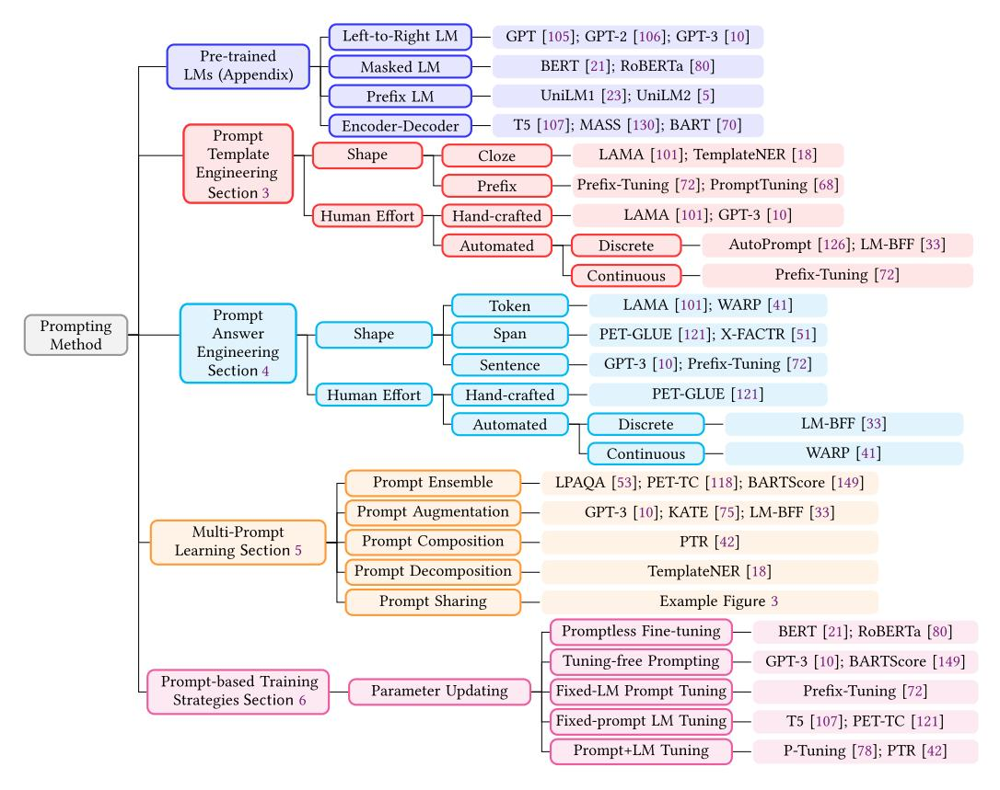
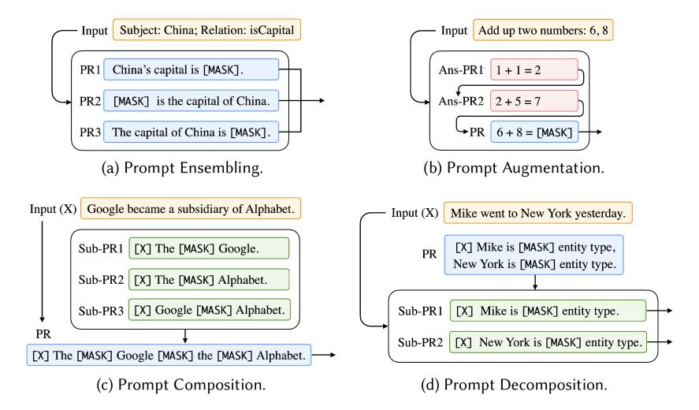
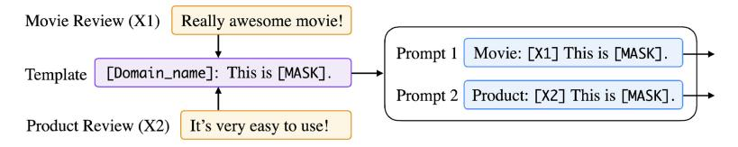

# **Pre-train, Prompt, and Predict: A Systematic Survey of Prompting Methods in Natural Language Processing**

[PENGFEI LIU](https://orcid.org/0000-0001-9030-1875) and [WEIZHE YUAN,](https://orcid.org/0000-0002-6117-9417) Carnegie Mellon University, USA [JINLAN FU,](https://orcid.org/0000-0002-0370-1238) National University of Singapore, Singapore [ZHENGBAO JIANG,](https://orcid.org/0000-0002-0315-6727) [HIROAKI HAYASHI,](https://orcid.org/0000-0002-6875-7443) and [GRAHAM NEUBIG,](https://orcid.org/0000-0002-2072-3789) Carnegie Mellon University, USA

This article surveys and organizes research works in a new paradigm in natural language processing, which we dub "prompt-based learning." Unlike traditional supervised learning, which trains a model to take in an input *x* and predict an output *y* as *P* (*y*|*x*), prompt-based learning is based on language models that model the probability of text directly. To use these models to perform prediction tasks, the original input *x* is modified using a *template* into a textual string *prompt x* that has some unfilled slots, and then the language model is used to probabilistically fill the unfilled information to obtain a final string *x*ˆ, from which the final output *y* can be derived. This framework is powerful and attractive for a number of reasons: It allows the language model to be *pre-trained* on massive amounts of raw text, and by defining a new prompting function the model is able to perform *few-shot* or even *zero-shot* learning, adapting to new scenarios with few or no labeled data. In this article, we introduce the basics of this promising paradigm, describe a unified set of mathematical notations that can cover a wide variety of existing work, and organize existing work along several dimensions, e.g., the choice of pre-trained language models, prompts, and tuning strategies. To make the field more accessible to interested beginners, we not only make a systematic review of existing works and a highly structured typology of prompt-based concepts but also release other resources, e.g., a website [NLPedia–Pretrain](http://pretrain.nlpedia.ai/) including constantly updated survey and paperlist.

CCS Concepts: • **Computing methodologies** → **Natural language processing;**

Additional Key Words and Phrases: Pre-trained language models, prompting

#### **ACM Reference format:**

Pengfei Liu, Weizhe Yuan, Jinlan Fu, Zhengbao Jiang, Hiroaki Hayashi, and Graham Neubig. 2023. Pre-train, Prompt, and Predict: A Systematic Survey of Prompting Methods in Natural Language Processing. *ACM Comput. Surv.* 55, 9, Article 195 (January 2023), 35 pages.

<https://doi.org/10.1145/3560815>

# **1 TWO SEA CHANGES IN NATURAL LANGUAGE PROCESSING**

*Fully supervised learning*, where a task-specific model is trained solely on a dataset of input–output examples for the target task, has long played a central role in many machine learning tasks [\[60\]](#page-28-0), and **natural language processing (NLP)** was no exception. Because such manually annotated

Authors' addresses: P. Liu (corresponding author), W. Yuan, Z. Jiang, H. Hayashi, and G. Neubig, Carnegie Mellon University, 5000 Forbes Avenue, Pittsburgh, Pennsylvania, USA; emails: {pliu3, weizhey, zhengbaj, hiroakih, gneubig}@cs.cmu.edu; J. Fu, National University of Singapore, 21 Lower Kent Ridge Rd., Singapore; email: jinlan@nus.edu.sg.

Permission to make digital or hard copies of all or part of this work for personal or classroom use is granted without fee provided that copies are not made or distributed for profit or commercial advantage and that copies bear this notice and the full citation on the first page. Copyrights for components of this work owned by others than the author(s) must be honored. Abstracting with credit is permitted. To copy otherwise, or republish, to post on servers or to redistribute to lists, requires prior specific permission and/or a fee. Request permissions from [permissions@acm.org.](mailto:permissions@acm.org)

© 2023 Copyright held by the owner/author(s). Publication rights licensed to ACM.

0360-0300/2023/01-ART195 \$15.00

<https://doi.org/10.1145/3560815>

195:2 P. Liu et al.

datasets are ever-insufficient for learning high-quality models, early NLP models relied heavily on *feature engineering* (Table [1\(](#page-3-0)a); e.g., Guyon et al. [\[39\]](#page-27-0), Lafferty et al. [\[63\]](#page-28-0), Och et al. [\[92\]](#page-30-0), Zhang and Nivre [\[150\]](#page-33-0)), where NLP researchers or engineers used their domain knowledge to define and extract salient features from raw data and provide models with the appropriate inductive bias to learn from this limited data. With the advent of neural network models for NLP, salient features were learned jointly with the training of the model itself [\[6,](#page-25-0) [16\]](#page-26-0), and hence focus shifted to *architecture engineering*, where inductive bias was rather provided through the design of a suitable network architecture conducive to learning such features (Table [1\(](#page-3-0)b); e.g., Bahdanau et al. [\[4\]](#page-25-0), Chung et al. [\[15\]](#page-26-0), Hochreiter and Schmidhuber [\[44\]](#page-28-0), Kalchbrenner et al. [\[54\]](#page-28-0), Kim [\[57\]](#page-28-0), Vaswani et al. [\[137\]](#page-33-0)).1

However, from 2017 to 2019 there was a sea change in the learning of NLP models, and this fully supervised paradigm is now playing an ever-shrinking role. Specifically, the standard shifted to the *pre-train and fine-tune* paradigm (Table [1\(](#page-3-0)c); e.g., Dong et al. [\[22\]](#page-26-0), Lewis et al. [\[69\]](#page-29-0), Peters et al. [\[97\]](#page-30-0), Radford et al. [\[104\]](#page-31-0), Yang et al. [\[143\]](#page-33-0)). In this paradigm, a model with a fixed2 architecture is *pre-trained* as a **language model (LM)**, 3 predicting the probability of observed textual data. Because the raw textual data necessary to train LMs is available in abundance, these LMs can be trained on large datasets, in the process learning robust general-purpose features of the language it is modeling. The above pre-trained LM will be then adapted to different downstream tasks by introducing additional parameters and *fine-tuning* them using task-specific objective functions. Within this paradigm, the focus turned mainly to *objective engineering*, designing the training objectives used at both the pre-training and fine-tuning stages. For example, Zhang et al. [\[148\]](#page-33-0) show that introducing a loss function of predicting salient sentences from a document will lead to a better pre-trained LM for text summarization. Notably, the main body of the pre-trained LM is generally (but not always; Peters et al. [\[98\]](#page-30-0)) fine-tuned as well to make it more suitable for solving the downstream task.

Now, as of this writing in 2021, we are in the middle of a second sea change, in which the "pretrain, fine-tune" procedure is replaced by one in which we dub "*pre-train, prompt, and predict*." In this paradigm, instead of adapting pre-trained LMs to downstream tasks via objective engineering, downstream tasks are reformulated to look more like those solved during the original LM training with the help of a textual *prompt*. For example, when recognizing the emotion of a social media post, "I missed the bus today," we may continue with a prompt "I felt so " and ask the LM to fill the blank with an emotion-bearing word. Or if we choose the prompt "English: I missed the bus today. French: "), then an LM may be able to fill in the blank with a French translation. In this way, by selecting the appropriate prompts we can manipulate the model behavior so that the pre-trained LM itself can be used to *predict* the desired output, sometimes even without any additional task-specific training (Table [1\(](#page-3-0)d); e.g., Brown et al. [\[9\]](#page-26-0), Petroni et al. [\[100\]](#page-30-0), Radford et al. [\[105\]](#page-31-0), Schick and Schütze [\[120\]](#page-32-0)). The advantage of this method is that, given a suite of appropriate prompts, a single LM trained in an entirely unsupervised fashion can be used to solve a great number of tasks [\[9,](#page-26-0) [131\]](#page-32-0). However, as with most conceptually enticing prospects, there is a catch this method introduces the necessity for *prompt engineering*, finding the most appropriate prompt to allow a LM to solve the task at hand.

1Even during this stage, there was some use of pre-trained LMs exemplified by word2vec [\[85,](#page-30-0) [86\]](#page-30-0) and GloVe [\[95\]](#page-30-0), but they were used for only a limited portion of the final model parameters.

2This paradigm is less conducive to architectural exploration, because (i) unsupervised pre-training allows models to learn with fewer structural priors, and (ii) as pre-training of models is time-consuming, experimenting with structural variants is costly.

3Here we are talking about language models in a broad sense, including not only traditional left-to-right language models (e.g., GPT [\[104\]](#page-31-0)) but also text-to-text language models (e.g., T5 [\[106\]](#page-31-0)), masked language models (e.g., BERT [\[20\]](#page-26-0)) and prefix language models (e.g., UniLM [\[22\]](#page-26-0)).

This survey attempts to organize the current state of knowledge in this rapidly developing field by providing an overview and formal definition of prompting methods (Section 2). This is followed by in-depth discussion of prompting methods from basics such as prompt template engineering (Section 3) and prompt answer engineering (Section 4) to more advanced concepts such as multiprompt learning methods (Section 5) and prompt-aware training methods (Section 6). We then organize the various applications to which prompt-based learning methods have been applied and discuss how they interact with the choice of prompting method (Section 7). Finally, we attempt to situate the current state of prompting methods in the research ecosystem, making connections to other research fields (Section 8), suggesting some current challenging problems that may be ripe for further research (Section 9).

Finally, to help beginners who are interested in this field learn more effectively, we highlight some systematic resources about prompt learning (as well as pre-training) provided both within this survey and on companion websites:

- A website of prompt-based learning that contains: frequent updates to this survey, related slides, and so on.
- Figure 1: A typology of important concepts for prompt-based learning.
- Tables 7 and 8: A systematic and comprehensive comparison among different prompting methods.
- Table 5: An organization of commonly-used prompts.
- Table 4: A timeline of prompt-based research works.
- Table 1: A systematic and comprehensive comparison among different pre-trained LMs.

#### 2 A FORMAL DESCRIPTION OF PROMPTING

# 2.1 Supervised Learning in NLP

In a traditional supervised learning system for NLP, we take an **input** x, usually text, and predict an **output** y based on a model  $P(y|x;\theta)$ . y could be a label, text, or other variety of output. To learn the parameters  $\theta$  of this model, we use a dataset containing pairs of inputs and outputs and train a model to predict this conditional probability. We will illustrate this with two stereotypical examples.

First, *text classification* takes an input text x and predicts a label y from a fixed label set y. To give an example, sentiment analysis [94, 128] may take an input x = "I love this movie" and predict a label y = ++, out of a label set y = ++, or, -, --}. Second, *conditional text generation* takes an input x and generates another text y. One example is machine translation [59], where the input is text in one language such as the Finnish x = "Hyvää huomenta" and the output is the English y = "Good morning."

#### 2.2 Prompting Basics

The main issue with supervised learning is that to train a model  $P(y|x;\theta)$ , it is necessary to have annotated data for the task, which for many tasks cannot be found in large amounts. Prompt-based learning methods for NLP attempt to circumvent this issue by instead learning an LM that models the probability  $P(x;\theta)$  of text x itself (details in Appendix) and using this probability to predict y, reducing or obviating the need for large labeled datasets. In this section we lay out a mathematical description of the most fundamental form of prompting, which encompasses many works on prompting and can be expanded to cover others as well. Specifically, basic prompting predicts the highest-scoring  $\hat{y}$  in three steps.

&lt;sup>4The symbols represent "very positive," "positive," "neutral," "negative," and "very negative," respectively.

195:4 P. Liu et al.

Paradigm Engineering **Task Relation** CLS TAG Feature LM a. Fully Supervised Learning (e.g. word identity, part-of-speech, (Non-Neural Network) sentence length) GEN CLS TAG LM b. Fully Supervised Learning (e.g. convolutional, recurrent, (Neural Network) self-attentional) GEN LM c. Pre-train, Fine-tune (e.g. masked language modeling, next sentence prediction) GÉN CLS TAG LM d. Pre-train, Prompt, Predict Prompt (e.g. cloze, prefix) GEN

Table 1. Four Paradigms in NLP

The "engineering" column represents the type of engineering to be done to build strong systems. The "task relation" column, shows the relationship between language models (LM) and other NLP tasks (CLS: classification, TAG: sequence tagging, GEN: text generation). ☐ fully unsupervised training. ☐ fully supervised training. ☐ indicates a textual prompt. Dashed lines suggest that different tasks can be connected by sharing parameters of pre-trained LMs. "LM→Task" represents adapting LMs (objectives) to downstream tasks while "Task→LM" denotes adapting downstream tasks (formulations) to LMs.

- 2.2.1 Prompt Addition. In this step a prompting function  $f_{\text{prompt}}(\cdot)$  is applied to modify the input text  $\mathbf{x}$  into a prompt  $\mathbf{x}' = f_{\text{prompt}}(\mathbf{x})$ . In the majority of previous work [61, 83, 105, 117], this function consists of a two step process:
  - (1) Apply a *template*, which is a textual string that has two slots: an *input slot* [X] for input x and an *answer slot* [Z] for an intermediate generated *answer* text z that will later be mapped into y.
  - (2) Fill slot [X] with the input text x.

In the case of sentiment analysis where x = ``I love this movie," the template may take a form such as "[X] Overall, it was a [Z] movie." Then, x' would become "I love this movie. Overall it was a [Z] movie," given the previous example. In the case of machine translation, the template may take a form such as "Finnish: [X] English: [Z]," where the text of the input and answer are connected together with headers indicating the language. We show more examples in Table 3.

Notably, (1) the prompts above will have an empty slot to fill in for z, either in the middle of the prompt or at the end. In the following text, we will refer to the first variety of prompt with a slot to fill in the middle of the text as a *cloze prompt*, and the second variety of prompt where the input text comes entirely before z as a *prefix prompt*. (2) In many cases, these template words are not necessarily composed of natural language tokens; they could be virtual words (e.g., represented by numeric ids) that would be embedded in a continuous space later, and some prompting methods even generate continuous vectors directly (more in Section 3.3.2). (3) The number of [X] slots and the number of [X] slots can be flexibly changed for the need of tasks at hand.

2.2.2 Answer Search. Next, we search for the highest-scoring text  $\hat{z}$  that maximizes the score of the LM. We first define Z as a set of permissible values for z. Z could range from the entirety of

| Name                  | Notation                                         | Example                                                                       | Description                                                                                                                                                  |
|-----------------------|--------------------------------------------------|-------------------------------------------------------------------------------|--------------------------------------------------------------------------------------------------------------------------------------------------------------|
| Input Output       | x y                                           | I love this movie. ++ (very positive)                                      | One or multiple texts Output label or text                                                                                                                |
| Prompting Function | $f_{\text{prompt}}(\boldsymbol{x})$              | [X] Overall, it was a [Z] movie.                                              | A function that converts the input into a specific form by inserting the input $x$ and adding a slot $[Z]$ where answer $z$ may be filled later.             |
| Prompt Answer      | x' z                                          | I love this movie. Overall, it was a [Z] movie. "good," "fantastic," "boring" | A text where <code>[X]</code> is instantiated by input $x$ but answer slot <code>[Z]</code> is not. A token, phrase, or sentence that fills <code>[Z]</code> |
| Filled Prompt      | $f_{\rm fill}(x',z)$                             | I love this movie. Overall, it was a bad movie.                               | A prompt where slot [Z] is filled with any answer.                                                                                                           |
| Answered Prompt    | $f_{\rm fill}(\boldsymbol{x'},\boldsymbol{z}^*)$ | I love this movie. Overall, it was a good movie.                              | A prompt where slot $\c T \c T$ is filled with a true answer.                                                                                                |

Table 2. Terminology and Notation of Prompting Methods

 $z^*$  represents answers that correspond to true output  $y^*$ .

| Table 3. | Examples of input | it template and  | d answer for | Different Tasks |
|----------|-------------------|------------------|--------------|-----------------|
| Table 5. | Examples of mpa   | n, tempunte, and | a answer tot | Different rasks |

| Туре                     | Task Example               | Input ([X])                                        | Template                       | Answer ([Z])                    |
|--------------------------|----------------------------|----------------------------------------------------|--------------------------------|---------------------------------|
|                          | Sentiment                  | I love this movie.                                 | [X] The movie is [Z].          | great fantastic           |
| Text Classification      | Topics                     | He prompted the LM.                                | [X] The text is about [Z].     | sports science            |
|                          | Intention                  | What is taxi fare to Denver?                       | [X] The question is about [Z]. | quantity city             |
| Text-span Classification | Aspect Sentiment           | Poor service but good food.                        | [X] What about service? [Z].   | Bad Terrible              |
| Text-pair Classification | Natural Language Inference | [X1]: An old man with [X2]: A man walks         | [X1]? [Z], [X2]                | Yes No                    |
| Tagging                  | Named Entity Recognition   | [X1]: Mike went to Paris. [X2]: Paris           | [X1][X2] is a [Z] entity.      | organization location     |
| Text Generation          | Summarization              | Las Vegas police                                   | [X] TL;DR: [Z]                 | The victim A woman           |
| text Generation          | Translation                | Je vous aime.                                      | French: [X] English: [Z]       | I love you. I fancy you.  |
| Regression               | Textual Similarity         | [X1]: A man is smoking. [X2]: A man is skating. | [X1] [Z], [X2]                 | Yes No                    |

the language in the case of generative tasks or could be a small subset of the words in the language in the case of classification, such as defining  $\mathcal{Z} = \{\text{``excellent''}, \text{``good''}, \text{``OK''}, \text{``bad''}, \text{``horrible''}\}$  to represent each of the classes in  $\mathcal{Y} = \{++, +, -, -, --\}$ .

We then define a function  $f_{\rm fill}(x',z)$  that fills in the location [Z] in prompt x' with the potential answer z. We will call any prompt that has gone through this process as a *filled prompt*. Particularly, if the prompt is filled with a true answer, then we will refer to it as an *answered prompt* (Table 2 shows an example). Finally, we search over the set of potential answers z by calculating the probability of their corresponding filled prompts using a pre-trained LM  $P(\cdot;\theta)$ ,

$$\hat{z} = \operatorname{search}_{z \in \mathcal{I}} P(f_{\text{fill}}(x', z); \theta). \tag{1}$$

This search function could be an *argmax* search that searches for the highest-scoring output or *sampling* that randomly generates outputs following the probability distribution of the LM.

195:6 P. Liu et al.

Fig. 1. Typology of prompting methods.

*2.2.3 Answer Mapping.* Finally, we would like to go from the highest-scoring *answer z*ˆ to the highest-scoring *output y*ˆ. This is trivial in some cases, where the answer itself is the output (as in language generation tasks such as translation), but there are also other cases where multiple answers could result in the same output. For example, one may use multiple different sentimentbearing words (e.g., "excellent," "fabulous," "wonderful") to represent a single class (e.g., "++"), in which case it is necessary to have a mapping between the searched answer and the output value.

#### **2.3 Design Considerations for Prompting**

Now that we have our basic mathematical formulation, we elaborate a few of the basic design considerations that go into a prompting method, which we will elaborate in the following sections:

- **Pre-trained LM Choice:** There are a wide variety of pre-trained LMs that could be used to calculate *P* (*x*; *θ* ). In the Appendix, we give a primer on pre-trained LMs, specifically from the dimensions that are important for interpreting their utility in prompting methods.
- **Prompt Template Engineering:** Given that the prompt specifies the task, choosing a proper prompt template has a large effect not only on the accuracy but also on which task the model performs in the first place. In Section [3,](#page-6-0) we discuss methods to choose which prompt template we should use as *f*prompt(*x*).
- **Prompt Answer Engineering:** Depending on the task, we may want to design Z differently, possibly along with the mapping function. In Section [4,](#page-9-0) we discuss different ways to do so.

- • **Expanding the Paradigm:** As stated above, the above equations represent only the simplest of the various underlying frameworks that have been proposed to do this variety of prompting. In Section [5,](#page-10-0) we discuss ways to expand this underlying paradigm to further improve results or applicability.
- **Prompt-based Training Strategies:** There are also methods to train parameters, either of the prompt, the LM, or both. In Section [6,](#page-13-0) we summarize different strategies and detail their relative advantages.

### **3 PROMPT TEMPLATE ENGINEERING**

*Prompt template engineering* is the process of creating a prompting function *f*prompt(*x*) that results in the most effective performance on the downstream task. In many previous works, this has involved human engineers or algorithms searching for the best template for each task the model is expected to perform. As shown in the "Prompt Template Engineering" section of Figure [1,](#page-5-0) one must first consider the *prompt shape* and then decide whether to take a *manual* or *automated* approach to create prompts of the desired shape, as detailed below.

# **3.1 Prompt Shape**

As noted above, there are two main varieties of prompts: *cloze prompts* [\[17,](#page-26-0) [100\]](#page-30-0), which fill in the blanks of a textual string (e.g., "I love this movie, it is a [Z] movie"), and *prefix prompts* [\[67,](#page-29-0) [71\]](#page-29-0), which continue a string prefix (e.g., "I love this movie. What's the sentiment of the review? [Z]"). Which one is chosen will depend both on the task and the model that is being used to solve the task. In general, for tasks regarding generation, or tasks being solved using a standard auto-regressive LM, prefix prompts tend to be more conducive, as they mesh well with the left-to-right nature of the model. For tasks that are solved using masked LMs, cloze prompts are a good fit, as they very closely match the form of the pre-training task. Full text reconstruction models are more versatile and can be used with either cloze or prefix prompts. Finally, for some tasks regarding multiple inputs such as *text pair classification*, prompt templates must contain space for two inputs, [X1] and [X2], or more.

### **3.2 Manual Template Engineering**

Perhaps the most natural way to create prompts is to manually create intuitive templates based on human introspection. For example, the seminal LAMA dataset [\[100\]](#page-30-0) provides manually created cloze templates to probe knowledge in LMs. Brown et al. [\[9\]](#page-26-0) create manually crafted prefix prompts to handle a wide variety of tasks, including question answering, translation, and probing tasks for common sense reasoning. Schick and Schütze [\[118\]](#page-31-0) and Schick and Schütze [\[117\]](#page-31-0), Schick and Schütze [\[120\]](#page-32-0) use pre-defined templates in a few-shot learning setting on text classification and conditional text generation tasks.

#### **3.3 Automated Template Learning**

While the strategy of manually crafting templates is intuitive and does allow solving various tasks with some degree of accuracy, there are also several issues with this approach: (1) Creating and experimenting with these prompts is an art that takes time and experience, particularly for some complicated tasks such as semantic parsing [\[124\]](#page-32-0); and (2) even experienced prompt designers may fail to manually discover optimal prompts [\[52\]](#page-28-0).

To address these problems, a number of methods have been proposed to automate the template design process. In particular, the automatically induced prompts can be further separated into *discrete prompts*, where the prompt is an actual text string, and *continuous prompts*, where the prompt is instead described directly in the embedding space of the underlying LM.

195:8 P. Liu et al.

One other orthogonal design consideration is whether the prompting function *f*prompt(*x*) is*static*, using essentially the same prompt template for each input, or *dynamic*, generating a custom template for each input. Both static and dynamic strategies have been used for different varieties of discrete and continuous prompts, as we will mention below.

- *3.3.1 Discrete Prompts.* Works on discovering *discrete prompts* (a.k.a. *hard prompts*) automatically search for templates described in a discrete space, usually corresponding to natural language phrases. We detail several methods that have been proposed for this below.
  - **D1: Prompt Mining.** Jiang et al. [\[52\]](#page-28-0)'s Mine approach is a mining-based method to automatically find templates given a set of training inputs *x* and outputs *y*. This method scrapes a large text corpus (e.g., Wikipedia) for strings containing *x* and *y*, and finds either the *middle words* or *dependency paths* between the inputs and outputs. Frequent middle words or dependency paths can serve as a template as in "[X] middle words [Z]."
  - **D2: Prompt Paraphrasing.** Paraphrasing-based approaches take in an existing seed prompt (e.g., manually constructed or mined), paraphrase it into a set of other candidate prompts, and then selects the one that achieves the highest training accuracy on the target task. This paraphrasing can be done in a number of ways, including using round-trip translation of the prompt into another language then back [\[52\]](#page-28-0), using replacement of phrases from a thesaurus [\[147\]](#page-33-0), or using a neural prompt rewriter specifically optimized to improve accuracy of systems using the prompt [\[43\]](#page-28-0). Notably, Haviv et al. [\[43\]](#page-28-0) perform paraphrasing *after* the input *x* is input into the prompt template, allowing a different paraphrase to be generated for each individual input.
  - **D3: Gradient-based Search.** Wallace et al. [\[138\]](#page-33-0) applied a gradient-based search over actual tokens to find short sequences that can trigger the underlying pre-trained LM to generate the desired target prediction. This search is done in an iterative fashion, stepping through tokens in the prompt. Built upon this method, Shin et al. [\[125\]](#page-32-0) automatically search for template tokens using downstream application training samples and demonstrates strong performance in prompting scenarios.
  - **D4: Prompt Generation.** Other works treat the generation of prompts as a text generation task and use standard natural language generation models to perform this task. For example, Gao et al. [\[32\]](#page-27-0) introduce the seq2seq pre-trained LM T5 into the template search process. Since T5 has been pre-trained on a task of filling in missing spans, they use T5 to generate template tokens by (1) specifying the position to insert template tokens within a template5 and (2) providing training samples for T5 to decode template tokens. Guo et al. [\[36\]](#page-27-0) use reinforcement learning [\[132\]](#page-32-0) to generate prompts to control the text generation process. Ben-David et al. [\[5\]](#page-25-0) propose a domain adaptation algorithm that trains T5 to generate unique **domain relevant features (DRFs)** (a set of keywords that characterize domain information) for each input. Then those DRFs can be concatenated with the input to form a template and be further used by downstream tasks.
  - **D5: Prompt Scoring.** Davison et al. [\[19\]](#page-26-0) investigate the task of knowledge base completion and design a template for an input (head-relation-tail triple) using LMs. They first handcraft a set of templates as potential candidates and fill the input and answer slots to form a filled prompt. They then use a unidirectional LM to score those filled prompts, selecting the one with the highest LM probability. This will result in custom template for each individual input.

5The number of template tokens do not need to be pre-specified, since T5 can decode multiple tokens at a masked position.

- 3.3.2 Continuous Prompts. Because the purpose of prompt construction is to find a method that allows an LM to effectively perform a task, rather than being for human consumption, it is not necessary to limit the prompt to human-interpretable natural language. Because of this, there are also methods that examine continuous prompts (a.k.a. soft prompts) that perform prompting directly in the embedding space of the model. Specifically, continuous prompts remove two constraints: (1) relax the constraint that the embeddings of template words be the embeddings of natural language (e.g., English) words and (2) remove the restriction that the template is parameterized by the pre-trained LM's parameters. Instead, templates have their own parameters that can be tuned based on training data from the downstream task. We highlight several representative methods below.
  - C1: Prefix Tuning. Prefix Tuning [71] is a method that prepends a sequence of continuous task-specific vectors to the input, while keeping the LM parameters frozen. Mathematically, this consists of optimizing over the following log-likelihood objective given a trainable prefix matrix  $M_{\phi}$  and a fixed pre-trained LM parameterized by  $\theta$ ,

$$\max_{\phi} \log P(\boldsymbol{y}|\boldsymbol{x};\theta;\phi) = \max_{\phi} \sum_{y_i} \log P(y_i|h_{< i};\theta;\phi). \tag{2}$$

In Equation (2),  $h_{< i} = [h_{< i}^{(1)}; \cdots; h_{< i}^{(n)}]$  is the concatenation of all neural network layers at timestep i. It is copied from  $M_{\phi}$  directly if the corresponding timestep is within the prefix  $(h_i \text{ is } M_{\phi}[i])$ ; otherwise, it is computed using the pre-trained LM.

Experimentally, Li and Liang [71] observe that such continuous prefix-based learning is more sensitive to different initialization in low-data settings than the use of discrete prompts with real words. Similarly, Lester et al. [67] prepend the input sequence with special tokens to form a template and tune the embeddings of these tokens directly. Compared to the method of Li and Liang [71], this adds fewer parameters as it does not introduce additional tunable parameters within each network layer. Tsimpoukelli et al. [135] train a vision encoder that encodes an image into a sequence of embeddings that can be used to prompt a frozen autoregressive LM to generate the appropriate caption. They show that the resulting model can perform few-shot learning for vision-language tasks such as visual question answering, and so on. Different from the above two works, the prefix used in Reference [135] is sample dependent, namely a representation of input images, instead of a task embedding.

- C2: Tuning Initialized with Discrete Prompts. There are also methods that initialize the search for a continuous prompt using a prompt that has already been created or discovered using discrete prompt search methods. For example, Zhong et al. [152] first define a template using a discrete search method such as AutoPrompt [125]'s, initialize virtual tokens based on this discovered prompt, and then fine-tune the embeddings to increase task accuracy. This work found that initializing with manual templates can provide a better starting point for the search process. Qin and Eisner [103] propose to learn a mixture of soft templates for each input where the weights and parameters for each template are jointly learned using training samples. The initial set of templates they use are either manually crafted ones or those obtained using the "prompt mining" method. Similarly, Hambardzumyan et al. [40] introduce the use of a continuous template whose shape follows a manual prompt template.
- C3: Hard-Soft Prompt Hybrid Tuning. Instead of using a purely learnable prompt template, these methods insert some tunable embeddings into a hard prompt template. Liu et al. [77] propose "P-tuning," where continuous prompts are learned by inserting trainable variables into the embedded input. To account for interaction between prompt tokens, they represent prompt embeddings as the output of a BiLSTM [35]. P-tuning also introduces the use

195:10 P. Liu et al.

of task-related anchor tokens (such as "capital" in relation extraction) within the template for further improvement. These anchor tokens are not tuned during training. Han et al. [41] propose **prompt tuning with rules (PTR)**, which uses manually crafted sub-templates to compose a complete template using logic rules. To enhance the representation ability of the resulting template, they also insert several virtual tokens whose embeddings can be tuned together with the pre-trained LMs parameters using training samples. The template tokens in PTR contain both actual tokens and virtual tokens. Experiment results demonstrate the effectiveness of this prompt design method in relation classification tasks.

#### 4 PROMPT ANSWER ENGINEERING

In contrast to prompt template engineering, which designs appropriate inputs for prompting methods, prompt answer engineering aims to search for an answer space  $\mathcal Z$  and a map to the original output  $\mathcal Y$  that results in an effective predictive model. Figure 1's "Prompt Answer Engineering" section illustrates two dimensions that must be considered when performing prompt answer engineering: deciding the answer shape and choosing an answer design method.

#### 4.1 Answer Shape

The shape of an answer characterizes its granularity. Some common choices include the following:

- **Tokens:** One of the tokens in the pre-trained LM's vocabulary or a subset of the vocabulary.
- Span: A short multi-token span. These are usually used together with cloze prompts.
- Sentence: A sentence or document. These are commonly used with prefix prompts.

In practice, how to choose the shape of acceptable answers depends on the task we want to perform. Token or text-span answer spaces are widely used in classification tasks (e.g., sentiment classification; Yin et al. [144]) as well as in other tasks such as relation extraction [100] or named entity recognition [17]. Longer phrasal or sentential answers are often used in language generation tasks [105] and in other tasks such as multiple-choice question answering (where the scores of multiple phrases are compared against each-other; Khashabi et al. [55]).

#### 4.2 Answer Space Design Methods

The next question to answer is how to design the appropriate answer space  $\mathcal{Z}$ , as well as the mapping to the output space  $\mathcal{Y}$  if the answers are not used as the final outputs.

- 4.2.1 Manual Design. In manual design, the space of potential answers Z and its mapping to  $\mathcal Y$  are crafted manually by an interested system or benchmark designer. There are a number of strategies that can be taken.
  - Unconstrained Spaces. In many cases, the answer space  $\mathbb{Z}$  is the space of all tokens [100], fixed-length spans [50], or token sequences [105]. In these cases, it is most common to directly map answer z to the final output y using the identity mapping.
  - Constrained Spaces. However, there are also cases where the space of possible outputs is constrained. This is often performed for tasks with a limited label space such as text classification or entity recognition or multiple-choice question answering. To give some examples, Yin et al. [144] manually design lists of words relating to relevant topics ("health," "finance," "politics," etc.), emotions ("anger," "joy," "sadness," "fear," etc.), or other aspects of the input text to be classified. Cui et al. [17] manually design lists such as "person," "location," and so on, for named entity recognition (NER) tasks. In these cases, it is necessary to have a mapping between the answer  $\mathcal Z$  and the underlying class  $\mathcal Y$ .

With regards to multiple-choice question answering, it is common to use an LM to calculate the probability of an output among multiple choices, with Zweig et al. [155] being an early example.

- 4.2.2 Discrete Answer Search. As with manually created prompts, it is possible that manually created answers are sub-optimal for getting the LM to achieve ideal prediction performance. Because of this, there is some work on automatic answer search, albeit less than that on searching for ideal prompts. These work on both discrete answer spaces (this section) and continuous answer spaces (the following).
  - Answer Paraphrasing. These methods start with an initial answer space  $\mathbb{Z}'$  and then use paraphrasing to expand this answer space to broaden its coverage [51]. Given a pair of answer and output  $\langle z', y \rangle$ , we define a function that generates a paraphrased set of answers para(z'). The probability of the final output is then defined as the marginal probability *all* of the answers in this paraphrase set  $P(y|x) = \sum_{z \in \text{para}(z')} P(z|x)$ . This paraphrasing can be performed using any method, but Jiang et al. [51] specifically use a back-translation method, first translating into another language then back to generate a list of multiple paraphrased answers.
  - Prune-then-Search. In these methods, first, an initial pruned answer space of several plausible answers Z' is generated, and then an algorithm further searches over this pruned space to select a final set of answers. Note that in some of the papers introduced below, they define a function from label  $\boldsymbol{y}$  to a single answer token  $\boldsymbol{z}$ , which is often called a verbalizer [117]. Schick and Schütze [117] and Schick et al. [115] find tokens containing at least two alphabetic characters that are frequent in a large unlabeled dataset. In the search step, they iteratively compute a word's suitability as a representative answer z for a label  $\boldsymbol{y}$  by maximizing the likelihood of the label over training data. Shin et al. [125] learn a logistic classifier using the contextualized representation of the [Z] token as input. In the search step, they select the top-k tokens that achieve the highest probability score using the learned logistic classifier in the first step. Those selected tokens will form the answer. Gao et al. [32] first construct a pruned search space Z' by selecting top-k vocabulary words based on their generation probability at the [Z] position determined by training samples. Then the search space is further pruned down by only selecting a subset of words within  $\mathcal{Z}'$  based on their zero-shot accuracy on the training samples. In the search step, they fine-tune the LM with fixed templates together with every answer mapping using training data and select the best label word as the answer based on the accuracy on the development set.
  - Label Decomposition. When performing relation extraction, Chen et al. [13] automatically decompose each relation label into its constituent words and use them as an answer. For example, for the relation per:city\_of\_death, the decomposed label words would be {person, city, death}. The probability of the answer span will be calculated as the sum of each token's probability.
- 4.2.3 Continuous Answer Search. Very few works explore the possibility of using soft answer tokens that can be optimized through gradient descent. Hambardzumyan et al. [40] assign a virtual token for each class label and optimize the token embedding for each class together with prompt token embeddings. Since the answer tokens are optimized directly in the embedding space, they do not make use of the embeddings learned by the LM and instead learn an embedding from scratch for each label.

#### 5 MULTI-PROMPT LEARNING

The prompt engineering methods we discussed so far focused mainly on constructing a *single* prompt for an input. However, a significant body of research has demonstrated that the use of

195:12 P. Liu et al.

Fig. 2. Different multi-prompt learning strategies. We use different colors to differentiate different components as follows. "—" for input text, "—" for prompt, "—" for answered prompt. "—" for sub-prompt. We use the following abbreviations. "PR" denotes prompt, "Ans-PR" denotes answered prompt, "Sub-PR" denotes sub-prompt.

multiple prompts can further improve the efficacy of prompting methods, and we will call these methods *multi-prompt learning* methods. In practice, there are several ways to extend the single prompt learning to the use multiple prompts, which have a variety of motivations. We summarize representative methods in the "Multi-prompt Learning" section of Figure 1 as well as Figure 2.

#### 5.1 Prompt Ensembling

*Prompt ensembling* is the process of using multiple *unanswered* prompts for an input at inference time to make predictions. An example is shown in Figure 2(a). The multiple prompts can either be discrete prompts or continuous prompts.6 This sort of prompt ensembling can (1) leverage the complementary advantages of different prompts, (2) alleviate the cost of prompt engineering, since choosing one best-performing prompt is challenging, and (3) stabilize performance on downstream tasks.

Prompt ensembling is connected to ensembling methods that are used to combine together multiple systems, which have a long history in machine learning [24, 133, 153]. Current research also borrows ideas from these works to derive effective ways for prompt ensembling, as described below.

• Uniform averaging. The most intuitive way to combine the predictions when using multiple prompts is to take the average of probabilities from different prompts. Concretely, this indicates that  $P(z|x) := \frac{1}{K} \sum_{i}^{K} P(z|f_{\text{prompt},i}(x))$ , where  $f_{\text{prompt},i}(\cdot)$  is the ith prompt. Jiang et al. [52] first filter their prompts by selecting K prompts that achieve the highest accuracy on the training set and then use the average log probabilities obtained from the top K prompts to calculate the probability for a single token at [Z] position when performing factual probing tasks. Schick and Schütze [117] also try a simple average when using an ensemble model to annotate an unlabeled dataset. When performing text generation evaluation, Yuan et al. [147] formulates this task as a text generation problem and take the average of the final generation scores obtained using different prompts.

&lt;sup>6Multiple continuous prompts are typically learned by using different initializations or different random seeds.

- • Weighted averaging. Simple uniform averaging of results from multiple prompts is easy to implement but can also be suboptimal given that some prompts are more performant than others. To account for this, some works also explore to use of weighted averages for prompt ensembling where each prompt is associated with a weight. The weights are typically prespecified based on prompt performance or optimized using a training set. For example, Jiang et al. [52] learn the weight for each prompt by maximizing the probability of the target output over training data. Qin and Eisner [103] use the same approach except that the weight for each prompt is optimized together with soft prompt parameters. Besides, Qin and Eisner [103] also introduce a data-dependent weighting strategy where the probability of the input appearing in that prompt is considered in weighting different prompts as well. Schick and Schütze [117] and Schick and Schütze [120] set the weight for each prompt proportional to the accuracy on the training set before training.
- **Majority voting.** For classification tasks, majority voting can also be used to combine the results from different prompts [40, 67].
- Knowledge distillation. An ensemble of deep learning models can typically improve the performance, and this superior performance can be distilled into a single model using knowledge distillation [2]. To incorporate this idea, Schick and Schütze [117] and Schick and Schütze [118, 120] train a separate model for each manually created template—answer pair and use the ensemble of them to annotate an unlabeled dataset. Then the final model is trained to distill the knowledge from the annotated dataset. Gao et al. [32] use a similar ensemble method on their automatically generated templates.
- **Prompt ensembling for text generation.** There is relatively little work on prompt ensembling for generation tasks (i.e., tasks where the answers is a string of tokens instead of a single one). A simple way to perform ensembling in this case is to use standard methods that generate the output based on the ensembled probability of the next word in the answer sequence  $P(z_t|\mathbf{x},z_{< t}) := \frac{1}{K} \sum_{i}^{K} P(z_t|f_{\text{prompt},i}(\mathbf{x}), z_{< t})$ . In contrast, Schick and Schütze [118] train a separate model for each prompt  $f_{\text{prompt},i}(\mathbf{x})$ , and thus storing each of these fine-tuned LMs in memory is infeasible. Instead, they first decode generations using each model and then score each generation by averaging their generation probability across all models.

#### 5.2 Prompt Augmentation

Prompt augmentation, also sometimes called demonstration learning [32], provides a few additional answered prompts that can be used to demonstrate how the LM should provide the answer to the actual prompt instantiated with the input x. For example, instead of just providing a prompt of "China's capital is [Z]," the prompt can be prefaced by a few examples such as "Great Britain's capital is London. Japan's capital is Tokyo. China's capital is [Z]." Another example of performing addition of two numbers can be found in Figure 2(b). These few-shot demonstrations take advantage of the ability of strong language models to learn repetitive patterns [9].

Although the idea of prompt augmentation is simple, there are several aspects that make it challenging: (1) *Sample Selection:* how do we choose the most effective examples? (2) *Sample Ordering:* How do we properly order the chosen examples?

• Sample Selection. Researchers have found that the choice of examples used in this fewshot scenario can result in very different performance, ranging from near state-of-the-art accuracy on some tasks to near random guess [80]. To address this issue, Gao et al. [32] and Liu et al. [74] utilize sentence embeddings to sample examples that are close to the input in this embedding space. To measure the generalization capability of pre-trained LMs to perform new tasks based on instructions, Mishra et al. [87] provide both positive samples and negative samples that highlight things to avoid. 195:14 P. Liu et al.

• **Sample Ordering.** Lu et al. [\[80\]](#page-29-0) found that the order of answered prompts provided to the model plays an important role in model performance and propose entropy-based methods to score different candidate permutations. Kumar and Talukdar [\[62\]](#page-28-0) search for a good permutation of training examples as augmented prompts and learn a separator token between the prompts for further gains in performance. Instead of arranging multiple answered prompts into an ordered list, Yoo et al. [\[145\]](#page-33-0) propose to generate a meta-prompt based on these answered prompts using prompting methods.

Prompt augmentation is closely related to retrieval-based methods that provide more textual context to the model to improve performance [\[37\]](#page-27-0), a method that has also been shown to be effective in prompt-based learning [\[99\]](#page-30-0). However, the key difference lies in the fact that prompt augmentation also leverages the template and answer, while larger context learning does not.

# **5.3 Prompt Composition**

For those composable tasks, which can be composed based on more fundamental subtasks, we can also perform *prompt composition*, using multiple sub-prompts, each for one subtask, and then defining a composite prompt based on those sub-prompts. This process is illustrated in Figure [2\(](#page-11-0)c). For example, in the relation extraction task, which aims to extract the relation of two entities, we can break down the task into several subtasks including identifying the characteristics of entities and classifying the relationships between entities. Based on this intuition, Han et al. [\[41\]](#page-27-0) first use multiple manually created sub-prompts for entity recognition and relation classification and then compose them into a complete prompt based on logic rules for relation extraction.

# **5.4 Prompt Decomposition**

For tasks where multiple predictions should be performed for one sample (e.g., sequence labeling), directly defining a holistic prompt with regards to the entire input text *x* is challenging. One intuitive method to address this problem is to break down the holistic prompt into different subprompts and then answer each sub-prompt separately. Figure [2\(](#page-11-0)d) illustrates this idea with an example from the named entity recognition task, which aims to identify all named entities in an input sentence. In this case, the input will first be converted into a set of text spans, and the model can then be prompted to predict the entity type (including "Not an Entity") for each span. It is not easy to predict all the span types at the same time due to the large number of spans, so different prompts for each span can be created and predicted separately. This sort of *prompt decomposition* for named entity recognition has been explored by Cui et al. [\[17\]](#page-26-0) where they apply the approach we discussed here.

# **6 TRAINING STRATEGIES FOR PROMPTING METHODS**

With the methods in the above sections, it is now clear how to obtain an appropriate prompt (or prompts) and corresponding answers. Now we discuss about methods that explicitly train models in concert with prompting methods, as outlined in the "Training Strategies" section of Figure [1.](#page-5-0)

#### **6.1 Training Settings**

In many cases, prompting methods can be used without *any* explicit training of the LM for the downstream task, simply taking an LM that has been trained to predict the probability of text *P* (*x*) and applying it as-is to fill the cloze or prefix prompts defined to specify the task. This is traditionally called the *zero-shot* setting [\[111\]](#page-31-0), as there is zero training data for the task of interest.

| Strategy               | LM Params | Prompt Params |       | Example                                  |
|------------------------|-----------|---------------|-------|------------------------------------------|
|                        |           | Additional    | Tuned |                                          |
| Promptless Fine-tuning | Tuned     | —             |       | ELMo [97], BERT [20], BART [69]          |
| Tuning-free Prompting  | Frozen    | ✗             | ✗     | GPT-3 [9], AutoPrompt [125], LAMA [100]  |
| Fixed-LM Prompt Tuning | Frozen    | ✓             | Tuned | Prefix-Tuning [71], Prompt-Tuning [67]   |
| Fixed-prompt LM Tuning | Tuned     | ✗             | ✗     | PET-TC [117], PET-Gen [118], LM-BFF [32] |
| Prompt+LM Fine-tuning  | Tuned     | ✓             | Tuned | PADA [5], P-Tuning [77], PTR [41]        |
|                        |           |               |       |                                          |

Table 4. Characteristics of Different Tuning Strategies

However, there are also methods that use training data to train the model in concert with prompting methods. These consist of either *full-data learning*, where a reasonably large number of training examples are used to train the model, or *few-shot learning* [\[126\]](#page-32-0), where a very small number of examples are used to train the model. Prompting methods are particularly useful in the latter case [\[9,](#page-26-0) [32,](#page-27-0) [117\]](#page-31-0), as there are generally not enough training examples to fully specify the desired behavior, and thus using a prompt to push the model in the right direction is particularly effective.

One thing to note is that for many of the prompt template engineering methods described in Section [3,](#page-6-0) although annotated training samples are not explicitly used in the training of the downstream task model, they *are* often used in the construction or validation of the prompts that the downstream task will use. As noted by Perez et al. [\[96\]](#page-30-0), this is arguably not true zero-shot learning with respect to the downstream task.

# **6.2 Parameter Update Methods**

In prompt-based downstream task learning, there are usually two types of parameters, namely those from (1) pre-trained LMs and (2) prompts. Which part of parameters should be updated is one important design decision, which can lead to different levels of applicability in different scenarios. We summarize five tuning strategies (as shown in Table 4) based on (i) whether the parameters of the underlying LM are tuned, (ii) whether there are additional prompt-related parameters, and (iii) if there are additional prompt-related parameters, whether those parameters are tuned.

*6.2.1 Promptless Fine-tuning.* As mentioned in the Introduction, the *pre-train and fine-tune* strategy has been widely used in NLP since before the popularization of prompting methods. Here we refer to pre-training and fine-tuning *without* prompts as *promptless fine-tuning*, to contrast with the prompt-based learning methods introduced in the following sections. In this strategy, given a dataset of a task, all (or some [\[46,](#page-28-0) [98\]](#page-30-0)) of the parameters of the pre-trained LM will be updated via gradients induced from downstream training samples. Typical examples of pre-trained LMs tuned in this way include BERT [\[20\]](#page-26-0) and RoBERTa [\[79\]](#page-29-0). This is a simple, powerful, and widely used method, but it may overfit or not learn stably on small datasets [\[21\]](#page-26-0). Models are also prone to *catastrophic forgetting*, where the LM loses its ability to do things that it was able to do before fine-tuning [\[84\]](#page-30-0).

- **Advantages:** Simplicity, no need for prompt design. Tuning all the LM parameters allows the model to fit to larger training datasets.
- **Disadvantages:** LMs may overfit or not learn stably on smaller datasets.
- *6.2.2 Tuning-free Prompting. Tuning-free prompting* directly generates the answers without changing the parameters of the pre-trained LMs based only on a prompt, as described in the

&quot;Additional" represents if there are additional parameters beyond LM parameters while "Tuned" denotes if parameters are updated.

195:16 P. Liu et al.

simplest incarnation of prompting in Section 2. These can be optionally augmenting input with answered prompts as described in Section 5.2, and this combination of tuning-free prompting and prompt augmentation is also referred to as *in-context learning* [9]. Typical examples of tuning-free prompting include LAMA [100] and GPT-3 [9].

- Advantages: Efficiency, there is no parameter update process. No catastrophic forgetting, as LM parameters remain fixed. Applicable in zero-shot settings.
- **Disadvantages:** Because prompts are the only method that provide the task specification, heavy engineering is necessary to achieve high accuracy. In particular in the in-context learning setting, providing many answered prompts can be slow at test time and thus cannot easily use large training datasets.
- 6.2.3 Fixed-LM Prompt Tuning. In the scenario where additional prompt-relevant parameters are introduced besides parameters of the pre-trained LMs, fixed-LM prompt tuning updates only the prompts' parameters using the supervision signal obtained from the downstream training samples, while keeping the entire pre-trained LM unchanged. Typical examples are Prefix-Tuning [71] and Prompt-Tuning [67].
  - Advantages: Similarly to tuning-free prompting, it can retain knowledge in LMs and is suitable in few-shot scenarios. Often superior accuracy to tuning-free prompting.
  - **Disadvantages:** Not applicable in zero-shot scenarios. While effective in few-shot scenarios, representation power is limited in large-data settings. Prompt engineering through choice of hyperparameters or seed prompts is necessary. Prompts are usually not human-interpretable or manipulable.
- 6.2.4 Fixed-prompt LM Tuning. Fixed-prompt LM tuning tunes the parameters of the LM, as in the standard pre-train and fine-tune paradigm, but additionally uses prompts with fixed parameters to specify the model behavior. This potentially leads to improvements, particularly in few-shot scenarios.

The most natural way to do so is to provide a discrete textual template that is applied to every training and test example. Typical examples include PET-TC [117], PET-Gen [118], and LM-BFF [32]. Logan IV et al. [48] more recently observe that the prompt engineering can be reduced by allowing for a combination of prompt answer engineering and partial LM fine-tuning. For example, they define a very simple template, *null prompt*, where the input and mask are directly concatenated "[X][Z]" without any template words, and find this achieves competitive accuracy.

- Advantages: Template or answer engineering more completely specify the task, allowing for more efficient learning, particularly in few-shot scenarios.
- **Disadvantages:** Template or answer engineering are still required, although perhaps not as much as without prompting. LMs fine-tuned on one downstream task may not be effective on another one.
- 6.2.5 Prompt+LM Tuning. In this setting, there are prompt-relevant parameters, which can be fine-tuned together with the all or some of the parameters of the pre-trained LMs. Representative examples include PADA [5] and P-Tuning [77]. Notably, this setting is very similar to the standard pre-train and fine-tune paradigm, but the addition of the prompt can provide additional bootstrapping at the start of model training.
  - Advantages: This is the most expressive method, likely suitable for high-data settings.
  - **Disadvantages:** Requires training and storing all parameters of the models. May overfit to small datasets.

# **7 APPLICATIONS**

In previous sections, we examined prompting methods from the point of view of the mechanism of the method itself. In this section, we rather organize prompting methods from the point of view of which applications they have been applied to. We list these applications in Tables 7 and 8 and summarize them in the following sections.

# **7.1 Knowledge Probing**

- **Factual Probing.** *Factual probing* (a.k.a. fact retrieval) is one of the earliest scenarios with respect to which prompting methods were applied. The motivation of exploring this task is to quantify how much factual knowledge the pre-trained LM's internal representations bear. In this task, parameters of pre-trained LMs are usually fixed, and knowledge is retrieved by transforming the original input into a cloze prompt as defined in Section [2.2,](#page-2-0) which can be manually crafted or automatically discovered. Relevant datasets including LAMA [\[100\]](#page-30-0) and X-FACTR [\[50\]](#page-28-0). Since the answers are pre-defined, fact retrieval only focuses on finding effective templates and analyzing the results of different models using these templates. Both discrete template search [\[43,](#page-28-0) [50,](#page-28-0) [52,](#page-28-0) [96,](#page-30-0) [99,](#page-30-0) [100,](#page-30-0) [125\]](#page-32-0) and continuous template learning [\[77,](#page-29-0) [103,](#page-31-0) [152\]](#page-33-0) have been explored within this context, as well as prompt ensemble learning [\[52,](#page-28-0) [103\]](#page-31-0).
- **Linguistic Probing.** Besides factual knowledge, large-scale pre-training also allows LMs to handle linguistic phenomena such as analogies [\[9\]](#page-26-0), negations [\[25\]](#page-27-0), semantic role sensitivity [\[25\]](#page-27-0), semantic similarity [\[131\]](#page-32-0), cant understanding [\[131\]](#page-32-0), and rare word understanding [\[116\]](#page-31-0). The above knowledge can also be elicited by presenting *linguistic probing* tasks in the form of natural language sentences that are to be completed by the LM.

#### **7.2 Structure Prediction**

• **Semantic Parsing.** *Semantic parsing* is a task of generating a structured meaning representation given a natural language input. Shin et al. [\[124\]](#page-32-0) explore the task of few-shot semantic parsing using LMs by (1) framing the semantic parsing task as a paraphrasing task [\[7\]](#page-26-0) and (2) constraining the decoding process by only allowing output valid according to a grammar. They experiment with the *in-context learning* setting described in Section [6.2.2,](#page-14-0) choosing answered prompts that are semantically close to a given test example (determined by the conditional generation probability of generating a test sample given another training example). The results demonstrate the effectiveness of the paraphrasing reformulation for semantic parsing tasks using pre-trained LMs.

# **7.3 Classification-based Tasks**

Prompt-based learning has been widely explored in classification-based tasks where prompt templates can be constructed relatively easily, such as text classification [\[144\]](#page-33-0) and natural language inference [\[117\]](#page-31-0). The key to prompting for classification-based tasks is reformulating it as an appropriate prompt. For example, Yin et al. [\[144\]](#page-33-0) use a prompt such as "the topic of this document is [Z]," which is then fed into mask pre-trained LMs for slot filling.

• **Text Classification.** For *text classification* tasks, most previous work has used cloze prompts, and both prompt template engineering [\[32,](#page-27-0) [40,](#page-27-0) [67\]](#page-29-0) and prompt answer engineering [\[32,](#page-27-0) [115,](#page-31-0) [117\]](#page-31-0) have been explored extensively. Most existing works explore the efficacy of prompt learning for text classification in the context of *few-shot* setting with "*fixed-prompt LM Tuning*" strategies (defined in Section [6.2.4\)](#page-15-0).

195:18 P. Liu et al.

• **Text Pair Classification** text pair classification tasks aim to predict the relationship (e.g., similarity, entailment) of two given sentences. Typical tasks include paraphrase identification, natural language inference, textual similarity prediction, and so on. Similarly to text classification tasks, for *text pair classification* tasks, cloze prompts are commonly used [\[117,](#page-31-0) [120\]](#page-32-0). Regarding prompt engineering, researchers mainly focus on the template search in the few-shot learning setting and the answer space Z is usually manually preselected from the vocabulary.

#### **7.4 Information Extraction**

Unlike classification tasks where cloze questions can often be intuitively constructed, for *information extraction* tasks constructing prompts often requires more finesse.

- **Relation Extraction.** *Relation extraction* is a task of predicting the relation between two entities in a sentence. Chen et al. [\[13\]](#page-26-0) first explored the application of *fixed-prompt LM Tuning* in relation extraction and discuss two major challenges that hinder the direct inheritance of prompting methodology from classification tasks: (1) The larger label space (e.g., 80 in relation extraction vs. 2 in binary sentiment classification) results in more difficulty in prompt answer engineering. (2) In relation extraction, different tokens in the input sentence may be more or less important (e.g., entity mentions are more likely to participate in a relation), which, however, cannot be easily reflected in the prompt templates for classification, since the original prompt template regards each word equally. To address the above problems, Chen et al. [\[13\]](#page-26-0) propose an adaptive answer selection method to address the issue (1) and task-oriented prompt template construction for the issue (2), where they use special markers (e.g., [E]) to highlight the entity mentions in the template. Similarly, Han et al. [\[41\]](#page-27-0) incorporate entity type information via multiple prompt composition techniques (illustrated in Figure [2\)](#page-11-0).
- **Named Entity Recognition.** NER is a task of identifying named entities (e.g., person name, location) in a given sentence. The difficulty of prompt-based learning's application to tagging tasks, exemplified as NER, is that, unlike classification, (1) each unit to be predicted is a token or span instead of the whole input text and (2) there is a latent relationship between the token labels in the sample context. Overall, the application of prompt-based learning in tagging task has not been fully explored. Cui et al. [\[17\]](#page-26-0) recently propose a template-based NER model using BART, which enumerates text spans and considers the generation probability of each type within manually crafted templates. For example, given an input "Mike went to New York yesterday," to determine what type of entity "Mike" is, they use the template "Mike is a [Z] entity," and the answer space Z consists of values such as "person" or "organization."

#### **7.5 "Reasoning" in NLP**

There is still a debate7 about if deep neural networks are capable of performing "reasoning" or just memorizing patterns based on large training data [\[3,](#page-25-0) [89\]](#page-30-0). As such, there have been a number of attempts to probe models' reasoning ability by defining benchmark tasks that span different scenarios. We detail below how prompting methods have been used in these tasks.

• **Commonsense Reasoning.** There are a number of benchmark datasets testing commonsense reasoning in NLP systems [\[47,](#page-28-0) [72,](#page-29-0) [101,](#page-31-0) [107\]](#page-31-0). Some commonly attempted tasks involve solving Winograd Schemas [\[68\]](#page-29-0), which require the model to identify the antecedent of an ambiguous pronoun within context or involve completing a sentence given multiple choices.

7e.g., [https://medium.com/reconstruct-inc/the-golden-age-of-computer-vision-338da3e471d1.](https://medium.com/reconstruct-inc/the-golden-age-of-computer-vision-338da3e471d1)

For the former, an example could be "The trophy doesn't fit into the brown suitcase, because it is too large." And the task for the model is to infer whether "it" refers to the trophy or the "suitcase." By replacing "it" with its potential candidates in the original sentences and calculating the probability of the different choices, pre-trained LMs can perform quite well by choosing the choice that achieves the highest probability [\[134\]](#page-32-0). For the latter, an example could be "Eleanor offered to fix her visitor some coffee. Then she realized she didn't have a clean [Z]." The candidate choices are "cup," "bowl," and "spoon." The task for the pre-trained LM is to choose the one from the three candidates that most conforms to common sense. For these kinds of tasks, we can also score the generation probability of each candidate and choose the one with the highest probability [\[25\]](#page-27-0).

• **Mathematical Reasoning.** Mathematical reasoning is the ability to solve mathematical problems, e.g., arithmetic addition, function evaluation. Within the context of pre-trained LMs, researchers have found that pre-trained embeddings and LMs can perform simple operations such as addition and subtraction when the number of digits is small but fail when the numbers are larger [\[9,](#page-26-0) [88,](#page-30-0) [139\]](#page-33-0). Reynolds and McDonell [\[110\]](#page-31-0) explore more complex mathematical (e.g., *f* (*x*) = *x* ∗ *x*, what is *f* (*f* (3))?) reasoning problems and improve LM performance through serializing reasoning for the question.

#### **7.6 Question Answering**

**Question answering (QA)** aims to answer a given input question, often based on a context document. QA can take a variety of formats, such as extractive QA (which identifies content from the context document containing the answer; e.g., SQuAD [\[108\]](#page-31-0)), multiple-choice QA (where the model has to pick from several choices; e.g., RACE [\[64\]](#page-29-0)), and free-form QA (where the model can return an arbitrary textual string as a response; e.g., NarrativeQA [\[58\]](#page-28-0)). Generally, these different formats have been handled using different modeling frameworks. One benefit of solving QA problems with LMs, potentially using prompting methods, is that different formats of QA tasks can be solved within the same framework. For example, Khashabi et al. [\[55\]](#page-28-0) reformulate many QA tasks as a text generation problem by fine-tuning seq2seq-based pre-trained LMs (e.g., T5) and appropriate prompts from the context and questions. Jiang et al. [\[51\]](#page-28-0) take a closer look at such prompt-based QA systems using sequence-to-sequence pre-trained LMs (T5, BART, and GPT2) and observe that probabilities from these pre-trained LMs on QA tasks are not very predictive of whether the model is correct or not.

#### **7.7 Text Generation**

Text generation is a family of tasks that involve generating text, usually conditioned on some other piece of information. Prompting methods can be easily applied to these tasks by using *prefix prompts* together with autoregressive pre-trained LMs. Radford et al. [\[105\]](#page-31-0) demonstrated impressive ability of such models to perform generation tasks such as text summarization and machine translation using prompts such as "translate to french, [X], [Z]." Brown et al. [\[9\]](#page-26-0) perform *in-context learning* (Section [6.2.2\)](#page-14-0) for text generation, creating a prompt with manual templates and augmenting the input with multiple *answered prompts*. Schick and Schütze [\[118\]](#page-31-0) explore *fixed-prompt LM tuning* (Section [6.2.4\)](#page-15-0) for few-shot text summarization with manually crafted templates. [\[71\]](#page-29-0) investigate *fixed-LM prompt tuning* (Section [6.2.3\)](#page-15-0) for text summarization and data-to-text generation in few-shot settings, where learnable prefix tokens are prepended to the input while parameters in pre-trained LMs are kept frozen. Dou et al. [\[23\]](#page-27-0) explored the *prompt+LM tuning* strategy (Section [6.2.5\)](#page-15-0) on text summarization task, where learnable prefix prompts are used and initialized by different types of guidance signals, which can then be updated together with parameters of pre-trained LMs.

195:20 P. Liu et al.

#### 7.8 Automatic Evaluation of Text Generation

Yuan et al. [147] have demonstrated that prompt learning can be used for automated evaluation of generated texts. Specifically, they conceptualize the evaluation of generated text as a text generation problem, modeled using a pre-trained sequence-to-sequence, and then use *prefix prompts* that bring the evaluation task closer to the pre-training task. They experimentally find that simply adding the phrase "such as" to the translated text when using pre-trained LMs can lead to a significant improvement in correlation on German–English machine translation evaluation.

# 7.9 Meta-Applications

There are also a number of applications of prompting techniques that are not NLP tasks in and of themselves but are useful elements of training strong models for any application.

- **Domain Adaptation.** Domain adaptation is the practice of adapting a model from one domain (e.g., news text) to another (e.g., social media text). Ben-David et al. [5] use self-generated DRFs to augment the original text input and perform sequence tagging as a sequence-to-sequence problem using a seq2seq pre-trained LM.
- **Debiasing.** Schick et al. [121] found that LMs can perform self-diagnosis and self-debiasing based on biased or debiased instructions. For example, to self-diagnosis whether the generated text contains violent information, we can use the following template "The following text contains violence. [X][Z]." Then we fill [X] with the input text and look at the generation probability at [Z], if the probability of "Yes" is greater than "No," then we would assume the given text contains violence and vice versa. To perform debiasing when generating text, we first compute the probability of the next word  $P(x_t|x_{< t};\theta)$  given the original input. Then we compute the probability of next word  $P(x_t|x_{< t};x_{\text{diagnosis}}];\theta)$  by appending self-diagnosis textual input to the original input as mentioned above. These two probability distributions for the next token can be combined to suppress the undesired attribute.
- Dataset Construction. Schick and Schütze [119] propose to use pre-trained LMs to generate datasets given certain instructions. As an example, suppose we have an unlabeled dataset in which each sample is a sentence. If we want to construct a dataset containing pairs of semantically similar sentences, then we can use the following template for each input sentence: "Write two sentences that mean the same thing. [X][Z]" and attempt to generate a sentence that shares the same meaning as the input sentence.

#### 7.10 Multi-modal Learning

Tsimpoukelli et al. [135] shift the application of prompt learning from text-based NLP to the *multi-modal* setting (vision and language). Generally, they adopt the *fixed-LM prompt tuning* strategy together with *prompt augmentation* techniques. They specifically represent each image as a sequence of continuous embeddings, and a pre-trained LM whose parameters are frozen is prompted with this prefix to generate texts such as image captions. Empirical results show few-shot learning ability: With the help of a few demonstrations (answered prompts), system can rapidly learn words for new objects and novel visual categories.

#### 8 PROMPT-RELEVANT TOPICS

What is the essence of prompt-based learning and how does it relate to other learning methods? In this section, we connect prompt learning with other similar learning methods.

• Ensemble Learning. Ensemble learning [133, 153] is a technique that aims to improve the performance of a task by taking advantage of the complementarity of multiple systems.

| Prompt Concept                                         | Relevant Topic                                                                        | Commonality                                                                                    | Peculiarity                                                                                                                                                                                    |
|--------------------------------------------------------|---------------------------------------------------------------------------------------|------------------------------------------------------------------------------------------------|------------------------------------------------------------------------------------------------------------------------------------------------------------------------------------------------|
| Prompt Ensembling [52, 117]                         | Ensemble Learning [133, 153]                                                       | Combine results of multiple systems to get better performance                               | In prompt ensembling, multiple predictions result from different prompt variants. This contrasts with architecture or feature variations, each of which requires separate training.   |
| Prompt Augmentation [9, 32]                         | Few-shot Learning [28, 127]                                                        | Use few examples to learn generalized rules                                                 | Prompt augmentation is a specific subset of few-shot learning.                                                                                                                              |
|                                                        | Larger-context Learning [11, 38]                                                   | Introduce larger context to aid the learning process                                        | Additional information introduced in larger-context learning is not necessarily the labeled data.                                                                                           |
| Discrete Prompt Search [52, 125]                    | Query reformulation [90, 90]                                                       | Reformulate the input into a query form                                                     | Query reformulation commonly focuses on information extraction and question answering tasks, while prompt learning can be applied to a variety of NLP tasks                           |
| Discrete Prompt Fine-tuning [32]                    | QA-based multi-task Reformulate many tasks into an QA learning [70, 83] form |                                                                                                | QA-based formulations aim to solve different tasks through question answering, while prompting additionally targets full use of pre-trained LMs.                                         |
| Continuous Prompt Fine-tuning [23, 77]              | Controlled Text Generation [56, 122, 146]                                       | Input is augmented with additional inputs to control the generation process              | Controlled generation targets generation of a particular type of text while prompt learning uses prompts to specify the task itself.                                                     |
| Prompt-based downstream task learning [117, 147] | Supervised Attention [75, 130]                                                     | Require external hint to remind the model of which part information should be focused on | Research works on supervised attention usually target at salient information from an image or text, while prompt learning aims to utilize relevant knowledge from the pre-trained LM. |
|                                                        | Data augmentation [26, 109]                                                        | Improving downstream tasks' performance by introducing additional samples                | Data augmentation introduce additional training samples in an explicit way while prompts can be regarded as highly-condensed training samples [65].                                      |

Table 5. Other Research Topics Relevant to Prompting Methods

Generally, the different systems used in an ensemble result from different choices of architectures, training strategies, data ordering, and/or random initialization. In prompt ensembling (Section [5.1\)](#page-11-0), the choice of prompt templates becomes another way to generate multiple results to be combined. This has the clear advantage that this does not necessarily require training the model multiple times. For example, when using discrete prompts, these prompts can simply be changed during the inference stage [\[52\]](#page-28-0).

- **Few-shot Learning.** *Few-shot learning* aims to learn a machine learning system in the data-scarce scenarios with few training samples. There are a wide variety of methods to achieve few-shot learning including model agnostic meta-learning [\[29\]](#page-27-0) (learning features rapidly adaptable to new tasks), embedding learning [\[8\]](#page-26-0) (embedding each sample in a lowerdimensional space where similar samples are close together), memory-based learning [\[53\]](#page-28-0) (representing each sample by a weighted average of contents from the memory), and so on [\[140\]](#page-33-0). Prompt augmentation can be regarded as another way to achieve few-shot learning (a.k.a. priming-based few-shot learning [\[62\]](#page-28-0)). Compared to previous methods, prompt augmentation directly prepends several labeled samples to the currently processed sample to elicit knowledge from pre-trained LMs even without any parameter tuning.
- **Larger-context Learning.** *Larger-context learning* aims to improve the system's performance by augmenting the input with additional contextual information, e.g., retrieved from the training set [\[11\]](#page-26-0) or external data sources [\[38\]](#page-27-0). Prompt augmentation can be regarded as adding relevant labeled samples into the input, but a minor difference is in larger-context learning, and the introduced context is not necessarily labeled data.
- **Query Reformulation.** *Query reformulation* [\[18,](#page-26-0) [82\]](#page-30-0) is commonly used in information retrieval [\[90\]](#page-30-0) and question answering tasks [\[10,](#page-26-0) [136\]](#page-32-0), which aim to elicit more relevant texts (documents or answers) by expanding the input query with related query terms [\[42\]](#page-27-0) or generating paraphrases. There are several commonalities between prompt-based learning and query reformulation, for example (1) both aim to make better use of some existing knowledge bases by asking a right questions and (2) the knowledge bases are usually a

195:22 P. Liu et al.

black-box, not available to the users, so researchers must learn how to probe it optimally based on solely questions.

There are also differences: The knowledge base in traditional query reformulation problems is usually a search engine [\[90\]](#page-30-0) or QA system [\[10\]](#page-26-0). By contrast, for prompt-based learning, we usually define this knowledge base as an LM and need to find the appropriate query to elicit an appropriate answer from it. The input reformulation in prompt learning has changed the form of tasks. For example, an original text classification task has been converted into a cloze question problem and therefore bringing additional complexity regarding how to (1) make an appropriate task formulation and (2) change the modeling framework accordingly. These steps are not required in traditional query formulation. Despite these discrepancies, some methodologies from query reformulation research still can be borrowed for prompt learning, such as decomposing input query into multiple sub-queries [\[91\]](#page-30-0), similarly to prompt decomposition.

- **QA-based Task Reformulation.** *QA-based task reformulation* aims to conceptualize different NLP tasks as a question-answering problem. References [\[61,](#page-28-0) [83\]](#page-30-0) are earlier works that attempt to unify multiple NLP tasks into a QA framework. Later, this idea has been further explored in information extraction [\[70,](#page-29-0) [142\]](#page-33-0) and text classification [\[12\]](#page-26-0). These methods are very similar to the prompting methods introduced here in that they use textual questions to specify which task is to be performed. However, one of the key points of prompting methods is how to better use the knowledge in pre-trained LMs, and these were not covered extensively on previous works advocating for QA formulations. Beyond QA-based task reformulation, there are some works where the source tasks are reformulated into other tasks. For example, Opitz [\[93\]](#page-30-0)'s argRanker method conceptualizes argumentative relation classification as a ranking problem for two sentences that are connected by manually defined phrases. Different from works such as PTR, or AdaPrompt, argRanker's new formulation does not use the entirety of the pre-trained LM's architecture (e.g., the word prediction layer of the BERT model).
- **Controlled Generation.** *Controlled generation* aims to incorporate various types of guidance beyond the input text into the generation model [\[146\]](#page-33-0). Specifically, the guidance signals could be *style tokens* [\[27,](#page-27-0) [123\]](#page-32-0), *length specifications* [\[56\]](#page-28-0), *domain tags* [\[14\]](#page-26-0), or any variety of other pieces of information used to control of the generated text. It could also be *keywords* [\[112\]](#page-31-0), *relation triples* [\[154\]](#page-34-0) or even *highlighted phrases or sentences* [\[34,](#page-27-0) [78\]](#page-29-0) to plan the content of generated texts. In a way, many of the prompting methods described here are a type of controllable generation, where the prompt is usually used to specify the *task itself*. Thus, it is relatively easy to find commonalities between the two genres: (1) Both add extra information to the input text for better generation, and these additional signals are (often) learnable parameters. (2) If "controlled generation" is equipped with seq2seq-based pre-trained LMs (e.g., BART), then it can be regarded as prompt learning with input-dependent prompts and the *prompt+LM fine-tuning* strategy (Section [6.2.5\)](#page-15-0), e.g., *GSum* [\[23\]](#page-27-0), where both the prompt's and pre-trained LM's parameters can be tuned.

Also, some clear discrepancies between controlled generation and prompt-based text generation are as follows: (1) In controlled generation work, the control is generally performed over the style or content of the generations [\[23,](#page-27-0) [27\]](#page-27-0) while the underlying task remains the same. They do not necessarily require a pre-trained LM. In contrast, the main motivation for using prompts for text generation is to specify the task itself and better utilize the pre-trained LM. (2) Moreover, most of the current work on prompt learning in text generation shares a dataset- or task-level prompt [\[71\]](#page-29-0). Only very few works have explored input-dependent ones [\[135\]](#page-32-0). However, this is a common setting and effective in the controlled text generation, which may provide valuable direction for the future work on prompt learning.

- **Supervised Attention.** Knowing to pay attention to the important information is a key step when extracting useful information from objects such as long text sequences [\[75,](#page-29-0) [129\]](#page-32-0), images [\[130,](#page-32-0) [149\]](#page-33-0), or knowledge bases [\[23,](#page-27-0) [146\]](#page-33-0)). *Supervised attention* [\[76\]](#page-29-0) aims to provide explicit supervision over the attention of models based on the fact that completely data-driven attention can overfit to some artifacts [\[73\]](#page-29-0). In this respect, prompt learning and supervised attention share ideas that both aim to extract salient information with some clues, which need to be provided separately. To solve this problem, supervised attention methods tried to use additional loss functions to learn to predict gold attention on a manually labeled corpus [\[31,](#page-27-0) [49,](#page-28-0) [102\]](#page-31-0). Research on prompt learning may also borrow ideas from this literature.
- **Data Augmentation.** Data augmentation is a technique that targets increasing the amount of data that can be used for training by making modifications to existing data [\[26,](#page-27-0) [109\]](#page-31-0). As recently observed by [\[114\]](#page-31-0), adding prompts can achieve a similar accuracy improvement to the addition of 100s of data points on average across classification tasks, which suggests that using prompts for a downstream task is similar to conducting data augmentation implicitly.

#### **9 CHALLENGES**

Although prompt-based learning has shown significant potential among different tasks and scenarios, several challenges remain, some of which we detail below.

# **9.1 Selection of Pre-trained LMs**

With plenty of pre-trained LMs to select from (see Appendix), how to choose them to better leverage prompt-based learning is an interesting and difficult problem. So far, there are few to no systematic comparisons of the benefits brought by prompt-based learning for different pre-trained LMs.

#### **9.2 Prompt Design**

- **Tasks beyond Classification and Generation.** Most existing works about prompt-based learning revolve around either text classification or generation-based tasks. Applications to information extraction and text analysis tasks have been discussed less, largely because the design of prompts is less straightforward. We expect that applying prompting methods to these tasks in the future it will require either reformulating these tasks so that they can be solved using classification or text generation-based methods, or performing effective prompt answer engineering that expresses structured outputs in an appropriate textual format.
- **Prompting with Structured Information.** In many NLP tasks, the inputs are imbued with some variety of structure, such as tree, graph, table, or relational structures. How to best express these structures in template or answer engineering is a major challenge. Existing works [\[13\]](#page-26-0) make a step by making prompts with additional marks to encode lexical information, such as entity markings. Aghajanyan et al. [\[1\]](#page-25-0) present structured prompts based on hyper text markup language for more fine-grained web text generation. However, moving beyond this to more complicated varieties of structure is largely unexplored, and a potentially interesting research area.
- **Entanglement of Template and Answer.** The performance of a model will depend on *both* the templates being used and the answer being considered. How to simultaneously search or learn for the best combination of template and answer remains a challenging question. Current works typically select answers before select template [\[32,](#page-27-0) [125\]](#page-32-0), but Hambardzumyan et al. [\[40\]](#page-27-0) have demonstrated the initial potential of simultaneously learning both.

195:24 P. Liu et al.

#### **9.3 Prompt Answer Engineering**

• **Many-class Classification Tasks.** When there are too many classes, how to select an appropriate answer space becomes a difficult combinatorial optimization problem.

- **Long-answer Classification Tasks.** When using multi-token answers, how to best decode multiple tokens using LMs remains unknown, although some multi-token decoding methods have been proposed [\[50\]](#page-28-0).
- **Multiple Answers for Generation Tasks.** For text generation tasks, qualified answers can be semantically equivalent but syntactically diverse. So far, almost all works use prompt learning for text generation relying solely on a single answer, with only a few exceptions [\[52\]](#page-28-0). How to better guide the learning process with multiple references remains a largely open research problem.

# **9.4 Selection of Tuning Strategy**

As discussed in Section [6,](#page-13-0) there are a fairly wide variety of methods for tuning parameters of prompts, LMs, or both. However, given the nascent stage of this research field, we still lack a systematic understanding of the tradeoffs between these methods. The field could benefit from systematic explorations such as those performed in the pre-train and fine-tune paradigm regarding the tradeoffs between these different strategies [\[98\]](#page-30-0).

# **9.5 Multiple Prompt Learning**

- **Prompt Ensembling.** In prompt ensembling methods, the space and time complexity increase as we consider more prompts. How to distill the knowledge from different prompts remains underexplored. Schick and Schütze [\[118,](#page-31-0) [120\]](#page-32-0) and Schick and Schütze [\[117\]](#page-31-0) use an ensemble model to annotate a large dataset to distill the knowledge from multiple prompts. In addition, how to select ensemble-worthy prompts is also under-explored. For text generation tasks, the study of prompt ensemble learning has not been performed so far, probably because ensemble learning in text generation itself is relatively complicated. To remedy this problem, some recently proposed neural ensembling methods such as *Refactor* [\[78\]](#page-29-0) could be
- considered as a method for prompt ensembling in text generation tasks. • **Prompt Composition and Decomposition.** Both prompt composition and decomposition aim to break down the difficulty of a complicated task input by introducing multiple sub-prompts. In practice, how to make a good choice between them is a crucial step. Empirically, for those token [\[81\]](#page-29-0) or span [\[30\]](#page-27-0) prediction tasks (e.g., NER), prompt decomposition can be considered, while for those span relation prediction [\[66\]](#page-29-0) tasks (e.g., entity coreference), prompts composition would be a better choice. In the future, the general idea of de- /composing can be explored in more scenarios.
- **Prompt Augmentation.** Existing prompt augmentation methods are limited by the input length, i.e., feeding too many demonstrations to input is infeasible. Therefore, how to select informative demonstrations, and order them in an appropriate is an interesting but challenging problem [\[62\]](#page-28-0).
- **Prompt Sharing.** All the above considerations refer to the application of prompt in a single task, domain or language. We may also consider *prompt sharing*, where prompt learning is applied to multiple tasks, domains, or languages. Some key issues that may arise include how to design individual prompts for different tasks, and how to modulate their interaction with each other. So far this field has not been explored. Figure [3](#page-24-0) illustrates a simple multiple prompt learning strategy for multiple tasks, where prompt templates are partially shared.

Fig. 3. Multi-prompt learning for multi-task, multi-domain, or multi-lingual learning. We use different colors to differentiate different components as follows. " " for input text, " " for template, " " for prompt.

# **9.6 Theoretical and Empirical Analysis of Prompting**

Despite their success in many scenarios, theoretical analysis and guarantees for prompt-based learning are scarce. Wei et al. [\[141\]](#page-33-0) showed that soft-prompt tuning can relax the non-degeneracy assumptions (the generation probability of each token is linearly independent) needed for downstream recovery (i.e., recover the ground-truth labels of the downstream task.). making it easier to extract task-specific information. Saunshi et al. [\[113\]](#page-31-0) verified that text classification tasks can be reformulated as sentence completion tasks, thus making language modeling a meaningful pretraining task. Scao and Rush [\[114\]](#page-31-0) empirically show that prompting is often worth 100s of data points on average across classification tasks.

# **9.7 Transferability of Prompts**

Understanding the extent to which prompts are specific to the model and improving the transferability of prompts are also important topics. Reference [\[96\]](#page-30-0) show that prompts selected under tuned few-shot learning scenario (where one has a larger validation set to choose prompts) generalize well across models of similar sizes while prompts selected under true few-shot learning scenario (where one only has a few training samples) do not generalize as effectively as the former setting among models with similar sizes. The transferability is poor when the model sizes are quite different in both scenarios.

# **9.8 Combination of Different Paradigms**

Notably, much of the success of the prompting paradigm is built on top of pre-trained LMs that were developed for the pre-train and fine-tune paradigm, such as BERT. However, are the pre-training methods that are effective for the latter applicable as-is to the former, or can we entirely re-think our pre-training methods to further improve accuracy or ease of applicability to prompting-based learning? This is an important research question that has not been covered extensively by the literature.

# **9.9 Calibration of Prompting Methods**

Calibration [\[33\]](#page-27-0) refers to the ability of a model to make good probabilistic predictions. When using the generation probability of the pre-trained LMs (e.g., BART) to predict the answer, we need to be careful, since the probability distribution is typically not well calibrated. Jiang et al. [\[51\]](#page-28-0) observed the probabilities of pre-trained LMs (e.g., BART, T5, and GPT-2) on QA tasks are well calibrated. Zhao et al. [\[151\]](#page-33-0) identify three pitfalls (majority label bias, recency bias and common token bias) that lead the pre-trained LMs to be biased toward certain answers when provided answered prompts. For example, if the final answered prompt has a positive label, then this will bias the model toward predicting positive words. To overcome those pitfalls, Zhao et al. [\[151\]](#page-33-0) first use context-free input (e.g., the prompt would be "Input: Subpar acting. Sentiment: Negative\n Input: Beautiful film. Sentiment: Positive\n Input: N/A. Sentiment:") to get the initial probability

195:26 P. Liu et al.

distribution *P*0, then they use the real input (e.g., the prompt would be "Input: Subpar acting. Sentiment: Negative\n Input: Beautiful film. Sentiment: Positive\n Input: Amazing. Sentiment:") to get the probability distribution *P*1. Finally, these two distributions can be used to get a calibrated generation probability distribution. However, this method has two drawbacks: (1) it comes with the overhead of finding proper context-free input (e.g., whether to use "N/A" or "None") and (2) the probability distribution of the underlying pre-trained LM is still not calibrated.

Even though we have a calibrated probability distribution, we also need to be careful when we assume a single gold answer for an input. This is because that all surface forms of a same object will compete for finite probability mass [\[45\]](#page-28-0). For example, if we consider the gold answer to be "Whirlpool bath," then the generation probability of it will typically be low, since the word "Bathtub" shares the same meaning and it will take over a large probability mass. To address this issue, we could either (i) perform prompt answer engineering to construct a comprehensive gold answer set using paraphrasing methods (Section [4.2.2\)](#page-10-0) or (ii) calibrate the probability of a word based on its prior likelihood within the context [\[45\]](#page-28-0).

# **10 CONCLUSION**

In this article, we have summarized and analyzed several paradigms in the development of statistical natural language processing techniques and have argued that *prompt-based learning* is a promising new paradigm that may represent another major change in the way we look at NLP. First, we hope this survey will help researchers more effectively and comprehensively understand the paradigm of prompt-based learning and grasp its core challenges so that more scientifically meaningful advances can be made in this field. In addition, looking all the way back to the summary of the four paradigms of NLP research presented in Section [1,](#page-0-0) we hope to highlight the commonalities and differences between them, making research on any of these paradigms more full-fledged and potentially providing a catalyst to inspire work toward the next paradigm shift as well.

# **ACKNOWLEDGMENTS**

We thank Chunting Zhou for her careful and constructive comments on the early draft of this work and Noah Constant and Andre Martins for their insightful comments. We also thank Junyang Lin, Juri Optiz, Kang Min Yoo, Benjamin Van Durme, Han Guo, Kaichao You, and Mohit Bansal for providing useful references.

# **REFERENCES**

- [1] Armen Aghajanyan, Dmytro Okhonko, Mike Lewis, Mandar Joshi, Hu Xu, Gargi Ghosh, and Luke Zettlemoyer. [2021. HTLM: Hyper-text pre-training and prompting of language models. arXiv:2107.06955. Retrieved from](https://arxiv.org/abs/2107.06955) https:// arxiv.org/abs/2107.06955.
- [2] Zeyuan Allen-Zhu and Yuanzhi Li. 2020. Towards understanding ensemble, knowledge distillation and selfdistillation in deep learning. arXiv[:2012.09816.](http://arxiv.org/abs/2012.09816) Retrieved from [https://arxiv.org/abs/2012.09816.](https://arxiv.org/abs/2012.09816)
- [3] Devansh Arpit, Stanislaw Jastrzebski, Nicolas Ballas, David Krueger, Emmanuel Bengio, Maxinder S. Kanwal, Tegan Maharaj, Asja Fischer, Aaron Courville, Yoshua Bengio, et al. 2017. A closer look at memorization in deep networks. In *Proceedings of the International Conference on Machine Learning*. PMLR, 233–242.
- [4] Dzmitry Bahdanau, Kyunghyun Cho, and Yoshua Bengio. 2015. Neural machine translation by jointly learning to align and translate. In *Proceedings of the 3rd International Conference on Learning Representations (ICLR'15)*, Yoshua Bengio and Yann LeCun (Eds.). [http://arxiv.org/abs/1409.0473.](http://arxiv.org/abs/1409.0473)
- [5] Eyal Ben-David, Nadav Oved, and Roi Reichart. 2022. PADA: Example-based prompt learning for on-the-fly adaptation to unseen domains. *Trans. Assoc. Comput. Linguist.* 10 (4 2022), 414–433. [https://doi.org/10.1162/tacl\\_a\\_00468](https://doi.org/10.1162/tacl_a_00468)
- [6] Yoshua Bengio, Aaron Courville, and Pascal Vincent. 2013. Representation learning: A review and new perspectives. *IEEE Trans. Pattern Anal. Mach. Intell.* 35, 8 (2013), 1798–1828.

- [7] Jonathan Berant and Percy Liang. 2014. Semantic parsing via paraphrasing. In *Proceedings of the 52nd Annual Meeting of the Association for Computational Linguistics (Volume 1: Long Papers)*. Association for Computational Linguistics, Baltimore, Maryland, 1415–1425. <https://doi.org/10.3115/v1/P14-1133>
- [8] Luca Bertinetto, João F. Henriques, Jack Valmadre, Philip Torr, and Andrea Vedaldi. 2016. Learning feed-forward one-shot learners. In *Advances in Neural Information Processing Systems*. 523–531.
- [9] Tom Brown, Benjamin Mann, Nick Ryder, Melanie Subbiah, Jared D. Kaplan, Prafulla Dhariwal, Arvind Neelakantan, Pranav Shyam, Girish Sastry, Amanda Askell, Sandhini Agarwal, Ariel Herbert-Voss, Gretchen Krueger, Tom Henighan, Rewon Child, Aditya Ramesh, Daniel Ziegler, Jeffrey Wu, Clemens Winter, Chris Hesse, Mark Chen, Eric Sigler, Mateusz Litwin, Scott Gray, Benjamin Chess, Jack Clark, Christopher Berner, Sam McCandlish, Alec Radford, Ilya Sutskever, and Dario Amodei. 2020. Language models are few-shot learners. In *Advances in Neural Information Processing Systems*, H. Larochelle, M. Ranzato, R. Hadsell, M. F. Balcan, and H. Lin (Eds.), Vol. 33. Curran Associates, Inc., 1877–1901.
- [10] Christian Buck, Jannis Bulian, Massimiliano Ciaramita, Wojciech Gajewski, Andrea Gesmundo, Neil Houlsby, and Wei Wang. 2018. Ask the right questions: Active question reformulation with reinforcement learning. In *Proceedings [of the 6th International Conference on Learning Representations \(ICLR'18\)](https://openreview.net/forum?id=S1CChZ-CZ)*. OpenReview.net. https://openreview.net/ forum?id=S1CChZ-CZ.
- [11] Ziqiang Cao, Wenjie Li, Sujian Li, and Furu Wei. 2018. Retrieve, rerank and rewrite: Soft template based neural summarization. In *Proceedings of the 56th Annual Meeting of the Association for Computational Linguistics (Volume 1: Long Papers)*. Association for Computational Linguistics, 152–161. <https://doi.org/10.18653/v1/P18-1015>
- [12] Duo Chai, Wei Wu, Qinghong Han, Fei Wu, and Jiwei Li. 2020. Description based text classification with reinforcement learning. In *Proceedings of the International Conference on Machine Learning*. PMLR, 1371–1382.
- [13] Xiang Chen, Ningyu Zhang, Xin Xie, Shumin Deng, Yunzhi Yao, Chuanqi Tan, Fei Huang, Luo Si, and Huajun Chen. 2022. KnowPrompt: Knowledge-aware prompt-tuning with synergistic optimization for relation extraction. In *Proceedings of the ACM Web Conference (WWW'22)*, Frédérique Laforest, Raphaël Troncy, Elena Simperl, Deepak [Agarwal, Aristides Gionis, Ivan Herman, and Lionel Médini \(Eds.\). ACM, 2778–2788.](https://doi.org/10.1145/3485447.3511998) https://doi.org/10.1145/3485447. 3511998
- [14] Chenhui Chu, Raj Dabre, and Sadao Kurohashi. 2017. An empirical comparison of domain adaptation methods for neural machine translation. In *Proceedings of the 55th Annual Meeting of the Association for Computational Linguistics (Volume 2: Short Papers)*. Association for Computational Linguistics, 385–391. <https://doi.org/10.18653/v1/P17-2061>
- [15] Junyoung Chung, Caglar Gulcehre, Kyunghyun Cho, and Yoshua Bengio. 2014. Empirical evaluation of gated recurrent neural networks on sequence modeling. In *Proceedings of the Neural Information Processing Systems Workshop on Deep Learning*.
- [16] Ronan Collobert, J. Weston, L. Bottou, Michael Karlen, K. Kavukcuoglu, and P. Kuksa. 2011. Natural language processing (almost) from scratch. *J. Mach. Learn. Res.* 12 (2011), 2493–2537.
- [17] Leyang Cui, Yu Wu, Jian Liu, Sen Yang, and Yue Zhang. 2021. Template-based named entity recognition using BART. arXiv[:2106.01760](http://arxiv.org/abs/2106.01760) [cs.CL]. Retrieved from [https://arxiv.org/abs/2106.01760.](https://arxiv.org/abs/2106.01760)
- [18] Hal Daumé III and Eric Brill. 2004. Web search intent induction via automatic query reformulation. In *Proceedings of the Annual Conference of the North American Chapter of the Association for Computational Linguistics (HLT-NAACL'04), Short Papers*. Association for Computational Linguistics, Boston, 49–52.
- [19] Joe Davison, Joshua Feldman, and Alexander M. Rush. 2019. Commonsense knowledge mining from pretrained models. In *Proceedings of the Conference on Empirical Methods in Natural Language Processing and the 9th International Joint Conference on Natural Language Processing (EMNLP-IJCNLP'19)*, Kentaro Inui, Jing Jiang, Vincent Ng, and Xiaojun Wan (Eds.). Association for Computational Linguistics, 1173–1178. <https://doi.org/10.18653/v1/D19-1109>
- [20] Jacob Devlin, Ming-Wei Chang, Kenton Lee, and Kristina Toutanova. 2019. BERT: Pre-training of deep bidirectional transformers for language understanding. In *Proceedings of the Conference of the North American Chapter of the Association for Computational Linguistics: Human Language Technologies, Volume 1 (Long and Short Papers)*. Association for Computational Linguistics, Minneapolis, Minnesota, 4171–4186. <https://doi.org/10.18653/v1/N19-1423>
- [21] Jesse Dodge, Gabriel Ilharco, Roy Schwartz, Ali Farhadi, Hannaneh Hajishirzi, and Noah Smith. 2020. Fine-tuning pretrained language models: Weight initializations, data orders, and early stopping. arXiv:2002.06305. Retrieved from [https://arxiv.org/abs/2002.06305.](https://arxiv.org/abs/2002.06305)
- [22] Li Dong, Nan Yang, Wenhui Wang, Furu Wei, Xiaodong Liu, Yu Wang, Jianfeng Gao, Ming Zhou, and Hsiao-Wuen Hon. 2019. Unified language model pre-training for natural language understanding and generation. In *Advances in Neural Information Processing Systems 32: Proceedings of the Annual Conference on Neural Information Processing Systems (NeurIPS'19)*, Hanna M. Wallach, Hugo Larochelle, Alina Beygelzimer, Florence d'Alché-Buc, Emily B. Fox, and Roman Garnett (Eds.). 13042–13054.

195:28 P. Liu et al.

[23] Zi-Yi Dou, Pengfei Liu, Hiroaki Hayashi, Zhengbao Jiang, and Graham Neubig. 2021. GSum: A general framework for guided neural abstractive summarization. In *Proceedings of the Conference of the North American Chapter of the Association for Computational Linguistics: Human Language Technologies*. Association for Computational Linguistics, Online, 4830–4842. <https://doi.org/10.18653/v1/2021.naacl-main.384>

- [24] Kevin Duh, Katsuhito Sudoh, Xianchao Wu, Hajime Tsukada, and Masaaki Nagata. 2011. Generalized minimum bayes risk system combination. In *Proceedings of the 5th International Joint Conference on Natural Language Processing*. 1356–1360.
- [25] Allyson Ettinger. 2020. What BERT is not: Lessons from a new suite of psycholinguistic diagnostics for language models. *Trans. Assoc. Comput. Ling.* 8 (2020), 34–48.
- [26] Marzieh Fadaee, Arianna Bisazza, and Christof Monz. 2017. Data augmentation for low-resource neural machine translation. In *Proceedings of the 55th Annual Meeting of the Association for Computational Linguistics (Volume 2: Short Papers)*[. Association for Computational Linguistics, Vancouver, Canada, 567–573.](https://doi.org/10.18653/v1/P17-2090) https://doi.org/10.18653/v1/P17- 2090
- [27] Angela Fan, David Grangier, and Michael Auli. 2018. Controllable abstractive summarization. In *Proceedings of the 2nd Workshop on Neural Machine Translation and Generation*. Association for Computational Linguistics, 45–54.
- [28] Chelsea Finn, Pieter Abbeel, and Sergey Levine. 2017. Model-agnostic meta-learning for fast adaptation of deep networks. In *Proceedings of the 34th International Conference on Machine Learning (ICML'17)*, Doina Precup and Yee Whye Teh (Eds.). PMLR, 1126–1135.
- [29] Chelsea Finn, Pieter Abbeel, and Sergey Levine. 2017. Model-agnostic meta-learning for fast adaptation of deep networks. In *Proceedings of the International Conference on Machine Learning*. PMLR, 1126–1135.
- [30] Jinlan Fu, Xuanjing Huang, and Pengfei Liu. 2021. SpanNER: Named entity re-/recognition as span prediction. In *Proceedings of the 59th Annual Meeting of the Association for Computational Linguistics and the 11th International Joint Conference on Natural Language Processing (ACL/IJCNLP'21), Volume 1: Long Papers*, Chengqing Zong, Fei Xia, Wenjie [Li, and Roberto Navigli \(Eds.\). Association for Computational Linguistics, 7183–7195.](https://doi.org/10.18653/v1/2021.acl-long.558) https://doi.org/10.18653/v1/ 2021.acl-long.558
- [31] Chuang Gan, Yandong Li, Haoxiang Li, Chen Sun, and Boqing Gong. 2017. Vqs: Linking segmentations to questions and answers for supervised attention in vqa and question-focused semantic segmentation. In *Proceedings of the IEEE International Conference on Computer Vision*. 1811–1820.
- [32] Tianyu Gao, Adam Fisch, and Danqi Chen. 2021. Making pre-trained language models better few-shot learners. In *Proceedings of the Annual Meeting of the Association for Computational Linguistics (ACL'21)*.
- [33] Leon Jay Gleser. 1996. Measurement, Regression, and Calibration.
- [34] David Grangier and Michael Auli. 2018. QuickEdit: Editing text & translations by crossing words out. In *Proceedings of the Conference of the North American Chapter of the Association for Computational Linguistics: Human Language Technologies, Volume 1 (Long Papers)*[. Association for Computational Linguistics, 272–282.](https://doi.org/10.18653/v1/N18-1025) https://doi.org/10.18653/ v1/N18-1025
- [35] Alex Graves, Abdel-rahman Mohamed, and Geoffrey Hinton. 2013. Speech recognition with deep recurrent neural networks. In *Proceedings of the IEEE International Conference on Acoustics, Speech and Signal Processing*. 6645–6649. <https://doi.org/10.1109/ICASSP.2013.6638947>
- [36] Han Guo, Bowen Tan, Zhengzhong Liu, Eric P. Xing, and Zhiting Hu. 2021. Text generation with efficient (soft) Q-learning. arXiv:2106.07704. Retrieved from [https://arxiv.org/abs/2106.07704.](https://arxiv.org/abs/2106.07704)
- [37] Kelvin Guu, Tatsunori B. Hashimoto, Yonatan Oren, and Percy Liang. 2018. Generating sentences by editing prototypes. *Trans. Assoc. Comput. Ling.* 6 (2018), 437–450. [https://doi.org/10.1162/tacl\\_a\\_00030](https://doi.org/10.1162/tacl_a_00030)
- [38] Kelvin Guu, Kenton Lee, Zora Tung, Panupong Pasupat, and Ming-Wei Chang. 2020. Realm: Retrieval-augmented language model pre-training. arXiv:2002.08909. Retrieved from [https://arxiv.org/abs/2002.08909.](https://arxiv.org/abs/2002.08909)
- [39] Isabelle Guyon, Jason Weston, Stephen Barnhill, and Vladimir Vapnik. 2002. Gene selection for cancer classification using support vector machines. *Mach. Learn.* 46, 1 (2002), 389–422.
- [40] Karen Hambardzumyan, Hrant Khachatrian, and Jonathan May. 2021. WARP: Word-level adversarial reprogramming. In *Proceedings of the 59th Annual Meeting of the Association for Computational Linguistics and the 11th International Joint Conference on Natural Language Processing (Volume 1: Long Papers)*. Association for Computational Linguistics, 4921–4933. <https://doi.org/10.18653/v1/2021.acl-long.381>
- [41] Xu Han, Weilin Zhao, Ning Ding, Zhiyuan Liu, and Maosong Sun. 2021. PTR: Prompt Tuning with Rules for Text Classification. arXiv[:2105.11259](http://arxiv.org/abs/2105.11259) [cs.CL]. Retrieved from [https://arxiv.org/abs/2105.11259.](https://arxiv.org/abs/2105.11259)
- [42] Ahmed Hassan. 2013. Identifying web search query reformulation using concept based matching. In *Proceedings of the Conference on Empirical Methods in Natural Language Processing*. Association for Computational Linguistics, 1000–1010.

- [43] Adi Haviv, Jonathan Berant, and Amir Globerson. 2021. BERTese: Learning to speak to BERT. In *Proceedings of the 16th Conference of the European Chapter of the Association for Computational Linguistics: Main Volume*. Association for Computational Linguistics, 3618–3623.
- [44] Sepp Hochreiter and Jürgen Schmidhuber. 1997. Long short-term memory. *Neural Comput.* 9, 8 (1997), 1735–1780.
- [45] Ari Holtzman, Peter West, Vered Schwartz, Yejin Choi, and Luke Zettlemoyer. 2021. Surface form competition: Why [the highest probability answer isn't always right. arXiv:2104.08315](https://arxiv.org/abs/2104.08315) [cs.CL]. Retrieved from https://arxiv.org/abs/2104. 08315.
- [46] Jeremy Howard and Sebastian Ruder. 2018. Universal language model fine-tuning for text classification. In *Proceedings of the 56th Annual Meeting of the Association for Computational Linguistics (Volume 1: Long Papers)*. 328–339.
- [47] Lifu Huang, Ronan Le Bras, Chandra Bhagavatula, and Yejin Choi. 2019. Cosmos QA: Machine reading comprehension with contextual commonsense reasoning. In *Proceedings of the Conference on Empirical Methods in Natural Language Processing and the 9th International Joint Conference on Natural Language Processing (EMNLP-IJCNLP'19)*. Association for Computational Linguistics, 2391–2401. <https://doi.org/10.18653/v1/D19-1243>
- [48] Robert L. Logan IV, Ivana Balazevic, Eric Wallace, Fabio Petroni, Sameer Singh, and Sebastian Riedel. 2022. Cutting down on prompts and parameters: Simple few-shot learning with language models. In *Findings of the Association for Computational Linguistics: ACL 2022*, Smaranda Muresan, Preslav Nakov, and Aline Villavicencio (Eds.). Association for Computational Linguistics, 2824–2835.
- [49] Ming Jiang, Shengsheng Huang, Juanyong Duan, and Qi Zhao. 2015. Salicon: Saliency in context. In *Proceedings of the IEEE Conference on Computer Vision and Pattern Recognition*. 1072–1080.
- [50] Zhengbao Jiang, Antonios Anastasopoulos, Jun Araki, Haibo Ding, and Graham Neubig. 2020. X-FACTR: Multilingual factual knowledge retrieval from pretrained language models. In *Proceedings of the Conference on Empirical Methods in Natural Language Processing (EMNLP'20)*[. Association for Computational Linguistics, 5943–5959.](https://doi.org/10.18653/v1/2020.emnlp-main.479) https://doi.org/ 10.18653/v1/2020.emnlp-main.479
- [51] Zhengbao Jiang, Jun Araki, Haibo Ding, and Graham Neubig. 2021. How can we know when language models know? On the calibration of language models for question answering. *Trans. Assoc. Comput. Ling.* 9 (09 2021), 962–977. [https://doi.org/10.1162/tacl\\_a\\_00407](https://doi.org/10.1162/tacl_a_00407)
- [52] Zhengbao Jiang, Frank F. Xu, Jun Araki, and Graham Neubig. 2020. How can we know what language models know? *Trans. Assoc. Comput. Ling.* 8 (2020), 423–438. [https://doi.org/10.1162/tacl\\_a\\_00324](https://doi.org/10.1162/tacl_a_00324)
- [53] Lukasz Kaiser, Ofir Nachum, Aurko Roy, and Samy Bengio. 2017. Learning to remember rare events. In *Proceedings of the 5th International Conference on Learning Representations (ICLR'17)*. OpenReview.net.
- [54] Nal Kalchbrenner, Edward Grefenstette, and Phil Blunsom. 2014. A convolutional neural network for modelling sentences. In *Proceedings of the 52nd Annual Meeting of the Association for Computational Linguistics (Volume 1: Long Papers)*. Association for Computational Linguistics, 655–665. <https://doi.org/10.3115/v1/P14-1062>
- [55] Daniel Khashabi, Sewon Min, Tushar Khot, Ashish Sabharwal, Oyvind Tafjord, Peter Clark, and Hannaneh Hajishirzi. 2020. UNIFIEDQA: Crossing format boundaries with a single QA system. In *Findings of the Association for Computational Linguistics: EMNLP 2020*[. Association for Computational Linguistics, 1896–1907.](https://doi.org/10.18653/v1/2020.findings-emnlp.171) https://doi.org/10.18653/v1/ 2020.findings-emnlp.171
- [56] Yuta Kikuchi, Graham Neubig, Ryohei Sasano, Hiroya Takamura, and Manabu Okumura. 2016. Controlling output length in neural encoder-decoders. In *Proceedings of the Conference on Empirical Methods in Natural Language Processing*. Association for Computational Linguistics, 1328–1338. <https://doi.org/10.18653/v1/D16-1140>
- [57] Yoon Kim. 2014. Convolutional neural networks for sentence classification. In *Conference on Empirical Methods in Natural Language Processing (EMNLP'14)*.
- [58] Tomáš Kočiský, Jonathan Schwarz, Phil Blunsom, Chris Dyer, Karl Moritz Hermann, Gábor Melis, and Edward Grefenstette. 2018. The NarrativeQA reading comprehension challenge. *Trans. Assoc. Comput. Ling.* 6 (2018), 317–328. [https://doi.org/10.1162/tacl\\_a\\_00023](https://doi.org/10.1162/tacl_a_00023)
- [59] Philipp Koehn. 2009. *Statistical Machine Translation*. Cambridge University Press.
- [60] Sotiris B. Kotsiantis, I. Zaharakis, P. Pintelas, et al. 2007. Supervised machine learning: A review of classification techniques. *Emerg. Artif. Intell. Appl. Comput. Eng.* 160, 1 (2007), 3–24.
- [61] Ankit Kumar, Ozan Irsoy, Peter Ondruska, Mohit Iyyer, James Bradbury, Ishaan Gulrajani, Victor Zhong, Romain Paulus, and Richard Socher. 2016. Ask me anything: Dynamic memory networks for natural language processing. In *Proceedings of the International Conference on Machine Learning*. PMLR, 1378–1387.
- [62] Sawan Kumar and Partha P. Talukdar. 2021. Reordering examples helps during priming-based few-shot learning. In *Findings of the Association for Computational Linguistics: ACL/IJCNLP 2021*, Chengqing Zong, Fei Xia, Wenjie Li, [and Roberto Navigli \(Eds.\). Association for Computational Linguistics, 4507–4518.](https://doi.org/10.18653/v1/2021.findings-acl.395) https://doi.org/10.18653/v1/2021. findings-acl.395
- [63] J. Lafferty, A. McCallum, and Fernando Pereira. 2001. Conditional random fields: Probabilistic models for segmenting and labeling sequence data. In *Proceedings of the International Conference on Machine Learning (ICML'01)*.

195:30 P. Liu et al.

[64] Guokun Lai, Qizhe Xie, Hanxiao Liu, Yiming Yang, and Eduard Hovy. 2017. RACE: Large-scale reading comprehension dataset from examinations. In *Proceedings of the Conference on Empirical Methods in Natural Language Processing*. Association for Computational Linguistics, 785–794. <https://doi.org/10.18653/v1/D17-1082>

- [65] Teven Le Scao and Alexander Rush. 2021. How many data points is a prompt worth? In *Proceedings of the Conference of the North American Chapter of the Association for Computational Linguistics: Human Language Technologies*. Association for Computational Linguistics, 2627–2636. <https://doi.org/10.18653/v1/2021.naacl-main.208>
- [66] Kenton Lee, Luheng He, Mike Lewis, and Luke Zettlemoyer. 2017. End-to-end neural coreference resolution. In *Proceedings of the Conference on Empirical Methods in Natural Language Processing*. Association for Computational Linguistics, 188–197. <https://doi.org/10.18653/v1/D17-1018>
- [67] Brian Lester, Rami Al-Rfou, and Noah Constant. 2021. The power of scale for parameter-efficient prompt tuning. In *Proceedings of the Conference on Empirical Methods in Natural Language Processing (EMNLP'21)*, Marie-Francine Moens, Xuanjing Huang, Lucia Specia, and Scott Wen-tau Yih (Eds.). Association for Computational Linguistics, 3045–3059. <https://doi.org/10.18653/v1/2021.emnlp-main.243>
- [68] Hector Levesque, Ernest Davis, and Leora Morgenstern. 2012. The winograd schema challenge. In *Proceedings of the 13th International Conference on the Principles of Knowledge Representation and Reasoning*.
- [69] Mike Lewis, Yinhan Liu, Naman Goyal, Marjan Ghazvininejad, Abdelrahman Mohamed, Omer Levy, Veselin Stoyanov, and Luke Zettlemoyer. 2020. BART: Denoising sequence-to-sequence pre-training for natural language generation, translation, and comprehension. In *Proceedings of the 58th Annual Meeting of the Association for Computational Linguistics*. Association for Computational Linguistics, 7871–7880. <https://doi.org/10.18653/v1/2020.acl-main.703>
- [70] Xiaoya Li, Jingrong Feng, Yuxian Meng, Qinghong Han, Fei Wu, and Jiwei Li. 2020. A unified MRC framework for named entity recognition. In *Proceedings of the 58th Annual Meeting of the Association for Computational Linguistics*. Association for Computational Linguistics, 5849–5859. <https://doi.org/10.18653/v1/2020.acl-main.519>
- [71] Xiang Lisa Li and Percy Liang. 2021. Prefix-tuning: Optimizing continuous prompts for generation. In *Proceedings of the 59th Annual Meeting of the Association for Computational Linguistics and the 11th International Joint Conference on Natural Language Processing (ACL/IJCNLP'21), Volume 1: Long Papers*, Chengqing Zong, Fei Xia, Wenjie Li, and [Roberto Navigli \(Eds.\). Association for Computational Linguistics, 4582–4597.](https://doi.org/10.18653/v1/2021.acl-long.353) https://doi.org/10.18653/v1/2021.acllong.353
- [72] Bill Yuchen Lin, Wangchunshu Zhou, Ming Shen, Pei Zhou, Chandra Bhagavatula, Yejin Choi, and Xiang Ren. 2020. CommonGen: A constrained text generation challenge for generative commonsense reasoning. In *Findings of the Association for Computational Linguistics: EMNLP 2020*[. Association for Computational Linguistics, 1823–1840.](https://doi.org/10.18653/v1/2020.findings-emnlp.165) https:// doi.org/10.18653/v1/2020.findings-emnlp.165
- [73] Chenxi Liu, Junhua Mao, Fei Sha, and Alan Yuille. 2017. Attention correctness in neural image captioning. In *Proceedings of the AAAI Conference on Artificial Intelligence*.
- [74] Jiachang Liu, Dinghan Shen, Yizhe Zhang, Bill Dolan, Lawrence Carin, and Weizhu Chen. 2022. What makes good incontext examples for GPT-3? In *Proceedings of Deep Learning Inside Out: The 3rd Workshop on Knowledge Extraction and Integration for Deep Learning Architectures (DeeLIO@ACL'22)*, Eneko Agirre, Marianna Apidianaki, and Ivan Vulic (Eds.). Association for Computational Linguistics, 100–114.
- [75] Lemao Liu, Masao Utiyama, Andrew Finch, and Eiichiro Sumita. 2016. Neural machine translation with supervised attention. In *Proceedings of the 26th International Conference on Computational Linguistics: Technical Papers (COLING'16)*. The COLING 2016 Organizing Committee, 3093–3102.
- [76] Shulin Liu, Yubo Chen, Kang Liu, and Jun Zhao. 2017. Exploiting argument information to improve event detection via supervised attention mechanisms. In *Proceedings of the 55th Annual Meeting of the Association for Computational Linguistics (Volume 1: Long Papers)*. 1789–1798.
- [77] Xiao Liu, Yanan Zheng, Zhengxiao Du, Ming Ding, Yujie Qian, Zhilin Yang, and Jie Tang. 2021. GPT understands, too. arXiv[:2103.10385.](http://arxiv.org/abs/2103.10385.) Retrieved from [https://arxiv.org/abs/2103.10385.](https://arxiv.org/abs/2103.10385)
- [78] Yixin Liu, Zi-Yi Dou, and Pengfei Liu. 2021. RefSum: Refactoring neural summarization. In *Proceedings of the Conference of the North American Chapter of the Association for Computational Linguistics: Human Language Technologies*. Association for Computational Linguistics, 1437–1448. <https://doi.org/10.18653/v1/2021.naacl-main.113>
- [79] Yinhan Liu, Myle Ott, Naman Goyal, Jingfei Du, Mandar Joshi, Danqi Chen, Omer Levy, M. Lewis, Luke Zettlemoyer, and Veselin Stoyanov. 2019. RoBERTa: A robustly optimized BERT pretraining approach. arXiv abs/1907.11692. Retrieved from [https://arxiv.org/abs/1907.11692.](https://arxiv.org/abs/1907.11692)
- [80] Yao Lu, Max Bartolo, Alastair Moore, Sebastian Riedel, and Pontus Stenetorp. 2022. Fantastically ordered prompts and where to find them: Overcoming few-shot prompt order sensitivity. In *Proceedings of the 60th Annual Meeting of the Association for Computational Linguistics (Volume 1: Long Papers)*. Association for Computational Linguistics, 8086–8098. <https://doi.org/10.18653/v1/2022.acl-long.556>
- [81] Xuezhe Ma and Eduard Hovy. 2016. End-to-end sequence labeling via bi-directional LSTM-CNNs-CRF. In *Proceedings of the 54th Annual Meeting of the Association for Computational Linguistics (Volume 1: Long Papers)*. Association for Computational Linguistics, 1064–1074. <https://doi.org/10.18653/v1/P16-1101>

- [82] Yvette Mathieu and Paul Sabatier. 1986. INTERFACILE: Linguistic coverage and query reformulation. In *Proceedings of the 11th International Conference on Computational Linguistics (COLING'86)*, Volume 1.
- [83] Bryan McCann, Nitish Shirish Keskar, Caiming Xiong, and Richard Socher. 2018. The natural language decathlon: Multitask learning as question answering. arXiv:1806.08730. Retrieved from [https://arxiv.org/abs/1806.08730.](https://arxiv.org/abs/1806.08730)
- [84] Michael McCloskey and Neal J. Cohen. 1989. Catastrophic interference in connectionist networks: The sequential learning problem. In *Psychology of Learning and Motivation*, Vol. 24. Elsevier, 109–165.
- [85] Tomas Mikolov, Kai Chen, G. Corrado, and J. Dean. 2013. Efficient estimation of word representations in vector space. In *Proceedings of the International Conference on Learning Representations (ICLR'13)*.
- [86] Tomas Mikolov, Ilya Sutskever, Kai Chen, G. Corrado, and J. Dean. 2013. Distributed representations of words and phrases and their compositionality. In *Proceedings of the Conference and Workshop on Neural Information Processing Systems (NIPS'13)*.
- [87] Swaroop Mishra, Daniel Khashabi, Chitta Baral, and Hannaneh Hajishirzi. 2021. Natural instructions: Benchmarking [generalization to new tasks from natural language instructions. arXiv:2104.08773. Retrieved from](https://arxiv.org/abs/2104.08773) https://arxiv.org/ abs/2104.08773.
- [88] Aakanksha Naik, Abhilasha Ravichander, Carolyn Rose, and Eduard Hovy. 2019. Exploring numeracy in word embeddings. In *Proceedings of the 57th Annual Meeting of the Association for Computational Linguistics*. Association for Computational Linguistics, 3374–3380. <https://doi.org/10.18653/v1/P19-1329>
- [89] Timothy Niven and Hung-Yu Kao. 2019. Probing neural network comprehension of natural language arguments. In *Proceedings of the 57th Annual Meeting of the Association for Computational Linguistics*. Association for Computational Linguistics, 4658–4664. <https://doi.org/10.18653/v1/P19-1459>
- [90] Rodrigo Nogueira and Kyunghyun Cho. 2017. Task-oriented query reformulation with reinforcement learning. In *Proceedings of the Conference on Empirical Methods in Natural Language Processing*. Association for Computational Linguistics, 574–583. <https://doi.org/10.18653/v1/D17-1061>
- [91] Rodrigo Frassetto Nogueira, Jannis Bulian, and Massimiliano Ciaramita. 2019. Multi-agent query reformulation: Challenges and the role of diversity. In *ICLR Workshop on Deep Reinforcement Learning for Structured Prediction*.
- [92] Franz Josef Och, Daniel Gildea, Sanjeev Khudanpur, Anoop Sarkar, Kenji Yamada, Alex Fraser, Shankar Kumar, Libin Shen, David Smith, Katherine Eng, Viren Jain, Zhen Jin, and Dragomir Radev. 2004. A Smorgasbord of features for statistical machine translation. In *Proceedings of the Human Language Technology Conference of the North American Chapter of the Association for Computational Linguistics (HLT-NAACL'04)*. Association for Computational Linguistics, 161–168.
- [93] Juri Opitz. 2019. Argumentative relation classification as plausibility ranking. arXiv:1909.09031. Retrieved from [https://arxiv.org/abs/1909.09031.](https://arxiv.org/abs/1909.09031)
- [94] Bo Pang, Lillian Lee, and Shivakumar Vaithyanathan. 2002. Thumbs up? Sentiment classification using machine learning techniques. In *Proceedings of the Conference on Empirical Methods in Natural Language Processing (EMNLP'02)*. Association for Computational Linguistics, 79–86. <https://doi.org/10.3115/1118693.1118704>
- [95] Jeffrey Pennington, R. Socher, and Christopher D. Manning. 2014. Glove: Global vectors for word representation. In *Proceedings of the Conference on Empirical Methods in Natural Language Processing (EMNLP'14)*.
- [96] Ethan Perez, Douwe Kiela, and Kyunghyun Cho. 2021. True few-shot learning with language models. In *Advances in Neural Information Processing Systems 34: Annual Conference on Neural Information Processing Systems (NeurIPS'21)*, Marc'Aurelio Ranzato, Alina Beygelzimer, Yann N. Dauphin, Percy Liang, and Jennifer Wortman Vaughan (Eds.). 11054–11070.
- [97] Matthew E. Peters, Mark Neumann, Mohit Iyyer, Matt Gardner, Christopher Clark, Kenton Lee, and Luke Zettlemoyer. 2018. Deep contextualized word representations. In *Proceedings of the Conference of the North American Chapter of the Association for Computational Linguistics: Human Language Technologies, Volume 1 (Long Papers)*. Association for Computational Linguistics, 2227–2237. <https://doi.org/10.18653/v1/N18-1202>
- [98] Matthew E. Peters, Sebastian Ruder, and Noah A. Smith. 2019. To tune or not to tune? Adapting pretrained representations to diverse tasks. In *Proceedings of the 4th Workshop on Representation Learning for NLP (RepL4NLP'19)*. Association for Computational Linguistics, Florence, Italy, 7–14. <https://doi.org/10.18653/v1/W19-4302>
- [99] Fabio Petroni, Patrick S. H. Lewis, Aleksandra Piktus, Tim Rocktäschel, Yuxiang Wu, Alexander H. Miller, and Sebastian Riedel. 2020. How Context affects language models' factual predictions. In *Proceedings of the Conference on Automated Knowledge Base Construction (AKBC'20)*, Dipanjan Das, Hannaneh Hajishirzi, Andrew McCallum, and Sameer Singh (Eds.). <https://doi.org/10.24432/C5201W>
- [100] Fabio Petroni, Tim Rocktäschel, Sebastian Riedel, Patrick Lewis, Anton Bakhtin, Yuxiang Wu, and Alexander Miller. 2019. Language models as knowledge bases? In *Proceedings of the Conference on Empirical Methods in Natural Language Processing and the 9th International Joint Conference on Natural Language Processing (EMNLP-IJCNLP'19)*. Association for Computational Linguistics, 2463–2473. <https://doi.org/10.18653/v1/D19-1250>

195:32 P. Liu et al.

[101] Edoardo Maria Ponti, Goran Glavaš, Olga Majewska, Qianchu Liu, Ivan Vulić, and Anna Korhonen. 2020. XCOPA: A multilingual dataset for causal commonsense reasoning. In *Proceedings of the Conference on Empirical Methods in Natural Language Processing (EMNLP'20)*[. Association for Computational Linguistics, 2362–2376.](https://doi.org/10.18653/v1/2020.emnlp-main.185) https://doi.org/10. 18653/v1/2020.emnlp-main.185

- [102] Tingting Qiao, Jianfeng Dong, and Duanqing Xu. 2018. Exploring human-like attention supervision in visual question answering. In *Proceedings of the 32nd AAAI Conference on Artificial Intelligence*.
- [103] Guanghui Qin and Jason Eisner. 2021. Learning how to ask: Querying LMs with mixtures of soft prompts. In *Proceedings of the Conference of the North American Chapter of the Association for Computational Linguistics: Human Language Technologies*. Association for Computational Linguistics, 5203–5212.
- [104] Alec Radford, Karthik Narasimhan, Tim Salimans, Ilya Sutskever, et al. 2018. Improving language understanding by generative pre-training.
- [105] Alec Radford, Jeffrey Wu, R. Child, David Luan, Dario Amodei, and Ilya Sutskever. 2019. Language models are unsupervised multitask learners.
- [106] Colin Raffel, Noam Shazeer, Adam Roberts, Katherine Lee, Sharan Narang, Michael Matena, Yanqi Zhou, Wei Li, and Peter J. Liu. 2020. Exploring the limits of transfer learning with a unified text-to-text transformer. *J. Mach. Learn. Res.* 21, 140 (2020), 1–67. [http://jmlr.org/papers/v21/20-074.html.](http://jmlr.org/papers/v21/20-074.html)
- [107] Nazneen Fatema Rajani, Bryan McCann, Caiming Xiong, and Richard Socher. 2019. Explain yourself! Leveraging language models for commonsense reasoning. In *Proceedings of the 57th Annual Meeting of the Association for Computational Linguistics*. Association for Computational Linguistics, 4932–4942. <https://doi.org/10.18653/v1/P19-1487>
- [108] Pranav Rajpurkar, Jian Zhang, Konstantin Lopyrev, and Percy Liang. 2016. SQuAD: 100,000+ questions for machine comprehension of text. In *Proceedings of the Conference on Empirical Methods in Natural Language Processing*. Association for Computational Linguistics, 2383–2392. <https://doi.org/10.18653/v1/D16-1264>
- [109] Alexander J. Ratner, Henry R. Ehrenberg, Zeshan Hussain, Jared Dunnmon, and Christopher Ré. 2017. Learning to compose domain-specific transformations for data augmentation. In *Advances in Neural Information Processing Systems 30: Annual Conference on Neural Information Processing Systems*, Isabelle Guyon, Ulrike von Luxburg, Samy Bengio, Hanna M. Wallach, Rob Fergus, S. V. N. Vishwanathan, and Roman Garnett (Eds.). 3236–3246.
- [110] Laria Reynolds and Kyle McDonell. 2021. Prompt programming for large language models: Beyond the few-shot paradigm. In *Extended Abstracts of the CHI Conference on Human Factors in Computing Systems (CHI EA'21)*. Association for Computing Machinery, New York, NY, Article 314, 7 pages. <https://doi.org/10.1145/3411763.3451760>
- [111] Bernardino Romera-Paredes and Philip Torr. 2015. An embarrassingly simple approach to zero-shot learning. In *Proceedings of the International Conference on Machine Learning*. PMLR, 2152–2161.
- [112] Itsumi Saito, Kyosuke Nishida, Kosuke Nishida, and Junji Tomita. 2020. Abstractive summarization with combination [of pre-trained sequence-to-sequence and saliency models. arXiv:2003.13028. Retrieved from](https://arxiv.org/abs/2003.13028) https://arxiv.org/abs/ 2003.13028.
- [113] Nikunj Saunshi, Sadhika Malladi, and Sanjeev Arora. 2021. A mathematical exploration of why language models help solve downstream tasks. In *Proceedings of the 9th International Conference on Learning Representations (ICLR'21)*.
- [114] Teven Le Scao and Alexander M. Rush. 2021. How many data points is a prompt worth? In *Proceedings of the Conference of the North American Chapter of the Association for Computational Linguistics: Human Language Technologies (NAACL-HLT'21)*, Kristina Toutanova, Anna Rumshisky, Luke Zettlemoyer, Dilek Hakkani-Tür, Iz Beltagy, Steven Bethard, Ryan Cotterell, Tanmoy Chakraborty, and Yichao Zhou (Eds.). Association for Computational Linguistics, 2627–2636. <https://doi.org/10.18653/v1/2021.naacl-main.208>
- [115] Timo Schick, Helmut Schmid, and Hinrich Schütze. 2020. Automatically identifying words that can serve as labels for few-shot text classification. In *Proceedings of the 28th International Conference on Computational Linguistics (COLING'20)*, Donia Scott, Núria Bel, and Chengqing Zong (Eds.). International Committee on Computational Linguistics, 5569–5578. <https://doi.org/10.18653/v1/2020.coling-main.488>
- [116] Timo Schick and Hinrich Schütze. 2020. Rare words: A major problem for contextualized embeddings and how to fix it by attentive mimicking. In *Proceedings of the 34th AAAI Conference on Artificial Intelligence, (AAAI'20), the 32nd Innovative Applications of Artificial Intelligence Conference (IAAI'20), the 10th AAAI Symposium on Educational Advances in Artificial Intelligence (EAAI'20)*. AAAI Press, 8766–8774.
- [117] Timo Schick and Hinrich Schütze. 2021. Exploiting Cloze-questions for few-shot text classification and natural language inference. In *Proceedings of the 16th Conference of the European Chapter of the Association for Computational Linguistics: Main Volume (EACL'21)*, Paola Merlo, Jörg Tiedemann, and Reut Tsarfaty (Eds.). Association for Computational Linguistics, 255–269. <https://doi.org/10.18653/v1/2021.eacl-main.20>
- [118] Timo Schick and Hinrich Schütze. 2021. Few-shot text generation with natural language instructions. In *Proceedings of the Conference on Empirical Methods in Natural Language Processing*. Association for Computational Linguistics, 390–402. <https://doi.org/10.18653/v1/2021.emnlp-main.32>

- [119] Timo Schick and Hinrich Schütze. 2021. Generating datasets with pretrained language models. In *Proceedings of the Conference on Empirical Methods in Natural Language Processing (EMNLP'21)*, Marie-Francine Moens, Xuanjing [Huang, Lucia Specia, and Scott Wen-tau Yih \(Eds.\). Association for Computational Linguistics, 6943–6951.](https://doi.org/10.18653/v1/2021.emnlp-main.555) https:// doi.org/10.18653/v1/2021.emnlp-main.555
- [120] Timo Schick and Hinrich Schütze. 2021. It's not just size that matters: Small language models are also few-shot learners. In *Proceedings of the Conference of the North American Chapter of the Association for Computational Linguistics: Human Language Technologies*[. Association for Computational Linguistics, 2339–2352.](https://doi.org/10.18653/v1/2021.naacl-main.185) https://doi.org/10.18653/v1/ 2021.naacl-main.185
- [121] Timo Schick, Sahana Udupa, and Hinrich Schütze. 2021. Self-diagnosis and self-debiasing: A proposal for reducing corpus-based bias in NLP. arXiv[:2103.00453](http://arxiv.org/abs/2103.00453) [cs.CL]. Retrieved from [https://arxiv.org/abs/2103.00453.](https://arxiv.org/abs/2103.00453)
- [122] Rico Sennrich, Barry Haddow, and Alexandra Birch. 2016. Controlling politeness in neural machine translation via side constraints. In *Proceedings of the Conference of the North American Chapter of the Association for Computational Linguistics: Human Language Technologies*[. Association for Computational Linguistics, 35–40.](https://doi.org/10.18653/v1/N16-1005) https://doi.org/ 10.18653/v1/N16-1005
- [123] Rico Sennrich, Barry Haddow, and Alexandra Birch. 2016. Improving neural machine translation models with monolingual data. In *Proceedings of the 54th Annual Meeting of the Association for Computational Linguistics (Volume 1: Long Papers)*. Association for Computational Linguistics, 86–96. <https://doi.org/10.18653/v1/P16-1009>
- [124] Richard Shin, Christopher H. Lin, Sam Thomson, Charles Chen, Subhro Roy, Emmanouil Antonios Platanios, Adam Pauls, Dan Klein, Jason Eisner, and Benjamin Van Durme. 2021. Constrained language models yield few-shot semantic parsers. In *Proceedings of the Conference on Empirical Methods in Natural Language Processing (EMNLP'21)*, Marie-Francine Moens, Xuanjing Huang, Lucia Specia, and Scott Wen-tau Yih (Eds.). Association for Computational Linguistics, 7699–7715. <https://doi.org/10.18653/v1/2021.emnlp-main.608>
- [125] Taylor Shin, Yasaman Razeghi, Robert L. Logan IV, Eric Wallace, and Sameer Singh. 2020. AutoPrompt: Eliciting knowledge from language models with automatically generated prompts. In *Proceedings of the Empirical Methods in Natural Language Processing (EMNLP'20)*.
- [126] Jake Snell, Kevin Swersky, and Richard Zemel. 2017. Prototypical networks for few-shot learning. In *Advances in Neural Information Processing Systems*, Vol. 30.
- [127] Jake Snell, Kevin Swersky, and Richard S. Zemel. 2017. Prototypical networks for few-shot learning. In *Advances in Neural Information Processing Systems 30: Annual Conference on Neural Information Processing Systems*, Isabelle Guyon, Ulrike von Luxburg, Samy Bengio, Hanna M. Wallach, Rob Fergus, S. V. N. Vishwanathan, and Roman Garnett (Eds.). 4077–4087.
- [128] Richard Socher, Alex Perelygin, Jean Wu, Jason Chuang, Christopher D. Manning, Andrew Y. Ng, and Christopher Potts. 2013. Recursive deep models for semantic compositionality over a sentiment treebank. In *Proceedings of the Conference on Empirical Methods in Natural Language Processing*. 1631–1642.
- [129] Ekta Sood, Simon Tannert, Philipp Mueller, and Andreas Bulling. 2020. Improving natural language processing tasks with human gaze-guided neural attention. In *Advances in Neural Information Processing Systems*, Vol. 33. 6327–6341.
- [130] Yusuke Sugano and Andreas Bulling. 2016. Seeing with humans: Gaze-assisted neural image captioning. arXiv:1608.05203. Retrieved from [https://arxiv.org/abs/1608.05203.](https://arxiv.org/abs/1608.05203)
- [131] Yu Sun, Shuohuan Wang, Shikun Feng, Siyu Ding, Chao Pang, Junyuan Shang, Jiaxiang Liu, Xuyi Chen, Yanbin Zhao, Yuxiang Lu, Weixin Liu, Zhihua Wu, Weibao Gong, Jianzhong Liang, Zhizhou Shang, Peng Sun, Wei Liu, Xuan Ouyang, Dianhai Yu, Hao Tian, Hua Wu, and Haifeng Wang. 2021. ERNIE 3.0: Large-scale knowledge enhanced pre[training for language understanding and generation. arXiv:2107.02137.](https://arxiv.org/abs/2107.02137) Retrieved from https://arxiv.org/abs/2107. 02137.
- [132] Richard S. Sutton and Andrew G. Barto. 2018. *Reinforcement Learning: An Introduction*. MIT Press.
- [133] Kai Ming Ting and Ian H. Witten. 1997. Stacked generalizations: When does it work? In *Proceedings of the 15th International Joint Conference on Artificial Intelligence (IJCAI'97)*. Morgan Kaufmann, 866–873.
- [134] Trieu H. Trinh and Quoc V. Le. 2018. A simple method for commonsense reasoning. arXiv[:1806.02847.](http://arxiv.org/abs/1806.02847) Retrieved from [http://arxiv.org/abs/1806.02847.](http://arxiv.org/abs/1806.02847)
- [135] Maria Tsimpoukelli, Jacob Menick, Serkan Cabi, S. M. Ali Eslami, Oriol Vinyals, and Felix Hill. 2021. Multimodal few-shot learning with frozen language models. In *Advances in Neural Information Processing Systems 34: Annual Conference on Neural Information Processing Systems (NeurIPS'21)*, Marc'Aurelio Ranzato, Alina Beygelzimer, Yann N. Dauphin, Percy Liang, and Jennifer Wortman Vaughan (Eds.). 200–212.
- [136] Svitlana Vakulenko, Shayne Longpre, Zhucheng Tu, and Raviteja Anantha. 2020. A wrong answer or a wrong question? An intricate relationship between question reformulation and answer selection in conversational question answering. In *Proceedings of the 5th International Workshop on Search-Oriented Conversational AI (SCAI'20)*. Association for Computational Linguistics, 7–16. <https://doi.org/10.18653/v1/2020.scai-1.2>

195:34 P. Liu et al.

[137] Ashish Vaswani, Noam Shazeer, Niki Parmar, Jakob Uszkoreit, Llion Jones, Aidan N. Gomez, Łukasz Kaiser, and Illia Polosukhin. 2017. Attention is all you need. In *Advances in Neural Information Processing Systems*. 5998–6008.

- [138] Eric Wallace, Shi Feng, Nikhil Kandpal, Matt Gardner, and Sameer Singh. 2019. Universal adversarial triggers for attacking and analyzing NLP. In *Proceedings of the Conference on Empirical Methods in Natural Language Processing and the 9th International Joint Conference on Natural Language Processing (EMNLP-IJCNLP'19)*, Kentaro Inui, Jing [Jiang, Vincent Ng, and Xiaojun Wan \(Eds.\). Association for Computational Linguistics, 2153–2162.](https://doi.org/10.18653/v1/D19-1221) https://doi.org/ 10.18653/v1/D19-1221
- [139] Eric Wallace, Yizhong Wang, Sujian Li, Sameer Singh, and Matt Gardner. 2019. Do NLP models know numbers? Probing numeracy in embeddings. In *Proceedings of the Conference on Empirical Methods in Natural Language Processing and the 9th International Joint Conference on Natural Language Processing (EMNLP-IJCNLP'19)*. Association for Computational Linguistics, 5307–5315. <https://doi.org/10.18653/v1/D19-1534>
- [140] Yaqing Wang, Quanming Yao, James T. Kwok, and Lionel M. Ni. 2020. Generalizing from a few examples: A survey on few-shot learning. *ACM Comput. Surv.* 53, 3 (2020), 1–34.
- [141] Colin Wei, Sang Michael Xie, and Tengyu Ma. 2021. Why do pretrained language models help in downstream tasks? An analysis of head and prompt tuning. In *Advances in Neural Information Processing Systems 34: Annual Conference on Neural Information Processing Systems (NeurIPS'21)*, Marc'Aurelio Ranzato, Alina Beygelzimer, Yann N. Dauphin, Percy Liang, and Jennifer Wortman Vaughan (Eds.). 16158–16170.
- [142] Wei Wu, Fei Wang, Arianna Yuan, Fei Wu, and Jiwei Li. 2020. CorefQA: Coreference resolution as query-based span prediction. In *Proceedings of the 58th Annual Meeting of the Association for Computational Linguistics*. Association for Computational Linguistics, 6953–6963. <https://doi.org/10.18653/v1/2020.acl-main.622>
- [143] Zhilin Yang, Zihang Dai, Yiming Yang, Jaime G. Carbonell, Ruslan Salakhutdinov, and Quoc V. Le. 2019. XLNet: Generalized autoregressive pretraining for language understanding. In *Advances in Neural Information Processing Systems 32: Annual Conference on Neural Information Processing Systems (NeurIPS'19)*, Hanna M. Wallach, Hugo Larochelle, Alina Beygelzimer, Florence d'Alché-Buc, Emily B. Fox, and Roman Garnett (Eds.). 5754–5764.
- [144] Wenpeng Yin, Jamaal Hay, and Dan Roth. 2019. Benchmarking zero-shot text classification: Datasets, evaluation and entailment approach. In *Proceedings of the Conference on Empirical Methods in Natural Language Processing and the 9th International Joint Conference on Natural Language Processing (EMNLP-IJCNLP'19)*, Kentaro Inui, Jing Jiang, Vincent [Ng, and Xiaojun Wan \(Eds.\). Association for Computational Linguistics, 3912–3921.](https://doi.org/10.18653/v1/D19-1404) https://doi.org/10.18653/v1/D19- 1404
- [145] Kang Min Yoo, Dongju Park, Jaewook Kang, Sang-Woo Lee, and Woo-Myoung Park. 2021. GPT3Mix: Leveraging large-scale language models for text augmentation. In *Findings of the Association for Computational Linguistics: EMNLP 2021*, Marie-Francine Moens, Xuanjing Huang, Lucia Specia, and Scott Wen-tau Yih (Eds.). Association for Computational Linguistics, 2225–2239. <https://doi.org/10.18653/v1/2021.findings-emnlp.192>
- [146] Wenhao Yu, Chenguang Zhu, Zaitang Li, Zhiting Hu, Qingyun Wang, Heng Ji, and Meng Jiang. 2022. A survey of knowledge-enhanced text generation (unpublished). <https://doi.org/10.1145/3512467>
- [147] Weizhe Yuan, Graham Neubig, and Pengfei Liu. 2021. BARTScore: Evaluating generated text as text generation. In *Advances in Neural Information Processing Systems 34: Annual Conference on Neural Information Processing Systems (NeurIPS'21)*, Marc'Aurelio Ranzato, Alina Beygelzimer, Yann N. Dauphin, Percy Liang, and Jennifer Wortman Vaughan (Eds.). 27263–27277.
- [148] Jingqing Zhang, Yao Zhao, Mohammad Saleh, and Peter J. Liu. 2020. PEGASUS: Pre-training with extracted gapsentences for abstractive summarization. In *Proceedings of the 37th International Conference on Machine Learning (ICML'20)*. PMLR, 11328–11339. [http://proceedings.mlr.press/v119/zhang20ae.html.](http://proceedings.mlr.press/v119/zhang20ae.html)
- [149] Ruohan Zhang, Akanksha Saran, Bo Liu, Yifeng Zhu, Sihang Guo, Scott Niekum, Dana Ballard, and Mary Hayhoe. 2020. Human gaze assisted artificial intelligence: A review. In *Proceedings of the International Joint Conference on Artificial Intelligence (IJCAI'20)*, Vol. 2020. NIH Public Access, 4951.
- [150] Yue Zhang and Joakim Nivre. 2011. Transition-based dependency parsing with rich non-local features. In *Proceedings of the 49th Annual Meeting of the Association for Computational Linguistics: Human Language Technologies*. Association for Computational Linguistics, 188–193. [https://www.aclweb.org/anthology/P11-2033.](https://www.aclweb.org/anthology/P11-2033)
- [151] Zihao Zhao, Eric Wallace, Shi Feng, Dan Klein, and Sameer Singh. 2021. Calibrate before use: Improving few-shot performance of language models. In *Proceedings of the 38th International Conference on Machine Learning (ICML'21), Proceedings of Machine Learning Research*[, Vol. 139, Marina Meila and Tong Zhang \(Eds.\). PMLR, 12697–12706.](http://proceedings.mlr.press/v139/zhao21c.html) http:// proceedings.mlr.press/v139/zhao21c.html.
- [152] Zexuan Zhong, Dan Friedman, and Danqi Chen. 2021. Factual probing is [MASK]: Learning vs. learning to recall. In *Proceedings of the Conference of the North American Chapter of the Association for Computational Linguistics: Human Language Technologies (NAACL-HLT'21)*, Kristina Toutanova, Anna Rumshisky, Luke Zettlemoyer, Dilek Hakkani-Tür, Iz Beltagy, Steven Bethard, Ryan Cotterell, Tanmoy Chakraborty, and Yichao Zhou (Eds.). Association for Computational Linguistics, 5017–5033. <https://doi.org/10.18653/v1/2021.naacl-main.398>

- [153] Zhi-Hua Zhou, Jianxin Wu, and Wei Tang. 2002. Ensembling neural networks: Many could be better than all. *Artif. Intell.* 137, 1–2 (2002), 239–263.
- [154] Chenguang Zhu, William Hinthorn, Ruochen Xu, Qingkai Zeng, Michael Zeng, Xuedong Huang, and Meng Jiang. 2021. Enhancing factual consistency of abstractive summarization. In *Proceedings of the Conference of the North American Chapter of the Association for Computational Linguistics: Human Language Technologies*. Association for Computational Linguistics, 718–733. <https://doi.org/10.18653/v1/2021.naacl-main.58>
- [155] Geoffrey Zweig, John C. Platt, Christopher Meek, Christopher J. C. Burges, Ainur Yessenalina, and Qiang Liu. 2012. Computational approaches to sentence completion. In *Proceedings of the 50th Annual Meeting of the Association for Computational Linguistics (Volume 1: Long Papers)*. Association for Computational Linguistics, 601–610.

Received 8 October 2021; revised 24 July 2022; accepted 21 August 2022