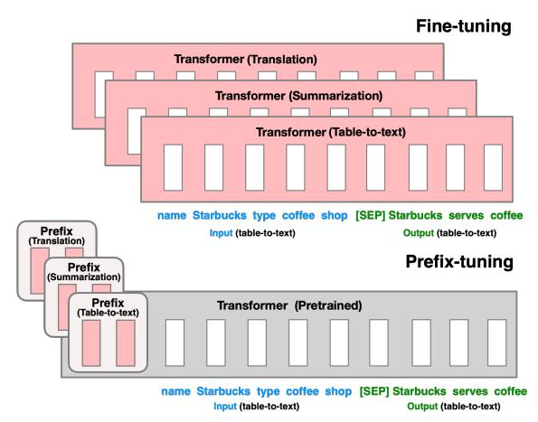
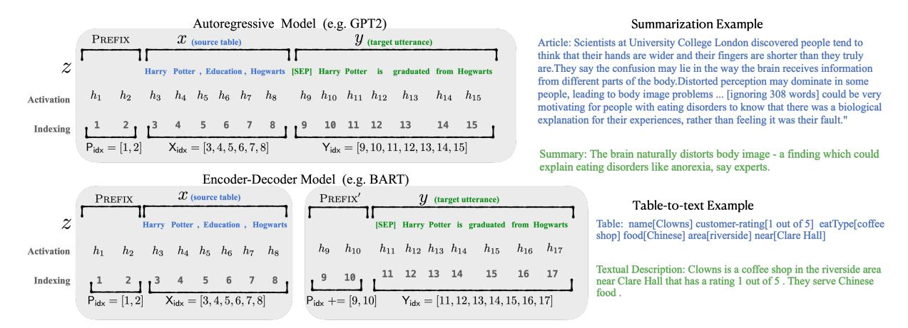
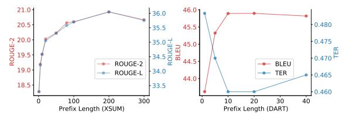
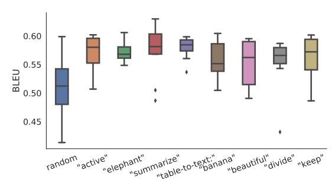
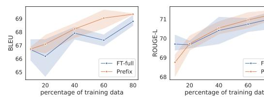
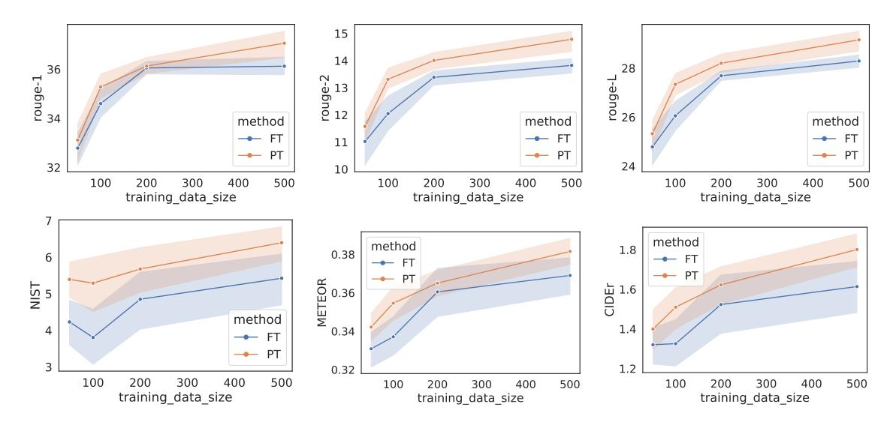
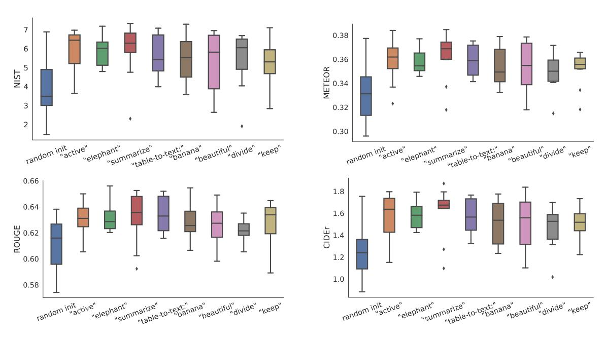

## **Prefix-Tuning: Optimizing Continuous Prompts for Generation**

## Xiang Lisa Li

Stanford University

xlisali@stanford.edu

## **Percy Liang**

Stanford University

pliang@cs.stanford.edu

#### **Abstract**

Fine-tuning is the de facto way of leveraging large pretrained language models for downstream tasks. However, fine-tuning modifies all the language model parameters and therefore necessitates storing a full copy for each task. In this paper, we propose prefix-tuning, a lightweight alternative to fine-tuning for natural language generation tasks, which keeps language model parameters frozen and instead optimizes a sequence of continuous task-specific vectors, which we call the *prefix*. Prefix-tuning draws inspiration from prompting for language models, allowing subsequent tokens to attend to this prefix as if it were "virtual tokens". We apply prefix-tuning to GPT-2 for table-totext generation and to BART for summarization. We show that by modifying only 0.1% of the parameters, prefix-tuning obtains comparable performance in the full data setting, outperforms fine-tuning in low-data settings, and extrapolates better to examples with topics that are unseen during training.

#### 1 Introduction

Fine-tuning is the prevalent paradigm for using large pretrained language models (LMs) (Radford et al., 2019; Devlin et al., 2019) to perform downstream tasks (e.g., summarization), but it requires updating and storing all the parameters of the LM. Consequently, to build and deploy NLP systems that rely on large pretrained LMs, one currently needs to store a modified copy of all the LM parameters for each task. This can be prohibitively expensive given the size of current LMs; for example, GPT-2 has 774M parameters (Radford et al., 2019) and GPT-3 has 175B parameters (Brown et al., 2020).

A natural approach to this problem is *lightweight fine-tuning*, which freezes most of the pretrained parameters and only tunes a smaller set of parameters. For example, adapter-tuning (Rebuffi et al.,

Figure 1: Fine-tuning (top) updates all LM parameters (the red Transformer box) and requires storing a full model copy for each task. We propose prefixtuning (bottom), which freezes the LM parameters and only optimizes the prefix (the red prefix blocks). Consequently, we only need to store the prefix for each task, making prefix-tuning modular and space-efficient. Note that each vertical block denote transformer activations at one time step.

2017; Houlsby et al., 2019) inserts additional task-specific layers between the layers of pretrained language models. Adapter-tuning has promising performance on natural language understanding and generation benchmarks, attaining comparable performance with fine-tuning while adding only around 2–4% task-specific parameters (Houlsby et al., 2019; Lin et al., 2020).

At the limit, GPT-3 (Brown et al., 2020) can be deployed using in-context learning, which is a form of *prompting*, without modifying any LM parameters. In in-context learning, Brown et al. (2020) prepend a natural language task instruction (e.g., *TL;DR* for summarization) and a few examples to the task input, and then generate the task output from the LM. However, since Transformers can only condition on a bounded-length context (e.g., 2048 tokens for GPT-3), in-context learning is restricted to very small training sets.

In this paper, we propose *prefix-tuning*, a lightweight alternative to fine-tuning for natural language generation (NLG) tasks, inspired by prompting. Consider the task of generating a textual description of a data table, as shown in Figure [1,](#page-0-0) where the task input is a linearized table (e.g., "name: Starbucks | type: coffee shop") and the output is a textual description (e.g., "Starbucks serves coffee."). Prefix-tuning prepends a sequence of *continuous task-specific* vectors to the input, which we call a *prefix*, depicted by red blocks in Figure [1](#page-0-0) (bottom). To generate each token, the LM can attend to the prefix as if it were a sequence of "virtual tokens", but unlike prompting, the prefix consists entirely of free parameters which do not correspond to real tokens. In contrast to fine-tuning in Figure [1](#page-0-0) (top), which updates all LM parameters and thus requires storing a tuned copy of the model for each task, prefix-tuning only optimizes the prefix. Consequently, we only need to store one copy of the large LM and a learned task-specific prefix, yielding a very small overhead for each additional task (e.g., 250K parameters for table-to-text).

In contrast to full fine-tuning, prefix-tuning is also modular: we train an upstream prefix which steers an unmodified LM, and therefore, a single LM can support many tasks at once. In the context of personalization where the tasks correspond to users [\(Shokri and Shmatikov,](#page-10-2) [2015;](#page-10-2) [McMahan](#page-10-3) [et al.,](#page-10-3) [2016\)](#page-10-3), we would have a separate prefix for each user trained only on that user's data, thereby avoiding data cross-contamination. Moreover, the prefix-based architecture enables us to even process examples from multiple users/tasks in a single batch, something that is not possible with other lightweight fine-tuning approaches like adaptertuning.

We evaluate prefix-tuning on table-to-text generation using GPT-2 and abstractive summarization using BART. In terms of storage, prefix-tuning stores 1000x fewer parameters than full fine-tuning. In terms of performance when trained on full datasets, prefix-tuning and fine-tuning are comparable for table-to-text (§[6.1\)](#page-5-0), while prefix-tuning suffers a small degradation for summarization (§[6.2\)](#page-5-1). In low-data settings, prefix-tuning outperforms finetuning on both tasks (§[6.3\)](#page-5-2). Prefix-tuning also extrapolates better to tables (for table-to-text) and articles (for summarization) with unseen topics (§[6.4\)](#page-5-3).

## 2 Related Work

Fine-tuning for natural language generation. Current state-of-the-art systems for natural language generation (NLG) are based on fine-tuning pretrained LMs. For table-to-text generation, [Kale](#page-9-4) [\(2020\)](#page-9-4) fine-tunes a sequence-to-sequence model (T5; [Raffel et al.,](#page-10-4) [2020\)](#page-10-4). For extractive and abstractive summarization, researchers fine-tune masked language models (e.g., BERT; [Devlin et al.,](#page-9-0) [2019\)](#page-9-0) and encode-decoder models (e.g., BART; [Lewis](#page-9-5) [et al.,](#page-9-5) [2020\)](#page-9-5), respectively [\(Zhong et al.,](#page-11-0) [2020;](#page-11-0) [Liu](#page-9-6) [and Lapata,](#page-9-6) [2019;](#page-9-6) [Raffel et al.,](#page-10-4) [2020\)](#page-10-4). For other conditional NLG tasks such as machine translation and dialogue generation, fine-tuning is also the prevalent paradigm [\(Zhang et al.,](#page-11-1) [2020c;](#page-11-1) [Stickland](#page-10-5) [et al.,](#page-10-5) [2020;](#page-10-5) [Zhu et al.,](#page-11-2) [2020;](#page-11-2) [Liu et al.,](#page-9-7) [2020\)](#page-9-7). In this paper, we focus on table-to-text using GPT-2 and summarization using BART, but prefix-tuning in principle can be applied to other generation tasks and pretrained models, such as masked LMs.

Lightweight fine-tuning. Prefix-tuning falls under the broad class of lightweight fine-tuning methods, which freeze most of the pretrained parameters and only tune a smaller set of parameters. The key question is how to augment the LM architecture and decide which subset of pretrained parameters to tune. One line of research learns a task-specific parameter mask [\(Zhao et al.,](#page-11-3) [2020;](#page-11-3) [Radiya-Dixit and Wang,](#page-10-6) [2020\)](#page-10-6). Another line of research inserts new modules with trainable parameters. For example, [Zhang et al.](#page-11-4) [\(2020a\)](#page-11-4) trains a "side" network that is fused with the pretrained model via summation; adapter-tuning inserts task-specific layers (adapters) between each layer of the pretrained LM [\(Houlsby et al.,](#page-9-2) [2019;](#page-9-2) [Lin et al.,](#page-9-3) [2020;](#page-9-3) [Rebuffi et al.,](#page-10-1) [2017;](#page-10-1) [Pfeiffer et al.,](#page-10-7) [2020\)](#page-10-7). Compared to this line of work, which tunes around 3.6% of the LM parameters, our method obtains a further 30x reduction in task-specific parameters, tuning only 0.1% while maintaining comparable performance on table-to-text tasks.

Prompting. Prompting is a way of leveraging a pretrained LM by prepending instructions and a few examples to the task input and generating the task output from the LM. For autoregressive LMs, the most successful form of prompting is GPT-3's in-context learning [\(Brown et al.,](#page-9-1) [2020\)](#page-9-1), which uses manually designed prompts to adapt its generation for different tasks in few-shot settings. For masked LMs like BERT and RoBERTa [\(Liu et al.,](#page-10-8)

2019), prompt engineering has been explored for natural language understanding tasks (Jiang et al., 2020; Schick and Schütze, 2020). For example, AutoPrompt (Shin et al., 2020) searches for a sequence of discrete trigger words and concatenates it with each input to elicit sentiment or factual knowledge from BERT and RoBERTa. In contrast with AutoPrompt, our method optimizes continuous prefixes, which are more expressive (§7.2); moreover, we focus on language generation tasks.

Continuous vectors have been used to steer LMs; for example, Subramani et al. (2020) showed that a pretrained LSTM language model can reconstruct arbitrary sentences by optimizing a continuous vector for each sentence, making the vector *inputspecific*. In contrast, prefix-tuning optimizes a *taskspecific* prefix that applies to all instances of that task. As a result, unlike the previous work whose application is limited to sentence reconstruction, prefix-tuning can be applied to NLG tasks.

Controllable generation. Controllable generation aims to steer a pretrained language model to match a sentence-level attribute (e.g., positive sentiment or sports). Such control can happen at training time: Keskar et al. (2019) pretrains the language model (CTRL) to condition on metadata such as keywords or URLs. The control can also happen at decoding time, by weighted decoding (GeDi, Krause et al., 2020) or iteratively updating the past activations (PPLM, Dathathri et al., 2020). However, there is no straightforward way to apply these controllable generation techniques to enforce fine-grained control over generated contents, as demanded by tasks like table-to-text and summarization.

P\*-tuning. Prefix tuning is an instance of a new class of methods that has emerged, which we call p\*-tuning (since the other prominent instances, p-tuning and prompt-tuning, also start with p), all based on the idea of optimizing a continuous prefix or prompt. Concurrent with our work, Qin and Eisner (2021) learn mixtures of soft fill-in-the-blank prompts to elicit knowledge from LMs such as BERT and BART. Hambardzumyan et al. (2021) learns task-specific embeddings that adapts BERT for sentiment classification. Both works show that tuning soft prompts outperforms previous work, which optimizes over discrete prompts. P-tuning (Liu et al., 2021) shows that jointly updating the prompt embeddings and LM parameters improves

GPT-2's performance on natural language understanding tasks, in both few-shot and full data settings. In a followup work, Prompt-tuning (Lester et al., 2021) simplifies our approach and applies it to T5 (Raffel et al., 2020), demonstrating that the performance gap between fine-tuning and p\*-tuning vanishes as the model size grows.

#### 3 Problem Statement

Consider a conditional generation task where the input x is a context and the output y is a sequence of tokens. We focus on two tasks, shown in Figure 2 (right): In table-to-text, x corresponds to a linearized data table and y is a textual description; in summarization, x is an article and y is a summary.

## 3.1 Autoregressive LM

Assume we have an autoregressive neural language model  $p_{\phi}(y \mid x)$  parametrized by  $\phi$  (e.g., GPT-2; Radford et al., 2019). As shown in Figure 2 (top), let z = [x;y] be the concatenation of x and y; let  $X_{\text{idx}}$  denote the sequence of indices that corresponds to x, and  $Y_{\text{idx}}$  denote the same for y.

The activation vector at time step i is  $h_i \in \mathbb{R}^d$ , where  $h_i = [h_i^{(1)}; \dots; h_i^{(n)}]$  is a concatenation of all activation layers at this time step, and  $h_i^{(j)}$  is the activation vector of the j-th layer at time step i.1

An autoregressive neural LM computes  $h_i$  as a function of  $z_i$  and the past activations in its left context, as follows:

$$h_i = LM_{\phi}(z_i, h_{< i}), \tag{1}$$

where the last layer of  $h_i$  is used to compute the distribution for the next token:  $p_{\phi}(z_{i+1} \mid h_{\leq i}) = \operatorname{softmax}(W_{\phi} \ h_i^{(n)})$  and  $W_{\phi}$  is a matrix that maps  $h_i^{(n)}$  to logits over the vocabulary.

#### 3.2 Encoder-Decoder Architecture

We can also use an encoder-decoder architecture (e.g., BART; Lewis et al., 2020) to model  $p_{\phi}(y \mid x)$ , where x is encoded by the bidirectional encoder, and the decoder predicts y autoregressively (conditioned on the encoded x and its left context). We use the same indexing and activation notation, as shown in Figure 2 (bottom): each  $h_i$  for  $i \in X_{idx}$  is computed by the a bidirectional encoder; each  $h_i$  for  $i \in Y_{idx}$  is computed by an autoregressive decoder using the same equation (1).

 $^{1}$ In GPT-2,  $h_{i}^{(n)}$  consists of a key-value pair, and the dimension of each key and value is 1024.

Figure 2: An annotated example of prefix-tuning using an autoregressive LM (top) and an encoder-decoder model (bottom). The prefix activations ∀i ∈ Pidx, hi are drawn from a trainable matrix Pθ. The remaining activations are computed by the Transformer.

## 3.3 Fine-tuning

In the full fine-tuning framework, we initialize with the pretrained parameters φ. Here pφ is a trainable language model distribution and we perform gradient updates on the following log-likelihood objective:

$$\max_{\phi} \log p_{\phi}(y \mid x) = \max_{\phi} \sum_{i \in \mathsf{Y}_{\mathsf{idx}}} \log p_{\phi}(z_i \mid h_{< i}). \tag{2}$$

## 4 Prefix-Tuning

We propose prefix-tuning as an alternative to full fine-tuning for conditional generation tasks. We first provide intuition in §[4.1](#page-3-1) before defining our method formally in §[4.2.](#page-3-2)

## 4.1 Intuition

Prompting has demonstrated that conditioning on a proper context can steer the LM without changing its parameters. For example, if we want the LM to generate a word (e.g., Obama), we can prepend its common collocations as context (e.g., Barack), and the LM will assign much higher probability to the desired word. Extending this intuition beyond generating a single word or sentence, we want to find a context that steers the LM to solve an NLG task. Intuitively, the context could influence the encoding of the task input x by guiding what to extract from x, and it could influence the generation of the task output y by steering the next token distribution. However, it's non-obvious whether such a context exists. Using natural language task instructions (e.g., "summarize the following table in one sentence") for the context might guide a human to

solve the task, but this fails for moderately-sized pretrained LMs.[2](#page-3-3) Optimizing over the discrete instructions might help, but discrete optimization is computationally challenging.

Instead of optimizing over discrete tokens, we can optimize the instruction as continuous word embeddings, whose effects will be propagated upward to all Transformer activation layers and rightward to subsequent tokens. This is strictly more expressive than a discrete prompt which is constrained to the embeddings of real words. Prefix-tuning goes one step further in increasing expressivity by optimizing the activations of all the layers, not just the embedding layer. As another benefit, prefixtuning can directly modify representations deeper in the network, therefore, avoiding long computation paths across the depth of the network.

## 4.2 Method

Prefix-tuning prepends a prefix for an autoregressive LM to obtain z = [PREFIX; x; y], or prepends prefixes for both encoder and decoder to obtain z = [PREFIX; x; PREFIX0 ; y], as shown in Figure [2.](#page-3-0) Here, Pidx denotes the sequence of prefix indices, and we use |Pidx| to denote the length of the prefix.

We follow the recurrence relation in equation [\(1\)](#page-2-1), except that the activations of the prefix indices are free parameters, given by a matrix Pθ (parametrized by θ) of dimension |Pidx| × dim(hi).

$$h_i = \begin{cases} P_{\theta}[i,:], & \text{if } i \in \mathsf{P}_{\mathsf{idx}}, \\ \mathsf{LM}_{\phi}(z_i, h_{< i}), & \text{otherwise.} \end{cases} \tag{3}$$

2 In our preliminary experiments, GPT-2 and BART fail in this setting; the only exception is GPT-3.

The training objective is the same as equation (2), but the set of trainable parameters changes: the language model parameters  $\phi$  are fixed and the prefix parameters  $\theta$  are the only trainable parameters.

Here, each  $h_i$  is a function of the trainable  $P_{\theta}$ . When  $i \in \mathsf{P}_{\mathsf{idx}}$ , this is clear because  $h_i$  copies directly from  $P_{\theta}$ . When  $i \notin \mathsf{P}_{\mathsf{idx}}$ ,  $h_i$  still depends on  $P_{\theta}$ , because the prefix activations are always in the left context and will therefore affect any activations to the right.

#### **4.3** Parametrization of $P_{\theta}$

Empirically, directly updating the  $P_{\theta}$  parameters leads to unstable optimization and a slight drop in performance.3 So we reparametrize the matrix  $P_{\theta}[i,:] = \text{MLP}_{\theta}(P'_{\theta}[i,:])$  by a smaller matrix  $(P'_{\theta})$  composed with a large feedforward neural network  $(\text{MLP}_{\theta})$ . Now, the trainable parameters include  $P'_{\theta}$  and the parameters of  $\text{MLP}_{\theta}$ . Note that  $P_{\theta}$  and  $P'_{\theta}$  has the same number of rows (i.e., the prefix length), but different number of columns.4

Once training is complete, these reparametrization parameters can be dropped, and only the prefix  $(P_{\theta})$  needs to be saved.

## 5 Experimental Setup

#### 5.1 Datasets and Metrics

We evaluate on three standard neural generation datasets for the table-to-text task: E2E (Novikova et al., 2017), WebNLG (Gardent et al., 2017), and DART (Radev et al., 2020), as shown in Table 1. The datasets are ordered by increasing complexity and size. E2E only has 1 domain (i.e. restaurant reviews); WebNLG has 14 domains, and DART is open-domain, using open-domain tables from Wikipedia. For evaluation, we report the metrics using the official evaluation scripts (see details in Appendix A.1).

For the summarization task, we use the XSUM (Narayan et al., 2018) dataset, which is an abstractive summarization dataset on news articles. We report ROUGE-1, ROUGE-2 and ROUGE-L.

#### 5.2 Methods

For table-to-text generation, we compare prefixtuning with three other methods: full fine-tuning

|        | #examples | input length | output length |
|--------|-----------|--------------|---------------|
| E2E    | 50K       | 28.5         | 27.8          |
| WebNLG | 22K       | 49.6         | 30.7          |
| DART   | 82K       | 38.8         | 27.3          |
| XSUM   | 225K      | 473.3        | 28.1          |

Table 1: Datasets statistics. The input and output length is the number of BPE tokens per example. For the three table-to-text datasets, the input length is the length of linearized tables (details in Appendix A.1).

(FT-FULL), fine-tuning only the top 2 layers (FT-TOP2), and adapter-tuning (ADAPTER).5 We also report the current state-of-the-art results on these datasets: On E2E, Shen et al. (2019) uses a pragmatically informed model without pretraining. On WebNLG, Kale (2020) fine-tunes T5-large. On DART, no official models trained on this dataset version are released.6 For summarization, we compare against fine-tuning BART (Lewis et al., 2020).

## 5.3 Architectures and Hyperparameters

For table-to-text, we use  $GPT-2_{MEDIUM}$  and  $GPT-2_{LARGE}$ . For summarization, we use  $BART_{LARGE}$ . Our implementation is based on the Hugging Face Transformers (Wolf et al., 2020).

At training time, we use the AdamW optimizer (Loshchilov and Hutter, 2019) and a linear learning rate scheduler, as suggested by the Hugging Face default setup. The hyperparameters we tune include the number of epochs, batch size, learning rate, and prefix length. Hyperparameter details are in the appendix. The default setting is 10 epochs, batch size 5, learning rate  $5 \cdot 10^{-5}$  and prefix length 10. The table-to-text models are trained on TITAN Xp or GeForce GTX TITAN X machines. Prefixtuning takes 0.2 hours per epoch to train on 22K examples, whereas fine-tuning takes around 0.3 hours per epoch. The summarization models are trained on Tesla V100 machines, taking 1.25 hours per epoch on the XSUM dataset. For time efficiency, prefix-tuning is around 30% faster than fine-tuning. For GPU memory efficiency, prefixtuning with batchsize 1 takes 18% of the total GPU memory, whereas fine-tuning takes 50%.

At decoding time, for table-to-text, we use beam search with beam size 5. For summarization, we use beam size 6 and length normalization 0.8. Decoding takes 1.2 seconds per sentence (without

&lt;sup>3We find in preliminary experiments that directly optimizing the prefix is very sensitive to initialization.

 $^4P_{\theta}$  has dimensions  $|\mathsf{P}_{\mathsf{idx}}| \times \dim(h_i)$  while  $P_{\theta}$  has dimensions  $|\mathsf{P}_{\mathsf{idx}}| \times k$ . We choose k = 512 for table-to-text and 800 for summarization.  $\mathsf{MLP}_{\theta}$  maps from k to  $\dim(h_i)$ .

&lt;sup>5Same implementation as Lin et al. (2020).

 $^6$ The official benchmark model is trained on v.1.0.0 while the release dataset is v1.1.1.

batching) for table-to-text, and 2.6 seconds per batch (using a batch size of 10) for summarization.

## 6 Main Results

## 6.1 Table-to-text Generation

We find that by updating only 0.1% task-specific parameters,[7](#page-5-4) prefix-tuning is effective in table-to-text generation, outperforming other lightweight baselines (ADAPTER and FT-TOP2) even by updating 30x fewer parameters and achieving a comparable performance with (full) fine-tuning. This trend holds for all datasets: E2E, WebNLG,[8](#page-5-5) and DART.

If we match the number of parameters for prefixtuning and adapter-tuning to be 0.1%, Table [2](#page-6-0) shows that prefix-tuning is significantly better than ADAPTER (0.1%), attaining 4.1 BLEU improvement per dataset on average. Even when we compare with fine-tuning (100%) and adapter-tuning (3.0%), which update significantly more parameters than prefix-tuning, prefix-tuning still achieves results comparable or better than those two systems. This demonstrates that prefix-tuning is more Pareto efficient than adapter-tuning, significantly reducing parameters while improving generation quality.

Additionally, attaining good performance on DART suggests that prefix-tuning can generalize to tables with diverse domains and a large number of relations. We will delve deeper into extrapolation performance (i.e., generalization to unseen categories or topics) in §[6.4.](#page-5-3)

In summary, prefix-tuning is an effective and space-efficient method to adapt GPT-2 to table-totext generation. It also maintains the performance gains when scaling up to GPT-2LARGE, suggesting it has the potential to scale to even larger models with a similar architecture, like GPT-3.

#### 6.2 Summarization

As shown in Table [3,](#page-6-1) with 2% parameters, prefixtuning obtains slightly lower performance than finetuning (36.05 vs. 37.25 in ROUGE-L). With only 0.1% parameters, prefix-tuning underperforms full fine-tuning (35.05 vs. 37.25). There are several differences between XSUM and the three table-totext datasets which could account for why prefixtuning has comparative advantage in table-to-text:

(1) XSUM contains 4x more examples than the three table-to-text datasets on average; (2) the input articles are 17x longer than the linearized table input of table-to-text datasets on average; (3) summarization is more complex than table-to-text because it requires selecting key contents from an article.

## 6.3 Low-data Setting

Based on the results from table-to-text (§[6.1\)](#page-5-0) and summarization (§[6.2\)](#page-5-1), we observe that prefixtuning has a comparative advantage when the number of training examples is smaller. To explore the low-data setting more systematically, we subsample the full dataset (E2E for table-to-text and XSUM for summarization) to obtain small datasets of size {50, 100, 200, 500}. For each size, we sample 5 different datasets and average over 2 training random seeds. Thus, we average over 10 models for each low-data setting.[9](#page-5-6)

Figure [3](#page-6-2) (right) shows that prefix-tuning outperforms fine-tuning in low-data regimes by 2.9 BLEU on average, in addition to requiring much fewer parameters, but the gap narrows as the dataset size increases.

Qualitatively, Figure [3](#page-6-2) (left) shows 8 examples generated by both prefix-tuning and fine-tuning models trained on different data levels. While both methods tend to undergenerate (missing table contents) in low data regimes, prefix-tuning tends to be more faithful than fine-tuning. For example, finetuning (100, 200)[10](#page-5-7) falsely claims a low customer rating while the true rating is average, whereas prefix-tuning (100, 200) generates a description that is faithful to the table.

## 6.4 Extrapolation

We now investigate extrapolation performance to unseen topics for both table-to-text and summarization. In order to construct an extrapolation setting, we split the existing datasets so that training and test cover different topics. For table-to-text, the WebNLG dataset is labeled with table topics. There are 9 categories that appear in training and dev, denoted as SEEN and 5 categories that only appear at test time, denoted as UNSEEN. So we evaluate extrapolation by training on the SEEN categories and testing on the UNSEEN categories. For summarization, we construct two extrapolation data splits:

7 250K for E2E, 250K for WebNLG, and 500K for DART versus 345M GPT-2 parameters.

8The S,U,A columns in WebNLG represents SEEN, UN-SEEN, and ALL respectively; SEEN categories appear at training time; UNSEEN categories only appears at test time; and ALL is the combination of the two.

9We also sample a dev split (with dev size = 30% × training size) for each training set. We use the dev split to choose hyperparameters and perform early stopping.

10The number in the parenthesis refers to the training size.

|               | E2E  |      |      |      | WebNLG |      |      |      | DART |      |                   |      |       |      |      |      |                  |       |      |        |
|---------------|------|------|------|------|--------|------|------|------|------|------|-------------------|------|-------|------|------|------|------------------|-------|------|--------|
|               | BLEU | NIST | MET  | R-L  | CIDEr  |      | BLEU | J    |      | MET  |                   |      | TER . | ļ.   | BLEU | MET  | TER $\downarrow$ | Mover | BERT | BLEURT |
|               |      |      |      |      |        | S    | U    | A    | S    | U    | A                 | S    | U     | A    |      |      |                  |       |      |        |
|               |      |      |      |      |        |      |      |      |      | GP   | T-2 ME | DIUM |       |      |      |      |                  |       |      |        |
| FT-FULL       | 68.8 | 8.71 | 46.1 | 71.1 | 2.43   | 64.7 | 26.7 | 45.7 | 0.46 |      |                   |      | 0.78  | 0.54 | 46.2 | 0.39 | 0.46             | 0.50  | 0.94 | 0.39   |
| FT-TOP2       | 68.1 | 8.59 | 46.0 | 70.8 | 2.41   | 53.6 | 18.9 | 36.0 | 0.38 | 0.23 | 0.31              | 0.49 | 0.99  | 0.72 | 41.0 | 0.34 | 0.56             | 0.43  | 0.93 | 0.21   |
| ADAPTER(3%)   | 68.9 | 8.71 | 46.1 | 71.3 | 2.47   | 60.5 | 47.9 | 54.8 | 0.43 | 0.38 | 0.41              | 0.35 | 0.46  | 0.39 | 45.2 | 0.38 | 0.46             | 0.50  | 0.94 | 0.39   |
| ADAPTER(0.1%) | 66.3 | 8.41 | 45.0 | 69.8 | 2.40   | 54.5 | 45.1 | 50.2 | 0.39 | 0.36 | 0.38              | 0.40 | 0.46  | 0.43 | 42.4 | 0.36 | 0.48             | 0.47  | 0.94 | 0.33   |
| Prefix(0.1%)  | 70.3 | 8.82 | 46.3 | 72.1 | 2.46   | 62.9 | 45.3 | 55.0 | 0.44 | 0.37 | 0.41              | 0.35 | 0.51  | 0.42 | 46.4 | 0.38 | 0.46             | 0.50  | 0.94 | 0.39   |
|               |      |      |      |      |        |      |      |      |      | G    | PT-2 L | ARGE |       |      |      |      |                  |       |      |        |
| FT-FULL       | 68.5 | 8.78 | 46.0 | 69.9 | 2.45   | 65.3 | 43.1 | 55.5 | 0.46 | 0.38 | 0.42              | 0.33 | 0.53  | 0.42 | 47.0 | 0.39 | 0.46             | 0.51  | 0.94 | 0.40   |
| Prefix        | 70.3 | 8.85 | 46.2 | 71.7 | 2.47   | 63.4 | 47.7 | 56.3 | 0.45 | 0.39 | 0.42              | 0.34 | 0.48  | 0.40 | 46.7 | 0.39 | 0.45             | 0.51  | 0.94 | 0.40   |
| SOTA          | 68.6 | 8.70 | 45.3 | 70.8 | 2.37   | 63.9 | 52.8 | 57.1 | 0.46 | 0.41 | 0.44              | -    | -     | -    | -    | -    | -                | -     | -    | -      |

Table 2: Metrics (higher is better, except for TER) for table-to-text generation on E2E (left), WebNLG (middle) and DART (right). With only 0.1% parameters, Prefix-tuning outperforms other lightweight baselines and achieves a comparable performance with fine-tuning. The best score is boldfaced for both GPT-2MEDIUM and GPT-2LARGE.

| Source                      | name : The Eagle   type : coffee shop   food : Chinese   price : cheap   customer rating : average   area : riverside   family friendly : no   near : Burger King                | 급 36     |   | ±9                     | •               | 15 14       |                     |                            |
|-----------------------------|----------------------------------------------------------------------------------------------------------------------------------------------------------------------------------|----------|---|------------------------|-----------------|----------------|---------------------|----------------------------|
| Prefix (50) Prefix (100) | The Eagle is a cheap Chinese coffee shop located near Burger King.  The Eagle is a cheap coffee shop located in the riverside near Burger King. It has average customer ratings. | ~ 34     |   |                        | → FT-full       | ROUGE 13    |                     | → FT-full                  |
| Prefix (200)                | The Eagle is a cheap Chinese coffee shop located in the riverside area near Burger King. It has average customer ratings.                                                        | 33 32 | • |                        | Prefix          | 11             |                     | Prefix                     |
| Prefix (500)                | The Eagle is a coffee shop that serves Chinese food. It is located in the riverside area near Burger King. It has an average customer rating and is not family friendly.         |          |   | 00 300 aining data  | 400 500 size |                | 100 200 training | 300 400 500 g data size |
| FT (50)                     | The Eagle coffee shop is located in the riverside area near Burger King.                                                                                                         |          |   |                        |                 | 0.66           |                     |                            |
| FT (100)                    | The Eagle is a cheap coffee shop near Burger King in the riverside area. It has a low customer rating and is not family friendly.                                                | 0.60     | , |                        | •               | 9 0.64 0.62 | ,                   |                            |
| FT (200)                    | The Eagle is a cheap Chinese coffee shop with a low customer rating. It is                                                                                                       | 료 0.55   |   |                        |                 | ₽ 0.62         | 1                   |                            |
| FT (500)                    | located near Burger King in the riverside area.  The Eagle is a cheap Chinese coffee shop with average customer ratings. It is                                                   | 0.50     |   |                        | FT-full Prefix  | 0.60           |                     | → FT-full → Prefix         |
| -                           | located in the riverside area near Burger King.                                                                                                                                  |          |   | 200 300 aining data | 400 500 size |                | 100 200 trainin  | 300 400 500 g data size |

Figure 3: (Left) qualitative examples in lowdata settings. (Right) prefix-tuning (orange) outperforms fine-tuning (blue) in low-data regimes in addition to requiring many fewer parameters. The top two plots correspond to summarization, measured by ROUGE-1 and ROUGE-2. The bottom two plots correspond to table-to-text, measured by BLEU and ROUGE-L. The x-axis is the training size and the y-axis is the evaluation metric (higher is better).

|                             | R-1 ↑ | R-2 ↑ | R-L↑  |
|-----------------------------|-------|-------|-------|
| FT-FULL(Lewis et al., 2020) | 45.14 | 22.27 | 37.25 |
| Prefix(2%)                  | 43.80 | 20.93 | 36.05 |
| PREFIX(0.1%)                | 42.92 | 20.03 | 35.05 |

Table 3: Performance of methods on the XSUM summarization dataset. Prefix-tuning slightly underperforms fine-tuning in the full-data regime.

|         | news  | -to-sp | orts  | within-news |       |       |  |  |
|---------|-------|--------|-------|-------------|-------|-------|--|--|
|         | R-1 ↑ | R-2 ↑  | R-L↑  | R-1 ↑       | R-2 ↑ | R-L↑  |  |  |
| FT-FULL | 38.15 | 15.51  | 30.26 | 39.20       | 16.35 | 31.15 |  |  |
| PREFIX  | 39.23 | 16.74  | 31.51 | 39.41       | 16.87 | 31.47 |  |  |

Table 4: Extrapolation performance on XSUM. Prefixtuning outperforms fine-tuning on both news-to-sports and within-news splits.

In news-to-sports, we train on news articles and test on sports articles. In within-news, we train on {world, UK, business} news and test on the remaining news categories (e.g., health, tech).

On both table-to-text and summarization, prefixtuning extrapolates better than fine-tuning under all metrics, as shown in Table 4 and the 'U' columns of Table 2 (middle).

We also find that adapter-tuning achieves good extrapolation performance, comparable with prefix-

tuning, as shown in Table 2. This shared trend suggests that preserving LM parameters indeed has a positive impact on extrapolation. However, how prefix-tuning improves extrapolation is an open question and we will discuss this further in §8.

#### 7 Intrinsic Evaluation

We compare different variants of prefix-tuning to study the impact of various design decisions. §7.1 studies the impact of the prefix length. §7.2 studies tuning only the embedding layer, which is more akin to tuning a discrete prompt. §7.3 compares prefixing and infixing, which inserts trainable activations between x and y. §7.4 studies the impact of various prefix initialization strategies. §7.5 further studies the data efficiency of prefix-tuning.

#### 7.1 Prefix Length

A longer prefix means more trainable parameters, and therefore more expressive power. 11 Figure 4 shows that performance increases as the prefix

&lt;sup>11Empirically, longer prefixes have a negligible impact on training and inference speed per batch, because attention computation over the entire prefix is parallellized on GPUs.

Figure 4: Prefix length vs. performance on summerization (left) and table-to-text (right). Performance increases as the prefix length increases up to a threshold (200 for summarization and 10 for table-to-text) and then a slight performance drop occurs. Each plot reports two metrics (on two vertical axes).

|          | BLEU | NIST      | E2E MET | ROUGE       | CIDEr |
|----------|------|-----------|------------|-------------|-------|
| PREFIX   | 70.3 | 8.82      | 46.3       | 72.1        | 2.46  |
|          | Emb  | edding-or | nly: EMI   | 3-{PrefixLe | ngth} |
| Емв-1    | 48.1 | 3.33      | 32.1       | 60.2        | 1.10  |
| Емв-10   | 62.2 | 6.70      | 38.6       | 66.4        | 1.75  |
| Емв-20   | 61.9 | 7.11      | 39.3       | 65.6        | 1.85  |
|          | Inf  | ix-tuning | : INFIX-   | PrefixLeng  | th}   |
| INFIX-1  | 67.9 | 8.63      | 45.8       | 69.4        | 2.42  |
| Infix-10 | 67.2 | 8.48      | 45.8       | 69.9        | 2.40  |
| Infix-20 | 66.7 | 8.47      | 45.8       | 70.0        | 2.42  |

Table 5: Intrinsic evaluation of Embedding-only (§7.2) and Infixing (§7.3). Both Embedding-only ablation and Infix-tuning underperforms full prefix-tuning.

length increases up to a threshold (200 for summarization, 10 for table-to-text) and then a slight performance drop occurs. Prefixes longer than the threshold lead to lower training loss, but slightly worse test performance, suggesting that they tend to overfit the training data.

#### 7.2 Full vs Embedding-only

Recall in §4.1, we discussed optimizing the continuous embeddings of the "virtual tokens." We instantiate that idea and call it *embedding-only*. The word embeddings are free parameters, and the remaining activation layers are computed by the Transformer. Table 5 (top) shows that the performance drops significantly, suggesting that tuning only the embedding layer is not sufficiently expressive.

Embedding-only upper bounds the performance of discrete prompt optimization (Shin et al., 2020), because discrete prompt restricts the embedding layer to exactly match the embedding of a real word. Consequently, we have this chain of increasing expressive power: discrete prompting < embedding-only < prefix-tuning.

#### 7.3 Prefix-tuning vs Infix-tuning

We also investigate how the trainable activations' position in the sequence affects performance. In

Figure 5: Initializing the prefix with activations of real words significantly outperforms random initialization, in low-data settings.

prefix-tuning, we place them at the beginning [PREFIX; x; y]. We can also place the trainable activations between x and y (i.e. [x; INFIX; y]) and call this infix-tuning. Table 5 (bottom) shows that infix-tuning slightly underperforms prefix-tuning. We believe this is because prefix-tuning can affect the activations of x and y whereas infix-tuning can only influence the activations of y.

#### 7.4 Initialization

We find that how the prefix is initialized has a large impact in low-data settings. Random initialization leads to low performance with high variance. Initializing the prefix with activations of real words significantly improves generation, as shown in Figure 5. In particular, initializing with task relevant words such as "summarization" and "table-to-text" obtains slightly better performance than task irrelevant words such as "elephant" and "divide", but using real words is still better than random. Moreover, in full data settings, the initialization trick has no impact, and random initialization leads to equally good performance.

Since we initialize the prefix with activations of real words computed by the LM, this initialization strategy is concordant with prefix-tuning's philosophy, which preserves the pretrained LM as much as possible.

#### 7.5 Data Efficiency

We also investigate the data efficiency of prefixtuning (without initialization trick, a.k.a random initialization) and full fine-tuning by comparing their performance on 5 different data scales of the E2E task (10%, 20%, 40%, 60%, and 80%). Figure 6 shows that prefix-tuning has better performance than fine-tuning when using more than 20% of the data. For data scale of 10%, prefix-tuning with random initialization yields comparable or slightly lower performance than full fine-tuning,

Figure 6: Data efficiency curves: percentage of training set vs. performance on table-to-text (E2E). Prefixtuning (without the initialization trick) is more dataefficient than fine-tuning when using more than 20% of the data.

necessitating the initialization trick (§6.3) to improve the performance in this low-data regime.

#### 8 Discussion

We will discuss several favorable properties of prefix-tuning and some open problems.

Personalization. As we note in §1, prefix-tuning is advantageous when there are a large number of tasks that needs to be trained independently. One practical setting is user privacy (Shokri and Shmatikov, 2015; McMahan et al., 2016). In order to preserve user privacy, each user's data needs to be separated and a personalized model needs to be trained independently for each user. Consequently, each user can be regarded as an independent task. If there are millions of users, prefix-tuning can scale to this setting and maintain modularity, enabling flexible addition or deletion of users by adding or deleting their prefixes without cross-contamination.

Batching across users. Under the same personalization setting, prefix-tuning allows batching different users' queries even though they are backed by different prefixes. When multiple users query a cloud GPU device with their inputs, it is computationally efficient to put these users in the same batch. Prefix-tuning keeps the shared LM intact; consequently, batching requires a simple step of prepending the personalized prefix to user input, and all the remaining computation is unchanged. In contrast, we can't batch across different users in adapter-tuning, which has personalized adapters between shared Transformer layers.

This batching benefit could also help create efficient ensembles of multiple prefixes trained on the same task (Lester et al., 2021).

**Inductive bias of prefix-tuning.** Recall that fine-tuning updates all pretrained parameters, whereas prefix-tuning and adapter-tuning preserve them.

Since the language models are pretrained on general purpose corpora, preserving the LM parameters might help generalization to domains unseen during training. In concordance with this intuition, we observe that both prefix-tuning and adaptertuning have significant performance gain in extrapolation settings (§6.4); however, how these methods improve extrapolation is an open question.

While prefix-tuning and adapter-tuning both freeze the pretrained parameters, they tune different sets of parameters to affect the activation layers of the Transformer. Recall that prefix-tuning keeps the LM intact and uses the prefix and the pretrained attention blocks to affect the subsequent activations; adapter-tuning inserts trainable modules between LM layers, which directly add residual vectors to the activations. Moreover, we observe that prefix-tuning requires vastly fewer parameters compared to adapter-tuning while maintaining comparable performance. We think this gain in parameter efficiency is because prefix-tuning keeps the pretrained LM intact as much as possible, and therefore exploits the LM more than adapter-tuning.

Recent work by Aghajanyan et al. (2020) uses intrinsic dimension to show that there exists a low-dimensional reparameterization that is as effective for fine-tuning as the full parametrization. This explains why good accuracy on downstream tasks can be obtained by updating only a small number of parameters. Our work echoes this finding by showing that good generation performance can also be attained by updating a very small prefix. However, prefix-tuning is not just about the size of trainable parameters, but more importantly, which subset of parameters to modify. Therefore, it would be interesting future work to explore other lightweight fine-tuning methods that achieve an even better accuracy-size tradeoff.

#### Acknowledgments

We thank the members of p-lambda group as well as anonymous reviewers for valuable feedback. We gratefully acknowledge the support of a PECASE award. XLL is supported by a Stanford Graduate Fellowship.

#### Reproducibility

Our code is available at https://github.com/ XiangLi1999/PrefixTuning.

Experiments and data are available at https://worksheets.codalab.org/worksheets/ 0x16e0c8e7ab1f4b22aaccddc8b586541f.

## References

- Armen Aghajanyan, Luke Zettlemoyer, and Sonal Gupta. 2020. [Intrinsic dimensionality explains the](http://arxiv.org/abs/2012.13255) [effectiveness of language model fine-tuning.](http://arxiv.org/abs/2012.13255)
- Anja Belz and Ehud Reiter. 2006. [Comparing auto](https://www.aclweb.org/anthology/E06-1040)[matic and human evaluation of NLG systems.](https://www.aclweb.org/anthology/E06-1040) In *11th Conference of the European Chapter of the Association for Computational Linguistics*, Trento, Italy. Association for Computational Linguistics.
- Tom B. Brown, Benjamin Mann, Nick Ryder, Melanie Subbiah, Jared Kaplan, Prafulla Dhariwal, Arvind Neelakantan, Pranav Shyam, Girish Sastry, Amanda Askell, Sandhini Agarwal, Ariel Herbert-Voss, Gretchen Krueger, Tom Henighan, Rewon Child, Aditya Ramesh, Daniel M. Ziegler, Jeffrey Wu, Clemens Winter, Christopher Hesse, Mark Chen, Eric Sigler, Mateusz Litwin, Scott Gray, Benjamin Chess, Jack Clark, Christopher Berner, Sam Mc-Candlish, Alec Radford, Ilya Sutskever, and Dario Amodei. 2020. [Language models are few-shot learn](http://arxiv.org/abs/2005.14165)[ers.](http://arxiv.org/abs/2005.14165)
- Sumanth Dathathri, Andrea Madotto, Janice Lan, Jane Hung, Eric Frank, Piero Molino, Jason Yosinski, and Rosanne Liu. 2020. [Plug and play language mod](https://openreview.net/forum?id=H1edEyBKDS)[els: A simple approach to controlled text generation.](https://openreview.net/forum?id=H1edEyBKDS) In *International Conference on Learning Representations*.
- Jacob Devlin, Ming-Wei Chang, Kenton Lee, and Kristina Toutanova. 2019. [BERT: Pre-training of](https://doi.org/10.18653/v1/N19-1423) [deep bidirectional transformers for language under](https://doi.org/10.18653/v1/N19-1423)[standing.](https://doi.org/10.18653/v1/N19-1423) In *Proceedings of the 2019 Conference of the North American Chapter of the Association for Computational Linguistics: Human Language Technologies, Volume 1 (Long and Short Papers)*, pages 4171–4186, Minneapolis, Minnesota. Association for Computational Linguistics.
- Claire Gardent, Anastasia Shimorina, Shashi Narayan, and Laura Perez-Beltrachini. 2017. [The WebNLG](https://doi.org/10.18653/v1/W17-3518) [challenge: Generating text from RDF data.](https://doi.org/10.18653/v1/W17-3518) In *Proceedings of the 10th International Conference on Natural Language Generation*, pages 124–133, Santiago de Compostela, Spain. Association for Computational Linguistics.
- Karen Hambardzumyan, Hrant Khachatrian, and Jonathan May. 2021. [WARP: word-level adversar](http://arxiv.org/abs/2101.00121)[ial reprogramming.](http://arxiv.org/abs/2101.00121) *CoRR*, abs/2101.00121.
- Neil Houlsby, Andrei Giurgiu, Stanislaw Jastrzebski, Bruna Morrone, Quentin De Laroussilhe, Andrea Gesmundo, Mona Attariyan, and Sylvain Gelly. 2019. [Parameter-efficient transfer learning for NLP.](http://proceedings.mlr.press/v97/houlsby19a.html) In *Proceedings of the 36th International Conference on Machine Learning*, volume 97 of *Proceedings of Machine Learning Research*, pages 2790–2799, Long Beach, California, USA. PMLR.
- Zhengbao Jiang, Frank F. Xu, Jun Araki, and Graham Neubig. 2020. [How can we know what language](https://doi.org/10.1162/tacl_a_00324)

- [models know?](https://doi.org/10.1162/tacl_a_00324) *Transactions of the Association for Computational Linguistics*, 8:423–438.
- Mihir Kale. 2020. [Text-to-text pre-training for data-to](http://arxiv.org/abs/2005.10433)[text tasks.](http://arxiv.org/abs/2005.10433)
- N. Keskar, B. McCann, L. R. Varshney, Caiming Xiong, and R. Socher. 2019. Ctrl: A conditional transformer language model for controllable generation. *ArXiv*, abs/1909.05858.
- Ben Krause, Akhilesh Deepak Gotmare, Bryan Mc-Cann, Nitish Shirish Keskar, Shafiq Joty, Richard Socher, and Nazneen Fatema Rajani. 2020. GeDi: Generative Discriminator Guided Sequence Generation. *arXiv preprint arXiv:2009.06367*.
- Alon Lavie and Abhaya Agarwal. 2007. [Meteor: An](http://dl.acm.org/citation.cfm?id=1626355.1626389) [automatic metric for mt evaluation with high levels](http://dl.acm.org/citation.cfm?id=1626355.1626389) [of correlation with human judgments.](http://dl.acm.org/citation.cfm?id=1626355.1626389) In *Proceedings of the Second Workshop on Statistical Machine Translation*, StatMT '07, pages 228–231, Stroudsburg, PA, USA. Association for Computational Linguistics.
- Brian Lester, Rami Al-Rfou, and Noah Constant. 2021. [The power of scale for parameter-efficient prompt](http://arxiv.org/abs/2104.08691) [tuning.](http://arxiv.org/abs/2104.08691)
- Mike Lewis, Yinhan Liu, Naman Goyal, Marjan Ghazvininejad, Abdelrahman Mohamed, Omer Levy, Veselin Stoyanov, and Luke Zettlemoyer. 2020. [BART: Denoising sequence-to-sequence pre](https://doi.org/10.18653/v1/2020.acl-main.703)[training for natural language generation, translation,](https://doi.org/10.18653/v1/2020.acl-main.703) [and comprehension.](https://doi.org/10.18653/v1/2020.acl-main.703) In *Proceedings of the 58th Annual Meeting of the Association for Computational Linguistics*, pages 7871–7880, Online. Association for Computational Linguistics.
- Chin-Yew Lin. 2004. [ROUGE: A package for auto](https://www.aclweb.org/anthology/W04-1013)[matic evaluation of summaries.](https://www.aclweb.org/anthology/W04-1013) In *Text Summarization Branches Out*, pages 74–81, Barcelona, Spain. Association for Computational Linguistics.
- Zhaojiang Lin, Andrea Madotto, and Pascale Fung. 2020. [Exploring versatile generative language](https://doi.org/10.18653/v1/2020.findings-emnlp.41) [model via parameter-efficient transfer learning.](https://doi.org/10.18653/v1/2020.findings-emnlp.41) In *Findings of the Association for Computational Linguistics: EMNLP 2020*, pages 441–459, Online. Association for Computational Linguistics.
- Xiao Liu, Yanan Zheng, Zhengxiao Du, Ming Ding, Yujie Qian, Zhilin Yang, and Jie Tang. 2021. Gpt understands, too. *arXiv preprint arXiv:2103.10385*.
- Yang Liu and Mirella Lapata. 2019. [Text summariza](https://doi.org/10.18653/v1/D19-1387)[tion with pretrained encoders.](https://doi.org/10.18653/v1/D19-1387) In *Proceedings of the 2019 Conference on Empirical Methods in Natural Language Processing and the 9th International Joint Conference on Natural Language Processing (EMNLP-IJCNLP)*, pages 3730–3740, Hong Kong, China. Association for Computational Linguistics.
- Yinhan Liu, Jiatao Gu, Naman Goyal, Xian Li, Sergey Edunov, Marjan Ghazvininejad, Mike Lewis, and Luke Zettlemoyer. 2020. [Multilingual denoising](http://arxiv.org/abs/2001.08210) [pre-training for neural machine translation.](http://arxiv.org/abs/2001.08210)

- Yinhan Liu, Myle Ott, Naman Goyal, Jingfei Du, Mandar Joshi, Danqi Chen, Omer Levy, Mike Lewis, Luke Zettlemoyer, and Veselin Stoyanov. 2019. [Roberta: A robustly optimized BERT pretraining ap](http://arxiv.org/abs/1907.11692)[proach.](http://arxiv.org/abs/1907.11692) *CoRR*, abs/1907.11692.
- Ilya Loshchilov and Frank Hutter. 2019. [Decoupled](https://openreview.net/forum?id=Bkg6RiCqY7) [weight decay regularization.](https://openreview.net/forum?id=Bkg6RiCqY7) In *International Conference on Learning Representations*.
- H. Brendan McMahan, Eider Moore, Daniel Ramage, and Blaise Aguera y Arcas. 2016. ¨ [Federated learn](http://arxiv.org/abs/1602.05629)[ing of deep networks using model averaging.](http://arxiv.org/abs/1602.05629) *Proceedings of the 20 th International Conference on Artificial Intelligence and Statistics (AISTATS) 2017*, abs/1602.05629.
- Shashi Narayan, Shay B. Cohen, and Mirella Lapata. 2018. Don't give me the details, just the summary! Topic-aware convolutional neural networks for extreme summarization. In *Proceedings of the 2018 Conference on Empirical Methods in Natural Language Processing*, Brussels, Belgium.
- Jekaterina Novikova, Ondrej Dusek, and Verena Rieser. 2017. [The E2E dataset: New challenges for end-to](http://arxiv.org/abs/1706.09254)[end generation.](http://arxiv.org/abs/1706.09254) *CoRR*, abs/1706.09254.
- Kishore Papineni, Salim Roukos, Todd Ward, and Wei-Jing Zhu. 2002. [Bleu: A method for automatic eval](https://doi.org/10.3115/1073083.1073135)[uation of machine translation.](https://doi.org/10.3115/1073083.1073135) In *Proceedings of the 40th Annual Meeting on Association for Computational Linguistics*, ACL '02, pages 311–318, Stroudsburg, PA, USA. Association for Computational Linguistics.
- Jonas Pfeiffer, Aishwarya Kamath, Andreas Ruckl ¨ e,´ Kyunghyun Cho, and Iryna Gurevych. 2020. [Adapterfusion: Non-destructive task composition](http://arxiv.org/abs/2005.00247) [for transfer learning.](http://arxiv.org/abs/2005.00247)
- Guanghui Qin and Jason Eisner. 2021. [Learning how](http://cs.jhu.edu/~jason/papers/#qin-eisner-2021) [to ask: Querying LMs with mixtures of soft prompts.](http://cs.jhu.edu/~jason/papers/#qin-eisner-2021) In *Proceedings of the 2021 Conference of the North American Chapter of the Association for Computational Linguistics: Human Language Technologies (NAACL-HLT)*, Mexico City.
- Dragomir Radev, Rui Zhang, Amrit Rau, Abhinand Sivaprasad, Chiachun Hsieh, Nazneen Fatema Rajani, Xiangru Tang, Aadit Vyas, Neha Verma, Pranav Krishna, Yangxiaokang Liu, Nadia Irwanto, Jessica Pan, Faiaz Rahman, Ahmad Zaidi, Murori Mutuma, Yasin Tarabar, Ankit Gupta, Tao Yu, Yi Chern Tan, Xi Victoria Lin, Caiming Xiong, and Richard Socher. 2020. [Dart: Open-domain struc](http://arxiv.org/abs/2007.02871)[tured data record to text generation.](http://arxiv.org/abs/2007.02871)
- A. Radford, Jeffrey Wu, R. Child, David Luan, Dario Amodei, and Ilya Sutskever. 2019. Language models are unsupervised multitask learners.
- Evani Radiya-Dixit and Xin Wang. 2020. [How fine can](http://proceedings.mlr.press/v108/radiya-dixit20a.html) [fine-tuning be? learning efficient language models.](http://proceedings.mlr.press/v108/radiya-dixit20a.html) In *Proceedings of the Twenty Third International Conference on Artificial Intelligence and Statistics*,

- volume 108 of *Proceedings of Machine Learning Research*, pages 2435–2443, Online. PMLR.
- Colin Raffel, Noam Shazeer, Adam Roberts, Katherine Lee, Sharan Narang, Michael Matena, Yanqi Zhou, Wei Li, and Peter J. Liu. 2020. [Exploring](http://jmlr.org/papers/v21/20-074.html) [the limits of transfer learning with a unified text-to](http://jmlr.org/papers/v21/20-074.html)[text transformer.](http://jmlr.org/papers/v21/20-074.html) *Journal of Machine Learning Research*, 21(140):1–67.
- Sylvestre-Alvise Rebuffi, Hakan Bilen, and Andrea Vedaldi. 2017. [Learning multiple visual domains](https://proceedings.neurips.cc/paper/2017/file/e7b24b112a44fdd9ee93bdf998c6ca0e-Paper.pdf) [with residual adapters.](https://proceedings.neurips.cc/paper/2017/file/e7b24b112a44fdd9ee93bdf998c6ca0e-Paper.pdf) In *Advances in Neural Information Processing Systems*, volume 30, pages 506– 516. Curran Associates, Inc.
- Timo Schick and Hinrich Schutze. 2020. ¨ [Exploiting](http://arxiv.org/abs/2001.07676) [cloze questions for few shot text classification and](http://arxiv.org/abs/2001.07676) [natural language inference.](http://arxiv.org/abs/2001.07676)
- Thibault Sellam, Dipanjan Das, and Ankur Parikh. 2020. [BLEURT: Learning robust metrics for text](https://doi.org/10.18653/v1/2020.acl-main.704) [generation.](https://doi.org/10.18653/v1/2020.acl-main.704) In *Proceedings of the 58th Annual Meeting of the Association for Computational Linguistics*, pages 7881–7892, Online. Association for Computational Linguistics.
- Sheng Shen, Daniel Fried, Jacob Andreas, and Dan Klein. 2019. [Pragmatically informative text gen](https://doi.org/10.18653/v1/N19-1410)[eration.](https://doi.org/10.18653/v1/N19-1410) In *Proceedings of the 2019 Conference of the North American Chapter of the Association for Computational Linguistics: Human Language Technologies, Volume 1 (Long and Short Papers)*, pages 4060–4067, Minneapolis, Minnesota. Association for Computational Linguistics.
- Taylor Shin, Yasaman Razeghi, Robert L. Logan IV au2, Eric Wallace, and Sameer Singh. 2020. [Auto](http://arxiv.org/abs/2010.15980)[prompt: Eliciting knowledge from language models](http://arxiv.org/abs/2010.15980) [with automatically generated prompts.](http://arxiv.org/abs/2010.15980)
- Reza Shokri and Vitaly Shmatikov. 2015. [Privacy](https://doi.org/10.1145/2810103.2813687)[preserving deep learning.](https://doi.org/10.1145/2810103.2813687) In *Proceedings of the 22nd ACM SIGSAC Conference on Computer and Communications Security*, CCS '15, page 1310–1321, New York, NY, USA. Association for Computing Machinery.
- Matthew Snover, Bonnie Dorr, Richard Schwartz, Linnea Micciulla, and Ralph Weischedel. 2006. A study of translation error rate with targeted human annotation. In *In Proceedings of the Association for Machine Transaltion in the Americas (AMTA 2006*.
- Asa Cooper Stickland, Xian Li, and Marjan Ghazvininejad. 2020. [Recipes for adapting](http://arxiv.org/abs/2004.14911) [pre-trained monolingual and multilingual models to](http://arxiv.org/abs/2004.14911) [machine translation.](http://arxiv.org/abs/2004.14911)
- Nishant Subramani, Samuel R. Bowman, and Kyunghyun Cho. 2020. [Can unconditional lan](http://arxiv.org/abs/1907.04944)[guage models recover arbitrary sentences?](http://arxiv.org/abs/1907.04944)
- Ramakrishna Vedantam, C. Lawrence Zitnick, and Devi Parikh. 2015. [Cider: Consensus-based image](http://dblp.uni-trier.de/db/conf/cvpr/cvpr2015.html#VedantamZP15) [description evaluation.](http://dblp.uni-trier.de/db/conf/cvpr/cvpr2015.html#VedantamZP15) In *CVPR*, pages 4566–4575. IEEE Computer Society.

- Thomas Wolf, Lysandre Debut, Victor Sanh, Julien Chaumond, Clement Delangue, Anthony Moi, Pierric Cistac, Tim Rault, Remi Louf, Morgan Funtow- ´ icz, Joe Davison, Sam Shleifer, Patrick von Platen, Clara Ma, Yacine Jernite, Julien Plu, Canwen Xu, Teven Le Scao, Sylvain Gugger, Mariama Drame, Quentin Lhoest, and Alexander M. Rush. 2020. [Transformers: State-of-the-art natural language pro](https://www.aclweb.org/anthology/2020.emnlp-demos.6)[cessing.](https://www.aclweb.org/anthology/2020.emnlp-demos.6) In *Proceedings of the 2020 Conference on Empirical Methods in Natural Language Processing: System Demonstrations*, pages 38–45, Online. Association for Computational Linguistics.
- Jeffrey O Zhang, Alexander Sax, Amir Zamir, Leonidas Guibas, and Jitendra Malik. 2020a. [Side](http://arxiv.org/abs/1912.13503)[tuning: A baseline for network adaptation via addi](http://arxiv.org/abs/1912.13503)[tive side networks.](http://arxiv.org/abs/1912.13503)
- Tianyi Zhang, Varsha Kishore, Felix Wu, Kilian Q. Weinberger, and Yoav Artzi. 2020b. [BERTScore:](https://openreview.net/forum?id=SkeHuCVFDr) [Evaluating text generation with bert.](https://openreview.net/forum?id=SkeHuCVFDr) In *International Conference on Learning Representations*.
- Yizhe Zhang, Siqi Sun, Michel Galley, Yen-Chun Chen, Chris Brockett, Xiang Gao, Jianfeng Gao, Jingjing Liu, and Bill Dolan. 2020c. [DIALOGPT : Large](https://doi.org/10.18653/v1/2020.acl-demos.30)[scale generative pre-training for conversational re](https://doi.org/10.18653/v1/2020.acl-demos.30)[sponse generation.](https://doi.org/10.18653/v1/2020.acl-demos.30) In *Proceedings of the 58th Annual Meeting of the Association for Computational Linguistics: System Demonstrations*, pages 270– 278, Online. Association for Computational Linguistics.
- Mengjie Zhao, Tao Lin, Fei Mi, Martin Jaggi, and Hinrich Schutze. 2020. ¨ [Masking as an efficient alterna](http://arxiv.org/abs/2004.12406)[tive to finetuning for pretrained language models.](http://arxiv.org/abs/2004.12406)
- Wei Zhao, Maxime Peyrard, Fei Liu, Yang Gao, Christian M. Meyer, and Steffen Eger. 2019. [MoverScore:](https://doi.org/10.18653/v1/D19-1053) [Text generation evaluating with contextualized em](https://doi.org/10.18653/v1/D19-1053)[beddings and earth mover distance.](https://doi.org/10.18653/v1/D19-1053) In *Proceedings of the 2019 Conference on Empirical Methods in Natural Language Processing and the 9th International Joint Conference on Natural Language Processing (EMNLP-IJCNLP)*, pages 563–578, Hong Kong, China. Association for Computational Linguistics.
- Ming Zhong, Pengfei Liu, Yiran Chen, Danqing Wang, Xipeng Qiu, and Xuanjing Huang. 2020. [Extrac](https://doi.org/10.18653/v1/2020.acl-main.552)[tive summarization as text matching.](https://doi.org/10.18653/v1/2020.acl-main.552) In *Proceedings of the 58th Annual Meeting of the Association for Computational Linguistics*, pages 6197–6208, Online. Association for Computational Linguistics.
- Jinhua Zhu, Yingce Xia, Lijun Wu, Di He, Tao Qin, Wengang Zhou, Houqiang Li, and Tieyan Liu. 2020. [Incorporating bert into neural machine translation.](https://openreview.net/forum?id=Hyl7ygStwB) In *International Conference on Learning Representations*.

## A Supplementary Material

## A.1 Datasets and Metrics

We evaluate on three standard neural generation datasets for the table-to-text task: E2E [\(Novikova](#page-10-13) [et al.,](#page-10-13) [2017\)](#page-10-13), WebNLG [\(Gardent et al.,](#page-9-15) [2017\)](#page-9-15), and DART [\(Radev et al.,](#page-10-14) [2020\)](#page-10-14).

The E2E dataset contains approximately 50K examples with 8 distinct fields; it contains multiple test references for one source table, and the average output length is 22.9. We use the official evaluation script,[12](#page-12-1) which reports BLEU [\(Papineni et al.,](#page-10-18) [2002\)](#page-10-18), NIST [\(Belz and Reiter,](#page-9-17) [2006\)](#page-9-17), METEOR [\(Lavie and Agarwal,](#page-9-18) [2007\)](#page-9-18), ROUGE-L [\(Lin,](#page-9-19) [2004\)](#page-9-19), and CIDEr [\(Vedantam et al.,](#page-10-19) [2015\)](#page-10-19).

The WebNLG [\(Gardent et al.,](#page-9-15) [2017\)](#page-9-15) dataset consists of 22K examples, and the input x is a sequence of (subject, property, object) triples. The average output length is 22.5. In the training and validation splits, the input describes entities from 9 distinct DBpedia categories (e.g., Monument). The test split consists of two parts: the first half contains DB categories seen in training data, and the second half contains 5 unseen categories. These unseen categories are used to evaluate extrapolation. We use the official evaluation script, which reports BLEU, METEOR and TER [\(Snover et al.,](#page-10-20) [2006\)](#page-10-20).

DART [\(Radev et al.,](#page-10-14) [2020\)](#page-10-14) is an open domain table-to-text dataset, with similar input format (entity-relation-entity triples) as WebNLG. The average output length is 21.6. It consists of 82K examples from WikiSQL, WikiTableQuestions, E2E, and WebNLG and applies some manual or automated conversion. We use the official evaluation script[13](#page-12-2) and report BLEU, METEOR, TER, Mover-Score [\(Zhao et al.,](#page-11-6) [2019\)](#page-11-6), BERTScore [\(Zhang et al.,](#page-11-7) [2020b\)](#page-11-7) and BLEURT [\(Sellam et al.,](#page-10-21) [2020\)](#page-10-21).

For the summarization task, we use the XSUM [\(Narayan et al.,](#page-10-15) [2018\)](#page-10-15) dataset, which is an abstractive summarization dataset on news articles. There are 225K examples. The average length of the articles is 431 words and the average length of the summaries is 23.3. We report ROUGE-1, ROUGE-2 and ROUGE-L, computed by the python package rouge-score.

Data pre-processing. For table-to-text, we linearize a table x in order to fit into a language model context. In the E2E dataset, for example, "(field A,

value A), (field B, value B)" is linearized to "field A : value A | field B : value B". Also, in WebNLG and DART, a sequence of triple "(entity1.1, relation1, entity1.2), (entity2.1, relation2, entity2.2)" is linearlized as "entity1.1 : relation1 : entity1.2 | entity2.1 : relation2 : entity2.2".

For summarization, we truncate the articles x to 512 BPE tokens.

Extrapolation data splits. We construct two extrapolation data splits news-to-sports and within-news from the original XSUM dataset. XSUM dataset is drawn from BBC news, and we identify the topic of each article based on its URL. Since "news" and "sports" are the two domains with the most articles, we create our first train/test split. Additionally, "news" has subdomains such as "UK", "world", and "technology". Consequently, we create a second data split, using the top 3 news subdomains (i.e. {world, UK, business }) as training data and the rest as test data.

## A.2 Hyperparameters

In Table [6,](#page-13-0) we report the hyperparameters used to train the best-performing models documented in the experiment section.

As for the search range of each hyperparameters: the learning rates are selected from {1e-5, 5e-05, 8e-05}; the number of epochs are selected from {5, 10} for table-to-text and {5, 25, 30 } for summarization; We select the largest batch size that can fit into GPU memory and didn't explicitly tune for an optimal batch size. Prefix length are selected from {1, 5, 10, 20, 40} for table-to-text and {1, 10, 20, 50, 80, 100, 200, 300} for summarization. We use perplexity and automatic generation metrics on the validation set to select the best-performing models.

For table-to-text in the low data settings, we use a learning rate of 5e-5, and a batch size of 10. We use a prefix length of 6, since we apply the initialization trick and initialize the prefix with "table-to-text:", which contains 6 BPE tokens. Instead of tuning the number of epochs, we tune the max steps of updates in {100, 200, 400, 600 }, as shown in Table [8.](#page-13-1) We apply early stopping based on the performance of validation set, where the validation size =30% training size.

For summarization in the low data settings, we use a learning rate of 5e-5 and a warmup step of 100. We use a batch size of 5 for prefix-tuning and 6 for fine-tuning. We apply the initialization trick and use the word "summarize" to initialize

12[https://github.com/tuetschek/](https://github.com/tuetschek/e2e-metrics) [e2e-metrics](https://github.com/tuetschek/e2e-metrics)

13<https://github.com/Yale-LILY/dart>

|                | learning rate | # epoch | batch size | prefix length |
|----------------|---------------|---------|------------|---------------|
| Prefix:        |               |         |            |               |
| E2E            | 8e-05         | 5       | 10         | 5             |
| WebNLG         | 5e-05         | 5       | 5          | 5             |
| DART           | 5e-05         | 10      | 5          | 10            |
| XSUM           | 5e-05         | 30      | 14         | 100           |
| Adapter:       |               |         |            |               |
| E2E (3%)       | 5e-05         | 5       | 5          | -             |
| E2E (0.1%)     | 8e-05         | 10      | 5          |               |
| WebNLG (3%)    | 5e-05         | 5       | 5          | -             |
| WebNLG (0.1%)  | 5e-05         | 10      | 5          | -             |
| DART (3%)      | 5e-05         | 5       | 5          | -             |
| DART (0.1%)    | 8e-05         | 5       | 5          | -             |
| Fine-tune:     |               |         |            |               |
| E2E            | 5e-05         | 5       | 10         | -             |
| WebNLG         | 1e-05         | 10      | 6          | -             |
| DART           | 1e-05         | 10      | 6          | -             |
| FT-top2:       |               |         |            |               |
| E2E            | 5e-05         | 5       | 10         | -             |
| WebNLG         | 5e-05         | 10      | 9          | -             |
| DART           | 5e-05         | 5       | 5          | -             |
| within-news    |               |         |            |               |
| Fine-tune      | 3e-5          | 5       | 18         | -             |
| Prefix         | 5e-5          | 30      | 36         | 80            |
| news-to-sports |               |         |            |               |
| Fine-tune      | 3e-5          | 5       | 18         | -             |
| Prefix         | 5e-5          | 15      | 36         | 40            |

Table 6: Hyperparameter settings for our method and baseline methods.

|              | R-1 ↑ | R-2 ↑ | R-L↑  |
|--------------|-------|-------|-------|
| PREFIX(2%)   | 43.30 | 20.35 | 35.21 |
| Prefix(0.1%) | 41.54 | 18.56 | 33.13 |

Table 7: Metrics for summarization on XSUM validation set.

the prefix, resulting in a prefix length of 1. We tune the number of epochs in {3, 5, 10, 20, 30}, shown in Table 8. We also apply early stopping based on validation performance.

For the extrapolation setting, the hyperparameters for our table-to-text model is the same as the hyperparameters of WebNLG. The hyperparameters for summarization is shown in the last block of Table 6.

#### A.3 Validation Performance

Table 9 shows the validation performance on the three table-to-text datasets. Table 7 shows the validation performance on XSUM.

|                                         | size=50 | size=100 | size=200 | size=500 |
|-----------------------------------------|---------|----------|----------|----------|
| Prefix (max steps) Finetune (max steps) | 200     | 200      | 200      | 400      |
|                                         | 100     | 100      | 200      | 400      |
| Prefix (epoch) Finetune (epoch)         | 30      | 20       | 20       | 20       |
|                                         | 30      | 10       | 3        | 3        |

Table 8: Max # update steps for low data settings.

#### A.4 Additional Results for Low-data Settings

Figure 7 supplements the low-data performance curves in Figure 3 by plotting the relationship between training size and generation metrics for both prefix-tuning and fine-tuning.

# A.5 Additional Results for the Initialization Experiment

Figure 8 supplements Figure 3 by plotting additional metrics for our initialization technique §7.4. It validates that random initialization (from a uniform (0,1) distirbution) significantly underperforms initializing with real words; Additionally, initializing with task-relevant words (e.g., "summarization" and "table-to-text") attains slightly better generation scores than initializing with task-irrelevant words (e.g., "elephant" and "banana").

## A.6 Qualitative Examples for Extrapolation

Table 10 contains qualitative examples from both seen and unseen categories in WebNLG. We find that for unseen categories, both prefix-tuning and fine-tuning tend to undergenerate (generated output do not cover full table contents) or generate untruthfully (generated output is inconsistent with table contents). In particular, prefix-tuning tends to undergenerate whereas fine-tuning tends to generate untruthfully. For seen categories, both perform fairly well in terms of coverage and truthfulness.

|                   | E2E                    |      |      | WebNLG |       |       | DART |                        |       |      |                 |       |      |        |
|-------------------|------------------------|------|------|--------|-------|-------|------|------------------------|-------|------|-----------------|-------|------|--------|
|                   | BLEU                   | NIST | MET  | R-L    | CIDEr | BLEU  | MET  | $\text{TER}\downarrow$ | BLEU  | MET  | $TER\downarrow$ | Mover | BERT | BLEURT |
|                   |                        |      |      |        |       |       | GP'  | Γ-2 MEDI    | UM    |      |                 |       |      |        |
| FT-FULL           | 74.2                   | 8.76 | 49.3 | 76.9   | 2.66  | 66.03 | 0.47 | 0.30                   | 50.46 | 0.41 | 0.44            | 0.52  | 0.95 | 0.41   |
| FT-TOP2           | 72.7                   | 8.51 | 48.2 | 75.3   | 2.60  | 54.61 | 0.39 | 0.47                   | 48.41 | 0.39 | 0.48            | 0.48  | 0.94 | 0.33   |
| ADAPTER(3%)       | 71.7                   | 8.53 | 48.4 | 74.6   | 2.60  | 60.63 | 0.43 | 0.33                   | 48.56 | 0.40 | 0.44            | 0.51  | 0.95 | 0.40   |
| Adapter $(0.1\%)$ | 68.1                   | 8.30 | 45.9 | 71.4   | 2.41  | 53.24 | 0.40 | 0.39                   | 44.72 | 0.38 | 0.47            | 0.47  | 0.94 | 0.35   |
| Prefix(0.1%)      | 74.8                   | 8.80 | 49.4 | 76.8   | 2.69  | 64.52 | 0.46 | 0.32                   | 51.11 | 0.41 | 0.43            | 0.52  | 0.95 | 0.42   |
|                   | GPT-2 LARGE |      |      |        |       |       |      |                        |       |      |                 |       |      |        |
| FT-FULL           | 72.1                   | 8.62 | 48.5 | 75.1   | 2.56  | 64.69 | 0.46 | 0.31                   | 51.00 | 0.41 | 0.44            | 0.52  | 0.95 | 0.43   |
| Prefix            | 74.8                   | 8.81 | 49.5 | 77.0   | 2.72  | 64.11 | 0.46 | 0.33                   | 50.84 | 0.41 | 0.43            | 0.52  | 0.95 | 0.42   |

Table 9: Metrics on the development set (higher is better, except for TER) for table-to-text generation on E2E (left), WebNLG (middle) and DART (right).

Figure 7: Prefix-tuning (orange) outperforms fine-tuning (blue) in low-data regimes in addition to requiring many fewer parameters. The top three plots correspond to summarization, measured by ROUGE-1, ROUGE-2, and ROUGE-L. The bottom three plots correspond to table-to-text, measured by NIST, METEOR, and CIDEr. The x-axis is the training size and the y-axis is the evaluation metric (higher is better).

Figure 8: Initializing the prefix with activations of real words significantly outperforms random initialization, in a low-data setting with 100 training data.

| Source [Unseen, Athelete]                 | (Al Kharaitiyat SC, club, Alaa Abdul-Zahra), (Al Khor, ground, Al Kharaitiyat SC), (Shabab Al-Ordon Club, club, Alaa Abdul-Zahra) (Amar Osim, manager, Al Kharaitiyat SC)                                                                                                                                                   |
|-------------------------------------------|-----------------------------------------------------------------------------------------------------------------------------------------------------------------------------------------------------------------------------------------------------------------------------------------------------------------------------|
| Prefix-tuning                             | Al Kharaitiyat SC are managed by Amar Osim and play at their ground at Al Khor. Al Kharaitiyat SC are also the club for which Alaa Abdul-Zahra is a player.                                                                                                                                                                 |
| Fine-tuning                               | Alaa Abdul-Zahra plays for Al-Kharaitiyat SC and Shabab Al-Ordon Club. He also plays for Al-Khor and manages Al-Kharaitiyat SC.                                                                                                                                                                                             |
| Reference                                 | Alaa Abdul Zahra plays for Al Kharaitiyat SC which is located at Al Khor and managed by Amar Osim. The Shabab Al-Ordon club is associated with Alaa Abdul-Zahra.                                                                                                                                                            |
| Source [Unseen, Transportation]           | (Genoa, location, Costa Crociere), (AIDA Cruises, operator, AIDAstella), (Costa Crociere, owner, AIDAstella)                                                                                                                                                                                                                |
| Prefix-tuning Fine-tuning Reference | AID Astella is operated by Aida Cruises and is owned by the Costa Rican tourist resort of Genoa.  AID Astella, operated by AIDA-Cruises, is located in Genoa and is owned by the Costa Rican government.  Costa Crociere is the owner of the AIDAstella and are based in Genoa. The operator of AIDAstella is AIDA Cruises. |
| Source [Unseen, Politician]               | (Euro, currency, Netherlands), (Stellendam, birthPlace, Ab Klink), (Netherlands, nationality, Ab Klink)                                                                                                                                                                                                                     |
| Prefix-tuning Fine-tuning Reference | Ab Klink was born in Stellendam and is a national of the Netherlands where the currency is the Euro.  Ab Klink is a national of the Netherlands where the currency is the Euro. He was born in Stellendam.  Ab Klink was born in Stellendam in the Netherlands, where the national currency is the euro.                    |
| Source [Unseen, Politician]               | (Robert E, Lee, commander, Battle of Salem Church), (American Civil War, isPartOfMilitaryConflict, Battle of Salem Church), (Battle of Salem Church, battles, Aaron S. Daggett)                                                                                                                                             |
| Prefix-tuning                             | Robert E. Lee was the commander of the Battle of Salem Church which was part of the military conflict in the American Civil war.                                                                                                                                                                                            |
| Fine-tuning                               | The Battle of Salem Church is part of the American Civil War and was commanded by Robert E. Lee.                                                                                                                                                                                                                            |
| Reference                                 | Robert E Lee was a commander in the Battle of Salem Church, which was one of the military conflicts in the American Civil War. Aaron S Daggett fought in the same battle.                                                                                                                                                   |
| Source [Unseen, Artist]                   | (Christian alternative rock, musicSubgenre, Alternative rock), (Alternative rock, genre, Andrew White (musician))                                                                                                                                                                                                           |
| Prefix-tuning                             | Andrew White is a Christian alternative rock musician.                                                                                                                                                                                                                                                                      |
| Fine-tuning                               | Andrew White, a Christian alternative rocker, performs.                                                                                                                                                                                                                                                                     |
| Reference                                 | The musician Andrew White's genre is alternative rock, the genre which has the sub genre Christian alternative rock.                                                                                                                                                                                                        |
| Source [Unseen, Artist]                   | (Hip hop music, genre, Allen Forrest), (solo singer, background, Allen Forrest)                                                                                                                                                                                                                                             |
| Prefix-tuning                             | Allen Forrest is a solo singer.                                                                                                                                                                                                                                                                                             |
| Fine-tuning                               | Born in                                                                                                                                                                                                                                                                                                                     |
| Reference                                 | Allen Forrest is a solo singer whose genre is Hip Hop music.                                                                                                                                                                                                                                                                |
| Source [Seen, ComicsCharacter]            | (Americans, nationality, Ducan Rouleau), (Ducan Rouleau, creator, Baymax), (Alan Tudyk, starring, Big Hero 6 (film)), (Steven T Segle, creator, Baymax), (Big Hero 6 (film), serires, Baymax)                                                                                                                               |
| Prefix-tuning                             | Baymax is a character in Big Hero 6 which stars Alan Tudyk. He was created by Steven T. Seagle and the American, Duncan Rouleau.                                                                                                                                                                                            |
| Fine-tuning                               | Alan Tudyk stars in the film Big Hero 6 in which Baymax is a character created by Steven T. Seagle and the American, Duncan Rouleau.                                                                                                                                                                                        |
| Reference                                 | Baymax is a character who appeared in Big Hero 6 starring Alan Tudyk. It was created by Steven T Seagle and the American, Duncan Rouleau.                                                                                                                                                                                   |
| Source [Seen, City]                       | (Washington, D.C., capital, United States), (White Americans, ethnicGroup, United States), (United States, country, New Jersey), (New York City, largest City, United States), (New Jersy, isPartOf, Atlantic City)                                                                                                         |
| Prefix-tuning                             | Washington D.C. is the capital of the United States where the largest city is New York City and the White Americans are an ethnic group. Atlantic City, New Jersey is also part of the United States.                                                                                                                       |
| Fine-tuning                               | Atlantic City, New Jersey is part of New Jersey in the United States. The capital city is Washington D.C. and one of the ethnic groups is White Americans.                                                                                                                                                                  |
| Reference                                 | New York City (NYC) is the largest U.S. city. Atlantic City, New Jersey are also part of the United States with its capital as Washington, DC and home to White Americans.                                                                                                                                                  |
|                                           |                                                                                                                                                                                                                                                                                                                             |

Table 10: Qualitative examples from WebNLG. The first 6 examples are from the unseen categories, labeled next to source; the last two examples are from the seen categories. For unseen categories, both prefix-tuning and fine-tuning tend to undergenerate (generated output do not cover full table contents) or generate untruthfully (generated output is inconsistent with table contents). In particular, prefix-tuning tends to undergenerate more often than generate untruthfully whereas fine-tuning tends to generate untruthfully. For seen categories, both perform fairly well in terms of coverage and truthfulness.