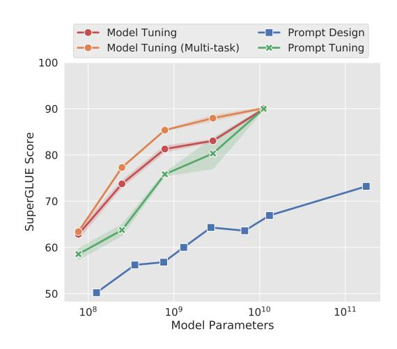
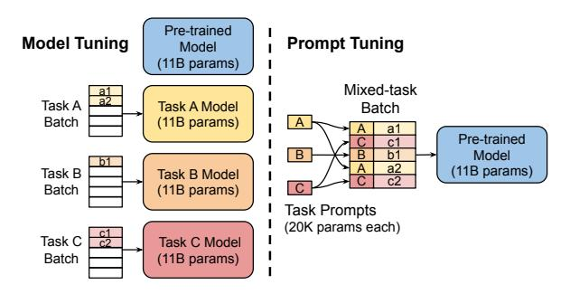
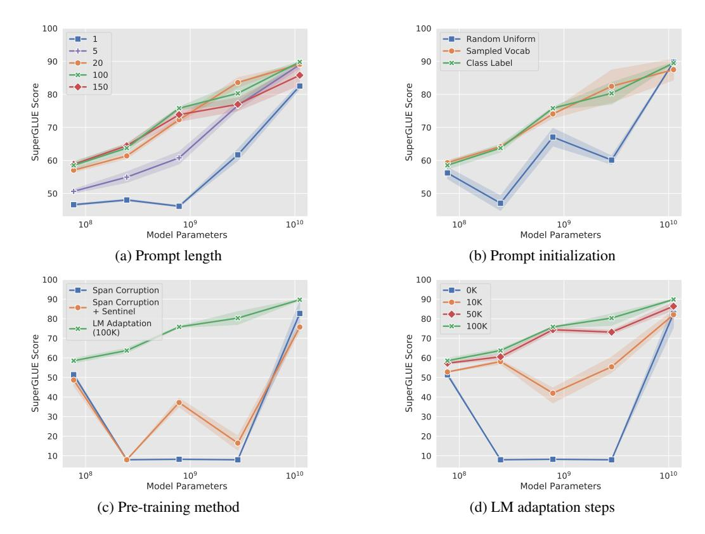
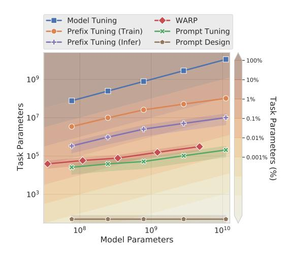

## The Power of Scale for Parameter-Efficient Prompt Tuning

#### Brian Lester\* Rami Al-Rfou Noah Constant

Google Research

{brianlester, rmyeid, nconstant}@google.com

#### **Abstract**

In this work, we explore "prompt tuning," a simple yet effective mechanism for learning "soft prompts" to condition frozen language models to perform specific downstream tasks. Unlike the discrete text prompts used by GPT-3, soft prompts are learned through backpropagation and can be tuned to incorporate signals from any number of labeled examples. Our end-to-end learned approach outperforms GPT-3's few-shot learning by a large margin. More remarkably, through ablations on model size using T5, we show that prompt tuning becomes more competitive with scale: as models exceed billions of parameters, our method "closes the gap" and matches the strong performance of model tuning (where all model weights are tuned). This finding is especially relevant because large models are costly to share and serve and the ability to reuse one frozen model for multiple downstream tasks can ease this burden. Our method can be seen as a simplification of the recently proposed "prefix tuning" of Li and Liang (2021) and we provide a comparison to this and other similar approaches. Finally, we show that conditioning a frozen model with soft prompts confers benefits in robustness to domain transfer and enables efficient "prompt ensembling."

#### 1 Introduction

With the wide success of pre-trained large language models, a range of techniques has arisen to adapt these general-purpose models to downstream tasks. ELMo (Peters et al., 2018) proposed freezing the pre-trained model and learning a task-specific weighting of its per-layer representations. However, since GPT (Radford et al., 2018) and BERT (Devlin et al., 2019), the dominant adaptation technique has been **model tuning** (or "fine-tuning"), where all model parameters are tuned during adaptation, as proposed by Howard and Ruder (2018).

Figure 1: Standard **model tuning** of T5 achieves strong performance, but requires storing separate copies of the model for each end task. Our **prompt tuning** of T5 matches the quality of model tuning as size increases, while enabling the reuse of a single frozen model for all tasks. Our approach significantly outperforms fewshot **prompt design** using GPT-3. We show mean and standard deviation across 3 runs for tuning methods.

More recently, Brown et al. (2020) showed that **prompt design** (or "priming") is surprisingly effective at modulating a frozen GPT-3 model's behavior through text prompts. Prompts are typically composed of a task description and/or several canonical examples. This return to "freezing" pre-trained models is appealing, especially as model size continues to increase. Rather than requiring a separate copy of the model for each downstream task, a single generalist model can simultaneously serve many different tasks.

Unfortunately, prompt-based adaptation has several key drawbacks. Task description is error-prone and requires human involvement, and the effectiveness of a prompt is limited by how much conditioning text can fit into the model's input. As a result, downstream task quality still lags far behind that of tuned models. For instance, GPT-3 175B fewshot performance on SuperGLUE is 17.5 points be-

\*Work done as a Google AI Resident.

Figure 2: **Model tuning** requires making a task-specific copy of the entire pre-trained model for each downstream task and inference must be performed in separate batches. **Prompt tuning** only requires storing a small task-specific prompt for each task, and enables mixed-task inference using the original pre-trained model. With a T5 "XXL" model, each copy of the tuned model requires 11 billion parameters. By contrast, our tuned prompts would only require 20,480 parameters per task—a reduction of *over five orders of magnitude*—assuming a prompt length of 5 tokens.

low fine-tuned T5-XXL (Raffel et al., 2020) (71.8 vs. 89.3) despite using 16 times more parameters.

Several efforts to automate prompt design have been recently proposed. Shin et al. (2020) propose a search algorithm over the discrete space of words, guided by the downstream application training data. While this technique outperforms manual prompt design, there is still a gap relative to model tuning.

Li and Liang (2021) propose "prefix tuning" and show strong results on generative tasks. This method freezes the model parameters and backpropagates the error during tuning to prefix activations prepended to each layer in the encoder stack, including the input layer. Hambardzumyan et al. (2021) simplify this recipe by restricting the trainable parameters to the input and output subnetworks of a masked language model, and show reasonable results on classifications tasks.

In this paper, we propose **prompt tuning** as a further simplification for adapting language models. We freeze the entire pre-trained model and only allow an additional k tunable tokens per downstream task to be prepended to the input text. This "soft prompt" is trained end-to-end and can condense the signal from a full labeled dataset, allowing our method to outperform few-shot prompts and close the quality gap with model tuning (Figure 1). At the same time, since a single pre-trained model is recycled for all downstream tasks, we retain the efficient serving benefits of frozen models (Figure 2).

While we developed our method concurrently

with Li and Liang (2021) and Hambardzumyan et al. (2021), we are the first to show that prompt tuning alone (with no intermediate-layer prefixes or task-specific output layers) is sufficient to be competitive with model tuning. Through detailed experiments in sections 2–3, we demonstrate that language model capacity is a key ingredient for these approaches to succeed. As Figure 1 shows, *prompt tuning becomes more competitive with scale*.

We compare with similar approaches in Section 4. Explicitly separating task-specific parameters from the "generalist" parameters needed for general language-understanding has a range of additional benefits. We show in Section 5 that by capturing the task definition in the prompt while keeping the generalist parameters fixed, we are able to achieve better resilience to domain shifts. In Section 6, we show that "prompt ensembling", learning multiple prompts for the same task, can boost quality and is more efficient than classic model ensembling. Finally, in Section 7, we investigate the interpretability of our learned soft prompts. In sum, our key contributions are:

- 1. Proposing prompt tuning and showing its competitiveness with model tuning in the regime of large language models.
- 2. Ablating many design choices, and showing quality and robustness improve with scale.
- 3. Showing prompt tuning outperforms model tuning on domain shift problems.
- 4. Proposing "prompt ensembling" and showing its effectiveness.

#### 2 Prompt Tuning

Following the "text-to-text" approach of T5 (Raffel et al., 2020), we cast all tasks as text generation. Instead of modeling classification as the probability of an output class given some input,  $\Pr(y|X)$ , where X is a series of tokens and y is a single class label, we now model it as conditional generation, where Y is a sequence of tokens that represent a class label. T5 models classification as  $\Pr_{\theta}(Y|X)$ , parameterized by the weights,  $\theta$ , of the transformers (Vaswani et al., 2017) that make up its encoder and decoder.

Prompting is the approach of adding extra information for the model to condition on during its generation of Y. Normally, prompting is done by prepending a series of tokens, P, to the input X, such that the model maximizes the likelihood of the correct Y,  $\Pr_{\theta}(Y|[P;X])$ , while keep-

ing the model parameters, θ, fixed. In GPT-3, the representations of the prompt tokens, P = {p1, p2, . . . , pn}, are part of the model's embedding table, parameterized by the frozen θ. Finding an optimal prompt thus requires the selection of prompt tokens, through either manual search or non-differentiable search methods [\(Jiang et al.,](#page-9-4) [2020;](#page-9-4) [Shin et al.,](#page-11-0) [2020\)](#page-11-0). Prompt tuning removes the restriction that the prompt P be parameterized by θ; instead the prompt has its own dedicated parameters, θP , that can be updated. While prompt *design* involves selecting prompt tokens from a fixed vocabulary of frozen embeddings, prompt *tuning* can be thought of as using a fixed prompt of special tokens, where only the embeddings of these prompt tokens can be updated. Our new conditional generation is now Prθ;θP (Y |[P; X]) and can be trained by maximizing the likelihood of Y via backpropagation, while only applying gradient updates to θP .

Given a series of n tokens, {x1, x2, . . . , xn}, the first thing T5 does is embed the tokens, forming a matrix Xe ∈ R n×e where e is the dimension of the embedding space. Our soft-prompts are represented as a parameter Pe ∈ R p×e , where p is the length of the prompt. Our prompt is then concatenated to the embedded input forming a single matrix [Pe; Xe] ∈ R (p+n)×e which then flows though the encoder-decoder as normal. Our models are trained to maximize the probability of Y , but only the prompt parameters Pe are updated.

### 2.1 Design Decisions

There are many possible ways to initialize the prompt representations. The simplest is to train from scratch, using random initialization. A more sophisticated option is to initialize each prompt token to an embedding drawn from the model's vocabulary. Conceptually, our soft-prompt modulates the frozen network's behavior in the same way as text preceding the input, so it follows that a word-like representation might serve as a good initialization spot. For classification tasks, a third option is to initialize the prompt with embeddings that enumerate the output classes, similar to the "verbalizers" of [Schick and Schütze](#page-11-2) [\(2021\)](#page-11-2). Since we want the model to produce these tokens in the output, initializing the prompt with the embeddings of the valid target tokens should prime the model to restrict its output to the legal output classes.

Another design consideration is the length of the

prompt. The parameter cost of our method is EP, where E is the token embedding dimension and P is the prompt length. The shorter the prompt, the fewer new parameters must be tuned, so we aim to find a minimal length that still performs well.

## 2.2 Unlearning Span Corruption

Unlike autoregressive language models like GPT-3, the T5 models we experiment with use an encoderdecoder architecture and pre-train on a span corruption objective. Specifically, T5 is tasked with "reconstructing" masked spans in the input text, which are marked with unique sentinel tokens. The target output text consists of all the masked content, separated by sentinels, plus a final sentinel. For instance, from the text "Thank you for inviting me to your party last week" we might construct a pre-training example where the input is "Thank you hXi me to your party hYi week" and the target output is "hXi for inviting hYi last hZi".

While [Raffel et al.](#page-10-3) [\(2020\)](#page-10-3) find this architecture and pre-training objective more effective than traditional language modeling, we hypothesize that this setup is not a good fit for producing a frozen model that can be readily controlled through prompt tuning. In particular, a T5 model pre-trained exclusively on span corruption, such as T5.1.1, has never seen truly natural input text (free of sentinel tokens), nor has it ever been asked to predict truly natural targets. In fact, due to the details of T5's span corruption preprocessing, every pre-training target will begin with a sentinel. While this "unnatural" tendency to output sentinels is easy to overcome through fine-tuning, we suspect that it would be much harder to override through a prompt alone, as the decoder priors cannot be adjusted.

Given these concerns, we experiment with T5 models in three settings. (1) "Span Corruption": We use pre-trained T5 off-the-shelf as our frozen model, and test its ability to output the expected text for downstream tasks. (2) "Span Corruption + Sentinel": We use the same model, but prepend all downstream targets with a sentinel, so as to more closely resemble the targets seen in pretraining. (3) "LM Adaptation": We continue T5's self-supervised training for a small number of additional steps, but using the "LM" objective discussed by [Raffel et al.](#page-10-3) [\(2020\)](#page-10-3); given a natural text prefix as input, the model must produce the natural text continuation as output. Crucially, this adaptation happens *only once*, producing a single frozen

model that we can reuse for prompt tuning across any number of downstream tasks.

Through LM adaptation, we hope to "quickly" transform T5 into a model more similar to GPT-3, which always outputs realistic text, and is known to respond well to prompts as a "few-shot learner". It is not obvious how successful this late-stage transformation will be compared to pre-training from scratch, and it has not been investigated previously to our knowledge. As such, we experiment with various lengths of adaptation up to 100K steps.

# 3 Results

Our frozen models are built on top of pre-trained T5 checkpoints of all sizes (Small, Base, Large, XL, XXL). We leverage the public T5.1.1 checkpoints, which include improvements over the original T5.[1](#page-3-1)

Our "default" configuration, plotted with a green '×' ( ) throughout, uses an LM-adapted version of T5 trained for an additional 100K steps, initializes using class labels (see Section [3.2\)](#page-4-0), and uses a prompt length of 100 tokens. While this is longer than the default 10-token prefix used by [Li and Liang](#page-10-0) [\(2021\)](#page-10-0), our method still uses fewer task-specific parameters, as we only tune the input layer, as opposed to overwriting activations in all network layers. See Figure [4](#page-5-1) for a detailed comparison. We will also see shortly that even much shorter prompts are viable as model size increases.

We measure performance on the SuperGLUE benchmark [\(Wang et al.,](#page-11-3) [2019a\)](#page-11-3), a collection of eight challenging English language understanding tasks.[2](#page-3-2) We report metrics on the development set associated with each dataset.

Each of our prompts train on a single Super-GLUE task; there was no multi-task setup or mixing of training data across tasks. We translate each SuperGLUE dataset into a text-to-text format following [Raffel et al.](#page-10-3) [\(2020\)](#page-10-3), except that we omit the task names prepended to inputs indicating which SuperGLUE task an example belongs to.

We train our prompts for 30,000 steps using T5's standard cross-entropy loss, with a constant learning rate of 0.3 and a batch size of 32. Checkpoints are selected via early stopping on the development set, where the stopping metric is the default metric for the dataset, or the average of metrics for datasets evaluated with multiple metrics. All experiments were run in JAX [\(Bradbury et al.,](#page-9-9) [2018\)](#page-9-9) using the Adafactor optimizer [\(Shazeer and Stern,](#page-11-7) [2018\)](#page-11-7) with weight decay 1e−5, β2 decay 0.8, and parameter scaling off. The models were implemented in Flax [\(Heek et al.,](#page-9-10) [2020\)](#page-9-10). More details are available in Appendix [A.](#page-12-0)

### 3.1 Closing the Gap

To compare our method with standard model tuning, we tune the public T5.1.1 checkpoints on SuperGLUE using the default hyperparameters specified in the T5 library (learning rate 0.001, and Adafactor optimizer with pre-training parameter states restored). We consider two baselines. (1) "Model Tuning": For an apples-to-apples comparison, we tune on each task separately, as in our prompt tuning setup.[3](#page-3-3) (2) "Model Tuning (Multitask)": We use T5's multi-task tuning setup to achieve a more competitive baseline.[4](#page-3-4) In this case, a single model is tuned on all tasks jointly, with a text prefix indicating the task name.

In Figure [1](#page-0-0) (p. 1), we see that prompt tuning becomes more competitive with model tuning as scale increases. At the XXL size (11 billion parameters), prompt tuning matches even the stronger multi-task model tuning baseline, despite having over 20,000 times fewer task-specific parameters.

To compare with prompt design, we include GPT-3 few-shot performance on the SuperGLUE dev split, as reported by [Brown et al.](#page-9-2) [\(2020\)](#page-9-2).[5](#page-3-5) Figure [1](#page-0-0) shows that prompt tuning beats GPT-3 prompt design by a large margin, with prompttuned T5-Small matching GPT-3 XL (over 16 times larger), and prompt-tuned T5-Large beating GPT-3 175B (over 220 times larger).

1These improvements are (1) the removal of all supervised data from pre-training, (2) adjustments to hyperparameters dmodel and dff , and (3) the use of GeGLU [\(Shazeer,](#page-11-4) [2020\)](#page-11-4) over ReLU [\(Nair and Hinton,](#page-10-4) [2010\)](#page-10-4) activations.

2The tasks are BoolQ [\(Clark et al.,](#page-9-5) [2019\)](#page-9-5), CB [\(De Marn](#page-9-6)[eff et al.,](#page-9-6) [2019\)](#page-9-6), COPA [\(Roemmele et al.,](#page-11-5) [2011\)](#page-11-5), MultiRC [\(Khashabi et al.,](#page-10-5) [2018\)](#page-10-5), ReCoRD [\(Zhang et al.,](#page-11-6) [2018\)](#page-11-6), RTE [\(Dagan et al.,](#page-9-7) [2005;](#page-9-7) [Bar-Haim et al.,](#page-8-1) [2006;](#page-8-1) [Giampiccolo et al.,](#page-9-8) [2007;](#page-9-8) [Bentivogli et al.,](#page-8-2) [2009\)](#page-8-2), WiC [\(Pilehvar and Camacho-](#page-10-6)[Collados,](#page-10-6) [2018\)](#page-10-6), and WSC [\(Levesque et al.,](#page-10-7) [2012\)](#page-10-7).

3To improve this baseline, we performed a sweep over the batch size hyperparameter and selected 2 16 tokens per batch.

4The T5 SuperGLUE submission used a more complex setup, first mixing multi-task supervised data into pre-training, and then performing single-task fine-tuning. Since we use T5.1.1 throughout, this setup is unavailable, as the pre-training phase is fully self-supervised. We follow [Raffel et al.](#page-10-3) [\(2020\)](#page-10-3) in using 2 20 tokens per batch and including DPR data in the multi-task mixture, which is known to boost WSC task performance [\(Kocijan et al.,](#page-10-8) [2019\)](#page-10-8).

5We also experimented with using GPT-3's manual text prompts directly with our LM-adapted T5 checkpoints. However performance was far below GPT-3 for comparable model sizes. This may be due to differences in pre-training data and model architecture, as well as T5's shorter sequence length.

Figure 3: Ablations of various hyperparameters on prompt tuning performance (mean and stddev across 3 runs). In our "default" (-\*-) configuration, quality improves stably with model size. Across all ablations, the largest (XXL) model is the most robust to hyperparameter choice. (a) **Prompt length**: Increasing to 20+ tokens generally confers a large boost, but XXL performs well even with single-token prompts. (b) **Prompt initialization**: Random uniform initialization lags behind more "advanced" initializations using sampled vocabulary or class label embeddings, but the difference vanishes at XXL size. (c) **Pre-training objective**: LM adaptation outperforms span corruption, even when a sentinel is added to downstream task targets, but XXL works well with any method. (d) **LM adaptation**: Longer adaptation generally gives larger gains, but XXL is robust to even short adaptation.

#### 3.2 Ablation Study

**Prompt Length** We train prompts for each model size while varying the prompt length in  $\{1, 5, 20, 100, 150\}$  and fixing other settings to our default configuration. Figure 3(a) shows that for most model sizes, increasing prompt length beyond a single token is critical to achieve good performance. Notably, the XXL model still gives strong results with a single-token prompt, suggesting that the larger the model, the less conditioning signal is needed to achieve a target behavior. Across all models, increasing beyond 20 tokens only yields marginal gains.6

**Prompt Initialization** We ablate the effect of prompt initialization by training models at all sizes while fixing other hyperparameters to their default values. For random initialization, we sample uni-

formly from the range [-0.5, 0.5]. When initializing from sampled vocabulary, we restrict to the 5,000 most "common" tokens in T5's Sentence-Piece vocabulary (Kudo and Richardson, 2018), which is ordered by likelihood in the pre-training corpus. For "class label" initialization, we take the embeddings for the string representations of each class in the downstream task and use them to initialize one of the tokens in the prompt. When a class label is multi-token, we average the token embeddings. At longer prompt lengths, we often run out of class labels before we have initialized all of the prompt tokens. In this case we fall back to our sampled vocab strategy to fill in the prompt.

Figure 3(b) shows our ablation of initialization strategy across model sizes, where we find that

&lt;sup>6Going past 100 tokens appears mildly detrimental for larger models. A similar pattern of diminishing performance past a certain prefix length is observed by Li and Liang (2021).

&lt;sup>7T5's handling of the ReCoRD and WSC tasks requires the model to generate short, free-form text. In these cases, we initialize the prompts with words related to the task: *commonsense*, *reasoning*, *reading*, and *comprehension* for ReCoRD and *commonsense*, *pronoun*, and *resolution* for WSC.

the class based initialization performs best. At smaller model sizes, there are large gaps between the different initializations, but once the model is scaled to XXL size, those differences disappear.

With "class label" initialization, we observe that the class labels typically persist in the learned prompts, such that the nearest token embeddings (in cosine distance) match the tokens used for initialization. Beyond this, we did not find our learned prompts to be interpretable, similar to those of Shin et al. (2020). See Section 7 for details.

Pre-training Objective In Figures 3(c) and 3(d), we see pre-training objective has a clear effect on prompt tuning quality. As hypothesized in Section 2.2, T5's default "span corruption" objective is not well-suited for training frozen models to be later conditioned by prompts. Intuitively, models pre-trained to read and write sentinel tokens are hard to apply directly to tasks of reading and writing text without sentinels. As seen in Figure 3(c), even the "workaround" of adding a sentinel to the downstream targets has little benefit. While LM adaptation adds value across all model sizes, we note our largest XXL model is the most forgiving and gives strong results even with span corruption.

Given the benefit of LM adaptation, we also explore how long of an adaptation is helpful. Figure 3(d) shows that longer adaptation provides additional gains, up to 100K steps. This suggests that the "transition" from span corruption to a language modeling objective is not a trivial change, and making an effective switch takes an investment of training resources (10% of the steps of the original T5 pre-training). At the same time, as in our other ablations, we observe that the XXL model is robust to even non-ideal configurations. At this size, the gains from adaptation are quite modest.

In the non-optimal "span corruption" setting, we observe instability across model sizes, with the Small model outperforming the larger Base, Large, and XL models. On inspection, we find that for many tasks, these mid-sized models never learn to output a legal class label and thus score 0%. The two most common error modes are copying subspans from the input and predicting an empty string. Furthermore, this poor performance is not due to random variance in prompt tuning, as we observe low variance across 3 runs for each size. These results indicate that using models pre-trained with the "span corruption" objective can be unreliable, with only 2 out of 5 models working well, whereas

Figure 4: Parameter usage of various adaptation techniques, fixing architecture to T5.1.1 and prompt/prefix length to 1–100 tokens (bands show mean and stddev). **Model Tuning**: All parameters are task-specific. **Prefix Tuning**: Activations are tuned in the prefix of each layer, requiring 0.1–1% task-specific parameters for inference, but more are used for training. **WARP**: Task parameters are reduced to under 0.1% by only tuning input and output layers. **Prompt Tuning**: Only prompt embeddings are tuned, reaching under 0.01% for most model sizes. **Prompt Design**: Only a sequence of prompt IDs (500–2000 tokens) is required.

the LM adapated versions work reliably across all model sizes.

We have released T5 1.1 checkpoints adapted using the LM objective for 100K steps for all model sizes.8

#### 4 Comparison to Similar Approaches

In this section, we review recent work on learning continuous prompts, and draw comparisons with our method. One important axis of comparison is the number of task-specific parameters each method requires, as shown in Figure 4. Among methods with learnable parameters, prompt tuning is the most parameter efficient, requiring less than 0.01% task-specific parameters for models over a billion parameters.9

Li and Liang (2021) propose "prefix tuning": learning a sequence of prefixes that are prepended

%https://github.com/google-research/ text-to-text-transfer-transformer/ blob/main/released\_checkpoints.md# lm-adapted-t511lm100k

&lt;sup>9To compare with prompt design, we count each token ID in the prompt as a parameter, and assume a prompt of between 500–2000 tokens to match the GPT-3 setting. While this technique is by far the most parameter efficient, it comes at the cost of task quality.

at every transformer layer. This is akin to learning transformer activations that are fixed across examples at every network layer. In contrast, prompt tuning uses a single prompt representation that is prepended to the embedded input. Beyond requiring fewer parameters, our approach allows the transformer to update the intermediate-layer task representations, as contextualized by an input example. Their work builds on GPT-2 (Radford et al., 2019) and BART (Lewis et al., 2020), while ours focuses on T5 and examines changes in performance and robustness to design choices as model size increases. When using BART, prefix tuning includes prefixes on both the encoder and decoder network, while prompt tuning only requires prompts on the encoder. Li and Liang (2021) also rely on a reparameterization of the prefix to stabilize learning, which adds a large number of parameters during training, whereas our configuration does not require this reparameterization and is robust across SuperGLUE tasks and model sizes.

Hambardzumyan et al. (2021) propose "WARP", where prompt parameters are added to the input layer. This method works with masked language models, relying on a [MASK] token and a learnable output layer to project the mask to class logits. This formulation restricts the model to producing a single output, limiting it to classification. Prompt tuning does not require any changes to the input or a task-specific head. The performance of prompt tuning is also considerably closer to the strong performance of model tuning.

Liu et al. (2021) propose "P-tuning" where learnable continuous prompts are interleaved throughout the embedded input, using patterns based on human design. Our approach removes this complication by simply prepending the prompt to the input. To achieve strong SuperGLUE results, P-tuning has to be used in *conjunction* with model tuning, that is, models jointly update both the prompt and the main model parameters, whereas our approach keeps the original language model frozen.10

Qin and Eisner (2021) use "soft words" to learn prompts to extract knowledge from pre-trained LMs. Prompts are positioned in relation to the input based on hand-designed prompt prototypes, and a learned  $\Delta_i^\ell$  parameter is included for each layer, so parameter cost scales with model depth.

| Dataset                                             | Domain                                       | Model     | Prompt                                                                     | Δ                                             |
|-----------------------------------------------------|----------------------------------------------|-----------|----------------------------------------------------------------------------|-----------------------------------------------|
| SQuAD                                               | Wiki                                         | 94.9 ±0.2 | $94.8 \pm 0.1$                                                             | -0.1                                          |
| TextbookQA BioASQ RACE RE DuoRC DROP | Book Bio Exam Wiki Movie Wiki |           | 66.8 ±2.9 79.1 ±0.3 60.7 ±0.5 88.8 ±0.2 67.7 ±1.1 67.1 ±1.9 | +12.5 +1.2 +0.9 +0.4 -1.2 -1.8 |

Table 1: F1 mean and stddev for models trained on SQuAD and evaluated on out-of-domain datasets from the MRQA 2019 shared task. Prompt tuning tends to give stronger zero-shot performance than model tuning, especially on datasets with large domain shifts like TextbookQA.

Logeswaran et al. (2020) use a learnable prepended token to adapt transformer models to various tasks, but focus on small synthetic datasets designed to accommodate a compositional task representation, as opposed to larger real-world datasets. Their base models are small transformers trained from scratch *jointly* with the task representations, whereas we keep the base model frozen and investigate scaling laws using larger transformers.

More generally, work on task prompts is closely aligned with work on "adapters" (Rebuffi et al., 2017; Houlsby et al., 2019), small bottleneck layers inserted between frozen pre-trained network layers. Adapters offer another means of reducing task-specific parameters, with Houlsby et al. (2019) achieving GLUE performance close to full model tuning when freezing BERT-Large and only adding 2–4% additional parameters. Pfeiffer et al. (2020) use multiple adapters in a multilingual context to explicitly separate language understanding from task specification, similar to our approach. A core difference between adapters and prompt tuning is how the approaches change model behavior. Adapters modify the actual function that acts on the input representation, parameterized by the neural network, by allowing the rewriting of activations at any given layer. Prompt tuning modifies behavior by leaving the function fixed and adding new input representations that can affect how subsequent input is processed.

### 5 Resilience to Domain Shift

By freezing the core language model parameters, prompt tuning prevents the model from modifying its general understanding of language. Instead, prompt representations indirectly modulate the representation of the input. This reduces the model's ability to overfit to a dataset by memorizing spe-

&lt;sup>10As another difference, P-tuning requires the addition of "anchor" tokens in the input (e.g. a question mark following the hypothesis in the RTE task) to achieve strong performance, while prompt tuning leaves inputs untouched.

| Train | Eval | Tuning          | Accuracy                             | F1                                      |
|-------|------|-----------------|--------------------------------------|-----------------------------------------|
| QQP   | MRPC | Model Prompt | 73.1 $\pm$ 0.9 <b>76.3</b> $\pm$ 0.1 | $81.2 \pm 2.1$ <b>84.3</b> $\pm 0.3$ |
| MRPC  | QQP  | Model Prompt | 74.9 $\pm$ 1.3 <b>75.4</b> $\pm$ 0.8 | <b>70.9</b> ±1.2 69.7 ±0.3              |

Table 2: Mean and stddev of zero-shot domain transfer between two paraphrase detection tasks.

cific lexical cues and spurious correlations. This restriction suggests that prompt tuning may improve robustness to domain shifts, where the distribution of inputs differs between training and evaluation.

We investigate zero-shot domain transfer on two tasks: question answering (QA) and paraphrase detection. For question answering, we use the MRQA 2019 shared task on generalization (Fisch et al., 2019). This task collects extractive QA datasets in a unified format and tests how models trained on "in-domain" datasets perform when evaluated on "out-of-domain" datasets. For our experiments, we train on SQuAD (Rajpurkar et al., 2016) and evaluate on each of the out-of-domain datasets. 11

Table 1 shows that prompt tuning outperforms model tuning on the majority of out-of-domain datasets, with a remarkable 12.5 point F1 gap between the two approaches on TextbookQA. We observe larger gains from prompt tuning in cases of larger domain shifts (e.g. to Biomedical in BioASQ or to Textbooks in TextbookQA). Of the datasets where model tuning is better, we see that DROP shares a domain (Wikipedia) with SQuAD and is thus one of the smallest domain transfers.

As a second test of robustness to domain shift, we explore transfer between two paraphrase detection tasks from GLUE (Wang et al., 2019b). The first task is QQP (Iyer et al., 2017), which asks if two questions from the community Q&A site Quora are "duplicates". The second task is MRPC (Dolan and Brockett, 2005), which asks if two sentences drawn from news articles are paraphrases. We test transfer in both directions (QQP  $\Leftrightarrow$  MRPC). As before, we train on the "in-domain" task, select checkpoints using in-domain validation, and evaluate zero-shot on the "out-of-domain" task.

Table 2 shows that training a lightweight prompt on the QQP data and evaluating on MRPC gives much better performance than tuning the entire

| Dataset  | Metric    | Average     | Best            | Ensemble      |
|----------|-----------|-------------|-----------------|---------------|
| BoolQ    | acc.      | 91.1        | 91.3            | 91.7          |
| CB       | acc./F1   | 99.3 / 99.0 | 100.00 / 100.00 | 100.0 / 100.0 |
| COPA     | acc.      | 98.8        | 100.0           | 100.0         |
| MultiRC  | $EM/F1_a$ | 65.7 / 88.7 | 66.3 / 89.0     | 67.1 / 89.4   |
| ReCoRD   | EM/F1     | 92.7 / 93.4 | 92.9 / 93.5     | 93.2 / 93.9   |
| RTE      | acc.      | 92.6        | 93.5            | 93.5          |
| WiC      | acc.      | 76.2        | 76.6            | 77.4          |
| WSC      | acc.      | 95.8        | 96.2            | 96.2          |
| SuperGLU | JE (dev)  | 90.5        | 91.0            | 91.3          |

Table 3: Performance of a five-prompt ensemble built from a single frozen T5-XXL model exceeds both the average and the best among the five prompts.

model (+3.2 accuracy and +3.1 F1). The results are much closer in the other direction, with prompt tuning showing a small improvement in accuracy and a small drop in F1. These results support the view that model tuning may be over-parameterized and more prone to overfit the training task, to the detriment of similar tasks in different domains.

## 6 Prompt Ensembling

Ensembles of neural models trained from different initializations on the same data are widely observed to improve task performance (Hansen and Salamon, 1990) and are useful for estimating model uncertainty (Lakshminarayanan et al., 2017). However, as model size increases, ensembling can become impractical. Beyond the space required to store N models (e.g. 42 GiB for each copy of T5-XXL), there is a substantial inference cost to running N distinct models, whether in parallel or in series.

Prompt tuning provides a more efficient way to ensemble multiple adaptations of a pre-trained language model. By training N prompts on the same task, we create N separate "models" for a task, while still sharing the core language modeling parameters throughout. Beyond drastically reducing storage costs, the prompt ensemble makes inference more efficient. To process one example, rather than computing forward passes of N different models, we can execute a single forward pass with a batch size of N, replicating the example across the batch and varying the prompt. These savings mirror those seen for multi-tasking in Figure 2.

To demonstrate the viability of prompt ensembling, we train five prompts for each SuperGLUE task, using a single frozen T5-XXL model with our default hyperparameters. We use simple majority voting to compute predictions from the ensemble. Table 3 shows that across all tasks, the ensemble beats the single-prompt average and beats, or

&lt;sup>11We select checkpoints based on SQuAD validation F1. The out-of-domain datasets are TextbookQA (Kembhavi et al., 2017), RACE (Lai et al., 2017), BioASQ (http://bioasq.org/), RE (Levy et al., 2017), DuoRC (Saha et al., 2018), and DROP (Dua et al., 2019).

matches, the best individual prompt.

# 7 Interpretability

An ideally interpretable prompt would consist of natural language that clearly describes the task at hand, explicitly asks the model for some result or action, and makes it easy to understand why the prompt elicited such behavior from the model.

As prompt tuning works in the continuous embedding space rather than the discrete token space, interpreting prompts becomes more difficult. To test the interpretability of our learned soft prompts, we compute the nearest neighbors to each prompt token from the frozen model's vocabulary. We use cosine distance between the vocabulary embedding vector and the prompt token representation as the similarity metric.

We observe that for a given learned prompt token, the top-5 nearest neighbors form tight semantic clusters. For example, we see lexically similar clusters such as { *Technology* / *technology* / *Technologies* / *technological* / *technologies* }, as well as more diverse but still strongly related clusters such as { *entirely* / *completely* / *totally* / *altogether* / *100%* }. The nature of these clusters suggests that the prompts are in fact learning "word-like" representations. We found that random vectors drawn from the embedding space do not show this sort of semantic clustering.

When initializing the prompts using the "classlabel" strategy, we often find that the class labels persist through training. Specifically, if a prompt token is initialized to a given label, that label is often among the learned token's nearest neighbors after tuning. When initializing with the "Random Uniform" or "Sampled Vocab" methods, the class labels can also be found in the nearest neighbors of the prompts; however they tend to appear as neighbors to multiple prompt tokens. This suggests that the model is learning to store the expected output classes in the prompts as reference, and initializing the prompt to outputs classes makes this easier and more centralized.

When examining longer prompts (e.g. size 100), we often find several prompt tokens with the same nearest neighbors. This suggests there is either excess capacity in the prompt, or that the lack of sequential structure in the prompt representation makes it difficult for the model to localize information to a specific position.

While the learned prompts taken as sequences

show little interpretability, we do observe a high frequency of words like *science*, *technology* and *engineering* as the nearest neighbors for prompts trained on the BoolQ dataset and approximately 20% of the questions are in the "Nature/Science" category. While more investigation is needed, this suggests that one role of the prompt may be to prime the model to interpret inputs in a specific domain or context (e.g. "scientific").

## 8 Conclusion

In this paper, we showed that prompt tuning is a competitive technique for adapting frozen pretrained language models to downstream tasks. On the popular SuperGLUE benchmark, its task performance rivals that of traditional model tuning, with the gap vanishing as model size increases. On zeroshot domain transfer, we found that prompt tuning leads to improved generalization. This plausibly indicates that freezing general-purpose language understanding parameters and restricting downstream learning to a lightweight parameter footprint can help to avoid overfitting to a specific domain.

Beyond task quality metrics, we discussed the appeal of moving to frozen pre-trained models in terms of storage and serving costs. This move enables both efficient multi-task serving, as well as efficient high-performing prompt ensembling. Looking forward, we believe that factoring out task-defining parameters as distinct from general language-modeling parameters is an exciting step that opens up many avenues for new research.

### Acknowledgements

We thank Lucas Dixon, Waleed Ammar, Slav Petrov and Sebastian Ruder for comments on an earlier draft, and the following people for helpful discussion: Colin Raffel, Adam Roberts, and Noam Shazeer. We thank Linting Xue for help with the LM adaptation training.

### References

Roy Bar-Haim, Ido Dagan, Bill Dolan, Lisa Ferro, Danilo Giampiccolo, Bernardo Magnini, and Idan Szpektor. 2006. The second PASCAL recognising textual entailment challenge. In *Proceedings of the second PASCAL challenges workshop on recognising textual entailment*, volume 6, pages 6–4. Venice.

Luisa Bentivogli, Peter Clark, Ido Dagan, and Danilo Giampiccolo. 2009. The fifth PASCAL recognizing textual entailment challenge. In *TAC*.

- James Bradbury, Roy Frostig, Peter Hawkins, Matthew James Johnson, Chris Leary, Dougal Maclaurin, George Necula, Adam Paszke, Jake VanderPlas, Skye Wanderman-Milne, and Qiao Zhang. 2018. [JAX: composable transformations of](http://github.com/google/jax) [Python+NumPy programs.](http://github.com/google/jax)
- Tom Brown, Benjamin Mann, Nick Ryder, Melanie Subbiah, Jared D Kaplan, Prafulla Dhariwal, Arvind Neelakantan, Pranav Shyam, Girish Sastry, Amanda Askell, Sandhini Agarwal, Ariel Herbert-Voss, Gretchen Krueger, Tom Henighan, Rewon Child, Aditya Ramesh, Daniel Ziegler, Jeffrey Wu, Clemens Winter, Chris Hesse, Mark Chen, Eric Sigler, Mateusz Litwin, Scott Gray, Benjamin Chess, Jack Clark, Christopher Berner, Sam McCandlish, Alec Radford, Ilya Sutskever, and Dario Amodei. 2020. [Language models are few-shot learners.](https://proceedings.neurips.cc/paper/2020/file/1457c0d6bfcb4967418bfb8ac142f64a-Paper.pdf) In *Advances in Neural Information Processing Systems*, volume 33, pages 1877–1901. Curran Associates, Inc.
- Christopher Clark, Kenton Lee, Ming-Wei Chang, Tom Kwiatkowski, Michael Collins, and Kristina Toutanova. 2019. [BoolQ: Exploring the surprising](https://doi.org/10.18653/v1/N19-1300) [difficulty of natural yes/no questions.](https://doi.org/10.18653/v1/N19-1300) In *Proceedings of the 2019 Conference of the North American Chapter of the Association for Computational Linguistics: Human Language Technologies, Volume 1 (Long and Short Papers)*, pages 2924–2936, Minneapolis, Minnesota. Association for Computational Linguistics.
- Ido Dagan, Oren Glickman, and Bernardo Magnini. 2005. The PASCAL recognising textual entailment challenge. In *Machine Learning Challenges Workshop*, pages 177–190. Springer.
- Marie-Catherine De Marneff, Mandy Simons, and Judith Tonhauser. 2019. The CommitmentBank: Investigating projection in naturally occurring discourse. *Proceedings of Sinn und Bedeutung 23*.
- Jacob Devlin, Ming-Wei Chang, Kenton Lee, and Kristina Toutanova. 2019. [BERT: Pre-training of](https://doi.org/10.18653/v1/N19-1423) [deep bidirectional transformers for language under](https://doi.org/10.18653/v1/N19-1423)[standing.](https://doi.org/10.18653/v1/N19-1423) In *Proceedings of the 2019 Conference of the North American Chapter of the Association for Computational Linguistics: Human Language Technologies, Volume 1 (Long and Short Papers)*, pages 4171–4186, Minneapolis, Minnesota. Association for Computational Linguistics.
- William B Dolan and Chris Brockett. 2005. Automatically constructing a corpus of sentential paraphrases. In *Proceedings of the Third International Workshop on Paraphrasing (IWP2005)*.
- Dheeru Dua, Yizhong Wang, Pradeep Dasigi, Gabriel Stanovsky, Sameer Singh, and Matt Gardner. 2019. [DROP: A reading comprehension benchmark requir](https://doi.org/10.18653/v1/N19-1246)[ing discrete reasoning over paragraphs.](https://doi.org/10.18653/v1/N19-1246) In *Proceedings of the 2019 Conference of the North American Chapter of the Association for Computational Linguistics: Human Language Technologies, Volume 1*

- *(Long and Short Papers)*, pages 2368–2378, Minneapolis, Minnesota. Association for Computational Linguistics.
- Adam Fisch, Alon Talmor, Robin Jia, Minjoon Seo, Eunsol Choi, and Danqi Chen. 2019. MRQA 2019 shared task: Evaluating generalization in reading comprehension. In *Proceedings of 2nd Machine Reading for Reading Comprehension (MRQA) Workshop at EMNLP*.
- Danilo Giampiccolo, Bernardo Magnini, Ido Dagan, and Bill Dolan. 2007. The third PASCAL recognizing textual entailment challenge. In *Proceedings of the ACL-PASCAL workshop on textual entailment and paraphrasing*, pages 1–9. Association for Computational Linguistics.
- Karen Hambardzumyan, Hrant Khachatrian, and Jonathan May. 2021. [WARP: Word-level Adversar](https://doi.org/10.18653/v1/2021.acl-long.381)[ial ReProgramming.](https://doi.org/10.18653/v1/2021.acl-long.381) In *Proceedings of the 59th Annual Meeting of the Association for Computational Linguistics and the 11th International Joint Conference on Natural Language Processing (Volume 1: Long Papers)*, pages 4921–4933, Online. Association for Computational Linguistics.
- L. K. Hansen and P. Salamon. 1990. [Neural network](https://doi.org/10.1109/34.58871) [ensembles.](https://doi.org/10.1109/34.58871) *IEEE Transactions on Pattern Analysis and Machine Intelligence*, 12(10):993–1001.
- Jonathan Heek, Anselm Levskaya, Avital Oliver, Marvin Ritter, Bertrand Rondepierre, Andreas Steiner, and Marc van Zee. 2020. [Flax: A neural network](http://github.com/google/flax) [library and ecosystem for JAX.](http://github.com/google/flax)
- Neil Houlsby, Andrei Giurgiu, Stanislaw Jastrzebski, Bruna Morrone, Quentin De Laroussilhe, Andrea Gesmundo, Mona Attariyan, and Sylvain Gelly. 2019. [Parameter-efficient transfer learning for NLP.](http://proceedings.mlr.press/v97/houlsby19a.html) In *Proceedings of the 36th International Conference on Machine Learning*, volume 97 of *Proceedings of Machine Learning Research*, pages 2790–2799. PMLR.
- Jeremy Howard and Sebastian Ruder. 2018. [Universal](https://doi.org/10.18653/v1/P18-1031) [language model fine-tuning for text classification.](https://doi.org/10.18653/v1/P18-1031) In *Proceedings of the 56th Annual Meeting of the Association for Computational Linguistics (Volume 1: Long Papers)*, pages 328–339, Melbourne, Australia. Association for Computational Linguistics.
- Shankar Iyer, Nikhil Dandekar, and Kornel Csernai. 2017. [First Quora dataset release: Question pairs.](https://data.quora.com/First-Quora-Dataset-Release-Question-Pairs)
- Zhengbao Jiang, Frank F. Xu, Jun Araki, and Graham Neubig. 2020. [How can we know what language](https://doi.org/10.1162/tacl_a_00324) [models know?](https://doi.org/10.1162/tacl_a_00324) *Transactions of the Association for Computational Linguistics*, 8:423–438.
- A. Kembhavi, M. Seo, D. Schwenk, J. Choi, A. Farhadi, and H. Hajishirzi. 2017. [Are you smarter than a](https://doi.org/10.1109/CVPR.2017.571) [sixth grader? textbook question answering for multi](https://doi.org/10.1109/CVPR.2017.571)[modal machine comprehension.](https://doi.org/10.1109/CVPR.2017.571) In *2017 IEEE Conference on Computer Vision and Pattern Recognition (CVPR)*, pages 5376–5384.

- Daniel Khashabi, Snigdha Chaturvedi, Michael Roth, Shyam Upadhyay, and Dan Roth. 2018. Looking beyond the surface: A challenge set for reading comprehension over multiple sentences. In *Proceedings of North American Chapter of the Association for Computational Linguistics (NAACL)*.
- Vid Kocijan, Ana-Maria Cretu, Oana-Maria Camburu, Yordan Yordanov, and Thomas Lukasiewicz. 2019. [A surprisingly robust trick for the Winograd schema](https://doi.org/10.18653/v1/P19-1478) [challenge.](https://doi.org/10.18653/v1/P19-1478) In *Proceedings of the 57th Annual Meeting of the Association for Computational Linguistics*, pages 4837–4842, Florence, Italy. Association for Computational Linguistics.
- Taku Kudo and John Richardson. 2018. [SentencePiece:](https://doi.org/10.18653/v1/D18-2012) [A simple and language independent subword tok](https://doi.org/10.18653/v1/D18-2012)[enizer and detokenizer for neural text processing.](https://doi.org/10.18653/v1/D18-2012) In *Proceedings of the 2018 Conference on Empirical Methods in Natural Language Processing: System Demonstrations*, pages 66–71, Brussels, Belgium. Association for Computational Linguistics.
- Guokun Lai, Qizhe Xie, Hanxiao Liu, Yiming Yang, and Eduard Hovy. 2017. [RACE: Large-scale ReAd](https://doi.org/10.18653/v1/D17-1082)[ing comprehension dataset from examinations.](https://doi.org/10.18653/v1/D17-1082) In *Proceedings of the 2017 Conference on Empirical Methods in Natural Language Processing*, pages 785–794, Copenhagen, Denmark. Association for Computational Linguistics.
- Balaji Lakshminarayanan, Alexander Pritzel, and Charles Blundell. 2017. [Simple and scalable predic](https://proceedings.neurips.cc/paper/2017/file/9ef2ed4b7fd2c810847ffa5fa85bce38-Paper.pdf)[tive uncertainty estimation using deep ensembles.](https://proceedings.neurips.cc/paper/2017/file/9ef2ed4b7fd2c810847ffa5fa85bce38-Paper.pdf) In *Advances in Neural Information Processing Systems*, volume 30. Curran Associates, Inc.
- Hector Levesque, Ernest Davis, and Leora Morgenstern. 2012. The Winograd schema challenge. In *Thirteenth International Conference on the Principles of Knowledge Representation and Reasoning*.
- Omer Levy, Minjoon Seo, Eunsol Choi, and Luke Zettlemoyer. 2017. [Zero-shot relation extraction via](https://doi.org/10.18653/v1/K17-1034) [reading comprehension.](https://doi.org/10.18653/v1/K17-1034) In *Proceedings of the 21st Conference on Computational Natural Language Learning (CoNLL 2017)*, pages 333–342, Vancouver, Canada. Association for Computational Linguistics.
- Mike Lewis, Yinhan Liu, Naman Goyal, Marjan Ghazvininejad, Abdelrahman Mohamed, Omer Levy, Veselin Stoyanov, and Luke Zettlemoyer. 2020. [BART: Denoising sequence-to-sequence pre](https://doi.org/10.18653/v1/2020.acl-main.703)[training for natural language generation, translation,](https://doi.org/10.18653/v1/2020.acl-main.703) [and comprehension.](https://doi.org/10.18653/v1/2020.acl-main.703) In *Proceedings of the 58th Annual Meeting of the Association for Computational Linguistics*, pages 7871–7880, Online. Association for Computational Linguistics.
- Xiang Lisa Li and Percy Liang. 2021. [Prefix-tuning:](https://doi.org/10.18653/v1/2021.acl-long.353) [Optimizing continuous prompts for generation.](https://doi.org/10.18653/v1/2021.acl-long.353) In *Proceedings of the 59th Annual Meeting of the Association for Computational Linguistics and the 11th International Joint Conference on Natural Language Processing (Volume 1: Long Papers)*, pages

- 4582–4597, Online. Association for Computational Linguistics.
- Xiao Liu, Yanan Zheng, Zhengxiao Du, Ming Ding, Yujie Qian, Zhilin Yang, and Jie Tang. 2021. [GPT](http://arxiv.org/abs/2103.10385) [understands, too.](http://arxiv.org/abs/2103.10385) *CoRR*, abs/2103.10385.
- Lajanugen Logeswaran, Ann Lee, Myle Ott, Honglak Lee, Marc'Aurelio Ranzato, and Arthur Szlam. 2020. [Few-shot sequence learning with transform](http://arxiv.org/abs/2012.09543)[ers.](http://arxiv.org/abs/2012.09543) *CoRR*, abs/2012.09543.
- Vinod Nair and Geoffrey E. Hinton. 2010. Rectified linear units improve restricted Boltzmann machines. In *Proceedings of the 27th International Conference on International Conference on Machine Learning*, ICML'10, page 807–814, Madison, WI, USA. Omnipress.
- Matthew Peters, Mark Neumann, Mohit Iyyer, Matt Gardner, Christopher Clark, Kenton Lee, and Luke Zettlemoyer. 2018. [Deep contextualized word rep](https://doi.org/10.18653/v1/N18-1202)[resentations.](https://doi.org/10.18653/v1/N18-1202) In *Proceedings of the 2018 Conference of the North American Chapter of the Association for Computational Linguistics: Human Language Technologies, Volume 1 (Long Papers)*, pages 2227–2237, New Orleans, Louisiana. Association for Computational Linguistics.
- Jonas Pfeiffer, Ivan Vulic, Iryna Gurevych, and Se- ´ bastian Ruder. 2020. [MAD-X: An Adapter-Based](https://doi.org/10.18653/v1/2020.emnlp-main.617) [Framework for Multi-Task Cross-Lingual Transfer.](https://doi.org/10.18653/v1/2020.emnlp-main.617) In *Proceedings of the 2020 Conference on Empirical Methods in Natural Language Processing (EMNLP)*, pages 7654–7673, Online. Association for Computational Linguistics.
- Mohammad Taher Pilehvar and Jose Camacho-Collados. 2018. [WiC: 10,000 example pairs for](http://arxiv.org/abs/1808.09121) [evaluating context-sensitive representations.](http://arxiv.org/abs/1808.09121) *CoRR*, abs/1808.09121.
- Guanghui Qin and Jason Eisner. 2021. [Learning how](https://doi.org/10.18653/v1/2021.naacl-main.410) [to ask: Querying LMs with mixtures of soft prompts.](https://doi.org/10.18653/v1/2021.naacl-main.410) In *Proceedings of the 2021 Conference of the North American Chapter of the Association for Computational Linguistics: Human Language Technologies*, pages 5203–5212, Online. Association for Computational Linguistics.
- Alec Radford, Karthik Narasimhan, Tim Salimans, and Ilya Sutskever. 2018. [Improving language under](https://s3-us-west-2.amazonaws.com/openai-assets/research-covers/language-unsupervised/language_understanding_paper.pdf)[standing by generative pre-training.](https://s3-us-west-2.amazonaws.com/openai-assets/research-covers/language-unsupervised/language_understanding_paper.pdf)
- Alec Radford, Jeff Wu, Rewon Child, David Luan, Dario Amodei, and Ilya Sutskever. 2019. [Language](https://d4mucfpksywv.cloudfront.net/better-language-models/language_models_are_unsupervised_multitask_learners.pdf) [models are unsupervised multitask learners.](https://d4mucfpksywv.cloudfront.net/better-language-models/language_models_are_unsupervised_multitask_learners.pdf) *OpenAI Blog*.
- Colin Raffel, Noam Shazeer, Adam Roberts, Katherine Lee, Sharan Narang, Michael Matena, Yanqi Zhou, Wei Li, and Peter J. Liu. 2020. [Exploring](http://jmlr.org/papers/v21/20-074.html) [the limits of transfer learning with a unified text-to](http://jmlr.org/papers/v21/20-074.html)[text transformer.](http://jmlr.org/papers/v21/20-074.html) *Journal of Machine Learning Research*, 21(140):1–67.

- Pranav Rajpurkar, Jian Zhang, Konstantin Lopyrev, and Percy Liang. 2016. [SQuAD: 100,000+ questions for](https://doi.org/10.18653/v1/D16-1264) [machine comprehension of text.](https://doi.org/10.18653/v1/D16-1264) In *Proceedings of the 2016 Conference on Empirical Methods in Natural Language Processing*, pages 2383–2392, Austin, Texas. Association for Computational Linguistics.
- Sylvestre-Alvise Rebuffi, Hakan Bilen, and Andrea Vedaldi. 2017. [Learning multiple visual domains](https://proceedings.neurips.cc/paper/2017/file/e7b24b112a44fdd9ee93bdf998c6ca0e-Paper.pdf) [with residual adapters.](https://proceedings.neurips.cc/paper/2017/file/e7b24b112a44fdd9ee93bdf998c6ca0e-Paper.pdf) In *Advances in Neural Information Processing Systems*, volume 30. Curran Associates, Inc.
- Melissa Roemmele, Cosmin Adrian Bejan, and Andrew S Gordon. 2011. Choice of plausible alternatives: An evaluation of commonsense causal reasoning. In *2011 AAAI Spring Symposium Series*.
- Amrita Saha, Rahul Aralikatte, Mitesh M. Khapra, and Karthik Sankaranarayanan. 2018. [DuoRC: Towards](https://doi.org/10.18653/v1/P18-1156) [complex language understanding with paraphrased](https://doi.org/10.18653/v1/P18-1156) [reading comprehension.](https://doi.org/10.18653/v1/P18-1156) In *Proceedings of the 56th Annual Meeting of the Association for Computational Linguistics (Volume 1: Long Papers)*, pages 1683–1693, Melbourne, Australia. Association for Computational Linguistics.
- Timo Schick and Hinrich Schütze. 2021. [Exploiting](https://aclanthology.org/2021.eacl-main.20) [cloze-questions for few-shot text classification and](https://aclanthology.org/2021.eacl-main.20) [natural language inference.](https://aclanthology.org/2021.eacl-main.20) In *Proceedings of the 16th Conference of the European Chapter of the Association for Computational Linguistics: Main Volume*, pages 255–269, Online. Association for Computational Linguistics.
- Noam Shazeer. 2020. [GLU variants improve trans](http://arxiv.org/abs/2002.05202)[former.](http://arxiv.org/abs/2002.05202) *CoRR*, abs/2002.05202.
- Noam Shazeer and Mitchell Stern. 2018. [Adafactor:](http://proceedings.mlr.press/v80/shazeer18a.html) [Adaptive learning rates with sublinear memory cost.](http://proceedings.mlr.press/v80/shazeer18a.html) In *Proceedings of the 35th International Conference on Machine Learning*, volume 80 of *Proceedings of Machine Learning Research*, pages 4596–4604. PMLR.
- Taylor Shin, Yasaman Razeghi, Robert L. Logan IV, Eric Wallace, and Sameer Singh. 2020. [AutoPrompt:](https://doi.org/10.18653/v1/2020.emnlp-main.346) [Eliciting Knowledge from Language Models with](https://doi.org/10.18653/v1/2020.emnlp-main.346) [Automatically Generated Prompts.](https://doi.org/10.18653/v1/2020.emnlp-main.346) In *Proceedings of the 2020 Conference on Empirical Methods in Natural Language Processing (EMNLP)*, pages 4222–4235, Online. Association for Computational Linguistics.
- Ashish Vaswani, Noam Shazeer, Niki Parmar, Jakob Uszkoreit, Llion Jones, Aidan N Gomez, Łukasz Kaiser, and Illia Polosukhin. 2017. [Attention is all](https://proceedings.neurips.cc/paper/2017/file/3f5ee243547dee91fbd053c1c4a845aa-Paper.pdf) [you need.](https://proceedings.neurips.cc/paper/2017/file/3f5ee243547dee91fbd053c1c4a845aa-Paper.pdf) In *Advances in Neural Information Processing Systems*, volume 30, pages 5998–6008.
- Alex Wang, Yada Pruksachatkun, Nikita Nangia, Amanpreet Singh, Julian Michael, Felix Hill, Omer Levy, and Samuel Bowman. 2019a. [SuperGLUE: A](https://proceedings.neurips.cc/paper/2019/file/4496bf24afe7fab6f046bf4923da8de6-Paper.pdf) [stickier benchmark for general-purpose language un](https://proceedings.neurips.cc/paper/2019/file/4496bf24afe7fab6f046bf4923da8de6-Paper.pdf)[derstanding systems.](https://proceedings.neurips.cc/paper/2019/file/4496bf24afe7fab6f046bf4923da8de6-Paper.pdf) In *Advances in Neural Information Processing Systems*, volume 32. Curran Associates, Inc.

- Alex Wang, Amanpreet Singh, Julian Michael, Felix Hill, Omer Levy, and Samuel R. Bowman. 2019b. GLUE: A multi-task benchmark and analysis platform for natural language understanding. In the Proceedings of ICLR.
- Michael L. Waskom. 2021. [seaborn: statistical data](https://doi.org/10.21105/joss.03021) [visualization.](https://doi.org/10.21105/joss.03021) *Journal of Open Source Software*, 6(60):3021.
- Sheng Zhang, Xiaodong Liu, Jingjing Liu, Jianfeng Gao, Kevin Duh, and Benjamin Van Durme. 2018. [ReCoRD: Bridging the gap between human and ma](http://arxiv.org/abs/1810.12885)[chine commonsense reading comprehension.](http://arxiv.org/abs/1810.12885) *CoRR*, abs/1810.12885.

# A Reproducibility

## A.1 Experimental Settings

We evaluate each GLUE and SuperGLUE dataset using the metric specified in the benchmark. We reuse the evaluation code from the publicly available T5 open-source release to compute metrics.[12](#page-12-1) For the SQuAD and MRQA datasets, we evaluate using F1, one of the metrics used by the SQuAD benchmark, where partial answer spans are considered. Again, we use the T5 open-source release for metric calculation.[13](#page-12-2) All of our models use T5 1.1 as the base frozen model, additional details and pretrained checkpoints can be found on GitHub.[14](#page-12-3)[15](#page-12-4)

All prompts for T5 Small and Base models were trained on 4 TPU v2 chips, while prompts for larger models were trained on 16 TPU v3 chips.

Parameter counts for each prompt can be found in Table [4.](#page-13-0) Average runtimes until convergence can be found in Table [5.](#page-13-1)

### A.2 Hyperparameter Search

This work used 77 hyperparameter search trials (40 for prompt tuning and 37 for single-task model tuning), and 3 training runs (with validation evaluation) for each baseline configuration and ablation setting, for a total of 195 runs for our main result and ablations. There were an additional 18 runs for the domain shift experiments and 24 extra runs to create the ensemble. Hyperparameter bounds can be found in Table [6.](#page-14-0) Hyperparameter tuning was done via manual tuning and settings were selected based on the SuperGLUE score. All experiments in this work, outside of the hyperparameter being ablated, use our [default configuration](#page-3-0) of 100K steps of LM Adapation, a prompt length of 100, and "class-label" initialization.

All graphs of our experimental results plot the mean and standard deviation over 3 runs as computed by Seaborn [\(Waskom,](#page-11-12) [2021\)](#page-11-12). Some settings have such low variance that the standard deviation

is hidden behind the line itself, such as "Model Tuning (Multi-task)" in Figure [1](#page-0-0) and the Base, Large, and XL prompts trained on the "Span Corruption" pretraining objective in Figure [3\(b\).](#page-4-1) Figure [4](#page-5-1) also shows mean and standard deviation for the number of parameters each method uses as the prompt length varies from 1–100. The "Prefix Tuning (Train)" curves appears to have no standard deviation because the parameter count is so strongly dominated by the cost of the reparameterization parameters that the standard deviation bands are occluded. For our experiments on domain transfer, we report mean and standard deviation over 3 runs.

## A.3 Datasets

All datasets used are in English. For the GLUE[16,](#page-12-5)[17](#page-12-6) and SuperGLUE[18](#page-12-7) datasets, we used the training, validation, and test splits that ship with TensorFlow Datasets. We used version 1.0.0 for GLUE and 1.0.2 for SuperGLUE datasets. For SQuAD[19](#page-12-8) we used v1.1:3.0.0 from Tensorflow Datasets and follow the provided training, validation, and test splits. For the out-of-domain datasets we used the development splits distributed as part of the MRQA shared task.[20](#page-12-9) Dataset sizes can be found in Table [7.](#page-14-1) The label distributions for each dataset can be found in Table [8](#page-14-2) (BoolQ), Table [9](#page-14-3) (CB), Table [10](#page-14-4) (COPA), Table [11](#page-14-5) (MultiRC), Table [14](#page-14-6) (RTE), Table [12](#page-14-7) (WiC), Table [13](#page-14-8) (WSC), Table [15](#page-14-9) (MRPC) and Table [16](#page-14-10) (QQP).

The question answering datasets are extractive datasets with a variety of answers, so there isn't a label distribution to report. Similarly, the ReCoRD dataset is a multiple choice dataset where the model must predict the masked out entity from a list of possible entities. Due to this formulation there isn't a meaningful label distribution.

We followed the open-source T5 preprocessing procedure[21](#page-12-10) for each dataset, except that we omit the dataset prefix denoting which SuperGLUE dataset an example belongs to. For the SQuAD and

12[https://github.com/google-research/](https://github.com/google-research/text-to-text-transfer-transformer/blob/master/t5/evaluation/metrics.py) [text-to-text-transfer-transformer/blob/](https://github.com/google-research/text-to-text-transfer-transformer/blob/master/t5/evaluation/metrics.py) [master/t5/evaluation/metrics.py](https://github.com/google-research/text-to-text-transfer-transformer/blob/master/t5/evaluation/metrics.py)

13[https://github.com/google-research/](https://github.com/google-research/text-to-text-transfer-transformer/blob/master/t5/evaluation/metrics.py##L151) [text-to-text-transfer-transformer/blob/](https://github.com/google-research/text-to-text-transfer-transformer/blob/master/t5/evaluation/metrics.py##L151) [master/t5/evaluation/metrics.py#L151](https://github.com/google-research/text-to-text-transfer-transformer/blob/master/t5/evaluation/metrics.py##L151)

14[https://github.com/google-research/](https://github.com/google-research/text-to-text-transfer-transformer/blob/master/released_checkpoints.md##t511) [text-to-text-transfer-transformer/blob/](https://github.com/google-research/text-to-text-transfer-transformer/blob/master/released_checkpoints.md##t511) [master/released\\_checkpoints.md#t511](https://github.com/google-research/text-to-text-transfer-transformer/blob/master/released_checkpoints.md##t511)

15[https://github.com/google-research/](https://github.com/google-research/text-to-text-transfer-transformer/blob/main/released_checkpoints.md##lm-adapted-t511lm100k) [text-to-text-transfer-transformer/](https://github.com/google-research/text-to-text-transfer-transformer/blob/main/released_checkpoints.md##lm-adapted-t511lm100k) [blob/main/released\\_checkpoints.md#](https://github.com/google-research/text-to-text-transfer-transformer/blob/main/released_checkpoints.md##lm-adapted-t511lm100k) [lm-adapted-t511lm100k](https://github.com/google-research/text-to-text-transfer-transformer/blob/main/released_checkpoints.md##lm-adapted-t511lm100k)

16[https://www.tensorflow.org/datasets/](https://www.tensorflow.org/datasets/catalog/glue##gluemrpc) [catalog/glue#gluemrpc](https://www.tensorflow.org/datasets/catalog/glue##gluemrpc)

17[https://www.tensorflow.org/datasets/](https://www.tensorflow.org/datasets/catalog/glue##glueqqp) [catalog/glue#glueqqp](https://www.tensorflow.org/datasets/catalog/glue##glueqqp)

18[https://www.tensorflow.org/datasets/](https://www.tensorflow.org/datasets/catalog/super_glue) [catalog/super\\_glue](https://www.tensorflow.org/datasets/catalog/super_glue)

19[https://www.tensorflow.org/datasets/](https://www.tensorflow.org/datasets/catalog/squad##squadv11_default_config) [catalog/squad#squadv11\\_default\\_config](https://www.tensorflow.org/datasets/catalog/squad##squadv11_default_config)

20[https://github.com/mrqa/](https://github.com/mrqa/MRQA-Shared-Task-2019##out-of-domain) [MRQA-Shared-Task-2019#out-of-domain](https://github.com/mrqa/MRQA-Shared-Task-2019##out-of-domain)

21[https://github.com/google-research/](https://github.com/google-research/text-to-text-transfer-transformer/blob/master/t5/data/preprocessors.py) [text-to-text-transfer-transformer/blob/](https://github.com/google-research/text-to-text-transfer-transformer/blob/master/t5/data/preprocessors.py) [master/t5/data/preprocessors.py](https://github.com/google-research/text-to-text-transfer-transformer/blob/master/t5/data/preprocessors.py)

| T5 Size | Prompt Length | Trainable Parameters | Total Parameters | Percent Trainable |
|---------|---------------|----------------------|------------------|-------------------|
| Small   | 1             | 512                  | 76,961,664       | 0.00067%          |
|         | 5             | 2,560                | 76,963,712       | 0.00333%          |
|         | 20            | 10,420               | 76,971,572       | 0.01330%          |
|         | 50            | 25,600               | 76,986,752       | 0.03325%          |
|         | 100           | 51,200               | 77,012,352       | 0.06648%          |
|         | 150           | 76,800               | 77,037,952       | 0.09969%          |
| Base    | 1             | 768                  | 247,578,624      | 0.00031%          |
|         | 5             | 3,840                | 247,581,696      | 0.00155%          |
|         | 20            | 15,360               | 247,593,216      | 0.00620%          |
|         | 50            | 38,400               | 247,616,256      | 0.01551%          |
|         | 100           | 76,800               | 247,654,656      | 0.03101%          |
|         | 150           | 115,200              | 247,693,056      | 0.04651%          |
| Large   | 1             | 1,024                | 783,151,104      | 0.00013%          |
|         | 5             | 5,120                | 783,155,200      | 0.00065%          |
|         | 20            | 20,480               | 783,170,560      | 0.00262%          |
|         | 50            | 51,200               | 783,201,280      | 0.00654%          |
|         | 100           | 102,400              | 783,252,480      | 0.01907%          |
|         | 150           | 153,600              | 783,303,680      | 0.01961%          |
| XL      | 1             | 2,048                | 2,849,759,232    | 0.00007%          |
|         | 5             | 10,240               | 2,849,767,424    | 0.00036%          |
|         | 20            | 40,960               | 2,849,798,144    | 0.00143%          |
|         | 50            | 102,400              | 2,849,859,584    | 0.00359%          |
|         | 100           | 204,800              | 2,849,961,984    | 0.00718%          |
|         | 150           | 307,200              | 2,850,064,384    | 0.01078%          |
| XXL     | 1             | 4,096                | 11,135,336,448   | 0.00004%          |
|         | 5             | 20,480               | 11,135,352,832   | 0.00018%          |
|         | 20            | 81,920               | 11,135,414,272   | 0.00074%          |
|         | 50            | 204,800              | 11,137,380,352   | 0.00184%          |
|         | 100           | 409,600              | 11,135,741,952   | 0.00368%          |
|         | 150           | 614,400              | 11,135,946,752   | 0.00552%          |

Table 4: Number of parameters used for various prompt lengths and T5 model sizes. Trainable parameters is the number of parameters in the prompt itself, while total parameters includes the prompt plus the original T5 parameters. The T5 parameters are frozen and shared across all tasks, and include the SentencePiece lookup table parameters. The final column is the percentage of total parameters that are trainable.

MRQA datasets we used the T5 SQuAD preprocessing code[22](#page-13-2). By following the T5 preprocessing and text-to-text format, we recast the WSC dataset as a text generation task. Instead of predicting whether a supplied referent is correct for a highlighted span, our model predicts the correct referent directly. As such, we can only learn from training examples where the referent is correct, so WSC training data where the supplied referent is incorrect are omitted.

No new data was collected for this work.

| Prompt Length | T5 Size | Time           |
|---------------|---------|----------------|
| 1             | Large   | 3:17 ±02:10    |
|               | XL      | 3:37 ±02:11    |
|               | XXL     | 21:23 ±01:54   |
| 20            | XL      | 49:08 ±18:53   |
|               | XXL     | 53:03 ±16:25   |
| 50            | Small   | 09:05 ±05:07   |
|               | Base    | 55:01 ±27:48   |
|               | Large   | 1:14:16 ±13:12 |
|               | XL      | 2:30:10 ±25:40 |
|               | XXL     | 3:13:13 ±23:08 |
| 100           | Small   | 16:25 ±01:15   |
|               | Base    | 29:57 ±00:18   |
|               | Large   | 1:23:36 ±10:21 |
|               | XL      | 3:35:00 ±54:42 |
|               | XXL     | 3:51:15 ±45:53 |

Table 5: Mean and standard deviation of the runtime until convergence for the BoolQ dataset and various prompt lengths and model sizes. Convergence is defined as reaching a performance within 1% of the mean value for that model configuration. A few configurations have been omitted because their runtimes were artificially extended due to preemption.

22[https://github.com/google-research/](https://github.com/google-research/text-to-text-transfer-transformer/blob/master/t5/data/preprocessors.py##L264) [text-to-text-transfer-transformer/blob/](https://github.com/google-research/text-to-text-transfer-transformer/blob/master/t5/data/preprocessors.py##L264) [master/t5/data/preprocessors.py#L264](https://github.com/google-research/text-to-text-transfer-transformer/blob/master/t5/data/preprocessors.py##L264)

| Hyperparameter    | Search Space               |
|-------------------|----------------------------|
| Learning Rate     | 0.001–0.5                  |
| Parameter Scaling | {True, False}              |
| Batch Size        | {32, 64, 126, 256, 512}    |
| Number of Steps   | {10,000, 20,000, 30,000}   |
| Warmup Steps      | {off, 2,000, 3,000}        |
| Decay Factor      | {off, 0.1, 0.5}            |
| Steps per Decay   | {off, 4,000, 6,000, 8,000} |

Table 6: Search space for each hyperparameter considered. Parameter Scaling refers to the Adafactor setting where an update is scaled by the norm of the parameter it will be applied to. Warmup Steps is the number of steps before a linearly increasing learning rate reaches the Learning Rate value, starting from zero. Decay Factor is the reduction in Learning Rate size that occurs every "Steps per Decay" steps.

| Dataset    | Training | Validation | Testing |
|------------|----------|------------|---------|
| BoolQ      | 9,427    | 3,270      | 3,245   |
| CB         | 250      | 56         | 250     |
| COPA       | 400      | 100        | 500     |
| MultiRC    | 27,243   | 4,848      | 9,693   |
| ReCoRD     | 100,730  | 10,000     | 10,000  |
| RTE        | 2,490    | 277        | 3,000   |
| WiC        | 5,428    | 638        | 1,400   |
| WSC        | 259∗     | 104        | 146     |
| MRPC       | 3,668    | 408        | 1,725   |
| QQP        | 363,849  | 40,430     | 390,965 |
| SQuAD      | 87,599   | 10,570     | -       |
| TextbookQA | -        | 1,504      | -       |
| RACE       | -        | 1,503      | -       |
| BioASQ     | -        | 1,501      | -       |
| RE         | -        | 674        | -       |
| DuoRC      | -        | 2,948      | -       |
| DROP       | -        | 1,503      | -       |
|            |          |            |         |

Table 7: Sizes for training, validation, and testing splits of each dataset used. ∗Following T5, our casting of WSC as a text generation problems means we can only train on examples where the supplied referent is correct. This means our training dataset is smaller than the normal WSC training dataset, which has 554 examples.

| Split      | False | True |
|------------|-------|------|
| Training   | 37.7  | 62.3 |
| Validation | 37.8  | 62.2 |

Table 8: Label distribution for the BoolQ dataset.

| Split      | contradiction | entailment | neutral |
|------------|---------------|------------|---------|
| Training   | 47.6          | 46.0       | 6.4     |
| Validation | 50.0          | 41.1       | 8.9     |

Table 9: Label distribution for the CB dataset.

| Split      | choice1 | choice2 |
|------------|---------|---------|
| Training   | 48.8    | 51.2    |
| Validation | 55.0    | 45.0    |

Table 10: Label distribution for the COPA dataset.

| Split      | False | True |
|------------|-------|------|
| Training   | 55.9  | 44.1 |
| Validation | 57.2  | 42.8 |

Table 11: Label distribution for the MultiRC dataset.

| Split      | False | True |
|------------|-------|------|
| Training   | 50.0  | 50.0 |
| Validation | 50.0  | 50.0 |

Table 12: Label distribution for the WiC dataset.

| Split      | False | True  |
|------------|-------|-------|
| Training   | 0.0   | 100.0 |
| Validation | 63.5  | 36.5  |

Table 13: Label distribution for the WSC dataset. Following T5, we cast the WSC dataset to a free-form text generation task where the model generates the referent to the highlighted span instead predicting if the supplied entity is the correct referent of the highlighted span. Thus, we only use training data where the supplied referent is correct making our training label distribution focused entirely on True.

| Split      | entailment | not_entailment |
|------------|------------|----------------|
| Training   | 51.2       | 49.8           |
| Validation | 52.7       | 47.3           |

Table 14: Label distribution for the RTE dataset.

| Split      | equivalent | not_equivalent |
|------------|------------|----------------|
| Training   | 67.4       | 32.6           |
| Validation | 68.4       | 31.6           |

Table 15: Label distribution for the MRPC dataset.

| Split      | duplicate | not_duplicate |
|------------|-----------|---------------|
| Training   | 36.9      | 63.1          |
| Validation | 36.8      | 63.2          |

Table 16: Label distribution for the QQP dataset.