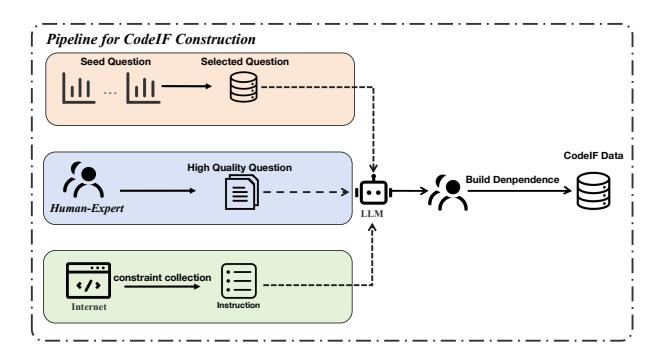
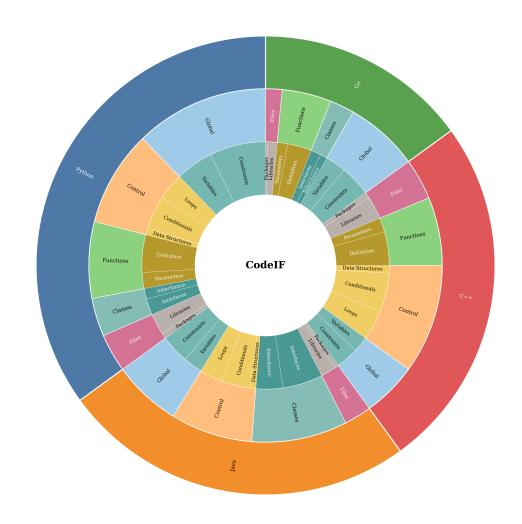
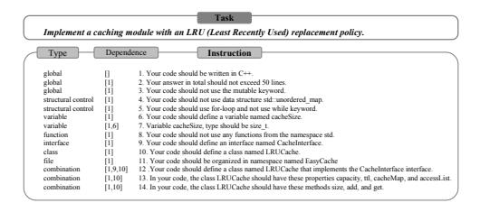
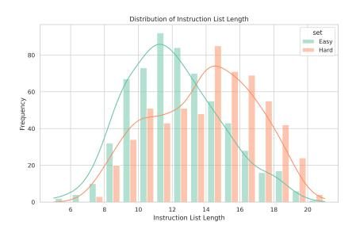
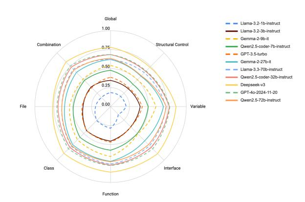
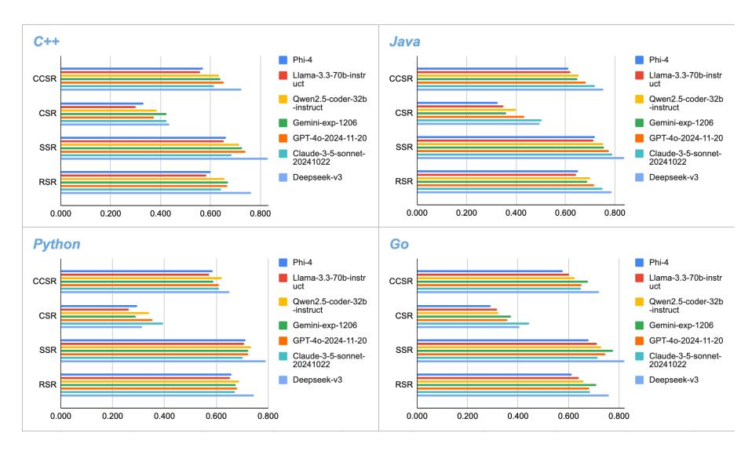
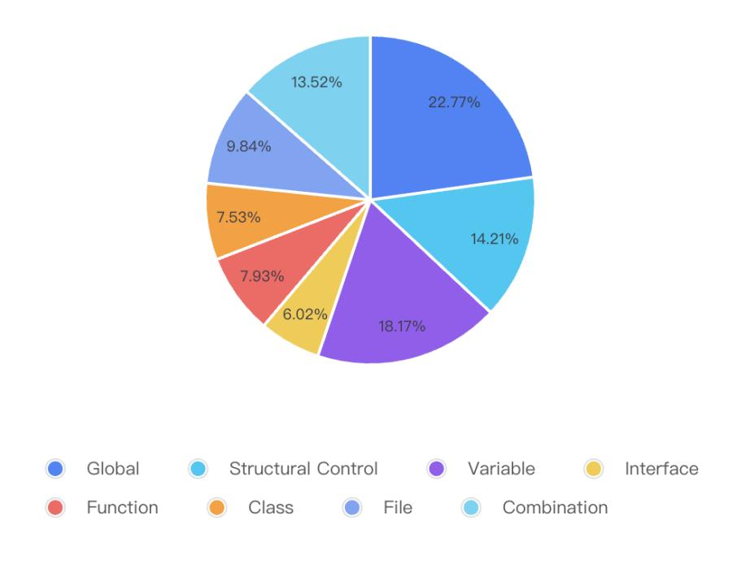
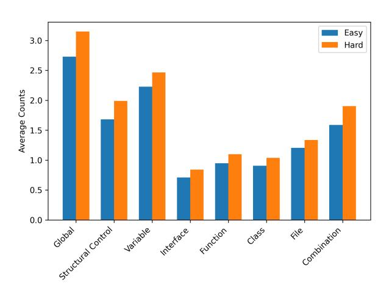

# CodeIF: Benchmarking the Instruction-Following Capabilities of Large Language Models for Code Generation

Kaiwen Yan1 \*, Hongcheng Guo1 \* †, Xuanqing Shi<sup>2</sup> Shaosheng Cao<sup>3</sup> , Donglin Di<sup>2</sup> , Zhoujun Li<sup>1</sup>

<sup>1</sup>Beihang University, <sup>2</sup>Tsinghua University, <sup>3</sup>Xiaohongshu lin\_rany@foxmail.com, hongchengguo@buaa.edu.cn, sxq23@mails.tsinghua.edu.cn caoshaosheng@xiaohongshu.com, donglin.ddl@gmail.com, lizj@buaa.edu.cn

# Abstract

With the rapid advancement of Large Language Models (LLMs), the demand for robust instruction-following capabilities in code generation tasks has grown significantly. Code generation not only facilitates faster prototyping and automated testing, but also augments developer efficiency through improved maintainability and reusability of code. In this paper, we introduce CodeIF, the first benchmark specifically designed to assess the abilities of LLMs to adhere to task-oriented instructions within diverse code generation scenarios. CodeIF encompasses a broad range of tasks, including function synthesis, error debugging, algorithmic refactoring, and code explanation, thereby providing a comprehensive suite to evaluate model performance across varying complexity levels and programming domains. We conduct extensive experiments with LLMs, analyzing their strengths and limitations in meeting the demands of these tasks. The experimental results offer valuable insights into how well current models align with human instructions, as well as the extent to which they can generate consistent, maintainable, and contextually relevant code. Our findings not only underscore the critical role that instruction-following LLMs can play in modern software development, but also illuminate pathways for future research aimed at enhancing their adaptability, reliability, and overall effectiveness in automated code generation. [1](#page-0-0) .

# 1 Introduction

With the rapid advancement of large language models (LLMs), automated code generation is undergoing a profound transformation. While LLMs have demonstrated promising capabilities in programming tasks, their ability to comprehend and execute complex instructions remains a challenge [\(Liu](#page-6-0) [et al.,](#page-6-0) [2024;](#page-6-0) [Zhang et al.,](#page-7-0) [2023\)](#page-7-0). To drive progress in this field, a comprehensive and systematic evaluation framework is essential [\(Jiang et al.,](#page-6-1) [2024;](#page-6-1) [Zhou et al.,](#page-7-1) [2023\)](#page-7-1).

This study introduces CodeIF, a benchmark designed to assess LLMs' instruction-following capabilities in code generation. Built upon insights from existing evaluation sets like McEval [\(Chai et al.,](#page-6-2) [2024\)](#page-6-2) and FullStackBench [\(Liu](#page-6-0) [et al.,](#page-6-0) [2024\)](#page-6-0), CodeIF is tailored for multi-language environments, covering Java, Python, Go, and C++. It categorizes tasks by difficulty and systematically evaluates models across 50 fine-grained subinstructions, providing a nuanced understanding of their strengths and weaknesses.

To ensure rigorous assessment, we propose four novel evaluation metrics: Completely Satisfaction Rate (CSR), Soft Satisfaction Rate (SSR), Rigorous Satisfaction Rate (RSR), and Consistent Continuity Satisfaction Rate (CCSR). These metrics measure models' ability to handle multi-constraint problems from different perspectives, including full compliance, average constraint satisfaction, logical coherence, and consistency in instruction execution. By offering a structured evaluation framework, CodeIF provides valuable insights into the current state and future direction of LLM-driven code generation. Overall, our contributions are mainly four-fold:

- 1. Innovative Benchmark. We introduce CodeIF, the first systematic benchmark for evaluating LLMs' instruction-following capabilities in code generation. CodeIF categorizes tasks into 8 main types and 50 fine-grained subinstructions, ensuring a comprehensive assessment of model performance.
- 2. Automated High-Quality Instruction Generation. Leveraging advanced LLMs like GPT-4, we develop a method to automatically generate constraint-based instruction lists. This approach

<sup>\*</sup>Equal contribution

<span id="page-0-0"></span><sup>†</sup>Corresponding Author

<sup>1</sup>CodeIF data and code are publicly available: [https://](https://github.com/lin-rany/codeIF) [github.com/lin-rany/codeIF](https://github.com/lin-rany/codeIF)

<span id="page-1-0"></span>

Figure 1: The construction process of CodeIF. The first step involves the construction of constraint instructions, followed by the assembly of the dataset, and finally the construction of dependencies between instructions.

enhances evaluation depth by incorporating instructional dependencies while minimizing human intervention.

- 3. **Novel Evaluation Metrics.** We propose a new framework with four key metrics (**CSR**, **SSR**, **RSR**, **and CCSR**) tailored for code generation tasks. These metrics assess models' ability to handle multi-constraint problems across different dimensions, offering deeper insights and new benchmarks for future research.
- 4. Extensive Evaluation and Analysis. We systematically evaluate 35 state-of-the-art LLMs, including both open-source and commercial models, across multiple programming languages and difficulty levels. Our experiments uncover current strengths and limitations, providing clear directions for future advancements.

#### 2 CODEIF

**Overview:** As shown in Figure 1, CodeIF is constructed by collecting and refining constraint instructions from real code generation tasks, then combining these tasks with LLM outputs and human review to create a high-quality evaluation dataset.

#### 2.1 Building

The construction of the CODEIF dataset involves two phases: collecting constraint instructions (Section 2.2) and processing data to create the final CodeIF evaluation dataset (Section 2.3).

#### <span id="page-1-1"></span>2.2 Constraint Instructions Collection

The first phase of our work centers on code generation, constructing the **CodeIF** evaluation dataset through two steps: (1) collecting and verifying con-

<span id="page-1-2"></span>

Figure 2: CodeIF Constraints Instruction Distribution

straint instructions, and (2) using them for dataset generation.

We analyze benchmarks like McEval (Chai et al., 2024) and FullStackBench (Liu et al., 2024) to develop an instruction system spanning eight categories, each targeting specific aspects of code generation for a fine-grained assessment of LLMs' instruction-following abilities. Constraints are decomposed into atomic instructions with explicit directives, enabling objective binary evaluation (yes/no) and minimizing subjective interpretation. The eight categories cover both architectural-level specifications and variable-level implementation controls, ensuring comprehensive constraint coverage. Specifically, the Global category evaluates adherence to overarching specifications, while Structural Control focuses on control structures (e.g., loops, conditionals) and data structures. Variable constraints assess naming and initialization. Higher abstraction levels include Interface, Function, and Class constraints for program components, while the File category tests cross-file dependencies and external library handling. The Combination category integrates constraints across dimensions, challenging models with complex scenarios.

Figure 2 presents CodeIF's distribution across programming languages and categories. The evaluation system features **8 categories** and **50 fine-grained constraint instructions**, systematically assessing LLMs' code generation performance. By organizing constraints clearly, the system identifies strengths and weaknesses, guides optimization, and advances automated code generation. The full list of constraints is in Appendix 4.

<span id="page-2-1"></span>

Figure 3: Specific cases of the CodeIF dataset, 'Task' denotes the specific generation task, 'Type' refers to the type of constraint, and 'Dependence' indicates the prerequisite constraints for this constraint.

#### <span id="page-2-0"></span>2.3 Data Construction

Multi-Language and Difficulty-Differentiated Benchmark Design To ensure diversity and comprehensiveness in evaluation, we carefully selected code generation tasks across four mainstream programming languages—Java, Python, Go, and C++—from leading benchmarks such as McE-val (Chai et al., 2024) and FullStackBench (Liu et al., 2024). These languages, spanning both dynamic and static paradigms, create a rich linguistic environment that enhances multi-language assessment.

To further refine the evaluation, we categorize tasks into two difficulty levels: **Easy** and **Hard**. The **Hard** set includes longer, more intricate instruction lists, designed to rigorously test LLMs' ability to handle complex constraints.

Automated Generation of Constraint Instructions We used large language models (LLMs) like GPT-4 to create task-specific instruction lists for code generation tasks. We prepared 20 detailed examples and formulated concise atomic instructions for accuracy. These examples guided LLMs in refining tasks and streamlining instructions to enhance clarity and output quality.

Constructing Instruction Dependencies We utilized LLMs to map dependencies between atomic constraints, improving our evaluation framework's precision and verification accuracy. By understanding the dependencies among instructions, we outlined clear steps for tasks like function creation, which involve naming the function, defining parameter types, and coding the body. Incorporating these dependencies enhances our evaluation system, more accurately assessing the model's capability with complex instructions and identifying areas for improvement. Figure 3 illustrates a CodeIF task with its instruction sequence and dependencies.

<span id="page-2-2"></span>

| Set  | Num  | Avg.Instr | Go  | Python | Java | C++ |
|------|------|-----------|-----|--------|------|-----|
| Easy | 600  | 11.99     | 127 | 165    | 176  | 132 |
| Hard | 600  | 13.80     | 103 | 183    | 177  | 137 |
| Full | 1200 | 12.90     | 230 | 348    | 353  | 269 |

Table 1: CodeIF dataset statistics, showing the statistical information of different difficulty classifications. Avg.Instr represents the average length of the atomic constraint instruction list.

<span id="page-2-3"></span>

Figure 4: The distribution of atomic instruction list lengths in datasets of different difficulties.

#### 2.4 Data Analysis

CodeIF Static Analysis Table 1 categorizes the dataset into three difficulty levels: Easy, Hard, and Full. Both Easy and Hard sets contain 600 tasks, while the Full dataset combines them, totaling 1,200 tasks across Go, Python, Java, and C++. Java has the most tasks (353), followed by Python (348), C++ (269), and Go (230). The Easy set averages 11.99 instructions per task, the Hard set 13.8, and the Full dataset 12.9, reflecting increasing complexity. Figure 4 shows task length distribution.

Constraint Instruction Analysis Table 2compares instruction distribution across difficulty levels. The **Hard** set consistently has more instructions per category than the **Easy** set, with the **Global** category averaging **2.5** instructions in Easy and over **3** in Hard. This indicates greater challenges for models as task complexity rises. More analysis is in Appendix D.

#### 3 Metrics

Ensuring that large language models (LLMs) accurately follow instructions is crucial for code generation. To precisely evaluate this capability, we introduce four novel metrics designed to assess how LLMs handle code generation tasks with multiple constraints: Completely Satisfaction Rate (CSR), Soft Satisfaction Rate (SSR), Rigorous Satisfaction Rate (RSR), and Consistent Continuity Satisfaction Rate (CCSR). These metrics

<span id="page-3-0"></span>

| Set  | Global | Structural Control | Variable | Interface | Function | Class | File | Combination |
|------|--------|--------------------|----------|-----------|----------|-------|------|-------------|
| Easy | 1638   | 1008               | 1336     | 427       | 569      | 544   | 723  | 953         |
| Hard | 1890   | 1193               | 1479     | 505       | 659      | 623   | 802  | 1142        |
| Full | 3528   | 2201               | 2815     | 932       | 1228     | 1167  | 1525 | 2095        |

Table 2: CodeIF dataset statistics information, showing the distribution of atomic restriction instruction categories under different difficulty classifications.

provide a comprehensive evaluation from different perspectives.

For a dataset with m problems, each problem contains a set of  $n_i$  constraints. We define CSR and SSR as follows:

#### **Completely Satisfaction Rate (CSR):**

$$CSR = \frac{1}{m} \sum_{i=1}^{m} \left( \prod_{j=1}^{n_i} r_{i,j} \right)$$
 (1)

where  $r_{i,j} \in [0,1]$  indicates whether the j-th constraint in the i-th problem is satisfied.

#### **Soft Satisfaction Rate (SSR):**

$$SSR = \frac{1}{m} \sum_{i=1}^{m} \left( \frac{\sum_{j=1}^{n_i} r_{i,j}}{n_i} \right)$$
 (2)

SSR evaluates the average proportion of constraints satisfied per problem, providing a more flexible assessment.

**Rigorous Satisfaction Rate (RSR)** In code generation, some constraints depend on prior instructions, particularly in **Combination** constraints. To account for dependencies, we define RSR as:

$$RSR = \frac{1}{m} \sum_{i=1}^{m} \left( \frac{\sum_{j=1}^{n_i} \left[ r_{i,j} \cdot \prod_{k \in D_{i,j}} r_{i,k} \right]}{n_i} \right)$$
(3)

where  $D_{i,j}$  represents the set of constraints that the j-th constraint in the i-th problem depends on.

# Consistent Continuity Satisfaction Rate (CCSR) In many code generation tasks, maintaining continuous adherence to instructions is essential. To measure this ability, we define CCSR as:

$$\text{CCSR} = \frac{1}{m} \sum_{i=1}^{m} \frac{L_i}{n_i}, L_i = \max \left\{ l \mid \exists t \in [1, n_i - l + 1], \prod_{j=t}^{t+l-1} r_{i,j} = 1 \right\}$$
(4)

where  $L_i$  represents the longest consecutive sequence of satisfied constraints in problem i.

#### 4 Experiment

#### 4.1 Experimental Setup

The temperature coefficient is set to 0 to ensure output determinism, with a maximum generation

length of 4096 tokens. All other settings follow the official default parameters for each model. Commercial API models are accessed through the latest available interface as of December 2024. All experiments are conducted using the official API and 8 H800(80G).

#### **4.2** Automatic Evaluation

To ensure robust evaluation, we used LLMs and human experts to verify model adherence to atomic constraints. Constraints were decomposed into atomic elements, enabling objective binary evaluations (Yes/No) over subjective judgments. Following FairEval (Wang et al., 2023a), GPT-4-1106-Preview was the primary evaluation tool (prompt details in Appendix A). Three domain experts manually annotated 150 stratified samples. Statistical analysis showed strong agreement, with Pearson correlations of **0.87** (LLM-human) and **0.85** (interhuman), confirming high consistency. Baselines are in Appendix C.

#### 4.3 Main Experiments

Table 3 evaluates CodeIF using four metrics: **CSR**, **SSR**, **RSR**, and **CCSR**. Detailed results are in Appendix B.

**Overview.** DeepSeek-V3 and Claude-3-5-Sonnet-20241022 lead across metrics, excelling in complex tasks. However, the highest **CSR** on Hard tasks is just **0.362**, showing challenges in meeting strict constraints.

**Model Scale Trends.** Larger models generally perform better, as seen in Qwen2.5 series. However, the **Llama3** series shows inconsistent results, highlighting the importance of architecture, data quality, and optimization.

**Open vs. Closed Models.** Closed-source models like GPT-4O and Claude-3-5 outperform open-source models, especially under complex constraints. While large open-source models (e.g., Qwen2.5-72B-Instruct) are competitive, they lag due to differences in data quality and RLHF techniques.

<span id="page-4-0"></span>

| Models                     |       | CSR   |       |       | SSR   |       |       | RSR   |       |       | CCSR  |       |
|----------------------------|-------|-------|-------|-------|-------|-------|-------|-------|-------|-------|-------|-------|
| 1,104018                   | Full  | Easy  | Hard  | Full  | Easy  | Hard  | Full  | Easy  | Hard  | Full  | Easy  | Hard  |
| Llama-3.2-1B-Instruct      | 0.034 | 0.046 | 0.022 | 0.218 | 0.277 | 0.159 | 0.182 | 0.231 | 0.132 | 0.152 | 0.197 | 0.107 |
| Llama-3.1-8B-Instruct      | 0.145 | 0.187 | 0.102 | 0.467 | 0.544 | 0.388 | 0.418 | 0.493 | 0.340 | 0.370 | 0.444 | 0.295 |
| Qwen2.5-Coder-7B-Instruct  | 0.142 | 0.198 | 0.087 | 0.514 | 0.590 | 0.438 | 0.453 | 0.533 | 0.373 | 0.390 | 0.463 | 0.318 |
| Qwen2.5-7B-Instruct        | 0.153 | 0.201 | 0.104 | 0.535 | 0.599 | 0.471 | 0.475 | 0.546 | 0.405 | 0.416 | 0.479 | 0.353 |
| Ministral-8B               | 0.161 | 0.205 | 0.116 | 0.552 | 0.614 | 0.489 | 0.486 | 0.552 | 0.419 | 0.431 | 0.490 | 0.371 |
| Gemma-2-9B-It              | 0.171 | 0.210 | 0.131 | 0.573 | 0.642 | 0.504 | 0.513 | 0.587 | 0.440 | 0.445 | 0.508 | 0.383 |
| Qwen2.5-Coder-32B-Instruct | 0.365 | 0.422 | 0.307 | 0.736 | 0.767 | 0.704 | 0.679 | 0.723 | 0.635 | 0.634 | 0.669 | 0.599 |
| Gemma-2-27B-It             | 0.245 | 0.300 | 0.190 | 0.658 | 0.709 | 0.607 | 0.596 | 0.652 | 0.540 | 0.533 | 0.588 | 0.478 |
| Qwen2.5-32B-Instruct       | 0.294 | 0.337 | 0.251 | 0.680 | 0.722 | 0.638 | 0.621 | 0.674 | 0.568 | 0.560 | 0.604 | 0.515 |
| Qwen2.5-72B-Instruct       | 0.281 | 0.319 | 0.244 | 0.685 | 0.734 | 0.634 | 0.621 | 0.677 | 0.564 | 0.569 | 0.619 | 0.518 |
| Llama-3.3-70B-Instruct     | 0.307 | 0.359 | 0.255 | 0.698 | 0.749 | 0.647 | 0.632 | 0.691 | 0.574 | 0.589 | 0.643 | 0.536 |
| Gemini-Exp-1206            | 0.357 | 0.410 | 0.303 | 0.744 | 0.781 | 0.707 | 0.685 | 0.734 | 0.636 | 0.636 | 0.675 | 0.597 |
| GPT-4O-2024-11-20          | 0.383 | 0.441 | 0.325 | 0.748 | 0.792 | 0.702 | 0.689 | 0.745 | 0.633 | 0.650 | 0.698 | 0.602 |
| Claude-3-5-Sonnet-20241022 | 0.444 | 0.525 | 0.362 | 0.727 | 0.784 | 0.669 | 0.692 | 0.757 | 0.626 | 0.652 | 0.715 | 0.587 |
| Deepseek-V3                | 0.414 | 0.468 | 0.359 | 0.821 | 0.847 | 0.794 | 0.764 | 0.806 | 0.723 | 0.712 | 0.743 | 0.680 |

Table 3: CodeIF evaluation results of different difficulties. We use bold font to mark the best results in all models.

<span id="page-4-1"></span>

Figure 5: Performance of different LLMs on the CodeIF evaluation across instruction categories, measured by SSR.

**Task Difficulty Impact.** Performance drops with increasing task complexity. For instance, GPT-4O's **CSR** falls from **0.441** on Easy tasks to **0.325** on Hard tasks, highlighting the challenge of strict constraints.

#### 5 In-Depth Analysis

# 5.1 Performance Analysis Across Instruction Types

Figure 5 compares LLM performance across instruction categories, revealing notable variations. **DeepSeek-V3** leads overall, excelling in combination tasks (**0.831**) and global structure control, though weaker in variable handling, reflecting its optimization focus. **Meta's Llama series** shows a clear correlation between model size and performance, with larger variants (*Llama-3.3-70B-Instruct*) outperforming smaller ones (*Llama-3.2-1B-Instruct*). However, size alone is not deci-

sive; comparisons with similarly sized models like **Google's Gemma** highlight the role of architecture and training methods in shaping performance.

# 5.2 Cross-Language Performance Analysis of LLMs

Figure 6 compares the performance of leading LLMs across C++, Java, Python, and Go, highlighting trends at both model and language levels. At the **model level**, **DeepSeek-V3** leads with the highest CCSR in C++ (0.725), Java (0.753), and Go (0.722), and an RSR of 0.787 in Java. Claude-3-5-**Sonnet** excels in Java with the highest CSR (0.504) and RSR (0.749), but shows lower SSR in Python (0.703). GPT-4O demonstrates balanced performance, ranking second in Python's CSR (0.355) and RSR (0.682), with minimal variance (CV = 0.18). At the language level, C++ is the most challenging due to complex template metaprogramming. Java shows high inter-model variance, with Claude-3-5-Sonnet performing best. Go achieves the highest SSR but fluctuates in RSR. These results highlight cross-language generalization differences and suggest optimization areas like dependency handling and paradigm consistency.

# **5.3** Analysis of Instruction Adherence Deviations

Analysis of model-generated responses shows frequent deviations from instructions, especially in **naming conventions** and **formatting constraints**. Models often ignore global formatting rules, such as line limits, and inconsistently follow naming conventions. For example, when in-

<span id="page-5-0"></span>

Figure 6: SSR scores of LLMs across different programming languages in the CodeIF evaluation.

structed to use PascalCase, models sometimes output lowercase or underscore-separated formats (e.g., incorrectly transforming current\_power into CurrentPower). A notable issue is the disregard for prohibitive instructions. For instance, models often use if statements despite being instructed to avoid them in favor of ternary operators or data structures like dictionaries, revealing gaps in constraint enforcement.

#### 5.4 Improving Instruction Compliance

Appendix Table [5](#page-11-0) highlights strategies to improve adherence. Supervised Fine-Tuning (SFT) proves effective, especially in the Llama series, while larger models like Qwen2.5-72B-Instruct outperform smaller ones in instruction-following accuracy. Key improvements include prioritizing *hard constraints* (e.g., syntax rules) over *soft guidelines* (e.g., coding styles). Patterned code generation can replace conditional statements with lookup tables or state machines. A naming convention engine can automate variable name formatting (e.g., converting snake\_case to PascalCase). *Abstract Syntax Tree (AST)* analysis can detect and transform prohibited structures, such as replacing for loops with while loops. Conflict resolution mechanisms can address contradictory instructions, offering alternative solutions when certain language features are unavailable (e.g., using Python's alternatives to switch-case).

#### 6 Related Work

Code generation and instruction-following are pivotal capacities under examination in AI research [\(Feng et al.,](#page-6-3) [2020;](#page-6-3) [Sun et al.,](#page-7-3) [2024;](#page-7-3) [Luo](#page-7-4) [et al.,](#page-7-4) [2024;](#page-7-4) [Wang et al.,](#page-7-5) [2023b;](#page-7-5) [Kim et al.,](#page-6-4) [2018;](#page-6-4) [Li et al.,](#page-6-5) [2023;](#page-6-5) [Lu et al.,](#page-7-6) [2021;](#page-7-6) [Li et al.,](#page-6-6) [2022;](#page-6-6) [Wei](#page-7-7) [et al.,](#page-7-7) [2023;](#page-7-7) [Nijkamp et al.,](#page-7-8) [2023b;](#page-7-8) [Zhuo et al.,](#page-7-9) [2024;](#page-7-9) [Jain et al.,](#page-6-7) [2024;](#page-6-7) [Nijkamp et al.,](#page-7-10) [2023a;](#page-7-10) [Zhang et al.,](#page-7-0) [2023;](#page-7-0) [Allal et al.,](#page-6-8) [2023;](#page-6-8) [Lozhkov](#page-7-11) [et al.,](#page-7-11) [2024a;](#page-7-11) [Roziere et al.,](#page-7-12) [2023;](#page-7-12) [Lozhkov et al.,](#page-7-13) [2024b;](#page-7-13) [Wang et al.,](#page-7-14) [2021;](#page-7-14) [Yan et al.,](#page-7-15) [2023\)](#page-7-15). Several benchmarks have been devised to appraise these capabilities in large-scale models. For code generation, benchmarks like McEval [\(Chai et al.,](#page-6-2) [2024\)](#page-6-2), FullStackBench [\(Liu et al.,](#page-6-0) [2024\)](#page-6-0), Repocoder [\(Zhang et al.,](#page-7-0) [2023\)](#page-7-0), Repobench [\(Liu et al.,](#page-6-9) [2023\)](#page-6-9), and LiveCodeBench [\(Jain et al.,](#page-6-7) [2024\)](#page-6-7) have been notable. Similarly, instruction-following capacities are gauged through benchmarks such as InfoBench [\(Qin et al.,](#page-7-16) [2024\)](#page-7-16), CFBench [\(Zhang](#page-7-17) [et al.,](#page-7-17) [2024\)](#page-7-17), Instruct-following [\(Zhou et al.,](#page-7-1) [2023\)](#page-7-1), and FollowBench [\(Jiang et al.,](#page-6-1) [2024\)](#page-6-1), each tailored to assess different aspects of following instructions given to models.

# 7 Conclusion

This study introduces CODEIF, a benchmark for evaluating the instruction-following capabilities of LLMs in code generation. Covering Java, Python, Go, and C++, CodeIF constructs a diverse test set with constraints ranging from global to specific variables. It introduces novel evaluation metrics—Completely Satisfaction Rate (CSR), Soft Satisfaction Rate (SSR), Rigorous Satisfaction Rate (RSR), and Consistent Continuity Satisfaction Rate (CCSR)—to assess multi-constraint handling across multiple dimensions.

# 8 Limitations

Limited Language Support. CodeIF includes key languages like Java, Python, Go, and C++, but excludes popular ones like JavaScript, Ruby, and Swift. Expanding language coverage would improve its applicability in diverse contexts.

Static Evaluation Focus. CodeIF focuses mainly on static code properties, such as structure and naming conventions, while overlooking dynamic factors like runtime behavior, performance, and debugging. Including dynamic evaluation would better reflect real-world development challenges.

Uniform Metric Weighting. The metrics (CSR, SSR, RSR, CCSR) treat all constraints equally, which may not align with practical priorities. For example, syntactic correctness is often more critical than naming conventions. Introducing weighted scoring could enhance the interpretability of model performance.

# References

- <span id="page-6-12"></span>Marah Abdin, Jyoti Aneja, Harkirat Behl, Sébastien Bubeck, Ronen Eldan, Suriya Gunasekar, Michael Harrison, Russell J. Hewett, Mojan Javaheripi, Piero Kauffmann, James R. Lee, Yin Tat Lee, Yuanzhi Li, Weishung Liu, Caio C. T. Mendes, Anh Nguyen, Eric Price, Gustavo de Rosa, Olli Saarikivi, Adil Salim, Shital Shah, Xin Wang, Rachel Ward, Yue Wu, Dingli Yu, Cyril Zhang, and Yi Zhang. 2024. [Phi-4 technical](https://arxiv.org/abs/2412.08905) [report.](https://arxiv.org/abs/2412.08905) *Preprint*, arXiv:2412.08905.
- <span id="page-6-15"></span>Josh Achiam, Steven Adler, Sandhini Agarwal, Lama Ahmad, Ilge Akkaya, Florencia Leoni Aleman, Diogo Almeida, Janko Altenschmidt, Sam Altman, Shyamal Anadkat, et al. 2023. Gpt-4 technical report.
- <span id="page-6-8"></span>Loubna Ben Allal, Raymond Li, Denis Kocetkov, Chenghao Mou, Christopher Akiki, Carlos Munoz Ferrandis, Niklas Muennighoff, Mayank Mishra, Alex Gu, Manan Dey, et al. 2023. Santacoder: don't reach for the stars! *arXiv preprint arXiv:2301.03988*.
- <span id="page-6-2"></span>Linzheng Chai, Shukai Liu, Jian Yang, Yuwei Yin, Ke Jin, Jiaheng Liu, Tao Sun, Ge Zhang, Changyu Ren, Hongcheng Guo, et al. 2024. Mceval: Massively multilingual code evaluation. *arXiv preprint arXiv:2406.07436*.
- <span id="page-6-14"></span>DeepSeek-AI. 2024. [Deepseek-v3 technical report.](https://arxiv.org/abs/2412.19437) *Preprint*, arXiv:2412.19437.
- <span id="page-6-3"></span>Zhangyin Feng, Daya Guo, Duyu Tang, Nan Duan, Xiaocheng Feng, Ming Gong, Linjun Shou, Bing Qin, Ting Liu, Daxin Jiang, et al. 2020. Codebert: A pre-trained model for programming and natural languages. *arXiv preprint arXiv:2002.08155*.

- <span id="page-6-13"></span>Daya Guo, Qihao Zhu, Dejian Yang, Zhenda Xie, Kai Dong, Wentao Zhang, Guanting Chen, Xiao Bi, Yu Wu, YK Li, et al. 2024. Deepseek-coder: When the large language model meets programming– the rise of code intelligence. *arXiv preprint arXiv:2401.14196*.
- <span id="page-6-10"></span>Binyuan Hui, Jian Yang, Zeyu Cui, Jiaxi Yang, Dayiheng Liu, Lei Zhang, Tianyu Liu, Jiajun Zhang, Bowen Yu, Keming Lu, Kai Dang, Yang Fan, Yichang Zhang, An Yang, Rui Men, Fei Huang, Bo Zheng, Yibo Miao, Shanghaoran Quan, Yunlong Feng, Xingzhang Ren, Xuancheng Ren, Jingren Zhou, and Junyang Lin. 2024. [Qwen2.5-coder tech](https://arxiv.org/abs/2409.12186)[nical report.](https://arxiv.org/abs/2409.12186) *Preprint*, arXiv:2409.12186.
- <span id="page-6-7"></span>Naman Jain, King Han, Alex Gu, Wen-Ding Li, Fanjia Yan, Tianjun Zhang, Sida Wang, Armando Solar-Lezama, Koushik Sen, and Ion Stoica. 2024. Livecodebench: Holistic and contamination free evaluation of large language models for code. *arXiv preprint arXiv:2403.07974*.
- <span id="page-6-11"></span>Albert Qiaochu Jiang, Alexandre Sablayrolles, Arthur Mensch, Chris Bamford, Devendra Singh Chaplot, Diego de Las Casas, Florian Bressand, Gianna Lengyel, Guillaume Lample, Lucile Saulnier, L'elio Renard Lavaud, Marie-Anne Lachaux, Pierre Stock, Teven Le Scao, Thibaut Lavril, Thomas Wang, Timothée Lacroix, and William El Sayed. 2023. Mistral 7b. *ArXiv*.
- <span id="page-6-1"></span>Yuxin Jiang, Yufei Wang, Xingshan Zeng, Wanjun Zhong, Liangyou Li, Fei Mi, Lifeng Shang, Xin Jiang, Qun Liu, and Wei Wang. 2024. [Follow](https://arxiv.org/abs/2310.20410)[bench: A multi-level fine-grained constraints follow](https://arxiv.org/abs/2310.20410)[ing benchmark for large language models.](https://arxiv.org/abs/2310.20410) *Preprint*, arXiv:2310.20410.
- <span id="page-6-4"></span>Hyeji Kim, Yihan Jiang, Sreeram Kannan, Sewoong Oh, and Pramod Viswanath. 2018. Deepcode: Feedback codes via deep learning. *Advances in neural information processing systems*, 31.
- <span id="page-6-5"></span>Raymond Li, Loubna Ben Allal, Yangtian Zi, Niklas Muennighoff, Denis Kocetkov, Chenghao Mou, Marc Marone, Christopher Akiki, Jia Li, Jenny Chim, et al. 2023. Starcoder: may the source be with you! *arXiv preprint arXiv:2305.06161*.
- <span id="page-6-6"></span>Yujia Li, David Choi, Junyoung Chung, Nate Kushman, Julian Schrittwieser, Rémi Leblond, Tom Eccles, James Keeling, Felix Gimeno, Agustin Dal Lago, et al. 2022. Competition-level code generation with alphacode. *Science*, 378(6624):1092–1097.
- <span id="page-6-0"></span>Siyao Liu, He Zhu, Jerry Liu, Shulin Xin, Aoyan Li, Rui Long, Li Chen, Jack Yang, Jinxiang Xia, Z. Y. Peng, Shukai Liu, Zhaoxiang Zhang, Ge Zhang, Wenhao Huang, Kai Shen, and Liang Xiang. 2024. [Fullstack](https://arxiv.org/abs/2412.00535) [bench: Evaluating llms as full stack coders.](https://arxiv.org/abs/2412.00535) *Preprint*, arXiv:2412.00535.
- <span id="page-6-9"></span>Tianyang Liu, Canwen Xu, and Julian J. McAuley. 2023. [Repobench: Benchmarking repository-level](https://doi.org/10.48550/ARXIV.2306.03091) [code auto-completion systems.](https://doi.org/10.48550/ARXIV.2306.03091) abs/2306.03091.

- <span id="page-7-11"></span>Anton Lozhkov, Raymond Li, Loubna Ben Allal, Federico Cassano, Joel Lamy-Poirier, Nouamane Tazi, Ao Tang, Dmytro Pykhtar, Jiawei Liu, Yuxiang Wei, et al. 2024a. Starcoder 2 and the stack v2: The next generation. *arXiv preprint arXiv:2402.19173*.
- <span id="page-7-13"></span>Anton Lozhkov, Raymond Li, Loubna Ben Allal, Federico Cassano, Joel Lamy-Poirier, Nouamane Tazi, Ao Tang, Dmytro Pykhtar, Jiawei Liu, Yuxiang Wei, et al. 2024b. Starcoder 2 and the stack v2: The next generation.
- <span id="page-7-6"></span>Shuai Lu, Daya Guo, Shuo Ren, Junjie Huang, Alexey Svyatkovskiy, Ambrosio Blanco, Colin Clement, Dawn Drain, Daxin Jiang, Duyu Tang, et al. 2021. Codexglue: A machine learning benchmark dataset for code understanding and generation. *arXiv preprint arXiv:2102.04664*.
- <span id="page-7-4"></span>Ziyang Luo, Can Xu, Pu Zhao, Qingfeng Sun, Xiubo Geng, Wenxiang Hu, Chongyang Tao, Jing Ma, Qingwei Lin, and Daxin Jiang. 2024. [Wizardcoder:](https://openreview.net/forum?id=UnUwSIgK5W) [Empowering code large language models with evol](https://openreview.net/forum?id=UnUwSIgK5W)[instruct.](https://openreview.net/forum?id=UnUwSIgK5W) In *The Twelfth International Conference on Learning Representations, ICLR 2024, Vienna, Austria, May 7-11, 2024*. OpenReview.net.
- <span id="page-7-10"></span>Erik Nijkamp, Hiroaki Hayashi, Caiming Xiong, Silvio Savarese, and Yingbo Zhou. 2023a. [Codegen2:](https://arxiv.org/abs/2305.02309) [Lessons for training llms on programming and natu](https://arxiv.org/abs/2305.02309)[ral languages.](https://arxiv.org/abs/2305.02309) *arXiv preprint arXiv:2305.02309*.
- <span id="page-7-8"></span>Erik Nijkamp, Bo Pang, Hiroaki Hayashi, Lifu Tu, Huan Wang, Yingbo Zhou, Silvio Savarese, and Caiming Xiong. 2023b. [Codegen: An open large language](https://openreview.net/forum?id=iaYcJKpY2B_) [model for code with multi-turn program synthesis.](https://openreview.net/forum?id=iaYcJKpY2B_) In *International Conference on Learning Representations*.
- <span id="page-7-16"></span>Yiwei Qin, Kaiqiang Song, Yebowen Hu, Wenlin Yao, Sangwoo Cho, Xiaoyang Wang, Xuansheng Wu, Fei Liu, Pengfei Liu, and Dong Yu. 2024. [Infobench:](https://arxiv.org/abs/2401.03601) [Evaluating instruction following ability in large lan](https://arxiv.org/abs/2401.03601)[guage models.](https://arxiv.org/abs/2401.03601) *Preprint*, arXiv:2401.03601.
- <span id="page-7-12"></span>Baptiste Roziere, Jonas Gehring, Fabian Gloeckle, Sten Sootla, Itai Gat, Xiaoqing Ellen Tan, Yossi Adi, Jingyu Liu, Tal Remez, Jérémy Rapin, et al. 2023. Code llama: Open foundation models for code.
- <span id="page-7-3"></span>Tao Sun, Linzheng Chai, Jian Yang, Yuwei Yin, Hongcheng Guo, Jiaheng Liu, Bing Wang, Liqun Yang, and Zhoujun Li. 2024. Unicoder: Scaling code large language model via universal code. *arXiv preprint arXiv:2406.16441*.
- <span id="page-7-21"></span>Gemini Team. 2024a. [Gemini: A family of highly capa](https://arxiv.org/abs/2412.19437)[ble multimodal models.](https://arxiv.org/abs/2412.19437) *Preprint*, arXiv:2412.19437.
- <span id="page-7-20"></span>Gemma Team. 2024b. [Gemma: Open models based](https://arxiv.org/abs/2403.08295) [on gemini research and technology.](https://arxiv.org/abs/2403.08295) *Preprint*, arXiv:2403.08295.
- <span id="page-7-18"></span>Hugo Touvron, Thibaut Lavril, Gautier Izacard, Xavier Martinet, Marie-Anne Lachaux, Timothée Lacroix, Baptiste Rozière, Naman Goyal, Eric Hambro,

- Faisal Azhar, et al. 2023. Llama: Open and efficient foundation language models. *arXiv preprint arXiv:2302.13971*.
- <span id="page-7-2"></span>Peiyi Wang, Lei Li, Liang Chen, Zefan Cai, Dawei Zhu, Binghuai Lin, Yunbo Cao, Qi Liu, Tianyu Liu, and Zhifang Sui. 2023a. Large language models are not fair evaluators. *arXiv preprint arXiv:2305.17926*.
- <span id="page-7-5"></span>Yue Wang, Hung Le, Akhilesh Deepak Gotmare, Nghi DQ Bui, Junnan Li, and Steven CH Hoi. 2023b. Codet5+: Open code large language models for code understanding and generation.
- <span id="page-7-14"></span>Yue Wang, Weishi Wang, Shafiq Joty, and Steven C.H. Hoi. 2021. [CodeT5: Identifier-aware unified pre](https://doi.org/10.18653/v1/2021.emnlp-main.685)[trained encoder-decoder models for code understand](https://doi.org/10.18653/v1/2021.emnlp-main.685)[ing and generation.](https://doi.org/10.18653/v1/2021.emnlp-main.685) In *Proceedings of the 2021 Conference on Empirical Methods in Natural Language Processing*, pages 8696–8708, Online and Punta Cana, Dominican Republic. Association for Computational Linguistics.
- <span id="page-7-7"></span>Yuxiang Wei, Zhe Wang, Jiawei Liu, Yifeng Ding, and Lingming Zhang. 2023. Magicoder: Source code is all you need. *arXiv preprint arXiv:2312.02120*.
- <span id="page-7-15"></span>Weixiang Yan, Yuchen Tian, Yunzhe Li, Qian Chen, and Wen Wang. 2023. Codetransocean: A comprehensive multilingual benchmark for code translation.
- <span id="page-7-19"></span>An Yang, Baosong Yang, Binyuan Hui, Bo Zheng, Bowen Yu, Chang Zhou, Chengpeng Li, Chengyuan Li, Dayiheng Liu, Fei Huang, et al. 2024. Qwen2 technical report. *arXiv preprint arXiv:2407.10671*.
- <span id="page-7-0"></span>Fengji Zhang, Bei Chen, Yue Zhang, Jin Liu, Daoguang Zan, Yi Mao, Jian-Guang Lou, and Weizhu Chen. 2023. [Repocoder: Repository-level code comple](https://arxiv.org/abs/2303.12570)[tion through iterative retrieval and generation.](https://arxiv.org/abs/2303.12570) *arXiv preprint arXiv:2303.12570*.
- <span id="page-7-17"></span>Tao Zhang, Yanjun Shen, Wenjing Luo, Yan Zhang, Hao Liang, Tao Zhang, Fan Yang, Mingan Lin, Yujing Qiao, Weipeng Chen, Bin Cui, Wentao Zhang, and Zenan Zhou. 2024. [Cfbench: A comprehensive](https://arxiv.org/abs/2408.01122) [constraints-following benchmark for llms.](https://arxiv.org/abs/2408.01122) *Preprint*, arXiv:2408.01122.
- <span id="page-7-1"></span>Jeffrey Zhou, Tianjian Lu, Swaroop Mishra, Siddhartha Brahma, Sujoy Basu, Yi Luan, Denny Zhou, and Le Hou. 2023. [Instruction-following evaluation for](https://arxiv.org/abs/2311.07911) [large language models.](https://arxiv.org/abs/2311.07911) *Preprint*, arXiv:2311.07911.
- <span id="page-7-9"></span>Terry Yue Zhuo, Minh Chien Vu, Jenny Chim, Han Hu, Wenhao Yu, Ratnadira Widyasari, Imam Nur Bani Yusuf, Haolan Zhan, Junda He, Indraneil Paul, et al. 2024. Bigcodebench: Benchmarking code generation with diverse function calls and complex instructions. *arXiv preprint arXiv:2406.15877*.

# <span id="page-8-0"></span>A Prompt Template

#### Prompt for Instruction Generation

You are an instruction compliance evaluator, required to assess the instruction compliance ability of large models. Therefore, you need to generate a series of data for the code generation instruction detection of large models.

#### [Input Format]

I will input a series of data, and you need to generate a dictionary based on these data, which includes two fields "question" and "instruction\_list"

## Original question:

{Original question}

#### Original instruction list:

{instruction\_list}

# Input Explanation

The original question is the original question. It contains the original code generation problem. The original instruction list is the original instruction list. It contains randomly generated code compliance instructions. Some instructions will contain directive keywords that need to be replaced and are wrapped in {{}}.

# Return Format

Return a json data, do not have extra output. The returned dictionary contains two fields: "question" and "instruction\_list"

The format is as follows:

```
{
    "question": "Optimized question",
    "instruction_list": [
        {
            "instruction_id": "id1",
            "instruction": "Instruction 1"
        }
    ]
}
```

#### Explanation

"question": It is the optimized question, which does not contain any directive instructions, only contains the explanation of the original question. It does not contain any restrictions on the code. Move the instructions in the question to the instruction list

"instruction\_list": It is the optimized instruction list. You should optimize according to the meaning of the question. More in line with the meaning of the question. Instead of directly outputting the original instruction list, note that you should replace all directive keywords that need to be replaced and are wrapped in , and the final output should not contain directive keywords that need to be replaced.

#### Generation Requirements

question: Please generate the optimized question based on the following data, which does not contain any directive instructions, only contains the core content of the original question.

instruction\_list: Originated from the input original instruction list. If there are instructions that completely conflict with the meaning of the question or instructions that conflict with each other You should delete as little as possible, you should modify more. Please replace according to the content in the original instruction\_list, you should delete as little as possible. Unless it is contradictory instructions, or instructions that cannot be achieved at all, if you only need to generate additional code to meet the requirements, you can replace it.

#### Prompt for Code Generation

As a programming assistant, your task is to generate code snippets based on the user question and instructions given below:

## Please consider the following points while generating the code snippet:

- Make sure you follow the user instructions word to word. If the instruction says to use a specific language or a specific method, use exactly that.
- Your output should be a valid code snippet in the programming language indicated in the question or the instructions.
- Pay close attention to the syntax and formatting rules of the programming language that you are using. The code should be well-formatted and easy to read.
- Make sure that the code snippet you are generating is efficient and is not overly complicated.

# Output Format:

The output should be a valid, well-formatted, and efficient code snippet that adheres to the above question and instructions.

# Task information

User Question:

{question}

Instructions:

{instructions\_str}

Please generate the code snippet based on the above information:

## Prompt for Answer Judgment

As a programming assistant, your task is to evaluate whether the generated code strictly follows the instructions given in light of the user's problem and directives. You need to return a list of the same length as the instructions, containing only 'Yes' and 'No', indicating whether the model adhered to each specific instruction.

#### Consider the following when making judgments:

- You must strictly follow the user's instructions. If the instruction requires the use of a specific language or method, you must explicitly check if the code utilizes it.
- Your output should be a list of the same length as the instructions, containing only 'Yes' and 'No'.
- Pay close attention to the programming language syntax and formatting rules you are evaluating. The code should be neatly organized and easy to read.
- The list you generate should be valid and not overly complex.

# Task Information

#### User question:

{question}

#### Instructions:

{instructions\_str}

#### Model-generated response:

{generated\_code}

Based on the information provided, determine whether the model has followed the instructions, and return a list of the same length as the instructions, containing only 'Yes' and 'No'. Please note!!! Your output should only contain the list, with no other content. The items in the list should only be 'Yes' and 'No', with no other words included.

#### <span id="page-9-0"></span>B More Resluts

<span id="page-10-0"></span>

| ID       | Type                       | Instruction Format                                                                                                                                              | Format Keys                                                                  |
|----------|----------------------------|-----------------------------------------------------------------------------------------------------------------------------------------------------------------|------------------------------------------------------------------------------|
| 1        | global                     | Your entire response should be written in {programming_language}, the<br>use of other programming languages is not allowed.                                     | ["programming_language"]                                                     |
| 2        | global                     | Your code lines should not exceed {characters_num} characters.                                                                                                  | ["characters_num"]                                                           |
| 3        | global                     | Your code should use global variables.                                                                                                                          | []                                                                           |
| 4        | global                     | Your code should not use global variables.                                                                                                                      | []                                                                           |
| 5        | global                     | Your function should have at most {parameter_count} parameters.                                                                                                 | ["parameter_count"]                                                          |
| 6        | global                     | Your code should not have more than {function_count} functions.                                                                                                 | ["function_count"]                                                           |
| 7        | global                     | Your code should not have more than {class_count} classes.                                                                                                      | ["class_count"]                                                              |
| 8        | global                     | Your code should not use the {keyword} keyword.                                                                                                                 | ["keyword"]                                                                  |
| 9        | global                     | Your function should not exceed {line_num} lines.                                                                                                               | ["line_num"]                                                                 |
| 10       | global                     | Your answer in total should not exceed {line_num} lines.                                                                                                        | ["line_num"]                                                                 |
| 11       | global                     | Your code should use the {keyword} keyword.                                                                                                                     | ["keyword"]                                                                  |
| 12       | structural control         | Your code should use data structure {data_structure}.                                                                                                           | ["data_structure"]                                                           |
| 13       | structural control         | Your code should not use data structure {data_structure}.                                                                                                       | ["data_structure"]                                                           |
| 14       | structural control         | Your code should use for-loop.                                                                                                                                  | []                                                                           |
| 15       | structural control         | Your code should not use for-loop.                                                                                                                              | []                                                                           |
| 16       | structural control         | Your code should use while-loop.                                                                                                                                | []                                                                           |
| 17       | structural control         | Your code should not use while-loop.                                                                                                                            | []                                                                           |
| 18       | structural control         | Your code should use if statement for decision making.                                                                                                          | []                                                                           |
| 19       | structural control         | Your code should not use if statement for decision making.                                                                                                      | []                                                                           |
| 20       | structural control         | Your code should use switch statement for decision making.                                                                                                      | []                                                                           |
| 21       | structural control         | Your code should not use switch statement for decision making.                                                                                                  | []                                                                           |
| 22       | variable                   | Your code should define a variable named {variable_name}.                                                                                                       | ["variable_name"]                                                            |
| 23<br>24 | variable<br>variable       | Your code should define an enumeration named {enumeration_name}<br>The variable names in your code should follow the {naming_convention}<br>naming convention   | ["enumeration_name"]<br>["naming_convention"]                                |
| 25       | variable                   | Variable {variable_name}, type should be {variable_type}.                                                                                                       | ["variable_name", "variable_type"]                                           |
| 26       | variable                   | Variable {variable_name}, should be a global variable.                                                                                                          | ["variable_name"]                                                            |
| 27       | variable                   | Variable {variable_name}, should not be a global variable.                                                                                                      | ["variable_name"]                                                            |
| 28       | variable                   | Variable {variable_name}, the initial value should be {variable_value}.                                                                                         | ["variable_name", "variable_value"]                                          |
| 29       | variable                   | Variable {variable_name}, should be a constant.                                                                                                                 | ["variable_name"]                                                            |
| 30       | variable                   | Variable {variable_name} should not be a constant.                                                                                                              | ["variable_name"]                                                            |
| 31       | function                   | Your code should include a function named {function_name}.                                                                                                      | ["function_name"]                                                            |
| 32       | function                   | The<br>function<br>names<br>in<br>your<br>code<br>should<br>follow<br>the<br>{nam<br>ing_convention}. naming convention                                         | ["naming_convention"]                                                        |
| 33       | function                   | Your<br>code<br>should<br>not<br>use<br>any<br>functions<br>from<br>the<br>{disal<br>lowed_function_list}.                                                      | ["disallowed_function_list"]                                                 |
| 34       | interface                  | Your code should define an interface named {interface_name}.                                                                                                    | ["interface_name"]                                                           |
| 35       | interface                  | The interface names in your code should follow the {naming_convention}<br>naming convention.                                                                    | ["naming_convention"]                                                        |
| 36       | class                      | Your code should define a class named {class_name}.                                                                                                             | ["class_name"]                                                               |
| 37       | class                      | The class names in your code should follow the {naming_convention}<br>naming convention.                                                                        | ["naming_convention"]                                                        |
| 38       | file                       | Your code should be organized in a package named {package_name}.                                                                                                | ["package_name"]                                                             |
| 39       | file                       | Your code should import the following libraries {library_list}.                                                                                                 | ["library_list"]                                                             |
| 40       | file                       | Your code should use the function {function_name} from the library<br>{library_name}.                                                                           | ["function_name", "library_name"]                                            |
| 41       | file                       | Your<br>code<br>should<br>not<br>use<br>the<br>following<br>libraries<br>{disal<br>lowed_library_list}.                                                         | ["disallowed_library_list"]                                                  |
| 42       | combination                | You should initialize an object named {object_name} as an instance of<br>the {class_name} class using {parameters_name_list} for initialization.                | ["object_name", "class_name", "param<br>eters_name_list"]                    |
| 43       | combination                | You should define an interface named {interface_name} that includes<br>these methods {method_name_list}.                                                        | ["interface_name",<br>"method_name_list"]                                    |
| 44       | combination                | Your code should define a class named {class_name} that implements<br>the {interface_name} interface.                                                           | ["class_name", "interface_name"]                                             |
| 45<br>46 | combination<br>combination | In your code, the class {class_name} should have these properties {prop<br>erties_name_list}.<br>In your code, the class {class_name} should have these methods | ["class_name", "properties_name_list"]<br>["class_name", "method_name_list"] |
| 47       | combination                | {method_name_list}.<br>The function {function_name} should take {parameter_name_list} as                                                                        | ["function_name",<br>"parame                                                 |
| 48       | combination                | parameters.<br>The function {function_name} should return a {return_type} as its result.                                                                        | ter_name_list"]<br>["function_name", "return_type"]                          |
| 49       | combination                | Your code should be organized in a package named {package_name},<br>which should contain these classes {class_name_list}.                                       | ["package_name", "class_name_list"]                                          |
| 50       | combination                | Your code should be organized in a package named {package_name},<br>which should contain these functions {function_name_list}.                                  | ["package_name",<br>"func<br>tion_name_list"]                                |

Table 4: Constraint Instruction Table

<span id="page-11-0"></span>

| Models                      |       | CSR   |       |       | SSR   |       |       | RSR   |       |       | CCSR  |       |
|-----------------------------|-------|-------|-------|-------|-------|-------|-------|-------|-------|-------|-------|-------|
| Models                      | Full  | Easy  | Hard  | Full  | Easy  | Hard  | Full  | Easy  | Hard  | Full  | Easy  | Hard  |
| Llama-3.2-1b-instruct       | 0.034 | 0.046 | 0.022 | 0.218 | 0.277 | 0.159 | 0.182 | 0.231 | 0.132 | 0.152 | 0.197 | 0.107 |
| Qwen2.5-1.5b-instruct       | 0.034 | 0.053 | 0.015 | 0.265 | 0.334 | 0.197 | 0.222 | 0.282 | 0.162 | 0.181 | 0.234 | 0.128 |
| Qwen2.5-coder-1.5b-instruct | 0.058 | 0.086 | 0.03  | 0.358 | 0.436 | 0.281 | 0.301 | 0.371 | 0.233 | 0.251 | 0.314 | 0.189 |
| Qwen2.5-3b-instruct         | 0.078 | 0.109 | 0.046 | 0.415 | 0.489 | 0.34  | 0.357 | 0.432 | 0.282 | 0.299 | 0.364 | 0.233 |
| Llama-3.2-3b-instruct       | 0.101 | 0.137 | 0.065 | 0.396 | 0.473 | 0.318 | 0.344 | 0.419 | 0.268 | 0.305 | 0.375 | 0.235 |
| GPT-3.5-turbo               | 0.102 | 0.14  | 0.065 | 0.41  | 0.467 | 0.353 | 0.362 | 0.42  | 0.303 | 0.314 | 0.369 | 0.259 |
| Qwen2.5-coder-3b-instruct   | 0.097 | 0.142 | 0.051 | 0.445 | 0.529 | 0.359 | 0.383 | 0.464 | 0.301 | 0.33  | 0.401 | 0.258 |
| Llama-3.1-8b                | 0.129 | 0.178 | 0.08  | 0.452 | 0.551 | 0.353 | 0.402 | 0.497 | 0.306 | 0.352 | 0.44  | 0.263 |
| Llama-3.1-8b-instruct       | 0.145 | 0.187 | 0.102 | 0.467 | 0.544 | 0.388 | 0.418 | 0.493 | 0.34  | 0.37  | 0.444 | 0.295 |
| Qwen2.5-coder-7b-instruct   | 0.142 | 0.198 | 0.087 | 0.514 | 0.59  | 0.438 | 0.453 | 0.533 | 0.373 | 0.39  | 0.463 | 0.318 |
| Ministral-3b                | 0.127 | 0.162 | 0.092 | 0.526 | 0.591 | 0.46  | 0.458 | 0.527 | 0.39  | 0.4   | 0.458 | 0.342 |
| Phi-3.5-mini-128k-instruct  | 0.154 | 0.217 | 0.09  | 0.514 | 0.635 | 0.391 | 0.456 | 0.574 | 0.337 | 0.405 | 0.51  | 0.299 |
| Qwen2.5-7b-instruct         | 0.153 | 0.201 | 0.104 | 0.535 | 0.599 | 0.471 | 0.475 | 0.546 | 0.405 | 0.416 | 0.479 | 0.353 |
| Ministral-8b                | 0.161 | 0.205 | 0.116 | 0.552 | 0.614 | 0.489 | 0.486 | 0.552 | 0.419 | 0.431 | 0.49  | 0.371 |
| Gemma-2-9b-it               | 0.171 | 0.21  | 0.131 | 0.573 | 0.642 | 0.504 | 0.513 | 0.587 | 0.44  | 0.445 | 0.508 | 0.383 |
| Llama-3.1-70b               | 0.196 | 0.232 | 0.16  | 0.61  | 0.664 | 0.555 | 0.545 | 0.607 | 0.482 | 0.482 | 0.533 | 0.43  |
| Qwen2.5-coder-14b-instruct  | 0.218 | 0.276 | 0.16  | 0.596 | 0.667 | 0.525 | 0.539 | 0.614 | 0.463 | 0.483 | 0.55  | 0.416 |
| Qwen2.5-14b-instruct        | 0.238 | 0.279 | 0.198 | 0.61  | 0.676 | 0.543 | 0.557 | 0.628 | 0.486 | 0.498 | 0.565 | 0.431 |
| Gemini-2.0-flash-exp        | 0.254 | 0.29  | 0.218 | 0.615 | 0.648 | 0.583 | 0.556 | 0.593 | 0.518 | 0.514 | 0.547 | 0.481 |
| Gemma-2-27b-it              | 0.245 | 0.3   | 0.19  | 0.658 | 0.709 | 0.607 | 0.596 | 0.652 | 0.54  | 0.533 | 0.588 | 0.478 |
| Llama-3.1-70b-instruct      | 0.265 | 0.3   | 0.229 | 0.675 | 0.723 | 0.627 | 0.612 | 0.667 | 0.556 | 0.559 | 0.601 | 0.516 |
| Qwen2.5-32b-instruct        | 0.294 | 0.337 | 0.251 | 0.68  | 0.722 | 0.638 | 0.621 | 0.674 | 0.568 | 0.56  | 0.604 | 0.515 |
| Qwen2.5-72b-instruct        | 0.281 | 0.319 | 0.244 | 0.685 | 0.734 | 0.634 | 0.621 | 0.677 | 0.564 | 0.569 | 0.619 | 0.518 |
| Codestral-2501              | 0.28  | 0.339 | 0.219 | 0.683 | 0.748 | 0.617 | 0.621 | 0.691 | 0.551 | 0.571 | 0.633 | 0.507 |
| Phi-4                       | 0.312 | 0.361 | 0.262 | 0.698 | 0.735 | 0.66  | 0.635 | 0.681 | 0.589 | 0.589 | 0.631 | 0.546 |
| Llama-3.3-70b-instruct      | 0.307 | 0.359 | 0.255 | 0.698 | 0.749 | 0.647 | 0.632 | 0.691 | 0.574 | 0.589 | 0.643 | 0.536 |
| GPT-4o-mini                 | 0.292 | 0.348 | 0.237 | 0.731 | 0.78  | 0.682 | 0.665 | 0.724 | 0.606 | 0.609 | 0.66  | 0.559 |
| GPT-40                      | 0.338 | 0.392 | 0.283 | 0.721 | 0.77  | 0.671 | 0.665 | 0.721 | 0.609 | 0.616 | 0.668 | 0.563 |
| Qwen2.5-coder-32b-instruct  | 0.365 | 0.422 | 0.307 | 0.736 | 0.767 | 0.704 | 0.679 | 0.723 | 0.635 | 0.634 | 0.669 | 0.599 |
| Gemini-exp-1206             | 0.357 | 0.41  | 0.303 | 0.744 | 0.781 | 0.707 | 0.685 | 0.734 | 0.636 | 0.636 | 0.675 | 0.597 |
| Gemini-1.5-pro              | 0.351 | 0.383 | 0.318 | 0.763 | 0.794 | 0.732 | 0.704 | 0.744 | 0.663 | 0.647 | 0.679 | 0.615 |
| GPT-40-2024-11-20           | 0.383 | 0.441 | 0.325 | 0.748 | 0.792 | 0.702 | 0.689 | 0.745 | 0.633 | 0.65  | 0.698 | 0.602 |
| Claude-3-5-sonnet-20241022  | 0.444 | 0.525 | 0.362 | 0.727 | 0.784 | 0.669 | 0.692 | 0.757 | 0.626 | 0.652 | 0.715 | 0.587 |
| Deepseek-coder              | 0.41  | 0.45  | 0.37  | 0.805 | 0.836 | 0.773 | 0.749 | 0.791 | 0.707 | 0.699 | 0.732 | 0.666 |
| Deepseek-v3                 | 0.414 | 0.468 | 0.359 | 0.821 | 0.847 | 0.794 | 0.764 | 0.806 | 0.723 | 0.712 | 0.743 | 0.68  |

Table 5: CodeIF evaluation results of different difficulties. We use bold font to mark the best results in all models.

| Models                      | Global | Structural Control | Variable | Interface | Function | Class | File  | Combination |
|-----------------------------|--------|--------------------|----------|-----------|----------|-------|-------|-------------|
| Llama-3.2-1b-instruct       | 0.186  | 0.190              | 0.206    | 0.144     | 0.284    | 0.260 | 0.198 | 0.172       |
| Qwen2.5-1.5b-instruct       | 0.244  | 0.236              | 0.221    | 0.213     | 0.355    | 0.315 | 0.230 | 0.213       |
| Qwen2.5-coder-1.5b-instruct | 0.328  | 0.304              | 0.326    | 0.293     | 0.436    | 0.426 | 0.351 | 0.304       |
| Qwen2.5-3b-instruct         | 0.383  | 0.346              | 0.412    | 0.383     | 0.468    | 0.481 | 0.383 | 0.366       |
| Llama-3.2-3b-instruct       | 0.344  | 0.332              | 0.393    | 0.376     | 0.454    | 0.447 | 0.363 | 0.367       |
| GPT-3.5-turbo               | 0.388  | 0.344              | 0.417    | 0.375     | 0.467    | 0.449 | 0.378 | 0.352       |
| Qwen2.5-coder-3b-instruct   | 0.397  | 0.367              | 0.438    | 0.419     | 0.511    | 0.507 | 0.415 | 0.403       |
| Llama-3.1-8b                | 0.410  | 0.355              | 0.451    | 0.424     | 0.500    | 0.503 | 0.413 | 0.413       |
| Llama-3.1-8b-instruct       | 0.422  | 0.373              | 0.482    | 0.455     | 0.524    | 0.499 | 0.407 | 0.437       |
| Qwen2.5-coder-7b-instruct   | 0.479  | 0.419              | 0.497    | 0.502     | 0.576    | 0.571 | 0.492 | 0.487       |
| Ministral-3b                | 0.472  | 0.403              | 0.527    | 0.512     | 0.618    | 0.609 | 0.524 | 0.535       |
| Phi-3.5-mini-128k-instruct  | 0.461  | 0.410              | 0.512    | 0.531     | 0.562    | 0.574 | 0.485 | 0.491       |
| Qwen2.5-7b-instruct         | 0.484  | 0.425              | 0.532    | 0.548     | 0.616    | 0.591 | 0.520 | 0.520       |
| Ministral-8b                | 0.497  | 0.433              | 0.541    | 0.570     | 0.622    | 0.631 | 0.527 | 0.557       |
| Gemma-2-9b-it               | 0.541  | 0.498              | 0.599    | 0.510     | 0.659    | 0.618 | 0.543 | 0.511       |
| Llama-3.1-70b               | 0.558  | 0.500              | 0.652    | 0.653     | 0.685    | 0.671 | 0.545 | 0.597       |
| Qwen2.5-coder-14b-instruct  | 0.541  | 0.467              | 0.623    | 0.669     | 0.645    | 0.652 | 0.547 | 0.594       |
| Qwen2.5-14b-instruct        | 0.569  | 0.526              | 0.652    | 0.592     | 0.649    | 0.644 | 0.533 | 0.559       |
| Gemini-2.0-flash-exp        | 0.555  | 0.526              | 0.653    | 0.666     | 0.685    | 0.669 | 0.564 | 0.615       |
| Gemma-2-27b-it              | 0.621  | 0.569              | 0.699    | 0.640     | 0.722    | 0.710 | 0.607 | 0.637       |
| Llama-3.1-70b-instruct      | 0.606  | 0.546              | 0.722    | 0.718     | 0.744    | 0.738 | 0.603 | 0.680       |
| Qwen2.5-32b-instruct        | 0.637  | 0.581              | 0.713    | 0.712     | 0.732    | 0.742 | 0.601 | 0.653       |
| Qwen2.5-72b-instruct        | 0.633  | 0.570              | 0.734    | 0.711     | 0.727    | 0.726 | 0.645 | 0.686       |
| Codestral-2501              | 0.617  | 0.552              | 0.723    | 0.718     | 0.733    | 0.746 | 0.651 | 0.694       |
| Phi-4                       | 0.633  | 0.586              | 0.734    | 0.739     | 0.721    | 0.752 | 0.677 | 0.710       |
| Llama-3.3-70b-instruct      | 0.621  | 0.634              | 0.733    | 0.730     | 0.759    | 0.738 | 0.645 | 0.695       |
| GPT-4o-mini                 | 0.671  | 0.663              | 0.787    | 0.774     | 0.784    | 0.783 | 0.657 | 0.710       |
| GPT-4o                      | 0.665  | 0.651              | 0.742    | 0.759     | 0.743    | 0.759 | 0.666 | 0.716       |
| Qwen2.5-coder-32b-instruct  | 0.683  | 0.654              | 0.776    | 0.763     | 0.772    | 0.758 | 0.695 | 0.736       |
| Gemini-exp-1206             | 0.690  | 0.677              | 0.780    | 0.789     | 0.798    | 0.809 | 0.675 | 0.727       |
| Gemini-1.5-pro              | 0.718  | 0.696              | 0.814    | 0.800     | 0.812    | 0.815 | 0.672 | 0.749       |
| GPT-40-2024-11-20           | 0.685  | 0.666              | 0.784    | 0.786     | 0.779    | 0.785 | 0.706 | 0.755       |
| Claude-3-5-sonnet-20241022  | 0.677  | 0.678              | 0.750    | 0.736     | 0.742    | 0.730 | 0.640 | 0.692       |
| Deepseek-coder              | 0.759  | 0.714              | 0.850    | 0.856     | 0.846    | 0.847 | 0.754 | 0.813       |
| Deepseek-v3                 | 0.780  | 0.732              | 0.866    | 0.876     | 0.866    | 0.873 | 0.762 | 0.831       |

Table 6: The performance of various models on CodeIF for different types of instructions

| Models                      | CPP   |       |       |       | Java  |       |       |       | Python |       |       |       | Go    |       |       |       |
|-----------------------------|-------|-------|-------|-------|-------|-------|-------|-------|--------|-------|-------|-------|-------|-------|-------|-------|
|                             | CCS   | CS    | SS    | RS    | CCS   | CS    | SS    | RS    | CCS    | CS    | SS    | RS    | CCS   | CS    | SS    | RS    |
| Llama-3.2-1b-instruct       | 0.123 | 0.023 | 0.185 | 0.150 | 0.190 | 0.037 | 0.265 | 0.221 | 0.179  | 0.047 | 0.262 | 0.223 | 0.086 | 0.022 | 0.117 | 0.096 |
| Qwen2.5-1.5b-instruct       | 0.171 | 0.023 | 0.250 | 0.206 | 0.191 | 0.026 | 0.277 | 0.228 | 0.197  | 0.047 | 0.298 | 0.257 | 0.151 | 0.040 | 0.216 | 0.179 |
| Qwen2.5-coder-1.5b-instruct | 0.253 | 0.068 | 0.348 | 0.297 | 0.259 | 0.055 | 0.375 | 0.308 | 0.263  | 0.060 | 0.380 | 0.328 | 0.218 | 0.049 | 0.309 | 0.255 |
| Qwen2.5-3b-instruct         | 0.251 | 0.046 | 0.367 | 0.302 | 0.310 | 0.078 | 0.419 | 0.367 | 0.306  | 0.092 | 0.435 | 0.384 | 0.327 | 0.093 | 0.433 | 0.365 |
| Llama-3.2-3b-instruct       | 0.284 | 0.073 | 0.377 | 0.313 | 0.345 | 0.121 | 0.435 | 0.380 | 0.321  | 0.112 | 0.429 | 0.383 | 0.244 | 0.084 | 0.304 | 0.265 |
| GPT-3.5-turbo               | 0.301 | 0.085 | 0.388 | 0.332 | 0.367 | 0.134 | 0.461 | 0.409 | 0.265  | 0.092 | 0.371 | 0.334 | 0.318 | 0.088 | 0.412 | 0.363 |
| Qwen2.5-coder-3b-instruct   | 0.339 | 0.103 | 0.444 | 0.380 | 0.338 | 0.101 | 0.453 | 0.391 | 0.320  | 0.091 | 0.446 | 0.390 | 0.323 | 0.093 | 0.431 | 0.363 |
| Llama-3.1-8b                | 0.319 | 0.115 | 0.409 | 0.354 | 0.366 | 0.130 | 0.477 | 0.420 | 0.376  | 0.152 | 0.485 | 0.446 | 0.330 | 0.110 | 0.413 | 0.363 |
| Llama-3.1-8b-instruct       | 0.328 | 0.112 | 0.432 | 0.375 | 0.408 | 0.173 | 0.503 | 0.447 | 0.393  | 0.147 | 0.496 | 0.455 | 0.325 | 0.133 | 0.406 | 0.365 |
| Qwen2.5-coder-7b-instruct   | 0.389 | 0.147 | 0.505 | 0.434 | 0.375 | 0.118 | 0.503 | 0.444 | 0.400  | 0.155 | 0.531 | 0.475 | 0.401 | 0.154 | 0.516 | 0.456 |
| Ministral-3b                | 0.356 | 0.107 | 0.473 | 0.401 | 0.410 | 0.150 | 0.542 | 0.476 | 0.404  | 0.112 | 0.538 | 0.481 | 0.430 | 0.138 | 0.544 | 0.464 |
| Phi-3.5-mini-128k-instruct  | 0.354 | 0.108 | 0.461 | 0.388 | 0.426 | 0.179 | 0.532 | 0.478 | 0.440  | 0.180 | 0.559 | 0.510 | 0.380 | 0.131 | 0.482 | 0.422 |
| Qwen2.5-7b-instruct         | 0.401 | 0.162 | 0.514 | 0.448 | 0.439 | 0.152 | 0.559 | 0.495 | 0.397  | 0.147 | 0.523 | 0.471 | 0.429 | 0.154 | 0.541 | 0.485 |
| Ministral-8b                | 0.400 | 0.143 | 0.518 | 0.439 | 0.434 | 0.158 | 0.560 | 0.495 | 0.410  | 0.142 | 0.538 | 0.481 | 0.494 | 0.214 | 0.599 | 0.532 |
| Gemma-2-9b-it               | 0.446 | 0.200 | 0.560 | 0.499 | 0.446 | 0.164 | 0.576 | 0.518 | 0.380  | 0.131 | 0.510 | 0.456 | 0.542 | 0.204 | 0.678 | 0.609 |
| Llama-3.1-70b               | 0.487 | 0.201 | 0.598 | 0.518 | 0.507 | 0.232 | 0.632 | 0.572 | 0.425  | 0.136 | 0.579 | 0.521 | 0.522 | 0.226 | 0.635 | 0.571 |
| Qwen2.5-coder-14b-instruct  | 0.464 | 0.224 | 0.572 | 0.514 | 0.478 | 0.206 | 0.592 | 0.535 | 0.522  | 0.216 | 0.653 | 0.594 | 0.454 | 0.235 | 0.544 | 0.490 |
| Qwen2.5-14b-instruct        | 0.481 | 0.230 | 0.590 | 0.533 | 0.528 | 0.265 | 0.639 | 0.581 | 0.472  | 0.188 | 0.599 | 0.550 | 0.511 | 0.281 | 0.603 | 0.557 |
| Gemini-2.0-flash-exp        | 0.491 | 0.259 | 0.587 | 0.519 | 0.575 | 0.309 | 0.664 | 0.604 | 0.468  | 0.207 | 0.584 | 0.533 | 0.514 | 0.233 | 0.619 | 0.558 |
| Gemma-2-27b-it              | 0.529 | 0.271 | 0.645 | 0.579 | 0.551 | 0.261 | 0.676 | 0.616 | 0.465  | 0.179 | 0.604 | 0.543 | 0.611 | 0.289 | 0.727 | 0.665 |
| Llama-3.1-70b-instruct      | 0.535 | 0.267 | 0.653 | 0.578 | 0.581 | 0.276 | 0.685 | 0.620 | 0.555  | 0.251 | 0.696 | 0.639 | 0.557 | 0.264 | 0.655 | 0.596 |
| Qwen2.5-32b-instruct        | 0.551 | 0.314 | 0.655 | 0.602 | 0.589 | 0.330 | 0.706 | 0.638 | 0.522  | 0.231 | 0.665 | 0.609 | 0.580 | 0.311 | 0.690 | 0.634 |
| Qwen2.5-72b-instruct        | 0.543 | 0.297 | 0.638 | 0.574 | 0.580 | 0.288 | 0.701 | 0.633 | 0.574  | 0.284 | 0.702 | 0.651 | 0.573 | 0.249 | 0.687 | 0.610 |
| Codestral-2501              | 0.562 | 0.307 | 0.658 | 0.595 | 0.583 | 0.301 | 0.694 | 0.632 | 0.566  | 0.249 | 0.693 | 0.637 | 0.569 | 0.261 | 0.681 | 0.611 |
| Phi-4                       | 0.570 | 0.331 | 0.663 | 0.601 | 0.612 | 0.328 | 0.719 | 0.650 | 0.587  | 0.295 | 0.714 | 0.660 | 0.577 | 0.292 | 0.679 | 0.613 |
| Llama-3.3-70b-instruct      | 0.558 | 0.300 | 0.652 | 0.582 | 0.621 | 0.348 | 0.713 | 0.644 | 0.572  | 0.264 | 0.709 | 0.653 | 0.602 | 0.317 | 0.712 | 0.640 |
| GPT-4o-mini                 | 0.582 | 0.292 | 0.684 | 0.615 | 0.620 | 0.299 | 0.738 | 0.667 | 0.586  | 0.261 | 0.731 | 0.674 | 0.661 | 0.330 | 0.775 | 0.707 |
| GPT-4o                      | 0.600 | 0.337 | 0.698 | 0.639 | 0.652 | 0.368 | 0.748 | 0.693 | 0.600  | 0.312 | 0.723 | 0.676 | 0.603 | 0.332 | 0.701 | 0.636 |
| Qwen2.5-coder-32b-instruct  | 0.633 | 0.384 | 0.717 | 0.658 | 0.654 | 0.401 | 0.753 | 0.699 | 0.621  | 0.342 | 0.736 | 0.688 | 0.624 | 0.322 | 0.731 | 0.661 |
| Gemini-exp-1206             | 0.640 | 0.424 | 0.726 | 0.672 | 0.650 | 0.360 | 0.755 | 0.689 | 0.590  | 0.290 | 0.724 | 0.674 | 0.677 | 0.373 | 0.777 | 0.710 |
| Gemini-1.5-pro              | 0.635 | 0.370 | 0.741 | 0.676 | 0.674 | 0.379 | 0.783 | 0.720 | 0.610  | 0.278 | 0.758 | 0.706 | 0.674 | 0.395 | 0.764 | 0.707 |
| GPT-40-2024-11-20           | 0.653 | 0.374 | 0.741 | 0.669 | 0.683 | 0.434 | 0.776 | 0.716 | 0.612  | 0.355 | 0.724 | 0.682 | 0.653 | 0.358 | 0.747 | 0.683 |
| Claude-3-5-sonnet-20241022  | 0.615 | 0.425 | 0.684 | 0.643 | 0.720 | 0.504 | 0.789 | 0.749 | 0.611  | 0.396 | 0.703 | 0.674 | 0.650 | 0.444 | 0.716 | 0.686 |
| Deepseek-coder              | 0.709 | 0.441 | 0.802 | 0.735 | 0.731 | 0.463 | 0.819 | 0.764 | 0.657  | 0.336 | 0.791 | 0.747 | 0.702 | 0.403 | 0.805 | 0.744 |
| Deepseek-v3                 | 0.725 | 0.435 | 0.831 | 0.762 | 0.753 | 0.497 | 0.839 | 0.787 | 0.651  | 0.315 | 0.793 | 0.744 | 0.722 | 0.404 | 0.822 | 0.76  |

Table 7: the evaluation results of different languages on CODEIF. The metrics include Consistent Continuity Satisfaction Rate (CCSR), Complete Satisfaction Rate (CSR), Soft Satisfaction Rate (SSR), and Rigorous Satisfaction Rate (RSR).

<span id="page-13-2"></span>

Figure 7: Distribution of atomic instruction list lengths across difficulty levels.

# <span id="page-13-1"></span>C Baselines

We evaluate over 30 language models spanning both open-source architectures and commercial APIs. The Meta Llama 3 Series [\(Touvron et al.,](#page-7-18) [2023\)](#page-7-18) contains *Llama-3.2-1B/3B/8B/70B-Instruct* variants and *Llama-3.3-70B-Instruct*. Qwen2.5 Series [\(Yang et al.,](#page-7-19) [2024\)](#page-7-19) encompasses *Qwen2.5-1.5B/3B/7B/14B/32B/72B-Instruct* with dedicated code generation models *Qwen2.5-Coder-1.5B/3B/7B/14B/32B-Instruct* [\(Hui et al.,](#page-6-10) [2024\)](#page-6-10). Mistral Series [\(Jiang et al.,](#page-6-11) [2023\)](#page-6-11) includes *Mistral-3B*, *Mistral-8B*, and the code-specialized *Codestral-2501*.

The evaluation covers Microsoft's *Phi-3.5-Mini-128K-Instruct (3.8B)* and *Phi-4* [\(Abdin et al.,](#page-6-12) [2024\)](#page-6-12), along with Google's *Gemma-2-9B/27B-It* [\(Team,](#page-7-20) [2024b\)](#page-7-20). DeepSeek Series incorporates *DeepSeek-Coder* [\(Guo et al.,](#page-6-13) [2024\)](#page-6-13) and *DeepSeek-V3* [\(DeepSeek-AI,](#page-6-14) [2024\)](#page-6-14). Commercial APIs include OpenAI's *GPT-3.5-Turbo*, *GPT-4O-Mini*, *GPT-4O-2024-05-13*, and *GPT-4O-2024-11-20* [\(Achiam et al.,](#page-6-15) [2023\)](#page-6-15); Google's *Gemini-2.0-Flash-Exp*, *Gemini-Exp-1206*, and *Gemini-1.5-Pro* [\(Team,](#page-7-21) [2024a\)](#page-7-21); plus Anthropic's *Claude-3.5-Sonnet-20241022*.

## <span id="page-13-0"></span>D More Data Analysis

Figure [7](#page-13-2) shows the proportion of each instruction category. Global constraints dominate (22.77%), followed by Variable constraints (18.17%). This distribution reflects CodeIF's balanced focus on highlevel structural coherence and fine-grained variable precision, ensuring comprehensive evaluation of code generation capabilities. Figure [8](#page-14-0) compares instruction distribution across difficulty levels.

<span id="page-14-0"></span>

Figure 8: The distribution of constraint instruction list lengths in datasets of different difficulties.