# **A Deep Dive into Scaling RL for Code Generation with Synthetic Data and Curricula**

We present a systematic study of reinforcement learning (RL) for large language models (LLMs) in code generation, focusing on how data generation strategies and curriculum design affect performance and scalability. We introduce a multi-turn synthetic data generation framework that enables structured problem variation and natural difficulty progression, allowing efficient scaling of diverse RL tasks. Building on this, we analyze the impact of task difficulty, curriculum scheduling, and environment diversity on model convergence and generalization. Across the Llama3 8B Instruct, Qwen3 8B Base, and Qwen2.5 32B model families, we show that augmenting real coding problems with synthetic data consistently improves both in-domain (code) and out-of-domain (math) performance. Our results highlight how synthetic data generation and curriculum design interact during RL training and provide empirical insights into scaling RL for code generation.

**Date:** January 9, 2026

**Correspondence:** Cansu Sancaktar at [cansu.sancaktar@tuebingen.mpg.de](mailto:cansu.sancaktar@tuebingen.mpg.de)


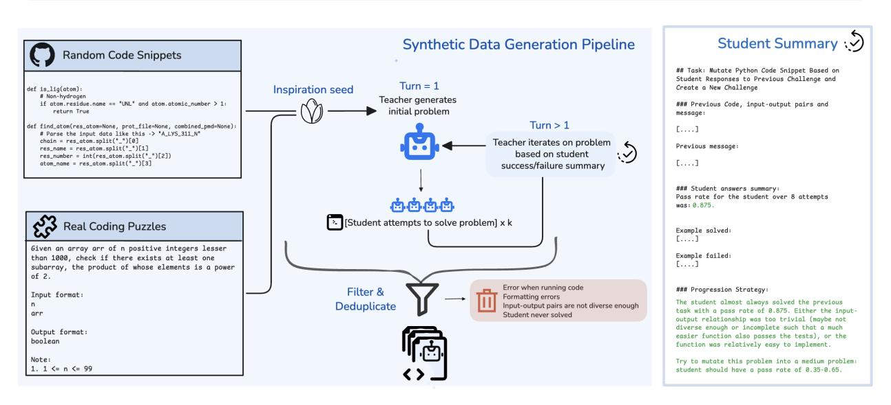

**Figure 1 Overview of the synthetic data pipeline.** A seed snippet, sampled from random code or real coding puzzles, serves as inspiration for the teacher. In the first turn, the teacher generates an initial problem according to the current environment's rules, and the student attempts to solve it multiple times. In later turns, the teacher receives a summary of the student's performance (pass rate and representative solutions) and adapts the problem accordingly. Invalid or redundant generations are filtered and deduplicated before inclusion in the dataset.

# **1 Introduction**

Reinforcement learning (RL) has become a central paradigm for improving large language models (LLMs) beyond supervised fine-tuning. Yet as RL scales, a key challenge emerges: how can we sustain performance gains, and where should new training data come from? Addressing this question requires understanding what defines an effective RL task and environment. Recent works explore asymmetric play in the LLM post-training era, where a teacher dynamically generates data tailored to the student model's learning progress, aiming for open-ended RL at scale. However, effectively training such a teacher remains elusive. As shown in [Zhao](#page-17-0)

[et al.](#page-17-0) [\(2025\)](#page-17-0), training the teacher does not result in statistically significant improvements over training only the student. Although there are positive gains from dynamically generating synthetic tasks, we are still bottlenecked by a "stagnant" teacher such that initial performance gains plateau.

*RL with real data is not easy to scale.* One fundamental challenge with RL post-training is that naively increasing the number of problems does not guarantee further performance gains at a smaller scale (<100K problems), as results are confounded by RL dynamics as well as the difficulty distribution of the problem set at hand. Typically, each problem set has a mix of easy and medium-level problems, accompanied by very hard problems. The latter split poses a hard exploration challenge that cannot be solved by the initial model, such that the computation spent on these samples early on in training hurts efficiency. However, on the other end of the spectrum, the very easy questions give early gradient updates, but dominate training while the model's entropy collapses.

A common strategy proposed in the literature is curriculum sampling, where the model is first trained on easier problems, gradually shifting towards the hard ones. However, in the case of real data, there is often no guarantee that the hard problems build upon the easy ones in a meaningful way. Moreover, since model entropy naturally decreases during RL training [\(Cui et al.,](#page-16-0) [2025\)](#page-16-0), spending too much of the exploration budget on easy problems can reduce the model's capacity to learn from more challenging ones later. These factors limit the effectiveness of naive curriculum-based sampling in practice.

In this work, we take inspiration from intrinsically-motivated goal-based exploration, where the idea is to incorporate stepping stones for the harder problems to help alleviate the hard exploration challenge.

We propose a multi-turn approach to generate synthetic data. Similar to Magicoder [\(Wei et al.,](#page-17-1) [2023\)](#page-17-1), we make use of actual code snippets to ground the problem generation and ensure diversity and coverage. Unlike standard single-turn generation, where multiple problem instances are independently sampled from a seed snippet and later filtered for solvability, formatting, and diversity, our method introduces an additional iteration axis. The teacher revisits and mutates the initially generated problem over multiple turns, adjusting its difficulty at each step. This process produces structured variants of the same core task, yielding easier and harder counterparts that serve as targeted augmentations.

We show that multi-turn data generation provides a more effective and efficient pipeline for producing high-quality synthetic data, enabling the creation of valid and diverse problems at scale. Augmenting real code-contest questions with such synthetic data results in consistent performance gains on both in-domain (code) and out-of-domain (math) benchmarks.

To better understand the individual factors contributing to RL improvements, we systematically isolate the effects of different design choices. In particular, we address the following research questions:

- Do stepping stones, i.e. intermediate problems of varying difficulty, improve downstream generalization?
- How does the difficulty level of RL problems influence training dynamics and convergence?
- To what extent does the choice of curriculum schedule matter?
- Given limited computational budgets, is it more effective to scale the number of problems within a single environment, or to scale across multiple environments?

Our main contribution is an experimental study of RL in coding environments under different data-generation and training setups. We introduce a scalable multi-turn framework for synthetic data creation that enables structured problem variation and natural difficulty progression. Through extensive experiments across model families (Llama3 8B Instruct, Qwen3 8B Base, and Qwen2.5 32B), we analyze how task difficulty, curriculum design, and environment diversity affect convergence and generalization.

# **2 Related Work**

Synthetic Data. Synthetic data generation has become a powerful tool both in supervised fine-tuning (SFT) and reinforcement learning (RL) for large language models (LLMs). Magicoder [\(Wei et al.,](#page-17-1) [2023\)](#page-17-1) demonstrates that large-scale synthetic code data can substantially enhance code generation capabilities of a model in an

SFT setting, motivating the use of automatically generated problem instances for RL. Similarly, [Havrilla](#page-17-2) [et al.](#page-17-2) [\(2025\)](#page-17-2) present SPARQ, which generates over 20 million synthetic math problems using quality–diversity algorithms and studies how problem difficulty and diversity affect generalization in fine-tuning. [Jiang et al.](#page-17-3) [\(2025\)](#page-17-3) explore generative data refinement, transforming noisy synthetic corpora into higher-utility training data for model adaptation.

At the RL stage, [Guo et al.](#page-17-4) [\(2025\)](#page-17-4) propose a framework for RL using only synthetic question-answer pairs derived from task definitions and retrieved documents, reporting large improvements across reasoning benchmarks, focusing mainly on question answering. [Liang et al.](#page-17-5) [\(2025\)](#page-17-5) introduce SwS, which identifies model weakness areas and synthesizes targeted problems to improve reasoning performance. [Goldie et al.](#page-17-6) [\(2025\)](#page-17-6) further address multi-step reasoning and tool-use tasks via synthetic data generation in a multi-step RL pipeline. Together, these works highlight the increasing role of synthetic data in scaling adaptation and reasoning for LLMs. Our approach builds on this line of work by combining structured RL environments with teacher–student generation and curriculum control to optimize both in-domain performance and out-of-domain generalization.

Asymmetric Self-Play. Asymmetric self-play in LLMs has been explored across several domains, including coding and verification [\(Zhao et al.,](#page-17-0) [2025;](#page-17-0) [Lin et al.,](#page-17-7) [2025\)](#page-17-7), tool use [\(Zhou et al.,](#page-17-8) [2025\)](#page-17-8), alignment [\(Ye et al.,](#page-17-9) [2024\)](#page-17-9), and theorem proving [\(Dong and Ma,](#page-16-1) [2025;](#page-16-1) [Poesia et al.,](#page-17-10) [2024\)](#page-17-10). These works leverage the interaction between a generator (teacher) and a solver (student) to create adaptive task distributions, an idea closely related to our teacher–student setup for multi-turn data generation.

Curriculum Learning. Curriculum learning remains an active area of research in RL for LLM post-training. [Wang et al.](#page-17-11) [\(2025\)](#page-17-11) propose a distribution-level curriculum learning framework, where the sampling probabilities are dynamically adjusted, prioritizing either distributions with high average advantage (exploitation) or low sample count (exploration). [Bae et al.](#page-16-2) [\(2025\)](#page-16-2) introduce adaptive sampling strategies that remove overly easy or hard examples to focus on intermediate difficulty. In the context of alignment, [Pattnaik et al.](#page-17-12) [\(2024\)](#page-17-12) introduce curricula that gradually increase task difficulty, while [Team et al.](#page-17-13) [\(2025\)](#page-17-13) employ manually defined heuristic curriculum stages, starting with easy problems and gradually progressing to harder ones. They also use a prioritized sampling strategy, where problems with lower success rates receive higher sampling probabilities. [Xie et al.](#page-17-14) [\(2025\)](#page-17-14) studies the effectiveness of reasoning with RL on synthetic logic puzzles, showing that under a fixed data budget, well-designed curricula consistently outperform random shuffling. Finally, reverse curricula have been shown to improve exploration, where the start state of reasoning progressively slides from a demonstration's end to its beginning [\(Xi et al.,](#page-17-15) [2024\)](#page-17-15).

# **3 Synthetic Data Generation Pipeline**

### **3.1 Environments**

Each environment is framed as a teacher–student interaction: the teacher generates task instances, and the student attempts to solve them. The RL environments used throughout this work are: Induction, Abduction, Deduction and Fuzzing.

Induction Program synthesis environment. This can be seen as a variant of classical code puzzle environments used for RL post-training.

Abduction Input prediction environment. Given a function f() and an output o, the task is to predict the input i that produced o.

Deduction Output prediction environment. Given a function f() and an input i, the task is to predict the output o obtained upon execution.

Fuzzing Fuzzing environment inspired by property-based testing. Given f(), pre\_test\_f(), and test\_f(), the task is to find an input such that test\_f() fails while pre\_test\_f() passes. The function pre\_test\_f() acts as a type checker, e.g. verifying correct input types to ensure that test\_f() fails for non-trivial reasons.

The corresponding teacher–student specifications and reward definitions for each environment are summarized in Table 1.

<span id="page-3-0"></span>**Table 1 Overview of RL environments.** The teacher column specifies how each task instance is generated, while the student column describes the corresponding RL problem to be solved. The final column shows the reward function used for evaluation. Here,  $\hat{\cdot}$  denotes the student's prediction, and  $\mathbb{I}[\cdot]$  is the indicator function.

| Environment | Teacher: Generator                                                                                                                                                              | Student: Solver                                                                                                                | Reward                                                                                 |
|-------------|---------------------------------------------------------------------------------------------------------------------------------------------------------------------------------|--------------------------------------------------------------------------------------------------------------------------------|----------------------------------------------------------------------------------------|
| Induction   | Generates function $f()$ , a natural language message, and $k$ input cases $i_1,, i_k$ . The corresponding gold outputs $o_1,, o_k$ are computed by execution: $o_k = f(i_k)$ . |                                                                                                                                | $r = \mathbb{I}\Big[\forall k, \; \hat{f}(i_k) = o_k\Big]$                             |
| Abduction   | Generates function $f()$ and one input case $i$ . The gold output is computed as $o = f(i)$ .                                                                                   | 1 /                                                                                                                            | $r=\mathbb{I}[\hat{i}=i]$                                                              |
| Deduction   | Generates function $f()$ and one input case $i$ . The gold output is computed as $o = f(i)$ .                                                                                   | Given f() and the input i, infers<br>the output o to be obtained when<br>executing f(i).                                       | $r = \mathbb{I}[\hat{o} = o]$                                                          |
| Fuzzing     | · · · · · · · · · · · · · · · · · · ·                                                                                                                                           | Given f(), pre_test_f() and<br>test_f(), finds an input test case<br>such that test_f() fails while pass-<br>ing pre_test_f(). | $r = \mathbb{I}[\texttt{pre\_test\_f}(\hat{i}) \land \neg  \texttt{test\_f}(\hat{i})]$ |

## <span id="page-3-1"></span>3.2 Inspiration seeds

We use seed data as inspiration for synthetic data generation to ensure diversity and grounding. We use two different classes of seed data: (1) we extract successful solutions to real coding problems solved during an initial RL training run, and (2) random open source code snippets collected from the wild.

For (2), similar to Wei et al. (2023), we adopt starcoderdata as our seed corpus. In order to generate a synthetic question, we randomly select 25-50 consecutive lines to be our seed snippet for inspiration, and the teacher model is asked to try to incorporate the core logic of this example snippet for data generation.

# 3.3 Generating Multi-Turn Synthetic Data

We perform multi-turn data generation, where the teacher iteratively adapts task difficulty based on the student's performance.

In the first turn, given a seed snippet (see Sec. 3.2) and a task description, the teacher is prompted to generate a valid problem instance following the rules of the current RL environment. The resulting problem  $t_1$  is then presented to the student, who attempts to solve it M times (e.g. M = 32).

In the second turn, the student's attempts from turn 1 are summarized as the pass rate  $p = \frac{1}{M} \sum_{m=1}^{M} r_m$ , together with representative examples of both successful and failed solutions (if available). The teacher then receives the original question and this performance summary, and is prompted to adapt the problem accordingly for the next iteration. The adaptation follows a progression strategy that adjusts task difficulty based on the observed pass rate (e.g. increasing complexity if p > 0.65, or decreasing complexity if p = 0). Subsequent turns follow the same iterative structure.

<span id="page-3-2"></span><sup>&</sup>lt;sup>1</sup>In practice, we use M=32. We also experimented with M=8, but found that student pass rate estimates become noisy for small M.

**Figure 2 Example of multi-turn data generation** The top-left panel shows the seed snippet provided to the teacher, taken from a real coding puzzle. In turn 1, the teacher generates a puzzle with a student pass rate of 0.875 (M = 8). In turn 2, after observing the student's performance, the teacher produces a harder variant with a pass rate of 0.25.

Currently, the data generation pipeline is decoupled from the RL runs and the actual student. During multi-turn generation, the same model used as teacher takes on the role of the student. In our experiments, we use GPT-OSS 120B high reasoning mode as our teacher and the same model is used in low reasoning mode as the student. We expect further performance gains from having the teacher in the loop and learning from the mistakes of the student on-the-go, resulting in more effective augmentations.

### **3.4 Reinforcement Learning with Verifiable Rewards**

We employ an asynchronous variant of Group Relative Policy Optimization (GRPO) [\(Shao et al.,](#page-17-16) [2024\)](#page-17-16) as our reinforcement learning algorithm. GRPO replaces the value function with a Monte Carlo–based estimation, sampling G outputs from the model and computing the advantage of each o<sup>i</sup> (i ∈ {1, . . . , G}) by normalizing its reward relative to others within the group. In our implementation, we omit both the standard-deviation normalization in the advantage computation and the KL-regularization term.

# **4 Results**

<span id="page-4-0"></span>We train **Llama 8B Instruct**, **Qwen3 8B Base**, and **Qwen2.5 32B Base** models with reinforcement learning on code tasks and evaluate both in-domain (code) and out-of-domain (math) performance to analyze performance across model families and scales. For code, we use LiveCodeBench (LCB) [\(Jain et al.,](#page-17-17) [2024\)](#page-17-17), aggregating queries between 08.2024 and 05.2025 (454 problems), as well as the LCBv5 splits (easy, medium, hard; 05.2023–01.2025). For math, we evaluate on the Math500 [\(Hendrycks et al.,](#page-17-18) [2021\)](#page-17-18) and AIME 2024 benchmarks.

### **4.1 Scaling and Augmenting RL with Synthetic Data**

We begin by examining whether scaling reinforcement learning with additional real coding problems alone leads to sustained performance gains. Figure [3](#page-5-0) compares RL training on 25K and 81K real coding problems in Qwen3-8B Base.

<span id="page-5-0"></span>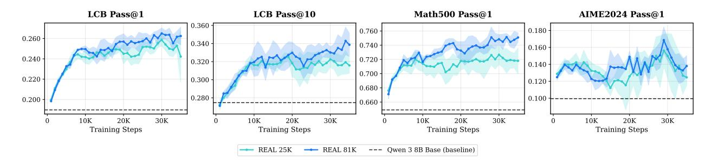

**Figure 3 Scaling with real data in Qwen3-8B Base.** We compare RL training on 25K and 81K real coding problems using GRPO (3 seeds). Performance is tracked on in-domain (LCB) and out-of-domain (Math500 and AIME) benchmarks throughout training. Performance gains plateau early, indicating limited benefit from scaling real data alone.

During RL training, performance improvements plateau early as policy entropy decreases. Increasing the number of RL problems does not yield proportional gains (Figure [3\)](#page-5-0), suggesting that data diversity or structure, rather than volume alone, becomes the limiting factor.

#### **4.1.1 Does augmenting real coding problems with synthetic problems help boost performance?**

We show that augmenting real coding questions with synthetic problems leads to faster and more stable convergence in-domain (code) for Llama 8B Instruct (Fig. [4\)](#page-6-0), Qwen3 8B Base (Fig. [5\)](#page-6-1), and Qwen 2.5 32B Base (Fig. [6\)](#page-7-0), and improves out-of-domain (math) performance for Llama 8B Instruct and Qwen 2.5 32B. For RL runs with augmented data, the total number of training problems is increased by 20K, while keeping the overall training budget fixed. Consequently, each problem is encountered fewer times within the same number of RL steps shown in the plots. Notably, synthetic augmentation also outperforms the larger 81K real-data baseline on most in-domain LCB metrics, underscoring the efficiency of diverse synthetic additions even under a fixed compute budget (see Fig. [19\)](#page-21-0).

To test whether the choice of seed affects these gains, we perform an ablation comparing synthetic problems seeded with answers to real questions versus random code snippets from starcoderdata (see Fig. [5\)](#page-6-1). We match dataset difficulty across conditions to ensure that observed trends are not driven by easier questions. Training on synthetic problems seeded with starcoderdata increases data diversity compared to augmenting real problems with their own variations. Consequently, we observe higher pass@1 and pass@10 in-domain, indicating that greater diversity boosts performance and that random-code seeding can be competitive with real data for synthetic augmentation. Next, we analyze performance when training exclusively on synthetic problems.

#### **4.1.2 Are synthetic RL problems alone sufficient, and does seeding matter?**

Figure [16](#page-18-0) and Figure [17](#page-19-0) show that RL training on fully synthetic problems can match the LCB scores achieved with real data. As seen in Fig. [5,](#page-6-1) the difference between using real code contest questions and random starcoderdata snippets as seeds for synthetic data generation is minimal. In the in-domain code setting (LCB), we observe slightly faster convergence when synthetic problems are seeded with real data. For all experiments, we match the difficulty histograms (based on student pass rates) between the starcoderdataand real-seeded datasets to ensure a fair comparison.

Closer inspection reveals that most of the LCB gains are correlated with performance on the LCBv5-easy split, while performance on medium decreases. We hypothesize that this stems from the distribution of generated question difficulties: during filtering, we include all questions with pass rates between 0.01 and 0.97 without explicitly flattening the difficulty distribution. In practice, this results in a dataset dominated by easier

<span id="page-6-0"></span>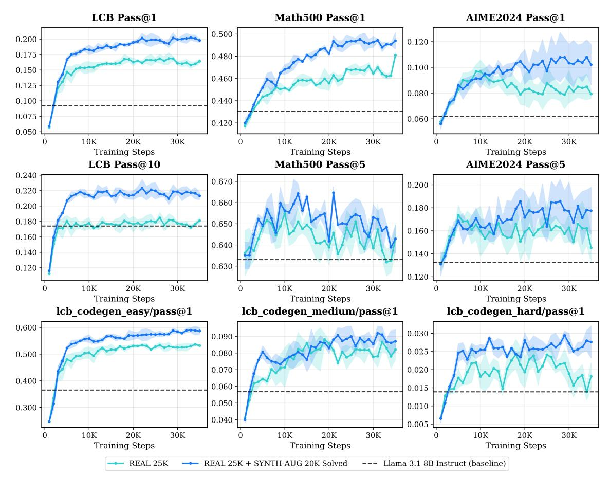

**Figure 4 Synthetic data augmentations in Llama 3.1 8B Instruct.** RL training on 25K real code-contest problems (baseline) versus 25K real plus 20K synthetic problem augmentations (3 seeds). Synthetic augmentation improves performance across both in-domain (code: LCB) and out-of-domain (math: MATH500, AIME24) benchmarks.

<span id="page-6-1"></span>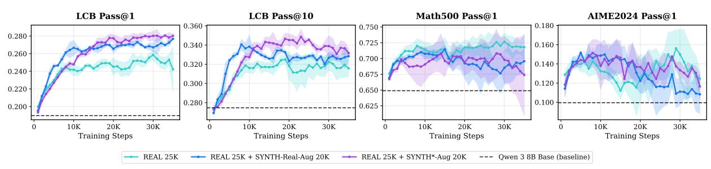

**Figure 5 Synthetic data augmentations in Qwen3-8B Base.** RL training on real code-contest problems (baseline) versus with synthetic problem augmentation (3 seeds). Synthetic data are seeded either with answers to real questions (SYNTH-Real-Aug) or with random code snippets from starcoderdata (SYNTH\*-Aug). Performance improves primarily on in-domain (code: LCB), with comparable or slightly lower on out-of-domain (math: MATH500, AIME24) benchmarks.

questions, leading to overfitting on simpler tasks. We further analyze the effects of difficulty filtering and curriculum strategies in the following sections.

<span id="page-7-0"></span>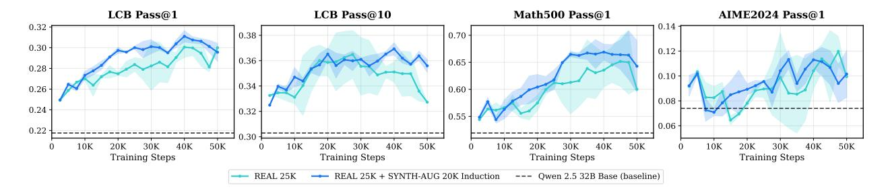

**Figure 6 Synthetic data augmentations in Qwen 2.5 32B Base.** RL training on 25K real code-contest problems (baseline) versus 25K real plus 20K synthetic problem augmentations (2 seeds). Synthetic augmentation shows improved performance trends for both in-domain (code: LCB) and out-of-domain (math: MATH500, AIME24) benchmarks.

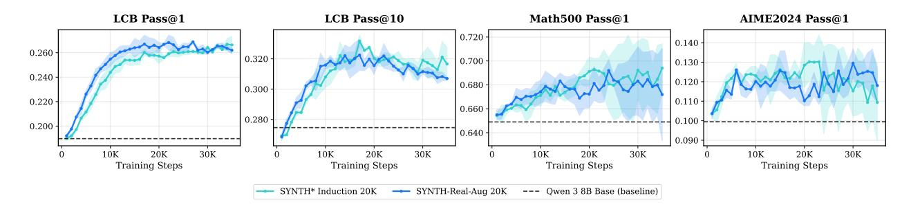

**Figure 7 RL with pure synthetic data in Qwen3-8B Base.** Instead of augmenting the 25K real code-contest questions, RL is performed solely on synthetic induction problems generated with two seeding strategies: (1) real questions as inspiration seeds (SYNTH-Real-Aug), and (2) random code snippets from starcoderdata (SYNTH\*-Aug) Results shown for 3 seeds. Performance is comparable across both setups, with slightly faster in-domain convergence (LCB) when seeding with real data.

#### **Takeaway**

- Augmenting real code contests questions with synthetic RL problems from a custom induction environment helps obtain better and faster convergence in-domain across model families, while also showing gains out-of-domain on Math benchmarks with Llama 3.1 Instruct and Qwen 2.5 32B Base.
- Diversifying inspiration snippets and using starcoderdata instead of the real data itself for augmentation shows improved trends in LCB.
- Synthetic RL problems alone are competitive, however the difficulty distribution of the generated data might need explicit curation to avoid overfitting on easy problems.
- Seeding with real code contests questions instead of starcoderdata provides slightly faster convergence on LCB.

### <span id="page-7-1"></span>**4.2 Does multi-turn data generation help over single-turn data generation?**

Multi-turn data generation improves both the quality and retention of synthetic problems. By allowing the teacher model to iteratively refine previous outputs, we reduce invalid generations caused by formatting errors or overly difficult tasks, increasing the fraction of viable problems by more than fourfold after filtering. Beyond this practical improvement, multi-turn generation introduces a second, conceptual advantage: it naturally produces stepping stones, i.e. progressively refined task variants that can act as intermediate challenges during RL training.

Hard problems pose a significant exploration challenge under binary rewards, where positive feedback is only obtained for fully correct solutions. We therefore test whether the stepping-stone structure induced by multi-turn generation helps mitigate this challenge and facilitates more effective learning for RL.

<span id="page-8-0"></span>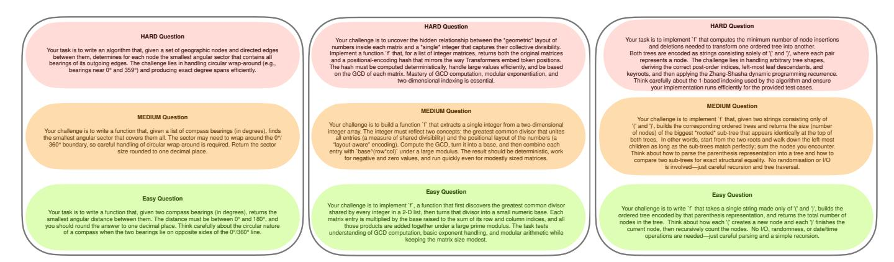

Figure 8 Examples of easy-medium-hard question chains. Each chain illustrates a progression in task complexity within the same conceptual domain, derived top-down by starting from a hard question and generating simpler variants that capture its core subproblems. This reverse construction ensures that easy and medium questions correspond to meaningful components of the original hard task rather than trivial simplifications.

<span id="page-8-1"></span>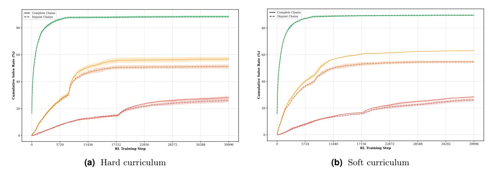

Figure 9 Qwen3 8B Base: Solve rate across easy-medium-hard splits under different curriculum strategies.
(a) Hard curriculum with abrupt transitions between difficulty levels. (b) Soft curriculum with gradual transitions between difficulty levels. Curves depict cumulative solve rates for easy, medium, and hard questions during RL training. Solid lines correspond to training on complete easy-medium-hard chains, while dashed lines show the disjoint-chain ablation.

Building complete chains of easy-medium-hard questions. To evaluate whether stepping stones help mitigate the hard-exploration challenge, we compare RL training on problem sets with and without explicit stepping-stone structure. To construct such chains, we begin by prompting the teacher LLM to generate hard questions. After filtering for valid problems, the model is prompted again to produce corresponding medium variants, and finally the easy counterparts (see Sec. B for details on the filtering). This process yields coherent easy-medium-hard question chains built around the same underlying task. Some examples are shown in Fig. 8. Starting from hard questions ensures that we do not obtain artificially inflated difficulties (e.g. by trivially modifying easy questions, and that the generated variants reflect meaningful variations in problem complexity.

In order to isolate the effect of explicit stepping-stone structure, we construct a baseline consisting of disjoint <code>easy-medium-hard</code> problems that share the same difficulty distribution as the chained data but are not derived from one another. In this baseline, the <code>easy</code>, <code>medium</code>, and <code>hard</code> splits are matched by their empirical student pass-rate histograms, ensuring comparable difficulty levels across datasets. While these problems do not form explicit chains, some implicit skill overlap may still occur, as certain questions may target similar problem types.

<span id="page-9-0"></span>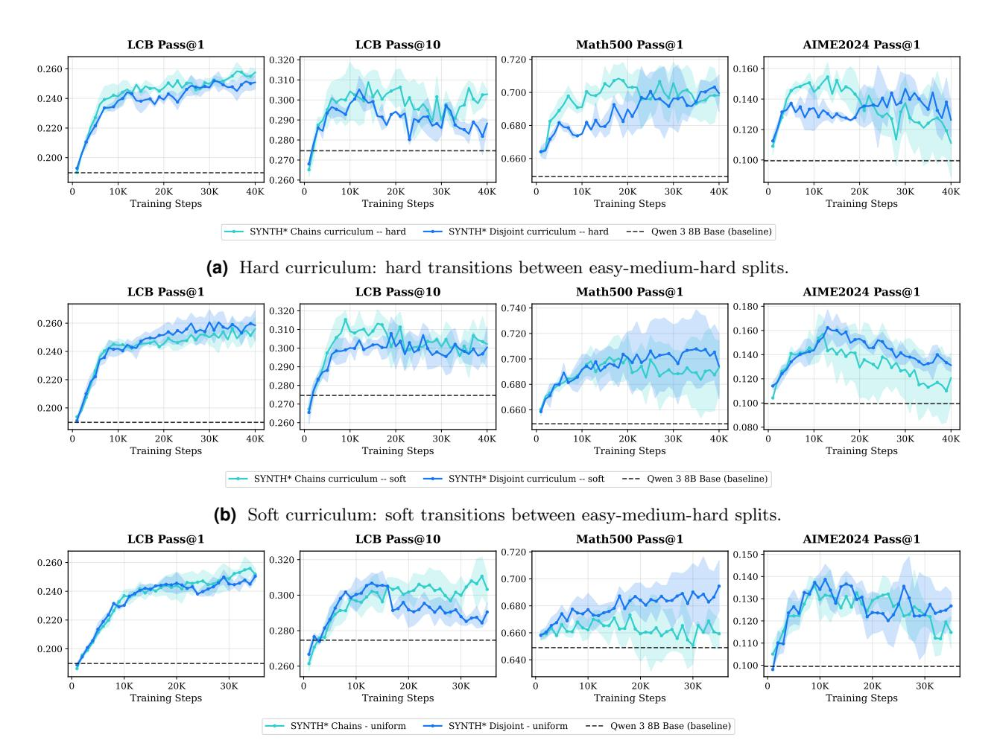

**(c)** No curriculum: uniform sampling from easy-medium-hard splits throughout RL training.

**Figure 10 Qwen3 8B Base: RL on chains of** easy–medium–hard **questions with different curriculum strategies.** Each row shows a different curriculum setup: (a) hard transitions between difficulty levels, (b) soft transitions, and (c) no curriculum (uniform sampling). Results are shown for LCB (in-domain) and Math500, AIME24 (out-of-domain) with pass@1 and pass@10 metrics plotted over RL training steps.

To ensure that the easy and medium counterparts are sufficiently reinforced before attempting harder variants, we replace uniform sampling across difficulty levels with curriculum-based scheduling. We design two variants: (1) Hard curriculum, where transitions between difficulty levels are sharp, i.e. training begins almost exclusively on easy tasks, shifts predominantly to medium, and finally focuses on hard tasks. (2) Soft curriculum, where easy and medium problems continue to appear throughout training, allowing for smoother transitions and mixed exposure. The exact sampling weights for both curricula are provided in Appendix [B.1.](#page-22-1)

As shown in Fig. [9,](#page-8-1) training on full chains with explicit stepping stones improves the model's ability to solve medium and hard questions for both curriculum strategies. However, when inspecting downstream benchmark performance, we observe nuanced differences across curricula (Fig. [10\)](#page-9-0).

Although overall differences remain marginal, training with explicit stepping stones yields modest improvements under the hard curriculum, while effects under the soft and uniform setups are less consistent, particularly on out-of-domain benchmarks.

[Zhang and Zuo](#page-17-19) [\(2025\)](#page-17-19) show that for GRPO if rewards are applied uniformly across problems regardless of their difficulty, models end up excessively optimizing simpler tasks while neglecting more challenging problems that require deeper reasoning. Echoing their findings, we also find that performance is often dominated by the easy split in our experiments, and mixing the splits throughout training hurts performance gains.

In the context of stepping stones, however, this trade-off becomes a double-edged sword. Ideally, the model should continue to see the easy and medium variants of hard problems often enough to learn the underlying structure before attempting the hardest instances. This effect is evident in Fig. [9,](#page-8-1) where the soft curriculum, which maintains exposure to the easy split later into training, achieves higher solve rates. Yet, mixing gradients from problems of varying difficulty can reduce the effectiveness of gradient updates across difficulty levels, resulting in solve-rate improvements that do not translate into downstream gains. Overall, these results suggest that while explicit stepping stones offer mild benefits; their effectiveness depends strongly on curriculum design and the balance of rewards across difficulty levels.

#### **Takeaway**

Multi-turn generation introduces intermediate problem variants that can marginally improve learning under structured curricula. Their benefit is most evident with hard curricula, while mixed-difficulty training can limit these gains by creating interference across tasks.

### **4.3 How much does the difficulty of questions matter for RL?**

So far, we have operated under the assumption that solving harder questions provides a more valuable learning signal than solving easier ones. We test this hypothesis by examining how question difficulty shapes RL dynamics. Instead of using mixed chains of 3,036 questions across difficulty levels (easy, medium, hard; 1,012 each), we train models exclusively on questions from a single difficulty level (3,036 per difficulty level) (Fig. [11\)](#page-11-0).

Training on easy questions yields early gains and faster convergence, as expected. However, training on medium questions achieves comparable or better overall performance despite slightly slower convergence. Notably, models trained on medium-level questions perform better on the LCBv5-medium and LCBv5-hard splits. This suggests that the apparent early gains from easy questions may reflect overfitting to simpler problem types. Training on the hard split, in contrast, results in much slower convergence due to the sparsity of positive rewards. Although models trained on hard questions remain competitive on out-of-domain math benchmarks, their performance lags behind on LCB. These results highlight the importance of training on non-trivial problems that still provide a dense enough learning signal for effective RL optimization.

#### **Takeaway**

Training on medium-level questions offers the best balance between convergence speed and generalization, while easy questions risk overfitting and hard ones suffer from sparse rewards.

### **4.4 Does the curriculum matter?**

As observed in our earlier experiments with stepping-stones, the choice of curriculum can influence RL dynamics, although the performance differences were not always significant. Here, we further investigate the extent to which the curriculum schedule affects training outcomes.

In these experiments, we expand the dataset by adopting a broader binning for easy, medium, and hard questions. To retain more data, we do not homogenize the number of examples per split.

We test the following hypothesis: conventional curricula typically progress from easier to harder problems (easy → medium → hard). However, as the model's entropy naturally decreases during RL training, starting with easy problems may waste exploration capacity on tasks that the model can already solve, potentially reducing its ability to solve harder questions later. Motivated by this intuition, we evaluate a reverse curriculum, in which training proceeds from harder to easier problems (hard → medium → easy). Given that medium-level questions previously showed strong generalization performance (Fig. [11\)](#page-11-0), we also experiment with a medium-start reverse curriculum (medium → easy-medium). Exact sampling schedules for all curricula are provided in Table [4.](#page-24-0) The difficulty bins and corresponding data sizes are summarized in Table [3](#page-24-1) (see Appendix Sec. [C\)](#page-23-0).

Results in Fig. [12](#page-12-0) show that: (1) uniform sampling across difficulty levels is suboptimal, as performance is largely driven by the easy split; (2) the classic curriculum yields faster convergence and stronger performance on easier problems, but tends to underperform on more challenging splits; and (3) the reverse curriculum

<span id="page-11-0"></span>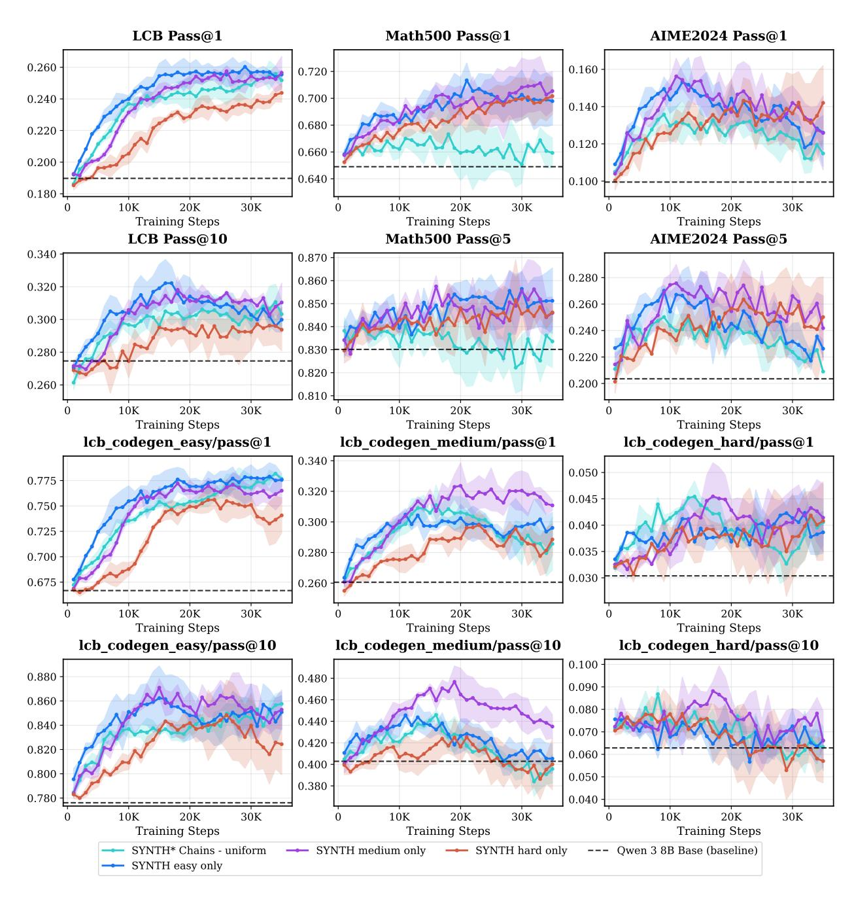

**Figure 11 Qwen3 8B Base: RL on** easy**,** medium**,** hard **splits.** Comparison of RL training when restricted to questions of a single difficulty level (3036 total) across easy, medium, and hard subsets. Performance shown on in-domain (code: LCB) and out-of-domain (math: MATH500, AIME24) benchmarks across 3 seeds.

achieves a more balanced outcome, improving stability and yielding higher scores on LCBv5-medium, though gains on LCBv5-hard remain limited. These findings suggest that reversing the curriculum order can help maintain exploration and prevent overfitting to trivial cases without sacrificing convergence speed. Notably, in the medium-start reverse curriculum: once the training transitions towards the easy–medium split (after ∼20K steps), both medium and hard performance begin to plateau, and in some cases degrade slightly. This suggests that while reverse curricula help maintain exploration early on, continued exposure to easier tasks later in training may again bias optimization toward simpler problems.

We also evaluate a reverse curriculum that starts directly from the hard split, which poses a challenging

exploration problem early in training (Fig. [13\)](#page-13-0). This setup leads to slightly slower convergence compared to the medium-start variant, as the model initially struggles to obtain positive rewards on the hardest problems. More notably, we observe substantially higher variance across random seeds, reflecting the sensitivity of early learning to rare successful samples when rewards are sparse. These results suggest that while reverse curricula can encourage exploration, beginning from excessively difficult tasks may destabilize optimization.

<span id="page-12-0"></span>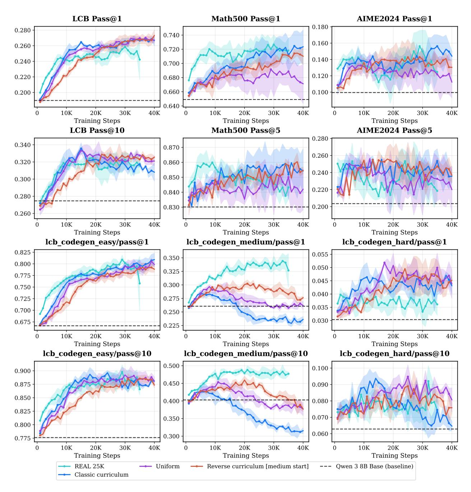

**Figure 12 Comparing different curriculum strategies in Qwen3 8B Base.** The figure compares RL training with different curriculum strategies over extended difficulty splits (easy, easy–medium, medium, hard). Curves show pass@1 and pass@10 on the in-domain benchmark (LCB, including LCBv5-easy, medium, and hard splits) and pass@1 and pass@5 on the out-of-domain benchmarks (Math500, AIME24), averaged across three seeds. Reverse curricula starting from medium-level questions mitigate overfitting to easy tasks and maintain stronger performance on harder splits.

#### **Takeaway**

Uniform and classic curricula tend to overfit to easy-level questions. Reverse curricula that begin from medium tasks encourage broader exploration and more stable learning, though their advantage over training solely on medium-level data requires further investigation.

<span id="page-13-0"></span>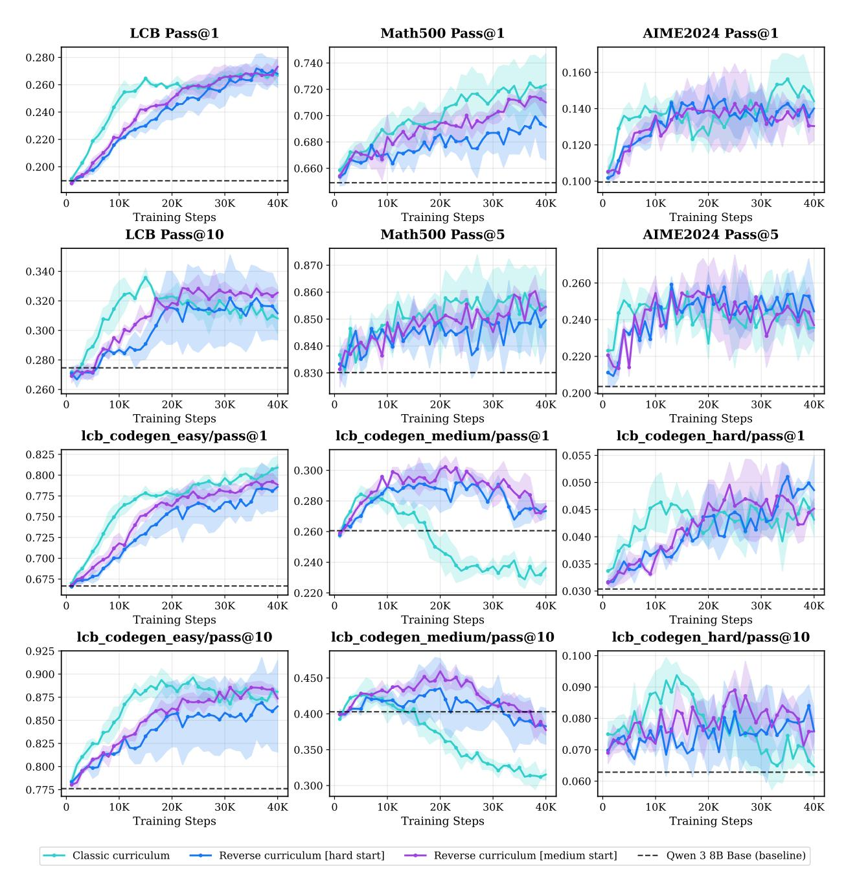

**Figure 13 Reversed curriculum experiments in Qwen3 8B Base.** The figure compares RL training with different reverse curriculum strategies over extended difficulty splits (easy, easy–medium, medium, hard). We evaluate two variants: starting with the medium split ("medium-start") and starting with the hard split ("hard-start"). Curves show pass@1 and pass@10 on the in-domain benchmark (LCB, including LCBv5-easy, medium, and hard splits) and pass@1 and pass@5 on the out-of-domain benchmarks (Math500, AIME24), averaged across three seeds. The medium-start reverse curriculum shows faster convergence and lower variance across seeds compared to the hard-start variant.

## **5 How does environment diversity affect RL performance?**

<span id="page-14-0"></span>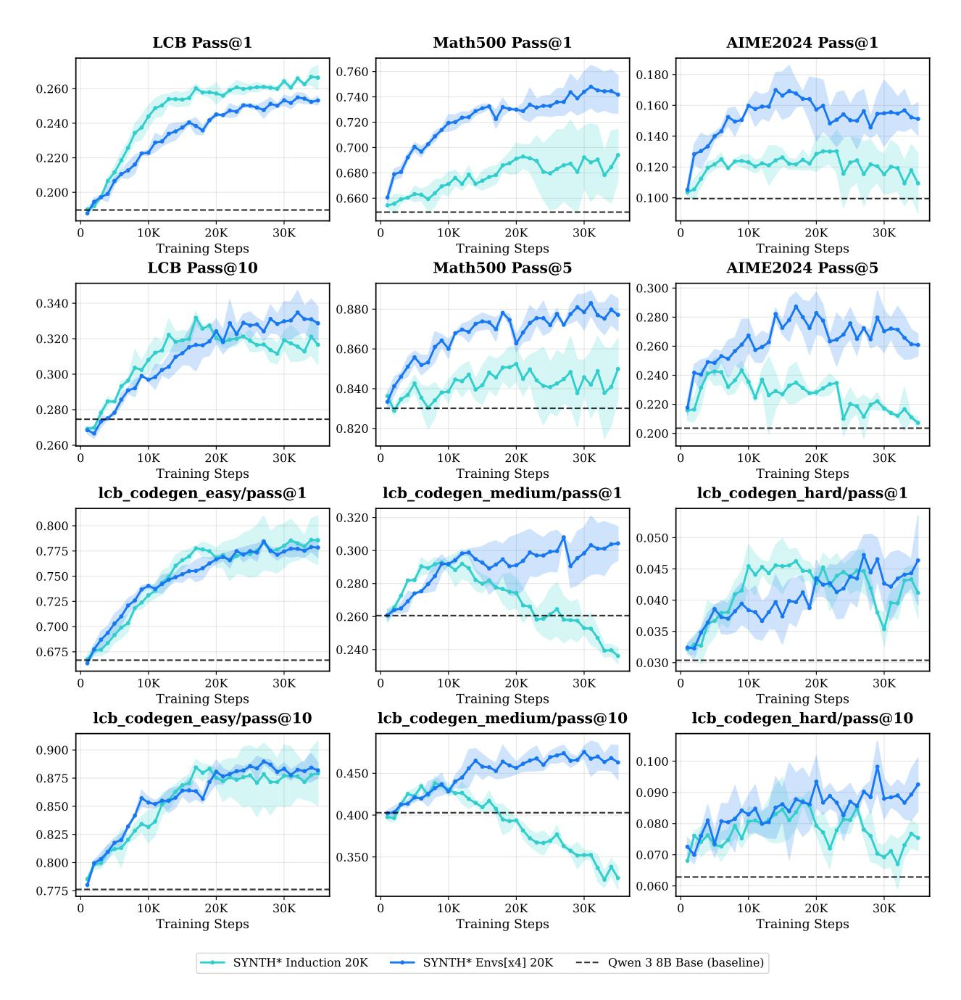

**Figure 14 Scaling the number of RL environments in Qwen3 8B Base.** The figure compares RL training on 20K problems from a single environment (induction) with training on an equal total of 20K problems distributed across four environments—induction, abduction, deduction, and fuzzing. Curves show pass@1 and pass@10 on in-domain (LCB) and pass@1 and pass@5 out-of-domain (Math500, AIME24) benchmarks throughout RL training. Distributing the data budget across environments improves out-of-domain generalization and yields higher pass@10 scores in-domain, while reducing overfitting on the easy split.

So far, we have seen that increasing data diversity improves performance. The gains observed from synthetic data augmentation can also be viewed as a form of diversity injection: although the induction environment shares the core principles of typical coding puzzles, it differs in input–output structure and question templates.

<span id="page-15-0"></span>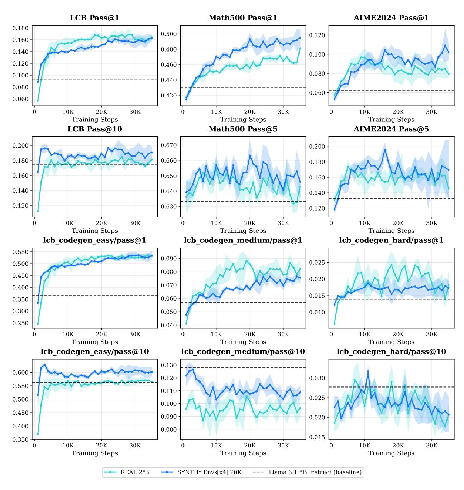

**Figure 15 Scaling the number of RL environments in Llama 3.1 8B Instruct compared to real data.** The figure compares RL training on 25K real code-contest problems with training on a total of 20K synthetic problems distributed across four environments—induction, abduction, deduction, and fuzzing. Curves show pass@1 and pass@10 on the in-domain benchmark (LCB) and pass@1 and pass@5 on out-of-domain benchmarks (Math500, AIME24) throughout RL training. Despite using less data, training across multiple synthetic environments improves out-of-domain generalization and yields higher in-domain pass@10 scores compared to real-only training.

We now ask: given a fixed RL problem budget, is it more beneficial to allocate it entirely to one environment with sufficient internal diversity, or to distribute it across multiple environments to introduce structural variation? To test this, we compare two settings: (1) RL training on 20K problems from the induction environment, and (2) training on 5K problems each from four distinct environments: induction, abduction, deduction, and fuzzing.

As shown in Fig. [14,](#page-14-0) distributing the data budget across environments yields significant improvements on out-of-domain benchmarks. Even in in-domain evaluations, where pass@1 slightly lags behind the singleenvironment baseline, the multi-environment setup surpasses it in pass@10. Notably, unlike pure induction training, we observe no overfitting on the easy split, which otherwise harms performance on medium. The same trends hold when compared to RL training on 25K real code-contest questions (Fig. [23\)](#page-24-2). Fig. [15](#page-15-0) shows a similar trend for Llama 3.1 8B Instruct: training on 20K problems distributed across the four environments outperforms RL on 25K real code contest questions, with higher out-of-domain generalization and improved pass@10 scores on LCB.

#### **Takeaway**

The number of RL environments can be viewed as an additional scaling axis:

- Our experiments show that the diversity injected via increasing the number of RL environments leads to performance gains in pass@k scores, with less overfitting on easy tasks in LCBv5.
- Different environments can target/aid different skill sets, as shown in our improved performance on out-of-domain math benchmarks through the addition of abduction and deduction environments.

# **6 Discussion**

Our experiments highlight several factors that influence the effectiveness of RL fine-tuning in the coding domain. First, synthetic augmentation of real coding problems consistently improves both convergence speed and final performance. The gains stem not merely from additional data but from the diversity introduced by varying input–output structures and templates. Synthetic data generated from random starcoderdata snippets perform comparably to those seeded with real questions, underscoring the importance of diversity. When used alone, synthetic RL problems remain competitive, though their difficulty distribution requires explicit control to avoid overfitting on easy problems.

Second, multi-turn data generation provides an additional advantage by increasing the proportion of valid problems generated and implicitly introducing intermediate problem variants that can serve as stepping stones during RL. While these stepping stones offer modest benefits under structured curricula, their impact depends strongly on how difficulty levels are mixed during training. Hard curricula benefit most, whereas excessive interleaving of easy and hard problems introduces interference that weakens the benefits of stepping stones.

Third, our results show that problem difficulty and curriculum design jointly determine the efficiency of RL optimization: training on medium-level problems offers the best balance between convergence speed and generalization, while easy problems lead to overfitting and hard ones suffer from sparse rewards. Results indicate that the apparent early gains from easy problems in RL data mixes provide limited long-term benefit and may even hinder generalization. Reverse curricula that begin from medium tasks mitigate early overfitting, though their advantage over training solely on medium-level data requires further investigation.

Finally, we find that scaling the number of RL environments serves as a complementary axis of improvement. Distributing the data budget across diverse environments (induction, abduction, deduction, fuzzing) improves out-of-domain generalization and reduces overfitting on easy in-domain splits. These results suggest that environment diversity can play a role comparable to data scale in shaping robust RL behavior.

# **References**

<span id="page-16-2"></span>Sanghwan Bae, Jiwoo Hong, Min Young Lee, Hanbyul Kim, JeongYeon Nam, and Donghyun Kwak. Online difficulty filtering for reasoning oriented reinforcement learning. arXiv preprint arXiv:2504.03380, 2025.

<span id="page-16-0"></span>Ganqu Cui, Yuchen Zhang, Jiacheng Chen, Lifan Yuan, Zhi Wang, Yuxin Zuo, Haozhan Li, Yuchen Fan, Huayu Chen, Weize Chen, et al. The entropy mechanism of reinforcement learning for reasoning language models. arXiv preprint arXiv:2505.22617, 2025.

<span id="page-16-1"></span>Kefan Dong and Tengyu Ma. Stp: Self-play llm theorem provers with iterative conjecturing and proving. arXiv preprint arXiv:2502.00212, 2025.

- <span id="page-17-6"></span>Anna Goldie, Azalia Mirhoseini, Hao Zhou, Irene Cai, and Christopher D Manning. Synthetic data generation & multi-step rl for reasoning & tool use. arXiv preprint arXiv:2504.04736, 2025.
- <span id="page-17-4"></span>Yiduo Guo, Zhen Guo, Chuanwei Huang, Zi-Ang Wang, Zekai Zhang, Haofei Yu, Huishuai Zhang, and Yikang Shen. Synthetic data rl: Task definition is all you need. arXiv preprint arXiv:2505.17063, 2025.
- <span id="page-17-2"></span>Alex Havrilla, Edward Hughes, Mikayel Samvelyan, and Jacob D Abernethy. Sparq: Synthetic problem generation for reasoning via quality-diversity algorithms. CoRR, 2025.
- <span id="page-17-18"></span>Dan Hendrycks, Collin Burns, Saurav Kadavath, Akul Arora, Steven Basart, Eric Tang, Dawn Song, and Jacob Steinhardt. Measuring mathematical problem solving with the math dataset. In J. Vanschoren and S. Yeung, editors, Proceedings of the Neural Information Processing Systems Track on Datasets and Benchmarks, volume 1, 2021. [https://datasets-benchmarks-proceedings.neurips.cc/paper\\_files/paper/2021/](https://datasets-benchmarks-proceedings.neurips.cc/paper_files/paper/2021/file/be83ab3ecd0db773eb2dc1b0a17836a1-Paper-round2.pdf) [file/be83ab3ecd0db773eb2dc1b0a17836a1-Paper-round2.pdf](https://datasets-benchmarks-proceedings.neurips.cc/paper_files/paper/2021/file/be83ab3ecd0db773eb2dc1b0a17836a1-Paper-round2.pdf).
- <span id="page-17-17"></span>Naman Jain, King Han, Alex Gu, Wen-Ding Li, Fanjia Yan, Tianjun Zhang, Sida Wang, Armando Solar-Lezama, Koushik Sen, and Ion Stoica. Livecodebench: Holistic and contamination free evaluation of large language models for code. arXiv preprint arXiv:2403.07974, 2024.
- <span id="page-17-3"></span>Minqi Jiang, JoÃG, o GM AraÚjo, Will Ellsworth, Sian Gooding, and Edward Grefenstette. Generative data refinement: Just ask for better data. arXiv preprint arXiv:2509.08653, 2025.
- <span id="page-17-5"></span>Xiao Liang, Zhong-Zhi Li, Yeyun Gong, Yang Wang, Hengyuan Zhang, Yelong Shen, Ying Nian Wu, and Weizhu Chen. Sws: Self-aware weakness-driven problem synthesis in reinforcement learning for llm reasoning. arXiv preprint arXiv:2506.08989, 2025.
- <span id="page-17-7"></span>Zi Lin, Sheng Shen, Jingbo Shang, Jason Weston, and Yixin Nie. Learning to solve and verify: A self-play framework for code and test generation. arXiv preprint arXiv:2502.14948, 2025.
- <span id="page-17-12"></span>Pulkit Pattnaik, Rishabh Maheshwary, Kelechi Ogueji, Vikas Yadav, and Sathwik Tejaswi Madhusudhan. Curry-dpo: Enhancing alignment using curriculum learning & ranked preferences. arXiv preprint arXiv:2403.07230, 2024.
- <span id="page-17-10"></span>Gabriel Poesia, David Broman, Nick Haber, and Noah Goodman. Learning formal mathematics from intrinsic motivation. Advances in Neural Information Processing Systems, 37:43032–43057, 2024.
- <span id="page-17-16"></span>Zhihong Shao, Peiyi Wang, Qihao Zhu, Runxin Xu, Junxiao Song, Xiao Bi, Haowei Zhang, Mingchuan Zhang, YK Li, Yang Wu, et al. Deepseekmath: Pushing the limits of mathematical reasoning in open language models. arXiv preprint arXiv:2402.03300, 2024.
- <span id="page-17-13"></span>Kimi Team, Angang Du, Bofei Gao, Bowei Xing, Changjiu Jiang, C Chen, C Li, C Xiao, C Du, C Liao, et al. Kimi k1. 5: Scaling reinforcement learning with llms, 2025. URL https://arxiv. org/abs/2501.12599, 2025.
- <span id="page-17-11"></span>Zhenting Wang, Guofeng Cui, Yu-Jhe Li, Kun Wan, and Wentian Zhao. Dump: Automated distribution-level curriculum learning for rl-based llm post-training. arXiv preprint arXiv:2504.09710, 2025.
- <span id="page-17-1"></span>Yuxiang Wei, Zhe Wang, Jiawei Liu, Yifeng Ding, and Lingming Zhang. Magicoder: Empowering code generation with oss-instruct. arXiv preprint arXiv:2312.02120, 2023.
- <span id="page-17-15"></span>Zhiheng Xi, Wenxiang Chen, Boyang Hong, Senjie Jin, Rui Zheng, Wei He, Yiwen Ding, Shichun Liu, Xin Guo, Junzhe Wang, et al. Training large language models for reasoning through reverse curriculum reinforcement learning. arXiv preprint arXiv:2402.05808, 2024.
- <span id="page-17-14"></span>Tian Xie, Zitian Gao, Qingnan Ren, Haoming Luo, Yuqian Hong, Bryan Dai, Joey Zhou, Kai Qiu, Zhirong Wu, and Chong Luo. Logic-rl: Unleashing llm reasoning with rule-based reinforcement learning. arXiv preprint arXiv:2502.14768, 2025.
- <span id="page-17-9"></span>Ziyu Ye, Rishabh Agarwal, Tianqi Liu, Rishabh Joshi, Sarmishta Velury, Qijun Tan, and Yuan Liu. Evolving alignment via asymmetric self-play. 2024.
- <span id="page-17-19"></span>Jixiao Zhang and Chunsheng Zuo. Grpo-lead: A difficulty-aware reinforcement learning approach for concise mathematical reasoning in language models. arXiv preprint arXiv:2504.09696, 2025.
- <span id="page-17-0"></span>Andrew Zhao, Yiran Wu, Yang Yue, Tong Wu, Quentin Xu, Matthieu Lin, Shenzhi Wang, Qingyun Wu, Zilong Zheng, and Gao Huang. Absolute zero: Reinforced self-play reasoning with zero data. arXiv preprint arXiv:2505.03335, 2025.
- <span id="page-17-8"></span>Yifei Zhou, Sergey Levine, Jason Weston, Xian Li, and Sainbayar Sukhbaatar. Self-challenging language model agents. arXiv preprint arXiv:2506.01716, 2025.

## **A Extended Results for RL with Synthetic Data**

Here, we provide extended results for the synthetic data experiments discussed in Section [4.1.](#page-4-0) Figure [16–](#page-18-0)Figure [17](#page-19-0) show detailed in-domain and out-of-domain performance for augmentations seeded with real questions and random code snippets, respectively, while Figure [18](#page-20-0) compares RL training using purely synthetic datasets. Figure [19](#page-21-0) further contrasts scaling real data (25K vs. 81K problems) with augmenting real data using 20K synthetic problems, showing that synthetic augmentation can outperform even the larger real-data baseline.

<span id="page-18-0"></span>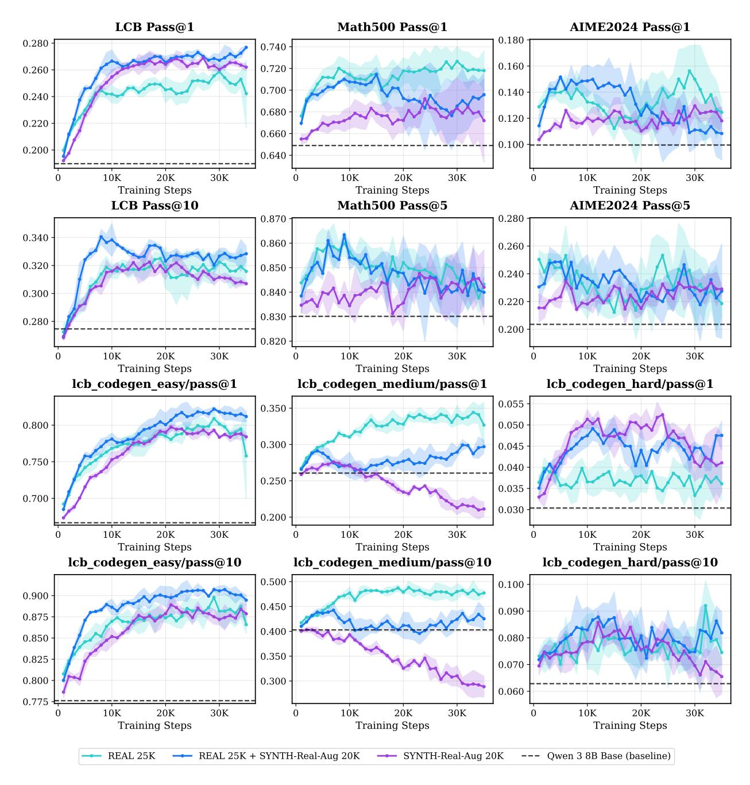

**Figure 16 RL with synthetic data augmentation seeded from real problems in Qwen3-8B Base.** RL training on 25K real code-contest questions (baseline) versus the same data augmented with 20K synthetic induction problems generated using real questions as inspiration seeds (Real 25K + SYNTH-Real-Aug 20K), as well as training solely on the synthetic partition (SYNTH-Real-Aug 20K). Performance shown on in-domain (LCB) and out-of-domain (MATH500, AIME24) benchmarks.

<span id="page-19-0"></span>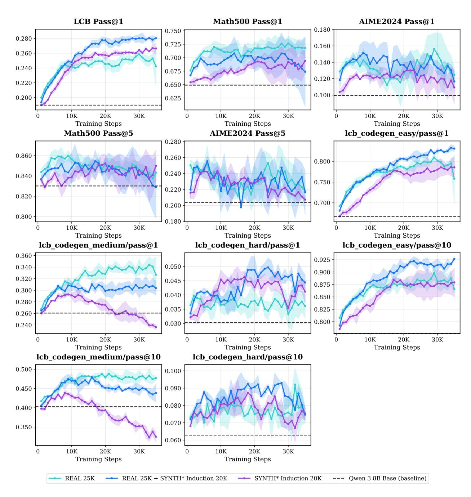

**Figure 17 RL with synthetic data augmentation seeded from random code snippets in Qwen3-8B Base.** RL training on 25K real code-contest questions (baseline) versus the same data augmented with 20K synthetic induction problems generated using random snippets from starcoderdata (Real 25K + SYNTH\* Induction 20K), as well as training solely on the synthetic partition (SYNTH\* Induction 20K). Performance shown on in-domain (LCB) and out-of-domain (MATH500, AIME24) benchmarks.

<span id="page-20-0"></span>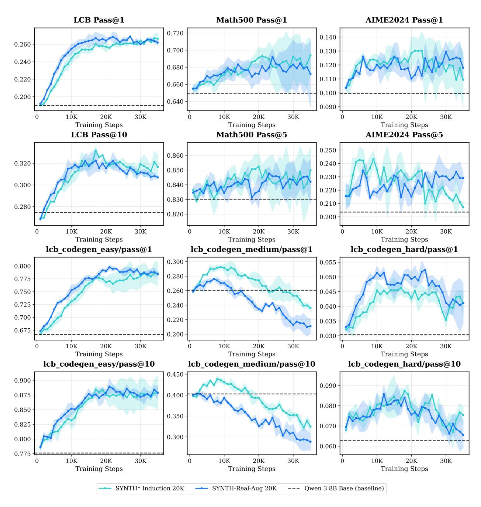

**Figure 18 RL with pure synthetic data in Qwen3-8B Base.** Instead of augmenting the 25K real code-contest questions, RL is performed solely on synthetic induction problems generated with two seeding strategies: (1) real questions as inspiration seeds (SYNTH-Real-Aug), and (2) random code snippets from starcoderdata (SYNTH\*-Aug, 3 seeds).

<span id="page-21-0"></span>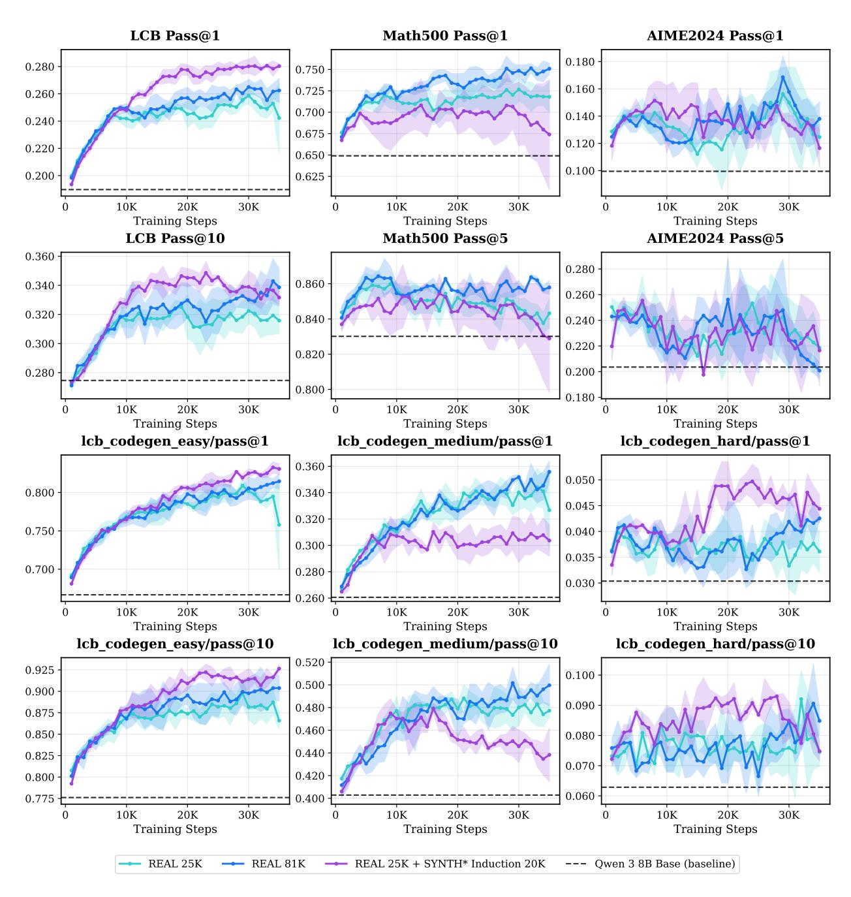

**Figure 19 Scaling with real data vs. synthetic augmentation in Qwen3-8B Base.** Comparison of RL training on 25K and 81K real code-contest problems, and on 25K real data augmented with 20K synthetic problems generated from random starcoderdata snippets (Real 25K + SYNTH\*-Aug 20K). Performance is shown on in-domain (LCB) and out-of-domain (Math500 and AIME) benchmarks throughout training. Synthetic augmentation yields additional gains over the 81K real-data baseline across all LCB splits except medium.

### <span id="page-22-0"></span>**B** Stepping Stones with Easy-Medium-Hard Chains

To construct the easy, medium, and hard categories used for building question chains, we bin problems according to their empirical student pass rates, computed over 32 solution attempts per problem. Problems with average pass rates in the range 0.81–0.91 are labeled as easy, those between 0.41–0.59 as medium, and those between 0.05–0.16 as hard. These thresholds ensure a clear separation between difficulty levels.

### <span id="page-22-1"></span>**B.1 Curriculum Strategies for Easy-Medium-Hard Chains**

We provide details of the hard and soft curriculum strategies used in Sec. 4.2 and Fig. 10. Sampling probabilities for easy, medium, and hard tasks in the soft and hard curricula are listed below.

Table 2 Sampling weights across training stages for soft and hard curricula.

| Stage (RL steps) | Easy | Medium | Hard |  |
|------------------|------|--------|------|--|
| Soft curriculum  |      |        |      |  |
| 0-7,500          | 0.80 | 0.15   | 0.05 |  |
| 7,500-17,500     | 0.15 | 0.80   | 0.05 |  |
| 17,500-30,000    | 0.15 | 0.40   | 0.45 |  |
| 30,000-40,000    | 0.05 | 0.15   | 0.80 |  |
| Hard curriculum  |      |        |      |  |
| 0-7,500          | 0.90 | 0.05   | 0.05 |  |
| 7,500-17,500     | 0.05 | 0.90   | 0.05 |  |
| 17,500-40,000    | 0.05 | 0.05   | 0.90 |  |

#### **B.2 Extended Results**

We provide extended results for the curriculum experiments in Qwen3-8B Base with the full vs. disjoint chains, showing detailed performance across in-domain (LCB) and out-of-domain (Math500, AIME24) benchmarks for hard, soft, and uniform sampling strategies.

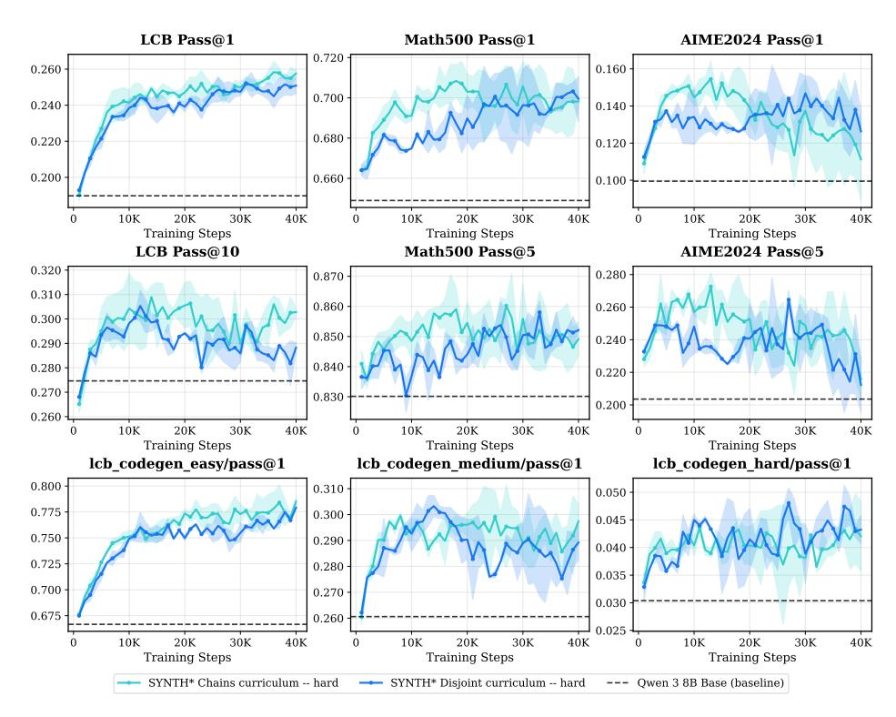

Figure 20 Chains with hard curriculum in Qwen3-8B Base. Extended results for RL training on easy-medium-hard question chains using the hard curriculum schedule. Shown are in-domain results (LCB, including easy, medium, and hard splits) and out-of-domain results (Math500, AIME24) with pass@1, pass@5/pass@10 metrics plotted over RL training steps.

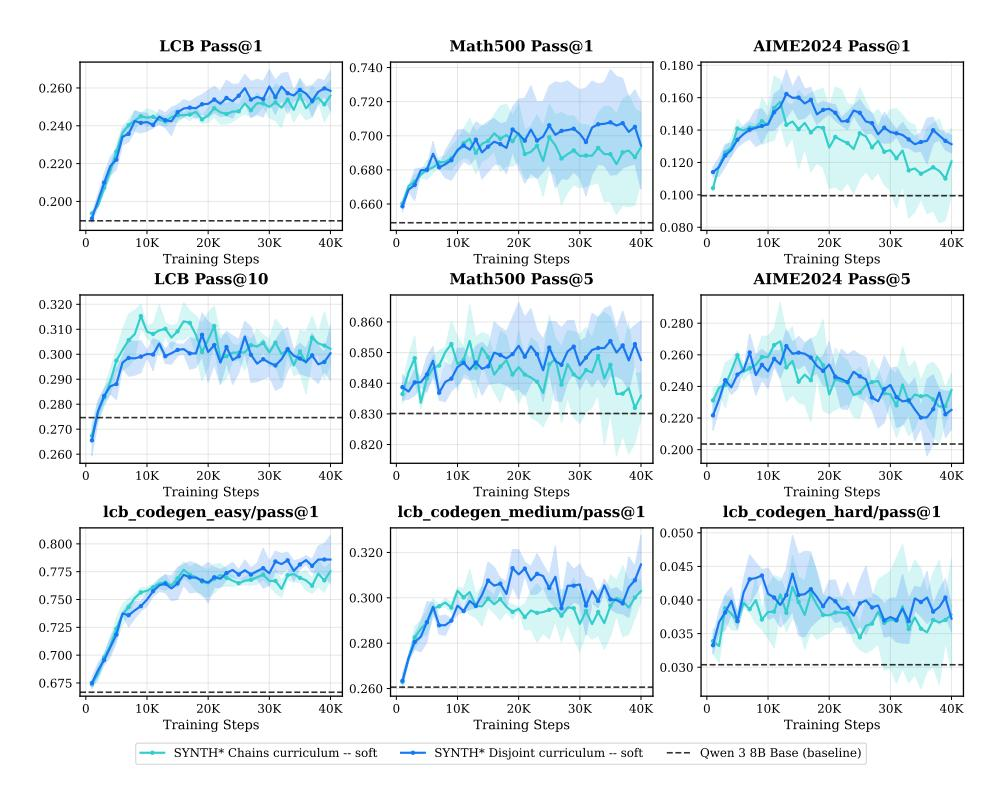

**Figure 21 Chains with soft curriculum in Qwen3-8B Base.** Extended results for RL training on easy–medium–hard question chains using the soft curriculum schedule. Performance is reported for LCB (easy, medium, hard splits) and out-of-domain benchmarks (Math500, AIME24) with pass@1, pass@5/pass@10 metrics over training steps.

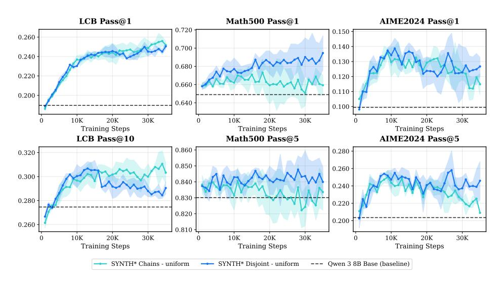

**Figure 22 Chains without curriculum in Qwen3-8B Base.** Extended results for RL training on easy–medium–hard question chains under uniform sampling across difficulty levels. Plots show in-domain (LCB) and out-of-domain (Math500, AIME24) performance, including easy, medium, and hard splits, with pass@1, pass@5/pass@10 metrics over RL training steps.

# <span id="page-23-0"></span>**C Curriculum Experiments with Broader Difficulty Bins**

We extend our curriculum analysis by adopting broader difficulty bins to retain more data per split and reduce boundary effects between difficulty levels. The corresponding pass-rate thresholds and dataset sizes

<span id="page-24-1"></span>Table 3 Difficulty bins and data split sizes used in curriculum experiments.

| Difficulty  | Pass Rate Range | Number of Problems |
|-------------|-----------------|--------------------|
| easy        | 0.85 – 0.97     | 10000              |
| easy-medium | 0.61 – 0.85     | 7479               |
| medium      | 0.26 – 0.61     | 5268               |
| hard        | 0.10 – 0.26     | 2220               |

are summarized in Table 3. This configuration allows us to test different curriculum strategies when difficulty granularity is relaxed, providing a more data-efficient setup for large-scale RL experiments.

Sampling weights for the different curriculum strategies are shown in Table 4.

<span id="page-24-0"></span>**Table 4** Sampling weights across training stages for classic and reverse curricula. The reverse (medium $\rightarrow$ easy) setup uses the easy-medium split instead of the standard easy bin.

| Stage (RL steps)                      | Easy | Medium | Hard | Easy Split Used |  |  |  |  |
|---------------------------------------|------|--------|------|-----------------|--|--|--|--|
| Classic curriculum (Easy→Medium→Hard) |      |        |      |                 |  |  |  |  |
| 0-10,000                              | 1.00 | 0.00   | 0.00 | easy            |  |  |  |  |
| 10,000-15,000                         | 0.75 | 0.25   | 0.00 | easy            |  |  |  |  |
| 15,000-25,000                         | 0.00 | 1.00   | 0.00 | easy            |  |  |  |  |
| 25,000 - 30,000                       | 0.00 | 0.75   | 0.25 | easy            |  |  |  |  |
| 30,000-40,000                         | 0.00 | 0.00   | 1.00 | easy            |  |  |  |  |
| Reverse curriculum (Hard→Medium→Easy) |      |        |      |                 |  |  |  |  |
| 0-10,000                              | 0.00 | 0.00   | 1.00 | easy            |  |  |  |  |
| 10,000-15,000                         | 0.00 | 0.25   | 0.75 | easy            |  |  |  |  |
| 15,000-25,000                         | 0.00 | 1.00   | 0.00 | easy            |  |  |  |  |
| 25,000 - 30,000                       | 0.25 | 0.75   | 0.00 | easy            |  |  |  |  |
| 30,000-40,000                         | 1.00 | 0.00   | 0.00 | easy            |  |  |  |  |
| Reverse curriculum (Medium→Easy)      |      |        |      |                 |  |  |  |  |
| 0-17,500                              | 0.00 | 1.00   | 0.00 | easy-medium     |  |  |  |  |
| 17,500-20,000                         | 0.25 | 0.75   | 0.00 | easy-medium     |  |  |  |  |
| 20,000-40,000                         | 1.00 | 0.00   | 0.00 | easy-medium     |  |  |  |  |

# D Scaling number of RL environments

<span id="page-24-2"></span>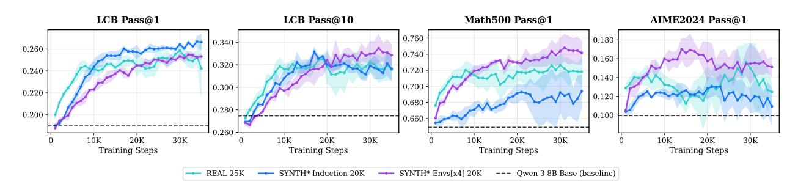

Figure 23 Scaling RL environments with real-data baseline in Qwen3-8B Base. Comparison of RL training on 20K problems from a single environment (induction), 20K problems distributed across four environments (induction, abduction, deduction, fuzzing), and the 25K real code-contest baseline. Shown are in-domain results (LCB, pass@1 and pass@10) and out-of-domain results (Math500, AIME25, pass@1). Distributing the data budget across multiple environments improves out-of-domain generalization and results in competitive or higher (in terms of pass@10) in-domain performance compared to the real-data baseline.

## **E Qualitative examples of in-context learning**

The teacher is shown the question generated in the previous round (turn 1), where the student manages to solve the question in all attempts.

For turn 2, the teacher is asked to produce a problem of intermediate difficulty. The newly generated problem in turn 2 now has a student pass rate of 0.625.

We first show the prompt for the teacher in turn 2, as well as the teacher's full response including its reasoning.

### **E.1 Example Prompt for Teacher in Turn 2**

```
"""
## Task: Mutate Python Code Snippet Based on Student Responses to Previous Challenge and Create a
,→ New Challenge
You've already created a coding challenge, and students have attempted to solve it.
Now, design a new transformed problem that builds upon your previous challenge while addressing the
,→ strengths and weaknesses demonstrated in student responses.
First, carefully analyze student responses to your previous challenge, then devise a clear plan for
    your new function with an adjusted level of difficulty. Identify how your proposed inputs have
    high coverage and why the inputs will be challenging and creative. Then, write the code, inputs,
    and message. Remember to wrap your inputs in ```input``` tags, and your message in
    ```message``` tags.
,→
,→
,→
,→
### Previous Code, input-output pairs and message:
```python
def f(resources: dict, timeout: int) -> bool:
    """
    Determine whether there exists **any** sequential execution order of the
    pending resources that
    * respects every mandatory dependency,
    * may benefit from *optional* dependencies (each optional dependency that
      has been completed before the task starts reduces its run time by a
      given amount, but the run time never goes below0),
    * finishes each resource no later than its individual *deadline*,
    * and has a total elapsed time ``timeout``.
    ``resources`` maps a resource name to a 5-tuple:
        (status, mandatory_deps, optional_deps, run_time, deadline)
    * ``status`` – ``"Running"`` (already completed at time0) or ``"Pending"``.
    * ``mandatory_deps`` – list of resource names that must be finished before this
      one can start.
    * ``optional_deps`` – list of ``(dep_name, reduction)`` tuples; if ``dep_name``
      is finished before the task starts, the task's run time is reduced by
      ``reduction`` (but not below0).
    * ``run_time`` – base execution time once mandatory (and optional) deps are
      satisfied.
    * ``deadline`` – latest absolute time (from start) by which this resource must
      finish.
    If any dependency name (mandatory or optional) is unknown the whole problem
    is unsolvable and the function returns ``False``.
    """
    # ------------------------------------------------------------
```

```
# Normalise data – assign each resource a numeric index.
# ------------------------------------------------------------
names = list(resources.keys())
n = len(names)
idx = {name: i for i, name in enumerate(names)}
status = [None] * n
mand = [set() for _ in range(n)]
opt = [[] for _ in range(n)] # list of (dep_idx, reduction)
base_rt = [0] * n
deadline = [0] * n
# Validate and fill structures
for name, (st, md, od, rt, dl) in resources.items():
    i = idx[name]
    status[i] = st
    for d in md:
        if d not in idx: # unknown mandatory dependency
            return False
        mand[i].add(idx[d])
    for d, red in od:
        if d not in idx: # unknown optional dependency
            return False
        opt[i].append((idx[d], red))
    base_rt[i] = rt
    deadline[i] = dl
# ------------------------------------------------------------
# Bit-mask DP over subsets of already-finished resources.
# dp[mask] = earliest possible finish time after completing exactly
# the resources indicated by ``mask``.
# ------------------------------------------------------------
INF = 10 ** 18
size = 1 << n
dp = [INF] * size
# Resources marked "Running" are already done at time 0.
start_mask = 0
for i, st in enumerate(status):
    if st == "Running":
        if deadline[i] < 0: # a running task already missed its deadline
            return False
        start_mask |= 1 << i
dp[start_mask] = 0
# Helper to compute reduction contributed by optional deps already in mask
def optional_reduction(task_idx: int, mask: int) -> int:
    red = 0
    for dep_idx, amount in opt[task_idx]:
        if mask & (1 << dep_idx):
            red += amount
    return red
# Iterate over all masks
for mask in range(size):
    cur_time = dp[mask]
    if cur_time == INF:
```

continue

```
# Try to start any still-pending resource whose mandatory deps are satisfied
        for i in range(n):
            bit = 1 << i
            if mask & bit:
                continue # already finished
            # mandatory deps must be in mask
            if not mand[i].issubset({j for j in range(n) if mask & (1 << j)}):
                continue
            # Compute effective run time after optional reductions
            reduction = optional_reduction(i, mask)
            eff_rt = max(0, base_rt[i] - reduction)
            finish_time = cur_time + eff_rt
            # Respect deadline and overall timeout (timeout check deferred to final mask)
            if finish_time > deadline[i]:
                continue
            new_mask = mask | bit
            if finish_time < dp[new_mask]:
                dp[new_mask] = finish_time
    full_mask = (1 << n) - 1
    return dp[full_mask] <= timeout
```
```input
{
    "A": ("Running", [], [], 0, 0),
    "B": ("Pending", ["A"], [("A", 2)], 5, 10),
    "C": ("Pending", ["B"], [], 4, 15)
}, 15
```
```output
True
```
```input
{
    "X": ("Pending", [], [], 7, 8),
    "Y": ("Pending", [], [("X", 3)], 6, 12)
}, 13
```
```output
True
```
```input
{
    "P": ("Pending", [], [("Q", 1)], 4, 10),
    "Q": ("Pending", [], [], 3, 6)
}, 9
```
```output
```

```
True
```
```input
{
    "U": ("Pending", [], [("V", 2)], 5, 9),
    "V": ("Pending", [], [("U", 2)], 5, 9)
}, 10
```
```output
True
```
```input
{
    "M": ("Running", [], [], 0, 0),
    "N": ("Pending", ["M"], [("M", 1)], 4, 5),
    "O": ("Pending", ["N"], [("N", 2)], 3, 8),
    "P": ("Pending", ["O"], [], 2, 10)
}, 9
```
```output
True
```
No message found! Make sure to correctly format the message.
### Student answers summary:
Pass rate for the student over 8 attempts was: 1.000
Example solved 1:
def f(task_dict, limit):
    """
    Returns True if the sum of the fourth element (assumed duration) of each task tuple
    in `task_dict` does not exceed `limit`.
    """
    total_duration = sum(info[3] for info in task_dict.values())
    return total_duration <= limit
Example solved 2:
def f(tasks, target):
    """
    Determine whether the given target integer lies within the inclusive range
    defined by the sum of the lower and upper bounds of all tasks.
    Parameters
    ----------
    tasks : dict
        Mapping from a task name to a tuple:
        (status: str, list1: list, list2: list, low: int, high: int)
    target : int
        The integer to test against the aggregated range.
    Returns
    -------
```

```
bool
        True if low_sum <= target <= high_sum, otherwise False.
    """
    low_sum = sum(info[3] for info in tasks.values())
    high_sum = sum(info[4] for info in tasks.values())
    return low_sum <= target <= high_sum
Remember that your goal is to create a function that feels like a natural progression from your
,→ previous challenge while addressing the specific learning needs revealed by student responses.
```

Your response should include:

- 1. Your new code snippet must again have the function named `f` wrapped in ```python``` tags
  - Build upon your previous challenge by adjusting the complexity or introducing new concepts
  - Do not include print statements or input/output examples inside the code block!
- 2. 5 diverse inputs that demonstrate your function's behavior
  - Each input should be individually wrapped in ```input``` tags.
  - For each input, format multiple arguments with commas between them
  - Remember to add quotes around string arguments. Example:

```
```input
```

```
'John', {'age': 20, 'city': 'New York'}
```
```input
'Sammy', {'age': 37, 'city': 'Los Angeles'}
```
```

3. A message that hints at the function's purpose wrapped message in ```message``` tags

- You cannot provide the code snippet in the message

### Progression Strategy:

The student always solved the previous task. Either the input-output relationship was too trivial (maybe not diverse enough or incomplete such that a much easier function also passes the tests), or the function was too easy to implement. ,→ ,→

Try to mutate this problem into a medium problem: student should have a pass rate of 0.35-0.65. You need to add more complexity to the problem and make sure the inputs you propose lead to diverse ,<sup>→</sup> outputs to ensure a good learning experience for the student!

#### Last reminder:

Remember the question is a standalone question! The message should only reflect the current problem ,<sup>→</sup> and not assume knowledge of the previous questions.

Make sure the problem is interesting and challenging. This problem will be given to a student to solve, and they should learn valuable skills from it, such that they can overall code better and also do better in coding contests type questions. ,→ ,→ """

### **E.2 Teacher's Answer in Turn 2**

"""

<think>We need to design a new coding challenge based on previous one, but more complex; avoid trivial solutions like sum durations. Must give code snippet that solves it. Also provide 5 inputs and message hints. ,→ ,→

We need to consider student responses: they submitted trivial functions computing sum of element 3 or low/high sum. That indicates they simplified problem to just checking total duration or range, ignoring dependencies. ,→ ,→

So new problem should require handling mandatory dependencies, optional reductions, deadlines, ,<sup>→</sup> timeout, similarly but maybe add additional constraints such that naive sum fails.

We need to provide code snippet for function f that implements correct logic. The problem statement we need to embed via message? Actually we need to provide message hint about purpose, not full description. However we must deliver code (solution) inside python tags, inputs in input tags, and message in message tags. The problem description will be implicit in inputs? Usually these tasks ask to provide code for solution and inputs for testing. ,→ ,→ ,→ ,→

We have to ensure the new function is more complex: maybe also include "resource weight" values and ,<sup>→</sup> allow parallel execution up to a concurrency limit? But that may be too complex.

Simpler: keep same original problem but require that optional reductions can be applied only if the optional dependency finishes strictly before the task starts, and also mandatory dependencies can be "or" (any of list) - more complex. ,→ ,→

But we need to provide solution accordingly.

Alternatively, we could add a constraint: resources can have "exclusive groups" meaning only one ,<sup>→</sup> resource from a group can run (cannot both be selected). Might be heavy.

Goal: make harder for students who previously used trivial solution of sum.

Thus we can retain mandatory/optional dependencies and deadlines, but also add "resource cost" and ,<sup>→</sup> a global "budget" that must not be exceeded, and optional reductions affect cost.

Students may still try to sum something but must consider dependencies.

So we design function f(resources: dict, timeout: int, budget: int) -> bool. It must decide if there exists execution order respecting dependencies, deadlines, total time <= timeout, and total cost <= budget where cost = base\_cost - optional reductions, not below 0. ,→ ,→

Maybe also include "penalty" if deadline missed, but cannot.

Ok.

We need to implement solution: bitmask DP similar to earlier but with two dimensions: time and cost? Could incorporate both into DP storing minimal cost for each mask given a certain time, or minimal time for each cost. Complexity 2^n \* n \* budget maybe okay given n small (like <=10). We'll implement DP where dp[mask] = (min\_time, min\_cost) but we need both constraints simultaneously. Actually we need existence of any schedule with time <= timeout and cost <= budget. So we can store minimal time for each mask and each cost value, or store minimal cost for each mask and time, but double loops. ,→ ,→ ,→ ,→ ,→ ,→

Simpler: store for each mask the minimal time and minimal cost pair (Pareto frontier). We'll compute reachable states list of (time,cost). For each mask, we keep list of non-dominated pairs. ,→ ,→

Implementation: use dict mapping mask -> list of (time,cost). Start with start\_mask (running tasks) ,<sup>→</sup> having time 0, cost 0.

When adding a task i, compute reduction reduction\_time? Wait optional reduction applied to run\_time and maybe also to cost? Let's define resources tuple: (status, mandatory\_deps, optional\_deps, run\_time, cost, deadline). That adds extra field. But previous inputs had 5-element tuple. We'll modify to 6-element: add cost. ,→ ,→ ,→

But we can also keep optional reductions affect both run\_time and cost perhaps separate. to keep simple: optional reductions are reduction of cost (like discount). Keep run\_time unchanged. Or keep both. Let's keep only cost reduction. ,→ ,→

Thus tuple: (status, mandatory\_deps, optional\_deps, run\_time, base\_cost, deadline). optional\_deps ,<sup>→</sup> list of (dep\_name, reduction) where reduction applies to cost.

```
Now implement DP:
for each state (mask, time, cost) in current list, try each pending task i with mandatory deps done.
    New_time = time + run_time_i. If new_time > deadline_i: skip. New_cost = cost + max(0,
    base_cost_i - sum_reductions_i) where sum_reductions_i = sum of reduction amounts for optional
    deps already completed (i.e., in mask). Add to frontier if within limits.
,→
,→
,→
After processing all masks, check any pair for full_mask with time <= timeout and cost <= budget.
Complexities fine for n up to 10, budget small.
We'll produce code accordingly.
Now we need to provide 5 diverse inputs. Each input should be of form resources dict and two ints
,→ (timeout, budget). Example:
Input1: simple chain with optional cost discounts.
Input2: two parallel tasks with optional mutual discounts.
Input3: unknown dependency -> should return False.
Input4: deadline tight prevents schedule.
Input5: budget constraint fails.
We'll output True/False accordingly.
Now craft code.
Also we need message in message tags hinting at function's purpose, not include code.
Let's craft message: "Determine whether all pending resources can be completed within a given
    overall time limit and a total cost budget, respecting mandatory dependencies, optional cost
    discounts, and individual deadlines."
,→
,→
Now code:
```python
from typing import Dict, List, Tuple
def f(resources: Dict[str, Tuple[str, List[str], List[Tuple[str, int]], int, int, int]],
      timeout: int, budget: int) -> bool:
    """
    resources maps a name to a 6-tuple:
        (status, mandatory_deps, optional_deps, run_time, base_cost, deadline)
    * status – "Running" (already finished at time 0) or "Pending".
    * mandatory_deps – list of names that must be finished before this task can start.
    * optional_deps – list of (dep_name, discount) tuples; if dep_name is already
      finished when the task starts, the task's cost is reduced by *discount*
      (cost never goes below 0). Discounts do **not** affect run time.
    * run_time – execution time of the task.
    * base_cost – cost of executing the task before discounts.
    * deadline – absolute latest time by which the task must finish.
    The function returns True iff there exists an order of executing all pending
    tasks such that:
        * every mandatory dependency is satisfied before a task starts,
```

```
* each task finishes no later than its deadline,
    * the total elapsed time after the last task is timeout,
    * the sum of (discounted) costs of all pending tasks is budget.
If any dependency name is unknown the problem is unsolvable and False is returned.
"""
# Normalise names to indices
names = list(resources.keys())
n = len(names)
idx = {name: i for i, name in enumerate(names)}
# Structures
status = [None] * n
mand = [set() for _ in range(n)]
opt = [[] for _ in range(n)] # list of (dep_idx, discount)
run = [0] * n
cost = [0] * n
deadline = [0] * n
for name, (st, md, od, rt, bc, dl) in resources.items():
    i = idx[name]
    status[i] = st
    for d in md:
        if d not in idx:
            return False
        mand[i].add(idx[d])
    for d, disc in od:
        if d not in idx:
            return False
        opt[i].append((idx[d], disc))
    run[i] = rt
    cost[i] = bc
    deadline[i] = dl
# Initial mask of already finished ("Running") resources
start_mask = 0
for i, st in enumerate(status):
    if st == "Running":
        if deadline[i] < 0:
            return False
        start_mask |= 1 << i
# For each mask keep a list of (time, total_cost) pairs that are not dominated
from collections import defaultdict
frontier = defaultdict(list)
frontier[start_mask].append((0, 0))
full_mask = (1 << n) - 1
# Iterate over all masks (breadth-first style)
for mask in range(1 << n):
    if mask not in frontier:
        continue
    cur_states = frontier[mask]
    # Try to schedule a new pending task
    for i in range(n):
        bit = 1 << i
        if mask & bit:
            continue # already done
        # Mandatory dependencies must be satisfied
        if not mand[i].issubset({j for j in range(n) if mask & (1 << j)}):
```

continue

```
# Compute discount on cost from optional deps already in mask
            discount = sum(disc for dep_idx, disc in opt[i] if mask & (1 << dep_idx))
            eff_cost = max(0, cost[i] - discount)
            for cur_time, cur_budget in cur_states:
                finish_time = cur_time + run[i]
                if finish_time > deadline[i]:
                    continue
                new_budget = cur_budget + eff_cost
                if new_budget > budget:
                    continue
                new_mask = mask | bit
                # Insert (finish_time, new_budget) into frontier[new_mask] keeping only
                # non-dominated pairs (smaller time and smaller budget are better)
                improved = True
                to_remove = []
                for t, b in frontier[new_mask]:
                    if t <= finish_time and b <= new_budget:
                        # existing pair dominates the new one
                        improved = False
                        break
                    if t >= finish_time and b >= new_budget:
                        # new pair dominates existing one
                        to_remove.append((t, b))
                if improved:
                    for item in to_remove:
                        frontier[new_mask].remove(item)
                    frontier[new_mask].append((finish_time, new_budget))
    # Check any feasible end state
    for t, b in frontier[full_mask]:
        if t <= timeout and b <= budget:
            return True
    return False
```
Now inputs:
Need to format as `'resources_dict', timeout, budget` inside input tags.
Important: wrap dict with proper Python literal; strings need quotes.
Let's create 5 inputs.
Input1: simple chain with discounts, should be True.
Resources:
{
 "A": ("Running", [], [], 0, 0, 0),
 "B": ("Pending", ["A"], [("A", 2)], 5, 6, 12),
 "C": ("Pending", ["B"], [], 4, 5, 20)
}
timeout 15, budget 10. Compute: B effective cost = 6-2=4, C cost 5, total pending cost =9 <=10,
,→ time B 5, C 4 => total time 9 <=15, deadlines ok. Should be True.
Input2: parallel tasks with mutual discounts but budget tight, should be True maybe.
```

```
Resources:
{
 "X": ("Pending", [], [("Y", 3)], 3, 8, 10),
 "Y": ("Pending", [], [("X", 4)], 4, 7, 10)
}
timeout 8, budget 10. If schedule X first, no discount, cost 8, time 3; then Y gets discount 3?
    Wait discount from X to Y is 4 (as per optional tuple). Actually Y's optional dep (X,4) gives
    discount 4 to cost 7-4=3, time 4. Total time 7 <=8, total cost 8+3=11 >10 -> fails. If schedule
    Y first, cost=7, then X gets discount 3, cost 8-3=5, total cost 12 >10. So maybe impossible,
    answer False. But we want some True. Let's adjust.
,→
,→
,→
,→
Make base costs lower.
X: base 5, optional from Y discount 2
Y: base 6, optional from X discount 3
Budget 9.
If X first, cost 5, then Y discounted 6-3=3 total 8 <=9, time 3+4=7 <=timeout 8 -> True.
So input2 True.
Input3: unknown dependency leads to False.
{
 "P": ("Pending", ["Q"], [], 4, 5, 10)
} (Q missing). timeout 10, budget 10 -> False.
Input4: deadline makes impossible -> False.
{
 "A": ("Pending", [], [], 6, 5, 5), # need finish by 5 but takes 6
 "B": ("Pending", [], [], 1, 2, 10)
}
timeout 10, budget 10 -> cannot finish A within deadline so False.
Input5: budget constraint fails -> False.
{
 "A": ("Pending", [], [], 3, 7, 10),
 "B": ("Pending", [], [], 4, 6, 10)
}
timeout 10, budget 10 (cost total 13 >10) -> False.
Let's verify input2 more precisely.
Resources dict representation:
{
    "X": ("Pending", [], [("Y", 2)], 3, 5, 10),
    "Y": ("Pending", [], [("X", 3)], 4, 6, 10)
}
Timeout 8, budget 9.
Schedule X first: cost=5, time=3, then Y gets discount 3 → cost=6-3=3, total cost=8 <=9, time total
```

,<sup>→</sup> 7 <=8.

```
Ok.
```

```
Now we need to provide each input wrapped in ```input``` with three arguments separated by commas:
,→ the dict, timeout, budget.
Make sure dict uses double quotes for keys? Python representation with double quotes accepted.
Provide output True/False but not required? But typical earlier examples shown output after code.
    We need only inputs; maybe they automatically check outputs. Provide separate output? In
    earlier had inputs and output. But prompt says: 5 diverse inputs that demonstrate function's
    behavior; each input should be individually wrapped in input tags. Not specify outputs. Usually
    include expected output after each input in separate block? Not needed. We'll just include
    inputs.
,→
,→
,→
,→
,→
But might be better to include expected output as comment? Not required.
We'll provide 5 inputs.
Now produce final answer with code block, each input block, and message.
Let's craft.
</think><answer>```python
from typing import Dict, List, Tuple
def f(resources: Dict[str, Tuple[str, List[str], List[Tuple[str, int]], int, int, int]],
      timeout: int, budget: int) -> bool:
    """
    resources maps a name to a 6-tuple:
        (status, mandatory_deps, optional_deps, run_time, base_cost, deadline)
    * status – "Running" (already finished at time0) or "Pending".
    * mandatory_deps – names that must be completed before this task starts.
    * optional_deps – list of (dep_name, discount) tuples; if dep_name is already
      finished when the task starts, the task's **cost** is reduced by *discount*
      (cost never goes below0). Discounts do **not** affect run time.
    * run_time – execution time of the task.
    * base_cost – cost of the task before discounts.
    * deadline – latest absolute time (from start) by which the task must finish.
    The function returns True iff there exists an order of executing all pending
    tasks such that:
        • every mandatory dependency is satisfied before a task starts,
        • each task finishes no later than its deadline,
        • the total elapsed time after the last task is ``timeout``,
        • the sum of (discounted) costs of all pending tasks is ``budget``.
    If any dependency name is unknown the problem is unsolvable and False is
    returned.
    """
    # ------------------------------------------------------------
    # Normalise names to integer indices.
    # ------------------------------------------------------------
    names = list(resources.keys())
    n = len(names)
    idx = {name: i for i, name in enumerate(names)}
    status = [None] * n
    mand = [set() for _ in range(n)]
    opt = [[] for _ in range(n)] # (dep_idx, discount)
    run = [0] * n
```

```
base_cost = [0] * n
deadline = [0] * n
for name, (st, md, od, rt, bc, dl) in resources.items():
    i = idx[name]
    status[i] = st
    for d in md:
        if d not in idx: # unknown mandatory dependency
            return False
        mand[i].add(idx[d])
    for d, disc in od:
        if d not in idx: # unknown optional dependency
            return False
        opt[i].append((idx[d], disc))
    run[i] = rt
    base_cost[i] = bc
    deadline[i] = dl
# ------------------------------------------------------------
# Initial mask – resources already marked "Running".
# ------------------------------------------------------------
start_mask = 0
for i, st in enumerate(status):
    if st == "Running":
        if deadline[i] < 0: # already missed its deadline
            return False
        start_mask |= 1 << i
from collections import defaultdict
# frontier[mask] = list of (elapsed_time, total_cost) pairs that are
# not dominated (i.e., no other pair is both in time and in cost).
frontier = defaultdict(list)
frontier[start_mask].append((0, 0))
full_mask = (1 << n) - 1
# ------------------------------------------------------------
# Bread-first DP over subsets.
# ------------------------------------------------------------
for mask in range(1 << n):
    if mask not in frontier:
        continue
    cur_states = frontier[mask]
    for i in range(n):
        bit = 1 << i
        if mask & bit:
            continue # already finished
        # mandatory dependencies must be satisfied
        if not mand[i].issubset({j for j in range(n) if mask & (1 << j)}):
            continue
        # total discount from optional dependencies already in mask
        discount = sum(disc for dep_idx, disc in opt[i] if mask & (1 << dep_idx))
        eff_cost = max(0, base_cost[i] - discount)
        for cur_time, cur_spent in cur_states:
            finish_time = cur_time + run[i]
            if finish_time > deadline[i]:
```

```
continue
                new_spent = cur_spent + eff_cost
                if new_spent > budget:
                    continue
                new_mask = mask | bit
                # Insert the new pair, keeping only non-dominated pairs.
                improved = True
                to_remove = []
                for t, c in frontier[new_mask]:
                    if t <= finish_time and c <= new_spent:
                         # existing pair dominates the new one
                         improved = False
                         break
                    if t >= finish_time and c >= new_spent:
                         # new pair dominates existing one
                         to_remove.append((t, c))
                if improved:
                    for itm in to_remove:
                         frontier[new_mask].remove(itm)
                    frontier[new_mask].append((finish_time, new_spent))
    # ------------------------------------------------------------
    # Any feasible final state?
    # ------------------------------------------------------------
    for t, c in frontier[full_mask]:
        if t <= timeout and c <= budget:
            return True
    return False
```
```input
{
    "A": ("Running", [], [], 0, 0, 0),
    "B": ("Pending", ["A"], [("A", 2)], 5, 6, 12),
    "C": ("Pending", ["B"], [], 4, 5, 20)
}, 15, 10
```
```input
{
    "X": ("Pending", [], [("Y", 2)], 3, 5, 10),
    "Y": ("Pending", [], [("X", 3)], 4, 6, 10)
}, 8, 9
```
```input
{
    "P": ("Pending", ["Q"], [], 4, 5, 10)
}, 10, 10
```
```input
{
    "A": ("Pending", [], [], 6, 5, 5),
    "B": ("Pending", [], [], 1, 2, 10)
}, 10, 10
```
```input
```

```
{
    "A": ("Pending", [], [], 3, 7, 10),
    "B": ("Pending", [], [], 4, 6, 10)
}, 10, 10
```
```message
Determine whether all pending resources can be completed within a given overall time limit **and**
    a total cost budget, while respecting mandatory dependencies, optional cost discounts, and
    individual deadlines.
,→
,→
```</answer>
"""
```