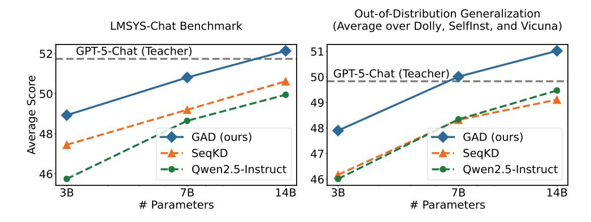
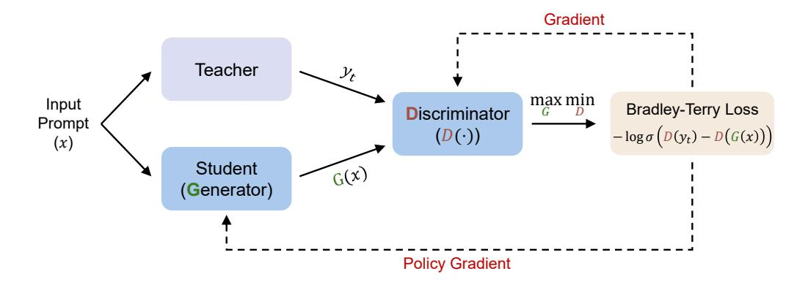
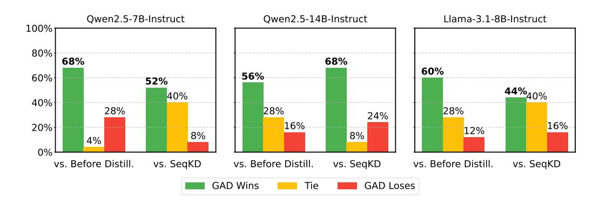
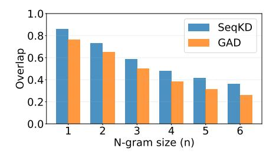
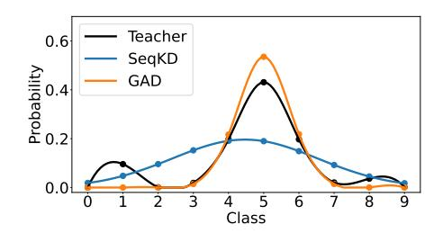
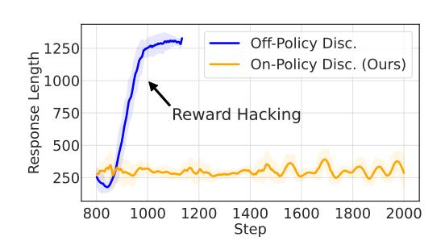

# Black-Box On-Policy Distillation of Large Language Models

Tianzhu Ye\* Li Dong\*
Zewen Chi Xun Wu Shaohan Huang Furu Wei
Microsoft Research
https://aka.ms/GeneralAI

Black-box distillation creates student large language models (LLMs) by learning from a proprietary teacher model's text outputs alone, without access to its internal logits or parameters. In this work, we introduce Generative Adversarial Distillation (GAD), which enables on-policy and black-box distillation. GAD frames the student LLM as a generator and trains a discriminator to distinguish its responses from the teacher LLM's, creating a minimax game. The discriminator acts as an on-policy reward model that co-evolves with the student, providing stable, adaptive feedback. Experimental results show that GAD consistently surpasses the commonly used sequence-level knowledge distillation. In particular, Qwen2.5-14B-Instruct (student) trained with GAD becomes comparable to its teacher, GPT-5-Chat, on the LMSYS-Chat automatic evaluation. The results establish GAD as a promising and effective paradigm for black-box LLM distillation.

<span id="page-0-0"></span>Project Page: aka.ms/GAD-project Code: aka.ms/GAD-github



Figure 1: Comparison between GAD and sequence-level knowledge distillation (SeqKD; KR16) trained on LMSYS-Chat [ZCS<sup>+</sup>24] dataset, evaluated by averaged GPT-40 scores. **Left**: Results on the LMSYS-Chat test set. **Right**: Average performance across Dolly [Dat23], SelfInst [WKM<sup>+</sup>23], and Vicuna [CLL<sup>+</sup>23] datasets.

<sup>\*</sup> Equal contribution. Contact person: fuwei@microsoft.com.

## 1 Introduction

Knowledge distillation [HVD15] in large language models (LLMs; Ope23, Ope25, LFX<sup>+</sup>24, YLY<sup>+</sup>25) is primarily used to create smaller, more efficient student models that retain much of the performance of a larger, resource-intensive teacher model. The setting in which the student has access to the teacher's internal probability distribution or hidden states is called *white-box distillation*. Standard white-box approaches align the teacher and student by matching their output distributions, typically via Kullback-Leibler divergence (KLD) [SST<sup>+</sup>20, GDWH24], or their inner states [JYS<sup>+</sup>20, SCGL19, WWD<sup>+</sup>20]. However, white-box access is often impractical when the teacher is a proprietary API model (e.g., GPT-5). In this scenario, only teacher-generated texts are accessible, defining the more challenging black-box distillation setting. The absence of fine-grained probability supervision makes conventional likelihood-based objectives unavailable. Typical black-box distillation methods simply perform supervised fine-tuning on teacher responses [TGZ<sup>+</sup>23, CLL<sup>+</sup>23]. Furthermore, when the student and teacher employ incompatible tokenizers, applying likelihood-based objectives also becomes challenging. This highlights the need for a framework that can effectively extract deeper and richer knowledge from teacher-generated text responses.

Recent studies [GDWH24, AVZ<sup>+</sup>24, LL25, YLY<sup>+</sup>25] in white-box distillation highlight the importance of *on-policy* learning, where the student learns from its own generated responses rather than solely imitating the teacher's outputs. These studies show that performing reverse KLD on student-generated text promotes mode-seeking behavior and reduces exposure bias compared to teacher-forced training. However, extending this idea to the black-box setting introduces a major challenge: when the student produces its own responses, there are no probability-level supervision signals available from the teacher to evaluate or correct them. Without explicit feedback, the student cannot directly gauge the quality of its generations relative to the teacher, making effective on-policy distillation infeasible under the standard likelihood-based framework.

To address this limitation, we propose **GAD**, a **G**enerative **A**dversarial **D**istillation framework that enables on-policy learning in the black-box regime. Our key idea is to view the student as a *generator* that produces responses conditioned on prompts, and to train a *discriminator* to distinguish between teacher and student outputs. The generator is then optimized to produce responses that the discriminator cannot distinguish from those of the teacher, forming a minimax game similar to generative adversarial networks (GANs; GPAM+14, YZWY17). This adversarial process allows the student to receive implicit feedback on the quality of its own generations, even without access to the teacher's probability space. Besides, from the perspective of reinforcement learning (RL; SB+98, SWD+17, SLA+15), our discriminator can be interpreted as an *on-policy reward model* that evolves jointly with the student policy. Unlike conventional reward models in RLHF [OWJ+22] which are fixed after pretraining and prone to reward hacking [SHKK22], our discriminator continually adapts to the student's behavior during training. The on-policy reward modeling provides stable and dynamic supervision throughout the distillation process.

We validate our approach using GPT-5-Chat [Ope25] as a teacher and a range of open-source models from the Qwen2.5 [YYZ+25] and Llama3 [GDJ+24] families as a student. Experiments are conducted on the a subset of LMSYS-Chat-1M dataset [ZCS+24] and evaluated across multiple domains. Under identical training budgets, GAD consistently outperforms both the instruction models before distillation and the SeqKD [KR16, CLL+23, TGZ+23, PLH+23, ZLX+23] baseline across all datasets and model sizes. Notably, on GPT-40 score, Qwen2.5-3B-Instruct distilled with GAD matches the performance of Qwen2.5-7B-Instruct distilled with SeqKD, while Qwen2.5-14B-Instruct trained with GAD approaches the capability of the GPT-5 teacher itself. Our method also delivers particularly strong improvements in out-of-distribution generalization, where SeqKD yields marginal or negative gains. Human evaluations further confirm performance. GAD can effectively extract high-quality knowledge from black-box LLMs without access to output logits.



Figure 2: Training procedure of GAD. The student (generator) learns to generate responses that maximize the score assigned by the discriminator. The discriminator is trained with Bradley-Terry loss to assign a lower score to the student than the teacher, learning to distinguish between them. Together, they form a two-player minimax game in an adversarial learning framework.

#### <span id="page-2-0"></span>2 Method

We study conditional text generation of large language models, where a model generates a response y conditioned on a given prompt x sampled from dataset  $\mathcal{T}$ . To transfer the capabilities of large models to smaller ones, knowledge distillation (KD) trains a student distribution  $q_{\theta}(y|x)$  parameterized by  $\theta$  to approximate the behavior of a teacher distribution p(y|x). In the white-box distillation setting, the student has access to the teacher's predictive distribution p(y|x). Approaches such as forward KLD [KR16, SST+20, CLL+23, TGZ+23] or reverse KLD [GDWH24] are designed for this setting. However, these techniques can fail if the teacher is a proprietary model that only returns generated text. We refer to this scenario as  $black-box\ distillation$ , where only textual responses from the teacher are observable. The goal is to learn a student model that imitates the teacher's generative behavior without access to its internal probability space.

#### <span id="page-2-4"></span>2.1 GAD: Generative Adversarial Distillation

We perform black-box distillation with generative adversarial training [GPAM+14, YZWY17] as shown in Figure 2. The training dataset  $\mathcal{T}=\{(x,y_t)\}$  is constructed by iterating over the prompts x in the original dataset and sampling a teacher response  $y_t$  for each. Our framework consists of a generator G which is the student model, and a discriminator D that assesses the quality of the student and teacher responses. The generator generates the response G(x) to the prompt x. The discriminator predicts a sequence-level scalar score D([x,y]) given prompt x and response  $y^2$ . The discriminator is initialized using generator model parameters with an extra prediction head. The head projects the final hidden state to a scalar score, and the score of the last token in the sequence is taken as the sequence-level score. The training objective is formulated as a two-player minimax game with the following value function  $\mathcal{V}(G,D)$ :

<span id="page-2-2"></span>
$$\max_{G} \min_{D} \mathcal{V}(G, D) = \mathbb{E}_{(x, y_t) \sim \mathcal{T}} \left[ -\log \sigma \left( D(y_t) - D(G(x)) \right) \right], \tag{1}$$

where  $\sigma(\cdot)$  denotes the sigmoid function. We use Bradley-Terry model [BT52] to capture pairwise preferences between teacher and student response. The proposed generative adversarial training framework allows the student to learn on-policy from its own generated responses via discriminator feedback, eliminating the need to access the teacher's internal representations.

#### <span id="page-2-5"></span>2.2 Training

We discuss the training algorithm of generator and discriminator respectively. From Equation (1), the generator G is trained with the following objective:

<span id="page-2-3"></span>(Generator) 
$$\max_{G} \mathbb{E}_{(x,y_t) \sim \mathcal{T}} \left[ D(G(x)) \right], \tag{2}$$

<span id="page-2-1"></span><sup>&</sup>lt;sup>2</sup> The input prompt x and generated response y are concatenated (i.e., [x,y]) and fed into the discriminator (i.e., D([x,y])). For brevity, we use D(y) below to represent D([x,y]).

Since the sampling operation in G(x) is non-differentiable with respect to the student model parameters, we treat D(G(x)) as a reward and optimize it using policy gradient [\[SMSM99\]](#page-9-12) with established reinforcement learning algorithms. We employ GRPO [\[SWZ](#page-9-13)+24] to train the student in our experiments, with detailed formulations provided in Appendix [A.1.](#page-11-0) For the discriminator D, we minimize its training loss derived from Equation [\(1\)](#page-2-2):

<span id="page-3-0"></span>(Discriminator) 
$$\min_{D} \mathbb{E}_{(x,y_t) \sim \mathcal{T}} \left[ -\log \sigma \left( D(y_t) - D(G(x)) \right) \right]. \tag{3}$$

The discriminator uses Bradley-Terry loss to capture pairwise preferences, encouraging higher scores for teacher responses over student-generated ones.

Warmup Before GAD Training We find that jointly warming up the generator and discriminator before the GAD training stage is crucial for final performance. We fine-tune the student on the teacher's response, and we minimize the cross-entropy loss as warmup for the generator. In the meanwhile, the discriminator is trained using the same data with the Bradley-Terry loss in Equation [\(3\)](#page-3-0). We conduct warmup for both models for one epoch before starting GAD training. This step promotes effective adversarial optimization and ensures the balance between the generator and discriminator. Ablation studies on the warmup strategy are presented in Section [3.3.](#page-6-0)

## 2.3 Implement GAD with Reinforcement Learning Frameworks

In our experiments, we implement GAD using existing reinforcement learning frameworks, such as verl [\[SZY](#page-9-14)<sup>+</sup>24]. GRPO [\[SWZ](#page-9-13)<sup>+</sup>24] is used as the policy gradient algorithm, which is detailed in Appendix [A.1.](#page-11-0)

As presented in Table [1,](#page-3-1) we implement the generator as a *policy model* and the discriminator as a *reward model*. The generator produces responses, receives rewards from the discriminator, and is optimized to maximize the expected reward. The reward is defined in Equation [\(2\)](#page-2-3), i.e., D(G(x)).

Unlike vanilla reinforcement learning, GAD also needs to jointly update the discriminator (i.e., reward model). The discriminator is trained with Bradley-Terry loss on preference pairs to score the teacher response higher than the student's output, similar to the reward model in RLHF [\[OWJ](#page-9-9)<sup>+</sup>22]. While conventional RLHF trains a fixed reward model prior to policy optimization which is prone to reward hacking, our approach updates the reward model (discriminator) online to adapt it to the current policy continually.

|                        | Reinforcement Learning                                                                                                                                          | GAD                                                                                                                                   |
|------------------------|-----------------------------------------------------------------------------------------------------------------------------------------------------------------|---------------------------------------------------------------------------------------------------------------------------------------|
| Term<br>Correspondence | Policy Model<br>Reward Model<br>Reward                                                                                                                          | Generator (i.e.,Student LLM)<br>Discriminator<br>D(G(x)) (as in Equation (2))                                                         |
| Difference             | The reward model is typically<br>trained once on a static dataset<br>and then frozen.<br>The policy<br>is then optimized against this<br>fixed reward function. | co-evolves<br>The<br>discriminator<br>with the student LLM (i.e., pol<br>icy model). It is continually up<br>dated in a minimax game. |

<span id="page-3-1"></span>Table 1: How to implement GAD within reinforcement learning frameworks.

Pseudocode of Training Algorithm Algorithm [1](#page-4-0) presents the pseudocode for GAD training.

#### Algorithm 1 GAD: Generative Adversarial Distillation

```
Input: Distillation data \mathcal{T} = \{(x, y_t)\}; Student LLM (generator) G; Discriminator D
Output: Trained student model G
  Warmup Stage
  for each batch (x, y_t) \sim \mathcal{T} do
      Update generator G with cross-entropy loss on y_t
      Update discriminator D with Bradley-Terry loss
                                                                                                  ▶ Equation (3)
  end for
  GAD Training Stage
  repeat
      for each batch (x, y_t) \sim \mathcal{T} do
          Sample student responses G(x)
          Update generator \hat{G} using D(\hat{G}(x)) as reward for reinforcement learning
          Update discriminator D with Bradley-Terry loss
                                                                                                  ▶ Equation (3)
      end for
  until convergence return G
```

# 3 Experiments

#### 3.1 Setup

**Dataset** Given a dataset of instruction prompts, we collect corresponding responses from a teacher model and use them to distill student models. For the following experiments, we use LMSYS-Chat-1M-Clean<sup>3</sup>, a clean version of the LMSYS-Chat-1M dataset [ZCS<sup>+</sup>24]. The dataset is derived from high-quality conversational data collected via the Chatbot Arena<sup>4</sup> platform.

**Teacher and Student Models** We adopt GPT-5-Chat [Ope25] as the teacher model. It is a closed-source chat model ranked ninth on the Chatbot Text Arena leaderboard at the time of writing. For student models, we use the instruction-tuned variants of open-source models from the Qwen2.5 [YYZ<sup>+</sup>25] family (Qwen2.5-3B-Instruct, Qwen2.5-7B-Instruct, Qwen2.5-14B-Instruct) and the Llama3 [GDJ<sup>+</sup>24] family (Llama-3.2-3B-Instruct, Llama-3.1-8B-Instruct).

**Training** For training data, we sample 200K samples from LMSYS-Chat-1M-Clean and collect the corresponding GPT-5-Chat responses to the instructions as teacher responses. All models are trained for 3 epochs with a batch size of 256, totaling approximately 2400 optimization steps. The PPO mini-batch size for each policy update is also 256. The maximum context length is set to 2048 tokens for instruction prompts and 1536 for model responses. The training and sampling temperature is set to 0.8. We save checkpoints every 50 steps. More training details can be found in Appendix A.2.

**Evaluation** We reserve 500 samples of LMSYS-Chat-1M-Clean as the primary test set. We also include test datasets consisting of a 500-sample subset split from Dolly [Dat23], the 252-sample SelfInst dataset [WKM+23], and the 80-question Vicuna benchmark [CLL+23] to evaluate out-of-distribution generalization. We report the GPT-40 evaluation scores [ZCS+23, GDWH24], where GPT-40 first generates reference answers and then scores the output of the student model against them. We also conduct human evaluations on the LMSYS-Chat-1M-Clean test set for qualitative assessment. We select the checkpoint that achieved the highest GPT-40 score and whose response length is within an acceptable range for each experiment. Detailed evaluation protocols are described in Appendix A.3.

#### 3.2 Main Results

**Automatic Evaluation** We report the results of automatic evaluation using GPT-40 scores in Figure 1 and Table 2. We compare GAD with the instruct model before distillation and the

<span id="page-4-1"></span><sup>3</sup> https://huggingface.co/datasets/OpenLeecher/lmsys\_chat\_1m\_clean

<span id="page-4-2"></span><sup>4</sup> https://lmarena.ai

<span id="page-5-0"></span>

| Model                 | Method          | LMSYS | Dolly | SelfInst | Vicuna |
|-----------------------|-----------------|-------|-------|----------|--------|
| GPT-5-Chat            | Teacher         | 51.7  | 49.8  | 49.7     | 49.9   |
| Qwen2.5-3B-Instruct   | Before Distill. | 45.8  | 45.1  | 45.6     | 47.3   |
|                       | SeqKD           | 47.5  | 44.8  | 45.7     | 48.0   |
|                       | GAD             | 48.9  | 46.7  | 47.7     | 49.4   |
| Qwen2.5-7B-Instruct   | Before Distill. | 48.7  | 47.6  | 48.3     | 49.1   |
|                       | SeqKD           | 49.2  | 47.2  | 48.3     | 49.5   |
|                       | GAD             | 50.8  | 48.5  | 50.1     | 51.4   |
| Qwen2.5-14B-Instruct  | Before Distill. | 50.0  | 49.1  | 49.4     | 50.0   |
|                       | SeqKD           | 50.6  | 48.2  | 49.4     | 49.7   |
|                       | GAD             | 52.1  | 50.4  | 51.1     | 51.6   |
| Llama-3.2-3B-Instruct | Before Distill. | 44.0  | 45.8  | 47.0     | 46.9   |
|                       | SeqKD           | 47.6  | 47.0  | 47.1     | 48.1   |
|                       | GAD             | 48.1  | 48.5  | 49.1     | 48.9   |
| Llama-3.1-8B-Instruct | Before Distill. | 46.9  | 46.6  | 48.4     | 47.9   |
|                       | SeqKD           | 49.7  | 47.7  | 48.7     | 48.7   |
|                       | GAD             | 50.3  | 48.8  | 49.5     | 50.2   |

Table 2: Automatic evaluation results. We report averaged GPT-4o score on the test datasets. The best results are highlighted in bold. GAD consistently outperforms both the instruct model before distillation and SeqKD across all datasets and model variants, with particularly strong gains in outof-distribution generalization evaluations.



Figure 3: Human evaluation results on the LMSYS-Chat-1M-Clean test set. We compare GAD to the instruct model before distillation and the model fine-tuned with SeqKD.

SeqKD baseline. Across all datasets, GAD consistently outperforms the baselines. As shown in Figure [1,](#page-0-0) on the LMSYS-Chat test set, Qwen2.5-3B-Instruct trained with GAD matches the performance of Qwen2.5-7B-Instruct trained with SeqKD; similarly, Qwen2.5-7B-Instruct with GAD rivals Qwen2.5-14B-Instruct with SeqKD, and Qwen2.5-14B-Instruct with GAD is comparable to the GPT-5-Chat teacher. In addition, GAD shows particularly strong gains on out-ofdistribution generalization benchmarks. On Dolly, SelfInst, and Vicuna, SeqKD yields marginal or even negative improvements, whereas GAD maintains robust performance gains. We attribute this to the superior generalization ability of reinforcement learning compared to supervised finetuning [\[CZY](#page-8-11)<sup>+</sup>25, [WZZ](#page-10-8)<sup>+</sup>25]. We also provide additional automatic evaluation results in Section [B.1.](#page-12-1)

Human Evaluation We conduct human evaluations on Qwen2.5-7B-Instruct, Qwen2.5-14B-Instruct, and Llama-3.1-8B-Instruct, comparing GAD against both the instruct model before distillation and the model fine-tuned with SeqKD. For each prompt, the annotators assess the responses of two models and judge whether GAD wins, ties, or loses. GAD achieves a win rate exceeding 50% and a loss rate below 30% in almost all comparisons. The results indicate that GAD can consistently outperform the baseline models on human evaluation performance.





Figure 4: Overlap of local patterns between the student and the teacher. SeqKD tends to overfit to local patterns of the teacher.

<span id="page-6-2"></span><span id="page-6-1"></span>Figure 5: Black-box distillation on toy data. GAD learns reachable modes from the teacher while SeqKD aims to cover all the modes.

#### <span id="page-6-0"></span>3.3 Analysis

**SeqKD Overfits to Local Patterns** We evaluate the similarity of local patterns between the student and teacher on the LMSYS-Chat test set in Figure 4, measured by the F1 score of N-gram overlap. The student is trained from Qwen2.5-14B-Instruct, and the teacher is GPT-5-Chat. The SeqKD student exhibits a higher N-gram overlap while a lower GPT-4o evaluation score compared to the GAD student. This suggests that supervised fine-tuning tends to memorize local lexical patterns [CZY+25, WZZ+25], whereas our RL-based approach better captures the teacher's global stylistic characteristics.

**Experiments on Toy Data** We simulate the optimizing patterns of GAD and SeqKD in a toy experiment shown in Figure 5. We observe that GAD tends to learn reachable modes of the teacher, whereas SeqKD aims to cover all modes. The setup simulates a black-box distillation scenario. We define a discrete Gaussian mixture distribution as a teacher distribution p, which has categorical outputs  $0, \ldots, 9$ . A student, modeled as a single Gaussian distribution, learns to imitate the teacher using only output samples without access to p. We compare two student training schemes, SeqKD and GAD. The GAD student is optimized using the REINFORCE algorithm [Wil92]. As illustrated in Figure 5, the SeqKD student exhibits a mode-covering behavior, spreading probability mass across all possible outputs [GDWH24]. In contrast, the GAD student focuses on mode-seeking, concentrating probability optimization on reachable regions. We find that such mode-seeking behavior leads to more effective knowledge distillation in LLMs.

#### Comparison to Off-Policy Discriminator

As discussed in Section 2.1, from the view of reinforcement learning, our generator (student) acts as the policy model, while the discriminator acts as the on-policy reward model. Figure 6 compares GAD with the off-policy discriminator approach. In the off-policy setting, the student is first trained for one warmup epoch using SeqKD. The student is then frozen, and the discriminator is trained for two epochs based on the student's output. Then the resulting discriminator serves as a frozen reward model to train the student using Equation (6). In contrast, GAD jointly trains the student and discriminator for one warmup epoch followed by



<span id="page-6-3"></span>Figure 6: Off-policy discriminator suffers from reward hacking, whereas on-policy discriminator remains stable over thousands of training steps.

two GAD training epochs, positioning the discriminator as an on-policy reward model. We observe that the student trained with an off-policy discriminator quickly exhibits reward hacking after around 300 training steps, producing excessively long responses (up to 1300 tokens) that deviate significantly from the teacher's patterns. In comparison, GAD remains stable through thousands of training steps with no sign of reward hacking. The results establish GAD as a highly reliable and robust on-policy distillation method.

**Warmup Strategy** We perform an ablation study of the warmup strategy introduced in Section 2.2. As shown in Table 3, we separately remove the warmup stage for the generator and the discriminator on Qwen2.5-7B-Instruct. When removing the generator warmup, we directly use Qwen2.5-7B-Instruct without SeqKD as initialization for both the generator and discriminator for GAD training. This leads to a performance drop. We attribute this to the discriminator easily distinguishing between the student and teacher outputs in the early training stage.

<span id="page-7-0"></span>

|                        | LMSYS            | Others           |
|------------------------|------------------|------------------|
| SeqKD                  | 49.2             | 48.3             |
| GAD<br>w/o Gen. Warmup | <b>50.8</b> 49.7 | <b>50.0</b> 49.7 |
| w/o Disc. Warmup       | 49.0             | 47.7             |

Table 3: Ablation of warmup strategy on Qwen2.5-7B-Instruct. Warmup of the generator and discriminator are removed separately.

The large distributional gap between the teacher and the student weakens the effectiveness of GAD training. When removing the discriminator warmup, we use the generator obtained after one epoch of SeqKD and initialize the discriminator with the original Qwen2.5-7B-Instruct. In this setting, the imbalance between the generator and the discriminator prevents the discriminator from providing sufficiently informative feedback. Consequently, the adversarial interaction becomes ineffective, and the generator exhibits little improvement beyond its warmup performance.

## 4 Related Work

White-box Distillation of LLM White-box knowledge distillation of LLM assumes full access to the internal representations or token-level probabilities of a teacher model. Standard white-box approaches align the forward KLD of distribution [LHS+21, SST+20], reverse KLD of distribution [GDWH24], hidden states [JYS+20, SCGL19] or attention scores [WWD+20, WBH+21] between the teacher and the student. Recent work [GDWH24, LL25, AVZ+24] also proves the importance of on-policy distillation where the student learns from its own responses. Such approaches effectively compress large models while preserving semantic similarity. Despite their effectiveness, these methods rely on full teacher access, which is impractical for proprietary LLMs and limits their applicability to closed-source or API-only teachers.

**Black-box Distillation of LLM** Black-box distillation trains a student model using only the textual outputs of a teacher, typically obtained by API queries to closed-source models such as GPT-5 and Gemini 2.5 [Ope25, CBS+25]. In this setting, conventional white-box distillation methods become infeasible because of the lack of access to the teacher's logits or hidden representations. The standard approach for this scenario, SeqKD, performs supervised fine-tuning (SFT) on the teacher's responses [KR16, PLH+23, ZLX+23, TGZ+23, CLL+23] to imitate the teacher's behaviors. Recent work [MYS+25, GMK+25, YHX+25, GYZ+25] extends this paradigm by performing SFT on the teacher's reasoning traces to improve the student's reasoning ability.

#### 5 Conclusion

We introduce GAD, a generative adversarial framework that effectively addresses key challenges of black-box LLM distillation. GAD enables on-policy learning by training a student model and an adaptive discriminator in a minimax game, eliminating the need for any logit-level supervision. This discriminator provides an implicit, on-policy reward signal that guides the student's optimization. Experiments across multiple model families and datasets confirm our approach. GAD consistently surpasses standard sequence-level distillation, delivering superior generalization and achieving performance that rivals the proprietary teacher. These results validate GAD as an effective and robust solution for black-box LLM distillation.

## Acknowledgements

We are grateful to Yi Zhu for technical support during the development of the RL infrastructure and to Yuxian Gu for insightful discussions.

# References

- <span id="page-8-7"></span>[AVZ+24] Rishabh Agarwal, Nino Vieillard, Yongchao Zhou, Piotr Stanczyk, Sabela Ramos Garea, Matthieu Geist, and Olivier Bachem. On-policy distillation of language models: Learning from self-generated mistakes. In *The twelfth international conference on learning representations*, 2024.
  - [BT52] Ralph Allan Bradley and Milton E Terry. Rank analysis of incomplete block designs: I. the method of paired comparisons. *Biometrika*, 39(3/4):324–345, 1952.
- <span id="page-8-12"></span><span id="page-8-10"></span>[CBS+25] Gheorghe Comanici, Eric Bieber, Mike Schaekermann, Ice Pasupat, Noveen Sachdeva, Inderjit Dhillon, Marcel Blistein, Ori Ram, Dan Zhang, Evan Rosen, et al. Gemini 2.5: Pushing the frontier with advanced reasoning, multimodality, long context, and next generation agentic capabilities. *arXiv preprint arXiv:2507.06261*, 2025.
- <span id="page-8-2"></span>[CLL+23] Wei-Lin Chiang, Zhuohan Li, Zi Lin, Ying Sheng, Zhanghao Wu, Hao Zhang, Lianmin Zheng, Siyuan Zhuang, Yonghao Zhuang, Joseph E. Gonzalez, Ion Stoica, and Eric P. Xing. Vicuna: An open-source chatbot impressing gpt-4 with 90%\* chatgpt quality, March 2023.
- <span id="page-8-11"></span>[CZY<sup>+</sup>25] Tianzhe Chu, Yuexiang Zhai, Jihan Yang, Shengbang Tong, Saining Xie, Dale Schuurmans, Quoc V Le, Sergey Levine, and Yi Ma. Sft memorizes, rl generalizes: A comparative study of foundation model post-training. *arXiv preprint arXiv:2501.17161*, 2025.
  - [Dat23] Databricks. Free dolly: Introducing the world's first truly open instruction-tuned llm, 2023.
- <span id="page-8-9"></span><span id="page-8-1"></span>[GDJ<sup>+</sup>24] Aaron Grattafiori, Abhimanyu Dubey, Abhinav Jauhri, Abhinav Pandey, Abhishek Kadian, Ahmad Al-Dahle, Aiesha Letman, Akhil Mathur, Alan Schelten, Alex Vaughan, et al. The llama 3 herd of models. *arXiv preprint arXiv:2407.21783*, 2024.
- <span id="page-8-5"></span>[GDWH24] Yuxian Gu, Li Dong, Furu Wei, and Minlie Huang. MiniLLM: Knowledge distillation of large language models. In *The Twelfth International Conference on Learning Representations*, 2024.
- <span id="page-8-13"></span>[GMK<sup>+</sup>25] Etash Guha, Ryan Marten, Sedrick Keh, Negin Raoof, Georgios Smyrnis, Hritik Bansal, Marianna Nezhurina, Jean Mercat, Trung Vu, Zayne Sprague, et al. Openthoughts: Data recipes for reasoning models. *arXiv preprint arXiv:2506.04178*, 2025.
- <span id="page-8-14"></span><span id="page-8-8"></span><span id="page-8-6"></span><span id="page-8-4"></span><span id="page-8-3"></span><span id="page-8-0"></span>[GPAM<sup>+</sup>14] Ian J Goodfellow, Jean Pouget-Abadie, Mehdi Mirza, Bing Xu, David Warde-Farley, Sherjil Ozair, Aaron Courville, and Yoshua Bengio. Generative adversarial nets. *Advances in neural information processing systems*, 27, 2014.
  - [GYZ<sup>+</sup>25] Daya Guo, Dejian Yang, Haowei Zhang, Junxiao Song, Ruoyu Zhang, Runxin Xu, Qihao Zhu, Shirong Ma, Peiyi Wang, Xiao Bi, et al. Deepseek-r1: Incentivizing reasoning capability in llms via reinforcement learning. *arXiv preprint arXiv:2501.12948*, 2025.
  - [HVD15] Geoffrey Hinton, Oriol Vinyals, and Jeff Dean. Distilling the knowledge in a neural network. *arXiv preprint arXiv:1503.02531*, 2015.
  - [JYS<sup>+</sup>20] Xiaoqi Jiao, Yichun Yin, Lifeng Shang, Xin Jiang, Xiao Chen, Linlin Li, Fang Wang, and Qun Liu. Tinybert: Distilling bert for natural language understanding. In *Findings of EMNLP*, 2020.
    - [KR16] Yoon Kim and Alexander M Rush. Sequence-level knowledge distillation. In *Proceedings of EMNLP*, 2016.
  - [LFX<sup>+</sup>24] Aixin Liu, Bei Feng, Bing Xue, Bingxuan Wang, Bochao Wu, Chengda Lu, Chenggang Zhao, Chengqi Deng, Chenyu Zhang, Chong Ruan, et al. Deepseek-v3 technical report. *arXiv preprint arXiv:2412.19437*, 2024.

- <span id="page-9-15"></span>[LHS+21] Kevin J Liang, Weituo Hao, Dinghan Shen, Yufan Zhou, Weizhu Chen, Changyou Chen, and Lawrence Carin. Mix{kd}: Towards efficient distillation of large-scale language models. In *Proceedings of ICLR*, 2021.
  - [LL25] Kevin Lu and Thinking Machines Lab. On-policy distillation. *Thinking Machines Lab: Connectionism*, 2025. https://thinkingmachines.ai/blog/on-policy-distillation.
- <span id="page-9-17"></span><span id="page-9-5"></span>[MYS+25] Niklas Muennighoff, Zitong Yang, Weijia Shi, Xiang Lisa Li, Li Fei-Fei, Hannaneh Hajishirzi, Luke Zettlemoyer, Percy Liang, Emmanuel Candès, and Tatsunori B Hashimoto. s1: Simple test-time scaling. In *Proceedings of the 2025 Conference on Empirical Methods in Natural Language Processing*, pages 20286–20332, 2025.
  - [Ope23] OpenAI. GPT-4 technical report, 2023.
  - [Ope25] OpenAI. Introducing gpt-5, 2025.
- <span id="page-9-9"></span><span id="page-9-1"></span><span id="page-9-0"></span>[OWJ+22] Long Ouyang, Jeff Wu, Xu Jiang, Diogo Almeida, Carroll L Wainwright, Pamela Mishkin, Chong Zhang, Sandhini Agarwal, Katarina Slama, Alex Ray, et al. Training language models to follow instructions with human feedback. In *Proceedings of NeurIPS*, 2022.
- <span id="page-9-11"></span>[PLH<sup>+</sup>23] Baolin Peng, Chunyuan Li, Pengcheng He, Michel Galley, and Jianfeng Gao. Instruction tuning with GPT-4. *arXiv preprint arXiv:2304.03277*, 2023.
- <span id="page-9-6"></span>[SB<sup>+</sup>98] Richard S Sutton, Andrew G Barto, et al. *Reinforcement learning: An introduction*, volume 1. MIT press Cambridge, 1998.
- <span id="page-9-3"></span>[SCGL19] Siqi Sun, Yu Cheng, Zhe Gan, and Jingjing Liu. Patient knowledge distillation for BERT model compression. In *Proceedings EMNLP*, 2019.
- <span id="page-9-10"></span>[SHKK22] Joar Max Viktor Skalse, Nikolaus HR Howe, Dmitrii Krasheninnikov, and David Krueger. Defining and characterizing reward gaming. In *Proceedings of NeurIPS*, 2022.
- <span id="page-9-8"></span>[SLA<sup>+</sup>15] John Schulman, Sergey Levine, Pieter Abbeel, Michael Jordan, and Philipp Moritz. Trust region policy optimization. In *International conference on machine learning*, pages 1889–1897. PMLR, 2015.
- <span id="page-9-12"></span>[SMSM99] Richard S Sutton, David McAllester, Satinder Singh, and Yishay Mansour. Policy gradient methods for reinforcement learning with function approximation. *Proceedings of NeurIPS*, 1999.
- <span id="page-9-2"></span>[SST<sup>+</sup>20] Kaitao Song, Hao Sun, Xu Tan, Tao Qin, Jianfeng Lu, Hongzhi Liu, and Tie-Yan Liu. LightPAFF: A two-stage distillation framework for pre-training and fine-tuning. *arXiv preprint arXiv:2004.12817*, 2020.
- <span id="page-9-7"></span>[SWD<sup>+</sup>17] John Schulman, Filip Wolski, Prafulla Dhariwal, Alec Radford, and Oleg Klimov. Proximal policy optimization algorithms. *arXiv preprint arXiv:1707.06347*, 2017.
- <span id="page-9-13"></span>[SWZ<sup>+</sup>24] Zhihong Shao, Peiyi Wang, Qihao Zhu, Runxin Xu, Junxiao Song, Xiao Bi, Haowei Zhang, Mingchuan Zhang, YK Li, et al. Deepseekmath: Pushing the limits of mathematical reasoning in open language models. *arXiv preprint arXiv:2402.03300*, 2024.
- <span id="page-9-14"></span>[SZY<sup>+</sup>24] Guangming Sheng, Chi Zhang, Zilingfeng Ye, Xibin Wu, Wang Zhang, Ru Zhang, Yanghua Peng, Haibin Lin, and Chuan Wu. Hybridflow: A flexible and efficient rlhf framework. *arXiv preprint arXiv: 2409.19256*, 2024.
- <span id="page-9-4"></span>[TGZ<sup>+</sup>23] Rohan Taori, Ishaan Gulrajani, Tianyi Zhang, Yann Dubois, Xuechen Li, Carlos Guestrin, Percy Liang, and Tatsunori B. Hashimoto. Stanford Alpaca: An instructionfollowing LLaMA model. [https://github.com/tatsu-lab/stanford\\_alpaca](https://github.com/tatsu-lab/stanford_alpaca), 2023.
- <span id="page-9-16"></span>[WBH<sup>+</sup>21] Wenhui Wang, Hangbo Bao, Shaohan Huang, Li Dong, and Furu Wei. MiniLMv2: Multi-head self-attention relation distillation for compressing pretrained transformers. In *Findings of ACL*, 2021.

- <span id="page-10-9"></span>[Wil92] Ronald J Williams. Simple statistical gradient-following algorithms for connectionist reinforcement learning. *Machine learning*, 1992.
- <span id="page-10-1"></span>[WKM+23] Yizhong Wang, Yeganeh Kordi, Swaroop Mishra, Alisa Liu, Noah A. Smith, Daniel Khashabi, and Hannaneh Hajishirzi. Self-instruct: Aligning language models with self-generated instructions. In *Proceedings of ACL*, 2023.
- <span id="page-10-3"></span>[WWD+20] Wenhui Wang, Furu Wei, Li Dong, Hangbo Bao, Nan Yang, and Ming Zhou. MiniLM: Deep self-attention distillation for task-agnostic compression of pre-trained transformers. In *Proceedings of NeurIPS*, 2020.
- <span id="page-10-8"></span>[WZZ+25] Yongliang Wu, Yizhou Zhou, Zhou Ziheng, Yingzhe Peng, Xinyu Ye, Xinting Hu, Wenbo Zhu, Lu Qi, Ming-Hsuan Yang, and Xu Yang. On the generalization of sft: A reinforcement learning perspective with reward rectification. *arXiv preprint arXiv:2508.05629*, 2025.
- <span id="page-10-10"></span>[YHX+25] Yixin Ye, Zhen Huang, Yang Xiao, Ethan Chern, Shijie Xia, and Pengfei Liu. Limo: Less is more for reasoning. *arXiv preprint arXiv:2502.03387*, 2025.
- <span id="page-10-2"></span>[YLY+25] An Yang, Anfeng Li, Baosong Yang, Beichen Zhang, Binyuan Hui, Bo Zheng, Bowen Yu, Chang Gao, Chengen Huang, Chenxu Lv, et al. Qwen3 technical report. *arXiv preprint arXiv:2505.09388*, 2025.
- <span id="page-10-5"></span>[YYZ<sup>+</sup>25] An Yang, Baosong Yang, Beichen Zhang, Binyuan Hui, Bo Zheng, Bowen Yu, Li Chengyuan, Dayiheng Liu, Fei Huang, Haoran Wei, et al. Qwen2.5 Technical Report. *arXiv preprint arXiv:2412.15115*, 2025.
- <span id="page-10-4"></span>[YZWY17] Lantao Yu, Weinan Zhang, Jun Wang, and Yong Yu. Seqgan: Sequence generative adversarial nets with policy gradient. In *Proceedings of the AAAI conference on artificial intelligence*, volume 31, 2017.
- <span id="page-10-7"></span>[ZCS<sup>+</sup>23] Lianmin Zheng, Wei-Lin Chiang, Ying Sheng, Siyuan Zhuang, Zhanghao Wu, Yonghao Zhuang, Zi Lin, Zhuohan Li, Dacheng Li, Eric Xing, et al. Judging llm-as-a-judge with mt-bench and chatbot arena. In *Proceedings of NeurIPS*, 2023.
- <span id="page-10-0"></span>[ZCS<sup>+</sup>24] Lianmin Zheng, Wei-Lin Chiang, Ying Sheng, Tianle Li, Siyuan Zhuang, Zhanghao Wu, Yonghao Zhuang, Zhuohan Li, Zi Lin, Eric Xing, et al. Lmsys-chat-1m: A largescale real-world llm conversation dataset. In *The Twelfth International Conference on Learning Representations*, 2024.
- <span id="page-10-6"></span>[ZLX<sup>+</sup>23] Chunting Zhou, Pengfei Liu, Puxin Xu, Srinivasan Iyer, Jiao Sun, Yuning Mao, Xuezhe Ma, Avia Efrat, Ping Yu, Lili Yu, et al. LIMA: Less is more for alignment. In *Proceedings of NeurIPS*, 2023.

#### **A** Experimental Details

## <span id="page-11-0"></span>A.1 Implement GAD with GRPO

We implement policy optimization of the student with GRPO [SWZ<sup>+</sup>24]. We use  $q_G$  to denote the output distribution of student G. For each input prompt x, we sample a group of N student responses  $\{y_s^i\}_{i=1}^N$ , and obtain their corresponding rewards  $\{r_s^i\}_{i=1}^N$ , where  $r_s^i = D(y_s^i)$ . The advantage of the i-th response can be calculated with:

$$r_s^i = D(y_s^i) \tag{4}$$

<span id="page-11-2"></span>
$$A^{i} = \frac{r_{s}^{i} - \operatorname{mean}(\{r_{s}^{j}\}_{j=1}^{N})}{\operatorname{std}(\{r_{s}^{j}\}_{j=1}^{N})}.$$
 (5)

The student is trained with the following objective:

$$\max_{G} \mathbb{E}_{(x,y_t) \sim \mathcal{T}, \{y_s^i\}_{i=1}^N \sim q_G(\cdot|x)} \left[ \frac{1}{N} \sum_{i=1}^N A^i \right], \tag{6}$$

where we omit the KL regularizer and the clip operator in GRPO for brevity.

For the discriminator, we pair each student response  $y_s^i$  in the group with the same teacher response  $y_t$  to form  $(y_t, y_s^i)$  preference pairs. The discriminator parameters are optimized by minimizing the Bradley-Terry loss across the group:

$$\min_{D} \ \mathbb{E}_{(x,y_t) \sim \mathcal{T}, \{y_s^i\}_{i=1}^N \sim q_G(\cdot|x)} \left[ \frac{1}{N} \sum_{i=1}^N -\log \sigma(D(y_t) - D(y_s^i)) \right], \tag{7}$$

where  $D(y_t)$  is the teacher score shared within the group.

#### <span id="page-11-1"></span>A.2 Training Details

We train all models with 3 epochs. For GAD, the training consists of 1 warmup epoch followed by 2 GAD training epochs. The models are trained with a batch size of 256, totaling approximately 2400 optimization steps. The PPO mini-batch size for each policy update is also 256. In the warmup stage of GAD, we train the discriminator for 10 steps before jointly training the generator and discriminator.

We search learning rate in [1e-6, 5e-6] for GAD and SeqKD baseline. For SeqKD, we find 5e-6 leads to better results in all experiments. For GAD with GPT-5-Chat teacher, we use 1e-6 for both warmup and GAD training stage, and for GAD with Qwen2.5 teacher as in Table 5, we use 5e-6 for warmup stage and 1e-6 for GAD training stage. The maximum context length is set to 2048 tokens for instruction prompts and 1536 for model responses. The training temperature is set to 0.8.

In the GRPO algorithm formulated as Equation (6), we set group size N=8 and the KL weight  $\beta=0.001$ .

Distilling Qwen2.5-14B-Instruct from GPT-5-Chat takes about 30 hours on 16 H100 GPUs.

## <span id="page-12-0"></span>A.3 Automatic Evaluation Details

The sampling temperature is set to 0.8 and model response length is set to 1536 tokens, same as in training. We use the prompt wrapper in Figure [7](#page-12-2) to construct prompts. We use the prompt in Figure [8](#page-12-3) for GPT-4o feedback following [\[GDWH24\]](#page-8-5).

Below is an instruction that describes a task. Write a response that appropriately completes the request. ### Instruction: {instruction} ### Response:

Figure 7: The prompt wrapper for training and evaluation.

<span id="page-12-2"></span>We would like to request your feedback on the performance of two AI assistants in response to the user instruction and input displayed above.

Please rate the helpfulness, relevance, accuracy, and level of detail of their responses. Each assistant receives an overall score on a scale of 1 to 10, where a higher score indicates better overall performance.

Please first output a single line containing only two values indicating the scores for Assistant 1 and 2, respectively. The two scores are separated by a space.

In the subsequent line, please provide a comprehensive explanation of your evaluation, avoiding any potential bias and ensuring that the order in which the responses were presented does not affect your judgment.

Figure 8: GPT-4o evaluation prompt.

# <span id="page-12-3"></span>B Additional Results

## <span id="page-12-1"></span>B.1 Additional Automatic Evaluation Results

GPT-5 Teacher We provide additional results of the automatic evaluation. In Table [4,](#page-13-1) we report GPT-4o score and response lengths of distilled student models trained with the GPT-5-Chat teacher. Across datasets, we observe that SeqKD tends to produce shorter responses that closely follow the teacher's length distribution whereas GAD maintains the original model's length distribution while integrating the teacher's global stylistic characteristics. We attribute this behavior to the on-policy sampling of GAD, which encourages generation patterns aligned with both the student's prior and the teacher's guidance.

Qwen2.5 Teacher In Table [5,](#page-13-0) we distill from Qwen2.5-14B-Instruct teacher to student models from the Llama family. Although the teacher is open-source, its tokenizer is incompatible with the students, preventing direct application of white-box distillation methods that align KL divergence between teacher and student logits. In this setting, GAD remains effective, outperforming both the pre-distillation models and the SeqKD baseline in most settings on GPT-4o evaluation score.

<span id="page-13-1"></span>

| Model          | Method          | Score | LMSYS<br>Len. | Score | Dolly<br>Len. | Score | SelfInst<br>Len. | Score | Vicuna<br>Len. |
|----------------|-----------------|-------|---------------|-------|---------------|-------|------------------|-------|----------------|
| GPT-5-Chat     | Teacher         | 51.7  | 329.1         | 49.8  | 148.5         | 49.7  | 188.5            | 49.9  | 378.6          |
| Qwen2.5-3B-I   | Before Distill. | 45.8  | 338.9         | 45.1  | 219.2         | 45.6  | 279.3            | 47.3  | 520.9          |
|                | SeqKD           | 47.5  | 318.2         | 44.8  | 160.6         | 45.7  | 207.1            | 48.0  | 370.4          |
|                | GAD             | 48.9  | 438.0         | 46.7  | 239.5         | 47.7  | 281.8            | 49.4  | 517.9          |
| Qwen2.5-7B-I   | Before Distill. | 48.7  | 345.2         | 47.6  | 220.0         | 48.3  | 259.1            | 49.1  | 501.7          |
|                | SeqKD           | 49.2  | 320.2         | 47.2  | 152.3         | 48.3  | 182.3            | 49.5  | 398.1          |
|                | GAD             | 50.8  | 414.0         | 48.5  | 225.1         | 50.1  | 288.5            | 51.4  | 511.9          |
| Qwen2.5-14B-I  | Before Distill. | 50.0  | 322.1         | 49.1  | 201.6         | 49.4  | 252.0            | 50.0  | 475.4          |
|                | SeqKD           | 50.6  | 319.3         | 48.2  | 151.2         | 49.4  | 199.8            | 49.7  | 402.5          |
|                | GAD             | 52.1  | 438.9         | 50.4  | 262.6         | 51.1  | 284.1            | 51.6  | 499.6          |
| Llama-3.2-3B-I | Before Distill. | 44.0  | 334.4         | 45.8  | 174.5         | 47.0  | 265.6            | 46.9  | 437.6          |
|                | SeqKD           | 47.6  | 328.6         | 47.0  | 147.4         | 47.1  | 214.5            | 48.1  | 389.3          |
|                | GAD             | 48.1  | 371.5         | 48.5  | 232.3         | 49.1  | 275.7            | 48.9  | 461.8          |
| Llama-3.1-8B-I | Before Distill. | 46.9  | 329.2         | 46.6  | 184.7         | 48.4  | 276.2            | 47.9  | 487.8          |
|                | SeqKD           | 49.7  | 319.6         | 47.7  | 148.4         | 48.7  | 199.7            | 48.7  | 400.3          |
|                | GAD             | 50.3  | 394.6         | 48.8  | 200.6         | 49.5  | 263.8            | 50.2  | 504.2          |

Table 4: Extended automatic evaluation results with GPT-5-Chat teacher. We report averaged GPT-4o score and token length of response.

<span id="page-13-0"></span>

| Model          | Method          | LMSYS | Dolly | SelfInst | Vicuna |
|----------------|-----------------|-------|-------|----------|--------|
| Qwen2.5-14B-I  | Teacher         | 50.0  | 49.1  | 49.4     | 50.0   |
| Llama-3.2-3B-I | Before Distill. | 44.0  | 45.8  | 47.0     | 46.9   |
|                | SeqKD           | 46.9  | 47.6  | 47.6     | 48.5   |
|                | GAD             | 47.5  | 47.7  | 47.3     | 49.0   |
| Llama-3.1-8B-I | Before Distill. | 46.9  | 46.6  | 48.4     | 47.9   |
|                | SeqKD           | 49.0  | 48.4  | 48.6     | 49.4   |
|                | GAD             | 49.6  | 49.9  | 50.5     | 49.7   |

Table 5: Automatic evaluation results with Qwen2.5-14B-Instruct teacher. We report averaged GPT-4o score.