# Scaling Behaviors of LLM Reinforcement Learning Post-Training: An Empirical Study in Mathematical Reasoning

Zelin  $\operatorname{Tan}^{1,2}$  Hejia  $\operatorname{Geng}^3$  Xiaohang  $\operatorname{Yu}^4$  Mulei  $\operatorname{Zhang}^{10}$  Guancheng  $\operatorname{Wan}^{10}$  Yifan Zhou $^5$  Qiang  $\operatorname{He}^7$  Xiangyuan Xue $^{2,6}$  Heng  $\operatorname{Zhou}^{1,2}$  Yutao  $\operatorname{Fan}^2$  Zhongzhi  $\operatorname{Li}^7$  Zaibin  $\operatorname{Zhang}^{8,3}$  Guibin  $\operatorname{Zhang}^9$  Chen  $\operatorname{Zhang}^{2*}$  Zhenfei Yin $^{3*}$ 

Philip Torr3 Lei Bai2

1University of Science and Technology of China 2Shanghai AI Laboratory 3University of Oxford 4Imperial College London 5University of Georgia 6The Chinese University of Hong Kong 7Chinese Academy of Sciences 8Dalian University of Technology 9National University of Singapore 10Wuhan University

Github.com/tanzelin430/Mathematical-Reasoning-RL-Scaling-Law huggingface.co/datasets/Artemis0430/GURU-MATH-CL

#### **Abstract**

While scaling laws for large language models (LLMs) during pre-training have been extensively studied, their behavior under reinforcement learning (RL) post-training remains largely unexplored. This paper presents a systematic empirical investigation of scaling behaviors in RL-based post-training, with a particular focus on mathematical reasoning. Based on a set of experiments across the full Qwen2.5 dense model series (0.5B to 72B), we characterize how model scale, data volume, and computational budget interact to shape performance. Our analysis leads to four key findings: • Larger models consistently exhibit superior learning efficiency on both compute and data metrics. 2 The relationship between test loss, compute, and data can be modeled by a predictive power-law which is robust across both base and instruction-tuned models. 3 Although larger models exhibit higher learning efficiency, the analytical learning efficiency term k(N) in the power-law reveals a latent saturation trend in learning efficiency as model size continues to increase. 4 In data-constrained regimes, repeated reuse of high-quality data proves highly effective, as final performance is primarily governed by the total number of optimization steps rather than the uniqueness of samples. Collectively, these results provide a principled foundation and practical guidelines for efficiently scaling the reasoning capabilities of LLMs through RL post-training.

## 1 Introduction

The rapid progress of large language models (LLMs) has made elucidating their scaling laws a matter of central importance. These laws, which capture the intricate relationships between model architecture, parameter size, computational cost, data availability, and downstream performance (Kaplan et al., 2020; Hoffmann et al., 2022), are invaluable not only because they illuminate the latent factors governing learning dynamics, but also because they provide actionable guidance on how to distribute scarce computational resources most effectively (Li et al., 2025a). While extensive efforts have clarified scaling behavior, the scaling behavior of reinforcement learning (RL) post-training for LLM reasoning remains underexplored.

During pretraining, Kaplan et al. (2020) show that cross-entropy loss follows smooth power-law scaling in model size, dataset size, and training compute, implying that larger models trained for fewer steps are compute-optimal. Hoffmann et al. (2022) refine this by showing that, under fixed compute, scaling

\*Chen Zhang and Zhenfei Yin are the corresponding authors. Emails: zhangchenzc@mail.ustc.edu.cn (C. Zhang), jeremyyin@robots.ox.ac.uk (Z. Yin).

parameters and tokens proportionally is optimal, since many large models are undertrained. Extending to neural-based RL, Hilton et al. (2023) empirically demonstrates that the intrinsic performance of convolutional neural networks (CNNs) optimized via reinforcement learning also scales like power-law with model capacity and environment interaction.

Recently, RL has become the predominant post-training strategy for enhancing the reasoning abilities of LLMs, particularly in mathematics, a domain that demands long-horizon, compositional reasoning (Ferrag et al., 2025; DeepSeek-AI, 2025; Kimi Team, 2025; Ahn et al., 2024). Given the recent works applying RL for LLM reasoning, it is crucial to understand how to scale RL training effectively for reasoning tasks. In this work, we present a systematic empirical study to characterize these scaling behaviors. We focus on three critical resource regimes: (1) the **compute-constrained** scenario, where we seek to minimize test loss under a fixed FLOPs budget by determining the optimal model size; (2) the **data-constrained** scenario, where we identify the model size that yields the lowest test loss given a limited number of unique samples; and (3) the **data reuse** scenario, where we investigate the trade-off between unique data volume and repeated optimization steps under a fixed computation budget.

Based on our analysis across these regimes, we propose a **predictive formulation** that characterizes the relationship between test loss L, model size N, and resource budget X (where X denotes either Compute C or Data D). We find that the scaling behavior can be effectively modeled by a power law that exhibits a log-linear relationship between test loss and resource budget:

#### Core Scaling Formula

$$\log L(N, X) = -k(N) \cdot \log X + E(N). \tag{1}$$

Crucially, our empirical observations suggest that the learning efficiency k(N) does not grow indefinitely with the increasing model scale. Instead, it follows a saturation trend and can be modeled by the formula (Eq. 2) below:

#### RL Post-Training Learning Efficiency

$$k(N) = \frac{K_{\text{max}}}{1 + \frac{N_0}{N}}.$$
 (2)

This formulation shows that: while larger models consistently exhibit higher learning efficiency (represented by k(N)), the marginal gains in efficiency diminish as model size increases, asymptotically approaching a theoretical limit  $K_{\text{max}}$ .

To empirically validate this law and determine its parameters, we fine-tune 63 LLMs with reinforcement learning on 50k mathematics problems, based on the Qwen2.5 model family (Qwen et al., 2025). Figure 1 shows that, within the 0.5B-72B range, the loss reduction brought by RL follows an approximately log-linear trend with compute and data size. Importantly, larger models not only have better initial performance but also generally have more efficiency in computation and data utilization during the optimization process. Through deeper analysis, we find that the scaling behavior exhibits notable predictability and further reveal that efficiency gains from model scaling diminish gradually, eventually leading to a saturation effect for larger models.

We further analyze the data-constrained regime, where we demonstrate that data reuse is a highly effective strategy. We validate the generality of our findings through extensive ablation studies on both base and instruct model series. Besides, we have also conducted experiments to study the impact of the rollout number in the GRPO algorithm (Shao et al., 2024), shown in Appendix B.2. These investigations establish fundamental scaling relationships for RL post-training, providing a quantitative foundation and practical guidelines for resource-efficient model refinement.

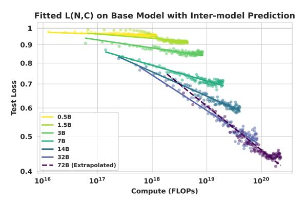

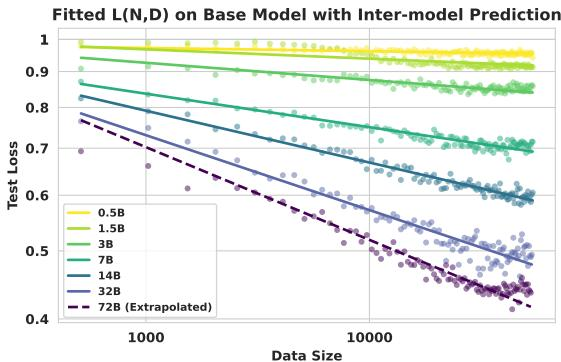

- pute for base models, fitted on 0.5B-32B and extraposize for base model, fitted on 0.5B-32B and extraposize for base models, fitted on 0.5B-32B and extraposize for base models, fitted on 0.5B-32B and extraposize for base models, fitted on 0.5B-32B and extraposize for base models, fitted on 0.5B-32B and extraposize for base models, fitted on 0.5B-32B and extraposize for base models, fitted on 0.5B-32B and extraposize for base models, fitted on 0.5B-32B and extraposize for base models, fitted on 0.5B-32B and extraposize for base models, fitted on 0.5B-32B and extraposize for base models, fitted on 0.5B-32B and extraposize for base models, fitted on 0.5B-32B and extraposize for base models, fitted on 0.5B-32B and extraposize for base models, fitted on 0.5B-32B and extraposize for base models, fitted on 0.5B-32B and extraposize for base models, fitted on 0.5B-32B and extraposize for base models, fitted on 0.5B-32B and extraposize for base models, fitted on 0.5B-32B and extraposize for base models, fitted on 0.5B-32B and extraposize for base models, fitted on 0.5B-32B and extraposize for base models, fitted on 0.5B-32B and extraposize for base models, fitted on 0.5B-32B and extraposize for base models, fitted on 0.5B-32B and extraposize for base models, fitted on 0.5B-32B and extraposize for base models, fitted on 0.5B-32B and extraposize for base models, fitted on 0.5B-32B and extraposize for base models, fitted on 0.5B-32B and extraposize for base models, fitted on 0.5B-32B and extraposize for base models, fitted on 0.5B-32B and extraposize for base models, fitted on 0.5B-32B and extraposize for base models, fitted on 0.5B-32B and extraposize for base models, fitted on 0.5B-32B and extraposize for base models, fitted on 0.5B-32B and extraposize for base models, fitted on 0.5B-32B and extraposize for base models, fitted on 0.5B-32B and extraposize for base models, fitted on 0.5B-32B and extraposize for base models, fitted on 0.5B-32B and extraposize for base models, fitted on 0.5B-32B and extraposize for base model olated on 72B.
- (a) Relation between test loss and post training com- (b) Relation between test loss and post training data lated on 72B.

Figure 1: Training Data Fiited on 0.5B-32B with Extrapolation on 72B: In both cases, larger models consistently exhibit higher learning efficiency than smaller models.

Specifically, our key findings can be summarized as follows:

- In our experiment scale, larger models, starting with stronger initial performance, consistently achieve better compute and data efficiency in RL post-training for mathematical reasoning. However, the marginal gains in this efficiency diminish gradually, revealing a saturation trend as model scale increases.
- The scaling law exhibits predictive capability across both base and instruction-tuned models, allowing us to forecast the training efficiency of larger models and predict the remaining training trajectory from early training data.
- In data-limited settings, repeated exposure to a small dataset is nearly as effective as using larger corpora, highlighting data reuse as a practical strategy.

## **Experimental Setup**

We describe the experimental setup for studying scaling behavior in RL post-training of LLMs for mathematical reasoning, including the model family, training and evaluation data, and evaluation protocol in this section. Full details are provided in Appendix A.

Models and Framework. We use the Qwen2.5 model family (0.5B, 1.5B, 3B, 7B, 14B, 32B and 72B parameters) (Qwen et al., 2025), which shares the same architecture, so that parameter count is the only variable in our scaling analysis. All experiments are run with the VeRL framework (Sheng et al., 2024), a large-scale RL platform for LLMs ensuring consistency and reproducibility.

Dataset settings. The training data is the mathematics subset of the guru-RL-92k dataset from the Reasoning 360 project (Cheng et al., 2025), which is carefully curated through deduplication and difficulty filtering. We further sort the problems by increasing difficulty (decreasing pass rate, evaluated by Qwen2.5-7B-Instruct model) to enable curriculum learning. The evaluation data consists of two parts. To derive scaling laws, we use a held-out set of 500 in-domain math problems sampled from the training distribution. To assess generalization, we evaluate on a broader benchmark suite spanning mathematics (AIME2024 (Patel et al., 2024), AMC2023 (KnovelEng, 2025), GSM8K (Cobbe et al., 2021), MATH500 (Lightman et al., 2023)), code (HumanEval (Chen et al., 2021)), logic (Zebra Puzzle(Lin, 2024)), and science (SuperGPQA (Team et al., 2025)). More details about dataset settings can be found in Appendix A.1.

**Prompt Setting.** To ensure stable behavior during RL training and evaluation, we use structured prompts tailored to each domain. For example, all mathematics problems are prepended with the Chain-of-Thought prompt (Wei et al., 2023): "You are a knowledgeable math assistant. Answer the following questions and think step by step". More prompt templates for all related domains could be found in Appendix A.3.

**RL Algorithm.** We use Group Relative Policy Optimization (GRPO) (Shao et al., 2024) for RL finetuning. GRPO estimates advantages by normalizing rewards across responses sampled from the same prompt, yielding a stable signal with lower memory cost. Specifically, for each question q, GRPO samples a group of outputs $\{o_1, o_2, \cdots, o_G\}$  from the old policy  $\pi_{\theta_{old}}$ , and the objective is defined as

$$\mathcal{L}_{\text{GRPO}} = \frac{1}{G} \sum_{i=1}^{G} \frac{1}{|o_i|} \sum_{t=1}^{|o_i|} \left\{ \min \left[ \rho(\theta) \, \hat{A}_{i,t}, \, \operatorname{clip} \left( \rho(\theta), 1 - \varepsilon, \, 1 + \varepsilon \right) \hat{A}_{i,t} \right] - \beta \, \mathcal{D}_{\text{KL}} \right\}, \tag{3}$$

where  $\rho(\theta) = \frac{\pi_{\theta}(o_{i,t}|q, o_{i, < t})}{\pi_{\theta_{\text{old}}}(o_{i,t}|q, o_{i, < t})}$  is the important sampling weight. For each output  $o_i$ , a reward model or rule is used to yield the reward signal  $\mathbf{r} = \{r_1, r_2, \cdots, r_G\}$ . The advantage is computed as

$$\hat{A}_{i,t} = \frac{r_i - \text{mean}(\mathbf{r})}{\text{std}(\mathbf{r})}.$$
 (4)

**Evaluation Process.** We compute the Pass@1 score using a binary reward signal derived from a deterministic, rule-based process. For each problem, a script extracts the final answer from the model output (e.g., within a **\boxed{}** for math) and compares it to the ground truth. A reward of 1 is given for a correct match and 0 otherwise. This signal is not only used to calculate test loss during evaluation, but also as the reward during RL training.

**Metric.** Our primary evaluation metric is the test loss (L), a proxy for reward-based performance in the RL setting. Formally,  $L = 1 - (R/R_{\text{max}})$ , where R is the number of correct solutions and  $R_{\text{max}}$  the total. We adopt the term "test loss" for consistency with foundational neural scaling law literature (Kaplan et al. (2020)). Notably, maximizing reward in RL training is equivalent to minimizing L.

**Fitting and Prediction Protocols.** To systematically evaluate the robustness and predictive capability of our derived scaling laws, we employ two distinct fitting protocols throughout our analysis:

- Inter-model Extrapolation: We fit the scaling law parameters using data from smaller models (0.5B to 32B) to calculate the learning efficiency and predict the performance of the larger model (72B).
- Intra-model Extrapolation: We fit the scaling law using only the early training steps of a specific model to forecast its loss trajectory for the remainder of the training process.

## 3 Empirical Results and Scaling Laws

This section presents a comprehensive empirical investigation into the scaling behavior of RL for post-training LLMs. We first examine scaling behaviors under compute and data constraints, then analyze independent scaling dimensions, data reuse strategies, and finally evaluate generalization performance together. To ensure robust conclusions, each configuration is repeated **three times** for both base and instruct models ranging from 0.5B to 72B. Their statistical uncertainty analysis, including Average Standard Deviation and Standard Error of the Mean (SEM), are provided in Appendix C.3.

#### 3.1 Compute-Optimal Scaling

To characterize the scaling behavior under computational limits, we first formalize the Compute-Constrained Scenario. Given a fixed computational budget C, we seek to identify the optimal model size N (and the

corresponding data allocation D) that minimizes the final test loss. This can be expressed as the following constrained optimization problem:

$$\underset{N, D}{\operatorname{arg\,min}} L(N, D) \quad \text{s.t.} \quad \operatorname{FLOPs}(N, D) = C_{\operatorname{const}}, \tag{5}$$

#### Observation 1

Within the 0.5B-32B parameter range, RL post-training achieves lower test loss under a fixed budget C by prioritizing larger models over extended training duration. However, between 32B and 72B, learning efficiency saturation reduces scaling's marginal gains, introducing a trade-off between model scale and training steps.

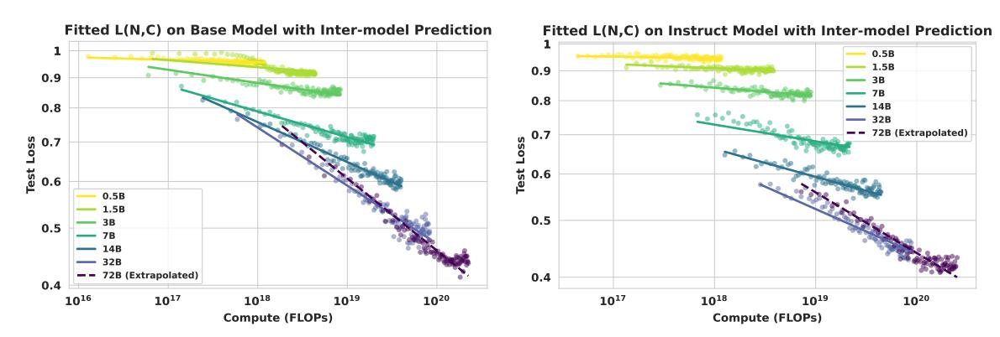

(a) Test loss vs training compute with extrapolation (b) Test loss vs training compute with extrapolation on on 72B for base model 72B for instruct model

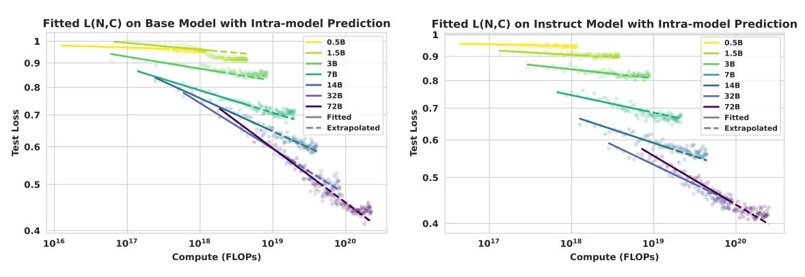

(c) Test loss vs training compute with extrapolation (d) Test loss vs training compute with extrapolation for for remainder of each training process on base model remainder of each training process on instruct model

Figure 2: Compute Scaling and Predictive Capability from 0.5B-72B for Base and Instruct Models

In the compute-constrained setting, we train 0.5B-72B models and measure test loss as a function of cumulative FLOPs C. As shown in Figure 2, larger models consistently outperform smaller ones under the same compute budget for both base and instruct variants. These plots include both Inter-model Extrapolation (fitted on 0.5B-32B and extrapolated on 72B) and Intra-model Prediction (predicting the remainder of training from initial steps) to demonstrate the predictive power of our derived scaling law. The loss-compute relationship follows a log-linear trend, which can be modeled by a power law:

$$\log(L(N,C)) = -k_C(N) \cdot \log(C) + E_C(N), \text{ where } k_C(N) = \left(\frac{K_{Cmax}}{1 + \frac{N_C}{N}}\right)$$
(6)

To demonstrate the predictive capability of the proposed formula Eq 6, we evaluate it in two distinct extrapolation settings:

- 1. Inter-model Extrapolation: We fit the law's parameters on smaller models (0.5B–32B) to calculate the learning efficiency ( $k_C(N)$ ) of 72B model. As shown in Figure 2a and 2b, the predicted efficiency aligns closely with the actual 72B performance.
- 2. Intra-model Prediction: We fit the law using only early training steps to forecast the remaining trajectory for a specific model, shown in Figure 2c and 2d.

We further analyze learning efficiency term  $k_C(N)$  in Eq. 6. As Figure 3 shows,  $k_C(N)$  grows with model size N, meaning larger models consistently have higher learning efficiency. However, the efficiency gain from model scale is not uniformly linear. Beyond 32B, the increase in  $k_C(N)$  diminishes, leading to efficiency saturation.

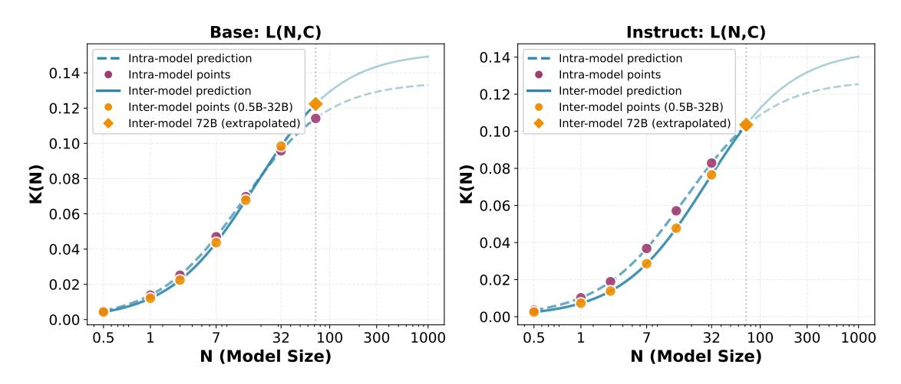

Figure 3: Fitted learning efficiency  $k_C(N)$  for Base(Left) and Instruct(Right) models: Larger models consistently exhibit higher learning efficiency with efficiency gains begin to diminish after 32B model.

This saturation is manifested as a distinct performance crossover in Figure 2: In contrast to the immediate dominance of larger models in smaller parameter regimes, the 32B model outperforms the 72B counterpart initially under equivalent compute budgets, as the smaller model size inherently enables more training steps. We believe this observation reveals a latent trade-off between model scale and training steps in compute-constrained scenarios.

#### 3.2 Data-Optimal Scaling

In many practical applications, the bottleneck lies not in compute but in the availability of high-quality reasoning data. We define the Data-Constrained Scenario as determining the model size N that yields the lowest test loss given a limited amount of unique training data D:

$$\underset{N, C}{\operatorname{arg\,min}} L(N, C) \quad \text{s.t.} \quad D = D_{\text{const}}, \tag{7}$$

#### Observation 2

Within the model range of 0.5B to 72B, for a fixed volume of unique training data D, larger models demonstrate superior sample efficiency, consistently achieving lower test loss.

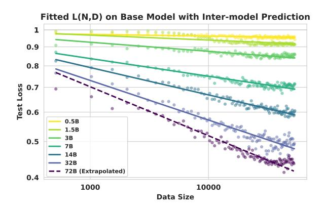

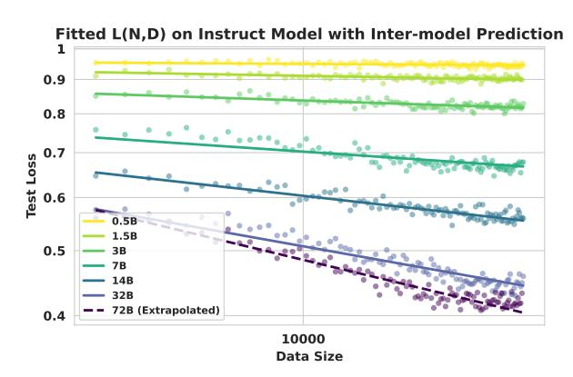

- (a) Test loss vs data size with extrapolation on 72B for base model
- (b) Test loss vs data size with extrapolation on 72B for instruct model

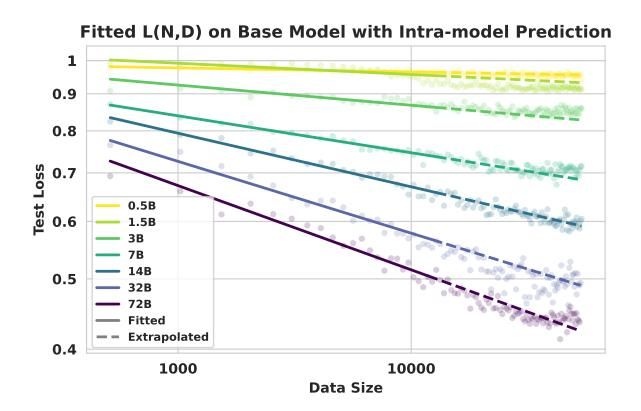

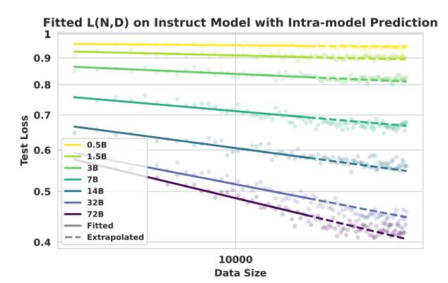

- (c) Test loss vs data size with extrapolation for remainder of each training process on base model
- (d) Test loss vs data size with extrapolation for remainder of each training process on instruct model

Figure 4: Data Scaling and Predictive Capability from 0.5B-72B for Base and Instruct Models

In the data-constrained setting, we train models with varying parameter counts N on fixed amounts of unique samples D. As shown in Figure 4, larger models consistently achieve lower test loss and higher sample efficiency across both base and instruct variants. The loss-data relationship also follows a log-linear trend and can be modeled by a similar formula addressed in compute scenario:

$$\log(L(N,D)) = -k_D(N) \cdot \log(D) + E_D(N), \text{ where } k_D(N) = \left(\frac{K_{Dmax}}{1 + \frac{N_D}{N}}\right)$$
 (8)

Mirroring the analysis in Section 3.1, we evaluate the extrapolative capability of our data scaling law (Eq. 8) in two settings:

- 1. Inter-model Extrapolation: By fitting parameters on smaller models (0.5B–32B), we accurately predict the data efficiency  $(k_D(N))$  on 72B model, as illustrated in Figure 4a and 4b.
- 2. Intra-model Prediction: We forecast the loss trajectory for the remainder of the training process using only early-stage data, shown in Figure 4c and 4d.

We adopt the same analytic form for the data efficiency coefficient  $k_D(N)$  as we did for compute. As illustrated in Figure 5,  $k_D(N)$  follows a saturation curve identical to  $k_C(N)$ : while larger models excel at

extracting knowledge from each data point, the efficiency gains diminish at scales beyond 32B. The unified functional form across both compute and data domains reflects the theoretical consistency of our scaling law.

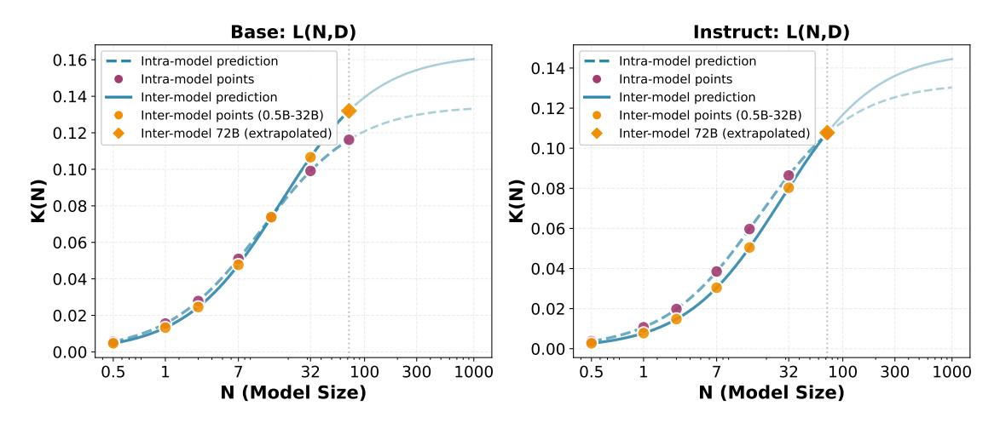

Figure 5: Fitted learning efficiency  $k_D(N)$  for Base(Left) and Instruct(Right) models:  $k_D(N)$  exhibit nearly identical growth trends with  $k_C(N)$ , with efficiency gains also starting to diminish beyond the 32B model.

#### 3.3 Scaling up Model Size

#### Observation 3

When trained to converge on sufficiently large datasets, test loss decreases monotonically with model size, though the trend deviates from a strict power law.

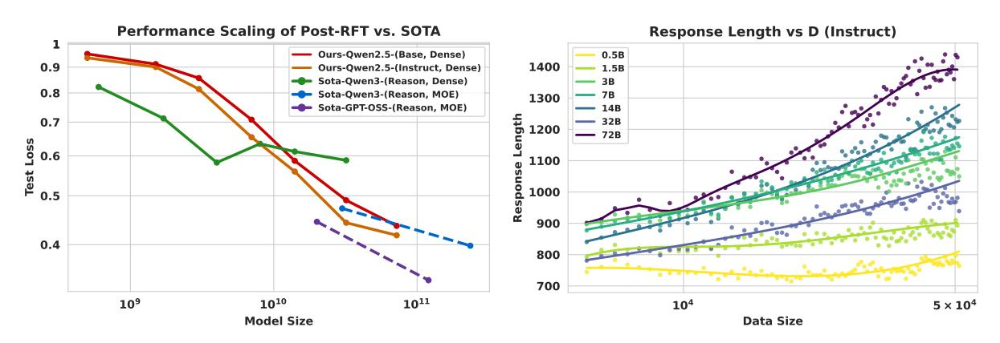

(a) Fig (b) shows Relation between test loss and model (b) Fig (b) shows relation between response length and size N for our trained model and SOTA models demondata size for instruct models, larger models generate strates the effectiveness of our training. longer responses except for 32B model.

Figure 6: Analysis of model scaling properties shows the effectiveness of our training process in this empirical study.

We train models of varying sizes to convergence and compare their final test loss. As shown in Figure 6a, larger models consistently achieve lower loss, improving monotonically with scale. The curve deviates from a strict power law: smaller models show weaker gains, suggesting diminishing returns at low parameter counts. A likely reason is that larger models inherit richer pre-trained representations, which reinforcement fine-tuning exploits for greater improvements than parameter growth alone would predict. Figure 6b further

shows that as RL training progresses, larger models generate longer responses except for 32B model. This correlates with higher accuracy, indicating greater *test-time scaling efficiency*: additional inference tokens yield larger gains in bigger models.

We also benchmark our RL-tuned Qwen2.5 models [\(Qwen et al., 2025\)](#page-14-0) against state-of-the-art open-source reasoning systems, including Qwen3 [\(Yang et al., 2025\)](#page-15-2) and GPT-OSS [\(OpenAI et al., 2025\)](#page-14-4), detailed in Table [4.](#page-21-0) On our held-out set, the 32B and 72B models match or surpass dense Qwen3 counterparts of similar size, highlighting the effectiveness of RL post-training. Mixture-of-experts models such as Qwen3 and GPT-OSS achieve approximate loss at much larger scales (235B), with GPT-OSS-120B currently leading. These comparisons suggest that scaling across 0.5B-72B will be necessary to fully characterize post-training behavior and compete with frontier MoE systems.

## **3.4 Scaling with Constrained Data and Reuse**

When unique data is scarce, a critical question is whether repeating data is effective. We investigate this Data Reuse Scenario by fixing the total data budget and varying the reuse factor *τ* . Specifically, we aim to identify the optimal reuse factor *τ* that minimizes the test loss:

$$\underset{\tau}{\operatorname{argmin}}; L(\tau) \quad \text{s.t.} \quad D_{\text{unique}} \times \tau = D_{\text{total}}, \tag{9}$$

Performance in data-constrained settings is primarily determined by the total number of used data (*D*total). For a fixed *D*total, the final test loss is remarkably insensitive to the data reuse factor (*τ* ), with no significant degradation up to *τ* = 25.

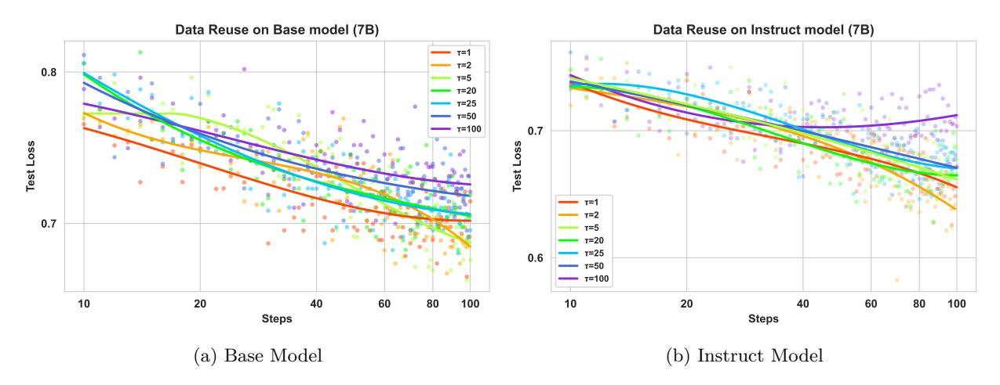

Figure 7: Plot shows the final test loss of a 7B Base (left) and Instruct (right) model trained with a fixed toal number of samples but varying the data reuse factor *τ* .

We further consider the data-reuse scenario, where high-quality data is limited but can be revisited multiple times. To simulate this, we partition the training set into smaller subsets while preserving the difficulty distribution (Details provided in Appendix [A.4\)](#page-18-0). Each subset is cycled through multiple times, with the reuse factor *τ* controlling how often each unique example is revisited. The total number of used data *D*total is fixed across runs, and curriculum ordering is maintained so that problems are always presented from easy to hard. This ensures that performance differences arise solely from the degree of data reuse, rather than distributional or scheduling artifacts.

As shown in Figure [7,](#page-8-0) performance remains nearly unchanged for *τ* ≤ 25, while moderate degradation appears as *τ* increases further. At *τ* = 100, we observe clear signs of overfitting, indicating that repeated reuse eventually harms generalization. Overall, these results suggest that final performance is primarily governed by the total number of used data rather than sample uniqueness, and that moderate data reuse is an effective strategy for RL fine-tuning with limited datasets.

#### 3.5 Domain Transfer

#### Observation !

RL post-training on mathematical reasoning yields generalization improvements on in-domain tasks with varying difficulty, but shows negligible transfer to out-of-domain tasks.

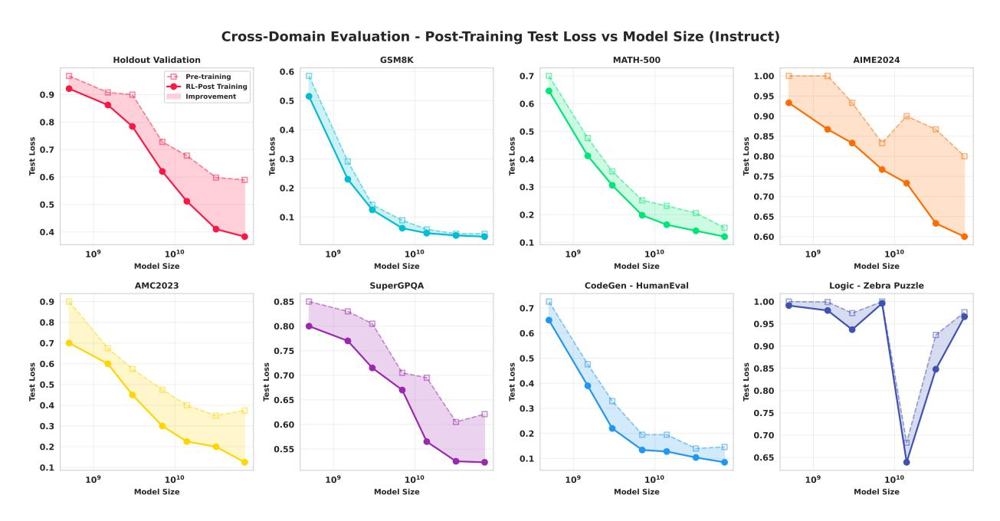

Figure 8: The effect of domain transfer, illustrated with the Qwen2.5-72B-Instruct model.

We also investigate the generalization capabilities of the reinforcement learning fine-tuning (RFT) models by evaluating them on a suite of unseen in-domain tasks with varying difficulty and out-of-domain (OOD) tasks. More results are in Appendix B.1.

**In-Domain Generalization.** Figure 8 shows consistent improvements on unseen mathematics tasks outside the training set. On benchmarks, from easy to hard, including GSM8K, MATH-500, AMC2023, AIME2024, test loss steadily decreases with training compute, suggesting that RL post-training enhances transferable reasoning skills within mathematics.

Out-of-Domain Generalization. As shown in Figure 8, results on OOD tasks are markedly different. For code generation (HumanEval) and STEM problems (SuperGPQA), performance gains marginally, indicating that RL fine-tuning is highly specialized.On logical reasoning (zebra\_puzzle), performance degrades for larger models, suggesting that intensive optimization on mathematical reasoning may interfere with or "damage" other distinct reasoning abilities.

#### 4 related work

Foundational Scaling Laws of Neural Language Models. Foundational scaling studies show language modeling loss follows smooth power-laws in model size N, data D, and compute C (Kaplan et al., 2020), with compute-optimal training prescribing near lockstep growth of parameters and tokens under fixed FLOPs (Hoffmann et al., 2022). Later analyses attribute earlier discrepancies to embedding/non-embedding parameters.

eter accounting, last-layer costs, optimizer warmup, and scale-sensitive hyperparameters [\(Pearce & Song,](#page-14-5) [2024;](#page-14-5) [Porian et al., 2024\)](#page-14-6), while data-centric refinements examine pruning efficiency [\(Sorscher et al., 2022\)](#page-15-3), repetition effects [\(Hernandez et al., 2022\)](#page-12-8), gzip-based complexity predictors [\(Pandey, 2024\)](#page-14-7), constrained or synthetic regimes [\(Muennighoff et al., 2023;](#page-13-6) [Qin et al., 2025\)](#page-14-8), and task transfer (e.g., translation) [\(Isik et al.,](#page-13-7) [2024\)](#page-13-7). Test-time compute amplification supplies an inference analogue to classical training laws [\(Snell et al.,](#page-15-4) [2024\)](#page-15-4).

**RL post-training in LLMs.** In RL, power-law trends similarly link capacity, interaction compute, and performance [\(Hilton et al., 2023\)](#page-12-1); scaling RFT across horizon and compute improves mathematical and coding reasoning [\(DeepSeek-AI, 2025;](#page-12-3) [Kimi Team, 2025;](#page-13-2) [Mai et al., 2025b;](#page-13-8) [Zhang et al., 2025a;](#page-16-0)[b\)](#page-16-1), while extended schedules [\(Liu et al., 2025\)](#page-13-9), ultra-low-shot or single-example RL [\(Wang et al., 2025\)](#page-15-5), and minimaldata efficiency paradigms [\(Li et al., 2025b\)](#page-13-10) probe data–compute tradeoffs. Instability and uneven gains highlight fragile optimization [\(Zeng et al., 2025a;](#page-16-2) [Yue et al., 2025\)](#page-15-6), and multi-domain mixtures reveal both synergy and interference across math, code, and logic [\(Li et al., 2025c;](#page-13-11) [Cheng et al., 2025\)](#page-12-5).

**Mathematical Reasoning with LLMs.** Mathematical reasoning amplifies these dynamics: accuracy generally scales upward while verification behaviors remain inconsistent [\(Touvron et al., 2023\)](#page-15-7); corpus volume and quality jointly shape attainable curves [\(Ye et al., 2024\)](#page-15-8); multi-task math-generalist training diverges from specialist scaling trajectories [\(Yue et al., 2023\)](#page-15-9); and RL with code execution induces additional behaviors such as emergent tool use concentrated in math problem solving [\(Zeng et al., 2025b\)](#page-16-3). Collectively, evidence indicates that reasoning performance is governed by interacting axes of model size, data distribution/quality, training (supervised vs. RL) paradigm, and allocation of both training and inference compute, while unified laws for mathematical reasoning remain only partially characterized.

## **5 Discussion**

**Scaling Dependence on Evaluation Environment and Metrics.** Reinforcement learning optimizes directly for environment rewards [\(Sutton & Barto, 2018\)](#page-15-10), which in principle allows unbounded capability—as demonstrated by AlphaZero mastering board games [\(Silver et al., 2017\)](#page-14-9), AlphaFold predicting protein structures [\(Jumper et al., 2021\)](#page-13-12), and frontier LLMs such as Gemini-2.5-Pro achieving IMO-level performance [\(Huang & Yang, 2025\)](#page-13-13). In contrast, text-based LLMs lack a well-defined RL environment, forcing us to rely on human-curated datasets as proxies. Test loss thus serves as a pragmatic but imperfect metric: it is monotonic and convergent, yet heavily dependent on dataset construction and task difficulty, with different benchmarks (e.g., GSM8K vs. AIME, Section [3.5\)](#page-9-1) showing distinct convergence rates. This task dependence makes the absolute coefficients of our fitted scaling laws (*k*(*N*)*, E*) difficult to interpret universally. Prior work proposed "intrinsic performance"—the minimum compute needed to reach a target reward—as a normalization across environments [\(Hilton et al., 2023\)](#page-12-1), but we did not find an analogous measure in large-scale LLMs. Establishing principled, environment-independent evaluation protocols remains an open and critical challenge for RL-based scaling studies.

**Scaling Dependence on Model Scale.** Our study of models from 0.5B to 72B parameters shows that larger models exhibit greater sample and compute efficiency in RL post-training. This parameter range allows us to characterize the scaling limits. We found that these advantages do not extend indefinitely. Our analytic learning efficiency term *k*(*N*) in Eq[.6](#page-4-1) and Eq[.8,](#page-6-1) explicitly confirms that the efficiency gains follow a saturation curve toward a limit (*K*max). This finding implies that scaling up models beyond a certain point, while still yielding absolute performance gains, suffers from diminishing marginal returns in efficiency.

**Dependence on RL Algorithm.** Our analysis is based on GRPO, a mainstream and stable RL posttraining algorithm for LLMs that uses an actor-only design and normalizes rewards across responses. Comparative study with alternative RL algorithms [\(Cui et al., 2025\)](#page-12-9) reports minor differences in training curves. Whether more advanced algorithms can significantly improve sample efficiency or stability—and thereby reshape the scaling frontier—remains an important open question.

**Future of LLM Agent.** The integration of reinforcement learning with agentic LLMs is increasingly viewed as a promising direction [\(Zhang et al., 2025a](#page-16-0)[;b\)](#page-16-1). Both theoretical and empirical studies show that augmentations such as external tool use and long-term memory can substantially boost model performance [\(Lin](#page-13-14) [& Xu, 2025;](#page-13-14) [Houliston et al., 2025;](#page-12-10) [Mai et al., 2025a\)](#page-13-15). We anticipate that such agentic mechanisms will markedly improve the scaling behavior of RL-trained LLMs: by offloading deterministic computations to tools and focusing learning on high-level decision making, these models could achieve much higher efficiency, effectively shifting the performance frontier upward for a given compute or data budget. Understanding the scaling laws of these agentic systems is, therefore, a key and exciting avenue for future research.

## **6 Conclusion**

This study presents the systematic exploration of scaling laws for reinforcement learning post-training of large language models in mathematical reasoning. Through 54 controlled experiments across the Qwen2.5 family, we show that larger models consistently achieve superior compute and data efficiency, that performance in data-limited regimes depends primarily on the total number of optimization steps rather than data uniqueness, and that moderate data reuse can be highly effective without harming generalization. While RL post-training reliably strengthens in-domain reasoning, its transfer to out-of-domain tasks remains limited, underscoring the trade-off between specialization and breadth. Our ablation further identifies rollout size in GRPO as a practical lever tied to compute budgets. Taken together, these findings offer principled and actionable guidelines for resource-efficient RL fine-tuning and suggest promising directions for further exploration of scaling and generalization in LLM reasoning.

## **References**

- Janice Ahn, Rishu Verma, Renze Lou, Di Liu, Rui Zhang, and Wenpeng Yin. Large language models for mathematical reasoning: Progresses and challenges. In Neele Falk, Sara Papi, and Mike Zhang (eds.), *Proceedings of the 18th Conference of the European Chapter of the Association for Computational Linguistics: Student Research Workshop*, pp. 225–237, St. Julian's, Malta, March 2024. Association for Computational Linguistics. doi: 10.18653/v1/2024.eacl-srw.17. URL <https://aclanthology.org/2024.eacl-srw.17/>.
- Mark Chen, Jerry Tworek, Heewoo Jun, Qiming Yuan, Henrique Ponde de Oliveira Pinto, Jared Kaplan, Harri Edwards, Yuri Burda, Nicholas Joseph, Greg Brockman, Alex Ray, Raul Puri, Gretchen Krueger, Michael Petrov, Heidy Khlaaf, Girish Sastry, Pamela Mishkin, Brooke Chan, Scott Gray, Nick Ryder, Mikhail Pavlov, Alethea Power, Lukasz Kaiser, Mohammad Bavarian, Clemens Winter, Philippe Tillet, Felipe Petroski Such, Dave Cummings, Matthias Plappert, Fotios Chantzis, Elizabeth Barnes, Ariel Herbert-Voss, William Hebgen Guss, Alex Nichol, Alex Paino, Nikolas Tezak, Jie Tang, Igor Babuschkin, Suchir Balaji, Shantanu Jain, William Saunders, Christopher Hesse, Andrew N. Carr, Jan Leike, Josh Achiam, Vedant Misra, Evan Morikawa, Alec Radford, Matthew Knight, Miles Brundage, Mira Murati, Katie Mayer, Peter Welinder, Bob McGrew, Dario Amodei, Sam McCandlish, Ilya Sutskever, and Wojciech Zaremba. Evaluating large language models trained on code, 2021. URL <https://arxiv.org/abs/2107.03374>.
- Zhoujun Cheng, Shibo Hao, Tianyang Liu, Fan Zhou, Yutao Xie, Feng Yao, Yuexin Bian, Yonghao Zhuang, Nilabjo Dey, Yuheng Zha, Yi Gu, Kun Zhou, Yuqi Wang, Yuan Li, Richard Fan, Jianshu She, Chengqian Gao, Abulhair Saparov, Haonan Li, Taylor W. Killian, Mikhail Yurochkin, Zhengzhong Liu, Eric P. Xing, and Zhiting Hu. Revisiting reinforcement learning for llm reasoning from a cross-domain perspective. *arXiv preprint arXiv:2506.14965*, 2025.
- Karl Cobbe, Vineet Kosaraju, Mohammad Bavarian, Mark Chen, Heewoo Jun, Lukasz Kaiser, Matthias Plappert, Jerry Tworek, Jacob Hilton, Reiichiro Nakano, Christopher Hesse, and John Schulman. Training verifiers to solve math word problems, 2021. URL <https://arxiv.org/abs/2110.14168>.
- Ganqu Cui, Yuchen Zhang, Jiacheng Chen, Lifan Yuan, Zhi Wang, Yuxin Zuo, Haozhan Li, Yuchen Fan, Huayu Chen, Weize Chen, Zhiyuan Liu, Hao Peng, Lei Bai, Wanli Ouyang, Yu Cheng, Bowen Zhou, and Ning Ding. The entropy mechanism of reinforcement learning for reasoning language models, 2025. URL <https://arxiv.org/abs/2505.22617>.
- DeepSeek-AI. Deepseek-r1: Incentivizing reasoning capability in llms via reinforcement learning. *arXiv preprint arXiv:2501.12948*, 2025.
- Mohamed Amine Ferrag, Norbert Tihanyi, and Merouane Debbah. From llm reasoning to autonomous ai agents: A comprehensive review. *arXiv preprint arXiv:2504.19678*, 2025.
- Danny Hernandez, Tom Brown, Tom Conerly, Nova DasSarma, Dawn Drain, Sheer El-Showk, Nelson Elhage, Zac Hatfield-Dodds, Tom Henighan, Tristan Hume, et al. Scaling laws and interpretability of learning from repeated data. *arXiv preprint arXiv:2205.10487*, 2022.
- Jacob Hilton, Jie Tang, and John Schulman. Scaling laws for single-agent reinforcement learning. *arXiv preprint arXiv:2301.13442*, 2023.
- Jordan Hoffmann, Sebastian Borgeaud, Arthur Mensch, Elena Buchatskaya, Trevor Cai, Eliza Rutherford, Diego de Las Casas, Lisa Anne Hendricks, Johannes Welbl, Aidan Clark, Tom Hennigan, Eric Noland, Katie Millican, George van den Driessche, Bogdan Damoc, Aurelia Guy, Simon Osindero, Karen Simonyan, Erich Elsen, Oriol Vinyals, Jack W. Rae, and Laurent Sifre. Training compute-optimal large language models. In *Proceedings of the 36th International Conference on Neural Information Processing Systems*, NIPS '22, Red Hook, NY, USA, 2022. Curran Associates Inc. ISBN 9781713871088.
- Sam Houliston, Ambroise Odonnat, Charles Arnal, and Vivien Cabannes. Provable benefits of in-tool learning for large language models, 2025. URL <https://arxiv.org/abs/2508.20755>.

- Yichen Huang and Lin F. Yang. Gemini 2.5 pro capable of winning gold at imo 2025, 2025. URL [https:](https://arxiv.org/abs/2507.15855) [//arxiv.org/abs/2507.15855](https://arxiv.org/abs/2507.15855).
- Berivan Isik, Natalia Ponomareva, Hussein Hazimeh, Dimitris Paparas, Sergei Vassilvitskii, and Sanmi Koyejo. Scaling laws for downstream task performance in machine translation. *arXiv preprint arXiv:2402.04177*, 2024.
- John Jumper, Richard Evans, Alexander Pritzel, Tim Green, Michael Figurnov, Olaf Ronneberger, Kathryn Tunyasuvunakool, Russ Bates, Augustin Žídek, Anna Potapenko, et al. Highly accurate protein structure prediction with alphafold. *nature*, 596(7873):583–589, 2021.
- Jared Kaplan, Sam McCandlish, Tom Henighan, Tom B Brown, Benjamin Chess, Rewon Child, Scott Gray, Alec Radford, Jeffrey Wu, and Dario Amodei. Scaling laws for neural language models. *arXiv preprint arXiv:2001.08361*, 2020.
- Kimi Team. Kimi k1.5: Scaling reinforcement learning with llms. *arXiv preprint arXiv:2501.12599*, 2025.
- KnovelEng. Knovel engineering amc-23 dataset. <https://huggingface.co/datasets/knoveleng/AMC-23>, 2025. Accessed: 2025-09-23.
- Margaret Li, Sneha Kudugunta, and Luke Zettlemoyer. (mis)fitting scaling laws: A survey of scaling law fitting techniques in deep learning. In *The Thirteenth International Conference on Learning Representations*, 2025a. URL <https://openreview.net/forum?id=xI71dsS3o4>.
- Xuefeng Li, Haoyang Zou, and Pengfei Liu. Limr: Less is more for rl scaling. *arXiv preprint arXiv:2502.11886*, 2025b.
- Yu Li, Zhuoshi Pan, Honglin Lin, Mengyuan Sun, Conghui He, and Lijun Wu. Can one domain help others? a data-centric study on multi-domain reasoning via reinforcement learning. *arXiv preprint arXiv:2507.17512*, 2025c.
- Hunter Lightman, Vineet Kosaraju, Yura Burda, Harri Edwards, Bowen Baker, Teddy Lee, Jan Leike, John Schulman, Ilya Sutskever, and Karl Cobbe. Let's verify step by step, 2023. URL [https://arxiv.org/](https://arxiv.org/abs/2305.20050) [abs/2305.20050](https://arxiv.org/abs/2305.20050).
- Bill Yuchen Lin. ZeroEval: A Unified Framework for Evaluating Language Models, July 2024. URL [https:](https://github.com/WildEval/ZeroEval) [//github.com/WildEval/ZeroEval](https://github.com/WildEval/ZeroEval).
- Heng Lin and Zhongwen Xu. Understanding tool-integrated reasoning, 2025. URL [https://arxiv.org/](https://arxiv.org/abs/2508.19201) [abs/2508.19201](https://arxiv.org/abs/2508.19201).
- Mingjie Liu, Shizhe Diao, Ximing Lu, Jian Hu, Xin Dong, Yejin Choi, Jan Kautz, and Yi Dong. Prorl: Prolonged reinforcement learning expands reasoning boundaries in large language models. *arXiv preprint arXiv:2505.24864*, 2025.
- Xinji Mai, Haotian Xu, Zhong-Zhi Li, Xing W, Weinong Wang, Jian Hu, Yingying Zhang, and Wenqiang Zhang. Agent rl scaling law: Agent rl with spontaneous code execution for mathematical problem solving, 2025a. URL <https://arxiv.org/abs/2505.07773>.
- Xinji Mai, Haotian Xu, Weinong Wang, Jian Hu, Yingying Zhang, Wenqiang Zhang, et al. Agent rl scaling law: Agent rl with spontaneous code execution for mathematical problem solving. *arXiv preprint arXiv:2505.07773*, 2025b.
- Niklas Muennighoff, Alexander Rush, Boaz Barak, Teven Le Scao, Nouamane Tazi, Aleksandra Piktus, Sampo Pyysalo, Thomas Wolf, and Colin A Raffel. Scaling data-constrained language models. *Advances in Neural Information Processing Systems*, 36:50358–50376, 2023.

OpenAI, :, Sandhini Agarwal, Lama Ahmad, Jason Ai, Sam Altman, Andy Applebaum, Edwin Arbus, Rahul K. Arora, Yu Bai, Bowen Baker, Haiming Bao, Boaz Barak, Ally Bennett, Tyler Bertao, Nivedita Brett, Eugene Brevdo, Greg Brockman, Sebastien Bubeck, Che Chang, Kai Chen, Mark Chen, Enoch Cheung, Aidan Clark, Dan Cook, Marat Dukhan, Casey Dvorak, Kevin Fives, Vlad Fomenko, Timur Garipov, Kristian Georgiev, Mia Glaese, Tarun Gogineni, Adam Goucher, Lukas Gross, Katia Gil Guzman, John Hallman, Jackie Hehir, Johannes Heidecke, Alec Helyar, Haitang Hu, Romain Huet, Jacob Huh, Saachi Jain, Zach Johnson, Chris Koch, Irina Kofman, Dominik Kundel, Jason Kwon, Volodymyr Kyrylov, Elaine Ya Le, Guillaume Leclerc, James Park Lennon, Scott Lessans, Mario Lezcano-Casado, Yuanzhi Li, Zhuohan Li, Ji Lin, Jordan Liss, Lily, Liu, Jiancheng Liu, Kevin Lu, Chris Lu, Zoran Martinovic, Lindsay McCallum, Josh McGrath, Scott McKinney, Aidan McLaughlin, Song Mei, Steve Mostovoy, Tong Mu, Gideon Myles, Alexander Neitz, Alex Nichol, Jakub Pachocki, Alex Paino, Dana Palmie, Ashley Pantuliano, Giambattista Parascandolo, Jongsoo Park, Leher Pathak, Carolina Paz, Ludovic Peran, Dmitry Pimenov, Michelle Pokrass, Elizabeth Proehl, Huida Qiu, Gaby Raila, Filippo Raso, Hongyu Ren, Kimmy Richardson, David Robinson, Bob Rotsted, Hadi Salman, Suvansh Sanjeev, Max Schwarzer, D. Sculley, Harshit Sikchi, Kendal Simon, Karan Singhal, Yang Song, Dane Stuckey, Zhiqing Sun, Philippe Tillet, Sam Toizer, Foivos Tsimpourlas, Nikhil Vyas, Eric Wallace, Xin Wang, Miles Wang, Olivia Watkins, Kevin Weil, Amy Wendling, Kevin Whinnery, Cedric Whitney, Hannah Wong, Lin Yang, Yu Yang, Michihiro Yasunaga, Kristen Ying, Wojciech Zaremba, Wenting Zhan, Cyril Zhang, Brian Zhang, Eddie Zhang, and Shengjia Zhao. gpt-oss-120b and gpt-oss-20b model card, 2025. URL <https://arxiv.org/abs/2508.10925>.

Rohan Pandey. gzip predicts data-dependent scaling laws. *arXiv preprint arXiv:2405.16684*, 2024.

Bhrij Patel, Souradip Chakraborty, Wesley A. Suttle, Mengdi Wang, Amrit Singh Bedi, and Dinesh Manocha. Aime: Ai system optimization via multiple llm evaluators, 2024. URL [https://arxiv.org/abs/2410.](https://arxiv.org/abs/2410.03131) [03131](https://arxiv.org/abs/2410.03131).

Tim Pearce and Jinyeop Song. Reconciling kaplan and chinchilla scaling laws. *arXiv preprint arXiv:2406.12907*, 2024.

Tomer Porian, Mitchell Wortsman, Jenia Jitsev, Ludwig Schmidt, and Yair Carmon. Resolving discrepancies in compute-optimal scaling of language models. *Advances in Neural Information Processing Systems*, 37: 100535–100570, 2024.

Zeyu Qin, Qingxiu Dong, Xingxing Zhang, Li Dong, Xiaolong Huang, Ziyi Yang, Mahmoud Khademi, Dongdong Zhang, Hany Hassan Awadalla, Yi R Fung, et al. Scaling laws of synthetic data for language models. *arXiv preprint arXiv:2503.19551*, 2025.

Qwen, :, An Yang, Baosong Yang, Beichen Zhang, Binyuan Hui, Bo Zheng, Bowen Yu, Chengyuan Li, Dayiheng Liu, Fei Huang, Haoran Wei, Huan Lin, Jian Yang, Jianhong Tu, Jianwei Zhang, Jianxin Yang, Jiaxi Yang, Jingren Zhou, Junyang Lin, Kai Dang, Keming Lu, Keqin Bao, Kexin Yang, Le Yu, Mei Li, Mingfeng Xue, Pei Zhang, Qin Zhu, Rui Men, Runji Lin, Tianhao Li, Tianyi Tang, Tingyu Xia, Xingzhang Ren, Xuancheng Ren, Yang Fan, Yang Su, Yichang Zhang, Yu Wan, Yuqiong Liu, Zeyu Cui, Zhenru Zhang, and Zihan Qiu. Qwen2.5 technical report, 2025.

Zhihong Shao, Peiyi Wang, Qihao Zhu, Runxin Xu, Junxiao Song, Xiao Bi, Haowei Zhang, Mingchuan Zhang, Y. K. Li, Y. Wu, and Daya Guo. Deepseekmath: Pushing the limits of mathematical reasoning in open language models, 2024. URL <https://arxiv.org/abs/2402.03300>.

Guangming Sheng, Chi Zhang, Zilingfeng Ye, Xibin Wu, Wang Zhang, Ru Zhang, Yanghua Peng, Haibin Lin, and Chuan Wu. Hybridflow: A flexible and efficient rlhf framework. *arXiv preprint arXiv: 2409.19256*, 2024.

David Silver, Thomas Hubert, Julian Schrittwieser, Ioannis Antonoglou, Matthew Lai, Arthur Guez, Marc Lanctot, Laurent Sifre, Dharshan Kumaran, Thore Graepel, Timothy Lillicrap, Karen Simonyan, and Demis Hassabis. Mastering chess and shogi by self-play with a general reinforcement learning algorithm, 2017. URL <https://arxiv.org/abs/1712.01815>.

- Charlie Snell, Jaehoon Lee, Kelvin Xu, and Aviral Kumar. Scaling llm test-time compute optimally can be more effective than scaling model parameters. *arXiv preprint arXiv:2408.03314*, 2024.
- Ben Sorscher, Robert Geirhos, Shashank Shekhar, Surya Ganguli, and Ari Morcos. Beyond neural scaling laws: beating power law scaling via data pruning. *Advances in Neural Information Processing Systems*, 35:19523–19536, 2022.
- Richard S. Sutton and Andrew G. Barto. *Reinforcement Learning: An Introduction*. A Bradford Book, Cambridge, MA, USA, 2018. ISBN 0262039249.
- P Team, Xinrun Du, Yifan Yao, Kaijing Ma, Bingli Wang, Tianyu Zheng, King Zhu, Minghao Liu, Yiming Liang, Xiaolong Jin, Zhenlin Wei, Chujie Zheng, Kaixin Deng, Shawn Gavin, Shian Jia, Sichao Jiang, Yiyan Liao, Rui Li, Qinrui Li, Sirun Li, Yizhi Li, Yunwen Li, David Ma, Yuansheng Ni, Haoran Que, Qiyao Wang, Zhoufutu Wen, Siwei Wu, Tyshawn Hsing, Ming Xu, Zhenzhu Yang, Zekun Moore Wang, Junting Zhou, Yuelin Bai, Xingyuan Bu, Chenglin Cai, Liang Chen, Yifan Chen, Chengtuo Cheng, Tianhao Cheng, Keyi Ding, Siming Huang, Yun Huang, Yaoru Li, Yizhe Li, Zhaoqun Li, Tianhao Liang, Chengdong Lin, Hongquan Lin, Yinghao Ma, Tianyang Pang, Zhongyuan Peng, Zifan Peng, Qige Qi, Shi Qiu, Xingwei Qu, Shanghaoran Quan, Yizhou Tan, Zili Wang, Chenqing Wang, Hao Wang, Yiya Wang, Yubo Wang, Jiajun Xu, Kexin Yang, Ruibin Yuan, Yuanhao Yue, Tianyang Zhan, Chun Zhang, Jinyang Zhang, Xiyue Zhang, Xingjian Zhang, Yue Zhang, Yongchi Zhao, Xiangyu Zheng, Chenghua Zhong, Yang Gao, Zhoujun Li, Dayiheng Liu, Qian Liu, Tianyu Liu, Shiwen Ni, Junran Peng, Yujia Qin, Wenbo Su, Guoyin Wang, Shi Wang, Jian Yang, Min Yang, Meng Cao, Xiang Yue, Zhaoxiang Zhang, Wangchunshu Zhou, Jiaheng Liu, Qunshu Lin, Wenhao Huang, and Ge Zhang. Supergpqa: Scaling llm evaluation across 285 graduate disciplines, 2025. URL <https://arxiv.org/abs/2502.14739>.
- Hugo Touvron, Albert Q. Jiang, Nan Du, and et al. Scaling relationship on learning mathematical reasoning with large language models. *arXiv preprint arXiv:2308.01825*, 2023. URL [https://arxiv.org/abs/](https://arxiv.org/abs/2308.01825) [2308.01825](https://arxiv.org/abs/2308.01825).
- Yiping Wang, Qing Yang, Zhiyuan Zeng, Liliang Ren, Liyuan Liu, Baolin Peng, Hao Cheng, Xuehai He, Kuan Wang, Jianfeng Gao, et al. Reinforcement learning for reasoning in large language models with one training example. *arXiv preprint arXiv:2504.20571*, 2025.
- Jason Wei, Xuezhi Wang, Dale Schuurmans, Maarten Bosma, Brian Ichter, Fei Xia, Ed Chi, Quoc Le, and Denny Zhou. Chain-of-thought prompting elicits reasoning in large language models, 2023. URL <https://arxiv.org/abs/2201.11903>.
- An Yang, Anfeng Li, Baosong Yang, Beichen Zhang, Binyuan Hui, Bo Zheng, Bowen Yu, Chang Gao, Chengen Huang, Chenxu Lv, Chujie Zheng, Dayiheng Liu, Fan Zhou, Fei Huang, Feng Hu, Hao Ge, Haoran Wei, Huan Lin, Jialong Tang, Jian Yang, Jianhong Tu, Jianwei Zhang, Jianxin Yang, Jiaxi Yang, Jing Zhou, Jingren Zhou, Junyang Lin, Kai Dang, Keqin Bao, Kexin Yang, Le Yu, Lianghao Deng, Mei Li, Mingfeng Xue, Mingze Li, Pei Zhang, Peng Wang, Qin Zhu, Rui Men, Ruize Gao, Shixuan Liu, Shuang Luo, Tianhao Li, Tianyi Tang, Wenbiao Yin, Xingzhang Ren, Xinyu Wang, Xinyu Zhang, Xuancheng Ren, Yang Fan, Yang Su, Yichang Zhang, Yinger Zhang, Yu Wan, Yuqiong Liu, Zekun Wang, Zeyu Cui, Zhenru Zhang, Zhipeng Zhou, and Zihan Qiu. Qwen3 technical report, 2025. URL [https:](https://arxiv.org/abs/2505.09388) [//arxiv.org/abs/2505.09388](https://arxiv.org/abs/2505.09388).
- Qiwei Ye, Chenxin Qian, Qingxiu Song, and et al. Skywork-math: Data scaling laws for mathematical reasoning in large language models — the story goes on. *arXiv preprint arXiv:2407.08348*, 2024. URL <https://arxiv.org/abs/2407.08348>.
- Xiang Yue, Fanghua Liu, Yuxuan Zhang, and et al. Mammoth: Building math generalist models. *arXiv preprint arXiv:2309.05653*, 2023. URL <https://arxiv.org/abs/2309.05653>.
- Yang Yue, Zhiqi Chen, Rui Lu, Andrew Zhao, Zhaokai Wang, Shiji Song, and Gao Huang. Does reinforcement learning really incentivize reasoning capacity in llms beyond the base model? *arXiv preprint arXiv:2504.13837*, 2025.

- Weihao Zeng, Yuzhen Huang, Qian Liu, Wei Liu, Keqing He, Zejun Ma, and Junxian He. Simplerl-zoo: Investigating and taming zero reinforcement learning for open base models in the wild. *arXiv preprint arXiv:2503.18892*, 2025a.
- Yifan Zeng, Tianyu Guo, Yuqing Wang, and et al. Agent rl scaling law: Spontaneous code execution for mathematical problem solving. *arXiv preprint arXiv:2505.07773*, 2025b. URL [https://arxiv.org/abs/](https://arxiv.org/abs/2505.07773) [2505.07773](https://arxiv.org/abs/2505.07773).
- Guibin Zhang, Hejia Geng, Xiaohang Yu, Zhenfei Yin, Zaibin Zhang, Zelin Tan, Heng Zhou, Zhongzhi Li, Xiangyuan Xue, Yijiang Li, Yifan Zhou, Yang Chen, Chen Zhang, Yutao Fan, Zihu Wang, Songtao Huang, Yue Liao, Hongru Wang, Mengyue Yang, Heng Ji, Michael Littman, Jun Wang, Shuicheng Yan, Philip Torr, and Lei Bai. The landscape of agentic reinforcement learning for llms: A survey, 2025a. URL <https://arxiv.org/abs/2509.02547>.
- Kaiyan Zhang, Yuxin Zuo, Bingxiang He, Youbang Sun, Runze Liu, Che Jiang, Yuchen Fan, Kai Tian, Guoli Jia, Pengfei Li, Yu Fu, Xingtai Lv, Yuchen Zhang, Sihang Zeng, Shang Qu, Haozhan Li, Shijie Wang, Yuru Wang, Xinwei Long, Fangfu Liu, Xiang Xu, Jiaze Ma, Xuekai Zhu, Ermo Hua, Yihao Liu, Zonglin Li, Huayu Chen, Xiaoye Qu, Yafu Li, Weize Chen, Zhenzhao Yuan, Junqi Gao, Dong Li, Zhiyuan Ma, Ganqu Cui, Zhiyuan Liu, Biqing Qi, Ning Ding, and Bowen Zhou. A survey of reinforcement learning for large reasoning models, 2025b. URL <https://arxiv.org/abs/2509.08827>.

## **A Experiment Setup Details**

This section provides a detailed breakdown of the datasets and hyperparameters used in our experiments, supplementing the information provided in the main text.

## **A.1 Dataset Details**

Our training was conducted on a curated mathematics dataset. For evaluation, especially for analyzing generalization (as mentioned in the main text), we utilized a comprehensive suite of benchmarks spanning multiple domains. The composition of this evaluation suite is detailed in Table [1.](#page-17-3)

| Dataset            | Samples | Huggingface Tag         | Domain            |
|--------------------|---------|-------------------------|-------------------|
| Held-out Data      | 500     | LLM360/guru-RL-92k      | Math              |
| aime2024           | 30      | Maxwell-Jia/AIME_2024   | Math              |
| amc2023            | 40      | knoveleng/AMC-23        | Math              |
| codegen_humaneval  | 164     | openai/openai_humaneval | Code              |
| gsm8k              | 1319    | openai/gsm8k            | Math              |
| logic_zebra_puzzle | 200     | LLM360/guru-RL-92k      | Logical Reasoning |
| math               | 500     | HuggingFaceH4/MATH-500  | Math              |
| stem_supergpqa     | 200     | LLM360/guru-RL-92k      | STEM              |
| Total              | 2953    |                         |                   |

Table 1: Composition of the multi-domain evaluation suite.

## **A.2 Hyperparameter Configuration**

All experiments were conducted with a consistent set of hyperparameters for the Group Relative Policy Optimization (GRPO) algorithm to ensure a fair comparison across different model sizes and configurations. The key hyperparameters are listed in Table [2.](#page-17-4)

|  |  |  |  | Table 2: GRPO training hyperparameters used across all experiments. |
|--|--|--|--|---------------------------------------------------------------------|
|  |  |  |  |                                                                     |

| Hyperparameter                   | Value      |
|----------------------------------|------------|
| Learning Rate                    | 1.0 × 10−6 |
| Batch Size                       | 512        |
| KL Loss Coefficient              | 0.001      |
| Rollout Temperature (Training)   | 1.0        |
| Rollout Temperature (Evaluation) | 0.7        |
| Clip Ratio (High & Low)          | 0.2        |
| Input Sequence Length            | 2048       |
| Output Sequence Length           | 4096       |

## **A.3 Prompt Templates**

This section details the specific prompt templates used for evaluating models on different domains. For each task, the model was provided with the corresponding instruction prepended to the problem statement <question>.

| Domain         | Prompt Template                                                                                                                                                                                                                                                                                          |
|----------------|----------------------------------------------------------------------------------------------------------------------------------------------------------------------------------------------------------------------------------------------------------------------------------------------------------|
| Mathematics    | You are a knowledgeable math assistant. Answer the following questions and think step by step\n <question>\nPlease output the final answer within \.</question>                                                                                                                                |
| Code           | Write a complete, self-contained Python solution to the following problem. Your solution must include all necessary imports and the full function definition, including the signature exactly as specified. Do not modify the function signature or docstring.\n <question></question> |
| Logic          | Solve the following puzzle\n <question>\nPlease return the final answer in <answer> </answer> tags, for example <answer> {"header": ["Position", "Nationality", "Job"], "rows": [["1", "british", "plumber"], ["2", "polish", "carpenter"]]} </answer>.</question>                       |
| Science (STEM) | You are a knowledgeable assistant. Answer the following questions and think step by step \n <question> \n put your final answer option within \. Only put the letter in the box, e.g. \\boxed{A}. There is only one correct answer</question>                                      |

## **A.4 Data Reuse Experiment Setup**

To systematically evaluate the effect of data reuse under constrained data scenarios, we design controlled experiments where all runs are trained with the same total data size but different levels of data repetition. Each run randomly samples a subset from the full training corpus and repeats this subset sufficiently many times to exactly match the target data budget (i.e., subset size × *τ* = total data size). Unlike [Muennighoff et al.](#page-13-6) [\(2023\)](#page-13-6), subsets are sampled independently for each run rather than sampling within the larger subsets, to mitigate sampling bias and balance stochasticity across conditions. To remain consistent with the Curriculum Learning setting of the main experiments, examples within each subset are ordered by increasing difficulty; across epochs, this difficulty schedule is preserved and

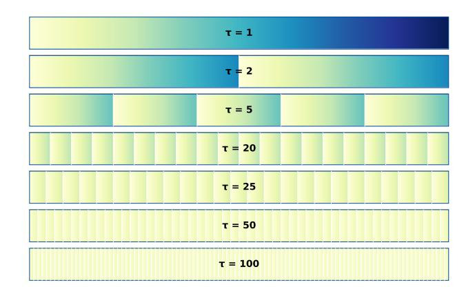

Figure 9: Data Reuse Schema

repeated rather than reshuffled, as illustrated in Figure [9.](#page-18-2)

## **B Additional Experiment Results**

This section provides supplementary experimental results that support and extend the analyses presented in the main body of the paper.

## **B.1 Performance on In-Domain and Out-of-Domain Tasks**

To assess how the mathematical reasoning capabilities acquired during RL fine-tuning generalize, we evaluated our models on a comprehensive suite of unseen benchmarks. We categorize these into two groups: in-domain different tasks (other mathematics datasets) and out-of-domain tasks (e.g., code, science, logic). The results are presented in Figure [10](#page-19-0) and Figure [11.](#page-20-1)

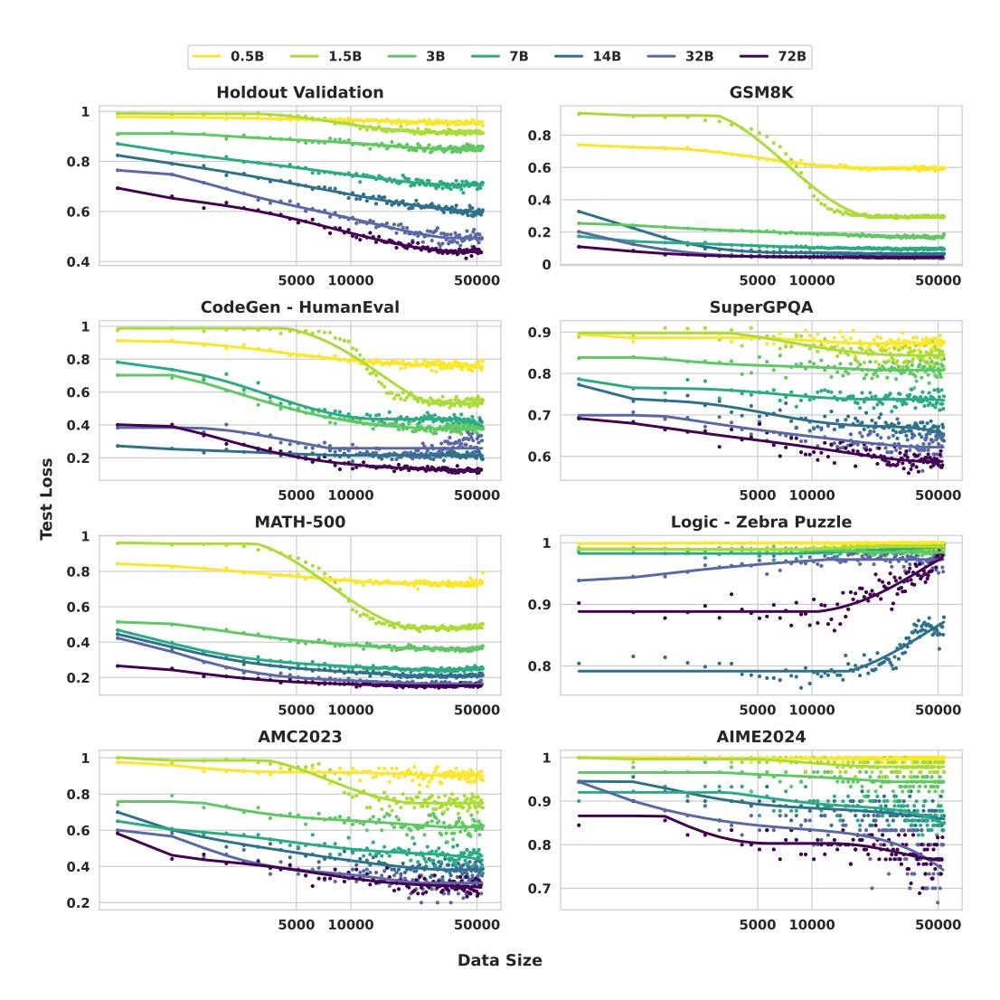

Figure 10: Test loss on in-domain and out-of-domain benchmarks vs data size for Base models. It shows modest positive transfer on in-domain tasks, with limited or negative transfer on OOD tasks.

**In-Domain Generalization (Different Mathematical Tasks).** On mathematics benchmarks not included in our training set (such as GSM8K, MATH, AIME, and AMC), we observe a generally positive transfer of learned skills. For most of these tasks, the test loss shows a modest but consistent decrease as training progresses, particularly for the larger models. This suggests that the model's enhanced reasoning ability is not overfitted to the training distribution and is applicable to a wider range of mathematical problems.

**Out-of-Domain Generalization.** When evaluating on tasks outside of mathematics, the generalization is more limited. For both code generation (HumanEval) and science problems (SuperGPQA), performance remains largely static throughout the training process across all model sizes, with test loss curves staying flat. This indicates that the specialized mathematical reasoning skills do not readily transfer to these domains. A noteworthy phenomenon is observed in the logical reasoning task (Zebra Puzzle): the largest models (particularly the 14B variants) show a degradation in performance (an increase in test loss) as training progresses, suggesting a potential negative transfer effect where intensive optimization on mathematical reasoning may interfere with capabilities required for certain types of logical puzzles.

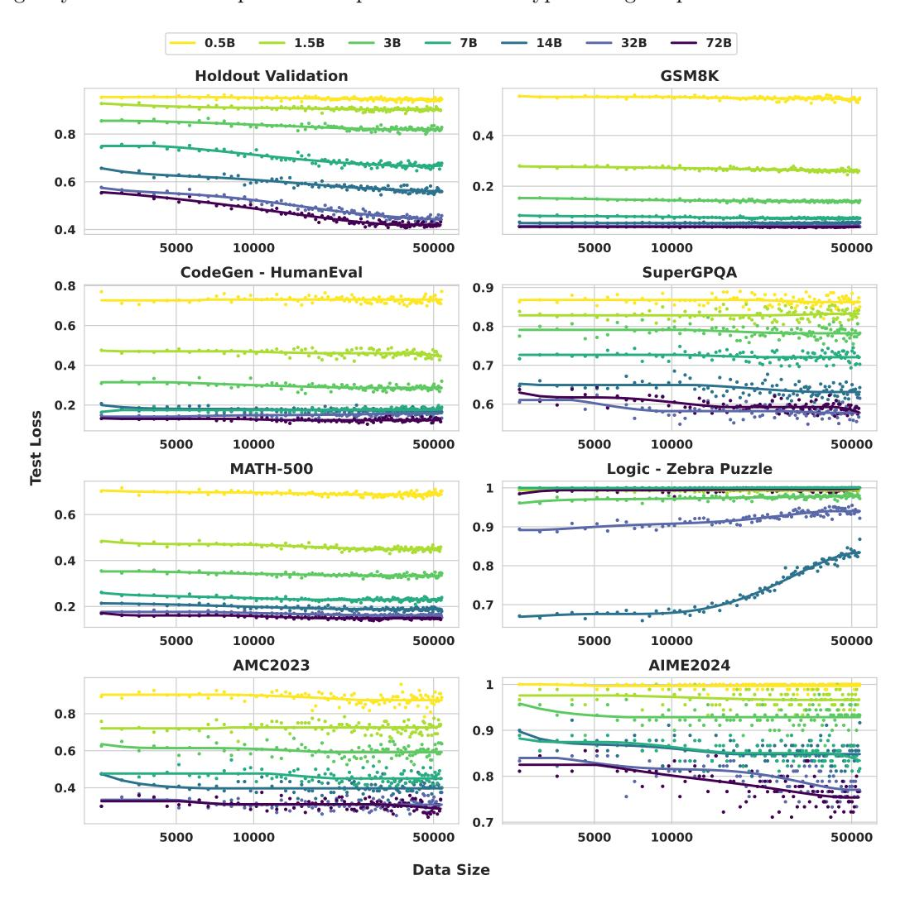

Figure 11: Test loss on in-domain and out-of-domain benchmarks vs data size for Instruct models.

#### **B.2 Ablation on GRPO Hyperparameters**

We conducted an ablation study on the rollout group size *G*, a key GRPO hyperparameter that controls how many responses are sampled per prompt. This directly affects both the compute per update and the stability of the training signal. We tested *G* ∈ {4*,* 8*,* 16*,* 32} on the 7B models.

**Data-centric View**. Figure [12b](#page-21-1) and [12d](#page-21-1) shows that larger rollout sizes consistently yield better sample efficiency: *G* = 32 achieves the lowest test loss for the same number of unique samples. This supports the intuition that more responses per question provide a stronger advantage estimate and thus more effective gradient updates.

**Compute-centric View**. The optimal rollout size *G* is not fixed but shifts with the training budget. This implies that practitioners should tune *G* according to available compute rather than relying on a universal setting. We attribute this dynamic to the trade-off between the higher variance reduction from larger *G* and the additional FLOPs it consumes, which makes small *G* preferable at low budgets but large *G* superior when ample compute is available.

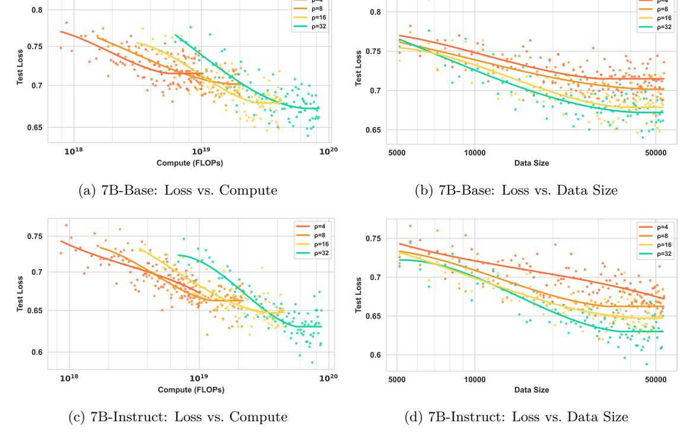

Figure 12: Effects of GRPO rollout size on training efficiency

## **B.3** Peformance Compared with Advance Models

| Model Family                     | Model Identifier      | Pass@1 Score |  |  |
|----------------------------------|-----------------------|--------------|--|--|
| Models from Our Study (Post-RFT) |                       |              |  |  |
| Qwen2.5-Base                     | 0.5B                  | 0.070        |  |  |
|                                  | 1.5B                  | 0.116        |  |  |
|                                  | 3B                    | 0.182        |  |  |
|                                  | 7B                    | 0.338        |  |  |
|                                  | 14B                   | 0.450        |  |  |
|                                  | 32B                   | 0.540        |  |  |
|                                  | 72B                   | 0.607        |  |  |
| Qwen2.5-Instruct                 | 0.5B                  | 0.078        |  |  |
|                                  | 1.5B                  | 0.138        |  |  |
|                                  | 3B                    | 0.216        |  |  |
|                                  | 7B                    | 0.380        |  |  |
|                                  | 14B                   | 0.488        |  |  |
|                                  | 32B                   | 0.590        |  |  |
|                                  | 72B                   | 0.617        |  |  |
| External SOTA M                  | odels (for Comparisor | ı)           |  |  |
| Qwen3                            | 0.6B                  | 0.178        |  |  |
|                                  | 1.7B                  | 0.288        |  |  |
|                                  | 4B                    | 0.418        |  |  |
|                                  | 8B                    | 0.366        |  |  |
|                                  | 14B                   | 0.388        |  |  |
|                                  | 30B (A3B)             | 0.528        |  |  |
|                                  | 32B                   | 0.412        |  |  |
|                                  | 235B (A22B)           | 0.602        |  |  |
| GPT-OSS                          | 20B                   | 0.556        |  |  |
|                                  | 120B                  | 0.660        |  |  |

Table 4: Performance of various models on the held-out evaluation set.

To contextualize the performance of our models and the difficulty of our primary evaluation metric, we benchmarked a range of external, state-of-the-art (SOTA) models on our held-out mathematics test set. The results are presented in Table [4.](#page-21-0) The performance of our Qwen2.5 models reflects their final scores after the completion of reinforcement learning fine-tuning (RFT), while others are benchmarked directly.

## **C Formula Fitting and Derivation**

## **C.1 FLOPs Calculation Methodology**

The computational cost for a LLM is primarily determined by the number of non-embedding parameters (*N*) and the number of processed tokens (*T*). The costs for the fundamental operations are:

- **Forward Pass Cost:** The cost of a single forward pass is approximately *C*fwd ≈ 2*NT* FLOPs.
- **Backward Pass Cost:** The backward pass is approximately twice as expensive as the forward pass, so *C*bwd ≈ 4*NT* FLOPs.

A full training step, which includes one forward and one backward pass for the gradient update, therefore has a total computational cost of:

$$C_{\text{train}} = C_{\text{fwd}} + C_{\text{bwd}} \approx 2NT + 4NT = 6NT \text{ FLOPs.}$$
 (10)

$$FLOPs_{step} = 6 \times N \times T_{step}$$
 (11)

By recording the exact number of processed tokens *T* per step, we compute the cumulative FLOPs reported throughout this paper as the sum of these per-step calculations over the course of training.

#### **C.2 Coefficient Comparison**

We consider the two laws

$$\ln L(N,C) = -k_C(N) \ln C + E_C(N), \tag{12}$$

and

$$\ln L(N, D) = -k_D(N) \ln D + E_D(N), \tag{13}$$

are consistent under the linkage *C* = *NDϕ* where *ϕ >* 0 is a constant for simplification.

**Claim.** Under *C* = *NDϕ*, the slopes coincide and the intercepts differ by a known shift:

$$k_C(N) = k_D(N) = k(N), \tag{14}$$

$$E_C(N) = E_D(N) + k(N) \ln(N\phi). \tag{15}$$

*Proof.* Substitute *C* = *NDϕ* into equation [12:](#page-22-0)

$$\ln L(N, C) = -k_C(N) \ln(ND\phi) + E_C(N)$$

$$= -k_C(N) \left[ \ln D + \ln(N\phi) \right] + E_C(N)$$

$$= -k_C(N) \ln D + \left( E_C(N) - k_C(N) \ln(N\phi) \right).$$

Comparing this with equation [13,](#page-22-1) i.e., ln *L*(*N, D*) = − *kD*(*N*) ln *D* + *ED*(*N*), equality for all *D >* 0 forces the coefficients of ln *D* and the constants to match:

$$k_D(N) = k_C(N) =: k(N), \qquad E_D(N) = E_C(N) - k(N) \ln(N\phi).$$

Rearranging the second identity yields equation [15.](#page-22-2) □

The observation from Figure [3](#page-5-0) and Figure [5](#page-7-0) also matches with this conclusion.

## **C.3 Fitting for K and E**

Table 5: Uncertainty Analysis for raw data: Base and Instruct Models (Holdout Score)

| Model | Base      |         |        | Instruct  |         |        |
|-------|-----------|---------|--------|-----------|---------|--------|
|       | Test Loss | Avg Std | SEM    | Test Loss | Avg Std | SEM    |
| 0.5B  | 0.9419    | 0.0082  | 0.0048 | 0.9458    | 0.0073  | 0.0042 |
| 1B    | 0.9129    | 0.0091  | 0.0053 | 0.8988    | 0.0098  | 0.0057 |
| 3B    | 0.8582    | 0.0129  | 0.0074 | 0.8281    | 0.0112  | 0.0065 |
| 7B    | 0.7148    | 0.0147  | 0.0085 | 0.6777    | 0.0142  | 0.0082 |
| 14B   | 0.6051    | 0.0149  | 0.0086 | 0.5588    | 0.0143  | 0.0083 |
| 32B   | 0.4937    | 0.0056  | 0.0032 | 0.4579    | 0.0127  | 0.0073 |
| 72B   | 0.4359    | 0.0143  | 0.0082 | 0.4320    | 0.0140  | 0.0081 |

Table 6: Comparison of *kmax* and *N*0 Parameters Across Fitting Scenarios

| Source   | Metric | Scenario    | kmax   | N0 (B) | R2     |
|----------|--------|-------------|--------|-----------|--------|
| Base     | L(N,C) | Intra-model | 0.1349 | 13.09     | 0.9955 |
|          | L(N,C) | Inter-model | 0.1518 | 17.37     | 0.9944 |
|          | L(N,D) | Intra-model | 0.1348 | 11.52     | 0.9953 |
|          | L(N,D) | Inter-model | 0.1631 | 16.95     | 0.9947 |
| Instruct | L(N,C) | Intra-model | 0.1276 | 17.27     | 0.9970 |
|          | L(N,C) | Inter-model | 0.1443 | 28.33     | 0.9950 |
|          | L(N,D) | Intra-model | 0.1325 | 17.08     | 0.9970 |
|          | L(N,D) | Inter-model | 0.1484 | 27.15     | 0.9949 |

## **D A Loss Decomposition Model for Scaling Analysis**

During the analysis, we found a more generalized form of the potential scaling law function that fits the curves well. This model fits the same dataset as the main experiments and is included here as a formally documented alternative for future research.

## **D.1 Loss Decomposition Model**

**The General Loss Decomposition.** We construct the generalized formula as follows, based on the observation of the loss composition of post-training and the experiment data:

$$L(N,D) = L_{\infty} + G(N) + \lambda(N) \cdot P(N,D)$$
(16)

Each term in Equation equation [16](#page-23-1) represents a clear part decomposing the loss:

- *L*∞ denotes the **irreducible loss**, representing the fundamental loss floor that persists even with infinite model capacity and unlimited data. It reflects task-intrinsic uncertainty and noise that cannot be eliminated by improved modeling or additional training, such as inherent stochasticity in the environment or irreducible mismatch between training and evaluation distributions.
- *G*(*N*) denotes the **model-limited loss**, capturing the asymptotic loss floor imposed by finite model capacity *N* in the limit of infinite data. It corresponds to the capacity-dependent performance frontier of models with size *N*.
- *λ*(*N*) denotes the **learnable capacity**, defined as the maximum achievable reduction in loss that a model of size *N* can attain through post-training, beyond its model-limited loss. In RL posttraining settings, this term can depend on the pretraining regime, as well as the degree of mismatch

between the pretraining and post-training task settings. Conceptually, the learnable capacity is governed by two opposing effects: larger models generally have greater capacity to extract and acquire new knowledge, while simultaneously having already absorbed more information during pretraining, leaving less headroom for additional improvement via RL. As a result, the monotonic dependence of *λ*(*N*) on model size is non-trivial, and its precise modeling likely requires additional assumptions and empirical characterization.

• *P*(*N, D*) denotes the **learning progress**, a normalized function taking values in [0*,* 1] that quantifies the fraction of the learnable capacity *λ*(*N*) realized when training on a dataset of size *D*.

**Instantiated Model.** Following prior empirical scaling law studies, we parameterize the model-limited loss as

$$G(N) = \left(\frac{N_0}{N}\right)^{\alpha},\tag{17}$$

reflecting the observed power-law dependence of loss on model size in the infinite-data regime [\(Kaplan et al.,](#page-13-0) [2020\)](#page-13-0).

Empirically, learning curves exhibit an S-shaped transition when plotted in log–log coordinates (e.g. Figure [1\)](#page-2-0). Motivated by this observation, we model the learning progress term *P*(*N, D*) as a logistic function in log *D*,

$$P(N,D) = \frac{1}{1 + \left(\frac{D}{D_0(N)}\right)^{\beta}},\tag{18}$$

where *D*0(*N*) denotes the characteristic dataset scale at which half of the learnable capacity is realized, and is treated as a *N*-dependent parameter.

Combining the above components, we arrive at the following instantiated loss model:

$$L(N,D) = L_{\infty} + \left(\frac{N_0}{N}\right)^{\alpha} + \frac{\lambda(N)}{1 + \left(\frac{D}{D_0(N)}\right)^{\beta}}$$
(19)

This is what we used to fit and extrapolation in Figure [13](#page-25-0)

## **D.2 Predictability and Extrapolation**

We evaluate the extrapolation behavior of the loss–decomposition model (Equation equation [19\)](#page-24-0) by applying it to the same experimental learning-curve data used in the main analysis, and by testing its performance under two complementary settings (Figure [13\)](#page-25-0).

**Intra-model prediction.** Using only the first 30% of training steps for each model, the fitted curves closely match the held-out portions(Figure [13a](#page-25-0)). This indicates that the internal S-shaped structure of the model provides a sufficiently strong inductive bias for completing a single learning curve from early observations. See Table [7](#page-25-1) for detailed fitting result.

**Inter-model extrapolation.** We fit all global exponents and the model-limited term using models up to 32B, and then extrapolate the resulting shared functional form to 72B by calibrating only two model-specific parameters, *λ*(72B) and *D*0(72B). The extrapolated curve aligns well with the observed 72B trajectory across the full data range, reflecting that the functional shape inferred from smaller models remains compatible with larger-scale behavior under this light calibration.

The fit is reasonably strong, indicating that the proposed formulation may capture key structural tendencies of the underlying scaling behavior.

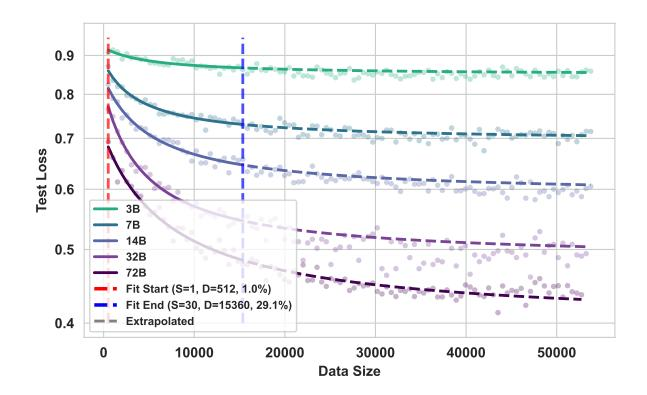

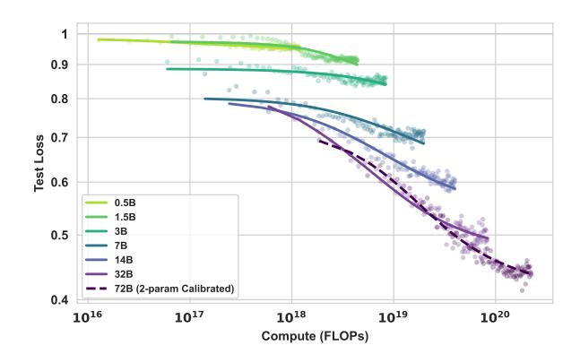

- (a) Intra-model prediction using the early 30% of training steps.
- (b) Inter-model extrapolation for 72B under fixed shared shape.

Figure 13: Extrapolation of the loss decomposition model (Equation equation 19). (a) Intra-model prediction using partial learning-curve observations. (b) Inter-model extrapolation for 72B with global exponents fixed from smaller models.

Table 7: Fitting details for L(N, D) using only 30% of the training steps for each model.

| Model Size    | Base      |        |       |  |
|---------------|-----------|--------|-------|--|
| 1,10 401 2120 | $D_0$     | lambda | $R^2$ |  |
| 3B            | 5109.6316 | 0.0734 | 0.995 |  |
| 7B            | 3725.6374 | 0.1882 | 0.995 |  |
| 14B           | 4554.7619 | 0.2520 | 0.995 |  |
| 32B           | 3576.0323 | 0.3279 | 0.995 |  |
| 72B           | 5861.6228 | 0.3084 | 0.995 |  |

#### D.3 Discussion: Effective log-log slope

To relate the loss decomposition model to the slope-based formulation used in the main text, we examine the local behavior of L(N, D) in log-log coordinates with respect to the data scale D. Specifically, we define the effective slope

$$k(N,D) \; := \; - \; \frac{\partial \log L(N,D)}{\partial \log D},$$

which corresponds to the exponent in a local power-law approximation of the form  $\log L \approx -k \log D + \text{const.}$ 

For the loss decomposition model (Equation equation 19), the induced k(N, D) is a smooth function of D that vanishes in both the low-data and high-data limits, and attains its maximum around the characteristic scale  $D \approx D_0(N)$ . Evaluating the slope at this point yields a natural definition of the maximal effective slope,

$$k_{\text{max}}(N) = \frac{K_{\text{max}}}{1 + S(N)}, \qquad K_{\text{max}} := \frac{\beta}{2}, \quad S(N) := \frac{2(L_{\infty} + (N_0/N)^{\alpha})}{\lambda(N)}.$$
 (20)

The resulting  $k_{\text{max}}(N)$  depends only on the model size N through the parameters of the loss decomposition, and is uniformly bounded by  $K_{\text{max}} = \beta/2$ .

From this perspective, the slope function k(N) adopted in the main analysis (Equation equation 2) can be interpreted as a parsimonious, low-parameter approximation to the effective maximal slope  $k_{\text{max}}(N)$  in Equation equation 20. This establishes structural consistency between the two descriptions: the loss

decomposition model potentially captures the finer-grained (N, D)-dependent behavior, while the main-text formulation summarizes its dominant N-dependent trend in a compact form.

#### D.4 Conclusion

The loss decomposition model captures key empirical characteristics of RL post-training scaling behavior.

However, several components remain underdetermined, including the construction of the learnable capacity  $\lambda(N)$ , the dependence of the characteristic dataset scale  $D_0(N)$  on model size, the role of the pretraining process, and the impact of mismatches between pretraining and post-training task settings.

For these reasons, we present this model as an appendix-level discussion rather than a core component of the main text. We encourage future work to build on this formulation to further investigate and refine scaling laws for LLM-based reinforcement learning.

## **E** Response Length

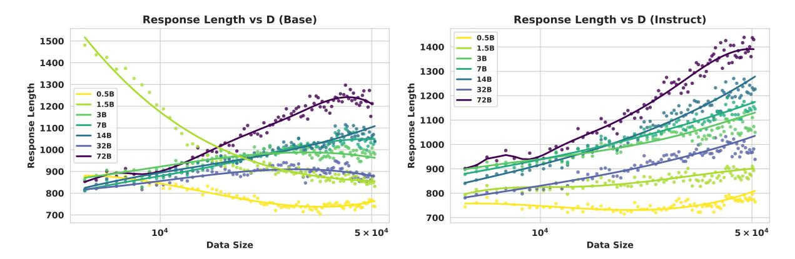

Figure 14: Response length vs. Data size. Left: Base models. Right: Instruct models.