# <span id="page-0-0"></span>e3: Learning to <u>Explore Enables Extrapolation of</u> Test-Time Compute for LLMs

Amrith Setlur<sup>1,\*</sup>, Matthew Y. R. Yang<sup>1,\*</sup>, Charlie Snell<sup>2</sup>, Jeremy Greer<sup>3</sup>, Ian Wu<sup>1</sup>, Virginia Smith<sup>1</sup>, Max Simchowitz<sup>1</sup> and Aviral Kumar<sup>1</sup>

<sup>1</sup>Carnegie Mellon University, <sup>2</sup>UC Berkeley, <sup>3</sup>Oumi, <sup>\*</sup>Equal contribution.

<span id="page-0-1"></span>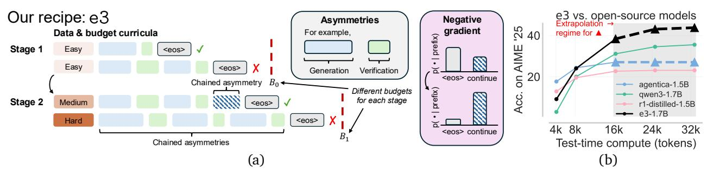

**Figure 1:** *In-context exploration enables extrapolation of test-time compute* (e3): (a) By (i) chaining asymmetric capabilities of the base model, *e.g.*, reliably self-verifying responses after generating them; (ii) lengthening model responses by chaining more asymmetries until the correct answer is discovered by utilizing the "negative" part of the RL policy gradient generated from incorrect responses; and (iii) coupling data & budget curricula for RL training that carefully structures exploration by sequentially training models on different datasets and training compute budgets. (b) Qwen3-1.7B fine-tuned with e3 outperforms <2B models on AIME' and HMMT' 25 and even some larger 7B/32B models (see full results in Tab. 1 and Fig. 10).

**Abstract:** Test-time scaling offers a promising path to improve LLM reasoning by utilizing more compute at inference time; however, the true promise of this paradigm lies in *extrapolation* (*i.e.*, improvement in performance on hard problems as LLMs keep "thinking" for longer, beyond the maximum token budget they were trained on). Surprisingly, we find that most existing reasoning models do not extrapolate well. We show that one way to enable extrapolation is by training the LLM to perform *in-context exploration*: training the LLM to effectively spend its test time budget by chaining operations (such as generation, verification, refinement, *etc.*), or testing multiple hypotheses before it commits to an answer. To enable in-context exploration, we identify three key ingredients as part of our recipe e3: (1) chaining skills that the base LLM has asymmetric competence in, *e.g.*, chaining verification (easy) with generation (hard), as a way to implement in-context search; (2) leveraging "negative" gradients from incorrect traces to amplify exploration during RL, resulting in longer search traces that chains additional asymmetries; and (3) coupling task difficulty with training token budget during training via a specifically-designed curriculum to structure in-context exploration. Our recipe e3 produces the best known 1.7B model according to AIME'25 and HMMT'25 scores, and extrapolates to 2× the training token budget. Our e3-1.7B model not only attains high pass@1 scores, but also improves pass@k over the base model.

#### <span id="page-0-2"></span>1. Introduction

Test-time scaling boosts large language model (LLM) performance by extending inference, spending more compute on "thinking" before producing an answer. Its promise lies in enabling models to continue improving performance by scaling test-time compute upon deployment. *E.g.*, if the model can learn to implement "algorithmic procedures" like planning, self-reflection, or backtracking generally across the board, it can discover more accurate responses as more test compute is used. With this motivation, current recipes post-train LLMs via reinforcement learning (RL) [5, 58] and supervised fine-tuning (SFT) [27, 50]

at long output lengths. However, it is unclear whether the models post-trained with current recipes can truly realize the promise of *extrapolation*: if we scale the test compute beyond the maximum *training budget*, would the LLM be able to continue to solve more and more problems?

Of course, the performance of a model at very long response lengths may be restricted by other factors like model architecture or model size [\[20\]](#page-16-0). However, one can at least expect that an LLM should benefit from test-time scaling within the pretraining context lengths, that tend to be around 2-4× larger than the budgets used for training reasoning models[1](#page-0-0) . Mechanistically, this could be realized if the LLM were implementing algorithmic procedures (*e.g.,* generate-verify-revise, best-of-, search, etc.) within the model's chain of thought [\[8,](#page-16-1) [18,](#page-16-2) [37,](#page-18-1) [56\]](#page-19-1). However, similar to other empirical studies of reasoning models, we note that many open models perform poorly when extrapolating to 2-3× the training budget [\[14,](#page-16-3) [34\]](#page-17-1) (Fig. [2\)](#page-2-0). Thus, relying on current RL/SFT recipes to yield extrapolation appears to be mostly futile.

In this paper, we show that the key to enabling extrapolation is *learning to explore in-context*: if a model learns to use compute by searching through multiple reasoning paths or implementing procedures, it can "guide" the search towards the correct answer, and improve its performance as more test compute becomes available. Even under the original training compute budget, we expect learning to explore in-context to improve generalization performance to unseen, out-of-distribution problems [\[6,](#page-15-1) [11\]](#page-16-4). To demonstrate this, we build a recipe e3, which trains models that leverage test compute for in-context exploration and can perform well at both normal training and extrapolation budgets. At its core, e3 is based on the following three ingredients and principles (see Fig. [1\)](#page-0-1):

- **1) Asymmetries are critical for learning to explore.** LLMs can learn to explore only when each segment in the output trace is useful in "guiding" subsequent ones, *e.g.*, if verifying initial segments can lead to more refined answers that are more likely to succeed. In the absence of external tools, we show that this sort of behavior can emerge from *asymmetries*, i.e., differences in the model's competence at different skills appearing in an output trace. In the context of self-verification, this corresponds to a verificationgeneration (VG) gap, where models are more capable of verifying their answers than generating correct ones. While prior work [\[9,](#page-16-5) [16,](#page-16-6) [38,](#page-18-2) [45,](#page-18-3) [47\]](#page-18-4) observed such asymmetries, we formalize their role and show they are essential for enabling RL to increase response length by learning to explore in-context and, as a result, attain extrapolation. Without them, test-time scaling is strikingly hard. We formalize this notion in a didactic model we call " "-model in Section [5:](#page-7-0) a model of long chain-of-thought LLM training which operates on a base LLM that exhibits perfect self-verification but imperfect generation capabilities. We will show that this asymmetry is critical for enabling extrapolation in this model (discussed next).
- **2) Negative gradient in RL amplifies in-context exploration.** If asymmetries are a prerequisite for learning to explore, what enables them to evolve and facilitate learning useful exploration strategies during post-training? We show that *negative gradients* [\[48\]](#page-18-5) (*i.e.*, gradients on incorrect traces) in RL training is a key enabler of in-context exploration when the base model presents asymmetries. Negative gradients drive exploration by moving the probability mass from shorter failed traces onto longer traces that *"chain"* new asymmetries (*e.g.*, LLM verifying a calculation one more time). In contrast, SFT only maximizes likelihood on correct traces in the training data and reinforces the model to end the solution within the length of these traces. In our model, SFT only aims to reduce the failure probability at a fixed , whereas negative gradients also amplify and increase response length.
- **3) Structured exploration with coupled curriculum.** Finally, while negative gradients amplify asymme-

<sup>1</sup> LLMs often undergo long-context training at the end of pre-trained to 128k tokens (and many proprietary LLMs utilize a million tokens), but during post-training the output length is often reduced to 32k tokens, for instance, for Qwen3 models [\[55\]](#page-19-2).

tries and produce longer responses, running RL training at very long budgets suffers from poor training convergence, typically seen in long-horizon RL [1]. Although one could resolve this by training with a smaller budget, we show that training on hard problems at short context lengths often disincentivizes exploration altogether, since the model is forced to commit to an answer prematurely. As a result, we see poor extrapolation of compute and generalization to unseen problems. To resolve this, we design a *coupled curriculum* over pairs of (data mixture, training budget) that effectively structures the exploration driven by the negative gradient. *Our key insight* is that at any stage of the curriculum, we should choose the smallest "RL optimization friendly" budget such that the model initialized for RL training can: (i) complete most of its responses within the budget; and (ii) can continue to improve performance as it chains more asymmetries beyond the chosen budget.

The above principles and insights constitute our recipe e3, that we use to post-train the Qwen3-1.7B model with a training budget of up to 16k output tokens using problems from the DeepScaleR [26] dataset. We achieve the *best performance at* <2*B scale on AIME'25 and HMMT'25* (to our knowledge), and our model consistently improves as we extrapolate the test-time compute to 32k (2× the training budget) upon deployment. Our models also attain consistent improvements under the pass@32 metric on both of these benchmarks, showing that e3 does more than simply sharpening the base model.

## 2. Problem Statement: Optimizing & Extrapolating Test-Time Compute

Post-training for test-time scaling. RL and SFT are two categories of post-training algorithms that refine a pre-trained base LLM  $\pi_b$  into a reasoning model, especially one that utilizes more test-time compute by producing long CoTs. Typical outcome-reward RL trains LLM  $\pi$  (initialized with  $\pi_b$ ) to maximize performance on outcome 0/1 reward  $r^*(x,y)$ , for inputs  $x \sim \rho$  and response  $y \sim \pi(y \mid x)$  restricted to an apriori fixed maximum token length or training budget  $B_{\rm tr}$  [26, 58]. On the other hand, SFT fine-tunes  $\pi_b$  on long thinking traces from more capable models or humans to distill their reasoning capabilities [27, 50], where the maximum length of the expert traces also implicitly induces a training budget  $B_{\rm tr}$ , similar to RL. Our goal is to train models that can improve performance when we extrapolate test-compute beyond  $B_{\rm tr}$ . Even though the true promise of

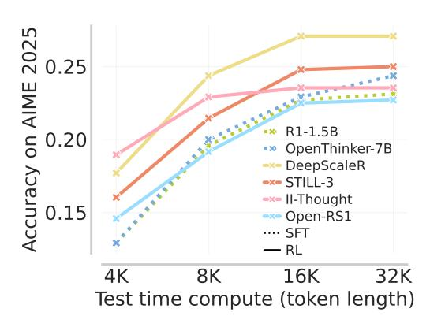

<span id="page-2-0"></span>**Figure 2:** Accuracy of various open-source models at different budgets on AIME 2025. Performance gains diminish as the test-time budget increases, with virtually no gains from 16k to 32k.

test-time compute is extrapolation performance, we find that *current thinking models fall short on extrapolation*. We evaluate multiple models on a test budget of 32K,  $\approx 1.5 - 2 \times B_{\rm tr}$  across all models. We plot our results on AIME25 in Fig. 2 (see App. A for a detailed comparison) and note that performance gains are minuscule as we go beyond  $B_{\rm tr}$ .

Negative gradient in RL. A key distinction between SFT and RL is the *negative gradient*, which corresponds to the part of the policy gradient coming from traces that fail. In Eq. 2.1 we present a simplified yet generalizing version of the policy gradient adopted by most RL post-training methods: REINFORCE [3], PPO [35], and GRPO [41]. From this, we note that on a prompt x, RL training observes two types of gradients: (i) the positive gradient which maximizes the likelihood of a correct responses y with a positive advantage A(x, y), and (ii) the negative gradient which *pushes down* the likelihood of an incorrect response with a negative advantage A(x, y). Here, y can be sampled *on-policy*  $\pi = \tilde{\pi}$ 

or off-policy  $\pi \neq \tilde{\pi}$ . Thus, we can view SFT as a purely positive gradient method that only maximizes likelihood on correct reasoning traces. In Sec. 4, we show why the negative gradient is largely responsible for driving up response lengths and in-context exploration during RL, thereby enabling RL-trained models to explore more at test-time and extrapolate better compared to SFT-based ones.

<span id="page-3-0"></span>
$$\mathbb{E}_{\boldsymbol{y} \sim \tilde{\pi}(\cdot \mid \boldsymbol{x})} \left[ A_i(\boldsymbol{x}, \boldsymbol{y}) \cdot \nabla_{\pi} \log \pi(\boldsymbol{y} \mid \boldsymbol{x}) \right] \quad \text{(simple form of policy gradient in RL)}$$
 (2.1)

## <span id="page-3-3"></span>3. Asymmetries in the Base Model: A Prerequisite for In-Context Exploration

How can extrapolating beyond the training budget improve performance? To answer this, we begin by revisiting why longer traces perform better in general. The conventional wisdom is that longer traces can represent solutions that make multiple attempts, interleaving verification and generation [17, 28, 38], to arrive at the final answer. We can think of this as the LLM learning to interleave basic "skills", e.g., verification, summarization, or retrieval, to perform in-context exploration. But why, or when, should a post-training recipe favor learning such solution traces over other uses of test-time compute that arrive at an answer more directly? This section demonstrates that when the base model exhibits asymmetric incompetence at different skills, RL post-training prefers to learn solutions that chains asymmetric skills in ways that improve final performance. A formal description is given by the following definition:

<span id="page-3-1"></span>**Definition 3.1** (Chaining asymmetric capabilities p,q in model  $\pi$ .). Let  $p,q:\mathcal{S}\mapsto\mathcal{S}$  be functions over token sequences  $\mathcal{S}$  (e.g., p can be generation, q can be verification), and  $\mathtt{detect}(f,\tau)$  detects number of calls to function f in a token trace  $\tau$ . For a reward r, we say that policy  $\pi$  chains asymmetries p,q if it benefits from calls to the composition  $q(p(\cdot))$ , compared to only  $p(\cdot)$ :

$$\mathbb{E}_{\tau \sim \pi}\left[r(\tau) \mid \mathsf{detect}(q(p(\cdot)), \tau) > 0\right] \ > \ \mathbb{E}_{\tau \sim \pi}\left[r(\tau) \mid \mathsf{detect}(p, \tau) > 0\right],$$
 even though there is an optimal policy  $\pi_r^\star$  that never calls  $q$ , i.e.,  $\mathbb{E}_{\tau \sim \pi_r^\star}\left[\mathsf{detect}(q, \tau)\right] = 0$ .

We focus on a key special case when the model is more accurate at verifying its own answers than it is at generating correct ones; that is, when the model exhibits a *verification-generation gap* (*VG Gap*), on a particular problem domain [38, 45, 47]. In this section, we show that RL training on problem domains with VG gap (i) encourages chaining asymmetries, (ii) enables in-context exploration that (iii) discovers new solutions, often extrapolating to larger budgets and more difficult problem domains.

Setup. We validate the role of asymmetries in learning to explore by investigating two didactic tasks, on which Llama3.2-3B admits different VG gaps. First, the Countdown game [8, 56] (Cdown) requires converting a set of numbers into an equation that evaluates to the desired target. The base LLM is more effective at verifying whether a proposed equation evaluates to the target than searching over all possible equations to solve the task, and traces with more chained asymmetries are more performant, as we measure pass@k in Fig. 3, where performance on traces with more chains is higher. Second, we study n-digit multiplication (Mult) in natural language, without any external tools, where the base model exhibits limited verification (see App. B for asymmetry gap on Mult). Additionally, we fine-tune Llama3.2-3B on correct n-digit multiplication traces from Qwen-

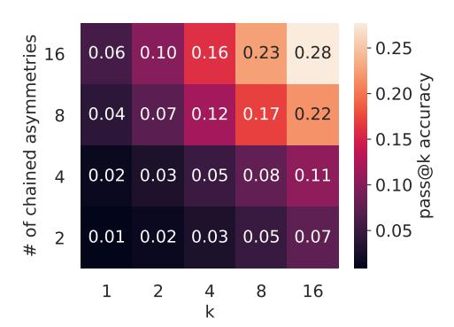

<span id="page-3-2"></span>**Figure** 3: *Measuring asymmetry (Def.* 3.1) & pass@k on CDOWN. Pass@k improves more for all k as the number of chained asymmetries increases in a trace from Llama3.2-3B.

32B-r1-distilled. These traces contain multiple verification steps verifying intermediate steps, like smaller

<span id="page-4-0"></span>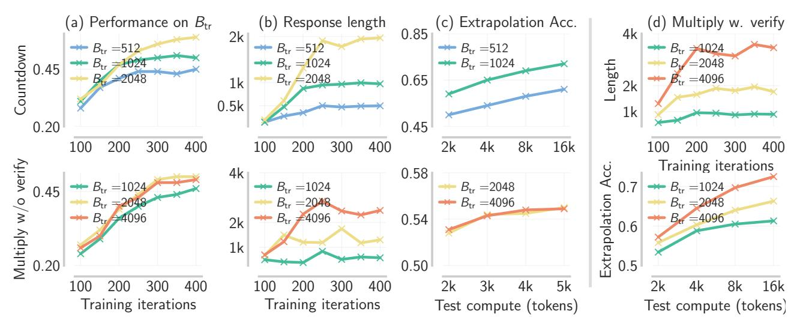

**Figure 4:** *RL training with and without asymmetries in the base model.* When asymmetries such as the VG gap are present (e.g., in CDOWN), RL training amplifies response length by chaining more asymmetries to explore in-context, where the probability of success improves with higher length on both  $B_{tr}$  and extrapolation regimes. On the other hand, when VG gap is absent in  $\pi_b$  (e.g., in MULT), increases in length and extrapolation performance are subdued. When we explicitly train on a base model fine-tuned to verify MULT (a setting we refer to as the MULT-V), we again observe upward length and extrapolation trends, consistent with CDOWN.

digit multiplications, that are part of a longer trace (see App. B for an example). This fine-tuning is a direct way to encourage more verification attempts (Mult-V). Comparison of Mult vs. Mult-V enables direct evaluation of the benefits of asymmetries in base LLM, all else being held equal. In these results, we detect verification segments by separating by the " $\n\$ " token (see App. H for examples).

Finding 1: Verification-generation asymmetry in the base model improves the performance of RL trained solutions. Fig. 4(a,b) shows a stark difference in performance and length of output traces as the training budget  $B_{\rm tr}$  varies on CDOWN and MULT. On CDOWN, performance consistently increases as  $B_{\rm tr}$  increases from  $512 \rightarrow 2048$ , accompanied by a very clear increase in response length. On MULT, where the base model has limited propensity to verify, performance increases when  $B_{\rm tr}$  increases from 1024 to 2048, but it plateaus thereon. Unlike CDOWN, test-time length is far from saturating budget limits and also oscillates widely across RL training epochs. Contrast this with Fig. 4(d), where RL training on MULT-V, which leverages verification, exhibits longer lengths and stronger extrapolation performance. Overall, this implies that leveraging asymmetries improves performance and length-utilization in RL postraining. Curiously, we also observe that models with greater VG gap exhibit less KL divergence from the base model, perhaps implying better generalization – see App. B for those results and discussion.

Finding 2: Chaining asymmetries enable extrapolation via in-context exploration. Interleaving verification and generation steps chains together asymmetric skills of the base model; we refer to this special case of skill-chaining as chaining asymmetries. To measure the benefits of chained asymmetries on CDOWN, we plot the pass@k accuracy of the base LLM, shown in Figure 3, and observe that performance increases as more chained asymmetries arise. In fact, the best strategy is to not simply scale k, but rather to scale both k and the number of chained asymmetries (more details on this experiment are in Appendix B). In Fig. 4 (c), we plot the extrapolation performance of the models trained at two values of  $B_{\rm tr}$ . On CDOWN the model trained with  $B_{\rm tr}$  0.5-1k makes steady progress on problems in test budgets that are 8-16×  $B_{\rm tr}$  itself. On MULT, we find that  $B_{\rm tr}$  has absolutely no effect on extrapolation performance with the base LLM that does not have VG asymmetry, but it has a substantial effect when the asymmetry

<span id="page-5-1"></span>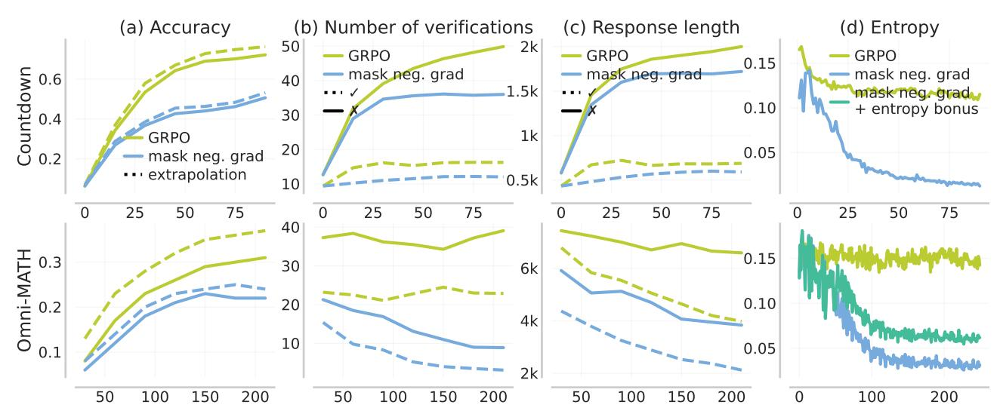

**Figure 5:** *RL training with and without negative gradients:* When the base model admits asymmetries, negative gradients promote in-context exploration by: (i) increasing length ((c)) and chaining asymmetries, which shows up as more verification attempts (b); and (ii) increasing token entropy and thus response diversity (d). This leads to better performance on the training budget and upon extrapolation. In (b, c),  $\checkmark$  denotes the statistic computed on correct responses and X on incorrect responses.

is present. More importantly, while the base model without VG asymmetry fails to extrapolate and solve unsolved problems, with its accuracy improving by merely  $\leq 2\%$  despite  $16\times$  test-time compute scaling, the base model with VG asymmetry can still extrapolate well.

Why do asymmetries enable in-context exploration?. We explain this via our didactic  $p^k$ -model (details in Sec. 5). Here we view the LLM as sequentially guessing responses  $a_1, a_2, \ldots$ , each with failure probability p, and up to at most terminal k responses. We assume that the LLM admits perfect verification, meaning that it can decide when to stop or continue perfectly. Now, in a simplified setting where attempts are independent, failure probability (=  $p^k$ ) decays exponentially as k increases, as on CDOWN. Therefore, we can improve performance by increasing k and k together. However, if verification is difficult, increasing k provides little benefit, since the model cannot adjudicate whether one guess is any better than another. Then, the only way to improve performance is by lowering k (better first guesses as seen on Mult).

### Takeaways: Asymmetries are a critical pre-requisite for learning to explore.

- Asymmetries like the VG gap enable the model to continually explore, verify, and refine answers.
- RL training amplifies chaining of asymmetric skills and produces solutions that learn to explore in-context, thus benefiting from additional test-time compute beyond the training budget.

## <span id="page-5-0"></span>4. Negative Gradients Incentivize Exploration that Chains Asymmetries

Having observed that the presence of asymmetry in the base model is a prerequisite for in-context exploration, the next question is: What enables models to exploit and chain these asymmetries during RL? In this section, we show that a crucial ingredient here is the *negative gradient*, the gradient term multiplied by a negative advantage in Eq. 2.1. Negative gradient drives in-context exploration via two mechanisms: (i) incentivizing sampling of unseen token sequences; (ii) chaining asymmetries like VG gap (Sec. 3) that rapidly drives up response length and the number of verification attempts. Note that while mechanism (i) corresponds to the *classical* notion of exploration, mechanism (ii) is special in that it corresponds to a form of "structured" exploration over strategies already in the model. When put in RL

terminology, this corresponds to "meta exploration" [12, 21]. We study these effects in this section.

Analysis setup. We analyze the evolution of response length, performance, and the number of chained asymmetries by comparing two training algorithms: (i) standard outcome-reward RL using GRPO [41] with token-level normalization [58]; (ii) GRPOMask, which zeros out (i.e. masks) the negative gradient and whilst retaining the *positive* gradient, thereby resembling an approach close to online STaR [61] or RFT [59]. We conduct our experiments on CDOWN and DMATH reasoning (questions sourced from Deep-

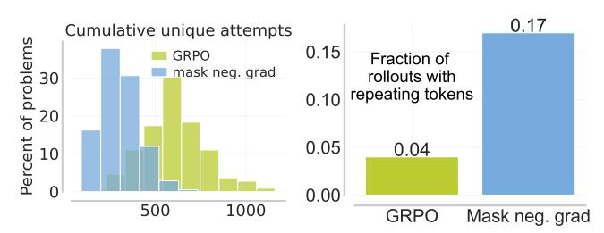

<span id="page-6-0"></span>**Figure 6:** Negative gradient encourages distinct responses: it increases the cumulative number of unique attempts on Cdown (left) and reduce responses that end with a repeating stream of tokens on DMATH (right) vs. masking it out.

ScaleR dataset [26]) that exhibit the VG asymmetry. We make the following observations:

Finding 1: Negative gradients promote diverse responses during RL training, encouraging exploration at two levels: (i) within a rollout; and (ii) across different rollouts. For (i), we observe that removing the negative gradient results in an entropy collapse over the next-token distribution (Fig. 5 (d)). This curtails diversity and leads to responses with a repeating stream of tokens when extrapolating the trained model to larger budgets (Fig. 6). For (ii), we measure the cumulative unique attempts on the CDOWN test set as we train the model (Fig. 6) by separating each rollout into attempts using "\n\n" and parsing the equations from each attempt. An attempt is unique when its equations differ from those of other attempts from rollouts across all gradient steps. We find more unique attempts when training with negative gradients. Therefore, utilizing the negative gradient clearly enhances exploration. While it is not surprising that RL algorithms benefit from exploration [13], we next explain how, distinctly from standard RL, this exploration can be particularly effective when extrapolating to larger test budgets.

Finding 2: Negative gradient increases the number of chained asymmetries, and thereby boosts structured exploration (and extrapolation) as we show next. Concretely, when training on an incorrect response  $\mathbf{y}$  with tokens  $y_1, y_2, ...$ , EOS, the negative gradient reduces the conditional probability of each token  $y_i$  conditioned on the prefix  $y_{1:i-1}$  appearing in this response, i.e.  $p(y_i|\mathbf{y}_{1:i-1})$ . This process also reduces the probability of the EOS token:  $p(\text{EOS}|\mathbf{y})$ , for any incorrect response that ends within the response budget. Where does this probability mass go? Clearly since total probability is conserved, this probability mass must be repurposed to increase the likelihood of other tokens. Fig. 5(b) shows that the probability mass recovered from the negative gradient is repurposed to increase the probability of chaining new pairs of asymmetric skills to the current trace (e.g., "Wait, ..." instead of terminating with EOS). This chaining results in a greater response length (c) and higher overall performance.

When negative gradients are masked (GRPOMask) in CDOWN, we see that attempts Fig. 5(b) and length Fig. 5(c) plateau, accompanied by a decrease in performance. The relative trends between GRPO and GRPOMask are similar for DMATH, but differ in absolute values (e.g., the number of absolute chained asymmetries decline in the absence of negative gradients). We include further results in App. C (Fig. 15), where we also demonstrate that MULT (which does not exhibit asymmetries) benefits far less from negative gradients. This mechanism for boosting exploration by chaining new asymmetries is different from the typical notions of improving coverage or trying novel tokens discussed in Finding 1.

*Finding 3: LLMs trained with negative gradients extrapolate better.* Finally, we explain why negative gradients enable extrapolation. Longer responses that chain asymmetries are more likely to yield correct

answers and thus receive positive reward. Therefore, the policy gradient update reinforces chaining and improves in-context exploration, and this process exhibits a "rich gets richer" effect, where further training incentivizes more in-context exploration (since the gap between number of verifications with and without negative gradient increases as training progresses in Fig. 5(b)). As discussed in Sec. 1, models that learn to explore in-context benefit from additional test-time compute—greater search leads to better performance under large value gaps. Fig. 5(a) confirms this: on hard DMATH problems (we classify a problem as hard if QwQ-32B attains pass@32 performance of zero), doubling the test-time budget amplifies the performance gap when negative gradients are used, compared to the masked variant.

## Takeaways: Negative gradient incentivizes in-context exploration with large VG gaps

- Negative gradients in RL "move" probability from short-length incorrect answers onto other modes, *e.g.*, those that exploit asymmetries or those that end in a correct answer. When the VG gap is large, longer responses that chain more asymmetries and eventually discover the right answer are rewarded and reinforced. As a result, in-context exploration is reinforced.
- Negative gradients boost response diversity and thus coverage over correct answers, as confirmed by our empirical results on CDOWN, DMATH, and theoretical results in the bi-gram model.

## <span id="page-7-0"></span>5. Analyzing Negative Gradient Dynamics in the $p^k$ Model

In this section, we introduce a didactic  $p^k$  model, where an LLM samples k independent actions sequentially, verifies them (with a perfect accuracy), and terminates immediately after the correct one is produced. In this section, we introduce a didactic setup where verification is perfect (and hence, there is a high VG gap), and formalize the intuitions regarding negative gradient from the previous section.

**Didactic analysis setup.** We consider a Markov decision process (MDP) [31] with action space  $\bar{\mathcal{A}} = \mathcal{A} \cup \{ \text{stop} \}$ , where  $\mathcal{A} = [100]$  are standard actions and stop is an early "stopping" action (like EOS) that terminates the trace. For simplicity, we consider policies parametrized as a softmax bigram model  $\pi_M(a_{t+1} \mid a_t)$ : in this model, the policy only retains one token in its history and is parameterized by a softmax over logits described by bi-grams, i.e.,  $\pi_M(a_{t+1}|a_t) \propto \exp(M(a_t, a_{t+1}))$ . In this bi-gram model, the current state  $s_t$  always matches the previous action  $a_{t-1}$ , and  $a^* \in \mathcal{A}$  denotes the optimal action. In a rollout  $a_1, ..., a_t$ , the initial action  $a_1$  is sampled from a fixed  $\pi_0$ . For t > 1, a learner policy samples an action  $a_t \sim \pi(\cdot|a_{1:t-1}) \in \Delta(\mathcal{A})$ . The MDP terminates with reward 1 at time t if  $a_t = a^*$ , and with reward 0 if  $a_t = \text{stop}$  (stops too early), or  $t > B_{tr}$  (budget is exhausted before a correct response). The policy is initialized to one that puts a high probability mass on choosing a = stop. Details are in App. C.

We say that the model **learns to explore in-context** if it learns to never play stop for any t (no early stopping), until  $a^*$  is observed, *i.e.*, increasing k in  $p^k$ . On the other hand, **classical exploration** amounts to upweighting  $\pi(a^* \mid a_{1:t-1})$  without reducing p(stop), *i.e.*, improving p in  $p^k$ .

Finding 1: Negative gradient increases length until  $p(a^*)$  is reasonably high. In Fig. 7(a), standard GRPO ( $B_{\rm tr}=100$ ) increases average response length from 15 to 45 at budget, driven by the drop in the marginal probability of stopping early  $p({\tt stop})$  (Fig. 7(c)). After multiple RL iterations with negative gradients, the average number of attempts per trace is sufficiently large, and the learner can sample  $a^*$  with non-trivial probability in any given trace. Once this happens (Fig. 7(c)), in our simple bigram setup, the model rapidly upweights the likelihood of one-step transitions to  $a^*$ , resulting in a phase transition where reward increases as length drops. In contrast, GRPOMask (Fig 7(b)) fails to improve reward or increase length. The first phase is akin to chaining more asymmetries in LLMs and results in a longer

<span id="page-8-0"></span>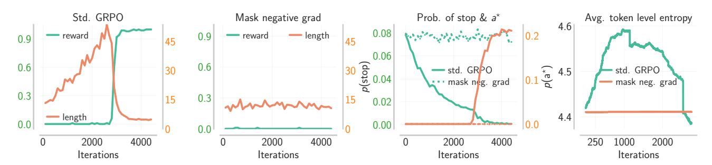

**Figure** 7: Negative gradients in the  $p^k$ -model. Negative gradients push down p(stop) during training (c), increasing length (a) and entropy of the next action distribution (d) to accommodate more in-context exploration, only decreasing them when  $a^*$  is discovered. In contrast, positive gradients rarely change p(stop) or entropy.

response length. In our LLM benchmarks, however, we do not see the same phase transition since finding "shortcuts" to correct responses is considerably more difficult. Moreover, the LLM is conditioned on an entire history and learns to utilize the history carefully in the first phase. This makes it unlikely for it to quickly learn to reduce length substantially even if it transitions into this second phase on some problems.

Finding 2: Negative gradient improves coverage by increasing entropy of  $\pi_M(\cdot \mid a_{1:t-1})$ . When  $\pi_M$  samples a highly likely yet incorrect action, the negative gradient computed on this sample increases entropy by moving probability mass onto less-seen modes of the distribution, including  $a^*$ . Note that no explicit entropy bonus is applied. We show this formally in Theorem 5.1 where we prove that upon sampling a highly likely incorrect action with probability p, GRPO update with a negative gradient results in an entropy increase of  $\approx p^2$  when all other actions, including  $a^*$  are highly unlikely. We note this empirically as well in Fig. 7(d), where conditional entropy increases across states, until  $a^*$  is discovered, after which it drops sharply as the positive gradient rapidly moves mass onto  $a^*$  within a few iterations.

<span id="page-8-1"></span>**Theorem 5.1** (Negative gradient increases entropy when  $a^*$  is unlikely; formal version in Thm. E.3). At state s, if the most likely action under  $\pi$  is  $a_1 =: \arg\max_{a'} \pi(a'|s) \neq a^*$ , then, for any  $\pi$ , a negative stochastic gradient step increases the entropy of  $\pi(\cdot|s)$  with prob.  $\geq \pi(a_1|s)$ . Additionally, in a suitable regime of  $\pi$ , the increase  $\geq (\pi(a_1|s) - \pi(a_2|s))^2$ , where  $a_2$  is second most likely after  $a_1$ . In contrast, in the absence of the negative gradient, the entropy is preserved with prob.  $1 - \pi(a^*|s)$ .

## <span id="page-8-2"></span>6. Coupled Curriculum Training Structures Exploration in Long Length RL

In the presence of asymmetries, training with negative gradients produces models that can extrapolate beyond their training budget. However, of course, training on just *any* arbitrarily chosen training token budget  $B_{\rm tr}$  is not enough: if  $B_{\rm tr}$  is too small, then we would not expect any form of in-context exploration to emerge. Perhaps unsurprisingly it turns out that a much larger  $B_{\rm tr}$  is also not sufficient. In Fig. 8(a), we show that different training budgets  $B_{\rm tr}$  lead to different levels of performance on the training budget, as well as extrapolated test compute. So how should we set the budget  $B_{\rm tr}$  to attain strong extrapolation performance? And in correspondence with token budgets, what prompts should we be training on for a given budget? To answer these questions, we run several training runs at different budgets.

#### 6.1. Training on Static Budgets or Data Mixtures is Insufficient

**Setup.** We evaluate extrapolation performance on DMATH and CDOWN after training on different budgets and prompt compositions. We split DMATH evenly across three levels of hardness as measured by the performance of Qwen-R1-Distilled-32B accuracy. For CDOWN, we judge problem difficulty based on

<span id="page-9-0"></span>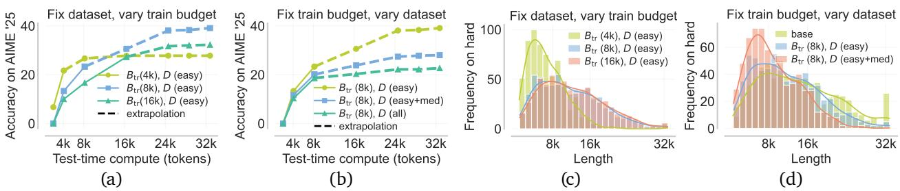

**Figure** 8: *RL training on different data and length budgets.* (a), (c): Optimal results come from balancing optimization difficulty (better at shorter budgets) and in-context exploration (better at longer budgets). (b), (d): Training on hard problems at the 8k token budget kills longer traces with in-context exploration needed to discover solutions for hard problems

the number of terms in the equation. We use the GRPO [41] algorithm to train models on all compute budgets and datasets (see App. D for the hyperparameter configurations we use).

Finding 1: Training solely at low or high  $B_{\rm tr}$  is not desirable. We train on the easy DMATH problems at different training budgets  $B_{\rm tr}$  = 4k, 8k,16k (see Fig. 8(a)). While training at the short budget  $B_{\rm tr}$  = 4k attains the best performance at the same test budget of 4k tokens, it "kills" in-context exploration since traces with many chained asymmetries are typically longer than the training budget of 4k and traces that might succeed after spending 4k tokens are negatively rewarded. Overall, this hinders length increase and chaining of asymmetries driven by the negative gradient, leading to poor extrapolation (no gains from 8k to 32k). Fig. 8(c) shows that this biases the model to stop early and terminate incorrectly.

On the other extreme, training at  $B_{\rm tr}=16{\rm k}$  introduces significant optimization challenges, typical of policy gradients in long horizons suffering from high gradient variance [1]. This model performs worse on its own training budget of 16k compared to a model trained on  $B_{\rm tr}=8{\rm k}$  and extrapolated "zero-shot" to 16k. We find that  $B_{\rm tr}=8{\rm k}$  attains the best scaling when extrapolating test compute, implying that the choice of  $B_{\rm tr}$  needs to strike a balance between: (i) the length budget available for negative gradient to encourage chained asymmetries (infeasible in <4k tokens); and (ii) mitigating optimization challenges.

Finding 2: Training naïvely on a static data mixture is insufficient. Having identified a reasonable training budget of 8k, we now turn to studying the effect of data compositions (prompt mixtures). To do so, we compare the naïve training data mixture with equal proportions of all difficulties (easy + medium + hard) against easy, easy + medium at  $B_{\rm tr}$  = 8k. As expected, matching train and test composition is ideal for better *in-distribution* performance, *i.e.*, when evaluating models at a test budget of  $B_{\rm tr}$ , equal to the training budget (see App. D). However, perhaps surprisingly, the same is not true for performance on out-of-distribution (OOD) problems, especially when performance is computed at budgets  $\gg B_{\rm tr}$ . As shown in Fig. 8(b), the model trained on *only easy* problems obtains the best performance on OOD AIME'25 when extrapolating compute to 32k. This is despite the fact that AIME'25 problems resemble harder problems and few prior AIME problems are also present in the hard subset of DMATH.

Why does this happen? Given a dataset, training on budgets smaller than the length of a typical response for the base model on that dataset penalizes in-context exploration early in training. This results in overly short solutions (see Fig. 8(d)) that are mostly exploitative. When projected to our  $p^k$  model from Section 5, this means that at overly short budgets, RL mainly attempts to improve the failure probability p of the best guess response, and does not learn to increase k which corresponds to chaining asymmetries. To increase k, it needs to be able to learn to increase the number of attempts and requires a large enough budget. But the budget cannot be too large to result in optimization challenges.

How can we avoid challenges with training on a fixed dataset and length budget? One approach to

<span id="page-10-2"></span>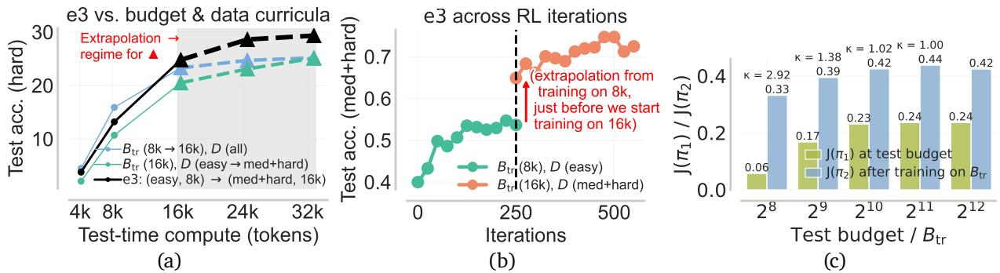

**Figure** 9: *RL training with coupled curricula*: (a): coupled curriculum outperforms data and budget curricula (shaded area indicates the extrapolation regime), (b): extrapolation gain from switching to a longer token budget of 16k on medium and hard problems, (c): illustrating how budget  $B_{\rm tr}$  can be selected via Eq. 6.1 on CDOWN;  $B_{\rm tr}=2^{10}$  is the smallest value with  $\kappa<1.2$ , and it corresponds to the budget where accuracy plateaus.  $J(\pi_1)$  is pass@128 performance and  $J(\pi_2)$  is accuracy.

avoid the above challenges is to incorporate a curriculum that varies  $B_{\rm tr}$  over training. However, this alone is insufficient because, as shown above, training on hard problems with short budgets suppresses length and in-context exploration. On the other hand, we can design a curriculum over the difficulty level and keep the training budget fixed at a high enough value. However, this presents optimization challenges as we also describe above, and leads to learning over-exploratory traces tailored to easy problems (see App. D for a detailed study of this on CDOWN). In a nutshell, a curriculum that only varies the training budget or the dataset composition is insufficient to incentivize in-context exploration. To mitigate this, we describe our recipe which proposes a "coupled" curriculum over data composition and training budget.

#### <span id="page-10-1"></span>6.2. Our Recipe e3: Coupled Curriculum for In-Context Exploration

We develop a *coupled curriculum* that varies the training budget  $B_{\rm tr}$  and problem difficulty in a coordinated fashion during RL training on a base model with asymmetries. We refer to our recipe (chained asymmetries, negative gradient, and the coupled curriculum) as e3: *exploration enables extrapolation*.

Key insight for curriculum design. We simplify curriculum design by fixing the dataset at each stage and progressively increasing task difficulty in a stage-wise manner, from easy to hard. Now, at each curriculum stage i, we define a dataset  $D_i$  and focus on selecting an appropriate token budget  $B_{\mathrm{tr},i}$ . The goal is to choose  $B_{\mathrm{tr},i}$  such that training with this budget encourages in-context exploration. That is, RL should reward longer reasoning traces that successfully chain asymmetries and are discoverable with high probability under the current model  $\pi_i$ , within budget  $B_{\mathrm{tr},i}$ . This ensures that the resulting policy can extrapolate to longer sequences and provides a strong initialization for the next stage i+1, where the token budget increases to  $B_{\mathrm{tr},i+1}$ . At the same time, for optimization to be efficient, the budget  $B_{\mathrm{tr},i}$  should be as small as possible while still accommodating most valid completions from  $\pi_i$ . Balancing these desiderata, we formalize the choice of  $B_{\mathrm{tr},i}$  via the following optimization as a thumb rule:

<span id="page-10-0"></span>
$$B_{\mathrm{tr},i}^{\star}(D_i) = \underset{B \geq B_0}{\operatorname{arg\,min}} B \quad \text{s.t. } J(\pi_i; D_i, 2 \cdot B) \leq \kappa \cdot J(\pi_i; D_i, B), \quad \kappa > 1$$
 (6.1)

where  $J(\pi;D,B)$  denotes the performance of  $\pi$  at budget B on dataset D, and the budget  $B_0$  denotes a reasonable minimal length for  $\pi$  on dataset  $D_i$ , e.g.,  $B_0$  can be the average token length of responses from  $\pi$  on  $D_i$ . In practice, we solve the optimization over B by restricting to a fixed set of training budgets: 4k, 8k, 16k. We find the above strategy of choosing the token budget to be a useful heuristic for greedily choosing the budget  $B_{\mathrm{tr},i}$  at stage i of the curriculum in a way that incentivizes in-context exploration, since it is challenging to jointly optimize the budgets across all stages. E.g., setting  $\kappa=1.2$ , we find 8k to

<span id="page-11-0"></span>

| Model                        | AIME 2025 |           |      |           |      | HMMT 2025 |      |      |                          |   |                     |    |
|------------------------------|-----------|-----------|------|-----------|------|-----------|------|------|--------------------------|---|---------------------|----|
|                              | 𝑘=1       | 2         | 4    | 8         | 16   | 32        | 𝑘=1  | 2    | 4                        | 8 | 16                  | 32 |
| Qwen3-1.7B [55]              |           | 35.5 41.4 | 47.0 | 52.4      | 58.3 | 65.2      | 22.2 | 27.3 |                          |   | 33.0 39.5 46.7 54.9 |    |
| R1-distill-Qwen-1.5B [5]     |           | 23.1 29.2 | 34.5 | 40.1      | 46.3 | 52.5      | 12.5 | 19.1 |                          |   | 24.3 27.9 36.1 42.8 |    |
| Nemotron-Reasoning-1.5B [22] |           | 33.6 38.5 | 43.6 | 48.9      | 53.8 | 58.0      | 17.4 | 22.5 |                          |   | 29.6 35.2 40.7 45.0 |    |
| e3-1.7B (Ours)               |           | 43.8 51.1 |      | 56.7 60.8 | 64.0 | 67.2      | 24.7 |      | 30.4 37.0 44.1 50.8 56.1 |   |                     |    |

Table 1: *Final results with* **e3***: Best <2B sized model on AIME/HMMT'25*: We measure pass@k (%) on AIME'25 and HMMT'25 for our 1.7B model obtained by post-training the Qwen3-1.7B base model on DMath with our recipe e3. Following Sec. [6.2,](#page-10-1) we use a coupled task and budget curriculum during RL training (first train on easy problems at tr=8k, and then on medium and hard ones at tr=16k). We compare the gains with the base model and other strong reasoning models withing the *<*2B model family. Note that unlike recent trends [\[60\]](#page-19-5) that show RL training improving pass@1 at the cost of pass@k for a higher , we note that e3 trained models improve performance by not just sharpening the base model distribution around high reward traces, but by actually chaining asymmetries and discovering new solutions with longer traces.

be the best choice for training on easy problems (observe that the trained model satisfies the condition in Eq. [6.1](#page-10-0) at = 1*.*2 in Fig. [8\(](#page-9-0)a)). Following this, e3 fine-tunes the Qwen3-1.7B base model on easy problems in DMath at tr of 8k, and subsequently continues training on medium and hard problems in DMath with a token budget of 16k. For training on medium and hard problems in DMath, we can also optimize the training budget, as we did for the run on easy problems. From Fig. [8\(](#page-9-0)a), we note that the model trained with a token budget of 8k extrapolates compute to a budget of 16k and even 24k on AIME '25, after which the gains start diminishing. We find similar extrapolation performance on medium and hard problems in DMath. Thus, we can safely train on a budget of 16k or 24k on this set, and due to GPU memory constraints, we chose to train on the shorter of the two (16k). Finally, in Fig. [10\(](#page-12-0)c), we show that the model produced by e3 by training on easy problems at the end of the first stage does extrapolate well, which is helpful to kickstart RL training when we move from the budget of 8k to 16k. Concretely, we observe a >10% performance gain with extrapolation.

*Illustrating the efficacy of coupled curriculum.* We first demonstrate the efficacy of e3 on Cdown by training on problems of 3, 4, and 7 numbers. In our coupled curriculum, we first train on problems of easier difficulty with 3 and 4 numbers, on a budget of 256 tokens. Following Eq. [6.1](#page-10-0) with say = 1*.*2, to select the budget for the next stage, we examine the performance of this first-stage model on the second-stage dataset consisting of harder problems with 7 numbers. Eq. [6.1](#page-10-0) prescribes that we pick

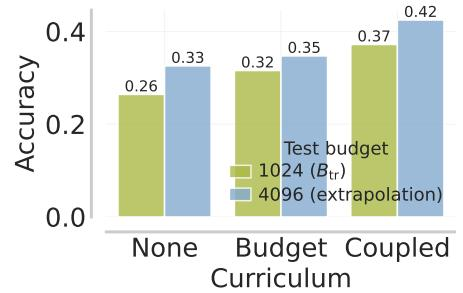

the smallest but reasonable such that there is only a marginal improvement from extending to 2, defined by = 1*.*2. As shown in Fig [9\(](#page-10-2)c), this corresponds to *<sup>⋆</sup>* tr*,*1 (1) = 1024 (where <sup>1</sup> is the second stage training dataset). Indeed, Fig [9\(](#page-10-2)c) shows that at *<sup>⋆</sup>* tr*,*1 (1) = 1024, we get nearly the best extrapolation performance to 4096 tokens on the harder problems (7 numbers). We also note that while tr = 2048 marginally improves test performance over tr = 1024, it is unclear apriori if tr = 2048 would train stably and our goal is to make a thumb rule prescription. We also find in the figure on the right, that our coupled curriculum outperforms budget curriculum or not training with any curriculum.

## **6.3. Final Results with e3:** *State-of-the-art <***2B Model on AIME/HMMT'25**

*Extrapolation to 32k with* **e3.** In Fig. [10\(](#page-12-0)a,b), we compare the performance of a Qwen3-1.7B model fine-tuned using e3 with open-source models, including some 7B and 32B models. As shown, at a test-time token budget of 32k tokens, e3 achieves state-of-the-art performance on AIME'25 and HMMT'25,

<span id="page-12-0"></span>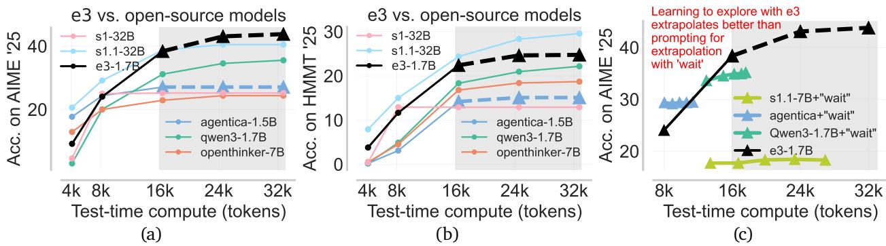

**Figure 10:** *RL training with coupled curricula (e3).* The shaded area indicates the extrapolation regime and dashed curves indicate that we are testing the model beyond the training budget (shown with the solid line). **(a), (b):** e3 achieves *state-of-the-art* performance across models < 2B, and outperforms some larger sized models like openthinker-7B [50] and s1.1-32B [27] (on AIME'25) on larger test-time budgets upto 32k, **(c):** e3 (w/o "wait") extrapolates better to larger test-time token budgets, compared to budget forcing with "wait" prompt 2-8 times, as proposed in s1 [27].

within a model class of size <2B. We outperform the best model in this class by >8% on AIME'25 in terms of peak performance, and show that our model, trained only up to a budget of 16k, extrapolates better than other models including s1.1-32B [27] and OpenThinker-7B [50] when we extrapolate them to 32k output tokens. In principle, one can simply force the model (trained even with SFT) to use more test-time compute by intervening its output trace with an appended prompt (e.g., by appending "Wait" to an output trace as suggested in s1 [27]). Interestingly, Fig. 9(c) shows that compared to budget forcing via "Wait", e3 achieves substantially better scaling, without any form of prompting or budget forcing.

Improving pass@32 with e3. In Tab. 1, we also report the pass@k performance, comparing e3 with other models of a similar size. We find that our final model at the end of second stage of training on a budget of 16k outperforms other models on higher values of k, on AIME and HMMT '25. We especially note the comparison against the Nemotron-Reasoning-1.5B model [22] trained with a prolonged RL training recipe on a broader dataset, including our training data. This model consistently improves pass@16 performance during RL training [22]. To concretely describe our estimation procedure, we used 128 rollouts per prompt to compute a bootstrapped estimate [4] of the pass@k performance for  $k = 1, 2, \ldots, 32$ . Evaluating pass@k at higher values of k would require a much higher number of rollouts (>2048) since the variance of the pass@k estimate increases sharply with k, for a given number of rollouts. Moreover, in all of our GRPO training runs, we only use a maximum of 32 rollouts per problem to estimate the advantage value. Therefore, we can conclude that if e3 is able to improve over pass@32 of the base model, then it does improve beyond any naïve distillation-based approach, that aims to distill the pass@32 policy corresponding to the base model into a better pass@1 policy.

#### Takeaways: Coupled data & budget curriculum structures exploration during training.

- RL with fixed  $B_{\rm tr}$ , D hurts in-context exploration: (i) short  $B_{\rm tr}$  penalizes exploration on hard problems as budget is overrun; (ii) large  $B_{\rm tr}$  overfits on over-exploratory behavior on easy ones.
- We propose a coupled curriculum e3: at each stage, given D, choose smallest  $B_{\rm tr}$  such that chaining more asymmetries till a budget of  $2 \cdot B_{\rm tr}$  is positively rewarded at RL initialization.
- By fine-tuning Qwen3-1.7B with e3, we outperform <2B models on AIME'25, HMMT '25.

## **7. Related Work**

**Scaling test-time compute via long CoT reasoning.** Prior work explores a number of avenues for scaling test-time compute, including majority voting [\[52\]](#page-19-6), best-of-n sampling, and beam search [\[36,](#page-17-7) [44\]](#page-18-7), as well as sequential self-correction [\[18,](#page-16-2) [33\]](#page-17-8). More recent results indicate that training models to use test-time compute to generate longer chains of thought (CoT) that combine verification, search, and self-correction – all in a free-form manner, performs better [\[5,](#page-15-0) [29,](#page-17-9) [49\]](#page-18-8), resulting in widespread open-source reproduction efforts [\[7,](#page-15-5) [26,](#page-17-2) [57,](#page-19-7) [63\]](#page-19-8). We situate our work in the paradigm of long CoT reasoning.

**Test-time extrapolation.** The true benefit of test-time scaling is consistently improving performance as we extrapolate test compute. While prior work tests the model's performance on budgets longer than the training budget [\[25,](#page-17-10) [62\]](#page-19-9), they do not explain the relationship between the training recipe and the extrapolation, like we aim to do in our work. Other works perform extrapolation by explicitly prompting models to generate more tokens when a response terminates [\[2,](#page-15-6) [27\]](#page-17-0), whereas, we show that models that learn to explore in-context extrapolate test compute better than prompting-based approaches (Fig. [10\)](#page-12-0). In particular, we study the role played by the base model, training algorithm (RL), as well as data mixtures and token budgets, on the ability to extrapolate. Furthermore, prior work [\[38\]](#page-18-2) has investigated scaling when train and test budgets are the same, but we expand the scope of this comparison substantially.

**Exploration in test-time scaling.** While prior works have shown the importance of the base model's ability to conduct exploration [\[9,](#page-16-5) [23\]](#page-17-11), we discover that it is crucial for extrapolation. We show that the negative gradient in RL incentivizes chaining multiple asymmetries and leads to longer response length, and better performance. SFT alone does not provide this kind of chaining or exploration benefits. Our analysis is orthogonal to theoretical works Setlur et al. [\[38\]](#page-18-2), Swamy et al. [\[46\]](#page-18-9), which shows that RL performs better than SFT, but from a statistical perspective, whereas our argument is more focused on the learning dynamics. Concurrent work builds techniques to boost exploration during RL via advantage normalization [\[19,](#page-16-11) [58\]](#page-19-0) or PPO clipping [\[58\]](#page-19-0), and these techniques can be combined with e3, but they do not study the role of negative gradients in learning to explore. Finally, Wang et al. [\[53\]](#page-19-10) briefly remarks about the role of policy gradient loss and entropy when running RL with only a few examples. Our study investigates the underlying mechanism of negative gradients increasing length and entropy.

**Data and length curricula.** Recent works have also investigated using a curriculum on problem difficulty [\[43,](#page-18-10) [49,](#page-18-8) [54\]](#page-19-11) and output length [\[24,](#page-17-12) [26\]](#page-17-2) during RL training. Their motivation stems primarily from an efficiency standpoint: avoiding zero advantage updates [\[43,](#page-18-10) [58\]](#page-19-0), efficient optimization [\[26\]](#page-17-2), or efficiency of using test-time compute [\[34\]](#page-17-1). While we do make similar observations regarding each curriculum individually, perhaps our most interesting finding is that carefully coupling both data and budget curricula can lead to much better performance and extrapolation, beyond merely some gains in efficient training. We show that training on hard problems with short budgets often yields terse solutions that fail to extrapolate, while easy problems with long budgets can cause optimization issues or verbose outputs. Thus, curricula must be carefully designed to support effective extrapolation. Conceptually, our curricula are most related to dense progress rewards [\[34,](#page-17-1) [36\]](#page-17-7), in the sense that curricula incentivize different degrees of progress for different questions, at different points in training.

## **8. Discussion and Conclusion**

We show that in-context exploration is a core capability to enable extrapolation of test-time compute in LLMs. Therefore we build a recipe that amplifies in-context exploration. Our recipe e3, leverages (1) asymmetries in the base model, (2) negative gradients during RL training, and (3) a coupled curriculum over data and token budget to train a model that can perform in-context exploration. Applied to the Qwen3-1.7B model, our method achieves state-of-the-art performance on the AIME/HMMT'25 benchmarks, with particularly strong gains in the extrapolation regime. We also show that our e3 recipe also improves pass@k over the course of training, for values of upto 32 that we evaluate. There are a number of implications of our work and a number interesting directions that future work should build upon. We list the main technical implications and open questions below.

- **Sharpening vs in-context exploration.** A number of concurrent RL results either directly [\[60\]](#page-19-5) or indirectly [\[30,](#page-17-13) [39,](#page-18-11) [40,](#page-18-12) [64\]](#page-19-12) argue that RL training on LLMs sharpens the base model's distribution, as also previously studied by Huang et al. [\[15\]](#page-16-12). In contrast to this, our study shows that if we can utilize a coupled curriculum on top of a base model that admits asymmetries, RL can actually enable chaining new asymmetries, resulting in an increase in length, indicating the presence of structured exploration. This behavior is distinct from traditional sharpening that corresponds to cloning one (or few) of the responses sampled from the base model. In fact, our conceptual study in the model in Section [5](#page-7-0) also highlights these two distinct phases during RL: an initial in-context exploration phase where negative gradients lead to an increase in response length and the policy learns to utilize test-time compute for better exploration, followed by a phase where it sharpens to the best traces found thus far. The design of e3 enables it to operate in the former phase. We believe concurrent works that finds RL largely sharpens the model operate in the second regime by training on data that does not require chaining asymmetries or operating with a very low training budget such that chaining is impossible. As a result, models trained purely in the sharpening regime may behave similarly to the base model with an alternate prompt, with RL perhaps offering little more than an implicit prompt tuning effect. But we would not expect this for the chaining regime. A detailed study on separating these regimes, and identifying all the factors that draw RL training into these regimes is an interesting direction for both theoretical and empirical research.
- **Connection with dense progress rewards.** While e3 utilizes a coupled curriculum, this curriculum is closely connected with the use of dense rewards, as prescribed by our prior work [\[34,](#page-17-1) [36\]](#page-17-7). To see why, note that one can reparameterize coupled curriculum into a single round of training with dense rewards applied to short segments of the output response, perhaps in a similar way as Qi et al. [\[32\]](#page-17-14), Qu et al. [\[34\]](#page-17-1). Therefore, the success of the coupled curriculum approach in e3 at improving performance and not only in reducing total training compute perhaps hints at future success with dense rewards at scale, with initial results showing that dense rewards help larger models already being shown in the community [\[51\]](#page-18-13). We encourage readers to explore the connection between curriculum and dense rewards further.
- **Introducing new asymmetries.** The conceptual model behind e3 applies with any asymmetry, though most experiments in this paper utilize only the verification-generation gap. It would be interesting to identify other asymmetries and study methods to imbue base models with these asymmetries. Definition [3.1](#page-3-1) in Section [3](#page-3-3) provides a starting point to define these asymmetries.
- **Is curriculum fundamentally needed?** A natural question is whether curriculum is fundamentally necessary as we vary model sizes and capabilities. Unlike supervised learning on a fixed dataset, online RL generates its own rollouts. Reinforcing chaining behavior via negative gradients (Sec. [4\)](#page-5-0) requires that such chaining reliably improves performance on training problems much more substantially compared to sampling diverse traces that do not chain asymmetries. This likely necessitates specific training configurations regardless of model size with standard outcome-reward RL, or the use of dense rewards (as discussed above). While larger models may admit simpler curricula, deliberately using currciulum or dense rewards as inspiration may be critical.

• **Explicit exploration bonuses.** In our runs, the main issue hindering us from benefits of further scaling of output length during RL is the repetition bias in the base model, where it tends to repeat previously-generated segments in its trace beyond a certain output length. This repetition bias inhibits the efficacy of in-context exploration beyond a certain output length and as a result inhibits further test-time scaling. We believe that explicit exploration bonuses that enable the model to search for tokens in this regime would result in even better in-context exploration.

Finally, our study is limited in terms of model scale and domain. Future work should explore how e3 generalizes to larger model scales and other reasoning domains.

## **Acknowledgements**

We thank Christina Baek, Yuxiao Qu, Anikait Singh, Yoonho Lee, Max Sobol Mark, Zheyuan Hu, Seohong Park, Bhavya Agrawalla, Sang Michael Xie, Paria Rashidinejad, and the rest of the AIRe lab at CMU for informative discussions, feedback, input on our results, and a previous version of this paper. We thank Yuxiao Qu for help with debugging implementations and infrastructure. The main large-scale experiments in this paper utilized H100 GPU resources from the Orchard cluster in the FLAME center at CMU for which we especially thank Graham Neubig and Chenyan Xiong for their generous support, and TPUs from Google Cloud. We thank Oumi for providing us with resources that supported the experiments on the Countdown domain. This project is supported by funding from the Office of Naval Research under N00014-24-1-2206 and a Schmidt Sciences AI2050 Fellowship. AS is supported by JP Morgan PhD fellowship. This paper does not reflect the opinions of employers or other parties.

## **References**

- <span id="page-15-2"></span>[1] Alekh Agarwal, Sham M Kakade, Jason D Lee, and Gaurav Mahajan. On the theory of policy gradient methods: Optimality, approximation, and distribution shift. *Journal of Machine Learning Research*, 22(98):1–76, 2021.
- <span id="page-15-6"></span>[2] Pranjal Aggarwal and Sean Welleck. L1: Controlling how long a reasoning model thinks with reinforcement learning. *arXiv preprint arXiv:2503.04697*, 2025.
- <span id="page-15-3"></span>[3] Arash Ahmadian, Chris Cremer, Matthias Gallé, Marzieh Fadaee, Julia Kreutzer, Olivier Pietquin, Ahmet Üstün, and Sara Hooker. Back to basics: Revisiting reinforce style optimization for learning from human feedback in llms. *arXiv preprint arXiv:2402.14740*, 2024.
- <span id="page-15-4"></span>[4] Mark Chen, Jerry Tworek, Heewoo Jun, Qiming Yuan, Henrique Ponde De Oliveira Pinto, Jared Kaplan, Harri Edwards, Yuri Burda, Nicholas Joseph, Greg Brockman, et al. Evaluating large language models trained on code. *arXiv preprint arXiv:2107.03374*, 2021.
- <span id="page-15-0"></span>[5] DeepSeek-AI, Daya Guo, Dejian Yang, Haowei Zhang, Junxiao Song, Zhipeng Xu, Zhongyu Zhang, and Zhen Zhang. Deepseek-r1: Incentivizing reasoning capability in llms via reinforcement learning, 2025. URL <https://arxiv.org/abs/2501.12948>.
- <span id="page-15-1"></span>[6] Yan Duan, John Schulman, Xi Chen, Peter L Bartlett, Ilya Sutskever, and Pieter Abbeel. Rl <sup>2</sup> : Fast reinforcement learning via slow reinforcement learning. *arXiv preprint arXiv:1611.02779*, 2016.
- <span id="page-15-5"></span>[7] Hugging Face. Open r1: A fully open reproduction of deepseek-r1, January 2025. URL [https:](https://github.com/huggingface/open-r1) [//github.com/huggingface/open-r1](https://github.com/huggingface/open-r1).

- <span id="page-16-1"></span>[8] Kanishk Gandhi, Denise Lee, Gabriel Grand, Muxin Liu, Winson Cheng, Archit Sharma, and Noah D Goodman. Stream of search (sos): Learning to search in language. *arXiv preprint arXiv:2404.03683*, 2024.
- <span id="page-16-5"></span>[9] Kanishk Gandhi, Ayush Chakravarthy, Anikait Singh, Nathan Lile, and Noah D. Goodman. Cognitive behaviors that enable self-improving reasoners, or, four habits of highly effective stars, 2025. URL <https://arxiv.org/abs/2503.01307>.
- <span id="page-16-13"></span>[10] Yang Gao, Christian M Meyer, Mohsen Mesgar, and Iryna Gurevych. Reward learning for efficient reinforcement learning in extractive document summarisation. *arXiv preprint arXiv:1907.12894*, 2019.
- <span id="page-16-4"></span>[11] Dibya Ghosh, Jad Rahme, Aviral Kumar, Amy Zhang, Ryan P. Adams, and Sergey Levine. Why generalization in RL is difficult: Epistemic pomdps and implicit partial observability. *CoRR*, abs/2107.06277, 2021. URL <https://arxiv.org/abs/2107.06277>.
- <span id="page-16-8"></span>[12] Abhishek Gupta, Benjamin Eysenbach, Chelsea Finn, and Sergey Levine. Unsupervised metalearning for reinforcement learning. *CoRR*, abs/1806.04640, 2018. URL [http://arxiv.org/abs/](http://arxiv.org/abs/1806.04640) [1806.04640](http://arxiv.org/abs/1806.04640).
- <span id="page-16-10"></span>[13] Elad Hazan, Sham Kakade, Karan Singh, and Abby Van Soest. Provably efficient maximum entropy exploration. In *ICML*, 2019. URL <https://arxiv.org/pdf/1812.02690.pdf>.
- <span id="page-16-3"></span>[14] Andreas Hochlehnert, Hardik Bhatnagar, Vishaal Udandarao, Samuel Albanie, Ameya Prabhu, and Matthias Bethge. A sober look at progress in language model reasoning: Pitfalls and paths to reproducibility. *arXiv preprint arXiv:2504.07086*, 2025.
- <span id="page-16-12"></span>[15] Audrey Huang, Adam Block, Dylan J Foster, Dhruv Rohatgi, Cyril Zhang, Max Simchowitz, Jordan T Ash, and Akshay Krishnamurthy. Self-improvement in language models: The sharpening mechanism. *arXiv preprint arXiv:2412.01951*, 2024.
- <span id="page-16-6"></span>[16] Seungone Kim, Ian Wu, Jinu Lee, Xiang Yue, Seongyun Lee, Mingyeong Moon, Kiril Gashteovski, Carolin Lawrence, Julia Hockenmaier, Graham Neubig, et al. Scaling evaluation-time compute with reasoning models as process evaluators. *arXiv preprint arXiv:2503.19877*, 2025.
- <span id="page-16-7"></span>[17] Akshay Krishnamurthy, Keegan Harris, Dylan J Foster, Cyril Zhang, and Aleksandrs Slivkins. Can large language models explore in-context? *arXiv preprint arXiv:2403.15371*, 2024.
- <span id="page-16-2"></span>[18] Aviral Kumar, Vincent Zhuang, Rishabh Agarwal, Yi Su, John D Co-Reyes, Avi Singh, Kate Baumli, Shariq Iqbal, Colton Bishop, Rebecca Roelofs, et al. Training language models to self-correct via reinforcement learning. *arXiv preprint arXiv:2409.12917*, 2024.
- <span id="page-16-11"></span>[19] Qiyang Li, Yuexiang Zhai, Yi Ma, and Sergey Levine. Understanding the complexity gains of single-task rl with a curriculum. *arXiv preprint arXiv:2212.12809*, 2022.
- <span id="page-16-0"></span>[20] Tianle Li, Ge Zhang, Quy Duc Do, Xiang Yue, and Wenhu Chen. Long-context llms struggle with long in-context learning. *arXiv preprint arXiv:2404.02060*, 2024.
- <span id="page-16-9"></span>[21] Evan Zheran Liu, Ramtin Keramati, Sudarshan Seshadri, Kelvin Guu, Panupong Pasupat, Emma Brunskill, and Percy Liang. Learning abstract models for strategic exploration and fast reward transfer. *arXiv preprint arXiv:2007.05896*, 2020.

- <span id="page-17-6"></span>[22] Mingjie Liu, Shizhe Diao, Ximing Lu, Jian Hu, Xin Dong, Yejin Choi, Jan Kautz, and Yi Dong. Prorl: Prolonged reinforcement learning expands reasoning boundaries in large language models. *arXiv preprint arXiv:2505.24864*, 2025.
- <span id="page-17-11"></span>[23] Zichen Liu, Changyu Chen, Wenjun Li, Penghui Qi, Tianyu Pang, Chao Du, Wee Sun Lee, and Min Lin. Understanding r1-zero-like training: A critical perspective. *arXiv preprint arXiv:2503.20783*, 2025.
- <span id="page-17-12"></span>[24] Zihan Liu, Yang Chen, Mohammad Shoeybi, Bryan Catanzaro, and Wei Ping. Acemath: Advancing frontier math reasoning with post-training and reward modeling. *arXiv preprint*, 2024.
- <span id="page-17-10"></span>[25] Michael Luo, Sijun Tan, Roy Huang, Ameen Patel, Alpay Ariyak, Qingyang Wu, Xiaoxiang Shi, Rachel Xin, Colin Cai, Maurice Weber, Ce Zhang, Li Erran Li, Raluca Ada Popa, and Ion Stoica. Deepcoder: A fully open-source 14b coder at o3-mini level, 2025. Notion Blog.
- <span id="page-17-2"></span>[26] Michael Luo, Sijun Tan, Justin Wong, Xiaoxiang Shi, William Y. Tang, Manan Roongta, Colin Cai, Jeffrey Luo, Tianjun Zhang, Li Erran Li, Raluca Ada Popa, and Ion Stoica. DeepScaleR: Surpassing O1-Preview with a 1.5B Model by Scaling RL, 2025. Notion Blog.
- <span id="page-17-0"></span>[27] Niklas Muennighoff, Zitong Yang, Weijia Shi, Xiang Lisa Li, Li Fei-Fei, Hannaneh Hajishirzi, Luke Zettlemoyer, Percy Liang, Emmanuel Candès, and Tatsunori Hashimoto. s1: Simple test-time scaling, 2025. URL <https://arxiv.org/abs/2501.19393>.
- <span id="page-17-4"></span>[28] Allen Nie, Yi Su, Bo Chang, Jonathan N Lee, Ed H Chi, Quoc V Le, and Minmin Chen. Evolve: Evaluating and optimizing llms for exploration. *arXiv preprint arXiv:2410.06238*, 2024.
- <span id="page-17-9"></span>[29] OpenAI, :, Aaron Jaech, Adam Kalai, Adam Lerer, Adam Richardson, Ahmed El-Kishky, Aiden Low, Alec Helyar, Aleksander Madry, Alex Beutel, Yuchen Zhang, Yunyun Wang, Zheng Shao, and Zhuohan Li. Openai o1 system card, 2024. URL <https://arxiv.org/abs/2412.16720>.
- <span id="page-17-13"></span>[30] Mihir Prabhudesai, Lili Chen, Alex Ippoliti, Katerina Fragkiadaki, Hao Liu, and Deepak Pathak. Maximizing confidence alone improves reasoning. *arXiv preprint arXiv:2505.22660*, 2025.
- <span id="page-17-5"></span>[31] Martin L Puterman. *Markov Decision Processes: Discrete Stochastic Dynamic Programming*. John Wiley & Sons, Inc., 1994.
- <span id="page-17-14"></span>[32] Penghui Qi, Zichen Liu, Tianyu Pang, Chao Du, Wee Sun Lee, and Min Lin. Optimizing anytime reasoning via budget relative policy optimization. *arXiv preprint arXiv:2505.13438*, 2025.
- <span id="page-17-8"></span>[33] Yuxiao Qu, Tianjun Zhang, Naman Garg, and Aviral Kumar. Recursive introspection: Teaching language model agents how to self-improve. *arXiv preprint arXiv:2407.18219*, 2024.
- <span id="page-17-1"></span>[34] Yuxiao Qu, Matthew YR Yang, Amrith Setlur, Lewis Tunstall, Edward Emanuel Beeching, Ruslan Salakhutdinov, and Aviral Kumar. Optimizing test-time compute via meta reinforcement fine-tuning. *arXiv preprint arXiv:2503.07572*, 2025.
- <span id="page-17-3"></span>[35] John Schulman, Filip Wolski, Prafulla Dhariwal, Alec Radford, and Oleg Klimov. Proximal policy optimization algorithms. *arXiv preprint arXiv:1707.06347*, 2017.
- <span id="page-17-7"></span>[36] Amrith Setlur, Chirag Nagpal, Adam Fisch, Xinyang Geng, Jacob Eisenstein, Rishabh Agarwal, Alekh Agarwal, Jonathan Berant, and Aviral Kumar. Rewarding progress: Scaling automated process verifiers for llm reasoning. *arXiv preprint arXiv:2410.08146*, 2024.

- <span id="page-18-1"></span>[37] Amrith Setlur, Yuxiao Qu, Matthew Yang, Lunjun Zhang, Virginia Smith, and Aviral Kumar. Optimizing llm test-time compute involves solving a meta-rl problem. <https://blog.ml.cmu.edu/>, 2025. CMU MLD Blog.
- <span id="page-18-2"></span>[38] Amrith Setlur, Nived Rajaraman, Sergey Levine, and Aviral Kumar. Scaling test-time compute without verification or rl is suboptimal. *arXiv preprint arXiv:2502.12118*, 2025.
- <span id="page-18-11"></span>[39] Sheikh Shafayat, Fahim Tajwar, Ruslan Salakhutdinov, Jeff Schneider, and Andrea Zanette. Can large reasoning models self-train?, 2025. URL <https://arxiv.org/abs/2505.21444>.
- <span id="page-18-12"></span>[40] Rulin Shao, Shuyue Stella Li, Rui Xin, Scott Geng, Yiping Wang, Sewoong Oh, Simon Shaolei Du, Nathan Lambert, Sewon Min, Ranjay Krishna, Yulia Tsvetkov, Hannaneh Hajishirzi, Pang Wei Koh, and Luke Zettlemoyer. Spurious rewards: Rethinking training signals in rlvr, 2025. Notion Blog.
- <span id="page-18-6"></span>[41] Zhihong Shao, Peiyi Wang, Qihao Zhu, Runxin Xu, Junxiao Song, Xiao Bi, Haowei Zhang, Mingchuan Zhang, YK Li, Y Wu, et al. Deepseekmath: Pushing the limits of mathematical reasoning in open language models. *arXiv preprint arXiv:2402.03300*, 2024.
- <span id="page-18-14"></span>[42] Guangming Sheng, Chi Zhang, Zilingfeng Ye, Xibin Wu, Wang Zhang, Ru Zhang, Yanghua Peng, Haibin Lin, and Chuan Wu. Hybridflow: A flexible and efficient rlhf framework. *arXiv preprint arXiv: 2409.19256*, 2024.
- <span id="page-18-10"></span>[43] Taiwei Shi, Yiyang Wu, Linxin Song, Tianyi Zhou, and Jieyu Zhao. Efficient reinforcement finetuning via adaptive curriculum learning, 2025. URL <https://arxiv.org/abs/2504.05520>.
- <span id="page-18-7"></span>[44] Charlie Snell, Jaehoon Lee, Kelvin Xu, and Aviral Kumar. Scaling llm test-time compute optimally can be more effective than scaling model parameters. *arXiv preprint arXiv:2408.03314*, 2024.
- <span id="page-18-3"></span>[45] Yuda Song, Hanlin Zhang, Carson Eisenach, Sham Kakade, Dean Foster, and Udaya Ghai. Mind the gap: Examining the self-improvement capabilities of large language models. *arXiv preprint arXiv:2412.02674*, 2024.
- <span id="page-18-9"></span>[46] Gokul Swamy, Christoph Dann, Rahul Kidambi, Zhiwei Steven Wu, and Alekh Agarwal. A minimaximalist approach to reinforcement learning from human feedback. *arXiv:2401.04056*, 2024.
- <span id="page-18-4"></span>[47] Gokul Swamy, Sanjiban Choudhury, Wen Sun, Zhiwei Steven Wu, and J Andrew Bagnell. All roads lead to likelihood: The value of reinforcement learning in fine-tuning. *arXiv preprint arXiv:2503.01067*, 2025.
- <span id="page-18-5"></span>[48] Fahim Tajwar, Anikait Singh, Archit Sharma, Rafael Rafailov, Jeff Schneider, Tengyang Xie, Stefano Ermon, Chelsea Finn, and Aviral Kumar. Preference Fine-Tuning of LLMs Should Leverage Suboptimal, On-Policy Data, ICML 2024.
- <span id="page-18-8"></span>[49] Kimi Team, Angang Du, Bofei Gao, Bowei Xing, Changjiu Jiang, Zhexu Wang, Zhilin Yang, Zhiqi Huang, Zihao Huang, Ziyao Xu, and Zonghan Yang. Kimi k1.5: Scaling reinforcement learning with llms, 2025. URL <https://arxiv.org/abs/2501.12599>.
- <span id="page-18-0"></span>[50] OpenThoughts Team. Open Thoughts. https://open-thoughts.ai, February 2025.
- <span id="page-18-13"></span>[51] Shenzhi Wang, Le Yu, Chang Gao, Chujie Zheng, Shixuan Liu, Rui Lu, Kai Dang, Xionghui Chen, Jianxin Yang, Zhenru Zhang, et al. Beyond the 80/20 rule: High-entropy minority tokens drive effective reinforcement learning for llm reasoning. *arXiv preprint arXiv:2506.01939*, 2025.

- <span id="page-19-6"></span>[52] Xuezhi Wang, Jason Wei, Dale Schuurmans, Quoc Le, Ed Chi, Sharan Narang, Aakanksha Chowdhery, and Denny Zhou. Self-consistency improves chain of thought reasoning in language models. *arXiv preprint arXiv:2203.11171*, 2022.
- <span id="page-19-10"></span>[53] Yiping Wang, Qing Yang, Zhiyuan Zeng, Liliang Ren, Lucas Liu, Baolin Peng, Hao Cheng, Xuehai He, Kuan Wang, Jianfeng Gao, et al. Reinforcement learning for reasoning in large language models with one training example. *arXiv preprint arXiv:2504.20571*, 2025.
- <span id="page-19-11"></span>[54] Tian Xie, Zitian Gao, Qingnan Ren, Haoming Luo, Yuqian Hong, Bryan Dai, Joey Zhou, Kai Qiu, Zhirong Wu, and Chong Luo. Logic-rl: Unleashing llm reasoning with rule-based reinforcement learning. *arXiv preprint arXiv:2502.14768*, 2025.
- <span id="page-19-2"></span>[55] An Yang, Anfeng Li, Baosong Yang, Beichen Zhang, Binyuan Hui, Bo Zheng, Bowen Yu, Chang Gao, Chengen Huang, Chenxu Lv, et al. Qwen3 technical report. *arXiv preprint arXiv:2505.09388*, 2025.
- <span id="page-19-1"></span>[56] Shunyu Yao, Dian Yu, Jeffrey Zhao, Izhak Shafran, Thomas L Griffiths, Yuan Cao, and Karthik Narasimhan. Tree of thoughts: Deliberate problem solving with large language models. *arXiv preprint arXiv:2305.10601*, 2023.
- <span id="page-19-7"></span>[57] Edward Yeo, Yuxuan Tong, Morry Niu, Graham Neubig, and Xiang Yue. Demystifying long chainof-thought reasoning in llms, 2025. URL <https://arxiv.org/abs/2502.03373>.
- <span id="page-19-0"></span>[58] Qiying Yu, Zheng Zhang, Ruofei Zhu, Yufeng Yuan, Xiaochen Zuo, Yu Yue, Tiantian Fan, Gaohong Liu, Lingjun Liu, Xin Liu, et al. Dapo: An open-source llm reinforcement learning system at scale. *arXiv preprint arXiv:2503.14476*, 2025.
- <span id="page-19-4"></span>[59] Zheng Yuan, Hongyi Yuan, Chengpeng Li, Guanting Dong, Chuanqi Tan, and Chang Zhou. Scaling relationship on learning mathematical reasoning with large language models. *arXiv preprint arXiv:2308.01825*, 2023.
- <span id="page-19-5"></span>[60] Yang Yue, Zhiqi Chen, Rui Lu, Andrew Zhao, Zhaokai Wang, Shiji Song, and Gao Huang. Does reinforcement learning really incentivize reasoning capacity in llms beyond the base model? *arXiv preprint arXiv:2504.13837*, 2025.
- <span id="page-19-3"></span>[61] Eric Zelikman, Yuhuai Wu, Jesse Mu, and Noah Goodman. Star: Bootstrapping reasoning with reasoning. *Advances in Neural Information Processing Systems*, 35:15476–15488, 2022.
- <span id="page-19-9"></span>[62] Weihao Zeng, Yuzhen Huang, Qian Liu, Wei Liu, Keqing He, Zejun Ma, and Junxian He. Simplerlzoo: Investigating and taming zero reinforcement learning for open base models in the wild. *arXiv preprint arXiv:2503.18892*, 2025.
- <span id="page-19-8"></span>[63] Weihao Zeng, Yuzhen Huang, Qian Liu, Wei Liu, Keqing He, Zejun Ma, and Junxian He. Simplerlzoo: Investigating and taming zero reinforcement learning for open base models in the wild, 2025. URL <https://arxiv.org/abs/2503.18892>.
- <span id="page-19-12"></span>[64] Xuandong Zhao, Zhewei Kang, Aosong Feng, Sergey Levine, and Dawn Song. Learning to reason without external rewards, 2025. URL <https://arxiv.org/abs/2505.19590>.

## **Appendices**

- **A.** Testing Extrapolation of Open Source Models.
- **B.** Additional Experiments and Details for Section 3 (Chained Asymmetries).
- **C.** Additional Experiments and Details for Section 4 (Negative Gradient).
- **D.** Additional Experiments and Details for Section 6 (Curricula Training).
- E. Omitted Proofs.
- F. Broader Impact Statement.
- G. Note on Computational Resources Used for e3.
- <span id="page-20-0"></span>H. Example Traces.

## A. Testing Extrapolation of Open-Source Models

<span id="page-20-1"></span>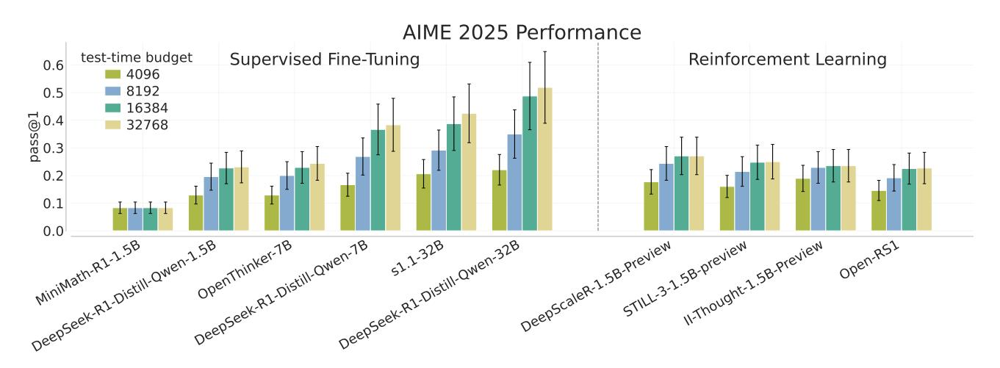

**Figure** 11: *Extrapolation of test-time compute*: We plot the performance (pass@1) on AIME 2025 at different test-time compute budgets across multiple open-source models of different sizes, trained with SFT or RL.

**Extrapolation on AIME 2025.** Extrapolation (i.e. the chaining of generation, verification, refinement, etc.) can potentially extend LLM performance after training, and do so beyond the context length the model was originally trained on. To evaluate this properly, we need sufficiently challenging problems that allow meaningful expressiveness in reasoning beyond small context lengths. The math problems associated with AIME align with this, and our evaluations prioritize AIME 2025 to attempt to mitigate any potential data contamination in the models' training sets from previous years of AIME. The goal of the experiment is to measure the extent to which test-time compute influences overall model performance as context length increases, with the expectation that increasing output length allows models to "reason" for longer periods, continuing the extrapolation process, and ultimately arriving at the correct answer more frequently.

**Experiment setup.** Inference for every open-source model was performed using Oumi through data-parallel SGLang. All models had inference run with a max output length of approximately 32k tokens, though some are slightly lower due to this exceeding their max context length when combined with the prompt. The exact inference hyperparameters are described in Table 2. After inference, the model responses were truncated from the right side until the number of remaining tokens present was equal to the specified test-time budget. 16 responses were collected for every problem in AIME with the specified

inference settings, and the Pass@1 rate was calculated by averaging over these 16 responses. Final answers were extracted using a regular expression for the boxed portion of the answer, with correct answers marked as passing and incorrect or incorrectly parsed answers marked as nonpassing. The prompt used is in Box [A.1,](#page-21-2) and the problems were taken from the FVU AIME 2025 dataset on HuggingFace[2](#page-0-0) .

#### <span id="page-21-2"></span>Box A.1: AIME Evaluation Prompt Template

You will be given a math problem. Solve the problem step by step. Output your final answer in the form of \\boxed{your answer}. Problem: {problem}

<span id="page-21-1"></span>

| Model                         | Temp. | 𝑝<br>Top | Rollouts | Max<br>New<br>Tokens | Model<br>Max<br>Length |
|-------------------------------|-------|----------|----------|----------------------|------------------------|
| MiniMath R1-1.5B              | 0.6   | 0.95     | 16       | 32768                | 40960                  |
| DeepSeek R1-Distill-Qwen-1.5B | 0.6   | 0.95     | 16       | 32768                | 40960                  |
| OpenThinker-7B                | 0.6   | 0.95     | 16       | 31000                | 32768                  |
| DeepSeek-R1-Distill-Qwen-7B   | 0.6   | 0.95     | 16       | 32768                | 40960                  |
| s1.1-32B                      | 0.6   | 0.95     | 16       | 31000                | 32768                  |
| DeepSeek-R1-Distill-Qwen-32B  | 0.6   | 0.95     | 16       | 32768                | 40960                  |
| DeepScaleR-1.5B-Preview       | 0.6   | 0.95     | 16       | 32768                | 40960                  |
| STILL-3-1.5B-preview          | 0.6   | 0.95     | 16       | 32768                | 40960                  |
| II-Thought-1.5B-Preview       | 0.6   | 0.95     | 16       | 32768                | 40960                  |
| Open-RS1                      | 0.6   | 0.95     | 16       | 32768                | 40960                  |

Table 2: Inference parameters used for generating the extrapolation plots in Figure [2.](#page-2-0)

**Results.** The results in Figure [11](#page-20-1) show that as the maximum number of output tokens increases, every model capable of "reasoning" is able to attain a higher Pass@1 rate, with performance generally saturating at 16k tokens with relatively minor improvements at 32k. We do not observe this with MiniMath-R1-1.5B, and we suspect this is due to its fine-tuning focusing solely on smaller math problems trained with supervised fine-tuning, likely resulting in catastrophic forgetting of the ability to continuously extrapolate. Interestingly, we do not see a strong improvement in extrapolation behavior among models tuned with reinforcement learning compared to DeepSeek R1-Distill-Qwen-1.5B, which was trained with supervised fine-tuning. We suspect that this is likely due to the nature of the distillation data from the R1 model, which, if varied sufficiently in length, could avoid the length bias normally learned from supervised fine-tuning, while still teaching the model to perform extrapolation.

## <span id="page-21-0"></span>**B. Additional Experiments and Details for Section [3](#page-3-3) (Chained Asymmetries)**

#### **B.1. Details on Mult and Mult -V**

**Data collection.** Both Mult and Mult -V consist of multiplication traces for solving a 5-digit × 5-digit multiplication problem. For the Mult task, we use a Llama3.2-3B instruction tuned model where the number of intermediate verification attempts is much lower in a trace when asked to solve a multiplication problem. In fact, it is not hard to see that, in general, for multiplication, generation of a trace may

<sup>2</sup> [https://huggingface.co/datasets/FVU/AIME\\_2025](https://huggingface.co/datasets/FVU/AIME_2025)

be as hard as verifying a generated one, as the only way to verify the entire trace is to re-attempt the multiplication or carry out a division with the computed target. We contrast this task with the Mult -V task, where the Llama3.2-3B models are first finetuned on traces from Qwen-32B-R1-Distilled and GPT-4o models. These traces contain multiple verification attempts that verify intermediate steps solving smaller multiplication problems, and the steps are part of an entire trace that attempts to solve the main multiplication problem involving two 5-digit numbers. For collecting data we used the prompt in Box [B.1.](#page-22-0) In App. [H](#page-33-0) Example 2, we also provide an example multiplication trace with verification attempts sampled by the base model in Mult -V. As we will see in Fig. [15,](#page-25-0) the absence of asymmetries in Mult leads to lower accuracy and verifications when compared to Mult -V, where asymmetries are present.

## <span id="page-22-0"></span>Box B.1: Prompt for generating Mult -V data

<span id="page-22-1"></span>Multiply {num1} and {num2}. Please reason step by step, and put your final answer within \\boxed{}. At each step, try to verify your response if possible and prefix the line with "Check:". <think>

| Values |  |  |
|--------|--|--|
| 256    |  |  |
| 64     |  |  |
| 5.0e-6 |  |  |
| 0.001  |  |  |
| 0.001  |  |  |
| 1.0    |  |  |
| 16     |  |  |
| 0.2    |  |  |
| 0.2    |  |  |
|        |  |  |

Table 3: Verl [\[42\]](#page-18-14) hyperparameters used for Mult and Mult -V.

**Training details.** Hyperparameters for our experiments on Mult and Mult -V are given in Table [3.](#page-22-1)

#### **B.2. Details on Cdown**

**Training details.** Hyperparameters in Cdown experiments follow the table below unless otherwise specified. In all of our Cdown experiments, we take the fine-tuned Llama3.2-3B base model from [\[9\]](#page-16-5). For Fig. [4,](#page-4-0) we trained with tr = 512*,* 1024*,* 2048 on problems with 3*,* 4*,* 5*,* 6 candidates. The total number of datapoints we used was 40000, which were evenly split across the four difficulties.

**Evolution of chained asymmetries at test time.** In Fig. [12,](#page-23-0) we show that as training progresses, responses with more chained asymmetries enjoy a greater improvement. If we move across any diagonal parallel to the main diagonal from top left to bottom right, we move across a constant attempt budget (*e.g.,* moving from 16 chained asymmetries × 1 pass to 8 chained asymmetries × 2 passes). Having sequential chained asymmetries become increasingly better than parallel rollouts as training progresses, indicating the exploitation of asymmetries in RL training. See example of chained asymmetry in App. [H,](#page-33-0) Example 1.

| Hyperparameter           | Values |
|--------------------------|--------|
| train_batch_size         | 128    |
| ppo_mini_batch_size      | 32     |
| learning_rate            | 1.0e-6 |
| kl_loss_coef             | 0.001  |
| entropy_coeff            | 0      |
| temperature              | 0.6    |
| rollout.n                | 8      |
| ppo_lowerclip_threshold  | 0.2    |
| ppo_higherclip_threshold | 0.2    |

Table 4: Verl [42] hyperparameters used for CDOWN.

<span id="page-23-0"></span>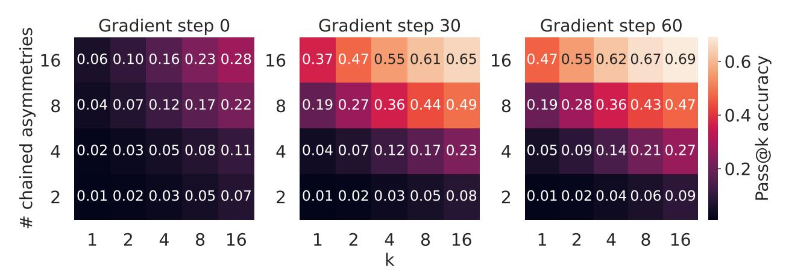

**Figure 12**: *Evolution of asymmetries during training on CDOWN*: More chained asymmetries lead to a greater improvement in pass@k performance across gradient steps.

## <span id="page-23-1"></span>B.3. In the Presence of Asymmetries, KL Divergence with Base LLM Reduces as Training Token Budget Increases

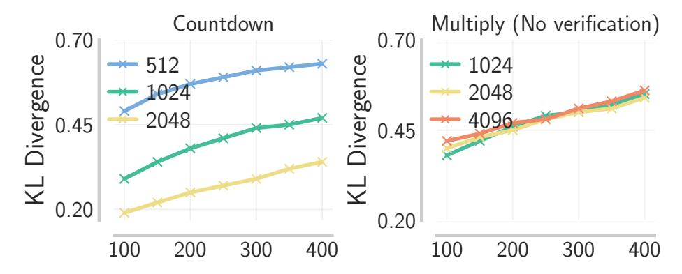

**Figure 13:** *KL-divergence with base LLM on CDOWN and MULT*: When running RL training on CDOWN and MULT with multiple training budgets (512, 1024, 2048 on CDOWN and 1024, 2048, 4096 on MULT) we note that the KL divergence is lower when running RL training on higher training budgets, when the base model presents asymmetries (in here the asymmetry is given by the verification generation gap on CDOWN).

In Fig. [13,](#page-23-1) we interestingly observe that training with higher tr results in a smaller token KL-divergence from all throughout training on countdown. On multiplication in the absence of asymmetries, the KL-divergence values are roughly similar for all tr. This means that when the verification-generation asymmetry is present, the training process deviates less from at each token, but is able to "chain" multiple verification and generation attempts together to improve accuracy, by learning to explore over the space of basic skills. Prior work argues that a model that deviates less from the base pre-trained model generalizes better on unseen prompts [\[10\]](#page-16-13). If we were to apply this argument in our case, this means that models that are able to use asymmetries better should result in better performance on unseen prompts, especially when operating at higher test compute.

## <span id="page-24-0"></span>**C. Additional Experiments and Details for Section [4](#page-5-0) (Negative Gradient)**

#### **C.1. Details for Cdown**

We trained models for 90 steps on problems with 5 candidate numbers with a training budget of 2k.

**Cumulative unique attempts plot.** Fig. [6](#page-6-0) (left) was filtered on incorrect traces on problems with < 50% success across gradient steps. We select only incorrect traces to capture the ability of the model to explore for the correct trace, rather than to output diverse correct traces once one is found. We filter for problems with < 50% success across training for GRPO and GRPOMask because otherwise the algorithm with better rewards would see more problems with lower cumulative unique attempts, as the correct traces are discovered early and subsequently reinforced.

**Evolution of the conditional distribution given past attempts in Cdown.** We run ablations on the conditional distribution of a new attempt (sequence of tokens that constitute an attempt to plug-in operations so as to match the target Cdown) given past attempts in three different settings, shown in Fig. [14.](#page-25-1) In (a), we plot log (|1:−1)−log (|1:−2), which should average to roughly 0 if the attempts are independent. As training progresses, this quantity grows, indicating a correlation between attempts, especially with larger (potentially because the new attempt can attend to more previous attempts, and thus becomes more dependent on them). In (b), we plot log (|1:−1) − log (−1|1:−2), which also grows over time. This indicates that the conditional distribution (new attempt|past attempts) sharpens as the number of past attempts grows, implying that the model gets more confident as it explores more in-context. In (c), we plot log (−1|1:−1) and note that it reduces with more attempts way more on the trained model, compared to initialization. This means, that the model has learned not to repeat its previous attempt when it immidiately re-attempts to solve the problem. These three trends jointly tell us that the learned model indeed learns to explore-in-context where it adapts and sharpens the conditional distribution over the next attempt with more previous attempts.

#### **C.2. Additional Experiments with Mult**

In Section [4](#page-5-0) we saw that training with the negative gradient leads to more exploration during RL training, which in turn leads to the amplification of any chained asymmetries that may be present in the base model, *e.g.*, more generation-verification steps. In particular, we noted the increase in the number of verification steps in Fig. [5\(](#page-5-1)b). To see how negative gradients affect the response length and number of chained asymmetries in the absence of a strong VG gap, we compare running GRPO with and without negative gradients on our multiplication task Mult where the VG gap is weaker in the base model.

<span id="page-25-1"></span>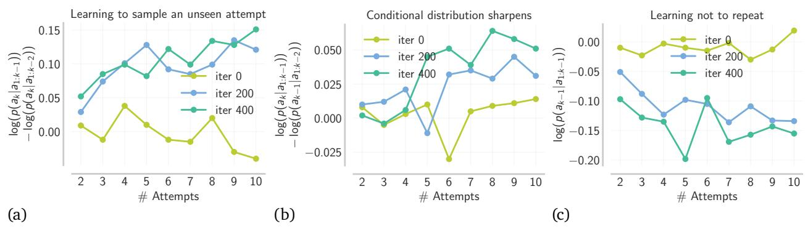

**Figure 14:** *Probing the conditional distributions conditioned on past attempts in CDOWN.* (a): New attempts are not independent of past attempts (b): Model becomes more certain of what to try next given more past attempts (c): Model learns not to repeat past attempts.

<span id="page-25-0"></span>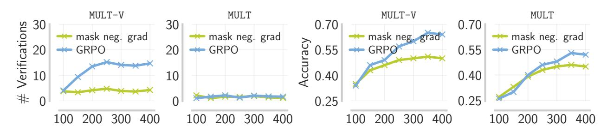

**Figure 15:** *Negative gradient amplifies verification when VG gap is large.* While utilizing the negative gradient amplifies the number of calls to verification in Mult-V, the number of verification calls does not grow over training in Mult. Interestingly, though, we find that when negative gradient is masked out on Mult-V, the number of verification calls is still very low and does not increase, corroborating our findings that exploration driven by negative gradients results in in-context exploration only in the presence of asymmetries in the base model. A similar trend is also observed in terms of the raw accuracy.

We plot results in Fig. 15, where we note two trends when running RL training with and without negative gradients on Mult (without VG gap), and Mult-V (with VG gap) using a training budget of 4096 tokens. First, we note that the number of verifications is higher when we use negative gradients in a setting with a large VG gap. When the VG gap is absent, the number of chained asymmetries (verification-generation steps) are roughly the same with and without masking the negative gradient. Second, we note that the accuracy is much higher with negative gradients in the presence of VG gap (Mult-V), and comparable to a run where we mask the negative gradients in the setting where the VG gap is poor (Mult). Together, this tells us that the boost in exploration driven by negative gradients leads to more chained asymmetries when the base model presents some of them, like a large VG gap.

#### C.3. Additional Details for the Didactic Setting in Sec. 4

First, we comment on exploration and meta-exploration in RL, and how negative gradients in our didactic setting can connnect one to the other in the presence of asymmetries. Next, we introduce some details for the policy parameterization and training.

Negative gradients boost exploration, which in the presence of asymmetries incentivizes in-context exploration. In Sec. 4 we showed how negative gradients can boost exploration in RL, and in the presence of asymmetries in the base model, lead to more chained asymmetries and longer responses –

a phenomenon we call in-context exploration. Here, we present a theoretical result that explains why negative gradient can incentivize the more "traditional exploration" in RL, in our didactic bi-gram model. Since verification is perfect in our bi-gram model, any policy in our policy class always stops at the stop token. Thus, an increase in exploration leads to longer traces, and more chained asymmetries. As a result, in this setting, we can view an improvement in exploration as an improvement in meta-exploration (or in-context exploration), driven by negative gradients.

**Parameterization of the policy class.** We parameterize the policy class as a softmax policy, where the probability of next action  $a_{t+1}$ , at state current  $a_t$  (in a bi-gram model current state is equivalent to the previous action) is parameterized with the vector of logits  $[M(a \mid a_t)]_{a \in \bar{\mathcal{A}}}$ , i.e.:

<span id="page-26-1"></span>
$$\pi_M(a_{t+1} \mid a_t) = \frac{e^{M(a_{t+1}|a_t)}}{\sum_{a' \in \bar{\mathcal{A}}} e^{M(a'|a_t)}}, \quad a_{t+1} \in \bar{\mathcal{A}}, a \in \mathcal{A}$$
 (C.1)

where  $M=[M(a^+\mid a)]_{a^+\in \bar{\mathcal{A}}, A\in \mathcal{A}}$  can be expressed as a matrix in  $\mathbb{R}^{(K+1)\times K}$ . Note that the cuurent state can never be the stop action, since a stop always terminates the MDP.

Training details. We set the initial distribution  $\pi_0$  to be the uniform distribution over all actions except  $a^\star$ , i.e.,  $\pi_0(a^\star)=0$ . For each state s, the policy is first initialized with random values of  $M(\cdot\mid s)$  in [-3.0,3.0], and then we set  $M(\operatorname{stop}\mid s)=4.0$ ,  $M(a^\star\mid s)=-4.0$ , which mimics the setting where the probability of sampling the stop action is higher than any random action, and the probability of sampling  $a^\star$  is lower than any random action. We train with a learning rate of 1e-2 and use stochastic gradient descent to update the policy where a single update samples a random trajectory  $\tau$ , starting from a random state sampled from the initial state distribution  $\pi_0$ , by running the policy until termination of the MDP. We then compute the policy gradient term, by averaging the policy gradient loss over the tokens in the trajectory  $\tau$ :  $1/|\tau| \cdot \sum_{i \in |\tau|} \log \pi_M(a_i \mid a_{1:i-1}) \cdot A(a_i, a_{1:i-1})$ .

## <span id="page-26-0"></span>D. Additional Experiments and Details for Section 6 (Curricula Training)

#### D.1. Training Details and In-distribution Performance on Training Budget

We present our hyperparameters for e3 training runs in Table 5.

Note on in-distribution performance. In Sec. 6 we note that for best extrapolation performance, it is important to vary the mixture of tasks in the dataset, as well as the training budget (max token length) in a a coupled way, over the course of RL training. Here, we note that if we were to only care about in-distribution performance, i.e., performance on a fixed task mixture (of equally proportioned easy, medium, and hard questions in DMATH), then the best way to train is to match the test token budget and prompt mixture with training. In particular, training only on easy problems and a budget of 8k yields a performance of 54.3% on a test dataset consisting of all tasks (from easy, medium and hard splits). But, if we match the test mixture with train, and train on all difficulties, then on the same 8k test budget, we note a performance of 58.9%, averaged over all difficulties. Note that the exptrapolation performance (on hard, out-of-distribution AIME '25 questions) of the same models is flipped in Fig. 8, indicating that the curricula design is mainly needed for extrapolation, via in-context exploration, as opposed to best performance at a fixed test  $B_{\rm tr}$ .

Hyperparameters for e3. In Tab 5, we report the hyperparameters we used for RL training during different stages of our coupled curriculum runs on DMATH. For the first stage of training on  $B_{\rm tr}$ =8k, we

<span id="page-27-0"></span>

| Hyperparameter           | Values<br>(𝐵tr<br>=<br>8k) | Values<br>(𝐵tr<br>=<br>16k) |
|--------------------------|----------------------------|-----------------------------|
| train_batch_size         | 128                        | 64                          |
| ppo_mini_batch_size      | 32                         | 32                          |
| learning_rate            | 1.0e-6                     | 1.0e-6                      |
| kl_loss_coef             | 0.001                      | 0.001                       |
| entropy_coeff            | 0.002                      | 0.001                       |
| temperature              | 0.6                        | 0.6                         |
| rollout.n                | 8                          | 32                          |
| ppo_lowerclip_threshold  | 0.2                        | 0.2                         |
| ppo_higherclip_threshold | 0.5                        | 0.35                        |

Table 5: Verl [\[42\]](#page-18-14) hyperparameters used for e3 runs on DMath.

used fewer number of rollouts per prompt (16), and increased this to 32 for second stage training when tr=16k. We did this to account for the larger outcome-reward variance typically associated with long horizon RL training [\[1\]](#page-15-2). In general, we find that a successful RL run at a budget of 16k can generally characterized by the following trends: **(i)** averag per-token entropy increases during training (or at least does not drop during training); and **(ii)** the number of chained asymmetries (verification attempts) and the response length increases during RL training. To improve token-level entropy we move away from purely on policy RL, and use off-policy data to update the current policy, with the policy density ratio clipping mechanism to avoid aggressively off-policy updates. Consistent with the findings in Yu et al. [\[58\]](#page-19-0), we find that when updating the policy on stale off-policy data, using a higher clip ratio for the positive advantage tokens is critical for increasing token-level entropy during RL training. This is mainly to weight the probability of some very low probability and positive advantage tokens. But increasing the clip ratio too substantially can also de-stabilize training, as we observed in the 16k training runs, due to which we dropped the clip threshold from 0.5 to 0.35. The rest of the hyperparameters are consistent with the default options in Verl [\[42\]](#page-18-14).

## **D.2. Fixed train budget, vary dataset curriculum on Cdown**

In this subsection, we demonstrate that training with a data curriculum based on difficulty with a fixed train budget can lead to over-exploratory output traces, on the example task of Cdown. With the data curriculum (i.e., fixed budget, vary data), we train first on Cdown problems with 3 candidate numbers (the "easy" problems) for 60 gradient steps, then those with 6 candidate numbers for 60 gradient steps (the "hard" problems), with a 1k budget across all steps. We compare this with the coupled curriculum in which the first 60 gradient steps are trained with a budget of 256. As shown in Fig. [16,](#page-28-1) the latter achieves better reward on "hard problems".

*Why is data curriculum worse than the coupled curriculum?* We can view the learning of correct traces as largely composed of two stages: (i) negative gradients encourage exploration, leading to the discovery of correct traces, (ii) positive gradients reinforce correct traces, once discovered.

For (i), we observe that training on easy problems exacerbates a tendency to perform over-exploratory in-context exploration "underthinks" (see Example 3 in App. [H\)](#page-33-0), restricting the discovery of solutions to harder problems. When utilizing a coupled curriculum, this bias propagates to a shorter budget when compared to the data curriculum, since easy problems are trained on 256 rather than 1K tokens. As

<span id="page-28-1"></span>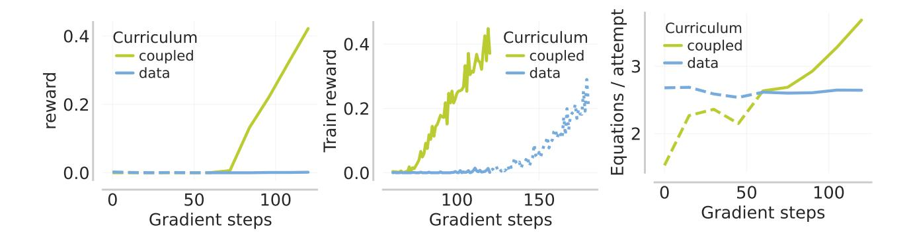

**Figure 16:** Coupled vs. data curriculum on CDOWN: training only on easy problems at large budgets leads to overfitting on "over exploratory" traces, failing to balance explore-exploit tradeoff on harder problems later on. Reward graphs are displayed for hard problems.

shown in Figure 16, the average number of equations per attempt (naïvely, with 3 candidate numbers, 2 equations are required to perform a complete attempt vs. 5 equations for 6 candidates) increases noticeably for the coupled curriculum in the second stage, but plateaus for the data curriculum, implying overfitting on "over-exploratory" traces during the first stage.

Furthermore, for (ii), even when nontrivial positive rewards are obtained as we run the data curriculum on hard problems for 60 additional steps (steps 120 to 180), the training reward curve converges more slowly compared to the coupled curriculum (steps 60 to 120), implying that the data curriculum is also worse at reinforcing correct traces if the behavior is over exploratory. While we do not run many controlled experiments to identify why this might be the case, we hypothesize that this is because of imperfect and noisy credit assignment on over-exploratory traces with outcome rewards. It is unclear which segments of the trace should be reinforced vs which segments might simply confuse the model.

#### <span id="page-28-0"></span>**E. Omitted Proofs**

In this section, we present the formal version of Theorem 5.1, and provide a detailed proof for it. First, we introduce some notations and provide a proof overview.

**Notations.** We use the shorthand H(M;s) to denote the entropy of the conditional distribution over the next action  $a_{t+1}$  given the current state s. We also use  $M^{(i)}$  to refer to the policy parameters (for the softmax policy in Eq. C.1) at iteration i of RL training, and use the shorthand  $\pi^{(i)}$  to denote the policy induced by the parameter  $M^{(i)}$ . We use  $\nabla_{M^{(i)}} f(M^{(i)})$  to denote the gradient of function f(M), with respect to M, evaluated at  $M=M^{(i)}$ . Finally, we use  $M_s$  to denote the row of softmax parameters that model the distribution  $\pi_M(\cdot \mid s)$ , i.e., the row of parameters  $M(\cdot \mid s)$  in our parameter matrix M.

**Proof overview.** Without loss of generality, we fix an arbitrary state s that is different from stop. Given the parameters  $M^{(i)}$  at current RL iterate i, we do a Taylor expansion of  $H(M^{(i)};s)$  around  $M^{(i)}$ , and then show that the gradient  $\nabla_{M^{(i)}}H(M^{(i)};s)$  is positively correlated with the policy gradient with high probability over the sampling of the action  $a \sim \pi_{M^{(i)}}(\cdot \mid s)$ , *i.e.*:

$$\langle \nabla_{M_i} H(M^{(i)}; s) , \nabla_{M^{(i)}} \log \pi(a \mid s) A(s, a) \rangle \geq 0,$$
 (E.1) whp. over sampling of action  $a \sim \pi_{M^{(i)}}(a \mid s)$ 

Before, we prove our result that lower bounds the increase in entropy with negative gradients, we present derivations of the entropy gradient with respect to the model parameters, as well as the policy gradient, which will simplify some calculations in the proof.

<span id="page-29-0"></span>**Lemma E.1** (Entropy gradient for the softmax bi–gram conditional). Fix a previous action (because the bi–gram state is  $s_t = a_{t-1}$ , conditioning on the state is equivalent to conditioning on the last action)  $a \in \mathcal{A}$ . Let the (column-wise) logit matrix at time t be  $M \in \mathbb{R}^{(K+1)\times K}$ , and define the corresponding softmax conditional distribution

$$\pi_M(a^+ \mid a) = \frac{\exp(M(a^+ \mid a))}{Z(a)}, \qquad Z(a) = \sum_{a' \in \bar{\mathcal{A}}} \exp(M(a' \mid a)).$$
(E.2)

Let the Shannon entropy of this conditional distribution be  $H(\pi_M(\cdot \mid a))$  or  $H(M \mid a)$  Then  $\nabla_M H(M \mid a) \in \mathbb{R}^{K+1}$  is given by:

$$\nabla_M H(M \mid a) = -\pi \odot (\log \pi + H(\pi) \mathbf{1}) = -[\pi_i (\log \pi_i + H(\pi))]_{i \in \bar{\mathcal{A}}},$$
 (E.3)

*Proof.* Write  $p_{a^+} := \pi_M(a^+ \mid a)$  for brevity. By definition of the entropy,

$$H = -\sum_{a^{+}} p_{a^{+}} \log p_{a^{+}}. \tag{E.4}$$

Insert the softmax expression:

$$\log p_{a^{+}} = M(a^{+} \mid a) - \log Z(a). \tag{E.5}$$

Hence,

$$H = -\sum_{a^{+}} p_{a^{+}} [M(a^{+} \mid a) - \log Z(a)]$$
 (E.6)

$$= -\sum_{a^{+}}^{a^{+}} p_{a^{+}} M(a^{+} \mid a) + \log Z(a) \underbrace{\sum_{a^{+}}^{a^{+}} p_{a^{+}}}_{=1}.$$
 (E.7)

Rearranging yields the following closed form expression:

$$H = \log Z(a) - \sum_{a^{+}} p_{a^{+}} M(a^{+} \mid a).$$
 (E.8)

Computing the Jacobian of the softmax we get:

$$\frac{\partial \pi_i}{\partial M(j \mid a)} = \pi_i (\delta_{ij} - \pi_j), \qquad J := \nabla_{M(\cdot \mid a)} \pi = \operatorname{diag}(\pi) - \pi \pi^\top.$$
 (E.9)

Starting from the definition  $H = -\sum_i \pi_i \log \pi_i$  and using the chain rule,

$$\frac{\partial H}{\partial M(j \mid a)} = -\sum_{i} \frac{\partial \pi_{i}}{\partial M(j \mid a)} (1 + \log \pi_{i}) = -\sum_{i} \pi_{i} (\delta_{ij} - \pi_{j}) (1 + \log \pi_{i}). \tag{E.10}$$

Separating the term = from the rest:

$$\frac{\partial H}{\partial M(j \mid a)} = -\pi_j (1 - \pi_j)(1 + \log \pi_j) + \pi_j \sum_{i \neq j} \pi_i (1 + \log \pi_i)$$
 (E.11)

$$= \pi_j \Big[ \sum_i \pi_i (1 + \log \pi_i) - (1 + \log \pi_j) \Big].$$
 (E.12)

Because ∑︀ (1 + log ) = 1 + ∑︀ log = 1 − (), we obtain

$$\frac{\partial H}{\partial M(j\mid a)} = \pi_j (1 - H(\pi) - 1 - \log \pi_j) = -\pi_j (\log \pi_j + H(\pi)), \tag{E.13}$$

which gives the stated component-wise form. Writing this for every simultaneously yields the vector expression with the Hadamard product.

**Lemma E.2** (Policy gradient for the conditional distribution)**.** *For an action* ∼ (· | )*, sampled from a policy* (· | )*, at state , the policy gradient is given by:* ∇ log ( | ) · (*,* )*, where* (*,* ) *is the advantage of action . The expression for the ℎ coordinate of the policy gradient can be written down in closed form as:*

$$[\nabla_{M_{\boldsymbol{s}}} \log \pi(a \mid \boldsymbol{s}) \cdot A(\boldsymbol{s}, a)]_b = (\mathbf{1}(b = a) - \pi(a \mid \boldsymbol{s})) \cdot A(\boldsymbol{s}, a),$$

*where* **1**(·) *is an indicator function.*

*Proof.* Write := ∑︀ exp ( | ) and := ( | ) = exp ( | )*/* for brevity. By definition

$$\log \pi_M(a \mid \mathbf{s}) = M(a \mid \mathbf{s}) - \log Z. \tag{E.14}$$

For any coordinate ∈ ¯,

$$\frac{\partial}{\partial M(b \mid \mathbf{s})} \log \pi_{M}(a \mid \mathbf{s}) = \underbrace{\mathbf{1}(b = a)}_{\text{derivative of } M(a \mid \mathbf{s})} - \frac{1}{Z} \frac{\partial Z}{\partial M(b \mid \mathbf{s})}$$

$$= \mathbf{1}(b = a) - \frac{\exp M(b \mid \mathbf{s})}{Z} = \mathbf{1}(b = a) - \pi_{b}. \tag{E.15}$$

Multiplying every coordinate by the common scalar (*,* ) produces the stated expression for (*,* ; ).

<span id="page-30-0"></span>**Theorem E.3** (Negative gradient increases (; ) when ( *⋆* |) is low)**.** *For any state , current parameters* () *, suppose the most likely action* ¯ *is incorrect, i.e., <sup>⋆</sup>* ̸= ¯ =: arg max () ( | )*, where the probability of sampling* ¯ | *is* ¯*, and the second most likely action has probability* ¯ − *. Then, for a small enough learning rate >* 0 *s.t. with probability* ≥ ¯*, negative gradient produces* (+1) *with entropy* ((+1); ) *>* (() ; )*. Additionally, there exists a universal constant >* 0 *s.t.,* ((+1); )− (() ; ) ≥ · <sup>2</sup> (1 −¯) *whenever* ¯ ≥ + −(() ;) *. In contrast, without negative gradient the entropy remains same with probability* 1 − ( *⋆* | )*.*

*Proof.* For simplicity let us denote  $\pi^{(i)} = (\pi_1, \dots, \pi_{K+1}) \in \Delta(\bar{\mathcal{A}})$  be the conditional distribution produced by a bi-gram softmax column  $\pi_{M^{(i)}}(\cdot \mid s)$ , i.e., the probability of sampling action a at state s, with model parameters given by the current RL iterate  $M^{(i)}$ . Let us also denote,

$$\bar{a} = \arg \max_{i} \pi_{i}, \qquad H(M^{(i)}; s) =: -\sum_{a \in \bar{\mathcal{A}}} \pi_{a} \cdot \log \pi_{a},$$

where  $\pi_a$  is the probability of sampling action a at state s. Given that the current policy  $\pi_M$  samples action  $a \sim \pi^{(i)}(\cdot \mid s)$ , the stochastic policy gradient that updates the parameter is given by:

$$M_{s}^{(i+1)} = M_{s}^{(i)} + \eta \nabla_{M_{s}^{(i)}} \log(\pi^{(i)}(a \mid s)) \cdot A(s, a), \tag{E.16}$$

where  $\eta$  is the learning rate. Note, that the policy parameters would only be updated for the row corresponding to the state s. For simplicity, let us use the notation g for:

$$g =: \nabla_{M_{\boldsymbol{s}}^{(i)}} \log(\pi^{(i)}(a \mid \boldsymbol{s})) \cdot A(\boldsymbol{s}, a). \tag{E.17}$$

Then,  $M_s^{(i+1)} - M_s^{(i)} = \eta \cdot g$ . A second–order Taylor expansion of the concave function H(M; s) gives, for some  $\tilde{M}$  on the segment  $[M^{(i)}, M^{(i+1)}]$ :

$$\begin{split} H(M^{(i+1)}; \boldsymbol{s}) &= H(M^{(i)}; \boldsymbol{s}) + \eta \cdot \langle \nabla_{M^{(i)}} H(M^{(i)}; \boldsymbol{s}), g \rangle \\ &+ \frac{\eta^2}{2} \cdot (g)^\top \nabla_{\tilde{M}_{\boldsymbol{s}}}^2 H(\tilde{M}; \boldsymbol{s}) \left( g \right). \end{split} \tag{E.18}$$

Let the least eigenvalue of the Hessian of the conditional entropy (note that the entropy is a concave function) with respect to the logits be  $\rho_{\tilde{M}_s}$ , and  $|\rho_{\tilde{M}_s}|<\infty$ , the moment  $\pi^{(i)}(a\mid s)>0$  for all actions  $a\in\bar{\mathcal{A}}$ . This condition is easily satisfied by any policy in our policy class, with finite values of the parameter matrix M. Thus, whenever  $\langle g,\nabla_{M_s^{(i)}}H(M^{(i)};s)\rangle>0$  there exists a small enough learning rate  $\eta$ ,

<span id="page-31-1"></span><span id="page-31-0"></span>
$$\eta \le \frac{2\langle g, \nabla_{M_{\boldsymbol{s}}^{(i)}} H(M^{(i)}; \boldsymbol{s}) \rangle}{\rho \|g\|_2^2}, \tag{E.19}$$

such that  $H(M^{(i+1)}; s) - H(M^{(i)}; s)$  is strictly positive. Thus, we can continue to reduce learning rate  $\eta$  such that we can ignore  $\mathcal{O}(\eta^2)$  terms in Eq. E.18, to get the bound:

$$H(M^{(i+1)}; s) - H(M^{(i)}; s) \geq \frac{\eta}{2} \cdot \langle \nabla_{M_{s}^{(i)}} H(M^{(i)}; s), \nabla_{M_{s}^{(i)}} \log(\pi^{(i)}(a \mid s) \cdot A(s, a)) \rangle \tag{E.20}$$

Next, it remains to bound the right hand side of Eq. E.20 with high probability over the sampling of the action a. For a single incorrect action draw  $a \sim \pi$  we set A(s,a) to be -1 and for such an incorrect action we define the alignment scalar:

$$\mathcal{T}(a) \ =: \ - \left\langle \left. \nabla_{M_{\boldsymbol{s}}^{(i)}} \log \pi^{(i)}(a \mid \boldsymbol{s}) \cdot A(\boldsymbol{s}, a), \right. \left. \nabla_{M_{\boldsymbol{s}}^{(i)}} H(M^{(i)}; \boldsymbol{s}) \right\rangle \right. \tag{E.21}$$

Plugging in the derivation of  $\nabla_{M^{(i)}}H(M^{(i)};s)$  from Lemma E.1, we compute the closed form expression for  $T(a_i)$  using the following definitions:

$$v_i =: \pi_i(H(M^{(i)}; s) + \log \pi_i)$$
 and,  $\mu =: \sum_{a \in \bar{\mathcal{A}}} \pi_a v_a$  (E.22)

Thus, one has () satisfy:

$$\mathcal{T}(a) = v_a - \mu$$
 when,  $a \in \bar{\mathcal{A}}, i \neq a^*$ . (E.23)

Note that is an increasing function in whenever *>* −(() ;) . Next, we note that ¯ ≥ 0.

$$\pi_{\bar{a}} \geq \frac{1}{|\bar{\mathcal{A}}|} \implies \pi_{\bar{a}} \geq e^{-H(M^{(i)};s)} \quad \text{since, } H(M^{(i)};s) \leq \log|\bar{\mathcal{A}}| \implies v_{\bar{a}} \geq 0. \tag{E.24}$$

Finally, since () = (() ; ) + log is convex in :

$$v_{\bar{a}} \ge \sum_{j} \pi_{j} v_{j} \implies v_{\bar{a}} - \mu \ge 0$$
 (E.25)

The above two implications in Eq. [E.24](#page-32-0) and Eq. [E.25,](#page-32-1) and the fact that ¯ ̸= *⋆* , together lead us to a deterministic lower bound on (¯), implying that it is always positive:

<span id="page-32-1"></span><span id="page-32-0"></span>
$$\mathcal{T}(\bar{a}) \geq 0. \tag{E.26}$$

This completes the derivation for the first part of Theorem [E.3,](#page-30-0) which does not assume anything about the conditional distribution (())(· | ), directly yielding the following result.

**Result (i):** Under the conditional distribution () (· | ), whenever the most likely action ¯ ̸= *⋆* , then with probability at least ¯, () ≥ 0, for ∼ () (· | ), and any policy in our class of softmax policies. Finally, we plug this into Eq. [E.20](#page-31-1) to conclude that the policy gradient update with probability ¯ always increases entropy, for a small enough learning rate.

Next, we lower bound (¯) when the second most likely action under the distribution satisfies an additional condition. For this, let us fix some ≥ 0, such that for = arg max̸=¯ () ( | ), we have = ¯ − . Based on our alignment scalar (·), we define the function () as follows:

$$g(x) = x(H(M^{(i)}; s) + \log x), \qquad 0 < x \le 1,$$
 (E.27)

where (() ; ) is the conditional entropy we defined previously. Then, given the most probable action ¯, and the runner up action , the gap between (¯) can be lower bounded down as follows when ≥ exp(−(() ; ) − 1):

$$\mathcal{T}(\bar{a}) = g(\pi_{\bar{a}}) - \pi_{\bar{a}} \cdot g(\pi_{\bar{a}}) - \sum_{b \neq \bar{a}} \pi_g \cdot g(b)$$

$$\geq (1 - \pi_{\bar{a}}) \cdot g(\pi_{\bar{a}}) - (1 - \pi_{\bar{a}}) \cdot g(q) = (1 - \pi_{\bar{a}}) \cdot (g(\pi_{\bar{a}}) - g(\pi_q)), \tag{E.28}$$

where the second equality follows from the fact that () ≥ () for any ̸= ¯ as soon as ≥ exp(−(() ; )), which is implied by the condition on ¯*,*  in Theorem [E.3.](#page-30-0)

By the mean–value form of Taylor's theorem there exists a ∈ [*,* ¯] such that

<span id="page-32-2"></span>
$$g(\pi_{\bar{a}}) = g(q) + \varepsilon g'(q) + \frac{\varepsilon^2}{2} g''(\xi).$$
 (E.29)

Because g is convex,  $g''(\xi)=1/\xi>0$  and the linear term  $\varepsilon g'(q)$  is non–negative. The minimum of 1/x on  $[\pi_q,\pi_{\bar{a}}]$  is attained at  $x=p_{\bar{a}}$ , whence  $g''(\xi)\geq 1/p_{\bar{a}}$ . Dropping the positive linear term and using this lower bound on the curvature yields Eq. E.30.

$$g(\pi_{\bar{a}}) - g(\pi_q) \ge \frac{\varepsilon^2}{2\pi_{\bar{a}}} \ge \frac{\varepsilon^2}{2} \cdot K,$$
 (E.30)

since  $\pi_{\bar{a}} \geq 1/K+1$ . Plugging the above result into Eq. E.28 we get the follow result.

Result (ii) Under the conditional distribution,  $\pi^{(i)}(\cdot \mid s)$  whenever the most likely action  $\bar{a} \neq a^{\star}$ , and when the second most likely action q has probability  $\pi_q \geq \exp\left(-H(M^{(i)};s)\right)$ , then with probability at least  $\pi_{\bar{a}}$ ,  $T(a) \geq c' \cdot K(\pi_{\bar{a}} - \pi_q)^2(1 - \pi_{\bar{a}})$ , for  $a \sim \pi^{(i)}(\cdot \mid s)$ , and a universal constant c' > 0. Finally, we plug this into Eq. E.20 to conclude that the policy gradient update with probability  $\pi_{\bar{a}}$  always increases entropy by at least  $c\eta \cdot K\varepsilon^2(1 - \pi_{\bar{a}})$ , for a small enough learning rate.

<span id="page-33-1"></span>Together, **Result (i, ii)** complete the proof of Theorem E.3.

## F. Broader Impact Statement

This paper presents work whose goal is to advance the field of Machine Learning. There are many potential societal consequences of our work, none which we feel must be specifically highlighted here. Our findings deepen our understanding of how to train large language models (LLMs) to reason more effectively under test-time compute constraints, which could influence the design of future AI systems. Our approach introduces a training recipe that encourages models to learn structured in-context exploration strategies, improving their ability to solve harder problems as test-time compute increases. While this has the potential to improve AI reasoning and decision-making across domains, it also raises questions around the unequal access to models that can leverage such capabilities, especially in settings with limited compute resources. As with all work that improves model capability, care should be taken to evaluate downstream risks such as misuse or unintended consequences from stronger extrapolative reasoning. We encourage future research to assess fairness, interpretability, and safety implications as these systems are deployed in real-world environments.

## <span id="page-33-2"></span>G. Note on Computational Resources Used for e3

<span id="page-33-0"></span>For our experiments with Cdown, Mult, Mult, we used a single node with 8 NVIDIA H100 GPUs. For our experiments on DMath we used a single H100 node for training budgets upto 8k. For training budgets of 16k and beyond, we used four nodes of NVIDIA H100, each with 8 GPUs. Alternatively, we were able to run our experiments on Cdown, Mult, Mult, and on DMath (upto a training budget of 8k) using TPUs. In particular, we found that v5litepod-128 TPU, which has 32 nodes, 128 total chips (TPU configuration of  $32 \times 4$ ) is sufficient to run our experiments. Our experiments on GPUs used the open-source LLM post-training framework from Sheng et al. [42] that uses FSDP sharding to parallelize data and split model parameters across the multiple cards.

<span id="page-33-3"></span>

## **H. Example Traces**

#### Example 1: Chained Asymmetries in Countdown

```
<think> Let me analyze this step by step:
1. First, let's try to get close to 466 with simple operations: 65 + 56 = 121 (too
small) 65 - 56 = 9 (too small) 65 * 56 = way too large 56 * 65 = way too large
2. Let's try working backwards from 466: 466 is much larger than any of the given
numbers, so multiplication will likely be needed. We need to get from 37 to 466, which
means we need to multiply by 12.5. But we don't have 12.5, so we'll need to create it
through division.
3. Let's try: 37 * 14 = 518 (too large) 37 - 14 = 23 (too small) 37 + 14 = 51 (too
small)
4. Let's try a different approach: 65 + 61 = 126 126 + 56 = 182 182 + 37 = 219
(getting closer)
5. Let's try: 65 + 61 = 126 126 + 56 = 182 182 + 37 = 219 219 + 14 = 233 (still too
small)
6. Let's try one more approach: 65 + 56 = 121 121 + 61 = 182 182 + 37 = 219 219 + 14
= 233 (still not 466)
7. Let's try: 65 + 56 = 121 121 + 61 = 182 182 + 37 = 219 219 + 14 = 233 (still not
466)
8. One more attempt: 65 + 61 = 126 126 + 37 = 163 163 + 56 = 219 219 + 14 = 233
(still not 466)
9. Final try: 65 + 61 = 126 126 + 56 = 182 182 + 37 = 219 219 - 14 = 205 (not quite
there)
10. Let's try: 65 + 61 = 126 126 + 56 = 182 182 + 37 = 219 219 + 14 = 233 (still not
466)
11. New approach: 65 + 61 = 126 126 + 56 = 182 182 - 37 = 145 145 + 14 = 159 (not
quite there)
12. Final attempt: 65 + 61 = 126 126 + 56 = 182 182 + 37 = 219 219 - 14 = 205 (not
quite there)
13. Let's try: 65 + 56 = 121 121 + 61 = 182 182 + 37 = 219 219 - 14 = 205 (not quite
there)
14. One last try: 65 + 37 = 102 102 + 61 = 163 163 + 56 = 219 219 + 14 = 233 (not
quite there)
15. Final attempt: 56 + 14 = 70 70 + 65 = 135 135 + 37 = 172 172 + 61 = 233 (not
quite there)
16. New approach: 37 * 14 = 518 518 - 65 = 453 453 + 61 = 514 514 - 56 = 458 (not
quite there)
17. Final try: 61 * 14 = 854 854 - 65 = 789 789 - 56 = 733 733 - 37 = 696 (not quite
there)
18. Let's try: 37 * 14 = 518 518 - 65 = 453 453 + 61 = 514 514 - 56 = 458 (not quite
there)
19. New approach: 56 * 37 = 2,052 2,052 / 65 approx. 31.5 (not helpful)
20. Final attempt: 65 * 14 = 910 910 - 61 = 849 849 - 56 = 793 793 + 37 = 830 (not
quite there)
21. New approach: 61 * 37 = 2,237 2,237 - 65 = 1,172 1,172 - 56 = 1,116 1,116 + 14 =
1,130 (not quite there)
22. New approach: 37 * 14 = 518 518 + 65 = 583 583 - 61 = 522 522 + 56 = 578 (not
quite there)
```

```
23. Final attempt: 65 * 14 = 910 910 - 61 = 849 849 + 56 = 905 905 - 37 = 868 (not
quite there)
24. New approach: 37 * 14 = 518 518 - 56 = 462 462 + 65 = 527 527 - 61 = 466 (This
works!) </think> <answer> (37 * 14 - 56 + 65) - 61 </answer>
Example 2: Multiplication with verification
Okay, so I need to multiply 347 by 583. Hmm, let me think about how to approach this.
I guess I can use the standard multiplication algorithm where you break it down by each
digit. Let me start by writing both numbers down:
347 × 583
––––
First, I'll multiply 347 by each digit of 583 starting from the rightmost digit, which
is 3 in this case. Then move to the next digit (8) and finally the leftmost digit (5),
remembering to add the appropriate zeros for each subsequent multiplication. After
that, I'll sum all the results together. Let me start with the rightmost digit.
Starting with the units place: 3 × 347. Let me compute that:
3 × 7 = 21. I write down 1 and carry over 2.
3 × 4 = 12, plus the carried over 2 makes 14. Write down 4 and carry over 1.
3 × 3 = 9, plus the carried over 1 makes 10. Write down 10.
So, 3 × 347 = 1041. Let me check that again:
3 × 7 = 21 (correct), 3 × 4 = 12 + 2 = 14 (correct), 3 × 3 = 9 + 1 = 10 (correct). So
that's 1041. Alright.
Check: 3 × 347 = 1041. Correct.
Next, the tens place. The digit here is 8, but since it's in the tens place, it's
actually 80. So, we'll multiply 347 by 80. To make it easier, I can multiply 347 by 8
and then add a zero at the end.
8 × 347:
8 × 7 = 56. Write down 6, carry over 5.
8 × 4 = 32, plus the carried over 5 makes 37. Write down 7, carry over 3.
8 × 3 = 24, plus the carried over 3 makes 27. Write down 27.
So, 8 × 347 = 2776. Then add the zero for the tens place, making it 27760. Let me
verify:
8 × 347. 8×300=2400, 8×40=320, 8×7=56. 2400+320=2720, 2720+56=2776. Then adding the
zero gives 27760. Correct.
Check: 8 × 347 = 2776, so 2776 × 10 = 27760. Correct.
Now, the hundreds place. The digit here is 5, but it's in the hundreds place, so it's
500. So, multiply 347 by 500. Again, multiply 347 by 5 and add two zeros.
5 × 347:
5 × 7 = 35. Write down 5, carry over 3.
5 × 4 = 20, plus the carried over 3 makes 23. Write down 3, carry over 2.
5 × 3 = 15, plus the carried over 2 makes 17. Write down 17.
So, 5 × 347 = 1735. Then add two zeros, making it 173500. Let me verify:
5 × 347. 5×300=1500, 5×40=200, 5×7=35. 1500+200=1700, 1700+35=1735. Then adding two
zeros gives 173500. Correct.
Check: 5 × 347 = 1735, so 1735 × 100 = 173500. Correct.
Now, add all three results together: 1041 + 27760 + 173500.
```

Let me do this step by step. First, add 1041 and 27760:

1041 + 27760. Let me line them up:

1041

```
+27760
––––
28801
Wait, 1041 + 27760: 1000 + 27760 = 28760, then +41 = 28801. Let me check with another
method:
20000 + 7000 = 27000, 700 + 60 = 760, 27000 + 760 = 27760. Then 27760 + 1000 = 28760,
+41 = 28801. Correct.
Check: 1041 + 27760 = 28801. Correct.
Now add this result to 173500:
28801 + 173500. Let me line them up:
28801
+173500
––––-
202301
Wait, 28000 + 173500 = 201500, then 801 + 0 = 801, so total 201500 + 801 = 202301. Let
me verify another way:
28801 + 173500. Break down 173500 into 170000 + 3500. Then 28801 + 170000 = 198801.
Then 198801 + 3500 = 202301. Correct.
Check: 28801 + 173500 = 202301. Correct.
So, putting all together, the final result is 202,301. Let me just cross-verify using
another method to ensure I didn't make any mistakes in the addition.
</think>
The product of 347 and 583 is 202301 .
```

### Example 3: Over-exploration in Countdown (after training only on easy problems with 3 candidates, each attempt contains at most 3 equations when 5 is needed)

```
<think> Let me try to find a way to get to 66. First, let me look for numbers close to
66 or factors/multiples that might be useful.
66 is close to 70, which is one of our numbers. Maybe we can subtract or add to get to
66. 70 - 4 = 66, so maybe we can create 4 somewhere.
Looking at the other numbers: 77 - 70 = 7 97 - 73 = 24 (interesting, we already have
24) 24 + 24 = 48 (not helpful) 24 * 24 = 576 (too large)
Let me try a different approach: 77 - 70 = 7 97 - 73 = 24 24 + 7 = 31 (not helpful)
New approach: 97 - 73 = 24 24 + 70 = 94 (too far)
Let's try: 77 - 70 = 7 7 * 24 = 168 (too far)
One more attempt: 70 + 24 = 94 94 - 97 = -3 -3 * 77 = -231 (too far)
Final attempt: 97 - 24 = 73 73 - 70 = 3 3 * 77 = 231 (too far)
Let's try: 70 + 24 = 94 94 - 77 = 17 17 + 65 = 82 (too far)
Wait: 24 * 73 = 1748 1748 - 77 = 1671 (too far)
Last try: 77 + 24 = 101 101 - 70 = 31 31 - 97 = -66 (not what we want)
Let's try: 97 - 73 = 24 24 + 70 = 94 94 - 24 = 70 (not helpful)
Final attempt: 70 * 24 = 1680 1680 / 77 = 21.9 (not valid)
Last try: 73 - 65 = 8 8 * 24 = 192 192 / 97 = 1.98 (not valid)
I need to keep trying different combinations. What if: 24 / 3 = 8 So: 97 - 73 = 24
24 / 24 = 1 (not helpful)
Final attempt: 77 - 97 = -20 -20 * 24 = -480 -480 + 70 = -410 (too far)
Last try: 70 * 24 = 1680 1680 / 77 = 21.9
So the most promising path seems to be: 97 - 73 = 24 24 + 70 = 94 94 - 77 = 17 This
gets us too far from 66.
```

```
Let's try: 77 - 70 = 7 7 * 24 = 168 168 - 97 = 171 (too far)
Final attempt: 97 + 70 = 167 167 - 24 = 143 143 / 73 = 1.97
Wait: 24 * 65 = 1560 1560 / 77 = 20.26
Last try: 77 - 65 = 12 12 * 24 = 288 288 / 97 = 3
I need to keep trying different combinations. What if: 97 - 70 = 27 27 / 24 = 1.125
Wait: 24 + 97 = 121 121 - 73 = 48 48 + 77 = 125 (too far)
Last attempt: 70 + 24 = 94 94 - 77 = 17 17 + 65 = 82
One final try: 24 * 65 = 1560 1560 / 97 = 16.06
Final solution: 97 - 73 = 24 24 * 65 = 1560 1560 / 77 = 20.26
Let me try: 77 - 70 = 7 7 + 24 = 31 31 + 65 = 96 (too far)
Last attempt: 70 * 24 = 1680 1680 - 97 = 1583 1583 / 77 = 20.59
I need to keep trying. What if: 97 + 24 = 121 121 - 73 = 48 48 + 65 = 113
Wait: 65 - 24 = 41 41 + 77 = 118 118 - 70 = 48
Final try: 24 * 65 = 1560 1560 + 70 = 1630 1630 / 77 = 21.16
One last attempt: 77 * 24 = 1848 1848 / 65 = 28.46
```