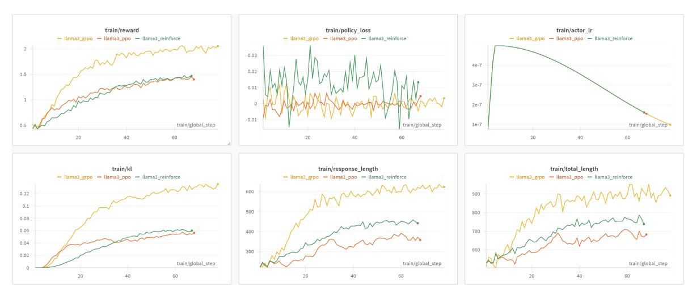
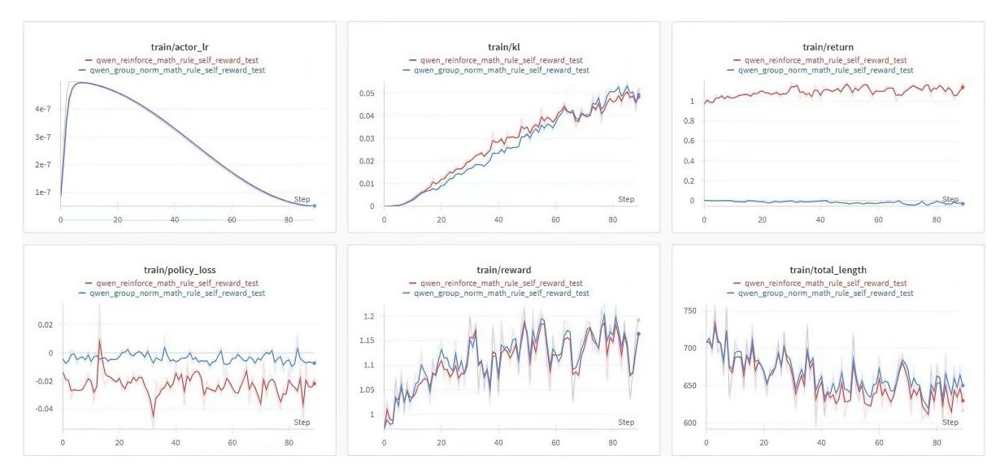
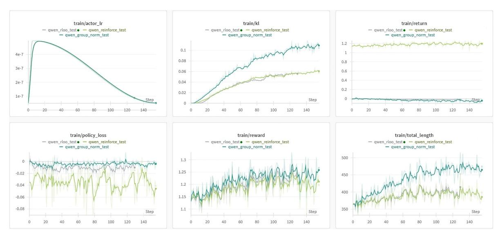

# REINFORCE++: A SIMPLE AND EFFICIENT APPROACH FOR ALIGNING LARGE LANGUAGE MODELS

## Jian Hu

janhu9527@gmail.com

## ABSTRACT

Reinforcement Learning from Human Feedback (RLHF) has emerged as a critical approach for aligning large language models with human preferences, witnessing rapid algorithmic evolution through methods such as Proximal Policy Optimization (PPO), Direct Preference Optimization (DPO), REINFORCE Leave One-Out (RLOO), ReMax, and Group Relative Policy Optimization (GRPO). We present REINFORCE++, an enhanced variant of the classical REINFORCE algorithm that incorporates key optimization techniques from PPO while eliminating the need for a critic network. REINFORCE++ achieves three primary objectives: (1) simplicity (2) enhanced training stability, and (3) reduced computational overhead. Through extensive empirical evaluation, we demonstrate that REINFORCE++ exhibits superior stability compared to GRPO and achieves greater computational efficiency than PPO while maintaining comparable performance. The implementation is available at <https://github.com/OpenRLHF/OpenRLHF>.

# 1 Introduction

The rapid advancements in large language models (LLMs) have significantly enhanced their capabilities in generating coherent, contextually relevant, and human-like text. However, aligning these models with human preferences remains a critical challenge, as models can generate outputs that are misaligned with user intent or ethical guidelines. Reinforcement Learning from Human Feedback (RLHF) has emerged as a leading methodology to address this challenge by incorporating human preferences into the training process.

The field has witnessed significant algorithmic innovations, from the foundational Proximal Policy Optimization (PPO) [\[5\]](#page-6-0) to more recent approaches including Direct Preference Optimization (DPO) [\[4\]](#page-6-1), REINFORCE Leave One-Out (RLOO) [\[7\]](#page-6-2), ReMax [\[2\]](#page-6-3), and Group Relative Policy Optimization (GRPO) [\[6\]](#page-6-4). PPO, while effective, requires a critic network that introduces additional computational overhead. Meanwhile, newer methods, like GRPO, address specific aspects of the optimization challenge but may introduce complexities and instability.

In this paper, we introduce REINFORCE++, a novel variant of the classical REINFORCE algorithm that integrates key optimization techniques from PPO while eliminating the need for a critic network. Our approach is designed with three primary goals:

- Simplicity: By building on the straightforward REINFORCE framework, REINFORCE++ minimizes implementation complexity.
- Training Stability: The integration of token-level KL penalties, PPO-clip loss and normalized advantage updates ensures robust training dynamics.
- Efficiency: The removal of the critic network reduces computational overhead, making REINFORCE++ well-suited for large-scale applications.

Through extensive empirical evaluation, we demonstrate that REINFORCE++ achieves competitive alignment performance with significantly reduced computational requirements compared to state-of-the-art methods. Our contributions include:

• A novel integration of PPO-inspired techniques into the REINFORCE framework.

- A comprehensive evaluation of REINFORCE++ on general and domain-specific datasets, showcasing its effectiveness in aligning LLMs with human preferences.
- An open-source implementation to facilitate further research and application.

## 2 Background

## 2.1 Reinforcement Learning from Human Feedback

Reinforcement Learning from Human Feedback (RLHF) is a framework that leverages human-provided feedback to train models capable of generating outputs aligned with human preferences. The process typically involves the following components:

- Supervised Fine-Tuning (SFT): The model is initially fine-tuned on a dataset of human-labeled prompts and responses to establish a baseline policy.
- Reward Modeling: A reward model is trained to predict human preferences based on a dataset of ranked model outputs.
- Policy Optimization: Using reinforcement learning, the model policy is optimized to maximize the rewards predicted by the reward model.

While RLHF has proven effective in improving model alignment, it also introduces unique challenges. Notably, the optimization process is sensitive to the interplay between the policy and reward models, which can lead to instability and inefficiency.

## 2.2 The REINFORCE Algorithm

REINFORCE is a foundational policy gradient method in reinforcement learning that directly optimizes the expected return of a policy through gradient ascent. The algorithm operates as follows:

- Trajectory Sampling: The agent interacts with the environment to generate trajectories consisting of states, actions, and rewards.
- Return Calculation: The discounted cumulative rewards for each trajectory are computed as:

$$G_t = \sum_{k=t+1}^{T} \gamma^{k-t} r_k,\tag{1}$$

where γ is the discount factor.

• Policy Gradient Estimation: The gradient of the expected return with respect to the policy parameters is estimated using:

$$\nabla_{\theta} J(\theta) = \mathbb{E}_{\pi} \left[ G_t \nabla_{\theta} \log \pi_{\theta} (A_t | S_t) \right]. \tag{2}$$

• Policy Update: The policy parameters are updated via gradient ascent:

$$\theta \leftarrow \theta + \alpha \nabla_{\theta} J(\theta), \tag{3}$$

where α is the learning rate.

Despite its simplicity, REINFORCE suffers from high variance in gradient estimates, which can hinder its scalability to complex tasks such as aligning LLMs.

### 2.3 Challenges in RLHF

RLHF implementations often encounter the following challenges:

- Computational Overhead: Methods like PPO require a critic network, increasing memory and computational demands.
- Training Instability: The interdependence between the policy and value networks in PPO can lead to convergence issues, particularly for large and complex models [\[3\]](#page-6-5).
- Scalability: Many advanced methods introduce additional hyperparameters and architectural components, complicating their deployment at scale.

REINFORCE++, by design, addresses these challenges through its simplicity and efficiency, making it a compelling alternative for RLHF tasks.

#### 3 REINFORCE++ Enhancements

REINFORCE++ incorporates several key optimizations to enhance training stability and efficiency:

#### 3.1 Token-Level KL Penalty

We implement a token-level Kullback-Leibler (KL) divergence penalty between the RL model and the supervised fine-tuning (SFT) model distributions. This penalty is incorporated into the reward function as follows:

$$r(s_t, a_t) = \mathbf{I}(s_t = [EOS])r(x, y) - \beta \, KL(t)$$
(4)

$$KL(t) = \log \left( \frac{\pi_{\theta_{\text{old}}}^{RL}(a_t|s_t)}{\pi^{SFT}(a_t|s_t)} \right)$$
 (5)

where:

- $\bullet$  x represents the input prompt
- $\bullet$  y denotes the generated response
- $I(s_t = [EOS])$  indicates whether t is the final token
- $\beta$  is the KL penalty coefficient

This approach facilitates better credit assignment and seamless integration with process reward models (PRM).

#### 3.2 PPO-Clip Integration

We incorporate PPO's clipping mechanism to constrain policy updates:

$$L^{CLIP}(\theta) = \mathbb{E}_t \left[ \min \left( r_t(\theta) \hat{A}_t, \operatorname{clip}(r_t(\theta), 1 - \epsilon, 1 + \epsilon) \hat{A}_t \right) \right]$$
 (6)

Where:

- $r_t(\theta) = \frac{\pi_{\theta}(a_t|s_t)}{\pi_{\theta_{\text{old}}}(a_t|s_t)}$  is the probability ratio of taking action  $a_t$  in state  $s_t$  under the new policy versus the old policy.
- $\hat{A}_t$  is the estimated advantage for token t.
- $\operatorname{clip}(r_t(\theta), 1 \epsilon, 1 + \epsilon)$  restricts the probability ratio to be within the range of  $[1 \epsilon, 1 + \epsilon]$ , where  $\epsilon$  is a small hyperparameter (commonly set to around 0.2).

This formulation effectively allows the algorithm to take advantage of positive advantages while preventing excessively large updates that could destabilize training. The use of the minimum function ensures that if the ratio moves too far from 1 (either above or below), it does not contribute positively to the objective, thus maintaining a form of trust region for policy updates.

#### 3.3 Mini-Batch Updates

To enhance training efficiency, we implement mini-batch updates with the following characteristics:

- Batch Processing: Data is processed in smaller, manageable chunks rather than full-batch updates.
- Multiple Updates: Each mini-batch allows for multiple parameter updates, improving convergence rates.
- Stochastic Optimization: Introduces beneficial randomness for better generalization.

#### 3.4 Reward Normalization and Clipping

We implement comprehensive reward processing to stabilize training:

- Normalization: Standardizes rewards using z-score normalization to mitigate outliers.
- Clipping: Constrains reward values within predefined bounds to avoid instability.
- Scaling: Applies appropriate scaling factors for numerical stability during updates.

#### 3.5 Advantage Normalization

The advantage function in REINFORCE++ is defined as:

$$A_t(s_t, a_t) = r(x, y) - \beta \cdot \sum_{i=t}^{T} KL(i)$$
(7)

We normalize these advantages using z-score normalization:

$$A_{\text{normalized}} = \frac{A - \mu_A}{\sigma_A} \tag{8}$$

where  $\mu_A$  and  $\sigma_A$  represent the batch mean and standard deviation respectively. Normalization ensures stable gradients and prevents divergence during training.

## 4 Experimental Setup

## 4.1 Overview of Experimental Design

The empirical evaluation of REINFORCE++ was conducted using a variety of test scenarios to ensure a comprehensive understanding of its performance across different contexts. We focused on the primary objective: assessing training stability and computational efficiency compared to PPO and GRPO using OpenRLHF[1].

#### 4.1.1 Base Models

Our experiments utilized:

- Llama3.1-8B-SFT 1
- Qwen2.5-7B-Instruct 2

#### 4.2 Hyper-Parameter Configuration

The hyper-parameters were carefully chosen to balance training efficiency and model performance. The key settings are summarized below:

Table 1: Hyper-Parameter Configuration for REINFORCE++

| Parameter                          | Value                               |
|------------------------------------|-------------------------------------|
| KL Penalty Coefficient ( $\beta$ ) | 0.01 (General), 0.001 (Mathematics) |
| Maximum Samples                    | 25,000                              |
| Samples per Prompt                 | 4                                   |
| Rollout Batch Size                 | 256                                 |
| Training Batch Size                | 128                                 |
| Actor Learning Rate                | $5 \times 10^{-7}$                  |
| Critic Learning Rate               | $9 \times 10^{-6}$                  |
| Discount Factor $(\gamma)$         | 1.0                                 |
| Clip $\epsilon$                    | 0.2                                 |

https://huggingface.co/OpenRLHF/Llama-3-8b-sft-mixture

&lt;sup>2https://huggingface.co/Qwen/Qwen2.5-7B-Instruct

## 4.3 Dataset Details

We used two distinct datasets for evaluation:

- General Domain: A collection of diverse prompts [3](#page-4-0) and preference dataset [4](#page-4-1) covering general knowledge and conversational topics.
- Mathematics Domain: A specialized dataset [5](#page-4-2) and a closed-source mathematical reward model designed to test the model's reasoning and problem-solving capabilities in mathematical contexts.

## 5 Results and Analysis

Figure 1: General domain results show that PPO and REINFORCE++ have smaller length hacking issues compared to GRPO in general scenarios with Bradley-Terry Reward Models.

Figure 2: Mathematical scenario 1 shows that comparable results between REINFORCE++ and GRPO(Group Norm) under rule-based rewards.

3<https://huggingface.co/datasets/OpenRLHF/prompt-collection-v0.1>

4[https://huggingface.co/datasets/OpenRLHF/preference\\_700K](https://huggingface.co/datasets/OpenRLHF/preference_700K)

5<https://huggingface.co/datasets/meta-math/MetaMathQA>

Figure 3: Mathematical scenario 2 results show that, under the same unit KL consumption, REINFORCE++ and RLOO achieve a greater reward increase compared to GRPO (Group Norm).

## 5.1 Training Stability

Our experimental results demonstrate several key findings:

- General scenarios with Bradley-Terry Reward Models: REINFORCE++ exhibits superior stability compared to GRPO, particularly in preventing reward and output length hacking (Figure [1\)](#page-4-3).
- Rule-Based Reward Model: Under rule-based reward scenarios, REINFORCE++ achieves comparable performance to GRPO with group normalization (Figure [2\)](#page-4-4).
- Mathematical Reward Model: In mathematical problem-solving scenarios, REINFORCE++ demonstrates a better reward increase per unit KL divergence [6](#page-5-0) compared to GRPO (Figure [3\)](#page-5-1).

## 5.2 Computational Efficiency

Table [2](#page-5-2) provides a summary of computational costs with 70k samples and the LLaMA3 8b model on NVIDIA H100. REINFORCE++ exhibits a reduction in memory usage and training time compared to PPO, highlighting its computational efficiency.

Table 2: Computational Efficiency Comparison

| Method      | Training Time (hrs) |
|-------------|---------------------|
| PPO         | 60                  |
| REINFORCE++ | 42                  |

## 6 Conclusion

The experimental results validate the effectiveness of REINFORCE++ as a simpler yet efficient alternative to PPO and GRPO for RLHF. Future work will explore scaling the approach to larger datasets and investigating its performance in more complex alignment scenarios.

6KL = train/kl × train/response\_length

# References

- [1] Jian Hu, Xibin Wu, Zilin Zhu, Xianyu, Weixun Wang, Dehao Zhang, and Yu Cao. Openrlhf: An easy-to-use, scalable and high-performance rlhf framework. *arXiv preprint arXiv:2405.11143*, 2024.
- [2] Ziniu Li, Tian Xu, Yushun Zhang, Yang Yu, Ruoyu Sun, and Zhi-Quan Luo. Remax: A simple, effective, and efficient method for aligning large language models. *arXiv preprint arXiv:2310.10505*, 2023.
- [3] Long Ouyang, Jeffrey Wu, Xu Jiang, Diogo Almeida, Carroll Wainwright, Pamela Mishkin, Chong Zhang, Sandhini Agarwal, Katarina Slama, Alex Ray, et al. Training language models to follow instructions with human feedback. *arXiv preprint arXiv:2203.02155*, 2022.
- [4] Rafael Rafailov, Archit Sharma, Eric Mitchell, Christopher D Manning, Stefano Ermon, and Chelsea Finn. Direct preference optimization: Your language model is secretly a reward model. In *Thirty-seventh Conference on Neural Information Processing Systems*, 2023.
- [5] John Schulman, Filip Wolski, Prafulla Dhariwal, Alec Radford, and Oleg Klimov. Proximal policy optimization algorithms. In *Proceedings of the 34th International Conference on Machine Learning*, volume 70, pages 1132– 1145. PMLR, 2017.
- [6] Zhihong Shao, Peiyi Wang, Qihao Zhu, Runxin Xu, Junxiao Song, Xiao Bi, Haowei Zhang, Mingchuan Zhang, YK Li, Y Wu, et al. Deepseekmath: Pushing the limits of mathematical reasoning in open language models. *arXiv preprint arXiv:2402.03300*, 2024.
- [7] Yuan Wu et al. Back to basics: Revisiting reinforce style optimization for learning from human feedback in llms. *arXiv preprint arXiv:2402.14740*, 2024.