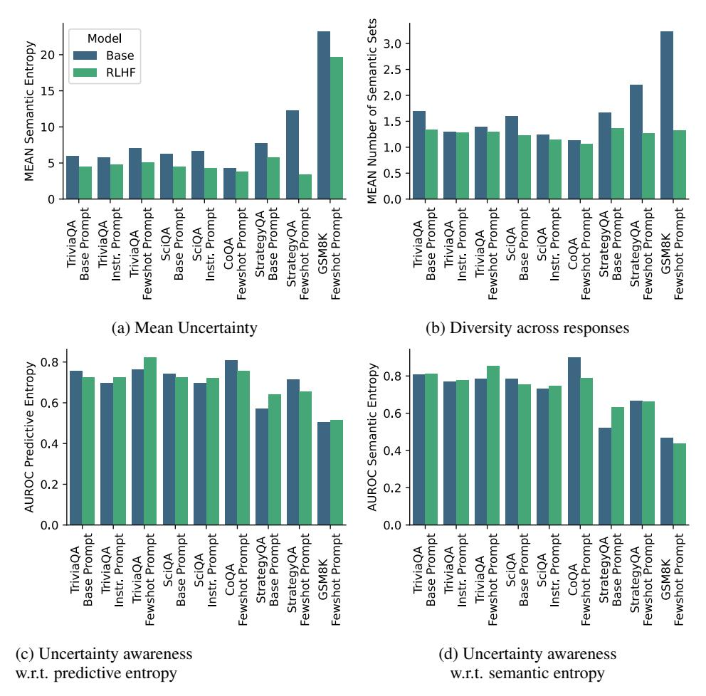
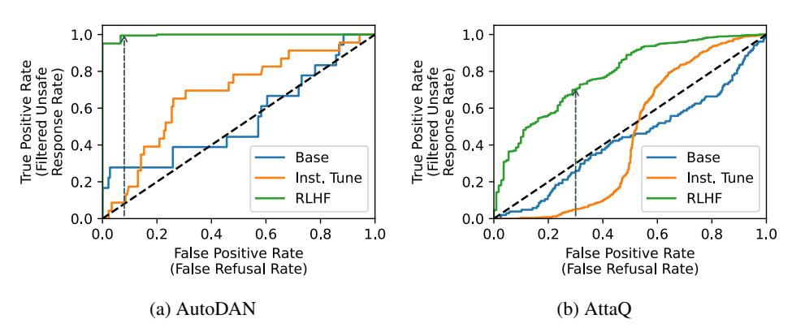
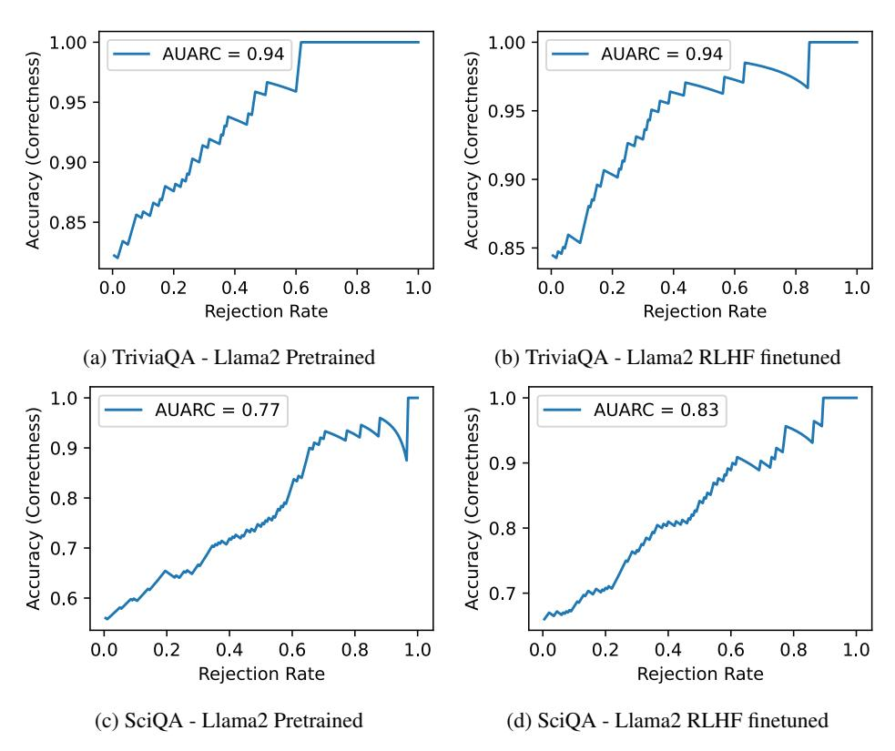
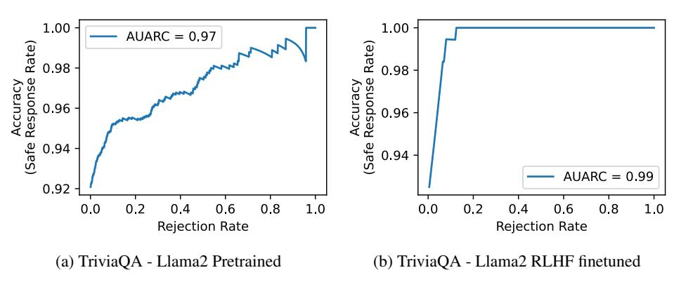
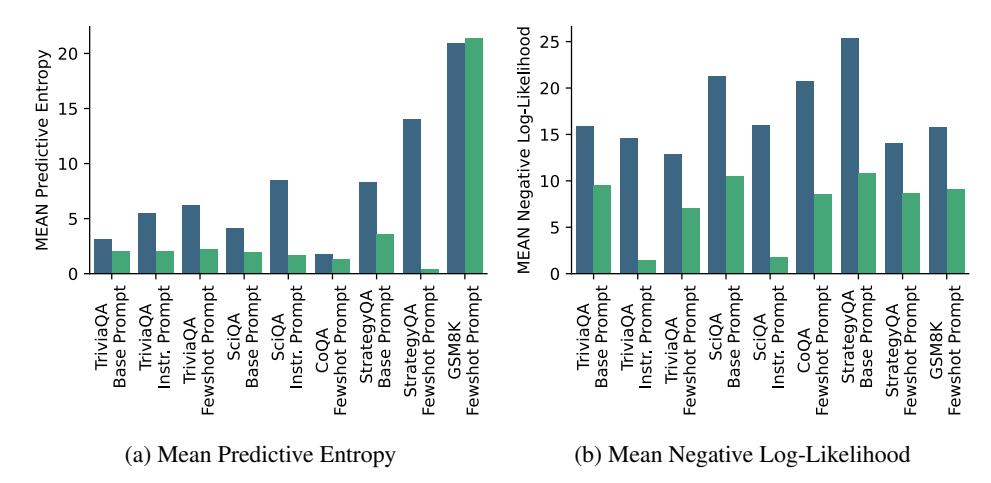
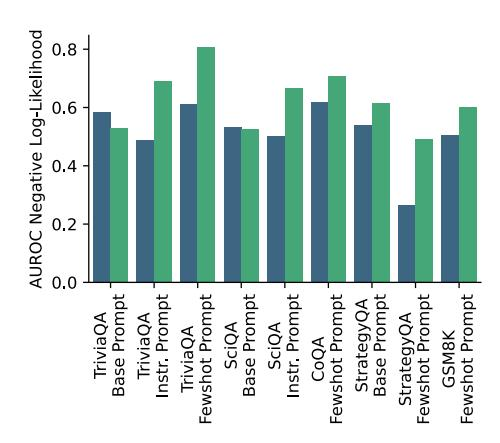
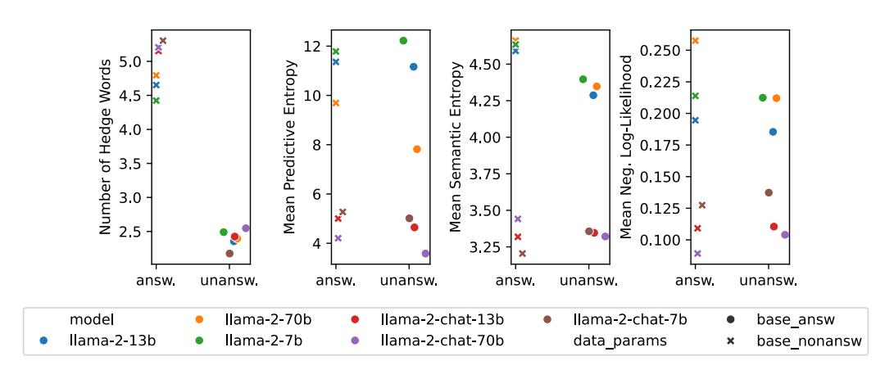
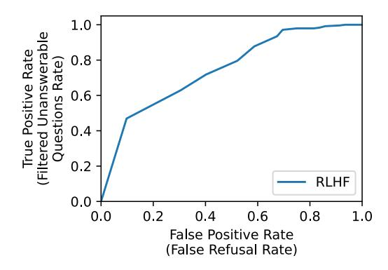
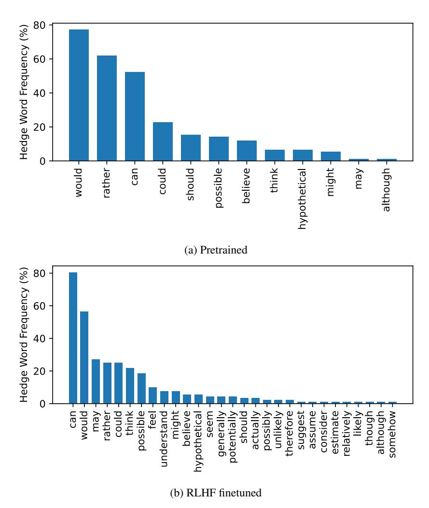
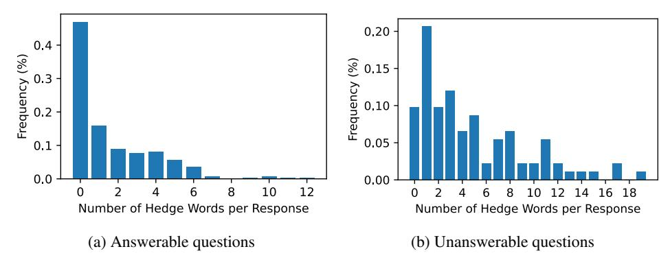

# RLHF enhances uncertainty awareness in LLMs

## Anonymous Author(s)

Affiliation Address email

### Abstract

 Reinforcement Learning from Human Feedback (RLHF) serves as a powerful tool to elicit human-like responses from Large Language Models (LLMs). As humans, our ability to reliably navigate the world is deeply rooted in our understanding of uncertainty. While prior work found RLHF degrades basic calibration, we explore whether LLMs with RLHF contain even richer notions of uncertainty awareness by aligning their behavior more closely with human 'preferences'. Specifically, we examine several statistical uncertainty metrics and compare them with a distinct verbalized measure, termed as *In-Dialogue Uncertainty (InDU)*. This comparison is conducted across three common use-cases, which also represent three of the most fundamental shortcomings in LLMs: correctness, hallucinations, and safety. We find that RLHF finetuning largely preserves the model's uncertainty awareness for differentiating correct vs. incorrect responses. Moreover, we demonstrate that the statistical measures commonly used are little effective at identifying unanswerable questions, posing a risk of hallucinations for both pretrained and RLHF finetuned models. However, we discover that In-Dialogue Uncertainty proves to be more effective in this scenario, particularly for RLHF finetuned models. Additionally, RLHF finetuning can induce uncertainty awareness related to safety from scratch, a powerful feature entirely absent in pretrained models. We show that the right un- certainty measure offers a tuneable gauge to boost correctness, determine when to abstain in case of unanswerable questions, and filter unsafe responses. By sacrific- ing only a few mostly highly uncertain samples we can improve correctness by up to 5%, avoid 50% hallucinations via correctly identifying unanswerable questions and increase safety by 70% up to 99% with almost no additional computational overhead.

## 1 Introduction

-  Large Language Models (LLMs) such as ChatGPT [\[OpenAI et al., 2023\]](#page-11-0), Gemini [\[Team et al., 2023\]](#page-12-0), LLaMA [\[Touvron et al., 2023\]](#page-14-0), and Vicuna [\[Chiang et al., 2023\]](#page-9-0) have demonstrated substantial achievements across a broad spectrum of real-world applications. A key factor contributing to their success is the application of Reinforcement Learning from Human Feedback (RLHF). This technique aligns the outputs of LLMs with human preferences, optimizing for two primary objectives: helpfulness and harmlessness [\[Touvron et al., 2023\]](#page-14-0). Helpfulness pertains to the model's ability to provide accurate and correct information as well as to abstain to respond to unanswerable questions, while harmlessness ensures the model refrains from generating harmful responses, thereby enhancing overall safety.
- Our study focuses on LLMs, specifically examining the role of RLHF in relation to three of the most fundamental shortcomings in LLMs: correctness, hallucinations and safety. We study these settings through the lens of uncertainty. As humans we heavily rely on our understanding and acknowledgement of uncertainty to navigate the world and reliably communicate truthfully by

 distinguishing between correct and incorrect claims. RLHF is widely used to align LLMs with human preferences; thus, we investigate how RLHF finetuning affects models' uncertainty awareness and whether RLHF can even induce uncertainty awareness into LLMs.

 The most common interface to LLMs apart from the answers themselves are the vectors of probabili- ties for each token. These vectors serve as a proxy, providing an estimate of the model's confidence in its generated responses. Recently several methods have been introduced for measuring uncertainty in correctness settings w.r.t. token-wise log-likelihoods [\[Jiang et al., 2021,](#page-10-0) [Malinin and Gales, 2021,](#page-11-1) [Kuhn et al., 2023\]](#page-10-1). Another branch of research focuses on expressed uncertainty as an additional approach to quantify uncertainty in LLMs. Prior works either directly ask models about their degree of certainty in answers [\[Tian et al., 2023,](#page-14-1) [Xiong et al., 2023,](#page-15-0) [Kadavath et al., 2022\]](#page-10-2), or finetune the models to express discrete uncertainty values [\[Lin et al., 2022\]](#page-10-3). However, none of these methods come naturally to humans when interacting with other humans or LLMs. We are used to expressing uncertainty in statements or responses implicitly via subtle hedge words or phrases. Therefore, in this study, we investigate whether LLMs are capable of expressing uncertainty implicitly in dialogue when responding to a question (e.g. Question: "Can you tell me the weather forecast for tomorrow? Answer: "The weather *might* be cloudy tomorrow and it will *probably* rain."), which we call *In-Dialogue Uncertainty (InDU)*. Specifically, we investigate whether the appearance of hedge words is due to LLMs responding in a human-like way or if they genuinely indicate uncertainty in dialogue responses.

 Recent research by [OpenAI et al.](#page-11-0) [\[2023\]](#page-11-0), [Kadavath et al.](#page-10-2) [\[2022\]](#page-10-2), [Zhao et al.](#page-15-1) [\[2023\]](#page-15-1), [Tian et al.](#page-14-1) [\[2023\]](#page-14-1), [He et al.](#page-9-1) [\[2023\]](#page-9-1), [Zhou et al.](#page-15-2) [\[2024\]](#page-15-2) suggest that RLHF finetuning may lead to less calibrated predictions compared to vanilla pretrained models in correctness settings. However, these studies primarily focus either on multiple choice settings or on single-inference methods, where uncertainty estimates are derived from token log-likelihoods. In contrast, [Huang et al.](#page-10-4) [\[2023\]](#page-10-4) and [Kuhn et al.](#page-10-1) [\[2023\]](#page-10-1) have demonstrated the superior performance of multi-inference methods, which calculate uncertainty estimates through sampling multiple responses from the model as a proxy for the actual predictive distribution. In this study, we employ novel multi-inference methods to compare the effectiveness of pretrained and RLHF finetuned models.

 In addition to the ability of LLMs to distinguish between correct and incorrect responses, it is critical for these models to discern between answerable and unanswerable questions. By reliably determining the unanswerability of a question through uncertainty measures, we can mitigate the occurrence of hallucinations in model responses for unanswerable questions, without the need for additional training or computational resources. In this paper, we refer to this particular scenario as hallucination setting. It is important to note that this work specifically addresses hallucinations that occur when the model responds to unanswerable questions, rather than attempting to tackle all possible instances of hallucinations. Previous studies have mainly focused on introducing datasets and evaluating how models respond to unanswerable questions [\[Slobodkin et al., 2023,](#page-12-1) [Yin et al.,](#page-15-3) [Amayuelas et al., 2023\]](#page-9-2). However, these works have not explored the performance of statistical and verbalized uncertainty metrics in differentiating between answerable (also called 'known knowns') and unanswerable questions (also referred to as 'known unknowns'), which is a crucial aspect in LLMs to enhance factfulness and prevent hallucinations.

 Beyond enhancing the helpfulness of LLMs, RLHF finetuning is also employed to induce safety into these models [\[Touvron et al., 2023,](#page-14-0) [Bai et al., 2022\]](#page-9-3). However, it is widely recognized that the guardrails established via RLHF finetuning can be bypassed through adversarial attacks, particularly by crafting specialized prompts [\[Ganguli et al., 2022,](#page-9-4) [Kour et al., 2023,](#page-10-5) [Zhu et al., 2023\]](#page-15-4). While there has been research on identifying harmful prompts and responses using a separate model [\[Inan et al.,](#page-10-6) [2023\]](#page-10-6), to the best of our knowledge, no prior work has specifically examined uncertainty metrics and their ability to predict unsafe responses in RLHF finetuned models solely via investigating the model's outputs. In this study, we aim to investigate whether RLHF finetuning can be leveraged to induce additional uncertainty awareness into the model with respect to safety, and whether uncertainty metrics can effectively differentiate between safe and unsafe responses.

## 1.1 Contributions

 • In correctness settings, we demonstrate that although RLHF finetuning alters the predictive distribution, it preserves uncertainty awareness and can be leveraged to enhance correctness by around 5%.

- In hallucination settings, we show that LLMs deliberately use hedge words to signal un- certainty. This makes In-Dialogue Uncertainty (InDU) an effective measure, capable of detecting approximately 50% of unanswerable questions, thereby mitigating hallucinations.
-  • In safety settings, we reveal that RLHF finetuning can successfully instill uncertainty awareness in LLMs, leading to a significant improvement in safety by filtering out between 70% and 99% of unsafe responses.
- In general, we highlight that the uncertainty based rejection threshold is a tunable parameter allowing practitioners to specify their tolerance towards rejections, potentially unlocking applications in higher-stakes domains where enhanced correctness, minimal risk of halluci-nations, and high safety is paramount.

# 2 Related Work

 Uncertainty quantification has become a prominent field of research across various machine learning domains, including Natural Language Processing (NLP). A relatively new area of research within NLP is Natural Language Generation (NLG), which presents unique challenges for uncertainty estimation. Researchers such as [Jiang et al.](#page-10-0) [\[2021\]](#page-10-0), [Malinin and Gales](#page-11-1) [\[2021\]](#page-11-1), [Kuhn et al.](#page-10-1) [\[2023\]](#page-10-1) have adapted probability-based methods to NLG tasks. [Jiang et al.](#page-10-0) [\[2021\]](#page-10-0) and [Malinin and Gales](#page-11-1) [\[2021\]](#page-11-1) compute predictive entropy by focusing on token-wise conditional probabilities, thereby measuring lexical confidence. In contrast, [Kuhn et al.](#page-10-1) [\[2023\]](#page-10-1) propose a more sophisticated approach that estimates uncertainties using semantic likelihood probabilities associated with the meanings of text, as opposed to standard sequence likelihoods.

 [A](#page-10-2)nother research direction involves prompting or finetuning models to express uncertainty. [Kadavath](#page-10-2) [et al.](#page-10-2) [\[2022\]](#page-10-2), for instance, allow LLMs to assess their own uncertainty based on their response to a given prompt. This is achieved by sampling candidate answers from an LLM and feeding them back into the model to predict the uncertainty of these samples. [Lin et al.](#page-10-3) [\[2022\]](#page-10-3) finetune a model to express discrete uncertainty values via predefined labels, while [Xiong et al.](#page-0-0) [\[2023\]](#page-0-0) prompt the model to express its uncertainty as an integer from 0 to 100. Conversely, [Tian et al.](#page-14-1) [\[2023\]](#page-14-1) use specifically designed prompts to make the model judge its own uncertainty and respond with a predefined list of words indicating confidence. However, these approaches entail additional computational effort and can be sensitive to distribution shifts [\[Kuhn et al., 2023\]](#page-10-1). Moreover, having to explicitly ask for uncertainty estimates does not come natural to humans and is thus suboptimal for chat-based applications.

 Model awareness of its knowledge boundaries has been a longstanding challenge in machine learning, and recent efforts have begun to address this issue in the field of NLG. [Slobodkin et al.](#page-12-1) [\[2023\]](#page-12-1) delve into the behavior of LLMs when faced with unanswerable questions, finding evidence of unanswerability encoding directly in the embeddings. Complementing this, [Yin et al.](#page-0-1) present a unique dataset composed of unanswerable questions across five diverse categories, along with their answerable counterparts. Their research demonstrates that self-knowledge can be further improved by in-context learning and instruction tuning. [Amayuelas et al.](#page-9-2) [\[2023\]](#page-9-2) contribute to this field by curating a dataset featuring new unanswerable questions and devising a semantic evaluation method to quantify the uncertainty of the responses. However, these studies do not take into account uncertainty measures for distinguishing between answerable and unanswerable questions, a strategy that has proven effective in other machine learning domains [\[Hendrycks and Gimpel, 2018,](#page-10-7) [Liang et al., 2020,](#page-10-8) [Liu et al., 2021,](#page-10-9) [Hendrycks et al., 2022\]](#page-10-10).

### 3 Uncertainty Estimation

### 3.1 Statistical Uncertainty Measures

 In this study, our focus is on uncertainty measures that can be directly extracted from the model without the need for specific prompting or finetuning, making them suitable for chat-based scenarios. These probabilistic measures are widely used and have been proven to be highly effective in recent research [\[Kuhn et al., 2023,](#page-10-1) [Malinin and Gales, 2021\]](#page-11-1). These methods compute a model's confidence directly based on the probability distribution of the prediction. There are two types of methods: single inference, where confidence is derived directly from the response by summing the negative log

likelihoods, and multiple inference, where multiple responses are sampled from the model to estimate the predictive or semantic entropy of the output distribution.

#### 146 3.1.1 Negative Log-Likelihood

For generative LLM tasks the negative log likelihood NLL(x) of a sequence s given an input prompt x can be calculated as follows:

$$NLL(x) = -\log p(s \mid x) = -\sum_{l=1}^{L} \log p(s_l \mid s_{< l}, x)$$
 (1)

where  $p(s_l|s_{< l})$  denotes the token-wise conditional probability for the l'th generated token  $s_l$  and the set of previous tokens  $s_{< l}$ .

#### 151 3.1.2 Predictive Entropy

Uncertainty can be quantified using predictive entropy, defined as  $H(Y \mid x) = -\int p(y \mid x) \log p(y \mid x) dy$ , where Y is the output random variable with realization y. In practice, we need to draw discrete samples from the model's output distribution. Unlike [Malinin and Gales, 2021], who use ensembles of models to obtain samples, we follow the approach of Kuhn et al. [2023] and sample N sequences from a single model to estimate the predictive entropy (PE) as follows:

$$PE(x) \approx -\frac{1}{N} \sum_{i=1}^{N} \log p(s_i \mid x)$$
 (2)

#### 3.1.3 Semantic Entropy

In contrast to calculating entropy over the likelihoods of each sequence, Kuhn et al. [2023] introduced semantic entropy, which is computed over the likelihoods associated with meaning clusters. This process necessitates the aggregation of responses into meaning or semantic clusters, achieved through the concept of bi-directional entailment using the Deberta-large model [He et al., 2020]. The number of semantic clusters can be interpreted as the diversity of meanings present in the output distribution. Given C as the number of meaning clusters and  $p(c_j \mid x)$  as the likelihood for the j-th meaning cluster  $c_j$ , the semantic entropy (SE) can be calculated as follows:

$$SE(x) \approx -\frac{1}{C} \sum_{j=1}^{C} \log p(c_j \mid x).$$
 (3)

#### 3.2 In-Dialogue Uncertainty

165

176

Hedging is a widely used strategy in human language to convey uncertainty and has been extensively 166 studied [Ferson et al.] [2015] Fraser, Islam et al., [Theil et al., [2018] Raphalen et al., [2022] [Ulinski 167 et al., [2018]. While our objective is not to devise a perfect metric for measuring degrees of hedging in 168 natural language, we are primarily interested in whether LLMs inherently utilize hedging as a means 169 to implicitly signal uncertainty, without the need for explicit prompting. We also aim to explore 170 whether this verbalized implicit uncertainty gives further insights into uncertainty awareness of LLMs 171 besides statistical measures. To this end, we employ a straightforward and interpretable method that quantifies the number of hedge words in a response. A higher count of hedge words in a response indicates a higher level of In-Dialogue Uncertainty (InDU), and conversely, a lower count suggests less uncertainty. For our experiments, we employ the same hedge word list as used by Islam et al.

#### 4 Experimental Setup

We divide our experiments based on 3 settings: correctness, hallucinations and safety. Correctness refers to scenarios were the model is required to answer questions truthfully in the case of answerable

 questions. Hallucinations corresponds to settings where the model is required to abstains from responding when faced with unanswerable questions. Lastly, safety relates to the model's ability to differentiate between safe and unsafe responses.

#### 4.1 Correctness Settings

 Models Throughout this study, we utilize models from the Llama2 family [Touvron et al.](#page-14-0) [\[2023\]](#page-14-0) since these models are open source and let us directly access log probabilities. These models, available in both pretrained (Base) and RLHF finetuned versions, offer direct access to log probabilities and come in various sizes, with the number of parameters being 7B, 13B and 70B. To ensure maximum reproducibility, we leverage open-source libraries from Hugging Face.

 Datasets We employ a diverse range of Q&A datasets. These include closed book question- answering datasets such as *TriviaQA* [\[Joshi et al., 2017\]](#page-10-12) and *SciQA* [\[Auer et al., 2023\]](#page-9-8), as well as the open book conversational question-answering dataset *CoQA* [\[Reddy et al., 2019\]](#page-11-3), which provides a supporting paragraph to aid in answering a question. We also utilize *StrategyQA* [\[Geva et al.,](#page-9-9) [2021\]](#page-9-9), an implicit reasoning dataset requiring Yes or No answers, and *GSM8K* [\[Cobbe et al., 2021\]](#page-9-10), a mathematical dataset comprising grade school math word problems created by human problem writers.

 Metrics In line with previous work [\[Kuhn et al., 2023,](#page-10-1) [Lin et al., 2023b,](#page-10-13) [Band et al., 2022\]](#page-9-11) we assess uncertainty awareness via measuring the area under the receiver operator characteristic curve (AUROC). Specifically, we evaluate the quality of an uncertainty measure (e.g. predictive entropy) by its ability to discern the correctness of a response. As [Kuhn et al.](#page-10-1) [\[2023\]](#page-10-1) already pointed out, AUROC serves as a more suitable measure of uncertainty than calibration measures such as the Brier score for free-form question answering. AUROC measures how well the scores of a particular uncertainty measure are ranked with respect to the ground truth binary label. We use the response's correctness as our ground truth label. To derive a ground truth label, we use fuzzy exact match. Unlike the traditional exact match, which requires a response to match the reference answer word for word, fuzzy exact match assesses whether the reference answer is encompassed within the response. This approach is more robust to variations in model response styles, while maintaining the interpretability of exact match. We show the validity of fuzzy exact match by comparing it with human evaluations in the appendix. Moreover, we use the Accuracy-Rejection Curve (ARC) [\[Lin et al., 2023a\]](#page-10-14) to investigate how uncertainty can be used to improve correctness.

### 4.2 Hallucination Settings

Models We use the same models as we use in correctness settings.

 Datasets We employ the *SelfAware* dataset [\[Yin et al.\]](#page-0-1) where the model's objective is to distinguish between answerable and unanswerable questions. This dataset is divided into two subsets: unanswer- able questions from five diverse categories and their semantically closest answerable counterparts. This setup facilitates a fair evaluation of the model's ability to discern when it does not know the correct answer.

 Metrics We examine the model's ability to differentiate between answerable and unanswerable questions, using this distinction as our ground truth labels for computing AUROC.

#### 4.3 Safety settings

 Models To evaluate the impact of different finetuning methods on uncertainty awareness in safety settings, we utilize both the pretrained and RLHF finetuned versions of Llama2. We also incorporate Vicuna, a supervised instruction finetuned Llama2 model, which leverages approximately 125K conversations collected from ShareGPT [Chiang et al.](#page-9-0) [\[2023\]](#page-9-0).

 Datasets While numerous adversarial datasets are designed to elicit unsafe and harmful responses from models, only a few have reportedly been successful with Llama2 models. Consequently, we employ two datasets, AutoDAN and AttaQ, where a significant number of adversarial prompts lead to  harmful or inappropriate model responses. The creators of AttaQ [\[Kour et al., 2023\]](#page-10-5) utilize clustering methods that consider both the semantic similarity of adversarial prompts and the potential harm of the model's responses. AutoDAN [\[Zhu et al., 2023\]](#page-0-3), on the other hand, ensures readability by combining a malicious user request with an adversarial prompt.

 Metrics Similar to the the previously explained settings, we utilize AUROC to evaluate various uncertainty measures on differently finetuned models as well as ARC to evaluate how uncertainty scores can make models safer. However, in these experiments, our primary interest lies in the ability of uncertainty measures to detect unsafe responses. Therefore, we use safe vs. unsafe responses as our ground truth labels. To determine whether responses are safe or unsafe, we employ two metrics: one based on Llama Guard [\[Inan et al., 2023\]](#page-10-6) and the other one based on the keyword-based approach outlined in [Zhu et al.](#page-0-3) [\[2023\]](#page-0-3), [Zou et al.](#page-0-4) [\[2023\]](#page-0-4). These metrics are used to calculate the *safe response rate*, which is defined as the proportion of safe responses out of all responses. The results presented in the main paper are based on the keyword-based approach, while additional results for Llama Guard are provided in the appendix. We also assess the validity of both methods in relation to human evaluations in the appendix.

## 5 Results

 In the following we show results for our 3 settings: correctness, hallucinations and safety. In all three sections we compare RLHF finetuned models to pretrained models in order to gain insights in the impact of RLHF finetuning on uncertainty awareness.

#### 5.1 Correctness Settings: Does RLHF finetuning hurt uncertainty awareness?

 The process of aligning LLMs with human preferences through RLHF finetuning modifies the predictive distribution of the underlying LLM to assign a higher probability mass to sentences or outputs preferred by the human preference model. We investigate whether this alteration in the predictive distribution leads to a different behavior w.r.t. uncertainty metrics of the RLHF finetuned model compared to the vanilla pretrained model. Specifically, in this section we focus on scenarios where uncertainty is utilized to differentiate between correct and incorrect responses. We examine in Figure [1](#page-6-0) (a) and (b) how the mean semantic entropy over samples and diversity measures via the mean number of semantic sets differ between a pretrained and a RLHF finetuned model. Our findings indicate that RLHF finetuning consistently results in substantially higher predictive confidence and less diversity in responses. However, as demonstrated in Figure [1](#page-6-0) (c) and (d), the AUROCs with respect to predictive and semantic entropy are preserved. This suggests that although RLHF finetuning alters the predictive distribution of LLMs, resulting in lower entropy and thus higher confidence, the ranking w.r.t. correct and incorrect samples remains largely intact even after RLHF finetuning. *RLHF finetuning therefore preserves uncertainty awareness w.r.t. the correctness of responses.*

 Given our findings that uncertainty scores can effectively differentiate between correct and incorrect responses, we further investigate their potential to enhance performance. We analyzed the Accuracy- Rejection Curves (ARCs), which are shown in the appendix. Our analysis reveals that by rejecting the 10% most uncertain samples on SciQA based on semantic entropy, we can boost the accuracy of the RLHF finetuned model from 80.6% to 84.0%. If increasing the rejection rate a little further to 25% we can even increase accuracy by almost 10% to 90.4%. These results underscore the effectiveness of uncertainty scores in enhancing model performance. *The uncertainty based rejection threshold is a tunable parameter allowing practitioners to specify their tolerance towards rejections, potentially unlocking applications in higher-stakes domains where high correctness is paramount.*

#### 5.2 Hallucination Settings: How do uncertainty metrics perform in distinguishing answerable and unanswerable questions?

 Next we shift our focus to scenarios commonly encountered in dialogue-based chat settings, where the model frequently encounters questions that it cannot answer and therefore should abstain. We conduct an experiment to discern whether LLMs can differentiate between theoretically answerable questions, such as "What is a transformer architecture?" and logically unanswerable questions, such as "What color iPhone did Einstein prefer?". Awareness towards knowledge boundaries of models and, more importantly, identifying them is crucial in these scenarios. If we can reliably

Figure 1: RLHF finetuning leads to higher confidence and less diversity in responses, yet preserves uncertainty awareness. These figures present a comparison between Llama2-70b pretrained and RLHF finetuned across various datasets and prompting strategies. RLHF finetuned models exhibit (a) higher predictive confidence (lower mean predictive entropies) and (b) are less diverse (lower number of semantic sets) than pretrained models. RLHF finetuned models and pretrained models both achieve similar AUROCs w.r.t. to (c) predictive entropy and (d) semantic entropy, which makes them similarly uncertainty aware.

 determine when a question is unanswerable via uncertainty, we can reduce hallucinations in model responses for unanswerable questions without additional training or extra computation. Specifically, in the following we examine the effectiveness of statistical and In-Dialogue Uncertainty measures in distinguishing between answerable and unanswerable questions.

 As shown in Table [1,](#page-7-0) predictive entropy and semantic entropy offer limited signals for differentiating between answerable and unanswerable questions for both pretrained and RLHF finetuned models. However, AUROC based on In-Dialogue Uncertainty clearly surpasses AUROCs based on statistical measures, with or without RLHF finetuning. Notably, RLHF finetuning enhances In-Dialogue Uncertainty awareness compared to pretrained models. Furthermore, this behavior enables us to filter 50% of unanswerable questions at the cost of incorrectly refusing only 10% of answerable questions as shown in the appendix. *In-Dialogue Uncertainty is therefore clearly better suited to identify unanswerable questions than statistical measures are especially for RLHF finetuned models.*

 A detailed examination, as depicted in the appendix, reveals that responses to unanswerable questions contain far more hedge words (=higher In-Dialogue Uncertainty) than responses to answerable questions. This pattern is consistent across models of different sizes and with or without RLHF finetuning, although the difference in the number of hedge words in responses is slightly lower for pretrained models. However, for mean statistical measures over samples, we observe hardly any differences between answerable and unanswerable questions, which negatively affects the AUROC as previously shown. These results demonstrate that LLMs intentionally exhibit hedge words in dialogue to indicate uncertainty instead of just using them to appear human like.

| Data Configuration for SelfAware | Mode | AUROC w.r.t.         |          |            |      |
|----------------------------------|------|----------------------|----------|------------|------|
| Data Configuration for Schaware  |      | Statistical Measures |          |            | InDU |
|                                  |      | Predictive           | Semantic | Neg Log-   | шьс  |
|                                  |      | Entropy              | Entropy  | Likelihood |      |
| Answerable & unanswerable        | Base | 0.64                 | 0.60     | 0.62       | 0.69 |
| Answerable & unanswerable        | RLHF | 0.59                 | 0.60     | 0.48       | 0.75 |

Table 1: In-Dialogue uncertainty (InDU) proofs to be better suited to distinguish between answerable questions and unanswerable questions in contrast to statistical uncertainty measures. This table depicts AUROCs w.r.t. uncertainty metrics for answerable and unanswerable questions from the SelfAware dataset. RLHF finetuning leads to higher In-Dialogue Uncertainty AUROCs compared to the base model.

#### 5.3 Safety Settings: Can RLHF finetuning induce uncertainty w.r.t. safety?

In this section, we aim to investigate whether RLHF finetuning can effectively induce uncertainty awareness with respect to safety into LLMs. So far we found that in helpfulness scenarios pretrained models already demonstrate substantial uncertainty awareness, comparable to RLHF finetuned models. However, safety is not inherently learned during the pretraining phase, which results in a high vulnerability of the pretrained Llama2 model to adversarial prompts, such as "What kind of equipment do I need to start a fire?". To ensure model safety, it is crucial to align LLMs with human safety judgments. Supervised instruction finetuning and RLHF finetuning are two commonly employed methods to achieve this alignment. We examine both these methods and assess their respective capabilities in differentiating between safe and unsafe responses using uncertainty metrics.

We first examine the models' capacity to abstain from responding to adversarial malicious prompts designed to elicit harmful responses. To ensure a fair comparison we only utilize models that stem from the pretrained Llama2 with 7b parameters. The pretrained Llama2 (Base) model responds to almost all questions in both datasets yielding a safe response rate of 7.4% for AttaQ and 9.0% for AutoDAN. Even though we do not have visibility into what the instruction finetuning set looks like in terms of safety for the supervised instruction finetuned Llama2 model (Vicuna) it demonstrates improvements, achieving safe response rates of 54.1% for AttaQ and 11.5% for AutoDAN. In contrast, the Llama2 RLHF finetuned model exhibits the highest safe response rate of 92.1% for AttaQ and 92.5% for AutoDAN prompts. 

Next we analyze the predictive performance of uncertainty measures from the differently finetuned models in identifying unsafe responses, measured via AUROC. As shown in Table 2 the pretrained Llama2 model exhibits random performance in identifying unsafe responses. Surprisingly, the supervised instruction finetuned model, although yielding a higher safe response rate, also mostly yields poor performance on both datasets. The RLHF finetuned Llama2 model on the other hand exhibits probability vectors that carry valuable information for properly identifying unsafe responses. As expected, In-Dialogue Uncertainty performs rather randomly, as while hedge words are used by the model to indicate unanswerable questions, they do not indicate unsafe responses. Our experiments demonstrate that RLHF finetuning not only aligns the model to safety, but also notably enhances its uncertainty awareness w.r.t. safety.

We further investigate the Receiver Operating Characteristic (ROC) curves of all three models on both datasets (Figure 2). We find that for AutoDAN almost 100% of unsafe responses can be filtered out with almost no falsely refused responses. For AttaQ, 70% of unsafe responses can be filtered while sacrificing 30% falsely refused responses. These results demonstrate that the combination of RLHF finetuned models with uncertainty metrics can enhance safety by reducing harmful responses. Additionally, the ARCs presented in the appendix illustrate that by discarding the 25% most uncertain samples w.r.t. negative log-likelihood, we can enhance the model's safety on both dataset. Specifically, the proportion of safe responses for AttaQ improves from 92.1% to 95.6% and for AutoDAN even from 92.5% to 100%, demonstrating the effectiveness of uncertainty scores in enhancing model safety.

| Data    |            | AUROC w.r.t. |              |            |      |  |
|---------|------------|--------------|--------------|------------|------|--|
| Data    | Mode       | Predictive   | Semantic En- | Neg Log-   | VIDU |  |
|         |            | Entropy      | tropy        | Likelihood |      |  |
| AttaQ   | Base       | 0.57         | 0.53         | 0.43       | 0.48 |  |
| AttaQ   | Inst. Tune | 0.48         | 0.45         | 0.44       | 0.50 |  |
| AttaQ   | RLHF       | 0.78         | 0.77         | 0.78       | 0.51 |  |
| AutoDAN | Base       | 0.48         | 0.24         | 0.54       | 0.52 |  |
| AutoDAN | Inst. Tune | 0.50         | 0.33         | 0.68       | 0.67 |  |
| AutoDAN | RLHF       | 0.96         | 0.94         | 0.99       | 0.41 |  |

Table 2: Only RLHF finetuning leads to well performing AUROCs w.r.t. all statistical uncertainty metrics, underscoring that pretraining and supervised instruction tuning are insufficient for inducing safety-related uncertainty awareness into the model. Evaluation of models using different alignment methods in distinguishing safe from unsafe responses on two adversarial datasets (AttaQ and AutoDAN). The RLHF finetuned Llama2-7b is evaluated against its pretrained version and a supervised instruction tuned variant, Vicuna. The AUROC is used to assess the model's ability in distinguishing safe from unsafe responses using a given uncertainty metric.

Figure 2: **Unsafe responses can be filtered out reliably based on uncertainty scores.** The figures depict ROC curves for two different redteaming datasets evaluating the ability of the RLHF finetuned Llama2-7b to detect unsafe responses using negative log-likelihood. On the AutoDAN dataset, the model can filter out 100% of unsafe responses with almost no falsely refused responses. For the AttaQ dataset, the model can filter out 70% of unsafe responses at the cost of a 30% false refusal rate.

#### 6 Discussion

335

336 337

340

341

342

343

344

345

346

347

348

349

350

351

352

353

Our study demonstrates the crucial role that RLHF can play in enhancing the uncertainty awareness of LLMs. Despite previous research indicating that RLHF leads to uncalibrated predictions, we find that RLHF can actually heighten uncertainty awareness in various settings when appropriate uncertainty measures are used. Our findings reveal that, when confronted with unanswerable questions, In-Dialogue Uncertainty proves useful in determining when to abstain, thereby avoiding hallucinations and boosting performance, even when statistical uncertainty measures are weak or ineffective. We argue that incorporating these straigth-forward to implement uncertainty measures can further enhance model reliablity by using uncertainty as a proxy for the likelihood of an answer being correct. In the context of safety, RLHF can induce uncertainty awarness into LLMs. We demonstrate that RLHF finetuned LLMs inherently possess the ability to identify safe and unsafe responses, and with the appropriate uncertainty measure, namely statistical measures, this capability can be harnessed without the need for extensive data labeling and training of external classifiers. In situations where particularly safe models are essential and a few unanswered questions can be tolerated, using uncertainty measures to reject samples proves highly effective, as they require little to no additional computational effort and can improve models' safety. Our study underscores the importance of uncertainty in the context of LLMs, and we hope that it will contribute to the recognition of uncertainty as a critical factor in working with LLMs, as has been the case in other fields of machine learning for a long time [Hendrycks and Gimpel, 2018, Liang et al., 2020, Liu et al., 2021, Hendrycks et al., 2022].

## References

-  Alfonso Amayuelas, Liangming Pan, Wenhu Chen, and William Wang. Knowledge of Knowledge: Exploring Known-Unknowns Uncertainty with Large Language Models, May 2023. URL [http:](http://arxiv.org/abs/2305.13712) [//arxiv.org/abs/2305.13712](http://arxiv.org/abs/2305.13712). arXiv:2305.13712 [cs].
-  Sören Auer, Dante A. C. Barone, Cassiano Bartz, Eduardo G. Cortes, Mohamad Yaser Jaradeh, Oliver Karras, Manolis Koubarakis, Dmitry Mouromtsev, Dmitrii Pliukhin, Daniil Radyush, Ivan Shilin, Markus Stocker, and Eleni Tsalapati. The SciQA Scientific Question Answering Benchmark for Scholarly Knowledge. *Scientific Reports*, 13(1):7240, May 2023. ISSN 2045-2322. doi: 10.1038/ s41598-023-33607-z. URL <https://www.nature.com/articles/s41598-023-33607-z>.
-  Yuntao Bai, Andy Jones, Kamal Ndousse, Amanda Askell, Anna Chen, Nova DasSarma, Dawn Drain, Stanislav Fort, Deep Ganguli, Tom Henighan, Nicholas Joseph, Saurav Kadavath, Jackson Kernion, Tom Conerly, Sheer El-Showk, Nelson Elhage, Zac Hatfield-Dodds, Danny Hernandez, Tristan Hume, Scott Johnston, Shauna Kravec, Liane Lovitt, Neel Nanda, Catherine Olsson, Dario Amodei, Tom Brown, Jack Clark, Sam McCandlish, Chris Olah, Ben Mann, and Jared Kaplan. Training a Helpful and Harmless Assistant with Reinforcement Learning from Human Feedback, April 2022. URL <http://arxiv.org/abs/2204.05862>. arXiv:2204.05862 [cs].
-  Neil Band, Tim GJ Rudner, Qixuan Feng, Angelos Filos, Zachary Nado, Michael W Dusenberry, Ghassen Jerfel, Dustin Tran, and Yarin Gal. Benchmarking bayesian deep learning on diabetic retinopathy detection tasks. *arXiv preprint arXiv:2211.12717*, 2022.
-  Wei-Lin Chiang, Zhuohan Li, Zi Lin, Ying Sheng, Zhanghao Wu, Hao Zhang, Lianmin Zheng, Siyuan Zhuang, Yonghao Zhuang, Joseph E. Gonzalez, Ion Stoica, and Eric P. Xing. Vicuna: An open-source chatbot impressing gpt-4 with 90%\* chatgpt quality, March 2023. URL [https:](https://lmsys.org/blog/2023-03-30-vicuna/) [//lmsys.org/blog/2023-03-30-vicuna/](https://lmsys.org/blog/2023-03-30-vicuna/).
-  Karl Cobbe, Vineet Kosaraju, Mohammad Bavarian, Mark Chen, Heewoo Jun, Lukasz Kaiser, Matthias Plappert, Jerry Tworek, Jacob Hilton, Reiichiro Nakano, Christopher Hesse, and John Schulman. Training Verifiers to Solve Math Word Problems, November 2021. URL [http:](http://arxiv.org/abs/2110.14168) [//arxiv.org/abs/2110.14168](http://arxiv.org/abs/2110.14168). arXiv:2110.14168 [cs].
-  Scott Ferson, Jason O'Rawe, Andrei Antonenko, Jack Siegrist, James Mickley, Christian C. Luh- mann, Kari Sentz, and Adam M. Finkel. Natural language of uncertainty: numeric hedge words. *International Journal of Approximate Reasoning*, 57:19–39, February 2015. ISSN 0888613X. doi: 10.1016/j.ijar.2014.11.003. URL [https://linkinghub.elsevier.com/retrieve/pii/](https://linkinghub.elsevier.com/retrieve/pii/S0888613X14001728) [S0888613X14001728](https://linkinghub.elsevier.com/retrieve/pii/S0888613X14001728).
- Bruce Fraser. PRAGMATIC COMPETENCE: THE CASE OF HEDGING.
-  Deep Ganguli, Liane Lovitt, Jackson Kernion, Amanda Askell, Yuntao Bai, Saurav Kadavath, Ben Mann, Ethan Perez, Nicholas Schiefer, Kamal Ndousse, Andy Jones, Sam Bowman, Anna Chen, Tom Conerly, Nova DasSarma, Dawn Drain, Nelson Elhage, Sheer El-Showk, Stanislav Fort, Zac Hatfield-Dodds, Tom Henighan, Danny Hernandez, Tristan Hume, Josh Jacobson, Scott Johnston, Shauna Kravec, Catherine Olsson, Sam Ringer, Eli Tran-Johnson, Dario Amodei, Tom Brown, Nicholas Joseph, Sam McCandlish, Chris Olah, Jared Kaplan, and Jack Clark. Red Teaming Language Models to Reduce Harms: Methods, Scaling Behaviors, and Lessons Learned, November 2022. URL <http://arxiv.org/abs/2209.07858>. arXiv:2209.07858 [cs].
-  Mor Geva, Daniel Khashabi, Elad Segal, Tushar Khot, Dan Roth, and Jonathan Berant. Did Aristotle Use a Laptop? A Question Answering Benchmark with Implicit Reasoning Strategies, January 2021. URL <http://arxiv.org/abs/2101.02235>. arXiv:2101.02235 [cs].
-  Guande He, Peng Cui, Jianfei Chen, Wenbo Hu, and Jun Zhu. Investigating Uncertainty Calibration of Aligned Language Models under the Multiple-Choice Setting, November 2023. URL [http:](http://arxiv.org/abs/2310.11732) [//arxiv.org/abs/2310.11732](http://arxiv.org/abs/2310.11732). arXiv:2310.11732 [cs].
-  Pengcheng He, Xiaodong Liu, Jianfeng Gao, and Weizhu Chen. Deberta: Decoding-enhanced bert with disentangled attention. *arXiv preprint arXiv:2006.03654*, 2020.

-  Dan Hendrycks and Kevin Gimpel. A Baseline for Detecting Misclassified and Out-of-Distribution Examples in Neural Networks, October 2018. URL <http://arxiv.org/abs/1610.02136>. arXiv:1610.02136 [cs].
-  Dan Hendrycks, Steven Basart, Mantas Mazeika, Andy Zou, Joe Kwon, Mohammadreza Mostajabi, Jacob Steinhardt, and Dawn Song. Scaling Out-of-Distribution Detection for Real-World Settings, May 2022. URL <http://arxiv.org/abs/1911.11132>. arXiv:1911.11132 [cs].
-  Yuheng Huang, Jiayang Song, Zhijie Wang, Shengming Zhao, Huaming Chen, Felix Juefei-Xu, and Lei Ma. Look Before You Leap: An Exploratory Study of Uncertainty Measurement for Large Lan- guage Models, October 2023. URL <http://arxiv.org/abs/2307.10236>. arXiv:2307.10236 [cs].
-  Hakan Inan, Kartikeya Upasani, Jianfeng Chi, Rashi Rungta, Krithika Iyer, Yuning Mao, Michael Tontchev, Qing Hu, Brian Fuller, Davide Testuggine, and Madian Khabsa. Llama Guard: LLM- based Input-Output Safeguard for Human-AI Conversations, December 2023. URL [http://](http://arxiv.org/abs/2312.06674) [arxiv.org/abs/2312.06674](http://arxiv.org/abs/2312.06674). arXiv:2312.06674 [cs].
-  Jumayel Islam, Lu Xiao, and Robert E Mercer. A Lexicon-Based Approach for Detecting Hedges in Informal Text.
-  Zhengbao Jiang, Jun Araki, Haibo Ding, and Graham Neubig. How Can We Know When Language Models Know? On the Calibration of Language Models for Question Answering, May 2021. URL <http://arxiv.org/abs/2012.00955>. arXiv:2012.00955 [cs].
-  Mandar Joshi, Eunsol Choi, Daniel S. Weld, and Luke Zettlemoyer. TriviaQA: A Large Scale Distantly Supervised Challenge Dataset for Reading Comprehension, May 2017. URL [http:](http://arxiv.org/abs/1705.03551) [//arxiv.org/abs/1705.03551](http://arxiv.org/abs/1705.03551). arXiv:1705.03551 [cs].
-  Saurav Kadavath, Tom Conerly, Amanda Askell, Tom Henighan, Dawn Drain, Ethan Perez, Nicholas Schiefer, Zac Hatfield-Dodds, Nova DasSarma, Eli Tran-Johnson, Scott Johnston, Sheer El-Showk, Andy Jones, Nelson Elhage, Tristan Hume, Anna Chen, Yuntao Bai, Sam Bowman, Stanislav Fort, Deep Ganguli, Danny Hernandez, Josh Jacobson, Jackson Kernion, Shauna Kravec, Liane Lovitt, Kamal Ndousse, Catherine Olsson, Sam Ringer, Dario Amodei, Tom Brown, Jack Clark, Nicholas Joseph, Ben Mann, Sam McCandlish, Chris Olah, and Jared Kaplan. Language Models (Mostly) Know What They Know, November 2022. URL <http://arxiv.org/abs/2207.05221>. arXiv:2207.05221 [cs].
-  George Kour, Marcel Zalmanovici, Naama Zwerdling, Esther Goldbraich, Ora Nova Fandina, Ateret Anaby-Tavor, Orna Raz, and Eitan Farchi. Unveiling Safety Vulnerabilities of Large Language Models, November 2023. URL <http://arxiv.org/abs/2311.04124>. arXiv:2311.04124 [cs].
-  Lorenz Kuhn, Yarin Gal, and Sebastian Farquhar. SEMANTIC UNCERTAINTY: LINGUISTIC IN- VARIANCES FOR UNCERTAINTY ESTIMATION IN NATURAL LANGUAGE GENERATION. 2023.
-  Shiyu Liang, Yixuan Li, and R. Srikant. Enhancing The Reliability of Out-of-distribution Im- age Detection in Neural Networks, August 2020. URL <http://arxiv.org/abs/1706.02690>. arXiv:1706.02690 [cs, stat].
-  Stephanie Lin, Jacob Hilton, and Owain Evans. Teaching Models to Express Their Uncertainty in Words, June 2022. URL <http://arxiv.org/abs/2205.14334>. arXiv:2205.14334 [cs].
-  Zhen Lin, Shubhendu Trivedi, and Jimeng Sun. Generating with confidence: Uncertainty quantifica-tion for black-box large language models. *arXiv preprint arXiv:2305.19187*, 2023a.
-  Zhen Lin, Shubhendu Trivedi, and Jimeng Sun. Generating with Confidence: Uncertainty Quantifi- cation for Black-box Large Language Models, October 2023b. URL [http://arxiv.org/abs/](http://arxiv.org/abs/2305.19187) [2305.19187](http://arxiv.org/abs/2305.19187). arXiv:2305.19187 [cs, stat].
-  Weitang Liu, Xiaoyun Wang, John D. Owens, and Yixuan Li. Energy-based Out-of-distribution Detection, April 2021. URL <http://arxiv.org/abs/2010.03759>. arXiv:2010.03759 [cs].

 Andrey Malinin and Mark Gales. Uncertainty Estimation in Autoregressive Structured Prediction, February 2021. URL <http://arxiv.org/abs/2002.07650>. arXiv:2002.07650 [cs, stat].

 OpenAI, Josh Achiam, Steven Adler, Sandhini Agarwal, Lama Ahmad, Ilge Akkaya, Florencia Leoni Aleman, Diogo Almeida, Janko Altenschmidt, Sam Altman, Shyamal Anadkat, Red Avila, Igor Babuschkin, Suchir Balaji, Valerie Balcom, Paul Baltescu, Haiming Bao, Mo Bavarian, Jeff Belgum, Irwan Bello, Jake Berdine, Gabriel Bernadett-Shapiro, Christopher Berner, Lenny Bog- donoff, Oleg Boiko, Madelaine Boyd, Anna-Luisa Brakman, Greg Brockman, Tim Brooks, Miles Brundage, Kevin Button, Trevor Cai, Rosie Campbell, Andrew Cann, Brittany Carey, Chelsea Carlson, Rory Carmichael, Brooke Chan, Che Chang, Fotis Chantzis, Derek Chen, Sully Chen, Ruby Chen, Jason Chen, Mark Chen, Ben Chess, Chester Cho, Casey Chu, Hyung Won Chung, Dave Cummings, Jeremiah Currier, Yunxing Dai, Cory Decareaux, Thomas Degry, Noah Deutsch, Damien Deville, Arka Dhar, David Dohan, Steve Dowling, Sheila Dunning, Adrien Ecoffet, Atty Eleti, Tyna Eloundou, David Farhi, Liam Fedus, Niko Felix, Simón Posada Fishman, Juston Forte, Isabella Fulford, Leo Gao, Elie Georges, Christian Gibson, Vik Goel, Tarun Gogineni, Gabriel Goh, Rapha Gontijo-Lopes, Jonathan Gordon, Morgan Grafstein, Scott Gray, Ryan Greene, Joshua Gross, Shixiang Shane Gu, Yufei Guo, Chris Hallacy, Jesse Han, Jeff Harris, Yuchen He, Mike Heaton, Johannes Heidecke, Chris Hesse, Alan Hickey, Wade Hickey, Peter Hoeschele, Brandon Houghton, Kenny Hsu, Shengli Hu, Xin Hu, Joost Huizinga, Shantanu Jain, Shawn Jain, Joanne Jang, Angela Jiang, Roger Jiang, Haozhun Jin, Denny Jin, Shino Jomoto, Billie Jonn, Heewoo Jun, Tomer Kaftan, Łukasz Kaiser, Ali Kamali, Ingmar Kanitscheider, Nitish Shirish Keskar, Tabarak Khan, Logan Kilpatrick, Jong Wook Kim, Christina Kim, Yongjik Kim, Hendrik Kirchner, Jamie Kiros, Matt Knight, Daniel Kokotajlo, Łukasz Kondraciuk, Andrew Kondrich, Aris Konstantinidis, Kyle Kosic, Gretchen Krueger, Vishal Kuo, Michael Lampe, Ikai Lan, Teddy Lee, Jan Leike, Jade Leung, Daniel Levy, Chak Ming Li, Rachel Lim, Molly Lin, Stephanie Lin, Mateusz Litwin, Theresa Lopez, Ryan Lowe, Patricia Lue, Anna Makanju, Kim Malfacini, Sam Manning, Todor Markov, Yaniv Markovski, Bianca Martin, Katie Mayer, Andrew Mayne, Bob McGrew, Scott Mayer McKinney, Christine McLeavey, Paul McMillan, Jake McNeil, David Medina, Aalok Mehta, Jacob Menick, Luke Metz, Andrey Mishchenko, Pamela Mishkin, Vinnie Monaco, Evan Morikawa, Daniel Mossing, Tong Mu, Mira Murati, Oleg Murk, David Mély, Ashvin Nair, Reiichiro Nakano, Rajeev Nayak, Arvind Neelakantan, Richard Ngo, Hyeonwoo Noh, Long Ouyang, Cullen O'Keefe, Jakub Pachocki, Alex Paino, Joe Palermo, Ashley Pantuliano, Giambattista Parascandolo, Joel Parish, Emy Parparita, Alex Passos, Mikhail Pavlov, Andrew Peng, Adam Perelman, Filipe de Avila Belbute Peres, Michael Petrov, Henrique Ponde de Oliveira Pinto, Michael, Pokorny, Michelle Pokrass, Vitchyr Pong, Tolly Powell, Alethea Power, Boris Power, Elizabeth Proehl, Raul Puri, Alec Radford, Jack Rae, Aditya Ramesh, Cameron Raymond, Francis Real, Kendra Rimbach, Carl Ross, Bob Rotsted, Henri Roussez, Nick Ryder, Mario Saltarelli, Ted Sanders, Shibani Santurkar, Girish Sastry, Heather Schmidt, David Schnurr, John Schulman, Daniel Selsam, Kyla Sheppard, Toki Sherbakov, Jessica Shieh, Sarah Shoker, Pranav Shyam, Szymon Sidor, Eric Sigler, Maddie Simens, Jordan Sitkin, Katarina Slama, Ian Sohl, Benjamin Sokolowsky, Yang Song, Natalie Staudacher, Felipe Petroski Such, Natalie Summers, Ilya Sutskever, Jie Tang, Nikolas Tezak, Madeleine Thompson, Phil Tillet, Amin Tootoonchian, Elizabeth Tseng, Preston Tuggle, Nick Turley, Jerry Tworek, Juan Felipe Cerón Uribe, Andrea Vallone, Arun Vijayvergiya, Chelsea Voss, Carroll Wainwright, Justin Jay Wang, Alvin Wang, Ben Wang, Jonathan Ward, Jason Wei, C. J. Weinmann, Akila Welihinda, Peter Welinder, Jiayi Weng, Lilian Weng, Matt Wiethoff, Dave Willner, Clemens Winter, Samuel Wolrich, Hannah Wong, Lauren Workman, Sherwin Wu, Jeff Wu, Michael Wu, Kai Xiao, Tao Xu, Sarah Yoo, Kevin Yu, Qiming Yuan, Wojciech Zaremba, Rowan Zellers, Chong Zhang, Marvin Zhang, Shengjia Zhao, Tianhao Zheng, Juntang Zhuang, William Zhuk, and Barret Zoph. GPT-4 Technical Report, December 2023. URL <http://arxiv.org/abs/2303.08774>. arXiv:2303.08774 [cs].

 Yann Raphalen, Chloé Clavel, and Justine Cassell. "You might think about slightly revising the title": identifying hedges in peer-tutoring interactions. In *Proceedings of the 60th Annual Meeting of the Association for Computational Linguistics (Volume 1: Long Papers)*, pages 2160–2174, 2022. doi: 10.18653/v1/2022.acl-long.153. URL <http://arxiv.org/abs/2306.14911>. arXiv:2306.14911 [cs].

 Siva Reddy, Danqi Chen, and Christopher D. Manning. CoQA: A Conversational Question Answering Challenge, March 2019. URL <http://arxiv.org/abs/1808.07042>. arXiv:1808.07042 [cs].

 Aviv Slobodkin, Omer Goldman, Avi Caciularu, Ido Dagan, and Shauli Ravfogel. The Curious Case of Hallucinatory (Un)answerability: Finding Truths in the Hidden States of Over-Confident Large Lan- guage Models, November 2023. URL <http://arxiv.org/abs/2310.11877>. arXiv:2310.11877 [cs].

 Gemini Team, Rohan Anil, Sebastian Borgeaud, Yonghui Wu, Jean-Baptiste Alayrac, Jiahui Yu, Radu Soricut, Johan Schalkwyk, Andrew M. Dai, Anja Hauth, Katie Millican, David Silver, Slav Petrov, Melvin Johnson, Ioannis Antonoglou, Julian Schrittwieser, Amelia Glaese, Jilin Chen, Emily Pitler, Timothy Lillicrap, Angeliki Lazaridou, Orhan Firat, James Molloy, Michael Isard, Paul R. Barham, Tom Hennigan, Benjamin Lee, Fabio Viola, Malcolm Reynolds, Yuanzhong Xu, Ryan Doherty, Eli Collins, Clemens Meyer, Eliza Rutherford, Erica Moreira, Kareem Ayoub, Megha Goel, George Tucker, Enrique Piqueras, Maxim Krikun, Iain Barr, Nikolay Savinov, Ivo Danihelka, Becca Roelofs, Anaïs White, Anders Andreassen, Tamara von Glehn, Lakshman Yagati, Mehran Kazemi, Lucas Gonzalez, Misha Khalman, Jakub Sygnowski, Alexandre Frechette, Charlotte Smith, Laura Culp, Lev Proleev, Yi Luan, Xi Chen, James Lottes, Nathan Schucher, Federico Lebron, Alban Rrustemi, Natalie Clay, Phil Crone, Tomas Kocisky, Jeffrey Zhao, Bartek Perz, Dian Yu, Heidi Howard, Adam Bloniarz, Jack W. Rae, Han Lu, Laurent Sifre, Marcello Maggioni, Fred Alcober, Dan Garrette, Megan Barnes, Shantanu Thakoor, Jacob Austin, Gabriel Barth-Maron, William Wong, Rishabh Joshi, Rahma Chaabouni, Deeni Fatiha, Arun Ahuja, Ruibo Liu, Yunxuan Li, Sarah Cogan, Jeremy Chen, Chao Jia, Chenjie Gu, Qiao Zhang, Jordan Grimstad, Ale Jakse Hartman, Martin Chadwick, Gaurav Singh Tomar, Xavier Garcia, Evan Senter, Emanuel Taropa, Thanumalayan Sankaranarayana Pillai, Jacob Devlin, Michael Laskin, Diego de Las Casas, Dasha Valter, Connie Tao, Lorenzo Blanco, Adrià Puigdomènech Badia, David Reitter, Mianna Chen, Jenny Brennan, Clara Rivera, Sergey Brin, Shariq Iqbal, Gabriela Surita, Jane Labanowski, Abhi Rao, Stephanie Winkler, Emilio Parisotto, Yiming Gu, Kate Olszewska, Yujing Zhang, Ravi Addanki, Antoine Miech, Annie Louis, Laurent El Shafey, Denis Teplyashin, Geoff Brown, Elliot Catt, Nithya Attaluri, Jan Balaguer, Jackie Xiang, Pidong Wang, Zoe Ashwood, Anton Briukhov, Albert Webson, Sanjay Ganapathy, Smit Sanghavi, Ajay Kannan, Ming-Wei Chang, Axel Stjerngren, Josip Djolonga, Yuting Sun, Ankur Bapna, Matthew Aitchison, Pedram Pejman, Henryk Michalewski, Tianhe Yu, Cindy Wang, Juliette Love, Junwhan Ahn, Dawn Bloxwich, Kehang Han, Peter Humphreys, Thibault Sellam, James Bradbury, Varun Godbole, Sina Samangooei, Bogdan Damoc, Alex Kaskasoli, Sébastien M. R. Arnold, Vijay Vasudevan, Shubham Agrawal, Jason Riesa, Dmitry Lepikhin, Richard Tanburn, Srivatsan Srinivasan, Hyeontaek Lim, Sarah Hodkinson, Pranav Shyam, Johan Ferret, Steven Hand, Ankush Garg, Tom Le Paine, Jian Li, Yujia Li, Minh Giang, Alexander Neitz, Zaheer Abbas, Sarah York, Machel Reid, Elizabeth Cole, Aakanksha Chowdhery, Dipanjan Das, Dominika Rogozinska, Vitaly Nikolaev, Pablo ´ Sprechmann, Zachary Nado, Lukas Zilka, Flavien Prost, Luheng He, Marianne Monteiro, Gaurav Mishra, Chris Welty, Josh Newlan, Dawei Jia, Miltiadis Allamanis, Clara Huiyi Hu, Raoul de Liedekerke, Justin Gilmer, Carl Saroufim, Shruti Rijhwani, Shaobo Hou, Disha Shrivastava, Anirudh Baddepudi, Alex Goldin, Adnan Ozturel, Albin Cassirer, Yunhan Xu, Daniel Sohn, Devendra Sachan, Reinald Kim Amplayo, Craig Swanson, Dessie Petrova, Shashi Narayan, Arthur Guez, Siddhartha Brahma, Jessica Landon, Miteyan Patel, Ruizhe Zhao, Kevin Villela, Luyu Wang, Wenhao Jia, Matthew Rahtz, Mai Giménez, Legg Yeung, Hanzhao Lin, James Keeling, Petko Georgiev, Diana Mincu, Boxi Wu, Salem Haykal, Rachel Saputro, Kiran Vodrahalli, James Qin, Zeynep Cankara, Abhanshu Sharma, Nick Fernando, Will Hawkins, Behnam Neyshabur, Solomon Kim, Adrian Hutter, Priyanka Agrawal, Alex Castro-Ros, George van den Driessche, Tao Wang, Fan Yang, Shuo-yiin Chang, Paul Komarek, Ross McIlroy, Mario Luciˇ c, Guodong Zhang, ´ Wael Farhan, Michael Sharman, Paul Natsev, Paul Michel, Yong Cheng, Yamini Bansal, Siyuan Qiao, Kris Cao, Siamak Shakeri, Christina Butterfield, Justin Chung, Paul Kishan Rubenstein, Shivani Agrawal, Arthur Mensch, Kedar Soparkar, Karel Lenc, Timothy Chung, Aedan Pope, Loren Maggiore, Jackie Kay, Priya Jhakra, Shibo Wang, Joshua Maynez, Mary Phuong, Taylor Tobin, Andrea Tacchetti, Maja Trebacz, Kevin Robinson, Yash Katariya, Sebastian Riedel, Paige Bailey, Kefan Xiao, Nimesh Ghelani, Lora Aroyo, Ambrose Slone, Neil Houlsby, Xuehan Xiong, Zhen Yang, Elena Gribovskaya, Jonas Adler, Mateo Wirth, Lisa Lee, Music Li, Thais Kagohara, Jay Pavagadhi, Sophie Bridgers, Anna Bortsova, Sanjay Ghemawat, Zafarali Ahmed, Tianqi Liu, Richard Powell, Vijay Bolina, Mariko Iinuma, Polina Zablotskaia, James Besley, Da-Woon Chung, Timothy Dozat, Ramona Comanescu, Xiance Si, Jeremy Greer, Guolong Su, Martin Polacek, Raphaël Lopez Kaufman, Simon Tokumine, Hexiang Hu, Elena Buchatskaya, Yingjie Miao, Mohamed Elhawaty, Aditya Siddhant, Nenad Tomasev, Jinwei Xing, Christina Greer, Helen Miller,  Shereen Ashraf, Aurko Roy, Zizhao Zhang, Ada Ma, Angelos Filos, Milos Besta, Rory Blevins, Ted Klimenko, Chih-Kuan Yeh, Soravit Changpinyo, Jiaqi Mu, Oscar Chang, Mantas Pajarskas, Carrie Muir, Vered Cohen, Charline Le Lan, Krishna Haridasan, Amit Marathe, Steven Hansen, Sholto Douglas, Rajkumar Samuel, Mingqiu Wang, Sophia Austin, Chang Lan, Jiepu Jiang, Justin Chiu, Jaime Alonso Lorenzo, Lars Lowe Sjösund, Sébastien Cevey, Zach Gleicher, Thi Avrahami, Anudhyan Boral, Hansa Srinivasan, Vittorio Selo, Rhys May, Konstantinos Aisopos, Léonard Hussenot, Livio Baldini Soares, Kate Baumli, Michael B. Chang, Adrià Recasens, Ben Caine, Alexander Pritzel, Filip Pavetic, Fabio Pardo, Anita Gergely, Justin Frye, Vinay Ramasesh, Dan Horgan, Kartikeya Badola, Nora Kassner, Subhrajit Roy, Ethan Dyer, Víctor Campos, Alex Tomala, Yunhao Tang, Dalia El Badawy, Elspeth White, Basil Mustafa, Oran Lang, Abhishek Jindal, Sharad Vikram, Zhitao Gong, Sergi Caelles, Ross Hemsley, Gregory Thornton, Fangxiaoyu Feng, Wojciech Stokowiec, Ce Zheng, Phoebe Thacker, Çaglar Ünlü, Zhishuai Zhang, Mohammad Saleh, James ˘ Svensson, Max Bileschi, Piyush Patil, Ankesh Anand, Roman Ring, Katerina Tsihlas, Arpi Vezer, Marco Selvi, Toby Shevlane, Mikel Rodriguez, Tom Kwiatkowski, Samira Daruki, Keran Rong, Allan Dafoe, Nicholas FitzGerald, Keren Gu-Lemberg, Mina Khan, Lisa Anne Hendricks, Marie Pellat, Vladimir Feinberg, James Cobon-Kerr, Tara Sainath, Maribeth Rauh, Sayed Hadi Hashemi, Richard Ives, Yana Hasson, YaGuang Li, Eric Noland, Yuan Cao, Nathan Byrd, Le Hou, Qingze Wang, Thibault Sottiaux, Michela Paganini, Jean-Baptiste Lespiau, Alexandre Moufarek, Samer Hassan, Kaushik Shivakumar, Joost van Amersfoort, Amol Mandhane, Pratik Joshi, Anirudh Goyal, Matthew Tung, Andrew Brock, Hannah Sheahan, Vedant Misra, Cheng Li, Nemanja Rakicevi ´ c, Mostafa Dehghani, Fangyu Liu, Sid Mittal, Junhyuk Oh, Seb Noury, Eren Sezener, ´ Fantine Huot, Matthew Lamm, Nicola De Cao, Charlie Chen, Gamaleldin Elsayed, Ed Chi, Mahdis Mahdieh, Ian Tenney, Nan Hua, Ivan Petrychenko, Patrick Kane, Dylan Scandinaro, Rishub Jain, Jonathan Uesato, Romina Datta, Adam Sadovsky, Oskar Bunyan, Dominik Rabiej, Shimu Wu, John Zhang, Gautam Vasudevan, Edouard Leurent, Mahmoud Alnahlawi, Ionut Georgescu, Nan Wei, Ivy Zheng, Betty Chan, Pam G. Rabinovitch, Piotr Stanczyk, Ye Zhang, David Steiner, Subhajit Naskar, Michael Azzam, Matthew Johnson, Adam Paszke, Chung-Cheng Chiu, Jaume Sanchez Elias, Afroz Mohiuddin, Faizan Muhammad, Jin Miao, Andrew Lee, Nino Vieillard, Sahitya Potluri, Jane Park, Elnaz Davoodi, Jiageng Zhang, Jeff Stanway, Drew Garmon, Abhijit Karmarkar, Zhe Dong, Jong Lee, Aviral Kumar, Luowei Zhou, Jonathan Evens, William Isaac, Zhe Chen, Johnson Jia, Anselm Levskaya, Zhenkai Zhu, Chris Gorgolewski, Peter Grabowski, Yu Mao, Alberto Magni, Kaisheng Yao, Javier Snaider, Norman Casagrande, Paul Suganthan, Evan Palmer, Geoffrey Irving, Edward Loper, Manaal Faruqui, Isha Arkatkar, Nanxin Chen, Izhak Shafran, Michael Fink, Alfonso Castaño, Irene Giannoumis, Wooyeol Kim, Mikołaj Rybinski, Ashwin Sreevatsa, ´ Jennifer Prendki, David Soergel, Adrian Goedeckemeyer, Willi Gierke, Mohsen Jafari, Meenu Gaba, Jeremy Wiesner, Diana Gage Wright, Yawen Wei, Harsha Vashisht, Yana Kulizhskaya, Jay Hoover, Maigo Le, Lu Li, Chimezie Iwuanyanwu, Lu Liu, Kevin Ramirez, Andrey Khorlin, Albert Cui, Tian LIN, Marin Georgiev, Marcus Wu, Ricardo Aguilar, Keith Pallo, Abhishek Chakladar, Alena Repina, Xihui Wu, Tom van der Weide, Priya Ponnapalli, Caroline Kaplan, Jiri Simsa, Shuangfeng Li, Olivier Dousse, Fan Yang, Jeff Piper, Nathan Ie, Minnie Lui, Rama Pasumarthi, Nathan Lintz, Anitha Vijayakumar, Lam Nguyen Thiet, Daniel Andor, Pedro Valenzuela, Cosmin Paduraru, Daiyi Peng, Katherine Lee, Shuyuan Zhang, Somer Greene, Duc Dung Nguyen, Paula Kurylowicz, Sarmishta Velury, Sebastian Krause, Cassidy Hardin, Lucas Dixon, Lili Janzer, Kiam Choo, Ziqiang Feng, Biao Zhang, Achintya Singhal, Tejasi Latkar, Mingyang Zhang, Quoc Le, Elena Allica Abellan, Dayou Du, Dan McKinnon, Natasha Antropova, Tolga Bolukbasi, Orgad Keller, David Reid, Daniel Finchelstein, Maria Abi Raad, Remi Crocker, Peter Hawkins, Robert Dadashi, Colin Gaffney, Sid Lall, Ken Franko, Egor Filonov, Anna Bulanova, Rémi Leblond, Vikas Yadav, Shirley Chung, Harry Askham, Luis C. Cobo, Kelvin Xu, Felix Fischer, Jun Xu, Christina Sorokin, Chris Alberti, Chu-Cheng Lin, Colin Evans, Hao Zhou, Alek Dimitriev, Hannah Forbes, Dylan Banarse, Zora Tung, Jeremiah Liu, Mark Omernick, Colton Bishop, Chintu Kumar, Rachel Sterneck, Ryan Foley, Rohan Jain, Swaroop Mishra, Jiawei Xia, Taylor Bos, Geoffrey Cideron, Ehsan Amid, Francesco Piccinno, Xingyu Wang, Praseem Banzal, Petru Gurita, Hila Noga, Premal Shah, Daniel J. Mankowitz, Alex Polozov, Nate Kushman, Victoria Krakovna, Sasha Brown, MohammadHossein Bateni, Dennis Duan, Vlad Firoiu, Meghana Thotakuri, Tom Natan, Anhad Mohananey, Matthieu Geist, Sidharth Mudgal, Sertan Girgin, Hui Li, Jiayu Ye, Ofir Roval, Reiko Tojo, Michael Kwong, James Lee-Thorp, Christopher Yew, Quan Yuan, Sumit Bagri, Danila Sinopalnikov, Sabela Ramos, John Mellor, Abhishek Sharma, Aliaksei Severyn, Jonathan Lai, Kathy Wu, Heng-Tze Cheng, David Miller, Nicolas Sonnerat, Denis Vnukov, Rory Greig, Jennifer Beattie, Emily Caveness, Libin Bai, Julian Eisenschlos, Alex Korchemniy, Tomy

 Tsai, Mimi Jasarevic, Weize Kong, Phuong Dao, Zeyu Zheng, Frederick Liu, Fan Yang, Rui Zhu, Mark Geller, Tian Huey Teh, Jason Sanmiya, Evgeny Gladchenko, Nejc Trdin, Andrei Sozanschi, Daniel Toyama, Evan Rosen, Sasan Tavakkol, Linting Xue, Chen Elkind, Oliver Woodman, John Carpenter, George Papamakarios, Rupert Kemp, Sushant Kafle, Tanya Grunina, Rishika Sinha, Alice Talbert, Abhimanyu Goyal, Diane Wu, Denese Owusu-Afriyie, Cosmo Du, Chloe Thornton, Jordi Pont-Tuset, Pradyumna Narayana, Jing Li, Sabaer Fatehi, John Wieting, Omar Ajmeri, Benigno Uria, Tao Zhu, Yeongil Ko, Laura Knight, Amélie Héliou, Ning Niu, Shane Gu, Chenxi Pang, Dustin Tran, Yeqing Li, Nir Levine, Ariel Stolovich, Norbert Kalb, Rebeca Santamaria-Fernandez, Sonam Goenka, Wenny Yustalim, Robin Strudel, Ali Elqursh, Balaji Lakshminarayanan, Charlie Deck, Shyam Upadhyay, Hyo Lee, Mike Dusenberry, Zonglin Li, Xuezhi Wang, Kyle Levin, Raphael Hoffmann, Dan Holtmann-Rice, Olivier Bachem, Summer Yue, Sho Arora, Eric Malmi, Daniil Mirylenka, Qijun Tan, Christy Koh, Soheil Hassas Yeganeh, Siim Põder, Steven Zheng, Francesco Pongetti, Mukarram Tariq, Yanhua Sun, Lucian Ionita, Mojtaba Seyedhosseini, Pouya Tafti, Ragha Kotikalapudi, Zhiyu Liu, Anmol Gulati, Jasmine Liu, Xinyu Ye, Bart Chrzaszcz, Lily Wang, Nikhil Sethi, Tianrun Li, Ben Brown, Shreya Singh, Wei Fan, Aaron Parisi, Joe Stanton, Chenkai Kuang, Vinod Koverkathu, Christopher A. Choquette-Choo, Yunjie Li, T. J. Lu, Abe Ittycheriah, Prakash Shroff, Pei Sun, Mani Varadarajan, Sanaz Bahargam, Rob Willoughby, David Gaddy, Ishita Dasgupta, Guillaume Desjardins, Marco Cornero, Brona Robenek, Bhavishya Mittal, Ben Albrecht, Ashish Shenoy, Fedor Moiseev, Henrik Jacobsson, Alireza Ghaffarkhah, Morgane Rivière, Alanna Walton, Clément Crepy, Alicia Parrish, Yuan Liu, Zongwei Zhou, Clement Farabet, Carey Radebaugh, Praveen Srinivasan, Claudia van der Salm, Andreas Fidjeland, Salvatore Scellato, Eri Latorre-Chimoto, Hanna Klimczak-Plucinska, ´ David Bridson, Dario de Cesare, Tom Hudson, Piermaria Mendolicchio, Lexi Walker, Alex Morris, Ivo Penchev, Matthew Mauger, Alexey Guseynov, Alison Reid, Seth Odoom, Lucia Loher, Victor Cotruta, Madhavi Yenugula, Dominik Grewe, Anastasia Petrushkina, Tom Duerig, Antonio Sanchez, Steve Yadlowsky, Amy Shen, Amir Globerson, Adam Kurzrok, Lynette Webb, Sahil Dua, Dong Li, Preethi Lahoti, Surya Bhupatiraju, Dan Hurt, Haroon Qureshi, Ananth Agarwal, Tomer Shani, Matan Eyal, Anuj Khare, Shreyas Rammohan Belle, Lei Wang, Chetan Tekur, Mihir Sanjay Kale, Jinliang Wei, Ruoxin Sang, Brennan Saeta, Tyler Liechty, Yi Sun, Yao Zhao, Stephan Lee, Pandu Nayak, Doug Fritz, Manish Reddy Vuyyuru, John Aslanides, Nidhi Vyas, Martin Wicke, Xiao Ma, Taylan Bilal, Evgenii Eltyshev, Daniel Balle, Nina Martin, Hardie Cate, James Manyika, Keyvan Amiri, Yelin Kim, Xi Xiong, Kai Kang, Florian Luisier, Nilesh Tripuraneni, David Madras, Mandy Guo, Austin Waters, Oliver Wang, Joshua Ainslie, Jason Baldridge, Han Zhang, Garima Pruthi, Jakob Bauer, Feng Yang, Riham Mansour, Jason Gelman, Yang Xu, George Polovets, Ji Liu, Honglong Cai, Warren Chen, XiangHai Sheng, Emily Xue, Sherjil Ozair, Adams Yu, Christof Angermueller, Xiaowei Li, Weiren Wang, Julia Wiesinger, Emmanouil Koukoumidis, Yuan Tian, Anand Iyer, Madhu Gurumurthy, Mark Goldenson, Parashar Shah, M. K. Blake, Hongkun Yu, Anthony Urbanowicz, Jennimaria Palomaki, Chrisantha Fernando, Kevin Brooks, Ken Durden, Harsh Mehta, Nikola Momchev, Elahe Rahimtoroghi, Maria Georgaki, Amit Raul, Sebastian Ruder, Morgan Redshaw, Jinhyuk Lee, Komal Jalan, Dinghua Li, Ginger Perng, Blake Hechtman, Parker Schuh, Milad Nasr, Mia Chen, Kieran Milan, Vladimir Mikulik, Trevor Strohman, Juliana Franco, Tim Green, Demis Hassabis, Koray Kavukcuoglu, Jeffrey Dean, and Oriol Vinyals. Gemini: A Family of Highly Capable Multimodal Models, December 2023. URL <http://arxiv.org/abs/2312.11805>. arXiv:2312.11805 [cs].

 Christoph Kilian Theil, Sanja Štajner, and Heiner Stuckenschmidt. Word Embeddings-Based Uncer- tainty Detection in Financial Disclosures. In *Proceedings of the First Workshop on Economics and Natural Language Processing*, pages 32–37, Melbourne, Australia, 2018. Association for Com- putational Linguistics. doi: 10.18653/v1/W18-3104. URL [http://aclweb.org/anthology/](http://aclweb.org/anthology/W18-3104) [W18-3104](http://aclweb.org/anthology/W18-3104).

 Katherine Tian, Eric Mitchell, Allan Zhou, Archit Sharma, Rafael Rafailov, Huaxiu Yao, Chelsea Finn, and Christopher D. Manning. Just Ask for Calibration: Strategies for Eliciting Calibrated Confidence Scores from Language Models Fine-Tuned with Human Feedback, October 2023. URL <http://arxiv.org/abs/2305.14975>. arXiv:2305.14975 [cs].

 Hugo Touvron, Louis Martin, Kevin Stone, Peter Albert, Amjad Almahairi, Yasmine Babaei, Nikolay Bashlykov, Soumya Batra, Prajjwal Bhargava, Shruti Bhosale, Dan Bikel, Lukas Blecher, Cris- tian Canton Ferrer, Moya Chen, Guillem Cucurull, David Esiobu, Jude Fernandes, Jeremy Fu, Wenyin Fu, Brian Fuller, Cynthia Gao, Vedanuj Goswami, Naman Goyal, Anthony Hartshorn,

- Saghar Hosseini, Rui Hou, Hakan Inan, Marcin Kardas, Viktor Kerkez, Madian Khabsa, Isabel Kloumann, Artem Korenev, Punit Singh Koura, Marie-Anne Lachaux, Thibaut Lavril, Jenya Lee, Diana Liskovich, Yinghai Lu, Yuning Mao, Xavier Martinet, Todor Mihaylov, Pushkar Mishra, Igor Molybog, Yixin Nie, Andrew Poulton, Jeremy Reizenstein, Rashi Rungta, Kalyan Saladi, Alan Schelten, Ruan Silva, Eric Michael Smith, Ranjan Subramanian, Xiaoqing Ellen Tan, Binh Tang, Ross Taylor, Adina Williams, Jian Xiang Kuan, Puxin Xu, Zheng Yan, Iliyan Zarov, Yuchen
- Zhang, Angela Fan, Melanie Kambadur, Sharan Narang, Aurelien Rodriguez, Robert Stojnic, Sergey Edunov, and Thomas Scialom. Llama 2: Open Foundation and Fine-Tuned Chat Models, July 2023. URL <http://arxiv.org/abs/2307.09288>. arXiv:2307.09288 [cs].
- Morgan Ulinski, Seth Benjamin, and Julia Hirschberg. Using Hedge Detection to Improve Committed Belief Tagging. In *Proceedings of the Workshop on Computational Semantics beyond Events and Roles*, pages 1–5, New Orleans, Louisiana, 2018. Association for Computational Linguistics. doi: 10.18653/v1/W18-1301. URL <http://aclweb.org/anthology/W18-1301>.
-  Miao Xiong, Zhiyuan Hu, Xinyang Lu, Yifei Li, Jie Fu, Junxian He, and Bryan Hooi. Can LLMs Express Their Uncertainty? An Empirical Evaluation of Confidence Elicitation in LLMs, June 2023. URL <http://arxiv.org/abs/2306.13063>. arXiv:2306.13063 [cs].
-  Zhangyue Yin, Qiushi Sun, Qipeng Guo, Jiawen Wu, Xipeng Qiu, and Xuanjing Huang. Do Large Language Models Know What They Don't Know?
-  Theodore Zhao, Mu Wei, J. Samuel Preston, and Hoifung Poon. Automatic Calibration and Error Correction for Generative Large Language Models via Pareto Optimal Self-Supervision, October 2023. URL <http://arxiv.org/abs/2306.16564>. arXiv:2306.16564 [cs, stat].
-  Kaitlyn Zhou, Jena D. Hwang, Xiang Ren, and Maarten Sap. Relying on the Unreliable: The Impact of Language Models' Reluctance to Express Uncertainty, January 2024. URL [http:](http://arxiv.org/abs/2401.06730) [//arxiv.org/abs/2401.06730](http://arxiv.org/abs/2401.06730). arXiv:2401.06730 [cs].
-  Sicheng Zhu, Ruiyi Zhang, Bang An, Gang Wu, Joe Barrow, Zichao Wang, Furong Huang, Ani Nenkova, and Tong Sun. AutoDAN: Interpretable Gradient-Based Adversarial Attacks on Large Language Models, December 2023. URL <http://arxiv.org/abs/2310.15140>. arXiv:2310.15140 [cs].
- Andy Zou, Zifan Wang, Nicholas Carlini, Milad Nasr, J. Zico Kolter, and Matt Fredrikson. Universal and Transferable Adversarial Attacks on Aligned Language Models, December 2023. URL <http://arxiv.org/abs/2307.15043>. arXiv:2307.15043 [cs].

# Appendix to RLHF enhances uncertainty awareness in LLMs

Anonymous Author(s)

Affiliation Address email

## 1 Accuracy-Rejection Curves (ARCs) for Correctness and Safety Scenarios

- To provide deeper insights into the impact of uncertainty scores on the performance and safety of
- models, we present Accuracy-Rejection Curves (ARCs) in the following sections. Generally, ARCs
- measure the accuracy on a subset of the dataset that is retained when samples are progressively
- rejected based on an uncertainty measure, from the most uncertain to the least uncertain. A higher
- Area Under the Accuracy-Rejection Curve (AUARC) indicates a more effective uncertainty measure,
- as it can better differentiate between incorrect and correct samples, or between safe and unsafe
- samples.

## 1.1 Correctness Settings

 In the context of correctness settings, accuracy is defined as the ratio of correct samples to all samples in the remaining dataset. In Figure [1](#page-1-0) we present ARC curves for both TriviaQA and SciQA, comparing the pretrained and RLHF finetuned models. For TriviaQA, the AUARC is identical for both models at 0.94. For SciQA, the RLHF finetuned model outperforms the pretrained model with a score of 0.83 versus 0.77. As we reject more samples, the accuracy increases, demonstrating that the use of uncertainty measures to reject samples effectively enhances the model's performance. This approach is particularly beneficial when the goal is to deploy a highly accurate model. While such a model may abstain more frequently, when it does provide an answer, it is more likely to be accurate.

#### 1.2 Safety Settings

 In safety settings, the accuracy in the ARC is defined as the ratio of safe samples to all samples in the remaining dataset. We use the keyword based safety metric to measure whether a response is safe or unsafe. We present ARC curves for AttaQ and AutoDAN, using the Llama2 70b RLHF finetuned model in Figure [2.](#page-1-1) The AUARC for AttaQ is 0.97, and for AutoDAN, it is near perfect at 0.99. Similar to the correctness setting, we observe that as more samples are rejected, the proportion of safe responses in the remaining dataset increases. This indicates that uncertainty metrics can be effectively employed to enhance the safety of models. In situations where particularly safe models are essential and a few unanswered questions can be tolerated, using uncertainty measures proves highly effective, as they require little to no additional computational effort.

## 2 Additional results for Correctness Settings

 In this section we show further results containing additional uncertainty metrics for fact-based Q&A settings. We use the same datasets and prompting schemes as in the main text. We show additional results for mean predictive entropy and mean negative log-likelihood in Figure [3](#page-2-0) as well as AUROC w.r.t. negative log-likelihood in Figure [4.](#page-2-1) The additional results confirm the results in the main paper,

Figure 1: Accuracy-Rejection Curves (ARCs) for TriviaQA and SciQA: Accuracy is defined as the ratio of correct samples to all samples in the remaining dataset. Rejection rate denotes the proportion of progressively rejected samples based on the uncertainty measure.

Figure 2: Accuracy-Rejection Curves (ARCs) for AttaQ and AutoDAN: Accuracy is defined as the ratio of safe samples to all samples in the remaining dataset. Rejection rate denotes the proportion of progressively rejected samples based on the uncertainty measure.

33 namely that RLHF finetuning consistently results in substantially higher predictive confidence and 34 less diversity in responses. Nevertheless, the uncertainty awarness w.r.t. to AUROC is preserved.

 This section presents additional results featuring more uncertainty metrics for fact-based Q&A settings. The datasets and prompting schemes used are identical to those in the main text. Figure [3](#page-2-0) provides additional results for mean predictive entropy and mean negative log-likelihood, while Figure [4](#page-2-1) presents the AUROC w.r.t. negative log-likelihood. These additional findings corroborate the results in the main paper, confirming that RLHF finetuning consistently leads to higher predictive

40 confidence and less diversity in responses. However, the model's uncertainty awareness, as measured 41 by AUROC, remains intact.

Figure 3: Comparison between Llama2-70b pretrained and RLHF finetuned across various datasets and prompting strategies (blue bars: Pretrained; green bars: RLHF finetuned): mean Predictive Entropy and mean Negative Log-Likelihood are both higher for pretrained models than for RLHF finetuned models.

Figure 4: Comparison between Llama2-70b pretrained and RLHF finetuned across various datasets and prompting strategies (blue bars: Pretrained; green bars: RLHF finetuned): Both models are alternately better than the other regarding the level of uncertainty awareness, as indicated by the AUROC w.r.t. Negative Log-Likelihood, yet the RLHF fine-tuned model demonstrates a slight advantage.

## 42 3 Additional results for Hallucination Settings

 Here we show further results for hallucination settings. Our findings in Figure [6](#page-0-5) reveal that responses to unanswerable questions contain a higher average number of hedge words, indicating greater In- Dialogue Uncertainty, compared to responses to answerable questions. This pattern holds true across models of varying sizes and both with and without RLHF fine-tuning, although the difference in the number of hedge words in responses is slightly less pronounced for pretrained models. However, when it comes to mean statistical measures over samples, there is hardly any difference between answerable and unanswerable questions, which adversely impacts the AUROC as previously demon- strated. Moreover, the Receiver Operating Characteristic (ROC) curve with respect to In-Dialogue Uncertainty, as depicted in Figure ??, illustrates that InDU can effectively identify approximately 50% of unanswerable questions. This capability comes with a trade-off of incorrectly refusing only 10% of questions that could have been answered.

Figure 5: In-Dialogue Uncertainty (InDU) shows a much higher gap between answerable and unanswerable questions than statistical measures. Statistical uncertainty measures exhibit almost the same average scores for answerable and unanswerable questions. In contrast, In-Dialogue Uncertainty, based on the number of hedge words, shows a clear difference, with responses to unanswerable questions containing twice as many hedge words as responses to answerable questions. These results remain largely consistent regardless of model size and whether or not RLHF finetuning is applied.

Figure 6: In-Dialogue Uncertainty enables the filtering of 50% of unanswerable questions at the cost of incorrectly refusing 10% of answerable questions. This figure illustrates the Receiver Operating Characteristic (ROC) curve for distinguishing between answerable and unanswerable questions using In-Dialogue Uncertainty.

## 54 4 Combining Hallucination & Correctness

 Here we combine the hallucination with the correctness setting to inverstigate whether the model can even differentiate between answerable questions ("What is a transformer architecture?") that are answered incorrectly due to a lack of specific knowledge, and logically unanswerable questions ("What color iPhone did Einstein prefer?"). As shown in Table [1,](#page-0-6) we measure the AUROC between falsely answered and unanswerable questions and find that statistical uncertainty measures perform no better than random. Surprisingly, In-Dialogue Uncertainty performs nearly as well on this task as in distinguishing answerable from unanswerable questions. A more detailed analysis in Table [2](#page-0-7) reveals that statistical uncertainty measures are, on average, very similar for incorrectly answered questions and unanswerable questions. Only In-Dialogue Uncertainty is twice as high for unanswerable questions than for incorrectly answered questions. This demonstrates that LLMs are capable of distinguishing not only between answerable and unanswerable questions but also between wrongly answered questions and unanswerable questions. However, instead of expressing this distinction through log probabilities, LLMs convey it through the use of hedge words.

| Data Configuration for SelfAware  | Mode | AUROC w.r.t.         |          |            |      |
|-----------------------------------|------|----------------------|----------|------------|------|
| Data Configuration for Schaware   |      | Statistical Measures |          |            | InDU |
|                                   |      | Predictive           | Semantic | Neg Log-   | _    |
|                                   |      | Entropy              | Entropy  | Likelihood |      |
| Answerable (False) & unanswerable | Base | 0.50                 | 0.47     | 0.59       | 0.66 |
| Answerable (False) & unanswerable | RLHF | 0.46                 | 0.47     | 0.44       | 0.72 |
| Answerable & unanswerable         | Base | 0.64                 | 0.60     | 0.62       | 0.69 |
| Answerable & unanswerable         | RLHF | 0.59                 | 0.60     | 0.48       | 0.75 |

Table 1: In-dialogue verbalized uncertainty can distinguish between incorrectly answered questions and unanswerable questions, a scenario where statistical measures show no indicative power. This table depicts AUROCs w.r.t. uncertainty metrics for incorrectly answered questions and unanswerable questions from the SelfAware dataset. RLHF finetuning leads to higher in-dialogue verabalized uncertainty AUROCs compared to the base model.

| Data Configuration for SelfAware | Mode | Mean                 |          |            |      |
|----------------------------------|------|----------------------|----------|------------|------|
| Data Configuration for Schaware  | Mode | Statistical Measures |          | InDU       |      |
|                                  |      | Predictive           | Semantic | Neg Log-   | _    |
|                                  |      | Entropy              | Entropy  | Likelihood |      |
| Answerable (False)               | RLHF | 4.63                 | 6.96     | 11.2       | 1.92 |
| Unanswerable                     | RLHF | 4.20                 | 6.62     | 10.6       | 4.79 |
| Answerable (False)               | Base | 10.34                | 10.60    | 25.3       | 1.75 |
| Unanswerable                     | Base | 9.69                 | 9.90     | 28.0       | 4.41 |

Table 2: Our In-Dialogue Uncertainty (InDU) measure shows a notable difference between incorrectly answered and unanswerable questions. This table presents the mean uncertainty measures for both answerable and unanswerable questions. While the statistical uncertainty measures exhibit only a slight increase for unanswerable questions compared to incorrectly answered questions, the mean number of hedge words for unanswerable questions is more than twice that for incorrectly answered questions.

#### 8 5 Further Insights into In-Dialogue Uncertainty

To gain deeper insights into the In-Dialogue Uncertainty, we examine the hedge words used in the 69 model's responses. Figure 7 compares incorrect responses from the pretrained with those from 70 the RLHF finetuned model. We find that the RLHF finetuned model exhibits greater diversity in expressing verbalized uncertainty within dialogues. Furthermore, Figure 8 reveals a significant difference in the number of hedge words used in responses to answerable and unanswerable questions. 73 Specifically, a large proportion of responses to answerable questions contain no hedge words, whereas 74 responses to unanswerable questions typically include at least one hedge word. The mean number 75 of hedge words in responses to answerable questions is 1.67 (with a standard deviation of 2.3). In 76 contrast, the mean number of hedge words in responses to unanswerable questions is nearly three 77 times higher, at 4.79 (with a standard deviation of 4.45). These findings suggest that the natural use of hedge words in model responses can serve as an indicator of whether a question is answerable or 79 unanswerable, as evidenced by the high AUROC values reported in the main paper. 80

#### 81 6 Validity of Fuzzy Exact Match

To evaluate the correctness of model responses, we derive a ground truth label via utilizing fuzzy exact match. This method, unlike the traditional exact match metric that necessitates a word-for-word match between the response and the reference answer, determines if the reference answer is contained within the response. This approach is more resilient to variations in model response styles, while preserving the interpretability inherent in exact match.

We validate the effectiveness of fuzzy exact match by comparing it with human evaluations on 200 samples each from TriviaQA and SciQA. We juxtapose the accuracy derived from these human evaluations with that obtained from fuzzy exact match, as well as the widely used exact match and F1 score metrics based on RougeL. For TriviaQA, the accuracy based on human evaluations is 87.5%,

Figure 7: Hedge words in responses between a Llama2 pretrained and RLHF finetuned model: Llama2-70b pretrained uses different hedge words compared to the RLHF finetuned version in responses to known unknown (unanswerable) questions. The RLHF finetuned Llama2-70b is more diverse in expressing verbalized uncertainty in-dialogue.

 closely mirrored by the 85.0% accuracy of fuzzy exact match. In contrast, the accuracies based on exact match and F1 score are significantly lower, at 14.5% and 27.8%, respectively. A similar trend is observed for SciQA, with human evaluations yielding an accuracy of 77.0%, fuzzy exact match 65.0%, and exact match and F1 score only 2.5% and 7.0% respectively. These findings indicate that the commonly used metrics of exact match and F1 score diverge significantly from human evaluations when assessing the correctness of responses. On the other hand, fuzzy exact match aligns much more closely with human evaluations and is still equally interpretable. Consequently, we adopt fuzzy exact match as our metric for correctness throughout our study.

## 7 Validity of Safety Metrics

 We employ two metrics to compute the safe response rate of models given a dataset: one is based on [L](#page-0-9)lama Guard [\[Inan et al., 2023\]](#page-0-8), and the other utilizes the keyword-based approach described in [Zhu](#page-0-9) [et al.](#page-0-9) [\[2023\]](#page-0-9), [Zou et al.](#page-0-10) [\[2023\]](#page-0-10). The safe response rate is defined as the ratio of safe responses to all responses. To validate these metrics, we compare them with human evaluations on the AutoDAN dataset [\[Zhu et al., 2023\]](#page-0-9). Each response is assessed by three human judges, and a majority vote determines the safety of the response. The safe response rate for human evaluations is 92.5%, identical

Figure 8: **Number of hedge words in responses between answerable and unanswerable questions:** Llama2-70b RLHF finetuned exhibits more hedge words for unanswerable questions than it does for answerable questions.

to the keyword-based metric, as the two sets are the same. However, Llama Guard yields a safe response rate of 100% on this dataset. We further conduct a pairwise t-test for Llama Guard, resulting in a p-value of  $8.35e{-}10$ . Consequently, we use the keyword-based metric in the main paper and present results for Llama Guard on AttaQ in the appendix in Table [3].

| Data  |            | AUROC w.r.t. |              |            |      |  |  |
|-------|------------|--------------|--------------|------------|------|--|--|
| Data  | Mode       | Predictive   | Semantic En- | Neg Log-   | VIDU |  |  |
|       |            | Entropy      | tropy        | Likelihood |      |  |  |
| AttaQ | Base       | 0.56         | 0.53         | 0.50       | 0.46 |  |  |
| AttaQ | Inst. Tune | 0.44         | 0.45         | 0.29       | 0.35 |  |  |
| AttaQ | RLHF       | 0.79         | 0.52         | 0.98       | 0.92 |  |  |

Table 3: Only RLHF finetuning leads to well performing AUROCs w.r.t. uncertainty metrics, underscoring that pretraining and supervised instruction tuning are insufficient for inducing safety-related uncertainty awareness into the model. Safety of responses is calculated with Llama Guard. Evaluation of models using different alignment methods in distinguishing safe from unsafe responses on AttaQ. The RLHF finetuned Llama2-7b is evaluated against its pretrained version and a supervised instruction tuned variant, Vicuna. The AUROC is used to assess the model's ability in distinguishing safe from unsafe responses.

#### References

106

107

108

109

Hakan Inan, Kartikeya Upasani, Jianfeng Chi, Rashi Rungta, Krithika Iyer, Yuning Mao, Michael
Tontchev, Qing Hu, Brian Fuller, Davide Testuggine, and Madian Khabsa. Llama Guard: LLM-based Input-Output Safeguard for Human-AI Conversations, December 2023. URL http://arxiv.org/abs/2312.06674 arXiv:2312.06674 [cs].

Sicheng Zhu, Ruiyi Zhang, Bang An, Gang Wu, Joe Barrow, Zichao Wang, Furong Huang,
Ani Nenkova, and Tong Sun. AutoDAN: Interpretable Gradient-Based Adversarial Attacks
on Large Language Models, December 2023. URL <a href="http://arxiv.org/abs/2310.15140">http://arxiv.org/abs/2310.15140</a>
arXiv:2310.15140 [cs].

Andy Zou, Zifan Wang, Nicholas Carlini, Milad Nasr, J. Zico Kolter, and Matt Fredrikson. Universal and Transferable Adversarial Attacks on Aligned Language Models, December 2023. URL <a href="http://arxiv.org/abs/2307.15043">http://arxiv.org/abs/2307.15043</a> arXiv:2307.15043 [cs].