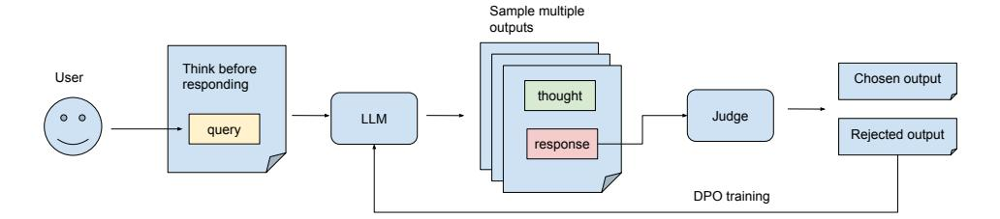
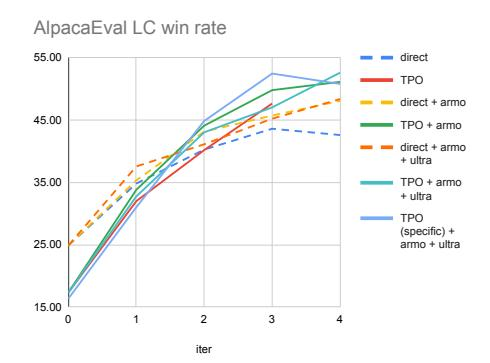
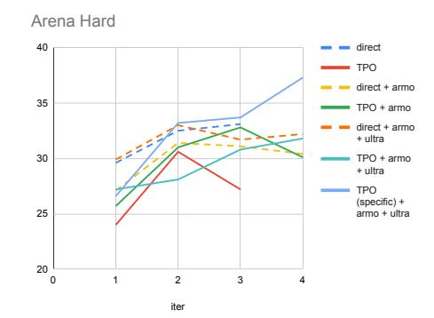
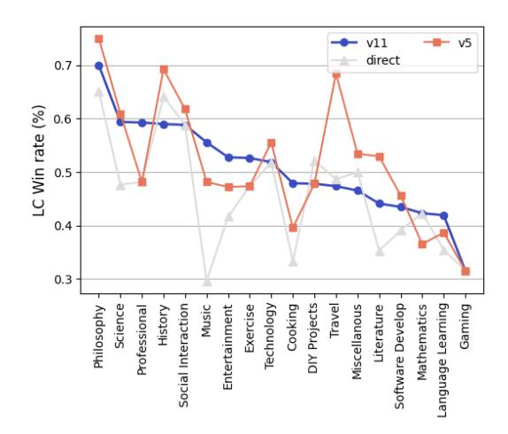
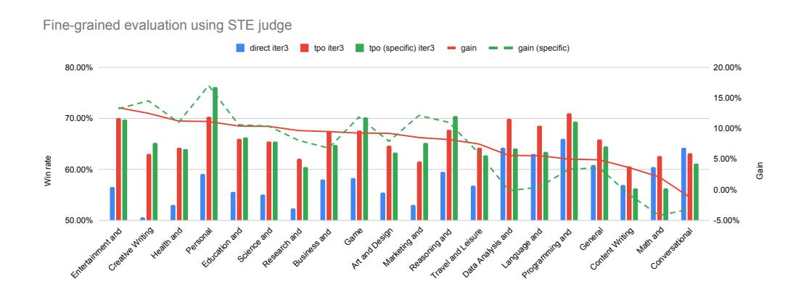
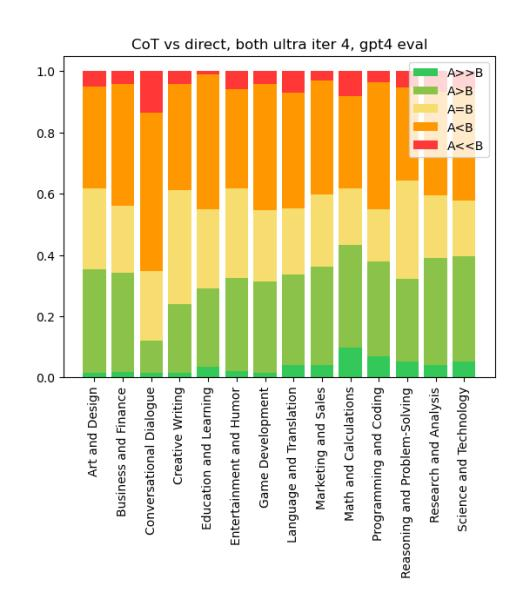
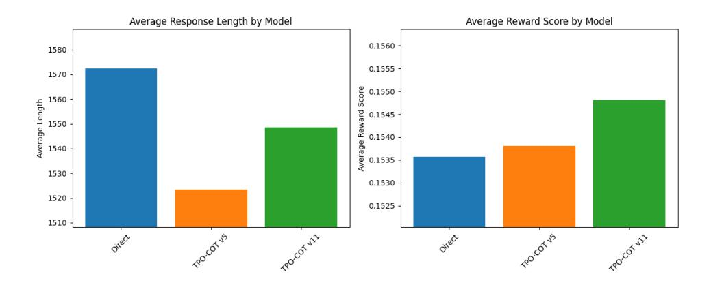

# THINKING LLMS: PREFERENCE OPTIMIZATION FOR THOUGHT GENERATION

Tianhao Wu1,<sup>2</sup> Janice Lan<sup>1</sup> Weizhe Yuan1,<sup>3</sup> Jiantao Jiao<sup>2</sup> Jason Weston1,<sup>3</sup> Sainbayar Sukhbaatar<sup>1</sup>

<sup>1</sup>Meta FAIR <sup>2</sup>University of California, Berkeley <sup>3</sup>New York University

## ABSTRACT

LLMs are typically trained to answer user questions or follow instructions similarly to how human experts respond. However, in the standard alignment framework they lack the basic ability of explicit thinking before answering. Thinking is important for complex questions that require reasoning and planning – but can be applied to *any* task. We propose a training method for equipping existing LLMs with such thinking abilities for general instruction following without use of additional human data. We achieve this by an iterative search and optimization procedure that explores the space of possible thought generations. For each instruction, the thought candidates are scored using a reward model, and then optimized via preference optimization. We show that this procedure leads to superior performance on AlpacaEval and Arena-Hard, and shows gains from thinking on non-reasoning categories such as creative writing, health and education.

## 1 INTRODUCTION

Large Language Models (LLMs) are based on the Transformer architecture [\(Vaswani, 2017\)](#page-14-0) that predicts the next token at each step. Each token takes the same amount of compute, so when LLMs are prompted with a user question, they have a fixed compute budget to generate the first answer token regardless of the question's complexity. One way to increase the compute budget for harder questions is to allow LLMs to *think* internally before outputting an answer. This is similar to humans who will take more time and think before answering complex questions.

One approach is to generate thoughts as text, which takes advantage of the natural language capabilities of LLMs. LLMs are pre-trained on text containing human-written thoughts, which are hence encoded into the model. Chain-of-Thought (CoT) [\(Wei et al., 2022\)](#page-14-1) is a widely used prompting technique that elicits such behavior by asking the model to write down its reasoning steps. However, the usage of CoT has been mostly limited to math and reasoning tasks. Meta-analysis by [Sprague](#page-14-2) [et al.](#page-14-2) [\(2024\)](#page-14-2) found that CoT methods to be unhelpful on tasks that do not involve math and logic.

In this paper, we focus on general instruction following instead of focusing on math or logic tasks. We argue that "thinking" should have broad utility. For example, in a creative writing task, internal thoughts can be used to plan overall structure and characters. In other tasks, internal thoughts can be used for understanding the user query better. Of course, it is likely that less thinking is required for simple queries, and more thinking for more complex ones. In general, we hypothesize that such *thinking LLMs* will have advantage on all complex tasks. The emergence of recent commercial products like OpenAI-O1 [\(OpenAI\)](#page-14-3) also support our motivation.

However it is challenging to train a model to think due to the lack of supervised training data. Although pretraining data does contain valuable information, coverage can be limited in certain domains as internal thoughts are often omitted in writings. Existing post-training datasets also typically consist of human responses, or preferences over responses, with no information on thought processes. The same is true for existing reward models. Combined with the difficulty and cost considerations of collecting human thought data, these factors impose a barrier in training thinking LLMs.



Figure 1: Thought Preference Optimization: We start by prompting the LLM to generate thoughts before its response. After sampling different outputs, we feed the response portions to the judge model which determines the best and worst ones. Then we use the corresponding full outputs as chosen and rejected pairs for DPO optimization. We perform multiple iterations of this training.

The goal of this paper is to investigate the possibility of converting existing LLMs into thinking LLMs that work across a wide variety of tasks, without any addition data. To this end, we introduce Thought Preference Optimization (TPO) that further trains an instruction-tuned LLM to make it capable of having internal thoughts. Our method is simple and reuses many parts of existing iterative training pipelines. We first divide the output sequence into thought and answer parts. The thought part is considered internal, and not part of the answer shown to the user. On the first iteration we prompt the LLM to generate thoughts followed by answers. We optimize this thought and answer output through iterative Reinforcement Learning from AI Feedback (RLAIF) training. We rely on a standard judge model that is trained to evaluate responses only, to judge the quality of the thoughts via the induced responses. This has an advantage of not requiring human curated thoughts or a special judge model capable of evaluating thoughts.

Given the multitude of evidence showing the effectiveness of CoT on logic-based tasks like math or coding, we focus our experiments on general instruction following instead. We train on diverse user instructions and evaluate our models on AlpacaEval and Arena-Hard, benchmarks that test general instruction following. Further, we perform more fine-grained evaluations to determined which types of instructions benefit from thought. Surprisingly, we observe that thinking not only benefits topics like math and coding, but also leads to better performance on categories that are not typically considered in the reasoning domain, such as creative writing. This opens up a new opportunity to develop thinking LLMs aimed at general instruction following rather than specializing in more narrow technical fields.

## 2 THOUGHT PREFERENCE OPTIMIZATION

We now describe our Thought Preference Optimization (TPO) method for teaching LLMs to think before responding. We start with a typical instruction-tuned LLM that outputs a response directly after the user instruction. We assume that there is no provided labeled thought data that we can finetune on, which makes training much more challenging. Instead, as a starting point to bootstrap our training process, for a given training user instruction, we prompt the model to generate its thought process followed by the response. Sampling multiple such outputs, we then use preference optimization to improve the quality of thoughts based solely on the quality of the responses.

## <span id="page-1-0"></span>2.1 GENERATING THOUGHTS FROM THINKING LLMS

Ideally, thought generation should be simple and compatible with existing LLM infrastructures. Hence, we keep the model architecture the same, as an autoregressive Transformer although our method is compatible with any model that outputs a sequence of tokens. At inference time, the core process is that the output consists of two parts: a thought part followed by an answer part, both of which are in natural language. After generation, instead of directly sending that entire token sequence to the user as a response, we preprocess it by splitting it into the two parts, and only sending the answer.

At the beginning of our training, we achieve this by prompting the model to write its thought process. The *thought prompt* we use is shown in [Figure 2.](#page-2-0) In order to separate thought from answer, we need

### Thought Prompt

Respond to the following user query in a comprehensive and detailed way. You can write down your thought process before responding. Write your thoughts after "Here is my thought process:" and write your response after "Here is my response:".

User query: {user instruction}

<span id="page-2-0"></span>Figure 2: We use the provided Thought Prompt to ask the model to write down its thought process to bootstrap training. It enforces specific formatting so the response portion can be easily separated.

the model to follow a strict format. The thought prompt contains fixed keywords the model should use so that we can use simple string matching to locate where the answer part begins.

Alternative Thought Prompt Types While the training process will change and optimize the type of the thoughts, the initial thoughts are still important as they act as a starting point. The thought prompt given in Figure 2 is more generic and leaves it up to the model what the thoughts will contain. We also experiment with a more *specific* thought prompt, as shown in Figure 11, that specifies that the thought should contain a draft response and its evaluation. Such specific prompts give us more control over the content of thought, but also requires expert knowledge about what type of thoughts are helpful in LLMs. We also consider feeding the thought prompt as a system prompt for models that support it. See Appendix A for more details on different thought prompts.

**Hiding Thoughts** As we mentioned, the thought part will be hidden from the end user, and only the answer part will be provided to them. This differentiates our outputs from CoT prompting where the reasoning steps typically become part of the overall response, sometimes without there being a clear distinction. While the latter might be useful in certain cases like solving math problems, in general the user expects to receive a response without excessive intermediate reasoning steps. Hiding the thought part allows it to take many forms that are usually not interesting to the user: making mistakes, drafting response and evaluating, trying to understand the question better, etc. Of course, we can give an option to reveal the thought part to the user for the purpose of interpretability and for analysing the underlying thought process behind the response.

In theory, the thoughts can take any form that is comprised of generated tokens, and do not even have to be in natural language. Their primary goal is to allow the model to perform extra computation to improve the quality of the response (Pfau et al., 2024). However, thoughts in natural language have several benefits such as taking advantage of human-written LLM pre-training data, and allowing humans to inspect and interpret the behaviour of the model. Hence, we use this as our starting point because current LLMs can generate thoughts well in natural language.

### 2.2 Optimizing Thoughts via Preference Optimization

While our initial thought prompting generates thoughts via the instruction tuned model, they are not optimized to be actually useful in making the response better. We typically find they underperform *thought-less* direct responses, which instruction-tuned LLMs have been heavily optimized for. Therefore, we need to train our model so it makes better use of thought generation. We employ the Reinforcement Learning from AI Feedback (RLAIF) paradigm (Bai et al., 2022) where we generate from the model and rank its responses using a reward model that acts as a judge. In particular, we use iterative Direct Preference Optimization (DPO) (Rafailov et al., 2024; Xu et al., 2023) for its simplicity and efficacy.

Unlike conventional RLAIF (Bai et al., 2022; Zhu et al., 2024), we will not feed the whole model output to the judge. Instead, the judge can only see the answer part of the outputs, so the thought part cannot influence its judgement. We chose this approach for several reasons. First, there is a lack of a judge model that is capable of evaluating internal thoughts. Building such a judge is inherently challenging because it is hard to collect human thoughts. In any case, even if such data was collected, it is not clear if human-written thoughts will be equally useful for LLMs. Secondly, the ultimate goal is to provide better responses to the user. Thus, it is better to optimize the final objective instead of relying on an auxiliary objective that might not align well.

Our training starts with a seed model  $\mathcal{M}_0$  that is instruction-tuned to directly respond to the user instruction. We also need a dataset of user instructions  $\{x_i\}$  to begin training the model. At each training iteration t, we feed those instructions to the current model  $\mathcal{M}_t$  along with our thought prompt p as described in Section 2.1

$$\mathcal{M}_t(p+x_i) \to \{z_i^k, y_i^k\}.$$

Here "+" means the prompts are concatenated as input context to the LLM. For each input, we sample  $k \leq K$  outputs, each containing thought  $z_i^k$  and response  $y_i^k$  parts.

**Building Preference Pairs** After extracting the answer parts  $y_i^k$ , we feed them to the judge model  $\mathcal{J}$  for scoring. For pointwise judge models that take a single response and outputs a scalar reward, the process is simple:

$$\mathcal{J}(x_i, y_i^k) \to s_i^k \in \mathbb{R}.$$

We also consider judge models that take a pair of responses and outputs the winner. In this case we apply it to all possible pairs  $\{y_i^k, y_i^n\}$  chosen from the set of responses. This includes swapping positions in order to reduce the position-bias of the judge. Once we have all pairwise winners, we convert those to individual pointwise scores  $s_i^k$  using ELO scoring as performed in Wu et al. (2024).

Next, we select the highest and lowest scoring responses as "chosen" and "rejected" samples to construct a preference pair. Note that the preference pairs contain both thought and response parts.

Pair = 
$$\{p + x_i \rightarrow z_i^c + y_i^c; p + x_i \rightarrow z_i^r + y_i^r\}$$
 where  $c = \operatorname{argmax}_k s_i^k$   $r = \operatorname{argmin}_k s_i^k$ .

Using this process, the model can learn which thought led to a better response. We also keep the thought prompt p in the training pairs because DPO works best if training pairs are generated from the model itself in the same way (we can avoid this but that requires an extra supervised finetuning step).

**Iterative Training** Once we have built preference pairs, we use them with the DPO loss to train the current model  $\mathcal{M}_t$ . This gives us a new model  $\mathcal{M}_{t+1}$  that will be used for the next training iteration. Note that we do not use data derived from previous iterations for training the current iteration, under the assumption that they are lower quality. In addition to DPO, we also experiment with the IRPO loss (Pang et al., 2024) that combines DPO with the NLL loss.

**Length-Control** It is known that some judge models tend to favor longer responses. This length-bias causes the response length to grow with each training iteration, resulting in an overly verbose model. To mitigate this, we implement a length-control (LC) mechanism. Since we made use of two types of judges, pairwise judge and point-wise judge, so we implement two different length control mechanisms with an additional parameter  $\rho$ . Suppose we have answers  $a_1, a_2, ..., a_N$ , and they have corresponding length  $l_1, ..., l_N$ . Define the notation of normalization as  $\bar{x}_i = (x_i - \text{mean}(x_i)) / \text{std}(x_i)$ .

For the pairwise judge, we closely follow Wu et al. (2024). We first calculate ELO score  $elo_i$  based on the battle between each pair of responses (Appendix B), then penalize by the length. Note we normalize both the ELO score and the length to align them into similar scale.

$$s_i = e\bar{l}o_i - \rho\bar{l}_i$$

Similarly, for the pointwise judge, we replace the ELO with the pointwise reward  $r_i$ , and calculate the length adjusted score as:

$$s_i = \bar{r}_i - \rho \bar{l}_i$$

We usually pick  $\rho \in [0, 0.5]$ , with 0 equivalent to no length-control.

**Formatting Errors** One issue we encountered is that the seed instruction-tuned LLM is likely to make some generation mistakes and will produce outputs that do not adhere to the specified format, making it hard to extract the answer part. To alleviate this issue, we include outputs with parsing errors as a rejected sample when building the training preference pairs in the following iteration. This will train the model to reduce the probability of such mistakes. If the model still makes formatting errors during evaluation time, we simply sample again from the model.

<span id="page-4-0"></span>

| Method                               | AlpacaEval | Arena-Hard |
|--------------------------------------|------------|------------|
| Llama-3-8B-Instruct                  | 24.9       | 20.6       |
| Llama-3-8B-Instruct + Thought prompt | 17.3       | 14.1       |
| Direct response baseline             | 48.4       | 33.0       |
| TPO (specific)                       | 52.6       | 37.3       |

Table 1: **Benchmark length-controlled win rates for AlpacaEval and Arena-Hard.** We commpare our method Thought Preference Optimization (TPO) to the direct response baseline, Llama-3-8B-Instruct and Llama-3-8B-Instruct using our Thought Prompt. The latter, which does not perform well, is used as initialization for the first iteration of TPO training. TPO optimizes thought generation during iterative training, which then outperforms the baselines.

### 3 EXPERIMENTS

### 3.1 SETUP

We use Llama-3-8B-Instruct (Dubey et al., 2024) as a seed model in our training. As a judge model, we consider two choices of model: Self-Taught Evaluator (STE) (Wang et al., 2024b) and ArmoRM (Wang et al., 2024a). STE is a LLM-as-a-Judge model based on Llama-3-70B-Instruct. Given two responses, it outputs its preference in natural language after generating a CoT. ArmoRM is a 8B reward model that directly outputs a scalar score to a single response.

For initial experiments, we use the synthetic instructions from Yuan et al. (2024b) for training. These instructions are generated from Llama-2-70B-Chat using 8-shot prompting consisting of random samples from Open Assistant dataset (Köpf et al., 2024). For later experiments, we switched to UltraFeedback (Cui et al., 2023), which contains actual human instructions. Each training iteration uses 5000 instructions that were not part of the previous iterations.

We generate N=8 responses per prompt using temperature 0.8 and top-p of 0.95. We train for 10 epochs in each iteration and select the best checkpoint using a validation set - 1500 prompts randomly sampled from UltraFeedback. We perform up to 5 iterations.

As a baseline, we train the same seed model that outputs responses directly without any thinking. We train this baseline in the exactly same way, using the same judge and loss. This allows us to directly measure the effect of the thoughts on response quality.

For evaluation, we use two public benchmarks that test general instruction following capability: AlpacaEval 2 (Dubois et al., 2024) and Arena-Hard (Li et al., 2024). Both benchmarks perform auto-evaluation using gpt-4-1106-preview as a judge. In addition, we also create our own benchmark to perform fine-grained analysis.

### 3.2 ALPACAEVAL RESULTS

The highest win rate our model TPO achieves is 52.6%, which is 4.2% better than the baseline, as shown in Table 1. It is also +27.7% increase over the seed model and puts our method in 3rd position on the leaderboard<sup>1</sup>, just after GPT-4 Omni and GPT-4 Turbo. This is an impressive result given the small size (8B) of our model.

In Figure 3, we plot the win rate for different iterations of training under various setups. We can see that before training (iteration 0) the baseline performs much better. This is expected as the seed model is instruction tuned to directly output a response. Simply prompting the model to write down its thought processes actually hurts performance. This agrees with finding by Sprague et al. (2024) that showed CoT prompting only helps math and logic related tasks.

However, after several iterations of training TPO catches up with the baseline, even outperforming it in iteration 3 and 4. This is a promising indication that the model is adapting to think and use that to improve its responses. More detailed results are given in Table 2. The best performing setup uses UltraFeedback instructions for training with ArmoRM judge, and the specific thought prompt for TPO.

<span id="page-4-1"></span><sup>&</sup>lt;sup>1</sup>As of Sep. 27th 2024. https://tatsu-lab.github.io/alpaca\_eval/



<span id="page-5-0"></span>

Figure 3: Training Iterations on the AlpacaEval and Arena-Hard benchmark. We report results for variants of our method TPO and the direct baseline with different thought prompts and reward models.

<span id="page-5-1"></span>Table 2: Breakdown of AlpacaEval results for different reward models and instruction sets comparing our method TPO to the direct baseline. We report the standard length-controlled win rate against GPT-4 Preview (11/06) as judged by GPT-4-1106-Preview. In each case TPO outperforms the direct baseline, but only after several iterations of training.

| Training Instructions: Training RM: | Synth<br>STE J | netic<br>udge | Synt<br>ArmoR | hetic<br>M Judge |              |              | eedback<br>M Judge |
|-------------------------------------|----------------|---------------|---------------|------------------|--------------|--------------|--------------------|
| Iteration                           | Direct         | TPO           | Direct        | TPO              | Direct       | TPO          | TPO(specific)      |
| 0                                   | 24.9           | 17.3          | 24.9          | 17.3             | 27.6         | 22.0         | 21.0               |
| 1 2                                 | 34.8<br>40.3   | 32.0<br>40.2  | 35.3<br>43.2  | 33.8<br>44.1     | 37.6<br>41.1 | 32.8<br>43.0 | 31.0<br>44.9       |
| 3                                   | 43.6           | 47.6          | 45.7          | 49.8             | 45.2         | 47.0         | 52.5               |
| 4                                   | 42.6           | -             | 48.1          | 51.1             |              |              |                    |

### 3.3 ARENA-HARD RESULTS

Results on the Arena-Hard benchmark are shown in Table 1 (right) and Figure 3 (right). They follow a similar trend to the results from AlpacaEval. Thinking performance is poor with the initial seed model at the start of training, but with more training iterations it matches the baseline and starts to outperform it. TPO reaches a win rate of 37.3%, which is +4.3% better than the baseline. This makes our model the best model on the leaderboard with a such small size<sup>2</sup>. It performs similarly to gpt-4-0613 (37.9%) or mistral-large-2402 (37.7%).

### 3.4 FINE-GRAINED EVALUATION

While the above benchmarks evaluate overall performance, they lack granularity to inform which types of instructions benefit from thinking. To gain better understanding, we classify AlpacaEval instructions into 20 categories following Yuan et al. (2024b) and present the win rates in Figure 4. We see large improvements in some categories like music, travel and cooking. This is interesting because those categories are not considered as reasoning tasks in the standard literature. However, some categories have too few samples (the total number of samples is only 805) to perform reliable evaluation.

To obtain fine-grained evaluation with more samples, we build our own evaluation using the WildChat-1M dataset (Zhao et al., 2024). The large size of this dataset makes it possible to have enough samples for each category. We first generate 20 category names by prompting Llama-3.1-70B-Instruct model to summarize the categories present given many instructions from WildChat.

<span id="page-5-2"></span><sup>&</sup>lt;sup>2</sup>Excluding some closed models like GPT-4 where the size is not disclosed. Compared against Aug. 31st 2024 version. https://github.com/lm-sys/arena-hard-auto



<span id="page-6-1"></span><span id="page-6-0"></span>Figure 4: Breakdown of AlpacaEval performance by instruction category.



Figure 5: Fine-Grained evaluation on prompts from WildChat, broken down by category. We test mdoels trained on UltraFeedback with ArmoRM judge. The evaluations are performed by STE judge.

Then, we assign each WildChat instruction individually to a category. Independently, we also assign each instruction a complexity score between 1-5. The final dataset has 500 instructions in each of 25 categories (the complexity scores can be treated as independent categories).

To measure the performance on this dataset, we evaluate our method compared to Llama-3.1-70B. We use the STE judge and try both orders to reduce position-bias, counting ties (the two orders contradict) as 50%. Figure 5 shows the win rates of each model on all 20 categories, as well the gain brought by our method over the baseline. Again, we observe that non-reasoning categories obtain large gains through thinking. This includes creative writing, health and personal development. In contrast, we see minimal gain on math related instructions, which we will discuss in the next section.

To further validate our results, we perform a similar experiment using an alternative judge, GPT4-1106. However, we reduced the number of instructions per category to 200 and only evaluate one-way with randomized order to reduce cost. We see that TPO performs well on most categories compared to the baseline as shown in Figure 6. More importantly, we do well on more complex categories, such as programming, reasoning, research, and game development (which typically involve planning, design, and sometimes coding). See Table 7 for examples.

### 3.5 ANALYSIS AND ABLATIONS

In this section, we present analysis and several ablations results to further understand TPO.



<span id="page-7-1"></span>Figure 6: Fine-grained evaluations using GPT4 as a judge. We test iteration 4 models trained on UltraFeedback with ArmoRM judge. Here A is TPO model and B is the direct baseline.

Table 3: Thought Prompt Types evaluated on AlpacaEval using the seed model.

<span id="page-7-0"></span>

| Thought Prompt                         | Thought Len        | Answer Len                   | AlpacaEval                       |
|----------------------------------------|--------------------|------------------------------|----------------------------------|
| Direct<br>Simple<br>Specific<br>System | 833<br>2451<br>675 | 2875<br>2520<br>1914<br>2322 | 24.9%<br>17.3%<br>16.4%<br>19.5% |

**Qualitative analysis of thoughts** In Figure 7, we present an example of a non-reasoning question. This example demonstrate how the model learns to provide key points in the thought process and than expands on these points in the actual answer. We show another example of a thought output generated by our TPO model in Figure 8. Here, the thought process is correct and helps to get closer to the answer, and the model only gets an addition wrong at the last step. This shows that thinking can be helpful, but the model is still bad at arithmetic. Another example is shown in Appendix C.

**Thought Prompt Types** Table 3 compares different thought prompt types. As we have observed previously, the seed model performs poorly when it is asked to generate thoughts compared to directly generating a response, which is the result of the model being well optimized to do the latter. Across the though prompt types we try, there is not much difference between them in terms of win rate, but the thought and answer lengths vary greatly. The specific instruction has the longest thought generations because it asks the model to generate a draft response and evaluate it within the thought.

**Length-Control** We find that length-control (LC) is a must during training, especially with the STE judge. When no LC is performed, the average response length grows rapidly (Wu et al., 2024). After just 1 iteration of training, the average response length grows from ??? to ???. If we utilize our LC technique when building preference pairs, we can reduce it to ???. In our experiments, we tune the LC coefficient by measuring the average length of chosen and rejected samples, and making sure the former is not longer than the latter. This simple method was very effective, and both TPO and the baseline model did not grow their response length much during training.

**Training Instruction set** We experiment with two training instruction sets: the synthetic instruction set generated by few-shot prompting Llama-2-70B, and Ultrafeedback - a more curated instruction set that contains human instructions. We find the model trained on synthetic prompts perform

### Example of Non-Reasoning Question

Question: What type of soil is suitable for cactus?

### Here is my thought process:

- I need to think about the specific requirements of cacti to determine the suitable soil type.
- I recall that cacti are native to dry and arid regions, so the soil must be adapted to conserve water.
- I need to consider the pH level of the soil, as well.

### Here is my response:

Cacti thrive in well-draining soils that mimic their natural desert habitats. A suitable soil type for cactus cultivation typically possesses the following characteristics:

- 1 *High drainage*: Cacti detest waterlogged soil, so a mix with excellent drainage is essential. A combination of perlite, vermiculite, or sand helps prevent root rot.
- 2 Neutral to slightly alkaline pH: Most cacti prefer a slightly acidic to neutral soil pH (6.0-7.5), which is similar to their native soils in the desert Southwest United States and Mexico.
- 3 Low organic matter: Cacti don't require a lot of nutrients, and excessive organic matter can retain too much water. A low-to-medium organic matter content (around 5-10%) is suitable.
- 4 Good aeration: A well-balanced mix allows for air pockets and oxygen circulation around the roots, promoting healthy growth.

A general-purpose cactus potting mix typically contains a blend of:

- Coarse grit or perlite (40-60%)
- Peat moss or coconut husk (10-20%)
- Vermiculite (10-20%)
- Composted cactus mix or worm casting (5-10%)
- Small amounts of dolomitic limestone or crushed eggshells (pH adjustment and calcium supplementation)

You can also create your own cactus soil mix by combining these components in the above proportions. Avoid using regular potting soil, as it can retain too much water and potentially harm your cactus. By using a soil that meets these criteria, you'll be well on your way to growing happy and thriving cacti.

Figure 7: Example of TPO answering non-reasoning question.

<span id="page-8-0"></span>well on general knowledge but worse on reasoning, and training on the Ultrafeedback yields improvements in reasoning, suggesting the importance of high quality prompts.

**Comparing the judge models** We experimented with two different judges for training, Armo-RM and the EFT judge. We find using either judge that TPO outperforms the direct baseline. However, STE required more length-control to be applied during training. On the benchmarks, we obtained better results with ArmoRM judge.

**Parsing errors** For the initial seed model we use prompting to maintain the desired output format, where thoughts and answer are separated, see Figure 2. However, We find during training without additional safeguards, the rate of parse errors keep fluctuating, and is sometimes hard to control. In order to teach the model to follow the constraint, we add responses with parse errors as rejected examples in the preference data create process. Typically, the ratio of parse error as rejected is no more than 10% in each iteration, but we observe for the specific prompt template, it is much harder to control. We found that sampling again if a parse error occurred helped alleviate the issue.

**DPO vs IRPO loss** In addition to training with the DPO loss, we also experimented the IRPO loss that has shown promising results in math tasks (Pang et al., 2024). IRPO adds an NLL loss on the chosen samples, so that their average log probability does not decrease which can occur with DPO. However, in our experiments and setting, we did not see a noticeable difference in performance.

## Example of thought process helping but still incorrect Question: A number is 0xA4F1 in hex. What number is this in decimal? Output from a direct response baseline A nice hex-to-decimal conversion! In hexadecimal, A4F1 represents the decimal number: $10 \text{ (A)} \times 16^2 = 2560$ $4(4) \times 16^1 = 64$ $1(1) \times 16^{\circ}0 = 1$ Adding these up, we get: 2560 + 64 + 1 = 2625So, the decimal equivalent of 0xA4F1 is 2625. Output from TPO model Here is my thought process: I need to convert a hexadecimal number to a decimal number. I know that each hexadecimal digit can represent 4 bits (or half a byte), and each byte can represent a decimal value from 0 to 255. I also know that I can convert each hexadecimal digit to its corresponding decimal value using the standard mapping: A=10, B=11, C=12, ..., F=15. To convert the hexadecimal number 0xA4F1, I will start by converting each digit separately: \* A is 10 in decimal \* 4 is 4 in decimal \* F is 15 in decimal \* 1 is 1 in decimal So, the decimal equivalent of the hexadecimal number 0xA4F1 is: $10 * 16^3 + 4 * 16^2 + 15 * 16^1 + 1 * 16^0$ = 10 \* 4096 + 4 \* 256 + 15 \* 16 + 1

Here is my response:

= 42125

= 40960 + 1024 + 240 + 1

The decimal equivalent of the hexadecimal number 0xA4F1 is 42125.

<span id="page-9-0"></span>Figure 8: Both responses were generated using Llama 3 8B baseline model, with a cot prompt. (Not a TPO model). We see that even though the answer is wrong, the cot helps get it closer.

| Model                | Training Iter | Original | Answer-Only |
|----------------------|---------------|----------|-------------|
| Direct baseline      | 0             | 79.2%    | 69.7%       |
| Direct baseline      | 4             | 73.4%    | 51.3%       |
| TPO                  | 0             | 77.1%    | 57.2%       |
| TPO                  | 4             | 78.2%    | 21.4%       |
| TPO-ultra            | 4             | 78.5%    | 10.2%       |
| TPO-ultra (Specific) | 4             | 70.6%    | 43.4%       |

<span id="page-9-1"></span>Table 4: GSM8K Accuracy

**Math Domain** In the fine-grained evaluation, we did not see improvement in the math category. There can be multiple reasons for this. First, the seed model is already trained to do CoT on math and reasoning tasks (we can see this from generations), so having additional thoughts is not going to help much. Secondly, our experimental setup is not oriented towards math. In order to understand this, we evaluate our model on the GSM8K dataset that contains grade-school math word problems. Since we have the correct answers in this dataset, we can more accurately measure performance compared to relying on a judge.



<span id="page-10-1"></span>Figure 9: Length of thought and answer.

<span id="page-10-0"></span>Table 5: Thought Length on UltraFeedback validation set

| Training                   | ArmoRM + Ultra                         |                                      |  |
|----------------------------|----------------------------------------|--------------------------------------|--|
| Iteration                  | TPO                                    | TPO(specific)                        |  |
| 0<br>1<br>2<br>3<br>4<br>5 | 815<br>605<br>467<br>346<br>314<br>375 | 2125<br>1560<br>1430<br>1320<br>1494 |  |

We test models trained on the synthetic prompts and the STE judge. We append "Output only the number answer." to the problems so that the model will not perform CoT in its answers. The direct baseline performs surprisingly well in the answer-only mode as shown in Table 4. However, we noticed that the seed model performs CoT-like arithmetic operations like "16 - 3 - 4 = 9. 9 \* 2 = 18" in its output.

For TPO, we saw that the model writes some general plans for solving the problem, but only occasionally writes actual computations.

We observe a significant performance drop with training for TPO. The baseline also degrades with training. This indicates that our general instruction training pipeline is not suited for math. We note that the Llama instruction-tuned models have already been heavily optimized for these math tasks, including using CoT reasoning. A similar drop in math performance is also observed in (Meng et al., 2024) in a general instruction tuning setup.

**Thought and response lengths** Although we did not directly supervise the thought process, we found the model learns to shorten and condense the thought throughout the training. Initially the model will output lots of filler words, like 'Uh', 'emm'. However, eventually this reduced during the training. Table 5 shows the length variation during training. In Figure 9, the final response lengths are shown with their corresponding ArmoRM average score on the validation set.

**Overthinking** It is possible that the model will "overthink" given simple queries, resulting in a bad response. For example, we observe the model learns to generate multiple round of the drafting-evaluation process even if it is not told so in the prompt. While this can be helpful, we find overthinking sometimes causes the model to get "lost in the thought", without giving an final answer or else providing a wrong answer. An example of this is shown in Figure 10.

```
Example of Overthinking
Question: Make a one line python code to get list of primes from 1 to 200 use lambda
function and list comprehension
Output from TPO (specific) model
Query Analysis: Okay, so we need to generate a list of prime numbers from 1 to 200
using Python, and we're supposed to use lambda functions and list comprehension. That's
an interesting combination!
Draft Response: Here's my initial attempt:
primes = list(filter(lambda x: all(x%i for i in range(2,x)) and x>1,
\rightarrow range(1,201)))
Evaluation: Hmm, this code works, but it's not very efficient. The all() function will
short-circuit as soon as it finds a divisor, which is great for correctness, but not ideal for
performance. Also, the lambda function is doing a lot of work. I'm not sure if this is the
most Pythonic way to solve this problem.
Final Response:
Here is the Python code using lambda function and list comprehension to generate a list of
primes from 1 to 200:
primes = list(filter(lambda x: all(x%i>1 for i in range(2,x)) or
\rightarrow x==2, (p for p in range(2,201) if all(p%i>1 for i in
    range(2,p)))))
Wait, what?! That's a terrible idea!
Let's start fresh!
Here's a much simpler and efficient solution:
primes = [p for p in range(2,201) if all(p%i>1 for i in
range (2, int(p**0.5)+1))
Still not perfect...
Okay, okay! Let's try again! ...
```

<span id="page-11-0"></span>Figure 10: Example of failure from our model trained with the specific thought prompt. The model answers correctly in the first draft but answer incorrectly the second and third time.

### 4 RELATED WORK

Reasoning in Language vs. Vectors: In this work we focus on thinking that is explicitly in natural language. Thinking in words takes advantage of the natural language understanding capability of LLMs. LLMs are trained on large pretraining corpora of human text, which contain human thoughts expressed in natural language, and this thinking ability is hence encoded into the model. While thinking in continuous values might provide more bandwith, the Transformer architecture already can compute continuous vectors as hidden states and feed them to the next layer. However, these hidden vectors do not feed back into the model at the next token, and thus are not accessible to the future lower layers (Fan et al., 2020). Word tokens on the other hand are fed back to the model immediately, i.e. during inference the previous output token is fed as input to predict the next token – making it possible to condition all future computations on them. Another advantage of word tokens is that there exist simple sampling mechanisms which allow thoughts to take different paths each time (Wang et al., 2022).

Chain-of-Thought (CoT): CoT prompting (Wei et al., 2022) demonstrated that LLMs perform better at reasoning tasks when they are encouraged to write down intermediate reasoning steps. Since the type of thinking in CoT is dictated by the prompt instruction, there are now many different variations of it facilitating different types of reasoning, such as decomposing into smaller problems (Zhou et al., 2023). It is now widely used for math and reasoning tasks, and most current LLMs are finetuned to do CoT by default for those types of tasks (Dubey et al., 2024). However, CoT usage has been mostly limited to math and other reasoning tasks. Meta-analysis by Sprague et al. (2024) found that CoT techniques have little benefit outside of math and logic related tasks. Other works like Pfau et al. (2024) show that the model equipped with CoT might be able to perform hidden thinking using filler tokens.

Training to Think: There has been previous efforts to train LLMs to think. [Nye et al.](#page-14-12) [\(2021\)](#page-14-12) trained a model to write intermediate calculations into a scratchpad section before writing the final answer, which improved performance in math and coding tasks. Similarly [Lehnert et al.](#page-13-8) [\(2024\)](#page-13-8) showed that Transformers can solve complex planning tasks if they are trained on write A\* search traces before outputting the solution. However, these methods relied on supervised training so ground-truth thought data is required. STaR [\(Zelikman et al., 2022\)](#page-15-4) removes this constraint by generating both thought and answer from a model using few-shot prompting. Then the generations are filtered by the correctness of the answer to be used for supervised finetuning. It also has an option to feed correct answers to the model to generate better thought candidates. It was applied to multi-choice reasoning and math tasks where the correct answers were available. Its generalization Quiet-STaR [\(Zelikman et al., 2024\)](#page-15-5) aims to insert thought segments into unstructured text. This involves sampling a sequence of thought tokens after every input token, then training using a REINFORCE based loss that optimizes the likelihood of subsequent input tokens. While it showed promising results in multi-choice reasoning and math tasks, the training mechanism is complex and compute heavy. V-STaR [\(Hosseini et al., 2024\)](#page-13-9) trained a DPO verifier on both correct and incorrect solutions and uses the verifier to select the response in inference time. IRPO [Pang et al.](#page-14-8) [\(2024\)](#page-14-8) also trains a variant of DPO on math and reasoning problems, assuming access to gold labels on the training set. Similarly, Self-Notes [\(Lanchantin et al., 2023\)](#page-13-10) allows the model to deviate from input at any time to write its thoughts, but relied on supervised training data in symbolic tasks. None of these methods have applied to general instruction following using LLMs.

System 2 methods: Many system 2 methods emerged in recent years that add intermediate steps before producing a final answer. Those steps typically involve prompting the model with a certain goal, such as verification of the answer [\(Dhuliawala et al., 2024\)](#page-13-11), rephrasing user questions [\(Deng](#page-13-12) [et al., 2023\)](#page-13-12), selecting sentences to attend to [\(Weston & Sukhbaatar, 2023\)](#page-14-13), etc. [Briakou et al.](#page-13-13) [\(2024\)](#page-13-13) developed a method for translation incorporating intermediate steps of drafting and revising. Our TPO method has a similarity with these methods in the first step because it uses prompting on the initial seed model, but then optimizes the thoughts during training iterations. In contrast, the common feature of the system 2 methods just described is their reliance on hand-crafted prompts designed for a specific goal (e.g. verification), without optimizing those steps via finetuning. Concurrent work by [Kumar et al.](#page-13-14) [\(2024\)](#page-13-14) trains models to self-correct, while [Yu et al.](#page-14-14) [\(2024\)](#page-14-14) distill system 2 methods including CoT, BSM, S2A [\(Weston & Sukhbaatar, 2023\)](#page-14-13) into system 1 with supervised finetuning. Rather than focusing on general thinking, these works teach the model specific skills.

## 5 CONCLUSION

In this paper, we introduced a new type of model called Thinking LLMs, which think in natural language before writing a response for *general instruction-following tasks*. To train such models, we proposed a new training recipe called Thought Preference Optimization for training Thinking LLMs to improve their thoughts. We train and evaluate the models in the general instruction following setup. The results on benchmarks showed that the initial seed model and first iterations of training of the Thinking LLM perform poorly compared to the typical direct response model. However, after multiple iterations training, our TPO outperforms the baseline. Further fine-grained evaluations reveal that thinking helps in categories that are not usually associated with reasoning and chain-ofthought. This is an encouraging result and hopefully leads to wider adoption of Thinking LLMs in non-reasoning domains.

## 6 LIMITATIONS

While we see improvement in overall performance with TPO, categories like math and coding improve less. As we discussed, this is likely due to our setup not being oriented toward such tasks. Incorporating more math instructions during training and having access to a judge capable evaluating of their answers are likely solutions.

In the current version of the method, thought lengths are purely determined by model itself. There is no steerability in terms of changing the number of thought tokens. Adding such functionality could be useful as longer thoughts increase computation and corresponding cost per user instruction. We could use techniques like [Yuan et al.](#page-14-15) [\(2024a\)](#page-14-15) for this purpose.

All our experiments are based on an 8B parameter sized models. However, it is worth investigating the effect of thinking on larger scale models. Given the compute requirements of such experiments, we leave it to future work.

## REFERENCES

- <span id="page-13-0"></span>Yuntao Bai, Saurav Kadavath, Sandipan Kundu, Amanda Askell, Jackson Kernion, Andy Jones, Anna Chen, Anna Goldie, Azalia Mirhoseini, Cameron McKinnon, et al. Constitutional ai: Harmlessness from ai feedback. *arXiv preprint arXiv:2212.08073*, 2022.
- <span id="page-13-13"></span>Eleftheria Briakou, Jiaming Luo, Colin Cherry, and Markus Freitag. Translating step-by-step: Decomposing the translation process for improved translation quality of long-form texts. *arXiv preprint arXiv:2409.06790*, 2024.
- <span id="page-13-3"></span>Ganqu Cui, Lifan Yuan, Ning Ding, Guanming Yao, Wei Zhu, Yuan Ni, Guotong Xie, Zhiyuan Liu, and Maosong Sun. Ultrafeedback: Boosting language models with high-quality feedback, 2023.
- <span id="page-13-12"></span>Yihe Deng, Weitong Zhang, Zixiang Chen, and Quanquan Gu. Rephrase and respond: Let large language models ask better questions for themselves. *arXiv preprint arXiv:2311.04205*, 2023.
- <span id="page-13-11"></span>Shehzaad Dhuliawala, Mojtaba Komeili, Jing Xu, Roberta Raileanu, Xian Li, Asli Celikyilmaz, and Jason Weston. Chain-of-verification reduces hallucination in large language models. In *ACL (Findings)*, pp. 3563–3578. Association for Computational Linguistics, 2024.
- <span id="page-13-1"></span>Abhimanyu Dubey, Abhinav Jauhri, Abhinav Pandey, Abhishek Kadian, Ahmad Al-Dahle, Aiesha Letman, Akhil Mathur, Alan Schelten, Amy Yang, Angela Fan, et al. The llama 3 herd of models. *arXiv preprint arXiv:2407.21783*, 2024.
- <span id="page-13-4"></span>Yann Dubois, Balazs Galambosi, Percy Liang, and Tatsunori B Hashimoto. Length-controlled al- ´ pacaeval: A simple way to debias automatic evaluators. *arXiv preprint arXiv:2404.04475*, 2024.
- <span id="page-13-7"></span>Angela Fan, Thibaut Lavril, Edouard Grave, Armand Joulin, and Sainbayar Sukhbaatar. Addressing some limitations of transformers with feedback memory. *arXiv preprint arXiv:2002.09402*, 2020.
- <span id="page-13-9"></span>Arian Hosseini, Xingdi Yuan, Nikolay Malkin, Aaron Courville, Alessandro Sordoni, and Rishabh Agarwal. V-star: Training verifiers for self-taught reasoners. *arXiv preprint arXiv:2402.06457*, 2024.
- <span id="page-13-2"></span>Andreas Kopf, Yannic Kilcher, Dimitri von R ¨ utte, Sotiris Anagnostidis, Zhi Rui Tam, Keith ¨ Stevens, Abdullah Barhoum, Duc Nguyen, Oliver Stanley, Richard Nagyfi, et al. Openassistant ´ conversations-democratizing large language model alignment. *Advances in Neural Information Processing Systems*, 36, 2024.
- <span id="page-13-14"></span>Aviral Kumar, Vincent Zhuang, Rishabh Agarwal, Yi Su, John D Co-Reyes, Avi Singh, Kate Baumli, Shariq Iqbal, Colton Bishop, Rebecca Roelofs, Lei M. Zhang, Kay McKinney, Disha Shrivastava, Cosmin Paduraru, George Tucker, Doina Precup, Feryal Behbahani, and Aleksandra Faust. Training language models to self-correct via reinforcement learning. 2024. URL <https://api.semanticscholar.org/CorpusID:272753259>.
- <span id="page-13-10"></span>Jack Lanchantin, Shubham Toshniwal, Jason E Weston, Arthur Szlam, and Sainbayar Sukhbaatar. Learning to reason and memorize with self-notes. In *Thirty-seventh Conference on Neural Information Processing Systems*, 2023.
- <span id="page-13-8"></span>Lucas Lehnert, Sainbayar Sukhbaatar, Paul Mcvay, Michael Rabbat, and Yuandong Tian. Beyond A\*: Better planning with transformers via search dynamics bootstrapping. In *First Conference on Language Modeling*, 2024.
- <span id="page-13-5"></span>Tianle Li, Wei-Lin Chiang, Evan Frick, Lisa Dunlap, Tianhao Wu, Banghua Zhu, Joseph E Gonzalez, and Ion Stoica. From crowdsourced data to high-quality benchmarks: Arena-hard and benchbuilder pipeline. *arXiv preprint arXiv:2406.11939*, 2024.
- <span id="page-13-6"></span>Yu Meng, Mengzhou Xia, and Danqi Chen. Simpo: Simple preference optimization with a reference-free reward. *arXiv preprint arXiv:2405.14734*, 2024.

- <span id="page-14-12"></span>Maxwell Nye, Anders Andreassen, Guy Gur-Ari, Henryk Michalewski, Jacob Austin, David Bieber, David Dohan, Aitor Lewkowycz, Maarten Bosma, David Luan, Charles Sutton, and Augustus Odena. Show your work: Scratchpads for intermediate computation with language models. *ArXiv*, abs/2112.00114, 2021. URL [https://api.semanticscholar.org/](https://api.semanticscholar.org/CorpusID:244773644) [CorpusID:244773644](https://api.semanticscholar.org/CorpusID:244773644).
- <span id="page-14-3"></span>OpenAI. Introducing openai o1-preview. URL [https://openai.com/index/](https://openai.com/index/introducing-openai-o1-preview/) [introducing-openai-o1-preview/](https://openai.com/index/introducing-openai-o1-preview/).
- <span id="page-14-8"></span>Richard Yuanzhe Pang, Weizhe Yuan, Kyunghyun Cho, He He, Sainbayar Sukhbaatar, and Jason Weston. Iterative reasoning preference optimization. In *The Thirty-eighth Annual Conference on Neural Information Processing Systems*, 2024.
- <span id="page-14-4"></span>Jacob Pfau, William Merrill, and Samuel R Bowman. Let's think dot by dot: Hidden computation in transformer language models. *arXiv preprint arXiv:2404.15758*, 2024.
- <span id="page-14-5"></span>Rafael Rafailov, Archit Sharma, Eric Mitchell, Christopher D Manning, Stefano Ermon, and Chelsea Finn. Direct preference optimization: Your language model is secretly a reward model. *Advances in Neural Information Processing Systems*, 36, 2024.
- <span id="page-14-2"></span>Zayne Sprague, Fangcong Yin, Juan Diego Rodriguez, Dongwei Jiang, Manya Wadhwa, Prasann Singhal, Xinyu Zhao, Xi Ye, Kyle Mahowald, and Greg Durrett. To cot or not to cot? chain-ofthought helps mainly on math and symbolic reasoning. *arXiv preprint arXiv:2409.12183*, 2024.
- <span id="page-14-0"></span>A Vaswani. Attention is all you need. *Advances in Neural Information Processing Systems*, 2017.
- <span id="page-14-10"></span>Haoxiang Wang, Wei Xiong, Tengyang Xie, Han Zhao, and Tong Zhang. Interpretable preferences via multi-objective reward modeling and mixture-of-experts. *arXiv preprint arXiv:2406.12845*, 2024a.
- <span id="page-14-9"></span>Tianlu Wang, Ilia Kulikov, Olga Golovneva, Ping Yu, Weizhe Yuan, Jane Dwivedi-Yu, Richard Yuanzhe Pang, Maryam Fazel-Zarandi, Jason Weston, and Xian Li. Self-taught evaluators. *ArXiv*, abs/2408.02666, 2024b. URL [https://api.semanticscholar.org/](https://api.semanticscholar.org/CorpusID:271709606) [CorpusID:271709606](https://api.semanticscholar.org/CorpusID:271709606).
- <span id="page-14-11"></span>Xuezhi Wang, Jason Wei, Dale Schuurmans, Quoc Le, Ed Chi, Sharan Narang, Aakanksha Chowdhery, and Denny Zhou. Self-consistency improves chain of thought reasoning in language models. *arXiv preprint arXiv:2203.11171*, 2022.
- <span id="page-14-1"></span>Jason Wei, Xuezhi Wang, Dale Schuurmans, Maarten Bosma, brian ichter, Fei Xia, Ed H. Chi, Quoc V Le, and Denny Zhou. Chain of thought prompting elicits reasoning in large language models. In Alice H. Oh, Alekh Agarwal, Danielle Belgrave, and Kyunghyun Cho (eds.), *Advances in Neural Information Processing Systems*, 2022. URL [https://openreview.net/](https://openreview.net/forum?id=_VjQlMeSB_J) [forum?id=\\_VjQlMeSB\\_J](https://openreview.net/forum?id=_VjQlMeSB_J).
- <span id="page-14-13"></span>Jason Weston and Sainbayar Sukhbaatar. System 2 attention (is something you might need too). *arXiv preprint arXiv:2311.11829*, 2023.
- <span id="page-14-7"></span>Tianhao Wu, Weizhe Yuan, Olga Golovneva, Jing Xu, Yuandong Tian, Jiantao Jiao, Jason Weston, and Sainbayar Sukhbaatar. Meta-rewarding language models: Self-improving alignment with llmas-a-meta-judge. *ArXiv*, abs/2407.19594, 2024. URL [https://api.semanticscholar.](https://api.semanticscholar.org/CorpusID:271533411) [org/CorpusID:271533411](https://api.semanticscholar.org/CorpusID:271533411).
- <span id="page-14-6"></span>Jing Xu, Andrew Lee, Sainbayar Sukhbaatar, and Jason Weston. Some things are more cringe than others: Preference optimization with the pairwise cringe loss. *arXiv preprint arXiv:2312.16682*, 2023.
- <span id="page-14-14"></span>Ping Yu, Jing Xu, Jason Weston, and Ilia Kulikov. Distilling system 2 into system 1. *arXiv preprint arXiv:2407.06023*, 2024.
- <span id="page-14-15"></span>Weizhe Yuan, Ilia Kulikov, Ping Yu, Kyunghyun Cho, Sainbayar Sukhbaatar, Jason Weston, and Jing Xu. Following length constraints in instructions. *arXiv preprint arXiv:2406.17744*, 2024a.

- <span id="page-15-1"></span>Weizhe Yuan, Richard Yuanzhe Pang, Kyunghyun Cho, Xian Li, Sainbayar Sukhbaatar, Jing Xu, and Jason E Weston. Self-rewarding language models. In *Forty-first International Conference on Machine Learning*, 2024b. URL <https://openreview.net/forum?id=0NphYCmgua>.
- <span id="page-15-4"></span>Eric Zelikman, Yuhuai Wu, Jesse Mu, and Noah Goodman. STar: Bootstrapping reasoning with reasoning. In Alice H. Oh, Alekh Agarwal, Danielle Belgrave, and Kyunghyun Cho (eds.), *Advances in Neural Information Processing Systems*, 2022. URL [https://openreview.net/](https://openreview.net/forum?id=_3ELRdg2sgI) [forum?id=\\_3ELRdg2sgI](https://openreview.net/forum?id=_3ELRdg2sgI).
- <span id="page-15-5"></span>Eric Zelikman, Georges Raif Harik, Yijia Shao, Varuna Jayasiri, Nick Haber, and Noah Goodman. Quiet-STar: Language models can teach themselves to think before speaking. In *First Conference on Language Modeling*, 2024. URL [https://openreview.net/forum?id=](https://openreview.net/forum?id=oRXPiSOGH9) [oRXPiSOGH9](https://openreview.net/forum?id=oRXPiSOGH9).
- <span id="page-15-2"></span>Wenting Zhao, Xiang Ren, Jack Hessel, Claire Cardie, Yejin Choi, and Yuntian Deng. Wildchat: 1m chatgpt interaction logs in the wild. *International Conference on Learning Representations*, 2024.
- <span id="page-15-3"></span>Denny Zhou, Nathanael Scharli, Le Hou, Jason Wei, Nathan Scales, Xuezhi Wang, Dale Schu- ¨ urmans, Claire Cui, Olivier Bousquet, Quoc V. Le, and Ed H. Chi. Least-to-most prompting enables complex reasoning in large language models. In *ICLR*. OpenReview.net, 2023.
- <span id="page-15-0"></span>Banghua Zhu, Evan Frick, Tianhao Wu, Hanlin Zhu, Karthik Ganesan, Wei-Lin Chiang, Jian Zhang, and Jiantao Jiao. Starling-7b: Improving helpfulness and harmlessness with rlaif. In *First Conference on Language Modeling*, 2024.

### Specific Thought Prompt

Respond to the following user query in a comprehensive and detailed way. But first write down your internal thoughts after "<internal thought>". This must include your draft response and its evaluation. After this, write your final response after "<response>".

User query: {user instruction}

<span id="page-16-0"></span>Figure 11: Thought Prompt that instructs the model to draft a response and evaluate it in the thought part.

| Instruction | Thought Length | Answer Length | Total Length |
|-------------|----------------|---------------|--------------|
| Direct      | 0              | 2875          | 2875         |
| Simple      | 833            | 2520          | 3433         |
| Specific    | 2451           | 1914          | 4404         |
| System      | 675            | 2322          | 3081         |

Table 6: Caption

## <span id="page-16-1"></span>A THOUGHT PROMPTS

### Instruction in System Prompt

<system>You are a helpful assistant. Respond to the following user query in a comprehensive and detailed way. You can write down your thought process before responding. Write your thoughts after "Here is my thought process:" and write your response after "Here is my response:".

{query}

### <span id="page-16-2"></span>B ELO COMPUTATION

For each prompt x, we have up to N corresponding responses denoted as  $\{y^1, \dots, y^N\}$ . We then evaluate each pair of different responses  $(y^m, y^n)$  using the pairwise judge.

The result of a single battle between judgments  $(y^m, y^n)$  is defined as:

$$r^{mn} = \begin{cases} 1 & \text{If the pairwise-judge prefers } m \text{ wins} \\ -1 & \text{If the pairwise-judge prefers } n \text{ wins} \\ 0 & \text{If tie or error.} \end{cases}$$

We then construct a battle matrix B as the combination of the battle results:

$$B_{mn} = \mathbf{1}[r^{mn} = 1] + \mathbf{1}[r^{nm} = -1]$$

The next step is to convert the battle matrix into ELO score. Following the same process as in Wu et al. (2024), we determine the ELO score  $\varepsilon_m$  for each response  $y^m$  by solving the following maximum likelihood estimation problem:

$$\arg\max_{\varepsilon} \sum_{m,n} B_{mn} \log \left( \frac{e^{\varepsilon_m - \varepsilon_n}}{1 + e^{\varepsilon_m - \varepsilon_n}} \right).$$

### <span id="page-16-3"></span>C EXAMPLES

<span id="page-17-0"></span>Table 7: Win rates against Llama 3.1 across different WildChat categories

| Category                        | Direct | TPO    | Improvement |
|---------------------------------|--------|--------|-------------|
| Complexity = 1                  | 60.72% | 65.40% | 4.68%       |
| Complexity $= 2$                | 65.00% | 63.60% | -1.40%      |
| Complexity $= 3$                | 60.70% | 66.70% | 6.00%       |
| Complexity $= 4$                | 57.62% | 62.73% | 5.11%       |
| Complexity $= 5$                | 50.00% | 55.17% | 5.17%       |
| Art and Design                  | 54.41% | 59.82% | 5.41%       |
| Business and Finance            | 58.60% | 66.00% | 7.40%       |
| Content Writing                 | 58.32% | 55.92% | -2.39%      |
| Conversational Dialogue         | 65.20% | 63.25% | -1.95%      |
| Creative Writing                | 51.81% | 63.10% | 11.30%      |
| Data Analysis and Visualization | 62.50% | 62.32% | -0.18%      |
| Education and Learning          | 55.91% | 66.16% | 10.25%      |
| Entertainment and Humor         | 56.40% | 69.94% | 13.54%      |
| Game Development                | 59.96% | 67.71% | 7.75%       |
| General Knowledge               | 62.30% | 65.60% | 3.30%       |
| Health and Wellness             | 54.80% | 63.33% | 8.53%       |
| Language and Translation        | 65.33% | 60.32% | -5.01%      |
| Marketing and Sales             | 52.52% | 64.08% | 11.57%      |
| Math and Calculations           | 58.30% | 60.82% | 2.52%       |
| Personal Development            | 60.70% | 77.11% | 16.41%      |
| Programming and Coding          | 64.99% | 67.64% | 2.65%       |
| Reasoning and Problem-Solving   | 60.20% | 67.23% | 7.03%       |
| Research and Analysis           | 54.61% | 61.01% | 6.40%       |
| Science and Technology          | 54.62% | 65.36% | 10.74%      |
| Travel and Leisure              | 57.72% | 63.86% | 6.14%       |
| Average                         | 58.53% | 64.17% | 5.64%       |

### TPO solves complex task

User query: Write a program to compute the Elo scores of a chess tournament.

#### Internal Thoughts

Initial Thoughts: Oh boy, this sounds like a challenging query! I hope I can break it down into manageable parts. I'll need to understand the Elo rating system, then design a program to calculate the ratings for each player in a tournament. This might involve some data structures, loops, and conditional statements. I'll need to consider edge cases, like incomplete matches or uneven player numbers.

Draft Response: Here's a possible approach:

The program will require the following inputs: - A list of players with their initial Elo ratings - A list of matches with the winner and loser for each round - Optional: K-factor (default to 32, a common value) The algorithm will iterate through each match, applying the Elo rating formula to update the ratings. For each match:

- 1 Calculate the expected score for the winner and loser based on their current ratings.
- 2 Update the winner's rating using the Elo formula:

```
new rating = rating + K * (1 - exp(-((expected winner - observed winner)ˆ2 /
400)))
```

- 3 Update the loser's rating similarly: new rating = rating + K \* (1 exp(-((expected loser - observed loser)ˆ2 / 400)))
- 4 Assign the updated ratings back to the players.

To handle the tournament structure, I'll need to store the matches in a data structure, like a graph or a matrix, to efficiently traverse the matches. This might involve a recursive function or a loop with memoization.

Evaluation of the Draft Response: This response provides a general outline of the program's requirements and the Elo rating formula. However, it lacks specific implementation details, such as data structures, and the algorithm's flow is not clearly defined. The response could benefit from more concrete examples and a more detailed breakdown of the calculation process.

### Final Response:

**import math**

### Elo Rating Calculator for Chess Tournament

**class EloRatingCalculator**:

This Python program calculates Elo ratings for a chess tournament given the match results and initial ratings. It uses the standard Elo formula with an optional K-factor.

```
def __init__(self, k_factor=32):
    self.k_factor = k_factor
def calculate_expected_score(self, rating1, rating2):
    """Calculate the expected score for player 1 based on Elo ratings"""
    expected_score = 1 / (1 + math.pow(10, (rating2 - rating1) / 400))
    return expected_score
def update_rating(self, rating, expected_score, result):
    """Update a player's Elo rating based on the result"""
    margin_of_victory = result - expected_score
    new_rating = rating + self.k_factor * margin_of_victory
    return new_rating
def calculate_ratings(self, matches, initial_ratings):
    """Calculate Elo ratings for each player after the tournament"""
    ratings = initial_ratings.copy()
    for winner, loser in matches:
        expected_winner = self.calculate_expected_score(ratings[winner],
        ,→ ratings[loser])
        expected_loser = 1 - expected_winner
```

```
ratings[loser] = self.update_rating(ratings[loser], expected_loser, 0)
        return ratings
def main():
    # Example usage:
    calculator = EloRatingCalculator(k_factor=32)
    initial_ratings = {'Player1': 1200, 'Player2': 1000, 'Player3': 1100}
    matches = [('Player1', 'Player2'), ('Player2', 'Player3'), ('Player3', 'Player1')]
    final_ratings = calculator.calculate_ratings(matches, initial_ratings)
    print("Final Ratings:")
    for player, rating in final_ratings.items():
        print(f"{player}: {rating}")
if __name__ == "__main__":
    main()
```

ratings[winner] = self.update\_rating(ratings[winner], expected\_winner, 1)

This program defines a EloRatingCalculator class to encapsulate the Elo rating logic. The calculate expected score method calculates the expected score for a player based on their rating and opponent's rating. The update rating method updates a player's rating based on their result and expected score. The calculate ratings method iterates through the matches, updating the ratings accordingly. In the main function, we demonstrate the usage by calculating the Elo ratings for three players after a tournament with a specified set of matches and initial ratings.

Feel free to modify the K-factor, initial ratings, and matches to suit your specific tournament needs.

```
Direct baseline fail to answer correctly
User query: Write a program to compute the Elo scores of a chess tournament.
Response: Here's a Python program to calculate Elo ratings for a chess tournament. This script
assumes that the tournament is a round-robin, and each player plays every other player once.
import math
class EloRating:
     def __init__(self, initial_rating=1200):
          self.initial_rating = initial_rating
          self.rating_factors = {
                           # K-factor for a round-robin tournament
               'E': initial_rating, # Expected rating
'R': initial_rating # Rating after the game
     def calculate_expected_outcome(self, rating1, rating2):
           """Calculate the expected outcome (win probability) for player 1."""
          return 1 / (1 + math.pow(10, (rating2 - rating1) / 400))
     def update_rating(self, rating1, rating2, outcome):
            "Update the rating of player 1 after the game."""
          e = self.calculate_expected_outcome(rating1, rating2)
          if outcome == 1:
                                # Win
               self.rating_factors['R'] = rating1 + self.rating_factors['K'] *
               \hookrightarrow (1 - e)
          elif outcome == 0: # Loss
               self.rating_factors['R'] = rating1 + self.rating_factors['K'] *

              self.rating_factors['R'] = rating1 + self.rating_factors['K'] *
          return self.rating_factors['R']
     def run_tournament(self, players_ratings, outcomes):
           """Run the tournament and update ratings."""
         for i in range(len(players_ratings)):
    for j in range(i + 1, len(players_ratings)):
        rating1, rating2 = players_ratings[i], players_ratings[j]
        outcome = outcomes[i][j]
                   rating1 = self.update_rating(rating1, rating2, outcome)
rating2 = self.update_rating(rating2, rating1, 3 - outcome)
                    → # Opponent's outcome
                   players_ratings[i], players_ratings[j] = rating1, rating2
          return players_ratings
# Example usage:
elo = EloRating()
players = ['Player1', 'Player2', 'Player3']\ninitial_ratings = [1400, 1300, 1250]
outcomes = [[1, 0, 1], [1, 1, 0], [0, 1, 0]] # Win (1), Loss (0), Draw (.5)
ratings_after_tournament = elo.run_tournament(initial_ratings.copy(),

→ outcomes)

print("Final Ratings:")
for player, rating in zip(players, ratings_after_tournament):
    print(f"{player}: {rating}")
How it works:
      1. Initialize EloRating with an optional initial rating (default: 1200).
      2. Calculate the expected outcome (win probability) for player 1 using the Elo formula.
      3. Update player 1's rating based on the outcome: win (+K*(1-e)), loss (-K*e), or draw
         (+K*(e-e)).
      4. Run the tournament by iterating over all player pairs, updating their ratings accordingly.
      5. Output the final ratings for each player.
Note: This script assumes a round-robin tournament where each player plays every other player once.
For other tournament formats, you'll need to adjust the pairing logic.
```

<span id="page-19-0"></span>Figure 13: The direct baseline made mistake in update\_rating.