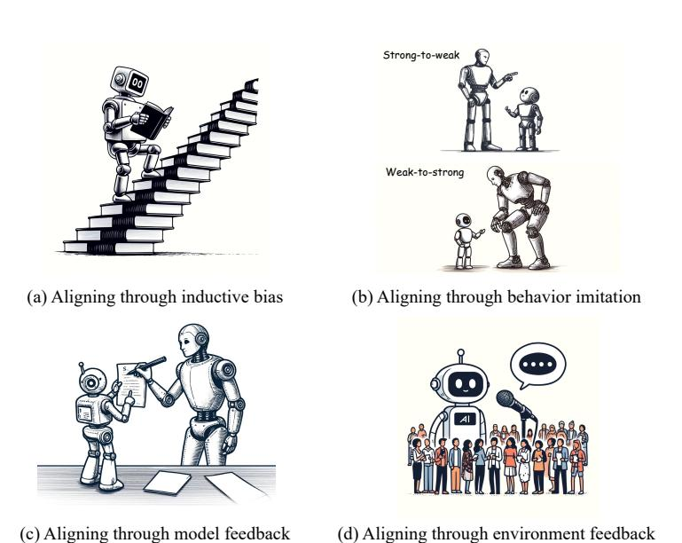
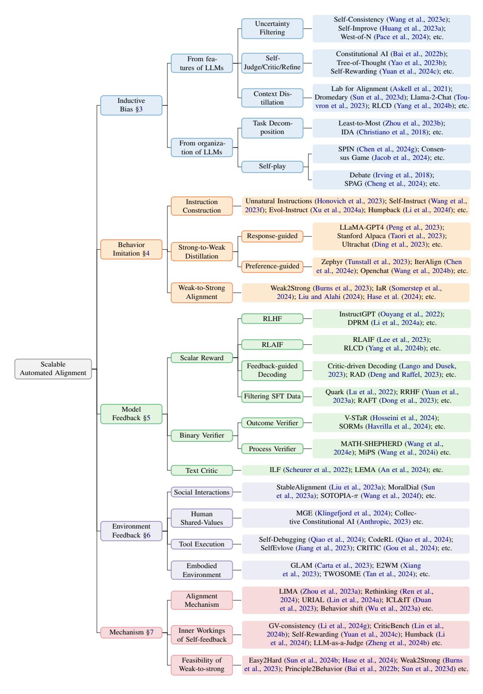
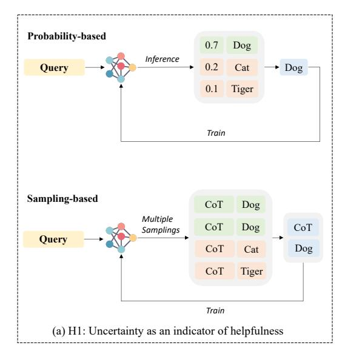
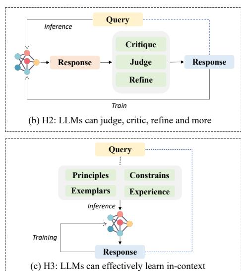
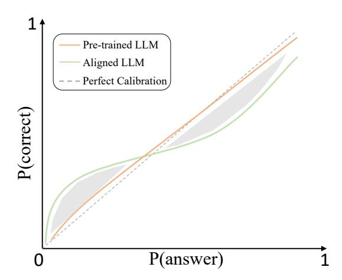
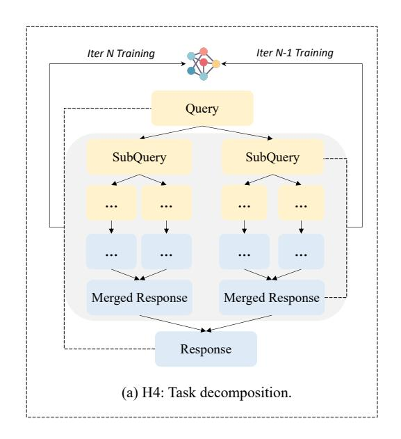
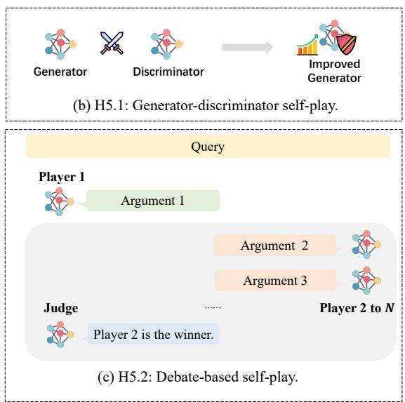
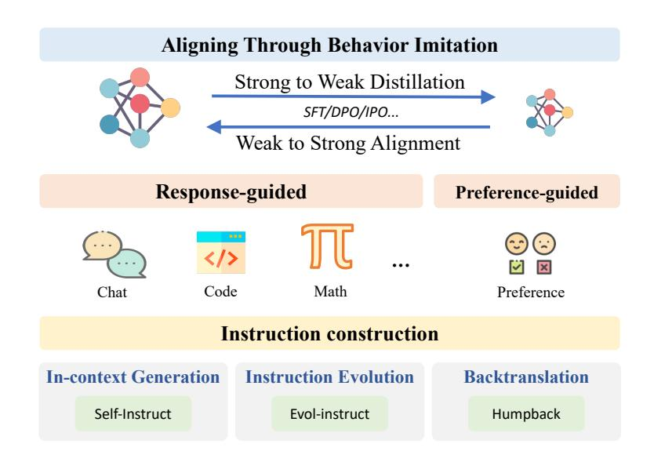
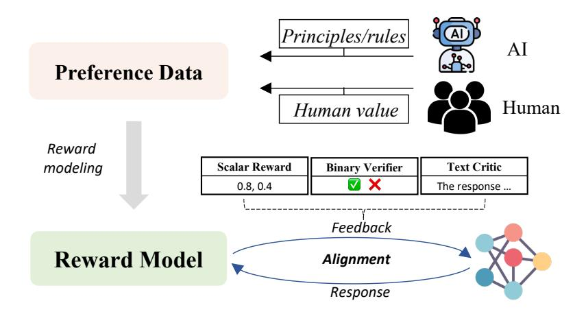
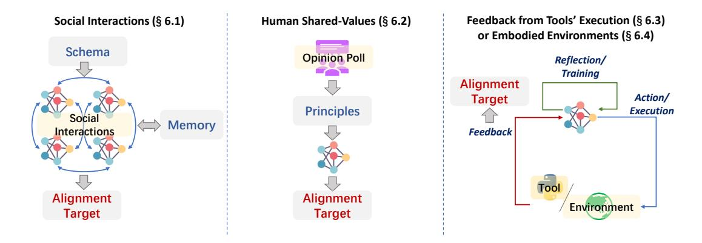

## Towards Scalable Automated Alignment of LLMs: A Survey

Boxi Cao $^{1,3}$ \*, Keming Lu $^2$ \*, Xinyu Lu $^{1,3}$ \*, Jiawei Chen $^{1,3}$ , Mengjie Ren $^{1,3}$ , Hao Xiang $^{1,3}$ , Peilin Liu $^{1,3}$ , Yaojie Lu $^1$ , Ben He $^3$ , Xianpei Han $^1$ , Le Sun $^1$ , Hongyu Lin $^1$ †, Bowen Yu $^2$ †

3University of Chinese Academy of Sciences

 $\textbf{\textit{Corresponding to:}}\ hongyu@iscas.ac.cn, yubowen.ybw@alibaba-inc.com$ 

https://github.com/cascip/awesome-auto-alignment

#### **Abstract**

Alignment is the most critical step in building large language models (LLMs) that meet human needs. With the rapid development of LLMs gradually surpassing human capabilities, traditional alignment methods based on human-annotation are increasingly unable to meet the scalability demands. Therefore, there is an urgent need to explore new sources of automated alignment signals and technical approaches. In this paper, we systematically review the recently emerging methods of automated alignment, attempting to explore how to achieve effective, scalable, automated alignment once the capabilities of LLMs exceed those of humans. Specifically, we categorize existing automated alignment methods into 4 major categories based on the sources of alignment signals and discuss the current status and potential development of each category. Additionally, we explore the underlying mechanisms that enable automated alignment and discuss the essential factors that make automated alignment technologies feasible and effective from the fundamental role of alignment.

Figure 1: Illustrations of four representative paradigms for automated alignment. Figures are generated by DALL·E (Ramesh et al., 2021).

&lt;sup>1Chinese Information Processing Laboratory, Institute of Software, Chinese Academy of Sciences

2Alibaba Group

## 1 Introduction

Recent years have witnessed the rapid advancements of large language models (LLMs), which have dramatically reshaped the landscape of artificial intelligence [\(Ouyang et al.,](#page-49-0) [2022;](#page-49-0) [Touvron et al.,](#page-54-0) [2023;](#page-54-0) [OpenAI,](#page-49-1) [2023c\)](#page-49-1). Alignment is at the core of shaping behaviors of LLMs corresponding to human intentions and values [\(Yao et al.,](#page-60-0) [2023a;](#page-60-0) [Shen et al.,](#page-52-0) [2023b\)](#page-52-0), e.g., teaching LLMs to follow "helpful, harmless and honest (HHH)" principles during responding [\(Askell et al.,](#page-36-0) [2021\)](#page-36-0). As a result, increasing efforts have been made for aligning LLMs to meet the human requirements, which makes it a hotspot research direction in LLM era [\(Wang et al.,](#page-57-0) [2023g,](#page-57-0) [2024h;](#page-56-0) [Ji et al.,](#page-43-0) [2023\)](#page-43-0).

Previous studies of alignment have primarily relied on manually annotated alignment data, which includes human preference information, to perform post-training on pre-trained models to achieve alignment [\(Stiennon et al.,](#page-53-0) [2020\)](#page-53-0). Specifically, there are two primary forms of alignment data: 1) instruction-response pairs, which typically consist of a query and a human-written golden reference. This form of data is often used for supervised fine-tuning of LLMs to inject human preference information into the model [\(Taori et al.,](#page-54-1) [2023;](#page-54-1) [Peng et al.,](#page-50-0) [2023;](#page-50-0) [Ding et al.,](#page-40-0) [2023\)](#page-40-0); 2) preference data, which usually includes a query, several potential responses, and human preferences regarding these responses [\(Cui et al.,](#page-39-0) [2024\)](#page-39-0). Preference data can be applied for direct preference optimization via algorithms such as DPO [\(Rafailov et al.,](#page-50-1) [2023\)](#page-50-1), IPO [\(Azar et al.,](#page-36-1) [2024\)](#page-36-1), and PRO [\(Song et al.,](#page-53-1) [2023\)](#page-53-1). Besides, it can also be used to train a reward model, which aligns the target policy LLM to the preference information in the data by providing feedback on the model's responses [\(Stiennon](#page-53-0) [et al.,](#page-53-0) [2020;](#page-53-0) [Bai et al.,](#page-36-2) [2022a;](#page-36-2) [Ouyang et al.,](#page-49-0) [2022\)](#page-49-0). However, the construction process for both instruction-response pairs and preference data requires very expensive, meticulous human annotation with high quality standards, making each step of scaling these methods very costly [\(Ouyang et al.,](#page-49-0) [2022;](#page-49-0) [Touvron et al.,](#page-54-0) [2023;](#page-54-0) [Zhou et al.,](#page-63-0) [2023a\)](#page-63-0).

Even with such high costs, the scalability of these human annotation-dependent alignment methods is still unsustainable. First, with the rapid development of LLMs, the capabilities of LLMs have gradually approached or even surpassed human in many aspects, making it increasingly challenging for humans to produce alignment data that is meaningful for LLMs [\(Bowman et al.,](#page-37-0) [2022;](#page-37-0) [Burns et al.,](#page-37-1) [2023\)](#page-37-1). In fact, many studies have found that the quality of data generated by LLMs has already exceeded the quality of data annotated by general human annotators in many perspectives [\(Zheng et al.,](#page-62-0) [2024b;](#page-62-0) [Chen et al.,](#page-38-0) [2024d;](#page-38-0) [Wei et al.,](#page-57-1) [2024\)](#page-57-1). This phenomenon not only significantly raises the cost of obtaining single meaningful human-annotated data (due to the need for increasingly expensive high-quality annotators), but also substantially reduces the potential benefits of human-annotated data for LLMs. Second, as the capabilities of LLMs gradually surpass human capability boundaries, it becomes increasingly difficult for humans to effectively judge the quality of the responses generated by LLMs. This leads to a significant decline in the quality of the preference signals generated by humans, which can no longer accurately reflect human needs, thereby making it challenging to provide effective guidance for LLMs. Therefore, alignment methods based on human annotation are increasingly unable to cope with the rapid improvement in the capabilities of LLMs, making it difficult to achieve scalable oversight for LLMs.

To address these challenges, automated alignment has drawn great attention very recently [\(Yuan](#page-61-0) [et al.,](#page-61-0) [2024c;](#page-61-0) [Chen et al.,](#page-39-1) [2024g\)](#page-39-1). Unlike previous methods that relied on human annotation to obtain alignment signals, the goal of automated alignment is constructing scalable and high-quality

\*. Equal contributions.

†. Corresponding authors.

alignment systems with minimal human intervention. Therefore, automated alignment has the potential to address the core challenges posed by the rapid development of LLMs, where human annotation is either infeasible or extremely expensive. For automated alignment, the most crucial part is to find a scalable alignment signal that can replace human manually-created preference signals and remain effective amid the rapid development of LLMs.

To this end, this survey categorizes the rapidly developing automated alignment methods according to the mechanisms used to construct different alignment signals, summarizes the current developments in each direction, and discusses the developmental trajectory and potential future directions. Specifically, this survey explores the following representative directions for constructing alignment signals to achieve automated alignment, including:

- Aligning through inductive bias ([§3\)](#page-6-0), which automatically steers the model towards desired behaviors by introducing suitable assumptions and constraints, without the use of additional training signals beyond the model itself.
- Aligning through behavior imitation ([§4\)](#page-16-0), which achieves automated alignment by mimicking the behavior of another aligned model. For instance, using a well-aligned model to generate instruction-response pairs, and then train target model with imitation learning.
- Aligning through model feedback ([§5\)](#page-22-0), which involves guiding the alignment optimization of the target model by obtaining feedback from other models.
- Aligning through environment feedback ([§6\)](#page-27-0), which involves automatically obtaining alignment signals or feedback through interaction with environment to achieve automated alignment of the target model.

Furthermore, this survey also explores the underlying mechanisms ([§7\)](#page-30-0) that enable automated alignment and, from the fundamental role of alignment, discuss the essential factors that make automated alignment technologies feasible and effective.

The rest of this survey is organized as follows: Section [2](#page-2-0) describes the scope of automated alignment covered in this survey, as well as the our taxonomy. Section [3-](#page-6-0)[6](#page-27-0) provide a detailed introduction to the progress and limitations of the four aforementioned representative directions in automated alignment. Section [7](#page-30-0) explores the underlying mechanisms of automated alignment. And we include a overall conclusion of this survey in Section [8.](#page-34-0)

### 2 Overview

In this section, we will discuss the scope of automated alignment covered in this survey, followed by a description of our taxonomy.

#### 2.1 Scope of Automated Alignment

In the rapidly evolving field of artificial intelligence, studies of alignment play a critical role in ensuring that machine behaviors align with human values and expectations. As AI systems, particularly LLMs, become more complex and capable, aligning these models with nuanced human standards becomes increasingly challenging and resource-intensive. This necessity has spurred the development of methodologies known as "automated alignment".

Figure 2: This paper reviews the work on scalable automated alignment through the lens of the source of alignment signals.

Automated alignment does not imply the complete absence of human involvement. Instead, it aims to minimize human intervention while building scalable, high-quality systems that adhere strictly to desired alignment outcomes. The essence of automated alignment lies in its ability to dynamically adjust and respond to alignment criteria through automated processes, thereby reducing dependence on continuous human oversight. Based on the source of alignment signals, current studies of automated alignment can be categorized into four main categories. First, inductive bias involves enhancing models with assumed generalizations or rules, enabling them to produce better-aligned responses without explicit external guidance. Second, behavior imitation techniques involve training AI systems by mimicking the outputs of already aligned models, leveraging imitation learning to propagate desired behaviors. Third, automated alignment is supported by integrating feedback mechanisms. Model feedback aligns a target model by incorporating insights from other models' feedback. Fourth, environment feedback automates the acquisition of alignment targets from the operational context itself, enabling the model to adapt based on real-time data and interactions.

The evolution towards automated alignment suggests a paradigm where AI systems can not only self-regulate based on pre-defined alignment protocols but also evolve these protocols autonomously through continuous learning and adaptation. This shift promises significant advancements in AI governance, making it possible to deploy AI solutions that are both effective and trustworthy on a larger scale. However, despite these advancements, the necessity for human oversight remains crucial to ensure that AI systems do not diverge from ethical boundaries or societal norms even as they gain autonomy. Such a blend of automation in alignment with strategic human oversight encapsulates the current trajectory and complexities involved in the field of AI alignment.

### 2.2 Taxonomy

In this section, we will provide a detailed description of our taxonomy as illustrated in Figure [2.](#page-3-0)

Aligning through inductive bias ([§3\)](#page-6-0) discusses enhancing the model by introducing additional assumptions, enabling it to leverage self-generated signals for further improvement. Currently, there are two types of inductive bias [\(Mitchell,](#page-49-2) [1980\)](#page-49-2) that facilitate the self-improvement of large language models. The first type includes inductive biases derived from the inherent features of LLMs. For instance, [Wei et al.](#page-57-3) [\(2022\)](#page-57-3); [Kojima et al.](#page-44-2) [\(2022\)](#page-44-2); [Wang et al.](#page-56-1) [\(2023e\)](#page-56-1); [Wang and Zhou](#page-56-4) [\(2024\)](#page-56-4) focus on eliciting better outcomes from LLMs by utilizing patterns within the model's output probabilities. Additionally, [Bai et al.](#page-36-3) [\(2022b\)](#page-36-3); [Yao et al.](#page-60-1) [\(2023b\)](#page-60-1); [Saunders et al.](#page-51-3) [\(2022\)](#page-51-3); [Shinn et al.](#page-52-1) [\(2023\)](#page-52-1) exploit the models' capabilities to critique, judge, and refine their responses, thereby enhancing safety and quality. Another line of works [\(Ganguli et al.,](#page-41-1) [2022;](#page-41-1) [Lin et al.,](#page-47-3) [2024a\)](#page-47-3) finds that simply providing aligned target signals within the context allows LLMs to use their robust in-context learning abilities for automated alignment. The second type involves inductive biases that arise from the organizational structure of LLMs. For example, based on the assumption of factored cognition, [Khot et al.](#page-44-3) [\(2023\)](#page-44-3); [Zhou et al.](#page-63-1) [\(2023b\)](#page-63-1); [Wang et al.](#page-55-2) [\(2023b\)](#page-55-2) use task decomposition to enable LLMs to solve complex tasks. Furthermore, inspired by the success of AlphaGo Zero [\(Silver et al.,](#page-52-2) [2018\)](#page-52-2), several studies propose enhancing LLMs by having them play iterative games against themselves [\(Fu et al.,](#page-41-2) [2023a;](#page-41-2) [Chen et al.,](#page-39-1) [2024g\)](#page-39-1).

Aligning through behavior imitation ([§4\)](#page-16-0) aims to align the behaviors of a target model with those of a teacher model through imitation. Based on the characteristics of the teacher and target models, research on alignment via behavior imitation can be categorized into two main paradigms: strong-to-weak distillation and weak-to-strong alignment. Specifically, strong-to-weak distillation involves using a well-aligned and powerful LLM to generate training data, and then aligning the target model's behaviors with the responses [\(Taori et al.,](#page-54-1) [2023;](#page-54-1) [Peng et al.,](#page-50-0) [2023;](#page-50-0) [Xu et al.,](#page-58-0) [2024a\)](#page-58-0) or preferences [\(Tunstall et al.,](#page-54-3) [2023;](#page-54-3) [Cui et al.,](#page-39-0) [2024\)](#page-39-0) of the teacher model. In contrast, weak-to-strong alignment uses a weaker model as a supervisor to guide the stronger target model towards further alignment [\(Burns et al.,](#page-37-1) [2023;](#page-37-1) [Zheng et al.,](#page-62-1) [2024a;](#page-62-1) [Hase et al.,](#page-42-0) [2024\)](#page-42-0).

Align through model feedback ([§5\)](#page-22-0) aims to guide the alignment optimization of the target model by introducing feedback from additional models. This feedback generally falls into three categories: 1) scalar signals [\(Christiano et al.,](#page-39-5) [2017;](#page-39-5) [Stiennon et al.,](#page-53-0) [2020;](#page-53-0) [Ouyang et al.,](#page-49-0) [2022\)](#page-49-0). These are typically provided by a reward model trained on pairs of preference data. The reward model is expected to learn the alignment signal from preference data and generalize to unseen samples obtained during the reinforcement learning process. Additionally, feedback from the reward model can guide the selection of instruction tuning data [\(Zhou et al.,](#page-63-0) [2023a;](#page-63-0) [Touvron et al.,](#page-54-0) [2023;](#page-54-0) [Yuan et al.,](#page-61-2) [2023b\)](#page-61-2) and model decoding [\(Lango and Dusek,](#page-45-2) [2023;](#page-45-2) [Deng and Raffel,](#page-39-4) [2023\)](#page-39-4). 2) binary signals. These are widely used in mathematical reasoning tasks to provide binary feedback on the correctness of results. Given that most mathematical tasks require multiple reasoning steps for solving, binary verifiers can be categorized into outcome verifiers, which estimate the correctness of final results [\(Zelikman](#page-62-2) [et al.,](#page-62-2) [2022;](#page-62-2) [Singh et al.,](#page-52-3) [2024;](#page-52-3) [Havrilla et al.,](#page-42-1) [2024\)](#page-42-1), and process verifiers, which can further provide feedback on intermediate steps [\(Lightman et al.,](#page-47-5) [2023;](#page-47-5) [Uesato et al.,](#page-55-3) [2022;](#page-55-3) [Ying et al.,](#page-60-2) [2024;](#page-60-2) [Shao](#page-51-4) [et al.,](#page-51-4) [2024\)](#page-51-4). 3) text signals. These are typically generated by LLMs to provide more intuitive feedback for humans [\(Scheurer et al.,](#page-51-1) [2022;](#page-51-1) [Chen et al.,](#page-38-3) [2024a\)](#page-38-3).

Align through environment feedback ([§6\)](#page-27-0) aims to automatically obtaining alignment signal or feedback from existing environment instead of a trained model, such as social interactions [\(Liu et al.,](#page-47-2) [2023a;](#page-47-2) [Sun et al.,](#page-53-3) [2023a\)](#page-53-3), public opinion [\(Anthropic,](#page-36-5) [2023\)](#page-36-5), external tools [\(Qiao et al.,](#page-50-3) [2024;](#page-50-3) [Jiang](#page-44-1) [et al.,](#page-44-1) [2023\)](#page-44-1) and embodied environment [\(Bousmalis et al.,](#page-37-2) [2023;](#page-37-2) [Xu et al.,](#page-59-1) [2024b\)](#page-59-1). Environment feedback serves as an essential supplement for previous origins of alignment signal, which enable the AI system better adapt to real-world application scenarios. However, how to effectively utilize environment feedback is still a research direction that urgently needs further exploration.

Underlying mechanisms for automated alignment ([§7\)](#page-30-0) Apart from reviewing the above representative technique for achieving automated alignment, we also provide an in-depth discussion about the underlying mechanisms for automated alignment. Specifically, we devote to investigate the following three critical questions about automated alignment:

- What is the underlying mechanism of current alignment?
- Why does self-feedback work?
- Why is weak-to-strong feasible?

The explorations of these questions are crucial for achieving scalable automated alignment. For each question, we summarize existing research and perspectives, raise open questions, and discuss their limitations and future directions.

Figure 3: Illustrations of aligning through 3 kinds of representative inductive bias stemming from inherent features of LLMs.

## 3 Aligning Through Inductive Bias

Self-education is, I firmly believe, the only kind of education there is.

Isaac Asimov

Currently, aligning through inductive bias is one of the most promising directions for achieving automated alignment. Inductive bias [\(Mitchell,](#page-49-2) [1980\)](#page-49-2) is a set of essentially assumptions or constraints that guide model learning and decision-making processes. By carefully selecting and implementing suitable inductive biases, we can steer models towards behaviors and decisions that are more likely to meet human standards and expectations, which can then generalize to unseen data distributions.

Compared to other methods of achieving automated alignment, aligning through inductive bias offers two primary advantages:

- 1) It does not require additional supervisory signals beyond the model itself, thus avoiding the high cost of obtaining additional annotated data. This is particularly relevant given the current scenario where training data is becoming scarce or has already been exhausted [1](#page-6-1) [\(Xue et al.,](#page-59-2) [2023\)](#page-59-2).
- 2) It has the potential to address the scalable oversight problem [\(Bowman et al.,](#page-37-0) [2022\)](#page-37-0). As the potential of LLMs continues to scale, it becomes challenging for humans to provide supervisory signals that surpass their own level of knowledge. However, through inductive bias, models can continuously self-improve, transcending the limitations of human knowledge.

1. Within the context of alignment discussed in this paper, we expect the model to continuously improve its helpfulness, thereby providing more effective assistance for alignment process. The scope of alignment actually represents *the post training process* rather than steering the models.

After conducting a thorough review of the relevant literature, we find that current efforts towards self-improvement solely through language model itself can be decomposed into a set H of five inductive biases. These inductive biases fall into two broad categories: 1) Those stemming from inherent features of LLMs ([§3.1\)](#page-7-0), and 2) Those arising from the organization of LLMs ([§3.2\)](#page-12-0). The objective of each of these inductive biases can be summarized as a simple rule: Heuristically transform test-time computation into the model's alignment. [\(Snell et al.,](#page-53-4) [2024\)](#page-53-4) The additional computation of each inductive bias is depicted in the shaded regions of the illustrative figures.

For each type of inductive biases, we will begin by introducing its origin. Following this, we will enumerate the works that employ this inductive bias as a single-step policy improvement operator. Next, we will discuss the works that iteratively train with it, aiming for continuous improvement. Finally, we will address open research problems associated with the given inductive bias.

## 3.1 Inductive Bias from Features of LLMs

LLMs possess intrinsic features that can act as inductive biases. These features largely arise from the pre-training of deep Transformer networks on massive datasets (H1, H3), while some also stem from preliminary alignment procedures aimed at enhancing the models' helpfulness (H2). In this section, we will summarize three key inductive biases, as depicted in Figure [3.](#page-6-2) It is important to note that these inductive biases are not entirely independent; instead, they represent three different perspectives on automated alignment based on the features of LLMs.

### 3.1.1 H1: UNCERTAINTY AS A INDICATOR OF HELPFULNESS

Probability distributions from models can represent uncertainty. As [Kadavath et al.](#page-44-4) [\(2022\)](#page-44-4) discovered, when prompts are suitably designed, the responses obtained from *pre-trained LLMs* can be *wellcalibrated*, and the degree of calibration can scale with the number of parameters and the number of exemplars. In other words, the higher the probabilities assigned by an LLM to a given answer, the more likely that answer is to be correct. This hypothesis has also been validated by [Wang et al.](#page-56-5) [\(2021\)](#page-56-5) and [He et al.](#page-42-2) [\(2023\)](#page-42-2). Similarly, [Manakul et al.](#page-48-0) [\(2023\)](#page-48-0) found a correlation between the probabilities output by the aligned models and factuality.

In the machine learning literature, early applications of this inductive bias were evident in a series of works using self-training [\(Scudder,](#page-51-5) [1965\)](#page-51-5) for semi-supervised learning [\(Nigam and Ghani,](#page-49-3) [2000;](#page-49-3) [Amini and Gallinari,](#page-35-0) [2002\)](#page-35-0). The basic paradigm of these works involves using learners trained on labeled data to continue learning from confidently classified unlabeled data, thereby enhancing supervised learning performance with unlabeled data. This approach has been applied in classification tasks with methods such as Pseudo-label [\(Lee et al.,](#page-45-3) [2013;](#page-45-3) [Ferreira et al.,](#page-40-3) [2023\)](#page-40-3) and Entropy Minimization [\(Grandvalet and Bengio,](#page-41-3) [2004\)](#page-41-3). [He et al.](#page-42-3) [\(2020\)](#page-42-3) extended this approach to sequence generation NLP tasks, highlighting that biased sampling and noise perturbation are key factors for the success of self-training in these tasks. [Pace et al.](#page-50-2) [\(2024\)](#page-50-2) extended the paradigm of self-training to the alignment problem, improving the robustness of reward models by allowing them to iteratively learn from the highest-scoring and lowest-scoring answers in the candidate pool generated for a query.

The frequency of specific answers also reflects uncertainty. Therefore, synthesizing candidate answers from multiple samplings can lead to better performance than relying on a single sample. This approach is particularly effective when LLMs are used in tasks requiring deliberate thinking (e.g., solving math problems), as a single Chain-of-Thought (CoT) [\(Wei et al.,](#page-57-3) [2022\)](#page-57-3) reasoning path

Figure 4: Calibration plot observed by [Kadavath et al.](#page-44-4) [\(2022\)](#page-44-4); [He et al.](#page-42-2) [\(2023\)](#page-42-2); [OpenAI](#page-49-1) [\(2023c\)](#page-49-1); [Zhang et al.](#page-62-3) [\(2024\)](#page-62-3). The x-axis represents the probability associated with the model's output, while the y-axis indicates the probability that the answer is correct. In the low probability region, the gray area may reflect the "don't know" responses substituting some low-confidence answers. In the high probability region, the gray area signifies overconfidence. The comparison between pre-trained LLM and aligned LLM demonstrates that alignment for helpfulness can result in miscalibration, which is harmful to iterative self-improvement.

can sometimes fall into local optima and generate plausible but unfaithful answers. Self-Consistency [\(Wang et al.,](#page-56-1) [2023e\)](#page-56-1), by aggregating multiple reasoning paths through a weighted sum, can alleviate this problem by marginalizing the model's likelihood to the reasoning path. Interestingly, it was also found that an unweighted sum (i.e., majority vote) can achieve comparable performance, which is attributed to the "similarly likely" probabilities over all reasoning paths. [Wang and Zhou](#page-56-4) [\(2024\)](#page-56-4) further discover that the presence or absence of a CoT reasoning path correlates with the probability of the final answer when inference is conducted without any prompting techniques.

To solidify such enhancement, Self-Improve [\(Huang et al.,](#page-43-1) [2023a\)](#page-43-1) views CoT with Self-Consistency as a policy improvement operator, substantially improving the reasoning capabilities and potential of LLMs through iterative learning of the reasoning paths obtained from Self-Consistency. [Zhang and Parkes](#page-62-4) [\(2023\)](#page-62-4) demonstrate that LMs could self-improve on large number addition problems by curriculum "distilling" the CoT answers to the direct answers without explicit reasoning. Quiet-STAR [\(Zelikman et al.,](#page-62-5) [2024\)](#page-62-5) considers the advantage of the influence of rollout rationale on the probabilities of subsequent tokens as a feedback signal, encouraging the model to generate a more helpful implicit thought process using reinforcement learning techniques. [Li and Qiu](#page-46-2) [\(2023\)](#page-46-2) show that memory mechanisms can also be used for consistency-based self-improvement instead of parameter learning.

H1: Discussion For aligned models, maintaining calibration and uncertainty remains crucial, as miscalibration can undermine the potential for iterative self-improvement. Numerous studies [\(Kadavath et al.,](#page-44-4) [2022;](#page-44-4) [He et al.,](#page-42-2) [2023;](#page-42-2) [OpenAI,](#page-49-1) [2023c;](#page-49-1) [Zhang et al.,](#page-62-3) [2024\)](#page-62-3) have noted that the

alignment process can impair the calibration of LLMs (as shown in Figure [4\)](#page-8-0). This observation is reasonable for several reasons: 1) The current superficial alignment process aims to steer the model away from generating harmful or incorrect answers. This involves replacing the probability of incorrect answers with the probability of rejection responses to some extent, creating a gray area in the low probability region. 2) During the alignment process, the model also learns the response format. The increase in confidence regarding the response format can somewhat affect the confidence in the answers themselves [\(He et al.,](#page-42-2) [2023\)](#page-42-2). Moreover, the model relearns the correct answers, which can lead to overconfidence (represented by the gray area in the high probability region). The extremization of the probability distribution can be more pronounced in self-alignment [\(Wu et al.,](#page-58-3) [2024b\)](#page-58-3), given that it is an iterative process involving self-sampling and training. This implies that all tokens are already in a very high probability distribution, making them more likely to be sampled as responses.

When the model becomes overconfident, it leads to a decrease in the diversity and exploratory of the model's generated outputs. To mitigate this issue, one promising approach is to use inference-time interventions (e.g., high temperature [\(Kadavath et al.,](#page-44-4) [2022\)](#page-44-4), fidelity [\(Zhang et al.,](#page-62-3) [2024\)](#page-62-3)) to decrease the expected calibration error. Another potential solution is to filter the pseudo-labeled samples to avoid harmful repeated training, which requires understanding when unlabeled samples will be effective [\(Grandvalet and Bengio,](#page-41-3) [2004\)](#page-41-3).

## 3.1.2 H2: LLMS CAN JUDGE, CRITIC, REFINE AND MORE

Pre-trained LLMs often struggle to directly respond to instructions. However, the widespread adoption of imitation learning [\(Chiang et al.,](#page-39-6) [2023\)](#page-39-6) and feedback learning [\(Bai et al.,](#page-36-2) [2022a\)](#page-36-2) has significantly enhanced the zero-shot helpfulness of LLMs. Leveraging the reasoning abilities elicited and enhanced by these general helpfulness improvements, a series of works have emerged, utilizing the model's capabilities to enhance response quality and safety through judging, critiquing, refining, and more.

*Judge* refers to determining the quality of model responses. The judgment standards are typically incorporated into instructions as principles or guidelines, enabling regulators to oversee LLM behavior in a more scalable manner [\(Bai et al.,](#page-36-3) [2022b;](#page-36-3) [Yuan et al.,](#page-61-0) [2024c\)](#page-61-0) compared to heavy reliance on human annotators for feedback [\(Bai et al.,](#page-36-2) [2022a\)](#page-36-2). This approach allows for timely regulation, aiding in the flexible and controlled alignment process of language models, which can help prevent issues like reward hacking during iterative training [\(Sun et al.,](#page-54-6) [2023c\)](#page-54-6) and facilitate on-policy reinforcement learning training [\(Guo et al.,](#page-42-4) [2024a\)](#page-42-4).

Self-judging can manifest in two primary forms: 1) Differentiating the relative quality of two responses (AI Feedback [\(Bai et al.,](#page-36-3) [2022b\)](#page-36-3)), resulting in evaluation outcomes represented as a partial order. For instance, [Tan et al.](#page-54-7) [\(2023\)](#page-54-7) employ prompts to compare which answer better adheres to the HHH principles. They then distill the chosen option back into the model to further enhance its judging capability. [Bai et al.](#page-36-3) [\(2022b\)](#page-36-3) prompted the model to select superior responses based on sampled principles and subsequently employed a preference process to achieve a Pareto improvement of the model. 2) Providing an absolute score for a response (LLM-as-a-judge [\(Zheng et al.,](#page-62-0) [2024b\)](#page-62-0)), with the evaluation results in scalar form. [Yao et al.](#page-60-1) [\(2023b\)](#page-60-1), [Besta et al.](#page-37-3) [\(2024\)](#page-37-3) and [Xie et al.](#page-58-4) [\(2023\)](#page-58-4) introduce real-time evaluation modules for thought states during reasoning process. These modules serves as a prior during the search process, assisting the model in exploring the action space for questions requiring deliberate thinking. Similarly, RAIN [\(Li et al.,](#page-46-3) [2024h\)](#page-46-3) utilizes a binary scoring

prompt for self-evaluating whether the generation is likely to be harmful, thereby enhancing response safety combined with an inference-time tree search. [Yuan et al.](#page-61-0) [\(2024c\)](#page-61-0) employ a five-point judge prompt to score the model's instruction-response outputs, then converted the scores into a partial order for iterative training using DPO.

Recalling H1, it becomes evident that H1 serves as a foundation for H2, given that the accuracy of the judge is directly tied to the calibration of the LLM. Consequently, H2 will only be effective if H1 is valid [\(Bai et al.,](#page-36-3) [2022b\)](#page-36-3).

*Critique* refers to generating modification suggestions. By leveraging LLM itself for critique, the suggestions can address errors and deficiencies, such as mistakes in summarization [\(Saunders et al.,](#page-51-3) [2022\)](#page-51-3), machine translation [\(Fernandes et al.,](#page-40-4) [2023\)](#page-40-4), math reasoning [\(Lin et al.,](#page-47-4) [2024b\)](#page-47-4), decisionmaking and programming tasks [\(Saunders et al.,](#page-51-3) [2022;](#page-51-3) [Shinn et al.,](#page-52-1) [2023\)](#page-52-1). The suggestions can also pertain to abstract value criteria, such as the HHH related principles [\(Chen et al.,](#page-38-1) [2024e;](#page-38-1) [Bai et al.,](#page-36-3) [2022b\)](#page-36-3).

*Refine* refers to the ability that LLMs can improve the given text. Most of the work on self-refine is based on natural language reasons provided by the critic module to modify the response [\(Bai et al.,](#page-36-3) [2022b;](#page-36-3) [Tan et al.,](#page-54-7) [2023;](#page-54-7) [Madaan et al.,](#page-48-1) [2023;](#page-48-1) [Shinn et al.,](#page-52-1) [2023\)](#page-52-1). Some research also demonstrates the possibility of making modifications directly based on scalar rewards [\(Shinn et al.,](#page-52-1) [2023\)](#page-52-1). The less informative critic can be more challenging for LLMs since they must complete more information by themselves through reasoning. Another line of work uses LLMs to refine the prompts themselves [\(Fernando et al.,](#page-40-5) [2023;](#page-40-5) [Yang et al.,](#page-59-3) [2023a\)](#page-59-3).

*Other:* A helpful LLM can serve in various capacities to assist in the alignment process, effectively replacing human guidance. For example, it can vote on the quality of intermediate states of thought [\(Yao et al.,](#page-60-1) [2023b\)](#page-60-1), verify outcomes based on predicting conditions in questions [\(Weng et al.,](#page-57-4) [2023\)](#page-57-4), and automatically generate, filter [\(Yue et al.,](#page-61-3) [2024b\)](#page-61-3), and evolve instructions [\(Wang et al.,](#page-56-2) [2023f;](#page-56-2) [Li et al.,](#page-46-0) [2024f;](#page-46-0) [Xu et al.,](#page-58-5) [2023a\)](#page-58-5), among other tasks.

Regarding the persistence process, the improvements derived from these methods can be further distilled into the model through SFT (i.e., Expert Iteration), DPO, RM-PPO, and other techniques. Additionally, the judge / critique - refine process can be conducted iteratively.

H2: Discussion As the abilities of judging, critiquing, and refining are increasingly incorporated into model feedback and learning processes, there is a need for systematic evaluation of these capabilities. In this context, several research directions are worth pursuing:

- 1) Benchmarking the performance of existing models on these atomic abilities, as exemplified by works such as [Sun et al.](#page-53-5) [\(2024a\)](#page-53-5) and [Lin et al.](#page-47-4) [\(2024b\)](#page-47-4).
- 2) Conducting causal studies on the formation process of models' judging, critiquing, and refining abilities, and investigating what forms of pre-training and fine-tuning data can influence these abilities. This helps to design specific pipelines to targeted enhance these capabilities [\(Wang et al.,](#page-56-6) [2024g\)](#page-56-6), and even train specialized models like CriticGPT [\(McAleese et al.,](#page-48-2) [2024\)](#page-48-2).
- 3) Evaluating the effects of distribution shift on these abilities. Do models still possess reliable evaluation and improvement capabilities if they have not been trained on the corresponding instruction and response pairs? This is particularly pertinent to the scalable oversight problem, which assumes the absence of direct supervision for instructions.
- 4) Gathering empirical evidence to demonstrate that self self-critique, judge, and refine abilities can enhance model performance in fair and reasonable experimental settings. Some works point out

Figure 5: Illustrations of aligning through three representative inductive biases which stem from the organization of LLMs.

that the improvement may come from the use of stronger models [\(Sharma et al.,](#page-51-6) [2024\)](#page-51-6) and golden labels [\(Huang et al.,](#page-43-1) [2023a\)](#page-43-1).

## 3.1.3 H3: LLMS CAN EFFECTIVELY LEARN IN-CONTEXT

In-context learning (ICL) refers to the ability of LLMs to initialize a task-specific model with exemplars or experiences during inference [\(Brown et al.,](#page-37-4) [2020\)](#page-37-4). Given that certain studies [\(Dai et al.,](#page-39-7) [2023;](#page-39-7) [von Oswald et al.,](#page-55-4) [2023\)](#page-55-4) suggest parallels between ICL and parameter gradient descent, it is plausible to regard it as a versatile and effective "learning" method.

From the perspective of automated alignment, ICL offers an efficient means to cold-start from a pre-trained LLM. With the assistance of ICL, just a few conversational samples in-context can yield a somewhat aligned model [\(Ganguli et al.,](#page-41-1) [2022;](#page-41-1) [Sun et al.,](#page-54-2) [2023d;](#page-54-2) [Lin et al.,](#page-47-3) [2024a\)](#page-47-3). Similarly, by prepending a few annotated exemplars in-context, ICL can also elicit judge and critic abilities of pre-trained LLM to some extent, or enhance the performance compared to the zero-shot setting [\(Bai et al.,](#page-36-3) [2022b\)](#page-36-3). Additionally, ICL presents a potential method for adaptive alignment [\(Xu et al.,](#page-59-4) [2023c\)](#page-59-4) to different social norms and regulations.

However, prepending few-shot exemplars in the context above can make inference inefficient [\(Gim et al.,](#page-41-4) [2023\)](#page-41-4) and interfered with the unrelated queries [\(Shi et al.,](#page-52-4) [2023\)](#page-52-4). Therefore, selfgenerated labels obtained from ICL could be directly used as pseudo labels, and distilled back into the LLMs only paired with the query. This paradigm is known as Context Distillation [\(Askell](#page-36-0) [et al.,](#page-36-0) [2021;](#page-36-0) [Snell et al.,](#page-53-6) [2022\)](#page-53-6). For instance, in the alignment process of Llama-2 [\(Touvron et al.,](#page-54-0) [2023\)](#page-54-0), Context Distillation is used to alleviate the problem of long-term dependencies of system prompts. For Llama-3 [\(Dubey et al.,](#page-40-6) [2024\)](#page-40-6), context distillation is utilized to steer the model towards

generating more readable and well-documented code. In Dromedary [\(Sun et al.,](#page-54-2) [2023d\)](#page-54-2), the base language model is transformed into a safe and helpful aligned model with minimal annotations by directly training on samples acquired from multiple ICL processes. [Padmanabhan et al.](#page-50-4) [\(2023\)](#page-50-4) demonstrate that Context Distillation can also be used to inject new knowledge to models by learning continuations from entity definitions. Furthermore, [Yang et al.](#page-59-0) [\(2024b\)](#page-59-0) illustrate the effectiveness of distilling the preference pair generated by contrastive in-context constraints back into the model.

Additionally, the learning content of ICL can also encompass exploratory experiences [\(Shinn](#page-52-1) [et al.,](#page-52-1) [2023\)](#page-52-1) and tool definitions [\(Yao et al.,](#page-60-3) [2022;](#page-60-3) [Tang et al.,](#page-54-8) [2023\)](#page-54-8). In other words, agents equipped with tools and experiences can potentially outperform those without. This suggests a similar potential in distilling back the trajectories improved by experience and tools to continuously enhance the same model.

H3: Discussion Unfortunately, the black box nature of ICL itself poses a significant challenge to alignment [\(Anwar et al.,](#page-36-6) [2024\)](#page-36-6). Without a comprehensive understanding of how LLMs learn in-context, the context distillation approach may introduce problems by potentially amplifying biases and errors inherent in the ICL process of the models. Moreover, the ability of long in-context learning [\(Agarwal et al.,](#page-35-1) [2024;](#page-35-1) [Li et al.,](#page-46-4) [2024e\)](#page-46-4) warrants further exploration, as it facilitates more efficient distillation and is crucial for scalable oversight settings where models need to comprehend lengthy professional documents or extensive self-play histories.

### 3.2 Inductive Bias from Organization of LLMs

In addition to the inductive bias originating from the shared features of LLMs, another set of biases arises from the composition or organization of multiple LLMs, as depicted in Figure [5.](#page-11-0) Based on whether the relationships between the constituent LLMs are cooperative or adversarial, two representative inductive biases emerge: "Task Decomposition" and "Self-play". It is noteworthy that, as this field progresses, we anticipate subsequent literature will adopt more complex organizational and learning structures. Both adversarial and collaborative modalities may form integral components of sophisticated agent systems. However, at the current stage, task decomposition and self-play serve as practical taxonomies. Subsequent sections will delve into these concepts in detail.

#### 3.2.1 H4: TASK DECOMPOSITION

Task decomposition has long been regarded as an effective approach to tackling complex problems [\(Lee and Anderson,](#page-45-4) [2001\)](#page-45-4). For example, in cooperative games grounded in collective rationality, the overall benefits accrued by an alliance exceed the sum of individual gains [\(Shapley,](#page-51-7) [1971\)](#page-51-7). Moreover, the divide-and-conquer paradigm and recursion are well-established and effective means employed in algorithm design for addressing problems of substantial scale and complexity [\(Hoare,](#page-42-5) [1961;](#page-42-5) [Wilf,](#page-57-5) [2002\)](#page-57-5).

The discussion of this paradigm can be traced back to the assumption of factored cognition [\(Ought,](#page-49-4) [2017\)](#page-49-4). It advocates that cognition tasks can be recursively decomposed. If an AI or human encounters a task that is difficult to solve, it can decompose the task, assign the decomposed problems to a series of its own copies for parallel processing, and finally merge these results. The copies focus on short-term work and work independently. A series of prompting methods implicitly or partially adopts the factored-cognition assumption for automated alignment. For instance, [Zhou et al.](#page-63-1) [\(2023b\)](#page-63-1) and [Wang et al.](#page-55-2) [\(2023b\)](#page-55-2) prompt the LLM to decompose the problem, then guide it to sequentially solve the sub-problems. It is also believed that task decomposition is an effective method for solving Easy-to-Hard generalization [\(Zhou et al.,](#page-63-1) [2023b\)](#page-63-1), that is, constructing decomposition prompts on simple samples and filling them in-context allows LLM the potential to generalize to difficult samples. [Khot et al.](#page-44-3) [\(2023\)](#page-44-3) further implement recursive task decomposition.

Based on the assumption of factored cognition, Iterative Distillation and Amplification (IDA) [\(Christiano et al.,](#page-39-2) [2018\)](#page-39-2) views each decomposition-merging process as a form of *amplification* and considers learning from the final merged results as a form of *distillation*. Although the original IDA paper builds this theoretical framework in a human-in-the-loop manner, where humans supervise the initial task decomposition step, it is likely that this process can be initiated without much human oversight given H1, H2, and H3 [\(Zhang and Parkes,](#page-62-4) [2023\)](#page-62-4).

Notably, IDA represents a promising avenue towards achieving scalable oversight, making it possible to address long-horizon tasks that are difficult for humans to directly supervise, by decomposing tasks into more tractable sub-problems. For example, labels for data points like "peer-review this survey" can take several months to collect in real world. Such problems can be tackled more quickly through factored cognition. Although some work partially demonstrates the effectiveness of IDA on real-world tasks like book-length summarization [\(Wu et al.,](#page-57-6) [2021a\)](#page-57-6) and complex code bug fixing [\(Wen et al.,](#page-57-7) [2024\)](#page-57-7), this ideology still relies on a set of crucial assumptions: 1) It is still unclear whether decompose a problem is the hardest part of solving it, if the cognitive burden cannot be distributed, IDA may struggle to take effect. 2) The error won't accumulate. Although this paradigm does not require the collaboration between agents to be efficient [\(Christiano et al.,](#page-39-2) [2018\)](#page-39-2), too many errors can still be problematic. 3) The extent to which tasks can be parallelized. If the task-solving process is largely sequential, the time to collect signals might increase, but this appears to be a minor issue given the current deployment speed of LLMs. Overall, since these assumptions are difficult to prove or falsify, we advocate for more empirical research in this direction.

### 3.2.2 H5: SELF-PLAY

Complexity emerges from adversariality [\(Bansal et al.,](#page-36-7) [2018\)](#page-36-7). Self-play refers to a paradigm where an agent learns by iteratively playing games *against* itself, a form of non-cooperative game [\(Nash](#page-49-5) [et al.,](#page-49-5) [1951\)](#page-49-5) in which each agent aims to maximize its own utility. It serves as the foundation of many successful specialized superhuman AI systems like AlphaGo Zero [\(Silver et al.,](#page-52-2) [2018\)](#page-52-2) and StockFish [\(StockFish,](#page-53-7) [2023\)](#page-53-7). Given this success, self-play seems to be a potential approach for enabling general proposed superhuman intelligence from LLMs. Two representative self-play methods are the Generator-Discriminator and the Debate approaches, with the latter involving N ≥ 2 adversarial generators and one discriminator in a gaming environment.

H5.1: Generator-Discriminator In the Generator-Discriminator self-play framework, the role of the discriminator is to evaluate the outputs produced by the generator, determining whether these outputs are of high or low quality.

As discussed in H2, the judge and critic model is commonly considered a type of discriminator. For example, [Yuan et al.](#page-61-0) [\(2024c\)](#page-61-0) utilized rewards from LLM-as-a-Judge to identify high-quality and low-quality responses from the generator, optimizing the generator towards the higher quality ones. However, the adversarial setting between the discriminator and the generator is limited because the only assumption is that the discriminator's ability can be improved with general helpful training. The discriminator remains almost static (the prompts are unchanged) during training, making it possible for the generator to be over-optimized against the discriminator, leading to reward hacking. Effectively improving the judge and critic module alongside the generator is thus a crucial problem. One reasonable approach is to formulate the training process as an adversarial game [\(Cheng et al.,](#page-39-8) [2023\)](#page-39-8), where the policy and reward model are updated alternatively via a min-max loss. Another way to introduce a more adversarial setting is to optimize the gaming problem at inference time, as demonstrated in the Consensus Game by [Jacob et al.](#page-43-2) [\(2024\)](#page-43-2). It employs the piKL no-regret learning algorithm to iteratively update the strategies of both the generator and discriminator, converging to a Nash equilibrium. This equilibrium strategy is then used to rank candidate responses, prioritizing those agreed upon by both players.

As Generative Adversarial Networks (GANs) [\(Goodfellow et al.,](#page-41-5) [2014\)](#page-41-5) have become a wellestablished class of methods in traditional NLP [\(Zhang et al.,](#page-62-6) [2016;](#page-62-6) [Wu et al.,](#page-58-6) [2021b\)](#page-58-6), another line of work involves using a GAN-like discriminator to distinguish between the model's current predicted distribution and the golden distribution. For instance, [Chen et al.](#page-39-1) [\(2024g\)](#page-39-1) find that a specific type of iterative DPO training, which consistently treats the policy-generated responses as negative and the golden responses as positive, can be viewed as a self-play process. In this process, the implicit reward function of DPO serves as a discriminator between the model's predictions and the golden samples. Expanding on this, [Shaikh et al.](#page-51-8) [\(2024\)](#page-51-8) further add replay comparison signals between earlier iteration of models and the golden, and comparisons between a model and its successive model in the self-play process. However, for open-ended questions, the golden distribution is sometimes still suboptimal, and this setting precludes the possibility of generating responses that are better than the golden ones.

H5.2: Debate The debate paradigm [\(Irving et al.,](#page-43-3) [2018\)](#page-43-3) is largely inspired by factored cognition and AlphaGo [\(Silver et al.,](#page-52-2) [2018\)](#page-52-2). In the learning algorithm of AlphaGo, three distinct components are integrated: a player, a counterpart (itself), and a value model that evaluates the win rate associated with each board state. By employing Monte Carlo Tree Search (MCTS), the algorithm conducts rollouts, which are simulated self-play trajectories that extend until a game's conclusion. These rollouts enhance the accuracy of the value estimates through backward updates based on the outcomes, concurrently refining the policy by capitalizing on strategies that have previously led to victories.

The game of Go shares similarities with tackling the scalable oversight problem using natural language debate. In the beginning or middle of a Go game, even experienced experts may find it difficult to judge which side has a higher probability of winning, just as humans have a small probability of correctly judging problems that exceed human knowledge levels. However, as the game nears its end, the outcome usually becomes clear that even a non-expert judge can confidently evaluate the board generated by the Go masters. For a debate competition, the winner can typically be summarized by the judges. This analogy illustrates a crucial point: through the skillful introduction of adversarial processes, the burden of oversight for complex problems can be significantly reduced.

This provide a possible oversight solution to build trustworthy superhuman AI systems. [Irving](#page-43-3) [et al.](#page-43-3) [\(2018\)](#page-43-3) show that honesty is better strategy than lie in debate paradigm through proof-ofconcept experiments. As an extension of this, [Brown-Cohen et al.](#page-37-5) [\(2023\)](#page-37-5) propose a new set of debate protocols, wherein the honest strategy can *always succeed* through a simulation involving only a polynomial number of steps. [Khan et al.](#page-44-5) [\(2024\)](#page-44-5) conduct a thorough empirical study on the feasibility of implementing the debate paradigm on LLMs: it was found that the debate paradigm can significantly enhance truthfulness, and more persuasive [\(Anthropic,](#page-36-8) [2024a\)](#page-36-8) debaters lead to more truthful outcomes. Furthermore, [Kirchner et al.](#page-44-6) [\(2024\)](#page-44-6) demonstrate that a prover-verifier game employing a powerful honest prover, a potent malicious prover, and a comparatively weaker verifier

can generate more readable outputs, thus enabling more effective human oversight of the stronger model.

Apart from the classic natural language debate, a growing body of research has explored the implementation of the debate paradigm across diverse game scenarios to enhance specific model features. A representative arena is the *bargaining task* [\(Nash et al.,](#page-49-6) [1950\)](#page-49-6). [Fu et al.](#page-41-2) [\(2023a\)](#page-41-2) focus on zero-sum variants of bargaining, where the balloon seller aims to sell at a higher price while the buyer seeks a lower price. They observed significant variations in bargaining capabilities among different LLMs and their capacity to learn from play experiences and feedback. [Cheng et al.](#page-39-3) [\(2024\)](#page-39-3) implement the adversarial language game *adversarial taboo* [\(Yao et al.,](#page-60-4) [2021\)](#page-60-4), where an attacker and a defender engage in a conversation centered around a target word visible only to the attacker. The attacker subtly induces the defender to unconsciously utter the target word, while the defender tries to avoid doing so and guess the word from the context. Both players acquire basic gaming skills through imitation learning from a teacher LLM and then refine their strategies through self-play. Interestingly, less capable player LLMs not only improve their win rates in this specific game but also enhance their general reasoning abilities. [Ma et al.](#page-48-3) [\(2023a\)](#page-48-3) introduce the *red-teaming game*, a more intricate adversarial team game where LLMs are initialized as a joint set of red-teaming policies to prompt the target LLM to produce harmful content. They propose a solver to ensure the final meta-strategy approximates a Nash equilibrium within a certain ϵ margin. [Zheng et al.](#page-63-2) [\(2024c\)](#page-63-2) suggests addressing the alignment problem by allowing an attacker to prompt a defender LLM to generate answers that might result in low rewards, while the defender tries to maximize the rewards of these prompts. The solution of this game is considered an iterative min-max optimization process with constraints.

### 3.2.3 DISCUSSION

Task decomposition and self-play both necessitate LLMs functioning as agents. Indeed, although research on agents is already very prosperous, the current capabilities of LLMs as agents are still very limited. They still struggle to complete tasks that would take humans several hours to finish [\(OpenAI,](#page-49-7) [2024\)](#page-49-7). Therefore, focusing on improving the capabilities of LLMs-as-agents remains an important future research direction. This includes understanding and modeling the human objectives in the most economically valuable tasks, and developing effective reasoning abilities for ultra-long thought process.

Meanwhile, the challenge of aligning LLMs as agents is more complex compared to aligning them as chatbots, as it requires considerations of behavior-level alignment [\(Pan et al.,](#page-50-5) [2023;](#page-50-5) [Yuan](#page-61-4) [et al.,](#page-61-4) [2024b\)](#page-61-4), the dynamics of environment and self-constraints [\(Garrabrant and Demski,](#page-41-6) [2018;](#page-41-6) [Shavit et al.,](#page-51-9) [2023;](#page-51-9) [Yang et al.,](#page-60-5) [2024f\)](#page-60-5). More importantly, while adversarial self-play may enhance agent capabilities in long-horizon tasks, it can also give rise to the emergence of more deceptive [\(Hub](#page-43-6)[inger et al.,](#page-43-6) [2024\)](#page-43-6), persuasive and autonomous agents [\(Tao et al.,](#page-54-9) [2024\)](#page-54-9). Such developments could have significant social impacts and ethical risks, such as the potential for models to generate more persuasive articles than humans, which could be exploited for political manipulation. Encouragingly, several prominent model engine providers have taken steps to monitor and mitigate these potential side effects. For example, OpenAI's Preparedness team has established benchmarks for assessing persuasion and autonomy [\(OpenAI,](#page-49-8) [2023a\)](#page-49-8), categorizing model risks into four levels and imposing development and deployment restrictions based on risk thresholds. Additionally, third-party organizations are contributing to the development of robust safety frameworks for highly capable agents [\(METR,](#page-49-9) [2024\)](#page-49-9).

Figure 6: The illustrations of representative studies for aligning through behavior imitation.

Furthermore, an even more intricate problem lies in proving the theoretical safety and trustworthiness of multi-agent systems. Although research in this area is nascent [\(Yang and Wang,](#page-60-6) [2020;](#page-60-6) [DiGiovanni and Zell,](#page-40-7) [2021\)](#page-40-7), advancements in game theory [\(Hazra and Anjaria,](#page-42-6) [2022\)](#page-42-6), automated theorem proving techniques [\(Polu and Sutskever,](#page-50-6) [2020\)](#page-50-6) and real-world simulation technology [\(Brooks](#page-37-6) [et al.,](#page-37-6) [2024\)](#page-37-6) may offer insights into addressing this challenge.

## 4 Aligning Through Behavior Imitation

Imitation is the first instinct of the awakening mind.

Maria Montessori

Aligning through behavior imitation is another widely-used strategy for automated alignment, which aligns the target model by mimicking the behavior of another aligned model. Specifically, as demonstrated in Figure [6,](#page-16-1) this method begins by collecting high-quality instructions as task descriptions [\(Wang et al.,](#page-56-2) [2023f\)](#page-56-2). A supervised model is then employed to generate alignment signals, which typically include instruction-response pairs [\(Taori et al.,](#page-54-1) [2023\)](#page-54-1), pair-wise preference data [\(Cui et al.,](#page-39-0) [2024\)](#page-39-0), and other alignment signals [\(Franken et al.](#page-40-8) ¨ , [2024\)](#page-40-8). Ultimately, the target model is aligned by imitating these produced behaviors.

Based on the capability comparison between the supervised model and the target model, studies on aligning through behavior imitation can be categorized into strong-to-weak distillation ([§4.2\)](#page-17-0) and weak-to-strong alignment ([§4.3\)](#page-20-0). For each category, we thoroughly review the representative studies, summarize current progress and limitations, and discuss future directions.

#### 4.1 Instruction Construction

Collecting large-scale instructions with high quality and diversity serves as the foundation for achieving alignment through behavior imitation. The most intuitive strategy involves filtering out high-quality data from human-written instructions. However, this approach requires substantial human effort and expertise, which also introduces significant noise. Consequently, many studies focus on utilizing LLMs for automatic instruction generation, thereby significantly reducing the dependence on human annotation. Based on the information provided for instruction construction, there are currently 3 representative strategies:

In-Context Generation, which provides in-context demonstrations to guide LLMs generating instructions. For example, [Honovich et al.](#page-43-4) [\(2023\)](#page-43-4); [Wang et al.](#page-56-2) [\(2023f\)](#page-56-2); [Taori et al.](#page-54-1) [\(2023\)](#page-54-1) begin with a small set of human-written instructions. These instructions are randomly selected to create context examples that prompt LLMs to generate additional instructions. To further improve the scale and diversity of generated instructions, LaMini-LM [\(Wu et al.,](#page-57-8) [2024a\)](#page-57-8) additionally introduces wiki data for topic-guided instruction generation, thereby constructing a large, offline distilled instruction dataset. Dynosaur [\(Yin et al.,](#page-60-7) [2023\)](#page-60-7) leverages meta-information from existing NLP datasets to create a dynamically growing instruction tuning dataset. Moreover, LLM2LLM [\(Lee et al.,](#page-45-5) [2024\)](#page-45-5) enhances the difficulty and complexity of instructions by iteratively introducing examples that the model fails to answer correctly.

Instruction Evolution, which involves rewriting existing instructions based on pre-defined evolution principles. Evol-Instruct [\(Xu et al.,](#page-58-0) [2024a\)](#page-58-0) employ LLMs to conduct instruction evolution based on handwritten principles, thereby reducing the need for manual annotation and enhancing the model's ability to manage complex tasks. Building upon this, TeaMs-RL [\(Gu et al.,](#page-42-7) [2024\)](#page-42-7) trains another model through reinforcement learning to generate optimized evolution trajectories. Considering the reliance on manually written principles, Auto Evol-Instruct [\(Zeng et al.,](#page-62-7) [2024b\)](#page-62-7) proposes an automated principle construction method, further enhancing the diversity and complexity of evolved instructions.

Instruction Backtranslation, which employs LLMs to predict instructions based on responses extracted from human handwritten text or web documents. LongForm [\(Koksal et al.](#page-45-6) ¨ , [2024\)](#page-45-6), TE-GIT [\(Chen et al.,](#page-38-4) [2023e\)](#page-38-4) and Humpback [\(Li et al.,](#page-46-0) [2024f\)](#page-46-0) prompt LLM to construct instructions according to cleaned web corpus. REInstruct [\(Chen et al.,](#page-38-5) [2024b\)](#page-38-5) builds instructions from an unlabelled corpus and rewrites the unlabelled text to enhance its quality as a response.

### 4.2 Strong-to-Weak Distillation

Based on the collected instructions, strong-to-weak distillation seeks to align the weaker target model by imitating the responses or preference data generated by another stronger and well-aligned model. In the following subsections, we will introduce representative studies concerning response-guided and preference-guided distillation, respectively.

#### 4.2.1 RESPONSE-GUIDED DISTILLATION

In response-guided distillation, the target model emulates the teacher model by directly learning the responses to different instructions through instruction tuning. This approach has inspired numerous studies that aim to distill various capabilities from the teacher model to the target model. These capabilities include not only general instruction-following skills but also domain-specific abilities such as mathematics, coding, and agent-related tasks.

Instruction-Following After constructing instruction data, corresponding responses can easily be developed from the teacher model. Training with these instruction-response pairs emulates the teacher's capability of following instructions. For instance, LLaMA-GPT4 [\(Peng et al.,](#page-50-0) [2023\)](#page-50-0) utilizes GPT-4 to generate responses to instructions derived from Alpaca [\(Taori et al.,](#page-54-1) [2023\)](#page-54-1). In addition to single-round data, some studies focus on collecting multi-turn trajectories from teacher models. Baize [\(Xu et al.,](#page-58-7) [2023b\)](#page-58-7) and Ultrachat [\(Ding et al.,](#page-40-0) [2023\)](#page-40-0) using two ChatGPT APIs to play the roles of user and assistant to generate multi-round conversations. Parrot [\(Sun et al.,](#page-53-8) [2023b\)](#page-53-8) trains models to simulate humans in generating instructions and uses these trained models to engage in multi-turn conversations with ChatGPT on various topics.

Mathematics Wizardmath [\(Luo et al.,](#page-48-4) [2023a\)](#page-48-4) employs the Evol-Instruct method to construct a comprehensive dataset specifically for mathematical reasoning tasks. MetaMath [\(Yu et al.,](#page-61-5) [2024b\)](#page-61-5) utilizes ChatGPT to bootstrap mathematical questions by rephrasing them from multiple perspectives without introducing additional knowledge. MAmmoTH [\(Yue et al.,](#page-61-6) [2024a\)](#page-61-6) produces a dataset comprising math problems and model-generated solutions distinguished by a unique combination of chain-of-thought (CoT) and program-of-thought (PoT) rationales. MathCoder [\(Wang et al.,](#page-55-5) [2024d\)](#page-55-5) generates innovative and high-quality math problems along with their code-based solutions using the GPT-4 Code Interpreter. MathGenie [\(Lu et al.,](#page-48-5) [2024\)](#page-48-5) generates diverse and reliable math problems through a process of question back-translation. MARIO [\(Liao et al.,](#page-46-5) [2024\)](#page-46-5) leverages GSM8K and MATH as seed data, resulting in 26.9K solutions annotated by GPT and human experts. Beyond purely mathematical data, several other studies propose transferring essential reasoning abilities from commercial LLMs to small models by generating detailed CoT responses [\(Shridhar et al.,](#page-52-5) [2023;](#page-52-5) [Fu](#page-41-7) [et al.,](#page-41-7) [2023b;](#page-41-7) [Hsieh et al.,](#page-43-7) [2023;](#page-43-7) [Magister et al.,](#page-48-6) [2023;](#page-48-6) [Ho et al.,](#page-42-8) [2023;](#page-42-8) [Li et al.,](#page-46-6) [2022,](#page-46-6) [2023a;](#page-45-7) [Zhou](#page-63-3) [et al.,](#page-63-3) [2024;](#page-63-3) [Hong et al.,](#page-42-9) [2024\)](#page-42-9).

Coding State-of-the-art LLMs, such as GPT-4, demonstrate exceptional performance in coding tasks. Apart from pre-training on raw code data, some approaches aim to transfer coding capabilities from teacher models through instruction tuning. Code Alpaca [\(Chaudhary,](#page-38-6) [2023\)](#page-38-6) and Wizard-Coder [\(Luo et al.,](#page-48-7) [2024\)](#page-48-7) adhere to general automatic instruction-building paradigms. Code Alpaca employs Self-Instruct on 20K instruction-following data, thereby extending Alpaca's capabilities to the coding domain. WizardCoder adapts the Evol-Instruct method for the coding domain, generating complex code and program instructions from simple coding and programming directives. Wave-Coder [\(Yu et al.,](#page-61-7) [2024c\)](#page-61-7) and Magicoder [\(Wei et al.,](#page-57-9) [2023\)](#page-57-9) create high-quality instruction data utilizing open-source code datasets. WaveCoder enhances LLMs with open-source code snippets to produce superior instruction data for coding tasks. Magicoder creates multi-task data generated according to the techniques of the Self-Instruct. OpenCodeInterpreter [\(Zheng et al.,](#page-63-4) [2024d\)](#page-63-4) utilizes GPT-3.5 and GPT-4 to improve solutions with integrated text explanations and code snippets, incorporating execution and feedback for dynamic code refinement.

Agent Although open-source LLMs have achieved comparable performance to commercial models in many aspects, their capabilities in agent-related functions, such as tool usage and complex task planning, remain significantly limited. To address this issue, ToolLLM [\(Qin et al.,](#page-50-7) [2023\)](#page-50-7) has created an instruction-tuning dataset named ToolBench with ChatGPT, acquiring general tool usage capabilities in a zero-shot manner. Similar works include Graph-ToolFormer [\(Zhang,](#page-62-8) [2023\)](#page-62-8), Gorilla [\(Patil et al.,](#page-50-8) [2023\)](#page-50-8), GPT4Tools [\(Yang et al.,](#page-59-5) [2023b\)](#page-59-5), ToolAlpaca [\(Tang et al.,](#page-54-8) [2023\)](#page-54-8), and others. Beyond tool usage, some studies focus on planning tasks. Examples include FIREACT [\(Chen](#page-38-7)

[et al.,](#page-38-7) [2023a\)](#page-38-7), AgentTuning [\(Zeng et al.,](#page-62-9) [2023\)](#page-62-9), ReAct Meets ActRe [\(Aksitov et al.,](#page-35-2) [2023\)](#page-35-2), ReST meets ReAct [\(Yang et al.,](#page-60-8) [2024e\)](#page-60-8), and ETO [\(Song et al.,](#page-53-9) [2024b\)](#page-53-9).

### 4.2.2 PREFERENCE-GUIDED DISTILLATION

Although response-guided distillation can enhance the performance of student models [\(Wang et al.,](#page-56-7) [2022\)](#page-56-7), it does not effectively help the student model align with human preferences [\(Xu et al.,](#page-59-6) [2024c\)](#page-59-6). Therefore, some works concentrate on preference-guided distillation, which aligns the student model with the preferences reflected in the output from the teacher model. In this paradigm, the teacher model is guided to generate preference data in the form of partial order pairs, which are then used to align the student model via direct preference optimization algorithms such as DPO [\(Rafailov](#page-50-1) [et al.,](#page-50-1) [2023\)](#page-50-1), IPO [\(Azar et al.,](#page-36-1) [2024\)](#page-36-1), and PRO [\(Song et al.,](#page-53-1) [2023\)](#page-53-1). Based on the methodologies for constructing partial order signals, current works primarily encompass three paradigms: 1) Scorebased, which involves scoring and ranking responses; 2) Refine-based, which involves refining existing responses with AI feedback; and 3) Source-based, which focuses on learning the human preference of different data sources.

Score-based Through the implementation of meticulously designed diverse instructions and model responses, along with detailed numerical and text feedback provided by GPT-4, UltraFeedback [\(Cui](#page-39-0) [et al.,](#page-39-0) [2024\)](#page-39-0) generates a large-scale, high-quality preference dataset with fine-grained annotations. Additionally, Zephyr [\(Tunstall et al.,](#page-54-3) [2023\)](#page-54-3) employs distilled direct preference optimization on UltraFeedback to develop small yet efficient LLMs. CodeUltraFeedback [\(Weyssow et al.,](#page-57-10) [2024\)](#page-57-10) leverages the LLM-as-a-Judge approach of GPT, evaluating responses from a pool of 14 different LLMs and aligning them according to five coding preferences.

Refine-based Other studies improve initial responses using powerful models. Aligner [\(Ji et al.,](#page-44-7) [2024\)](#page-44-7) and MetaAligner [\(Yang et al.,](#page-59-7) [2024a\)](#page-59-7) utilize models such as GPT-4 to revise original responses and construct preference data. IterAlign [\(Chen et al.,](#page-38-1) [2024e\)](#page-38-1) automatically discovers new constitutions using an LLM and optimizes responses generated from a red team dataset to create preference data. Safer-Instruct [\(Shi et al.,](#page-52-6) [2024\)](#page-52-6) employs reversed instruction tuning, instruction induction, and expert model evaluation, using both raw text and GPT-4 generated responses to build high-quality preference data. UltraInteract [\(Yuan et al.,](#page-61-8) [2024a\)](#page-61-8) build a preference tree for each instruction where trajectories are root-to-leaf paths and paired correct and incorrect nodes or trajectories can be used for alignment.

Source-based Learning preferences from a single model may lack diversity and amplify bias. Therefore, some works build partial order signals from different data sources. AlMoST [\(Kim](#page-44-8) [et al.,](#page-44-8) [2023\)](#page-44-8), CycleAlign [\(Hong et al.,](#page-42-10) [2023\)](#page-42-10), and Openchat [\(Wang et al.,](#page-55-0) [2024b\)](#page-55-0) focus on learning comparative preferences from different data sources. [Kim et al.](#page-44-8) [\(2023\)](#page-44-8) transform human preferences into a series of empirical prior rules, using LLMs of various sizes to generate preference data. [Wang](#page-55-0) [et al.](#page-55-0) [\(2024b\)](#page-55-0) treat different data sources as coarse-grained reward labels, generating mixed-quality data through GPT-3 and ShareGPT. [Hong et al.](#page-42-10) [\(2023\)](#page-42-10) rank responses by comparing the agreement rank of white-box and black-box models across a series of responses and constructed preference data through this ranking as context.

#### 4.3 Weak-to-Strong Alignment

As we mentioned in Section [1,](#page-1-0) the challenges of scalable oversight become a significant barrier for the continuous development of AI systems. Specifically, the difficulty lies in effectively providing supervision as the capabilities of AI systems gradually surpass those of humans. Given the impracticality of strong-to-weak distillation approaches, *weak-to-strong alignment* has emerged as one of the most promising directions for achieving automated scalable oversight [\(Burns et al.,](#page-37-1) [2023\)](#page-37-1). Previous studies have mainly focused on weak-to-strong generalization between humans and AI, such as the Iterated Amplification method [\(Christiano et al.,](#page-39-2) [2018\)](#page-39-2), which supervises strong learners by iteratively amplifying weak experts. Recent research has begun to explore using weaker models to guide stronger models to achieve superalignment [\(Burns et al.,](#page-37-1) [2023;](#page-37-1) [Liu and Alahi,](#page-47-0) [2024\)](#page-47-0). Based on the source of the alignment signals, these works can be categorized into two types: 1) using smaller but aligned models to generate signals, and 2) using weaker models to guide stronger models in generating signals. Moreover, some studies investigate whether models can learn from behaviors in easy tasks to improve their performance in more challenging tasks, which, although not classic behavior imitation, is still noteworthy [\(Hase et al.,](#page-42-0) [2024;](#page-42-0) [Sun et al.,](#page-54-5) [2024b\)](#page-54-5). In the following subsections, we will introduce the representative studies in each category respectively.

[Burns et al.](#page-37-1) [\(2023\)](#page-37-1) employ a weaker LLM as the teacher to train a stronger LLM using a weakto-strong approach. They fine-tune a larger pre-trained model based on labels generated by the smaller but aligned model and observe that the larger target model consistently outperforms the smaller supervisory model. Instead of relying on a single teacher, [Liu and Alahi](#page-47-0) [\(2024\)](#page-47-0) aim to further enhance the alignment of strong models by co-supervising a powerful student with a diverse group of professional teachers. [Somerstep et al.](#page-53-2) [\(2024\)](#page-53-2) examine weak-to-strong generalization as a transfer learning problem, achieving this through a label refinement procedure. [Yang et al.](#page-59-8) [\(2024d\)](#page-59-8) study the multi-objective alignment in weak-to-strong generalization and discover that strong students may deceive weak teachers to gain high rewards in other dimensions, which can be mitigated by using an intermediate model. Additionally, Aligner [\(Ji et al.,](#page-44-7) [2024\)](#page-44-7) and MetaAligner [\(Yang et al.,](#page-59-7) [2024a\)](#page-59-7) create partial order data by using a significantly smaller but aligned model to optimize the responses from stronger models.

In addition to directly generating signals from weak models, another possible method to achieve weak-to-strong alignment is using weak models to guide strong models in generating signals. [Li](#page-45-8) [et al.](#page-45-8) [\(2024c\)](#page-45-8) find the ability of both weak and strong LLMs to perceive instruction difficulty and select data is highly consistent. Thus, smaller and weaker models can be utilized to select data for fine-tuning larger and stronger models. Similarly, SAMI [\(Franken et al.](#page-40-8) ¨ , [2024\)](#page-40-8) employs a weak model to write constitutions for aligning a strong baseline model.

The aforementioned works achieve weak-to-strong alignment to a certain extent and investigate potential directions for achieving superalignment. However, weaker models may not serve as effective instructors for more complex tasks. Consequently, some studies attempt to align models using signals derived from simpler tasks, which are easier to generate and learn, in order to enhance performance on more difficult tasks. For instance, [Hase et al.](#page-42-0) [\(2024\)](#page-42-0) observe that current language models generally extrapolate well from simple to complex data and can even compete with models trained directly on intricate data. [Sun et al.](#page-54-5) [\(2024b\)](#page-54-5) use reward models trained on simple tasks to assess and guide policy models on more challenging tasks, thus achieving task generalization.

#### 4.4 Discussion

Current works leverage the responses or preferences from teacher models to facilitate effective generalization and scalability across various tasks, thereby significantly diminishing the necessity for manual annotation. However, approaches exhibit notable limitations, including issues related to data quality, bias inherent in the teacher models, and inadequate exploration of superalignment.

Data Quality The quality of synthetic data remains a significant concern. Numerous studies highlight the critical importance of data quality for alignment [\(Zhou et al.,](#page-63-0) [2023a;](#page-63-0) [Chen et al.,](#page-38-8) [2023b\)](#page-38-8). Training signals derived from teacher models are often noisy due to the inherent randomness in model generation. To address this issue, recent research has concentrated on two main paradigms: firstly, generating high-quality data by formulating detailed and refined principles, such as Orcas [\(Mukherjee et al.,](#page-49-10) [2023;](#page-49-10) [Mitra et al.,](#page-49-11) [2023\)](#page-49-11) and AttrPrompt [\(Yu et al.,](#page-61-9) [2023\)](#page-61-9); and secondly, extracting relatively high-quality data from existing datasets by establishing evaluation metrics or employing filtering paradigms, such as Reflection-Tuning [\(Li et al.,](#page-45-9) [2023b,](#page-45-9) [2024b\)](#page-45-10) and Phis [\(Li et al.,](#page-46-7) [2023d;](#page-46-7) [Abdin et al.,](#page-35-3) [2023,](#page-35-3) [2024\)](#page-35-4) [2](#page-21-0) . Additionally, some research suggests that alignment algorithms possess a certain degree of robustness [\(Gao et al.,](#page-41-8) [2024\)](#page-41-8). Developing more robust training algorithms may thus be another approach to mitigating the issues associated with data quality.

Bias of the Teacher Additionally, reliance on the teacher model may introduce biases and limitations inherent in the teacher model, which can affect the alignment effectiveness. Some studies propose introducing multiple teacher models to align the student model [\(Cui et al.,](#page-39-0) [2024;](#page-39-0) [Liu and](#page-47-0) [Alahi,](#page-47-0) [2024\)](#page-47-0), thereby reducing the likelihood of the model overfitting to the biases of a single teacher model. Utilizing multiple teachers can also increase the diversity of signals, significantly enhancing alignment effectiveness [\(Song et al.,](#page-53-10) [2024a\)](#page-53-10).

Insufficient Understanding of Superalignment Achieving superalignment remains a significant challenge. We still lack a strong scientific understanding of superalignment [\(Burns et al.,](#page-37-1) [2023\)](#page-37-1), hindering further exploration of weak-to-strong alignment. Additionally, most current approaches still require a sufficiently aligned "weak" model, and how to utilize a truly weak model for superalignment remains an issue. Some works present theoretical frameworks for understanding weak-to-strong generalization [\(Charikar et al.,](#page-38-9) [2024;](#page-38-9) [Lang et al.,](#page-45-11) [2024;](#page-45-11) [Somerstep et al.,](#page-53-2) [2024\)](#page-53-2), but still have limited application scope. An interesting road is like ExPO [\(Zheng et al.,](#page-62-1) [2024a\)](#page-62-1). ExPO extrapolates directly from an SFT model and an aligned model's weights, obtaining a better-aligned model without additional training, demonstrating a promising approach from weak to strong.

In conclusion, despite significant progress in instruction and behavior construction, current approaches still have significant limitations. The core issue with strong-to-weak methods is that the alignment ceiling is constrained by the teacher model. Conversely, works about weak-to-strong alignment remain underdeveloped, lacking theoretical analysis and generalized methodologies. Several critical issues must be addressed in the future, including enhancing data quality efficiently, developing more robust training algorithms, implementing multi-teacher imitation, and conducting theoretical analysis for weak-to-strong alignment in general tasks. Tackling these challenges will pave a feasible path for the further advancement of LLMs. Moreover, we also provide an in-depth discussion about the underlying mechanisms of weak-to-strong alignment in Section [7,](#page-30-0) which sheds light on a deeper understanding of this field.

2. Since numerous studies, e.g., [Wang et al.](#page-55-6) [\(2024c\)](#page-55-6), conduct detailed investigations on data selection, we do not delve into this field here.

Figure 7: The illustration of aligning through model feedback generated by reward models. The reward model will automatically generate the feedback of LLMs' responses in the scalar, binary or text format.

# 5 Aligning Through Model Feedback

We all need people who will give us feedback. That's how we improve.

Bill Gates

Human feedback reflects human values and can be used to align the LLMs, enabling LLMs to produce helpful and safe responses while correcting errors and toxic outputs. Unfortunately, accessing human feedback during training is challenging due to inefficiency and high costs. To address this issue, model feedback is introduced as a way to estimate human feedback. This approach is commonly utilized in reinforcement learning, where a reward model generates feedback. Compared to relying on the limited feedback data generated by humans, the reward model can perform feedback prediction across a broader distribution, thus achieving more efficient alignment. Aligning through automated generated model feedback offers an effective method for aligning LLMs with human values, presenting a promising path towards achieving automated alignment. In this section, we explain how to leverage model-provided feedback to align it with human values. As shown in Figure [7,](#page-22-1) related methods can be divided into three types based on the form of feedback signals: scalar (§ [5.1\)](#page-22-2), binary (§ [5.2\)](#page-25-0), and text signals (§ [5.3\)](#page-26-0).

#### 5.1 Scalar Reward

Scalar signals are commonly generated by a reward model that takes the response of LLMs as input to generate scalar signals for estimating human preferences. Reward model is frequently employed in reinforcement learning to align LLM with human values. In this way, LLMs can automatically align with human values by utilizing the large amount and diverse feedback provided by the reward model. To achieve more effective automated alignment, recent studies focus on how to train a higher-quality reward model and reduce the reliance on human annotation during the training of the reward model

through model generation or pre-training. Besides, the scalar signals generated by reward model can also be used to optimize the generation of LLM during decoding and filter training data for instruct-tuning.

### 5.1.1 REINFORCEMENT LEARNING FROM HUMAN FEEDBACK

Reinforcement Learning from Human Feedback (RLHF) is a crucial paradigm for aligning LLMs with human values [\(Christiano et al.,](#page-39-5) [2017;](#page-39-5) [Stiennon et al.,](#page-53-0) [2020;](#page-53-0) [Ouyang et al.,](#page-49-0) [2022\)](#page-49-0). It typically involves three steps: 1) supervised fine-tuning (SFT), where LLMs are trained on annotated data to improve their responses to prompts; 2) training reward models to anticipate human feedback on model responses; and 3) employing reinforcement learning algorithms like Proximal Policy Optimization (PPO) [\(Schulman et al.,](#page-51-10) [2017\)](#page-51-10) to align the model. In RLHF, the reward model, which is usually trained on preference data annotated by humans, produces scalar signals that mimic human feedback, serving as the guiding signal for learning. The performance of the reward model determines the potential upper bound of the model's alignment, so training the reward model is of vital importance [\(Zheng et al.,](#page-62-10) [2023\)](#page-62-10). In the following sections, we first introduce related works about enhancing reward model. Then we introduce how to generate preference data without human effort. Finally, we introduce the functions of the reward model beyond reinforcement learning, including alignment during the decoding stage and SFT data filtering.

## 5.1.2 IMPROVEMENT FOR REWARD MODELING

To achieve more effective automated alignment, it is crucial to improve the quality of model feedback. Therefore, recent studies focus on learning high-quality reward models. The primary challenges in training reward models involve data collection and model optimization. Collected Preference data is typically sparse and deficient in consistency and detail, and model optimization can be hindered by issues such as over-fitting.

Reward Model Pre-training Due to the data sparsity of existing datasets and the expense of human annotation, it is hard to train a high-quality reward model for automated alignment. To this end, [Askell et al.](#page-36-0) [\(2021\)](#page-36-0) propose the reward model pre-training. By collecting pair data from the network, including StackExchange, Reddit, and Wikipedia, they constructed a ranked dataset to pre-train a preference model. By leveraging reward model pre-training, the reliance on human annotation is diminished [\(Bai et al.,](#page-36-2) [2022a\)](#page-36-2), which facilitates more efficient training of the reward model and enhances the effectiveness of automated alignment.

Consistent Preference Data Construction Because human annotators have different evaluation principles and subjective perspectives, the feedback is diverse and includes multiple viewpoints. Previous studies have used strategies like multiply models ensemble [\(Rame et al.,](#page-50-9) [2023;](#page-50-9) [Touvron](#page-54-0) [et al.,](#page-54-0) [2023\)](#page-54-0), multi-objective learning [\(Zeng et al.,](#page-62-11) [2024a;](#page-62-11) [Zhong et al.,](#page-63-5) [2024;](#page-63-5) [Guo et al.,](#page-42-11) [2024b;](#page-42-11) [Yang et al.,](#page-59-9) [2024c\)](#page-59-9) to mitigate the negativity from the diversity data. In contrast to reward models that produce a single score, [Li et al.](#page-45-0) [\(2024a\)](#page-45-0) introduce the Distributional Preference Reward Model (DPRM) for predicting preference distributions.

Fine-grained Feedback Collection Reward models often struggle to offer fine-grained feedback for intricate situations like safety and challenging tasks such as reasoning. To address this issue, some studies concentrate on refining reward models' training. [Chen et al.](#page-38-10) [\(2024f\)](#page-38-10) introduce a token-level reward model capable of providing precise feedback at the token level, suitable for complex tasks like reasoning. [Wu et al.](#page-58-8) [\(2023b\)](#page-58-8) suggest training multiple reward models that can deliver detailed feedback at the text span level.

Training Optimization The learning process of the reward model usually faces the problem of over-optimization. That is, through learning, the reward model performs poorly instead. [Gao et al.](#page-41-9) [\(2023\)](#page-41-9) analyze this phenomenon through experiments and discover the scaling law of the reward model to guide learning. [Zhu et al.](#page-63-6) [\(2023a\)](#page-63-6) provide a theoretical analysis of the reward model training in RLHF and show the importance of introducing pessimism when training. Moreover, some other works have adopted various ways to improve the performance of the reward model, including normalization [\(Zheng et al.,](#page-62-10) [2023\)](#page-62-10) and iterative learning [\(Touvron et al.,](#page-54-0) [2023\)](#page-54-0).

Although the purpose of the reward model is to predict human feedback, modeling the reward is challenging. Therefore, how to build a more comprehensive reward model to achieve automated alignment is an important research question.

## 5.1.3 REINFORCEMENT LEARNING FROM AI FEEDBACK

Reward models are commonly trained using human feedback which is hard and expensive to annotate. For the purpose of reducing human effort and improving the automation in alignment, some works use the existing large language models to generate the preference data. Reinforcement Learning from AI Feedback (RLAIF) [\(Lee et al.,](#page-45-1) [2023\)](#page-45-1) trains the reward model with preference data of LLM and it can achieve comparable or superior performance to RLHF. The methods are mainly divided into two types, including ranking the responses of multiple models and directly generating positive and negative responses. In this way, the automated alignment can be achieved in the entire procedure of reinforcement learning without human effort.

Ranking Multiple Responses With the improved capabilities of LLMs, directly using them to rank multiple responses can provide preference data [\(Tunstall et al.,](#page-54-3) [2023;](#page-54-3) [Hong et al.,](#page-42-10) [2023;](#page-42-10) [Guo](#page-42-4) [et al.,](#page-42-4) [2024a;](#page-42-4) [Pace et al.,](#page-50-2) [2024;](#page-50-2) [Yuan et al.,](#page-61-0) [2024c\)](#page-61-0). This ranked preference data can also be produced with minimal human supervision, such as through human-defined principles [\(Bai et al.,](#page-36-3) [2022b;](#page-36-3) [Sun et al.,](#page-54-6) [2023c\)](#page-54-6) or rules [\(Kim et al.,](#page-44-8) [2023\)](#page-44-8). To improve the quality of generated preference data, [Shi et al.](#page-52-6) [\(2024\)](#page-52-6) propose a carefully designed pipeline including reversed instruction tuning, instruction induction, and expert model evaluation. [Liu et al.](#page-47-6) [\(2024a\)](#page-47-6) propose to score the response using contrastive prompt pairs as input, which can achieve better performance compared to directly generated feedback with a single prompt.

Generating Positive and Negative Responses Some works use LLM to generate preference data directly by prompting it to output positive response and negative response [\(Chen et al.,](#page-38-11) [2024c\)](#page-38-11). [Yang](#page-59-0) [et al.](#page-59-0) [\(2024b\)](#page-59-0) use an indirect approach by using different prompts to generate positive and negative responses, respectively.

Although promising, the main challenge of it is the quality of preference data. Since the LLMs are commonly interfered with many aspects during generating, such as position bias [\(Zheng et al.,](#page-62-0) [2024b;](#page-62-0) [Wang et al.,](#page-55-7) [2023c\)](#page-55-7), the generation of high-quality preference data still requires further exploration. With the continuous improvements in LLMs, using LLM to reduce human effort will be a key strategy for automatically aligning models in the future.

### 5.1.4 REWARD MODEL-GUIDED DECODING

In addition to learning directly from preference data, the generation of LLM can be enhanced by the scalar signals provided by reward model. This allows alignment to be directly achieved in the output rather than within the model via re-weighting the probabilities of tokens [\(Mudgal et al.,](#page-49-12) [2024\)](#page-49-12). [Lango and Dusek](#page-45-2) [\(2023\)](#page-45-2) propose a critic-driven decoding approach to adjust the probability of token during generating via a binary classifier as the critic model. [Deng and Raffel](#page-39-4) [\(2023\)](#page-39-4) propose Reward-Augmented Decoding (RAD) that employs an attribute-specific reward model to re-weight the top-k highest probabilities when decoding. To achieve flexible alignment in different tasks, [Liu et al.](#page-47-7) [\(2024b\)](#page-47-7) propose decoding-time realignment (DeRa) to control the alignment level during decoding.

Performing automated alignment at only the decoding stage is a simple method to avoid consuming a large amount of computing resources. However, alignment during decoding usually requires more time to conduct inference, and the quality of response still needs to be further improved.

## 5.1.5 FILTERING SFT DATA USING REWARD MODEL

High-quality SFT plays a crucial role in enhancing LLM performance [\(Zhou et al.,](#page-63-0) [2023a\)](#page-63-0). Therefore some studies use reward models to filter the training data. The main paradigms are categorized into learning from best response and learning from ranked results. Learning from the best response is often referred to as Best of N or Reject sampling [\(Touvron et al.,](#page-54-0) [2023;](#page-54-0) [Yuan et al.,](#page-61-2) [2023b\)](#page-61-2). This approach typically involves using a reward model to choose the high-quality data among multiple responses for refining the model [\(Dong et al.,](#page-40-1) [2023\)](#page-40-1). In addition to learning from top responses, the LLM can also learn from ranked data. [Yuan et al.](#page-61-1) [\(2023a\)](#page-61-1) propose Rank Responses to align Human Feedback (RRHF) to align LLM using ranking loss. [Lu et al.](#page-47-1) [\(2022\)](#page-47-1) propose using a reward model to grade data based on their scores and employing various reward tokens to regulate their generation. This approach helps prevent the learning of undesirable behaviors.

Besides reinforcement learning, SFT is also an important way to achieve alignment. By filtering data through the reward model, the LLM can automatically align with human values through SFT. Similar to the previous problem, the quality of SFT data is highly dependent on the quality of the reward model and needs further research.

### 5.2 Binary Verifier

For some objective tasks, such as mathematical problems, the reward model usually transforms into a verifier with binary signals. Given that mathematical problems usually require complex step-by-step reasoning, the verifier can be divided into outcome verifier and process verifier. Outcome verifier is used to estimate the correctness of the final answer. Process verifier accesses the intermediate step, which requires a large number of supervision data. Through the binary verifier, the LLMs can achieve automated alignment on these objective tasks.

Outcome Verifier To improve the reasoning ability of LLMs, some studies focus on selecting reasoning paths generated by LLMs using golden answers for training [\(Zelikman et al.,](#page-62-2) [2022;](#page-62-2) [Singh](#page-52-3) [et al.,](#page-52-3) [2024\)](#page-52-3). Since golden answers are costly to acquire, an outcome verifier is utilized to forecast the correctness of generated answers. This verifier is typically trained using LLM-generated correct and incorrect rationales [\(Cobbe et al.,](#page-39-9) [2021\)](#page-39-9), and is used to fine-tune the LLM through different strategies including direct tuning [\(Liu et al.,](#page-47-8) [2023c\)](#page-47-8) and iterative training [\(Hosseini et al.,](#page-43-5) [2024\)](#page-43-5). Since outcome verifier cannot assess the correctness of reasoning steps, [Havrilla et al.](#page-42-1) [\(2024\)](#page-42-1) propose Stepwise Outcome Reward Models (SORMs) that predict whether a step will lead to the correct answer. Besides training, [Yu et al.](#page-60-9) [\(2024a\)](#page-60-9) propose the Outcome-supervised Value Model (OVM) which is used to guide decoding.

Process Verifier Even if the final answer is correct, there may still be errors in the reasoning process, limiting the effectiveness of the outcome verifier. To address this problem, the process verifier is employed to assess the correctness of reasoning step for more detailed verification [\(Lightman et al.,](#page-47-5) [2023;](#page-47-5) [Uesato et al.,](#page-55-3) [2022\)](#page-55-3). The process verifier can be used to train a more effective reasoner [\(Ying](#page-60-2) [et al.,](#page-60-2) [2024;](#page-60-2) [Shao et al.,](#page-51-4) [2024\)](#page-51-4). Inspired by the human reasoning mechanism, [Zhu et al.](#page-63-7) [\(2023b\)](#page-63-7) propose Cooperative Reasoning (CoRe) to produce synthesized training data for reasoning where process verifier is used to generate the feedback of the generation of generator. Many studies are dedicated to training the verifier using automatically generated data due to the difficulty of collecting step-wise supervised signals. [Wang et al.](#page-55-1) [\(2024e\)](#page-55-1) and [Wang et al.](#page-57-2) [\(2024i\)](#page-57-2) train the process verifier with automatically constructed data that is collected by Monte Carlo Sampling. Moreover, the process verifier can be applied in decoding to select the correct reasoning path [\(Khalifa et al.,](#page-44-9) [2023\)](#page-44-9). Some studies focus on how to complete the final reasoning path efficiently. [Ma et al.](#page-48-8) [\(2023b\)](#page-48-8) propose a heuristic greedy search algorithm based on the verifier's feedback. [Li et al.](#page-46-8) [\(2023c\)](#page-46-8) propose using the verifier to filter the reasoning steps generated using diverse prompts.

Binary verifier is important for achieving automated alignment in objective tasks such as math. However, training the verifier, especially the process verifier is very difficult and requires a large amount of annotated data. Therefore, in the future, in order to further achieve automated alignment, researchers can focus on how to automatically construct a process verifier.

### 5.3 Text Critic

Text signals contain more semantics than scalar and binary signals, enabling models to intuitively align with humans. By integrating text feedback, LLMs can improve their output alignment with humans. These refined outputs can then be used as supervised data for further aligning the LLMs [\(Scheurer et al.,](#page-51-1) [2022;](#page-51-1) [Chen et al.,](#page-38-3) [2024a\)](#page-38-3). Text signals generated by the critique model have shown the potential to improve the outputs of LLMs, with feedback typically obtained through prompting LLMs. The text critic can be other LLMs (such as GPT-4) [\(Koutcheme et al.,](#page-44-10) [2024;](#page-44-10) [An](#page-36-4) [et al.,](#page-36-4) [2024\)](#page-36-4) or LLM itself (i.e., self-critique) [\(Saunders et al.,](#page-51-3) [2022;](#page-51-3) [Wang et al.,](#page-56-8) [2023d\)](#page-56-8). Since the self-critique of LLM remains a challenge [\(Luo et al.,](#page-48-9) [2023b\)](#page-48-9), text signals for alignment are still underexplored.

Existing studies mainly focus on using the text critic to achieve automated alignment by improving the output of LLMs. In the future, exploring how to use the text critic to achieve more diverse automated alignments, such as in training, is an important research direction.

Figure 8: Alignment through various types of environment feedback by social interactions, human shared-values, signals from tool execution or embodied environment.

## 6 Aligning Through Environment Feedback

We do not learn from experience... we learn from reflecting on experience.

John Dewey

This section involves automatically obtaining alignment goals or feedback from the existing environments to achieve automated alignment of the target model. As illustrated in Figure [8,](#page-27-1) according to the category of environments the model interacts with, we overview four lines of current research in this section and systematically go through the representative works of each part:

- Social Interactions (§ [6.1\)](#page-27-2), where models communicate with each other to build up a multi-agent system and collect alignment signals through such interactive communication.
- Human Shared-Values (§ [6.2\)](#page-28-0), where models receive judgements from human societies to calibrate their internal values.
- Tool Execution Feedback (§ [6.3\)](#page-29-0), where models interact with external tools to receive instant feedback and achieve various intelligence by learning to use tools smartly.
- Embodied Environment (§ [6.4\)](#page-29-1), where models act as language interfaces in a physical world and get reward based on task goals.

### 6.1 Social Interactions

Social interaction is one of the fundamental properties of human society, in which many social norms are conveyed and followed in implicit ways. Recent advancements of large language models provide the opportunity to construct LLM-based agent system to simulate such interactions among human society, enabling build of sandbox environments to gather alignment signals with more scalability and akin to the real world [\(Park et al.,](#page-50-10) [2023\)](#page-50-10). Through the simulated social interactions such as moral discussions, studies offer promising avenues for enhancing AI systems' alignment with human values and ethical principles.

For instance, Stable Alignment [\(Liu et al.,](#page-47-2) [2023a\)](#page-47-2) draws inspiration from how humans learn to navigate social norms and reach consensus on value judgments of societal issues through discussions. They introduce an LLM-based multi-agent framework to simulate social interactions within human society, highlighted by a three-tiered method comprising imitation, self-critic and realignment. Alignment datasets are extracted during the simulation process, correspondingly. [Wang et al.](#page-56-3) [\(2024f\)](#page-56-3) extend this method to multi-turn interactions under realistic social scenarios. They propose an interactive learning method to teach language agents to reach goals through social interactions among characters playing different social roles. [Pang et al.](#page-50-11) [\(2024\)](#page-50-11) introduce social scene simulation which employs LLM to play different social roles in scenario relative to the instruction, enabling the model to take social consequences behind the instruction into account to revise its initial response accordingly. Building upon similar methodology of simulated social interactions, other works explore the intricacies of moral discussions [\(Sun et al.,](#page-53-3) [2023a\)](#page-53-3), political debates [\(Taubenfeld et al.,](#page-54-10) [2024\)](#page-54-10) and task-oriented dialogue [\(Ulmer et al.,](#page-55-8) [2024\)](#page-55-8) wherein AI systems are guided by some predefined discussion schema.

#### 6.2 Human Shared-Values

Another way compensate to simulated social interactions involves resorting to collective efforts from human to derive principles that AI should align to. Currently, in this line of works, alignment signals are usually termed as norms [\(Ammanabrolu et al.,](#page-35-5) [2022\)](#page-35-5), Rules of Thumb (RoTs) [\(Forbes et al.,](#page-40-9) [2020;](#page-40-9) [Ziems et al.,](#page-63-8) [2022\)](#page-63-8), or Constitutions [\(Bai et al.,](#page-36-3) [2022b\)](#page-36-3) in different contexts, which provide greater scalability compared to the data-point-level annotations in traditional NLP and RLHF data collections. In Constitutional AI (CAI) [\(Bai et al.,](#page-36-3) [2022b\)](#page-36-3), researchers have designed a set of AI Constitutions. However, such in-house constitutions compiled by members from a research team fall short to broadly represent values of different groups of people.

In order to achieve consensus on what basic principles AI systems should follow among groups of people and reach human shared-values by synthesizing various human ideas into a set of target for model alignment, follow-up efforts are dedicated to enable broader public to collectively shape the behavior of AI systems. For example, in a program titled Democratic inputs to AI[3](#page-28-1) , an open call for the design of prototype systems to promote the democratic process of AI was issued. Specifically, it addresses enabling a representative cross-section of people to exchange views and ultimately reach a consensus on the rules AI systems should follow. Subsequently, in the Collective Constitutional AI (CCAI) project [\(Anthropic,](#page-36-5) [2023;](#page-36-5) [Huang et al.,](#page-43-8) [2024\)](#page-43-8), researchers establish a multi-stage process for sourcing and integrating public input into LMs based on questionnaire. Through the way of collective constitution drafting, participants can assess the existing constitutional principles, rate their acceptance scores, and propose new constitutions they believe AI should be better to adhere to, thus reduce the bias of aligned LLMs. Beyond these pioneering research, large language models themselves are also involved to help conclude shared-values from human crowds more efficiently. [Klingefjord et al.](#page-44-0) [\(2024\)](#page-44-0) propose Moral Graph Elicitation (MGE) to elicit and reconcile values from human participants, which utilizes an LLM to interview participants about their values in particular contexts.

3. <openai.com/blog/democratic-inputs-to-ai>

#### 6.3 Tool Execution Feedback

Tools are pivotal in expanding the capabilities of large language models, allowing them to transcend the limitations beyond their basic capabilities and interact more effectively with their surroundings. Additionally, accurate and elaborate feedback from tool execution provides direct signals for LLMs to validate and enhance their initial outputs [\(Chen et al.,](#page-38-12) [2023d;](#page-38-12) [Gou et al.,](#page-41-0) [2024\)](#page-41-0), which helps to reduce the reliance on human feedback. Furthermore, the process of learning to plan and use tools and can be refined from tools execution feedback [\(Wang et al.,](#page-55-9) [2024a\)](#page-55-9), where LLMs receive feedback on their actions and learn from both successes and failures in an interactive way.

Tools' execution feedback can serve as additional signals beyond human-labor corpus to better ground models to tool usage and reduce their hallucinations during interacting with tools. Code generation tasks provide such examples. CodeRL [\(Le et al.,](#page-45-12) [2022\)](#page-45-12) conducts unit tests by code compiler to receive feedback signals and use them to train a critic model, with which the code generation model is further trained using deep reinforcement learning. Self-debugging [\(Chen](#page-38-12) [et al.,](#page-38-12) [2023d\)](#page-38-12) designs an interactive code debugging pipeline by adding a code explanation stage beside the code execution feedback, where LLMs are asked to debug its own generated code given these feedback information. Similarly, SelfEvolve [\(Jiang et al.,](#page-44-1) [2023\)](#page-44-1) receives error message from interpreter and refine the answer code based on this feedback.

In addition to code generation, there are also studies designing unified frameworks to align language models with the execution feedback from multiple other sources. CRITIC [\(Gou et al.,](#page-41-0) [2024\)](#page-41-0) utilizes a verify-then-correct process to obtain external feedback from various external tools, including search engines, code interpreters and text APIs, thus enabling language models correcting the outputs with tool-interactive critiquing. Taking a step further, [Wang et al.](#page-55-9) [\(2024a\)](#page-55-9) augment LLMs with a dynamic memory mechanism, which allows the LLMs to progressively learn how to accurately use tools. [Qiao et al.](#page-50-3) [\(2024\)](#page-50-3) propose Reinforcement Learning with Execution Feedback to reinforce LLMs with execution results of tools.

#### 6.4 Embodied Environment

Embodied intelligence involves agents that perceive signals and take actions within some physical environments, requiring not only language understanding but also abilities of reasoning and decision making in a space with large number of states [\(Roy et al.,](#page-51-11) [2021\)](#page-51-11). Leveraging large language models in embodied AI settings represents a compelling endeavor which can bring benefits from two aspects. On one hand, the powerful generalization ability of LLM can be utilized to facilitate action plan in natural language without preliminary learning. On the other hand, commonsense knowledge and physical understanding ability of LLMs can be aligned with feedback signals from environment.

Recent studies show the potential of LLMs to be deployed in robotics for real-world interactions while also pose challenges for grounding LLMs to understand the physical world [\(Wang et al.,](#page-55-10) [2023a;](#page-55-10) [Ahn et al.,](#page-35-6) [2022\)](#page-35-6). To better align language models which have not been pre-tarined on those embodied environment, [Xiang et al.](#page-58-1) [\(2023\)](#page-58-1) adopt an embodied simulator as world model to provide feedback signals when LLMs interact with objects and execute actions in this environment with or without a task goal. Then the explored world states would be collected as embodied experiences to fine-tune the LLM offline subsequently. In parallel, other studies utilize online reinforcement learning [\(Carta](#page-38-2) [et al.,](#page-38-2) [2023;](#page-38-2) [Tan et al.,](#page-54-4) [2024\)](#page-54-4) to learn or iterative offline learning framework [\(Song et al.,](#page-53-9) [2024b\)](#page-53-9) to update policy for embodied agent through trial and error in the interactive environments. Beyond aligning specialist agents in isolated environments, [Xi et al.](#page-58-9) [\(2024\)](#page-58-9) introduce a novel framework called AGENTGYM to develop generally-capable LLM-based agents by facilitating their evolution through diverse environments and tasks.

### 6.5 Discussion

In this section, we reviewed some current studies that can be uniformly observed from the perspective of aligning through environment feedback. While most of the works target at specific downstream applications, actively learning from environment has always been a key pursue in artificial intelligence. Despite their valuable contributions, current methods still show limitations and leave open problems for future research. One of the primary limitations arises from the gap between environment signals inspected in research and those in the real world.

On the one hand, simulated environments may be lake of *representation ability* to fully catch the complexity of real-world. For example, to derive social interaction signals for alignment, most of the current works are based on simulated environments, while feedback from the real environment can be more noisy or ambiguous. For example, [Liu et al.](#page-47-2) [\(2023a\)](#page-47-2) point out that current studies usually assume a static view of social norms, overlooking their dynamic and evolving natures. Similarly, for the embodied environment track of works, research are often conducted within sandbox environments and different settings are mutually independent. The action spaces of these simulated environments are still limited [\(Tan et al.,](#page-54-4) [2024\)](#page-54-4) compared to the real environment with potentially infinite degree of freedom. As a result, models trained in one setting might not generalize well to others, and ensuring models maintain alignment across different environments remains a challenge.

On the other hand, signals from human shared-values could still suffer from *bias* even they are linked to the real-world environment. For example, the values sampled from a small society groups can quite differ from the universally acknowledged ones. Additionally, voices on the internet may not always represent the actual values of most people in the real world and peoples' perceptions are tend to be influenced by social media. Since alignment with human shared-values is still a nascent territory, most of current works are tentative and invite limited number of participants not more than thousands. The potential challenges of current methods when scaling to hundreds of thousands of people may be unanticipated. As a result, how to inject human values into AI systems in a comprehensive and coherent manner to achieve as much unbiased alignment as possible is still an open problem.

In conclusion, the topic of integrating environmental feedback into AI alignment opens up a promising and emerging track, while significant research problems remain to be explored. Future research can focus on bridging the gap between simulated and real environments to develop more adaptive, reliable, and unbiased AI.

### 7 Underlying Mechanism of Automated Alignment

As discussed in the previous sections, substantial research endeavors to enhance the efficiency, effectiveness, and reliability of automated alignment methods. Despite these efforts, there remains a conspicuous dearth of systematic investigation into the mechanisms underlying alignment. For example, numerous methods [\(Liu et al.,](#page-47-9) [2024c;](#page-47-9) [Li et al.,](#page-46-9) [2024d;](#page-46-9) etc.) are proposed to filter instruction data, however, it remains unclear whether specific filtering criteria or processes are necessary and the rationale behind them. Likewise, many works propose various weak-to-strong alignment algorithms, but we still do not know the reasons behind the success of weak-to-strong generalization and whether it depends on specific conditions. The absence of relevant research can impede comprehension of

current alignment and automated alignment methods, thereby hindering further optimization of these methods.

Therefore, in this section, we will conduct a systematic investigation into the mechanisms of automated alignment. By systematically organizing and analyzing the underlying mechanisms of automated alignment, we can identify the shortcomings and limitations of current automated alignment methods and illuminate directions for designing improved approaches. As previously discussed, there are an enormous amount of techniques of automated alignment. In this survey, we select the following three core research questions, which are crucial for achieving scalable automated alignment:

- *RQ1:* What is the underlying mechanism of current alignment? The underlying mechanism of alignment is fundamental to the study of automated alignment. It is crucial for understanding the feasibility, boundaries, and optimization directions of automated alignment.
- *RQ2:* Why does Self-feedback work? Self-feedback is widely applied across various paradigms of automated alignment, such as serving as an inductive bias in section [3.1.2,](#page-9-0) constructing data for preference learning in section [5](#page-22-0) and acting as a crucial technique for automated iterative alignment [\(Yuan et al.,](#page-61-0) [2024c;](#page-61-0) etc.). Understanding why does it work is vital for comprehending and enhancing all paradigms involving it.
- *RQ3:* Why is *weak-to-strong* feasible? As a promising direction for achieving scalable oversight, it is essential to comprehend the feasibility and underlying mechanisms of *weak-to-strong* for optimizing and designing more effective *weak-to-strong* methods, especially when aligning superhuman models.

For each research question, we summarize existing studies and perspectives and discuss the limitations of these analytical works as well as the areas that still require exploration.

### 7.1 What is the underlying mechanism of current alignment?

Understanding the mechanism underlying current alignment is essential for assessing the potential for automated alignment, examining key challenges faced by automated alignment and steering the optimization directions of current automated alignment methods. Previous works [\(Zhou et al.,](#page-63-0) [2023a;](#page-63-0) [Ren et al.,](#page-51-2) [2024;](#page-51-2) [Mecklenburg et al.,](#page-48-10) [2024;](#page-48-10) etc.) mainly focus on the two aspects of alignment's underlying mechanism: behavioral norms transfer and knowledge learning. Analyses and discussions are launched around which aspect is more crucial.

Some studies discover that the primary role of current alignment is the transform of behavioral norms rather than the learning of additional world knowledge. [Zhou et al.](#page-63-0) [\(2023a\)](#page-63-0) propose the "Superficial Alignment Hypothesis", that a model's knowledge and capabilities are learned almost entirely during pretraining, while alignment teaches it which subdistribution of formats should be used when interacting with users. Moreover, subsequent research employ three distinct analytical methodologies to delve deeper into model behavior during the alignment process.

Feature-based Analysis By comparing the probability distribution of LLM's predicted tokens before and after alignment (DPO&RLHF), [Lin et al.](#page-47-3) [\(2024a\)](#page-47-3) find that the distribution shift mainly occurs on stylistic tokens, while the knowledge-intensive tokens show a small distribution shift, and the distribution shift decreases as the predictions become longer, indicating that alignment is about formal alignment rather than knowledge injection. Meanwhile, [Duan et al.](#page-40-2) [\(2023\)](#page-40-2) find that ICL and IFT exhibit high convergence in the hidden states of LLM and low convergence with the hidden layer states of base LLM, suggesting that the role of alignment lies in the behavioral norms shift of the model from write continuation to response. Additionally, through employing gradient-based input-output attribution methods and analyzing attention heads and feed-forward layers, [Wu et al.](#page-58-2) [\(2023a\)](#page-58-2) reveal that IFT enables LLMs to recognize user instructional components and tailor responses accordingly, without altering linguistic structure.

Knowledge Intervention [Ren et al.](#page-51-2) [\(2024\)](#page-51-2) introduce a knowledge intervention framework to decouple the potential underlying factors of IFT and find that for IFT, there is little, if not even causing additional damage, benefits from the learning of world knowledge incongruent with parameter knowledge across all homogeneous, in-domain, and out-of-domain evaluations. Moreover, [Ren](#page-51-2) [et al.](#page-51-2) [\(2024\)](#page-51-2) find that the essence of effective IFT is to maintain the consistency of model parameter knowledge before and after IFT while completing the transform of behavioral norms. [Gekhman et al.](#page-41-10) [\(2024\)](#page-41-10) also highlight the risks of adding new facts by observing the performance of the model in introducing different proportions of new knowledge through IFT.

Empirical Assessment LIMA [\(Zhou et al.,](#page-63-0) [2023a\)](#page-63-0), AlpaGasus [\(Chen et al.,](#page-38-13) [2023c\)](#page-38-13) and LTD [\(Chen](#page-38-8) [et al.,](#page-38-8) [2023b\)](#page-38-8) provide experimental support for "Superficial Alignment Hypothesis" by achieving impressive performance under IFT using few instruction data. Besides, [Gudibande et al.](#page-42-12) [\(2023\)](#page-42-12) show that alignment through behavior imitation can successfully improve LLM's style, role, and ability to follow instructions, but cannot improve LLM's performance on more complex dimensions, such as factuality and problem-solving.

While these studies reach similar conclusions, they fail to delineate the specific alignment achieved by the models under scrutiny. The potential differences in the underlying mechanisms of alignment across varying degrees or requirements remain unexplored. Furthermore, current research primarily focuses on traditional NLP tasks and general conversational scenarios. However, some studies [\(Mecklenburg et al.,](#page-48-10) [2024;](#page-48-10) [Singhal et al.,](#page-52-7) [2023;](#page-52-7) etc.) find that domain-specific alignment can indeed improve model performance on the corresponding domain, which suggest that alignment can play a crucial role in learning additional domain knowledge. The underlying mechanisms of alignment in various scenarios such as coding and mathematics remain an open question.

### 7.2 Why does self-feedback work?

Feedback capability refers to the capacity to provide information or guidance to a given input based on specific standards. As we discussed above, such capability is extensively utilized in various paradigms of automated alignment. For example, in RLAIF, LLM itself substitutes for human assessment to construct preference data [\(Yuan et al.,](#page-61-0) [2024c;](#page-61-0) etc.). Additionally, LLM can continuously optimize its output based on self-feedback, a process known as self-refine [\(Bai et al.,](#page-36-3) [2022b;](#page-36-3) [Madaan et al.,](#page-48-1) [2023;](#page-48-1) [Tan et al.,](#page-54-7) [2023;](#page-54-7) etc.). Nonetheless, there is much debate about whether and why LLMs can provide effective feedback to their own responses. In the following, we systematically summarize each representative viewpoint.

[Li et al.](#page-46-1) [\(2024g\)](#page-46-1) and [Lin et al.](#page-47-4) [\(2024b\)](#page-47-4) suggest that models possess certain knowledge that cannot be directly utilized for generation but can be employed for providing feedback. [Li et al.](#page-46-1) [\(2024g\)](#page-46-1) also discover significant Generator-Validator inconsistency in LLMs when generating and validating answers. Similarly, [Lin et al.](#page-47-4) [\(2024b\)](#page-47-4) find that LLMs possess substantial knowledge that cannot be expressed through generation and correction but can be utilized for critique. Furthermore, other studies [\(Yuan et al.,](#page-61-0) [2024c;](#page-61-0) [Li et al.,](#page-46-0) [2024f\)](#page-46-0) argue that feedback capability is a byproduct of the model's ability to follow instructions. Therefore, during the alignment process, the model's feedback capacity improves alongside its ability to follow instructions, a phenomenon supported by experimental evidence [\(Yuan et al.,](#page-61-0) [2024c;](#page-61-0) [Li et al.,](#page-46-0) [2024f\)](#page-46-0). However, some other studies posit that the feedback capability of LLM is illusory, suggesting that it may rely on specific data and exhibit biases. [West et al.](#page-57-11) [\(2023\)](#page-57-11) note that while current LLMs gain generative capabilities to replicate expert-level outputs through training, they lack understanding capacities relevant to critique. Moreover, [Huang et al.](#page-43-9) [\(2023b\)](#page-43-9) observe that for reasoning tasks, LLMs even experience performance degradation after self-correction at times because that they cannot properly judge the correctness of their reasoning. Additionally, [Zheng et al.](#page-62-0) [\(2024b\)](#page-62-0) find that although powerful LLMs like GPT-4 achieve high agreement with human evaluators, similar to human-human agreement levels, LLMbased evaluation face various challenges such as position bias [\(Zheng et al.,](#page-62-0) [2024b;](#page-62-0) [Wang et al.,](#page-55-7) [2023c\)](#page-55-7), verbosity bias [\(Zheng et al.,](#page-62-0) [2024b;](#page-62-0) [Wu and Aji,](#page-57-12) [2023\)](#page-57-12), self-enhancement bias [\(Zheng et al.,](#page-62-0) [2024b;](#page-62-0) [Liu et al.,](#page-47-10) [2023b\)](#page-47-10), as well as limited capability in certain scenarios such as grading math, reasoning questions [\(Zheng et al.,](#page-62-0) [2024b\)](#page-62-0), high-quality summaries [\(Shen et al.,](#page-52-8) [2023a\)](#page-52-8) and so on [\(Lan](#page-45-13) [et al.,](#page-45-13) [2024\)](#page-45-13). Researchers propose many methods to further improve the capability of self-feedback, such as meta critic [\(Sun et al.,](#page-53-5) [2024a\)](#page-53-5), autocalibrate [\(Liu et al.,](#page-47-11) [2023d\)](#page-47-11), split and merge [\(Li et al.,](#page-46-10) [2023e\)](#page-46-10) and using external tools (such as search engines, code interpreters, etc.) to cross-check [\(Gou](#page-41-0) [et al.,](#page-41-0) [2024\)](#page-41-0), thus refining their initial response, etc.

*Discussion* While extensive work has been conducted on exploring models' capability to provide self-feedback, questions regarding its effectiveness boundaries and underlying reasons remain unanswered. Additionally, the disparities and rationales between model self-feedback and human expectations remain unexplored. Moreover, promising results have been demonstrated in the two-step optimization model outputs [\(Bai et al.,](#page-36-3) [2022b;](#page-36-3) [Madaan et al.,](#page-48-1) [2023;](#page-48-1) [Tan et al.,](#page-54-7) [2023\)](#page-54-7) of self-feedback and correction. However, studies mainly focus on the former, leaving the latter largely unexplored. Although researchers [\(Lan et al.,](#page-45-13) [2024;](#page-45-13) [Gou et al.,](#page-41-0) [2024\)](#page-41-0) find that LLMs possess the ability, akin to humans, to modify their response based on feedback, their capacity to correct based on the feedback they generate remains uncharted. Furthermore, the overall performance enhancement of LLMs depends on whether the number of refining incorrect responses to correct ones outweighs the reverse. A comprehensive analysis of when self-refine can enhance or impair performance, as well as the underlying reasons for such effects, is still lacking.

#### 7.3 Why is *weak-to-strong* feasible?

As we discussed above, a promising approach towards scalable oversight is the concept of "weakto-strong", which involves cultivating robust abilities through limited or simplified supervision. While there are some successful practical works for "weak-to-strong", the underlying mechanisms of "weak-to-strong" remain further investigation, which limits further optimization and method design for "weak-to-strong". Currently, a common perspective is that LLMs pre-trained on a large corpus can leverage their impressive generalization abilities to achieve robust capabilities even under limited or simplified supervision. In the following, we will introduce how such generalization capability facilitates LLMs to achieve automated alignment via limited or simplified supervision.

[Bai et al.](#page-36-3) [\(2022b\)](#page-36-3), [Sun et al.](#page-54-2) [\(2023d\)](#page-54-2) and [Franken et al.](#page-40-8) ¨ [\(2024\)](#page-40-8) observe that merely supplying core alignment principles to LLMs enables them to automatically achieve significant alignment effects. This illustrates the models' capability to generalize from principle to behavior. For example, [Bai et al.](#page-36-3) [\(2022b\)](#page-36-3) prompt LLM to refine and select optimal responses based on provided principles to complete IFT and RLAIF. [Sun et al.](#page-54-2) [\(2023d\)](#page-54-2) utilize 16 manually designed rules to guide the base model to generate high-quality instructions followed by self-distillation to achieve self-alignment. [Chen et al.](#page-38-1) [\(2024e\)](#page-38-1) further employ a stronger LLM to automatically discover these constitutions. Similarly, [Franken et al.](#page-40-8) ¨ [\(2024\)](#page-40-8) align a stronger base model using constitutions by a weaker instruction-fined model. [Burns et al.](#page-37-1) [\(2023\)](#page-37-1) find that simple methods can often significantly improve weak-to-strong generalization of LLM: for instance, when finetuning GPT-4 with a GPT-2-level supervisor and an auxiliary confidence loss, GPT-4 can achieve close to GPT-3.5-level performance in NLP tasks. This demonstrates the models' capacity to generalize from limited supervision to stronger performance. Additionally, [Sun et al.](#page-54-5) [\(2024b\)](#page-54-5) and [Hase et al.](#page-42-0) [\(2024\)](#page-42-0) find LLMs trained on simple tasks can successfully generalize to hard tasks. Recent research also discuss the feasibility of weak-to-strong generalization under theoretical frameworks [\(Somerstep et al.,](#page-53-2) [2024;](#page-53-2) [Lang et al.,](#page-45-11) [2024;](#page-45-11) [Charikar](#page-38-9) [et al.,](#page-38-9) [2024\)](#page-38-9).

*Discussion* Current LLMs demonstrate strong generalization capabilities. However, the fundamental reasons behind the significant differences in generalization capabilities between current LLMs and earlier pre-trained LMs remain to be explored. Moreover, further exploration is necessary to delineate the boundaries of generalization, i.e., what can and cannot be generalized, as well as to understand the underlying reasons, which is essential for identifying key challenges and determining future research directions of alignment and automated alignment.

## 8 Conclusions

This survey explores various techniques for scalable automated alignment, categorizing them into four primary domains: aligning with inductive bias, behavior imitation, model feedback, and environment feedback. The existing research illustrates multiple pathways toward achieving automated alignment, primarily addressing critical challenges such as scalable oversight. Despite these advancements, we notice significant research gaps when we investigate the mechanism of current alignment, particularly concerning the reliability of self-feedback and the feasibility of weak-to-strong generalization. Addressing these underexplored questions is essential for advancing automated alignment, enabling the safe and effective application of large language models in real-world scenarios. Future research endeavors are expected to bridge these gaps, ensuring that LLMs operate reliably and align with intended human values.

Furthermore, in the most optimistic projections, the gradual enhancement of LLM capabilities could ultimately result in models capable of independently conducting alignment research, thereby improving their own safety. For instance, Super Alignment project [\(OpenAI,](#page-49-13) [2023b\)](#page-49-13) briefly outlines an ambitious plan to develop a narrowly-focused alignment research expert, shifting the human cognitive burden from generation to evaluation of alignment research proposals. Recent advancements in latest LLMs [\(Anthropic,](#page-36-9) [2024b\)](#page-36-9) have shown their potential to address domain-specific expert-level problems, as evidenced by the GPQA [\(Rein et al.,](#page-51-12) [2023\)](#page-51-12) benchmark and the ability of models to approach PhD students' performance in certain settings. Moreover, progress in AI-driven research across scientific disciplines, such as autonomous chemistry experimentation agents [\(Boiko et al.,](#page-37-7) [2023\)](#page-37-7), illustrates how AI systems could eventually tackle alignment problems with speed and thoroughness surpassing human capabilities.

## References

Marah Abdin, Jyoti Aneja, Sebastien Bubeck, Caio Cesar Teodoro Mendes, Weizhu Chen, Allie Del ´ Giorno, Ronen Eldan, Sivakanth Gopi, Suriya Gunasekar, Mojan Javaheripi, Piero Kauffmann, Yin Tat Lee, Yuanzhi Li, Anh Nguyen, Gustavo de Rosa, Olli Saarikivi, Adil Salim, Shital Shah, Michael Santacroce, Harkirat Singh Behl, Adam Taumann Kalai, Xin Wang, Rachel Ward, Philipp Witte, Cyril Zhang, and Yi Zhang. Phi-2: The surprising power of small language models., 2023. URL [https://www.microsoft.com/en-us/research/blog/phi-2-the](https://www.microsoft.com/en-us/research/blog/phi-2-the-surprising-power-of-small-language-models)[surprising-power-of-small-language-models](https://www.microsoft.com/en-us/research/blog/phi-2-the-surprising-power-of-small-language-models).

Marah Abdin, Sam Ade Jacobs, Ammar Ahmad Awan, Jyoti Aneja, Ahmed Awadallah, Hany Awadalla, Nguyen Bach, Amit Bahree, Arash Bakhtiari, Harkirat Behl, Alon Benhaim, Misha Bilenko, Johan Bjorck, Sebastien Bubeck, Martin Cai, Caio C ´ esar Teodoro Mendes, Weizhu ´ Chen, Vishrav Chaudhary, Parul Chopra, Allie Del Giorno, Gustavo de Rosa, Matthew Dixon, Ronen Eldan, Dan Iter, Amit Garg, Abhishek Goswami, Suriya Gunasekar, Emman Haider, Junheng Hao, Russell J. Hewett, Jamie Huynh, Mojan Javaheripi, Xin Jin, Piero Kauffmann, Nikos Karampatziakis, Dongwoo Kim, Mahoud Khademi, Lev Kurilenko, James R. Lee, Yin Tat Lee, Yuanzhi Li, Chen Liang, Weishung Liu, Eric Lin, Zeqi Lin, Piyush Madan, Arindam Mitra, Hardik Modi, Anh Nguyen, Brandon Norick, Barun Patra, Daniel Perez-Becker, Thomas Portet, Reid Pryzant, Heyang Qin, Marko Radmilac, Corby Rosset, Sambudha Roy, Olatunji Ruwase, Olli Saarikivi, Amin Saied, Adil Salim, Michael Santacroce, Shital Shah, Ning Shang, Hiteshi Sharma, Xia Song, Masahiro Tanaka, Xin Wang, Rachel Ward, Guanhua Wang, Philipp Witte, Michael Wyatt, Can Xu, Jiahang Xu, Sonali Yadav, Fan Yang, Ziyi Yang, Donghan Yu, Chengruidong Zhang, Cyril Zhang, Jianwen Zhang, Li Lyna Zhang, Yi Zhang, Yue Zhang, Yunan Zhang, and Xiren Zhou. Phi-3 technical report: A highly capable language model locally on your phone, 2024.

Rishabh Agarwal, Avi Singh, Lei M Zhang, Bernd Bohnet, Stephanie Chan, Ankesh Anand, Zaheer Abbas, Azade Nova, John D Co-Reyes, Eric Chu, et al. Many-shot in-context learning. *ArXiv preprint*, abs/2404.11018, 2024. URL <https://arxiv.org/abs/2404.11018>.

Michael Ahn, Anthony Brohan, Noah Brown, Yevgen Chebotar, Omar Cortes, Byron David, Chelsea Finn, Chuyuan Fu, Keerthana Gopalakrishnan, Karol Hausman, Alex Herzog, Daniel Ho, Jasmine Hsu, Julian Ibarz, Brian Ichter, Alex Irpan, Eric Jang, Rosario Jauregui Ruano, Kyle Jeffrey, Sally Jesmonth, Nikhil J Joshi, Ryan Julian, Dmitry Kalashnikov, Yuheng Kuang, Kuang-Huei Lee, Sergey Levine, Yao Lu, Linda Luu, Carolina Parada, Peter Pastor, Jornell Quiambao, Kanishka Rao, Jarek Rettinghouse, Diego Reyes, Pierre Sermanet, Nicolas Sievers, Clayton Tan, Alexander Toshev, Vincent Vanhoucke, Fei Xia, Ted Xiao, Peng Xu, Sichun Xu, Mengyuan Yan, and Andy Zeng. Do as i can, not as i say: Grounding language in robotic affordances, 2022.

Renat Aksitov, Sobhan Miryoosefi, Zonglin Li, Daliang Li, Sheila Babayan, Kavya Kopparapu, Zachary Fisher, Ruiqi Guo, Sushant Prakash, Pranesh Srinivasan, Manzil Zaheer, Felix Yu, and Sanjiv Kumar. Rest meets react: Self-improvement for multi-step reasoning llm agent, 2023.

Massih-Reza Amini and Patrick Gallinari. Semi-supervised logistic regression. In *ECAI*, volume 2, page 11, 2002.

Prithviraj Ammanabrolu, Liwei Jiang, Maarten Sap, Hannaneh Hajishirzi, and Yejin Choi. Aligning to social norms and values in interactive narratives. In *Proceedings of the 2022 Conference of the*

- *North American Chapter of the Association for Computational Linguistics: Human Language Technologies*, pages 5994–6017, Seattle, United States, 2022. Association for Computational Linguistics. doi: 10.18653/v1/2022.naacl-main.439. URL [https://aclanthology.org](https://aclanthology.org/2022.naacl-main.439) [/2022.naacl-main.439](https://aclanthology.org/2022.naacl-main.439).
- Shengnan An, Zexiong Ma, Zeqi Lin, Nanning Zheng, Jian-Guang Lou, and Weizhu Chen. Learning from mistakes makes llm better reasoner, 2024.
- Anthropic. Collective constitutional ai: Aligning a language model with public input, 2023. URL [https://www.anthropic.com/news/collective-constitutional](https://www.anthropic.com/news/collective-constitutional-ai-aligning-a-language-model-with-public-input) [-ai-aligning-a-language-model-with-public-input](https://www.anthropic.com/news/collective-constitutional-ai-aligning-a-language-model-with-public-input).
- Anthropic. Measuring the persuasiveness of language models, 2024a. [https://www.anthropi](https://www.anthropic.com/research/measuring-model-persuasiveness/) [c.com/research/measuring-model-persuasiveness/](https://www.anthropic.com/research/measuring-model-persuasiveness/).
- Anthropic. Claude 3.5 sonnet model card addendum, 2024b. URL [https://www-cdn.anthro](https://www-cdn.anthropic.com/fed9cc193a14b84131812372d8d5857f8f304c52/Model_Card_Claude_3_Addendum.pdf) [pic.com/fed9cc193a14b84131812372d8d5857f8f304c52/Model](https://www-cdn.anthropic.com/fed9cc193a14b84131812372d8d5857f8f304c52/Model_Card_Claude_3_Addendum.pdf) Card Clau de 3 [Addendum.pdf](https://www-cdn.anthropic.com/fed9cc193a14b84131812372d8d5857f8f304c52/Model_Card_Claude_3_Addendum.pdf).
- Usman Anwar, Abulhair Saparov, Javier Rando, Daniel Paleka, Miles Turpin, Peter Hase, Ekdeep Singh Lubana, Erik Jenner, Stephen Casper, Oliver Sourbut, et al. Foundational challenges in assuring alignment and safety of large language models. *ArXiv preprint*, abs/2404.09932, 2024. URL <https://arxiv.org/abs/2404.09932>.
- Amanda Askell, Yuntao Bai, Anna Chen, Dawn Drain, Deep Ganguli, Tom Henighan, Andy Jones, Nicholas Joseph, Ben Mann, Nova DasSarma, et al. A general language assistant as a laboratory for alignment. *ArXiv preprint*, abs/2112.00861, 2021. URL [https://arxiv.org/abs/](https://arxiv.org/abs/2112.00861) [2112.00861](https://arxiv.org/abs/2112.00861).
- Mohammad Gheshlaghi Azar, Zhaohan Daniel Guo, Bilal Piot, Remi Munos, Mark Rowland, Michal Valko, and Daniele Calandriello. A general theoretical paradigm to understand learning from human preferences. In *International Conference on Artificial Intelligence and Statistics*, pages 4447–4455. PMLR, 2024.
- Yuntao Bai, Andy Jones, Kamal Ndousse, Amanda Askell, Anna Chen, Nova DasSarma, Dawn Drain, Stanislav Fort, Deep Ganguli, Tom Henighan, et al. Training a helpful and harmless assistant with reinforcement learning from human feedback. *ArXiv preprint*, abs/2204.05862, 2022a. URL <https://arxiv.org/abs/2204.05862>.
- Yuntao Bai, Saurav Kadavath, Sandipan Kundu, Amanda Askell, Jackson Kernion, Andy Jones, Anna Chen, Anna Goldie, Azalia Mirhoseini, Cameron McKinnon, et al. Constitutional ai: Harmlessness from ai feedback. *ArXiv preprint*, abs/2212.08073, 2022b. URL [https://arxiv.org/abs/](https://arxiv.org/abs/2212.08073) [2212.08073](https://arxiv.org/abs/2212.08073).
- Trapit Bansal, Jakub Pachocki, Szymon Sidor, Ilya Sutskever, and Igor Mordatch. Emergent complexity via multi-agent competition. In *6th International Conference on Learning Representations, ICLR 2018, Vancouver, BC, Canada, April 30 - May 3, 2018, Conference Track Proceedings*. OpenReview.net, 2018. URL <https://openreview.net/forum?id=Sy0GnUxCb>.

- Maciej Besta, Nils Blach, Ales Kubicek, Robert Gerstenberger, Michal Podstawski, Lukas Gianinazzi, Joanna Gajda, Tomasz Lehmann, Hubert Niewiadomski, Piotr Nyczyk, et al. Graph of thoughts: Solving elaborate problems with large language models. In *Proceedings of the AAAI Conference on Artificial Intelligence*, volume 38, pages 17682–17690, 2024.
- Daniil A Boiko, Robert MacKnight, Ben Kline, and Gabe Gomes. Autonomous chemical research with large language models. *Nature*, 624(7992):570–578, 2023.
- Konstantinos Bousmalis, Giulia Vezzani, Dushyant Rao, Coline Devin, Alex X. Lee, Maria Bauza, Todor Davchev, Yuxiang Zhou, Agrim Gupta, Akhil Raju, Antoine Laurens, Claudio Fantacci, Valentin Dalibard, Martina Zambelli, Murilo Martins, Rugile Pevceviciute, Michiel Blokzijl, Misha Denil, Nathan Batchelor, Thomas Lampe, Emilio Parisotto, Konrad Zołna, Scott Reed, ˙ Sergio Gomez Colmenarejo, Jon Scholz, Abbas Abdolmaleki, Oliver Groth, Jean-Baptiste Regli, ´ Oleg Sushkov, Tom Rothorl, Jos ¨ e Enrique Chen, Yusuf Aytar, Dave Barker, Joy Ortiz, Martin ´ Riedmiller, Jost Tobias Springenberg, Raia Hadsell, Francesco Nori, and Nicolas Heess. Robocat: A self-improving generalist agent for robotic manipulation, 2023.
- Samuel R Bowman, Jeeyoon Hyun, Ethan Perez, Edwin Chen, Craig Pettit, Scott Heiner, Kamile˙ Lukosiˇ ut¯ e, Amanda Askell, Andy Jones, Anna Chen, et al. Measuring progress on scalable ˙ oversight for large language models. *ArXiv preprint*, abs/2211.03540, 2022. URL [https:](https://arxiv.org/abs/2211.03540) [//arxiv.org/abs/2211.03540](https://arxiv.org/abs/2211.03540).
- Tim Brooks, Bill Peebles, Connor Holmes, Will DePue, Yufei Guo, Li Jing, David Schnurr, Joe Taylor, Troy Luhman, Eric Luhman, Clarence Ng, Ricky Wang, and Aditya Ramesh. Video generation models as world simulators. 2024. URL [https://openai.com/research/vi](https://openai.com/research/video-generation-models-as-world-simulators) [deo-generation-models-as-world-simulators](https://openai.com/research/video-generation-models-as-world-simulators).
- Tom B. Brown, Benjamin Mann, Nick Ryder, Melanie Subbiah, Jared Kaplan, Prafulla Dhariwal, Arvind Neelakantan, Pranav Shyam, Girish Sastry, Amanda Askell, Sandhini Agarwal, Ariel Herbert-Voss, Gretchen Krueger, Tom Henighan, Rewon Child, Aditya Ramesh, Daniel M. Ziegler, Jeffrey Wu, Clemens Winter, Christopher Hesse, Mark Chen, Eric Sigler, Mateusz Litwin, Scott Gray, Benjamin Chess, Jack Clark, Christopher Berner, Sam McCandlish, Alec Radford, Ilya Sutskever, and Dario Amodei. Language models are few-shot learners. In Hugo Larochelle, Marc'Aurelio Ranzato, Raia Hadsell, Maria-Florina Balcan, and Hsuan-Tien Lin, editors, *Advances in Neural Information Processing Systems 33: Annual Conference on Neural Information Processing Systems 2020, NeurIPS 2020, December 6-12, 2020, virtual*, 2020. URL [https://proceedings.neurips.cc/paper/2020/hash/1457c0d6b](https://proceedings.neurips.cc/paper/2020/hash/1457c0d6bfcb4967418bfb8ac142f64a-Abstract.html) [fcb4967418bfb8ac142f64a-Abstract.html](https://proceedings.neurips.cc/paper/2020/hash/1457c0d6bfcb4967418bfb8ac142f64a-Abstract.html).
- Jonah Brown-Cohen, Geoffrey Irving, and Georgios Piliouras. Scalable ai safety via doubly-efficient debate. *ArXiv preprint*, abs/2311.14125, 2023. URL [https://arxiv.org/abs/2311.](https://arxiv.org/abs/2311.14125) [14125](https://arxiv.org/abs/2311.14125).
- Collin Burns, Pavel Izmailov, Jan Hendrik Kirchner, Bowen Baker, Leo Gao, Leopold Aschenbrenner, Yining Chen, Adrien Ecoffet, Manas Joglekar, Jan Leike, Ilya Sutskever, and Jeff Wu. Weak-tostrong generalization: Eliciting strong capabilities with weak supervision, 2023. URL [https:](https://arxiv.org/abs/2312.09390) [//arxiv.org/abs/2312.09390](https://arxiv.org/abs/2312.09390).

- Thomas Carta, Clement Romac, Thomas Wolf, Sylvain Lamprier, Olivier Sigaud, and Pierre-Yves ´ Oudeyer. Grounding large language models in interactive environments with online reinforcement learning, 2023.
- Moses Charikar, Chirag Pabbaraju, and Kirankumar Shiragur. Quantifying the gain in weak-to-strong generalization, 2024.
- Sahil Chaudhary. Code alpaca: An instruction-following llama model for code generation. [https:](https://github.com/sahil280114/codealpaca) [//github.com/sahil280114/codealpaca](https://github.com/sahil280114/codealpaca), 2023.
- Angelica Chen, Jer´ emy Scheurer, Jon Ander Campos, Tomasz Korbak, Jun Shern Chan, Samuel R. ´ Bowman, Kyunghyun Cho, and Ethan Perez. Learning from natural language feedback. *Transactions on Machine Learning Research*, 2024a. ISSN 2835-8856. URL [https://openreview](https://openreview.net/forum?id=xo3hI5MwvU) [.net/forum?id=xo3hI5MwvU](https://openreview.net/forum?id=xo3hI5MwvU).
- Baian Chen, Chang Shu, Ehsan Shareghi, Nigel Collier, Karthik Narasimhan, and Shunyu Yao. Fireact: Toward language agent fine-tuning, 2023a.
- Hao Chen, Yiming Zhang, Qi Zhang, Hantao Yang, Xiaomeng Hu, Xuetao Ma, Yifan Yanggong, and Junbo Zhao. Maybe only 0.5% data is needed: A preliminary exploration of low training data instruction tuning. *arXiv preprint arXiv:2305.09246*, 2023b.
- Lichang Chen, Shiyang Li, Jun Yan, Hai Wang, Kalpa Gunaratna, Vikas Yadav, Zheng Tang, Vijay Srinivasan, Tianyi Zhou, Heng Huang, and Hongxia Jin. Alpagasus: Training a better alpaca with fewer data, 2023c. URL <https://arxiv.org/abs/2307.08701>.
- Shu Chen, Xinyan Guan, Yaojie Lu, Hongyu Lin, Xianpei Han, and Le Sun. Reinstruct: Building instruction data from unlabelled corpus. In *Proceedings of the 62nd Annual Meeting of the Association for Computational Linguistics*, 2024b.
- Weixin Chen, Dawn Song, and Bo Li. Grath: Gradual self-truthifying for large language models, 2024c.
- Xiaoyang Chen, Ben He, Hongyu Lin, Xianpei Han, Tianshu Wang, Boxi Cao, Le Sun, and Yingfei Sun. Spiral of silences: How is large language model killing information retrieval?–a case study on open domain question answering. *arXiv preprint arXiv:2404.10496*, 2024d.
- Xinyun Chen, Maxwell Lin, Nathanael Scharli, and Denny Zhou. Teaching large language models to ¨ self-debug, 2023d.
- Xiusi Chen, Hongzhi Wen, Sreyashi Nag, Chen Luo, Qingyu Yin, Ruirui Li, Zheng Li, and Wei Wang. Iteralign: Iterative constitutional alignment of large language models. *ArXiv preprint*, abs/2403.18341, 2024e. URL <https://arxiv.org/abs/2403.18341>.
- Yongrui Chen, Haiyun Jiang, Xinting Huang, Shuming Shi, and Guilin Qi. Tegit: Generating high-quality instruction-tuning data with text-grounded task design, 2023e.
- Zhipeng Chen, Kun Zhou, Wayne Xin Zhao, Junchen Wan, Fuzheng Zhang, Di Zhang, and Ji-Rong Wen. Improving large language models via fine-grained reinforcement learning with minimum editing constraint, 2024f.

- Zixiang Chen, Yihe Deng, Huizhuo Yuan, Kaixuan Ji, and Quanquan Gu. Self-play fine-tuning converts weak language models to strong language models. *ArXiv preprint*, abs/2401.01335, 2024g. URL <https://arxiv.org/abs/2401.01335>.
- Pengyu Cheng, Yifan Yang, Jian Li, Yong Dai, and Nan Du. Adversarial preference optimization. *arXiv preprint arXiv:2311.08045*, 2023.
- Pengyu Cheng, Tianhao Hu, Han Xu, Zhisong Zhang, Yong Dai, Lei Han, and Nan Du. Self-playing adversarial language game enhances llm reasoning. *ArXiv preprint*, abs/2404.10642, 2024. URL <https://arxiv.org/abs/2404.10642>.
- Wei-Lin Chiang, Zhuohan Li, Zi Lin, Ying Sheng, Zhanghao Wu, Hao Zhang, Lianmin Zheng, Siyuan Zhuang, Yonghao Zhuang, Joseph E. Gonzalez, Ion Stoica, and Eric P. Xing. Vicuna: An open-source chatbot impressing gpt-4 with 90%\* chatgpt quality, 2023. URL [https://lmsys.](https://lmsys.org/blog/2023-03-30-vicuna/) [org/blog/2023-03-30-vicuna/](https://lmsys.org/blog/2023-03-30-vicuna/).
- Paul Christiano, Buck Shlegeris, and Dario Amodei. Supervising strong learners by amplifying weak experts. *ArXiv preprint*, abs/1810.08575, 2018. URL [https://arxiv.org/abs/1810.](https://arxiv.org/abs/1810.08575) [08575](https://arxiv.org/abs/1810.08575).
- Paul F. Christiano, Jan Leike, Tom B. Brown, Miljan Martic, Shane Legg, and Dario Amodei. Deep reinforcement learning from human preferences. In Isabelle Guyon, Ulrike von Luxburg, Samy Bengio, Hanna M. Wallach, Rob Fergus, S. V. N. Vishwanathan, and Roman Garnett, editors, *Advances in Neural Information Processing Systems 30: Annual Conference on Neural Information Processing Systems 2017, December 4-9, 2017, Long Beach, CA, USA*, pages 4299– 4307, 2017. URL [https://proceedings.neurips.cc/paper/2017/hash/d5e2c](https://proceedings.neurips.cc/paper/2017/hash/d5e2c0adad503c91f91df240d0cd4e49-Abstract.html) [0adad503c91f91df240d0cd4e49-Abstract.html](https://proceedings.neurips.cc/paper/2017/hash/d5e2c0adad503c91f91df240d0cd4e49-Abstract.html).
- Karl Cobbe, Vineet Kosaraju, Mohammad Bavarian, Mark Chen, Heewoo Jun, Lukasz Kaiser, Matthias Plappert, Jerry Tworek, Jacob Hilton, Reiichiro Nakano, Christopher Hesse, and John Schulman. Training verifiers to solve math word problems, 2021.
- Ganqu Cui, Lifan Yuan, Ning Ding, Guanming Yao, Wei Zhu, Yuan Ni, Guotong Xie, Zhiyuan Liu, and Maosong Sun. Ultrafeedback: Boosting language models with high-quality feedback, 2024. URL <https://openreview.net/forum?id=pNkOx3IVWI>.
- Damai Dai, Yutao Sun, Li Dong, Yaru Hao, Shuming Ma, Zhifang Sui, and Furu Wei. Why can GPT learn in-context? language models secretly perform gradient descent as meta-optimizers. In Anna Rogers, Jordan Boyd-Graber, and Naoaki Okazaki, editors, *Findings of the Association for Computational Linguistics: ACL 2023*, pages 4005–4019, Toronto, Canada, 2023. Association for Computational Linguistics. doi: 10.18653/v1/2023.findings-acl.247. URL [https://aclant](https://aclanthology.org/2023.findings-acl.247) [hology.org/2023.findings-acl.247](https://aclanthology.org/2023.findings-acl.247).
- Haikang Deng and Colin Raffel. Reward-augmented decoding: Efficient controlled text generation with a unidirectional reward model. In Houda Bouamor, Juan Pino, and Kalika Bali, editors, *Proceedings of the 2023 Conference on Empirical Methods in Natural Language Processing*, pages 11781–11791, Singapore, 2023. Association for Computational Linguistics. doi: 10.18653/v1/ 2023.emnlp-main.721. URL <https://aclanthology.org/2023.emnlp-main.721>.

- Anthony DiGiovanni and Ethan C Zell. Survey of self-play in reinforcement learning. *ArXiv preprint*, abs/2107.02850, 2021. URL <https://arxiv.org/abs/2107.02850>.
- Ning Ding, Yulin Chen, Bokai Xu, Yujia Qin, Shengding Hu, Zhiyuan Liu, Maosong Sun, and Bowen Zhou. Enhancing chat language models by scaling high-quality instructional conversations. In Houda Bouamor, Juan Pino, and Kalika Bali, editors, *Proceedings of the 2023 Conference on Empirical Methods in Natural Language Processing*, pages 3029–3051, Singapore, 2023. Association for Computational Linguistics. doi: 10.18653/v1/2023.emnlp-main.183. URL <https://aclanthology.org/2023.emnlp-main.183>.
- Hanze Dong, Wei Xiong, Deepanshu Goyal, Yihan Zhang, Winnie Chow, Rui Pan, Shizhe Diao, Jipeng Zhang, KaShun SHUM, and Tong Zhang. RAFT: Reward ranked finetuning for generative foundation model alignment. *Transactions on Machine Learning Research*, 2023. ISSN 2835-8856. URL <https://openreview.net/forum?id=m7p5O7zblY>.
- Hanyu Duan, Yixuan Tang, Yi Yang, Ahmed Abbasi, and Kar Yan Tam. Exploring the relationship between in-context learning and instruction tuning, 2023. URL [https://arxiv.org/abs/](https://arxiv.org/abs/2311.10367) [2311.10367](https://arxiv.org/abs/2311.10367).
- Abhimanyu Dubey, Abhinav Jauhri, Abhinav Pandey, Abhishek Kadian, Ahmad Al-Dahle, Aiesha Letman, Akhil Mathur, Alan Schelten, Amy Yang, Angela Fan, et al. The llama 3 herd of models. *arXiv preprint arXiv:2407.21783*, 2024.
- Patrick Fernandes, Daniel Deutsch, Mara Finkelstein, Parker Riley, Andre Martins, Graham ´ Neubig, Ankush Garg, Jonathan Clark, Markus Freitag, and Orhan Firat. The devil is in the errors: Leveraging large language models for fine-grained machine translation evaluation. In Philipp Koehn, Barry Haddow, Tom Kocmi, and Christof Monz, editors, *Proceedings of the Eighth Conference on Machine Translation*, pages 1066–1083, Singapore, 2023. Association for Computational Linguistics. doi: 10.18653/v1/2023.wmt-1.100. URL [https:](https://aclanthology.org/2023.wmt-1.100) [//aclanthology.org/2023.wmt-1.100](https://aclanthology.org/2023.wmt-1.100).
- Chrisantha Fernando, Dylan Banarse, Henryk Michalewski, Simon Osindero, and Tim Rocktaschel. ¨ Promptbreeder: Self-referential self-improvement via prompt evolution. *ArXiv preprint*, abs/2309.16797, 2023. URL <https://arxiv.org/abs/2309.16797>.
- Rafael EP Ferreira, Yong Jae Lee, and Joao RR D ˜ orea. Using pseudo-labeling to improve performance ´ of deep neural networks for animal identification. *Scientific Reports*, 13(1):13875, 2023. URL <https://doi.org/10.1038/s41598-023-40977-x>.
- Maxwell Forbes, Jena D. Hwang, Vered Shwartz, Maarten Sap, and Yejin Choi. Social chemistry 101: Learning to reason about social and moral norms. In *Proceedings of the 2020 Conference on Empirical Methods in Natural Language Processing (EMNLP)*, pages 653–670, Online, 2020. Association for Computational Linguistics. doi: 10.18653/v1/2020.emnlp-main.48. URL [https:](https://aclanthology.org/2020.emnlp-main.48) [//aclanthology.org/2020.emnlp-main.48](https://aclanthology.org/2020.emnlp-main.48).
- Jan-Philipp Franken, Eric Zelikman, Rafael Rafailov, Kanishk Gandhi, Tobias Gerstenberg, and ¨ Noah D. Goodman. Self-supervised alignment with mutual information: Learning to follow principles without preference labels, 2024. URL <https://arxiv.org/abs/2404.14313>.

- Yao Fu, Hao Peng, Tushar Khot, and Mirella Lapata. Improving language model negotiation with self-play and in-context learning from ai feedback. *ArXiv preprint*, abs/2305.10142, 2023a. URL <https://arxiv.org/abs/2305.10142>.
- Yao Fu, Hao Peng, Litu Ou, Ashish Sabharwal, and Tushar Khot. Specializing smaller language models towards multi-step reasoning, 2023b.
- Deep Ganguli, Liane Lovitt, Jackson Kernion, Amanda Askell, Yuntao Bai, Saurav Kadavath, Ben Mann, Ethan Perez, Nicholas Schiefer, Kamal Ndousse, et al. Red teaming language models to reduce harms: Methods, scaling behaviors, and lessons learned. *ArXiv preprint*, abs/2209.07858, 2022. URL <https://arxiv.org/abs/2209.07858>.
- Leo Gao, John Schulman, and Jacob Hilton. Scaling laws for reward model overoptimization. In Andreas Krause, Emma Brunskill, Kyunghyun Cho, Barbara Engelhardt, Sivan Sabato, and Jonathan Scarlett, editors, *Proceedings of the 40th International Conference on Machine Learning*, volume 202 of *Proceedings of Machine Learning Research*, pages 10835–10866. PMLR, 2023. URL <https://proceedings.mlr.press/v202/gao23h.html>.
- Yang Gao, Dana Alon, and Donald Metzler. Impact of preference noise on the alignment performance of generative language models, 2024.
- Scott Garrabrant and Abram Demski. Embedded agency, 2018. URL [https://www.alignmen](https://www.alignmentforum.org/s/Rm6oQRJJmhGCcLvxh/p/i3BTagvt3HbPMx6PN) [tforum.org/s/Rm6oQRJJmhGCcLvxh/p/i3BTagvt3HbPMx6PN](https://www.alignmentforum.org/s/Rm6oQRJJmhGCcLvxh/p/i3BTagvt3HbPMx6PN).
- Zorik Gekhman, Gal Yona, Roee Aharoni, Matan Eyal, Amir Feder, Roi Reichart, and Jonathan Herzig. Does fine-tuning llms on new knowledge encourage hallucinations?, 2024. URL [https:](https://arxiv.org/abs/2405.05904) [//arxiv.org/abs/2405.05904](https://arxiv.org/abs/2405.05904).
- In Gim, Guojun Chen, Seung-seob Lee, Nikhil Sarda, Anurag Khandelwal, and Lin Zhong. Prompt cache: Modular attention reuse for low-latency inference. *ArXiv preprint*, abs/2311.04934, 2023. URL <https://arxiv.org/abs/2311.04934>.
- Ian J. Goodfellow, Jean Pouget-Abadie, Mehdi Mirza, Bing Xu, David Warde-Farley, Sherjil Ozair, Aaron C. Courville, and Yoshua Bengio. Generative adversarial nets. In Zoubin Ghahramani, Max Welling, Corinna Cortes, Neil D. Lawrence, and Kilian Q. Weinberger, editors, *Advances in Neural Information Processing Systems 27: Annual Conference on Neural Information Processing Systems 2014, December 8-13 2014, Montreal, Quebec, Canada*, pages 2672– 2680, 2014. URL [https://proceedings.neurips.cc/paper/2014/hash/5ca3e](https://proceedings.neurips.cc/paper/2014/hash/5ca3e9b122f61f8f06494c97b1afccf3-Abstract.html) [9b122f61f8f06494c97b1afccf3-Abstract.html](https://proceedings.neurips.cc/paper/2014/hash/5ca3e9b122f61f8f06494c97b1afccf3-Abstract.html).
- Zhibin Gou, Zhihong Shao, Yeyun Gong, Yelong Shen, Yujiu Yang, Nan Duan, and Weizhu Chen. Critic: Large language models can self-correct with tool-interactive critiquing, 2024. URL <https://arxiv.org/abs/2305.11738>.
- Yves Grandvalet and Yoshua Bengio. Semi-supervised learning by entropy minimization. In *Advances in Neural Information Processing Systems 17 [Neural Information Processing Systems, NIPS 2004, December 13-18, 2004, Vancouver, British Columbia, Canada]*, pages 529– 536, 2004. URL [https://proceedings.neurips.cc/paper/2004/hash/96f2b](https://proceedings.neurips.cc/paper/2004/hash/96f2b50b5d3613adf9c27049b2a888c7-Abstract.html) [50b5d3613adf9c27049b2a888c7-Abstract.html](https://proceedings.neurips.cc/paper/2004/hash/96f2b50b5d3613adf9c27049b2a888c7-Abstract.html).

- Shangding Gu, Alois Knoll, and Ming Jin. Teaching LLMs to teach themselves better instructions via reinforcement learning, 2024. URL [https://openreview.net/forum?id=wlRp8Id](https://openreview.net/forum?id=wlRp8IdLkN) [LkN](https://openreview.net/forum?id=wlRp8IdLkN).
- Arnav Gudibande, Eric Wallace, Charlie Snell, Xinyang Geng, Hao Liu, Pieter Abbeel, Sergey Levine, and Dawn Song. The false promise of imitating proprietary llms, 2023. URL [https:](https://arxiv.org/abs/2305.15717) [//arxiv.org/abs/2305.15717](https://arxiv.org/abs/2305.15717).
- Shangmin Guo, Biao Zhang, Tianlin Liu, Tianqi Liu, Misha Khalman, Felipe Llinares, Alexandre Rame, Thomas Mesnard, Yao Zhao, Bilal Piot, et al. Direct language model alignment from online ai feedback. *ArXiv preprint*, abs/2402.04792, 2024a. URL [https://arxiv.org/ab](https://arxiv.org/abs/2402.04792) [s/2402.04792](https://arxiv.org/abs/2402.04792).
- Yiju Guo, Ganqu Cui, Lifan Yuan, Ning Ding, Jiexin Wang, Huimin Chen, Bowen Sun, Ruobing Xie, Jie Zhou, Yankai Lin, Zhiyuan Liu, and Maosong Sun. Controllable preference optimization: Toward controllable multi-objective alignment, 2024b.
- Peter Hase, Mohit Bansal, Peter Clark, and Sarah Wiegreffe. The unreasonable effectiveness of easy training data for hard tasks, 2024. URL <https://arxiv.org/abs/2401.06751>.
- Alex Havrilla, Sharath Raparthy, Christoforus Nalmpantis, Jane Dwivedi-Yu, Maksym Zhuravinskyi, Eric Hambro, and Roberta Railneau. Glore: When, where, and how to improve llm reasoning via global and local refinements, 2024.
- Tanmoy Hazra and Kushal Anjaria. Applications of game theory in deep learning: a survey. *Multimedia Tools and Applications*, 81(6):8963–8994, 2022.
- Guande He, Peng Cui, Jianfei Chen, Wenbo Hu, and Jun Zhu. Investigating uncertainty calibration of aligned language models under the multiple-choice setting. *ArXiv preprint*, abs/2310.11732, 2023. URL <https://arxiv.org/abs/2310.11732>.
- Junxian He, Jiatao Gu, Jiajun Shen, and Marc'Aurelio Ranzato. Revisiting self-training for neural sequence generation. In *8th International Conference on Learning Representations, ICLR 2020, Addis Ababa, Ethiopia, April 26-30, 2020*. OpenReview.net, 2020. URL [https://openrevi](https://openreview.net/forum?id=SJgdnAVKDH) [ew.net/forum?id=SJgdnAVKDH](https://openreview.net/forum?id=SJgdnAVKDH).
- Namgyu Ho, Laura Schmid, and Se-Young Yun. Large language models are reasoning teachers. In Anna Rogers, Jordan Boyd-Graber, and Naoaki Okazaki, editors, *Proceedings of the 61st Annual Meeting of the Association for Computational Linguistics (Volume 1: Long Papers)*, pages 14852–14882, Toronto, Canada, 2023. Association for Computational Linguistics. doi: 10.18653/ v1/2023.acl-long.830. URL <https://aclanthology.org/2023.acl-long.830>.
- Charles Antony Richard Hoare. Algorithm 64: quicksort. *Communications of the ACM*, 4(7):321, 1961.
- Jixiang Hong, Quan Tu, Changyu Chen, Xing Gao, Ji Zhang, and Rui Yan. Cyclealign: Iterative distillation from black-box llm to white-box models for better human alignment, 2023.
- Ruixin Hong, Hongming Zhang, Xiaoman Pan, Dong Yu, and Changshui Zhang. Abstraction-ofthought makes language models better reasoners, 2024.

- Or Honovich, Thomas Scialom, Omer Levy, and Timo Schick. Unnatural instructions: Tuning language models with (almost) no human labor. In Anna Rogers, Jordan Boyd-Graber, and Naoaki Okazaki, editors, *Proceedings of the 61st Annual Meeting of the Association for Computational Linguistics (Volume 1: Long Papers)*, pages 14409–14428, Toronto, Canada, 2023. Association for Computational Linguistics. doi: 10.18653/v1/2023.acl-long.806. URL [https://aclant](https://aclanthology.org/2023.acl-long.806) [hology.org/2023.acl-long.806](https://aclanthology.org/2023.acl-long.806).
- Arian Hosseini, Xingdi Yuan, Nikolay Malkin, Aaron Courville, Alessandro Sordoni, and Rishabh Agarwal. V-star: Training verifiers for self-taught reasoners, 2024.
- Cheng-Yu Hsieh, Chun-Liang Li, Chih-kuan Yeh, Hootan Nakhost, Yasuhisa Fujii, Alex Ratner, Ranjay Krishna, Chen-Yu Lee, and Tomas Pfister. Distilling step-by-step! outperforming larger language models with less training data and smaller model sizes. In Anna Rogers, Jordan Boyd-Graber, and Naoaki Okazaki, editors, *Findings of the Association for Computational Linguistics: ACL 2023*, pages 8003–8017, Toronto, Canada, 2023. Association for Computational Linguistics. doi: 10.18653/v1/2023.findings-acl.507. URL [https://aclanthology.org/2023.fi](https://aclanthology.org/2023.findings-acl.507) [ndings-acl.507](https://aclanthology.org/2023.findings-acl.507).
- Jiaxin Huang, Shixiang Shane Gu, Le Hou, Yuexin Wu, Xuezhi Wang, Hongkun Yu, and Jiawei Han. Large language models can self-improve. In *The 2023 Conference on Empirical Methods in Natural Language Processing*, 2023a. URL [https://openreview.net/forum?id=](https://openreview.net/forum?id=uuUQraD4XX) [uuUQraD4XX](https://openreview.net/forum?id=uuUQraD4XX).
- Jie Huang, Xinyun Chen, Swaroop Mishra, Huaixiu Steven Zheng, Adams Wei Yu, Xinying Song, and Denny Zhou. Large language models cannot self-correct reasoning yet, 2023b. URL [https:](https://arxiv.org/abs/2310.01798) [//arxiv.org/abs/2310.01798](https://arxiv.org/abs/2310.01798).
- Saffron Huang, Divya Siddarth, Liane Lovitt, Thomas I. Liao, Esin Durmus, Alex Tamkin, and Deep Ganguli. Collective constitutional ai: Aligning a language model with public input. In *The 2024 ACM Conference on Fairness, Accountability, and Transparency*, FAccT '24. ACM, June 2024. doi: 10.1145/3630106.3658979. URL <http://dx.doi.org/10.1145/3630106.3658979>.
- Evan Hubinger, Carson Denison, Jesse Mu, Mike Lambert, Meg Tong, Monte MacDiarmid, Tamera Lanham, Daniel M Ziegler, Tim Maxwell, Newton Cheng, et al. Sleeper agents: Training deceptive llms that persist through safety training. *arXiv preprint arXiv:2401.05566*, 2024.
- Geoffrey Irving, Paul Christiano, and Dario Amodei. Ai safety via debate. *ArXiv preprint*, abs/1805.00899, 2018. URL <https://arxiv.org/abs/1805.00899>.
- Athul Paul Jacob, Yikang Shen, Gabriele Farina, and Jacob Andreas. The consensus game: Language model generation via equilibrium search. In *The Twelfth International Conference on Learning Representations*, 2024. URL <https://openreview.net/forum?id=n9xeGcI4Yg>.
- Jiaming Ji, Tianyi Qiu, Boyuan Chen, Borong Zhang, Hantao Lou, Kaile Wang, Yawen Duan, Zhonghao He, Jiayi Zhou, Zhaowei Zhang, Fanzhi Zeng, Kwan Yee Ng, Juntao Dai, Xuehai Pan, Aidan O'Gara, Yingshan Lei, Hua Xu, Brian Tse, Jie Fu, Stephen McAleer, Yaodong Yang, Yizhou Wang, Song-Chun Zhu, Yike Guo, and Wen Gao. AI Alignment: A Comprehensive Survey, 2023. URL <https://arxiv.org/abs/2310.19852>.

- Jiaming Ji, Boyuan Chen, Hantao Lou, Donghai Hong, Borong Zhang, Xuehai Pan, Juntao Dai, and Yaodong Yang. Aligner: Achieving efficient alignment through weak-to-strong correction, 2024.
- Shuyang Jiang, Yuhao Wang, and Yu Wang. Selfevolve: A code evolution framework via large language models, 2023.
- Saurav Kadavath, Tom Conerly, Amanda Askell, Tom Henighan, Dawn Drain, Ethan Perez, Nicholas Schiefer, Zac Hatfield-Dodds, Nova DasSarma, Eli Tran-Johnson, et al. Language models (mostly) know what they know. *ArXiv preprint*, abs/2207.05221, 2022. URL [https://arxiv.org/](https://arxiv.org/abs/2207.05221) [abs/2207.05221](https://arxiv.org/abs/2207.05221).
- Muhammad Khalifa, Lajanugen Logeswaran, Moontae Lee, Honglak Lee, and Lu Wang. GRACE: Discriminator-guided chain-of-thought reasoning. In Houda Bouamor, Juan Pino, and Kalika Bali, editors, *Findings of the Association for Computational Linguistics: EMNLP 2023*, pages 15299–15328, Singapore, 2023. Association for Computational Linguistics. doi: 10.18653/v1/ 2023.findings-emnlp.1022. URL [https://aclanthology.org/2023.findings-emn](https://aclanthology.org/2023.findings-emnlp.1022) [lp.1022](https://aclanthology.org/2023.findings-emnlp.1022).
- Akbir Khan, John Hughes, Dan Valentine, Laura Ruis, Kshitij Sachan, Ansh Radhakrishnan, Edward Grefenstette, Samuel R Bowman, Tim Rocktaschel, and Ethan Perez. Debating with more ¨ persuasive llms leads to more truthful answers. *ArXiv preprint*, abs/2402.06782, 2024. URL <https://arxiv.org/abs/2402.06782>.
- Tushar Khot, Harsh Trivedi, Matthew Finlayson, Yao Fu, Kyle Richardson, Peter Clark, and Ashish Sabharwal. Decomposed prompting: A modular approach for solving complex tasks. In *The Eleventh International Conference on Learning Representations*, 2023. URL [https://open](https://openreview.net/forum?id=_nGgzQjzaRy) [review.net/forum?id=](https://openreview.net/forum?id=_nGgzQjzaRy) nGgzQjzaRy.
- Sungdong Kim, Sanghwan Bae, Jamin Shin, Soyoung Kang, Donghyun Kwak, Kang Yoo, and Minjoon Seo. Aligning large language models through synthetic feedback. In Houda Bouamor, Juan Pino, and Kalika Bali, editors, *Proceedings of the 2023 Conference on Empirical Methods in Natural Language Processing*, pages 13677–13700, Singapore, 2023. Association for Computational Linguistics. doi: 10.18653/v1/2023.emnlp-main.844. URL <https://aclanthology.org/2023.emnlp-main.844>.
- Jan Hendrik Kirchner, Yining Chen, Harri Edwards, Jan Leike, Nat McAleese, and Yuri Burda. Prover-verifier games improve legibility of llm outputs. *arXiv preprint arXiv:2407.13692*, 2024.
- Oliver Klingefjord, Ryan Lowe, and Joe Edelman. What are human values, and how do we align ai to them?, 2024. URL <https://arxiv.org/pdf/2404.10636>.
- Takeshi Kojima, Shixiang Shane Gu, Machel Reid, Yutaka Matsuo, and Yusuke Iwasawa. Large language models are zero-shot reasoners. *Advances in neural information processing systems*, 35: 22199–22213, 2022.
- Charles Koutcheme, Nicola Dainese, Sami Sarsa, Arto Hellas, Juho Leinonen, and Paul Denny. Open source language models can provide feedback: Evaluating llms' ability to help students using gpt-4-as-a-judge, 2024.

- Abdullatif Koksal, Timo Schick, Anna Korhonen, and Hinrich Sch ¨ utze. Longform: Effective ¨ instruction tuning with reverse instructions, 2024.
- Tian Lan, Wenwei Zhang, Chen Xu, Heyan Huang, Dahua Lin, Kai Chen, and Xian-ling Mao. Criticbench: Evaluating large language models as critic, 2024. URL [https://arxiv.org/](https://arxiv.org/abs/2402.13764) [abs/2402.13764](https://arxiv.org/abs/2402.13764).
- Hunter Lang, David Sontag, and Aravindan Vijayaraghavan. Theoretical analysis of weak-to-strong generalization, 2024.
- Mateusz Lango and Ondrej Dusek. Critic-driven decoding for mitigating hallucinations in data-to-text generation. In Houda Bouamor, Juan Pino, and Kalika Bali, editors, *Proceedings of the 2023 Conference on Empirical Methods in Natural Language Processing*, pages 2853–2862, Singapore, 2023. Association for Computational Linguistics. doi: 10.18653/v1/2023.emnlp-main.172. URL <https://aclanthology.org/2023.emnlp-main.172>.
- Hung Le, Yue Wang, Akhilesh Deepak Gotmare, Silvio Savarese, and Steven C. H. Hoi. Coderl: Mastering code generation through pretrained models and deep reinforcement learning, 2022.
- Dong-Hyun Lee et al. Pseudo-label: The simple and efficient semi-supervised learning method for deep neural networks. In *Workshop on challenges in representation learning, ICML*, volume 3, page 896. Atlanta, 2013.
- Frank J Lee and John R Anderson. Does learning a complex task have to be complex?: A study in learning decomposition. *Cognitive psychology*, 42(3):267–316, 2001.
- Harrison Lee, Samrat Phatale, Hassan Mansoor, Thomas Mesnard, Johan Ferret, Kellie Lu, Colton Bishop, Ethan Hall, Victor Carbune, Abhinav Rastogi, and Sushant Prakash. Rlaif: Scaling reinforcement learning from human feedback with ai feedback, 2023.
- Nicholas Lee, Thanakul Wattanawong, Sehoon Kim, Karttikeya Mangalam, Sheng Shen, Gopala Anumanchipali, Michael W. Mahoney, Kurt Keutzer, and Amir Gholami. Llm2llm: Boosting llms with novel iterative data enhancement, 2024.
- Chengpeng Li, Zheng Yuan, Hongyi Yuan, Guanting Dong, Keming Lu, Jiancan Wu, Chuanqi Tan, Xiang Wang, and Chang Zhou. Query and response augmentation cannot help out-of-domain math reasoning generalization, 2023a.
- Dexun Li, Cong Zhang, Kuicai Dong, Derrick Goh Xin Deik, Ruiming Tang, and Yong Liu. Aligning crowd feedback via distributional preference reward modeling, 2024a.
- Ming Li, Lichang Chen, Jiuhai Chen, Shwai He, and Tianyi Zhou. Reflection-tuning: Recycling data for better instruction-tuning. In *NeurIPS 2023 Workshop on Instruction Tuning and Instruction Following*, 2023b. URL <https://openreview.net/forum?id=xaqoZZqkPU>.
- Ming Li, Lichang Chen, Jiuhai Chen, Shwai He, Jiuxiang Gu, and Tianyi Zhou. Selective reflectiontuning: Student-selected data recycling for llm instruction-tuning, 2024b.
- Ming Li, Yong Zhang, Shwai He, Zhitao Li, Hongyu Zhao, Jianzong Wang, Ning Cheng, and Tianyi Zhou. Superfiltering: Weak-to-strong data filtering for fast instruction-tuning, 2024c.

- Ming Li, Yong Zhang, Zhitao Li, Jiuhai Chen, Lichang Chen, Ning Cheng, Jianzong Wang, Tianyi Zhou, and Jing Xiao. From quantity to quality: Boosting llm performance with self-guided data selection for instruction tuning, 2024d. URL <https://arxiv.org/abs/2308.12032>.
- Shiyang Li, Jianshu Chen, Yelong Shen, Zhiyu Chen, Xinlu Zhang, Zekun Li, Hong Wang, Jing Qian, Baolin Peng, Yi Mao, Wenhu Chen, and Xifeng Yan. Explanations from large language models make small reasoners better, 2022.
- Tianle Li, Ge Zhang, Quy Duc Do, Xiang Yue, and Wenhu Chen. Long-context llms struggle with long in-context learning. *arXiv preprint arXiv:2404.02060*, 2024e.
- Xian Li, Ping Yu, Chunting Zhou, Timo Schick, Omer Levy, Luke Zettlemoyer, Jason E Weston, and Mike Lewis. Self-alignment with instruction backtranslation. In *The Twelfth International Conference on Learning Representations*, volume abs/2308.06259, 2024f. URL [https://op](https://openreview.net/forum?id=1oijHJBRsT) [enreview.net/forum?id=1oijHJBRsT](https://openreview.net/forum?id=1oijHJBRsT).
- Xiang Lisa Li, Vaishnavi Shrivastava, Siyan Li, Tatsunori Hashimoto, and Percy Liang. Benchmarking and improving generator-validator consistency of language models. In *The Twelfth International Conference on Learning Representations*, volume abs/2310.01846, 2024g. URL <https://openreview.net/forum?id=phBS6YpTzC>.
- Xiaonan Li and Xipeng Qiu. MoT: Memory-of-thought enables ChatGPT to self-improve. In Houda Bouamor, Juan Pino, and Kalika Bali, editors, *Proceedings of the 2023 Conference on Empirical Methods in Natural Language Processing*, pages 6354–6374, Singapore, December 2023. Association for Computational Linguistics. doi: 10.18653/v1/2023.emnlp-main.392. URL <https://aclanthology.org/2023.emnlp-main.392>.
- Yifei Li, Zeqi Lin, Shizhuo Zhang, Qiang Fu, Bei Chen, Jian-Guang Lou, and Weizhu Chen. Making language models better reasoners with step-aware verifier. In Anna Rogers, Jordan Boyd-Graber, and Naoaki Okazaki, editors, *Proceedings of the 61st Annual Meeting of the Association for Computational Linguistics (Volume 1: Long Papers)*, pages 5315–5333, Toronto, Canada, 2023c. Association for Computational Linguistics. doi: 10.18653/v1/2023.acl-long.291. URL <https://aclanthology.org/2023.acl-long.291>.
- Yuanzhi Li, Sebastien Bubeck, Ronen Eldan, Allie Del Giorno, Suriya Gunasekar, and Yin Tat Lee. ´ Textbooks are all you need ii: phi-1.5 technical report, 2023d.
- Yuhui Li, Fangyun Wei, Jinjing Zhao, Chao Zhang, and Hongyang Zhang. RAIN: Your language models can align themselves without finetuning. In *The Twelfth International Conference on Learning Representations*, volume abs/2309.07124, 2024h. URL [https://openreview.n](https://openreview.net/forum?id=pETSfWMUzy) [et/forum?id=pETSfWMUzy](https://openreview.net/forum?id=pETSfWMUzy).
- Zongjie Li, Chaozheng Wang, Pingchuan Ma, Daoyuan Wu, Shuai Wang, Cuiyun Gao, and Yang Liu. Split and merge: Aligning position biases in large language model based evaluators, 2023e. URL <https://arxiv.org/abs/2310.01432>.
- Minpeng Liao, Wei Luo, Chengxi Li, Jing Wu, and Kai Fan. Mario: Math reasoning with code interpreter output – a reproducible pipeline, 2024.

- Hunter Lightman, Vineet Kosaraju, Yura Burda, Harri Edwards, Bowen Baker, Teddy Lee, Jan Leike, John Schulman, Ilya Sutskever, and Karl Cobbe. Let's verify step by step, 2023.
- Bill Yuchen Lin, Abhilasha Ravichander, Ximing Lu, Nouha Dziri, Melanie Sclar, Khyathi Chandu, Chandra Bhagavatula, and Yejin Choi. The unlocking spell on base LLMs: Rethinking alignment via in-context learning. In *The Twelfth International Conference on Learning Representations*, volume abs/2312.01552, 2024a. URL [https://openreview.net/forum?id=wxJ0eXw](https://openreview.net/forum?id=wxJ0eXwwda) [wda](https://openreview.net/forum?id=wxJ0eXwwda).
- Zicheng Lin, Zhibin Gou, Tian Liang, Ruilin Luo, Haowei Liu, and Yujiu Yang. Criticbench: Benchmarking llms for critique-correct reasoning. *ArXiv preprint*, abs/2402.14809, 2024b. URL <https://arxiv.org/abs/2402.14809>.
- Aiwei Liu, Haoping Bai, Zhiyun Lu, Xiang Kong, Simon Wang, Jiulong Shan, Meng Cao, and Lijie Wen. Direct large language model alignment through self-rewarding contrastive prompt distillation, 2024a. URL <https://arxiv.org/abs/2402.11907>.
- Ruibo Liu, Ruixin Yang, Chenyan Jia, Ge Zhang, Denny Zhou, Andrew M. Dai, Diyi Yang, and Soroush Vosoughi. Training socially aligned language models on simulated social interactions, 2023a.
- Tianlin Liu, Shangmin Guo, Leonardo Bianco, Daniele Calandriello, Quentin Berthet, Felipe Llinares, Jessica Hoffmann, Lucas Dixon, Michal Valko, and Mathieu Blondel. Decoding-time realignment of language models, 2024b.
- Wei Liu, Weihao Zeng, Keqing He, Yong Jiang, and Junxian He. What makes good data for alignment? a comprehensive study of automatic data selection in instruction tuning. In *The Twelfth International Conference on Learning Representations*, 2024c. URL [https://openreview](https://openreview.net/forum?id=BTKAeLqLMw) [.net/forum?id=BTKAeLqLMw](https://openreview.net/forum?id=BTKAeLqLMw).
- Yang Liu, Dan Iter, Yichong Xu, Shuohang Wang, Ruochen Xu, and Chenguang Zhu. G-eval: Nlg evaluation using gpt-4 with better human alignment, 2023b. URL [https://arxiv.org/ab](https://arxiv.org/abs/2303.16634) [s/2303.16634](https://arxiv.org/abs/2303.16634).
- Yixin Liu, Avi Singh, C. Daniel Freeman, John D. Co-Reyes, and Peter J. Liu. Improving large language model fine-tuning for solving math problems, 2023c.
- Yuejiang Liu and Alexandre Alahi. Co-supervised learning: Improving weak-to-strong generalization with hierarchical mixture of experts, 2024.
- Yuxuan Liu, Tianchi Yang, Shaohan Huang, Zihan Zhang, Haizhen Huang, Furu Wei, Weiwei Deng, Feng Sun, and Qi Zhang. Calibrating llm-based evaluator, 2023d. URL [https://arxiv.or](https://arxiv.org/abs/2309.13308) [g/abs/2309.13308](https://arxiv.org/abs/2309.13308).
- Ximing Lu, Sean Welleck, Jack Hessel, Liwei Jiang, Lianhui Qin, Peter West, Prithviraj Ammanabrolu, and Yejin Choi. Quark: Controllable text generation with reinforced unlearning, 2022.

- Zimu Lu, Aojun Zhou, Houxing Ren, Ke Wang, Weikang Shi, Junting Pan, Mingjie Zhan, and Hongsheng Li. Mathgenie: Generating synthetic data with question back-translation for enhancing mathematical reasoning of llms, 2024.
- Haipeng Luo, Qingfeng Sun, Can Xu, Pu Zhao, Jianguang Lou, Chongyang Tao, Xiubo Geng, Qingwei Lin, Shifeng Chen, and Dongmei Zhang. Wizardmath: Empowering mathematical reasoning for large language models via reinforced evol-instruct, 2023a.
- Liangchen Luo, Zi Lin, Yinxiao Liu, Lei Shu, Yun Zhu, Jingbo Shang, and Lei Meng. Critique ability of large language models, 2023b.
- Ziyang Luo, Can Xu, Pu Zhao, Qingfeng Sun, Xiubo Geng, Wenxiang Hu, Chongyang Tao, Jing Ma, Qingwei Lin, and Daxin Jiang. Wizardcoder: Empowering code large language models with evol-instruct. In *The Twelfth International Conference on Learning Representations*, 2024. URL <https://openreview.net/forum?id=UnUwSIgK5W>.
- Chengdong Ma, Ziran Yang, Minquan Gao, Hai Ci, Jun Gao, Xuehai Pan, and Yaodong Yang. Red teaming game: A game-theoretic framework for red teaming language models. *ArXiv preprint*, abs/2310.00322, 2023a. URL <https://arxiv.org/abs/2310.00322>.
- Qianli Ma, Haotian Zhou, Tingkai Liu, Jianbo Yuan, Pengfei Liu, Yang You, and Hongxia Yang. Let's reward step by step: Step-level reward model as the navigators for reasoning, 2023b.
- Aman Madaan, Niket Tandon, Prakhar Gupta, Skyler Hallinan, Luyu Gao, Sarah Wiegreffe, Uri Alon, Nouha Dziri, Shrimai Prabhumoye, Yiming Yang, Shashank Gupta, Bodhisattwa Prasad Majumder, Katherine Hermann, Sean Welleck, Amir Yazdanbakhsh, and Peter Clark. Self-refine: Iterative refinement with self-feedback. In *Thirty-seventh Conference on Neural Information Processing Systems*, volume 36, pages 46534–46594, 2023. URL [https://openreview.n](https://openreview.net/forum?id=S37hOerQLB) [et/forum?id=S37hOerQLB](https://openreview.net/forum?id=S37hOerQLB).
- Lucie Charlotte Magister, Jonathan Mallinson, Jakub Adamek, Eric Malmi, and Aliaksei Severyn. Teaching small language models to reason. In Anna Rogers, Jordan Boyd-Graber, and Naoaki Okazaki, editors, *Proceedings of the 61st Annual Meeting of the Association for Computational Linguistics (Volume 2: Short Papers)*, pages 1773–1781, Toronto, Canada, 2023. Association for Computational Linguistics. doi: 10.18653/v1/2023.acl-short.151. URL [https://aclantho](https://aclanthology.org/2023.acl-short.151) [logy.org/2023.acl-short.151](https://aclanthology.org/2023.acl-short.151).
- Potsawee Manakul, Adian Liusie, and Mark Gales. SelfCheckGPT: Zero-resource black-box hallucination detection for generative large language models. In Houda Bouamor, Juan Pino, and Kalika Bali, editors, *Proceedings of the 2023 Conference on Empirical Methods in Natural Language Processing*, pages 9004–9017, Singapore, 2023. Association for Computational Linguistics. doi: 10.18653/v1/2023.emnlp-main.557. URL [https://aclanthology.org/2023.emnlp](https://aclanthology.org/2023.emnlp-main.557)[main.557](https://aclanthology.org/2023.emnlp-main.557).
- Nat McAleese, Rai Michael Pokorny, Juan Felipe Ceron Uribe, Evgenia Nitishinskaya, Maja Trebacz, and Jan Leike. Llm critics help catch llm bugs. *arXiv preprint arXiv:2407.00215*, 2024.
- Nick Mecklenburg, Yiyou Lin, Xiaoxiao Li, Daniel Holstein, Leonardo Nunes, Sara Malvar, Bruno Silva, Ranveer Chandra, Vijay Aski, Pavan Kumar Reddy Yannam, Tolga Aktas, and Todd Hendry.

- Injecting new knowledge into large language models via supervised fine-tuning, 2024. URL <https://arxiv.org/abs/2404.00213>.
- METR. An update on our general capability evaluations. [https://metr.org/blog/2024-](https://metr.org/blog/2024-08-06-update-on-evaluations/) [08-06-update-on-evaluations/](https://metr.org/blog/2024-08-06-update-on-evaluations/), 2024.
- Tom M Mitchell. The need for biases in learning generalizations. 1980.
- Arindam Mitra, Luciano Del Corro, Shweti Mahajan, Andres Codas, Clarisse Simoes, Sahaj Agarwal, Xuxi Chen, Anastasia Razdaibiedina, Erik Jones, Kriti Aggarwal, Hamid Palangi, Guoqing Zheng, Corby Rosset, Hamed Khanpour, and Ahmed Awadallah. Orca 2: Teaching small language models how to reason, 2023.
- Sidharth Mudgal, Jong Lee, Harish Ganapathy, YaGuang Li, Tao Wang, Yanping Huang, Zhifeng Chen, Heng-Tze Cheng, Michael Collins, Trevor Strohman, Jilin Chen, Alex Beutel, and Ahmad Beirami. Controlled decoding from language models, 2024.
- Subhabrata Mukherjee, Arindam Mitra, Ganesh Jawahar, Sahaj Agarwal, Hamid Palangi, and Ahmed Awadallah. Orca: Progressive learning from complex explanation traces of gpt-4, 2023.
- John F Nash et al. The bargaining problem. *Econometrica*, 18(2):155–162, 1950.
- John F Nash et al. Non-cooperative games. page 286–295, 1951.
- Kamal Nigam and Rayid Ghani. Analyzing the effectiveness and applicability of co-training. In *Proceedings of the ninth international conference on Information and knowledge management*, pages 86–93, 2000.
- OpenAI. Preparedness framework (beta), 2023a. URL [https://cdn.openai.com/openai](https://cdn.openai.com/openai-preparedness-framework-beta.pdf)[preparedness-framework-beta.pdf](https://cdn.openai.com/openai-preparedness-framework-beta.pdf).
- OpenAI. Introducing superalignment, 2023b. URL [https://openai.com/index/introdu](https://openai.com/index/introducing-superalignment/) [cing-superalignment/](https://openai.com/index/introducing-superalignment/).
- OpenAI. GPT-4 Technical Report. *ArXiv preprint*, abs/2303.08774, 2023c. URL [https://arxi](https://arxiv.org/abs/2303.08774) [v.org/abs/2303.08774](https://arxiv.org/abs/2303.08774).
- OpenAI. Gpt-4o system card. <https://openai.com/index/gpt-4o-system-card/>, 2024.
- Ought. Factored cognition, 2017. [https://ought.org/research/factored-cognit](https://ought.org/research/factored-cognition) [ion](https://ought.org/research/factored-cognition).
- Long Ouyang, Jeff Wu, Xu Jiang, Diogo Almeida, Carroll L. Wainwright, Pamela Mishkin, Chong Zhang, Sandhini Agarwal, Katarina Slama, Alex Ray, John Schulman, Jacob Hilton, Fraser Kelton, Luke Miller, Maddie Simens, Amanda Askell, Peter Welinder, Paul Christiano, Jan Leike, and Ryan Lowe. Training language models to follow instructions with human feedback, 2022. URL <https://arxiv.org/abs/2203.02155>.

- Alizee Pace, Jonathan Mallinson, Eric Malmi, Sebastian Krause, and Aliaksei Severyn. West-of-n: ´ Synthetic preference generation for improved reward modeling. *ArXiv preprint*, abs/2401.12086, 2024. URL <https://arxiv.org/abs/2401.12086>.
- Shankar Padmanabhan, Yasumasa Onoe, Michael JQ Zhang, Greg Durrett, and Eunsol Choi. Propagating knowledge updates to LMs through distillation. In *Thirty-seventh Conference on Neural Information Processing Systems*, 2023. URL [https://openreview.net/forum?id=](https://openreview.net/forum?id=DFaGf3O7jf) [DFaGf3O7jf](https://openreview.net/forum?id=DFaGf3O7jf).
- Alexander Pan, Jun Shern Chan, Andy Zou, Nathaniel Li, Steven Basart, Thomas Woodside, Hanlin Zhang, Scott Emmons, and Dan Hendrycks. Do the rewards justify the means? measuring trade-offs between rewards and ethical behavior in the machiavelli benchmark. In *International Conference on Machine Learning*, pages 26837–26867. PMLR, 2023.
- Xianghe Pang, Shuo Tang, Rui Ye, Yuxin Xiong, Bolun Zhang, Yanfeng Wang, and Siheng Chen. Selfalignment of large language models via multi-agent social simulation. In *ICLR 2024 Workshop on Large Language Model (LLM) Agents*, 2024. URL [https://openreview.net/forum?i](https://openreview.net/forum?id=8jUdgJdxTw) [d=8jUdgJdxTw](https://openreview.net/forum?id=8jUdgJdxTw).
- Joon Sung Park, Joseph C. O'Brien, Carrie J. Cai, Meredith Ringel Morris, Percy Liang, and Michael S. Bernstein. Generative agents: Interactive simulacra of human behavior, 2023.
- Shishir G. Patil, Tianjun Zhang, Xin Wang, and Joseph E. Gonzalez. Gorilla: Large language model connected with massive apis, 2023.
- Baolin Peng, Chunyuan Li, Pengcheng He, Michel Galley, and Jianfeng Gao. Instruction tuning with gpt-4, 2023.
- Stanislas Polu and Ilya Sutskever. Generative language modeling for automated theorem proving. *ArXiv preprint*, abs/2009.03393, 2020. URL <https://arxiv.org/abs/2009.03393>.
- Shuofei Qiao, Honghao Gui, Chengfei Lv, Qianghuai Jia, Huajun Chen, and Ningyu Zhang. Making language models better tool learners with execution feedback, 2024.
- Yujia Qin, Shihao Liang, Yining Ye, Kunlun Zhu, Lan Yan, Yaxi Lu, Yankai Lin, Xin Cong, Xiangru Tang, Bill Qian, Sihan Zhao, Lauren Hong, Runchu Tian, Ruobing Xie, Jie Zhou, Mark Gerstein, Dahai Li, Zhiyuan Liu, and Maosong Sun. Toolllm: Facilitating large language models to master 16000+ real-world apis, 2023.
- Rafael Rafailov, Archit Sharma, Eric Mitchell, Stefano Ermon, Christopher D. Manning, and Chelsea Finn. Direct Preference Optimization: Your Language Model is Secretly a Reward Model, 2023. URL <https://arxiv.org/abs/2305.18290>.
- Alexandre Rame, Guillaume Couairon, Corentin Dancette, Jean-Baptiste Gaya, Mustafa Shukor, Laure Soulier, and Matthieu Cord. Rewarded soups: towards pareto-optimal alignment by interpolating weights fine-tuned on diverse rewards. In *Thirty-seventh Conference on Neural Information Processing Systems*, 2023. URL [https://openreview.net/forum?id=](https://openreview.net/forum?id=lSbbC2VyCu) [lSbbC2VyCu](https://openreview.net/forum?id=lSbbC2VyCu).

- Aditya Ramesh, Mikhail Pavlov, Gabriel Goh, Scott Gray, Chelsea Voss, Alec Radford, Mark Chen, and Ilya Sutskever. Zero-shot text-to-image generation. In *International conference on machine learning*, pages 8821–8831. Pmlr, 2021.
- David Rein, Betty Li Hou, Asa Cooper Stickland, Jackson Petty, Richard Yuanzhe Pang, Julien Dirani, Julian Michael, and Samuel R Bowman. Gpqa: A graduate-level google-proof q&a benchmark. *arXiv preprint arXiv:2311.12022*, 2023.
- Mengjie Ren, Boxi Cao, Hongyu Lin, Cao Liu, Xianpei Han, Ke Zeng, Guanglu Wan, Xunliang Cai, and Le Sun. Learning or self-aligning? rethinking instruction fine-tuning, 2024. URL <https://arxiv.org/abs/2402.18243>.
- Nicholas Roy, Ingmar Posner, Tim D. Barfoot, Philippe Beaudoin, Yoshua Bengio, Jeannette Bohg, Oliver Brock, Isabelle Depatie, Dieter Fox, Daniel E. Koditschek, Tomas Lozano-P ´ erez, Vikash ´ Mansinghka, Christopher J. Pal, Blake A. Richards, Dorsa Sadigh, Stefan Schaal, Gaurav S. Sukhatme, Denis Therien, Marc Toussaint, and Michiel van de Panne. From machine learning to ´ robotics: Challenges and opportunities for embodied intelligence. *ArXiv preprint*, abs/2110.15245, 2021. URL <https://arxiv.org/abs/2110.15245>.
- William Saunders, Catherine Yeh, Jeff Wu, Steven Bills, Long Ouyang, Jonathan Ward, and Jan Leike. Self-critiquing models for assisting human evaluators. *ArXiv preprint*, abs/2206.05802, 2022. URL <https://arxiv.org/abs/2206.05802>.
- Jer´ emy Scheurer, Jon Ander Campos, Jun Shern Chan, Angelica Chen, Kyunghyun Cho, and Ethan ´ Perez. Training language models with language feedback, 2022.
- John Schulman, Filip Wolski, Prafulla Dhariwal, Alec Radford, and Oleg Klimov. Proximal policy optimization algorithms, 2017.
- H. Scudder. Probability of error of some adaptive pattern-recognition machines. *IEEE Transactions on Information Theory*, 11(3):363–371, 1965. doi: 10.1109/TIT.1965.1053799.
- Omar Shaikh, Michelle Lam, Joey Hejna, Yijia Shao, Michael Bernstein, and Diyi Yang. Show, don't tell: Aligning language models with demonstrated feedback. *arXiv preprint arXiv:2406.00888*, 2024.
- Zhihong Shao, Peiyi Wang, Qihao Zhu, Runxin Xu, Junxiao Song, Mingchuan Zhang, Y. K. Li, Y. Wu, and Daya Guo. Deepseekmath: Pushing the limits of mathematical reasoning in open language models, 2024.
- Lloyd S Shapley. Cores of convex games. *International journal of game theory*, 1:11–26, 1971.
- Archit Sharma, Sedrick Keh, Eric Mitchell, Chelsea Finn, Kushal Arora, and Thomas Kollar. A critical evaluation of ai feedback for aligning large language models. *ArXiv preprint*, abs/2402.12366, 2024. URL <https://arxiv.org/abs/2402.12366>.
- Yonadav Shavit, Sandhini Agarwal, Miles Brundage, Steven Adler, Cullen O'Keefe, Rosie Campbell, Teddy Lee, Pamela Mishkin, Tyna Eloundou, Alan Hickey, et al. Practices for governing agentic ai systems. 2023.

- Chenhui Shen, Liying Cheng, Xuan-Phi Nguyen, Yang You, and Lidong Bing. Large language models are not yet human-level evaluators for abstractive summarization. In Houda Bouamor, Juan Pino, and Kalika Bali, editors, *Findings of the Association for Computational Linguistics: EMNLP 2023*, pages 4215–4233, Singapore, 2023a. Association for Computational Linguistics. doi: 10.18653/v1/2023.findings-emnlp.278. URL [https://aclanthology.org/2023.](https://aclanthology.org/2023.findings-emnlp.278) [findings-emnlp.278](https://aclanthology.org/2023.findings-emnlp.278).
- Tianhao Shen, Renren Jin, Yufei Huang, Chuang Liu, Weilong Dong, Zishan Guo, Xinwei Wu, Yan Liu, and Deyi Xiong. Large Language Model Alignment: A Survey, 2023b. URL [https:](https://arxiv.org/abs/2309.15025) [//arxiv.org/abs/2309.15025](https://arxiv.org/abs/2309.15025).
- Freda Shi, Xinyun Chen, Kanishka Misra, Nathan Scales, David Dohan, Ed H Chi, Nathanael Scharli, and Denny Zhou. Large language models can be easily distracted by irrelevant context. In ¨ *International Conference on Machine Learning*, pages 31210–31227. PMLR, 2023.
- Taiwei Shi, Kai Chen, and Jieyu Zhao. Safer-instruct: Aligning language models with automated preference data, 2024.
- Noah Shinn, Federico Cassano, Edward Berman, Ashwin Gopinath, Karthik Narasimhan, and Shunyu Yao. Reflexion: Language agents with verbal reinforcement learning, 2023.
- Kumar Shridhar, Alessandro Stolfo, and Mrinmaya Sachan. Distilling reasoning capabilities into smaller language models. In Anna Rogers, Jordan Boyd-Graber, and Naoaki Okazaki, editors, *Findings of the Association for Computational Linguistics: ACL 2023*, pages 7059–7073, Toronto, Canada, 2023. Association for Computational Linguistics. doi: 10.18653/v1/2023.findings-acl.441. URL <https://aclanthology.org/2023.findings-acl.441>.
- David Silver, Thomas Hubert, Julian Schrittwieser, Ioannis Antonoglou, Matthew Lai, Arthur Guez, Marc Lanctot, Laurent Sifre, Dharshan Kumaran, Thore Graepel, et al. A general reinforcement learning algorithm that masters chess, shogi, and go through self-play. *Science*, 362(6419): 1140–1144, 2018.
- Avi Singh, John D Co-Reyes, Rishabh Agarwal, Ankesh Anand, Piyush Patil, Xavier Garcia, Peter J Liu, James Harrison, Jaehoon Lee, Kelvin Xu, Aaron T Parisi, Abhishek Kumar, Alexander A Alemi, Alex Rizkowsky, Azade Nova, Ben Adlam, Bernd Bohnet, Gamaleldin Fathy Elsayed, Hanie Sedghi, Igor Mordatch, Isabelle Simpson, Izzeddin Gur, Jasper Snoek, Jeffrey Pennington, Jiri Hron, Kathleen Kenealy, Kevin Swersky, Kshiteej Mahajan, Laura A Culp, Lechao Xiao, Maxwell Bileschi, Noah Constant, Roman Novak, Rosanne Liu, Tris Warkentin, Yamini Bansal, Ethan Dyer, Behnam Neyshabur, Jascha Sohl-Dickstein, and Noah Fiedel. Beyond human data: Scaling self-training for problem-solving with language models. *Transactions on Machine Learning Research*, 2024. ISSN 2835-8856. URL [https://openreview.net/forum?i](https://openreview.net/forum?id=lNAyUngGFK) [d=lNAyUngGFK](https://openreview.net/forum?id=lNAyUngGFK). Expert Certification.
- Karan Singhal, Tao Tu, Juraj Gottweis, Rory Sayres, Ellery Wulczyn, Le Hou, Kevin Clark, Stephen Pfohl, Heather Cole-Lewis, Darlene Neal, Mike Schaekermann, Amy Wang, Mohamed Amin, Sami Lachgar, Philip Mansfield, Sushant Prakash, Bradley Green, Ewa Dominowska, Blaise Aguera y Arcas, Nenad Tomasev, Yun Liu, Renee Wong, Christopher Semturs, S. Sara Mahdavi, Joelle Barral, Dale Webster, Greg S. Corrado, Yossi Matias, Shekoofeh Azizi, Alan

- Karthikesalingam, and Vivek Natarajan. Towards expert-level medical question answering with large language models, 2023. URL <https://arxiv.org/abs/2305.09617>.
- Charlie Snell, Dan Klein, and Ruiqi Zhong. Learning by distilling context. *arXiv preprint arXiv:2209.15189*, 2022.
- Charlie Snell, Jaehoon Lee, Kelvin Xu, and Aviral Kumar. Scaling llm test-time compute optimally can be more effective than scaling model parameters. *arXiv preprint arXiv:2408.03314*, 2024.
- Seamus Somerstep, Felipe Maia Polo, Moulinath Banerjee, Ya'acov Ritov, Mikhail Yurochkin, and Yuekai Sun. A statistical framework for weak-to-strong generalization, 2024.
- Feifan Song, Bowen Yu, Minghao Li, Haiyang Yu, Fei Huang, Yongbin Li, and Houfeng Wang. Preference Ranking Optimization for Human Alignment, 2023. URL [https://arxiv.org/](https://arxiv.org/abs/2306.17492) [abs/2306.17492](https://arxiv.org/abs/2306.17492).
- Feifan Song, Bowen Yu, Hao Lang, Haiyang Yu, Fei Huang, Houfeng Wang, and Yongbin Li. Scaling data diversity for fine-tuning language models in human alignment. In Nicoletta Calzolari, Min-Yen Kan, Veronique Hoste, Alessandro Lenci, Sakriani Sakti, and Nianwen Xue, editors, *Proceedings of the 2024 Joint International Conference on Computational Linguistics, Language Resources and Evaluation (LREC-COLING 2024)*, pages 14358–14369, Torino, Italia, 2024a. ELRA and ICCL. URL <https://aclanthology.org/2024.lrec-main.1251>.
- Yifan Song, Da Yin, Xiang Yue, Jie Huang, Sujian Li, and Bill Yuchen Lin. Trial and error: Exploration-based trajectory optimization for llm agents, 2024b.
- Nisan Stiennon, Long Ouyang, Jeffrey Wu, Daniel M. Ziegler, Ryan Lowe, Chelsea Voss, Alec Radford, Dario Amodei, and Paul F. Christiano. Learning to summarize with human feedback. In Hugo Larochelle, Marc'Aurelio Ranzato, Raia Hadsell, Maria-Florina Balcan, and Hsuan-Tien Lin, editors, *Advances in Neural Information Processing Systems 33: Annual Conference on Neural Information Processing Systems 2020, NeurIPS 2020, December 6-12, 2020, virtual*, 2020. URL [https://proceedings.neurips.cc/paper/2020/hash/1f89885d](https://proceedings.neurips.cc/paper/2020/hash/1f89885d556929e98d3ef9b86448f951-Abstract.html) [556929e98d3ef9b86448f951-Abstract.html](https://proceedings.neurips.cc/paper/2020/hash/1f89885d556929e98d3ef9b86448f951-Abstract.html).
- StockFish. Stockfish - open source chess engine, 2023. <https://stockfishchess.org/>.
- Hao Sun, Zhexin Zhang, Fei Mi, Yasheng Wang, Wei Liu, Jianwei Cui, Bin Wang, Qun Liu, and Minlie Huang. MoralDial: A framework to train and evaluate moral dialogue systems via moral discussions. In Anna Rogers, Jordan Boyd-Graber, and Naoaki Okazaki, editors, *Proceedings of the 61st Annual Meeting of the Association for Computational Linguistics (Volume 1: Long Papers)*, pages 2213–2230, Toronto, Canada, 2023a. Association for Computational Linguistics. doi: 10.18653/v1/2023.acl-long.123. URL [https://aclanthology.org/2023.acl-lo](https://aclanthology.org/2023.acl-long.123) [ng.123](https://aclanthology.org/2023.acl-long.123).
- Shichao Sun, Junlong Li, Weizhe Yuan, Ruifeng Yuan, Wenjie Li, and Pengfei Liu. The critique of critique. *ArXiv preprint*, abs/2401.04518, 2024a. URL [https://arxiv.org/abs/2401.](https://arxiv.org/abs/2401.04518) [04518](https://arxiv.org/abs/2401.04518).
- Yuchong Sun, Che Liu, Jinwen Huang, Ruihua Song, Fuzheng Zhang, Di Zhang, Zhongyuan Wang, and Kun Gai. Parrot: Enhancing multi-turn chat models by learning to ask questions, 2023b.

- Zhiqing Sun, Yikang Shen, Hongxin Zhang, Qinhong Zhou, Zhenfang Chen, David Cox, Yiming Yang, and Chuang Gan. Salmon: Self-alignment with principle-following reward models, 2023c. URL <https://openreview.net/forum?id=xJbsmB8UMx>.
- Zhiqing Sun, Yikang Shen, Qinhong Zhou, Hongxin Zhang, Zhenfang Chen, David Cox, Yiming Yang, and Chuang Gan. Principle-driven self-alignment of language models from scratch with minimal human supervision. In A. Oh, T. Naumann, A. Globerson, K. Saenko, M. Hardt, and S. Levine, editors, *Advances in Neural Information Processing Systems*, volume 36, pages 2511–2565. Curran Associates, Inc., 2023d. URL [https://proceedings.neurips.cc/paper](https://proceedings.neurips.cc/paper_files/paper/2023/file/0764db1151b936aca59249e2c1386101-Paper-Conference.pdf) files/paper/2023/fi [le/0764db1151b936aca59249e2c1386101-Paper-Conference.pdf](https://proceedings.neurips.cc/paper_files/paper/2023/file/0764db1151b936aca59249e2c1386101-Paper-Conference.pdf).
- Zhiqing Sun, Longhui Yu, Yikang Shen, Weiyang Liu, Yiming Yang, Sean Welleck, and Chuang Gan. Easy-to-hard generalization: Scalable alignment beyond human supervision, 2024b. URL <https://arxiv.org/abs/2403.09472>.
- Weihao Tan, Wentao Zhang, Shanqi Liu, Longtao Zheng, Xinrun Wang, and Bo An. True knowledge comes from practice: Aligning llms with embodied environments via reinforcement learning, 2024.
- Xiaoyu Tan, Shaojie Shi, Xihe Qiu, Chao Qu, Zhenting Qi, Yinghui Xu, and Yuan Qi. Self-criticism: Aligning large language models with their understanding of helpfulness, honesty, and harmlessness. In Mingxuan Wang and Imed Zitouni, editors, *Proceedings of the 2023 Conference on Empirical Methods in Natural Language Processing: Industry Track*, pages 650–662, Singapore, 2023. Association for Computational Linguistics. doi: 10.18653/v1/2023.emnlp-industry.62. URL <https://aclanthology.org/2023.emnlp-industry.62>.
- Qiaoyu Tang, Ziliang Deng, Hongyu Lin, Xianpei Han, Qiao Liang, and Le Sun. Toolalpaca: Generalized tool learning for language models with 3000 simulated cases. *ArXiv preprint*, abs/2306.05301, 2023. URL <https://arxiv.org/abs/2306.05301>.
- Zhengwei Tao, Ting-En Lin, Xiancai Chen, Hangyu Li, Yuchuan Wu, Yongbin Li, Zhi Jin, Fei Huang, Dacheng Tao, and Jingren Zhou. A survey on self-evolution of large language models. *arXiv preprint arXiv:2404.14387*, 2024.
- Rohan Taori, Ishaan Gulrajani, Tianyi Zhang, Yann Dubois, Xuechen Li, Carlos Guestrin, Percy Liang, and Tatsunori B. Hashimoto. Stanford alpaca: An instruction-following llama model. [https://github.com/tatsu-lab/stanford](https://github.com/tatsu-lab/stanford_alpaca) alpaca, 2023.
- Amir Taubenfeld, Yaniv Dover, Roi Reichart, and Ariel Goldstein. Systematic biases in llm simulations of debates, 2024.
- Hugo Touvron, Louis Martin, Kevin Stone, Peter Albert, Amjad Almahairi, Yasmine Babaei, Nikolay Bashlykov, Soumya Batra, Prajjwal Bhargava, Shruti Bhosale, et al. Llama 2: Open foundation and fine-tuned chat models. *ArXiv preprint*, abs/2307.09288, 2023. URL [https://arxiv.or](https://arxiv.org/abs/2307.09288) [g/abs/2307.09288](https://arxiv.org/abs/2307.09288).
- Lewis Tunstall, Edward Beeching, Nathan Lambert, Nazneen Rajani, Kashif Rasul, Younes Belkada, Shengyi Huang, Leandro von Werra, Clementine Fourrier, Nathan Habib, Nathan Sarrazin, Omar ´

- Sanseviero, Alexander M. Rush, and Thomas Wolf. Zephyr: Direct distillation of lm alignment, 2023.
- Jonathan Uesato, Nate Kushman, Ramana Kumar, Francis Song, Noah Siegel, Lisa Wang, Antonia Creswell, Geoffrey Irving, and Irina Higgins. Solving math word problems with process- and outcome-based feedback, 2022.
- Dennis Ulmer, Elman Mansimov, Kaixiang Lin, Justin Sun, Xibin Gao, and Yi Zhang. Bootstrapping llm-based task-oriented dialogue agents via self-talk, 2024.
- Johannes von Oswald, Eyvind Niklasson, Maximilian Schlegel, Seijin Kobayashi, Nicolas Zucchet, Nino Scherrer, Nolan Miller, Mark Sandler, Max Vladymyrov, Razvan Pascanu, et al. Uncovering mesa-optimization algorithms in transformers. *ArXiv preprint*, abs/2309.05858, 2023. URL <https://arxiv.org/abs/2309.05858>.
- Boshi Wang, Hao Fang, Jason Eisner, Benjamin Van Durme, and Yu Su. Llms in the imaginarium: Tool learning through simulated trial and error, 2024a.
- Guan Wang, Sijie Cheng, Xianyuan Zhan, Xiangang Li, Sen Song, and Yang Liu. Openchat: Advancing open-source language models with mixed-quality data. In *The Twelfth International Conference on Learning Representations*, 2024b. URL [https://openreview.net/for](https://openreview.net/forum?id=AOJyfhWYHf) [um?id=AOJyfhWYHf](https://openreview.net/forum?id=AOJyfhWYHf).
- Guanzhi Wang, Yuqi Xie, Yunfan Jiang, Ajay Mandlekar, Chaowei Xiao, Yuke Zhu, Linxi Fan, and Anima Anandkumar. Voyager: An open-ended embodied agent with large language models, 2023a.
- Jiahao Wang, Bolin Zhang, Qianlong Du, Jiajun Zhang, and Dianhui Chu. A survey on data selection for llm instruction tuning, 2024c.
- Ke Wang, Houxing Ren, Aojun Zhou, Zimu Lu, Sichun Luo, Weikang Shi, Renrui Zhang, Linqi Song, Mingjie Zhan, and Hongsheng Li. Mathcoder: Seamless code integration in LLMs for enhanced mathematical reasoning. In *The Twelfth International Conference on Learning Representations*, 2024d. URL <https://openreview.net/forum?id=z8TW0ttBPp>.
- Lei Wang, Wanyu Xu, Yihuai Lan, Zhiqiang Hu, Yunshi Lan, Roy Ka-Wei Lee, and Ee-Peng Lim. Plan-and-solve prompting: Improving zero-shot chain-of-thought reasoning by large language models. In Anna Rogers, Jordan Boyd-Graber, and Naoaki Okazaki, editors, *Proceedings of the 61st Annual Meeting of the Association for Computational Linguistics (Volume 1: Long Papers)*, pages 2609–2634, Toronto, Canada, 2023b. Association for Computational Linguistics. doi: 10.18653/v1/2023.acl-long.147. URL [https://aclanthology.org/2023.acl-long](https://aclanthology.org/2023.acl-long.147) [.147](https://aclanthology.org/2023.acl-long.147).
- Peiyi Wang, Lei Li, Liang Chen, Zefan Cai, Dawei Zhu, Binghuai Lin, Yunbo Cao, Qi Liu, Tianyu Liu, and Zhifang Sui. Large language models are not fair evaluators, 2023c. URL [https:](https://arxiv.org/abs/2305.17926) [//arxiv.org/abs/2305.17926](https://arxiv.org/abs/2305.17926).
- Peiyi Wang, Lei Li, Zhihong Shao, R. X. Xu, Damai Dai, Yifei Li, Deli Chen, Y. Wu, and Zhifang Sui. Math-shepherd: Verify and reinforce llms step-by-step without human annotations, 2024e.

- Ruiyi Wang, Haofei Yu, Wenxin Zhang, Zhengyang Qi, Maarten Sap, Graham Neubig, Yonatan Bisk, and Hao Zhu. Sotopia-π: Interactive learning of socially intelligent language agents, 2024f.
- Shuohang Wang, Yang Liu, Yichong Xu, Chenguang Zhu, and Michael Zeng. Want to reduce labeling cost? GPT-3 can help. In *Findings of the Association for Computational Linguistics: EMNLP 2021*, pages 4195–4205, Punta Cana, Dominican Republic, 2021. Association for Computational Linguistics. doi: 10.18653/v1/2021.findings-emnlp.354. URL [https://aclanthology.o](https://aclanthology.org/2021.findings-emnlp.354) [rg/2021.findings-emnlp.354](https://aclanthology.org/2021.findings-emnlp.354).
- Tianlu Wang, Ping Yu, Xiaoqing Ellen Tan, Sean O'Brien, Ramakanth Pasunuru, Jane Dwivedi-Yu, Olga Golovneva, Luke Zettlemoyer, Maryam Fazel-Zarandi, and Asli Celikyilmaz. Shepherd: A critic for language model generation, 2023d. URL [https://arxiv.org/abs/2308.](https://arxiv.org/abs/2308.04592) [04592](https://arxiv.org/abs/2308.04592).
- Tianlu Wang, Ilia Kulikov, Olga Golovneva, Ping Yu, Weizhe Yuan, Jane Dwivedi-Yu, Richard Yuanzhe Pang, Maryam Fazel-Zarandi, Jason Weston, and Xian Li. Self-taught evaluators. *arXiv preprint arXiv:2408.02666*, 2024g.
- Xinpeng Wang, Shitong Duan, Xiaoyuan Yi, Jing Yao, Shanlin Zhou, Zhihua Wei, Peng Zhang, Dongkuan Xu, Maosong Sun, and Xing Xie. On the Essence and Prospect: An Investigation of Alignment Approaches for Big Models, 2024h. URL [https://arxiv.org/abs/2403.](https://arxiv.org/abs/2403.04204) [04204](https://arxiv.org/abs/2403.04204).
- Xuezhi Wang and Denny Zhou. Chain-of-thought reasoning without prompting. *ArXiv preprint*, abs/2402.10200, 2024. URL <https://arxiv.org/abs/2402.10200>.
- Xuezhi Wang, Jason Wei, Dale Schuurmans, Quoc V Le, Ed H. Chi, Sharan Narang, Aakanksha Chowdhery, and Denny Zhou. Self-consistency improves chain of thought reasoning in language models. In *The Eleventh International Conference on Learning Representations*, 2023e. URL <https://openreview.net/forum?id=1PL1NIMMrw>.
- Yizhong Wang, Swaroop Mishra, Pegah Alipoormolabashi, Yeganeh Kordi, Amirreza Mirzaei, Atharva Naik, Arjun Ashok, Arut Selvan Dhanasekaran, Anjana Arunkumar, David Stap, Eshaan Pathak, Giannis Karamanolakis, Haizhi Lai, Ishan Purohit, Ishani Mondal, Jacob Anderson, Kirby Kuznia, Krima Doshi, Kuntal Kumar Pal, Maitreya Patel, Mehrad Moradshahi, Mihir Parmar, Mirali Purohit, Neeraj Varshney, Phani Rohitha Kaza, Pulkit Verma, Ravsehaj Singh Puri, Rushang Karia, Savan Doshi, Shailaja Keyur Sampat, Siddhartha Mishra, Sujan Reddy A, Sumanta Patro, Tanay Dixit, and Xudong Shen. Super-NaturalInstructions: Generalization via declarative instructions on 1600+ NLP tasks. In *Proceedings of the 2022 Conference on Empirical Methods in Natural Language Processing*, pages 5085–5109, Abu Dhabi, United Arab Emirates, 2022. Association for Computational Linguistics. URL [https://aclanthology.org/2022.em](https://aclanthology.org/2022.emnlp-main.340) [nlp-main.340](https://aclanthology.org/2022.emnlp-main.340).
- Yizhong Wang, Yeganeh Kordi, Swaroop Mishra, Alisa Liu, Noah A. Smith, Daniel Khashabi, and Hannaneh Hajishirzi. Self-instruct: Aligning language models with self-generated instructions. In Anna Rogers, Jordan Boyd-Graber, and Naoaki Okazaki, editors, *Proceedings of the 61st Annual Meeting of the Association for Computational Linguistics (Volume 1: Long Papers)*, pages 13484–13508, Toronto, Canada, 2023f. Association for Computational Linguistics. doi: 10.18653/ v1/2023.acl-long.754. URL <https://aclanthology.org/2023.acl-long.754>.

- Yufei Wang, Wanjun Zhong, Liangyou Li, Fei Mi, Xingshan Zeng, Wenyong Huang, Lifeng Shang, Xin Jiang, and Qun Liu. Aligning Large Language Models with Human: A Survey, 2023g. URL <https://arxiv.org/abs/2307.12966>.
- Zihan Wang, Yunxuan Li, Yuexin Wu, Liangchen Luo, Le Hou, Hongkun Yu, and Jingbo Shang. Multi-step problem solving through a verifier: An empirical analysis on model-induced process supervision, 2024i.
- Jason Wei, Xuezhi Wang, Dale Schuurmans, Maarten Bosma, Fei Xia, Ed Chi, Quoc V Le, Denny Zhou, et al. Chain-of-thought prompting elicits reasoning in large language models. *Advances in neural information processing systems*, 35:24824–24837, 2022.
- Jerry Wei, Chengrun Yang, Xinying Song, Yifeng Lu, Nathan Hu, Dustin Tran, Daiyi Peng, Ruibo Liu, Da Huang, Cosmo Du, et al. Long-form factuality in large language models. *arXiv preprint arXiv:2403.18802*, 2024.
- Yuxiang Wei, Zhe Wang, Jiawei Liu, Yifeng Ding, and Lingming Zhang. Magicoder: Source code is all you need, 2023.
- Jiaxin Wen, Ruiqi Zhong, Pei Ke, Zhihong Shao, Hongning Wang, and Minlie Huang. Learning task decomposition to assist humans in competitive programming. *arXiv preprint arXiv:2406.04604*, 2024.
- Yixuan Weng, Minjun Zhu, Fei Xia, Bin Li, Shizhu He, Shengping Liu, Bin Sun, Kang Liu, and Jun Zhao. Large language models are better reasoners with self-verification. In Houda Bouamor, Juan Pino, and Kalika Bali, editors, *Findings of the Association for Computational Linguistics: EMNLP 2023*, pages 2550–2575, Singapore, 2023. Association for Computational Linguistics. doi: 10.18653/v1/2023.findings-emnlp.167. URL [https://aclanthology.org/2023.find](https://aclanthology.org/2023.findings-emnlp.167) [ings-emnlp.167](https://aclanthology.org/2023.findings-emnlp.167).
- Peter West, Ximing Lu, Nouha Dziri, Faeze Brahman, Linjie Li, Jena D. Hwang, Liwei Jiang, Jillian Fisher, Abhilasha Ravichander, Khyathi Chandu, Benjamin Newman, Pang Wei Koh, Allyson Ettinger, and Yejin Choi. The generative ai paradox: "what it can create, it may not understand", 2023. URL <https://arxiv.org/abs/2311.00059>.
- Martin Weyssow, Aton Kamanda, and Houari Sahraoui. Codeultrafeedback: An llm-as-a-judge dataset for aligning large language models to coding preferences, 2024.
- Herbert S Wilf. *Algorithms and complexity*. AK Peters/CRC Press, 2002.
- Jeff Wu, Long Ouyang, Daniel M Ziegler, Nisan Stiennon, Ryan Lowe, Jan Leike, and Paul Christiano. Recursively summarizing books with human feedback. *ArXiv preprint*, abs/2109.10862, 2021a. URL <https://arxiv.org/abs/2109.10862>.
- Minghao Wu and Alham Fikri Aji. Style over substance: Evaluation biases for large language models, 2023. URL <https://arxiv.org/abs/2307.03025>.
- Minghao Wu, Abdul Waheed, Chiyu Zhang, Muhammad Abdul-Mageed, and Alham Aji. LaMini-LM: A diverse herd of distilled models from large-scale instructions. In Yvette Graham and

- Matthew Purver, editors, *Proceedings of the 18th Conference of the European Chapter of the Association for Computational Linguistics (Volume 1: Long Papers)*, pages 944–964, St. Julian's, Malta, 2024a. Association for Computational Linguistics. URL [https://aclanthology.o](https://aclanthology.org/2024.eacl-long.57) [rg/2024.eacl-long.57](https://aclanthology.org/2024.eacl-long.57).
- Qingyang Wu, Lei Li, and Zhou Yu. Textgail: Generative adversarial imitation learning for text generation. In *Thirty-Fifth AAAI Conference on Artificial Intelligence, AAAI 2021, Thirty-Third Conference on Innovative Applications of Artificial Intelligence, IAAI 2021, The Eleventh Symposium on Educational Advances in Artificial Intelligence, EAAI 2021, Virtual Event, February 2-9, 2021*, pages 14067–14075. AAAI Press, 2021b. URL [https://ojs.aaai.org/index.p](https://ojs.aaai.org/index.php/AAAI/article/view/17656) [hp/AAAI/article/view/17656](https://ojs.aaai.org/index.php/AAAI/article/view/17656).
- Ting Wu, Xuefeng Li, and Pengfei Liu. Progress or regress? self-improvement reversal in posttraining. In *AI for Math Workshop @ ICML 2024*, 2024b. URL [https://openreview.net](https://openreview.net/forum?id=MG18DR2dAN) [/forum?id=MG18DR2dAN](https://openreview.net/forum?id=MG18DR2dAN).
- Xuansheng Wu, Wenlin Yao, Jianshu Chen, Xiaoman Pan, Xiaoyang Wang, Ninghao Liu, and Dong Yu. From language modeling to instruction following: Understanding the behavior shift in llms after instruction tuning, 2023a. URL <https://arxiv.org/abs/2310.00492>.
- Zeqiu Wu, Yushi Hu, Weijia Shi, Nouha Dziri, Alane Suhr, Prithviraj Ammanabrolu, Noah A. Smith, Mari Ostendorf, and Hannaneh Hajishirzi. Fine-grained human feedback gives better rewards for language model training. In *Thirty-seventh Conference on Neural Information Processing Systems*, 2023b. URL <https://openreview.net/forum?id=CSbGXyCswu>.
- Zhiheng Xi, Yiwen Ding, Wenxiang Chen, Boyang Hong, Honglin Guo, Junzhe Wang, Dingwen Yang, Chenyang Liao, Xin Guo, Wei He, Songyang Gao, Lu Chen, Rui Zheng, Yicheng Zou, Tao Gui, Qi Zhang, Xipeng Qiu, Xuanjing Huang, Zuxuan Wu, and Yu-Gang Jiang. Agentgym: Evolving large language model-based agents across diverse environments. *ArXiv preprint*, abs/2406.04151, 2024. URL <https://arxiv.org/abs/2406.04151>.
- Jiannan Xiang, Tianhua Tao, Yi Gu, Tianmin Shu, Zirui Wang, Zichao Yang, and Zhiting Hu. Language models meet world models: Embodied experiences enhance language models, 2023.
- Yuxi Xie, Kenji Kawaguchi, Yiran Zhao, Xu Zhao, Min-Yen Kan, Junxian He, and Qizhe Xie. Selfevaluation guided beam search for reasoning. In *Thirty-seventh Conference on Neural Information Processing Systems*, 2023. URL <https://openreview.net/forum?id=Bw82hwg5Q3>.
- Can Xu, Qingfeng Sun, Kai Zheng, Xiubo Geng, Pu Zhao, Jiazhan Feng, Chongyang Tao, and Daxin Jiang. Wizardlm: Empowering large language models to follow complex instructions. *ArXiv preprint*, abs/2304.12244, 2023a. URL <https://arxiv.org/abs/2304.12244>.
- Can Xu, Qingfeng Sun, Kai Zheng, Xiubo Geng, Pu Zhao, Jiazhan Feng, Chongyang Tao, Qingwei Lin, and Daxin Jiang. WizardLM: Empowering large pre-trained language models to follow complex instructions. In *The Twelfth International Conference on Learning Representations*, 2024a. URL <https://openreview.net/forum?id=CfXh93NDgH>.
- Canwen Xu, Daya Guo, Nan Duan, and Julian McAuley. Baize: An open-source chat model with parameter-efficient tuning on self-chat data. In Houda Bouamor, Juan Pino, and Kalika

- Bali, editors, *Proceedings of the 2023 Conference on Empirical Methods in Natural Language Processing*, pages 6268–6278, Singapore, 2023b. Association for Computational Linguistics. doi: 10.18653/v1/2023.emnlp-main.385. URL [https://aclanthology.org/2023.emnlp](https://aclanthology.org/2023.emnlp-main.385)[main.385](https://aclanthology.org/2023.emnlp-main.385).
- Chunpu Xu, Steffi Chern, Ethan Chern, Ge Zhang, Zekun Wang, Ruibo Liu, Jing Li, Jie Fu, and Pengfei Liu. Align on the fly: Adapting chatbot behavior to established norms. *ArXiv preprint*, abs/2312.15907, 2023c. URL <https://arxiv.org/abs/2312.15907>.
- Jie Xu, Hanbo Zhang, Xinghang Li, Huaping Liu, Xuguang Lan, and Tao Kong. Sinvig: A selfevolving interactive visual agent for human-robot interaction, 2024b.
- Xiaohan Xu, Ming Li, Chongyang Tao, Tao Shen, Reynold Cheng, Jinyang Li, Can Xu, Dacheng Tao, and Tianyi Zhou. A survey on knowledge distillation of large language models, 2024c.
- Fuzhao Xue, Yao Fu, Wangchunshu Zhou, Zangwei Zheng, and Yang You. To repeat or not to repeat: Insights from scaling llm under token-crisis. In A. Oh, T. Neumann, A. Globerson, K. Saenko, M. Hardt, and S. Levine, editors, *Advances in Neural Information Processing Systems*, volume 36, pages 59304–59322. Curran Associates, Inc., 2023. URL [https://proceedings.neurips.cc/paper](https://proceedings.neurips.cc/paper_files/paper/2023/file/b9e472cd579c83e2f6aa3459f46aac28-Paper-Conference.pdf) files/paper/2023/fi [le/b9e472cd579c83e2f6aa3459f46aac28-Paper-Conference.pdf](https://proceedings.neurips.cc/paper_files/paper/2023/file/b9e472cd579c83e2f6aa3459f46aac28-Paper-Conference.pdf).
- Chengrun Yang, Xuezhi Wang, Yifeng Lu, Hanxiao Liu, Quoc V Le, Denny Zhou, and Xinyun Chen. Large language models as optimizers. *ArXiv preprint*, abs/2309.03409, 2023a. URL <https://arxiv.org/abs/2309.03409>.
- Kailai Yang, Zhiwei Liu, Qianqian Xie, Tianlin Zhang, Nirui Song, Jimin Huang, Ziyan Kuang, and Sophia Ananiadou. Metaaligner: Conditional weak-to-strong correction for generalizable multi-objective alignment of language models, 2024a.
- Kevin Yang, Dan Klein, Asli Celikyilmaz, Nanyun Peng, and Yuandong Tian. RLCD: Reinforcement learning from contrastive distillation for LM alignment. In *The Twelfth International Conference on Learning Representations*, 2024b. URL [https://openreview.net/forum?id=v3XXt](https://openreview.net/forum?id=v3XXtxWKi6) [xWKi6](https://openreview.net/forum?id=v3XXtxWKi6).
- Rui Yang, Lin Song, Yanwei Li, Sijie Zhao, Yixiao Ge, Xiu Li, and Ying Shan. Gpt4tools: Teaching large language model to use tools via self-instruction. In A. Oh, T. Neumann, A. Globerson, K. Saenko, M. Hardt, and S. Levine, editors, *Advances in Neural Information Processing Systems*, volume 36, pages 71995–72007. Curran Associates, Inc., 2023b. URL [https://proceedings.neurips.cc/paper](https://proceedings.neurips.cc/paper_files/paper/2023/file/e393677793767624f2821cec8bdd02f1-Paper-Conference.pdf) files/paper/2023/fi [le/e393677793767624f2821cec8bdd02f1-Paper-Conference.pdf](https://proceedings.neurips.cc/paper_files/paper/2023/file/e393677793767624f2821cec8bdd02f1-Paper-Conference.pdf).
- Rui Yang, Xiaoman Pan, Feng Luo, Shuang Qiu, Han Zhong, Dong Yu, and Jianshu Chen. Rewardsin-context: Multi-objective alignment of foundation models with dynamic preference adjustment, 2024c.
- Wenkai Yang, Shiqi Shen, Guangyao Shen, Zhi Gong, and Yankai Lin. Super(ficial)-alignment: Strong models may deceive weak models in weak-to-strong generalization, 2024d.

- Yaodong Yang and Jun Wang. An overview of multi-agent reinforcement learning from game theoretical perspective. *ArXiv preprint*, abs/2011.00583, 2020. URL [https://arxiv.org/](https://arxiv.org/abs/2011.00583) [abs/2011.00583](https://arxiv.org/abs/2011.00583).
- Zonghan Yang, Peng Li, Ming Yan, Ji Zhang, Fei Huang, and Yang Liu. React meets actre: When language agents enjoy training data autonomy, 2024e.
- Zonghan Yang, An Liu, Zijun Liu, Kaiming Liu, Fangzhou Xiong, Yile Wang, Zeyuan Yang, Qingyuan Hu, Xinrui Chen, Zhenhe Zhang, et al. Towards unified alignment between agents, humans, and environment. *ArXiv preprint*, abs/2402.07744, 2024f. URL [https://arxiv.or](https://arxiv.org/abs/2402.07744) [g/abs/2402.07744](https://arxiv.org/abs/2402.07744).
- Jing Yao, Xiaoyuan Yi, Xiting Wang, Jindong Wang, and Xing Xie. From Instructions to Intrinsic Human Values – A Survey of Alignment Goals for Big Models, 2023a. URL [https://arxiv.](https://arxiv.org/abs/2308.12014) [org/abs/2308.12014](https://arxiv.org/abs/2308.12014).
- Shunyu Yao, Jeffrey Zhao, Dian Yu, Nan Du, Izhak Shafran, Karthik R Narasimhan, and Yuan Cao. React: Synergizing reasoning and acting in language models. In *The Eleventh International Conference on Learning Representations*, 2022.
- Shunyu Yao, Dian Yu, Jeffrey Zhao, Izhak Shafran, Thomas L. Griffiths, Yuan Cao, and Karthik R Narasimhan. Tree of thoughts: Deliberate problem solving with large language models. In *Thirty-seventh Conference on Neural Information Processing Systems*, 2023b. URL [https:](https://openreview.net/forum?id=5Xc1ecxO1h) [//openreview.net/forum?id=5Xc1ecxO1h](https://openreview.net/forum?id=5Xc1ecxO1h).
- Yuan Yao, Haoxi Zhong, Zhengyan Zhang, Xu Han, Xiaozhi Wang, Kai Zhang, Chaojun Xiao, Guoyang Zeng, Zhiyuan Liu, and Maosong Sun. Adversarial language games for advanced natural language intelligence. In *Thirty-Fifth AAAI Conference on Artificial Intelligence, AAAI 2021, Thirty-Third Conference on Innovative Applications of Artificial Intelligence, IAAI 2021, The Eleventh Symposium on Educational Advances in Artificial Intelligence, EAAI 2021, Virtual Event, February 2-9, 2021*, pages 14248–14256. AAAI Press, 2021. URL [https://ojs.aaai.org](https://ojs.aaai.org/index.php/AAAI/article/view/17676) [/index.php/AAAI/article/view/17676](https://ojs.aaai.org/index.php/AAAI/article/view/17676).
- Da Yin, Xiao Liu, Fan Yin, Ming Zhong, Hritik Bansal, Jiawei Han, and Kai-Wei Chang. Dynosaur: A dynamic growth paradigm for instruction-tuning data curation. In Houda Bouamor, Juan Pino, and Kalika Bali, editors, *Proceedings of the 2023 Conference on Empirical Methods in Natural Language Processing*, pages 4031–4047, Singapore, 2023. Association for Computational Linguistics. doi: 10.18653/v1/2023.emnlp-main.245. URL [https://aclanthology.org](https://aclanthology.org/2023.emnlp-main.245) [/2023.emnlp-main.245](https://aclanthology.org/2023.emnlp-main.245).
- Huaiyuan Ying, Shuo Zhang, Linyang Li, Zhejian Zhou, Yunfan Shao, Zhaoye Fei, Yichuan Ma, Jiawei Hong, Kuikun Liu, Ziyi Wang, Yudong Wang, Zijian Wu, Shuaibin Li, Fengzhe Zhou, Hongwei Liu, Songyang Zhang, Wenwei Zhang, Hang Yan, Xipeng Qiu, Jiayu Wang, Kai Chen, and Dahua Lin. Internlm-math: Open math large language models toward verifiable reasoning, 2024.
- Fei Yu, Anningzhe Gao, and Benyou Wang. Ovm, outcome-supervised value models for planning in mathematical reasoning, 2024a.

- Longhui Yu, Weisen Jiang, Han Shi, Jincheng YU, Zhengying Liu, Yu Zhang, James Kwok, Zhenguo Li, Adrian Weller, and Weiyang Liu. Metamath: Bootstrap your own mathematical questions for large language models. In *The Twelfth International Conference on Learning Representations*, 2024b. URL <https://openreview.net/forum?id=N8N0hgNDRt>.
- Yue Yu, Yuchen Zhuang, Jieyu Zhang, Yu Meng, Alexander J Ratner, Ranjay Krishna, Jiaming Shen, and Chao Zhang. Large language model as attributed training data generator: A tale of diversity and bias. In A. Oh, T. Neumann, A. Globerson, K. Saenko, M. Hardt, and S. Levine, editors, *Advances in Neural Information Processing Systems*, volume 36, pages 55734–55784. Curran Associates, Inc., 2023. URL [https:](https://proceedings.neurips.cc/paper_files/paper/2023/file/ae9500c4f5607caf2eff033c67daa9d7-Paper-Datasets_and_Benchmarks.pdf) //proceedings.neurips.cc/paper [files/paper/2023/file/ae9500c4f](https://proceedings.neurips.cc/paper_files/paper/2023/file/ae9500c4f5607caf2eff033c67daa9d7-Paper-Datasets_and_Benchmarks.pdf) [5607caf2eff033c67daa9d7-Paper-Datasets](https://proceedings.neurips.cc/paper_files/paper/2023/file/ae9500c4f5607caf2eff033c67daa9d7-Paper-Datasets_and_Benchmarks.pdf) and Benchmarks.pdf.
- Zhaojian Yu, Xin Zhang, Ning Shang, Yangyu Huang, Can Xu, Yishujie Zhao, Wenxiang Hu, and Qiufeng Yin. Wavecoder: Widespread and versatile enhanced instruction tuning with refined data generation, 2024c.
- Hongyi Yuan, Zheng Yuan, Chuanqi Tan, Wei Wang, Songfang Huang, and Fei Huang. RRHF: Rank responses to align language models with human feedback. In *Thirty-seventh Conference on Neural Information Processing Systems*, 2023a. URL [https://openreview.net/forum?id=](https://openreview.net/forum?id=EdIGMCHk4l) [EdIGMCHk4l](https://openreview.net/forum?id=EdIGMCHk4l).
- Lifan Yuan, Ganqu Cui, Hanbin Wang, Ning Ding, Xingyao Wang, Jia Deng, Boji Shan, Huimin Chen, Ruobing Xie, Yankai Lin, Zhenghao Liu, Bowen Zhou, Hao Peng, Zhiyuan Liu, and Maosong Sun. Advancing llm reasoning generalists with preference trees, 2024a. URL [https:](https://arxiv.org/abs/2404.02078) [//arxiv.org/abs/2404.02078](https://arxiv.org/abs/2404.02078).
- Tongxin Yuan, Zhiwei He, Lingzhong Dong, Yiming Wang, Ruijie Zhao, Tian Xia, Lizhen Xu, Binglin Zhou, Fangqi Li, Zhuosheng Zhang, et al. R-judge: Benchmarking safety risk awareness for llm agents. *arXiv preprint arXiv:2401.10019*, 2024b.
- Weizhe Yuan, Richard Yuanzhe Pang, Kyunghyun Cho, Sainbayar Sukhbaatar, Jing Xu, and Jason Weston. Self-rewarding language models. *ArXiv preprint*, abs/2401.10020, 2024c. URL [https:](https://arxiv.org/abs/2401.10020) [//arxiv.org/abs/2401.10020](https://arxiv.org/abs/2401.10020).
- Zheng Yuan, Hongyi Yuan, Chengpeng Li, Guanting Dong, Keming Lu, Chuanqi Tan, Chang Zhou, and Jingren Zhou. Scaling relationship on learning mathematical reasoning with large language models, 2023b.
- Xiang Yue, Xingwei Qu, Ge Zhang, Yao Fu, Wenhao Huang, Huan Sun, Yu Su, and Wenhu Chen. MAmmoTH: Building math generalist models through hybrid instruction tuning. In *The Twelfth International Conference on Learning Representations*, 2024a. URL [https://openreview](https://openreview.net/forum?id=yLClGs770I) [.net/forum?id=yLClGs770I](https://openreview.net/forum?id=yLClGs770I).
- Xiang Yue, Tuney Zheng, Ge Zhang, and Wenhu Chen. Mammoth2: Scaling instructions from the web. *ArXiv preprint*, abs/2405.03548, 2024b. URL [https://arxiv.org/abs/2405.](https://arxiv.org/abs/2405.03548) [03548](https://arxiv.org/abs/2405.03548).

- Eric Zelikman, Yuhuai Wu, Jesse Mu, and Noah Goodman. Star: Bootstrapping reasoning with reasoning. In S. Koyejo, S. Mohamed, A. Agarwal, D. Belgrave, K. Cho, and A. Oh, editors, *Advances in Neural Information Processing Systems*, volume 35, pages 15476–15488. Curran Associates, Inc., 2022. URL [https://proceedings.neurips.cc/paper](https://proceedings.neurips.cc/paper_files/paper/2022/file/639a9a172c044fbb64175b5fad42e9a5-Paper-Conference.pdf) files/paper/2022/ [file/639a9a172c044fbb64175b5fad42e9a5-Paper-Conference.pdf](https://proceedings.neurips.cc/paper_files/paper/2022/file/639a9a172c044fbb64175b5fad42e9a5-Paper-Conference.pdf).
- Eric Zelikman, Georges Harik, Yijia Shao, Varuna Jayasiri, Nick Haber, and Noah D Goodman. Quiet-star: Language models can teach themselves to think before speaking. *ArXiv preprint*, abs/2403.09629, 2024. URL <https://arxiv.org/abs/2403.09629>.
- Aohan Zeng, Mingdao Liu, Rui Lu, Bowen Wang, Xiao Liu, Yuxiao Dong, and Jie Tang. Agenttuning: Enabling generalized agent abilities for llms, 2023.
- Dun Zeng, Yong Dai, Pengyu Cheng, Longyue Wang, Tianhao Hu, Wanshun Chen, Nan Du, and Zenglin Xu. On diversified preferences of large language model alignment, 2024a.
- Weihao Zeng, Can Xu, Yingxiu Zhao, Jian-Guang Lou, and Weizhu Chen. Automatic instruction evolving for large language models, 2024b.
- Hugh Zhang and David Parkes. Chain-of-thought reasoning is a policy improvement operator. In *NeurIPS 2023 Workshop on Instruction Tuning and Instruction Following*, 2023. URL [https:](https://openreview.net/forum?id=bH64KCBzqS) [//openreview.net/forum?id=bH64KCBzqS](https://openreview.net/forum?id=bH64KCBzqS).
- Jiawei Zhang. Graph-toolformer: To empower llms with graph reasoning ability via prompt augmented by chatgpt, 2023.
- Mozhi Zhang, Mianqiu Huang, Rundong Shi, Linsen Guo, Chong Peng, Peng Yan, Yaqian Zhou, and Xipeng Qiu. Calibrating the confidence of large language models by eliciting fidelity. *ArXiv preprint*, abs/2404.02655, 2024. URL <https://arxiv.org/abs/2404.02655>.
- Yizhe Zhang, Zhe Gan, and Lawrence Carin. Generating text via adversarial training. In *NIPS workshop on Adversarial Training*, volume 21, pages 21–32. Academia. edu, 2016.
- Chujie Zheng, Ziqi Wang, Heng Ji, Minlie Huang, and Nanyun Peng. Weak-to-strong extrapolation expedites alignment, 2024a.
- Lianmin Zheng, Wei-Lin Chiang, Ying Sheng, Siyuan Zhuang, Zhanghao Wu, Yonghao Zhuang, Zi Lin, Zhuohan Li, Dacheng Li, Eric Xing, et al. Judging llm-as-a-judge with mt-bench and chatbot arena. *Advances in Neural Information Processing Systems*, 36:46595–46623, 2024b. URL [https://proceedings.neurips.cc/paper](https://proceedings.neurips.cc/paper_files/paper/2023/hash/91f18a1287b398d378ef22505bf41832-Abstract-Datasets_and_Benchmarks.html) files/paper/2023/ha [sh/91f18a1287b398d378ef22505bf41832-Abstract-Datasets](https://proceedings.neurips.cc/paper_files/paper/2023/hash/91f18a1287b398d378ef22505bf41832-Abstract-Datasets_and_Benchmarks.html) and Benchm [arks.html](https://proceedings.neurips.cc/paper_files/paper/2023/hash/91f18a1287b398d378ef22505bf41832-Abstract-Datasets_and_Benchmarks.html).
- Rui Zheng, Shihan Dou, Songyang Gao, Yuan Hua, Wei Shen, Binghai Wang, Yan Liu, Senjie Jin, Qin Liu, Yuhao Zhou, Limao Xiong, Lu Chen, Zhiheng Xi, Nuo Xu, Wenbin Lai, Minghao Zhu, Cheng Chang, Zhangyue Yin, Rongxiang Weng, Wensen Cheng, Haoran Huang, Tianxiang Sun, Hang Yan, Tao Gui, Qi Zhang, Xipeng Qiu, and Xuanjing Huang. Secrets of rlhf in large language models part i: Ppo, 2023.

- Rui Zheng, Hongyi Guo, Zhihan Liu, Xiaoying Zhang, Yuanshun Yao, Xiaojun Xu, Zhaoran Wang, Zhiheng Xi, Tao Gui, Qi Zhang, et al. Toward optimal llm alignments using two-player games. *arXiv preprint arXiv:2406.10977*, 2024c.
- Tianyu Zheng, Ge Zhang, Tianhao Shen, Xueling Liu, Bill Yuchen Lin, Jie Fu, Wenhu Chen, and Xiang Yue. Opencodeinterpreter: Integrating code generation with execution and refinement, 2024d.
- Yifan Zhong, Chengdong Ma, Xiaoyuan Zhang, Ziran Yang, Haojun Chen, Qingfu Zhang, Siyuan Qi, and Yaodong Yang. Panacea: Pareto alignment via preference adaptation for llms, 2024.
- Chunting Zhou, Pengfei Liu, Puxin Xu, Srinivasan Iyer, Jiao Sun, Yuning Mao, Xuezhe Ma, Avia Efrat, Ping Yu, LILI YU, Susan Zhang, Gargi Ghosh, Mike Lewis, Luke Zettlemoyer, and Omer Levy. Lima: Less is more for alignment. In A. Oh, T. Neumann, A. Globerson, K. Saenko, M. Hardt, and S. Levine, editors, *Advances in Neural Information Processing Systems*, volume 36, pages 55006–55021. Curran Associates, Inc., 2023a. URL [https://proceedings.neurips.cc/paper](https://proceedings.neurips.cc/paper_files/paper/2023/file/ac662d74829e4407ce1d126477f4a03a-Paper-Conference.pdf) files/paper/2023/fi [le/ac662d74829e4407ce1d126477f4a03a-Paper-Conference.pdf](https://proceedings.neurips.cc/paper_files/paper/2023/file/ac662d74829e4407ce1d126477f4a03a-Paper-Conference.pdf).
- Denny Zhou, Nathanael Scharli, Le Hou, Jason Wei, Nathan Scales, Xuezhi Wang, Dale Schuurmans, ¨ Claire Cui, Olivier Bousquet, Quoc V Le, and Ed H. Chi. Least-to-most prompting enables complex reasoning in large language models. In *The Eleventh International Conference on Learning Representations*, 2023b. URL <https://openreview.net/forum?id=WZH7099tgfM>.
- Kun Zhou, Beichen Zhang, Jiapeng Wang, Zhipeng Chen, Wayne Xin Zhao, Jing Sha, Zhichao Sheng, Shijin Wang, and Ji-Rong Wen. Jiuzhang3.0: Efficiently improving mathematical reasoning by training small data synthesis models, 2024.
- Banghua Zhu, Michael Jordan, and Jiantao Jiao. Principled reinforcement learning with human feedback from pairwise or k-wise comparisons. In Andreas Krause, Emma Brunskill, Kyunghyun Cho, Barbara Engelhardt, Sivan Sabato, and Jonathan Scarlett, editors, *Proceedings of the 40th International Conference on Machine Learning*, volume 202 of *Proceedings of Machine Learning Research*, pages 43037–43067. PMLR, 2023a. URL [https://proceedings.mlr.pres](https://proceedings.mlr.press/v202/zhu23f.html) [s/v202/zhu23f.html](https://proceedings.mlr.press/v202/zhu23f.html).
- Xinyu Zhu, Junjie Wang, Lin Zhang, Yuxiang Zhang, Yongfeng Huang, Ruyi Gan, Jiaxing Zhang, and Yujiu Yang. Solving math word problems via cooperative reasoning induced language models. In Anna Rogers, Jordan Boyd-Graber, and Naoaki Okazaki, editors, *Proceedings of the 61st Annual Meeting of the Association for Computational Linguistics (Volume 1: Long Papers)*, pages 4471–4485, Toronto, Canada, 2023b. Association for Computational Linguistics. doi: 10.18653/ v1/2023.acl-long.245. URL <https://aclanthology.org/2023.acl-long.245>.
- Caleb Ziems, Jane Yu, Yi-Chia Wang, Alon Halevy, and Diyi Yang. The moral integrity corpus: A benchmark for ethical dialogue systems. In *Proceedings of the 60th Annual Meeting of the Association for Computational Linguistics (Volume 1: Long Papers)*, pages 3755–3773, Dublin, Ireland, 2022. Association for Computational Linguistics. doi: 10.18653/v1/2022.acl-long.261. URL <https://aclanthology.org/2022.acl-long.261>.