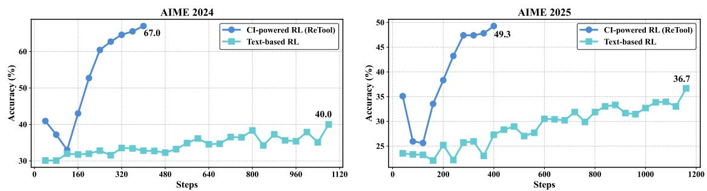
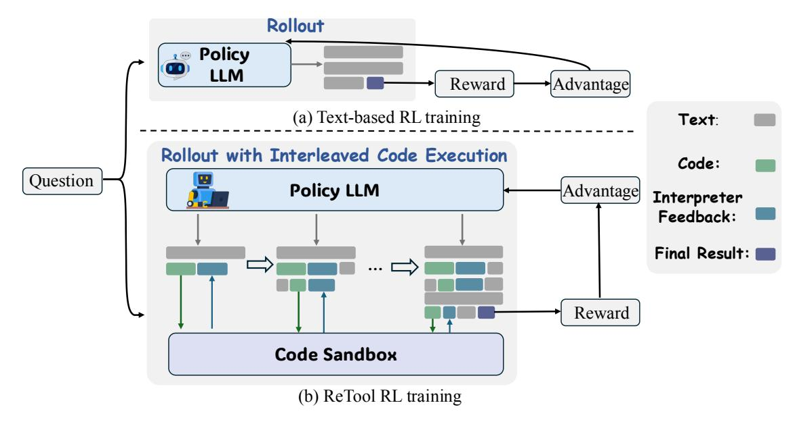
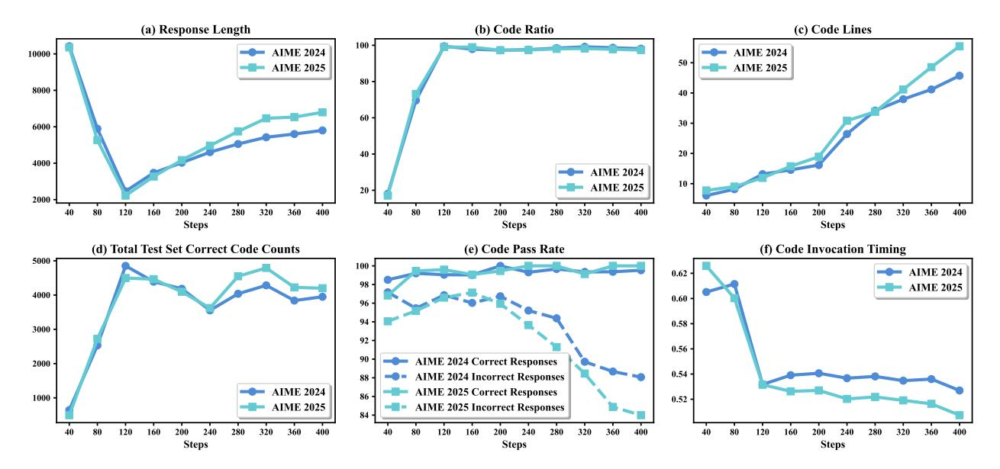
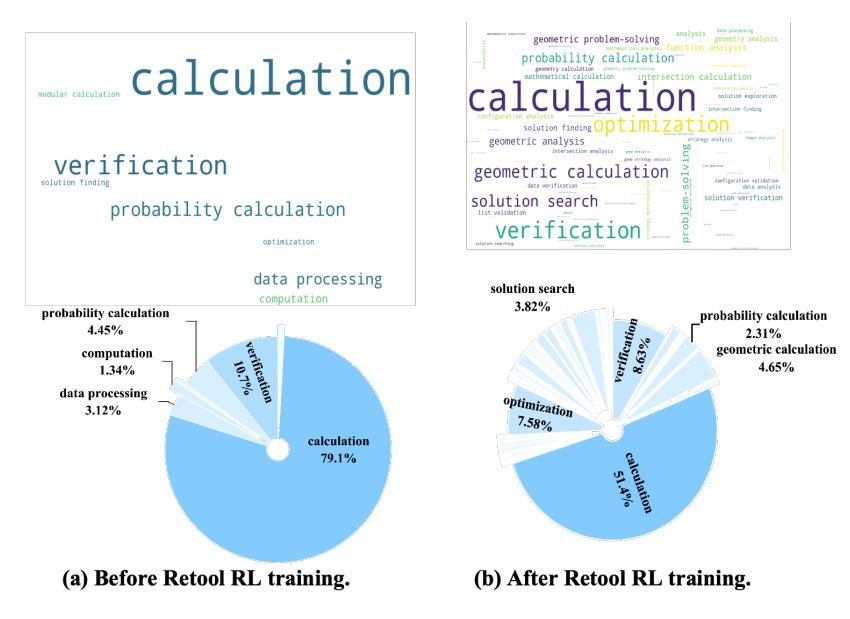

# ByteDance | Seed

# ReTool: Reinforcement Learning for Strategic Tool Use in LLMs

Jiazhan Feng\*, Shijue Huang\*, Xingwei Qu, Ge Zhang, Yujia Qin, Baoquan Zhong, Chengquan Jiang, Jinxin Chi, Wanjun Zhong<sup>†</sup>

### **ByteDance Seed**

\*Co-first authors, †Corresponding author

## **Abstract**

While reasoning models (e.g., DeepSeek R1) trained with reinforcement learning (RL), excel in textual reasoning, they struggle in scenarios requiring structured problem-solving, such as geometric reasoning, concise computation, or complex equation solving—areas where computational tools like code interpreters (CI) demonstrate distinct advantages. To bridge this gap, we propose **ReTool**, which enhances long-form reasoning with tool-integrated learning, including two key features: (1) dynamic interleaving of real-time code execution within natural language reasoning processes, and (2) an automated RL paradigm that allows policy rollouts with multi-turn real-time code execution and teaches the model in learning when and how to invoke tools based on outcome feedback. ReTool employs a systematic training framework, beginning with synthetic cold-start data generation to produce code-augmented long-form reasoning traces for fine-tuning base models. Subsequent RL training leverages task outcomes as rewards to iteratively refine the model's tool use strategy, enabling autonomous discovery of optimal tool invocation patterns without human priors. Experiments on the challenging MATH Olympiad benchmark AIME demonstrate ReTool's superiority: Our 32B model achieves 67% accuracy with 400 training steps, outperforming text-based RL baseline (40% accuracy, 1080 steps) in efficiency and performance. Remarkably, ReTool-32B attains 72.5% accuracy in extended settings, surpassing OpenAI's o1-preview by 27.9%. Further analysis reveals emergent behaviors such as code self-correction, signaling an "aha moment" in which the model autonomously masters adaptive tool use. These findings highlight the promise of outcome-driven tool integration for advancing complex mathematical reasoning and offer new insights into hybrid neuro-symbolic systems.

**Date:** April 15, 2025

Project Page: https://retool-rl.github.io/



Figure 1 AIME 2024 & 2025 scores of ReTool and text-based RL baseline on the Qwen2.5-32B-Instruct model.

## **1 Introduction**

Reinforcement learning (RL) has recently become a popular paradigm for enhancing the reasoning capabilities of large language models (LLMs), enabling them to explore and refine long chains of thought (CoT) [\[9,](#page-10-0) [26,](#page-12-0) [32,](#page-13-0) [34\]](#page-13-1). Reasoning models such as OpenAI o1 [\[12\]](#page-10-1) and DeepSeek R1 [\[4\]](#page-10-2) demonstrate strong performance in pure textbased reasoning tasks by learning to self-correct and engage in more deliberate, analytical thinking [\[3,](#page-10-3) [20,](#page-12-1) [23\]](#page-12-2). These advances suggest early signs of metacognitive control, where models not only reason, but also monitor and revise their reasoning process.

Despite these advances, reasoning LLMs equipped with long chains of textual reasoning processes [\[13\]](#page-11-0) still show notable limitations in tasks that require precise numerical calculation or symbolic manipulation, such as geometric reasoning, precise computation, or complex equation solving. In contrast, computational tools, such as code interpreters (CI), can empower models with symbolic computation capabilities that go far beyond pure text-based reasoning. Unlike textual CoT [\[27\]](#page-12-3) methods that rely solely on internal language patterns, code interpreters provide a formal and executable interface for enumeration, verification, and precise computation. This not only enables exact numeric validation of intermediate steps—dramatically reducing the ambiguity and compounding error often seen in textual reasoning [\[1,](#page-10-4) [25\]](#page-12-4), but also allows models to expand their solution search space via programmable exploration.

Recent works have explored prompting and supervised fine-tuning methods [\[2,](#page-10-5) [14\]](#page-11-1) to equip LLMs with tool-use capabilities. However, these approaches are limited to imitating the specifically-curated data distribution, often failing to generalize beyond seen patterns or adaptively decide when and how to invoke external tools. As a result, models may misuse tools or fall back on brittle heuristics that are not robust across diverse problem settings. To overcome these limitations, RL offers a principled solution: it enables models to explore flexible reasoning trajectories and learn tool-use strategies guided by outcome-based feedback. This paradigm not only incentivizes correct solutions, but also allows the model to discover nuanced behavioral patterns—such as how to recover from tool execution mistakes via self-correction, decide when to effectively invoke tool execution during the long-chain reasoning process.

In this work, we embrace the RL paradigm and introduce **ReTool**, a **Tool**-augmented **Re**inforcement learning framework explicitly designed to guide LLMs towards optimal strategies for leveraging external computational tools during reasoning. ReTool consists of two key components: First, we develop a data construction pipeline to curate a high-quality cold-start dataset that explicitly demonstrates when and how to invoke the code interpreter. This teaches the model an initial competency in tool usage and execution result analysis. Then, we apply tool-enhanced reinforcement learning to train the model in discovering the optimal tool manipulation reasoning strategy and adjusting its behavior through outcome-based rewards, going beyond what can be captured by supervised learning alone. During long-chain reasoning, the policy model rolls out by flexibly writing code blocks and achieving real-time execution results from a sandbox-style code interpreter to assist subsequent thinking.

We evaluate ReTool on the challenging MATH Olympiad benchmarks AIME2024 and AIME2025. Building on Qwen2.5-32B-Instruct [\[30\]](#page-12-5), our model achieves 67.0% accuracy on AIME2024 with only 400 training steps, significantly outperforming the text-based RL baseline, which achieves 40.0% accuracy with 1080 training steps. These substantial gains highlight that explicitly modeling tool-use as part of the decision process not only pushes the limits of model reasoning but also enhances training efficiency. Furthermore, when trained on DeepSeek-R1-Distill-Qwen-32B [\[4\]](#page-10-2), our model demonstrates further improvements, surpassing competitive baselines such as QwQ-32B-Preview [\[23\]](#page-12-2), s1-32B [\[10\]](#page-10-6), and OpenAI o1-preview [\[11\]](#page-10-7). This suggests that the RL training process inspires more efficient problem-solving strategies. Additionally, our cold-start model based on Qwen2.5-32B-Instruct achieves an accuracy of 40.9% on AIME2024, comparable to the text-based RL baseline based on same backbone (40.0%), and significantly surpasses the non-trained Qwen2.5-32B-Instruct (26.7%). These results demonstrate that our curated dataset effectively captures tool usage patterns within executable reasoning traces, and that CI-integrated training positively contributes to reasoning performance.

We further conduct a comprehensive analysis of CI cognitive behavior through RL training and identify several key findings. Our model demonstrates enhanced code utilization capabilities, enabling it to employ more accurate and complex code snippets; It also learns to invoke tools appropriately, select tool adaptively, structure tool calls effectively, and iteratively refine reasoning through emergent code self-correction capabilities.

#### **Our main contributions are summarized as follows:**

- 1. We propose **ReTool**, a novel reinforcement learning framework that integrates code interpreter execution into the reasoning loop of LLMs. To equip the model with foundational capabilities for invoking the code interpreter, we curate a high-quality cold-start dataset through our developed pipeline. Furthermore, we design a reinforcement learning framework that supports interleaved code execution during rollout, enabling the model to iteratively explore, refine, and optimize its reasoning strategies through toolaugmented interactions guided by feedback from a sandboxed code interpreter.
- 2. As shown in [section 3.3,](#page-5-0) we conduct comprehensive empirical and behavioral analyses, and observe several key findings: (1) After RL training, the response length is reduced by approximately 40% compared to that prior to training, showcasing the potential reasoning token efficiency of CI-powered reasoning; (2) During RL training, the code ratio, code lines and correct code counts show increase trends, and the code invocation timing becoming shifts earlier, indicating the improved code use capabilities and strategic tool usage development; (3) Emergent behaviors like code self-correction and adaptive tool selection can be observed during RL phase, bringing more advanced tool-augmented reasoning patterns.

# **2 Methodology**

In this section, we introduce ReTool, a CI-powered RL framework designed to address math problem-solving tasks. We begin with an overview of ReTool. Next, we describe our cold-start training, including the data construction pipeline and supervised fine-tuning [\(section 2.2\)](#page-2-0). We then outline our reinforcement learning pipeline, enhanced by a code interpreter sandbox, to further enhance strategic tool usage development [\(section 2.3\)](#page-2-1).

### **2.1 Overview**

Our methodology consists of two primary stages: cold-start supervised fine-tuning followed by reinforcement learning with interleaved code execution rollout. Firstly, we collect data through our designed pipeline for cold-start supervised fine-tuning (SFT), which provides a robust initialization for the reinforcement learning phase. To enhance our model's tool utilization capabilities, we introduce a specialized tool-using reinforcement learning pipeline that enhances the model's ability to appropriately select and apply tools during the reasoning process.

## <span id="page-2-0"></span>**2.2 Cold-start for Tool-Integrated Reasoning Foundation**

We designed a pipeline for collecting and curating high-quality data. Specifically, we begin by gathering existing mathematical reasoning data from diverse sources, including open-source datasets such as Open-Thoughts [\[22\]](#page-12-6). Subsequently, we implement a dual-verification approach combining human expert curation and Deepseek-R1 [\[4\]](#page-10-2) evaluation to filter invalid data. Through these steps, we collect a high-quality text-based reasoning dataset, denoted as Dinit.

Based on Dinit, we further construct code-integrated reasoning data in an automatic manner. We first utilize a structured prompt template (detailed in Figure [8\)](#page-15-0) for transformation, which modifies the original thinking process by replacing manual calculation steps that can benefit from code execution with the corresponding code snippets and their interpreter's execution results. Following this initial transformation, we apply a two-stage verification protocol. The first stage focuses on format verification, which improves readability and ensures consistent syntax that that enables the efficient detection of computational tool invocation triggers during subsequent reinforcement learning phases. The second stage entails answer verification, where we eliminate data samples whose final outputs do not align with the correct solutions to the mathematical problems. Finally, we collect a dataset DCI that consist of code-augmented long-form reasoning traces.

<span id="page-2-1"></span>ReTool employs supervised fine-tuning to learn when and how to invoke the code interpreter from the aforementioned dataset DCI, thereby enhancing the model's capability to appropriately utilize computational tools.

<span id="page-3-0"></span>

**Figure 2** Demonstration of text-based RL training process and ReTool's RL training process.

## **2.3 ReTool: Reinforcement Learning for Strategic Tool Use**

## **2.3.1 Training Algorithm**

We train ReTool based on PPO algorithm [\[16\]](#page-11-2), it updates policy with the following objective:

$$\mathcal{J}_{\text{PPO}}(\theta) = \mathbb{E}_{(q,a) \sim \mathcal{D}, o_{\leq t} \sim \pi_{\theta_{\text{old}}}(\cdot|q)} \left[ \min \left( \frac{\pi_{\theta}(o_t \mid q, o_{< t}; \mathcal{CI})}{\pi_{\theta_{\text{old}}}(o_t \mid q, o_{< t}; \mathcal{CI})} \hat{A}_t, \operatorname{clip} \left( \frac{\pi_{\theta}(o_t \mid q, o_{< t}; \mathcal{CI})}{\pi_{\theta_{\text{old}}}(o_t \mid q, o_{< t}; \mathcal{CI})}, 1 - \varepsilon, 1 + \varepsilon \right) \hat{A}_t \right) \right], (1)$$

where *π<sup>θ</sup>* is policy model, *πθ*old is reference model, *πθ*(*o<sup>t</sup>* | *q, o<t*; CI) represents the rollouts with interleaved code execution and feedback from code interpreter.

We modify PPO to better adopt tool integrated reasoning. During training, the policy LLM will collaborate with a code sandbox to generate rollouts with multi-turn real-time code execution for solving given problems. We implement a rule-based outcome reward to enable the model with the flexibility to autonomously explore and develop strategies for code usage awareness, code selection, timing of code invocation, and further diverse behaviors.

**Reward Design** To teach the model in learning when and how to invoke tools, we implement a rule-based accuracy reward to optimize the model. The accuracy reward evaluates response correctness. We require the model to present final answers in a specified format (e.g., within \boxed{}), enabling reliable rule-based verification. The reward is formulated as:

$$R(a, \hat{a}) = \begin{cases} 1, & \text{is\_equivalent}(a, \hat{a}) \\ -1, & \text{otherwise} \end{cases}$$
 (2)

where *a* and *a*ˆ represent the ground-truth answer and the predicted answer, respectively. We simplify the reward design aim to alleviate reward hacking and promote more diverse problem-solving behaviors based on mere outcome feedback without considering code executability reward.

**Rollout with Interleaved Code Execution** To facilitate the integration of reasoning and executable code within the model, we propose a rollout approach that dynamically supports interleaved real-time code execution with natural language reasoning processes. As depicted in Figure [2](#page-3-0) (b), our rollout process differs from the conventional approach, which typically generates only text-based reasoning (as shown in Figure [2](#page-3-0) (a)). By contrast, our rollout approach integrates the collaboration of a policy LLM with an external code sandbox, enabling the production of hybrid content that combines text, code snippets, and real-time interpreter

feedback. Concretely, we utilize a prompt template (Figure [7\)](#page-14-0) to guide the model in interacting with the code sandbox by utilizing tags <code></code> to explicitly mark the boundaries of generated codes. During the rollout process, policy model generate text-based reasoning *t*<sup>1</sup> when a code termination trigger (</code>) is detected, the generation pause and the generated code *c*<sup>1</sup> is parsed and send to code sandbox environment for execution. Upon completion, the sandbox's output *f*<sup>1</sup> (successful results or error messages) is filled within <interpreter></interpreter> tags and fed back to the model, which continues generating the rollout until either providing a final answer *o* or producing a new code snippet, ultimately producing a hybrid reasoning trajectory [*t*<sup>1</sup> ⊕ *c*<sup>1</sup> ⊕ *f*<sup>1</sup> ⊕ *...* ⊕ *o*].

Notably, our approach returns both successful code execution results and interpreter error messages to the model. This dynamic feedback mechanism enables the model to iteratively explore, refine, and optimize its reasoning and tool usage strategies.

## **2.3.2 Training Details**

**Cold-start & RL** For training, we employ the VeRL framework[1](#page-4-0) . We adopt PPO as our RL method. We train our model on curated cold-start data for two epochs. Regarding hyperparameters, we utilize the AdamW optimizer with an initial learning rate of 1e-6. We define the expected maximum sequence length as 16384 tokens. For training, the mini-batch size is set to 512, and the KL coefficient is set to 0.0. We use Qwen2.5-32B-Instruct [\[15\]](#page-11-3) as the main backbone.

**Interpreter Feedback Mask.** We mask out the <interpreter></interpreter> feedback output from the loss computation. This sandbox-based output masking approach blocks external tokens from interfering with loss calculations, ensuring training stability and preserving the model's inherently generated coherent reasoning sequences from disruption.

**KV-Cache Reuse.** In order to reduce the memory cost during rollout, when each time the code termination trigger (</code>) is detected, we will cache all the KV-cache before code execution and only calculate and append the KV-cache from the interpreter feedback (<interpreter></interpreter>). This will largely reduce the KV-cache for each rollout.

**Sandbox Construction.** To accelerate the RL training process, we design a asynchornous code sandbox environment. The sandbox pods function as workers in a pool, independently pulling tasks based on their current capacity, creating an efficient load-balancing mechanism. This distributed asynchronous approach accelerates RL training by enabling parallel environment interactions across multiple threads, It prevents slower threads from creating bottlenecks and ensures optimal resource utilization, maintaining continuous throughput during the training process.

## **3 Experiment**

In this section, we evaluate the performance of ReTool, and conduct comprehensive analysis on the behavior of model outputs.

## **3.1 Evaluation Setup**

To ensure a stable evaluation, we repeat the evaluation set AIME2024&2025 32 times and report the overall average accuracy to estimate pass@1. The inference hyperparameters of evaluation are set to temperature 1.0 and top-p 0.7. We compare ReTool with competitive baselines, including Qwen2.5-Math-72B-Instruct [\[31\]](#page-12-7), Qwen2.5-Math-72B-Instruct-TIR [\[31\]](#page-12-7), Sky-T1 [\[21\]](#page-12-8), DeepSeek-R1-Zero-Qwen-32B [\[4\]](#page-10-2), QwQ-32B-Preview [\[23\]](#page-12-2), s1-32B [\[10\]](#page-10-6), OpenAI o1-preview [\[11\]](#page-10-7). To verify the effectiveness of our ReTool, we also compare the performance with RL without tool-using, i.e. Text-based RL (Qwen2.5-32B-Instruct). And for the results of baselines, we report the avg@k by coping from corresponding literature source as pass@1.

<span id="page-4-0"></span><sup>1</sup><https://github.com/volcengine/verl>

<span id="page-5-1"></span>

| Model                                 | AIME2024 (pass@1) | AIME2025 (pass@1) |
|---------------------------------------|-------------------|-------------------|
| Existing Baselines                    |                   |                   |
| Qwen2.5-Math-72B-Instruct             | 30.0              | -                 |
| Qwen2.5-Math-72B-Instruct-TIR         | 40.0              | -                 |
| Sky-T1                                | 43.3              | -                 |
| OpenAI o1-preview                     | 44.6              | 37.9              |
| DeepSeek-R1-Zero-Qwen-32B             | 47.0              | -                 |
| QWQ-32B-Preview                       | 50.0              | 33.5              |
| s1-32B                                | 56.7              | -                 |
| CI-powered RL                         |                   |                   |
| ReTool (Qwen2.5-32B-Instruct)         | 67.0              | 49.3              |
| ReTool (DeepSeek-R1-Distill-Qwen-32B) | 72.5              | 54.3              |
| Ablations on Qwen2.5-32B-Instruct     |                   |                   |
| w/o Training (Base Model)             | 26.7              | -                 |
| w/o CI (Text-based RL♠)               | 40.0              | 36.7              |
| w/o RL (only Cold-start♢)             | 40.9              | 34.5              |

**Table 1** Main results. ♠The Text-based RL method includes a text-based cold-start SFT initialization to ensure a fair comparison. ♢The inference process of the Cold-start model also incorporates code interpreter.

## **3.2 Main Results**

As shown in Table [1,](#page-5-1) ReTool enables the LLM to flexibly leverage the code interpreter during the RL stage, leading to substantial performance improvements. Specifically, ReTool (Qwen2.5-32B-Instruct) achieves accuracies of 67.0% on AIME2024 and 49.3% on AIME2025 with only 400 training steps. This markedly outperforms the text-based RL baseline (Qwen2.5-32B-Instruct), which attains 40.0% and 36.7% on the respective benchmarks despite using over 1000 training steps. These findings indicate that the tool-integrated learning paradigm employed by ReTool not only enhances the model's reasoning capabilities but also improves training efficiency. Furthermore, on AIME2024, ReTool (Qwen2.5-32B-Instruct) surpasses the competitive baseline s1-32B by 10.3%. Similarly, on AIME2025, it achieves an 11.4% gain over OpenAI's o1-preview. When combined with a more advanced backbone, ReTool (DeepSeek-R1-Distill-Qwen-32B) further improves performance, achieving scores of 72.5% on AIME2024 and 54.3% on AIME2025. These results suggest that more effective problem-solving strategies are discovered during the RL training process.

Moreover, our cold-start model based on Qwen2.5-32B-Instruct achieves an accuracy of 40.9% on AIME2024, closely aligning with the performance of the text-based RL baseline (40.0%), and substantially surpassing the base model (26.7%). These results demonstrate that our curated dataset effectively captures tool usage patterns within executable reasoning traces, and that CI-integrated training contributes positively to reasoning performance.

### <span id="page-5-0"></span>**3.3 Cognitive Analysis**

We present a comprehensive analysis and highlight several key findings from our exploration, including: (1) The dynamics of code interpreter (CI)-related behaviors throughout the RL process; (2) The emergence of self-correcting capabilities; (3) Differences in code purpose before and after RL; (4) Distinctions between CI-powered reasoning and text-based reasoning.

**CI-related Behavior Evolution.** To gain deeper insights into the RL process of ReTool, we systematically evaluated CI-related metrics. Specifically, we computed these metrics by analyzing model-generated outputs on the AIME2024 and AIME2025 datasets based on each saved checkpoint during RL training. The results are illustrated in Figure [3,](#page-6-0) and our analysis comprises:

• **Response Length** (Figure [3](#page-6-0) (a)): We calculated the average response length and observed a distinct trend: the generated response length initially declines sharply, later followed by a relatively gentle

<span id="page-6-0"></span>

**Figure 3** CI-related behavior evolution during RL training.

increase. We attribute the initial decline to the replacement of complex computational processes with more concise code, while the subsequent rise is likely due to the emergence of more diverse and complex code behaviors during RL training. Notably, the final average response length remains 40% shorter than that before RL training (i.e., from 10k to 6k). This suggests that the CI-powered reasoning approach potentially enhances efficiency of reasoning token utilization ratio by replacing intricate computational processes with code.

- **Code Ratio** (Figure [3](#page-6-0) (b)): The ratio of responses that contain code are also calculated. Analysis reveals that throughout the RL training process, the average code ratios exhibit a total upward trend and end with covering nearly 98% percent of all questions. This suggests that the model's proficiency in code utilization improved progressively during the RL process, facilitating strategic tool usage development.
- **Code Lines** (Figure [3](#page-6-0) (c)): The lines of generated code reflects its complexity to some extent. Observations show that the average code lines in responses exhibits a consistent upward trend throughout training. By the end of RL training, the final average code lines is nearly fivefold higher than that before RL training. This trend suggests that the model has learned more complex code strategies during the RL phase.
- **Total Test Set Correct Code Counts** (Figure [3](#page-6-0) (d)): The number of total correct code counts on test set exhibits an overall upward trend during RL training, increasing from 1k to 5k. This improvement indicates the enhanced proficiency in leveraging code tools.
- **Code Pass Rate** (Figure [3](#page-6-0) (e)): The CI-powered reasoning process involves generating intermediate code that may initially be incorrect, followed by iterative refinement based on interpreter feedback to produce executable code, so we report the average pass rate of last code in incorrect responses. Our analysis reveals that the code pass rate for correct responses remains consistently high, approaching 100%, while the code pass rate for incorrect responses exhibits a declining trend. This pattern suggests that code executability impacts the reasoning process and final result.
- **Code Invocation Timing** (Figure [3](#page-6-0) (f)): We also calculate the code invocation timing, which is determined by dividing the start position of code by the total length of the response. This metric reflects the timing of code invocation within the response. The results show that the code invocation timing advances during the RL training process, indicating that the model learns to determine the timing for tool usage.

**<sup>&</sup>quot;Aha Moment" of Code Self-correction.** Interestingly, our model exhibits an emergent ability to self-correct

```
Question: From an unlimited supply of 1-cent coins, 10-cent coins, and 25-cent coins, … Find the number of values of $N$ 
between $1$ and $1000$ inclusive for which the greedy algorithm succeeds.
Response: Alright, let's tackle this problem step by step using code to ensure accuracy. The goal is to determine for each value of 
\( N \) from 1 to 1000 whether the greedy algorithm produces the minimum number of coins. If it does, we count that \( N \). ..
<code> 
```python
def test_specific_N(N_values):
  for N in N_values:
    greedy_result = greedy(N)
test_results = test_specific_N(N_values_to_test) 
print(test_results)
``` 
</code>
<interpreter>Traceback (most recent call last): 
File "/tmp/tmpbr3uj7zz/tmpdmj39k6o.py", line 11, in <module> test_results = test_specific_N(N_values_to_test) 
File "/tmp/tmpbr3uj7zz/tmpdmj39k6o.py", line 5, in test_specific_N greedy_result = greedy(N) 
NameError: name 'greedy' is not defined </interpreter> 
Oops, the functions need to be defined in the same scope. Let's correct that:
<code> 
```python
def greedy(N):
  denominations = [25, 10, 1] 
def test_specific_N(N_values):
  for N in N_values:
    greedy_result = greedy(N)
test_results = test_specific_N(N_values_to_test) 
print(test_results)
</code>
<interpreter>{42: (9, 6), 25: (1, 1), 10: (1, 1), 1: (1, 1), 1000: (40, 40)} </interpreter>
```

**Figure 4** The case of "aha moment" about code self-correction.

non-executable code, despite the absence of explicit training data for code self-correction. As shown in Figure [4,](#page-7-0) the model initially produced code that failed to execute due to the undefined function "greedy()". Upon receiving feedback from the interpreter, the model recognized the error and responded with the reflection: "**Oops, the functions need to be defined in the same scope. Let's correct that**." It then proceeded to generate a revised, executable version of the code that included all necessary function definitions. This emergent behavior suggests that reinforcement learning can foster metacognitive capabilities, enabling the model to iteratively refine its generated code to address more complex problems.

**Code Purpose Analysis.** We also analysis the differences in code purposes before and after RL training, which reflects the types of code. We employ Doubao-1.5-pro[2](#page-7-1) to classify the primary purpose of code snippets based on their contextual information, then compute the frequency of code purposes that appear more than once, and the results are depicted in Figure [5.](#page-8-0) The word clouds reveal that calculation and verification are the dominant purposes of code in CI-powered reasoning. After RL training, the code purposes in our model become more diverse, which demonstrates the metacognitive development of adaptive tool selection and enhances the generalizability of ReTool to a broader range of problems.

**CI-powered Reasoning vs. Text-based Reasoning.** We present a case study to illustrate the distinction between CI-powered reasoning after reinforcement learning (RL) training and conventional text-based reasoning prior to RL training, as illustrated in Figure [6.](#page-9-0) When faced with the same question, text-based reasoning relies on a "laborious" text-only calculation process, which is prone to numerical errors and often results in incorrect inference outcomes. In contrast, CI-powered reasoning substitutes this complex calculation process with concise code. This approach not only ensures computational accuracy through the assistance of an external code interpreter but also enables the model to focus more effectively on holistic reasoning strategies.

<answer> \boxed{610} </answer>

<span id="page-7-1"></span><sup>2</sup>[https://team.doubao.com/zh/special/doubao\\_1\\_5\\_pro](https://team.doubao.com/zh/special/doubao_1_5_pro)

<span id="page-8-0"></span>

**Figure 5** Code purpose analysis.

# **4 Background and Related Work**

# **4.1 LLM Reasoning**

Recent advancements in large language models (LLMs) [\[3,](#page-10-3) [4,](#page-10-2) [9,](#page-10-0) [12,](#page-10-1) [19,](#page-12-9) [20,](#page-12-1) [26,](#page-12-0) [28,](#page-12-10) [30,](#page-12-5) [32\]](#page-13-0) indicate significant progress toward cognitive abilities similar to human metacognition through Chain-of-Thought (CoT) prompting. CoT prompting, first introduced by Wei et al. [\[27\]](#page-12-3), enhances the reasoning capabilities of LLMs by leveraging step-by-step natural language descriptions, significantly improving performance on various reasoning tasks. Building upon this foundation, recent research has shifted focus from train-time scaling to test-time scaling [\[17\]](#page-11-4), where additional computational resources are allocated during inference to enable the generation of intermediate reasoning steps. Techniques such as stepwise preference optimization [\[7\]](#page-10-8), Monte Carlo Tree Search (MCTS) [\[29\]](#page-12-11), and reinforcement learning [\[9\]](#page-10-0) have been employed to improve multi-step and long-form mathematical reasoning. Advanced models like OpenAI-o1 [\[12\]](#page-10-1) and DeepSeek-R1 [\[4\]](#page-10-2) exemplify the effectiveness of CoT-based reasoning. Complementing CoT, Program-of-Thought (PoT) reasoning, introduced by Chen et al. [\[1\]](#page-10-4) and Gao et al. [\[5\]](#page-10-9), integrates external computational tools—such as Python interpreters—to simplify and validate complex reasoning steps, resulting in enhanced accuracy.

## **4.2 Tool Integrated Reasoning**

Tool-integrated reasoning was first introduced to help LLMs solve computationally intensive mathematical problems with the integration of programming strategies [\[1,](#page-10-4) [6,](#page-10-10) [18,](#page-11-5) [24,](#page-12-12) [33\]](#page-13-2). Building on this foundation, Wang et al. [\[25\]](#page-12-4) proposed an iterative approach that combines textual reasoning with code execution to mutually verify and enhance reasoning accuracy. More recently, Chen et al. [\[2\]](#page-10-5) integrated code execution into the reasoning process by performing supervised fine-tuning on self-curated code-integrated CoT data. However, this approach is inherently limited by its reliance on the specific data distribution, and cannot learn adaptive strategies for tool use—such as determining when and how to invoke tools—through reinforcement learning. A concurrent work [\[8\]](#page-10-11) applied reinforcement learning to learn tool usage strategies on Qwen2.5-Math models [\[31\]](#page-12-7) at 1.5B and 7B scales, but the performance remained suboptimal. We further scale up this line of research and propose ReTool, a framework that leverages reinforcement learning to strategically determine when and how to invoke the code interpreter. Our method outperforms Qwen-Math-72B-TIR [\[31\]](#page-12-7) and o1-preview [\[11\]](#page-10-7) significantly on AIME2024 and AIME2025. We also present a comprehensive analysis of the learned tool-use behaviors and highlight several key findings regarding the model's cognitive patterns in code invocation after ReTool training.

<span id="page-9-0"></span>**Question**: Let \$N\$ be the greatest four-digit positive integer with the property that whenever one of its digits is changed to \$1\$, the resulting number is divisible by \$7\$. Let \$Q\$ and \$R\$ be the quotient and remainder, respectively, when \$N\$ is divided by \$1000\$. Find \$Q+R\$.

```
Text-based Reasoning Before RL: Okay, so I need to find the greatest four-
digit number N such that if any one of its digits is replaced by 1, the resulting 
number is divisible by 7. Then, I have to find Q and R when N is divided by 
1000, and then compute Q + R. Alright, let's break this down step by step…
Therefore, each of these equations can be rearranged to: 
1. N ≡ - (1 - A)*1000 mod7 
2. N ≡ - (1 - B)*100 mod7 
3. N ≡ - (1 - C)*10 mod7 
4. N ≡ - (1 - D)*1 mod7 
Therefore, all four expressions must be equal to N mod7. Therefore, we can set 
them equal to each other: -(1 - A)*1000 ≡ - (1 - B)*100 ≡ - (1 - C)*10 ≡ - (1 -
D)*1 mod…
Wait, let's check B, C, D for A=9: 
B=3A -2 mod7=3*9 -2=27 -2=25 mod7=25 -7*3=25-21=4 
C=2A -1 mod7=2*9 -1=18 -1=17 mod7=17 -7*2=17-14=3 
D=6A -5 mod7=6*9 -5=54 -5=49 mod7=49 -7*7=49-49=0 
So, B=4, C=3, D=0. Therefore, N=9430…
Let me compute each of these modulo7: 
1. 1000 ≡6 mod7, so 6 + 100*B + 10*C + D ≡0 mod7 
But 100*B ≡2*B mod7, 
10*C ≡3*C mod7, so: 
6 +2B +3C +D ≡0 mod7 
2. 1000*A ≡6A mod7, 100≡2 mod7, 
so: 
6A +2 +3C +D ≡0 mod7 
3. 1000*A +2B +3 +D ≡0 mod7 (since 100*B≡2B, 10*1≡3, 10*C≡3C) 
Wait, no. Let me recompute each equation properly. 
Equation1: 1BCD ≡0 mod7 
Which is 1000*1 + 100*B + 10*C + D ≡0 mod7 1000≡6, 100≡2, 10≡3, …
Let me tabulate A from1 to9: 
A | B=5-4A mod7 | C=6-5A mod7 | D=2-A mod7 | Valid? 
1 | 5-4=1 mod7=1 |6-5=1 mod7=1 |2-1=1 |Yes…
**Result**: 
- \( N = 5624 \) 
- Dividing by 1000 gives \( Q = 5 \) and \( R = 624 \) 
- \( Q + R = 5 + 624 = 629 \) 
\[ \boxed{629} \]
                                                                                 CI-powered Reasoning After RL: Alright, let's tackle this problem step by 
                                                                                 step. The goal is to find the greatest four-digit positive integer \( N \) such that 
                                                                                 changing any one of its digits to 1 results in a number divisible by 7. Then, we 
                                                                                 need to find \( Q + R \) where \( Q \) and \( R \) are the quotient and remainder 
                                                                                 when \( N \) is divided by 1000…
                                                                                 First, let's compute the values of \( 1000 \mod 7 \), \( 100 \mod 7 \), \( 10 \mod 
                                                                                 7 \), and \( 1 \mod 7 \): 
                                                                                 <code> 
                                                                                 ```python
                                                                                 # Compute modular values 
                                                                                 mod_1000 = 1000 % 7 
                                                                                 mod_100 = 100 % 7
                                                                                 mod_10 = 10 % 7 
                                                                                 mod_1 = 1 % 7
                                                                                 …
                                                                                 print(f"1 mod 7 = {mod_1}") 
                                                                                 </code>
                                                                                 <interpreter>1000 mod 7 = 6 100 mod 7 = 2 10 mod 7 = 3 1 mod 7 = 
                                                                                 1</interpreter>
                                                                                 We need to solve these equations for digits \( a, b, c, d \) where \( a \) is from 1 
                                                                                 to 9 and \( b, c, d \) are from 0 to 9. Let's use code to iterate through possible 
                                                                                 values and find the valid \( N \). 
                                                                                 <code> 
                                                                                 ```python 
                                                                                 def find_valid_n(): 
                                                                                   for a in range(9, 0, -1): 
                                                                                     ...
                                                                                     return N
                                                                                 N = find_valid_n() 
                                                                                 Q = N // 1000 
                                                                                 R = N % 1000 
                                                                                 result = Q + R 
                                                                                 print(f"N = {N}, Q = {Q}, R = {R}, Q + R = {result}") 
                                                                                 </code>
                                                                                 <interpreter>N = 5694, Q = 5, R = 694, Q + R = 699 </interpreter> …
                                                                                 Thus, the final answer is confirmed to be 699. 
                                                                                 <answer> \boxed{699} </answer>
```

**Figure 6** Case of CI-powered Reasoning vs. Text-based Reasoning.

## **5 Conclusion**

In this paper, we propose ReTool, a novel reinforcement learning framework that empowers large language models to self-enhance their mathematical reasoning capabilities through effective Code Interpreter utilization. Our comprehensive experiments on AIME2024 and AIME2025 demonstrate that ReTool not only achieves superior accuracy compared to conventional text-based RL approaches, but also converges with significantly fewer training steps. Through careful data curation and our specialized tool-using pipeline, ReTool enables models to develop sophisticated computational intervention strategies, paving the way for more efficient and powerful tool-augmented reasoning in LLMs.

## **Acknowledgments**

We would like to thank Guang Shi, Mingxuan Wang, Renjie Zheng, Chen Dun, and Yun Jiang for their support on this work.

## **References**

- <span id="page-10-4"></span>[1] Wenhu Chen, Xueguang Ma, Xinyi Wang, and William W. Cohen. Program of thoughts prompting: Disentangling computation from reasoning for numerical reasoning tasks, 2023. URL <https://arxiv.org/abs/2211.12588>.
- <span id="page-10-5"></span>[2] Zhipeng Chen, Yingqian Min, Beichen Zhang, Jie Chen, Jinhao Jiang, Daixuan Cheng, Wayne Xin Zhao, Zheng Liu, Xu Miao, Yang Lu, Lei Fang, Zhongyuan Wang, and Ji-Rong Wen. An empirical study on eliciting and improving r1-like reasoning models. arXiv preprint arXiv:2503.04548, 2025.
- <span id="page-10-3"></span>[3] Claude. Claude 3.7 sonnet. 2025. URL <https://www.anthropic.com/news/claude-3-7-sonnet>.
- <span id="page-10-2"></span>[4] DeepSeek-AI, Daya Guo, Dejian Yang, Haowei Zhang, Junxiao Song, Ruoyu Zhang, Runxin Xu, Qihao Zhu, Shirong Ma, Peiyi Wang, Xiao Bi, Xiaokang Zhang, Xingkai Yu, Yu Wu, Z. F. Wu, Zhibin Gou, Zhihong Shao, Zhuoshu Li, Ziyi Gao, Aixin Liu, Bing Xue, Bingxuan Wang, Bochao Wu, Bei Feng, Chengda Lu, Chenggang Zhao, Chengqi Deng, Chenyu Zhang, Chong Ruan, Damai Dai, Deli Chen, Dongjie Ji, Erhang Li, Fangyun Lin, Fucong Dai, Fuli Luo, Guangbo Hao, Guanting Chen, Guowei Li, H. Zhang, Han Bao, Hanwei Xu, Haocheng Wang, Honghui Ding, Huajian Xin, Huazuo Gao, Hui Qu, Hui Li, Jianzhong Guo, Jiashi Li, Jiawei Wang, Jingchang Chen, Jingyang Yuan, Junjie Qiu, Junlong Li, J. L. Cai, Jiaqi Ni, Jian Liang, Jin Chen, Kai Dong, Kai Hu, Kaige Gao, Kang Guan, Kexin Huang, Kuai Yu, Lean Wang, Lecong Zhang, Liang Zhao, Litong Wang, Liyue Zhang, Lei Xu, Leyi Xia, Mingchuan Zhang, Minghua Zhang, Minghui Tang, Meng Li, Miaojun Wang, Mingming Li, Ning Tian, Panpan Huang, Peng Zhang, Qiancheng Wang, Qinyu Chen, Qiushi Du, Ruiqi Ge, Ruisong Zhang, Ruizhe Pan, Runji Wang, R. J. Chen, R. L. Jin, Ruyi Chen, Shanghao Lu, Shangyan Zhou, Shanhuang Chen, Shengfeng Ye, Shiyu Wang, Shuiping Yu, Shunfeng Zhou, Shuting Pan, S. S. Li, Shuang Zhou, Shaoqing Wu, Shengfeng Ye, Tao Yun, Tian Pei, Tianyu Sun, T. Wang, Wangding Zeng, Wanjia Zhao, Wen Liu, Wenfeng Liang, Wenjun Gao, Wenqin Yu, Wentao Zhang, W. L. Xiao, Wei An, Xiaodong Liu, Xiaohan Wang, Xiaokang Chen, Xiaotao Nie, Xin Cheng, Xin Liu, Xin Xie, Xingchao Liu, Xinyu Yang, Xinyuan Li, Xuecheng Su, Xuheng Lin, X. Q. Li, Xiangyue Jin, Xiaojin Shen, Xiaosha Chen, Xiaowen Sun, Xiaoxiang Wang, Xinnan Song, Xinyi Zhou, Xianzu Wang, Xinxia Shan, Y. K. Li, Y. Q. Wang, Y. X. Wei, Yang Zhang, Yanhong Xu, Yao Li, Yao Zhao, Yaofeng Sun, Yaohui Wang, Yi Yu, Yichao Zhang, Yifan Shi, Yiliang Xiong, Ying He, Yishi Piao, Yisong Wang, Yixuan Tan, Yiyang Ma, Yiyuan Liu, Yongqiang Guo, Yuan Ou, Yuduan Wang, Yue Gong, Yuheng Zou, Yujia He, Yunfan Xiong, Yuxiang Luo, Yuxiang You, Yuxuan Liu, Yuyang Zhou, Y. X. Zhu, Yanhong Xu, Yanping Huang, Yaohui Li, Yi Zheng, Yuchen Zhu, Yunxian Ma, Ying Tang, Yukun Zha, Yuting Yan, Z. Z. Ren, Zehui Ren, Zhangli Sha, Zhe Fu, Zhean Xu, Zhenda Xie, Zhengyan Zhang, Zhewen Hao, Zhicheng Ma, Zhigang Yan, Zhiyu Wu, Zihui Gu, Zijia Zhu, Zijun Liu, Zilin Li, Ziwei Xie, Ziyang Song, Zizheng Pan, Zhen Huang, Zhipeng Xu, Zhongyu Zhang, and Zhen Zhang. Deepseek-r1: Incentivizing reasoning capability in llms via reinforcement learning, 2025. URL <https://arxiv.org/abs/2501.12948>.
- <span id="page-10-9"></span>[5] Luyu Gao, Aman Madaan, Shuyan Zhou, Uri Alon, Pengfei Liu, Yiming Yang, Jamie Callan, and Graham Neubig. Pal: Program-aided language models, 2023. URL <https://arxiv.org/abs/2211.10435>.
- <span id="page-10-10"></span>[6] Bowen Jin, Hansi Zeng, Zhenrui Yue, Jinsung Yoon, Sercan Arik, Dong Wang, Hamed Zamani, and Jiawei Han. Search-r1: Training llms to reason and leverage search engines with reinforcement learning, 2025. URL <https://arxiv.org/abs/2503.09516>.
- <span id="page-10-8"></span>[7] Xin Lai, Zhuotao Tian, Yukang Chen, Senqiao Yang, Xiangru Peng, and Jiaya Jia. Step-dpo: Step-wise preference optimization for long-chain reasoning of llms, 2024. URL <https://arxiv.org/abs/2406.18629>.
- <span id="page-10-11"></span>[8] Xuefeng Li, Haoyang Zou, and Pengfei Liu. Torl: Scaling tool-integrated rl, 2025. URL [https://arxiv.org/abs/](https://arxiv.org/abs/2503.23383) [2503.23383](https://arxiv.org/abs/2503.23383).
- <span id="page-10-0"></span>[9] Trung Quoc Luong, Xinbo Zhang, Zhanming Jie, Peng Sun, Xiaoran Jin, and Hang Li. Reft: Reasoning with reinforced fine-tuning, 2024. URL <https://arxiv.org/abs/2401.08967>.
- <span id="page-10-6"></span>[10] Niklas Muennighoff, Zitong Yang, Weijia Shi, Xiang Lisa Li, Li Fei-Fei, Hannaneh Hajishirzi, Luke Zettlemoyer, Percy Liang, Emmanuel Candès, and Tatsunori Hashimoto. s1: Simple test-time scaling, 2025. URL [https:](https://arxiv.org/abs/2501.19393) [//arxiv.org/abs/2501.19393](https://arxiv.org/abs/2501.19393).
- <span id="page-10-7"></span>[11] OpenAI. Learning to reason with llms, September 2024. URL [https://openai.com/index/](https://openai.com/index/learning-to-reason-with-llms/) [learning-to-reason-with-llms/](https://openai.com/index/learning-to-reason-with-llms/).
- <span id="page-10-1"></span>[12] OpenAI, :, Aaron Jaech, Adam Kalai, Adam Lerer, Adam Richardson, Ahmed El-Kishky, Aiden Low, Alec Helyar, Aleksander Madry, Alex Beutel, Alex Carney, Alex Iftimie, Alex Karpenko, Alex Tachard Passos, Alexander Neitz, Alexander Prokofiev, Alexander Wei, Allison Tam, Ally Bennett, Ananya Kumar, Andre Saraiva, Andrea Vallone,

Andrew Duberstein, Andrew Kondrich, Andrey Mishchenko, Andy Applebaum, Angela Jiang, Ashvin Nair, Barret Zoph, Behrooz Ghorbani, Ben Rossen, Benjamin Sokolowsky, Boaz Barak, Bob McGrew, Borys Minaiev, Botao Hao, Bowen Baker, Brandon Houghton, Brandon McKinzie, Brydon Eastman, Camillo Lugaresi, Cary Bassin, Cary Hudson, Chak Ming Li, Charles de Bourcy, Chelsea Voss, Chen Shen, Chong Zhang, Chris Koch, Chris Orsinger, Christopher Hesse, Claudia Fischer, Clive Chan, Dan Roberts, Daniel Kappler, Daniel Levy, Daniel Selsam, David Dohan, David Farhi, David Mely, David Robinson, Dimitris Tsipras, Doug Li, Dragos Oprica, Eben Freeman, Eddie Zhang, Edmund Wong, Elizabeth Proehl, Enoch Cheung, Eric Mitchell, Eric Wallace, Erik Ritter, Evan Mays, Fan Wang, Felipe Petroski Such, Filippo Raso, Florencia Leoni, Foivos Tsimpourlas, Francis Song, Fred von Lohmann, Freddie Sulit, Geoff Salmon, Giambattista Parascandolo, Gildas Chabot, Grace Zhao, Greg Brockman, Guillaume Leclerc, Hadi Salman, Haiming Bao, Hao Sheng, Hart Andrin, Hessam Bagherinezhad, Hongyu Ren, Hunter Lightman, Hyung Won Chung, Ian Kivlichan, Ian O'Connell, Ian Osband, Ignasi Clavera Gilaberte, Ilge Akkaya, Ilya Kostrikov, Ilya Sutskever, Irina Kofman, Jakub Pachocki, James Lennon, Jason Wei, Jean Harb, Jerry Twore, Jiacheng Feng, Jiahui Yu, Jiayi Weng, Jie Tang, Jieqi Yu, Joaquin Quiñonero Candela, Joe Palermo, Joel Parish, Johannes Heidecke, John Hallman, John Rizzo, Jonathan Gordon, Jonathan Uesato, Jonathan Ward, Joost Huizinga, Julie Wang, Kai Chen, Kai Xiao, Karan Singhal, Karina Nguyen, Karl Cobbe, Katy Shi, Kayla Wood, Kendra Rimbach, Keren Gu-Lemberg, Kevin Liu, Kevin Lu, Kevin Stone, Kevin Yu, Lama Ahmad, Lauren Yang, Leo Liu, Leon Maksin, Leyton Ho, Liam Fedus, Lilian Weng, Linden Li, Lindsay McCallum, Lindsey Held, Lorenz Kuhn, Lukas Kondraciuk, Lukasz Kaiser, Luke Metz, Madelaine Boyd, Maja Trebacz, Manas Joglekar, Mark Chen, Marko Tintor, Mason Meyer, Matt Jones, Matt Kaufer, Max Schwarzer, Meghan Shah, Mehmet Yatbaz, Melody Y. Guan, Mengyuan Xu, Mengyuan Yan, Mia Glaese, Mianna Chen, Michael Lampe, Michael Malek, Michele Wang, Michelle Fradin, Mike McClay, Mikhail Pavlov, Miles Wang, Mingxuan Wang, Mira Murati, Mo Bavarian, Mostafa Rohaninejad, Nat McAleese, Neil Chowdhury, Neil Chowdhury, Nick Ryder, Nikolas Tezak, Noam Brown, Ofir Nachum, Oleg Boiko, Oleg Murk, Olivia Watkins, Patrick Chao, Paul Ashbourne, Pavel Izmailov, Peter Zhokhov, Rachel Dias, Rahul Arora, Randall Lin, Rapha Gontijo Lopes, Raz Gaon, Reah Miyara, Reimar Leike, Renny Hwang, Rhythm Garg, Robin Brown, Roshan James, Rui Shu, Ryan Cheu, Ryan Greene, Saachi Jain, Sam Altman, Sam Toizer, Sam Toyer, Samuel Miserendino, Sandhini Agarwal, Santiago Hernandez, Sasha Baker, Scott McKinney, Scottie Yan, Shengjia Zhao, Shengli Hu, Shibani Santurkar, Shraman Ray Chaudhuri, Shuyuan Zhang, Siyuan Fu, Spencer Papay, Steph Lin, Suchir Balaji, Suvansh Sanjeev, Szymon Sidor, Tal Broda, Aidan Clark, Tao Wang, Taylor Gordon, Ted Sanders, Tejal Patwardhan, Thibault Sottiaux, Thomas Degry, Thomas Dimson, Tianhao Zheng, Timur Garipov, Tom Stasi, Trapit Bansal, Trevor Creech, Troy Peterson, Tyna Eloundou, Valerie Qi, Vineet Kosaraju, Vinnie Monaco, Vitchyr Pong, Vlad Fomenko, Weiyi Zheng, Wenda Zhou, Wes McCabe, Wojciech Zaremba, Yann Dubois, Yinghai Lu, Yining Chen, Young Cha, Yu Bai, Yuchen He, Yuchen Zhang, Yunyun Wang, Zheng Shao, and Zhuohan Li. Openai o1 system card, 2024. URL <https://arxiv.org/abs/2412.16720>.

- <span id="page-11-0"></span>[13] Long Ouyang, Jeff Wu, Xu Jiang, Diogo Almeida, Carroll L. Wainwright, Pamela Mishkin, Chong Zhang, Sandhini Agarwal, Katarina Slama, Alex Ray, John Schulman, Jacob Hilton, Fraser Kelton, Luke Miller, Maddie Simens, Amanda Askell, Peter Welinder, Paul Christiano, Jan Leike, and Ryan Lowe. Training language models to follow instructions with human feedback, 2022. URL <https://arxiv.org/abs/2203.02155>.
- <span id="page-11-1"></span>[14] Liangming Pan, Alon Albalak, Xinyi Wang, and William Wang. Logic-LM: Empowering large language models with symbolic solvers for faithful logical reasoning. In Houda Bouamor, Juan Pino, and Kalika Bali, editors, Findings of the Association for Computational Linguistics: EMNLP 2023, pages 3806–3824, Singapore, December 2023. Association for Computational Linguistics. doi: 10.18653/v1/2023.findings-emnlp.248. URL [https:](https://aclanthology.org/2023.findings-emnlp.248/) [//aclanthology.org/2023.findings-emnlp.248/](https://aclanthology.org/2023.findings-emnlp.248/).
- <span id="page-11-3"></span>[15] Qwen, :, An Yang, Baosong Yang, Beichen Zhang, Binyuan Hui, Bo Zheng, Bowen Yu, Chengyuan Li, Dayiheng Liu, Fei Huang, Haoran Wei, Huan Lin, Jian Yang, Jianhong Tu, Jianwei Zhang, Jianxin Yang, Jiaxi Yang, Jingren Zhou, Junyang Lin, Kai Dang, Keming Lu, Keqin Bao, Kexin Yang, Le Yu, Mei Li, Mingfeng Xue, Pei Zhang, Qin Zhu, Rui Men, Runji Lin, Tianhao Li, Tianyi Tang, Tingyu Xia, Xingzhang Ren, Xuancheng Ren, Yang Fan, Yang Su, Yichang Zhang, Yu Wan, Yuqiong Liu, Zeyu Cui, Zhenru Zhang, and Zihan Qiu. Qwen2.5 technical report, 2025. URL <https://arxiv.org/abs/2412.15115>.
- <span id="page-11-2"></span>[16] John Schulman, Filip Wolski, Prafulla Dhariwal, Alec Radford, and Oleg Klimov. Proximal policy optimization algorithms, 2017. URL <https://arxiv.org/abs/1707.06347>.
- <span id="page-11-4"></span>[17] Charlie Snell, Jaehoon Lee, Kelvin Xu, and Aviral Kumar. Scaling llm test-time compute optimally can be more effective than scaling model parameters, 2024. URL <https://arxiv.org/abs/2408.03314>.
- <span id="page-11-5"></span>[18] Huatong Song, Jinhao Jiang, Yingqian Min, Jie Chen, Zhipeng Chen, Wayne Xin Zhao, Lei Fang, and Ji-

- Rong Wen. R1-searcher: Incentivizing the search capability in llms via reinforcement learning, 2025. URL <https://arxiv.org/abs/2503.05592>.
- <span id="page-12-9"></span>[19] Gemini Team, Rohan Anil, Sebastian Borgeaud, Jean-Baptiste Alayrac, Jiahui Yu, Radu Soricut, Johan Schalkwyk, Andrew M Dai, Anja Hauth, Katie Millican, et al. Gemini: a family of highly capable multimodal models. arXiv preprint arXiv:2312.11805, 2023.
- <span id="page-12-1"></span>[20] Kimi Team, Angang Du, Bofei Gao, Bowei Xing, Changjiu Jiang, Cheng Chen, Cheng Li, Chenjun Xiao, Chenzhuang Du, Chonghua Liao, Chuning Tang, Congcong Wang, Dehao Zhang, Enming Yuan, Enzhe Lu, Fengxiang Tang, Flood Sung, Guangda Wei, Guokun Lai, Haiqing Guo, Han Zhu, Hao Ding, Hao Hu, Hao Yang, Hao Zhang, Haotian Yao, Haotian Zhao, Haoyu Lu, Haoze Li, Haozhen Yu, Hongcheng Gao, Huabin Zheng, Huan Yuan, Jia Chen, Jianhang Guo, Jianlin Su, Jianzhou Wang, Jie Zhao, Jin Zhang, Jingyuan Liu, Junjie Yan, Junyan Wu, Lidong Shi, Ling Ye, Longhui Yu, Mengnan Dong, Neo Zhang, Ningchen Ma, Qiwei Pan, Qucheng Gong, Shaowei Liu, Shengling Ma, Shupeng Wei, Sihan Cao, Siying Huang, Tao Jiang, Weihao Gao, Weimin Xiong, Weiran He, Weixiao Huang, Wenhao Wu, Wenyang He, Xianghui Wei, Xianqing Jia, Xingzhe Wu, Xinran Xu, Xinxing Zu, Xinyu Zhou, Xuehai Pan, Y. Charles, Yang Li, Yangyang Hu, Yangyang Liu, Yanru Chen, Yejie Wang, Yibo Liu, Yidao Qin, Yifeng Liu, Ying Yang, Yiping Bao, Yulun Du, Yuxin Wu, Yuzhi Wang, Zaida Zhou, Zhaoji Wang, Zhaowei Li, Zhen Zhu, Zheng Zhang, Zhexu Wang, Zhilin Yang, Zhiqi Huang, Zihao Huang, Ziyao Xu, and Zonghan Yang. Kimi k1.5: Scaling reinforcement learning with llms, 2025. URL <https://arxiv.org/abs/2501.12599>.
- <span id="page-12-8"></span>[21] NovaSky Team. Sky-t1: Train your own o1 preview model within \$450. 2025. URL [https://novasky-ai.github.](https://novasky-ai.github.io/posts/sky-t1) [io/posts/sky-t1](https://novasky-ai.github.io/posts/sky-t1).
- <span id="page-12-6"></span>[22] OpenThoughts Team. Open Thoughts. https://open-thoughts.ai, January 2025.
- <span id="page-12-2"></span>[23] Qwen Team. Qwq-32b: Embracing the power of reinforcement learning, March 2025. URL [https://qwenlm.](https://qwenlm.github.io/blog/qwq-32b/) [github.io/blog/qwq-32b/](https://qwenlm.github.io/blog/qwq-32b/).
- <span id="page-12-12"></span>[24] Hongru Wang, Yujia Qin, Yankai Lin, Jeff Z. Pan, and Kam-Fai Wong. Empowering large language models: Tool learning for real-world interaction. In Proceedings of the 47th International ACM SIGIR Conference on Research and Development in Information Retrieval, SIGIR '24, page 2983–2986, New York, NY, USA, 2024. Association for Computing Machinery. ISBN 9798400704314. doi: 10.1145/3626772.3661381. URL <https://doi.org/10.1145/3626772.3661381>.
- <span id="page-12-4"></span>[25] Ke Wang, Houxing Ren, Aojun Zhou, Zimu Lu, Sichun Luo, Weikang Shi, Renrui Zhang, Linqi Song, Mingjie Zhan, and Hongsheng Li. Mathcoder: Seamless code integration in llms for enhanced mathematical reasoning, 2023. URL <https://arxiv.org/abs/2310.03731>.
- <span id="page-12-0"></span>[26] Jason Wei, Xuezhi Wang, Dale Schuurmans, Maarten Bosma, brian ichter, Fei Xia, Ed Chi, Quoc V Le, and Denny Zhou. Chain-of-thought prompting elicits reasoning in large language models. In S. Koyejo, S. Mohamed, A. Agarwal, D. Belgrave, K. Cho, and A. Oh, editors, Advances in Neural Information Processing Systems, volume 35, pages 24824–24837. Curran Associates, Inc., 2022. URL [https://proceedings.neurips.cc/paper\\_](https://proceedings.neurips.cc/paper_files/paper/2022/file/9d5609613524ecf4f15af0f7b31abca4-Paper-Conference.pdf) [files/paper/2022/file/9d5609613524ecf4f15af0f7b31abca4-Paper-Conference.pdf](https://proceedings.neurips.cc/paper_files/paper/2022/file/9d5609613524ecf4f15af0f7b31abca4-Paper-Conference.pdf).
- <span id="page-12-3"></span>[27] Jason Wei, Xuezhi Wang, Dale Schuurmans, Maarten Bosma, Brian Ichter, Fei Xia, Ed Chi, Quoc Le, and Denny Zhou. Chain-of-thought prompting elicits reasoning in large language models, 2023. URL [https:](https://arxiv.org/abs/2201.11903) [//arxiv.org/abs/2201.11903](https://arxiv.org/abs/2201.11903).
- <span id="page-12-10"></span>[28] xAI. Grok. <https://x.ai/>, 2023. URL <https://x.ai/>. Large language model.
- <span id="page-12-11"></span>[29] Yuxi Xie, Anirudh Goyal, Wenyue Zheng, Min-Yen Kan, Timothy P. Lillicrap, Kenji Kawaguchi, and Michael Shieh. Monte carlo tree search boosts reasoning via iterative preference learning, 2024. URL [https://arxiv.org/](https://arxiv.org/abs/2405.00451) [abs/2405.00451](https://arxiv.org/abs/2405.00451).
- <span id="page-12-5"></span>[30] An Yang, Baosong Yang, Beichen Zhang, Binyuan Hui, Bo Zheng, Bowen Yu, Chengyuan Li, Dayiheng Liu, Fei Huang, Haoran Wei, Huan Lin, Jian Yang, Jianhong Tu, Jianwei Zhang, Jianxin Yang, Jiaxi Yang, Jingren Zhou, Junyang Lin, Kai Dang, Keming Lu, Keqin Bao, Kexin Yang, Le Yu, Mei Li, Mingfeng Xue, Pei Zhang, Qin Zhu, Rui Men, Runji Lin, Tianhao Li, Tianyi Tang, Tingyu Xia, Xingzhang Ren, Xuancheng Ren, Yang Fan, Yang Su, Yichang Zhang, Yu Wan, Yuqiong Liu, Zeyu Cui, Zhenru Zhang, and Zihan Qiu. Qwen2.5 technical report. arXiv preprint arXiv:2412.15115, 2024.
- <span id="page-12-7"></span>[31] An Yang, Beichen Zhang, Binyuan Hui, Bofei Gao, Bowen Yu, Chengpeng Li, Dayiheng Liu, Jianhong Tu, Jingren Zhou, Junyang Lin, Keming Lu, Mingfeng Xue, Runji Lin, Tianyu Liu, Xingzhang Ren, and Zhenru

- Zhang. Qwen2.5-math technical report: Toward mathematical expert model via self-improvement, 2024. URL <https://arxiv.org/abs/2409.12122>.
- <span id="page-13-0"></span>[32] Shunyu Yao, Dian Yu, Jeffrey Zhao, Izhak Shafran, Thomas L. Griffiths, Yuan Cao, and Karthik Narasimhan. Tree of thoughts: deliberate problem solving with large language models. In Proceedings of the 37th International Conference on Neural Information Processing Systems, NIPS '23, Red Hook, NY, USA, 2023. Curran Associates Inc.
- <span id="page-13-2"></span>[33] Xiang Yue, Xingwei Qu, Ge Zhang, Yao Fu, Wenhao Huang, Huan Sun, Yu Su, and Wenhu Chen. Mammoth: Building math generalist models through hybrid instruction tuning, 2023. URL [https://arxiv.org/abs/2309.](https://arxiv.org/abs/2309.05653) [05653](https://arxiv.org/abs/2309.05653).
- <span id="page-13-1"></span>[34] Ge Zhang, Scott Qu, Jiaheng Liu, Chenchen Zhang, Chenghua Lin, Chou Leuang Yu, Danny Pan, Esther Cheng, Jie Liu, Qunshu Lin, Raven Yuan, Tuney Zheng, Wei Pang, Xinrun Du, Yiming Liang, Yinghao Ma, Yizhi Li, Ziyang Ma, Bill Lin, Emmanouil Benetos, Huan Yang, Junting Zhou, Kaijing Ma, Minghao Liu, Morry Niu, Noah Wang, Quehry Que, Ruibo Liu, Sine Liu, Shawn Guo, Soren Gao, Wangchunshu Zhou, Xinyue Zhang, Yizhi Zhou, Yubo Wang, Yuelin Bai, Yuhan Zhang, Yuxiang Zhang, Zenith Wang, Zhenzhu Yang, Zijian Zhao, Jiajun Zhang, Wanli Ouyang, Wenhao Huang, and Wenhu Chen. Map-neo: Highly capable and transparent bilingual large language model series, 2024. URL <https://arxiv.org/abs/2405.19327>.

# **Appendix**

# <span id="page-14-0"></span>**A Appendix**

#### **Template prompt for Reinforcement Learning Rollout**

Solve the following problem step by step. You now have the ability to selectively write executable Python code to enhance your reasoning process. The Python code will be executed by an external sandbox, and the output (wrapped in <interpreter>output</interpreter>) can be returned to aid your reasoning and help you arrive at the final answer. The Python code should be complete scripts, including necessary imports.

#### **Code Format:**

```
Each code snippet is wrapped with
<code>
```python
code snippet
</code>
```

#### **Answer Format:**

The last part of your response should be: <answer>\boxed{'The final answer goes here.'}</answer>

#### **User Question:**

{question}

#### **Assistant:**

**Figure 7** Template prompt for ReTool rollout.

#### **Template Prompt for Data Curation**

<span id="page-15-0"></span>You are a helpful AI assistant. Initially, when solving a question, you would need to think step by step, without the ability to use code for calculation. Now, you have the capability to write code to use the code interpreter for calculation. The code will be executed by a sandbox, and the result can be returned to enhance your reasoning process. You can now leverage code to enhance your calculation while still maintaining the reasoning process.

<code> ```python code snippet

</code>, and should be executable. The returned result is wrapped with <interpreter> execution results \texttt{</interpreter>}.

#### **Goal:**

```

Modify the original thinking process to make it more accurate by replacing manual calculation steps that can benefit from code execution with the corresponding code snippets and their interpreter's execution results. The core reasoning logic from the original thinking process, including any unsuccessful attempts, should remain unchanged. You should only replace the necessary manual calculation steps with code and interpreter's execution results, without altering the rest tokens of the thinking process. Wrap the revised thinking process within <revised\_thinking\_process> and </revised\_thinking\_process>}.

#### **User Question:**

{question}

### **Original Thinking Process (without code interpreter's support):**

<original\_thinking\_process> {original\_response} </original\_thinking\_process>

The thinking process can have multiple code snippets. Each code snippet is wrapped with:

#### **Details:**

- 1. Identify sections where code execution could speed up the reasoning process or make the calculation more accurate.
- 2. Replace the manual calculation steps with code snippets and the corresponding interpreter's execution results.
- 3. Keep the logical flow of the reasoning process intact, including any failed exploration attempts that were part of the initial process.
- 4. The code snippets should be complete scripts, including necessary imports, and should not contain markdown symbols like <code>

```python code snippet

```

</code>.

- 5. Outputs in the code snippets must explicitly call the **print** function.
- 6. Execution results should match the model's output exactly, with no extra or missing tokens.
- 7. If the Original Thinking Process does not include an <answer> section at the end, please add it in the Revised Thinking Process: <answer> \boxed{'The final answer goes here.'} </answer>

#### **Revised Thinking Process (With code interpreter's support):**

**Figure 8** Template Prompt for Data Curation.