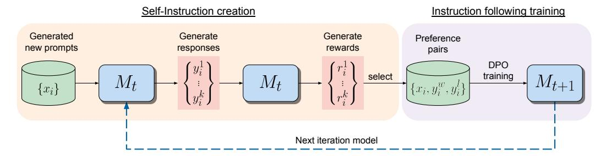
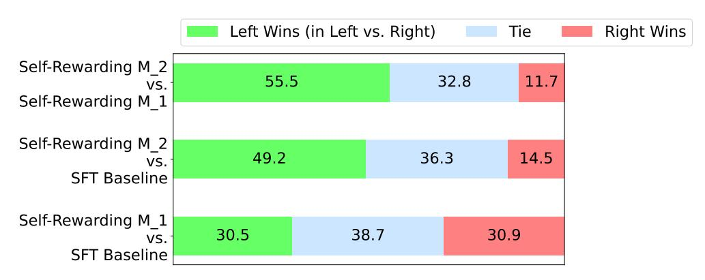
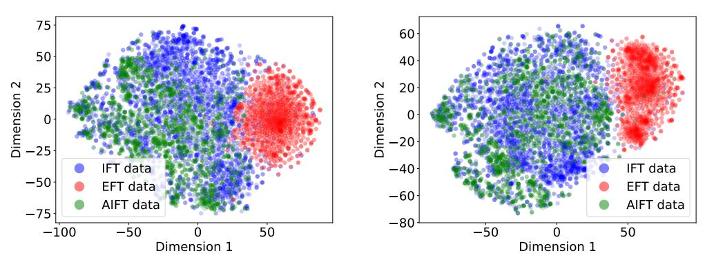

# **Self-Rewarding Language Models**

**Weizhe Yuan**<sup>1</sup>*,*<sup>2</sup> **Richard Pang**<sup>1</sup>*,*<sup>2</sup> **Kyunghyun Cho**<sup>2</sup> **Sainbayar Sukhbaatar**<sup>1</sup> **Jing Xu**<sup>1</sup> **Jason Weston**<sup>1</sup>*,*<sup>2</sup>

<sup>1</sup>Meta <sup>2</sup> NYU

# **Abstract**

We posit that to achieve superhuman agents, future models require superhuman feedback in order to provide an adequate training signal. Current approaches commonly train reward models from human preferences, which may be bottlenecked by human performance level, and secondly use frozen reward models that cannot then learn to improve. In this work, we study *self-rewarding language models*, where the language model itself is used via LLM-as-a-Judge prompting to provide its own rewards during training. We show that over iterations of training that not only does instruction following ability improve, but also the ability to provide high quality rewards to itself. While this is only a preliminary study, this opens the door to the possibility of models that can continually improve in both axes.

# **1 Introduction**

Aligning Large Language Models (LLMs) using human preference data can vastly improve the instruction following performance of pretrained models [\[Ouyang et al., 2022,](#page-10-0) [Bai et al.,](#page-9-0) [2022a\]](#page-9-0). The standard approach of Reinforcement Learning from Human Feedback (RLHF) learns a reward model from these human preferences. The reward model is then frozen and used to train the LLM using RL e.g. via PPO [Schulman et al.](#page-10-1) [\[2017\]](#page-10-1). A recent alternative is to avoid training the reward model at all, and directly use human preferences to train the LLM, as in Direct Preference Optimization (DPO) [Rafailov et al.](#page-10-2) [\[2023\]](#page-10-2). In both cases the approach is bottlenecked by the size and quality of the human preference data, and in the case of RLHF the quality of the frozen reward model trained from them as well.

In this work, we instead propose to train a self-improving reward model that, rather than being frozen, is continually updating during LLM alignment, in order to avoid this bottleneck. The key to such an approach is to develop an agent that possesses all the abilities desired during training, rather than separating them out into distinct models such as a reward model and a language model. In the same way that pretraining and multitasking training of instruction following tasks allow task transfer by training on many tasks at once [\[Collobert](#page-9-1) [and Weston, 2008,](#page-9-1) [Radford et al., 2019,](#page-10-3) [Ouyang et al., 2022\]](#page-10-0), incorporating the reward model into that same system allows task transfer between the reward modeling task and the instruction following tasks.

We thus introduce *Self-Rewarding Language Models*, agents that both (i) act as instruction following models generating responses for given prompts; and (ii) can generate and evaluate new instruction following examples to add to their own training set. We train these models using an iterative DPO framework similar to that recently introduced in [Xu et al.](#page-10-4) [\[2023\]](#page-10-4). Starting from a seed model, in each iteration there is a process of *Self-Instruction creation* whereby candidate responses are generated by the model for newly created prompts, and are then assigned rewards by that same model. The latter is implemented via LLM-as-a-Judge prompting, which can also be seen as an instruction following task. A preference dataset is built from the generated data, and the next iteration of the model is trained via DPO.

<span id="page-1-0"></span>

Figure 1: **Self-Rewarding Language Models.** Our self-alignment method consists of two steps: (i) *Self-Instruction creation*: newly created prompts are used to generate candidate responses from model *Mt*, which also predicts its own rewards via LLM-as-a-Judge prompting. (ii) Instruction following training: preference pairs are selected from the generated data, which are used for training via DPO, resulting in model *Mt*+1. The whole procedure can then be iterated resulting in both improved instruction following and reward modeling ability.

In our experiments, we start with a Llama 2 70B [Touvron et al.](#page-10-5) [\[2023\]](#page-10-5) seed model fine-tuned on Open Assistant [Köpf et al.](#page-9-2) [\[2023\]](#page-9-2), and then perform the above training scheme. We find that not only does the instruction following performance improves from Self-Rewarding LLM alignment compared to the baseline seed model, but importantly the reward modeling ability, which is no longer fixed, improves as well. This means that the model during iterative training is able, at a given iteration, to provide a higher quality preference dataset than in the previous iteration. While this effect likely saturates in real-world settings, it provides the intriguing possibility of obtaining reward models (and hence LLMs) that are superior to ones that could have been trained from the original human-authored seed data alone.

# **2 Self-Rewarding Language Models**

Our approach first assumes access to a base pretrained language model, and a small amount of human-annotated seed data. We then build a model that aims to possess two skills simultaneously:

- 1. *Instruction following*: given a prompt that describes a user request, the ability to generate a high quality, helpful (and harmless) response.
- 2. *Self-Instruction creation*: the ability to generate and evaluate new instructionfollowing examples to add to its own training set.

These skills are used so that the model can perform self-alignment, i.e. they are the components used to iteratively train itself using AI Feedback (AIF).

*Self-instruction creation* consists of generating candidate responses and then the model itself judging their quality, i.e. it acts as its own reward model, replacing the need for an external one. This is implemented via the *LLM-as-a-Judge* mechanism [\[Zheng et al., 2023b\]](#page-11-0), i.e. by formulating the evaluation of responses as an instruction following task. This self-created AIF preference data is used as a training set.

Our overall *self-alignment* procedure is an iterative one, which proceeds by building a series of such models, with the aim that each improves over the last. Importantly, because the model can both improve its generation ability, and it acts as its own reward model through the same generation mechanism, this means the reward model itself can improve through these iterations, deviating from standard practices where the reward model is fixed [\[Ouyang](#page-10-0) [et al., 2022\]](#page-10-0). We believe this can increase the ceiling of the potential for self-improvement of these learning models going forward, removing a constraining bottleneck.

We describe these steps in more detail below. An overview of the approach is illustrated in Figure [1.](#page-1-0)

### <span id="page-2-0"></span>**2.1 Initialization**

**Seed instruction following data:** We are given a seed set of human-authored (instruction prompt, response) general instruction following examples that we use for training in a supervised fine-tuning (SFT) manner, starting from a pretrained base language model. Subsequently this will be referred to as Instruction Fine-Tuning (IFT) data.

**Seed LLM-as-a-Judge instruction following data:** We also assume we are provided a seed set of (evaluation instruction prompt, evaluation result response) examples which can also be used for training. While this is not strictly necessary, as the model using IFT data will already be capable of training an LLM-as-a-Judge, we show that such training data can give improved results. In this data, the input prompt asks the model to evaluate the quality of a given response to a particular instruction. The provided evaluation result response consists of chain-of-thought reasoning (a justification), followed by a final score (in our experiments out of 5). The format of these prompts is given in [Figure 2.](#page-3-0) This thus serves as training data for the LLM to perform the role of a reward model. Subsequently this will be referred to as Evaluation Fine-Tuning (EFT) data.

We use both these seed sets together during training.

## <span id="page-2-1"></span>**2.2 Self-Instruction creation**

Using the model we have trained, we can make it self-modify its own training set. In our setup, we add generated training data to the seed data for the next iteration of training. This consists of the following steps:

- 1. *Generate a new prompt*: We generate a new prompt using few-shot prompting, sampling prompts from the original seed IFT data, following the approach of [Wang](#page-10-6) [et al.](#page-10-6) [\[2022\]](#page-10-6), [Honovich et al.](#page-9-3) [\[2022\]](#page-9-3).
- 2. *Generate candidate responses*: We then generate *N* diverse candidate responses for the given prompt from our model using sampling.
- 3. *Evaluate candidate responses*: Finally, we use the LLM-as-a-Judge ability of our same model to evaluate its own candidate responses (scored out of 5, see [Figure 2\)](#page-3-0).

#### **2.3 Instruction following training**

As previously described, training is initially performed with the seed IFT and EFT data [\(Section 2.1\)](#page-2-0). This is then augmented with additional data via AI (Self-)Feedback.

**AI Feedback Training** After performing the self-instruction creation procedure, we can then augment the seed data with additional examples for training, which we refer to as AI Feedback Training (AIFT) data. We try two variants of such feedback:

- *Preference pairs*: we construct training data of the form (instruction prompt, winning response, losing response). To form the winning and losing pair we take the highest and lowest scoring responses from the *N* evaluated candidate responses (see [Section 2.2\)](#page-2-1), following [Xu et al.](#page-10-4) [\[2023\]](#page-10-4), discarding the pair if their scores are the same. These pairs can be used for training with a preference tuning algorithm. We use DPO [\[Rafailov et al., 2023\]](#page-10-2).
- *Positive examples only*: in this variant, we add additional examples of (instruction prompt, response) curated by the model to the seed set for supervised fine-training, following other approaches [\[Li et al., 2023a,](#page-10-7) [Adolphs et al., 2022,](#page-9-4) [Gulcehre et al.,](#page-9-5) [2023\]](#page-9-5), rather than constructing preference data. In this setup we only add examples where the candidate response was evaluated to give a perfect 5 out of 5 score.

While we report the results of both approaches in our experiments, we find that learning from preference pairs gives superior performance.

<span id="page-3-0"></span>Review the user's question and the corresponding response using the additive 5-point scoring system described below. Points are accumulated based on the satisfaction of each criterion:

- Add 1 point if the response is relevant and provides some information related to the user's inquiry, even if it is incomplete or contains some irrelevant content.
- Add another point if the response addresses a substantial portion of the user's question, but does not completely resolve the query or provide a direct answer.
- Award a third point if the response answers the basic elements of the user's question in a useful way, regardless of whether it seems to have been written by an AI Assistant or if it has elements typically found in blogs or search results.
- Grant a fourth point if the response is clearly written from an AI Assistant's perspective, addressing the user's question directly and comprehensively, and is well-organized and helpful, even if there is slight room for improvement in clarity, conciseness or focus.
- Bestow a fifth point for a response that is impeccably tailored to the user's question by an AI Assistant, without extraneous information, reflecting expert knowledge, and demonstrating a high-quality, engaging, and insightful answer.

```
User: <INSTRUCTION>
```

<response><RESPONSE></response>

After examining the user's instruction and the response:

- Briefly justify your total score, up to 100 words.
- Conclude with the score using the format: "Score: <total points>"

Remember to assess from the AI Assistant perspective, utilizing web search knowledge as necessary. To evaluate the response in alignment with this additive scoring model, we'll systematically attribute points based on the outlined criteria.

Figure 2: LLM-as-a-Judge prompt for our LLM to act as a reward model and provide self-rewards for its own model generations. The model is initially trained with seed training data of how to perform well at this task, and then improves at this task further through our self-rewarding training procedure.

#### 2.4 Overall Self-Alignment Algorithm

**Iterative Training** Our overall procedure trains a series of models  $M_1, \ldots, M_n$  where each successive model t uses augmented training data created by the  $t-1^{th}$  model. We thus define AIFT $(M_i)$  to mean AI Feedback Training data created using model i.

Model sequence We thus define the models, and the training data they use as follows:

 $M_0$ : Base pretrained LLM with no fine-tuning.

 $M_1$ : Initialized with  $M_0$ , then fine-tuned on the IFT+EFT seed data using SFT.

 $M_2$ : Initialized with  $M_1$ , then trained with AIFT( $M_1$ ) data using DPO.

 $M_3$ : Initialized with  $M_2$ , then trained with AIFT( $M_2$ ) data using DPO.

This iterative training resembles the procedure used in Pairwise Cringe Optimization and Iterative DPO introduced in Xu et al. [2023], however an external fixed reward model was used in that work.

# 3 Experiments

### 3.1 Experimental Setup

Base Model In our experiments we use Llama 2 70B [Touvron et al., 2023] as our base pretrained model.

#### <span id="page-4-0"></span>3.1.1 Seed Training Data

IFT Seed Data We use the human-authored examples provided in the Open Assistant dataset [Köpf et al., 2023] for instruction fine-tuning. Following Li et al. [2023a] we use 3200 examples, by sampling only first conversational turns in the English language that are high quality, based on their human annotated rank (choosing only the highest rank 0). In our experiments, we compare to a model fine-tuned from the base model using only this data via supervised fine-tuning, and refer to it as our SFT baseline.

**EFT Seed Data** The Open Assistant data also provides multiple human responses with a rank from which we can construct evaluation fine-tuning data. We split this into train and evaluation sets, and use it to create LLM-as-a-Judge data. This is done by placing it in the input format given in Figure 2, which consists of the scoring criteria description, and the given instruction and response to be evaluated. For training targets, chain-of-thought justifications and final scores out of 5 are not directly provided, so we use the SFT baseline to generate evaluations for each response for a given instruction, and accept them into the training set if the rank order agrees with the human rankings in the dataset. This results in 1775 train and 531 evaluation examples (which do not overlap with the IFT data).

#### 3.1.2 Evaluation Metrics

We evaluate the performance of our self-rewarding models in two axes: their ability to follow instructions, and their ability as a reward model (ability to evaluate responses).

Instruction Following We evaluate head-to-head performance between various models using GPT-4 [Achiam et al., 2023] as an evaluator over 256 test prompts derived from various sources following Li et al. [2023a] using the AlpacaEval evaluation prompt [Li et al., 2023b]. We try the prompt in both orders comparing pairwise, and if the GPT-4 evaluations disagree we count the result as a tie. We also report results in the AlpacaEval leaderboard format which is evaluated over 805 prompts, and compute the win rate against a baseline text-davinci-3 model based on GPT-4 judgements.

Reward Modeling We evaluate the correlation with human rankings on the evaluation set we derived from the Open Assistant dataset, as described in Section 3.1.1. Each instruction has on average 2.85 responses with given rankings. We can thus measure the *pairwise accuracy*, which is how many times the order of the ranking between any given pair agrees between the model's evaluation and the human ranking. We also measure the *exact match* count, which is how often the total ordering is exactly the same for an instruction. We also report the Spearman correlation and Kendall's  $\tau$ . Finally, we report how often the responses that the model scores a perfect 5 out of 5 are rated as the highest ranked by humans.

#### 3.1.3 Training Details

Instruction following training The training hyperparameters we are use are as follows. For SFT we use learning rate  $5.5e^{-6}$  which linearly decays to  $1.1e^{-6}$ , batch size 16 and dropout 0.1. We only calculate loss on target tokens instead of the full sequence. For DPO we use learning rate  $1e^{-6}$  which linearly decays to  $1e^{-7}$ , batch size 16, dropout 0.1, and a  $\beta$  value of 0.1.

**Self-Instruction creation** To generate new prompts we used a fixed model, ChatLlama 70B with 8-shot prompting, whereas the other parts of the creation pipeline (generating the response, and evaluating it) use the model being trained. For candidate response generation we sample N=4 candidate responses with temperature  $T=0.7,\,p=0.9$ . When evaluating

candidate responses, as there is variance to these scores, in our experiments we also use sampled decoding (with the same parameters) and generate these evaluations multiple (3) times and take the average. We added 3,964 such preference pairs to form the AIFT(*M*1) dataset used to train *M*<sup>2</sup> via DPO.

#### **3.2 Results**

### **3.2.1 Instruction following ability**

Head to head performance results are provided in [Figure 3.](#page-6-0)

**EFT+IFT seed training performs similarly to IFT alone** We find that adding the Evaluation Fine-Tuning (EFT) task to training does not impact instruction following performance compared to using Instruction Fine-Tuning (IFT) data alone with an almost equal head to head (30.5% wins vs. 30.9% wins). This is a positive result because it means the increased capability of a model to self-reward does not affect its other skills. We can thus use IFT+EFT training as Iteration 1 (*M*1) of our Self-Rewarding model, and then run further iterations.

**Iteration 2 (***M*2**) improves over Iteration 1 (***M*1**) and SFT Baseline** Iteration 2 of Self-Rewarding training (*M*2) provides superior instruction following to Iteration 1 (*M*1) with 55.5% wins for *M*<sup>2</sup> compared to only 11.7% for *M*<sup>1</sup> in a head to head evaluation. It provides similar gains over the SFT Baseline as well (49.2% wins vs. 14.5% wins). Clearly, there is a large jump in performance from *M*<sup>1</sup> to *M*<sup>2</sup> by using the preference data AIFT(*M*1) provided by the Reward model from Iteration 1.

**Preference optimization outperforms augmenting with positive examples only** We also tried the alternative self-training procedure of adding high-quality self-instruction creation examples to supervised fine-tuning (without preference optimization). Unfortunately we could not find a configuration where this approach helped. For example, adding 11,254 such examples that score 5 out of 5, and optimizing the mixing weight in training, still yielded a head to head with the SFT Baseline of 29% wins vs 30% wins, i.e. no improvement.

**Data distribution analysis** We perform a t-SNE [\[Van der Maaten and Hinton, 2008\]](#page-10-9) visualization of the IFT, EFT and AIFT(*M*1) data, shown in [Section A.1.](#page-12-0) We find good overlap between the IFT and AIFT(*M*1) examples, which is desired, while the EFT examples lie in a different part of the embedding space. We observe that generations from *M*<sup>1</sup> have an average length of 1178, while for *M*<sup>2</sup> they are 1630, so the model is learning to generate longer responses, which we note may be a factor in relative performance.

**Human Evaluation** We performed a limited evaluation via human experts (authors) comparing 17 examples of model *M*<sup>2</sup> to *M*<sup>1</sup> and observe in a head to head comparison 58.8% wins for *M*2, 17.6% for *M*<sup>1</sup> and 23.6% for ties, agreeing with the conclusions of GPT-4.

### **3.2.2 Reward modeling ability**

Reward modeling evaluation results are provided in [Table 1.](#page-6-1)

**EFT augmentation improves over SFT baseline** Firstly, we find that adding Evaluation Fine-Tuning (EFT) data into training, which gives examples to the model of how to act as an LLM-as-a-Judge, naturally improves it performance compared to training with Instruction Fine-Tuning (IFT) data alone. IFT data covers a wide range of general instruction tasks, and so does endow the SFT Baseline with the ability to evaluate responses, however EFT data gives more examples of this specific task. We find improvements across all five metrics measured when using IFT+EFT vs. IFT alone, e.g. the pairwise accuracy agreement with humans increases from 65.1% to 78.7%, and 5-best% from 39.6% to 41.5%.

**Reward Modeling ability improves with Self-Training** We find that performing a round of self-reward training *improves the ability of the model at providing self-rewards*

<span id="page-6-0"></span>

Figure 3: Instruction following ability improves with Self-Training: We evaluate various models using head-to-head win rates on diverse prompts using GPT-4. Self-Rewarding Iteration 2  $(M_2)$  outperforms Iteration 1  $(M_1)$  and the SFT Baseline by a large margin. The SFT Baseline is on par with Iteration 1  $(M_1)$ .

<span id="page-6-1"></span>

|                                                                                                              |                                     | Self-Rewarding Models                                                      |                                                                                      |
|--------------------------------------------------------------------------------------------------------------|-------------------------------------|----------------------------------------------------------------------------|--------------------------------------------------------------------------------------|
| Model<br>Training data                                                                                       | SFT Baseline<br>IFT                 | $\begin{array}{c} {\rm ITERATION} \ 1 \\ M_1 \\ {\rm IFT+EFT} \end{array}$ | $\begin{array}{c} \text{Iteration 2} \\ M_2 \\ \text{IFT+EFT+AIFT}(M_1) \end{array}$ |
| Pairwise accuracy (†)<br>5-best % (†)<br>Exact Match % (†)<br>Spearman corr. (†)<br>Kendall $\tau$ corr. (†) | 65.1% $39.6%$ $10.1%$ $0.25$ $0.23$ | 78.7% $41.5%$ $13.1%$ $0.28$ $0.25$                                        | 80.4% $44.3%$ $14.3%$ $0.33$ $0.32$                                                  |

Table 1: Reward Modeling ability improves with Self-Training: We evaluate the LLM-as-a-Judge via various metrics which measure alignment with held out human preference data. Self-Rewarding Iteration 2 (Model  $M_2$ ), which is trained using the self-reward model derived from its previous iteration  $M_1$  outperforms Iteration 1 ( $M_1$ ), while  $M_1$  itself outperforms a standard SFT baseline model trained on only Instruction Fine-Tuning (IFT) data.

for the next iteration, in addition to its improved instruction following ability. Model  $M_2$  (iteration 2) is trained using the reward model from  $M_1$  (iteration 1), but provides improved performance on all five metrics compared to  $M_1$ . For example, 5-best% performance improves from 41.5% to 44.3%. This performance gain is achieved despite there being no additional EFT data provided, and the examples created during the Self-Instruction creation creation loop do not tend to look like LLM-as-a-Judge training examples. We hypothesize that because the model is becoming better at general instruction following, it nevertheless also improves at the LLM-as-a-Judge task.

Importance of the LLM-as-a-Judge Prompt In these experiments we used the LLM-as-Judge prompt format shown in Figure 2. In preliminary experiments we also tried various other prompts to decide the most effective one to use. For example, we tried the prompt proposed in [Li et al., 2023a] which also proposes a 5-point scale, but describes the options as multiple choice in a range of quality buckets, see Figure 5. In contrast, our prompt describes the points as additive, covering various aspects of quality. We find a large difference between these two prompts when using the SFT Baseline, e.g. 65.1% pairwise accuracy for ours, and only 26.6% pairwise accuracy for theirs. See Section A.2 for further details.

#### 4 Related Work

Automatically improving or self-correcting large language models is becoming a major focus of research. A recent survey from Pan et al. [2023] attempts to summarize the topic. However, this is moving rapidly area, and there are already promising new works not covered there.

**Reinforcement Learning from Human Feedback (RLHF)** Preference learning approaches such as in [Ziegler et al.](#page-11-1) [\[2019\]](#page-11-1), [Stiennon et al.](#page-10-11) [\[2020\]](#page-10-11), [Ouyang et al.](#page-10-0) [\[2022\]](#page-10-0), [Bai et al.](#page-9-0) [\[2022a\]](#page-9-0) train a fixed reward model from human preference data, and then use the reward model to train via reinforcement learning (RL), e.g. via Proximal Policy Optimization (PPO) [\[Schulman et al., 2017\]](#page-10-1). Thus, the reward signal is already in a certain sense from a model even in these works, but distilled from human data. Nevertheless, this is commonly referred to as RL from Human Feedback (RLHF). Methods such as Direct Preference Optimization (DPO) [\[Rafailov et al., 2023\]](#page-10-2) avoid training the reward model entirely, and instead directly train the LLM using human preferences. Several other such competing methods exist as well [\[Zhao et al., 2023,](#page-10-12) [Zheng et al., 2023a,](#page-10-13) [Yuan et al., 2023\]](#page-10-14), including Pairwise Cringe Optimization (PCO) [\[Xu et al., 2023\]](#page-10-4), which was shown to outperform DPO and PPO on AlpacaFarm [\[Dubois et al., 2023\]](#page-9-7). PCO uses an iterative training approach similar to the one in our work, except with a fixed reward model, and also showed that Iterative DPO improves over DPO using the same scheme.

**Reinforcement Learning from AI Feedback (RLAIF)** Constitutional AI [\[Bai et al.,](#page-9-8) [2022b\]](#page-9-8) uses an LLM to give feedback and refine responses, and uses this data to train a (separate, fixed) reward model. This is then used to perform "RL from AI Feedback" (RLAIF). [\[Lee et al., 2023\]](#page-9-9) compare RLAIF and RLHF procedures and find the methods they compare perform roughly equally. They use an "off-the-shelf" LLM to perform LLM-as-a-Judge prompting to build a training set to train a fixed reward model, which is then used for RL training. They also experiment with using the fixed but separate LLM-as-a-Judge model directly, which the authors report is computationally expensive due to using it within PPO training (rather than the offline step in the iterative approach we use in our work, which is relatively computationally cheap). Finally, [Chen et al.](#page-9-10) [\[2024\]](#page-9-10) recently showed they can avoid reward models entirely in an iterative DPO-like framework by using human labels as the winning response in a pair, and the last iteration's generations as the losing response in the pair. The authors note this has the limitation that once the model generations reach human performance, they are bottlenecked. Further, each input prompt is required to have a human annotated response, in contrast to our work.

**Improving LLMs via data augmentation (and curation)** Several methods have improved LLMs by (self-)creating training data to augment fine-tuning. Self-Instruct [\[Wang](#page-10-6) [et al., 2022\]](#page-10-6) is a method for self-instruction creation of prompts and responses, which can be used to improve a base LLM. We make use of a similar technique in our work, and then use our self-reward model to score them. Several approaches have also created training data by distilling from powerful LLMs, and shown a weaker LLM can then perform well. For example, Alpaca [\[Taori et al., 2023\]](#page-10-15) fine-tuned a Llama 7B model with text-davinci-003 instructions created in the style of self-instruct. Alpagasus [\[Chen et al., 2023\]](#page-9-11) employed a strong LLM-as-a-Judge (ChatGPT) to curate the Alpaca dataset and filter to a smaller set, obtaining improved results. Instruction Backtranslation [\[Li et al., 2023a\]](#page-10-7) similarly augments and curates training data, but augmenting via backtranslating from web documents to predict prompts. The curation is done by the LLM(-as-a-Judge) itself, so can be seen as an instance of a self-rewarding model, but in a specialized setting. Reinforced Self-Training (ReST) [\[Gulcehre et al., 2023\]](#page-9-5) uses a fixed, external reward to curate new high quality examples to iteratively add to the training set, improving performance. We note that in our experiments, we found that adding only positive examples in a related manner did not help, whereas adding preference pairs did help.

**LLM-as-a-Judge** Using LLM-as-a-Judge prompting to evaluate language models has become a standard approach [\[Dubois et al., 2023,](#page-9-7) [Li et al., 2023b,](#page-10-8) [Fernandes et al., 2023,](#page-9-12) [Bai et al., 2023,](#page-9-13) [Saha et al., 2023\]](#page-10-16), and is being used to train reward models or curate data as well, as described above [\[Lee et al., 2023,](#page-9-9) [Chen et al., 2023,](#page-9-11) [Li et al., 2023a\]](#page-10-7). While some works such as [Kim et al.](#page-9-14) [\[2023\]](#page-9-14) create training to data to train an LLM to perform well as a judge, to our knowledge it is not common to combine this training with general instruction following skills as in our work.

# **5 Conclusion**

We have introduced Self-Rewarding Language Models, models capable of self-alignment via judging and training on their own generations. The method is trained in an iterative manner, where in each iteration the model creates its own preference-based instruction training data by assigning rewards to its own generations via LLM-as-a-Judge prompting, and then using DPO to train on the preferences. We showed that this training both improves the instruction following capability of the model, as well as its reward-modeling ability across the iterations. While this is only a preliminary study, we believe this is an exciting avenue of research because this means the model is better able to assign rewards in future iterations for improving instruction following – a kind of virtuous circle. While this improvement likely saturates in realistic scenarios, it still allows for the possibility of continual improvement beyond the human preferences that reward models and instruction following models are typically trained with in current systems.

# **References**

- <span id="page-9-6"></span>Josh Achiam, Steven Adler, Sandhini Agarwal, Lama Ahmad, Ilge Akkaya, Florencia Leoni Aleman, Diogo Almeida, Janko Altenschmidt, Sam Altman, Shyamal Anadkat, et al. Gpt-4 technical report. *arXiv preprint arXiv:2303.08774*, 2023.
- <span id="page-9-4"></span>Leonard Adolphs, Tianyu Gao, Jing Xu, Kurt Shuster, Sainbayar Sukhbaatar, and Jason Weston. The cringe loss: Learning what language not to model. *arXiv preprint arXiv:2211.05826*, 2022.
- <span id="page-9-0"></span>Yuntao Bai, Andy Jones, Kamal Ndousse, Amanda Askell, Anna Chen, Nova DasSarma, Dawn Drain, Stanislav Fort, Deep Ganguli, Tom Henighan, et al. Training a helpful and harmless assistant with reinforcement learning from human feedback. *arXiv preprint arXiv:2204.05862*, 2022a.
- <span id="page-9-8"></span>Yuntao Bai, Saurav Kadavath, Sandipan Kundu, Amanda Askell, Jackson Kernion, Andy Jones, Anna Chen, Anna Goldie, Azalia Mirhoseini, Cameron McKinnon, et al. Constitutional ai: Harmlessness from ai feedback. *arXiv preprint arXiv:2212.08073*, 2022b.
- <span id="page-9-13"></span>Yushi Bai, Jiahao Ying, Yixin Cao, Xin Lv, Yuze He, Xiaozhi Wang, Jifan Yu, Kaisheng Zeng, Yijia Xiao, Haozhe Lyu, et al. Benchmarking foundation models with languagemodel-as-an-examiner. *arXiv preprint arXiv:2306.04181*, 2023.
- <span id="page-9-11"></span>Lichang Chen, Shiyang Li, Jun Yan, Hai Wang, Kalpa Gunaratna, Vikas Yadav, Zheng Tang, Vijay Srinivasan, Tianyi Zhou, Heng Huang, et al. Alpagasus: Training a better alpaca with fewer data. *arXiv preprint arXiv:2307.08701*, 2023.
- <span id="page-9-10"></span>Zixiang Chen, Yihe Deng, Huizhuo Yuan, Kaixuan Ji, and Quanquan Gu. Self-play fine-tuning converts weak language models to strong language models. *arXiv preprint arXiv:2401.01335*, 2024.
- <span id="page-9-1"></span>Ronan Collobert and Jason Weston. A unified architecture for natural language processing: Deep neural networks with multitask learning. In *Proceedings of the 25th international conference on Machine learning*, pages 160–167, 2008.
- <span id="page-9-7"></span>Yann Dubois, Xuechen Li, Rohan Taori, Tianyi Zhang, Ishaan Gulrajani, Jimmy Ba, Carlos Guestrin, Percy Liang, and Tatsunori B Hashimoto. Alpacafarm: A simulation framework for methods that learn from human feedback. *arXiv preprint arXiv:2305.14387*, 2023.
- <span id="page-9-12"></span>Patrick Fernandes, Daniel Deutsch, Mara Finkelstein, Parker Riley, André FT Martins, Graham Neubig, Ankush Garg, Jonathan H Clark, Markus Freitag, and Orhan Firat. The devil is in the errors: Leveraging large language models for fine-grained machine translation evaluation. *arXiv preprint arXiv:2308.07286*, 2023.
- <span id="page-9-5"></span>Caglar Gulcehre, Tom Le Paine, Srivatsan Srinivasan, Ksenia Konyushkova, Lotte Weerts, Abhishek Sharma, Aditya Siddhant, Alex Ahern, Miaosen Wang, Chenjie Gu, et al. Reinforced self-training (rest) for language modeling. *arXiv preprint arXiv:2308.08998*, 2023.
- <span id="page-9-3"></span>Or Honovich, Thomas Scialom, Omer Levy, and Timo Schick. Unnatural instructions: Tuning language models with (almost) no human labor. *arXiv preprint arXiv:2212.09689*, 2022.
- <span id="page-9-14"></span>Seungone Kim, Jamin Shin, Yejin Cho, Joel Jang, Shayne Longpre, Hwaran Lee, Sangdoo Yun, Seongjin Shin, Sungdong Kim, James Thorne, et al. Prometheus: Inducing fine-grained evaluation capability in language models. *arXiv preprint arXiv:2310.08491*, 2023.
- <span id="page-9-2"></span>Andreas Köpf, Yannic Kilcher, Dimitri von Rütte, Sotiris Anagnostidis, Zhi-Rui Tam, Keith Stevens, Abdullah Barhoum, Nguyen Minh Duc, Oliver Stanley, Richárd Nagyfi, et al. Openassistant conversations–democratizing large language model alignment. *arXiv preprint arXiv:2304.07327*, 2023.
- <span id="page-9-9"></span>Harrison Lee, Samrat Phatale, Hassan Mansoor, Kellie Lu, Thomas Mesnard, Colton Bishop, Victor Carbune, and Abhinav Rastogi. Rlaif: Scaling reinforcement learning from human feedback with ai feedback. *arXiv preprint arXiv:2309.00267*, 2023.

- <span id="page-10-7"></span>Xian Li, Ping Yu, Chunting Zhou, Timo Schick, Luke Zettlemoyer, Omer Levy, Jason Weston, and Mike Lewis. Self-alignment with instruction backtranslation. *arXiv preprint arXiv:2308.06259*, 2023a.
- <span id="page-10-8"></span>Xuechen Li, Tianyi Zhang, Yann Dubois, Rohan Taori, Ishaan Gulrajani, Carlos Guestrin, Percy Liang, and Tatsunori B. Hashimoto. Alpacaeval: An automatic evaluator of instruction-following models. [https://github.com/tatsu-lab/alpaca\\_eval](https://github.com/tatsu-lab/alpaca_eval), 2023b.
- <span id="page-10-0"></span>Long Ouyang, Jeffrey Wu, Xu Jiang, Diogo Almeida, Carroll Wainwright, Pamela Mishkin, Chong Zhang, Sandhini Agarwal, Katarina Slama, Alex Ray, et al. Training language models to follow instructions with human feedback. *Advances in Neural Information Processing Systems*, 35:27730–27744, 2022.
- <span id="page-10-10"></span>Liangming Pan, Michael Saxon, Wenda Xu, Deepak Nathani, Xinyi Wang, and William Yang Wang. Automatically correcting large language models: Surveying the landscape of diverse self-correction strategies. *arXiv preprint arXiv:2308.03188*, 2023.
- <span id="page-10-3"></span>Alec Radford, Jeffrey Wu, Rewon Child, David Luan, Dario Amodei, Ilya Sutskever, et al. Language models are unsupervised multitask learners. *OpenAI blog*, 1(8):9, 2019.
- <span id="page-10-2"></span>Rafael Rafailov, Archit Sharma, Eric Mitchell, Stefano Ermon, Christopher D Manning, and Chelsea Finn. Direct preference optimization: Your language model is secretly a reward model. *arXiv preprint arXiv:2305.18290*, 2023.
- <span id="page-10-16"></span>Swarnadeep Saha, Omer Levy, Asli Celikyilmaz, Mohit Bansal, Jason Weston, and Xian Li. Branch-solve-merge improves large language model evaluation and generation. *arXiv preprint arXiv:2310.15123*, 2023.
- <span id="page-10-1"></span>John Schulman, Filip Wolski, Prafulla Dhariwal, Alec Radford, and Oleg Klimov. Proximal policy optimization algorithms. *arXiv preprint arXiv:1707.06347*, 2017.
- <span id="page-10-11"></span>Nisan Stiennon, Long Ouyang, Jeffrey Wu, Daniel Ziegler, Ryan Lowe, Chelsea Voss, Alec Radford, Dario Amodei, and Paul F Christiano. Learning to summarize with human feedback. *Advances in Neural Information Processing Systems*, 33:3008–3021, 2020.
- <span id="page-10-15"></span>Rohan Taori, Ishaan Gulrajani, Tianyi Zhang, Yann Dubois, Xuechen Li, Carlos Guestrin, Percy Liang, and Tatsunori B. Hashimoto. Stanford alpaca: An instruction-following llama model. [https://github.com/tatsu-lab/stanford\\_alpaca](https://github.com/tatsu-lab/stanford_alpaca), 2023.
- <span id="page-10-5"></span>Hugo Touvron, Louis Martin, Kevin Stone, Peter Albert, Amjad Almahairi, Yasmine Babaei, Nikolay Bashlykov, Soumya Batra, Prajjwal Bhargava, Shruti Bhosale, et al. Llama 2: Open foundation and fine-tuned chat models. *arXiv preprint arXiv:2307.09288*, 2023.
- <span id="page-10-9"></span>Laurens Van der Maaten and Geoffrey Hinton. Visualizing data using t-sne. *Journal of machine learning research*, 9(11), 2008.
- <span id="page-10-6"></span>Yizhong Wang, Yeganeh Kordi, Swaroop Mishra, Alisa Liu, Noah A Smith, Daniel Khashabi, and Hannaneh Hajishirzi. Self-instruct: Aligning language model with self generated instructions. *arXiv e-prints*, pages arXiv–2212, 2022.
- <span id="page-10-4"></span>Jing Xu, Andrew Lee, Sainbayar Sukhbaatar, and Jason Weston. Some things are more cringe than others: Preference optimization with the pairwise cringe loss. *arXiv preprint arXiv:2312.16682*, 2023.
- <span id="page-10-14"></span>Zheng Yuan, Hongyi Yuan, Chuanqi Tan, Wei Wang, Songfang Huang, and Fei Huang. Rrhf: Rank responses to align language models with human feedback without tears. *arXiv preprint arXiv:2304.05302*, 2023.
- <span id="page-10-12"></span>Yao Zhao, Rishabh Joshi, Tianqi Liu, Misha Khalman, Mohammad Saleh, and Peter J Liu. Slic-hf: Sequence likelihood calibration with human feedback. *arXiv preprint arXiv:2305.10425*, 2023.
- <span id="page-10-13"></span>Chujie Zheng, Pei Ke, Zheng Zhang, and Minlie Huang. Click: Controllable text generation with sequence likelihood contrastive learning. *arXiv preprint arXiv:2306.03350*, 2023a.

<span id="page-11-0"></span>Lianmin Zheng, Wei-Lin Chiang, Ying Sheng, Siyuan Zhuang, Zhanghao Wu, Yonghao Zhuang, Zi Lin, Zhuohan Li, Dacheng Li, Eric. P Xing, Hao Zhang, Joseph E. Gonzalez, and Ion Stoica. Judging llm-as-a-judge with mt-bench and chatbot arena, 2023b.

<span id="page-11-1"></span>Daniel M Ziegler, Nisan Stiennon, Jeffrey Wu, Tom B Brown, Alec Radford, Dario Amodei, Paul Christiano, and Geoffrey Irving. Fine-tuning language models from human preferences. *arXiv preprint arXiv:1909.08593*, 2019.

# A Appendix

## <span id="page-12-0"></span>A.1 Distributions of IFT, EFT and AIFT data

<span id="page-12-2"></span>

(a) Instruction distribution of IFT, EFT and (b) Response distribution of IFT, EFT, and AIFT data.

Figure 4: Distributions of both instructions and responses for IFT, EFT and AIFT data.

We have plotted the distribution of instructions for IFT, EFT and AIFT data, and the distribution of responses for IFT, EFT and AIFT data in Figure 4. It is clear that the IFT data and EFT data come from very different distributions while the IFT and AIFT data come from similar distributions.

### <span id="page-12-1"></span>A.2 Other EFT prompts we have tried

At first, we took the EFT prompt from Li et al. [2023a] as shown in Figure 5. However, we found that this prompt was not as effective as our additive score-counting prompt because the model needed to treat the task as a multiple-choice problem, and it was difficult for the model to break down this multiple-choice problem into sub-problems involving evaluating various aspects of the response. When using the model trained on 3,200 IFT data only, its EFT performance on EFT test set using our additive score-counting prompt and prompt from Li et al. [2023a] is shown in Table 2.

<span id="page-12-3"></span>

| EFT PROMPT                        | MULTIPLE CHOICE PROMPT | Ours  |
|-----------------------------------|------------------------|-------|
| Pairwise accuracy (†)             | 26.6%                  | 65.1% |
| 5-BEST % (↑)                      | 23.5%                  | 39.6% |
| Exact Match % (†)                 | 1.1%                   | 10.1% |
| Spearman corr. (†)                | -0.18                  | 0.25  |
| Kendall $\tau$ corr. $(\uparrow)$ | -0.16                  | 0.23  |

Table 2: We tried various LLM-as-Judge prompts using the model trained with 3,200 IFT data only and found that our additive score-counting prompt worked best which demonstrates significant improvements on EFT performance comparing to the prompt used by Li et al. [2023a].

<span id="page-13-0"></span>Below is a question from an user and a candidate response. Please grade the response on a 5-point scale using the following criteria:

- 1: It means the answer is incomplete, vague, off-topic, controversial, or not exactly what the user asked for. For example, some content seems missing, numbered list does not start from the beginning, the opening sentence repeats user's question. Or the response is from another person's perspective with their personal experience (e.g. taken from blog posts), or looks like an answer from a forum. Or it contains promotional text, navigation text, or other irrelevant information.
- 2: It means the answer addresses most of the asks from the user. It does not directly address the user's question. For example, it only provides a high-level methodology instead of the exact solution to user's question.
- 3: It means the answer is helpful but not written by an AI Assistant. It addresses all the basic asks from the user. It is complete and self contained with the drawback that the response is not written from an AI assistant's perspective, but from other people's perspective. The content looks like an excerpt from a blog post, web page, or web search results. For example, it contains personal experience or opinion, mentions comments section, or share on social media, etc.
- 4: It means the answer is written from an AI assistant's perspective with a clear focus of addressing the instruction. It provide a complete, clear, and comprehensive response to user's question or instruction without missing or irrelevant information. It is well organized, self-contained, and written in a helpful tone. It has minor room for improvement, e.g. more concise and focused.
- 5: It means it is a perfect answer from an AI Assistant. It has a clear focus on being a helpful AI Assistant, where the response looks like intentionally written to address the user's question or instruction without any irrelevant sentences. The answer provides high quality content, demonstrating expert knowledge in the area, is very well written, logical, easy-to-follow, engaging and insightful.

User: <INSTRUCTION>

<response><RESPONSE></response>

Please first briefly describe your reasoning (in less than 100 words), and then write "Score: <rating>" in the last line. Answer in the style of an AI Assistant, with knowledge from web search if needed. To derive the final score based on the criteria, let's think step-by-step.

Figure 5: LLM-as-a-Judge prompt taken from [Li et al.](#page-10-7) [\[2023a\]](#page-10-7).