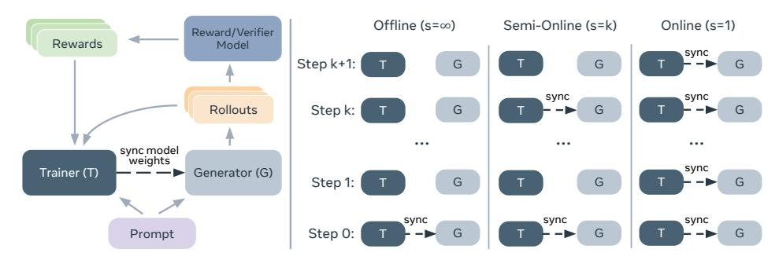
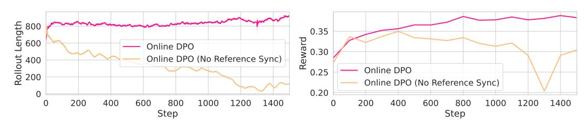
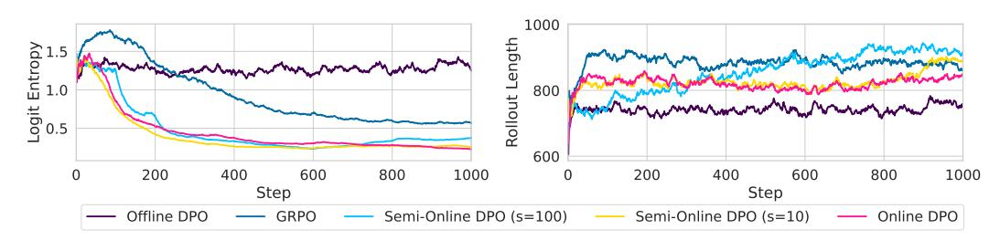
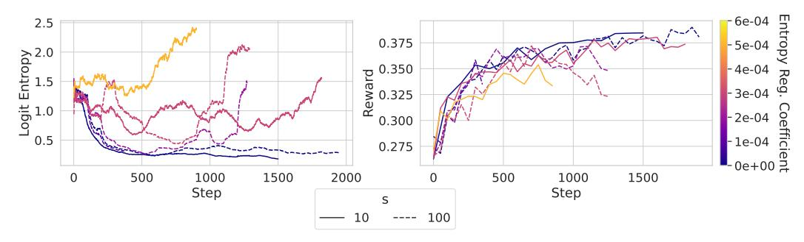
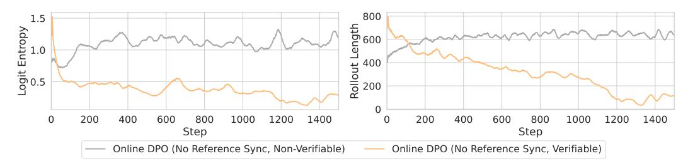
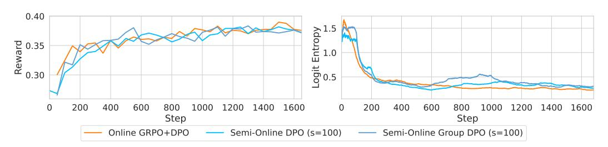
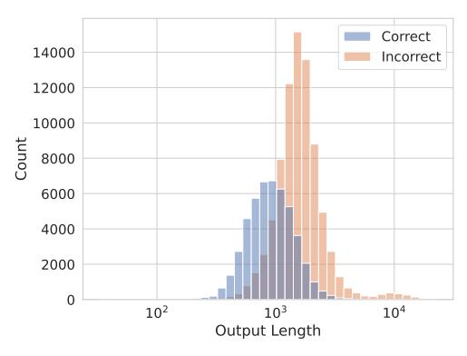
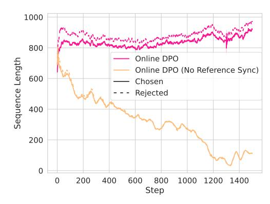
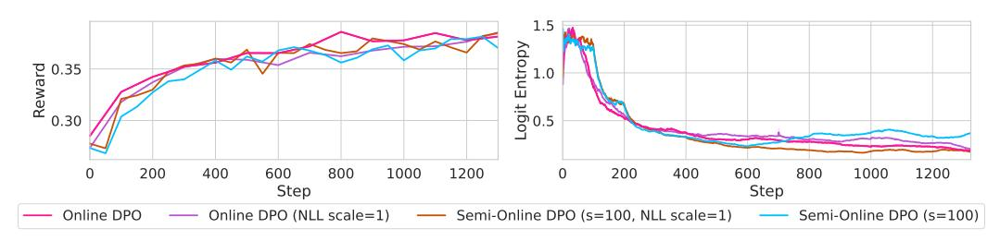

# Bridging Offline and Online Reinforcement Learning for LLMs

## Anonymous Author(s)

Affiliation Address email

# Abstract

 We investigate the effectiveness of reinforcement learning methods for finetuning large language models when transitioning from offline to semi-online to fully online regimes for both verifiable and non-verifiable tasks. Our experiments cover training on verifiable math as well as non-verifiable instruction-following with a set of benchmark evaluations for both. Across these settings, we extensively compare online and semi-online Direct Preference Optimization and Group Reward Policy Optimization objectives, and surprisingly find similar performance and convergence between these variants, which all strongly outperform offline methods. We provide a detailed analysis of the training dynamics and hyperparameter selection strategies to achieve optimal results. Finally, we show that while multi-tasking with verifiable and non-verifiable rewards jointly yields improved performance across task types simultaneously, there exists a tradeoff where some performance in either one or the other is lost, leaving important open questions.

# 1 Introduction

 Large Language Models (LLMs) have demonstrated remarkable capabilities on a wide variety of tasks spanning open ended instruction following to rigid mathematical reasoning [\[Dubey et al.,](#page-9-0) [2024,](#page-9-0) [Shao et al.,](#page-11-0) [2024\]](#page-11-0). A key ingredient for this capability is the "post-training" stage where a base language model is shaped for specific tasks. In this stage, the model is fine-tuned via Reinforcement Learning (RL) to optimize for human preferences or verifiable rewards. The former is suitable for open-ended generations and takes advantage of a reward model during training to reduce reliance on human annotators. The latter is used for math, code, and other multiple-choice questions where the correctness of the answer can be verified with a boolean score by matching against existing labels. For the optimization method itself, several candidates are commonly considered. When learning from preference labels, Direct Preference Optimization (DPO) [\[Rafailov et al.,](#page-11-1) [2024\]](#page-11-1) has emerged as a powerful algorithm and became a popular choice for open-ended tasks due to its simplistic offline training [\[Xu et al.,](#page-12-0) [2024a\]](#page-12-0). It can also be used with verifiable rewards [\[Pang et al.,](#page-10-0) [2024\]](#page-10-0) or with reward models. More recently, however, Group Relative Policy Optimization (GRPO) [\[Shao et al.,](#page-11-0) [2024\]](#page-11-0) has become widely used for fine-tuning LLMs for its success in training thinking LLMs [\[Guo](#page-9-1) [et al.,](#page-9-1) [2025\]](#page-9-1). GRPO is based on a popular RL algorithm PPO [\[Schulman et al.,](#page-11-2) [2017a\]](#page-11-2) which belongs to a class of online training methods that try to estimate gradient of the reward signal.

 While these methods have shown remarkable results on benchmark evaluations, the training data and exact recipes are often missing from reports, which are two of the most critical components for reproducibility. In this paper, we systematically explore the effectiveness of LLM post-training methods in different training setups, specifically offline, semi-online, and online configurations, across both verifiable and non-verifiable tasks, as depicted in [Figure 1.](#page-1-0) By examining the transition from offline to online training, i.e., by altering the speed of periodic model syncing, we aim to understand how these methods can be optimized for improved performance and efficiency. Our

Figure 1: (**left**): Visualization of a single training step within our training pipeline. Syncing the weights allows responses to be generated from the most recent model. (**right**): Progression from offline to online training, showing when model weight synchronizations occur at different train steps.

investigation focuses on two key aspects: the comparative effectiveness of iterative training over offline training and the relative performance of DPO and GRPO objectives across both kinds of tasks.

Based on our experimental results, our contributions are as follows. First, we show that standard DPO 40 lags behind other training regimes significantly, likely due to its offline nature. In contrast, online 41 DPO achieves comparable performance to online GRPO, but more surprisingly so does semi-online 42 DPO. We make several recommendations for making such training more stable. The efficiency gains 43 of the semi-online variants opens up an interesting question of whether fully online RL is the only 44 approach for post-training LLMs. Finally, we investigate the performance of joint optimization of 45 verifiable tasks with rule-based rewards and non-verifiable tasks with reward models. We find that this results in improved results across all tasks compared to the baseline or optimizing only on one 47 objective or the other, as expected. However, there is a tradeoff where some performance in either one 48 or the other is lost relative to optimizing specifically for those benchmarks alone, leaving important 49 open questions for future work on how to bridge this gap and effectively combine reward signals. 50

# 2 LLM alignment algorithms

51

52

53 54

57

58

59

60

61

64 65

66

67

68

70

LLM alignment or post-training is performed after the initial pre-training stage. The de-facto task definition for LLM alignment is an instruction-following task where the model input specifies instruction and auxiliary task constraints, and a (typically human-written) response is used as the target. Due to its practical scalability, supervised fine-tuning (SFT) was initially the most common approach to post-training using high-quality instruction following data [Touvron et al., 2023a,b, Zhou et al., 2023]. Reinforcement Learning from Human Feedback (RLHF) was proposed before the rise of assistant-like LLMs [Ziegler et al., 2019, Ouyang et al., 2022]; it was only relatively recently that it was used to outperform SFT methods. This was made possible by instruction following datasets being annotated with a set of responses and human preference labels corresponding to each response, allowing the training of reward models. Initial RLHF models were finetuned using Proximal Policy Optimization (PPO) [Schulman et al., 2017a]. More recently, Direct Preference Optimization [Rafailov et al., 2023] and Group Relative Policy Optimization [Shao et al., 2024] have become the gold standard finetuning methods for aligning language models. We detail these methods in the following subsections as they provide the basis for our experiments.

#### 2.1 Group Relative Policy Optimization (GRPO)

GRPO [Shao et al., 2024] is based on the PPO [Schulman et al., 2017a] algorithm, an on-policy policy-gradient method (Section A.1). While PPO learns from a single sample, which makes it generally applicable, GRPO leverages the fact that we can sample a group of responses  $G = \{y^1, \ldots, y^N\}$  for any given prompt x. This allows us to approximate a relative advantage of each response by  $A(y^i|x) = r(y^i|x) - \sum_{y_j \in G} r(y_j|x)/N$ .

$$\mathcal{L}_{\text{GRPO}} = -\mathbb{E}_{G \sim \pi_{\theta_{\text{old}}}} \left[ \sum_{y^i \in G} \sum_{t} \min \left\{ \frac{\pi_{\theta}(y_t | x, y_{< t})}{\pi_{\theta_{\text{old}}}(y_t | x, y_{< t})} A(y^i), \text{clip}_{\epsilon} \left( \frac{\pi_{\theta}(y_t | x, y_{< t})}{\pi_{\theta_{\text{old}}}(y_t | x, y_{< t})} \right) A(y^i) \right\} \right]. \tag{1}$$

We do not normalize by length like in Shao et al. [2024] because Liu et al. [2025] showed that can lead to biased optimization, and it is not in the original PPO loss. There is an additional KL term in the loss that we omitted here for brevity.

The main advantage of PPO is that it allows for a small amount of off-policy learning by sampling from an outdated policy  $\pi_{\theta_{\text{old}}}$ . This enables efficient training by performing multiple updates on the same batch of generations. The loss uses per-step importance sampling, which is more stable than sequence level importance sampling, and proven to be unbiased [Schulman et al., 2015]. The proof relies on the fact that the advantage term is for a single step of the policy

$$A_{\pi}(y_t) = r(y_t) + V_{\pi}(y_t) - V_{\pi}(y_{t+1}). \tag{2}$$

However, the advantage term of GRPO is at the sequence level, so we cannot reuse the same proof and the paper does not provide its own proof [Shao et al., 2024]. Therefore, we restrict our experiments to a purely on-policy setup without importance sampling when using the GRPO loss.

### 83 2.2 Direct Preference Optimization (DPO)

DPO [Rafailov et al., 2024] is an offline alignment algorithm that is derived from RLHF [Ziegler et al., 2019, Ouyang et al., 2022] and designed to learn from preference labels  $y_c \succ y_r$  where response  $y_c$  is deemed better than  $y_r$  for prompt x. The DPO loss is as follows (see Section A.1 for derivation):

$$\mathcal{L}_{DPO} = -\log \sigma \left(\beta \log \frac{\pi(y_c|x)}{\pi_{ref}(y_c|x)} - \beta \log \frac{\pi(y_r|x)}{\pi_{ref}(y_r|x)}\right). \tag{3}$$

Unlike PPO or GRPO that directly optimize the reward with noisy estimates based on a single sample, DPO optimizes the relation between two samples to match the optimal setup, which can be calculated from data without noise. While this reduced training noise is an advantage, DPO lacks a theoretical guarantee on how a decrease in loss increases the expected reward. Another advantage of DPO is that it does not rely on how the samples are generated, making it appealing for off-policy settings where responses are generated by another model.

#### 2.3 Semi-online training

As described above, GRPO is an on-policy algorithm that requires samples to be generated from the current policy, whereas DPO can learn from off-policy samples (Figure 1). Therefore, the GRPO training pipeline must be online – *i.e.*, the generations and model updates must be synchronous. DPO, on the other hand, was designed for a purely offline setup where we generate training responses beforehand and train with the DPO loss on these pre-generated responses. However, it is also possible to perform multiple iterations of DPO where one trains on the entire dataset at each iteration, and then generates a new set of responses using the model from the previous iteration. Iterative DPO often offers performance boosts over offline DPO [Xu et al., 2023b, Yuan et al., 2024, Chen et al., 2024b].

In our work we consider a *semi-online* DPO setup where the generation model parameters are synchronized with the training model parameters only periodically, but potentially much more often than in the iterative setting just described. Let s be a number of parameter update steps performed between each synchronization. Decreasing s will make it more online, and eventually become purely online at s=1 when responses are generated using the latest model parameters. In our experiments, we control s to see its effect on downstream performance. The advantage of reducing synchronization lies in computation efficiency where responses can be generated in an embarrassingly parallel way.

While PPO can also be run in a slight off-policy setup thanks to its importance sampling adjustment, it is an inherently on-policy algorithm and uses clipping to limit the importance sampling ratio. In practice PPO is often limited to several update steps before synchronizing the generator with the current model. The GRPO paper [Shao et al., 2024] does not mention if more than one update is performed between synchronizations1, and most open-source implementations use a pure-online setup. As mentioned in Section 2.1, the off-policy update with GRPO lacks theoretical clarity and is not well studied, so we leave it to future work.

#### 3 Experimental Setup

We explore the effectiveness of post-training along three main axes: the training recipe (offline, semi-online, online), algorithm (DPO, GRPO), and tasks (non-verifiable, verifiable).

**Semi-online configurations** We analyze how the update rate impacts training performance and stability. As mentioned before, after every s model weight updates, the generation model is synchronized to match the current model. For both tasks, we compare offline DPO  $(s = \infty)$ , online DPO and

&lt;sup>1It mentions "The policy model only has a single update following each exploration stage." which could mean only one update is performed between synchronizations, making it fully online.

GRPO (s=1), and two semi-online DPO settings that periodically synchronize the generation model  $(s \in [5, 10, 100])$ . In DPO, we either keep  $\pi_{\text{ref}}$  fixed, or update along with the generator model.

**Hyperparameter settings** For all tasks, we initialize model parameters using the Llama-3.1-8B-Instruct model. During training, we use the default sampling parameters (temperature=1.0, top-p=1.0) to generate exploration rollouts. Other hyper-parameters such as loss configuration, learning rate, gradient clipping, and optimizer settings differ based on the task we train on and are provided in Appendix Table 4.

Training implementation details We train all models using the fairseq2 library [Balioglu, 2023], where model inference is performed with the vllm library [Kwon et al., 2023]. Our main design goal is to create a flexible and modular framework that can easily change policy models, reward models, training algorithms, and datasets. At the same time, we set forth the objective of fast sequence generations for online optimization algorithms such as online DPO and GRPO. We run all experiments using 32 H200 GPUs for training workers and 8 H200 GPUs for inference workers (16 for combined task training). We will release all of our training code publicly. We provide further technical details about the online recipe design in Section B.1

#### 3.1 Non-verifiable instruction following

**Task** Instruction following is an umbrella task that can represent both verifiable and non-verifiable types of questions. Here, we focus on the distribution of problems that users typically ask LLM assistants. Specifically, we rely on the WildChat-1M dataset [Zhao et al., 2024], which is a collection of 1 million user interactions with ChatGPT. We randomly sample instructions from the subset of first-turn messages from the dataset. The prompt template we used is given in Appendix Figure 5.

**Reward** The non-verifiable nature of this task, meaning that there is no (unique) reference answer, requires us to employ a reward model that can estimate the quality of the model response given the user input. We use the open-source LLM-based reward model Athene-RM-8B Frick et al. [2024a], which is experimentally validated as one of the best models to use for preference ranking [Frick et al., 2024b]. Athene-RM-8B generates a scalar score for an input-response pair. This allows us to either use the raw response scores as rewards in GRPO, or, in the case of DPO, to rank the responses and create "preference pairs" of chosen and rejected responses corresponding to the highest and lowest scores, respectively2.

**Evaluation** For evaluation of the helpfulness and quality of responses, we use AlpacaEval 2.0 [Li et al., 2023b, Dubois et al., 2024] and Arena-Hard [Li et al., 2024b, Tianle Li, 2024], which are robust instruction following benchmarks that have a high correlation with user preferences. For evaluations, we use the decoding temperature 0.6 and the top-p 0.9 to generate predictions, which are aligned with the commonly used values of the seed model we use in this work. We train with 1,000 WildChat prompts for 1,500 steps. We select the best model checkpoint based on the highest length-normalized Athene-RM-8B rewards on a heldout set of 470 examples: 253 valid set examples from Li et al. [2023a] and 218 examples from the Evol-Test set of Xu et al. [2023a], with prompts that overlap with AlpacaEval 2.0 removed.

#### 3.2 Verifiable math problems

**Verifier** Math problems featuring a reference answer together with the input problem have become a standard in the verifiable training setup [Lambert et al., 2024, Guo et al., 2025]. The core component behind such a setup is a robust verifier that can match the predicted answer with the reference one. Some mathematical problems might have multiple written forms of the correct answer e.g., 2/4 = 0.5 and 2/4 = 1/2. As such, we use the open-source verification toolkit Math-Verify 3 instead of exact match verification. The template LLM prompt for these tasks is given in Appendix Figure 4. The template does not have explicit thinking component [Guo et al., 2025] so that it is closer to user instructions from the non-verifiable task and model responses are less likely to be affected by the overthinking issues highlighted in recent literature [Sui et al., 2025].

**Reward** Using the verifier we obtain binary rewards for each (prompt, response) pair. For DPO, preference pair selection involves randomly picking the chosen response from the pool of correct

&lt;sup>2While other methods exist to create preference pairs from scalar rewards [Lambert et al., 2024], we choose the best-vs-worst due to its simplicity and stability [Yuan et al., 2024, Xu et al., 2023b, Pace et al., 2024].

&lt;sup>3https://github.com/huggingface/Math-Verify

Table 1: Verifiable Task Evaluations.Test accuracy (std error) for Math500, NuminaMath, and AMC23. The online and semi-online methods perform significantly higher than offline methods, with online DPO outperforming GRPO slightly. Standard error is computed over N = 50 random seeds.

| Training method              | Math500    | NuminaMath | AMC23      |
|------------------------------|------------|------------|------------|
| Seed (Llama 3.1-8B-Instruct) | 47.4 (1.6) | 33.9 (0.6) | 23.7 (5.2) |
| Offline DPO (s = ∞)          | 53.7 (1.6) | 36.4 (0.6) | 28.8 (7.0) |
| Semi-online DPO (s = 100)    | 58.9 (1.2) | 39.3 (0.4) | 35.1 (5.3) |
| Semi-online DPO (s = 10)     | 57.2 (1.1) | 39.4 (0.5) | 31.4 (4.3) |
| Online DPO (s = 1)           | 58.7 (1.2) | 39.6 (0.5) | 32.9 (5.2) |
| GRPO                         | 58.1 (1.3) | 38.8 (0.5) | 33.6 (5.1) |

 predictions, and the rejected response from the pool of incorrect predictions. Prompts that are either too easy or complicated can result in pools where all predictions are correct or incorrect, so we cannot form a valid preference pair. In this case we skip this prompt from the current training step. It is similar in the GRPO loss because all the advantages will be zero.

 Data We rely on the NuminaMath dataset [\[Li et al.,](#page-10-8) [2024a\]](#page-10-8) to collect training problems and reference answer pairs. During data selection, we filter out problems that require generating a proof, multiple choice questions, and synthetic data, including the Orca math, synthetic AMC, and synthetic math subsets. The proof questions are non-trivial to verify using answer matching, the multiple-choice questions incentivize the model to predict any answer from the given options without generating a useful rationale, and the synthetic data may have incorrect answers. After filtering, we end up with a diverse set of 261,440 math problems from which we select 1980 problems each for our held-out validation and test sets.

 Evaluation We evaluate using Math500 [\[Hendrycks et al.,](#page-9-8) [2021,](#page-9-8) [Lightman et al.,](#page-10-9) [2023\]](#page-10-9), AMC23 [\[He\]](#page-9-9), and the NuminaMath test set. We use temperature 0.6 and top-p 0.9 to generate predictions, which are aligned with the commonly used values of the seed model we use. For each problem we generate N = 50 solutions and report the average accuracy as well as the standard error.

#### 3.3 Combining verifiable and non-verifiable tasks

 Skills generalization While many recent works focus on improving reasoning within specific domains (e.g. verifiable math) [\[Lambert et al.,](#page-10-6) [2024,](#page-10-6) [Guo et al.,](#page-9-1) [2025\]](#page-9-1), we ultimately want models to perform well on the whole range of tasks. Previous works indicates that using a reward model based on human preferences can lead to reward hacking and poor performance on verifiable tasks [\[Gao et al.,](#page-9-10) [2023,](#page-9-10) [Guo et al.,](#page-9-1) [2025\]](#page-9-1). We therefore are motivated to study overall performance when only training on one type of reward, and when combining both verifiable and non-verifiable rewards to train a single model. That is, we will use the verifiable rewards for verifiable tasks, and the reward model rewards for non-verifiable tasks. The integration of both types of rewards into a unified training run presents a robust test for the ability of reinforcement optimization generalization. In doing so, we aim to demonstrate two capabilities. First, that that we can successfully combine different reward types into a single training run. Second, that the fine-tuned model is both verifiably accurate in definitive math problems, as well as highly coherent and helpful in open ended instruction following problems.

 Data We consider 2 scenarios: further finetuning a Wildchat-finetuned (non-verifiable) checkpoint with NuminaMath (verifiable) data, and finetuning a Llama 3.1-8b-Instruct seed model with both data. In the second setting, we use 100k NuminaMath prompts and 50k WildChat prompts, and combine samples from both into a single batch. This mixes both verifiable (binary in our case) and non-verifiable (scalar) rewards at each training step.

# 4 Results

# 4.1 Main Results

 Verifiable Task [Table 1](#page-4-0) shows math evaluation results for the different training regimes on the NuminaMath training set. The offline DPO training improves performance across all benchmarks compared to the seed model. However, we see substantial gains when training in online, or semi-online regimes. We observe several important trends. First, online and semi-online methods all

Table 2: Non-Verifiable Task Evaluations. We show winrate with standard error for lengthcontrolled AlpacaEval, and ArenaHard scores with 95% confidence intervals. Similar to verifiable tasks, see both semi-online and online DPO show the best performance, closely followed by GRPO.

| Training Method              | AlpacaEval LC Winrate | ArenaHard Score  |
|------------------------------|-----------------------|------------------|
| Seed (Llama 3.1-8B-Instruct) | 27.3 (1.3)            | 21.3 (-2.2, 1.7) |
| Offline DPO (s = ∞)          | 53.2 (1.5)            | 38.3 (-2.8, 2.2) |
| Semi-online DPO (s = 10)     | 81.6 (1.0)            | 59.4 (-1.6, 1.4) |
| Semi-online DPO (s = 5)      | 78.7 (1.2)            | 60.7 (-1.9, 2.4) |
| Online DPO (s = 1)           | 83.1 (1.0)            | 60.1 (-1.8, 1.6) |
| GRPO                         | 75.2 (1.2)            | 55.0 (-1.7, 1.8) |

 outperform the offline DPO model by a wide margin. This highlights the limitation of offline training and the importance of training on responses generated by an updated model. Second, we notice the effectiveness of operating in a semi-online setting with (s > 1) for DPO, which performs very similarly to completely online DPO (s = ∞). This is an important finding indicating that pure online training might not be necessary. We find that online DPO marginally outperforms GRPO. Lastly, we experiment with different number of responses in GRPO and report results in Appendix [Table 5,](#page-14-3) where scaling it beyond 8 did not boost performance further.

 Non-Verifiable Task [Table 2](#page-5-0) compares the performance of different models training on WildChat prompts with the Athene-RM-8B reward model. We show AlpacaEval 2.0 Length-Controlled (LC) Winrates and ArenaHard Scores. We observe improvements in all training regimes: offline, semi-online, and online over the baseline seed model. However, semi-online and online methods significantly outperform the offline DPO results. Semi or fully online DPO results in a 56.2% improvement in AlpacaEval LC winrate and 58.5% improvement in ArenaHard score compared to the commonly used offline DPO.

 Similar to the verifiable task, online DPO results in slightly higher performance compared to GRPO. However, we can conclude the importance of online and semi-online training methods, including both online DPO and GRPO compared to offline. For semi-online DPO, we test smaller semi-online synchronization step sizes s = {5, 10} because 32 steps is already a full data epoch, and we find s = 100 to be too unstable with our non-verifiable hyperparameters. We find similar performance between semi-online and online, reiterating the effectiveness of sync step sizes that we observed in the verifiable task. While it is possible that there is some reward hacking with the Athene-RM-8B reward model, our results demonstrate robust performance on two commonly used instruction following benchmarks that are highly correlated with human preferences.

 Combination Task Finally, we analyze the effectiveness of training a model with both verifiable and non-verifiable tasks in the training set. Given the strong performance results in the individual verifiable and non-verifiable tasks, and due to computational resource constraints, we only consider online DPO training in this setting. [Table 3](#page-6-0) shows the results of the combined dataset models compared to training on individual verifiable or non-verifiable tasks. First, we see that the "cross" task performance, i.e. training on verifiable and testing on non-verifiable or vice versa results in either a decrease in performance or marginal improvement compared to the seed Llama 3.1-8B-Instruct model. Second, we observe a tradeoff between optimizing the non-verifiable and verifiable rewards. Finetuning the Llama model with a mix of both datasets results in a model that is better than the seed model at both tasks, but worse than each individually trained model. We find it easier to start from a finetuned checkpoint that is strong on one task ("WildChat-FT", which was the online DPO trained model) and optimize the math rewards from there. However, this still does not match the model finetuned from scratch on NuminaMath only. Note that we observe a very high ArenaHard score for this model, and we conclude that this is related to the inability of ArenaHard to mitigate length bias, as the AlpacaEval score is not proportionate.

#### 4.2 Additional Experiments and Observations

 Response length Although past work has found that both offline and online post-training methods tend to encourage longer answers [\[Park et al.,](#page-10-10) [2024,](#page-10-10) [Singhal et al.,](#page-11-11) [2024,](#page-11-11) [Guo et al.,](#page-9-1) [2025\]](#page-9-1), we encounter both length increase and decrease in our training. In the verifiable task, for example, we observe that disabling reference model sync and increasing training speed lead to greater risk of

Table 3: **Combined Verifiable + Non-Verifiable Evaluations**. We first show the "cross" task evaluations, when training a model on either the NuminaMath (NM) task only or the WildChat (WC) task only, where we see poor cross task transfer. We then show two separate models trained on both task rewards, where "WildChat-FT" denotes a pretrained WildChat model. We observe better results with the combined task models across all four datasets than any individual-task model.

|                     |            |         | Verifiable Eval |             | Non-verifiable Eval |             |  |
|---------------------|------------|---------|-----------------|-------------|---------------------|-------------|--|
| Seed                | Training   | Dataset | MATH500         | AMC23       | AlpacaEval LC       | ArenaHard   |  |
| Llama 3.1-8B-Instr. | Online DPO | -       | 47.4            | 23.7        | 20.90               | 21.3        |  |
| Llama 3.1-8B-Instr. |            | NM only | <b>58.7</b>     | <b>32.9</b> | 31.4                | 34.8        |  |
| Llama 3.1-8B-Instr. |            | WC only | 35.0            | 15.0        | <b>83.1</b>         | 60.1        |  |
| Llama 3.1-8B-Instr. | Online DPO | NM+WC   | 50.2            | 22.3        | 71.0                | 57.7        |  |
| WildChat-FT         | Online DPO | NM only | 53.4            | 25.3        | 82.2                | <b>69.0</b> |  |

Figure 2: Without syncing the reference model, response lengths of online DPO collapse when trained on verifiable tasks (left). This length collapse is also correlated with lower validation reward (right).

response length collapse and performance degradation (Figure 2). We hypothesize that the bimodal distribution of response lengths (one peak with very short responses, and one with very long responses) is a major contributor to this collapse (Figure 9).

On the other hand, we observe tendencies towards response length increase in the non-verifiable reward experiments. Since we are using an off-the-shelf LLM reward model, the model tends to hack its length bias to maximize rewards [Singhal et al., 2024]. Therefore, the response lengths generally increase over time in the online or semi-online settings (Figure 7, right). There are several methods to mitigate this: creating or finetuning a reward model for less length bias, incorporating a length penalty in the loss, or selecting checkpoints by normalizing for length. For simplicity across all experiments, we choose the last option and find that this selection method generalizes well.

**Entropy collapse and regularization** We measure the entropy of the next token distribution averaged over all tokens sampled in rollouts in both DPO and GPRO experiments. Figure 3 shows substantial entropy collapse regardless of algorithm in the verifiable task, except for offline DPO. It is possible that offline DPO training is also reducing entropy, but it is not detected here as the measurement is on the rollouts that are not generated from the current model. Non-verifiable tasks, however, exhibit less collapse as training continues (Figure 7, left). This may be due to both the task properties (*i.e.*, gradual improvements, non-binary rewards) and the use of a model-based reward.

We experiment with entropy regularization in the verifiable task to mitigate the entropy collapse in DPO. The average negative entropy of next token distribution is added to the training objective with a configurable coefficient. Empirical results in multiple levels of scale reveal that maintaining stable entropy throughout online training is a non-trivial task, demonstrated in Figure 6, and requires further investigation which we leave for future work.

Experiments with the loss Prior work reports benefits of adding an NLL loss over the chosen response  $y_c$  to iterative DPO training [Pang et al., 2024, Hong et al., 2024]. We experiment with adding the NLL term to our online and semi-online DPO configurations in the verifiable task. We did not observe any benefits after adding the extra term (Figure 10). We explain this observation with the fact that chosen log probabilities do not substantially decrease during training in our case, which was one of the motivations for adding the NLL term in previous works.

While GRPO trains on all generated responses, DPO only utilizes a pair of responses. In an attempt at improving utilization of the set of generated responses in DPO training, we propose to pair each of

Figure 3: **Logit entropy collapse in iterative and online training on verifiable tasks.** Despite stable average length of rollouts during training (right), the average entropy of the next token distribution (left) decreases significantly during the training in all training regimes except the offline one.

the correct responses  $\mathcal{Y}_c$  with each the incorrect responses  $\mathcal{Y}_r$  in the verifiable task, thus making a **group** of preference pairs. We then average DPO losses off all pairs to compute the *GroupDPO* loss:

$$\mathcal{L}_{\text{GroupDPO}}(x, \mathcal{Y}_c, \mathcal{Y}_r) = \frac{1}{|\mathcal{Y}_c| \cdot |\mathcal{Y}_r|} \sum_{y_c \in \mathcal{Y}_c} \sum_{y_r \in \mathcal{Y}_r} \mathcal{L}_{\text{DPO}}(x, y_c, y_r)$$
(4)

We experimented with GroupDPO in the verifiable task setup, as presented in Figure 8, and did not observe substantial changes in the performance compared with the model using a single preference pair chosen randomly.

Both group DPO and GRPO can learn from all responses in an online manner, but using very different loss functions. This begs the question whether these two losses can be combined. We implemented this loss as  $\mathcal{L}_{\text{combined}} = \mathcal{L}_{\text{GroupDPO}}(x, \mathcal{Y}_c, \mathcal{Y}_r) + \alpha \mathcal{L}_{\text{GRPO}}(x, \mathcal{Y}_c \cup \mathcal{Y}_r)$  and train on the verifiable task. We compare the results against semi-DPO and online group DPO in Figure 8 and find no substantial difference in reward or entropy. All relevant hyper-parameters used in additional experiments are provided in Appendix Section B.2

#### 5 Discussion

#### 5.1 Hyperparameter selection

Throughout our experiments, we made several observations about tuning hyperparameters for stable training. In general, we observed frequent instabilities in DPO training that makes the learning suddenly diverge. We found that increasing Adam epsilon value reduces such collapses and improves the overall stability. The reason for this might be that an epsilon value that is too small forces Adam to make relatively constant updates regardless of the actual gradient value, which could lead to noisy updates when the loss surface is flatter and the gradient is near zero. Increasing epsilon leads to slower convergence, but it can be compensated by increasing the learning rate or gradient clipping. We experimented with the GRPO loss that has the length normalization, but found it to be less stable. Such normalization will decrease the gradients from longer sequences, which might lead to learning biased towards shorter sequences. We observed a similar trend when adding a length-normalized NLL term to DPO training, where it can boost probabilities of shorter responses more.

#### 5.2 Training Efficiency

One of the key advantages of DPO is its efficiency in requiring only a single pair of responses for each training step on a given prompt. In online DPO, this efficiency remains, with the caveat of having to sample responses and create the pairs at each step. This streamlined approach contrasts with GRPO, which necessitates an entire group of responses, typically more than two, for each prompt. While traditional DPO might be seen as sample-inefficient due to its practice of discarding some responses, the simplicity of needing just two responses per training step can be advantageous. This efficiency reduces GPU memory overhead in the training step, making DPO a more scalable option in compute-constrained settings.

The semi-online configuration brings another advantage. Since the generator model does not need to be synchronized with the trainer during each s step interval, all user prompts from that interval can be annotated with the model's responses asynchronously and in parallel. Speed-up benefits are bound to the technical implementation of these asynchronous annotations, and will scale up as we increase

 s. Such a feature is likely to be particularly attractive in large model post-training where inference is more computationally expensive.

# 6 Related Work

 Reinforcement Learning for LLMs. The landmark InstructGPT paper [\[Ouyang et al.,](#page-10-1) [2022\]](#page-10-1) showed how reinforcement learning from Human feedback (RLHF) [\[Christiano et al.,](#page-9-12) [2017,](#page-9-12) [Ziegler et al.,](#page-12-2) [2019\]](#page-12-2) can be applied to train instruction-following LLMs. This pipeline consisted of the previously standard use of Supervised Fine-Tuning (SFT) training on prompt–response pairs labeled by humans, followed by training a reward model (RM) on human preference rankings over different responses, and finally RL using PPO [\[Schulman et al.,](#page-11-12) [2017b\]](#page-11-12) with the resulting RM.

 Offline vs Iterative vs Online training for LLMs. Proposed in 2023, DPO [\[Rafailov et al.,](#page-11-1) [2024\]](#page-11-1) removes the need for a reward model and directly optimizes for preferred outputs using given pairwise comparisons. This method is offline, and does not depend on producing responses from the model during training. Due to this simplicity and good performance on some tasks, this approach was widely adopted in the community [\[Tunstall et al.,](#page-11-13) [2023,](#page-11-13) [Mistral AI team, 2023\]](#page-10-11). However further [a](#page-9-13)nalysis still revealed a gap in performance with online methods like PPO [\[Xu et al.,](#page-12-0) [2024a,](#page-12-0) [Chen](#page-9-13) [et al.,](#page-9-13) [2024a\]](#page-9-13). Approaches to make DPO semi-online by iterative training, recollecting preferences [p](#page-11-14)airs with the updated model every iteration, showed much stronger results [\[Xu et al.,](#page-11-7) [2023b,](#page-11-7) [Xiong](#page-11-14) [et al.,](#page-11-14) [2023b,](#page-11-14) [Chen et al.,](#page-9-2) [2024b,](#page-9-2) [Yuan et al.,](#page-12-3) [2024\]](#page-12-3) than standard offline DPO. Completely online variants of DPO were also proposed in [Qi et al.](#page-10-12) [\[2024\]](#page-10-12), [Guo et al.](#page-9-14) [\[2024\]](#page-9-14). [Xu et al.](#page-12-5) [\[2024b\]](#page-12-5) also investigated the tradeoffs between iterative and fully online DPO, finding that semi-online DPO could outperform on-policy DPO when the reference model was synced more frequently. However, their analyses were limited to non-verifiable tasks and relied upon stabilizing online training by setting πref as an ensemble of multiple sets of LoRA [\[Hu et al.,](#page-9-15) [2022\]](#page-9-15) weights rather than simply setting πref to an intermediate checkpoint. [Liu et al.](#page-10-13) [\[2023\]](#page-10-13) sample preference pairs from the estimated optimal policy, which is closer to online DPO, but is not fully online. [Xiong et al.](#page-11-15) [\[2023a\]](#page-11-15) demonstrate that RLHF algorithms, including DPO, in general benefit from online exploration.

 Non-Verifiable vs. Verifiable tasks and reasoning models. Much of the work in instruction- following training has relied on reward models due to the challenging nature of verifying general tasks that range from open QA, chat and summarization to creative writing. With the advent of optimizing reasoning models there has been a renewed interest in verifiable rewards where the task has a known, easily verifiable answer, e.g. relatively short deterministic answers in math problems [\[Hendrycks et al.,](#page-9-8) [2021,](#page-9-8) [Li et al.,](#page-10-8) [2024a\]](#page-10-8). [Pang et al.](#page-10-0) [\[2024\]](#page-10-0) showed that Iterative DPO with verifiable [r](#page-10-6)ewards could be applied to this setting to improve chain-of-thought reasoning substantially. [Lambert](#page-10-6) [et al.](#page-10-6) [\[2024\]](#page-10-6) showed that full online RL could be applied with verifiable rewards in a similar setting. DeepSeek-R1 [\[Guo et al.,](#page-9-1) [2025\]](#page-9-1) applied GRPO [\[Shao et al.,](#page-11-0) [2024\]](#page-11-0) at scale to this setting, in addition [t](#page-11-16)o training on non-verifiable tasks, to produce a powerful LLM that can think before answering. [Wu](#page-11-16) [et al.](#page-11-16) [\[2024\]](#page-11-16) applied iterative DPO for training such thinking LLMs using non-verifiable tasks.

# 7 Conclusion

 We explored the effectiveness of various LLM finetuning RL methods across different training paradigms: offline, semi-online, and online, on both verifiable and non-verifiable tasks. Our findings indicate that while offline methods like DPO offer simplicity and efficiency, they often lag in performance compared to their semi-online and online counterparts. We find that fully online DPO and GRPO perform comparably while significantly outperforming offline DPO. Semi-online DPO, which synchronizes model less frequently than online methods, bridges this gap, nearing the performance levels of fully online methods while opening up a possibility of increased efficiency.

 Additionally, we demonstrate the tradeoffs of combining rewards for non-verifiable and verifiable tasks in a single online DPO training run. Despite the versatility of a combined model, training on both tasks underperforms compared to training on a single task, but outperforms the "cross task" performance of single task models. Our work provides an exploratory analysis of LLM post-training regimes from offline to offline, facilitating further investigation into optimal strategies, particularly around multi-task settings. Due to computational constraints, our experiments are limited to one type of seed LLM model, and future explorations may consider other variants. Future work may explore combining more reward types, including other verifiers, and/or other reward models.

# References

- Can Balioglu. fairseq2, 2023. URL <http://github.com/facebookresearch/fairseq2>.
-  Angelica Chen, Sadhika Malladi, Lily H Zhang, Xinyi Chen, Qiuyi Zhang, Rajesh Ranganath, and Kyunghyun Cho. Preference learning algorithms do not learn preference rankings. In *The Thirty-eighth Annual Conference on Neural Information Processing Systems*, 2024a. URL <https://openreview.net/forum?id=YkJ5BuEXdD>.
-  Zixiang Chen, Yihe Deng, Huizhuo Yuan, Kaixuan Ji, and Quanquan Gu. Self-play fine-tuning converts weak language models to strong language models. *arXiv preprint arXiv:2401.01335*, 2024b.
-  Paul F Christiano, Jan Leike, Tom Brown, Miljan Martic, Shane Legg, and Dario Amodei. Deep reinforcement learning from human preferences. *Advances in neural information processing systems*, 30, 2017.
-  Abhimanyu Dubey, Abhinav Jauhri, Abhinav Pandey, Abhishek Kadian, Ahmad Al-Dahle, Aiesha Letman, Akhil Mathur, Alan Schelten, Amy Yang, Angela Fan, et al. The llama 3 herd of models. *arXiv preprint arXiv:2407.21783*, 2024. Llama 3.1 Community License Agreement.
-  Yann Dubois, Balázs Galambosi, Percy Liang, and Tatsunori B Hashimoto. Length-controlled alpacaeval: A simple way to debias automatic evaluators. *arXiv preprint arXiv:2404.04475*, 2024.
-  Evan Frick, Peter Jin, Tianle Li, Karthik Ganesan, Jian Zhang, Jiantao Jiao, and Banghua Zhu. Athene-70b: Redefining the boundaries of post-training for open models, July 2024a. URL <https://nexusflow.ai/blogs/athene>.
-  Evan Frick, Tianle Li, Connor Chen, Wei-Lin Chiang, Anastasios N. Angelopoulos, Jiantao Jiao, Banghua Zhu, Joseph E. Gonzalez, and Ion Stoica. How to evaluate reward models for rlhf, 2024b. URL <https://arxiv.org/abs/2410.14872>.
-  Leo Gao, John Schulman, and Jacob Hilton. Scaling laws for reward model overoptimization. In *International Conference on Machine Learning*, pages 10835–10866. PMLR, 2023.
-  Daya Guo, Dejian Yang, Haowei Zhang, Junxiao Song, Ruoyu Zhang, Runxin Xu, Qihao Zhu, Shirong Ma, Peiyi Wang, Xiao Bi, et al. Deepseek-r1: Incentivizing reasoning capability in llms via reinforcement learning. *arXiv preprint arXiv:2501.12948*, 2025.
-  Shangmin Guo, Biao Zhang, Tianlin Liu, Tianqi Liu, Misha Khalman, Felipe Llinares, Alexandre Rame, Thomas Mesnard, Yao Zhao, Bilal Piot, et al. Direct language model alignment from online ai feedback. *arXiv preprint arXiv:2402.04792*, 2024.
-  [Z](https://huggingface.co/datasets/zwhe99/amc23)hiwei He. Zwhe99/amc23 · datasets at hugging face. URL [https://huggingface.co/](https://huggingface.co/datasets/zwhe99/amc23) [datasets/zwhe99/amc23](https://huggingface.co/datasets/zwhe99/amc23).
-  Dan Hendrycks, Collin Burns, Saurav Kadavath, Akul Arora, Steven Basart, Eric Tang, Dawn Song, and Jacob Steinhardt. Measuring mathematical problem solving with the math dataset. *arXiv preprint arXiv:2103.03874*, 2021. MIT license.
-  Jiwoo Hong, Noah Lee, and James Thorne. ORPO: Monolithic preference optimization without reference model. In Yaser Al-Onaizan, Mohit Bansal, and Yun-Nung Chen, editors, *Proceedings of the 2024 Conference on Empirical Methods in Natural Language Processing*, pages 11170–11189, Miami, Florida, USA, November 2024. Association for Computational Linguistics. doi: 10.18653/ v1/2024.emnlp-main.626. URL <https://aclanthology.org/2024.emnlp-main.626/>.
-  Edward J Hu, yelong shen, Phillip Wallis, Zeyuan Allen-Zhu, Yuanzhi Li, Shean Wang, Lu Wang, and Weizhu Chen. LoRA: Low-rank adaptation of large language models. In *International Conference on Learning Representations*, 2022. URL [https://openreview.net/forum?id=](https://openreview.net/forum?id=nZeVKeeFYf9) [nZeVKeeFYf9](https://openreview.net/forum?id=nZeVKeeFYf9).
-  Woosuk Kwon, Zhuohan Li, Siyuan Zhuang, Ying Sheng, Lianmin Zheng, Cody Hao Yu, Joseph E. Gonzalez, Hao Zhang, and Ion Stoica. Efficient memory management for large language model serving with pagedattention. In *Proceedings of the ACM SIGOPS 29th Symposium on Operating Systems Principles*, 2023.

-  Nathan Lambert, Jacob Morrison, Valentina Pyatkin, Shengyi Huang, Hamish Ivison, Faeze Brahman, Lester James V Miranda, Alisa Liu, Nouha Dziri, Shane Lyu, et al. T\" ulu 3: Pushing frontiers in open language model post-training. *arXiv preprint arXiv:2411.15124*, 2024.
-  Jia Li, Edward Beeching, Lewis Tunstall, Ben Lipkin, Roman Soletskyi, Shengyi Huang, Kashif Rasul, Longhui Yu, Albert Q Jiang, Ziju Shen, et al. Numinamath: The largest public dataset in ai4maths with 860k pairs of competition math problems and solutions. *Hugging Face repository*, 13:9, 2024a.
-  Tianle Li, Wei-Lin Chiang, Evan Frick, Lisa Dunlap, Tianhao Wu, Banghua Zhu, Joseph E Gonzalez, and Ion Stoica. From crowdsourced data to high-quality benchmarks: Arena-hard and benchbuilder pipeline. *arXiv preprint arXiv:2406.11939*, 2024b.
-  Xian Li, Ping Yu, Chunting Zhou, Timo Schick, Omer Levy, Luke Zettlemoyer, Jason Weston, and Mike Lewis. Self-alignment with instruction backtranslation. *arXiv preprint arXiv:2308.06259*, 2023a.
-  Xuechen Li, Tianyi Zhang, Yann Dubois, Rohan Taori, Ishaan Gulrajani, Carlos Guestrin, Percy Liang, and Tatsunori B. Hashimoto. Alpacaeval: An automatic evaluator of instruction-following models. [https://github.com/tatsu-lab/alpaca\\_eval](https://github.com/tatsu-lab/alpaca_eval), 5 2023b. Apache-2.0 license.
-  Hunter Lightman, Vineet Kosaraju, Yura Burda, Harri Edwards, Bowen Baker, Teddy Lee, Jan Leike, John Schulman, Ilya Sutskever, and Karl Cobbe. Let's verify step by step. *arXiv preprint arXiv:2305.20050*, 2023.
-  Tianqi Liu, Yao Zhao, Rishabh Joshi, Misha Khalman, Mohammad Saleh, Peter J Liu, and Jialu Liu. Statistical rejection sampling improves preference optimization. *arXiv preprint arXiv:2309.06657*, 2023.
-  Zichen Liu, Changyu Chen, Wenjun Li, Penghui Qi, Tianyu Pang, Chao Du, Wee Sun Lee, and Min Lin. Understanding r1-zero-like training: A critical perspective, 2025.
-  [M](https://mistral.ai/news/mixtral-of-experts/)istral AI team, 2023. Mixtral of experts: A high quality sparse mixture-of-experts. [https:](https://mistral.ai/news/mixtral-of-experts/) [//mistral.ai/news/mixtral-of-experts/](https://mistral.ai/news/mixtral-of-experts/), 2023. Accessed: Dec 12th 2023.
-  Philipp Moritz, Robert Nishihara, Stephanie Wang, Alexey Tumanov, Richard Liaw, Eric Liang, Melih Elibol, Zongheng Yang, William Paul, Michael I Jordan, et al. Ray: A distributed framework for emerging {AI} applications. In *13th USENIX symposium on operating systems design and implementation (OSDI 18)*, pages 561–577, 2018.
-  Long Ouyang, Jeffrey Wu, Xu Jiang, Diogo Almeida, Carroll Wainwright, Pamela Mishkin, Chong Zhang, Sandhini Agarwal, Katarina Slama, Alex Ray, et al. Training language models to follow instructions with human feedback. *Advances in neural information processing systems*, 35:27730– 27744, 2022.
-  Alizée Pace, Jonathan Mallinson, Eric Malmi, Sebastian Krause, and Aliaksei Severyn. West-of-n: Synthetic preference generation for improved reward modeling. *arXiv preprint arXiv:2401.12086*, 2024.
-  Richard Yuanzhe Pang, Weizhe Yuan, He He, Kyunghyun Cho, Sainbayar Sukhbaatar, and Jason Weston. Iterative reasoning preference optimization. *Advances in Neural Information Processing Systems*, 37:116617–116637, 2024.
-  Ryan Park, Rafael Rafailov, Stefano Ermon, and Chelsea Finn. Disentangling length from quality in direct preference optimization. In Lun-Wei Ku, Andre Martins, and Vivek Srikumar, editors, *Findings of the Association for Computational Linguistics: ACL 2024*, pages 4998–5017, Bangkok, Thailand, August 2024. Association for Computational Linguistics. doi: 10.18653/v1/2024. findings-acl.297. URL <https://aclanthology.org/2024.findings-acl.297/>.
-  Biqing Qi, Pengfei Li, Fangyuan Li, Junqi Gao, Kaiyan Zhang, and Bowen Zhou. Online dpo: Online direct preference optimization with fast-slow chasing, 2024.

-  Rafael Rafailov, Archit Sharma, Eric Mitchell, Christopher D Manning, Stefano Ermon, and Chelsea Finn. Direct preference optimization: Your language model is secretly a reward model. *Advances*
- *in Neural Information Processing Systems*, 36:53728–53741, 2023.
-  Rafael Rafailov, Archit Sharma, Eric Mitchell, Christopher D Manning, Stefano Ermon, and Chelsea Finn. Direct preference optimization: Your language model is secretly a reward model. *Advances in Neural Information Processing Systems*, 36, 2024.
-  John Schulman, Sergey Levine, Pieter Abbeel, Michael Jordan, and Philipp Moritz. Trust region policy optimization. In *International conference on machine learning*, pages 1889–1897. PMLR, 2015.
-  John Schulman, Filip Wolski, Prafulla Dhariwal, Alec Radford, and Oleg Klimov. Proximal policy optimization algorithms. *arXiv preprint arXiv:1707.06347*, 2017a.
-  John Schulman, Filip Wolski, Prafulla Dhariwal, Alec Radford, and Oleg Klimov. Proximal policy optimization algorithms, 2017b. URL <https://arxiv.org/abs/1707.06347>.
-  Zhihong Shao, Peiyi Wang, Qihao Zhu, Runxin Xu, Junxiao Song, Xiao Bi, Haowei Zhang, Mingchuan Zhang, YK Li, Y Wu, et al. Deepseekmath: Pushing the limits of mathematical reasoning in open language models. *arXiv preprint arXiv:2402.03300*, 2024.
-  Prasann Singhal, Tanya Goyal, Jiacheng Xu, and Greg Durrett. A long way to go: Investigating length correlations in RLHF. In *First Conference on Language Modeling*, 2024. URL [https:](https://openreview.net/forum?id=G8LaO1P0xv) [//openreview.net/forum?id=G8LaO1P0xv](https://openreview.net/forum?id=G8LaO1P0xv).
-  Yang Sui, Yu-Neng Chuang, Guanchu Wang, Jiamu Zhang, Tianyi Zhang, Jiayi Yuan, Hongyi Liu, Andrew Wen, Shaochen Zhong, Hanjie Chen, and Xia Hu. Stop overthinking: A survey on efficient reasoning for large language models, 2025. URL <https://arxiv.org/abs/2503.16419>.
-  Evan Frick Lisa Dunlap Banghua Zhu Joseph E. Gonzalez Ion Stoica Tianle Li, Wei-Lin Chiang. From live data to high-quality benchmarks: The arena-hard pipeline, April 2024. URL [https:](https://lmsys.org/blog/2024-04-19-arena-hard/) [//lmsys.org/blog/2024-04-19-arena-hard/](https://lmsys.org/blog/2024-04-19-arena-hard/). Apache-2.0 license.
-  Hugo Touvron, Thibaut Lavril, Gautier Izacard, Xavier Martinet, Marie-Anne Lachaux, Timothée Lacroix, Baptiste Rozière, Naman Goyal, Eric Hambro, Faisal Azhar, et al. Llama: Open and efficient foundation language models. *arXiv preprint arXiv:2302.13971*, 2023a.
-  Hugo Touvron, Louis Martin, Kevin Stone, Peter Albert, Amjad Almahairi, Yasmine Babaei, Nikolay Bashlykov, Soumya Batra, Prajjwal Bhargava, Shruti Bhosale, et al. Llama 2: Open foundation and fine-tuned chat models. *arXiv preprint arXiv:2307.09288*, 2023b.
-  Lewis Tunstall, Edward Beeching, Nathan Lambert, Nazneen Rajani, Kashif Rasul, Younes Belkada, Shengyi Huang, Leandro von Werra, Clémentine Fourrier, Nathan Habib, et al. Zephyr: Direct distillation of lm alignment. *arXiv preprint arXiv:2310.16944*, 2023.
-  Tianhao Wu, Janice Lan, Weizhe Yuan, Jiantao Jiao, Jason Weston, and Sainbayar Sukhbaatar. Think- ing llms: General instruction following with thought generation. *arXiv preprint arXiv:2410.10630*, 2024.
-  Wei Xiong, Hanze Dong, Chenlu Ye, Ziqi Wang, Han Zhong, Heng Ji, Nan Jiang, and Tong Zhang. Iterative preference learning from human feedback: Bridging theory and practice for rlhf under kl-constraint. *arXiv preprint arXiv:2312.11456*, 2023a.
-  Wei Xiong, Hanze Dong, Chenlu Ye, Han Zhong, Nan Jiang, and Tong Zhang. Gibbs sampling from human feedback: A provable kl-constrained framework for rlhf. *CoRR*, 2023b.
-  Can Xu, Qingfeng Sun, Kai Zheng, Xiubo Geng, Pu Zhao, Jiazhan Feng, Chongyang Tao, and Daxin Jiang. Wizardlm: Empowering large language models to follow complex instructions. *arXiv preprint arXiv:2304.12244*, 2023a.
-  Jing Xu, Andrew Lee, Sainbayar Sukhbaatar, and Jason Weston. Some things are more cringe than others: Preference optimization with the pairwise cringe loss. *arXiv preprint arXiv:2312.16682*, 2023b.

-  Shusheng Xu, Wei Fu, Jiaxuan Gao, Wenjie Ye, Weilin Liu, Zhiyu Mei, Guangju Wang, Chao Yu, and Yi Wu. Is dpo superior to ppo for llm alignment? a comprehensive study. *arXiv preprint arXiv:2404.10719*, 2024a.
-  Wenda Xu, Jiachen Li, William Yang Wang, and Lei Li. BPO: Staying close to the behavior LLM creates better online LLM alignment. In Yaser Al-Onaizan, Mohit Bansal, and Yun- Nung Chen, editors, *Proceedings of the 2024 Conference on Empirical Methods in Natural Language Processing*, pages 11125–11139, Miami, Florida, USA, November 2024b. Associ- ation for Computational Linguistics. doi: 10.18653/v1/2024.emnlp-main.623. URL [https:](https://aclanthology.org/2024.emnlp-main.623/) [//aclanthology.org/2024.emnlp-main.623/](https://aclanthology.org/2024.emnlp-main.623/).
-  Weizhe Yuan, Richard Yuanzhe Pang, Kyunghyun Cho, Sainbayar Sukhbaatar, Jing Xu, and Jason Weston. Self-rewarding language models. *arXiv preprint arXiv:2401.10020*, 2024.
-  Wenting Zhao, Xiang Ren, Jack Hessel, Claire Cardie, Yejin Choi, and Yuntian Deng. Wildchat: 1m chatgpt interaction logs in the wild. *arXiv preprint arXiv:2405.01470*, 2024. Open Data Commons License Attribution family License.
-  Chunting Zhou, Pengfei Liu, Puxin Xu, Srinivasan Iyer, Jiao Sun, Yuning Mao, Xuezhe Ma, Avia Efrat, Ping Yu, Lili Yu, et al. Lima: Less is more for alignment. *Advances in Neural Information Processing Systems*, 36:55006–55021, 2023.
-  Daniel M Ziegler, Nisan Stiennon, Jeffrey Wu, Tom B Brown, Alec Radford, Dario Amodei, Paul Christiano, and Geoffrey Irving. Fine-tuning language models from human preferences. *arXiv preprint arXiv:1909.08593*, 2019.

# 39 A Extended Background

#### 540 A.1 LLM Alignment Algorithms

Direct Preference Optimization (DPO) DPO [Rafailov et al., 2024] starts with optimizing the expected sequence-level reward, r(y), with an additional KL term

$$\mathcal{O} = \mathbb{E}_{y \sim \pi} \left[ r(y) \right] - \beta \text{KL} \left[ \pi(y|x) || \pi_{\text{ref}}(y|x) \right]$$
 (5)

where  $\pi_{ref}$  is a reference model (the seed model by default). This objective can be converted into a single KL term (see Rafailov et al. [2023] for proof):

$$\mathcal{O} = -\text{KL}\left[\pi(y|x)||\pi^*(y|x)\right], \text{ where } \pi^*(y|x) = \pi_{\text{ref}}(y|x)e^{r(y)/\beta}.$$
 (6)

This shows that the optimal policy for rewards r(y|x) is  $\pi^*(y|x)$ . Now let us write down the reward that corresponds to the current policy:  $r'(y|x) = \beta \log \pi(y|x)/\pi_{\rm ref}(y|x)$ . DPO is designed to learn from preference labels  $y_c \succ y_r$  where response  $y_c$  is deemed better than  $y_r$  for a given prompt x. This relation is then converted into rewards by the Bradley-Terry Model

$$p(y_c \succ y_r|x) = \sigma(r'(y_c|x) - r'(y_r|x)) = \sigma\left(\beta \log \frac{\pi(y_c|x)}{\pi_{\text{ref}}(y_c|x)} - \beta \log \frac{\pi(y_r|x)}{\pi_{\text{ref}}(y_r|x)}\right). \tag{7}$$

One can now optimize this using a cross-entropy loss, which gives us the DPO loss

$$\mathcal{L}_{DPO} = -\log \sigma \left(\beta \log \frac{\pi(y_c|x)}{\pi_{ref}(y_c|x)} - \beta \log \frac{\pi(y_r|x)}{\pi_{ref}(y_r|x)}\right). \tag{8}$$

PPO PPO [Schulman et al., 2015] is an on-policy policy-gradient method that optimizes

$$\mathcal{L}_{PPO} = -\mathbb{E}_{y \sim \pi_{\theta_{\text{old}}}} \left[ \sum_{t} \min \left\{ \frac{\pi_{\theta}(y_t|x, y_{< t})}{\pi_{\theta_{\text{old}}}(y_t|x, y_{< t})} A_t, \text{clip}_{\epsilon} \left( \frac{\pi_{\theta}(y_t|x, y_{< t})}{\pi_{\theta_{\text{old}}}(y_t|x, y_{< t})} \right) A_t \right\} \right]. \tag{9}$$

#### 551 B Training Details

565

570

#### 552 B.1 Online recipe technical details

The primary challenge in online training is to enable efficient inference using the latest policy model parameters and optionally the LLM-based reward model. In the framework pipeline, fairseq2's trainer runs as a standard *single program multiple data* (SPMD) run, while generator, reference and reward models run as Ray actors [Moritz et al., 2018] on a standalone Ray cluster. This design allows us to plug in multiple reward models without sacrificing memory capacity of the trainer. Model weight synchronization is done directly between GPU devices using NCCL, and generation communication is done via Ray.

Our training pipeline runs as follows. The process begins with generating policy responses. These responses are then sent to a rewarding unit to compute rewards using either a rule-based system for verifiable tasks or a (LLM-based) reward model. Once the rewards are calculated, a preference or reward batch is composed using the corresponding preference tuning algorithm. This batch is then sent to the preference optimization (DPO) or RL (GRPO) unit to complete the training step.

#### **B.2** Additional experiments hyperparameters

In the experiments with adding an NLL loss term we used NLL scale 1.0. In the experiment with combining GroupDPO and GRPO objectives we tried to scale GRPO loss using scales from a set  $\{0.01, 0.001\}$ . In the experiments with entropy regularization we tried regularizer scales from a set  $\{0.0001, 0.0002, 0.0003, 0.0005\}$ .

### C Additional Experimental Results

Table 4: Hyperparameter Settings for Different Tasks.

| Task Type                                                   | Task          | $_{\beta}^{\mathbf{KL}}$ | Learning Rate                                      | $\mathop{\bf Adam}_{\epsilon}$ | Grad Clip | Ref model Sync | Max Len. | Batch Sz. |
|-------------------------------------------------------------|---------------|--------------------------|-------------------------------------------------------|--------------------------------|--------------|-------------------|-------------|--------------|
| Verifiable                                                  | Offline DPO   | 0.1                      | 1e-6                                                  | 1e-4                           | 0.1          | No                | 2048        | 64           |
|                                                             | Iterative DPO | 0.1                      | 1e-6                                                  | 1e-4                           | 0.1          | Yes               | 2048        | 64           |
| vermable                                                    | Online DPO    | 0.1                      | 1e-6                                                  | 1e-4                           | 0.1          | Yes               | 2048        | 64           |
|                                                             | GRPO          | 0.001                    | $\begin{array}{c ccccccccccccccccccccccccccccccccccc$ | No                             | 2048         | 64                |             |              |
|                                                             | Offline DPO   | 0.01                     | 1e-6                                                  | 1e-8                           | 0.1          | No                | 1024        | 32           |
| Non-Verifiable                                              | Iterative DPO | 0.01                     | 1e-6                                                  | 1e-8                           | 0.1          | No                | 1024        | 32           |
| Non-vermable                                                | Online DPO    | 0.01                     | 1e-6                                                  | 1e-8                           | 0.1          | No                | 1024        | 32           |
|                                                             | GRPO          | 0.001                    | 1e-6                                                  | 1e-8                           | 0.1          | No                | 1024        | 32           |
|                                                             | Offline DPO   | 0.01                     | 1e-6                                                  | 1e-8                           | 0.1          | No                | 1024        | 32           |
| Non-Verifiable                                              | Iterative DPO | 0.01                     | 1e-6                                                  | 1e-8                           | 0.1          | No                | 1024        | 32           |
|                                                             | Online DPO    | 0.01                     | 1e-6                                                  | 1e-8                           | 0.1          | No                | 1024        | 32           |
|                                                             | GRPO          | 0.001                    | 1e-6                                                  | 1e-8                           | 0.1          | No                | 1024        | 32           |
| Verifiable + Non-Verifiable (Llama 3.1-8B-Instr., NM+WC) | Online DPO    | 0.01                     | 1e-6                                                  | 1e-8                           | 0.1          | No                | 1024        | 32           |
| Verifiable + Non-Verifiable (WildChat-FT, NM only)       | Online DPO    | 0.1                      | 1e-6                                                  | 1e-4                           | 0.1          | Yes               | 2048        | 64           |

#### Verifiable task prompt

<|start\_header\_id|>user<|end\_header\_id|>

Given the following problem, reason and give a final answer to the problem.

Problem: {PROBLEM}

Your response should end with 'The final answer is \$

boxed{[answer]}\$. I hope it is correct.' where [answer] is the response to

the problem.c|eot\_id|><|start\_header\_id|>assistant<|end\_header\_id|>

Figure 4: LLM prompt used for verifiable task.

Table 5: Verifiable task results showing acc (std error). Sampling temperature is set to 0.6, topp is set to 0.9. Standard error has been computed over N=50 random seeds.

| Training method              | Math500    | NuminaMath | AMC23      |
|------------------------------|------------|------------|------------|
| Seed (Llama 3.1-8B-Instruct) | 47.4 (1.6) | 33.9 (0.6) | 23.7 (5.2) |
| GRPO n=4                     | 55.7 (1.4) | 37.7 (0.5) | 30.6 (5.2) |
| GRPO n=8                     | 58.1 (1.3) | 38.8 (0.5) | 33.6 (5.1) |
| GRPO n=12                    | 57.6 (1.2) | 38.4 (0.6) | 32.2 (5.9) |

#### Non-verifiable task prompt

<|start\_header\_id|>user<|end\_header\_id|>

{WILDCHAT INSTRUCTION} <|eot\_id|><|start\_header\_id|>assistant<|end\_header\_id|>

Figure 5: LLM prompt used for the non-verifiable task.

Figure 6: Logit entropy of rollouts and validation rewards of semi-online DPO with (coefficient > 0) and without (coefficient = 0) entropy regularization. Line color indicates strength of the regularization and line style indicates sync intervals.

Figure 7: The logit entropy of online DPO trained without reference model synchronization is more likely to collapse when trained on verifiable tasks than on non-verifiable tasks.

Figure 8: Validation reward and logit entropy of Group DPO, and combining GRPO and DPO compared against semi-online DPO.

- (a) Output lengths of the first checkpoint of the collapsed online DPO run (with no reference model sync) on all math benchmarks.
- (b) Lengths of the chosen versus rejected sequences in the training data for the non-collapsed (with reference model sync) and collapsed (without reference model sync) online DPO runs.

Figure 9: At the beginning of online DPO training, the model's shorter responses are more likely to be correct than longer responses (left). If training destabilizes (*e.g.*, due to lack of reference model sync), the model reward hacks by producing excessively short sequences (right). However, if training remains stable, the model learns to gradually increase response length over time.

Figure 10: A comparison of online and semi-online DPO with and without an NLL term. Adding an NLL term does not provide benefits for either validation reward nor entropy in these settings.

# NeurIPS Paper Checklist

# 1. Claims

 Question: Do the main claims made in the abstract and introduction accurately reflect the paper's contributions and scope?

Answer: [Yes]

 Justification: We provide empirical results on the analysis of different alignment algorithms for verifiable and non-verifiable tasks.

### Guidelines:

- The answer NA means that the abstract and introduction do not include the claims made in the paper.
- The abstract and/or introduction should clearly state the claims made, including the contributions made in the paper and important assumptions and limitations. A No or NA answer to this question will not be perceived well by the reviewers.
- The claims made should match theoretical and experimental results, and reflect how much the results can be expected to generalize to other settings.
- It is fine to include aspirational goals as motivation as long as it is clear that these goals are not attained by the paper.

#### 2. Limitations

Question: Does the paper discuss the limitations of the work performed by the authors?

Answer: [Yes]

Justification: We discuss limitations of our experiments due to computational constraints.

#### Guidelines:

- The answer NA means that the paper has no limitation while the answer No means that the paper has limitations, but those are not discussed in the paper.
- The authors are encouraged to create a separate "Limitations" section in their paper.
- The paper should point out any strong assumptions and how robust the results are to violations of these assumptions (e.g., independence assumptions, noiseless settings, model well-specification, asymptotic approximations only holding locally). The authors should reflect on how these assumptions might be violated in practice and what the implications would be.
- The authors should reflect on the scope of the claims made, e.g., if the approach was only tested on a few datasets or with a few runs. In general, empirical results often depend on implicit assumptions, which should be articulated.
- The authors should reflect on the factors that influence the performance of the approach. For example, a facial recognition algorithm may perform poorly when image resolution is low or images are taken in low lighting. Or a speech-to-text system might not be used reliably to provide closed captions for online lectures because it fails to handle technical jargon.
- The authors should discuss the computational efficiency of the proposed algorithms and how they scale with dataset size.
- If applicable, the authors should discuss possible limitations of their approach to address problems of privacy and fairness.
- While the authors might fear that complete honesty about limitations might be used by reviewers as grounds for rejection, a worse outcome might be that reviewers discover limitations that aren't acknowledged in the paper. The authors should use their best judgment and recognize that individual actions in favor of transparency play an impor- tant role in developing norms that preserve the integrity of the community. Reviewers will be specifically instructed to not penalize honesty concerning limitations.

#### 3. Theory assumptions and proofs

 Question: For each theoretical result, does the paper provide the full set of assumptions and a complete (and correct) proof?

Answer: [Yes]

 Justification: We provide hyperparameters, plots, and explanations. And will release code. Guidelines:

- The answer NA means that the paper does not include theoretical results.
- All the theorems, formulas, and proofs in the paper should be numbered and cross-referenced.
- All assumptions should be clearly stated or referenced in the statement of any theorems.
- The proofs can either appear in the main paper or the supplemental material, but if they appear in the supplemental material, the authors are encouraged to provide a short proof sketch to provide intuition.
- Inversely, any informal proof provided in the core of the paper should be complemented by formal proofs provided in appendix or supplemental material.
- Theorems and Lemmas that the proof relies upon should be properly referenced.

# 4. Experimental result reproducibility

 Question: Does the paper fully disclose all the information needed to reproduce the main ex- perimental results of the paper to the extent that it affects the main claims and/or conclusions of the paper (regardless of whether the code and data are provided or not)?

Answer: [Yes]

 Justification: We provide hyper-parameters to reproduce our experiments, and discuss the training stability explicitly in the experimental section.

# Guidelines:

- The answer NA means that the paper does not include experiments.
- If the paper includes experiments, a No answer to this question will not be perceived well by the reviewers: Making the paper reproducible is important, regardless of whether the code and data are provided or not.
- If the contribution is a dataset and/or model, the authors should describe the steps taken to make their results reproducible or verifiable.
- Depending on the contribution, reproducibility can be accomplished in various ways. For example, if the contribution is a novel architecture, describing the architecture fully might suffice, or if the contribution is a specific model and empirical evaluation, it may be necessary to either make it possible for others to replicate the model with the same dataset, or provide access to the model. In general. releasing code and data is often one good way to accomplish this, but reproducibility can also be provided via detailed instructions for how to replicate the results, access to a hosted model (e.g., in the case of a large language model), releasing of a model checkpoint, or other means that are appropriate to the research performed.
- While NeurIPS does not require releasing code, the conference does require all submis- sions to provide some reasonable avenue for reproducibility, which may depend on the nature of the contribution. For example
- (a) If the contribution is primarily a new algorithm, the paper should make it clear how to reproduce that algorithm.
- (b) If the contribution is primarily a new model architecture, the paper should describe the architecture clearly and fully.
- (c) If the contribution is a new model (e.g., a large language model), then there should either be a way to access this model for reproducing the results or a way to reproduce the model (e.g., with an open-source dataset or instructions for how to construct the dataset).
- (d) We recognize that reproducibility may be tricky in some cases, in which case authors are welcome to describe the particular way they provide for reproducibility. In the case of closed-source models, it may be that access to the model is limited in some way (e.g., to registered users), but it should be possible for other researchers to have some path to reproducing or verifying the results.

#### 5. Open access to data and code

 Question: Does the paper provide open access to the data and code, with sufficient instruc- tions to faithfully reproduce the main experimental results, as described in supplemental material?

#### Answer: [Yes]

 Justification: We use publicly available datasets, and will release the code for reproduction. Guidelines:

- The answer NA means that paper does not include experiments requiring code.
- Please see the NeurIPS code and data submission guidelines ([https://nips.cc/](https://nips.cc/public/guides/CodeSubmissionPolicy) [public/guides/CodeSubmissionPolicy](https://nips.cc/public/guides/CodeSubmissionPolicy)) for more details.
- While we encourage the release of code and data, we understand that this might not be possible, so "No" is an acceptable answer. Papers cannot be rejected simply for not including code, unless this is central to the contribution (e.g., for a new open-source benchmark).
- The instructions should contain the exact command and environment needed to run to reproduce the results. See the NeurIPS code and data submission guidelines ([https:](https://nips.cc/public/guides/CodeSubmissionPolicy) [//nips.cc/public/guides/CodeSubmissionPolicy](https://nips.cc/public/guides/CodeSubmissionPolicy)) for more details.
- The authors should provide instructions on data access and preparation, including how to access the raw data, preprocessed data, intermediate data, and generated data, etc.
- The authors should provide scripts to reproduce all experimental results for the new proposed method and baselines. If only a subset of experiments are reproducible, they should state which ones are omitted from the script and why.
- At submission time, to preserve anonymity, the authors should release anonymized versions (if applicable).
- Providing as much information as possible in supplemental material (appended to the paper) is recommended, but including URLs to data and code is permitted.

### 6. Experimental setting/details

 Question: Does the paper specify all the training and test details (e.g., data splits, hyper- parameters, how they were chosen, type of optimizer, etc.) necessary to understand the results?

Answer: [Yes]

 Justification: We provide many details in the paper and tables, and will release code to reproduce the results.

# Guidelines:

- The answer NA means that the paper does not include experiments.
- The experimental setting should be presented in the core of the paper to a level of detail that is necessary to appreciate the results and make sense of them.
- The full details can be provided either with the code, in appendix, or as supplemental material.

#### 7. Experiment statistical significance

 Question: Does the paper report error bars suitably and correctly defined or other appropriate information about the statistical significance of the experiments?

Answer: [Yes]

 Justification: We report standard error of accuracy in math benchmarks evaluations where we run LLM generations. For verifiable tasks, we use 50 different random seeds for each prompt. For non-verifiable tasks, we report standard error and confidence intervals reported from the benchmarks.

- The answer NA means that the paper does not include experiments.
- The authors should answer "Yes" if the results are accompanied by error bars, confi- dence intervals, or statistical significance tests, at least for the experiments that support the main claims of the paper.
- The factors of variability that the error bars are capturing should be clearly stated (for example, train/test split, initialization, random drawing of some parameter, or overall run with given experimental conditions).

- The method for calculating the error bars should be explained (closed form formula, call to a library function, bootstrap, etc.)
- The assumptions made should be given (e.g., Normally distributed errors).
- It should be clear whether the error bar is the standard deviation or the standard error of the mean.
- It is OK to report 1-sigma error bars, but one should state it. The authors should preferably report a 2-sigma error bar than state that they have a 96% CI, if the hypothesis of Normality of errors is not verified.
- For asymmetric distributions, the authors should be careful not to show in tables or figures symmetric error bars that would yield results that are out of range (e.g. negative error rates).
- If error bars are reported in tables or plots, The authors should explain in the text how they were calculated and reference the corresponding figures or tables in the text.

#### 8. Experiments compute resources

 Question: For each experiment, does the paper provide sufficient information on the com- puter resources (type of compute workers, memory, time of execution) needed to reproduce the experiments?

Answer: [Yes]

Justification: We explain the type/number of GPUs we use for running our experiments.

### Guidelines:

- The answer NA means that the paper does not include experiments.
- The paper should indicate the type of compute workers CPU or GPU, internal cluster, or cloud provider, including relevant memory and storage.
- The paper should provide the amount of compute required for each of the individual experimental runs as well as estimate the total compute.
- The paper should disclose whether the full research project required more compute than the experiments reported in the paper (e.g., preliminary or failed experiments that didn't make it into the paper).

#### 9. Code of ethics

 Question: Does the research conducted in the paper conform, in every respect, with the NeurIPS Code of Ethics <https://neurips.cc/public/EthicsGuidelines>?

Answer: [Yes]

Justification: We conform to the NeurIPS code of Ethics.

# Guidelines:

- The answer NA means that the authors have not reviewed the NeurIPS Code of Ethics.
- If the authors answer No, they should explain the special circumstances that require a deviation from the Code of Ethics.
- The authors should make sure to preserve anonymity (e.g., if there is a special consid-eration due to laws or regulations in their jurisdiction).

### 10. Broader impacts

 Question: Does the paper discuss both potential positive societal impacts and negative societal impacts of the work performed?

Answer: [NA]

 Justification: This work analyzes different training configurations within common verifiable and non-verifiable tasks such that it does not extend the scope of potential model misuse compared the previously known ones.

- The answer NA means that there is no societal impact of the work performed.
- If the authors answer NA or No, they should explain why their work has no societal impact or why the paper does not address societal impact.

- Examples of negative societal impacts include potential malicious or unintended uses (e.g., disinformation, generating fake profiles, surveillance), fairness considerations (e.g., deployment of technologies that could make decisions that unfairly impact specific groups), privacy considerations, and security considerations.
- The conference expects that many papers will be foundational research and not tied to particular applications, let alone deployments. However, if there is a direct path to any negative applications, the authors should point it out. For example, it is legitimate to point out that an improvement in the quality of generative models could be used to generate deepfakes for disinformation. On the other hand, it is not needed to point out that a generic algorithm for optimizing neural networks could enable people to train models that generate Deepfakes faster.
- The authors should consider possible harms that could arise when the technology is being used as intended and functioning correctly, harms that could arise when the technology is being used as intended but gives incorrect results, and harms following from (intentional or unintentional) misuse of the technology.
- If there are negative societal impacts, the authors could also discuss possible mitigation strategies (e.g., gated release of models, providing defenses in addition to attacks, mechanisms for monitoring misuse, mechanisms to monitor how a system learns from feedback over time, improving the efficiency and accessibility of ML).

#### 11. Safeguards

 Question: Does the paper describe safeguards that have been put in place for responsible release of data or models that have a high risk for misuse (e.g., pretrained language models, image generators, or scraped datasets)?

Answer: [NA]

Justification: Our paper poses no such risks.

#### Guidelines:

- The answer NA means that the paper poses no such risks.
- Released models that have a high risk for misuse or dual-use should be released with necessary safeguards to allow for controlled use of the model, for example by requiring that users adhere to usage guidelines or restrictions to access the model or implementing safety filters.
- Datasets that have been scraped from the Internet could pose safety risks. The authors should describe how they avoided releasing unsafe images.
- We recognize that providing effective safeguards is challenging, and many papers do not require this, but we encourage authors to take this into account and make a best faith effort.

# 12. Licenses for existing assets

 Question: Are the creators or original owners of assets (e.g., code, data, models), used in the paper, properly credited and are the license and terms of use explicitly mentioned and properly respected?

Answer: [Yes]

Justification: We cite datasets/models and provide licenses in citations when available.

- The answer NA means that the paper does not use existing assets.
- The authors should cite the original paper that produced the code package or dataset.
- The authors should state which version of the asset is used and, if possible, include a URL.
- The name of the license (e.g., CC-BY 4.0) should be included for each asset.
- For scraped data from a particular source (e.g., website), the copyright and terms of service of that source should be provided.
- If assets are released, the license, copyright information, and terms of use in the package should be provided. For popular datasets, <paperswithcode.com/datasets> has curated licenses for some datasets. Their licensing guide can help determine the license of a dataset.

- For existing datasets that are re-packaged, both the original license and the license of the derived asset (if it has changed) should be provided.
- If this information is not available online, the authors are encouraged to reach out to the asset's creators.

#### 13. New assets

 Question: Are new assets introduced in the paper well documented and is the documentation provided alongside the assets?

Answer: [NA]

Justification: We do not release new assets. Plan to release code though.

# Guidelines:

- The answer NA means that the paper does not release new assets.
- Researchers should communicate the details of the dataset/code/model as part of their submissions via structured templates. This includes details about training, license, limitations, etc.
- The paper should discuss whether and how consent was obtained from people whose asset is used.
- At submission time, remember to anonymize your assets (if applicable). You can either create an anonymized URL or include an anonymized zip file.

#### 14. Crowdsourcing and research with human subjects

 Question: For crowdsourcing experiments and research with human subjects, does the paper include the full text of instructions given to participants and screenshots, if applicable, as well as details about compensation (if any)?

Answer: [NA]

Justification: We rely on automatic evaluation benchmarks only in this work.

#### Guidelines:

- The answer NA means that the paper does not involve crowdsourcing nor research with human subjects.
- Including this information in the supplemental material is fine, but if the main contribu- tion of the paper involves human subjects, then as much detail as possible should be included in the main paper.
- According to the NeurIPS Code of Ethics, workers involved in data collection, curation, or other labor should be paid at least the minimum wage in the country of the data collector.

#### 15. Institutional review board (IRB) approvals or equivalent for research with human subjects

 Question: Does the paper describe potential risks incurred by study participants, whether such risks were disclosed to the subjects, and whether Institutional Review Board (IRB) approvals (or an equivalent approval/review based on the requirements of your country or institution) were obtained?

Answer: [NA] .

 Justification: Our paper does not involve crowdsourcing nor research with human subjects. Guidelines:

- The answer NA means that the paper does not involve crowdsourcing nor research with human subjects.
- Depending on the country in which research is conducted, IRB approval (or equivalent) may be required for any human subjects research. If you obtained IRB approval, you should clearly state this in the paper.
- We recognize that the procedures for this may vary significantly between institutions and locations, and we expect authors to adhere to the NeurIPS Code of Ethics and the guidelines for their institution.
- For initial submissions, do not include any information that would break anonymity (if applicable), such as the institution conducting the review.

#### 16. Declaration of LLM usage

 Question: Does the paper describe the usage of LLMs if it is an important, original, or non-standard component of the core methods in this research? Note that if the LLM is used only for writing, editing, or formatting purposes and does not impact the core methodology, scientific rigorousness, or originality of the research, declaration is not required.

#### Answer: [NA]

 Justification: the core method development in this research does not involve LLMs as any important, original, or non-standard components.

- The answer NA means that the core method development in this research does not involve LLMs as any important, original, or non-standard components.
- Please refer to our LLM policy (<https://neurips.cc/Conferences/2025/LLM>) for what should or should not be described.