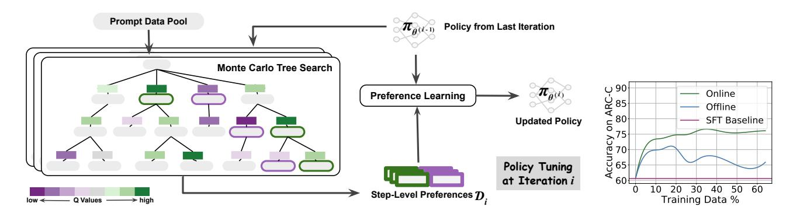
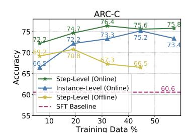
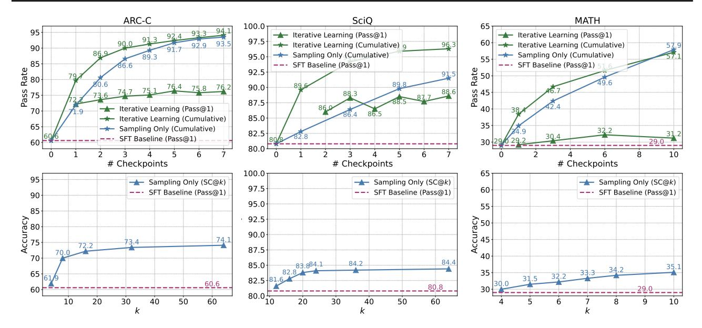
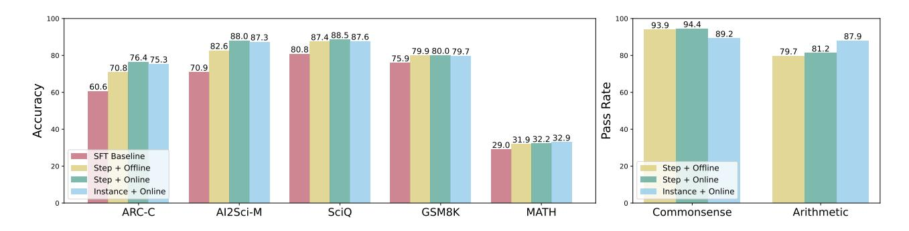
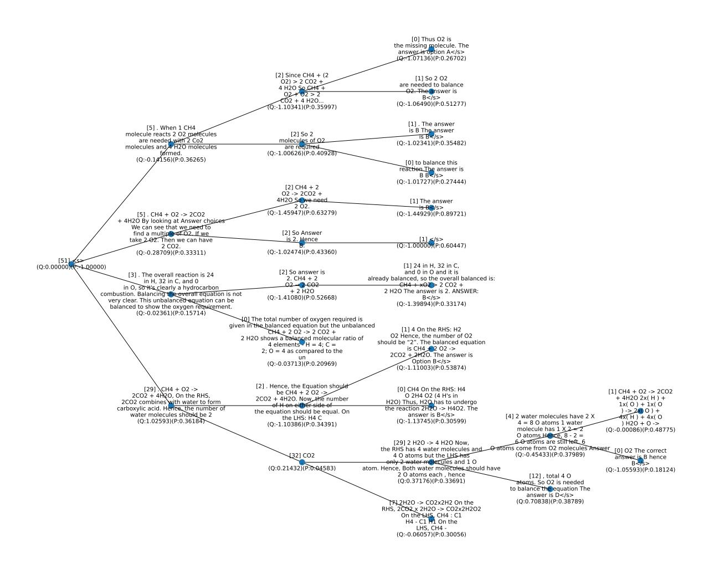
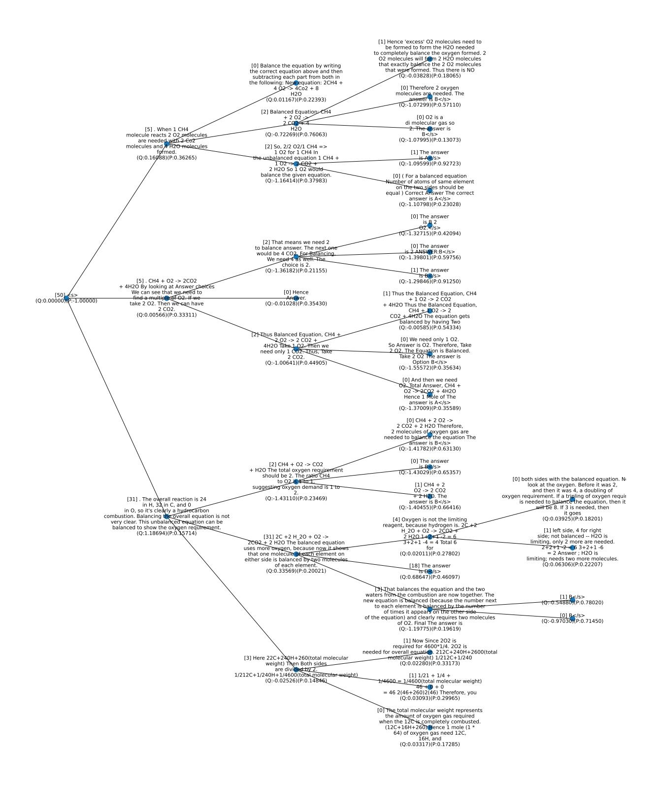
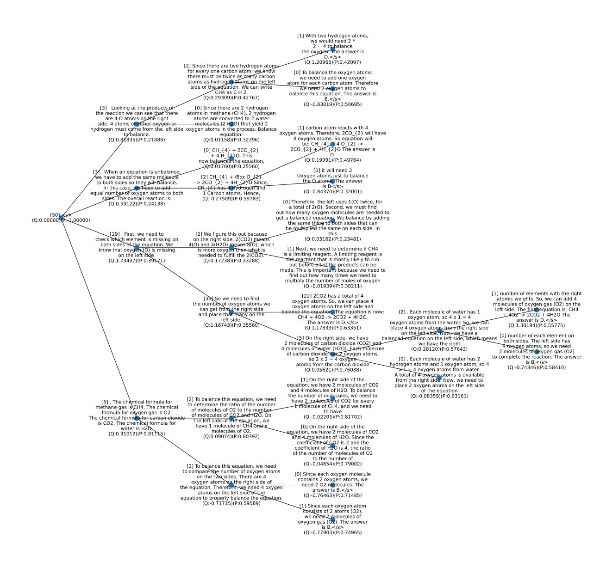
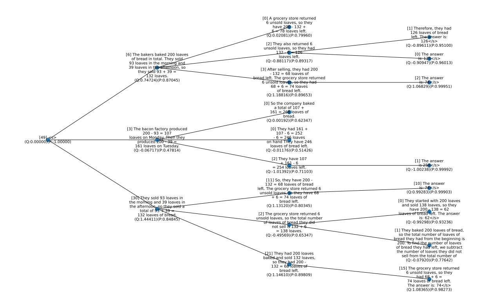
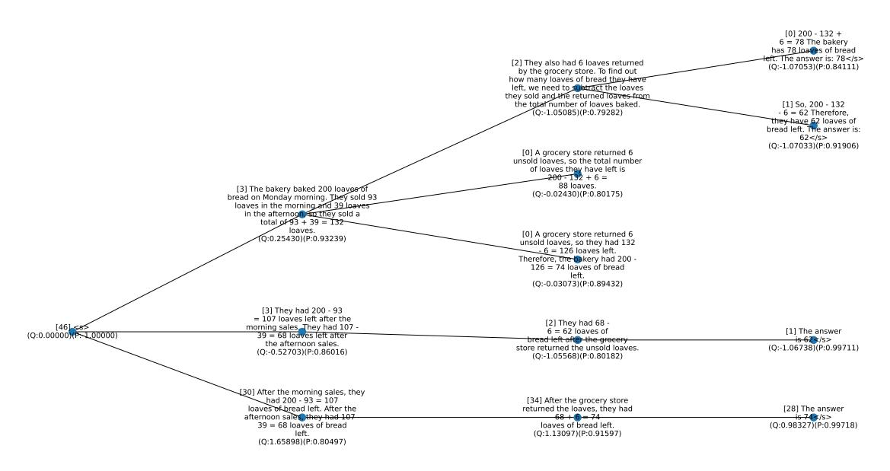

# Monte Carlo Tree Search Boosts Reasoning via Iterative Preference Learning

Yuxi Xie <sup>1</sup> Anirudh Goyal Wenyue Zheng <sup>1</sup> Min-Yen Kan <sup>1</sup> Timothy Lillicrap <sup>2</sup> Kenji Kawaguchi <sup>1</sup> Michael Shieh <sup>1</sup>

# Abstract

We introduce an approach aimed at enhancing the reasoning capabilities of Large Language Models (LLMs) through an iterative preference learning process inspired by the successful strategy employed by AlphaZero. Our work leverages Monte Carlo Tree Search (MCTS) to iteratively collect preference data, utilizing its look-ahead ability to break down instance-level rewards into more granular step-level signals. To enhance consistency in intermediate steps, we combine outcome validation and stepwise self-evaluation, continually updating the quality assessment of newly generated data. The proposed algorithm employs Direct Preference Optimization (DPO) to update the LLM policy using this newly generated steplevel preference data. Theoretical analysis reveals the critical importance of using on-policy sampled data for successful self-improving. Extensive evaluations on various arithmetic and commonsense reasoning tasks demonstrate remarkable performance improvements over existing models. For instance, our approach outperforms the Mistral-7B Supervised Fine-Tuning (SFT) baseline on GSM8K, MATH, and SciQ, with substantial percentage increases in accuracy to 80.7% (+4.8%), 32.2% (+3.3%), and 88.5% (+7.7%), respectively. Additionally, our research delves into the training and inference compute tradeoff, providing insights into how our method effectively maximizes performance gains.

## 1. Introduction

Development of Large Language Models (LLMs), has seen a pivotal shift towards aligning these models more closely with human values and preferences [\(Stiennon et al.,](#page-10-0)

Preliminary work. Under review by the International Conference on Machine Learning (ICML). Do not distribute.

[2020;](#page-10-0) [Ouyang et al.,](#page-10-1) [2022;](#page-10-1) [Bai et al.,](#page-8-0) [2022a\)](#page-8-0). A critical aspect of this process involves the utilization of preference data. There are two prevailing methodologies for incorporating this data: the first entails the construction of a reward model based on preferences, which is then integrated into a Reinforcement Learning (RL) framework to update the policy [\(Christiano et al.,](#page-8-1) [2017;](#page-8-1) [Bai et al.,](#page-8-2) [2022b\)](#page-8-2); the second, more stable and scalable method, directly applies preferences to update the model's policy [\(Rafailov et al.,](#page-10-2) [2023\)](#page-10-2).

In this context, the concept of "iterative" development is a key, especially when contrasted with the conventional Reinforcement Learning from Human Feedback (RLHF) paradigm [\(Christiano et al.,](#page-8-1) [2017;](#page-8-1) [Stiennon et al.,](#page-10-0) [2020;](#page-10-0) [Ouyang et al.,](#page-10-1) [2022;](#page-10-1) [Bai et al.,](#page-8-0) [2022a\)](#page-8-0), where the reward model is often trained offline and remains static. An iterative approach proposes a dynamic and continuous refinement process [\(Zelikman et al.,](#page-12-0) [2022;](#page-12-0) Gul¨ [c¸ehre et al.,](#page-9-0) [2023;](#page-9-0) [Huang](#page-9-1) [et al.,](#page-9-1) [2023;](#page-9-1) [Yuan et al.,](#page-12-1) [2024\)](#page-12-1). It involves a cycle that begins with the current policy, progresses through the collection and analysis of data to generate new preference data, and uses this data to update the policy. This approach underlines the importance of ongoing adaptation in LLMs, highlighting the potential for these models to become more attuned to the complexities of human decision-making and reasoning.

A compelling illustration of the success of such an iterative approach can be seen in the case of AlphaZero [\(Sil](#page-10-3)[ver et al.,](#page-10-3) [2017\)](#page-10-3) for its superhuman performance across various domains, which combines the strengths of neural networks, RL techniques, and Monte Carlo Tree Search (MCTS) [\(Coulom,](#page-9-2) [2006;](#page-9-2) [Kocsis & Szepesvari](#page-9-3) ´ , [2006\)](#page-9-3). The integration of MCTS functions as a *policy improvement operator* that transforms the current policy into an improved policy [\(Grill et al.,](#page-9-4) [2020\)](#page-9-4). The effectiveness of AlphaZero underscores the potential of combining these advanced techniques in LLMs. By integrating MCTS into the iterative process of policy development, it is plausible to achieve significant strides in the field of LLMs, particularly in the realm of reasoning and decision-making aligned with human-like preferences [\(Zhu et al.,](#page-12-2) [2023;](#page-12-2) [Hao et al.,](#page-9-5) [2023\)](#page-9-5).

The integration of MCTS in collecting preference data to improve the current policy iteratively is nuanced and demands careful consideration. One primary challenge lies in

<sup>1</sup>National University of Singapore <sup>2</sup>Google DeepMind. Correspondence to: Yuxi Xie <xieyuxi@u.nus.edu>, Anirudh Goyal <anirudhgoyal9119@gmail.com>.

<span id="page-1-0"></span>

Figure 1: Monte Carlo Tree Search (MCTS) boosts model performance via iterative preference learning. Each iteration of our framework (on the left) consists of two stages: MCTS to collect step-level preferences and preference learning to update the policy. Specifically, we use action values Q estimated by MCTS to assign the preferences, where steps of higher and lower Q values will be labeled as positive and negative data, respectively. The scale of Q is visualized in the colormap. We show the advantage of the online manner in our iterative learning framework using the validation accuracy curves as training progresses on the right. The performance of ARC-C validation illustrates the effectiveness and efficiency of our proposed method compared to its offline variant.

determining the appropriate granularity for applying MCTS. Conventionally, preference data is collected at the instance level. The instance-level approach employs sparse supervision, which can lose important information and may not optimally leverage the potential of MCTS in improving the LLMs (Wu et al., 2023). Another challenge is the reliance of MCTS on a critic or a learned reward function. This function is crucial for providing meaningful feedback on different rollouts generated by MCTS, thus guiding the policy improvement process (Liu et al., 2023a).

Addressing this granularity issue, evidence from LLM research indicates the superiority of process-level or stepwise evaluations over instance-level ones (Lightman et al., 2023; Li et al., 2023; Xie et al., 2023; Yao et al., 2023). Our approach utilizes MCTS rollouts for step-level guidance, aligning with a more granular application of MCTS. Moreover, we employ self-evaluation, where the model assesses its own outputs, fostering a more efficient policy improvement pipeline by acting as both policy and critic (Kadavath et al., 2022; Xie et al., 2023). This method streamlines the process and ensures more cohesive policy updates, aligning with the iterative nature of policy enhancement and potentially leading to more robust and aligned LLMs.

To summarize, we propose a new algorithm based on Monte Carlo Tree Search (MCTS) that breaks down the instance-level preference signals into step-level. MCTS allows us to use the current LLM policy to generate preference data instead of a predetermined set of human preference data, enabling the LLM to receive real-time training signals. During training, we generate sequences of text on the fly and label the preference via MCTS based on feedback from self-evaluation (Figure 1). To update the LLM policy using

the preference data, we use Direct Preference Optimization (DPO) (Rafailov et al., 2023). In our theoretical analysis in Section 3, we found that using the online sampled data is key to successful self-improving training. We extensively evaluate the proposed approach on various arithmetic and commonsense reasoning tasks and observe significant performance improvements. For instance, our approach significantly outperforms the Mistral-7B backboned SFT baseline by 80.7% (+4.8%), 32.2% (+3.3%), and 88.5% (+7.7%) on GSM8K, MATH, and SciQ, respectively. Further analysis of the training and test compute tradeoff shows that our method can effectively push the performance gains in a more efficient way compared to sampling-only approaches.

# 2. MCTS-Enhanced Iterative Preference Learning

In this paper, we introduce an approach for improving LLM reasoning, centered around an iterative preference learning process. The proposed method begins with an initial policy  $\pi_{\theta^{(0)}}$ , and a dataset of prompts  $\mathcal{D}_{\mathcal{P}}$ . Each iteration i involves selecting a batch of prompts from  $\mathcal{D}_{\mathcal{P}}$ , from which the model, guided by its current policy  $\pi_{\theta^{(i-1)}}$ , generates potential responses for each prompt. We then apply a set of dynamically evolving reward criteria to extract preference data  $\mathcal{D}_i$  from these responses. The model's policy is subsequently tuned using this preference data, leading to an updated policy  $\pi_{\theta^{(i)}}$ , for the next iteration. This cycle of sampling, response generation, preference extraction, and policy tuning is repeated, allowing for continuous self-improvement and alignment with evolving preferences. In addressing the critical aspects of this methodology, two key

challenges emerge: the effective collection of preference data and the process of updating the policy post-collection.

We draw upon the concept that MCTS can act as an approximate policy improvement operator, transforming the current policy into an improved one. Our work leverages MCTS to iteratively collect preference data, utilizing its look-ahead ability to break down instance-level rewards into more granular step-level signals. To enhance consistency in intermediate steps, we incorporate stepwise selfevaluation, continually updating the quality assessment of newly generated data. This process, as depicted in Figure [1,](#page-1-0) enables MCTS to balance quality exploitation and diversity exploration during preference data sampling at each iteration. Detailed in section [2.1,](#page-2-0) our approach utilizes MCTS for step-level preference data collection. Once this data is collected, the policy is updated using DPO, as outlined in section [2.2.](#page-3-1) Our method can be viewed as an online version of DPO, where the updated policy is iteratively employed to collect preferences via MCTS. Our methodology, thus, not only addresses the challenges in preference data collection and policy updating but also introduces a dynamic, iterative framework that significantly enhances LLM reasoning.

#### <span id="page-2-0"></span>2.1. MCTS for Step-Level Preference Collection

To transform instance-level rewards into granular, step-level signals, we dissect the reasoning process into discrete steps, each represented by a token sequence. We define the state at step t, st, as the prefix of the reasoning chain, with the addition of a new reasoning step a transitioning the state to st+1, where st+1 is the concatenation of s<sup>t</sup> and a [1](#page-2-1) . Utilizing the model's current policy πθ, we sample candidate steps from its probability distribution πθ(a | x, st), with x being the task's input prompt. MCTS serves as an approximate policy improvement operator by leveraging its look-ahead capability to predict the expected future reward. This prediction is refined through stepwise self-evaluation [\(Kadavath](#page-9-7) [et al.,](#page-9-7) [2022;](#page-9-7) [Xie et al.,](#page-11-1) [2023\)](#page-11-1), enhancing process consistency and decision accuracy. The tree-structured search supports a balance between exploring diverse possibilities and exploiting promising paths, essential for navigating the vast search space in LLM reasoning.

The MCTS process begins from a root node, s0, representing the sentence start or incomplete response, and unfolds in three iterative stages: selection, expansion, and backup, which we detail further.

Select. In this phase, the objective is to identify nodes that balance search quality and computational efficiency. The selection is guided by two key variables: Q(st, a), the value of taking action a in state st, and N(st), the visitation frequency of state st. These variables are crucial for updating the search strategy, as explained in the backup section. To navigate the trade-off between exploring new nodes and exploiting visited ones, we employ the Predictor + Upper Confidence bounds applied to Trees (PUCT) algorithm [\(Rosin,](#page-10-6) [2011\)](#page-10-6). At node st, the choice of the subsequent node follows the formula:

$$s_{t+1}^* = \arg\max_{s_t} \left[ Q(s_t, a) + c_{\text{puct}} \cdot p(a \mid s_t) \frac{\sqrt{N(s_t)}}{1 + N(s_{t+1})} \right]$$
(1)

where p(a | st) = πθ(a | x, st)/|a| <sup>λ</sup> denotes the policy πθ's probability distribution for generating a step a, adjusted by a λ-weighted length penalty to prevent overly long reasoning chains.

Expand. Expansion occurs at a leaf node during the selection process to integrate new nodes and assess rewards. The reward r(st, a) for executing step a in state s<sup>t</sup> is quantified by the reward difference between states R(st) and R(st+1), highlighting the advantage of action a at st. As defined in Eq. [\(2\)](#page-2-2), reward computation merges outcome correctness O with self-evaluation C. We assign the outcome correctness to be 1, −1, and 0 for correct terminal state, incorrect terminal state, and unfinished intermediate state, respectively. Following [Xie et al.](#page-11-1) [\(2023\)](#page-11-1), we define self-evaluation as Eq. [\(3\)](#page-2-3), where A denotes the confidence score in token-level probability for the option indicating correctness[2](#page-2-4) . Future rewards are anticipated by simulating upcoming scenarios through roll-outs, following the selection and expansion process until reaching a terminal state[3](#page-2-5) .

<span id="page-2-2"></span>
$$R(s_t) = \mathcal{O}(s_t) + \mathcal{C}(s_t) \tag{2}$$

<span id="page-2-3"></span>
$$C(s_t) = \pi_{\theta}(A \mid prompt_{eval}, x, s_t)$$
 (3)

Backup. Once a terminal state is reached, we carry out a bottom-up update from the terminal node back to the root. We update the visit count N, the state value V , and the transition value Q as follows:

$$Q(s_t, a) \leftarrow r(s_t, a) + \gamma V(s_{t+1}) \tag{4}$$

$$V(s_t) \leftarrow \sum_{a} N(s_{t+1})Q(s_t, a) / \sum_{a} N(s_{t+1}) \qquad (5)$$

$$N(s_t) \leftarrow N(s_t) + 1 \tag{6}$$

where γ is the discount for future state values.

<span id="page-2-1"></span><sup>1</sup>We detail the step definition for different tasks with examples in Appendices [C](#page-16-0) and [D.](#page-18-0)

<span id="page-2-5"></span><span id="page-2-4"></span><sup>2</sup>We show an example of evaluation prompt in Table [5](#page-17-0)

<sup>3</sup>We determine the terminal state by whether there is already an end-of-sentence (EOS) token or the whole response exceeds the maximum length.

<span id="page-3-2"></span>**Algorithm 1.** MCTS-Enhanced Iterative Preference Learning. Given an initial policy  $\pi_{\theta^{(0)}} = \pi_{\text{sft}}$ , our algorithm iteratively conducts step-level preference data sampling via MCTS and preference learning via DPO to update the policy.

**Input:**  $\mathcal{D}_{\mathcal{P}}$ : prompt dataset;  $q(\cdot \mid x)$ : MCTS sampling strategy that constructs a tree-structured set of possible responses given a prompt x, where  $q_{\pi}$  represents that the strategy is based on the policy  $\pi$  for both response generation and self-evaluation;  $\ell_i(x, y_w, y_l; \theta)$ : loss function of preference learning at the i-th iteration, where the corresponding sampling policy is  $\pi^{(i)}$ ; M: number of iterations; B: number of samples per iteration; T: average number of steps per sample Train  $\pi_{\theta}$  on  $\mathcal{D}_{\mathcal{P}}$  using step-level preference learning.

```
 \begin{aligned} &\mathbf{for}\ i = 1\ \mathbf{to}\ M\ \mathbf{do} \\ &\pi^{(i)} \leftarrow \pi_{\theta} \leftarrow \pi_{\theta^{(i-1)}} \\ &\text{Sample a batch of } B\ \text{samples from } \mathcal{D}_{\mathcal{P}}\ \text{as } \mathcal{D}_{\mathcal{P}}^{(i)}. \\ &/^*\ \text{MCTS for Step-Level Preference Data Collection }^*/ \\ &\text{For each } x \in \mathcal{D}_{\mathcal{P}}^{(i)}, \text{ elicit a search tree of depth } T\ \text{via } q_{\pi_{\theta}}(\cdot \mid x). \\ &\text{Collect a batch of preferences } \mathcal{D}_i = \big\{\ \{(x^j, y_l^{(j,t)}, y_l^{(j,t)})|_{t=1}^T\}|_{j=1}^B\ \text{s.t.}\ x^j \sim \mathcal{D}_{\mathcal{P}}^{(i)}, y_w^{(j,t)} \neq y_w^{(j,t)} \sim q_{\pi_{\theta}}(\cdot \mid x^j)\ \big\}, \\ &\text{where } y_w^{(j,t)} \ \text{is the node at depth } t, \text{ with the highest } Q\ \text{among all the children nodes of their parent node.} \\ &/^*\ \text{Preference Learning for Policy Improvement }^*/ \\ &\text{Optimize } \theta\ \text{ by minimizing } J(\theta) = \mathbb{E}_{(x,y_w,y_l)\sim\mathcal{D}_l}\ell_i(x,y_w,y_l;\theta). \\ &\text{Obtain the updated policy } \pi_{\theta^{(i)}} \\ &\text{end for} \\ &\pi_{\theta} \leftarrow \pi_{\theta^{(M)}} \\ &\text{Output: Policy } \pi_{\theta} \end{aligned}
```

For each step in the response generation, we conduct K iterations of MCTS to construct the search tree while updating Q values. To balance the diversity, quality, and efficiency of the tree construction, we initialize the search breadth as  $b_1$  and anneal it to be a smaller  $b_2 < b_1$  for the subsequent steps. We use the result Q value corresponding to each candidate step to label its preference, where higher Q values indicate preferred next steps. For a result search tree of depth T, we obtain T pairs of step-level preference data. Specifically, we select the candidate steps of highest and lowest Q values as positive and negative samples at each tree depth, respectively. The parent node at each tree depth is discerned by both the quality and diversity of the child nodes.

#### <span id="page-3-1"></span>2.2. Iterative Preference Learning

Given the step-level preferences collected via MCTS, we further tune the policy using DPO. Specifically, at the i-th iteration, given a batch of preference data  $\mathcal{D}_i$  sampled using the latest policy  $\pi_{\theta^{(i-1)}}$ , we denote the policy objective  $\ell_i(\theta)$  following Rafailov et al. (2023):

<span id="page-3-3"></span>
$$\ell_{i}(\theta) = -\mathbb{E}_{(x,y_{w},y_{l}) \sim \mathcal{D}_{i}} \left[ \log \sigma \left( \beta \log \frac{\pi_{\theta}(y_{w} \mid x)}{\pi_{\text{ref}}(y_{w} \mid x)} - \beta \log \frac{\pi_{\theta}(y_{l} \mid x)}{\pi_{\text{ref}}(y_{l} \mid x)} \right) \right]$$

$$(7)$$

where  $y_w$  and  $y_l$  represent the step-level preferred and dispreferred responses, respectively, and the hyperparameter  $\beta$  scales the KL constraint. After optimization, we obtain the updated policy  $\pi_{\theta^{(i)}}$  and repeat the data collection process

in Section 2.1 to iteratively update the LLM policy. We now outline the full algorithm of our MCTS-enhanced Iterative Preference Learning in Algorithm 1.

#### <span id="page-3-0"></span>3. Theoretical Analysis

Our approach can be viewed as an online version of DPO, where we iteratively use the updated policy to sample preferences via MCTS. In this section, we provide theoretical analysis to interpret the advantages of our online learning framework compared to the conventional alignment techniques that critically depend on offline preference data. We review the typical RLHF and DPO paradigms in Appendix B.

We now consider the following abstract formulation for clean theoretical insights to analyze our online setting of preference learning. Given a prompt x, there exist n possible suboptimal responses  $\{\bar{y}_1,\ldots,\bar{y}_n\}=Y$  and an optimal outcome  $y^*$ . As specified in Equation 7, at the i-th iteration, a pair of responses (y,y') are sampled from some sampling policy  $\pi^{(i)}$  without replacement so that  $y\neq y'$  as  $y\sim\pi^{(i)}(\cdot\mid x)$  and  $y'\sim\pi^{(i)}(\cdot\mid x,y)$ . Then, these are labeled to be  $y_w$  and  $y_l$  according to the preference. Define  $\Theta$  be a set of all global optimizers of the preference loss for all M iterations, i.e., for any  $\theta\in\Theta$ ,  $\ell_i(\theta)=0$  for all  $i\in\{1,2,\cdots,M\}$ . Similarly, let  $\theta^{(i)}$  be a parameter vector such that  $\ell_j(\theta^{(i)})=0$  for all  $j\in\{1,2,\cdots,i-1\}$  for  $i\geq 1$  whereas  $\theta^{(0)}$  is the initial parameter vector.

This abstract formulation covers both the offline and online settings. The offline setting in previous works is obtained by setting  $\pi^{(i)} = \pi$  for some fixed distribution  $\pi$ . The online

setting is obtained by setting π (i) = π<sup>θ</sup> (i−1) where π<sup>θ</sup> (i−1) is the latest policy at beginning of the i-th iteration.

The following theorem shows that the offline setting can fail with high probability if the sampling policy π (i) differs too much from the current policy π<sup>θ</sup> (i−1) :

<span id="page-4-0"></span>Theorem 3.1 (Offline setting can fail with high probability). *Let* π *be any distribution for which there exists* y¯ ∈ Y *such that* π(¯y | x), π(¯y | x, y) ≤ ϵ *for all* y ∈ (Y \y¯)∪ {y <sup>∗</sup>} *and* πθ (i−1) (¯y | x) ≥ c *for some* i ∈ {1, 2, · · · , M}*. Set* π (i) = π *for all* i ∈ {1, 2, · · · , M}*. Then, there exists* θ ∈ Θ *such that with probability at least* 1 − 2ϵM *(over the samples of* π (i) = π*), the following holds:* π<sup>θ</sup> (y ∗ | x) ≤ 1 − c*.*

If the current policy and the sampling policy differ too much, it is possible that ϵ = 0 and c ≈ 1.0, for which Theorem [3.1](#page-4-0) can conclude πθ(y ∗ | x) ≈ 0 with probability 1 for any number of steps M. When ϵ ̸= 0, the lower bound of the failure probability decreases towards zero as we increase M. Thus, it is important to make sure that ϵ ̸= 0 and ϵ is not too low. This is achieved by using the online setting, *i.e.*, π (i) = π<sup>θ</sup> (i) . Therefore, Theorem [3.1](#page-4-0) motivates us to use the online setting. Theorem [3.2](#page-4-1) confirms that we can indeed avoid this failure case in the online setting.

<span id="page-4-1"></span>Theorem 3.2 (Online setting can avoid offline failure case). *Let* π (i) = π<sup>θ</sup> (i−1) *. Then, for any* θ ∈ Θ*, it holds that* πθ(y ∗ | x) = 1 *if* M ≥ n + 1*.*

See Appendix [B](#page-13-0) for the proofs of Theorems [3.1](#page-4-0) and [3.2.](#page-4-1) As suggested by the theorems, a better sampling policy is to use both the latest policy and the optimal policy for preference sampling. However, since we cannot access the optimal policy π ∗ in practice, we adopt online DPO via sampling from the latest policy π<sup>θ</sup> (i−1) . The key insight of our iterative preference learning approach is that online DPO is proven to enable us to converge to an optimal policy even if it is inaccessible to sample outputs. We provide further discussion and additional insights in Appendix [B.](#page-13-0)

## 4. Experiments

We evaluate the effectiveness of our MCTS-enhanced iterative preference learning framework on arithmetic and commonsense reasoning tasks[4](#page-4-2) . We employ the Mistral-7B model [\(Jiang et al.,](#page-9-8) [2023\)](#page-9-8) as the base pre-trained model. We conduct supervised training using the Arithmo dataset [5](#page-4-3) which comprises approximately 540K mathematical and coding problems. This training is aimed at enabling the model to learn and apply the chain-of-thought (CoT) [\(Wei](#page-11-3) [et al.,](#page-11-3) [2022\)](#page-11-3) and program-of-thought (PoT) [\(Chen et al.,](#page-8-3) [2022\)](#page-8-3) reasoning formats, essential for solving complex tasks. Detailed information regarding the task formats, specific

implementation procedures, and parameter settings of our experiments can be found in Appendix [C.](#page-16-0)

Datasets. We aim to demonstrate the effectiveness and versatility of our approach by focusing on two types of reasoning: arithmetic and commonsense reasoning. For arithmetic reasoning, we utilize two datasets: GSM8K [\(Cobbe](#page-9-9) [et al.,](#page-9-9) [2021\)](#page-9-9), which consists of grade school math word problems, and MATH [\(Hendrycks et al.,](#page-9-10) [2021\)](#page-9-10), featuring challenging competition math problems. Specifically, in the GSM8K dataset, we assess both chain-of-thought (CoT) and program-of-thought (PoT) reasoning abilities. We integrate the training data from GSM8K and MATH to construct the prompt data for our preference learning framework, aligning with a subset of the Arithmo data used for Supervised Fine-Tuning (SFT). This approach allows us to evaluate whether our method enhances reasoning abilities on specific arithmetic tasks. For commonsense reasoning, we use four multiple-choice datasets: ARC (easy and challenge splits) [\(Clark et al.,](#page-9-11) [2018\)](#page-9-11), focusing on science exams; AI2Science (elementary and middle splits) [\(Clark](#page-9-11) [et al.,](#page-9-11) [2018\)](#page-9-11), containing science questions from student assessments; OpenBookQA (OBQA) [\(Mihaylov et al.,](#page-10-7) [2018\)](#page-10-7), which involves open book exams requiring broad common knowledge; and CommonSenseQA (CSQA) [\(Talmor et al.,](#page-10-8) [2019\)](#page-10-8), featuring commonsense questions necessitating prior world knowledge. The diversity of these datasets, with different splits representing various grade levels, enables a comprehensive assessment of our method's generalizability in learning various reasoning tasks through self-distillation. Performance evaluation is conducted using the corresponding validation sets of each dataset. Furthermore, we employ an unseen evaluation using the validation set of an additional dataset, SciQ [\(Welbl et al.,](#page-11-4) [2017\)](#page-11-4), following the approach of [Liu et al.](#page-10-9) [\(2023b\)](#page-10-9), to further test our model's ability to generalize to novel reasoning contexts.

Baselines. Our study involves a comparative evaluation of our method against several prominent training approaches on relevant tasks. We contrast our approach with the Self-Taught Reasoner (STaR)[\(Zelikman et al.,](#page-12-0) [2022\)](#page-12-0), an iterated learning model based on instance-level rationale generation, and Crystal[\(Liu et al.,](#page-10-9) [2023b\)](#page-10-9), an RL-tuned model with a focus on knowledge introspection in commonsense reasoning. Considering the variation in base models used by these methods, we also include comparisons with Direct Tuning, which entails fine-tuning base models directly in a questionanswer format, bypassing chain-of-thought reasoning.

In the context of arithmetic reasoning tasks, our analysis includes Language Model Self-Improvement (LMSI)[\(Huang](#page-9-1) [et al.,](#page-9-1) [2023\)](#page-9-1), a self-training method using self-consistency to gather positive data, and Math-Shepherd[\(Wang et al.,](#page-11-5) [2023a\)](#page-11-5), which integrates process supervision within Proximal Policy Optimization (PPO). To account for differences

<span id="page-4-2"></span><sup>4</sup>Our code is available in supplementary material.

<span id="page-4-3"></span><sup>5</sup> <https://huggingface.co/datasets/akjindal53244/Arithmo-Data>

<span id="page-5-0"></span>Table 1: Result comparison (accuracy %) on arithmetic tasks. We supervised fine-tune the base model Mistral-7B on Arithmo data, while Math-Shepherd (Wang et al., 2023a) use MetaMATH (Yu et al., 2023b) for SFT. We highlight the advantages of our approach via the conceptual comparison with other methods, where NR, OG, OF, and NS represent "w/o Reward Model", "On-policy Generation", "Online Feedback", and "w/ Negative Samples", respectively.

| APPROACH       | BASE MODEL | CONCEPTUAL |    |    |    | GSN          | MATH             |              |
|----------------|------------|------------|----|----|----|--------------|------------------|--------------|
| АРРКОАСН       | DASE MODEL | NR         | OG | OF | NS | CoT          | PoT              | CoT          |
| LMSI           | PALM-540B  | 1          | 1  | Х  | Х  | 73.5         | -                | _            |
| SFT (METAMATH) | MISTRAL-7B | _          | _  | _  | _  | 77.7         | _                | 28.2         |
| MATH-SHEPHERD  | MISTRAL-/B | Х          | 1  | Х  | ✓  | $84.1_{6.4}$ | _                | $33.0_{1.8}$ |
| SFT (ARITHMO)  | MISTRAL-7B | _          | _  | _  | _  | 75.9         | 76.7             | 28.9         |
| OURS           | MISTRAL-/B | ✓          | 1  | ✓  | /  | $80.7_{1.8}$ | $80.1^{1}_{3.4}$ | $32.2_{3.3}$ |



Figure 2: Performance on the validation set of ARC-C via training with different settings.

<span id="page-5-1"></span>Table 2: Result comparisons (accuracy %) on commonsense reasoning tasks. The results based on GPT-3-curie (Brown et al., 2020) and T5 (Raffel et al., 2020) are reported from Liu et al. (2023b). For CSQA, we also include the GPT-J (Wang & Komatsuzaki, 2021) results reported by Zelikman et al. (2022). We follow Liu et al. (2023b) to combine the training data of ARC, AI2Sci, OBQA, and CSQA for training, while STaR (Zelikman et al., 2022) only use CSQA for training.

| Approach                              | BASE MODEL         | Conc<br>NR | CEPTUAL<br>OG | COMPA<br>OF | RISON<br>NS | ARC-E                       | ARC-C                       | AI2Sci-e                    | AI2SCI-M                    | OBQA                        | CSQA                 | SciQ                        |
|---------------------------------------|--------------------|------------|---------------|-------------|-------------|-----------------------------|-----------------------------|-----------------------------|-----------------------------|-----------------------------|----------------------|-----------------------------|
| COT TUNING                            | GPT-3-CURIE (6.7B) | 1          | Х             | Х           | Х           | -                           | -                           | -                           | -                           | _                           | 56.8                 | -                           |
| DIRECT TUNING<br>STAR                 | GPT-J (6B)         | 1          | X<br>✓        | ×           | x<br>x      | _                           | _                           | _                           | _                           | _                           | 60.0<br>72.5         | _                           |
| DIRECT TUNING<br>CRYSTAL              | T5-11B             | ✓<br>X     | ×             | ×           | ×           | 84.6<br>87.5                | 72.9<br>73.2                | 87.8<br>89.4                | 84.0<br>84.8                | 80.0<br>85.4                | 82.0<br><b>82.3</b>  | 83.2<br>85.3                |
| SFT BASELINE<br>DIRECT TUNING<br>OURS | Mistral-7B         | -<br>/     | _<br>x<br>_   | _<br>x<br>⁄ | _<br>x<br>_ | 69.2<br>87.6<br><b>88.5</b> | 60.6<br>73.9<br><b>76.4</b> | 74.9<br>90.0<br><b>91.7</b> | 70.9<br>85.2<br><b>88.2</b> | 59.8<br><b>86.3</b><br>79.2 | 54.1<br>79.3<br>74.8 | 80.8<br>86.4<br><b>88.5</b> |

in base models and experimental setups across these methods, we also present result performance of SFT models as baselines for each respective approach. This comparison framework allows for a thorough assessment of our method's efficacy relative to existing training strategies.

#### <span id="page-5-3"></span>4.1. Main Results

Arithmetic Reasoning. In Table 1, we present a comparative analysis of performance gains in arithmetic reasoning tasks. Our method demonstrates substantial improvements, notably on GSM8K, increasing from  $75.9\% \rightarrow 80.7\%$ , and on MATH, enhancing from  $28.9\% \rightarrow 32.2\%$ . When compared to Math-Shepherd, which also utilizes process supervision in preference learning, our approach achieves similar performance enhancements without the necessity of training separate reward or value networks. This suggests the potential of integrating trained reward model signals into our MCTS stage to further augment performance.

Commonsense Reasoning. In Table 2, we report the performance on commonsense reasoning tasks, where our method shows consistent improvements. Notably, we achieve accuracy increases of 2.5%, 3.0%, and 2.1% on ARC-Challenge

(ARC-C), AI2Sci-Middle (AI2Sci-M), and SciQ, respectively, surpassing the results of direct tuning. However, in tasks like OBQA and CSQA, our method, focusing on intermediate reasoning refinement, is less efficient compared to direct tuning. Despite significant improvements over the Supervised Fine-Tuning (SFT) baseline (for instance, from 59.8% to 79.2% on OBQA, and from 54.1% to 74.8% on CSQA), the gains are modest relative to direct tuning.

This discrepancy could be attributed to the base model's lack of specific knowledge, where eliciting intermediate reasoning chains may introduce increased uncertainty in model generations, leading to incorrect predictions. We delve deeper into this issue of hallucination and its implications in our qualitative analysis, as detailed in Section 4.2.

#### <span id="page-5-2"></span>4.2. Further Analysis

**Training- vs. Test- Time Compute Scaling.** Our method integrates MCTS with preference learning, aiming to enhance both preference quality and policy reasoning via steplevel alignment. We analyze the impact of training-time compute scaling versus increased inference-time sampling.

We measure success by the pass rate, indicating the per-

<span id="page-6-0"></span>

Figure 3: Training- vs. Test- Time Compute Scaling on ARC-C, SciQ, and MATH evaluation sets. The cumulative pass rate of our iterative learning method can be seen as the pass rate of an ensemble of different model checkpoints. We use greedy decoding to obtain the inference time performance of our method of iterative learning.

centage of correctly elicited answers. Figure 3 displays the cumulative pass rate at each checkpoint, aggregating the pass rates up to that point. For test-time scaling, we increase the number of sampled reasoning chains. Additionally, we compare the inference performance of our checkpoints with a sampling-only method, self-consistency, to assess their potential performance ceilings. The pass rate curves on ARC-C, SciQ, and MATH datasets reveal that our MCTSenhanced approach yields a higher training compute scaling exponent. This effect is particularly pronounced on the unseen SciQ dataset, highlighting our method's efficiency and effectiveness in enhancing specific reasoning abilities with broad applicability. Inference-time performance analysis shows higher performance upper bounds of our method on ARC-C and SciQ. For instance, while self-consistency on SciQ plateaus at around 84%, our framework pushes performance to 88.6%. However, on MATH, the samplingonly approach outperforms training compute scaling: more sampling consistently enhances performance beyond 35%, whereas post-training performance hovers around 32.2%. This observation suggests that in-domain SFT already aligns the model well with task-specific requirements. A potential limitation of our method is the reduced diversity in policy generations as it specializes. We next explore how this diversity in policy generations affects overall effectiveness.

**Functions of Self-Evaluation Mechanism.** As illustrated in Section 2.1, the self-evaluation score inherently revises the Q value estimation for subsequent preference data collection. In practice, we find that the ground-truth informa-

tion, *i.e.*, the "EXAMPLE ANSWER" in Table 5, is crucial to ensure the reliability of our self-evaluation mechanism. We now compare the score distribution and discriminative abilities when including v.s. excluding this ground-truth information in Table 3. We observe that this information significantly improve the ability of self-evaluation to dicern the correctness of model outputs on GSM8K, MATH, and ARC-C datasets.

Impact of Diversity in Policy Generations. In preference learning, where both positive and negative data are necessary, maintaining diversity in sampled results is crucial for policy improvement. We use checkpoints from different stages of SFT process to represent policies with varying generation diversities. Specifically, we compare policies from the second epoch (higher diversity) and the final, third epoch (lower diversity) of SFT. As detailed in Table 1, the higher-diversity policy achieves 75.9% on GSM8K and 28.9% on MATH, while the lower-diversity policy shows slightly better performance at 77.3% and 30.0%, respectively. However, our method, utilizing the higher-diversity policy, leads to more significant improvements, reaching 80.7% and 32.2% on these datasets. In contrast, the lowerdiversity policy-based approach shows less gains, achieving 79.9% and 31.7%. These results underline the significance of balancing diversity and quality in MCTS for effective preference data collection. We provide a qualitative analysis in Appendix D to illustrate how preference quality varies with the diversity level in policy generations. Future research may focus on exploring diverse policy checkpointing

<span id="page-7-1"></span>

Figure 4: Abltation study on step-level vs. instance-level supervision and online vs. offline learning. We use instance-level sampling as a counterpart of step-level preference collection via MCTS. For a fair comparison, we also apply self-evaluation and correctness assessment and control the number of samples under a comparable compute budget with MCTS in instance-level sampling. The offline version uses the initial policy for sampling rather than the updated one at each iteration. We compare the test-time performance of different settings on five datasets (on the left). We also show the different average pass rates of the two reasoning tasks during training (on the right).

<span id="page-7-0"></span>Table 3: Ablation of "EXAMPLE ANSWER" in self-evaluation on GSM8K, MATH, and ARC-C. We report both the AUC score and accuracy (%) to compare the discriminative abilities when including v.s. excluding this ground-truth information.

| A PPP C + CH       | (    | GSM8K    | ]    | MATH     | ARC-C |          |  |
|--------------------|------|----------|------|----------|-------|----------|--|
| APPROACH           | AUC  | ACCURACY | AUC  | ACCURACY | AUC   | ACCURACY |  |
| W/ EXAMPLE ANSWER  | 74.7 | 72.5     | 76.6 | 48.8     | 65.2  | 57.5     |  |
| W/O EXAMPLE ANSWER | 62.0 | 69.5     | 48.1 | 42.3     | 55.8  | 48.4     |  |

and sampling strategies to enhance the variety of collected data, potentially leading to more robust learning outcomes.

**Ablation Study.** We ablate the impact of step-level supervision signals and the online learning aspect of our MCTS-based approach. Figure 4 shows performance comparisons across commonsense and arithmetic reasoning tasks under different settings. Our method, focusing on step-level online preference learning, consistently outperforms both instance-level and offline approaches in commonsense reasoning. For example, we achieve 76.4% on ARC-C and 88.5% on SciQ, surpassing 70.8% and 87.4% of the offline variant, and 75.4% and 87.6% of the instance-level approach.

Interestingly, in training-time pass rate versus test-time accuracy, offline learning shows similar training effectiveness to online (e.g., 93.9% vs. 94.4% in commonsense reasoning) but underperforms in testing (e.g., 70.8% vs. 76.4% on ARC-C). This suggests that our online framework, with its detailed quality control, fosters policy improvement through progressive learning. Performance trends in Figure 2 further emphasize the efficiency and stability of our online step-level learning, particularly in early training stages.

In arithmetic reasoning, performance differences among settings are less pronounced (e.g., 32.2% for our method vs.

31.9% and 32.9% for offline and instance-level on MATH). The comparable performance of offline learning aligns with our theoretical analysis that offline approaches can be effective when the initial policy is already well-tuned with high-quality, in-domain data. The similar results between step-and instance-level supervisions reflect the high training pass rate (87.9%) of the instance-level method with equivalent compute resources. Nonetheless, given our lower training pass rate (81.2%), the step-level supervision demonstrates greater robustness in the training-to-test data transition.

Across both task types, online learning exhibits cyclic performance fluctuations, with validation performance peaking before dipping. This aligns with our theoretical findings that continuous policy updates with the latest models can lead to periodic knowledge loss due to insufficient optimization in iterative updates. We probe these phenomena, both theoretically and qualitatively, in Appendices B and D.

Qualitative Analysis. Our qualitative analysis in Table 9 examines the impact of step-level supervision on intermediate reasoning correctness across different tasks. In OBQA, the implementation of MCTS, as discussed in Section 4.1, often leads to longer reasoning chains. This can introduce errors in commonsense reasoning tasks, as seen in our OBQA example, where an extended chain results in an incorrect

final prediction. Conversely, in the MATH dataset, our approach successfully guides the model to rectify mistakes and formulates accurate, extended reasoning chains, demonstrating its effectiveness in complex math word problems. This analysis underscores the need to balance reasoning chain length and logical coherence, particularly in tasks with higher uncertainty, such as commonsense reasoning.

## 5. Related Work

Various studies focus on self-improvement to exploit the model's capability. One line of work focuses on collecting high-quality positive data from model generations guided by static reward heuristic [\(Zelikman et al.,](#page-12-0) [2022;](#page-12-0) Gul¨ [c¸ehre](#page-9-0) [et al.,](#page-9-0) [2023;](#page-9-0) [Polu et al.,](#page-10-11) [2023\)](#page-10-11). Recently, [Yuan et al.](#page-12-1) [\(2024\)](#page-12-1) utilize the continuously updated LLM self-rewarding to collect both positive and negative data for preference learning. Different from prior works at instance-level alignment, we leverage MCTS as a policy improvement operator to iteratively facilitate step-level preference learning. We discuss additional related work in Appendix [A.](#page-13-1)

#### 6. Conclusion

In this paper, we propose MCTS-enhanced iterative preference learning, utilizing MCTS as a policy improvement operator to enhance LLM alignment via step-level preference learning. MCTS balances quality exploitation and diversity exploration to produce high-quality training data, efficiently pushing the ceiling performance of the LLM on various reasoning tasks. Theoretical analysis shows that online sampling in our iterative learning framework is key to improving the LLM policy toward optimal alignment. We hope our proposed approach can inspire future research on LLM alignment from both data-centric and algorithm-improving aspects: to explore searching strategies and utilization of history data and policies to augment and diversify training examples; to strategically employ a tradeoff between offline and online learning to address the problem of cyclic performance change of the online learning framework as discussed in our theoretical analysis.

## Potential Broader Impact

This paper presents work whose goal is to advance the field of Machine Learning. There are many potential societal consequences of our work, none of which we feel must be specifically highlighted here.

# References

<span id="page-8-5"></span>Anthony, T., Tian, Z., and Barber, D. Thinking fast and slow with deep learning and tree search. In Guyon, I., von Luxburg, U., Bengio, S., Wallach, H. M., Fergus, R.,

- Vishwanathan, S. V. N., and Garnett, R. (eds.), *Advances in Neural Information Processing Systems 30: Annual Conference on Neural Information Processing Systems 2017, December 4-9, 2017, Long Beach, CA, USA*, pp. 5360–5370, 2017. URL [https://proceedings.](https://proceedings.neurips.cc/paper/2017/hash/d8e1344e27a5b08cdfd5d027d9b8d6de-Abstract.html) [neurips.cc/paper/2017/hash/](https://proceedings.neurips.cc/paper/2017/hash/d8e1344e27a5b08cdfd5d027d9b8d6de-Abstract.html) [d8e1344e27a5b08cdfd5d027d9b8d6de-Abstr](https://proceedings.neurips.cc/paper/2017/hash/d8e1344e27a5b08cdfd5d027d9b8d6de-Abstract.html)act. [html](https://proceedings.neurips.cc/paper/2017/hash/d8e1344e27a5b08cdfd5d027d9b8d6de-Abstract.html).
- <span id="page-8-7"></span>Azar, M. G., Rowland, M., Piot, B., Guo, D., Calandriello, D., Valko, M., and Munos, R. A general theoretical paradigm to understand learning from human preferences. *CoRR*, abs/2310.12036, 2023. doi: 10.48550/ARXIV. 2310.12036. URL [https://doi.org/10.48550/](https://doi.org/10.48550/arXiv.2310.12036) [arXiv.2310.12036](https://doi.org/10.48550/arXiv.2310.12036).
- <span id="page-8-0"></span>Bai, Y., Jones, A., Ndousse, K., Askell, A., Chen, A., Das-Sarma, N., Drain, D., Fort, S., Ganguli, D., Henighan, T., Joseph, N., Kadavath, S., Kernion, J., Conerly, T., Showk, S. E., Elhage, N., Hatfield-Dodds, Z., Hernandez, D., Hume, T., Johnston, S., Kravec, S., Lovitt, L., Nanda, N., Olsson, C., Amodei, D., Brown, T. B., Clark, J., Mc-Candlish, S., Olah, C., Mann, B., and Kaplan, J. Training a helpful and harmless assistant with reinforcement learning from human feedback. *CoRR*, abs/2204.05862, 2022a. doi: 10.48550/ARXIV.2204.05862. URL [https:](https://doi.org/10.48550/arXiv.2204.05862) [//doi.org/10.48550/arXiv.2204.05862](https://doi.org/10.48550/arXiv.2204.05862).
- <span id="page-8-2"></span>Bai, Y., Kadavath, S., Kundu, S., Askell, A., Kernion, J., Jones, A., Chen, A., Goldie, A., Mirhoseini, A., McKinnon, C., et al. Constitutional ai: Harmlessness from ai feedback. *arXiv preprint arXiv:2212.08073*, 2022b.
- <span id="page-8-6"></span>Bradley, R. A. and Terry, M. E. Rank analysis of incomplete block designs: I. the method of paired comparisons. *Biometrika*, 39(3/4):324–345, 1952.
- <span id="page-8-4"></span>Brown, T., Mann, B., Ryder, N., Subbiah, M., Kaplan, J. D., Dhariwal, P., Neelakantan, A., Shyam, P., Sastry, G., Askell, A., et al. Language models are few-shot learners. *Advances in neural information processing systems*, 33: 1877–1901, 2020.
- <span id="page-8-3"></span>Chen, W., Ma, X., Wang, X., and Cohen, W. W. Program of thoughts prompting: Disentangling computation from reasoning for numerical reasoning tasks. *arXiv preprint arXiv:2211.12588*, 2022.
- <span id="page-8-1"></span>Christiano, P. F., Leike, J., Brown, T. B., Martic, M., Legg, S., and Amodei, D. Deep reinforcement learning from human preferences. In Guyon, I., von Luxburg, U., Bengio, S., Wallach, H. M., Fergus, R., Vishwanathan, S. V. N., and Garnett, R. (eds.), *Advances in Neural Information Processing Systems 30: Annual Conference on Neural Information Processing Systems 2017, December 4-9, 2017, Long Beach, CA, USA*, pp. 4299– 4307, 2017. URL [https://proceedings.](https://proceedings.neurips.cc/paper/2017/hash/d5e2c0adad503c91f91df240d0cd4e49-Abstract.html)

- [neurips.cc/paper/2017/hash/](https://proceedings.neurips.cc/paper/2017/hash/d5e2c0adad503c91f91df240d0cd4e49-Abstract.html) [d5e2c0adad503c91f91df240d0cd4e49-Abstr](https://proceedings.neurips.cc/paper/2017/hash/d5e2c0adad503c91f91df240d0cd4e49-Abstract.html)act. [html](https://proceedings.neurips.cc/paper/2017/hash/d5e2c0adad503c91f91df240d0cd4e49-Abstract.html).
- <span id="page-9-11"></span>Clark, P., Cowhey, I., Etzioni, O., Khot, T., Sabharwal, A., Schoenick, C., and Tafjord, O. Think you have solved question answering? try arc, the AI2 reasoning challenge. *CoRR*, abs/1803.05457, 2018. URL [http://arxiv.](http://arxiv.org/abs/1803.05457) [org/abs/1803.05457](http://arxiv.org/abs/1803.05457).
- <span id="page-9-9"></span>Cobbe, K., Kosaraju, V., Bavarian, M., Chen, M., Jun, H., Kaiser, L., Plappert, M., Tworek, J., Hilton, J., Nakano, R., Hesse, C., and Schulman, J. Training verifiers to solve math word problems. *CoRR*, abs/2110.14168, 2021. URL <https://arxiv.org/abs/2110.14168>.
- <span id="page-9-2"></span>Coulom, R. Efficient selectivity and backup operators in monte-carlo tree search. In *International conference on computers and games*, pp. 72–83. Springer, 2006.
- <span id="page-9-4"></span>Grill, J.-B., Altche, F., Tang, Y., Hubert, T., Valko, M., ´ Antonoglou, I., and Munos, R. Monte-carlo tree search as regularized policy optimization. In *International Conference on Machine Learning*, pp. 3769–3778. PMLR, 2020.
- <span id="page-9-0"></span>Gul¨ c¸ehre, C¸ ., Paine, T. L., Srinivasan, S., Konyushkova, K., Weerts, L., Sharma, A., Siddhant, A., Ahern, A., Wang, M., Gu, C., Macherey, W., Doucet, A., Firat, O., and de Freitas, N. Reinforced self-training (rest) for language modeling. *CoRR*, abs/2308.08998, 2023. doi: 10.48550/ARXIV.2308.08998. URL [https://doi.](https://doi.org/10.48550/arXiv.2308.08998) [org/10.48550/arXiv.2308.08998](https://doi.org/10.48550/arXiv.2308.08998).
- <span id="page-9-5"></span>Hao, S., Gu, Y., Ma, H., Hong, J. J., Wang, Z., Wang, D. Z., and Hu, Z. Reasoning with language model is planning with world model. In Bouamor, H., Pino, J., and Bali, K. (eds.), *Proceedings of the 2023 Conference on Empirical Methods in Natural Language Processing, EMNLP 2023, Singapore, December 6-10, 2023*, pp. 8154–8173. Association for Computational Linguistics, 2023. URL [https://aclanthology.org/2023.](https://aclanthology.org/2023.emnlp-main.507) [emnlp-main.507](https://aclanthology.org/2023.emnlp-main.507).
- <span id="page-9-13"></span>He, J., Gu, J., Shen, J., and Ranzato, M. Revisiting selftraining for neural sequence generation. In *8th International Conference on Learning Representations, ICLR 2020, Addis Ababa, Ethiopia, April 26-30, 2020*. OpenReview.net, 2020. URL [https://openreview.net/](https://openreview.net/forum?id=SJgdnAVKDH) [forum?id=SJgdnAVKDH](https://openreview.net/forum?id=SJgdnAVKDH).
- <span id="page-9-10"></span>Hendrycks, D., Burns, C., Kadavath, S., Arora, A., Basart, S., Tang, E., Song, D., and Steinhardt, J. Measuring mathematical problem solving with the MATH dataset. In Vanschoren, J. and Yeung, S. (eds.), *Proceedings of the Neural Information*

- *Processing Systems Track on Datasets and Benchmarks 1, NeurIPS Datasets and Benchmarks 2021, December 2021, virtual*, 2021. URL [https:](https://datasets-benchmarks-proceedings.neurips.cc/paper/2021/hash/be83ab3ecd0db773eb2dc1b0a17836a1-Abstract-round2.html) [//datasets-benchmarks-proceedings.](https://datasets-benchmarks-proceedings.neurips.cc/paper/2021/hash/be83ab3ecd0db773eb2dc1b0a17836a1-Abstract-round2.html) [neurips.cc/paper/2021/hash/](https://datasets-benchmarks-proceedings.neurips.cc/paper/2021/hash/be83ab3ecd0db773eb2dc1b0a17836a1-Abstract-round2.html) [be83ab3ecd0db773eb2dc1b0a17836a1-Abstr](https://datasets-benchmarks-proceedings.neurips.cc/paper/2021/hash/be83ab3ecd0db773eb2dc1b0a17836a1-Abstract-round2.html)act-round2. [html](https://datasets-benchmarks-proceedings.neurips.cc/paper/2021/hash/be83ab3ecd0db773eb2dc1b0a17836a1-Abstract-round2.html).
- <span id="page-9-1"></span>Huang, J., Gu, S., Hou, L., Wu, Y., Wang, X., Yu, H., and Han, J. Large language models can self-improve. In Bouamor, H., Pino, J., and Bali, K. (eds.), *Proceedings of the 2023 Conference on Empirical Methods in Natural Language Processing, EMNLP 2023, Singapore, December 6-10, 2023*, pp. 1051–1068. Association for Computational Linguistics, 2023. URL [https:](https://aclanthology.org/2023.emnlp-main.67) [//aclanthology.org/2023.emnlp-main.67](https://aclanthology.org/2023.emnlp-main.67).
- <span id="page-9-12"></span>III, H. J. S. Probability of error of some adaptive pattern-recognition machines. *IEEE Trans. Inf. Theory*, 11(3):363–371, 1965. doi: 10.1109/TIT.1965. 1053799. URL [https://doi.org/10.1109/TIT.](https://doi.org/10.1109/TIT.1965.1053799) [1965.1053799](https://doi.org/10.1109/TIT.1965.1053799).
- <span id="page-9-8"></span>Jiang, A. Q., Sablayrolles, A., Mensch, A., Bamford, C., Chaplot, D. S., de Las Casas, D., Bressand, F., Lengyel, G., Lample, G., Saulnier, L., Lavaud, L. R., Lachaux, M., Stock, P., Scao, T. L., Lavril, T., Wang, T., Lacroix, T., and Sayed, W. E. Mistral 7b. *CoRR*, abs/2310.06825, 2023. doi: 10.48550/ARXIV.2310.06825. URL [https:](https://doi.org/10.48550/arXiv.2310.06825) [//doi.org/10.48550/arXiv.2310.06825](https://doi.org/10.48550/arXiv.2310.06825).
- <span id="page-9-7"></span>Kadavath, S., Conerly, T., Askell, A., Henighan, T., Drain, D., Perez, E., Schiefer, N., Hatfield-Dodds, Z., DasSarma, N., Tran-Johnson, E., Johnston, S., Showk, S. E., Jones, A., Elhage, N., Hume, T., Chen, A., Bai, Y., Bowman, S., Fort, S., Ganguli, D., Hernandez, D., Jacobson, J., Kernion, J., Kravec, S., Lovitt, L., Ndousse, K., Olsson, C., Ringer, S., Amodei, D., Brown, T., Clark, J., Joseph, N., Mann, B., McCandlish, S., Olah, C., and Kaplan, J. Language models (mostly) know what they know. *CoRR*, abs/2207.05221, 2022. doi: 10.48550/ARXIV. 2207.05221. URL [https://doi.org/10.48550/](https://doi.org/10.48550/arXiv.2207.05221) [arXiv.2207.05221](https://doi.org/10.48550/arXiv.2207.05221).
- <span id="page-9-3"></span>Kocsis, L. and Szepesvari, C. Bandit based monte-carlo ´ planning. In *European conference on machine learning*, pp. 282–293. Springer, 2006.
- <span id="page-9-14"></span>Lee, H., Phatale, S., Mansoor, H., Lu, K., Mesnard, T., Bishop, C., Carbune, V., and Rastogi, A. RLAIF: scaling reinforcement learning from human feedback with AI feedback. *CoRR*, abs/2309.00267, 2023. doi: 10.48550/ ARXIV.2309.00267. URL [https://doi.org/10.](https://doi.org/10.48550/arXiv.2309.00267) [48550/arXiv.2309.00267](https://doi.org/10.48550/arXiv.2309.00267).
- <span id="page-9-6"></span>Li, Y., Lin, Z., Zhang, S., Fu, Q., Chen, B., Lou, J.-G., and Chen, W. Making language models better reasoners with

- step-aware verifier. In Proceedings of the 61st Annual Meeting of the Association for Computational Linguistics (Volume 1: Long Papers), pp. 5315–5333, 2023.
- <span id="page-10-5"></span>Lightman, H., Kosaraju, V., Burda, Y., Edwards, H., Baker, B., Lee, T., Leike, J., Schulman, J., Sutskever, I., and Cobbe, K. Let's verify step by step. CoRR, abs/2305.20050, 2023. doi: 10.48550/ARXIV. 2305.20050. URL https://doi.org/10.48550/ arXiv.2305.20050.
- <span id="page-10-4"></span>Liu, J., Cohen, A., Pasunuru, R., Choi, Y., Hajishirzi, H., and Celikyilmaz, A. Making PPO even better: Value-guided monte-carlo tree search decoding. CoRR, abs/2309.15028, 2023a. doi: 10.48550/ARXIV.2309.15028. URL https: //doi.org/10.48550/arXiv.2309.15028.
- <span id="page-10-9"></span>Liu, J., Pasunuru, R., Hajishirzi, H., Choi, Y., and Celikyilmaz, A. Crystal: Introspective reasoners reinforced with self-feedback. In Bouamor, H., Pino, J., and Bali, K. (eds.), Proceedings of the 2023 Conference on Empirical Methods in Natural Language Processing, pp. 11557–11572, Singapore, December 2023b. Association for Computational Linguistics. doi: 10.18653/v1/2023. emnlp-main.708. URL https://aclanthology. org/2023.emnlp-main.708.
- <span id="page-10-15"></span>Liu, T., Zhao, Y., Joshi, R., Khalman, M., Saleh, M., Liu, P. J., and Liu, J. Statistical rejection sampling improves preference optimization. CoRR, abs/2309.06657, 2023c. doi: 10.48550/ARXIV.2309.06657. URL https:// doi.org/10.48550/arXiv.2309.06657.
- <span id="page-10-7"></span>Mihaylov, T., Clark, P., Khot, T., and Sabharwal, A. Can a suit of armor conduct electricity? A new dataset for open book question answering. In Riloff, E., Chiang, D., Hockenmaier, J., and Tsujii, J. (eds.), Proceedings of the 2018 Conference on Empirical Methods in Natural Language Processing, Brussels, Belgium, October 31 - November 4, 2018, pp. 2381–2391. Association for Computational Linguistics, 2018. doi: 10.18653/V1/D18-1260. URL https://doi.org/10.18653/v1/d18-1260.
- <span id="page-10-1"></span>Ouyang, L., Wu, J., Jiang, X., Almeida, D., Wainwright, C. L., Mishkin, P., Zhang, C., Agarwal, S., Slama, K., Ray, A., Schulman, J., Hilton, J., Kelton, F., Miller, L., Simens, M., Askell, A., Welinder, P., Christiano, P. F., Leike, J., and Lowe, R. Training language models to follow instructions with human feedback. In NeurIPS, 2022. URL http://papers. nips.cc/paper\_files/paper/2022/hash/ ht.ml.
- <span id="page-10-12"></span>Park, D. S., Zhang, Y., Jia, Y., Han, W., Chiu, C.-C., Li, B., Wu, Y., and Le, Q. V. Improved noisy student train-

- ing for automatic speech recognition. arXiv preprint arXiv:2005.09629, 2020.
- <span id="page-10-11"></span>Polu, S., Han, J. M., Zheng, K., Baksys, M., Babuschkin, I., and Sutskever, I. Formal mathematics statement curriculum learning. In The Eleventh International Conference on Learning Representations, ICLR 2023, Kigali, Rwanda, May 1-5, 2023. OpenReview.net, 2023. URL https://openreview.net/pdf? id=-P7G-8dmSh4.
- <span id="page-10-2"></span>Rafailov, R., Sharma, A., Mitchell, E., Ermon, S., Manning, C. D., and Finn, C. Direct preference optimization: Your language model is secretly a reward model. CoRR, abs/2305.18290, 2023. doi: 10.48550/ARXIV. 2305.18290. URL https://doi.org/10.48550/ arXiv.2305.18290.
- <span id="page-10-10"></span>Raffel, C., Shazeer, N., Roberts, A., Lee, K., Narang, S., Matena, M., Zhou, Y., Li, W., and Liu, P. J. Exploring the limits of transfer learning with a unified text-to-text transformer. The Journal of Machine Learning Research, 21(1):5485-5551, 2020.
- <span id="page-10-14"></span>Ren, J., Zhao, Y., Vu, T., Liu, P. J., and Lakshminarayanan, B. Self-evaluation improves selective generation in large language models. arXiv preprint arXiv:2312.09300, 2023.
- <span id="page-10-6"></span>Rosin, C. D. Multi-armed bandits with episode context. *Annals of Mathematics and Artificial Intelligence*, 61(3): 203–230, 2011.
- <span id="page-10-13"></span>Schulman, J., Wolski, F., Dhariwal, P., Radford, A., and Klimov, O. Proximal policy optimization algorithms. CoRR, abs/1707.06347, 2017. URL http://arxiv. org/abs/1707.06347.
- <span id="page-10-3"></span>Silver, D., Hubert, T., Schrittwieser, J., Antonoglou, I., Lai, M., Guez, A., Lanctot, M., Sifre, L., Kumaran, D., Graepel, T., Lillicrap, T. P., Simonyan, K., and Hassabis, D. Mastering chess and shogi by self-play with a general reinforcement learning algorithm. CoRR, abs/1712.01815, 2017. URL http://arxiv.org/ abs/1712.01815.
- <span id="page-10-8"></span><span id="page-10-0"></span>Stiennon, N., Ouyang, L., Wu, J., Ziegler, D. M., Lowe, R., Voss, C., Radford, A., Amodei, D., and Christiano, P. F. Learning to summarize from human feedback. CoRR, abs/2009.01325, 2020. URL https://arxiv.org/ abs/2009.01325.
- Talmor, A., Herzig, J., Lourie, N., and Berant, J. Comblefde53be364a73914f58805a001731-Abstract-monsenseQA: A question answering challenge targeting commonsense knowledge. In Burstein, J., Doran, C., and Solorio, T. (eds.), Proceedings of the 2019 Conference of the North American Chapter of the Association for Computational Linguistics: Human Language Technologies,

- *Volume 1 (Long and Short Papers)*, pp. 4149–4158, Minneapolis, Minnesota, June 2019. Association for Computational Linguistics. doi: 10.18653/v1/N19-1421. URL <https://aclanthology.org/N19-1421>.
- <span id="page-11-10"></span>Touvron, H., Martin, L., Stone, K., Albert, P., Almahairi, A., Babaei, Y., Bashlykov, N., Batra, S., Bhargava, P., Bhosale, S., Bikel, D., Blecher, L., Canton-Ferrer, C., Chen, M., Cucurull, G., Esiobu, D., Fernandes, J., Fu, J., Fu, W., Fuller, B., Gao, C., Goswami, V., Goyal, N., Hartshorn, A., Hosseini, S., Hou, R., Inan, H., Kardas, M., Kerkez, V., Khabsa, M., Kloumann, I., Korenev, A., Koura, P. S., Lachaux, M., Lavril, T., Lee, J., Liskovich, D., Lu, Y., Mao, Y., Martinet, X., Mihaylov, T., Mishra, P., Molybog, I., Nie, Y., Poulton, A., Reizenstein, J., Rungta, R., Saladi, K., Schelten, A., Silva, R., Smith, E. M., Subramanian, R., Tan, X. E., Tang, B., Taylor, R., Williams, A., Kuan, J. X., Xu, P., Yan, Z., Zarov, I., Zhang, Y., Fan, A., Kambadur, M., Narang, S., Rodriguez, A., Stojnic, R., Edunov, S., and Scialom, T. Llama 2: Open foundation and fine-tuned chat models. *CoRR*, abs/2307.09288, 2023. doi: 10.48550/ARXIV.2307.09288. URL [https:](https://doi.org/10.48550/arXiv.2307.09288) [//doi.org/10.48550/arXiv.2307.09288](https://doi.org/10.48550/arXiv.2307.09288).
- <span id="page-11-11"></span>Uesato, J., Kushman, N., Kumar, R., Song, H. F., Siegel, N. Y., Wang, L., Creswell, A., Irving, G., and Higgins, I. Solving math word problems with processand outcome-based feedback. *CoRR*, abs/2211.14275, 2022. doi: 10.48550/ARXIV.2211.14275. URL [https:](https://doi.org/10.48550/arXiv.2211.14275) [//doi.org/10.48550/arXiv.2211.14275](https://doi.org/10.48550/arXiv.2211.14275).
- <span id="page-11-6"></span>Wang, B. and Komatsuzaki, A. GPT-J-6B: A 6 Billion Parameter Autoregressive Language Model. [https://github.com/kingoflolz/](https://github.com/kingoflolz/mesh-transformer-jax) [mesh-transformer-jax](https://github.com/kingoflolz/mesh-transformer-jax), May 2021.
- <span id="page-11-5"></span>Wang, P., Li, L., Shao, Z., Xu, R., Dai, D., Li, Y., Chen, D., Wu, Y., and Sui, Z. Math-shepherd: A label-free step-by-step verifier for llms in mathematical reasoning. *arXiv preprint arXiv:2312.08935*, 2023a.
- <span id="page-11-9"></span>Wang, X., Wei, J., Schuurmans, D., Le, Q. V., Chi, E. H., Narang, S., Chowdhery, A., and Zhou, D. Self-consistency improves chain of thought reasoning in language models. In *The Eleventh International Conference on Learning Representations, ICLR 2023, Kigali, Rwanda, May 1-5, 2023*. OpenReview.net, 2023b. URL [https://openreview.net/pdf?](https://openreview.net/pdf?id=1PL1NIMMrw) [id=1PL1NIMMrw](https://openreview.net/pdf?id=1PL1NIMMrw).
- <span id="page-11-3"></span>Wei, J., Wang, X., Schuurmans, D., Bosma, M., Ichter, B., Xia, F., Chi, E. H., Le, Q. V., and Zhou, D. Chain-ofthought prompting elicits reasoning in large language models. In Koyejo, S., Mohamed, S., Agarwal, A., Belgrave, D., Cho, K., and Oh, A. (eds.), *Advances in Neural Information Processing Systems 35: Annual*

- *Conference on Neural Information Processing Systems 2022, NeurIPS 2022, New Orleans, LA, USA, November 28 - December 9, 2022*, 2022. URL [http://papers.](http://papers.nips.cc/paper_files/paper/2022/hash/9d5609613524ecf4f15af0f7b31abca4-Abstract-Conference.html) [nips.cc/paper\\_files/paper/2022/hash/](http://papers.nips.cc/paper_files/paper/2022/hash/9d5609613524ecf4f15af0f7b31abca4-Abstract-Conference.html) [9d5609613524ecf4f15af0f7b31abca4-Abstr](http://papers.nips.cc/paper_files/paper/2022/hash/9d5609613524ecf4f15af0f7b31abca4-Abstract-Conference.html)act-Conference. [html](http://papers.nips.cc/paper_files/paper/2022/hash/9d5609613524ecf4f15af0f7b31abca4-Abstract-Conference.html).
- <span id="page-11-4"></span>Welbl, J., Liu, N. F., and Gardner, M. Crowdsourcing multiple choice science questions. In Derczynski, L., Xu, W., Ritter, A., and Baldwin, T. (eds.), *Proceedings of the 3rd Workshop on Noisy User-generated Text, NUT@EMNLP 2017, Copenhagen, Denmark, September 7, 2017*, pp. 94–106. Association for Computational Linguistics, 2017. doi: 10.18653/V1/W17-4413. URL <https://doi.org/10.18653/v1/w17-4413>.
- <span id="page-11-0"></span>Wu, Z., Hu, Y., Shi, W., Dziri, N., Suhr, A., Ammanabrolu, P., Smith, N. A., Ostendorf, M., and Hajishirzi, H. Finegrained human feedback gives better rewards for language model training. *CoRR*, abs/2306.01693, 2023. doi: 10.48550/ARXIV.2306.01693. URL [https://doi.](https://doi.org/10.48550/arXiv.2306.01693) [org/10.48550/arXiv.2306.01693](https://doi.org/10.48550/arXiv.2306.01693).
- <span id="page-11-8"></span>Xie, Q., Luong, M., Hovy, E. H., and Le, Q. V. Self-training with noisy student improves imagenet classification. In *2020 IEEE/CVF Conference on Computer Vision and Pattern Recognition, CVPR 2020, Seattle, WA, USA, June 13-19, 2020*, pp. 10684–10695. Computer Vision Foundation / IEEE, 2020. doi: 10.1109/CVPR42600.2020.01070. URL [https:](https://openaccess.thecvf.com/content_CVPR_2020/html/Xie_Self-Training_With_Noisy_Student_Improves_ImageNet_Classification_CVPR_2020_paper.html) [//openaccess.thecvf.com/content\\_](https://openaccess.thecvf.com/content_CVPR_2020/html/Xie_Self-Training_With_Noisy_Student_Improves_ImageNet_Classification_CVPR_2020_paper.html) [CVPR\\_2020/html/Xie\\_Self-Training\\_](https://openaccess.thecvf.com/content_CVPR_2020/html/Xie_Self-Training_With_Noisy_Student_Improves_ImageNet_Classification_CVPR_2020_paper.html) [With\\_Noisy\\_Student\\_Improves\\_ImageNet\\_](https://openaccess.thecvf.com/content_CVPR_2020/html/Xie_Self-Training_With_Noisy_Student_Improves_ImageNet_Classification_CVPR_2020_paper.html) [Classification\\_CVPR\\_2020\\_paper.html](https://openaccess.thecvf.com/content_CVPR_2020/html/Xie_Self-Training_With_Noisy_Student_Improves_ImageNet_Classification_CVPR_2020_paper.html).
- <span id="page-11-1"></span>Xie, Y., Kawaguchi, K., Zhao, Y., Zhao, X., Kan, M., He, J., and Xie, Q. Decomposition enhances reasoning via self-evaluation guided decoding. *CoRR*, abs/2305.00633, 2023. doi: 10.48550/ARXIV.2305.00633. URL [https:](https://doi.org/10.48550/arXiv.2305.00633) [//doi.org/10.48550/arXiv.2305.00633](https://doi.org/10.48550/arXiv.2305.00633).
- <span id="page-11-2"></span>Yao, S., Yu, D., Zhao, J., Shafran, I., Griffiths, T. L., Cao, Y., and Narasimhan, K. Tree of thoughts: Deliberate problem solving with large language models. *CoRR*, abs/2305.10601, 2023. doi: 10.48550/ARXIV. 2305.10601. URL [https://doi.org/10.48550/](https://doi.org/10.48550/arXiv.2305.10601) [arXiv.2305.10601](https://doi.org/10.48550/arXiv.2305.10601).
- <span id="page-11-7"></span>Yarowsky, D. Unsupervised word sense disambiguation rivaling supervised methods. In Uszkoreit, H. (ed.), *33rd Annual Meeting of the Association for Computational Linguistics, 26-30 June 1995, MIT, Cambridge, Massachusetts, USA, Proceedings*, pp. 189–196. Morgan Kaufmann Publishers / ACL, 1995. doi: 10.3115/ 981658.981684. URL [https://aclanthology.](https://aclanthology.org/P95-1026/) [org/P95-1026/](https://aclanthology.org/P95-1026/).

- <span id="page-12-7"></span>Yu, F., Gao, A., and Wang, B. Outcome-supervised verifiers for planning in mathematical reasoning. *CoRR*, abs/2311.09724, 2023a. doi: 10.48550/ARXIV. 2311.09724. URL [https://doi.org/10.48550/](https://doi.org/10.48550/arXiv.2311.09724) [arXiv.2311.09724](https://doi.org/10.48550/arXiv.2311.09724).
- <span id="page-12-3"></span>Yu, L., Jiang, W., Shi, H., Yu, J., Liu, Z., Zhang, Y., Kwok, J. T., Li, Z., Weller, A., and Liu, W. Metamath: Bootstrap your own mathematical questions for large language models. *arXiv preprint arXiv:2309.12284*, 2023b.
- <span id="page-12-1"></span>Yuan, W., Pang, R. Y., Cho, K., Sukhbaatar, S., Xu, J., and Weston, J. Self-rewarding language models. *arXiv preprint arXiv:2401.10020*, 2024.
- <span id="page-12-0"></span>Zelikman, E., Wu, Y., Mu, J., and Goodman, N. D. Star: Bootstrapping reasoning with reasoning. In *NeurIPS*, 2022. URL [http://papers.](http://papers.nips.cc/paper_files/paper/2022/hash/639a9a172c044fbb64175b5fad42e9a5-Abstract-Conference.html) [nips.cc/paper\\_files/paper/2022/hash/](http://papers.nips.cc/paper_files/paper/2022/hash/639a9a172c044fbb64175b5fad42e9a5-Abstract-Conference.html) [639a9a172c044fbb64175b5fad42e9a5-Abstr](http://papers.nips.cc/paper_files/paper/2022/hash/639a9a172c044fbb64175b5fad42e9a5-Abstract-Conference.html)act-Conference. [html](http://papers.nips.cc/paper_files/paper/2022/hash/639a9a172c044fbb64175b5fad42e9a5-Abstract-Conference.html).
- <span id="page-12-6"></span>Zhang, T., Liu, F., Wong, J., Abbeel, P., and Gonzalez, J. E. The wisdom of hindsight makes language models better instruction followers. In Krause, A., Brunskill, E., Cho, K., Engelhardt, B., Sabato, S., and Scarlett, J. (eds.), *International Conference on Machine Learning, ICML 2023, 23-29 July 2023, Honolulu, Hawaii, USA*, volume 202 of *Proceedings of Machine Learning Research*, pp. 41414– 41428. PMLR, 2023. URL [https://proceedings.](https://proceedings.mlr.press/v202/zhang23ab.html) [mlr.press/v202/zhang23ab.html](https://proceedings.mlr.press/v202/zhang23ab.html).
- <span id="page-12-4"></span>Zheng, L., Chiang, W., Sheng, Y., Zhuang, S., Wu, Z., Zhuang, Y., Lin, Z., Li, Z., Li, D., Xing, E. P., Zhang, H., Gonzalez, J. E., and Stoica, I. Judging llm-as-a-judge with mt-bench and chatbot arena. *CoRR*, abs/2306.05685, 2023. doi: 10.48550/ARXIV.2306.05685. URL [https:](https://doi.org/10.48550/arXiv.2306.05685) [//doi.org/10.48550/arXiv.2306.05685](https://doi.org/10.48550/arXiv.2306.05685).
- <span id="page-12-2"></span>Zhu, X., Wang, J., Zhang, L., Zhang, Y., Huang, Y., Gan, R., Zhang, J., and Yang, Y. Solving math word problems via cooperative reasoning induced language models. In Rogers, A., Boyd-Graber, J. L., and Okazaki, N. (eds.), *Proceedings of the 61st Annual Meeting of the Association for Computational Linguistics (Volume 1: Long Papers), ACL 2023, Toronto, Canada, July 9- 14, 2023*, pp. 4471–4485. Association for Computational Linguistics, 2023. doi: 10.18653/V1/2023.ACL-LONG. 245. URL [https://doi.org/10.18653/v1/](https://doi.org/10.18653/v1/2023.acl-long.245) [2023.acl-long.245](https://doi.org/10.18653/v1/2023.acl-long.245).
- <span id="page-12-5"></span>Zoph, B., Ghiasi, G., Lin, T.-Y., Cui, Y., Liu, H., Cubuk, E. D., and Le, Q. Rethinking pre-training and selftraining. *Advances in neural information processing systems*, 33:3833–3845, 2020.

## <span id="page-13-1"></span>A. Related Work

Iterated Learning. Typical iterated learning operates in a multi-agent scenario, consisting of a loop where an apprentice self-plays, learns from expert feedback, and replaces the current expert for the new iteration [\(Anthony et al.,](#page-8-5) [2017\)](#page-8-5). [Polu et al.](#page-10-11) [\(2023\)](#page-10-11) apply expert iteration on formal mathematical reasoning to conduct proof search interleaved with learning. [Zelikman](#page-12-0) [et al.](#page-12-0) [\(2022\)](#page-12-0) avoid the need for training a separate value function by directly assessing the final outcomes of reasoning to filter generated examples for iterated learning. Recently, [Yuan et al.](#page-12-1) [\(2024\)](#page-12-1) leverage the technique of LLM-as-a-Judge [\(Zheng](#page-12-4) [et al.,](#page-12-4) [2023\)](#page-12-4) and introduce self-rewarding language models to improve LLM alignment with self-feedback. Differently, we combine the feedback of outcome assessment and LLM self-evaluation and further decompose them into fine-grained signals via MCTS for step-level iterative preference learning.

Self-Training. Self-training uses unlabeled data to improve model training by assigning pseudo labels from a learned labeler [\(III,](#page-9-12) [1965;](#page-9-12) [Yarowsky,](#page-11-7) [1995;](#page-11-7) [Xie et al.,](#page-11-8) [2020;](#page-11-8) [He et al.,](#page-9-13) [2020;](#page-9-13) [Park et al.,](#page-10-12) [2020;](#page-10-12) [Zoph et al.,](#page-12-5) [2020\)](#page-12-5). Recent research has explored several alternatives to label the examples. [Zelikman et al.](#page-12-0) [\(2022\)](#page-12-0) and [Gulc¸ehre et al.](#page-9-0) ¨ [\(2023\)](#page-9-0) use static reward heuristic to curate high-quality examples, while [Huang et al.](#page-9-1) [\(2023\)](#page-9-1) collect high-confidence outputs as training data via chain-of-thought prompting [\(Wei et al.,](#page-11-3) [2022\)](#page-11-3) and self-consistency [\(Wang et al.,](#page-11-9) [2023b\)](#page-11-9). [Lee et al.](#page-9-14) [\(2023\)](#page-9-14) and [Yuan et al.](#page-12-1) [\(2024\)](#page-12-1) utilize the off-the-shelf LLM to reward its generations for preference learning. To mitigate the noise from the sparse instance-level signals, we further refine the preference labels via stepwise tree search and LLM self-evaluation.

Preference Learning. The empirical achievements of LLMs have identified the benefits of RL techniques to better align with human preferences [\(Touvron et al.,](#page-11-10) [2023;](#page-11-10) [Stiennon et al.,](#page-10-0) [2020;](#page-10-0) [Ouyang et al.,](#page-10-1) [2022;](#page-10-1) [Bai et al.,](#page-8-0) [2022a\)](#page-8-0). The standard preference learning process learns a reward model to provide feedback in online RL [\(Schulman et al.,](#page-10-13) [2017\)](#page-10-13). Recently, a variety of studies avoid training separate reward or value networks by hindsight instruction relabeling [\(Zhang et al.,](#page-12-6) [2023\)](#page-12-6), direct preference optimization [\(Rafailov et al.,](#page-10-2) [2023\)](#page-10-2) and LLM self-evaluation [\(Ren et al.,](#page-10-14) [2023\)](#page-10-14). We further explore automatic supervision with MCTS to collect step-level preferences by breaking down outcome correctness integrated with self-evaluation. Our approach enables the continual collection of better-quality data via iterative learning, mitigating the limit of preference data when using a frozen reward model or offline learning algorithms.

Guided Search for Reasoning. Recent works improve the LLM reasoning ability by eliciting the intermediate reasoning chain [\(Wei et al.,](#page-11-3) [2022\)](#page-11-3) and breaking it down into multiple steps via searching [\(Yao et al.,](#page-11-2) [2023;](#page-11-2) [Hao et al.,](#page-9-5) [2023;](#page-9-5) [Yu et al.,](#page-12-7) [2023a\)](#page-12-7). The decomposition of the reasoning process has also been shown effective in reinforcement learning. [Lightman](#page-10-5) [et al.](#page-10-5) [\(2023\)](#page-10-5) and [Li et al.](#page-9-6) [\(2023\)](#page-9-6) apply process supervision to train more reliable reward models than outcome supervision in mathematical reasoning [\(Uesato et al.,](#page-11-11) [2022\)](#page-11-11). [Wang et al.](#page-11-5) [\(2023a\)](#page-11-5) reinforce LLMs step-by-step with process supervision data automatically collected via model sampling and annotation. We leverage the look-ahead ability of MCTS and integrate it with step-by-step self-evaluation to provide refined process supervision for reasoning. This improves the generalization ability of our framework to update the policy via real-time collected preferences iteratively.

#### <span id="page-13-0"></span>B. Theoretical Analysis of Online DPO

Preliminaries. A typical alignment technique begins with a policy πsft(y | x) supervisedly fine-tuned on high-quality data from the target domain, where x and y are the prompt and the response, respectively. The SFT policy is used to sample pairs of responses (y1, y2) ∼ πsft(y | x) with prompts x, which will be further labeled as pairwise preference data y<sup>w</sup> ≻ y<sup>l</sup> | x, where y<sup>w</sup> and y<sup>l</sup> represent the preferred and dispreferred responses respectively. The standard RLHF paradigm trains a reward model [\(Ouyang et al.,](#page-10-1) [2022\)](#page-10-1) on the preference data and employs PPO [\(Schulman et al.,](#page-10-13) [2017\)](#page-10-13) to optimize the policy π<sup>θ</sup> with the feedback provided by the reward model, where π<sup>θ</sup> is also initialized to πsft in practice. DPO avoids fitting a reward model by optimizing the policy π<sup>θ</sup> using preferences directly.

Given a reward function r(x, y) and prompt distribution P, RLHF and DPO optimize the KL-constrained reward maximization objective as follows:

$$\max_{\pi} \mathbb{E}_{x \sim \mathcal{P}, y \sim \pi}[r(x, y)] - \beta \mathbb{D}_{\mathrm{KL}}[\pi(y \mid x) \parallel \pi_{\mathrm{sft}}(y \mid x)]$$
 (8)

where  $\beta$  scales the strength of the KL constraint. Let the ground-truth reward function be  $r^*$ , then Rafailov et al. (2023) estimate the optimal policy  $\pi^*$  by fitting the Bradley-Terry model (Bradley & Terry, 1952) on preference data:

$$p^{*}(y_{1} \succ y_{1} \mid x) = \sigma(r^{*}(x, y_{1}) - r^{*}(x, y_{2}))$$

$$= \frac{1}{1 + \exp\left(\beta \log \frac{\pi^{*}(y_{2} \mid x)}{\pi_{sft}(y_{2} \mid x)} - \beta \log \frac{\pi^{*}(y_{1} \mid x)}{\pi_{sft}(y_{1} \mid x)}\right)}$$
(9)

As the maximum likelihood estimator (MLE) of the optimal policy requires preferences sampled from the target policy (Liu et al., 2023c), DPO uses a fixed, potentially optimal but unknown policy to collect preference data of good quality. This discrepancy can be a problem when the sampling policy differs dramatically from the current policy. Moreover, the absence of a reward model in DPO presents challenges in learning from additional policy-generated data that lacks explicit preference indicators. We further discuss the offline and online settings of DPO in Section 3.

Additional details on labeling outcomes. After a pair of outcomes  $(y^{(i)}, y'^{(i)})$  are sampled from some sampling policy  $\pi^{(i)}$ , these are labeled to be  $y_w^{(i)}$  and  $y_l^{(i)}$  according to some preference density p. That is,  $\Pr[(y_w^{(i)}, y_l^{(i)}) = (y^{(i)}, y'^{(i)})] = p(y^{(i)} \succ y'^{(i)} \mid x)$  and  $\Pr[(y_w^{(i)}, y_l^{(i)}) = (y'^{(i)}, y^{(i)})] = 1 - p(y^{(i)} \succ y'^{(i)} \mid x)$ . For simplicity, a preference density is set to be  $p(y^* \succ \bar{y} \mid x) = 1$  for every optima-suboptimal pairs  $(y^*, \bar{y})$  for all  $\bar{y} \in Y$ . We do not specify the preference density for other pairs, i.e.,  $p(\bar{y} \succ \bar{y}' \mid x)$  is arbitrary for  $(\bar{y}, \bar{y}') \in Y \times Y$ .

Abstract formulation for both offline and online settings. Our abstract formulation covers both the offline and online settings. The offline setting in previous papers is obtained by setting  $\pi^{(i)}$  to be a single distribution fixed over  $i \in \{1, 2, \cdots, M\}$ , e.g., an initial policy, an optimal policy, or an empirical data distribution of a given preference data. In the case of the empirical data distribution, the preference density p is set to the function outputting only 0 or 1 to recover the given preference data. The online setting is obtained by setting  $\pi^{(i)} = \pi_{\theta^{(i-1)}}$  where  $\pi_{\theta^{(i-1)}}$  is the latest policy at the beginning of the i-th iteration, i.e., for  $i \geq 1$ ,  $\theta^{(i)}$  satisfies  $\ell_j(\theta^{(i)}) = 0$  for  $j \in \{1, 2, \cdots, i-1\}$  and  $\theta^{(0)}$  is the initialization. Thus, we can analyze both offline and online settings with this abstract framework.

#### **Proof of Theorem 3.1.**

*Proof.* The intuition behind the proof of Theorem 3.1 is that the current policy  $\pi_{\theta^{(i)}}$  may not be corrected if a fixed sampling policy  $\pi$  never samples a suboptimal output  $\bar{y} \in Y$  whose probability is high for the current policy  $\pi_{\theta^{(i)}}$ . Let  $\bar{y}$  be the suboptimal output such that  $\pi(\bar{y} \mid x) \leq \epsilon$  and  $\pi_{\theta^{(i)}}(\bar{y} \mid x) \geq c$  for some  $i \in \{1, 2, \cdots, M\}$ . Denote preferences sampled by policy  $\pi^{(i)}$  as  $(y_w^{(i)}, y_l^{(i)})$ . From the definition of the logistic function, we can rewrite

$$\begin{split} \ell_{i}(\theta) &= -\log \sigma \left(\beta \log \frac{\pi_{\theta}(y_{w}^{(i)} \mid x)}{\pi_{\text{ref}}(y_{w}^{(i)} \mid x)} - \beta \log \frac{\pi_{\theta}(y_{l}^{(i)} \mid x)}{\pi_{\text{ref}}(y_{l}^{(i)} \mid x)}\right) \\ &= -\log \frac{1}{1 + \exp(\beta \log \frac{\pi_{\theta}(y_{l}^{(i)} \mid x)}{\pi_{\text{ref}}(y_{l}^{(i)} \mid x)} - \beta \log \frac{\pi_{\theta}(y_{w}^{(i)} \mid x)}{\pi_{\text{ref}}(y_{w}^{(i)} \mid x)})}{\exp(\beta \log \frac{\pi_{\theta}(y_{w}^{(i)} \mid x)}{\pi_{\text{ref}}(y_{w}^{(i)} \mid x)})}{\frac{\pi_{\text{ref}}(y_{w}^{(i)} \mid x)}{\pi_{\text{ref}}(y_{w}^{(i)} \mid x)}} + \exp(\beta \log \frac{\pi_{\theta}(y_{l}^{(i)} \mid x)}{\pi_{\text{ref}}(y_{l}^{(i)} \mid x)})}{\frac{\pi_{\theta}(y_{w}^{(i)} \mid x)^{\beta}}{\pi_{\text{ref}}(y_{w}^{(i)} \mid x)^{\beta}}}}\\ &= -\log \frac{\pi_{\theta}(y_{w}^{(i)} \mid x)^{\beta}}{\pi_{\text{ref}}(y_{w}^{(i)} \mid x)^{\beta}} + \frac{\pi_{\theta}(y_{l}^{(i)} \mid x)^{\beta}}{\pi_{\text{ref}}(y_{l}^{(i)} \mid x)^{\beta}}}\\ &= -\log \frac{\pi_{\theta}(y_{w}^{(i)} \mid x)^{\beta}}{\pi_{\theta}(y_{w}^{(i)} \mid x)^{\beta} + \pi_{\theta}(y_{l}^{(i)} \mid x)^{\beta}}}. \end{split}$$

From this equation, we observe that  $\ell_i(\theta)$  can be minimized to be zero by minimizing  $\pi_{\theta}(y_l^{(i)} \mid x)$  to be zero without

maximizing  $\pi_{\theta}(y_w^{(i)} \mid x)$ . That is, for any  $\beta > 0$ , if  $\pi_{\theta}(y_t^{(i)} \mid x) = 0$ ,

$$\ell_i(\theta) = -\log \frac{\pi_{\theta}(y_w^{(i)} \mid x)^{\beta}}{\pi_{\theta}(y_w^{(i)} \mid x)^{\beta} + 0} = -\log 1 = 0.$$

Thus, even if we sample  $y^*$  with the optimal policy,  $\ell_i(\theta)$  can be minimized without maximizing  $\pi_{\theta}(y^* \mid x)$  and minimizing  $\pi_{\theta}(\bar{y}|x)$  for  $\bar{y} \neq y_l^{(i)}$ . Thus, if  $\bar{y} \neq y_l^{(i)}$  for all  $i \in \{1, 2, \cdots, M\}$ , there exists  $\theta$  such that  $\ell_i(\theta) \leq 0$  for all  $i = 1, \ldots, M$ , and

$$\pi_{\theta}(\bar{y} \mid x) \ge c$$

because of the condition that  $\pi_{\theta}(\bar{y} \mid x) \geq c$  for some  $i \in \{1, 2, \cdots, M\}$ : i.e.,  $\pi_{\theta}(\bar{y} \mid x)$  is never minimized from the *i*-th iteration while minimizing  $\ell_i(\theta)$  arbitrarily well, if  $\bar{y}$  is never sampled.

Therefore, if  $\bar{y}$  is never sampled over m iterations, since the probabilities sums up to one, we have

$$\pi_{\theta}(y^* \mid x) \le 1 - \pi_{\theta}(\bar{y}|x) \le 1 - c.$$

Moreover,

$$\Pr[\bar{y} \text{ being never sampled over } m \text{ iterations }] \geq (1 - 2\epsilon)^m \geq 1 - 2\epsilon m$$

where the last line follows Bernoulli's inequality. By combining the above two equations, it holds that

$$\Pr[\pi_{\theta}(y^*|x) \le 1 - c] \ge 1 - 2\epsilon M.$$

#### **Proof of Theorem 3.2.**

*Proof.* From the proof of Theorem 3.1, we have

$$\ell_i(\theta) = -\log \frac{\pi_{\theta}(y_w^{(i)} \mid x)^{\beta}}{\pi_{\theta}(y_w^{(i)} \mid x)^{\beta} + \pi_{\theta}(y_l^{(i)} \mid x)^{\beta} (\frac{\pi_{\text{ref}}(y_w^{(i)} \mid x)}{\pi_{\text{ref}}(y_l^{(i)} \mid x)})^{\beta}}.$$

For  $\alpha \geq 0$  and  $\beta > 0$ , the condition  $\ell_i(\theta) \leq \alpha$  implies that

$$-\log \frac{\pi_{\theta}(y_{w}^{(i)} \mid x)^{\beta}}{\pi_{\theta}(y_{w}^{(i)} \mid x)^{\beta} + \pi_{\theta}(y_{l}^{(i)} \mid x)^{\beta}(\frac{\pi_{\text{ref}}(y_{w}^{(i)} \mid x)}{\pi_{\text{ref}}(y_{l}^{(i)} \mid x)})^{\beta}} \leq \alpha$$

$$\iff \frac{\pi_{\theta}(y_{w}^{(i)} \mid x)^{\beta}}{\pi_{\theta}(y_{w}^{(i)} \mid x)^{\beta} + \pi_{\theta}(y_{l}^{(i)} \mid x)^{\beta}(\frac{\pi_{\text{ref}}(y_{w}^{(i)} \mid x)}{\pi_{\text{ref}}(y_{l}^{(i)} \mid x)})^{\beta}} \geq \exp(-\alpha)$$

$$\iff \pi_{\theta}(y_{w}^{(i)} \mid x)^{\beta} \geq \exp(-\alpha)\pi_{\theta}(y_{w}^{(i)} \mid x)^{\beta} + \exp(-\alpha)\pi_{\theta}(y_{l}^{(i)} \mid x)^{\beta}\left(\frac{\pi_{\text{ref}}(y_{w}^{(i)} \mid x)}{\pi_{\text{ref}}(y_{l}^{(i)} \mid x)}\right)^{\beta}$$

$$\iff \pi_{\theta}(y_{w}^{(i)} \mid x)^{\beta}[1 - \exp(-\alpha)] \geq \pi_{\theta}(y_{l}^{(i)} \mid x)^{\beta} \exp(-\alpha)\left(\frac{\pi_{\text{ref}}(y_{w}^{(i)} \mid x)}{\pi_{\text{ref}}(y_{l}^{(i)} \mid x)}\right)^{\beta}$$

$$\iff \pi_{\theta}(y_{w}^{(i)} \mid x)^{\beta}[1 - \exp(-\alpha)] \geq \pi_{\theta}(y_{l}^{(i)} \mid x)^{\beta} \exp(-\alpha)\left(\frac{\pi_{\text{ref}}(y_{w}^{(i)} \mid x)}{\pi_{\text{ref}}(y_{l}^{(i)} \mid x)}\right)^{\beta}$$

$$\iff \pi_{\theta}(y_{w}^{(i)} \mid x)^{\beta}[1 - \exp(-\alpha)] \geq \pi_{\theta}(y_{l}^{(i)} \mid x)^{\beta} \exp(-\alpha)\left(\frac{\pi_{\text{ref}}(y_{w}^{(i)} \mid x)}{\pi_{\text{ref}}(y_{l}^{(i)} \mid x)}\right)^{\beta}$$

$$\iff \pi_{\theta}(y_{w}^{(i)} \mid x)(\exp(\alpha) - 1)^{1/\beta}\left(\frac{\pi_{\text{ref}}(y_{l}^{(i)} \mid x)}{\pi_{\text{ref}}(y_{w}^{(i)} \mid x)}\right) \geq \pi_{\theta}(y_{l}^{(i)} \mid x).$$

Since  $\pi_{\theta}(y_w^{(i)} \mid x) \leq 1$ , this implies that

$$\pi_{\theta}(y_{l}^{(i)} \mid x) \leq \pi_{\theta}(y_{w}^{(i)} \mid x)(\exp(\alpha) - 1)^{1/\beta} \frac{\pi_{\text{ref}}(y_{l}^{(i)} \mid x)}{\pi_{\text{ref}}(y_{w}^{(i)} \mid x)}$$
$$\leq (\exp(\alpha) - 1)^{1/\beta} \frac{\pi_{\text{ref}}(y_{l}^{(i)} \mid x)}{\pi_{\text{ref}}(y_{w}^{(i)} \mid x)}.$$

Thus, while we can prove a similar statement for  $\alpha > 0$  with this equation, we set  $\alpha = 0$  for this theorem for a cleaner insight, yielding the following: the condition  $\ell_i(\theta) \leq 0$  implies that

$$\pi_{\theta}(y_{l}^{(i)} \mid x) = 0.$$

Since  $y^{(i)}$  and  $y'^{(i)}$  are sampled from  $\pi_{\theta^{(i)}}$  without replacement, this means that we have  $\pi_{\theta^{(i+k)}}(y_l^{(i)}\mid x)=0$  for all  $k\geq 1$  from the definition of  $\pi_{\theta^{(i)}}$ : i.e.,  $\pi_{\theta^{(i)}}$  is the policy such that  $\ell_j(\theta^{(i)})=0$  for all  $j=1,\ldots,i-1$ . Since  $\pi_{\theta^{(i+k)}}$  is then used to sample  $y^{(i)}$  and  $y'^{(i)}$  in the followings iterations for  $k\geq 1$ , we will never sample this  $y_l^{(i)}$  again. Thus, at each iteration, we always sample pairs of y and y' such that these do not include an output judged to be not preferred in a previous iteration. This implies that at each iteration, we increase the number of suboptimal samples  $\bar{y}\in Y$  such that  $\pi_{\theta^{(i)}}(\bar{y}\mid x)=0$ . In other words, we have

$$|\{\bar{y} \in Y \mid \pi_{\theta^{(i)}}(\bar{y} \mid x) = 0\}| \ge i - 1.$$

Thus,

$$\pi_{\theta^{(i)}}(y^* \mid x) = 1 - \sum_{j=1}^n \pi_{\theta^{(i)}}(\bar{y}_j \mid x) = 1 - \sum_{j \in S} \pi_{\theta^{(i)}}(\bar{y}_j \mid x).$$

where  $|S| \leq n+1-i$ . Therefore,  $\pi_{\theta^{(i)}}(y^* \mid x) = 1$  when  $i \geq n+1$ .

Additional discussion. We list the additional insights gained from the theoritical analysis.

• The proofs of Theorems 3.1–3.2 suggest that a better sampling policy is to use both the current policy and the optimal policy at the same time in the preference learning loss, i.e., sample  $y \sim \pi^*$  and  $y' \sim \pi_{\theta(i-1)}$ . This avoids the failure case of Theorem 3.1 and improves the convergence speed in Theorem 3.2. However, since we cannot access the optimal policy  $\pi^*$  in practice, Theorems 3.1–3.2 motivate online DPO. Online DPO is proven to enable us to converge to an optimal policy even if we cannot sample outputs from the optimal policy.

- The proofs of Theorems 3.1–3.2 suggest that if we can sample from the optimal policy, then we can also use the samples of the optimal policy with the negative log-likelihood loss  $-\log \pi_{\theta}(y^* \mid x)$  instead of DPO loss to avoid the failure case.
- The proofs of Theorems 3.1–3.2 suggest that in the online setting, we should minimize the DPO loss to a certain low degree per iteration, i.e., we should take several rounds of minimization of DPO loss per online iteration, instead of only taking one round of minimization per iteration. This is because the proofs of Theorems 3.1–3.2 show that we can get into the cyclic situation in the online setting if the DPO loss is not minimized sufficiently per iteration. For example, we can sample  $\bar{y}_1$  and  $\bar{y}_2$  in one iteration and  $\bar{y}_2$  and  $\bar{y}_3$  in another iteration where  $\bar{y}_1 \succ \bar{y}_2 \succ \bar{y}_3$ . If the probability of sampling  $\bar{y}_2$  is not minimized sufficiently in the first iteration, it can be sampled again in the second iteration, where the probability of sampling  $\bar{y}_2$  can be increased as  $\bar{y}_2 \succ \bar{y}_3$ . Then, this can repeat indefinitely. Thus, it is important to minimize DPO loss with several optimizer iterations per iteration.

#### <span id="page-16-0"></span>C. Implementation Details

We use Mistral-7B as our base pre-trained model. The supervised fine-tuning and preference learning experiments are conducted with a maximum of  $4 \times 40$ GB GPUs (NVIDIA A100).

We choose the learning rates 5e-6 and 1e-6 for SFT and DPO training, respectively, with a cosine learning rate scheduler. The maximum sequence length of models is 512. We train the model with a batch size of 128 and 32 for SFT and DPO, respectively. For DPO, we follow the DPO paper to set the KL constraint parameter β as 0.1. Each sample in DPO is a set of step-level preference data decomposed by MCTS. We set the max length for each step as 64. The number of MCTS iterations is set as K = 5 for all tasks.

For arithmetic reasoning, we combine the problems in GSM8K and MATH training sets as the prompt data containing a total of 24K samples for preference learning. For each sample, we conduct MCTS with an initial breadth of b<sup>1</sup> = 5 and decrease it to b<sup>2</sup> = 3 for the subsequent steps, with a maximum search depth d = 4. It takes about 2 minutes per sample to collect the step-level preferences via MCTS. This requires about 30 A100 days of compute to train one whole epoch. In practice, we can adopt an early stop when the performance saturates, which usually only needs 30% of the training data.

For commonsense reasoning, we combine the training data of ARC, AI2Science, OBQA, and CSQA, which produces a total of 12K samples. As the model generations are more diversified on these tasks, we set the initial breadth as b<sup>1</sup> = 4 and decrease it to b<sup>2</sup> = 2 for subsequent steps. As the intermediate reasoning chains are relatively shorter than those in arithmetic reasoning, we set the maximum search depth d = 3. Likewise, we also adopt an early stop at around 50% of the training progress where the performance saturates.

Hyperparameter Tuning of MCTS. We compare the performance in commonsense reasoning when employing different searching breadths in MCTS. Table [4](#page-17-1) shows how different search heuristics impact learning performance. O2 produces better performance, highlighting the importance of increasing the search space at the beginning point of MCTS. One can efficiently reduce compute while maintaining good performance by using a small search space for the subsequent steps. For future work, we will explore the hyperparameter settings in MCTS, including the search breadth, depth, number of steps, and iteration time, to probe the cost–performance tradeoff of our MCTS-enhanced iterative learning framework.

<span id="page-17-1"></span>Table 4: Result comparison of using different search breadths in MCTS. For O2, we have a broader spectrum for the initial step and narrow the search space for the subsequent steps of each path.

| APPROACH                  | ARC-E | ARC-C | AI2SCI-E | AI2SCI-M | OBQA | CSQA | SCIQ |
|---------------------------|-------|-------|----------|----------|------|------|------|
| SFT BASELINE              | 69.2  | 60.6  | 74.9     | 70.9     | 59.8 | 54.1 | 80.8 |
| O1 (b1<br>= 3, b2<br>= 3) | 88.4  | 74.7  | 92.1     | 88.5     | 77.8 | 73.2 | 88.3 |
| O2 (b1<br>= 4, b2<br>= 2) | 88.5  | 76.4  | 91.7     | 88.2     | 79.2 | 74.8 | 88.5 |

Prompt Example. See an example of the evaluation prompt we use for self-evalution in Table [5.](#page-17-0) For more details, please refer to our implementation code.

<span id="page-17-0"></span>Table 5: Evaluation Prompt Template. The text underlined will be replaced with content from different examples.

QUESTION: Which of the following is an example of the formation of a mixture? Answer Choices: (A) rust forming on an iron nail (B) sugar crystals dissolving in water (C) sodium and chlorine forming table salt (D) hydrogen and oxygen reacting to produce water

EXAMPLE ANSWER: The answer is (B) sugar crystals dissolving in water

PROPOSED SOLUTION: The formation of a mixture occurs when two or more substances are combined together without changing their individual properties. In the given options, rust forming on an iron nail is an example of the formation of a mixture. The iron nail and the oxygen in the air combine to form iron oxide, which is a mixture. The answer is A.

QUESTION: Evaluate if the proposed solution is logically heading in the correct direction. Provide an answer of (A) correct or (B) incorrect.

ANSWER: The answer is

#### <span id="page-18-0"></span>D. Further Analysis

Reward Criteria in MCTS. We probe the effect of different reward guidance of MCTS in terms of both searching and training. Table [6](#page-18-1) shows how different reward signals impact the pass rate of searching. The guidance of outcome correctness is substantially dominant in eliciting correct outcomes. We see that MCTS can produce significant improvement across various tasks with the reward signals integrated of outcome correctness and self-evaluation, increasing the baseline performance from 60.6% to 83.0% on ARC-C, 70.9% to 90.5% on AI2Sci-M, and 75.9% to 85.8% on GSM8K. We observe a significant performance gain from learning when using greedy decoding on commonsense reasoning. For example, learning increases the accuracy to 76.4% (+16.4%) on ARC-C, compared to the increase of 9.1% on MCTS performance. This suggests a substantial improvement in the model's policy when applying our MCTS-enhanced iterative learning to tasks that the initial policy is not good at. Furthermore, the ablation study on the reward components shows consistent improvement brought by self-evaluation to increase the MCTS performance in both before- and after- learning cases, suggesting the effectiveness of the integration of self-evaluation in our approach.

| DECODING STRATEGY | AFTER LEARNING | ARC-C     | AI2SCI-M  | GSM8K    |
|-------------------|----------------|-----------|-----------|----------|
| GREEDY DECODING   | ✗              | 60.6      | 70.9      | 75.9     |
|                   | ✓              | 76.4↑16.4 | 88.2↑17.3 | 80.7↑5.2 |
| MCTS W/O SE       | ✗              | 82.5      | 87.3      | 84.4     |
|                   | ✓              | 91.0↑8.5  | 96.1↑9.8  | 89.0↑5.6 |
| MCTS              | ✗              | 83.0      | 90.5      | 85.8     |
|                   | ✓              | 92.1↑9.1  | 97.3↑6.8  | 90.2↑4.4 |

<span id="page-18-1"></span>Table 6: Pass Rates when Ablating MCTS Settings. SE represents the guidance from self-evaluation.

Qualitative Analysis on Model Generations. See examples in Table [9.](#page-20-0) We highlight correct and incorrect keywords in model generations on OBQA, AI2Sci, and MATH datasets.

Qualitative Analysis on Collected Preferences. We show examples of the result search trees elicited via MCTS on different tasks in Figures [5–](#page-21-0)[9.](#page-24-0)

Figures [5](#page-21-0) and [6](#page-22-0) show the result search trees to answer the same science question using MCTS employed with different search breadths. We see that MCTS not only figures out the correct answer (*i.e.*, the option "D") via broad searching but also serves as a policy improvement optimizer to collect steps along this path as positive samples for preference learning. For example, the Q values of the preference pair at the last step (at the bottom right of Figure [5\)](#page-21-0) are 0.70838 and −0.45433, compared to the original probability in the policy generation as 0.37989 and 0.38789. Compared to searching with breadth b<sup>1</sup> = 4, b<sup>2</sup> = 2 in Figure [5,](#page-21-0) Figure [6](#page-22-0) shows that a higher breadth for the subsequent steps can produce an even larger search tree. However, as we only collect preference pairs alongside the paths leading to correct prediction, these two search heuristics can result in preference data of similar size.

Figure [7](#page-23-0) shows the search tree using the trained policy on commonsense reasoning. Compared to the one generated by the initial policy in Figure [5,](#page-21-0) the policy has a higher chance to elicit correct reasoning chains, as we see more successful predictions of the ground-truth option "D". We also observe that the policy tends to generate longer reasoning chains after being motivated to conduct chain-of-thought reasoning with fine-grained process supervision.

On arithmetic reasoning, we also probe the impact of diversity in model generations using policies trained for different numbers of epochs in SFT. Figures [8](#page-24-1) and [9](#page-24-0) show the elicited search trees with data sampled by policies corresponding to different levels of diversity, where the policy used in Figure [8](#page-24-1) has generations with higher diversity. With higher diversity, MCTS can explore more alternatives of the correct solutions, as there are more paths of correct predictions, as shown in Figure [8](#page-24-1) than Figure [9.](#page-24-0) Furthermore, higher diversity with reasonable quality also provide more fine-grained supervision signals as there are more branches alongside the reasoning path of correct predictions.

#### E. Extended Experiments

<span id="page-19-0"></span>Loss Function. DPO is one of the reward-model-free loss functions we can use for preference learning. We now illustrate the generalizability of our approach using another loss function, Identity Preference Optimization (IPO) [\(Azar et al.,](#page-8-7) [2023\)](#page-8-7), which addresses the overfitting problem of DPO. Table [7](#page-19-0) shows that IPO achieves similar performance as DPO. In practice, we find that IPO boosts the reasoning on validation tasks while maintaining a more stable performance on the held-out dataset, as indicated by the higher accuracy 89.8% obtained on SciQ.

Table 7: Result comparison of employing our approach with different loss functions.

| APPROACH             | ARC-E        | ARC-C        | AI2SCI-E     | AI2SCI-M     | OBQA         | CSQA         | SCIQ         |
|----------------------|--------------|--------------|--------------|--------------|--------------|--------------|--------------|
| SFT BASELINE         | 69.2         | 60.6         | 74.9         | 70.9         | 59.8         | 54.1         | 80.8         |
| O1 (IPO)<br>O2 (DPO) | 88.1<br>88.5 | 75.1<br>76.4 | 92.1<br>91.7 | 89.6<br>88.2 | 76.8<br>79.2 | 74.3<br>74.8 | 89.8<br>88.5 |

Base Model. We extensively validate the generalizability of our approach on Llama2-13B [\(Touvron et al.,](#page-11-10) [2023\)](#page-11-10) on arithmetic reasoning. We employ the same process of SFT on Arithmo and preference learning with DPO on GSM8K and MATH. This experiment is done on a maximum of 2 × 80GB GPUs (NVIDIA A100).

Table 8: Result comparison (accuracy %) for Llama2-13B on arithmetic tasks.

| APPROACH      | BASE MODEL | GSM8K-COT | GSM8K-POT | MATH-COT |
|---------------|------------|-----------|-----------|----------|
| SFT (ARITHMO) | LLAMA2-13B | 74.5      | 62.3      | 23.8     |
| OURS          |            | 78.9↑4.4  | 67.0↑4.7  | 26.1↑2.3 |

<span id="page-20-0"></span>Table 9: Qualitative Analysis of model outputs on OBQA, AI2Sci, and MATH. We highlight correct and incorrect keywords. The predicted answers on MATH are boxed, where our method solves the complex problem while SFT baseline failed to elicit a complete reasoning chain.

| Task   | Inputs and Outputs                                                                                                                                                                                                                                                                                                                                                                                                                                                                                                                                                                                                                                                                                                                                                                                                                                                                                                                                                                                                                                                                                                                                                                                                                                                                                                                                                                                                                                                                                                                                                                                                                                                                                                                                                                                                                                                                                                                                                                                                                                                                                                                                                                                                                                                          | Answer |
|--------|-----------------------------------------------------------------------------------------------------------------------------------------------------------------------------------------------------------------------------------------------------------------------------------------------------------------------------------------------------------------------------------------------------------------------------------------------------------------------------------------------------------------------------------------------------------------------------------------------------------------------------------------------------------------------------------------------------------------------------------------------------------------------------------------------------------------------------------------------------------------------------------------------------------------------------------------------------------------------------------------------------------------------------------------------------------------------------------------------------------------------------------------------------------------------------------------------------------------------------------------------------------------------------------------------------------------------------------------------------------------------------------------------------------------------------------------------------------------------------------------------------------------------------------------------------------------------------------------------------------------------------------------------------------------------------------------------------------------------------------------------------------------------------------------------------------------------------------------------------------------------------------------------------------------------------------------------------------------------------------------------------------------------------------------------------------------------------------------------------------------------------------------------------------------------------------------------------------------------------------------------------------------------------|--------|
| OBQA   | Question: As the rain forest is deforested the atmosphere will increase with:  Answer Choices: (A) oxygen (B) nitrogen (C) carbon (D) rain  SFT Baseline: As the rain forest is deforested the atmosphere will increase with carbon. The answer is C.  Ours: When trees are cut down, the carbon stored in the trees is released into the atmosphere as carbon dioxide. This carbon dioxide then increases the carbon content of the atmosphere. Since carbon is the main ingredient in plant life, the increased carbon content of the atmosphere will lead to increased plant growth, which will lead to increased photosynthesis, which will lead to increased oxygen production. Therefore, oxygen is the gas that will increase in the atmosphere as the rain forest is deforested. The answer is: A.                                                                                                                                                                                                                                                                                                                                                                                                                                                                                                                                                                                                                                                                                                                                                                                                                                                                                                                                                                                                                                                                                                                                                                                                                                                                                                                                                                                                                                                                  | (C)    |
| AI2Sci | Question: Which pair of instruments can be used to measure wind chill?  Answer Choices: (A) barometer and wind vane (B) wind vane and anemometer (C) thermometer and barometer (D) anemometer and thermometer  SFT Baseline: Wind chill is the effect of wind on the apparent temperature, it is the temperature that the human body feels due to the movement of air. It is an index of the discomfort felt by the human body due to low temperature and high wind speed. It is measured by an instrument called wind chill meter. The answer is B  Ours: To measure wind chill, you would need an anemometer and a thermometer. The anemometer measures the wind speed, and the thermometer measures the temperature. Together, these two instruments can be used to calculate the wind chill factor. The answer is: D                                                                                                                                                                                                                                                                                                                                                                                                                                                                                                                                                                                                                                                                                                                                                                                                                                                                                                                                                                                                                                                                                                                                                                                                                                                                                                                                                                                                                                                    | (D)    |
| МАТН   | <b>Question</b> : Let $f(x) = x^7 + ax^3 + cx$ If $f(5) = 3$ , then find $f(-5)$ . <b>SFT Baseline</b> : We know that $f(5) = 5^7 + 5a + 5c = 3$ . We want to find $f(-5)$ , which is $(-5)^7 + (-5a) + (-5c)$ . Since $(-5)^7 = -5^7 = -3$ , we have $f(-5) = -3 - 5a - 5c$ . We can rewrite this as $f(-5) = -3 - 5(-3) - 5c = -3 + 15 - 5c = 12 - 5c$ . <b>Ours</b> : We know that $f(5) = 5^7 + 5a + 5c = 3$ . Since $f(x)$ is a polynomial, we can use the fact that $f(-5) = (-5)^7 - 5a - 5c = -3$ .                                                                                                                                                                                                                                                                                                                                                                                                                                                                                                                                                                                                                                                                                                                                                                                                                                                                                                                                                                                                                                                                                                                                                                                                                                                                                                                                                                                                                                                                                                                                                                                                                                                                                                                                                                 | -3     |
| МАТН   | Question: If $f(c) = \frac{3}{2c-3}$ , find $\frac{kn^2}{lm}$ when $f^{-1}(c) \times c \times f(c)$ equals the simplified fraction $\frac{kc+l}{mc+n}$ , where $k, l, m$ , and $n$ are integers.  SFT Baseline: We start by finding $f^{-1}(c)$ . To do this, we set $f(c) = x$ and solve for $c$ : $\frac{3}{2c-3} = x$ , $2c-3=\frac{3}{x}$ , $2c=\frac{3}{x}+3$ , $c=\frac{\frac{3}{x}+3}{2}$ . So $f^{-1}(c)=\frac{\frac{3}{c}+3}{2c}$ . Next, we substitute $f^{-1}(c)$ into the expression $f^{-1}(c) \times c \times f(c)$ : $\frac{\frac{3}{c}+3}{2c} \times c \times \frac{3}{2c-3}$ Simplifying, we get: $\frac{3+3c}{2c} \times \frac{3}{2c-3} \frac{9+9c}{4c^2-6c} \frac{9+9c}{4c^2-6c}$ . We want this expression to be equal to $\frac{kc+l}{mc+n}$ , so we set them equal to each other and solve for $k, l, m$ , and $n$ : $\frac{9+9c}{4c(c-1)} = \frac{kc+l}{mc+n}$ Cross-multiplying, we get: $9+9c=4c(c-1)(kc+l)$ Expanding and simplifying, we get: $9+9c=4c^2k-4ck-4cl+l$ Rearranging terms, we get: $4c^2k-4$ .  Ours: We know that $f(f^{-1}(c))=c$ for all $c$ in the domain of $f^{-1}$ . So, $f(f^{-1}(c))=f(c)$ for all $c$ in the domain of $f^{-1}$ . Therefore, $f(f^{-1}(c))=f(c)$ implies $f(c)=c$ for all $c$ in the domain of $f^{-1}$ . Since $f(c)=\frac{3}{2c-3}$ , we have $f(c)=c$ for all $c$ in the domain of $f^{-1}$ . This means that $2c-3=c$ for all $c$ in the domain of $f^{-1}$ . Simplifying, we get $e=3$ for all $e=1$ in the domain of $e=1$ . Therefore, $e=1$ for all $e=1$ in the domain of $e=1$ . Now, we can substitute $e=1$ for $e=1$ for $e=1$ for $e=1$ for $e=1$ for $e=1$ for $e=1$ for $e=1$ for $e=1$ for $e=1$ for $e=1$ for $e=1$ for $e=1$ for $e=1$ for $e=1$ for $e=1$ for $e=1$ for $e=1$ for all $e=1$ for $e=1$ for $e=1$ for $e=1$ for $e=1$ for $e=1$ for $e=1$ for $e=1$ for $e=1$ for $e=1$ for $e=1$ for $e=1$ for $e=1$ for $e=1$ for $e=1$ for $e=1$ for $e=1$ for $e=1$ for $e=1$ for $e=1$ for $e=1$ for $e=1$ for $e=1$ for $e=1$ for $e=1$ for $e=1$ for $e=1$ for $e=1$ for $e=1$ for $e=1$ for $e=1$ for $e=1$ for $e=1$ for $e=1$ for $e=1$ for $e=1$ for $e=1$ for $e=1$ for $e=1$ for $e=1$ for $e=1$ for $e=1$ for $e=1$ for $e=1$ for $e=1$ for $e=1$ for $e=1$ for $e=1$ for | 9      |

<span id="page-21-0"></span>

Figure 5: Example of the result search tree of a science question "An unbalanced equation for the reaction of methane gas  $(CH_4)$  with oxygen is shown below.  $CH_4 + \Box O_2 \rightarrow 2CO_2 + 4H_2O$  How many molecules of oxygen gas  $(O_2)$  are needed to properly balance this equation? Answer Choices: (A) 1 (B) 2 (C) 3 (D) 4". The ground truth answer is "(D) 4". Here, we set the search breadth as  $b_1 = 4$ ,  $b_2 = 2$ . The numbers at the beginning of each sequence indicate the visit count N of the corresponding node, while the Q and P values at the end of the sequence represent the Q values and the sentence probability, respectively.

<span id="page-22-0"></span>

Figure 6: Example of the result search tree of the same science question as in Figure [5.](#page-21-0) Here, we set the search breadth as b<sup>1</sup> = 3, b<sup>2</sup> = 3.

<span id="page-23-0"></span>

Figure 7: Example of the result search tree of the same science question as in Figure 5. Here, we use the policy after preference learning and set the search breadth as  $b_1 = 4$ ,  $b_2 = 2$ .

<span id="page-24-1"></span>

Figure 8: Example of the result search tree of a GSM8K question "The bakers at the Beverly Hills Bakery baked 200 loaves of bread on Monday morning. They sold 93 loaves in the morning and 39 loaves in the afternoon. A grocery store returned 6 unsold loaves. How many loaves of bread did they have left?". The example solution is "The Bakery sold 93 + 39 = 132 loaves. The Bakery made 200 loaves and sold 132, leaving 200 - 132 = 68 loaves remaining. The grocery store returned 6 loaves, so there were 6 + 68 = 74 loaves left.". The policy we use here is the one only tuned for 1 epoch on SFT training data. We conduct MCTS with breadth b<sup>1</sup> = 5, b<sup>2</sup> = 3. Duplicate generations are merged into one node.

<span id="page-24-0"></span>

Figure 9: Example of the result search tree of the same GSM8K question as in Figure [8](#page-24-1) with the same search breadth. We use the policy tuned after 3 epochs to sample the generations.