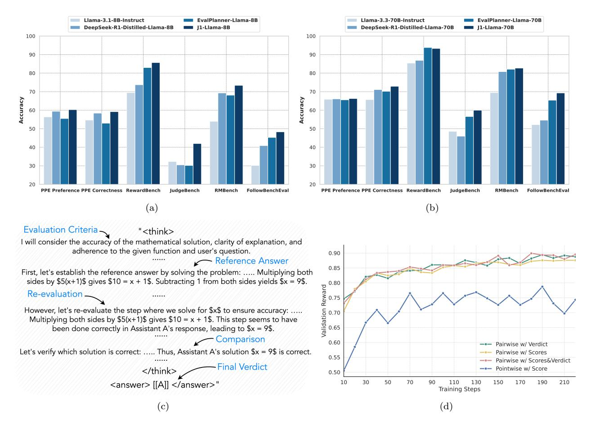
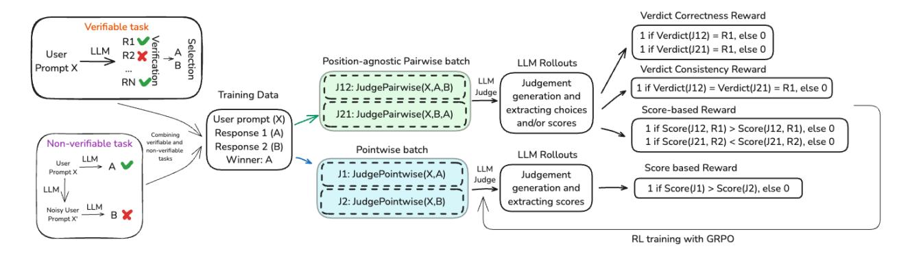
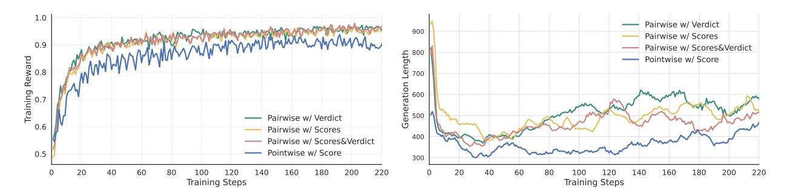

# J1: Incentivizing Thinking in LLM-as-a-Judge via Reinforcement Learning

Chenxi Whitehouse† , Tianlu Wang‡ , Ping Yu‡ , Xian Li‡ , Jason Weston‡ , Ilia Kulikov‡ , Swarnadeep Saha‡ †GenAI at Meta ‡FAIR at Meta

The progress of AI is bottlenecked by the quality of evaluation, and powerful LLM-as-a-Judge models have proved to be a core solution. Improved judgment ability is enabled by stronger chain-of-thought reasoning, motivating that we find the best recipes for training such models to think. In this work we develop J1, a reinforcement learning approach to train such models. Our method converts both verifiable and non-verifiable prompts to judgment tasks with verifiable rewards that incentivize thinking, and mitigate judgment bias. In particular, our approach outperforms all other existing 8B or 70B models when trained at that model size, including models distilled from DeepSeek-R1. J1 also outperforms o1-mini and on some benchmarks, even R1, despite training a smaller model. We provide analysis and ablations of initial seed prompts, offline vs online, reward strategies, thought length, and content. A quantitative study finds that J1 develops learned re-evaluation and re-examination reasoning strategies which emerge during training.

Date: May 7, 2025

Correspondence: [chenxwh@meta.com](mailto:chenxwh@meta.com), [swarnadeep@meta.com](mailto:swarnadeep@meta.com)

## 1 Introduction

Better judgments can be made by learning how to reason, which is something observed in both humans and machines. For models, the ability to judge predictions is a vital process, that is applied at all stages of development: during training and inference to provide a reward or verification signal, and during final performance evaluation on benchmarks as a judge. Classical evaluation by reward models consists of outputting a score directly [\(Ouyang et al.,](#page-10-0) [2022\)](#page-10-0) without having an explicit reasoning step. Using pre-trained and aligned language models to act as judges instead, i.e., LLM-as-a-Judge, allowed the possibility to generate chain-ofthought reasoning before making a decision, which was at first invoked by prompting [\(Zheng et al.,](#page-11-0) [2023;](#page-11-0) [Gu et al.,](#page-9-0) [2024\)](#page-9-0). Subsequently, offline and iterative supervised finetuning and direct preference optimization (DPO) methods were developed to improve these reasoning steps [\(Mahan et al.,](#page-10-1) [2024;](#page-10-1) [Wang et al.,](#page-10-2) [2024d;](#page-10-2) [Saha et al.,](#page-10-3) [2025\)](#page-10-3). In this work, we investigate recipes for further improvements to judgment reasoning via online Reinforcement Learning (RL).

Our method, J1: Thinking-LLM-as-a-Judge via Reinforcement Learning, introduces a recipe for training such models. Firstly, we convert the judgment task into a verifiable task for both verifiable prompts (e.g., math problems) and typically subjective, non-verifiable prompts (e.g., user prompts from WildChat [\(Zhao](#page-11-1) [et al.,](#page-11-1) [2024b\)](#page-11-1)). This enables us to train a generalist judge across many types of tasks. To achieve this, we construct synthetic data for both categories of prompts. For each prompt, we generate a high quality and a low quality response, such that pairwise judgment predictions are verifiable during training. We then train both the reasoning steps and judgment using GRPO [\(Shao et al.,](#page-10-4) [2024\)](#page-10-4), utilizing a seed prompt engineered to encourage thinking during judgment, in analogy to the approach in R1 [\(Guo et al.,](#page-9-1) [2025\)](#page-9-1). We design training rewards to incentivize such thinking, and importantly, to mitigate positional bias in pairwise judgment. Both the reasoning process and final judgments are then optimized during training.

After running our best recipe in two sizes, J1-Llama-8B and J1-Llama-70B, we achieve strong performance across a variety of benchmarks: PPE [\(Frick et al.,](#page-9-2) [2025\)](#page-9-2), RewardBench [\(Lambert et al.,](#page-9-3) [2024\)](#page-9-3), JudgeBench [\(Tan et al.,](#page-10-5) [2025\)](#page-10-5), RM-Bench [\(Liu et al.,](#page-9-4) [2025a\)](#page-9-4) and FollowBenchEval [\(Saha et al.,](#page-10-3) [2025\)](#page-10-3). We find that our method outperforms: (1) methods trained with SFT or Self-Taught reasoning [\(Wang et al.,](#page-10-2) [2024d\)](#page-10-2) and offline DPO [\(Saha et al.,](#page-10-3) [2025\)](#page-10-3); (2) recent state-of-the-art generative reward models such as DeepSeek-GRM [\(Liu](#page-9-5)

Figure 1 (a): Comparison of J1-Llama-8B with other Thinking-LLMs-as-Judges on five reward modeling benchmarks at the 8B scale. (b): Comparison of J1-Llama-70B with other Thinking-LLMs-as-Judges at the 70B scale. (c): Illustration of J1's thinking patterns where during RL training, it learns to (i) list evaluation criteria, (ii) generate reference answers, (iii) re-evaluate for correctness, and (iv) compare between responses. (d): Rewards on the validation set for different pairwise and pointwise J1 variants across steps of RL training (maximum reward for all cases is 1).

et al., 2025b) that is trained on significantly more data; (3) models distilled from large reasoning models such as DeepSeek-R1 (Guo et al., 2025); and (4) closed reasoning models such as o1-mini (Jaech et al., 2024). While the much larger DeepSeek-R1 model outperforms our models on verifiable tasks, J1 achieves superior results on non-verifiable tasks. We provide detailed ablations and analysis of these results by comparing our best recipe to other variants, that either alter the LLM-as-a-Judge setup (e.g., pairwise versus pointwise), seed thinking prompts, reward modeling, or bias mitigation strategies. Importantly, we also analyze the thought lengths and reasoning techniques within the thought generations to demonstrate that the model improves performance using learned re-evaluating and re-examining reasoning techniques that emerge during training.

# 2 J1: Thinking-LLM-as-a-Judge via Reinforcement Learning

#### 2.1 Problem Setup

We consider a pairwise evaluation setting where an LLM judge takes an instruction x and a pair of model responses a, b as inputs and generates a preference judgment y, indicating the better response a or b. The judge conditions on a seed thinking prompt to also generate intermediate thought tokens t, before generating the final verdict. We will refer to this setting as Pairwise LLM-as-a-Judge with Verdict(PaV) and, for brevity, use the following representation for the corresponding training recipe J1: promptPaV $(x, a, b) \rightarrow (t, y)$ . In the following subsections, we describe our training data and the J1 training recipe. Finally, in subsection 2.5, we

Figure 2 J1: Reinforcement Learning recipe for training Thinking-LLM-as-a-Judge models. We generate synthetic preference pairs for both verifiable and non-verifiable tasks, which are then used as training data to create positionagnostic pairwise or pointwise batches. Based on the type of judge, we design verdict correctness, verdict consistency, and score-based rewards that jointly optimize evaluation thoughts and verdicts using online RL (GRPO).

discuss other LLM-as-a-Judge variants and how we derive recipes for them. An overview of this can also be seen in [Figure 2.](#page-2-0)

#### 2.2 Synthetic Training Data Generation

The goal of J1 is to train a generalist judge that can evaluate LLM responses for both verifiable and non-verifiable tasks. With that motivation, we use the same synthetic training data as the work of [Saha](#page-10-3) [et al.](#page-10-3) [\(2025\)](#page-10-3), used to train their EvalPlanner method. The use of synthetic data removes the reliance on human-annotated preference pairs, as used in most previous work, but it can be costly to obtain [\(Wang et al.,](#page-10-6) [2024a\)](#page-10-6). It also ensures that J1 has a fair comparison with a prior state-of-the-art Thinking-LLM-as-a-Judge recipe which used DPO, which we can compare to our use of online RL. The training data consists of 17K WildChat [\(Zhao et al.,](#page-11-2) [2024a\)](#page-11-2) and 5K MATH [\(Hendrycks et al.,](#page-9-7) [2021\)](#page-9-7) prompts, along with their corresponding preference pairs. For WildChat, the rejected response is obtained by prompting an LLM to first generate a 'noisy' instruction from the original instruction and then generate a response to the noisy instruction [\(Wang](#page-10-2) [et al.,](#page-10-2) [2024d\)](#page-10-2). For MATH, the rejected response is obtained by sampling a generation from an LLM that does not lead to the gold answer. Given these preference pairs, we are thus able to convert the evaluation task into a verifiable task (i.e., predicting the better response), thereby enabling the use of RL with verifiable rewards.

Pairwise LLM judges frequently suffer from a phenomenon called position bias, wherein the verdict changes if the order of the responses is swapped [\(Wang et al.,](#page-10-7) [2024c;](#page-10-7) [Chen et al.,](#page-9-8) [2024\)](#page-9-8). To mitigate this issue, we construct training data with both orders of response pairs – (x, a, b) and (x, b, a) – which are then fed into the corresponding thinking seed prompt, shown in [Figure 3.](#page-3-1) Crucially, we construct position-agnostic batches of training data i.e., for the same input, we process both orders of responses in one batch (see [Figure 2\)](#page-2-0). In [subsection 2.3,](#page-2-1) we describe how this helps us design verdict consistency rewards for training J1 that can mitigate position bias in pairwise judges [\(Zheng et al.,](#page-11-0) [2023\)](#page-11-0).

#### 2.3 Reward Modeling

Following the training data construction, we describe J1's reward modeling for RL training. We adopt a rule-based reward system that consists of two main types of rewards.

Verdict Correctness Reward. J1's primary reward is based on the accuracy of the final verdict. If a judge correctly predicts the better response, it receives a reward of 1 and 0, otherwise.

Verdict Consistency Reward. To further encourage consistent reasoning and judgment, we introduce verdict (positional) consistency reward. In particular, we only assign a reward of 1 when the model produces correct and consistent judgments for both input orders of the same response pair (i.e., (x, a, b) and (x, b, a)).

Similar to DeepSeek-R1 [\(Guo et al.,](#page-9-1) [2025\)](#page-9-1), we also experiment with format rewards e.g., to ensure that

#### Thinking Seed Prompt for Training Pairwise J1 with Verdict

You are given a user question and two responses from two AI assistants. Your task is to act as an impartial judge and evaluate which response better follows the user's instructions and provides a higher-quality answer.

First, provide your reasoning within <think> and </think> tags. This should include your evaluation criteria for a high-quality response, a detailed comparison of the two responses, and when helpful, a reference answer as part of your evaluation. Be explicit in your thought process, referencing your criteria and explaining how each response aligns with or deviates from them.

Avoid any position biases and ensure that the order in which the responses were presented does not influence your decision. Do not allow the length of the responses to influence your evaluation. Do not favor certain names of the assistants. Be as objective as possible.

Finally, provide your verdict within <answer> and </answer> tags, strictly following this format:

- <answer> [[A]] </answer> if Assistant A is better
- <answer> [[B]] </answer> if Assistant B is better

Below are the user's question and the two responses:

[User Question] {instruction}

[The Start of Assistant A's Answer] {response A}

[The End of Assistant A's Answer]

[The Start of Assistant B's Answer] {response B}

[The End of Assistant B's Answer]

Figure 3 Thinking seed prompt template for Pairwise J1 with Verdict. See [Appendix A](#page-12-0) for the prompt templates of other J1 variants.

the thought tokens are enclosed in "<think>" and "</think>" tags but do not observe any noticeable improvements. In [subsection 4.2,](#page-6-0) we provide a detailed analysis of the effect of these reward types.

#### 2.4 Primary J1 Recipe and Models

J1 jointly optimizes thoughts, and judgments using the Group Relative Policy Optimization Algorithm (GRPO; [Shao et al.](#page-10-4) [2024\)](#page-10-4). GRPO makes RL training more efficient by removing the dependency on a separate critic model and instead estimating the baseline from group scores.

Pairwise LLM-as-a-Judge with Verdict (PaV). Our primary J1, J1PaV : promptPaS(x, a, b) → (t, y), receive a user question and a response pair, and generate thought process and final verdict of which response is preferred. We develop two models, J1-Llama-8B and J1-Llama-70B, trained starting from Llama-3.1-8B-Instruct and Llama-3.3-70B-Instruct [\(Grattafiori et al.,](#page-9-9) [2024\)](#page-9-9), respectively. Although we report our main benchmark results with this recipe in [subsection 4.1,](#page-5-0) we also consider modified recipes for training other Thinking-LLM-as-a-Judge models that vary in their problem formulation, thinking prompts or reward modeling.

#### 2.5 Other RL Training Recipes for Thinking-LLM-as-a-Judge

In addition to our primary Pairwise with Verdict J1 setting describe above, we also introduce three other Thinking-LLM-as-a-Judge settings and develop their corresponding training recipes. In [subsection 4.2,](#page-6-0) these modified recipes will be compared to our main J1 recipe.

Pairwise LLM-as-a-Judge with Scores (PaS). This is a pairwise score-based variant J1PaS : promptPaS(x, a, b) → (t, sa, sb), that instead of directly generating a verdict, generates real-valued scores sa, sb for response a and b respectively. The response that obtains the higher score is chosen as the final verdict. [Figure 6](#page-14-0) shows the corresponding thinking prompt. To train a model with this recipe, we replace the verdict reward with a score-based reward i.e., we assign a binary reward based on whether the individual scores align with the final gold verdict or not.

PairwiseLLM-as-a-JudgewithScores&Verdict (PaVS). In another pairwise variant J1PaVS : promptPaVS(x, a, b) → (t, sa, sb, y), the model generates scores for both responses as well as the final verdict. In this case, the generated

scores are interpreted as observations of unknown latent variables to help with the pairwise judgment task; therefore y is directly used as the final verdict. Consequently, the reward is also computed using the final verdict only (and not the intermediate scores). We show the thinking prompt for this variant in [Figure 7.](#page-14-1)

Pointwise LLM-as-a-Judge (PoS). Finally, we also consider a pointwise judge recipe J1PoS : promptPoS(x, a) → (t, s), that acts on an instruction x and a single response a. It generates a real-valued score s, indicating the quality or the reward of that response. The Pointwise thinking prompt [\(Figure 8\)](#page-15-0) instructs the model to assign a score between 0 and 10. Importantly, we adapt the same pairwise J1 training data to also train this pointwise variant. In particular, each preference pair is converted into two individual samples, both of which are jointly processed in the same batch to facilitate learning from pairwise supervision only. Preference rankings are far easier to obtain compared to pointwise annotations, making Pointwise-Thinking-LLM-as-a-Judge a novel exploration of our work.

### 3 Experimental Setup

Training. We implement J1 on top of verl [\(Sheng et al.,](#page-10-8) [2024\)](#page-10-8). The policy actor generates 5 rollouts per prompt using ancestral sampling with temperature 1.0. Training regime uses a learning rate of 1e−6 (decayed to 3e − 7 in later steps for J1-Llama-70B), and a total batch size of 512 across data distributed workers. The maximum sequence length is set to 4096 tokens for both inputs and outputs. We tested different KL coefficients from {0.01, 0.001, 0.001, 0} for J1-Llama-8B and selected 0.01 as the best performing by evaluating over the development set. For J1-Llama-70B we set the KL coefficient to 0 to encourage more exploration.[1](#page-4-0) We use 8×A100 and 64×A100 GPUs to train J1-Llama-8B, and J1-Llama-70B respectively.

Evaluation. We evaluate J1 on five pairwise judgment benchmarks, covering both verifiable and non-verifiable tasks. These benchmarks include multilingual instructions and responses from a wide range of LLMs.

- Preference Proxy Evaluations (PPE) [\(Frick et al.,](#page-9-2) [2025\)](#page-9-2). PPE is one of the first large-scale reward model benchmarks explicitly linked to post-RLHF real-world human preference performance. It consists of two subsets: (1) PPE Preference (10.2K samples), a collection of human preference pairs from Chatbot Arena containing responses from 20 different top LLMs and over 121 languages, and (2) PPE Correctness (12.7K samples), a collection of (correct and incorrect) response pairs, sampled from four different models for popular verifiable benchmarks including MMLU-Pro, MATH, GPQA, MBPP-Plus, and IFEval. While the first subset measures a model's ability to capture subjective human preferences, the second assesses its test-time alignment capabilities as a Best-of-N reward model.
- JudgeBench [\(Tan et al.,](#page-10-5) [2025\)](#page-10-5). JudgeBench (350 preference pairs) contains challenging response pairs that span knowledge, reasoning, math, and coding categories. Following [Tan et al.](#page-10-5) [\(2025\)](#page-10-5), we report results on the subset where the responses are generated by GPT-4o.
- RM-Bench [\(Liu et al.,](#page-9-4) [2025a\)](#page-9-4). RM-Bench (4K samples) assesses the robustness of reward models based on their sensitivity and resistance to subtle content differences and style biases.
- FollowBenchEval [\(Saha et al.,](#page-10-3) [2025\)](#page-10-3). Following past work, we also evaluate on FollowBenchEval (205 preference pairs) that tests reward models for their ability to validate multi-level constraints in LLM responses (e.g., "Write a one sentence summary (less than 15 words) for the following dialogue. The summary must contain the word 'stuff'...").
- RewardBench [\(Lambert et al.,](#page-9-3) [2024\)](#page-9-3). RewardBench (3K samples), similar to JudgeBench, consists of preference pairs from 4 categories of prompts: chat, chat-hard, safety, and reasoning.

In line with previous works, we report accuracy over one random order of paired responses for PPE, RewardBench, and RM-Bench. For JudgeBench and FollowBenchEval, we report position-consistent accuracy where a sample is considered correct if the judge predicts the correct verdict in both orders of response pairs. Later in Sec. [4.2,](#page-6-0) we also conduct a detailed analysis of positional consistency. Model selection is done based on the overall accuracy in RewardBench. We use vLLM [\(Kwon et al.,](#page-9-10) [2023\)](#page-9-10) for inference, sampling generations with a maximum token length of 4096 and a temperature of 0.

1Preliminarily experiment with entropy bonus added during training shows degraded performance: model tends to generate longer yet repetitive output. See [Table 7](#page-12-1) in [Appendix B](#page-12-2) for comparison for KL penalty and entropy bonus.

| Models                               | #Training | PPE  | PPE  | PPE Correctness |      |      |      |                                                                            |      |  |  |
|--------------------------------------|-----------|------|------|-----------------|------|------|------|----------------------------------------------------------------------------|------|--|--|
|                                      |           |      |      |                 |      |      |      | Pref. Pairs Overall Preference Overall MMLU-Pro MATH GPQA MBPP-Plus IFEval |      |  |  |
| Open and Closed LLM-as-a-Judge       |           |      |      |                 |      |      |      |                                                                            |      |  |  |
| Llama-3.1-8B-Instruct                | –         | 55.5 | 56.4 | 54.7            | 56.3 | 62.9 | 51.4 | 50.1                                                                       | 52.8 |  |  |
| GPT-4o†                              | –         | 62.3 | 67.1 | 57.6            | –    | –    | –    | –                                                                          | –    |  |  |
| Llama-3.3-70B-Instruct               | –         | 65.8 | 65.9 | 65.7            | 72.1 | 73.1 | 61.2 | 59.6                                                                       | 62.3 |  |  |
| SOTA Scalar Reward Models            |           |      |      |                 |      |      |      |                                                                            |      |  |  |
| Armo-8B-v0.1†                        | 1000K     | 60.9 | 60.6 | 61.2            | 66.0 | 71.0 | 57.0 | 54.0                                                                       | 58.0 |  |  |
| Skywork-Reward-Gemma-2-27B†          | 80K       | 55.6 | 56.6 | 54.7            | 55.0 | 46.2 | 44.7 | 69.1                                                                       | 58.3 |  |  |
| DeepSeek-BTRM-27B†                   | 237K      | 67.5 | 68.3 | 66.7            | 68.8 | 73.2 | 56.8 | 68.8                                                                       | 66.0 |  |  |
| SOTA Generative Reward Models        |           |      |      |                 |      |      |      |                                                                            |      |  |  |
| DeepSeek-GRM-27B†                    | 237K      | 62.2 | 64.7 | 59.8            | 64.8 | 68.8 | 55.6 | 50.1                                                                       | 59.8 |  |  |
| DeepSeek-GRM-27B (MetaRM voting@32)† | 237K      | 65.2 | 67.2 | 63.2            | 68.1 | 70.0 | 56.9 | 50.8                                                                       | 70.4 |  |  |
| EvalPlanner-Llama-8B                 | 22K‡      | 54.1 | 55.5 | 52.8            | 57.0 | 59.0 | 50.3 | 47.7                                                                       | 50.0 |  |  |
| Evalplanner-Llama-70B                | 22K‡      | 67.9 | 65.6 | 70.2            | 78.4 | 81.7 | 64.4 | 62.2                                                                       | 64.3 |  |  |
| J1-Llama-8B                          | 22K‡      | 59.8 | 60.3 | 59.2            | 65.6 | 70.0 | 53.2 | 53.1                                                                       | 54.0 |  |  |
| J1-Llama-8B (SC@32)                  | 22K‡      | 61.3 | 60.6 | 61.9            | 67.5 | 76.6 | 55.7 | 54.6                                                                       | 54.9 |  |  |
| J1-Llama-70B                         | 22K‡      | 69.6 | 66.3 | 72.9            | 79.0 | 86.0 | 65.9 | 66.0                                                                       | 67.3 |  |  |
| J1-Llama-70B (SC@32)                 | 22K‡      | 70.4 | 67.0 | 73.7            | 79.9 | 88.1 | 66.5 | 66.5                                                                       | 67.2 |  |  |

Table 1 Results on PPE comparing J1 with state-of-the-art LLM-as-a-Judge and reward models. †: Results taken from [Liu et al.](#page-9-5) [\(2025b\)](#page-9-5) and [Frick et al.](#page-9-2) [\(2025\)](#page-9-2). ‡: Training data only contains synthetically constructed preference pairs.

# 4 Results

### 4.1 Main Results on Benchmarks

Comparison of J1 with state-of-the-art methods on PPE. [Table 1](#page-5-1) compares our J1 models with different baselines on the PPE benchmark. J1-Llama-70B, our largest model, obtains an overall accuracy of 69.6, outperforming all previous methods, including those trained on much more data (see column 2). Compared to related competing approaches that are generative reward models, J1-Llama-70B outperforms both (1) EvalPlanner [\(Saha et al.,](#page-10-3) [2025\)](#page-10-3) by 1.7% (67.9 → 69.6), and (2) DeepSeek-GRM-27B [\(Liu et al.,](#page-9-5) [2025b\)](#page-9-5) by 7.1% (62.2 → 69.3). First, this shows the effectiveness of J1's training methodology and use of online RL (GRPO), compared to EvalPlanner, which is trained on the same data but with two iterations of DPO. Second, this also highlights the effectiveness of J1's high-quality synthetic preference pairs, compared to the data used to train DeepSeek-GRM-27B. The latter is first fine-tuned on 1270K judge data, followed by stages of Reinforcement Learning on 237K samples and further scaling at test time with a meta reward model across 32 generations. J1 shows particularly strong results on the PPE Correctness subset that spans popular reasoning benchmarks, thereby highlighting its utility as a reward model for Best-of-N alignment. At a smaller scale, J1-Llama-8B is competitive with Armo-8B (scalar RM) and outperforms EvalPlanner-8B and a larger Skywork-Reward-Gemma-2-27B by significant margins (54.1 → 59.8 and 55.6 → 59.8, respectively).

Test-time Scaling of J1. We further scale J1 up at test time with techniques such as self-consistency [\(Wang](#page-11-3) [et al.,](#page-11-3) [2022\)](#page-11-3). As shown in [Table 1](#page-5-1) (see "w/ SC@32" rows), we obtain further improvements of up to 1.5% at both scales of J1 by sampling 32 CoTs (with a temperature of 1.0) and using self-consistency to obtain the final verdict. In [Appendix B,](#page-12-2) we explore other methods of scaling up J1 e.g., averaging across multiple scores.

Baselines. We compare J1 to different categories of baselines, including (1) LLMs acting as judges in a zero-shot manner (e.g., Llama-3.3-70B-Instruct, GPT-4o [\(Hurst et al.,](#page-9-11) [2024\)](#page-9-11)), (2) state-of-the-art scalar reward models (e.g., DeepSeek-BTRM-27B [\(Liu et al.,](#page-9-5) [2025b\)](#page-9-5), Armo [\(Wang et al.,](#page-10-6) [2024a\)](#page-10-6), Skywork-Reward-Gemma-2-27B [\(Shiwen et al.,](#page-10-9) [2024\)](#page-10-9)), and (3) state-of-the-art generative reward models that belong to the same category as J1 (e.g., EvalPlanner [\(Saha et al.,](#page-10-3) [2025\)](#page-10-3), DeepSeek-GRM-27B [\(Liu et al.,](#page-9-5) [2025b\)](#page-9-5)), and (4) general Reasoning/Thinking-LLMs (e.g., DeepSeek-R1-Distilled-Llama, DeepSeek-R1, and OpenAI-o1-mini).

Comparison of J1 with Thinking-LLMs. Given the superiority of the earlier Thinking-LLM method EvalPlanner over other baselines, [Table 2](#page-6-1) compares J1 to EvalPlanner on all other benchmarks at both scales (8B/70B).

| Models                          | Overall | PPE Preference | PPE Correctness | Reward Bench | Judge Bench | RM Bench | Follow BenchEval |
|---------------------------------|---------|-------------------|--------------------|-----------------|----------------|-------------|---------------------|
| Llama-3.1-8B-Instruct           | 49.5    | 56.4              | 54.7               | 69.5            | 32.3           | 54.0        | 30.2                |
| DeepSeek-R1-Distilled-Llama-8B  | 55.4    | 59.4              | 58.4               | 73.7            | 30.5           | 69.3        | 40.9                |
| EvalPlanner-Llama-8B            | 55.9    | 55.5              | 53.0               | 83.0            | 30.2           | 68.1        | 45.3                |
| J1-Llama-8B                     | 61.5    | 60.3              | 59.2               | 85.7            | 42.0           | 73.4        | 48.3                |
| Llama-3.3-70B-Instruct          | 64.5    | 65.9              | 65.7               | 85.4            | 48.6           | 69.5        | 52.2                |
| DeepSeek-R1-Distilled-Llama-70B | 67.5    | 66.1              | 71.1               | 86.9            | 46.0           | 80.8        | 54.6                |
| EvalPlanner-Llama-70B           | 72.2    | 65.6              | 70.2               | 93.8            | 56.6           | 82.1        | 65.4                |
| J1-Llama-70B                    | 74.1    | 66.3              | 72.9               | 93.3            | 60.0           | 82.7        | 69.3                |
| OpenAI-o1-mini                  | 72.0    | 65.7              | 71.3               | 87.1            | 64.2           | 80.8        | 62.9                |
| DeepSeek-R1-671B                | 77.4    | 68.0              | 76.5               | 90.6            | 68.9           | 88.6        | 71.7                |

**Table 2** Results on five reward modeling benchmarks comparing J1 to a state-of-the-art Thinking-LLM-as-a-Judge model (EvalPlanner) and general Thinking-LLMs (o1-mini, distilled-R1, and R1).

| J1-Llama-8B Variants                                                 | Overall | PPE Preference | PPE Correctness | Reward Bench | Judge Bench | RM Bench | Follow BenchEval |
|----------------------------------------------------------------------|---------|-------------------|--------------------|-----------------|----------------|-------------|---------------------|
| Pairwise w/ Verdict (default): $(x, a, b) \rightarrow (t, y)$        | 61.5    | 60.3              | 59.2               | 85.7            | 42.0           | 73.4        | 48.3                |
| Pairwise w/ Scores: $(x, a, b) \rightarrow (t, s_a, s_b)$            | 60.7    | 59.7              | 58.6               | 85.8            | 41.7           | 72.3        | 46.3                |
| Pairwise w/ Scores&Verdict: $(x, a, b) \rightarrow (t, s_a, s_b, y)$ | 59.7    | 59.7              | 59.3               | 85.1            | 41.4           | 71.5        | 41.0                |
| Pointwise w/ Score: $(x, a) \rightarrow (t, s)$                      | 64.6    | 58.4              | 60.1               | 81.3            | 56.9           | 67.2        | 63.4                |

**Table 3** Results of J1 models trained with different recipes. x: input instruction, a, b: pair of responses, t: intermediate thought, y: verdict,  $s_a$ ,  $s_b$ : scores. As pointwise judge tends to result in ties, we use top-p sampling with temperature of 1 and all other generations are with greedy. JudgeBench and FollowBenchEval reports positional consistent accuracy, showcasing the advantage of pointwise judge when positional bias is prominent.

Additionally, we compare J1 to general Thinking-LLMs (e.g., DeepSeek-R1-Distill-Llama, DeepSeek-R1 (Guo et al., 2025), and OpenAI-o1-mini (Jaech et al., 2024)). DeepSeek-R1-Distilled-Llama is SFT-ed with 800K long CoTs from DeepSeek-R1 (a much larger 671B MoE model), starting from the same base models as J1. Thus, in a head-to-head comparison where the base models are the same, J1 outperforms DeepSeek-R1-Distilled-Llama across all benchmarks by large margins. In particular, on the harder JudgeBench benchmark that requires evaluating GPT-4o responses, J1-Llama-70B obtains an absolute 14% improvement ( $46.0 \rightarrow 60.0$ ) over R1-Distilled-Llama-70B. J1 also closes the gap to the much larger R1 model, even outperforming it on RewardBench by 2.7%. To further analyze this observation, Table 6 shows a detailed breakdown of the results for the individual categories in RewardBench. Although R1 expectedly excels in the reasoning category, J1 outperforms it in evaluating non-verifiable prompts like those in Chat-Hard and Safety. Overall, our results suggest that J1 is a generalist judge that can be used for evaluating the respones to both verifiable and non-verifiable prompt tasks, and in different stages of the LLM development process.

#### 4.2 Ablations and Analyses

In subsection 2.5, we described several other recipes for training Thinking-LLM-Judges. In the following experiments, we comprehensively analyze the effect of those recipes, specifically focusing on the following research questions: (1) how a pointwise-J1 compares to different variants of pairwise-J1, (2) what is the effect of different thinking prompts, and (3) how to design effective rewards for RL training of Thinking-LLM-Judges. Furthermore, we compare different strategies of mitigating position bias in pairwise judges and analyze the learned reasoning strategies by J1. Unless otherwise stated, J1, henceforth, will refer to the resultant Llama-8B model, trained using our default *Pairwise with Verdict* setting, while other variants will be addressed separately.

Pairwise versus Pointwise J1. In Table 3, we compare the three Pairwise-J1 variants, that as part of the final answer, generate either: (1) only the final verdict, (2) only real-valued scores for both responses, or (3) both. Additionally, we compare these models with a Pointwise-J1 model. While Pairwise-J1 outperforms Pointwise-J1 on some benchmarks, the later is superior on Judgebench and FollowBenchEval. Between the

| J1-Llama-8B Variants                                                                                  | Overall              | PPE Preference    | PPE Correctness   | Reward Bench      | Judge Bench       | RM Bench          | Follow BenchEval  |
|-------------------------------------------------------------------------------------------------------|----------------------|----------------------|----------------------|----------------------|----------------------|----------------------|----------------------|
| with Different Seed Prompts                                                                           |                      |                      |                      |                      |                      |                      |                      |
| Thinking (default - Figure 5) Plan & Execution (EvalPlanner-style - Figure 3)                         | 61.5 61.7         | 60.3 59.1         | 59.2 58.9         | 85.7 85.8         | 42.0 44.3         | 73.4 71.8         | 48.3 50.2         |
| with Different Rewards                                                                                |                      |                      |                      |                      |                      |                      |                      |
| Positive Reward for Correct Verdict (default) + Negative Reward for Incorrect Verdict + Format Reward | 61.5 60.4 60.9 | 60.3 60.0 60.2 | 59.2 59.1 58.3 | 85.7 85.4 85.6 | 42.0 44.9 40.3 | 73.4 70.8 71.8 | 48.3 42.0 49.3 |

Table 4 Results of J1 models trained with different seed prompts and reward schemes.

|                                          | PPE Correctness |                 |                     |                |                 |                 |                     | JudgeBench      |  |  |  |  |  |
|------------------------------------------|-----------------|-----------------|---------------------|----------------|-----------------|-----------------|---------------------|-----------------|--|--|--|--|--|
| Models                                   | (a, b) Acc ↑ | (b, a) Acc ↑ | Consistent Acc ↑ | Inconsistency↓ | (a, b) Acc ↑ | (b, a) Acc ↑ | Consistent Acc ↑ | Inconsistency ↓ |  |  |  |  |  |
| Llama-3.1-8B-Instruct                    | 54.7            | 54.1            | 30.2                | 44.1           | 67.4            | 42.3            | 32.3                | 37.4            |  |  |  |  |  |
| EvalPlanner-8B                           | 53.0            | 52.4            | 37.3                | 25.7           | 38.2            | 62.8            | 30.3                | 30.5            |  |  |  |  |  |
| J1-Llama-8B (random single-order data)   | 58.3            | 57.6            | 38.3                | 36.7           | 48.3            | 59.4            | 36.6                | 32.9            |  |  |  |  |  |
| J1-Llama-8B (both-order data)            | 59.2            | 58.4            | 39.1                | 36.8           | 63.1            | 51.4            | 42.0                | 27.7            |  |  |  |  |  |
| J1-Llama-8B (verdict consistency reward) | 59.5            | 60.1            | 43.7                | 32.0           | 56.9            | 60.9            | 44.3                | 28.6            |  |  |  |  |  |
| J1-Llama-8B (pointwise)                  | _               | _               | 60.1                | _              | _               | _               | 56.9                | _               |  |  |  |  |  |

**Table 5** Results on PPE Correctness and JudgeBench comparing different position-bias mitigation strategies in J1. Position-consistent accuracy is a stricter metric for evaluating pairwise judges. As before, for pointwise judge we use top-p sampling with temperature of 1 to mitigate ties, and the others with greedy decoding.

pairwise models, we observe that the one that only generates thoughts and verdicts (without scores) performs the best. Having access to scores, however, has other advantages e.g., in quantifying the degree of preference or to rank across multiple responses. We leave this investigation and exploration of J1's use-cases to future work.

Effect of Seed Prompts for Training J1. Next, in Table 4, we study the effect of two different seed prompts that are used to elicit 'thinking' in J1 models. Our default J1 *Thinking* prompt is motivated by DeepSeek-R1. Additionally, similar to EvalPlanner (Saha et al., 2025), we experiment with a prompt that instructs the model to first *plan* for the evaluation recipe, then *execute* the evaluation according to that recipe and the response(s), before generating the final verdict (Figure 5). We find that J1 is robust to such choices, performing comparably with both prompts. In fact, with simpler Thinking prompt, the model tends to have richer reasoning trace, which can include plan and execution, but also process such as creating criteria and re-evaluation (see Figure 1).

**Effect of Reward Schemes for Training J1.** In Table 4, we also study the effect of different rewards for training J1 models. Generally, J1's generations have a *think* part and a *verdict* part. We obtain best results when only assigning positive rewards to correct verdicts – adding additional format rewards or negative rewards for incorrect verdicts marginally degrade performance.

Analysis of Positional Bias in J1. To assess the robustness of Pairwise-J1 models against positional bias, in Table 5, we report (1) individual accuracy for both orders of responses, (2) position-consistent accuracy, and (3) inconsistency (i.e., fraction of samples where the verdict changes based on the order). We compare several variants with Pointwise-J1 that is consistent by design. A consistently correct pairwise judge is thus expected to show higher position-consistent accuracy and lower inconsistency. Between pairwise variants, we obtain highest position-consistent accuracy when the model is trained with both orders of data and the verdict consistency reward. However, our best pairwise judge still lags significantly behind our pointwise judge.

**Thought Length Analysis of J1.** Figure 4 illustrates the training reward and average generation length throughout different stages of J1 training. With continued training, the thought length of most pairwise judges converge at around 500 tokens, while the pointwise judge tends to generate shorter outputs, typically between 300 and 400 tokens.

Figure 4 Reward and average generation length during training for different J1 models.

#### 5 Related Work

Reward Models. Reward models have been instrumental in both training-time (Ouyang et al., 2022; Lambert et al., 2024) and test-time (Snell et al., 2024) alignment of Large Language Models. Traditional reward models are typically trained with the Bradley-Terry objective and output a scalar score indicating the reward of the response. This design frequently results in poor calibration and generalization across different prompts and responses (Sun et al., 2025; Zhang et al., 2025). Furthermore, such discriminative models do not fully leverage the generative capabilities of LLMs and therefore cannot be scaled up at test time, e.g., with long chain-of-thought or multiple generations (Wang et al., 2024b; Shiwen et al., 2024). As a potential solution, generative reward models have emerged, which we discuss below.

LLM-as-a-Judge and Generative Reward Models. LLM-as-a-Judge and Generative Reward Models (GRMs) conceptually share a similar motivation – the language modeling head in LLMs is used to also output chain-of-thought (CoT) reasoning (in the form of critiques) before generating preference judgments or rewards (Kim et al., 2024a,b; Ankner et al., 2024; Mahan et al., 2024; Ye et al., 2024; Yu et al., 2025; Zhang et al., 2025; Saha et al., 2025). Rewards in such models could either come from training a separate reward head (typically done in GRMs) or from the LM head itself generating real-valued scores as tokens (typically done in LLM-as-a-Judge). Prior work building LLM judges has mostly relied on either prompting (Zheng et al., 2023; Saha et al., 2024), rejection finetuning on self-generated CoTs (Wang et al., 2024d), or preference finetuning on CoT pairs using DPO (Mahan et al., 2024; Trivedi et al., 2024; Saha et al., 2025).

Reinforcement Learning with Verifiable Rewards. Methodically, J1 draws inspiration from the recent advancements in improving reasoning through Reinforcement Learning with verifiable rewards. Online optimization algorithms such as GRPO, when combined with accurate and robust rewards, have been shown to elicit enhanced reasoning in LLMs (Guo et al., 2025; Team et al., 2025). In our approach: we construct preference pairs and assign verifiable rewards based on the correctness of the model's judgments. By optimizing over the generated thinking traces, J1 encourages LLMs to spend more test-time compute before deriving judgments. In a concurrent study, Liu et al. (2025b) also showcases the potential of scaling up test-time compute for reward models. We compare J1 to their method and show that J1 achieves superior performance, while training only on  $10 \times$  less synthetic data. This is made possible through the effective use of online RL on high-quality training data, accompanied with a comprehensive study that let us choose the best J1 variant across varying modeling choices, seed prompts, and reward strategies.

#### 6 Conclusion

We proposed J1, a Reinforcement Learning recipe for training Thinking-LLM-as-a-Judge models. Our key innovation lies in converting the judgment task into a verifiable task for all kinds of task prompts, themselves both verifiable and non-verifiable, and then optimizing the thoughts and judgments using an online RL method. We trained J1-Llama-8B and J1-Llama-70B, two generalist judge models that outperform all baselines at their respective model sizes, o1-mini, and even a much larger R1 model on some benchmarks, particularly in the non-verifiable task case. A careful analysis showed that J1 models make accurate judgments by learning to re-evaluate, thereby highlighting the potential of Thinking-LLM-Judges.

## References

- Zachary Ankner, Mansheej Paul, Brandon Cui, Jonathan Daniel Chang, and Prithviraj Ammanabrolu. Critique-out-Loud Reward Models. In Pluralistic Alignment Workshop at NeurIPS 2024, 2024. URL [https://openreview.net/](https://openreview.net/forum?id=CljYUvIlRW) [forum?id=CljYUvIlRW](https://openreview.net/forum?id=CljYUvIlRW).
- Guiming Hardy Chen, Shunian Chen, Ziche Liu, Feng Jiang, and Benyou Wang. Humans or LLMs as the Judge? A Study on Judgement Bias. In Proceedings of the 2024 Conference on Empirical Methods in Natural Language Processing, pages 8301–8327, Miami, Florida, USA, November 2024. Association for Computational Linguistics. doi: 10.18653/v1/2024.emnlp-main.474. URL <https://aclanthology.org/2024.emnlp-main.474>.
- Evan Frick, Tianle Li, Connor Chen, Wei-Lin Chiang, Anastasios Nikolas Angelopoulos, Jiantao Jiao, Banghua Zhu, Joseph E. Gonzalez, and Ion Stoica. How to Evaluate Reward Models for RLHF. In The Thirteenth International Conference on Learning Representations, 2025. URL <https://openreview.net/forum?id=cbttLtO94Q>.
- Aaron Grattafiori, Abhimanyu Dubey, Abhinav Jauhri, Abhinav Pandey, Abhishek Kadian, Ahmad Al-Dahle, Aiesha Letman, Akhil Mathur, Alan Schelten, Alex Vaughan, et al. The Llama 3 Herd of Models. arXiv preprint arXiv:2407.21783, 2024. URL <https://arxiv.org/abs/2407.21783>.
- Jiawei Gu, Xuhui Jiang, Zhichao Shi, Hexiang Tan, Xuehao Zhai, Chengjin Xu, Wei Li, Yinghan Shen, Shengjie Ma, Honghao Liu, et al. A Survey on LLM-as-a-Judge. arXiv preprint arXiv:2411.15594, 2024. URL [https:](https://arxiv.org/abs/2411.15594) [//arxiv.org/abs/2411.15594](https://arxiv.org/abs/2411.15594).
- Daya Guo, Dejian Yang, Haowei Zhang, Junxiao Song, Ruoyu Zhang, Runxin Xu, Qihao Zhu, Shirong Ma, Peiyi Wang, Xiao Bi, et al. DeepSeek-R1: Incentivizing Reasoning Capability in LLMs via Reinforcement Learning. arXiv preprint arXiv:2501.12948, 2025. URL <https://arxiv.org/abs/2501.12948>.
- Dan Hendrycks, Collin Burns, Saurav Kadavath, Akul Arora, Steven Basart, Eric Tang, Dawn Song, and Jacob Steinhardt. Measuring Mathematical Problem Solving With the MATH Dataset. In Thirty-fifth Conference on Neural Information Processing Systems Datasets and Benchmarks Track (Round 2), 2021. URL [https://openreview.](https://openreview.net/forum?id=7Bywt2mQsCe) [net/forum?id=7Bywt2mQsCe](https://openreview.net/forum?id=7Bywt2mQsCe).
- Aaron Hurst, Adam Lerer, Adam P Goucher, Adam Perelman, Aditya Ramesh, Aidan Clark, AJ Ostrow, Akila Welihinda, Alan Hayes, Alec Radford, et al. GPT-4o System Card. arXiv preprint arXiv:2410.21276, 2024. URL <https://arxiv.org/abs/2410.21276>.
- Aaron Jaech, Adam Kalai, Adam Lerer, Adam Richardson, Ahmed El-Kishky, Aiden Low, Alec Helyar, Aleksander Madry, Alex Beutel, Alex Carney, et al. OpenAI o1 System Card. arXiv preprint arXiv:2412.16720, 2024. URL <https://arxiv.org/abs/2412.16720>.
- Seungone Kim, Jamin Shin, Yejin Cho, Joel Jang, Shayne Longpre, Hwaran Lee, Sangdoo Yun, Seongjin Shin, Sungdong Kim, James Thorne, et al. Prometheus: Inducing Fine-grained Evaluation Capability in Language Models. In The Twelfth International Conference on Learning Representations, 2024a. URL [https://openreview.net/forum?id=](https://openreview.net/forum?id=8euJaTveKw) [8euJaTveKw](https://openreview.net/forum?id=8euJaTveKw).
- Seungone Kim, Juyoung Suk, Shayne Longpre, Bill Yuchen Lin, Jamin Shin, Sean Welleck, Graham Neubig, Moontae Lee, Kyungjae Lee, and Minjoon Seo. Prometheus 2: An Open Source Language Model Specialized in Evaluating Other Language Models. In Proceedings of the 2024 Conference on Empirical Methods in Natural Language Processing, pages 4334–4353, Miami, Florida, USA, November 2024b. Association for Computational Linguistics. doi: 10.18653/v1/2024.emnlp-main.248. URL <https://aclanthology.org/2024.emnlp-main.248>.
- Woosuk Kwon, Zhuohan Li, Siyuan Zhuang, Ying Sheng, Lianmin Zheng, Cody Hao Yu, Joseph E. Gonzalez, Hao Zhang, and Ion Stoica. Efficient Memory Management for Large Language Model Serving with PagedAttention. In Proceedings of the ACM SIGOPS 29th Symposium on Operating Systems Principles, 2023. URL [https://dl.acm.](https://dl.acm.org/doi/abs/10.1145/3600006.3613165) [org/doi/abs/10.1145/3600006.3613165](https://dl.acm.org/doi/abs/10.1145/3600006.3613165).
- Nathan Lambert, Valentina Pyatkin, Jacob Morrison, LJ Miranda, Bill Yuchen Lin, Khyathi Chandu, Nouha Dziri, Sachin Kumar, Tom Zick, Yejin Choi, et al. Rewardbench: Evaluating Reward Models for Language Modeling. arXiv preprint arXiv:2403.13787, 2024. URL <https://arxiv.org/abs/2403.13787>.
- Yantao Liu, Zijun Yao, Rui Min, Yixin Cao, Lei Hou, and Juanzi Li. RM-Bench: Benchmarking Reward Models of Language Models with Subtlety and Style. In The Thirteenth International Conference on Learning Representations, 2025a. URL <https://openreview.net/forum?id=QEHrmQPBdd>.
- Zijun Liu, Peiyi Wang, Runxin Xu, Shirong Ma, Chong Ruan, Peng Li, Yang Liu, and Yu Wu. Inference-Time Scaling for Generalist Reward Modeling. arXiv preprint arXiv:2504.02495, 2025b. URL <https://arxiv.org/abs/2504.02495>.

- Dakota Mahan, Duy Van Phung, Rafael Rafailov, Chase Blagden, Nathan Lile, Louis Castricato, Jan-Philipp Fränken, Chelsea Finn, and Alon Albalak. Generative Reward Models. arXiv preprint arXiv:2410.12832, 2024. URL <https://arxiv.org/abs/2410.12832>.
- Long Ouyang, Jeffrey Wu, Xu Jiang, Diogo Almeida, Carroll Wainwright, Pamela Mishkin, Chong Zhang, Sandhini Agarwal, Katarina Slama, Alex Ray, et al. Training language models to follow instructions with human feedback. Advances in neural information processing systems, 35:27730–27744, 2022. URL [https://proceedings.neurips.cc/](https://proceedings.neurips.cc/paper_files/paper/2022/hash/b1efde53be364a73914f58805a001731-Abstract-Conference.html) [paper\\_files/paper/2022/hash/b1efde53be364a73914f58805a001731-Abstract-Conference.html](https://proceedings.neurips.cc/paper_files/paper/2022/hash/b1efde53be364a73914f58805a001731-Abstract-Conference.html).
- Swarnadeep Saha, Omer Levy, Asli Celikyilmaz, Mohit Bansal, Jason Weston, and Xian Li. Branch-Solve-Merge Improves Large Language Model Evaluation and Generation. In Proceedings of the 2024 Conference of the North American Chapter of the Association for Computational Linguistics: Human Language Technologies (Volume 1: Long Papers), pages 8345–8363, 2024. URL <https://aclanthology.org/2024.naacl-long.462>.
- Swarnadeep Saha, Xian Li, Marjan Ghazvininejad, Jason Weston, and Tianlu Wang. Learning to Plan & Reason for Evaluation with Thinking-LLM-as-a-Judge. arXiv preprint arXiv:2501.18099, 2025. URL [https://arxiv.org/abs/](https://arxiv.org/abs/2501.18099) [2501.18099](https://arxiv.org/abs/2501.18099).
- Zhihong Shao, Peiyi Wang, Qihao Zhu, Runxin Xu, Junxiao Song, Xiao Bi, Haowei Zhang, Mingchuan Zhang, YK Li, Y Wu, et al. DeepseekMath: Pushing the Limits of Mathematical Reasoning in Open Language Models. arXiv preprint arXiv:2402.03300, 2024. URL <https://arxiv.org/abs/2402.03300>.
- Guangming Sheng, Chi Zhang, Zilingfeng Ye, Xibin Wu, Wang Zhang, Ru Zhang, Yanghua Peng, Haibin Lin, and Chuan Wu. HybridFlow: A Flexible and Efficient RLHF Framework. arXiv preprint arXiv:2409.19256, 2024. URL <https://arxiv.org/pdf/2409.19256>.
- Tu Shiwen, Zhao Liang, Chris Yuhao Liu, Liang Zeng, and Yang Liu. Skywork Critic Model Series. [https://huggingface.](https://huggingface.co/Skywork) [co/Skywork](https://huggingface.co/Skywork), September 2024. URL <https://huggingface.co/Skywork>.
- Charlie Snell, Jaehoon Lee, Kelvin Xu, and Aviral Kumar. Scaling LLM Test-Time Compute Optimally can be More Effective than Scaling Model Parameters, 2024. URL <https://arxiv.org/abs/2408.03314>.
- Hao Sun, Yunyi Shen, and Jean-Francois Ton. Rethinking Reward Modeling in Preference-based Large Language Model Alignment. In The Thirteenth International Conference on Learning Representations, 2025. URL [https:](https://openreview.net/forum?id=rfdblE10qm) [//openreview.net/forum?id=rfdblE10qm](https://openreview.net/forum?id=rfdblE10qm).
- Sijun Tan, Siyuan Zhuang, Kyle Montgomery, William Yuan Tang, Alejandro Cuadron, Chenguang Wang, Raluca Popa, and Ion Stoica. JudgeBench: A Benchmark for Evaluating LLM-Based Judges. In The Thirteenth International Conference on Learning Representations, 2025. URL <https://openreview.net/forum?id=G0dksFayVq>.
- Kimi Team, Angang Du, Bofei Gao, Bowei Xing, Changjiu Jiang, Cheng Chen, Cheng Li, Chenjun Xiao, Chenzhuang Du, Chonghua Liao, et al. Kimi k1.5: Scaling Reinforcement Learning with LLMs. arXiv preprint arXiv:2501.12599, 2025. URL <https://arxiv.org/abs/2501.12599>.
- Prapti Trivedi, Aditya Gulati, Oliver Molenschot, Meghana Arakkal Rajeev, Rajkumar Ramamurthy, Keith Stevens, Tanveesh Singh Chaudhery, Jahnavi Jambholkar, James Zou, and Nazneen Rajani. Self-Rationalization Improves LLM as a Fine-grained Judge. arXiv preprint arXiv:2410.05495, 2024. URL <https://arxiv.org/abs/2410.05495>.
- Haoxiang Wang, Wei Xiong, Tengyang Xie, Han Zhao, and Tong Zhang. Interpretable Preferences via Multi-Objective Reward Modeling and Mixture-of-Experts. In Findings of the Association for Computational Linguistics: EMNLP 2024, pages 10582–10592, Miami, Florida, USA, November 2024a. Association for Computational Linguistics. doi: 10.18653/v1/2024.findings-emnlp.620. URL <https://aclanthology.org/2024.findings-emnlp.620>.
- Peifeng Wang, Austin Xu, Yilun Zhou, Caiming Xiong, and Shafiq Joty. Direct Judgement Preference Optimization, 2024b. URL <https://arxiv.org/abs/2409.14664>.
- Peiyi Wang, Lei Li, Liang Chen, Zefan Cai, Dawei Zhu, Binghuai Lin, Yunbo Cao, Lingpeng Kong, Qi Liu, Tianyu Liu, and Zhifang Sui. Large Language Models are not Fair Evaluators. In Lun-Wei Ku, Andre Martins, and Vivek Srikumar, editors, Proceedings of the 62nd Annual Meeting of the Association for Computational Linguistics (Volume 1: Long Papers), pages 9440–9450, Bangkok, Thailand, August 2024c. Association for Computational Linguistics. doi: 10.18653/v1/2024.acl-long.511. URL <https://aclanthology.org/2024.acl-long.511>.
- Tianlu Wang, Ilia Kulikov, Olga Golovneva, Ping Yu, Weizhe Yuan, Jane Dwivedi-Yu, Richard Yuanzhe Pang, Maryam Fazel-Zarandi, Jason Weston, and Xian Li. Self-Taught Evaluators. arXiv preprint arXiv:2408.02666, 2024d. URL <https://arxiv.org/abs/2408.02666>.

- Xuezhi Wang, Jason Wei, Dale Schuurmans, Quoc Le, Ed Chi, Sharan Narang, Aakanksha Chowdhery, and Denny Zhou. Self-consistency improves chain of thought reasoning in language models. arXiv preprint arXiv:2203.11171, 2022.
- Zihuiwen Ye, Fraser Greenlee-Scott, Max Bartolo, Phil Blunsom, Jon Ander Campos, and Matthias Gallé. Improving Reward Models with Synthetic Critiques. arXiv preprint arXiv:2405.20850, 2024. URL [https://arxiv.org/abs/2405.](https://arxiv.org/abs/2405.20850) [20850](https://arxiv.org/abs/2405.20850).
- Yue Yu, Zhengxing Chen, Aston Zhang, Liang Tan, Chenguang Zhu, Richard Yuanzhe Pang, Yundi Qian, Xuewei Wang, Suchin Gururangan, Chao Zhang, Melanie Kambadur, Dhruv Mahajan, and Rui Hou. Self-Generated Critiques Boost Reward Modeling for Language Models. In Proceedings of the 2025 Conference of the Nations of the Americas Chapter of the Association for Computational Linguistics: Human Language Technologies (Volume 1: Long Papers), pages 11499–11514, Albuquerque, New Mexico, April 2025. Association for Computational Linguistics. ISBN 979-8-89176-189-6. URL <https://aclanthology.org/2025.naacl-long.573>.
- Lunjun Zhang, Arian Hosseini, Hritik Bansal, Mehran Kazemi, Aviral Kumar, and Rishabh Agarwal. Generative Verifiers: Reward Modeling as Next-Token Prediction. In The Thirteenth International Conference on Learning Representations, 2025. URL <https://openreview.net/forum?id=Ccwp4tFEtE>.
- Wenting Zhao, Xiang Ren, Jack Hessel, Claire Cardie, Yejin Choi, and Yuntian Deng. WildChat: 1M ChatGPT Interaction Logs in the Wild. In The Twelfth International Conference on Learning Representations, 2024a. URL <https://openreview.net/forum?id=Bl8u7ZRlbM>.
- Wenting Zhao, Xiang Ren, Jack Hessel, Claire Cardie, Yejin Choi, and Yuntian Deng. WildChat: 1M ChatGPT Interaction Logs in the Wild. In The Twelfth International Conference on Learning Representations, 2024b. URL <https://openreview.net/forum?id=Bl8u7ZRlbM>.
- Lianmin Zheng, Wei-Lin Chiang, Ying Sheng, Siyuan Zhuang, Zhanghao Wu, Yonghao Zhuang, Zi Lin, Zhuohan Li, Dacheng Li, Eric Xing, et al. Judging LLM-as-a-Judge with MT-Bench and Chatbot Arena. Advances in Neural Information Processing Systems, 36:46595–46623, 2023. URL [https://proceedings.neurips.cc/paper\\_files/paper/](https://proceedings.neurips.cc/paper_files/paper/2023/hash/91f18a1287b398d378ef22505bf41832-Abstract-Datasets_and_Benchmarks.html) [2023/hash/91f18a1287b398d378ef22505bf41832-Abstract-Datasets\\_and\\_Benchmarks.html](https://proceedings.neurips.cc/paper_files/paper/2023/hash/91f18a1287b398d378ef22505bf41832-Abstract-Datasets_and_Benchmarks.html).

| Models                                                      | #Pref. Pairs | Overall | Chat | Chat-Hard | Safety | Reasoning |
|-------------------------------------------------------------|--------------|---------|------|-----------|--------|-----------|
| Open and Closed LLM-as-a-Judge                              |              |         |      |           |        |           |
| Llama3.1-8B-Instruct†                                       | –            | 69.5    | 92.7 | 46.1      | 64.4   | 74.7      |
| Llama3.3-70B-Instruct                                       | –            | 85.4    | 96.9 | 77.4      | 77.6   | 89.6      |
| Llama3.1-405B-Instruct†                                     | –            | 84.1    | 97.2 | 74.6      | 77.6   | 87.1      |
| Claude-3.5-Sonnet†                                          | –            | 84.2    | 96.4 | 74.0      | 81.6   | 84.7      |
| GPT-4o†                                                     | –            | 86.7    | 96.1 | 76.1      | 88.1   | 86.6      |
| Gemini-1.5-Pro-0514†                                        | –            | 88.2    | 92.3 | 80.6      | 87.9   | 92.0      |
| OpenAI-o1-mini                                              | –            | 87.1    | 94.4 | 78.7      | 80.9   | 94.2      |
| DeepSeek-R1                                                 | –            | 90.6    | 95.3 | 83.6      | 86.4   | 97.4      |
| SOTA Generative Reward Models                               |              |         |      |           |        |           |
| Skywork-Critic-Llama-3.1-70B† (Shiwen et al., 2024)      | 80K          | 93.3    | 96.6 | 87.9      | 93.1   | 95.5      |
| DeepSeek-GRM-27B† (Liu et al., 2025b)                    | 237K         | 86.0    | 94.1 | 78.3      | 88.0   | 83.8      |
| DeepSeek-GRM-27B (MetaRM voting@32)† (Liu et al., 2025b) | 237K         | 90.4    | 95.3 | 85.7      | 89.5   | 91.0      |
| EvalPlanner-Llama-8B                                        | 22K          | 83.0    | 85.5 | 84.0      | 83.4   | 79.3      |
| EvalPlanner-Llama-70B                                       | 22K          | 93.8    | 97.7 | 89.5      | 91.7   | 96.1      |
| J1-Llama-8B                                                 | 22K          | 85.7    | 92.9 | 80.3      | 85.6   | 83.9      |
| J1-Llama-70B                                                | 22K          | 93.3    | 96.1 | 90.1      | 91.9   | 94.9      |

Table 6 Results on RewardBench. †: Results taken from either RewardBench leaderboard or the corresponding paper.

| J1-Llama-8B Variants | Overall | PPE Preference |      | PPE Reward Correctness Bench |      | RM Bench | Follow BenchEval |  |
|----------------------|---------|-------------------|------|---------------------------------------|------|-------------|---------------------|--|
| w/ KL Penalty        | 61.5    | 60.3              | 59.2 | 85.7                                  | 42.0 | 73.4        | 48.3                |  |
| w/o KL Penalty       | 60.9    | 59.8              | 59.4 | 84.9                                  | 42.9 | 69.8        | 48.3                |  |
| w/o Entropy Bonus    | 61.5    | 60.3              | 59.2 | 85.7                                  | 42.0 | 73.4        | 48.3                |  |
| w/ Entropy Bonus     | 59.3    | 59.3              | 58.9 | 84.1                                  | 39.4 | 71.7        | 42.4                |  |

Table 7 Ablation studies on J1-Llama-8B with KL penalty and entropy bonus.

# A Prompt Templates

[Figure 5](#page-13-0) shows an alternative seed prompt for training J1. Motivated by EvalPlanner [\(Saha et al.,](#page-10-3) [2025\)](#page-10-3), this prompt instructs the model to first plan the evaluation recipe and then execute it as part of the thinking process. We adapt our thinking-pairwise prompts into a thinking-pointwise prompt that instructs the model to assign real-valued scores between 0 and 10. This is shown in [Figure 8.](#page-15-0)

## B Additional Results

Effect of KL Penalty and Entropy Bonus in GRPO for training J1. In [Table 7,](#page-12-1) we study the effect of KL Penalty and Entropy Bonus in GRPO when training a Pairwise J1-Llama-8B model. In our experiments, we find that more exploration generally led to some degradation in performance.

Test-time Scaling of score-based J1. In [Table 1,](#page-5-1) we showed results with one kind of test-time scaling of J1 – self-consistency over multiple verdicts. For a J1 model that generates scores, we can also scale it up at test-time to get a more accurate estimate of these scores. In particular, we sample 32 generations with a temperate of 1.0 and compute average scores, based on which the final judgment is made. [Table 8](#page-13-1) shows that such test-time scaling leads to improvements for score-based J1 models as well.

#### EvalPlanner Style Prompt Template for Training J1

You are given a user question and two responses from AI assistants. Your task is to act as an impartial judge and determine which response better follows the user's instructions and provides a higher-quality answer.

First, build an evaluation plan that can then be executed to assess the response quality. Whenever appropriate, you can choose to also include a step-by-step reference answer as part of the evaluation plan. Enclose your evaluation plan between the tags <plan> and </plan>.

Next, execute the plan step-by-step to evaluate the two responses. Avoid copying the plan when doing the evaluation. Please also only stick to the generated plan and provide an explanation of how the plan is executed to compare the two responses. Avoid any position biases and ensure that the order in which the responses were presented does not influence your decision. Do not allow the length of the responses to influence your evaluation. Do not favor certain names of the assistants. Be as objective as possible. Enclose your plan execution between the tags <execution> and </execution>.

Finally, output your final verdict by strictly following this format:

- <answer> [[A]] </answer> if Assistant A is better
- <answer> [[B]] </answer> if Assistant B is better

Below are the user's question and the two responses:

[User Question] {instruction}

[The Start of Assistant A's Answer] {response A}

[The End of Assistant A's Answer]

[The Start of Assistant B's Answer] {response B}

[The End of Assistant B's Answer]

Figure 5 EvalPlanner-style (plan + execution) Prompt template for J1.

| Pairwise J1-Llama-8B w/ scores | PPE     | PPE        | PPE Correctness |          |      |      |           |        |
|--------------------------------|---------|------------|-----------------|----------|------|------|-----------|--------|
|                                | Overall | Preference | Overall         | MMLU-Pro | MATH | GPQA | MBPP-Plus | IFEval |
| Greedy                         | 59.2    | 59.7       | 58.6            | 62.5     | 68.6 | 55.6 | 53.1      | 53.4   |
| Mean-Score@32                  | 59.7    | 60.2       | 59.1            | 61.8     | 69.5 | 57.1 | 53.5      | 53.3   |

Table 8 Test-time scaling of a J1-Llama-8B model that makes judgments based on the average scores for pair of responses.

#### Thinking Seed Prompt for Training Pairwise J1 with Score

You are given a user question and two responses from two AI assistants. Your task is to act as an impartial judge and evaluate which response better follows the user's instructions and provides a higher-quality answer.

First, provide your reasoning within <think> and </think> tags. This should include your evaluation criteria for a high-quality response, a detailed comparison of the two responses, and when helpful, a reference answer as part of your evaluation. Be explicit in your thought process, referencing your criteria and explaining how each response aligns with or deviates from them.

Avoid any position biases and ensure that the order in which the responses were presented does not influence your decision. Do not allow the length of the responses to influence your evaluation. Do not favor certain names of the assistants. Be as objective as possible.

Finally, assign an \*\*integer score\*\* between 0 and 10 to each response based on your evaluation, with a higher score indicating a higher-quality response that better satisfies the criteria. Only use whole numbers and enclose the scores within the tags <score\_A> </score\_A>, and <score\_B> </score\_B> (e.g., <score\_A> integer\_number </score\_A>).

Below are the user's question and the two responses:

[User Question] {instruction} [The Start of Assistant A's Answer] {response A} [The End of Assistant A's Answer] [The Start of Assistant B's Answer] {response B} [The End of Assistant B's Answer]

Figure 6 Thinking seed prompt template for Pairwise J1 with Score.

#### Thinking Seed Prompt for Training Pairwise J1 with Verdict and Score

You are given a user question and two responses from two AI assistants. Your task is to act as an impartial judge and evaluate which response better follows the user's instructions and provides a higher-quality answer.

First, provide your reasoning within <think> and </think> tags. This should include your evaluation criteria for a high-quality response, a detailed comparison of the two responses, and when helpful, a reference answer as part of your evaluation. Be explicit in your thought process, referencing your criteria and explaining how each response aligns with or deviates from them.

Avoid any position biases and ensure that the order in which the responses were presented does not influence your decision. Do not allow the length of the responses to influence your evaluation. Do not favor certain names of the assistants. Be as objective as possible.

Then, assign an \*\*integer score\*\* between 0 and 10 to each response based on your evaluation, with a higher score indicating a higher-quality response that better satisfies the criteria. Only use whole numbers and enclose the scores within the tags <score\_A> </score\_A>, and <score\_B> </score\_B> (e.g., <score\_A> integer\_number </score\_A>).

Finally, provide your verdict within <answer> and </answer> tags, strictly following this format:

- <answer> [[A]] </answer> if Assistant A is better
- <answer> [[B]] </answer> if Assistant B is better

Below are the user's question and the two responses:

[User Question] {instruction} [The Start of Assistant A's Answer] {response A} [The End of Assistant A's Answer] [The Start of Assistant B's Answer] {response B} [The End of Assistant B's Answer]

Figure 7 Thinking seed prompt template for Pairwise J1 with Verdict and Score.

#### Pointwise Prompt Template for Training J1

You are given a user question and a response from an AI assistant. Your task is to act as an impartial judge and evaluate how well the response fulfills the user's instructions. You will be shown multiple responses to the same prompt, but only one at a time. Evaluate each response independently.

Think carefully about how to assess the quality of the response, and enclose your reasoning within <think> and </think> tags. Your reasoning should include your evaluation criteria, a clear understanding of what an ideal response would look like for this particular question, and a concrete example of such an ideal or reference answer if possible. Then compare the assistant's response to your ideal or reference answer, explaining how it aligns with or deviates from your expectations. Be specific and avoid vague or overly general judgments. Remain as objective as possible.

Finally, assign the assistant's response a score from 0 to 10, using either an integer or a decimal with up to 0.1 precision. A higher score should indicate a higher-quality response. Enclose the score within <score> and </score> tags.

Format your output like this: <think> your\_thinking\_process </think> <score> your\_score </score>

Below are the user's question and the assistant's response:

[User Question] {instruction}

[The Start of the Assistant's Answer] {response} [The End of the Assistant's Answer]

Figure 8 Pointwise Prompt template for J1.