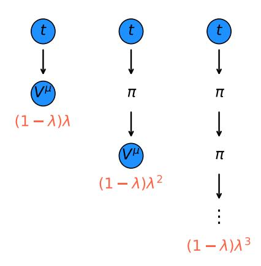
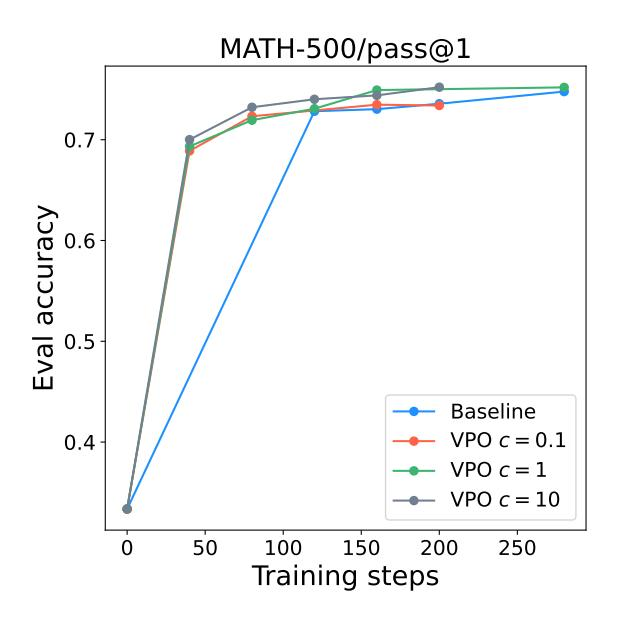
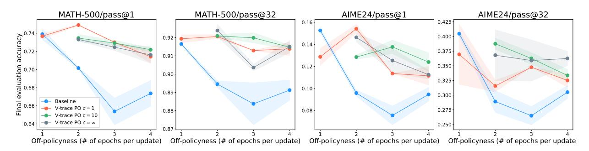
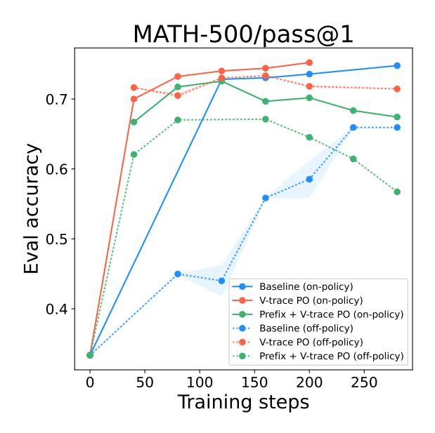

# V-trace policy optimization: multi-step off-policy reinforcement learning for LLMs

# Yunhao Tang Remi Munos

# Abstract

Off-policy learning is a fundamental requirement in modern reinforcement learning (RL) for LLMs. Our work starts the long-standing theory-practice gap in off-policy learning, that though theoretically sound off-policy correction should be sequential, yet practical algorithms always implement one-step correction. Motivated by this technical subtlety, we propose V-trace policy optimization (Vtrace PO), a family of algorithm interpolating one-step to sequential importance correction. By enabling multi-step off-policy learning, Vtrace PO trades-off towards more accurate policy improvement targets. Empirically, Vtrace PO is a few-line plug in RL algorithmic stack and enjoys generally more stable training compared to the dominant one-step methods.

# 1 Introduction

Off-policy learning, a term coined in contrast to onpolicy learning, refers to learning from data or experiences not generated by the current agent itself. Offpolicy data used to stem primarily from algorithmic design to be sample efficient[\[Mnih et al.,](#page-8-0) [2015,](#page-8-0) [Munos](#page-8-1) [et al.,](#page-8-1) [2016,](#page-8-1) [Schmitt et al.,](#page-9-0) [2020\]](#page-9-0), to be exploratory [\[Hester et al.,](#page-8-2) [2018,](#page-8-2) [Badia et al.,](#page-7-0) [2020\]](#page-7-0), or to be constrained to offline data [\[Levine et al.,](#page-8-3) [2020\]](#page-8-3), etc.

More fundamentally, small amount of off-policyness does not seems to harm performance while allowing for better trade-offs, such as sample efficiency [\[Schulman](#page-9-1) [et al.,](#page-9-1) [2015,](#page-9-1) [2017b\]](#page-9-2) and training throughput [\[Espeholt](#page-8-4) [et al.,](#page-8-4) [2018,](#page-8-4) [Schmitt et al.,](#page-9-0) [2020,](#page-9-0) [Sheng et al.,](#page-9-3) [2024,](#page-9-3) [Wu](#page-9-4)

Proceedings of the 29th International Conference on Artificial Intelligence and Statistics (AISTATS) 2026, Tangier, Morocco. PMLR: Volume 300. Copyright 2026 by the author(s).

[et al.,](#page-9-4) [2025\]](#page-9-4). In more recent LLM training, it was discovered that there are discrepancies between sampling policy and trainer policy due to GPU numerics, making off-policyness inevitable [\[Yao et al.,](#page-9-5) [2025,](#page-9-5) [He and Lab,](#page-8-5) [2025\]](#page-8-5). Therefore, it is not an understatement to say that off-policy learning is one of the most important requirements of modern reinforcement learning (RL).

Importance sampling (IS) is the most widely used technique for off-policy learning. IS is conceptually simple and generally applicable. It adjusts for the discrepancy between the target (learner policy) and behavior (sampling policy) with importance weighting, such that offpolicy data can be consumed as if it is on-policy [\[Robert](#page-8-6) [et al.,](#page-8-6) [1999\]](#page-8-6). IS-based algorithms are the most abundant and widely used in various applications [\[Schulman](#page-9-2) [et al.,](#page-9-2) [2017b,](#page-9-2) [Espeholt et al.,](#page-8-4) [2018,](#page-8-4) [Shao et al.,](#page-9-6) [2024\]](#page-9-6).

We are motivated by a long-standing discrepancy between the theory and practice of IS-based algorithms in the context of modern RL. Recent RL systems optimize decision making over the course of thousands of steps [\[Jaech et al.,](#page-8-7) [2024\]](#page-8-7). In theory, this warrants applying multiplicative IS to a sequence that corrects for off-policy discrepancy across all steps. However, offthe-shelf algorithms never implement such corrections in its unbiased form, instead one-step IS are dominant and yield good performance in practice [\[Schulman et al.,](#page-9-2) [2017b,](#page-9-2) [Espeholt et al.,](#page-8-4) [2018,](#page-8-4) [Shao et al.,](#page-9-6) [2024\]](#page-9-6).

To strike a balance between the two extremes, we propose V-trace policy optimization (V-trace PO), a family of multi-step off-policy learning algorithm. We summarize a few key technical contributions as follows:

- V-trace PO employs multi-step IS, which as opposed to one-step IS, improves the policy improvement target during policy optimization; as a tradeoff, the estimate incurs higher variance (Section [4\)](#page-2-0).
- Empirically, V-trace PO obtains generally more stable training performance across ablation settings, compared to baseline GRPO, which is a special case of the V-trace PO loss (Section [6,](#page-5-0)

Section [8\)](#page-6-0).

• V-trace PO takes a few lines to implement and a direct plug-in to GRPO. See pseudocode in Appendix [F.](#page-21-0) We can make a pr to verl repo, so that people can use it

Finally, the order in which we present results differs from how we arrive at V-trace PO in the first place. Our initial derivation, which starts from an in-depth analysis of the different roles played by IS ratios in a policy gradient estimate: the prefix correction, which corrects for input state off-policyness; and the suffix correction adjusting policy improvement targets. Our key insight is

not all IS ratios are equally important,

which explains prefix correction is almost always ignored in practical implementation, while suffix correction offers a space for further improvement. We detail such discussion in Section [5.](#page-4-0)

Shall we mention that previous works that introduced the V-trace or Retrace to perform multistep off-policy correction required using an auxiliary value V (or qvalue Q) function. However, it is not clear whether it is possible to implement this multistep off-policy correction without having to estimate a value function. This is a legitimate question since in LLMs it is know it is hard to learn V . In this paper we answer this question by the affirmative with V-trace PO :)

# 2 Background

We are interested in generic sequential decision making in the form of Markov Decision Process [\[Puterman,](#page-8-8) [1990\]](#page-8-8) of which large language models (LLM) [\[Achiam](#page-7-1) [et al.,](#page-7-1) [2023\]](#page-7-1) is a canonical application. For sampling, LLM generates sequences a ∈ Y consisting of tokens a1...a<sup>T</sup> ∈ V in an auto-regressive way

$$a_t \sim \pi \left( \cdot \mid a_{0:t-1} \right), 0 \le t \le T - 1,$$

where T is a fixed horizon. For simplicity, we denote xt := a0:t−<sup>1</sup> as the concatenated state. We also consider a fixed prompt throughout, and omit its dependency when the context is clear.

In general, a scalar reward r<sup>t</sup> is incurred at each time step. Here, we focus on a common case where there is a single reward r<sup>t</sup> at the end of the sequence. That is, r<sup>t</sup> = 0, ∀t ≤ T −2 until the last step [\[Ziegler et al.,](#page-9-7) [2019,](#page-9-7) [Ouyang et al.,](#page-8-9) [2022\]](#page-8-9). For RL fine-tuning, the aim is to maximize the cumulative sum of reward E<sup>π</sup> hP<sup>T</sup> <sup>−</sup><sup>1</sup> <sup>t</sup>=0 r<sup>t</sup> i which in the special case reduces to E<sup>π</sup> [r<sup>T</sup> <sup>−</sup>1]. Thereafter, we will focus on the single terminal reward special

case. Note that importantly, this terminal reward can generally depend on the whole trajectory rather than just the last token, e.g., we can define it as a single lump sum given to the agent at the end.

Policy gradient [\[Sutton et al.,](#page-9-8) [1999\]](#page-9-8) is the gradient of the expected sum of reward objective, which takes the following form

<span id="page-1-0"></span>
$$g(\pi) = \mathbb{E}_{\pi} \left[ r_{T-1} \sum_{t=0}^{T-1} \nabla \log \pi \left( a_t \mid x_t \right) \right]. \tag{1}$$

Optionally, a baseline can be subtracted from r<sup>T</sup> <sup>−</sup><sup>1</sup> for variance reduction, which often comes from a leave-oneout average over multiple generations from the same prompt [\[Kool et al.,](#page-8-10) [2019,](#page-8-10) [Ahmadian et al.,](#page-7-2) [2024\]](#page-7-2) .

Value function and Q-function. To facilitate ensuing discussion, we introduce the notion of value function, the expected return conditional on a prefix

$$V^{\pi}(x_t) := \mathbb{E}_{\pi} \left[ r_{T-1} \mid x_t \right].$$

With this definition, the policy gradient rewrites as g(π) = ∇V π (x). The Q-function is the conditional return under state prefix (xt) and action token a<sup>t</sup>

$$Q^{\pi}\left(x_{t}, a_{t}\right) \coloneqq \mathbb{E}_{\pi}\left[r_{T-1} \mid x_{t}, a_{t}\right].$$

Though Q-function and value function are in general related through Bellman equation [\[Sutton and Barto,](#page-9-9) [1998\]](#page-9-9), one can immediately notice that by concatenating the state prefix and action into a single prefix Q<sup>π</sup> (xt, at) = V π (xt+1). All our discussions can be extended to the dense reward case (see Appendix [B\)](#page-11-0).

# 3 Importance sampling based off-policy RL

While the policy gradient in Eqn [1](#page-1-0) requires sampling from policy π itself, in practice, the data is often sampled from another policy µ different from π. This is the case of off-policy learning. Off-policyness stems from multiple practical considerations such as asynchronous learning for throughput maximization [\[Espeholt et al.,](#page-8-4) [2018,](#page-8-4) [Wu et al.,](#page-9-4) [2025\]](#page-9-4), sample reuse for efficiency [\[Wang](#page-9-10) [et al.,](#page-9-10) [2016,](#page-9-10) [Schulman et al.,](#page-9-1) [2015,](#page-9-1) [2017b,](#page-9-2) [Schmitt et al.,](#page-9-0) [2020,](#page-9-0) [Roux et al.,](#page-8-11) [2025\]](#page-8-11), etc.

Importance sampling (IS) [\[Casella and Berger,](#page-8-12) [2024\]](#page-8-12) is an important statistical technique to adjust for the discrepancy between sampling and learner distribution. We discuss two extreme cases below.

## 3.1 Sequential IS for unbiased off-policy RL

We define the token-level IS ratio ρ<sup>t</sup> = π(a<sup>t</sup> | xt) µ(a<sup>t</sup> | xt) . To approximate policy gradient with an off-policy sample П

 $x_t \sim \mu$ , we have the following estimate

$$\widehat{g}_{\text{seq-is}} = r_{T-1} \cdot \rho_{0:T-1} \cdot \sum_{t=0}^{T-1} \nabla \log \pi (a_t \mid x_t), \quad (2)$$

where  $\rho_{0:T-1} := \rho_0...\rho_{T-1}$  indicates the product of IS ratios. The estimate is unbiased against  $g(\pi)$ .

**Proposition 1.** (Unbiased estimate with sequential IS) The sequential IS estimate in Eqn 2 is unbiased to the policy gradient, i.e.,  $\mathbb{E}_{\mu}\left[\widehat{g}_{seq\text{-}is}\right] = g(\pi)$ .

*Proof.* The equality holds due to a change of measure due to IS at the sequence level  $\mathbb{E}_{\mu} \left[ \rho_{0:T-1} \cdot \ldots \right] = \mathbb{E}_{\pi} \left[ \ldots \right]$ .

Now is a good time to pause and reflect on the form of the gradient estimate. We note that score function at each time t gets multiplied by the product of all IS ratios, is it really necessary? As we will elaborate on later, IS ratios before and after time, while serving different roles, adjust for all possible off-policy discrepancy along the trajectory, and is hence all necessary.

However, despite the unbiasedness, the sequential estimate is rarely used in practice due to the very high variance introduced by the product of IS ratios. While it is hard to characterize precisely, intuition suggests that the variance scales poorly (e.g., linear) with horizon T [Jiang and Li, 2016, Huang and Jiang, 2020]. Below, we introduce the most common practical approximation that seems to achieve a good trade-off between bias and variance.

### 3.2 Token-level IS for practical off-policy RL

Despite minor differences across algorithmic variants in the literature [Schulman et al., 2017b, Espeholt et al., 2018, Shao et al., 2024], the most commonly implemented policy gradient estimate keeps only a single IS ratio  $\rho_t$  for each step t,

$$\widehat{g}_{\text{token-is}} = r_{T-1} \cdot \sum_{t=0}^{T-1} \rho_t \cdot \nabla \log \pi \left( a_t \mid x_t \right), \quad (3)$$

We call this the token-level importance sampling approximation, in contrast to the product of IS ratios over the sequence. Intuitively, the variance is drastically reduced compared to Eqn 2 by replacing the product  $\rho_0...\rho_{T-1}$  with  $\rho_t$ , while introducing some bias.

Indeed, we now state informally, a key property of the above token-level IS gradient estimates

**Theorem 1.** (Policy improvement target, informal Theorem 2) The token-level IS gradient estimate (Eqn 3) improves over Q-function  $Q^{\mu}$  generated under behavior policy  $\mu$ . In contrast, the sequential estimate (Eqn 2) improves over  $Q^{\pi}$  under  $\pi$  itself.

<span id="page-2-1"></span>While the above statement glosses over important technical details (which we present in Section 5), it highlights the fact that the token-level IS estimate does not aim to improve upon  $\pi$  itself in general. Fundamentally, this is because the token-level IS gradient only carries out a single-step off-policy correction, and we need multi-step corrections to make the improvement target approach  $Q^{\pi}$ .

#### Key insight.

The token-level IS gradient estimate, while most dominant in practice, improves against the behavior policy  $\mu$  rather than  $\pi$  itself.

# <span id="page-2-0"></span>4 V-trace policy optimization

We propose V-trace policy optimization (V-trace PO) which interpolates between a policy improvement target of  $Q^{\mu}$  and  $Q^{\pi}$ . We define the V-trace PO gradient estimate estimate as

$$\widehat{g}_{\text{vtrace-po}} := r_{T-1} \cdot \sum_{t=0}^{T-1} \underbrace{\left(\rho_t + \sum_{s=t+1}^{T-1} c_t ... c_{s-1} \left(\rho_s - 1\right)\right)}_{\widetilde{\rho}_t} \nabla \log \pi_t.$$
(4)

<span id="page-2-3"></span>where  $c_t$ s are the token-level trace coefficients generally satisfying  $c_t \in [0, \rho_t]$ . Popular examples include the clipped IS ratio  $c_t = \min(\bar{c}, \rho_t)$  for some threshold  $\bar{c} \geq 0$  to control the variance [Espeholt et al., 2018, Munos et al., 2016]. A more technical operator view of the V-trace PO design can be found in Appendix C.

To see how the V-trace PO gradient estimate interpolates between extremes, we note the following

<span id="page-2-4"></span>**Proposition 2.** (V-trace PO off-policy corrections) Assume the V-trace PO gradient estimate Eqn 4 has the clipped IS ratio as traces  $c_t = \min(\bar{c}, \rho_t)$ . Then

- <span id="page-2-2"></span>• When  $\bar{c} = 0$ ,  $\hat{g}_{vtrace\text{-}po} = \hat{g}_{token\text{-}is}$  recovers the token-level estimate which improves over  $Q^{\mu}$ .
- When  $\bar{c} = \infty$ ,  $\hat{g}_{vtrace-po} = \hat{g}_{no\text{-}prefix-is}$  recovers the full suffix correction which improves over  $Q^{\pi}$ .

When  $\bar{c} \in (0, \infty)$ , the policy improvement target is in between  $Q^{\pi}$  and  $Q^{\mu}$ .

To clarify, at the extreme when  $\bar{c} = \infty$ ,  $\widehat{g}_{\text{token-is}}$  will recover  $\widehat{g}_{\text{no-prefix-is}}$  to be defined later. This generally differs from  $\widehat{g}_{\text{seq-is}}$  but still improves over  $Q^{\pi}$ . The key difference is that V-trace PO gradient does not correct for the state distribution mismatch, and only correct for improvement target. We present the full picture and discuss the technical subtlety in Section 5.

Off-policy cumulative trace. Since the role of trace  $c_t$  is meant to control the variance, we might consider an intermediary value for  $\bar{c} = 1$  akin to prior practice [Munos et al., 2016, Espeholt et al., 2018]. We point out a property of the cumulative trace coefficient  $\tilde{\rho}_t$ , which is interesting in its own right.

<span id="page-3-1"></span>**Lemma 1.** (Cumulative trace) When  $c_t s$  are Markovian, the cumulative trace can be computed recursively

$$\tilde{\rho}_t = \rho_t + c_t \left( \tilde{\rho}_{t+1} - 1 \right)$$

The recursive computation is loosely reminiscent of a value function that accumulates reward over time. Indeed,  $c_t = 0$  implies  $\tilde{\rho}_t = \rho_t$  while  $c_t = \rho_t$  implies  $\tilde{\rho}_t = \rho_t \rho_{t+1} ... \rho_{T-1}$ , which reduces to the full suffix corrections.

#### 4.1 V-trace improves against a mixed policy

Intriguingly in general, we can characterize in a precise way the policy that V-trace PO improves against. Let  $\beta_t := \frac{c_t}{\rho_t} \in [0,1]$  be a ratio that measures the level of off-policy correction through the trace. We show that V-trace PO improves against the following policy.

**Proposition 3.** (Policy improvement against swiching policy) V-trace PO gradient estimate (Eqn (4)) follows the following expected update

$$\sum_{t=0}^{T-1} \mathbb{E}_{x_t \sim \mu} \left[ \mathbb{E}_{a_t \sim \pi(\cdot|x_t)} \left[ Q_t \nabla \log \pi(a_t|x_t) \right] \right]$$

where  $Q_t = \beta_t Q_t^{\pi \to 1-\beta\mu} + (1-\beta_t)Q_t^{\mu}$  is a mixed Q-function. Here,  $Q_t^{\pi \to 1-\beta\mu} := \mathbb{E}_{\pi \to 1-\beta\mu} [r_{T-1} \mid x_t, a_t]$  is the Q-function of a non-Markovian policy  $\pi \to_{1-\beta} \mu$  that executes  $a_t \sim \pi(\cdot|x_t)$  and at each step with probability  $1-\beta_t$ , executes  $\mu$  and follows  $\mu$  thereafter.

To unpack the result, we can interpret the V-trace PO update as improving against the Q-function  $Q_t$  which is itself a mixture between  $Q^{\mu}$  and the Q-function of a non-Markovian policy  $Q^{\pi \to 1-\beta \mu}$ . We call  $\pi \to_{1-\beta} \mu$  a switching policy, which follows  $\pi$  initially until it switches to  $\mu$  with probability  $1-\beta_t$  at each step, and sticks with  $\mu$  thereafter. This policy is non-Markovian and interpolates (albeit not in a Markovian way) between  $\pi$  and  $\mu$  as  $c_t$  varies from 0 to  $\rho_t$ .

In Appendix C, we provide extended discussion and show how  $Q^{\pi \to 1-\beta \mu}$  satisfies a Bellman equation, which is interesting in its own right. Below, we discuss a few illustrative examples to confer more intuitions.

Off-policy  $\lambda$ -trace. An intriguing special case is when  $c_t = \lambda \rho_t$  for some  $\lambda \in [0, 1)$ , with similarity to classic  $TD(\lambda)$  as illustrated in Figure 1. In this case,

<span id="page-3-0"></span>

Figure 1: An illustration of mixture of V-trace PO offpolicy correction entailed by V-trace gradient estimate (Eqn 4) with the trace  $c_t = \lambda \rho_t$ . With a random time, the mixture policy executes on-policy  $\pi$  for a few steps, followed by  $\mu$  which produces the behavior value  $V^{\mu}$ . This bears close connections to the classic  $\mathrm{TD}(\lambda)$ , which interpolates between Monte-Carlo estimate (low bias, high variance) and one-step bootstrap (low variance, high bias) in TD-learning.

we can write the trace as

$$\tilde{\rho}_t = \rho_0 \cdot (1 - \lambda) \left( 1 + \lambda \rho_{t+1} + \lambda^2 \rho_{t+1} \rho_{t+2} + \ldots \right),$$

which is a geometric average over partial corrections. Here, because the switching probability  $1-\lambda$  is constant across steps,  $\pi \to_{1-\beta} \mu$  can be understood as a mixture policy that executes  $\pi$  for a random  $\tau \sim \text{Geometric}(\lambda)$  and follows  $\mu$  afterwards.

Non-Markovian traces. In general, we can consider non-Markovian trace, e.g., the n-step trace  $c_{t,s} = \rho_t \mathbb{I}[s \leq t+n-1]$  for which the cumulative trace is also non-Markovian  $\tilde{\rho}_t = \rho_{t:t+n-1}$ , consisting of IS ratios n steps into future. This also implies that the improvement is against a hard-switching policy that executes  $\pi$  for n steps followed by  $\mu$ , bearing connections to n-step Q-learning [Hessel et al., 2018, Rowland et al., 2020].

Difference from IMPALA policy gradient. V-trace PO leverages the off-policy learning machinery from V-trace and IMPALA [Espeholt et al., 2018, Munos et al., 2016] but differs in subtle technical details: (1) IMPALA requires approximating a parametric value function  $V_t$ , whereas V-trace PO does not; instead, V-trace PO makes use of a Monte-Carlo estimated value function to build partial corrections, which is an interesting result in its own; (2) The IMPALA update does not perfectly interpolate between  $\hat{g}_{\text{token-is}}$  and  $\hat{g}_{\text{no-prefix-is}}$ , which is an advantage of V-trace PO (i.e.,

recovers baseline with specific hyper-parameters). We expand on in Appendix C.

add key results for operator view but for final reward case

# <span id="page-4-0"></span>5 Understanding the different roles of importance sampling

In the following, we discuss in depth the roles of IS in off-policy learning. We start from the sequential IS estimate Eqn 2 and see how removing parts of the IS ratios impacts the optimization objective.

The overall insight can be summarized in the following color-coded sequence IS gradient estimate

$$\sum_{t=0}^{T-1} r_{T-1} \cdot \rho_{0:t-1} \cdot \rho_t \cdot \rho_{t+1:T-1} \cdot \nabla \log \pi \left( a_t \mid a_{0:t-1} \right).$$

Different IS ratios  $\rho_s$ s are color coded to reflect their impact on the aggregate update for a particular step t:

- The prefix correction, which corrects for off-policyness before time t, adjusts for the off-policy partial sequence  $a_{0:t-1}$  as input to the policy.
- The suffix correction which happens after time t, weighs the advantage function  $r_{T-1}$  and adjusts the policy improvement target to improves against.
- The remaining IS ratio  $\rho_t$  exactly at time t, being the only most commonly applied correction, ensures that the update improves  $\pi(a_t)$  itself.

#### 5.1 Prefix correction corrects for input state

We start by considering the case where the partial IS product before step t is removed from the sequential estimate, resulting in the following gradient estimate

$$\widehat{g}_{\text{no-prefix-is}} = r_{T-1} \cdot \sum_{t=0}^{T-1} \rho_{0:t-1} \cdot \rho_{t:T-1} \cdot \nabla \log \pi_t, \quad (5)$$

We use the label no-prefix-is to indicate that this estimate removed prefix corrections. Though  $\widehat{g}_{\text{no-prefix-is}}$  is generally biased in the sense that  $\mathbb{E}_{\mu}\left[\widehat{g}_{\text{no-suffix-is}}\right] \neq g(\pi)$ , updating with this estimate will converge to the same optimal policy as  $g(\pi)$ . In other words, the policy optimality is preserved, despite the bias in the update.

<span id="page-4-3"></span>**Proposition 4.** (Preserving policy objective optimality) On condition that  $\mu$  has coverage over the full state space, the gradient estimate in Eqn 5 improves upon the scalar objective

$$\sum_{t=0}^{T-1} \mathbb{E}_{x_t \sim \mu} \left[ V^{\pi}(x_t) \right].$$

which share the same optimal policy as the original policy gradient objective  $V^{\pi}(x)$  under tabular representations.

The above result implies that removing the product of IS ratios before step t is generally benign, as it does not alter the global optimality of the learning dynamics. We can also understand the product  $\rho_{0:t-1}$  as adjusting for the mistmatch of the visitation state distribution, or the prefix distribution  $x_t \sim \mu \to x_t \sim \pi$ .

#### Key insight.

Removing the product of IS ratios before each time step t produces a gradient estimate that improves on an objective sharing the same set of optimality as the policy gradient.

While some prior work has argued for the usefulness of such prefix correction [Zhang et al., 2025], we speculate that it is potentially not necessary to avoid unnecessary variance in the update. We carry out ablations in Section 8. tabular?

# 5.2 Suffix correction changes policy improvement target

We now examine the product of IS ratios after step t:  $\rho_{t+1:T-1}$ . We start by considering the extreme case where such a product is removed from the gradient estimate, leading to the following

<span id="page-4-2"></span>
$$\widehat{g}_{\text{no-suffix-is}} = r_{T-1} \cdot \sum_{t=0}^{T-1} \rho_{0:t} \cdot \underline{\rho_{t+1:T-1}} \cdot \nabla \log \pi_t. \quad (6)$$

We will see that with the removal of IS ratios after step t, the gradient estimate produces policy improvement over behavior policy  $\mu$ . Note that since the IS ratios before step t are applied, the prefix distribution  $x_t \sim \pi$  is on-policy.

<span id="page-4-4"></span><span id="page-4-1"></span>**Proposition 5.** (Policy improvement over  $\mu$ ) The gradient estimate in Eqn 6 follows the following expected update

$$\sum_{t=0}^{T-1} \mathbb{E}_{x_t \sim \pi} \left[ \nabla \mathbb{E}_{a_t \sim \pi(\cdot \mid x_t)} \left[ Q^{\mu} \left( x_t, a_t \right) \right] \right]$$

which locally improves upon Q-function under  $\mu$ .

Below, we adopt the short-hand notation  $\pi_t := \pi(a_t \mid x_t)$ .

#### Key insight.

Removing the product of IS ratios after each time step t produces a gradient estimate that locally improves upon the behavior policy  $\mu$ , with on-

policy prefix distribution.

# 5.3 Understanding token-level IS

We combine results from previous section and remove both  $\rho_{0:t-1}$  and  $\rho_{t+1:T-1}$  from the sequence level product of IS ratios, which finally leads to the token-level approximation in Eqn 3. We state its policy improvement property as follows.

<span id="page-5-1"></span>**Theorem 2.** (Token-level IS approximation) The gradient estimate in Eqn 3 ascends on the following scalar objective

$$\mathcal{L}^{\pi,\mu}(x) \coloneqq \sum_{t=0}^{T-1} \mathbb{E}_{x_t \sim \mu} \left[ \mathbb{E}_{a_t \sim \pi(\cdot \mid x_t)} \left[ Q^{\mu} \left( x_t, a_t \right) \right] \right].$$

which locally improves upon Q-function under  $\mu$  with off-policy prefix state distribution under  $\mu$ .

Gradient ascent on the objective above allows for policy improvement of  $\pi$  over  $\mu$  [Sutton and Barto, 1998]. In the extreme of  $\pi^* = \arg\max \mathcal{L}^{\pi,\mu}(x)$ , the new policy  $\pi^*$  can be seen as a greedy improvement over  $\mu$ . When we impose no constraints on  $\mu$ , an improvement over  $\mu$  might not necessarily be an improvement over  $\pi$  itself, which underlies the the generic bias introduced by such approximations.

In practice, when  $\pi$  and  $\mu$  are close (e.g., when  $\mu$  lags behind  $\pi$ ), the sequence of  $\pi$  might improve over time under trust region assumptions [Kakade and Langford, 2002, Schulman et al., 2015] and converge optimally when  $\mu$  does not lag behind  $\pi$  by too much [Singh et al., 2000, Munos et al., 2016, Kozuno et al., 2021].

The necessity of present time correction  $\rho_t$ . In hindsight, the above derivation has outlined the importance of the token-level IS ratio  $\rho_t$ , without which the policy improvement result does not hold. Indeed, consider the update which removes all IS ratios

$$r_{T-1} \cdot \sum_{t=0}^{T-1} \nabla \log \pi \left( a_t \mid x_t \right).$$

If we follow such an update, the policy converges to a policy which is general not an improvement over  $\mu$ , see detailed arguments and examples in [Arnal et al., 2025]. With the presence of  $\rho_t$ , Theorem 2 implies this single step off-policy correction plays a very important role as it ensures that the update makes policy improvement for  $\pi$ , at least against behavior policy  $\mu$ .

#### Key insight.

The token-level IS ratio  $\rho_t$  makes sure that the update is a generalized policy improvement.

# <span id="page-5-0"></span>6 Implementation

Algorithms such as PPO or GRPO [Schulman et al., 2017b, Shao et al., 2024] apply clipping to constrain the update, which generally stabilizes training [Schulman et al., 2015]. With n trajectories sampled from a single prompt, the GRPO loss is defined as follows

$$\mathcal{L}_{\text{grpo}} = \frac{1}{n} \sum_{i=0}^{n-1} \sum_{t=0}^{T-1} \min \left( \rho_t \widehat{A}_i, \text{clip} \left( \rho_t, 1 - \epsilon, 1 + \epsilon \right) \widehat{A}_i \right),$$

where  $\widehat{A}_i := r_{i,T-1} - \frac{1}{n} \sum_{j \neq i} r_{j,T-1}$  is an advantage estimate. To adapt V-trace PO to this case, we propose the following loss adapted from the above loss

$$\mathcal{L}_{\text{vtrace-po}} := \frac{1}{n} \sum_{i=0}^{n-1} \sum_{t=0}^{T-1} \min \left( \bar{\rho}_t \widehat{A}_i, \operatorname{clip} \left( \bar{\rho}_t, 1 - \epsilon, 1 + \epsilon \right) \widehat{A}_i \right),$$
(7)

where  $\bar{\rho}_t \coloneqq \operatorname{sg}\left(\frac{\tilde{\rho}_t}{\rho_t}\right) \rho_t$ . The stop-gradient trick is designed such that the effective gradient  $\nabla \bar{\rho}_t = \tilde{\rho}_t \nabla \log \pi_t$ . When  $\bar{c} = 0$ , the loss reduce to the GRPO loss  $\mathcal{L}_{\text{vtrace-po}}|_{\bar{c}=0} = \mathcal{L}_{\text{grpo}}$ . To understand the loss better, consider when there is no clipping, we recover policy gradient estimates discussed above  $\nabla \mathcal{L}_{\text{vtrace-po}}|_{\epsilon=\infty} = \hat{g}_{\text{vtrace-po}}$  when the reward is also replaced by the advantage. As a corollary, we also have  $\nabla \mathcal{L}_{\text{grpo}}|_{\epsilon=\infty} = \hat{g}_{\text{token-is}}$ .

The new loss also incentives a trust region update for finite  $\epsilon$ , since the gradient is zero when  $\tilde{\rho}_t$  hits the clipping boundary. When  $\tilde{\rho}_t = \rho_{0:T-1}$  the above loss can be interpreted as applying PPO or GRPO loss to the sequence of actions  $(a_t)_{t=0}^{T-1}$  as a whole (i.e., think of them as a single action).

tabular experiments?

### 7 Discussion and related work

V-trace PO can be extended to the dense reward case, and we detail the discussion in Appendix B.

# Surrogate objective vs. gradient approximation.

The seminal line of work [Schulman et al., 2015, 2017b] design surrogate objective for policy optimization. In fact, the token-level update (Eqn 3) is obtained by differentiating the surrogate loss  $\sum_{t=0}^{T-1} \rho_t \cdot \hat{A}_t^{\mu}$ . Alternatively, the product of IS ratios can account for all possible dependencies on policy  $\pi$ , giving the objective  $\sum_{t=0}^{T-1} \rho_0...\rho_{t-1}\rho_t \hat{A}_t^{\mu}$ , which in expectation, is indeed the performance gap  $V^{\pi} - V^{\mu}$  [Kakade and Langford, 2002]. We provide extended details in Appendix B.1. Interpolating the two extremes above, prior work has investigated middle ground objectives [Tang et al., 2020, 2023] for bias and variance trade-offs.

<span id="page-6-1"></span>

**Figure 2:** On-policy sanity check. In the on-policy case, where  $B = B_{\min}$ , E = 1, the training is theoretically on-policy up to hardware numerics. In this case, all algorithmic variants perform similarly. It seems 2 curves stop early?

Importance sampling for deep RL. The sequential form of the full off-policy correction akin to Eqn 2 was investigated in number of prior work [Jie and Abbeel, 2010, Achiam, 2017, Metelli et al., 2018, Huang and Jiang, 2020]. However, in general the product of IS ratios is not practically useful unless the horizon is small. In practice, policy gradient implementations typically just involve the token-level IS ratio [Schulman et al., 2017b] or its clipped variant [Espeholt et al., 2018]. In recent applications, GSRO [Zheng et al., 2025] proposed to replace  $\rho_{0:T-1}$  by its normalized variant  $(\rho_{0:T-1})^{1/T}$ , applied to the entire sequence, to significantly reduce variance. However, this arguably glosses over statistical dependencies for different tokens.

Prior work closely related to V-trace PO includes early investigation in the deep RL settings [Tang et al., 2020, 2023]. They can be understood as special cases of V-trace PO with particular choices of trace  $c_t$ .

Bias and variance trade-offs in off-policy value-based learning. For value-based RL, there is a fundamental trade-off between the variance and bias of value-based updates, due to statistical limitations [Rowland et al., 2020]. Given the close connection between policy gradient and value-based learning [Schulman et al., 2017a], this echos the aforementioned trade-off between variance and policy improvement targets.

# <span id="page-6-0"></span>8 Experiments

To validate the impact of V-trace PO at scale, we carry out RL fine-tuning experiments for LLMs. Throughout, we use the Qwen 7B model [Bai et al., 2023] as proof of concept, and build on top of the VeRL codebase [Sheng et al., 2024]. We adopt mostly default hyperparameters from the codebase for GRPO experiments, and train on the math data mixture be clear about specific mix.

**Default parameters.** By default, we adopt a default clipping of  $\epsilon = 0.2$ . TODO: other parameters

Near on-policy sanity check. We start with experiments in the on-policy case where the update at each step has a global batch of size B=32 and the mini-batch is  $B_{\rm mini}=32$  too with a single E=1 epoch (i.e., one update per step). This setup incurs no off-policyness in theory (not accounting for GPU numerics [He and Lab, 2025]), and is used for sanity checking the implementation. Figure 2 shows the evaluation for MATH-500, where we observe no significant difference between GRPO (our baseline, which corresponds to a choice of  $\bar{c}=0$ ) and V-trace PO, with little impact by choice of  $\bar{c}$ , as expected.

Impact of off-policyness. To understand the impact of off-policyness, we consider a few settings that induce off-policyness in a more or less natural way: (1) When the batch of B samples are updated with E>1 epochs; (2) When  $B/B_{\min}>1$ . After the first update,  $\pi$  differs from  $\mu$  and off-policy updates are applied to future updates. Note both are common settings in the canonical PPO implementation (see, e.g., OpenAI baselines [Dhariwal et al., 2017]) to balance sample efficiency with sample reuse.

We first consider the setting where  $B = B_{\min}$  but the samples are consumed E epochs per iteration (i.e., with E updates in per iteration). Figure 3 shows the evaluation across multiple task the end of training, where we average evaluations across the last checkpoints and multiple runs to obtain confidence intervals. A few observations are in order: (1) Off-policyness hurts performance in general. As we move from E=1(on-policy) and E = 4 (very off-policy), we see that the evaluation generally decreases. This is especially the case for PPO which observes a more steep performance loss as the training becomes more off-policy; while Vtrace PO is relatively more robust, its performance deteriorates as well. (2) A good value for the clipping threshold seems to be  $\bar{c} \geq 1$  and the performance is relatively robust in this range. (3) Interestingly, setting  $\bar{c} = \infty$ , is not too detrimental to the performance. The best hyper-parameter seems rather inconclusive and

<span id="page-7-5"></span>

Figure 3: Final evaluation performance as a function of off-policyness (controlled by number of epochs E per update) across different algorithmic variants. The baseline can be understood as V-trace PO with  $\bar{c}=0$ . We see that off-policyness generally hurts performance, and V-trace PO seems to be modestly robust against off-policyness as long as  $\bar{c} \geq 1$ . Interestingly, setting  $\bar{c} = \infty$  for which  $c_t = \rho_t$  does not seem to hurt performance much.

<span id="page-7-6"></span>

Figure 4: Ablation on the utility of prefix correction.

might require further case-by-case ablation. Sometimes we refer to our baseline as GRPO, sometimes as PPO. For consistency, maybe we could use GRPO all along?

**Training instability.** Throughout, we have observed sporadic performance drops during RL training, TODO

#### Impact of clipping.

Impact of prefix correction. We investigate the impact of prefix correction in V-trace PO, where we apply the  $\rho_{0:t-1}$  IS ratios at each step t. In combination with V-trace PO, this is very close to the full IS  $\widehat{g}_{\text{seq-is}}$  except for suffix partial correction (when  $c_t \neq \rho_t$ ).

Figure 4 compares the on-policy vs. off-policy (E=4 epochs) case across the baseline, V-trace PO with

 $\bar{c}=10$  and the prefix variant. While all algorithms perform rather similarly on-policy, for off-policy case, the baseline climbs up evaluations at a slower rate compared to V-trace PO. Meanwhile, the prefix correction seems to lead to slowly decaying performance towards the end of training, hinting at instability.

 $\lambda$ -trace.

#### References

<span id="page-7-1"></span>Josh Achiam, Steven Adler, Sandhini Agarwal, Lama Ahmad, Ilge Akkaya, Florencia Leoni Aleman, Diogo Almeida, Janko Altenschmidt, Sam Altman, Shyamal Anadkat, et al. Gpt-4 technical report. arXiv preprint arXiv:2303.08774, 2023.

<span id="page-7-4"></span>Joshua Achiam. Advanced policy gradient methods, 2017.

<span id="page-7-7"></span>Alekh Agarwal, Nan Jiang, Sham M Kakade, and Wen Sun. Reinforcement learning: Theory and algorithms. *CS Dept.*, *UW Seattle, Seattle, WA, USA, Tech. Rep*, 32:96, 2019.

<span id="page-7-2"></span>Arash Ahmadian, Chris Cremer, Matthias Gallé, Marzieh Fadaee, Julia Kreutzer, Olivier Pietquin, Ahmet Üstün, and Sara Hooker. Back to basics: Revisiting reinforce style optimization for learning from human feedback in llms. arXiv preprint arXiv:2402.14740, 2024.

<span id="page-7-3"></span>Charles Arnal, Gaetan Narozniak, Vivien Cabannes, Yunhao Tang, Julia Kempe, and Remi Munos. Asymmetric reinforce for off-policy reinforcement learning: Balancing positive and negative rewards. arXiv preprint arXiv:2506.20520, 2025.

<span id="page-7-0"></span>Adrià Puigdomènech Badia, Bilal Piot, Steven Kapturowski, Pablo Sprechmann, Alex Vitvitskyi, Zhaohan Daniel Guo, and Charles Blundell. Agent57:

- Outperforming the atari human benchmark. In International conference on machine learning, pages 507–517. PMLR, 2020.
- <span id="page-8-20"></span>Jinze Bai, Shuai Bai, Yunfei Chu, Zeyu Cui, Kai Dang, Xiaodong Deng, Yang Fan, Wenbin Ge, Yu Han, Fei Huang, et al. Qwen technical report. arXiv preprint arXiv:2309.16609, 2023.
- <span id="page-8-12"></span>George Casella and Roger Berger. Statistical inference. Chapman and Hall/CRC, 2024.
- <span id="page-8-21"></span>Prafulla Dhariwal, Christopher Hesse, Oleg Klimov, Alex Nichol, Matthias Plappert, Alec Radford, John Schulman, Szymon Sidor, Yuhuai Wu, and Peter Zhokhov. Openai baselines. [https://github.com/](https://github.com/openai/baselines) [openai/baselines](https://github.com/openai/baselines), 2017.
- <span id="page-8-4"></span>Lasse Espeholt, Hubert Soyer, Remi Munos, Karen Simonyan, Vlad Mnih, Tom Ward, Yotam Doron, Vlad Firoiu, Tim Harley, Iain Dunning, et al. Impala: Scalable distributed deep-rl with importance weighted actor-learner architectures. In International conference on machine learning, pages 1407–1416. PMLR, 2018.
- <span id="page-8-5"></span>Horace He and Thinking Machines Lab. Defeating nondeterminism in llm inference. Thinking Machines Lab: Connectionism, 2025. doi: 10.64434/tml.20250910. https://thinkingmachines.ai/blog/defeatingnondeterminism-in-llm-inference/.
- <span id="page-8-15"></span>Matteo Hessel, Joseph Modayil, Hado Van Hasselt, Tom Schaul, Georg Ostrovski, Will Dabney, Dan Horgan, Bilal Piot, Mohammad Azar, and David Silver. Rainbow: Combining improvements in deep reinforcement learning. In Proceedings of the AAAI conference on artificial intelligence, volume 32, 2018.
- <span id="page-8-2"></span>Todd Hester, Matej Vecerik, Olivier Pietquin, Marc Lanctot, Tom Schaul, Bilal Piot, Dan Horgan, John Quan, Andrew Sendonaris, Ian Osband, et al. Deep q-learning from demonstrations. In Proceedings of the AAAI conference on artificial intelligence, volume 32, 2018.
- <span id="page-8-14"></span>Jiawei Huang and Nan Jiang. From importance sampling to doubly robust policy gradient. In International Conference on Machine Learning, pages 4434–4443. PMLR, 2020.
- <span id="page-8-7"></span>Aaron Jaech, Adam Kalai, Adam Lerer, Adam Richardson, Ahmed El-Kishky, Aiden Low, Alec Helyar, Aleksander Madry, Alex Beutel, Alex Carney, et al. Openai o1 system card. arXiv preprint arXiv:2412.16720, 2024.
- <span id="page-8-13"></span>Nan Jiang and Lihong Li. Doubly robust off-policy value evaluation for reinforcement learning. In International conference on machine learning, pages 652–661. PMLR, 2016.

- <span id="page-8-18"></span>Tang Jie and Pieter Abbeel. On a connection between importance sampling and the likelihood ratio policy gradient. Advances in Neural Information Processing Systems, 23, 2010.
- <span id="page-8-16"></span>Sham Kakade and John Langford. Approximately optimal approximate reinforcement learning. In Proceedings of the nineteenth international conference on machine learning, pages 267–274, 2002.
- <span id="page-8-10"></span>Wouter Kool, Herke van Hoof, and Max Welling. Buy 4 reinforce samples, get a baseline for free! 2019.
- <span id="page-8-17"></span>Tadashi Kozuno, Yunhao Tang, Mark Rowland, Rémi Munos, Steven Kapturowski, Will Dabney, Michal Valko, and David Abel. Revisiting peng's q (lambda) for modern reinforcement learning. In International Conference on Machine Learning, pages 5794–5804. PMLR, 2021.
- <span id="page-8-3"></span>Sergey Levine, Aviral Kumar, George Tucker, and Justin Fu. Offline reinforcement learning: Tutorial, review, and perspectives on open problems. arXiv preprint arXiv:2005.01643, 2020.
- <span id="page-8-19"></span>Alberto Maria Metelli, Matteo Papini, Francesco Faccio, and Marcello Restelli. Policy optimization via importance sampling. Advances in Neural Information Processing Systems, 31, 2018.
- <span id="page-8-0"></span>Volodymyr Mnih, Koray Kavukcuoglu, David Silver, Andrei A Rusu, Joel Veness, Marc G Bellemare, Alex Graves, Martin Riedmiller, Andreas K Fidjeland, Georg Ostrovski, et al. Human-level control through deep reinforcement learning. nature, 518(7540):529– 533, 2015.
- <span id="page-8-1"></span>Rémi Munos, Tom Stepleton, Anna Harutyunyan, and Marc Bellemare. Safe and efficient off-policy reinforcement learning. Advances in neural information processing systems, 29, 2016.
- <span id="page-8-9"></span>Long Ouyang, Jeffrey Wu, Xu Jiang, Diogo Almeida, Carroll Wainwright, Pamela Mishkin, Chong Zhang, Sandhini Agarwal, Katarina Slama, Alex Ray, et al. Training language models to follow instructions with human feedback. Advances in Neural Information Processing Systems, 35:27730–27744, 2022.
- <span id="page-8-8"></span>Martin L Puterman. Markov decision processes. Handbooks in operations research and management science, 2:331–434, 1990.
- <span id="page-8-6"></span>Christian P Robert, George Casella, and George Casella. Monte Carlo statistical methods, volume 2. Springer, 1999.
- <span id="page-8-11"></span>Nicolas Le Roux, Marc G Bellemare, Jonathan Lebensold, Arnaud Bergeron, Joshua Greaves, Alex Fréchette, Carolyne Pelletier, Eric Thibodeau-Laufer, Sándor Toth, and Sam Work. Tapered off-policy reinforce: Stable and efficient reinforcement learning for llms. arXiv preprint arXiv:2503.14286, 2025.

- <span id="page-9-11"></span>Mark Rowland, Will Dabney, and Rémi Munos. Adaptive trade-offs in off-policy learning. In International Conference on Artificial Intelligence and Statistics, pages 34–44. PMLR, 2020.
- <span id="page-9-0"></span>Simon Schmitt, Matteo Hessel, and Karen Simonyan. Off-policy actor-critic with shared experience replay. In International conference on machine learning, pages 8545–8554. PMLR, 2020.
- <span id="page-9-1"></span>John Schulman, Sergey Levine, Pieter Abbeel, Michael Jordan, and Philipp Moritz. Trust region policy optimization. In International conference on machine learning, pages 1889–1897. PMLR, 2015.
- <span id="page-9-17"></span>John Schulman, Xi Chen, and Pieter Abbeel. Equivalence between policy gradients and soft q-learning. arXiv preprint arXiv:1704.06440, 2017a.
- <span id="page-9-2"></span>John Schulman, Filip Wolski, Prafulla Dhariwal, Alec Radford, and Oleg Klimov. Proximal policy optimization algorithms. arXiv preprint arXiv:1707.06347, 2017b.
- <span id="page-9-6"></span>Zhihong Shao, Peiyi Wang, Qihao Zhu, Runxin Xu, Junxiao Song, Xiao Bi, Haowei Zhang, Mingchuan Zhang, YK Li, Y Wu, et al. Deepseekmath: Pushing the limits of mathematical reasoning in open language models. arXiv preprint arXiv:2402.03300, 2024.
- <span id="page-9-3"></span>Guangming Sheng, Chi Zhang, Zilingfeng Ye, Xibin Wu, Wang Zhang, Ru Zhang, Yanghua Peng, Haibin Lin, and Chuan Wu. Hybridflow: A flexible and efficient rlhf framework. arXiv preprint arXiv: 2409.19256, 2024.
- <span id="page-9-13"></span>Satinder Singh, Tommi Jaakkola, Michael L Littman, and Csaba Szepesvári. Convergence results for singlestep on-policy reinforcement-learning algorithms. Machine learning, 38(3):287–308, 2000.
- <span id="page-9-9"></span>R. Sutton and A. Barto. Reinforcement Learning: An Introduction. MIT Press, 1998.
- <span id="page-9-8"></span>Richard S Sutton, David McAllester, Satinder Singh, and Yishay Mansour. Policy gradient methods for reinforcement learning with function approximation. Advances in neural information processing systems, 12, 1999.
- <span id="page-9-14"></span>Yunhao Tang, Michal Valko, and Rémi Munos. Taylor expansion policy optimization. In International Conference on Machine Learning, pages 9397–9406. PMLR, 2020.
- <span id="page-9-15"></span>Yunhao Tang, Tadashi Kozuno, Mark Rowland, Anna Harutyunyan, Rémi Munos, Bernardo Avila Pires, and Michal Valko. Domo-ac: doubly multi-step offpolicy actor-critic algorithm. In International Conference on Machine Learning, pages 33657–33673. PMLR, 2023.

- <span id="page-9-10"></span>Ziyu Wang, Victor Bapst, Nicolas Heess, Volodymyr Mnih, Remi Munos, Koray Kavukcuoglu, and Nando De Freitas. Sample efficient actor-critic with experience replay. arXiv preprint arXiv:1611.01224, 2016.
- <span id="page-9-4"></span>Bo Wu, Sid Wang, Yunhao Tang, Jia Ding, Eryk Helenowski, Liang Tan, Tengyu Xu, Tushar Gowda, Zhengxing Chen, Chen Zhu, et al. Llamarl: A distributed asynchronous reinforcement learning framework for efficient large-scale llm trainin. arXiv preprint arXiv:2505.24034, 2025.
- <span id="page-9-5"></span>Feng Yao, Liyuan Liu, Dinghuai Zhang, Chengyu Dong, Jingbo Shang, and Jianfeng Gao. Your efficient rl framework secretly brings you off-policy rl training, August 2025. URL [https://fengyao.notion.](https://fengyao.notion.site/off-policy-rl) [site/off-policy-rl](https://fengyao.notion.site/off-policy-rl).
- <span id="page-9-12"></span>Yifan Zhang, Yifeng Liu, Huizhuo Yuan, Yang Yuan, Quanquan Gu, and Andrew C Yao. On the design of kl-regularized policy gradient algorithms for llm reasoning. arXiv preprint arXiv:2505.17508, 2025.
- <span id="page-9-16"></span>Chujie Zheng, Shixuan Liu, Mingze Li, Xiong-Hui Chen, Bowen Yu, Chang Gao, Kai Dang, Yuqiong Liu, Rui Men, An Yang, et al. Group sequence policy optimization. arXiv preprint arXiv:2507.18071, 2025.
- <span id="page-9-7"></span>Daniel M Ziegler, Nisan Stiennon, Jeffrey Wu, Tom B Brown, Alec Radford, Dario Amodei, Paul Christiano, and Geoffrey Irving. Fine-tuning language models from human preferences. arXiv preprint arXiv:1909.08593, 2019.

# A Proof of theoretical results

# A.1 Proof to Proposition 2

*Proof.* The proof follows by verifying that when  $\bar{c} = 0$ ,  $\tilde{\rho}_t = \rho_t$  and the overall update becomes  $\hat{g}_{\text{token-is}}$ . When  $\bar{c} = \infty$ , no ratios are clipped and  $\tilde{\rho}_t = \rho_{t:T-1}$ , implying that the estimate is identical to  $\hat{g}_{\text{no-prefix-is}}$ , which we define in Eqn 6.

### A.2 Proof to Lemma 1

*Proof.* The proof follows by simple algebraic manipulation on the definition of  $\tilde{\rho}_t$ .

#### A.3 Proof to Lemma ??

Proof. The policy improvement target Q-function is defined as

$$(1 - \lambda) \cdot \mathbb{E}_{\mu} \left[ \left( 1 + \lambda \rho_{t+1} + \lambda^2 \rho_{t+1} \rho_{t+2} + \ldots \right) r_{T-1} \right] =_{(a)} c(T) \cdot \mathbb{E}_{\mu,\tau} \left[ \rho_{0:\tau} r_{T-1} \right] =_{(b)} c(T) \cdot \mathbb{E}_{\pi \to_{1-\lambda} \mu} \left[ r_{T-1} \right],$$

where (a) is due to the definition of the random time  $\tau$  distributed according to  $P(\tau=t) \propto \lambda^{1-t}$ . The normalizing factor of the distribution is  $1 + \lambda + ...\lambda^{T-1} = \frac{1-\lambda^T}{1-\lambda}$ , for which we can set  $c(T) = 1 - \lambda^T$ . The equality (b) is due to the definition of the non-Markovian policy  $\pi \to_{1-\lambda} \mu$ .

# A.4 Proof to Proposition 4

*Proof.* The proof requires a rewrite of the new estimate's expectation  $\mathbb{E}_{\mu}\left[\widehat{g}_{\text{no-suffix-is}}\right]$  as

$$\mathbb{E}_{\mu} \left[ \widehat{g}_{\text{no-suffix-is}} \right] = \sum_{t=1}^{T} \mathbb{E}_{y \sim \mu} \left[ \rho_{t:T-1} \sum_{s=t}^{T} \nabla \log \pi(a_s) \cdot r_{T-1} \right],$$

$$= \sum_{t=1}^{T} \mathbb{E}_{x_t \sim \mu} \mathbb{E}_{a_{t:T-1} \sim \pi} \left[ \sum_{s=t}^{T} \nabla \log \pi(a_s) \cdot r_{T-1} \right]$$

$$= \nabla J^{\pi,\mu}(x).$$

When  $\mu$  has full converage and under tabular representations, we see that  $\arg \max_{\pi} J^{\pi,\mu}(x) = \pi^*$  is the optimal policy that maximizes  $V^{\pi}(x)$ .

#### A.5 Proof to Proposition 5

*Proof.* The proof follows by writing down the expectation of the gradient estimate  $\mathbb{E}_{\mu}\left[\widehat{g}_{\text{no-prefix-is}}\right]$  as follows

$$\mathbb{E}_{\mu}\left[\widehat{g}_{\text{no-prefix-is}}\right] =_{(a)} \sum_{t=0}^{T-1} \mathbb{E}_{a_{0:t} \sim \pi, a_{t+1:T-1} \sim \mu} \left[r_{T-1} \cdot \nabla \log \pi_{t}\right]$$
$$=_{(b)} \sum_{t=0}^{T-1} \mathbb{E}_{a_{0:t} \sim \pi} \left[Q^{\mu}\left(x_{t}, a_{t}\right) \cdot \nabla \log \pi_{t}\right]$$

where (a) follows from the change of measure  $a_{0:t} \sim \mu$  to  $\pi$  using the product of IS ratios; (b) applies the conditional expectation that defines the Q-function, leading to the desirable result.

#### A.6 Proof to Theorem 2

*Proof.* The proof follows similarly as previous improvement propositions (e.g., Proposition 4).

#### <span id="page-11-0"></span>B Extension to dense reward case

For presentational simplicity, we have limited our discussion to the single terminal reward case. In general, the reward  $r_t$  is dense at each time step. The naive adaptation of the sequential IS estimate is as follows

$$\sum_{t=0}^{T-1} \rho_0 ... \rho_{T-1} \cdot \left(\sum_{s=t}^{T-1} r_s\right) \cdot \nabla \log \pi_t,$$

Furthermore, we can achieve variance reduction almost for free, by accounting for the Markov property that reward at s is independent of action that comes later t > s. In combination with a value function baseline  $V_t = V(a_{0:t})$ , this produces a generally lower variance estimate

$$\widehat{g}_{\text{seq-dense}} = \sum_{t=0}^{T-1} \rho_{0:t} \cdot \widehat{A}_t^{\pi} \cdot \nabla \log \pi_t, \tag{8}$$

where  $\widehat{A}_t^{\mu} := \sum_{s=t}^{T-1} r_s - V_t$  is an advantage estimate. The most dominant token-level IS gradient estimate takes a similar form as before

<span id="page-11-2"></span>
$$\widehat{g}_{\text{token-dense}} = \sum_{t=0}^{T-1} \rho_t \cdot \widehat{A}_t^{\mu} \cdot \nabla \log \pi_t.$$
(9)

where  $A_t^{\mu} := \sum_{s=t}^{T-1} r_s - V_t$  is an estimate of the advantage function  $A_t^{\mu}$ . The following theorem is a generalization of Theorem 2 in the dense reward case.

Theorem 3. (Dense reward case) The gradient estimate in Eqn 9 ascends on the following scalar objective

$$\sum_{t=0}^{T-1} \mathbb{E}_{x_t \sim \mu} \left[ \mathbb{E}_{a_t \sim \pi(\cdot \mid x_t)} \left[ Q^{\mu} \left( x_t, a_t \right) \right] \right],$$

where the Q-function definition is adapted as  $Q^{\mu}\left(x_{t}, a_{t}\right) \coloneqq \mathbb{E}_{\mu}\left[\sum_{s=t}^{T-1} r_{s} \mid x_{t}, a_{t}\right]$ .

### <span id="page-11-1"></span>B.1 Surrogate objective approximation

So far, we have taken a direct approximation to the policy gradient estimate. What is the connection between such approximation and the *surrogate objective* view adopted by seminal prior work, e.g., TRPO or PPO [Schulman et al., 2015]? We elaborate on their equivalence below.

The derivation of policy gradient objective relies on the performance difference lemma (PDL) [Kakade and Langford, 2002]. The PDL expresses the difference between value functions between two policies with an advantage form [Kakade and Langford, 2002], more amenable to algorithm design. When extended to the finite horizon non-discounted case, it states that for any two policies  $\pi$ ,  $\mu$ , the value function difference can be expressed as follows[Agarwal et al., 2019]

$$V^{\pi}(x) - V^{\mu}(x) = \sum_{t=0}^{T-1} \mathbb{E}_{x_{t} \sim \pi, a_{t} \sim \pi(\cdot | x_{t})} \left[ A^{\mu} \left( (x, a_{t-1}), a_{t} \right) \right], \tag{10}$$

where the advantage function is defined as  $A^{\pi}((x, a_{t-1}), a_t) = Q^{\pi}((x, a_{t-1}), a_t) - V^{\pi}(x, a_{t-1})$ . Rewriting the right hand side using product of IS ratios, we have

$$V^{\pi}(x) - V^{\mu}(x) = \sum_{t=0}^{T-1} \mathbb{E}_{a_{0:t} \sim \mu} \left[ \rho_0 \dots \rho_{t-1} \rho_t A_t^{\mu} \right]$$
 (11)

This produces the product of IS surrogate objective with sample estimate

$$\widehat{L}_{\text{seq-is}} = \sum_{t=0}^{T-1} \rho_0 ... \rho_{t-1} \rho_t \widehat{A}_t^{\mu},$$

While previously, we require the advantage estimate  $\hat{A}_t^{\mu}$  to take a generic form with baseline  $V_t$ . Here, in order for the surrogate objective to align with the true policy gradient, we require  $A_t^{\mu}$  to be strictly unbiased.

**Proposition 6.** (Unbiased advantage estimate is required for surrogate objective) When  $\widehat{A}_t^{\mu}$  is unbiased such that  $\mathbb{E}_{\mu}\left[\widehat{A}_t^{\mu}\right] = A_t^{\mu}$  (when  $\widehat{A}_t^{\mu} = \sum_{s=t}^{T-1} r_s - V_t$ , this implies a requirement on the baseline  $V_t = V_t^{\mu}$ ), then

$$\mathbb{E}\left[\nabla \widehat{\mathcal{L}}_{seq\text{-}is}\right] = \nabla V^{\pi}(x).$$

We remark that while typically the requirement for an advantage estimate is that it is a constant shift away from  $A^{\mu}$ , here we require unbiasedness. In practice, since  $V_t$  is fitted towards expected return under  $\mu$  via TD-learning, we might argue that the condition holds approximately.

Popularized by TRPO [Schulman et al., 2015], it has been argued that a more practical surrogate objective should approximate the prefix distribution  $x_t \sim \pi$  by the off-policy prefix  $x_t \sim \mu$  [Achiam, 2017], resulting in the surrogate objective using our notation,

$$\widehat{L}_{\text{token-is}} = \sum_{t=0}^{T-1} \rho_t \cdot \widehat{A}_t^{\mu}. \tag{12}$$

# B.2 Equivalence of objective and gradient approximation

Below, we show the exact equivalence of the surrogate objective approximation and gradient approximation, as discussed in previous sections. That is, removing the state visitation distribution correct  $\rho_0...\rho_{t-1}$  in the objective, is equivalent to removal of after step t and before step t IS ratios in the gradient estimate. The exact definition of equivalence is stated below.

**Proposition 7.** (Equivalence of approximation) For the sequential surrogate objective, assuming access to an unbiased behavior advantage estimate  $\widehat{A}_t^{\mu}$ , its gradient is exactly the sequential gradient estimate  $\nabla \widehat{\mathcal{L}}_{seq\text{-}is} = \widehat{g}_{seq\text{-}dense}$  with the target policy advantage estimate  $\widehat{A}_t^{\pi} = \widehat{A}_t^{\mu} + \sum_{s=t+1}^{T-1} \rho_{t+1:s} \widehat{A}_s^{\mu}$ . For the token-level surrogate objective, assuming access to  $\widehat{A}_t^{\mu}$ , we have  $\nabla \widehat{\mathcal{L}}_{token\text{-}is} = \widehat{g}_{token\text{-}dense}$ .

*Proof.* We consider the case where the baseline  $b_t = 0$  for simplicity. Differentiating the sequential objective

$$\nabla \widehat{L}_{\text{seq-is}} =_{(a)} \sum_{t=0}^{T-1} \sum_{s=0}^{t} \rho_0 \dots \rho_t \cdot \widehat{A}_t^{\mu} \cdot \nabla \log \pi_s$$

$$=_{(b)} \sum_{s=0}^{T-1} \sum_{t=s}^{T-1} \rho_0 \dots \rho_t \cdot \widehat{A}_t^{\mu} \cdot \nabla \log \pi_s$$

$$=_{(c)} \sum_{s=0}^{T-1} \rho_0 \dots \rho_s \cdot \nabla \log \pi_s \cdot \left( \widehat{A}_s^{\mu} + \sum_{t=s+1}^{T-1} \rho_{s+1:t} \widehat{A}_t^{\mu} \right)$$

$$=_{(d)} \sum_{s=0}^{T-1} \rho_0 \dots \rho_s \cdot \nabla \log \pi_s \cdot \widehat{A}_t^{\pi}.$$

where (a) comes from differentiating  $\rho_0...\rho_t$ , producing t+1 terms; (b) changes the order of summation; (c) decomposes the summation over t into t=s and  $t \geq s+1$ . Finally, (d) is via the definition of target advantage estimate  $\widehat{A}_t^{\pi}$ .

It remains to be shown that  $\hat{A}_t^{\pi}$  is a proper advantage estimate to produce unbiased gradient estimate for  $\pi$ .

Indeed, we see for any s > 0,

$$\begin{split} &\mathbb{E}_{\mu}\left[\rho_{s}\cdot\nabla\log\pi_{s}\left(\widehat{A}_{s}^{\mu}+\sum_{t=s}^{T-1}\mathbb{E}_{\mu}\left[\rho_{s+1:t}\widehat{A}_{t}^{\mu}\right]\right)\right]\\ &=_{(a)}\mathbb{E}_{\mu}\left[\rho_{s}\cdot\nabla\log\pi_{s}\left(r_{s}+V_{s+1}^{\mu}-V_{s}^{\mu}+\sum_{\underline{t=s+1}}^{T-1}\mathbb{E}_{\mu}\left[\rho_{s+1:t}A_{t}^{\mu}\right]\right)\right]\\ &=_{(b)}\mathbb{E}_{\mu}\left[\rho_{0:s}\cdot\nabla\log\pi_{s}\cdot\left(r_{s}+V_{s+1}^{\pi}-V_{s}^{\mu}\right)\right]\\ &=_{(c)}\mathbb{E}_{\mu}\left[\rho_{0:s}\cdot\nabla\log\pi_{s}\cdot\left(r_{s}+V_{s+1}^{\pi}-V_{s}^{\mu}\right)\right]\\ &=_{(c)}\mathbb{E}_{\mu}\left[\rho_{0:s}\cdot\nabla\log\pi_{s}\cdot A_{s}^{\pi}\right], \end{split}$$

where (a) follows from the unbiasedness assumption of  $\widehat{A}_t^{\mu}$ , which implies  $V_t = V_t^{\mu}$  when estimating  $\widehat{A}_t^{\mu}$ ; (b) comes from an application of PDL at step s+1; (c) follows from the fact that  $\mathbb{E}\left[\nabla \log \pi_s \cdot V_s^{\mu}\right] = 0$ . As a result, the target advantage estimate  $\widehat{A}_t^{\pi}$  indeed leads to unbiased gradient estimates. The second part of the proposition is straightforward to verify.

#### Key insight.

Removing the state visitation distribution adjustment in the objective, is equivalent to removing the before step t IS correction  $\rho_{0:t-1}$  and after step t correction  $\rho_{t+1:T-1}$ .

# <span id="page-13-0"></span>C An operator view of V-trace PO

We provide an operator view of V-trace PO and how it relates to the V-trace operator and IMPALA update introduced in [Espeholt et al., 2018] as well as the Retrace operator defined in [Munos et al., 2016]. To this end, we introduce an extension of the V-trace operator, which applies to state only, to a state-action V-trace operator.

In this section, introduce the general case of infinite-time discounted MDP (Markov decision problem) setting. The finite-time setting with a terminal reward described in the main text can be seen as a specific case of this general setting when there is a single reward at the end of an episode (the MDP is absorbing) and the discount factor is 1.

Before introducing the V-trace operator, let us introduce some vector and matrix notation. Let X and A be respectively the state and action space. Let  $r \in \mathbb{R}^{X \times A}$  be the immediate reward vector with components r(x,a). For any policy  $\pi$ , let  $P^{\pi} \in \mathbb{R}^{(X \times A) \times (X \times A)}$  be the transition matrix, such that for any  $Q \in \mathbb{R}^{X \times A}$  we have  $P^{\pi}Q(x,a) = \sum_{x' \in X} p(x'|x,a) \sum_{a' \in A} \pi(a'|x')Q(x',a')$ . The discount factor is  $\gamma \in [0,1]$ . The Bellman equation (for a policy  $\pi$ ) is

$$T^{\pi}Q(x, a) = r(x, a) + \gamma P^{\pi}Q(x, a).$$

In particular if  $\gamma < 1$  or if  $\gamma = 1$  and the MDP is absorbing (such as in finite-horizon case described in the main text), then this Bellman equation has a unique solution, which we call the q-value function and write  $Q^{\pi}$ . In particular using matrix notation we have  $Q^{\pi} = (I - \gamma P^{\pi})^{-1}r$ . We are now ready to introduce the V-trace operator.

#### C.1 The state-action V-trace operator

Consider a trace-coefficient function c(x,a) such that  $0 \le c(x,a) \le \frac{\pi(a|x)}{\mu(a|x)}$ . Examples of trace-coefficients satisfying this property include those mentioned in the main text, i.e.,  $c(x,a) = \min\left(\bar{c}, \frac{\pi(a|x)}{\mu(a|x)}\right)$  for some coefficient  $\bar{c} \in [0,\infty)$ , and  $c(x,a) = \lambda \frac{\pi(a|x)}{\mu(a|x)}$  for some  $\lambda \in [0,1]$ .

The state-action V-trace operator  $T_c$  is defined, for any state-action pair  $(x, a) \in X \times A$ , and state function

 $V: X \to \mathbb{R}$ , as

$$(T_c V)(x, a) := V(x) + \mathbb{E}_{\mu} \left[ \sum_{t \ge 0} \gamma^t c_0 \dots c_{t-1} \left( \rho_t r_t + \gamma \rho_t V(x_{t+1}) - V(x_t) \right) \mid x_0 = x, a_0 = a \right], \tag{13}$$

where  $\rho_t := \frac{\pi(a_t|x_t)}{\mu(a_t|x_t)}$  and  $c_t := c(x_t, a_t)$ . Rearranging terms, we notice that this operator can also be written as

<span id="page-14-0"></span>
$$(T_c V)(x, a) = \mathbb{E}_{\mu} \left[ \sum_{t \ge 0} \gamma^t c_0 \dots c_{t-1} \left( \rho_t r_t + \gamma(\rho_t - c_t) V(x_{t+1}) \right) \mid x_0 = x, a_0 = a \right].$$
 (14)

Notice that the operator  $T_c$  depends on the trace-coefficient function c but also on  $\pi$  (the current policy) and  $\mu$  (the sampling policy). Since  $\pi$  and  $\mu$  are fixed here, for simplicity of notation, we will only underline its dependence w.r.t. r.

# C.2 Connections between state-only and state-action V-trace operators

The state-action V-trace operator relates to the state-only V-trace operator (introduced in in Espeholt et al. [2018]) through an expectation:

$$(T_cV)(x) = \mathbb{E}_{a \sim \mu(\cdot|x)}[(T_cV)(x,a)]$$

Note that the definition in Espeholt et al. [2018] is slightly more general, as it makes use of an additional truncated importance sampling  $\bar{\rho}_t = \min(\bar{\rho}, \rho_t)$  (for some additional parameter  $\bar{\rho}$ ) instead of  $\rho_t$ . The purpose of using a truncation of  $\rho_t$  was to further reduce the variance of the estimate but the drawback was that it introduced an additional bias which changes the fixed point of the corresponding V-trace operator. For simplicity, we will not consider this extension here.

The main properties of the state-only V-trace operator are the following (proof in Espeholt et al. [2018])

**Proposition 8.** (state-only V-trace contraction) The (state-only) V-trace operator  $T: V \mapsto V$  is a contraction mapping and the value function  $V^{\pi}$  is its unique fixed point. The contraction modulus  $\eta_c$  of T depends on the choice of c and satisfy:

$$\eta_c = \gamma^{-1} - (\gamma^{-1} - 1) \sum_{t \ge 0} \gamma^t \mathbb{E}_{\mu} \left[ c_0 \dots c_{t-2} \rho_{t-1} \right] \le \gamma < 1.$$

Thus in the limit case when the trace-coefficient are  $c_t = 0$ , we have  $\eta_{c=0} = \gamma^{-1} - (\gamma^{-1} - 1)(1 + \gamma) = \gamma$  and

$$(T_{c=0})V(x) = \mathbb{E}_{\pi} [r_0 + \gamma V(x_1)] = (T^{\pi}V)(x),$$

which is a one-step Bellman update of V according to policy  $\pi$ . In the case of full IS correction, i.e., for  $c_t = \rho_t$ , then the contraction modulus is  $\eta_{c=\rho} = \gamma^{-1} - (\gamma^{-1} - 1)(1 + \gamma + \gamma^2 + \dots) = 0$  and we reach the fixed point  $V^{\pi}$  after a single application of  $T_{c=\rho}$ :

$$(T_{c=\rho}V)(x) = V(x) + \mathbb{E}_{\pi} \left[ \sum_{t \ge 0} \gamma^t (r_t + \gamma V(x_{t+1}) - V(x_t)) \right] = V^{\pi}(x).$$

This corresponds to directly estimating the target value function  $V^{\pi}$ .

# C.3 The empirical V-trace estimate $\widehat{T_cV^{\mu}}$ of $TV^{\mu}(x)$

Previous works introduced the V-trace operator [Espeholt et al., 2018] or the Retrace operator [Munos et al., 2016] to perform a multistep off-policy correction by using the help of an auxiliary value V (or q-value Q) function.

However, it is not clear whether it is possible to implement this multistep off-policy correction without having to estimate a value function. This is a legitimate question in the field of LLMs since it is usually considered difficult to learn a value function when RL-finetuning LLMs.

<span id="page-14-1"></span>In this section we show that we can indeed implement an estimate of the V-trace operator applied to the current value function  $V^{\mu}$ , without having to learn this function.

**Proposition 9.** For any trajectory  $(x_t, a_t, r_t)_{t \geq 0}$  initiated in  $(x_0 = x, a_0 = a)$ , define the empirical V-trace estimate:

$$\widehat{T_c V^{\mu}}(x,a) := \sum_{t \ge 0} \gamma^t r_t \left[ \rho_0 + \sum_{s=0}^t c_0 \dots c_{s-1} (\rho_s - 1) \right].$$

We used the same notation as before:  $r_t = r(x_t, a_t)$ ,  $\rho_t = \frac{\pi(a_t|x_t)}{\mu(a_t|x_t)}$  and  $c_t = c(x_t, a_t)$ . Then  $\widehat{T_cV^{\mu}}(x, a)$  is an empirical estimate of the (state-action) V-trace operator applied to  $V^{\mu}$ , i.e.,

$$\mathbb{E}\left[\widehat{T_cV^{\mu}}(x,a)\right] = (T_cV^{\mu})(x,a).$$

Intuitively, this empirical V-trace estimate  $\widehat{T_cV^{\mu}}(x,a)$  is obtained by plugging the estimate of the value function  $\widehat{V}(x_t) = \sum_{s>t} \gamma^{s-t} r_s$  into the state-action V-trace operator (Eq. (14)) and rearranging the terms (see the proof).

*Proof.* We can rewrite  $\widehat{T_cV^{\mu}}(x,a)$  as follows:

$$\begin{split} \widehat{T_c V^{\mu}}(x,a) &= \sum_{t \geq 0} \gamma^t r_t \left[ \rho_0 + \sum_{s=0}^t c_0 \dots c_{s-1} (\rho_s - 1) \right] \\ &= \rho_0 r_0 + \sum_{t \geq 1} \gamma^t r_t \left[ \rho_0 + \sum_{s=0}^t c_0 \dots c_{s-1} (\rho_s - 1) \right] \\ &= \rho_0 r_0 + \sum_{t \geq 1} \gamma^t r_t \left[ c_0 \dots c_{t-1} \rho_t + \sum_{s=0}^{t-1} c_0 \dots c_{s-1} [\rho_s - c_s] \right] \\ &= \sum_{t \geq 0} \gamma^t c_0 \dots c_{t-1} \rho_t r_t + \sum_{s \geq 1} \gamma^s r_s \sum_{t=0}^{s-1} c_0 \dots c_{t-1} (\rho_t - c_t) \\ &= \sum_{t \geq 0} \gamma^t c_0 \dots c_{t-1} \left( \rho_t r_t + \gamma (\rho_t - c_t) \sum_{s \geq t+1} \gamma^{s-t-1} r_s \right). \end{split}$$

Thus

$$\mathbb{E}_{\mu} \left[ \widehat{T_c V^{\mu}}(x, a) \right] = \sum_{t \geq 0} \gamma^t \mathbb{E}_{\mu} \left[ c_0 \dots c_{t-1} \left( \rho_t r_t + \gamma(\rho_t - c_t) \mathbb{E}_{\mu} \left[ \sum_{s \geq t+1} \gamma^{s-t-1} r_s \middle| x_{t+1} \right] \right) \right] \\
= \sum_{t \geq 0} \gamma^t \mathbb{E}_{\mu} \left[ c_0 \dots c_{t-1} \left( \rho_t r_t + \gamma(\rho_t - c_t) V(x_{t+1}) \right) \right] \\
= \left( T_c V^{\mu} \right) (x, a).$$

# C.4 Analysis of the state-action V-trace operator $T_c$ applied to $V^{\mu}$

**Theorem 4.** Let c(x,a) be trace coefficients such that  $0 \le c(x,a) \le \rho(x,a) = \frac{\pi(a|x)}{\mu(a|x)}$ . We can write the state-action V-trace operator  $T_c$  applied to  $V^{\mu}$  as:

$$T_c V^{\mu}(x,a) = \rho(x,a) \left[ \beta(x,a) Q^{\pi_c}(x,a) + (1-\beta(x,a)) Q^{\mu}(x,a) \right],$$

where  $\beta(x,a) := \frac{c(x,a)}{\rho(x,a)} \in [0,1]$  and  $Q^{\pi_c}$  is the q-value function of the switching (non Markovian) policy  $\pi_c$  which starts from  $\pi$  and switches once to  $\mu$  (and follows  $\mu$  thereafter). The switch happens at a random time defined as follows. At each time-step t, first an action  $a_t$  is sampled from  $\pi$ :  $a_t \sim \pi(\cdot|x_t)$ , then, with probability  $\beta(x_t, a_t)$ , the policy continues with  $\pi_c$  at the next time-step, and with probability  $1 - \beta(x_t, a_t)$  the policy switches to  $\mu$  at the next time step and is then followed indefinitely.

Finally, assuming that  $\pi$  is an improved policy w.r.t.  $\mu$ , i.e.,  $T^{\pi}Q^{\mu} \geq Q^{\mu}$ , then

<span id="page-16-2"></span>
$$\rho(x, a)Q^{\mu}(x, a) \le T_c V^{\mu}(x, a) \le \rho(x, a)Q^{\pi}(x, a). \tag{15}$$

In particular if c = 0, then  $(T_{c=0}V^{\mu})(x, a) = \rho(a|x)Q^{\mu}(x, a)$  and if  $c = \rho$ , then  $(T_{c=\rho}V^{\mu})(x, a) = \rho(a|x)Q^{\pi}(x, a)$ .

*Proof.* Let us introduce the  $P^{c\mu}$  operator (sub-stochastic matrix):

$$(P^{c\mu}Q)(x,a) = \sum_{x'} p(x'|x,a) \sum_{a'} \mu(a'|x') c(x',a') Q(x',a').$$

The expected (state-action) V-trace operator applied to  $V^{\mu}$  rewrites:

$$(T_c V^{\mu})(x,a) = \mathbb{E}_{\mu} \widehat{\left[T_c V^{\mu}(x,a)\right]} = \mathbb{E}_{\mu} \left[\sum_{t\geq 0} \gamma^t r_t \left[\rho_0 + \sum_{s=0}^t c_0 \dots c_{s-1}(\rho_s - 1) \middle| x, a\right]\right]$$

$$= \rho(x,a) \mathbb{E}_{\mu} \left[\sum_{t\geq 0} \gamma^t r_t \middle| x, a\right] + c(x,a) \sum_{t\geq 0} \gamma^t r_t \mathbb{E}_{\mu} \left[\sum_{s=0}^t c_1 \dots c_{s-1}(\rho_s - 1) \middle| x, a\right].$$

Thus using matrix notation,

<span id="page-16-0"></span>
$$T_{c}V^{\mu} = \rho Q^{\mu} + c \left( \sum_{t \geq 1} \gamma^{t} \sum_{s=0}^{t-1} (P^{c\mu})^{s} (P^{\pi} - P^{\mu}) (P^{\mu})^{t-s-1} r \right)$$

$$= \rho Q^{\mu} + \gamma c \left( \sum_{s \geq 0} \gamma^{s} (P^{c\mu})^{s} (P^{\pi} - P^{\mu}) \sum_{t \geq s+1} \gamma^{t-(s+1)} (P^{\mu})^{t-(s+1)} r \right)$$

$$= \rho Q^{\mu} + \gamma c \left( \sum_{s \geq 0} \gamma^{s} (P^{c\mu})^{s} (P^{\pi} - P^{\mu}) \sum_{t \geq 0} \gamma^{t} (P^{\mu})^{t} r \right)$$

$$= \rho Q^{\mu} + \gamma c \left( I - \gamma P^{c\mu} \right)^{-1} (P^{\pi} - P^{\mu}) \left( I - \gamma P^{\mu} \right)^{-1} r$$

$$= \rho Q^{\mu} + \gamma c \left( I - \gamma P^{c\mu} \right)^{-1} (I - \gamma P^{\pi}) \left( I - \gamma P^{\pi} \right)^{-1} (P^{\pi} - P^{\mu}) \left( I - \gamma P^{\mu} \right)^{-1} r$$

$$= \rho Q^{\mu} + c \left( I - \gamma P^{c\mu} \right)^{-1} \left( I - \gamma P^{\pi} \right) \left( Q^{\pi} - Q^{\mu} \right),$$

$$= \rho Q^{\mu} + c \left( I - \gamma P^{c\mu} \right)^{-1} \left( T^{\pi} Q^{\mu} - Q^{\mu} \right). \tag{16}$$

where we used the difference between matrix inverses  $A^{-1} - B^{-1} = A^{-1}(B - A)B^{-1}$  and that

$$\left(I - \gamma P^{\pi}\right)\left(Q^{\pi} - Q^{\mu}\right) = Q^{\pi} - Q^{\mu} - \gamma P^{\pi}Q^{\pi} + \gamma P^{\pi}Q^{\mu} = Q^{\pi} - Q^{\mu} - T^{\pi}Q^{\pi} + T^{\pi}Q^{\mu} = T^{\pi}Q^{\mu} - Q^{\mu}.$$

Now, let us define  $Q^c$  such that

<span id="page-16-1"></span>
$$T_c V = \rho Q^{\mu} + c(Q^c - Q^{\mu}), \tag{17}$$

i.e., from Eq. (16),  $Q^c - Q^{\mu} = (I - \gamma P^{c\mu})^{-1} (T^{\pi} Q^{\mu} - Q^{\mu})$ . Thus

$$\begin{array}{rcl} T^{\pi}Q^{\mu}-Q^{\mu} & = & (I-\gamma P^{c\mu})(Q^{c}-Q^{\mu}) \\ T^{\pi}Q^{\mu}-Q^{\mu} & = & Q^{c}-Q^{\mu}-T^{c\mu}Q^{c}+T^{c\mu}Q^{\mu} \\ Q^{c} & = & T^{c\mu}Q^{c}+T^{\pi}Q^{\mu}-T^{c\mu}Q^{\mu} \\ Q^{c} & = & T^{c\mu}Q^{c}+\gamma(P^{\pi}-P^{c\mu})Q^{\mu}. \end{array}$$

We have that

$$\begin{split} (P^{\pi} - P^{c\mu})Q^{\mu}(x, a) &= \sum_{x'} p(x'|x, a) \sum_{a'} \pi(a'|x') \left( 1 - c(x', a') \frac{\mu(a'|x')}{\pi(a'|x')} \right) Q^{\mu}(x', a') \\ &= \sum_{x'} p(x'|x, a) \sum_{a'} \pi(a'|x') \left( 1 - \beta(x', a') \right) Q^{\mu}(x', a'), \end{split}$$

where we defined β(x ′ , a′ ) := c(x ′ , a′ ) µ(a ′ |x ′ ) π(a′ |x′) ∈ [0, 1]. We deduce that

<span id="page-17-0"></span>
$$Q^{c}(x,a) = r(x,a) + \gamma \sum_{x'} p(x'|x,a) \sum_{a'} \pi(a'|x') \left(\beta(x',a')Q^{c}(x',a') + (1-\beta(x',a'))Q^{\mu}(x',a')\right).$$
(18)

or in a more concise way,

$$Q^{c} = r + \gamma \left( P^{\beta \pi} Q^{c} + P^{(1-\beta)\pi} Q^{\mu} \right).$$

Consider now the following switching (non Markovian) policy πc. It starts from π and switches once to µ and follows µ thereafter. The switch happens at a random time defined as follows. At each time-step t, first an action a<sup>t</sup> is sampled from π: a<sup>t</sup> ∼ π(·|xt), then with probability β(xt, at), the policy continues with π<sup>c</sup> at the next time-step, whereas with probability 1 − β(xt, at) the policy switches to µ at the next time step and is further followed indefinitely.

Thus, the second term of the r.h.s. of [\(18\)](#page-17-0) can be expressed as the expected value of this policy π<sup>c</sup> at the next time-step. Thus [\(18\)](#page-17-0) can be written

$$Q^c = T^{\pi_c} Q^c,$$

which is the Bellman equation for π<sup>c</sup> and thus Q<sup>c</sup> is its fixed point. Thus, Q<sup>c</sup> = Qπ<sup>c</sup> is the q-value function of the switching policy πc.

Using Eq. [\(17\)](#page-16-1), we can rewrite the (state-action) vtrace-operator applied to V <sup>µ</sup> as:

$$T_c V^{\mu} = (\rho - c)Q^{\mu} + cQ^{\pi_c} = \rho(\beta Q^{\pi_c} + (1 - \beta)Q^{\mu}).$$

Now, let us prove that if π is an improved policy w.r.t. Qµ, i.e., T <sup>π</sup>Q<sup>µ</sup> ≥ Qµ, then we can upper and lower bound TcV <sup>µ</sup> by ρQmu and ρQ<sup>π</sup> , i.e. Eq. [\(15\)](#page-16-2) holds.

Since (I − γPcµ) <sup>−</sup><sup>1</sup> = P t≥0 (λγP <sup>π</sup> ) t is a matrix with non-negative entries, we have that if π is an improved policy w.r.t. Qµ, i.e., T <sup>π</sup>Q<sup>µ</sup> − Q<sup>µ</sup> ≥ 0, then from Eq. [\(16\)](#page-16-0), TcV <sup>µ</sup> ≥ ρQµ, i.e., for all x, a,

$$\rho(x,a)Q^{\mu}(x,a) \le T_c V^{\mu}(x,a).$$

Now for the other side of the inequality, using again Eq. [\(16\)](#page-16-0), we have

$$T_{c}V^{\mu} - \rho Q^{\pi} = \rho(Q^{\mu} - Q^{\pi}) + c (I - \gamma P^{c\mu})^{-1} (T^{\pi}Q^{\mu} - Q^{\mu})$$

$$\leq \rho(Q^{\mu} - Q^{\pi}) + \rho (I - \gamma P^{c\mu})^{-1} (T^{\pi}Q^{\mu} - Q^{\mu})$$

$$= -\rho (I - \gamma P^{\pi})^{-1} (T^{\pi}Q^{\mu} - Q^{\mu}) + \rho (I - \gamma P^{c\mu})^{-1} (T^{\pi}Q^{\mu} - Q^{\mu})$$

$$= \rho \left[ -(I - \gamma P^{\pi})^{-1} + (I - \gamma P^{c\mu})^{-1} \right] (T^{\pi}Q^{\mu} - Q^{\mu})$$

$$= \gamma \rho \underbrace{(I - \gamma P^{c\mu})^{-1}}_{\geq 0} \underbrace{(P^{c\mu} - P^{\pi})}_{\leq 0} \underbrace{(I - \gamma P^{\pi})^{-1}}_{\geq 0} \underbrace{(T^{\pi}Q^{\mu} - Q^{\mu})}_{\geq 0}$$

$$\leq 0.$$

We conclude that for any x, a,

$$T_c V^{\mu}(x, a) \le \rho(x, a) Q^{\pi}(x, a),$$

thus proving Eq. [\(15\)](#page-16-2).

Specific cases of c: When c(x, a) = min c, ¯ π(a|x) µ(a|x) , then β(x, a) = min c¯ µ(a|x) π(a|x) , 1 . So the switching probability 1 − β(x, a) depends on x and a.

When c(x, a) = λ π(a|x) µ(a|x) , then β(x, a) = λ, thus the switching probability (from π to µ) is constant and independent of x and a.

### C.5 V-trace PO policy gradient estimate

Finally, we derive the V-trace PO policy gradient estimate. Consider the expected V-trace policy gradient from a state-action pair (x, a),

$$g_{\text{vtrace-po}}(x, a) := \nabla \log \pi(a|x) (T_c V^{\mu})(x, a),$$
 (19)

where  $V^{\mu}$  is the value function of the behavior policy  $\mu$ , and  $T_c$  is the state-action V-trace operator. Given a trajectory  $(x_t, a_t, r_t)_{t\geq 0}$  initiated in  $(x_0 = x, a_0 = a)$ , we can build the stochastic gradient estimate from state-action pair (x, a):

$$\widehat{g}_{\text{vtrace-po}}(x, a) := \nabla \log \pi(a|x) \widehat{T_c V^{\mu}}(x, a)$$

$$= \nabla \log \pi(a|x) \sum_{t \ge 0} \gamma^t r_t \left[ \rho_0 + \sum_{s=1}^t c_0 \dots c_{s-1}(\rho_s - 1) \right].$$

The following property states that in expectation (under actions drawn from the behavior policy  $\mu$ ) this v-trace policy gradient estimate is the expected V-trace policy gradient defined by Eqn 21:

Proposition 10. We have that

$$\mathbb{E}_{\mu}\left[\widehat{g}_{vtrace\text{-}po}(x,a)\right] = g_{vtrace\text{-}po}(x,a).$$

*Proof.* From Proposition 9, we have that  $\mathbb{E}_{\mu}\left[\widehat{T_cV^{\mu}}(x,a)\right] = (T_cV^{\mu})(x,a)$ . We deduce

$$\mathbb{E}_{\mu}\left[\nabla \log \pi(a|x)\widehat{T_cV^{\mu}}(x,a)\right] = \nabla \log \pi(a|x)(T_cV^{\mu})(x,a).$$

A few more remarks are in order, reiterating and complementing the discussion in the main paper but for the general discounted infinite-time horizon setting (dense reward case).

• Consider the case when c=0, then we have the one-step IS correction:  $\widehat{T_{c=0}V^{\mu}}(x,a)=\rho_0\sum_{t\geq 0}\gamma^t r_t$  and  $\widehat{g}_{c=0}(x,a)=\frac{\pi(a|x)}{\mu(a|x)}\nabla\log\pi(a|x)\sum_{s\geq 0}\gamma^t r_t$ , which, in expectation (under  $\mu$ ), is  $\mathbb{E}_{\mu}[\widehat{g}_{c=0}(x,a)]=\frac{\pi(a|x)}{\mu(a|x)}\nabla\log\pi(a|x)Q^{\mu}(x,a)$ , which rewrites

$$g_{c=0}(x, a) = \mathbb{E}_{a \sim \pi(\cdot|x)} \left[ \nabla \log \pi(a|x) Q^{\mu}(x, a) \right].$$

This corresponds to improving the current policy  $\pi$  using as target the value function  $Q^{\mu}$  of the behavior policy. This leads to an improvement over  $\mu$  and to optimality if  $\mu$  "tracks"  $\pi$ .

• In the case  $c = \rho$ , we get the full IS correction:  $\widehat{T_{c=\rho}V^{\mu}}(x,a) = \sum_{t\geq 0} \gamma^t r_t(\rho_0 \dots \rho_t)$  and  $\widehat{g}_{c=\rho}(x,a) = \nabla \log \pi(a|x) \sum_{t\geq 0} \gamma^t r_t(\rho_0 \dots \rho_t)$ , which, in expectation (under  $\mu$ ), is

$$g_{c=\rho}(x,a) = \mathbb{E}_{a \sim \pi(\cdot|x)} \left[ \nabla \log \pi(a|x) Q^{\pi}(x,a) \right],$$

which corresponds to improving  $\pi$  using as target the value function  $Q^{\pi}$  of the current policy, which would lead to optimality even for a fixed behavior policy  $\mu$ .

• And in the general case of a trace coefficient  $0 \le c(x,a) \le \frac{\pi(a|x)}{\mu(a|x)}$ , following the v-trace PG estimate  $\widehat{g}_{\text{vtrace-po}}(x,a)$  moves, in expectation, the policy in the direction

$$g_{\text{vtrace-po}}(x, a) = \mathbb{E}_{a \sim \pi(\cdot \mid x)} \left[ \nabla \log \pi(a \mid x) \left( \beta(x, a) Q^{\pi_c}(x, a) + (1 - \beta(x, a)) Q^{\mu}(x, a) \right) \right]$$

where  $Q^{\pi_c}(x,a)$  is the q-value function of the switching policy  $\pi_c$ , which switches from  $\pi$  to  $\mu$  depending on the  $\beta$  probabilities. Thus this corresponds to improving the current policy  $\pi$  using as target the function  $\beta(x,a)Q^{\pi_c}(x,a) + (1-\beta(x,a))Q^{\mu}(x,a)$ .

Informally, this q-value target is "in-between"  $Q^{\mu}$  and  $Q^{\pi}$ , and is close to  $Q^{\mu}$  when the trace coefficients  $c(x_t, a_t)$  are near 0, and close to  $Q^{\pi}$ , when the traces are not cut (i.e., when  $c(x_t, a_t)$  are near  $\rho(x_t, a_t)$ ).

#### C.6 Specific cases of the trace coefficient c(x, a)

#### **C.6.1** Case $c(x, a) = \min(\bar{c}, \rho(x, a))$ for $\bar{c} \in \mathbb{R}$

Consider the case where  $c(x, a) = \min(\bar{c}, \rho(x, a))$  for some thresholding coefficient  $\bar{c} \ge 0$ .

In that case the coefficient  $\beta=\frac{c(x,a)}{\rho(x,a)}=\min(\frac{\bar{c}}{\rho(x,a)},1)$  and we have that the V-trace operator applied to  $V^{\mu}$  is

$$T_c V^{\mu}(x,a) = \rho(x,a) \left( \min \left( \frac{\bar{c}}{\rho(x,a)}, 1 \right) Q^{\pi_c}(x,a) + \max \left( 1 - \frac{\bar{c}}{\rho(x,a)}, 0 \right) Q^{\mu}(x,a) \right),$$

where  $Q^{\pi_c}$  is the q-value function of the (non-Markovian) switching policy  $\pi_c$  which starts from  $\pi$  and at each time step t, selects an action  $a_t$  from  $\pi(\cdot|x_t)$  and then, with probability  $\min(\frac{\bar{c}}{\rho(x_t,a_t)},1)$ , keeps following  $\pi$  at the next state, while with probability  $\max(1-\frac{\bar{c}}{\rho(x_t,a)},0)$ , switches to  $\mu$  for all further time steps: From Eq. (18),  $Q^{\pi_c}$  satisfies the Bellman equation:

$$Q^{\pi_c}(x,a) = r(x,a) + \gamma \sum_{x'} p(x'|x,a) \sum_{a'} \pi(a'|x') \left( \min\left(\frac{\overline{c}}{\rho(x',a')},1\right) Q^{\pi_c}(x',a') + \max\left(1 - \frac{\overline{c}}{\rho(x',a')},0\right) Q^{\mu}(x',a') \right).$$

# **C.6.2** The case $c(x,a) = \lambda \rho(x,a)$ for $\lambda \in [0,1]$

Consider the  $\lambda$ -trace case where  $c(x,a) = \lambda \rho(x,a)$  for some value  $0 \le \lambda \le 1$ . In that case the coefficient  $\beta(x,a) = \frac{c(x,a)}{\rho(x,a)} = \lambda$  does not depend on x and a, and we have that the V-trace operator applied to  $V^{\mu}$  is

$$T_c V^{\mu}(x, a) = \rho(x, a) \left( \lambda Q^{\pi_{\lambda}}(x, a) + (1 - \lambda) Q^{\mu}(x, a) \right),$$

where  $Q^{\pi_{\lambda}}$  is the q-value function of the policy  $\pi_{\lambda}$  which starts from  $\pi$  and at each time step, either keeps following  $\pi$  with probability  $\lambda$ , or switches to  $\mu$  with probability  $1-\lambda$ , and keeps following  $\mu$  thereafter. Thus  $\pi_{\lambda}$  is a (non-Markovian) switching policy which starts from  $\pi$  and then switches once to  $\mu$  at a random time  $\tau$  drawn from a Geometric random variable of parameter  $1-\lambda$ . Equivalently  $\pi_{\lambda}$  can be seen as a mixture of all policies switching from  $\pi$  to  $\mu$  at time  $\tau$  weighted by  $(1-\lambda)\lambda^{\tau}$ :

$$Q^{\pi_{\lambda}}(x,a) = (1-\lambda) \sum_{\tau \geq 0} \lambda^{\tau} \mathbb{E}_{a_{1:\tau} \sim \pi, a_{\tau+1:\infty} \sim \mu} \left[ \sum_{t \geq 0} \gamma^{t} r_{t} \right].$$

for  $0 \le \lambda < 1$ , and  $Q^{\pi_{\lambda}}(x, a) = Q^{\pi}(x, a)$  when  $\lambda = 1$ .

### C.7 Undiscounted, finite-time, terminal-reward setting for LLMs

In the above derivations we considered an infinite-time horizon discounted MDP setting (so-called the dense reward case). However, the case of an undiscounted, finite-time horizon setting with a terminal reward (such a case is often considered in the field of LLMs) can be easily derived. All previous quantities (such as the value function, Bellman operators, V-trace operators) can be extended to this setting; for example, the value function  $V^{\pi}$  of any policy  $\pi$  is defined as  $V^{\pi}(x) = \mathbb{E}_{\pi} [r_{T-1}|x,a]$ , where  $r_{T-1}$  is the final reward. Analogously to Proposition 9, the empirical V-trace estimate is thus

$$\widehat{T_c V^{\mu}}(x, a) := r_{T-1} \left[ \rho_0 + \sum_{t=0}^{T-1} c_0 \dots c_{t-1} (\rho_t - 1) \right],$$

and the corresponding V-trace PO gradient estimate from (x, a) is

$$r_{T-1}\nabla \log \pi(a|x) \left(\rho_0 + \sum_{t=1}^{T-1} c_0 \dots c_{t-1}(\rho_t - 1)\right),$$

as introduced in the main body of the paper.

# D Comparison between IMPALA and V-trace PO

We finally revisit the IMPALA update defined above and show that it is different from the V-trace PO update. The IMPALA policy gradient is defined as

$$\widehat{g}_{\text{impala}}(x, a) := \rho(x, a) \nabla \log \pi(a|x) \left( r(x, a) + \gamma \mathbb{E} \left[ (T_c \widetilde{V}^{\mu})(x_1) \mid x, a \right] \right), \tag{20}$$

where  $T_c\widetilde{V}^{\mu}(x_1)$  is the state-only V-trace operator applied to a learned value function  $\widetilde{V}^{\mu}$ . In comparison, the V-trace PO policy gradient estimate is

<span id="page-20-0"></span>
$$\widehat{g}_{\text{vtrace-po}}(x, a) = \nabla \log \pi(a|x) (T_c \widehat{V}^{\mu})(x, a), \tag{21}$$

where  $T_c\widehat{V}^{\mu}(x,a)$  is the state-action V-trace operator applied to a sample estimate  $\widehat{V}^{\mu}(x,a) = \sum_{t\geq 0} \gamma^t r_t$  of the value function  $V^{\mu}(x,a)$ , as introduced in our paper.

Some differences between IMPALA and V-trace PO:

- IMPALA requires a learned value function  $\widetilde{V}^{\mu}$  whereas V-trace PO uses a single trajectory estimate  $\sum_{t\geq 0} \gamma^t r_t$  of the value function  $V^{\mu}$ ,
- IMPALA uses a state-only V-trace operator which does not directly provide a state-action target q-value function required for policy gradient, and instead relies on the estimate  $r(x, a) + \gamma T_c \widetilde{V}^{\mu}(x_1)$  where the V-trace estimate  $\widetilde{V}^{\mu}(x_1)$  is computed at the next state  $x_1$ . Instead, V-trace PO uses a state-action V-trace operator that directly provides a state-action target q-value function.
- IMPALA update does not interpolate between the same extreme (for c close to 0 or  $\rho$ ) target q-value functions. When c=0 the IMPALA expected target is  $T^{\pi}Q^{\mu}(x,a)$ , whereas the target for V-trace PO is  $Q^{\mu}(x,a)$ . However, both coincide for  $c=\rho$  with a target of  $Q^{\pi}(x,a)$

# E Experimental results

# <span id="page-21-0"></span>F V-trace PO pseudocode

Below we provide pseudocode for the V-trace PO loss. We assume access to an oracle GRPO loss function grpo\_loss.

```
1 import torch
4 def compute_recursive_value ( r_t , gamma_t , m_t ) :
5 """ Compute value recursively """
6 B , T = r_t . shape
7 v_t = torch . zeros_like ( r_t )
8
9 # Start from the end and move backward
10 for t in reversed ( range ( T ) ) :
11 if t == T - 1:
12 v_tp1 = torch . zeros (B , device = r_t . device )
13 m_tp1 = torch . zeros (B , device = r_t . device )
14 else :
15 v_tp1 = v_t [: , t + 1]
16 m_tp1 = m_t [: , t + 1]
18 v_t [: , t ] = r_t [: , t ] + gamma_t [: , t ] * ( v_tp1 - 1) * m_tp1
19
20 return v_t
23 def transform_vtrace_ratio ( rho_t , m_t , c ):
24 """ Transform raw logprob ratios into cumulative V- trace PO trace .
26 Compute recursively
27 tilde { rho }_t = rho_t + c_t * ( tilde {rho }_{t +1} - 1) * m_{t+1}
28
29 rho_t : torch tensor of shape [B, T]
30 m_t : torch mask [B, T]
31 c: float , vtrace clipping coefficient
32 """
33 c_t = torch . clip ( rho_t , 0 , c )
34 tilde_rho_t = compute_recursive_value ( rho_t , c_t , m_t )
35 return tilde_rho_t * m_t
38 def vtrace_po_loss ( adv_t , rho_t , m_t , c) :
39 """ Compute loss for V- trace PO."""
40 tilde_t = transform_vtrace_ratio ( rho_t , m_t , c )
41 bar_t = ( tilde_ratio / (1 e -8 + ratio ) ) . detach () * rho_t
42 return grpo_loss ( adv_t , bar_t , m_t , c )
```

Listing 1: V-trace PO loss