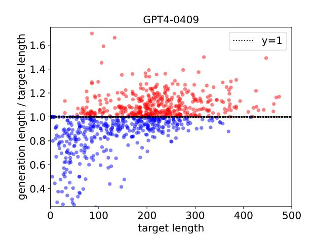
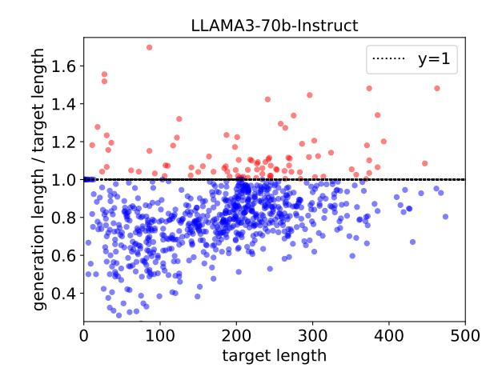
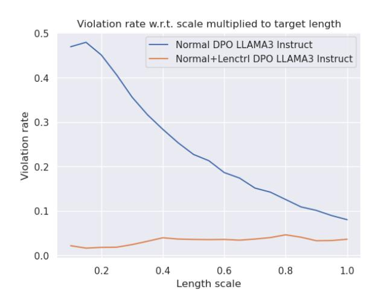
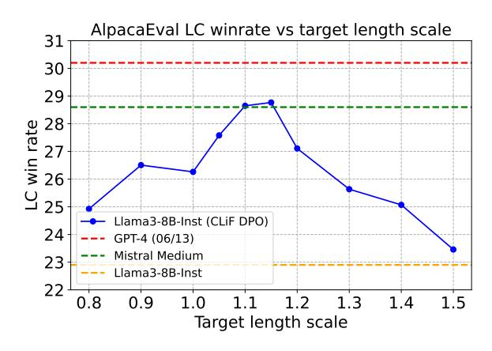
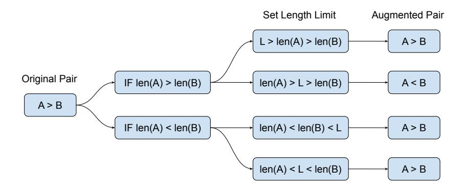
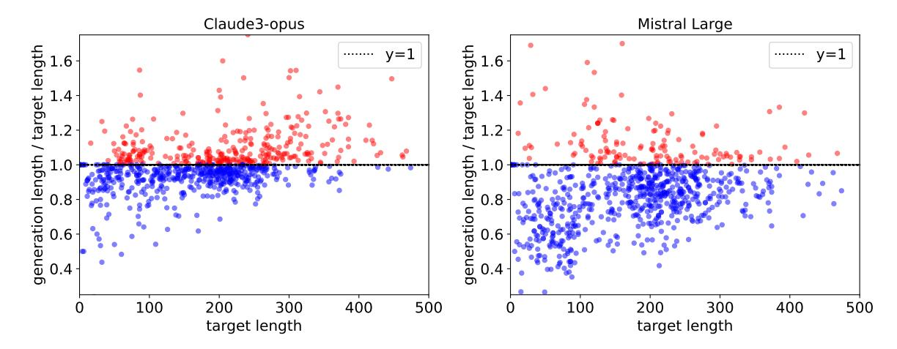

# Controlling Length in Instruction Following

# Anonymous ACL submission

# Abstract

 Aligned instruction following models can better fulfill user requests than their unaligned coun- terparts. However, it has been shown that there is a length bias in evaluation of such models, and that training algorithms tend to exploit this bias by learning longer responses. In this work we show how to train models that can be con- trolled at inference time with instructions con- taining desired length constraints. Such models are superior in length controlled evaluations, outperforming standard instruction following models such as GPT4, Llama 2, Llama 3 and Mixtral models.

# **<sup>014</sup>** 1 Introduction

 Instruction following has emerged as one of the most important topics in AI, where the standard approach is to train instruction-tuned large lan- guage models (LLMs) to respond to human re- quests [\(Ouyang et al.,](#page-8-0) [2022;](#page-8-0) [Touvron et al.,](#page-8-1) [2023\)](#page-8-1). One current challenge in developing better mod- els is that there remain open questions on how to evaluate them, which in turn means there are open questions on how to train them with appropriate re- wards. It has been found that in current evaluations both humans and models tend to have a "length bias" whereby they prefer longer responses over shorter ones in pairwise preferences [\(Dubois et al.,](#page-8-2) [2024b\)](#page-8-2). Correspondingly, training methods that follow these preferences tend to produce longer re- sponses [\(Singhal et al.,](#page-8-3) [2023\)](#page-8-3). Recently, instruction following benchmarks have incorporated length penalties into their scoring mechanisms to counter- act this bias [\(Dubois et al.,](#page-8-4) [2024a\)](#page-8-4), but this does not fix the problem at its source.

 In this work, we argue that the expected length of responses is ill-defined in many queries, and this ambiguity makes evaluation difficult, which in turn affects training algorithms that use these evaluation signals. To resolve this we propose that evaluation

should include *further disambiguating instructions* **040** that prescribe the length of the desired response. **041** Typical requests can be ambiguous in terms the **042** length of the desired response, for example with- **043** out context the instruction *'Give me information* **044** *about Coco Gauff"* could be answered by a few **045** sentences, a few paragraphs, or a multi-page doc- **046** ument. Yet, given the context, the intended length **047** is often clearer, for example the expected length of **048** the replies in the downstream application the user **049** is interacting with, the interface being used (voice, **050** viewed on a phone vs. a laptop) and so on. Hence **051** adding a further instruction in a given context to **052** the above example such as *"The answer should be* **053** *300 words or less"* resolves this ambiguity.[1](#page-0-0)

We show that many existing state of the art **055** instruction following models fail to follow such **056** maximum word length instructions adequately. To **057** measure this we construct and evaluate models on **058** [l](#page-8-2)ength instructed versions of AlpacaEval 2 [\(Dubois](#page-8-2) **059** [et al.,](#page-8-2) [2024b\)](#page-8-2) and MT-Bench [\(Zheng et al.,](#page-8-5) [2023\)](#page-8-5) **060** by augmenting existing prompts with length in- **061** structions. We find that, for example, GPT4-Turbo **062** can violate length constraints more than 40% of **063** the time, highlighting a significant flaw in these **064** models when it comes to controlling the length of **065** their outputs. **066**

**054**

We hence develop a method for improving in- **067** struction following models at length instruction **068** following. Our approach involves taking a conven- **069** tional instruction following dataset and construct- **070** ing augmented training data by inserting length in- **071** structions to the original prompts. We set the maxi- **072** mum length in certain ways so that the preference **073** pairs reflect both length constraints and response **074** quality. Then this length instruction augmented **075** dataset is used in finetuning a model via Direct **076** Preference Optimization (DPO) [\(Rafailov et al.,](#page-8-6) **077**

<span id="page-0-0"></span><sup>1</sup>We note that this paper itself was generated with the constraint that it has to be at most 8 pages.

**078** [2023\)](#page-8-6). We train both Llama 2 and Llama 3 models **079** in this way and show large gains compared to the **080** existing instruction following counterparts.

# **<sup>081</sup>** 2 Related Work

## **082** 2.1 Length Bias in Model Alignment

 When optimizing for instruction following ability, reinforcement learning (RL) has been consistently observed to encourage models to produce longer responses [\(Singhal et al.,](#page-8-3) [2023\)](#page-8-3). [Zhao et al.](#page-8-7) [\(2024\)](#page-8-7) showed that simply selecting the longest data from training set for fine-tuning is a strong baseline, and [Singhal et al.](#page-8-3) [\(2023\)](#page-8-3) showed that optimizing for response length is a significant factor behind RL's reported improvements. This effect seen in train- ing parallels that on the evaluation side, whereby both humans and models tend to favor longer re- sponses over shorter ones [\(Dubois et al.,](#page-8-2) [2024b\)](#page-8-2). Correspondingly, constructing preference pairs ei- ther through human feedback (RLHF) or through AI feedback (RLAIF) are likely to reflect these biases. On the other hand, longer responses are not necessarily better even if preferred by anno- tators [\(Park et al.,](#page-8-8) [2024\)](#page-8-8). For example they are more likely to contain inaccuracies [\(Achiam et al.,](#page-7-0) [2023\)](#page-7-0), which may be missed by human evaluators on challenging tasks [\(Casper et al.,](#page-8-9) [2023\)](#page-8-9).

 Recently, instruction following benchmarks such as AlpacaEval 2 [\(Dubois et al.,](#page-8-4) [2024a\)](#page-8-4) and Wild- Bench [\(AllenAI,](#page-8-10) [2024\)](#page-8-10) have incorporated length penalties into their scoring mechanisms to counter- act this bias. This is done by fitting a generalized linear model to predict the (biased) preferences given length as a feature, and then obtaining length- debiased preferences by predicting preferences af- ter removing the length term from the regression. It is not yet clear if this new scoring function can still be gamed by models.

## **115** 2.2 Length-aware Model Training

 Learning methods that take into account length have historically been prevalent in the task of sum- marization, see for example [Fan et al.](#page-8-11) [\(2017\)](#page-8-11), and in particular [Goyal et al.](#page-8-12) [\(2022\)](#page-8-12); [Jie et al.](#page-8-13) [\(2023\)](#page-8-13) for length constrained summarization.

 For instruction following, [\(Singhal et al.,](#page-8-3) [2023\)](#page-8-3) investigate several mitigations, such as balanc- ing preferences or truncating lengths, but do not find that they uniformly help. Both [Shen et al.](#page-8-14) [\(2023\)](#page-8-14) and [Chen et al.](#page-8-15) [\(2024\)](#page-8-15) propose to mod-ify the reward model to disentangle length from

quality so that they can concentrate the training **127** on quality. [Park et al.](#page-8-8) [\(2024\)](#page-8-8) proposes modifying **128** the Direct Preference Optimization (DPO) objec- **129** tive function with a length regularizer, and reports **130** this prevents length exploitation while maintain- **131** ing quality. These approaches all assume there is **132** an optimum length of responses which the model **133** should be trained to generate. In contrast, our work **134** assumes length depends on context, and a good **135** model should be capable of being controlled via **136** instructions (i.e., via prompting for desired length). **137**

Some production LLMs incorporate system **138** prompts that reference output length, for example **139** the sentence "give concise responses to very simple **140** questions, but provide thorough responses to more **141** complex and open-ended questions" included in **142** the system prompt of Claude 3 [\(Anthropic,](#page-8-16) [2024\)](#page-8-16). **143** However, to our knowledge no systematic evalua- **144** tion of such prompts has been reported. **145**

Many *post-training* datasets used to fine-tune **146** popular large language models have not been re- **147** [l](#page-7-0)eased or their exact makeup detailed [\(Achiam](#page-7-0) **148** [et al.,](#page-7-0) [2023;](#page-7-0) [Touvron et al.,](#page-8-1) [2023\)](#page-8-1) hence it is dif- **149** ficult to immediately ascertain if such length fol- **150** lowing instructions are contained in their training **151** setups. However, from data that has been released **152** [\(Bai et al.,](#page-8-17) [2022;](#page-8-17) [Köpf et al.,](#page-8-18) [2024\)](#page-8-18) it appears that **153** the amount of such data is generally small, and gen- **154** erally preference pairs are provided which assume **155** a preferred target length for a given prompt (with- **156** out context). Such preferences are well known **157** to typically prefer longer responses over shorter **158** ones, and reinforcement learning has been observed **159** to encourage models to produce longer responses **160** [\(Singhal et al.,](#page-8-3) [2023\)](#page-8-3). **161**

## 3 Length Eval Benchmarks **<sup>162</sup>**

Good instruction following models should natu- **163** rally be able to follow given length limits. Such **164** instructions can be a natural part of a prompt, for **165** example *"Tell me about <concept>. The answer* **166** *should be 300 words or less"*. Depending on the **167** use case and context, users might want responses **168** from the same underlying model but of a different **169** length – for example if the answer is spoken, dis- **170** played on a mobile screen or a desktop screen, or **171** if the user just requires a shorter or longer answer. **172**

| Instruction                                                                                                                                                                            | <max_len></max_len> | Generation                                                                                                                                                                                                                               | Length |
|----------------------------------------------------------------------------------------------------------------------------------------------------------------------------------------|---------------------|------------------------------------------------------------------------------------------------------------------------------------------------------------------------------------------------------------------------------------------|--------|
| Answer<br>the<br>fol<br>lowing instruction<br>using <max_len><br/>words or less.<br/>I'm trying to teach<br/>myself<br/>to<br/>have<br/>nicer handwriting.<br/>Can you help?</max_len> | 20                  | Yes, I'd be happy to help you improve your handwriting skills!                                                                                                                                                                           | 12     |
|                                                                                                                                                                                        | 40                  | I'd be happy to help. To improve your handwriting, practice regularly, focus<br>on posture and grip, and try using guidelines or a light box to help you stay<br>within lines.                                                           | 31     |
|                                                                                                                                                                                        | 80                  | I'd be happy to help you improve your handwriting. Here are a few tips to<br>get you started:                                                                                                                                            | 70     |
|                                                                                                                                                                                        |                     | * Choose the right tools: Use a pen with good grip and smooth ink flow.<br>Experiment with different types of paper to find one that works well for you.                                                                                 |        |
|                                                                                                                                                                                        |                     | * Practice regularly: Set aside time each day to practice writing.<br>* Focus on posture and grip: Keep your hand steady and your fingers relaxed.                                                                                       |        |
| I'm trying to teach<br>myself<br>to<br>have<br>nicer handwriting.<br>Can you help?                                                                                                     | N/A                 | Improving your handwriting takes practice, patience, and some guidance.<br>I'd be happy to help you with that. Here are some tips to get you started:                                                                                    | 456    |
|                                                                                                                                                                                        |                     | 1. **Choose the right tools**: Invest in a few good quality pens or pencils<br>that feel comfortable in your hand. Experiment with different types of pens<br>(e.g., fine tip, medium tip, calligraphy) to find what works best for you. |        |
|                                                                                                                                                                                        |                     | 2. **Practice basic strokes**: Focus on mastering basic strokes such as:                                                                                                                                                                 |        |

<span id="page-2-2"></span>Table 1: Length controlled generation: here we show an example of generations with different length limits.

# **173** 3.1 Augmenting General Instructions with **174** Length Constraints

 To evaluate model's general instruction-following ability on prompts with length limits, we augment existing instruction-following tasks by inserting length limits as part of the instructions, as shown in [Figure 1.](#page-3-0) This tests whether models can respond to the given query successfully, whilst also fulfilling the given length instruction.

# **182** 3.1.1 Target Length Constraint

 The choice of length limits vary a lot by instruction and task. To establish a reasonable yet challenging length limit for effectively evaluating current state- of-the-art (SOTA) models, we base the target length limit on the generation lengths of three strong [S](#page-7-0)OTA models: GPT-4 Turbo (11/06) [\(Achiam](#page-7-0) [et al.,](#page-7-0) [2023\)](#page-7-0), Claude 3 Opus (02/29)[2](#page-2-0) , Mistral Large (24/02)[3](#page-2-1) . In particular, we set *<MAX\_LEN>* in the template to the minimum generation length among these three models. Therefore, this length constraint varies for each individual prompt.

# **194** 3.1.2 Length-Following Baseline

 Many benchmarks evaluate models by conducting pairwise comparisons between model outputs for a given question and reporting win rates against a strong baseline, such as GPT-4 generations.

**199** To create a competitive baseline that consistently **200** adheres to the length limit, we use the minimum **201** generation length from one of the three fixed LLMs (GPT-4 Turbo, Claude 3 Opus, Mistral Large). **202** This ensures that the baseline generations always **203** meet the length constraint specified in the prompt **204** while maintaining high generation quality. For each **205** model tested, we compare its generations, follow- **206** ing the new length instructions, with the baseline **207** in a pairwise setting. **208**

# 3.1.3 Metrics **209**

Similar to winrate in a pairwise setting, we propose **210** two metrics: winrates against the baseline to evalu- **211** ate *response quality* and violation rates to measure **212** *length following ability*. **213**

Length Following Quality We use violation **214** rates (Vlt%) to measure the percentage of responses **215** that exceed the length constraint by counting the **216** number of words. Additionally, we consider other **217** metrics, such as the average response length (in **218** words). To calculate the word count within a text, **219** we use the word tokenization function provided by **220** NLTK, excluding punctuations. The exact word **221** count function is detailed in the [Appendix B.](#page-9-0) **222**

Response Quality The winner of the pairwise **223** comparison is determined by both the quality of the **224** responses and adherence to the length constraints. **225** We treat the length limit as a hard constraint and **226** the baseline always satisfies the length constraint. **227** Therefore model response that violates this limit **228** will automatically lose. If model does not exceed **229** the target length limit, we then apply standard pair- **230** wise comparison setup to the two responses where **231** only the original text inputs are given to the judge **232**

<span id="page-2-0"></span><sup>2</sup> https://www.anthropic.com/news/claude-3-family

<span id="page-2-1"></span><sup>3</sup> https://mistral.ai/news/mistral-large/

<span id="page-3-0"></span>Answer the following instruction using <MAX\_LEN> words or less.

<ORIGINAL\_INSTRUCTION>

Figure 1: **Length Following Instructions.** We define the above prompt template in order to require models to produce responses within a maximum response length.

for context, i.e., the length limit is not taken into account by the judge for quality evaluation.

#### <span id="page-3-1"></span>3.2 AlpacaLenEval

AlpacaEval (Dubois et al., 2024b) is an evaluation task consisting of 805 general instruction following prompts of various kinds, from creativity, brainstorming and writing to question answering, math and reasoning tasks.

Following Section 3.1 we take the minimum generation length out of Claude-3-Opus, GPT4-1106 and Mistral Large model outputs as target length for each prompt. 3 out of 805 Alpaca test instructions do have an explicit length constraint in the original prompt. We therefore only consider the remaining 802 prompts for our new AlpacaLenEval benchmark.

Figure 2 shows the ratio of actual generation lengths over target lengths as target lengths vary. As shown in Figure 2, GPT4-0409 generations exceed the target length limits almost 50% of the time, especially when target lengths are over 200 words. In comparison, Llama3-70B-Instruct model performs much better at following length limits, though can still fail some length instructions according to the scatter plot.

The standard AlpacaEval measure model outputs against baseline GPT-4 Turbo generations. In the new AlpacaLenEval, we instead take the the generations with minimum length by one of GPT4-1106, Claude3-Opus and Mistral-Large each with standard AlpacaEval winrates of 50%, 40.5% and 32.5%, producing strong baseline that also satisfies the length constraint.

#### <span id="page-3-2"></span>3.3 MT-Bench LenEval

To models' length-following abilities, we also extend MT-Bench evaluation test (Zheng et al., 2023), which consists of a set of challenging multi-turn questions covering 8 categories of user prompts writing, roleplay, extraction, reasoning, math, coding, STEM, and humanities/social science.

To expand the size of the evaluation set, for each prompt we compute 3 target length limits by sampling baseline answers from Claude3, GPT4 and Mistral 3 times. We then construct the baseline answers using generations from Claude3, GPT4 or Mistral Large with the minimum generation length. For simplicity we only consider the 1st turn prompts, which sum up to 240 MT-Bench LenEval prompts.

# 4 Control Length-instruction Following (CLiF) Training

As shown in previous section, current SOTA models may not adhere to specific length following constraints. To improve models' ability in length-instruction following tasks, we propose the following method for building Controlling Length-instruction Following (CLiF) training data. We focus on building training data for pairwise preference optimization instead of RLHF due to its simplicity in implementation, training and its comparable performance to RLHF.

In particular, given a pairwise preference dataset  $\mathcal{D}$  consisting of N triples of input prompt, winning response, losing response  $(x,y_i^w,y_i^l)_{i=1\cdots N}$ , we construct an augmented dataset  $\mathcal{D}'$  that prepends explicit length constraint to the input prompt using the template shown in Figure 1 to convert the original input prompt x into x'. In particular, we define the length function  $\operatorname{LEN}(\cdot)$  that calculates the number of words within a piece of text. We also filter out any triple  $(x,y_i^w,y_i^l)$  in the original dataset  $(x,y_i^w,y_i^l)$  with length difference less than 10 words. The winner of the new length-constrained preference pair  $(x',y_i^w,y_i^l)$  is determined as follows:

- If  $\operatorname{LEN}(y_i^w) > \operatorname{LEN}(y_i^l)$ , we construct two samples in the augmented dataset  $\mathcal{D}'$ , (1) one adds a length constraint to x that both response satisfies (we simply use  $\operatorname{LEN}(y_i^w) + 10$ ), and the winning response and losing response remain the same. (2) the other adds a length constraint that is sampled within the range of  $(\operatorname{LEN}(y_i^l), \operatorname{LEN}(y_i^w))$ , and  $y_i^w$  becomes the losing one due to violation of length constraint and  $y_i^l$  becomes the winning one.
- If LEN $(y_i^w)$  < LEN $(y_i^l)$ , we also construct two samples in the augmented dataset  $\mathcal{D}'$ , (1) one adds a length constraint to x that both response satisfies (we simply use

<span id="page-4-0"></span>



Figure 2: The length instruction following ability of GPT4-0409 and LLAMA3-70b-Instruct on AlpacaLenEval. The scatter plots display each sample from the AlpacaLenEval dataset, with the target length plotted on the x-axis and the ratio of the actual generated length to the target length on the y-axis. Red dots represent instances where the generated length exceeds the target length, while blue dots indicate instances where the generated length meets the length constraint.

<span id="page-4-1"></span>

Figure 3: CLiF DPO vs Normal DPO.

<span id="page-4-2"></span>

Figure 4: LC winrate vs target length scale: showing that LC win rate is highly hackable.

 $\operatorname{LEN}(y_i^l) + 10$ ), (2) the other adds a length constraint that is sampled within the range of  $(\operatorname{LEN}(y_i^w), \operatorname{LEN}(y_i^l))$ . In both (1) and (2), the winning response and the losing response remain the same as in the original dataset.

322

323

324

327

329

332

334

335

336

340

341

343

345

346

347

348

350

# 5 Experiment Setup

In this section we will empirically investigate models' performances on length-following instrutions, the effectiveness of our CLiF strategy. We beging with a description of our evaluation tasks and models.

#### 5.1 Train Dataset

Normal Train Data We use the human-authored examples provided in the Open Assistant dataset (Köpf et al., 2023) for instruction fine-tuning. Following Li et al. (2024) we use 3,200 examples, by sampling only the first conversational turns in the English language that are high-quality, based on their human annotated rank (choosing only the highest rank 0) for supervised finetuning. We refer to a model supervised fine-tuned from the base models using only this data as our *Normal SFT*. We further finetune *Normal SFT* using DPO loss on set of 2977 pairs provided in the Open Assistant dataset with ranks equal to 0 and 1.

**Length Control (LenCtrl) Train Data** For LenCtrl SFT data, we augment the 3,200 normal SFT data with Figure 1. Applying the CLiF method to the same set of normal DPO training data yields



Figure 5: CLiF Method for augmenting preference pairs in general instruction-following task to length instruction following preferences. We treat length limit as hard constraint and select length limits L such that winning responses A can lose or win depend on whether their generation length exceed the limit or not

 5954 preference pairs with length-following in- structions for pairwise optimization. The original pairwise data consists of 1083 pairs where rank 0 responses are shorter than rank 1 responses, 1894 pairs where rank0 human responses are longer. Therefore, applying CLiF results yields to 1083 pairs of rank0 responses being losers violating length limits.

## **359** 5.2 Training Details

 In our experiments, we use two sets of base mod- els: Llama2 70B and Llama2Chat 70B models [\(Touvron et al.,](#page-8-1) [2023\)](#page-8-1) and Llama3 8B and Llama3- Instruct 8B as our base models for both Normal and LenCtrl finetuning and carry out full-parameter finetuning using DPO loss.

 For both Normal DPO, CLiF-DPO and Reg DPO we first finetune SFT models and then further fine- tune from there using DPO loss on Normal or LenC- trl pairwise preferences. Normal DPO and Reg DPO share the same training dataset, except the choices of length regularization coefficient α ∈ [0, 0.01, 0.1]. We perform early stopping by saving a checkpoint every 200 steps and every epoch and evaluating generations using GPT-4-Turbo on 253 validation examples derived from various sources following [Li et al.](#page-8-20) [\(2024\)](#page-8-20) and augmented valida- tion set with length limits, determined by min of the three strong LLMs. For standard instruction following validation set, this is evaluated pairwise against the previous step's generations using the Al- pacaEval evaluation prompt format [\(Li et al.,](#page-8-21) [2023\)](#page-8-21). For length-following tasks, this is evaluated pair- wise against the baseline with generation length equal to target length in the prompt.

#### 5.3 Evaluation **385**

We evaluate our models' length-following capabil- **386** ities on AlpacaLenEval and MT-Bench-LenEval **387** described in [Section 3.2](#page-3-1) and [Section 3.3](#page-3-2) as well **388** as standard Alpaca Eval and MT-Bench without **389** length limits. **390**

For AlpacaLenEval, we use the same evalua- **391** tion setup as in AlpacaEval, which uses GPT4 as **392** a judge to measure pairwise win rate compared **393** to GPT4 Turbo (1106-preview). We report Al- **394** pacaLenEval winrates and violation rates (Vlt%) **395** on Llama2-70b experiments in [Table 3](#page-6-0) and Llama2- **396** 8B experiments in [Table 4.](#page-7-1) **397**

Following the original MT-Bench pairwise com- **398** parison which GPT-4 to determine the winner be- **399** tween two model answers given an instruction, we **400** [r](#page-6-0)eport pairwise winrates against the baseline in [Ta-](#page-6-0) **401** [ble 3](#page-6-0) and in [Table 4.](#page-7-1) **402**

## 6 Experiment Results **<sup>403</sup>**

In our evaluation, we assess models along two axes: **404** (1) the quality of generations, and (2) the ability to **405** adhere to specified length constraints. Our findings **406** lead to several key observations. **407**

# SOTA models can't follow length instruction **408**

well As demonstrated in [Table 2,](#page-6-1) state-of-the- **409** art models, such as the GPT-4 series, exhibit sig- **410** nificant challenges in adhering to length instruc- **411** tions. Specifically, the latest GPT-4 model (0409) **412** shows a high violation rate of 49.3% on our Alpaca- **413** LenEval and 44.2% on MT-Bench-LenEval. In **414** contrast, the Llama-3 instruct model series displays **415** considerably lower violation rates. For instance, **416** the Llama3-8B-instruct model achieves a violation **417** rate of 7.0% on Alpaca-LenEval and 20.0% on MT- **418**

<span id="page-6-1"></span>Table 2: Control Length Instruction Following Results of SOTA models on Alpaca LenEval + MT-Bench test set

|                                     |        | Alpaca-LenEval |       | MT-Bench-LenEval |        |       |
|-------------------------------------|--------|----------------|-------|------------------|--------|-------|
| Standard models                     | Vlt(%) | Win(%)         | Words | Vlt(%)           | Win(%) | Words |
| GPT4 Turbo (gpt4_1106_preview)      | 46.1   | 29.9           | 182   | 45.0             | 28.1   | 174   |
| GPT4 Turbo (gpt-4-turbo-2024-04-09) | 49.3   | 29.2           | 187   | 44.2             | 27.5   | 179   |
| GPT4 Omni (gpt-4o-2024-05-13)       | 39.0   | 35.7           | 180   | 39.2             | 30.2   | 177   |
| Claude 3 Opus (02/29)               | 37.0   | 32.9           | 183   | 37.9             | 33.1   | 174   |
| Mistral Large (24/02)               | 17.6   | 28.8           | 158   | 20.8             | 27.7   | 158   |
| Llama2-70B-Base (zero shot)         | 62.6   | 0.6            | 582   | 63.8             | 1.7    | 293   |
| Llama2-70B-Chat                     | 28.2   | 11.3           | 162   | 38.3             | 11.9   | 168   |
| Llama3-8B-Base (zero shot)          | 71.6   | 0.2            | 1935  | 27.9             | 2.3    | 185   |
| Llama3-8B-Instruct                  | 7.0    | 22.5           | 145   | 20.0             | 20.0   | 140   |
| Llama3-70B-Instruct                 | 10.2   | 38.5           | 154   | 20.3             | 28.5   | 151   |

<span id="page-6-0"></span>Table 3: Control Length Instruction Following Results of Llama2 Models on Alpaca LenEval + MT-Bench test set DPO-CLiF yield significantly lower violation rate

|                                                                                                                                           | Alpaca-LenEval      |                    |                   | MT-Bench-LenEval     |                    |                   |
|-------------------------------------------------------------------------------------------------------------------------------------------|---------------------|--------------------|-------------------|----------------------|--------------------|-------------------|
|                                                                                                                                           | Vlt(%)              | Win(%)             | Words             | Vlt(%)               | Win(%)             | Words             |
| Llama2-70B-Base (zero-shot)<br>Llama2-70B-Base Normal DPO                                                                                 | 65.8                | 4.6                | 216               | 60.8                 | 5.0                | 199               |
| Llama2-70B-Base R-DPO (Park et al., 2024) (α = −0.01)<br>Llama2-70B-Base R-DPO (Park et al., 2024) (α = −0.1)<br>Llama2-70B-Base DPO-CLiF | 63.8<br>45.0<br>7.1 | 5.2<br>7.7<br>13.6 | 217<br>178<br>151 | 57.9<br>39.4<br>10.0 | 2.1<br>8.5<br>11.0 | 194<br>161<br>146 |
| Llama2-70B-Chat<br>Llama2-70B-Chat Normal DPO                                                                                             | 28.2<br>15.1        | 11.3<br>10.4       | 162<br>135        | 38.3<br>24.2         | 11.9<br>10.8       | 168<br>147        |
| Llama2-70B-Chat DPO-CLiF                                                                                                                  |                     |                    |                   |                      |                    |                   |

**419** Bench-LenEval, while the Llama3-70B-instruct **420** model records violation rates of 10.2% on Alpaca-**421** LenEval and 20.3% on MT-Bench-LenEval.

chat model, the violation rate decreases from 24.2 **442** under normal DPO to [kk] with CLiF DPO, with **443** an improvement in the win rate from [ll] to [mm]. **444**

 DPO-CLiF models perform well on Alpaca- LenEval and MT-Bench-LenEval [Table 3](#page-6-0) illus- trates the effectiveness of our DPO-CLiF training on the Llama2 70b models, demonstrating a signif- icant reduction in violation rates compared to both the untrained and normally DPO-trained counter- parts. Specifically, the Llama-2-70b base model, when subjected to standard DPO training, exhibits a violation rate of 65.8% on Alpaca-LenEval. How- ever, with our DPO-CLiF training, this rate dramat- ically decreases to 7.1%, concurrently improving the win rate from 4.6 to 13.6. Similarly, for the Llama-2-70b-chat model, standard DPO results in a violation rate of 15.1, whereas our DPO-CLiF training reduces this rate to [xx], and enhances the win rate from [yy] to [zz]. On MT-Bench-LenEval, the Llama-2-70b base model shows a violation rate of 60.8% under normal DPO training, which is re- duced to 10.0% with DPO-CLiF, also boosting the win rate from 5.0 to 11.0. For the Llama-2-70b-

DPO-CLiF models show no performance degra- **445** dation on standard AlpacaEval We further **446** assessed our DPO-CLiF models using the stan- **447** dard AlpacaEval benchmark, where no length con- **448** straints were imposed and only the original prompts **449** from AlpacaEval were utilized. The results, de- **450** tailed in Table [Table 6,](#page-11-0) indicate no performance **451** degradation when compared to the baseline. Specif- **452** ically, the Llama-2-70b base model achieved a win **453** rate of 8.6 under standard DPO training, which in- **454** creased to 9.9 with our CLiF DPO training. For the **455** Llama-2-70b-chat model, the win rates improved **456** from [yy] under DPO to [ll] with CLiF DPO. Mean- **457** while, the Llama-3-8B base models recorded a **458** slight decrease in win rate from 7.8 with DPO **459** to 7.2 with CLiF DPO. Additionally, the Llama- **460** 2-8B-Instruct models showed a win rate of 25.8 **461** with DPO, which slightly decreased to 22.7 with **462** our DPO-CLiF training. In summary, our models **463** exhibit comparable performance to standard DPO **464**

<span id="page-7-1"></span>Table 4: Control Length Instruction Following Results of Llama3 Models on Alpaca LenEval + MT-Bench test set DPO-CLiF yield significantly lower violation rate

|                                                         | Alpaca-LenEval |              |             | MT-Bench-LenEval |              |            |
|---------------------------------------------------------|----------------|--------------|-------------|------------------|--------------|------------|
|                                                         | Vlt(%)         | Win(%)       | Words       | Vlt(%)           | Win(%)       | Words      |
| Llama3-8B-Base (zero shot)<br>Llama3-8B-Base Normal DPO | 71.6<br>58.1   | 0.2<br>5.0   | 1935<br>202 | 27.9<br>50.8     | 2.3<br>7.7   | 185<br>191 |
| Llama3-8B-Base DPO-CLiF                                 | 6.1            | 11.1         | 153         | 13.8             | 12.9         | 152        |
| Llama3-8B-Instruct<br>Llama3-8B-Instruct Normal DPO     | 7.0<br>7.1     | 22.5<br>25.1 | 145<br>143  | 20.0<br>21.3     | 20.0<br>20.0 | 140<br>142 |
| Llama3-8B-Instruct DPO-CLiF                             | 3.1            | 25.6         | 161         | 10.8             | 26.3         | 157        |

**465** when length constraints are not applied.

 DPO-CLiF models can follow length instruc- tions of all ranges (including OOD length lim- its) better than normal DPO mdoels and R- DPO models To increase the difficulty of our AlpacaLenEval benchmark, we have progressively tightened the length constraints by applying scale factors ranging from 0.9 down to 0.1. This adjust- ment introduces a spectrum of challenging length constraints. We assessed the performance of vari- ous models based on the Llama-2 base, including the standard DPO, CLiF DPO, and R-DPO models, and plotted their violation rates. The results are depicted in Figure [Figure 3.](#page-4-1) The analysis reveals that the standard DPO model exhibits increasingly higher violation rates as the length scale decreases, with rates escalating from below 0.1 to 0.5 when the scale factor is set to 0.1. This indicates a sig- nificant difficulty in adhering to stringent length constraints. In contrast, our CLiF DPO model consistently maintains a low violation rate (below 0.05) across all tested length scales. The R-DPO model displays trends similar to the standard DPO, suggesting that while it can reduce the generation length, it lacks the capability to precisely control **490** it.

# **<sup>491</sup>** 7 Test the robustness of AlpacaEval LC **<sup>492</sup>** win rate

 Previous research has acknowledged the presence of length bias, and designers have introduced mea- sures to mitigate it, notably through the Length- Controlled AlpacaEval, which incorporates an LC [w](#page-8-4)inrate that considers generation length [\(Dubois](#page-8-4) [et al.,](#page-8-4) [2024a\)](#page-8-4). Despite these efforts, our find- ings demonstrate that the LC winrate can still be manipulated by adjusting the length constraints. By scaling the length constraints within our AlpacaLenEval and recalculating the LC winrate, we **502** observe significant fluctuations in the results, as **503** depicted in [Figure 4.](#page-4-2) The LC winrate varies dra- **504** matically, reaching as high as approximately 29 **505** and dropping to near 23. These variations raise con- **506** cerns about the reliability of current benchmarks **507** for assessing instruction adherence. **508**

## 8 Discussion **<sup>509</sup>**

The exact reason why model responses get longer **510** with preference optimization is not fully deter- **511** mined. One possible direct reason can be that **512** humans prefer long detailed responses, which is **513** then transferred to the model via a reward model **514** or directly. Another possible indirect reason can **515** be that long responses give the model to chance to **516** "think" more. LLMs based on transformers have **517** a fixed compute budget per token, thus the longer **518** the response is the more compute will be spent on **519** deriving an answer to that question. This increased **520** computation then perhaps improve the quality of **521** the response. There is growing evidence showing **522** that having extra computation with added extra **523** dummy tokens improves LLMs' performance. **524**

# 9 Limitations **<sup>525</sup>**

In this paper, length limit is set in terms of the **526** number of words, but more generally it can be set **527** in number of characters, or even pages. Another **528** direction of generalization can be length instruc- **529** tion to be in different wordings instead of a fixed **530** template, so use can specify the limit in their own **531** words. **532**

## References **<sup>533</sup>**

<span id="page-7-0"></span>Josh Achiam, Steven Adler, Sandhini Agarwal, Lama **534** Ahmad, Ilge Akkaya, Florencia Leoni Aleman, **535** Diogo Almeida, Janko Altenschmidt, Sam Altman, **536** <span id="page-8-21"></span><span id="page-8-20"></span><span id="page-8-17"></span><span id="page-8-16"></span><span id="page-8-15"></span><span id="page-8-10"></span><span id="page-8-9"></span><span id="page-8-8"></span><span id="page-8-4"></span><span id="page-8-0"></span>**537** Shyamal Anadkat, et al. 2023. Gpt-4 technical report. **538** *arXiv preprint arXiv:2303.08774*. **539** [A](https://github.com/allenai/WildBench)llenAI. 2024. Wildbench. [https://github.com/](https://github.com/allenai/WildBench) **540** [allenai/WildBench](https://github.com/allenai/WildBench). Accessed: 2024-05-08. **541** Anthropic. 2024. Claude 3. AI model released in 2024. **542** Yuntao Bai, Andy Jones, Kamal Ndousse, Amanda **543** Askell, Anna Chen, Nova DasSarma, Dawn Drain, **544** Stanislav Fort, Deep Ganguli, Tom Henighan, et al. **545** 2022. Training a helpful and harmless assistant with **546** reinforcement learning from human feedback. *arXiv* **547** *preprint arXiv:2204.05862*. **548** Stephen Casper, Xander Davies, Claudia Shi, **549** Thomas Krendl Gilbert, Jérémy Scheurer, Javier **550** Rando, Rachel Freedman, Tomasz Korbak, David **551** Lindner, Pedro Freire, et al. 2023. Open problems **552** and fundamental limitations of reinforcement **553** learning from human feedback. *arXiv preprint* **554** *arXiv:2307.15217*. **555** Lichang Chen, Chen Zhu, Davit Soselia, Jiuhai Chen, **556** Tianyi Zhou, Tom Goldstein, Heng Huang, Moham-**557** mad Shoeybi, and Bryan Catanzaro. 2024. Odin: **558** Disentangled reward mitigates hacking in rlhf. *arXiv* **559** *preprint arXiv:2402.07319*. **560** Yann Dubois, Balázs Galambosi, Percy Liang, and Tat-**561** sunori B Hashimoto. 2024a. Length-controlled al-**562** pacaeval: A simple way to debias automatic evalua-**563** tors. *arXiv preprint arXiv:2404.04475*. **564** Yann Dubois, Chen Xuechen Li, Rohan Taori, Tianyi **565** Zhang, Ishaan Gulrajani, Jimmy Ba, Carlos Guestrin, **566** Percy S Liang, and Tatsunori B Hashimoto. 2024b. **567** Alpacafarm: A simulation framework for methods **568** that learn from human feedback. *Advances in Neural* **569** *Information Processing Systems*, 36. **570** Angela Fan, David Grangier, and Michael Auli. 2017. **571** Controllable abstractive summarization. *arXiv* **572** *preprint arXiv:1711.05217*. **573** Tanya Goyal, Junyi Jessy Li, and Greg Durrett. 2022. **574** News summarization and evaluation in the era of **575** gpt-3. *arXiv preprint arXiv:2209.12356*. **576** Renlong Jie, Xiaojun Meng, Lifeng Shang, Xin Jiang, **577** and Qun Liu. 2023. Prompt-based length con-**578** trolled generation with reinforcement learning. *arXiv* **579** *preprint arXiv:2308.12030*. **580** Andreas Köpf, Yannic Kilcher, Dimitri von Rütte, **581** Sotiris Anagnostidis, Zhi-Rui Tam, Keith Stevens, **582** Abdullah Barhoum, Nguyen Minh Duc, Oliver Stan-**583** ley, Richárd Nagyfi, et al. 2023. OpenAssistant **584** conversations–democratizing large language model **585** alignment. *arXiv preprint arXiv:2304.07327*. alignment. *Advances in Neural Information Process-* **591** *ing Systems*, 36. **592** Xian Li, Ping Yu, Chunting Zhou, Timo Schick, Luke **593** Zettlemoyer, Omer Levy, Jason Weston, and Mike **594** Lewis. 2024. [Self-alignment with instruction back-](https://openreview.net/forum?id=1oijHJBRsT) **595** [translation.](https://openreview.net/forum?id=1oijHJBRsT) In *The Twelfth International Conference* **596** *on Learning Representations*. **597** Xuechen Li, Tianyi Zhang, Yann Dubois, Rohan Taori, **598** Ishaan Gulrajani, Carlos Guestrin, Percy Liang, and **599** Tatsunori B. Hashimoto. 2023. Alpacaeval: An au- **600** tomatic evaluator of instruction-following models. **601** [https://github.com/tatsu-lab/alpaca\\_eval](https://github.com/tatsu-lab/alpaca_eval). **602** Long Ouyang, Jeffrey Wu, Xu Jiang, Diogo Almeida, **603** Carroll Wainwright, Pamela Mishkin, Chong Zhang, **604** Sandhini Agarwal, Katarina Slama, Alex Ray, et al. **605** 2022. Training language models to follow instruc- **606** tions with human feedback. *Advances in neural in-* **607** *formation processing systems*, 35:27730–27744. **608** Ryan Park, Rafael Rafailov, Stefano Ermon, and **609** Chelsea Finn. 2024. Disentangling length from qual- **610** ity in direct preference optimization. *arXiv preprint* **611** *arXiv:2403.19159*. **612** Rafael Rafailov, Archit Sharma, Eric Mitchell, Christo- **613** pher D Manning, Stefano Ermon, and Chelsea Finn. **614** 2023. [Direct preference optimization: Your language](https://openreview.net/forum?id=HPuSIXJaa9) **615** [model is secretly a reward model.](https://openreview.net/forum?id=HPuSIXJaa9) In *Thirty-seventh* **616** *Conference on Neural Information Processing Sys-* **617** *tems*. **618** Wei Shen, Rui Zheng, Wenyu Zhan, Jun Zhao, Shihan **619** Dou, Tao Gui, Qi Zhang, and Xuanjing Huang. 2023. **620** Loose lips sink ships: Mitigating length bias in re- **621** inforcement learning from human feedback. *arXiv* **622** *preprint arXiv:2310.05199*. **623** Prasann Singhal, Tanya Goyal, Jiacheng Xu, and **624** Greg Durrett. 2023. A long way to go: Investi- **625** gating length correlations in rlhf. *arXiv preprint* **626** *arXiv:2310.03716*. **627** Hugo Touvron, Louis Martin, Kevin Stone, Peter Al- **628** bert, Amjad Almahairi, Yasmine Babaei, Nikolay **629** Bashlykov, Soumya Batra, Prajjwal Bhargava, Shruti **630** Bhosale, et al. 2023. Llama 2: Open founda- **631** tion and fine-tuned chat models. *arXiv preprint* **632** *arXiv:2307.09288*. **633** Hao Zhao, Maksym Andriushchenko, Francesco Croce, **634** and Nicolas Flammarion. 2024. Long is more **635** for alignment: A simple but tough-to-beat base- **636** line for instruction fine-tuning. *arXiv preprint* **637** *arXiv:2402.04833*. **638** Lianmin Zheng, Wei-Lin Chiang, Ying Sheng, Siyuan **639** Zhuang, Zhanghao Wu, Yonghao Zhuang, Zi Lin, **640**

<span id="page-8-14"></span><span id="page-8-7"></span><span id="page-8-6"></span><span id="page-8-5"></span><span id="page-8-3"></span><span id="page-8-1"></span>Zhuohan Li, Dacheng Li, Eric Xing, Hao Zhang, **641** Joseph E. Gonzalez, and Ion Stoica. 2023. [Judging](https://openreview.net/forum?id=uccHPGDlao) **642** [LLM-as-a-judge with MT-bench and chatbot arena.](https://openreview.net/forum?id=uccHPGDlao) **643** In *Thirty-seventh Conference on Neural Information* **644** *Processing Systems Datasets and Benchmarks Track*. **645**

<span id="page-8-19"></span><span id="page-8-18"></span><span id="page-8-13"></span><span id="page-8-12"></span><span id="page-8-11"></span><span id="page-8-2"></span> Andreas Köpf, Yannic Kilcher, Dimitri von Rütte, Sotiris Anagnostidis, Zhi Rui Tam, Keith Stevens, Abdullah Barhoum, Duc Nguyen, Oliver Stan- ley, Richárd Nagyfi, et al. 2024. Openassistant conversations-democratizing large language model

- A Additional Results on SOTA models' length following measurements
- <span id="page-9-0"></span>B Word Count Function We Use

```
649 1 from nltk . tokenize import
650 word_tokenize
651 2
652 3 def count_words ( text ) -> int :
653 4 # Count the number of words while
654 excluding punctuations
655 5 return len ([ word for word in
656 word_tokenize ( text ) if word
657 not in string . punctuation ])
```

- C Additional Results with Llama2 models
- D Results Using Other Templates
- E Alpaca Eval Results
- F Example Appendix



Figure 6: The length instruction following ability of existing LLMs. For each sample in the IFT dev set, we plot its target length and generation length.

Table 5: Control Length Instruction Following Results of Llama2 Models on Alpaca LenEval + MT-Bench test set DPO-CLiF yield significantly lower violation rate

|                                                                  | Alpaca-LenEval |        |       | MT-Bench-LenEval |        |       |
|------------------------------------------------------------------|----------------|--------|-------|------------------|--------|-------|
|                                                                  | Vlt(%)         | Win(%) | Words | Vlt(%)           | Win(%) | Words |
| Llama2 Models w/o Length Control                                 |                |        |       |                  |        |       |
| Llama2-70B Normal SFT                                            | 48.6           | 9.7    | 193   | 51.7             | 5.8    | 182   |
| Llama2-70B Normal DPO                                            | 65.8           | 4.6    | 216   | 60.8             | 5.0    | 199   |
| Llama2-70B-Chat Normal SFT                                       | 12.7           | 11.7   | 129   | 19.6             | 10.6   | 130   |
| Llama2-70B-Chat Normal DPO                                       | 15.1           | 10.4   | 135   | 24.2             | 10.8   | 147   |
| Llama2 Models w/ Length Control                                  |                |        |       |                  |        |       |
| Llama2-70B Normal + LenCtrl SFT                                  | 41.9           | 9.5    | 179   | 39.6             | 7.9    | 163   |
| Llama2-70B LenCtrl DPO                                           | 7.9            | 11.3   | 151   | 9.2              | 8.5    | 148   |
| Llama2-70B DPO-CLiF                                              | 7.1            | 13.6   | 151   | 10.0             | 11.0   | 146   |
| Llama2-70B Reg DPO ( $\alpha = -0.01$ )                          | 63.8           | 5.2    | 217   | 57.9             | 2.1    | 194   |
| Llama2-70B Reg DPO ( $\alpha = -0.1$ )                           | 45.0           | 7.7    | 178   | 39.4             | 8.5    | 161   |
| Llama2-70B-Chat Normal + LenCtrl SFT<br>Llama2-70B-Chat DPO-CLiF | 42.8           | 11.5   | 182   | 48.3             | 10.6   | 174   |

Table 6: Results on AlpacaEval test set DPO-CLiF still maintain good

<span id="page-11-0"></span>

| Standard models                                                  | Vlt% | LC-Win | Win  | Words |
|------------------------------------------------------------------|------|--------|------|-------|
| GPT4 Turbo(1106-preview)                                         | 91.1 | 50     | 50   | 324   |
| GPT4 Turbo(0409-preview)                                         | 77.1 | 55.0   | 46.1 | 277   |
| GPT4 Omni                                                        | 77.8 | 57.5   | 51.3 | 282   |
| Claude 3 Opus (02/29                                             | 57.8 | 40.5   | 29.1 | 219   |
| Mistral Large (24/02)                                            | 49.7 | 32.7   | 21.4 | 223   |
| Llama2-70B Chat                                                  | 84.8 | 13.9   | 14.7 | 296   |
| Llama3-70B Instruct                                              | 84.2 | 34.4   | 33.2 | 302   |
| Llama3-8B Instruct                                               | 88.6 | 22.9   | 22.6 | 303   |
| Llama2-Base Models w/o Length Control                            |      |        |      |       |
| Llama2-70B Normal SFT                                            | 43.8 | 16.2   | 10.1 | 181   |
| Llama2-70B Normal DPO                                            | 60.7 | 13.1   | 8.6  | 211   |
| Llama2-70B-Chat Normal SFT<br>Llama2-70B-Chat Normal DPO         |      |        |      |       |
| Llama2 Models w/ Length Control                                  |      |        |      |       |
| Llama2-70B Normal + LenCtrl SFT                                  | 46.9 | 13.3   | 7.7  | 190   |
| Llama2-70B LenCtrl DPO                                           | 31.3 | 14.4   | 7.3  | 152   |
| Llama2-70B DPO-CLiF                                              | 65.7 | 15.4   | 9.9  | 220   |
| Llama2-70B Reg DPO (α = −0.01)                                   | 57.9 | 11.3   | 7.5  | 204   |
| Llama2-70B Reg DPO (α = −0.1)                                    | 48.6 | 13.6   | 8.0  | 187   |
| Llama2-70B-Chat Normal + LenCtrl SFT<br>Llama2-70B-Chat DPO-CLiF |      |        |      |       |
| Llama3-8B w/o Length Control                                     |      |        |      |       |
| Llama3-8B Normal DPO                                             | 45.1 | 13.9   | 7.8  | 188   |
| Llama3-8B-Instruct Normal DPO                                    | 86.5 | 26.3   | 25.8 | 308   |
| Llama3-8B Models with Length Control                             |      |        |      |       |
| Llama3-8B DPO-CLiF                                               | 33.9 | 15.7   | 7.2  | 158   |
| Llama3-8B-Instruct DPO-CLiF                                      | 85.1 | 26.5   | 22.7 | 285   |