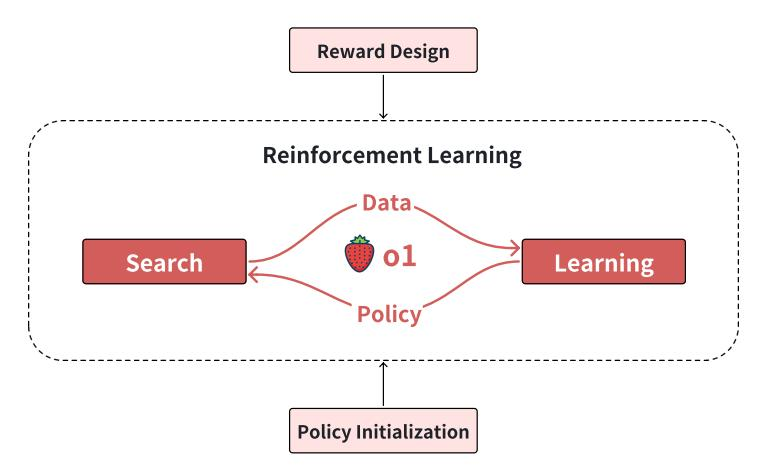
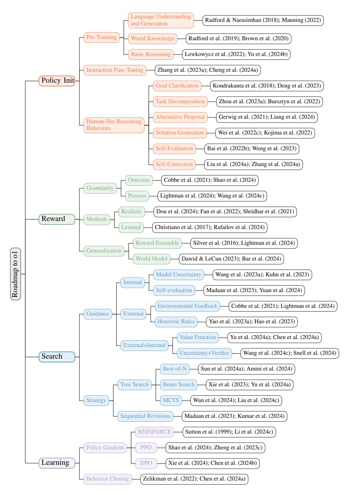
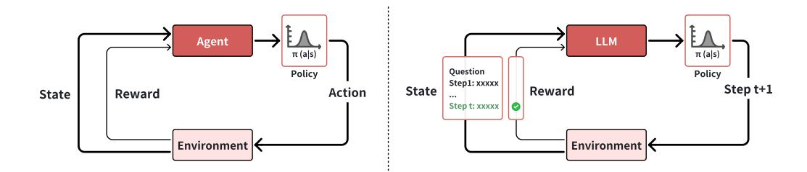
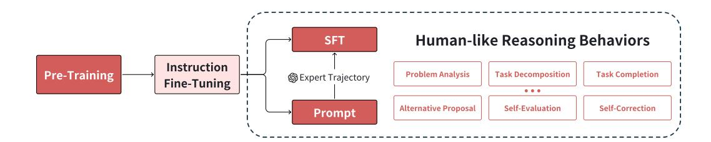
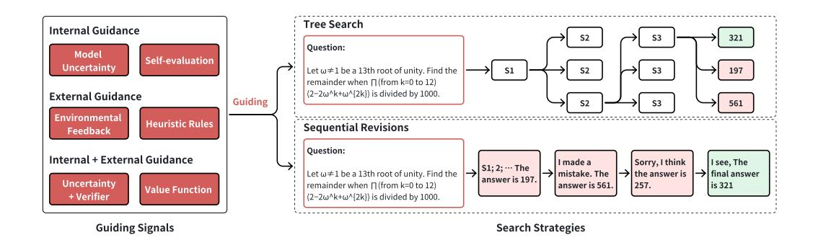
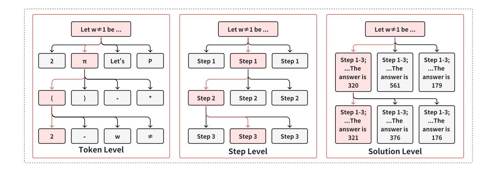
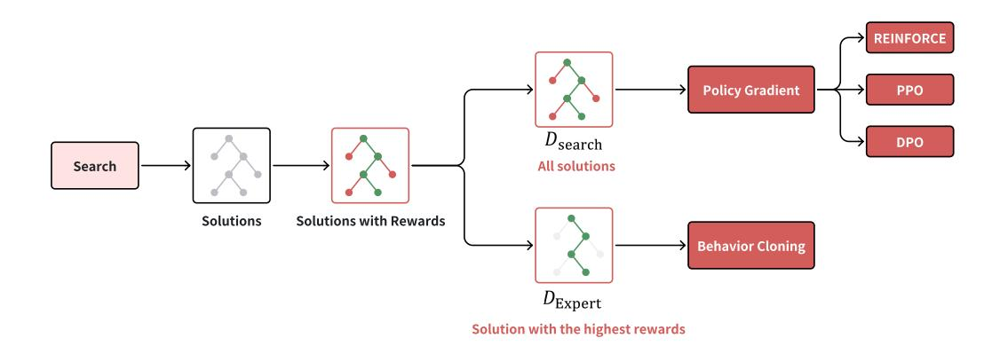

# Scaling of Search and Learning: A Roadmap to Reproduce o1 from Reinforcement Learning Perspective

Zhiyuan Zeng1∗ Qinyuan Cheng1∗ Zhangyue Yin1∗ Bo Wang1∗ Shimin Li1 Yunhua Zhou2 Qipeng Guo2 Xuanjing Huang1 Xipeng Qiu1†

## Abstract

OpenAI o1 represents a significant milestone in Artificial Inteiligence, which achieves expert-level performances on many challanging tasks that require strong reasoning ability. OpenAI has claimed that the main techinique behinds o1 is the reinforcement learining [\(OpenAI, 2024a;](#page-40-0)[b\)](#page-40-1). Recent works use alternative approaches like knowledge distillation to imitate o1's reasoning style, but their effectiveness is limited by the capability ceiling of the teacher model. Therefore, this paper analyzes the roadmap to achieving o1 from the perspective of reinforcement learning, focusing on four key components: policy initialization, reward design, search, and learning. Policy initialization enables models to develop human-like reasoning behaviors, equipping them with the ability to effectively explore solution spaces for complex problems. Reward design provides dense and effective signals via reward shaping or reward modeling, which is the guidance for both search and learning. Search plays a crucial role in generating high-quality solutions during both training and testing phases, which can produce better solutions with more computation. Learning utilizes the data generated by search for improving policy, which can achieve the better performance with more parameters and more searched data. Existing open-source projects that attempt to reproduce o1 can be seem as a part or a variant of our roadmap. Collectively, these components underscore how learning and search drive o1's advancement, making meaningful contributions to the development of LLM.

Figure 1: The overview of this roadmap including policy initialization, reward design, search and learning.

1Fudan University

2Shanghai AI Laboratory

∗Equal contribution. Listing order is random.

†Corresponding author. Correspondence to: {cengzy23,yinzy21,bwang22}@m.fudan.edu.cn chengqy2019@foxmail.com {xjhuang, xpqiu}@fudan.edu.cn

Figure 2: Implementation of the policy initialization, reward design, search, and reinforcement learning.

*One thing that should be learned from the bitter lesson is the great power of general purpose methods, of methods that continue to scale with increased computation even as the available computation becomes very great. The two methods that seem to scale arbitrarily in this way are search and learning.* — *Richard Sutton, 2019*

## 1 Introduction

The field of Artificial Intelligence (AI) has witnessed unprecedented exploration and advancement of Large Language Models (LLMs) over the past two years. LLMs have progressively evolved to handle increasingly sophisticated tasks such as programming and solving advanced mathematical problems. OpenAI o1 represents a significant milestone in AI, which can generate very long reasoning process and conduct human-like reasoning actions like clarifying and decomposing questions, reflecting and correcting previous mistakes, exploring new solutions when encountering failure modes. The o1 model dramatically transcended the reasoning capabilities of preceding LLMs, achieving performance comparable to PhD-level proficiency. Its remarkable reasoning achievements signify OpenAI's progression to the second stage ("Reasoner") in their five-stage roadmap to Artificial General Intelligence (AGI).

The blog and system card of o1 demonstrate that the performance of o1 consistently improves with increasing the computation of reinforcement learning and inference [\(OpenAI, 2024a](#page-40-0)[;b\)](#page-40-1). This suggests that o1 could drive two paradigm shifts in AI: from (self-)supervised learning toward reinforcement learning, and from scaling solely training computation to scaling both training and inference computation.

o1 scales up the train-time compute with reinforcement learning and the test-time compute with more thinking. We take search as a way to implement the thinking process of o1, since search is scalable [\(Sutton, 2019\)](#page-43-4) and there are many successful researches that use search for training and decision in reinforcement learning, like AlphaGo [\(Silver et al., 2016\)](#page-43-1) and AlphaGo Zero [\(Silver et al.,](#page-43-5) [2017\)](#page-43-5). In this paper, we take reinforcement learning as the core in the roadmap to o1. Our roadmap is illustrated in Figure [1](#page-0-0) and consists of four components: policy initialization, reward design, search, and learning. We believe these four parts are the keys to constructing LLM with strong reasoning abilities like o1.

As depicted in Figure [2,](#page-1-0) our roadmap starts with policy initialization. In the context of LLMs, the policy (π(a|s)) typically refers to the probability distribution for generating the next token/step/response (action) based on a given context (state). Policy initialization brings human-like reasoning behaviors to LLMs, like task composition, self-evaluation and self-correction. Next, we enter the reward design, which aims to provide guiding signals for search and learning. The reward design can take or reshape the reward signal from the environment or learn a reward model from preference data. Both policy initialization and reward designs are preparations for search and learning. Search plays an important role in generating high-quality solutions at both training and testing phases, which can produce better solutions with more computation. Learning utilizes the data generated by search for improving the policy. The data used for learning is derived from the interaction of the LLM with the environment, rather than being manually curated by human experts, therefore eliminating the need for costly data annotation and enabling the potential for achieving superhuman performance.

Policy Initialization Training an LLM from scratch using reinforcement learning is exceptionally challenging due to its vast action space. Fortunately, we can leverage extensive internet data to pretrain a language model, establishing a potent initial policy model capable of generating fluent language outputs. Moreover, prompt engineering and supervised fine-tuning help models acquire human-like reasoning behaviors, enabling them to think systematically and validate their own results. These approaches enable models to thoroughly explore their solution spaces, leading to more comprehensive problem-solving capabilities.

Reward Design Both search and learning require guidance from reward signals to improve the policy. There are different levels of action granularity, each corresponding to varing levels of reward signals granularity, which can be explored further. Additionally, these signals are often sparse or even nonexistent in many environments. To transform sparse outcome reward to dense process reward, there are some reward shaping methods [\(Ng et al., 1999\)](#page-39-2). For the environment where the reward signal is unavailable, like the task of story writing, we can learn a reward model from preference data

Figure 3: The visualization of the interaction between agent and einvironment in reinforcement learning for LLMs. Left: traditional reinforcement learning. Right: reinforcement learning for LLMs. The figure only visualizes the step-level action for simplicity. In fact, the action of LLM can be either token-, step-, or solution-level.

[\(Bai et al., 2022a\)](#page-30-2) or expert data [\(Ng & Russell, 2000\)](#page-39-3).The construction of reward model can further evolve into building a world model [\(Dawid & LeCun, 2023\)](#page-33-3).

Search Search plays a crucial role during both the training and testing phases. The training time search refers to generating training data from search process. The advantage of using search to generate training data, as opposed to simple sampling, is that search yields better actions or solutions—i.e., higher-quality training data—thereby enhancing learning effectiveness. During inference, search continues to play a vital role in improving the model's sub-optimal policies. For instance, AlphaGo [\(Wan et al., 2024\)](#page-44-0) employs Monte Carlo Tree Search (MCTS) during testing to enhance its performance. However, scaling test-time search may lead to inverse scaling due to distribution shift: the policy, reward, and value models are trained on one distribution but evaluated on a different one [\(Gao et al., 2023\)](#page-34-2).

Learning Learning from human-expert data requires costly data annotation. In contrast, reinforcement learning learns through interactions with the environment, eliminating the need for expensive data annotation and offering the potential for superhuman performance. In this roadmap, reinforcement learning utilizes data generated by search for learning via policy gradient or behavior cloning. Policy gradient methods have high data utilization, as they leverage both positive and negative solutions, whereas behavior cloning is advantageous in terms of simplicity and memory efficiency. A prominent example of the iterative interaction between search and learning is AlphaGo Zero [\(Silver](#page-43-5) [et al., 2017\)](#page-43-5), which combines Monte Carlo Tree Search (MCTS) [\(Metropolis & Ulam, 1949\)](#page-39-4) as the search algorithm with behavior cloning as the learning method, ultimately achieving superhuman performance in the game of Go.

We provide a detailed exploration of the potential implementations of Policy Initialization (Section [3\)](#page-4-0), Reward Design (Section [4\)](#page-8-0), Search (Section [5\)](#page-13-0), and Learning (Section [6\)](#page-22-0). Additionally, we review existing open-source o1 projects, illustrating how they may either serve as components of our framework or as specific instances within it (Section [7\)](#page-27-0). Finally, we discuss the future development trends of o1 and the associated challenges (Section [8\)](#page-28-0).

## 2 Background

Since this roadmap is designed from perspective of reinforcement learning, we introduce some background of reinforcement learning and its connection to LLM in this section. Unlike other learning paradigms, reinforcement learning learns through interaction with the environment, rather than learning from a static training dataset. In reinforcement learning, an agent learns by receiving rewards from the environment as it explores. Figure [3](#page-3-0) illustrates the interaction between agent and environment in reinforcement learning for LLM.

Agent Agent is the entity that interacts with environment, which makes decision according to its policy. Formally, a policy π is a mapping from states to actions. It is often represented as a probability distribution (π(a|s)) over actions given a state s, where the agent selects actions based on these probabilities.

In the context of LLMs, an agent refers to LLM itself, its policy specify the probability distribution of either token-, step-, or solution-level actions based on the current state. The state st consists of the input provided to the model at time t, including both user inputs and the model's earlier outputs. The action taken by the model can vary depending on the problem setting; it involves generating a single token, completing a step, or providing a solution.

Environment Environment refers to the system or world outside the agent. It responds to agent's actions and provide feedback in terms of next state st+1 and rewards r(st, at).

Environmental feedback can be categorized as either deterministic or stochastic. Stochastic feedback is characterized by a transition distribution p(st+1, rt+1|st, at), as seen in systems like dialogue models, where user responses are inherently unpredictable. On the other hand, deterministic feedback involves no randomness, yielding a fixed next state st+1 and reward r(st, at). For instance, when a LLM solves a mathematical problem, the transition is deterministic, where the current state st and action at are combined to produce the next state st+1.

## 3 Policy Initialization

In reinforcement learning, a policy defines how an agent selects actions in response to environmental states. As discussed in Section [2,](#page-3-1) LLMs operate with actions at three granularity levels: solution-level, step-level, and token-level. Solution-level actions represent the coarsest granularity, treating the entire solution as a single action. Step-level actions operate at an intermediate granularity, where individual steps serve as discrete actions. Token-level actions provide the finest granularity, treating each individual token as an action. Taking token-level actions as an example, the action space contains thousands of tokens from the vocabulary, establishing a well-initialized policy becomes essential for effective model performance [\(Brown et al., 2020\)](#page-31-0).

As illustrated in Figure [4,](#page-5-0) the initialization process of LLMs consists of two primary phases: pretraining and instruction fine-tuning. During pre-training, models develop fundamental language understanding through self-supervised learning on large-scale web corpora [\(Sun et al., 2024d;](#page-43-6) [Weber](#page-46-2) [et al., 2024;](#page-46-2) [Liu et al., 2024f\)](#page-39-5), following established power-law relationships between computational resources and performance [\(Kaplan et al., 2020;](#page-36-1) [Hoffmann et al., 2022\)](#page-35-1). Instruction fine-tuning then transforms LLMs from simple next-token prediction to generating human-aligned responses [\(Wei](#page-46-3) [et al., 2022a;](#page-46-3) [Chung et al., 2024\)](#page-33-4). For models like o1, incorporating human-like reasoning behaviors is crucial to enable more sophisticated exploration of solution spaces. We summarize six key behaviors that can be activated through prompts or learned through expert trajectories distillation from LLMs.

#### 3.1 Pre-Training

Pre-training establishes basic language understanding and reasoning capabilities in LLMs through exposure to massive text corpora [\(Radford & Narasimhan, 2018;](#page-41-0) [Lee et al., 2024\)](#page-37-3). For o1-like models, these core competencies serve as the basis for advanced behaviors developed through subsequent learning and search.

#### 3.1.1 Language Understanding and Generation

Pre-training cultivates diverse language capabilities through extensive exposure to natural language [\(Radford & Narasimhan, 2018\)](#page-41-0). At the syntactic level, models learn grammatical structures ranging from basic word order patterns to complex dependencies [\(Manning, 2022\)](#page-39-0). This syntactic foundation enables pragmatic understanding, including discourse markers and contextual language use, allowing models to adapt different styles across tasks [\(Dam et al., 2024\)](#page-33-5). Generation capabilities progress from basic grammatical coherence to sophisticated features like long-range consistency and complex narrative structures [\(Tian et al., 2024b\)](#page-44-2). Through multilingual training data, models develop cross-lingual abilities, enabling zero-shot transfer and cultural understanding across languages [\(Scao](#page-41-3) [et al., 2022;](#page-41-3) [Alves et al., 2024\)](#page-30-3). Research shows language understanding emerges hierarchically: syntactic patterns appear early, while logical consistency and abstract reasoning develop later, suggesting the importance of training duration and data composition beyond model scaling [\(He et al., 2024;](#page-35-2) [Ahuja et al., 2024\)](#page-30-4).

Figure 4: The process of policy initialization, including pre-training, instruction fine-tuning, and the injection of human-like reasoning behaviors. These behaviors can be learned through SFT or triggered by prompts.

#### 3.1.2 World Knowledge Acquisition and Storage

Pre-training enables comprehensive knowledge acquisition across factual, procedural, and conceptual domains through diverse corpora processing [\(Radford et al., 2019;](#page-41-1) [Brown et al., 2020\)](#page-31-0). Models develop rich semantic networks of factual knowledge from encyclopedic sources and academic literature, enabling cross-domain reasoning and novel insights [\(Chang et al., 2024\)](#page-31-4). Domain expertise emerges from specialized technical content, manifesting in advanced capabilities like mathematical proofs and scientific analysis [\(Shao et al., 2024;](#page-42-0) [Yang et al., 2024\)](#page-47-3). Procedural knowledge develops through exposure to instructional content and programming languages, enhancing systematic problemsolving abilities [\(Ruis et al., 2024;](#page-41-4) [Brahman et al., 2023;](#page-31-5) [Haluptzok et al., 2023\)](#page-35-3). Mathematical and logical foundations form through formal mathematical texts, establishing logical reasoning capabilities [\(Sun et al., 2023;](#page-43-7) [Ahn et al., 2024\)](#page-29-0). Recent studies demonstrate that knowledge storage exhibits efficient compression and generalization properties [\(An et al., 2024\)](#page-30-5), with abstract concepts requiring more extensive training compared to factual knowledge [\(Allen-Zhu & Li, 2024\)](#page-30-6).

#### 3.1.3 Basic Reasoning Abilities

Pre-training develops foundational reasoning capabilities through diverse reasoning patterns, emerging hierarchically from simple inference to complex reasoning. Pattern matching and analogical reasoning emerge as primary mechanisms, enabling generalization across domains [\(Webb et al.,](#page-46-4) [2022;](#page-46-4) [Yasunaga et al., 2024;](#page-47-4) [Yu et al., 2024b\)](#page-48-0). Logical inference abilities develop through exposure to massive code and mathematical proofs [\(Hui et al., 2024;](#page-36-2) [Yang et al., 2024\)](#page-47-3), while sequential processing capabilities emerge from procedural texts and mathematical derivations [\(Lewkowycz](#page-38-0) [et al., 2022\)](#page-38-0). These abilities enable complex problem decomposition and logical coherence.

#### 3.2 Instruction Fine-Tuning

Instruction fine-tuning transforms pre-trained language models into task-oriented agents through specialized training on instruction-response pairs across diverse domains [\(Zhang et al., 2023a;](#page-49-0) [Cheng](#page-32-0) [et al., 2024a\)](#page-32-0). This process alters the model's behavior from pure next-token prediction to purposeful behavior [\(Wu et al., 2024b;](#page-46-5) [Zhao et al., 2024b\)](#page-50-2). The effectiveness of instruction fine-tuning depends primarily on two key factors: the diversity of the instruction dataset [\(Sanh et al., 2022\)](#page-41-5) and the quality of instruction-response pairs [\(Li et al., 2024a;](#page-38-6) [Liu et al., 2024g\)](#page-39-6). Research efforts have expanded both dimensions significantly, with [Wang et al.](#page-45-2) [\(2022b\)](#page-45-2) developing a comprehensive dataset encompassing over *1,600* distinct NLP tasks. FLAN [\(Wei et al., 2022a\)](#page-46-3) demonstrated that models fine-tuned on highquality instruction data can effectively generalize to novel tasks. [Chung et al.](#page-33-4) [\(2024\)](#page-33-4) enhanced this capability through scaling across task count, model size, and incorporation of step-by-step reasoning protocols. Smaller-scale models like Alpaca [\(Taori et al., 2023\)](#page-44-3) achieved remarkable instructionfollowing capabilities through carefully curated high-quality training data. Self-Instruct [\(Wang](#page-45-3) [et al., 2023b\)](#page-45-3) introduced methods for automated generation of instruction-response pairs using LLMs themselves. [Hayati et al.](#page-35-4) [\(2024\)](#page-35-4) further established that fine-tuning on complex, multi-step instructions significantly enhances model capabilities and generalization.

| Reasoning Behavior   | Exemplar                                                                                                                                             | Source  |
|----------------------|------------------------------------------------------------------------------------------------------------------------------------------------------|---------|
| Probelm Analysis     | So the user is requesting a bash script that Let's first under stand the input and output formats So the requested output is '[1,3,5],[2,4,6]' | Coding  |
| Task Decomposition   | Implementation Steps: 1. Capture input string as argument. 2. Remove any spaces (if any). 3. Parse the input string                               | Coding  |
| Task Completion      | Let me try coding the bash script step by step. First, let's write the skeleton:                                                                  | Coding  |
| Alternative Proposal | Option 1: Take the odd positions: Option 2: Try mapping as per an assigned code:                                                                  | Cipher  |
| Self-Evaluation      | Check the number of letters Let's test this mapping Let's check this with the second pair.                                                        | Cipher  |
| Self-Correction      | Wait, the correct formula is: pH = 7 + 0.5 × log  Kb for base Ka for acid                                                                   | Science |

Table 1: Exemplars of Human-like Reasoning Behaviors from o1 blog [\(OpenAI, 2024a\)](#page-40-0)

#### 3.3 Human-like Reasoning Behaviours

While instruction-tuned models demonstrate general task competency and user intent understanding, models like o1 require a more sophisticated repertoire of human-like reasoning capabilities to fully leverage their potential. As shown in Table [1,](#page-6-0) similar to [Zhang](#page-49-2) [\(2024\)](#page-49-2), our analysis of o1's behavior patterns identified six human-like reasoning behaviors that help o1 better explore the solution space. We examine the implementation of these reasoning behaviors through two complementary perspectives: supervised fine-tuning and prompt engineering [\(richards, 2024\)](#page-41-6).

Problem Analysis Problem analysis serves as a crucial initialization process where the model reformulates and analyzes the problem before solving it [\(Kondrakunta et al., 2018\)](#page-37-0). This process involves multiple steps: explicit problem restatement to verify understanding, identification of implicit constraints, and transformation of abstract requirements into concrete, actionable specifications. [Deng](#page-33-0) [et al.](#page-33-0) [\(2023\)](#page-33-0) advance this concept through Proactive Chain-of-Thought, where models actively analyze potential ambiguities before proceeding with problem-solving. In o1's blog on cipher solving, this manifests as careful observation of ciphertext patterns and explicit problem reformulation. As shown in Table [1,](#page-6-0) in coding tasks, it restructures inputs into matrices and precisely generates expected outputs. Problem analysis reduces ambiguity in problem interpretation, constructing a more advantageous initial state for the subsequent phase [\(Lee et al., 2023\)](#page-37-4).

Task Decomposition When encountering complex problems, humans typically decompose them into several manageable subtasks [\(Zhou et al., 2023a\)](#page-50-0). As shown in Table [1,](#page-6-0) in coding tasks, o1 decomposes the problem into several subtasks, including capturing input strings, removing spaces, and parsing input strings. [Bursztyn et al.](#page-31-1) [\(2022\)](#page-31-1) introduce Compositional Fine-Tuning (CFT), a technique that explicitly divides a target task into its constituent components. Recent studies show that models can effectively perform such decompositions when guided by carefully structured prompts [\(Khot](#page-36-3) [et al., 2023;](#page-36-3) [Dua et al., 2022\)](#page-33-6). Importantly, the decomposition process is adaptive and context-aware, with the model dynamically adjusting the granularity and structure of subtasks based on the problem's complexity and uncertainty levels [\(Prasad et al., 2024;](#page-40-2) [Zhou et al., 2023b\)](#page-50-3).

Task Completion Following problem analysis and task decomposition, the model generates solutions through step-by-step reasoning based on clarified problems and decomposed subtasks [\(Plaat](#page-40-3) [et al., 2024;](#page-40-3) [Sun et al., 2023\)](#page-43-7). This behavior forms the foundation for all other reasoning processes, where successful solutions lead to subsequent subtask processing, while problematic solutions trigger the generation of alternatives or self-correction behaviors. Step-by-step generation significantly enhances models' complex reasoning capabilities [\(Wei et al., 2022b;](#page-46-6) [Zhang et al., 2023c\)](#page-49-3). For LLMs, this ability can be activated through prompts containing reasoning processes [\(Wei et al., 2022c\)](#page-46-0), or even through simple instructions like "Let's think step by step" [\(Kojima et al., 2022\)](#page-36-0). Smaller models can acquire this capability through distillation on extensive step-by-step reasoning data [Shridhar et al.](#page-42-1) [\(2023\)](#page-42-1); [Hsieh et al.](#page-36-4) [\(2023\)](#page-36-4). Recent research indicates that sampling multiple solutions substantially

increases the probability of generating correct answers [\(Brown et al., 2024\)](#page-31-6), while selecting final answers based on marginal probabilities effectively improves overall accuracy [\(Wang et al., 2023a\)](#page-45-1).

Alternative Proposal When faced with reasoning obstacles or dead ends, the ability to generate diverse alternative solutions becomes crucial [\(Gerwig et al., 2021;](#page-34-0) [Liang et al., 2024\)](#page-38-1). As shown in Table [1,](#page-6-0) o1 demonstrates this capability in cipher solving by systematically proposing several options. Divergent CoT [\(Puerto et al., 2024\)](#page-40-4) fine-tunes models to generate multiple solutions in a single inference, significantly improving performance on complex reasoning tasks. The generation of alternative proposals can be activated through prompting strategies. Progressive-Hint Prompting [\(Zheng et al., 2023a\)](#page-50-4) leverages historical solution attempts to guide current reasoning, while Exchange-of-Thought [\(Yin et al., 2023a\)](#page-48-4) enriches the solution space by incorporating insights from other models. This systematic exploration of alternatives not only expands the search space but also enables iterative refinement through solution comparison, leading to more well-reasoned outputs.

Self-Evaluation Following task completion, self-evaluation serves as a critical verification mechanism to validate the correctness of proposed solutions [\(Weng et al., 2023\)](#page-46-1). As shown in Table [1,](#page-6-0) in o1's cipher example, the model compares plaintext and ciphertext letter by letter, expressing self-evaluation through explicit feedback such as "Let's check" or "Let's test". This evaluation capability can be enhanced through two primary approaches: implementing detailed evaluation criteria to instill self-evaluation abilities [\(Bai et al., 2022b;](#page-30-0) [Yin et al., 2024b\)](#page-48-5), or utilizing self-debate for cross-validation [\(Du et al., 2024;](#page-33-7) [Sun et al., 2024c\)](#page-43-8). [Zhang et al.](#page-49-4) [\(2024f\)](#page-49-4) introduces Self-Knowledge Tuning to strengthen models' self-evaluation capabilities, enabling more reliable assessment of their own reasoning processes. [Liu et al.](#page-38-7) [\(2024d\)](#page-38-7) demonstrates that distilling self-evaluation abilities into smaller models significantly improves their reasoning performance.

Self-Correction When encountering manageable errors in the reasoning process, models employ self-correction behaviors to address them [\(Pan et al., 2023\)](#page-40-5). In o1's demonstration, encountering signals like "No" or "Wait" triggers the correction process. As shown in Table [1,](#page-6-0) in o1's science example, the model identifies errors in formula generation and produces the correct formula through self-correction. [Huang et al.](#page-36-5) [\(2024a\)](#page-36-5) highlights the challenges of self-correction without external feedback, while [Liu et al.](#page-38-2) [\(2024a\)](#page-38-2) demonstrates that unbiased prompts and zero temperature settings can unlock intrinsic correction capabilities. [Zhang et al.](#page-49-1) [\(2024a\)](#page-49-1) introduces step-level analysis that significantly improves self-correction performance across multiple datasets.

While the behaviors described above provide insights into o1's human-like reasoning capabilities, they represent only a subset of its comprehensive reasoning framework. The model demonstrates sophisticated adaptive behaviors that extend beyond these fundamental patterns, dynamically adjusting its problem-solving strategies based on task-specific requirements and constraints. Through systematic analysis of these behaviors, we gain valuable insights into how o1 navigates complex textual domains and modulates its reasoning behaviors across diverse contextual environments.

#### 3.4 Speculation About the Policy Initialization of o1

During the progression from pre-training to instruction following, the model gradually constrains its action space. Policy initialization plays a critical role in developing o1-like models, as it establishes foundational capabilities that influence subsequent learning and search processes. The policy initialization phase encompasses three essential components: pre-training, instruction fine-tuning, and the development of human-like reasoning behaviors. While these reasoning behaviors are implicitly present in LLMs after instruction fine-tuning, their effective deployment requires activation through either supervised fine-tuning or carefully crafted prompts. Below, we outline several foundations for effectively utilizing these human-like reasoning behaviors.

Long-Text Generation Capabilities During inference, LLMs need to generate a large number of tokens to encompass complex and diverse reasoning behaviors, which requires sophisticated long-context modeling capabilities. While current LLMs have significantly improved in processing long texts [\(Wang et al., 2024e\)](#page-45-4), their capacity for generating lengthy content remains limited. [Bai et al.](#page-30-7) [\(2024\)](#page-30-7) introduces AgentWrite, an agent-based automated data construction pipeline. By fine-tuning on the constructed LongWriter-6k dataset, the approach substantially enhances LLMs' long-text generation capabilities. Similarly, [Quan et al.](#page-41-7) [\(2024\)](#page-41-7) proposes Self-Lengthen, which iteratively finetunes on data constructed by the Extender, continuously improving LLMs' long-form text generation performance.

Shaping Human-like Reasoning Behaviors Logically Beyond generating extensive outputs, models must develop the capability to orchestrate human-like reasoning behaviors in a logically coherent manner. This orchestration requires sophisticated decision-making; for instance, when self-evaluation identifies an error, the model must strategically determine whether to engage in self-correction or explore alternative solutions. While these human-like reasoning behaviors enable comprehensive exploration of solution spaces, they simultaneously introduce computational complexity and demand enhanced logical reasoning capabilities. Current research demonstrates that exposure to programming code and structured logical data significantly strengthens a model's reasoning capabilities [\(Sun](#page-43-9) [et al., 2024b;](#page-43-9) [Aryabumi et al., 2024\)](#page-30-8). However, the systematic organization and sequencing of these human-like reasoning behaviors remains an open research challenge, particularly in determining optimal decision points for deploying specific reasoning behaviors.

Self-Reflection We identify behaviors such as self-evaluation, self-correction, and alternative proposal as manifestations of the model's self-reflection capability. Self-reflection addresses a fundamental limitation of autoregressive models: the inability to revise previously generated content [\(Madaan](#page-39-1) [et al., 2023\)](#page-39-1). Additionally, self-reflection demonstrates the model's self-knowledge [\(Cheng et al.,](#page-32-3) [2024b;](#page-32-3) [Yin et al., 2023b\)](#page-48-6), enabling it to spontaneously recognize flaws in its generated content. Current research indicates that this capability is not easily acquired and cannot be effectively learned through parameter-efficient fine-tuning methods [\(Ye et al., 2024\)](#page-47-5).

### 3.5 Challenges of Policy Initialization for Reproducing o1

While policy initialization establishes crucial foundations for o1-like models, several significant challenges emerge in implementing this approach effectively.

How to balance sampling-efficiency and sampling-diversity? Policy initialization faces a critical trade-off between sharping the action probability distributions for efficient sampling and maintaining sufficient diversity for exploration. While learning from human demonstrations helps constrain the action space, excessive convergence to fixed strategies can limit the discovery of superior approaches during search phases [\(Li et al., 2024b\)](#page-38-8). This challenge is evident in comparing AlphaGo and AlphaGo Zero, initialization from human data provides a strong starting point but may inadvertently restrict exploration of potentially better strategies.

How to ensure domain generalization of reasoning behaviors? Current research focuses on replicating o1's behaviors in specific domains such as mathematics [\(Chen et al., 2024a\)](#page-31-3) and coding [\(Zhang](#page-49-5) [et al., 2024g\)](#page-49-5). However, o1's behaviors are not limited to domain-specific reasoning behaviors. For instance, in safety tasks, models need to perform behaviors that verify whether generated content complies with safety guidelines. Therefore, during the policy initialization process, models should not be restricted to domain-specific reasoning behaviors. Since it is impractical to specify corresponding reasoning behaviors for all tasks, designing reasoning behaviors with strong domain generalization capabilities becomes crucial.

## 4 Reward Design

In reinforcement learning, the agent receives feedback from the environment in the form of a reward signal and seeks to maximize its long-term reward by improving its policy. The reward function, denoted as r(st, at), represents the reward associated with the agent's action at in state st at time step t. The reward signal is crucial in guiding both the training and inference processes, as it defines the desired behavior of the agent through numerical scoring. While the same optimal policy can be learned from various reward designs [\(Ng et al., 1999\)](#page-39-2), a well-designed reward signal can accelerate both the convergence of learning and the efficiency of the search process.

This section provides an overview of the current reward design methods for large language models (LLMs). We begin by comparing the outcome reward and the process reward. Next, we introduce reward design methods that have been specifically proposed for LLMs. We also review reward design

Figure 5: Outcome reward vs Process reward. The figure shows two different types of reward: outcome reward (left) and process reward (right). The entire solution is incorrect due to the penultimate line. Therefore, for outcome rewards, the whole solution is marked as incorrect, while for process reward, the previous three steps are marked as correct and the last two steps as incorrect.

techniques that are widely used in reinforcement learning but have not yet been applied to LLMs. Finally, based on our comparison of these different methods, we offer a speculative discussion on the reward design for o1.

## 4.1 Outcome Reward vs Process Reward

The outcome reward involves assigning a score based on whether the outputs of a large language model (LLM) meet predefined expectations [\(Cobbe et al., 2021;](#page-33-1) [Shao et al., 2024\)](#page-42-0). For instance, [Cobbe et al.](#page-33-1) [\(2021\)](#page-33-1) uses outcome reward to assess whether the solution provided by the LLM to a mathematical problem is correct. Since ground truth is generally available for tasks such as solving mathematical problems, outcome reward is often straightforward.

Although the outcome reward is relatively easy to construct, it lacks supervision for intermediate steps. For instance, a solution to a mathematical problem that leads to the correct answer may still contain errors in the intermediate steps [\(Lightman et al., 2024\)](#page-38-3). As a result, using the outcome reward may cause the LLM to generate incorrect solution steps, which could negatively affect performance. Moreover, outcome reward is sparse, as it does not reward intermediate steps, making it challenging to learn step-level policies. Despite these limitations, it remains widely used in reinforcement learning for LLMs due to its simplicity.

In contrast to the outcome reward, the process reward provides a reward signal not only for the final step but also for intermediate steps [\(Lightman et al., 2024;](#page-38-3) [Yin et al., 2024a\)](#page-48-7). For example, [Lightman](#page-38-3) [et al.](#page-38-3) [\(2024\)](#page-38-3) involves human annotators rewarding the intermediate steps in a mathematical solution generated by an LLM. The outcome reward can be seen as a special case of the process reward, where the rewards for intermediate steps are all set to zero.

Depending on the granularity of the actions, the process can be classified into token-level [\(Rafailov](#page-41-2) [et al., 2024\)](#page-41-2) and step-level [\(Lightman et al., 2024\)](#page-38-3). The step-level segmentation is flexible. [Kuhn](#page-37-1) [et al.](#page-37-1) [\(2023\)](#page-37-1) uses information entropy to guide step segmentation while methods in mathematical problem-solving typically use newline characters as the split symbol [\(Lightman et al., 2024\)](#page-38-3).

Although process rewards show promise, they are more challenging to learn than outcome rewards. For instance, the reward design in [Lightman et al.](#page-38-3) [\(2024\)](#page-38-3) depends on human annotators, making it costly and difficult to scale. There are some automatic ways to transform outcome rewards to process rewards, which is called reward shaping in traditional reinforcement learning. We introduce the methods of reward shaping in Section [4.2.3.](#page-11-0)

#### 4.2 Reward Design Methods

Since outcome reward can be seen as a special case of process reward, many reward design methods can be applied to the modeling of both outcome reward and process reward. The resulting models are typically referred to as the Outcome Reward Model(ORM) and the Process Reward Model(PRM). We review these reward design methods for LLMs, categorizing them based on whether or not they have direct access to the reward signal from the environment.

#### 4.2.1 Reward from Environment

The most straightforward approach to designing a reward is to directly utilize the reward signal from the environment, or learn a model to simulate the reward signal from the environment.

From Realistic Environment Many environments can provide effective reward signals, for example, code generation can receive reward signals from a compiler or interpreter. [Dou et al.](#page-33-2) [\(2024\)](#page-33-2); [Shojaee et al.](#page-42-2) [\(2023\)](#page-42-2); [Dong et al.](#page-33-8) [\(2024\)](#page-33-8) have shown that the quality of code generation is improved with compiler feedback. [Zhang et al.](#page-49-6) [\(2024e\)](#page-49-6) generates test cases for input questions and uses the testing outcomes as the reward signal. [\(Shi et al., 2022\)](#page-42-3) measures the similarity of different programs based on their execution results. [Zheng et al.](#page-50-5) [\(2024\)](#page-50-5) uses the execution results of a program as guidance for refining a code generation model. For some real-world tasks, the environment is just a sandbox. In web shopping [\(Liu et al., 2024e\)](#page-39-7), the environment is represented by a real HTML page, and the reward is calculated based on the score the LLM obtains through clicks and searches. In more general scenarios, sandboxes are created to allow the policy model to interact directly with, such as in environments like MineDojo [\(Fan et al., 2022\)](#page-34-1) or Alfworld [\(Shridhar et al., 2021\)](#page-43-0).

From Simulating Environment While some environments can provide valid feedback, interacting with them to obtain the reward signal can be costly, or the feedback may not be available at test time. For example, during testing, we might not have test cases to validate whether the program generated by the LLM is correct. In such cases, a reward model is required to simulate the reward signal from the environment. For instance, [Lightman et al.](#page-38-3) [\(2024\)](#page-38-3) trains a verifier to predict whether the model's solution to a mathematical problem is correct at test time.

Simulating the reward signal enables the LLM to obtain feedback at any time. However, using such a reward model during learning or search can lead to the problem of distribution shift. As the policy is updated during learning and search, the reward model, which is trained on data from interactions between the old policy and the environment, may fail to adapt to the new policy. This issue, known as reward optimization, has been discussed in [Gao et al.](#page-34-2) [\(2023\)](#page-34-2); [Stroebl et al.](#page-43-10) [\(2024\)](#page-43-10). Thus, the reward model must be updated in tandem with the policy improvements. In more general domains, simulating the environment aligns with the concept of a world model, where the transition probabilities of states must be further simulated, allowing for a more accurate reward model. We discuss the world model in Section [4.5.2.](#page-13-1)

From AI Judgment AI Judgment involves using general AI assistants to provide the reward signal, serving as an alternative to relying on realistic environments, thereby avoiding the high costs associated with environment construction and interaction. For instance, it is common to use a powerful LLM, such as GPT-4, to assess the performance of an AI assistant [\(Zheng et al., 2023b\)](#page-50-6). While AI judgment can be viewed as a form of reward model, it does not face the issue of reward optimization, as it is not dependent on the policy model. As a result, AI judgment remains effective even when the policy model undergoes updates. The LLM is an implementation of the world model, which also highlights the effectiveness of building a world model to provide reward signals.

#### 4.2.2 Reward Modeling from Data

For some environment, the reward signal from environment is unavailable, which can not be simulated. For example, it is difficult to judge whether the response from an AI assistant is good or not. Fortunately, it is easier to collect the expert data or the preference data than giving a reward. With the expert data or preference data, we can also learn a model to provide effective rewards.

Learning rewards from preference data is widely recognized in the LLM community, particularly due to the success of RLHF [\(Bai et al., 2022a\)](#page-30-2). However, learning rewards from expert data, also known as Inverse Reinforcement Learning, has not been widely used for LLMs, which may represent a promising technique for o1.

Learning Rewards from Preference Data Preference data is collected by ranking multiple responses from LLMs to the same question. Using the Bradley-Terry model, an outcome reward can

be derived based on the pair-wise comparison [\(Bradley & Terry, 1952\)](#page-31-7). Learning rewards from preference data for LLM is first proposed in [Christiano et al.](#page-32-1) [\(2017\)](#page-32-1), which introduced the preference signal to tackle complex reinforcement tasks without access to a reward function, achieving significant success in Atari games and robotics. They further developed this approach for text summarization [\(Stiennon et al., 2020\)](#page-43-11). This technique is then used for the development of ChatGPT, where preference signals are used for aligning policy behavior with human values [\(Bai et al., 2022b\)](#page-30-0).

Learning from preference data has been widely used in alignment of LLMs. However, it is crucial to construct the preference data that accurately reflects the actual performance of downstream tasks. For example, [Wen et al.](#page-46-7) [\(2024\)](#page-46-7) show that using human preferences as supervision may degrade the true performance of the model.

Learning Rewards from Expert Data Inverse Reinforcement Learning (IRL) is a method for learning rewards from expert data, with the goal of recovering the reward function that the expert is optimizing. This is achieved by fitting the reward function to the trajectories generated by the expert and maximizing the recovered reward [\(Abbeel & Ng, 2004;](#page-29-1) [Ng & Russell, 2000\)](#page-39-3). Many IRL approaches integrate adversarial learning techniques. [Garg et al.](#page-34-3) [\(2021\)](#page-34-3) introduces the convex conjugate function to avoid the need for adversarial training. Compared with learning reward from preferences, the data for IRL is easier to be collected. However, IRL typically involve adversarial training, which makes the learning more complicated than learning rewards from preferences. Despite that IRL is well-known in reinforcement learning, there is no empirical evidence that it has been used for large-scale reinforcement learning for LLM.

#### 4.2.3 Reward Shaping

The reward signal from some environments may not be effective; for example, it could be an outcome reward rather than a process reward. In such cases, the reward can be reshaped to make it denser and more informative, a process known as reward shaping. For instance, [Kumar et al.](#page-37-2) [\(2024\)](#page-37-2) attempts to train an LLM to self-correct via reinforcement learning and discovers that proper reward shaping can prevent learning collapse. [Wang et al.](#page-45-0) [\(2024c\)](#page-45-0) reshaped the outcome reward by estimating the value function using Monte Carlo sampling, employing the Q-value Qπ(st, at) as the reward during intermediate steps. However, since the value function depends on the policy π, the value function estimate from one policy may not be a valid reward function for another policy. This is empirically validated by [Xiong et al.](#page-47-6) [\(2024\)](#page-47-6), who found that using a value function from another policy for reward shaping is harmful.

[Ng et al.](#page-39-2) [\(1999\)](#page-39-2) defines potential-based reward shaping and proves that two reward functions can lead to the same optimal policy if and only if they satisfy the following equation:

$$F(s_t, a_t) = r(s_t, a_t) + \gamma \phi(s_{t+1}) - \phi(s_t), \tag{1}$$

where F(st, at) and r(st, at) are two reward functions that yield the same optimal policy, γ is the discount factor, and ϕ is a potential function. Potential-based reward shaping suggests that the reward function r(st, at) can be reshaped without altering the optimal policy, as long as the shaping satisfies Equation [1.](#page-11-1) [Setlur et al.](#page-42-4) [\(2024\)](#page-42-4) uses the theory of potential-based reward shaping to transform outcome rewards into process rewards.

The reward learned from preference data can also be reshaped. For example, [Rafailov et al.](#page-41-8) [\(2023\)](#page-41-8), [Rafailov et al.](#page-41-2) [\(2024\)](#page-41-2) and [Zhong et al.](#page-50-7) [\(2024\)](#page-50-7) demonstrate that DPO implicitly makes potential-based reward shaping [\(Ng et al., 1999\)](#page-39-2) on the reward learned from preference data.

While reward shaping can be advantageous, it may also be harmful. Improper reward shaping can negatively affect both learning and search processes. As a result, reward shaping requires careful design and often entails incorporating inductive bias.

### 4.3 Speculation About the Reward Design of o1

We now turn to discuss our assumptions regarding the reward design for o1. Given that o1 could handle multi-task reasoning, its reward model is likely to incorporate multiple reward design methods. For complex reasoning tasks, such as mathematics and code, where responses typically involve long chains of reasoning, a process-reward model is more likely to be employed to supervise the

intermediate process, rather than ORM. Techniques like reward shaping can help derive process rewards from outcome rewards.

When no reward signal is available from the environment, we suspect that o1 will need to rely on learning from preference data [\(Christiano et al., 2017\)](#page-32-1) or expert data [\(Garg et al., 2021\)](#page-34-3).

Given that o1 can be fine-tuned using few-shot examples, we suspect that it has a robust reward model trained on a large and diverse dataset spanning a wide range of domains. It can be adapted to a new domain easily through ground truth and solution pairs. Moreover, it is more likely to predict rewards by generating with LLM rather than through value heads.

### 4.4 Challenges of Reward Design for Reproducing o1

How to overcome distribution shift? The reward model learns from an existing dataset distribution and the out-of-distribution problem still remains significant today [\(Gao et al., 2023\)](#page-34-2), especially as the LLM continues to explore and learn from feedback. The reward provided by the proxy model deviates from the golden reward when the distribution of the policy model changes, as the trajectory becomes unseen during the training of the reward model and heavily depends on its generalization. Scaling the parameters of the reward model and increasing the amount of data can mitigate this issue but does not completely solve it. Iteratively training the reward model provides a more direct solution, but it still requires human involvement in the loop.

How to design fine-grained reward for language model? Unlike in Atari games or robotic environments, language presents a unique challenge because the definition of a step or action can vary in granularity: token-level, step-level or solution-level. In many situations, such as fitting the model to human preferences, it is more natural to judge the entire solution rather than each token individually, as higher-order semantics in language emerge from the combination of tokens. However, using token combinations as actions results in an action space that is too large to define or learn a reward function for. The potential action space grows exponentially, leading to a long tail of actions. Meanwhile, the sparsity of the reward signal increases with the length of each step as we mentioned before.

How to choose data when modeling reward for complex tasks? As the complexity of tasks increases, choosing the appropriate type of feedback becomes increasingly challenging. Recent studies have shown that using preference-based feedback for tasks like code generation or mathematical reasoning may actually degrade the performance of the policy model [\(Wen et al., 2024\)](#page-46-7). Additionally, the question of how much data is necessary to accurately capture the intended behavior remains underexplored. The difficulty of evaluating whether a reward is effective also grows as the complexity of the task increases.

## 4.5 Generalization

The previous section primarily focused on reward design for specific tasks, such as math and coding. When addressing more general tasks, we need to create a broader environment. Practically, according to OpenAI's 5-stages plan for AGI, o1 has been a strong reasoner, the next stage is to train an agent that can interact with the world and address real-world problems. To achieve this goal, we need a reward model to provide the reward signal for the agent taking actions in a realistic environment. In this section, we focus on how to construct a general reward signal, which can be divided into two components: the reward ensemble and the world model.

#### 4.5.1 Reward Ensemble

An intuitive way to build a reward signal for a general task is through an ensemble rewards in specfic domains. [Quan](#page-41-9) [\(2024\)](#page-41-9) trains the reward model as a form of MoE [\(Jiang et al., 2024a;](#page-36-6) [Zeng et al.,](#page-48-8) [2024a\)](#page-48-8), where each expert is trained on a different task to provide the corresponding reward signal, and the outputs are aggregated finally. [Nguyen et al.](#page-39-8) [\(2024\)](#page-39-8) frames this problem as a multi-armed bandit question, learning to select the most suitable reward model. In short, the crucial question is for these methods is how to combine the reward signals effectively.

Figure 6: The two key aspects of search are the guiding signals for solutions selection and the search strategies to get candidate solutions. We divide the guidance used during the search process into two types: internal guidance and external guidance. We also divide search strategies into two types: tree search and sequential revisions. Search strategies are used to obtain candidate solutions or actions, while guiding signals are used to make selections on candidate solutions or actions. S1 means step 1.

## 4.5.2 One for all: World Model

The world model can not only provide the reward signal but also predict the next state [\(Ha &](#page-35-5) [Schmidhuber, 2018;](#page-35-5) [Bar et al., 2024\)](#page-31-2). Some works claim that a video generator is a world model since the video generator can predict the images in the future time steps [\(Liu et al., 2024b;](#page-38-9) [Bar et al.,](#page-31-2) [2024;](#page-31-2) [Wang et al., 2024d;](#page-45-5) [Brooks et al., 2024\)](#page-31-8). [Dawid & LeCun](#page-33-3) [\(2023\)](#page-33-3) also proposes a framework where world model do not need to predict the next state, instead they predict the representation of the next state, which is easier and more efficient than predicting a image. This is inline with Muzero [\(Schrittwieser et al., 2020\)](#page-42-5), which also let the environment simulator to predict the representation of the next state in the game of go. The current works of world model focus on modeling of the next state prediction, but we believe modeling the reward signal is also critical and challenging for an agent to accomplish real-environment tasks.

## 5 Search

For LLMs, performing random sampling during generation has become a mainstream method to improve output quality, with techniques such as nucleus sampling being prominent examples [\(Holtzman](#page-35-6) [et al., 2020\)](#page-35-6). Furthermore, many studies [\(Kulal et al., 2019;](#page-37-5) [Chen et al., 2021\)](#page-32-4) have observed that the pass@k metric improves consistently as the number of model samples increases. [Brown et al.](#page-31-6) [\(2024\)](#page-31-6) show that even small models can outperform large models leveraging search. This suggests that language models have the potential to explore the correct solution by more sampling during inference, which requires consuming more inference-time computations. Search refers to the process of finding the correct solution through multiple attempts or strategic exploration based on certain guidance, such as rewards or heuristic rules. Well-known inference strategies like self-consistency [\(Wang et al.,](#page-45-1) [2023a\)](#page-45-1) and Best-of-N (BoN) [\(Cobbe et al., 2021\)](#page-33-1) both can be seen as search methods. For model like o1, which are designed to solve complex reasoning tasks, search may play an important role in both training and inference processes. In this section, we first analyze the possible role of search in o1, and then introduce the details of various promising search methods which have the potential to be used in the construction of o1-like models.

### 5.1 The role of Search in o1

Search often relies on guiding signals thus can be viewed as a process of strategy iteration, we call it search policy. Compared to naive sampling, search policies are usually more likely to find better solutions. Solutions generated by search policies can either be directly used as the final output or incorporated into training algorithms, like Expert Iteration [\(Anthony et al., 2017\)](#page-30-9), to iteratively improve the policy. We believe that search plays a crucial role in both the training and inference processes of o1. We will refer to the search during these two stages as *training-time search* and *test-time search*, respectively.

In the training phase, the trial-and-error process in online reinforcement learning can also be seen as a search process [\(Sutton & Barto, 1998\)](#page-44-4), where the agent performs naive sampling based on its own policy and learns solution that yield high rewards. However, since o1 involves longer inference lengths and includes human-like reasoning behaviors, the search space becomes large, and naive sampling may become inefficient. Therefore, some advanced search strategies are needed to more efficiently explore better solutions and use them as training data to update the policy model. This process can be iteratively conducted during training. In the inference phase, o1 demonstrates that increasing compute during inference with more time spent thinking can continuously improve model performance [\(OpenAI, 2024a\)](#page-40-0). We argue that o1's way to think more can be seen as a kind of search, using more inference-time computation to find better answers.

The two key aspects of search are the guiding signals for the search and the search strategies to get candidate solutions. Search strategies are used to obtain candidate solutions or actions, while guiding signals are used to make selections. We first discuss the guiding signals for the search process, dividing them into internal and external guidance. Inspired by [Snell et al.](#page-43-2) [\(2024\)](#page-43-2), we categorize the search strategies into tree search and sequential revisions. It is worth noting that these two classification dimensions are orthogonal, for example, tree search methods can utilize either internal or external guiding signals. We present a schematic diagram of these categories in Figure [6.](#page-13-2)

### 5.2 Search Guidance

In the following sections, we will discuss methods for providing guiding signals to the search process. Search based on internal guidance does not rely on real-world feedback from the external environment or proxy models, but instead uses certain states or evaluation capabilities of the model itself to guide the search process. Classic text generation decoding algorithms, such as greedy decoding and beam search, typically use the probability of tokens or sequences as internal guidance for the search process. External guidance is generally independent of specific policies and relies solely on environment- or task-related signals to guide the search process.

#### 5.2.1 Internal Guidance

Model Uncertainty Model uncertainty [\(Malinin & Gales, 2018\)](#page-39-9) is a common form of internal guidance. Many studies leverage it to select high-quality responses from candidates, with selfconsistency [\(Wang et al., 2023a\)](#page-45-1) being a notable example. Self-consistency uses majority voting or weighted sums to choose the answer with the lowest uncertainty. Universal self-consistency [\(Chen](#page-32-5) [et al., 2023\)](#page-32-5) extends this approach to free-form responses, enabling large language models to select the most consistent answer without task-specific constraints, thus broadening its applicability. Building on the idea that different sentences can express the same meaning, [Kuhn et al.](#page-37-1) [\(2023\)](#page-37-1) shift the focus to semantic rather than syntactic uncertainty. They use NLI models [\(Williams et al., 2018\)](#page-46-8) for semantic clustering, treating two sentences as equivalent if they exhibit bi-directional entailment. The entropy of the semantic distribution is then used to measure uncertainty. This semantic entropy has also been applied to detect hallucinations [\(Farquhar et al., 2024\)](#page-34-4), showing strong performance. Model uncertainty is often derived through unsupervised methods, making it easy to be obtained. However, its reliability depends heavily on the model's calibration [\(Guo et al., 2017\)](#page-35-7). A well-calibrated model is essential for effectively utilizing model uncertainty.

Self-evaluation Model uncertainty is a useful guide but does not directly reflect response accuracy. For example, high-uncertainty answers can still be correct. To improve model performance, selfevaluation aims to let models assess their own outputs, leveraging the assumption that evaluation is easier than generation, known as the generator-discriminator gap (DG-gap) [\(Leike, 2022;](#page-37-6) [Davis](#page-33-9) [et al., 2024\)](#page-33-9). A key application of the DG-gap is reinforcement learning from human feedback (RLHF) [\(Stiennon et al., 2020\)](#page-43-11). Compared to directly annotating the correct model output, researchers have found that human annotators' preferences for different candidate outputs can serve as effective and scalable supervisions. This approach helps align the model's behavior with human intentions and values. For instruction-following language models, LLM-as-a-Judge [\(Gu et al., 2024\)](#page-35-8) is an efficient self-evaluation method, achieving high agreement with human evaluators on MT-Bench [\(Zheng et al.,](#page-50-6) [2023b\)](#page-50-6). Using this approach[,Yuan et al.](#page-48-1) [\(2024\)](#page-48-1) demonstrate that models can improve self-rewarding through iterative DPO training. Similarly[,Wu et al.](#page-46-9) [\(2024a\)](#page-46-9) introduce LLM-as-a-Meta-Judge to enhance self-evaluation. The main challenge in task-specific self-evaluation is determining

whether a DG-gap exists and how to fully exploit it for greater accuracy. It is important to note that some studies [\(Huang et al., 2024a\)](#page-36-5) suggest that models cannot accurately evaluate answers without feedback. To address this, we may need to scale up the model size, train it for self-evaluation, specify more detailed evaluation criteria.

### 5.2.2 External Guidance

Environmental Feedback Using environmental feedback corresponding to downstream tasks is one of the most commonly used forms of external guidance and is typically directly related to the evaluation metrics of downstream tasks. Reward is a typical form of environmental feedback and is often used to guide the search process, directly corresponding to the final performance. We have discussed details of reward design in Section [4.2.](#page-9-0) During the search process, we may need multi-scale rewards for guidance, such as outcome rewards and process rewards. Using rewards as guiding signals often requires constructing the environment or utilizing proxy feedback, which can improve search effectiveness but may also introduce additional computational overhead. Moreover, when using proxy feedback such as a reward model for search, if the sampled solutions deviate significantly from the distribution of the reward model's training data, the search may actually lead to a decrease in performance. Besides, environmental feedback that is indirectly related to the final performance can also be used to guide the search process, such as code compilation outcomes, correctness of intermediate steps in solving mathematical problems, unit tests, and more. This type of feedback often serves as an alternative to feedback on the final task outcomes.

Heuristic Rules Many search algorithms use heuristics as guiding signals alongside environmental feedback. Traditional informed search methods, such as greedy search and A∗ search, require the use of heuristic rules developed based on the specific information of the task to guide the search process [\(Russell & Norvig, 2020\)](#page-41-10). Additionally, studies for enhancing LLMs' reasoning abilities [\(Hao](#page-35-0) [et al., 2023;](#page-35-0) [Koh et al., 2024\)](#page-36-7) also apply task-specific heuristics to guide search. When we want to reduce the cost of environmental feedback or when environmental feedback is unavailable, using heuristic rules is a good alternative.

### 5.2.3 Comparison of Internal and External Guidance

This section compares internal and external guidance. Internal guidance relies solely on the model, avoiding the need for external environments or ground truth, and is generally task-agnostic. Thus, internal guidance is highly transferable and useful when specific evaluation criteria for downstream tasks are unavailable. External guidance relies on specific downstream task information, such as rewards from interactive environments or ground truth, making it more aligned with model performance and better at guiding search strategies. However, it introduces construction costs and computational overhead. During inference, the ground truth is often unavailable, and interacting with the environment or simulator is costly. Additionally, external guidance from surrogate models (like a fixed reward model) can face out-of-distribution (OOD) issues [\(4.4\)](#page-12-0). Therefore, external guidance during inference requires careful consideration.

### 5.2.4 Combination of Internal and External Guidance

Internal and external guidance can be combined to direct the search process, with typical approaches integrating the model's own uncertainty and proxy feedback from reward models. For example, [Wang](#page-45-0) [et al.](#page-45-0) [\(2024c\)](#page-45-0) and [Snell et al.](#page-43-2) [\(2024\)](#page-43-2) combine self-consistency with feedback from a process reward model to select the highest-quality responses.

The value function is another type of signal that combines both internal and external guidance. In reinforcement learning, the value function estimates expected cumulative rewards from a state (V function) or state-action pair (Q function), guiding agents to select actions that maximize long-term rewards. It typically relies on environmental reward signals and uses a separate neural network [\(Yu](#page-48-2) [et al., 2024a;](#page-48-2) [Liu et al., 2024c;](#page-38-4) [Wang et al., 2024c\)](#page-45-0). The calculation formula for the value function is as follows (refer to [Sutton & Barto](#page-44-4) [\(1998\)](#page-44-4)):

$$v_{\pi}(s) \doteq \mathbb{E}_{\pi}[G_t \mid S_t = s] = \mathbb{E}_{\pi}\left[\sum_{k=0}^{\infty} \gamma^k R_{t+k+1} \mid S_t = s\right], \text{ for all } s \in \mathcal{S},$$
 (2)

Figure 7: Definitions of search tree nodes at different granularities. The token level represents the finest granularity, while the solution level represents the coarsest granularity.

In this equation, vπ(s) denotes the value of state s under policy π, while Eπ represents the expectation taken over all possible trajectories following the policy π. The term Gt is the return, which is defined as the cumulative sum of future rewards discounted by the factor γ, where γ ∈ [0, 1] determines the importance of future rewards relative to immediate rewards. Specifically, Rt+k+1 is the reward received at time step t + k + 1, conditioned on the state at time t being s. Finally, S refers to the set of all possible states in the environment.

The value function plays a fundamental role in reinforcement learning, as it quantifies the long-term expected reward for starting in a specific state and taking actions according to the given policy. By evaluating the value of states, the value function enables agents to compare and make informed decisions about which states or actions are more favorable under a particular policy.

[Rafailov et al.](#page-41-2) [\(2024\)](#page-41-2) show that DPO is an inverse Q-learning algorithm, where DPO model logits act as the Q function, enabling search processes guided by the value function. They also demonstrate performance gains from applying beam search to the DPO model. Additionally, some work [\(Silver](#page-43-5) [et al., 2017;](#page-43-5) [Wan et al., 2024;](#page-44-0) [Chen et al., 2024a\)](#page-31-3) incorporates a value head into the policy model, sharing a large-scale backbone. The main challenge in using value functions lies in accurately estimating them, especially in tasks with sparse rewards or high-dimensional outputs, such as large language model generation, where inaccuracies can significantly impact performance.

### 5.3 Search Strategies

We categorize search strategies into two types: tree search and sequential revisions. Tree search generates multiple answers simultaneously, acting as a global search that explores a broader range of solutions. In contrast, sequential revisions refine each attempt based on previous ones, functioning as a local search that may offer higher efficiency [\(Snell et al., 2024\)](#page-43-2).

### 5.3.1 Tree Search

This section introduces tree search algorithms like Best-of-N (BoN), beam search, and MCTS. BoN generates multiple independent candidate solutions but lacks dynamic adjustment of the model's probability distribution, leading to inefficiencies, such as over-sampling high-probability options. BoN can be seen as a special case of tree search with depth-1 nodes. In contrast, other tree search strategies dynamically adjust at each step, balancing exploration and exploitation with heuristics, and can use lookahead search, backtracking, and pruning to improve efficiency and reduce sampling costs. An important question in using tree search algorithms on LLMs is defining the granularity of the tree node. As shown in Figure [7,](#page-16-0) common granularities of tree nodes include: token level, step level, and solution level. The token level represents the finest granularity, while the solution level represents the coarsest granularity. Generally, the smaller the granularity of the search tree nodes, the deeper the search tree becomes.

Best-of-n Sampling Best-of-N sampling (BoN) is a simple yet effective search method, which can be seen as a solution-level tree search. It first generates multiple candidate solutions from the model, then selects the best solution via a reward model while discarding the rest [\(Cobbe et al., 2021\)](#page-33-1). When BoN uses oracle rewards (e.g., comparing with ground truth), its accuracy improves with more samples, as coverage increases [\(Brown et al., 2024\)](#page-31-6). However, in most cases, oracle rewards are unavailable, making that learning a reward model becomes the primary bottleneck. Additionally, increasing the number of samples raises computational costs, further limiting BoN's scalability.

To reduce BoN's cost, [Sun et al.](#page-43-3) [\(2024a\)](#page-43-3) propose speculative rejection, leveraging the correlation between partial and complete sequence scores. By scoring partial sequences and discarding lowscoring solutions early, it reduces computation while achieving BoN-like performance. An alternative to multiple sampling is fine-tuning the policy model to mimic BoN's distribution. [Gui et al.](#page-35-9) [\(2024\)](#page-35-9) theoretically prove that BoN is optimal under specific constraints and fine-tune the model using best-of-n and worst-of-n data with preference-based IPO loss and SFT loss. Similarly, [Amini et al.](#page-30-1) [\(2024\)](#page-30-1) introduce variational BoN (vBoN), which uses PPO to minimize the gap between the policy model and BoN's distribution, achieving superior performance without repeated sampling. [Sessa et al.](#page-42-6) [\(2024\)](#page-42-6) propose BOND, which fine-tunes the model to approximate BoN's distribution by minimizing Jeffreys divergence (a combination of forward and backward KL divergences). Through iterative distillation, BOND reduces inference to a single sample while maintaining BoN-level performance.

Beam Search Beam search is a classic tree search algorithm that traditionally expands and prunes branches based on partial sequence probabilities. Beam search is typically conducted at the token level. Recent advancements in large language models have led to modifications of beam search by integrating additional guidance signals. TreeBoN [\(Qiu et al., 2024\)](#page-40-6) iteratively expands branches and prunes low-quality responses using token-level rewards from DPO [\(Rafailov et al., 2024\)](#page-41-2), maintaining high-quality sequences while reducing computation in a manner similar to beam search, on step level. Similarly, [Yu et al.](#page-48-2) [\(2024a\)](#page-48-2) train a value model from outcome supervision to score partial sequences, replacing token probabilities. [Xie et al.](#page-47-1) [\(2023\)](#page-47-1) improve stochastic beam search [\(Kool](#page-37-7) [et al., 2019\)](#page-37-7), balancing exploitation and exploration by using a policy model for self-evaluation for sampling instead of token probabilities. [Ma et al.](#page-39-10) [\(2023\)](#page-39-10) propose a process reward model to guide greedy search, introducing backtracking when child nodes have negative rewards. [Snell et al.](#page-43-2) [\(2024\)](#page-43-2) implement lookahead search via k-step rollouts for evaluating partial sequences, which can be seen as a specia case of MCTS. Reward-guided beam search, compared to token-probability-based approaches, better aligns with downstream task performance. By incorporating value models, rollouts, or backtracking, it also balances exploitation and exploration, enhancing sampling coverage.

Monte Carlo Tree Search Incontrast to BoN and traditional beam search, Monte Carlo Tree Search (MCTS) is a lookahead search algorithm used for making optimal decisions in large search spaces [\(Browne et al., 2012\)](#page-31-9), which can choose actions based on their expected returns. Traditional MCTS use Monte Carlo estimations to estimate state values in a search tree. As simulations increase, the search tree grows, values become more accurate, and the action-selection policy improves by prioritizing higher-value children. MCTS is suitable for large-scale search spaces. Compared to traditional algorithms, it efficiently explores complex search trees using estimated action values (expected rewards). Moreover, MCTS balances exploration and exploitation, allowing the search to not only focus on the most promising areas but also explore unknown regions, thereby avoiding getting stuck in local optimal solutions. As a result, it has shown strong performance on complex reasoning tasks with large search spaces, such as Go [\(Silver et al., 2016\)](#page-43-1).

In MCTS, the nodes of the tree represent states, and the edges represent actions. MCTS constructs a search tree through multiple MCTS simulations to estimate the value (expected reward) of candidate actions in the current state. A typical MCTS simulation consists of four stages:

• Selection: Starting from the root, the algorithm selects edges (actions) recursively based on the action values. To encourage exploration, MCTS adds an exploration term to the action values, which promotes actions that have been visited less frequently. This term is typically calculated using a variant of PUCT [\(Rosin, 2011\)](#page-41-11). As a result, MCTS is able to explore more actions and make more accurate estimates of their values. After selecting an action, a new state is reached, which corresponds to a node in the tree. The selection process is repeated continuously until a leaf node is reached.

- Expansion: If the leaf node reached by the selection process is not a terminal node, such as not being the <eos> token in the text, MCTS will expand this node. It selects the possible actions for the leaf node's state and the resulting states after executing those actions as the child nodes of the current node, using the probabilities of these actions as the initial action values. Typically, MCTS expands the same number of actions each time.
- Evaluation: For the node reached by the selection process, MCTS evaluates the value of the node's state to refine the current action values. Traditional MCTS uses a more efficient policy for Monte Carlo estimation (e.g., using a smaller model), a process known as rollout, and the policy used for estimation is called the rollout policy [\(Sutton & Barto, 1998\)](#page-44-4). Another approach is to use an additional value model to predict the value of the current state without requiring extra sampling. In practice, rollout and the value model can be used together. The advantage of this state value estimation is that MCTS, compared to traditional lookahead search algorithms, can more efficiently estimate the expected reward of the current state in the future without traversing the entire search tree, making it more suitable for problems with large search spaces.
- Backpropagation: After evaluating the value of the node's state, MCTS performs backpropagation to update the values of the actions along the path as well as the visit counts of the actions. Through backpropagation, MCTS refines its estimates of the action values, making the estimates more accurate.

The MCTS algorithm iteratively executes four stages until reaching a predefined simulation limit, selecting the most visited action from the root node.

MCTS algorithms based on LLMs mainly differ in action granularity and reward selection. [Wan](#page-44-0) [et al.](#page-44-0) [\(2024\)](#page-44-0) analyze the impact of token-level and step-level actions on the search space. Step-level actions simplify the search process by reducing tree width but face challenges with large action spaces due to sentence diversity. In contrast, token-level actions narrow the action space but increase tree depth. Some approaches also adopt solution-level actions, where nodes represent entire solutions, and actions modify these solutions.

- Token-level actions: [Liu et al.](#page-38-4) [\(2024c\)](#page-38-4) use a token-level action space, where the LLM predicts the next token as the MCTS action, with the PPO value model evaluating states. [Choi et al.](#page-32-6) [\(2023\)](#page-32-6) employ token-level MCTS to ground generation in reference knowledge, reducing hallucinations. [Zhang et al.](#page-49-7) [\(2023b\)](#page-49-7) use token-level MCTS to guide Transformers in generating better programs, evaluating node values via rollouts. Accurately assessing token values is critical, but sparse reward signals pose challenges in deriving token-level value or reward models. Additionally, the deep search tree leads to efficiency issues, making the design of an efficient inference framework essential for token-level MCTS.
- Step-level actions: For multi-step reasoning tasks, step-level actions are a natural choice. [Hao et al.](#page-35-0) [\(2023\)](#page-35-0) propose RAP, an MCTS-based planning algorithm, which defines actions based on task-specific steps, such as posing sub-questions in math problems or moving blocks in Blocksworld [\(Valmeekam et al., 2023\)](#page-44-5). RAP uses an LLM to predict future states instead of observing state transitions. [Chen et al.](#page-31-3) [\(2024a\)](#page-31-3) treat partial solutions as states and reasoning steps as actions for mathematical problems. [Putta et al.](#page-40-7) [\(2024\)](#page-40-7); [Zhou et al.](#page-50-8) [\(2024\)](#page-50-8) use browser interaction commands as actions in WebShop, a simulated e-commerce platform. Unlike task-specific steps, [Qi et al.](#page-40-8) [\(2024\)](#page-40-8) design five human-like reasoning actions for MCTS. To achieve o1-style reasoning, we may need to manually design actions like reflection and error correction, which should be incorporated during policy initialization.
- Solution-level actions: Solution-level MCTS treats the complete solution as a node state and modifications as actions. [Zhang et al.](#page-49-8) [\(2024c\)](#page-49-8) propose MCTSr, where nodes represent different answer versions, actions involve self-refinement, and rewards come from selfevaluation. Starting with a naive model-generated answer, MCTSr combines self-refinement with MCTS to achieve GPT-4-level performance on math problems. Building on MCTSr, [Zhang et al.](#page-49-9) [\(2024d\)](#page-49-9) use a pairwise preference reward model to evaluate whether a modified answer improves, estimating the new node's value. [Yan et al.](#page-47-7) [\(2024\)](#page-47-7) use self-improvement as actions and design a consistency-based method to ensure factual correctness.

Other Tree Search Algorithms. In addition to MCTS and Beam Search, traditional graph search algorithms like DFS, BFS, and A∗ are also used. The Tree-of-Thought (ToT) framework [\(Yao et al.,](#page-47-0) 2023a) models reasoning as a tree, where nodes represent reasoning steps and branches represent continuations. By expanding and evaluating multiple reasoning solutions, ToT explores a broader solution space, introducing mechanisms like search, reflection, and backtracking to reconsider steps and explore alternatives. ToT employs DFS and BFS for its search process. Koh et al. (2024) propose an  $A^*$ -inspired best-first search, using a multimodal LLM to evaluate nodes and a heuristic to select or backtrack. Lehnert et al. (2024) use  $A^*$  to collect execution traces, training an encoder-decoder model to imitate these traces.

#### **5.3.2** Sequential Revisions

Compared to tree search, sequential revisions primarily conducts the search by iteratively refining the previous answer. The key feature of sequential revisions is that it generates improved answers based on reflections on previous answers or changes in the environment. Sequential revisions requires the model to have basic abilities for self-reflection and error correction, which can be introduced during the poicy initialization through SFT or Prompting, as discussed in Section 3.

Sequential revisions can directly rely on the internal guidance such as self-evaluation. Madaan et al. (2023) propose to SELF-REFINE. It first generates an initial answer using a LLM, and then utilize the same LLM to iteratively provide feedback for its output and refine its output based on the self feedback. The iteration process stops when the maximum number of iterations is reached or when the model determines that it can stop. Snell et al. (2024) also uses a model with revision capabilities to perform revisions during inference, demonstrating that the accuracy of the answer improves as the number of revisions increases. Other work rely on observation or feedback from external environment. Both Yao et al. (2023b) and Shinn et al. (2023) are based on the model reflecting on or improving the next action based on external feedback observed after taking an action. Chen et al. (2024c) and Gou et al. (2024) use feedback based on the execution of generated code to allow the model to modify the generated code or debug.

There is still debate over whether Sequential Revisions is truly effective. For example, Huang et al. (2024a) argue that large models cannot self-correct properly without external feedback. However, the opposing viewpoint suggests that due to the existence of the DG-gap (Leike, 2022), large models may have a stronger ability to discern and improve the answers they have already generated, allowing for further refinement. Chen et al. (2024d) conduct empirical studies across a range of tasks and found that Sequential Revisions only achieves performance improvements over simpler methods like BoN when the accuracy of the discriminator (guidance)  $\geq 90\%$ .

As a summary, we list the research work in Table 2, along with the specific categories of guiding signals and search strategies used, for the reader's reference.

#### 5.3.3 Comparison of Tree Search and Sequential Revisions

As we mentioned in Section 5.3.1, tree search typically samples multiple candidate solutions simultaneously, which allows some tree search algorithms, such as BoN, to be accelerated using parallel strategies. At the same time, the candidate solutions in tree search are relatively independent of each other, and the search process can encourage exploration during sampling, such as in MCTS. This broadens the coverage of candidate solutions. On the other hand, sequential revisions generally continue to search around a previously sampled solution, allowing for, incremental improvements, which may lead to better solutions in some cases. For example, Snell et al. (2024) show that sequential revisions with internal guidance outperform majority voting (a tree search strategy with internal guidance). However, since sequential revisions rely on previous attempts, the computational cost increases with the number of revisions made.

#### 5.3.4 Combination of Tree Search and Sequential Revisions

Tree search and sequential revisions can be used together. In tree search, using solution-level search nodes can be seen as a combination of tree search and sequential revisions (Zhang et al., 2024c;d). Additionally, Snell et al. (2024) combines BoN with sequential revisions by first randomly sampling N candidate solutions, then applying sequential revisions to these N solutions, and finally using a verifier to select the best solution from all of them. This combined approach achieves performance that surpasses BoN. Such results may demonstrate the potential of combining these two search strategies.

| Paper                                                                      | Search (                              | Guidance                         | Search Strategies        |                      |  |
|----------------------------------------------------------------------------|---------------------------------------|----------------------------------|--------------------------|----------------------|--|
|                                                                            | Internal Guidance                     | External Guidance                | Tree Search              | Sequential Revisions |  |
| Math Verifier (Cobbe et al., 2021)                                         | Х                                     | Env Feedback                     | Best-of-N                | Х                    |  |
| Self-consistency (Wang et al., 2023a)                                      | Model Uncertainty                     | X                                | Best-of-N                | Х                    |  |
| Speculative Rejection (Sun et al., 2024a)                                  | X                                     | Env Feedback                     | Best-of-N                | Х                    |  |
| BoN (Gui et al., 2024),vBoN (Amini et al., 2024),BOND (Sessa et al., 2024) | X                                     | Env Feedback                     | Best-of-N †   | ×                    |  |
| TreeBoN (Qiu et al., 2024)                                                 | X                                     | Env Feedback                     | Beam Search              | Х                    |  |
| OVM (Yu et al., 2024a)                                                     | Value Function                        | Value Function                   | Beam Search              | X                    |  |
| Xie et al. (2023)                                                          | Self-evaluation                       | X                                | Beam Search              | Х                    |  |
| Ma et al. (2023)                                                           | X                                     | Env Feedback                     | Beam Search ‡ | Х                    |  |
| Snell et al. (2024)                                                        | X                                     | Env Feedback                     | Beam Search              | X                    |  |
| TS-LLM (Wan et al., 2024)                                                  | X                                     | Env Feedback                     | MCTS                     | Х                    |  |
| PPO-MCTS (Liu et al., 2024c)                                               | Value Function                        | Value Function                   | MCTS                     | Х                    |  |
| KCTS (Choi et al., 2023)                                                   | X                                     | Env Feedback                     | MCTS                     | X                    |  |
| Zhang et al. (2023b)                                                       | X                                     | Env Feedback                     | MCTS                     | Х                    |  |
| RAP (Hao et al., 2023)                                                     | Self-evaluation                       | Heuristic Rules                  | MCTS                     | Х                    |  |
| AlphaMath (Chen et al., 2024a)                                             | Value Function                        | Value Function                   | MCTS, Beam Search     | X                    |  |
| AgentQ (Putta et al., 2024)                                                | Self-evaluation                       | X                                | MCTS                     | X                    |  |
| LATS (Zhou et al., 2024)                                                   | Self-evaluation, Model Uncertainty | X                                | MCTS                     | ×                    |  |
| rStar (Qi et al., 2024)                                                    | Model Uncertainty                     | X                                | MCTS                     | Х                    |  |
| MCTSr (Zhang et al., 2024c)                                                | Self-evaluation                       | X                                | MCTS                     | ✓                    |  |
| LLaMA-Berry (Zhang et al., 2024d)                                          | X                                     | Env Feedback                     | MCTS                     | Х                    |  |
| Mirror (Yan et al., 2024)                                                  | X                                     | Heuristic Rules                  | MCTS                     | ✓                    |  |
| ToT (Yao et al., 2023a)                                                    | X                                     | Env Feedback, Heuristic Rules | DFS,BFS                  | X                    |  |
| Koh et al. (2024)                                                          | X                                     | Env Feedback                     | $A^*$                    | X                    |  |
| Beyond $A^*$ (Lehnert et al., 2024) ‡                           | X                                     | Heuristic Rules                  | $A^*$                    | Х                    |  |
| Self-refine (Madaan et al., 2023)                                          | Self-evaluation                       | X                                | Х                        | ✓                    |  |
| Snell et al. (2024)                                                        | Self-evaluation                       | X                                | X                        | <b>✓</b>             |  |
| ReACT (Yao et al., 2023b)                                                  | X                                     | Env Feedback                     | X                        | ✓                    |  |
| Reflexion (Shinn et al., 2023)                                             | X                                     | Env Feedback                     | X                        | ✓                    |  |
| Self-debug (Chen et al., 2024c)                                            | X                                     | Env Feedback                     | X                        | ✓                    |  |
| Critic (Gou et al., 2024)                                                  | X                                     | Env Feedback                     | Х                        | ✓                    |  |

Table 2: Survey of existing search methods, including their search guidance and search strategies. †: These work finetune models to simulate BoN distributions. ‡: This work use greedy search, which is a special case of beam search. Env Feedback means Environmental Feedback. Value function is a combination of internal and external guidance, thus it appears in both the internal and external guidance columns.

#### 5.4 Speculation About the Search of o1.

In this section, we discuss the guiding signals and search strategies used during both the training-time search and inference-time search in o1.

**Train-time search.** During training, o1 is more likely to employ tree search techniques, such as BoN or tree search algorithms, and primarily relies on external guidance. This is because the model needs to gradually enhance its reasoning capabilities during training, and tree can sample a large number of candidate solutions in parallel, efficiently providing the model with abundant high-quality training data. Furthermore, since real-time interaction is not required during training, various external environments can be accessed to validate the sampled solutions, such as executing code or verifying the accuracy of mathematical computations. This external guidance helps more accurately direct the model's search process.

**Test-time search.** For test-time search, o1 is more likely to use sequential revisions, combining internal guidance to continuously refine and correct its search through reflection. Through the example in the o1 blog (OpenAI, 2024a), we can observe that o1's reasoning style is closer to sequential revisions. Besides, using Tree Search for long reasoning processes can result in significant overhead. And during inference, it is difficult to rely on real-world environments for guidance, and (Gao et al., 2023; Stroebl et al., 2024) point out that performing extensive searches based on proxy feedback, like reward models, can lead to overoptimization problem. While increasing the computations during inference, it can actually degrade performance. However, observations from o1's blog suggest that

the model's performance continues to improve as the computational effort during inference increases. This leads us to believe that o1 primarily uses internal guidance during the inference stage. The computations during inference is mainly reflected in the length of the inference chain.

### 5.5 Scaling Law of Search

Prior to OpenAI's release of o1, several studies explored inference-time scaling laws. [Brown et al.](#page-31-6) [\(2024\)](#page-31-6) studied BoN, dividing BoN into two stages: sampling solutions and selecting the best one via a verifier. They found that increasing the number of samples improved "coverage" (pass@1 accuracy) following a power law. Small models could achieve near 100% pass@1 accuracy on MATH with sufficient scaling. However, they noted a gap between best-of-n accuracy and pass@1, attributing it to the verifier's limitations in identifying correct solutions.

[Snell et al.](#page-43-2) [\(2024\)](#page-43-2) analyzed the scaling of tree search and sequential revisions, showing both approaches scaled well with more computational resources. They found that, for a given computational budget, increasing model size was more effective for complex tasks, while sampling more tokens sufficed for simpler tasks. [Lightman et al.](#page-38-3) [\(2024\)](#page-38-3) examined reward signals in scaling and observed that outcome-reward-based best-of-n search plateaued as samples increased, while PRM-based best-of-n search avoided this issue.

While these studies showed performance gains with increased search computation, [Gao et al.](#page-34-2) [\(2023\)](#page-34-2) found the inverse scaling law where scaling best-of-n search could degrade performance due to distribution shift. The reward model, trained on original policy data, struggles to generalize to new policy. [Stroebl et al.](#page-43-10) [\(2024\)](#page-43-10) noted similar issues and suggested that other search algorithms, like MCTS, may also face inverse scaling challenges.

#### 5.6 Challenges of Search for Reproducing o1

How to overcome Inverse Scaling One approach is to reduce test-time search, as the inverse scaling phenomenon occurs primarily during large-scale search. However, this limits the scale of search. Alternatively, improving the reward model's generalization to handle unseen states is another solution. Inspired by LLM development, this can be achieved by increasing the model's size and training data, as validated in [Gao et al.](#page-34-2) [\(2023\)](#page-34-2).

How to avoid over-thinking on simple tasks? Not all problems require complex reasoning or search. For straightforward queries like "1+1=?", engaging in elaborate analysis wastes computational resources and potentially introduces errors. Forcing reasoning on such problems wastes resources and causes delays. To address this, we could constrain the length of the chain of thought (CoT) using reward shaping with a length penalty. This reshaped reward balances minimizing superfluous search and solving problems effectively.

How to trade off tree search and sequential revisions? Search scales across two dimensions: tree search and sequential revision. Combining both improves performance [\(Zhao et al., 2024a\)](#page-49-10), but with a fixed computational budget, the optimal allocation of resources remains unclear. This challenge is similar to balancing model size and data size under a fixed budget. Empirical scaling laws can provide guidance for resource allocation.

How to improve efficiency of Search? A key challenge in scaling search is efficiency, as LLMs' auto-regressive generation is limited by memory read-write speeds, restricting GPU utilization [\(Dao](#page-33-10) [et al., 2022\)](#page-33-10). Additionally, some tree search algorithms, like MCTS, lack inherent parallelism. Improving efficiency requires both engineering and algorithmic solutions. For example, engineering optimizations involves implementing KV-cache sharing, while algorithmic improvements can perform KV-cache compression [\(Xiao et al., 2024;](#page-47-9) [Zeng et al., 2024b\)](#page-49-11) and speculative sampling [\(Yi et al.,](#page-47-10) [2024\)](#page-47-10).

Figure 8: The difference of 4 learning methods, in terms of the data they use. Policy gradient use  $D_{\rm search}$  which contains all searched solutions, while behavior cloning only utilizes  $D_{\rm expert}$ , the solutions with the highest rewards. We distinguish the solution with the highest reward from the other solutions by using different colors: green for the highest reward and red for the others.

### 6 Learning

We have introduced policy initialization, which learns from human-expert data 1, why do we still need reinforcement learning? What makes reinforcement learning essential is that the training data of reinforcement learning is unlimited which comes from the interaction with an environment. In contrast, the human-expert data is limited and expensive. Furthermore, reinforcement learning has the potential to achieve **superhuman** performance, since it learns from trial and error instead of human-expert data. While human-expert data captures human behavior and knowledge, reinforcement learning can lead to the discovery of strategies that humans may not be capable of. AlphaGo (Silver et al., 2016) which utilized reinforcement learning, was able to defeat world-class human players in the game of Go by discovering novel strategies that were previously unknown to experts, for example the famout "37 move" of AlphaGo (Silver et al., 2016)

The reinforcement learning typically samples the trajectory using a policy and improves the policy based on the received rewards. In the context of o1, we hypothesize that the reinforcement learning process generates trajectories through a search algorithm rather than relying solely on sampling. One advantage of search methods is their ability to explore superior states or solutions compared to random sampling. For example, beam search prioritizes actions with the highest expected action values. Thus, search techniques can provide higher-quality training data than simple sampling. Under this assumption, the reinforcement learning of o1 could involve an iterative process of search and learning. In each iteration, the learning phase utilizes the search-generated outputs as training data to enhance the policy, while the improved policy is then applied to the search process in the next iteration. A prominent example of this search-and-learn iteration is AlphaGo Zero (Silver et al., 2017), which uses trajectory data obtained via Monte Carlo Tree Search (MCTS) for policy learning.

The train-time search is different from the test-time search. The test-time search outputs a solution with the maximum rewards or confidence in all candidate solutions. But at the training, all candidate solutions generated from search may be utilized by learning. We denote the set of state-action pairs output from search as  $D_{\rm search}$ , and the set of state-action pairs in the optimal solutions from search as  $D_{\rm expert}$ . Therefore,  $D_{\rm expert}$  is a subset of  $D_{\rm search}$ . We visualize the difference between  $D_{\rm search}$  and  $D_{\rm expert}$  in Figure 8.

#### 6.1 Learning Methods

Given  $D_{\text{search}}$ , the policy can be improved using either policy gradient methods (Sutton et al., 1999) or behavior cloning. This section provides a detailed overview of several key policy gradient methods. Among these, Proximal Policy Optimization (PPO) (Sutton et al., 1999) and Direct

&lt;sup>1policy initialization can also learn from a stronger model, which we ignores here for simplicity.

Policy Optimization (DPO) [\(Rafailov et al., 2023\)](#page-41-8) are the most widely used reinforcement learning techniques for LLMs. It is also common to preform behavior cloning or supervised learning on the searched data [\(Zelikman et al., 2022;](#page-48-3) [Touvron et al., 2023\)](#page-44-6). The behavior cloning here differs from that in policy initialization discussed in Section [3](#page-4-0) in that it learns the behavior derived from the search process, rather than from human expert.

### 6.1.1 Policy Gradient

The policy gradient parameterizes the policy with θ, which can be defined as πθ(a|s). θ is updated with the following gradient:

$$\nabla_{\theta} J(\theta) = \mathbb{E}_{\pi_{\theta}} \left[ Q(s_t, a_t) \nabla_{\theta} \log \pi_{\theta}(a_t | s_t) \right]$$
(3)

Q-value Q(st, at) is often approximated with Monte Carlo sampling [\(Sutton et al., 1999\)](#page-44-1) or Temporal-Difference estimation [\(Konda & Tsitsiklis, 1999\)](#page-36-8).

REINFORCE REINFORCE algorithm [\(Sutton et al., 1999\)](#page-44-1) uses Monte Carlo to approximate action value:

$$\nabla_{\theta} J(\theta) = \frac{1}{|D_{\text{search}}|} \sum_{(s_t, a_t) \in D_{\text{search}}} \left[ G_t \nabla_{\theta} \log \pi_{\theta}(a_t | s_t) \right], \tag{4}$$

where the return Gt is the discounted cumulated rewards, Dsearch denotes all state-action pairs in the searched data.

Actor-Critic The return Gt may bring high variance for the gradient estimation. Therefore, Actor Critic [\(Konda & Tsitsiklis, 1999\)](#page-36-8) replace Gt with the advantage function or Temporal-difference error, which defined A(st, at) = Rt+1 + γVπθ (st+1) − V (st).

The advantage function in Actor-Critic algorithm involves the estimation of value function V (S), therefore it learns a value model to approximate the value function. Another benefit of using Temporaldifference error A(st, at) instead of Gt is that the estimation of Gt may require more computation for sampling. For example, some trajectories in beam-search are pruned before reaching the terminal state. We need to make additional sampling to estimate Gt for these intermediate states.

PPO In policy gradient methods, the policy is updated using gradient ascent. However, when the policy update is too large, it can cause drastic changes in the policy, leading to poor performance or even divergence. TRPO [\(Schulman et al., 2015\)](#page-42-8) and PPO [\(Schulman et al., 2017\)](#page-42-9) address this problem with KL divergence constraint and clipping, which ensuring that policy updates are not too large.

Another benefit of TRPO and PPO is that it improves data utilization. It is more data-efficient to update the parameters θ multiple times on the same example, like the multi-epoch training in machine learning. Repeatably learning on the same data is called Replaying buffer in reinforcement learning. Replaying buffer improves the data utilization, but making the learning off-policy, where the behavior policy (πsearch) that generates Dsearch is not the same as the target policy (πθ) that is to be optimized. TRPO [\(Schulman et al., 2015\)](#page-42-8) and PPO [\(Schulman et al., 2017\)](#page-42-9) alleviates this problem with KL divergence constraint and clipping.

PPO is a variant of Actor-Critic algorithm, which has been widely used for reinforcement learning for large language model, especially the RLHF [\(Ouyang et al., 2022;](#page-40-9) [Bai et al., 2022a\)](#page-30-2). But the training of PPO typically involves 4 models for function approximation of πθ, πsearch, reward, value, which is expensive. GRPO [\(Shao et al., 2024\)](#page-42-0) alleviate this issue by estimating value function with Monte Carlo estimation instead of function approximation. Remax [\(Li et al., 2024c\)](#page-38-5) is also proposed to simplify the training of PPO, which use the return of greedy decoding as the baseline of reduce the variance of reinforce algorithm.

It is not trivial to reimplement the performance of PPO, [Huang et al.](#page-36-9) [\(2022\)](#page-36-9) highlight 13 core implementation details of PPO, for example, using two distinct networks to predict policy and value respectively is better than sharing their parameters. [Zheng et al.](#page-50-1) [\(2023c\)](#page-50-1); [Wang et al.](#page-45-6) [\(2024a\)](#page-45-6) also empirically validate the influence of some implementation details on the performance of RLHF, for example, they found that it is helpful to normalize and clip reward.

**DPO** DPO eliminate the cost of modeling value model and reference policy, meanwhile having low variance in reward/value estimation. The idea of DPO is to reparameterize reward function with the optimal policy  $\pi^*$ , and transform the optimization of Bradley-Terry reward modeling to the optimization of the policy. The loss function of DPO is:

$$\mathcal{L}_{\text{DPO}}(\pi_{\theta}; \pi_{\text{ref}}) = -\mathbb{E}_{(x, y_w, y_l) \sim \mathcal{D}_{\text{search}}} \left[ \log \sigma \left( \beta \log \frac{\pi_{\theta}(y_w | x)}{\pi_{\text{ref}}(y_w | x)} - \beta \log \frac{\pi_{\theta}(y_l | x)}{\pi_{\text{ref}}(y_l | x)} \right) \right]$$
(5)

where x denotes the question,  $y_w$  denotes the positive solution and  $y_l$  denotes the negative solution. The parametrization of DPO can derive a kind of reward shaping:

$$f(r, \pi_{\text{ref}}, \beta)(x, y) = r(x, y) - \beta \log \sum_{y} \pi_{\text{ref}}(y|x) \exp\left(-\frac{r(x, y)}{\beta}\right)$$
 (6)

Here, the term  $\beta\log\sum_y\pi_{\mathrm{ref}}(y|x)\exp\left(-\frac{r(x,y)}{\beta}\right)$  serves as the baseline for r(x,y), which explains why DPO does not encounter the high variance issue associated with the REINFORCE algorithm. Estimating this baseline is computationally expensive due to the large action space, but DPO eliminates this estimation by leveraging the Bradley-Terry model.

DPO has been widely used as the alternative for PPO in RLHF (Dubey et al., 2024). Even though the search does not provide the preference data directly, we can still construct preference pairs from  $D_{\rm search}$ . LLama-3 (Dubey et al., 2024) uses the positive and negative examples from rejected sampling as the preference data for DPO. MCTS-DPO (Xie et al., 2024) and SVPO (Chen et al., 2024b) collect a number of step-level preference pairs from state-action pairs from MCTS, and use the preference data for DPO.

#### 6.1.2 Behavior Cloning

Behavior cloning, or supervised learning, employs the expert policy as the target and seeks to reduce the discrepancy between the policy  $\pi_{\theta}$  and the expert policy  $\pi_{\text{expert}}$ . While  $\pi_{\text{expert}}$  may not represent a true expert policy, it is generally more effective than  $\pi_{\theta}$ . Furthermore,  $\pi_{\text{expert}}$  improves with increased computational effort, indicating that, with sufficient resources,  $\pi_{\text{expert}}$  could approach the performance of a true expert policy. For LLM, the loss function of behavior cloning is cross-entropy loss.

$$\min_{\theta} - \mathbb{E}_{(s,a) \sim \pi_{\text{expert}}} \left[ \log \pi_{\theta}(a|s) \right]$$

 $D_{\rm search}$  contains all state-action pairs from search, including the negative solution, therefore it can not be taken as the expert data. In contrast, the state-action pairs in  $D_{\rm expert}$  receive the highest rewards compared with other pairs. Therefore,  $D_{\rm expert}$  can be taken as the expert data. The expert data from search may not really have a high quality, but it is better than the data sampled from the current policy. And as we scale the computation of search, the expert data generated from search becomes more optimal. For example, Gao et al. (2023) found scaling best-of-n search enlarges the distance between policy of the best-of-n solution and the current policy.

$$\min_{\theta} - \frac{1}{|D_{\text{expert}}|} \sum_{(s,a) \in D_{\text{expert}}} \left[ \log \pi_{\theta}(a|s) \right], \tag{7}$$

The approach of iterating search and behavior cloning is called Expert Iteration in Anthony et al. (2017). AlphaGo Zero (Silver et al., 2017) is a well-known example of expert iteration, which uses the policy of MCTS for behavior cloning.

Although Expert iteration uses behavior cloning which can be seen as the supervised learning, it is different from policy initialization introduced in Section 3, where the expert data comes from human expert or a stronger model. The expert data of expert initialization comes from the interaction with the environment, i.e., search.

A well-known example of expert iteration for large language model is STaR (Zelikman et al., 2022) that uses reject sampling as the search algorithm to filter the examples generated by LLM with incorrect answers and finetune LLM on the remaining examples. LLama-2 (Touvron et al., 2023) utilizes the method of STaR for RLHF and found it achieve the comparable performance with PPO.

| Learning Method  | Gradient Variance | Memory Cost  |              |                  | Data Utilization |                    |  |
|------------------|-------------------|--------------|--------------|------------------|------------------|--------------------|--|
|                  |                   | Reward Model | Value Model  | Reference Policy | Replay Buffer    | Negative solutions |  |
| REINFORCE        | High              | <b> </b>     | Х            | Х                | ×                | <b>√</b>           |  |
| PPO              | Low               | ✓            | $\checkmark$ | $\checkmark$     | ✓                | ✓                  |  |
| DPO              | Low               | ×            | ×            | ✓                | ✓                | $\checkmark$       |  |
| Behavior Cloning | Low               | X            | Х            | Х                | ✓                | Х                  |  |

Table 3: A comparison of 4 learning methods—REINFORCE, PPO, DPO, and behavior cloning—can be made based on three factors: gradient variance, memory cost, and data utilization. For memory cost, ✓ means requiring reward/value/reference model, suggesting high memory cost. As for data utilization, ✓ means using replaying-buffer/negative-solutions for learning, which indicates high data utilization.

V-Star (Hosseini et al., 2024) follows Star to use reject sampling to filter high-quality examples, but they train a verifier using DPO to provide reward for reject sampling rather than relying on the ground-truth answer. Their verifier also works at the test-time, by applying on best-of-n search. Wan et al. (2024); Tian et al. (2024a); Chen et al. (2024a); Zhang et al. (2024b) follows AlphaGo Zero to use MCTS as the search algorithm and finetune LLM on the solutions with the highest or the top-k highest reward in the tree. The main difference of their work between STaR is that they used different search algorithm.

#### 6.1.3 Speculation about the learning of o1

We make some comparison on the PPO, DPO and behavior cloning to see which one is more likely to be used for o1. The differences between the three methods in terms of memory cost and data utilization are summarized in Table 3.

**Memory Cost** PPO requires storing reward function, value function and reference policy in memory, which is expensive. While DPO eliminates the reward model and value model, which is simpler and more memory-efficient than PPO. But DPO is based on Bradley-Terry model and requires the preference data. For some environment, where the ground truth is available, it would be better to learn a policy with PPO using the reward signal, instead of learning from preference data. Behavior cloning even does not need reference policy, thus is the most memory-efficient among three learning methods.

**Data Utilization** The difference among the 3 learning methods is not only on the learning algorithm, but also on the training data. PPO and DPO use all state-action pairs from search ( $D_{\rm search}$ ), even those with negative rewards. While behavior cloning adopts the subset of state-action pairs from search with high rewards ( $D_{\rm expert}$ ). Therefore, PPO and DPO have better data utilization than behavior cloning, since the negative action or solution can also provide useful signal for improving policy.

Havrilla et al. (2024) empirically compare the performance between PPO (Schulman et al., 2017) and behavior cloning on GSM8K and MATH, and they find the behavior cloning (expert iteration) consistently outperforms policy gradient. It requires more empirical comparison on these methods.

It is likely that the learning of o1 results from the combination of multiple learning methods. In this framework, we hypothesize that the learning process for o1 begins with a warm-up phase using behavior cloning, followed by a transition to PPO or DPO once the improvements from behavior cloning plateau. This approach is grounded in the idea that behavior cloning is more efficient than PPO or DPO, thereby accelerating the warm-up phase. However, behavior cloning is limited in that it only learns from the highest-reward solutions and disregards negative solutions. Consequently, further optimization may require the use of PPO or DPO, which provide better data utilization. This pipeline is consistent with the post-training strategies employed in LLama2 (Touvron et al., 2023) and LLama3 (Dubey et al., 2024).

#### 6.2 Scaling Law of Reinforcement Learning

The relationship between the loss, computational cost, model parameters, and data size during the pre-training phase of large models follows a power-law scaling law. But does reinforcement learning (RL) in large language models also exhibit a scaling law? The blog of OpenAI (OpenAI, 2024a)

shows that there is a log-linear scaling law between reasoning performance and train-time compute. However, aside from this, there has been little research on the scaling laws related to reinforcement learning.

OpenAI has also investigated the scaling laws in reinforcement learning [\(Hilton et al., 2023\)](#page-35-12), their experiments focused on traditional reinforcement learning tasks, such as Dota 2, and did not involve LLMs. They found that the performance of reinforcement learning is improved with the increase of the number of model parameters and interactions with environment, which follows power law. They were able to derive the optimal number of model parameters and interactions with environment under a fixed computational budget.

[Tuyls et al.](#page-44-8) [\(2024\)](#page-44-8) studied the scaling laws of imitation learning in traditional reinforcement learning tasks, such as Atari. They also observed a power-law relationship between the imitation-learning loss and scale factors, including model size, data size, and computation budget. However, the data used for imitation learning came from expert annotations, rather than being generated through interactions with environment.

Some studies on reinforcement learning with large models have experimentally explored the relationship between LLM performance and the number of iterations [\(Zelikman et al., 2022;](#page-48-3) [Xie et al., 2024\)](#page-47-2). However, these studies only conducted small-scale validations, showing that scaling the number of iterations is effective, but they did not establish scaling laws that could be used to predict results for larger-scale experiments. In order to conduct large-scale reinforcement learning like o1, it is crucial to investigate the scaling laws of reinforcement learning on LLMs.

#### 6.3 Challenges of Learning for Reproducing o1

How to improve Training Efficiency? The primary bottleneck in training efficiency arises from the train-time search process, as the time required for LLM generation on the same batch exceeds that of training, with search being particularly slow. For instance, in the open-source project MCTS-DPO [\(Xie et al., 2024\)](#page-47-2), the majority of the training time is consumed by the MCTS search, leading to training times of up to one week on an A800 GPU using the MATH dataset. There are two potential strategies for accelerating training: 1. Improving the search algorithm and implementation, which has been discussed in the search section and will not be reiterated here. 2. Extending learning beyond the data generated by online search to include data from previous search iterations. While reusing data from previous iterations may introduce issues related to off-policy learning, it increases data utilization and consequently reduces the search scale.

How to learn a Strong Question Generator. We have introduced how the solutions generated by search can be used for learning. But the data for learning includes not only the solution but also question. As the policy of LLM improves, the challenging questions become simple. Therefore, it may be important to update the question or initial states. For example, the new questions can be more challenging or explore the new domains. Wizzrd-LM [Xu et al.](#page-47-11) [\(2024\)](#page-47-11) proposes to prompt a strong LLM like chatgpt to generate a more challenging question or another question that is related to the given question. But the generation of new question is independent from the performance of the policy to be optimized. The problem of updating questions is also related to Curriculum Learning [\(Wang](#page-45-7) [et al., 2022a\)](#page-45-7), especially automatic curriculum learning [\(Kumar et al., 2010\)](#page-37-9). Generating questions conditioned on the policy for LLM is challenging, since the generated questions may not be suitable or even unsolvable. Learning on these questions are not helpful for improving policy of LLM.

How to Narrow the Distribution Shift in off-policy learning? The solutions generated by search is typically better than the data sampled from the current policy. The result is that the data produced by search can be considered as originating from a better policy. Using search-generated data for policy gradient training constitutes off-policy learning. To mitigate the distribution shift of policy in off-policy learning, one straightforward approach is to limit the scale of the search. The smaller the search scale, the less pronounced the distribution-shift issue becomes. Alternatively, we can implement search with sampling from the current policy, then there is no distribution shift problem.

An alternative approach is to incorporate off-policy learning methods. While techniques such as importance sampling and KL divergence constraints, employed in TRPO [\(Schulman et al., 2015\)](#page-42-8) and PPO [\(Schulman et al., 2017\)](#page-42-9), are effective. However, they require knowledge of the policy probability associated with the search data, denoted as πsearch, which is unavailable.

|                           |                | •             | Reinforcement Learning |                  | •                |          |
|---------------------------|----------------|---------------|------------------------|------------------|------------------|----------|
| Project                   | Initialization | Reward Design | Train-time Search      | Learning         | Test-Time Search | Resource |
| g1                        | Prompt         | -             | -                      | -                | Sampling         | Prompt   |
| Thinking Claude           | Prompt         | -             | -                      | -                | Sampling         | Prompt   |
| Open o1                   | SFT            | -             | -                      | -                | Sampling         | Data     |
| o1-journey (part 1)       | SFT            | PRM           | Beam-Search            | Behavior Cloning | Sampling         | -        |
| o1-journey (part 2)       | SFT            | -             | -                      | -                | Sampling         | -        |
| Open-Reasoner             | -              | PRM           | Sampling               | PPO              | MCTS             | Code     |
| Slow Thinking with LLMs 1 | SFT            | ORM           | Sampling               | DPO              | MCTS             | -        |
| Slow Thinking with LLMs 2 | SFT            | ORM           | Sampling               | DPO/SFT          | smapling         | -        |
| Marco-o1                  | SFT            | ORM           | MCTS                   | Behavior Cloning | MCTS             | Model    |
| o1-coder                  | SFT            | PRM           | MCTS                   | PPO/DPO          | MCTS             | -        |

Table 4: Comparison of different open-source o1 projects.

Another approach to make use of behavior cloning to turn the off-policy learning to on-policy learning. We can first apply behavior cloning on searched data  $D_{\rm search}$  to narrow the gap between  $\pi_{\theta}$  and  $\pi_{\rm search}$ . After completing the behavior cloning, policy gradient training can then be conducted on the searched data. The pipeline of policy gradient following behavior cloning occurs at each iteration, which is different the speculation introduced in 6.1.3 , where we perform behavior cloning at early iterations and PPO at the remaining iterations. Furthermore, this approach can be supplement for our speculation: We perform behavior cloning at the warm-up stage, and then combine behavior cloning and PPO at each iteration.

## 7 Open-source o1 Project

Although o1 has not published a technical report, the academic community has made available several open-source implementations of o1. All of these implementations can be viewed as components or special cases of the o1 framework introduced in this paper. In Table 4, we summarize the methods adopted by these open-source projects in the areas of policy initialization, reward design, search, and learning.

There are also some o1-like models from industry, for example, k0-math, skywork-o1 (o1 Team, 2024), Deepseek-R1 (Shao et al., 2024), QwQ (Team, 2024) and InternThinker (Cai et al., 2024). We do not discuss about these models, since they have not open sourced their techniques.

#### g1

g1 (bklieger, 2024) may be the earliest project that attempts to reimplement o1, they take the approach of prompt engineering. They prompt LLM to self-reflect and propose multiple solutions to clone the behavior of o1.

#### Thinking Claude

Thinking Claude (richards, 2024) works similarly to g1, which prompts LLM with more complex and fine-grained actions, like problem analysis and progress tracking. Both g1 and Thinking Claude can reshape the behavior of LLM to be like that of o1, but they have not validated their prompts on reasoning benchmarks.

#### Open-o1

Open-o1 (Open-Source-O1, 2024) provides a SFT dataset, where each response contains long cot. But it is not clear where does these data come from. We suspect that these data are coming from human experts or a strong LLM. Open-o1 found that training LLama-3-8B and Qwen-7b on their dataset can not only shape the style of model response to be like o1, but also improve the model performance on reasoning benchmarks.

#### o1 Journey

The o1 journey (Qin et al., 2024; Huang et al., 2024b) is outlined in two technical reports.

Part 1 In Part 1 [\(Qin et al., 2024\)](#page-40-12), the tree data generated through beam search is traversed, with specific nodes refined by GPT-4 and then used in supervised fine-tuning. The examples presented in the paper highlight the model's self-reflection capabilities, which comes from the refinement of GPT-4. The approach adopted in Part 1 can be described as expert iteration, where SFT is applied to the data generated via search. Part 1 also compares PRM from o1-mini anotation versus Math-Shepherd [\(Wang et al., 2024c\)](#page-45-0), they found that o1-mini outperforms Math-Shepherd.

Part 2 Part 2 [\(Huang et al., 2024b\)](#page-36-10) of the o1 journey introduces a radically different approach. While Part 1 focuses on reinforcement learning, Part 2 attempts to distill o1-mini. Although o1-mini conceals the chain-of-thought (CoT) and only outputs the summary of CoT, Part 2 tries to recover the hidden CoT by prompt o1-mini to augment the summary. Through distillation, they found that Qwen-72B outperforms o1-preview on AIME. However, it does not mean that distillation enables the student model to outperform the teacher model, since o1-mini also surpasses o1-preview on AIME.

### Open-Reasoner

The framework of Open-Reasoner [\(Wang et al., 2024b\)](#page-45-8) is akin to AlphaGo [\(Silver et al., 2016\)](#page-43-1), utilizing reinforcement learning to enhance the model's performance. During the testing phase, Monte Carlo Tree Search (MCTS) is employed to identify optimal solutions. This search algorithm is applied exclusively during testing, while the training data is derived by sampling with the current policy. Additionally, Open-Reasoner employs a method similar to Math-Shepherd [\(Wang et al.,](#page-45-0) [2024c\)](#page-45-0) for training the reward model.

## Slow Thinking with LLMs

Similarly to the o1 journey, Slow Thinking with LLMs is alos outlined in two technical reports [\(Jiang](#page-36-11) [et al., 2024b;](#page-36-11) [Min et al., 2024\)](#page-39-11).

Part 1 The part 1 of Slow Thinking with LLMs [\(Jiang et al., 2024b\)](#page-36-11) is similar to OpenReasoner [\(Wang et al., 2024b\)](#page-45-8), incorporating both reinforcement learning and test-time search. But unlike Open-Reasoner, it employs the DPO instead of PPO algorithm during training. In the testing phase, it also employs the MCTS algorithm for search.

Part 2 The part 2 of Slow Thinking with LLMs [\(Min et al., 2024\)](#page-39-11) distills from QwQ [\(Team, 2024\)](#page-44-9) and Deepseek-R1 [\(Shao et al., 2024\)](#page-42-0) and tries two methods for reinforcement learning: DPO and SFT on data generated from reject sampling. They found that distilling on thousands of examples from QwQ and Deepseek-R1 can significantly bring a substantial improvement on challenging reasoning tasks and reinforcement learning can bring further improvement based on distillation.

## Marco-o1

Marco-o1 [\(Zhao et al., 2024a\)](#page-49-10) integrates the data from Open-o1 with data generated by the model itself through the MCTS algorithm for SFT training. Marco-o1 demonstrates that prompting the model for self-reflection after each step of the MCTS process enhances the effectiveness of the search.

### o1-coder

o1-coder [\(Zhang et al., 2024g\)](#page-49-5) attempts to reimplement o1 on the code generation. They train a generator to generate test case for providing outcome reward. With outcome rewards, they use MCTS algorithm to generate code solutions, which are then used for improving policy model through SFT. Their train a PRM following [Wang et al.](#page-45-0) [\(2024c\)](#page-45-0) which is updated with the improvement of the policy.

## 8 Future Directions

How to adapt o1 to general domains? The key to adapt o1 to general domains is the availability of a general reward models. How can we learn a general reward model for general domains? For reasoning tasks, there is typically a standard answer, allowing for the training of an outcome reward model. Using the reward shaping techniques introduced in Section [4,](#page-8-0) a process reward model can be further trained on top of the outcome reward model. For non-reasoning tasks, such as alignment tasks, obtaining an outcome reward is often challenging. In such cases, methods introduced in Section [4,](#page-8-0) such as learning from feedback, become crucial. A Bradley-Terry model [\(Leike et al., 2018\)](#page-37-10) can be trained from preference data, or a reward model can be developed from expert data using inverse reinforcement learning.

How to introduce multiple modality to o1? The challenge of incorporating multiple modality into o1 primarily lies in the alignment or grounding between text and other modalities. For example, when the image modality is introduced, the model needs to handle the fine-grained relationships between long CoT and images. When CoT becomes lengthy, establishing such connections becomes more difficult. Therefore, [Gao et al.](#page-34-7) [\(2024\)](#page-34-7) incorporated the image modality into the CoT, so that the CoT generated by the model includes both text and images. This approach enhances the fine-grained connections between the generated text and images, but it also introduces new challenges. Introducing information from the image or other modalities into the COT significantly increases its length, leading to increased inference latency. A potential solution to this issue could be to use continious representations to generate CoT, replacing textual and other modality-specific information.

How to learn and search with a world model? OpenAI has outlined a 5-stage roadmap to AGI, with stage 2 focusing on becoming a strong reasoner, stage 3 centered on becoming an agent.The o1 has already reached stage 2, achieving reasoning capabilities on par with human experts. Consequently, o1's next goal is to progress to stage 3—being able to take actions in real environment and solving real-environment tasks.

The key to extending o1 to real-world environments lies in reward modeling, more specifically in environment or world modeling. This concept of world models was also introduced in Section [4.](#page-8-0) When a simulator of the real environment is established, the agent can interact with the world model rather than directly with the environment. The world model plays a vital role in both training and testing the agent. During training, interacting with the world model is more efficient than direct interaction with the environment. During testing, the agent can leverage the world model for planning or searching, identifying the optimal strategy before executing actions in the real environment. Without a world model, it is impossible for the model to perform search or planning, as the real environment is not time-reversible. For example, in the game of Go, once a move is made, it cannot be undone.

## 9 Conclusion

In this paper, we present a roadmap for reproducing o1 from the perspective of reinforcement learning, emphasizing key components such as policy initialization, reward design, search, and learning. We offer a comprehensive survey of these components and show that existing open-source projects that attempt to reproduce o1 are variations of our roadmap. Finally, we hope this roadmap inspire further research on overcoming the challenges involved in reproducing o1.

## References

Pieter Abbeel and Andrew Y. Ng. Apprenticeship learning via inverse reinforcement learning. In Carla E. Brodley (ed.), *Machine Learning, Proceedings of the Twenty-first International Conference (ICML 2004), Banff, Alberta, Canada, July 4-8, 2004*, volume 69 of *ACM International Conference Proceeding Series*. ACM, 2004. doi: 10.1145/1015330.1015430. URL [https://doi.org/10.](https://doi.org/10.1145/1015330.1015430) [1145/1015330.1015430](https://doi.org/10.1145/1015330.1015430).

Janice Ahn, Rishu Verma, Renze Lou, Di Liu, Rui Zhang, and Wenpeng Yin. Large language models for mathematical reasoning: Progresses and challenges. In Neele Falk, Sara Papi, and Mike Zhang (eds.), *Proceedings of the 18th Conference of the European Chapter of the Association for Computational Linguistics, EACL 2024: Student Research Workshop, St. Julian's, Malta, March 21-22, 2024*, pp. 225–237. Association for Computational Linguistics, 2024. URL [https:](https://aclanthology.org/2024.eacl-srw.17) [//aclanthology.org/2024.eacl-srw.17](https://aclanthology.org/2024.eacl-srw.17).

- Kabir Ahuja, Vidhisha Balachandran, Madhur Panwar, Tianxing He, Noah A. Smith, Navin Goyal, and Yulia Tsvetkov. Learning syntax without planting trees: Understanding when and why transformers generalize hierarchically. *CoRR*, abs/2404.16367, 2024. doi: 10.48550/ARXIV.2404.16367. URL <https://doi.org/10.48550/arXiv.2404.16367>.
- Zeyuan Allen-Zhu and Yuanzhi Li. Physics of language models: Part 3.1, knowledge storage and extraction. In *Forty-first International Conference on Machine Learning, ICML 2024, Vienna, Austria, July 21-27, 2024*. OpenReview.net, 2024. URL [https://openreview.net/forum?id=](https://openreview.net/forum?id=5x788rqbcj) [5x788rqbcj](https://openreview.net/forum?id=5x788rqbcj).
- Duarte Miguel Alves, José Pombal, Nuno M Guerreiro, Pedro Henrique Martins, João Alves, Amin Farajian, Ben Peters, Ricardo Rei, Patrick Fernandes, Sweta Agrawal, Pierre Colombo, José G. C. de Souza, and Andre Martins. Tower: An open multilingual large language model for translation-related tasks. In *First Conference on Language Modeling*, 2024. URL [https:](https://openreview.net/forum?id=EHPns3hVkj) [//openreview.net/forum?id=EHPns3hVkj](https://openreview.net/forum?id=EHPns3hVkj).
- Afra Amini, Tim Vieira, and Ryan Cotterell. Variational best-of-n alignment. *CoRR*, abs/2407.06057, 2024. doi: 10.48550/ARXIV.2407.06057. URL [https://doi.org/10.48550/arXiv.2407.](https://doi.org/10.48550/arXiv.2407.06057) [06057](https://doi.org/10.48550/arXiv.2407.06057).
- Hongjun An, Yiliang Song, and Xuelong Li. Physics in next-token prediction. *CoRR*, abs/2411.00660, 2024. doi: 10.48550/ARXIV.2411.00660. URL [https://doi.org/10.48550/arXiv.2411.](https://doi.org/10.48550/arXiv.2411.00660) [00660](https://doi.org/10.48550/arXiv.2411.00660).
- Thomas Anthony, Zheng Tian, and David Barber. Thinking fast and slow with deep learning and tree search. In Isabelle Guyon, Ulrike von Luxburg, Samy Bengio, Hanna M. Wallach, Rob Fergus, S. V. N. Vishwanathan, and Roman Garnett (eds.), *Advances in Neural Information Processing Systems 30: Annual Conference on Neural Information Processing Systems 2017, December 4-9, 2017, Long Beach, CA, USA*, pp. 5360–5370, 2017. URL [https://proceedings.neurips.cc/](https://proceedings.neurips.cc/paper/2017/hash/d8e1344e27a5b08cdfd5d027d9b8d6de-Abstract.html) [paper/2017/hash/d8e1344e27a5b08cdfd5d027d9b8d6de-Abstract.html](https://proceedings.neurips.cc/paper/2017/hash/d8e1344e27a5b08cdfd5d027d9b8d6de-Abstract.html).
- Viraat Aryabumi, Yixuan Su, Raymond Ma, Adrien Morisot, Ivan Zhang, Acyr Locatelli, Marzieh Fadaee, Ahmet Üstün, and Sara Hooker. To code, or not to code? exploring impact of code in pre-training. *CoRR*, abs/2408.10914, 2024. doi: 10.48550/ARXIV.2408.10914. URL [https:](https://doi.org/10.48550/arXiv.2408.10914) [//doi.org/10.48550/arXiv.2408.10914](https://doi.org/10.48550/arXiv.2408.10914).
- Yuntao Bai, Andy Jones, Kamal Ndousse, Amanda Askell, Anna Chen, Nova DasSarma, Dawn Drain, Stanislav Fort, Deep Ganguli, Tom Henighan, Nicholas Joseph, Saurav Kadavath, Jackson Kernion, Tom Conerly, Sheer El Showk, Nelson Elhage, Zac Hatfield-Dodds, Danny Hernandez, Tristan Hume, Scott Johnston, Shauna Kravec, Liane Lovitt, Neel Nanda, Catherine Olsson, Dario Amodei, Tom B. Brown, Jack Clark, Sam McCandlish, Chris Olah, Benjamin Mann, and Jared Kaplan. Training a helpful and harmless assistant with reinforcement learning from human feedback. *CoRR*, abs/2204.05862, 2022a. doi: 10.48550/ARXIV.2204.05862. URL <https://doi.org/10.48550/arXiv.2204.05862>.
- Yuntao Bai, Saurav Kadavath, Sandipan Kundu, Amanda Askell, Jackson Kernion, Andy Jones, Anna Chen, Anna Goldie, Azalia Mirhoseini, Cameron McKinnon, Carol Chen, Catherine Olsson, Christopher Olah, Danny Hernandez, Dawn Drain, Deep Ganguli, Dustin Li, Eli Tran-Johnson, Ethan Perez, Jamie Kerr, Jared Mueller, Jeffrey Ladish, Joshua Landau, Kamal Ndousse, Kamile Lukosiute, Liane Lovitt, Michael Sellitto, Nelson Elhage, Nicholas Schiefer, Noemí Mercado, Nova DasSarma, Robert Lasenby, Robin Larson, Sam Ringer, Scott Johnston, Shauna Kravec, Sheer El Showk, Stanislav Fort, Tamera Lanham, Timothy Telleen-Lawton, Tom Conerly, Tom Henighan, Tristan Hume, Samuel R. Bowman, Zac Hatfield-Dodds, Ben Mann, Dario Amodei, Nicholas Joseph, Sam McCandlish, Tom Brown, and Jared Kaplan. Constitutional AI: harmlessness from AI feedback. *CoRR*, abs/2212.08073, 2022b. doi: 10.48550/ARXIV.2212.08073. URL <https://doi.org/10.48550/arXiv.2212.08073>.
- Yushi Bai, Jiajie Zhang, Xin Lv, Linzhi Zheng, Siqi Zhu, Lei Hou, Yuxiao Dong, Jie Tang, and Juanzi Li. Longwriter: Unleashing 10,000+ word generation from long context llms. *CoRR*, abs/2408.07055, 2024. doi: 10.48550/ARXIV.2408.07055. URL [https://doi.org/10.48550/](https://doi.org/10.48550/arXiv.2408.07055) [arXiv.2408.07055](https://doi.org/10.48550/arXiv.2408.07055).

- Amir Bar, Gaoyue Zhou, Danny Tran, Trevor Darrell, and Yann LeCun. Navigation world models, 2024. URL <https://arxiv.org/abs/2412.03572>.
- bklieger. g1: Using llama-3.1 70b on groq to create o1-like reasoning chains, 2024. URL [https:](https://github.com/bklieger-groq/g1) [//github.com/bklieger-groq/g1](https://github.com/bklieger-groq/g1).
- Ralph Allan Bradley and Milton E. Terry. Rank analysis of incomplete block designs: I. the method of paired comparisons. *Biometrika*, 39:324, 1952. URL [https://api.semanticscholar.org/](https://api.semanticscholar.org/CorpusID:125209808) [CorpusID:125209808](https://api.semanticscholar.org/CorpusID:125209808).
- Faeze Brahman, Chandra Bhagavatula, Valentina Pyatkin, Jena D. Hwang, Xiang Lorraine Li, Hirona Jacqueline Arai, Soumya Sanyal, Keisuke Sakaguchi, Xiang Ren, and Yejin Choi. Plasma: Making small language models better procedural knowledge models for (counterfactual) planning. *CoRR*, abs/2305.19472, 2023. doi: 10.48550/ARXIV.2305.19472. URL [https://doi.org/10.](https://doi.org/10.48550/arXiv.2305.19472) [48550/arXiv.2305.19472](https://doi.org/10.48550/arXiv.2305.19472).
- Tim Brooks, Bill Peebles, Connor Holmes, Will DePue, Yufei Guo, Li Jing, David Schnurr, Joe Taylor, Troy Luhman, Eric Luhman, Clarence Ng, Ricky Wang, and Aditya Ramesh. Video generation models as world simulators. 2024. URL [https://openai.com/research/](https://openai.com/research/video-generation-models-as-world-simulators) [video-generation-models-as-world-simulators](https://openai.com/research/video-generation-models-as-world-simulators).
- Bradley C. A. Brown, Jordan Juravsky, Ryan Saul Ehrlich, Ronald Clark, Quoc V. Le, Christopher Ré, and Azalia Mirhoseini. Large language monkeys: Scaling inference compute with repeated sampling. *CoRR*, abs/2407.21787, 2024. doi: 10.48550/ARXIV.2407.21787. URL [https:](https://doi.org/10.48550/arXiv.2407.21787) [//doi.org/10.48550/arXiv.2407.21787](https://doi.org/10.48550/arXiv.2407.21787).
- Tom B. Brown, Benjamin Mann, Nick Ryder, Melanie Subbiah, Jared Kaplan, Prafulla Dhariwal, Arvind Neelakantan, Pranav Shyam, Girish Sastry, Amanda Askell, Sandhini Agarwal, Ariel Herbert-Voss, Gretchen Krueger, Tom Henighan, Rewon Child, Aditya Ramesh, Daniel M. Ziegler, Jeffrey Wu, Clemens Winter, Christopher Hesse, Mark Chen, Eric Sigler, Mateusz Litwin, Scott Gray, Benjamin Chess, Jack Clark, Christopher Berner, Sam McCandlish, Alec Radford, Ilya Sutskever, and Dario Amodei. Language models are few-shot learners. In Hugo Larochelle, Marc'Aurelio Ranzato, Raia Hadsell, Maria-Florina Balcan, and Hsuan-Tien Lin (eds.), *Advances in Neural Information Processing Systems 33: Annual Conference on Neural Information Processing Systems 2020, NeurIPS 2020, December 6-12, 2020, virtual*, 2020. URL [https://proceedings.neurips.cc/paper/2020/hash/](https://proceedings.neurips.cc/paper/2020/hash/1457c0d6bfcb4967418bfb8ac142f64a-Abstract.html) [1457c0d6bfcb4967418bfb8ac142f64a-Abstract.html](https://proceedings.neurips.cc/paper/2020/hash/1457c0d6bfcb4967418bfb8ac142f64a-Abstract.html).
- Cameron Browne, Edward Jack Powley, Daniel Whitehouse, Simon M. Lucas, Peter I. Cowling, Philipp Rohlfshagen, Stephen Tavener, Diego Perez Liebana, Spyridon Samothrakis, and Simon Colton. A survey of monte carlo tree search methods. *IEEE Trans. Comput. Intell. AI Games*, 4(1): 1–43, 2012. doi: 10.1109/TCIAIG.2012.2186810. URL [https://doi.org/10.1109/TCIAIG.](https://doi.org/10.1109/TCIAIG.2012.2186810) [2012.2186810](https://doi.org/10.1109/TCIAIG.2012.2186810).
- Victor S. Bursztyn, David Demeter, Doug Downey, and Larry Birnbaum. Learning to perform complex tasks through compositional fine-tuning of language models. In Yoav Goldberg, Zornitsa Kozareva, and Yue Zhang (eds.), *Findings of the Association for Computational Linguistics: EMNLP 2022, Abu Dhabi, United Arab Emirates, December 7-11, 2022*, pp. 1676–1686. Association for Computational Linguistics, 2022. doi: 10.18653/V1/2022.FINDINGS-EMNLP.121. URL <https://doi.org/10.18653/v1/2022.findings-emnlp.121>.
- Zheng Cai, Maosong Cao, Haojiong Chen, Kai Chen, Keyu Chen, Xin Chen, Xun Chen, Zehui Chen, Zhi Chen, Pei Chu, et al. Internlm2 technical report. *arXiv preprint arXiv:2403.17297*, 2024.
- Hoyeon Chang, Jinho Park, Seonghyeon Ye, Sohee Yang, Youngkyung Seo, Du-Seong Chang, and Minjoon Seo. How do large language models acquire factual knowledge during pretraining? *CoRR*, abs/2406.11813, 2024. doi: 10.48550/ARXIV.2406.11813. URL [https://doi.org/10.48550/](https://doi.org/10.48550/arXiv.2406.11813) [arXiv.2406.11813](https://doi.org/10.48550/arXiv.2406.11813).
- Guoxin Chen, Minpeng Liao, Chengxi Li, and Kai Fan. Alphamath almost zero: process supervision without process. *CoRR*, abs/2405.03553, 2024a. doi: 10.48550/ARXIV.2405.03553. URL <https://doi.org/10.48550/arXiv.2405.03553>.

- Guoxin Chen, Minpeng Liao, Chengxi Li, and Kai Fan. Step-level value preference optimization for mathematical reasoning. In Yaser Al-Onaizan, Mohit Bansal, and Yun-Nung Chen (eds.), *Findings of the Association for Computational Linguistics: EMNLP 2024, Miami, Florida, USA, November 12-16, 2024*, pp. 7889–7903. Association for Computational Linguistics, 2024b. URL <https://aclanthology.org/2024.findings-emnlp.463>.
- Mark Chen, Jerry Tworek, Heewoo Jun, Qiming Yuan, Henrique Pondé de Oliveira Pinto, Jared Kaplan, Harri Edwards, Yuri Burda, Nicholas Joseph, Greg Brockman, Alex Ray, Raul Puri, Gretchen Krueger, Michael Petrov, Heidy Khlaaf, Girish Sastry, Pamela Mishkin, Brooke Chan, Scott Gray, Nick Ryder, Mikhail Pavlov, Alethea Power, Lukasz Kaiser, Mohammad Bavarian, Clemens Winter, Philippe Tillet, Felipe Petroski Such, Dave Cummings, Matthias Plappert, Fotios Chantzis, Elizabeth Barnes, Ariel Herbert-Voss, William Hebgen Guss, Alex Nichol, Alex Paino, Nikolas Tezak, Jie Tang, Igor Babuschkin, Suchir Balaji, Shantanu Jain, William Saunders, Christopher Hesse, Andrew N. Carr, Jan Leike, Joshua Achiam, Vedant Misra, Evan Morikawa, Alec Radford, Matthew Knight, Miles Brundage, Mira Murati, Katie Mayer, Peter Welinder, Bob McGrew, Dario Amodei, Sam McCandlish, Ilya Sutskever, and Wojciech Zaremba. Evaluating large language models trained on code. *CoRR*, abs/2107.03374, 2021. URL [https://arxiv.](https://arxiv.org/abs/2107.03374) [org/abs/2107.03374](https://arxiv.org/abs/2107.03374).
- Xinyun Chen, Renat Aksitov, Uri Alon, Jie Ren, Kefan Xiao, Pengcheng Yin, Sushant Prakash, Charles Sutton, Xuezhi Wang, and Denny Zhou. Universal self-consistency for large language model generation. *CoRR*, abs/2311.17311, 2023. doi: 10.48550/ARXIV.2311.17311. URL <https://doi.org/10.48550/arXiv.2311.17311>.
- Xinyun Chen, Maxwell Lin, Nathanael Schärli, and Denny Zhou. Teaching large language models to self-debug. In *The Twelfth International Conference on Learning Representations, ICLR 2024, Vienna, Austria, May 7-11, 2024*. OpenReview.net, 2024c. URL [https://openreview.net/](https://openreview.net/forum?id=KuPixIqPiq) [forum?id=KuPixIqPiq](https://openreview.net/forum?id=KuPixIqPiq).
- Ziru Chen, Michael White, Raymond J. Mooney, Ali Payani, Yu Su, and Huan Sun. When is tree search useful for LLM planning? it depends on the discriminator. In Lun-Wei Ku, Andre Martins, and Vivek Srikumar (eds.), *Proceedings of the 62nd Annual Meeting of the Association for Computational Linguistics (Volume 1: Long Papers), ACL 2024, Bangkok, Thailand, August 11-16, 2024*, pp. 13659–13678. Association for Computational Linguistics, 2024d. doi: 10.18653/ V1/2024.ACL-LONG.738. URL <https://doi.org/10.18653/v1/2024.acl-long.738>.
- Daixuan Cheng, Yuxian Gu, Shaohan Huang, Junyu Bi, Minlie Huang, and Furu Wei. Instruction pre-training: Language models are supervised multitask learners. In Yaser Al-Onaizan, Mohit Bansal, and Yun-Nung Chen (eds.), *Proceedings of the 2024 Conference on Empirical Methods in Natural Language Processing, EMNLP 2024, Miami, FL, USA, November 12-16, 2024*, pp. 2529–2550. Association for Computational Linguistics, 2024a. URL [https://aclanthology.](https://aclanthology.org/2024.emnlp-main.148) [org/2024.emnlp-main.148](https://aclanthology.org/2024.emnlp-main.148).
- Qinyuan Cheng, Tianxiang Sun, Xiangyang Liu, Wenwei Zhang, Zhangyue Yin, Shimin Li, Linyang Li, Zhengfu He, Kai Chen, and Xipeng Qiu. Can AI assistants know what they don't know? In *Forty-first International Conference on Machine Learning, ICML 2024, Vienna, Austria, July 21-27, 2024*. OpenReview.net, 2024b. URL <https://openreview.net/forum?id=girxGkdECL>.
- Sehyun Choi, Tianqing Fang, Zhaowei Wang, and Yangqiu Song. KCTS: knowledge-constrained tree search decoding with token-level hallucination detection. In Houda Bouamor, Juan Pino, and Kalika Bali (eds.), *Proceedings of the 2023 Conference on Empirical Methods in Natural Language Processing, EMNLP 2023, Singapore, December 6-10, 2023*, pp. 14035–14053. Association for Computational Linguistics, 2023. doi: 10.18653/V1/2023.EMNLP-MAIN.867. URL [https:](https://doi.org/10.18653/v1/2023.emnlp-main.867) [//doi.org/10.18653/v1/2023.emnlp-main.867](https://doi.org/10.18653/v1/2023.emnlp-main.867).
- Paul F. Christiano, Jan Leike, Tom B. Brown, Miljan Martic, Shane Legg, and Dario Amodei. Deep reinforcement learning from human preferences. In Isabelle Guyon, Ulrike von Luxburg, Samy Bengio, Hanna M. Wallach, Rob Fergus, S. V. N. Vishwanathan, and Roman Garnett (eds.), *Advances in Neural Information Processing Systems 30: Annual Conference on Neural Information Processing Systems 2017, December 4-9, 2017, Long Beach, CA, USA*, pp. 4299–4307, 2017. URL [https://proceedings.neurips.cc/paper/2017/hash/](https://proceedings.neurips.cc/paper/2017/hash/d5e2c0adad503c91f91df240d0cd4e49-Abstract.html) [d5e2c0adad503c91f91df240d0cd4e49-Abstract.html](https://proceedings.neurips.cc/paper/2017/hash/d5e2c0adad503c91f91df240d0cd4e49-Abstract.html).

- Hyung Won Chung, Le Hou, Shayne Longpre, Barret Zoph, Yi Tay, William Fedus, Yunxuan Li, Xuezhi Wang, Mostafa Dehghani, Siddhartha Brahma, Albert Webson, Shixiang Shane Gu, Zhuyun Dai, Mirac Suzgun, Xinyun Chen, Aakanksha Chowdhery, Alex Castro-Ros, Marie Pellat, Kevin Robinson, Dasha Valter, Sharan Narang, Gaurav Mishra, Adams Yu, Vincent Y. Zhao, Yanping Huang, Andrew M. Dai, Hongkun Yu, Slav Petrov, Ed H. Chi, Jeff Dean, Jacob Devlin, Adam Roberts, Denny Zhou, Quoc V. Le, and Jason Wei. Scaling instruction-finetuned language models. *J. Mach. Learn. Res.*, 25:70:1–70:53, 2024. URL [https://jmlr.org/papers/v25/23-0870.](https://jmlr.org/papers/v25/23-0870.html) [html](https://jmlr.org/papers/v25/23-0870.html).
- Karl Cobbe, Vineet Kosaraju, Mohammad Bavarian, Mark Chen, Heewoo Jun, Lukasz Kaiser, Matthias Plappert, Jerry Tworek, Jacob Hilton, Reiichiro Nakano, Christopher Hesse, and John Schulman. Training verifiers to solve math word problems. *CoRR*, abs/2110.14168, 2021. URL <https://arxiv.org/abs/2110.14168>.
- Sumit Kumar Dam, Choong Seon Hong, Yu Qiao, and Chaoning Zhang. A complete survey on llm-based AI chatbots. *CoRR*, abs/2406.16937, 2024. doi: 10.48550/ARXIV.2406.16937. URL <https://doi.org/10.48550/arXiv.2406.16937>.
- Tri Dao, Daniel Y. Fu, Stefano Ermon, Atri Rudra, and Christopher Ré. Flashattention: Fast and memory-efficient exact attention with io-awareness. In Sanmi Koyejo, S. Mohamed, A. Agarwal, Danielle Belgrave, K. Cho, and A. Oh (eds.), *Advances in Neural Information Processing Systems 35: Annual Conference on Neural Information Processing Systems 2022, NeurIPS 2022, New Orleans, LA, USA, November 28 - December 9, 2022*, 2022. URL [http://papers.nips.cc/paper\\_files/paper/2022/hash/](http://papers.nips.cc/paper_files/paper/2022/hash/67d57c32e20fd0a7a302cb81d36e40d5-Abstract-Conference.html) [67d57c32e20fd0a7a302cb81d36e40d5-Abstract-Conference.html](http://papers.nips.cc/paper_files/paper/2022/hash/67d57c32e20fd0a7a302cb81d36e40d5-Abstract-Conference.html).
- Jared Quincy Davis, Boris Hanin, Lingjiao Chen, Peter Bailis, Ion Stoica, and Matei Zaharia. Networks of networks: Complexity class principles applied to compound AI systems design. *CoRR*, abs/2407.16831, 2024. doi: 10.48550/ARXIV.2407.16831. URL [https://doi.org/10.](https://doi.org/10.48550/arXiv.2407.16831) [48550/arXiv.2407.16831](https://doi.org/10.48550/arXiv.2407.16831).
- Anna Dawid and Yann LeCun. Introduction to latent variable energy-based models: A path towards autonomous machine intelligence. *CoRR*, abs/2306.02572, 2023. doi: 10.48550/ARXIV.2306. 02572. URL <https://doi.org/10.48550/arXiv.2306.02572>.
- Yang Deng, Lizi Liao, Liang Chen, Hongru Wang, Wenqiang Lei, and Tat-Seng Chua. Prompting and evaluating large language models for proactive dialogues: Clarification, target-guided, and noncollaboration. In Houda Bouamor, Juan Pino, and Kalika Bali (eds.), *Findings of the Association for Computational Linguistics: EMNLP 2023, Singapore, December 6-10, 2023*, pp. 10602–10621. Association for Computational Linguistics, 2023. doi: 10.18653/V1/2023.FINDINGS-EMNLP.711. URL <https://doi.org/10.18653/v1/2023.findings-emnlp.711>.
- Guanting Dong, Keming Lu, Chengpeng Li, Tingyu Xia, Bowen Yu, Chang Zhou, and Jingren Zhou. Self-play with execution feedback: Improving instruction-following capabilities of large language models. *CoRR*, abs/2406.13542, 2024. doi: 10.48550/ARXIV.2406.13542. URL <https://doi.org/10.48550/arXiv.2406.13542>.
- Shihan Dou, Yan Liu, Haoxiang Jia, Limao Xiong, Enyu Zhou, Wei Shen, Junjie Shan, Caishuang Huang, Xiao Wang, Xiaoran Fan, Zhiheng Xi, Yuhao Zhou, Tao Ji, Rui Zheng, Qi Zhang, Xuanjing Huang, and Tao Gui. Stepcoder: Improve code generation with reinforcement learning from compiler feedback. *CoRR*, abs/2402.01391, 2024. doi: 10.48550/ARXIV.2402.01391. URL <https://doi.org/10.48550/arXiv.2402.01391>.
- Yilun Du, Shuang Li, Antonio Torralba, Joshua B. Tenenbaum, and Igor Mordatch. Improving factuality and reasoning in language models through multiagent debate. In *Forty-first International Conference on Machine Learning, ICML 2024, Vienna, Austria, July 21-27, 2024*. OpenReview.net, 2024. URL <https://openreview.net/forum?id=zj7YuTE4t8>.
- Dheeru Dua, Shivanshu Gupta, Sameer Singh, and Matt Gardner. Successive prompting for decomposing complex questions. In Yoav Goldberg, Zornitsa Kozareva, and Yue Zhang (eds.), *Proceedings of the 2022 Conference on Empirical Methods in Natural Language Processing,*

- *EMNLP 2022, Abu Dhabi, United Arab Emirates, December 7-11, 2022*, pp. 1251–1265. Association for Computational Linguistics, 2022. doi: 10.18653/V1/2022.EMNLP-MAIN.81. URL <https://doi.org/10.18653/v1/2022.emnlp-main.81>.
- Abhimanyu Dubey, Abhinav Jauhri, Abhinav Pandey, Abhishek Kadian, Ahmad Al-Dahle, Aiesha Letman, Akhil Mathur, Alan Schelten, Amy Yang, Angela Fan, Anirudh Goyal, Anthony Hartshorn, Aobo Yang, Archi Mitra, Archie Sravankumar, Artem Korenev, Arthur Hinsvark, Arun Rao, Aston Zhang, Aurélien Rodriguez, Austen Gregerson, Ava Spataru, Baptiste Rozière, Bethany Biron, Binh Tang, Bobbie Chern, Charlotte Caucheteux, Chaya Nayak, Chloe Bi, Chris Marra, Chris McConnell, Christian Keller, Christophe Touret, Chunyang Wu, Corinne Wong, Cristian Canton Ferrer, Cyrus Nikolaidis, Damien Allonsius, Daniel Song, Danielle Pintz, Danny Livshits, David Esiobu, Dhruv Choudhary, Dhruv Mahajan, Diego Garcia-Olano, Diego Perino, Dieuwke Hupkes, Egor Lakomkin, Ehab AlBadawy, Elina Lobanova, Emily Dinan, Eric Michael Smith, Filip Radenovic, Frank Zhang, Gabriel Synnaeve, Gabrielle Lee, Georgia Lewis Anderson, Graeme Nail, Grégoire Mialon, Guan Pang, Guillem Cucurell, Hailey Nguyen, Hannah Korevaar, Hu Xu, Hugo Touvron, Iliyan Zarov, Imanol Arrieta Ibarra, Isabel M. Kloumann, Ishan Misra, Ivan Evtimov, Jade Copet, Jaewon Lee, Jan Geffert, Jana Vranes, Jason Park, Jay Mahadeokar, Jeet Shah, Jelmer van der Linde, Jennifer Billock, Jenny Hong, Jenya Lee, Jeremy Fu, Jianfeng Chi, Jianyu Huang, Jiawen Liu, Jie Wang, Jiecao Yu, Joanna Bitton, Joe Spisak, Jongsoo Park, Joseph Rocca, Joshua Johnstun, Joshua Saxe, Junteng Jia, Kalyan Vasuden Alwala, Kartikeya Upasani, Kate Plawiak, Ke Li, Kenneth Heafield, Kevin Stone, and et al. The llama 3 herd of models. *CoRR*, abs/2407.21783, 2024. doi: 10.48550/ARXIV.2407.21783. URL <https://doi.org/10.48550/arXiv.2407.21783>.
- Linxi Fan, Guanzhi Wang, Yunfan Jiang, Ajay Mandlekar, Yuncong Yang, Haoyi Zhu, Andrew Tang, De-An Huang, Yuke Zhu, and Anima Anandkumar. Minedojo: Building open-ended embodied agents with internet-scale knowledge. In Sanmi Koyejo, S. Mohamed, A. Agarwal, Danielle Belgrave, K. Cho, and A. Oh (eds.), *Advances in Neural Information Processing Systems 35: Annual Conference on Neural Information Processing Systems 2022, NeurIPS 2022, New Orleans, LA, USA, November 28 - December 9, 2022*, 2022. URL [http://papers.nips.cc/paper\\_files/paper/2022/hash/](http://papers.nips.cc/paper_files/paper/2022/hash/74a67268c5cc5910f64938cac4526a90-Abstract-Datasets_and_Benchmarks.html) [74a67268c5cc5910f64938cac4526a90-Abstract-Datasets\\_and\\_Benchmarks.html](http://papers.nips.cc/paper_files/paper/2022/hash/74a67268c5cc5910f64938cac4526a90-Abstract-Datasets_and_Benchmarks.html).
- Sebastian Farquhar, Jannik Kossen, Lorenz Kuhn, and Yarin Gal. Detecting hallucinations in large language models using semantic entropy. *Nat.*, 630(8017):625–630, 2024. doi: 10.1038/ S41586-024-07421-0. URL <https://doi.org/10.1038/s41586-024-07421-0>.
- Jun Gao, Yongqi Li, Ziqiang Cao, and Wenjie Li. Interleaved-modal chain-of-thought. *arXiv preprint arXiv:2411.19488*, 2024.
- Leo Gao, John Schulman, and Jacob Hilton. Scaling laws for reward model overoptimization. In Andreas Krause, Emma Brunskill, Kyunghyun Cho, Barbara Engelhardt, Sivan Sabato, and Jonathan Scarlett (eds.), *International Conference on Machine Learning, ICML 2023, 23-29 July 2023, Honolulu, Hawaii, USA*, volume 202 of *Proceedings of Machine Learning Research*, pp. 10835–10866. PMLR, 2023. URL <https://proceedings.mlr.press/v202/gao23h.html>.
- Divyansh Garg, Shuvam Chakraborty, Chris Cundy, Jiaming Song, and Stefano Ermon. Iq-learn: Inverse soft-q learning for imitation. In Marc'Aurelio Ranzato, Alina Beygelzimer, Yann N. Dauphin, Percy Liang, and Jennifer Wortman Vaughan (eds.), *Advances in Neural Information Processing Systems 34: Annual Conference on Neural Information Processing Systems 2021, NeurIPS 2021, December 6-14, 2021, virtual*, pp. 4028–4039, 2021. URL [https://proceedings.neurips.](https://proceedings.neurips.cc/paper/2021/hash/210f760a89db30aa72ca258a3483cc7f-Abstract.html) [cc/paper/2021/hash/210f760a89db30aa72ca258a3483cc7f-Abstract.html](https://proceedings.neurips.cc/paper/2021/hash/210f760a89db30aa72ca258a3483cc7f-Abstract.html).
- Anne Gerwig, Kirill Miroshnik, Boris Forthmann, Mathias Benedek, Maciej Karwowski, and Heinz Holling. The relationship between intelligence and divergent thinking—a meta-analytic update. *Journal of Intelligence*, 9(2), 2021. ISSN 2079-3200. doi: 10.3390/jintelligence9020023. URL <https://www.mdpi.com/2079-3200/9/2/23>.
- Zhibin Gou, Zhihong Shao, Yeyun Gong, Yelong Shen, Yujiu Yang, Nan Duan, and Weizhu Chen. CRITIC: large language models can self-correct with tool-interactive critiquing. In *The Twelfth International Conference on Learning Representations, ICLR 2024, Vienna, Austria, May 7-11, 2024*. OpenReview.net, 2024. URL <https://openreview.net/forum?id=Sx038qxjek>.

- Jiawei Gu, Xuhui Jiang, Zhichao Shi, Hexiang Tan, Xuehao Zhai, Chengjin Xu, Wei Li, Yinghan Shen, Shengjie Ma, Honghao Liu, Yuanzhuo Wang, and Jian Guo. A survey on llm-as-a-judge, 2024. URL <https://arxiv.org/abs/2411.15594>.
- Lin Gui, Cristina Gârbacea, and Victor Veitch. Bonbon alignment for large language models and the sweetness of best-of-n sampling. *CoRR*, abs/2406.00832, 2024. doi: 10.48550/ARXIV.2406.00832. URL <https://doi.org/10.48550/arXiv.2406.00832>.
- Chuan Guo, Geoff Pleiss, Yu Sun, and Kilian Q. Weinberger. On calibration of modern neural networks. In Doina Precup and Yee Whye Teh (eds.), *Proceedings of the 34th International Conference on Machine Learning, ICML 2017, Sydney, NSW, Australia, 6-11 August 2017*, volume 70 of *Proceedings of Machine Learning Research*, pp. 1321–1330. PMLR, 2017. URL <http://proceedings.mlr.press/v70/guo17a.html>.
- David Ha and Jürgen Schmidhuber. World models. *CoRR*, abs/1803.10122, 2018. URL [http:](http://arxiv.org/abs/1803.10122) [//arxiv.org/abs/1803.10122](http://arxiv.org/abs/1803.10122).
- Patrick Haluptzok, Matthew Bowers, and Adam Tauman Kalai. Language models can teach themselves to program better. In *The Eleventh International Conference on Learning Representations, ICLR 2023, Kigali, Rwanda, May 1-5, 2023*. OpenReview.net, 2023. URL <https://openreview.net/forum?id=SaRj2ka1XZ3>.
- Shibo Hao, Yi Gu, Haodi Ma, Joshua Jiahua Hong, Zhen Wang, Daisy Zhe Wang, and Zhiting Hu. Reasoning with language model is planning with world model. In Houda Bouamor, Juan Pino, and Kalika Bali (eds.), *Proceedings of the 2023 Conference on Empirical Methods in Natural Language Processing, EMNLP 2023, Singapore, December 6-10, 2023*, pp. 8154–8173. Association for Computational Linguistics, 2023. doi: 10.18653/V1/2023.EMNLP-MAIN.507. URL <https://doi.org/10.18653/v1/2023.emnlp-main.507>.
- Alex Havrilla, Yuqing Du, Sharath Chandra Raparthy, Christoforos Nalmpantis, Jane Dwivedi-Yu, Maksym Zhuravinskyi, Eric Hambro, Sainbayar Sukhbaatar, and Roberta Raileanu. Teaching large language models to reason with reinforcement learning. *CoRR*, abs/2403.04642, 2024. doi: 10.48550/ARXIV.2403.04642. URL <https://doi.org/10.48550/arXiv.2403.04642>.
- Shirley Anugrah Hayati, Taehee Jung, Tristan Bodding-Long, Sudipta Kar, Abhinav Sethy, Joo-Kyung Kim, and Dongyeop Kang. Chain-of-instructions: Compositional instruction tuning on large language models. *CoRR*, abs/2402.11532, 2024. doi: 10.48550/ARXIV.2402.11532. URL <https://doi.org/10.48550/arXiv.2402.11532>.
- Yuan He, Zhangdie Yuan, Jiaoyan Chen, and Ian Horrocks. Language models as hierarchy encoders. *CoRR*, abs/2401.11374, 2024. doi: 10.48550/ARXIV.2401.11374. URL [https://doi.org/10.](https://doi.org/10.48550/arXiv.2401.11374) [48550/arXiv.2401.11374](https://doi.org/10.48550/arXiv.2401.11374).
- Jacob Hilton, Jie Tang, and John Schulman. Scaling laws for single-agent reinforcement learning. *CoRR*, abs/2301.13442, 2023. doi: 10.48550/ARXIV.2301.13442. URL [https://doi.org/10.](https://doi.org/10.48550/arXiv.2301.13442) [48550/arXiv.2301.13442](https://doi.org/10.48550/arXiv.2301.13442).
- Jordan Hoffmann, Sebastian Borgeaud, Arthur Mensch, Elena Buchatskaya, Trevor Cai, Eliza Rutherford, Diego de Las Casas, Lisa Anne Hendricks, Johannes Welbl, Aidan Clark, Tom Hennigan, Eric Noland, Katie Millican, George van den Driessche, Bogdan Damoc, Aurelia Guy, Simon Osindero, Karen Simonyan, Erich Elsen, Jack W. Rae, Oriol Vinyals, and Laurent Sifre. Training compute-optimal large language models. *CoRR*, abs/2203.15556, 2022. doi: 10.48550/ARXIV.2203.15556. URL <https://doi.org/10.48550/arXiv.2203.15556>.
- Ari Holtzman, Jan Buys, Li Du, Maxwell Forbes, and Yejin Choi. The curious case of neural text degeneration. In *8th International Conference on Learning Representations, ICLR 2020, Addis Ababa, Ethiopia, April 26-30, 2020*. OpenReview.net, 2020. URL [https://openreview.net/](https://openreview.net/forum?id=rygGQyrFvH) [forum?id=rygGQyrFvH](https://openreview.net/forum?id=rygGQyrFvH).
- Arian Hosseini, Xingdi Yuan, Nikolay Malkin, Aaron C. Courville, Alessandro Sordoni, and Rishabh Agarwal. V-star: Training verifiers for self-taught reasoners. *CoRR*, abs/2402.06457, 2024. doi: 10.48550/ARXIV.2402.06457. URL <https://doi.org/10.48550/arXiv.2402.06457>.

- Cheng-Yu Hsieh, Chun-Liang Li, Chih-Kuan Yeh, Hootan Nakhost, Yasuhisa Fujii, Alex Ratner, Ranjay Krishna, Chen-Yu Lee, and Tomas Pfister. Distilling step-by-step! outperforming larger language models with less training data and smaller model sizes. In Anna Rogers, Jordan L. Boyd-Graber, and Naoaki Okazaki (eds.), *Findings of the Association for Computational Linguistics: ACL 2023, Toronto, Canada, July 9-14, 2023*, pp. 8003–8017. Association for Computational Linguistics, 2023. doi: 10.18653/V1/2023.FINDINGS-ACL.507. URL [https://doi.org/10.](https://doi.org/10.18653/v1/2023.findings-acl.507) [18653/v1/2023.findings-acl.507](https://doi.org/10.18653/v1/2023.findings-acl.507).
- Jie Huang, Xinyun Chen, Swaroop Mishra, Huaixiu Steven Zheng, Adams Wei Yu, Xinying Song, and Denny Zhou. Large language models cannot self-correct reasoning yet. In *The Twelfth International Conference on Learning Representations, ICLR 2024, Vienna, Austria, May 7-11, 2024*. OpenReview.net, 2024a. URL <https://openreview.net/forum?id=IkmD3fKBPQ>.
- Shengyi Huang, Rousslan Fernand Julien Dossa, Antonin Raffin, Anssi Kanervisto, and Weixun Wang. The 37 implementation details of proximal policy optimization. In *ICLR Blog Track*, 2022. URL [https://iclr-blog-track.github.io/2022/](https://iclr-blog-track.github.io/2022/03/25/ppo-implementation-details/) [03/25/ppo-implementation-details/](https://iclr-blog-track.github.io/2022/03/25/ppo-implementation-details/). https://iclr-blog-track.github.io/2022/03/25/ppoimplementation-details/.
- Zhen Huang, Haoyang Zou, Xuefeng Li, Yixiu Liu, Yuxiang Zheng, Ethan Chern, Shijie Xia, Yiwei Qin, Weizhe Yuan, and Pengfei Liu. O1 replication journey – part 2: Surpassing o1-preview through simple distillation, big progress or bitter lesson?, 2024b. URL [https://arxiv.org/](https://arxiv.org/abs/2411.16489) [abs/2411.16489](https://arxiv.org/abs/2411.16489).
- Binyuan Hui, Jian Yang, Zeyu Cui, Jiaxi Yang, Dayiheng Liu, Lei Zhang, Tianyu Liu, Jiajun Zhang, Bowen Yu, Kai Dang, An Yang, Rui Men, Fei Huang, Xingzhang Ren, Xuancheng Ren, Jingren Zhou, and Junyang Lin. Qwen2.5-coder technical report. *CoRR*, abs/2409.12186, 2024. doi: 10.48550/ARXIV.2409.12186. URL <https://doi.org/10.48550/arXiv.2409.12186>.
- Albert Q Jiang, Alexandre Sablayrolles, Antoine Roux, Arthur Mensch, Blanche Savary, Chris Bamford, Devendra Singh Chaplot, Diego de las Casas, Emma Bou Hanna, Florian Bressand, et al. Mixtral of experts. *arXiv preprint arXiv:2401.04088*, 2024a.
- Jinhao Jiang, Zhipeng Chen, Yingqian Min, Jie Chen, Xiaoxue Cheng, Jiapeng Wang, Yiru Tang, Haoxiang Sun, Jia Deng, Wayne Xin Zhao, et al. Technical report: Enhancing llm reasoning with reward-guided tree search. *arXiv preprint arXiv:2411.11694*, 2024b.
- Jared Kaplan, Sam McCandlish, Tom Henighan, Tom B. Brown, Benjamin Chess, Rewon Child, Scott Gray, Alec Radford, Jeffrey Wu, and Dario Amodei. Scaling laws for neural language models. *CoRR*, abs/2001.08361, 2020. URL <https://arxiv.org/abs/2001.08361>.
- Tushar Khot, Harsh Trivedi, Matthew Finlayson, Yao Fu, Kyle Richardson, Peter Clark, and Ashish Sabharwal. Decomposed prompting: A modular approach for solving complex tasks. In *The Eleventh International Conference on Learning Representations, ICLR 2023, Kigali, Rwanda, May 1-5, 2023*. OpenReview.net, 2023. URL [https://openreview.net/forum?id=\\_nGgzQjzaRy](https://openreview.net/forum?id=_nGgzQjzaRy).
- Jing Yu Koh, Stephen McAleer, Daniel Fried, and Ruslan Salakhutdinov. Tree search for language model agents. *CoRR*, abs/2407.01476, 2024. doi: 10.48550/ARXIV.2407.01476. URL [https:](https://doi.org/10.48550/arXiv.2407.01476) [//doi.org/10.48550/arXiv.2407.01476](https://doi.org/10.48550/arXiv.2407.01476).
- Takeshi Kojima, Shixiang Shane Gu, Machel Reid, Yutaka Matsuo, and Yusuke Iwasawa. Large language models are zero-shot reasoners. In Sanmi Koyejo, S. Mohamed, A. Agarwal, Danielle Belgrave, K. Cho, and A. Oh (eds.), *Advances in Neural Information Processing Systems 35: Annual Conference on Neural Information Processing Systems 2022, NeurIPS 2022, New Orleans, LA, USA, November 28 - December 9, 2022*, 2022. URL [http://papers.nips.cc/paper\\_files/](http://papers.nips.cc/paper_files/paper/2022/hash/8bb0d291acd4acf06ef112099c16f326-Abstract-Conference.html) [paper/2022/hash/8bb0d291acd4acf06ef112099c16f326-Abstract-Conference.html](http://papers.nips.cc/paper_files/paper/2022/hash/8bb0d291acd4acf06ef112099c16f326-Abstract-Conference.html).
- Vijay R. Konda and John N. Tsitsiklis. Actor-critic algorithms. In Sara A. Solla, Todd K. Leen, and Klaus-Robert Müller (eds.), *Advances in Neural Information Processing Systems 12, [NIPS Conference, Denver, Colorado, USA, November 29 - December 4, 1999]*, pp. 1008–1014. The MIT Press, 1999. URL <http://papers.nips.cc/paper/1786-actor-critic-algorithms>.

- Sravya Kondrakunta, Venkatsampath Raja Gogineni, Matt Molineaux, Hector Munoz-Avila, Martin Oxenham, and Michael T Cox. Toward problem recognition, explanation and goal formulation. In *6th Goal Reasoning Workshop at IJCAI/FAIM-2018*, 2018.
- Wouter Kool, Herke van Hoof, and Max Welling. Stochastic beams and where to find them: The gumbel-top-k trick for sampling sequences without replacement. In Kamalika Chaudhuri and Ruslan Salakhutdinov (eds.), *Proceedings of the 36th International Conference on Machine Learning, ICML 2019, 9-15 June 2019, Long Beach, California, USA*, volume 97 of *Proceedings of Machine Learning Research*, pp. 3499–3508. PMLR, 2019. URL [http://proceedings.mlr.](http://proceedings.mlr.press/v97/kool19a.html) [press/v97/kool19a.html](http://proceedings.mlr.press/v97/kool19a.html).
- Lorenz Kuhn, Yarin Gal, and Sebastian Farquhar. Semantic uncertainty: Linguistic invariances for uncertainty estimation in natural language generation. In *The Eleventh International Conference on Learning Representations, ICLR 2023, Kigali, Rwanda, May 1-5, 2023*. OpenReview.net, 2023. URL <https://openreview.net/forum?id=VD-AYtP0dve>.
- Sumith Kulal, Panupong Pasupat, Kartik Chandra, Mina Lee, Oded Padon, Alex Aiken, and Percy Liang. Spoc: Search-based pseudocode to code. In Hanna M. Wallach, Hugo Larochelle, Alina Beygelzimer, Florence d'Alché-Buc, Emily B. Fox, and Roman Garnett (eds.), *Advances in Neural Information Processing Systems 32: Annual Conference on Neural Information Processing Systems 2019, NeurIPS 2019, December 8-14, 2019, Vancouver, BC, Canada*, pp. 11883–11894, 2019. URL [https://proceedings.neurips.cc/paper/2019/hash/](https://proceedings.neurips.cc/paper/2019/hash/7298332f04ac004a0ca44cc69ecf6f6b-Abstract.html) [7298332f04ac004a0ca44cc69ecf6f6b-Abstract.html](https://proceedings.neurips.cc/paper/2019/hash/7298332f04ac004a0ca44cc69ecf6f6b-Abstract.html).
- Aviral Kumar, Vincent Zhuang, Rishabh Agarwal, Yi Su, John D. Co-Reyes, Avi Singh, Kate Baumli, Shariq Iqbal, Colton Bishop, Rebecca Roelofs, Lei M. Zhang, Kay McKinney, Disha Shrivastava, Cosmin Paduraru, George Tucker, Doina Precup, Feryal M. P. Behbahani, and Aleksandra Faust. Training language models to self-correct via reinforcement learning. *CoRR*, abs/2409.12917, 2024. doi: 10.48550/ARXIV.2409.12917. URL <https://doi.org/10.48550/arXiv.2409.12917>.
- M. Pawan Kumar, Benjamin Packer, and Daphne Koller. Self-paced learning for latent variable models. In John D. Lafferty, Christopher K. I. Williams, John Shawe-Taylor, Richard S. Zemel, and Aron Culotta (eds.), *Advances in Neural Information Processing Systems 23: 24th Annual Conference on Neural Information Processing Systems 2010. Proceedings of a meeting held 6-9 December 2010, Vancouver, British Columbia, Canada*, pp. 1189–1197. Curran Associates, Inc., 2010. URL [https://proceedings.neurips.cc/paper/2010/hash/](https://proceedings.neurips.cc/paper/2010/hash/e57c6b956a6521b28495f2886ca0977a-Abstract.html) [e57c6b956a6521b28495f2886ca0977a-Abstract.html](https://proceedings.neurips.cc/paper/2010/hash/e57c6b956a6521b28495f2886ca0977a-Abstract.html).
- Dongryeol Lee, Segwang Kim, Minwoo Lee, Hwanhee Lee, Joonsuk Park, Sang-Woo Lee, and Kyomin Jung. Asking clarification questions to handle ambiguity in open-domain QA. In Houda Bouamor, Juan Pino, and Kalika Bali (eds.), *Findings of the Association for Computational Linguistics: EMNLP 2023, Singapore, December 6-10, 2023*, pp. 11526–11544. Association for Computational Linguistics, 2023. doi: 10.18653/V1/2023.FINDINGS-EMNLP.772. URL <https://doi.org/10.18653/v1/2023.findings-emnlp.772>.
- Seungpil Lee, Woochang Sim, Donghyeon Shin, Sanha Hwang, Wongyu Seo, Jiwon Park, Seokki Lee, Sejin Kim, and Sundong Kim. Reasoning abilities of large language models: In-depth analysis on the abstraction and reasoning corpus. *CoRR*, abs/2403.11793, 2024. doi: 10.48550/ARXIV. 2403.11793. URL <https://doi.org/10.48550/arXiv.2403.11793>.
- Lucas Lehnert, Sainbayar Sukhbaatar, Paul McVay, Michael Rabbat, and Yuandong Tian. Beyond a\*: Better planning with transformers via search dynamics bootstrapping. *CoRR*, abs/2402.14083, 2024. doi: 10.48550/ARXIV.2402.14083. URL <https://doi.org/10.48550/arXiv.2402.14083>.
- Jan Leike. Why i'm excited about ai-assisted human feedback, 2022. URL [https://substack.](https://substack.com/home/post/p-51216719) [com/home/post/p-51216719](https://substack.com/home/post/p-51216719).
- Jan Leike, David Krueger, Tom Everitt, Miljan Martic, Vishal Maini, and Shane Legg. Scalable agent alignment via reward modeling: a research direction. *CoRR*, abs/1811.07871, 2018. URL <http://arxiv.org/abs/1811.07871>.

- Aitor Lewkowycz, Anders Andreassen, David Dohan, Ethan Dyer, Henryk Michalewski, Vinay V. Ramasesh, Ambrose Slone, Cem Anil, Imanol Schlag, Theo Gutman-Solo, Yuhuai Wu, Behnam Neyshabur, Guy Gur-Ari, and Vedant Misra. Solving quantitative reasoning problems with language models. In Sanmi Koyejo, S. Mohamed, A. Agarwal, Danielle Belgrave, K. Cho, and A. Oh (eds.), *Advances in Neural Information Processing Systems 35: Annual Conference on Neural Information Processing Systems 2022, NeurIPS 2022, New Orleans, LA, USA, November 28 - December 9, 2022*, 2022. URL [http://papers.nips.cc/paper\\_files/paper/2022/](http://papers.nips.cc/paper_files/paper/2022/hash/18abbeef8cfe9203fdf9053c9c4fe191-Abstract-Conference.html) [hash/18abbeef8cfe9203fdf9053c9c4fe191-Abstract-Conference.html](http://papers.nips.cc/paper_files/paper/2022/hash/18abbeef8cfe9203fdf9053c9c4fe191-Abstract-Conference.html).
- Ming Li, Yong Zhang, Zhitao Li, Jiuhai Chen, Lichang Chen, Ning Cheng, Jianzong Wang, Tianyi Zhou, and Jing Xiao. From quantity to quality: Boosting LLM performance with self-guided data selection for instruction tuning. In Kevin Duh, Helena Gómez-Adorno, and Steven Bethard (eds.), *Proceedings of the 2024 Conference of the North American Chapter of the Association for Computational Linguistics: Human Language Technologies (Volume 1: Long Papers), NAACL 2024, Mexico City, Mexico, June 16-21, 2024*, pp. 7602–7635. Association for Computational Linguistics, 2024a. doi: 10.18653/V1/2024.NAACL-LONG.421. URL [https://doi.org/10.](https://doi.org/10.18653/v1/2024.naacl-long.421) [18653/v1/2024.naacl-long.421](https://doi.org/10.18653/v1/2024.naacl-long.421).
- Ziniu Li, Congliang Chen, Tian Xu, Zeyu Qin, Jiancong Xiao, Ruoyu Sun, and Zhi-Quan Luo. Entropic distribution matching in supervised fine-tuning of llms: Less overfitting and better diversity. *CoRR*, abs/2408.16673, 2024b. doi: 10.48550/ARXIV.2408.16673. URL [https:](https://doi.org/10.48550/arXiv.2408.16673) [//doi.org/10.48550/arXiv.2408.16673](https://doi.org/10.48550/arXiv.2408.16673).
- Ziniu Li, Tian Xu, Yushun Zhang, Zhihang Lin, Yang Yu, Ruoyu Sun, and Zhi-Quan Luo. Remax: A simple, effective, and efficient reinforcement learning method for aligning large language models. In *Forty-first International Conference on Machine Learning, ICML 2024, Vienna, Austria, July 21- 27, 2024*. OpenReview.net, 2024c. URL <https://openreview.net/forum?id=Stn8hXkpe6>.
- Tian Liang, Zhiwei He, Wenxiang Jiao, Xing Wang, Yan Wang, Rui Wang, Yujiu Yang, Shuming Shi, and Zhaopeng Tu. Encouraging divergent thinking in large language models through multi-agent debate. In Yaser Al-Onaizan, Mohit Bansal, and Yun-Nung Chen (eds.), *Proceedings of the 2024 Conference on Empirical Methods in Natural Language Processing*, pp. 17889–17904, Miami, Florida, USA, November 2024. Association for Computational Linguistics. doi: 10.18653/v1/ 2024.emnlp-main.992. URL <https://aclanthology.org/2024.emnlp-main.992>.
- Hunter Lightman, Vineet Kosaraju, Yuri Burda, Harrison Edwards, Bowen Baker, Teddy Lee, Jan Leike, John Schulman, Ilya Sutskever, and Karl Cobbe. Let's verify step by step. In *The Twelfth International Conference on Learning Representations, ICLR 2024, Vienna, Austria, May 7-11, 2024*. OpenReview.net, 2024. URL <https://openreview.net/forum?id=v8L0pN6EOi>.
- Dancheng Liu, Amir Nassereldine, Ziming Yang, Chenhui Xu, Yuting Hu, Jiajie Li, Utkarsh Kumar, Changjae Lee, and Jinjun Xiong. Large language models have intrinsic self-correction ability. *CoRR*, abs/2406.15673, 2024a. doi: 10.48550/ARXIV.2406.15673. URL [https://doi.org/10.](https://doi.org/10.48550/arXiv.2406.15673) [48550/arXiv.2406.15673](https://doi.org/10.48550/arXiv.2406.15673).
- Hao Liu, Wilson Yan, Matei Zaharia, and Pieter Abbeel. World model on million-length video and language with blockwise ringattention. *CoRR*, abs/2402.08268, 2024b. doi: 10.48550/ARXIV. 2402.08268. URL <https://doi.org/10.48550/arXiv.2402.08268>.
- Jiacheng Liu, Andrew Cohen, Ramakanth Pasunuru, Yejin Choi, Hannaneh Hajishirzi, and Asli Celikyilmaz. Don't throw away your value model! generating more preferable text with valueguided monte-carlo tree search decoding, 2024c. URL <https://arxiv.org/abs/2309.15028>.
- Weize Liu, Guocong Li, Kai Zhang, Bang Du, Qiyuan Chen, Xuming Hu, Hongxia Xu, Jintai Chen, and Jian Wu. Mind's mirror: Distilling self-evaluation capability and comprehensive thinking from large language models. In Kevin Duh, Helena Gomez, and Steven Bethard (eds.), *Proceedings of the 2024 Conference of the North American Chapter of the Association for Computational Linguistics: Human Language Technologies (Volume 1: Long Papers)*, pp. 6748–6763, Mexico City, Mexico, June 2024d. Association for Computational Linguistics. doi: 10.18653/v1/2024.naacl-long.376. URL <https://aclanthology.org/2024.naacl-long.376>.

- Xiao Liu, Hao Yu, Hanchen Zhang, Yifan Xu, Xuanyu Lei, Hanyu Lai, Yu Gu, Hangliang Ding, Kaiwen Men, Kejuan Yang, Shudan Zhang, Xiang Deng, Aohan Zeng, Zhengxiao Du, Chenhui Zhang, Sheng Shen, Tianjun Zhang, Yu Su, Huan Sun, Minlie Huang, Yuxiao Dong, and Jie Tang. Agentbench: Evaluating llms as agents. In *The Twelfth International Conference on Learning Representations, ICLR 2024, Vienna, Austria, May 7-11, 2024*. OpenReview.net, 2024e. URL <https://openreview.net/forum?id=zAdUB0aCTQ>.
- Yang Liu, Jiahuan Cao, Chongyu Liu, Kai Ding, and Lianwen Jin. Datasets for large language models: A comprehensive survey. *CoRR*, abs/2402.18041, 2024f. doi: 10.48550/ARXIV.2402.18041. URL <https://doi.org/10.48550/arXiv.2402.18041>.
- Yilun Liu, Shimin Tao, Xiaofeng Zhao, Ming Zhu, Wenbing Ma, Junhao Zhu, Chang Su, Yutai Hou, Miao Zhang, Min Zhang, Hongxia Ma, Li Zhang, Hao Yang, and Yanfei Jiang. Coachlm: Automatic instruction revisions improve the data quality in LLM instruction tuning. In *40th IEEE International Conference on Data Engineering, ICDE 2024, Utrecht, The Netherlands, May 13-16, 2024*, pp. 5184–5197. IEEE, 2024g. doi: 10.1109/ICDE60146.2024.00390. URL <https://doi.org/10.1109/ICDE60146.2024.00390>.
- Qianli Ma, Haotian Zhou, Tingkai Liu, Jianbo Yuan, Pengfei Liu, Yang You, and Hongxia Yang. Let's reward step by step: Step-level reward model as the navigators for reasoning. *CoRR*, abs/2310.10080, 2023. doi: 10.48550/ARXIV.2310.10080. URL [https://doi.org/10.48550/](https://doi.org/10.48550/arXiv.2310.10080) [arXiv.2310.10080](https://doi.org/10.48550/arXiv.2310.10080).
- Aman Madaan, Niket Tandon, Prakhar Gupta, Skyler Hallinan, Luyu Gao, Sarah Wiegreffe, Uri Alon, Nouha Dziri, Shrimai Prabhumoye, Yiming Yang, Shashank Gupta, Bodhisattwa Prasad Majumder, Katherine Hermann, Sean Welleck, Amir Yazdanbakhsh, and Peter Clark. Self-refine: Iterative refinement with self-feedback. In Alice Oh, Tristan Naumann, Amir Globerson, Kate Saenko, Moritz Hardt, and Sergey Levine (eds.), *Advances in Neural Information Processing Systems 36: Annual Conference on Neural Information Processing Systems 2023, NeurIPS 2023, New Orleans, LA, USA, December 10 - 16, 2023*, 2023. URL [http://papers.nips.cc/paper\\_files/](http://papers.nips.cc/paper_files/paper/2023/hash/91edff07232fb1b55a505a9e9f6c0ff3-Abstract-Conference.html) [paper/2023/hash/91edff07232fb1b55a505a9e9f6c0ff3-Abstract-Conference.html](http://papers.nips.cc/paper_files/paper/2023/hash/91edff07232fb1b55a505a9e9f6c0ff3-Abstract-Conference.html).
- Andrey Malinin and Mark J. F. Gales. Predictive uncertainty estimation via prior networks. In Samy Bengio, Hanna M. Wallach, Hugo Larochelle, Kristen Grauman, Nicolò Cesa-Bianchi, and Roman Garnett (eds.), *Advances in Neural Information Processing Systems 31: Annual Conference on Neural Information Processing Systems 2018, NeurIPS 2018, December 3-8, 2018, Montréal, Canada*, pp. 7047–7058, 2018. URL [https://proceedings.neurips.cc/paper/](https://proceedings.neurips.cc/paper/2018/hash/3ea2db50e62ceefceaf70a9d9a56a6f4-Abstract.html) [2018/hash/3ea2db50e62ceefceaf70a9d9a56a6f4-Abstract.html](https://proceedings.neurips.cc/paper/2018/hash/3ea2db50e62ceefceaf70a9d9a56a6f4-Abstract.html).
- Christopher D Manning. Human language understanding & reasoning. *Daedalus*, 151(2):127–138, 2022.
- Nicholas Metropolis and Stanislaw Ulam. The monte carlo method. *Journal of the American statistical association*, 44(247):335–341, 1949.
- Yingqian Min, Zhipeng Chen, Jinhao Jiang, Jie Chen, Jia Deng, Yiwen Hu, Yiru Tang, Jiapeng Wang, Xiaoxue Cheng, Huatong Song, et al. Imitate, explore, and self-improve: A reproduction report on slow-thinking reasoning systems. *arXiv preprint arXiv:2412.09413*, 2024.
- Andrew Y. Ng and Stuart Russell. Algorithms for inverse reinforcement learning. In Pat Langley (ed.), *Proceedings of the Seventeenth International Conference on Machine Learning (ICML 2000), Stanford University, Stanford, CA, USA, June 29 - July 2, 2000*, pp. 663–670. Morgan Kaufmann, 2000.
- Andrew Y. Ng, Daishi Harada, and Stuart Russell. Policy invariance under reward transformations: Theory and application to reward shaping. In Ivan Bratko and Saso Dzeroski (eds.), *Proceedings of the Sixteenth International Conference on Machine Learning (ICML 1999), Bled, Slovenia, June 27 - 30, 1999*, pp. 278–287. Morgan Kaufmann, 1999.
- Duy Nguyen, Archiki Prasad, Elias Stengel-Eskin, and Mohit Bansal. Laser: Learning to adaptively select reward models with multi-armed bandits. *CoRR*, abs/2410.01735, 2024. doi: 10.48550/ ARXIV.2410.01735. URL <https://doi.org/10.48550/arXiv.2410.01735>.

- Skywork o1 Team. Skywork-o1 open series. <https://huggingface.co/Skywork>, November 2024. URL <https://huggingface.co/Skywork>.
- Open-Source-O1. Open-source-o1, 2024. URL [https://github.com/Open-Source-O1/](https://github.com/Open-Source-O1/Open-O1) [Open-O1](https://github.com/Open-Source-O1/Open-O1).
- OpenAI. Learning to reason with llms, 2024a. URL [https://openai.com/index/](https://openai.com/index/learning-to-reason-with-llms/) [learning-to-reason-with-llms/](https://openai.com/index/learning-to-reason-with-llms/).
- OpenAI. Openai o1 system card, 2024b. URL [https://cdn.openai.com/](https://cdn.openai.com/o1-system-card-20241205.pdf) [o1-system-card-20241205.pdf](https://cdn.openai.com/o1-system-card-20241205.pdf).
- Long Ouyang, Jeffrey Wu, Xu Jiang, Diogo Almeida, Carroll L. Wainwright, Pamela Mishkin, Chong Zhang, Sandhini Agarwal, Katarina Slama, Alex Ray, John Schulman, Jacob Hilton, Fraser Kelton, Luke Miller, Maddie Simens, Amanda Askell, Peter Welinder, Paul F. Christiano, Jan Leike, and Ryan Lowe. Training language models to follow instructions with human feedback. In Sanmi Koyejo, S. Mohamed, A. Agarwal, Danielle Belgrave, K. Cho, and A. Oh (eds.), *Advances in Neural Information Processing Systems 35: Annual Conference on Neural Information Processing Systems 2022, NeurIPS 2022, New Orleans, LA, USA, November 28 - December 9, 2022*, 2022. URL [http://papers.nips.cc/paper\\_files/paper/2022/hash/](http://papers.nips.cc/paper_files/paper/2022/hash/b1efde53be364a73914f58805a001731-Abstract-Conference.html) [b1efde53be364a73914f58805a001731-Abstract-Conference.html](http://papers.nips.cc/paper_files/paper/2022/hash/b1efde53be364a73914f58805a001731-Abstract-Conference.html).
- Liangming Pan, Michael Saxon, Wenda Xu, Deepak Nathani, Xinyi Wang, and William Yang Wang. Automatically correcting large language models: Surveying the landscape of diverse self-correction strategies. *CoRR*, abs/2308.03188, 2023. doi: 10.48550/ARXIV.2308.03188. URL <https://doi.org/10.48550/arXiv.2308.03188>.
- Aske Plaat, Annie Wong, Suzan Verberne, Joost Broekens, Niki van Stein, and Thomas Bäck. Reasoning with large language models, a survey. *CoRR*, abs/2407.11511, 2024. doi: 10.48550/ ARXIV.2407.11511. URL <https://doi.org/10.48550/arXiv.2407.11511>.
- Archiki Prasad, Alexander Koller, Mareike Hartmann, Peter Clark, Ashish Sabharwal, Mohit Bansal, and Tushar Khot. Adapt: As-needed decomposition and planning with language models. In Kevin Duh, Helena Gómez-Adorno, and Steven Bethard (eds.), *Findings of the Association for Computational Linguistics: NAACL 2024, Mexico City, Mexico, June 16-21, 2024*, pp. 4226–4252. Association for Computational Linguistics, 2024. doi: 10.18653/V1/2024.FINDINGS-NAACL. 264. URL <https://doi.org/10.18653/v1/2024.findings-naacl.264>.
- Haritz Puerto, Tilek Chubakov, Xiaodan Zhu, Harish Tayyar Madabushi, and Iryna Gurevych. Finetuning with divergent chains of thought boosts reasoning through self-correction in language models. *CoRR*, abs/2407.03181, 2024. doi: 10.48550/ARXIV.2407.03181. URL [https://doi.](https://doi.org/10.48550/arXiv.2407.03181) [org/10.48550/arXiv.2407.03181](https://doi.org/10.48550/arXiv.2407.03181).
- Pranav Putta, Edmund Mills, Naman Garg, Sumeet Motwani, Chelsea Finn, Divyansh Garg, and Rafael Rafailov. Agent Q: advanced reasoning and learning for autonomous AI agents. *CoRR*, abs/2408.07199, 2024. doi: 10.48550/ARXIV.2408.07199. URL [https://doi.org/10.48550/](https://doi.org/10.48550/arXiv.2408.07199) [arXiv.2408.07199](https://doi.org/10.48550/arXiv.2408.07199).
- Zhenting Qi, Mingyuan Ma, Jiahang Xu, Li Lyna Zhang, Fan Yang, and Mao Yang. Mutual reasoning makes smaller llms stronger problem-solvers. *CoRR*, abs/2408.06195, 2024. doi: 10.48550/ARXIV.2408.06195. URL <https://doi.org/10.48550/arXiv.2408.06195>.
- Yiwei Qin, Xuefeng Li, Haoyang Zou, Yixiu Liu, Shijie Xia, Zhen Huang, Yixin Ye, Weizhe Yuan, Hector Liu, Yuanzhi Li, and Pengfei Liu. O1 replication journey: A strategic progress report - part 1. *CoRR*, abs/2410.18982, 2024. doi: 10.48550/ARXIV.2410.18982. URL [https:](https://doi.org/10.48550/arXiv.2410.18982) [//doi.org/10.48550/arXiv.2410.18982](https://doi.org/10.48550/arXiv.2410.18982).
- Jiahao Qiu, Yifu Lu, Yifan Zeng, Jiacheng Guo, Jiayi Geng, Huazheng Wang, Kaixuan Huang, Yue Wu, and Mengdi Wang. Treebon: Enhancing inference-time alignment with speculative tree-search and best-of-n sampling. *CoRR*, abs/2410.16033, 2024. doi: 10.48550/ARXIV.2410.16033. URL <https://doi.org/10.48550/arXiv.2410.16033>.

- Shanghaoran Quan. Dmoerm: Recipes of mixture-of-experts for effective reward modeling. In Lun-Wei Ku, Andre Martins, and Vivek Srikumar (eds.), *Findings of the Association for Computational Linguistics, ACL 2024, Bangkok, Thailand and virtual meeting, August 11-16, 2024*, pp. 7006–7028. Association for Computational Linguistics, 2024. doi: 10.18653/V1/2024.FINDINGS-ACL.418. URL <https://doi.org/10.18653/v1/2024.findings-acl.418>.
- Shanghaoran Quan, Tianyi Tang, Bowen Yu, An Yang, Dayiheng Liu, Bofei Gao, Jianhong Tu, Yichang Zhang, Jingren Zhou, and Junyang Lin. Language models can self-lengthen to generate long texts. *CoRR*, abs/2410.23933, 2024. doi: 10.48550/ARXIV.2410.23933. URL [https:](https://doi.org/10.48550/arXiv.2410.23933) [//doi.org/10.48550/arXiv.2410.23933](https://doi.org/10.48550/arXiv.2410.23933).
- Alec Radford and Karthik Narasimhan. Improving language understanding by generative pre-training. 2018. URL <https://api.semanticscholar.org/CorpusID:49313245>.
- Alec Radford, Jeff Wu, Rewon Child, David Luan, Dario Amodei, and Ilya Sutskever. Language models are unsupervised multitask learners. 2019. URL [https://api.semanticscholar.org/](https://api.semanticscholar.org/CorpusID:160025533) [CorpusID:160025533](https://api.semanticscholar.org/CorpusID:160025533).
- Rafael Rafailov, Archit Sharma, Eric Mitchell, Christopher D. Manning, Stefano Ermon, and Chelsea Finn. Direct preference optimization: Your language model is secretly a reward model. In Alice Oh, Tristan Naumann, Amir Globerson, Kate Saenko, Moritz Hardt, and Sergey Levine (eds.), *Advances in Neural Information Processing Systems 36: Annual Conference on Neural Information Processing Systems 2023, NeurIPS 2023, New Orleans, LA, USA, December 10 - 16, 2023*, 2023. URL [http://papers.nips.cc/paper\\_files/paper/2023/hash/](http://papers.nips.cc/paper_files/paper/2023/hash/a85b405ed65c6477a4fe8302b5e06ce7-Abstract-Conference.html) [a85b405ed65c6477a4fe8302b5e06ce7-Abstract-Conference.html](http://papers.nips.cc/paper_files/paper/2023/hash/a85b405ed65c6477a4fe8302b5e06ce7-Abstract-Conference.html).
- Rafael Rafailov, Joey Hejna, Ryan Park, and Chelsea Finn. From *r* to q\*: Your language model is secretly a q-function. *CoRR*, abs/2404.12358, 2024. doi: 10.48550/ARXIV.2404.12358. URL <https://doi.org/10.48550/arXiv.2404.12358>.
- richards. Thinking-claude, 2024. URL [https://github.com/richards199999/](https://github.com/richards199999/Thinking-Claude) [Thinking-Claude](https://github.com/richards199999/Thinking-Claude).
- Christopher D. Rosin. Multi-armed bandits with episode context. *Ann. Math. Artif. Intell.*, 61 (3):203–230, 2011. doi: 10.1007/S10472-011-9258-6. URL [https://doi.org/10.1007/](https://doi.org/10.1007/s10472-011-9258-6) [s10472-011-9258-6](https://doi.org/10.1007/s10472-011-9258-6).
- Laura Ruis, Maximilian Mozes, Juhan Bae, Siddhartha Rao Kamalakara, Dwarak Talupuru, Acyr Locatelli, Robert Kirk, Tim Rocktäschel, Edward Grefenstette, and Max Bartolo. Procedural knowledge in pretraining drives reasoning in large language models, 2024. URL [https://arxiv.](https://arxiv.org/abs/2411.12580) [org/abs/2411.12580](https://arxiv.org/abs/2411.12580).
- Stuart Russell and Peter Norvig. *Artificial Intelligence: A Modern Approach (4th Edition)*. Pearson, 2020. ISBN 9780134610993. URL <http://aima.cs.berkeley.edu/>.
- Victor Sanh, Albert Webson, Colin Raffel, Stephen H. Bach, Lintang Sutawika, Zaid Alyafeai, Antoine Chaffin, Arnaud Stiegler, Arun Raja, Manan Dey, M Saiful Bari, Canwen Xu, Urmish Thakker, Shanya Sharma Sharma, Eliza Szczechla, Taewoon Kim, Gunjan Chhablani, Nihal V. Nayak, Debajyoti Datta, Jonathan Chang, Mike Tian-Jian Jiang, Han Wang, Matteo Manica, Sheng Shen, Zheng Xin Yong, Harshit Pandey, Rachel Bawden, Thomas Wang, Trishala Neeraj, Jos Rozen, Abheesht Sharma, Andrea Santilli, Thibault Févry, Jason Alan Fries, Ryan Teehan, Teven Le Scao, Stella Biderman, Leo Gao, Thomas Wolf, and Alexander M. Rush. Multitask prompted training enables zero-shot task generalization. In *The Tenth International Conference on Learning Representations, ICLR 2022, Virtual Event, April 25-29, 2022*. OpenReview.net, 2022. URL <https://openreview.net/forum?id=9Vrb9D0WI4>.
- Teven Le Scao, Angela Fan, Christopher Akiki, Ellie Pavlick, Suzana Ilic, Daniel Hesslow, Roman Castagné, Alexandra Sasha Luccioni, François Yvon, Matthias Gallé, Jonathan Tow, Alexander M. Rush, Stella Biderman, Albert Webson, Pawan Sasanka Ammanamanchi, Thomas Wang, Benoît Sagot, Niklas Muennighoff, Albert Villanova del Moral, Olatunji Ruwase, Rachel Bawden, Stas Bekman, Angelina McMillan-Major, Iz Beltagy, Huu Nguyen, Lucile Saulnier, Samson Tan, Pedro Ortiz Suarez, Victor Sanh, Hugo Laurençon, Yacine Jernite, Julien Launay, Margaret

- Mitchell, Colin Raffel, Aaron Gokaslan, Adi Simhi, Aitor Soroa, Alham Fikri Aji, Amit Alfassy, Anna Rogers, Ariel Kreisberg Nitzav, Canwen Xu, Chenghao Mou, Chris Emezue, Christopher Klamm, Colin Leong, Daniel van Strien, David Ifeoluwa Adelani, and et al. BLOOM: A 176bparameter open-access multilingual language model. *CoRR*, abs/2211.05100, 2022. doi: 10.48550/ ARXIV.2211.05100. URL <https://doi.org/10.48550/arXiv.2211.05100>.
- Julian Schrittwieser, Ioannis Antonoglou, Thomas Hubert, Karen Simonyan, Laurent Sifre, Simon Schmitt, Arthur Guez, Edward Lockhart, Demis Hassabis, Thore Graepel, Timothy P. Lillicrap, and David Silver. Mastering atari, go, chess and shogi by planning with a learned model. *Nat.*, 588 (7839):604–609, 2020. doi: 10.1038/S41586-020-03051-4. URL [https://doi.org/10.1038/](https://doi.org/10.1038/s41586-020-03051-4) [s41586-020-03051-4](https://doi.org/10.1038/s41586-020-03051-4).
- John Schulman, Sergey Levine, Pieter Abbeel, Michael I. Jordan, and Philipp Moritz. Trust region policy optimization. In Francis R. Bach and David M. Blei (eds.), *Proceedings of the 32nd International Conference on Machine Learning, ICML 2015, Lille, France, 6-11 July 2015*, volume 37 of *JMLR Workshop and Conference Proceedings*, pp. 1889–1897. JMLR.org, 2015. URL <http://proceedings.mlr.press/v37/schulman15.html>.
- John Schulman, Filip Wolski, Prafulla Dhariwal, Alec Radford, and Oleg Klimov. Proximal policy optimization algorithms. *CoRR*, abs/1707.06347, 2017. URL [http://arxiv.org/abs/1707.](http://arxiv.org/abs/1707.06347) [06347](http://arxiv.org/abs/1707.06347).
- Pier Giuseppe Sessa, Robert Dadashi, Léonard Hussenot, Johan Ferret, Nino Vieillard, Alexandre Ramé, Bobak Shahriari, Sarah Perrin, Abe Friesen, Geoffrey Cideron, Sertan Girgin, Piotr Stanczyk, Andrea Michi, Danila Sinopalnikov, Sabela Ramos, Amélie Héliou, Aliaksei Severyn, Matt Hoffman, Nikola Momchev, and Olivier Bachem. BOND: aligning llms with best-of-n distillation. *CoRR*, abs/2407.14622, 2024. doi: 10.48550/ARXIV.2407.14622. URL [https://doi.org/10.](https://doi.org/10.48550/arXiv.2407.14622) [48550/arXiv.2407.14622](https://doi.org/10.48550/arXiv.2407.14622).
- Amrith Setlur, Chirag Nagpal, Adam Fisch, Xinyang Geng, Jacob Eisenstein, Rishabh Agarwal, Alekh Agarwal, Jonathan Berant, and Aviral Kumar. Rewarding progress: Scaling automated process verifiers for LLM reasoning. *CoRR*, abs/2410.08146, 2024. doi: 10.48550/ARXIV.2410.08146. URL <https://doi.org/10.48550/arXiv.2410.08146>.
- Zhihong Shao, Peiyi Wang, Qihao Zhu, Runxin Xu, Junxiao Song, Mingchuan Zhang, Y. K. Li, Y. Wu, and Daya Guo. Deepseekmath: Pushing the limits of mathematical reasoning in open language models. *CoRR*, abs/2402.03300, 2024. doi: 10.48550/ARXIV.2402.03300. URL <https://doi.org/10.48550/arXiv.2402.03300>.
- Freda Shi, Daniel Fried, Marjan Ghazvininejad, Luke Zettlemoyer, and Sida I. Wang. Natural language to code translation with execution. In Yoav Goldberg, Zornitsa Kozareva, and Yue Zhang (eds.), *Proceedings of the 2022 Conference on Empirical Methods in Natural Language Processing, EMNLP 2022, Abu Dhabi, United Arab Emirates, December 7-11, 2022*, pp. 3533– 3546. Association for Computational Linguistics, 2022. doi: 10.18653/V1/2022.EMNLP-MAIN. 231. URL <https://doi.org/10.18653/v1/2022.emnlp-main.231>.
- Noah Shinn, Federico Cassano, Ashwin Gopinath, Karthik Narasimhan, and Shunyu Yao. Reflexion: language agents with verbal reinforcement learning. In Alice Oh, Tristan Naumann, Amir Globerson, Kate Saenko, Moritz Hardt, and Sergey Levine (eds.), *Advances in Neural Information Processing Systems 36: Annual Conference on Neural Information Processing Systems 2023, NeurIPS 2023, New Orleans, LA, USA, December 10 - 16, 2023*, 2023. URL [http://papers.nips.cc/paper\\_files/paper/2023/hash/](http://papers.nips.cc/paper_files/paper/2023/hash/1b44b878bb782e6954cd888628510e90-Abstract-Conference.html) [1b44b878bb782e6954cd888628510e90-Abstract-Conference.html](http://papers.nips.cc/paper_files/paper/2023/hash/1b44b878bb782e6954cd888628510e90-Abstract-Conference.html).
- Parshin Shojaee, Aneesh Jain, Sindhu Tipirneni, and Chandan K. Reddy. Execution-based code generation using deep reinforcement learning. *Trans. Mach. Learn. Res.*, 2023, 2023. URL <https://openreview.net/forum?id=0XBuaxqEcG>.
- Kumar Shridhar, Alessandro Stolfo, and Mrinmaya Sachan. Distilling reasoning capabilities into smaller language models. In Anna Rogers, Jordan Boyd-Graber, and Naoaki Okazaki (eds.), *Findings of the Association for Computational Linguistics: ACL 2023*, pp. 7059–7073, Toronto, Canada, July 2023. Association for Computational Linguistics. doi: 10.18653/v1/2023.findings-acl. 441. URL <https://aclanthology.org/2023.findings-acl.441>.

- Mohit Shridhar, Xingdi Yuan, Marc-Alexandre Côté, Yonatan Bisk, Adam Trischler, and Matthew J. Hausknecht. Alfworld: Aligning text and embodied environments for interactive learning. In *9th International Conference on Learning Representations, ICLR 2021, Virtual Event, Austria, May 3-7, 2021*. OpenReview.net, 2021. URL <https://openreview.net/forum?id=0IOX0YcCdTn>.
- David Silver, Aja Huang, Chris J. Maddison, Arthur Guez, Laurent Sifre, George van den Driessche, Julian Schrittwieser, Ioannis Antonoglou, Vedavyas Panneershelvam, Marc Lanctot, Sander Dieleman, Dominik Grewe, John Nham, Nal Kalchbrenner, Ilya Sutskever, Timothy P. Lillicrap, Madeleine Leach, Koray Kavukcuoglu, Thore Graepel, and Demis Hassabis. Mastering the game of go with deep neural networks and tree search. *Nat.*, 529(7587):484–489, 2016. doi: 10.1038/NATURE16961. URL <https://doi.org/10.1038/nature16961>.
- David Silver, Julian Schrittwieser, Karen Simonyan, Ioannis Antonoglou, Aja Huang, Arthur Guez, Thomas Hubert, Lucas Baker, Matthew Lai, Adrian Bolton, Yutian Chen, Timothy P. Lillicrap, Fan Hui, Laurent Sifre, George van den Driessche, Thore Graepel, and Demis Hassabis. Mastering the game of go without human knowledge. *Nat.*, 550(7676):354–359, 2017. doi: 10.1038/ NATURE24270. URL <https://doi.org/10.1038/nature24270>.
- Charlie Snell, Jaehoon Lee, Kelvin Xu, and Aviral Kumar. Scaling LLM test-time compute optimally can be more effective than scaling model parameters. *CoRR*, abs/2408.03314, 2024. doi: 10.48550/ ARXIV.2408.03314. URL <https://doi.org/10.48550/arXiv.2408.03314>.
- Nisan Stiennon, Long Ouyang, Jeffrey Wu, Daniel M. Ziegler, Ryan Lowe, Chelsea Voss, Alec Radford, Dario Amodei, and Paul F. Christiano. Learning to summarize with human feedback. In Hugo Larochelle, Marc'Aurelio Ranzato, Raia Hadsell, Maria-Florina Balcan, and Hsuan-Tien Lin (eds.), *Advances in Neural Information Processing Systems 33: Annual Conference on Neural Information Processing Systems 2020, NeurIPS 2020, December 6-12, 2020, virtual*, 2020. URL [https://proceedings.neurips.cc/paper/2020/hash/](https://proceedings.neurips.cc/paper/2020/hash/1f89885d556929e98d3ef9b86448f951-Abstract.html) [1f89885d556929e98d3ef9b86448f951-Abstract.html](https://proceedings.neurips.cc/paper/2020/hash/1f89885d556929e98d3ef9b86448f951-Abstract.html).
- Benedikt Stroebl, Sayash Kapoor, and Arvind Narayanan. Inference scaling Flaws: The limits of llm resampling with imperfect verifiers, 2024. URL <https://arxiv.org/abs/2411.17501>.
- Hanshi Sun, Momin Haider, Ruiqi Zhang, Huitao Yang, Jiahao Qiu, Ming Yin, Mengdi Wang, Peter L. Bartlett, and Andrea Zanette. Fast best-of-n decoding via speculative rejection. *CoRR*, abs/2410.20290, 2024a. doi: 10.48550/ARXIV.2410.20290. URL [https://doi.org/10.](https://doi.org/10.48550/arXiv.2410.20290) [48550/arXiv.2410.20290](https://doi.org/10.48550/arXiv.2410.20290).
- Jiankai Sun, Chuanyang Zheng, Enze Xie, Zhengying Liu, Ruihang Chu, Jianing Qiu, Jiaqi Xu, Mingyu Ding, Hongyang Li, Mengzhe Geng, Yue Wu, Wenhai Wang, Junsong Chen, Zhangyue Yin, Xiaozhe Ren, Jie Fu, Junxian He, Wu Yuan, Qi Liu, Xihui Liu, Yu Li, Hao Dong, Yu Cheng, Ming Zhang, Pheng-Ann Heng, Jifeng Dai, Ping Luo, Jingdong Wang, Ji-Rong Wen, Xipeng Qiu, Yike Guo, Hui Xiong, Qun Liu, and Zhenguo Li. A survey of reasoning with foundation models. *CoRR*, abs/2312.11562, 2023. doi: 10.48550/ARXIV.2312.11562. URL [https://doi.org/10.](https://doi.org/10.48550/arXiv.2312.11562) [48550/arXiv.2312.11562](https://doi.org/10.48550/arXiv.2312.11562).
- Qiushi Sun, Zhirui Chen, Fangzhi Xu, Kanzhi Cheng, Chang Ma, Zhangyue Yin, Jianing Wang, Chengcheng Han, Renyu Zhu, Shuai Yuan, et al. A survey of neural code intelligence: Paradigms, advances and beyond. *arXiv preprint arXiv:2403.14734*, 2024b.
- Qiushi Sun, Zhangyue Yin, Xiang Li, Zhiyong Wu, Xipeng Qiu, and Lingpeng Kong. Corex: Pushing the boundaries of complex reasoning through multi-model collaboration. In *First Conference on Language Modeling*, 2024c. URL <https://openreview.net/forum?id=7BCmIWVT0V>.
- Tianxiang Sun, Xiaotian Zhang, Zhengfu He, Peng Li, Qinyuan Cheng, Xiangyang Liu, Hang Yan, Yunfan Shao, Qiong Tang, Shiduo Zhang, Xingjian Zhao, Ke Chen, Yining Zheng, Zhejian Zhou, Ruixiao Li, Jun Zhan, Yunhua Zhou, Linyang Li, Xiaogui Yang, Lingling Wu, Zhangyue Yin, Xuanjing Huang, Yu-Gang Jiang, and Xipeng Qiu. Moss: An open conversational large language model. *Machine Intelligence Research*, 2024d. ISSN 2731-5398. doi: 10.1007/s11633-024-1502-8. URL <https://github.com/OpenMOSS/MOSS>.
- Richard S. Sutton. The bitter lesson, 2019. URL [http://www.incompleteideas.net/IncIdeas/](http://www.incompleteideas.net/IncIdeas/BitterLesson.html) [BitterLesson.html](http://www.incompleteideas.net/IncIdeas/BitterLesson.html).

- Richard S. Sutton and Andrew G. Barto. Reinforcement learning: An introduction. *IEEE Trans. Neural Networks*, 9(5):1054–1054, 1998. doi: 10.1109/TNN.1998.712192. URL [https://doi.](https://doi.org/10.1109/TNN.1998.712192) [org/10.1109/TNN.1998.712192](https://doi.org/10.1109/TNN.1998.712192).
- Richard S. Sutton, David A. McAllester, Satinder Singh, and Yishay Mansour. Policy gradient methods for reinforcement learning with function approximation. In Sara A. Solla, Todd K. Leen, and Klaus-Robert Müller (eds.), *Advances in Neural Information Processing Systems 12, [NIPS Conference, Denver, Colorado, USA, November 29 - December 4, 1999]*, pp. 1057–1063. The MIT Press, 1999. URL [http://papers.nips.cc/paper/](http://papers.nips.cc/paper/1713-policy-gradient-methods-for-reinforcement-learning-with-function-approximation) [1713-policy-gradient-methods-for-reinforcement-learning-with-function-approximation](http://papers.nips.cc/paper/1713-policy-gradient-methods-for-reinforcement-learning-with-function-approximation).
- Rohan Taori, Ishaan Gulrajani, Tianyi Zhang, Yann Dubois, Xuechen Li, Carlos Guestrin, Percy Liang, and Tatsunori B. Hashimoto. Stanford alpaca: An instruction-following llama model. [https://github.com/tatsu-lab/stanford\\_alpaca](https://github.com/tatsu-lab/stanford_alpaca), 2023.
- Qwen Team. Qwq: Reflect deeply on the boundaries of the unknown, November 2024. URL <https://qwenlm.github.io/blog/qwq-32b-preview/>.
- Ye Tian, Baolin Peng, Linfeng Song, Lifeng Jin, Dian Yu, Haitao Mi, and Dong Yu. Toward selfimprovement of llms via imagination, searching, and criticizing. *CoRR*, abs/2404.12253, 2024a. doi: 10.48550/ARXIV.2404.12253. URL <https://doi.org/10.48550/arXiv.2404.12253>.
- Yufei Tian, Tenghao Huang, Miri Liu, Derek Jiang, Alexander Spangher, Muhao Chen, Jonathan May, and Nanyun Peng. Are large language models capable of generating human-level narratives? In Yaser Al-Onaizan, Mohit Bansal, and Yun-Nung Chen (eds.), *Proceedings of the 2024 Conference on Empirical Methods in Natural Language Processing*, pp. 17659–17681, Miami, Florida, USA, November 2024b. Association for Computational Linguistics. doi: 10.18653/v1/2024.emnlp-main. 978. URL <https://aclanthology.org/2024.emnlp-main.978>.
- Hugo Touvron, Louis Martin, Kevin Stone, Peter Albert, Amjad Almahairi, Yasmine Babaei, Nikolay Bashlykov, Soumya Batra, Prajjwal Bhargava, Shruti Bhosale, Dan Bikel, Lukas Blecher, Cristian Canton-Ferrer, Moya Chen, Guillem Cucurull, David Esiobu, Jude Fernandes, Jeremy Fu, Wenyin Fu, Brian Fuller, Cynthia Gao, Vedanuj Goswami, Naman Goyal, Anthony Hartshorn, Saghar Hosseini, Rui Hou, Hakan Inan, Marcin Kardas, Viktor Kerkez, Madian Khabsa, Isabel Kloumann, Artem Korenev, Punit Singh Koura, Marie-Anne Lachaux, Thibaut Lavril, Jenya Lee, Diana Liskovich, Yinghai Lu, Yuning Mao, Xavier Martinet, Todor Mihaylov, Pushkar Mishra, Igor Molybog, Yixin Nie, Andrew Poulton, Jeremy Reizenstein, Rashi Rungta, Kalyan Saladi, Alan Schelten, Ruan Silva, Eric Michael Smith, Ranjan Subramanian, Xiaoqing Ellen Tan, Binh Tang, Ross Taylor, Adina Williams, Jian Xiang Kuan, Puxin Xu, Zheng Yan, Iliyan Zarov, Yuchen Zhang, Angela Fan, Melanie Kambadur, Sharan Narang, Aurélien Rodriguez, Robert Stojnic, Sergey Edunov, and Thomas Scialom. Llama 2: Open foundation and fine-tuned chat models. *CoRR*, abs/2307.09288, 2023. doi: 10.48550/ARXIV.2307.09288. URL [https://doi.org/10.48550/](https://doi.org/10.48550/arXiv.2307.09288) [arXiv.2307.09288](https://doi.org/10.48550/arXiv.2307.09288).
- Jens Tuyls, Dhruv Madeka, Kari Torkkola, Dean Foster, Karthik Narasimhan, and Sham Kakade. Scaling laws for imitation learning in single-agent games, 2024. URL [https://arxiv.org/](https://arxiv.org/abs/2307.09423) [abs/2307.09423](https://arxiv.org/abs/2307.09423).
- Karthik Valmeekam, Matthew Marquez, Sarath Sreedharan, and Subbarao Kambhampati. On the planning abilities of large language models - A critical investigation. In Alice Oh, Tristan Naumann, Amir Globerson, Kate Saenko, Moritz Hardt, and Sergey Levine (eds.), *Advances in Neural Information Processing Systems 36: Annual Conference on Neural Information Processing Systems 2023, NeurIPS 2023, New Orleans, LA, USA, December 10 - 16, 2023*, 2023. URL [http://papers.nips.cc/paper\\_files/paper/2023/hash/](http://papers.nips.cc/paper_files/paper/2023/hash/efb2072a358cefb75886a315a6fcf880-Abstract-Conference.html) [efb2072a358cefb75886a315a6fcf880-Abstract-Conference.html](http://papers.nips.cc/paper_files/paper/2023/hash/efb2072a358cefb75886a315a6fcf880-Abstract-Conference.html).
- Ziyu Wan, Xidong Feng, Muning Wen, Stephen Marcus McAleer, Ying Wen, Weinan Zhang, and Jun Wang. Alphazero-like tree-search can guide large language model decoding and training. In *Forty-first International Conference on Machine Learning, ICML 2024, Vienna, Austria, July 21-27, 2024*. OpenReview.net, 2024. URL <https://openreview.net/forum?id=C4OpREezgj>.

- Binghai Wang, Rui Zheng, Lu Chen, Yan Liu, Shihan Dou, Caishuang Huang, Wei Shen, Senjie Jin, Enyu Zhou, Chenyu Shi, Songyang Gao, Nuo Xu, Yuhao Zhou, Xiaoran Fan, Zhiheng Xi, Jun Zhao, Xiao Wang, Tao Ji, Hang Yan, Lixing Shen, Zhan Chen, Tao Gui, Qi Zhang, Xipeng Qiu, Xuanjing Huang, Zuxuan Wu, and Yu-Gang Jiang. Secrets of RLHF in large language models part II: reward modeling. *CoRR*, abs/2401.06080, 2024a. doi: 10.48550/ARXIV.2401.06080. URL <https://doi.org/10.48550/arXiv.2401.06080>.
- Jun Wang, Meng Fang, Ziyu Wan, Muning Wen, Jiachen Zhu, Anjie Liu, Ziqin Gong, Yan Song, Lei Chen, Lionel M. Ni, Linyi Yang, Ying Wen, and Weinan Zhang. Openr: An open source framework for advanced reasoning with large language models. *CoRR*, abs/2410.09671, 2024b. doi: 10.48550/ARXIV.2410.09671. URL <https://doi.org/10.48550/arXiv.2410.09671>.
- Peiyi Wang, Lei Li, Zhihong Shao, Runxin Xu, Damai Dai, Yifei Li, Deli Chen, Yu Wu, and Zhifang Sui. Math-shepherd: Verify and reinforce llms step-by-step without human annotations. In Lun-Wei Ku, Andre Martins, and Vivek Srikumar (eds.), *Proceedings of the 62nd Annual Meeting of the Association for Computational Linguistics (Volume 1: Long Papers), ACL 2024, Bangkok, Thailand, August 11-16, 2024*, pp. 9426–9439. Association for Computational Linguistics, 2024c. doi: 10.18653/V1/2024.ACL-LONG.510. URL [https://doi.org/10.18653/v1/2024.acl-long.](https://doi.org/10.18653/v1/2024.acl-long.510) [510](https://doi.org/10.18653/v1/2024.acl-long.510).
- Xiaofeng Wang, Zheng Zhu, Guan Huang, Boyuan Wang, Xinze Chen, and Jiwen Lu. Worlddreamer: Towards general world models for video generation via predicting masked tokens. *CoRR*, abs/2401.09985, 2024d. doi: 10.48550/ARXIV.2401.09985. URL [https://doi.org/10.](https://doi.org/10.48550/arXiv.2401.09985) [48550/arXiv.2401.09985](https://doi.org/10.48550/arXiv.2401.09985).
- Xin Wang, Yudong Chen, and Wenwu Zhu. A survey on curriculum learning. *IEEE Trans. Pattern Anal. Mach. Intell.*, 44(9):4555–4576, 2022a. doi: 10.1109/TPAMI.2021.3069908. URL [https:](https://doi.org/10.1109/TPAMI.2021.3069908) [//doi.org/10.1109/TPAMI.2021.3069908](https://doi.org/10.1109/TPAMI.2021.3069908).
- Xindi Wang, Mahsa Salmani, Parsa Omidi, Xiangyu Ren, Mehdi Rezagholizadeh, and Armaghan Eshaghi. Beyond the limits: A survey of techniques to extend the context length in large language models. In *Proceedings of the Thirty-Third International Joint Conference on Artificial Intelligence, IJCAI 2024, Jeju, South Korea, August 3-9, 2024*, pp. 8299–8307. ijcai.org, 2024e. URL [https:](https://www.ijcai.org/proceedings/2024/917) [//www.ijcai.org/proceedings/2024/917](https://www.ijcai.org/proceedings/2024/917).
- Xuezhi Wang, Jason Wei, Dale Schuurmans, Quoc V. Le, Ed H. Chi, Sharan Narang, Aakanksha Chowdhery, and Denny Zhou. Self-consistency improves chain of thought reasoning in language models. In *The Eleventh International Conference on Learning Representations, ICLR 2023, Kigali, Rwanda, May 1-5, 2023*. OpenReview.net, 2023a. URL [https://openreview.net/](https://openreview.net/forum?id=1PL1NIMMrw) [forum?id=1PL1NIMMrw](https://openreview.net/forum?id=1PL1NIMMrw).
- Yizhong Wang, Swaroop Mishra, Pegah Alipoormolabashi, Yeganeh Kordi, Amirreza Mirzaei, Atharva Naik, Arjun Ashok, Arut Selvan Dhanasekaran, Anjana Arunkumar, David Stap, Eshaan Pathak, Giannis Karamanolakis, Haizhi Gary Lai, Ishan Purohit, Ishani Mondal, Jacob Anderson, Kirby Kuznia, Krima Doshi, Kuntal Kumar Pal, Maitreya Patel, Mehrad Moradshahi, Mihir Parmar, Mirali Purohit, Neeraj Varshney, Phani Rohitha Kaza, Pulkit Verma, Ravsehaj Singh Puri, Rushang Karia, Savan Doshi, Shailaja Keyur Sampat, Siddhartha Mishra, Sujan Reddy A, Sumanta Patro, Tanay Dixit, and Xudong Shen. Super-naturalinstructions: Generalization via declarative instructions on 1600+ NLP tasks. In Yoav Goldberg, Zornitsa Kozareva, and Yue Zhang (eds.), *Proceedings of the 2022 Conference on Empirical Methods in Natural Language Processing, EMNLP 2022, Abu Dhabi, United Arab Emirates, December 7-11, 2022*, pp. 5085– 5109. Association for Computational Linguistics, 2022b. doi: 10.18653/V1/2022.EMNLP-MAIN. 340. URL <https://doi.org/10.18653/v1/2022.emnlp-main.340>.
- Yizhong Wang, Yeganeh Kordi, Swaroop Mishra, Alisa Liu, Noah A. Smith, Daniel Khashabi, and Hannaneh Hajishirzi. Self-instruct: Aligning language models with self-generated instructions. In Anna Rogers, Jordan L. Boyd-Graber, and Naoaki Okazaki (eds.), *Proceedings of the 61st Annual Meeting of the Association for Computational Linguistics (Volume 1: Long Papers), ACL 2023, Toronto, Canada, July 9-14, 2023*, pp. 13484–13508. Association for Computational Linguistics, 2023b. doi: 10.18653/V1/2023.ACL-LONG.754. URL [https://doi.org/10.18653/v1/2023.](https://doi.org/10.18653/v1/2023.acl-long.754) [acl-long.754](https://doi.org/10.18653/v1/2023.acl-long.754).

- Taylor W. Webb, Keith J. Holyoak, and Hongjing Lu. Emergent analogical reasoning in large language models. *CoRR*, abs/2212.09196, 2022. doi: 10.48550/ARXIV.2212.09196. URL <https://doi.org/10.48550/arXiv.2212.09196>.
- Maurice Weber, Daniel Fu, Quentin Anthony, Yonatan Oren, Shane Adams, Anton Alexandrov, Xiaozhong Lyu, Huu Nguyen, Xiaozhe Yao, Virginia Adams, Ben Athiwaratkun, Rahul Chalamala, Kezhen Chen, Max Ryabinin, Tri Dao, Percy Liang, Christopher Ré, Irina Rish, and Ce Zhang. Redpajama: an open dataset for training large language models, 2024. URL [https://arxiv.](https://arxiv.org/abs/2411.12372) [org/abs/2411.12372](https://arxiv.org/abs/2411.12372).
- Jason Wei, Maarten Bosma, Vincent Y. Zhao, Kelvin Guu, Adams Wei Yu, Brian Lester, Nan Du, Andrew M. Dai, and Quoc V. Le. Finetuned language models are zero-shot learners. In *The Tenth International Conference on Learning Representations, ICLR 2022, Virtual Event, April 25-29, 2022*. OpenReview.net, 2022a. URL <https://openreview.net/forum?id=gEZrGCozdqR>.
- Jason Wei, Yi Tay, Rishi Bommasani, Colin Raffel, Barret Zoph, Sebastian Borgeaud, Dani Yogatama, Maarten Bosma, Denny Zhou, Donald Metzler, Ed H. Chi, Tatsunori Hashimoto, Oriol Vinyals, Percy Liang, Jeff Dean, and William Fedus. Emergent abilities of large language models. *Trans. Mach. Learn. Res.*, 2022, 2022b. URL <https://openreview.net/forum?id=yzkSU5zdwD>.
- Jason Wei, Xuezhi Wang, Dale Schuurmans, Maarten Bosma, Brian Ichter, Fei Xia, Ed H. Chi, Quoc V. Le, and Denny Zhou. Chain-of-thought prompting elicits reasoning in large language models. In Sanmi Koyejo, S. Mohamed, A. Agarwal, Danielle Belgrave, K. Cho, and A. Oh (eds.), *Advances in Neural Information Processing Systems 35: Annual Conference on Neural Information Processing Systems 2022, NeurIPS 2022, New Orleans, LA, USA, November 28 - December 9, 2022*, 2022c. URL [http://papers.nips.cc/paper\\_files/paper/2022/hash/](http://papers.nips.cc/paper_files/paper/2022/hash/9d5609613524ecf4f15af0f7b31abca4-Abstract-Conference.html) [9d5609613524ecf4f15af0f7b31abca4-Abstract-Conference.html](http://papers.nips.cc/paper_files/paper/2022/hash/9d5609613524ecf4f15af0f7b31abca4-Abstract-Conference.html).
- Jiaxin Wen, Ruiqi Zhong, Akbir Khan, Ethan Perez, Jacob Steinhardt, Minlie Huang, Samuel R. Bowman, He He, and Shi Feng. Language models learn to mislead humans via RLHF. *CoRR*, abs/2409.12822, 2024. doi: 10.48550/ARXIV.2409.12822. URL [https://doi.org/10.48550/](https://doi.org/10.48550/arXiv.2409.12822) [arXiv.2409.12822](https://doi.org/10.48550/arXiv.2409.12822).
- Yixuan Weng, Minjun Zhu, Fei Xia, Bin Li, Shizhu He, Shengping Liu, Bin Sun, Kang Liu, and Jun Zhao. Large language models are better reasoners with self-verification. In Houda Bouamor, Juan Pino, and Kalika Bali (eds.), *Findings of the Association for Computational Linguistics: EMNLP 2023*, pp. 2550–2575, Singapore, December 2023. Association for Computational Linguistics. doi: 10.18653/v1/2023.findings-emnlp.167. URL [https://aclanthology.org/2023.](https://aclanthology.org/2023.findings-emnlp.167) [findings-emnlp.167](https://aclanthology.org/2023.findings-emnlp.167).
- Adina Williams, Nikita Nangia, and Samuel R. Bowman. A broad-coverage challenge corpus for sentence understanding through inference. In Marilyn A. Walker, Heng Ji, and Amanda Stent (eds.), *Proceedings of the 2018 Conference of the North American Chapter of the Association for Computational Linguistics: Human Language Technologies, NAACL-HLT 2018, New Orleans, Louisiana, USA, June 1-6, 2018, Volume 1 (Long Papers)*, pp. 1112–1122. Association for Computational Linguistics, 2018. doi: 10.18653/V1/N18-1101. URL [https:](https://doi.org/10.18653/v1/n18-1101) [//doi.org/10.18653/v1/n18-1101](https://doi.org/10.18653/v1/n18-1101).
- Tianhao Wu, Weizhe Yuan, Olga Golovneva, Jing Xu, Yuandong Tian, Jiantao Jiao, Jason Weston, and Sainbayar Sukhbaatar. Meta-rewarding language models: Self-improving alignment with llm-as-a-meta-judge. *CoRR*, abs/2407.19594, 2024a. doi: 10.48550/ARXIV.2407.19594. URL <https://doi.org/10.48550/arXiv.2407.19594>.
- Xuansheng Wu, Wenlin Yao, Jianshu Chen, Xiaoman Pan, Xiaoyang Wang, Ninghao Liu, and Dong Yu. From language modeling to instruction following: Understanding the behavior shift in llms after instruction tuning. In Kevin Duh, Helena Gómez-Adorno, and Steven Bethard (eds.), *Proceedings of the 2024 Conference of the North American Chapter of the Association for Computational Linguistics: Human Language Technologies (Volume 1: Long Papers), NAACL 2024, Mexico City, Mexico, June 16-21, 2024*, pp. 2341–2369. Association for Computational Linguistics, 2024b. doi: 10.18653/V1/2024.NAACL-LONG.130. URL [https://doi.org/10.](https://doi.org/10.18653/v1/2024.naacl-long.130) [18653/v1/2024.naacl-long.130](https://doi.org/10.18653/v1/2024.naacl-long.130).

- Guangxuan Xiao, Yuandong Tian, Beidi Chen, Song Han, and Mike Lewis. Efficient streaming language models with attention sinks. In *The Twelfth International Conference on Learning Representations, ICLR 2024, Vienna, Austria, May 7-11, 2024*. OpenReview.net, 2024. URL <https://openreview.net/forum?id=NG7sS51zVF>.
- Yuxi Xie, Kenji Kawaguchi, Yiran Zhao, James Xu Zhao, Min-Yen Kan, Junxian He, and Michael Qizhe Xie. Self-evaluation guided beam search for reasoning. In Alice Oh, Tristan Naumann, Amir Globerson, Kate Saenko, Moritz Hardt, and Sergey Levine (eds.), *Advances in Neural Information Processing Systems 36: Annual Conference on Neural Information Processing Systems 2023, NeurIPS 2023, New Orleans, LA, USA, December 10 - 16, 2023*, 2023. URL [http://papers.nips.cc/paper\\_files/paper/2023/hash/](http://papers.nips.cc/paper_files/paper/2023/hash/81fde95c4dc79188a69ce5b24d63010b-Abstract-Conference.html) [81fde95c4dc79188a69ce5b24d63010b-Abstract-Conference.html](http://papers.nips.cc/paper_files/paper/2023/hash/81fde95c4dc79188a69ce5b24d63010b-Abstract-Conference.html).
- Yuxi Xie, Anirudh Goyal, Wenyue Zheng, Min-Yen Kan, Timothy P. Lillicrap, Kenji Kawaguchi, and Michael Shieh. Monte carlo tree search boosts reasoning via iterative preference learning. *CoRR*, abs/2405.00451, 2024. doi: 10.48550/ARXIV.2405.00451. URL [https://doi.org/10.48550/](https://doi.org/10.48550/arXiv.2405.00451) [arXiv.2405.00451](https://doi.org/10.48550/arXiv.2405.00451).
- Wei Xiong, Hanning Zhang, Nan Jiang, and Tong Zhang. An implementation of generative prm. <https://github.com/RLHFlow/RLHF-Reward-Modeling>, 2024.
- Can Xu, Qingfeng Sun, Kai Zheng, Xiubo Geng, Pu Zhao, Jiazhan Feng, Chongyang Tao, Qingwei Lin, and Daxin Jiang. Wizardlm: Empowering large pre-trained language models to follow complex instructions. In *The Twelfth International Conference on Learning Representations, ICLR 2024, Vienna, Austria, May 7-11, 2024*. OpenReview.net, 2024. URL [https://openreview.](https://openreview.net/forum?id=CfXh93NDgH) [net/forum?id=CfXh93NDgH](https://openreview.net/forum?id=CfXh93NDgH).
- Hanqi Yan, Qinglin Zhu, Xinyu Wang, Lin Gui, and Yulan He. Mirror: A multiple-perspective self-reflection method for knowledge-rich reasoning. *CoRR*, abs/2402.14963, 2024. doi: 10.48550/ ARXIV.2402.14963. URL <https://doi.org/10.48550/arXiv.2402.14963>.
- An Yang, Beichen Zhang, Binyuan Hui, Bofei Gao, Bowen Yu, Chengpeng Li, Dayiheng Liu, Jianhong Tu, Jingren Zhou, Junyang Lin, Keming Lu, Mingfeng Xue, Runji Lin, Tianyu Liu, Xingzhang Ren, and Zhenru Zhang. Qwen2.5-math technical report: Toward mathematical expert model via self-improvement. *CoRR*, abs/2409.12122, 2024. doi: 10.48550/ARXIV.2409.12122. URL <https://doi.org/10.48550/arXiv.2409.12122>.
- Shunyu Yao, Dian Yu, Jeffrey Zhao, Izhak Shafran, Tom Griffiths, Yuan Cao, and Karthik Narasimhan. Tree of thoughts: Deliberate problem solving with large language models. In Alice Oh, Tristan Naumann, Amir Globerson, Kate Saenko, Moritz Hardt, and Sergey Levine (eds.), *Advances in Neural Information Processing Systems 36: Annual Conference on Neural Information Processing Systems 2023, NeurIPS 2023, New Orleans, LA, USA, December 10 - 16, 2023*, 2023a. URL [http://papers.nips.cc/paper\\_files/paper/2023/hash/](http://papers.nips.cc/paper_files/paper/2023/hash/271db9922b8d1f4dd7aaef84ed5ac703-Abstract-Conference.html) [271db9922b8d1f4dd7aaef84ed5ac703-Abstract-Conference.html](http://papers.nips.cc/paper_files/paper/2023/hash/271db9922b8d1f4dd7aaef84ed5ac703-Abstract-Conference.html).
- Shunyu Yao, Jeffrey Zhao, Dian Yu, Nan Du, Izhak Shafran, Karthik R. Narasimhan, and Yuan Cao. React: Synergizing reasoning and acting in language models. In *The Eleventh International Conference on Learning Representations, ICLR 2023, Kigali, Rwanda, May 1-5, 2023*. OpenReview.net, 2023b. URL [https://openreview.net/forum?id=WE\\_vluYUL-X](https://openreview.net/forum?id=WE_vluYUL-X).
- Michihiro Yasunaga, Xinyun Chen, Yujia Li, Panupong Pasupat, Jure Leskovec, Percy Liang, Ed H. Chi, and Denny Zhou. Large language models as analogical reasoners. In *The Twelfth International Conference on Learning Representations, ICLR 2024, Vienna, Austria, May 7-11, 2024*. OpenReview.net, 2024. URL <https://openreview.net/forum?id=AgDICX1h50>.
- Tian Ye, Zicheng Xu, Yuanzhi Li, and Zeyuan Allen-Zhu. Physics of language models: Part 2.2, how to learn from mistakes on grade-school math problems. *CoRR*, abs/2408.16293, 2024. doi: 10.48550/ARXIV.2408.16293. URL <https://doi.org/10.48550/arXiv.2408.16293>.
- Hanling Yi, Feng Lin, Hongbin Li, Peiyang Ning, Xiaotian Yu, and Rong Xiao. Generation meets verification: Accelerating large language model inference with smart parallel auto-correct decoding. In Lun-Wei Ku, Andre Martins, and Vivek Srikumar (eds.), *Findings of the Association for*

- *Computational Linguistics, ACL 2024, Bangkok, Thailand and virtual meeting, August 11-16, 2024*, pp. 5285–5299. Association for Computational Linguistics, 2024. doi: 10.18653/V1/2024. FINDINGS-ACL.313. URL <https://doi.org/10.18653/v1/2024.findings-acl.313>.
- Zhangyue Yin, Qiushi Sun, Cheng Chang, Qipeng Guo, Junqi Dai, Xuanjing Huang, and Xipeng Qiu. Exchange-of-thought: Enhancing large language model capabilities through cross-model communication. In Houda Bouamor, Juan Pino, and Kalika Bali (eds.), *Proceedings of the 2023 Conference on Empirical Methods in Natural Language Processing*, pp. 15135–15153, Singapore, December 2023a. Association for Computational Linguistics. doi: 10.18653/v1/2023.emnlp-main. 936. URL <https://aclanthology.org/2023.emnlp-main.936>.
- Zhangyue Yin, Qiushi Sun, Qipeng Guo, Jiawen Wu, Xipeng Qiu, and Xuanjing Huang. Do large language models know what they don't know? In Anna Rogers, Jordan Boyd-Graber, and Naoaki Okazaki (eds.), *Findings of the Association for Computational Linguistics: ACL 2023*, pp. 8653– 8665, Toronto, Canada, July 2023b. Association for Computational Linguistics. doi: 10.18653/v1/ 2023.findings-acl.551. URL <https://aclanthology.org/2023.findings-acl.551>.
- Zhangyue Yin, Qiushi Sun, Qipeng Guo, Zhiyuan Zeng, Xiaonan Li, Junqi Dai, Qinyuan Cheng, Xuanjing Huang, and Xipeng Qiu. Reasoning in flux: Enhancing large language models reasoning through uncertainty-aware adaptive guidance. In Lun-Wei Ku, Andre Martins, and Vivek Srikumar (eds.), *Proceedings of the 62nd Annual Meeting of the Association for Computational Linguistics (Volume 1: Long Papers)*, pp. 2401–2416, Bangkok, Thailand, August 2024a. Association for Computational Linguistics. doi: 10.18653/v1/2024.acl-long.131. URL [https://aclanthology.](https://aclanthology.org/2024.acl-long.131) [org/2024.acl-long.131](https://aclanthology.org/2024.acl-long.131).
- Zhangyue Yin, Qiushi Sun, Qipeng Guo, Zhiyuan Zeng, Xiaonan Li, Tianxiang Sun, Cheng Chang, Qinyuan Cheng, Ding Wang, Xiaofeng Mou, Xipeng Qiu, and Xuanjing Huang. Aggregation of reasoning: A hierarchical framework for enhancing answer selection in large language models. In Nicoletta Calzolari, Min-Yen Kan, Veronique Hoste, Alessandro Lenci, Sakriani Sakti, and Nianwen Xue (eds.), *Proceedings of the 2024 Joint International Conference on Computational Linguistics, Language Resources and Evaluation (LREC-COLING 2024)*, pp. 609–625, Torino, Italia, May 2024b. ELRA and ICCL. URL [https://aclanthology.org/2024.lrec-main.](https://aclanthology.org/2024.lrec-main.53) [53](https://aclanthology.org/2024.lrec-main.53).
- Fei Yu, Anningzhe Gao, and Benyou Wang. Ovm, outcome-supervised value models for planning in mathematical reasoning. In Kevin Duh, Helena Gómez-Adorno, and Steven Bethard (eds.), *Findings of the Association for Computational Linguistics: NAACL 2024, Mexico City, Mexico, June 16- 21, 2024*, pp. 858–875. Association for Computational Linguistics, 2024a. doi: 10.18653/V1/2024. FINDINGS-NAACL.55. URL <https://doi.org/10.18653/v1/2024.findings-naacl.55>.
- Junchi Yu, Ran He, and Zhitao Ying. Thought propagation: an analogical approach to complex reasoning with large language models. In *The Twelfth International Conference on Learning Representations, ICLR 2024, Vienna, Austria, May 7-11, 2024*. OpenReview.net, 2024b. URL <https://openreview.net/forum?id=SBoRhRCzM3>.
- Weizhe Yuan, Richard Yuanzhe Pang, Kyunghyun Cho, Xian Li, Sainbayar Sukhbaatar, Jing Xu, and Jason Weston. Self-rewarding language models. In *Forty-first International Conference on Machine Learning, ICML 2024, Vienna, Austria, July 21-27, 2024*. OpenReview.net, 2024. URL <https://openreview.net/forum?id=0NphYCmgua>.
- Eric Zelikman, Yuhuai Wu, Jesse Mu, and Noah D. Goodman. Star: Bootstrapping reasoning with reasoning. In Sanmi Koyejo, S. Mohamed, A. Agarwal, Danielle Belgrave, K. Cho, and A. Oh (eds.), *Advances in Neural Information Processing Systems 35: Annual Conference on Neural Information Processing Systems 2022, NeurIPS 2022, New Orleans, LA, USA, November 28 - December 9, 2022*, 2022. URL [http://papers.nips.cc/paper\\_files/paper/2022/hash/](http://papers.nips.cc/paper_files/paper/2022/hash/639a9a172c044fbb64175b5fad42e9a5-Abstract-Conference.html) [639a9a172c044fbb64175b5fad42e9a5-Abstract-Conference.html](http://papers.nips.cc/paper_files/paper/2022/hash/639a9a172c044fbb64175b5fad42e9a5-Abstract-Conference.html).
- Zhiyuan Zeng, Qipeng Guo, Zhaoye Fei, Zhangyue Yin, Yunhua Zhou, Linyang Li, Tianxiang Sun, Hang Yan, Dahua Lin, and Xipeng Qiu. Turn waste into worth: Rectifying top-k router of moe. *arXiv preprint arXiv:2402.12399*, 2024a.

- Zhiyuan Zeng, Qipeng Guo, Xiaoran Liu, Zhangyue Yin, Wentao Shu, Mianqiu Huang, Bo Wang, Yunhua Zhou, Linlin Li, Qun Liu, and Xipeng Qiu. Memorize step by step: Efficient long-context prefilling with incremental memory and decremental chunk. In Yaser Al-Onaizan, Mohit Bansal, and Yun-Nung Chen (eds.), *Proceedings of the 2024 Conference on Empirical Methods in Natural Language Processing, EMNLP 2024, Miami, FL, USA, November 12-16, 2024*, pp. 21021–21034. Association for Computational Linguistics, 2024b. URL [https://aclanthology.org/2024.](https://aclanthology.org/2024.emnlp-main.1169) [emnlp-main.1169](https://aclanthology.org/2024.emnlp-main.1169).
- Che Zhang, Zhenyang Xiao, Chengcheng Han, Yixin Lian, and Yuejian Fang. Learning to check: Unleashing potentials for self-correction in large language models. *CoRR*, abs/2402.13035, 2024a. doi: 10.48550/ARXIV.2402.13035. URL <https://doi.org/10.48550/arXiv.2402.13035>.
- Dan Zhang, Sining Zhoubian, Yisong Yue, Yuxiao Dong, and Jie Tang. Rest-mcts\*: LLM self-training via process reward guided tree search. *CoRR*, abs/2406.03816, 2024b. doi: 10.48550/ARXIV.2406. 03816. URL <https://doi.org/10.48550/arXiv.2406.03816>.
- Di Zhang, Xiaoshui Huang, Dongzhan Zhou, Yuqiang Li, and Wanli Ouyang. Accessing gpt-4 level mathematical olympiad solutions via monte carlo tree self-refine with llama-3 8b, 2024c. URL <https://arxiv.org/abs/2406.07394>.
- Di Zhang, Jianbo Wu, Jingdi Lei, Tong Che, Jiatong Li, Tong Xie, Xiaoshui Huang, Shufei Zhang, Marco Pavone, Yuqiang Li, Wanli Ouyang, and Dongzhan Zhou. Llama-berry: Pairwise optimization for o1-like olympiad-level mathematical reasoning, 2024d. URL [https:](https://arxiv.org/abs/2410.02884) [//arxiv.org/abs/2410.02884](https://arxiv.org/abs/2410.02884).
- Dylan Zhang, Shizhe Diao, Xueyan Zou, and Hao Peng. PLUM: Improving code lms with executionguided on-policy preference learning driven by synthetic test cases, 2024e. URL [https://arxiv.](https://arxiv.org/abs/2406.06887) [org/abs/2406.06887](https://arxiv.org/abs/2406.06887).
- Junlin Zhang. Reverse-o1, 2024. URL <https://zhuanlan.zhihu.com/p/721952915>.
- Shengyu Zhang, Linfeng Dong, Xiaoya Li, Sen Zhang, Xiaofei Sun, Shuhe Wang, Jiwei Li, Runyi Hu, Tianwei Zhang, Fei Wu, and Guoyin Wang. Instruction tuning for large language models: A survey. *CoRR*, abs/2308.10792, 2023a. doi: 10.48550/ARXIV.2308.10792. URL [https:](https://doi.org/10.48550/arXiv.2308.10792) [//doi.org/10.48550/arXiv.2308.10792](https://doi.org/10.48550/arXiv.2308.10792).
- Shun Zhang, Zhenfang Chen, Yikang Shen, Mingyu Ding, Joshua B. Tenenbaum, and Chuang Gan. Planning with large language models for code generation. In *The Eleventh International Conference on Learning Representations, ICLR 2023, Kigali, Rwanda, May 1-5, 2023*. OpenReview.net, 2023b. URL <https://openreview.net/forum?id=Lr8cOOtYbfL>.
- Xiaoying Zhang, Baolin Peng, Ye Tian, Jingyan Zhou, Lifeng Jin, Linfeng Song, Haitao Mi, and Helen Meng. Self-alignment for factuality: Mitigating hallucinations in LLMs via self-evaluation. In Lun-Wei Ku, Andre Martins, and Vivek Srikumar (eds.), *Proceedings of the 62nd Annual Meeting of the Association for Computational Linguistics (Volume 1: Long Papers)*, pp. 1946– 1965, Bangkok, Thailand, August 2024f. Association for Computational Linguistics. doi: 10. 18653/v1/2024.acl-long.107. URL <https://aclanthology.org/2024.acl-long.107>.
- Yuxiang Zhang, Shangxi Wu, Yuqi Yang, Jiangming Shu, Jinlin Xiao, Chao Kong, and Jitao Sang. o1-coder: an o1 replication for coding. 2024g. URL [https://api.semanticscholar.org/](https://api.semanticscholar.org/CorpusID:274436851) [CorpusID:274436851](https://api.semanticscholar.org/CorpusID:274436851).
- Zhuosheng Zhang, Yao Yao, Aston Zhang, Xiangru Tang, Xinbei Ma, Zhiwei He, Yiming Wang, Mark Gerstein, Rui Wang, Gongshen Liu, and Hai Zhao. Igniting language intelligence: The hitchhiker's guide from chain-of-thought reasoning to language agents. *CoRR*, abs/2311.11797, 2023c. doi: 10.48550/ARXIV.2311.11797. URL <https://doi.org/10.48550/arXiv.2311.11797>.
- Yu Zhao, Huifeng Yin, Bo Zeng, Hao Wang, Tianqi Shi, Chenyang Lyu, Longyue Wang, Weihua Luo, and Kaifu Zhang. Marco-o1: Towards open reasoning models for open-ended solutions, 2024a. URL <https://arxiv.org/abs/2411.14405>.

- Zheng Zhao, Yftah Ziser, and Shay B. Cohen. Layer by layer: Uncovering where multi-task learning happens in instruction-tuned large language models. In Yaser Al-Onaizan, Mohit Bansal, and Yun-Nung Chen (eds.), *Proceedings of the 2024 Conference on Empirical Methods in Natural Language Processing, EMNLP 2024, Miami, FL, USA, November 12-16, 2024*, pp. 15195–15214. Association for Computational Linguistics, 2024b. URL [https://aclanthology.org/2024.](https://aclanthology.org/2024.emnlp-main.847) [emnlp-main.847](https://aclanthology.org/2024.emnlp-main.847).
- Chuanyang Zheng, Zhengying Liu, Enze Xie, Zhenguo Li, and Yu Li. Progressive-hint prompting improves reasoning in large language models. *CoRR*, abs/2304.09797, 2023a. doi: 10.48550/ ARXIV.2304.09797. URL <https://doi.org/10.48550/arXiv.2304.09797>.
- Lianmin Zheng, Wei-Lin Chiang, Ying Sheng, Siyuan Zhuang, Zhanghao Wu, Yonghao Zhuang, Zi Lin, Zhuohan Li, Dacheng Li, Eric P. Xing, Hao Zhang, Joseph E. Gonzalez, and Ion Stoica. Judging llm-as-a-judge with mt-bench and chatbot arena. In Alice Oh, Tristan Naumann, Amir Globerson, Kate Saenko, Moritz Hardt, and Sergey Levine (eds.), *Advances in Neural Information Processing Systems 36: Annual Conference on Neural Information Processing Systems 2023, NeurIPS 2023, New Orleans, LA, USA, December 10 - 16, 2023*, 2023b. URL [http://papers.nips.cc/paper\\_files/paper/2023/hash/](http://papers.nips.cc/paper_files/paper/2023/hash/91f18a1287b398d378ef22505bf41832-Abstract-Datasets_and_Benchmarks.html) [91f18a1287b398d378ef22505bf41832-Abstract-Datasets\\_and\\_Benchmarks.html](http://papers.nips.cc/paper_files/paper/2023/hash/91f18a1287b398d378ef22505bf41832-Abstract-Datasets_and_Benchmarks.html).
- Rui Zheng, Shihan Dou, Songyang Gao, Yuan Hua, Wei Shen, Binghai Wang, Yan Liu, Senjie Jin, Qin Liu, Yuhao Zhou, Limao Xiong, Lu Chen, Zhiheng Xi, Nuo Xu, Wenbin Lai, Minghao Zhu, Cheng Chang, Zhangyue Yin, Rongxiang Weng, Wensen Cheng, Haoran Huang, Tianxiang Sun, Hang Yan, Tao Gui, Qi Zhang, Xipeng Qiu, and Xuanjing Huang. Secrets of RLHF in large language models part I: PPO. *CoRR*, abs/2307.04964, 2023c. doi: 10.48550/ARXIV.2307.04964. URL <https://doi.org/10.48550/arXiv.2307.04964>.
- Tianyu Zheng, Ge Zhang, Tianhao Shen, Xueling Liu, Bill Yuchen Lin, Jie Fu, Wenhu Chen, and Xiang Yue. Opencodeinterpreter: Integrating code generation with execution and refinement. In Lun-Wei Ku, Andre Martins, and Vivek Srikumar (eds.), *Findings of the Association for Computational Linguistics, ACL 2024, Bangkok, Thailand and virtual meeting, August 11-16, 2024*, pp. 12834–12859. Association for Computational Linguistics, 2024. doi: 10.18653/V1/2024. FINDINGS-ACL.762. URL <https://doi.org/10.18653/v1/2024.findings-acl.762>.
- Han Zhong, Guhao Feng, Wei Xiong, Li Zhao, Di He, Jiang Bian, and Liwei Wang. DPO meets PPO: reinforced token optimization for RLHF. *CoRR*, abs/2404.18922, 2024. doi: 10.48550/ARXIV. 2404.18922. URL <https://doi.org/10.48550/arXiv.2404.18922>.
- Andy Zhou, Kai Yan, Michal Shlapentokh-Rothman, Haohan Wang, and Yu-Xiong Wang. Language agent tree search unifies reasoning, acting, and planning in language models. In *Forty-first International Conference on Machine Learning, ICML 2024, Vienna, Austria, July 21-27, 2024*. OpenReview.net, 2024. URL <https://openreview.net/forum?id=njwv9BsGHF>.
- Denny Zhou, Nathanael Schärli, Le Hou, Jason Wei, Nathan Scales, Xuezhi Wang, Dale Schuurmans, Claire Cui, Olivier Bousquet, Quoc V. Le, and Ed H. Chi. Least-to-most prompting enables complex reasoning in large language models. In *The Eleventh International Conference on Learning Representations, ICLR 2023, Kigali, Rwanda, May 1-5, 2023*. OpenReview.net, 2023a. URL <https://openreview.net/forum?id=WZH7099tgfM>.
- Jianpeng Zhou, Wanjun Zhong, Yanlin Wang, and Jiahai Wang. Adaptive-solver framework for dynamic strategy selection in large language model reasoning. *CoRR*, abs/2310.01446, 2023b. doi: 10.48550/ARXIV.2310.01446. URL <https://doi.org/10.48550/arXiv.2310.01446>.