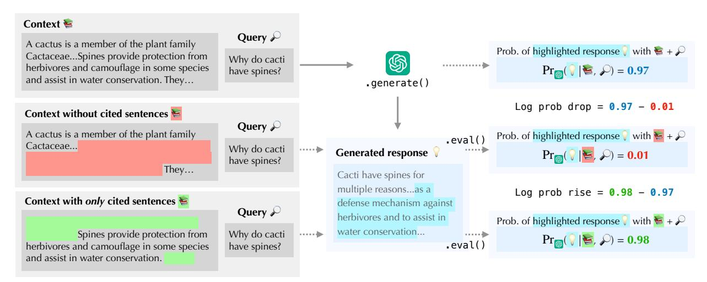

# SelfCite: Self-Supervised Alignment of Context Attribution in Large Language Models

Yung-Sung Chuang2,<sup>∗</sup> , Benjamin Cohen-Wang<sup>2</sup> , Zhaofeng Wu<sup>2</sup> , Shannon Shen<sup>2</sup> , Hu Xu<sup>1</sup> , Xi Victoria Lin<sup>1</sup> , Shang-Wen Li<sup>1</sup> , Jim Glass<sup>2</sup> , Wen-tau Yih<sup>1</sup>

We introduce SelfCite, a novel self-supervised approach that aligns LLMs to generate high-quality, fine-grained, sentence-level citations for the statements in their generated responses. Instead of only relying on costly and labor-intensive human annotations, SelfCite leverages a reward signal provided by the LLM itself through context ablation: If a citation is necessary, removing it should prevent the same response; if sufficient, retaining citations alone should preserve the same response. With this reward, a best-of-N sampling strategy improves citation quality significantly, where the gain can be preserved by internalizing the behavior through preference optimization fine-tuning to eliminate the additional inference-time computation. The effectiveness of SelfCite is demonstrated through significant gains in citation correctness, achieving a 7.3 F1 increase on the LongBench-Cite benchmark across five long-form question answering tasks.

Date: January 17, 2025

Correspondence: Yung-Sung Chuang at [yungsung@mit.edu](mailto:yungsung@mit.edu), Scott Yih at [scottyih@meta.com](mailto:scottyih@meta.com)


# 1 Introduction

Large language models (LLMs) have revolutionized numerous natural language processing (NLP) applications, demonstrating remarkable capabilities in areas such as conversational agents, question-answering, and complex reasoning. However, a persistent challenge that hampers their reliability is their tendency to generate hallucinations—plausible-sounding but factually incorrect or unverified information [\(Ji et al.,](#page-9-0) [2023\)](#page-9-0). Although completely eliminating these hallucinations remains difficult, existing approaches have sought to enhance the reliability of LLM outputs by providing context attribution, i.e. fine-grained citations, alongside generated responses to facilitate user verification [\(Menick et al.,](#page-9-1) [2022;](#page-9-1) [Zhang et al.,](#page-10-0) [2024;](#page-10-0) [Cohen-Wang et al.,](#page-9-2) [2024\)](#page-9-2). While these methods are effective to some extent, they largely depend on annotated supervised fine-tuning (SFT) data or human-in-the-loop feedback to train models to generate accurate citations. This reliance on human annotation can be both time-consuming and costly, particularly when dealing with long-context documents.

In this context, we introduce SelfCite, a novel alignment approach designed to autonomously enhance the quality of citations generated by LLMs without the need for any human intervention in the alignment process. SelfCite leverages the inherent capabilities of LLMs to provide feedback through context ablation—a process where the removal of a citation should prevent the LLM from assigning high probabilities to the same response, thereby determining its necessity. Conversely, if the response remains at high probabilities despite the removal of all context other than the citation, it indicates that the citation is sufficient to support the claim. This self-evaluation mechanism enables SelfCite to calculate a reward signal without relying on human annotations, significantly eliminating the dependency on labor-intensive processes.

Building on this concept, we design a reward that can be cheaply computed via two forward passes of the LLM itself, composed by log probability drop and log probability rise. By integrating this reward function into a best-of-N sampling strategy, SelfCite achieves substantial improvements in citation quality, enhancing the state of the art on the LongBench-Cite benchmark [\(Zhang et al.,](#page-10-0) [2024\)](#page-10-0) by 6 points in F1 scores. Furthermore, we employ this reward for preference optimization using SimPO [\(Meng et al.,](#page-9-3) [2024\)](#page-9-3), which not only maintains these improvements but also eliminates the need for the computationally expensive best-of-N sampling. Our

<sup>1</sup>Meta FAIR, <sup>2</sup>Massachusetts Institute of Technology

<sup>∗</sup>Work done at Meta

results demonstrate that SelfCite effectively enables LLMs to generate more accurate citations, thereby reducing the effort required for users to verify the generated content.



Figure 1 The SelfCite framework calculates rewards based on two metrics: log probability drop and log probability rise. First, the full context is used to generate a response. Then, the framework evaluates the probability of generating the same response after (1) removing the cited sentences from the context and (2) using only the cited sentences in the context. The log probability drop and rise are computed from these probabilities, and their sum is used as the reward.

### 2 Method

In this section, we introduce the SelfCite framework, which enhances context attribution in large language models (LLMs) through self-supervised preference optimization. We divide the methodology into four key components: problem formulation, reward computation via context ablation, best-of-N sampling, and preference optimization.

### 2.1 Problem Formulation

We formalize the task of context attribution and define the metrics for evaluating context attribution methods within the SelfCite framework, inspired by previous papers (Zhang et al., 2024; Cohen-Wang et al., 2024) but adapts them to our novel approach of self-supervised rewards.

Setup. Consider employing an autoregressive language model to generate a response to a specific query given a contextual input. Specifically, let p denote the language model distribution over the next token  $t_i$  based on a sequence of preceding tokens,  $p(t_i \mid t_1, \ldots, t_{i-1})$ .

Let C represent the context in the input prompt, which is partitioned into |C| sentences:  $c_1, c_2, \ldots, c_{|C|}$ . Each sentence  $c_j$  is prepended with a unique identifier (e.g. sentence index j) to facilitate easy citation by the model. A query Q, consisting of a question or instruction, follows a context C to prompt the language model to generate a response R, which is composed of |R| sentences:  $r_1, r_2, \ldots, r_{|R|}$ .

Generate Responses with Citations. In SelfCite, following the LongCite setting (Zhang et al., 2024), each sentence in the response R is followed by a short citation sequence  $e_i$ , which contains a set of sentence identifiers (e.g. sentence index) in the context C that support the generation of  $r_i$ . Formally, for each response sentence  $r_i$ , the model outputs a citation sequence  $e_i = \{e_i^1, e_i^2, \dots, e_i^m\}$ , where each  $e_i^j \in \{1, 2, \dots, |C|\}$  corresponds to a specific sentence number in the context C.

Formally, the generation of a response sentence  $r_i$  and its corresponding citations  $e_i$  are shown as follows:

$$r_i \sim p\left(\cdot \mid c_1, \dots, c_{|C|}, Q, r_1, e_1, \dots, r_{i-1}, e_{i-1}\right),$$
  
 $e_i \sim p\left(\cdot \mid c_1, \dots, c_{|C|}, Q, r_1, e_1, \dots, r_{i-1}, e_{i-1}, r_i\right).$ 

We follow the post-hoc setting of Cohen-Wang et al. (2024); Zhang et al. (2024) to generate citation after the response sentence is determined.

The objective of optimizing the language model is to ensure that the citation sequence  $e_i$  accurately reflects the evidence from the context that supports the generation of  $r_i$ . In the SFT setting, the probability of a "ground truth" annotated responses and citations  $\{\hat{r}_1, \hat{e}_1, ..., \hat{r}_{|R|}, \hat{e}_{|R|}\}$  will be maximized, but it is not trivial to do further alignment with feedback after the SFT data is used up. To achieve this, we introduce a self-supervised mechanism that evaluates the quality of these citations based on context ablation as a reward for further preference optimization.

### 2.2 Self-Supervised Reward via Context Ablation.

We operationalize the quality of a citation sequence  $e_i$  by the changes in the language model's probability of generating  $r_i$  when the cited sentences are either removed from or isolated within the context. To simplify the notation, let all the cited context sentences be  $E_i = \{c_{e_i^1}, c_{e_i^2}, \ldots, c_{e_i^m}\}$ . We define two key metrics: probability drop and probability keep, and finally combine them into the final reward.

Probability Drop. This metric quantifies the decrease in the probability of generating  $r_i$  when the cited sentences in  $e_i$  are all removed from the context (denoted as set minus \ operator). Formally, it is defined as:

$$Prob-Drop(e_i) = \log p(r_i \mid C) - \log p(r_i \mid C \setminus E_i).$$

To keep the equation concise, we ignore Q and  $\{r_1, e_1, ..., r_{i-1}, e_{i-1}\}$  in the equation, but they are staying in the context history when computing the log probabilities.

A larger probability drop indicates that the removal of  $E_i$  significantly diminishes the likelihood of generating  $r_i$ , thereby validating the necessity of the cited evidence.

Probability Keep. Conversely, this metric measures if the probability of generating  $r_i$  is still kept large when only the cited sentences are kept in the context, effectively testing the sufficiency of the citation to support the response statement. Formally:

$$Prob-Keep(e_i) = \log p(r_i \mid E_i) - \log p(r_i \mid C),$$

A larger value of probability keep indicates that the cited sentences alone are sufficient to support the generation of  $r_i$ , while removing all the other irrelevant context. Please note that the values of probability drop or keep can be either positive or negative. For example, if the citation is incorrect, it is possible for  $p(r_i \mid E_i)$  to be lower than  $p(r_i \mid C)$ . Despite this, we retain the term "keep" (or "drop") for consistency in the formulation.

Final Reward. To comprehensively evaluate the necessity and sufficiency of the generated citations, we combine the two metrics by adding them together:

<span id="page-2-0"></span>
$$Reward(e_i) = \log p(r_i|E_i) - \log p(r_i|C - E_i). \tag{1}$$

<span id="page-2-1"></span>The combined reward measures if the citations are both necessary and sufficient for generating the response  $r_i$ .

### 2.3 Best-of-N Sampling

To leverage the self-supervised reward computed via context ablation, we employ a best-of-N sampling strategy. After generating the full response, we locate the position where the citation tags <cite>...</cite> are generated. Within the citation tags, we sample N candidate citation sequences and select the citation set that maximizes the combined reward metric, Eq. (1). The corresponding procedure is shown in Algorithm 1. After obtaining the selected citations  $\{e_1^*, \ldots, e_{|R|}^*\}$ , we replace the original citation sequence  $e_i$  with the optimal citation set  $e_i^*$  for the response sentence  $r_i$ , while keeping the response text

$$\{r_1, \ldots, r_{|R|}\}$$

<span id="page-2-2"></span>unchanged. This process is repeated for each sentence in the response R to obtain the final, citation-improved response  $R^*$ .

#### <span id="page-3-0"></span>Algorithm 1 Best-of-N Sampling for Citations

```
Require: LM p, context C, query Q, response R, number of candidates N for r_i \in R do for n=1,\ldots,N do e_i^{(n)} \sim p(\cdot \mid r_i,C,Q) \operatorname{reward}(e_i^{(n)}) = \log p\big(r_i \mid E_i^{(n)}\big) - \log p\big(r_i \mid C \setminus E_i^{(n)}\big) end for e_i^* = \operatorname{arg\,max}_n \,\operatorname{reward}(e_i^{(n)}) end for \operatorname{return} \, \{e_1^*,\ldots,e_{|R|}^*\}
```

#### 2.4 Preference Optimization

Best-of-N sampling is straightforward to obtain better citations, but at the additional inference cost of generating candidates and performing reranking. Thus, we try to internalize the ability of generating better citations back to the language model itself.

Given documents and queries, we can prompt the language model to generate the responses along with the citations  $\{r_1, e_1, ..., r_{|R|}, e_{|R|}\}$ . By further applying best-of-N sampling, we can obtain new responses of the same statements but with better citations  $\{r_1, e_1^*, ..., r_{|R|}, e_{|R|}^*\}$ . Instead of using DPO (Rafailov et al., 2024), we use SimPO (Meng et al., 2024) to align the model based on the preference between the original and improved citations, as SimPO does not require a reference model and allows better memory utilization for long-context fine-tuning. Through this self-supervised process, which does not require ground-truth answers or human annotations, the model learns to generate more accurate and contextually grounded citations on its own.

# 3 Experiments

#### 3.1 Model Details

We use the LLaMA-3.1-8B model (Dubey et al., 2024) fine-tuned on LongCite-45K SFT data (Zhang et al., 2024) as the start point for both best-of-N sampling and preference optimization. We adopt the same text segmentation strategy from Zhang et al. (2024): each document is split into individual sentences, and each sentence is prepended with a unique identifier in  $C_{i}$  format. These identifiers serve as the *citation indices*, enabling the model to cite relevant context right after the statements with the format of  $s_{i}$  and  $s_{i}$  indices, enabling the model to cite relevant context right after the statements with the format of  $s_{i}$  and  $s_{i}$  indices, enabling the model to cite a single sentence (e.g.  $s_{i}$  in  $s_{i}$  or a span (e.g.  $s_{i}$  in  $s_{i}$  in  $s_{i}$  in  $s_{i}$  in  $s_{i}$  in  $s_{i}$  in  $s_{i}$  in  $s_{i}$  in  $s_{i}$  in  $s_{i}$  in  $s_{i}$  in  $s_{i}$  in  $s_{i}$  in  $s_{i}$  in  $s_{i}$  in  $s_{i}$  in  $s_{i}$  in  $s_{i}$  in  $s_{i}$  in  $s_{i}$  in  $s_{i}$  in  $s_{i}$  in  $s_{i}$  in  $s_{i}$  in  $s_{i}$  in  $s_{i}$  in  $s_{i}$  in  $s_{i}$  in  $s_{i}$  in  $s_{i}$  in  $s_{i}$  in  $s_{i}$  in  $s_{i}$  in  $s_{i}$  in  $s_{i}$  in  $s_{i}$  in  $s_{i}$  in  $s_{i}$  in  $s_{i}$  in  $s_{i}$  in  $s_{i}$  in  $s_{i}$  in  $s_{i}$  in  $s_{i}$  in  $s_{i}$  in  $s_{i}$  in  $s_{i}$  in  $s_{i}$  in  $s_{i}$  in  $s_{i}$  in  $s_{i}$  in  $s_{i}$  in  $s_{i}$  in  $s_{i}$  in  $s_{i}$  in  $s_{i}$  in  $s_{i}$  in  $s_{i}$  in  $s_{i}$  in  $s_{i}$  in  $s_{i}$  in  $s_{i}$  in  $s_{i}$  in  $s_{i}$  in  $s_{i}$  in  $s_{i}$  in  $s_{i}$  in  $s_{i}$  in  $s_{i}$  in  $s_{i}$  in  $s_{i}$  in  $s_{i}$  in  $s_{i}$  in  $s_{i}$  in  $s_{i}$  in  $s_{i}$  in  $s_{i}$  in  $s_{i}$  in  $s_{i}$  in  $s_{i}$  in  $s_{i}$  in  $s_{i}$  in  $s_{i}$  in  $s_{i}$  in  $s_{i}$  in  $s_{i}$  in  $s_{i}$  in  $s_{i}$  in  $s_{i}$  in  $s_{i}$  in  $s_{i}$  in  $s_{i}$  in  $s_{i}$  in  $s_{i}$  in  $s_{i}$  in  $s_{i}$  in  $s_{i}$  in  $s_{i}$  in  $s_{i}$  in  $s_{i}$  in  $s_{i}$  in  $s_{i}$  in  $s_{i}$  in  $s_{i}$  in  $s_{i}$  in  $s_{i}$  in  $s_{i}$  in  $s_{i}$  in  $s_{i}$  in  $s_{i}$  in  $s_{i}$  in  $s_{i}$  in  $s_{i}$  in  $s_{i}$  in  $s_{i}$  in  $s_{i}$  in  $s_{i}$  in  $s_$ 

### <span id="page-3-1"></span>3.2 Preference Optimization

LongCite-45K. For best-of-N sampling (Section 2.3), there is no required training process, so no training data is used. On the other hand, for preference optimization with SimPO (Section 2.4), we simply use the LongCite-45K data from Zhang et al. (2024) as the training set. However, we do not use the ground-truth responses from LongCite-45K that contain high-quality citations for SFT. Instead, we take the documents and queries, generate responses with the model, and apply best-of-N sampling to obtain stronger citations. These results then form the preference dataset.

Data Construction. In the SimPO experiments, we use 2K document—question pairs from LongCite-45K. Because best-of-N responses often contain slightly longer citations, we found that directly applying SimPO finetuning on them versus the original responses can lead the model to learn a shortcut of simply producing longer citations, rather than improving citation quality. To avoid this shortcut, whenever an original response

<span id="page-4-0"></span>

| Model                    |              | bench-       |              |              | ltifield     | •    |              | otpotC | -    | 1            | uread |      |              | ovRep |             | Avg.         | Citation   |
|--------------------------|--------------|--------------|--------------|--------------|--------------|------|--------------|--------|------|--------------|-------|------|--------------|-------|-------------|--------------|------------|
|                          | R            | Р            | F1           | R            | Р            | F1   | R            | Р      | F1   | R            | Р     | F1   | R            | Р     | F1          | F1           | Length     |
| Proprietary models       |              |              |              |              |              |      |              |        |      |              |       |      |              |       |             |              |            |
| GPT-40                   | 46.7         | 53.5         | 46.7         | 79.0         | 87.9         | 80.6 | 55.7         | 62.3   | 53.4 | 65.6         | 74.2  | 67.4 | 73.4         | 90.4  | 79.8        | 65.6         | 220        |
| Claude-3-sonnet          | 52.0         | 67.8         | 55.1         | 64.7         | 85.8         | 71.3 | 46.4         | 65.8   | 49.9 | 67.7         | 89.2  | 75.5 | <u>7</u> 7.4 | 93.9  | 84.1        | 67.2         | 132        |
| GLM-4                    | 47.6         | 53.9         | 47.1         | 72.3         | 80.1         | 73.6 | 47.0         | 50.1   | 44.4 | 73.4         | 82.3  | 75.0 | 82.8         | 93.4  | <u>87.1</u> | 65.4         | 169        |
| Open-source models       |              |              |              |              |              |      |              |        |      |              |       |      |              |       |             |              |            |
| GLM-4-9B-chat            | 25.9         | 20.5         | 16.7         | 51.1         | 60.6         | 52.0 | 22.9         | 28.8   | 20.1 | 45.4         | 48.3  | 40.9 | 5.7          | 8.2   | 6.3         | 27.2         | 96         |
| Llama-3.1-8B-Instruct    | 14.1         | 19.5         | 12.4         | 29.8         | 44.3         | 31.6 | 20.2         | 30.9   | 20.9 | 22.0         | 25.1  | 17.0 | 16.2         | 25.3  | 16.8        | 19.7         | 100        |
| Llama-3.1-70B-Instruct   | 25.8         | 32.0         | 23.2         | 53.2         | 65.2         | 53.9 | 29.6         | 37.3   | 28.6 | 38.2         | 46.0  | 35.4 | 53.4         | 77.5  | 60.7        | 40.4         | 174        |
| Mistral-Large-Instruct   | 19.8         | 23.9         | 19.0         | 71.8         | 80.7         | 73.8 | 34.5         | 40.9   | 32.1 | 58.3         | 67.0  | 60.1 | 67.9         | 79.6  | 72.5        | 51.5         | 132        |
| Fine-tuned models        |              |              |              |              |              |      |              |        |      |              |       |      |              |       |             |              |            |
| LongCite-9B              | <u>5</u> 7.6 | <u>7</u> 8.1 | <u>6</u> 3.6 | 67.3         | <u>9</u> 1.0 | 74.8 | 61.8         | 78.8   | 64.8 | 67.6         | 89.2  | 74.4 | 63.4         | 76.5  | 68.2        | <u>6</u> 9.2 | <u>9</u> 1 |
| LongCite-8B              | 62.0         | 79.7         | 67.4         | <u>7</u> 4.7 | 93.0         | 80.8 | <u>5</u> 9.2 | 72.1   | 60.3 | <u>6</u> 8.3 | 85.6  | 73.1 | 74.0         | 86.6  | 78.5        | 72.0         | 85         |
| Ours                     |              |              |              |              |              |      |              |        |      |              |       |      |              |       |             |              |            |
| LongCite-8B (Our repro.) | 67.0         | 78.1         | 66.6         | 74.8         | 90.7         | 79.9 | 60.8         | 77.9   | 64.1 | 67.1         | 87.2  | 73.7 | 81.6         | 89.3  | 84.5        | 73.8         | 104.9      |
| + BoN                    | 69.5         | 82.8         | 72.7         | 75.4         | 93.2         | 80.7 | 67.9         | 79.3   | 68.1 | 70.9         | 90.4  | 76.9 | 89.8         | 93.3  | 90.9        | 77.9         | 133.4      |
| + SimPO                  | 68.1         | 79.5         | 69.1         | 75.5         | 92.6         | 81.0 | 69.4         | 82.3   | 71.5 | 72.7         | 91.6  | 78.9 | 86.4         | 92.9  | 89.1        | 77.9         | 115.0      |
| + SimPO $+$ BoN          | 77.1         | 80.7         | 75.8         | 78.0         | 93.6         | 83.4 | 72.0         | 82.7   | 72.9 | 75.4         | 92.6  | 81.5 | 90.5         | 94.5  | 92.1        | 81.1         | 137.5      |

**Table 1** Citation recall (R), citation precision (P), citation F1 (F1), and citation length of different models on LongBench-Cite benchmark, with the previous results from (Zhang et al., 2024). The best of our results are bolded. The best of previous state-of-the-art results are underlined.

has a shorter citation length compared to the best-of-N response, we insert random citations of nearby sentences. This encourages the model to focus on *where* to cite rather than simply citing *more*. We call this method length balancing, with the details described in Appendix ?? and the ablation study shown in Section 4.2.

#### 3.3 Evaluation

Benchmark. We evaluate our approach on LongBench-Cite (Zhang et al., 2024), a comprehensive benchmark specifically designed for  $long-context\ QA$  with citations (LQAC). Given a long context C and a query Q, the model must produce a multi-statement answer, where each statement cites the relevant supporting sentences in C. Unlike chunk-level citation schemes (Gao et al., 2023) where a short paragraph will be cited, LongBench-Cite adopts sentence-level citations to ensure semantic integrity and finer-grained evidence tracking. LongBench-Cite assesses two main aspects:

- Citation Quality: Whether each statement is fully supported by relevant and *only* relevant sentences. This is measured by GPT-40 for *citation recall* (whether a statement is fully or partially supported by the cited text) and *citation precision* (whether each of the cited text actually supports the statement). These are combined into a final *citation F1* score. Additionally, the *average citation length* is tracked to encourage fine-grained citations rather than citing unnecessarily long passages.
- Correctness: How accurately and comprehensively the response answers the query, disregards the citations. This is scored by GPT-40 in a zero-/few-shot fashion based on the query and reference answers.

Baseline

#### 3.4 Main Results

Citation Quality. Table 1 presents our main results. Our best-of-N sampling (BoN) strategy consistently boosts both citation recall and citation precision across tasks, ultimately increasing the overall F1 score by 4.1 points, from 73.8 to 77.9. When we use SimPO to internalize the performance gains from BoN—thereby avoiding the time-consuming BoN decoding process—the model achieves a similar level of improvement, with the final overall F1 score of 77.9 as well. Finally, we apply the BoN sampling strategy again to the SimPO fine-tuned model and achieve the highest scores on all datasets, indicating that there is still room for further improvement.

<span id="page-5-2"></span>

|                          | Avg  |      | LongBench-Chat |      | MultifieldQA |      | HotpotQA |      | Dureader |      | GovReport |      |
|--------------------------|------|------|----------------|------|--------------|------|----------|------|----------|------|-----------|------|
| Model                    | C    | CLQA | C              | CLQA | C            | CLQA | C        | CLQA | C        | CLQA | C         | CLQA |
| Best Proprietary Model   |      |      |                |      |              |      |          |      |          |      |           |      |
| Claude-3-sonnet          | 77.6 | 78.3 | 73.8           | 77.8 | 88.6         | 88.1 | 81.3     | 75.3 | 75.8     | 80.3 | 68.4      | 70.1 |
| Best Open-source Model   |      |      |                |      |              |      |          |      |          |      |           |      |
| Mistral-Large-Instruct   | 73.6 | 76.4 | 63.8           | 67.8 | 88.0         | 85.3 | 77.0     | 77.3 | 79.0     | 83.3 | 60.4      | 68.3 |
| Finetuned Models         |      |      |                |      |              |      |          |      |          |      |           |      |
| LongCite-8B              | 71.7 | 67.6 | 69.0           | 68.6 | 87.0         | 83.6 | 70.8     | 69.0 | 68.5     | 62.3 | 63.0      | 54.4 |
| LongCite-9B              | 70.4 | 65.6 | 67.6           | 64.6 | 84.1         | 83.3 | 71.8     | 67.5 | 69.0     | 66.3 | 59.6      | 46.4 |
| Our Models               |      |      |                |      |              |      |          |      |          |      |           |      |
| LongCite-8B (Our repro.) | 69.6 | 62.4 | 67.6           | 63.6 | 86.7         | 79.9 | 69.3     | 63.0 | 64.0     | 56.0 | 60.4      | 49.5 |
| + SimPO                  | 69.8 | 65.0 | 67.4           | 64.8 | 86.7         | 84.0 | 67.5     | 67.5 | 66.0     | 59.8 | 61.3      | 48.8 |

Table 2 Correctness (C) in LQAC vs. correctness (CLQA) in standard long-context QA.

Regarding the citation lengths, BoN slightly increases the average length from 104.9 to 133.4 tokens. We believe this increase is not unnecessary because BoN improves not only citation recall but also citation precision. In the ablation study of Section [4.1,](#page-5-1) we also show that always selecting the longest citations with BoN only improves citation recall, while leading to significantly decrease on citation precision. After we apply SimPO finetuning, the model achieves the same level of citation F1 but with a shorter average citation length of 115.0 tokens. This result indicates that the model does not simply learn the length bias from BoN but instead genuinely improves its citation quality.

Correctness. For best-of-N sampling, only the citation parts are modified, so the correctness of it will be the same as the original LongCite-8B model. For the SimPO finetuned model, we test its response correctness by the same evaluation in [\(Zhang et al.,](#page-10-0) [2024\)](#page-10-0), which contains two settings. LQAC: generate response with citations, remove the citation parts and evaluate the response correctness by GPT-4o. LQA: prompt the model to generate answer directly without citations and evaluated by GPT-4o. Their performance is shown in Table [2](#page-5-2) as columns of C and CLQA, respectively. We can observe that the SimPO finetuning does not change the correctness of the LongCite model much, resulting in similar levels of C and CLQA.

# 4 Analysis

### <span id="page-5-1"></span>4.1 Ablation Study on Rewards

To gain deeper insights into the design of our final reward, we experiment with various reward strategies in the BoN sampling process. In the experiment here, all the BoN candidates are pre-generated and fixed, so the only factor influencing the results is the reward itself. We present our ablation results on HotpotQA in Table [3,](#page-6-0) and compute the citation lengths across all datasets in LongBench-Cite so that they are directly comparable with those in Table [1.](#page-4-0)

<span id="page-5-0"></span>We test four different reward designs in addition to our final one. BoN by LM log prob re-ranks candidates simply by the log probability of the citation string, <cite>[i<sup>1</sup> −i2][i<sup>3</sup> −i4]...</cite>, which is similar to beam search but less costly. We observe that this strategy slightly boosts recall while reducing precision, resulting in a minor reduction in F1. BoN by citation length always selects the candidates with the longest citations, i.e., citing the greatest number of sentences. Although it substantially improves recall, it significantly reduces precision from 77.9 to 73.6 and inflates the citation length from 104.9 to 151.4. By contrast, both BoN by log prob drop and BoN by log prob rise improve recall without sacrificing precision. Notably, log prob drop yields better precision, while log prob rise attains higher recall–—likely because they are capturing the notions of necessity and sufficiency in the citations, respectively. Finally, when we combine both log prob drop and log prob rise as our final reward, we achieve the best outcome, increasing both recall and precision and realizing a 4-point improvement in F1.

<span id="page-6-0"></span>

|                                          |      | HotpotQA |      | Citation |  |  |  |
|------------------------------------------|------|----------|------|----------|--|--|--|
| Model                                    | R    | P        | F1   | Length   |  |  |  |
| Decoding Methods                         |      |          |      |          |  |  |  |
| LongCite-8B (Our repro.)                 | 60.8 | 77.9     | 64.1 | 104.9    |  |  |  |
| + BoN by LM log prob                     | 62.7 | 75.5     | 63.4 | 83.8     |  |  |  |
| + BoN by citation length                 | 66.5 | 73.6     | 65.1 | 151.4    |  |  |  |
| + BoN by log prob drop                   | 65.5 | 78.8     | 67.3 | 130.5    |  |  |  |
| + BoN by log prob rise                   | 66.8 | 77.7     | 67.1 | 128.9    |  |  |  |
| + BoN by final reward                    | 67.9 | 79.3     | 68.1 | 133.4    |  |  |  |
| Fine-tuning Methods                      |      |          |      |          |  |  |  |
| LongCite-8B (Our repro.)                 | 60.8 | 77.9     | 64.1 | 104.9    |  |  |  |
| + SimPO                                  | 69.4 | 82.3     | 71.5 | 115.0    |  |  |  |
| + SimPO + BoN                            | 72.0 | 82.7     | 72.9 | 137.5    |  |  |  |
| + SimPO w/ or w/o length balancing       |      |          |      |          |  |  |  |
| w/ length balancing                      | 69.4 | 82.3     | 71.5 | 115.0    |  |  |  |
| w/o length balancing                     | 64.4 | 62.9     | 60.5 | 172.0    |  |  |  |
| + SimPO w/ varying data sizes            |      |          |      |          |  |  |  |
| 1K examples                              | 62.5 | 78.9     | 65.7 | 99.1     |  |  |  |
| 2K examples                              | 69.4 | 82.3     | 71.5 | 115.0    |  |  |  |
| 4K examples                              | 68.5 | 80.4     | 70.3 | 146.1    |  |  |  |
| 8K examples                              | 63.6 | 75.3     | 64.4 | 213.5    |  |  |  |
| + SFT on BoN responses                   | 68.8 | 77.3     | 68.4 | 108.9    |  |  |  |
| + SimPO by denoising perturbed citations |      |          |      |          |  |  |  |
| On original responses                    | 40.5 | 50.5     | 41.6 | 98.4     |  |  |  |
| On BoN responses                         | 42.6 | 50.7     | 42.3 | 87.7     |  |  |  |

Table 3 Ablation study on HotpotQA (R, P, F1) and citation length for our models.

### 4.2 Citation Length Balance

As we mentioned in Section [3.2,](#page-3-1) BoN selects slightly longer citations, so if we do SimPO training directly on that BoN prefered data, it is easy for the model to just pick up the shortcut of generating longer citations without improving the quality. As a result, we apply length balancing, i.e. injecting random citations to the examples where that length bias exists and ensure the number of cited sentences are the same. We show in Table [3](#page-6-0) (see rows "w/ length balancing" vs. "w/o length balancing") that length balancing plays a crucial role in preventing runaway citation lengths. When length balancing is omitted, the model becomes biased to produce much longer citations (average citation length of 172.0), at the cost of lowered overall precision (62.9) and F1 (60.5). In contrast, when length balancing is enabled, the model is able to maintain high precision (82.3) and recall (69.4), thereby achieving a higher F1 of 71.5, while keeping the average citation length (115.0) at a more controlled level. These findings confirm the importance of length balancing in helping the model avoid shortcuts and truly learn to cite accurately.

### 4.3 Training Size of SimPO

We also explore how different amounts of SimPO training data affect the citation quality. In the previous study (?), 1K examples are enough to achieve good performance in aligning user preferences. In Table [3,](#page-6-0) we show the result of using 1K to 8K examples for SimPO. We notice that using 1K examples already yields an moderate improvement on F1 from 64.1 to 65.7 compared to the original model, as well as both recall and precision. 2K examples further boost the F1 score to 71.5, while 4K examples seems yielding sturated improvement. We also found that 8K examples will decrease the performance and lead to a much longer citation length of 213.5. We conjecture that it is probably due to the fact that SimPO (or DPO [\(Rafailov](#page-9-4) [et al.,](#page-9-4) [2024\)](#page-9-4)) is a off-policy algorithm. After being trained on 8K examples, the model's output distribution is already a lot different from the distribution of the collected training data, especially due to its lack of explicit KL regularization. Further finetuning the model using the same collected data may not improve the citation

<span id="page-7-0"></span>

| Sent.<br>ID | Context Sentences (irrelevant sentences are not included)                                                                                                                                                  |  |  |  |  |  |  |  |
|-------------|------------------------------------------------------------------------------------------------------------------------------------------------------------------------------------------------------------|--|--|--|--|--|--|--|
| 302         | In general, consumer advocates believe that any comprehensive federal privacy policy should complement,                                                                                                    |  |  |  |  |  |  |  |
|             | and not supplant, sector-specific<br>privacy legislation or state-level legislation.                                                                                                                       |  |  |  |  |  |  |  |
| 303         | Finding a global consensus on how to balance open data flows and privacy protection may be key to                                                                                                          |  |  |  |  |  |  |  |
|             | maintaining trust in the digital environment and advancing international trade.                                                                                                                            |  |  |  |  |  |  |  |
| 304         | One study found that over 120 countries have laws related to personal data protection.                                                                                                                     |  |  |  |  |  |  |  |
| 305         | Divergent national privacy approaches raise the costs of doing business and make it harder for governments<br>to collaborate and share data, whether for scientific research, defense, or law enforcement. |  |  |  |  |  |  |  |
| 306         | A system for global interoperability<br>in a least trade-restrictive and nondiscriminatory way between                                                                                                     |  |  |  |  |  |  |  |
|             | different national<br>systems<br>could help minimize costs and allow entities in different jurisdictions with                                                                                              |  |  |  |  |  |  |  |
|             | varying online<br>privacy regimes to share data via cross-border data flows.                                                                                                                               |  |  |  |  |  |  |  |
| Query       | Please write a one-page summary of the above government report.                                                                                                                                            |  |  |  |  |  |  |  |
|             |                                                                                                                                                                                                            |  |  |  |  |  |  |  |

#### Response (only show the final statement due to limited space)

The report concludes by noting that finding a global consensus on how to balance open data flows and privacy protection may be key to maintaining trust in the digital environment and advancing international trade. The report suggests that Congress may consider comprehensive privacy legislation and examine the potential challenges and implications of building a system of interoperability between different national privacy regimes.

Baseline Citations: <cite> [303-303] [305-306] </cite> (missing: 302) Best-of-N Citations: <cite> [302-303] [306-306] </cite>

Table 4 Qualitative study to show the differences in the citation generated by baseline vs BoN. Related information are highlighted in green and blue in the context and the response, respectively.

quality but instead overfits to the reward.

### 4.4 SimPO vs. SFT on Best-of-N responses

We also show the effect of applying standard supervised fine-tuning (SFT) on the responses selected by best-of-N sampling, which is a simplified alternative of preference optimization. As the result shown in the last row in Table [3,](#page-6-0) SFT also improves the F1 score from 64.1 to 68.1, but it still falls behind 71.5 of SimPO. This result confirms that it is necessary to train the model via SimPO with preference data, which enables the model to distinguish the differences between bad and good citations, and thus improve the citation quality.

### 4.5 Off-policy Denoising Perturbed Citations

In an alternative attempt to refine citation spans using SimPO on BoN responses, we experimented with a purely off-policy approach. Concretely, given a model-generated response, we randomly shifted (perturbed) its citation spans to produce a set of "synthetically corrupted" variants. We then constructed SimPO training pairs where the original model-generated citation is preferred over the randomly shifted one, thereby prompting the model to "denoise" citations by restoring them to their original spans. However, as shown in Table [3](#page-6-0) (rows under "SimPO by Denoising Perturbed Citations"), this purely off-policy scheme notably degrades performance—even when applied to both the original responses and the best-of-N responses. We hypothesize that, because these random shifts do not reflect errors that the model would naturally make, the training signal is misaligned with the model's own error distribution and thus not very helpful.

### 4.6 Qualitative Study

Finally, let us look at an example that requires citing multiple context sentences to support a complex response. As shown in Table [4,](#page-7-0) the response contains mixed information from sentences 302, 303, and 306. The baseline (direct sampling from LongCite-8B) ignores the evidence 302 while includes 305, which is not directly supporting the response. In contrast, the best-of-N sampling sucessfully recovers 302 while excluding 305, showing the effectiveness of our reward design.

# 5 Related Work

Citations for Language Models. Recent work has explored a variety of methods to teach large language models to generate citations or attributions for their answers [\(Nakano et al.,](#page-9-8) [2021;](#page-9-8) [Gao et al.,](#page-9-9) [2022;](#page-9-9) [Menick](#page-9-1) [et al.,](#page-9-1) [2022;](#page-9-1) [Thoppilan et al.,](#page-9-10) [2022;](#page-9-10) [Gao et al.,](#page-9-7) [2023;](#page-9-7) [Chen et al.,](#page-9-11) [2023;](#page-9-11) [Ye et al.,](#page-10-1) [2024\)](#page-10-1). In one of the earliest approaches, [Menick et al.](#page-9-1) [\(2022\)](#page-9-1) fine-tune language models to explicitly include relevant retrieved documents in their answers. More recent prompting-based strategies [\(Gao et al.,](#page-9-7) [2023\)](#page-9-7) use in-context exemplars to guide models to cite relevant snippets. Meanwhile, post-hoc methods attribute existing responses to external evidence via a separate attribution model [\(Gao et al.,](#page-9-9) [2022;](#page-9-9) [Chen et al.,](#page-9-11) [2023\)](#page-9-11). Despite their differences in training methodology, these approaches often frame citations as corroborative [\(Worledge et al.,](#page-9-12) [2023\)](#page-9-12), where the primary goal is to show that the cited content supports the response.

SelfCite draws on the idea that citations not only serve as supportive evidence but can also be viewed as the causal source for each statement. This perspective aligns with the contributive notion of context attribution [\(Cohen-Wang et al.,](#page-9-2) [2024\)](#page-9-2), which aims to identify which parts of the source text cause the model to generate a particular claim. Unlike previous approaches that often rely on annotated supervised fine-tuning (SFT) data or human-in-the-loop feedback to refine citations, SelfCite introduces a self-supervised reward that depends on the model's own forward passes with context ablation.

Self-Supervised Fine-Tuning and Reward Modeling. Another relevant area is self-supervised or weakly supervised approaches that bypass costly human labels. In recent works, reward modeling and preference optimization have typically been powered by explicit human feedback [\(Ouyang et al.,](#page-9-13) [2022;](#page-9-13) [Bai et al.,](#page-9-14) [2022\)](#page-9-14), AI feedback [\(Lee et al.,](#page-9-15) [2024\)](#page-9-15), or by curating high-quality data for supervised fine-tuning [\(Peng et al.,](#page-9-16) [2023;](#page-9-16) [Zhou et al.,](#page-10-2) [2023\)](#page-10-2). In contrast, SelfCite's self-supervised reward follows from computing simple log probability differences under context ablation, eliminating the need for additional labelers or reference models. Our method is readily integrated into best-of-N sampling (by re-ranking candidate citations) and preference optimization (via SimPO [\(Meng et al.,](#page-9-3) [2024\)](#page-9-3)), demonstrating consistent improvements in citation accuracy without requiring carefully curated human feedback.

# 6 Conclusion

In this work, we introduced SelfCite, a self-supervised framework that aligns large language models to generate more accurate, fine-grained citations by directly leveraging their own probabilities for necessity and sufficiency rewards through context ablation. With best-of-N sampling and preference optimization, SelfCite significantly improves citation correctness on the LongBench-Cite benchmark without requiring human annotation, offering a promising self-improving direction towards verifiable and trustworthy large language models.

# References

- <span id="page-9-14"></span>Yuntao Bai, Andy Jones, Kamal Ndousse, Amanda Askell, Anna Chen, Nova DasSarma, Dawn Drain, Stanislav Fort, Deep Ganguli, Tom Henighan, et al. Training a helpful and harmless assistant with reinforcement learning from human feedback. arXiv preprint arXiv:2204.05862, 2022.
- <span id="page-9-11"></span>Anthony Chen, Panupong Pasupat, Sameer Singh, Hongrae Lee, and Kelvin Guu. Purr: Efficiently editing language model hallucinations by denoising language model corruptions. arXiv preprint arXiv:2305.14908, 2023.
- <span id="page-9-2"></span>Benjamin Cohen-Wang, Harshay Shah, Kristian Georgiev, and Aleksander Madry. Contextcite: Attributing model generation to context. In The Thirty-eighth Annual Conference on Neural Information Processing Systems, 2024.
- <span id="page-9-5"></span>Abhimanyu Dubey, Abhinav Jauhri, Abhinav Pandey, Abhishek Kadian, Ahmad Al-Dahle, Aiesha Letman, Akhil Mathur, Alan Schelten, Amy Yang, Angela Fan, et al. The llama 3 herd of models. arXiv preprint arXiv:2407.21783, 2024.
- <span id="page-9-9"></span>Luyu Gao, Zhuyun Dai, Panupong Pasupat, Anthony Chen, Arun Tejasvi Chaganty, Yicheng Fan, Vincent Y Zhao, Ni Lao, Hongrae Lee, Da-Cheng Juan, et al. Rarr: Researching and revising what language models say, using language models. arXiv preprint arXiv:2210.08726, 2022.
- <span id="page-9-7"></span>Tianyu Gao, Howard Yen, Jiatong Yu, and Danqi Chen. Enabling large language models to generate text with citations. In Proceedings of the 2023 Conference on Empirical Methods in Natural Language Processing, pages 6465–6488, 2023.
- <span id="page-9-6"></span>Ari Holtzman, Jan Buys, Li Du, Maxwell Forbes, and Yejin Choi. The curious case of neural text degeneration. In International Conference on Learning Representations, 2020. <https://openreview.net/forum?id=rygGQyrFvH>.
- <span id="page-9-0"></span>Ziwei Ji, Nayeon Lee, Rita Frieske, Tiezheng Yu, Dan Su, Yan Xu, Etsuko Ishii, Ye Jin Bang, Andrea Madotto, and Pascale Fung. Survey of hallucination in natural language generation. ACM Computing Surveys, 55(12):1–38, 2023.
- <span id="page-9-15"></span>Harrison Lee, Samrat Phatale, Hassan Mansoor, Kellie Ren Lu, Thomas Mesnard, Johan Ferret, Colton Bishop, Ethan Hall, Victor Carbune, and Abhinav Rastogi. RLAIF: Scaling reinforcement learning from human feedback with AI feedback, 2024. <https://openreview.net/forum?id=AAxIs3D2ZZ>.
- <span id="page-9-3"></span>Yu Meng, Mengzhou Xia, and Danqi Chen. SimPO: Simple preference optimization with a reference-free reward. In The Thirty-eighth Annual Conference on Neural Information Processing Systems, 2024. [https://openreview.net/](https://openreview.net/forum?id=3Tzcot1LKb) [forum?id=3Tzcot1LKb](https://openreview.net/forum?id=3Tzcot1LKb).
- <span id="page-9-1"></span>Jacob Menick, Maja Trebacz, Vladimir Mikulik, John Aslanides, Francis Song, Martin Chadwick, Mia Glaese, Susannah Young, Lucy Campbell-Gillingham, Geoffrey Irving, et al. Teaching language models to support answers with verified quotes. arXiv preprint arXiv:2203.11147, 2022.
- <span id="page-9-8"></span>Reiichiro Nakano, Jacob Hilton, Suchir Balaji, Jeff Wu, Long Ouyang, Christina Kim, Christopher Hesse, Shantanu Jain, Vineet Kosaraju, William Saunders, et al. Webgpt: Browser-assisted question-answering with human feedback. arXiv preprint arXiv:2112.09332, 2021.
- <span id="page-9-13"></span>Long Ouyang, Jeff Wu, Xu Jiang, Diogo Almeida, Carroll L. Wainwright, Pamela Mishkin, Chong Zhang, Sandhini Agarwal, Katarina Slama, Alex Ray, John Schulman, Jacob Hilton, Fraser Kelton, Luke Miller, Maddie Simens, Amanda Askell, Peter Welinder, Paul Christiano, Jan Leike, and Ryan Lowe. Training language models to follow instructions with human feedback. arXiv preprint 2203.02155, 2022.
- <span id="page-9-16"></span>Baolin Peng, Chunyuan Li, Pengcheng He, Michel Galley, and Jianfeng Gao. Instruction tuning with gpt-4. arXiv preprint arXiv:2304.03277, 2023.
- <span id="page-9-4"></span>Rafael Rafailov, Archit Sharma, Eric Mitchell, Christopher D Manning, Stefano Ermon, and Chelsea Finn. Direct preference optimization: Your language model is secretly a reward model. Advances in Neural Information Processing Systems, 36, 2024.
- <span id="page-9-10"></span>Romal Thoppilan, Daniel De Freitas, Jamie Hall, Noam Shazeer, Apoorv Kulshreshtha, Heng-Tze Cheng, Alicia Jin, Taylor Bos, Leslie Baker, Yu Du, et al. Lamda: Language models for dialog applications. In ArXiv preprint arXiv:2201.08239, 2022.
- <span id="page-9-12"></span>Theodora Worledge, Judy Hanwen Shen, Nicole Meister, Caleb Winston, and Carlos Guestrin. Unifying corroborative and contributive attributions in large language models. arXiv preprint arXiv:2311.12233, 2023.

- <span id="page-10-1"></span>Xi Ye, Ruoxi Sun, Sercan Arik, and Tomas Pfister. Effective large language model adaptation for improved grounding and citation generation. In Proceedings of the 2024 Conference of the North American Chapter of the Association for Computational Linguistics: Human Language Technologies (Volume 1: Long Papers), pages 6237–6251, 2024.
- <span id="page-10-0"></span>Jiajie Zhang, Yushi Bai, Xin Lv, Wanjun Gu, Danqing Liu, Minhao Zou, Shulin Cao, Lei Hou, Yuxiao Dong, Ling Feng, et al. Longcite: Enabling llms to generate fine-grained citations in long-context qa. arXiv preprint arXiv:2409.02897, 2024.
- <span id="page-10-2"></span>Chunting Zhou, Pengfei Liu, Puxin Xu, Srinivasan Iyer, Jiao Sun, Yuning Mao, Xuezhe Ma, Avia Efrat, Ping Yu, LILI YU, Susan Zhang, Gargi Ghosh, Mike Lewis, Luke Zettlemoyer, and Omer Levy. LIMA: Less is more for alignment. In A. Oh, T. Naumann, A. Globerson, K. Saenko, M. Hardt, and S. Levine, editors, Advances in Neural Information Processing Systems, volume 36, pages 55006–55021, 2023.