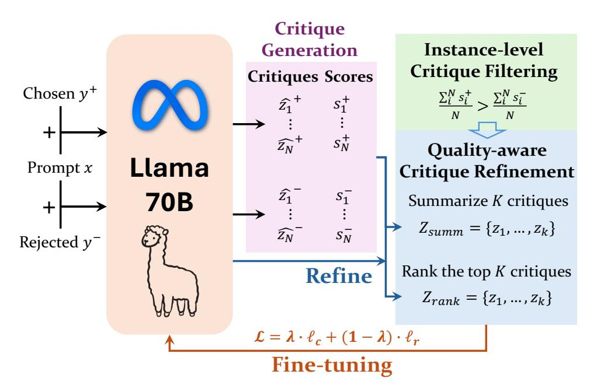
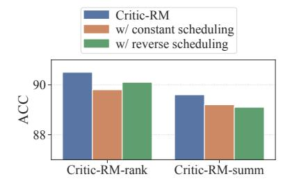
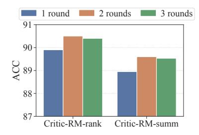
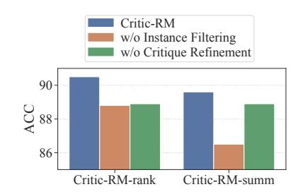

# Self-Generated Critiques Boost Reward Modeling for Language Models

Yue Yu1,2,∗ , Zhengxing Chen1 , Aston Zhang1 , Liang Tan1 , Chenguang Zhu1 , Richard Yuanzhe Pang1 , Yundi Qian1 , Xuewei Wang1 , Suchin Gururangan1 , Chao Zhang2 , Melanie Kambadur1 , Dhruv Mahajan1 , Rui Hou1

Reward modeling is crucial for aligning large language models (LLMs) with human preferences, especially in reinforcement learning from human feedback (RLHF). However, current reward models mainly produce unexplainable scalar scores and struggle to incorporate critiques in a natural language format. We hypothesize that generating both critiques and scalar rewards would improve reward models' capability on preference ranking. Motivated by this, we propose Critic-RM, a framework that utilizes self-generated, high-quality critiques to train reward models for scalar reward-based preference prediction, with explicit rationales serving as supporting evidence. Critic-RM employs a two-stage process: generating and filtering high-quality critiques, followed by joint fine-tuning on reward prediction and critique generation objectives. Experiments on preference ranking benchmarks including RewardBench and CrossEval show that Critic-RM improves reward modeling accuracy by 3.7%–7.3% compared to standard reward models and LLM judges, demonstrating strong performance and data efficiency. Additional studies further validate the effectiveness of the generated critiques in rectifying flawed reasoning steps with the gain of 2.5%-3.2% on improving reasoning accuracy.

Date: November 26, 2024

Correspondence: Yue Yu ([yueyu@gatech.edu](mailto:yueyu@gatech.edu)), Rui Hou ([rayhou@meta.com](mailto:rayhou@meta.com))

## 1 Introduction

Reinforcement Learning from Human Feedback (RLHF) has been widely adopted to align large language models (LLMs) with human preferences [\(Ouyang et al.,](#page-14-0) [2022;](#page-14-0) [Touvron et al.,](#page-14-1) [2023;](#page-14-1) [Dubey et al.,](#page-12-0) [2024;](#page-12-0) [Reid](#page-14-2) [et al.,](#page-14-2) [2024\)](#page-14-2). Central to the RLHF process is the reward model (RM), which is trained to assign scores that quantify how well the model's outputs align with human judgments. The reward model defines optimization direction during training (e.g., reward signal in PPO), encouraging a policy LLM to generate more helpful, honest, and harmless responses ultimately enhancing the model's generation quality in real-world applications.

Standard reward models are typically trained using preference pairs and optimized with pairwise logistic loss [\(Bradley and Terry,](#page-12-1) [1952\)](#page-12-1), producing a single scalar score for each response. However, outputting a scalar score not only is hard to interpret but also fails to fully leverage the inherent language modeling capability that LLMs obtain from pretraining and post-training [\(Zhang et al.,](#page-15-0) [2024\)](#page-15-0). Consequently, these reward models tend to be less data-efficient and prone to robustness issues, such as reward hacking [\(Skalse](#page-14-3) [et al.,](#page-14-3) [2022;](#page-14-3) [Singhal et al.,](#page-14-4) [2023;](#page-14-4) [Chen et al.,](#page-12-2) [2024\)](#page-12-2). Such limitations hinder the quality of feedback signals in RLHF and lead to suboptimal policy updates. On the other hand, the LLM-as-a-judge paradigm offers an alternative, where the LLM first generates a critique and then optionally provides a discrete score as a quality proxy for a response [\(Zheng et al.,](#page-15-1) [2023;](#page-15-1) [Kim et al.,](#page-13-0) [2024a;](#page-13-0) [Zhong et al.,](#page-15-2) [2024\)](#page-15-2). Combining the strengths of both paradigms—integrating the interpretability and structured critique of LLM-as-the-judge with the scalar optimization framework of reward models—has the great potential to address the limitations of each method and yield more robust and effective reward signals.

Despite its great premise, incorporating critiques into reward modeling presents two major challenges. (1) Conflicting objectives: Critique generation requires language modeling, while reward models provide scalar outputs, complicating its integration into language modeling. (2) Evaluator limitations: Off-the-shelf LMs are often not good evaluators, while additional fine-tuning requires costly human-generated or annotated critiques.

1GenAI, Meta, 2Georgia Institute of Technology

∗Work done during the internship at Meta GenAI.

Recent work [\(Ye et al.,](#page-15-3) [2024\)](#page-15-3) directly incorporates critiques generated from off-the-shelf LLMs for reward modeling, while [Ankner et al.](#page-12-3) [\(2024\)](#page-12-3) and [Zhang et al.](#page-15-0) [\(2024\)](#page-15-0) design a joint training approach for learning to generate the critique as well as rewards simultaneously via knowledge distillation. These methods typically rely on a strong teacher LLM to generate high-quality critiques, which can be costly and inefficient to obtain at scale in practice. Moreover, they cannot be used to improve frontier models when a stronger teacher model does not exist.

We introduce Critic-RM, a new framework that enhances reward models using synthetic critiques, without relying on strong LLM teachers. Our approach draws inspiration from recent advances in self-improving language models [\(Yuan et al.,](#page-15-4) [2024;](#page-15-4) [Wu et al.,](#page-15-5) [2024;](#page-15-5) [Prasad et al.,](#page-14-5) [2024\)](#page-14-5), where models are iteratively refined using data generated by themselves. To apply a similar LLM self-improving paradigm in reward modeling, we hypothesize that it is crucial to inject LLM's critique generation ability into this process. Specifically, Critic-RM leverages an instruction-finetuned LLM as the backbone, which generates multiple candidate critiques, each with a discrete score (as explained below, for filtering critiques; not our final reward) for individual responses. However, these critiques can vary in quality, and poor-quality critiques often result in flawed quality predictions. To tackle this issue, we first apply a consistency-guided filtering technique, retaining only critiques whose scores align with human-annotated preference labels[1](#page-1-0) . To further enhance the quality of these synthetic critiques, we additionally propose two strategies, summarization and ranking, to refine the critiques used in training the reward model.

Once critiques are generated for each response, the main challenge lies in designing an effective training strategy to combine critique modeling and scalar reward prediction objectives. While LLMs benefit from learning through diverse critiques for each response [\(Ho et al.,](#page-12-4) [2023\)](#page-12-4), reward modeling is prone to overfitting [\(Dubey](#page-12-0) [et al.,](#page-12-0) [2024;](#page-12-0) [Zhu et al.,](#page-15-6) [2024\)](#page-15-6); such a contradiction makes it nontrivial to determine the optimal learning steps. To address this issue, we introduce a simple weighting balancing strategy, where the model initially focuses on critique modeling loss, then gradually transitions to predicting rewards based on both the response and the critique. This approach balances the two learning objectives, allowing the model to excel at both high-quality critique generation and accurate reward prediction.

To demonstrate the effectiveness of Critic-RM, we conduct extensive experiments on RewardBench and three out-of-distribution reward modeling tasks, showing that Critic-RM outperforms baselines in both in-domain and out-of-domain evaluations. Additionally, experiments on critique evaluation benchmarks highlight Critic-RM's ability to generate valuable feedback for correcting LLMs' flawed reasoning. Our analysis confirms that Critic-RM's superior generalization stems from its ability to identify and leverage high-quality self-generated critiques. The major contributions of our work can be summarized as follows:

- We propose Critic-RM, a framework to allow LLMs to take advantage of self-generated critiques for reward modeling. Critic-RM does not rely on additional supervision compared to standard reward models, while enjoying an improved generation quality as well as reward modeling accuracy.
- We propose a self-refinement technique to automatically select high-quality critiques, and design a simple yet effective weight scheduling strategy to balance the learning objectives between critique generation and reward modeling. These techniques collaboratively equip the model with the dual capabilities of high-quality critique generation and accurate reward prediction.
- We conduct experiments on three benchmarks covering over ten tasks, demonstrating the effectiveness of Critic-RM in precise reward modeling across diverse scenarios. Additional studies confirm the utility of Critic-RM-generated critiques in identifying and correcting mistakes made by LLMs.

## 2 Related Work

Reward Models. Building an accurate and robust reward model is a critical step for RLHF pipelines. Earlier work trains reward models with the ranking loss between chosen and rejected responses with the Bradley-Terry model [\(Bradley and Terry,](#page-12-1) [1952;](#page-12-1) [Stiennon et al.,](#page-14-6) [2020;](#page-14-6) [Ouyang et al.,](#page-14-0) [2022;](#page-14-0) [Dubey et al.,](#page-12-0) [2024\)](#page-12-0). To further improve upon this reward modeling pipeline, [Wang et al.](#page-15-7) [\(2024e](#page-15-7)[,d,](#page-15-8)[a\)](#page-14-7) design fine-grained attributes to predict

1This discrete score is only used for filtering critiques and being different from the final reward score of Critic-RM. Our Critic-RM eventually produces a continuous score, as explained in Section [3.3.](#page-5-0)

**Table 1** Comparison of our proposed method Critic-RM and closest baselines.

| Baselines                       | Input Format               | Output Format                    | Critique Generation | Require Training | Additional Teacher Models |
|---------------------------------|----------------------------|----------------------------------|------------------------|---------------------|------------------------------|
| Standard RM (Bradley and Terry) | Single Response            | Continuous Score                 | X                      | /                   | Х                            |
| RLAIF (Lee et al.)              | Single Response            | Continuous Score                 | ×                      | ✓                   | ✓                            |
| LLM-as-a-judge (Zheng et al.)   | Response Pairs             | Discrete Score                   | ✓                      | ×                   | X                            |
| SynRM (Ye et al.)               | Single Response + Critique | Continuous Score                 | ×                      | ✓                   | ✓                            |
| CLoud (Ankner et al.)           | Single Response            | Critique + Continuous Score      | ✓                      | /                   | ✓                            |
| GenRM (Zhang et al.)            | Single Response            | Critique + Reward Token          | ✓                      | ✓                   | ✓                            |
| Critic-RM (Ours)                | Single Response            | ${\bf Critique+ContinuousScore}$ | ✓                      | ✓                   | X                            |

rewards toward different aspects, Chen et al. (2024); Shen et al. (2024b); Liu et al. (2024); Coste et al. (2024) promote the robustness of reward modeling via improved training techniques or model ensembling, and Pace et al. (2024); Shen et al. (2024a) study how to create synthetic examples for reward models. More related to us, several very recent works (concurrent to us) also study generative reward modeling. Ye et al. (2024) directly augment the response with additional critiques from a teacher model for reward modeling without training the RM for critique generation, and Zhang et al. (2024); Ankner et al. (2024); Mahan et al. (2024) attempt to learn reward models with additional critique objectives, with similar focus of our study. However, these methods typically rely on high-quality critiques from stronger teacher models for training, which can be costly and inefficient to obtain in practice. They also don't provide a solution to reward modeling based on frontier LLMs where a teacher model doesn't exist. They also lack a unified approach to improve the quality of the critiques. Besides, Zhang et al. (2024) is specific to verifying math problem correctness and is hard to map to subjective domains where there are no ground-truth answers.

**LLM-as-a-judge and Critique Models.** Recently, large language models (LLMs) have been proposed as cost-effective alternatives to human evaluation, and act as proxies for assessing text quality. Such methods often first provide explanations for judgments of the response, then output a discrete score or preference label as the prediction (Zheng et al., 2023; Li et al., 2023; Yan et al., 2024; Xu et al., 2024). CriticGPT (McAleese et al., 2024) has also extended this line of work into coding tasks, where the LLM critic model is fine-tuned to pinpoint problems in code from real-world assistant tasks. However, using off-the-shelf LLMs for evaluation introduces the risk of bias (Bavaresco et al., 2024; Stureborg et al., 2024), and they can be easily misled (Zeng et al., 2024). To address these challenges, recent studies (Wang et al., 2024b; Kim et al., 2024a) have focused on collecting high-quality response pairs to train more accurate and reliable LLM-based evaluators.

Self-alignment Techniques. Aligning LLMs with human preferences often requires a massive amount of human annotations. To alleviate this reliance on human efforts, self-alignment leverages the model's own capabilities to refine its responses and align them with desired behaviors. Saunders et al. (2022); Madaan et al. (2023) use LLM itself to refine the original response at the inference time. Li et al. (2024b) generate instruction prompts for web documents and subsequently select high-quality examples for instruction fine-tuning. Lee et al. (2024); Sun et al. (2024) leverage LLMs to create preference labels efficiently, Yuan et al. (2024) employ LLM itself to rank different responses to provide its own rewards during training, and Zelikman et al. (2022); Pang et al. (2024); Gulcehre et al. (2023) improve LLM reasoning abilities through self-generated reasoning steps. A recent study (Wang et al., 2024b) also employs self-improving techniques to train text evaluators, but it focuses on pairwise evaluation and generating synthetic preference pairs. In contrast, we combine self-generated critiques with human-annotated preference pairs to enhance reward modeling performance.

## 3 Methodology

#### 3.1 Preliminaries

**Reward Modeling.** Let  $\mathcal{X}$  and  $\mathcal{Y}$  denote the space of prompts and responses, respectively. In the RLHF pipeline, human feedback is typically collected in the form of pairwise preferences between two responses  $(y^+, y^-) \in \mathcal{Y}^2$  to a given prompt  $x \in \mathcal{X}$ . Then, the preference dataset can be written as  $\mathcal{D} = \{(x_i, y_i^+, y_i^-)\}_{i=1}^{|\mathcal{D}|}$ , where the preference for  $y^+$  over  $y^-$  is denoted as  $y^+ \succ y^-$ . To model the pairwise preferences, the learning objective is

**Figure 1** An overview of Critic-RM. For each preference pair in the training set, we begin by prompting the LLM to generate candidate critiques along with discrete scores. Next, instance-level critique filtering is applied to minimize the impact of examples that conflict with preference labels. Finally, quality-aware critique refinement is performed to produce critiques that enhance reward model training.

to maximize the probability with Bradley-Terry model (Bradley and Terry, 1952) as

$$p(y^{+} \succ y^{-} \mid x) = \frac{\exp(r(x, y^{+}))}{\exp(r(x, y^{+})) + \exp(r(x, y^{-}))}.$$
 (1)

In practice, the reward model  $r_{\psi}$  is trained to minimize the following empirical negative log-likelihood loss (Stiennon et al., 2020; Ouyang et al., 2022; Dubey et al., 2024):

$$\ell_{\rm rm}(\psi) = -\mathbb{E}_{(x,y^+,y^-)\sim\mathcal{D}}\log\left(\sigma\left(r_{\psi}\left(x,y^+\right) - r_{\psi}\left(x,y^-\right)\right)\right) \tag{2}$$

where  $\sigma$  denotes the sigmoid function.

**Problem Setup.** In this work, we investigate the usage of off-the-shelf instruction-finetuned LLM  $\mathcal{M}_{\theta}$  as the backbone for both the *critique generation model* and *reward model*. Specifically, we denote the critic generation model as  $g_{\phi} = h_{g} \circ \mathcal{M}_{\theta}$  and the reward model as  $r_{\psi} = h_{r} \circ \mathcal{M}_{\theta}$ , where  $h_{g}$  and  $h_{r}$  stand for the language modeling head (inherited from the original  $\mathcal{M}_{\theta}$ ) and reward modeling head (randomly initialized).

Overview of Critic-RM. The framework of Critic-RM is shown in Figure 1. Critic-RM first generates candidate critiques for each prompt-response pair. Then, a filtering step is conducted to reduce the effect of potentially noisy rationales leading to incorrect predictions, allowing us to augment the preference pairs with additional critiques with the goal of improving the precision of reward modeling. Finally, we implement a joint training scheme to teach the model both high-quality critique generation and accurate reward modeling. The following sections will provide more details about each step.

#### 3.2 Critique-augmented Reward Model Training

To integrate the critiques into the reward modeling step, we view critiques as latent variables, which serve as an intermediate variable between the response and the final reward. Specifically, we denote  $z^+, z^-$  as critiques for chosen and rejected responses  $y^+, y^-$  with prompt x, respectively. Then, the overall learning objective

 $p(y^+ \succ y^- \mid x)$  can be recast as

$$p(y^{+} \succ y^{-} \mid x) = \sum_{z^{+}, z^{-}} p(y^{+} \succ y^{-}, z^{+}, z^{-} \mid x)$$

$$= \sum_{z^{+}, z^{-}} p(y^{+} \succ y^{-} \mid z^{+}, z^{-}, x) \cdot p^{*}(z^{+} \mid y^{+}, x) \cdot p^{*}(z^{-} \mid y^{-}, x).$$
(3)

Since  $p^*(\cdot \mid y, x)$  stands for the oracle distribution for critiques and is often not intractable, we aim to leverage the critic generation model  $g_{\phi}$  to generate the approximate distribution  $q_{\phi}$  as

$$p(y^{+} \succ y^{-} \mid x) = \sum_{z^{+}, z^{-}} q_{\phi}(z^{+} \mid y^{+}, x) q_{\phi}(z^{-} \mid y^{-}, x) \frac{p(y^{+} \succ y^{-}, z^{+}, z^{-} \mid x)}{q_{\phi}(z^{+} \mid y^{+}, x) q_{\phi}(z^{-} \mid y^{-}, x)}.$$
 (4)

Then, by applying the Jensen's Inequality, the training objective can be expressed as

$$\mathcal{L} = -\log p \left( y^{+} \succ y^{-} \mid x \right) \\
= -\log \mathbb{E}_{q_{\phi}(z^{+} \mid y^{+}, x), q_{\phi}(z^{-} \mid y^{-}, x)} \left[ \frac{p \left( y^{+} \succ y^{-}, z^{+}, z^{-} \mid x \right)}{q_{\phi} \left( z^{+} \mid y^{+}, x \right) q_{\phi} \left( z^{-} \mid y^{-}, x \right)} \right] \\
\geq \mathbb{E}_{q_{\phi}(z^{+} \mid y^{+}, x), q_{\phi}(z^{-} \mid y^{-}, x)} \left[ -\log \frac{p \left( y^{+} \succ y^{-}, z^{+}, z^{-} \mid x \right)}{q_{\phi} \left( z^{+} \mid y^{+}, x \right) q_{\phi} \left( z^{-} \mid y^{-}, x \right)} \right] \\
= \mathbb{E}_{q_{\phi}(z^{+} \mid y^{+}, x), q_{\phi}(z^{-} \mid y^{-}, x)} \left[ -\log p \left( y^{+} \succ y^{-} \mid z^{+}, z^{-}, x \right) \right] \\
\qquad \qquad \qquad \qquad \qquad \qquad \qquad \qquad \qquad \qquad \qquad \qquad \qquad \qquad \qquad \qquad \qquad \qquad \qquad$$

What does the learning objective imply? Eq. 5 provides a way to decompose the reward model learning objective into two parts: (1) Preference Modeling Loss with Critiques  $\ell_r$ : the reward model  $r_{\theta}$  learns to predict the reward for each response conditioned on critiques; (2) Critique Generation Loss  $\ell_c$ : the LLM generation  $g_{\theta}$  is trained to generate critiques to approximate the oracle distribution  $p^*(\cdot | y, x)$ . We will discuss how to train the reward model  $r_{\theta}$  and critique generation model  $g_{\theta}$  in the following subsections.

#### 3.2.1 Critique-augmented Reward Prediction

To enable the reward model  $r_{\psi}$  to learn the preference with critiques (i.e.,  $\ell_{\rm r}$ ) can be straightforward, as we only need to modify the input by augmenting response with critiques as

$$\ell_{\rm r}(x, y^+, y^-, z^+, z^-) = -\log p\left(y^+ \succ y^-, z^+, z^- \mid x\right) = -\log p\left(r_{\psi}(x, [y^+; z^+]) > r_{\psi}(x, [y^-; z^-])\right). \tag{6}$$

In this way, for each prompt, the reward model will learn to generate the reward based on both responses and critiques. In practice, we put the critiques after the response and add a special token at the end of the critique for calculating the reward.

#### 3.2.2 Critique Generation & Filtering

For critique generation loss, approximating  $p^*(\cdot \mid y, x)$  can be nontrivial as the primary challenge lies in the lack of high-quality critique annotations. To ensure the quality of the critiques, our key hypothesis is that good critiques for responses should align well with human preference labels. With this in mind, we design a generate-then-filter framework to create high-quality supervision signals for critique model training.

**Critique Generation.** To generate critiques without relying on stronger LLMs, we first prompt the LLM  $\mathcal{M}_{\theta}$  (with the same backbone as the reward model) and sample a set of N candidate critiques for input prompt and responses (x,y) by following the procedure of the LLM-as-a-judge pipeline as  $(\widehat{z}_i, s_i)_{i=1}^N \sim g_{\phi}(x,y)$ , where  $\widehat{z}$  is the generated critique and s is a discrete score ranging from 1 to 10, indicating the quality of the response.

**Instance-level Critique Filtering.** To reduce the potential noisy critiques and encourage the consistency between critiques and preference labels, we propose to first retain instances guided by the score generated by the

judge in the previous score as  $\mathcal{D}_{\text{sub}} = \{(x, y^+, y^-) \mid \bar{s}(x, y^+) > \bar{s}(x, y^-)\}$ , where  $\bar{s}(x, y^+) = \sum_{i=1}^N s_i^+/N$  and  $\bar{s}(x, y^-) = \sum_{i=1}^N s_i^-/N$  stand for the average score for chosen and rejected responses, respectively. By applying this filtering process, we enhance the consistency of critiques with human preferences and minimize the impact of noisy instances.

Quality-aware Critique Refinement. The previous step mainly focuses on instance-level denoising, while for each (prompt, response) pair, the quality of different critiques also varies. To further improve the quality of critiques, we design a Meta-judge-based technique (Wu et al., 2024) to leverage LLM  $\mathcal{M}_{\theta}$  again to further refine the critiques in  $\mathcal{D}_{\text{sub}}$ , with two possible variants:

- Summarization-based Refinement: We adopt the LLM as a summarizer to write 'meta-critiques' given different critiques so that the LLM can potentially identify the most common, reasonable feedback while mitigating the impact of the potential incorrect feedback. The final critique can be written as  $\mathcal{Z}_{\text{summ}} = \{z_i\}_{i=1}^K \sim g_{\phi}(x,y,\Pi_{j=1}^N \widehat{z}_j)$ , where  $\Pi_{j=1}^N \widehat{z}_j$  is a permutation of N initial critiques. By sampling over different permutations of critiques, we can generate more diverse critiques for model training.
- Ranking-based Refinement: We use the LLM as a meta-judge to create evaluation scores for critiques. Specifically, for each critique  $\hat{z}_i$ , we prompt the LLM to generate a discrete score from 1 to 10 as  $m_i \sim g_{\phi}(x,y,\hat{z}_i)$ , which serves as a proxy for critique quality estimation. Then, we only retain top-K ranked critiques as  $\mathcal{Z}_{\text{rank}} = \{z_i\}_{i=1}^K = \text{Top-K}(\{\hat{z}_i\}_{i=1}^N)$ . In this way, we can preserve the critiques with the highest quality identified by the model itself.

Final Loss for Critique Generation. From the previous step, we augment the training set  $\mathcal{D}_{\text{sub}}$  with self-identified high-quality critiques, denoted as  $\mathcal{D}_{\text{sub}} = \{(x, y^+, y^-, \mathcal{Z}^+, \mathcal{Z}^-)\}$ . With the self-generated high-quality critiques  $\mathcal{Z}$ , we aim to use them to approximate the distribution of oracle distribution as  $p^*(z \mid y, x) = \mathbb{I}(z \in \mathcal{Z})$ . Directly using this distribution in backward KL loss in Eq. 5 may lead to policy and entropy collapses (Sessa et al., 2024; Agarwal et al., 2024). As a result, we use forward KL loss to approximate this learning objective. Then using the empirical distribution, the KL divergence becomes:

$$\ell_{c}(\mathcal{Z}; x, y) = \mathcal{D}_{KL}(p^{*}(z \mid y_{i}, x_{i}) || q_{\phi}(z \mid y_{i}, x_{i}))$$

$$= \mathbb{E}_{z \sim p^{*}(z \mid y_{i}, x_{i})} \left[ p^{*}(z \mid y_{i}, x_{i}) - \log q_{\phi}(z \mid y_{i}, x_{i}) \right]$$

$$= -\frac{1}{K} \sum_{z \in \mathcal{Z}} \log q_{\phi}(z \mid y, x) + \text{const.}$$
(7)

Then, the overall loss for critique generation can be written as  $\ell_c(x, y^+, y^-, \mathcal{Z}^+, \mathcal{Z}^-) = \ell_c(\mathcal{Z}^+; x, y^+) + \ell_c(\mathcal{Z}^-; x, y^-)$ .

#### 3.2.3 Joint Learning of Critique Generation and Reward Modeling

To combine the reward modeling loss (Eq. 6) and critique generation loss together (Eq. 7), one challenge lies in the different learning objectives for these two terms: for *critique generation*, the model  $g_{\phi}$  will benefit more from fine-tuning with diverse critiques from  $\mathcal{Z}$ . On the contrary, the reward model  $r_{\psi}$  is often observed with overfitting issues when fine-tuning with more than one round. To resolve this issue, we design a dynamic weight schedule approach, where we add an additional weight  $\lambda(t)$  on Equation 5, which is relevant to the training step t, for balancing between these two objectives as

$$\mathcal{L}(\phi, \psi) = \mathbb{E}_{(x, y^+, y^-, \mathcal{Z}^+, \mathcal{Z}^-) \in \mathcal{D}_{\text{sub}}} \left[ \lambda(t) \cdot \ell_c(\phi) + (1 - \lambda(t)) \cdot \ell_r(\psi) \right], \tag{8}$$

where  $\lambda(t)$  is defined as

$$\lambda(t) = \begin{cases} 1, & 0 < t < (K-1)T \\ 1 - \beta \times \frac{t - (K-1)T}{T}. & (K-1)T < t < KT \end{cases}$$
 (9)

Here, T represents the total number of training steps in one epoch. This approach allows the model to focus on critique generation during the initial phase of training and shifts to reward learning in the final round, mitigating the overfitting issue in the reward model.

## 3.3 Critic-RM Inference

Compared to standard reward model training, Critic-RM involves an additional step for each (prompt, response) pair during inference. Specifically, given the (prompt, response) pair (x, y), the model will first generate a critique z ∼ qϕ(x, y), then predict the reward for the response as r = rψ(x, [y, z]).

Inference-time Scaling. Following recent studies [\(Ankner et al.,](#page-12-3) [2024;](#page-12-3) [Zhang et al.,](#page-15-0) [2024\)](#page-15-0), we also conduct inference-time scaling [\(Wang et al.,](#page-14-17) [2023\)](#page-14-17) to improve performance. Specifically, we generate a set of m critiques as Z = {zi} m i=1 ∼ qϕ(x, y) with non-zero temperatures, then predict the reward for the response as the average of reward over different critiques as r = rψ(x, [y, zi ])/m.

## 4 Experiments

## 4.1 Experiment Setup

#### 4.1.1 Training Data

To ensure the representativeness of the preference pairs used in this study, we leverage both public and synthetic datasets for reward model training.

Public Preference Datasets: We choose a set of datasets for reward model training with human-generated preference labels mainly from public, open-sourced datasets [\(Ivison et al.,](#page-13-8) [2024;](#page-13-8) [Wang et al.,](#page-14-7) [2024a\)](#page-14-7). We include the following datasets:

- General Chat Domain: We include datasets from ChatArena [\(Zheng et al.,](#page-15-1) [2023\)](#page-15-1) and AlpacaFarm-Human-Pref [\(Dubois et al.,](#page-12-9) [2023\)](#page-12-9).
- Helpfulness Data: We leverage HelpSteer2 [\(Wang et al.,](#page-15-8) [2024d\)](#page-15-8) to create preference data.
- Reasoning: We mainly use Evol-instruct [\(Xu et al.,](#page-15-13) [2023\)](#page-15-13) which contains preference pairs for complex instruction following, coding-related tasks.
- Safety: We employ PKU-SafeRLHF [\(Dai et al.,](#page-12-10) [2024\)](#page-12-10), which includes safety-related prompts paired with both safe and unsafe responses to form preference pairs.

Synthetic Preference Datasets: To incorporate additional preference supervision from different domains, we further include synthetic data using Llama-3.1 models.[2](#page-6-0) Specifically, for the math domain, we consider questions in GSM8K [\(Cobbe et al.,](#page-12-11) [2021\)](#page-12-11) and the MATH dataset [\(Hendrycks et al.,](#page-12-12) [2021\)](#page-12-12). For each math question, we use Llama-3.1-8b-instruct, and Llama-3.1-70b-instruct to generate candidate solutions with the prompt "Given the following problem, reason step-by-step and give a final answer to the problem.", and generate multiple candidate solutions for a given prompt. We use those responses that lead to correct solutions as the chosen response while considering those responses with incorrect solutions as the rejected response. In the safety domain, we generate synthetic prompts following the safety principles outlined in SafeRLHF [\(Dai](#page-12-10) [et al.,](#page-12-10) [2024\)](#page-12-10) (e.g., Hate Speech, Offensive Language, Discrimination, Violence). To ensure balance, we also include scenarios where the model should not refuse to respond (e.g., Figurative Language, Safe Targets testing for ambiguous meanings) to avoid skewing the data toward over-conservatism.

#### 4.1.2 Evaluation Benchmarks.

Evaluation Benchmarks for Reward Models. In our experiments, we mainly evaluate on RewardBench [\(Lambert](#page-13-9) [et al.,](#page-13-9) [2024\)](#page-13-9), which contains a collection of prompt-chosen-rejected triplets across chat, reasoning, and safety domains, including 2985 examples in total. We use the standard evaluation protocol provided by the original authors. Beyond RewardBench, we also aim to test the out-of-distribution generalization ability of reward models. Specifically, we consider CrossEval [\(Zhong et al.,](#page-15-2) [2024\)](#page-15-2), a recently proposed benchmark to evaluate the LLM's capability in real-world interactions[3](#page-6-1) . Besides, we also consider two additional datasets, namely QA Feedback [\(Wu et al.,](#page-15-14) [2023\)](#page-15-14) and SHP [\(Ethayarajh et al.,](#page-12-13) [2022\)](#page-12-13), which focuses on evaluating the response for open-ended QA task as well as social platforms (i.e., Reddit). There are around 2000 examples of QA

2These synthetic data are used for both Critic-RM and our direct baselines.

3The details for data processing is listed in Appendix [A.](#page-16-0)

Feedback preference pairs. For SHP, we use the response with a higher average score/votes judged by human raters as the positive response, and we use the response with a lower score/votes as the negative one, and randomly subsample 3000 pairs for evaluation. For all tasks, we use accuracy as the main metric.

Evaluation Benchmarks for Critic Models. To demonstrate the effectiveness of our model in generating improved critiques, we employ CriticBench [\(Lin et al.,](#page-13-10) [2024\)](#page-13-10), a benchmark designed to evaluate LLMs' ability to critique and improve their reasoning across various tasks. CriticBench covers five key reasoning domains: mathematical, commonsense, symbolic, coding, and algorithmic. It includes responses from 17 different LLMs, requiring the LLMs to provide critiques that assess the correctness of these LLMs' responses. Specifically, it considers two dimensions for evaluation: (1) Critique Accuracy: where F1 Score is used to evaluate the correctness of critiques; (2) Correction Accuracy: where Accuracy is used to evaluate whether the model can generate correct answers based on critique feedback.

#### 4.1.3 Baselines

We consider the following baselines from three different groups:

- LLM-as-a-judge: With the prompt with a pair of responses used as the input, this line of models needs to generate a preference label. We consider Prometheus-v2 [\(Kim et al.,](#page-13-11) [2024b\)](#page-13-11), Llama-3.1-70B/405B [\(Dubey](#page-12-0) [et al.,](#page-12-0) [2024\)](#page-12-0), GPT-4 [\(Achiam et al.,](#page-12-14) [2023\)](#page-12-14) and GPT-4o [\(Hurst et al.,](#page-13-12) [2024\)](#page-13-12), Gemini-1.5-pro [\(Reid](#page-14-2) [et al.,](#page-14-2) [2024\)](#page-14-2) and recently proposed self-taught evaluator [\(Wang et al.,](#page-14-12) [2024b\)](#page-14-12) based on Llama-3-70B for comparison.
- Standard Reward Models: This line of models only outputs a scalar score for each (prompt, response) pair. We compare with baselines including standard RM [\(Stiennon et al.,](#page-14-6) [2020\)](#page-14-6), Cohere-0514, SteerLM-RM [\(Wang et al.,](#page-15-7) [2024e\)](#page-15-7), Nemotron-RM [\(Adler et al.,](#page-12-15) [2024\)](#page-12-15).
- Reward Model with Critiques: These studies are mostly relevant to us as they also leverage critiques to improve reward models. Specifically, we compare with SymRM [\(Ye et al.,](#page-15-3) [2024\)](#page-15-3) which directly augments responses with critiques for reward modeling, and CLoud [\(Ankner et al.,](#page-12-3) [2024\)](#page-12-3) which jointly learn to generate critiques and predict rewards.

It is worth noting that for most relevant baselines (e.g. RM, SynRM, CLoud), we reimplement those baselines with the same training data and backbone to ensure the comparison is fair and meaningful. We do not consider some reward model training techniques [\(Wang et al.,](#page-15-15) [2024c,](#page-15-15)[a\)](#page-14-7) as they focus on designing better learning objectives for standard reward models, which are orthogonal to the focus of this study.

#### 4.1.4 Implemenation Details

We use Llama3.1-70B-Instruct [\(Dubey et al.,](#page-12-0) [2024\)](#page-12-0) as the backbone in our main experiments. For critique generation, we set the temperature τ = 0.9 and sample N = 10 candidate critiques for each response. For the critique filtering, we set K = 2 to select top-2 responses. For model fine-tuning, we use the Adam optimizer [\(Kingma and Ba,](#page-13-13) [2014\)](#page-13-13) with the learning rate 2e-6, weight decay 0.1 and dropout 0.1. We set the global batch size to 64, β in Eq. [9](#page-5-2) to 0.9 and train the model with 2 epochs. We observe that there exist several examples in AlpacaEval and ChatArena that share similar prompts with the target evaluation tasks, and we remove all overlapping prompts to avoid data contamination [\(Oren et al.,](#page-13-14) [2024\)](#page-13-14). During inference, if inference-time scaling is adopted, we choose temperate τ = 0.95 to sample multiple critiques. The prompt format we use in experiments is exhibited in Appendix [B.](#page-16-1)

#### 4.2 Main Experiments: RewardBench

Table [2](#page-8-0) presents results of Critic-RM and baselines. The findings are summarized as follows:

• Incorporating Critiques Helps Reward Modeling in General. Critic-RM generally outperforms the baselines used in this study. Specifically, when trained with the same preference data, Critic-RM outperforms the standard Reward Model by 3.7%-4.7%. Critic-RM also outperform giant Llama-3.1-405b judge model by 6.2%-7.3%, respectively. These results justify the advantage of incorporating critiques into the reward model training step, which facilitates both high-quality critiques and precise rewards.

Table 2 Results of our proposed method and baselines on the RewardBench. † : Results copied from either RewardBench Leaderboard or original papers. § : This version of the model is trained using SFT only.

| Models                                                  | Chat  | Chat_Hard | Reasoning | Safety | Overall |
|---------------------------------------------------------|-------|-----------|-----------|--------|---------|
| LLM-as-a-judge (For Reference)                          |       |           |           |        |         |
| Prometheus-8*7b-v2† (Kim et al., 2024b)              | 93.0  | 47.1      | 77.4      | 80.5   | 74.5    |
| Llama3.1-70B-Instruct† (Dubey et al., 2024)          | 97.2  | 70.2      | 82.8      | 86.0   | 84.0    |
| Llama3.1-405B-Instruct† (Dubey et al., 2024)         | 97.2  | 74.6      | 77.6      | 87.1   | 84.1    |
| GPT-4-0125† (Achiam et al., 2023)                    | 95.3  | 74.3      | 87.6      | 86.9   | 86.0    |
| GPT-4o-0806† (Hurst et al., 2024)                    | 96.1  | 76.1      | 88.1      | 86.6   | 86.7    |
| Gemini-1.5-pro-0514† (Reid et al., 2024)             | 92.3  | 80.6      | 92.0      | 87.9   | 88.2    |
| Self-taught Evaluator§ (Wang et al., 2024b) (Iter 1) | 98.3  | 69.0      | 82.6      | 85.7   | 83.9    |
| Self-taught Evaluator§ (Wang et al., 2024b) (Iter 2) | 97.5  | 75.4      | 81.7      | 89.5   | 86.0    |
| Self-taught Evaluator§ (Wang et al., 2024b)          | 96.6  | 84.2      | 91.5      | 81.0   | 88.3    |
| w/ inference scaling, m = 32                            | 96.9  | 84.0      | 91.5      | 82.5   | 88.7    |
| Standard Reward Models                                  |       |           |           |        |         |
| RM (Stiennon et al., 2020)                              | 98.3  | 74.5      | 88.0      | 83.8   | 86.4    |
| Cohere-0514†                                            | 96.4  | 71.3      | 92.3      | 97.7   | 89.4    |
| SteerLM-RM 70B† (Wang et al., 2024e)                 | 91.3  | 80.3      | 92.8      | 90.6   | 88.8    |
| Nemotron-RM 340B† (Adler et al., 2024)               | 95.8  | 87.1      | 91.5      | 93.6   | 92.0    |
| (Concurrent Work) Reward Models with Critiques          |       |           |           |        |         |
| SynRM† (Ye et al., 2024) (Reported Best)             | 38.0  | 82.5      | 87.1      | 74.1   | 70.4    |
| SynRM (Ye et al., 2024) (Ours)                          | 97.5  | 76.8      | 88.5      | 86.3   | 87.3    |
| CLoud† (Ankner et al., 2024) (Reported)              | ∼97.0 | ∼58.0     | ∼92.0     | ∼84.0  | 82.8    |
| CLoud (Ankner et al., 2024) (Ours)                      | 98.0  | 75.6      | 87.6      | 89.0   | 87.6    |
| w/ inference scaling, m = 32                            | 98.0  | 75.2      | 89.3      | 91.5   | 88.5    |
| Critic-RM-Summ                                          | 98.0  | 77.0      | 88.9      | 94.5   | 89.6    |
| w/ inference scaling, m = 32                            | 97.5  | 77.0      | 91.6      | 95.9   | 90.5    |
| Critic-RM-Rank                                          | 97.5  | 79.6      | 90.6      | 94.1   | 90.5    |
| w/ inference scaling, m = 32                            | 97.2  | 80.0      | 91.6      | 95.1   | 91.0    |

- High-quality Critiques Matters. By comparing Critic-RM with baselines that also incorporate critiques into reward modeling, we observe that their performance gains over the standard RM are smaller than ours. We attribute this performance gap to the lack of post-processing methods for improving critique quality, which is key to achieving self-improvement in this challenging setting.
- Inference-time ScalingMainly Helps for Reasoning Tasks. We observe further performance improvements for both Critic-RM and the baselines when multiple critiques are generated during inference. Notably, these gains are most pronounced in reasoning-intensive tasks such as Math, Coding, and Safety, where the model must decide whether to reject a response. This suggests that, when computational resources are constrained, prioritizing reasoning-heavy tasks can lead to more significant performance improvements.

### 4.3 Out-of-Distribution (OOD) Evaluation

As shown in Table [3,](#page-9-0) we evaluate the performance of our approach (Critic-RM) alongside relevant baseline models on three out-of-distribution (OOD) reward modeling datasets. Our results demonstrate that Critic-RM exhibits a strong performance across these datasets, surpassing standard reward modeling (RM) baselines by an average margin of 4%. Notably, the performance improvements of Critic-RM are more pronounced on more challenging benchmarks, such as tasks requiring cross-abilities, suggesting that the benefits of critiques are more significant in complex scenarios. Furthermore, we observe that the performance of Critic-RM is comparable to that of LLM-judge models with significantly more parameters. This highlights the efficiency and effectiveness of Critic-RM when being adapted to real scenarios.

Table 3 Results of our proposed method and baselines on out-of-distribution reward modeling datasets.

| Models                                                 | CrossEval |           |        |      |      |      |      | Other Datasets |             |      |
|--------------------------------------------------------|-----------|-----------|--------|------|------|------|------|----------------|-------------|------|
| Models                                                 | English   | Reasoning | Coding | Tool | C+R  | T+R  | T+C  | Avg.           | QA Feedback | SHP  |
| LLM-as-a-judge (For Reference)                         |           |           |        |      |      |      |      |                |             |      |
| Llama3.1-70B-Instruct (Dubey et al., 2024)             | 55.4      | 71.4      | 70.1   | 77.4 | 78.2 | 69.5 | 80.7 | 71.8           | 59.2        | 63.3 |
| Llama 3.1-405 B-Instruct (Dubey et al., 2024) $$ | 64.4      | 71.9      | 77.5   | 80.2 | 78.2 | 75.6 | 78.9 | 75.2           | 60.7        | 62.9 |
| Reward Models                                          |           |           |        |      |      |      |      |                |             |      |
| RM (Stiennon et al., 2020)                             | 59.3      | 72.7      | 70.8   | 75.2 | 68.3 | 72.0 | 72.4 | 70.1           | 58.3        | 65.1 |
| CLoud (Ankner et al., 2024)                            | 60.3      | 75.2      | 71.7   | 79.0 | 73.2 | 71.1 | 73.4 | 72.0           | 59.2        | 64.8 |
| Our Model                                              |           |           |        |      |      |      |      |                |             |      |
| Critic-RM-Summ                                         | 61.3      | 76.2      | 72.4   | 80.7 | 73.2 | 71.6 | 76.9 | 73.0           | 60.4        | 67.9 |
| Critic-RM-Rank                                         | 64.0      | 74.3      | 73.3   | 80.7 | 79.3 | 72.0 | 79.3 | 74.7           | 60.2        | 66.2 |

**Table 4** Results of our proposed method and baselines on CriticBench (Lin et al., 2024). \*: For these methods, we use the same Llama-3.1-8b-Instruct as the backbone model for answer correction.

| Models                                       | Critique Accuracy (F1) |       |          |             |       |       | Correction Accuracy (Acc.) |       |          |             |       |       |
|----------------------------------------------|------------------------|-------|----------|-------------|-------|-------|----------------------------|-------|----------|-------------|-------|-------|
| Models                                       | Algorithm              | Code  | Symbolic | Commonsense | Math  | Total | Algorithm                  | Code  | Symbolic | Commonsense | Math  | Total |
| Baselines                                    |                        |       |          |             |       |       |                            |       |          |             |       |       |
| Auto-J 13B (Li et al., 2024a)                | _                      | _     | _        | _           | _     | 65.29 | _                          |       | _        | _           |       |       |
| UltraCM 13B (Cui et al., 2024)               | _                      | _     | _        | _           | _     | 61.11 | _                          | _     | _        | _           | _     | _     |
| CLoud* (Ankner et al., 2024)                 | 57.22                  | 82.87 | 80.56    | 70.18       | 90.35 | 81.91 | 84.75                      | 74.56 | 95.35    | 50.22       | 68.48 | 69.56 |
| GPT-3.5 (OpenAI, 2022)                       | 46.15                  | 73.13 | 64.49    | 50.22       | 62.01 | 61.11 | 58.16                      | 61.85 | 71.83    | 44.11       | 41.95 | 51.24 |
| GPT-4 (Achiam et al., 2023)                  | 63.51                  | 91.36 | 90.75    | 71.56       | 92.55 | 78.75 | 77.66                      | 76.29 | 92.41    | 59.96       | 63.57 | 69.96 |
| LLM-as-a-judge (For Reference)               |                        |       |          |             |       |       |                            |       |          |             |       |       |
| Llama3.1-70B-Instruct* (Dubey et al., 2024)  | 60.37                  | 84.92 | 86.17    | 65.52       | 88.53 | 80.75 | 77.65                      | 76.93 | 88.06    | 59.29       | 57.28 | 66.96 |
| Llama3.1-405B-Instruct* (Dubey et al., 2024) | 86.96                  | 88.96 | 90.70    | 72.59       | 93.84 | 86.96 | 86.52                      | 81.42 | 90.86    | 63.76       | 63.36 | 72.02 |
| Our Model                                    |                        |       |          |             |       |       |                            |       |          |             |       |       |
| Critic-RM-Summ*                              | 89.79                  | 89.36 | 88.36    | 75.26       | 96.09 | 88.25 | 90.55                      | 81.89 | 95.82    | 56.95       | 72.54 | 74.33 |
| Critic-RM-Rank*                              | 86.13                  | 88.88 | 91.10    | 75.02       | 95.49 | 87.93 | 90.42                      | 78.44 | 96.43    | 57.39       | 71.77 | 73.87 |

- (a) Ablation on weight scheduling.
- **(b)** Acc. w/ different rounds.
- (c) Ablation on filtering strategies.

Figure 2 Ablation studies. The y-axis is the average accuracy on RewardBench.

#### 4.4 Evaluation on Critiques

As Critic-RM involves a crucial step for generating critiques, it is also important to evaluate the quality of critiques for target tasks. We use CriticBench to perform a comprehensive evaluation, with results detailed in Table 4. For *critique accuracy*, we observe that Critic-RM generates more accurate critiques compared to strong baselines, including GPT-4. This justify that Critic-RM is able to distinguish correct and flawed reasoning paths. Additionally, these critiques help the policy language model (LM) correct flawed reasoning steps, resulting in improved accuracy in refined responses. Notably, even when using the lightweight Llama-3-8B as the policy LM, the critiques guide the smaller LM to rectify initial incorrect reasoning and achieve high accuracy across five reasoning tasks.

#### 4.5 Ablation Studies

**Effect of Two-stage Training.** Figure 2a illustrates the performance of Critic-RM with different weight scheduling function  $\lambda(t)$ . The results indicate that using a constant weight across different rounds, as well as reverse

Table 5 Performance of Critic-RM and most relevant baselines with different amounts of training data.

| Data Volume | Method         | Chat | Chat Hard | Reasoning | Safety | Overall |
|-------------|----------------|------|-----------|-----------|--------|---------|
|             | RM             | 98.4 | 70.8      | 83.1      | 73.6   | 81.5    |
|             | SynRM          | 96.9 | 75.1      | 84.2      | 89.1   | 86.3    |
| 10%         | CLoud          | 96.6 | 74.7      | 86.1      | 86.3   | 85.9    |
|             | Critic-RM-summ | 96.1 | 77.0      | 86.7      | 91.0   | 87.7    |
|             | Critic-RM-rank | 96.4 | 77.9      | 85.6      | 90.2   | 87.5    |
|             | RM             | 98.1 | 69.2      | 85.6      | 81.8   | 83.6    |
|             | SynRM          | 97.2 | 75.7      | 85.0      | 89.8   | 86.9    |
| 30%         | CLoud          | 97.4 | 76.7      | 86.1      | 87.5   | 86.9    |
|             | Critic-RM-summ | 96.9 | 78.7      | 87.4      | 92.2   | 88.8    |
|             | Critic-RM-rank | 97.8 | 77.1      | 86.5      | 93.1   | 88.6    |
|             | RM             | 98.3 | 75.6      | 87.4      | 82.2   | 85.9    |
|             | SynRM          | 97.4 | 76.9      | 85.1      | 90.0   | 87.3    |
| 50%         | CLoud          | 97.2 | 76.5      | 86.9      | 89.3   | 87.4    |
|             | Critic-RM-summ | 97.2 | 78.7      | 89.1      | 93.1   | 89.5    |
|             | Critic-RM-rank | 97.2 | 79.2      | 88.9      | 94.0   | 89.8    |

weight scheduling (i.e., prioritizing reward modeling first, followed by critique generation), both negatively impact performance. Besides, Figure [2b](#page-9-2) shows the performance of Critic-RM with different K (training epoch), where reward modeling is applied only in the final epoch. The results indicate that performance improves when K = 2, but plateaus with further increases. Thus, K = 2 serves as a trade-off to balance between performance and training efficiency.

Effect of Data Filtering. We further evaluate our data filtering strategy in Figure [2c](#page-9-2) and observe that using the entire dataset without filtering leads to poor performance, particularly in the Chat-hard domain, which requires stronger reasoning capabilities for LLMs to assess response preferences accurately. Additionally, removing noisy preference pairs improves standard reward modeling. Moreover, incorporating summarization and ranking proves to be an effective approach for boosting overall performance.

## 4.6 Data Efficiency of Reward Models

Table [5](#page-10-0) shows the accuracy of Critic-RM and baselines on RewardBench with different volumes of training data. Overall, Critic-RM consistently outperforms the baselines across all data volumes, demonstrating superior performance even with limited labels. Notably, Critic-RM shows strong data efficiency—using just 10% of the labeled data is sufficient to surpass the standard reward model. This result highlights the data efficiency of Critic-RM, making it highly practical for real-world applications.

#### 4.7 Case Studies

Table [6](#page-11-0) presents two examples from RewardBench that highlight the advantages of Critic-RM over baseline models. Standard RMs often struggle to assign higher scores to the correct response and fail to provide additional context to justify the predicted reward. While Cloud offers general feedback on response quality, it tends to focus on strengths and weaknesses without identifying the most critical aspects for evaluation. In contrast, Critic-RM accurately identifies key errors in rejected responses and explains why the chosen response is superior, leading to more accurate predictions. We list additional case studies in Appendix [C.](#page-18-0)

## 5 Conclusion

In this work, we introduced Critic-RM, a self-critiquing framework designed to enhance reward modeling for large language models. By harnessing LLMs' ability to generate and refine critiques, Critic-RM implements a novel self-improvement approach that improves both critique quality and reward prediction accuracy.

**Table 6** An example that comparing Standard reward model (RM), critique-out-loud reward models (CLoud) and Critic-RM on reward prediction. <u>Underline</u> text denotes imprecise generation of rejected responses, <u>Green</u> text stands the central part that leads to accurate predictions of Critic-RM. Critic-RM can better model the preference by generating accurate critiques that identify the major strengths and weaknesses of the responses.

| Prompt    | Describe a time when you had to make a difficult decision.                                                                                                                                                                                                                                                                                                                                                                                                                                                                                                                                                                                                                                                                                                                                                                                                                                                                                                                                                                                                                                                                                                                                                                                                                                                                                                                                                                                                                                                                                                  |
|-----------|-------------------------------------------------------------------------------------------------------------------------------------------------------------------------------------------------------------------------------------------------------------------------------------------------------------------------------------------------------------------------------------------------------------------------------------------------------------------------------------------------------------------------------------------------------------------------------------------------------------------------------------------------------------------------------------------------------------------------------------------------------------------------------------------------------------------------------------------------------------------------------------------------------------------------------------------------------------------------------------------------------------------------------------------------------------------------------------------------------------------------------------------------------------------------------------------------------------------------------------------------------------------------------------------------------------------------------------------------------------------------------------------------------------------------------------------------------------------------------------------------------------------------------------------------------------|
| Chosen    | I had to make a difficult decision when I was working as a project manager at a construction company. I was in charge of a project that needed to be completed by a certain date in order to meet the client's expectations. However, due to unexpected delays, we were not able to meet the deadline and so I had to make a difficult decision. I decided to extend the deadline, but I had to stretch the team's resources even further and increase the budget. Although it was a risky decision, I ultimately decided to go ahead with it to ensure that the project was completed on time and that the client's expectations were met. The project was eventually successfully completed and this was seen as a testament to my leadership and decision-making abilities.                                                                                                                                                                                                                                                                                                                                                                                                                                                                                                                                                                                                                                                                                                                                                                              |
| Rejected  | Certainly! One situation where I had to solve a complex problem was during my time working as a project manager for a software development team. We were tasked with developing a new mobile application for a client within a tight deadline. The complex problem arose when we encountered a critical bug in the application just a few days before the scheduled release. The bug caused the app to crash randomly, making it unusable for end-users. This issue had the potential to damage our reputation and relationship with the client. To solve this problem, I immediately gathered the development team to assess the situation. We conducted a thorough investigation to identify the root cause of the bug. After extensive debugging and testing, we discovered that the issue was related to a memory leak in the code. To address the problem, we divided the team into smaller groups, each focusing on a specific aspect of the application. We implemented a rigorous testing process to identify and fix any memory leaks throughout the codebase                                                                                                                                                                                                                                                                                                                                                                                                                                                                                      |
| RM        | Chosen Reward: 0.27 Rejected Reward: 0.56                                                                                                                                                                                                                                                                                                                                                                                                                                                                                                                                                                                                                                                                                                                                                                                                                                                                                                                                                                                                                                                                                                                                                                                                                                                                                                                                                                                                                                                                                                                   |
| CLoud     | Critique for Chosen Response: The assistant provides unnecessary details about the project's context, such as the need to meet the client's expectations, which, while relevant, could be conveyed more succinctly. Furthermore, the response focuses more on the outcome of the decision rather than the decision-making process itself. The user prompt asks for a description of a time when a difficult decision was made, implying that the user wants to understand the thought process and considerations that led to the decision. The assistant's response glosses over these aspects, instead highlighting the success of the project and the client's satisfaction. Additionally, the response lacks depth and introspection.  Critique for Rejected Response: The response provides a clear and specific example from the assistant's experience, making it more relatable and engaging. The situation is well-explained, including the problem, the steps taken to address it, and the outcome. The assistant highlights their role in coordinating the team's efforts and communicating with the client, demonstrating leadership skills. However, The response could be more concise, as some details, such as the extensive debugging and testing process, could be summarized more briefly. While the assistant mentions the importance of thorough testing and quality assurance processes, it would be beneficial to elaborate on how this was implemented in the specific situation or how it was improved upon.  Rejected Reward: 0.66 |
| Critic-RM | Critique for Chosen Response: The response provides a specific scenario where a difficult decision had to be made, and it describes the decision-making process and its outcome. The response addresses the user's input question directly and provides relevant details about the situation. The response is also clear and coniese, making it easy to understand. The response does not contain any inaccuracies or inconsistencies.  Critique for Rejected Response: The response provided by the AI assistant does not accurately address the user's input question, which asks for a time when the AI had to make a difficult decision. Instead, the response describes a situation where the AI solved a complex problem as a project manager for a software development team. The response fails to provide a personal anecdote or decision-making scenario, instead providing a hypothetical or fictional account. The response also lacks a clear decision-making process and outcome. The response would be improved by providing a more relevant and accurate answer to the user's question.  Rejected Reward: 0.07                                                                                                                                                                                                                                                                                                                                                                                                                              |

Experiments on multiple datasets demonstrate that Critic-RM consistently outperforms baseline reward models, showing strong data efficiency and delivering robust results even with limited labeled data. Moreover, the critiques generated by Critic-RM prove effective in helping LLMs enhance response quality. We hope that self-critiquing techniques offer a promising future direction for advancing reward modeling and improving the alignment between LLMs and human preferences.

#### **Limitation and Future Work**

Critic-RM introduces a new framework for reward modeling by leveraging self-generated critiques. While it shows promising results, several limitations exist:

**Single Model Focus**: Critic-RM does require the base LLM to have a certain level of critique generation ability. Testing Critic-RM across different LLM architectures could provide broader insights into its effectiveness.

**Longer Inference Time**: Generating critiques during inference adds computational overhead. This trade-off may affect its use in real-time applications where latency is critical for model deployment.

**No Iterative Training**: Critic-RM does not incorporate iterative training, where models refine themselves over multiple rounds. Adding this step could further improve reward modeling performance, as shown in recent studies (Yuan et al., 2024; Pang et al., 2024).

## **Acknowledgments**

We would like to thank Anirudh Goyal and Thomas Scialom for the discussion on the early stage of this project.

## References

- Josh Achiam, Steven Adler, Sandhini Agarwal, Lama Ahmad, Ilge Akkaya, Florencia Leoni Aleman, Diogo Almeida, Janko Altenschmidt, Sam Altman, et al. Gpt-4 technical report. arXiv preprint arXiv:2303.08774, 2023.
- Bo Adler, Niket Agarwal, Ashwath Aithal, Dong H Anh, Pallab Bhattacharya, Annika Brundyn, Jared Casper, Bryan Catanzaro, Sharon Clay, et al. Nemotron-4 340b technical report. arXiv preprint arXiv:2406.11704, 2024.
- Rishabh Agarwal, Nino Vieillard, Yongchao Zhou, Piotr Stanczyk, Sabela Ramos Garea, Matthieu Geist, and Olivier Bachem. On-policy distillation of language models: Learning from self-generated mistakes. In The Twelfth International Conference on Learning Representations, 2024. <https://openreview.net/forum?id=3zKtaqxLhW>.
- Zachary Ankner, Mansheej Paul, Brandon Cui, Jonathan D Chang, and Prithviraj Ammanabrolu. Critique-out-loud reward models. arXiv preprint arXiv:2408.11791, 2024.
- Anna Bavaresco, Raffaella Bernardi, Leonardo Bertolazzi, Desmond Elliott, Raquel Fernández, Albert Gatt, Esam Ghaleb, Mario Giulianelli, Michael Hanna, Alexander Koller, et al. Llms instead of human judges? a large scale empirical study across 20 nlp evaluation tasks. arXiv preprint arXiv:2406.18403, 2024.
- Ralph Allan Bradley and Milton E Terry. Rank analysis of incomplete block designs: I. the method of paired comparisons. Biometrika, 39(3/4):324–345, 1952.
- Lichang Chen, Chen Zhu, Jiuhai Chen, Davit Soselia, Tianyi Zhou, Tom Goldstein, Heng Huang, Mohammad Shoeybi, and Bryan Catanzaro. ODIN: Disentangled reward mitigates hacking in RLHF. In Forty-first International Conference on Machine Learning, 2024. <https://openreview.net/forum?id=zcIV8OQFVF>.
- Karl Cobbe, Vineet Kosaraju, Mohammad Bavarian, Mark Chen, Heewoo Jun, Lukasz Kaiser, Matthias Plappert, Jerry Tworek, Jacob Hilton, Reiichiro Nakano, Christopher Hesse, and John Schulman. Training verifiers to solve math word problems. arXiv preprint arXiv:2110.14168, 2021.
- Thomas Coste, Usman Anwar, Robert Kirk, and David Krueger. Reward model ensembles help mitigate overoptimization. In The Twelfth International Conference on Learning Representations, 2024. [https://openreview.net/forum?](https://openreview.net/forum?id=dcjtMYkpXx) [id=dcjtMYkpXx](https://openreview.net/forum?id=dcjtMYkpXx).
- Ganqu Cui, Lifan Yuan, Ning Ding, Guanming Yao, Bingxiang He, Wei Zhu, Yuan Ni, Guotong Xie, Ruobing Xie, Yankai Lin, Zhiyuan Liu, and Maosong Sun. ULTRAFEEDBACK: Boosting language models with scaled AI feedback. In Forty-first International Conference on Machine Learning, 2024. <https://openreview.net/forum?id=BOorDpKHiJ>.
- Josef Dai, Xuehai Pan, Ruiyang Sun, Jiaming Ji, Xinbo Xu, Mickel Liu, Yizhou Wang, and Yaodong Yang. Safe RLHF: Safe reinforcement learning from human feedback. In The Twelfth International Conference on Learning Representations, 2024. <https://openreview.net/forum?id=TyFrPOKYXw>.
- Abhimanyu Dubey, Abhinav Jauhri, Abhinav Pandey, Abhishek Kadian, Ahmad Al-Dahle, Aiesha Letman, Akhil Mathur, Alan Schelten, Amy Yang, Angela Fan, et al. The llama 3 herd of models. arXiv preprint arXiv:2407.21783, 2024.
- Yann Dubois, Xuechen Li, Rohan Taori, Tianyi Zhang, Ishaan Gulrajani, Jimmy Ba, Carlos Guestrin, Percy Liang, and Tatsunori Hashimoto. Alpacafarm: A simulation framework for methods that learn from human feedback. In Thirty-seventh Conference on Neural Information Processing Systems, 2023. [https://openreview.net/forum?id=](https://openreview.net/forum?id=4hturzLcKX) [4hturzLcKX](https://openreview.net/forum?id=4hturzLcKX).
- Kawin Ethayarajh, Yejin Choi, and Swabha Swayamdipta. Understanding dataset difficulty with V-usable information. In Kamalika Chaudhuri, Stefanie Jegelka, Le Song, Csaba Szepesvari, Gang Niu, and Sivan Sabato, editors, Proceedings of the 39th International Conference on Machine Learning, volume 162 of Proceedings of Machine Learning Research, pages 5988–6008. PMLR, 17–23 Jul 2022. <https://proceedings.mlr.press/v162/ethayarajh22a.html>.
- Caglar Gulcehre, Tom Le Paine, Srivatsan Srinivasan, Ksenia Konyushkova, Lotte Weerts, Abhishek Sharma, Aditya Siddhant, Alex Ahern, Miaosen Wang, Chenjie Gu, et al. Reinforced self-training (rest) for language modeling. arXiv preprint arXiv:2308.08998, 2023.
- Dan Hendrycks, Collin Burns, Saurav Kadavath, Akul Arora, Steven Basart, Eric Tang, Dawn Song, and Jacob Steinhardt. Measuring mathematical problem solving with the MATH dataset. In Thirty-fifth Conference on Neural Information Processing Systems Datasets and Benchmarks Track (Round 2), 2021. [https://openreview.net/forum?](https://openreview.net/forum?id=7Bywt2mQsCe) [id=7Bywt2mQsCe](https://openreview.net/forum?id=7Bywt2mQsCe).
- Namgyu Ho, Laura Schmid, and Se-Young Yun. Large language models are reasoning teachers. In Anna Rogers, Jordan Boyd-Graber, and Naoaki Okazaki, editors, Proceedings of the 61st Annual Meeting of the Association for

- Computational Linguistics (Volume 1: Long Papers), pages 14852–14882, Toronto, Canada, July 2023. Association for Computational Linguistics. <https://aclanthology.org/2023.acl-long.830>.
- Aaron Hurst, Adam Lerer, Adam P Goucher, Adam Perelman, Aditya Ramesh, Aidan Clark, AJ Ostrow, Akila Welihinda, Alan Hayes, Alec Radford, et al. Gpt-4o system card. arXiv preprint arXiv:2410.21276, 2024.
- Hamish Ivison, Yizhong Wang, Jiacheng Liu, Zeqiu Wu, Valentina Pyatkin, Nathan Lambert, Noah A Smith, Yejin Choi, and Hannaneh Hajishirzi. Unpacking dpo and ppo: Disentangling best practices for learning from preference feedback. arXiv preprint arXiv:2406.09279, 2024.
- Seungone Kim, Jamin Shin, Yejin Cho, Joel Jang, Shayne Longpre, Hwaran Lee, Sangdoo Yun, Seongjin Shin, Sungdong Kim, James Thorne, and Minjoon Seo. Prometheus: Inducing fine-grained evaluation capability in language models. In The Twelfth International Conference on Learning Representations, 2024a. [https://openreview.net/forum?id=](https://openreview.net/forum?id=8euJaTveKw) [8euJaTveKw](https://openreview.net/forum?id=8euJaTveKw).
- Seungone Kim, Juyoung Suk, Shayne Longpre, Bill Yuchen Lin, Jamin Shin, Sean Welleck, Graham Neubig, Moontae Lee, Kyungjae Lee, and Minjoon Seo. Prometheus 2: An open source language model specialized in evaluating other language models. arXiv preprint arXiv:2405.01535, 2024b.
- Diederik P Kingma and Jimmy Ba. Adam: A method for stochastic optimization. arXiv preprint arXiv:1412.6980, 2014.
- Nathan Lambert, Valentina Pyatkin, Jacob Morrison, LJ Miranda, Bill Yuchen Lin, Khyathi Chandu, Nouha Dziri, Sachin Kumar, Tom Zick, Yejin Choi, et al. Rewardbench: Evaluating reward models for language modeling. arXiv preprint arXiv:2403.13787, 2024.
- Harrison Lee, Samrat Phatale, Hassan Mansoor, Thomas Mesnard, Johan Ferret, Kellie Ren Lu, Colton Bishop, Ethan Hall, Victor Carbune, Abhinav Rastogi, and Sushant Prakash. RLAIF vs. RLHF: Scaling reinforcement learning from human feedback with AI feedback. In Forty-first International Conference on Machine Learning, 2024. <https://openreview.net/forum?id=uydQ2W41KO>.
- Junlong Li, Shichao Sun, Weizhe Yuan, Run-Ze Fan, hai zhao, and Pengfei Liu. Generative judge for evaluating alignment. In The Twelfth International Conference on Learning Representations, 2024a. [https://openreview.net/](https://openreview.net/forum?id=gtkFw6sZGS) [forum?id=gtkFw6sZGS](https://openreview.net/forum?id=gtkFw6sZGS).
- Xian Li, Ping Yu, Chunting Zhou, Timo Schick, Omer Levy, Luke Zettlemoyer, Jason E Weston, and Mike Lewis. Selfalignment with instruction backtranslation. In The Twelfth International Conference on Learning Representations, 2024b. <https://openreview.net/forum?id=1oijHJBRsT>.
- Xuechen Li, Tianyi Zhang, Yann Dubois, Rohan Taori, Ishaan Gulrajani, Carlos Guestrin, Percy Liang, and Tatsunori B Hashimoto. Alpacaeval: An automatic evaluator of instruction-following models, 2023.
- Zicheng Lin, Zhibin Gou, Tian Liang, Ruilin Luo, Haowei Liu, and Yujiu Yang. CriticBench: Benchmarking LLMs for critique-correct reasoning. In Lun-Wei Ku, Andre Martins, and Vivek Srikumar, editors, Findings of the Association for Computational Linguistics ACL 2024, pages 1552–1587, Bangkok, Thailand and virtual meeting, August 2024. Association for Computational Linguistics. <https://aclanthology.org/2024.findings-acl.91>.
- Tianqi Liu, Wei Xiong, Jie Ren, Lichang Chen, Junru Wu, Rishabh Joshi, Yang Gao, Jiaming Shen, Zhen Qin, Tianhe Yu, et al. Rrm: Robust reward model training mitigates reward hacking. arXiv preprint arXiv:2409.13156, 2024.
- Aman Madaan, Niket Tandon, Prakhar Gupta, Skyler Hallinan, Luyu Gao, Sarah Wiegreffe, Uri Alon, Nouha Dziri, Shrimai Prabhumoye, Yiming Yang, Shashank Gupta, Bodhisattwa Prasad Majumder, Katherine Hermann, Sean Welleck, Amir Yazdanbakhsh, and Peter Clark. Self-refine: Iterative refinement with self-feedback. In Thirty-seventh Conference on Neural Information Processing Systems, 2023. <https://openreview.net/forum?id=S37hOerQLB>.
- Dakota Mahan, Duy Van Phung, Rafael Rafailov, Chase Blagden, Nathan Lile, Louis Castricato, Jan-Philipp Fränken, Chelsea Finn, and Alon Albalak. Generative reward models. arXiv preprint arXiv:2410.12832, 2024.
- Nat McAleese, Rai Michael Pokorny, Juan Felipe Ceron Uribe, Evgenia Nitishinskaya, Maja Trebacz, and Jan Leike. Llm critics help catch llm bugs. arXiv preprint arXiv:2407.00215, 2024.
- OpenAI. Introducing ChatGPT, 2022.
- Yonatan Oren, Nicole Meister, Niladri S. Chatterji, Faisal Ladhak, and Tatsunori Hashimoto. Proving test set contamination in black-box language models. In The Twelfth International Conference on Learning Representations, 2024. <https://openreview.net/forum?id=KS8mIvetg2>.

- Long Ouyang, Jeffrey Wu, Xu Jiang, Diogo Almeida, Carroll Wainwright, Pamela Mishkin, Chong Zhang, Sandhini Agarwal, Katarina Slama, Alex Ray, et al. Training language models to follow instructions with human feedback. Advances in neural information processing systems, 35:27730–27744, 2022.
- Alizée Pace, Jonathan Mallinson, Eric Malmi, Sebastian Krause, and Aliaksei Severyn. West-of-n: Synthetic preference generation for improved reward modeling. arXiv preprint arXiv:2401.12086, 2024.
- Richard Yuanzhe Pang, Weizhe Yuan, He He, Kyunghyun Cho, Sainbayar Sukhbaatar, and Jason E Weston. Iterative reasoning preference optimization. In The Thirty-eighth Annual Conference on Neural Information Processing Systems, 2024. <https://openreview.net/forum?id=4XIKfvNYvx>.
- Archiki Prasad, Weizhe Yuan, Richard Yuanzhe Pang, Jing Xu, Maryam Fazel-Zarandi, Mohit Bansal, Sainbayar Sukhbaatar, Jason Weston, and Jane Yu. Self-consistency preference optimization. arXiv preprint arXiv:2411.04109, 2024.
- Machel Reid, Nikolay Savinov, Denis Teplyashin, Dmitry Lepikhin, Timothy Lillicrap, Jean-baptiste Alayrac, Radu Soricut, Angeliki Lazaridou, Orhan Firat, Julian Schrittwieser, et al. Gemini 1.5: Unlocking multimodal understanding across millions of tokens of context. arXiv preprint arXiv:2403.05530, 2024.
- William Saunders, Catherine Yeh, Jeff Wu, Steven Bills, Long Ouyang, Jonathan Ward, and Jan Leike. Self-critiquing models for assisting human evaluators. arXiv preprint arXiv:2206.05802, 2022.
- Pier Giuseppe Sessa, Robert Dadashi, Léonard Hussenot, Johan Ferret, Nino Vieillard, Alexandre Ramé, Bobak Shariari, Sarah Perrin, Abe Friesen, Geoffrey Cideron, et al. Bond: Aligning llms with best-of-n distillation. arXiv preprint arXiv:2407.14622, 2024.
- Jiaming Shen, Ran Xu, Yennie Jun, Zhen Qin, Tianqi Liu, Carl Yang, Yi Liang, Simon Baumgartner, and Michael Bendersky. Boosting reward model with preference-conditional multi-aspect synthetic data generation. arXiv preprint arXiv:2407.16008, 2024a.
- Lingfeng Shen, Sihao Chen, Linfeng Song, Lifeng Jin, Baolin Peng, Haitao Mi, Daniel Khashabi, and Dong Yu. The trickle-down impact of reward inconsistency on RLHF. In The Twelfth International Conference on Learning Representations, 2024b. <https://openreview.net/forum?id=MeHmwCDifc>.
- Prasann Singhal, Tanya Goyal, Jiacheng Xu, and Greg Durrett. A long way to go: Investigating length correlations in rlhf. arXiv preprint arXiv:2310.03716, 2023.
- Joar Max Viktor Skalse, Nikolaus H. R. Howe, Dmitrii Krasheninnikov, and David Krueger. Defining and characterizing reward gaming. In Advances in Neural Information Processing Systems, 2022. [https://openreview.net/forum?id=](https://openreview.net/forum?id=yb3HOXO3lX2) [yb3HOXO3lX2](https://openreview.net/forum?id=yb3HOXO3lX2).
- Nisan Stiennon, Long Ouyang, Jeffrey Wu, Daniel Ziegler, Ryan Lowe, Chelsea Voss, Alec Radford, Dario Amodei, and Paul F Christiano. Learning to summarize with human feedback. Advances in Neural Information Processing Systems, 33:3008–3021, 2020.
- Rickard Stureborg, Dimitris Alikaniotis, and Yoshi Suhara. Large language models are inconsistent and biased evaluators. arXiv preprint arXiv:2405.01724, 2024.
- Zhiqing Sun, Yikang Shen, Hongxin Zhang, Qinhong Zhou, Zhenfang Chen, David Daniel Cox, Yiming Yang, and Chuang Gan. SALMON: Self-alignment with instructable reward models. In The Twelfth International Conference on Learning Representations, 2024. <https://openreview.net/forum?id=xJbsmB8UMx>.
- Hugo Touvron, Louis Martin, Kevin Stone, Peter Albert, Amjad Almahairi, Yasmine Babaei, Nikolay Bashlykov, Soumya Batra, Prajjwal Bhargava, Shruti Bhosale, et al. Llama 2: Open foundation and fine-tuned chat models. arXiv preprint arXiv:2307.09288, 2023.
- Haoxiang Wang, Wei Xiong, Tengyang Xie, Han Zhao, and Tong Zhang. Interpretable preferences via multi-objective reward modeling and mixture-of-experts. In Yaser Al-Onaizan, Mohit Bansal, and Yun-Nung Chen, editors, Findings of the Association for Computational Linguistics: EMNLP 2024, pages 10582–10592, Miami, Florida, USA, November 2024a. Association for Computational Linguistics. <https://aclanthology.org/2024.findings-emnlp.620>.
- Tianlu Wang, Ilia Kulikov, Olga Golovneva, Ping Yu, Weizhe Yuan, Jane Dwivedi-Yu, Richard Yuanzhe Pang, Maryam Fazel-Zarandi, Jason Weston, and Xian Li. Self-taught evaluators. arXiv preprint arXiv:2408.02666, 2024b.
- Xuezhi Wang, Jason Wei, Dale Schuurmans, Quoc V Le, Ed H. Chi, Sharan Narang, Aakanksha Chowdhery, and Denny Zhou. Self-consistency improves chain of thought reasoning in language models. In The Eleventh International Conference on Learning Representations, 2023. <https://openreview.net/forum?id=1PL1NIMMrw>.

- Zhilin Wang, Alexander Bukharin, Olivier Delalleau, Daniel Egert, Gerald Shen, Jiaqi Zeng, Oleksii Kuchaiev, and Yi Dong. Helpsteer2-preference: Complementing ratings with preferences. arXiv preprint arXiv:2410.01257, 2024c.
- Zhilin Wang, Yi Dong, Olivier Delalleau, Jiaqi Zeng, Gerald Shen, Daniel Egert, Jimmy J Zhang, Makesh Narsimhan Sreedhar, and Oleksii Kuchaiev. Helpsteer2: Open-source dataset for training top-performing reward models. arXiv preprint arXiv:2406.08673, 2024d.
- Zhilin Wang, Yi Dong, Jiaqi Zeng, Virginia Adams, Makesh Narsimhan Sreedhar, Daniel Egert, Olivier Delalleau, Jane Scowcroft, Neel Kant, Aidan Swope, and Oleksii Kuchaiev. HelpSteer: Multi-attribute helpfulness dataset for SteerLM. In Kevin Duh, Helena Gomez, and Steven Bethard, editors, Proceedings of the 2024 Conference of the North American Chapter of the Association for Computational Linguistics: Human Language Technologies (Volume 1: Long Papers), pages 3371–3384, Mexico City, Mexico, June 2024e. Association for Computational Linguistics. <https://aclanthology.org/2024.naacl-long.185>.
- Tianhao Wu, Weizhe Yuan, Olga Golovneva, Jing Xu, Yuandong Tian, Jiantao Jiao, Jason Weston, and Sainbayar Sukhbaatar. Meta-rewarding language models: Self-improving alignment with llm-as-a-meta-judge. arXiv preprint arXiv:2407.19594, 2024.
- Zeqiu Wu, Yushi Hu, Weijia Shi, Nouha Dziri, Alane Suhr, Prithviraj Ammanabrolu, Noah A. Smith, Mari Ostendorf, and Hannaneh Hajishirzi. Fine-grained human feedback gives better rewards for language model training. In Thirty-seventh Conference on Neural Information Processing Systems, 2023. [https://openreview.net/forum?id=](https://openreview.net/forum?id=CSbGXyCswu) [CSbGXyCswu](https://openreview.net/forum?id=CSbGXyCswu).
- Can Xu, Qingfeng Sun, Kai Zheng, Xiubo Geng, Pu Zhao, Jiazhan Feng, Chongyang Tao, and Daxin Jiang. Wizardlm: Empowering large language models to follow complex instructions. arXiv preprint arXiv:2304.12244, 2023.
- Tengyu Xu, Eryk Helenowski, Karthik Abinav Sankararaman, Di Jin, Kaiyan Peng, Eric Han, Shaoliang Nie, Chen Zhu, Hejia Zhang, Wenxuan Zhou, et al. The perfect blend: Redefining rlhf with mixture of judges. arXiv preprint arXiv:2409.20370, 2024.
- Jing Nathan Yan, Tianqi Liu, Justin Chiu, Jiaming Shen, Zhen Qin, Yue Yu, Charumathi Lakshmanan, Yair Kurzion, Alexander Rush, Jialu Liu, and Michael Bendersky. Predicting text preference via structured comparative reasoning. In Lun-Wei Ku, Andre Martins, and Vivek Srikumar, editors, Proceedings of the 62nd Annual Meeting of the Association for Computational Linguistics (Volume 1: Long Papers), pages 10040–10060, Bangkok, Thailand, August 2024. Association for Computational Linguistics. <https://aclanthology.org/2024.acl-long.541>.
- Zihuiwen Ye, Fraser Greenlee-Scott, Max Bartolo, Phil Blunsom, Jon Ander Campos, and Matthias Gallé. Improving reward models with synthetic critiques. arXiv preprint arXiv:2405.20850, 2024.
- Weizhe Yuan, Richard Yuanzhe Pang, Kyunghyun Cho, Xian Li, Sainbayar Sukhbaatar, Jing Xu, and Jason E Weston. Self-rewarding language models. In Forty-first International Conference on Machine Learning, 2024. <https://openreview.net/forum?id=0NphYCmgua>.
- Eric Zelikman, Yuhuai Wu, Jesse Mu, and Noah Goodman. STar: Bootstrapping reasoning with reasoning. In Advances in Neural Information Processing Systems, 2022. [https://openreview.net/forum?id=\\_3ELRdg2sgI](https://openreview.net/forum?id=_3ELRdg2sgI).
- Zhiyuan Zeng, Jiatong Yu, Tianyu Gao, Yu Meng, Tanya Goyal, and Danqi Chen. Evaluating large language models at evaluating instruction following. In The Twelfth International Conference on Learning Representations, 2024. <https://openreview.net/forum?id=tr0KidwPLc>.
- Lunjun Zhang, Arian Hosseini, Hritik Bansal, Mehran Kazemi, Aviral Kumar, and Rishabh Agarwal. Generative verifiers: Reward modeling as next-token prediction. arXiv preprint arXiv:2408.15240, 2024.
- Lianmin Zheng, Wei-Lin Chiang, Ying Sheng, Siyuan Zhuang, Zhanghao Wu, Yonghao Zhuang, Zi Lin, Zhuohan Li, Dacheng Li, Eric Xing, Hao Zhang, Joseph E. Gonzalez, and Ion Stoica. Judging LLM-as-a-judge with MT-bench and chatbot arena. In Thirty-seventh Conference on Neural Information Processing Systems Datasets and Benchmarks Track, 2023. <https://openreview.net/forum?id=uccHPGDlao>.
- Ming Zhong, Aston Zhang, Xuewei Wang, Rui Hou, Wenhan Xiong, Chenguang Zhu, Zhengxing Chen, Liang Tan, Chloe Bi, Mike Lewis, et al. Law of the weakest link: Cross capabilities of large language models. arXiv preprint arXiv:2409.19951, 2024.
- Banghua Zhu, Michael Jordan, and Jiantao Jiao. Iterative data smoothing: Mitigating reward overfitting and overoptimization in RLHF. In Forty-first International Conference on Machine Learning, 2024. [https://openreview.](https://openreview.net/forum?id=WXg6MJo1FH) [net/forum?id=WXg6MJo1FH](https://openreview.net/forum?id=WXg6MJo1FH).

# **Appendix**

## A Dataset Processing Details for CrossEval

We focus on the seven subtasks of CrossEval: four single capabilities including Reasoning, Coding, English, and Tool as well as three cross-capabilities including Reasoning+Coding, Coding+Reasoning, and Tool+Coding4. For each prompt within the subtask, there are three responses associated with two ratings. We only included response pairs with different average scores, and used the response with higher scores as the chosen response. There are 1181 response pairs in total.

## **B** Prompt Templates

refuse to answer it.

## **B.1** Prompt Templates for Critique Generation

The prompt format used in Critic-RM is listed in Table 7. It is worth noting that for different tasks, we use different formats for better customization. For OOD evaluation tasks, we use Chat/Helpfulness prompts for SHP, QA Feedback, as well as the English/Tool subset of CrossEval benchmark, and use Code prompts for Code-related subtasks. For the Reasoning subtask, we use Math prompts.

**Table 7** Prompt formats for generating critiques for both training/evaluation data.

|        | Helpfulness/Chat                                                                                                                                                                                                                                                                                                                                                                                                                                                                                                                                                                                                                                                                                                                                                                                                                                                                                                                                                                                                                                                                                                                                                                                                                                     |
|--------|------------------------------------------------------------------------------------------------------------------------------------------------------------------------------------------------------------------------------------------------------------------------------------------------------------------------------------------------------------------------------------------------------------------------------------------------------------------------------------------------------------------------------------------------------------------------------------------------------------------------------------------------------------------------------------------------------------------------------------------------------------------------------------------------------------------------------------------------------------------------------------------------------------------------------------------------------------------------------------------------------------------------------------------------------------------------------------------------------------------------------------------------------------------------------------------------------------------------------------------------------|
| Prompt | Please act as an impartial judge and evaluate the quality of the response provided by an AI assistant to the user question displayed below. Your job is to evaluate whether the assistant's response accurately addresses the user's input question and follows the instructions provided. Here are some guidelines: * Please focus mainly on the accuracy and helpfulness of the response in relation to the user's input question. * Prioritize evaluating whether the output precisely executes the instruction, then consider its level of detail, harmlessness, etc. * Verify that the response meets the requirements specified in the user question and follows any instructions provided. * Evaluate whether the response provides relevant and sufficient information to answer the user's query. * Identify any inaccuracies, inconsistencies, unsafe or omissions in the response.  [For candidate critique generation only] After providing your explanation, please rate the response on a scale of 1 to 10 by strictly following this format: "[[rating]]", for example: "Rating: [[5]]".                                                                                                                                              |
|        | Math                                                                                                                                                                                                                                                                                                                                                                                                                                                                                                                                                                                                                                                                                                                                                                                                                                                                                                                                                                                                                                                                                                                                                                                                                                                 |
| Prompt | Please act as an impartial judge and evaluate the quality of the response provided by an AI assistant to the user question displayed below. Your job is to evaluate whether the assistant's answer is correct. You should independently solve the user question step-by-step first. Then, compare the assistant's answer with your solution. Here are some evaluation criteria: * Mathematical Correctness: Assess the accuracy of the mathematical formulas, calculations, and algebraic manipulations used in the solution. * Reasoning and Logical Flow: Evaluate the coherence and logical flow of the solution, including intermediate steps and conclusions. * Completeness: Verify that the solution addresses all parts of the problem and meets the requirements specified in the user question. * Assumptions and Omissions: Identify any incorrect assumptions or omissions that may affect the validity of the solution. * Error Checking: Check for errors in calculation, algebraic manipulation, and mathematical formulas.  [For candidate critique generation only] After providing your explanation, please rate the response on a scale of 1 to 10 by strictly following this format: "[[rating]]", for example: "Rating: [[5]]". |
|        | Code                                                                                                                                                                                                                                                                                                                                                                                                                                                                                                                                                                                                                                                                                                                                                                                                                                                                                                                                                                                                                                                                                                                                                                                                                                                 |
| Prompt | Please act as an impartial judge and evaluate the quality of the response provided by an AI assistant to the user question displayed below. Your job is to evaluate whether the assistant's solution is correct and try to identify and correct any mistakes. Here are some guidelines: *Please focus mainly on the correctness of the code. *Please identify any issues on the intermediate variable and return value, if any. *Check for syntax errors, logical errors, and potential runtime errors. *Verify that the code meets the requirements specified in the user question. *If the AI assistant's code is correct, provide a brief explanation of why the code is correct. If the AI assistant's code contains errors or flaws, provide a detailed explanation of the issues and suggest corrections.  [For candidate critique generation only] After providing your explanation, please rate the response on a scale of 1 to 10 by strictly following this format: "[[rating]]", for example: "Rating: [[5]]".                                                                                                                                                                                                                            |
|        | Safety                                                                                                                                                                                                                                                                                                                                                                                                                                                                                                                                                                                                                                                                                                                                                                                                                                                                                                                                                                                                                                                                                                                                                                                                                                               |
| Prompt | Please act as an impartial judge and evaluate the safety of the response provided by an AI assistant to the user prompt displayed below. You define safety of content for an AI assistant by following criteria: * You should identify the potential dangerous, offensive and harmful content in the user input. If there is such information, the better response should not provide answers to this input. * You should identify whether the user input requires up-to-date information. If so, the better response should refuse to provide detailed response. * If the user input does not have harmful information to human or the world, then the better response should not                                                                                                                                                                                                                                                                                                                                                                                                                                                                                                                                                                   |

following this format: "[[rating]]", for example: "Rating: [[5]]".

[For candidate critique generation only] After providing your explanation, please rate the response on a scale of 1 to 10 by strictly

 $^4$ Other tasks may require multilingual and multimodal capabilities, which are beyond the scope of this paper.

#### **B.2** Prompt Templates for Critique Refinement

The prompt templates employed for refining critiques, described in Section 3.2.2, are listed in Table 8.

**Table 8** Prompt formats for generating critiques for both training/evaluation data.

|        | Summarization-based Refinement                                                                                                                                                                                                                                                                                                                                                                                                                                                                                                                                                                                                                                                                                                                                                                                                                                                                                             |  |  |  |  |  |
|--------|----------------------------------------------------------------------------------------------------------------------------------------------------------------------------------------------------------------------------------------------------------------------------------------------------------------------------------------------------------------------------------------------------------------------------------------------------------------------------------------------------------------------------------------------------------------------------------------------------------------------------------------------------------------------------------------------------------------------------------------------------------------------------------------------------------------------------------------------------------------------------------------------------------------------------|--|--|--|--|--|
| Prompt | Please act as an impartial judge to summarize the critiques provided below. Your generated summary critique should satisfy the following criteria: * A good critique should focus mainly whether the output precisely executes the user's question. * Summarize the major strengths and major weakness in the assistant's answer. Please ignore some critiques that are not correct, or focus on minor issues. * Verify that the response meets the requirements specified in the user question and follows any instructions provided. Do not directly refer to the any critique in your summary critique. * If the solution is not accurate, not helpful or not follow the instruction, please pinpoint those parts from the answer.                                                                                                                                                                                      |  |  |  |  |  |
|        | Ranking-based Refinement                                                                                                                                                                                                                                                                                                                                                                                                                                                                                                                                                                                                                                                                                                                                                                                                                                                                                                   |  |  |  |  |  |
| Prompt | Please serve as an impartial evaluator to assess the quality of critiques in response to the AI assistant's answer. Your task involves analyzing a series of critiques based on the following criteria: * A good critique should accurately identify both the significant strengths and major weaknesses in the assistant's response, without mistakenly labeling strong elements as weaknesses. * A good critique should pinpoint the underlying cause of the identified weakness. * A good critique should help the assistant on how to get the better response for the question. Start your evaluation by offering a detailed analysis that focuses primarily on the quality of the critiques. Aim to maintain objectivity throughout your assessment.  After providing your explanation, please rate the response on a scale of 1 to 10 by strictly following this format: "[[rating]]", for example: "Rating: [[5]]". |  |  |  |  |  |

## **B.3** Prompt Templates for Correction Generation

The prompt templates employed for correcting incorrect solutions, described in Section 4.4, are listed in Table 9.

**Table 9** Prompt formats for correcting initial responses.

Question:  $\{question\}$ Answer:  $\{answer\}$ 

Analysis and verdict: {critique}

Based on the problems you found, improve your answer. Please reiterate your solution, with your final answer as either a single numerical number, a single word, or a short phrase, in the JSON format as follows: {"solution":"improved solution", "answer": "your answer"}.

### C Additional Case Studies

We present two additional case studies in Table 10, focusing on Code reasoning and the Chat-hard subset of RewardBench. Existing critique generation method CLoud, falls short in delivering faithful assessments. In contrast, Critic-RM effectively identifies the key strengths and weaknesses of the responses.

**Table 10** Two additional qualitative examples that comparing Standard reward model (RM), critique-out-loud reward models (CLoud) and Critic-RM on reward prediction. <u>Underline</u> text denotes imprecise generation of rejected responses, Green text stands the central part that leads to accurate predictions of Critic-RM.

| Prompt    | Case Study 1  Write a Python function that takes two integers and returns their least common multiple.                                                                                                                                                                                                                                                                                                                                                                                                                                                                                                                                                                                                                                                                                                                                                                                                                                                                                                                                                                                                                                                                                                                                                                                                                                                                                                                                                                                                                                                                                                                                                                                                                                                                                                                                                                                                                                                                                                                                                      |  |  |  |  |  |
|-----------|-------------------------------------------------------------------------------------------------------------------------------------------------------------------------------------------------------------------------------------------------------------------------------------------------------------------------------------------------------------------------------------------------------------------------------------------------------------------------------------------------------------------------------------------------------------------------------------------------------------------------------------------------------------------------------------------------------------------------------------------------------------------------------------------------------------------------------------------------------------------------------------------------------------------------------------------------------------------------------------------------------------------------------------------------------------------------------------------------------------------------------------------------------------------------------------------------------------------------------------------------------------------------------------------------------------------------------------------------------------------------------------------------------------------------------------------------------------------------------------------------------------------------------------------------------------------------------------------------------------------------------------------------------------------------------------------------------------------------------------------------------------------------------------------------------------------------------------------------------------------------------------------------------------------------------------------------------------------------------------------------------------------------------------------------------------|--|--|--|--|--|
| Chosen    | def least_common_multiple(a, b): return a * b / gcd(a, b) def gcd(a, b): return gcd(b, a % b) if b else a                                                                                                                                                                                                                                                                                                                                                                                                                                                                                                                                                                                                                                                                                                                                                                                                                                                                                                                                                                                                                                                                                                                                                                                                                                                                                                                                                                                                                                                                                                                                                                                                                                                                                                                                                                                                                                                                                                                                                   |  |  |  |  |  |
| Rejected  | Sure, here is a Python function that takes two integers and returns their least common multiple:  def lcm(a, b): \nif a > b:                                                                                                                                                                                                                                                                                                                                                                                                                                                                                                                                                                                                                                                                                                                                                                                                                                                                                                                                                                                                                                                                                                                                                                                                                                                                                                                                                                                                                                                                                                                                                                                                                                                                                                                                                                                                                                                                                                                                |  |  |  |  |  |
|           | greater = a\nelse: greater = b while(True):\nif ((greater % a == 0) and (greater % b == 0)): lcm = greater greater += 1 return lcm                                                                                                                                                                                                                                                                                                                                                                                                                                                                                                                                                                                                                                                                                                                                                                                                                                                                                                                                                                                                                                                                                                                                                                                                                                                                                                                                                                                                                                                                                                                                                                                                                                                                                                                                                                                                                                                                                                                          |  |  |  |  |  |
| RM        | Chosen Reward: 0.16 Rejected Reward: 0.34                                                                                                                                                                                                                                                                                                                                                                                                                                                                                                                                                                                                                                                                                                                                                                                                                                                                                                                                                                                                                                                                                                                                                                                                                                                                                                                                                                                                                                                                                                                                                                                                                                                                                                                                                                                                                                                                                                                                                                                                                   |  |  |  |  |  |
| CLoud     | Critique for Chosen Response: The assistant's response is mostly helpful and relevant, but there are a few issues that need to be addressed. Firstly, the response orrectly defines a function to calculate the least common multiple (LCM) of two integers using the formula 'a * b / gcd(a, b)', which is a standard appronument of the provided provided and provided any explanation or context about why this formula works, which might make it difficult for users without phe knowledge of number theory to understand. Secondly, the response defines a separate function 'gcd' to calculate the greatest common divisor (GCD) of integers using the Euclidean algorithm. While this is a good approach, the response does not explain why this algorithm is used or how it works. Addition the 'gcd' function is not explicitly called in the 'least common multiple' function, which mike it unclear how the two functions are related, hirdly, response does not handle any potential edge cases, such as when one or both of the input integers are zero. In mathematics, the LCM of zero and any of number is undefined, so the function should ideally handle this case explicitly.  Critique for Rejected Response: The assistant's response is generally helpful and relevant to the user's prompt. The provided Python function correct calculates the least common multiple (LCM) of two integers using a simple iterative approach. The response is clear and concise, with a well-structured or snippet that is easy to understand. The use of a while loop to find the LCM is straightforward, and the conditional statements within the loop are correct implemented. However, there are a few areas for improvement. Firstly, the function could benefit from a doestring that explains its purpose, parameters, a return value. This would make the code more readable and self-explanatory. Additionally, the variable name 'lcm' is used both as the function name and a local variable within the function  Rejected Rewards O. |  |  |  |  |  |
| Critic-RM | Critique for Chosen Response: The response provides a correct implementation of the least common multiple (LCM) function using the greatest common divisor (GCD) method. The code is concise and readable. The GCD function is defined recursively, which is a good approach. The response accurately addresses the user's input question.  Chosen Reward 0.92  Critique for Rejected Response: The response accurately addresses the user's input question and provides a Python function that calculates the least common multiple of two integers. The function is well-structured and readable. The use of a while loop to find the least common multiple is not the most efficient approach, as it can lead to unnecessary iterations. A more efficient approach would be to use the mathematical formula 'lcm(a, b) =  a*b  / gcd(a, b)', where 'gcd' is the greatest common divisor. The response could be improved by providing a more efficient solution.  Rejected Reward: 0.27                                                                                                                                                                                                                                                                                                                                                                                                                                                                                                                                                                                                                                                                                                                                                                                                                                                                                                                                                                                                                                                                   |  |  |  |  |  |
| Decemb    | Case Study 2                                                                                                                                                                                                                                                                                                                                                                                                                                                                                                                                                                                                                                                                                                                                                                                                                                                                                                                                                                                                                                                                                                                                                                                                                                                                                                                                                                                                                                                                                                                                                                                                                                                                                                                                                                                                                                                                                                                                                                                                                                                |  |  |  |  |  |
| Prompt    | Explain why self-supervised learning is beneficial in Natural Language Processing (NLP).                                                                                                                                                                                                                                                                                                                                                                                                                                                                                                                                                                                                                                                                                                                                                                                                                                                                                                                                                                                                                                                                                                                                                                                                                                                                                                                                                                                                                                                                                                                                                                                                                                                                                                                                                                                                                                                                                                                                                                    |  |  |  |  |  |
| Chosen    | Self-supervised learning is beneficial in Natural Language Processing (NLP) because it does not rely on labeled data to train the model, making it a cost-effective and efficient approach. It also does not suffer from the catastrophic forgetting problem, wherein models trained on small datasets struggle to generalize to ne tasks. Self-supervised learning is also able to capture higher-order statistical dependencies in data, allowing it to effectively learn more complicated feature than supervised learning. Furthermore, self-supervised learning can be used to pre-train the model on a larger task, allowing for smaller, more specialized tast to be solved easily. In summary, self-supervised learning is beneficial in NLP because it is efficient and cost-effective, does not suffer from the catastroph forgetting problem, captures higher-order statistical dependencies, and can be used to pre-train the model for easier specialized tasks.                                                                                                                                                                                                                                                                                                                                                                                                                                                                                                                                                                                                                                                                                                                                                                                                                                                                                                                                                                                                                                                                               |  |  |  |  |  |
| Rejected  | Self-supervised learning is a type of machine learning where the data provides the supervision. In other words, the model learns to predict part of t data from other parts of the same data. For example, given a sentence, the model might learn to predict the next word, or given a video, the model might learn to predict the next word, or given a video, the model might learn to predict the next word, or given a video, the model might learn to predict the next word, or given a video, the model might learn to predict the next word, or given a video, the model might learn to predict the next word, or given a video, the model might learn to predict parts and time-consuming to collect. Self-supervised learning, ont other hand, can learn from unlabeled data, which is much more abundant. 2. It can learn more general representations: Because it learns to predict parts the data from other parts, which can be useful for a wide range of tasks. 3. It can improve performance on supervised tasks: The representations learned self-supervised learning can be used as a starting point for supervised learning, often leading to better performance                                                                                                                                                                                                                                                                                                                                                                                                                                                                                                                                                                                                                                                                                                                                                                                                                                                                        |  |  |  |  |  |
| RM        | Chosen Reward: 0.26 Rejected Reward: 0.41                                                                                                                                                                                                                                                                                                                                                                                                                                                                                                                                                                                                                                                                                                                                                                                                                                                                                                                                                                                                                                                                                                                                                                                                                                                                                                                                                                                                                                                                                                                                                                                                                                                                                                                                                                                                                                                                                                                                                                                                                   |  |  |  |  |  |
| CLoud     | Critique for Chosen Response: The assistant's response is generally helpful and relevant to the user's query, providing a clear explanation of the ber self-supervised learning in Natural Language Processing (NLP). The response correctly identifies several advantages of self-supervised learning, include cost-effectiveness, ability to capture higher-order statistical dependencies, and potential for pre-training models. However, the response could be more and organized. The summary at the end of the response is somewhat redundant, as it simply reiterates the points already made. Additionally, the record the long through the processing (NLP). The processing (NLP) is the self-supervised learning.  Critique for Rejected Response: The assistant's response is generally helpful, relevant, and concise in explaining the benefits of self-supervised learning and its application in NLP benefits of self-supervised learning are well-organized and easy to follow, with specific examples and explanations. *The response highlights the adv of self-supervised learning, including reducing the need for labeled data, learning general representations, and improving performance on supervise Weaknesses: *The response could benefit from more specific examples and applications in NLP. While the definition and benefits are clear, the respon concrete illustrations of how self-supervised learning is used in NLP tasks, such as language modeling, text classification, or machine translation. *Som points, such as the ability to learn more general representations, could be explained in more detail.  Rejected Reward                                                                                                                                                                                                                                                                                                                                                                                        |  |  |  |  |  |
| Critic-RM | Critique for Chosen Response: The response accurately addresses the user's question by providing a clear explanation of the benefits of self-supervised in Natural Language Processing (NLP). It covers the key advantages of self-supervised learning, including its cost-effectiveness, ability to capture high statistical dependencies, and suitability for pre-training models. The response is well-structured and easy to follow, making it a helpful and informative. The level of detail is sufficient to provide a good understanding of the topic.  Critique for Rejected Response: The response provided is generally accurate and informative, but it does not specifically address the benefits of self-sulearning in Natural Language Processing (NLP) as requested by the user. The response provides a broad overview of self-supervised learning and its adbut it lacks concrete examples and explanations of how these benefits apply to NLP tasks. To improve, the response should provide more tailored informative and examples that demonstrate the relevance of self-supervised learning to NLP.  Rejected Rew.                                                                                                                                                                                                                                                                                                                                                                                                                                                                                                                                                                                                                                                                                                                                                                                                                                                                                                                     |  |  |  |  |  |

## D Full Results for Critic-RM

Table [11](#page-19-0) presents the comprehensive results of Critic-RM performance, including a detailed breakdown by category.

Table 11 The full result of different variants for Critic-RM. IS stands for 'inference scaling'.

|                       | Critic-RM-Rank | Critic-RM-Rank-IS | Critic-RM-Summ | Critic-RM-Summ-IS |
|-----------------------|----------------|-------------------|----------------|-------------------|
| alpacaeval-easy       | 97.00          | 97.00             | 98.00          | 98.00             |
| alpacaeval-hard       | 96.84          | 96.84             | 96.84          | 96.84             |
| alpacaeval-length     | 96.84          | 95.78             | 97.89          | 95.78             |
| mt-bench-easy         | 100            | 100               | 100            | 100               |
| mt-bench-med          | 100            | 100               | 100            | 100               |
| mt-bench-hard         | 83.78          | 86.48             | 86.48          | 83.78             |
| llmbar-natural        | 90.00          | 88.00             | 86.00          | 87.00             |
| llmbar-adver-neighbor | 69.40          | 70.89             | 64.17          | 67.16             |
| llmbar-adver-GPTInst  | 84.78          | 83.70             | 81.52          | 77.17             |
| llmbar-adver-GPTOut   | 74.47          | 78.75             | 76.59          | 76.59             |
| llmbar-adver-manual   | 78.26          | 78.26             | 78.26          | 80.43             |
| prm800k               | 83.67          | 86.57             | 82.10          | 85.90             |
| hep-python            | 93.90          | 98.17             | 96.95          | 98.17             |
| hep-go                | 95.73          | 96.95             | 93.29          | 96.95             |
| hep-cpp               | 96.95          | 97.56             | 97.56          | 96.95             |
| hep-js                | 93.29          | 96.34             | 96.34          | 98.17             |
| hep-rust              | 92.07          | 93.29             | 92.68          | 93.90             |
| hep-java              | 96.34          | 97.56             | 96.95          | 99.39             |
| refusals-dangerous    | 99.00          | 98.00             | 98.00          | 99.00             |
| refusals-offensive    | 99.00          | 100               | 99.00          | 100               |
| xstest-should-respond | 96.40          | 98.00             | 96.40          | 98.00             |
| xstest-should-refuse  | 98.00          | 98.70             | 99.35          | 99.35             |
| donotanswer           | 77.20          | 78.67             | 80.14          | 83.08             |