# V-STaR: Training Verifiers for Self-Taught Reasoners

Arian Hosseini\*<sup>1</sup> Xingdi Yuan <sup>2</sup> Nikolay Malkin <sup>1</sup> Aaron Courville <sup>1</sup> Alessandro Sordoni <sup>12</sup> Rishabh Agarwal <sup>13</sup> <sup>1</sup>Mila, Universite de Montr ´ eal ´ <sup>2</sup>Microsoft Research <sup>3</sup>Google Deepmind

# Abstract

Common self-improvement approaches for large language models (LLMs), such as STaR [\(Zelik](#page-10-0)[man et al.,](#page-10-0) [2022\)](#page-10-0), iteratively fine-tune LLMs on self-generated solutions to improve their problemsolving ability. However, these approaches discard the large amounts of incorrect solutions generated during this process, potentially neglecting valuable information in such solutions. To address this shortcoming, we propose V-STaR that utilizes both the correct and incorrect solutions generated during the self-improvement process to train a verifier using DPO that judges correctness of model-generated solutions. This verifier is used at inference time to select one solution among many candidate solutions. Running V-STaR for multiple iterations results in progressively better reasoners and verifiers, delivering a 4% to 17% test accuracy improvement over existing self-improvement and verification approaches on common code generation and math reasoning benchmarks with LLaMA2 models.

# 1. Introduction

Learning to recognize and correct mistakes is a feature of human intelligence [\(Metcalfe,](#page-9-0) [2017\)](#page-9-0). When dealing with complex tasks, such as coding or solving a math problem, we can recognize errors in reasoning and explore alternative paths to a solution. To improve the reasoning performance of LLMs, several approaches exploit the ability of LLMs to produce solutions and check the correctness of these solutions during training, for example, using test cases for code generation. These self-improvement approaches, such as STaR [\(Zelikman et al.,](#page-10-0) [2022\)](#page-10-0), RFT [\(Yuan et al.,](#page-10-1) [2023\)](#page-10-1), and ReSTEM [\(Singh et al.,](#page-9-1) [2023\)](#page-9-1), improve LLMs by fine-tuning them on their self-generated solutions and optionally iteratively running this process. However, all these

approaches are data-inefficient in that they use *only* correct solutions, and discard incorrect solutions, which is often a large portion of model-generated solutions, especially for challenging reasoning tasks.

Orthogonal to self-improvement, another promising direction to improve LLM reasoning is to use learned LLM verifiers at test-time [\(Cobbe et al.,](#page-8-0) [2021;](#page-8-0) [Wang et al.,](#page-9-2) [2023b\)](#page-9-2). Specifically, the LLM generates multiple candidate solutions at test time and the verifier is used for ranking these solutions and selecting the best one. Such verifiers are trained by fine-tuning an LLM on a dataset of solutions generated from a frozen LLM, labeled with either final correctness [\(Cobbe et al.,](#page-8-0) [2021\)](#page-8-0) or step-by-step human-generated annotations [\(Lightman et al.,](#page-9-3) [2024\)](#page-9-3).

To combine the best of both worlds, we propose Verification for Self-Taught Reasoners (V-STaR). The key idea in V-STaR is to utilize both the correct and incorrect LLMgenerated solutions during the self-improvement process to train a verifier using DPO [\(Rafailov et al.,](#page-9-4) [2023\)](#page-9-4), in addition to training a LLM as generator using correct solutions. V-STaR iteratively improves the reasoning ability of a generator by generating solutions for training problems. Correct solutions are added to the generator's training data, while all generated solutions, labeled with their correctness, are used to train a verifier [\(Fig. 1\)](#page-1-0). This iterative process yields progressively improved generators, trained on augmented data, and leads to higher quality completions and more challenging negative examples for the verifier. At test time, the verifier ranks multiple candidate solutions from the generator and selects the best one.

We empirically evaluate V-STaR on math reasoning using GSM8K [\(Cobbe et al.,](#page-8-0) [2021\)](#page-8-0) and a subset of MATH [\(Hendrycks et al.,](#page-8-1) [2021\)](#page-8-1), and on code-generation using MBPP [\(Austin et al.,](#page-8-2) [2021\)](#page-8-2) and HumanEval [\(Chen et al.,](#page-8-3) [2021\)](#page-8-3). Fine-tuning LLaMA2 [\(Touvron et al.,](#page-9-5) [2023\)](#page-9-5) and CodeLLaMA [\(Roziere et al.](#page-9-6) ` , [2023\)](#page-9-6), we compare V-STaR to other self-improvement and verification-based methods, as well a non-iterative V-STaR baseline that uses the same number of generation samples to bootstrap a generator and verifier. We observe 6% to 17% absolute improvement in test accuracy over best performing self-improvement and verification-based methods for math reasoning, and 4% to

<sup>\*</sup>Correspondence to: <arian.hosseini9@gmail.com> and <rishabhagarwal@google.com>.

<span id="page-1-0"></span>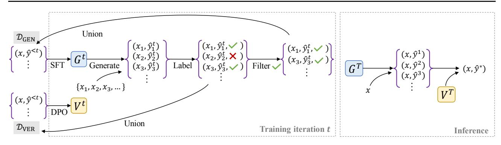

Figure 1. Generator and verifier training with V-STaR. Left: In each training iteration, the generator  $G^t$  is fine-tuned (from a pretrained LLM) on the current buffer of problem instances and correct solutions  $\mathcal{D}_{\text{GEN}}$ . Generated solutions that yielded a correct answer are added to  $\mathcal{D}_{\text{GEN}}$  to be used in future iterations, and all the generated solutions (correct and incorrect) are added to  $\mathcal{D}_{\text{VER}}$ . The verifier  $V^t$  is trained using DPO with a preference dataset constructed from pairs of correct and incorrect solutions from  $\mathcal{D}_{\text{VER}}$ . Right: At inference time, the verifier is used to rank solutions produced by the generator. Such iterative training and inference-time ranking yields large improvements in accuracy over generator-only self-improvement.

12% in code generation. Notably, in terms of performance, 7B models fine-tuned with V-STaR surpass base LLaMA2 70B (8-shot) on GSM8K, and nearly match CodeLLaMA 34B (zero-shot) on HumanEval. Our contributions are:

- We propose V-STaR, which utilizes iteratively generated correct and incorrect solutions to train a better generator and verifier. As shown in Fig. 2, V-STaR substantially outperforms existing approaches for math reasoning and code generation tasks.
- As a secondary contribution, we find DPO to be more effective for training verifiers than the prevalent approach by Cobbe et al. (2021). We also propose a formula for Verifier@k (§4.4), akin to Pass@k, to reliably evaluate performance with test-time verification.

# 2. Preliminaries

Given a pretrained language model G and the original training data of a task  $\mathcal{D}_{SFT} = \{(x_1,y_1),(x_2,y_2),\cdots(x_N,y_N)\}$ , where x is typically a description of a problem and y is the solution, such as chain-of-thought rationale or generated code. The de facto approach for such tasks with causal language models is supervised fine-tuning (SFT) with the negative log-likelihood objective on the training data:

<span id="page-1-1"></span>
$$\mathcal{L}_{SFT}(G) = -\mathbb{E}_{(x,y) \sim \mathcal{D}_{SFT}} \sum_{t=1}^{T} \log G(y_t \mid y_{< t}, x)$$
 (1)

where G is also referred to as *generator* in reasoning tasks. LLMs can be used to generate high quality chain-of-thought rationales or solutions for a range of tasks. This observation has motivated using correct generations from the model itself to bootstrap problem solving (Zelikman et al., 2022; Singh et al., 2023; Yuan et al., 2023).

# <span id="page-1-2"></span>2.1. Self-improvement approaches

**Self-Taught Reasoner** (STaR; Zelikman et al., 2022) corresponds to an iterative approach where a language model improves itself using correctness feedback. In each iteration, we generate one solution  $\hat{y}$  using greedy decoding with the language model generator G for each problem x in training dataset  $\mathcal{D}$ . Having access to test cases or ground truth answers, generated solutions can be checked for their binary correctness label z by:

$$z = \text{is\_correct}(x, \hat{y}), \qquad z \in \{0, 1\}.$$

A completion  $\hat{y}$  is labeled correct if it has the same final answer as the ground truth answer for math problems, or if it passes all the test cases for code generation problems. Only correct solutions (z=1) are included in the dataset at iteration j where  $\mathcal{D}_j = \{(x_1,\hat{y}_1),(x_2,\hat{y}_2),\cdots(x_N,\hat{y}_N)\}$ . Then, the generator is fine-tuned on this new dataset using (Eq. 1) where  $\mathcal{D}_{\text{SFT}} = \mathcal{D}_j$ . This fine-tuned generator is used in subsequent iterations.

**Rejection Sampling Fine-tuning** (RFT; Yuan et al., 2023) first fine-tunes a pretrained LM on the training dataset  $\mathcal{D}_{SFT}$  to obtain G. For each problem  $x_i$ , we then sample k solutions  $\{\hat{y}_{i,j} \sim G(y|x_i)\}_{j=1}^k$  and similar to STaR, we only keep correct generated solutions (z=1). In RFT, the original dataset is then augmented with the correct completions to  $\mathcal{D}_j$ , and G is fine-tuned on the new  $\mathcal{D}_j$  to obtain  $G_{RFT}$ . Unlike STaR, RFT is not an iterative approach.

 ${\bf STaR}^{\dagger}$ . Each STaR iteration can be performed similarly to RFT, akin to  ${\bf ReST}^{EM}$  (Singh et al., 2023). Since there could be multiple correct solutions for a problem, one could sample K solutions per problem at each STaR iteration, but this is not prescribed in the original STaR paper. For the rest of the paper, we denote this variant of STaR as  ${\bf STaR}^{\dagger}$ . Performing only 1 iteration of  ${\bf STaR}^{\dagger}$  corresponds to RFT.

<span id="page-2-2"></span>Table 1. Comparison of self-improvement and verification-based methods, showing the data used to train the generator and verifier (if applicable), and whether or not the method is iterative.

| МЕТНОО                           | GENERATOR DATA                                                                                                          | VERIFIER DATA                                                                                                                  | ITERATIVE |
|----------------------------------|-------------------------------------------------------------------------------------------------------------------------|--------------------------------------------------------------------------------------------------------------------------------|-----------|
| SFT                              | $\mathcal{D}_{\text{SFT}}$                                                                                              | Х                                                                                                                              | X         |
| VERIFICATION                     | $\mathcal{D}_{SFT}$                                                                                                     | $\mathcal{D}_{SFT} \cup GENERATED$                                                                                             | Х         |
| STAR                             | CORRECT GENERATED $_{t-1}$                                                                                              | ×                                                                                                                              | ✓         |
| RFT (STAR $^{\dagger}$ [1 ITER]) | $\mathcal{D}_{SFT} \cup Correct$ Generated                                                                              | ×                                                                                                                              | Х         |
| $STAR^{\dagger}$                 | $\mathcal{D}_{\text{SFT}} \cup \text{Correct Generated}_{< t}$                                                          | Х                                                                                                                              | ✓         |
| V-STAR [1 ITER]<br>V-STAR        | $\mathcal{D}_{\text{SFT}} \cup \text{Correct Generated} \ \mathcal{D}_{\text{SFT}} \cup \text{Correct Generated}_{< t}$ | $\mathcal{D}_{\text{SFT}} \cup \text{Generated} \ \mathcal{\boldsymbol{\mathcal{D}}_{\text{SFT}}} \cup \text{Generated}_{< t}$ | ×         |

### <span id="page-2-0"></span>Algorithm 1 V-STaR

```
Input: Original data \mathcal{D}_{SFT}, Training queries \mathcal{D}_{query}, base model G_{base}, Num generations k, Num iterations T
\mathcal{D}_{GEN} \leftarrow \mathcal{D}_{SFT}
G_{SFT} \leftarrow SFT(G_{base}, \mathcal{D}_{SFT})
for iter = 1 to T do
G \leftarrow SFT(G_{base}, \mathcal{D}_{GEN}) \qquad \{\text{fine-tune generator}\}
\mathcal{S} \leftarrow \text{sample}(G, \mathcal{D}_{query}, k) \qquad \{\text{generate candidates}\}
\mathcal{D}' \leftarrow \text{label\_correctness}(\mathcal{S}) \text{ } \{\text{score candidates to get } z\}
\mathcal{D}_{GEN} \leftarrow \mathcal{D}_{GEN} \cup \mathcal{D}'_{[z=1]} \text{ } \{\text{correct solutions} \rightarrow \text{buffer}\}
\mathcal{D}_{VER} \leftarrow \mathcal{D}_{VER} \cup \mathcal{D}' \quad \{\text{all solutions} \rightarrow \text{DPO buffer}\}\nend for
\mathcal{D}_{pref} \leftarrow \text{preference\_pairs}(\mathcal{D}_{VER})
V \leftarrow \text{DPO}(G_{SFT}, \mathcal{D}_{pref})
```

## <span id="page-2-1"></span>2.2. Test-time verification

Cobbe et al. (2021) trained verifiers that assess the probability that a candidate solution is correct for a given problem. At test time, the language model G generates many candidate solutions and the one ranked highest by the verifier is selected as the final answer. To train a verifier model V, similar to RFT, k candidate solutions are sampled from a generator G for each training problem and labeled for their correctness z to make the verifier training data  $\mathcal{D}_{\text{VER}} = \{(x_i, \hat{y}_{i,j}, z_{i,j})\}_{i=1}^N$ , where  $z_{i,j}$  is a binary label indicating whether  $\hat{y}_{i,j}$  is a correct or incorrect solution.

To train the verifier V, which they refer to as an outcomesupervised reward model (**ORM**), Cobbe et al. (2021) finetune a LLM on  $\mathcal{D}_{VER}$  using a combination of language modeling (Eq. 1) and binary classification. The model is trained to predict  $\hat{y}_{i,j}$  given  $x_i$  and  $z_{i,j}$  given  $\{x_i; \hat{y}_{i,j}\}$ with the language modeling objective and the classification objective, respectively. See §5 for more details.

### <span id="page-2-3"></span>2.3. Preference learning with DPO

Fine-tuning pretrained LLMs from human feedback can result in large gains in performance for downstream tasks (Ouyang et al., 2022; Bai et al., 2022). The typical frame-

work to do so is to collect paired human preferences for a set of input prompts  $\mathcal{D}_{\text{pref}} = \{(x_i, y_i^+, y_i^-)\}_{i=1}^N$ , train a reward model using  $\mathcal{D}_{\text{pref}}$ , and then fine-tune the LLM using this reward (Stiennon et al., 2020).

More recently, Rafailov et al. (2023) proposed Direct Preference Optimization (DPO) that does not use a separately trained reward model during fine-tuning. DPO requires supervised fine-tuning (SFT) a pretrained LLM on the downstream task to obtain  $G_{\rm SFT}$ , which is also called the reference policy in this method. Given the preference dataset  $\mathcal{D}_{\rm pref}$  and  $G_{\rm SFT}$ , DPO's objective increases the relative log probability of preferred  $y^+$  to dispreferred  $y^-$  completions.

# 3. V-STaR: Verifiers for self-taught reasoners

Existing self-improvement methods, such as RFT, STaR, and ReST $^{EM}$ , throw away model generated solutions that are incorrect. However, incorrect solutions can also contain valuable information: a language model could learn from discrepancies between correct and incorrect solutions for a given problem, and identify error patterns in generations, enhancing its ability to provide more accurate solutions. In this work, we propose **V-STaR** that utilizes both incorrect and correct generated solutions in an iterative process and use them to train a better generator and verifier (see Alg. 1).

- First, we fine-tune a pretrained LLM  $G_{\text{base}}$  on the original training data  $\mathcal{D}_{\text{SFT}}$  to obtain generator  $G_{\text{SFT}}$ .
- Next, we sample k completions for each problem in the training data from the generator  $\{\hat{y}_{i,j} \sim G(y|x_i)\}_{j=1}^k$ , where  $x \in \mathcal{D}_{\text{query}}$  (see §C for an example).
- Generated solutions are labeled for their correctness z using ground truth answers or test cases. We use only correct generated solutions (z=1) to augment the generator training data  $\mathcal{D}_{\text{GEN}}$  as  $(x_i, \hat{y}_{i,j})$ . Both correct and incorrect generated solutions are added to verifier data  $\mathcal{D}_{\text{VER}}$  with their correctness label as  $(x_i, \hat{y}_{i,j}, z_{i,j})$ , so the verifier can learn from generator's mistakes.
- In the next iteration t, the generator  $G^t$  is obtained by fine-tuning the pretrained model  $G_{\text{base}}$  on the augmented

<span id="page-3-0"></span>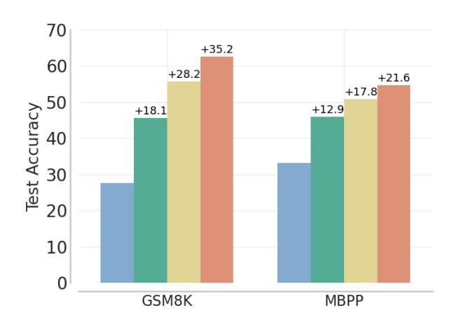

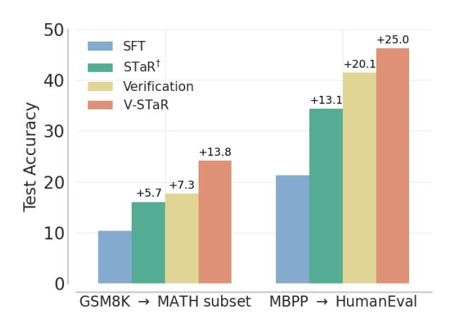

Figure 2. Test accuracy of 7B V-STaR compared to baselines. We report Verifier@64 for verification-based methods and Pass@1 for others. All methods, except SFT, have access to the SFT baseline model and K=48 output generations per problem. STaR<sup>†</sup> and V-STaR are run for 3 iterations, where each iteration uses K/3=16 samples. Verification corresponds to using a test-time verifier trained on K generated completions from the SFT generator. Numbers above each bar show the absolute improvement over SFT. (Left) Test accuracy for training tasks. (Right) Transfer evaluation of GSM8K and MBPP trained models on MATH subset and HumanEval respectively.

 $\mathcal{D}_{\text{GEN}}$ . We can sample solutions again from this generator  $G^t$ . This process is repeated for up to T iterations to augment  $\mathcal{D}_{\text{GEN}}$  and  $\mathcal{D}_{\text{VER}}$  iteratively.

• The final generator  $G^T$  is obtained by using  $\mathcal{D}_{GEN}$  to finetune a pretrained model  $G_{\text{base}}$ . The verifier  $V^T$  is obtained by using  $\mathcal{D}_{\text{VER}}$  to further train a model  $G_{\text{SFT}}$  which was fine-tuned on the original  $\mathcal{D}_{\text{SFT}}$ .

In our approach, the original training data is also included as correct solutions in both generator data and verifier data. The main difference between our verifier training method and Cobbe et al. (2021) is that our verifier training data is collected iteratively, each iteration from a better generator, while ORM only collects data from a fixed generator that is only fine-tuned on the original SFT data.

### <span id="page-3-2"></span>3.1. Training verifiers with DPO

Following Cobbe et al. (2021), current LLM verifiers are trained with a combination of language modeling and binary classification loss (§2.2). These two objectives can be unified via offline preference learning methods, such as DPO (Rafailov et al., 2023), where the proximity to the reference policy is a proxy for the language modeling objective while the classification loss is a proxy for reward modelling.

To use DPO for training verifiers, we construct a preference pair dataset using collected solutions in  $\mathcal{D}_{VER}$ . We treat correct solutions as preferred and incorrect solutions as not preferred completions given the problem. Specifically,

$$\mathcal{D}_{\text{VER}} = \{(x_i, y_{i,1}^+, y_{i,1}^-), \cdots, (x_i, y_{i,m}^+, y_{i,m}^-)\}_{i=1}^N$$

where m is the number of preference pairs which are from

the Cartesian product of correct and incorrect solutions

$$(y_i^+, y_i^-) \in {\{\hat{y}_{i,j} \mid z_{i,j} = 1\}} \times {\{\hat{y}_{i,j} \mid z_{i,j} = 0\}}.$$

We train our verifier V using this constructed  $\mathcal{D}_{VER}$  and the SFT policy  $G_{SFT}$  using the DPO objective,  $\mathcal{L}_{DPO}(V; G_{SFT})$ :

$$-\mathbb{E}_{(x,y^+,y^-)\sim\mathcal{D}_{VER}}\left[\log\sigma\left(\hat{r}(x,y^+)-\hat{r}(x,y^-)\right)\right],$$

where  $\hat{r}(x,y) = \beta \log \frac{V(y|x)}{G_{\rm SFT}(y|x)}$ ,  $\sigma$  is the logistic function, and  $\beta$  is a hyper-parameter controlling the proximity to the reference policy  $G_{\rm SFT}$ . The DPO objective steers the verifier towards increasing the likelihood of correct solutions  $y^+$  and decreasing the likelihood of incorrect solutions  $y^-$  for a problem x. We found DPO verifiers to be better than ORM-style verifiers (Cobbe et al., 2021) when using LoRA adapters (Hu et al., 2022). See §4.8 for more details.

### <span id="page-3-3"></span>4. Empirical results

To demonstrate the effectiveness of V-STaR, we conduct experiments on two widely used datasets: GSM8K (Cobbe et al., 2021) for solving math problems, and MBPP (Austin et al., 2021) for code-generation problems. We also evaluate the transfer generalization performance of V-STaR using Hendrycks' MATH (Hendrycks et al., 2021) HumanEval (Chen et al., 2021). Specifically, for math reasoning, we only train our generators and verifiers using GSM8K training data and evaluate them on the whole GSM8K test set and a subset of MATH test set. For code generation,

<span id="page-3-1"></span>This subset includes a total 150 problems of Level 1 difficulty in MATH with question types of *algebra*, *Counting & probability*, *prealgebra* and *number theory* where the final answer is a number and no latex exists in the question.

<span id="page-4-1"></span>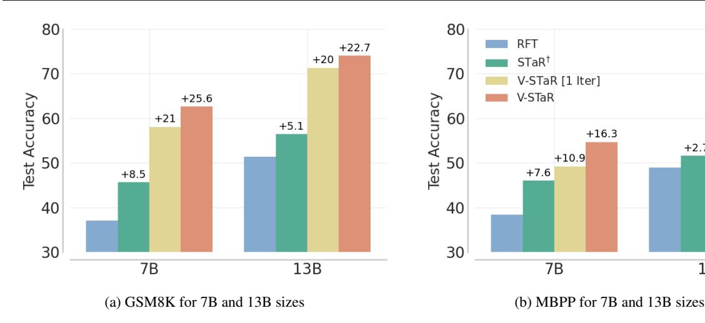

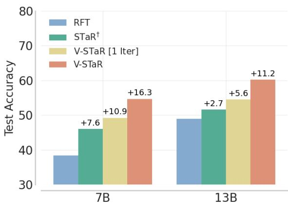

Figure 3. Pass@1 and Verifier@64 scores for generator-only and verifier-based methods. Numbers above each bar represent the absolute improvement over RFT. V-STaR[1 Iter] baseline is trained with data consisting of 3 × 16 completions per query for one iteration only. STaR† and V-STaR are trained using iterative data collection (i.e. 16 completions generated per query at each iteration). At test time, 128 candidate answers are sampled per problem from the generators and scored using the verifiers. Verifier@64 is calculated using [\(Eq. 2\)](#page-5-0). V-STaR 7B performs on par with CodeLLaMA 34B which has a zero-shot Pass@1 of 55% on MBPP.

we train our models using the MBPP training data and evaluate them on the full test sets of MBPP and HumanEval, formatted using the MBPP prompt template.

### 4.1. Models

We run our experiments by training LLaMA2 [\(Touvron](#page-9-5) [et al.,](#page-9-5) [2023\)](#page-9-5) and CodeLLaMA [\(Roziere et al.](#page-9-6) ` , [2023\)](#page-9-6) 7B and 13B models using LoRA adapters [\(Hu et al.,](#page-8-5) [2022\)](#page-8-5). Generators are trained with a causal language modeling objective, and our baseline (V-STaR[1 Iter]) and V-STaR verifiers are trained using DPO.

The reference policy GSFT for DPO is trained on the original training data for 2 and 3 epochs for GSM8K and MBPP, respectively. See [§3.1](#page-3-2) for more details on using DPO to train the verifier. At inference, we use the likelihood of a (generated) solution given a problem under the trained verifier (i.e. V (ˆy|x)) as scores to rank candidate solutions.

# 4.2. Data generation

For each iteration, k = 16 completions are sampled per query from the previous iteration's generator. For GSM8K, the first iteration samples are from a generator trained solely on the original GSM8K training data for 2 epochs. For MBPP, this data is from a pretrained CodeLLaMA model with three in-context examples (see [§A\)](#page-11-0). Completions are labeled for correctness by checking the final answer for math problems and running test cases for coding problems.

### 4.3. Baselines and metrics

We run V-STaR for 3 iterations and sample K = 16 solutions at each iteration to augment DGEN and DVER. To

assess the gains from our iterative approach, we compare against a number of baselines [\(Table 1\)](#page-2-2):

- 1. SFT: Standard fine-tuning [\(Eq. 1\)](#page-1-1) on training data without any self-improvement or verifier training.
- 2. STaR† : A generator is bootstrapped by sampling K=16 completions per query for 3 iterations, see [§2.1.](#page-1-2)
- 3. RFT: Running STaR† by sampling 3 × 16 completions for only 1 iteration, see [§2.1.](#page-1-2)
- 4. Verification (SFT + Verifier): Generating 3×16 completions using SFT generator to train a verifier with DPO, as described in [§2.3.](#page-2-3)
- 5. V-STaR [Iter 1]: Bootstrapping a generator and training a verifier for 1 iteration only with k = 3×16 completions sampled from GSFT, so that the total generation budget matches V-STaR.

At inference, we generate 128 candidate solutions for each test problem using the generator. We report Pass@1 for the generators and Verifier@64 for verification-based methods, using [\(Eq. 2\)](#page-5-0). We also report majority voting [\(Wang et al.,](#page-9-9) [2023c\)](#page-9-9) performance as a strong baseline, following [Cobbe](#page-8-0) [et al.](#page-8-0) [\(2021\)](#page-8-0); [Lightman et al.](#page-9-3) [\(2024\)](#page-9-3).

### <span id="page-4-0"></span>4.4. Reliable estimation of Verifier@k

To estimate verifier@k accuracy, one would repeat the following procedure several times and average the results: sample k solutions, rank them using a verifier and take the top scoring one as the predicted answer [\(Cobbe et al.,](#page-8-0) [2021;](#page-8-0) [Lightman et al.,](#page-9-3) [2024\)](#page-9-3). However, computing verifier@k

<span id="page-5-1"></span>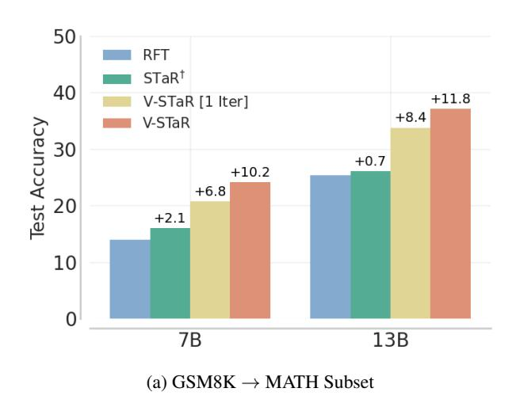

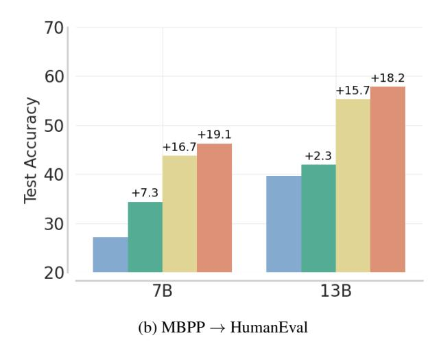

Figure 4. Out-of-domain transfer evaluation: Pass@1 and Verifier@64 for generators and verifiers with absolute improvement over RFT shown above each bar. Models trained on GSM8K are evaluated on a subset of MATH test set (§4), and models trained on MBPP are evaluate on HumanEval test set. V-STaR 7B performs close to CodeLLaMA 34B which has a zero-shot Pass@1 of 48% on HumanEval.

this way can have high variance. Instead, to measure the verifier @k reliably, we propose a formula, akin to how Pass @k is computed (Chen et al., 2021). To do so, we estimate the probability that out of k samples drawn without replacement from a fixed set of N (for N>k) samples, the one with the highest verifier score is correct, using the following formula:

<span id="page-5-0"></span>
$$Verifier@k := \frac{\sum_{i=0}^{N-k} \binom{N-i-1}{k-1} \alpha_i}{\binom{N}{k}}$$
 (2)

where  $[\alpha_0, \ldots, \alpha_{N-1}]$  are the binary correctness values (0 or 1) for the N candidates  $y_i$  sorted in decreasing order by their verifier score. The numerator in (Eq. 2) can be derived by considering subsets where the top-ranked candidate is  $y_i$  for all possible values of  $i \in \{0, \ldots, N-k-1\}$ .

### 4.5. V-STaR on math and code reasoning

As shown in Fig. 2, V-STaR shows consistent gains across GSM8K, MBPP, MATH subset and HumanEval test sets for LLaMA2 7B and 13B models (Fig. 8) over baselines. In math, we report absolute improvement of 6% to 17% in test accuracy over STaR† and Verification, and 4% to 12% in code generation tasks. The gains over V-STaR [1 iter] in Fig. 3 show that iteratively generating solutions to collect verifier training data results in a better distribution and quality compared to a non-iterative approach with the same generation budget. We also tried collecting all the verifier training data from the generator at iteration 3. Although this variant uses a larger sampling budget, it resulted in a 2% lower absolute test accuracy on GSM8K than V-STaR.

To test the out-of-domain performance of V-STaR, the generators and verifiers trained on MBPP are evaluated on Hu-

manEval, while those trained on GSM8K are evaluated on a subset of MATH test set (see Fig. 2 and Fig. 4). In general, we observe lower absolute Pass@1 and Verifier@64 scores for all methods as these two tasks are considered to be more difficult than GSM8K and MBPP. That said, Iterative V-STaR outperforms baselines, and V-STaR [1 iter] on both tasks and across model sizes. Utilizing incorrect solutions to train verifiers results in large improvements than just bootstrapping with correct model generated solutions using STaR $^\dagger$  or RFT. While we use LoRA adapters due to compute constraints, we hypothesize that gains from V-STaR could potentially be larger with full parameter fine-tuning.

**Verifier**@k accuracy. Fig. 5 shows test accuracy for k=1 to k=64, calculated from 128 candidate solutions per test problem, for 7B models on both tasks. Verifier@0 is equivalent to Pass@1 and ignores verifier scores. Verifier@k saturates for  $k\geq 16$  and the gap between V-STaR [1 Iter] and V-STaR stays consistent.

### 4.6. Should the verifier be in the training loop?

Optionally, one could train intermediate verifiers at each iteration and filter correct solutions to include in  $\mathcal{D}_{\text{GEN}}$  and  $\mathcal{D}_{\text{VER}}$  to provide feedback. This step seems more reasonable with sufficient exploration, that is larger values of k, when sampling k solutions from the generator in each iteration.

We tried putting the verifier in the training loop to filter correct solutions from the generator for the next training iteration. To do so, we sampled k=64 completions per query from the generator, labeled their correctness, and took only the top 8 based on their verifier score. We take as many samples from the incorrect set so that the total number of correct and incorrect completions per query is 16 or less.

<span id="page-6-2"></span>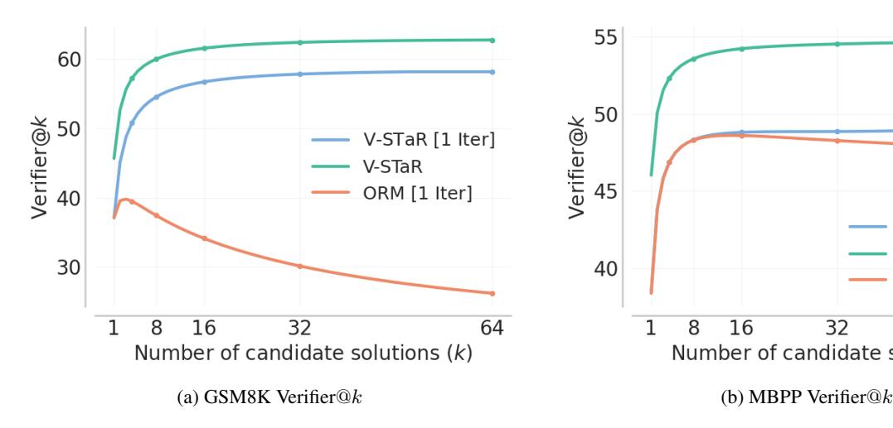

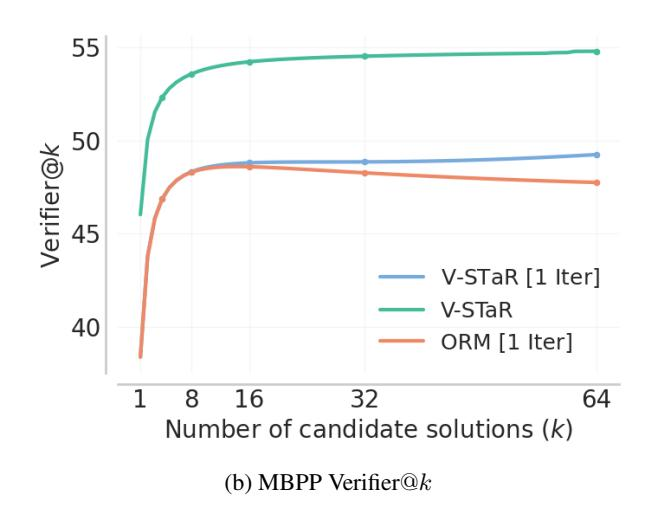

Figure 5. Performance of V-STaR, V-STaR [1 Iter], and output reward model (ORM) style verifier 7B models, measured by Verifier@k. Verifier@1 is equivalent to not having a verifier and is equal to Pass@1 of the generator.

After running three iterations with verifier in the loop for MBPP, the final verifier@64 accuracy, Pass@1 and Pass@10 are 53.2, 46.34 and 69.57 respectively.

Our results suggest that having the verifier in the training loop does not provide a substantial gain for this task. V-STaR is simpler without the verifier in the loop and there is no need to train a verifier at each iteration; however we did not experiment with other tasks and different sampling strategies from the generator at each iteration. We leave a more detailed study of this question to future work.

### 4.7. How many completions can V-STaR be extended to?

[Fig. 6](#page-7-0) shows the performance of V-STaR 7B on GSM8K measured by Verifier@k as a function of k. V-STaR outperforms majority voting [\(Wang et al.,](#page-9-9) [2023c\)](#page-9-9) at searching over a large number of candidate solutions. While V-STaR is far more effective than majority voting for k ≤ 64, the performance gap starts to slightly decrease for larger value of k, similar to performance decay reported in [Cobbe et al.](#page-8-0) [\(2021\)](#page-8-0). Furthermore, V-STaR can be used for any problem solving task where we can verify correctness while majority voting is not applicable to tasks such as code generation. We also tried combining verifier scores with reranking strategies, such as weighted reranking and weighted majority voting [\(Liu et al.,](#page-9-10) [2023\)](#page-9-10), but did not observe performance gains.

# <span id="page-6-1"></span>4.8. Comparing DPO *vs.* ORM verifiers

We trained ORM style verifiers, as described in [§2.2,](#page-2-1) with LoRA adapters. These verifiers did seem to achieve relatively poor performance compared to DPO-based verifiers. [Fig. 5a](#page-6-2) shows the comparison between the V-STaR [1 Iter]

trained with DPO and an ORM style verifier on the same training data. ORM fails to effectively search through generated candidate solutions for number of candidates above 4 in the GSM8K task. The ORM style verifier is also performing worse than our DPO based verifier in MBPP for number of candidate solutions above 16.

# 4.9. Evaluating DPO verifier as a generator

Since DPO fine-tuned models can also be used as generators, we evaluate how good is the generation ability of DPO verifiers. [Fig. 7](#page-7-1) shows Pass@1 and Verifier@64 for V-STaR verifier as a function of training updates, for three different β coefficients for proximity to SFT policy in DPO objective [\(§3.1\)](#page-3-2). The verifier's solving ability starts degrading only after a small number of training updates. In contrast, using the DPO objective for verification seems to be sample efficient as the model's Verifier@64 increases significantly with only 2k training updates.

# <span id="page-6-0"></span>5. Related work

Challenging multi-step reasoning tasks has driven innovative research on LLMs, such as generating answers given questions via intermediate steps [\(Wei et al.,](#page-10-2) [2022;](#page-10-2) [Kojima](#page-8-6) [et al.,](#page-8-6) [2022\)](#page-8-6). A large volume of recent work studies ways to improve the correctness of these intermediate steps and reducing the cost of arriving at a correct solution.

Self-training and self-improvement. One family of methods, beginning with STaR [\(Zelikman et al.,](#page-10-0) [2022\)](#page-10-0), reinforced self-training [\(Gulcehre et al.,](#page-8-7) [2023\)](#page-8-7), and rejection fine-tuning [\(Yuan et al.,](#page-10-1) [2023\)](#page-10-1), relies on solutions generated by the LLM to update itself. These methods fine-tune

<span id="page-7-0"></span>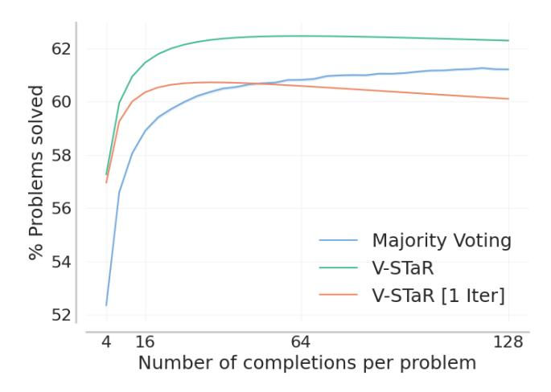

Figure 6. Test accuracy of 7B V-STaR compared to V-STaR[1 Iter] and majority voting [\(Wang et al.,](#page-9-9) [2023c\)](#page-9-9) across different numbers of candidate solutions generated on GSM8K. We subsample candidate solutions from N = 1000 generations. V-STaR can rank over a reasonably large number of candidate solutions. We compute 95% confidence interval for majority voting using 256 trials.

the model on generated solutions that yield a correct answer. ReSTEM [\(Singh et al.,](#page-9-1) [2023\)](#page-9-1) view this fine-tuning as expectation-maximization based RL fine-tuning of a solution-generating agent. [Wang et al.](#page-9-11) [\(2023a\)](#page-9-11) propose a contrastive loss to make correct solutions more likely than incorrect ones, while [Ni et al.](#page-9-12) [\(2023a\)](#page-9-12) propose to use *intermediate* states of successful solutions as supervision to improve credit assignment. Discovery of successful solutions is a difficult exploration problem, and [Luong et al.](#page-9-13) [\(2024\)](#page-9-13) has shown that RL-based fine-tuning of a LLM is difficult unless it is initialized by some steps of supervised fine-tuning. In [An et al.](#page-8-8) [\(2023\)](#page-8-8), a more powerful LLM was used to edit the incorrect rationales generated by a smaller model and provide positive data for its fine-tuning. However, [Huang et al.](#page-8-9) [\(2023\)](#page-8-9) argued that LLMs are limited in their ability to correct their *own* reasoning. V-STaR is similar to self-improvement methods in that it uses its self-generated solutions for fine-tuning, but also trains a verifier using these solutions, including both correct and incorrect ones.

Training verifiers. Verifiers – models that score or rank reasoning chains with the aim of favouring successful rationales – were introduced for mathematical reasoning tasks by [Cobbe et al.](#page-8-0) [\(2021\)](#page-8-0), who proposed to collect correct and incorrect rationales from a tuned generator and train a verifier. They noted the importance of a large training set for the success of the method. [Uesato et al.](#page-9-14) [\(2022\)](#page-9-14) found that process supervision – correctness of the rationale – enhances the performance of fine-tuned LLMs relative to outcome supervision – whether the answer is correct or not. Subsequent work correspondingly studied ways of deriving reward sig-

<span id="page-7-1"></span>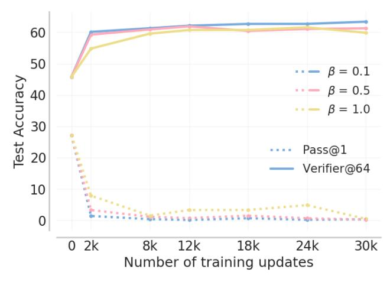

Figure 7. Comparing DPO-based generator and verifier for V-STaR 7B, measured by Pass@1 and Verifier@64 respectively on GSM8K. Verifier@64 accuracy rises significantly while the generation ability of DPO verifier degrades with only 2k training steps.

nals for individual reasoning steps [\(Li et al.,](#page-8-10) [2023;](#page-8-10) [Lightman](#page-9-3) [et al.,](#page-9-3) [2024;](#page-9-3) [Yu et al.,](#page-10-3) [2023\)](#page-10-3), combining solution-level and step-level verifiers [\(Zhu et al.,](#page-10-4) [2023\)](#page-10-4), and augmenting verifiers with auxiliary information, such as results of program execution [\(Ni et al.,](#page-9-15) [2023b\)](#page-9-15). In [Ma et al.](#page-9-16) [\(2023\)](#page-9-16); [Wang et al.](#page-9-2) [\(2023b\)](#page-9-2), rationale generation is treated as a graph search problem, either using a stepwise verifier to guide the search or estimating the quality of steps by Monte Carlo rollouts. In V-STaR, the verifier is trained with DPO, which enjoys a high sample efficiency (see [Fig. 7\)](#page-7-1), and is used for ranking LLM-generated solutions at test-time.

The manner of training the verifier varies between works. The verifier can be viewed a reward model trained on human annotations – making the training of a generator that satisfies the verifier as an instance of RL with human feedback [\(Ziegler et al.,](#page-10-5) [2019\)](#page-10-5) – or on synthetic data, leading to forms of RL with AI feedback [\(Bai et al.,](#page-8-4) [2022;](#page-8-4) [Yang](#page-10-6) [et al.,](#page-10-6) [2023\)](#page-10-6). The verifier can alternatively be viewed as a generative model, such as by conditioning on control tokens indicating a positive or negative label of a solution [\(Korbak](#page-8-11) [et al.,](#page-8-11) [2023\)](#page-8-11) or by extracting the score as the likelihood of a special token following the candidate solution [\(Liu](#page-9-10) [et al.,](#page-9-10) [2023\)](#page-9-10). V-STaR takes the unique approach of using DPO [\(Rafailov et al.,](#page-9-4) [2023\)](#page-9-4) to contrast the likelihoods of correct and incorrect solutions under the verifier (see [§3.1\)](#page-3-2).

# 6. Conclusion

We propose V-STaR, a data-efficient and simple to implement approach that utilizes correct and incorrect generated solutions from an iteratively trained generator to train a strong verifier. We find training verifiers with DPO to be more effective than the common method by [Cobbe et al.](#page-8-0) [\(2021\)](#page-8-0). Our empirical results show the effectiveness of V-STaR over existing self-improvement and verification-based methods. V-STaR has the potential to improve existing selfimprovement loops on a wide range of problems with access to correctness feedback during training.

# Acknowledgements

We would like to thank Denny Zhou, Azade Nova and Adam Kosiorek for providing valuable feedback to an early draft. We acknowledge material support from NVIDIA Corporation in the form of computational resources. In addition, we thank Google and Microsoft for their invaluable financial support.

# Impact statement

This work aims to improve the reasoning skills of LLMs in a self-refinement loop, making use of existing datasets and the models' own solution-generation abilities. As such, V-STaR makes a step towards improving the data and compute efficiency of LLM inference, which promotes their accessibility and use in real applications. On the other hand, we encourage researchers and practitioners who build upon our work to be cautious of the possible misuse of LLMs with enhanced reasoning capability.

# References

- <span id="page-8-8"></span>An, S., Ma, Z., Lin, Z., Zheng, N., Lou, J.-G., and Chen, W. Learning from mistakes makes llm better reasoner. *arXiv preprint arXiv:2310.20689*, 2023.
- <span id="page-8-2"></span>Austin, J., Odena, A., Nye, M., Bosma, M., Michalewski, H., Dohan, D., Jiang, E., Cai, C., Terry, M., Le, Q., et al. Program synthesis with large language models. *arXiv preprint arXiv:2108.07732*, 2021.
- <span id="page-8-4"></span>Bai, Y., Kadavath, S., Kundu, S., Askell, A., Kernion, J., Jones, A., Chen, A., Goldie, A., Mirhoseini, A., McKinnon, C., Chen, C., Olsson, C., Olah, C., Hernandez, D., Drain, D., Ganguli, D., Li, D., Tran-Johnson, E., Perez, E., Kerr, J., Mueller, J., Ladish, J., Landau, J., Ndousse, K., Lukosuite, K., Lovitt, L., Sellitto, M., Elhage, N., Schiefer, N., Mercado, N., DasSarma, N., Lasenby, R., Larson, R., Ringer, S., Johnston, S., Kravec, S., Showk, S. E., Fort, S., Lanham, T., Telleen-Lawton, T., Conerly, T., Henighan, T., Hume, T., Bowman, S. R., Hatfield-Dodds, Z., Mann, B., Amodei, D., Joseph, N., McCandlish, S., Brown, T., and Kaplan, J. Constitutional AI: Harmlessness from AI feedback. *arXiv preprint arXiv:2212.08073*, 2022.
- <span id="page-8-3"></span>Chen, M., Tworek, J., Jun, H., Yuan, Q., de Oliveira Pinto, H. P., Kaplan, J., Edwards, H., Burda, Y., Joseph, N.,

- Brockman, G., Ray, A., Puri, R., Krueger, G., Petrov, M., Khlaaf, H., Sastry, G., Mishkin, P., Chan, B., Gray, S., Ryder, N., Pavlov, M., Power, A., Kaiser, L., Bavarian, M., Winter, C., Tillet, P., Such, F. P., Cummings, D., Plappert, M., Chantzis, F., Barnes, E., Herbert-Voss, A., Guss, W. H., Nichol, A., Paino, A., Tezak, N., Tang, J., Babuschkin, I., Balaji, S., Jain, S., Saunders, W., Hesse, C., Carr, A. N., Leike, J., Achiam, J., Misra, V., Morikawa, E., Radford, A., Knight, M., Brundage, M., Murati, M., Mayer, K., Welinder, P., McGrew, B., Amodei, D., McCandlish, S., Sutskever, I., and Zaremba, W. Evaluating large language models trained on code. *arXiv preprint arXiv:2107.03374*, 2021.
- <span id="page-8-0"></span>Cobbe, K., Kosaraju, V., Bavarian, M., Chen, M., Jun, H., Kaiser, L., Plappert, M., Tworek, J., Hilton, J., Nakano, R., Hesse, C., and Schulman, J. Training verifiers to solve math word problems. *arXiv preprint arXiv:2110.14168*, 2021.
- <span id="page-8-7"></span>Gulcehre, C., Paine, T. L., Srinivasan, S., Konyushkova, K., Weerts, L., Sharma, A., Siddhant, A., Ahern, A., Wang, M., Gu, C., et al. Reinforced self-training (rest) for language modeling. *arXiv preprint arXiv:2308.08998*, 2023.
- <span id="page-8-1"></span>Hendrycks, D., Burns, C., Kadavath, S., Arora, A., Basart, S., Tang, E., Song, D., and Steinhardt, J. Measuring mathematical problem solving with the MATH dataset. *Neural Information Processing Systems (NeurIPS) Datasets and Benchmarks*, 2021.
- <span id="page-8-5"></span>Hu, E. J., Shen, Y., Wallis, P., Allen-Zhu, Z., Li, Y., Wang, S., Wang, L., and Chen, W. LoRA: Low-rank adaptation of large language models. *International Conference on Learning Representations (ICLR)*, 2022.
- <span id="page-8-9"></span>Huang, J., Chen, X., Mishra, S., Zheng, H. S., Yu, A. W., Song, X., and Zhou, D. Large language models cannot self-correct reasoning yet. *arXiv preprint arXiv:2310.01798*, 2023.
- <span id="page-8-6"></span>Kojima, T., Gu, S. S., Reid, M., Matsuo, Y., and Iwasawa, Y. Large language models are zero-shot reasoners. *Neural Information Processing Systems (NeurIPS)*, 2022.
- <span id="page-8-11"></span>Korbak, T., Shi, K., Chen, A., Bhalerao, R., Buckley, C. L., Phang, J., Bowman, S. R., and Perez, E. Pretraining language models with human preferences. *International Conference on Machine Learning (ICML)*, 2023.
- <span id="page-8-10"></span>Li, Y., Lin, Z., Zhang, S., Fu, Q., Chen, B., Lou, J.-G., and Chen, W. Making language models better reasoners with step-aware verifier. In Rogers, A., Boyd-Graber, J., and Okazaki, N. (eds.), *Proceedings of the 61st Annual Meeting of the Association for Computational Linguistics (Volume 1: Long Papers)*, pp. 5315–5333, Toronto, Canada,

- July 2023. Association for Computational Linguistics. doi: 10.18653/v1/2023.acl-long.291. URL [https:](https://aclanthology.org/2023.acl-long.291) [//aclanthology.org/2023.acl-long.291](https://aclanthology.org/2023.acl-long.291).
- <span id="page-9-3"></span>Lightman, H., Kosaraju, V., Burda, Y., Edwards, H., Baker, B., Lee, T., Leike, J., Schulman, J., Sutskever, I., and Cobbe, K. Let's verify step by step. *International Conference on Learning Representations (ICLR)*, 2024.
- <span id="page-9-10"></span>Liu, Y., Singh, A., Freeman, C. D., Co-Reyes, J. D., and Liu, P. J. Improving large language model fine-tuning for solving math problems. *arXiv preprint arXiv:2310.10047*, 2023.
- <span id="page-9-13"></span>Luong, T. Q., Zhang, X., Jie, Z., Sun, P., Jin, X., and Li, H. ReFT: Reasoning with reinforced fine-tuning. *arXiv preprint arXiv:2401.08967*, 2024.
- <span id="page-9-16"></span>Ma, Q., Zhou, H., Liu, T., Yuan, J., Liu, P., You, Y., and Yang, H. Let's reward step by step: Step-level reward model as the navigators for reasoning. *arXiv preprint arXiv:2310.10080*, 2023.
- <span id="page-9-0"></span>Metcalfe, J. Learning from errors. *Annual Review of Psychology*, 68(1):465–489, 2017.
- <span id="page-9-12"></span>Ni, A., Inala, J. P., Wang, C., Polozov, O., Meek, C., Radev, D., and Gao, J. Learning math reasoning from selfsampled correct and partially-correct solutions. *International Conference on Learning Representations (ICLR)*, 2023a.
- <span id="page-9-15"></span>Ni, A., Iyer, S., Radev, D., Stoyanov, V., Yih, W.-t., Wang, S. I., and Lin, X. V. LEVER: Learning to verify languageto-code generation with execution. *International Conference on Machine Learning (ICML)*, 2023b.
- <span id="page-9-7"></span>Ouyang, L., Wu, J., Jiang, X., Almeida, D., Wainwright, C. L., Mishkin, P., Zhang, C., Agarwal, S., Slama, K., Ray, A., Schulman, J., Hilton, J., Kelton, F., Miller, L., Simens, M., Askell, A., Welinder, P., Christiano, P. F., Leike, J., and Lowe, R. Training language models to follow instructions with human feedback. *Neural Information Processing Systems (NeurIPS)*, 2022.
- <span id="page-9-4"></span>Rafailov, R., Sharma, A., Mitchell, E., Manning, C. D., Ermon, S., and Finn, C. Direct preference optimization: Your language model is secretly a reward model. *Neural Information Processing Systems (NeurIPS)*, 2023.
- <span id="page-9-6"></span>Roziere, B., Gehring, J., Gloeckle, F., Sootla, S., Gat, I., Tan, ` X. E., Adi, Y., Liu, J., Remez, T., Rapin, J., Kozhevnikov, A., Evtimov, I., Bitton, J., Bhatt, M., Canton-Ferrer, C., Grattafiori, A., Xiong, W., Defossez, A., Copet, J., Azhar, ´ F., Touvron, H., Martin, L., Usunier, N., Scialom, T., and Synnaeve, G. Code llama: Open foundation models for code. *arXiv preprint arXiv:2308.12950*, 2023.

- <span id="page-9-1"></span>Singh, A., Co-Reyes, J. D., Agarwal, R., Anand, A., Patil, P., Garcia, X., Liu, P. J., Harrison, J., Lee, J., Xu, K., Parisi, A., Kumar, A., Alemi, A., Rizkowsky, A., Nova, A., Adlam, B., Bohnet, B., Elsayed, G., Sedghi, H., Mordatch, I., Simpson, I., Gur, I., Snoek, J., Pennington, J., Hron, J., Kenealy, K., Swersky, K., Mahajan, K., Culp, L., Xiao, L., Bileschi, M. L., Constant, N., Novak, R., Liu, R., Warkentin, T., Qian, Y., Bansal, Y., Dyer, E., Neyshabur, B., Sohl-Dickstein, J., and Fiedel, N. Beyond human data: Scaling self-training for problem-solving with language models. *arXiv preprint arXiv:2312.06585*, 2023.
- <span id="page-9-8"></span>Stiennon, N., Ouyang, L., Wu, J., Ziegler, D. M., Lowe, R., Voss, C., Radford, A., Amodei, D., and Christiano, P. F. Learning to summarize from human feedback. *Neural Information Processing Systems (NeurIPS)*, 2020.
- <span id="page-9-5"></span>Touvron, H., Martin, L., Stone, K., Albert, P., Almahairi, A., Babaei, Y., Bashlykov, N., Batra, S., Bhargava, P., Bhosale, S., Bikel, D., Blecher, L., Canton-Ferrer, C., Chen, M., Cucurull, G., Esiobu, D., Fernandes, J., Fu, J., Fu, W., Fuller, B., Gao, C., Goswami, V., Goyal, N., Hartshorn, A., Hosseini, S., Hou, R., Inan, H., Kardas, M., Kerkez, V., Khabsa, M., Kloumann, I., Korenev, A., Koura, P. S., Lachaux, M., Lavril, T., Lee, J., Liskovich, D., Lu, Y., Mao, Y., Martinet, X., Mihaylov, T., Mishra, P., Molybog, I., Nie, Y., Poulton, A., Reizenstein, J., Rungta, R., Saladi, K., Schelten, A., Silva, R., Smith, E. M., Subramanian, R., Tan, X. E., Tang, B., Taylor, R., Williams, A., Kuan, J. X., Xu, P., Yan, Z., Zarov, I., Zhang, Y., Fan, A., Kambadur, M., Narang, S., Rodriguez, A., Stojnic, R., Edunov, S., and Scialom, T. Llama 2: Open foundation and fine-tuned chat models. *arXiv preprint arXiv:2307.09288*, 2023.
- <span id="page-9-14"></span>Uesato, J., Kushman, N., Kumar, R., Song, H. F., Siegel, N. Y., Wang, L., Creswell, A., Irving, G., and Higgins, I. Solving math word problems with process- and outcomebased feedback. *arXiv preprint arXiv:2211.14275*, 2022.
- <span id="page-9-11"></span>Wang, P., Li, L., Chen, L., Song, F., Lin, B., Cao, Y., Liu, T., and Sui, Z. Making large language models better reasoners with alignment. *arXiv preprint arXiv:2309.02144*, 2023a.
- <span id="page-9-2"></span>Wang, P., Li, L., Shao, Z., Xu, R. X., Dai, D., Li, Y., Chen, D., Wu, Y., and Sui, Z. Math-shepherd: Verify and reinforce LLMs step-by-step without human annotations. *arXiv preprint arXiv:2312.08935*, 2023b.
- <span id="page-9-9"></span>Wang, X., Wei, J., Schuurmans, D., Le, Q. V., Chi, E. H., Narang, S., Chowdhery, A., and Zhou, D. Selfconsistency improves chain of thought reasoning in language models. *International Conference on Learning Representations (ICLR)*, 2023c.

- <span id="page-10-2"></span>Wei, J., Wang, X., Schuurmans, D., Bosma, M., Ichter, B., Xia, F., Chi, E. H., Le, Q. V., and Zhou, D. Chain-of-thought prompting elicits reasoning in large language models. *Neural Information Processing Systems (NeurIPS)*, 2022.
- <span id="page-10-6"></span>Yang, K., Klein, D., Celikyilmaz, A., Peng, N., and Tian, Y. RLCD: Reinforcement learning from contrast distillation for language model alignment. *arXiv preprint arXiv:2307.12950*, 2023.
- <span id="page-10-3"></span>Yu, F., Gao, A., and Wang, B. Outcome-supervised verifiers for planning in mathematical reasoning. *arXiv preprint arXiv:2311.09724*, 2023.
- <span id="page-10-1"></span>Yuan, Z., Yuan, H., Li, C., Dong, G., Lu, K., Tan, C., Zhou, C., and Zhou, J. Scaling relationship on learning mathematical reasoning with large language models. *arXiv preprint arXiv:2308.01825*, 2023.
- <span id="page-10-0"></span>Zelikman, E., Wu, Y., Mu, J., and Goodman, N. D. Star: Bootstrapping reasoning with reasoning. *Neural Information Processing Systems (NeurIPS)*, 2022.
- <span id="page-10-4"></span>Zhu, X., Wang, J., Zhang, L., Zhang, Y., Huang, Y., Gan, R., Zhang, J., and Yang, Y. Solving math word problems via cooperative reasoning induced language models. In Rogers, A., Boyd-Graber, J., and Okazaki, N. (eds.), *Proceedings of the 61st Annual Meeting of the Association for Computational Linguistics (Volume 1: Long Papers)*, pp. 4471–4485, Toronto, Canada, July 2023. Association for Computational Linguistics. doi: 10.18653/v1/2023.acl-long.245. URL [https:](https://aclanthology.org/2023.acl-long.245) [//aclanthology.org/2023.acl-long.245](https://aclanthology.org/2023.acl-long.245).
- <span id="page-10-5"></span>Ziegler, D. M., Stiennon, N., Wu, J., Brown, T. B., Radford, A., Amodei, D., Christiano, P., and Irving, G. Fine-tuning language models from human preferences. *arXiv preprint arXiv:1909.08593*, 2019.

# <span id="page-11-0"></span>A. The prompt used for MBPP few-shot generation.

Following [Ni et al.](#page-9-15) [\(2023b\)](#page-9-15), we use the following prompt to sample completions per problem for data generation during training.

```
# W r i t e Python f u n c t i o n t o c o m p l e t e t h e t a s k and pa ss t h e a s s e r t i o n t e s t s .
### Task S t a r t ###
# These are t h e a s s e r t i o n s f o r your f u n c t i o n :
a s s e r t s i m i l a r e l e m e n t s ( ( 3 , 4 , 5 , 6 ) , ( 5 , 7 , 4 , 1 0 ) ) == ( 4 , 5)
""" W r i t e a f u n c t i o n t o f i n d t h e s i m i l a r e l e m e n t s from t h e g i v e n two t u p l e l i s t s . """
def s i m i l a r e l e m e n t s ( t e s t t u p 1 , t e s t t u p 2 ) :
      r e s = t u p l e ( s e t ( t e s t t u p 1 ) & s e t ( t e s t t u p 2 ) )
      return ( r e s )
### Task End ###
### Task S t a r t ###
# These are t h e a s s e r t i o n s f o r your f u n c t i o n :
a s s e r t i s n o t p r i m e ( 2 ) == F a l s e
""" W r i t e a p y t h o n f u n c t i o n t o i d e n t i f y non−prime numbers . """
import math
def i s n o t p r i m e ( n ) :
      r e s u l t = F a l s e
      f o r i in range ( 2 , i n t ( math . s q r t ( n ) ) + 1 ) :
            i f n % i == 0 :
                  r e s u l t = True
      return r e s u l t
### Task End ###
### Task S t a r t ###
# These are t h e a s s e r t i o n s f o r your f u n c t i o n :
a s s e r t h e a p q u e u e l a r g e s t ( [ 2 5 , 35 , 22 , 85 , 14 , 65 , 75 , 22 , 5 8 ] , 3 ) = = [ 8 5 , 75 , 65]
""" W r i t e a f u n c t i o n t o f i n d t h e l a r g e s t i n t e g e r s from a g i v e n l i s t o f numbers u s i n g heap queue a l g o r i t h m . """
import heapq as hq
def h e a p q u e u e l a r g e s t ( nums , n ) :
      l a r g e s t n u m s = hq . n l a r g e s t ( n , nums )
      return l a r g e s t n u m s
### Task End ###
```

# B. Test accuracy of 13B V-STaR and baselines

<span id="page-11-1"></span>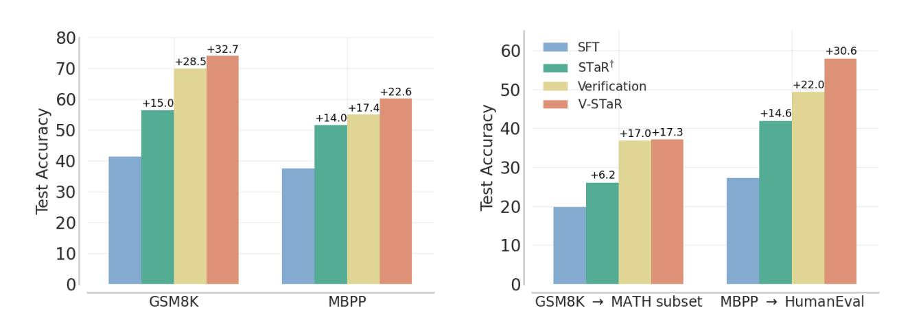

Figure 8. Test accuracy of 13B V-STaR compared to baselines. We report Verifier@64 for verification-based methods and Pass@1 for others. (Left) Test accuracy for training tasks. (Right) Transfer evaluation of GSM8K and MBPP trained models on MATH subset and HumanEval respectively.

#### <span id="page-12-0"></span>C. Candidate solutions yˆ<sup>1</sup> and yˆ<sup>2</sup> for a GSM8K problem x

x = Andy walks 50 meters from his house to school. After school, he comes back to the house and goes to the market. If he walks 140 meters in total, how many meters is the distance between the house and the market?

ˆy<sup>1</sup> = He walks to school and back, which is 2 × 50 meters = 100 meters. So he walks 140 meters - 100 meters = 40 meters to the market. Answer=40

ˆy<sup>2</sup> = If he walks 50 meters from his house to school, and 140 meters in total, he walks 140 - 50 = 90 meters from the school to the market. Answer=90