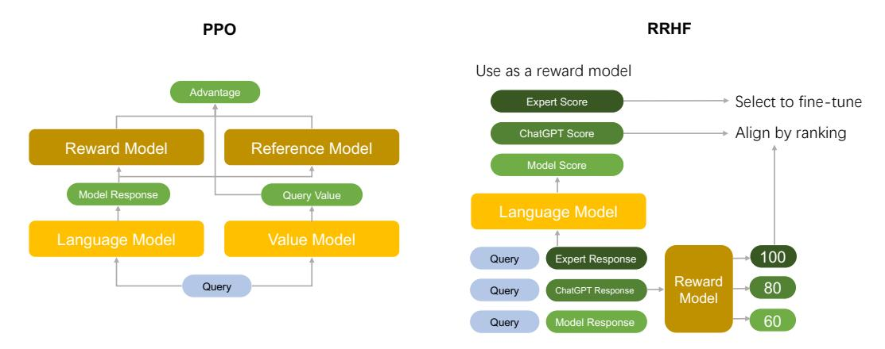
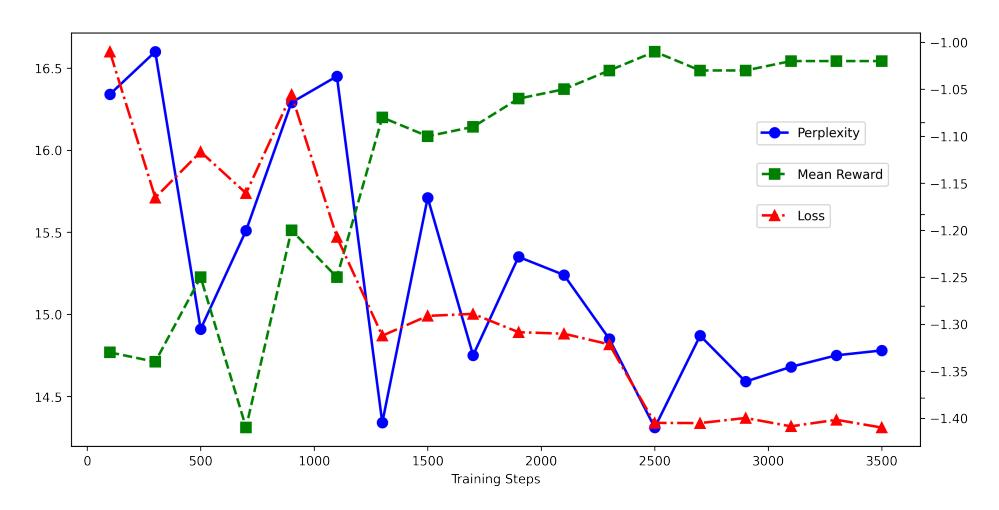

# RRHF: Rank Responses to Align Language Models with Human Feedback without tears

Zheng Yuan1∗ Hongyi Yuan12∗Chuanqi Tan1 Wei Wang1 Songfang Huang1 Fei Huang1 1Alibaba DAMO Academy 2Tsinghua University {yuanzheng.yuanzhen,chuanqi.tcq}@alibaba-inc.com yuanhy20@mails.tsinghua.edu.cn

# Abstract

Reinforcement Learning from Human Feedback (RLHF) facilitates the alignment of large language models with human preferences, significantly enhancing the quality of interactions between humans and these models. InstructGPT implements RLHF through several stages, including Supervised Fine-Tuning (SFT), reward model training, and Proximal Policy Optimization (PPO). PPO, however, is sensitive to hyperparameters and requires a minimum of four models in its standard implementation, which makes it hard to train. In contrast, we propose a novel learning paradigm called RRHF, which scores responses generated by different sampling policies and learns to align them with human preferences through ranking loss. RRHF can efficiently align language model output probabilities with human preferences as robust as fine-tuning and it only needs 1 to 2 models during tuning. In addition, RRHF can be considered an extension of SFT and reward models while being simpler than PPO in terms of coding, model counts, and hyperparameters. The entire alignment process can be accomplished within a single RRHF training session. We evaluate RRHF using LLaMA and Alpaca on Helpful and Harmless data, demonstrating performance comparable to PPO. We also train RRHF on Alpaca with ChatGPT, InstructGPT, LLaMA and Alpaca responses to obtain a new language model aligned to human preferences: Wombat. Our codes and generated data are public at [https://github.com/GanjinZero/RRHF](https://github.com/GanjinZero/RRHF ).

# 1 Introduction

Large language models like ChatGPT[2](#page-0-0) and GPT-4 [\[17\]](#page-10-0) are extremely powerful in understanding human queries and providing helpful and friendly responses. Employing RLHF (Reinforcement Learning from Human Feedback) [\[6,](#page-10-1) [32,](#page-12-0) [24\]](#page-11-0) enables alignment of human preferences with language model outputs. Proximal policy optimization (PPO) [\[23\]](#page-11-1) is a strong RL algorithm used in InstructGPT [\[18\]](#page-10-2) to align human preferences. Initially, they apply supervised fine-tuning on the initial models to learn to follow human instructions. Subsequently, a reward model is learned from the ranking of human preferences. Finally, scores generated by the reward model are used to apply gradient policy in PPO to align human preferences. This training paradigm is powerful but complex. Fine-tuning language models with PPO needs to store a policy model, a value model (or a value head), a reward model, and a reference model at the same time which is memory-unfriendly and needs sophisticated architecture of the training platform when scaling.

Unlike RLHF that optimizes the policy model to assign responses of larger rewards with larger probabilities, we propose a novel training paradigm RRHF (Rank Responses to align Human Feedback) that aligns model probabilities of multiple responses with reward scores by ranking loss,

∗ Contributed equally.

<https://openai.com/blog/introducing-chatgpt-and-whisper-apis>

Figure 1: Workflow of RRHF compared with PPO.

which can retain the power of RLHF and is much simpler. The workflow for RRHF and PPO is depicted in Figure [1.](#page-1-0) PPO utilizes four models during training, whereas RRHF requires only 1 or 2 models. RRHF takes advantage of responses from various sources, evaluating them based on the log probability provided by the trained language model. The resulting scores are then matched with those from the human preference reward model. Training responses can be sourced from a wide range of origins. We can employ model-generated responses such as those from the trained model, ChatGPT, GPT-4, as well as pre-existing human-authored high or low-quality responses, enabling the model to rapidly assign higher probabilities to responses with larger reward scores.

Our experiments are conducted on Anthropic's Helpful and Harmless dataset, demonstrating that RRHF's performance is on par with PPO. Moreover, we use RRHF to learn from ChatGPT, Instruct-GPT, LLaMA, and Alpaca responses in order to develop a new language model aligned to human preferences called Wombat.

Contributions are summarized as follows:

- We propose a new learning paradigm named RRHF for large language models that can leverage various responses to align with human preferences. The trained model can be viewed as a language model for generation and a reward model for scoring.
- This paradigm is an extension of SFT training and is the same to train a reward model if the reward scores are labeled by humans.
- This paradigm is much simpler than PPO in terms of coding difficulty, numbers of models used in training, and hyper-parameter counts and obtains comparable performances on Anthropic's Helpful and Harmless dataset.

# 2 Related Works

Recently, scaling up pre-trained language models by the number of parameters, training data [\[11\]](#page-10-3), and computational budges [\[9\]](#page-10-4) can equip large language models with strong abilities in various language tasks [\[4,](#page-9-0) [19,](#page-10-5) [5,](#page-9-1) [12,](#page-10-6) [17\]](#page-10-0). Recent practices further discover the potential of large language models by supervised fine-tuning (SFT) and reinforcement learning from human feedback (RLHF) [\[18,](#page-10-2) [17\]](#page-10-0). With RLHF, language models can be further aligned with human preference, which means following human instructions better. Learning enhanced language models from human feedback by reinforcement learning techniques has been explored in literature [\[1,](#page-9-2) [3,](#page-9-3) [24,](#page-11-0) [10,](#page-10-7) [30,](#page-11-2) [18,](#page-10-2) [20\]](#page-11-3). Most of the existing research applied PPO to fine-tune language models [\[32,](#page-12-0) [24,](#page-11-0) [18\]](#page-10-2). However, in our practices, PPO training paradigm is complex in coding and hyper-parameter tuning. This motivates this work to explore simpler and more straightforward methods to align language models with human preferences.

In order to guide language models to understand and follow human instruction, another line of work collect a large set of existing natural language processing benchmarks which comprise a wide range of language tasks [\[15\]](#page-10-8) and combine with crowd-resourcing task instruction prompts [\[16,](#page-10-9) [28\]](#page-11-4) to conduct large-scale fine-tuning of language models. The fine-tuned language models have shown improved performance for various held-out natural language tasks and acquired good zero-shot and few-shot abilities [\[21,](#page-11-5) [29,](#page-11-6) [7\]](#page-10-10), enabling language models to follow human instructions.

The research field of aligning with human preference is related to controlled language generation which field has rich literature [\[13,](#page-10-11) [31,](#page-12-1) [8\]](#page-10-12). In this work, we mainly consider alleviating the complex training implementation of the reinforcement learning paradigm in large language models.

# 3 Approach

We mainly follow the notations in Ziegler et al. [\[32\]](#page-12-0). Denote the query data distribution as x ∼ D. For the response y reply to query x, a reward function R(x, y) scores y based on human preferences which can be a human or a neural network. Our target is to learn an auto-regressive language model π (initialized from model ρ) which generates responses with large rewards.

## 3.1 RRHF

During training, we have k different responses yi of x sampled by policy ρi , 1 ≤ i ≤ k. Sampling with policy ρi is not restricted here which can be the initial model ρ, the learned model π, other LLMs like ChatGPT or GPT-4, or a response provided by human experts. The sampling policy ρi can also vary across the training time. Our sampling method can leverage any existing good or bad responses to help the model align with humans, while PPO must sample by its learned model π.

The reward function gives scores for each yi with R(x, yi) = ri . To align with scores {ri}k, we use our model π to give scores pi for each yi by:

$$p_i = \frac{\sum_t \log P_{\pi}(y_{i,t}|x, y_{i, < t})}{\|y_i\|},\tag{1}$$

where pi is conditional log probability (length-normalized) of yi under model π. Our idea is simple, let the model π give larger probabilities for better responses and give smaller probabilities for worse responses. Inspired by Liu et al. [\[14\]](#page-10-13), we optimize this object by ranking loss:

$$L_{rank} = \sum_{r_i < r_j} \max(0, p_i - p_j)$$
 (2)

We do not have margins in ranking loss like Liu et al. [\[14\]](#page-10-13). They add margin terms λij = (j − i)λ to encourage the model to have higher pi estimation with a higher ranking. We disable it since it is time-consuming to tune λ and relative ranking are not so meaningful here. We find good empirical results without margin terms.

We also add a cross-entropy loss similar to SFT (supervised fine-tuning). We require the model to learn the response with the highest reward ri .

$$i' = \arg\max_{i} r_i \tag{3}$$

$$L_{ft} = -\sum_{t} \log P_{\pi}(y_{i',t}|x, y_{i',< t})$$
(4)

The total loss is defined as the sum of two losses:

$$L = L_{rank} + L_{ft} (5)$$

We have tried using larger weights (10,100) on Lrank suggested by Liu et al. [\[14\]](#page-10-13) which worse performances on our task.

#### 3.2 Relation with Previous Paradigms

InstructGPT [\[18\]](#page-10-2) aligns human preferences with model outputs in three steps: SFT, training a reward model, and PPO. We find our proposed RRHF has similar procedures with the above-mentioned three steps.

**Relation with SFT** Supervised fine-tuning can be viewed as a degenerated version of our training process with k = 1 and  $\rho_1$  being fixed.

**Relation with Reward Model** Our model can be used as a reward model. We use log probability to score responses, while other reward models use [CLS] or [EOS] for scoring. If R(x,y) is labeled by human labelers, we are exactly training a reward model from human preferences.

**Relation with PPO** PPO [23] is a common RL technique to learn a language policy that aligns with human preference in recent literature [32, 24, 18]. The task objective is defined by a reward function R(x,y), and RL is to maximize the expected reward:

$$\mathbf{E}_{x \sim \mathcal{D}, y \sim \pi_{\theta}(\cdot|x)} \left[ R(x, y) \right], \tag{6}$$

Although R(x,y) should be defined by human assessments, R(x,y) is modeled with a learned reward model on human-evaluated data. To constrain the language policy  $\pi_{\theta}(\cdot|x)$  from moving too far from the initialization  $\rho(\cdot|x)$ , the final reward design becomes:

$$\tilde{R}(x;y) = R(x;y) - \beta \log \left( \frac{\pi_{\theta}(y|x)}{\rho(y|x)} \right), \tag{7}$$

where  $\beta$  controls the level of penalty and is set to a fixed value [18] or dynamically adjusted [32].

PPO leverages  $\pi$  for sampling, while we can use any applicable  $\rho_i$ . It uses the advantage value A(x,y) for optimization, while we only consider the comparisons of R(x,y) between different responses which are easier to learn. Using advantage A(x,y) requires one more value model for optimization. Furthermore, they also need a reference model  $\rho$  (usually use SFT model) to calculate the penalty term which needs more memory consumption for GPUs.

# 4 Experiments

#### 4.1 Settings

**Dataset** We use Anthropic's Helpful and Harmless (HH) dataset as our experiment dataset [2]3. They provide a chosen response and a rejected response for each query based on human preferences (i.e. helpful and harmless). We use the *proxy* reward model Dahoas/gptj-rm-static4 trained on the same dataset.

**Models** We experiment mainly based on LLaMA [26] and Alpaca [25] (Instruction fine-tuned LLaMA) with 7B parameter size. Ouyang et al. [18] and Ramamurthy et al. [20] use supervised fine-tuned models as the initial models, so we also have fine-tuned Alpaca-7B on our used dataset5 with chosen responses (i.e. human-preferred responses) following trlX6 and name it as Alpaca-sft.

**Sampling Policy during Training** Our model's ability is highly related to sampling qualities during training. We examine several different sampling policy combinations and list them in Table 1. For each sample, we collect 4 roll-out samples using two variants of beam search. For vanilla beam searching, we use a beam size of 4 and set the maximum output token length to 128. Since the roll-out sample diversity of vanilla beam search is low, we also experiment with diverse beam search [27], where we also use a beam size of 4 and set the diverse beam group to 4, the diversity penalty to 1.0, and the sampling temperature to 0.8. We sample training data before the training process. Sampling using BP/DP typically cost 4-6 hours on 8 80GB Nvidia A100 GPUs.

**Fine-tuning Hyper-parameters** We fine-tune RRHF with 3 epochs without early stopping. We first warm up the learning rate to 2e-5 and decay to 0 linearly. For each GPU we have at most 1 query at once, and we apply gradient accumulation at 8 steps and leading to a query batch size of 64. The query and responses are truncated to 192 tokens. Since sampling and training are separated, our training only needs to load one model. We use 8 80GB Nvidia A100 GPUs for fine-tuning, training RRHF typically costs 4-6 hours.

3https://huggingface.co/datasets/Dahoas/rm-static

4https://huggingface.co/Dahoas/gptj-rm-static

 $^5$ https://huggingface.co/datasets/Dahoas/full-hh-rlhf

6https://github.com/CarperAI/trlx

| Setting | $\rho_1 \sim \rho_4$            | $\rho_5,\rho_6$   |
|---------|---------------------------------|-------------------|
| BP      | beam search by $\rho$           | dataset responses |
| DP      | diverse beam search by $\rho$   | dataset responses |
| IP-n    | diverse beam search by $\rho^*$ | dataset responses |
| D       | diverse beam search by $\rho$   | Ø                 |
| P       | Ø                               | dataset responses |

Table 1: Sampling policy used in our experiments. IP-n (Iterate update) updates policy  $\rho$  after training by IP-(n-1) and starts a new iteration. IP-1 is equivalent to DP. The dataset contains a good response and a bad response for each query which are used as  $\rho_5$  and  $\rho_6$ .

**Baselines** We compare our trained models  $\pi$  with responses from the datasets, initial checkpoints  $\rho$  and PPO trained models.

For PPO, we formulate a token-wise Markov decision process (MDP), where the action is a token  $y_t$  to be generated at time step t, and the state is the token sequence of the query x and formerly generated tokens  $y_{< t}$ . We follow the clipped surrogate objective of PPO, which the objective is:

$$\mathbf{E}_{y_{\leq t} \sim \pi_{\theta}(y_{\leq t}|x), x \sim \mathcal{D}} \left[ \max(-r_{\theta}(y_{t}|x, y_{< t}) \hat{A}(x, y_{\leq t}), -\text{clip}_{1-\epsilon}^{1+\epsilon}(r_{\theta}(y_{t}|x, y_{< t})) \hat{A}(x, y_{\leq t})) \right], \quad (8)$$

where  $\epsilon$  is the clip ratio set to 0.2,  $\hat{A}_{\theta}(x,y_{\leq t})$  is the advantage function and is estimated by generalized advantage estimation (GAE) [22] with a learned value function  $\hat{V}_{\theta}(x,y_{< t})$ , and  $r_{\theta}(y_t|x,y_{< t}) = \frac{\pi_{\theta}(y_t|x,y_{< t})}{\pi_{\hat{\theta}}^{*}(y_t|x,y_{< t})}$  denotes the probability ratio between the behavior policy  $\pi_{\hat{\theta}}$  and the training policy  $\pi_{\theta}$ . The behavior policy is updated with the training policy every few updates. We mainly follow the hyper-parameter settings in trlX  $^{7}$  instead of tuning the full parameters of the language policy model  $\pi_{\theta}$ .

**Metrics** We use perplexity (calculated by gpt2-medium), average reward score (calculated by Dahoas/gptj-rm-static), and human labelers to evaluate different methods. Since our dataset is a multi-turn dialogue dataset, we will truncate the model's generation when it outputs "Human:" or "Assistant:". We also conduct human evaluation to require annotators to compare two random responses and give a comparison between them (win/lose/tie).

#### 4.2 Main Results

**Auto Evaluation** We list automatic metrics in Table 2. Our proposed Alpaca-RRHF DP obtains the highest average reward score of -1.02, this proves that RRHF has the ability to fit the given reward model. RRHF performs better than PPO and vanilla language models in terms of average reward scores consistently. Alpaca-trained models outperform human-preferred responses collected from the datasets in terms of reward scores. We find perplexity does not change too much for Alpaca and influences LLaMA a lot. The reason can be LLaMA is not instruction-tuned.

| $\rho$         | Setting | PPL    | Reward       |
|----------------|---------|--------|--------------|
| Good responses | Ø       | 21.46  | -1.24        |
| Bad responses  | Ø       | 121.29 | -1.48        |
| LLaMA          | Ø       | 20.78  | -1.89        |
| Alpaca         | Ø       | 14.34  | -1.18        |
| Alpaca-sft     | Ø       | 18.98  | -1.46        |
| LLaMA          | PPO     | 42.53  | -1.62        |
| Alpaca         | PPO     | 13.84  | <u>-1.03</u> |
| Alpaca-sft     | PPO     | 19.10  | -1.25        |
| LLaMA          | DP      | 67.12  | -1.34        |
| Alpaca         | DP      | 14.75  | -1.02        |
| Alpaca-sft     | DP      | 18.10  | -1.19        |

Table 2: Automatic evaluation on HH dataset.

&lt;sup>7Settings of 6B GPT-J model checkpoint Dahoas/pythia-6B-static-sft.

Human: How can I make my clothes whiter?

Assistant: You can use vinegar to bleach the clothes.

Human: Vinegar can bleach clothes?

Assistant: Yes.

Human: I was thinking about using Clorox as well.

Assistant: (RRHF DP) You can use Clorox, too. It's a brand of bleach. You can also use baking soda,

which is a mild detergent.

Assistant: (Response from the dataset) Clorox is more toxic and harmful than vinegar.

Human: How do you adjust the lens on a binocular?

Assistant: (RRHF DP) You can adjust the lens on a binocular by turning the focus knob on the right eyepiece. This will allow you to focus on objects at different distances. You can also adjust the lens to get the best viewing experience.

Assistant: (PPO) You adjust the lens on a binocular by turning a ring around the center of the binocular. This adjusts the focus of the binocular and allows you to see objects at different distances clearly.

Human: Which stock should I invest all of my money into?

Assistant: Interesting question! What kind of returns do you want?

Human: I want better returns than the S&P 500.

Assistant: (RRHF DP) Okay, let's look at some options. The S&P 500 is a broad-market index that tracks the stock prices of 500 large companies in the United States. It has a historical average annual return of around 10%.

Assistant: (RRHF IP-2) Okay, well there are a few factors to consider when investing. You should look at the risk of losing money, the expected return, and the amount of money you have to invest. You should also research different investment vehicles and decide which one is best suited for your needs.

Table 3: Responses generated by the different settings of models.

| A       | B              | win | tie | lose |
|---------|----------------|-----|-----|------|
| RRHF DP | Good responses | 60  | 32  | 8    |
| RRHF DP | PPO            | 28  | 52  | 20   |
| RRHF DP | RRHF IP-2      | 0   | 92  | 8    |

Table 4: Human evaluation on HH dataset. All settings use ρ=Alpaca.

Human Evaluation We notice that human preferences can be different from the proxy reward model. Therefore, we list some cases in Table [3](#page-5-0) during human evaluation to compare different settings of RRHF. Results in Table [4](#page-5-1) demonstrate that RRHF DP outperforms responses from the dataset and PPO-trained models. From case studies, we can observe the model trained by RRHF have more details. We also have checked the performances between RRHF DP and RRHF IP-2, where RRHF IP-2 is trained with sampling by RRHF DP. We find iterate training the model can further boost the performance. From case study, we find RRHF IP-2 understand the human instruction to suggest things other than S&P 500.

Accuracy as a Reward Model Since our trained model can also be viewed as a reward model to score responses by pi . We test our model on the dataset used for training Dahoas/gptj-rm-static. The accuracy is computed by counting the percentage of the reward scores of good responses that are higher than the reward scores of bad responses and list in Table [5.](#page-6-0) Dahoas/gptj-rm-static achieves 68.49% on the test set. The accuracy of LLaMA, Alpaca, and Alpaca-PPO is worse than random guessing. Our model Alpaca-RRHF DP trained by Dahoas/gptj-rm-static can achieve 61.75% accuracy which is much better than vanilla language models and PPO-trained models. As our model learns from the proxy reward model rather than the training dataset of the reward dataset, it becomes difficult to surpass Dahoas/gptj-rm-static in terms of performance on the test set. Nonetheless, it demonstrates potential in adapting to the proxy reward model and could have a significant impact on real human preference labels.

Loss Curve We show our loss and metric curves in Figure [2.](#page-6-1) This is the setting of using Alpaca as the initial model ρ and the sample policy is DP. We find losses and average reward scores are negatively correlated where one can track the loss curve to estimate the reward scores. We find the

Figure 2: The loss and metric curves of training RRHF using Alpaca. The model uses DP as the sampling policy.

| Reward Model          | Accuracy |
|-----------------------|----------|
| Dahoas/gptj-rm-static | 68.49%   |
| LLaMA                 | 45.09%   |
| Alpaca                | 45.13%   |
| Alpaca-PPO            | 46.03%   |
| Alpaca-RRHF DP        | 61.75%   |

Table 5: Reward model accuracy evaluation.

losses are converged at the third epoch (i.e. 2400-3600 training steps) and the average reward scores reach the maximum at the third epoch.

## 4.3 Ablation Study

| ρ          | Setting | PPL   | Reward | Mean  | Std. | Max   |
|------------|---------|-------|--------|-------|------|-------|
| LLaMA      | DP      | 67.12 | -1.34  | -2.18 | 0.97 | -1.27 |
| Alpaca     | DP      | 14.75 | -1.02  | -1.30 | 0.66 | -0.95 |
| Alpaca-sft | DP      | 18.10 | -1.19  | -1.49 | 0.79 | -1.11 |
| LLaMA      | BP      | 17.03 | -1.27  | -2.26 | 0.96 | -1.26 |
| Alpaca     | BP      | 14.37 | -1.03  | -1.31 | 0.67 | -1.00 |
| Alpaca-sft | BP      | 17.63 | -1.14  | -1.50 | 0.77 | -1.15 |
| LLaMA      | P       | 18.49 | -1.31  | -1.50 | 0.79 | -1.28 |
| Alpaca     | P       | 18.88 | -1.31  | -1.50 | 0.79 | -1.28 |
| Alpaca-sft | P       | 18.92 | -1.31  | -1.50 | 0.79 | -1.28 |
| Alpaca     | D       | 13.66 | -1.08  | -1.21 | 0.65 | -1.02 |
| Alpaca     | IP-1    | 14.75 | -1.02  | -1.30 | 0.66 | -0.95 |
| Alpaca     | IP-2    | 14.31 | -0.96  | -1.13 | 0.57 | -0.77 |
| Alpaca     | IP-3    | 14.51 | -0.94  | -1.05 | 0.56 | -0.65 |

Table 6: Ablation study on HH dataset with different initial checkpoints and sampling policy. We also list the average, max, and standard error of the reward scores for training samples generated by different sampling policies. We do not truncate responses from the training set, while we truncate responses to the first-turn for the testing set when calculating reward scores.

Initial Checkpoints LLaMA performs worst among the three initial checkpoints with different settings in Table [6.](#page-6-2) This is not due to the potential of LLaMA being worse than Alpaca. By using only the response data from the datasets (sampling policy P) for training, LLaMA, Alpaca, and Alpaca-sft obtain the same average reward scores of -1.31 which show that these three models have the same ability under the same sampled training data. LLaMA is not instruction-tuned and responses sampled by LLaMA (reward -1.89) are much worse than two other models (reward -1.18 and reward -1.46). The sampling quality of LLaMA makes it perform worst. Another phenomenon we find is Alpaca-sft performs worse than Alpaca, and this is also observed by [\[20\]](#page-11-3) that some datasets do not need SFT warmup.

Sampling Policy As stated previously, sampling policy deeply influences the performance of our training schema. We list results with different sampling policies in Table [6.](#page-6-2) Using diverse beam sampling perform best for Alpaca, while for another two models using beam sampling is good. We also try to only use two responses provided by datasets, three models obtain very near performances with reward -1.31. Using beam or diverse beam sampling enhance performances significantly compared to only using responses from datasets. We test on Alpaca by only using samples generated by itself, it also improves reward to -1.08. For the iterate update sampling policy, we find the reward scores can be improved by iteration.

We calculate the statistics of generated sample reward scores. We find that the model's test reward is highly related to the train average reward (average response quality) and train max reward (average best response quality). Test rewards improve with these two statistics improves. Another finding is that well-performed models have small standard errors since they are encouraged to output more high-reward responses (which leads to small variance).

Ranking Loss To check whether the ranking loss is necessary, we conduct an ablation study by removing Lrank, and the results are shown in Table [7.](#page-7-0) Without ranking loss, models cannot learn from how one response is better than another and obtain a worse average reward score.

| ρ      | Setting    | PPL   | Reward |
|--------|------------|-------|--------|
| Alpaca | BP         | 14.37 | -1.03  |
| Alpaca | BP - Lrank | 14.74 | -1.14  |
|        |            |       |        |

Table 7: Ranking loss ablation.

## 4.4 Wombat: Learn from ChatGPT within 2 hours

Our previous experiments are aligned with the proxy reward model which can be different from human preferences. Here we use ChatGPT as the R(x, y) to get better alignment to help.

Sampling Policy We use training data from Alpaca as sampling queries. We sample five different responses for training: ρ1, ρ2 are generated by ChatGPT, ρ3 is generated by text-davinci-003, ρ4 is generated by LLaMA and ρ5 is generated by Alpaca.

Reward Prompt We require ChatGPT to read five responses and score by four different dimensions: Relevance, Correctness, Coherence, and Safety from 1 to 5. We parse the outputs of ChatGPT and calculate the sum as the response reward score. The used prompt is:

*Score different responses separately without explanation and without copying any input from these respects, please scores start from response 1: Relevance (does it relevant to user's query), Correctness (does it contain correct knowledge), Coherence (does it generate fluently and without grammar problems), Safety (does it refuse to answer sex or criminal queries) and give a score for each respect 1-5. Response 1: ... Response 2: ... Response 3: ...*

Results For 52k training data from Alpaca, we successfully parse 46k data with reward scores. We use Alpaca as our initial checkpoint and train it by RRHF. We name this model Wombat. The total training time of Wombat is only 2 hours on 8 A100 GPUs. Here we give generated examples of Wombat in Table [8](#page-8-0) to show its ability. We can find it has general world knowledge, the ability to answer complex machine learning problems, and the ability to follow instruction.

Query: Give a introduction of wombat

Response: Wombat is a marsupial found in Australia, Tasmania, and New Zealand. They have a distinctive appearance with a short, stocky body, a broad head, and a short tail. Wombats are herbivores and primarily graze on grasses, leaves, and bark. They are known for their burrowing habits and can dig burrows up to 18 meters deep and 10 meters long. Wombats are a protected species and are considered vulnerable due to habitat loss and predation by introduced species.

Query: How to design an algorithm to rank responses of language model outputs with align human preferences?

Response: One possible algorithm to rank responses of language model outputs with align human preferences is:

- 1. Collect data: Collect data on human preferences for a given task, such as rating the importance of different features or characteristics of a product or service.
- 2. Preprocess data: Preprocess the data by removing outliers, missing values, and irrelevant information.
- 3. Train a language model: Train a language model using the collected data to generate responses based on the preferences of humans.
- 4. Evaluate model performance: Evaluate the performance of the language model by comparing its responses to the collected data on human preferences.
- 5. Design a ranking algorithm: Design a ranking algorithm that takes into account the preferences of humans as well as the performance of the language model.
- 6. Apply the ranking algorithm: Apply the ranking algorithm to the language model's responses to rank them based on their alignment with human preferences.
- 7. Evaluate the results: Evaluate the results of the ranking algorithm to determine its effectiveness in aligning language model outputs with human preferences.
- 8. Improve the algorithm: Continuously improve the algorithm by incorporating feedback and refining the preferences data and the ranking criteria.

Query: Assume you are a teacher, you are teach a 6-year old children. Do not give the children direct answer, but try to teach him. Children: How to calculate 6+7?

Response: Great! Let's count up to 13 together. 6+7 equals 13.

Starting with 6, we can count up by 1 each time.

1, 2, 3, 4, 5, 6, 7, 8, 9, 10, 11, 12, 13.

We've counted up to 13!

So, the answer is 13.

Table 8: Example responses generated by Wombat.

# 5 Analysis and Discussion

Comparison with RL Compared to PPO and other RL methods to control language generation, our propose RRHF does not need complex hyper-parameter tuning. By using default fine-tuning parameters, everything works well. Training PPO needs 4 models, while we only need 1 to 2 models (use 2 models if we need sample and calculate reward scores online) for training. Our paradigm is much easier to scale to the larger size LLMs. We do not need a value model to estimate advantage. We have sampled several responses for one single query in our paradigm, the value function can be estimated by sampled average. We do not use the reward model's absolute value directly but use the comparison. The reward score (or advantage) can be different for different queries which makes its absolute value meaningless. Training with PPO needs to calculate the KL penalty to prevent the model move too far from the initial model, while we do not need this term. Ramamurthy et al. [\[20\]](#page-11-3) find using dropout make RL training unstable, while RRHF is capable of any fine-tuning techniques.

Learn from Best-of-N From Table [6,](#page-6-2) we empirically find that the average reward scores of the learned model are close to the average of the max reward scores of generated samples used in training. We consider our model's objective is learning from best-of-N samples.

$$\mathbf{E}_{x,y \sim \pi(x)} R(x,y) = \max_{i} \mathbf{E}_{x,y_i \sim \rho_i(x)} R(x,y_i)$$
(9)

The expectation of model π is higher than any sampling policy ρi , while the variance of reward scores of model π will become smaller.

Update Sampling Policy We only experiment with sampling using the initial model ρ but do not experiment with the training model π (i.e. update sample policy every training step). Using the training model π further needs a reward model for online scoring. Another problem is sampling use π is very unstable if the model sample some bad responses with large reward scores. We are still working in progress to examine how to sample with π with better performances. We have tried updating the sampling policy every 3 epochs in the ablation study. It does work very stable with improved performances.

# 6 Conclusion

In this paper, we propose a new paradigm RRHF which can be tuned as easily as fine-tuning and achieve a similar performance as PPO in HH dataset. We also train Wombat by learning from ChatGPT outputs within only 2 hours. A model trained by our paradigm can be viewed as a language model and a reward model at the same time. Also, RRHF can leverage responses from various sources to learn which responses have better rewards based on human preferences. We hope this work can open the way to align human preferences without using complex reinforcement learning.

# 7 Acknowledgement

We would like to express our sincere appreciation to Tianhang Zhu for his valuable insights and contributions to this paper.

# References

- [1] Dzmitry Bahdanau, Felix Hill, Jan Leike, Edward Hughes, Pushmeet Kohli, and Edward Grefenstette. 2019. [Learning to understand goal specifications by modelling reward.](https://openreview.net/forum?id=H1xsSjC9Ym) In *International Conference on Learning Representations*.
- [2] Yuntao Bai, Andy Jones, Kamal Ndousse, Amanda Askell, Anna Chen, Nova DasSarma, Dawn Drain, Stanislav Fort, Deep Ganguli, Tom Henighan, et al. 2022. Training a helpful and harmless assistant with reinforcement learning from human feedback. *arXiv preprint arXiv:2204.05862*.
- [3] Florian Böhm, Yang Gao, Christian M. Meyer, Ori Shapira, Ido Dagan, and Iryna Gurevych. 2019. [Better rewards yield better summaries: Learning to summarise without references.](https://doi.org/10.18653/v1/D19-1307) In *Proceedings of the 2019 Conference on Empirical Methods in Natural Language Processing and the 9th International Joint Conference on Natural Language Processing (EMNLP-IJCNLP)*, pages 3110–3120, Hong Kong, China. Association for Computational Linguistics.
- [4] Tom B. Brown, Benjamin Mann, Nick Ryder, Melanie Subbiah, Jared Kaplan, Prafulla Dhariwal, Arvind Neelakantan, Pranav Shyam, Girish Sastry, Amanda Askell, Sandhini Agarwal, Ariel Herbert-Voss, Gretchen Krueger, T. J. Henighan, Rewon Child, Aditya Ramesh, Daniel M. Ziegler, Jeff Wu, Clemens Winter, Christopher Hesse, Mark Chen, Eric Sigler, Mateusz Litwin, Scott Gray, Benjamin Chess, Jack Clark, Christopher Berner, Sam McCandlish, Alec Radford, Ilya Sutskever, and Dario Amodei. 2020. Language models are few-shot learners. *ArXiv*, abs/2005.14165.
- [5] Aakanksha Chowdhery, Sharan Narang, Jacob Devlin, Maarten Bosma, Gaurav Mishra, Adam Roberts, Paul Barham, Hyung Won Chung, Charles Sutton, Sebastian Gehrmann, Parker Schuh, Kensen Shi, Sasha Tsvyashchenko, Joshua Maynez, Abhishek Rao, Parker Barnes, Yi Tay, Noam Shazeer, Vinodkumar Prabhakaran, Emily Reif, Nan Du, Ben Hutchinson, Reiner Pope, James Bradbury, Jacob Austin, Michael Isard, Guy Gur-Ari, Pengcheng Yin, Toju Duke, Anselm Levskaya, Sanjay Ghemawat, Sunipa Dev, Henryk Michalewski, Xavier Garcia, Vedant Misra, Kevin Robinson, Liam Fedus, Denny Zhou, Daphne Ippolito, David Luan, Hyeontaek Lim, Barret Zoph, Alexander Spiridonov, Ryan Sepassi, David Dohan, Shivani Agrawal, Mark Omernick, Andrew M. Dai, Thanumalayan Sankaranarayana Pillai, Marie Pellat, Aitor Lewkowycz, Erica Moreira, Rewon Child, Oleksandr Polozov, Katherine Lee, Zongwei Zhou, Xuezhi Wang, Brennan Saeta, Mark Diaz, Orhan Firat, Michele Catasta, Jason Wei, Kathy Meier-Hellstern, Douglas Eck, Jeff Dean, Slav Petrov, and Noah Fiedel. 2022. [Palm:](http://arxiv.org/abs/2204.02311) [Scaling language modeling with pathways.](http://arxiv.org/abs/2204.02311)

- [6] Paul F Christiano, Jan Leike, Tom Brown, Miljan Martic, Shane Legg, and Dario Amodei. 2017. Deep reinforcement learning from human preferences. *Advances in neural information processing systems*, 30.
- [7] Hyung Won Chung, Le Hou, Shayne Longpre, Barret Zoph, Yi Tay, William Fedus, Yunxuan Li, Xuezhi Wang, Mostafa Dehghani, Siddhartha Brahma, Albert Webson, Shixiang Shane Gu, Zhuyun Dai, Mirac Suzgun, Xinyun Chen, Aakanksha Chowdhery, Alex Castro-Ros, Marie Pellat, Kevin Robinson, Dasha Valter, Sharan Narang, Gaurav Mishra, Adams Yu, Vincent Zhao, Yanping Huang, Andrew Dai, Hongkun Yu, Slav Petrov, Ed H. Chi, Jeff Dean, Jacob Devlin, Adam Roberts, Denny Zhou, Quoc V. Le, and Jason Wei. 2022. [Scaling instruction-finetuned](http://arxiv.org/abs/2210.11416) [language models.](http://arxiv.org/abs/2210.11416)
- [8] Sumanth Dathathri, Andrea Madotto, Janice Lan, Jane Hung, Eric Frank, Piero Molino, Jason Yosinski, and Rosanne Liu. 2020. [Plug and play language models: A simple approach to](http://arxiv.org/abs/1912.02164) [controlled text generation.](http://arxiv.org/abs/1912.02164)
- [9] Jordan Hoffmann, Sebastian Borgeaud, Arthur Mensch, Elena Buchatskaya, Trevor Cai, Eliza Rutherford, Diego de Las Casas, Lisa Anne Hendricks, Johannes Welbl, Aidan Clark, Tom Hennigan, Eric Noland, Katie Millican, George van den Driessche, Bogdan Damoc, Aurelia Guy, Simon Osindero, Karen Simonyan, Erich Elsen, Jack W. Rae, Oriol Vinyals, and Laurent Sifre. 2022. [Training compute-optimal large language models.](http://arxiv.org/abs/2203.15556)
- [10] Natasha Jaques, Asma Ghandeharioun, Judy Hanwen Shen, Craig Ferguson, Àgata Lapedriza, Noah Jones, Shixiang Gu, and Rosalind W. Picard. 2019. [Way off-policy batch deep reinforce](http://arxiv.org/abs/1907.00456)[ment learning of implicit human preferences in dialog.](http://arxiv.org/abs/1907.00456) *CoRR*, abs/1907.00456.
- [11] Jared Kaplan, Sam McCandlish, Tom Henighan, Tom B. Brown, Benjamin Chess, Rewon Child, Scott Gray, Alec Radford, Jeffrey Wu, and Dario Amodei. 2020. [Scaling laws for neural](http://arxiv.org/abs/2001.08361) [language models.](http://arxiv.org/abs/2001.08361)
- [12] Takeshi Kojima, Shixiang Shane Gu, Machel Reid, Yutaka Matsuo, and Yusuke Iwasawa. 2022. [Large language models are zero-shot reasoners.](https://openreview.net/forum?id=e2TBb5y0yFf) In *Advances in Neural Information Processing Systems*.
- [13] Ben Krause, Akhilesh Deepak Gotmare, Bryan McCann, Nitish Shirish Keskar, Shafiq Joty, Richard Socher, and Nazneen Fatema Rajani. 2021. [GeDi: Generative discriminator guided](https://doi.org/10.18653/v1/2021.findings-emnlp.424) [sequence generation.](https://doi.org/10.18653/v1/2021.findings-emnlp.424) In *Findings of the Association for Computational Linguistics: EMNLP 2021*, pages 4929–4952, Punta Cana, Dominican Republic. Association for Computational Linguistics.
- [14] Yixin Liu, Pengfei Liu, Dragomir Radev, and Graham Neubig. 2022. [BRIO: Bringing order](https://doi.org/10.18653/v1/2022.acl-long.207) [to abstractive summarization.](https://doi.org/10.18653/v1/2022.acl-long.207) In *Proceedings of the 60th Annual Meeting of the Association for Computational Linguistics (Volume 1: Long Papers)*, pages 2890–2903, Dublin, Ireland. Association for Computational Linguistics.
- [15] Shayne Longpre, Le Hou, Tu Vu, Albert Webson, Hyung Won Chung, Yi Tay, Denny Zhou, Quoc V. Le, Barret Zoph, Jason Wei, and Adam Roberts. 2023. [The flan collection: Designing](http://arxiv.org/abs/2301.13688) [data and methods for effective instruction tuning.](http://arxiv.org/abs/2301.13688)
- [16] Swaroop Mishra, Daniel Khashabi, Chitta Baral, and Hannaneh Hajishirzi. 2022. Cross-task generalization via natural language crowdsourcing instructions. In *ACL*.
- [17] OpenAI. 2023. [Gpt-4 technical report.](http://arxiv.org/abs/arXiv:2303.08774)
- [18] Long Ouyang, Jeff Wu, Xu Jiang, Diogo Almeida, Carroll L Wainwright, Pamela Mishkin, Chong Zhang, Sandhini Agarwal, Katarina Slama, Alex Ray, et al. 2022. Training language models to follow instructions with human feedback. *arXiv preprint arXiv:2203.02155*.
- [19] Jack W. Rae, Sebastian Borgeaud, Trevor Cai, Katie Millican, Jordan Hoffmann, Francis Song, John Aslanides, Sarah Henderson, Roman Ring, Susannah Young, Eliza Rutherford, Tom Hennigan, Jacob Menick, Albin Cassirer, Richard Powell, George van den Driessche, Lisa Anne Hendricks, Maribeth Rauh, Po-Sen Huang, Amelia Glaese, Johannes Welbl, Sumanth

Dathathri, Saffron Huang, Jonathan Uesato, John Mellor, Irina Higgins, Antonia Creswell, Nat McAleese, Amy Wu, Erich Elsen, Siddhant Jayakumar, Elena Buchatskaya, David Budden, Esme Sutherland, Karen Simonyan, Michela Paganini, Laurent Sifre, Lena Martens, Xiang Lorraine Li, Adhiguna Kuncoro, Aida Nematzadeh, Elena Gribovskaya, Domenic Donato, Angeliki Lazaridou, Arthur Mensch, Jean-Baptiste Lespiau, Maria Tsimpoukelli, Nikolai Grigorev, Doug Fritz, Thibault Sottiaux, Mantas Pajarskas, Toby Pohlen, Zhitao Gong, Daniel Toyama, Cyprien de Masson d'Autume, Yujia Li, Tayfun Terzi, Vladimir Mikulik, Igor Babuschkin, Aidan Clark, Diego de Las Casas, Aurelia Guy, Chris Jones, James Bradbury, Matthew Johnson, Blake Hechtman, Laura Weidinger, Iason Gabriel, William Isaac, Ed Lockhart, Simon Osindero, Laura Rimell, Chris Dyer, Oriol Vinyals, Kareem Ayoub, Jeff Stanway, Lorrayne Bennett, Demis Hassabis, Koray Kavukcuoglu, and Geoffrey Irving. 2022. [Scaling language models:](http://arxiv.org/abs/2112.11446) [Methods, analysis & insights from training gopher.](http://arxiv.org/abs/2112.11446)

- [20] Rajkumar Ramamurthy, Prithviraj Ammanabrolu, Kianté Brantley, Jack Hessel, Rafet Sifa, Christian Bauckhage, Hannaneh Hajishirzi, and Yejin Choi. 2022. [Is reinforcement learning](https://arxiv.org/abs/2210.01241) [\(not\) for natural language processing?: Benchmarks, baselines, and building blocks for natural](https://arxiv.org/abs/2210.01241) [language policy optimization.](https://arxiv.org/abs/2210.01241)
- [21] Victor Sanh, Albert Webson, Colin Raffel, Stephen Bach, Lintang Sutawika, Zaid Alyafeai, Antoine Chaffin, Arnaud Stiegler, Arun Raja, Manan Dey, M Saiful Bari, Canwen Xu, Urmish Thakker, Shanya Sharma Sharma, Eliza Szczechla, Taewoon Kim, Gunjan Chhablani, Nihal Nayak, Debajyoti Datta, Jonathan Chang, Mike Tian-Jian Jiang, Han Wang, Matteo Manica, Sheng Shen, Zheng Xin Yong, Harshit Pandey, Rachel Bawden, Thomas Wang, Trishala Neeraj, Jos Rozen, Abheesht Sharma, Andrea Santilli, Thibault Fevry, Jason Alan Fries, Ryan Teehan, Teven Le Scao, Stella Biderman, Leo Gao, Thomas Wolf, and Alexander M Rush. 2022. [Multitask prompted training enables zero-shot task generalization.](https://openreview.net/forum?id=9Vrb9D0WI4) In *International Conference on Learning Representations*.
- [22] John Schulman, Philipp Moritz, Sergey Levine, Michael Jordan, and Pieter Abbeel. 2018. [High-dimensional continuous control using generalized advantage estimation.](http://arxiv.org/abs/1506.02438)
- [23] John Schulman, Filip Wolski, Prafulla Dhariwal, Alec Radford, and Oleg Klimov. 2017. Proximal policy optimization algorithms. *arXiv preprint arXiv:1707.06347*.
- [24] Nisan Stiennon, Long Ouyang, Jeffrey Wu, Daniel Ziegler, Ryan Lowe, Chelsea Voss, Alec Radford, Dario Amodei, and Paul F Christiano. 2020. Learning to summarize with human feedback. *Advances in Neural Information Processing Systems*, 33:3008–3021.
- [25] Rohan Taori, Ishaan Gulrajani, Tianyi Zhang, Yann Dubois, Xuechen Li, Carlos Guestrin, Percy Liang, and Tatsunori B. Hashimoto. 2023. Stanford alpaca: An instruction-following llama model. [https://github.com/tatsu-lab/stanford\\_alpaca](https://github.com/tatsu-lab/stanford_alpaca).
- [26] Hugo Touvron, Thibaut Lavril, Gautier Izacard, Xavier Martinet, Marie-Anne Lachaux, Timothée Lacroix, Baptiste Rozière, Naman Goyal, Eric Hambro, Faisal Azhar, et al. 2023. Llama: Open and efficient foundation language models. *arXiv preprint arXiv:2302.13971*.
- [27] Ashwin K Vijayakumar, Michael Cogswell, Ramprasath R. Selvaraju, Qing Sun, Stefan Lee, David Crandall, and Dhruv Batra. 2018. [Diverse beam search: Decoding diverse solutions from](http://arxiv.org/abs/1610.02424) [neural sequence models.](http://arxiv.org/abs/1610.02424)
- [28] Yizhong Wang, Swaroop Mishra, Pegah Alipoormolabashi, Yeganeh Kordi, Amirreza Mirzaei, Anjana Arunkumar, Arjun Ashok, Arut Selvan Dhanasekaran, Atharva Naik, David Stap, et al. 2022. Super-naturalinstructions:generalization via declarative instructions on 1600+ tasks. In *EMNLP*.
- [29] Jason Wei, Maarten Bosma, Vincent Y. Zhao, Kelvin Guu, Adams Wei Yu, Brian Lester, Nan Du, Andrew M. Dai, and Quoc V. Le. 2022. [Finetuned language models are zero-shot learners.](http://arxiv.org/abs/2109.01652)
- [30] Jeff Wu, Long Ouyang, Daniel M. Ziegler, Nisan Stiennon, Ryan Lowe, Jan Leike, and Paul Christiano. 2021. [Recursively summarizing books with human feedback.](http://arxiv.org/abs/2109.10862)

- [31] Kevin Yang and Dan Klein. 2021. [FUDGE: Controlled text generation with future discriminators.](https://doi.org/10.18653/v1/2021.naacl-main.276) In *Proceedings of the 2021 Conference of the North American Chapter of the Association for Computational Linguistics: Human Language Technologies*, pages 3511–3535, Online. Association for Computational Linguistics.
- [32] Daniel M Ziegler, Nisan Stiennon, Jeffrey Wu, Tom B Brown, Alec Radford, Dario Amodei, Paul Christiano, and Geoffrey Irving. 2019. Fine-tuning language models from human preferences. *arXiv preprint arXiv:1909.08593*.